<div align="center">


</div>

# PMP Station (Rain, Pmax24h): 25025240

Probable Maximum Precipitation (PMP) is the greatest amount of rainfall for a specific duration that is meteorologically possible for a given location, acting as a "worst-case" scenario for extreme storms, crucial for designing safety-critical infrastructure like bridges, river deviations, dams, spillways, and nuclear plants to prevent catastrophic failure. PMP is calculated by hydrologists using meteorological data to determine the upper limit of extreme rainfall, often leading to the Probable Maximum Flood (PMF) for flood control design, and is increasingly being studied for climate change impacts. Probable Maximum Precipitation (PMP) is the theoretical upper limit of rainfall, a deterministic estimate for extreme events, while probability distributions (like GEV, Gumbel) describe the likelihood and frequency of various precipitation amounts, including rare ones, showing how often events occur, with PMP representing the extreme end of these distributions, used for critical infrastructure design to ensure safety against the worst conceivable weather, unlike standard statistical forecasts which cover typical probabilities.

The most common probability distributions in hydrology, used for analyzing floods, rainfall, and streamflow, include the Normal, Log-Normal, Gumbel, Gamma (including Log-Pearson Type III), and Generalized Extreme Value (GEV) distributions, often chosen based on the data´s skewness and whether modeling extremes or general conditions, with Gumbel and GEV popular for extreme events like floods, while the Normal distribution serves as a baseline, though often requiring transformations for skewed hydrological data. These distributions help in designing water infrastructure, managing water resources, and forecasting hydrologic events.

> Hydrological data often isn´t perfectly normal (it´s skewed), so different distributions are needed for different applications, such as: **Flood Frequency Analysis**: Using Gumbel, GEV, or Log-Pearson Type III for predicting extreme flood magnitudes and their return periods, **Rainfall Analysis**: Normal for annual totals, but Log-Normal, Weibull, or GEV for intensity or extreme daily rainfall, **Streamflow Modeling**: Gamma and Log-Normal for maximum flows, GEV for minimum flows, and Kappa for daily flows.

<div align="center">

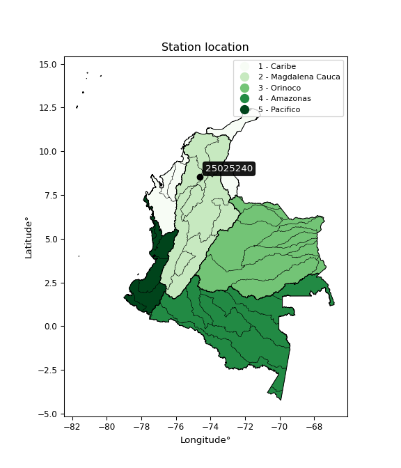</img>

</div>


## A. General information


### 1. General running parameters

• app_version: _v20260103_. • runtime: _2026-01-05 16:20:51.132608_. • Python version: _3.14.0_. • SciPy version: _1.16.3_. • Pandas version: _2.3.3_. • NumPy version: _2.3.5_. • Stations dataset (station_dataset_file): _dataset/pmax24h_in/automatic_colombia_2003_2024.csv_. • Stations catalog (station_catalog_file): _dataset/CNE.xls_. • Minimum year to eval til year_max (date_min): _1900_. • Maximum year to eval since year_min (date_max): _2024_. • Creates, save and include plots into reports (create_plot): _True_. • Plot only fit distributions with Δo > Δ (plot_only_fit): _True_. • Plot only simple graphs avoiding multiple CDFs and multiple Extreme values plots (plot_only_simple): _True_. • Eval low extreme values, if False, evaluates high extreme values (low_extreme): _False_. • Eval every SciPy distribution as logarithmic (pdist_logarithmic_on): _True_. • Standard deviation normalized (ddof): _1.0_. • Return periods to eval in years (Tr): _[2, 2.33, 5, 10, 15, 20, 25, 50, 75, 100, 200, 250, 500, 750, 1000]_. • Minimum data sample per station, 0 means any (minimum_sample): _5_. • Z-Score maximum threshold to adjust a value, 0 means disable (zscore_max): _3.5_. • Z-Score minimum threshold to adjust a value, 0 means disable (zscore_min): _-2.5_. • Avoid zeros, e.g. rain = 0 (avoid_zeros): _True_. • Avoid null values (avoid_nans): _True_. 

[:file_folder:Dataset file](../../dataset/pmax24h_in/automatic_colombia_2003_2024.csv)

> Delta Degrees of Freedom (DDOF): is a parameter used in the formulas for calculating variance and standard deviation. When ddof=0, the divisor is $N$ (the total number of observations) and this is used when your data set is the entire population. When ddof=1, the divisor is $N-1$ and this is used when your data set is a sample drawn from a larger population. Using $N-1$ provides an unbiased estimate of the population variance (known as Bessel´s correction).


### 2. Station info and location

|   id |   CODIGO | NOMBRE                    | CATEGORIA               | TECNOLOGIA                              | ESTADO   | FECHA_INSTALACION   |   FECHA_SUSPENSION |   ALTITUD |   LATITUD |   LONGITUD | DEPARTAMENTO   | MUNICIPIO   | AREA_OPERATIVA                              | ENTIDAD                                                     | AREA_HIDROGRAFICA   | ZONA_HIDROGRAFICA                | SUBZONA_HIDROGRAFICA       |   CORRIENTE | Catalogo   |   Version |
|-----:|---------:|:--------------------------|:------------------------|:----------------------------------------|:---------|:--------------------|-------------------:|----------:|----------:|-----------:|:---------------|:------------|:--------------------------------------------|:------------------------------------------------------------|:--------------------|:---------------------------------|:---------------------------|------------:|:-----------|----------:|
|    0 | 25025240 | MAJAGUAL - AUT [25025240] | Climatológica Principal | Automática con Telemetría, Convencional | Activa   | 15/11/1974          |                nan |        26 |   8.54238 |   -74.6264 | Sucre          | Majagual    | Area Operativa 02 - Atlántico-Bolivar-Sucre | INSTITUTO DE HIDROLOGIA METEOROLOGIA Y ESTUDIOS AMBIENTALES | Magdalena Cauca     | Bajo Magdalena- Cauca -San Jorge | Bajo San Jorge - La Mojana |         nan | CNE_IDEAM  |  20251226 |

<div align="center">

Dynamic map: [:earth_americas:Google](http://maps.google.com/maps?q=8.542385,-74.626401) [:earth_americas:OSM](https://www.openstreetmap.org/#map=18/8.542385/-74.626401&layers=P) [:earth_americas:Bing](https://www.bing.com/maps?cp=8.542385~-74.626401&lvl=18) [:earth_americas:Apple](https://maps.apple.com/frame?center=8.542385%2C-74.626401&span=0.003%2C0.006)

</div>


<div align="center">

```geojson
{
  "type": "Feature",
  "geometry": {
    "type": "Point", 
    "coordinates": [-74.626401, 8.542385]
  }, 
  "properties": {
    "Name": "25025240"
  }
}
```

</div>


### 3. Discrete values table and plot

<div align="center">

|               |          0 |           1 |           2 |           3 |           4 |
|:--------------|-----------:|------------:|------------:|------------:|------------:|
| Date          | 2020       | 2021        | 2022        | 2023        | 2024        |
| Value         |   47.7     |   85        |  136.5      |  113.5      |  130.5      |
| Value_initial |   47.7     |   85        |  136.5      |  113.5      |  130.5      |
| count         |    5       |    5        |    5        |    5        |    5        |
| mean          |  102.64    |  102.64     |  102.64     |  102.64     |  102.64     |
| std           |   36.6408  |   36.6408   |   36.6408   |   36.6408   |   36.6408   |
| zscore        |   -1.49942 |   -0.481431 |    0.924107 |    0.296391 |    0.760355 |


</div>


<div align="center">

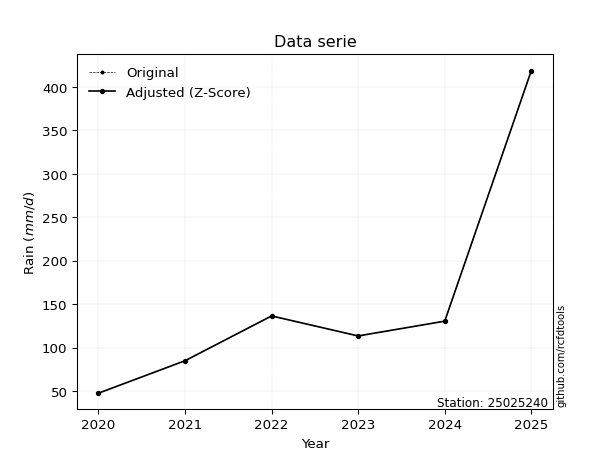</img>

</div>


> The initial value (value_initial) correspond to the initial obtained or null completed value, and value (value) is adjusted only when the initial value is outside the valid range (outlier) definite through the Z-Score value. If Z-Score is active, values out of range or outliers are replaced with the station mean value. A Z-Score (or standard score) measures how many standard deviations a data point is from the mean of a dataset, indicating its relative position; positive scores mean above the mean, negative mean below, and a score of zero is exactly at the mean, allowing for comparison of values from different distributions. It´s calculated using the formula $z=(x–μ)/σ$, where $x$ is the data point, $μ$ is the mean, and $σ$ is the standard deviation, helping identify outliers and understand probability.
>
> <sub>**Note**: In this study, "completing" (filling gaps in) and "extending" (forecasting or lengthening the historical record) rainfall data series are avoided for certain critical analyses because they introduce artificial bias and uncertainty, which can distort the statistics of rare events (extremes), alter day-to-day variability, and compromise the integrity and homogeneity of the original data. Some reasons against Completing/Extending rainfall data are: **Distortion of Extremes and Variability**: The primary issue is that most gap-filling or extension methods rely on averaging or regression with nearby stations, which inherently smooths the data. Rainfall is highly variable in space and time, with a large percentage of zero values and occasional large storms. Infilling methods often underestimate the highest values and overestimate the lowest (zero) values, which severely distorts analyses focused on flood frequency, drought severity, and intensity-duration-frequency (IDF) curves, **Loss of Data Homogeneity**: Infilled or extended data are synthetic estimates, not actual measurements. Combining these estimates with observed data can violate the assumption of data homogeneity, which requires that the data properties do not change over time. Inhomogeneity can lead to incorrect conclusions about long-term trends or changes in climate patterns, **Propagation of Errors**: Errors and biases from the original data (e.g., wind-induced undercatch, instrument errors, site changes) or the data used for imputation can propagate through the analysis, leading to unreliable hydrological models and inaccurate predictions, **Compromised Statistical Integrity**: For statistical analyses, especially those involving the frequency of events, using artificial data can introduce time bias or autocorrelation that doesn´t exist in reality, making it difficult to assess the true probability of events, **Difficulty in Validation**: It is difficult to accurately validate the quality of filled or extended data, especially for past periods where ground-truth measurements are unavailable. The reliability of imputation techniques heavily depends on the density of the surrounding station network and the complexity of the local topography.</sub>


### 4. Active continuous probability distributions from SciPy (44 of 104 available)

A Probability Density Function (PDF) describes the relative likelihood of a continuous random variable falling within a specific range, where the total area under its curve equals 1, and the area over any interval gives the actual probability for that range. Unlike discrete probabilities (like rolling a die), a PDF shows density, not direct probability for a single point (which is zero), with higher points indicating higher likelihood, often visualized as a bell curve for normal distributions.

A log of a probability density function (log-PDF) is simply the logarithm of the PDF´s value, denoted as $log(f(x))$, useful for converting multiplication of probabilities into addition, improving numerical stability with tiny numbers, and connecting to information theory concepts like entropy. Instead of dealing with very small probabilities (e.g., 0.000001), log-PDFs use negative numbers (e.g., $log(0.00001) ≈ -11.51$ that are easier for computers to handle, preventing underflow errors and simplifying complex calculations. In this study, each active probability distribution from SciPy is also evaluated in the $log$ form.

[scipy.stats](https://docs.scipy.org/doc/scipy/reference/stats.html) is a Python´s powerful submodule within the SciPy library for comprehensive statistical analysis, offering over 130 probability distributions (like Normal, Poisson), functions for descriptive stats (mean, variance), hypothesis testing (t-tests, chi-square), random variable generation, and statistical tests, making it essential for data science, modeling, and research. It provides tools to explore, model, and draw conclusions from data efficiently, working seamlessly with NumPy.

<div align="center">

|   id | p_dist             |   n_parameter | fit_method   | label                                                                       | active   | ref                                                                                                        |
|-----:|:-------------------|--------------:|:-------------|:----------------------------------------------------------------------------|:---------|:-----------------------------------------------------------------------------------------------------------|
|    0 | alpha              |             3 | MLE          | Alpha                                                                       | True     | [:mortar_board:](https://docs.scipy.org/doc/scipy/reference/generated/scipy.stats.alpha.html)              |
|    1 | betaprime          |             4 | MLE          | Beta prime                                                                  | True     | [:mortar_board:](https://docs.scipy.org/doc/scipy/reference/generated/scipy.stats.betaprime.html)          |
|    2 | chi2               |             3 | MLE          | Chi²                                                                        | True     | [:mortar_board:](https://docs.scipy.org/doc/scipy/reference/generated/scipy.stats.chi2.html)               |
|    3 | crystalball        |             4 | MLE          | Crystalball                                                                 | True     | [:mortar_board:](https://docs.scipy.org/doc/scipy/reference/generated/scipy.stats.crystalball.html)        |
|    4 | erlang             |             3 | MLE          | Erlang                                                                      | True     | [:mortar_board:](https://docs.scipy.org/doc/scipy/reference/generated/scipy.stats.erlang.html)             |
|    5 | expon              |             2 | MLE          | Exponential                                                                 | True     | [:mortar_board:](https://docs.scipy.org/doc/scipy/reference/generated/scipy.stats.expon.html)              |
|    6 | exponnorm          |             3 | MLE          | Exponentially modified Normal                                               | True     | [:mortar_board:](https://docs.scipy.org/doc/scipy/reference/generated/scipy.stats.exponnorm.html)          |
|    7 | f                  |             4 | MLE          | F                                                                           | True     | [:mortar_board:](https://docs.scipy.org/doc/scipy/reference/generated/scipy.stats.f.html)                  |
|    8 | fatiguelife        |             3 | MLE          | Fatigue-life (Birnbaum-Saunders)                                            | True     | [:mortar_board:](https://docs.scipy.org/doc/scipy/reference/generated/scipy.stats.fatiguelife.html)        |
|    9 | fisk               |             3 | MLE          | Fisk                                                                        | True     | [:mortar_board:](https://docs.scipy.org/doc/scipy/reference/generated/scipy.stats.fisk.html)               |
|   10 | gamma              |             3 | MLE          | Gamma                                                                       | True     | [:mortar_board:](https://docs.scipy.org/doc/scipy/reference/generated/scipy.stats.gamma.html)              |
|   11 | genexpon           |             5 | MLE          | Generalized exponential                                                     | True     | [:mortar_board:](https://docs.scipy.org/doc/scipy/reference/generated/scipy.stats.genexpon.html)           |
|   12 | genlogistic        |             3 | MLE          | Generalized logistic                                                        | True     | [:mortar_board:](https://docs.scipy.org/doc/scipy/reference/generated/scipy.stats.genlogistic.html)        |
|   13 | gibrat             |             2 | MM           | Gibrat                                                                      | True     | [:mortar_board:](https://docs.scipy.org/doc/scipy/reference/generated/scipy.stats.gibrat.html)             |
|   14 | gompertz           |             3 | MLE          | Gompertz (or truncated Gumbel)                                              | True     | [:mortar_board:](https://docs.scipy.org/doc/scipy/reference/generated/scipy.stats.gompertz.html)           |
|   15 | gumbel_l           |             2 | MM           | Gumbel Left Skew                                                            | True     | [:mortar_board:](https://docs.scipy.org/doc/scipy/reference/generated/scipy.stats.gumbel_l.html)           |
|   16 | gumbel_r           |             2 | MM           | Gumbel Right Skew                                                           | True     | [:mortar_board:](https://docs.scipy.org/doc/scipy/reference/generated/scipy.stats.gumbel_r.html)           |
|   17 | halflogistic       |             2 | MM           | Half-logistic                                                               | True     | [:mortar_board:](https://docs.scipy.org/doc/scipy/reference/generated/scipy.stats.halflogistic.html)       |
|   18 | halfnorm           |             2 | MM           | Half Normal                                                                 | True     | [:mortar_board:](https://docs.scipy.org/doc/scipy/reference/generated/scipy.stats.halfnorm.html)           |
|   19 | hypsecant          |             2 | MM           | hyperbolic secant                                                           | True     | [:mortar_board:](https://docs.scipy.org/doc/scipy/reference/generated/scipy.stats.hypsecant.html)          |
|   20 | invgamma           |             3 | MLE          | Inverted gamma                                                              | True     | [:mortar_board:](https://docs.scipy.org/doc/scipy/reference/generated/scipy.stats.invgamma.html)           |
|   21 | invgauss           |             3 | MLE          | Inverse Gaussian                                                            | True     | [:mortar_board:](https://docs.scipy.org/doc/scipy/reference/generated/scipy.stats.invgauss.html)           |
|   22 | invweibull         |             3 | MLE          | Inverted Weibull                                                            | True     | [:mortar_board:](https://docs.scipy.org/doc/scipy/reference/generated/scipy.stats.invweibull.html)         |
|   23 | johnsonsu          |             4 | MLE          | Johnson Su                                                                  | True     | [:mortar_board:](https://docs.scipy.org/doc/scipy/reference/generated/scipy.stats.johnsonsu.html)          |
|   24 | kstwobign          |             2 | MLE          | Limiting distribution of scaled Kolmogorov-Smirnov two-sided test statistic | True     | [:mortar_board:](https://docs.scipy.org/doc/scipy/reference/generated/scipy.stats.kstwobign.html)          |
|   25 | laplace            |             2 | MM           | Laplace                                                                     | True     | [:mortar_board:](https://docs.scipy.org/doc/scipy/reference/generated/scipy.stats.laplace.html)            |
|   26 | laplace_asymmetric |             3 | MLE          | Asymmetric Laplace                                                          | True     | [:mortar_board:](https://docs.scipy.org/doc/scipy/reference/generated/scipy.stats.laplace_asymmetric.html) |
|   27 | loggamma           |             3 | MLE          | Log gamma                                                                   | True     | [:mortar_board:](https://docs.scipy.org/doc/scipy/reference/generated/scipy.stats.loggamma.html)           |
|   28 | logistic           |             2 | MM           | Logistic (or Sech-squared)                                                  | True     | [:mortar_board:](https://docs.scipy.org/doc/scipy/reference/generated/scipy.stats.logistic.html)           |
|   29 | lognorm            |             3 | MLE          | Log Normal                                                                  | True     | [:mortar_board:](https://docs.scipy.org/doc/scipy/reference/generated/scipy.stats.lognorm.html)            |
|   30 | maxwell            |             2 | MM           | Maxwell                                                                     | True     | [:mortar_board:](https://docs.scipy.org/doc/scipy/reference/generated/scipy.stats.maxwell.html)            |
|   31 | mielke             |             4 | MLE          | Mielke Beta-Kappa / Dagum                                                   | True     | [:mortar_board:](https://docs.scipy.org/doc/scipy/reference/generated/scipy.stats.mielke.html)             |
|   32 | moyal              |             2 | MM           | Moyal                                                                       | True     | [:mortar_board:](https://docs.scipy.org/doc/scipy/reference/generated/scipy.stats.moyal.html)              |
|   33 | nakagami           |             3 | MLE          | Nakagami                                                                    | True     | [:mortar_board:](https://docs.scipy.org/doc/scipy/reference/generated/scipy.stats.nakagami.html)           |
|   34 | ncf                |             5 | MLE          | Non-central F distribution                                                  | True     | [:mortar_board:](https://docs.scipy.org/doc/scipy/reference/generated/scipy.stats.ncf.html)                |
|   35 | nct                |             4 | MLE          | Non-central Student’s t                                                     | True     | [:mortar_board:](https://docs.scipy.org/doc/scipy/reference/generated/scipy.stats.nct.html)                |
|   36 | norm               |             2 | MM           | Normal                                                                      | True     | [:mortar_board:](https://docs.scipy.org/doc/scipy/reference/generated/scipy.stats.norm.html)               |
|   37 | pearson3           |             3 | MM           | Pearson type III                                                            | True     | [:mortar_board:](https://docs.scipy.org/doc/scipy/reference/generated/scipy.stats.pearson3.html)           |
|   38 | rayleigh           |             2 | MM           | Rayleigh                                                                    | True     | [:mortar_board:](https://docs.scipy.org/doc/scipy/reference/generated/scipy.stats.rayleigh.html)           |
|   39 | rice               |             3 | MLE          | Rice                                                                        | True     | [:mortar_board:](https://docs.scipy.org/doc/scipy/reference/generated/scipy.stats.rice.html)               |
|   40 | t                  |             3 | MLE          | Student’s t                                                                 | True     | [:mortar_board:](https://docs.scipy.org/doc/scipy/reference/generated/scipy.stats.t.html)                  |
|   41 | truncnorm          |             4 | MLE          | Truncated normal                                                            | True     | [:mortar_board:](https://docs.scipy.org/doc/scipy/reference/generated/scipy.stats.truncnorm.html)          |
|   42 | wald               |             2 | MM           | Wald                                                                        | True     | [:mortar_board:](https://docs.scipy.org/doc/scipy/reference/generated/scipy.stats.wald.html)               |
|   43 | weibull_min        |             3 | MLE          | Weibull minimum                                                             | True     | [:mortar_board:](https://docs.scipy.org/doc/scipy/reference/generated/scipy.stats.weibull_min.html)        |

</div>

> **n_parameter:** # arguments & localization & scale.
>
> **Fit methods:** (MLE) maximum likelihood, (MM) L-moments.
>
>**Inactive** (With the only purpose of prevent loops, zero divisions, infinite values, over high estimated values or horizontal trending for recurrence intervals estimations, the follow distributions were disabled.)**:** foldnorm, gennorm, norminvgauss, powernorm, powerlognorm, skewnorm, genextreme, anglit, arcsine, argus, beta, bradford, burr, burr12, cauchy, cosine, halfcauchy, foldcauchy, skewcauchy, wrapcauchy, dgamma, gengamma, exponweib, exponpow, truncexpon, gausshyper, genhalflogistic, genhyperbolic, geninvgauss, halfgennorm, johnsonsb, kappa4, kappa3, ksone, kstwo, loglaplace, levy, levy_l, levy_stable, ncx2, pareto, genpareto, truncpareto, lomax, powerlaw, rdist, rel_breitwigner, recipinvgauss, semicircular, studentized_range, trapezoid, triang, truncweibull_min, tukeylambda, uniform, loguniform, vonmises, vonmises_line, weibull_max, dweibull, 


## B. Probability (PDF) vs. Empirical (EDF) distributions functions

A continuous probability distribution (CPD) describes probabilities for variables that can take any value within a range (like rain any time), unlike discrete variables with specific outcomes (like temperature). It uses a Probability Density Function (PDF), a curve where the total area under it equals 1, and the probability of the variable falling within an interval (a to b) is found by calculating the area under the curve between those points. A key feature is that the probability of hitting any single exact value is zero, so probabilities are always expressed for ranges, e.g., $P(a ≤ X ≤ b)$.

<div align="center">

Distributions parameters from station values
|    |   station | p_dist                |   n |             loc |           scale | shape                  | shape1                 | shape2                 | shape3   |
|---:|----------:|:----------------------|----:|----------------:|----------------:|:-----------------------|:-----------------------|:-----------------------|:---------|
|  0 |  25025240 | alpha                 |   5 |  -539.75        | 11897.2         | 18.582563852820172     |                        |                        |          |
|  1 |  25025240 | betaprime             |   5 |     8.61439     |  1002.16        | 6.695152485197979      | 72.23159989814371      |                        |          |
|  2 |  25025240 | chi2                  |   5 |  -261.755       |     1.57921     | 230.31237466828054     |                        |                        |          |
|  3 |  25025240 | crystalball           |   5 |   102.64        |    32.7725      | 6923.098034398381      | 10429.720485215224     |                        |          |
|  4 |  25025240 | erlang                |   5 |  -361.087       |     2.48097     | 186.7756182166126      |                        |                        |          |
|  5 |  25025240 | expon                 |   5 |    47.7         |    54.94        |                        |                        |                        |          |
|  6 |  25025240 | exponnorm             |   5 |   102.615       |    32.7725      | 0.0007637381840353763  |                        |                        |          |
|  7 |  25025240 | f                     |   5 |     1.49331     |   100.334       | 15.355096895948193     | 687.0931496948892      |                        |          |
|  8 |  25025240 | fatiguelife           |   5 |    47.7         |     1.75291e-05 | 2095.6023866131763     |                        |                        |          |
|  9 |  25025240 | fisk                  |   5 |    -4.30572e+06 |     4.30582e+06 | 221090.61218033743     |                        |                        |          |
| 10 |  25025240 | gamma                 |   5 |  -368.366       |     2.3755      | 198.05520442246166     |                        |                        |          |
| 11 |  25025240 | genexpon              |   5 |    45.1453      |     8.94792     | 0.49955243763896684    | 1.0797874239133531e-06 | 3.781484010978471e-07  |          |
| 12 |  25025240 | genlogistic           |   5 |   136.5         |     9.40679e-06 | 2.780910352290876e-07  |                        |                        |          |
| 13 |  25025240 | gibrat                |   5 |    77.6387      |    15.164       |                        |                        |                        |          |
| 14 |  25025240 | gompertz              |   5 |    50.9234      |     4.16735     | 3.878733385157759e-09  |                        |                        |          |
| 15 |  25025240 | gumbel_l              |   5 |   117.389       |    25.5526      |                        |                        |                        |          |
| 16 |  25025240 | gumbel_r              |   5 |    87.8906      |    25.5526      |                        |                        |                        |          |
| 17 |  25025240 | halflogistic          |   5 |    63.797       |    28.0193      |                        |                        |                        |          |
| 18 |  25025240 | halfnorm              |   5 |    59.262       |    54.3663      |                        |                        |                        |          |
| 19 |  25025240 | hypsecant             |   5 |   102.64        |    20.8636      |                        |                        |                        |          |
| 20 |  25025240 | invgamma              |   5 |  -338.678       | 73347.3         | 167.32655659231636     |                        |                        |          |
| 21 |  25025240 | invgauss              |   5 |   -71.2733      |  3869.91        | 0.044848728377758385   |                        |                        |          |
| 22 |  25025240 | invweibull            |   5 |    47.7         |     1.47349     | 0.06380274901874058    |                        |                        |          |
| 23 |  25025240 | johnsonsu             |   5 |   136.5         |     1.74917e-13 | 3.041392985246331      | 0.14350825754208096    |                        |          |
| 24 |  25025240 | kstwobign             |   5 |   -30.7774      |   151.994       |                        |                        |                        |          |
| 25 |  25025240 | laplace               |   5 |   102.64        |    23.1737      |                        |                        |                        |          |
| 26 |  25025240 | laplace_asymmetric    |   5 |   136.5         |     0.219969    | 153.81653542333333     |                        |                        |          |
| 27 |  25025240 | loggamma              |   5 |   136.5         |     3.35029e-05 | 9.891472725084918e-07  |                        |                        |          |
| 28 |  25025240 | logistic              |   5 |   102.64        |    18.0684      |                        |                        |                        |          |
| 29 |  25025240 | lognorm               |   5 |    47.7         |     0.0418402   | 14.70516894165472      |                        |                        |          |
| 30 |  25025240 | maxwell               |   5 |    24.9829      |    48.6644      |                        |                        |                        |          |
| 31 |  25025240 | mielke                |   5 |    47.7         |    89.0952      | 0.98500968382603       | 2418.773775937865      |                        |          |
| 32 |  25025240 | moyal                 |   5 |    83.8986      |    14.7528      |                        |                        |                        |          |
| 33 |  25025240 | nakagami              |   5 |    85           |    31.9883      | 0.12827604924187916    |                        |                        |          |
| 34 |  25025240 | ncf                   |   5 |    -0.98893     |   102.331       | 17.178531290305628     | 94.71956839970977      | 1.4006397379319896e-11 |          |
| 35 |  25025240 | nct                   |   5 | -1595.96        |    32.7055      | 312327.3246957839      | 51.9359656269331       |                        |          |
| 36 |  25025240 | norm                  |   5 |   102.64        |    32.7725      |                        |                        |                        |          |
| 37 |  25025240 | pearson3              |   5 |   102.64        |    32.7725      | -0.6227070254311728    |                        |                        |          |
| 38 |  25025240 | rayleigh              |   5 |    39.9442      |    50.024       |                        |                        |                        |          |
| 39 |  25025240 | rice                  |   5 |    26.6393      |    36.4181      | 1.7790284153139324     |                        |                        |          |
| 40 |  25025240 | t                     |   5 |   102.659       |    32.7752      | 194050.75552153913     |                        |                        |          |
| 41 |  25025240 | truncnorm             |   5 |   102.64        |    32.7725      | -1039.3705932574057    | 3046.8563289030603     |                        |          |
| 42 |  25025240 | wald                  |   5 |    69.8675      |    32.7725      |                        |                        |                        |          |
| 43 |  25025240 | weibull_min           |   5 |    -1.27072e+09 |     1.27072e+09 | 52267749.97027737      |                        |                        |          |
| 44 |  25025240 | logalpha              |   5 |    -7.46281     |   359.966       | 29.961378541018984     |                        |                        |          |
| 45 |  25025240 | logbetaprime          |   5 |   -36.3899      |    27.7329      | 26487.339588477458     | 17936.302600736886     |                        |          |
| 46 |  25025240 | logchi2               |   5 |     3.86493     |     0.98159     | 1.0575680589391916     |                        |                        |          |
| 47 |  25025240 | logcrystalball        |   5 |     4.56542     |     0.387345    | 8.69295551494353       | 2247.539747668059      |                        |          |
| 48 |  25025240 | logerlang             |   5 |    -1.91138     |     0.0244876   | 264.4909066380461      |                        |                        |          |
| 49 |  25025240 | logexpon              |   5 |     3.86493     |     0.700485    |                        |                        |                        |          |
| 50 |  25025240 | logexponnorm          |   5 |     4.56529     |     0.387349    | 0.0003083741782481883  |                        |                        |          |
| 51 |  25025240 | logf                  |   5 |  -348.612       |   353.179       | 2540926.6927082688     | 4675895.457811052      |                        |          |
| 52 |  25025240 | logfatiguelife        |   5 |  -175.241       |   179.805       | 0.0021476005263168715  |                        |                        |          |
| 53 |  25025240 | logfisk               |   5 |    -2.59158e+07 |     2.59158e+07 | 117434787.38917714     |                        |                        |          |
| 54 |  25025240 | loggamma              |   5 |    -1.67943     |     0.0255609   | 243.94948103435013     |                        |                        |          |
| 55 |  25025240 | loggenexpon           |   5 |     3.86493     |     7.18879e+08 | 518954981.7663038      | 3194712304.5757074     | 260712278.30449578     |          |
| 56 |  25025240 | loggenlogistic        |   5 |     4.91642     |     1.23713e-05 | 3.493763064691679e-05  |                        |                        |          |
| 57 |  25025240 | loggibrat             |   5 |     4.26994     |     0.179215    |                        |                        |                        |          |
| 58 |  25025240 | loggompertz           |   5 |     3.84922     |     0.307147    | 0.06186601290158995    |                        |                        |          |
| 59 |  25025240 | loggumbel_l           |   5 |     4.73974     |     0.302012    |                        |                        |                        |          |
| 60 |  25025240 | loggumbel_r           |   5 |     4.39109     |     0.302012    |                        |                        |                        |          |
| 61 |  25025240 | loghalflogistic       |   5 |     4.1063      |     0.33118     |                        |                        |                        |          |
| 62 |  25025240 | loghalfnorm           |   5 |     4.05271     |     0.642576    |                        |                        |                        |          |
| 63 |  25025240 | loghypsecant          |   5 |     4.56542     |     0.246592    |                        |                        |                        |          |
| 64 |  25025240 | loginvgamma           |   5 |    -6.06768     |  7582.4         | 714.352297118026       |                        |                        |          |
| 65 |  25025240 | loginvgauss           |   5 |     1.18544     |   222.696       | 0.015174509167208153   |                        |                        |          |
| 66 |  25025240 | loginvweibull         |   5 |    -3.05963e+07 |     3.05963e+07 | 73473487.3552199       |                        |                        |          |
| 67 |  25025240 | logjohnsonsu          |   5 |     4.91632     |     2.45233e-17 | 4.08726289748313       | 0.11640032269075629    |                        |          |
| 68 |  25025240 | logkstwobign          |   5 |     2.88998     |     1.90913     |                        |                        |                        |          |
| 69 |  25025240 | loglaplace            |   5 |     4.56542     |     0.273894    |                        |                        |                        |          |
| 70 |  25025240 | loglaplace_asymmetric |   5 |     4.91632     |     0.00365195  | 95.87560189205763      |                        |                        |          |
| 71 |  25025240 | logloggamma           |   5 |     4.91634     |     5.32316e-07 | 1.5064673588728398e-06 |                        |                        |          |
| 72 |  25025240 | loglogistic           |   5 |     4.56542     |     0.213555    |                        |                        |                        |          |
| 73 |  25025240 | loglognorm            |   5 |     3.86493     |     0.000748754 | 14.078288599997434     |                        |                        |          |
| 74 |  25025240 | logmaxwell            |   5 |     3.64757     |     0.575174    |                        |                        |                        |          |
| 75 |  25025240 | logmielke             |   5 |    -1.63015e+08 |     1.63015e+08 | 427358617.78233725     | 16926582810.841644     |                        |          |
| 76 |  25025240 | logmoyal              |   5 |     4.34391     |     0.174367    |                        |                        |                        |          |
| 77 |  25025240 | lognakagami           |   5 |     4.44265     |     0.336211    | 0.21215912877217083    |                        |                        |          |
| 78 |  25025240 | logncf                |   5 |   -55.3331      |    55.2955      | 73804.82794595364      | 131243.82583848044     | 6141.29481764075       |          |
| 79 |  25025240 | lognct                |   5 |   -18.057       |     0.347684    | 8126.9854802543905     | 65.05445723021003      |                        |          |
| 80 |  25025240 | lognorm               |   5 |     4.56542     |     0.387345    |                        |                        |                        |          |
| 81 |  25025240 | logpearson3           |   5 |     4.56542     |     0.387346    | -0.9261752226158311    |                        |                        |          |
| 82 |  25025240 | lograyleigh           |   5 |     3.8244      |     0.591243    |                        |                        |                        |          |
| 83 |  25025240 | logrice               |   5 |     3.59118     |     0.422133    | 2.041625781729339      |                        |                        |          |
| 84 |  25025240 | logt                  |   5 |     4.56542     |     0.387345    | 13813405729.559925     |                        |                        |          |
| 85 |  25025240 | logtruncnorm          |   5 |    -0.13169     |     1.11206     | 4.113384048108658      | 4.5452068687961145     |                        |          |
| 86 |  25025240 | logwald               |   5 |     4.1781      |     0.387314    |                        |                        |                        |          |
| 87 |  25025240 | logweibull_min        |   5 |    -2.02825e+07 |     2.02825e+07 | 78301456.618153        |                        |                        |          |

</div>

> **loc** (Location parameter): This shifts the distribution along the x-axis. For many common distributions, like the normal (Gaussian) distribution, loc represents the mean $μ$. For others, like the uniform distribution, it might represent the minimum value, or for the beta distribution, the left end of the support interval.
>
> **scale** (Scale parameter): This determines the width or spread of the distribution. For the normal distribution, scale represents the standard deviation $σ$. For a uniform distribution, it defines the length of the interval (from $loc$ to $loc + scale$).
>
> **shape** (Shape parameters): Refers to parameters that define the specific form of a probability distribution, distinct from its location (loc) and scale (scale). These parameters are required arguments for most distribution functions. For example, a normal (Gaussian) distribution is fully defined by its location (mean) and scale (standard deviation), so it has no specific shape parameters beyond loc and scale. However, other distributions have intrinsic properties that need specification, as Gamma distribution that takes a shape parameter, often named $a$ or $alpha$.


### 0. Cumulative distribution values - CDF (88 evaluated)

Cumulative Distribution Function (CDF), denoted as $F$<sub>$X$</sub>$(x)$, is a function that gives the probability that a random variable $X$ will take a value less than or equal to a specific value, $x$ (i.e., $(P(X≥x)$. It essentially "accumulates" probabilities from a given point up to the far right (positive infinity), providing a complete picture of the distribution´s probabilities for both discrete (like rain) and continuous (like temperature) variables, helping to find probabilities over ranges or above certain values. Each station is evaluated separately ordering the $x$ values ascending, calculating the CDF and PDF values for the activated distributions and their logarithmic forms.

<div align="center">

CDF ordered by x ascending and calculating $log(f(x))$ separately
|   id |   Station |   date |     x |   count |   mean |     std |    zscore |   Value_initial |   station |   m |     alpha |   alpha_pdf |   betaprime |   betaprime_pdf |      chi2 |   chi2_pdf |   crystalball |   crystalball_pdf |    erlang |   erlang_pdf |    expon |   expon_pdf |   exponnorm |   exponnorm_pdf |         f |      f_pdf |   fatiguelife |   fatiguelife_pdf |     fisk |   fisk_pdf |     gamma |   gamma_pdf |   genexpon |   genexpon_pdf |   genlogistic |   genlogistic_pdf |   gibrat |   gibrat_pdf |    gompertz |   gompertz_pdf |   gumbel_l |   gumbel_l_pdf |   gumbel_r |   gumbel_r_pdf |   halflogistic |   halflogistic_pdf |   halfnorm |   halfnorm_pdf |   hypsecant |   hypsecant_pdf |   invgamma |   invgamma_pdf |   invgauss |   invgauss_pdf |   invweibull |   invweibull_pdf |   johnsonsu |   johnsonsu_pdf |   kstwobign |   kstwobign_pdf |   laplace |   laplace_pdf |   laplace_asymmetric |   laplace_asymmetric_pdf |   loggamma |   loggamma_pdf |   logistic |   logistic_pdf |   lognorm |   lognorm_pdf |   maxwell |   maxwell_pdf |     mielke |   mielke_pdf |       moyal |   moyal_pdf |    nakagami |   nakagami_pdf |       ncf |    ncf_pdf |      nct |    nct_pdf |      norm |   norm_pdf |   pearson3 |   pearson3_pdf |   rayleigh |   rayleigh_pdf |      rice |   rice_pdf |         t |      t_pdf |   truncnorm |   truncnorm_pdf |     wald |   wald_pdf |   weibull_min |   weibull_min_pdf |   logalpha |   logalpha_pdf |   logbetaprime |   logbetaprime_pdf |     logchi2 |   logchi2_pdf |   logcrystalball |   logcrystalball_pdf |   logerlang |   logerlang_pdf |   logexpon |   logexpon_pdf |   logexponnorm |   logexponnorm_pdf |      logf |   logf_pdf |   logfatiguelife |   logfatiguelife_pdf |   logfisk |   logfisk_pdf |   loggenexpon |   loggenexpon_pdf |   loggenlogistic |   loggenlogistic_pdf |   loggibrat |   loggibrat_pdf |   loggompertz |   loggompertz_pdf |   loggumbel_l |   loggumbel_l_pdf |   loggumbel_r |   loggumbel_r_pdf |   loghalflogistic |   loghalflogistic_pdf |   loghalfnorm |   loghalfnorm_pdf |   loghypsecant |   loghypsecant_pdf |   loginvgamma |   loginvgamma_pdf |   loginvgauss |   loginvgauss_pdf |   loginvweibull |   loginvweibull_pdf |   logjohnsonsu |   logjohnsonsu_pdf |   logkstwobign |   logkstwobign_pdf |   loglaplace |   loglaplace_pdf |   loglaplace_asymmetric |   loglaplace_asymmetric_pdf |   logloggamma |   logloggamma_pdf |   loglogistic |   loglogistic_pdf |   loglognorm |   loglognorm_pdf |   logmaxwell |   logmaxwell_pdf |   logmielke |   logmielke_pdf |   logmoyal |   logmoyal_pdf |   lognakagami |   lognakagami_pdf |    logncf |   logncf_pdf |    lognct |   lognct_pdf |   logpearson3 |   logpearson3_pdf |   lograyleigh |   lograyleigh_pdf |   logrice |   logrice_pdf |      logt |   logt_pdf |   logtruncnorm |   logtruncnorm_pdf |   logwald |   logwald_pdf |   logweibull_min |   logweibull_min_pdf |
|-----:|----------:|-------:|------:|--------:|-------:|--------:|----------:|----------------:|----------:|----:|----------:|------------:|------------:|----------------:|----------:|-----------:|--------------:|------------------:|----------:|-------------:|---------:|------------:|------------:|----------------:|----------:|-----------:|--------------:|------------------:|---------:|-----------:|----------:|------------:|-----------:|---------------:|--------------:|------------------:|---------:|-------------:|------------:|---------------:|-----------:|---------------:|-----------:|---------------:|---------------:|-------------------:|-----------:|---------------:|------------:|----------------:|-----------:|---------------:|-----------:|---------------:|-------------:|-----------------:|------------:|----------------:|------------:|----------------:|----------:|--------------:|---------------------:|-------------------------:|-----------:|---------------:|-----------:|---------------:|----------:|--------------:|----------:|--------------:|-----------:|-------------:|------------:|------------:|------------:|---------------:|----------:|-----------:|---------:|-----------:|----------:|-----------:|-----------:|---------------:|-----------:|---------------:|----------:|-----------:|----------:|-----------:|------------:|----------------:|---------:|-----------:|--------------:|------------------:|-----------:|---------------:|---------------:|-------------------:|------------:|--------------:|-----------------:|---------------------:|------------:|----------------:|-----------:|---------------:|---------------:|-------------------:|----------:|-----------:|-----------------:|---------------------:|----------:|--------------:|--------------:|------------------:|-----------------:|---------------------:|------------:|----------------:|--------------:|------------------:|--------------:|------------------:|--------------:|------------------:|------------------:|----------------------:|--------------:|------------------:|---------------:|-------------------:|--------------:|------------------:|--------------:|------------------:|----------------:|--------------------:|---------------:|-------------------:|---------------:|-------------------:|-------------:|-----------------:|------------------------:|----------------------------:|--------------:|------------------:|--------------:|------------------:|-------------:|-----------------:|-------------:|-----------------:|------------:|----------------:|-----------:|---------------:|--------------:|------------------:|----------:|-------------:|----------:|-------------:|--------------:|------------------:|--------------:|------------------:|----------:|--------------:|----------:|-----------:|---------------:|-------------------:|----------:|--------------:|-----------------:|---------------------:|
|    0 |  25025240 |   2020 |  47.7 |       5 | 102.64 | 36.6408 | -1.49942  |            47.7 |  25025240 |   1 | 0.0474889 |  0.00341213 |   0.0372147 |      0.00404573 | 0.0487919 | 0.00332506 |     0.0468295 |        0.00298638 | 0.0491031 |   0.00326044 | 0        |  0.0182017  |   0.0468298 |      0.00298639 | 0.0386719 | 0.00392099 |     0.0345456 |        5.7522e+10 | 0.04766  | 0.00233059 | 0.0473532 |  0.00320691 |   0.13292  |    0.0484082   |      0        |        0.00214113 | 0        |   0          | 0           |    0           |  0.0633039 |     0.00239727 | 0.00806358 |     0.00152116 |       0        |         0          |   0        |     0          |   0.0456574 |      0.00218088 |  0.0452309 |     0.00332425 |  0.0446435 |     0.0038273  |  0.000276554 |      2.03459e+10 |   0.0275942 |     0.000102579 |   0.0474611 |      0.0049928  | 0.0467033 |    0.00201536 |            0.0724716 |               0.00214193 |  0.0376785 |       0.2224   |  0.0456224 |     0.00240978 |  0.03527  |      0.200748 | 0.0253531 |    0.00320401 | 2.2117e-08 |    0.0144573 | 0.000648628 | 0.000274923 | 0           |    0           | 0.0410053 | 0.00405352 | 0.046837 | 0.00298724 | 0.0468295 | 0.00298638 |  0.0605121 |     0.0027715  |  0.0119469 |     0.0030623  | 0.0358891 | 0.00354051 | 0.0467865 | 0.0029839  |   0.0468295 |      0.00298638 | 0        | 0          |     0.0544374 |        0.00217707 |  0.0346888 |       0.215179 |      0.0372692 |           0.20921  | 8.66816e-09 |   5.16065e+06 |        0.0352701 |             0.200748 |   0.0354714 |        0.211776 |   0        |       1.42758  |       0.035272 |           0.200756 | 0.0357088 |   0.202151 |        0.0349677 |             0.200733 | 0.0310649 |      0.136395 |   1.01658e-11 |          0.721895 |         0        |             0.144957 |    0        |        0        |    0.00324118 |          0.211304 |     0.0537135 |          0.172988 |    0.00331338 |         0.0626422 |          0        |              0        |      0        |          0        |      0.0371279 |           0.150223 |     0.0354167 |          0.214668 |     0.0336091 |          0.228407 |       0.0392069 |            0.304945 |       0.325921 |        0.0398925   |      0.0432974 |           0.375764 |    0.0387491 |         0.141474 |               0.0496403 |                    0.141776 |      0.051022 |          0.144393 |     0.0362594 |          0.163633 |    0.0227623 |      8.63966e+12 |     0.013754 |         0.184455 |    0.060434 |        0.158433 | 7.8461e-05 |     0.00371129 |   0           |       0           | 0.0355394 |     0.203296 | 0.0361576 |     0.205788 |     0.0538983 |          0.189205 |    0.00234665 |          0.115667 | 0.0289531 |      0.230569 | 0.0352701 |   0.200748 |      0         |           0        |  0        |      0        |        0.0338228 |             0.128341 |
|    1 |  25025240 |   2021 |  85   |       5 | 102.64 | 36.6408 | -0.481431 |            85   |  25025240 |   2 | 0.322555  |  0.0109366  |   0.360855  |      0.0114245  | 0.316642  | 0.0108421  |     0.2952    |        0.0105315  | 0.311286  |   0.0106903  | 0.492837 |  0.00923122 |   0.295201  |      0.0105315  | 0.35565   | 0.0114925  |     0.756814  |        0.0029216  | 0.253587 | 0.00971902 | 0.310479  |  0.010823   |   0.891937 |    0.00603303  |      0        |        0.00644967 | 0.234934 |   0.0417392  | 1.37978e-05 |    3.31183e-06 |  0.245363  |     0.008314   | 0.326355   |     0.0143016  |       0.361286 |         0.0155156  |   0.364086 |     0.0131203  |   0.258179  |      0.0110617  |  0.319709  |     0.0110372  |  0.346972  |     0.0112353  |  0.443217    |      0.000616892 |   0.0329424 |     0.000204852 |   0.392526  |      0.0110272  | 0.233551  |    0.0100783  |            0.218243  |               0.00645026 |  0.395633  |       0.976665 |  0.273629  |     0.0110002  |  0.375644 |      0.979488 | 0.322567  |    0.0116567  | 0.424153   |    0.0112009 | 0.335368    | 0.0163794   | 9.40872e-05 |    1.69858e+09 | 0.355354  | 0.0111435  | 0.295255 | 0.0105321  | 0.2952    | 0.0105315  |  0.269782  |     0.00907697 |  0.333433  |     0.0120016  | 0.310099  | 0.0108393  | 0.295014  | 0.0105275  |   0.2952    |      0.0105315  | 0.330392 | 0.0283498  |     0.228642  |        0.00823665 |  0.392066  |       0.97585  |      0.378753  |           0.963521 | 0.535016    |   0.402418    |        0.375644  |             0.979488 |   0.386069  |        0.972851 |   0.561652 |       0.625778 |       0.375649 |           0.979483 | 0.375565  |   0.974881 |        0.377215  |             0.984465 | 0.305289  |      0.961055 |   0.487355    |          0.800714 |         0        |             0.740973 |    0.485253 |        2.30832  |    0.305973   |          0.965096 |     0.311969  |          0.851854 |    0.430394   |         1.20143   |          0.468233 |              1.17875  |      0.45604  |          1.03288  |      0.347697  |           1.14588  |     0.391217  |          0.979718 |     0.405972  |          0.968539 |       0.445353  |            0.865077 |       0.360025 |        0.0919377   |      0.477315  |           0.839366 |    0.319382  |         1.16608  |               0.258477  |                    0.738226 |      0.261705 |          0.740632 |     0.360115  |          1.07903  |    0.681625  |      0.0438748   |     0.408882 |         1.0196   |    0.274815 |        0.720454 | 0.451205   |     1.29783    |   5.12801e-07 |       2.44986e+08 | 0.378075  |     0.979086 | 0.379612  |     0.977175 |     0.324212  |          0.842746 |    0.421153   |          1.02375  | 0.388672  |      0.973257 | 0.375644  |   0.979487 |      8.261e-07 |           4.53549  |  0.504748 |      1.6953   |        0.273917  |             0.897241 |
|    2 |  25025240 |   2023 | 113.5 |       5 | 102.64 | 36.6408 |  0.296391 |           113.5 |  25025240 |   3 | 0.644401  |  0.0103855  |   0.661339  |      0.00887329 | 0.64357   | 0.0107708  |     0.629819  |        0.0115227  | 0.637611  |   0.0108827  | 0.698103 |  0.00549503 |   0.62982   |      0.0115227  | 0.663635  | 0.00921093 |     0.822396  |        0.00182797 | 0.594793 | 0.0123753  | 0.641146  |  0.0110003  |   0.977988 |    0.00122891  |      0        |        0.0149778  | 0.805307 |   0.00768084 | 0.0128006   |    0.00305189  |  0.576333  |     0.0142392  | 0.692766   |     0.00995157 |       0.70988  |         0.00885229 |   0.681546 |     0.0089225  |   0.658676  |      0.0134     |  0.645767  |     0.0105309  |  0.656233  |     0.00945845 |  0.456232    |      0.000347162 |   0.0423967 |     0.000563655 |   0.671566  |      0.00809354 | 0.687072  |    0.0135036  |            0.50671   |               0.014976   |  0.676235  |       0.883507 |  0.645896  |     0.0126582  |  0.66624  |      0.939171 | 0.65354   |    0.0103736  | 0.741899   |    0.011106  | 0.713853    | 0.00927114  | 0.784198    |    0.00644848  | 0.652007  | 0.00887532 | 0.629849 | 0.0115205  | 0.629819  | 0.0115227  |  0.594286  |     0.0126929  |  0.660762  |     0.0099716  | 0.638139  | 0.010926   | 0.629588  | 0.0115241  |   0.629819  |      0.0115227  | 0.773101 | 0.00760396 |     0.567574  |        0.0149114  |  0.671111  |       0.875433 |      0.663103  |           0.917959 | 0.633092    |   0.286857    |        0.666241  |             0.93917  |   0.668163  |        0.896011 |   0.7099   |       0.414141 |       0.666242 |           0.93916  | 0.664804  |   0.935702 |        0.668548  |             0.938616 | 0.619641  |      1.06799  |   0.690434    |          0.594589 |         0        |             1.67665  |    0.828099 |        0.551811 |    0.644088   |          1.26878  |     0.62245   |          1.21768  |    0.723515   |         0.775315  |          0.737216 |              0.689223 |      0.709408 |          0.710377 |      0.700121  |           1.04402  |     0.673031  |          0.887783 |     0.675039  |          0.825599 |       0.667676  |            0.647676 |       0.401813 |        0.244       |      0.690276  |           0.618974 |    0.72764   |         0.994398 |               0.590306  |                    1.68595  |      0.593196 |          1.67876  |     0.685492  |          1.00954  |    0.69184   |      0.0288327   |     0.686099 |         0.834013 |    0.586479 |        1.53751  | 0.742305   |     0.712699   |   0.718348    |       0.925415    | 0.66732   |     0.93162  | 0.667828  |     0.927402 |     0.619494  |          1.13517  |    0.692014   |          0.799461 | 0.670505  |      0.896599 | 0.66624   |   0.93917  |      0.79868   |           1.5047   |  0.796043 |      0.564937 |        0.62371   |             1.41985  |
|    3 |  25025240 |   2024 | 130.5 |       5 | 102.64 | 36.6408 |  0.760355 |           130.5 |  25025240 |   4 | 0.797346  |  0.00747312 |   0.789952  |      0.00626972 | 0.802876  | 0.00778539 |     0.802366  |        0.00848152 | 0.799466  |   0.00795033 | 0.778448 |  0.00403261 |   0.802366  |      0.0084815  | 0.797079  | 0.00648065 |     0.850158  |        0.00145919 | 0.778459 | 0.00885526 | 0.80405   |  0.00795433 |   0.991479 |    0.000475701 |      0        |        0.0247577  | 0.894121 |   0.00346068 | 0.533024    |    0.0853281   |  0.811834  |     0.0123008  | 0.828022   |     0.00611525 |       0.830673 |         0.00553158 |   0.809917 |     0.00621976 |   0.836235  |      0.00750757 |  0.800514  |     0.00753381 |  0.794075  |     0.00672076 |  0.461473    |      0.000274993 |   0.0629231 |     0.00295704  |   0.789817  |      0.00584863 | 0.849738  |    0.00648418 |            0.837465  |               0.0247516  |  0.787534  |       0.703301 |  0.823743  |     0.00803559 |  0.785201 |      0.75393  | 0.804982  |    0.00734624 | 0.930364   |    0.0110678 | 0.836715    | 0.00545611  | 0.869602    |    0.00388977  | 0.781508  | 0.006359   | 0.802358 | 0.0084796  | 0.802366  | 0.00848152 |  0.797542  |     0.0105635  |  0.805728  |     0.00703023 | 0.801023  | 0.00802086 | 0.802184  | 0.00848552 |   0.802366  |      0.00848152 | 0.867522 | 0.00397911 |     0.814918  |        0.0128426  |  0.781422  |       0.697991 |      0.77971   |           0.742303 | 0.670393    |   0.249023    |        0.785201  |             0.75393  |   0.781427  |        0.718235 |   0.762308 |       0.339325 |       0.785202 |           0.753922 | 0.783461  |   0.753128 |        0.787237  |             0.750798 | 0.754077  |      0.840326 |   0.765883    |          0.487173 |         0        |             2.48669  |    0.887    |        0.318725 |    0.810417   |          1.06461  |     0.786959  |          1.09075  |    0.815569   |         0.550539  |          0.819427 |              0.496015 |      0.797346 |          0.55151  |      0.820797  |           0.688934 |     0.784884  |          0.706985 |     0.778754  |          0.656043 |       0.749075  |            0.519707 |       0.466418 |        1.02939     |      0.768385  |           0.501285 |    0.83638   |         0.597384 |               0.87942   |                    2.51168  |      0.880519 |          2.49189  |     0.807319  |          0.728408 |    0.695561  |      0.0247013   |     0.790117 |         0.652994 |    0.845562 |        2.21384  | 0.825595   |     0.492067   |   0.823926    |       0.611218    | 0.785247  |     0.747162 | 0.785226  |     0.743991 |     0.774507  |          1.05053  |    0.791508   |          0.62444  | 0.784006  |      0.720702 | 0.785201  |   0.753931 |      0.959932  |           0.862285 |  0.859394 |      0.361316 |        0.812736  |             1.2111   |
|    4 |  25025240 |   2022 | 136.5 |       5 | 102.64 | 36.6408 |  0.924107 |           136.5 |  25025240 |   5 | 0.838832  |  0.00635999 |   0.824976  |      0.00541527 | 0.845996  | 0.00658965 |     0.849241  |        0.00713843 | 0.843548  |   0.00674325 | 0.801369 |  0.00361541 |   0.849241  |      0.00713842 | 0.833184  | 0.00556452 |     0.858596  |        0.00135518 | 0.82704  | 0.00734487 | 0.848045  |  0.00671154 |   0.993905 |    0.000340296 |      0.999996 |        0.0295627  | 0.912491 |   0.0027018  | 0.959773    |    0.031017    |  0.87907   |     0.00999779 | 0.861378   |     0.00503025 |       0.861045 |         0.00461469 |   0.844595 |     0.00534964 |   0.875974  |      0.00579531 |  0.842265  |     0.0063879  |  0.831523  |     0.00577056 |  0.463065    |      0.000256151 |   0.99853   |     3.53289e+09 |   0.82271   |      0.00512407 | 0.884014  |    0.00500507 |            0.999956  |               0.0295541  |  0.817689  |       0.638172 |  0.866919  |     0.0063852  |  0.817514 |      0.683277 | 0.845701  |    0.00623305 | 0.996736   |    0.0110526 | 0.866447    | 0.00448385  | 0.891112    |    0.00329794  | 0.817112  | 0.00551828 | 0.849222 | 0.007137   | 0.849241  | 0.00713843 |  0.856304  |     0.00896867 |  0.844765  |     0.00598978 | 0.845515  | 0.00680764 | 0.849084  | 0.00714276 |   0.849241  |      0.00713843 | 0.889053 | 0.00322945 |     0.884579  |        0.0102508  |  0.811377  |       0.634586 |      0.811586  |           0.675512 | 0.681347    |   0.238425    |        0.817514  |             0.683277 |   0.812253  |        0.653009 |   0.777082 |       0.318234 |       0.817514 |           0.68327  | 0.815758  |   0.683355 |        0.819396  |             0.679627 | 0.789875  |      0.75209  |   0.787028    |          0.453796 |         0.999718 |             2.82241  |    0.90022  |        0.271071 |    0.855541   |          0.939064 |     0.833777  |          0.987625 |    0.83889    |         0.487969  |          0.840518 |              0.443158 |      0.821046 |          0.503251 |      0.849456  |           0.587992 |     0.815202  |          0.641711 |     0.806941  |          0.598074 |       0.771551  |            0.480527 |       0.995036 |        3.19745e+08 |      0.790102  |           0.465151 |    0.861145  |         0.506964 |               0.999891  |                    2.85575  |      0.99997  |          2.82994  |     0.837967  |          0.635802 |    0.696646  |      0.0236076   |     0.818109 |         0.592513 |    0.948232 |        2.1831   | 0.846407   |     0.434951   |   0.84965     |       0.534814    | 0.817272  |     0.677327 | 0.817121  |     0.674679 |     0.82014   |          0.975849 |    0.818296   |          0.567575 | 0.814946  |      0.655528 | 0.817513  |   0.683278 |      0.995364  |           0.718321 |  0.87458  |      0.315607 |        0.863673  |             1.04875  |


</div>

An Empirical Distribution Function (EDF) is a step-function estimate of a true cumulative distribution function (CDF) based on observed sample data, representing the proportion of data points less than or equal to a given value. It is calculated by ordering your data and jumping up by $1/n$ (where $n$ is sample size) at each unique data point, allowing analysis without assuming an underlying population distribution, and it gets closer to the true CDF as the sample size grows. For the empirical probability calculations, the parameter $m$ correspond to the order number which means the position of the $x$ values in an ascending order list.

The Kolmogorov-Smirnov (K-S) test is a non-parametric statistical test used to determine if a sample data set comes from a specific theoretical distribution (one-sample) or if two different samples come from the same underlying distribution (two-sample), by comparing their cumulative distribution functions (CDFs). It calculates the maximum vertical difference (D statistic) between these functions, with a small p-value indicating a significant difference and rejection of the null hypothesis (that the data/samples match).


### 1. EDF California (1923)

California´s estimates the true probability distribution of water-related data (like rainfall, streamflow) using observed samples, crucial for risk assessment.

<div align="center">


$P=m/n$


</div>


**1.1. Empirical values**

<div align="center">

|                | 0              | 1                  | 2              | 3                 | 4              |
|:---------------|:---------------|:-------------------|:---------------|:------------------|:---------------|
| date           | 2020           | 2021               | 2023           | 2024              | 2022           |
| x              | 47.7           | 85.0               | 113.5          | 130.5             | 136.5          |
| m              | 1              | 2                  | 3              | 4                 | 5              |
| empirical_dist | edf_california | edf_california     | edf_california | edf_california    | edf_california |
| empirical      | 0.2            | 0.4                | 0.6            | 0.8               | 1.0            |
| empirical_tr   | 1.25           | 1.6666666666666667 | 2.5            | 5.000000000000001 | inf            |

</div>


**1.2. Kolmogorov-Smirnov fit test (sorted by Δ)**


<div align="center">

|                | 0                   | 1                   | 2                   | 3                     | 4                   | 5                   | 6                   | 7                   | 8                  | 9                   | 10                 | 11                  | 12                  | 13                  | 14                  | 15                 | 16                  | 17                  | 18                 | 19                  | 20                  | 21                  | 22                  | 23                  | 24                  | 25                  | 26                 | 27                  | 28                 | 29                  | 30                 | 31                  | 32                  | 33                  | 34                  | 35                  | 36                  | 37                  | 38                  | 39                 | 40                 | 41                  | 42                  | 43                  | 44                  | 45                  | 46                  | 47                  | 48                  | 49                 | 50                  | 51                  | 52                  | 53                  | 54                  | 55                  | 56                  | 57                  | 58                 | 59                 | 60                  | 61                 | 62                 | 63                 | 64                 | 65                 | 66                 | 67                 | 68                 | 69                 | 70                  | 71                 | 72                  | 73                  | 74                 | 75                  | 76                  | 77                 | 78                 | 79                  | 80                 | 81                 | 82                 | 83                 | 84                 | 85                 | 86                 | 87                 |
|:---------------|:--------------------|:--------------------|:--------------------|:----------------------|:--------------------|:--------------------|:--------------------|:--------------------|:-------------------|:--------------------|:-------------------|:--------------------|:--------------------|:--------------------|:--------------------|:-------------------|:--------------------|:--------------------|:-------------------|:--------------------|:--------------------|:--------------------|:--------------------|:--------------------|:--------------------|:--------------------|:-------------------|:--------------------|:-------------------|:--------------------|:-------------------|:--------------------|:--------------------|:--------------------|:--------------------|:--------------------|:--------------------|:--------------------|:--------------------|:-------------------|:-------------------|:--------------------|:--------------------|:--------------------|:--------------------|:--------------------|:--------------------|:--------------------|:--------------------|:-------------------|:--------------------|:--------------------|:--------------------|:--------------------|:--------------------|:--------------------|:--------------------|:--------------------|:-------------------|:-------------------|:--------------------|:-------------------|:-------------------|:-------------------|:-------------------|:-------------------|:-------------------|:-------------------|:-------------------|:-------------------|:--------------------|:-------------------|:--------------------|:--------------------|:-------------------|:--------------------|:--------------------|:-------------------|:-------------------|:--------------------|:-------------------|:-------------------|:-------------------|:-------------------|:-------------------|:-------------------|:-------------------|:-------------------|
| station        | 25025240            | 25025240            | 25025240            | 25025240              | 25025240            | 25025240            | 25025240            | 25025240            | 25025240           | 25025240            | 25025240           | 25025240            | 25025240            | 25025240            | 25025240            | 25025240           | 25025240            | 25025240            | 25025240           | 25025240            | 25025240            | 25025240            | 25025240            | 25025240            | 25025240            | 25025240            | 25025240           | 25025240            | 25025240           | 25025240            | 25025240           | 25025240            | 25025240            | 25025240            | 25025240            | 25025240            | 25025240            | 25025240            | 25025240            | 25025240           | 25025240           | 25025240            | 25025240            | 25025240            | 25025240            | 25025240            | 25025240            | 25025240            | 25025240            | 25025240           | 25025240            | 25025240            | 25025240            | 25025240            | 25025240            | 25025240            | 25025240            | 25025240            | 25025240           | 25025240           | 25025240            | 25025240           | 25025240           | 25025240           | 25025240           | 25025240           | 25025240           | 25025240           | 25025240           | 25025240           | 25025240            | 25025240           | 25025240            | 25025240            | 25025240           | 25025240            | 25025240            | 25025240           | 25025240           | 25025240            | 25025240           | 25025240           | 25025240           | 25025240           | 25025240           | 25025240           | 25025240           | 25025240           |
| empirical_dist | edf_california      | edf_california      | edf_california      | edf_california        | edf_california      | edf_california      | edf_california      | edf_california      | edf_california     | edf_california      | edf_california     | edf_california      | edf_california      | edf_california      | edf_california      | edf_california     | edf_california      | edf_california      | edf_california     | edf_california      | edf_california      | edf_california      | edf_california      | edf_california      | edf_california      | edf_california      | edf_california     | edf_california      | edf_california     | edf_california      | edf_california     | edf_california      | edf_california      | edf_california      | edf_california      | edf_california      | edf_california      | edf_california      | edf_california      | edf_california     | edf_california     | edf_california      | edf_california      | edf_california      | edf_california      | edf_california      | edf_california      | edf_california      | edf_california      | edf_california     | edf_california      | edf_california      | edf_california      | edf_california      | edf_california      | edf_california      | edf_california      | edf_california      | edf_california     | edf_california     | edf_california      | edf_california     | edf_california     | edf_california     | edf_california     | edf_california     | edf_california     | edf_california     | edf_california     | edf_california     | edf_california      | edf_california     | edf_california      | edf_california      | edf_california     | edf_california      | edf_california      | edf_california     | edf_california     | edf_california      | edf_california     | edf_california     | edf_california     | edf_california     | edf_california     | edf_california     | edf_california     | edf_california     |
| p_dist         | logmielke           | pearson3            | logloggamma         | loglaplace_asymmetric | gamma               | nct                 | exponnorm           | norm                | crystalball        | truncnorm           | t                  | chi2                | hypsecant           | logistic            | gumbel_l            | erlang             | invgamma            | alpha               | loglaplace         | loghypsecant        | loglogistic         | rice                | logweibull_min      | loggumbel_l         | laplace             | f                   | invgauss           | weibull_min         | fisk               | maxwell             | betaprime          | kstwobign           | logpearson3         | logfatiguelife      | laplace_asymmetric  | loggamma            | loggamma            | logexponnorm        | logcrystalball      | lognorm            | lognorm            | logt                | logncf              | lognct              | ncf                 | logf                | loginvgamma         | logrice             | logmaxwell          | logerlang          | rayleigh            | logbetaprime        | logalpha            | gumbel_r            | loginvgauss         | loggumbel_r         | loggompertz         | lograyleigh         | moyal              | logmoyal           | mielke              | expon              | wald               | halflogistic       | halfnorm           | logwald            | loghalflogistic    | loghalfnorm        | gibrat             | logkstwobign       | logfisk             | loggenexpon        | logexpon            | loggibrat           | loginvweibull      | loglognorm          | logchi2             | logjohnsonsu       | fatiguelife        | nakagami            | logtruncnorm       | lognakagami        | genexpon           | invweibull         | gompertz           | johnsonsu          | loggenlogistic     | genlogistic        |
| delta          | 0.13956601354781856 | 0.14369554677877783 | 0.14897801869777313 | 0.1503596669660834    | 0.15264684243719606 | 0.15316301971265817 | 0.15317017167720962 | 0.15317048051973417 | 0.153170480900275  | 0.15317048488973814 | 0.1532135348485107 | 0.15400445442779143 | 0.15434256904541024 | 0.15437761604980765 | 0.15463660824209505 | 0.1564523754316769 | 0.15773504472154576 | 0.16116819237388536 | 0.161250946205972  | 0.16287213798329908 | 0.16374059776897504 | 0.16411093842904256 | 0.16617719538158027 | 0.16622258373909238 | 0.16644922166558546 | 0.16681556105410156 | 0.1684771036568179 | 0.17135799783664354 | 0.1729603837731608 | 0.17464691233951304 | 0.1750238795856549 | 0.17728977267233959 | 0.17986002204268592 | 0.18060391301812195 | 0.18175674487000262 | 0.18231086861795454 | 0.18231086861795454 | 0.18248599932252896 | 0.18248614510638284 | 0.1824861756996925 | 0.1824861756996925 | 0.18248665377812712 | 0.18272770578891206 | 0.18287933372238674 | 0.18288758658655802 | 0.18424229432514783 | 0.18479838404073257 | 0.18505440529039308 | 0.18624600542501396 | 0.1877467218303015 | 0.18805312253780737 | 0.18841413664249895 | 0.18862341587912423 | 0.19193641546708798 | 0.19305880120438346 | 0.19668662460516032 | 0.19675882482726675 | 0.19765334838589071 | 0.1993513715138037 | 0.1999215389684284 | 0.19999997788298346 | 0.2                | 0.2                | 0.2                | 0.2                | 0.2                | 0.2                | 0.2                | 0.2053068760071738 | 0.2098976971507025 | 0.21012546276121136 | 0.2129716108591594 | 0.22291833400907024 | 0.22809905319088974 | 0.228449221974121  | 0.30335351319242965 | 0.31865336290018254 | 0.3335822774055837 | 0.3568137200735678 | 0.39990591275569703 | 0.3999991738998962 | 0.3999994871985044 | 0.4919370960956243 | 0.5369345457940959 | 0.5871994257879276 | 0.7370769299204906 | 0.8                | 0.8                |
| deltao         | 0.5865427407550001  | 0.5865427407550001  | 0.5865427407550001  | 0.5865427407550001    | 0.5865427407550001  | 0.5865427407550001  | 0.5865427407550001  | 0.5865427407550001  | 0.5865427407550001 | 0.5865427407550001  | 0.5865427407550001 | 0.5865427407550001  | 0.5865427407550001  | 0.5865427407550001  | 0.5865427407550001  | 0.5865427407550001 | 0.5865427407550001  | 0.5865427407550001  | 0.5865427407550001 | 0.5865427407550001  | 0.5865427407550001  | 0.5865427407550001  | 0.5865427407550001  | 0.5865427407550001  | 0.5865427407550001  | 0.5865427407550001  | 0.5865427407550001 | 0.5865427407550001  | 0.5865427407550001 | 0.5865427407550001  | 0.5865427407550001 | 0.5865427407550001  | 0.5865427407550001  | 0.5865427407550001  | 0.5865427407550001  | 0.5865427407550001  | 0.5865427407550001  | 0.5865427407550001  | 0.5865427407550001  | 0.5865427407550001 | 0.5865427407550001 | 0.5865427407550001  | 0.5865427407550001  | 0.5865427407550001  | 0.5865427407550001  | 0.5865427407550001  | 0.5865427407550001  | 0.5865427407550001  | 0.5865427407550001  | 0.5865427407550001 | 0.5865427407550001  | 0.5865427407550001  | 0.5865427407550001  | 0.5865427407550001  | 0.5865427407550001  | 0.5865427407550001  | 0.5865427407550001  | 0.5865427407550001  | 0.5865427407550001 | 0.5865427407550001 | 0.5865427407550001  | 0.5865427407550001 | 0.5865427407550001 | 0.5865427407550001 | 0.5865427407550001 | 0.5865427407550001 | 0.5865427407550001 | 0.5865427407550001 | 0.5865427407550001 | 0.5865427407550001 | 0.5865427407550001  | 0.5865427407550001 | 0.5865427407550001  | 0.5865427407550001  | 0.5865427407550001 | 0.5865427407550001  | 0.5865427407550001  | 0.5865427407550001 | 0.5865427407550001 | 0.5865427407550001  | 0.5865427407550001 | 0.5865427407550001 | 0.5865427407550001 | 0.5865427407550001 | 0.5865427407550001 | 0.5865427407550001 | 0.5865427407550001 | 0.5865427407550001 |
| eval           | Δo > Δ              | Δo > Δ              | Δo > Δ              | Δo > Δ                | Δo > Δ              | Δo > Δ              | Δo > Δ              | Δo > Δ              | Δo > Δ             | Δo > Δ              | Δo > Δ             | Δo > Δ              | Δo > Δ              | Δo > Δ              | Δo > Δ              | Δo > Δ             | Δo > Δ              | Δo > Δ              | Δo > Δ             | Δo > Δ              | Δo > Δ              | Δo > Δ              | Δo > Δ              | Δo > Δ              | Δo > Δ              | Δo > Δ              | Δo > Δ             | Δo > Δ              | Δo > Δ             | Δo > Δ              | Δo > Δ             | Δo > Δ              | Δo > Δ              | Δo > Δ              | Δo > Δ              | Δo > Δ              | Δo > Δ              | Δo > Δ              | Δo > Δ              | Δo > Δ             | Δo > Δ             | Δo > Δ              | Δo > Δ              | Δo > Δ              | Δo > Δ              | Δo > Δ              | Δo > Δ              | Δo > Δ              | Δo > Δ              | Δo > Δ             | Δo > Δ              | Δo > Δ              | Δo > Δ              | Δo > Δ              | Δo > Δ              | Δo > Δ              | Δo > Δ              | Δo > Δ              | Δo > Δ             | Δo > Δ             | Δo > Δ              | Δo > Δ             | Δo > Δ             | Δo > Δ             | Δo > Δ             | Δo > Δ             | Δo > Δ             | Δo > Δ             | Δo > Δ             | Δo > Δ             | Δo > Δ              | Δo > Δ             | Δo > Δ              | Δo > Δ              | Δo > Δ             | Δo > Δ              | Δo > Δ              | Δo > Δ             | Δo > Δ             | Δo > Δ              | Δo > Δ             | Δo > Δ             | Δo > Δ             | Δo > Δ             | Δo <= Δ            | Δo <= Δ            | Δo <= Δ            | Δo <= Δ            |
| fit            | 1                   | 1                   | 1                   | 1                     | 1                   | 1                   | 1                   | 1                   | 1                  | 1                   | 1                  | 1                   | 1                   | 1                   | 1                   | 1                  | 1                   | 1                   | 1                  | 1                   | 1                   | 1                   | 1                   | 1                   | 1                   | 1                   | 1                  | 1                   | 1                  | 1                   | 1                  | 1                   | 1                   | 1                   | 1                   | 1                   | 1                   | 1                   | 1                   | 1                  | 1                  | 1                   | 1                   | 1                   | 1                   | 1                   | 1                   | 1                   | 1                   | 1                  | 1                   | 1                   | 1                   | 1                   | 1                   | 1                   | 1                   | 1                   | 1                  | 1                  | 1                   | 1                  | 1                  | 1                  | 1                  | 1                  | 1                  | 1                  | 1                  | 1                  | 1                   | 1                  | 1                   | 1                   | 1                  | 1                   | 1                   | 1                  | 1                  | 1                   | 1                  | 1                  | 1                  | 1                  | 0                  | 0                  | 0                  | 0                  |
| n              | 5                   | 5                   | 5                   | 5                     | 5                   | 5                   | 5                   | 5                   | 5                  | 5                   | 5                  | 5                   | 5                   | 5                   | 5                   | 5                  | 5                   | 5                   | 5                  | 5                   | 5                   | 5                   | 5                   | 5                   | 5                   | 5                   | 5                  | 5                   | 5                  | 5                   | 5                  | 5                   | 5                   | 5                   | 5                   | 5                   | 5                   | 5                   | 5                   | 5                  | 5                  | 5                   | 5                   | 5                   | 5                   | 5                   | 5                   | 5                   | 5                   | 5                  | 5                   | 5                   | 5                   | 5                   | 5                   | 5                   | 5                   | 5                   | 5                  | 5                  | 5                   | 5                  | 5                  | 5                  | 5                  | 5                  | 5                  | 5                  | 5                  | 5                  | 5                   | 5                  | 5                   | 5                   | 5                  | 5                   | 5                   | 5                  | 5                  | 5                   | 5                  | 5                  | 5                  | 5                  | 5                  | 5                  | 5                  | 5                  |
| best_fit       | 1                   | 0                   | 0                   | 0                     | 0                   | 0                   | 0                   | 0                   | 0                  | 0                   | 0                  | 0                   | 0                   | 0                   | 0                   | 0                  | 0                   | 0                   | 0                  | 0                   | 0                   | 0                   | 0                   | 0                   | 0                   | 0                   | 0                  | 0                   | 0                  | 0                   | 0                  | 0                   | 0                   | 0                   | 0                   | 0                   | 0                   | 0                   | 0                   | 0                  | 0                  | 0                   | 0                   | 0                   | 0                   | 0                   | 0                   | 0                   | 0                   | 0                  | 0                   | 0                   | 0                   | 0                   | 0                   | 0                   | 0                   | 0                   | 0                  | 0                  | 0                   | 0                  | 0                  | 0                  | 0                  | 0                  | 0                  | 0                  | 0                  | 0                  | 0                   | 0                  | 0                   | 0                   | 0                  | 0                   | 0                   | 0                  | 0                  | 0                   | 0                  | 0                  | 0                  | 0                  | 0                  | 0                  | 0                  | 0                  |
| best_fit_sort  | 1                   | 2                   | 3                   | 4                     | 5                   | 6                   | 7                   | 8                   | 9                  | 10                  | 11                 | 12                  | 13                  | 14                  | 15                  | 16                 | 17                  | 18                  | 19                 | 20                  | 21                  | 22                  | 23                  | 24                  | 25                  | 26                  | 27                 | 28                  | 29                 | 30                  | 31                 | 32                  | 33                  | 34                  | 35                  | 36                  | 37                  | 38                  | 39                  | 40                 | 41                 | 42                  | 43                  | 44                  | 45                  | 46                  | 47                  | 48                  | 49                  | 50                 | 51                  | 52                  | 53                  | 54                  | 55                  | 56                  | 57                  | 58                  | 59                 | 60                 | 61                  | 62                 | 63                 | 64                 | 65                 | 66                 | 67                 | 68                 | 69                 | 70                 | 71                  | 72                 | 73                  | 74                  | 75                 | 76                  | 77                  | 78                 | 79                 | 80                  | 81                 | 82                 | 83                 | 84                 | 85                 | 86                 | 87                 | 88                 |

</div>


**1.3. Best fit**

<div align="center">

|   id |   station | empirical_dist   | p_dist    |    delta |   deltao | eval   |   fit |   n |   best_fit |   best_fit_sort |
|-----:|----------:|:-----------------|:----------|---------:|---------:|:-------|------:|----:|-----------:|----------------:|
|    0 |  25025240 | edf_california   | logmielke | 0.139566 | 0.586543 | Δo > Δ |     1 |   5 |          1 |               1 |

</div>


<div align="center">

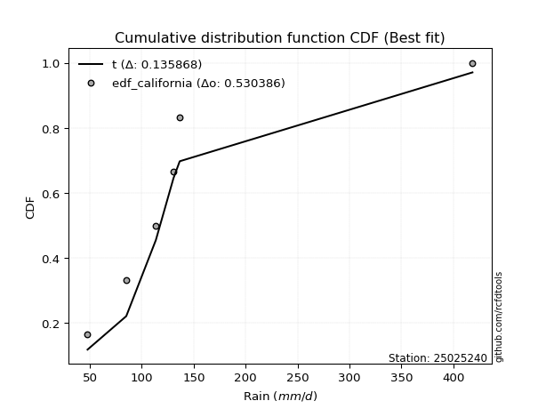</img></img>

</div>


### 2. EDF Hazen (1930)

Hazen method for plotting positions is a formula used to estimate the empirical cumulative probability distribution of flood events or other hydrological data. This formula often results in biased estimations, particularly when extrapolating to extreme events (high return periods).

<div align="center">


$P=(m-0.5)/n$


</div>


**2.1. Empirical values**

<div align="center">

|                | 0                  | 1                  | 2         | 3                 | 4                  |
|:---------------|:-------------------|:-------------------|:----------|:------------------|:-------------------|
| date           | 2020               | 2021               | 2023      | 2024              | 2022               |
| x              | 47.7               | 85.0               | 113.5     | 130.5             | 136.5              |
| m              | 1                  | 2                  | 3         | 4                 | 5                  |
| empirical_dist | edf_hazen          | edf_hazen          | edf_hazen | edf_hazen         | edf_hazen          |
| empirical      | 0.1                | 0.3                | 0.5       | 0.7               | 0.9                |
| empirical_tr   | 1.1111111111111112 | 1.4285714285714286 | 2.0       | 3.333333333333333 | 10.000000000000002 |

</div>


**2.2. Kolmogorov-Smirnov fit test (sorted by Δ)**


<div align="center">

|                | 0                   | 1                   | 2                   | 3                   | 4                   | 5                   | 6                   | 7                   | 8                  | 9                   | 10                  | 11                  | 12                  | 13                  | 14                  | 15                  | 16                  | 17                  | 18                  | 19                  | 20                  | 21                  | 22                  | 23                  | 24                 | 25                 | 26                  | 27                 | 28                  | 29                 | 30                 | 31                  | 32                  | 33                  | 34                 | 35                 | 36                  | 37                  | 38                  | 39                  | 40                  | 41                 | 42                 | 43                  | 44                  | 45                  | 46                 | 47                 | 48                  | 49                  | 50                    | 51                 | 52                 | 53                 | 54                  | 55                  | 56                  | 57                  | 58                  | 59                  | 60                 | 61                  | 62                  | 63                 | 64                  | 65                 | 66                  | 67                  | 68                  | 69                 | 70                  | 71                  | 72                 | 73                 | 74                 | 75                 | 76                  | 77                 | 78                  | 79                 | 80                  | 81                 | 82                  | 83                  | 84                 | 85                 | 86                 | 87                 |
|:---------------|:--------------------|:--------------------|:--------------------|:--------------------|:--------------------|:--------------------|:--------------------|:--------------------|:-------------------|:--------------------|:--------------------|:--------------------|:--------------------|:--------------------|:--------------------|:--------------------|:--------------------|:--------------------|:--------------------|:--------------------|:--------------------|:--------------------|:--------------------|:--------------------|:-------------------|:-------------------|:--------------------|:-------------------|:--------------------|:-------------------|:-------------------|:--------------------|:--------------------|:--------------------|:-------------------|:-------------------|:--------------------|:--------------------|:--------------------|:--------------------|:--------------------|:-------------------|:-------------------|:--------------------|:--------------------|:--------------------|:-------------------|:-------------------|:--------------------|:--------------------|:----------------------|:-------------------|:-------------------|:-------------------|:--------------------|:--------------------|:--------------------|:--------------------|:--------------------|:--------------------|:-------------------|:--------------------|:--------------------|:-------------------|:--------------------|:-------------------|:--------------------|:--------------------|:--------------------|:-------------------|:--------------------|:--------------------|:-------------------|:-------------------|:-------------------|:-------------------|:--------------------|:-------------------|:--------------------|:-------------------|:--------------------|:-------------------|:--------------------|:--------------------|:-------------------|:-------------------|:-------------------|:-------------------|
| station        | 25025240            | 25025240            | 25025240            | 25025240            | 25025240            | 25025240            | 25025240            | 25025240            | 25025240           | 25025240            | 25025240            | 25025240            | 25025240            | 25025240            | 25025240            | 25025240            | 25025240            | 25025240            | 25025240            | 25025240            | 25025240            | 25025240            | 25025240            | 25025240            | 25025240           | 25025240           | 25025240            | 25025240           | 25025240            | 25025240           | 25025240           | 25025240            | 25025240            | 25025240            | 25025240           | 25025240           | 25025240            | 25025240            | 25025240            | 25025240            | 25025240            | 25025240           | 25025240           | 25025240            | 25025240            | 25025240            | 25025240           | 25025240           | 25025240            | 25025240            | 25025240              | 25025240           | 25025240           | 25025240           | 25025240            | 25025240            | 25025240            | 25025240            | 25025240            | 25025240            | 25025240           | 25025240            | 25025240            | 25025240           | 25025240            | 25025240           | 25025240            | 25025240            | 25025240            | 25025240           | 25025240            | 25025240            | 25025240           | 25025240           | 25025240           | 25025240           | 25025240            | 25025240           | 25025240            | 25025240           | 25025240            | 25025240           | 25025240            | 25025240            | 25025240           | 25025240           | 25025240           | 25025240           |
| empirical_dist | edf_hazen           | edf_hazen           | edf_hazen           | edf_hazen           | edf_hazen           | edf_hazen           | edf_hazen           | edf_hazen           | edf_hazen          | edf_hazen           | edf_hazen           | edf_hazen           | edf_hazen           | edf_hazen           | edf_hazen           | edf_hazen           | edf_hazen           | edf_hazen           | edf_hazen           | edf_hazen           | edf_hazen           | edf_hazen           | edf_hazen           | edf_hazen           | edf_hazen          | edf_hazen          | edf_hazen           | edf_hazen          | edf_hazen           | edf_hazen          | edf_hazen          | edf_hazen           | edf_hazen           | edf_hazen           | edf_hazen          | edf_hazen          | edf_hazen           | edf_hazen           | edf_hazen           | edf_hazen           | edf_hazen           | edf_hazen          | edf_hazen          | edf_hazen           | edf_hazen           | edf_hazen           | edf_hazen          | edf_hazen          | edf_hazen           | edf_hazen           | edf_hazen             | edf_hazen          | edf_hazen          | edf_hazen          | edf_hazen           | edf_hazen           | edf_hazen           | edf_hazen           | edf_hazen           | edf_hazen           | edf_hazen          | edf_hazen           | edf_hazen           | edf_hazen          | edf_hazen           | edf_hazen          | edf_hazen           | edf_hazen           | edf_hazen           | edf_hazen          | edf_hazen           | edf_hazen           | edf_hazen          | edf_hazen          | edf_hazen          | edf_hazen          | edf_hazen           | edf_hazen          | edf_hazen           | edf_hazen          | edf_hazen           | edf_hazen          | edf_hazen           | edf_hazen           | edf_hazen          | edf_hazen          | edf_hazen          | edf_hazen          |
| p_dist         | fisk                | pearson3            | gumbel_l            | weibull_min         | logpearson3         | logfisk             | loggumbel_l         | logweibull_min      | t                  | crystalball         | norm                | truncnorm           | exponnorm           | nct                 | laplace_asymmetric  | erlang              | rice                | gamma               | chi2                | loggompertz         | alpha               | logmielke           | invgamma            | logistic            | ncf                | maxwell            | invgauss            | hypsecant          | rayleigh            | betaprime          | logbetaprime       | f                   | logf                | logt                | lognorm            | lognorm            | logcrystalball      | logexponnorm        | logncf              | loginvweibull       | lognct              | logerlang          | logfatiguelife     | logrice             | logalpha            | kstwobign           | loginvgamma        | loginvgauss        | loggamma            | loggamma            | loglaplace_asymmetric | logloggamma        | halfnorm           | loglogistic        | logmaxwell          | laplace             | logkstwobign        | loggenexpon         | lograyleigh         | gumbel_r            | expon              | loghypsecant        | loghalfnorm         | halflogistic       | moyal               | loggumbel_r        | loglaplace          | logjohnsonsu        | logchi2             | loghalflogistic    | mielke              | logmoyal            | logexpon           | wald               | logwald            | nakagami           | logtruncnorm        | lognakagami        | gibrat              | loggibrat          | loglognorm          | invweibull         | fatiguelife         | gompertz            | genexpon           | johnsonsu          | loggenlogistic     | genlogistic        |
| delta          | 0.09479323957235786 | 0.09754229989707841 | 0.11183444736697257 | 0.11491845274583357 | 0.11949368189602105 | 0.11964141224791114 | 0.12245030451321293 | 0.12370979221967104 | 0.129588460557291  | 0.12981942528631518 | 0.12981942874680708 | 0.12981943119174155 | 0.12981991570816986 | 0.12984884447707223 | 0.13746471920207382 | 0.13761130582042236 | 0.13813876459184948 | 0.14114608244331428 | 0.14356957694998695 | 0.14408829641342313 | 0.14440099229447356 | 0.14556179842257877 | 0.14576661534203994 | 0.14589603858109756 | 0.1520067665908278 | 0.1535396603970436 | 0.15623258665662365 | 0.1586756014654629 | 0.16076182914106085 | 0.1613387861931157 | 0.1631025321102233 | 0.16363502696911048 | 0.16480421561012892 | 0.16623994102154382 | 0.1662404497483242 | 0.1662404497483242 | 0.16624050060895368 | 0.16624227215196186 | 0.16732015802130995 | 0.16767584287368686 | 0.16782822769519212 | 0.1681634333617582 | 0.1685475734565498 | 0.17050499832936072 | 0.17111105519486924 | 0.17156596934224289 | 0.1730309162802841 | 0.175038919805669  | 0.17623528482323325 | 0.17623528482323325 | 0.17941971052062378   | 0.1805194447428078 | 0.1815464741044347 | 0.1854919914280121 | 0.18609903292432461 | 0.18707207736224496 | 0.19027634277078853 | 0.19043440304674453 | 0.19201382336838635 | 0.19276574703776506 | 0.198103243411335  | 0.20012063989689555 | 0.20940763486666913 | 0.2098799485911933 | 0.21385250540604828 | 0.2235149567991942 | 0.22763990928237487 | 0.23358227740558363 | 0.23501600858833677 | 0.2372156806038046 | 0.24189884822346075 | 0.24230484357422466 | 0.2616520767321007 | 0.2731008021066932 | 0.2960428430000063 | 0.299905912755697  | 0.29999917389989617 | 0.2999994871985044 | 0.30530687600717377 | 0.3280990531908897 | 0.38162485804044216 | 0.436934545794096  | 0.45681372007356785 | 0.48719942578792763 | 0.5919370960956243 | 0.6370769299204905 | 0.7                | 0.7                |
| deltao         | 0.5865427407550001  | 0.5865427407550001  | 0.5865427407550001  | 0.5865427407550001  | 0.5865427407550001  | 0.5865427407550001  | 0.5865427407550001  | 0.5865427407550001  | 0.5865427407550001 | 0.5865427407550001  | 0.5865427407550001  | 0.5865427407550001  | 0.5865427407550001  | 0.5865427407550001  | 0.5865427407550001  | 0.5865427407550001  | 0.5865427407550001  | 0.5865427407550001  | 0.5865427407550001  | 0.5865427407550001  | 0.5865427407550001  | 0.5865427407550001  | 0.5865427407550001  | 0.5865427407550001  | 0.5865427407550001 | 0.5865427407550001 | 0.5865427407550001  | 0.5865427407550001 | 0.5865427407550001  | 0.5865427407550001 | 0.5865427407550001 | 0.5865427407550001  | 0.5865427407550001  | 0.5865427407550001  | 0.5865427407550001 | 0.5865427407550001 | 0.5865427407550001  | 0.5865427407550001  | 0.5865427407550001  | 0.5865427407550001  | 0.5865427407550001  | 0.5865427407550001 | 0.5865427407550001 | 0.5865427407550001  | 0.5865427407550001  | 0.5865427407550001  | 0.5865427407550001 | 0.5865427407550001 | 0.5865427407550001  | 0.5865427407550001  | 0.5865427407550001    | 0.5865427407550001 | 0.5865427407550001 | 0.5865427407550001 | 0.5865427407550001  | 0.5865427407550001  | 0.5865427407550001  | 0.5865427407550001  | 0.5865427407550001  | 0.5865427407550001  | 0.5865427407550001 | 0.5865427407550001  | 0.5865427407550001  | 0.5865427407550001 | 0.5865427407550001  | 0.5865427407550001 | 0.5865427407550001  | 0.5865427407550001  | 0.5865427407550001  | 0.5865427407550001 | 0.5865427407550001  | 0.5865427407550001  | 0.5865427407550001 | 0.5865427407550001 | 0.5865427407550001 | 0.5865427407550001 | 0.5865427407550001  | 0.5865427407550001 | 0.5865427407550001  | 0.5865427407550001 | 0.5865427407550001  | 0.5865427407550001 | 0.5865427407550001  | 0.5865427407550001  | 0.5865427407550001 | 0.5865427407550001 | 0.5865427407550001 | 0.5865427407550001 |
| eval           | Δo > Δ              | Δo > Δ              | Δo > Δ              | Δo > Δ              | Δo > Δ              | Δo > Δ              | Δo > Δ              | Δo > Δ              | Δo > Δ             | Δo > Δ              | Δo > Δ              | Δo > Δ              | Δo > Δ              | Δo > Δ              | Δo > Δ              | Δo > Δ              | Δo > Δ              | Δo > Δ              | Δo > Δ              | Δo > Δ              | Δo > Δ              | Δo > Δ              | Δo > Δ              | Δo > Δ              | Δo > Δ             | Δo > Δ             | Δo > Δ              | Δo > Δ             | Δo > Δ              | Δo > Δ             | Δo > Δ             | Δo > Δ              | Δo > Δ              | Δo > Δ              | Δo > Δ             | Δo > Δ             | Δo > Δ              | Δo > Δ              | Δo > Δ              | Δo > Δ              | Δo > Δ              | Δo > Δ             | Δo > Δ             | Δo > Δ              | Δo > Δ              | Δo > Δ              | Δo > Δ             | Δo > Δ             | Δo > Δ              | Δo > Δ              | Δo > Δ                | Δo > Δ             | Δo > Δ             | Δo > Δ             | Δo > Δ              | Δo > Δ              | Δo > Δ              | Δo > Δ              | Δo > Δ              | Δo > Δ              | Δo > Δ             | Δo > Δ              | Δo > Δ              | Δo > Δ             | Δo > Δ              | Δo > Δ             | Δo > Δ              | Δo > Δ              | Δo > Δ              | Δo > Δ             | Δo > Δ              | Δo > Δ              | Δo > Δ             | Δo > Δ             | Δo > Δ             | Δo > Δ             | Δo > Δ              | Δo > Δ             | Δo > Δ              | Δo > Δ             | Δo > Δ              | Δo > Δ             | Δo > Δ              | Δo > Δ              | Δo <= Δ            | Δo <= Δ            | Δo <= Δ            | Δo <= Δ            |
| fit            | 1                   | 1                   | 1                   | 1                   | 1                   | 1                   | 1                   | 1                   | 1                  | 1                   | 1                   | 1                   | 1                   | 1                   | 1                   | 1                   | 1                   | 1                   | 1                   | 1                   | 1                   | 1                   | 1                   | 1                   | 1                  | 1                  | 1                   | 1                  | 1                   | 1                  | 1                  | 1                   | 1                   | 1                   | 1                  | 1                  | 1                   | 1                   | 1                   | 1                   | 1                   | 1                  | 1                  | 1                   | 1                   | 1                   | 1                  | 1                  | 1                   | 1                   | 1                     | 1                  | 1                  | 1                  | 1                   | 1                   | 1                   | 1                   | 1                   | 1                   | 1                  | 1                   | 1                   | 1                  | 1                   | 1                  | 1                   | 1                   | 1                   | 1                  | 1                   | 1                   | 1                  | 1                  | 1                  | 1                  | 1                   | 1                  | 1                   | 1                  | 1                   | 1                  | 1                   | 1                   | 0                  | 0                  | 0                  | 0                  |
| n              | 5                   | 5                   | 5                   | 5                   | 5                   | 5                   | 5                   | 5                   | 5                  | 5                   | 5                   | 5                   | 5                   | 5                   | 5                   | 5                   | 5                   | 5                   | 5                   | 5                   | 5                   | 5                   | 5                   | 5                   | 5                  | 5                  | 5                   | 5                  | 5                   | 5                  | 5                  | 5                   | 5                   | 5                   | 5                  | 5                  | 5                   | 5                   | 5                   | 5                   | 5                   | 5                  | 5                  | 5                   | 5                   | 5                   | 5                  | 5                  | 5                   | 5                   | 5                     | 5                  | 5                  | 5                  | 5                   | 5                   | 5                   | 5                   | 5                   | 5                   | 5                  | 5                   | 5                   | 5                  | 5                   | 5                  | 5                   | 5                   | 5                   | 5                  | 5                   | 5                   | 5                  | 5                  | 5                  | 5                  | 5                   | 5                  | 5                   | 5                  | 5                   | 5                  | 5                   | 5                   | 5                  | 5                  | 5                  | 5                  |
| best_fit       | 1                   | 0                   | 0                   | 0                   | 0                   | 0                   | 0                   | 0                   | 0                  | 0                   | 0                   | 0                   | 0                   | 0                   | 0                   | 0                   | 0                   | 0                   | 0                   | 0                   | 0                   | 0                   | 0                   | 0                   | 0                  | 0                  | 0                   | 0                  | 0                   | 0                  | 0                  | 0                   | 0                   | 0                   | 0                  | 0                  | 0                   | 0                   | 0                   | 0                   | 0                   | 0                  | 0                  | 0                   | 0                   | 0                   | 0                  | 0                  | 0                   | 0                   | 0                     | 0                  | 0                  | 0                  | 0                   | 0                   | 0                   | 0                   | 0                   | 0                   | 0                  | 0                   | 0                   | 0                  | 0                   | 0                  | 0                   | 0                   | 0                   | 0                  | 0                   | 0                   | 0                  | 0                  | 0                  | 0                  | 0                   | 0                  | 0                   | 0                  | 0                   | 0                  | 0                   | 0                   | 0                  | 0                  | 0                  | 0                  |
| best_fit_sort  | 1                   | 2                   | 3                   | 4                   | 5                   | 6                   | 7                   | 8                   | 9                  | 10                  | 11                  | 12                  | 13                  | 14                  | 15                  | 16                  | 17                  | 18                  | 19                  | 20                  | 21                  | 22                  | 23                  | 24                  | 25                 | 26                 | 27                  | 28                 | 29                  | 30                 | 31                 | 32                  | 33                  | 34                  | 35                 | 36                 | 37                  | 38                  | 39                  | 40                  | 41                  | 42                 | 43                 | 44                  | 45                  | 46                  | 47                 | 48                 | 49                  | 50                  | 51                    | 52                 | 53                 | 54                 | 55                  | 56                  | 57                  | 58                  | 59                  | 60                  | 61                 | 62                  | 63                  | 64                 | 65                  | 66                 | 67                  | 68                  | 69                  | 70                 | 71                  | 72                  | 73                 | 74                 | 75                 | 76                 | 77                  | 78                 | 79                  | 80                 | 81                  | 82                 | 83                  | 84                  | 85                 | 86                 | 87                 | 88                 |

</div>


**2.3. Best fit**

<div align="center">

|   id |   station | empirical_dist   | p_dist   |     delta |   deltao | eval   |   fit |   n |   best_fit |   best_fit_sort |
|-----:|----------:|:-----------------|:---------|----------:|---------:|:-------|------:|----:|-----------:|----------------:|
|    0 |  25025240 | edf_hazen        | fisk     | 0.0947932 | 0.586543 | Δo > Δ |     1 |   5 |          1 |               1 |

</div>


<div align="center">

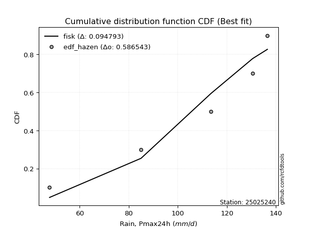</img>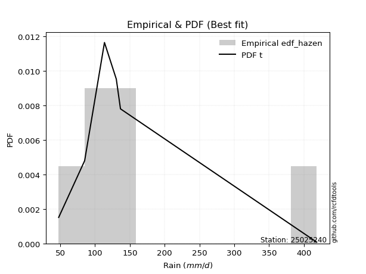</img>

</div>


### 3. EDF Weibull (1939)

Weibull plotting position formula is an empirical method used to estimate the non-exceedance probability or plotting position for a set of observed data, is often recommended or widely used in practice, particularly in flood frequency analysis.

<div align="center">


$P=m/(n+1)$


</div>


**3.1. Empirical values**

<div align="center">

|                | 0                   | 1                  | 2           | 3                  | 4                  |
|:---------------|:--------------------|:-------------------|:------------|:-------------------|:-------------------|
| date           | 2020                | 2021               | 2023        | 2024               | 2022               |
| x              | 47.7                | 85.0               | 113.5       | 130.5              | 136.5              |
| m              | 1                   | 2                  | 3           | 4                  | 5                  |
| empirical_dist | edf_weibull         | edf_weibull        | edf_weibull | edf_weibull        | edf_weibull        |
| empirical      | 0.16666666666666666 | 0.3333333333333333 | 0.5         | 0.6666666666666666 | 0.8333333333333334 |
| empirical_tr   | 1.2                 | 1.4999999999999998 | 2.0         | 2.9999999999999996 | 6.000000000000002  |

</div>


**3.2. Kolmogorov-Smirnov fit test (sorted by Δ)**


<div align="center">

|                | 0                   | 1                   | 2                   | 3                   | 4                   | 5                   | 6                   | 7                   | 8                   | 9                   | 10                  | 11                  | 12                  | 13                  | 14                  | 15                  | 16                 | 17                  | 18                  | 19                 | 20                 | 21                 | 22                  | 23                  | 24                  | 25                 | 26                 | 27                 | 28                  | 29                  | 30                  | 31                 | 32                 | 33                  | 34                  | 35                  | 36                  | 37                  | 38                 | 39                 | 40                 | 41                  | 42                  | 43                  | 44                  | 45                 | 46                 | 47                  | 48                  | 49                 | 50                 | 51                 | 52                  | 53                  | 54                  | 55                  | 56                  | 57                  | 58                 | 59                  | 60                 | 61                  | 62                  | 63                 | 64                    | 65                  | 66                  | 67                 | 68                  | 69                 | 70                 | 71                  | 72                  | 73                 | 74                 | 75                  | 76                 | 77                 | 78                 | 79                 | 80                  | 81                  | 82                 | 83                  | 84                 | 85                 | 86                 | 87                 |
|:---------------|:--------------------|:--------------------|:--------------------|:--------------------|:--------------------|:--------------------|:--------------------|:--------------------|:--------------------|:--------------------|:--------------------|:--------------------|:--------------------|:--------------------|:--------------------|:--------------------|:-------------------|:--------------------|:--------------------|:-------------------|:-------------------|:-------------------|:--------------------|:--------------------|:--------------------|:-------------------|:-------------------|:-------------------|:--------------------|:--------------------|:--------------------|:-------------------|:-------------------|:--------------------|:--------------------|:--------------------|:--------------------|:--------------------|:-------------------|:-------------------|:-------------------|:--------------------|:--------------------|:--------------------|:--------------------|:-------------------|:-------------------|:--------------------|:--------------------|:-------------------|:-------------------|:-------------------|:--------------------|:--------------------|:--------------------|:--------------------|:--------------------|:--------------------|:-------------------|:--------------------|:-------------------|:--------------------|:--------------------|:-------------------|:----------------------|:--------------------|:--------------------|:-------------------|:--------------------|:-------------------|:-------------------|:--------------------|:--------------------|:-------------------|:-------------------|:--------------------|:-------------------|:-------------------|:-------------------|:-------------------|:--------------------|:--------------------|:-------------------|:--------------------|:-------------------|:-------------------|:-------------------|:-------------------|
| station        | 25025240            | 25025240            | 25025240            | 25025240            | 25025240            | 25025240            | 25025240            | 25025240            | 25025240            | 25025240            | 25025240            | 25025240            | 25025240            | 25025240            | 25025240            | 25025240            | 25025240           | 25025240            | 25025240            | 25025240           | 25025240           | 25025240           | 25025240            | 25025240            | 25025240            | 25025240           | 25025240           | 25025240           | 25025240            | 25025240            | 25025240            | 25025240           | 25025240           | 25025240            | 25025240            | 25025240            | 25025240            | 25025240            | 25025240           | 25025240           | 25025240           | 25025240            | 25025240            | 25025240            | 25025240            | 25025240           | 25025240           | 25025240            | 25025240            | 25025240           | 25025240           | 25025240           | 25025240            | 25025240            | 25025240            | 25025240            | 25025240            | 25025240            | 25025240           | 25025240            | 25025240           | 25025240            | 25025240            | 25025240           | 25025240              | 25025240            | 25025240            | 25025240           | 25025240            | 25025240           | 25025240           | 25025240            | 25025240            | 25025240           | 25025240           | 25025240            | 25025240           | 25025240           | 25025240           | 25025240           | 25025240            | 25025240            | 25025240           | 25025240            | 25025240           | 25025240           | 25025240           | 25025240           |
| empirical_dist | edf_weibull         | edf_weibull         | edf_weibull         | edf_weibull         | edf_weibull         | edf_weibull         | edf_weibull         | edf_weibull         | edf_weibull         | edf_weibull         | edf_weibull         | edf_weibull         | edf_weibull         | edf_weibull         | edf_weibull         | edf_weibull         | edf_weibull        | edf_weibull         | edf_weibull         | edf_weibull        | edf_weibull        | edf_weibull        | edf_weibull         | edf_weibull         | edf_weibull         | edf_weibull        | edf_weibull        | edf_weibull        | edf_weibull         | edf_weibull         | edf_weibull         | edf_weibull        | edf_weibull        | edf_weibull         | edf_weibull         | edf_weibull         | edf_weibull         | edf_weibull         | edf_weibull        | edf_weibull        | edf_weibull        | edf_weibull         | edf_weibull         | edf_weibull         | edf_weibull         | edf_weibull        | edf_weibull        | edf_weibull         | edf_weibull         | edf_weibull        | edf_weibull        | edf_weibull        | edf_weibull         | edf_weibull         | edf_weibull         | edf_weibull         | edf_weibull         | edf_weibull         | edf_weibull        | edf_weibull         | edf_weibull        | edf_weibull         | edf_weibull         | edf_weibull        | edf_weibull           | edf_weibull         | edf_weibull         | edf_weibull        | edf_weibull         | edf_weibull        | edf_weibull        | edf_weibull         | edf_weibull         | edf_weibull        | edf_weibull        | edf_weibull         | edf_weibull        | edf_weibull        | edf_weibull        | edf_weibull        | edf_weibull         | edf_weibull         | edf_weibull        | edf_weibull         | edf_weibull        | edf_weibull        | edf_weibull        | edf_weibull        |
| p_dist         | fisk                | logpearson3         | loggumbel_l         | pearson3            | t                   | logfisk             | nct                 | crystalball         | norm                | truncnorm           | exponnorm           | erlang              | rice                | gamma               | chi2                | alpha               | gumbel_l           | invgamma            | logweibull_min      | weibull_min        | ncf                | maxwell            | invgauss            | logistic            | rayleigh            | betaprime          | logbetaprime       | loggompertz        | f                   | logf                | logt                | lognorm            | lognorm            | logcrystalball      | logexponnorm        | logncf              | loginvweibull       | lognct              | logerlang          | logfatiguelife     | hypsecant          | logrice             | laplace_asymmetric  | logalpha            | kstwobign           | loginvgamma        | loginvgauss        | loggamma            | loggamma            | logmielke          | halfnorm           | loglogistic        | logmaxwell          | laplace             | logkstwobign        | loggenexpon         | lograyleigh         | gumbel_r            | expon              | loghypsecant        | logjohnsonsu       | logchi2             | loghalfnorm         | halflogistic       | loglaplace_asymmetric | moyal               | logloggamma         | loggumbel_r        | loglaplace          | logexpon           | loghalflogistic    | logmoyal            | mielke              | wald               | logwald            | gibrat              | loggibrat          | nakagami           | logtruncnorm       | lognakagami        | loglognorm          | invweibull          | fatiguelife        | gompertz            | genexpon           | johnsonsu          | loggenlogistic     | genlogistic        |
| delta          | 0.11900668151793645 | 0.11949368189602105 | 0.12245030451321293 | 0.13087563323041174 | 0.13551711131652622 | 0.13560176033321325 | 0.13569095511662443 | 0.13569923284353147 | 0.13569923576954634 | 0.13569924124065702 | 0.13569946014301904 | 0.13761130582042236 | 0.13813876459184948 | 0.14114608244331428 | 0.14356957694998695 | 0.14440099229447356 | 0.1451677807003059 | 0.14576661534203994 | 0.14606922099588338 | 0.1482517860791669 | 0.1520067665908278 | 0.1535396603970436 | 0.15623258665662365 | 0.15707628088755976 | 0.16076182914106085 | 0.1613387861931157 | 0.1631025321102233 | 0.1634254914939334 | 0.16363502696911048 | 0.16480421561012892 | 0.16623994102154382 | 0.1662404497483242 | 0.1662404497483242 | 0.16624050060895368 | 0.16624227215196186 | 0.16732015802130995 | 0.16767584287368686 | 0.16782822769519212 | 0.1681634333617582 | 0.1685475734565498 | 0.16956869239395   | 0.17050499832936072 | 0.17079805253540714 | 0.17111105519486924 | 0.17156596934224289 | 0.1730309162802841 | 0.175038919805669  | 0.17623528482323325 | 0.17623528482323325 | 0.1788951317559121 | 0.1815464741044347 | 0.1854919914280121 | 0.18609903292432461 | 0.18707207736224496 | 0.19027634277078853 | 0.19043440304674453 | 0.19201382336838635 | 0.19276574703776506 | 0.198103243411335  | 0.20012063989689555 | 0.2002489440722503 | 0.20168267525500344 | 0.20940763486666913 | 0.2098799485911933 | 0.2127530438539571    | 0.21385250540604828 | 0.21385277807614111 | 0.2235149567991942 | 0.22763990928237487 | 0.2283187433987674 | 0.2372156806038046 | 0.24230484357422466 | 0.26369763459496365 | 0.2731008021066932 | 0.2960428430000063 | 0.30530687600717377 | 0.3280990531908897 | 0.3332392460890303 | 0.3333325072332295 | 0.3333328205318377 | 0.34829152470710883 | 0.37026787912742937 | 0.4234803867402345 | 0.48719942578792763 | 0.5586037627622911 | 0.6037435965871571 | 0.6666666666666666 | 0.6666666666666666 |
| deltao         | 0.5865427407550001  | 0.5865427407550001  | 0.5865427407550001  | 0.5865427407550001  | 0.5865427407550001  | 0.5865427407550001  | 0.5865427407550001  | 0.5865427407550001  | 0.5865427407550001  | 0.5865427407550001  | 0.5865427407550001  | 0.5865427407550001  | 0.5865427407550001  | 0.5865427407550001  | 0.5865427407550001  | 0.5865427407550001  | 0.5865427407550001 | 0.5865427407550001  | 0.5865427407550001  | 0.5865427407550001 | 0.5865427407550001 | 0.5865427407550001 | 0.5865427407550001  | 0.5865427407550001  | 0.5865427407550001  | 0.5865427407550001 | 0.5865427407550001 | 0.5865427407550001 | 0.5865427407550001  | 0.5865427407550001  | 0.5865427407550001  | 0.5865427407550001 | 0.5865427407550001 | 0.5865427407550001  | 0.5865427407550001  | 0.5865427407550001  | 0.5865427407550001  | 0.5865427407550001  | 0.5865427407550001 | 0.5865427407550001 | 0.5865427407550001 | 0.5865427407550001  | 0.5865427407550001  | 0.5865427407550001  | 0.5865427407550001  | 0.5865427407550001 | 0.5865427407550001 | 0.5865427407550001  | 0.5865427407550001  | 0.5865427407550001 | 0.5865427407550001 | 0.5865427407550001 | 0.5865427407550001  | 0.5865427407550001  | 0.5865427407550001  | 0.5865427407550001  | 0.5865427407550001  | 0.5865427407550001  | 0.5865427407550001 | 0.5865427407550001  | 0.5865427407550001 | 0.5865427407550001  | 0.5865427407550001  | 0.5865427407550001 | 0.5865427407550001    | 0.5865427407550001  | 0.5865427407550001  | 0.5865427407550001 | 0.5865427407550001  | 0.5865427407550001 | 0.5865427407550001 | 0.5865427407550001  | 0.5865427407550001  | 0.5865427407550001 | 0.5865427407550001 | 0.5865427407550001  | 0.5865427407550001 | 0.5865427407550001 | 0.5865427407550001 | 0.5865427407550001 | 0.5865427407550001  | 0.5865427407550001  | 0.5865427407550001 | 0.5865427407550001  | 0.5865427407550001 | 0.5865427407550001 | 0.5865427407550001 | 0.5865427407550001 |
| eval           | Δo > Δ              | Δo > Δ              | Δo > Δ              | Δo > Δ              | Δo > Δ              | Δo > Δ              | Δo > Δ              | Δo > Δ              | Δo > Δ              | Δo > Δ              | Δo > Δ              | Δo > Δ              | Δo > Δ              | Δo > Δ              | Δo > Δ              | Δo > Δ              | Δo > Δ             | Δo > Δ              | Δo > Δ              | Δo > Δ             | Δo > Δ             | Δo > Δ             | Δo > Δ              | Δo > Δ              | Δo > Δ              | Δo > Δ             | Δo > Δ             | Δo > Δ             | Δo > Δ              | Δo > Δ              | Δo > Δ              | Δo > Δ             | Δo > Δ             | Δo > Δ              | Δo > Δ              | Δo > Δ              | Δo > Δ              | Δo > Δ              | Δo > Δ             | Δo > Δ             | Δo > Δ             | Δo > Δ              | Δo > Δ              | Δo > Δ              | Δo > Δ              | Δo > Δ             | Δo > Δ             | Δo > Δ              | Δo > Δ              | Δo > Δ             | Δo > Δ             | Δo > Δ             | Δo > Δ              | Δo > Δ              | Δo > Δ              | Δo > Δ              | Δo > Δ              | Δo > Δ              | Δo > Δ             | Δo > Δ              | Δo > Δ             | Δo > Δ              | Δo > Δ              | Δo > Δ             | Δo > Δ                | Δo > Δ              | Δo > Δ              | Δo > Δ             | Δo > Δ              | Δo > Δ             | Δo > Δ             | Δo > Δ              | Δo > Δ              | Δo > Δ             | Δo > Δ             | Δo > Δ              | Δo > Δ             | Δo > Δ             | Δo > Δ             | Δo > Δ             | Δo > Δ              | Δo > Δ              | Δo > Δ             | Δo > Δ              | Δo > Δ             | Δo <= Δ            | Δo <= Δ            | Δo <= Δ            |
| fit            | 1                   | 1                   | 1                   | 1                   | 1                   | 1                   | 1                   | 1                   | 1                   | 1                   | 1                   | 1                   | 1                   | 1                   | 1                   | 1                   | 1                  | 1                   | 1                   | 1                  | 1                  | 1                  | 1                   | 1                   | 1                   | 1                  | 1                  | 1                  | 1                   | 1                   | 1                   | 1                  | 1                  | 1                   | 1                   | 1                   | 1                   | 1                   | 1                  | 1                  | 1                  | 1                   | 1                   | 1                   | 1                   | 1                  | 1                  | 1                   | 1                   | 1                  | 1                  | 1                  | 1                   | 1                   | 1                   | 1                   | 1                   | 1                   | 1                  | 1                   | 1                  | 1                   | 1                   | 1                  | 1                     | 1                   | 1                   | 1                  | 1                   | 1                  | 1                  | 1                   | 1                   | 1                  | 1                  | 1                   | 1                  | 1                  | 1                  | 1                  | 1                   | 1                   | 1                  | 1                   | 1                  | 0                  | 0                  | 0                  |
| n              | 5                   | 5                   | 5                   | 5                   | 5                   | 5                   | 5                   | 5                   | 5                   | 5                   | 5                   | 5                   | 5                   | 5                   | 5                   | 5                   | 5                  | 5                   | 5                   | 5                  | 5                  | 5                  | 5                   | 5                   | 5                   | 5                  | 5                  | 5                  | 5                   | 5                   | 5                   | 5                  | 5                  | 5                   | 5                   | 5                   | 5                   | 5                   | 5                  | 5                  | 5                  | 5                   | 5                   | 5                   | 5                   | 5                  | 5                  | 5                   | 5                   | 5                  | 5                  | 5                  | 5                   | 5                   | 5                   | 5                   | 5                   | 5                   | 5                  | 5                   | 5                  | 5                   | 5                   | 5                  | 5                     | 5                   | 5                   | 5                  | 5                   | 5                  | 5                  | 5                   | 5                   | 5                  | 5                  | 5                   | 5                  | 5                  | 5                  | 5                  | 5                   | 5                   | 5                  | 5                   | 5                  | 5                  | 5                  | 5                  |
| best_fit       | 1                   | 0                   | 0                   | 0                   | 0                   | 0                   | 0                   | 0                   | 0                   | 0                   | 0                   | 0                   | 0                   | 0                   | 0                   | 0                   | 0                  | 0                   | 0                   | 0                  | 0                  | 0                  | 0                   | 0                   | 0                   | 0                  | 0                  | 0                  | 0                   | 0                   | 0                   | 0                  | 0                  | 0                   | 0                   | 0                   | 0                   | 0                   | 0                  | 0                  | 0                  | 0                   | 0                   | 0                   | 0                   | 0                  | 0                  | 0                   | 0                   | 0                  | 0                  | 0                  | 0                   | 0                   | 0                   | 0                   | 0                   | 0                   | 0                  | 0                   | 0                  | 0                   | 0                   | 0                  | 0                     | 0                   | 0                   | 0                  | 0                   | 0                  | 0                  | 0                   | 0                   | 0                  | 0                  | 0                   | 0                  | 0                  | 0                  | 0                  | 0                   | 0                   | 0                  | 0                   | 0                  | 0                  | 0                  | 0                  |
| best_fit_sort  | 1                   | 2                   | 3                   | 4                   | 5                   | 6                   | 7                   | 8                   | 9                   | 10                  | 11                  | 12                  | 13                  | 14                  | 15                  | 16                  | 17                 | 18                  | 19                  | 20                 | 21                 | 22                 | 23                  | 24                  | 25                  | 26                 | 27                 | 28                 | 29                  | 30                  | 31                  | 32                 | 33                 | 34                  | 35                  | 36                  | 37                  | 38                  | 39                 | 40                 | 41                 | 42                  | 43                  | 44                  | 45                  | 46                 | 47                 | 48                  | 49                  | 50                 | 51                 | 52                 | 53                  | 54                  | 55                  | 56                  | 57                  | 58                  | 59                 | 60                  | 61                 | 62                  | 63                  | 64                 | 65                    | 66                  | 67                  | 68                 | 69                  | 70                 | 71                 | 72                  | 73                  | 74                 | 75                 | 76                  | 77                 | 78                 | 79                 | 80                 | 81                  | 82                  | 83                 | 84                  | 85                 | 86                 | 87                 | 88                 |

</div>


**3.3. Best fit**

<div align="center">

|   id |   station | empirical_dist   | p_dist   |    delta |   deltao | eval   |   fit |   n |   best_fit |   best_fit_sort |
|-----:|----------:|:-----------------|:---------|---------:|---------:|:-------|------:|----:|-----------:|----------------:|
|    0 |  25025240 | edf_weibull      | fisk     | 0.119007 | 0.586543 | Δo > Δ |     1 |   5 |          1 |               1 |

</div>


<div align="center">

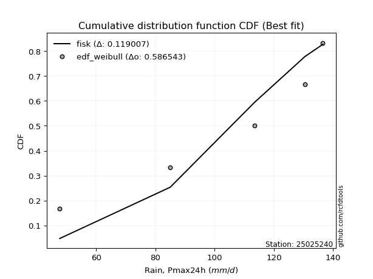</img>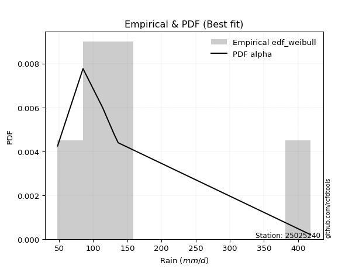</img>

</div>


### 4. EDF Beard (1943)

The Beard formula (or Beard´s plotting position formula) in hydrology is used to estimate the empirical non-exceedance probability _(P)_ of a flood event (or other extreme hydrological data point) within a given dataset.

<div align="center">


$P=(m-0.31)/(n+0.38)$


</div>


**4.1. Empirical values**

<div align="center">

|                | 0                   | 1                  | 2         | 3                  | 4                  |
|:---------------|:--------------------|:-------------------|:----------|:-------------------|:-------------------|
| date           | 2020                | 2021               | 2023      | 2024               | 2022               |
| x              | 47.7                | 85.0               | 113.5     | 130.5              | 136.5              |
| m              | 1                   | 2                  | 3         | 4                  | 5                  |
| empirical_dist | edf_beard           | edf_beard          | edf_beard | edf_beard          | edf_beard          |
| empirical      | 0.12825278810408922 | 0.3141263940520446 | 0.5       | 0.6858736059479554 | 0.8717472118959109 |
| empirical_tr   | 1.1471215351812367  | 1.4579945799457996 | 2.0       | 3.183431952662722  | 7.797101449275368  |

</div>


**4.2. Kolmogorov-Smirnov fit test (sorted by Δ)**


<div align="center">

|                | 0                   | 1                   | 2                   | 3                   | 4                   | 5                  | 6                   | 7                  | 8                  | 9                   | 10                  | 11                  | 12                  | 13                  | 14                  | 15                  | 16                  | 17                  | 18                  | 19                  | 20                  | 21                  | 22                  | 23                 | 24                 | 25                  | 26                 | 27                 | 28                  | 29                 | 30                 | 31                  | 32                  | 33                  | 34                 | 35                 | 36                  | 37                  | 38                  | 39                  | 40                  | 41                 | 42                 | 43                  | 44                  | 45                  | 46                 | 47                 | 48                  | 49                  | 50                 | 51                 | 52                  | 53                  | 54                  | 55                  | 56                  | 57                  | 58                    | 59                 | 60                 | 61                  | 62                  | 63                 | 64                  | 65                 | 66                  | 67                 | 68                  | 69                 | 70                  | 71                  | 72                 | 73                 | 74                 | 75                  | 76                  | 77                 | 78                 | 79                 | 80                  | 81                  | 82                 | 83                  | 84                 | 85                 | 86                 | 87                 |
|:---------------|:--------------------|:--------------------|:--------------------|:--------------------|:--------------------|:-------------------|:--------------------|:-------------------|:-------------------|:--------------------|:--------------------|:--------------------|:--------------------|:--------------------|:--------------------|:--------------------|:--------------------|:--------------------|:--------------------|:--------------------|:--------------------|:--------------------|:--------------------|:-------------------|:-------------------|:--------------------|:-------------------|:-------------------|:--------------------|:-------------------|:-------------------|:--------------------|:--------------------|:--------------------|:-------------------|:-------------------|:--------------------|:--------------------|:--------------------|:--------------------|:--------------------|:-------------------|:-------------------|:--------------------|:--------------------|:--------------------|:-------------------|:-------------------|:--------------------|:--------------------|:-------------------|:-------------------|:--------------------|:--------------------|:--------------------|:--------------------|:--------------------|:--------------------|:----------------------|:-------------------|:-------------------|:--------------------|:--------------------|:-------------------|:--------------------|:-------------------|:--------------------|:-------------------|:--------------------|:-------------------|:--------------------|:--------------------|:-------------------|:-------------------|:-------------------|:--------------------|:--------------------|:-------------------|:-------------------|:-------------------|:--------------------|:--------------------|:-------------------|:--------------------|:-------------------|:-------------------|:-------------------|:-------------------|
| station        | 25025240            | 25025240            | 25025240            | 25025240            | 25025240            | 25025240           | 25025240            | 25025240           | 25025240           | 25025240            | 25025240            | 25025240            | 25025240            | 25025240            | 25025240            | 25025240            | 25025240            | 25025240            | 25025240            | 25025240            | 25025240            | 25025240            | 25025240            | 25025240           | 25025240           | 25025240            | 25025240           | 25025240           | 25025240            | 25025240           | 25025240           | 25025240            | 25025240            | 25025240            | 25025240           | 25025240           | 25025240            | 25025240            | 25025240            | 25025240            | 25025240            | 25025240           | 25025240           | 25025240            | 25025240            | 25025240            | 25025240           | 25025240           | 25025240            | 25025240            | 25025240           | 25025240           | 25025240            | 25025240            | 25025240            | 25025240            | 25025240            | 25025240            | 25025240              | 25025240           | 25025240           | 25025240            | 25025240            | 25025240           | 25025240            | 25025240           | 25025240            | 25025240           | 25025240            | 25025240           | 25025240            | 25025240            | 25025240           | 25025240           | 25025240           | 25025240            | 25025240            | 25025240           | 25025240           | 25025240           | 25025240            | 25025240            | 25025240           | 25025240            | 25025240           | 25025240           | 25025240           | 25025240           |
| empirical_dist | edf_beard           | edf_beard           | edf_beard           | edf_beard           | edf_beard           | edf_beard          | edf_beard           | edf_beard          | edf_beard          | edf_beard           | edf_beard           | edf_beard           | edf_beard           | edf_beard           | edf_beard           | edf_beard           | edf_beard           | edf_beard           | edf_beard           | edf_beard           | edf_beard           | edf_beard           | edf_beard           | edf_beard          | edf_beard          | edf_beard           | edf_beard          | edf_beard          | edf_beard           | edf_beard          | edf_beard          | edf_beard           | edf_beard           | edf_beard           | edf_beard          | edf_beard          | edf_beard           | edf_beard           | edf_beard           | edf_beard           | edf_beard           | edf_beard          | edf_beard          | edf_beard           | edf_beard           | edf_beard           | edf_beard          | edf_beard          | edf_beard           | edf_beard           | edf_beard          | edf_beard          | edf_beard           | edf_beard           | edf_beard           | edf_beard           | edf_beard           | edf_beard           | edf_beard             | edf_beard          | edf_beard          | edf_beard           | edf_beard           | edf_beard          | edf_beard           | edf_beard          | edf_beard           | edf_beard          | edf_beard           | edf_beard          | edf_beard           | edf_beard           | edf_beard          | edf_beard          | edf_beard          | edf_beard           | edf_beard           | edf_beard          | edf_beard          | edf_beard          | edf_beard           | edf_beard           | edf_beard          | edf_beard           | edf_beard          | edf_beard          | edf_beard          | edf_beard          |
| p_dist         | fisk                | pearson3            | logpearson3         | logfisk             | loggumbel_l         | gumbel_l           | logweibull_min      | weibull_min        | t                  | crystalball         | norm                | truncnorm           | exponnorm           | nct                 | erlang              | rice                | gamma               | chi2                | loggompertz         | alpha               | invgamma            | logistic            | laplace_asymmetric  | ncf                | maxwell            | invgauss            | hypsecant          | logmielke          | rayleigh            | betaprime          | logbetaprime       | f                   | logf                | logt                | lognorm            | lognorm            | logcrystalball      | logexponnorm        | logncf              | loginvweibull       | lognct              | logerlang          | logfatiguelife     | logrice             | logalpha            | kstwobign           | loginvgamma        | loginvgauss        | loggamma            | loggamma            | halfnorm           | loglogistic        | logmaxwell          | laplace             | logkstwobign        | loggenexpon         | lograyleigh         | gumbel_r            | loglaplace_asymmetric | logloggamma        | expon              | loghypsecant        | loghalfnorm         | halflogistic       | moyal               | logjohnsonsu       | logchi2             | loggumbel_r        | loglaplace          | loghalflogistic    | logmoyal            | mielke              | logexpon           | wald               | logwald            | gibrat              | nakagami            | logtruncnorm       | lognakagami        | loggibrat          | loglognorm          | invweibull          | fatiguelife        | gompertz            | genexpon           | johnsonsu          | loggenlogistic     | genlogistic        |
| delta          | 0.09479323957235786 | 0.11166869394912293 | 0.11949368189602105 | 0.11964141224791114 | 0.12245030451321293 | 0.1259608414190171 | 0.12686228171459457 | 0.1290448467978781 | 0.129588460557291  | 0.12981942528631518 | 0.12981942874680708 | 0.12981943119174155 | 0.12981991570816986 | 0.12984884447707223 | 0.13761130582042236 | 0.13813876459184948 | 0.14114608244331428 | 0.14356957694998695 | 0.14408829641342313 | 0.14440099229447356 | 0.14576661534203994 | 0.14589603858109756 | 0.15159111325411834 | 0.1520067665908278 | 0.1535396603970436 | 0.15623258665662365 | 0.1586756014654629 | 0.1596881924746233 | 0.16076182914106085 | 0.1613387861931157 | 0.1631025321102233 | 0.16363502696911048 | 0.16480421561012892 | 0.16623994102154382 | 0.1662404497483242 | 0.1662404497483242 | 0.16624050060895368 | 0.16624227215196186 | 0.16732015802130995 | 0.16767584287368686 | 0.16782822769519212 | 0.1681634333617582 | 0.1685475734565498 | 0.17050499832936072 | 0.17111105519486924 | 0.17156596934224289 | 0.1730309162802841 | 0.175038919805669  | 0.17623528482323325 | 0.17623528482323325 | 0.1815464741044347 | 0.1854919914280121 | 0.18609903292432461 | 0.18707207736224496 | 0.19027634277078853 | 0.19043440304674453 | 0.19201382336838635 | 0.19276574703776506 | 0.1935461045726683    | 0.1946458387948523 | 0.198103243411335  | 0.20012063989689555 | 0.20940763486666913 | 0.2098799485911933 | 0.21385250540604828 | 0.2194558833535391 | 0.22088961453629213 | 0.2235149567991942 | 0.22763990928237487 | 0.2372156806038046 | 0.24230484357422466 | 0.24449069531367484 | 0.2475256826800561 | 0.2731008021066932 | 0.2960428430000063 | 0.30530687600717377 | 0.31403230680774163 | 0.3141255679519408 | 0.314125881250549  | 0.3280990531908897 | 0.36749846398839753 | 0.40868175769000686 | 0.4426873260215232 | 0.48719942578792763 | 0.5778107020435796 | 0.622950535868446  | 0.6858736059479554 | 0.6858736059479554 |
| deltao         | 0.5865427407550001  | 0.5865427407550001  | 0.5865427407550001  | 0.5865427407550001  | 0.5865427407550001  | 0.5865427407550001 | 0.5865427407550001  | 0.5865427407550001 | 0.5865427407550001 | 0.5865427407550001  | 0.5865427407550001  | 0.5865427407550001  | 0.5865427407550001  | 0.5865427407550001  | 0.5865427407550001  | 0.5865427407550001  | 0.5865427407550001  | 0.5865427407550001  | 0.5865427407550001  | 0.5865427407550001  | 0.5865427407550001  | 0.5865427407550001  | 0.5865427407550001  | 0.5865427407550001 | 0.5865427407550001 | 0.5865427407550001  | 0.5865427407550001 | 0.5865427407550001 | 0.5865427407550001  | 0.5865427407550001 | 0.5865427407550001 | 0.5865427407550001  | 0.5865427407550001  | 0.5865427407550001  | 0.5865427407550001 | 0.5865427407550001 | 0.5865427407550001  | 0.5865427407550001  | 0.5865427407550001  | 0.5865427407550001  | 0.5865427407550001  | 0.5865427407550001 | 0.5865427407550001 | 0.5865427407550001  | 0.5865427407550001  | 0.5865427407550001  | 0.5865427407550001 | 0.5865427407550001 | 0.5865427407550001  | 0.5865427407550001  | 0.5865427407550001 | 0.5865427407550001 | 0.5865427407550001  | 0.5865427407550001  | 0.5865427407550001  | 0.5865427407550001  | 0.5865427407550001  | 0.5865427407550001  | 0.5865427407550001    | 0.5865427407550001 | 0.5865427407550001 | 0.5865427407550001  | 0.5865427407550001  | 0.5865427407550001 | 0.5865427407550001  | 0.5865427407550001 | 0.5865427407550001  | 0.5865427407550001 | 0.5865427407550001  | 0.5865427407550001 | 0.5865427407550001  | 0.5865427407550001  | 0.5865427407550001 | 0.5865427407550001 | 0.5865427407550001 | 0.5865427407550001  | 0.5865427407550001  | 0.5865427407550001 | 0.5865427407550001 | 0.5865427407550001 | 0.5865427407550001  | 0.5865427407550001  | 0.5865427407550001 | 0.5865427407550001  | 0.5865427407550001 | 0.5865427407550001 | 0.5865427407550001 | 0.5865427407550001 |
| eval           | Δo > Δ              | Δo > Δ              | Δo > Δ              | Δo > Δ              | Δo > Δ              | Δo > Δ             | Δo > Δ              | Δo > Δ             | Δo > Δ             | Δo > Δ              | Δo > Δ              | Δo > Δ              | Δo > Δ              | Δo > Δ              | Δo > Δ              | Δo > Δ              | Δo > Δ              | Δo > Δ              | Δo > Δ              | Δo > Δ              | Δo > Δ              | Δo > Δ              | Δo > Δ              | Δo > Δ             | Δo > Δ             | Δo > Δ              | Δo > Δ             | Δo > Δ             | Δo > Δ              | Δo > Δ             | Δo > Δ             | Δo > Δ              | Δo > Δ              | Δo > Δ              | Δo > Δ             | Δo > Δ             | Δo > Δ              | Δo > Δ              | Δo > Δ              | Δo > Δ              | Δo > Δ              | Δo > Δ             | Δo > Δ             | Δo > Δ              | Δo > Δ              | Δo > Δ              | Δo > Δ             | Δo > Δ             | Δo > Δ              | Δo > Δ              | Δo > Δ             | Δo > Δ             | Δo > Δ              | Δo > Δ              | Δo > Δ              | Δo > Δ              | Δo > Δ              | Δo > Δ              | Δo > Δ                | Δo > Δ             | Δo > Δ             | Δo > Δ              | Δo > Δ              | Δo > Δ             | Δo > Δ              | Δo > Δ             | Δo > Δ              | Δo > Δ             | Δo > Δ              | Δo > Δ             | Δo > Δ              | Δo > Δ              | Δo > Δ             | Δo > Δ             | Δo > Δ             | Δo > Δ              | Δo > Δ              | Δo > Δ             | Δo > Δ             | Δo > Δ             | Δo > Δ              | Δo > Δ              | Δo > Δ             | Δo > Δ              | Δo > Δ             | Δo <= Δ            | Δo <= Δ            | Δo <= Δ            |
| fit            | 1                   | 1                   | 1                   | 1                   | 1                   | 1                  | 1                   | 1                  | 1                  | 1                   | 1                   | 1                   | 1                   | 1                   | 1                   | 1                   | 1                   | 1                   | 1                   | 1                   | 1                   | 1                   | 1                   | 1                  | 1                  | 1                   | 1                  | 1                  | 1                   | 1                  | 1                  | 1                   | 1                   | 1                   | 1                  | 1                  | 1                   | 1                   | 1                   | 1                   | 1                   | 1                  | 1                  | 1                   | 1                   | 1                   | 1                  | 1                  | 1                   | 1                   | 1                  | 1                  | 1                   | 1                   | 1                   | 1                   | 1                   | 1                   | 1                     | 1                  | 1                  | 1                   | 1                   | 1                  | 1                   | 1                  | 1                   | 1                  | 1                   | 1                  | 1                   | 1                   | 1                  | 1                  | 1                  | 1                   | 1                   | 1                  | 1                  | 1                  | 1                   | 1                   | 1                  | 1                   | 1                  | 0                  | 0                  | 0                  |
| n              | 5                   | 5                   | 5                   | 5                   | 5                   | 5                  | 5                   | 5                  | 5                  | 5                   | 5                   | 5                   | 5                   | 5                   | 5                   | 5                   | 5                   | 5                   | 5                   | 5                   | 5                   | 5                   | 5                   | 5                  | 5                  | 5                   | 5                  | 5                  | 5                   | 5                  | 5                  | 5                   | 5                   | 5                   | 5                  | 5                  | 5                   | 5                   | 5                   | 5                   | 5                   | 5                  | 5                  | 5                   | 5                   | 5                   | 5                  | 5                  | 5                   | 5                   | 5                  | 5                  | 5                   | 5                   | 5                   | 5                   | 5                   | 5                   | 5                     | 5                  | 5                  | 5                   | 5                   | 5                  | 5                   | 5                  | 5                   | 5                  | 5                   | 5                  | 5                   | 5                   | 5                  | 5                  | 5                  | 5                   | 5                   | 5                  | 5                  | 5                  | 5                   | 5                   | 5                  | 5                   | 5                  | 5                  | 5                  | 5                  |
| best_fit       | 1                   | 0                   | 0                   | 0                   | 0                   | 0                  | 0                   | 0                  | 0                  | 0                   | 0                   | 0                   | 0                   | 0                   | 0                   | 0                   | 0                   | 0                   | 0                   | 0                   | 0                   | 0                   | 0                   | 0                  | 0                  | 0                   | 0                  | 0                  | 0                   | 0                  | 0                  | 0                   | 0                   | 0                   | 0                  | 0                  | 0                   | 0                   | 0                   | 0                   | 0                   | 0                  | 0                  | 0                   | 0                   | 0                   | 0                  | 0                  | 0                   | 0                   | 0                  | 0                  | 0                   | 0                   | 0                   | 0                   | 0                   | 0                   | 0                     | 0                  | 0                  | 0                   | 0                   | 0                  | 0                   | 0                  | 0                   | 0                  | 0                   | 0                  | 0                   | 0                   | 0                  | 0                  | 0                  | 0                   | 0                   | 0                  | 0                  | 0                  | 0                   | 0                   | 0                  | 0                   | 0                  | 0                  | 0                  | 0                  |
| best_fit_sort  | 1                   | 2                   | 3                   | 4                   | 5                   | 6                  | 7                   | 8                  | 9                  | 10                  | 11                  | 12                  | 13                  | 14                  | 15                  | 16                  | 17                  | 18                  | 19                  | 20                  | 21                  | 22                  | 23                  | 24                 | 25                 | 26                  | 27                 | 28                 | 29                  | 30                 | 31                 | 32                  | 33                  | 34                  | 35                 | 36                 | 37                  | 38                  | 39                  | 40                  | 41                  | 42                 | 43                 | 44                  | 45                  | 46                  | 47                 | 48                 | 49                  | 50                  | 51                 | 52                 | 53                  | 54                  | 55                  | 56                  | 57                  | 58                  | 59                    | 60                 | 61                 | 62                  | 63                  | 64                 | 65                  | 66                 | 67                  | 68                 | 69                  | 70                 | 71                  | 72                  | 73                 | 74                 | 75                 | 76                  | 77                  | 78                 | 79                 | 80                 | 81                  | 82                  | 83                 | 84                  | 85                 | 86                 | 87                 | 88                 |

</div>


**4.3. Best fit**

<div align="center">

|   id |   station | empirical_dist   | p_dist   |     delta |   deltao | eval   |   fit |   n |   best_fit |   best_fit_sort |
|-----:|----------:|:-----------------|:---------|----------:|---------:|:-------|------:|----:|-----------:|----------------:|
|    0 |  25025240 | edf_beard        | fisk     | 0.0947932 | 0.586543 | Δo > Δ |     1 |   5 |          1 |               1 |

</div>


<div align="center">

</img></img>

</div>


### 5. EDF Chegodayev (1955)

The Chegodayev formula is an empirical plotting position formula used in hydrological frequency analysis to estimate the exceedance probability or return period of a specific event from a set of observed data. It is primarily used for plotting observed data points on probability paper to fit a theoretical distribution, particularly for analyzing extreme events like maximum flood flows or rainfall intensities. The constant _b_ value in the generalized plotting position formula is 0.3.

<div align="center">


$P=(m-b)/(n+1-2b)$


</div>


**5.1. Empirical values**

<div align="center">

|                | 0                   | 1                   | 2              | 3                  | 4                  |
|:---------------|:--------------------|:--------------------|:---------------|:-------------------|:-------------------|
| date           | 2020                | 2021                | 2023           | 2024               | 2022               |
| x              | 47.7                | 85.0                | 113.5          | 130.5              | 136.5              |
| m              | 1                   | 2                   | 3              | 4                  | 5                  |
| empirical_dist | edf_chegodayev      | edf_chegodayev      | edf_chegodayev | edf_chegodayev     | edf_chegodayev     |
| empirical      | 0.12962962962962962 | 0.31481481481481477 | 0.5            | 0.6851851851851851 | 0.8703703703703703 |
| empirical_tr   | 1.148936170212766   | 1.4594594594594594  | 2.0            | 3.1764705882352935 | 7.714285714285713  |

</div>


**5.2. Kolmogorov-Smirnov fit test (sorted by Δ)**


<div align="center">

|                | 0                   | 1                   | 2                   | 3                   | 4                   | 5                  | 6                   | 7                  | 8                  | 9                   | 10                  | 11                  | 12                  | 13                  | 14                  | 15                  | 16                  | 17                  | 18                  | 19                  | 20                  | 21                  | 22                 | 23                  | 24                 | 25                  | 26                 | 27                 | 28                  | 29                 | 30                 | 31                  | 32                  | 33                  | 34                 | 35                 | 36                  | 37                  | 38                  | 39                  | 40                  | 41                 | 42                 | 43                  | 44                  | 45                  | 46                 | 47                 | 48                  | 49                  | 50                 | 51                 | 52                  | 53                  | 54                  | 55                  | 56                  | 57                  | 58                    | 59                  | 60                 | 61                  | 62                  | 63                 | 64                  | 65                 | 66                  | 67                 | 68                  | 69                 | 70                  | 71                  | 72                  | 73                 | 74                 | 75                  | 76                 | 77                  | 78                  | 79                 | 80                 | 81                  | 82                  | 83                  | 84                 | 85                 | 86                 | 87                 |
|:---------------|:--------------------|:--------------------|:--------------------|:--------------------|:--------------------|:-------------------|:--------------------|:-------------------|:-------------------|:--------------------|:--------------------|:--------------------|:--------------------|:--------------------|:--------------------|:--------------------|:--------------------|:--------------------|:--------------------|:--------------------|:--------------------|:--------------------|:-------------------|:--------------------|:-------------------|:--------------------|:-------------------|:-------------------|:--------------------|:-------------------|:-------------------|:--------------------|:--------------------|:--------------------|:-------------------|:-------------------|:--------------------|:--------------------|:--------------------|:--------------------|:--------------------|:-------------------|:-------------------|:--------------------|:--------------------|:--------------------|:-------------------|:-------------------|:--------------------|:--------------------|:-------------------|:-------------------|:--------------------|:--------------------|:--------------------|:--------------------|:--------------------|:--------------------|:----------------------|:--------------------|:-------------------|:--------------------|:--------------------|:-------------------|:--------------------|:-------------------|:--------------------|:-------------------|:--------------------|:-------------------|:--------------------|:--------------------|:--------------------|:-------------------|:-------------------|:--------------------|:-------------------|:--------------------|:--------------------|:-------------------|:-------------------|:--------------------|:--------------------|:--------------------|:-------------------|:-------------------|:-------------------|:-------------------|
| station        | 25025240            | 25025240            | 25025240            | 25025240            | 25025240            | 25025240           | 25025240            | 25025240           | 25025240           | 25025240            | 25025240            | 25025240            | 25025240            | 25025240            | 25025240            | 25025240            | 25025240            | 25025240            | 25025240            | 25025240            | 25025240            | 25025240            | 25025240           | 25025240            | 25025240           | 25025240            | 25025240           | 25025240           | 25025240            | 25025240           | 25025240           | 25025240            | 25025240            | 25025240            | 25025240           | 25025240           | 25025240            | 25025240            | 25025240            | 25025240            | 25025240            | 25025240           | 25025240           | 25025240            | 25025240            | 25025240            | 25025240           | 25025240           | 25025240            | 25025240            | 25025240           | 25025240           | 25025240            | 25025240            | 25025240            | 25025240            | 25025240            | 25025240            | 25025240              | 25025240            | 25025240           | 25025240            | 25025240            | 25025240           | 25025240            | 25025240           | 25025240            | 25025240           | 25025240            | 25025240           | 25025240            | 25025240            | 25025240            | 25025240           | 25025240           | 25025240            | 25025240           | 25025240            | 25025240            | 25025240           | 25025240           | 25025240            | 25025240            | 25025240            | 25025240           | 25025240           | 25025240           | 25025240           |
| empirical_dist | edf_chegodayev      | edf_chegodayev      | edf_chegodayev      | edf_chegodayev      | edf_chegodayev      | edf_chegodayev     | edf_chegodayev      | edf_chegodayev     | edf_chegodayev     | edf_chegodayev      | edf_chegodayev      | edf_chegodayev      | edf_chegodayev      | edf_chegodayev      | edf_chegodayev      | edf_chegodayev      | edf_chegodayev      | edf_chegodayev      | edf_chegodayev      | edf_chegodayev      | edf_chegodayev      | edf_chegodayev      | edf_chegodayev     | edf_chegodayev      | edf_chegodayev     | edf_chegodayev      | edf_chegodayev     | edf_chegodayev     | edf_chegodayev      | edf_chegodayev     | edf_chegodayev     | edf_chegodayev      | edf_chegodayev      | edf_chegodayev      | edf_chegodayev     | edf_chegodayev     | edf_chegodayev      | edf_chegodayev      | edf_chegodayev      | edf_chegodayev      | edf_chegodayev      | edf_chegodayev     | edf_chegodayev     | edf_chegodayev      | edf_chegodayev      | edf_chegodayev      | edf_chegodayev     | edf_chegodayev     | edf_chegodayev      | edf_chegodayev      | edf_chegodayev     | edf_chegodayev     | edf_chegodayev      | edf_chegodayev      | edf_chegodayev      | edf_chegodayev      | edf_chegodayev      | edf_chegodayev      | edf_chegodayev        | edf_chegodayev      | edf_chegodayev     | edf_chegodayev      | edf_chegodayev      | edf_chegodayev     | edf_chegodayev      | edf_chegodayev     | edf_chegodayev      | edf_chegodayev     | edf_chegodayev      | edf_chegodayev     | edf_chegodayev      | edf_chegodayev      | edf_chegodayev      | edf_chegodayev     | edf_chegodayev     | edf_chegodayev      | edf_chegodayev     | edf_chegodayev      | edf_chegodayev      | edf_chegodayev     | edf_chegodayev     | edf_chegodayev      | edf_chegodayev      | edf_chegodayev      | edf_chegodayev     | edf_chegodayev     | edf_chegodayev     | edf_chegodayev     |
| p_dist         | fisk                | pearson3            | logpearson3         | logfisk             | loggumbel_l         | gumbel_l           | logweibull_min      | t                  | weibull_min        | crystalball         | norm                | truncnorm           | exponnorm           | nct                 | erlang              | rice                | gamma               | chi2                | loggompertz         | alpha               | invgamma            | logistic            | ncf                | laplace_asymmetric  | maxwell            | invgauss            | hypsecant          | logmielke          | rayleigh            | betaprime          | logbetaprime       | f                   | logf                | logt                | lognorm            | lognorm            | logcrystalball      | logexponnorm        | logncf              | loginvweibull       | lognct              | logerlang          | logfatiguelife     | logrice             | logalpha            | kstwobign           | loginvgamma        | loginvgauss        | loggamma            | loggamma            | halfnorm           | loglogistic        | logmaxwell          | laplace             | logkstwobign        | loggenexpon         | lograyleigh         | gumbel_r            | loglaplace_asymmetric | logloggamma         | expon              | loghypsecant        | loghalfnorm         | halflogistic       | moyal               | logjohnsonsu       | logchi2             | loggumbel_r        | loglaplace          | loghalflogistic    | logmoyal            | mielke              | logexpon            | wald               | logwald            | gibrat              | nakagami           | logtruncnorm        | lognakagami         | loggibrat          | loglognorm         | invweibull          | fatiguelife         | gompertz            | genexpon           | johnsonsu          | loggenlogistic     | genlogistic        |
| delta          | 0.09479323957235786 | 0.11235711471189325 | 0.11949368189602105 | 0.11964141224791114 | 0.12245030451321293 | 0.1266492621817874 | 0.12755070247736489 | 0.129588460557291  | 0.1297332675606484 | 0.12981942528631518 | 0.12981942874680708 | 0.12981943119174155 | 0.12981991570816986 | 0.12984884447707223 | 0.13761130582042236 | 0.13813876459184948 | 0.14114608244331428 | 0.14356957694998695 | 0.14408829641342313 | 0.14440099229447356 | 0.14576661534203994 | 0.14589603858109756 | 0.1520067665908278 | 0.15227953401688865 | 0.1535396603970436 | 0.15623258665662365 | 0.1586756014654629 | 0.1603766132373936 | 0.16076182914106085 | 0.1613387861931157 | 0.1631025321102233 | 0.16363502696911048 | 0.16480421561012892 | 0.16623994102154382 | 0.1662404497483242 | 0.1662404497483242 | 0.16624050060895368 | 0.16624227215196186 | 0.16732015802130995 | 0.16767584287368686 | 0.16782822769519212 | 0.1681634333617582 | 0.1685475734565498 | 0.17050499832936072 | 0.17111105519486924 | 0.17156596934224289 | 0.1730309162802841 | 0.175038919805669  | 0.17623528482323325 | 0.17623528482323325 | 0.1815464741044347 | 0.1854919914280121 | 0.18609903292432461 | 0.18707207736224496 | 0.19027634277078853 | 0.19043440304674453 | 0.19201382336838635 | 0.19276574703776506 | 0.1942345253354386    | 0.19533425955762262 | 0.198103243411335  | 0.20012063989689555 | 0.20940763486666913 | 0.2098799485911933 | 0.21385250540604828 | 0.2187674625907688 | 0.22020119377352199 | 0.2235149567991942 | 0.22763990928237487 | 0.2372156806038046 | 0.24230484357422466 | 0.24517911607644516 | 0.24683726191728594 | 0.2731008021066932 | 0.2960428430000063 | 0.30530687600717377 | 0.3147207275705118 | 0.31481398871471095 | 0.31481430201331917 | 0.3280990531908897 | 0.3668100432256274 | 0.40730491616446635 | 0.44199890525875307 | 0.48719942578792763 | 0.5771222812808096 | 0.6222621151056756 | 0.6851851851851851 | 0.6851851851851851 |
| deltao         | 0.5865427407550001  | 0.5865427407550001  | 0.5865427407550001  | 0.5865427407550001  | 0.5865427407550001  | 0.5865427407550001 | 0.5865427407550001  | 0.5865427407550001 | 0.5865427407550001 | 0.5865427407550001  | 0.5865427407550001  | 0.5865427407550001  | 0.5865427407550001  | 0.5865427407550001  | 0.5865427407550001  | 0.5865427407550001  | 0.5865427407550001  | 0.5865427407550001  | 0.5865427407550001  | 0.5865427407550001  | 0.5865427407550001  | 0.5865427407550001  | 0.5865427407550001 | 0.5865427407550001  | 0.5865427407550001 | 0.5865427407550001  | 0.5865427407550001 | 0.5865427407550001 | 0.5865427407550001  | 0.5865427407550001 | 0.5865427407550001 | 0.5865427407550001  | 0.5865427407550001  | 0.5865427407550001  | 0.5865427407550001 | 0.5865427407550001 | 0.5865427407550001  | 0.5865427407550001  | 0.5865427407550001  | 0.5865427407550001  | 0.5865427407550001  | 0.5865427407550001 | 0.5865427407550001 | 0.5865427407550001  | 0.5865427407550001  | 0.5865427407550001  | 0.5865427407550001 | 0.5865427407550001 | 0.5865427407550001  | 0.5865427407550001  | 0.5865427407550001 | 0.5865427407550001 | 0.5865427407550001  | 0.5865427407550001  | 0.5865427407550001  | 0.5865427407550001  | 0.5865427407550001  | 0.5865427407550001  | 0.5865427407550001    | 0.5865427407550001  | 0.5865427407550001 | 0.5865427407550001  | 0.5865427407550001  | 0.5865427407550001 | 0.5865427407550001  | 0.5865427407550001 | 0.5865427407550001  | 0.5865427407550001 | 0.5865427407550001  | 0.5865427407550001 | 0.5865427407550001  | 0.5865427407550001  | 0.5865427407550001  | 0.5865427407550001 | 0.5865427407550001 | 0.5865427407550001  | 0.5865427407550001 | 0.5865427407550001  | 0.5865427407550001  | 0.5865427407550001 | 0.5865427407550001 | 0.5865427407550001  | 0.5865427407550001  | 0.5865427407550001  | 0.5865427407550001 | 0.5865427407550001 | 0.5865427407550001 | 0.5865427407550001 |
| eval           | Δo > Δ              | Δo > Δ              | Δo > Δ              | Δo > Δ              | Δo > Δ              | Δo > Δ             | Δo > Δ              | Δo > Δ             | Δo > Δ             | Δo > Δ              | Δo > Δ              | Δo > Δ              | Δo > Δ              | Δo > Δ              | Δo > Δ              | Δo > Δ              | Δo > Δ              | Δo > Δ              | Δo > Δ              | Δo > Δ              | Δo > Δ              | Δo > Δ              | Δo > Δ             | Δo > Δ              | Δo > Δ             | Δo > Δ              | Δo > Δ             | Δo > Δ             | Δo > Δ              | Δo > Δ             | Δo > Δ             | Δo > Δ              | Δo > Δ              | Δo > Δ              | Δo > Δ             | Δo > Δ             | Δo > Δ              | Δo > Δ              | Δo > Δ              | Δo > Δ              | Δo > Δ              | Δo > Δ             | Δo > Δ             | Δo > Δ              | Δo > Δ              | Δo > Δ              | Δo > Δ             | Δo > Δ             | Δo > Δ              | Δo > Δ              | Δo > Δ             | Δo > Δ             | Δo > Δ              | Δo > Δ              | Δo > Δ              | Δo > Δ              | Δo > Δ              | Δo > Δ              | Δo > Δ                | Δo > Δ              | Δo > Δ             | Δo > Δ              | Δo > Δ              | Δo > Δ             | Δo > Δ              | Δo > Δ             | Δo > Δ              | Δo > Δ             | Δo > Δ              | Δo > Δ             | Δo > Δ              | Δo > Δ              | Δo > Δ              | Δo > Δ             | Δo > Δ             | Δo > Δ              | Δo > Δ             | Δo > Δ              | Δo > Δ              | Δo > Δ             | Δo > Δ             | Δo > Δ              | Δo > Δ              | Δo > Δ              | Δo > Δ             | Δo <= Δ            | Δo <= Δ            | Δo <= Δ            |
| fit            | 1                   | 1                   | 1                   | 1                   | 1                   | 1                  | 1                   | 1                  | 1                  | 1                   | 1                   | 1                   | 1                   | 1                   | 1                   | 1                   | 1                   | 1                   | 1                   | 1                   | 1                   | 1                   | 1                  | 1                   | 1                  | 1                   | 1                  | 1                  | 1                   | 1                  | 1                  | 1                   | 1                   | 1                   | 1                  | 1                  | 1                   | 1                   | 1                   | 1                   | 1                   | 1                  | 1                  | 1                   | 1                   | 1                   | 1                  | 1                  | 1                   | 1                   | 1                  | 1                  | 1                   | 1                   | 1                   | 1                   | 1                   | 1                   | 1                     | 1                   | 1                  | 1                   | 1                   | 1                  | 1                   | 1                  | 1                   | 1                  | 1                   | 1                  | 1                   | 1                   | 1                   | 1                  | 1                  | 1                   | 1                  | 1                   | 1                   | 1                  | 1                  | 1                   | 1                   | 1                   | 1                  | 0                  | 0                  | 0                  |
| n              | 5                   | 5                   | 5                   | 5                   | 5                   | 5                  | 5                   | 5                  | 5                  | 5                   | 5                   | 5                   | 5                   | 5                   | 5                   | 5                   | 5                   | 5                   | 5                   | 5                   | 5                   | 5                   | 5                  | 5                   | 5                  | 5                   | 5                  | 5                  | 5                   | 5                  | 5                  | 5                   | 5                   | 5                   | 5                  | 5                  | 5                   | 5                   | 5                   | 5                   | 5                   | 5                  | 5                  | 5                   | 5                   | 5                   | 5                  | 5                  | 5                   | 5                   | 5                  | 5                  | 5                   | 5                   | 5                   | 5                   | 5                   | 5                   | 5                     | 5                   | 5                  | 5                   | 5                   | 5                  | 5                   | 5                  | 5                   | 5                  | 5                   | 5                  | 5                   | 5                   | 5                   | 5                  | 5                  | 5                   | 5                  | 5                   | 5                   | 5                  | 5                  | 5                   | 5                   | 5                   | 5                  | 5                  | 5                  | 5                  |
| best_fit       | 1                   | 0                   | 0                   | 0                   | 0                   | 0                  | 0                   | 0                  | 0                  | 0                   | 0                   | 0                   | 0                   | 0                   | 0                   | 0                   | 0                   | 0                   | 0                   | 0                   | 0                   | 0                   | 0                  | 0                   | 0                  | 0                   | 0                  | 0                  | 0                   | 0                  | 0                  | 0                   | 0                   | 0                   | 0                  | 0                  | 0                   | 0                   | 0                   | 0                   | 0                   | 0                  | 0                  | 0                   | 0                   | 0                   | 0                  | 0                  | 0                   | 0                   | 0                  | 0                  | 0                   | 0                   | 0                   | 0                   | 0                   | 0                   | 0                     | 0                   | 0                  | 0                   | 0                   | 0                  | 0                   | 0                  | 0                   | 0                  | 0                   | 0                  | 0                   | 0                   | 0                   | 0                  | 0                  | 0                   | 0                  | 0                   | 0                   | 0                  | 0                  | 0                   | 0                   | 0                   | 0                  | 0                  | 0                  | 0                  |
| best_fit_sort  | 1                   | 2                   | 3                   | 4                   | 5                   | 6                  | 7                   | 8                  | 9                  | 10                  | 11                  | 12                  | 13                  | 14                  | 15                  | 16                  | 17                  | 18                  | 19                  | 20                  | 21                  | 22                  | 23                 | 24                  | 25                 | 26                  | 27                 | 28                 | 29                  | 30                 | 31                 | 32                  | 33                  | 34                  | 35                 | 36                 | 37                  | 38                  | 39                  | 40                  | 41                  | 42                 | 43                 | 44                  | 45                  | 46                  | 47                 | 48                 | 49                  | 50                  | 51                 | 52                 | 53                  | 54                  | 55                  | 56                  | 57                  | 58                  | 59                    | 60                  | 61                 | 62                  | 63                  | 64                 | 65                  | 66                 | 67                  | 68                 | 69                  | 70                 | 71                  | 72                  | 73                  | 74                 | 75                 | 76                  | 77                 | 78                  | 79                  | 80                 | 81                 | 82                  | 83                  | 84                  | 85                 | 86                 | 87                 | 88                 |

</div>


**5.3. Best fit**

<div align="center">

|   id |   station | empirical_dist   | p_dist   |     delta |   deltao | eval   |   fit |   n |   best_fit |   best_fit_sort |
|-----:|----------:|:-----------------|:---------|----------:|---------:|:-------|------:|----:|-----------:|----------------:|
|    0 |  25025240 | edf_chegodayev   | fisk     | 0.0947932 | 0.586543 | Δo > Δ |     1 |   5 |          1 |               1 |

</div>


<div align="center">

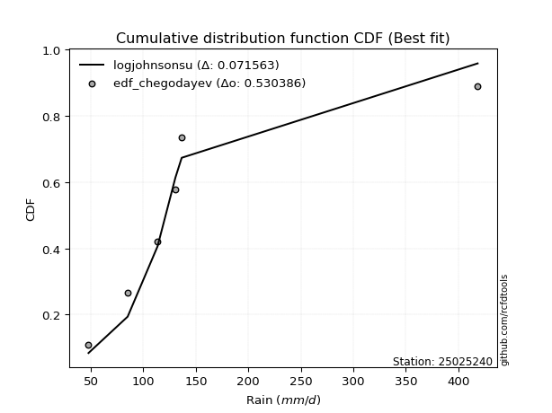</img>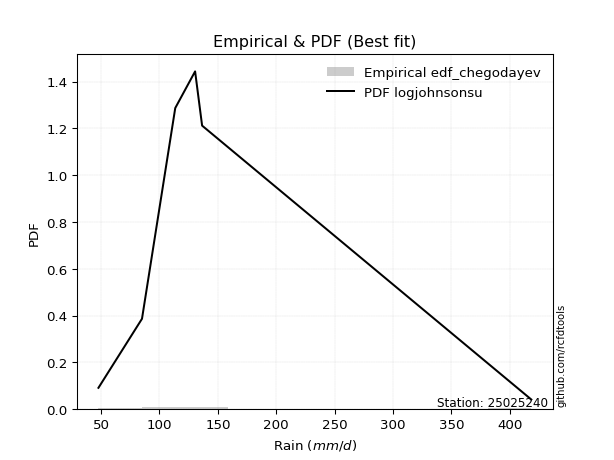</img>

</div>


### 6. EDF Blom (1958)

The Blom formula is a specific "plotting position" formula used in hydrology and statistical analysis to estimate the empirical cumulative probability (or non-exceedance probability) of a data series. It is particularly recommended for data that are approximately normally distributed. The constant _a_ is set to 0.375 (or 3/8).

<div align="center">


$P=(m-a)/(n+1-2a)$


</div>


**6.1. Empirical values**

<div align="center">

|                | 0                   | 1                   | 2        | 3                  | 4                  |
|:---------------|:--------------------|:--------------------|:---------|:-------------------|:-------------------|
| date           | 2020                | 2021                | 2023     | 2024               | 2022               |
| x              | 47.7                | 85.0                | 113.5    | 130.5              | 136.5              |
| m              | 1                   | 2                   | 3        | 4                  | 5                  |
| empirical_dist | edf_blom            | edf_blom            | edf_blom | edf_blom           | edf_blom           |
| empirical      | 0.11904761904761904 | 0.30952380952380953 | 0.5      | 0.6904761904761905 | 0.8809523809523809 |
| empirical_tr   | 1.135135135135135   | 1.4482758620689655  | 2.0      | 3.230769230769231  | 8.399999999999999  |

</div>


**6.2. Kolmogorov-Smirnov fit test (sorted by Δ)**


<div align="center">

|                | 0                   | 1                  | 2                   | 3                   | 4                   | 5                   | 6                   | 7                   | 8                  | 9                   | 10                  | 11                  | 12                  | 13                  | 14                  | 15                  | 16                  | 17                  | 18                  | 19                  | 20                  | 21                  | 22                 | 23                 | 24                 | 25                  | 26                  | 27                 | 28                  | 29                 | 30                 | 31                  | 32                  | 33                  | 34                 | 35                 | 36                  | 37                  | 38                  | 39                  | 40                  | 41                 | 42                 | 43                  | 44                  | 45                  | 46                 | 47                 | 48                  | 49                  | 50                 | 51                 | 52                  | 53                  | 54                    | 55                  | 56                  | 57                  | 58                  | 59                  | 60                 | 61                  | 62                  | 63                 | 64                  | 65                 | 66                  | 67                  | 68                  | 69                 | 70                  | 71                  | 72                 | 73                 | 74                 | 75                  | 76                  | 77                 | 78                  | 79                 | 80                 | 81                 | 82                 | 83                  | 84                 | 85                 | 86                 | 87                 |
|:---------------|:--------------------|:-------------------|:--------------------|:--------------------|:--------------------|:--------------------|:--------------------|:--------------------|:-------------------|:--------------------|:--------------------|:--------------------|:--------------------|:--------------------|:--------------------|:--------------------|:--------------------|:--------------------|:--------------------|:--------------------|:--------------------|:--------------------|:-------------------|:-------------------|:-------------------|:--------------------|:--------------------|:-------------------|:--------------------|:-------------------|:-------------------|:--------------------|:--------------------|:--------------------|:-------------------|:-------------------|:--------------------|:--------------------|:--------------------|:--------------------|:--------------------|:-------------------|:-------------------|:--------------------|:--------------------|:--------------------|:-------------------|:-------------------|:--------------------|:--------------------|:-------------------|:-------------------|:--------------------|:--------------------|:----------------------|:--------------------|:--------------------|:--------------------|:--------------------|:--------------------|:-------------------|:--------------------|:--------------------|:-------------------|:--------------------|:-------------------|:--------------------|:--------------------|:--------------------|:-------------------|:--------------------|:--------------------|:-------------------|:-------------------|:-------------------|:--------------------|:--------------------|:-------------------|:--------------------|:-------------------|:-------------------|:-------------------|:-------------------|:--------------------|:-------------------|:-------------------|:-------------------|:-------------------|
| station        | 25025240            | 25025240           | 25025240            | 25025240            | 25025240            | 25025240            | 25025240            | 25025240            | 25025240           | 25025240            | 25025240            | 25025240            | 25025240            | 25025240            | 25025240            | 25025240            | 25025240            | 25025240            | 25025240            | 25025240            | 25025240            | 25025240            | 25025240           | 25025240           | 25025240           | 25025240            | 25025240            | 25025240           | 25025240            | 25025240           | 25025240           | 25025240            | 25025240            | 25025240            | 25025240           | 25025240           | 25025240            | 25025240            | 25025240            | 25025240            | 25025240            | 25025240           | 25025240           | 25025240            | 25025240            | 25025240            | 25025240           | 25025240           | 25025240            | 25025240            | 25025240           | 25025240           | 25025240            | 25025240            | 25025240              | 25025240            | 25025240            | 25025240            | 25025240            | 25025240            | 25025240           | 25025240            | 25025240            | 25025240           | 25025240            | 25025240           | 25025240            | 25025240            | 25025240            | 25025240           | 25025240            | 25025240            | 25025240           | 25025240           | 25025240           | 25025240            | 25025240            | 25025240           | 25025240            | 25025240           | 25025240           | 25025240           | 25025240           | 25025240            | 25025240           | 25025240           | 25025240           | 25025240           |
| empirical_dist | edf_blom            | edf_blom           | edf_blom            | edf_blom            | edf_blom            | edf_blom            | edf_blom            | edf_blom            | edf_blom           | edf_blom            | edf_blom            | edf_blom            | edf_blom            | edf_blom            | edf_blom            | edf_blom            | edf_blom            | edf_blom            | edf_blom            | edf_blom            | edf_blom            | edf_blom            | edf_blom           | edf_blom           | edf_blom           | edf_blom            | edf_blom            | edf_blom           | edf_blom            | edf_blom           | edf_blom           | edf_blom            | edf_blom            | edf_blom            | edf_blom           | edf_blom           | edf_blom            | edf_blom            | edf_blom            | edf_blom            | edf_blom            | edf_blom           | edf_blom           | edf_blom            | edf_blom            | edf_blom            | edf_blom           | edf_blom           | edf_blom            | edf_blom            | edf_blom           | edf_blom           | edf_blom            | edf_blom            | edf_blom              | edf_blom            | edf_blom            | edf_blom            | edf_blom            | edf_blom            | edf_blom           | edf_blom            | edf_blom            | edf_blom           | edf_blom            | edf_blom           | edf_blom            | edf_blom            | edf_blom            | edf_blom           | edf_blom            | edf_blom            | edf_blom           | edf_blom           | edf_blom           | edf_blom            | edf_blom            | edf_blom           | edf_blom            | edf_blom           | edf_blom           | edf_blom           | edf_blom           | edf_blom            | edf_blom           | edf_blom           | edf_blom           | edf_blom           |
| p_dist         | fisk                | pearson3           | logpearson3         | logfisk             | gumbel_l            | loggumbel_l         | logweibull_min      | weibull_min         | t                  | crystalball         | norm                | truncnorm           | exponnorm           | nct                 | erlang              | rice                | gamma               | chi2                | loggompertz         | alpha               | invgamma            | logistic            | laplace_asymmetric | ncf                | maxwell            | logmielke           | invgauss            | hypsecant          | rayleigh            | betaprime          | logbetaprime       | f                   | logf                | logt                | lognorm            | lognorm            | logcrystalball      | logexponnorm        | logncf              | loginvweibull       | lognct              | logerlang          | logfatiguelife     | logrice             | logalpha            | kstwobign           | loginvgamma        | loginvgauss        | loggamma            | loggamma            | halfnorm           | loglogistic        | logmaxwell          | laplace             | loglaplace_asymmetric | logloggamma         | logkstwobign        | loggenexpon         | lograyleigh         | gumbel_r            | expon              | loghypsecant        | loghalfnorm         | halflogistic       | moyal               | loggumbel_r        | logjohnsonsu        | logchi2             | loglaplace          | loghalflogistic    | mielke              | logmoyal            | logexpon           | wald               | logwald            | gibrat              | nakagami            | logtruncnorm       | lognakagami         | loggibrat          | loglognorm         | invweibull         | fatiguelife        | gompertz            | genexpon           | johnsonsu          | loggenlogistic     | genlogistic        |
| delta          | 0.09479323957235786 | 0.1070661094208879 | 0.11949368189602105 | 0.11964141224791114 | 0.12135825689078206 | 0.12245030451321293 | 0.12370979221967104 | 0.12444226226964306 | 0.129588460557291  | 0.12981942528631518 | 0.12981942874680708 | 0.12981943119174155 | 0.12981991570816986 | 0.12984884447707223 | 0.13761130582042236 | 0.13813876459184948 | 0.14114608244331428 | 0.14356957694998695 | 0.14408829641342313 | 0.14440099229447356 | 0.14576661534203994 | 0.14589603858109756 | 0.1469885287258833 | 0.1520067665908278 | 0.1535396603970436 | 0.15508560794638826 | 0.15623258665662365 | 0.1586756014654629 | 0.16076182914106085 | 0.1613387861931157 | 0.1631025321102233 | 0.16363502696911048 | 0.16480421561012892 | 0.16623994102154382 | 0.1662404497483242 | 0.1662404497483242 | 0.16624050060895368 | 0.16624227215196186 | 0.16732015802130995 | 0.16767584287368686 | 0.16782822769519212 | 0.1681634333617582 | 0.1685475734565498 | 0.17050499832936072 | 0.17111105519486924 | 0.17156596934224289 | 0.1730309162802841 | 0.175038919805669  | 0.17623528482323325 | 0.17623528482323325 | 0.1815464741044347 | 0.1854919914280121 | 0.18609903292432461 | 0.18707207736224496 | 0.18894352004443327   | 0.19004325426661728 | 0.19027634277078853 | 0.19043440304674453 | 0.19201382336838635 | 0.19276574703776506 | 0.198103243411335  | 0.20012063989689555 | 0.20940763486666913 | 0.2098799485911933 | 0.21385250540604828 | 0.2235149567991942 | 0.22405846788177414 | 0.22549219906452722 | 0.22763990928237487 | 0.2372156806038046 | 0.24189884822346075 | 0.24230484357422466 | 0.2521282672082912 | 0.2731008021066932 | 0.2960428430000063 | 0.30530687600717377 | 0.30942972227950655 | 0.3095229834237057 | 0.30952329672231393 | 0.3280990531908897 | 0.3721010485166326 | 0.4178869267464769 | 0.4472899105497583 | 0.48719942578792763 | 0.5824132865718148 | 0.627553120396681  | 0.6904761904761905 | 0.6904761904761905 |
| deltao         | 0.5865427407550001  | 0.5865427407550001 | 0.5865427407550001  | 0.5865427407550001  | 0.5865427407550001  | 0.5865427407550001  | 0.5865427407550001  | 0.5865427407550001  | 0.5865427407550001 | 0.5865427407550001  | 0.5865427407550001  | 0.5865427407550001  | 0.5865427407550001  | 0.5865427407550001  | 0.5865427407550001  | 0.5865427407550001  | 0.5865427407550001  | 0.5865427407550001  | 0.5865427407550001  | 0.5865427407550001  | 0.5865427407550001  | 0.5865427407550001  | 0.5865427407550001 | 0.5865427407550001 | 0.5865427407550001 | 0.5865427407550001  | 0.5865427407550001  | 0.5865427407550001 | 0.5865427407550001  | 0.5865427407550001 | 0.5865427407550001 | 0.5865427407550001  | 0.5865427407550001  | 0.5865427407550001  | 0.5865427407550001 | 0.5865427407550001 | 0.5865427407550001  | 0.5865427407550001  | 0.5865427407550001  | 0.5865427407550001  | 0.5865427407550001  | 0.5865427407550001 | 0.5865427407550001 | 0.5865427407550001  | 0.5865427407550001  | 0.5865427407550001  | 0.5865427407550001 | 0.5865427407550001 | 0.5865427407550001  | 0.5865427407550001  | 0.5865427407550001 | 0.5865427407550001 | 0.5865427407550001  | 0.5865427407550001  | 0.5865427407550001    | 0.5865427407550001  | 0.5865427407550001  | 0.5865427407550001  | 0.5865427407550001  | 0.5865427407550001  | 0.5865427407550001 | 0.5865427407550001  | 0.5865427407550001  | 0.5865427407550001 | 0.5865427407550001  | 0.5865427407550001 | 0.5865427407550001  | 0.5865427407550001  | 0.5865427407550001  | 0.5865427407550001 | 0.5865427407550001  | 0.5865427407550001  | 0.5865427407550001 | 0.5865427407550001 | 0.5865427407550001 | 0.5865427407550001  | 0.5865427407550001  | 0.5865427407550001 | 0.5865427407550001  | 0.5865427407550001 | 0.5865427407550001 | 0.5865427407550001 | 0.5865427407550001 | 0.5865427407550001  | 0.5865427407550001 | 0.5865427407550001 | 0.5865427407550001 | 0.5865427407550001 |
| eval           | Δo > Δ              | Δo > Δ             | Δo > Δ              | Δo > Δ              | Δo > Δ              | Δo > Δ              | Δo > Δ              | Δo > Δ              | Δo > Δ             | Δo > Δ              | Δo > Δ              | Δo > Δ              | Δo > Δ              | Δo > Δ              | Δo > Δ              | Δo > Δ              | Δo > Δ              | Δo > Δ              | Δo > Δ              | Δo > Δ              | Δo > Δ              | Δo > Δ              | Δo > Δ             | Δo > Δ             | Δo > Δ             | Δo > Δ              | Δo > Δ              | Δo > Δ             | Δo > Δ              | Δo > Δ             | Δo > Δ             | Δo > Δ              | Δo > Δ              | Δo > Δ              | Δo > Δ             | Δo > Δ             | Δo > Δ              | Δo > Δ              | Δo > Δ              | Δo > Δ              | Δo > Δ              | Δo > Δ             | Δo > Δ             | Δo > Δ              | Δo > Δ              | Δo > Δ              | Δo > Δ             | Δo > Δ             | Δo > Δ              | Δo > Δ              | Δo > Δ             | Δo > Δ             | Δo > Δ              | Δo > Δ              | Δo > Δ                | Δo > Δ              | Δo > Δ              | Δo > Δ              | Δo > Δ              | Δo > Δ              | Δo > Δ             | Δo > Δ              | Δo > Δ              | Δo > Δ             | Δo > Δ              | Δo > Δ             | Δo > Δ              | Δo > Δ              | Δo > Δ              | Δo > Δ             | Δo > Δ              | Δo > Δ              | Δo > Δ             | Δo > Δ             | Δo > Δ             | Δo > Δ              | Δo > Δ              | Δo > Δ             | Δo > Δ              | Δo > Δ             | Δo > Δ             | Δo > Δ             | Δo > Δ             | Δo > Δ              | Δo > Δ             | Δo <= Δ            | Δo <= Δ            | Δo <= Δ            |
| fit            | 1                   | 1                  | 1                   | 1                   | 1                   | 1                   | 1                   | 1                   | 1                  | 1                   | 1                   | 1                   | 1                   | 1                   | 1                   | 1                   | 1                   | 1                   | 1                   | 1                   | 1                   | 1                   | 1                  | 1                  | 1                  | 1                   | 1                   | 1                  | 1                   | 1                  | 1                  | 1                   | 1                   | 1                   | 1                  | 1                  | 1                   | 1                   | 1                   | 1                   | 1                   | 1                  | 1                  | 1                   | 1                   | 1                   | 1                  | 1                  | 1                   | 1                   | 1                  | 1                  | 1                   | 1                   | 1                     | 1                   | 1                   | 1                   | 1                   | 1                   | 1                  | 1                   | 1                   | 1                  | 1                   | 1                  | 1                   | 1                   | 1                   | 1                  | 1                   | 1                   | 1                  | 1                  | 1                  | 1                   | 1                   | 1                  | 1                   | 1                  | 1                  | 1                  | 1                  | 1                   | 1                  | 0                  | 0                  | 0                  |
| n              | 5                   | 5                  | 5                   | 5                   | 5                   | 5                   | 5                   | 5                   | 5                  | 5                   | 5                   | 5                   | 5                   | 5                   | 5                   | 5                   | 5                   | 5                   | 5                   | 5                   | 5                   | 5                   | 5                  | 5                  | 5                  | 5                   | 5                   | 5                  | 5                   | 5                  | 5                  | 5                   | 5                   | 5                   | 5                  | 5                  | 5                   | 5                   | 5                   | 5                   | 5                   | 5                  | 5                  | 5                   | 5                   | 5                   | 5                  | 5                  | 5                   | 5                   | 5                  | 5                  | 5                   | 5                   | 5                     | 5                   | 5                   | 5                   | 5                   | 5                   | 5                  | 5                   | 5                   | 5                  | 5                   | 5                  | 5                   | 5                   | 5                   | 5                  | 5                   | 5                   | 5                  | 5                  | 5                  | 5                   | 5                   | 5                  | 5                   | 5                  | 5                  | 5                  | 5                  | 5                   | 5                  | 5                  | 5                  | 5                  |
| best_fit       | 1                   | 0                  | 0                   | 0                   | 0                   | 0                   | 0                   | 0                   | 0                  | 0                   | 0                   | 0                   | 0                   | 0                   | 0                   | 0                   | 0                   | 0                   | 0                   | 0                   | 0                   | 0                   | 0                  | 0                  | 0                  | 0                   | 0                   | 0                  | 0                   | 0                  | 0                  | 0                   | 0                   | 0                   | 0                  | 0                  | 0                   | 0                   | 0                   | 0                   | 0                   | 0                  | 0                  | 0                   | 0                   | 0                   | 0                  | 0                  | 0                   | 0                   | 0                  | 0                  | 0                   | 0                   | 0                     | 0                   | 0                   | 0                   | 0                   | 0                   | 0                  | 0                   | 0                   | 0                  | 0                   | 0                  | 0                   | 0                   | 0                   | 0                  | 0                   | 0                   | 0                  | 0                  | 0                  | 0                   | 0                   | 0                  | 0                   | 0                  | 0                  | 0                  | 0                  | 0                   | 0                  | 0                  | 0                  | 0                  |
| best_fit_sort  | 1                   | 2                  | 3                   | 4                   | 5                   | 6                   | 7                   | 8                   | 9                  | 10                  | 11                  | 12                  | 13                  | 14                  | 15                  | 16                  | 17                  | 18                  | 19                  | 20                  | 21                  | 22                  | 23                 | 24                 | 25                 | 26                  | 27                  | 28                 | 29                  | 30                 | 31                 | 32                  | 33                  | 34                  | 35                 | 36                 | 37                  | 38                  | 39                  | 40                  | 41                  | 42                 | 43                 | 44                  | 45                  | 46                  | 47                 | 48                 | 49                  | 50                  | 51                 | 52                 | 53                  | 54                  | 55                    | 56                  | 57                  | 58                  | 59                  | 60                  | 61                 | 62                  | 63                  | 64                 | 65                  | 66                 | 67                  | 68                  | 69                  | 70                 | 71                  | 72                  | 73                 | 74                 | 75                 | 76                  | 77                  | 78                 | 79                  | 80                 | 81                 | 82                 | 83                 | 84                  | 85                 | 86                 | 87                 | 88                 |

</div>


**6.3. Best fit**

<div align="center">

|   id |   station | empirical_dist   | p_dist   |     delta |   deltao | eval   |   fit |   n |   best_fit |   best_fit_sort |
|-----:|----------:|:-----------------|:---------|----------:|---------:|:-------|------:|----:|-----------:|----------------:|
|    0 |  25025240 | edf_blom         | fisk     | 0.0947932 | 0.586543 | Δo > Δ |     1 |   5 |          1 |               1 |

</div>


<div align="center">

</img>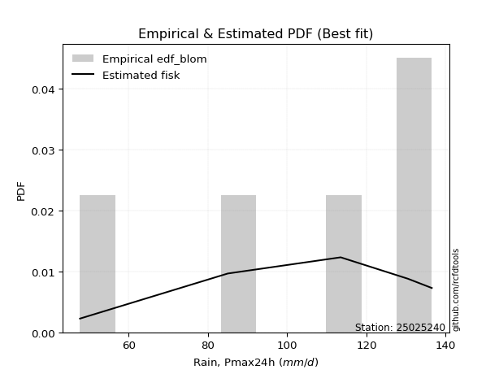</img>

</div>


### 7. EDF Tukey (1962)

In hydrology, the Tukey formula is used as a plotting position formula to estimate the empirical probability or frequency of a flood event (or other hydrological data). The formula parameter is given as _c=0.333_ (or 1/3).

<div align="center">


$P=(m-c)/(n+1-2c)$


</div>


**7.1. Empirical values**

<div align="center">

|                | 0                  | 1                  | 2         | 3         | 4         |
|:---------------|:-------------------|:-------------------|:----------|:----------|:----------|
| date           | 2020               | 2021               | 2023      | 2024      | 2022      |
| x              | 47.7               | 85.0               | 113.5     | 130.5     | 136.5     |
| m              | 1                  | 2                  | 3         | 4         | 5         |
| empirical_dist | edf_tukey          | edf_tukey          | edf_tukey | edf_tukey | edf_tukey |
| empirical      | 0.125              | 0.3125             | 0.5       | 0.6875    | 0.875     |
| empirical_tr   | 1.1428571428571428 | 1.4545454545454546 | 2.0       | 3.2       | 8.0       |

</div>


**7.2. Kolmogorov-Smirnov fit test (sorted by Δ)**


<div align="center">

|                | 0                   | 1                   | 2                   | 3                   | 4                   | 5                   | 6                  | 7                   | 8                  | 9                   | 10                  | 11                  | 12                  | 13                  | 14                  | 15                  | 16                  | 17                  | 18                  | 19                  | 20                  | 21                  | 22                  | 23                 | 24                 | 25                  | 26                  | 27                 | 28                  | 29                 | 30                 | 31                  | 32                  | 33                  | 34                 | 35                 | 36                  | 37                  | 38                  | 39                  | 40                  | 41                 | 42                 | 43                  | 44                  | 45                  | 46                 | 47                 | 48                  | 49                  | 50                 | 51                 | 52                  | 53                  | 54                  | 55                  | 56                    | 57                  | 58                  | 59                  | 60                 | 61                  | 62                  | 63                 | 64                  | 65                  | 66                  | 67                 | 68                  | 69                 | 70                  | 71                  | 72                 | 73                 | 74                 | 75                  | 76                 | 77                 | 78                 | 79                 | 80                  | 81                 | 82                  | 83                  | 84                 | 85                 | 86                 | 87                 |
|:---------------|:--------------------|:--------------------|:--------------------|:--------------------|:--------------------|:--------------------|:-------------------|:--------------------|:-------------------|:--------------------|:--------------------|:--------------------|:--------------------|:--------------------|:--------------------|:--------------------|:--------------------|:--------------------|:--------------------|:--------------------|:--------------------|:--------------------|:--------------------|:-------------------|:-------------------|:--------------------|:--------------------|:-------------------|:--------------------|:-------------------|:-------------------|:--------------------|:--------------------|:--------------------|:-------------------|:-------------------|:--------------------|:--------------------|:--------------------|:--------------------|:--------------------|:-------------------|:-------------------|:--------------------|:--------------------|:--------------------|:-------------------|:-------------------|:--------------------|:--------------------|:-------------------|:-------------------|:--------------------|:--------------------|:--------------------|:--------------------|:----------------------|:--------------------|:--------------------|:--------------------|:-------------------|:--------------------|:--------------------|:-------------------|:--------------------|:--------------------|:--------------------|:-------------------|:--------------------|:-------------------|:--------------------|:--------------------|:-------------------|:-------------------|:-------------------|:--------------------|:-------------------|:-------------------|:-------------------|:-------------------|:--------------------|:-------------------|:--------------------|:--------------------|:-------------------|:-------------------|:-------------------|:-------------------|
| station        | 25025240            | 25025240            | 25025240            | 25025240            | 25025240            | 25025240            | 25025240           | 25025240            | 25025240           | 25025240            | 25025240            | 25025240            | 25025240            | 25025240            | 25025240            | 25025240            | 25025240            | 25025240            | 25025240            | 25025240            | 25025240            | 25025240            | 25025240            | 25025240           | 25025240           | 25025240            | 25025240            | 25025240           | 25025240            | 25025240           | 25025240           | 25025240            | 25025240            | 25025240            | 25025240           | 25025240           | 25025240            | 25025240            | 25025240            | 25025240            | 25025240            | 25025240           | 25025240           | 25025240            | 25025240            | 25025240            | 25025240           | 25025240           | 25025240            | 25025240            | 25025240           | 25025240           | 25025240            | 25025240            | 25025240            | 25025240            | 25025240              | 25025240            | 25025240            | 25025240            | 25025240           | 25025240            | 25025240            | 25025240           | 25025240            | 25025240            | 25025240            | 25025240           | 25025240            | 25025240           | 25025240            | 25025240            | 25025240           | 25025240           | 25025240           | 25025240            | 25025240           | 25025240           | 25025240           | 25025240           | 25025240            | 25025240           | 25025240            | 25025240            | 25025240           | 25025240           | 25025240           | 25025240           |
| empirical_dist | edf_tukey           | edf_tukey           | edf_tukey           | edf_tukey           | edf_tukey           | edf_tukey           | edf_tukey          | edf_tukey           | edf_tukey          | edf_tukey           | edf_tukey           | edf_tukey           | edf_tukey           | edf_tukey           | edf_tukey           | edf_tukey           | edf_tukey           | edf_tukey           | edf_tukey           | edf_tukey           | edf_tukey           | edf_tukey           | edf_tukey           | edf_tukey          | edf_tukey          | edf_tukey           | edf_tukey           | edf_tukey          | edf_tukey           | edf_tukey          | edf_tukey          | edf_tukey           | edf_tukey           | edf_tukey           | edf_tukey          | edf_tukey          | edf_tukey           | edf_tukey           | edf_tukey           | edf_tukey           | edf_tukey           | edf_tukey          | edf_tukey          | edf_tukey           | edf_tukey           | edf_tukey           | edf_tukey          | edf_tukey          | edf_tukey           | edf_tukey           | edf_tukey          | edf_tukey          | edf_tukey           | edf_tukey           | edf_tukey           | edf_tukey           | edf_tukey             | edf_tukey           | edf_tukey           | edf_tukey           | edf_tukey          | edf_tukey           | edf_tukey           | edf_tukey          | edf_tukey           | edf_tukey           | edf_tukey           | edf_tukey          | edf_tukey           | edf_tukey          | edf_tukey           | edf_tukey           | edf_tukey          | edf_tukey          | edf_tukey          | edf_tukey           | edf_tukey          | edf_tukey          | edf_tukey          | edf_tukey          | edf_tukey           | edf_tukey          | edf_tukey           | edf_tukey           | edf_tukey          | edf_tukey          | edf_tukey          | edf_tukey          |
| p_dist         | fisk                | pearson3            | logpearson3         | logfisk             | loggumbel_l         | gumbel_l            | logweibull_min     | weibull_min         | t                  | crystalball         | norm                | truncnorm           | exponnorm           | nct                 | erlang              | rice                | gamma               | chi2                | loggompertz         | alpha               | invgamma            | logistic            | laplace_asymmetric  | ncf                | maxwell            | invgauss            | logmielke           | hypsecant          | rayleigh            | betaprime          | logbetaprime       | f                   | logf                | logt                | lognorm            | lognorm            | logcrystalball      | logexponnorm        | logncf              | loginvweibull       | lognct              | logerlang          | logfatiguelife     | logrice             | logalpha            | kstwobign           | loginvgamma        | loginvgauss        | loggamma            | loggamma            | halfnorm           | loglogistic        | logmaxwell          | laplace             | logkstwobign        | loggenexpon         | loglaplace_asymmetric | lograyleigh         | gumbel_r            | logloggamma         | expon              | loghypsecant        | loghalfnorm         | halflogistic       | moyal               | logjohnsonsu        | logchi2             | loggumbel_r        | loglaplace          | loghalflogistic    | logmoyal            | mielke              | logexpon           | wald               | logwald            | gibrat              | nakagami           | logtruncnorm       | lognakagami        | loggibrat          | loglognorm          | invweibull         | fatiguelife         | gompertz            | genexpon           | johnsonsu          | loggenlogistic     | genlogistic        |
| delta          | 0.09479323957235786 | 0.11004229989707837 | 0.11949368189602105 | 0.11964141224791114 | 0.12245030451321293 | 0.12433444736697252 | 0.12523588766255   | 0.12741845274583352 | 0.129588460557291  | 0.12981942528631518 | 0.12981942874680708 | 0.12981943119174155 | 0.12981991570816986 | 0.12984884447707223 | 0.13761130582042236 | 0.13813876459184948 | 0.14114608244331428 | 0.14356957694998695 | 0.14408829641342313 | 0.14440099229447356 | 0.14576661534203994 | 0.14589603858109756 | 0.14996471920207377 | 0.1520067665908278 | 0.1535396603970436 | 0.15623258665662365 | 0.15806179842257873 | 0.1586756014654629 | 0.16076182914106085 | 0.1613387861931157 | 0.1631025321102233 | 0.16363502696911048 | 0.16480421561012892 | 0.16623994102154382 | 0.1662404497483242 | 0.1662404497483242 | 0.16624050060895368 | 0.16624227215196186 | 0.16732015802130995 | 0.16767584287368686 | 0.16782822769519212 | 0.1681634333617582 | 0.1685475734565498 | 0.17050499832936072 | 0.17111105519486924 | 0.17156596934224289 | 0.1730309162802841 | 0.175038919805669  | 0.17623528482323325 | 0.17623528482323325 | 0.1815464741044347 | 0.1854919914280121 | 0.18609903292432461 | 0.18707207736224496 | 0.19027634277078853 | 0.19043440304674453 | 0.19191971052062373   | 0.19201382336838635 | 0.19276574703776506 | 0.19301944474280774 | 0.198103243411335  | 0.20012063989689555 | 0.20940763486666913 | 0.2098799485911933 | 0.21385250540604828 | 0.22108227740558367 | 0.22251600858833676 | 0.2235149567991942 | 0.22763990928237487 | 0.2372156806038046 | 0.24230484357422466 | 0.24286430126163028 | 0.2491520767321007 | 0.2731008021066932 | 0.2960428430000063 | 0.30530687600717377 | 0.312405912755697  | 0.3124991738998962 | 0.3124994871985044 | 0.3280990531908897 | 0.36912485804044215 | 0.411934545794096  | 0.44431372007356784 | 0.48719942578792763 | 0.5794370960956243 | 0.6245769299204905 | 0.6875             | 0.6875             |
| deltao         | 0.5865427407550001  | 0.5865427407550001  | 0.5865427407550001  | 0.5865427407550001  | 0.5865427407550001  | 0.5865427407550001  | 0.5865427407550001 | 0.5865427407550001  | 0.5865427407550001 | 0.5865427407550001  | 0.5865427407550001  | 0.5865427407550001  | 0.5865427407550001  | 0.5865427407550001  | 0.5865427407550001  | 0.5865427407550001  | 0.5865427407550001  | 0.5865427407550001  | 0.5865427407550001  | 0.5865427407550001  | 0.5865427407550001  | 0.5865427407550001  | 0.5865427407550001  | 0.5865427407550001 | 0.5865427407550001 | 0.5865427407550001  | 0.5865427407550001  | 0.5865427407550001 | 0.5865427407550001  | 0.5865427407550001 | 0.5865427407550001 | 0.5865427407550001  | 0.5865427407550001  | 0.5865427407550001  | 0.5865427407550001 | 0.5865427407550001 | 0.5865427407550001  | 0.5865427407550001  | 0.5865427407550001  | 0.5865427407550001  | 0.5865427407550001  | 0.5865427407550001 | 0.5865427407550001 | 0.5865427407550001  | 0.5865427407550001  | 0.5865427407550001  | 0.5865427407550001 | 0.5865427407550001 | 0.5865427407550001  | 0.5865427407550001  | 0.5865427407550001 | 0.5865427407550001 | 0.5865427407550001  | 0.5865427407550001  | 0.5865427407550001  | 0.5865427407550001  | 0.5865427407550001    | 0.5865427407550001  | 0.5865427407550001  | 0.5865427407550001  | 0.5865427407550001 | 0.5865427407550001  | 0.5865427407550001  | 0.5865427407550001 | 0.5865427407550001  | 0.5865427407550001  | 0.5865427407550001  | 0.5865427407550001 | 0.5865427407550001  | 0.5865427407550001 | 0.5865427407550001  | 0.5865427407550001  | 0.5865427407550001 | 0.5865427407550001 | 0.5865427407550001 | 0.5865427407550001  | 0.5865427407550001 | 0.5865427407550001 | 0.5865427407550001 | 0.5865427407550001 | 0.5865427407550001  | 0.5865427407550001 | 0.5865427407550001  | 0.5865427407550001  | 0.5865427407550001 | 0.5865427407550001 | 0.5865427407550001 | 0.5865427407550001 |
| eval           | Δo > Δ              | Δo > Δ              | Δo > Δ              | Δo > Δ              | Δo > Δ              | Δo > Δ              | Δo > Δ             | Δo > Δ              | Δo > Δ             | Δo > Δ              | Δo > Δ              | Δo > Δ              | Δo > Δ              | Δo > Δ              | Δo > Δ              | Δo > Δ              | Δo > Δ              | Δo > Δ              | Δo > Δ              | Δo > Δ              | Δo > Δ              | Δo > Δ              | Δo > Δ              | Δo > Δ             | Δo > Δ             | Δo > Δ              | Δo > Δ              | Δo > Δ             | Δo > Δ              | Δo > Δ             | Δo > Δ             | Δo > Δ              | Δo > Δ              | Δo > Δ              | Δo > Δ             | Δo > Δ             | Δo > Δ              | Δo > Δ              | Δo > Δ              | Δo > Δ              | Δo > Δ              | Δo > Δ             | Δo > Δ             | Δo > Δ              | Δo > Δ              | Δo > Δ              | Δo > Δ             | Δo > Δ             | Δo > Δ              | Δo > Δ              | Δo > Δ             | Δo > Δ             | Δo > Δ              | Δo > Δ              | Δo > Δ              | Δo > Δ              | Δo > Δ                | Δo > Δ              | Δo > Δ              | Δo > Δ              | Δo > Δ             | Δo > Δ              | Δo > Δ              | Δo > Δ             | Δo > Δ              | Δo > Δ              | Δo > Δ              | Δo > Δ             | Δo > Δ              | Δo > Δ             | Δo > Δ              | Δo > Δ              | Δo > Δ             | Δo > Δ             | Δo > Δ             | Δo > Δ              | Δo > Δ             | Δo > Δ             | Δo > Δ             | Δo > Δ             | Δo > Δ              | Δo > Δ             | Δo > Δ              | Δo > Δ              | Δo > Δ             | Δo <= Δ            | Δo <= Δ            | Δo <= Δ            |
| fit            | 1                   | 1                   | 1                   | 1                   | 1                   | 1                   | 1                  | 1                   | 1                  | 1                   | 1                   | 1                   | 1                   | 1                   | 1                   | 1                   | 1                   | 1                   | 1                   | 1                   | 1                   | 1                   | 1                   | 1                  | 1                  | 1                   | 1                   | 1                  | 1                   | 1                  | 1                  | 1                   | 1                   | 1                   | 1                  | 1                  | 1                   | 1                   | 1                   | 1                   | 1                   | 1                  | 1                  | 1                   | 1                   | 1                   | 1                  | 1                  | 1                   | 1                   | 1                  | 1                  | 1                   | 1                   | 1                   | 1                   | 1                     | 1                   | 1                   | 1                   | 1                  | 1                   | 1                   | 1                  | 1                   | 1                   | 1                   | 1                  | 1                   | 1                  | 1                   | 1                   | 1                  | 1                  | 1                  | 1                   | 1                  | 1                  | 1                  | 1                  | 1                   | 1                  | 1                   | 1                   | 1                  | 0                  | 0                  | 0                  |
| n              | 5                   | 5                   | 5                   | 5                   | 5                   | 5                   | 5                  | 5                   | 5                  | 5                   | 5                   | 5                   | 5                   | 5                   | 5                   | 5                   | 5                   | 5                   | 5                   | 5                   | 5                   | 5                   | 5                   | 5                  | 5                  | 5                   | 5                   | 5                  | 5                   | 5                  | 5                  | 5                   | 5                   | 5                   | 5                  | 5                  | 5                   | 5                   | 5                   | 5                   | 5                   | 5                  | 5                  | 5                   | 5                   | 5                   | 5                  | 5                  | 5                   | 5                   | 5                  | 5                  | 5                   | 5                   | 5                   | 5                   | 5                     | 5                   | 5                   | 5                   | 5                  | 5                   | 5                   | 5                  | 5                   | 5                   | 5                   | 5                  | 5                   | 5                  | 5                   | 5                   | 5                  | 5                  | 5                  | 5                   | 5                  | 5                  | 5                  | 5                  | 5                   | 5                  | 5                   | 5                   | 5                  | 5                  | 5                  | 5                  |
| best_fit       | 1                   | 0                   | 0                   | 0                   | 0                   | 0                   | 0                  | 0                   | 0                  | 0                   | 0                   | 0                   | 0                   | 0                   | 0                   | 0                   | 0                   | 0                   | 0                   | 0                   | 0                   | 0                   | 0                   | 0                  | 0                  | 0                   | 0                   | 0                  | 0                   | 0                  | 0                  | 0                   | 0                   | 0                   | 0                  | 0                  | 0                   | 0                   | 0                   | 0                   | 0                   | 0                  | 0                  | 0                   | 0                   | 0                   | 0                  | 0                  | 0                   | 0                   | 0                  | 0                  | 0                   | 0                   | 0                   | 0                   | 0                     | 0                   | 0                   | 0                   | 0                  | 0                   | 0                   | 0                  | 0                   | 0                   | 0                   | 0                  | 0                   | 0                  | 0                   | 0                   | 0                  | 0                  | 0                  | 0                   | 0                  | 0                  | 0                  | 0                  | 0                   | 0                  | 0                   | 0                   | 0                  | 0                  | 0                  | 0                  |
| best_fit_sort  | 1                   | 2                   | 3                   | 4                   | 5                   | 6                   | 7                  | 8                   | 9                  | 10                  | 11                  | 12                  | 13                  | 14                  | 15                  | 16                  | 17                  | 18                  | 19                  | 20                  | 21                  | 22                  | 23                  | 24                 | 25                 | 26                  | 27                  | 28                 | 29                  | 30                 | 31                 | 32                  | 33                  | 34                  | 35                 | 36                 | 37                  | 38                  | 39                  | 40                  | 41                  | 42                 | 43                 | 44                  | 45                  | 46                  | 47                 | 48                 | 49                  | 50                  | 51                 | 52                 | 53                  | 54                  | 55                  | 56                  | 57                    | 58                  | 59                  | 60                  | 61                 | 62                  | 63                  | 64                 | 65                  | 66                  | 67                  | 68                 | 69                  | 70                 | 71                  | 72                  | 73                 | 74                 | 75                 | 76                  | 77                 | 78                 | 79                 | 80                 | 81                  | 82                 | 83                  | 84                  | 85                 | 86                 | 87                 | 88                 |

</div>


**7.3. Best fit**

<div align="center">

|   id |   station | empirical_dist   | p_dist   |     delta |   deltao | eval   |   fit |   n |   best_fit |   best_fit_sort |
|-----:|----------:|:-----------------|:---------|----------:|---------:|:-------|------:|----:|-----------:|----------------:|
|    0 |  25025240 | edf_tukey        | fisk     | 0.0947932 | 0.586543 | Δo > Δ |     1 |   5 |          1 |               1 |

</div>


<div align="center">

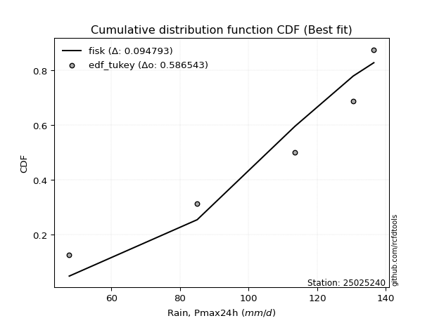</img></img>

</div>


### 8. EDF Gringorten (1963)

Gringorten plotting position formula is essential for estimating the probability and return periods of extreme events like floods and heavy rainfall. The constant _a=0.44_.

<div align="center">


$P=(m-a)/(n+1-2a)$


</div>


**8.1. Empirical values**

<div align="center">

|                | 0                   | 1                  | 2              | 3                 | 4                  |
|:---------------|:--------------------|:-------------------|:---------------|:------------------|:-------------------|
| date           | 2020                | 2021               | 2023           | 2024              | 2022               |
| x              | 47.7                | 85.0               | 113.5          | 130.5             | 136.5              |
| m              | 1                   | 2                  | 3              | 4                 | 5                  |
| empirical_dist | edf_gringorten      | edf_gringorten     | edf_gringorten | edf_gringorten    | edf_gringorten     |
| empirical      | 0.10937500000000001 | 0.3046875          | 0.5            | 0.6953125         | 0.8906249999999999 |
| empirical_tr   | 1.1228070175438596  | 1.4382022471910112 | 2.0            | 3.282051282051282 | 9.142857142857133  |

</div>


**8.2. Kolmogorov-Smirnov fit test (sorted by Δ)**


<div align="center">

|                | 0                   | 1                   | 2                   | 3                   | 4                   | 5                   | 6                   | 7                   | 8                  | 9                   | 10                  | 11                  | 12                  | 13                  | 14                  | 15                  | 16                  | 17                  | 18                  | 19                  | 20                  | 21                  | 22                  | 23                  | 24                 | 25                 | 26                  | 27                 | 28                  | 29                 | 30                 | 31                  | 32                  | 33                  | 34                 | 35                 | 36                  | 37                  | 38                  | 39                  | 40                  | 41                 | 42                 | 43                  | 44                  | 45                  | 46                 | 47                 | 48                  | 49                  | 50                 | 51                    | 52                  | 53                 | 54                  | 55                  | 56                  | 57                  | 58                  | 59                  | 60                 | 61                  | 62                  | 63                 | 64                  | 65                 | 66                  | 67                  | 68                  | 69                 | 70                  | 71                  | 72                 | 73                 | 74                 | 75                 | 76                 | 77                 | 78                  | 79                 | 80                  | 81                 | 82                  | 83                  | 84                 | 85                 | 86                 | 87                 |
|:---------------|:--------------------|:--------------------|:--------------------|:--------------------|:--------------------|:--------------------|:--------------------|:--------------------|:-------------------|:--------------------|:--------------------|:--------------------|:--------------------|:--------------------|:--------------------|:--------------------|:--------------------|:--------------------|:--------------------|:--------------------|:--------------------|:--------------------|:--------------------|:--------------------|:-------------------|:-------------------|:--------------------|:-------------------|:--------------------|:-------------------|:-------------------|:--------------------|:--------------------|:--------------------|:-------------------|:-------------------|:--------------------|:--------------------|:--------------------|:--------------------|:--------------------|:-------------------|:-------------------|:--------------------|:--------------------|:--------------------|:-------------------|:-------------------|:--------------------|:--------------------|:-------------------|:----------------------|:--------------------|:-------------------|:--------------------|:--------------------|:--------------------|:--------------------|:--------------------|:--------------------|:-------------------|:--------------------|:--------------------|:-------------------|:--------------------|:-------------------|:--------------------|:--------------------|:--------------------|:-------------------|:--------------------|:--------------------|:-------------------|:-------------------|:-------------------|:-------------------|:-------------------|:-------------------|:--------------------|:-------------------|:--------------------|:-------------------|:--------------------|:--------------------|:-------------------|:-------------------|:-------------------|:-------------------|
| station        | 25025240            | 25025240            | 25025240            | 25025240            | 25025240            | 25025240            | 25025240            | 25025240            | 25025240           | 25025240            | 25025240            | 25025240            | 25025240            | 25025240            | 25025240            | 25025240            | 25025240            | 25025240            | 25025240            | 25025240            | 25025240            | 25025240            | 25025240            | 25025240            | 25025240           | 25025240           | 25025240            | 25025240           | 25025240            | 25025240           | 25025240           | 25025240            | 25025240            | 25025240            | 25025240           | 25025240           | 25025240            | 25025240            | 25025240            | 25025240            | 25025240            | 25025240           | 25025240           | 25025240            | 25025240            | 25025240            | 25025240           | 25025240           | 25025240            | 25025240            | 25025240           | 25025240              | 25025240            | 25025240           | 25025240            | 25025240            | 25025240            | 25025240            | 25025240            | 25025240            | 25025240           | 25025240            | 25025240            | 25025240           | 25025240            | 25025240           | 25025240            | 25025240            | 25025240            | 25025240           | 25025240            | 25025240            | 25025240           | 25025240           | 25025240           | 25025240           | 25025240           | 25025240           | 25025240            | 25025240           | 25025240            | 25025240           | 25025240            | 25025240            | 25025240           | 25025240           | 25025240           | 25025240           |
| empirical_dist | edf_gringorten      | edf_gringorten      | edf_gringorten      | edf_gringorten      | edf_gringorten      | edf_gringorten      | edf_gringorten      | edf_gringorten      | edf_gringorten     | edf_gringorten      | edf_gringorten      | edf_gringorten      | edf_gringorten      | edf_gringorten      | edf_gringorten      | edf_gringorten      | edf_gringorten      | edf_gringorten      | edf_gringorten      | edf_gringorten      | edf_gringorten      | edf_gringorten      | edf_gringorten      | edf_gringorten      | edf_gringorten     | edf_gringorten     | edf_gringorten      | edf_gringorten     | edf_gringorten      | edf_gringorten     | edf_gringorten     | edf_gringorten      | edf_gringorten      | edf_gringorten      | edf_gringorten     | edf_gringorten     | edf_gringorten      | edf_gringorten      | edf_gringorten      | edf_gringorten      | edf_gringorten      | edf_gringorten     | edf_gringorten     | edf_gringorten      | edf_gringorten      | edf_gringorten      | edf_gringorten     | edf_gringorten     | edf_gringorten      | edf_gringorten      | edf_gringorten     | edf_gringorten        | edf_gringorten      | edf_gringorten     | edf_gringorten      | edf_gringorten      | edf_gringorten      | edf_gringorten      | edf_gringorten      | edf_gringorten      | edf_gringorten     | edf_gringorten      | edf_gringorten      | edf_gringorten     | edf_gringorten      | edf_gringorten     | edf_gringorten      | edf_gringorten      | edf_gringorten      | edf_gringorten     | edf_gringorten      | edf_gringorten      | edf_gringorten     | edf_gringorten     | edf_gringorten     | edf_gringorten     | edf_gringorten     | edf_gringorten     | edf_gringorten      | edf_gringorten     | edf_gringorten      | edf_gringorten     | edf_gringorten      | edf_gringorten      | edf_gringorten     | edf_gringorten     | edf_gringorten     | edf_gringorten     |
| p_dist         | fisk                | pearson3            | gumbel_l            | logpearson3         | weibull_min         | logfisk             | loggumbel_l         | logweibull_min      | t                  | crystalball         | norm                | truncnorm           | exponnorm           | nct                 | erlang              | rice                | gamma               | laplace_asymmetric  | chi2                | loggompertz         | alpha               | invgamma            | logistic            | logmielke           | ncf                | maxwell            | invgauss            | hypsecant          | rayleigh            | betaprime          | logbetaprime       | f                   | logf                | logt                | lognorm            | lognorm            | logcrystalball      | logexponnorm        | logncf              | loginvweibull       | lognct              | logerlang          | logfatiguelife     | logrice             | logalpha            | kstwobign           | loginvgamma        | loginvgauss        | loggamma            | loggamma            | halfnorm           | loglaplace_asymmetric | logloggamma         | loglogistic        | logmaxwell          | laplace             | logkstwobign        | loggenexpon         | lograyleigh         | gumbel_r            | expon              | loghypsecant        | loghalfnorm         | halflogistic       | moyal               | loggumbel_r        | loglaplace          | logjohnsonsu        | logchi2             | loghalflogistic    | mielke              | logmoyal            | logexpon           | wald               | logwald            | nakagami           | logtruncnorm       | lognakagami        | gibrat              | loggibrat          | loglognorm          | invweibull         | fatiguelife         | gompertz            | genexpon           | johnsonsu          | loggenlogistic     | genlogistic        |
| delta          | 0.09479323957235786 | 0.10222979989707837 | 0.11652194736697252 | 0.11949368189602105 | 0.11960595274583352 | 0.11964141224791114 | 0.12245030451321293 | 0.12370979221967104 | 0.129588460557291  | 0.12981942528631518 | 0.12981942874680708 | 0.12981943119174155 | 0.12981991570816986 | 0.12984884447707223 | 0.13761130582042236 | 0.13813876459184948 | 0.14114608244331428 | 0.14215221920207377 | 0.14356957694998695 | 0.14408829641342313 | 0.14440099229447356 | 0.14576661534203994 | 0.14589603858109756 | 0.15024929842257873 | 0.1520067665908278 | 0.1535396603970436 | 0.15623258665662365 | 0.1586756014654629 | 0.16076182914106085 | 0.1613387861931157 | 0.1631025321102233 | 0.16363502696911048 | 0.16480421561012892 | 0.16623994102154382 | 0.1662404497483242 | 0.1662404497483242 | 0.16624050060895368 | 0.16624227215196186 | 0.16732015802130995 | 0.16767584287368686 | 0.16782822769519212 | 0.1681634333617582 | 0.1685475734565498 | 0.17050499832936072 | 0.17111105519486924 | 0.17156596934224289 | 0.1730309162802841 | 0.175038919805669  | 0.17623528482323325 | 0.17623528482323325 | 0.1815464741044347 | 0.18410721052062373   | 0.18520694474280774 | 0.1854919914280121 | 0.18609903292432461 | 0.18707207736224496 | 0.19027634277078853 | 0.19043440304674453 | 0.19201382336838635 | 0.19276574703776506 | 0.198103243411335  | 0.20012063989689555 | 0.20940763486666913 | 0.2098799485911933 | 0.21385250540604828 | 0.2235149567991942 | 0.22763990928237487 | 0.22889477740558367 | 0.23032850858833676 | 0.2372156806038046 | 0.24189884822346075 | 0.24230484357422466 | 0.2569645767321007 | 0.2731008021066932 | 0.2960428430000063 | 0.304593412755697  | 0.3046866738998962 | 0.3046869871985044 | 0.30530687600717377 | 0.3280990531908897 | 0.37693735804044215 | 0.4275595457940959 | 0.45212622007356784 | 0.48719942578792763 | 0.5872495960956243 | 0.6323894299204905 | 0.6953125          | 0.6953125          |
| deltao         | 0.5865427407550001  | 0.5865427407550001  | 0.5865427407550001  | 0.5865427407550001  | 0.5865427407550001  | 0.5865427407550001  | 0.5865427407550001  | 0.5865427407550001  | 0.5865427407550001 | 0.5865427407550001  | 0.5865427407550001  | 0.5865427407550001  | 0.5865427407550001  | 0.5865427407550001  | 0.5865427407550001  | 0.5865427407550001  | 0.5865427407550001  | 0.5865427407550001  | 0.5865427407550001  | 0.5865427407550001  | 0.5865427407550001  | 0.5865427407550001  | 0.5865427407550001  | 0.5865427407550001  | 0.5865427407550001 | 0.5865427407550001 | 0.5865427407550001  | 0.5865427407550001 | 0.5865427407550001  | 0.5865427407550001 | 0.5865427407550001 | 0.5865427407550001  | 0.5865427407550001  | 0.5865427407550001  | 0.5865427407550001 | 0.5865427407550001 | 0.5865427407550001  | 0.5865427407550001  | 0.5865427407550001  | 0.5865427407550001  | 0.5865427407550001  | 0.5865427407550001 | 0.5865427407550001 | 0.5865427407550001  | 0.5865427407550001  | 0.5865427407550001  | 0.5865427407550001 | 0.5865427407550001 | 0.5865427407550001  | 0.5865427407550001  | 0.5865427407550001 | 0.5865427407550001    | 0.5865427407550001  | 0.5865427407550001 | 0.5865427407550001  | 0.5865427407550001  | 0.5865427407550001  | 0.5865427407550001  | 0.5865427407550001  | 0.5865427407550001  | 0.5865427407550001 | 0.5865427407550001  | 0.5865427407550001  | 0.5865427407550001 | 0.5865427407550001  | 0.5865427407550001 | 0.5865427407550001  | 0.5865427407550001  | 0.5865427407550001  | 0.5865427407550001 | 0.5865427407550001  | 0.5865427407550001  | 0.5865427407550001 | 0.5865427407550001 | 0.5865427407550001 | 0.5865427407550001 | 0.5865427407550001 | 0.5865427407550001 | 0.5865427407550001  | 0.5865427407550001 | 0.5865427407550001  | 0.5865427407550001 | 0.5865427407550001  | 0.5865427407550001  | 0.5865427407550001 | 0.5865427407550001 | 0.5865427407550001 | 0.5865427407550001 |
| eval           | Δo > Δ              | Δo > Δ              | Δo > Δ              | Δo > Δ              | Δo > Δ              | Δo > Δ              | Δo > Δ              | Δo > Δ              | Δo > Δ             | Δo > Δ              | Δo > Δ              | Δo > Δ              | Δo > Δ              | Δo > Δ              | Δo > Δ              | Δo > Δ              | Δo > Δ              | Δo > Δ              | Δo > Δ              | Δo > Δ              | Δo > Δ              | Δo > Δ              | Δo > Δ              | Δo > Δ              | Δo > Δ             | Δo > Δ             | Δo > Δ              | Δo > Δ             | Δo > Δ              | Δo > Δ             | Δo > Δ             | Δo > Δ              | Δo > Δ              | Δo > Δ              | Δo > Δ             | Δo > Δ             | Δo > Δ              | Δo > Δ              | Δo > Δ              | Δo > Δ              | Δo > Δ              | Δo > Δ             | Δo > Δ             | Δo > Δ              | Δo > Δ              | Δo > Δ              | Δo > Δ             | Δo > Δ             | Δo > Δ              | Δo > Δ              | Δo > Δ             | Δo > Δ                | Δo > Δ              | Δo > Δ             | Δo > Δ              | Δo > Δ              | Δo > Δ              | Δo > Δ              | Δo > Δ              | Δo > Δ              | Δo > Δ             | Δo > Δ              | Δo > Δ              | Δo > Δ             | Δo > Δ              | Δo > Δ             | Δo > Δ              | Δo > Δ              | Δo > Δ              | Δo > Δ             | Δo > Δ              | Δo > Δ              | Δo > Δ             | Δo > Δ             | Δo > Δ             | Δo > Δ             | Δo > Δ             | Δo > Δ             | Δo > Δ              | Δo > Δ             | Δo > Δ              | Δo > Δ             | Δo > Δ              | Δo > Δ              | Δo <= Δ            | Δo <= Δ            | Δo <= Δ            | Δo <= Δ            |
| fit            | 1                   | 1                   | 1                   | 1                   | 1                   | 1                   | 1                   | 1                   | 1                  | 1                   | 1                   | 1                   | 1                   | 1                   | 1                   | 1                   | 1                   | 1                   | 1                   | 1                   | 1                   | 1                   | 1                   | 1                   | 1                  | 1                  | 1                   | 1                  | 1                   | 1                  | 1                  | 1                   | 1                   | 1                   | 1                  | 1                  | 1                   | 1                   | 1                   | 1                   | 1                   | 1                  | 1                  | 1                   | 1                   | 1                   | 1                  | 1                  | 1                   | 1                   | 1                  | 1                     | 1                   | 1                  | 1                   | 1                   | 1                   | 1                   | 1                   | 1                   | 1                  | 1                   | 1                   | 1                  | 1                   | 1                  | 1                   | 1                   | 1                   | 1                  | 1                   | 1                   | 1                  | 1                  | 1                  | 1                  | 1                  | 1                  | 1                   | 1                  | 1                   | 1                  | 1                   | 1                   | 0                  | 0                  | 0                  | 0                  |
| n              | 5                   | 5                   | 5                   | 5                   | 5                   | 5                   | 5                   | 5                   | 5                  | 5                   | 5                   | 5                   | 5                   | 5                   | 5                   | 5                   | 5                   | 5                   | 5                   | 5                   | 5                   | 5                   | 5                   | 5                   | 5                  | 5                  | 5                   | 5                  | 5                   | 5                  | 5                  | 5                   | 5                   | 5                   | 5                  | 5                  | 5                   | 5                   | 5                   | 5                   | 5                   | 5                  | 5                  | 5                   | 5                   | 5                   | 5                  | 5                  | 5                   | 5                   | 5                  | 5                     | 5                   | 5                  | 5                   | 5                   | 5                   | 5                   | 5                   | 5                   | 5                  | 5                   | 5                   | 5                  | 5                   | 5                  | 5                   | 5                   | 5                   | 5                  | 5                   | 5                   | 5                  | 5                  | 5                  | 5                  | 5                  | 5                  | 5                   | 5                  | 5                   | 5                  | 5                   | 5                   | 5                  | 5                  | 5                  | 5                  |
| best_fit       | 1                   | 0                   | 0                   | 0                   | 0                   | 0                   | 0                   | 0                   | 0                  | 0                   | 0                   | 0                   | 0                   | 0                   | 0                   | 0                   | 0                   | 0                   | 0                   | 0                   | 0                   | 0                   | 0                   | 0                   | 0                  | 0                  | 0                   | 0                  | 0                   | 0                  | 0                  | 0                   | 0                   | 0                   | 0                  | 0                  | 0                   | 0                   | 0                   | 0                   | 0                   | 0                  | 0                  | 0                   | 0                   | 0                   | 0                  | 0                  | 0                   | 0                   | 0                  | 0                     | 0                   | 0                  | 0                   | 0                   | 0                   | 0                   | 0                   | 0                   | 0                  | 0                   | 0                   | 0                  | 0                   | 0                  | 0                   | 0                   | 0                   | 0                  | 0                   | 0                   | 0                  | 0                  | 0                  | 0                  | 0                  | 0                  | 0                   | 0                  | 0                   | 0                  | 0                   | 0                   | 0                  | 0                  | 0                  | 0                  |
| best_fit_sort  | 1                   | 2                   | 3                   | 4                   | 5                   | 6                   | 7                   | 8                   | 9                  | 10                  | 11                  | 12                  | 13                  | 14                  | 15                  | 16                  | 17                  | 18                  | 19                  | 20                  | 21                  | 22                  | 23                  | 24                  | 25                 | 26                 | 27                  | 28                 | 29                  | 30                 | 31                 | 32                  | 33                  | 34                  | 35                 | 36                 | 37                  | 38                  | 39                  | 40                  | 41                  | 42                 | 43                 | 44                  | 45                  | 46                  | 47                 | 48                 | 49                  | 50                  | 51                 | 52                    | 53                  | 54                 | 55                  | 56                  | 57                  | 58                  | 59                  | 60                  | 61                 | 62                  | 63                  | 64                 | 65                  | 66                 | 67                  | 68                  | 69                  | 70                 | 71                  | 72                  | 73                 | 74                 | 75                 | 76                 | 77                 | 78                 | 79                  | 80                 | 81                  | 82                 | 83                  | 84                  | 85                 | 86                 | 87                 | 88                 |

</div>


**8.3. Best fit**

<div align="center">

|   id |   station | empirical_dist   | p_dist   |     delta |   deltao | eval   |   fit |   n |   best_fit |   best_fit_sort |
|-----:|----------:|:-----------------|:---------|----------:|---------:|:-------|------:|----:|-----------:|----------------:|
|    0 |  25025240 | edf_gringorten   | fisk     | 0.0947932 | 0.586543 | Δo > Δ |     1 |   5 |          1 |               1 |

</div>


<div align="center">

</img>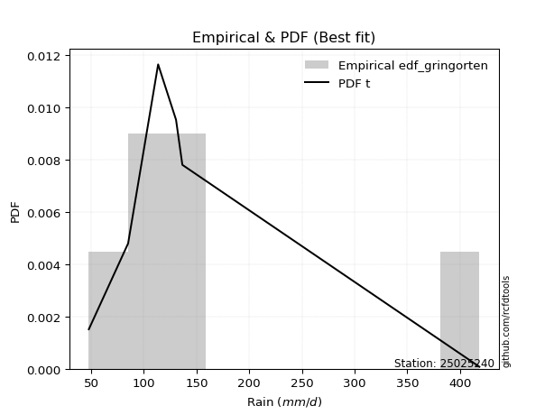</img>

</div>


### 9. EDF Filliben (1975)

The specific values of the constants (0.3175) (often denoted as $alpha$) and (0.365) are derived from a method proposed by James J. Filliben in a 1975 paper. This particular formula is the mean value of the $i$-th order statistic of the normal distribution and is considered a robust and effective plotting position formula for the normal probability plot correlation coefficient test for normality.

<div align="center">


$P=(m-0.3175)/(n+0.365)$


</div>


**9.1. Empirical values**

<div align="center">

|                | 0                   | 1                  | 2            | 3                  | 4                  |
|:---------------|:--------------------|:-------------------|:-------------|:-------------------|:-------------------|
| date           | 2020                | 2021               | 2023         | 2024               | 2022               |
| x              | 47.7                | 85.0               | 113.5        | 130.5              | 136.5              |
| m              | 1                   | 2                  | 3            | 4                  | 5                  |
| empirical_dist | edf_filliben        | edf_filliben       | edf_filliben | edf_filliben       | edf_filliben       |
| empirical      | 0.12721342031686858 | 0.3136067101584343 | 0.5          | 0.6863932898415657 | 0.8727865796831314 |
| empirical_tr   | 1.1457554725040042  | 1.456890699253225  | 2.0          | 3.188707280832095  | 7.860805860805863  |

</div>


**9.2. Kolmogorov-Smirnov fit test (sorted by Δ)**


<div align="center">

|                | 0                   | 1                  | 2                   | 3                   | 4                   | 5                   | 6                   | 7                   | 8                  | 9                   | 10                  | 11                  | 12                  | 13                  | 14                  | 15                  | 16                  | 17                  | 18                  | 19                  | 20                  | 21                  | 22                 | 23                 | 24                 | 25                  | 26                 | 27                  | 28                  | 29                 | 30                 | 31                  | 32                  | 33                  | 34                 | 35                 | 36                  | 37                  | 38                  | 39                  | 40                  | 41                 | 42                 | 43                  | 44                  | 45                  | 46                 | 47                 | 48                  | 49                  | 50                 | 51                 | 52                  | 53                  | 54                  | 55                  | 56                  | 57                  | 58                    | 59                  | 60                 | 61                  | 62                  | 63                 | 64                  | 65                  | 66                  | 67                 | 68                  | 69                 | 70                  | 71                 | 72                  | 73                 | 74                 | 75                  | 76                 | 77                  | 78                 | 79                 | 80                 | 81                  | 82                  | 83                  | 84                 | 85                 | 86                 | 87                 |
|:---------------|:--------------------|:-------------------|:--------------------|:--------------------|:--------------------|:--------------------|:--------------------|:--------------------|:-------------------|:--------------------|:--------------------|:--------------------|:--------------------|:--------------------|:--------------------|:--------------------|:--------------------|:--------------------|:--------------------|:--------------------|:--------------------|:--------------------|:-------------------|:-------------------|:-------------------|:--------------------|:-------------------|:--------------------|:--------------------|:-------------------|:-------------------|:--------------------|:--------------------|:--------------------|:-------------------|:-------------------|:--------------------|:--------------------|:--------------------|:--------------------|:--------------------|:-------------------|:-------------------|:--------------------|:--------------------|:--------------------|:-------------------|:-------------------|:--------------------|:--------------------|:-------------------|:-------------------|:--------------------|:--------------------|:--------------------|:--------------------|:--------------------|:--------------------|:----------------------|:--------------------|:-------------------|:--------------------|:--------------------|:-------------------|:--------------------|:--------------------|:--------------------|:-------------------|:--------------------|:-------------------|:--------------------|:-------------------|:--------------------|:-------------------|:-------------------|:--------------------|:-------------------|:--------------------|:-------------------|:-------------------|:-------------------|:--------------------|:--------------------|:--------------------|:-------------------|:-------------------|:-------------------|:-------------------|
| station        | 25025240            | 25025240           | 25025240            | 25025240            | 25025240            | 25025240            | 25025240            | 25025240            | 25025240           | 25025240            | 25025240            | 25025240            | 25025240            | 25025240            | 25025240            | 25025240            | 25025240            | 25025240            | 25025240            | 25025240            | 25025240            | 25025240            | 25025240           | 25025240           | 25025240           | 25025240            | 25025240           | 25025240            | 25025240            | 25025240           | 25025240           | 25025240            | 25025240            | 25025240            | 25025240           | 25025240           | 25025240            | 25025240            | 25025240            | 25025240            | 25025240            | 25025240           | 25025240           | 25025240            | 25025240            | 25025240            | 25025240           | 25025240           | 25025240            | 25025240            | 25025240           | 25025240           | 25025240            | 25025240            | 25025240            | 25025240            | 25025240            | 25025240            | 25025240              | 25025240            | 25025240           | 25025240            | 25025240            | 25025240           | 25025240            | 25025240            | 25025240            | 25025240           | 25025240            | 25025240           | 25025240            | 25025240           | 25025240            | 25025240           | 25025240           | 25025240            | 25025240           | 25025240            | 25025240           | 25025240           | 25025240           | 25025240            | 25025240            | 25025240            | 25025240           | 25025240           | 25025240           | 25025240           |
| empirical_dist | edf_filliben        | edf_filliben       | edf_filliben        | edf_filliben        | edf_filliben        | edf_filliben        | edf_filliben        | edf_filliben        | edf_filliben       | edf_filliben        | edf_filliben        | edf_filliben        | edf_filliben        | edf_filliben        | edf_filliben        | edf_filliben        | edf_filliben        | edf_filliben        | edf_filliben        | edf_filliben        | edf_filliben        | edf_filliben        | edf_filliben       | edf_filliben       | edf_filliben       | edf_filliben        | edf_filliben       | edf_filliben        | edf_filliben        | edf_filliben       | edf_filliben       | edf_filliben        | edf_filliben        | edf_filliben        | edf_filliben       | edf_filliben       | edf_filliben        | edf_filliben        | edf_filliben        | edf_filliben        | edf_filliben        | edf_filliben       | edf_filliben       | edf_filliben        | edf_filliben        | edf_filliben        | edf_filliben       | edf_filliben       | edf_filliben        | edf_filliben        | edf_filliben       | edf_filliben       | edf_filliben        | edf_filliben        | edf_filliben        | edf_filliben        | edf_filliben        | edf_filliben        | edf_filliben          | edf_filliben        | edf_filliben       | edf_filliben        | edf_filliben        | edf_filliben       | edf_filliben        | edf_filliben        | edf_filliben        | edf_filliben       | edf_filliben        | edf_filliben       | edf_filliben        | edf_filliben       | edf_filliben        | edf_filliben       | edf_filliben       | edf_filliben        | edf_filliben       | edf_filliben        | edf_filliben       | edf_filliben       | edf_filliben       | edf_filliben        | edf_filliben        | edf_filliben        | edf_filliben       | edf_filliben       | edf_filliben       | edf_filliben       |
| p_dist         | fisk                | pearson3           | logpearson3         | logfisk             | loggumbel_l         | gumbel_l            | logweibull_min      | weibull_min         | t                  | crystalball         | norm                | truncnorm           | exponnorm           | nct                 | erlang              | rice                | gamma               | chi2                | loggompertz         | alpha               | invgamma            | logistic            | laplace_asymmetric | ncf                | maxwell            | invgauss            | hypsecant          | logmielke           | rayleigh            | betaprime          | logbetaprime       | f                   | logf                | logt                | lognorm            | lognorm            | logcrystalball      | logexponnorm        | logncf              | loginvweibull       | lognct              | logerlang          | logfatiguelife     | logrice             | logalpha            | kstwobign           | loginvgamma        | loginvgauss        | loggamma            | loggamma            | halfnorm           | loglogistic        | logmaxwell          | laplace             | logkstwobign        | loggenexpon         | lograyleigh         | gumbel_r            | loglaplace_asymmetric | logloggamma         | expon              | loghypsecant        | loghalfnorm         | halflogistic       | moyal               | logjohnsonsu        | logchi2             | loggumbel_r        | loglaplace          | loghalflogistic    | logmoyal            | mielke             | logexpon            | wald               | logwald            | gibrat              | nakagami           | logtruncnorm        | lognakagami        | loggibrat          | loglognorm         | invweibull          | fatiguelife         | gompertz            | genexpon           | johnsonsu          | loggenlogistic     | genlogistic        |
| delta          | 0.09479323957235786 | 0.1111490100555127 | 0.11949368189602105 | 0.11964141224791114 | 0.12245030451321293 | 0.12544115752540685 | 0.12634259782098434 | 0.12852516290426785 | 0.129588460557291  | 0.12981942528631518 | 0.12981942874680708 | 0.12981943119174155 | 0.12981991570816986 | 0.12984884447707223 | 0.13761130582042236 | 0.13813876459184948 | 0.14114608244331428 | 0.14356957694998695 | 0.14408829641342313 | 0.14440099229447356 | 0.14576661534203994 | 0.14589603858109756 | 0.1510714293605081 | 0.1520067665908278 | 0.1535396603970436 | 0.15623258665662365 | 0.1586756014654629 | 0.15916850858101306 | 0.16076182914106085 | 0.1613387861931157 | 0.1631025321102233 | 0.16363502696911048 | 0.16480421561012892 | 0.16623994102154382 | 0.1662404497483242 | 0.1662404497483242 | 0.16624050060895368 | 0.16624227215196186 | 0.16732015802130995 | 0.16767584287368686 | 0.16782822769519212 | 0.1681634333617582 | 0.1685475734565498 | 0.17050499832936072 | 0.17111105519486924 | 0.17156596934224289 | 0.1730309162802841 | 0.175038919805669  | 0.17623528482323325 | 0.17623528482323325 | 0.1815464741044347 | 0.1854919914280121 | 0.18609903292432461 | 0.18707207736224496 | 0.19027634277078853 | 0.19043440304674453 | 0.19201382336838635 | 0.19276574703776506 | 0.19302642067905806   | 0.19412615490124208 | 0.198103243411335  | 0.20012063989689555 | 0.20940763486666913 | 0.2098799485911933 | 0.21385250540604828 | 0.21997556724714934 | 0.22140929842990248 | 0.2235149567991942 | 0.22763990928237487 | 0.2372156806038046 | 0.24230484357422466 | 0.2439710114200646 | 0.24804536657366644 | 0.2731008021066932 | 0.2960428430000063 | 0.30530687600717377 | 0.3135126229141313 | 0.31360588405833045 | 0.3136061973569387 | 0.3280990531908897 | 0.3680181478820079 | 0.40972112547722744 | 0.44320700991513357 | 0.48719942578792763 | 0.57833038593719   | 0.6234702197620562 | 0.6863932898415657 | 0.6863932898415657 |
| deltao         | 0.5865427407550001  | 0.5865427407550001 | 0.5865427407550001  | 0.5865427407550001  | 0.5865427407550001  | 0.5865427407550001  | 0.5865427407550001  | 0.5865427407550001  | 0.5865427407550001 | 0.5865427407550001  | 0.5865427407550001  | 0.5865427407550001  | 0.5865427407550001  | 0.5865427407550001  | 0.5865427407550001  | 0.5865427407550001  | 0.5865427407550001  | 0.5865427407550001  | 0.5865427407550001  | 0.5865427407550001  | 0.5865427407550001  | 0.5865427407550001  | 0.5865427407550001 | 0.5865427407550001 | 0.5865427407550001 | 0.5865427407550001  | 0.5865427407550001 | 0.5865427407550001  | 0.5865427407550001  | 0.5865427407550001 | 0.5865427407550001 | 0.5865427407550001  | 0.5865427407550001  | 0.5865427407550001  | 0.5865427407550001 | 0.5865427407550001 | 0.5865427407550001  | 0.5865427407550001  | 0.5865427407550001  | 0.5865427407550001  | 0.5865427407550001  | 0.5865427407550001 | 0.5865427407550001 | 0.5865427407550001  | 0.5865427407550001  | 0.5865427407550001  | 0.5865427407550001 | 0.5865427407550001 | 0.5865427407550001  | 0.5865427407550001  | 0.5865427407550001 | 0.5865427407550001 | 0.5865427407550001  | 0.5865427407550001  | 0.5865427407550001  | 0.5865427407550001  | 0.5865427407550001  | 0.5865427407550001  | 0.5865427407550001    | 0.5865427407550001  | 0.5865427407550001 | 0.5865427407550001  | 0.5865427407550001  | 0.5865427407550001 | 0.5865427407550001  | 0.5865427407550001  | 0.5865427407550001  | 0.5865427407550001 | 0.5865427407550001  | 0.5865427407550001 | 0.5865427407550001  | 0.5865427407550001 | 0.5865427407550001  | 0.5865427407550001 | 0.5865427407550001 | 0.5865427407550001  | 0.5865427407550001 | 0.5865427407550001  | 0.5865427407550001 | 0.5865427407550001 | 0.5865427407550001 | 0.5865427407550001  | 0.5865427407550001  | 0.5865427407550001  | 0.5865427407550001 | 0.5865427407550001 | 0.5865427407550001 | 0.5865427407550001 |
| eval           | Δo > Δ              | Δo > Δ             | Δo > Δ              | Δo > Δ              | Δo > Δ              | Δo > Δ              | Δo > Δ              | Δo > Δ              | Δo > Δ             | Δo > Δ              | Δo > Δ              | Δo > Δ              | Δo > Δ              | Δo > Δ              | Δo > Δ              | Δo > Δ              | Δo > Δ              | Δo > Δ              | Δo > Δ              | Δo > Δ              | Δo > Δ              | Δo > Δ              | Δo > Δ             | Δo > Δ             | Δo > Δ             | Δo > Δ              | Δo > Δ             | Δo > Δ              | Δo > Δ              | Δo > Δ             | Δo > Δ             | Δo > Δ              | Δo > Δ              | Δo > Δ              | Δo > Δ             | Δo > Δ             | Δo > Δ              | Δo > Δ              | Δo > Δ              | Δo > Δ              | Δo > Δ              | Δo > Δ             | Δo > Δ             | Δo > Δ              | Δo > Δ              | Δo > Δ              | Δo > Δ             | Δo > Δ             | Δo > Δ              | Δo > Δ              | Δo > Δ             | Δo > Δ             | Δo > Δ              | Δo > Δ              | Δo > Δ              | Δo > Δ              | Δo > Δ              | Δo > Δ              | Δo > Δ                | Δo > Δ              | Δo > Δ             | Δo > Δ              | Δo > Δ              | Δo > Δ             | Δo > Δ              | Δo > Δ              | Δo > Δ              | Δo > Δ             | Δo > Δ              | Δo > Δ             | Δo > Δ              | Δo > Δ             | Δo > Δ              | Δo > Δ             | Δo > Δ             | Δo > Δ              | Δo > Δ             | Δo > Δ              | Δo > Δ             | Δo > Δ             | Δo > Δ             | Δo > Δ              | Δo > Δ              | Δo > Δ              | Δo > Δ             | Δo <= Δ            | Δo <= Δ            | Δo <= Δ            |
| fit            | 1                   | 1                  | 1                   | 1                   | 1                   | 1                   | 1                   | 1                   | 1                  | 1                   | 1                   | 1                   | 1                   | 1                   | 1                   | 1                   | 1                   | 1                   | 1                   | 1                   | 1                   | 1                   | 1                  | 1                  | 1                  | 1                   | 1                  | 1                   | 1                   | 1                  | 1                  | 1                   | 1                   | 1                   | 1                  | 1                  | 1                   | 1                   | 1                   | 1                   | 1                   | 1                  | 1                  | 1                   | 1                   | 1                   | 1                  | 1                  | 1                   | 1                   | 1                  | 1                  | 1                   | 1                   | 1                   | 1                   | 1                   | 1                   | 1                     | 1                   | 1                  | 1                   | 1                   | 1                  | 1                   | 1                   | 1                   | 1                  | 1                   | 1                  | 1                   | 1                  | 1                   | 1                  | 1                  | 1                   | 1                  | 1                   | 1                  | 1                  | 1                  | 1                   | 1                   | 1                   | 1                  | 0                  | 0                  | 0                  |
| n              | 5                   | 5                  | 5                   | 5                   | 5                   | 5                   | 5                   | 5                   | 5                  | 5                   | 5                   | 5                   | 5                   | 5                   | 5                   | 5                   | 5                   | 5                   | 5                   | 5                   | 5                   | 5                   | 5                  | 5                  | 5                  | 5                   | 5                  | 5                   | 5                   | 5                  | 5                  | 5                   | 5                   | 5                   | 5                  | 5                  | 5                   | 5                   | 5                   | 5                   | 5                   | 5                  | 5                  | 5                   | 5                   | 5                   | 5                  | 5                  | 5                   | 5                   | 5                  | 5                  | 5                   | 5                   | 5                   | 5                   | 5                   | 5                   | 5                     | 5                   | 5                  | 5                   | 5                   | 5                  | 5                   | 5                   | 5                   | 5                  | 5                   | 5                  | 5                   | 5                  | 5                   | 5                  | 5                  | 5                   | 5                  | 5                   | 5                  | 5                  | 5                  | 5                   | 5                   | 5                   | 5                  | 5                  | 5                  | 5                  |
| best_fit       | 1                   | 0                  | 0                   | 0                   | 0                   | 0                   | 0                   | 0                   | 0                  | 0                   | 0                   | 0                   | 0                   | 0                   | 0                   | 0                   | 0                   | 0                   | 0                   | 0                   | 0                   | 0                   | 0                  | 0                  | 0                  | 0                   | 0                  | 0                   | 0                   | 0                  | 0                  | 0                   | 0                   | 0                   | 0                  | 0                  | 0                   | 0                   | 0                   | 0                   | 0                   | 0                  | 0                  | 0                   | 0                   | 0                   | 0                  | 0                  | 0                   | 0                   | 0                  | 0                  | 0                   | 0                   | 0                   | 0                   | 0                   | 0                   | 0                     | 0                   | 0                  | 0                   | 0                   | 0                  | 0                   | 0                   | 0                   | 0                  | 0                   | 0                  | 0                   | 0                  | 0                   | 0                  | 0                  | 0                   | 0                  | 0                   | 0                  | 0                  | 0                  | 0                   | 0                   | 0                   | 0                  | 0                  | 0                  | 0                  |
| best_fit_sort  | 1                   | 2                  | 3                   | 4                   | 5                   | 6                   | 7                   | 8                   | 9                  | 10                  | 11                  | 12                  | 13                  | 14                  | 15                  | 16                  | 17                  | 18                  | 19                  | 20                  | 21                  | 22                  | 23                 | 24                 | 25                 | 26                  | 27                 | 28                  | 29                  | 30                 | 31                 | 32                  | 33                  | 34                  | 35                 | 36                 | 37                  | 38                  | 39                  | 40                  | 41                  | 42                 | 43                 | 44                  | 45                  | 46                  | 47                 | 48                 | 49                  | 50                  | 51                 | 52                 | 53                  | 54                  | 55                  | 56                  | 57                  | 58                  | 59                    | 60                  | 61                 | 62                  | 63                  | 64                 | 65                  | 66                  | 67                  | 68                 | 69                  | 70                 | 71                  | 72                 | 73                  | 74                 | 75                 | 76                  | 77                 | 78                  | 79                 | 80                 | 81                 | 82                  | 83                  | 84                  | 85                 | 86                 | 87                 | 88                 |

</div>


**9.3. Best fit**

<div align="center">

|   id |   station | empirical_dist   | p_dist   |     delta |   deltao | eval   |   fit |   n |   best_fit |   best_fit_sort |
|-----:|----------:|:-----------------|:---------|----------:|---------:|:-------|------:|----:|-----------:|----------------:|
|    0 |  25025240 | edf_filliben     | fisk     | 0.0947932 | 0.586543 | Δo > Δ |     1 |   5 |          1 |               1 |

</div>


<div align="center">

</img>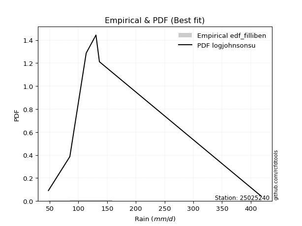</img>

</div>


### 10. EDF Jenkinson (1977)

The Jenkinson formula in hydrology is an empirical plotting position formula used to estimate the non-exceedance probability _(P)_ or return period _(T)_ of a given ordered observation within a sample. It is a widely used method in the frequency analysis of extreme events such as floods and rainfall, as it provides a distribution-free way to plot data. _a≈0.31_ and _b≈0.38_ are constants derived to approximate the median of the probability distribution for the given rank.

<div align="center">


$P=(m-a)/(n+b)$


</div>


**10.1. Empirical values**

<div align="center">

|                | 0                   | 1                  | 2             | 3                  | 4                  |
|:---------------|:--------------------|:-------------------|:--------------|:-------------------|:-------------------|
| date           | 2020                | 2021               | 2023          | 2024               | 2022               |
| x              | 47.7                | 85.0               | 113.5         | 130.5              | 136.5              |
| m              | 1                   | 2                  | 3             | 4                  | 5                  |
| empirical_dist | edf_jenkinson       | edf_jenkinson      | edf_jenkinson | edf_jenkinson      | edf_jenkinson      |
| empirical      | 0.12825278810408922 | 0.3141263940520446 | 0.5           | 0.6858736059479554 | 0.8717472118959109 |
| empirical_tr   | 1.1471215351812367  | 1.4579945799457996 | 2.0           | 3.183431952662722  | 7.797101449275368  |

</div>


**10.2. Kolmogorov-Smirnov fit test (sorted by Δ)**


<div align="center">

|                | 0                   | 1                   | 2                   | 3                   | 4                   | 5                  | 6                   | 7                  | 8                  | 9                   | 10                  | 11                  | 12                  | 13                  | 14                  | 15                  | 16                  | 17                  | 18                  | 19                  | 20                  | 21                  | 22                  | 23                 | 24                 | 25                  | 26                 | 27                 | 28                  | 29                 | 30                 | 31                  | 32                  | 33                  | 34                 | 35                 | 36                  | 37                  | 38                  | 39                  | 40                  | 41                 | 42                 | 43                  | 44                  | 45                  | 46                 | 47                 | 48                  | 49                  | 50                 | 51                 | 52                  | 53                  | 54                  | 55                  | 56                  | 57                  | 58                    | 59                 | 60                 | 61                  | 62                  | 63                 | 64                  | 65                 | 66                  | 67                 | 68                  | 69                 | 70                  | 71                  | 72                 | 73                 | 74                 | 75                  | 76                  | 77                 | 78                 | 79                 | 80                  | 81                  | 82                 | 83                  | 84                 | 85                 | 86                 | 87                 |
|:---------------|:--------------------|:--------------------|:--------------------|:--------------------|:--------------------|:-------------------|:--------------------|:-------------------|:-------------------|:--------------------|:--------------------|:--------------------|:--------------------|:--------------------|:--------------------|:--------------------|:--------------------|:--------------------|:--------------------|:--------------------|:--------------------|:--------------------|:--------------------|:-------------------|:-------------------|:--------------------|:-------------------|:-------------------|:--------------------|:-------------------|:-------------------|:--------------------|:--------------------|:--------------------|:-------------------|:-------------------|:--------------------|:--------------------|:--------------------|:--------------------|:--------------------|:-------------------|:-------------------|:--------------------|:--------------------|:--------------------|:-------------------|:-------------------|:--------------------|:--------------------|:-------------------|:-------------------|:--------------------|:--------------------|:--------------------|:--------------------|:--------------------|:--------------------|:----------------------|:-------------------|:-------------------|:--------------------|:--------------------|:-------------------|:--------------------|:-------------------|:--------------------|:-------------------|:--------------------|:-------------------|:--------------------|:--------------------|:-------------------|:-------------------|:-------------------|:--------------------|:--------------------|:-------------------|:-------------------|:-------------------|:--------------------|:--------------------|:-------------------|:--------------------|:-------------------|:-------------------|:-------------------|:-------------------|
| station        | 25025240            | 25025240            | 25025240            | 25025240            | 25025240            | 25025240           | 25025240            | 25025240           | 25025240           | 25025240            | 25025240            | 25025240            | 25025240            | 25025240            | 25025240            | 25025240            | 25025240            | 25025240            | 25025240            | 25025240            | 25025240            | 25025240            | 25025240            | 25025240           | 25025240           | 25025240            | 25025240           | 25025240           | 25025240            | 25025240           | 25025240           | 25025240            | 25025240            | 25025240            | 25025240           | 25025240           | 25025240            | 25025240            | 25025240            | 25025240            | 25025240            | 25025240           | 25025240           | 25025240            | 25025240            | 25025240            | 25025240           | 25025240           | 25025240            | 25025240            | 25025240           | 25025240           | 25025240            | 25025240            | 25025240            | 25025240            | 25025240            | 25025240            | 25025240              | 25025240           | 25025240           | 25025240            | 25025240            | 25025240           | 25025240            | 25025240           | 25025240            | 25025240           | 25025240            | 25025240           | 25025240            | 25025240            | 25025240           | 25025240           | 25025240           | 25025240            | 25025240            | 25025240           | 25025240           | 25025240           | 25025240            | 25025240            | 25025240           | 25025240            | 25025240           | 25025240           | 25025240           | 25025240           |
| empirical_dist | edf_jenkinson       | edf_jenkinson       | edf_jenkinson       | edf_jenkinson       | edf_jenkinson       | edf_jenkinson      | edf_jenkinson       | edf_jenkinson      | edf_jenkinson      | edf_jenkinson       | edf_jenkinson       | edf_jenkinson       | edf_jenkinson       | edf_jenkinson       | edf_jenkinson       | edf_jenkinson       | edf_jenkinson       | edf_jenkinson       | edf_jenkinson       | edf_jenkinson       | edf_jenkinson       | edf_jenkinson       | edf_jenkinson       | edf_jenkinson      | edf_jenkinson      | edf_jenkinson       | edf_jenkinson      | edf_jenkinson      | edf_jenkinson       | edf_jenkinson      | edf_jenkinson      | edf_jenkinson       | edf_jenkinson       | edf_jenkinson       | edf_jenkinson      | edf_jenkinson      | edf_jenkinson       | edf_jenkinson       | edf_jenkinson       | edf_jenkinson       | edf_jenkinson       | edf_jenkinson      | edf_jenkinson      | edf_jenkinson       | edf_jenkinson       | edf_jenkinson       | edf_jenkinson      | edf_jenkinson      | edf_jenkinson       | edf_jenkinson       | edf_jenkinson      | edf_jenkinson      | edf_jenkinson       | edf_jenkinson       | edf_jenkinson       | edf_jenkinson       | edf_jenkinson       | edf_jenkinson       | edf_jenkinson         | edf_jenkinson      | edf_jenkinson      | edf_jenkinson       | edf_jenkinson       | edf_jenkinson      | edf_jenkinson       | edf_jenkinson      | edf_jenkinson       | edf_jenkinson      | edf_jenkinson       | edf_jenkinson      | edf_jenkinson       | edf_jenkinson       | edf_jenkinson      | edf_jenkinson      | edf_jenkinson      | edf_jenkinson       | edf_jenkinson       | edf_jenkinson      | edf_jenkinson      | edf_jenkinson      | edf_jenkinson       | edf_jenkinson       | edf_jenkinson      | edf_jenkinson       | edf_jenkinson      | edf_jenkinson      | edf_jenkinson      | edf_jenkinson      |
| p_dist         | fisk                | pearson3            | logpearson3         | logfisk             | loggumbel_l         | gumbel_l           | logweibull_min      | weibull_min        | t                  | crystalball         | norm                | truncnorm           | exponnorm           | nct                 | erlang              | rice                | gamma               | chi2                | loggompertz         | alpha               | invgamma            | logistic            | laplace_asymmetric  | ncf                | maxwell            | invgauss            | hypsecant          | logmielke          | rayleigh            | betaprime          | logbetaprime       | f                   | logf                | logt                | lognorm            | lognorm            | logcrystalball      | logexponnorm        | logncf              | loginvweibull       | lognct              | logerlang          | logfatiguelife     | logrice             | logalpha            | kstwobign           | loginvgamma        | loginvgauss        | loggamma            | loggamma            | halfnorm           | loglogistic        | logmaxwell          | laplace             | logkstwobign        | loggenexpon         | lograyleigh         | gumbel_r            | loglaplace_asymmetric | logloggamma        | expon              | loghypsecant        | loghalfnorm         | halflogistic       | moyal               | logjohnsonsu       | logchi2             | loggumbel_r        | loglaplace          | loghalflogistic    | logmoyal            | mielke              | logexpon           | wald               | logwald            | gibrat              | nakagami            | logtruncnorm       | lognakagami        | loggibrat          | loglognorm          | invweibull          | fatiguelife        | gompertz            | genexpon           | johnsonsu          | loggenlogistic     | genlogistic        |
| delta          | 0.09479323957235786 | 0.11166869394912293 | 0.11949368189602105 | 0.11964141224791114 | 0.12245030451321293 | 0.1259608414190171 | 0.12686228171459457 | 0.1290448467978781 | 0.129588460557291  | 0.12981942528631518 | 0.12981942874680708 | 0.12981943119174155 | 0.12981991570816986 | 0.12984884447707223 | 0.13761130582042236 | 0.13813876459184948 | 0.14114608244331428 | 0.14356957694998695 | 0.14408829641342313 | 0.14440099229447356 | 0.14576661534203994 | 0.14589603858109756 | 0.15159111325411834 | 0.1520067665908278 | 0.1535396603970436 | 0.15623258665662365 | 0.1586756014654629 | 0.1596881924746233 | 0.16076182914106085 | 0.1613387861931157 | 0.1631025321102233 | 0.16363502696911048 | 0.16480421561012892 | 0.16623994102154382 | 0.1662404497483242 | 0.1662404497483242 | 0.16624050060895368 | 0.16624227215196186 | 0.16732015802130995 | 0.16767584287368686 | 0.16782822769519212 | 0.1681634333617582 | 0.1685475734565498 | 0.17050499832936072 | 0.17111105519486924 | 0.17156596934224289 | 0.1730309162802841 | 0.175038919805669  | 0.17623528482323325 | 0.17623528482323325 | 0.1815464741044347 | 0.1854919914280121 | 0.18609903292432461 | 0.18707207736224496 | 0.19027634277078853 | 0.19043440304674453 | 0.19201382336838635 | 0.19276574703776506 | 0.1935461045726683    | 0.1946458387948523 | 0.198103243411335  | 0.20012063989689555 | 0.20940763486666913 | 0.2098799485911933 | 0.21385250540604828 | 0.2194558833535391 | 0.22088961453629213 | 0.2235149567991942 | 0.22763990928237487 | 0.2372156806038046 | 0.24230484357422466 | 0.24449069531367484 | 0.2475256826800561 | 0.2731008021066932 | 0.2960428430000063 | 0.30530687600717377 | 0.31403230680774163 | 0.3141255679519408 | 0.314125881250549  | 0.3280990531908897 | 0.36749846398839753 | 0.40868175769000686 | 0.4426873260215232 | 0.48719942578792763 | 0.5778107020435796 | 0.622950535868446  | 0.6858736059479554 | 0.6858736059479554 |
| deltao         | 0.5865427407550001  | 0.5865427407550001  | 0.5865427407550001  | 0.5865427407550001  | 0.5865427407550001  | 0.5865427407550001 | 0.5865427407550001  | 0.5865427407550001 | 0.5865427407550001 | 0.5865427407550001  | 0.5865427407550001  | 0.5865427407550001  | 0.5865427407550001  | 0.5865427407550001  | 0.5865427407550001  | 0.5865427407550001  | 0.5865427407550001  | 0.5865427407550001  | 0.5865427407550001  | 0.5865427407550001  | 0.5865427407550001  | 0.5865427407550001  | 0.5865427407550001  | 0.5865427407550001 | 0.5865427407550001 | 0.5865427407550001  | 0.5865427407550001 | 0.5865427407550001 | 0.5865427407550001  | 0.5865427407550001 | 0.5865427407550001 | 0.5865427407550001  | 0.5865427407550001  | 0.5865427407550001  | 0.5865427407550001 | 0.5865427407550001 | 0.5865427407550001  | 0.5865427407550001  | 0.5865427407550001  | 0.5865427407550001  | 0.5865427407550001  | 0.5865427407550001 | 0.5865427407550001 | 0.5865427407550001  | 0.5865427407550001  | 0.5865427407550001  | 0.5865427407550001 | 0.5865427407550001 | 0.5865427407550001  | 0.5865427407550001  | 0.5865427407550001 | 0.5865427407550001 | 0.5865427407550001  | 0.5865427407550001  | 0.5865427407550001  | 0.5865427407550001  | 0.5865427407550001  | 0.5865427407550001  | 0.5865427407550001    | 0.5865427407550001 | 0.5865427407550001 | 0.5865427407550001  | 0.5865427407550001  | 0.5865427407550001 | 0.5865427407550001  | 0.5865427407550001 | 0.5865427407550001  | 0.5865427407550001 | 0.5865427407550001  | 0.5865427407550001 | 0.5865427407550001  | 0.5865427407550001  | 0.5865427407550001 | 0.5865427407550001 | 0.5865427407550001 | 0.5865427407550001  | 0.5865427407550001  | 0.5865427407550001 | 0.5865427407550001 | 0.5865427407550001 | 0.5865427407550001  | 0.5865427407550001  | 0.5865427407550001 | 0.5865427407550001  | 0.5865427407550001 | 0.5865427407550001 | 0.5865427407550001 | 0.5865427407550001 |
| eval           | Δo > Δ              | Δo > Δ              | Δo > Δ              | Δo > Δ              | Δo > Δ              | Δo > Δ             | Δo > Δ              | Δo > Δ             | Δo > Δ             | Δo > Δ              | Δo > Δ              | Δo > Δ              | Δo > Δ              | Δo > Δ              | Δo > Δ              | Δo > Δ              | Δo > Δ              | Δo > Δ              | Δo > Δ              | Δo > Δ              | Δo > Δ              | Δo > Δ              | Δo > Δ              | Δo > Δ             | Δo > Δ             | Δo > Δ              | Δo > Δ             | Δo > Δ             | Δo > Δ              | Δo > Δ             | Δo > Δ             | Δo > Δ              | Δo > Δ              | Δo > Δ              | Δo > Δ             | Δo > Δ             | Δo > Δ              | Δo > Δ              | Δo > Δ              | Δo > Δ              | Δo > Δ              | Δo > Δ             | Δo > Δ             | Δo > Δ              | Δo > Δ              | Δo > Δ              | Δo > Δ             | Δo > Δ             | Δo > Δ              | Δo > Δ              | Δo > Δ             | Δo > Δ             | Δo > Δ              | Δo > Δ              | Δo > Δ              | Δo > Δ              | Δo > Δ              | Δo > Δ              | Δo > Δ                | Δo > Δ             | Δo > Δ             | Δo > Δ              | Δo > Δ              | Δo > Δ             | Δo > Δ              | Δo > Δ             | Δo > Δ              | Δo > Δ             | Δo > Δ              | Δo > Δ             | Δo > Δ              | Δo > Δ              | Δo > Δ             | Δo > Δ             | Δo > Δ             | Δo > Δ              | Δo > Δ              | Δo > Δ             | Δo > Δ             | Δo > Δ             | Δo > Δ              | Δo > Δ              | Δo > Δ             | Δo > Δ              | Δo > Δ             | Δo <= Δ            | Δo <= Δ            | Δo <= Δ            |
| fit            | 1                   | 1                   | 1                   | 1                   | 1                   | 1                  | 1                   | 1                  | 1                  | 1                   | 1                   | 1                   | 1                   | 1                   | 1                   | 1                   | 1                   | 1                   | 1                   | 1                   | 1                   | 1                   | 1                   | 1                  | 1                  | 1                   | 1                  | 1                  | 1                   | 1                  | 1                  | 1                   | 1                   | 1                   | 1                  | 1                  | 1                   | 1                   | 1                   | 1                   | 1                   | 1                  | 1                  | 1                   | 1                   | 1                   | 1                  | 1                  | 1                   | 1                   | 1                  | 1                  | 1                   | 1                   | 1                   | 1                   | 1                   | 1                   | 1                     | 1                  | 1                  | 1                   | 1                   | 1                  | 1                   | 1                  | 1                   | 1                  | 1                   | 1                  | 1                   | 1                   | 1                  | 1                  | 1                  | 1                   | 1                   | 1                  | 1                  | 1                  | 1                   | 1                   | 1                  | 1                   | 1                  | 0                  | 0                  | 0                  |
| n              | 5                   | 5                   | 5                   | 5                   | 5                   | 5                  | 5                   | 5                  | 5                  | 5                   | 5                   | 5                   | 5                   | 5                   | 5                   | 5                   | 5                   | 5                   | 5                   | 5                   | 5                   | 5                   | 5                   | 5                  | 5                  | 5                   | 5                  | 5                  | 5                   | 5                  | 5                  | 5                   | 5                   | 5                   | 5                  | 5                  | 5                   | 5                   | 5                   | 5                   | 5                   | 5                  | 5                  | 5                   | 5                   | 5                   | 5                  | 5                  | 5                   | 5                   | 5                  | 5                  | 5                   | 5                   | 5                   | 5                   | 5                   | 5                   | 5                     | 5                  | 5                  | 5                   | 5                   | 5                  | 5                   | 5                  | 5                   | 5                  | 5                   | 5                  | 5                   | 5                   | 5                  | 5                  | 5                  | 5                   | 5                   | 5                  | 5                  | 5                  | 5                   | 5                   | 5                  | 5                   | 5                  | 5                  | 5                  | 5                  |
| best_fit       | 1                   | 0                   | 0                   | 0                   | 0                   | 0                  | 0                   | 0                  | 0                  | 0                   | 0                   | 0                   | 0                   | 0                   | 0                   | 0                   | 0                   | 0                   | 0                   | 0                   | 0                   | 0                   | 0                   | 0                  | 0                  | 0                   | 0                  | 0                  | 0                   | 0                  | 0                  | 0                   | 0                   | 0                   | 0                  | 0                  | 0                   | 0                   | 0                   | 0                   | 0                   | 0                  | 0                  | 0                   | 0                   | 0                   | 0                  | 0                  | 0                   | 0                   | 0                  | 0                  | 0                   | 0                   | 0                   | 0                   | 0                   | 0                   | 0                     | 0                  | 0                  | 0                   | 0                   | 0                  | 0                   | 0                  | 0                   | 0                  | 0                   | 0                  | 0                   | 0                   | 0                  | 0                  | 0                  | 0                   | 0                   | 0                  | 0                  | 0                  | 0                   | 0                   | 0                  | 0                   | 0                  | 0                  | 0                  | 0                  |
| best_fit_sort  | 1                   | 2                   | 3                   | 4                   | 5                   | 6                  | 7                   | 8                  | 9                  | 10                  | 11                  | 12                  | 13                  | 14                  | 15                  | 16                  | 17                  | 18                  | 19                  | 20                  | 21                  | 22                  | 23                  | 24                 | 25                 | 26                  | 27                 | 28                 | 29                  | 30                 | 31                 | 32                  | 33                  | 34                  | 35                 | 36                 | 37                  | 38                  | 39                  | 40                  | 41                  | 42                 | 43                 | 44                  | 45                  | 46                  | 47                 | 48                 | 49                  | 50                  | 51                 | 52                 | 53                  | 54                  | 55                  | 56                  | 57                  | 58                  | 59                    | 60                 | 61                 | 62                  | 63                  | 64                 | 65                  | 66                 | 67                  | 68                 | 69                  | 70                 | 71                  | 72                  | 73                 | 74                 | 75                 | 76                  | 77                  | 78                 | 79                 | 80                 | 81                  | 82                  | 83                 | 84                  | 85                 | 86                 | 87                 | 88                 |

</div>


**10.3. Best fit**

<div align="center">

|   id |   station | empirical_dist   | p_dist   |     delta |   deltao | eval   |   fit |   n |   best_fit |   best_fit_sort |
|-----:|----------:|:-----------------|:---------|----------:|---------:|:-------|------:|----:|-----------:|----------------:|
|    0 |  25025240 | edf_jenkinson    | fisk     | 0.0947932 | 0.586543 | Δo > Δ |     1 |   5 |          1 |               1 |

</div>


<div align="center">

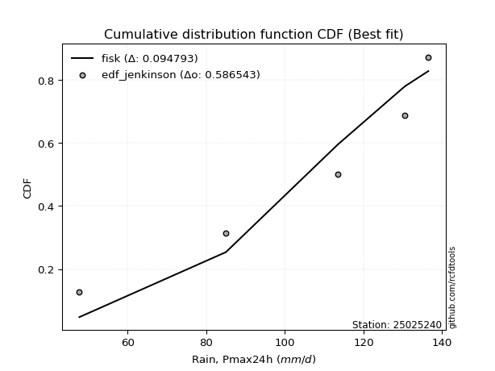</img></img>

</div>


### 11. EDF Cunnane (1978)

Cunnane´s work in statistical hydrology has focused on the performance and evaluation of different probability distributions (such as GEV, Gumbel, Lognormal) for flood frequency estimation. _b_ is a constant, typically set to 0.4.

<div align="center">


$P=(m-b)/(n+1-2b)$


</div>


**11.1. Empirical values**

<div align="center">

|                | 0                   | 1                  | 2           | 3                  | 4                  |
|:---------------|:--------------------|:-------------------|:------------|:-------------------|:-------------------|
| date           | 2020                | 2021               | 2023        | 2024               | 2022               |
| x              | 47.7                | 85.0               | 113.5       | 130.5              | 136.5              |
| m              | 1                   | 2                  | 3           | 4                  | 5                  |
| empirical_dist | edf_cunnane         | edf_cunnane        | edf_cunnane | edf_cunnane        | edf_cunnane        |
| empirical      | 0.11538461538461538 | 0.3076923076923077 | 0.5         | 0.6923076923076923 | 0.8846153846153845 |
| empirical_tr   | 1.1304347826086958  | 1.4444444444444444 | 2.0         | 3.25               | 8.666666666666655  |

</div>


**11.2. Kolmogorov-Smirnov fit test (sorted by Δ)**


<div align="center">

|                | 0                   | 1                   | 2                   | 3                   | 4                   | 5                   | 6                   | 7                   | 8                  | 9                   | 10                  | 11                  | 12                  | 13                  | 14                  | 15                  | 16                  | 17                  | 18                  | 19                  | 20                  | 21                  | 22                  | 23                 | 24                  | 25                 | 26                  | 27                 | 28                  | 29                 | 30                 | 31                  | 32                  | 33                  | 34                 | 35                 | 36                  | 37                  | 38                  | 39                  | 40                  | 41                 | 42                 | 43                  | 44                  | 45                  | 46                 | 47                 | 48                  | 49                  | 50                 | 51                 | 52                  | 53                  | 54                    | 55                  | 56                  | 57                  | 58                  | 59                  | 60                 | 61                  | 62                  | 63                 | 64                  | 65                 | 66                  | 67                  | 68                  | 69                 | 70                  | 71                  | 72                 | 73                 | 74                 | 75                  | 76                 | 77                 | 78                 | 79                 | 80                  | 81                  | 82                  | 83                  | 84                 | 85                 | 86                 | 87                 |
|:---------------|:--------------------|:--------------------|:--------------------|:--------------------|:--------------------|:--------------------|:--------------------|:--------------------|:-------------------|:--------------------|:--------------------|:--------------------|:--------------------|:--------------------|:--------------------|:--------------------|:--------------------|:--------------------|:--------------------|:--------------------|:--------------------|:--------------------|:--------------------|:-------------------|:--------------------|:-------------------|:--------------------|:-------------------|:--------------------|:-------------------|:-------------------|:--------------------|:--------------------|:--------------------|:-------------------|:-------------------|:--------------------|:--------------------|:--------------------|:--------------------|:--------------------|:-------------------|:-------------------|:--------------------|:--------------------|:--------------------|:-------------------|:-------------------|:--------------------|:--------------------|:-------------------|:-------------------|:--------------------|:--------------------|:----------------------|:--------------------|:--------------------|:--------------------|:--------------------|:--------------------|:-------------------|:--------------------|:--------------------|:-------------------|:--------------------|:-------------------|:--------------------|:--------------------|:--------------------|:-------------------|:--------------------|:--------------------|:-------------------|:-------------------|:-------------------|:--------------------|:-------------------|:-------------------|:-------------------|:-------------------|:--------------------|:--------------------|:--------------------|:--------------------|:-------------------|:-------------------|:-------------------|:-------------------|
| station        | 25025240            | 25025240            | 25025240            | 25025240            | 25025240            | 25025240            | 25025240            | 25025240            | 25025240           | 25025240            | 25025240            | 25025240            | 25025240            | 25025240            | 25025240            | 25025240            | 25025240            | 25025240            | 25025240            | 25025240            | 25025240            | 25025240            | 25025240            | 25025240           | 25025240            | 25025240           | 25025240            | 25025240           | 25025240            | 25025240           | 25025240           | 25025240            | 25025240            | 25025240            | 25025240           | 25025240           | 25025240            | 25025240            | 25025240            | 25025240            | 25025240            | 25025240           | 25025240           | 25025240            | 25025240            | 25025240            | 25025240           | 25025240           | 25025240            | 25025240            | 25025240           | 25025240           | 25025240            | 25025240            | 25025240              | 25025240            | 25025240            | 25025240            | 25025240            | 25025240            | 25025240           | 25025240            | 25025240            | 25025240           | 25025240            | 25025240           | 25025240            | 25025240            | 25025240            | 25025240           | 25025240            | 25025240            | 25025240           | 25025240           | 25025240           | 25025240            | 25025240           | 25025240           | 25025240           | 25025240           | 25025240            | 25025240            | 25025240            | 25025240            | 25025240           | 25025240           | 25025240           | 25025240           |
| empirical_dist | edf_cunnane         | edf_cunnane         | edf_cunnane         | edf_cunnane         | edf_cunnane         | edf_cunnane         | edf_cunnane         | edf_cunnane         | edf_cunnane        | edf_cunnane         | edf_cunnane         | edf_cunnane         | edf_cunnane         | edf_cunnane         | edf_cunnane         | edf_cunnane         | edf_cunnane         | edf_cunnane         | edf_cunnane         | edf_cunnane         | edf_cunnane         | edf_cunnane         | edf_cunnane         | edf_cunnane        | edf_cunnane         | edf_cunnane        | edf_cunnane         | edf_cunnane        | edf_cunnane         | edf_cunnane        | edf_cunnane        | edf_cunnane         | edf_cunnane         | edf_cunnane         | edf_cunnane        | edf_cunnane        | edf_cunnane         | edf_cunnane         | edf_cunnane         | edf_cunnane         | edf_cunnane         | edf_cunnane        | edf_cunnane        | edf_cunnane         | edf_cunnane         | edf_cunnane         | edf_cunnane        | edf_cunnane        | edf_cunnane         | edf_cunnane         | edf_cunnane        | edf_cunnane        | edf_cunnane         | edf_cunnane         | edf_cunnane           | edf_cunnane         | edf_cunnane         | edf_cunnane         | edf_cunnane         | edf_cunnane         | edf_cunnane        | edf_cunnane         | edf_cunnane         | edf_cunnane        | edf_cunnane         | edf_cunnane        | edf_cunnane         | edf_cunnane         | edf_cunnane         | edf_cunnane        | edf_cunnane         | edf_cunnane         | edf_cunnane        | edf_cunnane        | edf_cunnane        | edf_cunnane         | edf_cunnane        | edf_cunnane        | edf_cunnane        | edf_cunnane        | edf_cunnane         | edf_cunnane         | edf_cunnane         | edf_cunnane         | edf_cunnane        | edf_cunnane        | edf_cunnane        | edf_cunnane        |
| p_dist         | fisk                | pearson3            | logpearson3         | gumbel_l            | logfisk             | loggumbel_l         | weibull_min         | logweibull_min      | t                  | crystalball         | norm                | truncnorm           | exponnorm           | nct                 | erlang              | rice                | gamma               | chi2                | loggompertz         | alpha               | laplace_asymmetric  | invgamma            | logistic            | ncf                | logmielke           | maxwell            | invgauss            | hypsecant          | rayleigh            | betaprime          | logbetaprime       | f                   | logf                | logt                | lognorm            | lognorm            | logcrystalball      | logexponnorm        | logncf              | loginvweibull       | lognct              | logerlang          | logfatiguelife     | logrice             | logalpha            | kstwobign           | loginvgamma        | loginvgauss        | loggamma            | loggamma            | halfnorm           | loglogistic        | logmaxwell          | laplace             | loglaplace_asymmetric | logloggamma         | logkstwobign        | loggenexpon         | lograyleigh         | gumbel_r            | expon              | loghypsecant        | loghalfnorm         | halflogistic       | moyal               | loggumbel_r        | logjohnsonsu        | logchi2             | loglaplace          | loghalflogistic    | mielke              | logmoyal            | logexpon           | wald               | logwald            | gibrat              | nakagami           | logtruncnorm       | lognakagami        | loggibrat          | loglognorm          | invweibull          | fatiguelife         | gompertz            | genexpon           | johnsonsu          | loggenlogistic     | genlogistic        |
| delta          | 0.09479323957235786 | 0.10523460758938608 | 0.11949368189602105 | 0.11952675505928023 | 0.11964141224791114 | 0.12245030451321293 | 0.12261076043814123 | 0.12370979221967104 | 0.129588460557291  | 0.12981942528631518 | 0.12981942874680708 | 0.12981943119174155 | 0.12981991570816986 | 0.12984884447707223 | 0.13761130582042236 | 0.13813876459184948 | 0.14114608244331428 | 0.14356957694998695 | 0.14408829641342313 | 0.14440099229447356 | 0.14515702689438148 | 0.14576661534203994 | 0.14589603858109756 | 0.1520067665908278 | 0.15325410611488643 | 0.1535396603970436 | 0.15623258665662365 | 0.1586756014654629 | 0.16076182914106085 | 0.1613387861931157 | 0.1631025321102233 | 0.16363502696911048 | 0.16480421561012892 | 0.16623994102154382 | 0.1662404497483242 | 0.1662404497483242 | 0.16624050060895368 | 0.16624227215196186 | 0.16732015802130995 | 0.16767584287368686 | 0.16782822769519212 | 0.1681634333617582 | 0.1685475734565498 | 0.17050499832936072 | 0.17111105519486924 | 0.17156596934224289 | 0.1730309162802841 | 0.175038919805669  | 0.17623528482323325 | 0.17623528482323325 | 0.1815464741044347 | 0.1854919914280121 | 0.18609903292432461 | 0.18707207736224496 | 0.18711201821293144   | 0.18821175243511545 | 0.19027634277078853 | 0.19043440304674453 | 0.19201382336838635 | 0.19276574703776506 | 0.198103243411335  | 0.20012063989689555 | 0.20940763486666913 | 0.2098799485911933 | 0.21385250540604828 | 0.2235149567991942 | 0.22588996971327596 | 0.22732370089602905 | 0.22763990928237487 | 0.2372156806038046 | 0.24189884822346075 | 0.24230484357422466 | 0.253959769039793  | 0.2731008021066932 | 0.2960428430000063 | 0.30530687600717377 | 0.3075982204480047 | 0.3076914815922039 | 0.3076917948908121 | 0.3280990531908897 | 0.37393255034813444 | 0.42154993040948047 | 0.44912141238126013 | 0.48719942578792763 | 0.5842447884033166 | 0.6293846222281828 | 0.6923076923076923 | 0.6923076923076923 |
| deltao         | 0.5865427407550001  | 0.5865427407550001  | 0.5865427407550001  | 0.5865427407550001  | 0.5865427407550001  | 0.5865427407550001  | 0.5865427407550001  | 0.5865427407550001  | 0.5865427407550001 | 0.5865427407550001  | 0.5865427407550001  | 0.5865427407550001  | 0.5865427407550001  | 0.5865427407550001  | 0.5865427407550001  | 0.5865427407550001  | 0.5865427407550001  | 0.5865427407550001  | 0.5865427407550001  | 0.5865427407550001  | 0.5865427407550001  | 0.5865427407550001  | 0.5865427407550001  | 0.5865427407550001 | 0.5865427407550001  | 0.5865427407550001 | 0.5865427407550001  | 0.5865427407550001 | 0.5865427407550001  | 0.5865427407550001 | 0.5865427407550001 | 0.5865427407550001  | 0.5865427407550001  | 0.5865427407550001  | 0.5865427407550001 | 0.5865427407550001 | 0.5865427407550001  | 0.5865427407550001  | 0.5865427407550001  | 0.5865427407550001  | 0.5865427407550001  | 0.5865427407550001 | 0.5865427407550001 | 0.5865427407550001  | 0.5865427407550001  | 0.5865427407550001  | 0.5865427407550001 | 0.5865427407550001 | 0.5865427407550001  | 0.5865427407550001  | 0.5865427407550001 | 0.5865427407550001 | 0.5865427407550001  | 0.5865427407550001  | 0.5865427407550001    | 0.5865427407550001  | 0.5865427407550001  | 0.5865427407550001  | 0.5865427407550001  | 0.5865427407550001  | 0.5865427407550001 | 0.5865427407550001  | 0.5865427407550001  | 0.5865427407550001 | 0.5865427407550001  | 0.5865427407550001 | 0.5865427407550001  | 0.5865427407550001  | 0.5865427407550001  | 0.5865427407550001 | 0.5865427407550001  | 0.5865427407550001  | 0.5865427407550001 | 0.5865427407550001 | 0.5865427407550001 | 0.5865427407550001  | 0.5865427407550001 | 0.5865427407550001 | 0.5865427407550001 | 0.5865427407550001 | 0.5865427407550001  | 0.5865427407550001  | 0.5865427407550001  | 0.5865427407550001  | 0.5865427407550001 | 0.5865427407550001 | 0.5865427407550001 | 0.5865427407550001 |
| eval           | Δo > Δ              | Δo > Δ              | Δo > Δ              | Δo > Δ              | Δo > Δ              | Δo > Δ              | Δo > Δ              | Δo > Δ              | Δo > Δ             | Δo > Δ              | Δo > Δ              | Δo > Δ              | Δo > Δ              | Δo > Δ              | Δo > Δ              | Δo > Δ              | Δo > Δ              | Δo > Δ              | Δo > Δ              | Δo > Δ              | Δo > Δ              | Δo > Δ              | Δo > Δ              | Δo > Δ             | Δo > Δ              | Δo > Δ             | Δo > Δ              | Δo > Δ             | Δo > Δ              | Δo > Δ             | Δo > Δ             | Δo > Δ              | Δo > Δ              | Δo > Δ              | Δo > Δ             | Δo > Δ             | Δo > Δ              | Δo > Δ              | Δo > Δ              | Δo > Δ              | Δo > Δ              | Δo > Δ             | Δo > Δ             | Δo > Δ              | Δo > Δ              | Δo > Δ              | Δo > Δ             | Δo > Δ             | Δo > Δ              | Δo > Δ              | Δo > Δ             | Δo > Δ             | Δo > Δ              | Δo > Δ              | Δo > Δ                | Δo > Δ              | Δo > Δ              | Δo > Δ              | Δo > Δ              | Δo > Δ              | Δo > Δ             | Δo > Δ              | Δo > Δ              | Δo > Δ             | Δo > Δ              | Δo > Δ             | Δo > Δ              | Δo > Δ              | Δo > Δ              | Δo > Δ             | Δo > Δ              | Δo > Δ              | Δo > Δ             | Δo > Δ             | Δo > Δ             | Δo > Δ              | Δo > Δ             | Δo > Δ             | Δo > Δ             | Δo > Δ             | Δo > Δ              | Δo > Δ              | Δo > Δ              | Δo > Δ              | Δo > Δ             | Δo <= Δ            | Δo <= Δ            | Δo <= Δ            |
| fit            | 1                   | 1                   | 1                   | 1                   | 1                   | 1                   | 1                   | 1                   | 1                  | 1                   | 1                   | 1                   | 1                   | 1                   | 1                   | 1                   | 1                   | 1                   | 1                   | 1                   | 1                   | 1                   | 1                   | 1                  | 1                   | 1                  | 1                   | 1                  | 1                   | 1                  | 1                  | 1                   | 1                   | 1                   | 1                  | 1                  | 1                   | 1                   | 1                   | 1                   | 1                   | 1                  | 1                  | 1                   | 1                   | 1                   | 1                  | 1                  | 1                   | 1                   | 1                  | 1                  | 1                   | 1                   | 1                     | 1                   | 1                   | 1                   | 1                   | 1                   | 1                  | 1                   | 1                   | 1                  | 1                   | 1                  | 1                   | 1                   | 1                   | 1                  | 1                   | 1                   | 1                  | 1                  | 1                  | 1                   | 1                  | 1                  | 1                  | 1                  | 1                   | 1                   | 1                   | 1                   | 1                  | 0                  | 0                  | 0                  |
| n              | 5                   | 5                   | 5                   | 5                   | 5                   | 5                   | 5                   | 5                   | 5                  | 5                   | 5                   | 5                   | 5                   | 5                   | 5                   | 5                   | 5                   | 5                   | 5                   | 5                   | 5                   | 5                   | 5                   | 5                  | 5                   | 5                  | 5                   | 5                  | 5                   | 5                  | 5                  | 5                   | 5                   | 5                   | 5                  | 5                  | 5                   | 5                   | 5                   | 5                   | 5                   | 5                  | 5                  | 5                   | 5                   | 5                   | 5                  | 5                  | 5                   | 5                   | 5                  | 5                  | 5                   | 5                   | 5                     | 5                   | 5                   | 5                   | 5                   | 5                   | 5                  | 5                   | 5                   | 5                  | 5                   | 5                  | 5                   | 5                   | 5                   | 5                  | 5                   | 5                   | 5                  | 5                  | 5                  | 5                   | 5                  | 5                  | 5                  | 5                  | 5                   | 5                   | 5                   | 5                   | 5                  | 5                  | 5                  | 5                  |
| best_fit       | 1                   | 0                   | 0                   | 0                   | 0                   | 0                   | 0                   | 0                   | 0                  | 0                   | 0                   | 0                   | 0                   | 0                   | 0                   | 0                   | 0                   | 0                   | 0                   | 0                   | 0                   | 0                   | 0                   | 0                  | 0                   | 0                  | 0                   | 0                  | 0                   | 0                  | 0                  | 0                   | 0                   | 0                   | 0                  | 0                  | 0                   | 0                   | 0                   | 0                   | 0                   | 0                  | 0                  | 0                   | 0                   | 0                   | 0                  | 0                  | 0                   | 0                   | 0                  | 0                  | 0                   | 0                   | 0                     | 0                   | 0                   | 0                   | 0                   | 0                   | 0                  | 0                   | 0                   | 0                  | 0                   | 0                  | 0                   | 0                   | 0                   | 0                  | 0                   | 0                   | 0                  | 0                  | 0                  | 0                   | 0                  | 0                  | 0                  | 0                  | 0                   | 0                   | 0                   | 0                   | 0                  | 0                  | 0                  | 0                  |
| best_fit_sort  | 1                   | 2                   | 3                   | 4                   | 5                   | 6                   | 7                   | 8                   | 9                  | 10                  | 11                  | 12                  | 13                  | 14                  | 15                  | 16                  | 17                  | 18                  | 19                  | 20                  | 21                  | 22                  | 23                  | 24                 | 25                  | 26                 | 27                  | 28                 | 29                  | 30                 | 31                 | 32                  | 33                  | 34                  | 35                 | 36                 | 37                  | 38                  | 39                  | 40                  | 41                  | 42                 | 43                 | 44                  | 45                  | 46                  | 47                 | 48                 | 49                  | 50                  | 51                 | 52                 | 53                  | 54                  | 55                    | 56                  | 57                  | 58                  | 59                  | 60                  | 61                 | 62                  | 63                  | 64                 | 65                  | 66                 | 67                  | 68                  | 69                  | 70                 | 71                  | 72                  | 73                 | 74                 | 75                 | 76                  | 77                 | 78                 | 79                 | 80                 | 81                  | 82                  | 83                  | 84                  | 85                 | 86                 | 87                 | 88                 |

</div>


**11.3. Best fit**

<div align="center">

|   id |   station | empirical_dist   | p_dist   |     delta |   deltao | eval   |   fit |   n |   best_fit |   best_fit_sort |
|-----:|----------:|:-----------------|:---------|----------:|---------:|:-------|------:|----:|-----------:|----------------:|
|    0 |  25025240 | edf_cunnane      | fisk     | 0.0947932 | 0.586543 | Δo > Δ |     1 |   5 |          1 |               1 |

</div>


<div align="center">

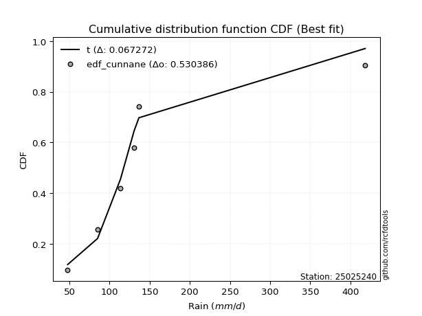</img></img>

</div>


### 12. EDF Adamowski (1981)

The Adamowski formula in hydrology refers to a specific plotting position formula used for estimating the non-parametric empirical distribution of hydrological events (like flood peaks) to calculate their return periods. This formula provides an alternative to traditional parametric methods (like the Gumbel or Log Pearson Type III distributions). 

<div align="center">


$P=(m-0.25)/(n+0.5)$


</div>


**12.1. Empirical values**

<div align="center">

|                | 0                   | 1                  | 2             | 3                  | 4                  |
|:---------------|:--------------------|:-------------------|:--------------|:-------------------|:-------------------|
| date           | 2020                | 2021               | 2023          | 2024               | 2022               |
| x              | 47.7                | 85.0               | 113.5         | 130.5              | 136.5              |
| m              | 1                   | 2                  | 3             | 4                  | 5                  |
| empirical_dist | edf_adamowski       | edf_adamowski      | edf_adamowski | edf_adamowski      | edf_adamowski      |
| empirical      | 0.13636363636363635 | 0.3181818181818182 | 0.5           | 0.6818181818181818 | 0.8636363636363636 |
| empirical_tr   | 1.1578947368421053  | 1.4666666666666666 | 2.0           | 3.1428571428571423 | 7.333333333333334  |

</div>


**12.2. Kolmogorov-Smirnov fit test (sorted by Δ)**


<div align="center">

|                | 0                   | 1                  | 2                   | 3                   | 4                   | 5                  | 6                   | 7                   | 8                   | 9                   | 10                  | 11                  | 12                  | 13                  | 14                  | 15                  | 16                  | 17                  | 18                  | 19                  | 20                  | 21                  | 22                 | 23                 | 24                 | 25                  | 26                 | 27                  | 28                 | 29                 | 30                  | 31                  | 32                  | 33                  | 34                 | 35                 | 36                  | 37                  | 38                  | 39                  | 40                  | 41                 | 42                 | 43                  | 44                  | 45                  | 46                 | 47                 | 48                  | 49                  | 50                 | 51                 | 52                  | 53                  | 54                  | 55                  | 56                  | 57                  | 58                    | 59                 | 60                  | 61                  | 62                  | 63                 | 64                  | 65                  | 66                  | 67                 | 68                  | 69                 | 70                  | 71                  | 72                 | 73                 | 74                 | 75                  | 76                 | 77                  | 78                 | 79                 | 80                 | 81                  | 82                  | 83                  | 84                 | 85                 | 86                 | 87                 |
|:---------------|:--------------------|:-------------------|:--------------------|:--------------------|:--------------------|:-------------------|:--------------------|:--------------------|:--------------------|:--------------------|:--------------------|:--------------------|:--------------------|:--------------------|:--------------------|:--------------------|:--------------------|:--------------------|:--------------------|:--------------------|:--------------------|:--------------------|:-------------------|:-------------------|:-------------------|:--------------------|:-------------------|:--------------------|:-------------------|:-------------------|:--------------------|:--------------------|:--------------------|:--------------------|:-------------------|:-------------------|:--------------------|:--------------------|:--------------------|:--------------------|:--------------------|:-------------------|:-------------------|:--------------------|:--------------------|:--------------------|:-------------------|:-------------------|:--------------------|:--------------------|:-------------------|:-------------------|:--------------------|:--------------------|:--------------------|:--------------------|:--------------------|:--------------------|:----------------------|:-------------------|:--------------------|:--------------------|:--------------------|:-------------------|:--------------------|:--------------------|:--------------------|:-------------------|:--------------------|:-------------------|:--------------------|:--------------------|:-------------------|:-------------------|:-------------------|:--------------------|:-------------------|:--------------------|:-------------------|:-------------------|:-------------------|:--------------------|:--------------------|:--------------------|:-------------------|:-------------------|:-------------------|:-------------------|
| station        | 25025240            | 25025240           | 25025240            | 25025240            | 25025240            | 25025240           | 25025240            | 25025240            | 25025240            | 25025240            | 25025240            | 25025240            | 25025240            | 25025240            | 25025240            | 25025240            | 25025240            | 25025240            | 25025240            | 25025240            | 25025240            | 25025240            | 25025240           | 25025240           | 25025240           | 25025240            | 25025240           | 25025240            | 25025240           | 25025240           | 25025240            | 25025240            | 25025240            | 25025240            | 25025240           | 25025240           | 25025240            | 25025240            | 25025240            | 25025240            | 25025240            | 25025240           | 25025240           | 25025240            | 25025240            | 25025240            | 25025240           | 25025240           | 25025240            | 25025240            | 25025240           | 25025240           | 25025240            | 25025240            | 25025240            | 25025240            | 25025240            | 25025240            | 25025240              | 25025240           | 25025240            | 25025240            | 25025240            | 25025240           | 25025240            | 25025240            | 25025240            | 25025240           | 25025240            | 25025240           | 25025240            | 25025240            | 25025240           | 25025240           | 25025240           | 25025240            | 25025240           | 25025240            | 25025240           | 25025240           | 25025240           | 25025240            | 25025240            | 25025240            | 25025240           | 25025240           | 25025240           | 25025240           |
| empirical_dist | edf_adamowski       | edf_adamowski      | edf_adamowski       | edf_adamowski       | edf_adamowski       | edf_adamowski      | edf_adamowski       | edf_adamowski       | edf_adamowski       | edf_adamowski       | edf_adamowski       | edf_adamowski       | edf_adamowski       | edf_adamowski       | edf_adamowski       | edf_adamowski       | edf_adamowski       | edf_adamowski       | edf_adamowski       | edf_adamowski       | edf_adamowski       | edf_adamowski       | edf_adamowski      | edf_adamowski      | edf_adamowski      | edf_adamowski       | edf_adamowski      | edf_adamowski       | edf_adamowski      | edf_adamowski      | edf_adamowski       | edf_adamowski       | edf_adamowski       | edf_adamowski       | edf_adamowski      | edf_adamowski      | edf_adamowski       | edf_adamowski       | edf_adamowski       | edf_adamowski       | edf_adamowski       | edf_adamowski      | edf_adamowski      | edf_adamowski       | edf_adamowski       | edf_adamowski       | edf_adamowski      | edf_adamowski      | edf_adamowski       | edf_adamowski       | edf_adamowski      | edf_adamowski      | edf_adamowski       | edf_adamowski       | edf_adamowski       | edf_adamowski       | edf_adamowski       | edf_adamowski       | edf_adamowski         | edf_adamowski      | edf_adamowski       | edf_adamowski       | edf_adamowski       | edf_adamowski      | edf_adamowski       | edf_adamowski       | edf_adamowski       | edf_adamowski      | edf_adamowski       | edf_adamowski      | edf_adamowski       | edf_adamowski       | edf_adamowski      | edf_adamowski      | edf_adamowski      | edf_adamowski       | edf_adamowski      | edf_adamowski       | edf_adamowski      | edf_adamowski      | edf_adamowski      | edf_adamowski       | edf_adamowski       | edf_adamowski       | edf_adamowski      | edf_adamowski      | edf_adamowski      | edf_adamowski      |
| p_dist         | fisk                | pearson3           | logpearson3         | logfisk             | loggumbel_l         | t                  | crystalball         | norm                | truncnorm           | exponnorm           | nct                 | gumbel_l            | logweibull_min      | weibull_min         | erlang              | rice                | gamma               | chi2                | loggompertz         | alpha               | invgamma            | logistic            | ncf                | maxwell            | laplace_asymmetric | invgauss            | hypsecant          | rayleigh            | betaprime          | logbetaprime       | f                   | logmielke           | logf                | logt                | lognorm            | lognorm            | logcrystalball      | logexponnorm        | logncf              | loginvweibull       | lognct              | logerlang          | logfatiguelife     | logrice             | logalpha            | kstwobign           | loginvgamma        | loginvgauss        | loggamma            | loggamma            | halfnorm           | loglogistic        | logmaxwell          | laplace             | logkstwobign        | loggenexpon         | lograyleigh         | gumbel_r            | loglaplace_asymmetric | expon              | logloggamma         | loghypsecant        | loghalfnorm         | halflogistic       | moyal               | logjohnsonsu        | logchi2             | loggumbel_r        | loglaplace          | loghalflogistic    | logmoyal            | logexpon            | mielke             | wald               | logwald            | gibrat              | nakagami           | logtruncnorm        | lognakagami        | loggibrat          | loglognorm         | invweibull          | fatiguelife         | gompertz            | genexpon           | johnsonsu          | loggenlogistic     | genlogistic        |
| delta          | 0.09664114659293344 | 0.1157241180788966 | 0.11949368189602105 | 0.11964141224791114 | 0.12245030451321293 | 0.129588460557291  | 0.12981942528631518 | 0.12981942874680708 | 0.12981943119174155 | 0.12981991570816986 | 0.12984884447707223 | 0.13001626554879075 | 0.13091770584436824 | 0.13310027092765175 | 0.13761130582042236 | 0.13813876459184948 | 0.14114608244331428 | 0.14356957694998695 | 0.14408829641342313 | 0.14440099229447356 | 0.14576661534203994 | 0.14589603858109756 | 0.1520067665908278 | 0.1535396603970436 | 0.155646537383892  | 0.15623258665662365 | 0.1586756014654629 | 0.16076182914106085 | 0.1613387861931157 | 0.1631025321102233 | 0.16363502696911048 | 0.16374361660439696 | 0.16480421561012892 | 0.16623994102154382 | 0.1662404497483242 | 0.1662404497483242 | 0.16624050060895368 | 0.16624227215196186 | 0.16732015802130995 | 0.16767584287368686 | 0.16782822769519212 | 0.1681634333617582 | 0.1685475734565498 | 0.17050499832936072 | 0.17111105519486924 | 0.17156596934224289 | 0.1730309162802841 | 0.175038919805669  | 0.17623528482323325 | 0.17623528482323325 | 0.1815464741044347 | 0.1854919914280121 | 0.18609903292432461 | 0.18707207736224496 | 0.19027634277078853 | 0.19043440304674453 | 0.19201382336838635 | 0.19276574703776506 | 0.19760152870244196   | 0.198103243411335  | 0.19870126292462598 | 0.20012063989689555 | 0.20940763486666913 | 0.2098799485911933 | 0.21385250540604828 | 0.21540045922376544 | 0.21683419040651858 | 0.2235149567991942 | 0.22763990928237487 | 0.2372156806038046 | 0.24230484357422466 | 0.24347025855028254 | 0.2485461194434485 | 0.2731008021066932 | 0.2960428430000063 | 0.30530687600717377 | 0.3180877309375152 | 0.31818099208171435 | 0.3181813053803226 | 0.3280990531908897 | 0.363443039858624  | 0.40057090943045964 | 0.43863190189174966 | 0.48719942578792763 | 0.5737552779138062 | 0.6188951117386723 | 0.6818181818181818 | 0.6818181818181818 |
| deltao         | 0.5865427407550001  | 0.5865427407550001 | 0.5865427407550001  | 0.5865427407550001  | 0.5865427407550001  | 0.5865427407550001 | 0.5865427407550001  | 0.5865427407550001  | 0.5865427407550001  | 0.5865427407550001  | 0.5865427407550001  | 0.5865427407550001  | 0.5865427407550001  | 0.5865427407550001  | 0.5865427407550001  | 0.5865427407550001  | 0.5865427407550001  | 0.5865427407550001  | 0.5865427407550001  | 0.5865427407550001  | 0.5865427407550001  | 0.5865427407550001  | 0.5865427407550001 | 0.5865427407550001 | 0.5865427407550001 | 0.5865427407550001  | 0.5865427407550001 | 0.5865427407550001  | 0.5865427407550001 | 0.5865427407550001 | 0.5865427407550001  | 0.5865427407550001  | 0.5865427407550001  | 0.5865427407550001  | 0.5865427407550001 | 0.5865427407550001 | 0.5865427407550001  | 0.5865427407550001  | 0.5865427407550001  | 0.5865427407550001  | 0.5865427407550001  | 0.5865427407550001 | 0.5865427407550001 | 0.5865427407550001  | 0.5865427407550001  | 0.5865427407550001  | 0.5865427407550001 | 0.5865427407550001 | 0.5865427407550001  | 0.5865427407550001  | 0.5865427407550001 | 0.5865427407550001 | 0.5865427407550001  | 0.5865427407550001  | 0.5865427407550001  | 0.5865427407550001  | 0.5865427407550001  | 0.5865427407550001  | 0.5865427407550001    | 0.5865427407550001 | 0.5865427407550001  | 0.5865427407550001  | 0.5865427407550001  | 0.5865427407550001 | 0.5865427407550001  | 0.5865427407550001  | 0.5865427407550001  | 0.5865427407550001 | 0.5865427407550001  | 0.5865427407550001 | 0.5865427407550001  | 0.5865427407550001  | 0.5865427407550001 | 0.5865427407550001 | 0.5865427407550001 | 0.5865427407550001  | 0.5865427407550001 | 0.5865427407550001  | 0.5865427407550001 | 0.5865427407550001 | 0.5865427407550001 | 0.5865427407550001  | 0.5865427407550001  | 0.5865427407550001  | 0.5865427407550001 | 0.5865427407550001 | 0.5865427407550001 | 0.5865427407550001 |
| eval           | Δo > Δ              | Δo > Δ             | Δo > Δ              | Δo > Δ              | Δo > Δ              | Δo > Δ             | Δo > Δ              | Δo > Δ              | Δo > Δ              | Δo > Δ              | Δo > Δ              | Δo > Δ              | Δo > Δ              | Δo > Δ              | Δo > Δ              | Δo > Δ              | Δo > Δ              | Δo > Δ              | Δo > Δ              | Δo > Δ              | Δo > Δ              | Δo > Δ              | Δo > Δ             | Δo > Δ             | Δo > Δ             | Δo > Δ              | Δo > Δ             | Δo > Δ              | Δo > Δ             | Δo > Δ             | Δo > Δ              | Δo > Δ              | Δo > Δ              | Δo > Δ              | Δo > Δ             | Δo > Δ             | Δo > Δ              | Δo > Δ              | Δo > Δ              | Δo > Δ              | Δo > Δ              | Δo > Δ             | Δo > Δ             | Δo > Δ              | Δo > Δ              | Δo > Δ              | Δo > Δ             | Δo > Δ             | Δo > Δ              | Δo > Δ              | Δo > Δ             | Δo > Δ             | Δo > Δ              | Δo > Δ              | Δo > Δ              | Δo > Δ              | Δo > Δ              | Δo > Δ              | Δo > Δ                | Δo > Δ             | Δo > Δ              | Δo > Δ              | Δo > Δ              | Δo > Δ             | Δo > Δ              | Δo > Δ              | Δo > Δ              | Δo > Δ             | Δo > Δ              | Δo > Δ             | Δo > Δ              | Δo > Δ              | Δo > Δ             | Δo > Δ             | Δo > Δ             | Δo > Δ              | Δo > Δ             | Δo > Δ              | Δo > Δ             | Δo > Δ             | Δo > Δ             | Δo > Δ              | Δo > Δ              | Δo > Δ              | Δo > Δ             | Δo <= Δ            | Δo <= Δ            | Δo <= Δ            |
| fit            | 1                   | 1                  | 1                   | 1                   | 1                   | 1                  | 1                   | 1                   | 1                   | 1                   | 1                   | 1                   | 1                   | 1                   | 1                   | 1                   | 1                   | 1                   | 1                   | 1                   | 1                   | 1                   | 1                  | 1                  | 1                  | 1                   | 1                  | 1                   | 1                  | 1                  | 1                   | 1                   | 1                   | 1                   | 1                  | 1                  | 1                   | 1                   | 1                   | 1                   | 1                   | 1                  | 1                  | 1                   | 1                   | 1                   | 1                  | 1                  | 1                   | 1                   | 1                  | 1                  | 1                   | 1                   | 1                   | 1                   | 1                   | 1                   | 1                     | 1                  | 1                   | 1                   | 1                   | 1                  | 1                   | 1                   | 1                   | 1                  | 1                   | 1                  | 1                   | 1                   | 1                  | 1                  | 1                  | 1                   | 1                  | 1                   | 1                  | 1                  | 1                  | 1                   | 1                   | 1                   | 1                  | 0                  | 0                  | 0                  |
| n              | 5                   | 5                  | 5                   | 5                   | 5                   | 5                  | 5                   | 5                   | 5                   | 5                   | 5                   | 5                   | 5                   | 5                   | 5                   | 5                   | 5                   | 5                   | 5                   | 5                   | 5                   | 5                   | 5                  | 5                  | 5                  | 5                   | 5                  | 5                   | 5                  | 5                  | 5                   | 5                   | 5                   | 5                   | 5                  | 5                  | 5                   | 5                   | 5                   | 5                   | 5                   | 5                  | 5                  | 5                   | 5                   | 5                   | 5                  | 5                  | 5                   | 5                   | 5                  | 5                  | 5                   | 5                   | 5                   | 5                   | 5                   | 5                   | 5                     | 5                  | 5                   | 5                   | 5                   | 5                  | 5                   | 5                   | 5                   | 5                  | 5                   | 5                  | 5                   | 5                   | 5                  | 5                  | 5                  | 5                   | 5                  | 5                   | 5                  | 5                  | 5                  | 5                   | 5                   | 5                   | 5                  | 5                  | 5                  | 5                  |
| best_fit       | 1                   | 0                  | 0                   | 0                   | 0                   | 0                  | 0                   | 0                   | 0                   | 0                   | 0                   | 0                   | 0                   | 0                   | 0                   | 0                   | 0                   | 0                   | 0                   | 0                   | 0                   | 0                   | 0                  | 0                  | 0                  | 0                   | 0                  | 0                   | 0                  | 0                  | 0                   | 0                   | 0                   | 0                   | 0                  | 0                  | 0                   | 0                   | 0                   | 0                   | 0                   | 0                  | 0                  | 0                   | 0                   | 0                   | 0                  | 0                  | 0                   | 0                   | 0                  | 0                  | 0                   | 0                   | 0                   | 0                   | 0                   | 0                   | 0                     | 0                  | 0                   | 0                   | 0                   | 0                  | 0                   | 0                   | 0                   | 0                  | 0                   | 0                  | 0                   | 0                   | 0                  | 0                  | 0                  | 0                   | 0                  | 0                   | 0                  | 0                  | 0                  | 0                   | 0                   | 0                   | 0                  | 0                  | 0                  | 0                  |
| best_fit_sort  | 1                   | 2                  | 3                   | 4                   | 5                   | 6                  | 7                   | 8                   | 9                   | 10                  | 11                  | 12                  | 13                  | 14                  | 15                  | 16                  | 17                  | 18                  | 19                  | 20                  | 21                  | 22                  | 23                 | 24                 | 25                 | 26                  | 27                 | 28                  | 29                 | 30                 | 31                  | 32                  | 33                  | 34                  | 35                 | 36                 | 37                  | 38                  | 39                  | 40                  | 41                  | 42                 | 43                 | 44                  | 45                  | 46                  | 47                 | 48                 | 49                  | 50                  | 51                 | 52                 | 53                  | 54                  | 55                  | 56                  | 57                  | 58                  | 59                    | 60                 | 61                  | 62                  | 63                  | 64                 | 65                  | 66                  | 67                  | 68                 | 69                  | 70                 | 71                  | 72                  | 73                 | 74                 | 75                 | 76                  | 77                 | 78                  | 79                 | 80                 | 81                 | 82                  | 83                  | 84                  | 85                 | 86                 | 87                 | 88                 |

</div>


**12.3. Best fit**

<div align="center">

|   id |   station | empirical_dist   | p_dist   |     delta |   deltao | eval   |   fit |   n |   best_fit |   best_fit_sort |
|-----:|----------:|:-----------------|:---------|----------:|---------:|:-------|------:|----:|-----------:|----------------:|
|    0 |  25025240 | edf_adamowski    | fisk     | 0.0966411 | 0.586543 | Δo > Δ |     1 |   5 |          1 |               1 |

</div>


<div align="center">

</img>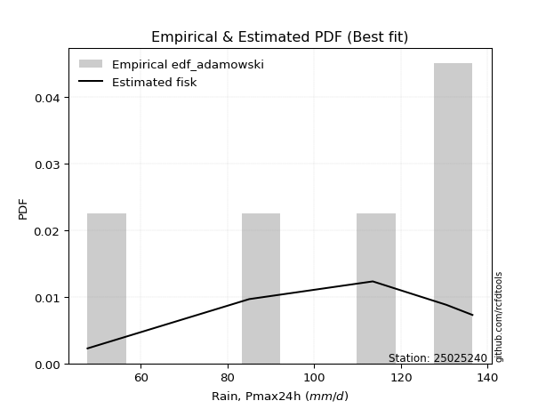</img>

</div>


## C. Best fit & Estimate extreme values for specific return periods - Tr

Best fit in probability distribution analysis means finding the theoretical distribution (like Normal, Poisson, Exponential) that most accurately mirrors your real-world data´s patterns (shape, center, spread) for better predictions, using methods like visual checks (Q-Q plots), goodness-of-fit tests (Kolmogorov-Smirnov, Chi-Squared), and information criteria (AIC) to score and select the simplest, most representative model.


### 1. Best fit (ordered by delta Δ)

<div align="center">

|   id |   station | empirical_dist   | p_dist    |     delta |   deltao | eval   |   fit |   n |   best_fit |   best_fit_sort |
|-----:|----------:|:-----------------|:----------|----------:|---------:|:-------|------:|----:|-----------:|----------------:|
|    0 |  25025240 | edf_cunnane      | fisk      | 0.0947932 | 0.586543 | Δo > Δ |     1 |   5 |          1 |               1 |
|    1 |  25025240 | edf_jenkinson    | fisk      | 0.0947932 | 0.586543 | Δo > Δ |     1 |   5 |          1 |               2 |
|    2 |  25025240 | edf_filliben     | fisk      | 0.0947932 | 0.586543 | Δo > Δ |     1 |   5 |          1 |               3 |
|    3 |  25025240 | edf_gringorten   | fisk      | 0.0947932 | 0.586543 | Δo > Δ |     1 |   5 |          1 |               4 |
|    4 |  25025240 | edf_blom         | fisk      | 0.0947932 | 0.586543 | Δo > Δ |     1 |   5 |          1 |               5 |
|    5 |  25025240 | edf_tukey        | fisk      | 0.0947932 | 0.586543 | Δo > Δ |     1 |   5 |          1 |               6 |
|    6 |  25025240 | edf_chegodayev   | fisk      | 0.0947932 | 0.586543 | Δo > Δ |     1 |   5 |          1 |               7 |
|    7 |  25025240 | edf_beard        | fisk      | 0.0947932 | 0.586543 | Δo > Δ |     1 |   5 |          1 |               8 |
|    8 |  25025240 | edf_hazen        | fisk      | 0.0947932 | 0.586543 | Δo > Δ |     1 |   5 |          1 |               9 |
|    9 |  25025240 | edf_adamowski    | fisk      | 0.0966411 | 0.586543 | Δo > Δ |     1 |   5 |          1 |              10 |
|   10 |  25025240 | edf_weibull      | fisk      | 0.119007  | 0.586543 | Δo > Δ |     1 |   5 |          1 |              11 |
|   11 |  25025240 | edf_california   | logmielke | 0.139566  | 0.586543 | Δo > Δ |     1 |   5 |          1 |              12 |

</div>

:file_folder:Tables: [bestfit_25025240.csv](table/bestfit_25025240.csv) | [extreme_25025240.csv](table/extreme_25025240.csv)


### 2. Extreme values

In hydrology, a return period (or recurrence interval $Tr$) is the statistical average time between extreme events like floods or droughts of a specific magnitude, indicating how rare an event is, with a 100-year flood, for example, having a 1% chance of occurring in any given year, not that it happens exactly every century. It is a key tool for infrastructure design (like bridges or dams) and risk assessment, calculated from historical data to determine the probability of future events, although it is important to remember it is statistical average, and events can cluster or be missed.

> risk_rate: assuming the return period as the project useful life.

|   id |      tr |   prob_l |     prob_g |   alpha |   betaprime |    chi2 |   crystalball |   erlang |    expon |   exponnorm |        f |   fatiguelife |    fisk |   gamma |   genexpon |   genlogistic |   gibrat |   gompertz |   gumbel_l |   gumbel_r |   halflogistic |   halfnorm |   hypsecant |   invgamma |   invgauss |      invweibull |   johnsonsu |   kstwobign |   laplace |   laplace_asymmetric |   loggamma |   logistic |   lognorm |   maxwell |   mielke |    moyal |   nakagami |      ncf |     nct |    norm |   pearson3 |   rayleigh |    rice |       t |   truncnorm |     wald |   weibull_min |   logalpha |   logbetaprime |          logchi2 |   logcrystalball |   logerlang |   logexpon |   logexponnorm |     logf |   logfatiguelife |   logfisk |   loggenexpon |   loggenlogistic |   loggibrat |   loggompertz |   loggumbel_l |   loggumbel_r |   loghalflogistic |   loghalfnorm |   loghypsecant |   loginvgamma |   loginvgauss |   loginvweibull |   logjohnsonsu |   logkstwobign |   loglaplace |   loglaplace_asymmetric |   logloggamma |   loglogistic |    loglognorm |   logmaxwell |   logmielke |   logmoyal |   lognakagami |   logncf |   lognct |   logpearson3 |   lograyleigh |   logrice |     logt |   logtruncnorm |   logwald |   logweibull_min |   station |   n |   risk_rate |
|-----:|--------:|---------:|-----------:|--------:|------------:|--------:|--------------:|---------:|---------:|------------:|---------:|--------------:|--------:|--------:|-----------:|--------------:|---------:|-----------:|-----------:|-----------:|---------------:|-----------:|------------:|-----------:|-----------:|----------------:|------------:|------------:|----------:|---------------------:|-----------:|-----------:|----------:|----------:|---------:|---------:|-----------:|---------:|--------:|--------:|-----------:|-----------:|--------:|--------:|------------:|---------:|--------------:|-----------:|---------------:|-----------------:|-----------------:|------------:|-----------:|---------------:|---------:|-----------------:|----------:|--------------:|-----------------:|------------:|--------------:|--------------:|--------------:|------------------:|--------------:|---------------:|--------------:|--------------:|----------------:|---------------:|---------------:|-------------:|------------------------:|--------------:|--------------:|--------------:|-------------:|------------:|-----------:|--------------:|---------:|---------:|--------------:|--------------:|----------:|---------:|---------------:|----------:|-----------------:|----------:|----:|------------:|
|    0 |    2    | 0.5      | 0.5        | 100.484 |     97.3341 | 100.905 |       102.64  |  101.472 |  85.7815 |     102.64  |  97.6002 |       47.7    | 106.025 | 101.322 |    57.5609 |           inf |  92.8028 |    130.108 |    108.024 |     97.256 |        94.5794 |    95.9315 |     102.64  |    100.544 |    98.4939 |   508.103       |       136.5 |     95.0092 |   102.64  |              113.049 |    94.4089 |    102.64  |   96.1026 |   99.8371 |   47.7   |  95.5179 |    89.7243 |  98.0973 | 102.636 | 102.64  |    106.021 |     98.843 | 101.463 | 102.659 |     102.64  |  92.0165 |       108.876 |    94.7748 |        96.0371 |     78.2912      |          96.1026 |     95.3169 |    77.5149 |        96.1023 |  96.1676 |           95.909 |   101.911 |       86.361  |          inf     |     85.5547 |       101.254 |       102.417 |       90.1777 |           87.369  |       88.7767 |        96.1026 |       94.7877 |       93.6284 |         90.6454 |        133.558 |        87.3505 |      96.1026 |                 107.09  |       106.848 |       96.1026 |  47.7357      |      92.9711 |     106.799 |    88.344  |       95.5331 |  95.9032 |  95.7909 |       101.94  |       91.8851 |    95.08  |  96.1027 |        97.9757 |   84.7637 |          103.833 |  25025240 |   5 |    0.75     |
|    1 |    2.33 | 0.570815 | 0.429185   | 106.692 |    104.027  | 106.976 |       108.488 |  107.543 |  94.172  |     108.488 | 104.116  |       50.1514 | 111.579 | 107.307 |    60.2964 |           inf |  95.7653 |    130.938 |    113.112 |    102.675 |       100.151  |   102.243  |     107.32  |    106.665 |   104.996  | 12832.7         |       136.5 |    102.11   |   106.179 |              117.531 |   101.402  |    107.793 |  102.98   |  105.913  |   47.7   | 100.648  |    92.9349 | 104.919  | 108.485 | 108.488 |    111.651 |    105.009 | 107.516 | 108.508 |     108.488 |  95.8513 |       113.717 |   101.849  |       103.076  |     93.4211      |         102.98   |    102.359  |    86.2672 |       102.98   | 103.086  |          102.752 |   108.531 |       94.7767 |          inf     |     88.6032 |       107.148 |       108.765 |       96.1425 |           93.3164 |       95.6529 |       101.569  |      101.786  |      100.86   |         99.0148 |        135.859 |        95.4996 |     100.208  |                 112.174 |       111.968 |      102.137  |  48.1425      |      99.8932 |     112.334 |    93.8661 |       99.8612 | 102.801  | 102.706  |       108.714 |       98.8313 |   102.11  | 102.98   |       100.766  |   88.6936 |          109.329 |  25025240 |   5 |    0.729209 |
|    2 |    5    | 0.8      | 0.2        | 130.857 |    132.134  | 130.132 |       130.222 |  130.567 | 136.123  |     130.222 | 130.953  |      102.227  | 133.024 | 129.994 |    73.9734 |           inf | 112.821  |    133.619 |    129.549 |    126.218 |       125.362  |   128.935  |     126.094 |    130.432 |   131.391  |     2.38882e+10 |       136.5 |    132.274  |   123.874 |              128.951 |   132.878  |    127.688 |  133.142  |  129.828  |  118.735 | 124.41   |   116.054  | 133.51   | 130.223 | 130.222 |    130.733 |    129.693 | 130.373 | 130.243 |     130.222 | 117.318  |       129.356 |   134.121  |       134.221  |    263.303       |         133.142  |    134.013  |   147.278  |       133.142  | 133.466  |          132.779 |   138.384 |      140.555  |          inf     |    108.391  |       129.243 |       132.088 |      126.988  |          125.71   |      131.132  |       126.802  |      133.385  |      134.944  |        145.321  |        136.498 |       139.491  |     123.518  |                 126.246 |       126.152 |      129.214  |   1.46817e+47 |     132.522  |     127.77  |   124.302  |      125.754  | 133.158  | 133.173  |       133.764 |      132.312  |   133.497 | 133.142  |       113.6    |  114.307  |          129.153 |  25025240 |   5 |    0.67232  |
|    3 |   10    | 0.9      | 0.1        | 147.909 |    153.813  | 146.013 |       144.64  |  146.248 | 174.204  |     144.64  | 151.141  |      174.13   | 148.817 | 145.434 |    86.3889 |           inf | 132.263  |    135.111 |    138.701 |    145.393 |       146.298  |   148.687  |     141.086 |    147.136 |   150.97   |     3.06348e+15 |       136.5 |    155.241  |   139.937 |              132.937 |   159.645  |    142.34  |  157.877  |  146.657  |  127.757 | 145.098  |   139.299  | 155.575  | 144.645 | 144.64  |    141.854 |    147.294 | 145.749 | 144.662 |     144.64  | 140.1    |       138.063 |   162.124  |       160.073  |    765.618       |         157.877  |    160.886  |   239.334  |       157.878  | 158.425  |          157.425 |   165.503 |      189.5    |          inf     |    136.389  |       143.776 |       147.176 |      159.29   |          161.006  |      165.614  |       151.384  |      160.395  |      165.869  |        198.63   |        136.5   |       186.134  |     149.341  |                 131.561 |       131.513 |      153.645  | inf           |     161.688  |     133.661 |   158.735  |      152.516  | 158.181  | 158.325  |       149.576 |      162.909  |   159.762 | 157.878  |       122.743  |  149.625  |          141.708 |  25025240 |   5 |    0.651322 |
|    4 |   15    | 0.933333 | 0.0666667  | 156.747 |    165.61   | 154.095 |       151.834 |  154.195 | 196.48   |     151.834 | 161.957  |      221.156  | 157.422 | 153.255 |    93.6516 |           inf | 145.673  |    135.787 |    142.846 |    156.212 |       158.146  |   158.965  |     149.642 |    155.768 |   161.396  |     2.33412e+18 |       136.5 |    167.433  |   149.333 |              134.167 |   175.176  |    150.324 |  171.89   |  155.293  |  130.768 | 157.105  |   152.263  | 167.606  | 151.842 | 151.834 |    146.965 |    156.363 | 153.467 | 151.858 |     151.834 | 154.729  |       142.007 |   178.605  |       174.832  |   1476.48        |         171.89   |    176.461  |   317.946  |       171.89   | 172.579  |          171.396 |   182.454 |      222.194  |          inf     |    159.812  |       150.938 |       154.565 |      181.018  |          185.208  |      187.007  |       167.493  |      176.127  |      184.612  |        236.927  |        136.5   |       216.937  |     166.882  |                 133.247 |       133.214 |      168.848  | inf           |     179.061  |     135.596 |   182.938  |      169.104  | 172.404  | 172.636  |       157.03  |      181.34   |   174.811 | 171.89   |       126.761  |  177.865  |          147.788 |  25025240 |   5 |    0.644736 |
|    5 |   20    | 0.95     | 0.05       | 162.659 |    173.706  | 159.444 |       156.546 |  159.444 | 212.286  |     156.546 | 169.315  |      255.973  | 163.369 | 158.42  |    98.8045 |           inf | 156.192  |    136.208 |    145.425 |    163.787 |       166.447  |   165.818  |     155.677 |    161.531 |   168.469  |     2.43199e+20 |       136.5 |    175.646  |   155.999 |              134.766 |   186.241  |    155.841 |  181.734  |  161.023  |  132.274 | 165.608  |   161.063  | 175.876  | 156.555 | 156.546 |    150.158 |    162.39  | 158.534 | 156.57  |     156.546 | 165.631  |       144.461 |   190.451  |       185.248  |   2377.55        |         181.734  |    187.55   |   388.929  |       181.734  | 182.529  |          181.214 |   195.174 |      247.458  |          inf     |    180.968  |       155.59  |       159.351 |      197.972  |          204.302  |      202.784  |       179.877  |      187.362  |      198.319  |        268.056  |        136.5   |       240.512  |     180.563  |                 134.076 |       134.05  |      180.227  | inf           |     191.61   |     136.611 |   202.279  |      181.248  | 182.415  | 182.714  |       161.717 |      194.731  |   185.447 | 181.734  |       129.039  |  202.323  |          151.704 |  25025240 |   5 |    0.641514 |
|    6 |   25    | 0.96     | 0.04       | 167.075 |    179.858  | 163.41  |       160.014 |  163.331 | 224.545  |     160.014 | 174.872  |      283.636  | 167.919 | 162.243 |   102.801  |           inf | 164.962  |    136.507 |    147.261 |    169.622 |       172.843  |   170.917  |     160.348 |    165.831 |   173.801  |     8.71419e+21 |       136.5 |    181.798  |   161.17  |              135.12  |   194.876  |    160.062 |  189.338  |  165.278  |  133.178 | 172.199  |   167.66   | 182.168  | 160.025 | 160.014 |    152.432 |    166.869 | 162.27  | 160.039 |     160.014 | 174.363  |       146.208 |   199.753  |       193.32   |   3457.59        |         189.338  |    196.2    |   454.731  |       189.339  | 190.219  |          188.802 |   205.5   |      268.332  |          inf     |    200.73   |       158.992 |       162.846 |      212.106  |          220.345  |      215.38   |       190.087  |      196.145  |      209.217  |        294.796  |        136.5   |       259.833  |     191.943  |                 134.568 |       134.547 |      189.446  | inf           |     201.491  |     137.265 |   218.667  |      190.875  | 190.16   | 190.515  |       165.06  |      205.316  |   193.699 | 189.339  |       130.51   |  224.317  |          154.554 |  25025240 |   5 |    0.639603 |
|    7 |   50    | 0.98     | 0.02       | 180.035 |    198.41   | 174.904 |       169.947 |  174.565 | 262.627  |     169.947 | 191.456  |      372.393  | 181.82  | 173.293 |   115.217  |           inf | 195.874  |    137.32  |    152.245 |    187.595 |       192.549  |   185.737  |     174.831 |    178.417 |   189.678  |     5.34788e+26 |       136.5 |    199.863  |   177.233 |              135.818 |   222.122  |    172.959 |  212.922  |  177.617  |  134.986 | 192.66   |   186.944  | 201.193  | 169.962 | 169.947 |    158.595 |    179.869 | 172.994 | 169.972 |     169.947 | 202.874  |       150.949 |   229.442  |       218.491  |  11316.1         |         212.922  |    223.472  |   738.962  |       212.923  | 214.085  |          212.343 |   240.558 |      341.036  |          135.541 |    289.25   |       168.634 |       172.725 |      262.309  |          278.137  |      256.613  |       225.575  |      223.949  |      244.749  |        395.124  |        136.5   |       326.016  |     232.072  |                 135.543 |       135.53  |      220.64   | inf           |     233.127  |     138.849 |   278.49   |      221.935  | 214.237  | 214.781  |       174.09  |      239.415  |   219.466 | 212.922  |       133.729  |  314.192  |          162.562 |  25025240 |   5 |    0.63583  |
|    8 |   75    | 0.986667 | 0.0133333  | 187.187 |    208.954  | 181.155 |       175.276 |  180.658 | 284.903  |     175.276 | 200.771  |      425.846  | 189.849 | 179.284 |   122.48   |           inf | 216.752  |    137.731 |    154.765 |    198.043 |       204.004  |   193.804  |     183.294 |    185.342 |   198.575  |     3.24431e+29 |       136.5 |    209.802  |   186.629 |              136.047 |   238.438  |    180.408 |  226.765  |  184.326  |  135.589 | 204.625  |   197.457  | 212.042  | 175.293 | 175.276 |    161.694 |    186.941 | 178.762 | 175.301 |     175.276 | 220.418  |       153.347 |   247.459  |       233.359  |  22930.1         |         226.765  |    239.788  |   981.683  |       226.766  | 228.106  |          226.169 |   263.469 |      389.692  |          135.866 |    370.199  |       173.742 |       177.947 |      296.782  |          318.463  |      282.287  |       249.306  |      240.662  |      266.849  |        468.461  |        136.5   |       369.366  |     259.33   |                 135.865 |       135.856 |      240.945  | inf           |     252.364  |     139.597 |   320.795  |      240.924  | 228.409  | 229.076  |       178.582 |      260.289  |   234.706 | 226.765  |       134.896  |  386.582  |          166.768 |  25025240 |   5 |    0.634587 |
|    9 |  100    | 0.99     | 0.01       | 192.105 |    216.328  | 185.416 |       178.88  |  184.805 | 300.708  |     178.88  | 207.239  |      464.308  | 195.518 | 183.36  |   127.633  |           inf | 232.926  |    138     |    156.413 |    205.437 |       212.112  |   199.3    |     189.297 |    190.096 |   204.746  |     3.0254e+31  |       136.5 |    216.612  |   193.296 |              136.161 |   250.214  |    185.667 |  236.634  |  188.895  |  135.891 | 213.114  |   204.61   | 219.647  | 178.9   | 178.88  |    163.709 |    191.76  | 182.668 | 178.906 |     178.88  | 233.209  |       154.915 |   260.573  |       244      |  38020.1         |         236.634  |    251.558  |  1200.85   |       236.635  | 238.107  |          236.031 |   280.947 |      427.263  |          136.029 |    448.176  |       177.17  |       181.448 |      323.885  |          350.492  |      301.232  |       267.638  |      252.754  |      283.176  |        528.452  |        136.5   |       402.351  |     280.591  |                 136.026 |       136.018 |      256.397  | inf           |     266.369  |     140.084 |   354.651  |      254.772  | 238.53   | 239.291  |       181.473 |      275.542  |   245.62  | 236.635  |       135.5    |  449.67   |          169.578 |  25025240 |   5 |    0.633968 |
|   10 |  200    | 0.995    | 0.005      | 203.512 |    233.801  | 195.18  |       187.056 |  194.289 | 338.79   |     187.056 | 222.419  |      558.454  | 209.115 | 192.681 |   140.048  |           inf | 276.928  |    138.584 |    159.996 |    223.213 |       231.604  |   211.87   |     203.76  |    201.092 |   219.209  |     1.64453e+36 |       136.5 |    232.297  |   209.359 |              136.332 |   279.348  |    198.282 |  260.643  |  199.349  |  136.343 | 233.566  |   220.926  | 237.725  | 187.08  | 187.056 |    168.046 |    202.785 | 191.541 | 187.083 |     187.056 | 265.07   |       158.324 |   293.403  |       270.021  | 130257           |         260.643  |    280.653  |  1951.44   |       260.644  | 262.453  |          260.033 |   327.747 |      529.347  |          136.272 |    753.869  |       184.868 |       189.296 |      399.61   |          441.3    |      349.48   |       317.531  |      282.773  |      324.91   |        706.021  |        136.5   |       489.967  |     339.253  |                 136.266 |       136.26  |      297.623  | inf           |     301.401  |     141.168 |   451.63   |      289.453  | 263.21   | 264.215  |       187.583 |      313.891  |   272.328 | 260.643  |       136.431  |  655.278  |          175.85  |  25025240 |   5 |    0.633042 |
|   11 |  250    | 0.996    | 0.004      | 207.069 |    239.353  | 198.192 |       189.555 |  197.208 | 351.049  |     189.555 | 227.201  |      589.137  | 213.481 | 195.55  |   144.045  |           inf | 292.716  |    138.756 |    161.05  |    228.927 |       237.87   |   215.737  |     208.416 |    204.513 |   223.761  |     5.47467e+37 |       136.5 |    237.151  |   214.53  |              136.366 |   288.974  |    202.332 |  268.455  |  202.567  |  136.433 | 240.151  |   225.929  | 243.487  | 189.58  | 189.555 |    169.307 |    206.178 | 194.256 | 189.582 |     189.555 | 275.611  |       159.327 |   304.369  |       278.528  | 194282           |         268.455  |    290.26   |  2281.6    |       268.456  | 270.38   |          267.846 |   344.367 |      566.014  |          136.32  |    908.513  |       187.199 |       191.67  |      427.533  |          475.226  |      365.824  |       335.493  |      292.723  |      339.115  |        774.933  |        136.5   |       520.77   |     360.634  |                 136.314 |       136.308 |      312.216  | inf           |     313.086  |     141.5   |   488.179  |      301.022  | 271.258  | 272.347  |       189.325 |      326.738  |   281.065 | 268.455  |       136.621  |  742.21   |          177.739 |  25025240 |   5 |    0.632858 |
|   12 |  500    | 0.998    | 0.002      | 217.821 |    256.423  | 207.198 |       196.965 |  205.925 | 389.131  |     196.965 | 241.779  |      685.388  | 227.02  | 204.115 |   156.461  |           inf | 347.279  |    139.249 |    164.072 |    246.665 |       257.32   |   227.266  |     222.878 |    214.826 |   237.624  |     2.90614e+42 |       136.5 |    251.698  |   230.593 |              136.434 |   319.708  |    214.892 |  293.025  |  212.17   |  136.615 | 260.602  |   240.794  | 261.261  | 196.994 | 196.965 |    172.879 |    216.304 | 202.316 | 196.993 |     196.965 | 309.127  |       162.202 |   339.773  |       305.407  | 678517           |         293.025  |    320.912  |  3707.72   |       293.027  | 295.327  |          292.434 |   401.463 |      693.228  |          136.417 |   1731.35   |       194.05  |       198.639 |      527.249  |          598.053  |      419.232  |       398.031  |      324.598  |      385.831  |       1034.67   |        136.5   |       625.17   |     436.031  |                 136.41  |       136.405 |      362.182  | inf           |     350.716  |     142.505 |   621.668  |      338.259  | 296.623  | 297.995  |       194.145 |      368.278  |   308.678 | 293.026  |       137.006  | 1102.94   |          183.268 |  25025240 |   5 |    0.632489 |
|   13 |  750    | 0.998667 | 0.00133333 | 223.928 |    266.307  | 212.251 |       201.081 |  210.806 | 411.407  |     201.081 | 250.137  |      742.257  | 234.929 | 208.909 |   163.723  |           inf | 383.364  |    139.512 |    165.687 |    257.034 |       268.69   |   233.707  |     231.337 |    220.668 |   245.566  |     1.68082e+45 |       136.5 |    259.87   |   239.989 |              136.456 |   338.305  |    222.23  |  307.633  |  217.541  |  136.676 | 272.566  |   249.063  | 271.592  | 201.113 | 201.081 |    174.755 |    221.967 | 206.798 | 201.109 |     201.081 | 329.222  |       163.738 |   361.478  |       321.475  |      1.4177e+06  |         307.633  |    339.444  |  4925.57   |       307.635  | 310.169  |          307.06  |   439.106 |      777.936  |          136.449 |   2652.14   |       197.817 |       202.467 |      595.993  |          684.077  |      452.394  |       439.885  |      343.96   |      415.095  |       1225.16   |        136.5   |       692.75   |     487.246  |                 136.441 |       136.437 |      394.997  | inf           |     373.701  |     143.081 |   716.09   |      360.978  | 311.741  | 313.292  |       196.601 |      393.768  |   325.189 | 307.634  |       137.135  | 1398.6    |          186.293 |  25025240 |   5 |    0.632366 |
|   14 | 1000    | 0.999    | 0.001      | 228.191 |    273.283  | 215.75  |       203.915 |  214.182 | 427.212  |     203.915 | 256.001  |      782.823  | 240.539 | 212.225 |   168.876  |           inf | 410.978  |    139.69  |    166.774 |    264.389 |       276.755  |   238.156  |     237.339 |    224.737 |   251.136  |     1.53059e+47 |       136.5 |    265.532  |   246.655 |              136.468 |   351.792  |    227.434 |  318.112  |  221.253  |  136.708 | 281.054  |   254.758  | 278.903  | 203.948 | 203.915 |    176.004 |    225.879 | 209.886 | 203.943 |     203.915 | 343.677  |       164.773 |   377.35   |       333.039  |      2.39631e+06 |         318.112  |    352.877  |  6025.24   |       318.114  | 320.82   |          317.556 |   467.922 |      843.131  |          136.465 |   3675.6    |       200.395 |       205.085 |      650.124  |          752.5    |      476.815  |       472.224  |      358.037  |      436.782  |       1381.18   |        136.5   |       743.806  |     527.191  |                 136.457 |       136.453 |      420.055  | inf           |     390.462  |     143.488 |   791.658  |      377.527  | 322.602  | 324.287  |       198.201 |      412.406  |   337.073 | 318.112  |       137.2    | 1659.15   |          188.357 |  25025240 |   5 |    0.632305 |

<div align="center">

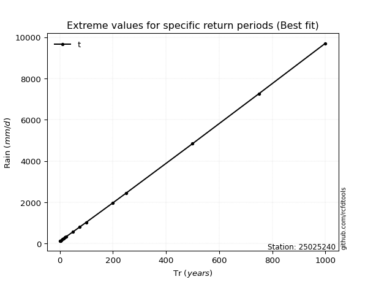</img>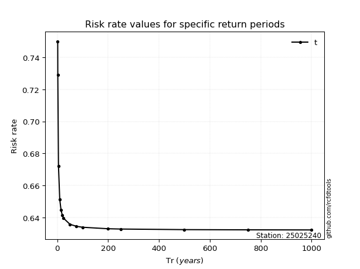</img>

</div>


<sub>**APP DISCLAIMER**: NO WARRANTY - This software is provided by [github.com/rcfdtools](https://github.com/rcfdtools) "as is", without any express or implied warranty, including warranties of merchantability, fitness for a particular purpose, or non-infringement. There is no guarantee that the software will be error-free or operate without interruption. LIMITATION OF LIABILITY - Neither the authors nor copyright holders will be liable for claims or damages arising from the software or its use. You are responsible for determining if the software is appropriate for your use and assume all associated risks, including errors, legal compliance, and data loss. NO PROFESSIONAL ADVICE - The software provides general information and does not offer professional advice. It should not replace consultation with professional advisors.</sub>