<div align="center">


</div>

# PMP Station (Rain, Pmax24h): 25025250

Probable Maximum Precipitation (PMP) is the greatest amount of rainfall for a specific duration that is meteorologically possible for a given location, acting as a "worst-case" scenario for extreme storms, crucial for designing safety-critical infrastructure like bridges, river deviations, dams, spillways, and nuclear plants to prevent catastrophic failure. PMP is calculated by hydrologists using meteorological data to determine the upper limit of extreme rainfall, often leading to the Probable Maximum Flood (PMF) for flood control design, and is increasingly being studied for climate change impacts. Probable Maximum Precipitation (PMP) is the theoretical upper limit of rainfall, a deterministic estimate for extreme events, while probability distributions (like GEV, Gumbel) describe the likelihood and frequency of various precipitation amounts, including rare ones, showing how often events occur, with PMP representing the extreme end of these distributions, used for critical infrastructure design to ensure safety against the worst conceivable weather, unlike standard statistical forecasts which cover typical probabilities.

The most common probability distributions in hydrology, used for analyzing floods, rainfall, and streamflow, include the Normal, Log-Normal, Gumbel, Gamma (including Log-Pearson Type III), and Generalized Extreme Value (GEV) distributions, often chosen based on the data´s skewness and whether modeling extremes or general conditions, with Gumbel and GEV popular for extreme events like floods, while the Normal distribution serves as a baseline, though often requiring transformations for skewed hydrological data. These distributions help in designing water infrastructure, managing water resources, and forecasting hydrologic events.

> Hydrological data often isn´t perfectly normal (it´s skewed), so different distributions are needed for different applications, such as: **Flood Frequency Analysis**: Using Gumbel, GEV, or Log-Pearson Type III for predicting extreme flood magnitudes and their return periods, **Rainfall Analysis**: Normal for annual totals, but Log-Normal, Weibull, or GEV for intensity or extreme daily rainfall, **Streamflow Modeling**: Gamma and Log-Normal for maximum flows, GEV for minimum flows, and Kappa for daily flows.

<div align="center">

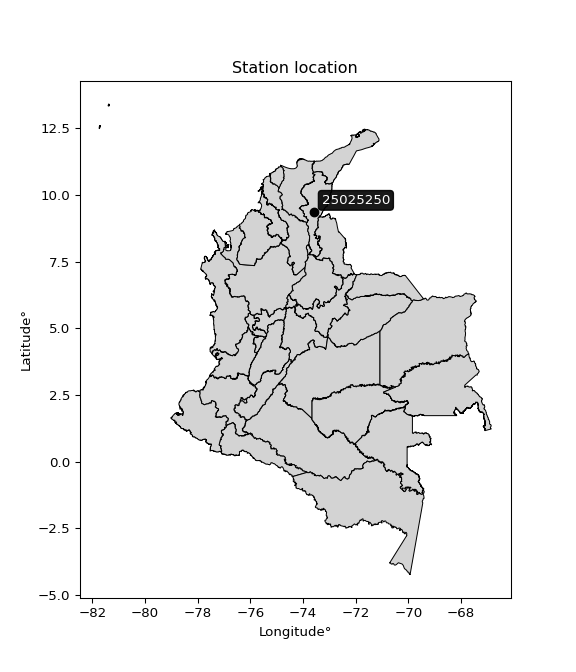</img>

</div>


## A. General information


### 1. General running parameters

• app_version: _v20260103_. • runtime: _2026-01-06 18:56:15.422800_. • Python version: _3.14.0_. • SciPy version: _1.16.3_. • Pandas version: _2.3.3_. • NumPy version: _2.3.5_. • Stations dataset (station_dataset_file): _dataset/pmax24h_in/conventional_cesarcolombia_1959_2022.csv_. • Stations catalog (station_catalog_file): _dataset/CNE.xls_. • Minimum year to eval til year_max (date_min): _1900_. • Maximum year to eval since year_min (date_max): _2024_. • Creates, save and include plots into reports (create_plot): _True_. • Plot only fit distributions with Δo > Δ (plot_only_fit): _True_. • Plot only simple graphs avoiding multiple CDFs and multiple Extreme values plots (plot_only_simple): _False_. • Eval low extreme values, if False, evaluates high extreme values (low_extreme): _False_. • Eval every SciPy distribution as logarithmic (pdist_logarithmic_on): _True_. • Standard deviation normalized (ddof): _1.0_. • Return periods to eval in years (Tr): _[2, 2.33, 5, 10, 15, 20, 25, 50, 75, 100, 200, 250, 500, 750, 1000]_. • Minimum data sample per station, 0 means any (minimum_sample): _5_. • Z-Score maximum threshold to adjust a value, 0 means disable (zscore_max): _3.5_. • Z-Score minimum threshold to adjust a value, 0 means disable (zscore_min): _-2.5_. • Avoid zeros, e.g. rain = 0 (avoid_zeros): _True_. • Avoid null values (avoid_nans): _True_. 

:file_folder:File: [Dataset values](../../dataset/pmax24h_in/conventional_cesarcolombia_1959_2022.csv)

> Delta Degrees of Freedom (DDOF): is a parameter used in the formulas for calculating variance and standard deviation. When ddof=0, the divisor is $N$ (the total number of observations) and this is used when your data set is the entire population. When ddof=1, the divisor is $N-1$ and this is used when your data set is a sample drawn from a larger population. Using $N-1$ provides an unbiased estimate of the population variance (known as Bessel´s correction).


### 2. Station info and location

|   id |   CODIGO | NOMBRE                | CATEGORIA               | TECNOLOGIA   | ESTADO   | FECHA_INSTALACION   |   FECHA_SUSPENSION |   ALTITUD |   LATITUD |   LONGITUD | DEPARTAMENTO   | MUNICIPIO   | AREA_OPERATIVA                                         | ENTIDAD                                                     | AREA_HIDROGRAFICA   | ZONA_HIDROGRAFICA   | SUBZONA_HIDROGRAFICA   |   CORRIENTE | Catalogo   |   Version |
|-----:|---------:|:----------------------|:------------------------|:-------------|:---------|:--------------------|-------------------:|----------:|----------:|-----------:|:---------------|:------------|:-------------------------------------------------------|:------------------------------------------------------------|:--------------------|:--------------------|:-----------------------|------------:|:-----------|----------:|
|    0 | 25025250 | CHIRIGUANA [25025250] | Climatológica Ordinaria | Convencional | Activa   | 15/06/1973          |                nan |        40 |   9.36103 |   -73.5934 | Cesar          | Chiriguaná  | Area Operativa 05 - Magdalena-Cesar-Guajira-San Andrés | INSTITUTO DE HIDROLOGIA METEOROLOGIA Y ESTUDIOS AMBIENTALES | Magdalena Cauca     | Cesar               | Bajo Cesar             |         nan | CNE_IDEAM  |  20251226 |

<div align="center">

Dynamic map: [:earth_americas:Google](http://maps.google.com/maps?q=9.361027778,-73.59338889) [:earth_americas:OSM](https://www.openstreetmap.org/#map=18/9.361027778/-73.59338889&layers=P) [:earth_americas:Bing](https://www.bing.com/maps?cp=9.361027778~-73.59338889&lvl=18) [:earth_americas:Apple](https://maps.apple.com/frame?center=9.361027778%2C-73.59338889&span=0.003%2C0.006)

</div>


<div align="center">

```geojson
{
  "type": "Feature",
  "geometry": {
    "type": "Point", 
    "coordinates": [-73.59338889, 9.361027778]
  }, 
  "properties": {
    "Name": "25025250"
  }
}
```

</div>


### 3. Discrete values table and plot

<div align="center">

|               |          0 |           1 |          2 |          3 |          4 |           5 |          6 |           7 |           8 |          9 |         10 |           11 |          12 |         13 |          14 |          15 |          16 |          17 |          18 |          19 |         20 |          21 |         22 |           23 |         24 |          25 |          26 |          27 |         28 |         29 |          30 |          31 |          32 |         33 |          34 |          35 |          36 |          37 |          38 |          39 |          40 |         41 |          42 |
|:--------------|-----------:|------------:|-----------:|-----------:|-----------:|------------:|-----------:|------------:|------------:|-----------:|-----------:|-------------:|------------:|-----------:|------------:|------------:|------------:|------------:|------------:|------------:|-----------:|------------:|-----------:|-------------:|-----------:|------------:|------------:|------------:|-----------:|-----------:|------------:|------------:|------------:|-----------:|------------:|------------:|------------:|------------:|------------:|------------:|------------:|-----------:|------------:|
| Date          | 1973       | 1974        | 1975       | 1976       | 1977       | 1978        | 1979       | 1980        | 1981        | 1982       | 1983       | 1984         | 1985        | 1986       | 1987        | 1988        | 1989        | 1990        | 1991        | 1992        | 1993       | 1994        | 1995       | 1996         | 1997       | 1998        | 1999        | 2000        | 2001       | 2002       | 2003        | 2004        | 2005        | 2006       | 2007        | 2008        | 2009        | 2010        | 2011        | 2012        | 2013        | 2014       | 2015        |
| Value         |  103.2     |   84.7      |  148.4     |   76.5     |   77.9     |  123        |  147.8     |  100.8      |  143        |   80.2     |  145.3     |  111.6       |  101.145    |   72.5     |  125.4      |  100.3      |   84.4      |   90.6      |  125.5      |   98.1      |  209.2     |   93.1      |  190       |  110.2       |   80.4     |  100.3      |  108        |  130.4      |   67.5     |  130.2     |  122.5      |  130.5      |  124.5      |   74       |   96.378    |  121.5      |  120        |  135.8      |  107.533    |   90.4194   |   87.2361   |  170       |   84        |
| Value_initial |  103.2     |   84.7      |  148.4     |   76.5     |   77.9     |  123        |  147.8     |  100.8      |  143        |   80.2     |  145.3     |  111.6       |  101.145    |   72.5     |  125.4      |  100.3      |   84.4      |   90.6      |  125.5      |   98.1      |  209.2     |   93.1      |  190       |  110.2       |   80.4     |  100.3      |  108        |  130.4      |   67.5     |  130.2     |  122.5      |  130.5      |  124.5      |   74       |   96.378    |  121.5      |  120        |  135.8      |  107.533    |   90.4194   |   87.2361   |  170       |   84        |
| count         |   43       |   43        |   43       |   43       |   43       |   43        |   43       |   43        |   43        |   43       |   43       |   43         |   43        |   43       |   43        |   43        |   43        |   43        |   43        |   43        |   43       |   43        |   43       |   43         |   43       |   43        |   43        |   43        |   43       |   43       |   43        |   43        |   43        |   43       |   43        |   43        |   43        |   43        |   43        |   43        |   43        |   43       |   43        |
| mean          |  112.186   |  112.186    |  112.186   |  112.186   |  112.186   |  112.186    |  112.186   |  112.186    |  112.186    |  112.186   |  112.186   |  112.186     |  112.186    |  112.186   |  112.186    |  112.186    |  112.186    |  112.186    |  112.186    |  112.186    |  112.186   |  112.186    |  112.186   |  112.186     |  112.186   |  112.186    |  112.186    |  112.186    |  112.186   |  112.186   |  112.186    |  112.186    |  112.186    |  112.186   |  112.186    |  112.186    |  112.186    |  112.186    |  112.186    |  112.186    |  112.186    |  112.186   |  112.186    |
| std           |   31.1397  |   31.1397   |   31.1397  |   31.1397  |   31.1397  |   31.1397   |   31.1397  |   31.1397   |   31.1397   |   31.1397  |   31.1397  |   31.1397    |   31.1397   |   31.1397  |   31.1397   |   31.1397   |   31.1397   |   31.1397   |   31.1397   |   31.1397   |   31.1397  |   31.1397   |   31.1397  |   31.1397    |   31.1397  |   31.1397   |   31.1397   |   31.1397   |   31.1397  |   31.1397  |   31.1397   |   31.1397   |   31.1397   |   31.1397  |   31.1397   |   31.1397   |   31.1397   |   31.1397   |   31.1397   |   31.1397   |   31.1397   |   31.1397  |   31.1397   |
| zscore        |   -0.28858 |   -0.882678 |    1.16294 |   -1.14601 |   -1.10105 |    0.347264 |    1.14368 |   -0.365653 |    0.989532 |   -1.02719 |    1.06339 |   -0.0188281 |   -0.354575 |   -1.27446 |    0.424336 |   -0.381709 |   -0.892312 |   -0.693209 |    0.427548 |   -0.452359 |    3.11544 |   -0.612925 |    2.49886 |   -0.0637869 |   -1.02077 |   -0.381709 |   -0.134436 |    0.584903 |   -1.43503 |    0.57848 |    0.331208 |    0.588115 |    0.395434 |   -1.22629 |   -0.507657 |    0.299094 |    0.250924 |    0.758315 |   -0.149448 |   -0.699009 |   -0.801235 |    1.85659 |   -0.905157 |


</div>


<div align="center">

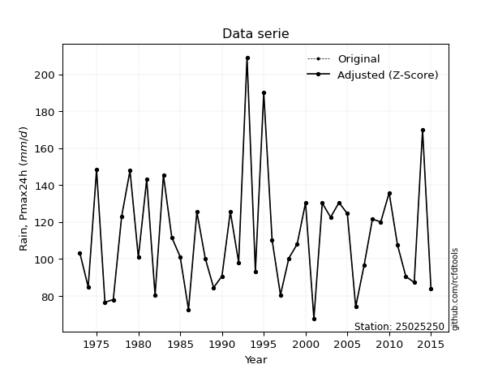</img>

</div>


> The initial value (value_initial) correspond to the initial obtained or null completed value, and value (value) is adjusted only when the initial value is outside the valid range (outlier) definite through the Z-Score value. If Z-Score is active, values out of range or outliers are replaced with the station mean value. A Z-Score (or standard score) measures how many standard deviations a data point is from the mean of a dataset, indicating its relative position; positive scores mean above the mean, negative mean below, and a score of zero is exactly at the mean, allowing for comparison of values from different distributions. It´s calculated using the formula $z=(x–μ)/σ$, where $x$ is the data point, $μ$ is the mean, and $σ$ is the standard deviation, helping identify outliers and understand probability.
>
> <sub>**Note**: In this study, "completing" (filling gaps in) and "extending" (forecasting or lengthening the historical record) rainfall data series are avoided for certain critical analyses because they introduce artificial bias and uncertainty, which can distort the statistics of rare events (extremes), alter day-to-day variability, and compromise the integrity and homogeneity of the original data. Some reasons against Completing/Extending rainfall data are: **Distortion of Extremes and Variability**: The primary issue is that most gap-filling or extension methods rely on averaging or regression with nearby stations, which inherently smooths the data. Rainfall is highly variable in space and time, with a large percentage of zero values and occasional large storms. Infilling methods often underestimate the highest values and overestimate the lowest (zero) values, which severely distorts analyses focused on flood frequency, drought severity, and intensity-duration-frequency (IDF) curves, **Loss of Data Homogeneity**: Infilled or extended data are synthetic estimates, not actual measurements. Combining these estimates with observed data can violate the assumption of data homogeneity, which requires that the data properties do not change over time. Inhomogeneity can lead to incorrect conclusions about long-term trends or changes in climate patterns, **Propagation of Errors**: Errors and biases from the original data (e.g., wind-induced undercatch, instrument errors, site changes) or the data used for imputation can propagate through the analysis, leading to unreliable hydrological models and inaccurate predictions, **Compromised Statistical Integrity**: For statistical analyses, especially those involving the frequency of events, using artificial data can introduce time bias or autocorrelation that doesn´t exist in reality, making it difficult to assess the true probability of events, **Difficulty in Validation**: It is difficult to accurately validate the quality of filled or extended data, especially for past periods where ground-truth measurements are unavailable. The reliability of imputation techniques heavily depends on the density of the surrounding station network and the complexity of the local topography.</sub>


### 4. Active continuous probability distributions from SciPy (44 of 104 available)

A Probability Density Function (PDF) describes the relative likelihood of a continuous random variable falling within a specific range, where the total area under its curve equals 1, and the area over any interval gives the actual probability for that range. Unlike discrete probabilities (like rolling a die), a PDF shows density, not direct probability for a single point (which is zero), with higher points indicating higher likelihood, often visualized as a bell curve for normal distributions.

A log of a probability density function (log-PDF) is simply the logarithm of the PDF´s value, denoted as $log(f(x))$, useful for converting multiplication of probabilities into addition, improving numerical stability with tiny numbers, and connecting to information theory concepts like entropy. Instead of dealing with very small probabilities (e.g., 0.000001), log-PDFs use negative numbers (e.g., $log(0.00001) ≈ -11.51$ that are easier for computers to handle, preventing underflow errors and simplifying complex calculations. In this study, each active probability distribution from SciPy is also evaluated in the $log$ form.

[scipy.stats](https://docs.scipy.org/doc/scipy/reference/stats.html) is a Python´s powerful submodule within the SciPy library for comprehensive statistical analysis, offering over 130 probability distributions (like Normal, Poisson), functions for descriptive stats (mean, variance), hypothesis testing (t-tests, chi-square), random variable generation, and statistical tests, making it essential for data science, modeling, and research. It provides tools to explore, model, and draw conclusions from data efficiently, working seamlessly with NumPy.

<div align="center">

|   id | p_dist             |   n_parameter | fit_method   | label                                                                       | active   | ref                                                                                                        |
|-----:|:-------------------|--------------:|:-------------|:----------------------------------------------------------------------------|:---------|:-----------------------------------------------------------------------------------------------------------|
|    0 | alpha              |             3 | MLE          | Alpha                                                                       | True     | [:mortar_board:](https://docs.scipy.org/doc/scipy/reference/generated/scipy.stats.alpha.html)              |
|    1 | betaprime          |             4 | MLE          | Beta prime                                                                  | True     | [:mortar_board:](https://docs.scipy.org/doc/scipy/reference/generated/scipy.stats.betaprime.html)          |
|    2 | chi2               |             3 | MLE          | Chi²                                                                        | True     | [:mortar_board:](https://docs.scipy.org/doc/scipy/reference/generated/scipy.stats.chi2.html)               |
|    3 | crystalball        |             4 | MLE          | Crystalball                                                                 | True     | [:mortar_board:](https://docs.scipy.org/doc/scipy/reference/generated/scipy.stats.crystalball.html)        |
|    4 | erlang             |             3 | MLE          | Erlang                                                                      | True     | [:mortar_board:](https://docs.scipy.org/doc/scipy/reference/generated/scipy.stats.erlang.html)             |
|    5 | expon              |             2 | MLE          | Exponential                                                                 | True     | [:mortar_board:](https://docs.scipy.org/doc/scipy/reference/generated/scipy.stats.expon.html)              |
|    6 | exponnorm          |             3 | MLE          | Exponentially modified Normal                                               | True     | [:mortar_board:](https://docs.scipy.org/doc/scipy/reference/generated/scipy.stats.exponnorm.html)          |
|    7 | f                  |             4 | MLE          | F                                                                           | True     | [:mortar_board:](https://docs.scipy.org/doc/scipy/reference/generated/scipy.stats.f.html)                  |
|    8 | fatiguelife        |             3 | MLE          | Fatigue-life (Birnbaum-Saunders)                                            | True     | [:mortar_board:](https://docs.scipy.org/doc/scipy/reference/generated/scipy.stats.fatiguelife.html)        |
|    9 | fisk               |             3 | MLE          | Fisk                                                                        | True     | [:mortar_board:](https://docs.scipy.org/doc/scipy/reference/generated/scipy.stats.fisk.html)               |
|   10 | gamma              |             3 | MLE          | Gamma                                                                       | True     | [:mortar_board:](https://docs.scipy.org/doc/scipy/reference/generated/scipy.stats.gamma.html)              |
|   11 | genexpon           |             5 | MLE          | Generalized exponential                                                     | True     | [:mortar_board:](https://docs.scipy.org/doc/scipy/reference/generated/scipy.stats.genexpon.html)           |
|   12 | genlogistic        |             3 | MLE          | Generalized logistic                                                        | True     | [:mortar_board:](https://docs.scipy.org/doc/scipy/reference/generated/scipy.stats.genlogistic.html)        |
|   13 | gibrat             |             2 | MM           | Gibrat                                                                      | True     | [:mortar_board:](https://docs.scipy.org/doc/scipy/reference/generated/scipy.stats.gibrat.html)             |
|   14 | gompertz           |             3 | MLE          | Gompertz (or truncated Gumbel)                                              | True     | [:mortar_board:](https://docs.scipy.org/doc/scipy/reference/generated/scipy.stats.gompertz.html)           |
|   15 | gumbel_l           |             2 | MM           | Gumbel Left Skew                                                            | True     | [:mortar_board:](https://docs.scipy.org/doc/scipy/reference/generated/scipy.stats.gumbel_l.html)           |
|   16 | gumbel_r           |             2 | MM           | Gumbel Right Skew                                                           | True     | [:mortar_board:](https://docs.scipy.org/doc/scipy/reference/generated/scipy.stats.gumbel_r.html)           |
|   17 | halflogistic       |             2 | MM           | Half-logistic                                                               | True     | [:mortar_board:](https://docs.scipy.org/doc/scipy/reference/generated/scipy.stats.halflogistic.html)       |
|   18 | halfnorm           |             2 | MM           | Half Normal                                                                 | True     | [:mortar_board:](https://docs.scipy.org/doc/scipy/reference/generated/scipy.stats.halfnorm.html)           |
|   19 | hypsecant          |             2 | MM           | hyperbolic secant                                                           | True     | [:mortar_board:](https://docs.scipy.org/doc/scipy/reference/generated/scipy.stats.hypsecant.html)          |
|   20 | invgamma           |             3 | MLE          | Inverted gamma                                                              | True     | [:mortar_board:](https://docs.scipy.org/doc/scipy/reference/generated/scipy.stats.invgamma.html)           |
|   21 | invgauss           |             3 | MLE          | Inverse Gaussian                                                            | True     | [:mortar_board:](https://docs.scipy.org/doc/scipy/reference/generated/scipy.stats.invgauss.html)           |
|   22 | invweibull         |             3 | MLE          | Inverted Weibull                                                            | True     | [:mortar_board:](https://docs.scipy.org/doc/scipy/reference/generated/scipy.stats.invweibull.html)         |
|   23 | johnsonsu          |             4 | MLE          | Johnson Su                                                                  | True     | [:mortar_board:](https://docs.scipy.org/doc/scipy/reference/generated/scipy.stats.johnsonsu.html)          |
|   24 | kstwobign          |             2 | MLE          | Limiting distribution of scaled Kolmogorov-Smirnov two-sided test statistic | True     | [:mortar_board:](https://docs.scipy.org/doc/scipy/reference/generated/scipy.stats.kstwobign.html)          |
|   25 | laplace            |             2 | MM           | Laplace                                                                     | True     | [:mortar_board:](https://docs.scipy.org/doc/scipy/reference/generated/scipy.stats.laplace.html)            |
|   26 | laplace_asymmetric |             3 | MLE          | Asymmetric Laplace                                                          | True     | [:mortar_board:](https://docs.scipy.org/doc/scipy/reference/generated/scipy.stats.laplace_asymmetric.html) |
|   27 | loggamma           |             3 | MLE          | Log gamma                                                                   | True     | [:mortar_board:](https://docs.scipy.org/doc/scipy/reference/generated/scipy.stats.loggamma.html)           |
|   28 | logistic           |             2 | MM           | Logistic (or Sech-squared)                                                  | True     | [:mortar_board:](https://docs.scipy.org/doc/scipy/reference/generated/scipy.stats.logistic.html)           |
|   29 | lognorm            |             3 | MLE          | Log Normal                                                                  | True     | [:mortar_board:](https://docs.scipy.org/doc/scipy/reference/generated/scipy.stats.lognorm.html)            |
|   30 | maxwell            |             2 | MM           | Maxwell                                                                     | True     | [:mortar_board:](https://docs.scipy.org/doc/scipy/reference/generated/scipy.stats.maxwell.html)            |
|   31 | mielke             |             4 | MLE          | Mielke Beta-Kappa / Dagum                                                   | True     | [:mortar_board:](https://docs.scipy.org/doc/scipy/reference/generated/scipy.stats.mielke.html)             |
|   32 | moyal              |             2 | MM           | Moyal                                                                       | True     | [:mortar_board:](https://docs.scipy.org/doc/scipy/reference/generated/scipy.stats.moyal.html)              |
|   33 | nakagami           |             3 | MLE          | Nakagami                                                                    | True     | [:mortar_board:](https://docs.scipy.org/doc/scipy/reference/generated/scipy.stats.nakagami.html)           |
|   34 | ncf                |             5 | MLE          | Non-central F distribution                                                  | True     | [:mortar_board:](https://docs.scipy.org/doc/scipy/reference/generated/scipy.stats.ncf.html)                |
|   35 | nct                |             4 | MLE          | Non-central Student’s t                                                     | True     | [:mortar_board:](https://docs.scipy.org/doc/scipy/reference/generated/scipy.stats.nct.html)                |
|   36 | norm               |             2 | MM           | Normal                                                                      | True     | [:mortar_board:](https://docs.scipy.org/doc/scipy/reference/generated/scipy.stats.norm.html)               |
|   37 | pearson3           |             3 | MM           | Pearson type III                                                            | True     | [:mortar_board:](https://docs.scipy.org/doc/scipy/reference/generated/scipy.stats.pearson3.html)           |
|   38 | rayleigh           |             2 | MM           | Rayleigh                                                                    | True     | [:mortar_board:](https://docs.scipy.org/doc/scipy/reference/generated/scipy.stats.rayleigh.html)           |
|   39 | rice               |             3 | MLE          | Rice                                                                        | True     | [:mortar_board:](https://docs.scipy.org/doc/scipy/reference/generated/scipy.stats.rice.html)               |
|   40 | t                  |             3 | MLE          | Student’s t                                                                 | True     | [:mortar_board:](https://docs.scipy.org/doc/scipy/reference/generated/scipy.stats.t.html)                  |
|   41 | truncnorm          |             4 | MLE          | Truncated normal                                                            | True     | [:mortar_board:](https://docs.scipy.org/doc/scipy/reference/generated/scipy.stats.truncnorm.html)          |
|   42 | wald               |             2 | MM           | Wald                                                                        | True     | [:mortar_board:](https://docs.scipy.org/doc/scipy/reference/generated/scipy.stats.wald.html)               |
|   43 | weibull_min        |             3 | MLE          | Weibull minimum                                                             | True     | [:mortar_board:](https://docs.scipy.org/doc/scipy/reference/generated/scipy.stats.weibull_min.html)        |

</div>

> **n_parameter:** # arguments & localization & scale.
>
> **Fit methods:** (MLE) maximum likelihood, (MM) L-moments.
>
>**Inactive** (With the only purpose of prevent loops, zero divisions, infinite values, over high estimated values or horizontal trending for recurrence intervals estimations, the follow distributions were disabled.)**:** foldnorm, gennorm, norminvgauss, powernorm, powerlognorm, skewnorm, genextreme, anglit, arcsine, argus, beta, bradford, burr, burr12, cauchy, cosine, halfcauchy, foldcauchy, skewcauchy, wrapcauchy, dgamma, gengamma, exponweib, exponpow, truncexpon, gausshyper, genhalflogistic, genhyperbolic, geninvgauss, halfgennorm, johnsonsb, kappa4, kappa3, ksone, kstwo, loglaplace, levy, levy_l, levy_stable, ncx2, pareto, genpareto, truncpareto, lomax, powerlaw, rdist, rel_breitwigner, recipinvgauss, semicircular, studentized_range, trapezoid, triang, truncweibull_min, tukeylambda, uniform, loguniform, vonmises, vonmises_line, weibull_max, dweibull, 


## B. Probability (PDF) vs. Empirical (EDF) distributions functions

A continuous probability distribution (CPD) describes probabilities for variables that can take any value within a range (like rain any time), unlike discrete variables with specific outcomes (like temperature). It uses a Probability Density Function (PDF), a curve where the total area under it equals 1, and the probability of the variable falling within an interval (a to b) is found by calculating the area under the curve between those points. A key feature is that the probability of hitting any single exact value is zero, so probabilities are always expressed for ranges, e.g., $P(a ≤ X ≤ b)$.

<div align="center">

Distributions parameters from station values
|    |   station | p_dist                |   n |              loc |          scale | shape                 | shape1               | shape2                 | shape3   |
|---:|----------:|:----------------------|----:|-----------------:|---------------:|:----------------------|:---------------------|:-----------------------|:---------|
|  0 |  25025250 | alpha                 |  43 |    -25.2753      |  649.114       | 4.938074162813617     |                      |                        |          |
|  1 |  25025250 | betaprime             |  43 |     -1.8335      |    4.97186     | 360.3675655060731     | 16.73412807334695    |                        |          |
|  2 |  25025250 | chi2                  |  43 |     67.5         |    1.34599     | 0.8358550018671569    |                      |                        |          |
|  3 |  25025250 | crystalball           |  43 |    112.186       |   30.7755      | 8009.906628222975     | 7110.51078617667     |                        |          |
|  4 |  25025250 | erlang                |  43 |     63.6333      |   21.004       | 2.3116041028963394    |                      |                        |          |
|  5 |  25025250 | expon                 |  43 |     67.5         |   44.6863      |                       |                      |                        |          |
|  6 |  25025250 | exponnorm             |  43 |     79.7521      |   10.6641      | 3.041447765637375     |                      |                        |          |
|  7 |  25025250 | f                     |  43 |     -2.15853     |  107.426       | 879.0504842174944     | 33.40449608338257    |                        |          |
|  8 |  25025250 | fatiguelife           |  43 |     47.6774      |   57.6347      | 0.48808271676146314   |                      |                        |          |
|  9 |  25025250 | fisk                  |  43 |     51.4007      |   54.3238      | 3.335266681325641     |                      |                        |          |
| 10 |  25025250 | gamma                 |  43 |     63.6333      |   21.004       | 2.3116099061934148    |                      |                        |          |
| 11 |  25025250 | genexpon              |  43 |     67.5         |    1.3969      | 0.02883342224363007   | 0.017337125408320497 | 0.014088833481742512   |          |
| 12 |  25025250 | genlogistic           |  43 |    -55.5337      |   23.304       | 737.5271363931865     |                      |                        |          |
| 13 |  25025250 | gibrat                |  43 |     88.7085      |   14.24        |                       |                      |                        |          |
| 14 |  25025250 | gompertz              |  43 |     59.009       |    4.12411     | 6.514418961128644e-15 |                      |                        |          |
| 15 |  25025250 | gumbel_l              |  43 |    126.037       |   23.9955      |                       |                      |                        |          |
| 16 |  25025250 | gumbel_r              |  43 |     98.3357      |   23.9955      |                       |                      |                        |          |
| 17 |  25025250 | halflogistic          |  43 |     75.7102      |   26.3119      |                       |                      |                        |          |
| 18 |  25025250 | halfnorm              |  43 |     71.4517      |   51.0533      |                       |                      |                        |          |
| 19 |  25025250 | hypsecant             |  43 |    112.186       |   19.5923      |                       |                      |                        |          |
| 20 |  25025250 | invgamma              |  43 |     24.9337      |  717.02        | 9.20142595054542      |                      |                        |          |
| 21 |  25025250 | invgauss              |  43 |     45.4744      |  289.758       | 0.23023197716410626   |                      |                        |          |
| 22 |  25025250 | invweibull            |  43 |   -247.44        |  344.941       | 15.188509382715823    |                      |                        |          |
| 23 |  25025250 | johnsonsu             |  43 |     47.1947      |    2.74692     | -7.969089327213851    | 2.1262262056153327   |                        |          |
| 24 |  25025250 | kstwobign             |  43 |     14.7058      |  112.284       |                       |                      |                        |          |
| 25 |  25025250 | laplace               |  43 |    112.186       |   21.7615      |                       |                      |                        |          |
| 26 |  25025250 | laplace_asymmetric    |  43 |     80.2         |   14.7169      | 0.39008869433180704   |                      |                        |          |
| 27 |  25025250 | loggamma              |  43 | -10362.6         | 1384.64        | 1929.841565329723     |                      |                        |          |
| 28 |  25025250 | logistic              |  43 |    112.186       |   16.9674      |                       |                      |                        |          |
| 29 |  25025250 | lognorm               |  43 |     46.8363      |   58.686       | 0.46901901705739096   |                      |                        |          |
| 30 |  25025250 | maxwell               |  43 |     39.2614      |   45.6989      |                       |                      |                        |          |
| 31 |  25025250 | mielke                |  43 |     -0.512056    |   67.2402      | 30.618989859706154    | 4.8238073114740985   |                        |          |
| 32 |  25025250 | moyal                 |  43 |     94.5869      |   13.8538      |                       |                      |                        |          |
| 33 |  25025250 | nakagami              |  43 |     67.0643      |   54.6179      | 0.6003885107865317    |                      |                        |          |
| 34 |  25025250 | ncf                   |  43 |     -1.41857     |  107.071       | 312.846447826719      | 35.12276468538721    | 4.8392241906665896e-06 |          |
| 35 |  25025250 | nct                   |  43 |     -0.235317    |    2.83617     | 8.422998487842062     | 36.00676338750887    |                        |          |
| 36 |  25025250 | norm                  |  43 |    112.186       |   30.7755      |                       |                      |                        |          |
| 37 |  25025250 | pearson3              |  43 |    112.186       |   30.7755      | 1.0353670676922935    |                      |                        |          |
| 38 |  25025250 | rayleigh              |  43 |     53.311       |   46.9757      |                       |                      |                        |          |
| 39 |  25025250 | rice                  |  43 |     59.4391      |   43.1821      | 0.0006902977801951176 |                      |                        |          |
| 40 |  25025250 | t                     |  43 |    111.98        |   30.8099      | 59.61549703129958     |                      |                        |          |
| 41 |  25025250 | truncnorm             |  43 |    112.186       |   30.7755      | -2423.0689238872847   | 232.3099178174358    |                        |          |
| 42 |  25025250 | wald                  |  43 |     81.4109      |   30.7754      |                       |                      |                        |          |
| 43 |  25025250 | weibull_min           |  43 |     66.1187      |   51.0179      | 1.5131959343094028    |                      |                        |          |
| 44 |  25025250 | logalpha              |  43 |      1.39821     |   42.0042      | 12.858790491822454    |                      |                        |          |
| 45 |  25025250 | logbetaprime          |  43 |     -8.65211     |    5.45771     | 4531.623515072877     | 1853.8437867350485   |                        |          |
| 46 |  25025250 | logchi2               |  43 |      4.21213     |    0.973546    | 1.0416515177784276    |                      |                        |          |
| 47 |  25025250 | logcrystalball        |  43 |      4.68555     |    0.259346    | 36.19605753636547     | 13.685688614955296   |                        |          |
| 48 |  25025250 | logerlang             |  43 |      3.84361     |    0.0823035   | 10.229654734641368    |                      |                        |          |
| 49 |  25025250 | logexpon              |  43 |      4.21213     |    0.473417    |                       |                      |                        |          |
| 50 |  25025250 | logexponnorm          |  43 |      4.53256     |    0.211844    | 0.722133784301571     |                      |                        |          |
| 51 |  25025250 | logf                  |  43 |      2.7896      |    1.86417     | 1261.7480245519214    | 119.05523542398416   |                        |          |
| 52 |  25025250 | logfatiguelife        |  43 |      3.3366      |    1.32416     | 0.19346886213812664   |                      |                        |          |
| 53 |  25025250 | logfisk               |  43 |      3.25437     |    1.41106     | 9.398412650312826     |                      |                        |          |
| 54 |  25025250 | loggamma              |  43 |      3.84361     |    0.0823035   | 10.229669824656934    |                      |                        |          |
| 55 |  25025250 | loggenexpon           |  43 |      4.21159     |    0.163329    | 0.05590682131741685   | 4.81992673381429     | 0.03243821653035447    |          |
| 56 |  25025250 | loggenlogistic        |  43 |      4.20703     |    0.207992    | 6.20235691195168      |                      |                        |          |
| 57 |  25025250 | loggibrat             |  43 |      4.48767     |    0.120017    |                       |                      |                        |          |
| 58 |  25025250 | loggompertz           |  43 |      4.21092     |    0.390909    | 0.30709212577105444   |                      |                        |          |
| 59 |  25025250 | loggumbel_l           |  43 |      4.80226     |    0.202211    |                       |                      |                        |          |
| 60 |  25025250 | loggumbel_r           |  43 |      4.56883     |    0.202211    |                       |                      |                        |          |
| 61 |  25025250 | loghalflogistic       |  43 |      4.37818     |    0.221718    |                       |                      |                        |          |
| 62 |  25025250 | loghalfnorm           |  43 |      4.3423      |    0.430196    |                       |                      |                        |          |
| 63 |  25025250 | loghypsecant          |  43 |      4.68554     |    0.165105    |                       |                      |                        |          |
| 64 |  25025250 | loginvgamma           |  43 |      2.72424     |  112.273       | 58.246339132283026    |                      |                        |          |
| 65 |  25025250 | loginvgauss           |  43 |      3.32182     |   36.9367      | 0.036920626863257054  |                      |                        |          |
| 66 |  25025250 | loginvweibull         |  43 |     -2.49998e+07 |    2.49998e+07 | 110261408.69244105    |                      |                        |          |
| 67 |  25025250 | logjohnsonsu          |  43 |      3.28623     |    0.203522    | -14.211278411865898   | 5.445992353259594    |                        |          |
| 68 |  25025250 | logkstwobign          |  43 |      3.75441     |    1.06761     |                       |                      |                        |          |
| 69 |  25025250 | loglaplace            |  43 |      4.68554     |    0.183385    |                       |                      |                        |          |
| 70 |  25025250 | loglaplace_asymmetric |  43 |      4.60817     |    0.205884    | 0.8293320302430338    |                      |                        |          |
| 71 |  25025250 | logloggamma           |  43 |    -68.089       |    9.97682     | 1472.4528463493812    |                      |                        |          |
| 72 |  25025250 | loglogistic           |  43 |      4.68554     |    0.142985    |                       |                      |                        |          |
| 73 |  25025250 | loglognorm            |  43 |      3.26406     |    1.39808     | 0.18256299181388086   |                      |                        |          |
| 74 |  25025250 | logmaxwell            |  43 |      4.071       |    0.385106    |                       |                      |                        |          |
| 75 |  25025250 | logmielke             |  43 |     -1.77023e+07 |    1.77023e+07 | 285651363.85786027    | 90952759.1307295     |                        |          |
| 76 |  25025250 | logmoyal              |  43 |      4.53723     |    0.116747    |                       |                      |                        |          |
| 77 |  25025250 | lognakagami           |  43 |      4.15989     |    0.586154    | 1.0697660869873584    |                      |                        |          |
| 78 |  25025250 | logncf                |  43 |      1.15296     |    3.52536     | 611.7397164747426     | 988.9045485876086    | 3.3541253654578147e-10 |          |
| 79 |  25025250 | lognct                |  43 |     -0.160493    |    0.070669    | 193.7565631698892     | 68.29697699694037    |                        |          |
| 80 |  25025250 | lognorm               |  43 |      4.68554     |    0.259346    |                       |                      |                        |          |
| 81 |  25025250 | logpearson3           |  43 |      4.68554     |    0.259346    | 0.3608010653761016    |                      |                        |          |
| 82 |  25025250 | lograyleigh           |  43 |      4.1894      |    0.395865    |                       |                      |                        |          |
| 83 |  25025250 | logrice               |  43 |      4.15977     |    0.319695    | 1.167422255491388     |                      |                        |          |
| 84 |  25025250 | logt                  |  43 |      4.68555     |    0.259348    | 263741320.88742387    |                      |                        |          |
| 85 |  25025250 | logtruncnorm          |  43 |     -0.14008     |    1.34962     | 3.224773272130497     | 4.0629734368885755   |                        |          |
| 86 |  25025250 | logwald               |  43 |      4.42624     |    0.25931     |                       |                      |                        |          |
| 87 |  25025250 | logweibull_min        |  43 |      4.14931     |    0.605291    | 2.1818370576280857    |                      |                        |          |

</div>

> **loc** (Location parameter): This shifts the distribution along the x-axis. For many common distributions, like the normal (Gaussian) distribution, loc represents the mean $μ$. For others, like the uniform distribution, it might represent the minimum value, or for the beta distribution, the left end of the support interval.
>
> **scale** (Scale parameter): This determines the width or spread of the distribution. For the normal distribution, scale represents the standard deviation $σ$. For a uniform distribution, it defines the length of the interval (from $loc$ to $loc + scale$).
>
> **shape** (Shape parameters): Refers to parameters that define the specific form of a probability distribution, distinct from its location (loc) and scale (scale). These parameters are required arguments for most distribution functions. For example, a normal (Gaussian) distribution is fully defined by its location (mean) and scale (standard deviation), so it has no specific shape parameters beyond loc and scale. However, other distributions have intrinsic properties that need specification, as Gamma distribution that takes a shape parameter, often named $a$ or $alpha$.


### 0. Cumulative distribution values - CDF (88 evaluated)

Cumulative Distribution Function (CDF), denoted as $F$<sub>$X$</sub>$(x)$, is a function that gives the probability that a random variable $X$ will take a value less than or equal to a specific value, $x$ (i.e., $(P(X≥x)$. It essentially "accumulates" probabilities from a given point up to the far right (positive infinity), providing a complete picture of the distribution´s probabilities for both discrete (like rain) and continuous (like temperature) variables, helping to find probabilities over ranges or above certain values. Each station is evaluated separately ordering the $x$ values ascending, calculating the CDF and PDF values for the activated distributions and their logarithmic forms.

<div align="center">

CDF ordered by x ascending and calculating $log(f(x))$ separately
|   id |   Station |   date |        x |   count |    mean |     std |     zscore |   Value_initial |   station |   m |     alpha |   alpha_pdf |   betaprime |   betaprime_pdf |        chi2 |    chi2_pdf |   crystalball |   crystalball_pdf |    erlang |   erlang_pdf |    expon |   expon_pdf |   exponnorm |   exponnorm_pdf |         f |       f_pdf |   fatiguelife |   fatiguelife_pdf |      fisk |    fisk_pdf |     gamma |   gamma_pdf |    genexpon |   genexpon_pdf |   genlogistic |   genlogistic_pdf |    gibrat |   gibrat_pdf |    gompertz |   gompertz_pdf |   gumbel_l |   gumbel_l_pdf |   gumbel_r |   gumbel_r_pdf |   halflogistic |   halflogistic_pdf |   halfnorm |   halfnorm_pdf |   hypsecant |   hypsecant_pdf |   invgamma |   invgamma_pdf |   invgauss |   invgauss_pdf |   invweibull |   invweibull_pdf |   johnsonsu |   johnsonsu_pdf |   kstwobign |   kstwobign_pdf |   laplace |   laplace_pdf |   laplace_asymmetric |   laplace_asymmetric_pdf |   loggamma |   loggamma_pdf |   logistic |   logistic_pdf |   lognorm |   lognorm_pdf |   maxwell |   maxwell_pdf |    mielke |   mielke_pdf |      moyal |   moyal_pdf |   nakagami |   nakagami_pdf |       ncf |     ncf_pdf |       nct |     nct_pdf |      norm |    norm_pdf |   pearson3 |   pearson3_pdf |   rayleigh |   rayleigh_pdf |      rice |    rice_pdf |         t |       t_pdf |   truncnorm |   truncnorm_pdf |       wald |    wald_pdf |   weibull_min |   weibull_min_pdf |   logalpha |   logalpha_pdf |   logbetaprime |   logbetaprime_pdf |     logchi2 |   logchi2_pdf |   logcrystalball |   logcrystalball_pdf |   logerlang |   logerlang_pdf |   logexpon |   logexpon_pdf |   logexponnorm |   logexponnorm_pdf |      logf |   logf_pdf |   logfatiguelife |   logfatiguelife_pdf |   logfisk |   logfisk_pdf |   loggenexpon |   loggenexpon_pdf |   loggenlogistic |   loggenlogistic_pdf |   loggibrat |   loggibrat_pdf |   loggompertz |   loggompertz_pdf |   loggumbel_l |   loggumbel_l_pdf |   loggumbel_r |   loggumbel_r_pdf |   loghalflogistic |   loghalflogistic_pdf |   loghalfnorm |   loghalfnorm_pdf |   loghypsecant |   loghypsecant_pdf |   loginvgamma |   loginvgamma_pdf |   loginvgauss |   loginvgauss_pdf |   loginvweibull |   loginvweibull_pdf |   logjohnsonsu |   logjohnsonsu_pdf |   logkstwobign |   logkstwobign_pdf |   loglaplace |   loglaplace_pdf |   loglaplace_asymmetric |   loglaplace_asymmetric_pdf |   logloggamma |   logloggamma_pdf |   loglogistic |   loglogistic_pdf |   loglognorm |   loglognorm_pdf |   logmaxwell |   logmaxwell_pdf |   logmielke |   logmielke_pdf |    logmoyal |   logmoyal_pdf |   lognakagami |   lognakagami_pdf |    logncf |   logncf_pdf |    lognct |   lognct_pdf |   logpearson3 |   logpearson3_pdf |   lograyleigh |   lograyleigh_pdf |    logrice |   logrice_pdf |      logt |   logt_pdf |   logtruncnorm |   logtruncnorm_pdf |     logwald |   logwald_pdf |   logweibull_min |   logweibull_min_pdf |
|-----:|----------:|-------:|---------:|--------:|--------:|--------:|-----------:|----------------:|----------:|----:|----------:|------------:|------------:|----------------:|------------:|------------:|--------------:|------------------:|----------:|-------------:|---------:|------------:|------------:|----------------:|----------:|------------:|--------------:|------------------:|----------:|------------:|----------:|------------:|------------:|---------------:|--------------:|------------------:|----------:|-------------:|------------:|---------------:|-----------:|---------------:|-----------:|---------------:|---------------:|-------------------:|-----------:|---------------:|------------:|----------------:|-----------:|---------------:|-----------:|---------------:|-------------:|-----------------:|------------:|----------------:|------------:|----------------:|----------:|--------------:|---------------------:|-------------------------:|-----------:|---------------:|-----------:|---------------:|----------:|--------------:|----------:|--------------:|----------:|-------------:|-----------:|------------:|-----------:|---------------:|----------:|------------:|----------:|------------:|----------:|------------:|-----------:|---------------:|-----------:|---------------:|----------:|------------:|----------:|------------:|------------:|----------------:|-----------:|------------:|--------------:|------------------:|-----------:|---------------:|---------------:|-------------------:|------------:|--------------:|-----------------:|---------------------:|------------:|----------------:|-----------:|---------------:|---------------:|-------------------:|----------:|-----------:|-----------------:|---------------------:|----------:|--------------:|--------------:|------------------:|-----------------:|---------------------:|------------:|----------------:|--------------:|------------------:|--------------:|------------------:|--------------:|------------------:|------------------:|----------------------:|--------------:|------------------:|---------------:|-------------------:|--------------:|------------------:|--------------:|------------------:|----------------:|--------------------:|---------------:|-------------------:|---------------:|-------------------:|-------------:|-----------------:|------------------------:|----------------------------:|--------------:|------------------:|--------------:|------------------:|-------------:|-----------------:|-------------:|-----------------:|------------:|----------------:|------------:|---------------:|--------------:|------------------:|----------:|-------------:|----------:|-------------:|--------------:|------------------:|--------------:|------------------:|-----------:|--------------:|----------:|-----------:|---------------:|-------------------:|------------:|--------------:|-----------------:|---------------------:|
|    0 |  25025250 |   2001 |  67.5    |      43 | 112.186 | 31.1397 | -1.43503   |         67.5    |  25025250 |   1 | 0.0197688 | 0.00361559  |   0.0267401 |     0.00406828  | 1.21735e-06 | 3.5801e+07  |     0.0732493 |       0.00451738  | 0.0064817 |  0.00366235  | 0        | 0.0223782   |   0.0178885 |     0.00331153  | 0.0265399 | 0.00404633  |     0.0109528 |        0.00341691 | 0.0170183 | 0.00346564  | 0.0064818 | 0.00366237  | 2.62451e-08 |    0.020641    |     0.0235617 |       0.00377996  | 0         |  0           | 4.45391e-14 |    1.23793e-14 |  0.0835109 |    0.00333073  |  0.02692   |    0.00405545  |      0         |        0           |  0         |    0           |   0.0648381 |     0.00328653  |  0.0160413 |    0.00352178  |  0.0117155 |    0.00343392  |    0.0186295 |      0.0035785   |   0.0127966 |     0.00342659  |   0.020102  |     0.00386892  | 0.0641455 |   0.00294766  |            0.0144567 |               0.00251818 |  0.0134391 |       0.23086  |  0.0670035 |    0.00368436  | 0.0339682 |     0.290707  | 0.056031  |   0.00550801  | 0.0145903 |  0.00319388  | 0.00785916 | 0.00223716  | 0.00249107 |    0.00686582  | 0.0275181 | 0.00408699  | 0.0188834 | 0.00365158  | 0.0732493 | 0.00451738  |  0.0227364 |    0.00466314  |  0.044592  |    0.00614318  | 0.0172722 | 0.00424822  | 0.0770313 | 0.00455077  |   0.0732493 |     0.00451738  | 0          | 0           |     0.004239  |       0.00463377  |  0.0192969 |      0.249162  |      0.0922035 |           0.468489 | 1.15374e-08 |   6.76552e+06 |        0.0339678 |            0.290704  |   0.0134391 |        0.23086  |   0        |       2.1123   |      0.0253263 |          0.260583  | 0.0175918 |  0.242266  |        0.0156343 |             0.236641 | 0.0255338 |      0.244163 |   0.000184277 |          0.345373 |        0.0146451 |             0.215686 |   0         |       0         |   0.000952342 |         0.787271  |     0.0525859 |       0.253094    |    0.00292149 |          0.084312 |         0         |              0        |     0         |          0        |      0.0361516 |          0.218491  |     0.0175301 |         0.242342  |     0.0157253 |          0.236943 |      0.00961947 |            0.197028 |      0.0169535 |          0.241629  |     0.00711266 |           0.193052 |    0.0378285 |        0.206279  |               0.0400691 |                    0.234671 |     0.0351502 |         0.293541  |     0.0351971 |         0.237495  |    0.0166828 |        0.23969   |    0.0125732 |        0.260157  |   0.0205702 |        0.235552 | 5.71361e-05 |     0.00418406 |    0.00588067 |          0.239858 | 0.0266829 |     0.273874 | 0.0254656 |    0.271319  |     0.0219997 |         0.265075  |    0.00164656 |          0.144784 | 0.00677062 |     0.25806   | 0.0339692 |  0.290712  |     1.9954e-06 |           2.6914   | 0           |   0           |       0.00710762 |            0.246003  |
|    1 |  25025250 |   1986 |  72.5    |      43 | 112.186 | 31.1397 | -1.27446   |         72.5    |  25025250 |   2 | 0.0444943 | 0.00637761  |   0.052964  |     0.00648441  | 0.958335    | 0.0190643   |     0.0986046 |       0.00564425  | 0.0375187 |  0.00857254  | 0.105858 | 0.0200093   |   0.0416197 |     0.00637032  | 0.0526416 | 0.00645792  |     0.0377548 |        0.00739666 | 0.0409248 | 0.00620441  | 0.0375189 | 0.00857253  | 0.099445    |    0.0191381   |     0.0485164 |       0.00628659  | 0         |  0           | 1.65101e-13 |    4.16127e-14 |  0.101841  |    0.00402031  |  0.0531337 |    0.00649889  |      0         |        0           |  0.0163823 |    0.0156252   |   0.0834965 |     0.004213    |  0.0412255 |    0.00666348  |  0.0381768 |    0.00725008  |    0.0434768 |      0.00647164  |   0.038555  |     0.00698594  |   0.0462539 |     0.00665338  | 0.0807145 |   0.00370904  |            0.0345393 |               0.00601634 |  0.0388519 |       0.497386 |  0.0879462 |    0.0047274   | 0.0605836 |     0.462814  | 0.0875294 |   0.00708978  | 0.0382602 |  0.00644969  | 0.0264739  | 0.00544664  | 0.0514758  |    0.0113292   | 0.053715  | 0.00645249  | 0.0441084 | 0.00653918  | 0.0986046 | 0.00564425  |  0.0532904 |    0.007558    |  0.0800453 |    0.00799967  | 0.0447107 | 0.00669112  | 0.102508  | 0.00565938  |   0.0986046 |     0.00564425  | 0          | 0           |     0.0421269 |       0.00977603  |  0.0446781 |      0.475472  |      0.130198  |           0.596312 | 0.19909     |   1.41637     |        0.060583  |            0.46281   |   0.0388518 |        0.497386 |   0.140103 |       1.81636  |      0.050447  |          0.454267  | 0.0427408 |  0.476748  |        0.0408462 |             0.485147 | 0.0490047 |      0.425562 |   0.0389809   |          0.731581 |        0.0383054 |             0.467202 |   0         |       0         |   0.0608118   |         0.888547  |     0.0740331 |       0.352218    |    0.016599   |          0.336429 |         0         |              0        |     0         |          0        |      0.0556485 |          0.335335  |     0.0427153 |         0.477757  |     0.0409358 |          0.484751 |      0.0337579  |            0.504518 |      0.0422557 |          0.482018  |     0.0333509  |           0.569919 |    0.0558533 |        0.304568  |               0.0608928 |                    0.356628 |     0.0618855 |         0.463087  |     0.0567222 |         0.374199  |    0.0418497 |        0.480274  |    0.0408606 |        0.542107  |   0.0445412 |        0.451847 | 0.0030432   |     0.125486   |    0.0364447  |          0.615954 | 0.0528134 |     0.468112 | 0.051601  |    0.471341  |     0.0482537 |         0.48203   |    0.0279068  |          0.584247 | 0.0374852  |     0.598023  | 0.0605849 |  0.462818  |     0.176725   |           2.26578  | 0           |   0           |       0.0367308  |            0.585751  |
|    2 |  25025250 |   2006 |  74      |      43 | 112.186 | 31.1397 | -1.22629   |         74      |  25025250 |   3 | 0.0547497 | 0.0073003   |   0.0632743 |     0.00726468  | 0.978743    | 0.00937356  |     0.107339  |       0.00600326  | 0.0513127 |  0.00979771  | 0.135374 | 0.0193488   |   0.0520031 |     0.00748608  | 0.0629114 | 0.00723742  |     0.0497719 |        0.00862034 | 0.0509232 | 0.00713267  | 0.0513128 | 0.0097977   | 0.127816    |    0.0186897   |     0.0585668 |       0.00711762  | 0         |  0           | 2.40383e-13 |    5.98667e-14 |  0.108042  |    0.0042501   |  0.063476  |    0.00729341  |      0         |        0           |  0.0398097 |    0.015609    |   0.0900551 |     0.00453539  |  0.0519936 |    0.00769629  |  0.0499477 |    0.00844058  |    0.0539068 |      0.00743902  |   0.0498878 |     0.00812364  |   0.0568917 |     0.00753014  | 0.0864743 |   0.00397372  |            0.0448525 |               0.00781278 |  0.0499784 |       0.590188 |  0.0953004 |    0.00508141  | 0.0706549 |     0.521438  | 0.0985156 |   0.00755735  | 0.0487847 |  0.00759043  | 0.035532   | 0.00664289  | 0.0688781  |    0.011853    | 0.0639646 | 0.0072158   | 0.0546298 | 0.0074924   | 0.107339  | 0.00600326  |  0.0652627 |    0.00840045  |  0.0924297 |    0.00850889  | 0.0552649 | 0.00737716  | 0.111261  | 0.00601306  |   0.107339  |     0.00600326  | 0          | 0           |     0.0575193 |       0.0107197   |  0.0552208 |      0.55512   |      0.142796  |           0.634062 | 0.226203    |   1.24214     |        0.0706542 |            0.521434  |   0.0499783 |        0.590188 |   0.176507 |       1.73947  |      0.0604397 |          0.522552  | 0.0533411 |  0.55949   |        0.0516663 |             0.572561 | 0.0583911 |      0.492275 |   0.0549904   |          0.83098  |        0.0488201 |             0.561134 |   0         |       0         |   0.0793084   |         0.917896  |     0.0815929 |       0.386575    |    0.0246327  |          0.451171 |         0         |              0        |     0         |          0        |      0.062952  |          0.378805  |     0.0533396 |         0.560823  |     0.0517455 |          0.571929 |      0.0452343  |            0.61765  |      0.0529833 |          0.566646  |     0.0463543  |           0.700681 |    0.062452  |        0.340551  |               0.068652  |                    0.402071 |     0.0719524 |         0.520721  |     0.0648898 |         0.424375  |    0.0525432 |        0.56507   |    0.0528773 |        0.63184   |   0.0546017 |        0.531988 | 0.00663736  |     0.232966   |    0.0501395  |          0.721015 | 0.0630774 |     0.535081 | 0.0619532 |    0.540482  |     0.0588832 |         0.556897  |    0.0410819  |          0.701638 | 0.0506847  |     0.690625  | 0.0706564 |  0.521442  |     0.221988   |           2.1556   | 0           |   0           |       0.0497284  |            0.683391  |
|    3 |  25025250 |   1976 |  76.5    |      43 | 112.186 | 31.1397 | -1.14601   |         76.5    |  25025250 |   4 | 0.074957  | 0.00886691  |   0.0830767 |     0.00857671  | 0.992779    | 0.00306421  |     0.123112  |       0.00661803  | 0.0780705 |  0.0115477   | 0.182418 | 0.018296    |   0.073171  |     0.00946616  | 0.0826448 | 0.00854884  |     0.0737601 |        0.0105374  | 0.0707496 | 0.00873624  | 0.0780706 | 0.0115477   | 0.173611    |    0.0179475   |     0.0781258 |       0.00853212  | 0         |  0           | 4.46155e-13 |    1.09762e-13 |  0.119171  |    0.00465794  |  0.083384  |    0.00863289  |      0.0150068 |        0.0189985   |  0.078769  |    0.0155523   |   0.102115  |     0.00512305  |  0.0733903 |    0.00941439  |  0.0734431 |    0.0103284   |    0.0745497 |      0.00907506  |   0.072523  |     0.00996647  |   0.0775233 |     0.0089658   | 0.0970017 |   0.00445748  |            0.0693281 |               0.0120761  |  0.0722165 |       0.7498   |  0.108784  |    0.00571388  | 0.0896655 |     0.624424  | 0.118366  |   0.00831805  | 0.0701999 |  0.00954446  | 0.0547484  | 0.00874224  | 0.0993731  |    0.0125052   | 0.08361   | 0.00850022  | 0.0753656 | 0.00909396  | 0.123112  | 0.00661803  |  0.0879463 |    0.00972796  |  0.114709  |    0.00930296  | 0.0750803 | 0.00846247  | 0.127048  | 0.00661936  |   0.123112  |     0.00661803  | 0          | 0           |     0.0859609 |       0.0119751   |  0.0759574 |      0.695014  |      0.164883  |           0.695387 | 0.264107    |   1.05332     |        0.0896647 |            0.62442   |   0.0722164 |        0.7498   |   0.23232  |       1.62157  |      0.0797868 |          0.644112  | 0.0743085 |  0.704523  |        0.0731887 |             0.724682 | 0.0767354 |      0.614863 |   0.085105    |          0.978844 |        0.0702131 |             0.729381 |   0         |       0         |   0.110596    |         0.965365  |     0.095447  |       0.448737    |    0.0431752  |          0.670971 |         0         |              0        |     0         |          0        |      0.0768614 |          0.461021  |     0.07436   |         0.706372  |     0.0732407 |          0.723688 |      0.0689829  |            0.81353  |      0.0742364 |          0.714483  |     0.0731934  |           0.913851 |    0.0748568 |        0.408195  |               0.0833994 |                    0.488442 |     0.0909102 |         0.621929  |     0.0804979 |         0.517663  |    0.0737495 |        0.713255  |    0.0763287 |        0.779964  |   0.0746433 |        0.677301 | 0.0185493   |     0.503269   |    0.0768248  |          0.883337 | 0.0827821 |     0.65272  | 0.0818993 |    0.66189   |     0.0795286 |         0.687474  |    0.0674039  |          0.880108 | 0.0760435  |     0.83438   | 0.0896671 |  0.624427  |     0.290776   |           1.98714  | 0           |   0           |       0.0750089  |            0.837123  |
|    4 |  25025250 |   1977 |  77.9    |      43 | 112.186 | 31.1397 | -1.10105   |         77.9    |  25025250 |   5 | 0.0879811 | 0.00973634  |   0.0955937 |     0.00930251  | 0.995995    | 0.0016746   |     0.132623  |       0.00696929  | 0.0948261 |  0.0123704   | 0.207635 | 0.0177317   |   0.0872181 |     0.0106012   | 0.0951227 | 0.00927468  |     0.0892035 |        0.0115108  | 0.0836161 | 0.00964412  | 0.0948262 | 0.0123704   | 0.198448    |    0.0175355   |     0.0906247 |       0.00932193  | 0         |  0           | 6.29124e-13 |    1.54127e-13 |  0.12586   |    0.00490029  |  0.0959909 |    0.00937486  |      0.0415878 |        0.0189699   |  0.10051   |    0.0155043   |   0.109535  |     0.00548104  |  0.0872258 |    0.010345    |  0.0885911 |    0.0112993   |    0.0878889 |      0.00997743  |   0.0871614 |     0.010936    |   0.0906184 |     0.00973623  | 0.103447  |   0.00475368  |            0.0884744 |               0.0154112  |  0.086624  |       0.839183 |  0.117045  |    0.00609082  | 0.101528  |     0.684223  | 0.130301  |   0.00873036  | 0.0843218 |  0.010625    | 0.0678168  | 0.00992405  | 0.117082   |    0.0127842   | 0.0960097 | 0.00921168  | 0.088715  | 0.00997267  | 0.132623  | 0.00696929  |  0.102053  |    0.0104176   |  0.128025  |    0.00971624  | 0.087332  | 0.00903559  | 0.136557  | 0.00696614  |   0.132623  |     0.00696929  | 0          | 0           |     0.103131  |       0.0125383   |  0.0892872 |      0.775388  |      0.177795  |           0.728573 | 0.282504    |   0.978037    |        0.101527  |            0.684218  |   0.0866239 |        0.839183 |   0.261171 |       1.56063  |      0.0921087 |          0.715268  | 0.0878352 |  0.787551  |        0.0871115 |             0.810986 | 0.0885503 |      0.688917 |   0.103528    |          1.0519   |        0.0843202 |             0.826839 |   0         |       0         |   0.128336    |         0.991036  |     0.103921  |       0.486244    |    0.0565334  |          0.803201 |         0         |              0        |     0.0243433 |          1.85384  |      0.0856832 |          0.512718  |     0.0879225 |         0.789656  |     0.0871439 |          0.809823 |      0.0847242  |            0.922365 |      0.0879555 |          0.798774  |     0.0907825  |           1.02494  |    0.0826379 |        0.450625  |               0.092745  |                    0.543175 |     0.102719  |         0.680701  |     0.0903993 |         0.575077  |    0.0874483 |        0.797765  |    0.0912041 |        0.860357  |   0.0876989 |        0.763147 | 0.0293675   |     0.693839   |    0.093604   |          0.966384 | 0.0952327 |     0.720755 | 0.0945353 |    0.73201   |     0.092671  |         0.762208  |    0.0841905  |          0.970249 | 0.0918552  |     0.908861  | 0.10153   |  0.684226  |     0.326021   |           1.90033  | 0           |   0           |       0.0909223  |            0.917329  |
|    5 |  25025250 |   1982 |  80.2    |      43 | 112.186 | 31.1397 | -1.02719   |         80.2    |  25025250 |   6 | 0.111973  | 0.0111119   |   0.118327  |     0.0104548   | 0.998455    | 0.000634377 |     0.149322  |       0.00755327  | 0.124618  |  0.0134886   | 0.247386 | 0.0168422   |   0.113717  |     0.0124262   | 0.117792  | 0.0104276   |     0.117342  |        0.0129153  | 0.107494  | 0.0111108   | 0.124618  | 0.0134886   | 0.238008    |    0.0168653   |     0.113528  |       0.0105835   | 0         |  0           | 1.10372e-12 |    2.69205e-13 |  0.137609  |    0.00532075  |  0.11892   |    0.0105527   |      0.0851118 |        0.0188651   |  0.136057  |    0.0154007   |   0.122861  |     0.00611632  |  0.112694  |    0.0117781   |  0.116256  |    0.0127178   |    0.112485  |      0.0113934   |   0.114019  |     0.0123854   |   0.114395  |     0.0109204   | 0.114979  |   0.00528361  |            0.132072  |               0.0230054  |  0.113123  |       0.98165  |  0.131797  |    0.00674391  | 0.122883  |     0.784309  | 0.151135  |   0.00938046  | 0.110722  |  0.0123066   | 0.0928116  | 0.0117875   | 0.146918   |    0.0131413   | 0.118509  | 0.0103434   | 0.113252  | 0.0113465   | 0.149322  | 0.00755327  |  0.127227  |    0.0114506   |  0.151107  |    0.0103438   | 0.109144  | 0.00991848  | 0.153242  | 0.00754331  |   0.149322  |     0.00755327  | 0          | 0           |     0.132867  |       0.0132844   |  0.113762  |      0.907208  |      0.199759  |           0.780832 | 0.309502    |   0.881849    |        0.122882  |            0.784304  |   0.113123  |        0.98165  |   0.305215 |       1.4676   |      0.114645  |          0.834677  | 0.11272   |  0.923058  |        0.11274   |             0.950407 | 0.110434  |      0.816951 |   0.135701    |          1.15699  |        0.110695  |             0.986088 |   0         |       0         |   0.157765    |         1.03157   |     0.11901   |       0.552043    |    0.0830854  |          1.02223  |         0.0143067 |              2.25465  |     0.0781888 |          1.84579  |      0.101937  |          0.606912  |     0.112874  |         0.925504  |     0.112735  |          0.949039 |      0.114056   |            1.09214  |      0.11319   |          0.935731  |     0.123028   |           1.1877   |    0.0968475 |        0.52811   |               0.109977  |                    0.644095 |     0.123946  |         0.779121  |     0.108586  |         0.67696   |    0.112659  |        0.935091  |    0.118078  |        0.985841  |   0.111985  |        0.907093 | 0.0544463   |     1.03392    |    0.123548   |          1.08961  | 0.11784   |     0.833756 | 0.117517  |    0.848202  |     0.116627  |         0.884696  |    0.114387   |          1.1027   | 0.119961   |     1.0215    | 0.122885  |  0.784311  |     0.379373   |           1.76824  | 0           |   0           |       0.119404   |            1.03868   |
|    6 |  25025250 |   1997 |  80.4    |      43 | 112.186 | 31.1397 | -1.02077   |         80.4    |  25025250 |   7 | 0.114207  | 0.011227    |   0.120427  |     0.0105518   | 0.998577    | 0.000583622 |     0.150838  |       0.0076043   | 0.127324  |  0.0135727   | 0.250747 | 0.0167669   |   0.116218  |     0.0125795   | 0.119887  | 0.0105246   |     0.119936  |        0.0130251  | 0.109729  | 0.0112353   | 0.127324  | 0.0135727   | 0.241375    |    0.0168075   |     0.115655  |       0.01069     | 0         |  0           | 1.15889e-12 |    2.82582e-13 |  0.138677  |    0.00535864  |  0.12104   |    0.0106517   |      0.0888836 |        0.0188527   |  0.139136  |    0.0153902   |   0.12409   |     0.00617439  |  0.115061  |    0.0118956   |  0.118811  |    0.0128298   |    0.114776  |      0.0115111   |   0.116507  |     0.0125017   |   0.116589  |     0.0110177   | 0.116041  |   0.00533239  |            0.136661  |               0.0228837  |  0.115583  |       0.993639 |  0.133152  |    0.00680259  | 0.124847  |     0.793064  | 0.153017  |   0.00943518  | 0.113197  |  0.012445    | 0.0951845  | 0.011942    | 0.149549   |    0.0131672   | 0.120587  | 0.0104387   | 0.115533  | 0.0114605   | 0.150838  | 0.0076043   |  0.129525  |    0.0115341   |  0.153181  |    0.0103953   | 0.111135  | 0.00999165  | 0.154755  | 0.00759378  |   0.150838  |     0.0076043   | 0          | 0           |     0.135529  |       0.0133398   |  0.116036  |      0.918535  |      0.201709  |           0.785228 | 0.31169     |   0.874689    |        0.124846  |            0.793059  |   0.115583  |        0.993639 |   0.30886  |       1.4599   |      0.116737  |          0.845119  | 0.115034  |  0.934658  |        0.115122  |             0.962252 | 0.112483  |      0.828366 |   0.138593    |          1.16526  |        0.113168  |             0.999672 |   0         |       0         |   0.160338    |         1.035     |     0.120392  |       0.558007    |    0.0856548  |          1.04095  |         0.0199218 |              2.25422  |     0.0827847 |          1.84471  |      0.10346   |          0.615657  |     0.115193  |         0.937127  |     0.115113  |          0.96087  |      0.116794   |            1.10614  |      0.115535  |          0.947416  |     0.126002   |           1.20054  |    0.0981718 |        0.535331  |               0.111593  |                    0.653559 |     0.125898  |         0.787735  |     0.110284  |         0.686234  |    0.115002  |        0.946808  |    0.120546  |        0.996286  |   0.11426   |        0.919621 | 0.0570585   |     1.06367    |    0.126274   |          1.09953  | 0.119929  |     0.843574 | 0.119642  |    0.858278  |     0.118844  |         0.89523   |    0.117147   |          1.11329  | 0.122517   |     1.03071   | 0.124849  |  0.793065  |     0.383763   |           1.75733  | 0           |   0           |       0.122003   |            1.04858   |
|    7 |  25025250 |   2015 |  84      |      43 | 112.186 | 31.1397 | -0.905157  |         84      |  25025250 |   8 | 0.158149  | 0.0131259   |   0.161408  |     0.0121735   | 0.99967     | 0.000132779 |     0.179868  |       0.00852234  | 0.1785    |  0.0147579   | 0.308741 | 0.0154691   |   0.166156  |     0.015066    | 0.160775  | 0.0121487   |     0.169957  |        0.0146535  | 0.154045  | 0.0133326   | 0.1785    | 0.0147579   | 0.300024    |    0.0157801   |     0.157432  |       0.0124738   | 0         |  0           | 2.78331e-12 |    6.76467e-13 |  0.159241  |    0.00607738  |  0.16244   |    0.0123034   |      0.156239  |        0.0185389   |  0.194154  |    0.0151635   |   0.148296  |     0.00729824  |  0.161405  |    0.0137707   |  0.168218  |    0.0145131   |    0.15979   |      0.0134287   |   0.164918  |     0.0142959   |   0.159184  |     0.0125855   | 0.136917  |   0.00629169  |            0.215234  |               0.0208011  |  0.163572  |       1.19354  |  0.159601  |    0.00790505  | 0.163002  |     0.949615  | 0.188687  |   0.0103626   | 0.162128  |  0.0146385   | 0.142826   | 0.0144216   | 0.19764    |    0.0135147   | 0.161119  | 0.0120388   | 0.16025   | 0.0133156   | 0.179868  | 0.00852234  |  0.173527  |    0.0128522   |  0.192165  |    0.0112346   | 0.149348  | 0.0112044   | 0.18373   | 0.0085027   |   0.179868  |     0.00852234  | 0.00148137 | 0.00363248  |     0.185066  |       0.0141132   |  0.160588  |      1.11394   |      0.237758  |           0.859757 | 0.347553    |   0.768369    |        0.163001  |            0.94961   |   0.163572  |        1.19354  |   0.369938 |       1.33088  |      0.157817  |          1.03082   | 0.160375  |  1.13339   |        0.161727  |             1.16269  | 0.153291  |      1.03689  |   0.192536    |          1.29162  |        0.162061  |             1.22885  |   0         |       0         |   0.206967    |         1.09343   |     0.147265  |       0.671802    |    0.138233   |          1.35273  |         0.11815   |              2.22363  |     0.163023  |          1.81585  |      0.134076  |          0.788265  |     0.160649  |         1.13611   |     0.161655  |          1.1612   |      0.170315   |            1.32966  |      0.161452  |          1.14655   |     0.183038   |           1.39272  |    0.124658  |        0.679761  |               0.144227  |                    0.84469  |     0.163767  |         0.94196   |     0.144118  |         0.862663  |    0.160904  |        1.14649   |    0.168051  |        1.16894   |   0.159363  |        1.1386   | 0.114709    |     1.55351    |    0.177991   |          1.25597  | 0.160677  |     1.01676  | 0.161124  |    1.03531   |     0.162082  |         1.07768   |    0.169688   |          1.27912  | 0.171031   |     1.18039   | 0.163004  |  0.949614  |     0.456684   |           1.57523  | 1.43237e-13 |   8.99962e-10 |       0.171537   |            1.20835   |
|    8 |  25025250 |   1989 |  84.4    |      43 | 112.186 | 31.1397 | -0.892312  |         84.4    |  25025250 |   9 | 0.163437  | 0.0133132   |   0.166311  |     0.0123369   | 0.999719    | 0.00011286  |     0.183297  |       0.00862366  | 0.184423  |  0.0148537   | 0.314901 | 0.0153313   |   0.17223   |     0.0153016   | 0.165667  | 0.0123125   |     0.175846  |        0.0147938  | 0.15942   | 0.013544    | 0.184423  | 0.0148537   | 0.306314    |    0.0156676   |     0.162458  |       0.0126535   | 0         |  0           | 3.06746e-12 |    7.45366e-13 |  0.161689  |    0.00616155  |  0.167395  |    0.012469    |      0.163645  |        0.0184939   |  0.200214  |    0.0151338   |   0.151242  |     0.00743227  |  0.166949  |    0.0139481   |  0.174053  |    0.0146608   |    0.165199  |      0.0136148   |   0.170669  |     0.0144587   |   0.164248  |     0.0127367   | 0.139457  |   0.0064084   |            0.22351   |               0.0205817  |  0.16929   |       1.21358  |  0.162788  |    0.00803235  | 0.167554  |     0.966693  | 0.192851  |   0.0104584   | 0.168025  |  0.0148427   | 0.148641   | 0.0146559   | 0.203051   |    0.0135408   | 0.165967  | 0.0122007   | 0.165612  | 0.0134956   | 0.183297  | 0.00862366  |  0.178693  |    0.0129764   |  0.196675  |    0.0113175   | 0.153854  | 0.0113265   | 0.187151  | 0.00860313  |   0.183297  |     0.00862367  | 0.00347561 | 0.00644457  |     0.190724  |       0.0141753   |  0.165928  |      1.13432   |      0.24186   |           0.867461 | 0.35118     |   0.758644    |        0.167552  |            0.966687  |   0.16929   |        1.21358  |   0.376229 |       1.31759  |      0.162762  |          1.05088   | 0.165808  |  1.15394   |        0.167299  |             1.18312  | 0.158272  |      1.06     |   0.198699    |          1.30311  |        0.167954  |             1.25196  |   0         |       0         |   0.212176    |         1.09953   |     0.150488  |       0.685172    |    0.144733   |          1.38345  |         0.1287    |              2.21776  |     0.17164   |          1.81162  |      0.13787   |          0.809181  |     0.166096  |         1.15667   |     0.16722   |          1.18164  |      0.176682   |            1.35076  |      0.166947  |          1.16702   |     0.189694   |           1.40951  |    0.12793   |        0.697601  |               0.148297  |                    0.868521 |     0.168281  |         0.958812  |     0.148264  |         0.883185  |    0.1664    |        1.16701   |    0.173645  |        1.18617   |   0.164827  |        1.16164  | 0.1222      |     1.59964    |    0.183993   |          1.27078  | 0.165551  |     1.03533  | 0.166087  |    1.0542    |     0.167247  |         1.09682   |    0.175802   |          1.29469  | 0.176674   |     1.19511   | 0.167555  |  0.966691  |     0.464123   |           1.55655  | 3.61532e-07 |   0.0005559   |       0.177315   |            1.22389   |
|    9 |  25025250 |   1974 |  84.7    |      43 | 112.186 | 31.1397 | -0.882678  |         84.7    |  25025250 |  10 | 0.167452  | 0.0134502   |   0.17003   |     0.012457    | 0.999751    | 9.99297e-05 |     0.185895  |       0.00869949  | 0.188889  |  0.0149211   | 0.319485 | 0.0152287   |   0.176846  |     0.015472    | 0.169379  | 0.0124328   |     0.1803    |        0.0148938  | 0.163507  | 0.0136991   | 0.188889  | 0.0149211   | 0.311002    |    0.0155835   |     0.166274  |       0.0127855   | 0         |  0           | 3.2994e-12  |    8.01606e-13 |  0.163547  |    0.00622524  |  0.171154  |    0.0125907   |      0.169188  |        0.0184588   |  0.20475   |    0.015111    |   0.153487  |     0.00753397  |  0.171153  |    0.0140769   |  0.178468  |    0.0147665   |    0.169304  |      0.0137505   |   0.175024  |     0.0145759   |   0.168086  |     0.0128469   | 0.141393  |   0.00649736  |            0.22966   |               0.0204187  |  0.173622  |       1.22829  |  0.165212  |    0.00812835  | 0.171006  |     0.979433  | 0.195999  |   0.0105291   | 0.1725    |  0.0149901   | 0.153064   | 0.0148257   | 0.207116   |    0.0135588   | 0.169645  | 0.0123197   | 0.169681  | 0.0136269   | 0.185895  | 0.00869949  |  0.1826    |    0.0130666   |  0.20008   |    0.0113783   | 0.157265  | 0.0114164   | 0.189743  | 0.0086783   |   0.185895  |     0.00869949  | 0.00577004 | 0.00888568  |     0.194983  |       0.0142189   |  0.169979  |      1.14938   |      0.244948  |           0.873159 | 0.353859    |   0.751567    |        0.171005  |            0.979428  |   0.173622  |        1.22829  |   0.380887 |       1.30775  |      0.166517  |          1.06581   | 0.169929  |  1.16911   |        0.171524  |             1.19816  | 0.162063  |      1.07727  |   0.203338    |          1.31141  |        0.172426  |             1.26892  |   0         |       0         |   0.216085    |         1.10405   |     0.152937  |       0.695291    |    0.149681   |          1.40587  |         0.136561  |              2.21306  |     0.178062  |          1.80832  |      0.140769  |          0.825085  |     0.170227  |         1.17184   |     0.17144   |          1.19668  |      0.181502   |            1.36607  |      0.171115  |          1.18211   |     0.194717   |           1.42151  |    0.130429  |        0.71123   |               0.15141   |                    0.886759 |     0.171706  |         0.971388  |     0.151425  |         0.898668  |    0.170567  |        1.18214   |    0.177876  |        1.19882   |   0.168979  |        1.17869  | 0.127935    |     1.63287    |    0.188521   |          1.28156  | 0.169249  |     1.04914  | 0.169852  |    1.06824   |     0.171164  |         1.111     |    0.180416   |          1.306    | 0.180934   |     1.20591   | 0.171008  |  0.979431  |     0.469621   |           1.54273  | 1.91874e-05 |   0.0156503   |       0.181677   |            1.23526   |
|   10 |  25025250 |   2013 |  87.2361 |      43 | 112.186 | 31.1397 | -0.801235  |         87.2361 |  25025250 |  11 | 0.202919  | 0.014481    |   0.20283   |     0.0133813   | 0.99991     | 3.59565e-05 |     0.208764  |       0.00933217  | 0.227327  |  0.0153501   | 0.357031 | 0.0143885   |   0.217704  |     0.0166766   | 0.202121  | 0.0133597   |     0.218989  |        0.0155664  | 0.199798  | 0.0148802   | 0.227327  | 0.0153501   | 0.349629    |    0.0148813   |     0.200024  |       0.0137981   | 0         |  0           | 6.10797e-12 |    1.48262e-12 |  0.180035  |    0.00678283  |  0.204303  |    0.0135219   |      0.215588  |        0.0181196   |  0.242812  |    0.0148991   |   0.173719  |     0.00843307  |  0.208098  |    0.0150133   |  0.216897  |    0.0154889   |    0.205507  |      0.014757    |   0.213097  |     0.0153992   |   0.201749  |     0.013667    | 0.158869  |   0.00730046  |            0.279742  |               0.0190912  |  0.211567  |       1.34104  |  0.18687   |    0.00895538  | 0.201455  |     1.0842    | 0.223428  |   0.0110901   | 0.211919  |  0.0160358   | 0.192295   | 0.0160479   | 0.241653   |    0.0136633   | 0.202089  | 0.0132391   | 0.205529  | 0.0146025   | 0.208764  | 0.00933217  |  0.216615  |    0.013728    |  0.229546  |    0.0118446   | 0.18713   | 0.0121174   | 0.212552  | 0.00930591  |   0.208764  |     0.00933218  | 0.0543472  | 0.0277344   |     0.23143   |       0.0144964   |  0.205675  |      1.26841   |      0.271387  |           0.91848  | 0.375222    |   0.698165    |        0.201453  |            1.08419   |   0.211567  |        1.34104  |   0.418292 |       1.22874  |      0.199767  |          1.1872    | 0.206211  |  1.28815   |        0.208634  |             1.3149   | 0.195953  |      1.2195   |   0.242948    |          1.37096  |        0.211827  |             1.39836  |   0         |       0         |   0.249198    |         1.1403    |     0.174736  |       0.783804    |    0.193706   |          1.57238  |         0.20117   |              2.16385  |     0.230962  |          1.77644  |      0.167158  |          0.966542  |     0.206588  |         1.29081   |     0.208508  |          1.31353  |      0.223515   |            1.47702  |      0.207765  |          1.29998   |     0.237944   |           1.50364  |    0.153194  |        0.83537   |               0.179969  |                    1.05401  |     0.201898  |         1.07496   |     0.179885  |         1.03176   |    0.207223  |        1.30031   |    0.214716  |        1.29611   |   0.205774  |        1.31331  | 0.179724    |     1.864      |    0.227551   |          1.36141  | 0.201866  |     1.16098  | 0.203055  |    1.18142   |     0.20563   |         1.22382   |    0.220223   |          1.38937  | 0.217763   |     1.28862   | 0.201456  |  1.08419   |     0.513486   |           1.4321   | 0.0340556   |   2.73691     |       0.219428   |            1.32131   |
|   11 |  25025250 |   2012 |  90.4194 |      43 | 112.186 | 31.1397 | -0.699009  |         90.4194 |  25025250 |  12 | 0.250633  | 0.0154311   |   0.246952  |     0.0142919   | 0.999974    | 1.01024e-05 |     0.239696  |       0.0100943   | 0.27663   |  0.0155725   | 0.40124  | 0.0133992   |   0.272366  |     0.0175448   | 0.24618   | 0.014274    |     0.269354  |        0.0160076  | 0.249045  | 0.0159863   | 0.27663   | 0.0155725   | 0.395627    |    0.014023    |     0.245603  |       0.0147832   | 0.0170438 |  0.024696    | 1.32241e-11 |    3.2081e-12  |  0.202802  |    0.00753001  |  0.248866  |    0.0144249   |      0.272456  |        0.0175922   |  0.289755  |    0.0145862   |   0.202479  |     0.00965167  |  0.257256  |    0.0158003   |  0.267114  |    0.0159908   |    0.254013  |      0.0156485   |   0.263229  |     0.0160246   |   0.246526  |     0.0144132   | 0.183894  |   0.00845043  |            0.338022  |               0.0175465  |  0.261705  |       1.45154  |  0.217063  |    0.0100161   | 0.242513  |     1.20549   | 0.259722  |   0.0116929   | 0.264385  |  0.016833    | 0.245109   | 0.0170335   | 0.285211   |    0.0136843   | 0.245761  | 0.0141533   | 0.253504  | 0.0154734   | 0.239696  | 0.0100943   |  0.261308  |    0.0143064   |  0.268025  |    0.012309    | 0.226906  | 0.0128443   | 0.243391  | 0.0100628   |   0.239696  |     0.0100943   | 0.157916   | 0.0348283   |     0.277858  |       0.0146384   |  0.253449  |      1.39343   |      0.30521   |           0.967819 | 0.399241    |   0.643791    |        0.242511  |            1.20548   |   0.261705  |        1.45154  |   0.460704 |       1.13915  |      0.244802  |          1.32323   | 0.254664  |  1.41122   |        0.257956  |             1.43257  | 0.242616  |      1.38149  |   0.29305     |          1.42084  |        0.264278  |             1.52179  |   0.0245977 |       3.43406   |   0.290802    |         1.18054   |     0.204906  |       0.901588    |    0.252888   |          1.71936  |         0.277319  |              2.08168  |     0.293785  |          1.72751  |      0.20518   |          1.15844   |     0.255131  |         1.41356   |     0.257785  |          1.43145  |      0.278257   |            1.56991  |      0.256599  |          1.4205    |     0.293016   |           1.56225  |    0.18626   |        1.01568   |               0.222002  |                    1.30019  |     0.242607  |         1.19532   |     0.219862  |         1.19959   |    0.256075  |        1.42113   |    0.262981  |        1.39313   |   0.255436  |        1.45272  | 0.249856    |     2.02815    |    0.277733   |          1.43444  | 0.245758  |     1.28584  | 0.247688  |    1.30647   |     0.25172   |         1.34471   |    0.271454   |          1.46471  | 0.265486   |     1.37107   | 0.242514  |  1.20548   |     0.562549   |           1.30749  | 0.167504    |   4.13773     |       0.268346   |            1.40443   |
|   12 |  25025250 |   1990 |  90.6    |      43 | 112.186 | 31.1397 | -0.693209  |         90.6    |  25025250 |  13 | 0.253424  | 0.0154732   |   0.249537  |     0.0143348   | 0.999976    | 9.40376e-06 |     0.241523  |       0.0101362   | 0.279443  |  0.0155759   | 0.403656 | 0.0133451   |   0.275538  |     0.0175723   | 0.248762  | 0.0143171   |     0.272247  |        0.0160205  | 0.251937  | 0.0160355   | 0.279443  | 0.0155759   | 0.398156    |    0.0139751   |     0.248277  |       0.014829    | 0.0217604 |  0.0274924   | 1.38164e-11 |    3.35172e-12 |  0.204166  |    0.00757392  |  0.251475  |    0.0144668   |      0.275631  |        0.0175591   |  0.292388  |    0.014567    |   0.204229  |     0.00972336  |  0.260113  |    0.0158322   |  0.270004  |    0.0160069   |    0.256843  |      0.0156865   |   0.266125  |     0.0160473   |   0.249132  |     0.0144462   | 0.185427  |   0.00852085  |            0.341183  |               0.0174627  |  0.264606  |       1.45675  |  0.218877  |    0.0100764   | 0.244925  |     1.21195   | 0.261836  |   0.0117236   | 0.267428  |  0.0168615   | 0.248189   | 0.0170715   | 0.287683   |    0.0136821   | 0.248322  | 0.0141967   | 0.256302  | 0.0155109   | 0.241523  | 0.0101362   |  0.263894  |    0.0143311   |  0.27025   |    0.0123313   | 0.229229  | 0.0128803   | 0.245212  | 0.0101044   |   0.241523  |     0.0101362   | 0.16421    | 0.0348584   |     0.280502  |       0.0146403   |  0.256236  |      1.39963   |      0.307144  |           0.970358 | 0.400523    |   0.641039    |        0.244923  |            1.21194   |   0.264606  |        1.45675  |   0.462973 |       1.13436  |      0.24745   |          1.33029   | 0.257486  |  1.41725   |        0.260821  |             1.43823  | 0.245382  |      1.38992  |   0.295888    |          1.42291  |        0.267321  |             1.52743  |   0.0318277 |       3.80389   |   0.29316     |         1.18264   |     0.206712  |       0.908461    |    0.256325   |          1.72561  |         0.281468  |              2.07646  |     0.297229  |          1.72447  |      0.207503  |          1.16965   |     0.257958  |         1.41956   |     0.260647  |          1.43713  |      0.281394   |            1.5737   |      0.25944   |          1.42636   |     0.296135   |           1.56426  |    0.188298  |        1.02679   |               0.224612  |                    1.31547  |     0.244999  |         1.20174   |     0.222265  |         1.20896   |    0.258917  |        1.427     |    0.265766  |        1.39779   |   0.258341  |        1.4595   | 0.253908    |     2.03358    |    0.280598   |          1.43772  | 0.248331  |     1.29232  | 0.250302  |    1.31291   |     0.254409  |         1.35081   |    0.27438    |          1.46807  | 0.268226   |     1.37505   | 0.244926  |  1.21194   |     0.565151   |           1.30085  | 0.17576     |   4.13607     |       0.271153   |            1.40834   |
|   13 |  25025250 |   1994 |  93.1    |      43 | 112.186 | 31.1397 | -0.612925  |         93.1    |  25025250 |  14 | 0.292723  | 0.0159259   |   0.286031  |     0.0148299   | 0.999991    | 3.49948e-06 |     0.26757   |       0.0106951   | 0.318362  |  0.0155333   | 0.436102 | 0.012619    |   0.319746  |     0.0177254   | 0.285216  | 0.0148155   |     0.312417  |        0.0160801  | 0.292742  | 0.0165601   | 0.318362  | 0.0155333   | 0.432273    |    0.0133219   |     0.286044  |       0.0153498   | 0.119721  |  0.045477    | 2.53368e-11 |    6.14515e-12 |  0.223874  |    0.00819743  |  0.288278  |    0.0149432   |      0.318929  |        0.0170699   |  0.328459  |    0.0142847   |   0.229797  |     0.0107364   |  0.30013   |    0.0161406   |  0.310193  |    0.0161076   |    0.2966    |      0.0160778   |   0.306522  |     0.0162309   |   0.285733  |     0.0148047   | 0.208001  |   0.00955819  |            0.383425  |               0.016343   |  0.305128  |       1.51729  |  0.245107  |    0.010905    | 0.279075  |     1.29589   | 0.29164   |   0.0121065   | 0.309924  |  0.0170833   | 0.291366   | 0.0174139   | 0.321821   |    0.0136183   | 0.284482  | 0.0147018   | 0.295617  | 0.0159017   | 0.26757   | 0.0106951   |  0.300075  |    0.0145875   |  0.301426  |    0.0125959   | 0.262004  | 0.013322    | 0.271176  | 0.0106599   |   0.26757   |     0.0106951   | 0.2501     | 0.0333769   |     0.317084  |       0.014607    |  0.2954    |      1.4751    |      0.334006  |           1.00258  | 0.417484    |   0.605907    |        0.279073  |            1.29588   |   0.305128  |        1.51729  |   0.492979 |       1.07098  |      0.284907  |          1.4197    | 0.297093  |  1.48989   |        0.300926  |             1.50528  | 0.2847    |      1.49608  |   0.334934    |          1.4438   |        0.309814  |             1.59046  |   0.168807  |       5.4758    |   0.325725    |         1.20951   |     0.232745  |       1.00526     |    0.304264   |          1.79036  |         0.33696   |              1.99906  |     0.343577  |          1.67997  |      0.241459  |          1.32618   |     0.297624  |         1.49181   |     0.300726  |          1.50446  |      0.324797   |            1.61094  |      0.299262  |          1.49645   |     0.338972   |           1.57953  |    0.218428  |        1.19109   |               0.263431  |                    1.54282  |     0.278867  |         1.28547   |     0.2569    |         1.33512   |    0.298758  |        1.49725   |    0.304602  |        1.45316   |   0.299218  |        1.54019  | 0.309932    |     2.07213    |    0.320265   |          1.47427  | 0.284654  |     1.37457  | 0.287173  |    1.39411   |     0.292238  |         1.4262    |    0.314882   |          1.50513  | 0.306331   |     1.42262   | 0.279076  |  1.29588   |     0.599357   |           1.21334  | 0.284897    |   3.81335     |       0.31014    |            1.45389   |
|   14 |  25025250 |   2007 |  96.378  |      43 | 112.186 | 31.1397 | -0.507657  |         96.378  |  25025250 |  15 | 0.345429  | 0.0161674   |   0.335341  |     0.0152036   | 0.999998    | 9.65399e-07 |     0.303743  |       0.0113608   | 0.368894  |  0.0152605   | 0.475987 | 0.0117265   |   0.377409  |     0.0173613   | 0.334485  | 0.0151935   |     0.36486   |        0.0158672  | 0.347576  | 0.0168157   | 0.368894  | 0.0152605   | 0.474575    |    0.0124931   |     0.33706   |       0.0157175   | 0.268024  |  0.0429529   | 5.61058e-11 |    1.36059e-11 |  0.25214   |    0.00905513  |  0.3379    |    0.0152788   |      0.373725  |        0.0163487   |  0.374621  |    0.0138724   |   0.267212  |     0.0120923   |  0.353232  |    0.0161968   |  0.362799  |    0.0159368   |    0.349661  |      0.0162312   |   0.359676  |     0.0161432   |   0.334682  |     0.0150132   | 0.241816  |   0.0111121   |            0.434736  |               0.0149829  |  0.358557  |       1.5653   |  0.282583  |    0.0119482   | 0.325576  |     1.38878   | 0.33199   |   0.0124893   | 0.365808  |  0.0169379   | 0.348552   | 0.0173962   | 0.366206   |    0.0134464   | 0.333402  | 0.0150953   | 0.348123  | 0.0160717   | 0.303743  | 0.0113608   |  0.348141  |    0.0146977   |  0.343121  |    0.0128199   | 0.306408  | 0.0137398   | 0.307226  | 0.0113215   |   0.303743  |     0.0113608   | 0.352843   | 0.0291403   |     0.364689  |       0.0144123   |  0.347735  |      1.54451   |      0.369311  |           1.03654  | 0.437758    |   0.566783    |        0.325574  |            1.38878   |   0.358557  |        1.5653   |   0.528717 |       0.995491 |      0.335702  |          1.51157   | 0.349861  |  1.55455   |        0.354088  |             1.56193  | 0.338401  |      1.60146  |   0.385087    |          1.4515   |        0.365703  |             1.63271  |   0.345305  |       4.57222   |   0.368097    |         1.23842   |     0.269762  |       1.13533     |    0.366884   |          1.81928  |         0.40423   |              1.88662  |     0.400621  |          1.61568  |      0.290833  |          1.52645   |     0.350447  |         1.55584   |     0.353867  |          1.5615   |      0.380838   |            1.62154  |      0.352194  |          1.55747   |     0.393544   |           1.56947  |    0.26379   |        1.43845   |               0.322613  |                    1.88943  |     0.325011  |         1.37873   |     0.305735  |         1.4845    |    0.35172   |        1.5584    |    0.355786  |        1.50081   |   0.353806  |        1.60809  | 0.381299    |     2.03929    |    0.371777   |          1.49898  | 0.333765  |     1.46005  | 0.336919  |    1.47689   |     0.34293   |         1.49913   |    0.367456   |          1.5293   | 0.356346   |     1.46459   | 0.325576  |  1.38877   |     0.639529   |           1.10989  | 0.405459    |   3.14863     |       0.361157   |            1.49077   |
|   15 |  25025250 |   1992 |  98.1    |      43 | 112.186 | 31.1397 | -0.452359  |         98.1    |  25025250 |  16 | 0.373265  | 0.0161469   |   0.361598  |     0.0152796   | 0.999999    | 4.92334e-07 |     0.32358   |       0.0116738   | 0.394987  |  0.0150369   | 0.495796 | 0.0112832   |   0.406983  |     0.0169682   | 0.360727  | 0.0152718   |     0.392003  |        0.0156475  | 0.376506  | 0.0167658   | 0.394987  | 0.0150369   | 0.495723    |    0.0120708   |     0.364187  |       0.0157745   | 0.338614  |  0.0389539   | 8.51846e-11 |    2.06568e-11 |  0.268132  |    0.00952079  |  0.364266  |    0.0153304   |      0.401527  |        0.0159391   |  0.398309  |    0.0136381   |   0.288642  |     0.0127948   |  0.381041  |    0.0160876   |  0.390076  |    0.0157336   |    0.377567  |      0.0161649   |   0.387337  |     0.0159709   |   0.360546  |     0.0150154   | 0.261728  |   0.0120271   |            0.459956  |               0.0143144  |  0.386396  |       1.57735  |  0.303603  |    0.0124609   | 0.350534  |     1.429     | 0.353628  |   0.012635    | 0.394781  |  0.0166964   | 0.378362   | 0.0172094   | 0.389255   |    0.0133199   | 0.359483  | 0.0151841   | 0.375767  | 0.0160204   | 0.32358   | 0.0116738   |  0.373428  |    0.0146628   |  0.365256  |    0.0128832   | 0.330202  | 0.013887    | 0.326993  | 0.0116323   |   0.32358   |     0.0116738   | 0.400964   | 0.0267591   |     0.389374  |       0.0142514   |  0.375306  |      1.5678    |      0.387795  |           1.05064  | 0.447634    |   0.548742    |        0.350532  |            1.42899   |   0.386396  |        1.57736  |   0.546021 |       0.95894  |      0.362801  |          1.5476    | 0.377585  |  1.57508   |        0.381906  |             1.57826  | 0.367118  |      1.63985  |   0.410767    |          1.44776  |        0.394682  |             1.63829  |   0.420964  |       3.97778   |   0.390139    |         1.25061   |     0.290475  |       1.20409     |    0.399065   |          1.81292  |         0.437093  |              1.82427  |     0.428919  |          1.57978  |      0.318735  |          1.62369   |     0.378191  |         1.57602   |     0.381679  |          1.57804  |      0.409488   |            1.61252  |      0.379953  |          1.57611   |     0.421205   |           1.5534   |    0.290534  |        1.58428   |               0.357871  |                    2.09592  |     0.349795  |         1.41941   |     0.332638  |         1.55254   |    0.379496  |        1.57707   |    0.382502  |        1.51521   |   0.382468  |        1.62703  | 0.417045    |     1.99511    |    0.398363   |          1.50252  | 0.359935  |     1.49431  | 0.36337   |    1.50925   |     0.369724  |         1.52568   |    0.394574   |          1.53216  | 0.382409   |     1.4779    | 0.350535  |  1.42899   |     0.658741   |           1.06013  | 0.458295    |   2.8229      |       0.387653   |            1.50059   |
|   16 |  25025250 |   1988 | 100.3    |      43 | 112.186 | 31.1397 | -0.381709  |        100.3    |  25025250 |  17 | 0.40864   | 0.0159894   |   0.395218  |     0.0152643   | 0.999999    | 2.08826e-07 |     0.349664  |       0.0120313   | 0.427694  |  0.0146864   | 0.520018 | 0.0107412   |   0.443627  |     0.0163215   | 0.394333  | 0.0152593   |     0.42604   |        0.0152807  | 0.413172  | 0.0165375   | 0.427694  | 0.0146864   | 0.521697    |    0.0115447   |     0.398858  |       0.0157218   | 0.41848   |  0.0336957   | 1.45227e-10 |    3.52158e-11 |  0.289743  |    0.0101268   |  0.397961  |    0.0152813   |      0.435994  |        0.0153905   |  0.427969  |    0.0133224   |   0.317747  |     0.0136556   |  0.416173  |    0.0158298   |  0.424321  |    0.0153823   |    0.412921  |      0.0159524   |   0.422137  |     0.0156467   |   0.393497  |     0.014923    | 0.289571  |   0.0133066   |            0.490548  |               0.0135036  |  0.421441  |       1.58087  |  0.331693  |    0.0130646   | 0.382713  |     1.4713    | 0.38158   |   0.0127655   | 0.431053  |  0.0162556   | 0.41583    | 0.0168277   | 0.418351   |    0.0131254   | 0.392913  | 0.0151865   | 0.410828  | 0.0158314   | 0.349664  | 0.0120313   |  0.405563  |    0.0145354   |  0.393641  |    0.0129116   | 0.360897  | 0.0140046   | 0.352984  | 0.0119869   |   0.349664  |     0.0120313   | 0.456617   | 0.0238737   |     0.420456  |       0.0139958   |  0.410293  |      1.58502   |      0.411263  |           1.065    | 0.459568    |   0.527751    |        0.382711  |            1.47129   |   0.421441  |        1.58087  |   0.566798 |       0.915053 |      0.397521  |          1.58118   | 0.412694  |  1.58873   |        0.417028  |             1.58678  | 0.403872  |      1.67141  |   0.442762    |          1.43625  |        0.430963  |             1.63092  |   0.50159   |       3.3108    |   0.41802     |         1.2631    |     0.318145  |       1.29127     |    0.439023   |          1.78727  |         0.476655  |              1.74275  |     0.463434  |          1.53227  |      0.355998  |          1.73398   |     0.413315  |         1.5892    |     0.416799  |          1.58682  |      0.445015   |            1.58913  |      0.415059  |          1.58743   |     0.455353   |           1.52448  |    0.327884  |        1.78795   |               0.407509  |                    2.38664  |     0.381771  |         1.46255   |     0.367915  |         1.62642   |    0.414623  |        1.58841   |    0.416221  |        1.52381   |   0.41868   |        1.6357   | 0.460502    |     1.9207     |    0.431661   |          1.49868  | 0.393463  |     1.52734  | 0.3972    |    1.53946   |     0.403833  |         1.5482    |    0.428516   |          1.52714  | 0.4153     |     1.48676   | 0.382714  |  1.47129   |     0.681588   |           1.00071  | 0.516753    |   2.45699     |       0.420994   |            1.50445   |
|   17 |  25025250 |   1998 | 100.3    |      43 | 112.186 | 31.1397 | -0.381709  |        100.3    |  25025250 |  18 | 0.40864   | 0.0159894   |   0.395218  |     0.0152643   | 0.999999    | 2.08826e-07 |     0.349664  |       0.0120313   | 0.427694  |  0.0146864   | 0.520018 | 0.0107412   |   0.443627  |     0.0163215   | 0.394333  | 0.0152593   |     0.42604   |        0.0152807  | 0.413172  | 0.0165375   | 0.427694  | 0.0146864   | 0.521697    |    0.0115447   |     0.398858  |       0.0157218   | 0.41848   |  0.0336957   | 1.45227e-10 |    3.52158e-11 |  0.289743  |    0.0101268   |  0.397961  |    0.0152813   |      0.435994  |        0.0153905   |  0.427969  |    0.0133224   |   0.317747  |     0.0136556   |  0.416173  |    0.0158298   |  0.424321  |    0.0153823   |    0.412921  |      0.0159524   |   0.422137  |     0.0156467   |   0.393497  |     0.014923    | 0.289571  |   0.0133066   |            0.490548  |               0.0135036  |  0.421441  |       1.58087  |  0.331693  |    0.0130646   | 0.382713  |     1.4713    | 0.38158   |   0.0127655   | 0.431053  |  0.0162556   | 0.41583    | 0.0168277   | 0.418351   |    0.0131254   | 0.392913  | 0.0151865   | 0.410828  | 0.0158314   | 0.349664  | 0.0120313   |  0.405563  |    0.0145354   |  0.393641  |    0.0129116   | 0.360897  | 0.0140046   | 0.352984  | 0.0119869   |   0.349664  |     0.0120313   | 0.456617   | 0.0238737   |     0.420456  |       0.0139958   |  0.410293  |      1.58502   |      0.411263  |           1.065    | 0.459568    |   0.527751    |        0.382711  |            1.47129   |   0.421441  |        1.58087  |   0.566798 |       0.915053 |      0.397521  |          1.58118   | 0.412694  |  1.58873   |        0.417028  |             1.58678  | 0.403872  |      1.67141  |   0.442762    |          1.43625  |        0.430963  |             1.63092  |   0.50159   |       3.3108    |   0.41802     |         1.2631    |     0.318145  |       1.29127     |    0.439023   |          1.78727  |         0.476655  |              1.74275  |     0.463434  |          1.53227  |      0.355998  |          1.73398   |     0.413315  |         1.5892    |     0.416799  |          1.58682  |      0.445015   |            1.58913  |      0.415059  |          1.58743   |     0.455353   |           1.52448  |    0.327884  |        1.78795   |               0.407509  |                    2.38664  |     0.381771  |         1.46255   |     0.367915  |         1.62642   |    0.414623  |        1.58841   |    0.416221  |        1.52381   |   0.41868   |        1.6357   | 0.460502    |     1.9207     |    0.431661   |          1.49868  | 0.393463  |     1.52734  | 0.3972    |    1.53946   |     0.403833  |         1.5482    |    0.428516   |          1.52714  | 0.4153     |     1.48676   | 0.382714  |  1.47129   |     0.681588   |           1.00071  | 0.516753    |   2.45699     |       0.420994   |            1.50445   |
|   18 |  25025250 |   1980 | 100.8    |      43 | 112.186 | 31.1397 | -0.365653  |        100.8    |  25025250 |  19 | 0.416621  | 0.0159347   |   0.402846  |     0.0152442   | 1           | 1.71908e-07 |     0.355699  |       0.0121055   | 0.435016  |  0.0145979   | 0.525358 | 0.0106216   |   0.451747  |     0.0161572   | 0.401958  | 0.0152398   |     0.433657  |        0.0151858  | 0.421422  | 0.0164622   | 0.435016  | 0.0145979   | 0.52744     |    0.0114273   |     0.406711  |       0.0156915   | 0.435042  |  0.0325552   | 1.63947e-10 |    3.97549e-11 |  0.294841  |    0.0102658   |  0.405595  |    0.0152532   |      0.443658  |        0.0152624   |  0.434612  |    0.0132482   |   0.324622  |     0.0138425   |  0.42407   |    0.0157548   |  0.431989  |    0.0152901   |    0.420881  |      0.015886    |   0.429938  |     0.0155588   |   0.40095   |     0.0148883   | 0.296301  |   0.0136158   |            0.497255  |               0.0133258  |  0.429301  |       1.57995  |  0.338257  |    0.0131923   | 0.39005   |     1.47947   | 0.387968  |   0.0127865   | 0.439152  |  0.0161379   | 0.424218   | 0.0167219   | 0.424902   |    0.0130764   | 0.400503  | 0.0151706   | 0.418729  | 0.0157709   | 0.355699  | 0.0121055   |  0.41282   |    0.0144945   |  0.400097  |    0.0129101   | 0.367903  | 0.0140205   | 0.358996  | 0.0120603   |   0.355699  |     0.0121055   | 0.468398   | 0.0232539   |     0.427437  |       0.0139306   |  0.41818   |      1.58707   |      0.416566  |           1.0677   | 0.462181    |   0.523267    |        0.390048  |            1.47946   |   0.429301  |        1.57995  |   0.571325 |       0.905491 |      0.405398  |          1.58688   | 0.420597  |  1.58997   |        0.424919  |             1.58691  | 0.412195  |      1.67589  |   0.449895    |          1.43267  |        0.439065  |             1.6272   |   0.517717  |       3.17647   |   0.424307    |         1.26545   |     0.324615  |       1.31086     |    0.44789    |          1.77908  |         0.485274  |              1.72406  |     0.471026  |          1.52127  |      0.364676  |          1.75631   |     0.421221  |         1.59033   |     0.424691  |          1.58701  |      0.4529     |            1.5822   |      0.422954  |          1.58817   |     0.462915   |           1.51681  |    0.336896  |        1.8371    |               0.419259  |                    2.33932  |     0.389065  |         1.47094   |     0.37604   |         1.64097   |    0.422524  |        1.58915   |    0.4238    |        1.52432   |   0.426813  |        1.6354   | 0.470006    |     1.9017     |    0.439108   |          1.4966   | 0.401073  |     1.53318  | 0.404868  |    1.54462   |     0.411541  |         1.5516    |    0.436104   |          1.52476  | 0.422696   |     1.48755   | 0.39005   |  1.47945   |     0.686532   |           0.98782  | 0.528783    |   2.38181     |       0.428474   |            1.50405   |
|   19 |  25025250 |   1985 | 101.145  |      43 | 112.186 | 31.1397 | -0.354575  |        101.145  |  25025250 |  20 | 0.422111  | 0.0158933   |   0.408101  |     0.0152269   | 1           | 1.50328e-07 |     0.359883  |       0.012155    | 0.44004   |  0.0145352   | 0.529008 | 0.01054     |   0.4573    |     0.016041    | 0.407213  | 0.015223    |     0.438884  |        0.015118   | 0.427091  | 0.0164056   | 0.44004   | 0.0145352   | 0.531368    |    0.0113467   |     0.41212   |       0.0156668   | 0.446139  |  0.0317856   | 1.78251e-10 |    4.32231e-11 |  0.298399  |    0.0103619   |  0.410853  |    0.0152304   |      0.448907  |        0.0151734   |  0.439173  |    0.0131966   |   0.329419  |     0.0139691   |  0.429495  |    0.0156997   |  0.437252  |    0.0152241   |    0.426352  |      0.0158367   |   0.435294  |     0.0154953   |   0.406081  |     0.0148616   | 0.301036  |   0.0138334   |            0.501831  |               0.0132045  |  0.434697  |       1.57896  |  0.342823  |    0.0132781   | 0.395114  |     1.48479   | 0.392381  |   0.0127991   | 0.444704  |  0.0160534   | 0.429973   | 0.0166452   | 0.429407   |    0.0130416   | 0.405734  | 0.0151562   | 0.424161  | 0.0157257   | 0.359883  | 0.012155    |  0.417815  |    0.0144638   |  0.40455   |    0.0129073   | 0.372741  | 0.0140293   | 0.363165  | 0.0121094   |   0.359883  |     0.012155    | 0.476347   | 0.0228348   |     0.432235  |       0.0138843   |  0.423604  |      1.58809   |      0.420216  |           1.06945  | 0.463964    |   0.52023     |        0.395111  |            1.48479   |   0.434697  |        1.57896  |   0.574407 |       0.898981 |      0.410826  |          1.5904    | 0.42603   |  1.59044   |        0.43034   |             1.58663  | 0.417925  |      1.6784   |   0.454785    |          1.43001  |        0.444619  |             1.62423  |   0.528416  |       3.08747   |   0.428633    |         1.26697   |     0.329116  |       1.32431     |    0.453958   |          1.77297  |         0.491142  |              1.71113  |     0.47621   |          1.51363  |      0.370702  |          1.77105   |     0.426655  |         1.59073   |     0.430112  |          1.58677  |      0.458297   |            1.57711  |      0.42838   |          1.5883    |     0.468088   |           1.5113   |    0.343231  |        1.87164   |               0.427196  |                    2.30735  |     0.394099  |         1.47642   |     0.381662  |         1.6505    |    0.427953  |        1.58928   |    0.429008  |        1.52438   |   0.432399  |        1.63473  | 0.47648     |     1.88824    |    0.444218   |          1.49492  | 0.406317  |     1.53685  | 0.41015   |    1.54781   |     0.416845  |         1.55358   |    0.44131    |          1.52286  | 0.427778   |     1.48785   | 0.395114  |  1.48478   |     0.689892   |           0.979049 | 0.536834    |   2.3316      |       0.433611   |            1.50351   |
|   20 |  25025250 |   1973 | 103.2    |      43 | 112.186 | 31.1397 | -0.28858   |        103.2    |  25025250 |  21 | 0.454474  | 0.0155866   |   0.439246  |     0.0150686   | 1           | 6.76886e-08 |     0.385145  |       0.012422    | 0.469507  |  0.0141355   | 0.550178 | 0.0100662   |   0.489523  |     0.0153089   | 0.438352  | 0.0150672   |     0.469512  |        0.0146809  | 0.460405  | 0.0159961   | 0.469507  | 0.0141355   | 0.554199    |    0.0108748   |     0.44412   |       0.0154598   | 0.506984  |  0.0275251   | 2.9339e-10  |    7.11418e-11 |  0.320283  |    0.0109364   |  0.441972  |    0.0150392   |      0.479537  |        0.014633    |  0.46597   |    0.0128808   |   0.358867  |     0.0146758   |  0.461384  |    0.0153212   |  0.468107  |    0.0147944   |    0.458553  |      0.0154867   |   0.466718  |     0.0150749   |   0.436427  |     0.0146587   | 0.33085   |   0.0152034   |            0.528241  |               0.0125045  |  0.466357  |       1.5675   |  0.370605  |    0.0137474   | 0.425259  |     1.51119   | 0.418738  |   0.0128431   | 0.47714   |  0.0155002   | 0.463668   | 0.0161333   | 0.455983   |    0.0128181   | 0.436751  | 0.0150155   | 0.45616   | 0.0154013   | 0.385145  | 0.012422    |  0.447322  |    0.0142424   |  0.431037  |    0.012863    | 0.401598  | 0.0140434   | 0.388329  | 0.0123732   |   0.385145  |     0.012422    | 0.520818   | 0.0204881   |     0.460467  |       0.0135856   |  0.455562  |      1.58789   |      0.441817  |           1.07785  | 0.474253    |   0.503047    |        0.425256  |            1.51119   |   0.466357  |        1.5675   |   0.592111 |       0.861585 |      0.442976  |          1.60454   | 0.458004  |  1.58704   |        0.462195  |             1.57904  | 0.451767  |      1.68396  |   0.483368    |          1.41113  |        0.477065  |             1.60018  |   0.585627  |       2.61556   |   0.454194    |         1.27419   |     0.356547  |       1.403       |    0.489204   |          1.72972  |         0.524788  |              1.63405  |     0.506195  |          1.46757  |      0.407118  |          1.84643   |     0.45863   |         1.58691   |     0.461971  |          1.57939  |      0.489681   |            1.54206  |      0.460292  |          1.58299   |     0.498134   |           1.47535  |    0.38302   |        2.08861   |               0.471776  |                    2.12777  |     0.424087  |         1.50389   |     0.415366  |         1.69834   |    0.459884  |        1.58397   |    0.459638  |        1.5199    |   0.465187  |        1.62336  | 0.513621    |     1.80329    |    0.474159   |          1.48102  | 0.437407  |     1.55285  | 0.441431  |    1.56084   |     0.44817   |         1.55949   |    0.471799   |          1.50755  | 0.457693   |     1.48552   | 0.425259  |  1.51118   |     0.709075   |           0.928847 | 0.580925    |   2.05894     |       0.463791   |            1.4961    |
|   21 |  25025250 |   2011 | 107.533  |      43 | 112.186 | 31.1397 | -0.149448  |        107.533  |  25025250 |  22 | 0.520121  | 0.0146633   |   0.503341  |     0.0144627   | 1           | 1.26648e-08 |     0.439902  |       0.0128156   | 0.528726  |  0.0131801   | 0.591742 | 0.00913608  |   0.552301  |     0.0136617   | 0.50245   | 0.0144659   |     0.53087   |        0.0136173  | 0.527272  | 0.0148104   | 0.528726  | 0.0131801   | 0.599234    |    0.00992456  |     0.509655  |       0.014734    | 0.609908  |  0.0203838   | 8.38868e-10 |    2.03407e-10 |  0.370278  |    0.0121369   |  0.505793  |    0.0143678   |      0.540394  |        0.0134535   |  0.520265  |    0.0121747   |   0.425093  |     0.0157989   |  0.52564   |    0.0142982   |  0.529969  |    0.013734    |    0.523609  |      0.0144957   |   0.529786  |     0.0140045   |   0.498647  |     0.0140215   | 0.403733  |   0.0185526   |            0.579422  |               0.0111479  |  0.52989   |       1.51653  |  0.431857  |    0.0144605   | 0.488078  |     1.53758   | 0.474295  |   0.0127661   | 0.541416  |  0.0141371   | 0.530829   | 0.0148297   | 0.510358   |    0.0122656   | 0.500694  | 0.0144456   | 0.520966  | 0.0144653   | 0.439902  | 0.0128156   |  0.507695  |    0.0135891   |  0.486314  |    0.0126219   | 0.462164  | 0.0138716   | 0.442858  | 0.0127585   |   0.439902  |     0.0128156   | 0.60025    | 0.0163554   |     0.517781  |       0.0128509   |  0.520346  |      1.55596   |      0.486337  |           1.08499  | 0.494271    |   0.471188    |        0.488076  |            1.53758   |   0.529891  |        1.51653  |   0.626048 |       0.7899   |      0.508995  |          1.59831   | 0.522627  |  1.54918   |        0.526337  |             1.53415  | 0.520488  |      1.6479   |   0.540352    |          1.35689  |        0.541365  |             1.52078  |   0.677257  |       1.88763   |   0.506745    |         1.27925   |     0.417452  |       1.55667     |    0.557998   |          1.60988  |         0.588694  |              1.47358  |     0.56453   |          1.36838  |      0.485061  |          1.92581   |     0.523231  |         1.54824   |     0.526136  |          1.53487  |      0.551253   |            1.44799  |      0.524679  |          1.5419    |     0.557042   |           1.38655  |    0.479306  |        2.61366   |               0.552416  |                    1.80294  |     0.486659  |         1.53295   |     0.48645   |         1.74715   |    0.524311  |        1.54284   |    0.521564  |        1.48653   |   0.530883  |        1.56419  | 0.583881    |     1.61095    |    0.53416    |          1.43282  | 0.501457  |     1.55533  | 0.505677  |    1.55681   |     0.512072  |         1.54172   |    0.532824   |          1.45598  | 0.518347   |     1.45964   | 0.488078  |  1.53756   |     0.745281   |           0.833498 | 0.655902    |   1.6094      |       0.52466    |            1.45952   |
|   22 |  25025250 |   1999 | 108      |      43 | 112.186 | 31.1397 | -0.134436  |        108      |  25025250 |  23 | 0.526949  | 0.0145459   |   0.510082  |     0.0143785   | 1           | 1.05742e-08 |     0.4459    |       0.0128436   | 0.534862  |  0.0130703   | 0.595991 | 0.009041    |   0.558646  |     0.0134832   | 0.509193  | 0.0143821   |     0.537207  |        0.0134944  | 0.534162  | 0.0146631   | 0.534862  | 0.0130703   | 0.60385     |    0.00982569  |     0.51652   |       0.0146362   | 0.619287  |  0.0197482   | 9.39555e-10 |    2.27821e-10 |  0.375981  |    0.0122636   |  0.512489  |    0.0142771   |      0.546653  |        0.0133242   |  0.525938  |    0.0120957   |   0.432498  |     0.0158828   |  0.532295  |    0.0141741   |  0.536361  |    0.0136107   |    0.530357  |      0.014373    |   0.536303  |     0.0138782   |   0.505182  |     0.0139387   | 0.4125    |   0.0189555   |            0.584601  |               0.0110106  |  0.536453  |       1.50922  |  0.438629  |    0.0145122   | 0.494749  |     1.53813   | 0.480258  |   0.0127446   | 0.547988  |  0.0139799   | 0.537726   | 0.0146769   | 0.516076   |    0.0122001   | 0.507429  | 0.014365    | 0.527701  | 0.0143483   | 0.4459    | 0.0128436   |  0.514028  |    0.0135059   |  0.492205  |    0.0125847   | 0.468641  | 0.0138378   | 0.448829  | 0.0127854   |   0.4459    |     0.0128436   | 0.607805   | 0.01597     |     0.523768  |       0.0127647   |  0.527084  |      1.55029   |      0.491043  |           1.08496  | 0.496308    |   0.468056    |        0.494747  |            1.53813   |   0.536453  |        1.50922  |   0.629458 |       0.782696 |      0.515921  |          1.59495   | 0.529334  |  1.54296   |        0.532977  |             1.52732  | 0.52762   |      1.64063  |   0.546223    |          1.35007  |        0.547939  |             1.51041  |   0.685311  |       1.826     |   0.512294    |         1.27898   |     0.424238  |       1.5719      |    0.56495    |          1.59535  |         0.595049  |              1.45662  |     0.570442  |          1.35759  |      0.493419  |          1.92752   |     0.529934  |         1.54194   |     0.532779  |          1.52807  |      0.557509   |            1.43667  |      0.531353  |          1.5354    |     0.563035   |           1.37624  |    0.490779  |        2.67622   |               0.560169  |                    1.77171  |     0.493311  |         1.53382   |     0.494032  |         1.74819   |    0.53099   |        1.53634   |    0.528001  |        1.48124   |   0.53765   |        1.55547  | 0.590824    |     1.58998    |    0.540362   |          1.42632  | 0.508199  |     1.55325  | 0.512424  |    1.55404   |     0.518751  |         1.53762   |    0.539125   |          1.4491   | 0.52467    |     1.45533   | 0.494749  |  1.53812   |     0.748876   |           0.823985 | 0.662796    |   1.56924     |       0.530979   |            1.4541    |
|   23 |  25025250 |   1996 | 110.2    |      43 | 112.186 | 31.1397 | -0.0637869 |        110.2    |  25025250 |  24 | 0.558313  | 0.0139585   |   0.541246  |     0.0139413   | 1           | 4.52848e-09 |     0.474269  |       0.012936    | 0.563038  |  0.0125419   | 0.615399 | 0.00860668  |   0.587393  |     0.0126551   | 0.540367  | 0.0139469   |     0.566248  |        0.0129031  | 0.56563   | 0.0139364   | 0.563038  | 0.0125419   | 0.624963    |    0.00936993  |     0.54818   |       0.0141351   | 0.659685  |  0.0170551   | 1.60176e-09 |    3.8839e-10  |  0.403607  |    0.0128461   |  0.543398  |    0.013812    |      0.575295  |        0.0127135   |  0.552134  |    0.0117173   |   0.467784  |     0.0161636   |  0.562815  |    0.0135646   |  0.565653  |    0.0130152   |    0.561318  |      0.0137659   |   0.566165  |     0.0132648   |   0.535395  |     0.0135194   | 0.456383  |   0.020972    |            0.608132  |               0.0103869  |  0.566513  |       1.47096  |  0.470767  |    0.0146838   | 0.525751  |     1.53506   | 0.508159  |   0.0126107   | 0.577919  |  0.0132274   | 0.569209   | 0.0139399   | 0.542567   |    0.0118785   | 0.538581  | 0.0139444   | 0.558636  | 0.0137668   | 0.474269  | 0.012936    |  0.543288  |    0.0130877   |  0.519677  |    0.0123827   | 0.498879  | 0.0136415   | 0.477065  | 0.0128725   |   0.474269  |     0.012936    | 0.641056   | 0.0142956   |     0.551392  |       0.0123444   |  0.558042  |      1.51869   |      0.512906  |           1.08279  | 0.505604    |   0.454001    |        0.525749  |            1.53506   |   0.566513  |        1.47096  |   0.644911 |       0.750056 |      0.547879  |          1.57289   | 0.56012   |  1.509     |        0.563422  |             1.49094  | 0.560307  |      1.59913  |   0.57311     |          1.31594  |        0.577882  |             1.45821  |   0.719471  |       1.56984   |   0.538057    |         1.27555   |     0.456624  |       1.63905     |    0.596414   |          1.52434  |         0.62363   |              1.37807  |     0.597308  |          1.30681  |      0.532242  |          1.91805   |     0.560696  |         1.50764   |     0.563241  |          1.49182  |      0.585931   |            1.38142  |      0.561975  |          1.50031   |     0.590291   |           1.32653  |    0.543651  |        2.48848   |               0.594484  |                    1.63348  |     0.524241  |         1.53223   |     0.529257  |         1.74245   |    0.56163   |        1.50121   |    0.557594  |        1.45258   |   0.568569  |        1.50966  | 0.621901    |     1.49225    |    0.568796   |          1.39295  | 0.539382  |     1.5379   | 0.543591  |    1.5355    |     0.549527  |         1.51329   |    0.568001   |          1.4139   | 0.553788   |     1.43153   | 0.525751  |  1.53505   |     0.765055   |           0.781061 | 0.692671    |   1.39785     |       0.560021   |            1.42528   |
|   24 |  25025250 |   1984 | 111.6    |      43 | 112.186 | 31.1397 | -0.0188281 |        111.6    |  25025250 |  25 | 0.577578  | 0.0135601   |   0.56055   |     0.0136322   | 1           | 2.64203e-09 |     0.4924    |       0.0129606   | 0.580357  |  0.012198    | 0.627262 | 0.00834121  |   0.60475   |     0.0121427   | 0.55968   | 0.013639    |     0.584044  |        0.0125188  | 0.584804  | 0.0134525   | 0.580357  | 0.012198    | 0.637882    |    0.00908811  |     0.567727  |       0.0137862   | 0.682503  |  0.0155705   | 2.24919e-09 |    5.45377e-10 |  0.421841  |    0.0132015   |  0.56251   |    0.0134874   |      0.592822  |        0.0123245   |  0.568367  |    0.0114717   |   0.490476  |     0.0162394   |  0.581523  |    0.0131598   |  0.583603  |    0.012627    |    0.580307  |      0.0133594   |   0.584455  |     0.0128624   |   0.554121  |     0.0132305   | 0.486709  |   0.0223656   |            0.622407  |               0.0100085  |  0.584914  |       1.44373  |  0.491362  |    0.0147297   | 0.545092  |     1.52843   | 0.525738  |   0.0124985   | 0.596098  |  0.0127427   | 0.58839    | 0.0134611   | 0.559047   |    0.0116632   | 0.557896  | 0.0136451   | 0.577637  | 0.0133752   | 0.4924    | 0.0129606   |  0.561412  |    0.0128013   |  0.53691   |    0.0122322   | 0.517871  | 0.0134865   | 0.495104  | 0.0128933   |   0.4924    |     0.0129606   | 0.660392   | 0.01334     |     0.568481  |       0.0120662   |  0.577067  |      1.49479   |      0.526557  |           1.0798   | 0.511282    |   0.445604    |        0.54509   |            1.52843   |   0.584914  |        1.44373  |   0.654254 |       0.730319 |      0.56762   |          1.55387   | 0.579014  |  1.48382   |        0.58208   |             1.46457  | 0.580298  |      1.56722  |   0.589578    |          1.29269  |        0.596068  |             1.42262  |   0.738401  |       1.43185   |   0.554136    |         1.27156   |     0.477562  |       1.67742     |    0.615364   |          1.47759  |         0.640719  |              1.32934  |     0.613602  |          1.27456  |      0.556339  |          1.89781   |     0.579571  |         1.48228   |     0.58191   |          1.46552  |      0.603141   |            1.34498  |      0.580755  |          1.47457   |     0.606834   |           1.29416  |    0.574009  |        2.32293   |               0.61459   |                    1.55249  |     0.543552  |         1.52655   |     0.551183  |         1.73012   |    0.580422  |        1.47545   |    0.5758    |        1.43142   |   0.587424  |        1.47704  | 0.640355    |     1.43144    |    0.586236   |          1.36958  | 0.558711  |     1.52368  | 0.562877  |    1.51934   |     0.568512  |         1.49389   |    0.585697   |          1.38935  | 0.571749   |     1.41362   | 0.545091  |  1.52842   |     0.774752   |           0.75525  | 0.709706    |   1.30221     |       0.577885   |            1.40438   |
|   25 |  25025250 |   2009 | 120      |      43 | 112.186 | 31.1397 |  0.250924  |        120      |  25025250 |  26 | 0.680791  | 0.0109875   |   0.666223  |     0.01146     | 1           | 1.05366e-10 |     0.600211  |       0.0125518   | 0.674019  |  0.0101048   | 0.691137 | 0.00691181  |   0.694828  |     0.00940648  | 0.665432  | 0.0114715   |     0.679432  |        0.0102037  | 0.685288  | 0.0104857   | 0.674019  | 0.0101048   | 0.707519    |    0.00752944  |     0.673794  |       0.0114128   | 0.784444  |  0.00935168  | 1.72424e-08 |    4.18088e-09 |  0.540478  |    0.0148907   |  0.666701  |    0.0112642   |      0.686671  |        0.0100426   |  0.658362  |    0.00994387  |   0.62371   |     0.0150351   |  0.681499  |    0.0106384   |  0.679765  |    0.0102775   |    0.681806  |      0.0107944   |   0.682163  |     0.0104066   |   0.657239  |     0.011274    | 0.650834  |   0.0160451   |            0.697777  |               0.00801076 |  0.683005  |       1.25092  |  0.613136  |    0.0139798   | 0.652875  |     1.42389   | 0.626718  |   0.011444    | 0.691123  |  0.00992839  | 0.68942    | 0.010625    | 0.651176   |    0.0102404   | 0.663876  | 0.0115155   | 0.679564  | 0.0108722   | 0.600211  | 0.0125519   |  0.661046  |    0.0108772   |  0.634943  |    0.0110324   | 0.625976  | 0.0121474   | 0.602241  | 0.0124579   |   0.600211  |     0.0125518   | 0.752742   | 0.00899811  |     0.662484  |       0.0102953   |  0.679236  |      1.30894   |      0.603675  |           1.03901  | 0.542005    |   0.402444    |        0.652872  |            1.42389   |   0.683005  |        1.25092  |   0.703392 |       0.626526 |      0.674646  |          1.37888   | 0.680205  |  1.29389   |        0.681747  |             1.27238  | 0.685625  |      1.32133  |   0.677947    |          1.13741  |        0.691124  |             1.19173  |   0.82005   |       0.875032  |   0.644831    |         1.21953   |     0.605269  |       1.81455     |    0.712391   |          1.19475  |         0.727336  |              1.06212  |     0.699266  |          1.08573  |      0.68513   |          1.61095   |     0.680621  |         1.29164   |     0.681655  |          1.2735   |      0.692729   |            1.12165  |      0.681212  |          1.28347   |     0.693709   |           1.09832  |    0.713227  |        1.56377   |               0.712281  |                    1.15898  |     0.651393  |         1.42722   |     0.671062  |         1.54379   |    0.680938  |        1.28422   |    0.674202  |        1.2705    |   0.686689  |        1.24985  | 0.732056    |     1.1034     |    0.679955   |          1.206    | 0.664694  |     1.38121  | 0.668189  |    1.36771   |     0.671479  |         1.33061   |    0.680604   |          1.21899  | 0.669557   |     1.27175   | 0.652873  |  1.42388   |     0.824563   |           0.621521 | 0.787875    |   0.88513     |       0.674491   |            1.24904   |
|   26 |  25025250 |   2008 | 121.5    |      43 | 112.186 | 31.1397 |  0.299094  |        121.5    |  25025250 |  27 | 0.696925  | 0.0105246   |   0.6831    |     0.0110422   | 1           | 5.93727e-11 |     0.618916  |       0.0123828   | 0.688901  |  0.00973805  | 0.701332 | 0.00668365  |   0.708617  |     0.00898242  | 0.682327  | 0.0110543   |     0.694436  |        0.00980403 | 0.700636  | 0.0099795   | 0.688901  | 0.00973805  | 0.718621    |    0.00727451  |     0.690579  |       0.0109683   | 0.797892  |  0.0085915   | 2.48061e-08 |    6.01489e-09 |  0.562958  |    0.0150758   |  0.683283  |    0.0108448   |      0.701442  |        0.00965302  |  0.67307   |    0.00966572  |   0.64592   |     0.0145693   |  0.697124  |    0.0101952   |  0.694875  |    0.00987087  |    0.697657  |      0.0103404   |   0.697452  |     0.00998028  |   0.673873  |     0.0109037   | 0.674091  |   0.0149764   |            0.709557  |               0.00769851 |  0.698313  |       1.21363  |  0.633884  |    0.0136777   | 0.670391  |     1.39573   | 0.643701  |   0.0111982   | 0.705665  |  0.00946367  | 0.704998   | 0.0101479   | 0.666334   |    0.0099696   | 0.68084   | 0.0111024   | 0.695536  | 0.0104241   | 0.618916  | 0.0123828   |  0.67709   |    0.0105146   |  0.6513    |    0.0107751   | 0.643975  | 0.0118492   | 0.620801  | 0.0122838   |   0.618916  |     0.0123828   | 0.765798   | 0.00841792  |     0.677684  |       0.00997115  |  0.695262  |      1.271     |      0.616517  |           1.02825  | 0.546963    |   0.395813    |        0.670388  |            1.39573   |   0.698313  |        1.21363  |   0.711073 |       0.6103   |      0.691536  |          1.34001   | 0.696043  |  1.2558    |        0.69732   |             1.2346   | 0.701739  |      1.27275  |   0.691895    |          1.10814  |        0.70567   |             1.15012  |   0.830503  |       0.808895  |   0.659896    |         1.20551   |     0.627845  |       1.81916     |    0.726933   |          1.1465   |         0.740263  |              1.01934  |     0.712552  |          1.05333  |      0.704721  |          1.54275   |     0.69643   |         1.2535    |     0.697241  |          1.23571  |      0.706421   |            1.08283  |      0.696921  |          1.2455    |     0.707141   |           1.06428  |    0.73201   |        1.46135   |               0.726325  |                    1.10241  |     0.668955  |         1.39982   |     0.689947  |         1.4961    |    0.696656  |        1.24623   |    0.689782  |        1.2377    |   0.70195   |        1.20705  | 0.745444    |     1.05244    |    0.694741   |          1.17423  | 0.681649  |     1.34811  | 0.684969  |    1.33351   |     0.687793  |         1.29566   |    0.695544   |          1.18611  | 0.685172   |     1.24191   | 0.670389  |  1.39572   |     0.832155   |           0.600956 | 0.798532    |   0.831307    |       0.689814   |            1.21768   |
|   27 |  25025250 |   2003 | 122.5    |      43 | 112.186 | 31.1397 |  0.331208  |        122.5    |  25025250 |  28 | 0.707296  | 0.010219    |   0.694002  |     0.0107624   | 1           | 4.05153e-11 |     0.631235  |       0.0122551   | 0.698518  |  0.00949631  | 0.707942 | 0.00653574  |   0.717463  |     0.00871015  | 0.693241  | 0.0107748   |     0.704109  |        0.00954171 | 0.71045   | 0.00964989  | 0.698518  | 0.00949631  | 0.725812    |    0.00710841  |     0.7014    |       0.0106724   | 0.806248  |  0.00812728  | 3.16129e-08 |    7.66538e-09 |  0.578085  |    0.0151733   |  0.693988  |    0.0105651   |      0.710967  |        0.00939738  |  0.682642  |    0.00948007  |   0.660321  |     0.0142292   |  0.707173  |    0.00990384  |  0.704612  |    0.00960394  |    0.707847  |      0.0100417   |   0.707292  |     0.00970043  |   0.684653  |     0.0106559   | 0.688728  |   0.0143038   |            0.717154  |               0.00749713 |  0.708159  |       1.18863  |  0.647451  |    0.0134527   | 0.68175   |     1.37572   | 0.654814  |   0.0110266   | 0.714977  |  0.00916232  | 0.714991   | 0.00983718  | 0.676213   |    0.00978727  | 0.691804  | 0.0108253   | 0.705812  | 0.0101285   | 0.631235  | 0.0122551   |  0.687483  |    0.0102721   |  0.661987  |    0.010598    | 0.655722  | 0.0116429   | 0.63302   | 0.0121529   |   0.631235  |     0.0122551   | 0.774034   | 0.00805667  |     0.687547  |       0.00975521  |  0.705575  |      1.24532   |      0.624914  |           1.02059  | 0.55019     |   0.391543    |        0.681748  |            1.37573   |   0.708159  |        1.18863  |   0.716033 |       0.599824 |      0.702411  |          1.31332   | 0.706231  |  1.23009   |        0.707335  |             1.20919  | 0.712038  |      1.24026  |   0.700898    |          1.08853  |        0.714985  |             1.12264  |   0.836967  |       0.768657  |   0.669736    |         1.19544   |     0.642756  |       1.81852     |    0.736201   |          1.11499  |         0.748505  |              0.991666 |     0.721099  |          1.03201  |      0.717177  |          1.49633   |     0.7066    |         1.22777   |     0.707266  |          1.21029  |      0.715192   |            1.05735  |      0.707026  |          1.21991   |     0.715773   |           1.04188  |    0.743724  |        1.39747   |               0.735213  |                    1.0666   |     0.680349  |         1.38028   |     0.702075  |         1.46285   |    0.706767  |        1.22063   |    0.699836  |        1.21544   |   0.711727  |        1.17857  | 0.753936    |     1.01977    |    0.704278   |          1.15285  | 0.692605  |     1.32516  | 0.695803  |    1.30991   |     0.698316  |         1.27178   |    0.705176   |          1.16401  | 0.695268   |     1.22152   | 0.681748  |  1.37572   |     0.837027   |           0.587733 | 0.805208    |   0.797989    |       0.699708   |            1.19641   |
|   28 |  25025250 |   1978 | 123      |      43 | 112.186 | 31.1397 |  0.347264  |        123      |  25025250 |  29 | 0.712368  | 0.0100675   |   0.699348  |     0.0106224   | 1           | 3.34709e-11 |     0.637346  |       0.012187    | 0.703236  |  0.00937636  | 0.711191 | 0.00646302  |   0.721785  |     0.00857707  | 0.698594  | 0.0106349   |     0.708847  |        0.00941189 | 0.715234  | 0.00948763  | 0.703236  | 0.00937636  | 0.729346    |    0.0070265   |     0.706699  |       0.0105249   | 0.810257  |  0.00790691  | 3.56876e-08 |    8.6534e-09  |  0.585682  |    0.0152139   |  0.699235  |    0.0104254   |      0.715634  |        0.00927086  |  0.687359  |    0.00938723  |   0.667391  |     0.0140515   |  0.712089  |    0.00975956  |  0.709381  |    0.00947182  |    0.712831  |      0.00989364  |   0.712107  |     0.00956195  |   0.689949  |     0.0105319   | 0.695799  |   0.0139789   |            0.720878  |               0.00739843 |  0.712975  |       1.1761   |  0.654148  |    0.0133337   | 0.687333  |     1.36538   | 0.660305  |   0.0109386   | 0.719522  |  0.00901428  | 0.719871   | 0.00968412  | 0.681083   |    0.00969565  | 0.697182  | 0.0106865   | 0.710839  | 0.0099818   | 0.637346  | 0.012187    |  0.692589  |    0.0101508   |  0.667263  |    0.010508    | 0.661517  | 0.0115377   | 0.639079  | 0.0120832   |   0.637346  |     0.012187    | 0.778018   | 0.00788322  |     0.692398  |       0.00964738  |  0.710621  |      1.23239   |      0.629063  |           1.01662  | 0.55178     |   0.389451    |        0.68733   |            1.36539   |   0.712975  |        1.1761   |   0.718466 |       0.594685 |      0.707733  |          1.29978   | 0.711215  |  1.21717   |        0.712235  |             1.19644  | 0.717057  |      1.22403  |   0.705312    |          1.07871  |        0.71953   |             1.109    |   0.840058  |       0.749591  |   0.674595    |         1.19019   |     0.650161  |       1.81706     |    0.740711   |          1.09945  |         0.752516  |              0.978086 |     0.725281  |          1.02143  |      0.723225  |          1.47297   |     0.711575  |         1.21484   |     0.71217   |          1.19754  |      0.719473   |            1.04474  |      0.711969  |          1.20706   |     0.719994   |           1.03078  |    0.749354  |        1.36677   |               0.739522  |                    1.04924  |     0.685951  |         1.37015   |     0.707999  |         1.44586   |    0.711712  |        1.20777   |    0.704764  |        1.20421   |   0.716499  |        1.16437  | 0.758058    |     1.00383    |    0.708952   |          1.14211  | 0.697979  |     1.31346  | 0.701114  |    1.29791   |     0.703472  |         1.25969   |    0.709894   |          1.15292  | 0.700223   |     1.21119   | 0.687331  |  1.36537   |     0.839408   |           0.581262 | 0.808426    |   0.782042    |       0.704559   |            1.18569   |
|   29 |  25025250 |   2005 | 124.5    |      43 | 112.186 | 31.1397 |  0.395434  |        124.5    |  25025250 |  30 | 0.727131  | 0.00961813  |   0.714967  |     0.010203    | 1           | 1.8877e-11  |     0.655464  |       0.0119658   | 0.717033  |  0.00902054  | 0.720725 | 0.00624968  |   0.734358  |     0.00818978  | 0.714232  | 0.0102159   |     0.722676  |        0.00902815 | 0.729106  | 0.0090117   | 0.717033  | 0.00902055  | 0.739704    |    0.00678531  |     0.722156  |       0.010085    | 0.821646  |  0.00728911  | 5.13424e-08 |    1.24493e-08 |  0.608574  |    0.0153004   |  0.71456   |    0.0100083   |      0.729258  |        0.00889676  |  0.701231  |    0.00910891  |   0.688054  |     0.0134929   |  0.726407  |    0.00933286  |  0.723295  |    0.0090813   |    0.727342  |      0.00945578  |   0.726142  |     0.00915279  |   0.705468  |     0.0101602   | 0.71606   |   0.0130478   |            0.731758  |               0.00711004 |  0.727004  |       1.13851  |  0.673867  |    0.0129525   | 0.70369   |     1.33312   | 0.676511  |   0.0106667   | 0.732716  |  0.00858093  | 0.734058   | 0.00923453  | 0.69542    |    0.00941934  | 0.712899  | 0.0102701   | 0.725485  | 0.0095471   | 0.655464  | 0.0119658   |  0.707543  |    0.00978747  |  0.68282   |    0.0102323   | 0.678583  | 0.0112145   | 0.657038  | 0.0118574   |   0.655464  |     0.0119658   | 0.789468   | 0.00738978  |     0.706627  |       0.00932485  |  0.725323  |      1.19333   |      0.641311  |           1.0042   | 0.556464    |   0.383343    |        0.703687  |            1.33312   |   0.727004  |        1.13851  |   0.725583 |       0.579652 |      0.723239  |          1.25853   | 0.725734  |  1.17824   |        0.726506  |             1.15811  | 0.7316    |      1.17551  |   0.71821     |          1.04925  |        0.732727  |             1.06854  |   0.848816  |       0.696249  |   0.688923    |         1.17362   |     0.672139  |       1.80811     |    0.75376    |          1.05372  |         0.76413   |              0.938364 |     0.737472  |          0.990084 |      0.740654  |          1.40268   |     0.726065  |         1.17589   |     0.726454  |          1.15918  |      0.731911   |            1.00748  |      0.726366  |          1.16838   |     0.732289   |           0.997873 |    0.765385  |        1.27935   |               0.751935  |                    0.999244 |     0.70237   |         1.3385    |     0.725211  |         1.39371   |    0.726118  |        1.16907   |    0.719156  |        1.17023   |   0.730357  |        1.12205  | 0.769943    |     0.957513   |    0.722601   |          1.10978  | 0.713684  |     1.27752  | 0.716626  |    1.2612    |     0.718519  |         1.22294   |    0.723668   |          1.11955  | 0.714715   |     1.17975   | 0.703688  |  1.33311   |     0.846339   |           0.562396 | 0.817628    |   0.736847    |       0.718735   |            1.15323   |
|   30 |  25025250 |   1987 | 125.4    |      43 | 112.186 | 31.1397 |  0.424336  |        125.4    |  25025250 |  31 | 0.735668  | 0.00935296  |   0.724037  |     0.0099523   | 1           | 1.33899e-11 |     0.666169  |       0.0118216   | 0.725056  |  0.00881018  | 0.726294 | 0.00612506  |   0.741627  |     0.00796578  | 0.723313  | 0.0099654   |     0.7307    |        0.00880224 | 0.737092  | 0.00873431  | 0.725056  | 0.00881018  | 0.745747    |    0.00664383  |     0.731115  |       0.00982343  | 0.828051  |  0.00694728  | 6.38634e-08 |    1.54854e-08 |  0.622357  |    0.0153258   |  0.723456  |    0.00975991  |      0.737166  |        0.00867641  |  0.709354  |    0.00894219  |   0.700041  |     0.0131426   |  0.734693  |    0.00908164  |  0.731364  |    0.0088514   |    0.735736  |      0.0091979   |   0.734271  |     0.0089121   |   0.714512  |     0.0099377   | 0.727564  |   0.0125192   |            0.738081  |               0.00694244 |  0.735123  |       1.11599  |  0.685415  |    0.012708    | 0.71322   |     1.31295   | 0.686035  |   0.0104982   | 0.740325  |  0.00832884  | 0.74225    | 0.0089719   | 0.703822   |    0.00925271  | 0.72203   | 0.010021    | 0.733962  | 0.00929053  | 0.666169  | 0.0118216   |  0.716253  |    0.00957022  |  0.691953  |    0.0100633   | 0.688587  | 0.0110158   | 0.667644  | 0.0117105   |   0.666169  |     0.0118216   | 0.795993   | 0.00711194  |     0.714933  |       0.00913227  |  0.733834  |      1.16978   |      0.648517  |           0.996393 | 0.559212    |   0.379793    |        0.713218  |            1.31295   |   0.735123  |        1.11599  |   0.729726 |       0.5709   |      0.732214  |          1.23342   | 0.734136  |  1.15482   |        0.734765  |             1.1351   | 0.739963  |      1.14664  |   0.725704    |          1.03159  |        0.740338  |             1.04462  |   0.853724  |       0.666791  |   0.697338    |         1.1631    |     0.685133  |       1.79942     |    0.761253   |          1.02696  |         0.770806  |              0.915257 |     0.744537  |          0.971547 |      0.750606  |          1.36065   |     0.73445   |         1.15246   |     0.734721  |          1.13617  |      0.739088   |            0.985545 |      0.734698  |          1.14513   |     0.739407   |           0.978442 |    0.774422  |        1.23008   |               0.759029  |                    0.970668 |     0.71194   |         1.31867   |     0.735135  |         1.36176   |    0.734455  |        1.14582   |    0.727511  |        1.14966   |   0.738348  |        1.09691  | 0.776743    |     0.930804   |    0.730524   |          1.09034  | 0.722807  |     1.25546  | 0.725629  |    1.23874   |     0.727248  |         1.2006    |    0.73166    |          1.09951  | 0.723143   |     1.1606    | 0.713218  |  1.31294   |     0.85035    |           0.551455 | 0.822844    |   0.711504    |       0.726971   |            1.13359   |
|   31 |  25025250 |   1991 | 125.5    |      43 | 112.186 | 31.1397 |  0.427548  |        125.5    |  25025250 |  32 | 0.736601  | 0.00932372  |   0.725031  |     0.00992452  | 1           | 1.28887e-11 |     0.66735   |       0.011805    | 0.725936  |  0.00878696  | 0.726905 | 0.00611137  |   0.742423  |     0.00794127  | 0.724308  | 0.00993764  |     0.731579  |        0.00877735 | 0.737964  | 0.00870388  | 0.725936  | 0.00878696  | 0.74641     |    0.00662826  |     0.732095  |       0.00979451  | 0.828743  |  0.00691054  | 6.54308e-08 |    1.58654e-08 |  0.62389   |    0.0153274   |  0.72443   |    0.00973241  |      0.738033  |        0.00865212  |  0.710248  |    0.00892368  |   0.701353  |     0.0131031   |  0.7356    |    0.00905396  |  0.732248  |    0.00882607  |    0.736654  |      0.00916949  |   0.735161  |     0.00888558  |   0.715505  |     0.00991302  | 0.728813  |   0.0124618   |            0.738775  |               0.00692406 |  0.736012  |       1.11349  |  0.686684  |    0.0126801   | 0.714265  |     1.31067   | 0.687084  |   0.0104792   | 0.741156  |  0.0083012   | 0.743146   | 0.00894306  | 0.704747   |    0.00923416  | 0.723031  | 0.00999334  | 0.734889  | 0.00926223  | 0.66735   | 0.011805    |  0.717209  |    0.00954613  |  0.692958  |    0.0100444   | 0.689687  | 0.0109935   | 0.668814  | 0.0116936   |   0.66735   |     0.011805    | 0.796703   | 0.00708187  |     0.715845  |       0.00911092  |  0.734766  |      1.16716   |      0.649311  |           0.99551  | 0.559515    |   0.379404    |        0.714263  |            1.31067   |   0.736012  |        1.11349  |   0.730181 |       0.569939 |      0.733196  |          1.23061   | 0.735056  |  1.15222   |        0.735668  |             1.13255  | 0.740876  |      1.14345  |   0.726525    |          1.02963  |        0.741169  |             1.04199  |   0.854255  |       0.663628  |   0.698265    |         1.16191   |     0.686567  |       1.7983      |    0.76207    |          1.02401  |         0.771535  |              0.912723 |     0.74531   |          0.969501 |      0.751689  |          1.356     |     0.735368  |         1.14986   |     0.735625  |          1.13361  |      0.739873   |            0.983129 |      0.73561   |          1.14255   |     0.740186   |           0.976298 |    0.7754    |        1.22474   |               0.759802  |                    0.967556 |     0.71299   |         1.31643   |     0.736219  |         1.35819   |    0.735368  |        1.14323   |    0.728426  |        1.14737   |   0.739221  |        1.09413  | 0.777484    |     0.927886   |    0.731393   |          1.08818  | 0.723807  |     1.25298  | 0.726616  |    1.23623   |     0.728204  |         1.19811   |    0.732535   |          1.09728  | 0.724068   |     1.15846   | 0.714263  |  1.31066   |     0.850789   |           0.550256 | 0.82341     |   0.708765    |       0.727874   |            1.1314    |
|   32 |  25025250 |   2002 | 130.2    |      43 | 112.186 | 31.1397 |  0.57848   |        130.2    |  25025250 |  33 | 0.777282  | 0.00800712  |   0.768646  |     0.00864516  | 1           | 2.14914e-12 |     0.720836  |       0.0109222   | 0.764729  |  0.00773334  | 0.75417  | 0.00550124  |   0.777169  |     0.00687022  | 0.767987  | 0.00865881  |     0.770161  |        0.00765757 | 0.775655  | 0.00736534  | 0.764729  | 0.00773334  | 0.775896    |    0.00592932  |     0.774996  |       0.00847537  | 0.857563  |  0.00542753  | 2.04513e-07 |    4.95896e-08 |  0.695613  |    0.0150884   |  0.767186  |    0.00847343  |      0.776088  |        0.00755717  |  0.750155  |    0.00806077  |   0.75845   |     0.0111792   |  0.775187  |    0.00781135  |  0.771013  |    0.00768699  |    0.776706  |      0.00789384  |   0.774083  |     0.00769591  |   0.759395  |     0.00876998  | 0.78149   |   0.0100411   |            0.769372  |               0.00611304 |  0.774824  |       0.997782 |  0.743009  |    0.0112537   | 0.76042   |     1.19754   | 0.734174  |   0.00954633  | 0.777253  |  0.00708643  | 0.782116   | 0.00766524  | 0.746093   |    0.00835988  | 0.766981  | 0.00871755  | 0.775381  | 0.00798697  | 0.720836  | 0.0109222   |  0.759443  |    0.00843255  |  0.738031  |    0.00912784  | 0.738835  | 0.00991058  | 0.721748  | 0.0107996   |   0.720836  |     0.0109222   | 0.826926   | 0.00582907  |     0.756333  |       0.00812419  |  0.775432  |      1.04457   |      0.685115  |           0.950971 | 0.573143    |   0.362173    |        0.760418  |            1.19754   |   0.774824  |        0.997782 |   0.750342 |       0.527353 |      0.776013  |          1.09752   | 0.775193  |  1.03089   |        0.77513   |             1.01392  | 0.780228  |      0.998056 |   0.762708    |          0.938441 |        0.77727   |             0.922737 |   0.876205  |       0.536085  |   0.739891    |         1.10039   |     0.751299  |       1.71142     |    0.797284   |          0.893225 |         0.803006  |              0.800974 |     0.779235  |          0.876366 |      0.797631  |          1.14478   |     0.775419  |         1.0286    |     0.775124  |          1.01487  |      0.774004   |            0.874526 |      0.775412  |          1.0224    |     0.774283   |           0.879131 |    0.816202  |        1.00225   |               0.792866  |                    0.834368 |     0.759382  |         1.20457   |     0.783052  |         1.18811   |    0.775194  |        1.02304   |    0.768636  |        1.03927   |   0.777109  |        0.9675   | 0.809224    |     0.8013     |    0.769549   |          0.987093 | 0.767709  |     1.13363  | 0.769877  |    1.11575   |     0.770097  |         1.0799    |    0.770973   |          0.993324 | 0.764801   |     1.05634   | 0.760418  |  1.19753   |     0.870035   |           0.497525 | 0.847309    |   0.595339    |       0.767585   |            1.02807   |
|   33 |  25025250 |   2000 | 130.4    |      43 | 112.186 | 31.1397 |  0.584903  |        130.4    |  25025250 |  34 | 0.778879  | 0.00795383  |   0.77037   |     0.00859221  | 1           | 1.99157e-12 |     0.723016  |       0.0108805   | 0.766271  |  0.00769025  | 0.755268 | 0.00547667  |   0.778539  |     0.00682799  | 0.769713  | 0.00860586  |     0.771688  |        0.00761218 | 0.777123  | 0.00731244  | 0.766271  | 0.00769025  | 0.777079    |    0.00590098  |     0.776686  |       0.00842129  | 0.858643  |  0.00537372  | 2.14676e-07 |    5.20537e-08 |  0.698628  |    0.015064    |  0.768875  |    0.0084216   |      0.777595  |        0.00751268  |  0.751763  |    0.00802446  |   0.760678  |     0.0110964   |  0.776744  |    0.00776116  |  0.772546  |    0.00764085  |    0.778279  |      0.00784232  |   0.775618  |     0.00764785  |   0.761144  |     0.00872231  | 0.783489  |   0.00994924  |            0.770592  |               0.00608072 |  0.776352  |       0.992959 |  0.745253  |    0.0111892   | 0.762254  |     1.19251   | 0.736079  |   0.00950513  | 0.778665  |  0.00703839  | 0.783643   | 0.00761428  | 0.747762   |    0.00832271  | 0.768719  | 0.00866461  | 0.776973  | 0.00793528  | 0.723016  | 0.0108805   |  0.761125  |    0.00838621  |  0.739853  |    0.00908795  | 0.740813  | 0.00986335  | 0.723904  | 0.0107576   |   0.723016  |     0.0108805   | 0.828087   | 0.00578206  |     0.757954  |       0.00808307  |  0.777031  |      1.03942   |      0.686573  |           0.948958 | 0.573698    |   0.361483    |        0.762252  |            1.19252   |   0.776352  |        0.992959 |   0.75115  |       0.525646 |      0.777693  |          1.09185   | 0.776772  |  1.02581   |        0.776682  |             1.00897  | 0.781756  |      0.992117 |   0.764145    |          0.934618 |        0.778683  |             0.917886 |   0.877024  |       0.531458  |   0.741578    |         1.09756   |     0.753922  |       1.70627     |    0.798651   |          0.88799  |         0.804232  |              0.79653  |     0.780577  |          0.87254  |      0.799382  |          1.13624   |     0.776994  |         1.02352   |     0.776678  |          1.00991  |      0.775343   |            0.870129 |      0.776978  |          1.01738   |     0.775629   |           0.875158 |    0.817734  |        0.993895  |               0.794143  |                    0.829225 |     0.761227  |         1.19958   |     0.78487   |         1.18089   |    0.776761  |        1.01801   |    0.770228  |        1.03468   |   0.77859   |        0.962313 | 0.81045     |     0.796353   |    0.771061   |          0.982836 | 0.769445  |     1.12846  | 0.771585  |    1.11057   |     0.771751  |         1.07486   |    0.772494   |          0.988955 | 0.766419   |     1.05195   | 0.762252  |  1.19251   |     0.870797   |           0.495429 | 0.84822     |   0.591104    |       0.769159   |            1.02368   |
|   34 |  25025250 |   2004 | 130.5    |      43 | 112.186 | 31.1397 |  0.588115  |        130.5    |  25025250 |  35 | 0.779673  | 0.00792727  |   0.771228  |     0.00856578  | 1           | 1.91717e-12 |     0.724103  |       0.0108595   | 0.767039  |  0.00766876  | 0.755815 | 0.00546443  |   0.779221  |     0.00680697  | 0.770573  | 0.00857944  |     0.772449  |        0.00758956 | 0.777853  | 0.00728611  | 0.767039  | 0.00766877  | 0.777668    |    0.00588685  |     0.777526  |       0.00839432  | 0.859179  |  0.00534707  | 2.19945e-07 |    5.33314e-08 |  0.700134  |    0.0150513   |  0.769716  |    0.00839575  |      0.778345  |        0.0074905   |  0.752565  |    0.00800631  |   0.761785  |     0.011055    |  0.777519  |    0.00773614  |  0.773309  |    0.00761785  |    0.779062  |      0.00781666  |   0.776381  |     0.0076239   |   0.762015  |     0.0086985   | 0.784482  |   0.00990363  |            0.771199  |               0.00606462 |  0.777112  |       0.990552 |  0.74637   |    0.0111568   | 0.763167  |     1.18999   | 0.737028  |   0.0094845   | 0.779368  |  0.00701448  | 0.784404   | 0.00758891  | 0.748593   |    0.00830413  | 0.769584  | 0.0086382   | 0.777766  | 0.00790951  | 0.724103  | 0.0108595   |  0.761962  |    0.00836308  |  0.74076   |    0.00906798  | 0.741798  | 0.0098397   | 0.724979  | 0.0107364   |   0.724103  |     0.0108595   | 0.828664   | 0.00575873  |     0.758761  |       0.00806254  |  0.777827  |      1.03684   |      0.6873    |           0.947948 | 0.573975    |   0.361139    |        0.763165  |            1.19      |   0.777112  |        0.990552 |   0.751553 |       0.524795 |      0.778529  |          1.08902   | 0.777557  |  1.02327   |        0.777455  |             1.00649  | 0.782515  |      0.989156 |   0.764861    |          0.932709 |        0.779386  |             0.915468 |   0.877431  |       0.529166  |   0.742419    |         1.09614   |     0.755229  |       1.70366     |    0.799331   |          0.885383 |         0.804842  |              0.794317 |     0.781245  |          0.870631 |      0.800251  |          1.13198   |     0.777778  |         1.02099   |     0.777451  |          1.00743  |      0.776009   |            0.867937 |      0.777757  |          1.01487   |     0.7763     |           0.873177 |    0.818495  |        0.989749  |               0.794777  |                    0.826669 |     0.762145  |         1.19708   |     0.785774  |         1.17728   |    0.77754   |        1.0155    |    0.77102   |        1.03239   |   0.779326  |        0.959726 | 0.81106     |     0.793892   |    0.771814   |          0.980709 | 0.770309  |     1.12588  | 0.772436  |    1.10798   |     0.772574  |         1.07235   |    0.773251   |          0.986772 | 0.767225   |     1.04976   | 0.763165  |  1.18999   |     0.871177   |           0.494386 | 0.848672    |   0.589003    |       0.769943   |            1.02149   |
|   35 |  25025250 |   2010 | 135.8    |      43 | 112.186 | 31.1397 |  0.758315  |        135.8    |  25025250 |  36 | 0.818113  | 0.00660793  |   0.813019  |     0.00722513  | 1           | 2.55387e-13 |     0.778545  |       0.00965748  | 0.804764  |  0.00658549  | 0.783125 | 0.00485328  |   0.812504  |     0.00578081  | 0.812436  | 0.00723868  |     0.809619  |        0.00645985 | 0.812982  | 0.00600835  | 0.804764  | 0.00658549  | 0.806955    |    0.00517747  |     0.818357  |       0.00703838  | 0.884159  |  0.00414321  | 7.95126e-07 |    1.92799e-07 |  0.77734   |    0.0139384   |  0.810696  |    0.00709026  |      0.815044  |        0.0063793   |  0.79248   |    0.0070623   |   0.814678  |     0.00893357  |  0.815156  |    0.006494    |  0.810581  |    0.0064704   |    0.81704   |      0.00654311  |   0.813564  |     0.00643311  |   0.804843  |     0.00747678  | 0.831068  |   0.00776287  |            0.801186  |               0.00526979 |  0.814078  |       0.867245 |  0.800865  |    0.00939921  | 0.807858  |     1.05356   | 0.784352  |   0.00836716  | 0.813371  |  0.00585005  | 0.821238   | 0.00634268  | 0.790011   |    0.00732929  | 0.811754  | 0.00729489  | 0.816214  | 0.00662684  | 0.778545  | 0.00965748  |  0.803111  |    0.00717968  |  0.785995  |    0.0079997   | 0.790602  | 0.00857501  | 0.778752  | 0.00952974  |   0.778545  |     0.00965747  | 0.856181   | 0.00467096  |     0.798667  |       0.00700764  |  0.816452  |      0.904085  |      0.723945  |           0.891893 | 0.588007    |   0.344028    |        0.807856  |            1.05357   |   0.814079  |        0.867245 |   0.771591 |       0.482469 |      0.818952  |          0.941959  | 0.815684  |  0.892729  |        0.814984  |             0.879566 | 0.818908  |      0.84123  |   0.800023    |          0.834002 |        0.81339   |             0.794429 |   0.896337  |       0.425381  |   0.784492    |         1.01541   |     0.819798  |       1.52716     |    0.831974   |          0.756856 |         0.834259  |              0.685581 |     0.81396   |          0.773656 |      0.841072  |          0.923092  |     0.815818  |         0.890654  |     0.815014  |          0.880336 |      0.808354   |            0.758523 |      0.81558   |          0.885941  |     0.80905    |           0.773146 |    0.853913  |        0.796612  |               0.825184  |                    0.704186 |     0.807132  |         1.0612    |     0.828929  |         0.991752  |    0.815388  |        0.886525  |    0.80974   |        0.912808  |   0.814914  |        0.829628 | 0.840241    |     0.674996   |    0.808658   |          0.870441 | 0.812422  |     0.989183 | 0.813838  |    0.971618  |     0.81265   |         0.94095   |    0.810282   |          0.873817 | 0.806722   |     0.93407   | 0.807856  |  1.05356   |     0.889816   |           0.442903 | 0.870105    |   0.491319    |       0.808328   |            0.906781  |
|   36 |  25025250 |   1981 | 143      |      43 | 112.186 | 31.1397 |  0.989532  |        143      |  25025250 |  37 | 0.860068  | 0.00510055  |   0.859119  |     0.00562629  | 1           | 1.66072e-14 |     0.841645  |       0.00785269  | 0.847408  |  0.00529526  | 0.815398 | 0.00413105  |   0.84983   |     0.00463     | 0.858631  | 0.00563893  |     0.851239  |        0.0051423  | 0.85101   | 0.00461668  | 0.847408  | 0.00529526  | 0.841107    |    0.00433086  |     0.863136  |       0.00545081  | 0.909603  |  0.00300089  | 4.55658e-06 |    1.10486e-06 |  0.868369  |    0.0111235   |  0.85602   |    0.00554595  |      0.856136  |        0.00507432  |  0.838919  |    0.00585369  |   0.869765  |     0.00646333  |  0.856608  |    0.00507026  |  0.85221   |    0.00513574  |    0.858724  |      0.00508786  |   0.854778  |     0.00506147  |   0.853137  |     0.00597071  | 0.878655  |   0.00557612  |            0.835727  |               0.00435422 |  0.854922  |       0.716081 |  0.860092  |    0.00709206  | 0.857517  |     0.868515  | 0.839077  |   0.00684101  | 0.850677  |  0.00456581  | 0.861671   | 0.00494211  | 0.838172   |    0.0060632   | 0.858324  | 0.00568597  | 0.858433  | 0.00515167  | 0.841645  | 0.00785269  |  0.849478  |    0.00573387  |  0.838402  |    0.00656793  | 0.846225  | 0.00689096  | 0.840957  | 0.00773508  |   0.841645  |     0.00785269  | 0.885612   | 0.00356435  |     0.844318  |       0.00569917  |  0.858861  |      0.739829  |      0.767956  |           0.810599 | 0.605248    |   0.323767    |        0.857515  |            0.868521  |   0.854922  |        0.71608  |   0.795204 |       0.432591 |      0.86282   |          0.758659  | 0.857594  |  0.731968  |        0.856342  |             0.723696 | 0.85785   |      0.670817 |   0.839873    |          0.709786 |        0.850693  |             0.652827 |   0.915597  |       0.32575   |   0.833871    |         0.893346  |     0.890573  |       1.1973      |    0.867205   |          0.611041 |         0.866407  |              0.562286 |     0.850831  |          0.655314 |      0.882644  |          0.694806  |     0.857631  |         0.730279  |     0.856406  |          0.724227 |      0.844168   |            0.630726 |      0.857198  |          0.727412  |     0.845836   |           0.652893 |    0.889779  |        0.601038  |               0.858027  |                    0.571888 |     0.857179  |         0.875707  |     0.874282  |         0.768702  |    0.857034  |        0.727943  |    0.852938  |        0.760672  |   0.853733  |        0.676478 | 0.871642    |     0.544963   |    0.850001   |          0.731263 | 0.858917  |     0.8117   | 0.859476  |    0.79638   |     0.856919  |         0.774318  |    0.851723   |          0.731823 | 0.851072   |     0.783334  | 0.857514  |  0.868518  |     0.911129   |           0.383504 | 0.892807    |   0.392045    |       0.851357   |            0.759912  |
|   37 |  25025250 |   1983 | 145.3    |      43 | 112.186 | 31.1397 |  1.06339   |        145.3    |  25025250 |  38 | 0.871317  | 0.00468628  |   0.871535  |     0.00517446  | 1           | 6.94472e-15 |     0.859031  |       0.00726621  | 0.85916   |  0.00492723  | 0.82466  | 0.00392381  |   0.86011   |     0.00431304  | 0.871075  | 0.00518669  |     0.862636  |        0.00477218 | 0.861196  | 0.00424593  | 0.85916   | 0.00492723  | 0.850785    |    0.0040869   |     0.875158  |       0.00500741  | 0.916176  |  0.00272108  | 7.95871e-06 |    1.92979e-06 |  0.892658  |    0.00998349  |  0.868271  |    0.00511116  |      0.867379  |        0.00470609  |  0.851962  |    0.00548996  |   0.883854  |     0.00579749  |  0.867812  |    0.00467682  |  0.863588  |    0.00476174  |    0.86996   |      0.00468691  |   0.865976  |     0.00468038  |   0.866361  |     0.00553211  | 0.890826  |   0.00501685  |            0.845443  |               0.0040967  |  0.865996  |       0.672213 |  0.875622  |    0.00641868  | 0.87092   |     0.811683  | 0.854265  |   0.00636795  | 0.860774  |  0.00421926  | 0.872592   | 0.00455901  | 0.851674   |    0.0056795   | 0.870872  | 0.00523007  | 0.869807  | 0.00474374  | 0.859031  | 0.00726621  |  0.862181  |    0.00531618  |  0.853     |    0.00612783  | 0.861482  | 0.00637814  | 0.85808   | 0.0071559   |   0.859031  |     0.00726621  | 0.893477   | 0.00327924  |     0.856981  |       0.0053154   |  0.870282  |      0.692043  |      0.780679  |           0.784094 | 0.610367    |   0.317905    |        0.870919  |            0.811688  |   0.865996  |        0.672213 |   0.801991 |       0.418254 |      0.874498  |          0.705451  | 0.868899  |  0.685298  |        0.867526  |             0.678468 | 0.868174  |      0.623757 |   0.850903    |          0.672886 |        0.860789  |             0.612959 |   0.920594  |       0.301     |   0.847801    |         0.852535  |     0.90875   |       1.08039     |    0.876631   |          0.570816 |         0.875104  |              0.52813  |     0.86101   |          0.620748 |      0.893243  |          0.634548  |     0.868909  |         0.683743  |     0.867598  |          0.678925 |      0.853942   |            0.594671 |      0.868435  |          0.681409  |     0.855975   |           0.618165 |    0.898963  |        0.550953  |               0.866865  |                    0.536287 |     0.870694  |         0.818524  |     0.886044  |         0.706157  |    0.86828   |        0.681925  |    0.864713  |        0.715412  |   0.864179  |        0.633306 | 0.880054    |     0.509816   |    0.861338   |          0.689951 | 0.871443  |     0.758573 | 0.871765  |    0.744245  |     0.868879  |         0.725059  |    0.863064   |          0.689796 | 0.863206   |     0.737776  | 0.870918  |  0.811686  |     0.917113   |           0.366713 | 0.898855    |   0.366367    |       0.86313    |            0.715971  |
|   38 |  25025250 |   1979 | 147.8    |      43 | 112.186 | 31.1397 |  1.14368   |        147.8    |  25025250 |  39 | 0.882506  | 0.00427066  |   0.88389   |     0.00471589  | 1           | 2.69363e-15 |     0.876407  |       0.00663614  | 0.871003  |  0.00455079  | 0.8342   | 0.00371032  |   0.870488  |     0.00399308  | 0.883461  | 0.00472764  |     0.874091  |        0.00439622 | 0.871344  | 0.00387861  | 0.871003  | 0.00455079  | 0.860685    |    0.00383539  |     0.887109  |       0.00455955  | 0.922636  |  0.00245277  | 1.45917e-05 |    3.53812e-06 |  0.915988  |    0.00867165  |  0.880491  |    0.00467026  |      0.878671  |        0.00433145  |  0.865207  |    0.00510841  |   0.897513  |     0.00514109  |  0.879002  |    0.00428069  |  0.875012  |    0.00438234  |    0.881166  |      0.00428385  |   0.877189  |     0.0042955   |   0.879621  |     0.00507983  | 0.902674  |   0.00447238  |            0.855353  |               0.00383403 |  0.877076  |       0.627015 |  0.890801  |    0.00573303  | 0.884255  |     0.751873  | 0.869556  |   0.00586761  | 0.870883  |  0.00387355  | 0.883502   | 0.00417452  | 0.865365   |    0.00527612  | 0.883361  | 0.00476687  | 0.881146  | 0.00433315  | 0.876407  | 0.00663614  |  0.87493   |    0.00488726  |  0.867736  |    0.0056634   | 0.87675   | 0.00584034  | 0.875192  | 0.0065357   |   0.876407  |     0.00663614  | 0.901319   | 0.00299963  |     0.869768  |       0.00491798  |  0.881665  |      0.642819  |      0.79381   |           0.755253 | 0.615738    |   0.311826    |        0.884254  |            0.751878  |   0.877076  |        0.627015 |   0.809    |       0.403451 |      0.886063  |          0.650838  | 0.880177  |  0.63725   |        0.8787    |             0.63189  | 0.878407  |      0.576418 |   0.862052    |          0.634392 |        0.870897  |             0.572398 |   0.925521  |       0.27707   |   0.861964    |         0.807693  |     0.92609   |       0.952121    |    0.886019   |          0.530254 |         0.883816  |              0.493574 |     0.871292  |          0.584915 |      0.903555  |          0.575249  |     0.880162  |         0.635841  |     0.878779  |          0.632271 |      0.86377    |            0.557918 |      0.879653  |          0.634046  |     0.866213   |           0.582353 |    0.907938  |        0.502012  |               0.875707  |                    0.500672 |     0.884142  |         0.75825   |     0.897548  |         0.643117  |    0.879506  |        0.634546  |    0.876513  |        0.668269  |   0.874606  |        0.589406 | 0.888447    |     0.47463    |    0.87274    |          0.646914 | 0.883909  |     0.703232 | 0.883997  |    0.690071  |     0.88081   |         0.67397   |    0.874456   |          0.646073 | 0.875383   |     0.689993  | 0.884253  |  0.751876  |     0.923221   |           0.349519 | 0.904886    |   0.341095    |       0.874951   |            0.670065  |
|   39 |  25025250 |   1975 | 148.4    |      43 | 112.186 | 31.1397 |  1.16294   |        148.4    |  25025250 |  40 | 0.88504   | 0.00417609  |   0.886688  |     0.00461081  | 1           | 2.14614e-15 |     0.880344  |       0.00648687  | 0.873707  |  0.00446403  | 0.836411 | 0.00366083  |   0.872861  |     0.00391989  | 0.886266  | 0.00462244  |     0.876703  |        0.00430995 | 0.873646  | 0.00379564  | 0.873707  | 0.00446403  | 0.862969    |    0.00377709  |     0.889814  |       0.00445722  | 0.92409   |  0.00239334  | 1.68768e-05 |    4.09219e-06 |  0.921095  |    0.00835075  |  0.883262  |    0.00456927  |      0.881244  |        0.0042454   |  0.868245  |    0.00501907  |   0.900553  |     0.00499366  |  0.881543  |    0.00419033  |  0.877615  |    0.00429536  |    0.883709  |      0.00419199  |   0.87974   |     0.00420752  |   0.882637  |     0.00497511  | 0.905321  |   0.00435075  |            0.857635  |               0.00377354 |  0.879595  |       0.616551 |  0.894194  |    0.00557607  | 0.887273  |     0.737859  | 0.873041  |   0.00575002  | 0.873184  |  0.0037951   | 0.885981   | 0.00408696  | 0.868502   |    0.00518156  | 0.886189  | 0.00466067  | 0.883718  | 0.00423952  | 0.880344  | 0.00648687  |  0.877833  |    0.00478821  |  0.871101  |    0.00555435  | 0.880217  | 0.00571462  | 0.87907   | 0.00638907  |   0.880344  |     0.00648687  | 0.9031     | 0.0029368   |     0.872692  |       0.00482569  |  0.884246  |      0.631428  |      0.796855  |           0.748342 | 0.616998    |   0.31041     |        0.887272  |            0.737865  |   0.879595  |        0.616551 |   0.810627 |       0.400013 |      0.888674  |          0.638238  | 0.882736  |  0.626135  |        0.881239  |             0.621111 | 0.88072   |      0.565625 |   0.864604    |          0.625407 |        0.873197  |             0.563078 |   0.926633  |       0.271738  |   0.865214    |         0.79689   |     0.929885  |       0.921508    |    0.888149   |          0.520985 |         0.8858    |              0.485658 |     0.873645  |          0.576581 |      0.905858  |          0.561918  |     0.882716  |         0.624761  |     0.881319  |          0.621475 |      0.866013   |            0.549461 |      0.8822    |          0.623088  |     0.868555   |           0.57405  |    0.90995   |        0.491044  |               0.877719  |                    0.492568 |     0.887185  |         0.744116  |     0.900124  |         0.628745  |    0.882055  |        0.623584  |    0.879198  |        0.657282  |   0.876973  |        0.579325 | 0.890354    |     0.466622   |    0.87534    |          0.63688  | 0.886732  |     0.690343 | 0.886767  |    0.677471  |     0.883517  |         0.662099  |    0.877053   |          0.635888 | 0.878156   |     0.67881   | 0.887271  |  0.737863  |     0.924629   |           0.345547 | 0.906257    |   0.335401    |       0.877644   |            0.659345  |
|   40 |  25025250 |   2014 | 170      |      43 | 112.186 | 31.1397 |  1.85659   |        170      |  25025250 |  41 | 0.946734  | 0.00184622  |   0.95393   |     0.00194967  | 1           | 6.12542e-19 |     0.969848  |       0.0022202   | 0.942505  |  0.00214985  | 0.899114 | 0.00225764  |   0.934679  |     0.00201396  | 0.953708  | 0.0019567   |     0.94277   |        0.00206026 | 0.931127  | 0.00180345  | 0.942505  | 0.00214985  | 0.92535     |    0.00213783  |     0.954844  |       0.00189322  | 0.959245  |  0.00107629  | 0.00317115  |    0.000767708 |  0.998064  |    0.00050399  |  0.950792  |    0.00199942  |      0.945947  |        0.0019988   |  0.946431  |    0.00242555  |   0.966738  |     0.00169463  |  0.944464  |    0.00192089  |  0.943248  |    0.00203964  |    0.946331  |      0.00189939  |   0.943503  |     0.00196677  |   0.956392  |     0.0021485   | 0.96491   |   0.00161248  |            0.919693  |               0.00212864 |  0.94247   |       0.329839 |  0.967933  |    0.00182931  | 0.958728  |     0.340824  | 0.957653  |   0.00238656  | 0.93154   |  0.00185848  | 0.947569   | 0.00188957  | 0.948414   |    0.00243834  | 0.9541    | 0.00196461  | 0.946798  | 0.00190085  | 0.969848  | 0.0022202   |  0.949706  |    0.00215217  |  0.954279  |    0.00241767  | 0.962284  | 0.00223625  | 0.967721  | 0.00223774  |   0.969848  |     0.0022202   | 0.948114   | 0.0014379   |     0.946758  |       0.00227463  |  0.947436  |      0.322696  |      0.882634  |           0.515626 | 0.656204    |   0.268232    |        0.958727  |            0.340828  |   0.94247   |        0.329839 |   0.857878 |       0.300204 |      0.950858  |          0.306833  | 0.945743  |  0.324481  |        0.944169  |             0.327191 | 0.937253  |      0.293778 |   0.930961    |          0.365285 |        0.931536  |             0.315825 |   0.954146  |       0.148475  |   0.948429    |         0.431646  |     0.994506  |       0.1414      |    0.941223   |          0.281957 |         0.936466  |              0.277452 |     0.934891  |          0.338449 |      0.958418  |          0.251137  |     0.945611  |         0.32415   |     0.944265  |          0.32711  |      0.924038   |            0.321971 |      0.945083  |          0.325195  |     0.929721   |           0.340656 |    0.957078  |        0.234051  |               0.929264  |                    0.284934 |     0.959159  |         0.342169  |     0.958868  |         0.275836  |    0.944997  |        0.325559  |    0.946049  |        0.346471  |   0.936134  |        0.314115 | 0.938597    |     0.262455   |    0.941258   |          0.350416 | 0.954486  |     0.332938 | 0.953465  |    0.329982  |     0.94959   |         0.334169  |    0.942601   |          0.346641 | 0.947194   |     0.356026  | 0.958727  |  0.34083   |     0.96357    |           0.2343   | 0.941367    |   0.195922    |       0.945134   |            0.35226   |
|   41 |  25025250 |   1995 | 190      |      43 | 112.186 | 31.1397 |  2.49886   |        190      |  25025250 |  42 | 0.972748  | 0.000879859 |   0.980306  |     0.00083719  | 1           | 3.27719e-22 |     0.994271  |       0.00053026  | 0.973171  |  0.00103996  | 0.935516 | 0.00144305  |   0.964742  |     0.00108705  | 0.980191  | 0.000841053 |     0.972304  |        0.00101177 | 0.957868  | 0.000971162 | 0.973171  | 0.00103996  | 0.95825     |    0.00122932  |     0.980602  |       0.000824245 | 0.975116  |  0.000574759 | 0.33338     |    0.0655506   |  0.999999  |    3.4175e-07  |  0.978312  |    0.000893958 |      0.974355  |        0.000962155 |  0.97977   |    0.00105457  |   0.988006  |     0.000612032 |  0.97183   |    0.00093621  |  0.972446  |    0.000999281 |    0.973265  |      0.000915757 |   0.97165   |     0.000966384 |   0.984722  |     0.000849682 | 0.986003  |   0.000643212 |            0.952736  |               0.00125277 |  0.970336  |       0.182965 |  0.98991   |    0.000588669 | 0.984806  |     0.147648  | 0.987608  |   0.00082426  | 0.959225  |  0.00100778  | 0.974511   | 0.000919597 | 0.981387   |    0.00101794  | 0.9806    | 0.000837188 | 0.973605  | 0.000905178 | 0.994271  | 0.00053026  |  0.979178  |    0.000942969 |  0.985497  |    0.000898334 | 0.98965   | 0.000724688 | 0.993008  | 0.00058298  |   0.994271  |     0.00053026  | 0.969668   | 0.000790487 |     0.978254  |       0.00101689  |  0.974128  |      0.170551  |      0.930317  |           0.347134 | 0.684419    |   0.239906    |        0.984805  |            0.147651  |   0.970336  |        0.182965 |   0.887636 |       0.237346 |      0.975759  |          0.156025  | 0.972778  |  0.174435  |        0.971624  |             0.178733 | 0.962444  |      0.170481 |   0.962803    |          0.216769 |        0.959211  |             0.191412 |   0.967469  |       0.0958126 |   0.982432    |         0.195436  |     0.999879  |       0.00539423  |    0.965656   |          0.16689  |         0.96104   |              0.172296 |     0.964539  |          0.203173 |      0.978778  |          0.128443  |     0.972639  |         0.174581  |     0.971702  |          0.178519 |      0.95278    |            0.203269 |      0.972264  |          0.176101  |     0.959892   |           0.210091 |    0.976597  |        0.127616  |               0.954808  |                    0.182039 |     0.985225  |         0.146491  |     0.980675  |         0.132542  |    0.972213  |        0.176356  |    0.974737  |        0.182406  |   0.963254  |        0.184186 | 0.961843    |     0.163293   |    0.970901   |          0.193959 | 0.980875  |     0.158107 | 0.979831  |    0.159981  |     0.97683   |         0.17005   |    0.971814   |          0.190228 | 0.976381   |     0.182543  | 0.984805  |  0.147653  |     0.985826   |           0.169193 | 0.959223    |   0.130267    |       0.974392   |            0.186537  |
|   42 |  25025250 |   1993 | 209.2    |      43 | 112.186 | 31.1397 |  3.11544   |        209.2    |  25025250 |  43 | 0.984986  | 0.000447495 |   0.991258  |     0.000367289 | 1           | 2.40538e-25 |     0.99919   |       9.01374e-05 | 0.987381  |  0.000501875 | 0.958038 | 0.000939032 |   0.980494  |     0.000601396 | 0.991198  | 0.000369342 |     0.986309  |        0.00050429 | 0.972256  | 0.000570132 | 0.987381  | 0.000501874 | 0.976427    |    0.000709053 |     0.991443  |       0.000365617 | 0.983641  |  0.000338581 | 1           |    3.10762e-18 |  1         |    1.68682e-14 |  0.990198  |    0.000406501 |      0.987555  |        0.00047003  |  0.993027  |    0.000410305 |   0.995498  |     0.000229777 |  0.984905  |    0.000479116 |  0.986284  |    0.000498924 |    0.985987  |      0.000462824 |   0.98514   |     0.000492977 |   0.995046  |     0.000305672 | 0.994207  |   0.000266183 |            0.971588  |               0.0007531  |  0.983885  |       0.104792 |  0.996723  |    0.000192482 | 0.994396  |     0.0617023 | 0.996852  |   0.000239886 | 0.974113  |  0.000586473 | 0.987252   | 0.000460066 | 0.993922   |    0.000376296 | 0.991505  | 0.000363407 | 0.986125  | 0.000453314 | 0.99919   | 9.01374e-05 |  0.991434  |    0.000404037 |  0.995939  |    0.000286907 | 0.997556  | 0.000196324 | 0.998744  | 0.000119503 |   0.99919   |     9.01374e-05 | 0.981391   | 0.000463028 |     0.991443  |       0.000430847 |  0.986502  |      0.0933284 |      0.957909  |           0.231169 | 0.706476    |   0.218806    |        0.994396  |            0.0617034 |   0.983885  |        0.104792 |   0.908311 |       0.193674 |      0.987004  |          0.0845302 | 0.985532  |  0.0971623 |        0.984776  |             0.100939 | 0.975566  |      0.107245 |   0.979235    |          0.130455 |        0.974094  |             0.122666 |   0.975246  |       0.0677425 |   0.994784    |         0.0742291 |     1         |       3.54854e-05 |    0.978524   |          0.105057 |         0.974588  |              0.11316  |     0.980026  |          0.123769 |      0.988151  |          0.0717501 |     0.985416  |         0.0974629 |     0.984832  |          0.100721 |      0.968858   |            0.13519  |      0.98518   |          0.0987459 |     0.976167   |           0.132893 |    0.986155  |        0.0754963 |               0.969335  |                    0.123525 |     0.994674  |         0.0601327 |     0.990049  |         0.0689003 |    0.985148  |        0.0989183 |    0.987803  |        0.0964467 |   0.977377  |        0.114494 | 0.97473     |     0.108191   |    0.985122   |          0.108177 | 0.991693  |     0.07519  | 0.990906  |    0.0782866 |     0.988882  |         0.0879375 |    0.98571    |          0.105222 | 0.989235   |     0.0925565 | 0.994396  |  0.0617052 |     0.999989   |           0.126948 | 0.969864    |   0.0931485   |       0.987755   |            0.0985148 |


</div>

An Empirical Distribution Function (EDF) is a step-function estimate of a true cumulative distribution function (CDF) based on observed sample data, representing the proportion of data points less than or equal to a given value. It is calculated by ordering your data and jumping up by $1/n$ (where $n$ is sample size) at each unique data point, allowing analysis without assuming an underlying population distribution, and it gets closer to the true CDF as the sample size grows. For the empirical probability calculations, the parameter $m$ correspond to the order number which means the position of the $x$ values in an ascending order list.

The Kolmogorov-Smirnov (K-S) test is a non-parametric statistical test used to determine if a sample data set comes from a specific theoretical distribution (one-sample) or if two different samples come from the same underlying distribution (two-sample), by comparing their cumulative distribution functions (CDFs). It calculates the maximum vertical difference (D statistic) between these functions, with a small p-value indicating a significant difference and rejection of the null hypothesis (that the data/samples match).


### 1. EDF California (1923)

California´s estimates the true probability distribution of water-related data (like rainfall, streamflow) using observed samples, crucial for risk assessment.

<div align="center">


$P=m/n$


</div>


**1.1. Empirical values**

<div align="center">

|                | 0                    | 1                    | 2                   | 3                   | 4                   | 5                   | 6                   | 7                   | 8                   | 9                   | 10                 | 11                  | 12                 | 13                  | 14                 | 15                  | 16                 | 17                 | 18                 | 19                  | 20                 | 21                 | 22                 | 23                 | 24                 | 25                 | 26                | 27                 | 28                 | 29                 | 30                 | 31                 | 32                 | 33                 | 34                | 35                 | 36                 | 37                 | 38                 | 39                 | 40                 | 41                 | 42             |
|:---------------|:---------------------|:---------------------|:--------------------|:--------------------|:--------------------|:--------------------|:--------------------|:--------------------|:--------------------|:--------------------|:-------------------|:--------------------|:-------------------|:--------------------|:-------------------|:--------------------|:-------------------|:-------------------|:-------------------|:--------------------|:-------------------|:-------------------|:-------------------|:-------------------|:-------------------|:-------------------|:------------------|:-------------------|:-------------------|:-------------------|:-------------------|:-------------------|:-------------------|:-------------------|:------------------|:-------------------|:-------------------|:-------------------|:-------------------|:-------------------|:-------------------|:-------------------|:---------------|
| date           | 2001                 | 1986                 | 2006                | 1976                | 1977                | 1982                | 1997                | 2015                | 1989                | 1974                | 2013               | 2012                | 1990               | 1994                | 2007               | 1992                | 1988               | 1998               | 1980               | 1985                | 1973               | 2011               | 1999               | 1996               | 1984               | 2009               | 2008              | 2003               | 1978               | 2005               | 1987               | 1991               | 2002               | 2000               | 2004              | 2010               | 1981               | 1983               | 1979               | 1975               | 2014               | 1995               | 1993           |
| x              | 67.5                 | 72.5                 | 74.0                | 76.5                | 77.9                | 80.2                | 80.4                | 84.0                | 84.4                | 84.7                | 87.23611343        | 90.41938696         | 90.6               | 93.1                | 96.37801329        | 98.1                | 100.3              | 100.3              | 100.8              | 101.1449581         | 103.2              | 107.532524         | 108.0              | 110.2              | 111.6              | 120.0              | 121.5             | 122.5              | 123.0              | 124.5              | 125.4              | 125.5              | 130.2              | 130.4              | 130.5             | 135.8              | 143.0              | 145.3              | 147.8              | 148.4              | 170.0              | 190.0              | 209.2          |
| m              | 1                    | 2                    | 3                   | 4                   | 5                   | 6                   | 7                   | 8                   | 9                   | 10                  | 11                 | 12                  | 13                 | 14                  | 15                 | 16                  | 17                 | 18                 | 19                 | 20                  | 21                 | 22                 | 23                 | 24                 | 25                 | 26                 | 27                | 28                 | 29                 | 30                 | 31                 | 32                 | 33                 | 34                 | 35                | 36                 | 37                 | 38                 | 39                 | 40                 | 41                 | 42                 | 43             |
| empirical_dist | edf_california       | edf_california       | edf_california      | edf_california      | edf_california      | edf_california      | edf_california      | edf_california      | edf_california      | edf_california      | edf_california     | edf_california      | edf_california     | edf_california      | edf_california     | edf_california      | edf_california     | edf_california     | edf_california     | edf_california      | edf_california     | edf_california     | edf_california     | edf_california     | edf_california     | edf_california     | edf_california    | edf_california     | edf_california     | edf_california     | edf_california     | edf_california     | edf_california     | edf_california     | edf_california    | edf_california     | edf_california     | edf_california     | edf_california     | edf_california     | edf_california     | edf_california     | edf_california |
| empirical      | 0.023255813953488372 | 0.046511627906976744 | 0.06976744186046512 | 0.09302325581395349 | 0.11627906976744186 | 0.13953488372093023 | 0.16279069767441862 | 0.18604651162790697 | 0.20930232558139536 | 0.23255813953488372 | 0.2558139534883721 | 0.27906976744186046 | 0.3023255813953488 | 0.32558139534883723 | 0.3488372093023256 | 0.37209302325581395 | 0.3953488372093023 | 0.4186046511627907 | 0.4418604651162791 | 0.46511627906976744 | 0.4883720930232558 | 0.5116279069767442 | 0.5348837209302325 | 0.5581395348837209 | 0.5813953488372093 | 0.6046511627906976 | 0.627906976744186 | 0.6511627906976745 | 0.6744186046511628 | 0.6976744186046512 | 0.7209302325581395 | 0.7441860465116279 | 0.7674418604651163 | 0.7906976744186046 | 0.813953488372093 | 0.8372093023255814 | 0.8604651162790697 | 0.8837209302325582 | 0.9069767441860465 | 0.9302325581395349 | 0.9534883720930233 | 0.9767441860465116 | 1.0            |
| empirical_tr   | 1.023809523809524    | 1.048780487804878    | 1.075               | 1.1025641025641024  | 1.131578947368421   | 1.1621621621621623  | 1.1944444444444446  | 1.2285714285714286  | 1.2647058823529413  | 1.303030303030303   | 1.34375            | 1.3870967741935485  | 1.4333333333333333 | 1.4827586206896552  | 1.5357142857142856 | 1.5925925925925926  | 1.653846153846154  | 1.7200000000000002 | 1.7916666666666667 | 1.8695652173913042  | 1.9545454545454544 | 2.047619047619048  | 2.15               | 2.263157894736842  | 2.3888888888888893 | 2.5294117647058822 | 2.6875            | 2.866666666666667  | 3.071428571428571  | 3.307692307692308  | 3.5833333333333326 | 3.9090909090909087 | 4.300000000000001  | 4.777777777777777  | 5.375             | 6.142857142857144  | 7.166666666666665  | 8.600000000000001  | 10.749999999999993 | 14.33333333333333  | 21.500000000000014 | 42.99999999999992  | inf            |

</div>


**1.2. Kolmogorov-Smirnov fit test (sorted by Δ)**


<div align="center">

|                | 0                   | 1                    | 2                    | 3                   | 4                   | 5                   | 6                   | 7                   | 8                   | 9                   | 10                  | 11                  | 12                  | 13                  | 14                  | 15                  | 16                  | 17                  | 18                  | 19                  | 20                  | 21                  | 22                  | 23                  | 24                  | 25                  | 26                  | 27                  | 28                  | 29                  | 30                  | 31                  | 32                  | 33                  | 34                  | 35                  | 36                  | 37                  | 38                  | 39                  | 40                  | 41                  | 42                  | 43                  | 44                  | 45                  | 46                  | 47                  | 48                  | 49                  | 50                  | 51                  | 52                  | 53                  | 54                  | 55                  | 56                  | 57                  | 58                  | 59                  | 60                  | 61                  | 62                  | 63                  | 64                  | 65                  | 66                    | 67                  | 68                  | 69                  | 70                  | 71                  | 72                  | 73                  | 74                  | 75                  | 76                  | 77                  | 78                  | 79                  | 80                  | 81                  | 82                  | 83                  | 84                  | 85                  | 86                  | 87                  |
|:---------------|:--------------------|:---------------------|:---------------------|:--------------------|:--------------------|:--------------------|:--------------------|:--------------------|:--------------------|:--------------------|:--------------------|:--------------------|:--------------------|:--------------------|:--------------------|:--------------------|:--------------------|:--------------------|:--------------------|:--------------------|:--------------------|:--------------------|:--------------------|:--------------------|:--------------------|:--------------------|:--------------------|:--------------------|:--------------------|:--------------------|:--------------------|:--------------------|:--------------------|:--------------------|:--------------------|:--------------------|:--------------------|:--------------------|:--------------------|:--------------------|:--------------------|:--------------------|:--------------------|:--------------------|:--------------------|:--------------------|:--------------------|:--------------------|:--------------------|:--------------------|:--------------------|:--------------------|:--------------------|:--------------------|:--------------------|:--------------------|:--------------------|:--------------------|:--------------------|:--------------------|:--------------------|:--------------------|:--------------------|:--------------------|:--------------------|:--------------------|:----------------------|:--------------------|:--------------------|:--------------------|:--------------------|:--------------------|:--------------------|:--------------------|:--------------------|:--------------------|:--------------------|:--------------------|:--------------------|:--------------------|:--------------------|:--------------------|:--------------------|:--------------------|:--------------------|:--------------------|:--------------------|:--------------------|
| station        | 25025250            | 25025250             | 25025250             | 25025250            | 25025250            | 25025250            | 25025250            | 25025250            | 25025250            | 25025250            | 25025250            | 25025250            | 25025250            | 25025250            | 25025250            | 25025250            | 25025250            | 25025250            | 25025250            | 25025250            | 25025250            | 25025250            | 25025250            | 25025250            | 25025250            | 25025250            | 25025250            | 25025250            | 25025250            | 25025250            | 25025250            | 25025250            | 25025250            | 25025250            | 25025250            | 25025250            | 25025250            | 25025250            | 25025250            | 25025250            | 25025250            | 25025250            | 25025250            | 25025250            | 25025250            | 25025250            | 25025250            | 25025250            | 25025250            | 25025250            | 25025250            | 25025250            | 25025250            | 25025250            | 25025250            | 25025250            | 25025250            | 25025250            | 25025250            | 25025250            | 25025250            | 25025250            | 25025250            | 25025250            | 25025250            | 25025250            | 25025250              | 25025250            | 25025250            | 25025250            | 25025250            | 25025250            | 25025250            | 25025250            | 25025250            | 25025250            | 25025250            | 25025250            | 25025250            | 25025250            | 25025250            | 25025250            | 25025250            | 25025250            | 25025250            | 25025250            | 25025250            | 25025250            |
| empirical_dist | edf_california      | edf_california       | edf_california       | edf_california      | edf_california      | edf_california      | edf_california      | edf_california      | edf_california      | edf_california      | edf_california      | edf_california      | edf_california      | edf_california      | edf_california      | edf_california      | edf_california      | edf_california      | edf_california      | edf_california      | edf_california      | edf_california      | edf_california      | edf_california      | edf_california      | edf_california      | edf_california      | edf_california      | edf_california      | edf_california      | edf_california      | edf_california      | edf_california      | edf_california      | edf_california      | edf_california      | edf_california      | edf_california      | edf_california      | edf_california      | edf_california      | edf_california      | edf_california      | edf_california      | edf_california      | edf_california      | edf_california      | edf_california      | edf_california      | edf_california      | edf_california      | edf_california      | edf_california      | edf_california      | edf_california      | edf_california      | edf_california      | edf_california      | edf_california      | edf_california      | edf_california      | edf_california      | edf_california      | edf_california      | edf_california      | edf_california      | edf_california        | edf_california      | edf_california      | edf_california      | edf_california      | edf_california      | edf_california      | edf_california      | edf_california      | edf_california      | edf_california      | edf_california      | edf_california      | edf_california      | edf_california      | edf_california      | edf_california      | edf_california      | edf_california      | edf_california      | edf_california      | edf_california      |
| p_dist         | pearson3            | weibull_min          | halfnorm             | gumbel_r            | betaprime           | ncf                 | f                   | logncf              | lognct              | kstwobign           | logrice             | nakagami            | logpearson3         | genlogistic         | erlang              | gamma               | logmaxwell          | logweibull_min      | logexponnorm        | logt                | lognorm             | lognorm             | logcrystalball      | logloggamma         | loggompertz         | rayleigh            | loggenexpon         | logalpha            | fatiguelife         | nct                 | invgauss            | lognakagami         | logf                | lograyleigh         | loginvgamma         | alpha               | loglognorm          | logjohnsonsu        | invgamma            | maxwell             | loginvgauss         | logfatiguelife      | invweibull          | johnsonsu           | loggamma            | loggamma            | logerlang           | fisk                | logfisk             | halflogistic        | logmielke           | loglogistic         | moyal               | mielke              | loggenlogistic      | loginvweibull       | logkstwobign        | exponnorm           | rice                | loghalfnorm         | loghypsecant        | laplace_asymmetric  | t                   | truncnorm           | crystalball         | norm                | loglaplace_asymmetric | loggumbel_r         | loglaplace          | logistic            | genexpon            | expon               | logmoyal            | logbetaprime        | hypsecant           | loggumbel_l         | loghalflogistic     | laplace             | gumbel_l            | logexpon            | wald                | logwald             | loggibrat           | gibrat              | logtruncnorm        | logchi2             | chi2                | gompertz            |
| delta          | 0.05639457842249729 | 0.057833292399317004 | 0.061987845996026025 | 0.06204972871617864 | 0.06252829125356307 | 0.0629133262660565  | 0.06317911424094858 | 0.06330912375363368 | 0.06353741136627955 | 0.0644723656537268  | 0.06490614144428297 | 0.06536054821361637 | 0.06682771016860023 | 0.06914249502391845 | 0.06936806230166637 | 0.06936809665618804 | 0.06955048818585086 | 0.06983977443374434 | 0.06999482574179716 | 0.07000241462713458 | 0.07000277679146194 | 0.07000277679146194 | 0.07000500557855516 | 0.07101696340973651 | 0.07153469412979152 | 0.07319309408697572 | 0.07329592673016871 | 0.07458438573199133 | 0.07478036751096306 | 0.07491297343237491 | 0.07511352755339973 | 0.07530433613422183 | 0.07555357771999782 | 0.07595299568382452 | 0.07596954624468233 | 0.07613995679437502 | 0.07628661108605095 | 0.076560925891338   | 0.07684804612782115 | 0.07692508070555804 | 0.07700355049704599 | 0.07709587420543129 | 0.07715524565473852 | 0.07751134367159973 | 0.07835338293995764 | 0.07835338293995764 | 0.07835347518198299 | 0.08063722920241134 | 0.0809739766031925  | 0.08201985148965407 | 0.08203800088063185 | 0.0834541706592764  | 0.08476916098281395 | 0.08647172363647859 | 0.08647320265088121 | 0.08807733744775204 | 0.08905777695433725 | 0.09017700629056713 | 0.09237481132545894 | 0.09461508547962127 | 0.09482280838817753 | 0.09519870712018036 | 0.10195170446648377 | 0.10523307146584698 | 0.10523308595847802 | 0.1052330889185345  | 0.1076302928639945    | 0.10773987123665973 | 0.12188487060199138 | 0.12229318254133126 | 0.12634864415807873 | 0.12714969215143895 | 0.1274044156653067  | 0.13337711854174106 | 0.13569712739383238 | 0.13599997974721745 | 0.14286893991277977 | 0.16408046831224626 | 0.16808929421247304 | 0.18389182792458725 | 0.22678810103124736 | 0.23253895214631762 | 0.27049792781573284 | 0.2805651641701431  | 0.29069167857700023 | 0.3132342706832072  | 0.9118237956016895  | 0.9503172235993014  |
| deltao         | 0.20739805565234237 | 0.20739805565234237  | 0.20739805565234237  | 0.20739805565234237 | 0.20739805565234237 | 0.20739805565234237 | 0.20739805565234237 | 0.20739805565234237 | 0.20739805565234237 | 0.20739805565234237 | 0.20739805565234237 | 0.20739805565234237 | 0.20739805565234237 | 0.20739805565234237 | 0.20739805565234237 | 0.20739805565234237 | 0.20739805565234237 | 0.20739805565234237 | 0.20739805565234237 | 0.20739805565234237 | 0.20739805565234237 | 0.20739805565234237 | 0.20739805565234237 | 0.20739805565234237 | 0.20739805565234237 | 0.20739805565234237 | 0.20739805565234237 | 0.20739805565234237 | 0.20739805565234237 | 0.20739805565234237 | 0.20739805565234237 | 0.20739805565234237 | 0.20739805565234237 | 0.20739805565234237 | 0.20739805565234237 | 0.20739805565234237 | 0.20739805565234237 | 0.20739805565234237 | 0.20739805565234237 | 0.20739805565234237 | 0.20739805565234237 | 0.20739805565234237 | 0.20739805565234237 | 0.20739805565234237 | 0.20739805565234237 | 0.20739805565234237 | 0.20739805565234237 | 0.20739805565234237 | 0.20739805565234237 | 0.20739805565234237 | 0.20739805565234237 | 0.20739805565234237 | 0.20739805565234237 | 0.20739805565234237 | 0.20739805565234237 | 0.20739805565234237 | 0.20739805565234237 | 0.20739805565234237 | 0.20739805565234237 | 0.20739805565234237 | 0.20739805565234237 | 0.20739805565234237 | 0.20739805565234237 | 0.20739805565234237 | 0.20739805565234237 | 0.20739805565234237 | 0.20739805565234237   | 0.20739805565234237 | 0.20739805565234237 | 0.20739805565234237 | 0.20739805565234237 | 0.20739805565234237 | 0.20739805565234237 | 0.20739805565234237 | 0.20739805565234237 | 0.20739805565234237 | 0.20739805565234237 | 0.20739805565234237 | 0.20739805565234237 | 0.20739805565234237 | 0.20739805565234237 | 0.20739805565234237 | 0.20739805565234237 | 0.20739805565234237 | 0.20739805565234237 | 0.20739805565234237 | 0.20739805565234237 | 0.20739805565234237 |
| eval           | Δo > Δ              | Δo > Δ               | Δo > Δ               | Δo > Δ              | Δo > Δ              | Δo > Δ              | Δo > Δ              | Δo > Δ              | Δo > Δ              | Δo > Δ              | Δo > Δ              | Δo > Δ              | Δo > Δ              | Δo > Δ              | Δo > Δ              | Δo > Δ              | Δo > Δ              | Δo > Δ              | Δo > Δ              | Δo > Δ              | Δo > Δ              | Δo > Δ              | Δo > Δ              | Δo > Δ              | Δo > Δ              | Δo > Δ              | Δo > Δ              | Δo > Δ              | Δo > Δ              | Δo > Δ              | Δo > Δ              | Δo > Δ              | Δo > Δ              | Δo > Δ              | Δo > Δ              | Δo > Δ              | Δo > Δ              | Δo > Δ              | Δo > Δ              | Δo > Δ              | Δo > Δ              | Δo > Δ              | Δo > Δ              | Δo > Δ              | Δo > Δ              | Δo > Δ              | Δo > Δ              | Δo > Δ              | Δo > Δ              | Δo > Δ              | Δo > Δ              | Δo > Δ              | Δo > Δ              | Δo > Δ              | Δo > Δ              | Δo > Δ              | Δo > Δ              | Δo > Δ              | Δo > Δ              | Δo > Δ              | Δo > Δ              | Δo > Δ              | Δo > Δ              | Δo > Δ              | Δo > Δ              | Δo > Δ              | Δo > Δ                | Δo > Δ              | Δo > Δ              | Δo > Δ              | Δo > Δ              | Δo > Δ              | Δo > Δ              | Δo > Δ              | Δo > Δ              | Δo > Δ              | Δo > Δ              | Δo > Δ              | Δo > Δ              | Δo > Δ              | Δo <= Δ             | Δo <= Δ             | Δo <= Δ             | Δo <= Δ             | Δo <= Δ             | Δo <= Δ             | Δo <= Δ             | Δo <= Δ             |
| fit            | 1                   | 1                    | 1                    | 1                   | 1                   | 1                   | 1                   | 1                   | 1                   | 1                   | 1                   | 1                   | 1                   | 1                   | 1                   | 1                   | 1                   | 1                   | 1                   | 1                   | 1                   | 1                   | 1                   | 1                   | 1                   | 1                   | 1                   | 1                   | 1                   | 1                   | 1                   | 1                   | 1                   | 1                   | 1                   | 1                   | 1                   | 1                   | 1                   | 1                   | 1                   | 1                   | 1                   | 1                   | 1                   | 1                   | 1                   | 1                   | 1                   | 1                   | 1                   | 1                   | 1                   | 1                   | 1                   | 1                   | 1                   | 1                   | 1                   | 1                   | 1                   | 1                   | 1                   | 1                   | 1                   | 1                   | 1                     | 1                   | 1                   | 1                   | 1                   | 1                   | 1                   | 1                   | 1                   | 1                   | 1                   | 1                   | 1                   | 1                   | 0                   | 0                   | 0                   | 0                   | 0                   | 0                   | 0                   | 0                   |
| n              | 43                  | 43                   | 43                   | 43                  | 43                  | 43                  | 43                  | 43                  | 43                  | 43                  | 43                  | 43                  | 43                  | 43                  | 43                  | 43                  | 43                  | 43                  | 43                  | 43                  | 43                  | 43                  | 43                  | 43                  | 43                  | 43                  | 43                  | 43                  | 43                  | 43                  | 43                  | 43                  | 43                  | 43                  | 43                  | 43                  | 43                  | 43                  | 43                  | 43                  | 43                  | 43                  | 43                  | 43                  | 43                  | 43                  | 43                  | 43                  | 43                  | 43                  | 43                  | 43                  | 43                  | 43                  | 43                  | 43                  | 43                  | 43                  | 43                  | 43                  | 43                  | 43                  | 43                  | 43                  | 43                  | 43                  | 43                    | 43                  | 43                  | 43                  | 43                  | 43                  | 43                  | 43                  | 43                  | 43                  | 43                  | 43                  | 43                  | 43                  | 43                  | 43                  | 43                  | 43                  | 43                  | 43                  | 43                  | 43                  |
| best_fit       | 1                   | 0                    | 0                    | 0                   | 0                   | 0                   | 0                   | 0                   | 0                   | 0                   | 0                   | 0                   | 0                   | 0                   | 0                   | 0                   | 0                   | 0                   | 0                   | 0                   | 0                   | 0                   | 0                   | 0                   | 0                   | 0                   | 0                   | 0                   | 0                   | 0                   | 0                   | 0                   | 0                   | 0                   | 0                   | 0                   | 0                   | 0                   | 0                   | 0                   | 0                   | 0                   | 0                   | 0                   | 0                   | 0                   | 0                   | 0                   | 0                   | 0                   | 0                   | 0                   | 0                   | 0                   | 0                   | 0                   | 0                   | 0                   | 0                   | 0                   | 0                   | 0                   | 0                   | 0                   | 0                   | 0                   | 0                     | 0                   | 0                   | 0                   | 0                   | 0                   | 0                   | 0                   | 0                   | 0                   | 0                   | 0                   | 0                   | 0                   | 0                   | 0                   | 0                   | 0                   | 0                   | 0                   | 0                   | 0                   |
| best_fit_sort  | 1                   | 2                    | 3                    | 4                   | 5                   | 6                   | 7                   | 8                   | 9                   | 10                  | 11                  | 12                  | 13                  | 14                  | 15                  | 16                  | 17                  | 18                  | 19                  | 20                  | 21                  | 22                  | 23                  | 24                  | 25                  | 26                  | 27                  | 28                  | 29                  | 30                  | 31                  | 32                  | 33                  | 34                  | 35                  | 36                  | 37                  | 38                  | 39                  | 40                  | 41                  | 42                  | 43                  | 44                  | 45                  | 46                  | 47                  | 48                  | 49                  | 50                  | 51                  | 52                  | 53                  | 54                  | 55                  | 56                  | 57                  | 58                  | 59                  | 60                  | 61                  | 62                  | 63                  | 64                  | 65                  | 66                  | 67                    | 68                  | 69                  | 70                  | 71                  | 72                  | 73                  | 74                  | 75                  | 76                  | 77                  | 78                  | 79                  | 80                  | 81                  | 82                  | 83                  | 84                  | 85                  | 86                  | 87                  | 88                  |

</div>


<div align="center">

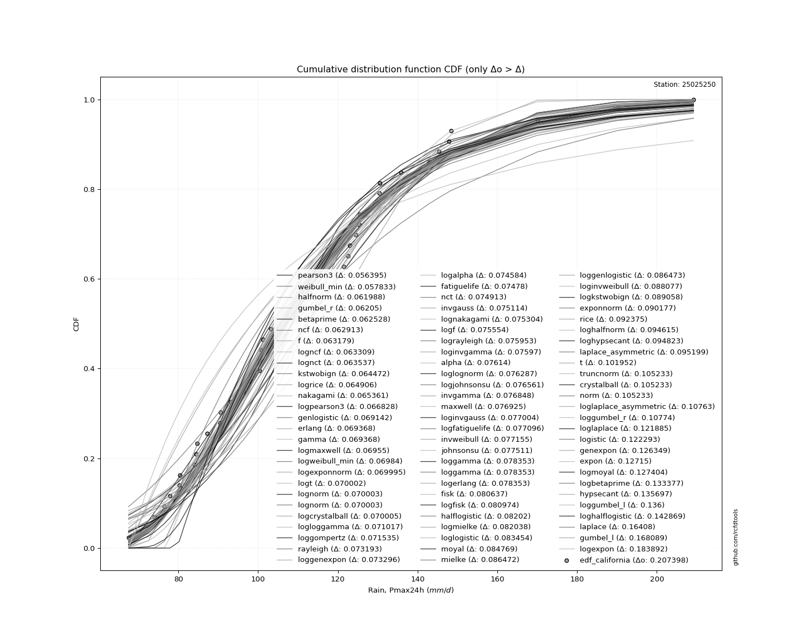</img>

</div>


**1.3. Best fit**

<div align="center">

|   id |   station | empirical_dist   | p_dist   |     delta |   deltao | eval   |   fit |   n |   best_fit |   best_fit_sort |
|-----:|----------:|:-----------------|:---------|----------:|---------:|:-------|------:|----:|-----------:|----------------:|
|    0 |  25025250 | edf_california   | pearson3 | 0.0563946 | 0.207398 | Δo > Δ |     1 |  43 |          1 |               1 |

</div>


<div align="center">

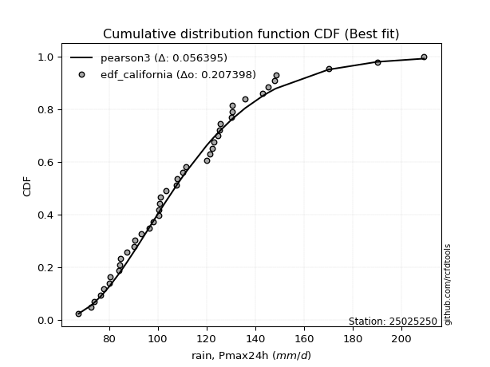</img>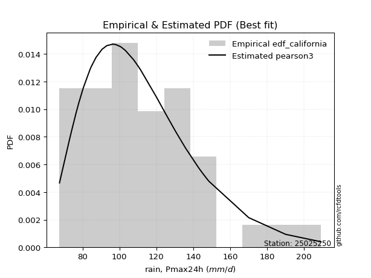</img>

</div>


### 2. EDF Hazen (1930)

Hazen method for plotting positions is a formula used to estimate the empirical cumulative probability distribution of flood events or other hydrological data. This formula often results in biased estimations, particularly when extrapolating to extreme events (high return periods).

<div align="center">


$P=(m-0.5)/n$


</div>


**2.1. Empirical values**

<div align="center">

|                | 0                    | 1                   | 2                   | 3                   | 4                   | 5                   | 6                  | 7                  | 8                   | 9                   | 10                 | 11                  | 12                  | 13                | 14                 | 15                  | 16                  | 17                 | 18                  | 19                  | 20                  | 21         | 22                 | 23                 | 24                 | 25                 | 26                 | 27                 | 28                 | 29                | 30                 | 31                 | 32                 | 33                 | 34                 | 35                 | 36                 | 37                 | 38                 | 39                 | 40                 | 41                 | 42                 |
|:---------------|:---------------------|:--------------------|:--------------------|:--------------------|:--------------------|:--------------------|:-------------------|:-------------------|:--------------------|:--------------------|:-------------------|:--------------------|:--------------------|:------------------|:-------------------|:--------------------|:--------------------|:-------------------|:--------------------|:--------------------|:--------------------|:-----------|:-------------------|:-------------------|:-------------------|:-------------------|:-------------------|:-------------------|:-------------------|:------------------|:-------------------|:-------------------|:-------------------|:-------------------|:-------------------|:-------------------|:-------------------|:-------------------|:-------------------|:-------------------|:-------------------|:-------------------|:-------------------|
| date           | 2001                 | 1986                | 2006                | 1976                | 1977                | 1982                | 1997               | 2015               | 1989                | 1974                | 2013               | 2012                | 1990                | 1994              | 2007               | 1992                | 1988                | 1998               | 1980                | 1985                | 1973                | 2011       | 1999               | 1996               | 1984               | 2009               | 2008               | 2003               | 1978               | 2005              | 1987               | 1991               | 2002               | 2000               | 2004               | 2010               | 1981               | 1983               | 1979               | 1975               | 2014               | 1995               | 1993               |
| x              | 67.5                 | 72.5                | 74.0                | 76.5                | 77.9                | 80.2                | 80.4               | 84.0               | 84.4                | 84.7                | 87.23611343        | 90.41938696         | 90.6                | 93.1              | 96.37801329        | 98.1                | 100.3               | 100.3              | 100.8               | 101.1449581         | 103.2               | 107.532524 | 108.0              | 110.2              | 111.6              | 120.0              | 121.5              | 122.5              | 123.0              | 124.5             | 125.4              | 125.5              | 130.2              | 130.4              | 130.5              | 135.8              | 143.0              | 145.3              | 147.8              | 148.4              | 170.0              | 190.0              | 209.2              |
| m              | 1                    | 2                   | 3                   | 4                   | 5                   | 6                   | 7                  | 8                  | 9                   | 10                  | 11                 | 12                  | 13                  | 14                | 15                 | 16                  | 17                  | 18                 | 19                  | 20                  | 21                  | 22         | 23                 | 24                 | 25                 | 26                 | 27                 | 28                 | 29                 | 30                | 31                 | 32                 | 33                 | 34                 | 35                 | 36                 | 37                 | 38                 | 39                 | 40                 | 41                 | 42                 | 43                 |
| empirical_dist | edf_hazen            | edf_hazen           | edf_hazen           | edf_hazen           | edf_hazen           | edf_hazen           | edf_hazen          | edf_hazen          | edf_hazen           | edf_hazen           | edf_hazen          | edf_hazen           | edf_hazen           | edf_hazen         | edf_hazen          | edf_hazen           | edf_hazen           | edf_hazen          | edf_hazen           | edf_hazen           | edf_hazen           | edf_hazen  | edf_hazen          | edf_hazen          | edf_hazen          | edf_hazen          | edf_hazen          | edf_hazen          | edf_hazen          | edf_hazen         | edf_hazen          | edf_hazen          | edf_hazen          | edf_hazen          | edf_hazen          | edf_hazen          | edf_hazen          | edf_hazen          | edf_hazen          | edf_hazen          | edf_hazen          | edf_hazen          | edf_hazen          |
| empirical      | 0.011627906976744186 | 0.03488372093023256 | 0.05813953488372093 | 0.08139534883720931 | 0.10465116279069768 | 0.12790697674418605 | 0.1511627906976744 | 0.1744186046511628 | 0.19767441860465115 | 0.22093023255813954 | 0.2441860465116279 | 0.26744186046511625 | 0.29069767441860467 | 0.313953488372093 | 0.3372093023255814 | 0.36046511627906974 | 0.38372093023255816 | 0.4069767441860465 | 0.43023255813953487 | 0.45348837209302323 | 0.47674418604651164 | 0.5        | 0.5232558139534884 | 0.5465116279069767 | 0.5697674418604651 | 0.5930232558139535 | 0.6162790697674418 | 0.6395348837209303 | 0.6627906976744186 | 0.686046511627907 | 0.7093023255813954 | 0.7325581395348837 | 0.7558139534883721 | 0.7790697674418605 | 0.8023255813953488 | 0.8255813953488372 | 0.8488372093023255 | 0.872093023255814  | 0.8953488372093024 | 0.9186046511627907 | 0.9418604651162791 | 0.9651162790697675 | 0.9883720930232558 |
| empirical_tr   | 1.011764705882353    | 1.036144578313253   | 1.0617283950617284  | 1.0886075949367089  | 1.1168831168831168  | 1.1466666666666667  | 1.178082191780822  | 1.2112676056338028 | 1.2463768115942029  | 1.2835820895522387  | 1.323076923076923  | 1.3650793650793651  | 1.4098360655737707  | 1.457627118644068 | 1.5087719298245612 | 1.5636363636363635  | 1.6226415094339623  | 1.6862745098039218 | 1.7551020408163265  | 1.829787234042553   | 1.911111111111111   | 2.0        | 2.097560975609756  | 2.205128205128205  | 2.3243243243243246 | 2.4571428571428573 | 2.606060606060606  | 2.774193548387097  | 2.96551724137931   | 3.185185185185185 | 3.4400000000000004 | 3.7391304347826084 | 4.095238095238096  | 4.526315789473685  | 5.0588235294117645 | 5.733333333333334  | 6.615384615384613  | 7.8181818181818175 | 9.555555555555559  | 12.285714285714281 | 17.200000000000003 | 28.666666666666707 | 85.99999999999984  |

</div>


**2.2. Kolmogorov-Smirnov fit test (sorted by Δ)**


<div align="center">

|                | 0                   | 1                    | 2                   | 3                   | 4                   | 5                   | 6                    | 7                   | 8                   | 9                   | 10                  | 11                  | 12                  | 13                  | 14                  | 15                  | 16                  | 17                  | 18                  | 19                  | 20                  | 21                  | 22                  | 23                  | 24                  | 25                  | 26                  | 27                  | 28                  | 29                  | 30                  | 31                  | 32                  | 33                  | 34                  | 35                  | 36                  | 37                  | 38                  | 39                  | 40                  | 41                  | 42                  | 43                  | 44                  | 45                  | 46                  | 47                  | 48                  | 49                  | 50                  | 51                  | 52                  | 53                  | 54                  | 55                  | 56                  | 57                  | 58                  | 59                  | 60                  | 61                  | 62                  | 63                  | 64                  | 65                  | 66                  | 67                    | 68                  | 69                  | 70                  | 71                  | 72                  | 73                  | 74                  | 75                  | 76                  | 77                  | 78                  | 79                  | 80                  | 81                  | 82                  | 83                  | 84                  | 85                  | 86                  | 87                  |
|:---------------|:--------------------|:---------------------|:--------------------|:--------------------|:--------------------|:--------------------|:---------------------|:--------------------|:--------------------|:--------------------|:--------------------|:--------------------|:--------------------|:--------------------|:--------------------|:--------------------|:--------------------|:--------------------|:--------------------|:--------------------|:--------------------|:--------------------|:--------------------|:--------------------|:--------------------|:--------------------|:--------------------|:--------------------|:--------------------|:--------------------|:--------------------|:--------------------|:--------------------|:--------------------|:--------------------|:--------------------|:--------------------|:--------------------|:--------------------|:--------------------|:--------------------|:--------------------|:--------------------|:--------------------|:--------------------|:--------------------|:--------------------|:--------------------|:--------------------|:--------------------|:--------------------|:--------------------|:--------------------|:--------------------|:--------------------|:--------------------|:--------------------|:--------------------|:--------------------|:--------------------|:--------------------|:--------------------|:--------------------|:--------------------|:--------------------|:--------------------|:--------------------|:----------------------|:--------------------|:--------------------|:--------------------|:--------------------|:--------------------|:--------------------|:--------------------|:--------------------|:--------------------|:--------------------|:--------------------|:--------------------|:--------------------|:--------------------|:--------------------|:--------------------|:--------------------|:--------------------|:--------------------|:--------------------|
| station        | 25025250            | 25025250             | 25025250            | 25025250            | 25025250            | 25025250            | 25025250             | 25025250            | 25025250            | 25025250            | 25025250            | 25025250            | 25025250            | 25025250            | 25025250            | 25025250            | 25025250            | 25025250            | 25025250            | 25025250            | 25025250            | 25025250            | 25025250            | 25025250            | 25025250            | 25025250            | 25025250            | 25025250            | 25025250            | 25025250            | 25025250            | 25025250            | 25025250            | 25025250            | 25025250            | 25025250            | 25025250            | 25025250            | 25025250            | 25025250            | 25025250            | 25025250            | 25025250            | 25025250            | 25025250            | 25025250            | 25025250            | 25025250            | 25025250            | 25025250            | 25025250            | 25025250            | 25025250            | 25025250            | 25025250            | 25025250            | 25025250            | 25025250            | 25025250            | 25025250            | 25025250            | 25025250            | 25025250            | 25025250            | 25025250            | 25025250            | 25025250            | 25025250              | 25025250            | 25025250            | 25025250            | 25025250            | 25025250            | 25025250            | 25025250            | 25025250            | 25025250            | 25025250            | 25025250            | 25025250            | 25025250            | 25025250            | 25025250            | 25025250            | 25025250            | 25025250            | 25025250            | 25025250            |
| empirical_dist | edf_hazen           | edf_hazen            | edf_hazen           | edf_hazen           | edf_hazen           | edf_hazen           | edf_hazen            | edf_hazen           | edf_hazen           | edf_hazen           | edf_hazen           | edf_hazen           | edf_hazen           | edf_hazen           | edf_hazen           | edf_hazen           | edf_hazen           | edf_hazen           | edf_hazen           | edf_hazen           | edf_hazen           | edf_hazen           | edf_hazen           | edf_hazen           | edf_hazen           | edf_hazen           | edf_hazen           | edf_hazen           | edf_hazen           | edf_hazen           | edf_hazen           | edf_hazen           | edf_hazen           | edf_hazen           | edf_hazen           | edf_hazen           | edf_hazen           | edf_hazen           | edf_hazen           | edf_hazen           | edf_hazen           | edf_hazen           | edf_hazen           | edf_hazen           | edf_hazen           | edf_hazen           | edf_hazen           | edf_hazen           | edf_hazen           | edf_hazen           | edf_hazen           | edf_hazen           | edf_hazen           | edf_hazen           | edf_hazen           | edf_hazen           | edf_hazen           | edf_hazen           | edf_hazen           | edf_hazen           | edf_hazen           | edf_hazen           | edf_hazen           | edf_hazen           | edf_hazen           | edf_hazen           | edf_hazen           | edf_hazen             | edf_hazen           | edf_hazen           | edf_hazen           | edf_hazen           | edf_hazen           | edf_hazen           | edf_hazen           | edf_hazen           | edf_hazen           | edf_hazen           | edf_hazen           | edf_hazen           | edf_hazen           | edf_hazen           | edf_hazen           | edf_hazen           | edf_hazen           | edf_hazen           | edf_hazen           | edf_hazen           |
| p_dist         | nakagami            | logloggamma          | logcrystalball      | logt                | lognorm             | lognorm             | loggompertz          | rayleigh            | kstwobign           | maxwell             | halfnorm            | pearson3            | weibull_min         | ncf                 | logncf              | f                   | betaprime           | gumbel_r            | lognct              | logrice             | loglogistic         | logpearson3         | rice                | genlogistic         | erlang              | gamma               | logmaxwell          | logweibull_min      | logexponnorm        | loggenexpon         | logalpha            | fatiguelife         | nct                 | invgauss            | lognakagami         | logf                | lograyleigh         | loginvgamma         | alpha               | loglognorm          | logjohnsonsu        | invgamma            | loginvgauss         | logfatiguelife      | invweibull          | johnsonsu           | loggamma            | loggamma            | logerlang           | t                   | loghypsecant        | fisk                | logfisk             | truncnorm           | crystalball         | norm                | halflogistic        | logmielke           | moyal               | mielke              | loggenlogistic      | loginvweibull       | logkstwobign        | exponnorm           | loghalfnorm         | laplace_asymmetric  | logistic            | loglaplace_asymmetric | loggumbel_r         | loglaplace          | logbetaprime        | hypsecant           | loggumbel_l         | loghalflogistic     | genexpon            | expon               | logmoyal            | laplace             | gumbel_l            | logexpon            | wald                | logwald             | loggibrat           | gibrat              | logchi2             | logtruncnorm        | chi2                | gompertz            |
| delta          | 0.05815283445856545 | 0.059389056432992304 | 0.05984897157185587 | 0.05984961835011615 | 0.05985126449027067 | 0.05985126449027067 | 0.059906787153047314 | 0.06156518711023151 | 0.06421593607450915 | 0.06529717372881383 | 0.06533904790949774 | 0.06802248539924138 | 0.0694611993760611  | 0.07085266631482645 | 0.07167081241203188 | 0.07240870051052462 | 0.07319943724965006 | 0.07367763569292274 | 0.07516531834302365 | 0.07653404842102707 | 0.07803856282647648 | 0.07845561714534433 | 0.08074690434871473 | 0.08077040200066254 | 0.08099596927841046 | 0.08099600363293213 | 0.08117839516259495 | 0.08146768141048844 | 0.08162273271854126 | 0.08492383370691281 | 0.08621229270873543 | 0.08640827448770716 | 0.086540880409119   | 0.08674143453014382 | 0.08693224311096592 | 0.08718148469674192 | 0.08758090266056862 | 0.08759745322142642 | 0.08776786377111911 | 0.08791451806279504 | 0.0881888328680821  | 0.08847595310456524 | 0.08863145747379009 | 0.08872378118217539 | 0.08878315263148262 | 0.08913925064834383 | 0.08998128991670173 | 0.08998128991670173 | 0.08998138215872709 | 0.09032379748973957 | 0.09210636433862884 | 0.09226513617915544 | 0.0926018835799366  | 0.09360516448910278 | 0.09360517898173382 | 0.0936051819417903  | 0.09364775846639817 | 0.09366590785737594 | 0.09639706795955805 | 0.09809963061322269 | 0.0981011096276253  | 0.09970524442449613 | 0.10068568393108135 | 0.10180491326731123 | 0.10624299245636537 | 0.10682661409692451 | 0.11066527556458705 | 0.1192581998407386    | 0.11936777821340383 | 0.12020374384709276 | 0.12174921156499685 | 0.12406922041708818 | 0.12437207277047324 | 0.13431259689093944 | 0.13797655113482288 | 0.13877759912818316 | 0.1390323226420508  | 0.15245256133550206 | 0.1564613872357289  | 0.19551973490133143 | 0.21516019405450318 | 0.22091104516957344 | 0.2588700208389887  | 0.2689372571933989  | 0.301606363706463   | 0.30231958555374444 | 0.9234517025784337  | 0.9386893166225572  |
| deltao         | 0.20739805565234237 | 0.20739805565234237  | 0.20739805565234237 | 0.20739805565234237 | 0.20739805565234237 | 0.20739805565234237 | 0.20739805565234237  | 0.20739805565234237 | 0.20739805565234237 | 0.20739805565234237 | 0.20739805565234237 | 0.20739805565234237 | 0.20739805565234237 | 0.20739805565234237 | 0.20739805565234237 | 0.20739805565234237 | 0.20739805565234237 | 0.20739805565234237 | 0.20739805565234237 | 0.20739805565234237 | 0.20739805565234237 | 0.20739805565234237 | 0.20739805565234237 | 0.20739805565234237 | 0.20739805565234237 | 0.20739805565234237 | 0.20739805565234237 | 0.20739805565234237 | 0.20739805565234237 | 0.20739805565234237 | 0.20739805565234237 | 0.20739805565234237 | 0.20739805565234237 | 0.20739805565234237 | 0.20739805565234237 | 0.20739805565234237 | 0.20739805565234237 | 0.20739805565234237 | 0.20739805565234237 | 0.20739805565234237 | 0.20739805565234237 | 0.20739805565234237 | 0.20739805565234237 | 0.20739805565234237 | 0.20739805565234237 | 0.20739805565234237 | 0.20739805565234237 | 0.20739805565234237 | 0.20739805565234237 | 0.20739805565234237 | 0.20739805565234237 | 0.20739805565234237 | 0.20739805565234237 | 0.20739805565234237 | 0.20739805565234237 | 0.20739805565234237 | 0.20739805565234237 | 0.20739805565234237 | 0.20739805565234237 | 0.20739805565234237 | 0.20739805565234237 | 0.20739805565234237 | 0.20739805565234237 | 0.20739805565234237 | 0.20739805565234237 | 0.20739805565234237 | 0.20739805565234237 | 0.20739805565234237   | 0.20739805565234237 | 0.20739805565234237 | 0.20739805565234237 | 0.20739805565234237 | 0.20739805565234237 | 0.20739805565234237 | 0.20739805565234237 | 0.20739805565234237 | 0.20739805565234237 | 0.20739805565234237 | 0.20739805565234237 | 0.20739805565234237 | 0.20739805565234237 | 0.20739805565234237 | 0.20739805565234237 | 0.20739805565234237 | 0.20739805565234237 | 0.20739805565234237 | 0.20739805565234237 | 0.20739805565234237 |
| eval           | Δo > Δ              | Δo > Δ               | Δo > Δ              | Δo > Δ              | Δo > Δ              | Δo > Δ              | Δo > Δ               | Δo > Δ              | Δo > Δ              | Δo > Δ              | Δo > Δ              | Δo > Δ              | Δo > Δ              | Δo > Δ              | Δo > Δ              | Δo > Δ              | Δo > Δ              | Δo > Δ              | Δo > Δ              | Δo > Δ              | Δo > Δ              | Δo > Δ              | Δo > Δ              | Δo > Δ              | Δo > Δ              | Δo > Δ              | Δo > Δ              | Δo > Δ              | Δo > Δ              | Δo > Δ              | Δo > Δ              | Δo > Δ              | Δo > Δ              | Δo > Δ              | Δo > Δ              | Δo > Δ              | Δo > Δ              | Δo > Δ              | Δo > Δ              | Δo > Δ              | Δo > Δ              | Δo > Δ              | Δo > Δ              | Δo > Δ              | Δo > Δ              | Δo > Δ              | Δo > Δ              | Δo > Δ              | Δo > Δ              | Δo > Δ              | Δo > Δ              | Δo > Δ              | Δo > Δ              | Δo > Δ              | Δo > Δ              | Δo > Δ              | Δo > Δ              | Δo > Δ              | Δo > Δ              | Δo > Δ              | Δo > Δ              | Δo > Δ              | Δo > Δ              | Δo > Δ              | Δo > Δ              | Δo > Δ              | Δo > Δ              | Δo > Δ                | Δo > Δ              | Δo > Δ              | Δo > Δ              | Δo > Δ              | Δo > Δ              | Δo > Δ              | Δo > Δ              | Δo > Δ              | Δo > Δ              | Δo > Δ              | Δo > Δ              | Δo > Δ              | Δo <= Δ             | Δo <= Δ             | Δo <= Δ             | Δo <= Δ             | Δo <= Δ             | Δo <= Δ             | Δo <= Δ             | Δo <= Δ             |
| fit            | 1                   | 1                    | 1                   | 1                   | 1                   | 1                   | 1                    | 1                   | 1                   | 1                   | 1                   | 1                   | 1                   | 1                   | 1                   | 1                   | 1                   | 1                   | 1                   | 1                   | 1                   | 1                   | 1                   | 1                   | 1                   | 1                   | 1                   | 1                   | 1                   | 1                   | 1                   | 1                   | 1                   | 1                   | 1                   | 1                   | 1                   | 1                   | 1                   | 1                   | 1                   | 1                   | 1                   | 1                   | 1                   | 1                   | 1                   | 1                   | 1                   | 1                   | 1                   | 1                   | 1                   | 1                   | 1                   | 1                   | 1                   | 1                   | 1                   | 1                   | 1                   | 1                   | 1                   | 1                   | 1                   | 1                   | 1                   | 1                     | 1                   | 1                   | 1                   | 1                   | 1                   | 1                   | 1                   | 1                   | 1                   | 1                   | 1                   | 1                   | 0                   | 0                   | 0                   | 0                   | 0                   | 0                   | 0                   | 0                   |
| n              | 43                  | 43                   | 43                  | 43                  | 43                  | 43                  | 43                   | 43                  | 43                  | 43                  | 43                  | 43                  | 43                  | 43                  | 43                  | 43                  | 43                  | 43                  | 43                  | 43                  | 43                  | 43                  | 43                  | 43                  | 43                  | 43                  | 43                  | 43                  | 43                  | 43                  | 43                  | 43                  | 43                  | 43                  | 43                  | 43                  | 43                  | 43                  | 43                  | 43                  | 43                  | 43                  | 43                  | 43                  | 43                  | 43                  | 43                  | 43                  | 43                  | 43                  | 43                  | 43                  | 43                  | 43                  | 43                  | 43                  | 43                  | 43                  | 43                  | 43                  | 43                  | 43                  | 43                  | 43                  | 43                  | 43                  | 43                  | 43                    | 43                  | 43                  | 43                  | 43                  | 43                  | 43                  | 43                  | 43                  | 43                  | 43                  | 43                  | 43                  | 43                  | 43                  | 43                  | 43                  | 43                  | 43                  | 43                  | 43                  |
| best_fit       | 1                   | 0                    | 0                   | 0                   | 0                   | 0                   | 0                    | 0                   | 0                   | 0                   | 0                   | 0                   | 0                   | 0                   | 0                   | 0                   | 0                   | 0                   | 0                   | 0                   | 0                   | 0                   | 0                   | 0                   | 0                   | 0                   | 0                   | 0                   | 0                   | 0                   | 0                   | 0                   | 0                   | 0                   | 0                   | 0                   | 0                   | 0                   | 0                   | 0                   | 0                   | 0                   | 0                   | 0                   | 0                   | 0                   | 0                   | 0                   | 0                   | 0                   | 0                   | 0                   | 0                   | 0                   | 0                   | 0                   | 0                   | 0                   | 0                   | 0                   | 0                   | 0                   | 0                   | 0                   | 0                   | 0                   | 0                   | 0                     | 0                   | 0                   | 0                   | 0                   | 0                   | 0                   | 0                   | 0                   | 0                   | 0                   | 0                   | 0                   | 0                   | 0                   | 0                   | 0                   | 0                   | 0                   | 0                   | 0                   |
| best_fit_sort  | 1                   | 2                    | 3                   | 4                   | 5                   | 6                   | 7                    | 8                   | 9                   | 10                  | 11                  | 12                  | 13                  | 14                  | 15                  | 16                  | 17                  | 18                  | 19                  | 20                  | 21                  | 22                  | 23                  | 24                  | 25                  | 26                  | 27                  | 28                  | 29                  | 30                  | 31                  | 32                  | 33                  | 34                  | 35                  | 36                  | 37                  | 38                  | 39                  | 40                  | 41                  | 42                  | 43                  | 44                  | 45                  | 46                  | 47                  | 48                  | 49                  | 50                  | 51                  | 52                  | 53                  | 54                  | 55                  | 56                  | 57                  | 58                  | 59                  | 60                  | 61                  | 62                  | 63                  | 64                  | 65                  | 66                  | 67                  | 68                    | 69                  | 70                  | 71                  | 72                  | 73                  | 74                  | 75                  | 76                  | 77                  | 78                  | 79                  | 80                  | 81                  | 82                  | 83                  | 84                  | 85                  | 86                  | 87                  | 88                  |

</div>


<div align="center">

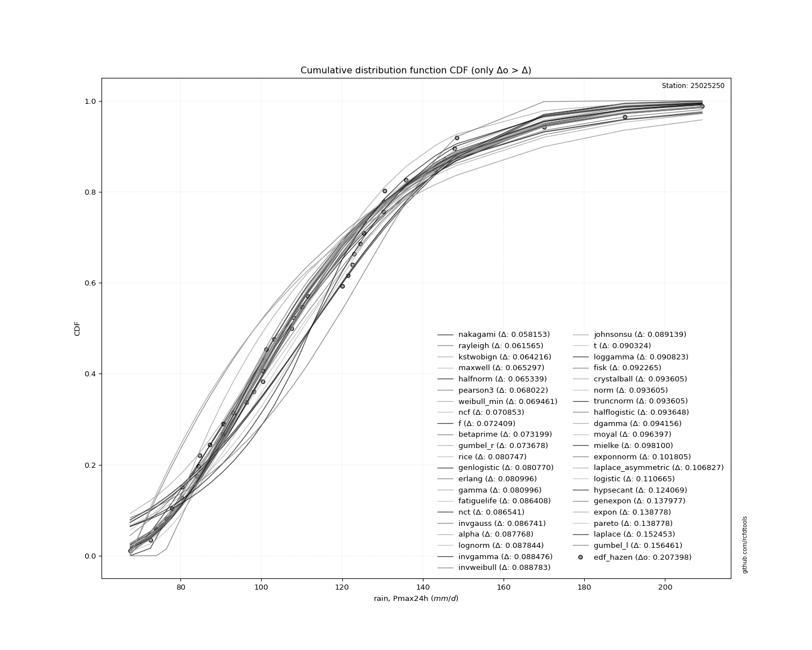</img>

</div>


**2.3. Best fit**

<div align="center">

|   id |   station | empirical_dist   | p_dist   |     delta |   deltao | eval   |   fit |   n |   best_fit |   best_fit_sort |
|-----:|----------:|:-----------------|:---------|----------:|---------:|:-------|------:|----:|-----------:|----------------:|
|    0 |  25025250 | edf_hazen        | nakagami | 0.0581528 | 0.207398 | Δo > Δ |     1 |  43 |          1 |               1 |

</div>


<div align="center">

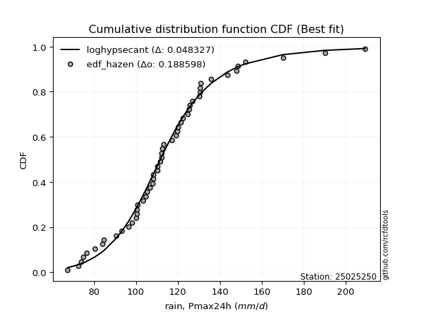</img>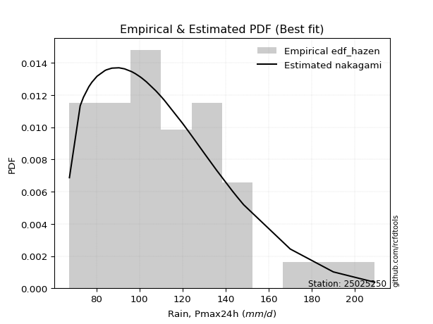</img>

</div>


### 3. EDF Weibull (1939)

Weibull plotting position formula is an empirical method used to estimate the non-exceedance probability or plotting position for a set of observed data, is often recommended or widely used in practice, particularly in flood frequency analysis.

<div align="center">


$P=m/(n+1)$


</div>


**3.1. Empirical values**

<div align="center">

|                | 0                    | 1                    | 2                   | 3                   | 4                   | 5                   | 6                  | 7                   | 8                   | 9                   | 10                 | 11                 | 12                  | 13                 | 14                 | 15                  | 16                  | 17                 | 18                 | 19                  | 20                 | 21          | 22                 | 23                 | 24                 | 25                 | 26                 | 27                 | 28                 | 29                 | 30                 | 31                 | 32          | 33                 | 34                 | 35                 | 36                 | 37                 | 38                 | 39                 | 40                 | 41                 | 42                 |
|:---------------|:---------------------|:---------------------|:--------------------|:--------------------|:--------------------|:--------------------|:-------------------|:--------------------|:--------------------|:--------------------|:-------------------|:-------------------|:--------------------|:-------------------|:-------------------|:--------------------|:--------------------|:-------------------|:-------------------|:--------------------|:-------------------|:------------|:-------------------|:-------------------|:-------------------|:-------------------|:-------------------|:-------------------|:-------------------|:-------------------|:-------------------|:-------------------|:------------|:-------------------|:-------------------|:-------------------|:-------------------|:-------------------|:-------------------|:-------------------|:-------------------|:-------------------|:-------------------|
| date           | 2001                 | 1986                 | 2006                | 1976                | 1977                | 1982                | 1997               | 2015                | 1989                | 1974                | 2013               | 2012               | 1990                | 1994               | 2007               | 1992                | 1988                | 1998               | 1980               | 1985                | 1973               | 2011        | 1999               | 1996               | 1984               | 2009               | 2008               | 2003               | 1978               | 2005               | 1987               | 1991               | 2002        | 2000               | 2004               | 2010               | 1981               | 1983               | 1979               | 1975               | 2014               | 1995               | 1993               |
| x              | 67.5                 | 72.5                 | 74.0                | 76.5                | 77.9                | 80.2                | 80.4               | 84.0                | 84.4                | 84.7                | 87.23611343        | 90.41938696        | 90.6                | 93.1               | 96.37801329        | 98.1                | 100.3               | 100.3              | 100.8              | 101.1449581         | 103.2              | 107.532524  | 108.0              | 110.2              | 111.6              | 120.0              | 121.5              | 122.5              | 123.0              | 124.5              | 125.4              | 125.5              | 130.2       | 130.4              | 130.5              | 135.8              | 143.0              | 145.3              | 147.8              | 148.4              | 170.0              | 190.0              | 209.2              |
| m              | 1                    | 2                    | 3                   | 4                   | 5                   | 6                   | 7                  | 8                   | 9                   | 10                  | 11                 | 12                 | 13                  | 14                 | 15                 | 16                  | 17                  | 18                 | 19                 | 20                  | 21                 | 22          | 23                 | 24                 | 25                 | 26                 | 27                 | 28                 | 29                 | 30                 | 31                 | 32                 | 33          | 34                 | 35                 | 36                 | 37                 | 38                 | 39                 | 40                 | 41                 | 42                 | 43                 |
| empirical_dist | edf_weibull          | edf_weibull          | edf_weibull         | edf_weibull         | edf_weibull         | edf_weibull         | edf_weibull        | edf_weibull         | edf_weibull         | edf_weibull         | edf_weibull        | edf_weibull        | edf_weibull         | edf_weibull        | edf_weibull        | edf_weibull         | edf_weibull         | edf_weibull        | edf_weibull        | edf_weibull         | edf_weibull        | edf_weibull | edf_weibull        | edf_weibull        | edf_weibull        | edf_weibull        | edf_weibull        | edf_weibull        | edf_weibull        | edf_weibull        | edf_weibull        | edf_weibull        | edf_weibull | edf_weibull        | edf_weibull        | edf_weibull        | edf_weibull        | edf_weibull        | edf_weibull        | edf_weibull        | edf_weibull        | edf_weibull        | edf_weibull        |
| empirical      | 0.022727272727272728 | 0.045454545454545456 | 0.06818181818181818 | 0.09090909090909091 | 0.11363636363636363 | 0.13636363636363635 | 0.1590909090909091 | 0.18181818181818182 | 0.20454545454545456 | 0.22727272727272727 | 0.25               | 0.2727272727272727 | 0.29545454545454547 | 0.3181818181818182 | 0.3409090909090909 | 0.36363636363636365 | 0.38636363636363635 | 0.4090909090909091 | 0.4318181818181818 | 0.45454545454545453 | 0.4772727272727273 | 0.5         | 0.5227272727272727 | 0.5454545454545454 | 0.5681818181818182 | 0.5909090909090909 | 0.6136363636363636 | 0.6363636363636364 | 0.6590909090909091 | 0.6818181818181818 | 0.7045454545454546 | 0.7272727272727273 | 0.75        | 0.7727272727272727 | 0.7954545454545454 | 0.8181818181818182 | 0.8409090909090909 | 0.8636363636363636 | 0.8863636363636364 | 0.9090909090909091 | 0.9318181818181818 | 0.9545454545454546 | 0.9772727272727273 |
| empirical_tr   | 1.0232558139534884   | 1.0476190476190477   | 1.073170731707317   | 1.1                 | 1.1282051282051282  | 1.1578947368421053  | 1.1891891891891893 | 1.2222222222222223  | 1.2571428571428571  | 1.2941176470588236  | 1.3333333333333333 | 1.375              | 1.4193548387096773  | 1.4666666666666666 | 1.5172413793103448 | 1.5714285714285714  | 1.6296296296296295  | 1.6923076923076925 | 1.7600000000000002 | 1.8333333333333335  | 1.9130434782608696 | 2.0         | 2.0952380952380953 | 2.1999999999999997 | 2.3157894736842106 | 2.4444444444444446 | 2.588235294117647  | 2.75               | 2.933333333333333  | 3.1428571428571423 | 3.384615384615385  | 3.666666666666667  | 4.0         | 4.3999999999999995 | 4.8888888888888875 | 5.500000000000002  | 6.2857142857142865 | 7.333333333333334  | 8.799999999999999  | 10.999999999999996 | 14.666666666666655 | 22.00000000000002  | 44.00000000000004  |

</div>


**3.2. Kolmogorov-Smirnov fit test (sorted by Δ)**


<div align="center">

|                | 0                    | 1                   | 2                   | 3                    | 4                   | 5                    | 6                    | 7                    | 8                   | 9                   | 10                  | 11                  | 12                  | 13                  | 14                  | 15                  | 16                  | 17                  | 18                  | 19                  | 20                  | 21                  | 22                  | 23                  | 24                  | 25                  | 26                  | 27                  | 28                  | 29                  | 30                  | 31                  | 32                  | 33                  | 34                  | 35                  | 36                  | 37                  | 38                  | 39                  | 40                  | 41                  | 42                  | 43                  | 44                  | 45                  | 46                  | 47                  | 48                  | 49                  | 50                  | 51                  | 52                  | 53                  | 54                  | 55                  | 56                  | 57                  | 58                  | 59                  | 60                  | 61                  | 62                  | 63                  | 64                  | 65                  | 66                  | 67                  | 68                    | 69                  | 70                  | 71                  | 72                  | 73                  | 74                  | 75                  | 76                  | 77                  | 78                  | 79                  | 80                  | 81                  | 82                  | 83                  | 84                  | 85                  | 86                  | 87                  |
|:---------------|:---------------------|:--------------------|:--------------------|:---------------------|:--------------------|:---------------------|:---------------------|:---------------------|:--------------------|:--------------------|:--------------------|:--------------------|:--------------------|:--------------------|:--------------------|:--------------------|:--------------------|:--------------------|:--------------------|:--------------------|:--------------------|:--------------------|:--------------------|:--------------------|:--------------------|:--------------------|:--------------------|:--------------------|:--------------------|:--------------------|:--------------------|:--------------------|:--------------------|:--------------------|:--------------------|:--------------------|:--------------------|:--------------------|:--------------------|:--------------------|:--------------------|:--------------------|:--------------------|:--------------------|:--------------------|:--------------------|:--------------------|:--------------------|:--------------------|:--------------------|:--------------------|:--------------------|:--------------------|:--------------------|:--------------------|:--------------------|:--------------------|:--------------------|:--------------------|:--------------------|:--------------------|:--------------------|:--------------------|:--------------------|:--------------------|:--------------------|:--------------------|:--------------------|:----------------------|:--------------------|:--------------------|:--------------------|:--------------------|:--------------------|:--------------------|:--------------------|:--------------------|:--------------------|:--------------------|:--------------------|:--------------------|:--------------------|:--------------------|:--------------------|:--------------------|:--------------------|:--------------------|:--------------------|
| station        | 25025250             | 25025250            | 25025250            | 25025250             | 25025250            | 25025250             | 25025250             | 25025250             | 25025250            | 25025250            | 25025250            | 25025250            | 25025250            | 25025250            | 25025250            | 25025250            | 25025250            | 25025250            | 25025250            | 25025250            | 25025250            | 25025250            | 25025250            | 25025250            | 25025250            | 25025250            | 25025250            | 25025250            | 25025250            | 25025250            | 25025250            | 25025250            | 25025250            | 25025250            | 25025250            | 25025250            | 25025250            | 25025250            | 25025250            | 25025250            | 25025250            | 25025250            | 25025250            | 25025250            | 25025250            | 25025250            | 25025250            | 25025250            | 25025250            | 25025250            | 25025250            | 25025250            | 25025250            | 25025250            | 25025250            | 25025250            | 25025250            | 25025250            | 25025250            | 25025250            | 25025250            | 25025250            | 25025250            | 25025250            | 25025250            | 25025250            | 25025250            | 25025250            | 25025250              | 25025250            | 25025250            | 25025250            | 25025250            | 25025250            | 25025250            | 25025250            | 25025250            | 25025250            | 25025250            | 25025250            | 25025250            | 25025250            | 25025250            | 25025250            | 25025250            | 25025250            | 25025250            | 25025250            |
| empirical_dist | edf_weibull          | edf_weibull         | edf_weibull         | edf_weibull          | edf_weibull         | edf_weibull          | edf_weibull          | edf_weibull          | edf_weibull         | edf_weibull         | edf_weibull         | edf_weibull         | edf_weibull         | edf_weibull         | edf_weibull         | edf_weibull         | edf_weibull         | edf_weibull         | edf_weibull         | edf_weibull         | edf_weibull         | edf_weibull         | edf_weibull         | edf_weibull         | edf_weibull         | edf_weibull         | edf_weibull         | edf_weibull         | edf_weibull         | edf_weibull         | edf_weibull         | edf_weibull         | edf_weibull         | edf_weibull         | edf_weibull         | edf_weibull         | edf_weibull         | edf_weibull         | edf_weibull         | edf_weibull         | edf_weibull         | edf_weibull         | edf_weibull         | edf_weibull         | edf_weibull         | edf_weibull         | edf_weibull         | edf_weibull         | edf_weibull         | edf_weibull         | edf_weibull         | edf_weibull         | edf_weibull         | edf_weibull         | edf_weibull         | edf_weibull         | edf_weibull         | edf_weibull         | edf_weibull         | edf_weibull         | edf_weibull         | edf_weibull         | edf_weibull         | edf_weibull         | edf_weibull         | edf_weibull         | edf_weibull         | edf_weibull         | edf_weibull           | edf_weibull         | edf_weibull         | edf_weibull         | edf_weibull         | edf_weibull         | edf_weibull         | edf_weibull         | edf_weibull         | edf_weibull         | edf_weibull         | edf_weibull         | edf_weibull         | edf_weibull         | edf_weibull         | edf_weibull         | edf_weibull         | edf_weibull         | edf_weibull         | edf_weibull         |
| p_dist         | loggompertz          | rayleigh            | nakagami            | logloggamma          | logcrystalball      | logt                 | lognorm              | lognorm              | maxwell             | kstwobign           | halfnorm            | pearson3            | weibull_min         | ncf                 | logncf              | f                   | betaprime           | gumbel_r            | lognct              | logrice             | loglogistic         | logpearson3         | rice                | genlogistic         | erlang              | gamma               | logmaxwell          | logweibull_min      | logexponnorm        | loggenexpon         | logalpha            | fatiguelife         | nct                 | invgauss            | lognakagami         | logf                | lograyleigh         | loginvgamma         | alpha               | loglognorm          | logjohnsonsu        | invgamma            | loginvgauss         | logfatiguelife      | invweibull          | johnsonsu           | t                   | loggamma            | loggamma            | logerlang           | loghypsecant        | fisk                | truncnorm           | crystalball         | norm                | logfisk             | halflogistic        | logmielke           | moyal               | mielke              | loggenlogistic      | loginvweibull       | logkstwobign        | exponnorm           | laplace_asymmetric  | loghalfnorm         | logistic            | logbetaprime        | loglaplace_asymmetric | loggumbel_r         | loglaplace          | hypsecant           | loggumbel_l         | expon               | genexpon            | loghalflogistic     | logmoyal            | laplace             | gumbel_l            | logexpon            | wald                | logwald             | loggibrat           | gibrat              | logchi2             | logtruncnorm        | chi2                | gompertz            |
| delta          | 0.053922311773307974 | 0.05469415116942811 | 0.06026699936342805 | 0.060483447250336164 | 0.06196313647671847 | 0.061963783254978755 | 0.061965429395133276 | 0.061965429395133276 | 0.06216472777785531 | 0.06633010097937175 | 0.06745321281436034 | 0.07013665030410399 | 0.0715753642809237  | 0.07296683121968905 | 0.07378497731689448 | 0.07452286541538722 | 0.07531360215451266 | 0.07579180059778534 | 0.07727948324788625 | 0.07864821332588967 | 0.08015272773133908 | 0.08056978205020693 | 0.08180398680114603 | 0.08288456690552515 | 0.08311013418327307 | 0.08311016853779474 | 0.08329256006745756 | 0.08358184631535104 | 0.08373689762340386 | 0.08703799861177541 | 0.08832645761359803 | 0.08852243939256976 | 0.0886550453139816  | 0.08885559943500643 | 0.08904640801582853 | 0.08929564960160452 | 0.08969506756543122 | 0.08971161812628903 | 0.08988202867598172 | 0.09002868296765765 | 0.0903029977729447  | 0.09059011800942784 | 0.09074562237865269 | 0.09083794608703799 | 0.09089731753634522 | 0.09125341555320643 | 0.09138087994217087 | 0.09209545482156434 | 0.09209545482156434 | 0.09209554706358969 | 0.09422052924349145 | 0.09437930108401804 | 0.09466224694153408 | 0.09466226143416512 | 0.0946622643942216  | 0.0947160484847992  | 0.09576192337126077 | 0.09578007276223854 | 0.09851123286442065 | 0.10021379551808529 | 0.10021527453248791 | 0.10181940932935873 | 0.10279984883594395 | 0.10391907817217383 | 0.10686746138441927 | 0.10835715736122797 | 0.11172235801701835 | 0.11223546949311525 | 0.1213723647456012    | 0.12148194311826643 | 0.12231790875195536 | 0.12512630286951948 | 0.12542915522290454 | 0.13507781054467366 | 0.13533384500374468 | 0.13916915132927024 | 0.1411464875469134  | 0.15350964378793336 | 0.15698992846194454 | 0.1881201577343124  | 0.2215026887690909  | 0.22725353988416117 | 0.2636268918749295  | 0.2736941282293397  | 0.2920926216345814  | 0.29861979697023494 | 0.9128808780541208  | 0.9286470333244599  |
| deltao         | 0.20739805565234237  | 0.20739805565234237 | 0.20739805565234237 | 0.20739805565234237  | 0.20739805565234237 | 0.20739805565234237  | 0.20739805565234237  | 0.20739805565234237  | 0.20739805565234237 | 0.20739805565234237 | 0.20739805565234237 | 0.20739805565234237 | 0.20739805565234237 | 0.20739805565234237 | 0.20739805565234237 | 0.20739805565234237 | 0.20739805565234237 | 0.20739805565234237 | 0.20739805565234237 | 0.20739805565234237 | 0.20739805565234237 | 0.20739805565234237 | 0.20739805565234237 | 0.20739805565234237 | 0.20739805565234237 | 0.20739805565234237 | 0.20739805565234237 | 0.20739805565234237 | 0.20739805565234237 | 0.20739805565234237 | 0.20739805565234237 | 0.20739805565234237 | 0.20739805565234237 | 0.20739805565234237 | 0.20739805565234237 | 0.20739805565234237 | 0.20739805565234237 | 0.20739805565234237 | 0.20739805565234237 | 0.20739805565234237 | 0.20739805565234237 | 0.20739805565234237 | 0.20739805565234237 | 0.20739805565234237 | 0.20739805565234237 | 0.20739805565234237 | 0.20739805565234237 | 0.20739805565234237 | 0.20739805565234237 | 0.20739805565234237 | 0.20739805565234237 | 0.20739805565234237 | 0.20739805565234237 | 0.20739805565234237 | 0.20739805565234237 | 0.20739805565234237 | 0.20739805565234237 | 0.20739805565234237 | 0.20739805565234237 | 0.20739805565234237 | 0.20739805565234237 | 0.20739805565234237 | 0.20739805565234237 | 0.20739805565234237 | 0.20739805565234237 | 0.20739805565234237 | 0.20739805565234237 | 0.20739805565234237 | 0.20739805565234237   | 0.20739805565234237 | 0.20739805565234237 | 0.20739805565234237 | 0.20739805565234237 | 0.20739805565234237 | 0.20739805565234237 | 0.20739805565234237 | 0.20739805565234237 | 0.20739805565234237 | 0.20739805565234237 | 0.20739805565234237 | 0.20739805565234237 | 0.20739805565234237 | 0.20739805565234237 | 0.20739805565234237 | 0.20739805565234237 | 0.20739805565234237 | 0.20739805565234237 | 0.20739805565234237 |
| eval           | Δo > Δ               | Δo > Δ              | Δo > Δ              | Δo > Δ               | Δo > Δ              | Δo > Δ               | Δo > Δ               | Δo > Δ               | Δo > Δ              | Δo > Δ              | Δo > Δ              | Δo > Δ              | Δo > Δ              | Δo > Δ              | Δo > Δ              | Δo > Δ              | Δo > Δ              | Δo > Δ              | Δo > Δ              | Δo > Δ              | Δo > Δ              | Δo > Δ              | Δo > Δ              | Δo > Δ              | Δo > Δ              | Δo > Δ              | Δo > Δ              | Δo > Δ              | Δo > Δ              | Δo > Δ              | Δo > Δ              | Δo > Δ              | Δo > Δ              | Δo > Δ              | Δo > Δ              | Δo > Δ              | Δo > Δ              | Δo > Δ              | Δo > Δ              | Δo > Δ              | Δo > Δ              | Δo > Δ              | Δo > Δ              | Δo > Δ              | Δo > Δ              | Δo > Δ              | Δo > Δ              | Δo > Δ              | Δo > Δ              | Δo > Δ              | Δo > Δ              | Δo > Δ              | Δo > Δ              | Δo > Δ              | Δo > Δ              | Δo > Δ              | Δo > Δ              | Δo > Δ              | Δo > Δ              | Δo > Δ              | Δo > Δ              | Δo > Δ              | Δo > Δ              | Δo > Δ              | Δo > Δ              | Δo > Δ              | Δo > Δ              | Δo > Δ              | Δo > Δ                | Δo > Δ              | Δo > Δ              | Δo > Δ              | Δo > Δ              | Δo > Δ              | Δo > Δ              | Δo > Δ              | Δo > Δ              | Δo > Δ              | Δo > Δ              | Δo > Δ              | Δo <= Δ             | Δo <= Δ             | Δo <= Δ             | Δo <= Δ             | Δo <= Δ             | Δo <= Δ             | Δo <= Δ             | Δo <= Δ             |
| fit            | 1                    | 1                   | 1                   | 1                    | 1                   | 1                    | 1                    | 1                    | 1                   | 1                   | 1                   | 1                   | 1                   | 1                   | 1                   | 1                   | 1                   | 1                   | 1                   | 1                   | 1                   | 1                   | 1                   | 1                   | 1                   | 1                   | 1                   | 1                   | 1                   | 1                   | 1                   | 1                   | 1                   | 1                   | 1                   | 1                   | 1                   | 1                   | 1                   | 1                   | 1                   | 1                   | 1                   | 1                   | 1                   | 1                   | 1                   | 1                   | 1                   | 1                   | 1                   | 1                   | 1                   | 1                   | 1                   | 1                   | 1                   | 1                   | 1                   | 1                   | 1                   | 1                   | 1                   | 1                   | 1                   | 1                   | 1                   | 1                   | 1                     | 1                   | 1                   | 1                   | 1                   | 1                   | 1                   | 1                   | 1                   | 1                   | 1                   | 1                   | 0                   | 0                   | 0                   | 0                   | 0                   | 0                   | 0                   | 0                   |
| n              | 43                   | 43                  | 43                  | 43                   | 43                  | 43                   | 43                   | 43                   | 43                  | 43                  | 43                  | 43                  | 43                  | 43                  | 43                  | 43                  | 43                  | 43                  | 43                  | 43                  | 43                  | 43                  | 43                  | 43                  | 43                  | 43                  | 43                  | 43                  | 43                  | 43                  | 43                  | 43                  | 43                  | 43                  | 43                  | 43                  | 43                  | 43                  | 43                  | 43                  | 43                  | 43                  | 43                  | 43                  | 43                  | 43                  | 43                  | 43                  | 43                  | 43                  | 43                  | 43                  | 43                  | 43                  | 43                  | 43                  | 43                  | 43                  | 43                  | 43                  | 43                  | 43                  | 43                  | 43                  | 43                  | 43                  | 43                  | 43                  | 43                    | 43                  | 43                  | 43                  | 43                  | 43                  | 43                  | 43                  | 43                  | 43                  | 43                  | 43                  | 43                  | 43                  | 43                  | 43                  | 43                  | 43                  | 43                  | 43                  |
| best_fit       | 1                    | 0                   | 0                   | 0                    | 0                   | 0                    | 0                    | 0                    | 0                   | 0                   | 0                   | 0                   | 0                   | 0                   | 0                   | 0                   | 0                   | 0                   | 0                   | 0                   | 0                   | 0                   | 0                   | 0                   | 0                   | 0                   | 0                   | 0                   | 0                   | 0                   | 0                   | 0                   | 0                   | 0                   | 0                   | 0                   | 0                   | 0                   | 0                   | 0                   | 0                   | 0                   | 0                   | 0                   | 0                   | 0                   | 0                   | 0                   | 0                   | 0                   | 0                   | 0                   | 0                   | 0                   | 0                   | 0                   | 0                   | 0                   | 0                   | 0                   | 0                   | 0                   | 0                   | 0                   | 0                   | 0                   | 0                   | 0                   | 0                     | 0                   | 0                   | 0                   | 0                   | 0                   | 0                   | 0                   | 0                   | 0                   | 0                   | 0                   | 0                   | 0                   | 0                   | 0                   | 0                   | 0                   | 0                   | 0                   |
| best_fit_sort  | 1                    | 2                   | 3                   | 4                    | 5                   | 6                    | 7                    | 8                    | 9                   | 10                  | 11                  | 12                  | 13                  | 14                  | 15                  | 16                  | 17                  | 18                  | 19                  | 20                  | 21                  | 22                  | 23                  | 24                  | 25                  | 26                  | 27                  | 28                  | 29                  | 30                  | 31                  | 32                  | 33                  | 34                  | 35                  | 36                  | 37                  | 38                  | 39                  | 40                  | 41                  | 42                  | 43                  | 44                  | 45                  | 46                  | 47                  | 48                  | 49                  | 50                  | 51                  | 52                  | 53                  | 54                  | 55                  | 56                  | 57                  | 58                  | 59                  | 60                  | 61                  | 62                  | 63                  | 64                  | 65                  | 66                  | 67                  | 68                  | 69                    | 70                  | 71                  | 72                  | 73                  | 74                  | 75                  | 76                  | 77                  | 78                  | 79                  | 80                  | 81                  | 82                  | 83                  | 84                  | 85                  | 86                  | 87                  | 88                  |

</div>


<div align="center">

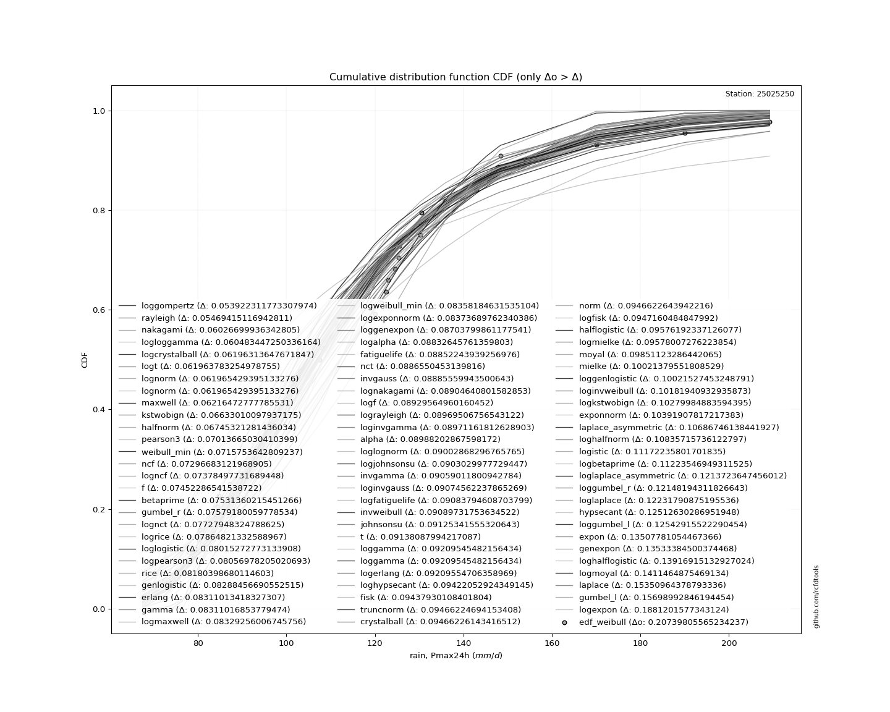</img>

</div>


**3.3. Best fit**

<div align="center">

|   id |   station | empirical_dist   | p_dist      |     delta |   deltao | eval   |   fit |   n |   best_fit |   best_fit_sort |
|-----:|----------:|:-----------------|:------------|----------:|---------:|:-------|------:|----:|-----------:|----------------:|
|    0 |  25025250 | edf_weibull      | loggompertz | 0.0539223 | 0.207398 | Δo > Δ |     1 |  43 |          1 |               1 |

</div>


<div align="center">

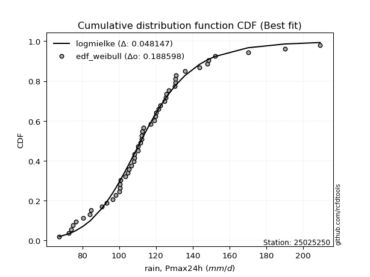</img>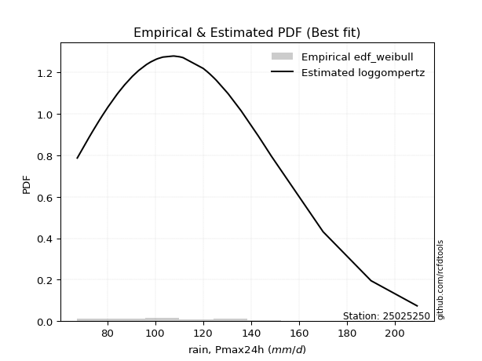</img>

</div>


### 4. EDF Beard (1943)

The Beard formula (or Beard´s plotting position formula) in hydrology is used to estimate the empirical non-exceedance probability _(P)_ of a flood event (or other extreme hydrological data point) within a given dataset.

<div align="center">


$P=(m-0.31)/(n+0.38)$


</div>


**4.1. Empirical values**

<div align="center">

|                | 0                   | 1                    | 2                   | 3                  | 4                   | 5                   | 6                  | 7                  | 8                  | 9                   | 10                  | 11                 | 12                  | 13                 | 14                | 15                  | 16                 | 17                 | 18                  | 19                  | 20                 | 21         | 22                 | 23                 | 24                 | 25                 | 26                 | 27                 | 28                 | 29                 | 30                 | 31                 | 32                 | 33                | 34                 | 35                 | 36                 | 37                 | 38                 | 39                 | 40                 | 41                 | 42                 |
|:---------------|:--------------------|:---------------------|:--------------------|:-------------------|:--------------------|:--------------------|:-------------------|:-------------------|:-------------------|:--------------------|:--------------------|:-------------------|:--------------------|:-------------------|:------------------|:--------------------|:-------------------|:-------------------|:--------------------|:--------------------|:-------------------|:-----------|:-------------------|:-------------------|:-------------------|:-------------------|:-------------------|:-------------------|:-------------------|:-------------------|:-------------------|:-------------------|:-------------------|:------------------|:-------------------|:-------------------|:-------------------|:-------------------|:-------------------|:-------------------|:-------------------|:-------------------|:-------------------|
| date           | 2001                | 1986                 | 2006                | 1976               | 1977                | 1982                | 1997               | 2015               | 1989               | 1974                | 2013                | 2012               | 1990                | 1994               | 2007              | 1992                | 1988               | 1998               | 1980                | 1985                | 1973               | 2011       | 1999               | 1996               | 1984               | 2009               | 2008               | 2003               | 1978               | 2005               | 1987               | 1991               | 2002               | 2000              | 2004               | 2010               | 1981               | 1983               | 1979               | 1975               | 2014               | 1995               | 1993               |
| x              | 67.5                | 72.5                 | 74.0                | 76.5               | 77.9                | 80.2                | 80.4               | 84.0               | 84.4               | 84.7                | 87.23611343         | 90.41938696        | 90.6                | 93.1               | 96.37801329       | 98.1                | 100.3              | 100.3              | 100.8               | 101.1449581         | 103.2              | 107.532524 | 108.0              | 110.2              | 111.6              | 120.0              | 121.5              | 122.5              | 123.0              | 124.5              | 125.4              | 125.5              | 130.2              | 130.4             | 130.5              | 135.8              | 143.0              | 145.3              | 147.8              | 148.4              | 170.0              | 190.0              | 209.2              |
| m              | 1                   | 2                    | 3                   | 4                  | 5                   | 6                   | 7                  | 8                  | 9                  | 10                  | 11                  | 12                 | 13                  | 14                 | 15                | 16                  | 17                 | 18                 | 19                  | 20                  | 21                 | 22         | 23                 | 24                 | 25                 | 26                 | 27                 | 28                 | 29                 | 30                 | 31                 | 32                 | 33                 | 34                | 35                 | 36                 | 37                 | 38                 | 39                 | 40                 | 41                 | 42                 | 43                 |
| empirical_dist | edf_beard           | edf_beard            | edf_beard           | edf_beard          | edf_beard           | edf_beard           | edf_beard          | edf_beard          | edf_beard          | edf_beard           | edf_beard           | edf_beard          | edf_beard           | edf_beard          | edf_beard         | edf_beard           | edf_beard          | edf_beard          | edf_beard           | edf_beard           | edf_beard          | edf_beard  | edf_beard          | edf_beard          | edf_beard          | edf_beard          | edf_beard          | edf_beard          | edf_beard          | edf_beard          | edf_beard          | edf_beard          | edf_beard          | edf_beard         | edf_beard          | edf_beard          | edf_beard          | edf_beard          | edf_beard          | edf_beard          | edf_beard          | edf_beard          | edf_beard          |
| empirical      | 0.01590594744121715 | 0.038958045182111566 | 0.06201014292300599 | 0.0850622406639004 | 0.10811433840479484 | 0.13116643614568926 | 0.1542185338865837 | 0.1772706316274781 | 0.2003227293683725 | 0.22337482710926693 | 0.24642692485016135 | 0.2694790225910558 | 0.29253112033195017 | 0.3155832180728446 | 0.338635315813739 | 0.36168741355463346 | 0.3847395112955279 | 0.4077916090364223 | 0.43084370677731676 | 0.45389580451821115 | 0.4769479022591056 | 0.5        | 0.5230520977408945 | 0.5461041954817888 | 0.5691562932226832 | 0.5922083909635777 | 0.6152604887044721 | 0.6383125864453665 | 0.6613646841862609 | 0.6844167819271554 | 0.7074688796680498 | 0.7305209774089442 | 0.7535730751498385 | 0.776625172890733 | 0.7996772706316274 | 0.8227293683725218 | 0.8457814661134162 | 0.8688335638543107 | 0.8918856615952051 | 0.9149377593360994 | 0.9379898570769939 | 0.9610419548178883 | 0.9840940525587827 |
| empirical_tr   | 1.016163035839775   | 1.040537299112497    | 1.0661096092405997  | 1.09297052154195   | 1.1212199534763505  | 1.1509684266383655  | 1.1823385118560916 | 1.2154665172317176 | 1.25050446814644   | 1.2876224398931433  | 1.327011318446008   | 1.3688860839381507 | 1.413489736070381   | 1.4610980127989222 | 1.512025095852213 | 1.5666305525460456  | 1.625327838141626  | 1.6885947839626314 | 1.7569866342648846  | 1.8311523849725622  | 1.9118554429263996 | 2.0        | 2.096665055582407  | 2.2031488065007614 | 2.321027287319422  | 2.452232899943471  | 2.5991611743559018 | 2.764818355640535  | 2.9530292716133424 | 3.168736303871439  | 3.418439716312057  | 3.7108639863130874 | 4.057998129092608  | 4.476780185758512 | 4.991944764096661  | 5.6410923276983045 | 6.484304932735421  | 7.623901581722315  | 9.249466950959484  | 11.75609756097559  | 16.12639405204458  | 25.66863905325438  | 62.86956521739065  |

</div>


**4.2. Kolmogorov-Smirnov fit test (sorted by Δ)**


<div align="center">

|                | 0                   | 1                    | 2                   | 3                   | 4                   | 5                   | 6                    | 7                    | 8                   | 9                   | 10                  | 11                  | 12                  | 13                  | 14                  | 15                  | 16                  | 17                  | 18                  | 19                  | 20                  | 21                  | 22                  | 23                  | 24                  | 25                  | 26                  | 27                  | 28                  | 29                  | 30                  | 31                  | 32                  | 33                  | 34                  | 35                  | 36                  | 37                  | 38                  | 39                  | 40                  | 41                  | 42                  | 43                  | 44                  | 45                  | 46                  | 47                  | 48                  | 49                  | 50                  | 51                  | 52                  | 53                  | 54                  | 55                  | 56                  | 57                  | 58                  | 59                  | 60                  | 61                  | 62                  | 63                  | 64                  | 65                  | 66                  | 67                  | 68                    | 69                  | 70                  | 71                  | 72                  | 73                  | 74                  | 75                  | 76                  | 77                  | 78                  | 79                  | 80                  | 81                  | 82                  | 83                  | 84                  | 85                  | 86                  | 87                  |
|:---------------|:--------------------|:---------------------|:--------------------|:--------------------|:--------------------|:--------------------|:---------------------|:---------------------|:--------------------|:--------------------|:--------------------|:--------------------|:--------------------|:--------------------|:--------------------|:--------------------|:--------------------|:--------------------|:--------------------|:--------------------|:--------------------|:--------------------|:--------------------|:--------------------|:--------------------|:--------------------|:--------------------|:--------------------|:--------------------|:--------------------|:--------------------|:--------------------|:--------------------|:--------------------|:--------------------|:--------------------|:--------------------|:--------------------|:--------------------|:--------------------|:--------------------|:--------------------|:--------------------|:--------------------|:--------------------|:--------------------|:--------------------|:--------------------|:--------------------|:--------------------|:--------------------|:--------------------|:--------------------|:--------------------|:--------------------|:--------------------|:--------------------|:--------------------|:--------------------|:--------------------|:--------------------|:--------------------|:--------------------|:--------------------|:--------------------|:--------------------|:--------------------|:--------------------|:----------------------|:--------------------|:--------------------|:--------------------|:--------------------|:--------------------|:--------------------|:--------------------|:--------------------|:--------------------|:--------------------|:--------------------|:--------------------|:--------------------|:--------------------|:--------------------|:--------------------|:--------------------|:--------------------|:--------------------|
| station        | 25025250            | 25025250             | 25025250            | 25025250            | 25025250            | 25025250            | 25025250             | 25025250             | 25025250            | 25025250            | 25025250            | 25025250            | 25025250            | 25025250            | 25025250            | 25025250            | 25025250            | 25025250            | 25025250            | 25025250            | 25025250            | 25025250            | 25025250            | 25025250            | 25025250            | 25025250            | 25025250            | 25025250            | 25025250            | 25025250            | 25025250            | 25025250            | 25025250            | 25025250            | 25025250            | 25025250            | 25025250            | 25025250            | 25025250            | 25025250            | 25025250            | 25025250            | 25025250            | 25025250            | 25025250            | 25025250            | 25025250            | 25025250            | 25025250            | 25025250            | 25025250            | 25025250            | 25025250            | 25025250            | 25025250            | 25025250            | 25025250            | 25025250            | 25025250            | 25025250            | 25025250            | 25025250            | 25025250            | 25025250            | 25025250            | 25025250            | 25025250            | 25025250            | 25025250              | 25025250            | 25025250            | 25025250            | 25025250            | 25025250            | 25025250            | 25025250            | 25025250            | 25025250            | 25025250            | 25025250            | 25025250            | 25025250            | 25025250            | 25025250            | 25025250            | 25025250            | 25025250            | 25025250            |
| empirical_dist | edf_beard           | edf_beard            | edf_beard           | edf_beard           | edf_beard           | edf_beard           | edf_beard            | edf_beard            | edf_beard           | edf_beard           | edf_beard           | edf_beard           | edf_beard           | edf_beard           | edf_beard           | edf_beard           | edf_beard           | edf_beard           | edf_beard           | edf_beard           | edf_beard           | edf_beard           | edf_beard           | edf_beard           | edf_beard           | edf_beard           | edf_beard           | edf_beard           | edf_beard           | edf_beard           | edf_beard           | edf_beard           | edf_beard           | edf_beard           | edf_beard           | edf_beard           | edf_beard           | edf_beard           | edf_beard           | edf_beard           | edf_beard           | edf_beard           | edf_beard           | edf_beard           | edf_beard           | edf_beard           | edf_beard           | edf_beard           | edf_beard           | edf_beard           | edf_beard           | edf_beard           | edf_beard           | edf_beard           | edf_beard           | edf_beard           | edf_beard           | edf_beard           | edf_beard           | edf_beard           | edf_beard           | edf_beard           | edf_beard           | edf_beard           | edf_beard           | edf_beard           | edf_beard           | edf_beard           | edf_beard             | edf_beard           | edf_beard           | edf_beard           | edf_beard           | edf_beard           | edf_beard           | edf_beard           | edf_beard           | edf_beard           | edf_beard           | edf_beard           | edf_beard           | edf_beard           | edf_beard           | edf_beard           | edf_beard           | edf_beard           | edf_beard           | edf_beard           |
| p_dist         | loggompertz         | rayleigh             | nakagami            | logloggamma         | logcrystalball      | logt                | lognorm              | lognorm              | maxwell             | kstwobign           | halfnorm            | pearson3            | weibull_min         | ncf                 | logncf              | f                   | betaprime           | gumbel_r            | lognct              | logrice             | loglogistic         | logpearson3         | rice                | genlogistic         | erlang              | gamma               | logmaxwell          | logweibull_min      | logexponnorm        | loggenexpon         | logalpha            | fatiguelife         | nct                 | invgauss            | lognakagami         | logf                | lograyleigh         | loginvgamma         | alpha               | loglognorm          | logjohnsonsu        | invgamma            | loginvgauss         | logfatiguelife      | invweibull          | johnsonsu           | t                   | loggamma            | loggamma            | logerlang           | loghypsecant        | fisk                | logfisk             | truncnorm           | crystalball         | norm                | halflogistic        | logmielke           | moyal               | mielke              | loggenlogistic      | loginvweibull       | logkstwobign        | exponnorm           | laplace_asymmetric  | loghalfnorm         | logistic            | logbetaprime        | loglaplace_asymmetric | loggumbel_r         | loglaplace          | hypsecant           | loggumbel_l         | loghalflogistic     | genexpon            | expon               | logmoyal            | laplace             | gumbel_l            | logexpon            | wald                | logwald             | loggibrat           | gibrat              | logchi2             | logtruncnorm        | chi2                | gompertz            |
| delta          | 0.05725847638932591 | 0.058916876346510105 | 0.0589676993089413  | 0.05979648885818023 | 0.06066383642223172 | 0.060664483200492   | 0.060666129340646524 | 0.060666129340646524 | 0.06264886296509242 | 0.065030800924885   | 0.06615391275987359 | 0.06883735024961724 | 0.07027606422643695 | 0.0716675311652023  | 0.07248567726240773 | 0.07322356536090047 | 0.07401430210002591 | 0.07449250054329859 | 0.0759801831933995  | 0.07734891327140292 | 0.07885342767685233 | 0.07927048199572018 | 0.08115433677390266 | 0.0815852668510384  | 0.08181083412878631 | 0.08181086848330799 | 0.0819932600129708  | 0.08228254626086429 | 0.08243759756891711 | 0.08573869855728866 | 0.08702715755911128 | 0.08722313933808301 | 0.08735574525949485 | 0.08755629938051968 | 0.08774710796134177 | 0.08799634954711777 | 0.08839576751094447 | 0.08841231807180228 | 0.08858272862149497 | 0.0887293829131709  | 0.08900369771845795 | 0.08929081795494109 | 0.08944632232416594 | 0.08953864603255124 | 0.08959801748185847 | 0.08995411549871968 | 0.09073122991492749 | 0.09079615476707759 | 0.09079615476707759 | 0.09079624700910294 | 0.0929212291890047  | 0.09308000102953129 | 0.09341674843031245 | 0.0940125969142907  | 0.09401261140692174 | 0.09401261436697822 | 0.09446262331677402 | 0.09448077270775179 | 0.0972119328099339  | 0.09891449546359854 | 0.09891597447800116 | 0.10052010927487198 | 0.1015005487814572  | 0.10261977811768708 | 0.10580803303395475 | 0.10705785730674122 | 0.11107270798977498 | 0.11808231973830563 | 0.12007306469111445   | 0.12018264306377968 | 0.12101860869746861 | 0.1244766528422761  | 0.12477950519566117 | 0.1351274617413153  | 0.13695797007185312 | 0.13735158564002553 | 0.13984718749242664 | 0.15285999376068998 | 0.15666510344832285 | 0.1926677079250161  | 0.21760478860563057 | 0.22335563972070083 | 0.2607034667523342  | 0.27077070310674445 | 0.29793947187977177 | 0.3008935720655868  | 0.9193773783265546  | 0.934818708583272   |
| deltao         | 0.20739805565234237 | 0.20739805565234237  | 0.20739805565234237 | 0.20739805565234237 | 0.20739805565234237 | 0.20739805565234237 | 0.20739805565234237  | 0.20739805565234237  | 0.20739805565234237 | 0.20739805565234237 | 0.20739805565234237 | 0.20739805565234237 | 0.20739805565234237 | 0.20739805565234237 | 0.20739805565234237 | 0.20739805565234237 | 0.20739805565234237 | 0.20739805565234237 | 0.20739805565234237 | 0.20739805565234237 | 0.20739805565234237 | 0.20739805565234237 | 0.20739805565234237 | 0.20739805565234237 | 0.20739805565234237 | 0.20739805565234237 | 0.20739805565234237 | 0.20739805565234237 | 0.20739805565234237 | 0.20739805565234237 | 0.20739805565234237 | 0.20739805565234237 | 0.20739805565234237 | 0.20739805565234237 | 0.20739805565234237 | 0.20739805565234237 | 0.20739805565234237 | 0.20739805565234237 | 0.20739805565234237 | 0.20739805565234237 | 0.20739805565234237 | 0.20739805565234237 | 0.20739805565234237 | 0.20739805565234237 | 0.20739805565234237 | 0.20739805565234237 | 0.20739805565234237 | 0.20739805565234237 | 0.20739805565234237 | 0.20739805565234237 | 0.20739805565234237 | 0.20739805565234237 | 0.20739805565234237 | 0.20739805565234237 | 0.20739805565234237 | 0.20739805565234237 | 0.20739805565234237 | 0.20739805565234237 | 0.20739805565234237 | 0.20739805565234237 | 0.20739805565234237 | 0.20739805565234237 | 0.20739805565234237 | 0.20739805565234237 | 0.20739805565234237 | 0.20739805565234237 | 0.20739805565234237 | 0.20739805565234237 | 0.20739805565234237   | 0.20739805565234237 | 0.20739805565234237 | 0.20739805565234237 | 0.20739805565234237 | 0.20739805565234237 | 0.20739805565234237 | 0.20739805565234237 | 0.20739805565234237 | 0.20739805565234237 | 0.20739805565234237 | 0.20739805565234237 | 0.20739805565234237 | 0.20739805565234237 | 0.20739805565234237 | 0.20739805565234237 | 0.20739805565234237 | 0.20739805565234237 | 0.20739805565234237 | 0.20739805565234237 |
| eval           | Δo > Δ              | Δo > Δ               | Δo > Δ              | Δo > Δ              | Δo > Δ              | Δo > Δ              | Δo > Δ               | Δo > Δ               | Δo > Δ              | Δo > Δ              | Δo > Δ              | Δo > Δ              | Δo > Δ              | Δo > Δ              | Δo > Δ              | Δo > Δ              | Δo > Δ              | Δo > Δ              | Δo > Δ              | Δo > Δ              | Δo > Δ              | Δo > Δ              | Δo > Δ              | Δo > Δ              | Δo > Δ              | Δo > Δ              | Δo > Δ              | Δo > Δ              | Δo > Δ              | Δo > Δ              | Δo > Δ              | Δo > Δ              | Δo > Δ              | Δo > Δ              | Δo > Δ              | Δo > Δ              | Δo > Δ              | Δo > Δ              | Δo > Δ              | Δo > Δ              | Δo > Δ              | Δo > Δ              | Δo > Δ              | Δo > Δ              | Δo > Δ              | Δo > Δ              | Δo > Δ              | Δo > Δ              | Δo > Δ              | Δo > Δ              | Δo > Δ              | Δo > Δ              | Δo > Δ              | Δo > Δ              | Δo > Δ              | Δo > Δ              | Δo > Δ              | Δo > Δ              | Δo > Δ              | Δo > Δ              | Δo > Δ              | Δo > Δ              | Δo > Δ              | Δo > Δ              | Δo > Δ              | Δo > Δ              | Δo > Δ              | Δo > Δ              | Δo > Δ                | Δo > Δ              | Δo > Δ              | Δo > Δ              | Δo > Δ              | Δo > Δ              | Δo > Δ              | Δo > Δ              | Δo > Δ              | Δo > Δ              | Δo > Δ              | Δo > Δ              | Δo <= Δ             | Δo <= Δ             | Δo <= Δ             | Δo <= Δ             | Δo <= Δ             | Δo <= Δ             | Δo <= Δ             | Δo <= Δ             |
| fit            | 1                   | 1                    | 1                   | 1                   | 1                   | 1                   | 1                    | 1                    | 1                   | 1                   | 1                   | 1                   | 1                   | 1                   | 1                   | 1                   | 1                   | 1                   | 1                   | 1                   | 1                   | 1                   | 1                   | 1                   | 1                   | 1                   | 1                   | 1                   | 1                   | 1                   | 1                   | 1                   | 1                   | 1                   | 1                   | 1                   | 1                   | 1                   | 1                   | 1                   | 1                   | 1                   | 1                   | 1                   | 1                   | 1                   | 1                   | 1                   | 1                   | 1                   | 1                   | 1                   | 1                   | 1                   | 1                   | 1                   | 1                   | 1                   | 1                   | 1                   | 1                   | 1                   | 1                   | 1                   | 1                   | 1                   | 1                   | 1                   | 1                     | 1                   | 1                   | 1                   | 1                   | 1                   | 1                   | 1                   | 1                   | 1                   | 1                   | 1                   | 0                   | 0                   | 0                   | 0                   | 0                   | 0                   | 0                   | 0                   |
| n              | 43                  | 43                   | 43                  | 43                  | 43                  | 43                  | 43                   | 43                   | 43                  | 43                  | 43                  | 43                  | 43                  | 43                  | 43                  | 43                  | 43                  | 43                  | 43                  | 43                  | 43                  | 43                  | 43                  | 43                  | 43                  | 43                  | 43                  | 43                  | 43                  | 43                  | 43                  | 43                  | 43                  | 43                  | 43                  | 43                  | 43                  | 43                  | 43                  | 43                  | 43                  | 43                  | 43                  | 43                  | 43                  | 43                  | 43                  | 43                  | 43                  | 43                  | 43                  | 43                  | 43                  | 43                  | 43                  | 43                  | 43                  | 43                  | 43                  | 43                  | 43                  | 43                  | 43                  | 43                  | 43                  | 43                  | 43                  | 43                  | 43                    | 43                  | 43                  | 43                  | 43                  | 43                  | 43                  | 43                  | 43                  | 43                  | 43                  | 43                  | 43                  | 43                  | 43                  | 43                  | 43                  | 43                  | 43                  | 43                  |
| best_fit       | 1                   | 0                    | 0                   | 0                   | 0                   | 0                   | 0                    | 0                    | 0                   | 0                   | 0                   | 0                   | 0                   | 0                   | 0                   | 0                   | 0                   | 0                   | 0                   | 0                   | 0                   | 0                   | 0                   | 0                   | 0                   | 0                   | 0                   | 0                   | 0                   | 0                   | 0                   | 0                   | 0                   | 0                   | 0                   | 0                   | 0                   | 0                   | 0                   | 0                   | 0                   | 0                   | 0                   | 0                   | 0                   | 0                   | 0                   | 0                   | 0                   | 0                   | 0                   | 0                   | 0                   | 0                   | 0                   | 0                   | 0                   | 0                   | 0                   | 0                   | 0                   | 0                   | 0                   | 0                   | 0                   | 0                   | 0                   | 0                   | 0                     | 0                   | 0                   | 0                   | 0                   | 0                   | 0                   | 0                   | 0                   | 0                   | 0                   | 0                   | 0                   | 0                   | 0                   | 0                   | 0                   | 0                   | 0                   | 0                   |
| best_fit_sort  | 1                   | 2                    | 3                   | 4                   | 5                   | 6                   | 7                    | 8                    | 9                   | 10                  | 11                  | 12                  | 13                  | 14                  | 15                  | 16                  | 17                  | 18                  | 19                  | 20                  | 21                  | 22                  | 23                  | 24                  | 25                  | 26                  | 27                  | 28                  | 29                  | 30                  | 31                  | 32                  | 33                  | 34                  | 35                  | 36                  | 37                  | 38                  | 39                  | 40                  | 41                  | 42                  | 43                  | 44                  | 45                  | 46                  | 47                  | 48                  | 49                  | 50                  | 51                  | 52                  | 53                  | 54                  | 55                  | 56                  | 57                  | 58                  | 59                  | 60                  | 61                  | 62                  | 63                  | 64                  | 65                  | 66                  | 67                  | 68                  | 69                    | 70                  | 71                  | 72                  | 73                  | 74                  | 75                  | 76                  | 77                  | 78                  | 79                  | 80                  | 81                  | 82                  | 83                  | 84                  | 85                  | 86                  | 87                  | 88                  |

</div>


<div align="center">

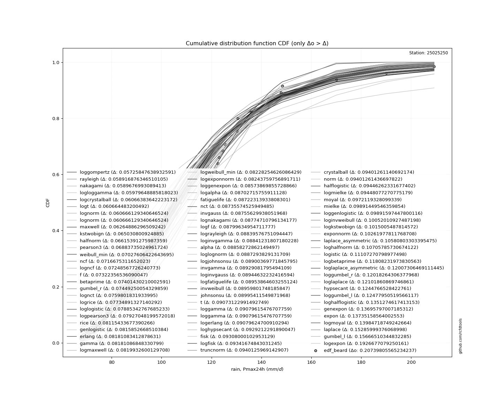</img>

</div>


**4.3. Best fit**

<div align="center">

|   id |   station | empirical_dist   | p_dist      |     delta |   deltao | eval   |   fit |   n |   best_fit |   best_fit_sort |
|-----:|----------:|:-----------------|:------------|----------:|---------:|:-------|------:|----:|-----------:|----------------:|
|    0 |  25025250 | edf_beard        | loggompertz | 0.0572585 | 0.207398 | Δo > Δ |     1 |  43 |          1 |               1 |

</div>


<div align="center">

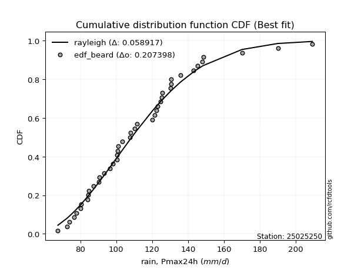</img></img>

</div>


### 5. EDF Chegodayev (1955)

The Chegodayev formula is an empirical plotting position formula used in hydrological frequency analysis to estimate the exceedance probability or return period of a specific event from a set of observed data. It is primarily used for plotting observed data points on probability paper to fit a theoretical distribution, particularly for analyzing extreme events like maximum flood flows or rainfall intensities. The constant _b_ value in the generalized plotting position formula is 0.3.

<div align="center">


$P=(m-b)/(n+1-2b)$


</div>


**5.1. Empirical values**

<div align="center">

|                | 0                    | 1                   | 2                    | 3                   | 4                   | 5                   | 6                  | 7                  | 8                   | 9                   | 10                 | 11                 | 12                 | 13                 | 14                 | 15                 | 16                 | 17                 | 18                 | 19                 | 20                 | 21             | 22                 | 23                 | 24                 | 25                 | 26                 | 27                 | 28                 | 29                | 30                 | 31                 | 32                 | 33                 | 34                 | 35                 | 36                 | 37                 | 38                | 39                 | 40                 | 41                 | 42                 |
|:---------------|:---------------------|:--------------------|:---------------------|:--------------------|:--------------------|:--------------------|:-------------------|:-------------------|:--------------------|:--------------------|:-------------------|:-------------------|:-------------------|:-------------------|:-------------------|:-------------------|:-------------------|:-------------------|:-------------------|:-------------------|:-------------------|:---------------|:-------------------|:-------------------|:-------------------|:-------------------|:-------------------|:-------------------|:-------------------|:------------------|:-------------------|:-------------------|:-------------------|:-------------------|:-------------------|:-------------------|:-------------------|:-------------------|:------------------|:-------------------|:-------------------|:-------------------|:-------------------|
| date           | 2001                 | 1986                | 2006                 | 1976                | 1977                | 1982                | 1997               | 2015               | 1989                | 1974                | 2013               | 2012               | 1990               | 1994               | 2007               | 1992               | 1988               | 1998               | 1980               | 1985               | 1973               | 2011           | 1999               | 1996               | 1984               | 2009               | 2008               | 2003               | 1978               | 2005              | 1987               | 1991               | 2002               | 2000               | 2004               | 2010               | 1981               | 1983               | 1979              | 1975               | 2014               | 1995               | 1993               |
| x              | 67.5                 | 72.5                | 74.0                 | 76.5                | 77.9                | 80.2                | 80.4               | 84.0               | 84.4                | 84.7                | 87.23611343        | 90.41938696        | 90.6               | 93.1               | 96.37801329        | 98.1               | 100.3              | 100.3              | 100.8              | 101.1449581        | 103.2              | 107.532524     | 108.0              | 110.2              | 111.6              | 120.0              | 121.5              | 122.5              | 123.0              | 124.5             | 125.4              | 125.5              | 130.2              | 130.4              | 130.5              | 135.8              | 143.0              | 145.3              | 147.8             | 148.4              | 170.0              | 190.0              | 209.2              |
| m              | 1                    | 2                   | 3                    | 4                   | 5                   | 6                   | 7                  | 8                  | 9                   | 10                  | 11                 | 12                 | 13                 | 14                 | 15                 | 16                 | 17                 | 18                 | 19                 | 20                 | 21                 | 22             | 23                 | 24                 | 25                 | 26                 | 27                 | 28                 | 29                 | 30                | 31                 | 32                 | 33                 | 34                 | 35                 | 36                 | 37                 | 38                 | 39                | 40                 | 41                 | 42                 | 43                 |
| empirical_dist | edf_chegodayev       | edf_chegodayev      | edf_chegodayev       | edf_chegodayev      | edf_chegodayev      | edf_chegodayev      | edf_chegodayev     | edf_chegodayev     | edf_chegodayev      | edf_chegodayev      | edf_chegodayev     | edf_chegodayev     | edf_chegodayev     | edf_chegodayev     | edf_chegodayev     | edf_chegodayev     | edf_chegodayev     | edf_chegodayev     | edf_chegodayev     | edf_chegodayev     | edf_chegodayev     | edf_chegodayev | edf_chegodayev     | edf_chegodayev     | edf_chegodayev     | edf_chegodayev     | edf_chegodayev     | edf_chegodayev     | edf_chegodayev     | edf_chegodayev    | edf_chegodayev     | edf_chegodayev     | edf_chegodayev     | edf_chegodayev     | edf_chegodayev     | edf_chegodayev     | edf_chegodayev     | edf_chegodayev     | edf_chegodayev    | edf_chegodayev     | edf_chegodayev     | edf_chegodayev     | edf_chegodayev     |
| empirical      | 0.016129032258064516 | 0.03917050691244239 | 0.062211981566820285 | 0.08525345622119816 | 0.10829493087557604 | 0.13133640552995393 | 0.1543778801843318 | 0.1774193548387097 | 0.20046082949308755 | 0.22350230414746544 | 0.2465437788018433 | 0.2695852534562212 | 0.2926267281105991 | 0.315668202764977  | 0.3387096774193548 | 0.3617511520737327 | 0.3847926267281106 | 0.4078341013824885 | 0.4308755760368664 | 0.4539170506912442 | 0.4769585253456221 | 0.5            | 0.5230414746543779 | 0.5460829493087558 | 0.5691244239631337 | 0.5921658986175116 | 0.6152073732718895 | 0.6382488479262672 | 0.6612903225806451 | 0.684331797235023 | 0.7073732718894009 | 0.7304147465437788 | 0.7534562211981568 | 0.7764976958525347 | 0.7995391705069126 | 0.8225806451612904 | 0.8456221198156683 | 0.8686635944700462 | 0.891705069124424 | 0.9147465437788019 | 0.9377880184331798 | 0.9608294930875577 | 0.9838709677419356 |
| empirical_tr   | 1.0163934426229508   | 1.040767386091127   | 1.0663390663390664   | 1.093198992443325   | 1.1214470284237728  | 1.1511936339522546  | 1.1825613079019075 | 1.215686274509804  | 1.2507204610951008  | 1.2878338278931751  | 1.3272171253822629 | 1.3690851735015772 | 1.4136807817589576 | 1.4612794612794613 | 1.5121951219512193 | 1.5667870036101081 | 1.6254681647940072 | 1.6887159533073928 | 1.757085020242915  | 1.831223628691983  | 1.9118942731277533 | 2.0            | 2.0966183574879227 | 2.203045685279188  | 2.3208556149732624 | 2.451977401129944  | 2.598802395209581  | 2.7643312101910826 | 2.952380952380952  | 3.167883211678832 | 3.417322834645669  | 3.7094017094017095 | 4.056074766355143  | 4.474226804123714  | 4.988505747126441  | 5.636363636363638  | 6.47761194029851   | 7.614035087719302  | 9.234042553191497 | 11.729729729729742 | 16.0740740740741   | 25.529411764705955 | 62.00000000000048  |

</div>


**5.2. Kolmogorov-Smirnov fit test (sorted by Δ)**


<div align="center">

|                | 0                    | 1                   | 2                   | 3                   | 4                    | 5                   | 6                   | 7                   | 8                   | 9                   | 10                  | 11                  | 12                  | 13                  | 14                  | 15                  | 16                  | 17                  | 18                  | 19                  | 20                  | 21                  | 22                  | 23                  | 24                  | 25                  | 26                  | 27                  | 28                  | 29                  | 30                  | 31                  | 32                  | 33                  | 34                  | 35                  | 36                  | 37                  | 38                  | 39                  | 40                  | 41                  | 42                  | 43                  | 44                  | 45                  | 46                  | 47                  | 48                  | 49                  | 50                  | 51                  | 52                  | 53                  | 54                  | 55                  | 56                  | 57                  | 58                  | 59                  | 60                  | 61                  | 62                  | 63                  | 64                  | 65                  | 66                  | 67                  | 68                    | 69                  | 70                  | 71                  | 72                  | 73                  | 74                  | 75                  | 76                  | 77                  | 78                  | 79                  | 80                  | 81                  | 82                  | 83                  | 84                  | 85                  | 86                  | 87                  |
|:---------------|:---------------------|:--------------------|:--------------------|:--------------------|:---------------------|:--------------------|:--------------------|:--------------------|:--------------------|:--------------------|:--------------------|:--------------------|:--------------------|:--------------------|:--------------------|:--------------------|:--------------------|:--------------------|:--------------------|:--------------------|:--------------------|:--------------------|:--------------------|:--------------------|:--------------------|:--------------------|:--------------------|:--------------------|:--------------------|:--------------------|:--------------------|:--------------------|:--------------------|:--------------------|:--------------------|:--------------------|:--------------------|:--------------------|:--------------------|:--------------------|:--------------------|:--------------------|:--------------------|:--------------------|:--------------------|:--------------------|:--------------------|:--------------------|:--------------------|:--------------------|:--------------------|:--------------------|:--------------------|:--------------------|:--------------------|:--------------------|:--------------------|:--------------------|:--------------------|:--------------------|:--------------------|:--------------------|:--------------------|:--------------------|:--------------------|:--------------------|:--------------------|:--------------------|:----------------------|:--------------------|:--------------------|:--------------------|:--------------------|:--------------------|:--------------------|:--------------------|:--------------------|:--------------------|:--------------------|:--------------------|:--------------------|:--------------------|:--------------------|:--------------------|:--------------------|:--------------------|:--------------------|:--------------------|
| station        | 25025250             | 25025250            | 25025250            | 25025250            | 25025250             | 25025250            | 25025250            | 25025250            | 25025250            | 25025250            | 25025250            | 25025250            | 25025250            | 25025250            | 25025250            | 25025250            | 25025250            | 25025250            | 25025250            | 25025250            | 25025250            | 25025250            | 25025250            | 25025250            | 25025250            | 25025250            | 25025250            | 25025250            | 25025250            | 25025250            | 25025250            | 25025250            | 25025250            | 25025250            | 25025250            | 25025250            | 25025250            | 25025250            | 25025250            | 25025250            | 25025250            | 25025250            | 25025250            | 25025250            | 25025250            | 25025250            | 25025250            | 25025250            | 25025250            | 25025250            | 25025250            | 25025250            | 25025250            | 25025250            | 25025250            | 25025250            | 25025250            | 25025250            | 25025250            | 25025250            | 25025250            | 25025250            | 25025250            | 25025250            | 25025250            | 25025250            | 25025250            | 25025250            | 25025250              | 25025250            | 25025250            | 25025250            | 25025250            | 25025250            | 25025250            | 25025250            | 25025250            | 25025250            | 25025250            | 25025250            | 25025250            | 25025250            | 25025250            | 25025250            | 25025250            | 25025250            | 25025250            | 25025250            |
| empirical_dist | edf_chegodayev       | edf_chegodayev      | edf_chegodayev      | edf_chegodayev      | edf_chegodayev       | edf_chegodayev      | edf_chegodayev      | edf_chegodayev      | edf_chegodayev      | edf_chegodayev      | edf_chegodayev      | edf_chegodayev      | edf_chegodayev      | edf_chegodayev      | edf_chegodayev      | edf_chegodayev      | edf_chegodayev      | edf_chegodayev      | edf_chegodayev      | edf_chegodayev      | edf_chegodayev      | edf_chegodayev      | edf_chegodayev      | edf_chegodayev      | edf_chegodayev      | edf_chegodayev      | edf_chegodayev      | edf_chegodayev      | edf_chegodayev      | edf_chegodayev      | edf_chegodayev      | edf_chegodayev      | edf_chegodayev      | edf_chegodayev      | edf_chegodayev      | edf_chegodayev      | edf_chegodayev      | edf_chegodayev      | edf_chegodayev      | edf_chegodayev      | edf_chegodayev      | edf_chegodayev      | edf_chegodayev      | edf_chegodayev      | edf_chegodayev      | edf_chegodayev      | edf_chegodayev      | edf_chegodayev      | edf_chegodayev      | edf_chegodayev      | edf_chegodayev      | edf_chegodayev      | edf_chegodayev      | edf_chegodayev      | edf_chegodayev      | edf_chegodayev      | edf_chegodayev      | edf_chegodayev      | edf_chegodayev      | edf_chegodayev      | edf_chegodayev      | edf_chegodayev      | edf_chegodayev      | edf_chegodayev      | edf_chegodayev      | edf_chegodayev      | edf_chegodayev      | edf_chegodayev      | edf_chegodayev        | edf_chegodayev      | edf_chegodayev      | edf_chegodayev      | edf_chegodayev      | edf_chegodayev      | edf_chegodayev      | edf_chegodayev      | edf_chegodayev      | edf_chegodayev      | edf_chegodayev      | edf_chegodayev      | edf_chegodayev      | edf_chegodayev      | edf_chegodayev      | edf_chegodayev      | edf_chegodayev      | edf_chegodayev      | edf_chegodayev      | edf_chegodayev      |
| p_dist         | loggompertz          | rayleigh            | nakagami            | logloggamma         | logcrystalball       | logt                | lognorm             | lognorm             | maxwell             | kstwobign           | halfnorm            | pearson3            | weibull_min         | ncf                 | logncf              | f                   | betaprime           | gumbel_r            | lognct              | logrice             | loglogistic         | logpearson3         | rice                | genlogistic         | erlang              | gamma               | logmaxwell          | logweibull_min      | logexponnorm        | loggenexpon         | logalpha            | fatiguelife         | nct                 | invgauss            | lognakagami         | logf                | lograyleigh         | loginvgamma         | alpha               | loglognorm          | logjohnsonsu        | invgamma            | loginvgauss         | logfatiguelife      | invweibull          | johnsonsu           | t                   | loggamma            | loggamma            | logerlang           | loghypsecant        | fisk                | logfisk             | truncnorm           | crystalball         | norm                | halflogistic        | logmielke           | moyal               | mielke              | loggenlogistic      | loginvweibull       | logkstwobign        | exponnorm           | laplace_asymmetric  | loghalfnorm         | logistic            | logbetaprime        | loglaplace_asymmetric | loggumbel_r         | loglaplace          | hypsecant           | loggumbel_l         | loghalflogistic     | genexpon            | expon               | logmoyal            | laplace             | gumbel_l            | logexpon            | wald                | logwald             | loggibrat           | gibrat              | logchi2             | logtruncnorm        | chi2                | gompertz            |
| delta          | 0.057120376264611084 | 0.05877877622179528 | 0.05901019165500743 | 0.05981773503121329 | 0.060706328768297846 | 0.06070697554655813 | 0.06070862168671265 | 0.06070862168671265 | 0.0625107628403776  | 0.06507329327095113 | 0.06619640510593972 | 0.06887984259568336 | 0.07031855657250308 | 0.07171002351126843 | 0.07252816960847386 | 0.07326605770696659 | 0.07405679444609203 | 0.07453499288936472 | 0.07602267553946562 | 0.07739140561746904 | 0.07889592002291845 | 0.0793129743417863  | 0.08117558294693572 | 0.08162775919710452 | 0.08185332647485244 | 0.08185336082937411 | 0.08203575235903693 | 0.08232503860693041 | 0.08248008991498323 | 0.08578119090335479 | 0.0870696499051774  | 0.08726563168414914 | 0.08739823760556098 | 0.0875987917265858  | 0.0877896003074079  | 0.0880388418931839  | 0.08843825985701059 | 0.0884548104178684  | 0.08862522096756109 | 0.08877187525923702 | 0.08904619006452408 | 0.08933331030100722 | 0.08948881467023206 | 0.08958113837861736 | 0.0896405098279246  | 0.0899966078447858  | 0.09075247608796055 | 0.09083864711314371 | 0.09083864711314371 | 0.09083873935516906 | 0.09296372153507082 | 0.09312249337559741 | 0.09345924077637857 | 0.09403384308732377 | 0.0940338575799548  | 0.09403386054001128 | 0.09450511566284014 | 0.09452326505381792 | 0.09725442515600002 | 0.09895698780966466 | 0.09895846682406728 | 0.10056260162093811 | 0.10154304112752333 | 0.1026622704637532  | 0.10575491760137207 | 0.10710034965280735 | 0.11109395416280804 | 0.11789110418100812 | 0.12011555703718058   | 0.1202251354098458  | 0.12106110104353474 | 0.12449789901530917 | 0.12480075136869423 | 0.13516995408738142 | 0.13690485463927043 | 0.13727722403440973 | 0.13988967983849276 | 0.15288123993372305 | 0.15667572653483935 | 0.19251898471378454 | 0.21773226564382908 | 0.22348311675889934 | 0.2607990745309831  | 0.27086631088539337 | 0.29774825632247426 | 0.300819210459971   | 0.9191649165962238  | 0.9346168699394579  |
| deltao         | 0.20739805565234237  | 0.20739805565234237 | 0.20739805565234237 | 0.20739805565234237 | 0.20739805565234237  | 0.20739805565234237 | 0.20739805565234237 | 0.20739805565234237 | 0.20739805565234237 | 0.20739805565234237 | 0.20739805565234237 | 0.20739805565234237 | 0.20739805565234237 | 0.20739805565234237 | 0.20739805565234237 | 0.20739805565234237 | 0.20739805565234237 | 0.20739805565234237 | 0.20739805565234237 | 0.20739805565234237 | 0.20739805565234237 | 0.20739805565234237 | 0.20739805565234237 | 0.20739805565234237 | 0.20739805565234237 | 0.20739805565234237 | 0.20739805565234237 | 0.20739805565234237 | 0.20739805565234237 | 0.20739805565234237 | 0.20739805565234237 | 0.20739805565234237 | 0.20739805565234237 | 0.20739805565234237 | 0.20739805565234237 | 0.20739805565234237 | 0.20739805565234237 | 0.20739805565234237 | 0.20739805565234237 | 0.20739805565234237 | 0.20739805565234237 | 0.20739805565234237 | 0.20739805565234237 | 0.20739805565234237 | 0.20739805565234237 | 0.20739805565234237 | 0.20739805565234237 | 0.20739805565234237 | 0.20739805565234237 | 0.20739805565234237 | 0.20739805565234237 | 0.20739805565234237 | 0.20739805565234237 | 0.20739805565234237 | 0.20739805565234237 | 0.20739805565234237 | 0.20739805565234237 | 0.20739805565234237 | 0.20739805565234237 | 0.20739805565234237 | 0.20739805565234237 | 0.20739805565234237 | 0.20739805565234237 | 0.20739805565234237 | 0.20739805565234237 | 0.20739805565234237 | 0.20739805565234237 | 0.20739805565234237 | 0.20739805565234237   | 0.20739805565234237 | 0.20739805565234237 | 0.20739805565234237 | 0.20739805565234237 | 0.20739805565234237 | 0.20739805565234237 | 0.20739805565234237 | 0.20739805565234237 | 0.20739805565234237 | 0.20739805565234237 | 0.20739805565234237 | 0.20739805565234237 | 0.20739805565234237 | 0.20739805565234237 | 0.20739805565234237 | 0.20739805565234237 | 0.20739805565234237 | 0.20739805565234237 | 0.20739805565234237 |
| eval           | Δo > Δ               | Δo > Δ              | Δo > Δ              | Δo > Δ              | Δo > Δ               | Δo > Δ              | Δo > Δ              | Δo > Δ              | Δo > Δ              | Δo > Δ              | Δo > Δ              | Δo > Δ              | Δo > Δ              | Δo > Δ              | Δo > Δ              | Δo > Δ              | Δo > Δ              | Δo > Δ              | Δo > Δ              | Δo > Δ              | Δo > Δ              | Δo > Δ              | Δo > Δ              | Δo > Δ              | Δo > Δ              | Δo > Δ              | Δo > Δ              | Δo > Δ              | Δo > Δ              | Δo > Δ              | Δo > Δ              | Δo > Δ              | Δo > Δ              | Δo > Δ              | Δo > Δ              | Δo > Δ              | Δo > Δ              | Δo > Δ              | Δo > Δ              | Δo > Δ              | Δo > Δ              | Δo > Δ              | Δo > Δ              | Δo > Δ              | Δo > Δ              | Δo > Δ              | Δo > Δ              | Δo > Δ              | Δo > Δ              | Δo > Δ              | Δo > Δ              | Δo > Δ              | Δo > Δ              | Δo > Δ              | Δo > Δ              | Δo > Δ              | Δo > Δ              | Δo > Δ              | Δo > Δ              | Δo > Δ              | Δo > Δ              | Δo > Δ              | Δo > Δ              | Δo > Δ              | Δo > Δ              | Δo > Δ              | Δo > Δ              | Δo > Δ              | Δo > Δ                | Δo > Δ              | Δo > Δ              | Δo > Δ              | Δo > Δ              | Δo > Δ              | Δo > Δ              | Δo > Δ              | Δo > Δ              | Δo > Δ              | Δo > Δ              | Δo > Δ              | Δo <= Δ             | Δo <= Δ             | Δo <= Δ             | Δo <= Δ             | Δo <= Δ             | Δo <= Δ             | Δo <= Δ             | Δo <= Δ             |
| fit            | 1                    | 1                   | 1                   | 1                   | 1                    | 1                   | 1                   | 1                   | 1                   | 1                   | 1                   | 1                   | 1                   | 1                   | 1                   | 1                   | 1                   | 1                   | 1                   | 1                   | 1                   | 1                   | 1                   | 1                   | 1                   | 1                   | 1                   | 1                   | 1                   | 1                   | 1                   | 1                   | 1                   | 1                   | 1                   | 1                   | 1                   | 1                   | 1                   | 1                   | 1                   | 1                   | 1                   | 1                   | 1                   | 1                   | 1                   | 1                   | 1                   | 1                   | 1                   | 1                   | 1                   | 1                   | 1                   | 1                   | 1                   | 1                   | 1                   | 1                   | 1                   | 1                   | 1                   | 1                   | 1                   | 1                   | 1                   | 1                   | 1                     | 1                   | 1                   | 1                   | 1                   | 1                   | 1                   | 1                   | 1                   | 1                   | 1                   | 1                   | 0                   | 0                   | 0                   | 0                   | 0                   | 0                   | 0                   | 0                   |
| n              | 43                   | 43                  | 43                  | 43                  | 43                   | 43                  | 43                  | 43                  | 43                  | 43                  | 43                  | 43                  | 43                  | 43                  | 43                  | 43                  | 43                  | 43                  | 43                  | 43                  | 43                  | 43                  | 43                  | 43                  | 43                  | 43                  | 43                  | 43                  | 43                  | 43                  | 43                  | 43                  | 43                  | 43                  | 43                  | 43                  | 43                  | 43                  | 43                  | 43                  | 43                  | 43                  | 43                  | 43                  | 43                  | 43                  | 43                  | 43                  | 43                  | 43                  | 43                  | 43                  | 43                  | 43                  | 43                  | 43                  | 43                  | 43                  | 43                  | 43                  | 43                  | 43                  | 43                  | 43                  | 43                  | 43                  | 43                  | 43                  | 43                    | 43                  | 43                  | 43                  | 43                  | 43                  | 43                  | 43                  | 43                  | 43                  | 43                  | 43                  | 43                  | 43                  | 43                  | 43                  | 43                  | 43                  | 43                  | 43                  |
| best_fit       | 1                    | 0                   | 0                   | 0                   | 0                    | 0                   | 0                   | 0                   | 0                   | 0                   | 0                   | 0                   | 0                   | 0                   | 0                   | 0                   | 0                   | 0                   | 0                   | 0                   | 0                   | 0                   | 0                   | 0                   | 0                   | 0                   | 0                   | 0                   | 0                   | 0                   | 0                   | 0                   | 0                   | 0                   | 0                   | 0                   | 0                   | 0                   | 0                   | 0                   | 0                   | 0                   | 0                   | 0                   | 0                   | 0                   | 0                   | 0                   | 0                   | 0                   | 0                   | 0                   | 0                   | 0                   | 0                   | 0                   | 0                   | 0                   | 0                   | 0                   | 0                   | 0                   | 0                   | 0                   | 0                   | 0                   | 0                   | 0                   | 0                     | 0                   | 0                   | 0                   | 0                   | 0                   | 0                   | 0                   | 0                   | 0                   | 0                   | 0                   | 0                   | 0                   | 0                   | 0                   | 0                   | 0                   | 0                   | 0                   |
| best_fit_sort  | 1                    | 2                   | 3                   | 4                   | 5                    | 6                   | 7                   | 8                   | 9                   | 10                  | 11                  | 12                  | 13                  | 14                  | 15                  | 16                  | 17                  | 18                  | 19                  | 20                  | 21                  | 22                  | 23                  | 24                  | 25                  | 26                  | 27                  | 28                  | 29                  | 30                  | 31                  | 32                  | 33                  | 34                  | 35                  | 36                  | 37                  | 38                  | 39                  | 40                  | 41                  | 42                  | 43                  | 44                  | 45                  | 46                  | 47                  | 48                  | 49                  | 50                  | 51                  | 52                  | 53                  | 54                  | 55                  | 56                  | 57                  | 58                  | 59                  | 60                  | 61                  | 62                  | 63                  | 64                  | 65                  | 66                  | 67                  | 68                  | 69                    | 70                  | 71                  | 72                  | 73                  | 74                  | 75                  | 76                  | 77                  | 78                  | 79                  | 80                  | 81                  | 82                  | 83                  | 84                  | 85                  | 86                  | 87                  | 88                  |

</div>


<div align="center">

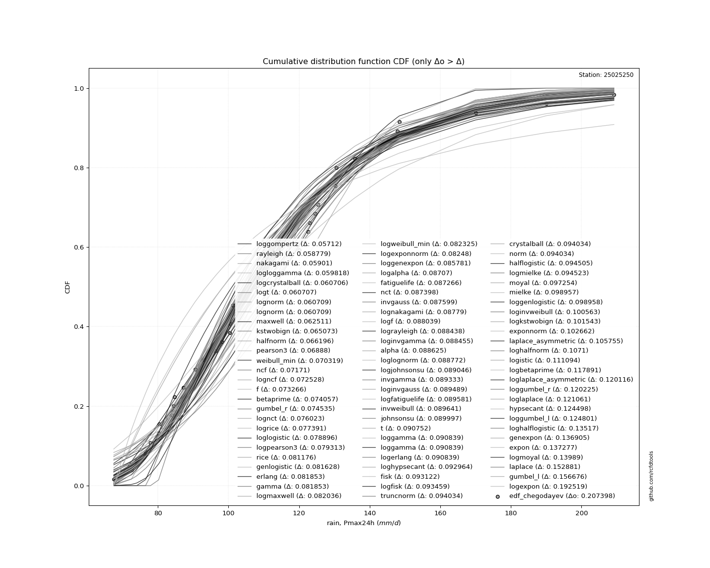</img>

</div>


**5.3. Best fit**

<div align="center">

|   id |   station | empirical_dist   | p_dist      |     delta |   deltao | eval   |   fit |   n |   best_fit |   best_fit_sort |
|-----:|----------:|:-----------------|:------------|----------:|---------:|:-------|------:|----:|-----------:|----------------:|
|    0 |  25025250 | edf_chegodayev   | loggompertz | 0.0571204 | 0.207398 | Δo > Δ |     1 |  43 |          1 |               1 |

</div>


<div align="center">

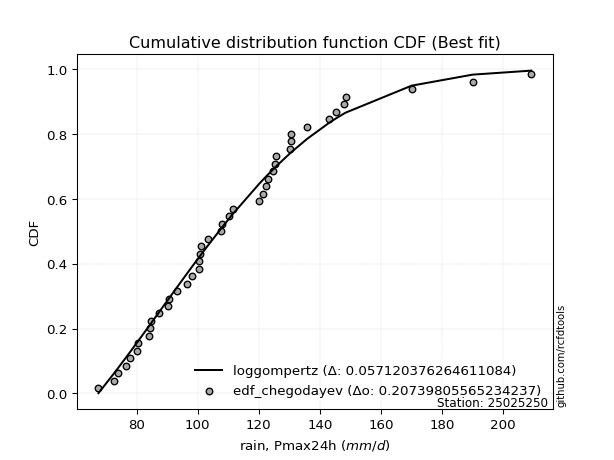</img>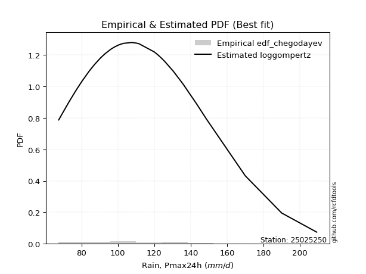</img>

</div>


### 6. EDF Blom (1958)

The Blom formula is a specific "plotting position" formula used in hydrology and statistical analysis to estimate the empirical cumulative probability (or non-exceedance probability) of a data series. It is particularly recommended for data that are approximately normally distributed. The constant _a_ is set to 0.375 (or 3/8).

<div align="center">


$P=(m-a)/(n+1-2a)$


</div>


**6.1. Empirical values**

<div align="center">

|                | 0                    | 1                   | 2                   | 3                  | 4                  | 5                   | 6                  | 7                   | 8                  | 9                   | 10                  | 11                  | 12                  | 13                | 14                  | 15                  | 16                  | 17                 | 18                 | 19                  | 20                 | 21         | 22                 | 23                 | 24                 | 25                 | 26                 | 27                 | 28                 | 29                 | 30                 | 31                 | 32                 | 33                 | 34                 | 35                 | 36                 | 37                | 38                 | 39                 | 40                 | 41                 | 42                 |
|:---------------|:---------------------|:--------------------|:--------------------|:-------------------|:-------------------|:--------------------|:-------------------|:--------------------|:-------------------|:--------------------|:--------------------|:--------------------|:--------------------|:------------------|:--------------------|:--------------------|:--------------------|:-------------------|:-------------------|:--------------------|:-------------------|:-----------|:-------------------|:-------------------|:-------------------|:-------------------|:-------------------|:-------------------|:-------------------|:-------------------|:-------------------|:-------------------|:-------------------|:-------------------|:-------------------|:-------------------|:-------------------|:------------------|:-------------------|:-------------------|:-------------------|:-------------------|:-------------------|
| date           | 2001                 | 1986                | 2006                | 1976               | 1977               | 1982                | 1997               | 2015                | 1989               | 1974                | 2013                | 2012                | 1990                | 1994              | 2007                | 1992                | 1988                | 1998               | 1980               | 1985                | 1973               | 2011       | 1999               | 1996               | 1984               | 2009               | 2008               | 2003               | 1978               | 2005               | 1987               | 1991               | 2002               | 2000               | 2004               | 2010               | 1981               | 1983              | 1979               | 1975               | 2014               | 1995               | 1993               |
| x              | 67.5                 | 72.5                | 74.0                | 76.5               | 77.9               | 80.2                | 80.4               | 84.0                | 84.4               | 84.7                | 87.23611343         | 90.41938696         | 90.6                | 93.1              | 96.37801329         | 98.1                | 100.3               | 100.3              | 100.8              | 101.1449581         | 103.2              | 107.532524 | 108.0              | 110.2              | 111.6              | 120.0              | 121.5              | 122.5              | 123.0              | 124.5              | 125.4              | 125.5              | 130.2              | 130.4              | 130.5              | 135.8              | 143.0              | 145.3             | 147.8              | 148.4              | 170.0              | 190.0              | 209.2              |
| m              | 1                    | 2                   | 3                   | 4                  | 5                  | 6                   | 7                  | 8                   | 9                  | 10                  | 11                  | 12                  | 13                  | 14                | 15                  | 16                  | 17                  | 18                 | 19                 | 20                  | 21                 | 22         | 23                 | 24                 | 25                 | 26                 | 27                 | 28                 | 29                 | 30                 | 31                 | 32                 | 33                 | 34                 | 35                 | 36                 | 37                 | 38                | 39                 | 40                 | 41                 | 42                 | 43                 |
| empirical_dist | edf_blom             | edf_blom            | edf_blom            | edf_blom           | edf_blom           | edf_blom            | edf_blom           | edf_blom            | edf_blom           | edf_blom            | edf_blom            | edf_blom            | edf_blom            | edf_blom          | edf_blom            | edf_blom            | edf_blom            | edf_blom           | edf_blom           | edf_blom            | edf_blom           | edf_blom   | edf_blom           | edf_blom           | edf_blom           | edf_blom           | edf_blom           | edf_blom           | edf_blom           | edf_blom           | edf_blom           | edf_blom           | edf_blom           | edf_blom           | edf_blom           | edf_blom           | edf_blom           | edf_blom          | edf_blom           | edf_blom           | edf_blom           | edf_blom           | edf_blom           |
| empirical      | 0.014450867052023121 | 0.03757225433526012 | 0.06069364161849711 | 0.0838150289017341 | 0.1069364161849711 | 0.13005780346820808 | 0.1531791907514451 | 0.17630057803468208 | 0.1994219653179191 | 0.22254335260115607 | 0.24566473988439305 | 0.26878612716763006 | 0.29190751445086704 | 0.315028901734104 | 0.33815028901734107 | 0.36127167630057805 | 0.38439306358381503 | 0.407514450867052  | 0.430635838150289  | 0.45375722543352603 | 0.476878612716763  | 0.5        | 0.523121387283237  | 0.546242774566474  | 0.569364161849711  | 0.5924855491329479 | 0.615606936416185  | 0.638728323699422  | 0.661849710982659  | 0.684971098265896  | 0.708092485549133  | 0.7312138728323699 | 0.7543352601156069 | 0.7774566473988439 | 0.8005780346820809 | 0.8236994219653179 | 0.846820809248555  | 0.869942196531792 | 0.8930635838150289 | 0.9161849710982659 | 0.9393063583815029 | 0.9624277456647399 | 0.9855491329479769 |
| empirical_tr   | 1.0146627565982405   | 1.0390390390390392  | 1.0646153846153845  | 1.0914826498422712 | 1.1197411003236246 | 1.149501661129568   | 1.180887372013652  | 1.2140350877192982  | 1.2490974729241877 | 1.2862453531598514  | 1.3256704980842913  | 1.3675889328063242  | 1.4122448979591837  | 1.459915611814346 | 1.5109170305676858  | 1.565610859728507   | 1.6244131455399062  | 1.6878048780487807 | 1.7563451776649748 | 1.8306878306878307  | 1.9116022099447514 | 2.0        | 2.0969696969696967 | 2.2038216560509554 | 2.3221476510067114 | 2.453900709219858  | 2.6015037593984967 | 2.7680000000000002 | 2.9572649572649574 | 3.1743119266055047 | 3.4257425742574257 | 3.7204301075268815 | 4.070588235294117  | 4.493506493506493  | 5.014492753623188  | 5.672131147540982  | 6.5283018867924545 | 7.688888888888891 | 9.351351351351354  | 11.931034482758623 | 16.476190476190478 | 26.61538461538461  | 69.1999999999999   |

</div>


**6.2. Kolmogorov-Smirnov fit test (sorted by Δ)**


<div align="center">

|                | 0                   | 1                   | 2                   | 3                   | 4                   | 5                    | 6                    | 7                    | 8                   | 9                   | 10                  | 11                  | 12                  | 13                  | 14                  | 15                  | 16                  | 17                  | 18                  | 19                  | 20                  | 21                  | 22                  | 23                  | 24                  | 25                  | 26                  | 27                  | 28                  | 29                  | 30                  | 31                  | 32                  | 33                  | 34                  | 35                  | 36                  | 37                  | 38                  | 39                  | 40                  | 41                  | 42                  | 43                  | 44                  | 45                  | 46                  | 47                  | 48                  | 49                  | 50                  | 51                  | 52                  | 53                  | 54                  | 55                  | 56                  | 57                  | 58                  | 59                  | 60                  | 61                  | 62                  | 63                  | 64                  | 65                  | 66                  | 67                  | 68                    | 69                  | 70                  | 71                  | 72                  | 73                  | 74                  | 75                  | 76                  | 77                  | 78                  | 79                  | 80                  | 81                  | 82                  | 83                  | 84                  | 85                  | 86                  | 87                  |
|:---------------|:--------------------|:--------------------|:--------------------|:--------------------|:--------------------|:---------------------|:---------------------|:---------------------|:--------------------|:--------------------|:--------------------|:--------------------|:--------------------|:--------------------|:--------------------|:--------------------|:--------------------|:--------------------|:--------------------|:--------------------|:--------------------|:--------------------|:--------------------|:--------------------|:--------------------|:--------------------|:--------------------|:--------------------|:--------------------|:--------------------|:--------------------|:--------------------|:--------------------|:--------------------|:--------------------|:--------------------|:--------------------|:--------------------|:--------------------|:--------------------|:--------------------|:--------------------|:--------------------|:--------------------|:--------------------|:--------------------|:--------------------|:--------------------|:--------------------|:--------------------|:--------------------|:--------------------|:--------------------|:--------------------|:--------------------|:--------------------|:--------------------|:--------------------|:--------------------|:--------------------|:--------------------|:--------------------|:--------------------|:--------------------|:--------------------|:--------------------|:--------------------|:--------------------|:----------------------|:--------------------|:--------------------|:--------------------|:--------------------|:--------------------|:--------------------|:--------------------|:--------------------|:--------------------|:--------------------|:--------------------|:--------------------|:--------------------|:--------------------|:--------------------|:--------------------|:--------------------|:--------------------|:--------------------|
| station        | 25025250            | 25025250            | 25025250            | 25025250            | 25025250            | 25025250             | 25025250             | 25025250             | 25025250            | 25025250            | 25025250            | 25025250            | 25025250            | 25025250            | 25025250            | 25025250            | 25025250            | 25025250            | 25025250            | 25025250            | 25025250            | 25025250            | 25025250            | 25025250            | 25025250            | 25025250            | 25025250            | 25025250            | 25025250            | 25025250            | 25025250            | 25025250            | 25025250            | 25025250            | 25025250            | 25025250            | 25025250            | 25025250            | 25025250            | 25025250            | 25025250            | 25025250            | 25025250            | 25025250            | 25025250            | 25025250            | 25025250            | 25025250            | 25025250            | 25025250            | 25025250            | 25025250            | 25025250            | 25025250            | 25025250            | 25025250            | 25025250            | 25025250            | 25025250            | 25025250            | 25025250            | 25025250            | 25025250            | 25025250            | 25025250            | 25025250            | 25025250            | 25025250            | 25025250              | 25025250            | 25025250            | 25025250            | 25025250            | 25025250            | 25025250            | 25025250            | 25025250            | 25025250            | 25025250            | 25025250            | 25025250            | 25025250            | 25025250            | 25025250            | 25025250            | 25025250            | 25025250            | 25025250            |
| empirical_dist | edf_blom            | edf_blom            | edf_blom            | edf_blom            | edf_blom            | edf_blom             | edf_blom             | edf_blom             | edf_blom            | edf_blom            | edf_blom            | edf_blom            | edf_blom            | edf_blom            | edf_blom            | edf_blom            | edf_blom            | edf_blom            | edf_blom            | edf_blom            | edf_blom            | edf_blom            | edf_blom            | edf_blom            | edf_blom            | edf_blom            | edf_blom            | edf_blom            | edf_blom            | edf_blom            | edf_blom            | edf_blom            | edf_blom            | edf_blom            | edf_blom            | edf_blom            | edf_blom            | edf_blom            | edf_blom            | edf_blom            | edf_blom            | edf_blom            | edf_blom            | edf_blom            | edf_blom            | edf_blom            | edf_blom            | edf_blom            | edf_blom            | edf_blom            | edf_blom            | edf_blom            | edf_blom            | edf_blom            | edf_blom            | edf_blom            | edf_blom            | edf_blom            | edf_blom            | edf_blom            | edf_blom            | edf_blom            | edf_blom            | edf_blom            | edf_blom            | edf_blom            | edf_blom            | edf_blom            | edf_blom              | edf_blom            | edf_blom            | edf_blom            | edf_blom            | edf_blom            | edf_blom            | edf_blom            | edf_blom            | edf_blom            | edf_blom            | edf_blom            | edf_blom            | edf_blom            | edf_blom            | edf_blom            | edf_blom            | edf_blom            | edf_blom            | edf_blom            |
| p_dist         | loggompertz         | nakagami            | logloggamma         | rayleigh            | logcrystalball      | logt                 | lognorm              | lognorm              | maxwell             | kstwobign           | halfnorm            | pearson3            | weibull_min         | ncf                 | logncf              | f                   | betaprime           | gumbel_r            | lognct              | logrice             | loglogistic         | logpearson3         | rice                | genlogistic         | erlang              | gamma               | logmaxwell          | logweibull_min      | logexponnorm        | loggenexpon         | logalpha            | fatiguelife         | nct                 | invgauss            | lognakagami         | logf                | lograyleigh         | loginvgamma         | alpha               | loglognorm          | logjohnsonsu        | invgamma            | loginvgauss         | logfatiguelife      | invweibull          | johnsonsu           | loggamma            | loggamma            | logerlang           | t                   | loghypsecant        | fisk                | logfisk             | truncnorm           | crystalball         | norm                | halflogistic        | logmielke           | moyal               | mielke              | loggenlogistic      | loginvweibull       | logkstwobign        | exponnorm           | laplace_asymmetric  | loghalfnorm         | logistic            | logbetaprime        | loglaplace_asymmetric | loggumbel_r         | loglaplace          | hypsecant           | loggumbel_l         | loghalflogistic     | genexpon            | expon               | logmoyal            | laplace             | gumbel_l            | logexpon            | wald                | logwald             | loggibrat           | gibrat              | logchi2             | logtruncnorm        | chi2                | gompertz            |
| delta          | 0.05815924043977938 | 0.05869054113957106 | 0.05965790977349511 | 0.05981764039696358 | 0.06038667825286148 | 0.060387325031121764 | 0.060388971171276284 | 0.060388971171276284 | 0.0635496270155459  | 0.06475364275551476 | 0.06587675459050335 | 0.068560192080247   | 0.06999890605706671 | 0.07139037299583206 | 0.0722085190930375  | 0.07294640719153023 | 0.07373714393065567 | 0.07421534237392835 | 0.07570302502402926 | 0.07707175510203268 | 0.07857626950748209 | 0.07899332382634994 | 0.08101575768921754 | 0.08130810868166816 | 0.08153367595941607 | 0.08153371031393775 | 0.08171610184360056 | 0.08200538809149405 | 0.08216043939954687 | 0.08546154038791842 | 0.08674999938974104 | 0.08694598116871277 | 0.08707858709012462 | 0.08727914121114944 | 0.08746994979197154 | 0.08771919137774753 | 0.08811860934157423 | 0.08813515990243204 | 0.08830557045212473 | 0.08845222474380066 | 0.08872653954908771 | 0.08901365978557085 | 0.0891691641547957  | 0.089261487863181   | 0.08932085931248823 | 0.08967695732934944 | 0.09051899659770735 | 0.09051899659770735 | 0.0905190888397327  | 0.09059265083024237 | 0.09264407101963446 | 0.09280284286016105 | 0.0931395902609422  | 0.09387401782960558 | 0.09387403232223662 | 0.0938740352822931  | 0.09418546514740378 | 0.09420361453838155 | 0.09693477464056366 | 0.0986373372942283  | 0.09863881630863092 | 0.10024295110550174 | 0.10122339061208696 | 0.10234261994831684 | 0.10615448074566763 | 0.10678069913737098 | 0.11093412890508986 | 0.1193295315004721  | 0.11979590652174421   | 0.11990548489440944 | 0.12074145052809837 | 0.12433807375759098 | 0.12464092611097605 | 0.13485030357194505 | 0.137304417783566   | 0.13783661243642348 | 0.1395700293230564  | 0.15272141467600486 | 0.15659581390598026 | 0.19363776151781215 | 0.2167733140975197  | 0.22252416521258997 | 0.26007986087125107 | 0.2701470972256613  | 0.29918668364193823 | 0.30137859886198476 | 0.9207631691734061  | 0.936135209887781   |
| deltao         | 0.20739805565234237 | 0.20739805565234237 | 0.20739805565234237 | 0.20739805565234237 | 0.20739805565234237 | 0.20739805565234237  | 0.20739805565234237  | 0.20739805565234237  | 0.20739805565234237 | 0.20739805565234237 | 0.20739805565234237 | 0.20739805565234237 | 0.20739805565234237 | 0.20739805565234237 | 0.20739805565234237 | 0.20739805565234237 | 0.20739805565234237 | 0.20739805565234237 | 0.20739805565234237 | 0.20739805565234237 | 0.20739805565234237 | 0.20739805565234237 | 0.20739805565234237 | 0.20739805565234237 | 0.20739805565234237 | 0.20739805565234237 | 0.20739805565234237 | 0.20739805565234237 | 0.20739805565234237 | 0.20739805565234237 | 0.20739805565234237 | 0.20739805565234237 | 0.20739805565234237 | 0.20739805565234237 | 0.20739805565234237 | 0.20739805565234237 | 0.20739805565234237 | 0.20739805565234237 | 0.20739805565234237 | 0.20739805565234237 | 0.20739805565234237 | 0.20739805565234237 | 0.20739805565234237 | 0.20739805565234237 | 0.20739805565234237 | 0.20739805565234237 | 0.20739805565234237 | 0.20739805565234237 | 0.20739805565234237 | 0.20739805565234237 | 0.20739805565234237 | 0.20739805565234237 | 0.20739805565234237 | 0.20739805565234237 | 0.20739805565234237 | 0.20739805565234237 | 0.20739805565234237 | 0.20739805565234237 | 0.20739805565234237 | 0.20739805565234237 | 0.20739805565234237 | 0.20739805565234237 | 0.20739805565234237 | 0.20739805565234237 | 0.20739805565234237 | 0.20739805565234237 | 0.20739805565234237 | 0.20739805565234237 | 0.20739805565234237   | 0.20739805565234237 | 0.20739805565234237 | 0.20739805565234237 | 0.20739805565234237 | 0.20739805565234237 | 0.20739805565234237 | 0.20739805565234237 | 0.20739805565234237 | 0.20739805565234237 | 0.20739805565234237 | 0.20739805565234237 | 0.20739805565234237 | 0.20739805565234237 | 0.20739805565234237 | 0.20739805565234237 | 0.20739805565234237 | 0.20739805565234237 | 0.20739805565234237 | 0.20739805565234237 |
| eval           | Δo > Δ              | Δo > Δ              | Δo > Δ              | Δo > Δ              | Δo > Δ              | Δo > Δ               | Δo > Δ               | Δo > Δ               | Δo > Δ              | Δo > Δ              | Δo > Δ              | Δo > Δ              | Δo > Δ              | Δo > Δ              | Δo > Δ              | Δo > Δ              | Δo > Δ              | Δo > Δ              | Δo > Δ              | Δo > Δ              | Δo > Δ              | Δo > Δ              | Δo > Δ              | Δo > Δ              | Δo > Δ              | Δo > Δ              | Δo > Δ              | Δo > Δ              | Δo > Δ              | Δo > Δ              | Δo > Δ              | Δo > Δ              | Δo > Δ              | Δo > Δ              | Δo > Δ              | Δo > Δ              | Δo > Δ              | Δo > Δ              | Δo > Δ              | Δo > Δ              | Δo > Δ              | Δo > Δ              | Δo > Δ              | Δo > Δ              | Δo > Δ              | Δo > Δ              | Δo > Δ              | Δo > Δ              | Δo > Δ              | Δo > Δ              | Δo > Δ              | Δo > Δ              | Δo > Δ              | Δo > Δ              | Δo > Δ              | Δo > Δ              | Δo > Δ              | Δo > Δ              | Δo > Δ              | Δo > Δ              | Δo > Δ              | Δo > Δ              | Δo > Δ              | Δo > Δ              | Δo > Δ              | Δo > Δ              | Δo > Δ              | Δo > Δ              | Δo > Δ                | Δo > Δ              | Δo > Δ              | Δo > Δ              | Δo > Δ              | Δo > Δ              | Δo > Δ              | Δo > Δ              | Δo > Δ              | Δo > Δ              | Δo > Δ              | Δo > Δ              | Δo <= Δ             | Δo <= Δ             | Δo <= Δ             | Δo <= Δ             | Δo <= Δ             | Δo <= Δ             | Δo <= Δ             | Δo <= Δ             |
| fit            | 1                   | 1                   | 1                   | 1                   | 1                   | 1                    | 1                    | 1                    | 1                   | 1                   | 1                   | 1                   | 1                   | 1                   | 1                   | 1                   | 1                   | 1                   | 1                   | 1                   | 1                   | 1                   | 1                   | 1                   | 1                   | 1                   | 1                   | 1                   | 1                   | 1                   | 1                   | 1                   | 1                   | 1                   | 1                   | 1                   | 1                   | 1                   | 1                   | 1                   | 1                   | 1                   | 1                   | 1                   | 1                   | 1                   | 1                   | 1                   | 1                   | 1                   | 1                   | 1                   | 1                   | 1                   | 1                   | 1                   | 1                   | 1                   | 1                   | 1                   | 1                   | 1                   | 1                   | 1                   | 1                   | 1                   | 1                   | 1                   | 1                     | 1                   | 1                   | 1                   | 1                   | 1                   | 1                   | 1                   | 1                   | 1                   | 1                   | 1                   | 0                   | 0                   | 0                   | 0                   | 0                   | 0                   | 0                   | 0                   |
| n              | 43                  | 43                  | 43                  | 43                  | 43                  | 43                   | 43                   | 43                   | 43                  | 43                  | 43                  | 43                  | 43                  | 43                  | 43                  | 43                  | 43                  | 43                  | 43                  | 43                  | 43                  | 43                  | 43                  | 43                  | 43                  | 43                  | 43                  | 43                  | 43                  | 43                  | 43                  | 43                  | 43                  | 43                  | 43                  | 43                  | 43                  | 43                  | 43                  | 43                  | 43                  | 43                  | 43                  | 43                  | 43                  | 43                  | 43                  | 43                  | 43                  | 43                  | 43                  | 43                  | 43                  | 43                  | 43                  | 43                  | 43                  | 43                  | 43                  | 43                  | 43                  | 43                  | 43                  | 43                  | 43                  | 43                  | 43                  | 43                  | 43                    | 43                  | 43                  | 43                  | 43                  | 43                  | 43                  | 43                  | 43                  | 43                  | 43                  | 43                  | 43                  | 43                  | 43                  | 43                  | 43                  | 43                  | 43                  | 43                  |
| best_fit       | 1                   | 0                   | 0                   | 0                   | 0                   | 0                    | 0                    | 0                    | 0                   | 0                   | 0                   | 0                   | 0                   | 0                   | 0                   | 0                   | 0                   | 0                   | 0                   | 0                   | 0                   | 0                   | 0                   | 0                   | 0                   | 0                   | 0                   | 0                   | 0                   | 0                   | 0                   | 0                   | 0                   | 0                   | 0                   | 0                   | 0                   | 0                   | 0                   | 0                   | 0                   | 0                   | 0                   | 0                   | 0                   | 0                   | 0                   | 0                   | 0                   | 0                   | 0                   | 0                   | 0                   | 0                   | 0                   | 0                   | 0                   | 0                   | 0                   | 0                   | 0                   | 0                   | 0                   | 0                   | 0                   | 0                   | 0                   | 0                   | 0                     | 0                   | 0                   | 0                   | 0                   | 0                   | 0                   | 0                   | 0                   | 0                   | 0                   | 0                   | 0                   | 0                   | 0                   | 0                   | 0                   | 0                   | 0                   | 0                   |
| best_fit_sort  | 1                   | 2                   | 3                   | 4                   | 5                   | 6                    | 7                    | 8                    | 9                   | 10                  | 11                  | 12                  | 13                  | 14                  | 15                  | 16                  | 17                  | 18                  | 19                  | 20                  | 21                  | 22                  | 23                  | 24                  | 25                  | 26                  | 27                  | 28                  | 29                  | 30                  | 31                  | 32                  | 33                  | 34                  | 35                  | 36                  | 37                  | 38                  | 39                  | 40                  | 41                  | 42                  | 43                  | 44                  | 45                  | 46                  | 47                  | 48                  | 49                  | 50                  | 51                  | 52                  | 53                  | 54                  | 55                  | 56                  | 57                  | 58                  | 59                  | 60                  | 61                  | 62                  | 63                  | 64                  | 65                  | 66                  | 67                  | 68                  | 69                    | 70                  | 71                  | 72                  | 73                  | 74                  | 75                  | 76                  | 77                  | 78                  | 79                  | 80                  | 81                  | 82                  | 83                  | 84                  | 85                  | 86                  | 87                  | 88                  |

</div>


<div align="center">

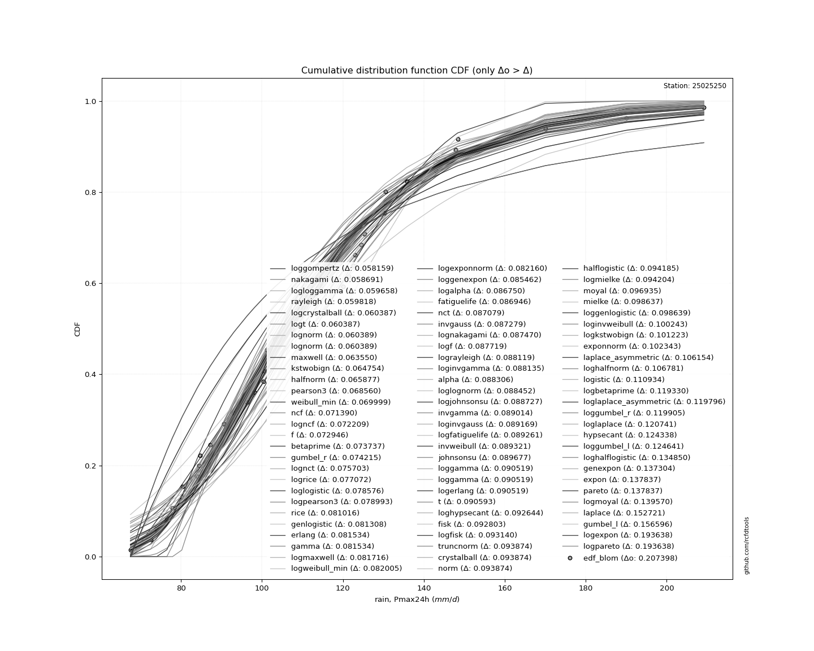</img>

</div>


**6.3. Best fit**

<div align="center">

|   id |   station | empirical_dist   | p_dist      |     delta |   deltao | eval   |   fit |   n |   best_fit |   best_fit_sort |
|-----:|----------:|:-----------------|:------------|----------:|---------:|:-------|------:|----:|-----------:|----------------:|
|    0 |  25025250 | edf_blom         | loggompertz | 0.0581592 | 0.207398 | Δo > Δ |     1 |  43 |          1 |               1 |

</div>


<div align="center">

</img></img>

</div>


### 7. EDF Tukey (1962)

In hydrology, the Tukey formula is used as a plotting position formula to estimate the empirical probability or frequency of a flood event (or other hydrological data). The formula parameter is given as _c=0.333_ (or 1/3).

<div align="center">


$P=(m-c)/(n+1-2c)$


</div>


**7.1. Empirical values**

<div align="center">

|                | 0                    | 1                    | 2                   | 3                   | 4                  | 5                   | 6                   | 7                   | 8         | 9                  | 10                  | 11                 | 12                 | 13                 | 14                 | 15                  | 16                  | 17                 | 18                 | 19                  | 20                  | 21         | 22                 | 23                 | 24                 | 25                 | 26                 | 27                 | 28                 | 29                 | 30                 | 31                 | 32                 | 33                 | 34                | 35                | 36                 | 37                 | 38                 | 39                 | 40                 | 41                 | 42                 |
|:---------------|:---------------------|:---------------------|:--------------------|:--------------------|:-------------------|:--------------------|:--------------------|:--------------------|:----------|:-------------------|:--------------------|:-------------------|:-------------------|:-------------------|:-------------------|:--------------------|:--------------------|:-------------------|:-------------------|:--------------------|:--------------------|:-----------|:-------------------|:-------------------|:-------------------|:-------------------|:-------------------|:-------------------|:-------------------|:-------------------|:-------------------|:-------------------|:-------------------|:-------------------|:------------------|:------------------|:-------------------|:-------------------|:-------------------|:-------------------|:-------------------|:-------------------|:-------------------|
| date           | 2001                 | 1986                 | 2006                | 1976                | 1977               | 1982                | 1997                | 2015                | 1989      | 1974               | 2013                | 2012               | 1990               | 1994               | 2007               | 1992                | 1988                | 1998               | 1980               | 1985                | 1973                | 2011       | 1999               | 1996               | 1984               | 2009               | 2008               | 2003               | 1978               | 2005               | 1987               | 1991               | 2002               | 2000               | 2004              | 2010              | 1981               | 1983               | 1979               | 1975               | 2014               | 1995               | 1993               |
| x              | 67.5                 | 72.5                 | 74.0                | 76.5                | 77.9               | 80.2                | 80.4                | 84.0                | 84.4      | 84.7               | 87.23611343         | 90.41938696        | 90.6               | 93.1               | 96.37801329        | 98.1                | 100.3               | 100.3              | 100.8              | 101.1449581         | 103.2               | 107.532524 | 108.0              | 110.2              | 111.6              | 120.0              | 121.5              | 122.5              | 123.0              | 124.5              | 125.4              | 125.5              | 130.2              | 130.4              | 130.5             | 135.8             | 143.0              | 145.3              | 147.8              | 148.4              | 170.0              | 190.0              | 209.2              |
| m              | 1                    | 2                    | 3                   | 4                   | 5                  | 6                   | 7                   | 8                   | 9         | 10                 | 11                  | 12                 | 13                 | 14                 | 15                 | 16                  | 17                  | 18                 | 19                 | 20                  | 21                  | 22         | 23                 | 24                 | 25                 | 26                 | 27                 | 28                 | 29                 | 30                 | 31                 | 32                 | 33                 | 34                 | 35                | 36                | 37                 | 38                 | 39                 | 40                 | 41                 | 42                 | 43                 |
| empirical_dist | edf_tukey            | edf_tukey            | edf_tukey           | edf_tukey           | edf_tukey          | edf_tukey           | edf_tukey           | edf_tukey           | edf_tukey | edf_tukey          | edf_tukey           | edf_tukey          | edf_tukey          | edf_tukey          | edf_tukey          | edf_tukey           | edf_tukey           | edf_tukey          | edf_tukey          | edf_tukey           | edf_tukey           | edf_tukey  | edf_tukey          | edf_tukey          | edf_tukey          | edf_tukey          | edf_tukey          | edf_tukey          | edf_tukey          | edf_tukey          | edf_tukey          | edf_tukey          | edf_tukey          | edf_tukey          | edf_tukey         | edf_tukey         | edf_tukey          | edf_tukey          | edf_tukey          | edf_tukey          | edf_tukey          | edf_tukey          | edf_tukey          |
| empirical      | 0.015384615384615385 | 0.038461538461538464 | 0.06153846153846154 | 0.08461538461538462 | 0.1076923076923077 | 0.13076923076923078 | 0.15384615384615385 | 0.17692307692307693 | 0.2       | 0.2230769230769231 | 0.24615384615384617 | 0.2692307692307692 | 0.2923076923076923 | 0.3153846153846154 | 0.3384615384615385 | 0.36153846153846153 | 0.38461538461538464 | 0.4076923076923077 | 0.4307692307692308 | 0.45384615384615384 | 0.47692307692307695 | 0.5        | 0.5230769230769231 | 0.5461538461538461 | 0.5692307692307692 | 0.5923076923076923 | 0.6153846153846154 | 0.6384615384615384 | 0.6615384615384615 | 0.6846153846153846 | 0.7076923076923077 | 0.7307692307692307 | 0.7538461538461538 | 0.7769230769230769 | 0.8               | 0.823076923076923 | 0.8461538461538461 | 0.8692307692307693 | 0.8923076923076924 | 0.9153846153846154 | 0.9384615384615385 | 0.9615384615384616 | 0.9846153846153847 |
| empirical_tr   | 1.015625             | 1.04                 | 1.0655737704918034  | 1.092436974789916   | 1.120689655172414  | 1.1504424778761062  | 1.1818181818181819  | 1.2149532710280375  | 1.25      | 1.2871287128712872 | 1.3265306122448979  | 1.3684210526315788 | 1.4130434782608696 | 1.4606741573033708 | 1.5116279069767442 | 1.566265060240964   | 1.625               | 1.6883116883116882 | 1.7567567567567568 | 1.8309859154929575  | 1.9117647058823533  | 2.0        | 2.096774193548387  | 2.2033898305084745 | 2.321428571428571  | 2.452830188679245  | 2.6                | 2.7659574468085104 | 2.9545454545454546 | 3.1707317073170733 | 3.421052631578948  | 3.7142857142857135 | 4.0625             | 4.482758620689656  | 5.000000000000001 | 5.652173913043477 | 6.5                | 7.647058823529413  | 9.28571428571429   | 11.818181818181813 | 16.25              | 26.000000000000018 | 65.00000000000023  |

</div>


**7.2. Kolmogorov-Smirnov fit test (sorted by Δ)**


<div align="center">

|                | 0                   | 1                   | 2                   | 3                   | 4                   | 5                   | 6                   | 7                   | 8                   | 9                   | 10                  | 11                  | 12                  | 13                  | 14                  | 15                  | 16                  | 17                  | 18                  | 19                  | 20                  | 21                  | 22                  | 23                  | 24                  | 25                  | 26                  | 27                  | 28                  | 29                  | 30                  | 31                  | 32                  | 33                  | 34                  | 35                  | 36                  | 37                  | 38                  | 39                  | 40                  | 41                  | 42                  | 43                  | 44                  | 45                  | 46                  | 47                  | 48                  | 49                  | 50                  | 51                  | 52                  | 53                  | 54                  | 55                  | 56                  | 57                  | 58                  | 59                  | 60                  | 61                  | 62                  | 63                  | 64                  | 65                  | 66                  | 67                  | 68                    | 69                  | 70                  | 71                  | 72                  | 73                  | 74                  | 75                  | 76                  | 77                  | 78                  | 79                  | 80                  | 81                  | 82                  | 83                  | 84                  | 85                  | 86                  | 87                  |
|:---------------|:--------------------|:--------------------|:--------------------|:--------------------|:--------------------|:--------------------|:--------------------|:--------------------|:--------------------|:--------------------|:--------------------|:--------------------|:--------------------|:--------------------|:--------------------|:--------------------|:--------------------|:--------------------|:--------------------|:--------------------|:--------------------|:--------------------|:--------------------|:--------------------|:--------------------|:--------------------|:--------------------|:--------------------|:--------------------|:--------------------|:--------------------|:--------------------|:--------------------|:--------------------|:--------------------|:--------------------|:--------------------|:--------------------|:--------------------|:--------------------|:--------------------|:--------------------|:--------------------|:--------------------|:--------------------|:--------------------|:--------------------|:--------------------|:--------------------|:--------------------|:--------------------|:--------------------|:--------------------|:--------------------|:--------------------|:--------------------|:--------------------|:--------------------|:--------------------|:--------------------|:--------------------|:--------------------|:--------------------|:--------------------|:--------------------|:--------------------|:--------------------|:--------------------|:----------------------|:--------------------|:--------------------|:--------------------|:--------------------|:--------------------|:--------------------|:--------------------|:--------------------|:--------------------|:--------------------|:--------------------|:--------------------|:--------------------|:--------------------|:--------------------|:--------------------|:--------------------|:--------------------|:--------------------|
| station        | 25025250            | 25025250            | 25025250            | 25025250            | 25025250            | 25025250            | 25025250            | 25025250            | 25025250            | 25025250            | 25025250            | 25025250            | 25025250            | 25025250            | 25025250            | 25025250            | 25025250            | 25025250            | 25025250            | 25025250            | 25025250            | 25025250            | 25025250            | 25025250            | 25025250            | 25025250            | 25025250            | 25025250            | 25025250            | 25025250            | 25025250            | 25025250            | 25025250            | 25025250            | 25025250            | 25025250            | 25025250            | 25025250            | 25025250            | 25025250            | 25025250            | 25025250            | 25025250            | 25025250            | 25025250            | 25025250            | 25025250            | 25025250            | 25025250            | 25025250            | 25025250            | 25025250            | 25025250            | 25025250            | 25025250            | 25025250            | 25025250            | 25025250            | 25025250            | 25025250            | 25025250            | 25025250            | 25025250            | 25025250            | 25025250            | 25025250            | 25025250            | 25025250            | 25025250              | 25025250            | 25025250            | 25025250            | 25025250            | 25025250            | 25025250            | 25025250            | 25025250            | 25025250            | 25025250            | 25025250            | 25025250            | 25025250            | 25025250            | 25025250            | 25025250            | 25025250            | 25025250            | 25025250            |
| empirical_dist | edf_tukey           | edf_tukey           | edf_tukey           | edf_tukey           | edf_tukey           | edf_tukey           | edf_tukey           | edf_tukey           | edf_tukey           | edf_tukey           | edf_tukey           | edf_tukey           | edf_tukey           | edf_tukey           | edf_tukey           | edf_tukey           | edf_tukey           | edf_tukey           | edf_tukey           | edf_tukey           | edf_tukey           | edf_tukey           | edf_tukey           | edf_tukey           | edf_tukey           | edf_tukey           | edf_tukey           | edf_tukey           | edf_tukey           | edf_tukey           | edf_tukey           | edf_tukey           | edf_tukey           | edf_tukey           | edf_tukey           | edf_tukey           | edf_tukey           | edf_tukey           | edf_tukey           | edf_tukey           | edf_tukey           | edf_tukey           | edf_tukey           | edf_tukey           | edf_tukey           | edf_tukey           | edf_tukey           | edf_tukey           | edf_tukey           | edf_tukey           | edf_tukey           | edf_tukey           | edf_tukey           | edf_tukey           | edf_tukey           | edf_tukey           | edf_tukey           | edf_tukey           | edf_tukey           | edf_tukey           | edf_tukey           | edf_tukey           | edf_tukey           | edf_tukey           | edf_tukey           | edf_tukey           | edf_tukey           | edf_tukey           | edf_tukey             | edf_tukey           | edf_tukey           | edf_tukey           | edf_tukey           | edf_tukey           | edf_tukey           | edf_tukey           | edf_tukey           | edf_tukey           | edf_tukey           | edf_tukey           | edf_tukey           | edf_tukey           | edf_tukey           | edf_tukey           | edf_tukey           | edf_tukey           | edf_tukey           | edf_tukey           |
| p_dist         | loggompertz         | nakagami            | rayleigh            | logloggamma         | logcrystalball      | logt                | lognorm             | lognorm             | maxwell             | kstwobign           | halfnorm            | pearson3            | weibull_min         | ncf                 | logncf              | f                   | betaprime           | gumbel_r            | lognct              | logrice             | loglogistic         | logpearson3         | rice                | genlogistic         | erlang              | gamma               | logmaxwell          | logweibull_min      | logexponnorm        | loggenexpon         | logalpha            | fatiguelife         | nct                 | invgauss            | lognakagami         | logf                | lograyleigh         | loginvgamma         | alpha               | loglognorm          | logjohnsonsu        | invgamma            | loginvgauss         | logfatiguelife      | invweibull          | johnsonsu           | t                   | loggamma            | loggamma            | logerlang           | loghypsecant        | fisk                | logfisk             | truncnorm           | crystalball         | norm                | halflogistic        | logmielke           | moyal               | mielke              | loggenlogistic      | loginvweibull       | logkstwobign        | exponnorm           | laplace_asymmetric  | loghalfnorm         | logistic            | logbetaprime        | loglaplace_asymmetric | loggumbel_r         | loglaplace          | hypsecant           | loggumbel_l         | loghalflogistic     | genexpon            | expon               | logmoyal            | laplace             | gumbel_l            | logexpon            | wald                | logwald             | loggibrat           | gibrat              | logchi2             | logtruncnorm        | chi2                | gompertz            |
| delta          | 0.05758120575769854 | 0.05886839796482668 | 0.05923960571488274 | 0.05974683818612292 | 0.0605645350781171  | 0.06056518185637738 | 0.0605668279965319  | 0.0605668279965319  | 0.06297159233346505 | 0.06493149958077038 | 0.06605461141575897 | 0.06873804890550261 | 0.07017676288232233 | 0.07156822982108768 | 0.07238637591829311 | 0.07312426401678584 | 0.07391500075591129 | 0.07439319919918397 | 0.07588088184928488 | 0.0772496119272883  | 0.0787541263327377  | 0.07917118065160555 | 0.08110468610184535 | 0.08148596550692377 | 0.08171153278467169 | 0.08171156713919336 | 0.08189395866885618 | 0.08218324491674966 | 0.08233829622480249 | 0.08563939721317404 | 0.08692785621499666 | 0.08712383799396839 | 0.08725644391538023 | 0.08745699803640505 | 0.08764780661722715 | 0.08789704820300315 | 0.08829646616682985 | 0.08831301672768765 | 0.08848342727738034 | 0.08863008156905627 | 0.08890439637434333 | 0.08919151661082647 | 0.08934702098005132 | 0.08943934468843662 | 0.08949871613774385 | 0.08985481415460506 | 0.09068157924287018 | 0.09069685342296296 | 0.09069685342296296 | 0.09069694566498832 | 0.09282192784489007 | 0.09298069968541667 | 0.09331744708619782 | 0.09396294624223339 | 0.09396296073486443 | 0.09396296369492091 | 0.0943633219726594  | 0.09438147136363717 | 0.09711263146581928 | 0.09881519411948392 | 0.09881667313388653 | 0.10042080793075736 | 0.10140124743734258 | 0.10252047677357246 | 0.10593215971409803 | 0.1069585559626266  | 0.11102305731771767 | 0.11852917578682154 | 0.11997376334699983   | 0.12008334171966506 | 0.12091930735335399 | 0.12442700217021879 | 0.12472985452360386 | 0.13502816039720067 | 0.1370820967519964  | 0.13752536299222606 | 0.13974788614831202 | 0.15281034308863267 | 0.1566402781122942  | 0.1930152626294173  | 0.21730688457328673 | 0.223057735688357   | 0.26048003872807635 | 0.27054727508248655 | 0.2983863279282877  | 0.30106734941778734 | 0.9198738850471277  | 0.9352903899678165  |
| deltao         | 0.20739805565234237 | 0.20739805565234237 | 0.20739805565234237 | 0.20739805565234237 | 0.20739805565234237 | 0.20739805565234237 | 0.20739805565234237 | 0.20739805565234237 | 0.20739805565234237 | 0.20739805565234237 | 0.20739805565234237 | 0.20739805565234237 | 0.20739805565234237 | 0.20739805565234237 | 0.20739805565234237 | 0.20739805565234237 | 0.20739805565234237 | 0.20739805565234237 | 0.20739805565234237 | 0.20739805565234237 | 0.20739805565234237 | 0.20739805565234237 | 0.20739805565234237 | 0.20739805565234237 | 0.20739805565234237 | 0.20739805565234237 | 0.20739805565234237 | 0.20739805565234237 | 0.20739805565234237 | 0.20739805565234237 | 0.20739805565234237 | 0.20739805565234237 | 0.20739805565234237 | 0.20739805565234237 | 0.20739805565234237 | 0.20739805565234237 | 0.20739805565234237 | 0.20739805565234237 | 0.20739805565234237 | 0.20739805565234237 | 0.20739805565234237 | 0.20739805565234237 | 0.20739805565234237 | 0.20739805565234237 | 0.20739805565234237 | 0.20739805565234237 | 0.20739805565234237 | 0.20739805565234237 | 0.20739805565234237 | 0.20739805565234237 | 0.20739805565234237 | 0.20739805565234237 | 0.20739805565234237 | 0.20739805565234237 | 0.20739805565234237 | 0.20739805565234237 | 0.20739805565234237 | 0.20739805565234237 | 0.20739805565234237 | 0.20739805565234237 | 0.20739805565234237 | 0.20739805565234237 | 0.20739805565234237 | 0.20739805565234237 | 0.20739805565234237 | 0.20739805565234237 | 0.20739805565234237 | 0.20739805565234237 | 0.20739805565234237   | 0.20739805565234237 | 0.20739805565234237 | 0.20739805565234237 | 0.20739805565234237 | 0.20739805565234237 | 0.20739805565234237 | 0.20739805565234237 | 0.20739805565234237 | 0.20739805565234237 | 0.20739805565234237 | 0.20739805565234237 | 0.20739805565234237 | 0.20739805565234237 | 0.20739805565234237 | 0.20739805565234237 | 0.20739805565234237 | 0.20739805565234237 | 0.20739805565234237 | 0.20739805565234237 |
| eval           | Δo > Δ              | Δo > Δ              | Δo > Δ              | Δo > Δ              | Δo > Δ              | Δo > Δ              | Δo > Δ              | Δo > Δ              | Δo > Δ              | Δo > Δ              | Δo > Δ              | Δo > Δ              | Δo > Δ              | Δo > Δ              | Δo > Δ              | Δo > Δ              | Δo > Δ              | Δo > Δ              | Δo > Δ              | Δo > Δ              | Δo > Δ              | Δo > Δ              | Δo > Δ              | Δo > Δ              | Δo > Δ              | Δo > Δ              | Δo > Δ              | Δo > Δ              | Δo > Δ              | Δo > Δ              | Δo > Δ              | Δo > Δ              | Δo > Δ              | Δo > Δ              | Δo > Δ              | Δo > Δ              | Δo > Δ              | Δo > Δ              | Δo > Δ              | Δo > Δ              | Δo > Δ              | Δo > Δ              | Δo > Δ              | Δo > Δ              | Δo > Δ              | Δo > Δ              | Δo > Δ              | Δo > Δ              | Δo > Δ              | Δo > Δ              | Δo > Δ              | Δo > Δ              | Δo > Δ              | Δo > Δ              | Δo > Δ              | Δo > Δ              | Δo > Δ              | Δo > Δ              | Δo > Δ              | Δo > Δ              | Δo > Δ              | Δo > Δ              | Δo > Δ              | Δo > Δ              | Δo > Δ              | Δo > Δ              | Δo > Δ              | Δo > Δ              | Δo > Δ                | Δo > Δ              | Δo > Δ              | Δo > Δ              | Δo > Δ              | Δo > Δ              | Δo > Δ              | Δo > Δ              | Δo > Δ              | Δo > Δ              | Δo > Δ              | Δo > Δ              | Δo <= Δ             | Δo <= Δ             | Δo <= Δ             | Δo <= Δ             | Δo <= Δ             | Δo <= Δ             | Δo <= Δ             | Δo <= Δ             |
| fit            | 1                   | 1                   | 1                   | 1                   | 1                   | 1                   | 1                   | 1                   | 1                   | 1                   | 1                   | 1                   | 1                   | 1                   | 1                   | 1                   | 1                   | 1                   | 1                   | 1                   | 1                   | 1                   | 1                   | 1                   | 1                   | 1                   | 1                   | 1                   | 1                   | 1                   | 1                   | 1                   | 1                   | 1                   | 1                   | 1                   | 1                   | 1                   | 1                   | 1                   | 1                   | 1                   | 1                   | 1                   | 1                   | 1                   | 1                   | 1                   | 1                   | 1                   | 1                   | 1                   | 1                   | 1                   | 1                   | 1                   | 1                   | 1                   | 1                   | 1                   | 1                   | 1                   | 1                   | 1                   | 1                   | 1                   | 1                   | 1                   | 1                     | 1                   | 1                   | 1                   | 1                   | 1                   | 1                   | 1                   | 1                   | 1                   | 1                   | 1                   | 0                   | 0                   | 0                   | 0                   | 0                   | 0                   | 0                   | 0                   |
| n              | 43                  | 43                  | 43                  | 43                  | 43                  | 43                  | 43                  | 43                  | 43                  | 43                  | 43                  | 43                  | 43                  | 43                  | 43                  | 43                  | 43                  | 43                  | 43                  | 43                  | 43                  | 43                  | 43                  | 43                  | 43                  | 43                  | 43                  | 43                  | 43                  | 43                  | 43                  | 43                  | 43                  | 43                  | 43                  | 43                  | 43                  | 43                  | 43                  | 43                  | 43                  | 43                  | 43                  | 43                  | 43                  | 43                  | 43                  | 43                  | 43                  | 43                  | 43                  | 43                  | 43                  | 43                  | 43                  | 43                  | 43                  | 43                  | 43                  | 43                  | 43                  | 43                  | 43                  | 43                  | 43                  | 43                  | 43                  | 43                  | 43                    | 43                  | 43                  | 43                  | 43                  | 43                  | 43                  | 43                  | 43                  | 43                  | 43                  | 43                  | 43                  | 43                  | 43                  | 43                  | 43                  | 43                  | 43                  | 43                  |
| best_fit       | 1                   | 0                   | 0                   | 0                   | 0                   | 0                   | 0                   | 0                   | 0                   | 0                   | 0                   | 0                   | 0                   | 0                   | 0                   | 0                   | 0                   | 0                   | 0                   | 0                   | 0                   | 0                   | 0                   | 0                   | 0                   | 0                   | 0                   | 0                   | 0                   | 0                   | 0                   | 0                   | 0                   | 0                   | 0                   | 0                   | 0                   | 0                   | 0                   | 0                   | 0                   | 0                   | 0                   | 0                   | 0                   | 0                   | 0                   | 0                   | 0                   | 0                   | 0                   | 0                   | 0                   | 0                   | 0                   | 0                   | 0                   | 0                   | 0                   | 0                   | 0                   | 0                   | 0                   | 0                   | 0                   | 0                   | 0                   | 0                   | 0                     | 0                   | 0                   | 0                   | 0                   | 0                   | 0                   | 0                   | 0                   | 0                   | 0                   | 0                   | 0                   | 0                   | 0                   | 0                   | 0                   | 0                   | 0                   | 0                   |
| best_fit_sort  | 1                   | 2                   | 3                   | 4                   | 5                   | 6                   | 7                   | 8                   | 9                   | 10                  | 11                  | 12                  | 13                  | 14                  | 15                  | 16                  | 17                  | 18                  | 19                  | 20                  | 21                  | 22                  | 23                  | 24                  | 25                  | 26                  | 27                  | 28                  | 29                  | 30                  | 31                  | 32                  | 33                  | 34                  | 35                  | 36                  | 37                  | 38                  | 39                  | 40                  | 41                  | 42                  | 43                  | 44                  | 45                  | 46                  | 47                  | 48                  | 49                  | 50                  | 51                  | 52                  | 53                  | 54                  | 55                  | 56                  | 57                  | 58                  | 59                  | 60                  | 61                  | 62                  | 63                  | 64                  | 65                  | 66                  | 67                  | 68                  | 69                    | 70                  | 71                  | 72                  | 73                  | 74                  | 75                  | 76                  | 77                  | 78                  | 79                  | 80                  | 81                  | 82                  | 83                  | 84                  | 85                  | 86                  | 87                  | 88                  |

</div>


<div align="center">

</img>

</div>


**7.3. Best fit**

<div align="center">

|   id |   station | empirical_dist   | p_dist      |     delta |   deltao | eval   |   fit |   n |   best_fit |   best_fit_sort |
|-----:|----------:|:-----------------|:------------|----------:|---------:|:-------|------:|----:|-----------:|----------------:|
|    0 |  25025250 | edf_tukey        | loggompertz | 0.0575812 | 0.207398 | Δo > Δ |     1 |  43 |          1 |               1 |

</div>


<div align="center">

</img></img>

</div>


### 8. EDF Gringorten (1963)

Gringorten plotting position formula is essential for estimating the probability and return periods of extreme events like floods and heavy rainfall. The constant _a=0.44_.

<div align="center">


$P=(m-a)/(n+1-2a)$


</div>


**8.1. Empirical values**

<div align="center">

|                | 0                   | 1                   | 2                   | 3                   | 4                   | 5                   | 6                   | 7                   | 8                  | 9                   | 10                 | 11                 | 12                 | 13                  | 14                 | 15                 | 16                  | 17                 | 18                  | 19                 | 20                  | 21             | 22                 | 23                 | 24                 | 25                 | 26                 | 27                 | 28                 | 29                 | 30                 | 31                 | 32                 | 33                 | 34                 | 35                 | 36                 | 37                 | 38                | 39                 | 40                | 41                 | 42                 |
|:---------------|:--------------------|:--------------------|:--------------------|:--------------------|:--------------------|:--------------------|:--------------------|:--------------------|:-------------------|:--------------------|:-------------------|:-------------------|:-------------------|:--------------------|:-------------------|:-------------------|:--------------------|:-------------------|:--------------------|:-------------------|:--------------------|:---------------|:-------------------|:-------------------|:-------------------|:-------------------|:-------------------|:-------------------|:-------------------|:-------------------|:-------------------|:-------------------|:-------------------|:-------------------|:-------------------|:-------------------|:-------------------|:-------------------|:------------------|:-------------------|:------------------|:-------------------|:-------------------|
| date           | 2001                | 1986                | 2006                | 1976                | 1977                | 1982                | 1997                | 2015                | 1989               | 1974                | 2013               | 2012               | 1990               | 1994                | 2007               | 1992               | 1988                | 1998               | 1980                | 1985               | 1973                | 2011           | 1999               | 1996               | 1984               | 2009               | 2008               | 2003               | 1978               | 2005               | 1987               | 1991               | 2002               | 2000               | 2004               | 2010               | 1981               | 1983               | 1979              | 1975               | 2014              | 1995               | 1993               |
| x              | 67.5                | 72.5                | 74.0                | 76.5                | 77.9                | 80.2                | 80.4                | 84.0                | 84.4               | 84.7                | 87.23611343        | 90.41938696        | 90.6               | 93.1                | 96.37801329        | 98.1               | 100.3               | 100.3              | 100.8               | 101.1449581        | 103.2               | 107.532524     | 108.0              | 110.2              | 111.6              | 120.0              | 121.5              | 122.5              | 123.0              | 124.5              | 125.4              | 125.5              | 130.2              | 130.4              | 130.5              | 135.8              | 143.0              | 145.3              | 147.8             | 148.4              | 170.0             | 190.0              | 209.2              |
| m              | 1                   | 2                   | 3                   | 4                   | 5                   | 6                   | 7                   | 8                   | 9                  | 10                  | 11                 | 12                 | 13                 | 14                  | 15                 | 16                 | 17                  | 18                 | 19                  | 20                 | 21                  | 22             | 23                 | 24                 | 25                 | 26                 | 27                 | 28                 | 29                 | 30                 | 31                 | 32                 | 33                 | 34                 | 35                 | 36                 | 37                 | 38                 | 39                | 40                 | 41                | 42                 | 43                 |
| empirical_dist | edf_gringorten      | edf_gringorten      | edf_gringorten      | edf_gringorten      | edf_gringorten      | edf_gringorten      | edf_gringorten      | edf_gringorten      | edf_gringorten     | edf_gringorten      | edf_gringorten     | edf_gringorten     | edf_gringorten     | edf_gringorten      | edf_gringorten     | edf_gringorten     | edf_gringorten      | edf_gringorten     | edf_gringorten      | edf_gringorten     | edf_gringorten      | edf_gringorten | edf_gringorten     | edf_gringorten     | edf_gringorten     | edf_gringorten     | edf_gringorten     | edf_gringorten     | edf_gringorten     | edf_gringorten     | edf_gringorten     | edf_gringorten     | edf_gringorten     | edf_gringorten     | edf_gringorten     | edf_gringorten     | edf_gringorten     | edf_gringorten     | edf_gringorten    | edf_gringorten     | edf_gringorten    | edf_gringorten     | edf_gringorten     |
| empirical      | 0.01298701298701299 | 0.03617810760667904 | 0.05936920222634509 | 0.08256029684601114 | 0.10575139146567718 | 0.12894248608534323 | 0.15213358070500926 | 0.17532467532467533 | 0.1985157699443414 | 0.22170686456400746 | 0.2448979591836735 | 0.2680890538033395 | 0.2912801484230056 | 0.31447124304267166 | 0.3376623376623377 | 0.3608534322820037 | 0.38404452690166974 | 0.4072356215213358 | 0.43042671614100186 | 0.4536178107606679 | 0.47680890538033394 | 0.5            | 0.5231910946196661 | 0.5463821892393321 | 0.5695732838589982 | 0.5927643784786641 | 0.6159554730983302 | 0.6391465677179963 | 0.6623376623376623 | 0.6855287569573284 | 0.7087198515769945 | 0.7319109461966605 | 0.7551020408163266 | 0.7782931354359927 | 0.8014842300556587 | 0.8246753246753248 | 0.8478664192949908 | 0.8710575139146569 | 0.894248608534323 | 0.9174397031539889 | 0.940630797773655 | 0.9638218923933211 | 0.9870129870129871 |
| empirical_tr   | 1.013157894736842   | 1.037536092396535   | 1.0631163708086786  | 1.089989888776542   | 1.1182572614107884  | 1.1480298189563365  | 1.1794310722100656  | 1.2125984251968505  | 1.2476851851851851 | 1.2848629320619787  | 1.3243243243243243 | 1.3662864385297846 | 1.410994764397906  | 1.45872801082544    | 1.5098039215686276 | 1.5645863570391874 | 1.6234939759036142  | 1.6870109546165883 | 1.755700325732899   | 1.830220713073005  | 1.9113475177304964  | 2.0            | 2.09727626459144   | 2.2044989775051125 | 2.3232758620689657 | 2.455580865603644  | 2.6038647342995165 | 2.7712082262210798 | 2.9615384615384617 | 3.1799410029498527 | 3.4331210191082806 | 3.7301038062283745 | 4.083333333333334  | 4.510460251046027  | 5.037383177570096  | 5.703703703703707  | 6.5731707317073225 | 7.755395683453246  | 9.456140350877208 | 12.112359550561807 | 16.84375000000002 | 27.64102564102571  | 77.00000000000064  |

</div>


**8.2. Kolmogorov-Smirnov fit test (sorted by Δ)**


<div align="center">

|                | 0                   | 1                    | 2                   | 3                   | 4                   | 5                   | 6                   | 7                   | 8                   | 9                   | 10                  | 11                  | 12                  | 13                  | 14                  | 15                  | 16                  | 17                  | 18                  | 19                  | 20                  | 21                  | 22                  | 23                  | 24                  | 25                  | 26                  | 27                  | 28                  | 29                  | 30                  | 31                  | 32                  | 33                  | 34                  | 35                  | 36                  | 37                  | 38                  | 39                  | 40                  | 41                  | 42                  | 43                  | 44                  | 45                  | 46                  | 47                  | 48                  | 49                  | 50                  | 51                  | 52                  | 53                  | 54                  | 55                  | 56                  | 57                  | 58                  | 59                  | 60                  | 61                  | 62                  | 63                  | 64                  | 65                  | 66                  | 67                    | 68                  | 69                  | 70                  | 71                  | 72                  | 73                  | 74                  | 75                  | 76                  | 77                  | 78                  | 79                  | 80                  | 81                  | 82                  | 83                  | 84                  | 85                  | 86                  | 87                  |
|:---------------|:--------------------|:---------------------|:--------------------|:--------------------|:--------------------|:--------------------|:--------------------|:--------------------|:--------------------|:--------------------|:--------------------|:--------------------|:--------------------|:--------------------|:--------------------|:--------------------|:--------------------|:--------------------|:--------------------|:--------------------|:--------------------|:--------------------|:--------------------|:--------------------|:--------------------|:--------------------|:--------------------|:--------------------|:--------------------|:--------------------|:--------------------|:--------------------|:--------------------|:--------------------|:--------------------|:--------------------|:--------------------|:--------------------|:--------------------|:--------------------|:--------------------|:--------------------|:--------------------|:--------------------|:--------------------|:--------------------|:--------------------|:--------------------|:--------------------|:--------------------|:--------------------|:--------------------|:--------------------|:--------------------|:--------------------|:--------------------|:--------------------|:--------------------|:--------------------|:--------------------|:--------------------|:--------------------|:--------------------|:--------------------|:--------------------|:--------------------|:--------------------|:----------------------|:--------------------|:--------------------|:--------------------|:--------------------|:--------------------|:--------------------|:--------------------|:--------------------|:--------------------|:--------------------|:--------------------|:--------------------|:--------------------|:--------------------|:--------------------|:--------------------|:--------------------|:--------------------|:--------------------|:--------------------|
| station        | 25025250            | 25025250             | 25025250            | 25025250            | 25025250            | 25025250            | 25025250            | 25025250            | 25025250            | 25025250            | 25025250            | 25025250            | 25025250            | 25025250            | 25025250            | 25025250            | 25025250            | 25025250            | 25025250            | 25025250            | 25025250            | 25025250            | 25025250            | 25025250            | 25025250            | 25025250            | 25025250            | 25025250            | 25025250            | 25025250            | 25025250            | 25025250            | 25025250            | 25025250            | 25025250            | 25025250            | 25025250            | 25025250            | 25025250            | 25025250            | 25025250            | 25025250            | 25025250            | 25025250            | 25025250            | 25025250            | 25025250            | 25025250            | 25025250            | 25025250            | 25025250            | 25025250            | 25025250            | 25025250            | 25025250            | 25025250            | 25025250            | 25025250            | 25025250            | 25025250            | 25025250            | 25025250            | 25025250            | 25025250            | 25025250            | 25025250            | 25025250            | 25025250              | 25025250            | 25025250            | 25025250            | 25025250            | 25025250            | 25025250            | 25025250            | 25025250            | 25025250            | 25025250            | 25025250            | 25025250            | 25025250            | 25025250            | 25025250            | 25025250            | 25025250            | 25025250            | 25025250            | 25025250            |
| empirical_dist | edf_gringorten      | edf_gringorten       | edf_gringorten      | edf_gringorten      | edf_gringorten      | edf_gringorten      | edf_gringorten      | edf_gringorten      | edf_gringorten      | edf_gringorten      | edf_gringorten      | edf_gringorten      | edf_gringorten      | edf_gringorten      | edf_gringorten      | edf_gringorten      | edf_gringorten      | edf_gringorten      | edf_gringorten      | edf_gringorten      | edf_gringorten      | edf_gringorten      | edf_gringorten      | edf_gringorten      | edf_gringorten      | edf_gringorten      | edf_gringorten      | edf_gringorten      | edf_gringorten      | edf_gringorten      | edf_gringorten      | edf_gringorten      | edf_gringorten      | edf_gringorten      | edf_gringorten      | edf_gringorten      | edf_gringorten      | edf_gringorten      | edf_gringorten      | edf_gringorten      | edf_gringorten      | edf_gringorten      | edf_gringorten      | edf_gringorten      | edf_gringorten      | edf_gringorten      | edf_gringorten      | edf_gringorten      | edf_gringorten      | edf_gringorten      | edf_gringorten      | edf_gringorten      | edf_gringorten      | edf_gringorten      | edf_gringorten      | edf_gringorten      | edf_gringorten      | edf_gringorten      | edf_gringorten      | edf_gringorten      | edf_gringorten      | edf_gringorten      | edf_gringorten      | edf_gringorten      | edf_gringorten      | edf_gringorten      | edf_gringorten      | edf_gringorten        | edf_gringorten      | edf_gringorten      | edf_gringorten      | edf_gringorten      | edf_gringorten      | edf_gringorten      | edf_gringorten      | edf_gringorten      | edf_gringorten      | edf_gringorten      | edf_gringorten      | edf_gringorten      | edf_gringorten      | edf_gringorten      | edf_gringorten      | edf_gringorten      | edf_gringorten      | edf_gringorten      | edf_gringorten      | edf_gringorten      |
| p_dist         | nakagami            | loggompertz          | logloggamma         | logcrystalball      | logt                | lognorm             | lognorm             | rayleigh            | maxwell             | kstwobign           | halfnorm            | pearson3            | weibull_min         | ncf                 | logncf              | f                   | betaprime           | gumbel_r            | lognct              | logrice             | loglogistic         | logpearson3         | rice                | genlogistic         | erlang              | gamma               | logmaxwell          | logweibull_min      | logexponnorm        | loggenexpon         | logalpha            | fatiguelife         | nct                 | invgauss            | lognakagami         | logf                | lograyleigh         | loginvgamma         | alpha               | loglognorm          | logjohnsonsu        | invgamma            | loginvgauss         | logfatiguelife      | invweibull          | johnsonsu           | loggamma            | loggamma            | logerlang           | t                   | loghypsecant        | fisk                | logfisk             | truncnorm           | crystalball         | norm                | halflogistic        | logmielke           | moyal               | mielke              | loggenlogistic      | loginvweibull       | logkstwobign        | exponnorm           | loghalfnorm         | laplace_asymmetric  | logistic            | loglaplace_asymmetric | loggumbel_r         | loglaplace          | logbetaprime        | hypsecant           | loggumbel_l         | loghalflogistic     | genexpon            | expon               | logmoyal            | laplace             | gumbel_l            | logexpon            | wald                | logwald             | loggibrat           | gibrat              | logchi2             | logtruncnorm        | chi2                | gompertz            |
| delta          | 0.05841171179385485 | 0.059065435813357214 | 0.059518495100637   | 0.06010784890714527 | 0.06010849568540555 | 0.06011014182556007 | 0.06011014182556007 | 0.06072383577054141 | 0.06445582238912373 | 0.06447481340979855 | 0.06559792524478714 | 0.06828136273453078 | 0.0697200767113505  | 0.07111154365011585 | 0.07192968974732128 | 0.07266757784581401 | 0.07345831458493945 | 0.07393651302821214 | 0.07542419567831304 | 0.07679292575631647 | 0.07829744016176587 | 0.07871449448063372 | 0.08087634301635943 | 0.08102927933595194 | 0.08125484661369986 | 0.08125488096822153 | 0.08143727249788435 | 0.08172655874577783 | 0.08188161005383066 | 0.08518271104220221 | 0.08647117004402483 | 0.08666715182299656 | 0.0867997577444084  | 0.08700031186543322 | 0.08719112044625532 | 0.08744036203203132 | 0.08783977999585801 | 0.08785633055671582 | 0.08802674110640851 | 0.08817339539808444 | 0.0884477102033715  | 0.08873483043985464 | 0.08889033480907949 | 0.08898265851746479 | 0.08904202996677202 | 0.08939812798363322 | 0.09024016725199113 | 0.09024016725199113 | 0.09024025949401648 | 0.09045323615738426 | 0.09236524167391824 | 0.09252401351444484 | 0.09286076091522599 | 0.09373460315674748 | 0.09373461764937852 | 0.093734620609435   | 0.09390663580168757 | 0.09392478519266534 | 0.09665594529484745 | 0.09835850794851209 | 0.0983599869629147  | 0.09996412175978553 | 0.10094456126637075 | 0.10206379060260062 | 0.10650186979165477 | 0.10650301742781293 | 0.11079471423223175 | 0.119517077176028     | 0.11962665554869323 | 0.12046262118238216 | 0.12058426355619511 | 0.12419865908473288 | 0.12450151143811794 | 0.13457147422622884 | 0.1376529544657113  | 0.13832456379142682 | 0.13929119997734019 | 0.15258200000314676 | 0.15652610656955118 | 0.1946136642278189  | 0.2159368260603711  | 0.22168767717544136 | 0.2594524948433896  | 0.2695197311977998  | 0.30044141569766125 | 0.3018665502169881  | 0.9221573159019871  | 0.9374596492799331  |
| deltao         | 0.20739805565234237 | 0.20739805565234237  | 0.20739805565234237 | 0.20739805565234237 | 0.20739805565234237 | 0.20739805565234237 | 0.20739805565234237 | 0.20739805565234237 | 0.20739805565234237 | 0.20739805565234237 | 0.20739805565234237 | 0.20739805565234237 | 0.20739805565234237 | 0.20739805565234237 | 0.20739805565234237 | 0.20739805565234237 | 0.20739805565234237 | 0.20739805565234237 | 0.20739805565234237 | 0.20739805565234237 | 0.20739805565234237 | 0.20739805565234237 | 0.20739805565234237 | 0.20739805565234237 | 0.20739805565234237 | 0.20739805565234237 | 0.20739805565234237 | 0.20739805565234237 | 0.20739805565234237 | 0.20739805565234237 | 0.20739805565234237 | 0.20739805565234237 | 0.20739805565234237 | 0.20739805565234237 | 0.20739805565234237 | 0.20739805565234237 | 0.20739805565234237 | 0.20739805565234237 | 0.20739805565234237 | 0.20739805565234237 | 0.20739805565234237 | 0.20739805565234237 | 0.20739805565234237 | 0.20739805565234237 | 0.20739805565234237 | 0.20739805565234237 | 0.20739805565234237 | 0.20739805565234237 | 0.20739805565234237 | 0.20739805565234237 | 0.20739805565234237 | 0.20739805565234237 | 0.20739805565234237 | 0.20739805565234237 | 0.20739805565234237 | 0.20739805565234237 | 0.20739805565234237 | 0.20739805565234237 | 0.20739805565234237 | 0.20739805565234237 | 0.20739805565234237 | 0.20739805565234237 | 0.20739805565234237 | 0.20739805565234237 | 0.20739805565234237 | 0.20739805565234237 | 0.20739805565234237 | 0.20739805565234237   | 0.20739805565234237 | 0.20739805565234237 | 0.20739805565234237 | 0.20739805565234237 | 0.20739805565234237 | 0.20739805565234237 | 0.20739805565234237 | 0.20739805565234237 | 0.20739805565234237 | 0.20739805565234237 | 0.20739805565234237 | 0.20739805565234237 | 0.20739805565234237 | 0.20739805565234237 | 0.20739805565234237 | 0.20739805565234237 | 0.20739805565234237 | 0.20739805565234237 | 0.20739805565234237 | 0.20739805565234237 |
| eval           | Δo > Δ              | Δo > Δ               | Δo > Δ              | Δo > Δ              | Δo > Δ              | Δo > Δ              | Δo > Δ              | Δo > Δ              | Δo > Δ              | Δo > Δ              | Δo > Δ              | Δo > Δ              | Δo > Δ              | Δo > Δ              | Δo > Δ              | Δo > Δ              | Δo > Δ              | Δo > Δ              | Δo > Δ              | Δo > Δ              | Δo > Δ              | Δo > Δ              | Δo > Δ              | Δo > Δ              | Δo > Δ              | Δo > Δ              | Δo > Δ              | Δo > Δ              | Δo > Δ              | Δo > Δ              | Δo > Δ              | Δo > Δ              | Δo > Δ              | Δo > Δ              | Δo > Δ              | Δo > Δ              | Δo > Δ              | Δo > Δ              | Δo > Δ              | Δo > Δ              | Δo > Δ              | Δo > Δ              | Δo > Δ              | Δo > Δ              | Δo > Δ              | Δo > Δ              | Δo > Δ              | Δo > Δ              | Δo > Δ              | Δo > Δ              | Δo > Δ              | Δo > Δ              | Δo > Δ              | Δo > Δ              | Δo > Δ              | Δo > Δ              | Δo > Δ              | Δo > Δ              | Δo > Δ              | Δo > Δ              | Δo > Δ              | Δo > Δ              | Δo > Δ              | Δo > Δ              | Δo > Δ              | Δo > Δ              | Δo > Δ              | Δo > Δ                | Δo > Δ              | Δo > Δ              | Δo > Δ              | Δo > Δ              | Δo > Δ              | Δo > Δ              | Δo > Δ              | Δo > Δ              | Δo > Δ              | Δo > Δ              | Δo > Δ              | Δo > Δ              | Δo <= Δ             | Δo <= Δ             | Δo <= Δ             | Δo <= Δ             | Δo <= Δ             | Δo <= Δ             | Δo <= Δ             | Δo <= Δ             |
| fit            | 1                   | 1                    | 1                   | 1                   | 1                   | 1                   | 1                   | 1                   | 1                   | 1                   | 1                   | 1                   | 1                   | 1                   | 1                   | 1                   | 1                   | 1                   | 1                   | 1                   | 1                   | 1                   | 1                   | 1                   | 1                   | 1                   | 1                   | 1                   | 1                   | 1                   | 1                   | 1                   | 1                   | 1                   | 1                   | 1                   | 1                   | 1                   | 1                   | 1                   | 1                   | 1                   | 1                   | 1                   | 1                   | 1                   | 1                   | 1                   | 1                   | 1                   | 1                   | 1                   | 1                   | 1                   | 1                   | 1                   | 1                   | 1                   | 1                   | 1                   | 1                   | 1                   | 1                   | 1                   | 1                   | 1                   | 1                   | 1                     | 1                   | 1                   | 1                   | 1                   | 1                   | 1                   | 1                   | 1                   | 1                   | 1                   | 1                   | 1                   | 0                   | 0                   | 0                   | 0                   | 0                   | 0                   | 0                   | 0                   |
| n              | 43                  | 43                   | 43                  | 43                  | 43                  | 43                  | 43                  | 43                  | 43                  | 43                  | 43                  | 43                  | 43                  | 43                  | 43                  | 43                  | 43                  | 43                  | 43                  | 43                  | 43                  | 43                  | 43                  | 43                  | 43                  | 43                  | 43                  | 43                  | 43                  | 43                  | 43                  | 43                  | 43                  | 43                  | 43                  | 43                  | 43                  | 43                  | 43                  | 43                  | 43                  | 43                  | 43                  | 43                  | 43                  | 43                  | 43                  | 43                  | 43                  | 43                  | 43                  | 43                  | 43                  | 43                  | 43                  | 43                  | 43                  | 43                  | 43                  | 43                  | 43                  | 43                  | 43                  | 43                  | 43                  | 43                  | 43                  | 43                    | 43                  | 43                  | 43                  | 43                  | 43                  | 43                  | 43                  | 43                  | 43                  | 43                  | 43                  | 43                  | 43                  | 43                  | 43                  | 43                  | 43                  | 43                  | 43                  | 43                  |
| best_fit       | 1                   | 0                    | 0                   | 0                   | 0                   | 0                   | 0                   | 0                   | 0                   | 0                   | 0                   | 0                   | 0                   | 0                   | 0                   | 0                   | 0                   | 0                   | 0                   | 0                   | 0                   | 0                   | 0                   | 0                   | 0                   | 0                   | 0                   | 0                   | 0                   | 0                   | 0                   | 0                   | 0                   | 0                   | 0                   | 0                   | 0                   | 0                   | 0                   | 0                   | 0                   | 0                   | 0                   | 0                   | 0                   | 0                   | 0                   | 0                   | 0                   | 0                   | 0                   | 0                   | 0                   | 0                   | 0                   | 0                   | 0                   | 0                   | 0                   | 0                   | 0                   | 0                   | 0                   | 0                   | 0                   | 0                   | 0                   | 0                     | 0                   | 0                   | 0                   | 0                   | 0                   | 0                   | 0                   | 0                   | 0                   | 0                   | 0                   | 0                   | 0                   | 0                   | 0                   | 0                   | 0                   | 0                   | 0                   | 0                   |
| best_fit_sort  | 1                   | 2                    | 3                   | 4                   | 5                   | 6                   | 7                   | 8                   | 9                   | 10                  | 11                  | 12                  | 13                  | 14                  | 15                  | 16                  | 17                  | 18                  | 19                  | 20                  | 21                  | 22                  | 23                  | 24                  | 25                  | 26                  | 27                  | 28                  | 29                  | 30                  | 31                  | 32                  | 33                  | 34                  | 35                  | 36                  | 37                  | 38                  | 39                  | 40                  | 41                  | 42                  | 43                  | 44                  | 45                  | 46                  | 47                  | 48                  | 49                  | 50                  | 51                  | 52                  | 53                  | 54                  | 55                  | 56                  | 57                  | 58                  | 59                  | 60                  | 61                  | 62                  | 63                  | 64                  | 65                  | 66                  | 67                  | 68                    | 69                  | 70                  | 71                  | 72                  | 73                  | 74                  | 75                  | 76                  | 77                  | 78                  | 79                  | 80                  | 81                  | 82                  | 83                  | 84                  | 85                  | 86                  | 87                  | 88                  |

</div>


<div align="center">

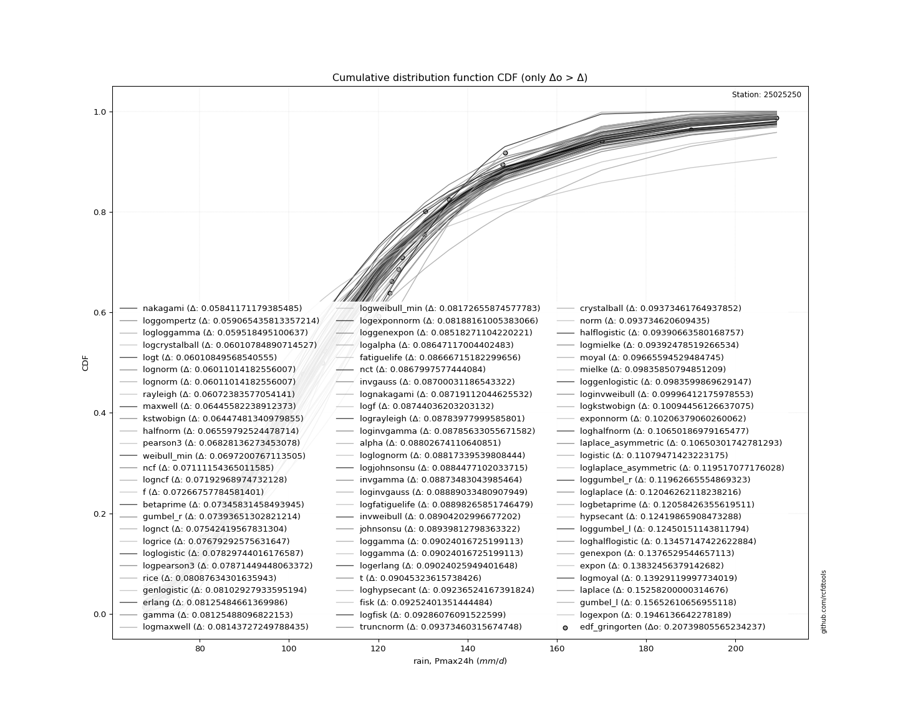</img>

</div>


**8.3. Best fit**

<div align="center">

|   id |   station | empirical_dist   | p_dist   |     delta |   deltao | eval   |   fit |   n |   best_fit |   best_fit_sort |
|-----:|----------:|:-----------------|:---------|----------:|---------:|:-------|------:|----:|-----------:|----------------:|
|    0 |  25025250 | edf_gringorten   | nakagami | 0.0584117 | 0.207398 | Δo > Δ |     1 |  43 |          1 |               1 |

</div>


<div align="center">

</img>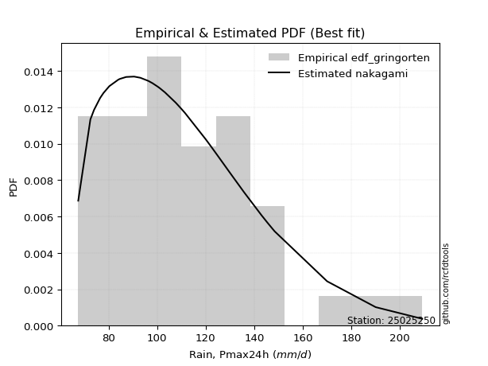</img>

</div>


### 9. EDF Filliben (1975)

The specific values of the constants (0.3175) (often denoted as $alpha$) and (0.365) are derived from a method proposed by James J. Filliben in a 1975 paper. This particular formula is the mean value of the $i$-th order statistic of the normal distribution and is considered a robust and effective plotting position formula for the normal probability plot correlation coefficient test for normality.

<div align="center">


$P=(m-0.3175)/(n+0.365)$


</div>


**9.1. Empirical values**

<div align="center">

|                | 0                    | 1                   | 2                    | 3                   | 4                   | 5                   | 6                   | 7                  | 8                   | 9                   | 10                  | 11                 | 12                 | 13                 | 14                  | 15                 | 16                  | 17                 | 18                  | 19                 | 20                  | 21           | 22                 | 23                 | 24                 | 25                 | 26                | 27                 | 28                 | 29                 | 30                 | 31                 | 32                 | 33                 | 34                 | 35                 | 36                | 37                 | 38                 | 39                 | 40                 | 41                | 42                 |
|:---------------|:---------------------|:--------------------|:---------------------|:--------------------|:--------------------|:--------------------|:--------------------|:-------------------|:--------------------|:--------------------|:--------------------|:-------------------|:-------------------|:-------------------|:--------------------|:-------------------|:--------------------|:-------------------|:--------------------|:-------------------|:--------------------|:-------------|:-------------------|:-------------------|:-------------------|:-------------------|:------------------|:-------------------|:-------------------|:-------------------|:-------------------|:-------------------|:-------------------|:-------------------|:-------------------|:-------------------|:------------------|:-------------------|:-------------------|:-------------------|:-------------------|:------------------|:-------------------|
| date           | 2001                 | 1986                | 2006                 | 1976                | 1977                | 1982                | 1997                | 2015               | 1989                | 1974                | 2013                | 2012               | 1990               | 1994               | 2007                | 1992               | 1988                | 1998               | 1980                | 1985               | 1973                | 2011         | 1999               | 1996               | 1984               | 2009               | 2008              | 2003               | 1978               | 2005               | 1987               | 1991               | 2002               | 2000               | 2004               | 2010               | 1981              | 1983               | 1979               | 1975               | 2014               | 1995              | 1993               |
| x              | 67.5                 | 72.5                | 74.0                 | 76.5                | 77.9                | 80.2                | 80.4                | 84.0               | 84.4                | 84.7                | 87.23611343         | 90.41938696        | 90.6               | 93.1               | 96.37801329         | 98.1               | 100.3               | 100.3              | 100.8               | 101.1449581        | 103.2               | 107.532524   | 108.0              | 110.2              | 111.6              | 120.0              | 121.5             | 122.5              | 123.0              | 124.5              | 125.4              | 125.5              | 130.2              | 130.4              | 130.5              | 135.8              | 143.0             | 145.3              | 147.8              | 148.4              | 170.0              | 190.0             | 209.2              |
| m              | 1                    | 2                   | 3                    | 4                   | 5                   | 6                   | 7                   | 8                  | 9                   | 10                  | 11                  | 12                 | 13                 | 14                 | 15                  | 16                 | 17                  | 18                 | 19                  | 20                 | 21                  | 22           | 23                 | 24                 | 25                 | 26                 | 27                | 28                 | 29                 | 30                 | 31                 | 32                 | 33                 | 34                 | 35                 | 36                 | 37                | 38                 | 39                 | 40                 | 41                 | 42                | 43                 |
| empirical_dist | edf_filliben         | edf_filliben        | edf_filliben         | edf_filliben        | edf_filliben        | edf_filliben        | edf_filliben        | edf_filliben       | edf_filliben        | edf_filliben        | edf_filliben        | edf_filliben       | edf_filliben       | edf_filliben       | edf_filliben        | edf_filliben       | edf_filliben        | edf_filliben       | edf_filliben        | edf_filliben       | edf_filliben        | edf_filliben | edf_filliben       | edf_filliben       | edf_filliben       | edf_filliben       | edf_filliben      | edf_filliben       | edf_filliben       | edf_filliben       | edf_filliben       | edf_filliben       | edf_filliben       | edf_filliben       | edf_filliben       | edf_filliben       | edf_filliben      | edf_filliben       | edf_filliben       | edf_filliben       | edf_filliben       | edf_filliben      | edf_filliben       |
| empirical      | 0.015738498789346245 | 0.03879857027556786 | 0.061858641761789464 | 0.08491871324801106 | 0.10797878473423267 | 0.13103885622045428 | 0.15409892770667588 | 0.1771589991928975 | 0.20021907067911907 | 0.22327914216534067 | 0.24633921365156228 | 0.2693992851377839 | 0.2924593566240055 | 0.3155194281102271 | 0.33857949959644873 | 0.3616395710826703 | 0.38469964256889194 | 0.4077597140551136 | 0.43081978554133515 | 0.4538798570275568 | 0.47693992851377837 | 0.5          | 0.5230600714862216 | 0.5461201429724433 | 0.5691802144586648 | 0.5922402859448864 | 0.615300357431108 | 0.6383604289173297 | 0.6614205004035513 | 0.6844805718897728 | 0.7075406433759944 | 0.7306007148622161 | 0.7536607863484376 | 0.7767208578346592 | 0.7997809293208809 | 0.8228410008071024 | 0.845901072293324 | 0.8689611437795456 | 0.8920212152657673 | 0.9150812867519889 | 0.9381413582382104 | 0.961201429724432 | 0.9842615012106537 |
| empirical_tr   | 1.015990159901599    | 1.0403646614286572  | 1.0659374423892336   | 1.0927990927990927  | 1.1210495702190912  | 1.1507994427121344  | 1.1821713351052954  | 1.215301618440412  | 1.2503423916961003  | 1.2874638165219325  | 1.3268568805935899  | 1.3687366842894342 | 1.4133463700806648 | 1.4609618462056768 | 1.5118974984746796  | 1.5665131400704415 | 1.6252225241263     | 1.6885038450306629 | 1.7569127924642964  | 1.8310989126992507 | 1.911826297806679   | 2.0          | 2.0967001087876223 | 2.203226216181888  | 2.321156162183862  | 2.452424713699986  | 2.599430540986063 | 2.76518412242946   | 2.9535160905840288 | 3.1693769413484376 | 3.419278533412182  | 3.7119623368285906 | 4.059443014275683  | 4.478698683191322  | 4.994529225453498  | 5.644646924829154  | 6.489337822671152 | 7.631324241091061  | 9.26107848371596   | 11.775967413441945 | 16.165890027958966 | 25.77414561664181 | 63.53846153846133  |

</div>


**9.2. Kolmogorov-Smirnov fit test (sorted by Δ)**


<div align="center">

|                | 0                    | 1                   | 2                    | 3                   | 4                   | 5                   | 6                   | 7                   | 8                   | 9                   | 10                  | 11                  | 12                  | 13                  | 14                  | 15                  | 16                  | 17                  | 18                  | 19                  | 20                  | 21                  | 22                  | 23                  | 24                  | 25                  | 26                  | 27                  | 28                  | 29                  | 30                  | 31                  | 32                  | 33                  | 34                  | 35                  | 36                  | 37                  | 38                  | 39                  | 40                  | 41                  | 42                  | 43                  | 44                  | 45                  | 46                  | 47                  | 48                  | 49                  | 50                  | 51                  | 52                  | 53                  | 54                  | 55                  | 56                  | 57                  | 58                  | 59                  | 60                  | 61                  | 62                  | 63                  | 64                  | 65                  | 66                  | 67                  | 68                    | 69                  | 70                  | 71                  | 72                  | 73                  | 74                  | 75                  | 76                  | 77                  | 78                  | 79                  | 80                  | 81                  | 82                  | 83                  | 84                  | 85                  | 86                  | 87                  |
|:---------------|:---------------------|:--------------------|:---------------------|:--------------------|:--------------------|:--------------------|:--------------------|:--------------------|:--------------------|:--------------------|:--------------------|:--------------------|:--------------------|:--------------------|:--------------------|:--------------------|:--------------------|:--------------------|:--------------------|:--------------------|:--------------------|:--------------------|:--------------------|:--------------------|:--------------------|:--------------------|:--------------------|:--------------------|:--------------------|:--------------------|:--------------------|:--------------------|:--------------------|:--------------------|:--------------------|:--------------------|:--------------------|:--------------------|:--------------------|:--------------------|:--------------------|:--------------------|:--------------------|:--------------------|:--------------------|:--------------------|:--------------------|:--------------------|:--------------------|:--------------------|:--------------------|:--------------------|:--------------------|:--------------------|:--------------------|:--------------------|:--------------------|:--------------------|:--------------------|:--------------------|:--------------------|:--------------------|:--------------------|:--------------------|:--------------------|:--------------------|:--------------------|:--------------------|:----------------------|:--------------------|:--------------------|:--------------------|:--------------------|:--------------------|:--------------------|:--------------------|:--------------------|:--------------------|:--------------------|:--------------------|:--------------------|:--------------------|:--------------------|:--------------------|:--------------------|:--------------------|:--------------------|:--------------------|
| station        | 25025250             | 25025250            | 25025250             | 25025250            | 25025250            | 25025250            | 25025250            | 25025250            | 25025250            | 25025250            | 25025250            | 25025250            | 25025250            | 25025250            | 25025250            | 25025250            | 25025250            | 25025250            | 25025250            | 25025250            | 25025250            | 25025250            | 25025250            | 25025250            | 25025250            | 25025250            | 25025250            | 25025250            | 25025250            | 25025250            | 25025250            | 25025250            | 25025250            | 25025250            | 25025250            | 25025250            | 25025250            | 25025250            | 25025250            | 25025250            | 25025250            | 25025250            | 25025250            | 25025250            | 25025250            | 25025250            | 25025250            | 25025250            | 25025250            | 25025250            | 25025250            | 25025250            | 25025250            | 25025250            | 25025250            | 25025250            | 25025250            | 25025250            | 25025250            | 25025250            | 25025250            | 25025250            | 25025250            | 25025250            | 25025250            | 25025250            | 25025250            | 25025250            | 25025250              | 25025250            | 25025250            | 25025250            | 25025250            | 25025250            | 25025250            | 25025250            | 25025250            | 25025250            | 25025250            | 25025250            | 25025250            | 25025250            | 25025250            | 25025250            | 25025250            | 25025250            | 25025250            | 25025250            |
| empirical_dist | edf_filliben         | edf_filliben        | edf_filliben         | edf_filliben        | edf_filliben        | edf_filliben        | edf_filliben        | edf_filliben        | edf_filliben        | edf_filliben        | edf_filliben        | edf_filliben        | edf_filliben        | edf_filliben        | edf_filliben        | edf_filliben        | edf_filliben        | edf_filliben        | edf_filliben        | edf_filliben        | edf_filliben        | edf_filliben        | edf_filliben        | edf_filliben        | edf_filliben        | edf_filliben        | edf_filliben        | edf_filliben        | edf_filliben        | edf_filliben        | edf_filliben        | edf_filliben        | edf_filliben        | edf_filliben        | edf_filliben        | edf_filliben        | edf_filliben        | edf_filliben        | edf_filliben        | edf_filliben        | edf_filliben        | edf_filliben        | edf_filliben        | edf_filliben        | edf_filliben        | edf_filliben        | edf_filliben        | edf_filliben        | edf_filliben        | edf_filliben        | edf_filliben        | edf_filliben        | edf_filliben        | edf_filliben        | edf_filliben        | edf_filliben        | edf_filliben        | edf_filliben        | edf_filliben        | edf_filliben        | edf_filliben        | edf_filliben        | edf_filliben        | edf_filliben        | edf_filliben        | edf_filliben        | edf_filliben        | edf_filliben        | edf_filliben          | edf_filliben        | edf_filliben        | edf_filliben        | edf_filliben        | edf_filliben        | edf_filliben        | edf_filliben        | edf_filliben        | edf_filliben        | edf_filliben        | edf_filliben        | edf_filliben        | edf_filliben        | edf_filliben        | edf_filliben        | edf_filliben        | edf_filliben        | edf_filliben        | edf_filliben        |
| p_dist         | loggompertz          | nakagami            | rayleigh             | logloggamma         | logcrystalball      | logt                | lognorm             | lognorm             | maxwell             | kstwobign           | halfnorm            | pearson3            | weibull_min         | ncf                 | logncf              | f                   | betaprime           | gumbel_r            | lognct              | logrice             | loglogistic         | logpearson3         | rice                | genlogistic         | erlang              | gamma               | logmaxwell          | logweibull_min      | logexponnorm        | loggenexpon         | logalpha            | fatiguelife         | nct                 | invgauss            | lognakagami         | logf                | lograyleigh         | loginvgamma         | alpha               | loglognorm          | logjohnsonsu        | invgamma            | loginvgauss         | logfatiguelife      | invweibull          | johnsonsu           | t                   | loggamma            | loggamma            | logerlang           | loghypsecant        | fisk                | logfisk             | truncnorm           | crystalball         | norm                | halflogistic        | logmielke           | moyal               | mielke              | loggenlogistic      | loginvweibull       | logkstwobign        | exponnorm           | laplace_asymmetric  | loghalfnorm         | logistic            | logbetaprime        | loglaplace_asymmetric | loggumbel_r         | loglaplace          | hypsecant           | loggumbel_l         | loghalflogistic     | genexpon            | expon               | logmoyal            | laplace             | gumbel_l            | logexpon            | wald                | logwald             | loggibrat           | gibrat              | logchi2             | logtruncnorm        | chi2                | gompertz            |
| delta          | 0.057362135078579346 | 0.05893580432763257 | 0.059020535035763544 | 0.05978054136752586 | 0.06063194144092299 | 0.06063258821918327 | 0.06063423435933779 | 0.06063423435933779 | 0.06275252165434586 | 0.06499890594357627 | 0.06612201777856486 | 0.0688054552683085  | 0.07024416924512822 | 0.07163563618389357 | 0.072453782281099   | 0.07319167037959173 | 0.07398240711871718 | 0.07446060556198986 | 0.07594828821209076 | 0.07731701829009419 | 0.0788215326955436  | 0.07923858701441144 | 0.08113838928324829 | 0.08155337186972966 | 0.08177893914747758 | 0.08177897350199925 | 0.08196136503166207 | 0.08225065127955555 | 0.08240570258760838 | 0.08570680357597993 | 0.08699526257780255 | 0.08719124435677428 | 0.08732385027818612 | 0.08752440439921094 | 0.08771521298003304 | 0.08796445456580904 | 0.08836387252963573 | 0.08838042309049354 | 0.08855083364018623 | 0.08869748793186216 | 0.08897180273714922 | 0.08925892297363236 | 0.0894144273428572  | 0.0895067510512425  | 0.08956612250054974 | 0.08992222051741094 | 0.09071528242427312 | 0.09076425978576885 | 0.09076425978576885 | 0.0907643520277942  | 0.09288933420769596 | 0.09304810604822256 | 0.09338485344900371 | 0.09399664942363634 | 0.09399666391626738 | 0.09399666687632385 | 0.09443072833546529 | 0.09444887772644306 | 0.09718003782862517 | 0.0988826004822898  | 0.09888407949669242 | 0.10048821429356325 | 0.10146865380014847 | 0.10258788313637834 | 0.10584790176059072 | 0.10702596232543249 | 0.11105676049912061 | 0.11822584715419504 | 0.12004116970980572   | 0.12015074808247095 | 0.12098671371615988 | 0.12446070535162174 | 0.1247635577050068  | 0.13509556676000656 | 0.1369978387984891  | 0.13740740185731581 | 0.1398152925111179  | 0.15284404627003562 | 0.1566571297029956  | 0.19277934035959673 | 0.2175091036617043  | 0.22325995477677457 | 0.26063170304438954 | 0.27069893939879974 | 0.2980829992956612  | 0.3009493882828771  | 0.9195368532330983  | 0.9349702097444885  |
| deltao         | 0.20739805565234237  | 0.20739805565234237 | 0.20739805565234237  | 0.20739805565234237 | 0.20739805565234237 | 0.20739805565234237 | 0.20739805565234237 | 0.20739805565234237 | 0.20739805565234237 | 0.20739805565234237 | 0.20739805565234237 | 0.20739805565234237 | 0.20739805565234237 | 0.20739805565234237 | 0.20739805565234237 | 0.20739805565234237 | 0.20739805565234237 | 0.20739805565234237 | 0.20739805565234237 | 0.20739805565234237 | 0.20739805565234237 | 0.20739805565234237 | 0.20739805565234237 | 0.20739805565234237 | 0.20739805565234237 | 0.20739805565234237 | 0.20739805565234237 | 0.20739805565234237 | 0.20739805565234237 | 0.20739805565234237 | 0.20739805565234237 | 0.20739805565234237 | 0.20739805565234237 | 0.20739805565234237 | 0.20739805565234237 | 0.20739805565234237 | 0.20739805565234237 | 0.20739805565234237 | 0.20739805565234237 | 0.20739805565234237 | 0.20739805565234237 | 0.20739805565234237 | 0.20739805565234237 | 0.20739805565234237 | 0.20739805565234237 | 0.20739805565234237 | 0.20739805565234237 | 0.20739805565234237 | 0.20739805565234237 | 0.20739805565234237 | 0.20739805565234237 | 0.20739805565234237 | 0.20739805565234237 | 0.20739805565234237 | 0.20739805565234237 | 0.20739805565234237 | 0.20739805565234237 | 0.20739805565234237 | 0.20739805565234237 | 0.20739805565234237 | 0.20739805565234237 | 0.20739805565234237 | 0.20739805565234237 | 0.20739805565234237 | 0.20739805565234237 | 0.20739805565234237 | 0.20739805565234237 | 0.20739805565234237 | 0.20739805565234237   | 0.20739805565234237 | 0.20739805565234237 | 0.20739805565234237 | 0.20739805565234237 | 0.20739805565234237 | 0.20739805565234237 | 0.20739805565234237 | 0.20739805565234237 | 0.20739805565234237 | 0.20739805565234237 | 0.20739805565234237 | 0.20739805565234237 | 0.20739805565234237 | 0.20739805565234237 | 0.20739805565234237 | 0.20739805565234237 | 0.20739805565234237 | 0.20739805565234237 | 0.20739805565234237 |
| eval           | Δo > Δ               | Δo > Δ              | Δo > Δ               | Δo > Δ              | Δo > Δ              | Δo > Δ              | Δo > Δ              | Δo > Δ              | Δo > Δ              | Δo > Δ              | Δo > Δ              | Δo > Δ              | Δo > Δ              | Δo > Δ              | Δo > Δ              | Δo > Δ              | Δo > Δ              | Δo > Δ              | Δo > Δ              | Δo > Δ              | Δo > Δ              | Δo > Δ              | Δo > Δ              | Δo > Δ              | Δo > Δ              | Δo > Δ              | Δo > Δ              | Δo > Δ              | Δo > Δ              | Δo > Δ              | Δo > Δ              | Δo > Δ              | Δo > Δ              | Δo > Δ              | Δo > Δ              | Δo > Δ              | Δo > Δ              | Δo > Δ              | Δo > Δ              | Δo > Δ              | Δo > Δ              | Δo > Δ              | Δo > Δ              | Δo > Δ              | Δo > Δ              | Δo > Δ              | Δo > Δ              | Δo > Δ              | Δo > Δ              | Δo > Δ              | Δo > Δ              | Δo > Δ              | Δo > Δ              | Δo > Δ              | Δo > Δ              | Δo > Δ              | Δo > Δ              | Δo > Δ              | Δo > Δ              | Δo > Δ              | Δo > Δ              | Δo > Δ              | Δo > Δ              | Δo > Δ              | Δo > Δ              | Δo > Δ              | Δo > Δ              | Δo > Δ              | Δo > Δ                | Δo > Δ              | Δo > Δ              | Δo > Δ              | Δo > Δ              | Δo > Δ              | Δo > Δ              | Δo > Δ              | Δo > Δ              | Δo > Δ              | Δo > Δ              | Δo > Δ              | Δo <= Δ             | Δo <= Δ             | Δo <= Δ             | Δo <= Δ             | Δo <= Δ             | Δo <= Δ             | Δo <= Δ             | Δo <= Δ             |
| fit            | 1                    | 1                   | 1                    | 1                   | 1                   | 1                   | 1                   | 1                   | 1                   | 1                   | 1                   | 1                   | 1                   | 1                   | 1                   | 1                   | 1                   | 1                   | 1                   | 1                   | 1                   | 1                   | 1                   | 1                   | 1                   | 1                   | 1                   | 1                   | 1                   | 1                   | 1                   | 1                   | 1                   | 1                   | 1                   | 1                   | 1                   | 1                   | 1                   | 1                   | 1                   | 1                   | 1                   | 1                   | 1                   | 1                   | 1                   | 1                   | 1                   | 1                   | 1                   | 1                   | 1                   | 1                   | 1                   | 1                   | 1                   | 1                   | 1                   | 1                   | 1                   | 1                   | 1                   | 1                   | 1                   | 1                   | 1                   | 1                   | 1                     | 1                   | 1                   | 1                   | 1                   | 1                   | 1                   | 1                   | 1                   | 1                   | 1                   | 1                   | 0                   | 0                   | 0                   | 0                   | 0                   | 0                   | 0                   | 0                   |
| n              | 43                   | 43                  | 43                   | 43                  | 43                  | 43                  | 43                  | 43                  | 43                  | 43                  | 43                  | 43                  | 43                  | 43                  | 43                  | 43                  | 43                  | 43                  | 43                  | 43                  | 43                  | 43                  | 43                  | 43                  | 43                  | 43                  | 43                  | 43                  | 43                  | 43                  | 43                  | 43                  | 43                  | 43                  | 43                  | 43                  | 43                  | 43                  | 43                  | 43                  | 43                  | 43                  | 43                  | 43                  | 43                  | 43                  | 43                  | 43                  | 43                  | 43                  | 43                  | 43                  | 43                  | 43                  | 43                  | 43                  | 43                  | 43                  | 43                  | 43                  | 43                  | 43                  | 43                  | 43                  | 43                  | 43                  | 43                  | 43                  | 43                    | 43                  | 43                  | 43                  | 43                  | 43                  | 43                  | 43                  | 43                  | 43                  | 43                  | 43                  | 43                  | 43                  | 43                  | 43                  | 43                  | 43                  | 43                  | 43                  |
| best_fit       | 1                    | 0                   | 0                    | 0                   | 0                   | 0                   | 0                   | 0                   | 0                   | 0                   | 0                   | 0                   | 0                   | 0                   | 0                   | 0                   | 0                   | 0                   | 0                   | 0                   | 0                   | 0                   | 0                   | 0                   | 0                   | 0                   | 0                   | 0                   | 0                   | 0                   | 0                   | 0                   | 0                   | 0                   | 0                   | 0                   | 0                   | 0                   | 0                   | 0                   | 0                   | 0                   | 0                   | 0                   | 0                   | 0                   | 0                   | 0                   | 0                   | 0                   | 0                   | 0                   | 0                   | 0                   | 0                   | 0                   | 0                   | 0                   | 0                   | 0                   | 0                   | 0                   | 0                   | 0                   | 0                   | 0                   | 0                   | 0                   | 0                     | 0                   | 0                   | 0                   | 0                   | 0                   | 0                   | 0                   | 0                   | 0                   | 0                   | 0                   | 0                   | 0                   | 0                   | 0                   | 0                   | 0                   | 0                   | 0                   |
| best_fit_sort  | 1                    | 2                   | 3                    | 4                   | 5                   | 6                   | 7                   | 8                   | 9                   | 10                  | 11                  | 12                  | 13                  | 14                  | 15                  | 16                  | 17                  | 18                  | 19                  | 20                  | 21                  | 22                  | 23                  | 24                  | 25                  | 26                  | 27                  | 28                  | 29                  | 30                  | 31                  | 32                  | 33                  | 34                  | 35                  | 36                  | 37                  | 38                  | 39                  | 40                  | 41                  | 42                  | 43                  | 44                  | 45                  | 46                  | 47                  | 48                  | 49                  | 50                  | 51                  | 52                  | 53                  | 54                  | 55                  | 56                  | 57                  | 58                  | 59                  | 60                  | 61                  | 62                  | 63                  | 64                  | 65                  | 66                  | 67                  | 68                  | 69                    | 70                  | 71                  | 72                  | 73                  | 74                  | 75                  | 76                  | 77                  | 78                  | 79                  | 80                  | 81                  | 82                  | 83                  | 84                  | 85                  | 86                  | 87                  | 88                  |

</div>


<div align="center">

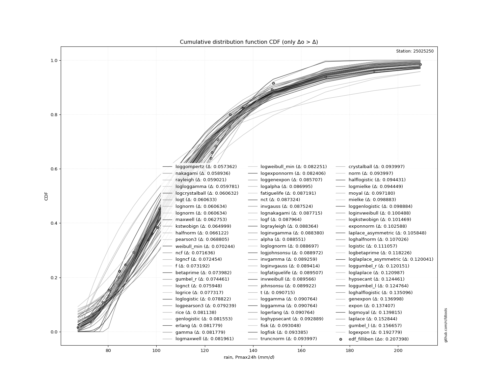</img>

</div>


**9.3. Best fit**

<div align="center">

|   id |   station | empirical_dist   | p_dist      |     delta |   deltao | eval   |   fit |   n |   best_fit |   best_fit_sort |
|-----:|----------:|:-----------------|:------------|----------:|---------:|:-------|------:|----:|-----------:|----------------:|
|    0 |  25025250 | edf_filliben     | loggompertz | 0.0573621 | 0.207398 | Δo > Δ |     1 |  43 |          1 |               1 |

</div>


<div align="center">

</img></img>

</div>


### 10. EDF Jenkinson (1977)

The Jenkinson formula in hydrology is an empirical plotting position formula used to estimate the non-exceedance probability _(P)_ or return period _(T)_ of a given ordered observation within a sample. It is a widely used method in the frequency analysis of extreme events such as floods and rainfall, as it provides a distribution-free way to plot data. _a≈0.31_ and _b≈0.38_ are constants derived to approximate the median of the probability distribution for the given rank.

<div align="center">


$P=(m-a)/(n+b)$


</div>


**10.1. Empirical values**

<div align="center">

|                | 0                   | 1                    | 2                   | 3                  | 4                   | 5                   | 6                  | 7                  | 8                  | 9                   | 10                  | 11                 | 12                  | 13                 | 14                | 15                  | 16                 | 17                 | 18                  | 19                  | 20                 | 21            | 22                 | 23                 | 24                 | 25                 | 26                 | 27                 | 28                 | 29                 | 30                 | 31                 | 32                 | 33                | 34                 | 35                 | 36                 | 37                 | 38                 | 39                 | 40                 | 41                 | 42                 |
|:---------------|:--------------------|:---------------------|:--------------------|:-------------------|:--------------------|:--------------------|:-------------------|:-------------------|:-------------------|:--------------------|:--------------------|:-------------------|:--------------------|:-------------------|:------------------|:--------------------|:-------------------|:-------------------|:--------------------|:--------------------|:-------------------|:--------------|:-------------------|:-------------------|:-------------------|:-------------------|:-------------------|:-------------------|:-------------------|:-------------------|:-------------------|:-------------------|:-------------------|:------------------|:-------------------|:-------------------|:-------------------|:-------------------|:-------------------|:-------------------|:-------------------|:-------------------|:-------------------|
| date           | 2001                | 1986                 | 2006                | 1976               | 1977                | 1982                | 1997               | 2015               | 1989               | 1974                | 2013                | 2012               | 1990                | 1994               | 2007              | 1992                | 1988               | 1998               | 1980                | 1985                | 1973               | 2011          | 1999               | 1996               | 1984               | 2009               | 2008               | 2003               | 1978               | 2005               | 1987               | 1991               | 2002               | 2000              | 2004               | 2010               | 1981               | 1983               | 1979               | 1975               | 2014               | 1995               | 1993               |
| x              | 67.5                | 72.5                 | 74.0                | 76.5               | 77.9                | 80.2                | 80.4               | 84.0               | 84.4               | 84.7                | 87.23611343         | 90.41938696        | 90.6                | 93.1               | 96.37801329       | 98.1                | 100.3              | 100.3              | 100.8               | 101.1449581         | 103.2              | 107.532524    | 108.0              | 110.2              | 111.6              | 120.0              | 121.5              | 122.5              | 123.0              | 124.5              | 125.4              | 125.5              | 130.2              | 130.4             | 130.5              | 135.8              | 143.0              | 145.3              | 147.8              | 148.4              | 170.0              | 190.0              | 209.2              |
| m              | 1                   | 2                    | 3                   | 4                  | 5                   | 6                   | 7                  | 8                  | 9                  | 10                  | 11                  | 12                 | 13                  | 14                 | 15                | 16                  | 17                 | 18                 | 19                  | 20                  | 21                 | 22            | 23                 | 24                 | 25                 | 26                 | 27                 | 28                 | 29                 | 30                 | 31                 | 32                 | 33                 | 34                | 35                 | 36                 | 37                 | 38                 | 39                 | 40                 | 41                 | 42                 | 43                 |
| empirical_dist | edf_jenkinson       | edf_jenkinson        | edf_jenkinson       | edf_jenkinson      | edf_jenkinson       | edf_jenkinson       | edf_jenkinson      | edf_jenkinson      | edf_jenkinson      | edf_jenkinson       | edf_jenkinson       | edf_jenkinson      | edf_jenkinson       | edf_jenkinson      | edf_jenkinson     | edf_jenkinson       | edf_jenkinson      | edf_jenkinson      | edf_jenkinson       | edf_jenkinson       | edf_jenkinson      | edf_jenkinson | edf_jenkinson      | edf_jenkinson      | edf_jenkinson      | edf_jenkinson      | edf_jenkinson      | edf_jenkinson      | edf_jenkinson      | edf_jenkinson      | edf_jenkinson      | edf_jenkinson      | edf_jenkinson      | edf_jenkinson     | edf_jenkinson      | edf_jenkinson      | edf_jenkinson      | edf_jenkinson      | edf_jenkinson      | edf_jenkinson      | edf_jenkinson      | edf_jenkinson      | edf_jenkinson      |
| empirical      | 0.01590594744121715 | 0.038958045182111566 | 0.06201014292300599 | 0.0850622406639004 | 0.10811433840479484 | 0.13116643614568926 | 0.1542185338865837 | 0.1772706316274781 | 0.2003227293683725 | 0.22337482710926693 | 0.24642692485016135 | 0.2694790225910558 | 0.29253112033195017 | 0.3155832180728446 | 0.338635315813739 | 0.36168741355463346 | 0.3847395112955279 | 0.4077916090364223 | 0.43084370677731676 | 0.45389580451821115 | 0.4769479022591056 | 0.5           | 0.5230520977408945 | 0.5461041954817888 | 0.5691562932226832 | 0.5922083909635777 | 0.6152604887044721 | 0.6383125864453665 | 0.6613646841862609 | 0.6844167819271554 | 0.7074688796680498 | 0.7305209774089442 | 0.7535730751498385 | 0.776625172890733 | 0.7996772706316274 | 0.8227293683725218 | 0.8457814661134162 | 0.8688335638543107 | 0.8918856615952051 | 0.9149377593360994 | 0.9379898570769939 | 0.9610419548178883 | 0.9840940525587827 |
| empirical_tr   | 1.016163035839775   | 1.040537299112497    | 1.0661096092405997  | 1.09297052154195   | 1.1212199534763505  | 1.1509684266383655  | 1.1823385118560916 | 1.2154665172317176 | 1.25050446814644   | 1.2876224398931433  | 1.327011318446008   | 1.3688860839381507 | 1.413489736070381   | 1.4610980127989222 | 1.512025095852213 | 1.5666305525460456  | 1.625327838141626  | 1.6885947839626314 | 1.7569866342648846  | 1.8311523849725622  | 1.9118554429263996 | 2.0           | 2.096665055582407  | 2.2031488065007614 | 2.321027287319422  | 2.452232899943471  | 2.5991611743559018 | 2.764818355640535  | 2.9530292716133424 | 3.168736303871439  | 3.418439716312057  | 3.7108639863130874 | 4.057998129092608  | 4.476780185758512 | 4.991944764096661  | 5.6410923276983045 | 6.484304932735421  | 7.623901581722315  | 9.249466950959484  | 11.75609756097559  | 16.12639405204458  | 25.66863905325438  | 62.86956521739065  |

</div>


**10.2. Kolmogorov-Smirnov fit test (sorted by Δ)**


<div align="center">

|                | 0                   | 1                    | 2                   | 3                   | 4                   | 5                   | 6                    | 7                    | 8                   | 9                   | 10                  | 11                  | 12                  | 13                  | 14                  | 15                  | 16                  | 17                  | 18                  | 19                  | 20                  | 21                  | 22                  | 23                  | 24                  | 25                  | 26                  | 27                  | 28                  | 29                  | 30                  | 31                  | 32                  | 33                  | 34                  | 35                  | 36                  | 37                  | 38                  | 39                  | 40                  | 41                  | 42                  | 43                  | 44                  | 45                  | 46                  | 47                  | 48                  | 49                  | 50                  | 51                  | 52                  | 53                  | 54                  | 55                  | 56                  | 57                  | 58                  | 59                  | 60                  | 61                  | 62                  | 63                  | 64                  | 65                  | 66                  | 67                  | 68                    | 69                  | 70                  | 71                  | 72                  | 73                  | 74                  | 75                  | 76                  | 77                  | 78                  | 79                  | 80                  | 81                  | 82                  | 83                  | 84                  | 85                  | 86                  | 87                  |
|:---------------|:--------------------|:---------------------|:--------------------|:--------------------|:--------------------|:--------------------|:---------------------|:---------------------|:--------------------|:--------------------|:--------------------|:--------------------|:--------------------|:--------------------|:--------------------|:--------------------|:--------------------|:--------------------|:--------------------|:--------------------|:--------------------|:--------------------|:--------------------|:--------------------|:--------------------|:--------------------|:--------------------|:--------------------|:--------------------|:--------------------|:--------------------|:--------------------|:--------------------|:--------------------|:--------------------|:--------------------|:--------------------|:--------------------|:--------------------|:--------------------|:--------------------|:--------------------|:--------------------|:--------------------|:--------------------|:--------------------|:--------------------|:--------------------|:--------------------|:--------------------|:--------------------|:--------------------|:--------------------|:--------------------|:--------------------|:--------------------|:--------------------|:--------------------|:--------------------|:--------------------|:--------------------|:--------------------|:--------------------|:--------------------|:--------------------|:--------------------|:--------------------|:--------------------|:----------------------|:--------------------|:--------------------|:--------------------|:--------------------|:--------------------|:--------------------|:--------------------|:--------------------|:--------------------|:--------------------|:--------------------|:--------------------|:--------------------|:--------------------|:--------------------|:--------------------|:--------------------|:--------------------|:--------------------|
| station        | 25025250            | 25025250             | 25025250            | 25025250            | 25025250            | 25025250            | 25025250             | 25025250             | 25025250            | 25025250            | 25025250            | 25025250            | 25025250            | 25025250            | 25025250            | 25025250            | 25025250            | 25025250            | 25025250            | 25025250            | 25025250            | 25025250            | 25025250            | 25025250            | 25025250            | 25025250            | 25025250            | 25025250            | 25025250            | 25025250            | 25025250            | 25025250            | 25025250            | 25025250            | 25025250            | 25025250            | 25025250            | 25025250            | 25025250            | 25025250            | 25025250            | 25025250            | 25025250            | 25025250            | 25025250            | 25025250            | 25025250            | 25025250            | 25025250            | 25025250            | 25025250            | 25025250            | 25025250            | 25025250            | 25025250            | 25025250            | 25025250            | 25025250            | 25025250            | 25025250            | 25025250            | 25025250            | 25025250            | 25025250            | 25025250            | 25025250            | 25025250            | 25025250            | 25025250              | 25025250            | 25025250            | 25025250            | 25025250            | 25025250            | 25025250            | 25025250            | 25025250            | 25025250            | 25025250            | 25025250            | 25025250            | 25025250            | 25025250            | 25025250            | 25025250            | 25025250            | 25025250            | 25025250            |
| empirical_dist | edf_jenkinson       | edf_jenkinson        | edf_jenkinson       | edf_jenkinson       | edf_jenkinson       | edf_jenkinson       | edf_jenkinson        | edf_jenkinson        | edf_jenkinson       | edf_jenkinson       | edf_jenkinson       | edf_jenkinson       | edf_jenkinson       | edf_jenkinson       | edf_jenkinson       | edf_jenkinson       | edf_jenkinson       | edf_jenkinson       | edf_jenkinson       | edf_jenkinson       | edf_jenkinson       | edf_jenkinson       | edf_jenkinson       | edf_jenkinson       | edf_jenkinson       | edf_jenkinson       | edf_jenkinson       | edf_jenkinson       | edf_jenkinson       | edf_jenkinson       | edf_jenkinson       | edf_jenkinson       | edf_jenkinson       | edf_jenkinson       | edf_jenkinson       | edf_jenkinson       | edf_jenkinson       | edf_jenkinson       | edf_jenkinson       | edf_jenkinson       | edf_jenkinson       | edf_jenkinson       | edf_jenkinson       | edf_jenkinson       | edf_jenkinson       | edf_jenkinson       | edf_jenkinson       | edf_jenkinson       | edf_jenkinson       | edf_jenkinson       | edf_jenkinson       | edf_jenkinson       | edf_jenkinson       | edf_jenkinson       | edf_jenkinson       | edf_jenkinson       | edf_jenkinson       | edf_jenkinson       | edf_jenkinson       | edf_jenkinson       | edf_jenkinson       | edf_jenkinson       | edf_jenkinson       | edf_jenkinson       | edf_jenkinson       | edf_jenkinson       | edf_jenkinson       | edf_jenkinson       | edf_jenkinson         | edf_jenkinson       | edf_jenkinson       | edf_jenkinson       | edf_jenkinson       | edf_jenkinson       | edf_jenkinson       | edf_jenkinson       | edf_jenkinson       | edf_jenkinson       | edf_jenkinson       | edf_jenkinson       | edf_jenkinson       | edf_jenkinson       | edf_jenkinson       | edf_jenkinson       | edf_jenkinson       | edf_jenkinson       | edf_jenkinson       | edf_jenkinson       |
| p_dist         | loggompertz         | rayleigh             | nakagami            | logloggamma         | logcrystalball      | logt                | lognorm              | lognorm              | maxwell             | kstwobign           | halfnorm            | pearson3            | weibull_min         | ncf                 | logncf              | f                   | betaprime           | gumbel_r            | lognct              | logrice             | loglogistic         | logpearson3         | rice                | genlogistic         | erlang              | gamma               | logmaxwell          | logweibull_min      | logexponnorm        | loggenexpon         | logalpha            | fatiguelife         | nct                 | invgauss            | lognakagami         | logf                | lograyleigh         | loginvgamma         | alpha               | loglognorm          | logjohnsonsu        | invgamma            | loginvgauss         | logfatiguelife      | invweibull          | johnsonsu           | t                   | loggamma            | loggamma            | logerlang           | loghypsecant        | fisk                | logfisk             | truncnorm           | crystalball         | norm                | halflogistic        | logmielke           | moyal               | mielke              | loggenlogistic      | loginvweibull       | logkstwobign        | exponnorm           | laplace_asymmetric  | loghalfnorm         | logistic            | logbetaprime        | loglaplace_asymmetric | loggumbel_r         | loglaplace          | hypsecant           | loggumbel_l         | loghalflogistic     | genexpon            | expon               | logmoyal            | laplace             | gumbel_l            | logexpon            | wald                | logwald             | loggibrat           | gibrat              | logchi2             | logtruncnorm        | chi2                | gompertz            |
| delta          | 0.05725847638932591 | 0.058916876346510105 | 0.0589676993089413  | 0.05979648885818023 | 0.06066383642223172 | 0.060664483200492   | 0.060666129340646524 | 0.060666129340646524 | 0.06264886296509242 | 0.065030800924885   | 0.06615391275987359 | 0.06883735024961724 | 0.07027606422643695 | 0.0716675311652023  | 0.07248567726240773 | 0.07322356536090047 | 0.07401430210002591 | 0.07449250054329859 | 0.0759801831933995  | 0.07734891327140292 | 0.07885342767685233 | 0.07927048199572018 | 0.08115433677390266 | 0.0815852668510384  | 0.08181083412878631 | 0.08181086848330799 | 0.0819932600129708  | 0.08228254626086429 | 0.08243759756891711 | 0.08573869855728866 | 0.08702715755911128 | 0.08722313933808301 | 0.08735574525949485 | 0.08755629938051968 | 0.08774710796134177 | 0.08799634954711777 | 0.08839576751094447 | 0.08841231807180228 | 0.08858272862149497 | 0.0887293829131709  | 0.08900369771845795 | 0.08929081795494109 | 0.08944632232416594 | 0.08953864603255124 | 0.08959801748185847 | 0.08995411549871968 | 0.09073122991492749 | 0.09079615476707759 | 0.09079615476707759 | 0.09079624700910294 | 0.0929212291890047  | 0.09308000102953129 | 0.09341674843031245 | 0.0940125969142907  | 0.09401261140692174 | 0.09401261436697822 | 0.09446262331677402 | 0.09448077270775179 | 0.0972119328099339  | 0.09891449546359854 | 0.09891597447800116 | 0.10052010927487198 | 0.1015005487814572  | 0.10261977811768708 | 0.10580803303395475 | 0.10705785730674122 | 0.11107270798977498 | 0.11808231973830563 | 0.12007306469111445   | 0.12018264306377968 | 0.12101860869746861 | 0.1244766528422761  | 0.12477950519566117 | 0.1351274617413153  | 0.13695797007185312 | 0.13735158564002553 | 0.13984718749242664 | 0.15285999376068998 | 0.15666510344832285 | 0.1926677079250161  | 0.21760478860563057 | 0.22335563972070083 | 0.2607034667523342  | 0.27077070310674445 | 0.29793947187977177 | 0.3008935720655868  | 0.9193773783265546  | 0.934818708583272   |
| deltao         | 0.20739805565234237 | 0.20739805565234237  | 0.20739805565234237 | 0.20739805565234237 | 0.20739805565234237 | 0.20739805565234237 | 0.20739805565234237  | 0.20739805565234237  | 0.20739805565234237 | 0.20739805565234237 | 0.20739805565234237 | 0.20739805565234237 | 0.20739805565234237 | 0.20739805565234237 | 0.20739805565234237 | 0.20739805565234237 | 0.20739805565234237 | 0.20739805565234237 | 0.20739805565234237 | 0.20739805565234237 | 0.20739805565234237 | 0.20739805565234237 | 0.20739805565234237 | 0.20739805565234237 | 0.20739805565234237 | 0.20739805565234237 | 0.20739805565234237 | 0.20739805565234237 | 0.20739805565234237 | 0.20739805565234237 | 0.20739805565234237 | 0.20739805565234237 | 0.20739805565234237 | 0.20739805565234237 | 0.20739805565234237 | 0.20739805565234237 | 0.20739805565234237 | 0.20739805565234237 | 0.20739805565234237 | 0.20739805565234237 | 0.20739805565234237 | 0.20739805565234237 | 0.20739805565234237 | 0.20739805565234237 | 0.20739805565234237 | 0.20739805565234237 | 0.20739805565234237 | 0.20739805565234237 | 0.20739805565234237 | 0.20739805565234237 | 0.20739805565234237 | 0.20739805565234237 | 0.20739805565234237 | 0.20739805565234237 | 0.20739805565234237 | 0.20739805565234237 | 0.20739805565234237 | 0.20739805565234237 | 0.20739805565234237 | 0.20739805565234237 | 0.20739805565234237 | 0.20739805565234237 | 0.20739805565234237 | 0.20739805565234237 | 0.20739805565234237 | 0.20739805565234237 | 0.20739805565234237 | 0.20739805565234237 | 0.20739805565234237   | 0.20739805565234237 | 0.20739805565234237 | 0.20739805565234237 | 0.20739805565234237 | 0.20739805565234237 | 0.20739805565234237 | 0.20739805565234237 | 0.20739805565234237 | 0.20739805565234237 | 0.20739805565234237 | 0.20739805565234237 | 0.20739805565234237 | 0.20739805565234237 | 0.20739805565234237 | 0.20739805565234237 | 0.20739805565234237 | 0.20739805565234237 | 0.20739805565234237 | 0.20739805565234237 |
| eval           | Δo > Δ              | Δo > Δ               | Δo > Δ              | Δo > Δ              | Δo > Δ              | Δo > Δ              | Δo > Δ               | Δo > Δ               | Δo > Δ              | Δo > Δ              | Δo > Δ              | Δo > Δ              | Δo > Δ              | Δo > Δ              | Δo > Δ              | Δo > Δ              | Δo > Δ              | Δo > Δ              | Δo > Δ              | Δo > Δ              | Δo > Δ              | Δo > Δ              | Δo > Δ              | Δo > Δ              | Δo > Δ              | Δo > Δ              | Δo > Δ              | Δo > Δ              | Δo > Δ              | Δo > Δ              | Δo > Δ              | Δo > Δ              | Δo > Δ              | Δo > Δ              | Δo > Δ              | Δo > Δ              | Δo > Δ              | Δo > Δ              | Δo > Δ              | Δo > Δ              | Δo > Δ              | Δo > Δ              | Δo > Δ              | Δo > Δ              | Δo > Δ              | Δo > Δ              | Δo > Δ              | Δo > Δ              | Δo > Δ              | Δo > Δ              | Δo > Δ              | Δo > Δ              | Δo > Δ              | Δo > Δ              | Δo > Δ              | Δo > Δ              | Δo > Δ              | Δo > Δ              | Δo > Δ              | Δo > Δ              | Δo > Δ              | Δo > Δ              | Δo > Δ              | Δo > Δ              | Δo > Δ              | Δo > Δ              | Δo > Δ              | Δo > Δ              | Δo > Δ                | Δo > Δ              | Δo > Δ              | Δo > Δ              | Δo > Δ              | Δo > Δ              | Δo > Δ              | Δo > Δ              | Δo > Δ              | Δo > Δ              | Δo > Δ              | Δo > Δ              | Δo <= Δ             | Δo <= Δ             | Δo <= Δ             | Δo <= Δ             | Δo <= Δ             | Δo <= Δ             | Δo <= Δ             | Δo <= Δ             |
| fit            | 1                   | 1                    | 1                   | 1                   | 1                   | 1                   | 1                    | 1                    | 1                   | 1                   | 1                   | 1                   | 1                   | 1                   | 1                   | 1                   | 1                   | 1                   | 1                   | 1                   | 1                   | 1                   | 1                   | 1                   | 1                   | 1                   | 1                   | 1                   | 1                   | 1                   | 1                   | 1                   | 1                   | 1                   | 1                   | 1                   | 1                   | 1                   | 1                   | 1                   | 1                   | 1                   | 1                   | 1                   | 1                   | 1                   | 1                   | 1                   | 1                   | 1                   | 1                   | 1                   | 1                   | 1                   | 1                   | 1                   | 1                   | 1                   | 1                   | 1                   | 1                   | 1                   | 1                   | 1                   | 1                   | 1                   | 1                   | 1                   | 1                     | 1                   | 1                   | 1                   | 1                   | 1                   | 1                   | 1                   | 1                   | 1                   | 1                   | 1                   | 0                   | 0                   | 0                   | 0                   | 0                   | 0                   | 0                   | 0                   |
| n              | 43                  | 43                   | 43                  | 43                  | 43                  | 43                  | 43                   | 43                   | 43                  | 43                  | 43                  | 43                  | 43                  | 43                  | 43                  | 43                  | 43                  | 43                  | 43                  | 43                  | 43                  | 43                  | 43                  | 43                  | 43                  | 43                  | 43                  | 43                  | 43                  | 43                  | 43                  | 43                  | 43                  | 43                  | 43                  | 43                  | 43                  | 43                  | 43                  | 43                  | 43                  | 43                  | 43                  | 43                  | 43                  | 43                  | 43                  | 43                  | 43                  | 43                  | 43                  | 43                  | 43                  | 43                  | 43                  | 43                  | 43                  | 43                  | 43                  | 43                  | 43                  | 43                  | 43                  | 43                  | 43                  | 43                  | 43                  | 43                  | 43                    | 43                  | 43                  | 43                  | 43                  | 43                  | 43                  | 43                  | 43                  | 43                  | 43                  | 43                  | 43                  | 43                  | 43                  | 43                  | 43                  | 43                  | 43                  | 43                  |
| best_fit       | 1                   | 0                    | 0                   | 0                   | 0                   | 0                   | 0                    | 0                    | 0                   | 0                   | 0                   | 0                   | 0                   | 0                   | 0                   | 0                   | 0                   | 0                   | 0                   | 0                   | 0                   | 0                   | 0                   | 0                   | 0                   | 0                   | 0                   | 0                   | 0                   | 0                   | 0                   | 0                   | 0                   | 0                   | 0                   | 0                   | 0                   | 0                   | 0                   | 0                   | 0                   | 0                   | 0                   | 0                   | 0                   | 0                   | 0                   | 0                   | 0                   | 0                   | 0                   | 0                   | 0                   | 0                   | 0                   | 0                   | 0                   | 0                   | 0                   | 0                   | 0                   | 0                   | 0                   | 0                   | 0                   | 0                   | 0                   | 0                   | 0                     | 0                   | 0                   | 0                   | 0                   | 0                   | 0                   | 0                   | 0                   | 0                   | 0                   | 0                   | 0                   | 0                   | 0                   | 0                   | 0                   | 0                   | 0                   | 0                   |
| best_fit_sort  | 1                   | 2                    | 3                   | 4                   | 5                   | 6                   | 7                    | 8                    | 9                   | 10                  | 11                  | 12                  | 13                  | 14                  | 15                  | 16                  | 17                  | 18                  | 19                  | 20                  | 21                  | 22                  | 23                  | 24                  | 25                  | 26                  | 27                  | 28                  | 29                  | 30                  | 31                  | 32                  | 33                  | 34                  | 35                  | 36                  | 37                  | 38                  | 39                  | 40                  | 41                  | 42                  | 43                  | 44                  | 45                  | 46                  | 47                  | 48                  | 49                  | 50                  | 51                  | 52                  | 53                  | 54                  | 55                  | 56                  | 57                  | 58                  | 59                  | 60                  | 61                  | 62                  | 63                  | 64                  | 65                  | 66                  | 67                  | 68                  | 69                    | 70                  | 71                  | 72                  | 73                  | 74                  | 75                  | 76                  | 77                  | 78                  | 79                  | 80                  | 81                  | 82                  | 83                  | 84                  | 85                  | 86                  | 87                  | 88                  |

</div>


<div align="center">

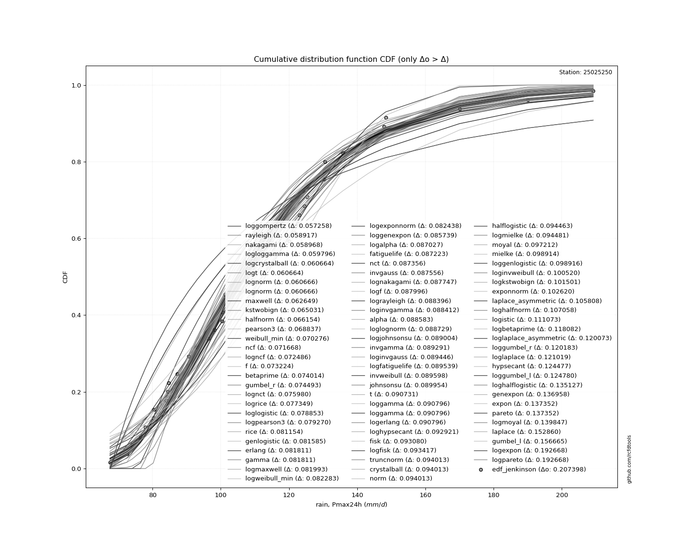</img>

</div>


**10.3. Best fit**

<div align="center">

|   id |   station | empirical_dist   | p_dist      |     delta |   deltao | eval   |   fit |   n |   best_fit |   best_fit_sort |
|-----:|----------:|:-----------------|:------------|----------:|---------:|:-------|------:|----:|-----------:|----------------:|
|    0 |  25025250 | edf_jenkinson    | loggompertz | 0.0572585 | 0.207398 | Δo > Δ |     1 |  43 |          1 |               1 |

</div>


<div align="center">

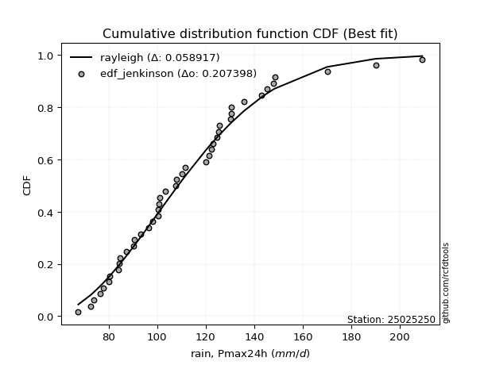</img></img>

</div>


### 11. EDF Cunnane (1978)

Cunnane´s work in statistical hydrology has focused on the performance and evaluation of different probability distributions (such as GEV, Gumbel, Lognormal) for flood frequency estimation. _b_ is a constant, typically set to 0.4.

<div align="center">


$P=(m-b)/(n+1-2b)$


</div>


**11.1. Empirical values**

<div align="center">

|                | 0                    | 1                    | 2                   | 3                   | 4                   | 5                   | 6                   | 7                  | 8                   | 9                  | 10                  | 11                 | 12                  | 13                  | 14                 | 15                 | 16                  | 17                  | 18                 | 19                 | 20                  | 21          | 22                 | 23                 | 24                 | 25                 | 26                 | 27                 | 28                 | 29                 | 30                 | 31                 | 32                 | 33                 | 34                 | 35                 | 36                 | 37                 | 38                 | 39                 | 40                 | 41                 | 42                |
|:---------------|:---------------------|:---------------------|:--------------------|:--------------------|:--------------------|:--------------------|:--------------------|:-------------------|:--------------------|:-------------------|:--------------------|:-------------------|:--------------------|:--------------------|:-------------------|:-------------------|:--------------------|:--------------------|:-------------------|:-------------------|:--------------------|:------------|:-------------------|:-------------------|:-------------------|:-------------------|:-------------------|:-------------------|:-------------------|:-------------------|:-------------------|:-------------------|:-------------------|:-------------------|:-------------------|:-------------------|:-------------------|:-------------------|:-------------------|:-------------------|:-------------------|:-------------------|:------------------|
| date           | 2001                 | 1986                 | 2006                | 1976                | 1977                | 1982                | 1997                | 2015               | 1989                | 1974               | 2013                | 2012               | 1990                | 1994                | 2007               | 1992               | 1988                | 1998                | 1980               | 1985               | 1973                | 2011        | 1999               | 1996               | 1984               | 2009               | 2008               | 2003               | 1978               | 2005               | 1987               | 1991               | 2002               | 2000               | 2004               | 2010               | 1981               | 1983               | 1979               | 1975               | 2014               | 1995               | 1993              |
| x              | 67.5                 | 72.5                 | 74.0                | 76.5                | 77.9                | 80.2                | 80.4                | 84.0               | 84.4                | 84.7               | 87.23611343         | 90.41938696        | 90.6                | 93.1                | 96.37801329        | 98.1               | 100.3               | 100.3               | 100.8              | 101.1449581        | 103.2               | 107.532524  | 108.0              | 110.2              | 111.6              | 120.0              | 121.5              | 122.5              | 123.0              | 124.5              | 125.4              | 125.5              | 130.2              | 130.4              | 130.5              | 135.8              | 143.0              | 145.3              | 147.8              | 148.4              | 170.0              | 190.0              | 209.2             |
| m              | 1                    | 2                    | 3                   | 4                   | 5                   | 6                   | 7                   | 8                  | 9                   | 10                 | 11                  | 12                 | 13                  | 14                  | 15                 | 16                 | 17                  | 18                  | 19                 | 20                 | 21                  | 22          | 23                 | 24                 | 25                 | 26                 | 27                 | 28                 | 29                 | 30                 | 31                 | 32                 | 33                 | 34                 | 35                 | 36                 | 37                 | 38                 | 39                 | 40                 | 41                 | 42                 | 43                |
| empirical_dist | edf_cunnane          | edf_cunnane          | edf_cunnane         | edf_cunnane         | edf_cunnane         | edf_cunnane         | edf_cunnane         | edf_cunnane        | edf_cunnane         | edf_cunnane        | edf_cunnane         | edf_cunnane        | edf_cunnane         | edf_cunnane         | edf_cunnane        | edf_cunnane        | edf_cunnane         | edf_cunnane         | edf_cunnane        | edf_cunnane        | edf_cunnane         | edf_cunnane | edf_cunnane        | edf_cunnane        | edf_cunnane        | edf_cunnane        | edf_cunnane        | edf_cunnane        | edf_cunnane        | edf_cunnane        | edf_cunnane        | edf_cunnane        | edf_cunnane        | edf_cunnane        | edf_cunnane        | edf_cunnane        | edf_cunnane        | edf_cunnane        | edf_cunnane        | edf_cunnane        | edf_cunnane        | edf_cunnane        | edf_cunnane       |
| empirical      | 0.013888888888888888 | 0.037037037037037035 | 0.06018518518518518 | 0.08333333333333333 | 0.10648148148148147 | 0.12962962962962962 | 0.15277777777777776 | 0.1759259259259259 | 0.19907407407407404 | 0.2222222222222222 | 0.24537037037037035 | 0.2685185185185185 | 0.29166666666666663 | 0.31481481481481477 | 0.3379629629629629 | 0.3611111111111111 | 0.38425925925925924 | 0.40740740740740744 | 0.4305555555555556 | 0.4537037037037037 | 0.47685185185185186 | 0.5         | 0.5231481481481481 | 0.5462962962962963 | 0.5694444444444444 | 0.5925925925925926 | 0.6157407407407407 | 0.6388888888888888 | 0.662037037037037  | 0.6851851851851851 | 0.7083333333333334 | 0.7314814814814815 | 0.7546296296296297 | 0.7777777777777778 | 0.8009259259259259 | 0.8240740740740741 | 0.8472222222222222 | 0.8703703703703703 | 0.8935185185185185 | 0.9166666666666666 | 0.9398148148148148 | 0.9629629629629629 | 0.986111111111111 |
| empirical_tr   | 1.0140845070422535   | 1.0384615384615383   | 1.064039408866995   | 1.090909090909091   | 1.1191709844559585  | 1.148936170212766   | 1.180327868852459   | 1.2134831460674158 | 1.2485549132947977  | 1.2857142857142856 | 1.3251533742331287  | 1.3670886075949367 | 1.4117647058823528  | 1.4594594594594594  | 1.5104895104895104 | 1.565217391304348  | 1.62406015037594    | 1.6875              | 1.7560975609756098 | 1.8305084745762712 | 1.9115044247787611  | 2.0         | 2.0970873786407767 | 2.204081632653061  | 2.32258064516129   | 2.454545454545454  | 2.602409638554217  | 2.7692307692307687 | 2.9589041095890405 | 3.1764705882352935 | 3.428571428571429  | 3.724137931034483  | 4.0754716981132075 | 4.5                | 5.023255813953488  | 5.684210526315789  | 6.545454545454545  | 7.714285714285713  | 9.391304347826084  | 11.999999999999995 | 16.615384615384603 | 26.99999999999996  | 71.99999999999969 |

</div>


**11.2. Kolmogorov-Smirnov fit test (sorted by Δ)**


<div align="center">

|                | 0                    | 1                   | 2                    | 3                   | 4                   | 5                    | 6                    | 7                    | 8                   | 9                   | 10                  | 11                  | 12                  | 13                  | 14                  | 15                  | 16                  | 17                  | 18                  | 19                  | 20                  | 21                  | 22                  | 23                  | 24                  | 25                  | 26                  | 27                  | 28                  | 29                  | 30                  | 31                  | 32                  | 33                  | 34                  | 35                  | 36                  | 37                  | 38                  | 39                  | 40                  | 41                  | 42                  | 43                  | 44                  | 45                  | 46                  | 47                  | 48                  | 49                  | 50                  | 51                  | 52                  | 53                  | 54                  | 55                  | 56                  | 57                  | 58                  | 59                  | 60                  | 61                  | 62                  | 63                  | 64                  | 65                  | 66                  | 67                    | 68                  | 69                  | 70                  | 71                  | 72                  | 73                  | 74                  | 75                  | 76                  | 77                  | 78                  | 79                  | 80                  | 81                  | 82                  | 83                  | 84                  | 85                  | 86                  | 87                  |
|:---------------|:---------------------|:--------------------|:---------------------|:--------------------|:--------------------|:---------------------|:---------------------|:---------------------|:--------------------|:--------------------|:--------------------|:--------------------|:--------------------|:--------------------|:--------------------|:--------------------|:--------------------|:--------------------|:--------------------|:--------------------|:--------------------|:--------------------|:--------------------|:--------------------|:--------------------|:--------------------|:--------------------|:--------------------|:--------------------|:--------------------|:--------------------|:--------------------|:--------------------|:--------------------|:--------------------|:--------------------|:--------------------|:--------------------|:--------------------|:--------------------|:--------------------|:--------------------|:--------------------|:--------------------|:--------------------|:--------------------|:--------------------|:--------------------|:--------------------|:--------------------|:--------------------|:--------------------|:--------------------|:--------------------|:--------------------|:--------------------|:--------------------|:--------------------|:--------------------|:--------------------|:--------------------|:--------------------|:--------------------|:--------------------|:--------------------|:--------------------|:--------------------|:----------------------|:--------------------|:--------------------|:--------------------|:--------------------|:--------------------|:--------------------|:--------------------|:--------------------|:--------------------|:--------------------|:--------------------|:--------------------|:--------------------|:--------------------|:--------------------|:--------------------|:--------------------|:--------------------|:--------------------|:--------------------|
| station        | 25025250             | 25025250            | 25025250             | 25025250            | 25025250            | 25025250             | 25025250             | 25025250             | 25025250            | 25025250            | 25025250            | 25025250            | 25025250            | 25025250            | 25025250            | 25025250            | 25025250            | 25025250            | 25025250            | 25025250            | 25025250            | 25025250            | 25025250            | 25025250            | 25025250            | 25025250            | 25025250            | 25025250            | 25025250            | 25025250            | 25025250            | 25025250            | 25025250            | 25025250            | 25025250            | 25025250            | 25025250            | 25025250            | 25025250            | 25025250            | 25025250            | 25025250            | 25025250            | 25025250            | 25025250            | 25025250            | 25025250            | 25025250            | 25025250            | 25025250            | 25025250            | 25025250            | 25025250            | 25025250            | 25025250            | 25025250            | 25025250            | 25025250            | 25025250            | 25025250            | 25025250            | 25025250            | 25025250            | 25025250            | 25025250            | 25025250            | 25025250            | 25025250              | 25025250            | 25025250            | 25025250            | 25025250            | 25025250            | 25025250            | 25025250            | 25025250            | 25025250            | 25025250            | 25025250            | 25025250            | 25025250            | 25025250            | 25025250            | 25025250            | 25025250            | 25025250            | 25025250            | 25025250            |
| empirical_dist | edf_cunnane          | edf_cunnane         | edf_cunnane          | edf_cunnane         | edf_cunnane         | edf_cunnane          | edf_cunnane          | edf_cunnane          | edf_cunnane         | edf_cunnane         | edf_cunnane         | edf_cunnane         | edf_cunnane         | edf_cunnane         | edf_cunnane         | edf_cunnane         | edf_cunnane         | edf_cunnane         | edf_cunnane         | edf_cunnane         | edf_cunnane         | edf_cunnane         | edf_cunnane         | edf_cunnane         | edf_cunnane         | edf_cunnane         | edf_cunnane         | edf_cunnane         | edf_cunnane         | edf_cunnane         | edf_cunnane         | edf_cunnane         | edf_cunnane         | edf_cunnane         | edf_cunnane         | edf_cunnane         | edf_cunnane         | edf_cunnane         | edf_cunnane         | edf_cunnane         | edf_cunnane         | edf_cunnane         | edf_cunnane         | edf_cunnane         | edf_cunnane         | edf_cunnane         | edf_cunnane         | edf_cunnane         | edf_cunnane         | edf_cunnane         | edf_cunnane         | edf_cunnane         | edf_cunnane         | edf_cunnane         | edf_cunnane         | edf_cunnane         | edf_cunnane         | edf_cunnane         | edf_cunnane         | edf_cunnane         | edf_cunnane         | edf_cunnane         | edf_cunnane         | edf_cunnane         | edf_cunnane         | edf_cunnane         | edf_cunnane         | edf_cunnane           | edf_cunnane         | edf_cunnane         | edf_cunnane         | edf_cunnane         | edf_cunnane         | edf_cunnane         | edf_cunnane         | edf_cunnane         | edf_cunnane         | edf_cunnane         | edf_cunnane         | edf_cunnane         | edf_cunnane         | edf_cunnane         | edf_cunnane         | edf_cunnane         | edf_cunnane         | edf_cunnane         | edf_cunnane         | edf_cunnane         |
| p_dist         | loggompertz          | nakagami            | logloggamma          | rayleigh            | logcrystalball      | logt                 | lognorm              | lognorm              | maxwell             | kstwobign           | halfnorm            | pearson3            | weibull_min         | ncf                 | logncf              | f                   | betaprime           | gumbel_r            | lognct              | logrice             | loglogistic         | logpearson3         | rice                | genlogistic         | erlang              | gamma               | logmaxwell          | logweibull_min      | logexponnorm        | loggenexpon         | logalpha            | fatiguelife         | nct                 | invgauss            | lognakagami         | logf                | lograyleigh         | loginvgamma         | alpha               | loglognorm          | logjohnsonsu        | invgamma            | loginvgauss         | logfatiguelife      | invweibull          | johnsonsu           | loggamma            | loggamma            | logerlang           | t                   | loghypsecant        | fisk                | logfisk             | truncnorm           | crystalball         | norm                | halflogistic        | logmielke           | moyal               | mielke              | loggenlogistic      | loginvweibull       | logkstwobign        | exponnorm           | laplace_asymmetric  | loghalfnorm         | logistic            | loglaplace_asymmetric | loggumbel_r         | logbetaprime        | loglaplace          | hypsecant           | loggumbel_l         | loghalflogistic     | genexpon            | expon               | logmoyal            | laplace             | gumbel_l            | logexpon            | wald                | logwald             | loggibrat           | gibrat              | logchi2             | logtruncnorm        | chi2                | gompertz            |
| delta          | 0.058507131683624425 | 0.05858349767992643 | 0.059604388043672796 | 0.06016553164080862 | 0.06027963479321685 | 0.060280281571477135 | 0.060281927711631655 | 0.060281927711631655 | 0.06389751825939094 | 0.06464659929587013 | 0.06576971113085872 | 0.06845314862060237 | 0.06989186259742208 | 0.07128332953618743 | 0.07210147563339286 | 0.0728393637318856  | 0.07363010047101104 | 0.07410829891428372 | 0.07559598156438463 | 0.07696471164238805 | 0.07846922604783746 | 0.07888628036670531 | 0.08096223595939522 | 0.08120106522202353 | 0.08142663249977145 | 0.08142666685429312 | 0.08160905838395593 | 0.08189834463184942 | 0.08205339593990224 | 0.0853544969282738  | 0.08664295593009641 | 0.08683893770906814 | 0.08697154363047999 | 0.0871720977515048  | 0.0873629063323269  | 0.0876121479181029  | 0.0880115658819296  | 0.08802811644278741 | 0.0881985269924801  | 0.08834518128415603 | 0.08861949608944308 | 0.08890661632592622 | 0.08906212069515107 | 0.08915444440353637 | 0.0892138158528436  | 0.08956991386970481 | 0.09041195313806272 | 0.09041195313806272 | 0.09041204538008807 | 0.09053912910042006 | 0.09253702755998983 | 0.09269579940051642 | 0.09303254680129758 | 0.09382049609978327 | 0.09382051059241431 | 0.09382051355247079 | 0.09407842168775915 | 0.09409657107873692 | 0.09682773118091903 | 0.09853029383458367 | 0.09853177284898629 | 0.10013590764585711 | 0.10111634715244233 | 0.10223557648867221 | 0.10628828507022342 | 0.10667365567772635 | 0.11088060717526754 | 0.11968886306209958   | 0.11979844143476481 | 0.11981122706887282 | 0.12063440706845374 | 0.12428455202776867 | 0.12458740438115373 | 0.13474326011230042 | 0.1374382221081218  | 0.13802393849080163 | 0.13946298586341177 | 0.15266789294618255 | 0.1565690530410691  | 0.19401241362656832 | 0.21645218371858585 | 0.2222030348336561  | 0.25983901308705065 | 0.2699062494414609  | 0.29966837921033895 | 0.3015659249163629  | 0.9212983864716291  | 0.9366436663210929  |
| deltao         | 0.20739805565234237  | 0.20739805565234237 | 0.20739805565234237  | 0.20739805565234237 | 0.20739805565234237 | 0.20739805565234237  | 0.20739805565234237  | 0.20739805565234237  | 0.20739805565234237 | 0.20739805565234237 | 0.20739805565234237 | 0.20739805565234237 | 0.20739805565234237 | 0.20739805565234237 | 0.20739805565234237 | 0.20739805565234237 | 0.20739805565234237 | 0.20739805565234237 | 0.20739805565234237 | 0.20739805565234237 | 0.20739805565234237 | 0.20739805565234237 | 0.20739805565234237 | 0.20739805565234237 | 0.20739805565234237 | 0.20739805565234237 | 0.20739805565234237 | 0.20739805565234237 | 0.20739805565234237 | 0.20739805565234237 | 0.20739805565234237 | 0.20739805565234237 | 0.20739805565234237 | 0.20739805565234237 | 0.20739805565234237 | 0.20739805565234237 | 0.20739805565234237 | 0.20739805565234237 | 0.20739805565234237 | 0.20739805565234237 | 0.20739805565234237 | 0.20739805565234237 | 0.20739805565234237 | 0.20739805565234237 | 0.20739805565234237 | 0.20739805565234237 | 0.20739805565234237 | 0.20739805565234237 | 0.20739805565234237 | 0.20739805565234237 | 0.20739805565234237 | 0.20739805565234237 | 0.20739805565234237 | 0.20739805565234237 | 0.20739805565234237 | 0.20739805565234237 | 0.20739805565234237 | 0.20739805565234237 | 0.20739805565234237 | 0.20739805565234237 | 0.20739805565234237 | 0.20739805565234237 | 0.20739805565234237 | 0.20739805565234237 | 0.20739805565234237 | 0.20739805565234237 | 0.20739805565234237 | 0.20739805565234237   | 0.20739805565234237 | 0.20739805565234237 | 0.20739805565234237 | 0.20739805565234237 | 0.20739805565234237 | 0.20739805565234237 | 0.20739805565234237 | 0.20739805565234237 | 0.20739805565234237 | 0.20739805565234237 | 0.20739805565234237 | 0.20739805565234237 | 0.20739805565234237 | 0.20739805565234237 | 0.20739805565234237 | 0.20739805565234237 | 0.20739805565234237 | 0.20739805565234237 | 0.20739805565234237 | 0.20739805565234237 |
| eval           | Δo > Δ               | Δo > Δ              | Δo > Δ               | Δo > Δ              | Δo > Δ              | Δo > Δ               | Δo > Δ               | Δo > Δ               | Δo > Δ              | Δo > Δ              | Δo > Δ              | Δo > Δ              | Δo > Δ              | Δo > Δ              | Δo > Δ              | Δo > Δ              | Δo > Δ              | Δo > Δ              | Δo > Δ              | Δo > Δ              | Δo > Δ              | Δo > Δ              | Δo > Δ              | Δo > Δ              | Δo > Δ              | Δo > Δ              | Δo > Δ              | Δo > Δ              | Δo > Δ              | Δo > Δ              | Δo > Δ              | Δo > Δ              | Δo > Δ              | Δo > Δ              | Δo > Δ              | Δo > Δ              | Δo > Δ              | Δo > Δ              | Δo > Δ              | Δo > Δ              | Δo > Δ              | Δo > Δ              | Δo > Δ              | Δo > Δ              | Δo > Δ              | Δo > Δ              | Δo > Δ              | Δo > Δ              | Δo > Δ              | Δo > Δ              | Δo > Δ              | Δo > Δ              | Δo > Δ              | Δo > Δ              | Δo > Δ              | Δo > Δ              | Δo > Δ              | Δo > Δ              | Δo > Δ              | Δo > Δ              | Δo > Δ              | Δo > Δ              | Δo > Δ              | Δo > Δ              | Δo > Δ              | Δo > Δ              | Δo > Δ              | Δo > Δ                | Δo > Δ              | Δo > Δ              | Δo > Δ              | Δo > Δ              | Δo > Δ              | Δo > Δ              | Δo > Δ              | Δo > Δ              | Δo > Δ              | Δo > Δ              | Δo > Δ              | Δo > Δ              | Δo <= Δ             | Δo <= Δ             | Δo <= Δ             | Δo <= Δ             | Δo <= Δ             | Δo <= Δ             | Δo <= Δ             | Δo <= Δ             |
| fit            | 1                    | 1                   | 1                    | 1                   | 1                   | 1                    | 1                    | 1                    | 1                   | 1                   | 1                   | 1                   | 1                   | 1                   | 1                   | 1                   | 1                   | 1                   | 1                   | 1                   | 1                   | 1                   | 1                   | 1                   | 1                   | 1                   | 1                   | 1                   | 1                   | 1                   | 1                   | 1                   | 1                   | 1                   | 1                   | 1                   | 1                   | 1                   | 1                   | 1                   | 1                   | 1                   | 1                   | 1                   | 1                   | 1                   | 1                   | 1                   | 1                   | 1                   | 1                   | 1                   | 1                   | 1                   | 1                   | 1                   | 1                   | 1                   | 1                   | 1                   | 1                   | 1                   | 1                   | 1                   | 1                   | 1                   | 1                   | 1                     | 1                   | 1                   | 1                   | 1                   | 1                   | 1                   | 1                   | 1                   | 1                   | 1                   | 1                   | 1                   | 0                   | 0                   | 0                   | 0                   | 0                   | 0                   | 0                   | 0                   |
| n              | 43                   | 43                  | 43                   | 43                  | 43                  | 43                   | 43                   | 43                   | 43                  | 43                  | 43                  | 43                  | 43                  | 43                  | 43                  | 43                  | 43                  | 43                  | 43                  | 43                  | 43                  | 43                  | 43                  | 43                  | 43                  | 43                  | 43                  | 43                  | 43                  | 43                  | 43                  | 43                  | 43                  | 43                  | 43                  | 43                  | 43                  | 43                  | 43                  | 43                  | 43                  | 43                  | 43                  | 43                  | 43                  | 43                  | 43                  | 43                  | 43                  | 43                  | 43                  | 43                  | 43                  | 43                  | 43                  | 43                  | 43                  | 43                  | 43                  | 43                  | 43                  | 43                  | 43                  | 43                  | 43                  | 43                  | 43                  | 43                    | 43                  | 43                  | 43                  | 43                  | 43                  | 43                  | 43                  | 43                  | 43                  | 43                  | 43                  | 43                  | 43                  | 43                  | 43                  | 43                  | 43                  | 43                  | 43                  | 43                  |
| best_fit       | 1                    | 0                   | 0                    | 0                   | 0                   | 0                    | 0                    | 0                    | 0                   | 0                   | 0                   | 0                   | 0                   | 0                   | 0                   | 0                   | 0                   | 0                   | 0                   | 0                   | 0                   | 0                   | 0                   | 0                   | 0                   | 0                   | 0                   | 0                   | 0                   | 0                   | 0                   | 0                   | 0                   | 0                   | 0                   | 0                   | 0                   | 0                   | 0                   | 0                   | 0                   | 0                   | 0                   | 0                   | 0                   | 0                   | 0                   | 0                   | 0                   | 0                   | 0                   | 0                   | 0                   | 0                   | 0                   | 0                   | 0                   | 0                   | 0                   | 0                   | 0                   | 0                   | 0                   | 0                   | 0                   | 0                   | 0                   | 0                     | 0                   | 0                   | 0                   | 0                   | 0                   | 0                   | 0                   | 0                   | 0                   | 0                   | 0                   | 0                   | 0                   | 0                   | 0                   | 0                   | 0                   | 0                   | 0                   | 0                   |
| best_fit_sort  | 1                    | 2                   | 3                    | 4                   | 5                   | 6                    | 7                    | 8                    | 9                   | 10                  | 11                  | 12                  | 13                  | 14                  | 15                  | 16                  | 17                  | 18                  | 19                  | 20                  | 21                  | 22                  | 23                  | 24                  | 25                  | 26                  | 27                  | 28                  | 29                  | 30                  | 31                  | 32                  | 33                  | 34                  | 35                  | 36                  | 37                  | 38                  | 39                  | 40                  | 41                  | 42                  | 43                  | 44                  | 45                  | 46                  | 47                  | 48                  | 49                  | 50                  | 51                  | 52                  | 53                  | 54                  | 55                  | 56                  | 57                  | 58                  | 59                  | 60                  | 61                  | 62                  | 63                  | 64                  | 65                  | 66                  | 67                  | 68                    | 69                  | 70                  | 71                  | 72                  | 73                  | 74                  | 75                  | 76                  | 77                  | 78                  | 79                  | 80                  | 81                  | 82                  | 83                  | 84                  | 85                  | 86                  | 87                  | 88                  |

</div>


<div align="center">

</img>

</div>


**11.3. Best fit**

<div align="center">

|   id |   station | empirical_dist   | p_dist      |     delta |   deltao | eval   |   fit |   n |   best_fit |   best_fit_sort |
|-----:|----------:|:-----------------|:------------|----------:|---------:|:-------|------:|----:|-----------:|----------------:|
|    0 |  25025250 | edf_cunnane      | loggompertz | 0.0585071 | 0.207398 | Δo > Δ |     1 |  43 |          1 |               1 |

</div>


<div align="center">

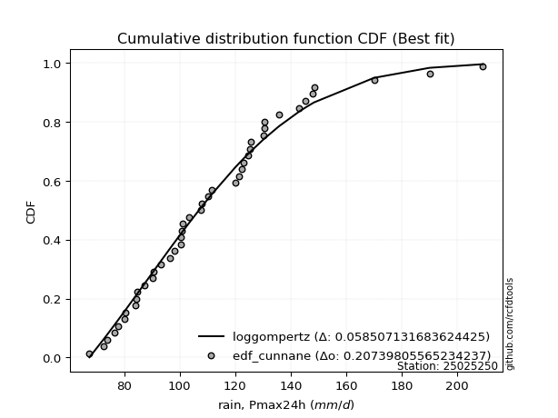</img>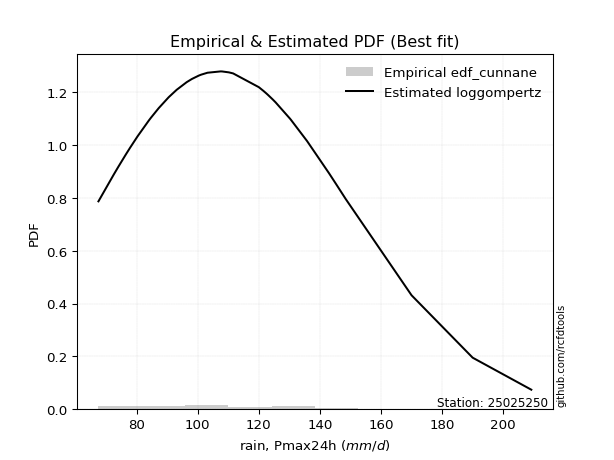</img>

</div>


### 12. EDF Adamowski (1981)

The Adamowski formula in hydrology refers to a specific plotting position formula used for estimating the non-parametric empirical distribution of hydrological events (like flood peaks) to calculate their return periods. This formula provides an alternative to traditional parametric methods (like the Gumbel or Log Pearson Type III distributions). 

<div align="center">


$P=(m-0.25)/(n+0.5)$


</div>


**12.1. Empirical values**

<div align="center">

|                | 0                    | 1                    | 2                   | 3                   | 4                   | 5                   | 6                   | 7                  | 8                   | 9                   | 10                 | 11                  | 12                  | 13                 | 14                 | 15                 | 16                 | 17                  | 18                  | 19                 | 20                  | 21            | 22                 | 23                 | 24                 | 25                 | 26                 | 27                 | 28                 | 29                 | 30                 | 31                 | 32                 | 33                 | 34                 | 35                 | 36                 | 37                | 38                 | 39                 | 40                 | 41                 | 42                 |
|:---------------|:---------------------|:---------------------|:--------------------|:--------------------|:--------------------|:--------------------|:--------------------|:-------------------|:--------------------|:--------------------|:-------------------|:--------------------|:--------------------|:-------------------|:-------------------|:-------------------|:-------------------|:--------------------|:--------------------|:-------------------|:--------------------|:--------------|:-------------------|:-------------------|:-------------------|:-------------------|:-------------------|:-------------------|:-------------------|:-------------------|:-------------------|:-------------------|:-------------------|:-------------------|:-------------------|:-------------------|:-------------------|:------------------|:-------------------|:-------------------|:-------------------|:-------------------|:-------------------|
| date           | 2001                 | 1986                 | 2006                | 1976                | 1977                | 1982                | 1997                | 2015               | 1989                | 1974                | 2013               | 2012                | 1990                | 1994               | 2007               | 1992               | 1988               | 1998                | 1980                | 1985               | 1973                | 2011          | 1999               | 1996               | 1984               | 2009               | 2008               | 2003               | 1978               | 2005               | 1987               | 1991               | 2002               | 2000               | 2004               | 2010               | 1981               | 1983              | 1979               | 1975               | 2014               | 1995               | 1993               |
| x              | 67.5                 | 72.5                 | 74.0                | 76.5                | 77.9                | 80.2                | 80.4                | 84.0               | 84.4                | 84.7                | 87.23611343        | 90.41938696         | 90.6                | 93.1               | 96.37801329        | 98.1               | 100.3              | 100.3               | 100.8               | 101.1449581        | 103.2               | 107.532524    | 108.0              | 110.2              | 111.6              | 120.0              | 121.5              | 122.5              | 123.0              | 124.5              | 125.4              | 125.5              | 130.2              | 130.4              | 130.5              | 135.8              | 143.0              | 145.3             | 147.8              | 148.4              | 170.0              | 190.0              | 209.2              |
| m              | 1                    | 2                    | 3                   | 4                   | 5                   | 6                   | 7                   | 8                  | 9                   | 10                  | 11                 | 12                  | 13                  | 14                 | 15                 | 16                 | 17                 | 18                  | 19                  | 20                 | 21                  | 22            | 23                 | 24                 | 25                 | 26                 | 27                 | 28                 | 29                 | 30                 | 31                 | 32                 | 33                 | 34                 | 35                 | 36                 | 37                 | 38                | 39                 | 40                 | 41                 | 42                 | 43                 |
| empirical_dist | edf_adamowski        | edf_adamowski        | edf_adamowski       | edf_adamowski       | edf_adamowski       | edf_adamowski       | edf_adamowski       | edf_adamowski      | edf_adamowski       | edf_adamowski       | edf_adamowski      | edf_adamowski       | edf_adamowski       | edf_adamowski      | edf_adamowski      | edf_adamowski      | edf_adamowski      | edf_adamowski       | edf_adamowski       | edf_adamowski      | edf_adamowski       | edf_adamowski | edf_adamowski      | edf_adamowski      | edf_adamowski      | edf_adamowski      | edf_adamowski      | edf_adamowski      | edf_adamowski      | edf_adamowski      | edf_adamowski      | edf_adamowski      | edf_adamowski      | edf_adamowski      | edf_adamowski      | edf_adamowski      | edf_adamowski      | edf_adamowski     | edf_adamowski      | edf_adamowski      | edf_adamowski      | edf_adamowski      | edf_adamowski      |
| empirical      | 0.017241379310344827 | 0.040229885057471264 | 0.06321839080459771 | 0.08620689655172414 | 0.10919540229885058 | 0.13218390804597702 | 0.15517241379310345 | 0.1781609195402299 | 0.20114942528735633 | 0.22413793103448276 | 0.2471264367816092 | 0.27011494252873564 | 0.29310344827586204 | 0.3160919540229885 | 0.3390804597701149 | 0.3620689655172414 | 0.3850574712643678 | 0.40804597701149425 | 0.43103448275862066 | 0.4540229885057471 | 0.47701149425287354 | 0.5           | 0.5229885057471264 | 0.5459770114942529 | 0.5689655172413793 | 0.5919540229885057 | 0.6149425287356322 | 0.6379310344827587 | 0.6609195402298851 | 0.6839080459770115 | 0.7068965517241379 | 0.7298850574712644 | 0.7528735632183908 | 0.7758620689655172 | 0.7988505747126436 | 0.8218390804597702 | 0.8448275862068966 | 0.867816091954023 | 0.8908045977011494 | 0.9137931034482759 | 0.9367816091954023 | 0.9597701149425287 | 0.9827586206896551 |
| empirical_tr   | 1.0175438596491229   | 1.0419161676646707   | 1.0674846625766872  | 1.0943396226415094  | 1.1225806451612903  | 1.152317880794702   | 1.183673469387755   | 1.2167832167832167 | 1.2517985611510791  | 1.288888888888889   | 1.3282442748091603 | 1.3700787401574803  | 1.4146341463414636  | 1.4621848739495797 | 1.5130434782608695 | 1.5675675675675675 | 1.6261682242990652 | 1.6893203883495145  | 1.7575757575757576  | 1.8315789473684212 | 1.9120879120879122  | 2.0           | 2.0963855421686746 | 2.2025316455696204 | 2.3200000000000003 | 2.4507042253521125 | 2.5970149253731343 | 2.7619047619047623 | 2.9491525423728815 | 3.1636363636363636 | 3.4117647058823524 | 3.7021276595744688 | 4.046511627906977  | 4.461538461538462  | 4.971428571428571  | 5.612903225806453  | 6.4444444444444455 | 7.565217391304348 | 9.157894736842103  | 11.600000000000007 | 15.818181818181824 | 24.857142857142854 | 57.999999999999886 |

</div>


**12.2. Kolmogorov-Smirnov fit test (sorted by Δ)**


<div align="center">

|                | 0                   | 1                   | 2                   | 3                   | 4                    | 5                   | 6                   | 7                   | 8                    | 9                   | 10                  | 11                  | 12                  | 13                  | 14                  | 15                  | 16                  | 17                  | 18                  | 19                  | 20                  | 21                  | 22                  | 23                  | 24                  | 25                  | 26                  | 27                  | 28                  | 29                  | 30                  | 31                  | 32                  | 33                  | 34                  | 35                  | 36                  | 37                  | 38                  | 39                  | 40                  | 41                  | 42                  | 43                  | 44                  | 45                  | 46                  | 47                  | 48                  | 49                  | 50                  | 51                  | 52                  | 53                  | 54                  | 55                  | 56                  | 57                  | 58                  | 59                  | 60                  | 61                  | 62                  | 63                  | 64                  | 65                  | 66                  | 67                  | 68                    | 69                  | 70                  | 71                  | 72                  | 73                  | 74                  | 75                  | 76                  | 77                  | 78                  | 79                  | 80                  | 81                  | 82                  | 83                  | 84                  | 85                  | 86                  | 87                  |
|:---------------|:--------------------|:--------------------|:--------------------|:--------------------|:---------------------|:--------------------|:--------------------|:--------------------|:---------------------|:--------------------|:--------------------|:--------------------|:--------------------|:--------------------|:--------------------|:--------------------|:--------------------|:--------------------|:--------------------|:--------------------|:--------------------|:--------------------|:--------------------|:--------------------|:--------------------|:--------------------|:--------------------|:--------------------|:--------------------|:--------------------|:--------------------|:--------------------|:--------------------|:--------------------|:--------------------|:--------------------|:--------------------|:--------------------|:--------------------|:--------------------|:--------------------|:--------------------|:--------------------|:--------------------|:--------------------|:--------------------|:--------------------|:--------------------|:--------------------|:--------------------|:--------------------|:--------------------|:--------------------|:--------------------|:--------------------|:--------------------|:--------------------|:--------------------|:--------------------|:--------------------|:--------------------|:--------------------|:--------------------|:--------------------|:--------------------|:--------------------|:--------------------|:--------------------|:----------------------|:--------------------|:--------------------|:--------------------|:--------------------|:--------------------|:--------------------|:--------------------|:--------------------|:--------------------|:--------------------|:--------------------|:--------------------|:--------------------|:--------------------|:--------------------|:--------------------|:--------------------|:--------------------|:--------------------|
| station        | 25025250            | 25025250            | 25025250            | 25025250            | 25025250             | 25025250            | 25025250            | 25025250            | 25025250             | 25025250            | 25025250            | 25025250            | 25025250            | 25025250            | 25025250            | 25025250            | 25025250            | 25025250            | 25025250            | 25025250            | 25025250            | 25025250            | 25025250            | 25025250            | 25025250            | 25025250            | 25025250            | 25025250            | 25025250            | 25025250            | 25025250            | 25025250            | 25025250            | 25025250            | 25025250            | 25025250            | 25025250            | 25025250            | 25025250            | 25025250            | 25025250            | 25025250            | 25025250            | 25025250            | 25025250            | 25025250            | 25025250            | 25025250            | 25025250            | 25025250            | 25025250            | 25025250            | 25025250            | 25025250            | 25025250            | 25025250            | 25025250            | 25025250            | 25025250            | 25025250            | 25025250            | 25025250            | 25025250            | 25025250            | 25025250            | 25025250            | 25025250            | 25025250            | 25025250              | 25025250            | 25025250            | 25025250            | 25025250            | 25025250            | 25025250            | 25025250            | 25025250            | 25025250            | 25025250            | 25025250            | 25025250            | 25025250            | 25025250            | 25025250            | 25025250            | 25025250            | 25025250            | 25025250            |
| empirical_dist | edf_adamowski       | edf_adamowski       | edf_adamowski       | edf_adamowski       | edf_adamowski        | edf_adamowski       | edf_adamowski       | edf_adamowski       | edf_adamowski        | edf_adamowski       | edf_adamowski       | edf_adamowski       | edf_adamowski       | edf_adamowski       | edf_adamowski       | edf_adamowski       | edf_adamowski       | edf_adamowski       | edf_adamowski       | edf_adamowski       | edf_adamowski       | edf_adamowski       | edf_adamowski       | edf_adamowski       | edf_adamowski       | edf_adamowski       | edf_adamowski       | edf_adamowski       | edf_adamowski       | edf_adamowski       | edf_adamowski       | edf_adamowski       | edf_adamowski       | edf_adamowski       | edf_adamowski       | edf_adamowski       | edf_adamowski       | edf_adamowski       | edf_adamowski       | edf_adamowski       | edf_adamowski       | edf_adamowski       | edf_adamowski       | edf_adamowski       | edf_adamowski       | edf_adamowski       | edf_adamowski       | edf_adamowski       | edf_adamowski       | edf_adamowski       | edf_adamowski       | edf_adamowski       | edf_adamowski       | edf_adamowski       | edf_adamowski       | edf_adamowski       | edf_adamowski       | edf_adamowski       | edf_adamowski       | edf_adamowski       | edf_adamowski       | edf_adamowski       | edf_adamowski       | edf_adamowski       | edf_adamowski       | edf_adamowski       | edf_adamowski       | edf_adamowski       | edf_adamowski         | edf_adamowski       | edf_adamowski       | edf_adamowski       | edf_adamowski       | edf_adamowski       | edf_adamowski       | edf_adamowski       | edf_adamowski       | edf_adamowski       | edf_adamowski       | edf_adamowski       | edf_adamowski       | edf_adamowski       | edf_adamowski       | edf_adamowski       | edf_adamowski       | edf_adamowski       | edf_adamowski       | edf_adamowski       |
| p_dist         | loggompertz         | rayleigh            | nakagami            | logloggamma         | logcrystalball       | logt                | lognorm             | lognorm             | maxwell              | kstwobign           | halfnorm            | pearson3            | weibull_min         | ncf                 | logncf              | f                   | betaprime           | gumbel_r            | lognct              | logrice             | loglogistic         | logpearson3         | rice                | genlogistic         | erlang              | gamma               | logmaxwell          | logweibull_min      | logexponnorm        | loggenexpon         | logalpha            | fatiguelife         | nct                 | invgauss            | lognakagami         | logf                | lograyleigh         | loginvgamma         | alpha               | loglognorm          | logjohnsonsu        | invgamma            | loginvgauss         | logfatiguelife      | invweibull          | johnsonsu           | t                   | loggamma            | loggamma            | logerlang           | loghypsecant        | fisk                | logfisk             | truncnorm           | crystalball         | norm                | halflogistic        | logmielke           | moyal               | mielke              | loggenlogistic      | loginvweibull       | logkstwobign        | exponnorm           | laplace_asymmetric  | loghalfnorm         | logistic            | logbetaprime        | loglaplace_asymmetric | loggumbel_r         | loglaplace          | hypsecant           | loggumbel_l         | loghalflogistic     | genexpon            | expon               | logmoyal            | laplace             | gumbel_l            | logexpon            | wald                | logwald             | loggibrat           | gibrat              | logchi2             | logtruncnorm        | chi2                | gompertz            |
| delta          | 0.05643178047034214 | 0.05809018042752634 | 0.05922206728401325 | 0.0599236728457162  | 0.060918204397303666 | 0.06091885117556395 | 0.06092049731571847 | 0.06092049731571847 | 0.061822167046108656 | 0.06528516889995695 | 0.06640828073494554 | 0.06909171822468918 | 0.0705304322015089  | 0.07192189914027425 | 0.07274004523747968 | 0.07347793333597241 | 0.07426867007509785 | 0.07474686851837054 | 0.07623455116847144 | 0.07760328124647486 | 0.07910779565192427 | 0.07952484997079212 | 0.08128152076143863 | 0.08183963482611034 | 0.08206520210385826 | 0.08206523645837993 | 0.08224762798804275 | 0.08253691423593623 | 0.08269196554398905 | 0.0859930665323606  | 0.08728152553418322 | 0.08747750731315496 | 0.0876101132345668  | 0.08781066735559162 | 0.08800147593641372 | 0.08825071752218971 | 0.08865013548601641 | 0.08866668604687422 | 0.08883709659656691 | 0.08898375088824284 | 0.0892580656935299  | 0.08954518593001304 | 0.08970069029923788 | 0.08979301400762318 | 0.08985238545693042 | 0.09020848347379162 | 0.09085841390246346 | 0.09105052274214953 | 0.09105052274214953 | 0.09105061498417488 | 0.09317559716407664 | 0.09333436900460323 | 0.09367111640538439 | 0.09413978090182668 | 0.09413979539445771 | 0.09413979835451419 | 0.09471699129184596 | 0.09473514068282374 | 0.09746630078500584 | 0.09916886343867048 | 0.0991703424530731  | 0.10077447724994393 | 0.10175491675652915 | 0.10287414609275902 | 0.10582252930500446 | 0.10731222528181317 | 0.11119989197731095 | 0.1169376638504821  | 0.1203274326661864    | 0.12043701103885163 | 0.12127297667254056 | 0.12460383682981208 | 0.12490668918319714 | 0.13538182971638724 | 0.13664001010301324 | 0.13690644168364963 | 0.14010155546749858 | 0.15298717774822596 | 0.15672869544209078 | 0.19177742001226433 | 0.2183678925308464  | 0.22411874364591666 | 0.26127579469624607 | 0.27134303105065627 | 0.29679481599194824 | 0.3004484281092109  | 0.9181055384511949  | 0.9336104607016804  |
| deltao         | 0.20739805565234237 | 0.20739805565234237 | 0.20739805565234237 | 0.20739805565234237 | 0.20739805565234237  | 0.20739805565234237 | 0.20739805565234237 | 0.20739805565234237 | 0.20739805565234237  | 0.20739805565234237 | 0.20739805565234237 | 0.20739805565234237 | 0.20739805565234237 | 0.20739805565234237 | 0.20739805565234237 | 0.20739805565234237 | 0.20739805565234237 | 0.20739805565234237 | 0.20739805565234237 | 0.20739805565234237 | 0.20739805565234237 | 0.20739805565234237 | 0.20739805565234237 | 0.20739805565234237 | 0.20739805565234237 | 0.20739805565234237 | 0.20739805565234237 | 0.20739805565234237 | 0.20739805565234237 | 0.20739805565234237 | 0.20739805565234237 | 0.20739805565234237 | 0.20739805565234237 | 0.20739805565234237 | 0.20739805565234237 | 0.20739805565234237 | 0.20739805565234237 | 0.20739805565234237 | 0.20739805565234237 | 0.20739805565234237 | 0.20739805565234237 | 0.20739805565234237 | 0.20739805565234237 | 0.20739805565234237 | 0.20739805565234237 | 0.20739805565234237 | 0.20739805565234237 | 0.20739805565234237 | 0.20739805565234237 | 0.20739805565234237 | 0.20739805565234237 | 0.20739805565234237 | 0.20739805565234237 | 0.20739805565234237 | 0.20739805565234237 | 0.20739805565234237 | 0.20739805565234237 | 0.20739805565234237 | 0.20739805565234237 | 0.20739805565234237 | 0.20739805565234237 | 0.20739805565234237 | 0.20739805565234237 | 0.20739805565234237 | 0.20739805565234237 | 0.20739805565234237 | 0.20739805565234237 | 0.20739805565234237 | 0.20739805565234237   | 0.20739805565234237 | 0.20739805565234237 | 0.20739805565234237 | 0.20739805565234237 | 0.20739805565234237 | 0.20739805565234237 | 0.20739805565234237 | 0.20739805565234237 | 0.20739805565234237 | 0.20739805565234237 | 0.20739805565234237 | 0.20739805565234237 | 0.20739805565234237 | 0.20739805565234237 | 0.20739805565234237 | 0.20739805565234237 | 0.20739805565234237 | 0.20739805565234237 | 0.20739805565234237 |
| eval           | Δo > Δ              | Δo > Δ              | Δo > Δ              | Δo > Δ              | Δo > Δ               | Δo > Δ              | Δo > Δ              | Δo > Δ              | Δo > Δ               | Δo > Δ              | Δo > Δ              | Δo > Δ              | Δo > Δ              | Δo > Δ              | Δo > Δ              | Δo > Δ              | Δo > Δ              | Δo > Δ              | Δo > Δ              | Δo > Δ              | Δo > Δ              | Δo > Δ              | Δo > Δ              | Δo > Δ              | Δo > Δ              | Δo > Δ              | Δo > Δ              | Δo > Δ              | Δo > Δ              | Δo > Δ              | Δo > Δ              | Δo > Δ              | Δo > Δ              | Δo > Δ              | Δo > Δ              | Δo > Δ              | Δo > Δ              | Δo > Δ              | Δo > Δ              | Δo > Δ              | Δo > Δ              | Δo > Δ              | Δo > Δ              | Δo > Δ              | Δo > Δ              | Δo > Δ              | Δo > Δ              | Δo > Δ              | Δo > Δ              | Δo > Δ              | Δo > Δ              | Δo > Δ              | Δo > Δ              | Δo > Δ              | Δo > Δ              | Δo > Δ              | Δo > Δ              | Δo > Δ              | Δo > Δ              | Δo > Δ              | Δo > Δ              | Δo > Δ              | Δo > Δ              | Δo > Δ              | Δo > Δ              | Δo > Δ              | Δo > Δ              | Δo > Δ              | Δo > Δ                | Δo > Δ              | Δo > Δ              | Δo > Δ              | Δo > Δ              | Δo > Δ              | Δo > Δ              | Δo > Δ              | Δo > Δ              | Δo > Δ              | Δo > Δ              | Δo > Δ              | Δo <= Δ             | Δo <= Δ             | Δo <= Δ             | Δo <= Δ             | Δo <= Δ             | Δo <= Δ             | Δo <= Δ             | Δo <= Δ             |
| fit            | 1                   | 1                   | 1                   | 1                   | 1                    | 1                   | 1                   | 1                   | 1                    | 1                   | 1                   | 1                   | 1                   | 1                   | 1                   | 1                   | 1                   | 1                   | 1                   | 1                   | 1                   | 1                   | 1                   | 1                   | 1                   | 1                   | 1                   | 1                   | 1                   | 1                   | 1                   | 1                   | 1                   | 1                   | 1                   | 1                   | 1                   | 1                   | 1                   | 1                   | 1                   | 1                   | 1                   | 1                   | 1                   | 1                   | 1                   | 1                   | 1                   | 1                   | 1                   | 1                   | 1                   | 1                   | 1                   | 1                   | 1                   | 1                   | 1                   | 1                   | 1                   | 1                   | 1                   | 1                   | 1                   | 1                   | 1                   | 1                   | 1                     | 1                   | 1                   | 1                   | 1                   | 1                   | 1                   | 1                   | 1                   | 1                   | 1                   | 1                   | 0                   | 0                   | 0                   | 0                   | 0                   | 0                   | 0                   | 0                   |
| n              | 43                  | 43                  | 43                  | 43                  | 43                   | 43                  | 43                  | 43                  | 43                   | 43                  | 43                  | 43                  | 43                  | 43                  | 43                  | 43                  | 43                  | 43                  | 43                  | 43                  | 43                  | 43                  | 43                  | 43                  | 43                  | 43                  | 43                  | 43                  | 43                  | 43                  | 43                  | 43                  | 43                  | 43                  | 43                  | 43                  | 43                  | 43                  | 43                  | 43                  | 43                  | 43                  | 43                  | 43                  | 43                  | 43                  | 43                  | 43                  | 43                  | 43                  | 43                  | 43                  | 43                  | 43                  | 43                  | 43                  | 43                  | 43                  | 43                  | 43                  | 43                  | 43                  | 43                  | 43                  | 43                  | 43                  | 43                  | 43                  | 43                    | 43                  | 43                  | 43                  | 43                  | 43                  | 43                  | 43                  | 43                  | 43                  | 43                  | 43                  | 43                  | 43                  | 43                  | 43                  | 43                  | 43                  | 43                  | 43                  |
| best_fit       | 1                   | 0                   | 0                   | 0                   | 0                    | 0                   | 0                   | 0                   | 0                    | 0                   | 0                   | 0                   | 0                   | 0                   | 0                   | 0                   | 0                   | 0                   | 0                   | 0                   | 0                   | 0                   | 0                   | 0                   | 0                   | 0                   | 0                   | 0                   | 0                   | 0                   | 0                   | 0                   | 0                   | 0                   | 0                   | 0                   | 0                   | 0                   | 0                   | 0                   | 0                   | 0                   | 0                   | 0                   | 0                   | 0                   | 0                   | 0                   | 0                   | 0                   | 0                   | 0                   | 0                   | 0                   | 0                   | 0                   | 0                   | 0                   | 0                   | 0                   | 0                   | 0                   | 0                   | 0                   | 0                   | 0                   | 0                   | 0                   | 0                     | 0                   | 0                   | 0                   | 0                   | 0                   | 0                   | 0                   | 0                   | 0                   | 0                   | 0                   | 0                   | 0                   | 0                   | 0                   | 0                   | 0                   | 0                   | 0                   |
| best_fit_sort  | 1                   | 2                   | 3                   | 4                   | 5                    | 6                   | 7                   | 8                   | 9                    | 10                  | 11                  | 12                  | 13                  | 14                  | 15                  | 16                  | 17                  | 18                  | 19                  | 20                  | 21                  | 22                  | 23                  | 24                  | 25                  | 26                  | 27                  | 28                  | 29                  | 30                  | 31                  | 32                  | 33                  | 34                  | 35                  | 36                  | 37                  | 38                  | 39                  | 40                  | 41                  | 42                  | 43                  | 44                  | 45                  | 46                  | 47                  | 48                  | 49                  | 50                  | 51                  | 52                  | 53                  | 54                  | 55                  | 56                  | 57                  | 58                  | 59                  | 60                  | 61                  | 62                  | 63                  | 64                  | 65                  | 66                  | 67                  | 68                  | 69                    | 70                  | 71                  | 72                  | 73                  | 74                  | 75                  | 76                  | 77                  | 78                  | 79                  | 80                  | 81                  | 82                  | 83                  | 84                  | 85                  | 86                  | 87                  | 88                  |

</div>


<div align="center">

</img>

</div>


**12.3. Best fit**

<div align="center">

|   id |   station | empirical_dist   | p_dist      |     delta |   deltao | eval   |   fit |   n |   best_fit |   best_fit_sort |
|-----:|----------:|:-----------------|:------------|----------:|---------:|:-------|------:|----:|-----------:|----------------:|
|    0 |  25025250 | edf_adamowski    | loggompertz | 0.0564318 | 0.207398 | Δo > Δ |     1 |  43 |          1 |               1 |

</div>


<div align="center">

</img>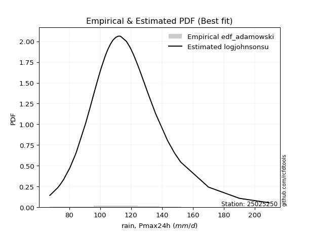</img>

</div>


## C. Best fit & Estimate extreme values for specific return periods - Tr

Best fit in probability distribution analysis means finding the theoretical distribution (like Normal, Poisson, Exponential) that most accurately mirrors your real-world data´s patterns (shape, center, spread) for better predictions, using methods like visual checks (Q-Q plots), goodness-of-fit tests (Kolmogorov-Smirnov, Chi-Squared), and information criteria (AIC) to score and select the simplest, most representative model.


### 1. Best fit (ordered by delta Δ)

:file_folder:Table: [bestfit_25025250.csv](table/bestfit_25025250.csv)

<div align="center">

|   id |   station | empirical_dist   | p_dist      |     delta |   deltao | eval   |   fit |   n |   best_fit |   best_fit_sort |
|-----:|----------:|:-----------------|:------------|----------:|---------:|:-------|------:|----:|-----------:|----------------:|
|    0 |  25025250 | edf_weibull      | loggompertz | 0.0539223 | 0.207398 | Δo > Δ |     1 |  43 |          1 |               1 |
|    1 |  25025250 | edf_california   | pearson3    | 0.0563946 | 0.207398 | Δo > Δ |     1 |  43 |          1 |               2 |
|    2 |  25025250 | edf_adamowski    | loggompertz | 0.0564318 | 0.207398 | Δo > Δ |     1 |  43 |          1 |               3 |
|    3 |  25025250 | edf_chegodayev   | loggompertz | 0.0571204 | 0.207398 | Δo > Δ |     1 |  43 |          1 |               4 |
|    4 |  25025250 | edf_jenkinson    | loggompertz | 0.0572585 | 0.207398 | Δo > Δ |     1 |  43 |          1 |               5 |
|    5 |  25025250 | edf_beard        | loggompertz | 0.0572585 | 0.207398 | Δo > Δ |     1 |  43 |          1 |               6 |
|    6 |  25025250 | edf_filliben     | loggompertz | 0.0573621 | 0.207398 | Δo > Δ |     1 |  43 |          1 |               7 |
|    7 |  25025250 | edf_tukey        | loggompertz | 0.0575812 | 0.207398 | Δo > Δ |     1 |  43 |          1 |               8 |
|    8 |  25025250 | edf_hazen        | nakagami    | 0.0581528 | 0.207398 | Δo > Δ |     1 |  43 |          1 |               9 |
|    9 |  25025250 | edf_blom         | loggompertz | 0.0581592 | 0.207398 | Δo > Δ |     1 |  43 |          1 |              10 |
|   10 |  25025250 | edf_gringorten   | nakagami    | 0.0584117 | 0.207398 | Δo > Δ |     1 |  43 |          1 |              11 |
|   11 |  25025250 | edf_cunnane      | loggompertz | 0.0585071 | 0.207398 | Δo > Δ |     1 |  43 |          1 |              12 |

</div>


### 2. Extreme values

In hydrology, a return period (or recurrence interval $Tr$) is the statistical average time between extreme events like floods or droughts of a specific magnitude, indicating how rare an event is, with a 100-year flood, for example, having a 1% chance of occurring in any given year, not that it happens exactly every century. It is a key tool for infrastructure design (like bridges or dams) and risk assessment, calculated from historical data to determine the probability of future events, although it is important to remember it is statistical average, and events can cluster or be missed.

:file_folder:Table: [extreme_25025250.csv](table/extreme_25025250.csv)

> risk_rate: assuming the return period as the project useful life.

|   id |      tr |   prob_l |     prob_g |   alpha |   betaprime |    chi2 |   crystalball |   erlang |    expon |   exponnorm |       f |   fatiguelife |    fisk |   gamma |   genexpon |   genlogistic |   gibrat |   gompertz |   gumbel_l |   gumbel_r |   halflogistic |   halfnorm |   hypsecant |   invgamma |   invgauss |   invweibull |   johnsonsu |   kstwobign |   laplace |   laplace_asymmetric |   loggamma |   logistic |   lognorm |   maxwell |   mielke |   moyal |   nakagami |     ncf |     nct |    norm |   pearson3 |   rayleigh |    rice |       t |   truncnorm |    wald |   weibull_min |   logalpha |   logbetaprime |          logchi2 |   logcrystalball |   logerlang |   logexpon |   logexponnorm |    logf |   logfatiguelife |   logfisk |   loggenexpon |   loggenlogistic |   loggibrat |   loggompertz |   loggumbel_l |   loggumbel_r |   loghalflogistic |   loghalfnorm |   loghypsecant |   loginvgamma |   loginvgauss |   loginvweibull |   logjohnsonsu |   logkstwobign |   loglaplace |   loglaplace_asymmetric |   logloggamma |   loglogistic |   loglognorm |   logmaxwell |   logmielke |   logmoyal |   lognakagami |   logncf |   lognct |   logpearson3 |   lograyleigh |   logrice |    logt |   logtruncnorm |   logwald |   logweibull_min |   station |   n |   risk_rate |
|-----:|--------:|---------:|-----------:|--------:|------------:|--------:|--------------:|---------:|---------:|------------:|--------:|--------------:|--------:|--------:|-----------:|--------------:|---------:|-----------:|-----------:|-----------:|---------------:|-----------:|------------:|-----------:|-----------:|-------------:|------------:|------------:|----------:|---------------------:|-----------:|-----------:|----------:|----------:|---------:|--------:|-----------:|--------:|--------:|--------:|-----------:|-----------:|--------:|--------:|------------:|--------:|--------------:|-----------:|---------------:|-----------------:|-----------------:|------------:|-----------:|---------------:|--------:|-----------------:|----------:|--------------:|-----------------:|------------:|--------------:|--------------:|--------------:|------------------:|--------------:|---------------:|--------------:|--------------:|----------------:|---------------:|---------------:|-------------:|------------------------:|--------------:|--------------:|-------------:|-------------:|------------:|-----------:|--------------:|---------:|---------:|--------------:|--------------:|----------:|--------:|---------------:|----------:|-----------------:|----------:|----:|------------:|
|    0 |    2    | 0.5      | 0.5        | 106.175 |     107.302 | 67.9287 |       112.186 |  105.393 |  98.4742 |     103.89  | 107.363 |       105.312 | 105.725 | 105.393 |    98.4556 |       106.88  |  102.948 |    192.211 |    117.242 |    107.13  |        104.617 |    105.887 |     112.186 |    105.767 |    105.393 |      105.926 |     105.446 |     107.629 |   112.186 |              101.007 |    105.454 |    112.186 |   108.369 |   109.554 |  104.696 | 105.498 |    106.692 | 107.484 | 106.1   | 112.186 |    106.968 |    108.621 | 110.282 | 111.98  |     112.186 | 102.21  |       106.162 |    106.142 |        108.895 |    108.86        |          108.369 |     105.454 |    93.7166 |        106.93  | 105.983 |          105.716 |   106.211 |       104.429 |          104.701 |     100.252 |       106.967 |       113.086 |       103.849 |           101.673 |       102.767 |        108.369 |       105.941 |       105.731 |         103.896 |        105.837 |        103.331 |      108.369 |                 104.616 |       108.472 |       108.369 |      105.863 |      105.992 |     105.453 |    102.43  |       105.027 |  107.432 |  107.141 |       106.696 |       105.161 |   106.194 | 108.369 |        86.428  |   99.6325 |          105.742 |  25025250 |  43 |    0.75     |
|    1 |    2.33 | 0.570815 | 0.429185   | 111.104 |     112.358 | 68.1166 |       117.678 |  110.824 | 105.299  |     108.914 | 112.422 |       110.555 | 110.574 | 110.824 |   104.753  |       111.824 |  105.73  |    193.032 |    122.02  |    112.219 |        109.849 |    111.814 |     116.581 |    110.794 |    110.598 |      110.895 |     110.552 |     112.875 |   115.51  |              106.768 |    110.523 |    117.025 |   113.503 |   115.26  |  109.667 | 110.315 |    112.616 | 112.554 | 111.093 | 117.678 |    112.339 |    114.411 | 115.605 | 117.502 |     117.678 | 105.811 |       111.794 |    111.136 |        116.305 |    129.369       |          113.503 |     110.523 |   100.743  |        111.83  | 110.987 |          110.75  |   110.93  |       110.008 |          109.67  |     102.63  |       113.077 |       117.733 |       108.399 |           106.256 |       108.03  |        112.458 |       110.945 |       110.763 |         109.014 |        110.854 |        108.615 |      111.447 |                 108.659 |       113.62  |       112.88  |      110.879 |      111.213 |     110.364 |    106.674 |       110.36  |  112.493 |  112.186 |       111.772 |       110.42  |   111.526 | 113.503 |        90.9976 |  102.702  |          111.041 |  25025250 |  43 |    0.729209 |
|    2 |    5    | 0.8      | 0.2        | 133.182 |     134.05  | 69.3244 |       138.088 |  135.084 | 139.42   |     133.706 | 134.129 |       134.344 | 133.72  | 135.084 |   134.478  |       133.301 |  121.747 |    195.685 |    137.456 |    134.328 |        133.523 |    136.879 |     134.211 |    133.553 |    134.205 |      133.305 |     133.761 |     135.158 |   132.126 |              135.576 |    133.672 |    135.708 |   134.803 |   137.717 |  133.6   | 132.629 |    137.187 | 134.23  | 133.45  | 138.088 |    135.369 |    137.591 | 136.913 | 138.097 |     138.088 | 125.97  |       135.991 |    133.427 |        149.028 |    357.892       |          134.803 |     133.672 |   144.613  |        133.193 | 133.506 |          133.572 |   132.913 |       135.796 |          133.597 |     117.463 |       137.926 |       134.088 |       130.599 |           129.716 |       133.435 |        130.471 |       133.482 |       133.569 |         134.34  |        133.503 |        134.248 |      128.198 |                 131.338 |       134.9   |       132.127 |      133.532 |      134.383 |     133.458 |    128.743 |       134.476 |  134.141 |  133.925 |       134.027 |       134.24  |   134.837 | 134.803 |       115.577  |  121.716  |          134.576 |  25025250 |  43 |    0.67232  |
|    3 |   10    | 0.9      | 0.1        | 152.247 |     151.458 | 70.6528 |       151.627 |  154.938 | 170.394  |     156.188 | 151.552 |       154.36  | 156.378 | 154.938 |   159.706  |       150.791 |  140.004 |    197.162 |    146.05  |    152.334 |        153.184 |    155.427 |     148.29  |    153.192 |    154.13  |      152.589 |     153.668 |     152.124 |   147.21  |              161.726 |    153.788 |    149.467 |   151.095 |   153.521 |  156.476 | 152.057 |    155.141 | 151.543 | 152.539 | 151.627 |    153.447 |    154.119 | 152.107 | 151.907 |     151.627 | 147.364 |       154.649 |    152.38  |        176.176 |   1025           |          151.095 |     153.788 |   200.78   |        151.181 | 152.829 |          153.283 |   154.018 |       158.118 |          156.474 |     137.002 |       155.617 |       144.159 |       151.999 |           153.088 |       156.008 |        146.905 |       152.845 |       153.258 |         159.257 |        153     |        157.748 |      145.575 |                 155.999 |       151.091 |       148.371 |      153.036 |      153.527 |     155.016 |    151.644 |       154.774 |  151.419 |  151.47  |       152.37  |       154.302 |   153.618 | 151.096 |       139.065  |  145.758  |          153.919 |  25025250 |  43 |    0.651322 |
|    4 |   15    | 0.933333 | 0.0666667  | 163.586 |     161.227 | 71.4902 |       158.383 |  166.025 | 188.513  |     169.339 | 161.332 |       165.751 | 171.248 | 166.025 |   173.937  |       160.658 |  152.597 |    197.831 |    149.942 |    162.494 |        164.31  |    165.079 |     156.324 |    164.741 |    165.513 |      163.897 |     165.253 |     161.131 |   156.034 |              177.023 |    165.644 |    156.964 |   159.947 |   161.63  |  170.98  | 163.332 |    164.455 | 161.231 | 163.716 | 158.383 |    163.338 |    162.635 | 159.935 | 158.868 |     158.383 | 161.102 |       164.666 |    163.45  |        191.688 |   1960.18        |          159.948 |     165.644 |   243.268  |        161.807 | 164.173 |          164.875 |   167.817 |       171.124 |          170.983 |     152.343 |       164.655 |       148.965 |       165.585 |           168.135 |       169.227 |        157.196 |       164.222 |       164.833 |         175.303 |        164.459 |        171.853 |      156.812 |                 172.519 |       159.857 |       158.047 |      164.501 |      164.385 |     168.521 |    166.76  |       166.391 |  161.074 |  161.35  |       162.828 |       165.783 |   164.09  | 159.948 |       152.329  |  163.645  |          164.825 |  25025250 |  43 |    0.644736 |
|    5 |   20    | 0.95     | 0.05       | 171.831 |     168.064 | 72.1039 |       162.807 |  173.721 | 201.368  |     178.669 | 168.175 |       173.745 | 182.74  | 173.721 |   183.852  |       167.567 |  162.475 |    198.247 |    152.365 |    169.607 |        172.106 |    171.514 |     161.992 |    173.044 |    173.521 |      172.004 |     173.514 |     167.199 |   162.294 |              187.877 |    174.174 |    162.146 |   166.024 |   167.012 |  181.902 | 171.317 |    170.659 | 167.999 | 171.74  | 162.807 |    170.137 |    168.296 | 165.138 | 163.457 |     162.807 | 171.339 |       171.465 |    171.386 |        202.643 |   3138.21        |          166.024 |     174.174 |   278.762  |        169.529 | 172.328 |          173.208 |   178.5   |       180.397 |          181.911 |     165.569 |       170.627 |       152.038 |       175.815 |           179.551 |       178.657 |        164.886 |       172.405 |       173.154 |         187.49  |        172.699 |        182.059 |      165.307 |                 185.29  |       165.862 |       165.101 |      172.746 |      172.012 |     178.629 |    178.367 |       174.589 |  167.812 |  168.277 |       170.209 |       173.882 |   171.375 | 166.024 |       161.135  |  178.388  |          172.456 |  25025250 |  43 |    0.641514 |
|    6 |   25    | 0.96     | 0.04       | 178.375 |     173.334 | 72.5892 |       166.064 |  179.61  | 211.34   |     185.907 | 173.452 |       179.907 | 192.269 | 179.61  |   191.453  |       172.888 |  170.71  |    198.543 |    154.088 |    175.086 |        178.112 |    176.302 |     166.378 |    179.569 |    179.705 |      178.357 |     179.962 |     171.743 |   167.15  |              196.295 |    180.878 |    166.11  |   170.644 |   171.007 |  190.778 | 177.507 |    175.273 | 173.209 | 178.04  | 166.064 |    175.306 |    172.501 | 169.004 | 166.853 |     166.064 | 179.539 |       176.588 |    177.613 |        211.141 |   4543.66        |          170.644 |     180.878 |   309.822  |        175.662 | 178.737 |          179.756 |   187.385 |       187.634 |          190.793 |     177.469 |       175.043 |       154.262 |       184.123 |           188.871 |       186.012 |        171.095 |       178.839 |       179.69  |         197.453 |        179.176 |        190.098 |      172.212 |                 195.844 |       170.422 |       170.709 |      179.226 |      177.902 |     186.807 |    187.917 |       180.939 |  172.996 |  173.624 |       175.934 |       180.155 |   176.963 | 170.644 |       167.484  |  191.149  |          178.332 |  25025250 |  43 |    0.639603 |
|    7 |   50    | 0.98     | 0.02       | 199.773 |     189.638 | 74.1384 |       175.391 |  197.537 | 242.314  |     208.388 | 189.774 |       198.891 | 225.885 | 197.537 |   214.649  |       189.28  |  199.739 |    199.348 |    158.768 |    191.965 |        196.617 |    190.219 |     179.978 |    200.43  |    198.826 |      198.54  |     200.306 |     185.089 |   182.234 |              222.446 |    202.308 |    178.22  |   184.597 |   182.594 |  220.882 | 196.721 |    188.68  | 189.294 | 198.17  | 175.391 |    190.889 |    184.709 | 180.226 | 176.67  |     175.391 | 206.312 |       191.783 |    197.486 |        237.68  |  14672.7         |          184.597 |     202.308 |   430.155  |        195.749 | 199.246 |          200.679 |   219.05  |       210.45  |          220.928 |     226.66  |       187.765 |       160.467 |       212.266 |           220.743 |       209.157 |        191.871 |       199.443 |       200.578 |         231.593 |        199.902 |        215.817 |      195.554 |                 232.617 |       184.158 |       189.051 |      199.963 |      196.149 |     214.353 |    220.946 |       200.71  |  188.972 |  190.202 |       193.815 |       199.676 |   194.082 | 184.598 |       183.87   |  239.52   |          196.44  |  25025250 |  43 |    0.63583  |
|    8 |   75    | 0.986667 | 0.0133333  | 213.218 |     199.193 | 75.0682 |       180.396 |  207.814 | 260.433  |     221.539 | 199.342 |       209.918 | 248.841 | 207.814 |   227.978  |       198.808 |  219.345 |    199.754 |    161.135 |    201.775 |        207.374 |    197.795 |     187.925 |    213.128 |    209.978 |      210.708 |     212.477 |     192.431 |   191.058 |              237.743 |    215.341 |    185.215 |   192.549 |   188.894 |  240.491 | 207.957 |    195.978 | 198.699 | 210.422 | 180.396 |    199.733 |    191.351 | 186.331 | 182     |     180.396 | 222.787 |       200.246 |    209.572 |        253.389 |  29504.9         |          192.549 |     215.341 |   521.183  |        208.378 | 211.753 |          213.406 |   241.056 |       224.09  |          240.564 |     267.386 |       194.622 |       163.7   |       230.561 |           241.687 |       222.944 |        205.162 |       212.017 |       213.281 |         254.088 |        212.535 |        231.422 |      210.649 |                 257.251 |       191.963 |       200.529 |      212.603 |      206.844 |     232.155 |    242.89  |       212.357 |  198.293 |  199.941 |       204.409 |       211.17  |   203.99  | 192.55  |       190.953  |  275.188  |          206.986 |  25025250 |  43 |    0.634587 |
|    9 |  100    | 0.99     | 0.01       | 223.261 |     206.004 | 75.7364 |       183.781 |  215.029 | 273.288  |     230.87  | 206.162 |       217.717 | 266.844 | 215.029 |   237.348  |       205.552 |  234.533 |    200.02  |    162.682 |    208.719 |        214.987 |    202.956 |     193.563 |    222.39  |    217.885 |      219.521 |     221.253 |     197.462 |   197.318 |              248.596 |    224.84  |    190.154 |   198.12  |   193.185 |  255.405 | 215.928 |    200.95  | 205.393 | 219.363 | 183.781 |    205.908 |    195.875 | 190.491 | 185.632 |     183.781 | 234.799 |       206.087 |    218.39  |        264.648 |  48660           |          198.12  |     224.84  |   597.225  |        217.792 | 220.89  |          222.685 |   258.576 |       233.919 |          255.501 |     303.9   |       199.268 |       165.849 |       244.454 |           257.701 |       232.854 |        215.144 |       221.208 |       222.542 |         271.317 |        221.76  |        242.761 |      222.061 |                 276.295 |       197.422 |       209.051 |      221.833 |      214.46  |     245.631 |    259.767 |       220.677 |  204.919 |  206.895 |       212.008 |       219.378 |   210.994 | 198.121 |       194.93   |  304.498  |          214.468 |  25025250 |  43 |    0.633968 |
|   10 |  200    | 0.995    | 0.005      | 249.508 |     222.585 | 77.3705 |       191.459 |  232.192 | 304.262  |     253.352 | 222.767 |       236.447 | 317.012 | 232.192 |   259.672  |       221.764 |  275.854 |    200.599 |    166.047 |    225.412 |        233.291 |    214.76  |     207.144 |    245.665 |    236.94  |      241.406 |     242.925 |     209.049 |   212.402 |              274.747 |    248.674 |    202     |   211.363 |   203.002 |  295.13  | 235.135 |    212.323 | 221.657 | 241.857 | 191.459 |    220.5   |    206.228 | 200.008 | 193.96  |     191.459 | 264.718 |       219.676 |    240.577 |        292.242 | 164600           |          211.363 |     248.674 |   829.184  |        242.194 | 243.917 |          245.98  |   308.778 |       258.18  |          295.304 |     430.505 |       209.82  |       170.618 |       281.378 |           300.678 |       257.205 |        241.232 |       244.389 |       245.792 |         317.672 |        244.986 |        271.036 |      252.16  |                 328.175 |       210.368 |       230.998 |      245.071 |      232.957 |     281.29  |    305.403 |       240.96  |  220.981 |  223.856 |       230.662 |       239.377 |   227.835 | 211.364 |       201.571  |  391.805  |          232.539 |  25025250 |  43 |    0.633042 |
|   11 |  250    | 0.996    | 0.004      | 258.672 |     227.988 | 77.9028 |       193.805 |  237.66  | 314.234  |     260.589 | 228.177 |       242.463 | 335.476 | 237.659 |   266.795  |       226.975 |  290.68  |    200.769 |    167.037 |    230.778 |        239.176 |    218.391 |     211.516 |    253.469 |    243.079 |      248.657 |     250.071 |     212.635 |   217.258 |              283.165 |    256.652 |    205.803 |   215.583 |   206.024 |  309.165 | 241.317 |    215.822 | 226.946 | 249.41  | 193.805 |    225.122 |    209.415 | 202.937 | 196.531 |     193.805 | 274.617 |       223.92  |    248.031 |        301.283 | 244511           |          215.584 |     256.652 |   921.573  |        250.608 | 251.661 |          253.784 |   327.811 |       266.177 |          309.37  |     487.804 |       213.046 |       172.047 |       294.395 |           315.964 |       265.197 |        250.286 |       252.19  |       253.581 |         334.195 |        252.79  |        280.436 |      262.693 |                 346.867 |       214.485 |       238.521 |      252.878 |      238.966 |     293.814 |    321.738 |       247.572 |  226.195 |  229.392 |       236.785 |       245.893 |   233.258 | 215.585 |       203.012  |  425.884  |          238.38  |  25025250 |  43 |    0.632858 |
|   12 |  500    | 0.998    | 0.002      | 289.832 |     245.016 | 79.5723 |       200.763 |  254.492 | 345.208  |     283.071 | 245.232 |       261.121 | 401.307 | 254.492 |   288.758  |       243.152 |  341.918 |    201.257 |    169.874 |    247.434 |        257.44  |    229.218 |     225.097 |    278.771 |    262.174 |      271.856 |     272.835 |     223.381 |   232.342 |              309.316 |    282.468 |    217.598 |   228.602 |   215.042 |  357.105 | 260.523 |    226.259 | 243.589 | 273.944 | 200.763 |    239.283 |    218.924 | 211.678 | 204.236 |     200.763 | 306.09  |       236.747 |    272.265 |        329.917 | 843360           |          228.603 |     282.468 |  1279.51   |        278.647 | 276.862 |          279.062 |   398.331 |       291.643 |          357.433 |     751.265 |       222.613 |       176.211 |       338.758 |           368.534 |       290.529 |        280.633 |       277.595 |       278.808 |         391.158 |        278.15  |        310.605 |      298.3   |                 411.998 |       227.157 |       263.447 |      278.249 |      257.833 |     336.336 |    378.26  |       268.397 |  242.562 |  246.872 |       256.216 |       266.408 |   250.146 | 228.604 |       206.021  |  555.217  |          256.631 |  25025250 |  43 |    0.632489 |
|   13 |  750    | 0.998667 | 0.00133333 | 310.287 |     255.172 | 80.5586 |       204.628 |  264.245 | 363.327  |     296.222 | 255.406 |       272.02  | 446.617 | 264.245 |   301.507  |       252.609 |  375.804 |    201.517 |    171.391 |    257.172 |        268.118 |    235.267 |     233.041 |    294.367 |    273.366 |      285.917 |     286.566 |     229.418 |   241.165 |              324.613 |    298.34  |    224.489 |   236.171 |   220.086 |  388.495 | 271.757 |    232.092 | 253.495 | 289.106 | 204.628 |    247.444 |    224.241 | 216.566 | 208.57  |     204.628 | 324.961 |       244.025 |    287.267 |        347.082 |      1.74944e+06 |          236.172 |     298.34  |  1550.27   |        296.479 | 292.472 |          294.624 |   449.425 |       307.002 |          388.916 |     999.598 |       227.924 |       178.478 |       367.728 |           403.229 |       305.72  |        300.063 |       293.343 |       294.338 |         428.855 |        293.83  |        328.956 |      321.326 |                 455.627 |       234.506 |       279.199 |      293.935 |      269.028 |     363.985 |    415.821 |       280.797 |  252.278 |  257.318 |       267.896 |       278.617 |   260.071 | 236.173 |       207.065  |  650.904  |          267.398 |  25025250 |  43 |    0.632366 |
|   14 | 1000    | 0.999    | 0.001      | 325.984 |     262.476 | 81.2623 |       207.29  |  271.128 | 376.182  |     305.553 | 262.721 |       279.748 | 482.263 | 271.127 |   310.516  |       259.317 |  401.735 |    201.693 |    172.412 |    264.079 |        275.691 |    239.444 |     238.677 |    305.813 |    281.318 |      296.122 |     296.502 |     233.601 |   247.426 |              335.466 |    309.967 |    229.376 |   241.528 |   223.572 |  412.417 | 279.728 |    236.121 | 260.61  | 300.253 | 207.29  |    253.186 |    227.916 | 219.944 | 211.578 |     207.29  | 338.535 |       249.097 |    298.313 |        359.46  |      2.94203e+06 |          241.528 |     309.967 |  1776.46   |        309.818 | 303.966 |          306.035 |   491.161 |       318.118 |          412.913 |    1243.77  |       231.579 |       180.02  |       389.767 |           429.803 |       316.673 |        314.659 |       304.946 |       305.726 |         457.778 |        305.362 |        342.301 |      338.733 |                 489.357 |       239.699 |       290.937 |      305.471 |      277.048 |     384.964 |    444.712 |       289.7   |  259.244 |  264.84  |       276.334 |       287.379 |   267.141 | 241.529 |       207.595  |  729.776  |          275.085 |  25025250 |  43 |    0.632305 |

<div align="center">

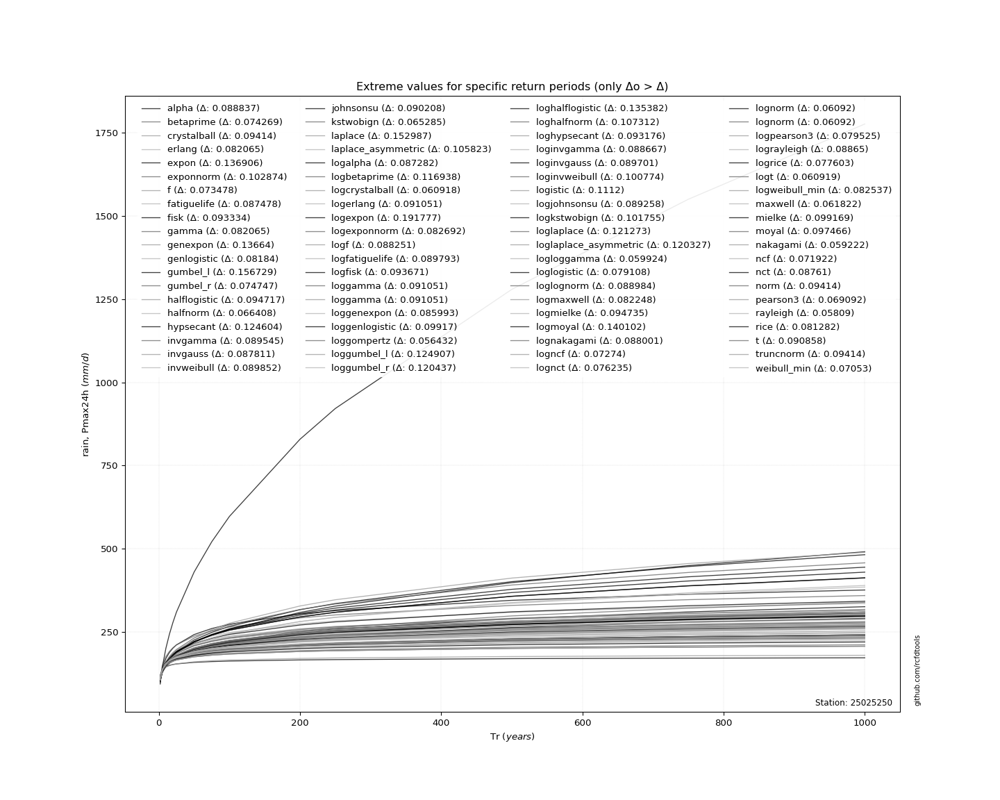</img>

</div>


<div align="center">

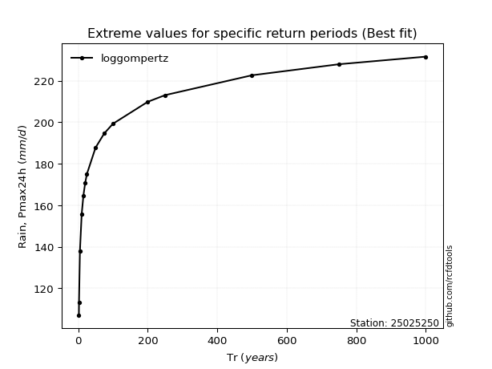</img>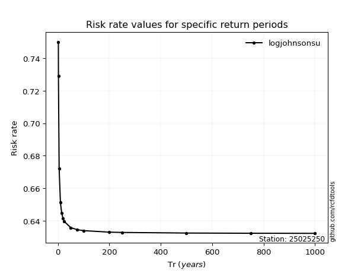</img>

</div>


<sub>**APP DISCLAIMER**: NO WARRANTY - This software is provided by [github.com/rcfdtools](https://github.com/rcfdtools) "as is", without any express or implied warranty, including warranties of merchantability, fitness for a particular purpose, or non-infringement. There is no guarantee that the software will be error-free or operate without interruption. LIMITATION OF LIABILITY - Neither the authors nor copyright holders will be liable for claims or damages arising from the software or its use. You are responsible for determining if the software is appropriate for your use and assume all associated risks, including errors, legal compliance, and data loss. NO PROFESSIONAL ADVICE - The software provides general information and does not offer professional advice. It should not replace consultation with professional advisors.</sub>