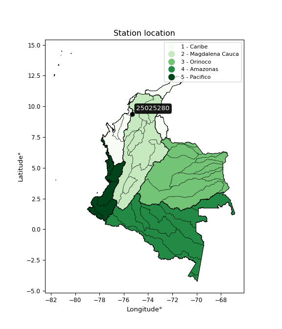

<div align="center">


</div>

# PMP Station (rain, Pmax24h): 25025280

Probable Maximum Precipitation (PMP) is the greatest amount of rainfall for a specific duration that is meteorologically possible for a given location, acting as a "worst-case" scenario for extreme storms, crucial for designing safety-critical infrastructure like bridges, river deviations, dams, spillways, and nuclear plants to prevent catastrophic failure. PMP is calculated by hydrologists using meteorological data to determine the upper limit of extreme rainfall, often leading to the Probable Maximum Flood (PMF) for flood control design, and is increasingly being studied for climate change impacts.

<div align="center">

</img>

</div>


## A. General information


### 1. General running parameters

• app_version: _v20251228_. • runtime: _2025-12-28 08:43:48.795225_. • Python version: _3.14.0_. • SciPy version: _1.16.3_. • Pandas version: _2.3.3_. • NumPy version: _2.3.5_. • Stations dataset (station_dataset_file): _dataset/pmax24h_in/automatic_colombia_2003_2024.csv_. • Stations catalog (station_catalog_file): _dataset/CNE_IDEAM.xls_. • Minimum year to eval til year_max (date_min): _1900_. • Maximum year to eval since year_min (date_max): _2024_. • Creates, save and include plots into reports (create_plot): _False_. • Plot only fit distributions with Δo > Δ (plot_only_fit): _True_. • Eval low extreme values, if False, evaluates high extreme values (low_extreme): _False_. • Eval every SciPy distribution as logarithmic (pdist_logarithmic_on): _True_. • Standard deviation normalized (ddof): _1.0_. • Return periods to eval in years (Tr): _[2, 2.33, 5, 10, 15, 20, 25, 50, 75, 100, 200, 250, 500, 750, 1000]_. • Minimum data sample per station, 0 means any (minimum_sample): _5_. • Z-Score maximum threshold to adjust a value, 0 means disable (zscore_max): _3.5_. • Z-Score minimum threshold to adjust a value, 0 means disable (zscore_min): _-2.5_. • Avoid zeros, e.g. rain = 0 (avoid_zeros): _True_. • Avoid null values (avoid_nans): _True_. [:file_folder:Dataset file.](../../dataset/pmax24h_in/automatic_colombia_2003_2024.csv)

> Delta Degrees of Freedom (DDOF): is a parameter used in the formulas for calculating variance and standard deviation. When ddof=0, the divisor is $N$ (the total number of observations) and this is used when your data set is the entire population. When ddof=1, the divisor is $N-1$ and this is used when your data set is a sample drawn from a larger population. Using $N-1$ provides an unbiased estimate of the population variance (known as Bessel´s correction).


### 2. Station info and location

|   id |   CODIGO | NOMBRE                            | CATEGORIA         | TECNOLOGIA                | ESTADO           | FECHA_INSTALACION   |   FECHA_SUSPENSION |   ALTITUD |   LATITUD |   LONGITUD | DEPARTAMENTO   | MUNICIPIO   | AREA_OPERATIVA                              | ENTIDAD                                                     | AREA_HIDROGRAFICA   | ZONA_HIDROGRAFICA                | SUBZONA_HIDROGRAFICA       |   CORRIENTE | Catalogo   |
|-----:|---------:|:----------------------------------|:------------------|:--------------------------|:-----------------|:--------------------|-------------------:|----------:|----------:|-----------:|:---------------|:------------|:--------------------------------------------|:------------------------------------------------------------|:--------------------|:---------------------------------|:---------------------------|------------:|:-----------|
|    0 | 25025280 | EL TESORO IDEAM  - AUT [25025280] | Agrometeorológica | Automática con Telemetría | En Mantenimiento | 02/12/2004          |                nan |       168 |   9.35708 |   -75.2892 | Sucre          | Morroa      | Area Operativa 02 - Atlántico-Bolivar-Sucre | INSTITUTO DE HIDROLOGIA METEOROLOGIA Y ESTUDIOS AMBIENTALES | Magdalena Cauca     | Bajo Magdalena- Cauca -San Jorge | Bajo San Jorge - La Mojana |         nan | CNE_IDEAM  |

<div align="center">

Map location in: [:earth_americas:Google](http://maps.google.com/maps?q=9.357083333,-75.28925) [:earth_americas:OSM](https://www.openstreetmap.org/#map=18/9.357083333/-75.28925&layers=P) [:earth_americas:Bing](https://www.bing.com/maps?cp=9.357083333~-75.28925&lvl=18) [:earth_americas:Apple](https://maps.apple.com/frame?center=9.357083333%2C-75.28925&span=0.003%2C0.006)

</div>


<div align="center">

```geojson
{
  "type": "Feature",
  "geometry": {
    "type": "Point", 
    "coordinates": [-75.28925, 9.357083333]
  }, 
  "properties": {
    "Name": "25025280"
  }
}
```

</div>


### 3. Discrete values table and plot

|               |           0 |           1 |           2 |          3 |           4 |           5 |           6 |          7 |
|:--------------|------------:|------------:|------------:|-----------:|------------:|------------:|------------:|-----------:|
| Date          | 2017        | 2018        | 2019        | 2020       | 2021        | 2022        | 2023        | 2024       |
| Value         |   51.5      |   45.4      |   46.4      |    2.6     |   73.7      |   46        |   78.6      |  124.6     |
| Value_initial |   51.5      |   45.4      |   46.4      |    2.6     |   73.7      |   46        |   78.6      |  124.6     |
| count         |    8        |    8        |    8        |    8       |    8        |    8        |    8        |    8       |
| mean          |   58.6      |   58.6      |   58.6      |   58.6     |   58.6      |   58.6      |   58.6      |   58.6     |
| std           |   35.1573   |   35.1573   |   35.1573   |   35.1573  |   35.1573   |   35.1573   |   35.1573   |   35.1573  |
| zscore        |   -0.201949 |   -0.375455 |   -0.347012 |   -1.59284 |    0.429498 |   -0.358389 |    0.568872 |    1.87728 |

> The initial value (value_initial) correspond to the initial obtained or null completed value, and value (value) is adjusted only when the initial value is outside the valid range definite through the Z-Score value. If Z-Score is active, values out of range or outliers are replaced with the station mean value


### 4. Active continuous probability distributions from SciPy (44 of 104 available)

[scipy.stats](https://docs.scipy.org/doc/scipy/reference/stats.html) is a Python´s powerful submodule within the SciPy library for comprehensive statistical analysis, offering over 130 probability distributions (like Normal, Poisson), functions for descriptive stats (mean, variance), hypothesis testing (t-tests, chi-square), random variable generation, and statistical tests, making it essential for data science, modeling, and research. It provides tools to explore, model, and draw conclusions from data efficiently, working seamlessly with NumPy.

<div align="center">

|   id | p_dist             |   n_parameter | fit_method   | label                                                                       | active   | ref                                                                                                        |
|-----:|:-------------------|--------------:|:-------------|:----------------------------------------------------------------------------|:---------|:-----------------------------------------------------------------------------------------------------------|
|    0 | alpha              |             3 | MLE          | Alpha                                                                       | True     | [:mortar_board:](https://docs.scipy.org/doc/scipy/reference/generated/scipy.stats.alpha.html)              |
|    1 | betaprime          |             4 | MLE          | Beta prime                                                                  | True     | [:mortar_board:](https://docs.scipy.org/doc/scipy/reference/generated/scipy.stats.betaprime.html)          |
|    2 | chi2               |             3 | MLE          | Chi²                                                                        | True     | [:mortar_board:](https://docs.scipy.org/doc/scipy/reference/generated/scipy.stats.chi2.html)               |
|    3 | crystalball        |             4 | MLE          | Crystalball                                                                 | True     | [:mortar_board:](https://docs.scipy.org/doc/scipy/reference/generated/scipy.stats.crystalball.html)        |
|    4 | erlang             |             3 | MLE          | Erlang                                                                      | True     | [:mortar_board:](https://docs.scipy.org/doc/scipy/reference/generated/scipy.stats.erlang.html)             |
|    5 | expon              |             2 | MLE          | Exponential                                                                 | True     | [:mortar_board:](https://docs.scipy.org/doc/scipy/reference/generated/scipy.stats.expon.html)              |
|    6 | exponnorm          |             3 | MLE          | Exponentially modified Normal                                               | True     | [:mortar_board:](https://docs.scipy.org/doc/scipy/reference/generated/scipy.stats.exponnorm.html)          |
|    7 | f                  |             4 | MLE          | F                                                                           | True     | [:mortar_board:](https://docs.scipy.org/doc/scipy/reference/generated/scipy.stats.f.html)                  |
|    8 | fatiguelife        |             3 | MLE          | Fatigue-life (Birnbaum-Saunders)                                            | True     | [:mortar_board:](https://docs.scipy.org/doc/scipy/reference/generated/scipy.stats.fatiguelife.html)        |
|    9 | fisk               |             3 | MLE          | Fisk                                                                        | True     | [:mortar_board:](https://docs.scipy.org/doc/scipy/reference/generated/scipy.stats.fisk.html)               |
|   10 | gamma              |             3 | MLE          | Gamma                                                                       | True     | [:mortar_board:](https://docs.scipy.org/doc/scipy/reference/generated/scipy.stats.gamma.html)              |
|   11 | genexpon           |             5 | MLE          | Generalized exponential                                                     | True     | [:mortar_board:](https://docs.scipy.org/doc/scipy/reference/generated/scipy.stats.genexpon.html)           |
|   12 | genlogistic        |             3 | MLE          | Generalized logistic                                                        | True     | [:mortar_board:](https://docs.scipy.org/doc/scipy/reference/generated/scipy.stats.genlogistic.html)        |
|   13 | gibrat             |             2 | MM           | Gibrat                                                                      | True     | [:mortar_board:](https://docs.scipy.org/doc/scipy/reference/generated/scipy.stats.gibrat.html)             |
|   14 | gompertz           |             3 | MLE          | Gompertz (or truncated Gumbel)                                              | True     | [:mortar_board:](https://docs.scipy.org/doc/scipy/reference/generated/scipy.stats.gompertz.html)           |
|   15 | gumbel_l           |             2 | MM           | Gumbel Left Skew                                                            | True     | [:mortar_board:](https://docs.scipy.org/doc/scipy/reference/generated/scipy.stats.gumbel_l.html)           |
|   16 | gumbel_r           |             2 | MM           | Gumbel Right Skew                                                           | True     | [:mortar_board:](https://docs.scipy.org/doc/scipy/reference/generated/scipy.stats.gumbel_r.html)           |
|   17 | halflogistic       |             2 | MM           | Half-logistic                                                               | True     | [:mortar_board:](https://docs.scipy.org/doc/scipy/reference/generated/scipy.stats.halflogistic.html)       |
|   18 | halfnorm           |             2 | MM           | Half Normal                                                                 | True     | [:mortar_board:](https://docs.scipy.org/doc/scipy/reference/generated/scipy.stats.halfnorm.html)           |
|   19 | hypsecant          |             2 | MM           | hyperbolic secant                                                           | True     | [:mortar_board:](https://docs.scipy.org/doc/scipy/reference/generated/scipy.stats.hypsecant.html)          |
|   20 | invgamma           |             3 | MLE          | Inverted gamma                                                              | True     | [:mortar_board:](https://docs.scipy.org/doc/scipy/reference/generated/scipy.stats.invgamma.html)           |
|   21 | invgauss           |             3 | MLE          | Inverse Gaussian                                                            | True     | [:mortar_board:](https://docs.scipy.org/doc/scipy/reference/generated/scipy.stats.invgauss.html)           |
|   22 | invweibull         |             3 | MLE          | Inverted Weibull                                                            | True     | [:mortar_board:](https://docs.scipy.org/doc/scipy/reference/generated/scipy.stats.invweibull.html)         |
|   23 | johnsonsu          |             4 | MLE          | Johnson Su                                                                  | True     | [:mortar_board:](https://docs.scipy.org/doc/scipy/reference/generated/scipy.stats.johnsonsu.html)          |
|   24 | kstwobign          |             2 | MLE          | Limiting distribution of scaled Kolmogorov-Smirnov two-sided test statistic | True     | [:mortar_board:](https://docs.scipy.org/doc/scipy/reference/generated/scipy.stats.kstwobign.html)          |
|   25 | laplace            |             2 | MM           | Laplace                                                                     | True     | [:mortar_board:](https://docs.scipy.org/doc/scipy/reference/generated/scipy.stats.laplace.html)            |
|   26 | laplace_asymmetric |             3 | MLE          | Asymmetric Laplace                                                          | True     | [:mortar_board:](https://docs.scipy.org/doc/scipy/reference/generated/scipy.stats.laplace_asymmetric.html) |
|   27 | loggamma           |             3 | MLE          | Log gamma                                                                   | True     | [:mortar_board:](https://docs.scipy.org/doc/scipy/reference/generated/scipy.stats.loggamma.html)           |
|   28 | logistic           |             2 | MM           | Logistic (or Sech-squared)                                                  | True     | [:mortar_board:](https://docs.scipy.org/doc/scipy/reference/generated/scipy.stats.logistic.html)           |
|   29 | lognorm            |             3 | MLE          | Log Normal                                                                  | True     | [:mortar_board:](https://docs.scipy.org/doc/scipy/reference/generated/scipy.stats.lognorm.html)            |
|   30 | maxwell            |             2 | MM           | Maxwell                                                                     | True     | [:mortar_board:](https://docs.scipy.org/doc/scipy/reference/generated/scipy.stats.maxwell.html)            |
|   31 | mielke             |             4 | MLE          | Mielke Beta-Kappa / Dagum                                                   | True     | [:mortar_board:](https://docs.scipy.org/doc/scipy/reference/generated/scipy.stats.mielke.html)             |
|   32 | moyal              |             2 | MM           | Moyal                                                                       | True     | [:mortar_board:](https://docs.scipy.org/doc/scipy/reference/generated/scipy.stats.moyal.html)              |
|   33 | nakagami           |             3 | MLE          | Nakagami                                                                    | True     | [:mortar_board:](https://docs.scipy.org/doc/scipy/reference/generated/scipy.stats.nakagami.html)           |
|   34 | ncf                |             5 | MLE          | Non-central F distribution                                                  | True     | [:mortar_board:](https://docs.scipy.org/doc/scipy/reference/generated/scipy.stats.ncf.html)                |
|   35 | nct                |             4 | MLE          | Non-central Student’s t                                                     | True     | [:mortar_board:](https://docs.scipy.org/doc/scipy/reference/generated/scipy.stats.nct.html)                |
|   36 | norm               |             2 | MM           | Normal                                                                      | True     | [:mortar_board:](https://docs.scipy.org/doc/scipy/reference/generated/scipy.stats.norm.html)               |
|   37 | pearson3           |             3 | MM           | Pearson type III                                                            | True     | [:mortar_board:](https://docs.scipy.org/doc/scipy/reference/generated/scipy.stats.pearson3.html)           |
|   38 | rayleigh           |             2 | MM           | Rayleigh                                                                    | True     | [:mortar_board:](https://docs.scipy.org/doc/scipy/reference/generated/scipy.stats.rayleigh.html)           |
|   39 | rice               |             3 | MLE          | Rice                                                                        | True     | [:mortar_board:](https://docs.scipy.org/doc/scipy/reference/generated/scipy.stats.rice.html)               |
|   40 | t                  |             3 | MLE          | Student’s t                                                                 | True     | [:mortar_board:](https://docs.scipy.org/doc/scipy/reference/generated/scipy.stats.t.html)                  |
|   41 | truncnorm          |             4 | MLE          | Truncated normal                                                            | True     | [:mortar_board:](https://docs.scipy.org/doc/scipy/reference/generated/scipy.stats.truncnorm.html)          |
|   42 | wald               |             2 | MM           | Wald                                                                        | True     | [:mortar_board:](https://docs.scipy.org/doc/scipy/reference/generated/scipy.stats.wald.html)               |
|   43 | weibull_min        |             3 | MLE          | Weibull minimum                                                             | True     | [:mortar_board:](https://docs.scipy.org/doc/scipy/reference/generated/scipy.stats.weibull_min.html)        |

</div>

> **n_parameter:** # arguments & localization & scale.
>
> **Fit methods:** (MLE) maximum likelihood, (MM) L-moments.
>
>**Inactive:** foldnorm, gennorm, norminvgauss, powernorm, powerlognorm, skewnorm, genextreme, anglit, arcsine, argus, beta, bradford, burr, burr12, cauchy, cosine, halfcauchy, foldcauchy, skewcauchy, wrapcauchy, dgamma, gengamma, exponweib, exponpow, truncexpon, gausshyper, genhalflogistic, genhyperbolic, geninvgauss, halfgennorm, johnsonsb, kappa4, kappa3, ksone, kstwo, loglaplace, levy, levy_l, levy_stable, ncx2, pareto, genpareto, truncpareto, lomax, powerlaw, rdist, rel_breitwigner, recipinvgauss, semicircular, studentized_range, trapezoid, triang, truncweibull_min, tukeylambda, uniform, loguniform, vonmises, vonmises_line, weibull_max, dweibull, 


## B. Probability distributions vs. Empirical distributions

A continuous probability distribution (CPD) describes probabilities for variables that can take any value within a range (like rain any time), unlike discrete variables with specific outcomes (like temperature). It uses a Probability Density Function (PDF), a curve where the total area under it equals 1, and the probability of the variable falling within an interval (a to b) is found by calculating the area under the curve between those points. A key feature is that the probability of hitting any single exact value is zero, so probabilities are always expressed for ranges, e.g., $P(a ≤ X ≤ b)$.

<div align="center">

Distributions parameters from station values
|    |   station | p_dist                |   n |             loc |           scale | shape                  | shape1                | shape2                | shape3   |
|---:|----------:|:----------------------|----:|----------------:|----------------:|:-----------------------|:----------------------|:----------------------|:---------|
|  0 |  25025280 | alpha                 |   8 |  -238.685       |  2647.36        | 9.041764377213081      |                       |                       |          |
|  1 |  25025280 | betaprime             |   8 |  -107.725       | 16324.3         | 25.87790657362195      | 2540.8414236212757    |                       |          |
|  2 |  25025280 | chi2                  |   8 |     2.6         |     5.16235     | 0.3624865277203998     |                       |                       |          |
|  3 |  25025280 | crystalball           |   8 |    58.6001      |    32.8867      | 10959.761567457965     | 937.4919794909966     |                       |          |
|  4 |  25025280 | erlang                |   8 |  -106.238       |     6.55386     | 25.151217267098584     |                       |                       |          |
|  5 |  25025280 | expon                 |   8 |     2.6         |    56           |                        |                       |                       |          |
|  6 |  25025280 | exponnorm             |   8 |    34.814       |    23.5012      | 1.0121199851950897     |                       |                       |          |
|  7 |  25025280 | f                     |   8 |  -106.457       |   165.048       | 50.51366322864308      | 34363.54302663366     |                       |          |
|  8 |  25025280 | fatiguelife           |   8 |     2.6         |     5.84636e-06 | 3146.6178370091693     |                       |                       |          |
|  9 |  25025280 | fisk                  |   8 |  -152.308       |   208.315       | 11.751839469610204     |                       |                       |          |
| 10 |  25025280 | gamma                 |   8 |  -106.238       |     6.55386     | 25.151249599863668     |                       |                       |          |
| 11 |  25025280 | genexpon              |   8 |     2.59997     |     2.40857     | 0.04309858764996631    | 7.448200181489813e-08 | 1.6733843110948419    |          |
| 12 |  25025280 | genlogistic           |   8 |    42.7294      |    20.7153      | 1.6609957475861274     |                       |                       |          |
| 13 |  25025280 | gibrat                |   8 |    33.5116      |    15.2169      |                        |                       |                       |          |
| 14 |  25025280 | gompertz              |   8 |    45.4         |     9.42113     | 0.0015831070697238728  |                       |                       |          |
| 15 |  25025280 | gumbel_l              |   8 |    73.4007      |    25.6416      |                        |                       |                       |          |
| 16 |  25025280 | gumbel_r              |   8 |    43.7993      |    25.6416      |                        |                       |                       |          |
| 17 |  25025280 | halflogistic          |   8 |    19.6217      |    28.1169      |                        |                       |                       |          |
| 18 |  25025280 | halfnorm              |   8 |    15.071       |    54.5556      |                        |                       |                       |          |
| 19 |  25025280 | hypsecant             |   8 |    58.6         |    20.9363      |                        |                       |                       |          |
| 20 |  25025280 | invgamma              |   8 |  -235.757       | 23713.1         | 81.60760205586251      |                       |                       |          |
| 21 |  25025280 | invgauss              |   8 |  -126.016       |  5653.77        | 0.03258393425544886    |                       |                       |          |
| 22 |  25025280 | invweibull            |   8 |     2.6         |     2.93631     | 0.04716106665507775    |                       |                       |          |
| 23 |  25025280 | johnsonsu             |   8 |    45.9609      |     0.31373     | -0.4815682550852591    | 0.264039827308996     |                       |          |
| 24 |  25025280 | kstwobign             |   8 |   -65.4804      |   142.67        |                        |                       |                       |          |
| 25 |  25025280 | laplace               |   8 |    58.6         |    23.2544      |                        |                       |                       |          |
| 26 |  25025280 | laplace_asymmetric    |   8 |    46           |    20.8432      | 0.7424995759949728     |                       |                       |          |
| 27 |  25025280 | loggamma              |   8 | -9914.03        |  1347.62        | 1636.7353171184336     |                       |                       |          |
| 28 |  25025280 | logistic              |   8 |    58.6         |    18.1314      |                        |                       |                       |          |
| 29 |  25025280 | lognorm               |   8 |     2.6         |     0.429812    | 13.046620047857077     |                       |                       |          |
| 30 |  25025280 | maxwell               |   8 |   -19.3276      |    48.8339      |                        |                       |                       |          |
| 31 |  25025280 | mielke                |   8 |    -0.375424    |    93.9263      | 1.188762421789392      | 5.55548833007872      |                       |          |
| 32 |  25025280 | moyal                 |   8 |    39.7933      |    14.8042      |                        |                       |                       |          |
| 33 |  25025280 | nakagami              |   8 |   -30.0999      |    94.6002      | 1.90094214178621       |                       |                       |          |
| 34 |  25025280 | ncf                   |   8 |    -0.495146    |     3.30359     | 0.6470112133937873     | 158.29284712807635    | 10.596090154892696    |          |
| 35 |  25025280 | nct                   |   8 |    -0.0689479   |    28.0865      | 12.977692465529035     | 1.965964621683042     |                       |          |
| 36 |  25025280 | norm                  |   8 |    58.6         |    32.8867      |                        |                       |                       |          |
| 37 |  25025280 | pearson3              |   8 |    58.6         |    32.8866      | 0.410666740432564      |                       |                       |          |
| 38 |  25025280 | rayleigh              |   8 |    -4.3141      |    50.1982      |                        |                       |                       |          |
| 39 |  25025280 | rice                  |   8 |   -13.0269      |    37.6485      | 1.5435685956800693     |                       |                       |          |
| 40 |  25025280 | t                     |   8 |    58.3832      |    32.8409      | 62.472960780712825     |                       |                       |          |
| 41 |  25025280 | truncnorm             |   8 |     0.347771    |     6.9369      | 0.32020914513136944    | 17.911778795830514    |                       |          |
| 42 |  25025280 | wald                  |   8 |    25.7133      |    32.8867      |                        |                       |                       |          |
| 43 |  25025280 | weibull_min           |   8 |   -15.8459      |    83.8373      | 2.391885389954012      |                       |                       |          |
| 44 |  25025280 | logalpha              |   8 |    -0.000715407 |     2.30419     | 2.2836243537404256e-06 |                       |                       |          |
| 45 |  25025280 | logbetaprime          |   8 |    -0.723115    |     5.5677e+09  | 7.015109786801386      | 8562137574.0931015    |                       |          |
| 46 |  25025280 | logchi2               |   8 |   -15.0175      |     0.036273    | 516.4904207514326      |                       |                       |          |
| 47 |  25025280 | logcrystalball        |   8 |     3.7335      |     1.101       | 30.826993802748305     | 475.9303550753135     |                       |          |
| 48 |  25025280 | logerlang             |   8 |   -16.8968      |     0.0653106   | 315.7446877054459      |                       |                       |          |
| 49 |  25025280 | logexpon              |   8 |     0.955511    |     2.77799     |                        |                       |                       |          |
| 50 |  25025280 | logexponnorm          |   8 |     3.73277     |     1.101       | 0.0006665038821840239  |                       |                       |          |
| 51 |  25025280 | logf                  |   8 | -2832.09        |  2835.82        | 30749019.771977067     | 23157168.56747351     |                       |          |
| 52 |  25025280 | logfatiguelife        |   8 |  -795.662       |   799.394       | 0.0013782337039103198  |                       |                       |          |
| 53 |  25025280 | logfisk               |   8 |    -1.23388e+08 |     1.23388e+08 | 251289401.46781567     |                       |                       |          |
| 54 |  25025280 | loggamma              |   8 |   -15.1242      |     0.0736722   | 255.73572318542233     |                       |                       |          |
| 55 |  25025280 | loggenexpon           |   8 |     0.517501    |     0.079597    | 3.561473804442118e-08  | 7.588881299147609     | 0.0001448351878266562 |          |
| 56 |  25025280 | loggenlogistic        |   8 |     4.55104     |     0.178562    | 0.20533227350786476    |                       |                       |          |
| 57 |  25025280 | loggibrat             |   8 |     2.89358     |     0.509437    |                        |                       |                       |          |
| 58 |  25025280 | loggompertz           |   8 |     0.826113    |     0.642178    | 0.005637596711951574   |                       |                       |          |
| 59 |  25025280 | loggumbel_l           |   8 |     4.22901     |     0.858446    |                        |                       |                       |          |
| 60 |  25025280 | loggumbel_r           |   8 |     3.238       |     0.858446    |                        |                       |                       |          |
| 61 |  25025280 | loghalflogistic       |   8 |     2.42856     |     0.941321    |                        |                       |                       |          |
| 62 |  25025280 | loghalfnorm           |   8 |     2.27623     |     1.82642     |                        |                       |                       |          |
| 63 |  25025280 | loghypsecant          |   8 |     3.7335      |     0.700918    |                        |                       |                       |          |
| 64 |  25025280 | loginvgamma           |   8 |   -19.6717      |  9241.85        | 396.31002944678755     |                       |                       |          |
| 65 |  25025280 | loginvgauss           |   8 |   -11.8443      |  2507.47        | 0.006205352059761159   |                       |                       |          |
| 66 |  25025280 | loginvweibull         |   8 |    -1.88908e+08 |     1.88908e+08 | 121197400.55059493     |                       |                       |          |
| 67 |  25025280 | logjohnsonsu          |   8 |     3.82905     |     0.00547769  | -0.2745667674699661    | 0.23432451768309048   |                       |          |
| 68 |  25025280 | logkstwobign          |   8 |    -2.1117      |     6.70067     |                        |                       |                       |          |
| 69 |  25025280 | loglaplace            |   8 |     3.7335      |     0.778524    |                        |                       |                       |          |
| 70 |  25025280 | loglaplace_asymmetric |   8 |     3.94158     |     0.597397    | 1.1892203107642079     |                       |                       |          |
| 71 |  25025280 | logloggamma           |   8 |     4.69673     |     0.263009    | 0.2874631248085523     |                       |                       |          |
| 72 |  25025280 | loglogistic           |   8 |     3.7335      |     0.607013    |                        |                       |                       |          |
| 73 |  25025280 | loglognorm            |   8 |     0.955511    |     0.0276973   | 12.530068448958215     |                       |                       |          |
| 74 |  25025280 | logmaxwell            |   8 |     1.12457     |     1.6349      |                        |                       |                       |          |
| 75 |  25025280 | logmielke             |   8 |    -1.13476e+07 |     1.13477e+07 | 10390953.416598812     | 322702347506.05664    |                       |          |
| 76 |  25025280 | logmoyal              |   8 |     3.10388     |     0.495624    |                        |                       |                       |          |
| 77 |  25025280 | lognakagami           |   8 |     3.81551     |     0.386087    | 0.15331121121085842    |                       |                       |          |
| 78 |  25025280 | logncf                |   8 |     0.0622592   |     3.62697     | 11.837030352327709     | 71.27791851748148     | 9.269907078142149e-11 |          |
| 79 |  25025280 | lognct                |   8 |   -73.2609      |     1.088       | 91966.63688451523      | 70.76567339945154     |                       |          |
| 80 |  25025280 | lognorm               |   8 |     3.7335      |     1.101       |                        |                       |                       |          |
| 81 |  25025280 | logpearson3           |   8 |     3.73351     |     1.10099     | -1.8444014962118467    |                       |                       |          |
| 82 |  25025280 | lograyleigh           |   8 |     1.62721     |     1.68058     |                        |                       |                       |          |
| 83 |  25025280 | logrice               |   8 |  -740.65        |     1.10103     | 676.0813160681741      |                       |                       |          |
| 84 |  25025280 | logt                  |   8 |     3.83014     |     0.0166365   | 0.3102167169489603     |                       |                       |          |
| 85 |  25025280 | logtruncnorm          |   8 |     0.845928    |     3.6664      | 0.017651488624319173   | 1.085310816012958     |                       |          |
| 86 |  25025280 | logwald               |   8 |     2.63249     |     1.10101     |                        |                       |                       |          |
| 87 |  25025280 | logweibull_min        |   8 |     0.955511    |     1.16197     | 0.7785895702083201     |                       |                       |          |

</div>

> **loc** (Location parameter): This shifts the distribution along the x-axis. For many common distributions, like the normal (Gaussian) distribution, loc represents the mean $μ$. For others, like the uniform distribution, it might represent the minimum value, or for the beta distribution, the left end of the support interval.
>
> **scale** (Scale parameter): This determines the width or spread of the distribution. For the normal distribution, scale represents the standard deviation $σ$. For a uniform distribution, it defines the length of the interval (from $loc$ to $loc + scale$).
>
> **shape** (Shape parameters): Refers to parameters that define the specific form of a probability distribution, distinct from its location (loc) and scale (scale). These parameters are required arguments for most distribution functions. For example, a normal (Gaussian) distribution is fully defined by its location (mean) and scale (standard deviation), so it has no specific shape parameters beyond loc and scale. However, other distributions have intrinsic properties that need specification, as Gamma distribution that takes a shape parameter, often named $a$ or $alpha$.


### 0. Cumulative distribution values - CDF (88 evaluated)

Cumulative Distribution Function (CDF), denoted as $F$<sub>$X$</sub>$(x)$, is a function that gives the probability that a random variable $X$ will take a value less than or equal to a specific value, $x$ (i.e., $(P(X≥x)$. It essentially "accumulates" probabilities from a given point up to the far right (positive infinity), providing a complete picture of the distribution´s probabilities for both discrete (like rain) and continuous (like temperature) variables, helping to find probabilities over ranges or above certain values.

<div align="center">

CDF ordered by x ascending and calculating $log(f(x))$ separately
|   id |   Station |   date |     x |   count |   mean |     std |    zscore |   Value_initial |   station |   m |     alpha |   alpha_pdf |   betaprime |   betaprime_pdf |       chi2 |    chi2_pdf |   crystalball |   crystalball_pdf |    erlang |   erlang_pdf |    expon |   expon_pdf |   exponnorm |   exponnorm_pdf |         f |      f_pdf |   fatiguelife |   fatiguelife_pdf |      fisk |   fisk_pdf |     gamma |   gamma_pdf |    genexpon |   genexpon_pdf |   genlogistic |   genlogistic_pdf |   gibrat |   gibrat_pdf |    gompertz |   gompertz_pdf |   gumbel_l |   gumbel_l_pdf |   gumbel_r |   gumbel_r_pdf |   halflogistic |   halflogistic_pdf |   halfnorm |   halfnorm_pdf |   hypsecant |   hypsecant_pdf |   invgamma |   invgamma_pdf |   invgauss |   invgauss_pdf |   invweibull |   invweibull_pdf |   johnsonsu |   johnsonsu_pdf |   kstwobign |   kstwobign_pdf |   laplace |   laplace_pdf |   laplace_asymmetric |   laplace_asymmetric_pdf |   loggamma |   loggamma_pdf |   logistic |   logistic_pdf |    lognorm |   lognorm_pdf |   maxwell |   maxwell_pdf |    mielke |   mielke_pdf |       moyal |   moyal_pdf |   nakagami |   nakagami_pdf |        ncf |    ncf_pdf |       nct |    nct_pdf |      norm |   norm_pdf |   pearson3 |   pearson3_pdf |   rayleigh |   rayleigh_pdf |      rice |   rice_pdf |         t |      t_pdf |   truncnorm |   truncnorm_pdf |     wald |   wald_pdf |   weibull_min |   weibull_min_pdf |   logalpha |   logalpha_pdf |   logbetaprime |   logbetaprime_pdf |    logchi2 |   logchi2_pdf |   logcrystalball |   logcrystalball_pdf |   logerlang |   logerlang_pdf |   logexpon |   logexpon_pdf |   logexponnorm |   logexponnorm_pdf |      logf |   logf_pdf |   logfatiguelife |   logfatiguelife_pdf |    logfisk |   logfisk_pdf |   loggenexpon |   loggenexpon_pdf |   loggenlogistic |   loggenlogistic_pdf |   loggibrat |   loggibrat_pdf |   loggompertz |   loggompertz_pdf |   loggumbel_l |   loggumbel_l_pdf |   loggumbel_r |   loggumbel_r_pdf |   loghalflogistic |   loghalflogistic_pdf |   loghalfnorm |   loghalfnorm_pdf |   loghypsecant |   loghypsecant_pdf |   loginvgamma |   loginvgamma_pdf |   loginvgauss |   loginvgauss_pdf |   loginvweibull |   loginvweibull_pdf |   logjohnsonsu |   logjohnsonsu_pdf |   logkstwobign |   logkstwobign_pdf |   loglaplace |   loglaplace_pdf |   loglaplace_asymmetric |   loglaplace_asymmetric_pdf |   logloggamma |   logloggamma_pdf |   loglogistic |   loglogistic_pdf |   loglognorm |   loglognorm_pdf |   logmaxwell |   logmaxwell_pdf |   logmielke |   logmielke_pdf |    logmoyal |   logmoyal_pdf |   lognakagami |   lognakagami_pdf |     logncf |   logncf_pdf |    lognct |   lognct_pdf |   logpearson3 |   logpearson3_pdf |   lograyleigh |   lograyleigh_pdf |    logrice |   logrice_pdf |      logt |    logt_pdf |   logtruncnorm |   logtruncnorm_pdf |   logwald |   logwald_pdf |   logweibull_min |   logweibull_min_pdf |
|-----:|----------:|-------:|------:|--------:|-------:|--------:|----------:|----------------:|----------:|----:|----------:|------------:|------------:|----------------:|-----------:|------------:|--------------:|------------------:|----------:|-------------:|---------:|------------:|------------:|----------------:|----------:|-----------:|--------------:|------------------:|----------:|-----------:|----------:|------------:|------------:|---------------:|--------------:|------------------:|---------:|-------------:|------------:|---------------:|-----------:|---------------:|-----------:|---------------:|---------------:|-------------------:|-----------:|---------------:|------------:|----------------:|-----------:|---------------:|-----------:|---------------:|-------------:|-----------------:|------------:|----------------:|------------:|----------------:|----------:|--------------:|---------------------:|-------------------------:|-----------:|---------------:|-----------:|---------------:|-----------:|--------------:|----------:|--------------:|----------:|-------------:|------------:|------------:|-----------:|---------------:|-----------:|-----------:|----------:|-----------:|----------:|-----------:|-----------:|---------------:|-----------:|---------------:|----------:|-----------:|----------:|-----------:|------------:|----------------:|---------:|-----------:|--------------:|------------------:|-----------:|---------------:|---------------:|-------------------:|-----------:|--------------:|-----------------:|---------------------:|------------:|----------------:|-----------:|---------------:|---------------:|-------------------:|----------:|-----------:|-----------------:|---------------------:|-----------:|--------------:|--------------:|------------------:|-----------------:|---------------------:|------------:|----------------:|--------------:|------------------:|--------------:|------------------:|--------------:|------------------:|------------------:|----------------------:|--------------:|------------------:|---------------:|-------------------:|--------------:|------------------:|--------------:|------------------:|----------------:|--------------------:|---------------:|-------------------:|---------------:|-------------------:|-------------:|-----------------:|------------------------:|----------------------------:|--------------:|------------------:|--------------:|------------------:|-------------:|-----------------:|-------------:|-----------------:|------------:|----------------:|------------:|---------------:|--------------:|------------------:|-----------:|-------------:|----------:|-------------:|--------------:|------------------:|--------------:|------------------:|-----------:|--------------:|----------:|------------:|---------------:|-------------------:|----------:|--------------:|-----------------:|---------------------:|
|    0 |  25025280 |   2020 |   2.6 |       8 |   58.6 | 35.1573 | -1.59284  |             2.6 |  25025280 |   1 | 0.0267926 |  0.00281621 |    0.030152 |      0.00275012 | 0.00117037 | 4.77657e+11 |     0.0443008 |        0.0028461  | 0.0301522 |   0.00275196 | 0        |  0.0178571  |   0.0273618 |      0.00243278 | 0.0301524 | 0.00275169 |     0.0433355 |       3.91533e+11 | 0.0298532 | 0.00219715 | 0.0301522 |  0.00275196 | 4.97353e-07 |     0.0178938  |     0.0320237 |        0.00224431 | 0        |  0           | 0           |    0           |  0.0612613 |     0.00231441 | 0.00682956 |     0.00132814 |       0        |         0          |   0        |     0          |   0.0438078 |      0.00208583 |  0.0295913 |     0.00272565 |  0.0274284 |     0.0027762  |   0.00379835 |      2.24808e+12 |   0.0246502 |     0.000351702 |   0.0233044 |      0.00336686 | 0.0449909 |    0.00193473 |            0.0215174 |               0.00139037 | 0.00718903 |      0.0188317 |  0.0435812 |     0.00229888 | 0.00581537 |     0.0150209 | 0.0226731 |    0.00297835 | 0.0165106 |   0.00659642 | 0.000444817 | 0.000198524 |  0.0281937 |     0.00302654 | 0.00897475 | 0.00287984 | 0.0305736 | 0.00243016 | 0.0443011 | 0.00284612 |  0.0297489 |     0.00274828 | 0.00944077 |     0.00271794 | 0.0263668 | 0.00339675 | 0.0471861 | 0.00288719 |  0.00451619 |     0.145718    | 0        | 0          |     0.0263906 |        0.00337653 |  0.0159669 |      0.110273  |      0.0163074 |          0.0471586 | 0.00665365 |     0.0177862 |       0.00581536 |            0.0150209 |  0.00650966 |       0.0173456 |   0        |      0.359972  |     0.00581535 |          0.0150209 | 0.0058629 |  0.0151116 |       0.00579159 |            0.0150083 | 0.00218749 |    0.00444524 |     0.0164998 |         0.0747044 |        0.0160095 |            0.0184097 |    0        |        0        |    0.00125772 |         0.0107251 |     0.0218336 |         0.0251542 |   6.28498e-07 |       1.04548e-05 |          0        |              0        |      0        |          0        |      0.0120938 |           0.01725  |    0.00603679 |         0.0171935 |    0.00723801 |         0.0200164 |       0.0160211 |           0.0424902 |      0.0284243 |         0.00530533 |      0.0151843 |          0.0533455 |    0.0141022 |         0.018114 |              0.00875665 |                   0.0123257 |     0.0186275 |         0.0203595 |     0.0101861 |         0.0166097 |   0.00407651 |       8.6619e+12 |     0        |         0        |   0.0289084 |       0.0264711 | 2.43651e-18 |    1.89945e-16 |   0           |       0           | 0.00544331 |    0.0277981 | 0.0058556 |    0.0151176 |     0.0285375 |         0.0270727 |      0        |          0        | 0.00581628 |     0.0150227 | 0.0702542 |  0.00758146 |       0.013784 |           0.307179 |  0        |      0        |      3.36639e-13 |         2360.82      |
|    1 |  25025280 |   2018 |  45.4 |       8 |   58.6 | 35.1573 | -0.375455 |            45.4 |  25025280 |   2 | 0.390832  |  0.0125935  |    0.364694 |      0.0120795  | 0.999169   | 9.39833e-05 |     0.344069  |        0.011192   | 0.364719  |   0.0120762  | 0.534334 |  0.00831547 |   0.365377  |      0.0129668  | 0.364715  | 0.0120767  |     0.805071  |       0.00276896  | 0.351107  | 0.0135424  | 0.364719  |  0.0120762  | 0.535065    |     0.00831948 |     0.350744  |        0.0131566  | 0.402514 |  0.0325505   | 3.54981e-09 |    0.000168038 |  0.285051  |     0.00935575 | 0.390831   |     0.0143196  |       0.42879  |         0.0145133  |   0.421741 |     0.0125311  |   0.311421  |      0.0126127  |  0.368409  |     0.0122443  |  0.377824  |     0.0123422  |   0.414246   |      0.000402272 |   0.201416  |     0.115508    |   0.418326  |      0.0116391  | 0.283432  |    0.0121883  |            0.341867  |               0.0220901  | 0.541739   |      0.335551  |  0.325629  |     0.0121113  | 0.529688   |     0.361342  | 0.375632  |    0.011925   | 0.423862  |   0.0108081  | 0.407961    | 0.0158343   |  0.371905  |     0.0118017  | 0.420178   | 0.0124741  | 0.358929  | 0.0126915  | 0.344071  | 0.011192   |  0.365432  |     0.0120972  | 0.38762    |     0.0120816  | 0.364671  | 0.011415   | 0.346971  | 0.0111768  |  1          |     1.06472e-10 | 0.445348 | 0.022894   |     0.376178  |        0.0114965  |  0.545985  |      0.105203  |      0.544937  |          0.230043  | 0.541782   |     0.3391    |       0.529688   |            0.361342  |  0.538591   |       0.341122  |   0.642822 |      0.128574  |     0.529686   |          0.361341  | 0.530187  |  0.36057   |       0.530153   |            0.361026  | 0.425995   |    0.497989   |     0.609995  |         0.222473  |        0.427795  |            0.484059  |    0.723464 |        0.362919 |    0.443996   |         0.513094  |     0.46084   |         0.387983  |   0.600313    |       0.356857    |          0.627151 |              0.32225  |      0.600653 |          0.306268 |      0.537158  |           0.451042 |    0.54995    |         0.334664  |    0.548081   |         0.321298  |       0.516906  |           0.218841  |      0.255234  |         5.15367    |      0.585617  |          0.212764  |    0.54999   |         0.578029 |              0.490542   |                   0.69048   |     0.421063  |         0.447827  |     0.533724  |         0.409979  |   0.644342   |       0.0103956  |     0.561316 |         0.341193 |   0.396632  |       0.363193  | 0.625714    |    0.348585    |   2.11372e-05 |       1.45942e+10 | 0.572659   |    0.235338  | 0.529981  |    0.360739  |     0.406568  |         0.361931  |      0.571623 |          0.331907 | 0.529686   |     0.361334  | 0.350565  |  6.14474    |       0.802033 |           0.221378 |  0.696231 |      0.324485 |      0.866858    |            0.0730839 |
|    2 |  25025280 |   2022 |  46   |       8 |   58.6 | 35.1573 | -0.358389 |            46   |  25025280 |   3 | 0.398392  |  0.0126065  |    0.371956 |      0.0121258  | 0.999223   | 8.76723e-05 |     0.350809  |        0.0112723  | 0.371979  |   0.0121225  | 0.539296 |  0.00822685 |   0.373174  |      0.0130236  | 0.371975  | 0.012123   |     0.806722  |       0.00273554  | 0.359263  | 0.0136414  | 0.371979  |  0.0121225  | 0.54003     |     0.00823064 |     0.358666  |        0.0132465  | 0.421676 |  0.0313275   | 0.000104101 |    0.00017907  |  0.290708  |     0.00950147 | 0.399416   |     0.0142957  |       0.437458 |         0.0143798  |   0.429236 |     0.012454   |   0.319049  |      0.0128125  |  0.375769  |     0.0122873  |  0.385238  |     0.0123707  |   0.414486   |      0.000396679 |   0.326808  |     0.301265    |   0.425299  |      0.0116021  | 0.29084   |    0.0125069  |            0.355382  |               0.0229633  | 0.546141   |      0.334986  |  0.332938  |     0.0122489  | 0.53443    |     0.360995  | 0.382795  |    0.01195    | 0.430349  |   0.0108169  | 0.417431    | 0.0157291   |  0.378997  |     0.0118355  | 0.427651   | 0.0124356  | 0.366563  | 0.0127546  | 0.35081   | 0.0112724  |  0.372704  |     0.0121422  | 0.39487    |     0.0120827  | 0.371534  | 0.0114598  | 0.353701  | 0.011257   |  1          |     6.04855e-11 | 0.458884 | 0.0222295  |     0.383085  |        0.0115245  |  0.547362  |      0.104613  |      0.547953  |          0.229396  | 0.54623    |     0.338523  |       0.53443    |            0.360995  |  0.543066   |       0.340584  |   0.644506 |      0.127968  |     0.534428   |          0.360995  | 0.534532  |  0.36023   |       0.534891   |            0.360669  | 0.432545   |    0.499876   |     0.612911  |         0.221687  |        0.434193  |            0.490701  |    0.728176 |        0.354799 |    0.450761   |         0.517321  |     0.465948  |         0.390229  |   0.60498     |       0.354173    |          0.631364 |              0.319434 |      0.604661 |          0.30441  |      0.543073  |           0.449981 |    0.554339   |         0.333928  |    0.552294   |         0.320598  |       0.519775  |           0.21821   |      0.38508   |        16.3069     |      0.588404  |          0.211926  |    0.557515  |         0.568363 |              0.499692   |                   0.703359  |     0.42698   |         0.453485  |     0.539103  |         0.409334  |   0.644478   |       0.0103467  |     0.565788 |         0.339995 |   0.40143   |       0.367586  | 0.630267    |    0.34507     |   0.285415    |       6.66458     | 0.575743   |    0.234366  | 0.534715  |    0.360387  |     0.411346  |         0.365876  |      0.575971 |          0.330509 | 0.534428   |     0.360987  | 0.479162  | 13.7094     |       0.804935 |           0.220735 |  0.700455 |      0.318884 |      0.867813    |            0.0724858 |
|    3 |  25025280 |   2019 |  46.4 |       8 |   58.6 | 35.1573 | -0.347012 |            46.4 |  25025280 |   4 | 0.403436  |  0.0126124  |    0.376812 |      0.0121543  | 0.999257   | 8.37095e-05 |     0.355328  |        0.0113242  | 0.376834  |   0.0121509  | 0.542575 |  0.0081683  |   0.378391  |      0.0130582  | 0.37683   | 0.0121514  |     0.807812  |       0.00271362  | 0.364732  | 0.0137032  | 0.376834  |  0.0121509  | 0.543311    |     0.00817194 |     0.363976  |        0.0133028  | 0.434047 |  0.0305297   | 0.000177268 |    0.000186823 |  0.294528  |     0.00959887 | 0.40513    |     0.0142758  |       0.443192 |         0.01429    |   0.434208 |     0.012402   |   0.3242    |      0.0129433  |  0.380689  |     0.0123134  |  0.390189  |     0.0123871  |   0.414644   |      0.000393037 |   0.428123  |     0.192013    |   0.429934  |      0.0115758  | 0.295886  |    0.0127239  |            0.364502  |               0.0226384  | 0.54904    |      0.334591  |  0.337855  |     0.0123382  | 0.537554   |     0.360739  | 0.387578  |    0.0119646  | 0.434677  |   0.0108219  | 0.423707    | 0.0156546   |  0.383735  |     0.0118559  | 0.432619   | 0.0124079  | 0.371673  | 0.0127936  | 0.35533   | 0.0113242  |  0.377567  |     0.0121697  | 0.399703   |     0.0120814  | 0.376123  | 0.011488   | 0.358214  | 0.0113087  |  1          |     4.13164e-11 | 0.467689 | 0.021796   |     0.387698  |        0.0115415  |  0.548266  |      0.104227  |      0.549937  |          0.228964  | 0.54916    |     0.338119  |       0.537554   |            0.360739  |  0.546013   |       0.340206  |   0.645612 |      0.12757   |     0.537553   |          0.360739  | 0.537469  |  0.359979  |       0.538013   |            0.360406  | 0.436878   |    0.501029   |     0.614828  |         0.221164  |        0.438461  |            0.495101  |    0.731225 |        0.349566 |    0.455252   |         0.520055  |     0.469333  |         0.391686  |   0.608039    |       0.352392    |          0.634121 |              0.31758  |      0.607292 |          0.303183 |      0.546966  |           0.449198 |    0.557228   |         0.333422  |    0.555068   |         0.320118  |       0.521662  |           0.217789  |      0.502434  |         9.44265    |      0.590237  |          0.211371  |    0.562409  |         0.562077 |              0.505819   |                   0.711983  |     0.430922  |         0.457233  |     0.542645  |         0.408857  |   0.644568   |       0.0103147  |     0.568728 |         0.339187 |   0.404625  |       0.370512  | 0.633245    |    0.342756    |   0.333353    |       4.68943     | 0.577769   |    0.233721  | 0.537834  |    0.360127  |     0.414525  |         0.368496  |      0.578829 |          0.329573 | 0.537553   |     0.360731  | 0.589606  | 10.2647     |       0.806844 |           0.220311 |  0.7032   |      0.315256 |      0.868439    |            0.0720945 |
|    4 |  25025280 |   2017 |  51.5 |       8 |   58.6 | 35.1573 | -0.201949 |            51.5 |  25025280 |   5 | 0.467619  |  0.0125009  |    0.439422 |      0.0123456  | 0.99958    | 4.66751e-05 |     0.414534  |        0.0118514  | 0.439425  |   0.0123419  | 0.582393 |  0.00745727 |   0.445695  |      0.0132622  | 0.439424  | 0.0123425  |     0.820981  |       0.00245754  | 0.436084  | 0.0141798  | 0.439425  |  0.0123419  | 0.583143    |     0.0074592  |     0.433165  |        0.0137437  | 0.566441 |  0.0218695   | 0.00144074  |    0.000320612 |  0.346663  |     0.0108457  | 0.476837   |     0.013772   |       0.513071 |         0.0131017  |   0.495702 |     0.0117025  |   0.394065  |      0.0143695  |  0.444017  |     0.0124657  |  0.453581  |     0.0124182  |   0.416539   |      0.000351822 |   0.677147  |     0.0170824   |   0.487929  |      0.0111371  | 0.368444  |    0.0158441  |            0.470077  |               0.0188775  | 0.583636   |      0.328503  |  0.403335  |     0.0132729  | 0.57495    |     0.355932  | 0.448815  |    0.0120058  | 0.489931  |   0.010827   | 0.500679    | 0.0144656   |  0.444605  |     0.0119697  | 0.494767   | 0.011926   | 0.437792  | 0.013066   | 0.414536  | 0.0118514  |  0.440224  |     0.0123488  | 0.46105    |     0.0119376  | 0.435408  | 0.0117221  | 0.417334  | 0.0118323  |  1          |     2.3936e-13  | 0.565971 | 0.0169597  |     0.446891  |        0.0116335  |  0.558898  |      0.0997193 |      0.573531  |          0.223452  | 0.584116   |     0.331886  |       0.57495    |            0.355932  |  0.581203   |       0.334248  |   0.658669 |      0.12287   |     0.574948   |          0.355932  | 0.574233  |  0.355239  |       0.575369   |            0.355524  | 0.489636   |    0.508924   |     0.637554  |         0.214631  |        0.492882  |            0.548702  |    0.764648 |        0.293469 |    0.511065   |         0.549072  |     0.511034  |         0.407523  |   0.643646    |       0.330358    |          0.666084 |              0.295506 |      0.638133 |          0.288272 |      0.593137  |           0.434831 |    0.591633   |         0.326039  |    0.588108   |         0.31321   |       0.5441    |           0.212456  |      0.724494  |         0.69463    |      0.611926  |          0.204558  |    0.617268  |         0.491612 |              0.585792   |                   0.824552  |     0.480984  |         0.503022  |     0.584868  |         0.399987  |   0.645624   |       0.00994395 |     0.603552 |         0.328365 |   0.445168  |       0.407636  | 0.667548    |    0.315266    |   0.569853    |       1.36646     | 0.601728   |    0.225724  | 0.575164  |    0.35529   |     0.454639  |         0.401199  |      0.612579 |          0.317468 | 0.574947   |     0.355924  | 0.80756   |  0.533621   |       0.829551 |           0.21517  |  0.733935 |      0.275313 |      0.875719    |            0.0675716 |
|    5 |  25025280 |   2021 |  73.7 |       8 |   58.6 | 35.1573 |  0.429498 |            73.7 |  25025280 |   6 | 0.71467   |  0.00921538 |    0.695774 |      0.0100336  | 0.999963   | 4.00106e-06 |     0.676936  |        0.0109172  | 0.695718  |   0.0100327  | 0.719068 |  0.00501664 |   0.713543  |      0.00998312 | 0.695726  | 0.0100329  |     0.866129  |       0.00168245  | 0.722716  | 0.0104202  | 0.695718  |  0.0100327  | 0.719801    |     0.00501385 |     0.71459   |        0.0104948  | 0.834269 |  0.00619443  | 0.0298828   |    0.00328703  |  0.636414  |     0.014346   | 0.73229    |     0.00889827 |       0.74502  |         0.0079124  |   0.717476 |     0.00820948 |   0.711925  |      0.0119567  |  0.700472  |     0.00992971 |  0.705028  |     0.00961566 |   0.422971   |      0.000241408 |   0.811895  |     0.00256698  |   0.702854  |      0.00804623 | 0.738805  |    0.0112321  |            0.759697  |               0.00856032 | 0.695369   |      0.291147  |  0.696949  |     0.0116489  | 0.69656    |     0.31742   | 0.695581  |    0.00966014 | 0.716807  |   0.00907632 | 0.750357    | 0.00815082  |  0.693038  |     0.00979964 | 0.721888   | 0.00830049 | 0.7059    | 0.0102034  | 0.676938  | 0.0109172  |  0.696186  |     0.0100034  | 0.7011     |     0.00925385 | 0.685215  | 0.0101235  | 0.678722  | 0.0108355  |  1          |     8.05989e-26 | 0.802389 | 0.00640273 |     0.689835  |        0.00969873 |  0.592118  |      0.0861083 |      0.649735  |          0.200998  | 0.696904   |     0.29354   |       0.69656    |            0.31742   |  0.694941   |       0.296349  |   0.699985 |      0.107997  |     0.696558   |          0.317421  | 0.695631  |  0.31708   |       0.696801   |            0.316866  | 0.665631   |    0.453273   |     0.710095  |         0.189583  |        0.716272  |            0.661492  |    0.845066 |        0.169381 |    0.71479    |         0.559677  |     0.662508  |         0.427037  |   0.748102    |       0.252912    |          0.759085 |              0.225104 |      0.732162 |          0.236444 |      0.73311   |           0.337699 |    0.701818   |         0.285301  |    0.69425    |         0.275987  |       0.616563  |           0.191294  |      0.824218  |         0.128612   |      0.680882  |          0.180026  |    0.75848   |         0.310227 |              0.797068   |                   0.403971  |     0.687122  |         0.631282  |     0.717736  |         0.333751  |   0.648984   |       0.00884797 |     0.712891 |         0.279188 |   0.618102  |       0.565991  | 0.764796    |    0.230284    |   0.836938    |       0.428992    | 0.677399   |    0.19614   | 0.696543  |    0.31681   |     0.620524  |         0.527422  |      0.717673 |          0.267178 | 0.696555   |     0.317415  | 0.876781  |  0.0813358  |       0.903461 |           0.197179 |  0.813644 |      0.178133 |      0.897471    |            0.0543632 |
|    6 |  25025280 |   2023 |  78.6 |       8 |   58.6 | 35.1573 |  0.568872 |            78.6 |  25025280 |   7 | 0.757399  |  0.00822322 |    0.742654 |      0.00908912 | 0.999978   | 2.35703e-06 |     0.728454  |        0.0100828  | 0.742596  |   0.00908915 | 0.742605 |  0.00459634 |   0.759563  |      0.00879576 | 0.742605  | 0.00908917 |     0.874067  |       0.00155987  | 0.770306  | 0.00900492 | 0.742596  |  0.00908915 | 0.743323    |     0.00459295 |     0.762851  |        0.0091985  | 0.861309 |  0.004905    | 0.0507807   |    0.00541036  |  0.706179  |     0.0140345  | 0.773074   |     0.00775982 |       0.781341 |         0.00692654 |   0.755772 |     0.00742412 |   0.7662    |      0.0101898  |  0.746764  |     0.00895474 |  0.749801  |     0.00865249 |   0.424115   |      0.000225743 |   0.823258  |     0.00209835  |   0.740447  |      0.00730035 | 0.78843   |    0.00909806 |            0.798186  |               0.00718923 | 0.713827   |      0.282271  |  0.750833  |     0.0103182  | 0.716676   |     0.307488  | 0.740828  |    0.00879771 | 0.75936   |   0.00827263 | 0.787437    | 0.00700684  |  0.738977  |     0.00893886 | 0.760397   | 0.00742148 | 0.753167  | 0.0090805  | 0.728456  | 0.0100828  |  0.742917  |     0.00905871 | 0.744393   |     0.00841056 | 0.732894  | 0.00931908 | 0.729802  | 0.00998624 |  1          |     3.58193e-29 | 0.830963 | 0.00530225 |     0.735456  |        0.00890891 |  0.597591  |      0.0839394 |      0.66253   |          0.196546  | 0.715508   |     0.28443   |       0.716676   |            0.307488  |  0.713726   |       0.287236  |   0.706857 |      0.105523  |     0.716675   |          0.307488  | 0.715728  |  0.307224  |       0.716881   |            0.306928  | 0.694147   |    0.432378   |     0.722144  |         0.184785  |        0.758424  |            0.64528   |    0.855484 |        0.154617 |    0.750274   |         0.541712  |     0.689879  |         0.422959  |   0.763951    |       0.239613    |          0.773203 |              0.213613 |      0.747085 |          0.227248 |      0.754178  |           0.316878 |    0.719887   |         0.276048  |    0.711747   |         0.267589  |       0.628745  |           0.187182  |      0.831869  |         0.109979   |      0.692326  |          0.175544  |    0.777646  |         0.285609 |              0.821474   |                   0.355386  |     0.727991  |         0.63699   |     0.738715  |         0.317976  |   0.649548   |       0.00867583 |     0.730536 |         0.269017 |   0.65563   |       0.600355  | 0.779188    |    0.216985    |   0.862514    |       0.367429    | 0.689848   |    0.190666  | 0.716621  |    0.306904  |     0.655243  |         0.551346  |      0.734552 |          0.257254 | 0.716671   |     0.307484  | 0.881591  |  0.0687464  |       0.916048 |           0.193915 |  0.824697 |      0.165464 |      0.900904    |            0.0523216 |
|    7 |  25025280 |   2024 | 124.6 |       8 |   58.6 | 35.1573 |  1.87728  |           124.6 |  25025280 |   8 | 0.960325  |  0.00171717 |    0.968103 |      0.00174214 | 1          | 1.85843e-08 |     0.977619  |        0.00161923 | 0.968113  |   0.001743   | 0.886797 |  0.00202148 |   0.962641  |      0.00156784 | 0.968112  | 0.00174287 |     0.926715  |       0.000827477 | 0.965939  | 0.00139629 | 0.968113  |  0.001743   | 0.887303    |     0.00201658 |     0.968885  |        0.00146445 | 0.963227 |  0.000883348 | 0.999163    |    0.000629753 |  0.999367  |     0.00018184 | 0.9581     |     0.00159932 |       0.953305 |         0.00162198 |   0.955321 |     0.00194915 |   0.972802  |      0.0012975  |  0.96708   |     0.00171597 |  0.96469   |     0.00174694 |   0.432222   |      0.000140151 |   0.876982  |     0.000683484 |   0.942557  |      0.00214553 | 0.970734  |    0.00125852 |            0.9608    |               0.00139643 | 0.827404   |      0.208765  |  0.974422  |     0.00137464 | 0.839271   |     0.221649  | 0.966237  |    0.00184421 | 0.960951  |   0.00155252 | 0.954526    | 0.00153419  |  0.967263  |     0.00183214 | 0.952408   | 0.00183247 | 0.966474  | 0.00159247 | 0.977619  | 0.00161921 |  0.967801  |     0.00174657 | 0.963027   |     0.0018915  | 0.971417  | 0.00179674 | 0.975963  | 0.00163609 |  1          |     3.3011e-71  | 0.953459 | 0.00119084 |     0.967782  |        0.00188491 |  0.633027  |      0.0704386 |      0.745433  |          0.163014  | 0.829671   |     0.20916   |       0.839271   |            0.221649  |  0.829075   |       0.211355  |   0.751658 |      0.0893963 |     0.83927    |          0.22165   | 0.838327  |  0.221913  |       0.839239   |            0.221224  | 0.852947   |    0.255444   |     0.799179  |         0.149487  |        0.960722  |            0.195857  |    0.908695 |        0.084977 |    0.942097   |         0.257392  |     0.865001  |         0.314911  |   0.854343    |       0.15667     |          0.854601 |              0.143233 |      0.837153 |          0.164978 |      0.867807  |           0.183225 |    0.83034    |         0.202038  |    0.819829   |         0.200218  |       0.708022  |           0.156841  |      0.865869  |         0.0508509  |      0.765879  |          0.143985  |    0.876966  |         0.158035 |              0.928653   |                   0.142029  |     0.966423  |         0.274157  |     0.857945  |         0.200779  |   0.65329    |       0.0076128  |     0.837008 |         0.192972 |   0.999734  |       0.915212  | 0.860177    |    0.139605    |   0.964097    |       0.115059    | 0.768741   |    0.152155  | 0.839011  |    0.22137   |     0.941398  |         0.643042  |      0.836417 |          0.185219 | 0.839265   |     0.221649  | 0.902364  |  0.0304401  |       1        |           0.170533 |  0.884533 |      0.100734 |      0.922034    |            0.040026  |


</div>

An Empirical Distribution Function (EDF) is a step-function estimate of a true cumulative distribution function (CDF) based on observed sample data, representing the proportion of data points less than or equal to a given value. It is calculated by ordering your data and jumping up by $1/n$ (where $n$ is sample size) at each unique data point, allowing analysis without assuming an underlying population distribution, and it gets closer to the true CDF as the sample size grows.


### 1. Empirical - EDF California (1923)

California´s estimates the true probability distribution of water-related data (like rainfall, streamflow) using observed samples, crucial for risk assessment.

<div align="center">


$P=m/n$


</div>


**1.1. Empirical values**

<div align="center">

|                | 0                  | 1                  | 2              | 3              | 4                  | 5              | 6              | 7              |
|:---------------|:-------------------|:-------------------|:---------------|:---------------|:-------------------|:---------------|:---------------|:---------------|
| date           | 2020               | 2018               | 2022           | 2019           | 2017               | 2021           | 2023           | 2024           |
| x              | 2.6                | 45.4               | 46.0           | 46.4           | 51.5               | 73.7           | 78.6           | 124.6          |
| m              | 1                  | 2                  | 3              | 4              | 5                  | 6              | 7              | 8              |
| empirical_dist | edf_california     | edf_california     | edf_california | edf_california | edf_california     | edf_california | edf_california | edf_california |
| empirical      | 0.125              | 0.25               | 0.375          | 0.5            | 0.625              | 0.75           | 0.875          | 1.0            |
| empirical_tr   | 1.1428571428571428 | 1.3333333333333333 | 1.6            | 2.0            | 2.6666666666666665 | 4.0            | 8.0            | inf            |

</div>


**1.2. Kolmogorov-Smirnov fit test (sorted by Δ)**


<div align="center">

|                | 0                   | 1                  | 2                  | 3                   | 4                   | 5                  | 6                   | 7                  | 8                   | 9                   | 10                 | 11                  | 12                  | 13                  | 14                  | 15                  | 16                  | 17                 | 18                  | 19                 | 20                  | 21                  | 22                  | 23                 | 24                  | 25                  | 26                 | 27                  | 28                  | 29                 | 30                  | 31                  | 32                  | 33                 | 34                  | 35                  | 36                  | 37                  | 38                  | 39                 | 40                 | 41                 | 42                    | 43                 | 44                 | 45                  | 46                 | 47                  | 48                  | 49                  | 50                  | 51                 | 52                 | 53                 | 54                  | 55                 | 56                  | 57                  | 58                 | 59                 | 60                 | 61                  | 62                 | 63                  | 64                 | 65                 | 66                 | 67                 | 68                 | 69                  | 70                  | 71                  | 72                  | 73                  | 74                 | 75                  | 76                  | 77                  | 78                 | 79                 | 80                  | 81                 | 82                 | 83                 | 84                 | 85                 | 86                 | 87                 |
|:---------------|:--------------------|:-------------------|:-------------------|:--------------------|:--------------------|:-------------------|:--------------------|:-------------------|:--------------------|:--------------------|:-------------------|:--------------------|:--------------------|:--------------------|:--------------------|:--------------------|:--------------------|:-------------------|:--------------------|:-------------------|:--------------------|:--------------------|:--------------------|:-------------------|:--------------------|:--------------------|:-------------------|:--------------------|:--------------------|:-------------------|:--------------------|:--------------------|:--------------------|:-------------------|:--------------------|:--------------------|:--------------------|:--------------------|:--------------------|:-------------------|:-------------------|:-------------------|:----------------------|:-------------------|:-------------------|:--------------------|:-------------------|:--------------------|:--------------------|:--------------------|:--------------------|:-------------------|:-------------------|:-------------------|:--------------------|:-------------------|:--------------------|:--------------------|:-------------------|:-------------------|:-------------------|:--------------------|:-------------------|:--------------------|:-------------------|:-------------------|:-------------------|:-------------------|:-------------------|:--------------------|:--------------------|:--------------------|:--------------------|:--------------------|:-------------------|:--------------------|:--------------------|:--------------------|:-------------------|:-------------------|:--------------------|:-------------------|:-------------------|:-------------------|:-------------------|:-------------------|:-------------------|:-------------------|
| station        | 25025280            | 25025280           | 25025280           | 25025280            | 25025280            | 25025280           | 25025280            | 25025280           | 25025280            | 25025280            | 25025280           | 25025280            | 25025280            | 25025280            | 25025280            | 25025280            | 25025280            | 25025280           | 25025280            | 25025280           | 25025280            | 25025280            | 25025280            | 25025280           | 25025280            | 25025280            | 25025280           | 25025280            | 25025280            | 25025280           | 25025280            | 25025280            | 25025280            | 25025280           | 25025280            | 25025280            | 25025280            | 25025280            | 25025280            | 25025280           | 25025280           | 25025280           | 25025280              | 25025280           | 25025280           | 25025280            | 25025280           | 25025280            | 25025280            | 25025280            | 25025280            | 25025280           | 25025280           | 25025280           | 25025280            | 25025280           | 25025280            | 25025280            | 25025280           | 25025280           | 25025280           | 25025280            | 25025280           | 25025280            | 25025280           | 25025280           | 25025280           | 25025280           | 25025280           | 25025280            | 25025280            | 25025280            | 25025280            | 25025280            | 25025280           | 25025280            | 25025280            | 25025280            | 25025280           | 25025280           | 25025280            | 25025280           | 25025280           | 25025280           | 25025280           | 25025280           | 25025280           | 25025280           |
| empirical_dist | edf_california      | edf_california     | edf_california     | edf_california      | edf_california      | edf_california     | edf_california      | edf_california     | edf_california      | edf_california      | edf_california     | edf_california      | edf_california      | edf_california      | edf_california      | edf_california      | edf_california      | edf_california     | edf_california      | edf_california     | edf_california      | edf_california      | edf_california      | edf_california     | edf_california      | edf_california      | edf_california     | edf_california      | edf_california      | edf_california     | edf_california      | edf_california      | edf_california      | edf_california     | edf_california      | edf_california      | edf_california      | edf_california      | edf_california      | edf_california     | edf_california     | edf_california     | edf_california        | edf_california     | edf_california     | edf_california      | edf_california     | edf_california      | edf_california      | edf_california      | edf_california      | edf_california     | edf_california     | edf_california     | edf_california      | edf_california     | edf_california      | edf_california      | edf_california     | edf_california     | edf_california     | edf_california      | edf_california     | edf_california      | edf_california     | edf_california     | edf_california     | edf_california     | edf_california     | edf_california      | edf_california      | edf_california      | edf_california      | edf_california      | edf_california     | edf_california      | edf_california      | edf_california      | edf_california     | edf_california     | edf_california      | edf_california     | edf_california     | edf_california     | edf_california     | edf_california     | edf_california     | edf_california     |
| p_dist         | johnsonsu           | logjohnsonsu       | gumbel_r           | gibrat              | laplace_asymmetric  | alpha              | moyal               | rayleigh           | kstwobign           | ncf                 | logloggamma        | invgauss            | halfnorm            | mielke              | maxwell             | loggenlogistic      | weibull_min         | halflogistic       | exponnorm           | nakagami           | logfisk             | invgamma            | logt                | pearson3           | gamma               | erlang              | f                  | betaprime           | nct                 | fisk               | rice                | genlogistic         | loggompertz         | wald               | t                   | norm                | crystalball         | loggumbel_l         | logmielke           | logpearson3        | logistic           | hypsecant          | loglaplace_asymmetric | lognakagami        | laplace            | gumbel_l            | logexponnorm       | logrice             | logcrystalball      | lognorm             | lognorm             | lognct             | logfatiguelife     | logf               | loglogistic         | expon              | genexpon            | loghypsecant        | logerlang          | loggamma           | loggamma           | logchi2             | loginvweibull      | logbetaprime        | loginvgauss        | loginvgamma        | loglaplace         | logmaxwell         | lograyleigh        | logncf              | logkstwobign        | loggumbel_r         | loghalfnorm         | loggenexpon         | logalpha           | logmoyal            | loghalflogistic     | logexpon            | loglognorm         | logwald            | loggibrat           | logtruncnorm       | fatiguelife        | invweibull         | logweibull_min     | chi2               | truncnorm          | gompertz           |
| delta          | 0.12301799777732825 | 0.1341307464377126 | 0.14816254729617   | 0.15251421458548625 | 0.15492282765110277 | 0.1573813791872215 | 0.15796112455640055 | 0.1639498460539407 | 0.16832598056088593 | 0.17017758074243722 | 0.171062937129219  | 0.17141911263927018 | 0.17174085970494551 | 0.17386151569617386 | 0.17618541038525293 | 0.17779451839760185 | 0.17810878931523388 | 0.1787898163460832 | 0.17930545348810484 | 0.1803951467808148 | 0.18085282561201188 | 0.18098275661778396 | 0.18255959351476236 | 0.1847758077147736 | 0.18557474457716733 | 0.18557477024888425 | 0.1855759135057219 | 0.18557843283254166 | 0.18720808074886608 | 0.1889161765404221 | 0.18959164398502415 | 0.19183499701341172 | 0.19399644143979655 | 0.1953475928714717 | 0.20766629705211337 | 0.21046442323133074 | 0.21046603902089894 | 0.21083950848402522 | 0.21937021218856811 | 0.2197566500732644 | 0.2216645792463962 | 0.230935005166714  | 0.24054181823077925   | 0.2499788628368463 | 0.256555794781745  | 0.27833699945241297 | 0.2796862624566575 | 0.27968632474997746 | 0.27968790897680407 | 0.27968793167537287 | 0.27968793167537287 | 0.2799805727055018 | 0.2801532649015207 | 0.2801868654990536 | 0.28372412490813004 | 0.2843335689105151 | 0.28506544127714406 | 0.28715803173493193 | 0.2885910896358598 | 0.2917394008228067 | 0.2917394008228067 | 0.29178190923386005 | 0.2919779193905041 | 0.29493668981593235 | 0.2980806419199976 | 0.2999495185848753 | 0.2999900032203159 | 0.3113157470335215 | 0.3216225288595058 | 0.32265910727722624 | 0.33561654917276873 | 0.35031253022710596 | 0.35065255111535554 | 0.35999507733421077 | 0.3669733136415152 | 0.37571367365041675 | 0.37715139017699917 | 0.39282190623648106 | 0.3943419679122674 | 0.4462312137795197 | 0.47346448900236937 | 0.5520326789730248 | 0.5550708791765127 | 0.5677783424383129 | 0.6168577071258894 | 0.749168644017297  | 0.7499999998888002 | 0.8242192636769953 |
| deltao         | 0.4472608134160001  | 0.4472608134160001 | 0.4472608134160001 | 0.4472608134160001  | 0.4472608134160001  | 0.4472608134160001 | 0.4472608134160001  | 0.4472608134160001 | 0.4472608134160001  | 0.4472608134160001  | 0.4472608134160001 | 0.4472608134160001  | 0.4472608134160001  | 0.4472608134160001  | 0.4472608134160001  | 0.4472608134160001  | 0.4472608134160001  | 0.4472608134160001 | 0.4472608134160001  | 0.4472608134160001 | 0.4472608134160001  | 0.4472608134160001  | 0.4472608134160001  | 0.4472608134160001 | 0.4472608134160001  | 0.4472608134160001  | 0.4472608134160001 | 0.4472608134160001  | 0.4472608134160001  | 0.4472608134160001 | 0.4472608134160001  | 0.4472608134160001  | 0.4472608134160001  | 0.4472608134160001 | 0.4472608134160001  | 0.4472608134160001  | 0.4472608134160001  | 0.4472608134160001  | 0.4472608134160001  | 0.4472608134160001 | 0.4472608134160001 | 0.4472608134160001 | 0.4472608134160001    | 0.4472608134160001 | 0.4472608134160001 | 0.4472608134160001  | 0.4472608134160001 | 0.4472608134160001  | 0.4472608134160001  | 0.4472608134160001  | 0.4472608134160001  | 0.4472608134160001 | 0.4472608134160001 | 0.4472608134160001 | 0.4472608134160001  | 0.4472608134160001 | 0.4472608134160001  | 0.4472608134160001  | 0.4472608134160001 | 0.4472608134160001 | 0.4472608134160001 | 0.4472608134160001  | 0.4472608134160001 | 0.4472608134160001  | 0.4472608134160001 | 0.4472608134160001 | 0.4472608134160001 | 0.4472608134160001 | 0.4472608134160001 | 0.4472608134160001  | 0.4472608134160001  | 0.4472608134160001  | 0.4472608134160001  | 0.4472608134160001  | 0.4472608134160001 | 0.4472608134160001  | 0.4472608134160001  | 0.4472608134160001  | 0.4472608134160001 | 0.4472608134160001 | 0.4472608134160001  | 0.4472608134160001 | 0.4472608134160001 | 0.4472608134160001 | 0.4472608134160001 | 0.4472608134160001 | 0.4472608134160001 | 0.4472608134160001 |
| eval           | Δo > Δ              | Δo > Δ             | Δo > Δ             | Δo > Δ              | Δo > Δ              | Δo > Δ             | Δo > Δ              | Δo > Δ             | Δo > Δ              | Δo > Δ              | Δo > Δ             | Δo > Δ              | Δo > Δ              | Δo > Δ              | Δo > Δ              | Δo > Δ              | Δo > Δ              | Δo > Δ             | Δo > Δ              | Δo > Δ             | Δo > Δ              | Δo > Δ              | Δo > Δ              | Δo > Δ             | Δo > Δ              | Δo > Δ              | Δo > Δ             | Δo > Δ              | Δo > Δ              | Δo > Δ             | Δo > Δ              | Δo > Δ              | Δo > Δ              | Δo > Δ             | Δo > Δ              | Δo > Δ              | Δo > Δ              | Δo > Δ              | Δo > Δ              | Δo > Δ             | Δo > Δ             | Δo > Δ             | Δo > Δ                | Δo > Δ             | Δo > Δ             | Δo > Δ              | Δo > Δ             | Δo > Δ              | Δo > Δ              | Δo > Δ              | Δo > Δ              | Δo > Δ             | Δo > Δ             | Δo > Δ             | Δo > Δ              | Δo > Δ             | Δo > Δ              | Δo > Δ              | Δo > Δ             | Δo > Δ             | Δo > Δ             | Δo > Δ              | Δo > Δ             | Δo > Δ              | Δo > Δ             | Δo > Δ             | Δo > Δ             | Δo > Δ             | Δo > Δ             | Δo > Δ              | Δo > Δ              | Δo > Δ              | Δo > Δ              | Δo > Δ              | Δo > Δ             | Δo > Δ              | Δo > Δ              | Δo > Δ              | Δo > Δ             | Δo > Δ             | Δo <= Δ             | Δo <= Δ            | Δo <= Δ            | Δo <= Δ            | Δo <= Δ            | Δo <= Δ            | Δo <= Δ            | Δo <= Δ            |
| fit            | 1                   | 1                  | 1                  | 1                   | 1                   | 1                  | 1                   | 1                  | 1                   | 1                   | 1                  | 1                   | 1                   | 1                   | 1                   | 1                   | 1                   | 1                  | 1                   | 1                  | 1                   | 1                   | 1                   | 1                  | 1                   | 1                   | 1                  | 1                   | 1                   | 1                  | 1                   | 1                   | 1                   | 1                  | 1                   | 1                   | 1                   | 1                   | 1                   | 1                  | 1                  | 1                  | 1                     | 1                  | 1                  | 1                   | 1                  | 1                   | 1                   | 1                   | 1                   | 1                  | 1                  | 1                  | 1                   | 1                  | 1                   | 1                   | 1                  | 1                  | 1                  | 1                   | 1                  | 1                   | 1                  | 1                  | 1                  | 1                  | 1                  | 1                   | 1                   | 1                   | 1                   | 1                   | 1                  | 1                   | 1                   | 1                   | 1                  | 1                  | 0                   | 0                  | 0                  | 0                  | 0                  | 0                  | 0                  | 0                  |
| n              | 8                   | 8                  | 8                  | 8                   | 8                   | 8                  | 8                   | 8                  | 8                   | 8                   | 8                  | 8                   | 8                   | 8                   | 8                   | 8                   | 8                   | 8                  | 8                   | 8                  | 8                   | 8                   | 8                   | 8                  | 8                   | 8                   | 8                  | 8                   | 8                   | 8                  | 8                   | 8                   | 8                   | 8                  | 8                   | 8                   | 8                   | 8                   | 8                   | 8                  | 8                  | 8                  | 8                     | 8                  | 8                  | 8                   | 8                  | 8                   | 8                   | 8                   | 8                   | 8                  | 8                  | 8                  | 8                   | 8                  | 8                   | 8                   | 8                  | 8                  | 8                  | 8                   | 8                  | 8                   | 8                  | 8                  | 8                  | 8                  | 8                  | 8                   | 8                   | 8                   | 8                   | 8                   | 8                  | 8                   | 8                   | 8                   | 8                  | 8                  | 8                   | 8                  | 8                  | 8                  | 8                  | 8                  | 8                  | 8                  |
| best_fit       | 1                   | 0                  | 0                  | 0                   | 0                   | 0                  | 0                   | 0                  | 0                   | 0                   | 0                  | 0                   | 0                   | 0                   | 0                   | 0                   | 0                   | 0                  | 0                   | 0                  | 0                   | 0                   | 0                   | 0                  | 0                   | 0                   | 0                  | 0                   | 0                   | 0                  | 0                   | 0                   | 0                   | 0                  | 0                   | 0                   | 0                   | 0                   | 0                   | 0                  | 0                  | 0                  | 0                     | 0                  | 0                  | 0                   | 0                  | 0                   | 0                   | 0                   | 0                   | 0                  | 0                  | 0                  | 0                   | 0                  | 0                   | 0                   | 0                  | 0                  | 0                  | 0                   | 0                  | 0                   | 0                  | 0                  | 0                  | 0                  | 0                  | 0                   | 0                   | 0                   | 0                   | 0                   | 0                  | 0                   | 0                   | 0                   | 0                  | 0                  | 0                   | 0                  | 0                  | 0                  | 0                  | 0                  | 0                  | 0                  |
| best_fit_sort  | 1                   | 2                  | 3                  | 4                   | 5                   | 6                  | 7                   | 8                  | 9                   | 10                  | 11                 | 12                  | 13                  | 14                  | 15                  | 16                  | 17                  | 18                 | 19                  | 20                 | 21                  | 22                  | 23                  | 24                 | 25                  | 26                  | 27                 | 28                  | 29                  | 30                 | 31                  | 32                  | 33                  | 34                 | 35                  | 36                  | 37                  | 38                  | 39                  | 40                 | 41                 | 42                 | 43                    | 44                 | 45                 | 46                  | 47                 | 48                  | 49                  | 50                  | 51                  | 52                 | 53                 | 54                 | 55                  | 56                 | 57                  | 58                  | 59                 | 60                 | 61                 | 62                  | 63                 | 64                  | 65                 | 66                 | 67                 | 68                 | 69                 | 70                  | 71                  | 72                  | 73                  | 74                  | 75                 | 76                  | 77                  | 78                  | 79                 | 80                 | 81                  | 82                 | 83                 | 84                 | 85                 | 86                 | 87                 | 88                 |

</div>


**1.3. Best fit**

<div align="center">

|   id |   station | empirical_dist   | p_dist    |    delta |   deltao | eval   |   fit |   n |   best_fit |   best_fit_sort |
|-----:|----------:|:-----------------|:----------|---------:|---------:|:-------|------:|----:|-----------:|----------------:|
|    0 |  25025280 | edf_california   | johnsonsu | 0.123018 | 0.447261 | Δo > Δ |     1 |   8 |          1 |               1 |

</div>


### 2. Empirical - EDF Hazen (1930)

Hazen method for plotting positions is a formula used to estimate the empirical cumulative probability distribution of flood events or other hydrological data. This formula often results in biased estimations, particularly when extrapolating to extreme events (high return periods).

<div align="center">


$P=(m-0.5)/n$


</div>


**2.1. Empirical values**

<div align="center">

|                | 0                  | 1                  | 2                  | 3                  | 4                  | 5         | 6                 | 7         |
|:---------------|:-------------------|:-------------------|:-------------------|:-------------------|:-------------------|:----------|:------------------|:----------|
| date           | 2020               | 2018               | 2022               | 2019               | 2017               | 2021      | 2023              | 2024      |
| x              | 2.6                | 45.4               | 46.0               | 46.4               | 51.5               | 73.7      | 78.6              | 124.6     |
| m              | 1                  | 2                  | 3                  | 4                  | 5                  | 6         | 7                 | 8         |
| empirical_dist | edf_hazen          | edf_hazen          | edf_hazen          | edf_hazen          | edf_hazen          | edf_hazen | edf_hazen         | edf_hazen |
| empirical      | 0.0625             | 0.1875             | 0.3125             | 0.4375             | 0.5625             | 0.6875    | 0.8125            | 0.9375    |
| empirical_tr   | 1.0666666666666667 | 1.2307692307692308 | 1.4545454545454546 | 1.7777777777777777 | 2.2857142857142856 | 3.2       | 5.333333333333333 | 16.0      |

</div>


**2.2. Kolmogorov-Smirnov fit test (sorted by Δ)**


<div align="center">

|                | 0                   | 1                   | 2                   | 3                  | 4                  | 5                  | 6                   | 7                   | 8                   | 9                  | 10                  | 11                  | 12                  | 13                 | 14                 | 15                  | 16                 | 17                 | 18                  | 19                 | 20                 | 21                  | 22                  | 23                  | 24                 | 25                 | 26                  | 27                  | 28                 | 29                  | 30                  | 31                  | 32                  | 33                  | 34                  | 35                 | 36                  | 37                  | 38                 | 39                  | 40                 | 41                  | 42                  | 43                 | 44                 | 45                    | 46                 | 47                 | 48                  | 49                  | 50                  | 51                  | 52                 | 53                 | 54                 | 55                  | 56                 | 57                  | 58                  | 59                 | 60                 | 61                 | 62                  | 63                  | 64                  | 65                 | 66                 | 67                 | 68                 | 69                 | 70                  | 71                  | 72                  | 73                  | 74                  | 75                  | 76                  | 77                  | 78                 | 79                 | 80                 | 81                 | 82                 | 83                 | 84                 | 85                 | 86                 | 87                 |
|:---------------|:--------------------|:--------------------|:--------------------|:-------------------|:-------------------|:-------------------|:--------------------|:--------------------|:--------------------|:-------------------|:--------------------|:--------------------|:--------------------|:-------------------|:-------------------|:--------------------|:-------------------|:-------------------|:--------------------|:-------------------|:-------------------|:--------------------|:--------------------|:--------------------|:-------------------|:-------------------|:--------------------|:--------------------|:-------------------|:--------------------|:--------------------|:--------------------|:--------------------|:--------------------|:--------------------|:-------------------|:--------------------|:--------------------|:-------------------|:--------------------|:-------------------|:--------------------|:--------------------|:-------------------|:-------------------|:----------------------|:-------------------|:-------------------|:--------------------|:--------------------|:--------------------|:--------------------|:-------------------|:-------------------|:-------------------|:--------------------|:-------------------|:--------------------|:--------------------|:-------------------|:-------------------|:-------------------|:--------------------|:--------------------|:--------------------|:-------------------|:-------------------|:-------------------|:-------------------|:-------------------|:--------------------|:--------------------|:--------------------|:--------------------|:--------------------|:--------------------|:--------------------|:--------------------|:-------------------|:-------------------|:-------------------|:-------------------|:-------------------|:-------------------|:-------------------|:-------------------|:-------------------|:-------------------|
| station        | 25025280            | 25025280            | 25025280            | 25025280           | 25025280           | 25025280           | 25025280            | 25025280            | 25025280            | 25025280           | 25025280            | 25025280            | 25025280            | 25025280           | 25025280           | 25025280            | 25025280           | 25025280           | 25025280            | 25025280           | 25025280           | 25025280            | 25025280            | 25025280            | 25025280           | 25025280           | 25025280            | 25025280            | 25025280           | 25025280            | 25025280            | 25025280            | 25025280            | 25025280            | 25025280            | 25025280           | 25025280            | 25025280            | 25025280           | 25025280            | 25025280           | 25025280            | 25025280            | 25025280           | 25025280           | 25025280              | 25025280           | 25025280           | 25025280            | 25025280            | 25025280            | 25025280            | 25025280           | 25025280           | 25025280           | 25025280            | 25025280           | 25025280            | 25025280            | 25025280           | 25025280           | 25025280           | 25025280            | 25025280            | 25025280            | 25025280           | 25025280           | 25025280           | 25025280           | 25025280           | 25025280            | 25025280            | 25025280            | 25025280            | 25025280            | 25025280            | 25025280            | 25025280            | 25025280           | 25025280           | 25025280           | 25025280           | 25025280           | 25025280           | 25025280           | 25025280           | 25025280           | 25025280           |
| empirical_dist | edf_hazen           | edf_hazen           | edf_hazen           | edf_hazen          | edf_hazen          | edf_hazen          | edf_hazen           | edf_hazen           | edf_hazen           | edf_hazen          | edf_hazen           | edf_hazen           | edf_hazen           | edf_hazen          | edf_hazen          | edf_hazen           | edf_hazen          | edf_hazen          | edf_hazen           | edf_hazen          | edf_hazen          | edf_hazen           | edf_hazen           | edf_hazen           | edf_hazen          | edf_hazen          | edf_hazen           | edf_hazen           | edf_hazen          | edf_hazen           | edf_hazen           | edf_hazen           | edf_hazen           | edf_hazen           | edf_hazen           | edf_hazen          | edf_hazen           | edf_hazen           | edf_hazen          | edf_hazen           | edf_hazen          | edf_hazen           | edf_hazen           | edf_hazen          | edf_hazen          | edf_hazen             | edf_hazen          | edf_hazen          | edf_hazen           | edf_hazen           | edf_hazen           | edf_hazen           | edf_hazen          | edf_hazen          | edf_hazen          | edf_hazen           | edf_hazen          | edf_hazen           | edf_hazen           | edf_hazen          | edf_hazen          | edf_hazen          | edf_hazen           | edf_hazen           | edf_hazen           | edf_hazen          | edf_hazen          | edf_hazen          | edf_hazen          | edf_hazen          | edf_hazen           | edf_hazen           | edf_hazen           | edf_hazen           | edf_hazen           | edf_hazen           | edf_hazen           | edf_hazen           | edf_hazen          | edf_hazen          | edf_hazen          | edf_hazen          | edf_hazen          | edf_hazen          | edf_hazen          | edf_hazen          | edf_hazen          | edf_hazen          |
| p_dist         | johnsonsu           | laplace_asymmetric  | crystalball         | norm               | logistic           | t                  | logjohnsonsu        | genlogistic         | fisk                | hypsecant          | nct                 | rice                | betaprime           | f                  | erlang             | gamma               | exponnorm          | pearson3           | invgamma            | nakagami           | lognakagami        | maxwell             | weibull_min         | invgauss            | laplace            | rayleigh           | gumbel_r            | alpha               | logmielke          | gibrat              | gumbel_l            | logpearson3         | moyal               | kstwobign           | ncf                 | logloggamma        | halfnorm            | mielke              | logfisk            | loggenlogistic      | halflogistic       | logt                | loggompertz         | wald               | loggumbel_l        | loglaplace_asymmetric | loginvweibull      | logexponnorm       | logrice             | logcrystalball      | lognorm             | lognorm             | lognct             | logfatiguelife     | logf               | loglogistic         | expon              | genexpon            | loghypsecant        | logerlang          | loggamma           | loggamma           | logchi2             | logbetaprime        | logalpha            | loginvgauss        | loginvgamma        | loglaplace         | logmaxwell         | lograyleigh        | logncf              | logkstwobign        | loggumbel_r         | loghalfnorm         | loggenexpon         | logmoyal            | loghalflogistic     | logexpon            | loglognorm         | invweibull         | logwald            | loggibrat          | logtruncnorm       | fatiguelife        | logweibull_min     | gompertz           | chi2               | truncnorm          |
| delta          | 0.12439538469652023 | 0.15436738258970278 | 0.15656924644438414 | 0.156570725056346  | 0.1591645792463962 | 0.1594705235573659 | 0.16199420796359887 | 0.16324445278919308 | 0.16360701722788362 | 0.168435005166714  | 0.17142915649170898 | 0.17717115143812817 | 0.17719406180122482 | 0.1772150067362278 | 0.1772192701282716 | 0.17721928754522542 | 0.1778770625171423 | 0.1779323654609375 | 0.18090937765209653 | 0.184405260739696  | 0.1874788628368463 | 0.18813202632438464 | 0.18867831652661432 | 0.19032362777383433 | 0.194055794781745  | 0.2001204178944282 | 0.20333062697981924 | 0.20333205153179212 | 0.2091324628072191 | 0.21501421458548625 | 0.21583699945241297 | 0.21906793297606292 | 0.22046112455640055 | 0.23082598056088593 | 0.23267758074243722 | 0.233562937129219  | 0.23424085970494551 | 0.23636151569617386 | 0.2384945542639743 | 0.24029451839760185 | 0.2412898163460832 | 0.24505959351476236 | 0.25649644143979655 | 0.2578475928714717 | 0.2733395084840252 | 0.30304181823077925   | 0.3294057745060224 | 0.3421862624566575 | 0.34218632474997746 | 0.34218790897680407 | 0.34218793167537287 | 0.34218793167537287 | 0.3424805727055018 | 0.3426532649015207 | 0.3426868654990536 | 0.34622412490813004 | 0.3468335689105151 | 0.34756544127714406 | 0.34965803173493193 | 0.3510910896358598 | 0.3542394008228067 | 0.3542394008228067 | 0.35428190923386005 | 0.35743668981593235 | 0.35848470651101405 | 0.3605806419199976 | 0.3624495185848753 | 0.3624900032203159 | 0.3738157470335215 | 0.3841225288595058 | 0.38515910727722624 | 0.39811654917276873 | 0.41281253022710596 | 0.41315255111535554 | 0.42249507733421077 | 0.43821367365041675 | 0.43965139017699917 | 0.45532190623648106 | 0.4568419679122674 | 0.5052783424383129 | 0.5087312137795197 | 0.5359644890023694 | 0.6145326789730248 | 0.6175708791765127 | 0.6793577071258894 | 0.7617192636769953 | 0.811668644017297  | 0.8124999998888002 |
| deltao         | 0.4472608134160001  | 0.4472608134160001  | 0.4472608134160001  | 0.4472608134160001 | 0.4472608134160001 | 0.4472608134160001 | 0.4472608134160001  | 0.4472608134160001  | 0.4472608134160001  | 0.4472608134160001 | 0.4472608134160001  | 0.4472608134160001  | 0.4472608134160001  | 0.4472608134160001 | 0.4472608134160001 | 0.4472608134160001  | 0.4472608134160001 | 0.4472608134160001 | 0.4472608134160001  | 0.4472608134160001 | 0.4472608134160001 | 0.4472608134160001  | 0.4472608134160001  | 0.4472608134160001  | 0.4472608134160001 | 0.4472608134160001 | 0.4472608134160001  | 0.4472608134160001  | 0.4472608134160001 | 0.4472608134160001  | 0.4472608134160001  | 0.4472608134160001  | 0.4472608134160001  | 0.4472608134160001  | 0.4472608134160001  | 0.4472608134160001 | 0.4472608134160001  | 0.4472608134160001  | 0.4472608134160001 | 0.4472608134160001  | 0.4472608134160001 | 0.4472608134160001  | 0.4472608134160001  | 0.4472608134160001 | 0.4472608134160001 | 0.4472608134160001    | 0.4472608134160001 | 0.4472608134160001 | 0.4472608134160001  | 0.4472608134160001  | 0.4472608134160001  | 0.4472608134160001  | 0.4472608134160001 | 0.4472608134160001 | 0.4472608134160001 | 0.4472608134160001  | 0.4472608134160001 | 0.4472608134160001  | 0.4472608134160001  | 0.4472608134160001 | 0.4472608134160001 | 0.4472608134160001 | 0.4472608134160001  | 0.4472608134160001  | 0.4472608134160001  | 0.4472608134160001 | 0.4472608134160001 | 0.4472608134160001 | 0.4472608134160001 | 0.4472608134160001 | 0.4472608134160001  | 0.4472608134160001  | 0.4472608134160001  | 0.4472608134160001  | 0.4472608134160001  | 0.4472608134160001  | 0.4472608134160001  | 0.4472608134160001  | 0.4472608134160001 | 0.4472608134160001 | 0.4472608134160001 | 0.4472608134160001 | 0.4472608134160001 | 0.4472608134160001 | 0.4472608134160001 | 0.4472608134160001 | 0.4472608134160001 | 0.4472608134160001 |
| eval           | Δo > Δ              | Δo > Δ              | Δo > Δ              | Δo > Δ             | Δo > Δ             | Δo > Δ             | Δo > Δ              | Δo > Δ              | Δo > Δ              | Δo > Δ             | Δo > Δ              | Δo > Δ              | Δo > Δ              | Δo > Δ             | Δo > Δ             | Δo > Δ              | Δo > Δ             | Δo > Δ             | Δo > Δ              | Δo > Δ             | Δo > Δ             | Δo > Δ              | Δo > Δ              | Δo > Δ              | Δo > Δ             | Δo > Δ             | Δo > Δ              | Δo > Δ              | Δo > Δ             | Δo > Δ              | Δo > Δ              | Δo > Δ              | Δo > Δ              | Δo > Δ              | Δo > Δ              | Δo > Δ             | Δo > Δ              | Δo > Δ              | Δo > Δ             | Δo > Δ              | Δo > Δ             | Δo > Δ              | Δo > Δ              | Δo > Δ             | Δo > Δ             | Δo > Δ                | Δo > Δ             | Δo > Δ             | Δo > Δ              | Δo > Δ              | Δo > Δ              | Δo > Δ              | Δo > Δ             | Δo > Δ             | Δo > Δ             | Δo > Δ              | Δo > Δ             | Δo > Δ              | Δo > Δ              | Δo > Δ             | Δo > Δ             | Δo > Δ             | Δo > Δ              | Δo > Δ              | Δo > Δ              | Δo > Δ             | Δo > Δ             | Δo > Δ             | Δo > Δ             | Δo > Δ             | Δo > Δ              | Δo > Δ              | Δo > Δ              | Δo > Δ              | Δo > Δ              | Δo > Δ              | Δo > Δ              | Δo <= Δ             | Δo <= Δ            | Δo <= Δ            | Δo <= Δ            | Δo <= Δ            | Δo <= Δ            | Δo <= Δ            | Δo <= Δ            | Δo <= Δ            | Δo <= Δ            | Δo <= Δ            |
| fit            | 1                   | 1                   | 1                   | 1                  | 1                  | 1                  | 1                   | 1                   | 1                   | 1                  | 1                   | 1                   | 1                   | 1                  | 1                  | 1                   | 1                  | 1                  | 1                   | 1                  | 1                  | 1                   | 1                   | 1                   | 1                  | 1                  | 1                   | 1                   | 1                  | 1                   | 1                   | 1                   | 1                   | 1                   | 1                   | 1                  | 1                   | 1                   | 1                  | 1                   | 1                  | 1                   | 1                   | 1                  | 1                  | 1                     | 1                  | 1                  | 1                   | 1                   | 1                   | 1                   | 1                  | 1                  | 1                  | 1                   | 1                  | 1                   | 1                   | 1                  | 1                  | 1                  | 1                   | 1                   | 1                   | 1                  | 1                  | 1                  | 1                  | 1                  | 1                   | 1                   | 1                   | 1                   | 1                   | 1                   | 1                   | 0                   | 0                  | 0                  | 0                  | 0                  | 0                  | 0                  | 0                  | 0                  | 0                  | 0                  |
| n              | 8                   | 8                   | 8                   | 8                  | 8                  | 8                  | 8                   | 8                   | 8                   | 8                  | 8                   | 8                   | 8                   | 8                  | 8                  | 8                   | 8                  | 8                  | 8                   | 8                  | 8                  | 8                   | 8                   | 8                   | 8                  | 8                  | 8                   | 8                   | 8                  | 8                   | 8                   | 8                   | 8                   | 8                   | 8                   | 8                  | 8                   | 8                   | 8                  | 8                   | 8                  | 8                   | 8                   | 8                  | 8                  | 8                     | 8                  | 8                  | 8                   | 8                   | 8                   | 8                   | 8                  | 8                  | 8                  | 8                   | 8                  | 8                   | 8                   | 8                  | 8                  | 8                  | 8                   | 8                   | 8                   | 8                  | 8                  | 8                  | 8                  | 8                  | 8                   | 8                   | 8                   | 8                   | 8                   | 8                   | 8                   | 8                   | 8                  | 8                  | 8                  | 8                  | 8                  | 8                  | 8                  | 8                  | 8                  | 8                  |
| best_fit       | 1                   | 0                   | 0                   | 0                  | 0                  | 0                  | 0                   | 0                   | 0                   | 0                  | 0                   | 0                   | 0                   | 0                  | 0                  | 0                   | 0                  | 0                  | 0                   | 0                  | 0                  | 0                   | 0                   | 0                   | 0                  | 0                  | 0                   | 0                   | 0                  | 0                   | 0                   | 0                   | 0                   | 0                   | 0                   | 0                  | 0                   | 0                   | 0                  | 0                   | 0                  | 0                   | 0                   | 0                  | 0                  | 0                     | 0                  | 0                  | 0                   | 0                   | 0                   | 0                   | 0                  | 0                  | 0                  | 0                   | 0                  | 0                   | 0                   | 0                  | 0                  | 0                  | 0                   | 0                   | 0                   | 0                  | 0                  | 0                  | 0                  | 0                  | 0                   | 0                   | 0                   | 0                   | 0                   | 0                   | 0                   | 0                   | 0                  | 0                  | 0                  | 0                  | 0                  | 0                  | 0                  | 0                  | 0                  | 0                  |
| best_fit_sort  | 1                   | 2                   | 3                   | 4                  | 5                  | 6                  | 7                   | 8                   | 9                   | 10                 | 11                  | 12                  | 13                  | 14                 | 15                 | 16                  | 17                 | 18                 | 19                  | 20                 | 21                 | 22                  | 23                  | 24                  | 25                 | 26                 | 27                  | 28                  | 29                 | 30                  | 31                  | 32                  | 33                  | 34                  | 35                  | 36                 | 37                  | 38                  | 39                 | 40                  | 41                 | 42                  | 43                  | 44                 | 45                 | 46                    | 47                 | 48                 | 49                  | 50                  | 51                  | 52                  | 53                 | 54                 | 55                 | 56                  | 57                 | 58                  | 59                  | 60                 | 61                 | 62                 | 63                  | 64                  | 65                  | 66                 | 67                 | 68                 | 69                 | 70                 | 71                  | 72                  | 73                  | 74                  | 75                  | 76                  | 77                  | 78                  | 79                 | 80                 | 81                 | 82                 | 83                 | 84                 | 85                 | 86                 | 87                 | 88                 |

</div>


**2.3. Best fit**

<div align="center">

|   id |   station | empirical_dist   | p_dist    |    delta |   deltao | eval   |   fit |   n |   best_fit |   best_fit_sort |
|-----:|----------:|:-----------------|:----------|---------:|---------:|:-------|------:|----:|-----------:|----------------:|
|    0 |  25025280 | edf_hazen        | johnsonsu | 0.124395 | 0.447261 | Δo > Δ |     1 |   8 |          1 |               1 |

</div>


### 3. Empirical - EDF Weibull (1939)

Weibull plotting position formula is an empirical method used to estimate the non-exceedance probability or plotting position for a set of observed data, is often recommended or widely used in practice, particularly in flood frequency analysis.

<div align="center">


$P=m/(n+1)$


</div>


**3.1. Empirical values**

<div align="center">

|                | 0                  | 1                  | 2                  | 3                  | 4                  | 5                  | 6                  | 7                  |
|:---------------|:-------------------|:-------------------|:-------------------|:-------------------|:-------------------|:-------------------|:-------------------|:-------------------|
| date           | 2020               | 2018               | 2022               | 2019               | 2017               | 2021               | 2023               | 2024               |
| x              | 2.6                | 45.4               | 46.0               | 46.4               | 51.5               | 73.7               | 78.6               | 124.6              |
| m              | 1                  | 2                  | 3                  | 4                  | 5                  | 6                  | 7                  | 8                  |
| empirical_dist | edf_weibull        | edf_weibull        | edf_weibull        | edf_weibull        | edf_weibull        | edf_weibull        | edf_weibull        | edf_weibull        |
| empirical      | 0.1111111111111111 | 0.2222222222222222 | 0.3333333333333333 | 0.4444444444444444 | 0.5555555555555556 | 0.6666666666666666 | 0.7777777777777778 | 0.8888888888888888 |
| empirical_tr   | 1.125              | 1.2857142857142856 | 1.4999999999999998 | 1.7999999999999998 | 2.25               | 2.9999999999999996 | 4.5                | 8.999999999999996  |

</div>


**3.2. Kolmogorov-Smirnov fit test (sorted by Δ)**


<div align="center">

|                | 0                   | 1                   | 2                  | 3                   | 4                   | 5                   | 6                   | 7                   | 8                  | 9                  | 10                 | 11                 | 12                 | 13                  | 14                 | 15                  | 16                  | 17                 | 18                  | 19                 | 20                  | 21                  | 22                  | 23                  | 24                  | 25                 | 26                  | 27                  | 28                 | 29                  | 30                  | 31                  | 32                 | 33                  | 34                 | 35                  | 36                 | 37                  | 38                 | 39                  | 40                  | 41                  | 42                  | 43                 | 44                 | 45                    | 46                  | 47                 | 48                  | 49                  | 50                  | 51                  | 52                 | 53                 | 54                 | 55                 | 56                 | 57                  | 58                 | 59                  | 60                 | 61                 | 62                  | 63                  | 64                  | 65                 | 66                 | 67                  | 68                 | 69                 | 70                  | 71                 | 72                  | 73                 | 74                  | 75                  | 76                  | 77                  | 78                 | 79                  | 80                 | 81                 | 82                 | 83                 | 84                 | 85                 | 86                 | 87                 |
|:---------------|:--------------------|:--------------------|:-------------------|:--------------------|:--------------------|:--------------------|:--------------------|:--------------------|:-------------------|:-------------------|:-------------------|:-------------------|:-------------------|:--------------------|:-------------------|:--------------------|:--------------------|:-------------------|:--------------------|:-------------------|:--------------------|:--------------------|:--------------------|:--------------------|:--------------------|:-------------------|:--------------------|:--------------------|:-------------------|:--------------------|:--------------------|:--------------------|:-------------------|:--------------------|:-------------------|:--------------------|:-------------------|:--------------------|:-------------------|:--------------------|:--------------------|:--------------------|:--------------------|:-------------------|:-------------------|:----------------------|:--------------------|:-------------------|:--------------------|:--------------------|:--------------------|:--------------------|:-------------------|:-------------------|:-------------------|:-------------------|:-------------------|:--------------------|:-------------------|:--------------------|:-------------------|:-------------------|:--------------------|:--------------------|:--------------------|:-------------------|:-------------------|:--------------------|:-------------------|:-------------------|:--------------------|:-------------------|:--------------------|:-------------------|:--------------------|:--------------------|:--------------------|:--------------------|:-------------------|:--------------------|:-------------------|:-------------------|:-------------------|:-------------------|:-------------------|:-------------------|:-------------------|:-------------------|
| station        | 25025280            | 25025280            | 25025280           | 25025280            | 25025280            | 25025280            | 25025280            | 25025280            | 25025280           | 25025280           | 25025280           | 25025280           | 25025280           | 25025280            | 25025280           | 25025280            | 25025280            | 25025280           | 25025280            | 25025280           | 25025280            | 25025280            | 25025280            | 25025280            | 25025280            | 25025280           | 25025280            | 25025280            | 25025280           | 25025280            | 25025280            | 25025280            | 25025280           | 25025280            | 25025280           | 25025280            | 25025280           | 25025280            | 25025280           | 25025280            | 25025280            | 25025280            | 25025280            | 25025280           | 25025280           | 25025280              | 25025280            | 25025280           | 25025280            | 25025280            | 25025280            | 25025280            | 25025280           | 25025280           | 25025280           | 25025280           | 25025280           | 25025280            | 25025280           | 25025280            | 25025280           | 25025280           | 25025280            | 25025280            | 25025280            | 25025280           | 25025280           | 25025280            | 25025280           | 25025280           | 25025280            | 25025280           | 25025280            | 25025280           | 25025280            | 25025280            | 25025280            | 25025280            | 25025280           | 25025280            | 25025280           | 25025280           | 25025280           | 25025280           | 25025280           | 25025280           | 25025280           | 25025280           |
| empirical_dist | edf_weibull         | edf_weibull         | edf_weibull        | edf_weibull         | edf_weibull         | edf_weibull         | edf_weibull         | edf_weibull         | edf_weibull        | edf_weibull        | edf_weibull        | edf_weibull        | edf_weibull        | edf_weibull         | edf_weibull        | edf_weibull         | edf_weibull         | edf_weibull        | edf_weibull         | edf_weibull        | edf_weibull         | edf_weibull         | edf_weibull         | edf_weibull         | edf_weibull         | edf_weibull        | edf_weibull         | edf_weibull         | edf_weibull        | edf_weibull         | edf_weibull         | edf_weibull         | edf_weibull        | edf_weibull         | edf_weibull        | edf_weibull         | edf_weibull        | edf_weibull         | edf_weibull        | edf_weibull         | edf_weibull         | edf_weibull         | edf_weibull         | edf_weibull        | edf_weibull        | edf_weibull           | edf_weibull         | edf_weibull        | edf_weibull         | edf_weibull         | edf_weibull         | edf_weibull         | edf_weibull        | edf_weibull        | edf_weibull        | edf_weibull        | edf_weibull        | edf_weibull         | edf_weibull        | edf_weibull         | edf_weibull        | edf_weibull        | edf_weibull         | edf_weibull         | edf_weibull         | edf_weibull        | edf_weibull        | edf_weibull         | edf_weibull        | edf_weibull        | edf_weibull         | edf_weibull        | edf_weibull         | edf_weibull        | edf_weibull         | edf_weibull         | edf_weibull         | edf_weibull         | edf_weibull        | edf_weibull         | edf_weibull        | edf_weibull        | edf_weibull        | edf_weibull        | edf_weibull        | edf_weibull        | edf_weibull        | edf_weibull        |
| p_dist         | laplace_asymmetric  | genlogistic         | fisk               | nct                 | t                   | norm                | crystalball         | rice                | betaprime          | f                  | erlang             | gamma              | exponnorm          | pearson3            | johnsonsu          | invgamma            | nakagami            | logistic           | maxwell             | weibull_min        | invgauss            | hypsecant           | rayleigh            | gumbel_r            | alpha               | logjohnsonsu       | logmielke           | gibrat              | logpearson3        | moyal               | laplace             | kstwobign           | ncf                | logloggamma         | halfnorm           | mielke              | logfisk            | loggenlogistic      | halflogistic       | gumbel_l            | loggompertz         | lognakagami         | wald                | loggumbel_l        | logt               | loglaplace_asymmetric | loginvweibull       | logexponnorm       | logrice             | logcrystalball      | lognorm             | lognorm             | lognct             | logfatiguelife     | logf               | loglogistic        | expon              | genexpon            | loghypsecant       | logerlang           | loggamma           | loggamma           | logchi2             | logbetaprime        | logalpha            | loginvgauss        | loginvgamma        | loglaplace          | logmaxwell         | lograyleigh        | logncf              | logkstwobign       | loggumbel_r         | loghalfnorm        | loggenexpon         | logmoyal            | loghalflogistic     | logexpon            | loglognorm         | invweibull          | logwald            | loggibrat          | logtruncnorm       | fatiguelife        | logweibull_min     | gompertz           | chi2               | truncnorm          |
| delta          | 0.11964516036748057 | 0.12852223056697087 | 0.1288847950056614 | 0.13670693426948677 | 0.13822185260766895 | 0.14101997878688632 | 0.14102159457645452 | 0.14244892921590596 | 0.1424718395790026 | 0.1424927845140056 | 0.1424970479060494 | 0.1424970653230032 | 0.1431548402949201 | 0.14321014323871528 | 0.1452287180298536 | 0.14618715542987432 | 0.14968303851747378 | 0.1522201348019518 | 0.15340980410216243 | 0.1539560943043921 | 0.15560140555161212 | 0.16149056072226958 | 0.16539819567220598 | 0.16860840475759703 | 0.16860982930956991 | 0.1689386524080433 | 0.17441024058499688 | 0.18029199236326404 | 0.1843457107538407 | 0.18573890233417834 | 0.18711135033730059 | 0.19610375833866373 | 0.197955358520215  | 0.19884071490699678 | 0.1995186374827233 | 0.20163929347395165 | 0.2037723320417521 | 0.20557229617537964 | 0.206567594123861  | 0.20889255500796855 | 0.22177421921757434 | 0.22220108505906852 | 0.22312537064924948 | 0.238617286261803  | 0.2520040379592068 | 0.26831959600855704   | 0.29468355228380017 | 0.3074640402344353 | 0.30746410252775525 | 0.30746568675458186 | 0.30746570945315066 | 0.30746570945315066 | 0.3077583504832796 | 0.3079310426792985 | 0.3079646432768314 | 0.3115019026859078 | 0.3121113466882929 | 0.31284321905492185 | 0.3149358095127097 | 0.31636886741363757 | 0.3195171786005845 | 0.3195171786005845 | 0.31955968701163784 | 0.32271446759371014 | 0.32376248428879184 | 0.3258584196977754 | 0.3277272963626531 | 0.32776778099809367 | 0.3390935248112993 | 0.3494003066372836 | 0.35043688505500403 | 0.3633943269505465 | 0.37809030800488375 | 0.3784303288931333 | 0.38777285511198856 | 0.40349145142819454 | 0.40492916795477696 | 0.42059968401425885 | 0.4221197456900452 | 0.45666723132720183 | 0.4740089915572975 | 0.5012422667801472 | 0.5798104567508026 | 0.5828486569542904 | 0.6446354849036672 | 0.7269970414547731 | 0.7769464217950748 | 0.777777777666578  |
| deltao         | 0.4472608134160001  | 0.4472608134160001  | 0.4472608134160001 | 0.4472608134160001  | 0.4472608134160001  | 0.4472608134160001  | 0.4472608134160001  | 0.4472608134160001  | 0.4472608134160001 | 0.4472608134160001 | 0.4472608134160001 | 0.4472608134160001 | 0.4472608134160001 | 0.4472608134160001  | 0.4472608134160001 | 0.4472608134160001  | 0.4472608134160001  | 0.4472608134160001 | 0.4472608134160001  | 0.4472608134160001 | 0.4472608134160001  | 0.4472608134160001  | 0.4472608134160001  | 0.4472608134160001  | 0.4472608134160001  | 0.4472608134160001 | 0.4472608134160001  | 0.4472608134160001  | 0.4472608134160001 | 0.4472608134160001  | 0.4472608134160001  | 0.4472608134160001  | 0.4472608134160001 | 0.4472608134160001  | 0.4472608134160001 | 0.4472608134160001  | 0.4472608134160001 | 0.4472608134160001  | 0.4472608134160001 | 0.4472608134160001  | 0.4472608134160001  | 0.4472608134160001  | 0.4472608134160001  | 0.4472608134160001 | 0.4472608134160001 | 0.4472608134160001    | 0.4472608134160001  | 0.4472608134160001 | 0.4472608134160001  | 0.4472608134160001  | 0.4472608134160001  | 0.4472608134160001  | 0.4472608134160001 | 0.4472608134160001 | 0.4472608134160001 | 0.4472608134160001 | 0.4472608134160001 | 0.4472608134160001  | 0.4472608134160001 | 0.4472608134160001  | 0.4472608134160001 | 0.4472608134160001 | 0.4472608134160001  | 0.4472608134160001  | 0.4472608134160001  | 0.4472608134160001 | 0.4472608134160001 | 0.4472608134160001  | 0.4472608134160001 | 0.4472608134160001 | 0.4472608134160001  | 0.4472608134160001 | 0.4472608134160001  | 0.4472608134160001 | 0.4472608134160001  | 0.4472608134160001  | 0.4472608134160001  | 0.4472608134160001  | 0.4472608134160001 | 0.4472608134160001  | 0.4472608134160001 | 0.4472608134160001 | 0.4472608134160001 | 0.4472608134160001 | 0.4472608134160001 | 0.4472608134160001 | 0.4472608134160001 | 0.4472608134160001 |
| eval           | Δo > Δ              | Δo > Δ              | Δo > Δ             | Δo > Δ              | Δo > Δ              | Δo > Δ              | Δo > Δ              | Δo > Δ              | Δo > Δ             | Δo > Δ             | Δo > Δ             | Δo > Δ             | Δo > Δ             | Δo > Δ              | Δo > Δ             | Δo > Δ              | Δo > Δ              | Δo > Δ             | Δo > Δ              | Δo > Δ             | Δo > Δ              | Δo > Δ              | Δo > Δ              | Δo > Δ              | Δo > Δ              | Δo > Δ             | Δo > Δ              | Δo > Δ              | Δo > Δ             | Δo > Δ              | Δo > Δ              | Δo > Δ              | Δo > Δ             | Δo > Δ              | Δo > Δ             | Δo > Δ              | Δo > Δ             | Δo > Δ              | Δo > Δ             | Δo > Δ              | Δo > Δ              | Δo > Δ              | Δo > Δ              | Δo > Δ             | Δo > Δ             | Δo > Δ                | Δo > Δ              | Δo > Δ             | Δo > Δ              | Δo > Δ              | Δo > Δ              | Δo > Δ              | Δo > Δ             | Δo > Δ             | Δo > Δ             | Δo > Δ             | Δo > Δ             | Δo > Δ              | Δo > Δ             | Δo > Δ              | Δo > Δ             | Δo > Δ             | Δo > Δ              | Δo > Δ              | Δo > Δ              | Δo > Δ             | Δo > Δ             | Δo > Δ              | Δo > Δ             | Δo > Δ             | Δo > Δ              | Δo > Δ             | Δo > Δ              | Δo > Δ             | Δo > Δ              | Δo > Δ              | Δo > Δ              | Δo > Δ              | Δo > Δ             | Δo <= Δ             | Δo <= Δ            | Δo <= Δ            | Δo <= Δ            | Δo <= Δ            | Δo <= Δ            | Δo <= Δ            | Δo <= Δ            | Δo <= Δ            |
| fit            | 1                   | 1                   | 1                  | 1                   | 1                   | 1                   | 1                   | 1                   | 1                  | 1                  | 1                  | 1                  | 1                  | 1                   | 1                  | 1                   | 1                   | 1                  | 1                   | 1                  | 1                   | 1                   | 1                   | 1                   | 1                   | 1                  | 1                   | 1                   | 1                  | 1                   | 1                   | 1                   | 1                  | 1                   | 1                  | 1                   | 1                  | 1                   | 1                  | 1                   | 1                   | 1                   | 1                   | 1                  | 1                  | 1                     | 1                   | 1                  | 1                   | 1                   | 1                   | 1                   | 1                  | 1                  | 1                  | 1                  | 1                  | 1                   | 1                  | 1                   | 1                  | 1                  | 1                   | 1                   | 1                   | 1                  | 1                  | 1                   | 1                  | 1                  | 1                   | 1                  | 1                   | 1                  | 1                   | 1                   | 1                   | 1                   | 1                  | 0                   | 0                  | 0                  | 0                  | 0                  | 0                  | 0                  | 0                  | 0                  |
| n              | 8                   | 8                   | 8                  | 8                   | 8                   | 8                   | 8                   | 8                   | 8                  | 8                  | 8                  | 8                  | 8                  | 8                   | 8                  | 8                   | 8                   | 8                  | 8                   | 8                  | 8                   | 8                   | 8                   | 8                   | 8                   | 8                  | 8                   | 8                   | 8                  | 8                   | 8                   | 8                   | 8                  | 8                   | 8                  | 8                   | 8                  | 8                   | 8                  | 8                   | 8                   | 8                   | 8                   | 8                  | 8                  | 8                     | 8                   | 8                  | 8                   | 8                   | 8                   | 8                   | 8                  | 8                  | 8                  | 8                  | 8                  | 8                   | 8                  | 8                   | 8                  | 8                  | 8                   | 8                   | 8                   | 8                  | 8                  | 8                   | 8                  | 8                  | 8                   | 8                  | 8                   | 8                  | 8                   | 8                   | 8                   | 8                   | 8                  | 8                   | 8                  | 8                  | 8                  | 8                  | 8                  | 8                  | 8                  | 8                  |
| best_fit       | 1                   | 0                   | 0                  | 0                   | 0                   | 0                   | 0                   | 0                   | 0                  | 0                  | 0                  | 0                  | 0                  | 0                   | 0                  | 0                   | 0                   | 0                  | 0                   | 0                  | 0                   | 0                   | 0                   | 0                   | 0                   | 0                  | 0                   | 0                   | 0                  | 0                   | 0                   | 0                   | 0                  | 0                   | 0                  | 0                   | 0                  | 0                   | 0                  | 0                   | 0                   | 0                   | 0                   | 0                  | 0                  | 0                     | 0                   | 0                  | 0                   | 0                   | 0                   | 0                   | 0                  | 0                  | 0                  | 0                  | 0                  | 0                   | 0                  | 0                   | 0                  | 0                  | 0                   | 0                   | 0                   | 0                  | 0                  | 0                   | 0                  | 0                  | 0                   | 0                  | 0                   | 0                  | 0                   | 0                   | 0                   | 0                   | 0                  | 0                   | 0                  | 0                  | 0                  | 0                  | 0                  | 0                  | 0                  | 0                  |
| best_fit_sort  | 1                   | 2                   | 3                  | 4                   | 5                   | 6                   | 7                   | 8                   | 9                  | 10                 | 11                 | 12                 | 13                 | 14                  | 15                 | 16                  | 17                  | 18                 | 19                  | 20                 | 21                  | 22                  | 23                  | 24                  | 25                  | 26                 | 27                  | 28                  | 29                 | 30                  | 31                  | 32                  | 33                 | 34                  | 35                 | 36                  | 37                 | 38                  | 39                 | 40                  | 41                  | 42                  | 43                  | 44                 | 45                 | 46                    | 47                  | 48                 | 49                  | 50                  | 51                  | 52                  | 53                 | 54                 | 55                 | 56                 | 57                 | 58                  | 59                 | 60                  | 61                 | 62                 | 63                  | 64                  | 65                  | 66                 | 67                 | 68                  | 69                 | 70                 | 71                  | 72                 | 73                  | 74                 | 75                  | 76                  | 77                  | 78                  | 79                 | 80                  | 81                 | 82                 | 83                 | 84                 | 85                 | 86                 | 87                 | 88                 |

</div>


**3.3. Best fit**

<div align="center">

|   id |   station | empirical_dist   | p_dist             |    delta |   deltao | eval   |   fit |   n |   best_fit |   best_fit_sort |
|-----:|----------:|:-----------------|:-------------------|---------:|---------:|:-------|------:|----:|-----------:|----------------:|
|    0 |  25025280 | edf_weibull      | laplace_asymmetric | 0.119645 | 0.447261 | Δo > Δ |     1 |   8 |          1 |               1 |

</div>


### 4. Empirical - EDF Beard (1943)

The Beard formula (or Beard´s plotting position formula) in hydrology is used to estimate the empirical non-exceedance probability _(P)_ of a flood event (or other extreme hydrological data point) within a given dataset.

<div align="center">


$P=(m-0.31)/(n+0.38)$


</div>


**4.1. Empirical values**

<div align="center">

|                | 0                   | 1                   | 2                  | 3                   | 4                  | 5                  | 6                  | 7                  |
|:---------------|:--------------------|:--------------------|:-------------------|:--------------------|:-------------------|:-------------------|:-------------------|:-------------------|
| date           | 2020                | 2018                | 2022               | 2019                | 2017               | 2021               | 2023               | 2024               |
| x              | 2.6                 | 45.4                | 46.0               | 46.4                | 51.5               | 73.7               | 78.6               | 124.6              |
| m              | 1                   | 2                   | 3                  | 4                   | 5                  | 6                  | 7                  | 8                  |
| empirical_dist | edf_beard           | edf_beard           | edf_beard          | edf_beard           | edf_beard          | edf_beard          | edf_beard          | edf_beard          |
| empirical      | 0.08233890214797135 | 0.20167064439140808 | 0.3210023866348448 | 0.44033412887828155 | 0.5596658711217184 | 0.6789976133651551 | 0.7983293556085919 | 0.9176610978520287 |
| empirical_tr   | 1.0897269180754225  | 1.2526158445440956  | 1.4727592267135323 | 1.7867803837953091  | 2.2710027100271004 | 3.115241635687732  | 4.958579881656804  | 12.144927536231886 |

</div>


**4.2. Kolmogorov-Smirnov fit test (sorted by Δ)**


<div align="center">

|                | 0                   | 1                  | 2                   | 3                   | 4                   | 5                  | 6                   | 7                  | 8                  | 9                  | 10                  | 11                  | 12                  | 13                  | 14                  | 15                 | 16                  | 17                 | 18                  | 19                 | 20                  | 21                  | 22                  | 23                 | 24                  | 25                  | 26                 | 27                 | 28                  | 29                 | 30                  | 31                  | 32                  | 33                  | 34                  | 35                 | 36                  | 37                  | 38                  | 39                  | 40                  | 41                  | 42                 | 43                  | 44                  | 45                    | 46                 | 47                 | 48                 | 49                 | 50                 | 51                 | 52                 | 53                 | 54                 | 55                  | 56                 | 57                 | 58                  | 59                 | 60                 | 61                 | 62                  | 63                  | 64                  | 65                  | 66                 | 67                 | 68                 | 69                  | 70                  | 71                  | 72                 | 73                  | 74                 | 75                  | 76                 | 77                 | 78                 | 79                  | 80                 | 81                 | 82                 | 83                 | 84                 | 85                 | 86                 | 87                 |
|:---------------|:--------------------|:-------------------|:--------------------|:--------------------|:--------------------|:-------------------|:--------------------|:-------------------|:-------------------|:-------------------|:--------------------|:--------------------|:--------------------|:--------------------|:--------------------|:-------------------|:--------------------|:-------------------|:--------------------|:-------------------|:--------------------|:--------------------|:--------------------|:-------------------|:--------------------|:--------------------|:-------------------|:-------------------|:--------------------|:-------------------|:--------------------|:--------------------|:--------------------|:--------------------|:--------------------|:-------------------|:--------------------|:--------------------|:--------------------|:--------------------|:--------------------|:--------------------|:-------------------|:--------------------|:--------------------|:----------------------|:-------------------|:-------------------|:-------------------|:-------------------|:-------------------|:-------------------|:-------------------|:-------------------|:-------------------|:--------------------|:-------------------|:-------------------|:--------------------|:-------------------|:-------------------|:-------------------|:--------------------|:--------------------|:--------------------|:--------------------|:-------------------|:-------------------|:-------------------|:--------------------|:--------------------|:--------------------|:-------------------|:--------------------|:-------------------|:--------------------|:-------------------|:-------------------|:-------------------|:--------------------|:-------------------|:-------------------|:-------------------|:-------------------|:-------------------|:-------------------|:-------------------|:-------------------|
| station        | 25025280            | 25025280           | 25025280            | 25025280            | 25025280            | 25025280           | 25025280            | 25025280           | 25025280           | 25025280           | 25025280            | 25025280            | 25025280            | 25025280            | 25025280            | 25025280           | 25025280            | 25025280           | 25025280            | 25025280           | 25025280            | 25025280            | 25025280            | 25025280           | 25025280            | 25025280            | 25025280           | 25025280           | 25025280            | 25025280           | 25025280            | 25025280            | 25025280            | 25025280            | 25025280            | 25025280           | 25025280            | 25025280            | 25025280            | 25025280            | 25025280            | 25025280            | 25025280           | 25025280            | 25025280            | 25025280              | 25025280           | 25025280           | 25025280           | 25025280           | 25025280           | 25025280           | 25025280           | 25025280           | 25025280           | 25025280            | 25025280           | 25025280           | 25025280            | 25025280           | 25025280           | 25025280           | 25025280            | 25025280            | 25025280            | 25025280            | 25025280           | 25025280           | 25025280           | 25025280            | 25025280            | 25025280            | 25025280           | 25025280            | 25025280           | 25025280            | 25025280           | 25025280           | 25025280           | 25025280            | 25025280           | 25025280           | 25025280           | 25025280           | 25025280           | 25025280           | 25025280           | 25025280           |
| empirical_dist | edf_beard           | edf_beard          | edf_beard           | edf_beard           | edf_beard           | edf_beard          | edf_beard           | edf_beard          | edf_beard          | edf_beard          | edf_beard           | edf_beard           | edf_beard           | edf_beard           | edf_beard           | edf_beard          | edf_beard           | edf_beard          | edf_beard           | edf_beard          | edf_beard           | edf_beard           | edf_beard           | edf_beard          | edf_beard           | edf_beard           | edf_beard          | edf_beard          | edf_beard           | edf_beard          | edf_beard           | edf_beard           | edf_beard           | edf_beard           | edf_beard           | edf_beard          | edf_beard           | edf_beard           | edf_beard           | edf_beard           | edf_beard           | edf_beard           | edf_beard          | edf_beard           | edf_beard           | edf_beard             | edf_beard          | edf_beard          | edf_beard          | edf_beard          | edf_beard          | edf_beard          | edf_beard          | edf_beard          | edf_beard          | edf_beard           | edf_beard          | edf_beard          | edf_beard           | edf_beard          | edf_beard          | edf_beard          | edf_beard           | edf_beard           | edf_beard           | edf_beard           | edf_beard          | edf_beard          | edf_beard          | edf_beard           | edf_beard           | edf_beard           | edf_beard          | edf_beard           | edf_beard          | edf_beard           | edf_beard          | edf_beard          | edf_beard          | edf_beard           | edf_beard          | edf_beard          | edf_beard          | edf_beard          | edf_beard          | edf_beard          | edf_beard          | edf_beard          |
| p_dist         | johnsonsu           | laplace_asymmetric | norm                | crystalball         | t                   | genlogistic        | fisk                | logistic           | nct                | rice               | betaprime           | f                   | erlang              | gamma               | exponnorm           | pearson3           | logjohnsonsu        | hypsecant          | invgamma            | nakagami           | maxwell             | weibull_min         | invgauss            | rayleigh           | gumbel_r            | alpha               | laplace            | logmielke          | gibrat              | lognakagami        | logpearson3         | moyal               | gumbel_l            | kstwobign           | ncf                 | logloggamma        | halfnorm            | mielke              | logfisk             | loggenlogistic      | halflogistic        | loggompertz         | wald               | logt                | loggumbel_l         | loglaplace_asymmetric | loginvweibull      | logexponnorm       | logrice            | logcrystalball     | lognorm            | lognorm            | lognct             | logfatiguelife     | logf               | loglogistic         | expon              | genexpon           | loghypsecant        | logerlang          | loggamma           | loggamma           | logchi2             | logbetaprime        | logalpha            | loginvgauss         | loginvgamma        | loglaplace         | logmaxwell         | lograyleigh         | logncf              | logkstwobign        | loggumbel_r        | loghalfnorm         | loggenexpon        | logmoyal            | loghalflogistic    | logexpon           | loglognorm         | invweibull          | logwald            | loggibrat          | logtruncnorm       | fatiguelife        | logweibull_min     | gompertz           | chi2               | truncnorm          |
| delta          | 0.13289777133136516 | 0.1401967381982947 | 0.14513029435304914 | 0.14513191014261734 | 0.14529987916595782 | 0.149073808397785  | 0.14943637283647554 | 0.1563304503681146 | 0.1572585121003009 | 0.1630005070467201 | 0.16302341740981674 | 0.16304436234481973 | 0.16304862573686352 | 0.16304864315381734 | 0.16370641812573422 | 0.1637617210695294 | 0.16482833684188047 | 0.1656008762884324 | 0.16673873326068844 | 0.1702346163482879 | 0.17396138193297656 | 0.17450767213520624 | 0.17615298338242624 | 0.1859497735030201 | 0.18915998258841116 | 0.18916140714038404 | 0.1912216659034634 | 0.194961818415811  | 0.20084357019407817 | 0.2016495072282544 | 0.20489728858465484 | 0.20629048016499246 | 0.21300287057413136 | 0.21665533616947785 | 0.21850693635102914 | 0.2193922927378109 | 0.22007021531353743 | 0.22219087130476578 | 0.22432390987256623 | 0.22612387400619377 | 0.22711917195467513 | 0.24232579704838847 | 0.2436769484800636 | 0.24789372239304397 | 0.25916886409261713 | 0.28887117383937116   | 0.3152351301146143 | 0.3280156180652494 | 0.3280156803585694 | 0.328017264585396  | 0.3280172872839648 | 0.3280172872839648 | 0.3283099283140937 | 0.3284826205101126 | 0.3285162211076455 | 0.33205348051672195 | 0.332662924519107  | 0.333394796885736  | 0.33548738734352385 | 0.3369204452444517 | 0.3400687564313986 | 0.3400687564313986 | 0.34011126484245197 | 0.34326604542452427 | 0.34431406211960597 | 0.34640999752858953 | 0.3482788741934672 | 0.3483193588289078 | 0.3596451026421134 | 0.36995188446809774 | 0.37098846288581816 | 0.38394590478136065 | 0.3986418858356979 | 0.39898190672394745 | 0.4083244329428027 | 0.42404302925900866 | 0.4254807457855911 | 0.441151261845073  | 0.4426713235208593 | 0.48543944029034164 | 0.4945605693881116 | 0.5217938446109613 | 0.6003620345816167 | 0.6034002347851046 | 0.6651870627344814 | 0.7475486192855871 | 0.7974979996258889 | 0.798329355497392  |
| deltao         | 0.4472608134160001  | 0.4472608134160001 | 0.4472608134160001  | 0.4472608134160001  | 0.4472608134160001  | 0.4472608134160001 | 0.4472608134160001  | 0.4472608134160001 | 0.4472608134160001 | 0.4472608134160001 | 0.4472608134160001  | 0.4472608134160001  | 0.4472608134160001  | 0.4472608134160001  | 0.4472608134160001  | 0.4472608134160001 | 0.4472608134160001  | 0.4472608134160001 | 0.4472608134160001  | 0.4472608134160001 | 0.4472608134160001  | 0.4472608134160001  | 0.4472608134160001  | 0.4472608134160001 | 0.4472608134160001  | 0.4472608134160001  | 0.4472608134160001 | 0.4472608134160001 | 0.4472608134160001  | 0.4472608134160001 | 0.4472608134160001  | 0.4472608134160001  | 0.4472608134160001  | 0.4472608134160001  | 0.4472608134160001  | 0.4472608134160001 | 0.4472608134160001  | 0.4472608134160001  | 0.4472608134160001  | 0.4472608134160001  | 0.4472608134160001  | 0.4472608134160001  | 0.4472608134160001 | 0.4472608134160001  | 0.4472608134160001  | 0.4472608134160001    | 0.4472608134160001 | 0.4472608134160001 | 0.4472608134160001 | 0.4472608134160001 | 0.4472608134160001 | 0.4472608134160001 | 0.4472608134160001 | 0.4472608134160001 | 0.4472608134160001 | 0.4472608134160001  | 0.4472608134160001 | 0.4472608134160001 | 0.4472608134160001  | 0.4472608134160001 | 0.4472608134160001 | 0.4472608134160001 | 0.4472608134160001  | 0.4472608134160001  | 0.4472608134160001  | 0.4472608134160001  | 0.4472608134160001 | 0.4472608134160001 | 0.4472608134160001 | 0.4472608134160001  | 0.4472608134160001  | 0.4472608134160001  | 0.4472608134160001 | 0.4472608134160001  | 0.4472608134160001 | 0.4472608134160001  | 0.4472608134160001 | 0.4472608134160001 | 0.4472608134160001 | 0.4472608134160001  | 0.4472608134160001 | 0.4472608134160001 | 0.4472608134160001 | 0.4472608134160001 | 0.4472608134160001 | 0.4472608134160001 | 0.4472608134160001 | 0.4472608134160001 |
| eval           | Δo > Δ              | Δo > Δ             | Δo > Δ              | Δo > Δ              | Δo > Δ              | Δo > Δ             | Δo > Δ              | Δo > Δ             | Δo > Δ             | Δo > Δ             | Δo > Δ              | Δo > Δ              | Δo > Δ              | Δo > Δ              | Δo > Δ              | Δo > Δ             | Δo > Δ              | Δo > Δ             | Δo > Δ              | Δo > Δ             | Δo > Δ              | Δo > Δ              | Δo > Δ              | Δo > Δ             | Δo > Δ              | Δo > Δ              | Δo > Δ             | Δo > Δ             | Δo > Δ              | Δo > Δ             | Δo > Δ              | Δo > Δ              | Δo > Δ              | Δo > Δ              | Δo > Δ              | Δo > Δ             | Δo > Δ              | Δo > Δ              | Δo > Δ              | Δo > Δ              | Δo > Δ              | Δo > Δ              | Δo > Δ             | Δo > Δ              | Δo > Δ              | Δo > Δ                | Δo > Δ             | Δo > Δ             | Δo > Δ             | Δo > Δ             | Δo > Δ             | Δo > Δ             | Δo > Δ             | Δo > Δ             | Δo > Δ             | Δo > Δ              | Δo > Δ             | Δo > Δ             | Δo > Δ              | Δo > Δ             | Δo > Δ             | Δo > Δ             | Δo > Δ              | Δo > Δ              | Δo > Δ              | Δo > Δ              | Δo > Δ             | Δo > Δ             | Δo > Δ             | Δo > Δ              | Δo > Δ              | Δo > Δ              | Δo > Δ             | Δo > Δ              | Δo > Δ             | Δo > Δ              | Δo > Δ             | Δo > Δ             | Δo > Δ             | Δo <= Δ             | Δo <= Δ            | Δo <= Δ            | Δo <= Δ            | Δo <= Δ            | Δo <= Δ            | Δo <= Δ            | Δo <= Δ            | Δo <= Δ            |
| fit            | 1                   | 1                  | 1                   | 1                   | 1                   | 1                  | 1                   | 1                  | 1                  | 1                  | 1                   | 1                   | 1                   | 1                   | 1                   | 1                  | 1                   | 1                  | 1                   | 1                  | 1                   | 1                   | 1                   | 1                  | 1                   | 1                   | 1                  | 1                  | 1                   | 1                  | 1                   | 1                   | 1                   | 1                   | 1                   | 1                  | 1                   | 1                   | 1                   | 1                   | 1                   | 1                   | 1                  | 1                   | 1                   | 1                     | 1                  | 1                  | 1                  | 1                  | 1                  | 1                  | 1                  | 1                  | 1                  | 1                   | 1                  | 1                  | 1                   | 1                  | 1                  | 1                  | 1                   | 1                   | 1                   | 1                   | 1                  | 1                  | 1                  | 1                   | 1                   | 1                   | 1                  | 1                   | 1                  | 1                   | 1                  | 1                  | 1                  | 0                   | 0                  | 0                  | 0                  | 0                  | 0                  | 0                  | 0                  | 0                  |
| n              | 8                   | 8                  | 8                   | 8                   | 8                   | 8                  | 8                   | 8                  | 8                  | 8                  | 8                   | 8                   | 8                   | 8                   | 8                   | 8                  | 8                   | 8                  | 8                   | 8                  | 8                   | 8                   | 8                   | 8                  | 8                   | 8                   | 8                  | 8                  | 8                   | 8                  | 8                   | 8                   | 8                   | 8                   | 8                   | 8                  | 8                   | 8                   | 8                   | 8                   | 8                   | 8                   | 8                  | 8                   | 8                   | 8                     | 8                  | 8                  | 8                  | 8                  | 8                  | 8                  | 8                  | 8                  | 8                  | 8                   | 8                  | 8                  | 8                   | 8                  | 8                  | 8                  | 8                   | 8                   | 8                   | 8                   | 8                  | 8                  | 8                  | 8                   | 8                   | 8                   | 8                  | 8                   | 8                  | 8                   | 8                  | 8                  | 8                  | 8                   | 8                  | 8                  | 8                  | 8                  | 8                  | 8                  | 8                  | 8                  |
| best_fit       | 1                   | 0                  | 0                   | 0                   | 0                   | 0                  | 0                   | 0                  | 0                  | 0                  | 0                   | 0                   | 0                   | 0                   | 0                   | 0                  | 0                   | 0                  | 0                   | 0                  | 0                   | 0                   | 0                   | 0                  | 0                   | 0                   | 0                  | 0                  | 0                   | 0                  | 0                   | 0                   | 0                   | 0                   | 0                   | 0                  | 0                   | 0                   | 0                   | 0                   | 0                   | 0                   | 0                  | 0                   | 0                   | 0                     | 0                  | 0                  | 0                  | 0                  | 0                  | 0                  | 0                  | 0                  | 0                  | 0                   | 0                  | 0                  | 0                   | 0                  | 0                  | 0                  | 0                   | 0                   | 0                   | 0                   | 0                  | 0                  | 0                  | 0                   | 0                   | 0                   | 0                  | 0                   | 0                  | 0                   | 0                  | 0                  | 0                  | 0                   | 0                  | 0                  | 0                  | 0                  | 0                  | 0                  | 0                  | 0                  |
| best_fit_sort  | 1                   | 2                  | 3                   | 4                   | 5                   | 6                  | 7                   | 8                  | 9                  | 10                 | 11                  | 12                  | 13                  | 14                  | 15                  | 16                 | 17                  | 18                 | 19                  | 20                 | 21                  | 22                  | 23                  | 24                 | 25                  | 26                  | 27                 | 28                 | 29                  | 30                 | 31                  | 32                  | 33                  | 34                  | 35                  | 36                 | 37                  | 38                  | 39                  | 40                  | 41                  | 42                  | 43                 | 44                  | 45                  | 46                    | 47                 | 48                 | 49                 | 50                 | 51                 | 52                 | 53                 | 54                 | 55                 | 56                  | 57                 | 58                 | 59                  | 60                 | 61                 | 62                 | 63                  | 64                  | 65                  | 66                  | 67                 | 68                 | 69                 | 70                  | 71                  | 72                  | 73                 | 74                  | 75                 | 76                  | 77                 | 78                 | 79                 | 80                  | 81                 | 82                 | 83                 | 84                 | 85                 | 86                 | 87                 | 88                 |

</div>


**4.3. Best fit**

<div align="center">

|   id |   station | empirical_dist   | p_dist    |    delta |   deltao | eval   |   fit |   n |   best_fit |   best_fit_sort |
|-----:|----------:|:-----------------|:----------|---------:|---------:|:-------|------:|----:|-----------:|----------------:|
|    0 |  25025280 | edf_beard        | johnsonsu | 0.132898 | 0.447261 | Δo > Δ |     1 |   8 |          1 |               1 |

</div>


### 5. Empirical - EDF Chegodayev (1955)

The Chegodayev formula is an empirical plotting position formula used in hydrological frequency analysis to estimate the exceedance probability or return period of a specific event from a set of observed data. It is primarily used for plotting observed data points on probability paper to fit a theoretical distribution, particularly for analyzing extreme events like maximum flood flows or rainfall intensities. The constant _b_ value in the generalized plotting position formula is 0.3.

<div align="center">


$P=(m-b)/(n+1-2b)$


</div>


**5.1. Empirical values**

<div align="center">

|                | 0                   | 1                   | 2                   | 3                   | 4                  | 5                  | 6                  | 7                  |
|:---------------|:--------------------|:--------------------|:--------------------|:--------------------|:-------------------|:-------------------|:-------------------|:-------------------|
| date           | 2020                | 2018                | 2022                | 2019                | 2017               | 2021               | 2023               | 2024               |
| x              | 2.6                 | 45.4                | 46.0                | 46.4                | 51.5               | 73.7               | 78.6               | 124.6              |
| m              | 1                   | 2                   | 3                   | 4                   | 5                  | 6                  | 7                  | 8                  |
| empirical_dist | edf_chegodayev      | edf_chegodayev      | edf_chegodayev      | edf_chegodayev      | edf_chegodayev     | edf_chegodayev     | edf_chegodayev     | edf_chegodayev     |
| empirical      | 0.08333333333333333 | 0.20238095238095236 | 0.32142857142857145 | 0.44047619047619047 | 0.5595238095238095 | 0.6785714285714286 | 0.7976190476190476 | 0.9166666666666666 |
| empirical_tr   | 1.090909090909091   | 1.253731343283582   | 1.4736842105263157  | 1.7872340425531914  | 2.27027027027027   | 3.1111111111111116 | 4.941176470588234  | 11.999999999999995 |

</div>


**5.2. Kolmogorov-Smirnov fit test (sorted by Δ)**


<div align="center">

|                | 0                   | 1                   | 2                   | 3                   | 4                   | 5                   | 6                   | 7                   | 8                   | 9                   | 10                  | 11                  | 12                  | 13                  | 14                  | 15                  | 16                  | 17                  | 18                  | 19                  | 20                  | 21                  | 22                  | 23                  | 24                  | 25                  | 26                  | 27                  | 28                 | 29                  | 30                  | 31                 | 32                 | 33                  | 34                  | 35                  | 36                  | 37                 | 38                  | 39                 | 40                  | 41                 | 42                  | 43                  | 44                 | 45                    | 46                  | 47                 | 48                 | 49                  | 50                  | 51                  | 52                 | 53                 | 54                  | 55                 | 56                  | 57                  | 58                 | 59                  | 60                  | 61                  | 62                 | 63                 | 64                 | 65                 | 66                  | 67                  | 68                  | 69                 | 70                 | 71                 | 72                  | 73                 | 74                  | 75                 | 76                  | 77                 | 78                  | 79                 | 80                  | 81                 | 82                 | 83                 | 84                 | 85                 | 86                 | 87                 |
|:---------------|:--------------------|:--------------------|:--------------------|:--------------------|:--------------------|:--------------------|:--------------------|:--------------------|:--------------------|:--------------------|:--------------------|:--------------------|:--------------------|:--------------------|:--------------------|:--------------------|:--------------------|:--------------------|:--------------------|:--------------------|:--------------------|:--------------------|:--------------------|:--------------------|:--------------------|:--------------------|:--------------------|:--------------------|:-------------------|:--------------------|:--------------------|:-------------------|:-------------------|:--------------------|:--------------------|:--------------------|:--------------------|:-------------------|:--------------------|:-------------------|:--------------------|:-------------------|:--------------------|:--------------------|:-------------------|:----------------------|:--------------------|:-------------------|:-------------------|:--------------------|:--------------------|:--------------------|:-------------------|:-------------------|:--------------------|:-------------------|:--------------------|:--------------------|:-------------------|:--------------------|:--------------------|:--------------------|:-------------------|:-------------------|:-------------------|:-------------------|:--------------------|:--------------------|:--------------------|:-------------------|:-------------------|:-------------------|:--------------------|:-------------------|:--------------------|:-------------------|:--------------------|:-------------------|:--------------------|:-------------------|:--------------------|:-------------------|:-------------------|:-------------------|:-------------------|:-------------------|:-------------------|:-------------------|
| station        | 25025280            | 25025280            | 25025280            | 25025280            | 25025280            | 25025280            | 25025280            | 25025280            | 25025280            | 25025280            | 25025280            | 25025280            | 25025280            | 25025280            | 25025280            | 25025280            | 25025280            | 25025280            | 25025280            | 25025280            | 25025280            | 25025280            | 25025280            | 25025280            | 25025280            | 25025280            | 25025280            | 25025280            | 25025280           | 25025280            | 25025280            | 25025280           | 25025280           | 25025280            | 25025280            | 25025280            | 25025280            | 25025280           | 25025280            | 25025280           | 25025280            | 25025280           | 25025280            | 25025280            | 25025280           | 25025280              | 25025280            | 25025280           | 25025280           | 25025280            | 25025280            | 25025280            | 25025280           | 25025280           | 25025280            | 25025280           | 25025280            | 25025280            | 25025280           | 25025280            | 25025280            | 25025280            | 25025280           | 25025280           | 25025280           | 25025280           | 25025280            | 25025280            | 25025280            | 25025280           | 25025280           | 25025280           | 25025280            | 25025280           | 25025280            | 25025280           | 25025280            | 25025280           | 25025280            | 25025280           | 25025280            | 25025280           | 25025280           | 25025280           | 25025280           | 25025280           | 25025280           | 25025280           |
| empirical_dist | edf_chegodayev      | edf_chegodayev      | edf_chegodayev      | edf_chegodayev      | edf_chegodayev      | edf_chegodayev      | edf_chegodayev      | edf_chegodayev      | edf_chegodayev      | edf_chegodayev      | edf_chegodayev      | edf_chegodayev      | edf_chegodayev      | edf_chegodayev      | edf_chegodayev      | edf_chegodayev      | edf_chegodayev      | edf_chegodayev      | edf_chegodayev      | edf_chegodayev      | edf_chegodayev      | edf_chegodayev      | edf_chegodayev      | edf_chegodayev      | edf_chegodayev      | edf_chegodayev      | edf_chegodayev      | edf_chegodayev      | edf_chegodayev     | edf_chegodayev      | edf_chegodayev      | edf_chegodayev     | edf_chegodayev     | edf_chegodayev      | edf_chegodayev      | edf_chegodayev      | edf_chegodayev      | edf_chegodayev     | edf_chegodayev      | edf_chegodayev     | edf_chegodayev      | edf_chegodayev     | edf_chegodayev      | edf_chegodayev      | edf_chegodayev     | edf_chegodayev        | edf_chegodayev      | edf_chegodayev     | edf_chegodayev     | edf_chegodayev      | edf_chegodayev      | edf_chegodayev      | edf_chegodayev     | edf_chegodayev     | edf_chegodayev      | edf_chegodayev     | edf_chegodayev      | edf_chegodayev      | edf_chegodayev     | edf_chegodayev      | edf_chegodayev      | edf_chegodayev      | edf_chegodayev     | edf_chegodayev     | edf_chegodayev     | edf_chegodayev     | edf_chegodayev      | edf_chegodayev      | edf_chegodayev      | edf_chegodayev     | edf_chegodayev     | edf_chegodayev     | edf_chegodayev      | edf_chegodayev     | edf_chegodayev      | edf_chegodayev     | edf_chegodayev      | edf_chegodayev     | edf_chegodayev      | edf_chegodayev     | edf_chegodayev      | edf_chegodayev     | edf_chegodayev     | edf_chegodayev     | edf_chegodayev     | edf_chegodayev     | edf_chegodayev     | edf_chegodayev     |
| p_dist         | johnsonsu           | laplace_asymmetric  | t                   | norm                | crystalball         | genlogistic         | fisk                | logistic            | nct                 | rice                | betaprime           | f                   | erlang              | gamma               | exponnorm           | pearson3            | logjohnsonsu        | hypsecant           | invgamma            | nakagami            | maxwell             | weibull_min         | invgauss            | rayleigh            | gumbel_r            | alpha               | laplace             | logmielke           | gibrat             | lognakagami         | logpearson3         | moyal              | gumbel_l           | kstwobign           | ncf                 | logloggamma         | halfnorm            | mielke             | logfisk             | loggenlogistic     | halflogistic        | loggompertz        | wald                | logt                | loggumbel_l        | loglaplace_asymmetric | loginvweibull       | logexponnorm       | logrice            | logcrystalball      | lognorm             | lognorm             | lognct             | logfatiguelife     | logf                | loglogistic        | expon               | genexpon            | loghypsecant       | logerlang           | loggamma            | loggamma            | logchi2            | logbetaprime       | logalpha           | loginvgauss        | loginvgamma         | loglaplace          | logmaxwell          | lograyleigh        | logncf             | logkstwobign       | loggumbel_r         | loghalfnorm        | loggenexpon         | logmoyal           | loghalflogistic     | logexpon           | loglognorm          | invweibull         | logwald             | loggibrat          | logtruncnorm       | fatiguelife        | logweibull_min     | gompertz           | chi2               | truncnorm          |
| delta          | 0.13332395612509162 | 0.13948643020875043 | 0.14458957117641355 | 0.14498823275514028 | 0.14498984854470848 | 0.14836350040824073 | 0.14872606484693127 | 0.15618838877020574 | 0.15654820411075662 | 0.16229019905717582 | 0.16231310942027247 | 0.16233405435527545 | 0.16233831774731924 | 0.16233833516427307 | 0.16299611013618995 | 0.16305141307998514 | 0.16497039843978933 | 0.16545881469052354 | 0.16602842527114417 | 0.16952430835874363 | 0.17325107394343228 | 0.17379736414566196 | 0.17544267539288197 | 0.18523946551347584 | 0.18844967459886688 | 0.18845109915083977 | 0.19107960430555454 | 0.19425151042626673 | 0.2001332622045339 | 0.20235981521779867 | 0.20418698059511056 | 0.2055801721754482 | 0.2128608089762225 | 0.21594502817993358 | 0.21779662836148486 | 0.21868198474826664 | 0.21935990732399316 | 0.2214805633152215 | 0.22361360188302196 | 0.2254135660166495 | 0.22640886396513085 | 0.2416154890588442 | 0.24296664049051933 | 0.24803578399095283 | 0.2584585561030729 | 0.2881608658498269    | 0.31452482212507005 | 0.3273053100757052 | 0.3273053723690251 | 0.32730695659585174 | 0.32730697929442054 | 0.32730697929442054 | 0.3275996203245495 | 0.3277723125205684 | 0.32780591311810126 | 0.3313431725271777 | 0.33195261652956276 | 0.33268448889619173 | 0.3347770793539796 | 0.33621013725490745 | 0.33935844844185437 | 0.33935844844185437 | 0.3394009568529077 | 0.34255573743498   | 0.3436037541300617 | 0.3456996895390453 | 0.34756856620392296 | 0.34760905083936355 | 0.35893479465256917 | 0.3692415764785535 | 0.3702781548962739 | 0.3832355967918164 | 0.39793157784615363 | 0.3982715987344032 | 0.40761412495325844 | 0.4233327212694644 | 0.42477043779604684 | 0.4404409538555287 | 0.44196101553131506 | 0.4844450091049796 | 0.49385026139856736 | 0.521083536621417  | 0.5996517265920724 | 0.6026899267955603 | 0.6644767547449371 | 0.7468383112960428 | 0.7967876916363447 | 0.7976190475078478 |
| deltao         | 0.4472608134160001  | 0.4472608134160001  | 0.4472608134160001  | 0.4472608134160001  | 0.4472608134160001  | 0.4472608134160001  | 0.4472608134160001  | 0.4472608134160001  | 0.4472608134160001  | 0.4472608134160001  | 0.4472608134160001  | 0.4472608134160001  | 0.4472608134160001  | 0.4472608134160001  | 0.4472608134160001  | 0.4472608134160001  | 0.4472608134160001  | 0.4472608134160001  | 0.4472608134160001  | 0.4472608134160001  | 0.4472608134160001  | 0.4472608134160001  | 0.4472608134160001  | 0.4472608134160001  | 0.4472608134160001  | 0.4472608134160001  | 0.4472608134160001  | 0.4472608134160001  | 0.4472608134160001 | 0.4472608134160001  | 0.4472608134160001  | 0.4472608134160001 | 0.4472608134160001 | 0.4472608134160001  | 0.4472608134160001  | 0.4472608134160001  | 0.4472608134160001  | 0.4472608134160001 | 0.4472608134160001  | 0.4472608134160001 | 0.4472608134160001  | 0.4472608134160001 | 0.4472608134160001  | 0.4472608134160001  | 0.4472608134160001 | 0.4472608134160001    | 0.4472608134160001  | 0.4472608134160001 | 0.4472608134160001 | 0.4472608134160001  | 0.4472608134160001  | 0.4472608134160001  | 0.4472608134160001 | 0.4472608134160001 | 0.4472608134160001  | 0.4472608134160001 | 0.4472608134160001  | 0.4472608134160001  | 0.4472608134160001 | 0.4472608134160001  | 0.4472608134160001  | 0.4472608134160001  | 0.4472608134160001 | 0.4472608134160001 | 0.4472608134160001 | 0.4472608134160001 | 0.4472608134160001  | 0.4472608134160001  | 0.4472608134160001  | 0.4472608134160001 | 0.4472608134160001 | 0.4472608134160001 | 0.4472608134160001  | 0.4472608134160001 | 0.4472608134160001  | 0.4472608134160001 | 0.4472608134160001  | 0.4472608134160001 | 0.4472608134160001  | 0.4472608134160001 | 0.4472608134160001  | 0.4472608134160001 | 0.4472608134160001 | 0.4472608134160001 | 0.4472608134160001 | 0.4472608134160001 | 0.4472608134160001 | 0.4472608134160001 |
| eval           | Δo > Δ              | Δo > Δ              | Δo > Δ              | Δo > Δ              | Δo > Δ              | Δo > Δ              | Δo > Δ              | Δo > Δ              | Δo > Δ              | Δo > Δ              | Δo > Δ              | Δo > Δ              | Δo > Δ              | Δo > Δ              | Δo > Δ              | Δo > Δ              | Δo > Δ              | Δo > Δ              | Δo > Δ              | Δo > Δ              | Δo > Δ              | Δo > Δ              | Δo > Δ              | Δo > Δ              | Δo > Δ              | Δo > Δ              | Δo > Δ              | Δo > Δ              | Δo > Δ             | Δo > Δ              | Δo > Δ              | Δo > Δ             | Δo > Δ             | Δo > Δ              | Δo > Δ              | Δo > Δ              | Δo > Δ              | Δo > Δ             | Δo > Δ              | Δo > Δ             | Δo > Δ              | Δo > Δ             | Δo > Δ              | Δo > Δ              | Δo > Δ             | Δo > Δ                | Δo > Δ              | Δo > Δ             | Δo > Δ             | Δo > Δ              | Δo > Δ              | Δo > Δ              | Δo > Δ             | Δo > Δ             | Δo > Δ              | Δo > Δ             | Δo > Δ              | Δo > Δ              | Δo > Δ             | Δo > Δ              | Δo > Δ              | Δo > Δ              | Δo > Δ             | Δo > Δ             | Δo > Δ             | Δo > Δ             | Δo > Δ              | Δo > Δ              | Δo > Δ              | Δo > Δ             | Δo > Δ             | Δo > Δ             | Δo > Δ              | Δo > Δ             | Δo > Δ              | Δo > Δ             | Δo > Δ              | Δo > Δ             | Δo > Δ              | Δo <= Δ            | Δo <= Δ             | Δo <= Δ            | Δo <= Δ            | Δo <= Δ            | Δo <= Δ            | Δo <= Δ            | Δo <= Δ            | Δo <= Δ            |
| fit            | 1                   | 1                   | 1                   | 1                   | 1                   | 1                   | 1                   | 1                   | 1                   | 1                   | 1                   | 1                   | 1                   | 1                   | 1                   | 1                   | 1                   | 1                   | 1                   | 1                   | 1                   | 1                   | 1                   | 1                   | 1                   | 1                   | 1                   | 1                   | 1                  | 1                   | 1                   | 1                  | 1                  | 1                   | 1                   | 1                   | 1                   | 1                  | 1                   | 1                  | 1                   | 1                  | 1                   | 1                   | 1                  | 1                     | 1                   | 1                  | 1                  | 1                   | 1                   | 1                   | 1                  | 1                  | 1                   | 1                  | 1                   | 1                   | 1                  | 1                   | 1                   | 1                   | 1                  | 1                  | 1                  | 1                  | 1                   | 1                   | 1                   | 1                  | 1                  | 1                  | 1                   | 1                  | 1                   | 1                  | 1                   | 1                  | 1                   | 0                  | 0                   | 0                  | 0                  | 0                  | 0                  | 0                  | 0                  | 0                  |
| n              | 8                   | 8                   | 8                   | 8                   | 8                   | 8                   | 8                   | 8                   | 8                   | 8                   | 8                   | 8                   | 8                   | 8                   | 8                   | 8                   | 8                   | 8                   | 8                   | 8                   | 8                   | 8                   | 8                   | 8                   | 8                   | 8                   | 8                   | 8                   | 8                  | 8                   | 8                   | 8                  | 8                  | 8                   | 8                   | 8                   | 8                   | 8                  | 8                   | 8                  | 8                   | 8                  | 8                   | 8                   | 8                  | 8                     | 8                   | 8                  | 8                  | 8                   | 8                   | 8                   | 8                  | 8                  | 8                   | 8                  | 8                   | 8                   | 8                  | 8                   | 8                   | 8                   | 8                  | 8                  | 8                  | 8                  | 8                   | 8                   | 8                   | 8                  | 8                  | 8                  | 8                   | 8                  | 8                   | 8                  | 8                   | 8                  | 8                   | 8                  | 8                   | 8                  | 8                  | 8                  | 8                  | 8                  | 8                  | 8                  |
| best_fit       | 1                   | 0                   | 0                   | 0                   | 0                   | 0                   | 0                   | 0                   | 0                   | 0                   | 0                   | 0                   | 0                   | 0                   | 0                   | 0                   | 0                   | 0                   | 0                   | 0                   | 0                   | 0                   | 0                   | 0                   | 0                   | 0                   | 0                   | 0                   | 0                  | 0                   | 0                   | 0                  | 0                  | 0                   | 0                   | 0                   | 0                   | 0                  | 0                   | 0                  | 0                   | 0                  | 0                   | 0                   | 0                  | 0                     | 0                   | 0                  | 0                  | 0                   | 0                   | 0                   | 0                  | 0                  | 0                   | 0                  | 0                   | 0                   | 0                  | 0                   | 0                   | 0                   | 0                  | 0                  | 0                  | 0                  | 0                   | 0                   | 0                   | 0                  | 0                  | 0                  | 0                   | 0                  | 0                   | 0                  | 0                   | 0                  | 0                   | 0                  | 0                   | 0                  | 0                  | 0                  | 0                  | 0                  | 0                  | 0                  |
| best_fit_sort  | 1                   | 2                   | 3                   | 4                   | 5                   | 6                   | 7                   | 8                   | 9                   | 10                  | 11                  | 12                  | 13                  | 14                  | 15                  | 16                  | 17                  | 18                  | 19                  | 20                  | 21                  | 22                  | 23                  | 24                  | 25                  | 26                  | 27                  | 28                  | 29                 | 30                  | 31                  | 32                 | 33                 | 34                  | 35                  | 36                  | 37                  | 38                 | 39                  | 40                 | 41                  | 42                 | 43                  | 44                  | 45                 | 46                    | 47                  | 48                 | 49                 | 50                  | 51                  | 52                  | 53                 | 54                 | 55                  | 56                 | 57                  | 58                  | 59                 | 60                  | 61                  | 62                  | 63                 | 64                 | 65                 | 66                 | 67                  | 68                  | 69                  | 70                 | 71                 | 72                 | 73                  | 74                 | 75                  | 76                 | 77                  | 78                 | 79                  | 80                 | 81                  | 82                 | 83                 | 84                 | 85                 | 86                 | 87                 | 88                 |

</div>


**5.3. Best fit**

<div align="center">

|   id |   station | empirical_dist   | p_dist    |    delta |   deltao | eval   |   fit |   n |   best_fit |   best_fit_sort |
|-----:|----------:|:-----------------|:----------|---------:|---------:|:-------|------:|----:|-----------:|----------------:|
|    0 |  25025280 | edf_chegodayev   | johnsonsu | 0.133324 | 0.447261 | Δo > Δ |     1 |   8 |          1 |               1 |

</div>


### 6. Empirical - EDF Blom (1958)

The Blom formula is a specific "plotting position" formula used in hydrology and statistical analysis to estimate the empirical cumulative probability (or non-exceedance probability) of a data series. It is particularly recommended for data that are approximately normally distributed. The constant _a_ is set to 0.375 (or 3/8).

<div align="center">


$P=(m-a)/(n+1-2a)$


</div>


**6.1. Empirical values**

<div align="center">

|                | 0                   | 1                   | 2                  | 3                  | 4                  | 5                  | 6                 | 7                  |
|:---------------|:--------------------|:--------------------|:-------------------|:-------------------|:-------------------|:-------------------|:------------------|:-------------------|
| date           | 2020                | 2018                | 2022               | 2019               | 2017               | 2021               | 2023              | 2024               |
| x              | 2.6                 | 45.4                | 46.0               | 46.4               | 51.5               | 73.7               | 78.6              | 124.6              |
| m              | 1                   | 2                   | 3                  | 4                  | 5                  | 6                  | 7                 | 8                  |
| empirical_dist | edf_blom            | edf_blom            | edf_blom           | edf_blom           | edf_blom           | edf_blom           | edf_blom          | edf_blom           |
| empirical      | 0.07575757575757576 | 0.19696969696969696 | 0.3181818181818182 | 0.4393939393939394 | 0.5606060606060606 | 0.6818181818181818 | 0.803030303030303 | 0.9242424242424242 |
| empirical_tr   | 1.0819672131147542  | 1.2452830188679247  | 1.4666666666666666 | 1.783783783783784  | 2.275862068965517  | 3.1428571428571423 | 5.076923076923076 | 13.199999999999992 |

</div>


**6.2. Kolmogorov-Smirnov fit test (sorted by Δ)**


<div align="center">

|                | 0                   | 1                   | 2                   | 3                   | 4                   | 5                   | 6                   | 7                   | 8                   | 9                   | 10                  | 11                 | 12                  | 13                  | 14                  | 15                  | 16                  | 17                  | 18                  | 19                  | 20                  | 21                  | 22                  | 23                  | 24                  | 25                  | 26                  | 27                  | 28                  | 29                 | 30                  | 31                  | 32                  | 33                  | 34                  | 35                  | 36                  | 37                 | 38                  | 39                 | 40                  | 41                 | 42                 | 43                  | 44                  | 45                    | 46                 | 47                  | 48                 | 49                 | 50                 | 51                 | 52                  | 53                  | 54                 | 55                 | 56                 | 57                 | 58                  | 59                 | 60                  | 61                  | 62                 | 63                 | 64                 | 65                  | 66                 | 67                 | 68                  | 69                  | 70                 | 71                  | 72                 | 73                 | 74                 | 75                 | 76                 | 77                 | 78                 | 79                 | 80                 | 81                 | 82                 | 83                 | 84                 | 85                 | 86                 | 87                 |
|:---------------|:--------------------|:--------------------|:--------------------|:--------------------|:--------------------|:--------------------|:--------------------|:--------------------|:--------------------|:--------------------|:--------------------|:-------------------|:--------------------|:--------------------|:--------------------|:--------------------|:--------------------|:--------------------|:--------------------|:--------------------|:--------------------|:--------------------|:--------------------|:--------------------|:--------------------|:--------------------|:--------------------|:--------------------|:--------------------|:-------------------|:--------------------|:--------------------|:--------------------|:--------------------|:--------------------|:--------------------|:--------------------|:-------------------|:--------------------|:-------------------|:--------------------|:-------------------|:-------------------|:--------------------|:--------------------|:----------------------|:-------------------|:--------------------|:-------------------|:-------------------|:-------------------|:-------------------|:--------------------|:--------------------|:-------------------|:-------------------|:-------------------|:-------------------|:--------------------|:-------------------|:--------------------|:--------------------|:-------------------|:-------------------|:-------------------|:--------------------|:-------------------|:-------------------|:--------------------|:--------------------|:-------------------|:--------------------|:-------------------|:-------------------|:-------------------|:-------------------|:-------------------|:-------------------|:-------------------|:-------------------|:-------------------|:-------------------|:-------------------|:-------------------|:-------------------|:-------------------|:-------------------|:-------------------|
| station        | 25025280            | 25025280            | 25025280            | 25025280            | 25025280            | 25025280            | 25025280            | 25025280            | 25025280            | 25025280            | 25025280            | 25025280           | 25025280            | 25025280            | 25025280            | 25025280            | 25025280            | 25025280            | 25025280            | 25025280            | 25025280            | 25025280            | 25025280            | 25025280            | 25025280            | 25025280            | 25025280            | 25025280            | 25025280            | 25025280           | 25025280            | 25025280            | 25025280            | 25025280            | 25025280            | 25025280            | 25025280            | 25025280           | 25025280            | 25025280           | 25025280            | 25025280           | 25025280           | 25025280            | 25025280            | 25025280              | 25025280           | 25025280            | 25025280           | 25025280           | 25025280           | 25025280           | 25025280            | 25025280            | 25025280           | 25025280           | 25025280           | 25025280           | 25025280            | 25025280           | 25025280            | 25025280            | 25025280           | 25025280           | 25025280           | 25025280            | 25025280           | 25025280           | 25025280            | 25025280            | 25025280           | 25025280            | 25025280           | 25025280           | 25025280           | 25025280           | 25025280           | 25025280           | 25025280           | 25025280           | 25025280           | 25025280           | 25025280           | 25025280           | 25025280           | 25025280           | 25025280           | 25025280           |
| empirical_dist | edf_blom            | edf_blom            | edf_blom            | edf_blom            | edf_blom            | edf_blom            | edf_blom            | edf_blom            | edf_blom            | edf_blom            | edf_blom            | edf_blom           | edf_blom            | edf_blom            | edf_blom            | edf_blom            | edf_blom            | edf_blom            | edf_blom            | edf_blom            | edf_blom            | edf_blom            | edf_blom            | edf_blom            | edf_blom            | edf_blom            | edf_blom            | edf_blom            | edf_blom            | edf_blom           | edf_blom            | edf_blom            | edf_blom            | edf_blom            | edf_blom            | edf_blom            | edf_blom            | edf_blom           | edf_blom            | edf_blom           | edf_blom            | edf_blom           | edf_blom           | edf_blom            | edf_blom            | edf_blom              | edf_blom           | edf_blom            | edf_blom           | edf_blom           | edf_blom           | edf_blom           | edf_blom            | edf_blom            | edf_blom           | edf_blom           | edf_blom           | edf_blom           | edf_blom            | edf_blom           | edf_blom            | edf_blom            | edf_blom           | edf_blom           | edf_blom           | edf_blom            | edf_blom           | edf_blom           | edf_blom            | edf_blom            | edf_blom           | edf_blom            | edf_blom           | edf_blom           | edf_blom           | edf_blom           | edf_blom           | edf_blom           | edf_blom           | edf_blom           | edf_blom           | edf_blom           | edf_blom           | edf_blom           | edf_blom           | edf_blom           | edf_blom           | edf_blom           |
| p_dist         | johnsonsu           | laplace_asymmetric  | crystalball         | norm                | t                   | genlogistic         | fisk                | logistic            | nct                 | logjohnsonsu        | hypsecant           | rice               | betaprime           | f                   | erlang              | gamma               | exponnorm           | pearson3            | invgamma            | nakagami            | maxwell             | weibull_min         | invgauss            | rayleigh            | laplace             | gumbel_r            | alpha               | lognakagami         | logmielke           | gibrat             | logpearson3         | moyal               | gumbel_l            | kstwobign           | ncf                 | logloggamma         | halfnorm            | mielke             | logfisk             | loggenlogistic     | halflogistic        | logt               | loggompertz        | wald                | loggumbel_l         | loglaplace_asymmetric | loginvweibull      | logexponnorm        | logrice            | logcrystalball     | lognorm            | lognorm            | lognct              | logfatiguelife      | logf               | loglogistic        | expon              | genexpon           | loghypsecant        | logerlang          | loggamma            | loggamma            | logchi2            | logbetaprime       | logalpha           | loginvgauss         | loginvgamma        | loglaplace         | logmaxwell          | lograyleigh         | logncf             | logkstwobign        | loggumbel_r        | loghalfnorm        | loggenexpon        | logmoyal           | loghalflogistic    | logexpon           | loglognorm         | invweibull         | logwald            | loggibrat          | logtruncnorm       | fatiguelife        | logweibull_min     | gompertz           | chi2               | truncnorm          |
| delta          | 0.13007720287833846 | 0.14489768562000582 | 0.14709954947468717 | 0.14710102808664904 | 0.15000082658766895 | 0.15377475581949612 | 0.15413732025818666 | 0.15727063985245676 | 0.16195945952201202 | 0.16388814735753832 | 0.16654106577277455 | 0.1677014544684312 | 0.16772436483152786 | 0.16774530976653085 | 0.16774957315857464 | 0.16774959057552846 | 0.16840736554744534 | 0.16846266849124053 | 0.17143968068239956 | 0.17493556376999903 | 0.17866232935468768 | 0.17920861955691736 | 0.18085393080413736 | 0.19065072092473123 | 0.19216185538780556 | 0.19386093001012228 | 0.19386235456209516 | 0.19694855980654327 | 0.19966276583752213 | 0.2055445176157893 | 0.20959823600636596 | 0.21099142758670358 | 0.21394306005847352 | 0.22135628359118897 | 0.22320788377274026 | 0.22409324015952203 | 0.22477116273524855 | 0.2268918187264769 | 0.22902485729427735 | 0.2308248214279049 | 0.23182011937638625 | 0.2469535329087018 | 0.2470267444700996 | 0.24837789590177473 | 0.26386981151432826 | 0.2935721212610823    | 0.3199360775363254 | 0.33271656548696055 | 0.3327166277802805 | 0.3327182120071071 | 0.3327182347056759 | 0.3327182347056759 | 0.33301087573580485 | 0.33318356793182374 | 0.3332171685293566 | 0.3367544279384331 | 0.3373638719408181 | 0.3380957443074471 | 0.34018833476523497 | 0.3416213926661628 | 0.34476970385310973 | 0.34476970385310973 | 0.3448122122641631 | 0.3479669928462354 | 0.3490150095413171 | 0.35111094495030065 | 0.3529798216151783 | 0.3530203062506189 | 0.36434605006382453 | 0.37465283188980886 | 0.3756894103075293 | 0.38864685220307177 | 0.403342833257409  | 0.4036828541456586 | 0.4130253803645138 | 0.4287439766807198 | 0.4301816932073022 | 0.4458522092667841 | 0.4473722709425704 | 0.4920207666807372 | 0.4992615168098227 | 0.5264947920326724 | 0.6050629820033278 | 0.6081011822068156 | 0.6698880101561924 | 0.7522495667072983 | 0.8021989470476001 | 0.8030303029191033 |
| deltao         | 0.4472608134160001  | 0.4472608134160001  | 0.4472608134160001  | 0.4472608134160001  | 0.4472608134160001  | 0.4472608134160001  | 0.4472608134160001  | 0.4472608134160001  | 0.4472608134160001  | 0.4472608134160001  | 0.4472608134160001  | 0.4472608134160001 | 0.4472608134160001  | 0.4472608134160001  | 0.4472608134160001  | 0.4472608134160001  | 0.4472608134160001  | 0.4472608134160001  | 0.4472608134160001  | 0.4472608134160001  | 0.4472608134160001  | 0.4472608134160001  | 0.4472608134160001  | 0.4472608134160001  | 0.4472608134160001  | 0.4472608134160001  | 0.4472608134160001  | 0.4472608134160001  | 0.4472608134160001  | 0.4472608134160001 | 0.4472608134160001  | 0.4472608134160001  | 0.4472608134160001  | 0.4472608134160001  | 0.4472608134160001  | 0.4472608134160001  | 0.4472608134160001  | 0.4472608134160001 | 0.4472608134160001  | 0.4472608134160001 | 0.4472608134160001  | 0.4472608134160001 | 0.4472608134160001 | 0.4472608134160001  | 0.4472608134160001  | 0.4472608134160001    | 0.4472608134160001 | 0.4472608134160001  | 0.4472608134160001 | 0.4472608134160001 | 0.4472608134160001 | 0.4472608134160001 | 0.4472608134160001  | 0.4472608134160001  | 0.4472608134160001 | 0.4472608134160001 | 0.4472608134160001 | 0.4472608134160001 | 0.4472608134160001  | 0.4472608134160001 | 0.4472608134160001  | 0.4472608134160001  | 0.4472608134160001 | 0.4472608134160001 | 0.4472608134160001 | 0.4472608134160001  | 0.4472608134160001 | 0.4472608134160001 | 0.4472608134160001  | 0.4472608134160001  | 0.4472608134160001 | 0.4472608134160001  | 0.4472608134160001 | 0.4472608134160001 | 0.4472608134160001 | 0.4472608134160001 | 0.4472608134160001 | 0.4472608134160001 | 0.4472608134160001 | 0.4472608134160001 | 0.4472608134160001 | 0.4472608134160001 | 0.4472608134160001 | 0.4472608134160001 | 0.4472608134160001 | 0.4472608134160001 | 0.4472608134160001 | 0.4472608134160001 |
| eval           | Δo > Δ              | Δo > Δ              | Δo > Δ              | Δo > Δ              | Δo > Δ              | Δo > Δ              | Δo > Δ              | Δo > Δ              | Δo > Δ              | Δo > Δ              | Δo > Δ              | Δo > Δ             | Δo > Δ              | Δo > Δ              | Δo > Δ              | Δo > Δ              | Δo > Δ              | Δo > Δ              | Δo > Δ              | Δo > Δ              | Δo > Δ              | Δo > Δ              | Δo > Δ              | Δo > Δ              | Δo > Δ              | Δo > Δ              | Δo > Δ              | Δo > Δ              | Δo > Δ              | Δo > Δ             | Δo > Δ              | Δo > Δ              | Δo > Δ              | Δo > Δ              | Δo > Δ              | Δo > Δ              | Δo > Δ              | Δo > Δ             | Δo > Δ              | Δo > Δ             | Δo > Δ              | Δo > Δ             | Δo > Δ             | Δo > Δ              | Δo > Δ              | Δo > Δ                | Δo > Δ             | Δo > Δ              | Δo > Δ             | Δo > Δ             | Δo > Δ             | Δo > Δ             | Δo > Δ              | Δo > Δ              | Δo > Δ             | Δo > Δ             | Δo > Δ             | Δo > Δ             | Δo > Δ              | Δo > Δ             | Δo > Δ              | Δo > Δ              | Δo > Δ             | Δo > Δ             | Δo > Δ             | Δo > Δ              | Δo > Δ             | Δo > Δ             | Δo > Δ              | Δo > Δ              | Δo > Δ             | Δo > Δ              | Δo > Δ             | Δo > Δ             | Δo > Δ             | Δo > Δ             | Δo > Δ             | Δo > Δ             | Δo <= Δ            | Δo <= Δ            | Δo <= Δ            | Δo <= Δ            | Δo <= Δ            | Δo <= Δ            | Δo <= Δ            | Δo <= Δ            | Δo <= Δ            | Δo <= Δ            |
| fit            | 1                   | 1                   | 1                   | 1                   | 1                   | 1                   | 1                   | 1                   | 1                   | 1                   | 1                   | 1                  | 1                   | 1                   | 1                   | 1                   | 1                   | 1                   | 1                   | 1                   | 1                   | 1                   | 1                   | 1                   | 1                   | 1                   | 1                   | 1                   | 1                   | 1                  | 1                   | 1                   | 1                   | 1                   | 1                   | 1                   | 1                   | 1                  | 1                   | 1                  | 1                   | 1                  | 1                  | 1                   | 1                   | 1                     | 1                  | 1                   | 1                  | 1                  | 1                  | 1                  | 1                   | 1                   | 1                  | 1                  | 1                  | 1                  | 1                   | 1                  | 1                   | 1                   | 1                  | 1                  | 1                  | 1                   | 1                  | 1                  | 1                   | 1                   | 1                  | 1                   | 1                  | 1                  | 1                  | 1                  | 1                  | 1                  | 0                  | 0                  | 0                  | 0                  | 0                  | 0                  | 0                  | 0                  | 0                  | 0                  |
| n              | 8                   | 8                   | 8                   | 8                   | 8                   | 8                   | 8                   | 8                   | 8                   | 8                   | 8                   | 8                  | 8                   | 8                   | 8                   | 8                   | 8                   | 8                   | 8                   | 8                   | 8                   | 8                   | 8                   | 8                   | 8                   | 8                   | 8                   | 8                   | 8                   | 8                  | 8                   | 8                   | 8                   | 8                   | 8                   | 8                   | 8                   | 8                  | 8                   | 8                  | 8                   | 8                  | 8                  | 8                   | 8                   | 8                     | 8                  | 8                   | 8                  | 8                  | 8                  | 8                  | 8                   | 8                   | 8                  | 8                  | 8                  | 8                  | 8                   | 8                  | 8                   | 8                   | 8                  | 8                  | 8                  | 8                   | 8                  | 8                  | 8                   | 8                   | 8                  | 8                   | 8                  | 8                  | 8                  | 8                  | 8                  | 8                  | 8                  | 8                  | 8                  | 8                  | 8                  | 8                  | 8                  | 8                  | 8                  | 8                  |
| best_fit       | 1                   | 0                   | 0                   | 0                   | 0                   | 0                   | 0                   | 0                   | 0                   | 0                   | 0                   | 0                  | 0                   | 0                   | 0                   | 0                   | 0                   | 0                   | 0                   | 0                   | 0                   | 0                   | 0                   | 0                   | 0                   | 0                   | 0                   | 0                   | 0                   | 0                  | 0                   | 0                   | 0                   | 0                   | 0                   | 0                   | 0                   | 0                  | 0                   | 0                  | 0                   | 0                  | 0                  | 0                   | 0                   | 0                     | 0                  | 0                   | 0                  | 0                  | 0                  | 0                  | 0                   | 0                   | 0                  | 0                  | 0                  | 0                  | 0                   | 0                  | 0                   | 0                   | 0                  | 0                  | 0                  | 0                   | 0                  | 0                  | 0                   | 0                   | 0                  | 0                   | 0                  | 0                  | 0                  | 0                  | 0                  | 0                  | 0                  | 0                  | 0                  | 0                  | 0                  | 0                  | 0                  | 0                  | 0                  | 0                  |
| best_fit_sort  | 1                   | 2                   | 3                   | 4                   | 5                   | 6                   | 7                   | 8                   | 9                   | 10                  | 11                  | 12                 | 13                  | 14                  | 15                  | 16                  | 17                  | 18                  | 19                  | 20                  | 21                  | 22                  | 23                  | 24                  | 25                  | 26                  | 27                  | 28                  | 29                  | 30                 | 31                  | 32                  | 33                  | 34                  | 35                  | 36                  | 37                  | 38                 | 39                  | 40                 | 41                  | 42                 | 43                 | 44                  | 45                  | 46                    | 47                 | 48                  | 49                 | 50                 | 51                 | 52                 | 53                  | 54                  | 55                 | 56                 | 57                 | 58                 | 59                  | 60                 | 61                  | 62                  | 63                 | 64                 | 65                 | 66                  | 67                 | 68                 | 69                  | 70                  | 71                 | 72                  | 73                 | 74                 | 75                 | 76                 | 77                 | 78                 | 79                 | 80                 | 81                 | 82                 | 83                 | 84                 | 85                 | 86                 | 87                 | 88                 |

</div>


**6.3. Best fit**

<div align="center">

|   id |   station | empirical_dist   | p_dist    |    delta |   deltao | eval   |   fit |   n |   best_fit |   best_fit_sort |
|-----:|----------:|:-----------------|:----------|---------:|---------:|:-------|------:|----:|-----------:|----------------:|
|    0 |  25025280 | edf_blom         | johnsonsu | 0.130077 | 0.447261 | Δo > Δ |     1 |   8 |          1 |               1 |

</div>


### 7. Empirical - EDF Tukey (1962)

In hydrology, the Tukey formula is used as a plotting position formula to estimate the empirical probability or frequency of a flood event (or other hydrological data). The formula parameter is given as _c=0.333_ (or 1/3).

<div align="center">


$P=(m-c)/(n+1-2c)$


</div>


**7.1. Empirical values**

<div align="center">

|                | 0                  | 1         | 2                  | 3                  | 4                 | 5                  | 6                 | 7                  |
|:---------------|:-------------------|:----------|:-------------------|:-------------------|:------------------|:-------------------|:------------------|:-------------------|
| date           | 2020               | 2018      | 2022               | 2019               | 2017              | 2021               | 2023              | 2024               |
| x              | 2.6                | 45.4      | 46.0               | 46.4               | 51.5              | 73.7               | 78.6              | 124.6              |
| m              | 1                  | 2         | 3                  | 4                  | 5                 | 6                  | 7                 | 8                  |
| empirical_dist | edf_tukey          | edf_tukey | edf_tukey          | edf_tukey          | edf_tukey         | edf_tukey          | edf_tukey         | edf_tukey          |
| empirical      | 0.08               | 0.2       | 0.32               | 0.44               | 0.56              | 0.68               | 0.8               | 0.92               |
| empirical_tr   | 1.0869565217391304 | 1.25      | 1.4705882352941178 | 1.7857142857142856 | 2.272727272727273 | 3.1250000000000004 | 5.000000000000001 | 12.500000000000007 |

</div>


**7.2. Kolmogorov-Smirnov fit test (sorted by Δ)**


<div align="center">

|                | 0                   | 1                   | 2                  | 3                  | 4                  | 5                   | 6                  | 7                   | 8                   | 9                   | 10                  | 11                 | 12                 | 13                 | 14                 | 15                 | 16                  | 17                  | 18                  | 19                  | 20                  | 21                 | 22                  | 23                  | 24                  | 25                 | 26                  | 27                  | 28                  | 29                  | 30                 | 31                  | 32                  | 33                  | 34                 | 35                  | 36                 | 37                  | 38                 | 39                  | 40                 | 41                  | 42                  | 43                 | 44                 | 45                    | 46                  | 47                 | 48                  | 49                  | 50                  | 51                  | 52                 | 53                 | 54                 | 55                 | 56                 | 57                  | 58                 | 59                  | 60                 | 61                 | 62                  | 63                  | 64                  | 65                 | 66                 | 67                  | 68                 | 69                 | 70                  | 71                 | 72                  | 73                 | 74                  | 75                  | 76                  | 77                  | 78                 | 79                  | 80                 | 81                 | 82                 | 83                 | 84                 | 85                 | 86                 | 87                 |
|:---------------|:--------------------|:--------------------|:-------------------|:-------------------|:-------------------|:--------------------|:-------------------|:--------------------|:--------------------|:--------------------|:--------------------|:-------------------|:-------------------|:-------------------|:-------------------|:-------------------|:--------------------|:--------------------|:--------------------|:--------------------|:--------------------|:-------------------|:--------------------|:--------------------|:--------------------|:-------------------|:--------------------|:--------------------|:--------------------|:--------------------|:-------------------|:--------------------|:--------------------|:--------------------|:-------------------|:--------------------|:-------------------|:--------------------|:-------------------|:--------------------|:-------------------|:--------------------|:--------------------|:-------------------|:-------------------|:----------------------|:--------------------|:-------------------|:--------------------|:--------------------|:--------------------|:--------------------|:-------------------|:-------------------|:-------------------|:-------------------|:-------------------|:--------------------|:-------------------|:--------------------|:-------------------|:-------------------|:--------------------|:--------------------|:--------------------|:-------------------|:-------------------|:--------------------|:-------------------|:-------------------|:--------------------|:-------------------|:--------------------|:-------------------|:--------------------|:--------------------|:--------------------|:--------------------|:-------------------|:--------------------|:-------------------|:-------------------|:-------------------|:-------------------|:-------------------|:-------------------|:-------------------|:-------------------|
| station        | 25025280            | 25025280            | 25025280           | 25025280           | 25025280           | 25025280            | 25025280           | 25025280            | 25025280            | 25025280            | 25025280            | 25025280           | 25025280           | 25025280           | 25025280           | 25025280           | 25025280            | 25025280            | 25025280            | 25025280            | 25025280            | 25025280           | 25025280            | 25025280            | 25025280            | 25025280           | 25025280            | 25025280            | 25025280            | 25025280            | 25025280           | 25025280            | 25025280            | 25025280            | 25025280           | 25025280            | 25025280           | 25025280            | 25025280           | 25025280            | 25025280           | 25025280            | 25025280            | 25025280           | 25025280           | 25025280              | 25025280            | 25025280           | 25025280            | 25025280            | 25025280            | 25025280            | 25025280           | 25025280           | 25025280           | 25025280           | 25025280           | 25025280            | 25025280           | 25025280            | 25025280           | 25025280           | 25025280            | 25025280            | 25025280            | 25025280           | 25025280           | 25025280            | 25025280           | 25025280           | 25025280            | 25025280           | 25025280            | 25025280           | 25025280            | 25025280            | 25025280            | 25025280            | 25025280           | 25025280            | 25025280           | 25025280           | 25025280           | 25025280           | 25025280           | 25025280           | 25025280           | 25025280           |
| empirical_dist | edf_tukey           | edf_tukey           | edf_tukey          | edf_tukey          | edf_tukey          | edf_tukey           | edf_tukey          | edf_tukey           | edf_tukey           | edf_tukey           | edf_tukey           | edf_tukey          | edf_tukey          | edf_tukey          | edf_tukey          | edf_tukey          | edf_tukey           | edf_tukey           | edf_tukey           | edf_tukey           | edf_tukey           | edf_tukey          | edf_tukey           | edf_tukey           | edf_tukey           | edf_tukey          | edf_tukey           | edf_tukey           | edf_tukey           | edf_tukey           | edf_tukey          | edf_tukey           | edf_tukey           | edf_tukey           | edf_tukey          | edf_tukey           | edf_tukey          | edf_tukey           | edf_tukey          | edf_tukey           | edf_tukey          | edf_tukey           | edf_tukey           | edf_tukey          | edf_tukey          | edf_tukey             | edf_tukey           | edf_tukey          | edf_tukey           | edf_tukey           | edf_tukey           | edf_tukey           | edf_tukey          | edf_tukey          | edf_tukey          | edf_tukey          | edf_tukey          | edf_tukey           | edf_tukey          | edf_tukey           | edf_tukey          | edf_tukey          | edf_tukey           | edf_tukey           | edf_tukey           | edf_tukey          | edf_tukey          | edf_tukey           | edf_tukey          | edf_tukey          | edf_tukey           | edf_tukey          | edf_tukey           | edf_tukey          | edf_tukey           | edf_tukey           | edf_tukey           | edf_tukey           | edf_tukey          | edf_tukey           | edf_tukey          | edf_tukey          | edf_tukey          | edf_tukey          | edf_tukey          | edf_tukey          | edf_tukey          | edf_tukey          |
| p_dist         | johnsonsu           | laplace_asymmetric  | norm               | crystalball        | t                  | genlogistic         | fisk               | logistic            | nct                 | logjohnsonsu        | rice                | betaprime          | f                  | erlang             | gamma              | exponnorm          | pearson3            | hypsecant           | invgamma            | nakagami            | maxwell             | weibull_min        | invgauss            | rayleigh            | gumbel_r            | alpha              | laplace             | logmielke           | lognakagami         | gibrat              | logpearson3        | moyal               | gumbel_l            | kstwobign           | ncf                | logloggamma         | halfnorm           | mielke              | logfisk            | loggenlogistic      | halflogistic       | loggompertz         | wald                | logt               | loggumbel_l        | loglaplace_asymmetric | loginvweibull       | logexponnorm       | logrice             | logcrystalball      | lognorm             | lognorm             | lognct             | logfatiguelife     | logf               | loglogistic        | expon              | genexpon            | loghypsecant       | logerlang           | loggamma           | loggamma           | logchi2             | logbetaprime        | logalpha            | loginvgauss        | loginvgamma        | loglaplace          | logmaxwell         | lograyleigh        | logncf              | logkstwobign       | loggumbel_r         | loghalfnorm        | loggenexpon         | logmoyal            | loghalflogistic     | logexpon            | loglognorm         | invweibull          | logwald            | loggibrat          | logtruncnorm       | fatiguelife        | logweibull_min     | gompertz           | chi2               | truncnorm          |
| delta          | 0.13189538469652018 | 0.14186738258970277 | 0.1454644232313308 | 0.145466039020899  | 0.1469705235573659 | 0.15074445278919307 | 0.1511070172278836 | 0.15666457924639626 | 0.15892915649170897 | 0.16449420796359882 | 0.16467115143812816 | 0.1646940618012248 | 0.1647150067362278 | 0.1647192701282716 | 0.1647192875452254 | 0.1653770625171423 | 0.16543236546093748 | 0.16593500516671406 | 0.16840937765209651 | 0.17190526073969598 | 0.17563202632438463 | 0.1761783165266143 | 0.17782362777383431 | 0.18762041789442818 | 0.19083062697981923 | 0.1908320515317921 | 0.19155579478174506 | 0.19663246280721908 | 0.19997886283684632 | 0.20251421458548624 | 0.2065679329760629 | 0.20796112455640053 | 0.21333699945241302 | 0.21832598056088592 | 0.2201775807424372 | 0.22106293712921898 | 0.2217408597049455 | 0.22386151569617385 | 0.2259945542639743 | 0.22779451839760184 | 0.2287898163460832 | 0.24399644143979654 | 0.24534759287147168 | 0.2475595935147623 | 0.2608395084840252 | 0.29054181823077924   | 0.31690577450602236 | 0.3296862624566575 | 0.32968632474997744 | 0.32968790897680406 | 0.32968793167537286 | 0.32968793167537286 | 0.3299805727055018 | 0.3301532649015207 | 0.3301868654990536 | 0.33372412490813   | 0.3343335689105151 | 0.33506544127714405 | 0.3371580317349319 | 0.33859108963585977 | 0.3417394008228067 | 0.3417394008228067 | 0.34178190923386004 | 0.34493668981593234 | 0.34598470651101404 | 0.3480806419199976 | 0.3499495185848753 | 0.34999000322031587 | 0.3613157470335215 | 0.3716225288595058 | 0.37265910727722623 | 0.3856165491727687 | 0.40031253022710594 | 0.4006525511153555 | 0.40999507733421076 | 0.42571367365041674 | 0.42715139017699916 | 0.44282190623648104 | 0.4443419679122674 | 0.48777834243831303 | 0.4962312137795197 | 0.5234644890023694 | 0.6020326789730248 | 0.6050708791765127 | 0.6668577071258894 | 0.7492192636769953 | 0.7991686440172969 | 0.7999999998888001 |
| deltao         | 0.4472608134160001  | 0.4472608134160001  | 0.4472608134160001 | 0.4472608134160001 | 0.4472608134160001 | 0.4472608134160001  | 0.4472608134160001 | 0.4472608134160001  | 0.4472608134160001  | 0.4472608134160001  | 0.4472608134160001  | 0.4472608134160001 | 0.4472608134160001 | 0.4472608134160001 | 0.4472608134160001 | 0.4472608134160001 | 0.4472608134160001  | 0.4472608134160001  | 0.4472608134160001  | 0.4472608134160001  | 0.4472608134160001  | 0.4472608134160001 | 0.4472608134160001  | 0.4472608134160001  | 0.4472608134160001  | 0.4472608134160001 | 0.4472608134160001  | 0.4472608134160001  | 0.4472608134160001  | 0.4472608134160001  | 0.4472608134160001 | 0.4472608134160001  | 0.4472608134160001  | 0.4472608134160001  | 0.4472608134160001 | 0.4472608134160001  | 0.4472608134160001 | 0.4472608134160001  | 0.4472608134160001 | 0.4472608134160001  | 0.4472608134160001 | 0.4472608134160001  | 0.4472608134160001  | 0.4472608134160001 | 0.4472608134160001 | 0.4472608134160001    | 0.4472608134160001  | 0.4472608134160001 | 0.4472608134160001  | 0.4472608134160001  | 0.4472608134160001  | 0.4472608134160001  | 0.4472608134160001 | 0.4472608134160001 | 0.4472608134160001 | 0.4472608134160001 | 0.4472608134160001 | 0.4472608134160001  | 0.4472608134160001 | 0.4472608134160001  | 0.4472608134160001 | 0.4472608134160001 | 0.4472608134160001  | 0.4472608134160001  | 0.4472608134160001  | 0.4472608134160001 | 0.4472608134160001 | 0.4472608134160001  | 0.4472608134160001 | 0.4472608134160001 | 0.4472608134160001  | 0.4472608134160001 | 0.4472608134160001  | 0.4472608134160001 | 0.4472608134160001  | 0.4472608134160001  | 0.4472608134160001  | 0.4472608134160001  | 0.4472608134160001 | 0.4472608134160001  | 0.4472608134160001 | 0.4472608134160001 | 0.4472608134160001 | 0.4472608134160001 | 0.4472608134160001 | 0.4472608134160001 | 0.4472608134160001 | 0.4472608134160001 |
| eval           | Δo > Δ              | Δo > Δ              | Δo > Δ             | Δo > Δ             | Δo > Δ             | Δo > Δ              | Δo > Δ             | Δo > Δ              | Δo > Δ              | Δo > Δ              | Δo > Δ              | Δo > Δ             | Δo > Δ             | Δo > Δ             | Δo > Δ             | Δo > Δ             | Δo > Δ              | Δo > Δ              | Δo > Δ              | Δo > Δ              | Δo > Δ              | Δo > Δ             | Δo > Δ              | Δo > Δ              | Δo > Δ              | Δo > Δ             | Δo > Δ              | Δo > Δ              | Δo > Δ              | Δo > Δ              | Δo > Δ             | Δo > Δ              | Δo > Δ              | Δo > Δ              | Δo > Δ             | Δo > Δ              | Δo > Δ             | Δo > Δ              | Δo > Δ             | Δo > Δ              | Δo > Δ             | Δo > Δ              | Δo > Δ              | Δo > Δ             | Δo > Δ             | Δo > Δ                | Δo > Δ              | Δo > Δ             | Δo > Δ              | Δo > Δ              | Δo > Δ              | Δo > Δ              | Δo > Δ             | Δo > Δ             | Δo > Δ             | Δo > Δ             | Δo > Δ             | Δo > Δ              | Δo > Δ             | Δo > Δ              | Δo > Δ             | Δo > Δ             | Δo > Δ              | Δo > Δ              | Δo > Δ              | Δo > Δ             | Δo > Δ             | Δo > Δ              | Δo > Δ             | Δo > Δ             | Δo > Δ              | Δo > Δ             | Δo > Δ              | Δo > Δ             | Δo > Δ              | Δo > Δ              | Δo > Δ              | Δo > Δ              | Δo > Δ             | Δo <= Δ             | Δo <= Δ            | Δo <= Δ            | Δo <= Δ            | Δo <= Δ            | Δo <= Δ            | Δo <= Δ            | Δo <= Δ            | Δo <= Δ            |
| fit            | 1                   | 1                   | 1                  | 1                  | 1                  | 1                   | 1                  | 1                   | 1                   | 1                   | 1                   | 1                  | 1                  | 1                  | 1                  | 1                  | 1                   | 1                   | 1                   | 1                   | 1                   | 1                  | 1                   | 1                   | 1                   | 1                  | 1                   | 1                   | 1                   | 1                   | 1                  | 1                   | 1                   | 1                   | 1                  | 1                   | 1                  | 1                   | 1                  | 1                   | 1                  | 1                   | 1                   | 1                  | 1                  | 1                     | 1                   | 1                  | 1                   | 1                   | 1                   | 1                   | 1                  | 1                  | 1                  | 1                  | 1                  | 1                   | 1                  | 1                   | 1                  | 1                  | 1                   | 1                   | 1                   | 1                  | 1                  | 1                   | 1                  | 1                  | 1                   | 1                  | 1                   | 1                  | 1                   | 1                   | 1                   | 1                   | 1                  | 0                   | 0                  | 0                  | 0                  | 0                  | 0                  | 0                  | 0                  | 0                  |
| n              | 8                   | 8                   | 8                  | 8                  | 8                  | 8                   | 8                  | 8                   | 8                   | 8                   | 8                   | 8                  | 8                  | 8                  | 8                  | 8                  | 8                   | 8                   | 8                   | 8                   | 8                   | 8                  | 8                   | 8                   | 8                   | 8                  | 8                   | 8                   | 8                   | 8                   | 8                  | 8                   | 8                   | 8                   | 8                  | 8                   | 8                  | 8                   | 8                  | 8                   | 8                  | 8                   | 8                   | 8                  | 8                  | 8                     | 8                   | 8                  | 8                   | 8                   | 8                   | 8                   | 8                  | 8                  | 8                  | 8                  | 8                  | 8                   | 8                  | 8                   | 8                  | 8                  | 8                   | 8                   | 8                   | 8                  | 8                  | 8                   | 8                  | 8                  | 8                   | 8                  | 8                   | 8                  | 8                   | 8                   | 8                   | 8                   | 8                  | 8                   | 8                  | 8                  | 8                  | 8                  | 8                  | 8                  | 8                  | 8                  |
| best_fit       | 1                   | 0                   | 0                  | 0                  | 0                  | 0                   | 0                  | 0                   | 0                   | 0                   | 0                   | 0                  | 0                  | 0                  | 0                  | 0                  | 0                   | 0                   | 0                   | 0                   | 0                   | 0                  | 0                   | 0                   | 0                   | 0                  | 0                   | 0                   | 0                   | 0                   | 0                  | 0                   | 0                   | 0                   | 0                  | 0                   | 0                  | 0                   | 0                  | 0                   | 0                  | 0                   | 0                   | 0                  | 0                  | 0                     | 0                   | 0                  | 0                   | 0                   | 0                   | 0                   | 0                  | 0                  | 0                  | 0                  | 0                  | 0                   | 0                  | 0                   | 0                  | 0                  | 0                   | 0                   | 0                   | 0                  | 0                  | 0                   | 0                  | 0                  | 0                   | 0                  | 0                   | 0                  | 0                   | 0                   | 0                   | 0                   | 0                  | 0                   | 0                  | 0                  | 0                  | 0                  | 0                  | 0                  | 0                  | 0                  |
| best_fit_sort  | 1                   | 2                   | 3                  | 4                  | 5                  | 6                   | 7                  | 8                   | 9                   | 10                  | 11                  | 12                 | 13                 | 14                 | 15                 | 16                 | 17                  | 18                  | 19                  | 20                  | 21                  | 22                 | 23                  | 24                  | 25                  | 26                 | 27                  | 28                  | 29                  | 30                  | 31                 | 32                  | 33                  | 34                  | 35                 | 36                  | 37                 | 38                  | 39                 | 40                  | 41                 | 42                  | 43                  | 44                 | 45                 | 46                    | 47                  | 48                 | 49                  | 50                  | 51                  | 52                  | 53                 | 54                 | 55                 | 56                 | 57                 | 58                  | 59                 | 60                  | 61                 | 62                 | 63                  | 64                  | 65                  | 66                 | 67                 | 68                  | 69                 | 70                 | 71                  | 72                 | 73                  | 74                 | 75                  | 76                  | 77                  | 78                  | 79                 | 80                  | 81                 | 82                 | 83                 | 84                 | 85                 | 86                 | 87                 | 88                 |

</div>


**7.3. Best fit**

<div align="center">

|   id |   station | empirical_dist   | p_dist    |    delta |   deltao | eval   |   fit |   n |   best_fit |   best_fit_sort |
|-----:|----------:|:-----------------|:----------|---------:|---------:|:-------|------:|----:|-----------:|----------------:|
|    0 |  25025280 | edf_tukey        | johnsonsu | 0.131895 | 0.447261 | Δo > Δ |     1 |   8 |          1 |               1 |

</div>


### 8. Empirical - EDF Gringorten (1963)

Gringorten plotting position formula is essential for estimating the probability and return periods of extreme events like floods and heavy rainfall. The constant _a=0.44_.

<div align="center">


$P=(m-a)/(n+1-2a)$


</div>


**8.1. Empirical values**

<div align="center">

|                | 0                   | 1                   | 2                  | 3                  | 4                  | 5                  | 6                  | 7                  |
|:---------------|:--------------------|:--------------------|:-------------------|:-------------------|:-------------------|:-------------------|:-------------------|:-------------------|
| date           | 2020                | 2018                | 2022               | 2019               | 2017               | 2021               | 2023               | 2024               |
| x              | 2.6                 | 45.4                | 46.0               | 46.4               | 51.5               | 73.7               | 78.6               | 124.6              |
| m              | 1                   | 2                   | 3                  | 4                  | 5                  | 6                  | 7                  | 8                  |
| empirical_dist | edf_gringorten      | edf_gringorten      | edf_gringorten     | edf_gringorten     | edf_gringorten     | edf_gringorten     | edf_gringorten     | edf_gringorten     |
| empirical      | 0.06896551724137932 | 0.19211822660098524 | 0.3152709359605912 | 0.4384236453201971 | 0.5615763546798029 | 0.6847290640394089 | 0.8078817733990148 | 0.9310344827586208 |
| empirical_tr   | 1.0740740740740742  | 1.2378048780487805  | 1.460431654676259  | 1.780701754385965  | 2.2808988764044944 | 3.1718750000000004 | 5.205128205128205  | 14.500000000000018 |

</div>


**8.2. Kolmogorov-Smirnov fit test (sorted by Δ)**


<div align="center">

|                | 0                  | 1                   | 2                  | 3                   | 4                   | 5                   | 6                   | 7                   | 8                   | 9                   | 10                  | 11                  | 12                  | 13                  | 14                  | 15                 | 16                  | 17                  | 18                 | 19                  | 20                 | 21                  | 22                 | 23                  | 24                  | 25                  | 26                 | 27                 | 28                  | 29                  | 30                  | 31                 | 32                 | 33                 | 34                  | 35                  | 36                  | 37                  | 38                  | 39                  | 40                  | 41                  | 42                  | 43                 | 44                 | 45                    | 46                  | 47                 | 48                  | 49                  | 50                  | 51                  | 52                 | 53                 | 54                 | 55                  | 56                 | 57                  | 58                 | 59                  | 60                 | 61                 | 62                  | 63                  | 64                  | 65                 | 66                 | 67                 | 68                 | 69                 | 70                  | 71                 | 72                  | 73                  | 74                  | 75                  | 76                  | 77                  | 78                 | 79                  | 80                 | 81                 | 82                 | 83                 | 84                 | 85                 | 86                 | 87                 |
|:---------------|:-------------------|:--------------------|:-------------------|:--------------------|:--------------------|:--------------------|:--------------------|:--------------------|:--------------------|:--------------------|:--------------------|:--------------------|:--------------------|:--------------------|:--------------------|:-------------------|:--------------------|:--------------------|:-------------------|:--------------------|:-------------------|:--------------------|:-------------------|:--------------------|:--------------------|:--------------------|:-------------------|:-------------------|:--------------------|:--------------------|:--------------------|:-------------------|:-------------------|:-------------------|:--------------------|:--------------------|:--------------------|:--------------------|:--------------------|:--------------------|:--------------------|:--------------------|:--------------------|:-------------------|:-------------------|:----------------------|:--------------------|:-------------------|:--------------------|:--------------------|:--------------------|:--------------------|:-------------------|:-------------------|:-------------------|:--------------------|:-------------------|:--------------------|:-------------------|:--------------------|:-------------------|:-------------------|:--------------------|:--------------------|:--------------------|:-------------------|:-------------------|:-------------------|:-------------------|:-------------------|:--------------------|:-------------------|:--------------------|:--------------------|:--------------------|:--------------------|:--------------------|:--------------------|:-------------------|:--------------------|:-------------------|:-------------------|:-------------------|:-------------------|:-------------------|:-------------------|:-------------------|:-------------------|
| station        | 25025280           | 25025280            | 25025280           | 25025280            | 25025280            | 25025280            | 25025280            | 25025280            | 25025280            | 25025280            | 25025280            | 25025280            | 25025280            | 25025280            | 25025280            | 25025280           | 25025280            | 25025280            | 25025280           | 25025280            | 25025280           | 25025280            | 25025280           | 25025280            | 25025280            | 25025280            | 25025280           | 25025280           | 25025280            | 25025280            | 25025280            | 25025280           | 25025280           | 25025280           | 25025280            | 25025280            | 25025280            | 25025280            | 25025280            | 25025280            | 25025280            | 25025280            | 25025280            | 25025280           | 25025280           | 25025280              | 25025280            | 25025280           | 25025280            | 25025280            | 25025280            | 25025280            | 25025280           | 25025280           | 25025280           | 25025280            | 25025280           | 25025280            | 25025280           | 25025280            | 25025280           | 25025280           | 25025280            | 25025280            | 25025280            | 25025280           | 25025280           | 25025280           | 25025280           | 25025280           | 25025280            | 25025280           | 25025280            | 25025280            | 25025280            | 25025280            | 25025280            | 25025280            | 25025280           | 25025280            | 25025280           | 25025280           | 25025280           | 25025280           | 25025280           | 25025280           | 25025280           | 25025280           |
| empirical_dist | edf_gringorten     | edf_gringorten      | edf_gringorten     | edf_gringorten      | edf_gringorten      | edf_gringorten      | edf_gringorten      | edf_gringorten      | edf_gringorten      | edf_gringorten      | edf_gringorten      | edf_gringorten      | edf_gringorten      | edf_gringorten      | edf_gringorten      | edf_gringorten     | edf_gringorten      | edf_gringorten      | edf_gringorten     | edf_gringorten      | edf_gringorten     | edf_gringorten      | edf_gringorten     | edf_gringorten      | edf_gringorten      | edf_gringorten      | edf_gringorten     | edf_gringorten     | edf_gringorten      | edf_gringorten      | edf_gringorten      | edf_gringorten     | edf_gringorten     | edf_gringorten     | edf_gringorten      | edf_gringorten      | edf_gringorten      | edf_gringorten      | edf_gringorten      | edf_gringorten      | edf_gringorten      | edf_gringorten      | edf_gringorten      | edf_gringorten     | edf_gringorten     | edf_gringorten        | edf_gringorten      | edf_gringorten     | edf_gringorten      | edf_gringorten      | edf_gringorten      | edf_gringorten      | edf_gringorten     | edf_gringorten     | edf_gringorten     | edf_gringorten      | edf_gringorten     | edf_gringorten      | edf_gringorten     | edf_gringorten      | edf_gringorten     | edf_gringorten     | edf_gringorten      | edf_gringorten      | edf_gringorten      | edf_gringorten     | edf_gringorten     | edf_gringorten     | edf_gringorten     | edf_gringorten     | edf_gringorten      | edf_gringorten     | edf_gringorten      | edf_gringorten      | edf_gringorten      | edf_gringorten      | edf_gringorten      | edf_gringorten      | edf_gringorten     | edf_gringorten      | edf_gringorten     | edf_gringorten     | edf_gringorten     | edf_gringorten     | edf_gringorten     | edf_gringorten     | edf_gringorten     | edf_gringorten     |
| p_dist         | johnsonsu          | laplace_asymmetric  | crystalball        | norm                | t                   | logistic            | genlogistic         | fisk                | logjohnsonsu        | nct                 | hypsecant           | rice                | betaprime           | f                   | erlang              | gamma              | exponnorm           | pearson3            | invgamma           | nakagami            | maxwell            | weibull_min         | invgauss           | lognakagami         | laplace             | rayleigh            | gumbel_r           | alpha              | logmielke           | gibrat              | logpearson3         | gumbel_l           | moyal              | kstwobign          | ncf                 | logloggamma         | halfnorm            | mielke              | logfisk             | loggenlogistic      | halflogistic        | logt                | loggompertz         | wald               | loggumbel_l        | loglaplace_asymmetric | loginvweibull       | logexponnorm       | logrice             | logcrystalball      | lognorm             | lognorm             | lognct             | logfatiguelife     | logf               | loglogistic         | expon              | genexpon            | loghypsecant       | logerlang           | loggamma           | loggamma           | logchi2             | logbetaprime        | logalpha            | loginvgauss        | loginvgamma        | loglaplace         | logmaxwell         | lograyleigh        | logncf              | logkstwobign       | loggumbel_r         | loghalfnorm         | loggenexpon         | logmoyal            | loghalflogistic     | logexpon            | loglognorm         | invweibull          | logwald            | loggibrat          | logtruncnorm       | fatiguelife        | logweibull_min     | gompertz           | chi2               | truncnorm          |
| delta          | 0.1271663206571113 | 0.14974915598871755 | 0.1519510198433989 | 0.15195249845536077 | 0.15485229695638067 | 0.15824093392619915 | 0.15862622618820785 | 0.15898879062689839 | 0.16291785328379593 | 0.16681092989072374 | 0.16751135984651694 | 0.17255292483714293 | 0.17257583520023959 | 0.17259678013524257 | 0.17260104352728636 | 0.1726010609442402 | 0.17325883591615707 | 0.17331413885995225 | 0.1762911510511113 | 0.17978703413871075 | 0.1835137997233994 | 0.18406008992562908 | 0.1857054011728491 | 0.19209708943783155 | 0.19313214946154794 | 0.19550219129344296 | 0.198712400378834  | 0.1987138249308069 | 0.20451423620623385 | 0.21039598798450102 | 0.21444970637507768 | 0.2149133541322159 | 0.2158428979554153 | 0.2262077539599007 | 0.22805935414145198 | 0.22894471052823376 | 0.22962263310396028 | 0.23174328909518863 | 0.23387632766298908 | 0.23567629179661662 | 0.23667158974509797 | 0.24598323883495943 | 0.25187821483881134 | 0.2532293662704864 | 0.26872128188304   | 0.29842359162979404   | 0.32478754790503717 | 0.3375680358556723 | 0.33756809814899225 | 0.33756968237581886 | 0.33756970507438766 | 0.33756970507438766 | 0.3378623461045166 | 0.3380350383005355 | 0.3380686388980684 | 0.34160589830714483 | 0.3422153423095299 | 0.34294721467615885 | 0.3450398051339467 | 0.34647286303487457 | 0.3496211742218215 | 0.3496211742218215 | 0.34966368263287484 | 0.35281846321494714 | 0.35386647991002884 | 0.3559624153190124 | 0.3578312919838901 | 0.3578717766193307 | 0.3691975204325363 | 0.3795043022585206 | 0.38054088067624103 | 0.3934983225717835 | 0.40819430362612075 | 0.40853432451437033 | 0.41787685073322556 | 0.43359544704943154 | 0.43503316357601396 | 0.45070367963549585 | 0.4522237413112822 | 0.49881282519693376 | 0.5041129871785345 | 0.5313462624013842 | 0.6099144523720396 | 0.6129526525755274 | 0.6747394805249042 | 0.7571010370760101 | 0.8070504174163118 | 0.807881773287815  |
| deltao         | 0.4472608134160001 | 0.4472608134160001  | 0.4472608134160001 | 0.4472608134160001  | 0.4472608134160001  | 0.4472608134160001  | 0.4472608134160001  | 0.4472608134160001  | 0.4472608134160001  | 0.4472608134160001  | 0.4472608134160001  | 0.4472608134160001  | 0.4472608134160001  | 0.4472608134160001  | 0.4472608134160001  | 0.4472608134160001 | 0.4472608134160001  | 0.4472608134160001  | 0.4472608134160001 | 0.4472608134160001  | 0.4472608134160001 | 0.4472608134160001  | 0.4472608134160001 | 0.4472608134160001  | 0.4472608134160001  | 0.4472608134160001  | 0.4472608134160001 | 0.4472608134160001 | 0.4472608134160001  | 0.4472608134160001  | 0.4472608134160001  | 0.4472608134160001 | 0.4472608134160001 | 0.4472608134160001 | 0.4472608134160001  | 0.4472608134160001  | 0.4472608134160001  | 0.4472608134160001  | 0.4472608134160001  | 0.4472608134160001  | 0.4472608134160001  | 0.4472608134160001  | 0.4472608134160001  | 0.4472608134160001 | 0.4472608134160001 | 0.4472608134160001    | 0.4472608134160001  | 0.4472608134160001 | 0.4472608134160001  | 0.4472608134160001  | 0.4472608134160001  | 0.4472608134160001  | 0.4472608134160001 | 0.4472608134160001 | 0.4472608134160001 | 0.4472608134160001  | 0.4472608134160001 | 0.4472608134160001  | 0.4472608134160001 | 0.4472608134160001  | 0.4472608134160001 | 0.4472608134160001 | 0.4472608134160001  | 0.4472608134160001  | 0.4472608134160001  | 0.4472608134160001 | 0.4472608134160001 | 0.4472608134160001 | 0.4472608134160001 | 0.4472608134160001 | 0.4472608134160001  | 0.4472608134160001 | 0.4472608134160001  | 0.4472608134160001  | 0.4472608134160001  | 0.4472608134160001  | 0.4472608134160001  | 0.4472608134160001  | 0.4472608134160001 | 0.4472608134160001  | 0.4472608134160001 | 0.4472608134160001 | 0.4472608134160001 | 0.4472608134160001 | 0.4472608134160001 | 0.4472608134160001 | 0.4472608134160001 | 0.4472608134160001 |
| eval           | Δo > Δ             | Δo > Δ              | Δo > Δ             | Δo > Δ              | Δo > Δ              | Δo > Δ              | Δo > Δ              | Δo > Δ              | Δo > Δ              | Δo > Δ              | Δo > Δ              | Δo > Δ              | Δo > Δ              | Δo > Δ              | Δo > Δ              | Δo > Δ             | Δo > Δ              | Δo > Δ              | Δo > Δ             | Δo > Δ              | Δo > Δ             | Δo > Δ              | Δo > Δ             | Δo > Δ              | Δo > Δ              | Δo > Δ              | Δo > Δ             | Δo > Δ             | Δo > Δ              | Δo > Δ              | Δo > Δ              | Δo > Δ             | Δo > Δ             | Δo > Δ             | Δo > Δ              | Δo > Δ              | Δo > Δ              | Δo > Δ              | Δo > Δ              | Δo > Δ              | Δo > Δ              | Δo > Δ              | Δo > Δ              | Δo > Δ             | Δo > Δ             | Δo > Δ                | Δo > Δ              | Δo > Δ             | Δo > Δ              | Δo > Δ              | Δo > Δ              | Δo > Δ              | Δo > Δ             | Δo > Δ             | Δo > Δ             | Δo > Δ              | Δo > Δ             | Δo > Δ              | Δo > Δ             | Δo > Δ              | Δo > Δ             | Δo > Δ             | Δo > Δ              | Δo > Δ              | Δo > Δ              | Δo > Δ             | Δo > Δ             | Δo > Δ             | Δo > Δ             | Δo > Δ             | Δo > Δ              | Δo > Δ             | Δo > Δ              | Δo > Δ              | Δo > Δ              | Δo > Δ              | Δo > Δ              | Δo <= Δ             | Δo <= Δ            | Δo <= Δ             | Δo <= Δ            | Δo <= Δ            | Δo <= Δ            | Δo <= Δ            | Δo <= Δ            | Δo <= Δ            | Δo <= Δ            | Δo <= Δ            |
| fit            | 1                  | 1                   | 1                  | 1                   | 1                   | 1                   | 1                   | 1                   | 1                   | 1                   | 1                   | 1                   | 1                   | 1                   | 1                   | 1                  | 1                   | 1                   | 1                  | 1                   | 1                  | 1                   | 1                  | 1                   | 1                   | 1                   | 1                  | 1                  | 1                   | 1                   | 1                   | 1                  | 1                  | 1                  | 1                   | 1                   | 1                   | 1                   | 1                   | 1                   | 1                   | 1                   | 1                   | 1                  | 1                  | 1                     | 1                   | 1                  | 1                   | 1                   | 1                   | 1                   | 1                  | 1                  | 1                  | 1                   | 1                  | 1                   | 1                  | 1                   | 1                  | 1                  | 1                   | 1                   | 1                   | 1                  | 1                  | 1                  | 1                  | 1                  | 1                   | 1                  | 1                   | 1                   | 1                   | 1                   | 1                   | 0                   | 0                  | 0                   | 0                  | 0                  | 0                  | 0                  | 0                  | 0                  | 0                  | 0                  |
| n              | 8                  | 8                   | 8                  | 8                   | 8                   | 8                   | 8                   | 8                   | 8                   | 8                   | 8                   | 8                   | 8                   | 8                   | 8                   | 8                  | 8                   | 8                   | 8                  | 8                   | 8                  | 8                   | 8                  | 8                   | 8                   | 8                   | 8                  | 8                  | 8                   | 8                   | 8                   | 8                  | 8                  | 8                  | 8                   | 8                   | 8                   | 8                   | 8                   | 8                   | 8                   | 8                   | 8                   | 8                  | 8                  | 8                     | 8                   | 8                  | 8                   | 8                   | 8                   | 8                   | 8                  | 8                  | 8                  | 8                   | 8                  | 8                   | 8                  | 8                   | 8                  | 8                  | 8                   | 8                   | 8                   | 8                  | 8                  | 8                  | 8                  | 8                  | 8                   | 8                  | 8                   | 8                   | 8                   | 8                   | 8                   | 8                   | 8                  | 8                   | 8                  | 8                  | 8                  | 8                  | 8                  | 8                  | 8                  | 8                  |
| best_fit       | 1                  | 0                   | 0                  | 0                   | 0                   | 0                   | 0                   | 0                   | 0                   | 0                   | 0                   | 0                   | 0                   | 0                   | 0                   | 0                  | 0                   | 0                   | 0                  | 0                   | 0                  | 0                   | 0                  | 0                   | 0                   | 0                   | 0                  | 0                  | 0                   | 0                   | 0                   | 0                  | 0                  | 0                  | 0                   | 0                   | 0                   | 0                   | 0                   | 0                   | 0                   | 0                   | 0                   | 0                  | 0                  | 0                     | 0                   | 0                  | 0                   | 0                   | 0                   | 0                   | 0                  | 0                  | 0                  | 0                   | 0                  | 0                   | 0                  | 0                   | 0                  | 0                  | 0                   | 0                   | 0                   | 0                  | 0                  | 0                  | 0                  | 0                  | 0                   | 0                  | 0                   | 0                   | 0                   | 0                   | 0                   | 0                   | 0                  | 0                   | 0                  | 0                  | 0                  | 0                  | 0                  | 0                  | 0                  | 0                  |
| best_fit_sort  | 1                  | 2                   | 3                  | 4                   | 5                   | 6                   | 7                   | 8                   | 9                   | 10                  | 11                  | 12                  | 13                  | 14                  | 15                  | 16                 | 17                  | 18                  | 19                 | 20                  | 21                 | 22                  | 23                 | 24                  | 25                  | 26                  | 27                 | 28                 | 29                  | 30                  | 31                  | 32                 | 33                 | 34                 | 35                  | 36                  | 37                  | 38                  | 39                  | 40                  | 41                  | 42                  | 43                  | 44                 | 45                 | 46                    | 47                  | 48                 | 49                  | 50                  | 51                  | 52                  | 53                 | 54                 | 55                 | 56                  | 57                 | 58                  | 59                 | 60                  | 61                 | 62                 | 63                  | 64                  | 65                  | 66                 | 67                 | 68                 | 69                 | 70                 | 71                  | 72                 | 73                  | 74                  | 75                  | 76                  | 77                  | 78                  | 79                 | 80                  | 81                 | 82                 | 83                 | 84                 | 85                 | 86                 | 87                 | 88                 |

</div>


**8.3. Best fit**

<div align="center">

|   id |   station | empirical_dist   | p_dist    |    delta |   deltao | eval   |   fit |   n |   best_fit |   best_fit_sort |
|-----:|----------:|:-----------------|:----------|---------:|---------:|:-------|------:|----:|-----------:|----------------:|
|    0 |  25025280 | edf_gringorten   | johnsonsu | 0.127166 | 0.447261 | Δo > Δ |     1 |   8 |          1 |               1 |

</div>


### 9. Empirical - EDF Filliben (1975)

The specific values of the constants (0.3175) (often denoted as $alpha$) and (0.365) are derived from a method proposed by James J. Filliben in a 1975 paper. This particular formula is the mean value of the $i$-th order statistic of the normal distribution and is considered a robust and effective plotting position formula for the normal probability plot correlation coefficient test for normality.

<div align="center">


$P=(m-0.3175)/(n+0.365)$


</div>


**9.1. Empirical values**

<div align="center">

|                | 0                  | 1                   | 2                  | 3                   | 4                  | 5                  | 6                  | 7                  |
|:---------------|:-------------------|:--------------------|:-------------------|:--------------------|:-------------------|:-------------------|:-------------------|:-------------------|
| date           | 2020               | 2018                | 2022               | 2019                | 2017               | 2021               | 2023               | 2024               |
| x              | 2.6                | 45.4                | 46.0               | 46.4                | 51.5               | 73.7               | 78.6               | 124.6              |
| m              | 1                  | 2                   | 3                  | 4                   | 5                  | 6                  | 7                  | 8                  |
| empirical_dist | edf_filliben       | edf_filliben        | edf_filliben       | edf_filliben        | edf_filliben       | edf_filliben       | edf_filliben       | edf_filliben       |
| empirical      | 0.0815899581589958 | 0.20113568439928273 | 0.3206814106395696 | 0.44022713687985654 | 0.5597728631201434 | 0.6793185893604303 | 0.7988643156007172 | 0.9184100418410042 |
| empirical_tr   | 1.0888382687927107 | 1.2517770295548074  | 1.4720633523977125 | 1.7864388681260008  | 2.271554650373387  | 3.118359739049394  | 4.971768202080237  | 12.256410256410254 |

</div>


**9.2. Kolmogorov-Smirnov fit test (sorted by Δ)**


<div align="center">

|                | 0                  | 1                   | 2                   | 3                   | 4                   | 5                   | 6                  | 7                   | 8                   | 9                   | 10                 | 11                  | 12                  | 13                 | 14                  | 15                  | 16                  | 17                 | 18                 | 19                  | 20                 | 21                 | 22                 | 23                  | 24                 | 25                 | 26                 | 27                  | 28                  | 29                  | 30                 | 31                  | 32                  | 33                 | 34                 | 35                  | 36                 | 37                  | 38                  | 39                  | 40                  | 41                  | 42                  | 43                  | 44                  | 45                    | 46                 | 47                  | 48                 | 49                 | 50                 | 51                 | 52                  | 53                  | 54                  | 55                 | 56                  | 57                 | 58                 | 59                 | 60                  | 61                  | 62                 | 63                 | 64                 | 65                  | 66                  | 67                 | 68                  | 69                  | 70                 | 71                 | 72                 | 73                 | 74                 | 75                 | 76                 | 77                 | 78                  | 79                  | 80                  | 81                 | 82                 | 83                 | 84                 | 85                 | 86                 | 87                 |
|:---------------|:-------------------|:--------------------|:--------------------|:--------------------|:--------------------|:--------------------|:-------------------|:--------------------|:--------------------|:--------------------|:-------------------|:--------------------|:--------------------|:-------------------|:--------------------|:--------------------|:--------------------|:-------------------|:-------------------|:--------------------|:-------------------|:-------------------|:-------------------|:--------------------|:-------------------|:-------------------|:-------------------|:--------------------|:--------------------|:--------------------|:-------------------|:--------------------|:--------------------|:-------------------|:-------------------|:--------------------|:-------------------|:--------------------|:--------------------|:--------------------|:--------------------|:--------------------|:--------------------|:--------------------|:--------------------|:----------------------|:-------------------|:--------------------|:-------------------|:-------------------|:-------------------|:-------------------|:--------------------|:--------------------|:--------------------|:-------------------|:--------------------|:-------------------|:-------------------|:-------------------|:--------------------|:--------------------|:-------------------|:-------------------|:-------------------|:--------------------|:--------------------|:-------------------|:--------------------|:--------------------|:-------------------|:-------------------|:-------------------|:-------------------|:-------------------|:-------------------|:-------------------|:-------------------|:--------------------|:--------------------|:--------------------|:-------------------|:-------------------|:-------------------|:-------------------|:-------------------|:-------------------|:-------------------|
| station        | 25025280           | 25025280            | 25025280            | 25025280            | 25025280            | 25025280            | 25025280           | 25025280            | 25025280            | 25025280            | 25025280           | 25025280            | 25025280            | 25025280           | 25025280            | 25025280            | 25025280            | 25025280           | 25025280           | 25025280            | 25025280           | 25025280           | 25025280           | 25025280            | 25025280           | 25025280           | 25025280           | 25025280            | 25025280            | 25025280            | 25025280           | 25025280            | 25025280            | 25025280           | 25025280           | 25025280            | 25025280           | 25025280            | 25025280            | 25025280            | 25025280            | 25025280            | 25025280            | 25025280            | 25025280            | 25025280              | 25025280           | 25025280            | 25025280           | 25025280           | 25025280           | 25025280           | 25025280            | 25025280            | 25025280            | 25025280           | 25025280            | 25025280           | 25025280           | 25025280           | 25025280            | 25025280            | 25025280           | 25025280           | 25025280           | 25025280            | 25025280            | 25025280           | 25025280            | 25025280            | 25025280           | 25025280           | 25025280           | 25025280           | 25025280           | 25025280           | 25025280           | 25025280           | 25025280            | 25025280            | 25025280            | 25025280           | 25025280           | 25025280           | 25025280           | 25025280           | 25025280           | 25025280           |
| empirical_dist | edf_filliben       | edf_filliben        | edf_filliben        | edf_filliben        | edf_filliben        | edf_filliben        | edf_filliben       | edf_filliben        | edf_filliben        | edf_filliben        | edf_filliben       | edf_filliben        | edf_filliben        | edf_filliben       | edf_filliben        | edf_filliben        | edf_filliben        | edf_filliben       | edf_filliben       | edf_filliben        | edf_filliben       | edf_filliben       | edf_filliben       | edf_filliben        | edf_filliben       | edf_filliben       | edf_filliben       | edf_filliben        | edf_filliben        | edf_filliben        | edf_filliben       | edf_filliben        | edf_filliben        | edf_filliben       | edf_filliben       | edf_filliben        | edf_filliben       | edf_filliben        | edf_filliben        | edf_filliben        | edf_filliben        | edf_filliben        | edf_filliben        | edf_filliben        | edf_filliben        | edf_filliben          | edf_filliben       | edf_filliben        | edf_filliben       | edf_filliben       | edf_filliben       | edf_filliben       | edf_filliben        | edf_filliben        | edf_filliben        | edf_filliben       | edf_filliben        | edf_filliben       | edf_filliben       | edf_filliben       | edf_filliben        | edf_filliben        | edf_filliben       | edf_filliben       | edf_filliben       | edf_filliben        | edf_filliben        | edf_filliben       | edf_filliben        | edf_filliben        | edf_filliben       | edf_filliben       | edf_filliben       | edf_filliben       | edf_filliben       | edf_filliben       | edf_filliben       | edf_filliben       | edf_filliben        | edf_filliben        | edf_filliben        | edf_filliben       | edf_filliben       | edf_filliben       | edf_filliben       | edf_filliben       | edf_filliben       | edf_filliben       |
| p_dist         | johnsonsu          | laplace_asymmetric  | norm                | crystalball         | t                   | genlogistic         | fisk               | logistic            | nct                 | rice                | betaprime          | f                   | erlang              | gamma              | exponnorm           | pearson3            | logjohnsonsu        | hypsecant          | invgamma           | nakagami            | maxwell            | weibull_min        | invgauss           | rayleigh            | gumbel_r           | alpha              | laplace            | logmielke           | lognakagami         | gibrat              | logpearson3        | moyal               | gumbel_l            | kstwobign          | ncf                | logloggamma         | halfnorm           | mielke              | logfisk             | loggenlogistic      | halflogistic        | loggompertz         | wald                | logt                | loggumbel_l         | loglaplace_asymmetric | loginvweibull      | logexponnorm        | logrice            | logcrystalball     | lognorm            | lognorm            | lognct              | logfatiguelife      | logf                | loglogistic        | expon               | genexpon           | loghypsecant       | logerlang          | loggamma            | loggamma            | logchi2            | logbetaprime       | logalpha           | loginvgauss         | loginvgamma         | loglaplace         | logmaxwell          | lograyleigh         | logncf             | logkstwobign       | loggumbel_r        | loghalfnorm        | loggenexpon        | logmoyal           | loghalflogistic    | logexpon           | loglognorm          | invweibull          | logwald             | loggibrat          | logtruncnorm       | fatiguelife        | logweibull_min     | gompertz           | chi2               | truncnorm          |
| delta          | 0.1325767953360899 | 0.14073169819042006 | 0.14523728635147415 | 0.14523890214104235 | 0.14583483915808318 | 0.14960876838991036 | 0.1499713328286009 | 0.15643744236653961 | 0.15779347209242625 | 0.16353546703884544 | 0.1635583774019421 | 0.16357932233694508 | 0.16358358572898887 | 0.1635836031459427 | 0.16424137811785958 | 0.16429668106165476 | 0.16472134484345546 | 0.1657078682868574 | 0.1672736932528138 | 0.17076957634041326 | 0.1744963419251019 | 0.1750426321273316 | 0.1766879433745516 | 0.18648473349514547 | 0.1896949425805365 | 0.1896963671325094 | 0.1913286579018884 | 0.19549677840793636 | 0.20111454723612904 | 0.20137853018620352 | 0.2054322485767802 | 0.20682544015711782 | 0.21310986257255637 | 0.2171902961616032 | 0.2190418963431545 | 0.21992725272993627 | 0.2206051753056628 | 0.22272583129689114 | 0.22485886986469159 | 0.22665883399831913 | 0.22765413194680048 | 0.24286075704051382 | 0.24421190847218896 | 0.24778673039461896 | 0.25970382408474246 | 0.2894061338314965    | 0.3157700901067396 | 0.32855057805737475 | 0.3285506403506947 | 0.3285522245775213 | 0.3285522472760901 | 0.3285522472760901 | 0.32884488830621905 | 0.32901758050223795 | 0.32905118109977083 | 0.3325884405088473 | 0.33319788451123233 | 0.3339297568778613 | 0.3360223473356492 | 0.337455405236577  | 0.34060371642352394 | 0.34060371642352394 | 0.3406462248345773 | 0.3438010054166496 | 0.3448490221117313 | 0.34694495752071486 | 0.34881383418559253 | 0.3488543188210331 | 0.36018006263423874 | 0.37048684446022306 | 0.3715234228779435 | 0.384480864773486  | 0.3991768458278232 | 0.3995168667160728 | 0.408859392934928  | 0.424577989251134  | 0.4260157057777164 | 0.4416862218371983 | 0.44320628351298463 | 0.48618838427931715 | 0.49509552938023693 | 0.5223288046030866 | 0.600896994573742  | 0.6039351947772299 | 0.6657220227266066 | 0.7480835792777125 | 0.7980329596180142 | 0.7988643154895174 |
| deltao         | 0.4472608134160001 | 0.4472608134160001  | 0.4472608134160001  | 0.4472608134160001  | 0.4472608134160001  | 0.4472608134160001  | 0.4472608134160001 | 0.4472608134160001  | 0.4472608134160001  | 0.4472608134160001  | 0.4472608134160001 | 0.4472608134160001  | 0.4472608134160001  | 0.4472608134160001 | 0.4472608134160001  | 0.4472608134160001  | 0.4472608134160001  | 0.4472608134160001 | 0.4472608134160001 | 0.4472608134160001  | 0.4472608134160001 | 0.4472608134160001 | 0.4472608134160001 | 0.4472608134160001  | 0.4472608134160001 | 0.4472608134160001 | 0.4472608134160001 | 0.4472608134160001  | 0.4472608134160001  | 0.4472608134160001  | 0.4472608134160001 | 0.4472608134160001  | 0.4472608134160001  | 0.4472608134160001 | 0.4472608134160001 | 0.4472608134160001  | 0.4472608134160001 | 0.4472608134160001  | 0.4472608134160001  | 0.4472608134160001  | 0.4472608134160001  | 0.4472608134160001  | 0.4472608134160001  | 0.4472608134160001  | 0.4472608134160001  | 0.4472608134160001    | 0.4472608134160001 | 0.4472608134160001  | 0.4472608134160001 | 0.4472608134160001 | 0.4472608134160001 | 0.4472608134160001 | 0.4472608134160001  | 0.4472608134160001  | 0.4472608134160001  | 0.4472608134160001 | 0.4472608134160001  | 0.4472608134160001 | 0.4472608134160001 | 0.4472608134160001 | 0.4472608134160001  | 0.4472608134160001  | 0.4472608134160001 | 0.4472608134160001 | 0.4472608134160001 | 0.4472608134160001  | 0.4472608134160001  | 0.4472608134160001 | 0.4472608134160001  | 0.4472608134160001  | 0.4472608134160001 | 0.4472608134160001 | 0.4472608134160001 | 0.4472608134160001 | 0.4472608134160001 | 0.4472608134160001 | 0.4472608134160001 | 0.4472608134160001 | 0.4472608134160001  | 0.4472608134160001  | 0.4472608134160001  | 0.4472608134160001 | 0.4472608134160001 | 0.4472608134160001 | 0.4472608134160001 | 0.4472608134160001 | 0.4472608134160001 | 0.4472608134160001 |
| eval           | Δo > Δ             | Δo > Δ              | Δo > Δ              | Δo > Δ              | Δo > Δ              | Δo > Δ              | Δo > Δ             | Δo > Δ              | Δo > Δ              | Δo > Δ              | Δo > Δ             | Δo > Δ              | Δo > Δ              | Δo > Δ             | Δo > Δ              | Δo > Δ              | Δo > Δ              | Δo > Δ             | Δo > Δ             | Δo > Δ              | Δo > Δ             | Δo > Δ             | Δo > Δ             | Δo > Δ              | Δo > Δ             | Δo > Δ             | Δo > Δ             | Δo > Δ              | Δo > Δ              | Δo > Δ              | Δo > Δ             | Δo > Δ              | Δo > Δ              | Δo > Δ             | Δo > Δ             | Δo > Δ              | Δo > Δ             | Δo > Δ              | Δo > Δ              | Δo > Δ              | Δo > Δ              | Δo > Δ              | Δo > Δ              | Δo > Δ              | Δo > Δ              | Δo > Δ                | Δo > Δ             | Δo > Δ              | Δo > Δ             | Δo > Δ             | Δo > Δ             | Δo > Δ             | Δo > Δ              | Δo > Δ              | Δo > Δ              | Δo > Δ             | Δo > Δ              | Δo > Δ             | Δo > Δ             | Δo > Δ             | Δo > Δ              | Δo > Δ              | Δo > Δ             | Δo > Δ             | Δo > Δ             | Δo > Δ              | Δo > Δ              | Δo > Δ             | Δo > Δ              | Δo > Δ              | Δo > Δ             | Δo > Δ             | Δo > Δ             | Δo > Δ             | Δo > Δ             | Δo > Δ             | Δo > Δ             | Δo > Δ             | Δo > Δ              | Δo <= Δ             | Δo <= Δ             | Δo <= Δ            | Δo <= Δ            | Δo <= Δ            | Δo <= Δ            | Δo <= Δ            | Δo <= Δ            | Δo <= Δ            |
| fit            | 1                  | 1                   | 1                   | 1                   | 1                   | 1                   | 1                  | 1                   | 1                   | 1                   | 1                  | 1                   | 1                   | 1                  | 1                   | 1                   | 1                   | 1                  | 1                  | 1                   | 1                  | 1                  | 1                  | 1                   | 1                  | 1                  | 1                  | 1                   | 1                   | 1                   | 1                  | 1                   | 1                   | 1                  | 1                  | 1                   | 1                  | 1                   | 1                   | 1                   | 1                   | 1                   | 1                   | 1                   | 1                   | 1                     | 1                  | 1                   | 1                  | 1                  | 1                  | 1                  | 1                   | 1                   | 1                   | 1                  | 1                   | 1                  | 1                  | 1                  | 1                   | 1                   | 1                  | 1                  | 1                  | 1                   | 1                   | 1                  | 1                   | 1                   | 1                  | 1                  | 1                  | 1                  | 1                  | 1                  | 1                  | 1                  | 1                   | 0                   | 0                   | 0                  | 0                  | 0                  | 0                  | 0                  | 0                  | 0                  |
| n              | 8                  | 8                   | 8                   | 8                   | 8                   | 8                   | 8                  | 8                   | 8                   | 8                   | 8                  | 8                   | 8                   | 8                  | 8                   | 8                   | 8                   | 8                  | 8                  | 8                   | 8                  | 8                  | 8                  | 8                   | 8                  | 8                  | 8                  | 8                   | 8                   | 8                   | 8                  | 8                   | 8                   | 8                  | 8                  | 8                   | 8                  | 8                   | 8                   | 8                   | 8                   | 8                   | 8                   | 8                   | 8                   | 8                     | 8                  | 8                   | 8                  | 8                  | 8                  | 8                  | 8                   | 8                   | 8                   | 8                  | 8                   | 8                  | 8                  | 8                  | 8                   | 8                   | 8                  | 8                  | 8                  | 8                   | 8                   | 8                  | 8                   | 8                   | 8                  | 8                  | 8                  | 8                  | 8                  | 8                  | 8                  | 8                  | 8                   | 8                   | 8                   | 8                  | 8                  | 8                  | 8                  | 8                  | 8                  | 8                  |
| best_fit       | 1                  | 0                   | 0                   | 0                   | 0                   | 0                   | 0                  | 0                   | 0                   | 0                   | 0                  | 0                   | 0                   | 0                  | 0                   | 0                   | 0                   | 0                  | 0                  | 0                   | 0                  | 0                  | 0                  | 0                   | 0                  | 0                  | 0                  | 0                   | 0                   | 0                   | 0                  | 0                   | 0                   | 0                  | 0                  | 0                   | 0                  | 0                   | 0                   | 0                   | 0                   | 0                   | 0                   | 0                   | 0                   | 0                     | 0                  | 0                   | 0                  | 0                  | 0                  | 0                  | 0                   | 0                   | 0                   | 0                  | 0                   | 0                  | 0                  | 0                  | 0                   | 0                   | 0                  | 0                  | 0                  | 0                   | 0                   | 0                  | 0                   | 0                   | 0                  | 0                  | 0                  | 0                  | 0                  | 0                  | 0                  | 0                  | 0                   | 0                   | 0                   | 0                  | 0                  | 0                  | 0                  | 0                  | 0                  | 0                  |
| best_fit_sort  | 1                  | 2                   | 3                   | 4                   | 5                   | 6                   | 7                  | 8                   | 9                   | 10                  | 11                 | 12                  | 13                  | 14                 | 15                  | 16                  | 17                  | 18                 | 19                 | 20                  | 21                 | 22                 | 23                 | 24                  | 25                 | 26                 | 27                 | 28                  | 29                  | 30                  | 31                 | 32                  | 33                  | 34                 | 35                 | 36                  | 37                 | 38                  | 39                  | 40                  | 41                  | 42                  | 43                  | 44                  | 45                  | 46                    | 47                 | 48                  | 49                 | 50                 | 51                 | 52                 | 53                  | 54                  | 55                  | 56                 | 57                  | 58                 | 59                 | 60                 | 61                  | 62                  | 63                 | 64                 | 65                 | 66                  | 67                  | 68                 | 69                  | 70                  | 71                 | 72                 | 73                 | 74                 | 75                 | 76                 | 77                 | 78                 | 79                  | 80                  | 81                  | 82                 | 83                 | 84                 | 85                 | 86                 | 87                 | 88                 |

</div>


**9.3. Best fit**

<div align="center">

|   id |   station | empirical_dist   | p_dist    |    delta |   deltao | eval   |   fit |   n |   best_fit |   best_fit_sort |
|-----:|----------:|:-----------------|:----------|---------:|---------:|:-------|------:|----:|-----------:|----------------:|
|    0 |  25025280 | edf_filliben     | johnsonsu | 0.132577 | 0.447261 | Δo > Δ |     1 |   8 |          1 |               1 |

</div>


### 10. Empirical - EDF Jenkinson (1977)

The Jenkinson formula in hydrology is an empirical plotting position formula used to estimate the non-exceedance probability _(P)_ or return period _(T)_ of a given ordered observation within a sample. It is a widely used method in the frequency analysis of extreme events such as floods and rainfall, as it provides a distribution-free way to plot data. _a≈0.31_ and _b≈0.38_ are constants derived to approximate the median of the probability distribution for the given rank.

<div align="center">


$P=(m-a)/(n+b)$


</div>


**10.1. Empirical values**

<div align="center">

|                | 0                   | 1                   | 2                  | 3                   | 4                  | 5                  | 6                  | 7                  |
|:---------------|:--------------------|:--------------------|:-------------------|:--------------------|:-------------------|:-------------------|:-------------------|:-------------------|
| date           | 2020                | 2018                | 2022               | 2019                | 2017               | 2021               | 2023               | 2024               |
| x              | 2.6                 | 45.4                | 46.0               | 46.4                | 51.5               | 73.7               | 78.6               | 124.6              |
| m              | 1                   | 2                   | 3                  | 4                   | 5                  | 6                  | 7                  | 8                  |
| empirical_dist | edf_jenkinson       | edf_jenkinson       | edf_jenkinson      | edf_jenkinson       | edf_jenkinson      | edf_jenkinson      | edf_jenkinson      | edf_jenkinson      |
| empirical      | 0.08233890214797135 | 0.20167064439140808 | 0.3210023866348448 | 0.44033412887828155 | 0.5596658711217184 | 0.6789976133651551 | 0.7983293556085919 | 0.9176610978520287 |
| empirical_tr   | 1.0897269180754225  | 1.2526158445440956  | 1.4727592267135323 | 1.7867803837953091  | 2.2710027100271004 | 3.115241635687732  | 4.958579881656804  | 12.144927536231886 |

</div>


**10.2. Kolmogorov-Smirnov fit test (sorted by Δ)**


<div align="center">

|                | 0                   | 1                  | 2                   | 3                   | 4                   | 5                  | 6                   | 7                  | 8                  | 9                  | 10                  | 11                  | 12                  | 13                  | 14                  | 15                 | 16                  | 17                 | 18                  | 19                 | 20                  | 21                  | 22                  | 23                 | 24                  | 25                  | 26                 | 27                 | 28                  | 29                 | 30                  | 31                  | 32                  | 33                  | 34                  | 35                 | 36                  | 37                  | 38                  | 39                  | 40                  | 41                  | 42                 | 43                  | 44                  | 45                    | 46                 | 47                 | 48                 | 49                 | 50                 | 51                 | 52                 | 53                 | 54                 | 55                  | 56                 | 57                 | 58                  | 59                 | 60                 | 61                 | 62                  | 63                  | 64                  | 65                  | 66                 | 67                 | 68                 | 69                  | 70                  | 71                  | 72                 | 73                  | 74                 | 75                  | 76                 | 77                 | 78                 | 79                  | 80                 | 81                 | 82                 | 83                 | 84                 | 85                 | 86                 | 87                 |
|:---------------|:--------------------|:-------------------|:--------------------|:--------------------|:--------------------|:-------------------|:--------------------|:-------------------|:-------------------|:-------------------|:--------------------|:--------------------|:--------------------|:--------------------|:--------------------|:-------------------|:--------------------|:-------------------|:--------------------|:-------------------|:--------------------|:--------------------|:--------------------|:-------------------|:--------------------|:--------------------|:-------------------|:-------------------|:--------------------|:-------------------|:--------------------|:--------------------|:--------------------|:--------------------|:--------------------|:-------------------|:--------------------|:--------------------|:--------------------|:--------------------|:--------------------|:--------------------|:-------------------|:--------------------|:--------------------|:----------------------|:-------------------|:-------------------|:-------------------|:-------------------|:-------------------|:-------------------|:-------------------|:-------------------|:-------------------|:--------------------|:-------------------|:-------------------|:--------------------|:-------------------|:-------------------|:-------------------|:--------------------|:--------------------|:--------------------|:--------------------|:-------------------|:-------------------|:-------------------|:--------------------|:--------------------|:--------------------|:-------------------|:--------------------|:-------------------|:--------------------|:-------------------|:-------------------|:-------------------|:--------------------|:-------------------|:-------------------|:-------------------|:-------------------|:-------------------|:-------------------|:-------------------|:-------------------|
| station        | 25025280            | 25025280           | 25025280            | 25025280            | 25025280            | 25025280           | 25025280            | 25025280           | 25025280           | 25025280           | 25025280            | 25025280            | 25025280            | 25025280            | 25025280            | 25025280           | 25025280            | 25025280           | 25025280            | 25025280           | 25025280            | 25025280            | 25025280            | 25025280           | 25025280            | 25025280            | 25025280           | 25025280           | 25025280            | 25025280           | 25025280            | 25025280            | 25025280            | 25025280            | 25025280            | 25025280           | 25025280            | 25025280            | 25025280            | 25025280            | 25025280            | 25025280            | 25025280           | 25025280            | 25025280            | 25025280              | 25025280           | 25025280           | 25025280           | 25025280           | 25025280           | 25025280           | 25025280           | 25025280           | 25025280           | 25025280            | 25025280           | 25025280           | 25025280            | 25025280           | 25025280           | 25025280           | 25025280            | 25025280            | 25025280            | 25025280            | 25025280           | 25025280           | 25025280           | 25025280            | 25025280            | 25025280            | 25025280           | 25025280            | 25025280           | 25025280            | 25025280           | 25025280           | 25025280           | 25025280            | 25025280           | 25025280           | 25025280           | 25025280           | 25025280           | 25025280           | 25025280           | 25025280           |
| empirical_dist | edf_jenkinson       | edf_jenkinson      | edf_jenkinson       | edf_jenkinson       | edf_jenkinson       | edf_jenkinson      | edf_jenkinson       | edf_jenkinson      | edf_jenkinson      | edf_jenkinson      | edf_jenkinson       | edf_jenkinson       | edf_jenkinson       | edf_jenkinson       | edf_jenkinson       | edf_jenkinson      | edf_jenkinson       | edf_jenkinson      | edf_jenkinson       | edf_jenkinson      | edf_jenkinson       | edf_jenkinson       | edf_jenkinson       | edf_jenkinson      | edf_jenkinson       | edf_jenkinson       | edf_jenkinson      | edf_jenkinson      | edf_jenkinson       | edf_jenkinson      | edf_jenkinson       | edf_jenkinson       | edf_jenkinson       | edf_jenkinson       | edf_jenkinson       | edf_jenkinson      | edf_jenkinson       | edf_jenkinson       | edf_jenkinson       | edf_jenkinson       | edf_jenkinson       | edf_jenkinson       | edf_jenkinson      | edf_jenkinson       | edf_jenkinson       | edf_jenkinson         | edf_jenkinson      | edf_jenkinson      | edf_jenkinson      | edf_jenkinson      | edf_jenkinson      | edf_jenkinson      | edf_jenkinson      | edf_jenkinson      | edf_jenkinson      | edf_jenkinson       | edf_jenkinson      | edf_jenkinson      | edf_jenkinson       | edf_jenkinson      | edf_jenkinson      | edf_jenkinson      | edf_jenkinson       | edf_jenkinson       | edf_jenkinson       | edf_jenkinson       | edf_jenkinson      | edf_jenkinson      | edf_jenkinson      | edf_jenkinson       | edf_jenkinson       | edf_jenkinson       | edf_jenkinson      | edf_jenkinson       | edf_jenkinson      | edf_jenkinson       | edf_jenkinson      | edf_jenkinson      | edf_jenkinson      | edf_jenkinson       | edf_jenkinson      | edf_jenkinson      | edf_jenkinson      | edf_jenkinson      | edf_jenkinson      | edf_jenkinson      | edf_jenkinson      | edf_jenkinson      |
| p_dist         | johnsonsu           | laplace_asymmetric | norm                | crystalball         | t                   | genlogistic        | fisk                | logistic           | nct                | rice               | betaprime           | f                   | erlang              | gamma               | exponnorm           | pearson3           | logjohnsonsu        | hypsecant          | invgamma            | nakagami           | maxwell             | weibull_min         | invgauss            | rayleigh           | gumbel_r            | alpha               | laplace            | logmielke          | gibrat              | lognakagami        | logpearson3         | moyal               | gumbel_l            | kstwobign           | ncf                 | logloggamma        | halfnorm            | mielke              | logfisk             | loggenlogistic      | halflogistic        | loggompertz         | wald               | logt                | loggumbel_l         | loglaplace_asymmetric | loginvweibull      | logexponnorm       | logrice            | logcrystalball     | lognorm            | lognorm            | lognct             | logfatiguelife     | logf               | loglogistic         | expon              | genexpon           | loghypsecant        | logerlang          | loggamma           | loggamma           | logchi2             | logbetaprime        | logalpha            | loginvgauss         | loginvgamma        | loglaplace         | logmaxwell         | lograyleigh         | logncf              | logkstwobign        | loggumbel_r        | loghalfnorm         | loggenexpon        | logmoyal            | loghalflogistic    | logexpon           | loglognorm         | invweibull          | logwald            | loggibrat          | logtruncnorm       | fatiguelife        | logweibull_min     | gompertz           | chi2               | truncnorm          |
| delta          | 0.13289777133136516 | 0.1401967381982947 | 0.14513029435304914 | 0.14513191014261734 | 0.14529987916595782 | 0.149073808397785  | 0.14943637283647554 | 0.1563304503681146 | 0.1572585121003009 | 0.1630005070467201 | 0.16302341740981674 | 0.16304436234481973 | 0.16304862573686352 | 0.16304864315381734 | 0.16370641812573422 | 0.1637617210695294 | 0.16482833684188047 | 0.1656008762884324 | 0.16673873326068844 | 0.1702346163482879 | 0.17396138193297656 | 0.17450767213520624 | 0.17615298338242624 | 0.1859497735030201 | 0.18915998258841116 | 0.18916140714038404 | 0.1912216659034634 | 0.194961818415811  | 0.20084357019407817 | 0.2016495072282544 | 0.20489728858465484 | 0.20629048016499246 | 0.21300287057413136 | 0.21665533616947785 | 0.21850693635102914 | 0.2193922927378109 | 0.22007021531353743 | 0.22219087130476578 | 0.22432390987256623 | 0.22612387400619377 | 0.22711917195467513 | 0.24232579704838847 | 0.2436769484800636 | 0.24789372239304397 | 0.25916886409261713 | 0.28887117383937116   | 0.3152351301146143 | 0.3280156180652494 | 0.3280156803585694 | 0.328017264585396  | 0.3280172872839648 | 0.3280172872839648 | 0.3283099283140937 | 0.3284826205101126 | 0.3285162211076455 | 0.33205348051672195 | 0.332662924519107  | 0.333394796885736  | 0.33548738734352385 | 0.3369204452444517 | 0.3400687564313986 | 0.3400687564313986 | 0.34011126484245197 | 0.34326604542452427 | 0.34431406211960597 | 0.34640999752858953 | 0.3482788741934672 | 0.3483193588289078 | 0.3596451026421134 | 0.36995188446809774 | 0.37098846288581816 | 0.38394590478136065 | 0.3986418858356979 | 0.39898190672394745 | 0.4083244329428027 | 0.42404302925900866 | 0.4254807457855911 | 0.441151261845073  | 0.4426713235208593 | 0.48543944029034164 | 0.4945605693881116 | 0.5217938446109613 | 0.6003620345816167 | 0.6034002347851046 | 0.6651870627344814 | 0.7475486192855871 | 0.7974979996258889 | 0.798329355497392  |
| deltao         | 0.4472608134160001  | 0.4472608134160001 | 0.4472608134160001  | 0.4472608134160001  | 0.4472608134160001  | 0.4472608134160001 | 0.4472608134160001  | 0.4472608134160001 | 0.4472608134160001 | 0.4472608134160001 | 0.4472608134160001  | 0.4472608134160001  | 0.4472608134160001  | 0.4472608134160001  | 0.4472608134160001  | 0.4472608134160001 | 0.4472608134160001  | 0.4472608134160001 | 0.4472608134160001  | 0.4472608134160001 | 0.4472608134160001  | 0.4472608134160001  | 0.4472608134160001  | 0.4472608134160001 | 0.4472608134160001  | 0.4472608134160001  | 0.4472608134160001 | 0.4472608134160001 | 0.4472608134160001  | 0.4472608134160001 | 0.4472608134160001  | 0.4472608134160001  | 0.4472608134160001  | 0.4472608134160001  | 0.4472608134160001  | 0.4472608134160001 | 0.4472608134160001  | 0.4472608134160001  | 0.4472608134160001  | 0.4472608134160001  | 0.4472608134160001  | 0.4472608134160001  | 0.4472608134160001 | 0.4472608134160001  | 0.4472608134160001  | 0.4472608134160001    | 0.4472608134160001 | 0.4472608134160001 | 0.4472608134160001 | 0.4472608134160001 | 0.4472608134160001 | 0.4472608134160001 | 0.4472608134160001 | 0.4472608134160001 | 0.4472608134160001 | 0.4472608134160001  | 0.4472608134160001 | 0.4472608134160001 | 0.4472608134160001  | 0.4472608134160001 | 0.4472608134160001 | 0.4472608134160001 | 0.4472608134160001  | 0.4472608134160001  | 0.4472608134160001  | 0.4472608134160001  | 0.4472608134160001 | 0.4472608134160001 | 0.4472608134160001 | 0.4472608134160001  | 0.4472608134160001  | 0.4472608134160001  | 0.4472608134160001 | 0.4472608134160001  | 0.4472608134160001 | 0.4472608134160001  | 0.4472608134160001 | 0.4472608134160001 | 0.4472608134160001 | 0.4472608134160001  | 0.4472608134160001 | 0.4472608134160001 | 0.4472608134160001 | 0.4472608134160001 | 0.4472608134160001 | 0.4472608134160001 | 0.4472608134160001 | 0.4472608134160001 |
| eval           | Δo > Δ              | Δo > Δ             | Δo > Δ              | Δo > Δ              | Δo > Δ              | Δo > Δ             | Δo > Δ              | Δo > Δ             | Δo > Δ             | Δo > Δ             | Δo > Δ              | Δo > Δ              | Δo > Δ              | Δo > Δ              | Δo > Δ              | Δo > Δ             | Δo > Δ              | Δo > Δ             | Δo > Δ              | Δo > Δ             | Δo > Δ              | Δo > Δ              | Δo > Δ              | Δo > Δ             | Δo > Δ              | Δo > Δ              | Δo > Δ             | Δo > Δ             | Δo > Δ              | Δo > Δ             | Δo > Δ              | Δo > Δ              | Δo > Δ              | Δo > Δ              | Δo > Δ              | Δo > Δ             | Δo > Δ              | Δo > Δ              | Δo > Δ              | Δo > Δ              | Δo > Δ              | Δo > Δ              | Δo > Δ             | Δo > Δ              | Δo > Δ              | Δo > Δ                | Δo > Δ             | Δo > Δ             | Δo > Δ             | Δo > Δ             | Δo > Δ             | Δo > Δ             | Δo > Δ             | Δo > Δ             | Δo > Δ             | Δo > Δ              | Δo > Δ             | Δo > Δ             | Δo > Δ              | Δo > Δ             | Δo > Δ             | Δo > Δ             | Δo > Δ              | Δo > Δ              | Δo > Δ              | Δo > Δ              | Δo > Δ             | Δo > Δ             | Δo > Δ             | Δo > Δ              | Δo > Δ              | Δo > Δ              | Δo > Δ             | Δo > Δ              | Δo > Δ             | Δo > Δ              | Δo > Δ             | Δo > Δ             | Δo > Δ             | Δo <= Δ             | Δo <= Δ            | Δo <= Δ            | Δo <= Δ            | Δo <= Δ            | Δo <= Δ            | Δo <= Δ            | Δo <= Δ            | Δo <= Δ            |
| fit            | 1                   | 1                  | 1                   | 1                   | 1                   | 1                  | 1                   | 1                  | 1                  | 1                  | 1                   | 1                   | 1                   | 1                   | 1                   | 1                  | 1                   | 1                  | 1                   | 1                  | 1                   | 1                   | 1                   | 1                  | 1                   | 1                   | 1                  | 1                  | 1                   | 1                  | 1                   | 1                   | 1                   | 1                   | 1                   | 1                  | 1                   | 1                   | 1                   | 1                   | 1                   | 1                   | 1                  | 1                   | 1                   | 1                     | 1                  | 1                  | 1                  | 1                  | 1                  | 1                  | 1                  | 1                  | 1                  | 1                   | 1                  | 1                  | 1                   | 1                  | 1                  | 1                  | 1                   | 1                   | 1                   | 1                   | 1                  | 1                  | 1                  | 1                   | 1                   | 1                   | 1                  | 1                   | 1                  | 1                   | 1                  | 1                  | 1                  | 0                   | 0                  | 0                  | 0                  | 0                  | 0                  | 0                  | 0                  | 0                  |
| n              | 8                   | 8                  | 8                   | 8                   | 8                   | 8                  | 8                   | 8                  | 8                  | 8                  | 8                   | 8                   | 8                   | 8                   | 8                   | 8                  | 8                   | 8                  | 8                   | 8                  | 8                   | 8                   | 8                   | 8                  | 8                   | 8                   | 8                  | 8                  | 8                   | 8                  | 8                   | 8                   | 8                   | 8                   | 8                   | 8                  | 8                   | 8                   | 8                   | 8                   | 8                   | 8                   | 8                  | 8                   | 8                   | 8                     | 8                  | 8                  | 8                  | 8                  | 8                  | 8                  | 8                  | 8                  | 8                  | 8                   | 8                  | 8                  | 8                   | 8                  | 8                  | 8                  | 8                   | 8                   | 8                   | 8                   | 8                  | 8                  | 8                  | 8                   | 8                   | 8                   | 8                  | 8                   | 8                  | 8                   | 8                  | 8                  | 8                  | 8                   | 8                  | 8                  | 8                  | 8                  | 8                  | 8                  | 8                  | 8                  |
| best_fit       | 1                   | 0                  | 0                   | 0                   | 0                   | 0                  | 0                   | 0                  | 0                  | 0                  | 0                   | 0                   | 0                   | 0                   | 0                   | 0                  | 0                   | 0                  | 0                   | 0                  | 0                   | 0                   | 0                   | 0                  | 0                   | 0                   | 0                  | 0                  | 0                   | 0                  | 0                   | 0                   | 0                   | 0                   | 0                   | 0                  | 0                   | 0                   | 0                   | 0                   | 0                   | 0                   | 0                  | 0                   | 0                   | 0                     | 0                  | 0                  | 0                  | 0                  | 0                  | 0                  | 0                  | 0                  | 0                  | 0                   | 0                  | 0                  | 0                   | 0                  | 0                  | 0                  | 0                   | 0                   | 0                   | 0                   | 0                  | 0                  | 0                  | 0                   | 0                   | 0                   | 0                  | 0                   | 0                  | 0                   | 0                  | 0                  | 0                  | 0                   | 0                  | 0                  | 0                  | 0                  | 0                  | 0                  | 0                  | 0                  |
| best_fit_sort  | 1                   | 2                  | 3                   | 4                   | 5                   | 6                  | 7                   | 8                  | 9                  | 10                 | 11                  | 12                  | 13                  | 14                  | 15                  | 16                 | 17                  | 18                 | 19                  | 20                 | 21                  | 22                  | 23                  | 24                 | 25                  | 26                  | 27                 | 28                 | 29                  | 30                 | 31                  | 32                  | 33                  | 34                  | 35                  | 36                 | 37                  | 38                  | 39                  | 40                  | 41                  | 42                  | 43                 | 44                  | 45                  | 46                    | 47                 | 48                 | 49                 | 50                 | 51                 | 52                 | 53                 | 54                 | 55                 | 56                  | 57                 | 58                 | 59                  | 60                 | 61                 | 62                 | 63                  | 64                  | 65                  | 66                  | 67                 | 68                 | 69                 | 70                  | 71                  | 72                  | 73                 | 74                  | 75                 | 76                  | 77                 | 78                 | 79                 | 80                  | 81                 | 82                 | 83                 | 84                 | 85                 | 86                 | 87                 | 88                 |

</div>


**10.3. Best fit**

<div align="center">

|   id |   station | empirical_dist   | p_dist    |    delta |   deltao | eval   |   fit |   n |   best_fit |   best_fit_sort |
|-----:|----------:|:-----------------|:----------|---------:|---------:|:-------|------:|----:|-----------:|----------------:|
|    0 |  25025280 | edf_jenkinson    | johnsonsu | 0.132898 | 0.447261 | Δo > Δ |     1 |   8 |          1 |               1 |

</div>


### 11. Empirical - EDF Cunnane (1978)

Cunnane´s work in statistical hydrology has focused on the performance and evaluation of different probability distributions (such as GEV, Gumbel, Lognormal) for flood frequency estimation. _b_ is a constant, typically set to 0.4.

<div align="center">


$P=(m-b)/(n+1-2b)$


</div>


**11.1. Empirical values**

<div align="center">

|                | 0                   | 1                   | 2                  | 3                  | 4                  | 5                  | 6                  | 7                  |
|:---------------|:--------------------|:--------------------|:-------------------|:-------------------|:-------------------|:-------------------|:-------------------|:-------------------|
| date           | 2020                | 2018                | 2022               | 2019               | 2017               | 2021               | 2023               | 2024               |
| x              | 2.6                 | 45.4                | 46.0               | 46.4               | 51.5               | 73.7               | 78.6               | 124.6              |
| m              | 1                   | 2                   | 3                  | 4                  | 5                  | 6                  | 7                  | 8                  |
| empirical_dist | edf_cunnane         | edf_cunnane         | edf_cunnane        | edf_cunnane        | edf_cunnane        | edf_cunnane        | edf_cunnane        | edf_cunnane        |
| empirical      | 0.07317073170731708 | 0.19512195121951223 | 0.3170731707317074 | 0.4390243902439025 | 0.5609756097560976 | 0.6829268292682927 | 0.8048780487804879 | 0.926829268292683  |
| empirical_tr   | 1.0789473684210527  | 1.2424242424242424  | 1.4642857142857144 | 1.782608695652174  | 2.277777777777778  | 3.153846153846154  | 5.125000000000001  | 13.666666666666675 |

</div>


**11.2. Kolmogorov-Smirnov fit test (sorted by Δ)**


<div align="center">

|                | 0                  | 1                   | 2                  | 3                   | 4                   | 5                   | 6                  | 7                   | 8                   | 9                   | 10                  | 11                  | 12                 | 13                  | 14                  | 15                 | 16                  | 17                  | 18                 | 19                  | 20                 | 21                 | 22                 | 23                  | 24                  | 25                  | 26                 | 27                 | 28                  | 29                  | 30                 | 31                  | 32                  | 33                 | 34                 | 35                  | 36                  | 37                  | 38                  | 39                  | 40                  | 41                  | 42                  | 43                 | 44                  | 45                    | 46                 | 47                  | 48                 | 49                 | 50                 | 51                 | 52                  | 53                  | 54                 | 55                 | 56                  | 57                 | 58                  | 59                 | 60                  | 61                  | 62                 | 63                 | 64                 | 65                  | 66                  | 67                 | 68                  | 69                  | 70                 | 71                 | 72                 | 73                 | 74                 | 75                 | 76                 | 77                 | 78                  | 79                  | 80                 | 81                 | 82                 | 83                 | 84                 | 85                 | 86                 | 87                 |
|:---------------|:-------------------|:--------------------|:-------------------|:--------------------|:--------------------|:--------------------|:-------------------|:--------------------|:--------------------|:--------------------|:--------------------|:--------------------|:-------------------|:--------------------|:--------------------|:-------------------|:--------------------|:--------------------|:-------------------|:--------------------|:-------------------|:-------------------|:-------------------|:--------------------|:--------------------|:--------------------|:-------------------|:-------------------|:--------------------|:--------------------|:-------------------|:--------------------|:--------------------|:-------------------|:-------------------|:--------------------|:--------------------|:--------------------|:--------------------|:--------------------|:--------------------|:--------------------|:--------------------|:-------------------|:--------------------|:----------------------|:-------------------|:--------------------|:-------------------|:-------------------|:-------------------|:-------------------|:--------------------|:--------------------|:-------------------|:-------------------|:--------------------|:-------------------|:--------------------|:-------------------|:--------------------|:--------------------|:-------------------|:-------------------|:-------------------|:--------------------|:--------------------|:-------------------|:--------------------|:--------------------|:-------------------|:-------------------|:-------------------|:-------------------|:-------------------|:-------------------|:-------------------|:-------------------|:--------------------|:--------------------|:-------------------|:-------------------|:-------------------|:-------------------|:-------------------|:-------------------|:-------------------|:-------------------|
| station        | 25025280           | 25025280            | 25025280           | 25025280            | 25025280            | 25025280            | 25025280           | 25025280            | 25025280            | 25025280            | 25025280            | 25025280            | 25025280           | 25025280            | 25025280            | 25025280           | 25025280            | 25025280            | 25025280           | 25025280            | 25025280           | 25025280           | 25025280           | 25025280            | 25025280            | 25025280            | 25025280           | 25025280           | 25025280            | 25025280            | 25025280           | 25025280            | 25025280            | 25025280           | 25025280           | 25025280            | 25025280            | 25025280            | 25025280            | 25025280            | 25025280            | 25025280            | 25025280            | 25025280           | 25025280            | 25025280              | 25025280           | 25025280            | 25025280           | 25025280           | 25025280           | 25025280           | 25025280            | 25025280            | 25025280           | 25025280           | 25025280            | 25025280           | 25025280            | 25025280           | 25025280            | 25025280            | 25025280           | 25025280           | 25025280           | 25025280            | 25025280            | 25025280           | 25025280            | 25025280            | 25025280           | 25025280           | 25025280           | 25025280           | 25025280           | 25025280           | 25025280           | 25025280           | 25025280            | 25025280            | 25025280           | 25025280           | 25025280           | 25025280           | 25025280           | 25025280           | 25025280           | 25025280           |
| empirical_dist | edf_cunnane        | edf_cunnane         | edf_cunnane        | edf_cunnane         | edf_cunnane         | edf_cunnane         | edf_cunnane        | edf_cunnane         | edf_cunnane         | edf_cunnane         | edf_cunnane         | edf_cunnane         | edf_cunnane        | edf_cunnane         | edf_cunnane         | edf_cunnane        | edf_cunnane         | edf_cunnane         | edf_cunnane        | edf_cunnane         | edf_cunnane        | edf_cunnane        | edf_cunnane        | edf_cunnane         | edf_cunnane         | edf_cunnane         | edf_cunnane        | edf_cunnane        | edf_cunnane         | edf_cunnane         | edf_cunnane        | edf_cunnane         | edf_cunnane         | edf_cunnane        | edf_cunnane        | edf_cunnane         | edf_cunnane         | edf_cunnane         | edf_cunnane         | edf_cunnane         | edf_cunnane         | edf_cunnane         | edf_cunnane         | edf_cunnane        | edf_cunnane         | edf_cunnane           | edf_cunnane        | edf_cunnane         | edf_cunnane        | edf_cunnane        | edf_cunnane        | edf_cunnane        | edf_cunnane         | edf_cunnane         | edf_cunnane        | edf_cunnane        | edf_cunnane         | edf_cunnane        | edf_cunnane         | edf_cunnane        | edf_cunnane         | edf_cunnane         | edf_cunnane        | edf_cunnane        | edf_cunnane        | edf_cunnane         | edf_cunnane         | edf_cunnane        | edf_cunnane         | edf_cunnane         | edf_cunnane        | edf_cunnane        | edf_cunnane        | edf_cunnane        | edf_cunnane        | edf_cunnane        | edf_cunnane        | edf_cunnane        | edf_cunnane         | edf_cunnane         | edf_cunnane        | edf_cunnane        | edf_cunnane        | edf_cunnane        | edf_cunnane        | edf_cunnane        | edf_cunnane        | edf_cunnane        |
| p_dist         | johnsonsu          | laplace_asymmetric  | crystalball        | norm                | t                   | genlogistic         | fisk               | logistic            | logjohnsonsu        | nct                 | hypsecant           | rice                | betaprime          | f                   | erlang              | gamma              | exponnorm           | pearson3            | invgamma           | nakagami            | maxwell            | weibull_min        | invgauss           | rayleigh            | laplace             | lognakagami         | gumbel_r           | alpha              | logmielke           | gibrat              | logpearson3        | moyal               | gumbel_l            | kstwobign          | ncf                | logloggamma         | halfnorm            | mielke              | logfisk             | loggenlogistic      | halflogistic        | logt                | loggompertz         | wald               | loggumbel_l         | loglaplace_asymmetric | loginvweibull      | logexponnorm        | logrice            | logcrystalball     | lognorm            | lognorm            | lognct              | logfatiguelife      | logf               | loglogistic        | expon               | genexpon           | loghypsecant        | logerlang          | loggamma            | loggamma            | logchi2            | logbetaprime       | logalpha           | loginvgauss         | loginvgamma         | loglaplace         | logmaxwell          | lograyleigh         | logncf             | logkstwobign       | loggumbel_r        | loghalfnorm        | loggenexpon        | logmoyal           | loghalflogistic    | logexpon           | loglognorm          | invweibull          | logwald            | loggibrat          | logtruncnorm       | fatiguelife        | logweibull_min     | gompertz           | chi2               | truncnorm          |
| delta          | 0.1289685554282275 | 0.14674543137019055 | 0.1489472952248719 | 0.14894877383683378 | 0.15184857233785368 | 0.15562250156968085 | 0.1559850660083714 | 0.15764018900249382 | 0.16351859820750125 | 0.16380720527219675 | 0.16691061492281162 | 0.16954920021861594 | 0.1695721105817126 | 0.16959305551671558 | 0.16959731890875937 | 0.1695973363257132 | 0.17025511129763007 | 0.17031041424142526 | 0.1732874264325843 | 0.17678330952018376 | 0.1805100751048724 | 0.1810563653071021 | 0.1827016765543221 | 0.19249846667491596 | 0.19253140453784262 | 0.19510081405635854 | 0.195708675760307  | 0.1957101003122799 | 0.20151051158770686 | 0.20739226336597402 | 0.2114459817565507 | 0.21283917333688832 | 0.21431260920851058 | 0.2232040293413737 | 0.225055629522925  | 0.22594098590970677 | 0.22661890848543328 | 0.22873956447666163 | 0.23087260304446208 | 0.23267256717808962 | 0.23366786512657098 | 0.24658398375866475 | 0.24887449022028432 | 0.2502256416519595 | 0.26571755726451296 | 0.295419867011267     | 0.3217838232865101 | 0.33456431123714525 | 0.3345643735304652 | 0.3345659577572918 | 0.3345659804558606 | 0.3345659804558606 | 0.33485862148598955 | 0.33503131368200845 | 0.3350649142795413 | 0.3386021736886178 | 0.33921161769100283 | 0.3399434900576318 | 0.34203608051541967 | 0.3434691384163475 | 0.34661744960329444 | 0.34661744960329444 | 0.3466599580143478 | 0.3498147385964201 | 0.3508627552915018 | 0.35295869070048536 | 0.35482756736536303 | 0.3548680520008036 | 0.36619379581400924 | 0.37650057763999356 | 0.377537156057714  | 0.3904945979532565 | 0.4051905790075937 | 0.4055305998958433 | 0.4148731261146985 | 0.4305917224309045 | 0.4320294389574869 | 0.4476999550169688 | 0.44922001669275513 | 0.49460761073099596 | 0.5011092625600074 | 0.5283425377828571 | 0.6069107277535125 | 0.6099489279570004 | 0.6717357559063771 | 0.7540973124574831 | 0.8040466927977847 | 0.8048780486692879 |
| deltao         | 0.4472608134160001 | 0.4472608134160001  | 0.4472608134160001 | 0.4472608134160001  | 0.4472608134160001  | 0.4472608134160001  | 0.4472608134160001 | 0.4472608134160001  | 0.4472608134160001  | 0.4472608134160001  | 0.4472608134160001  | 0.4472608134160001  | 0.4472608134160001 | 0.4472608134160001  | 0.4472608134160001  | 0.4472608134160001 | 0.4472608134160001  | 0.4472608134160001  | 0.4472608134160001 | 0.4472608134160001  | 0.4472608134160001 | 0.4472608134160001 | 0.4472608134160001 | 0.4472608134160001  | 0.4472608134160001  | 0.4472608134160001  | 0.4472608134160001 | 0.4472608134160001 | 0.4472608134160001  | 0.4472608134160001  | 0.4472608134160001 | 0.4472608134160001  | 0.4472608134160001  | 0.4472608134160001 | 0.4472608134160001 | 0.4472608134160001  | 0.4472608134160001  | 0.4472608134160001  | 0.4472608134160001  | 0.4472608134160001  | 0.4472608134160001  | 0.4472608134160001  | 0.4472608134160001  | 0.4472608134160001 | 0.4472608134160001  | 0.4472608134160001    | 0.4472608134160001 | 0.4472608134160001  | 0.4472608134160001 | 0.4472608134160001 | 0.4472608134160001 | 0.4472608134160001 | 0.4472608134160001  | 0.4472608134160001  | 0.4472608134160001 | 0.4472608134160001 | 0.4472608134160001  | 0.4472608134160001 | 0.4472608134160001  | 0.4472608134160001 | 0.4472608134160001  | 0.4472608134160001  | 0.4472608134160001 | 0.4472608134160001 | 0.4472608134160001 | 0.4472608134160001  | 0.4472608134160001  | 0.4472608134160001 | 0.4472608134160001  | 0.4472608134160001  | 0.4472608134160001 | 0.4472608134160001 | 0.4472608134160001 | 0.4472608134160001 | 0.4472608134160001 | 0.4472608134160001 | 0.4472608134160001 | 0.4472608134160001 | 0.4472608134160001  | 0.4472608134160001  | 0.4472608134160001 | 0.4472608134160001 | 0.4472608134160001 | 0.4472608134160001 | 0.4472608134160001 | 0.4472608134160001 | 0.4472608134160001 | 0.4472608134160001 |
| eval           | Δo > Δ             | Δo > Δ              | Δo > Δ             | Δo > Δ              | Δo > Δ              | Δo > Δ              | Δo > Δ             | Δo > Δ              | Δo > Δ              | Δo > Δ              | Δo > Δ              | Δo > Δ              | Δo > Δ             | Δo > Δ              | Δo > Δ              | Δo > Δ             | Δo > Δ              | Δo > Δ              | Δo > Δ             | Δo > Δ              | Δo > Δ             | Δo > Δ             | Δo > Δ             | Δo > Δ              | Δo > Δ              | Δo > Δ              | Δo > Δ             | Δo > Δ             | Δo > Δ              | Δo > Δ              | Δo > Δ             | Δo > Δ              | Δo > Δ              | Δo > Δ             | Δo > Δ             | Δo > Δ              | Δo > Δ              | Δo > Δ              | Δo > Δ              | Δo > Δ              | Δo > Δ              | Δo > Δ              | Δo > Δ              | Δo > Δ             | Δo > Δ              | Δo > Δ                | Δo > Δ             | Δo > Δ              | Δo > Δ             | Δo > Δ             | Δo > Δ             | Δo > Δ             | Δo > Δ              | Δo > Δ              | Δo > Δ             | Δo > Δ             | Δo > Δ              | Δo > Δ             | Δo > Δ              | Δo > Δ             | Δo > Δ              | Δo > Δ              | Δo > Δ             | Δo > Δ             | Δo > Δ             | Δo > Δ              | Δo > Δ              | Δo > Δ             | Δo > Δ              | Δo > Δ              | Δo > Δ             | Δo > Δ             | Δo > Δ             | Δo > Δ             | Δo > Δ             | Δo > Δ             | Δo > Δ             | Δo <= Δ            | Δo <= Δ             | Δo <= Δ             | Δo <= Δ            | Δo <= Δ            | Δo <= Δ            | Δo <= Δ            | Δo <= Δ            | Δo <= Δ            | Δo <= Δ            | Δo <= Δ            |
| fit            | 1                  | 1                   | 1                  | 1                   | 1                   | 1                   | 1                  | 1                   | 1                   | 1                   | 1                   | 1                   | 1                  | 1                   | 1                   | 1                  | 1                   | 1                   | 1                  | 1                   | 1                  | 1                  | 1                  | 1                   | 1                   | 1                   | 1                  | 1                  | 1                   | 1                   | 1                  | 1                   | 1                   | 1                  | 1                  | 1                   | 1                   | 1                   | 1                   | 1                   | 1                   | 1                   | 1                   | 1                  | 1                   | 1                     | 1                  | 1                   | 1                  | 1                  | 1                  | 1                  | 1                   | 1                   | 1                  | 1                  | 1                   | 1                  | 1                   | 1                  | 1                   | 1                   | 1                  | 1                  | 1                  | 1                   | 1                   | 1                  | 1                   | 1                   | 1                  | 1                  | 1                  | 1                  | 1                  | 1                  | 1                  | 0                  | 0                   | 0                   | 0                  | 0                  | 0                  | 0                  | 0                  | 0                  | 0                  | 0                  |
| n              | 8                  | 8                   | 8                  | 8                   | 8                   | 8                   | 8                  | 8                   | 8                   | 8                   | 8                   | 8                   | 8                  | 8                   | 8                   | 8                  | 8                   | 8                   | 8                  | 8                   | 8                  | 8                  | 8                  | 8                   | 8                   | 8                   | 8                  | 8                  | 8                   | 8                   | 8                  | 8                   | 8                   | 8                  | 8                  | 8                   | 8                   | 8                   | 8                   | 8                   | 8                   | 8                   | 8                   | 8                  | 8                   | 8                     | 8                  | 8                   | 8                  | 8                  | 8                  | 8                  | 8                   | 8                   | 8                  | 8                  | 8                   | 8                  | 8                   | 8                  | 8                   | 8                   | 8                  | 8                  | 8                  | 8                   | 8                   | 8                  | 8                   | 8                   | 8                  | 8                  | 8                  | 8                  | 8                  | 8                  | 8                  | 8                  | 8                   | 8                   | 8                  | 8                  | 8                  | 8                  | 8                  | 8                  | 8                  | 8                  |
| best_fit       | 1                  | 0                   | 0                  | 0                   | 0                   | 0                   | 0                  | 0                   | 0                   | 0                   | 0                   | 0                   | 0                  | 0                   | 0                   | 0                  | 0                   | 0                   | 0                  | 0                   | 0                  | 0                  | 0                  | 0                   | 0                   | 0                   | 0                  | 0                  | 0                   | 0                   | 0                  | 0                   | 0                   | 0                  | 0                  | 0                   | 0                   | 0                   | 0                   | 0                   | 0                   | 0                   | 0                   | 0                  | 0                   | 0                     | 0                  | 0                   | 0                  | 0                  | 0                  | 0                  | 0                   | 0                   | 0                  | 0                  | 0                   | 0                  | 0                   | 0                  | 0                   | 0                   | 0                  | 0                  | 0                  | 0                   | 0                   | 0                  | 0                   | 0                   | 0                  | 0                  | 0                  | 0                  | 0                  | 0                  | 0                  | 0                  | 0                   | 0                   | 0                  | 0                  | 0                  | 0                  | 0                  | 0                  | 0                  | 0                  |
| best_fit_sort  | 1                  | 2                   | 3                  | 4                   | 5                   | 6                   | 7                  | 8                   | 9                   | 10                  | 11                  | 12                  | 13                 | 14                  | 15                  | 16                 | 17                  | 18                  | 19                 | 20                  | 21                 | 22                 | 23                 | 24                  | 25                  | 26                  | 27                 | 28                 | 29                  | 30                  | 31                 | 32                  | 33                  | 34                 | 35                 | 36                  | 37                  | 38                  | 39                  | 40                  | 41                  | 42                  | 43                  | 44                 | 45                  | 46                    | 47                 | 48                  | 49                 | 50                 | 51                 | 52                 | 53                  | 54                  | 55                 | 56                 | 57                  | 58                 | 59                  | 60                 | 61                  | 62                  | 63                 | 64                 | 65                 | 66                  | 67                  | 68                 | 69                  | 70                  | 71                 | 72                 | 73                 | 74                 | 75                 | 76                 | 77                 | 78                 | 79                  | 80                  | 81                 | 82                 | 83                 | 84                 | 85                 | 86                 | 87                 | 88                 |

</div>


**11.3. Best fit**

<div align="center">

|   id |   station | empirical_dist   | p_dist    |    delta |   deltao | eval   |   fit |   n |   best_fit |   best_fit_sort |
|-----:|----------:|:-----------------|:----------|---------:|---------:|:-------|------:|----:|-----------:|----------------:|
|    0 |  25025280 | edf_cunnane      | johnsonsu | 0.128969 | 0.447261 | Δo > Δ |     1 |   8 |          1 |               1 |

</div>


### 12. Empirical - EDF Adamowski (1981)

The Adamowski formula in hydrology refers to a specific plotting position formula used for estimating the non-parametric empirical distribution of hydrological events (like flood peaks) to calculate their return periods. This formula provides an alternative to traditional parametric methods (like the Gumbel or Log Pearson Type III distributions). 

<div align="center">


$P=(m-0.25)/(n+0.5)$


</div>


**12.1. Empirical values**

<div align="center">

|                | 0                   | 1                   | 2                  | 3                  | 4                  | 5                  | 6                  | 7                  |
|:---------------|:--------------------|:--------------------|:-------------------|:-------------------|:-------------------|:-------------------|:-------------------|:-------------------|
| date           | 2020                | 2018                | 2022               | 2019               | 2017               | 2021               | 2023               | 2024               |
| x              | 2.6                 | 45.4                | 46.0               | 46.4               | 51.5               | 73.7               | 78.6               | 124.6              |
| m              | 1                   | 2                   | 3                  | 4                  | 5                  | 6                  | 7                  | 8                  |
| empirical_dist | edf_adamowski       | edf_adamowski       | edf_adamowski      | edf_adamowski      | edf_adamowski      | edf_adamowski      | edf_adamowski      | edf_adamowski      |
| empirical      | 0.08823529411764706 | 0.20588235294117646 | 0.3235294117647059 | 0.4411764705882353 | 0.5588235294117647 | 0.6764705882352942 | 0.7941176470588235 | 0.9117647058823529 |
| empirical_tr   | 1.096774193548387   | 1.259259259259259   | 1.4782608695652173 | 1.7894736842105263 | 2.2666666666666666 | 3.0909090909090913 | 4.857142857142856  | 11.33333333333333  |

</div>


**12.2. Kolmogorov-Smirnov fit test (sorted by Δ)**


<div align="center">

|                | 0                   | 1                   | 2                  | 3                   | 4                   | 5                   | 6                   | 7                   | 8                   | 9                  | 10                  | 11                  | 12                  | 13                  | 14                  | 15                  | 16                  | 17                  | 18                  | 19                  | 20                  | 21                  | 22                  | 23                  | 24                  | 25                  | 26                  | 27                  | 28                 | 29                  | 30                  | 31                  | 32                 | 33                  | 34                  | 35                  | 36                  | 37                 | 38                  | 39                 | 40                  | 41                 | 42                  | 43                  | 44                  | 45                    | 46                 | 47                  | 48                 | 49                 | 50                 | 51                 | 52                  | 53                  | 54                 | 55                 | 56                  | 57                 | 58                  | 59                 | 60                  | 61                  | 62                 | 63                 | 64                 | 65                  | 66                 | 67                 | 68                  | 69                  | 70                 | 71                  | 72                 | 73                 | 74                 | 75                 | 76                 | 77                 | 78                 | 79                 | 80                 | 81                 | 82                 | 83                 | 84                 | 85                 | 86                 | 87                 |
|:---------------|:--------------------|:--------------------|:-------------------|:--------------------|:--------------------|:--------------------|:--------------------|:--------------------|:--------------------|:-------------------|:--------------------|:--------------------|:--------------------|:--------------------|:--------------------|:--------------------|:--------------------|:--------------------|:--------------------|:--------------------|:--------------------|:--------------------|:--------------------|:--------------------|:--------------------|:--------------------|:--------------------|:--------------------|:-------------------|:--------------------|:--------------------|:--------------------|:-------------------|:--------------------|:--------------------|:--------------------|:--------------------|:-------------------|:--------------------|:-------------------|:--------------------|:-------------------|:--------------------|:--------------------|:--------------------|:----------------------|:-------------------|:--------------------|:-------------------|:-------------------|:-------------------|:-------------------|:--------------------|:--------------------|:-------------------|:-------------------|:--------------------|:-------------------|:--------------------|:-------------------|:--------------------|:--------------------|:-------------------|:-------------------|:-------------------|:--------------------|:-------------------|:-------------------|:--------------------|:--------------------|:-------------------|:--------------------|:-------------------|:-------------------|:-------------------|:-------------------|:-------------------|:-------------------|:-------------------|:-------------------|:-------------------|:-------------------|:-------------------|:-------------------|:-------------------|:-------------------|:-------------------|:-------------------|
| station        | 25025280            | 25025280            | 25025280           | 25025280            | 25025280            | 25025280            | 25025280            | 25025280            | 25025280            | 25025280           | 25025280            | 25025280            | 25025280            | 25025280            | 25025280            | 25025280            | 25025280            | 25025280            | 25025280            | 25025280            | 25025280            | 25025280            | 25025280            | 25025280            | 25025280            | 25025280            | 25025280            | 25025280            | 25025280           | 25025280            | 25025280            | 25025280            | 25025280           | 25025280            | 25025280            | 25025280            | 25025280            | 25025280           | 25025280            | 25025280           | 25025280            | 25025280           | 25025280            | 25025280            | 25025280            | 25025280              | 25025280           | 25025280            | 25025280           | 25025280           | 25025280           | 25025280           | 25025280            | 25025280            | 25025280           | 25025280           | 25025280            | 25025280           | 25025280            | 25025280           | 25025280            | 25025280            | 25025280           | 25025280           | 25025280           | 25025280            | 25025280           | 25025280           | 25025280            | 25025280            | 25025280           | 25025280            | 25025280           | 25025280           | 25025280           | 25025280           | 25025280           | 25025280           | 25025280           | 25025280           | 25025280           | 25025280           | 25025280           | 25025280           | 25025280           | 25025280           | 25025280           | 25025280           |
| empirical_dist | edf_adamowski       | edf_adamowski       | edf_adamowski      | edf_adamowski       | edf_adamowski       | edf_adamowski       | edf_adamowski       | edf_adamowski       | edf_adamowski       | edf_adamowski      | edf_adamowski       | edf_adamowski       | edf_adamowski       | edf_adamowski       | edf_adamowski       | edf_adamowski       | edf_adamowski       | edf_adamowski       | edf_adamowski       | edf_adamowski       | edf_adamowski       | edf_adamowski       | edf_adamowski       | edf_adamowski       | edf_adamowski       | edf_adamowski       | edf_adamowski       | edf_adamowski       | edf_adamowski      | edf_adamowski       | edf_adamowski       | edf_adamowski       | edf_adamowski      | edf_adamowski       | edf_adamowski       | edf_adamowski       | edf_adamowski       | edf_adamowski      | edf_adamowski       | edf_adamowski      | edf_adamowski       | edf_adamowski      | edf_adamowski       | edf_adamowski       | edf_adamowski       | edf_adamowski         | edf_adamowski      | edf_adamowski       | edf_adamowski      | edf_adamowski      | edf_adamowski      | edf_adamowski      | edf_adamowski       | edf_adamowski       | edf_adamowski      | edf_adamowski      | edf_adamowski       | edf_adamowski      | edf_adamowski       | edf_adamowski      | edf_adamowski       | edf_adamowski       | edf_adamowski      | edf_adamowski      | edf_adamowski      | edf_adamowski       | edf_adamowski      | edf_adamowski      | edf_adamowski       | edf_adamowski       | edf_adamowski      | edf_adamowski       | edf_adamowski      | edf_adamowski      | edf_adamowski      | edf_adamowski      | edf_adamowski      | edf_adamowski      | edf_adamowski      | edf_adamowski      | edf_adamowski      | edf_adamowski      | edf_adamowski      | edf_adamowski      | edf_adamowski      | edf_adamowski      | edf_adamowski      | edf_adamowski      |
| p_dist         | johnsonsu           | laplace_asymmetric  | t                  | norm                | crystalball         | genlogistic         | fisk                | nct                 | logistic            | rice               | betaprime           | f                   | erlang              | gamma               | exponnorm           | pearson3            | invgamma            | hypsecant           | logjohnsonsu        | nakagami            | maxwell             | weibull_min         | invgauss            | rayleigh            | gumbel_r            | alpha               | laplace             | logmielke           | gibrat             | logpearson3         | moyal               | lognakagami         | gumbel_l           | kstwobign           | ncf                 | logloggamma         | halfnorm            | mielke             | logfisk             | loggenlogistic     | halflogistic        | loggompertz        | wald                | logt                | loggumbel_l         | loglaplace_asymmetric | loginvweibull      | logexponnorm        | logrice            | logcrystalball     | lognorm            | lognorm            | lognct              | logfatiguelife      | logf               | loglogistic        | expon               | genexpon           | loghypsecant        | logerlang          | loggamma            | loggamma            | logchi2            | logbetaprime       | logalpha           | loginvgauss         | loginvgamma        | loglaplace         | logmaxwell          | lograyleigh         | logncf             | logkstwobign        | loggumbel_r        | loghalfnorm        | loggenexpon        | logmoyal           | loghalflogistic    | logexpon           | loglognorm         | invweibull         | logwald            | loggibrat          | logtruncnorm       | fatiguelife        | logweibull_min     | gompertz           | chi2               | truncnorm          |
| delta          | 0.13542479646122607 | 0.13598502964852632 | 0.1414898264638781 | 0.14428795264309546 | 0.14428956843266366 | 0.14486209984801662 | 0.14522466428670716 | 0.15304680355053252 | 0.15548810865816093 | 0.1587887984969517 | 0.15881170886004836 | 0.15883265379505135 | 0.15883691718709514 | 0.15883693460404896 | 0.15949470957596584 | 0.15955001251976103 | 0.16252702471092006 | 0.16475853457847872 | 0.16567067855183415 | 0.16602290779851953 | 0.16974967338320818 | 0.17029596358543786 | 0.17194127483265786 | 0.18173806495325173 | 0.18494827403864278 | 0.18494969859061566 | 0.19037932419350972 | 0.19075010986604263 | 0.1966318616443098 | 0.20068558003488646 | 0.20207877161522408 | 0.20586121577802277 | 0.2121605288641777 | 0.21244362761970947 | 0.21429522780126076 | 0.21518058418804253 | 0.21585850676376905 | 0.2179791627549974 | 0.22011220132279785 | 0.2219121654564254 | 0.22290746340490675 | 0.2381140884986201 | 0.23946523993029523 | 0.24873606410299764 | 0.25495715554284876 | 0.2846594652896028    | 0.3110234215648459 | 0.32380390951548105 | 0.323803971808801  | 0.3238055560356276 | 0.3238055787341964 | 0.3238055787341964 | 0.32409821976432535 | 0.32427091196034424 | 0.3243045125578771 | 0.3278417719669536 | 0.32845121596933863 | 0.3291830883359676 | 0.33127567879375547 | 0.3327087366946833 | 0.33585704788163023 | 0.33585704788163023 | 0.3358995562926836 | 0.3390543368747559 | 0.3401023535698376 | 0.34219828897882115 | 0.3440671656436988 | 0.3441076502791394 | 0.35543339409234503 | 0.36574017591832936 | 0.3667767543360498 | 0.37973419623159227 | 0.3944301772859295 | 0.3947701981741791 | 0.4041127243930343 | 0.4198313207092403 | 0.4212690372358227 | 0.4369395532953046 | 0.4384596149710909 | 0.4795430483206659 | 0.4903488608383432 | 0.517582136061193  | 0.5961503260318484 | 0.5991885262353362 | 0.660975354184713  | 0.7433369107358188 | 0.7932862910761205 | 0.7941176469476237 |
| deltao         | 0.4472608134160001  | 0.4472608134160001  | 0.4472608134160001 | 0.4472608134160001  | 0.4472608134160001  | 0.4472608134160001  | 0.4472608134160001  | 0.4472608134160001  | 0.4472608134160001  | 0.4472608134160001 | 0.4472608134160001  | 0.4472608134160001  | 0.4472608134160001  | 0.4472608134160001  | 0.4472608134160001  | 0.4472608134160001  | 0.4472608134160001  | 0.4472608134160001  | 0.4472608134160001  | 0.4472608134160001  | 0.4472608134160001  | 0.4472608134160001  | 0.4472608134160001  | 0.4472608134160001  | 0.4472608134160001  | 0.4472608134160001  | 0.4472608134160001  | 0.4472608134160001  | 0.4472608134160001 | 0.4472608134160001  | 0.4472608134160001  | 0.4472608134160001  | 0.4472608134160001 | 0.4472608134160001  | 0.4472608134160001  | 0.4472608134160001  | 0.4472608134160001  | 0.4472608134160001 | 0.4472608134160001  | 0.4472608134160001 | 0.4472608134160001  | 0.4472608134160001 | 0.4472608134160001  | 0.4472608134160001  | 0.4472608134160001  | 0.4472608134160001    | 0.4472608134160001 | 0.4472608134160001  | 0.4472608134160001 | 0.4472608134160001 | 0.4472608134160001 | 0.4472608134160001 | 0.4472608134160001  | 0.4472608134160001  | 0.4472608134160001 | 0.4472608134160001 | 0.4472608134160001  | 0.4472608134160001 | 0.4472608134160001  | 0.4472608134160001 | 0.4472608134160001  | 0.4472608134160001  | 0.4472608134160001 | 0.4472608134160001 | 0.4472608134160001 | 0.4472608134160001  | 0.4472608134160001 | 0.4472608134160001 | 0.4472608134160001  | 0.4472608134160001  | 0.4472608134160001 | 0.4472608134160001  | 0.4472608134160001 | 0.4472608134160001 | 0.4472608134160001 | 0.4472608134160001 | 0.4472608134160001 | 0.4472608134160001 | 0.4472608134160001 | 0.4472608134160001 | 0.4472608134160001 | 0.4472608134160001 | 0.4472608134160001 | 0.4472608134160001 | 0.4472608134160001 | 0.4472608134160001 | 0.4472608134160001 | 0.4472608134160001 |
| eval           | Δo > Δ              | Δo > Δ              | Δo > Δ             | Δo > Δ              | Δo > Δ              | Δo > Δ              | Δo > Δ              | Δo > Δ              | Δo > Δ              | Δo > Δ             | Δo > Δ              | Δo > Δ              | Δo > Δ              | Δo > Δ              | Δo > Δ              | Δo > Δ              | Δo > Δ              | Δo > Δ              | Δo > Δ              | Δo > Δ              | Δo > Δ              | Δo > Δ              | Δo > Δ              | Δo > Δ              | Δo > Δ              | Δo > Δ              | Δo > Δ              | Δo > Δ              | Δo > Δ             | Δo > Δ              | Δo > Δ              | Δo > Δ              | Δo > Δ             | Δo > Δ              | Δo > Δ              | Δo > Δ              | Δo > Δ              | Δo > Δ             | Δo > Δ              | Δo > Δ             | Δo > Δ              | Δo > Δ             | Δo > Δ              | Δo > Δ              | Δo > Δ              | Δo > Δ                | Δo > Δ             | Δo > Δ              | Δo > Δ             | Δo > Δ             | Δo > Δ             | Δo > Δ             | Δo > Δ              | Δo > Δ              | Δo > Δ             | Δo > Δ             | Δo > Δ              | Δo > Δ             | Δo > Δ              | Δo > Δ             | Δo > Δ              | Δo > Δ              | Δo > Δ             | Δo > Δ             | Δo > Δ             | Δo > Δ              | Δo > Δ             | Δo > Δ             | Δo > Δ              | Δo > Δ              | Δo > Δ             | Δo > Δ              | Δo > Δ             | Δo > Δ             | Δo > Δ             | Δo > Δ             | Δo > Δ             | Δo > Δ             | Δo > Δ             | Δo <= Δ            | Δo <= Δ            | Δo <= Δ            | Δo <= Δ            | Δo <= Δ            | Δo <= Δ            | Δo <= Δ            | Δo <= Δ            | Δo <= Δ            |
| fit            | 1                   | 1                   | 1                  | 1                   | 1                   | 1                   | 1                   | 1                   | 1                   | 1                  | 1                   | 1                   | 1                   | 1                   | 1                   | 1                   | 1                   | 1                   | 1                   | 1                   | 1                   | 1                   | 1                   | 1                   | 1                   | 1                   | 1                   | 1                   | 1                  | 1                   | 1                   | 1                   | 1                  | 1                   | 1                   | 1                   | 1                   | 1                  | 1                   | 1                  | 1                   | 1                  | 1                   | 1                   | 1                   | 1                     | 1                  | 1                   | 1                  | 1                  | 1                  | 1                  | 1                   | 1                   | 1                  | 1                  | 1                   | 1                  | 1                   | 1                  | 1                   | 1                   | 1                  | 1                  | 1                  | 1                   | 1                  | 1                  | 1                   | 1                   | 1                  | 1                   | 1                  | 1                  | 1                  | 1                  | 1                  | 1                  | 1                  | 0                  | 0                  | 0                  | 0                  | 0                  | 0                  | 0                  | 0                  | 0                  |
| n              | 8                   | 8                   | 8                  | 8                   | 8                   | 8                   | 8                   | 8                   | 8                   | 8                  | 8                   | 8                   | 8                   | 8                   | 8                   | 8                   | 8                   | 8                   | 8                   | 8                   | 8                   | 8                   | 8                   | 8                   | 8                   | 8                   | 8                   | 8                   | 8                  | 8                   | 8                   | 8                   | 8                  | 8                   | 8                   | 8                   | 8                   | 8                  | 8                   | 8                  | 8                   | 8                  | 8                   | 8                   | 8                   | 8                     | 8                  | 8                   | 8                  | 8                  | 8                  | 8                  | 8                   | 8                   | 8                  | 8                  | 8                   | 8                  | 8                   | 8                  | 8                   | 8                   | 8                  | 8                  | 8                  | 8                   | 8                  | 8                  | 8                   | 8                   | 8                  | 8                   | 8                  | 8                  | 8                  | 8                  | 8                  | 8                  | 8                  | 8                  | 8                  | 8                  | 8                  | 8                  | 8                  | 8                  | 8                  | 8                  |
| best_fit       | 1                   | 0                   | 0                  | 0                   | 0                   | 0                   | 0                   | 0                   | 0                   | 0                  | 0                   | 0                   | 0                   | 0                   | 0                   | 0                   | 0                   | 0                   | 0                   | 0                   | 0                   | 0                   | 0                   | 0                   | 0                   | 0                   | 0                   | 0                   | 0                  | 0                   | 0                   | 0                   | 0                  | 0                   | 0                   | 0                   | 0                   | 0                  | 0                   | 0                  | 0                   | 0                  | 0                   | 0                   | 0                   | 0                     | 0                  | 0                   | 0                  | 0                  | 0                  | 0                  | 0                   | 0                   | 0                  | 0                  | 0                   | 0                  | 0                   | 0                  | 0                   | 0                   | 0                  | 0                  | 0                  | 0                   | 0                  | 0                  | 0                   | 0                   | 0                  | 0                   | 0                  | 0                  | 0                  | 0                  | 0                  | 0                  | 0                  | 0                  | 0                  | 0                  | 0                  | 0                  | 0                  | 0                  | 0                  | 0                  |
| best_fit_sort  | 1                   | 2                   | 3                  | 4                   | 5                   | 6                   | 7                   | 8                   | 9                   | 10                 | 11                  | 12                  | 13                  | 14                  | 15                  | 16                  | 17                  | 18                  | 19                  | 20                  | 21                  | 22                  | 23                  | 24                  | 25                  | 26                  | 27                  | 28                  | 29                 | 30                  | 31                  | 32                  | 33                 | 34                  | 35                  | 36                  | 37                  | 38                 | 39                  | 40                 | 41                  | 42                 | 43                  | 44                  | 45                  | 46                    | 47                 | 48                  | 49                 | 50                 | 51                 | 52                 | 53                  | 54                  | 55                 | 56                 | 57                  | 58                 | 59                  | 60                 | 61                  | 62                  | 63                 | 64                 | 65                 | 66                  | 67                 | 68                 | 69                  | 70                  | 71                 | 72                  | 73                 | 74                 | 75                 | 76                 | 77                 | 78                 | 79                 | 80                 | 81                 | 82                 | 83                 | 84                 | 85                 | 86                 | 87                 | 88                 |

</div>


**12.3. Best fit**

<div align="center">

|   id |   station | empirical_dist   | p_dist    |    delta |   deltao | eval   |   fit |   n |   best_fit |   best_fit_sort |
|-----:|----------:|:-----------------|:----------|---------:|---------:|:-------|------:|----:|-----------:|----------------:|
|    0 |  25025280 | edf_adamowski    | johnsonsu | 0.135425 | 0.447261 | Δo > Δ |     1 |   8 |          1 |               1 |

</div>


## C. Best fit & Estimate extreme values for specific return periods - Tr


### 1. Best fit (ordered by delta Δ)

<div align="center">

|   id |   station | empirical_dist   | p_dist             |    delta |   deltao | eval   |   fit |   n |   best_fit |   best_fit_sort |
|-----:|----------:|:-----------------|:-------------------|---------:|---------:|:-------|------:|----:|-----------:|----------------:|
|    0 |  25025280 | edf_weibull      | laplace_asymmetric | 0.119645 | 0.447261 | Δo > Δ |     1 |   8 |          1 |               1 |
|    1 |  25025280 | edf_california   | johnsonsu          | 0.123018 | 0.447261 | Δo > Δ |     1 |   8 |          1 |               2 |
|    2 |  25025280 | edf_hazen        | johnsonsu          | 0.124395 | 0.447261 | Δo > Δ |     1 |   8 |          1 |               3 |
|    3 |  25025280 | edf_gringorten   | johnsonsu          | 0.127166 | 0.447261 | Δo > Δ |     1 |   8 |          1 |               4 |
|    4 |  25025280 | edf_cunnane      | johnsonsu          | 0.128969 | 0.447261 | Δo > Δ |     1 |   8 |          1 |               5 |
|    5 |  25025280 | edf_blom         | johnsonsu          | 0.130077 | 0.447261 | Δo > Δ |     1 |   8 |          1 |               6 |
|    6 |  25025280 | edf_tukey        | johnsonsu          | 0.131895 | 0.447261 | Δo > Δ |     1 |   8 |          1 |               7 |
|    7 |  25025280 | edf_filliben     | johnsonsu          | 0.132577 | 0.447261 | Δo > Δ |     1 |   8 |          1 |               8 |
|    8 |  25025280 | edf_jenkinson    | johnsonsu          | 0.132898 | 0.447261 | Δo > Δ |     1 |   8 |          1 |               9 |
|    9 |  25025280 | edf_beard        | johnsonsu          | 0.132898 | 0.447261 | Δo > Δ |     1 |   8 |          1 |              10 |
|   10 |  25025280 | edf_chegodayev   | johnsonsu          | 0.133324 | 0.447261 | Δo > Δ |     1 |   8 |          1 |              11 |
|   11 |  25025280 | edf_adamowski    | johnsonsu          | 0.135425 | 0.447261 | Δo > Δ |     1 |   8 |          1 |              12 |

</div>

:file_folder:Tables: [bestfit_25025280.csv](table/bestfit_25025280.csv) | [extreme_25025280.csv](table/extreme_25025280.csv)


### 2. Extreme values

In hydrology, a return period (or recurrence interval $Tr$) is the statistical average time between extreme events like floods or droughts of a specific magnitude, indicating how rare an event is, with a 100-year flood, for example, having a 1% chance of occurring in any given year, not that it happens exactly every century. It is a key tool for infrastructure design (like bridges or dams) and risk assessment, calculated from historical data to determine the probability of future events, although it is important to remember it is statistical average, and events can cluster or be missed.

> risk_rate: assuming the return period as the project useful life.

|   id |      tr |   prob_l |     prob_g |    alpha |   betaprime |     chi2 |   crystalball |   erlang |    expon |   exponnorm |        f |   fatiguelife |     fisk |    gamma |   genexpon |   genlogistic |   gibrat |   gompertz |   gumbel_l |   gumbel_r |   halflogistic |   halfnorm |   hypsecant |   invgamma |   invgauss |       invweibull |   johnsonsu |   kstwobign |   laplace |   laplace_asymmetric |   loggamma |   logistic |   lognorm |   maxwell |   mielke |    moyal |   nakagami |      ncf |      nct |     norm |   pearson3 |   rayleigh |     rice |        t |   truncnorm |     wald |   weibull_min |        logalpha |   logbetaprime |   logchi2 |   logcrystalball |   logerlang |         logexpon |   logexponnorm |      logf |   logfatiguelife |   logfisk |   loggenexpon |   loggenlogistic |        loggibrat |   loggompertz |   loggumbel_l |   loggumbel_r |   loghalflogistic |   loghalfnorm |   loghypsecant |   loginvgamma |   loginvgauss |    loginvweibull |      logjohnsonsu |   logkstwobign |   loglaplace |   loglaplace_asymmetric |   logloggamma |   loglogistic |   loglognorm |   logmaxwell |   logmielke |   logmoyal |   lognakagami |      logncf |    lognct |   logpearson3 |   lograyleigh |   logrice |              logt |   logtruncnorm |     logwald |   logweibull_min |   station |   n |   risk_rate |
|-----:|--------:|---------:|-----------:|---------:|------------:|---------:|--------------:|---------:|---------:|------------:|---------:|--------------:|---------:|---------:|-----------:|--------------:|---------:|-----------:|-----------:|-----------:|---------------:|-----------:|------------:|-----------:|-----------:|-----------------:|------------:|------------:|----------:|---------------------:|-----------:|-----------:|----------:|----------:|---------:|---------:|-----------:|---------:|---------:|---------:|-----------:|-----------:|---------:|---------:|------------:|---------:|--------------:|----------------:|---------------:|----------:|-----------------:|------------:|-----------------:|---------------:|----------:|-----------------:|----------:|--------------:|-----------------:|-----------------:|--------------:|--------------:|--------------:|------------------:|--------------:|---------------:|--------------:|--------------:|-----------------:|------------------:|---------------:|-------------:|------------------------:|--------------:|--------------:|-------------:|-------------:|------------:|-----------:|--------------:|------------:|----------:|--------------:|--------------:|----------:|------------------:|---------------:|------------:|-----------------:|----------:|----:|------------:|
|    0 |    2    | 0.5      | 0.5        |  54.1079 |     56.4194 |  2.74694 |       58.6001 |  56.4206 |  41.4162 |     55.6109 |  56.4205 |       2.60001 |  56.0074 |  56.4206 |    41.3365 |       56.3607 |  48.7285 |    102.719 |    64.0028 |    53.1972 |        50.5113 |    51.8681 |     58.6    |    56.008  |    55.2607 |   6967.71        |     46.9075 |     52.5895 |   58.6    |              53.1316 |    40.1189 |    58.6    |   41.8254 |   55.7873 |  52.4305 |  51.453  |    56.1454 |  51.9397 |  56.2717 |  58.6    |    56.3548 |    54.7898 |  57.0024 |  58.3832 |     6.50949 |  47.9395 |       56.0807 |   30.4317       |        37.4786 |   40.1658 |          41.8254 |     40.5664 |     17.8333      |        41.8256 |   41.8919 |          41.769  |   52.5592 |       28.4102 |          52.1684 |     30.0547      |       50.4679 |       50.118  |       34.9049 |           31.9031 |       33.3858 |        41.8254 |       39.1604 |       39.146  |     42.051       |     46.3882       |        30.9878 |      41.8254 |                 46.0202 |       53.4518 |       41.8254 |      2.67302 |      38.0665 |       0     |    32.925  |       49.2779 |     33.7689 |   41.786  |       57.3873 |       36.8162 |   41.8255 |     46.0692       |        13.4986 |     29.271  |      5.37203     |  25025280 |   8 |    0.75     |
|    1 |    2.33 | 0.570815 | 0.429185   |  60.0028 |     62.3073 |  2.90921 |       64.4688 |  62.3102 |  49.9686 |     61.1221 |  62.3098 |       4.44337 |  61.1244 |  62.3102 |    49.8713 |       61.6317 |  51.7013 |    104.591 |    69.1086 |    58.6352 |        56.1023 |    58.2019 |     63.2967 |    61.8583 |    61.1708 | 624998           |     47.8584 |     59.255  |   62.1514 |              57.4188 |    49.5365 |    63.7707 |   50.9058 |   61.8844 |  59.0341 |  56.6008 |    62.2291 |  58.1159 |  61.8428 |  64.4686 |    62.247  |    60.9771 |  63.1223 |  64.268  |     7.22662 |  51.7876 |       62.3248 |   58.2173       |        50.8788 |   49.485  |          50.9058 |     49.929  |     27.2575      |        50.9061 |   51.0063 |          50.8453 |   60.4592 |       38.2143 |          58.8792 |     33.1998      |       57.2984 |       59.4607 |       41.8747 |           38.4703 |       41.2716 |        48.9472 |       48.3376 |       48.7506 |     58.5243      |     46.8799       |        42.3789 |      47.106  |                 50.5611 |       60.8369 |       49.7301 |      3.36909 |      46.6867 |       0     |    39.1176 |       51.5363 |     45.0462 |   50.8742 |       66.8476 |       45.2898 |   50.9062 |     46.3199       |        17.562  |     33.2957 |      6.63721     |  25025280 |   8 |    0.729209 |
|    2 |    5    | 0.8      | 0.2        |  84.1586 |     85.429  |  4.93153 |       86.2783 |  85.436  |  92.7285 |     83.5327 |  85.435  |      43.6022  |  82.0892 |  85.436  |    92.5434 |       82.9053 |  68.8167 |    110.643 |    85.6032 |    82.2602 |        81.4009 |    84.9867 |     82.1361 |    85.0197 |    84.855  |      1.9071e+14  |     69.5058 |     87.5687 |   79.9078 |              78.8534 |   109.96   |    83.7354 |  105.65   |   85.8822 |  83.8101 |  80.4455 |    85.9971 |  84.3186 |  84.1543 |  86.2781 |    85.4207 |    85.7476 |  86.3963 |  86.213  |    10.3395  |  73.3295 |       86.4466 | 8904.23         |       179.425  |  108.924  |         105.65   |    109.348  |    227.356       |       105.65   |  106.056  |         105.631  |  103.818  |      125.288  |          83.9701 |     58.8822      |       86.4314 |      103.289  |       92.3525 |           89.7341 |      101.178  |        91.9698 |      108.115  |      113.242  |    246.05        |     63.4262       |       160.202  |      85.3584 |                 74.2408 |       88.0952 |       97.0283 |    inf       |     104.259  |       0     |    86.9088 |       68.163  |    154.916  |  105.734  |      100.264  |      103.79   |  105.652  |     50.8312       |        44.9855 |     68.486  |     22.1232      |  25025280 |   8 |    0.67232  |
|    3 |   10    | 0.9      | 0.1        | 102.461  |    101.87   |  8.24532 |      100.746  | 101.875  | 131.545  |    100.961  | 101.874  |      97.6705  |  98.8348 | 101.875  |   131.28   |       99.1972 |  88.3262 |    114.015 |    94.7867 |   101.502  |       102.41   |   104.807  |     97.1799 |   101.72   |   102.146  |      1.55193e+21 |    170.561  |    109.126  |   96.0265 |              98.3112 |   188.887  |    98.4387 |  171.484  |  102.771  | 101.516  | 101.206  |   102.621  | 104.651  | 100.826  | 100.746  |   101.926  |   103.41   | 102.141  | 100.92   |    12.7037  |  96.1906 |      102.969  |    9.18619e+07  |       463.048  |  186.031  |         171.484  |    185.908  |   1559.43        |       171.485  |  172.365  |         171.632  |  154.597  |      292.298  |         101.74   |    113.147       |      108.709  |      140.469  |      175.882  |          181.312  |      196.453  |       152.187  |      188.201  |      202.965  |    792.517       |    374.782        |       440.935  |     146.422  |                105.163  |      105.067  |      158.737  |    inf       |     183.513  |       0     |   174.146  |       88.3515 |    412.334  |  171.819  |      116.94   |      187.48   |  171.49   |    115.73         |        72.4207 |    147.23   |     77.2604      |  25025280 |   8 |    0.651322 |
|    4 |   15    | 0.933333 | 0.0666667  | 112.393  |    110.41   | 10.636   |      107.966  | 110.413  | 154.251  |    110.761  | 110.412  |     133.032   | 108.457  | 110.413  |   153.939  |      108.197  | 101.783  |    115.542 |    98.9457 |   112.359  |       114.3    |   115.121  |    105.765  |   110.486  |   111.271  |      1.22947e+25 |    332.121  |    120.57   |  105.455  |             109.693  |   248.33   |   106.45   |  218.372  |  111.436  | 111.396  | 113.254  |   111.133  | 115.721  | 109.875  | 107.966  |   110.507  |   112.51   | 110.059  | 108.331  |    13.9486  | 110.871  |      111.306  |    9.1696e+11   |       769.284  |  243.859  |         218.372  |    243.057  |   4810.01        |       218.373  |  219.642  |         218.698  |  192.053  |      452.343  |         111.603  |    177.541       |      120.614  |      161.454  |      252.969  |          269.957  |      277.475  |       202.864  |      249.738  |      273.602  |   1533.24        |   9714.5          |       754.755  |     200.769  |                128.92   |      113.096  |      207.565  |    inf       |     245.277  |       0     |   260.671  |      101.836  |    708.876  |  218.937  |      123.053  |      254.255  |  218.381  |   1385.67         |        86.0198 |    240.682  |    169.478       |  25025280 |   8 |    0.644736 |
|    5 |   20    | 0.95     | 0.05       | 119.216  |    116.126  | 12.4829  |      112.694  | 116.126  | 170.361  |    117.648  | 116.126  |     159.213   | 115.322  | 116.126  |   170.017  |      114.448  | 112.339  |    116.493 |   101.534  |   119.96   |       122.63   |   121.998  |    111.822  |   116.391  |   117.432  |      6.60067e+27 |    539.224  |    128.279  |  112.145  |             117.769  |   297.451  |   111.987  |  255.823  |  117.187  | 118.444  | 121.787  |   116.776  | 123.315  | 116.11   | 112.694  |   116.253  |   118.558  | 115.262  | 113.215  |    14.783   | 121.811  |      116.788  |    9.07923e+15  |      1086.34   |  291.528  |         255.823  |    290.032  |  10696.1         |       255.825  |  257.429  |         256.321  |  223.123  |      604.707  |         118.623  |    252.799       |      128.676  |      176.071  |      326.277  |          356.789  |      349.306  |       248.465  |      301.266  |      333.612  |   2433.77        | 903993            |      1084.06   |     251.168  |                148.965  |      118.194  |      249.839  |    inf       |     297.352  |       0     |   346.863  |      112.094  |   1031.91   |  256.598  |      126.287  |      311.325  |  255.835  | 251286            |        94.0354 |    347.14   |    302.193       |  25025280 |   8 |    0.641514 |
|    6 |   25    | 0.96     | 0.04       | 124.411  |    120.396  | 13.9872  |      116.174  | 120.393  | 182.857  |    122.972  | 120.393  |     180.015   | 120.695  | 120.393  |   182.487  |      119.244  | 121.139  |    117.169 |   103.377  |   125.815  |       129.048  |   127.114  |    116.509  |   120.823  |   122.062  |      8.3619e+29  |    782.427  |    134.054  |  117.334  |             124.033  |   339.943  |   116.222  |  287.438  |  121.456  | 123.996  | 128.401  |   120.964  | 129.083  | 120.87   | 116.174  |   120.546  |   123.052  | 119.1    | 116.828  |    15.4058  | 130.573  |      120.832  |    8.96081e+19  |      1409.65   |  332.695  |         287.438  |    330.514  |  19881.1         |       287.44   |  289.341  |         288.099  |  250.243  |      750.296  |         124.145  |    339.407       |      134.741  |      187.272  |      396.932  |          442.309  |      414.569  |       290.681  |      346.286  |      386.585  |   3474.15        |      2.55371e+08  |      1421.8    |     298.821  |                166.635  |      121.868  |      287.903  |    inf       |     343.042  |       0     |   432.834  |      120.438  |   1375.35   |  288.405  |      128.308  |      361.873  |  287.452  |      2.16309e+09  |        99.3046 |    465.489  |    478.551       |  25025280 |   8 |    0.639603 |
|    7 |   50    | 0.98     | 0.02       | 140.158  |    132.919  | 18.9809  |      126.141  | 132.906  | 221.673  |    139.474  | 132.908  |     246.756   | 137.79   | 132.906  |   221.223  |      133.944  | 152.159  |    119.006 |   108.377  |   143.851  |       148.822  |   141.986  |    131.042  |   133.929  |   135.776  |      2.51062e+36 |   2366.73   |    151.011  |  133.453  |             143.491  |   499.838  |   129.164  |  401.289  |  133.838  | 142.042  | 148.934  |   133.103  | 146.454  | 135.392  | 126.141  |   133.143  |   136.098  | 130.124  | 127.268  |    17.2249  | 159.183  |      132.443  |    8.27091e+39  |      3065.15   |  487.144  |         401.288  |    481.821  | 136364           |       401.291  |  404.35   |         402.656  |  355.28   |     1403.65   |         142.058  |    958.818       |      152.688  |      221.402  |      726.035  |          857.515  |      682.062  |       472.841  |      518.917  |      593.46   |  10399.2         |      1.75969e+26  |      3152.89   |     512.59   |                236.04   |      132.033  |      444.029  |    inf       |     519.252  |     121.916 |   860.701  |      148.515  |   3303.93   |  403.046  |      132.624  |      560.056  |  401.31   |      2.10494e+73  |       111.03   |   1213.07   |   2111.71        |  25025280 |   8 |    0.63583  |
|    8 |   75    | 0.986667 | 0.0133333  | 149.184  |    139.821  | 22.0816  |      131.489  | 139.8    | 244.379  |    149.119  | 139.803  |     286.951   | 148.147  | 139.8    |   243.883  |      142.456  | 173.11   |    119.934 |   110.906  |   154.335  |       160.317  |   150.082  |    139.535  |   141.224  |   143.418  |      1.46129e+40 |   4342.33   |    160.34   |  142.882  |             154.873  |   615.879  |   136.639  |  479.968  |  140.57   | 153.362  | 160.941  |   139.7    | 156.31   | 143.793  | 131.489  |   140.088  |   143.195  | 136.058  | 132.933  |    18.2199  | 176.788  |      138.685  |    7.58524e+59  |      4739.09   |  598.877  |         479.967  |    590.82   | 420609           |       479.971  |  483.898  |         481.916  |  434.992  |     1973.77   |         153.275  |   1933.54        |      162.656  |      240.962  |     1031.3    |         1260.01   |      894.394  |       628.342  |      646.961  |      749.964  |  19668           |      7.38484e+50  |      4886.58   |     702.849  |                289.364  |      137.281  |      570.28   |    inf       |     650.515  |     122.823 |  1286.55   |      166.477  |   5473.59   |  482.347  |      134.195  |      710.268  |  479.995  |      2.89566e+266 |       115.331  |   2187.05   |   5218.45        |  25025280 |   8 |    0.634587 |
|    9 |  100    | 0.99     | 0.01       | 155.537  |    144.562  | 24.3457  |      135.106  | 144.535  | 260.49   |    155.962  | 144.539  |     315.873   | 155.682  | 144.535  |   259.96   |      148.471  | 189.339  |    120.542 |   112.56   |   161.755  |       168.453  |   155.597  |    145.559  |   146.266  |   148.701  |      6.75192e+42 |   6562.32   |    166.733  |  149.572  |             162.949  |   709.82   |   141.916  |  541.754  |  145.155  | 161.814  | 169.459  |   144.192  | 163.194  | 149.745  | 135.106  |   144.859  |   148.03   | 140.077  | 136.792  |    18.8993  | 189.624  |      142.909  |    6.94526e+79  |      6411.9    |  689.159  |         541.754  |    678.658  | 935315           |       541.758  |  546.399  |         544.205  |  501.82   |     2489.82   |         161.642  |   3329.11        |      169.527  |      254.681  |     1322.1    |         1654.5    |     1075.76   |       768.754  |      752.097  |      880.034  |  30877.3         |      2.19675e+80  |      6597.63   |     879.285  |                334.354  |      140.753  |      680.482  |    inf       |     758.45   |     123.276 |  1711.12   |      179.928  |   7813.15   |  544.659  |      135.023  |      835.072  |  541.787  |    inf            |       117.562  |   3361.14   |  10065           |  25025280 |   8 |    0.633968 |
|   10 |  200    | 0.995    | 0.005      | 170.747  |    155.535  | 29.9799  |      143.311  | 155.492  | 299.306  |    172.45   | 155.498  |     386.668   | 174.534  | 155.492  |   298.697  |      162.914  | 233.495  |    121.862 |   116.155  |   179.592  |       188.013  |   168.21   |    160.072  |   158.037  |   161.032  |      1.72033e+49 |  16809.1    |    181.455  |  165.69   |             182.406  |   981.719  |   154.575  |  713.007  |  155.646  | 183.842  | 189.982  |   154.468  | 179.476  | 164.136  | 143.31   |   155.906  |   159.093  | 149.211  | 145.636  |    20.4576  | 221.596  |      152.493  |    4.86208e+159 |     13023.9    |  949.773  |         713.007  |    931.26   |      6.4153e+06  |       713.013  |  719.759  |         717.033  |  707.024  |     4236.68   |         183.425  |  14599.1         |      185.48   |      287.257  |     2402.26   |         3184.63   |     1640.99   |      1249.69   |     1062.86   |     1271.13   |  91317.1         |      6.68887e+229 |     13173.2    |    1508.3    |                473.616  |      148.412  |     1039.62   |    inf       |    1077.6    |     123.956 |  3401.62   |      214.828  |  18327.1    |  717.512  |      136.356  |     1209.43   |  713.055  |    inf            |       121.015  |   9802.98   |  51374.4         |  25025280 |   8 |    0.633042 |
|   11 |  250    | 0.996    | 0.004      | 175.633  |    158.949  | 31.8395  |      145.818  | 158.9    | 311.802  |    177.757  | 158.907  |     409.74    | 180.828  | 158.9    |   311.167  |      167.553  | 249.338  |    122.251 |   117.213  |   185.327  |       194.301  |   172.091  |    164.744  |   161.729  |   164.898  |      1.97291e+51 |  22420.5    |    186.012  |  170.879  |             188.671  |  1084.68   |   158.639  |  775.441  |  158.875  | 191.49   | 196.589  |   157.631  | 184.641  | 168.802  | 145.818  |   159.345  |   162.499  | 152.007  | 148.366  |    20.9381  | 232.174  |      155.422  |    4.06514e+199 |     16276.6    | 1048.24   |         775.441  |   1026.38   |      1.19243e+07 |       775.447  |  783.001  |         780.101  |  789.284  |     4990.03   |         190.982  |  24812.8         |      190.454  |      297.612  |     2910.71   |         3930.85   |     1868.64   |      1461.27   |     1182.77   |     1424.25   | 129403           |    inf            |     16316.5    |    1794.47   |                529.796  |      150.695  |     1191.14   |    inf       |    1200.63   |     124.092 |  4243.74   |      226.837  |  24095      |  780.576  |      136.643  |     1355.49   |  775.494  |    inf            |       121.721  |  13968.5    |  88002.4         |  25025280 |   8 |    0.632858 |
|   12 |  500    | 0.998    | 0.002      | 190.831  |    169.244  | 37.7317  |      153.253  | 169.175  | 350.618  |    194.245  | 169.185  |     482.117   | 201.128  | 169.175  |   349.903  |      181.945  | 304.091  |    123.365 |   120.246  |   203.126  |       213.818  |   183.66   |    179.256  |   172.95   |   176.636  |      4.86809e+57 |  52724.3    |    199.666  |  186.998  |             208.128  |  1460.53   |   171.243  |  994.618  |  168.512  | 217.21   | 217.113  |   167.069  | 200.491  | 183.463  | 153.253  |   169.712  |   172.66   | 160.309  | 156.54   |    22.3734  | 265.806  |      164.102  |  inf            |     32091.4    | 1406.86   |         994.618  |   1371.62   |      8.17883e+07 |       994.627  | 1005.16   |        1001.72   | 1110.38   |     8132.45   |         216.372  | 155153           |      205.466  |      329.412  |     5281.9    |         7555.48   |     2752.58   |      2375.38   |     1629.4    |     2003.21   | 381797           |    inf            |     30984.2    |    3078.19   |                750.462  |      157.318  |     1816.44   |    inf       |    1657.75   |     124.364 |  8436.17   |      266.65   |  56338.8    | 1002.13   |      137.255  |     1904.74   |  994.692  |    inf            |       123.15   |  43068.6    | 486949           |  25025280 |   8 |    0.632489 |
|   13 |  750    | 0.998667 | 0.00133333 | 199.765  |    175.073  | 41.2483  |      157.384  | 174.991  | 373.324  |    203.889  | 175.003  |     524.88    | 213.556  | 174.991  |   372.563  |      190.355  | 340.301  |    123.96  |   121.866  |   213.532  |       225.228  |   190.124  |    187.745  |   179.363  |   183.336  |      2.65619e+61 |  84810.7    |    207.337  |  196.427  |             219.51   |  1724.96   |   178.607  | 1142.12   |  173.901  | 233.764  | 229.118  |   172.348  | 209.649  | 192.187  | 157.384  |   175.584  |   178.342  | 164.927  | 161.136  |    23.1769  | 285.972  |      168.921  |  inf            |     47334.2    | 1658.53   |        1142.12   |   1612.95   |      2.52273e+08 |      1142.13   | 1154.77   |        1151.03   | 1355.44   |    10687.2    |         232.7    | 521484           |      213.97   |      347.779  |     7483.07   |        11070.2    |     3417.55   |      3156.16   |     1951.05   |     2427.15   | 718668           |    inf            |     44422.3    |    4220.72   |                919.998  |      160.905  |     2324.28   |    inf       |    1985.56   |     124.455 | 12609.4    |      291.766  |  92646      | 1151.36   |      137.477  |     2303.83   | 1142.21   |    inf            |       123.631  |  84597.9    |      1.35939e+06 |  25025280 |   8 |    0.632366 |
|   14 | 1000    | 0.999    | 0.001      | 206.136  |    179.132  | 43.7702  |      160.228  | 179.04   | 389.434  |    210.732  | 179.053  |     555.384   | 222.633  | 179.04   |   388.64   |      196.32   | 368.011  |    124.361 |   122.957  |   220.912  |       233.322  |   194.587  |    193.768  |   183.856  |   188.024  |      1.18847e+64 | 117657      |    212.651  |  203.117  |             227.586  |  1935.26   |   183.829  | 1256.2    |  177.626  | 246.25   | 237.636  |   175.997  | 216.105  | 198.454  | 160.227  |   179.673  |   182.269  | 168.109  | 164.324  |    23.7324  | 300.477  |      172.236  |  inf            |     62155      | 1858.37   |        1256.2    |   1804.11   |      5.60983e+08 |      1256.21   | 1270.53   |        1266.59   | 1561.34   |    12908.1    |         245.009  |      1.31866e+06 |      219.89   |      360.713  |     9580.65   |        14515.5    |     3968.4    |      3861.27   |     2210.76   |     2772.98   |      1.12559e+06 |    inf            |     57015.8    |    5280.25   |               1063.04   |      163.339  |     2768.31   |    inf       |    2249.29   |     124.5   | 16770.3    |      310.437  | 131936      | 1266.84   |      137.594  |     2627.49   | 1256.3    |    inf            |       123.872  | 137488      |      2.84747e+06 |  25025280 |   8 |    0.632305 |

<sub>**APP DISCLAIMER**: NO WARRANTY - This software is provided by [github.com/rcfdtools](https://github.com/rcfdtools) "as is", without any express or implied warranty, including warranties of merchantability, fitness for a particular purpose, or non-infringement. There is no guarantee that the software will be error-free or operate without interruption. LIMITATION OF LIABILITY - Neither the authors nor copyright holders will be liable for claims or damages arising from the software or its use. You are responsible for determining if the software is appropriate for your use and assume all associated risks, including errors, legal compliance, and data loss. NO PROFESSIONAL ADVICE - The software provides general information and does not offer professional advice. It should not replace consultation with professional advisors.</sub>