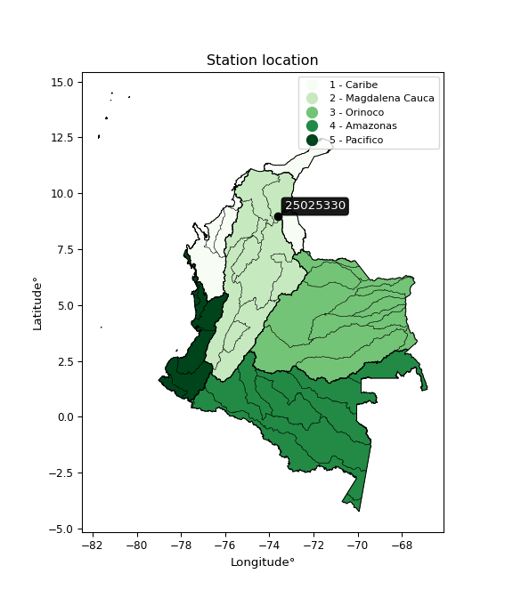

<div align="center">


</div>

# PMP Station (rain, Pmax24h): 25025330

Probable Maximum Precipitation (PMP) is the greatest amount of rainfall for a specific duration that is meteorologically possible for a given location, acting as a "worst-case" scenario for extreme storms, crucial for designing safety-critical infrastructure like bridges, river deviations, dams, spillways, and nuclear plants to prevent catastrophic failure. PMP is calculated by hydrologists using meteorological data to determine the upper limit of extreme rainfall, often leading to the Probable Maximum Flood (PMF) for flood control design, and is increasingly being studied for climate change impacts.

<div align="center">

</img>

</div>


## A. General information


### 1. General running parameters

• app_version: _v20251228_. • runtime: _2025-12-28 08:43:48.795225_. • Python version: _3.14.0_. • SciPy version: _1.16.3_. • Pandas version: _2.3.3_. • NumPy version: _2.3.5_. • Stations dataset (station_dataset_file): _dataset/pmax24h_in/automatic_colombia_2003_2024.csv_. • Stations catalog (station_catalog_file): _dataset/CNE_IDEAM.xls_. • Minimum year to eval til year_max (date_min): _1900_. • Maximum year to eval since year_min (date_max): _2024_. • Creates, save and include plots into reports (create_plot): _False_. • Plot only fit distributions with Δo > Δ (plot_only_fit): _True_. • Eval low extreme values, if False, evaluates high extreme values (low_extreme): _False_. • Eval every SciPy distribution as logarithmic (pdist_logarithmic_on): _True_. • Standard deviation normalized (ddof): _1.0_. • Return periods to eval in years (Tr): _[2, 2.33, 5, 10, 15, 20, 25, 50, 75, 100, 200, 250, 500, 750, 1000]_. • Minimum data sample per station, 0 means any (minimum_sample): _5_. • Z-Score maximum threshold to adjust a value, 0 means disable (zscore_max): _3.5_. • Z-Score minimum threshold to adjust a value, 0 means disable (zscore_min): _-2.5_. • Avoid zeros, e.g. rain = 0 (avoid_zeros): _True_. • Avoid null values (avoid_nans): _True_. [:file_folder:Dataset file.](../../dataset/pmax24h_in/automatic_colombia_2003_2024.csv)

> Delta Degrees of Freedom (DDOF): is a parameter used in the formulas for calculating variance and standard deviation. When ddof=0, the divisor is $N$ (the total number of observations) and this is used when your data set is the entire population. When ddof=1, the divisor is $N-1$ and this is used when your data set is a sample drawn from a larger population. Using $N-1$ provides an unbiased estimate of the population variance (known as Bessel´s correction).


### 2. Station info and location

|   id |   CODIGO | NOMBRE                                          | CATEGORIA               | TECNOLOGIA                              | ESTADO   | FECHA_INSTALACION   |   FECHA_SUSPENSION |   ALTITUD |   LATITUD |   LONGITUD | DEPARTAMENTO   | MUNICIPIO   | AREA_OPERATIVA                                         | ENTIDAD                                                     | AREA_HIDROGRAFICA   | ZONA_HIDROGRAFICA   | SUBZONA_HIDROGRAFICA   |   CORRIENTE | Catalogo   |
|-----:|---------:|:------------------------------------------------|:------------------------|:----------------------------------------|:---------|:--------------------|-------------------:|----------:|----------:|-----------:|:---------------|:------------|:-------------------------------------------------------|:------------------------------------------------------------|:--------------------|:--------------------|:-----------------------|------------:|:-----------|
|    0 | 25025330 | COLEGIO AGROPECUARIO PAILITAS  - AUT [25025330] | Climatológica Principal | Automática con Telemetría, Convencional | Activa   | 15/09/1987          |                nan |        50 |   8.95422 |   -73.6301 | Cesar          | Pailitas    | Area Operativa 05 - Magdalena-Cesar-Guajira-San Andrés | INSTITUTO DE HIDROLOGIA METEOROLOGIA Y ESTUDIOS AMBIENTALES | Magdalena Cauca     | Cesar               | Bajo Cesar             |         nan | CNE_IDEAM  |

<div align="center">

Map location in: [:earth_americas:Google](http://maps.google.com/maps?q=8.954222222,-73.63008333) [:earth_americas:OSM](https://www.openstreetmap.org/#map=18/8.954222222/-73.63008333&layers=P) [:earth_americas:Bing](https://www.bing.com/maps?cp=8.954222222~-73.63008333&lvl=18) [:earth_americas:Apple](https://maps.apple.com/frame?center=8.954222222%2C-73.63008333&span=0.003%2C0.006)

</div>


<div align="center">

```geojson
{
  "type": "Feature",
  "geometry": {
    "type": "Point", 
    "coordinates": [-73.63008333, 8.954222222]
  }, 
  "properties": {
    "Name": "25025330"
  }
}
```

</div>


### 3. Discrete values table and plot

|               |           0 |           1 |          2 |          3 |            4 |
|:--------------|------------:|------------:|-----------:|-----------:|-------------:|
| Date          | 2019        | 2020        | 2022       | 2023       | 2024         |
| Value         |   37.8      |   65.6      |   78.4     |   31       |   52.2       |
| Value_initial |   37.8      |   65.6      |   78.4     |   31       |   52.2       |
| count         |    5        |    5        |    5       |    5       |    5         |
| mean          |   53        |   53        |   53       |   53       |   53         |
| std           |   19.491    |   19.491    |   19.491   |   19.491   |   19.491     |
| zscore        |   -0.779846 |    0.646451 |    1.30316 |   -1.12872 |   -0.0410445 |

> The initial value (value_initial) correspond to the initial obtained or null completed value, and value (value) is adjusted only when the initial value is outside the valid range definite through the Z-Score value. If Z-Score is active, values out of range or outliers are replaced with the station mean value


### 4. Active continuous probability distributions from SciPy (44 of 104 available)

[scipy.stats](https://docs.scipy.org/doc/scipy/reference/stats.html) is a Python´s powerful submodule within the SciPy library for comprehensive statistical analysis, offering over 130 probability distributions (like Normal, Poisson), functions for descriptive stats (mean, variance), hypothesis testing (t-tests, chi-square), random variable generation, and statistical tests, making it essential for data science, modeling, and research. It provides tools to explore, model, and draw conclusions from data efficiently, working seamlessly with NumPy.

<div align="center">

|   id | p_dist             |   n_parameter | fit_method   | label                                                                       | active   | ref                                                                                                        |
|-----:|:-------------------|--------------:|:-------------|:----------------------------------------------------------------------------|:---------|:-----------------------------------------------------------------------------------------------------------|
|    0 | alpha              |             3 | MLE          | Alpha                                                                       | True     | [:mortar_board:](https://docs.scipy.org/doc/scipy/reference/generated/scipy.stats.alpha.html)              |
|    1 | betaprime          |             4 | MLE          | Beta prime                                                                  | True     | [:mortar_board:](https://docs.scipy.org/doc/scipy/reference/generated/scipy.stats.betaprime.html)          |
|    2 | chi2               |             3 | MLE          | Chi²                                                                        | True     | [:mortar_board:](https://docs.scipy.org/doc/scipy/reference/generated/scipy.stats.chi2.html)               |
|    3 | crystalball        |             4 | MLE          | Crystalball                                                                 | True     | [:mortar_board:](https://docs.scipy.org/doc/scipy/reference/generated/scipy.stats.crystalball.html)        |
|    4 | erlang             |             3 | MLE          | Erlang                                                                      | True     | [:mortar_board:](https://docs.scipy.org/doc/scipy/reference/generated/scipy.stats.erlang.html)             |
|    5 | expon              |             2 | MLE          | Exponential                                                                 | True     | [:mortar_board:](https://docs.scipy.org/doc/scipy/reference/generated/scipy.stats.expon.html)              |
|    6 | exponnorm          |             3 | MLE          | Exponentially modified Normal                                               | True     | [:mortar_board:](https://docs.scipy.org/doc/scipy/reference/generated/scipy.stats.exponnorm.html)          |
|    7 | f                  |             4 | MLE          | F                                                                           | True     | [:mortar_board:](https://docs.scipy.org/doc/scipy/reference/generated/scipy.stats.f.html)                  |
|    8 | fatiguelife        |             3 | MLE          | Fatigue-life (Birnbaum-Saunders)                                            | True     | [:mortar_board:](https://docs.scipy.org/doc/scipy/reference/generated/scipy.stats.fatiguelife.html)        |
|    9 | fisk               |             3 | MLE          | Fisk                                                                        | True     | [:mortar_board:](https://docs.scipy.org/doc/scipy/reference/generated/scipy.stats.fisk.html)               |
|   10 | gamma              |             3 | MLE          | Gamma                                                                       | True     | [:mortar_board:](https://docs.scipy.org/doc/scipy/reference/generated/scipy.stats.gamma.html)              |
|   11 | genexpon           |             5 | MLE          | Generalized exponential                                                     | True     | [:mortar_board:](https://docs.scipy.org/doc/scipy/reference/generated/scipy.stats.genexpon.html)           |
|   12 | genlogistic        |             3 | MLE          | Generalized logistic                                                        | True     | [:mortar_board:](https://docs.scipy.org/doc/scipy/reference/generated/scipy.stats.genlogistic.html)        |
|   13 | gibrat             |             2 | MM           | Gibrat                                                                      | True     | [:mortar_board:](https://docs.scipy.org/doc/scipy/reference/generated/scipy.stats.gibrat.html)             |
|   14 | gompertz           |             3 | MLE          | Gompertz (or truncated Gumbel)                                              | True     | [:mortar_board:](https://docs.scipy.org/doc/scipy/reference/generated/scipy.stats.gompertz.html)           |
|   15 | gumbel_l           |             2 | MM           | Gumbel Left Skew                                                            | True     | [:mortar_board:](https://docs.scipy.org/doc/scipy/reference/generated/scipy.stats.gumbel_l.html)           |
|   16 | gumbel_r           |             2 | MM           | Gumbel Right Skew                                                           | True     | [:mortar_board:](https://docs.scipy.org/doc/scipy/reference/generated/scipy.stats.gumbel_r.html)           |
|   17 | halflogistic       |             2 | MM           | Half-logistic                                                               | True     | [:mortar_board:](https://docs.scipy.org/doc/scipy/reference/generated/scipy.stats.halflogistic.html)       |
|   18 | halfnorm           |             2 | MM           | Half Normal                                                                 | True     | [:mortar_board:](https://docs.scipy.org/doc/scipy/reference/generated/scipy.stats.halfnorm.html)           |
|   19 | hypsecant          |             2 | MM           | hyperbolic secant                                                           | True     | [:mortar_board:](https://docs.scipy.org/doc/scipy/reference/generated/scipy.stats.hypsecant.html)          |
|   20 | invgamma           |             3 | MLE          | Inverted gamma                                                              | True     | [:mortar_board:](https://docs.scipy.org/doc/scipy/reference/generated/scipy.stats.invgamma.html)           |
|   21 | invgauss           |             3 | MLE          | Inverse Gaussian                                                            | True     | [:mortar_board:](https://docs.scipy.org/doc/scipy/reference/generated/scipy.stats.invgauss.html)           |
|   22 | invweibull         |             3 | MLE          | Inverted Weibull                                                            | True     | [:mortar_board:](https://docs.scipy.org/doc/scipy/reference/generated/scipy.stats.invweibull.html)         |
|   23 | johnsonsu          |             4 | MLE          | Johnson Su                                                                  | True     | [:mortar_board:](https://docs.scipy.org/doc/scipy/reference/generated/scipy.stats.johnsonsu.html)          |
|   24 | kstwobign          |             2 | MLE          | Limiting distribution of scaled Kolmogorov-Smirnov two-sided test statistic | True     | [:mortar_board:](https://docs.scipy.org/doc/scipy/reference/generated/scipy.stats.kstwobign.html)          |
|   25 | laplace            |             2 | MM           | Laplace                                                                     | True     | [:mortar_board:](https://docs.scipy.org/doc/scipy/reference/generated/scipy.stats.laplace.html)            |
|   26 | laplace_asymmetric |             3 | MLE          | Asymmetric Laplace                                                          | True     | [:mortar_board:](https://docs.scipy.org/doc/scipy/reference/generated/scipy.stats.laplace_asymmetric.html) |
|   27 | loggamma           |             3 | MLE          | Log gamma                                                                   | True     | [:mortar_board:](https://docs.scipy.org/doc/scipy/reference/generated/scipy.stats.loggamma.html)           |
|   28 | logistic           |             2 | MM           | Logistic (or Sech-squared)                                                  | True     | [:mortar_board:](https://docs.scipy.org/doc/scipy/reference/generated/scipy.stats.logistic.html)           |
|   29 | lognorm            |             3 | MLE          | Log Normal                                                                  | True     | [:mortar_board:](https://docs.scipy.org/doc/scipy/reference/generated/scipy.stats.lognorm.html)            |
|   30 | maxwell            |             2 | MM           | Maxwell                                                                     | True     | [:mortar_board:](https://docs.scipy.org/doc/scipy/reference/generated/scipy.stats.maxwell.html)            |
|   31 | mielke             |             4 | MLE          | Mielke Beta-Kappa / Dagum                                                   | True     | [:mortar_board:](https://docs.scipy.org/doc/scipy/reference/generated/scipy.stats.mielke.html)             |
|   32 | moyal              |             2 | MM           | Moyal                                                                       | True     | [:mortar_board:](https://docs.scipy.org/doc/scipy/reference/generated/scipy.stats.moyal.html)              |
|   33 | nakagami           |             3 | MLE          | Nakagami                                                                    | True     | [:mortar_board:](https://docs.scipy.org/doc/scipy/reference/generated/scipy.stats.nakagami.html)           |
|   34 | ncf                |             5 | MLE          | Non-central F distribution                                                  | True     | [:mortar_board:](https://docs.scipy.org/doc/scipy/reference/generated/scipy.stats.ncf.html)                |
|   35 | nct                |             4 | MLE          | Non-central Student’s t                                                     | True     | [:mortar_board:](https://docs.scipy.org/doc/scipy/reference/generated/scipy.stats.nct.html)                |
|   36 | norm               |             2 | MM           | Normal                                                                      | True     | [:mortar_board:](https://docs.scipy.org/doc/scipy/reference/generated/scipy.stats.norm.html)               |
|   37 | pearson3           |             3 | MM           | Pearson type III                                                            | True     | [:mortar_board:](https://docs.scipy.org/doc/scipy/reference/generated/scipy.stats.pearson3.html)           |
|   38 | rayleigh           |             2 | MM           | Rayleigh                                                                    | True     | [:mortar_board:](https://docs.scipy.org/doc/scipy/reference/generated/scipy.stats.rayleigh.html)           |
|   39 | rice               |             3 | MLE          | Rice                                                                        | True     | [:mortar_board:](https://docs.scipy.org/doc/scipy/reference/generated/scipy.stats.rice.html)               |
|   40 | t                  |             3 | MLE          | Student’s t                                                                 | True     | [:mortar_board:](https://docs.scipy.org/doc/scipy/reference/generated/scipy.stats.t.html)                  |
|   41 | truncnorm          |             4 | MLE          | Truncated normal                                                            | True     | [:mortar_board:](https://docs.scipy.org/doc/scipy/reference/generated/scipy.stats.truncnorm.html)          |
|   42 | wald               |             2 | MM           | Wald                                                                        | True     | [:mortar_board:](https://docs.scipy.org/doc/scipy/reference/generated/scipy.stats.wald.html)               |
|   43 | weibull_min        |             3 | MLE          | Weibull minimum                                                             | True     | [:mortar_board:](https://docs.scipy.org/doc/scipy/reference/generated/scipy.stats.weibull_min.html)        |

</div>

> **n_parameter:** # arguments & localization & scale.
>
> **Fit methods:** (MLE) maximum likelihood, (MM) L-moments.
>
>**Inactive:** foldnorm, gennorm, norminvgauss, powernorm, powerlognorm, skewnorm, genextreme, anglit, arcsine, argus, beta, bradford, burr, burr12, cauchy, cosine, halfcauchy, foldcauchy, skewcauchy, wrapcauchy, dgamma, gengamma, exponweib, exponpow, truncexpon, gausshyper, genhalflogistic, genhyperbolic, geninvgauss, halfgennorm, johnsonsb, kappa4, kappa3, ksone, kstwo, loglaplace, levy, levy_l, levy_stable, ncx2, pareto, genpareto, truncpareto, lomax, powerlaw, rdist, rel_breitwigner, recipinvgauss, semicircular, studentized_range, trapezoid, triang, truncweibull_min, tukeylambda, uniform, loguniform, vonmises, vonmises_line, weibull_max, dweibull, 


## B. Probability distributions vs. Empirical distributions

A continuous probability distribution (CPD) describes probabilities for variables that can take any value within a range (like rain any time), unlike discrete variables with specific outcomes (like temperature). It uses a Probability Density Function (PDF), a curve where the total area under it equals 1, and the probability of the variable falling within an interval (a to b) is found by calculating the area under the curve between those points. A key feature is that the probability of hitting any single exact value is zero, so probabilities are always expressed for ranges, e.g., $P(a ≤ X ≤ b)$.

<div align="center">

Distributions parameters from station values
|    |   station | p_dist                |   n |             loc |          scale | shape                 | shape1                | shape2             | shape3   |
|---:|----------:|:----------------------|----:|----------------:|---------------:|:----------------------|:----------------------|:-------------------|:---------|
|  0 |  25025330 | alpha                 |   5 |  -123.737       | 1788.26        | 10.216626198542649    |                       |                    |          |
|  1 |  25025330 | betaprime             |   5 |    -0.48125     |  351.752       | 10.370479150738358    | 69.36627760999028     |                    |          |
|  2 |  25025330 | chi2                  |   5 |    31           |    5.44324     | 0.277536413804827     |                       |                    |          |
|  3 |  25025330 | crystalball           |   5 |    53           |   17.4333      | 18321.436193941994    | 3.3627017778710604    |                    |          |
|  4 |  25025330 | erlang                |   5 |   -23.4551      |    3.88175     | 19.640427951415205    |                       |                    |          |
|  5 |  25025330 | expon                 |   5 |    31           |   22           |                       |                       |                    |          |
|  6 |  25025330 | exponnorm             |   5 |    50.9941      |   17.3176      | 0.11583280181484058   |                       |                    |          |
|  7 |  25025330 | f                     |   5 |    30.9994      |   20.786       | 0.9042770307032248    | 583.2602826830228     |                    |          |
|  8 |  25025330 | fatiguelife           |   5 |    31           |    3.44486e-06 | 2390.644031280498     |                       |                    |          |
|  9 |  25025330 | fisk                  |   5 |    -0.198154    |   50.6521      | 4.738904022249805     |                       |                    |          |
| 10 |  25025330 | gamma                 |   5 |   -22.0314      |    3.8991      | 19.12013222918206     |                       |                    |          |
| 11 |  25025330 | genexpon              |   5 |    31           |    1.5019      | 0.0681424545177515    | 8.273378053078166e-08 | 1.0059931363101842 |          |
| 12 |  25025330 | genlogistic           |   5 |   -50.86        |   14.7537      | 640.9458404533502     |                       |                    |          |
| 13 |  25025330 | gibrat                |   5 |    39.7006      |    8.06649     |                       |                       |                    |          |
| 14 |  25025330 | gompertz              |   5 |    31           |   40.9198      | 1.143437487866485     |                       |                    |          |
| 15 |  25025330 | gumbel_l              |   5 |    60.8459      |   13.5927      |                       |                       |                    |          |
| 16 |  25025330 | gumbel_r              |   5 |    45.1541      |   13.5927      |                       |                       |                    |          |
| 17 |  25025330 | halflogistic          |   5 |    32.3375      |   14.9048      |                       |                       |                    |          |
| 18 |  25025330 | halfnorm              |   5 |    29.9251      |   28.92        |                       |                       |                    |          |
| 19 |  25025330 | hypsecant             |   5 |    53           |   11.0984      |                       |                       |                    |          |
| 20 |  25025330 | invgamma              |   5 |   -23.6155      | 1388.09        | 19.098282648248237    |                       |                    |          |
| 21 |  25025330 | invgauss              |   5 |    19.7465      |   78.6614      | 0.4227418022681815    |                       |                    |          |
| 22 |  25025330 | invweibull            |   5 |    31           |    1.40072     | 0.044728838440085045  |                       |                    |          |
| 23 |  25025330 | johnsonsu             |   5 |     1.16884e+08 |    4.26214e+08 | 6810782.419483004     | 25140333.811512757    |                    |          |
| 24 |  25025330 | kstwobign             |   5 |    -5.92118     |   67.2253      |                       |                       |                    |          |
| 25 |  25025330 | laplace               |   5 |    53           |   12.3272      |                       |                       |                    |          |
| 26 |  25025330 | laplace_asymmetric    |   5 |    52.2         |   15.0241      | 0.9737286080777834    |                       |                    |          |
| 27 |  25025330 | loggamma              |   5 | -4059.58        |  586.604       | 1109.0865533323654    |                       |                    |          |
| 28 |  25025330 | logistic              |   5 |    53           |    9.61148     |                       |                       |                    |          |
| 29 |  25025330 | lognorm               |   5 |    31           |    0.0153057   | 14.56070495432904     |                       |                    |          |
| 30 |  25025330 | maxwell               |   5 |    11.6904      |   25.887       |                       |                       |                    |          |
| 31 |  25025330 | mielke                |   5 |    -1.67369     |    6.10084     | 2391.970175038091     | 3.3323615723530864    |                    |          |
| 32 |  25025330 | moyal                 |   5 |    43.0305      |    7.84774     |                       |                       |                    |          |
| 33 |  25025330 | nakagami              |   5 |    31           |   29.7742      | 0.13443418678611052   |                       |                    |          |
| 34 |  25025330 | ncf                   |   5 |     0.00675654  |    5.33581e-06 | 4.707445628155399e-07 | 1.8237290631356313    | 3.493468738625109  |          |
| 35 |  25025330 | nct                   |   5 |    -0.121456    |    4.86869     | 5.2595404714842715    | 9.356522476602272     |                    |          |
| 36 |  25025330 | norm                  |   5 |    53           |   17.4333      |                       |                       |                    |          |
| 37 |  25025330 | pearson3              |   5 |    53           |   17.4334      | 0.1595323252548256    |                       |                    |          |
| 38 |  25025330 | rayleigh              |   5 |    19.6491      |   26.6102      |                       |                       |                    |          |
| 39 |  25025330 | rice                  |   5 |    21.5247      |   22.3873      | 0.7636013470034178    |                       |                    |          |
| 40 |  25025330 | t                     |   5 |    52.9999      |   17.4333      | 156013716.08570498    |                       |                    |          |
| 41 |  25025330 | truncnorm             |   5 |    53           |   17.4333      | -2252.136772323127    | 15750.801614841454    |                    |          |
| 42 |  25025330 | wald                  |   5 |    35.5667      |   17.4333      |                       |                       |                    |          |
| 43 |  25025330 | weibull_min           |   5 |    31           |   19.6471      | 0.7444980672020818    |                       |                    |          |
| 44 |  25025330 | logalpha              |   5 |    -3.74267     |  169.627       | 22.21032055455518     |                       |                    |          |
| 45 |  25025330 | logbetaprime          |   5 |    -2.77981     |    4.03689     | 852.4632684216067     | 515.5605213112917     |                    |          |
| 46 |  25025330 | logchi2               |   5 |     3.43399     |    0.971465    | 1.0430214729332685    |                       |                    |          |
| 47 |  25025330 | logcrystalball        |   5 |     3.91336     |    0.341955    | 1274.9288963221543    | 61.955248736644705    |                    |          |
| 48 |  25025330 | logerlang             |   5 |    -4.49499     |    0.0139434   | 602.9926977533344     |                       |                    |          |
| 49 |  25025330 | logexpon              |   5 |     3.43399     |    0.479368    |                       |                       |                    |          |
| 50 |  25025330 | logexponnorm          |   5 |     3.91298     |    0.341955    | 0.001104231573970302  |                       |                    |          |
| 51 |  25025330 | logf                  |   5 |   -95.7431      |   99.6553      | 743327.5656071776     | 219463.15882783232    |                    |          |
| 52 |  25025330 | logfatiguelife        |   5 |   -15.8966      |   19.8085      | 0.017223243446353592  |                       |                    |          |
| 53 |  25025330 | logfisk               |   5 |    -2.16481e+06 |    2.16482e+06 | 10215035.971424675    |                       |                    |          |
| 54 |  25025330 | loggamma              |   5 |    -4.68391     |    0.0136783   | 628.5211262331936     |                       |                    |          |
| 55 |  25025330 | loggenexpon           |   5 |     3.43399     |    0.564307    | 0.8171070944640278    | 4.112096150791484     | 0.1469847538644684 |          |
| 56 |  25025330 | loggenlogistic        |   5 |     2.09799     |    0.309233    | 203.38753342353152    |                       |                    |          |
| 57 |  25025330 | loggibrat             |   5 |     3.65252     |    0.158208    |                       |                       |                    |          |
| 58 |  25025330 | loggompertz           |   5 |     3.43399     |    0.536621    | 0.5119781338289224    |                       |                    |          |
| 59 |  25025330 | loggumbel_l           |   5 |     4.06725     |    0.266621    |                       |                       |                    |          |
| 60 |  25025330 | loggumbel_r           |   5 |     3.75946     |    0.266621    |                       |                       |                    |          |
| 61 |  25025330 | loghalflogistic       |   5 |     3.50803     |    0.292377    |                       |                       |                    |          |
| 62 |  25025330 | loghalfnorm           |   5 |     3.46078     |    0.567225    |                       |                       |                    |          |
| 63 |  25025330 | loghypsecant          |   5 |     3.91336     |    0.217695    |                       |                       |                    |          |
| 64 |  25025330 | loginvgamma           |   5 |    -4.41386     | 4890.19        | 588.2751794135338     |                       |                    |          |
| 65 |  25025330 | loginvgauss           |   5 |     1.93431     |   61.0793      | 0.03234879531273474   |                       |                    |          |
| 66 |  25025330 | loginvweibull         |   5 |    -1.27632e+07 |    1.27632e+07 | 42294965.285304144    |                       |                    |          |
| 67 |  25025330 | logjohnsonsu          |   5 |     5.00646     |    0.0543229   | 11.198103291725653    | 3.073107943631695     |                    |          |
| 68 |  25025330 | logkstwobign          |   5 |     2.6828      |    1.40201     |                       |                       |                    |          |
| 69 |  25025330 | loglaplace            |   5 |     3.91336     |    0.241798    |                       |                       |                    |          |
| 70 |  25025330 | loglaplace_asymmetric |   5 |     3.95508     |    0.293409    | 1.0733206245634572    |                       |                    |          |
| 71 |  25025330 | logloggamma           |   5 |     2.8639      |    0.719744    | 4.788128639245307     |                       |                    |          |
| 72 |  25025330 | loglogistic           |   5 |     3.91336     |    0.18853     |                       |                       |                    |          |
| 73 |  25025330 | loglognorm            |   5 |     3.43399     |    0.000502123 | 13.886992257898022    |                       |                    |          |
| 74 |  25025330 | logmaxwell            |   5 |     3.10307     |    0.507773    |                       |                       |                    |          |
| 75 |  25025330 | logmielke             |   5 |    -7.96171e+06 |    7.96171e+06 | 1501803495.697635     | 26170392.95654199     |                    |          |
| 76 |  25025330 | logmoyal              |   5 |     3.7178      |    0.153934    |                       |                       |                    |          |
| 77 |  25025330 | lognakagami           |   5 |     3.43399     |    0.642371    | 0.17901270056348567   |                       |                    |          |
| 78 |  25025330 | logncf                |   5 |    -0.440556    |    4.07366     | 350.98821382360484    | 2746.991388155506     | 23.53381410906988  |          |
| 79 |  25025330 | lognct                |   5 |    -9.17377     |    0.274045    | 2015.0168808081871    | 47.734750909364266    |                    |          |
| 80 |  25025330 | lognorm               |   5 |     3.91336     |    0.341955    |                       |                       |                    |          |
| 81 |  25025330 | logpearson3           |   5 |     3.91336     |    0.341955    | -0.11182778053564632  |                       |                    |          |
| 82 |  25025330 | lograyleigh           |   5 |     3.25918     |    0.52196     |                       |                       |                    |          |
| 83 |  25025330 | logrice               |   5 |     3.2457      |    0.411081    | 1.15317816660062      |                       |                    |          |
| 84 |  25025330 | logt                  |   5 |     3.91336     |    0.341954    | 105807002979.4309     |                       |                    |          |
| 85 |  25025330 | logtruncnorm          |   5 |    -0.0932841   |    1.43748     | 2.453796004419052     | 4.404170315730765     |                    |          |
| 86 |  25025330 | logwald               |   5 |     3.57137     |    0.341983    |                       |                       |                    |          |
| 87 |  25025330 | logweibull_min        |   5 |     3.43399     |    0.0602341   | 0.47913512905717953   |                       |                    |          |

</div>

> **loc** (Location parameter): This shifts the distribution along the x-axis. For many common distributions, like the normal (Gaussian) distribution, loc represents the mean $μ$. For others, like the uniform distribution, it might represent the minimum value, or for the beta distribution, the left end of the support interval.
>
> **scale** (Scale parameter): This determines the width or spread of the distribution. For the normal distribution, scale represents the standard deviation $σ$. For a uniform distribution, it defines the length of the interval (from $loc$ to $loc + scale$).
>
> **shape** (Shape parameters): Refers to parameters that define the specific form of a probability distribution, distinct from its location (loc) and scale (scale). These parameters are required arguments for most distribution functions. For example, a normal (Gaussian) distribution is fully defined by its location (mean) and scale (standard deviation), so it has no specific shape parameters beyond loc and scale. However, other distributions have intrinsic properties that need specification, as Gamma distribution that takes a shape parameter, often named $a$ or $alpha$.


### 0. Cumulative distribution values - CDF (88 evaluated)

Cumulative Distribution Function (CDF), denoted as $F$<sub>$X$</sub>$(x)$, is a function that gives the probability that a random variable $X$ will take a value less than or equal to a specific value, $x$ (i.e., $(P(X≥x)$. It essentially "accumulates" probabilities from a given point up to the far right (positive infinity), providing a complete picture of the distribution´s probabilities for both discrete (like rain) and continuous (like temperature) variables, helping to find probabilities over ranges or above certain values.

<div align="center">

CDF ordered by x ascending and calculating $log(f(x))$ separately
|   id |   Station |   date |    x |   count |   mean |    std |     zscore |   Value_initial |   station |   m |    alpha |   alpha_pdf |   betaprime |   betaprime_pdf |       chi2 |    chi2_pdf |   crystalball |   crystalball_pdf |    erlang |   erlang_pdf |    expon |   expon_pdf |   exponnorm |   exponnorm_pdf |          f |      f_pdf |   fatiguelife |   fatiguelife_pdf |      fisk |   fisk_pdf |     gamma |   gamma_pdf |    genexpon |   genexpon_pdf |   genlogistic |   genlogistic_pdf |   gibrat |   gibrat_pdf |    gompertz |   gompertz_pdf |   gumbel_l |   gumbel_l_pdf |   gumbel_r |   gumbel_r_pdf |   halflogistic |   halflogistic_pdf |   halfnorm |   halfnorm_pdf |   hypsecant |   hypsecant_pdf |   invgamma |   invgamma_pdf |   invgauss |   invgauss_pdf |   invweibull |   invweibull_pdf |   johnsonsu |   johnsonsu_pdf |   kstwobign |   kstwobign_pdf |   laplace |   laplace_pdf |   laplace_asymmetric |   laplace_asymmetric_pdf |   loggamma |   loggamma_pdf |   logistic |   logistic_pdf |   lognorm |   lognorm_pdf |   maxwell |   maxwell_pdf |   mielke |   mielke_pdf |     moyal |   moyal_pdf |    nakagami |   nakagami_pdf |      ncf |    ncf_pdf |      nct |    nct_pdf |     norm |   norm_pdf |   pearson3 |   pearson3_pdf |   rayleigh |   rayleigh_pdf |      rice |   rice_pdf |        t |      t_pdf |   truncnorm |   truncnorm_pdf |      wald |   wald_pdf |   weibull_min |   weibull_min_pdf |   logalpha |   logalpha_pdf |   logbetaprime |   logbetaprime_pdf |     logchi2 |   logchi2_pdf |   logcrystalball |   logcrystalball_pdf |   logerlang |   logerlang_pdf |   logexpon |   logexpon_pdf |   logexponnorm |   logexponnorm_pdf |      logf |   logf_pdf |   logfatiguelife |   logfatiguelife_pdf |   logfisk |   logfisk_pdf |   loggenexpon |   loggenexpon_pdf |   loggenlogistic |   loggenlogistic_pdf |   loggibrat |   loggibrat_pdf |   loggompertz |   loggompertz_pdf |   loggumbel_l |   loggumbel_l_pdf |   loggumbel_r |   loggumbel_r_pdf |   loghalflogistic |   loghalflogistic_pdf |   loghalfnorm |   loghalfnorm_pdf |   loghypsecant |   loghypsecant_pdf |   loginvgamma |   loginvgamma_pdf |   loginvgauss |   loginvgauss_pdf |   loginvweibull |   loginvweibull_pdf |   logjohnsonsu |   logjohnsonsu_pdf |   logkstwobign |   logkstwobign_pdf |   loglaplace |   loglaplace_pdf |   loglaplace_asymmetric |   loglaplace_asymmetric_pdf |   logloggamma |   logloggamma_pdf |   loglogistic |   loglogistic_pdf |   loglognorm |   loglognorm_pdf |   logmaxwell |   logmaxwell_pdf |   logmielke |   logmielke_pdf |   logmoyal |   logmoyal_pdf |   lognakagami |   lognakagami_pdf |    logncf |   logncf_pdf |    lognct |   lognct_pdf |   logpearson3 |   logpearson3_pdf |   lograyleigh |   lograyleigh_pdf |   logrice |   logrice_pdf |      logt |   logt_pdf |   logtruncnorm |   logtruncnorm_pdf |   logwald |   logwald_pdf |   logweibull_min |   logweibull_min_pdf |
|-----:|----------:|-------:|-----:|--------:|-------:|-------:|-----------:|----------------:|----------:|----:|---------:|------------:|------------:|----------------:|-----------:|------------:|--------------:|------------------:|----------:|-------------:|---------:|------------:|------------:|----------------:|-----------:|-----------:|--------------:|------------------:|----------:|-----------:|----------:|------------:|------------:|---------------:|--------------:|------------------:|---------:|-------------:|------------:|---------------:|-----------:|---------------:|-----------:|---------------:|---------------:|-------------------:|-----------:|---------------:|------------:|----------------:|-----------:|---------------:|-----------:|---------------:|-------------:|-----------------:|------------:|----------------:|------------:|----------------:|----------:|--------------:|---------------------:|-------------------------:|-----------:|---------------:|-----------:|---------------:|----------:|--------------:|----------:|--------------:|---------:|-------------:|----------:|------------:|------------:|---------------:|---------:|-----------:|---------:|-----------:|---------:|-----------:|-----------:|---------------:|-----------:|---------------:|----------:|-----------:|---------:|-----------:|------------:|----------------:|----------:|-----------:|--------------:|------------------:|-----------:|---------------:|---------------:|-------------------:|------------:|--------------:|-----------------:|---------------------:|------------:|----------------:|-----------:|---------------:|---------------:|-------------------:|----------:|-----------:|-----------------:|---------------------:|----------:|--------------:|--------------:|------------------:|-----------------:|---------------------:|------------:|----------------:|--------------:|------------------:|--------------:|------------------:|--------------:|------------------:|------------------:|----------------------:|--------------:|------------------:|---------------:|-------------------:|--------------:|------------------:|--------------:|------------------:|----------------:|--------------------:|---------------:|-------------------:|---------------:|-------------------:|-------------:|-----------------:|------------------------:|----------------------------:|--------------:|------------------:|--------------:|------------------:|-------------:|-----------------:|-------------:|-----------------:|------------:|----------------:|-----------:|---------------:|--------------:|------------------:|----------:|-------------:|----------:|-------------:|--------------:|------------------:|--------------:|------------------:|----------:|--------------:|----------:|-----------:|---------------:|-------------------:|----------:|--------------:|-----------------:|---------------------:|
|    0 |  25025330 |   2023 | 31   |       5 |     53 | 19.491 | -1.12872   |            31   |  25025330 |   1 | 0.090101 |  0.0121385  |   0.0873288 |      0.0132615  | 0.00833868 | 1.62854e+11 |      0.103483 |        0.0103209  | 0.0909585 |   0.0119284  | 0        |  0.0454545  |    0.103418 |      0.0103284  | 0.00682146 | 5.41654    |     0.0726572 |       3.53964e+11 | 0.0914073 | 0.0126153  | 0.0915858 |  0.0121309  | 8.61177e-07 |     0.0453708  |     0.0828536 |        0.01396    | 0        |   0          | 1.63426e-12 |     0.0279434  |   0.105309 |     0.00732442 |  0.0588419 |     0.0122634  |       0        |         0          |  0.0296478 |     0.0275703  |   0.0871498 |      0.00775473 |  0.0829146 |     0.0134533  |  0.0629459 |     0.0203004  |     0.012791 |      3.50987e+11 |    0.105382 |      0.0103709  |   0.0763977 |      0.014857   | 0.0839262 |    0.00680821 |             0.114262 |               0.00781043 |  0.0791315 |       0.446745 |   0.092044 |     0.00869501 | 0.0804803 |      0.436726 | 0.0936624 |    0.0129845  |      nan |          nan | 0.0313808 |  0.010795   | 4.25803e-05 |    3.22246e+09 | 0.473749 | 0.00639008 | 0.072312 | 0.0160909  | 0.103483 | 0.0103209  |   0.100248 |     0.0108256  |  0.0869622 |     0.0146361  | 0.0648349 | 0.0132539  | 0.103485 | 0.010321   |    0.103483 |      0.0103209  | 0         | 0          |   1.90354e-12 |      398.901      |  0.0769832 |       0.475563 |      0.0983616 |           0.502854 | 7.85377e-09 |   9.22298e+06 |        0.0804803 |             0.436726 |   0.0789366 |        0.446978 |   0        |       2.08608  |      0.0804793 |           0.436721 | 0.0805553 |   0.438975 |        0.0780724 |             0.438392 |  0.091316 |      0.391542 |   3.76658e-10 |          1.44798  |        0.0681367 |             0.587997 |    0        |        0        |   1.26345e-09 |          0.954077 |     0.0888065 |          0.317833 |     0.0337208 |          0.428703 |          0        |              0        |      0        |          0        |      0.0701125 |           0.319469 |     0.0773553 |          0.456603 |     0.0728336 |          0.520266 |       0.0646614 |            0.586816 |       0.101094 |           0.345506 |       0.063638 |           0.64342  |    0.0688614 |         0.284788 |                0.102328 |                    0.324931 |     0.0901759 |          0.386521 |     0.0729204 |          0.358581 |    0.0228286 |      8.78015e+12 |    0.0649111 |         0.539697 |   0.0667354 |        0.580027 |  0.0119366 |       0.276387 |   2.97029e-06 |       2.39466e+09 | 0.0815039 |     0.471809 | 0.0801965 |     0.445098 |      0.082976 |          0.424999 |     0.0545395 |          0.60665  | 0.0529928 |      0.552619 | 0.0804802 |   0.436725 |    2.85381e-08 |           1.93589  | 0         |      0        |      1.69311e-07 |          1.82672e+08 |
|    1 |  25025330 |   2019 | 37.8 |       5 |     53 | 19.491 | -0.779846  |            37.8 |  25025330 |   2 | 0.196651 |  0.0189915  |   0.203175  |      0.0203893  | 0.93488    | 0.0109265   |      0.191633 |        0.0156479  | 0.195149  |   0.0185518  | 0.265886 |  0.0333688  |    0.191645 |      0.0156624  | 0.454657   | 0.0272711  |     0.721632  |       0.0145052   | 0.203889  | 0.0202434  | 0.197624  |  0.0188761  | 0.265469    |     0.0333264  |     0.207622  |        0.0220955  | 0        |   0          | 0.186749    |     0.0268333  |   0.16766  |     0.0112374  |  0.179464  |     0.0226798  |       0.181222 |         0.0324444  |  0.214607  |     0.0265852  |   0.158482  |      0.0136971  |  0.202549  |     0.0212181  |  0.242543  |     0.0292595  |     0.393856 |      0.00241393  |    0.193616 |      0.0156158  |   0.208557  |      0.0230561  | 0.145702  |    0.0118195  |             0.181873 |               0.0124321  |  0.20757   |       0.853369 |   0.170591 |     0.0147209  | 0.205572  |      0.832263 | 0.202928  |    0.0188538  |      nan |          nan | 0.162866  |  0.0267929  | 0.546614    |    0.0214796   | 0.513915 | 0.00545775 | 0.220203 | 0.0259092  | 0.191633 | 0.0156479  |   0.193186 |     0.0164989  |  0.207556  |     0.0203129  | 0.179967  | 0.0200901  | 0.191636 | 0.015648   |    0.191633 |      0.0156479  | 0.0134182 | 0.0256789  |   0.364842    |        0.0315631  |  0.214746  |       0.91063  |      0.234091  |           0.859749 | 0.331257    |   0.814181    |        0.205572  |             0.832263 |   0.207567  |        0.855077 |   0.338811 |       1.37929  |      0.20557   |           0.832257 | 0.206253  |   0.835629 |        0.204548  |             0.843643 |  0.203939 |      0.766064 |   0.276648    |          1.31278  |        0.241964  |             1.10643  |    0        |        0        |   0.204604    |          1.09817  |     0.177717  |          0.603467 |     0.199677  |          1.20655  |          0.209383 |              1.63515  |      0.237655 |          1.34378  |      0.170843  |           0.747642 |     0.209371  |          0.876682 |     0.224381  |          0.987411 |       0.241857  |            1.13762  |       0.194528 |           0.615198 |       0.251301 |           1.1591   |    0.15638   |         0.646738 |                0.192084 |                    0.609942 |     0.198021  |          0.717706 |     0.183812  |          0.795765 |    0.666596  |      0.132033    |    0.21963   |         0.991612 |   0.240162  |        1.11218  |  0.186805  |       1.43143  |   0.520852    |       0.926763    | 0.215985  |     0.883554 | 0.207795  |     0.847239 |      0.203782 |          0.803487 |     0.225485  |          1.06077  | 0.210073  |      0.995342 | 0.205572  |   0.832263 |    0.32475     |           1.36685  | 0.0451844 |      2.33105  |      0.829662    |          0.728392    |
|    2 |  25025330 |   2024 | 52.2 |       5 |     53 | 19.491 | -0.0410445 |            52.2 |  25025330 |   3 | 0.520907 |  0.023016   |   0.534928  |      0.0225598  | 0.991088   | 0.00109326  |      0.481699 |        0.0228598  | 0.516473  |   0.023257   | 0.618497 |  0.017341   |    0.481895 |      0.0228641  | 0.695103   | 0.0106921  |     0.850293  |       0.00569886  | 0.540066  | 0.0224649  | 0.52295   |  0.0233937  | 0.61782     |     0.0173398  |     0.552775  |        0.0222003  | 0.669293 |   0.0289982  | 0.539839    |     0.0215869  |   0.411023 |     0.0229377  |  0.551289  |     0.024152   |       0.582547 |         0.0221619  |  0.558832  |     0.0205079  |   0.477075  |      0.0286064  |  0.54244   |     0.0225147  |  0.60392   |     0.0191247  |     0.412481 |      0.000770684 |    0.481852 |      0.0226703  |   0.556546  |      0.0220333  | 0.468582  |    0.038012   |             0.486692 |               0.0332682  |  0.553783  |       1.149    |   0.479204 |     0.0259656  | 0.54856   |      1.158    | 0.515386  |    0.0221851  |      nan |          nan | 0.577155  |  0.024263   | 0.736812    |    0.00879872  | 0.581497 | 0.00403231 | 0.584515 | 0.0209628  | 0.481699 | 0.0228598  |   0.492284 |     0.0229315  |  0.526769  |     0.0217541  | 0.509802  | 0.0231247  | 0.481703 | 0.0228598  |    0.481699 |      0.0228598  | 0.649146  | 0.0245275  |   0.652944    |        0.012898   |  0.569211  |       1.1248   |      0.561895  |           1.04794  | 0.519284    |   0.434335    |        0.54856   |             1.158    |   0.554423  |        1.15039  |   0.662789 |       0.703449 |      0.548557  |           1.158    | 0.549566  |   1.1556   |        0.550257  |             1.15754  |  0.540213 |      1.17203  |   0.632474    |          0.872087 |        0.606061  |             0.980253 |    0.741631 |        1.06858  |   0.568304    |          1.08765  |     0.481377  |          1.27716  |     0.618709  |          1.11415  |          0.643724 |              1.00148  |      0.616488 |          0.962233 |      0.560642  |           1.43573  |     0.559399  |          1.14073  |     0.585064  |          1.07693  |       0.614433  |            0.991706 |       0.484285 |           1.16363  |       0.617502 |           0.968939 |    0.57925   |         1.74009  |                0.53532  |                    1.69985  |     0.517938  |          1.18496  |     0.555107  |          1.30994  |    0.691497  |      0.0486493   |    0.579045  |         1.08255  |   0.6079    |        0.990285 |  0.643593  |       1.07739  |   0.725189    |       0.450693    | 0.563687  |     1.1226   | 0.552815  |     1.15037  |      0.541278 |          1.16561  |     0.588846  |          1.05022  | 0.571344  |      1.10267  | 0.54856   |   1.158    |    0.656826    |           0.744785 | 0.712638  |      0.975044 |      0.939904    |          0.155372    |
|    3 |  25025330 |   2020 | 65.6 |       5 |     53 | 19.491 |  0.646451  |            65.6 |  25025330 |   4 | 0.779879 |  0.0147749  |   0.783621  |      0.0140228  | 0.998134   | 0.000209381 |      0.765085 |        0.0176237  | 0.782659  |   0.0153984  | 0.792521 |  0.00943084 |    0.765181 |      0.0176083  | 0.803627   | 0.00610935 |     0.907526  |       0.00317412  | 0.775521  | 0.0125381  | 0.788633  |  0.0152237  | 0.791921    |     0.00944076 |     0.787334  |        0.0127574  | 0.878294 |   0.00780087 | 0.781275    |     0.0142363  |   0.757976 |     0.0252609  |  0.800756  |     0.0130899  |       0.806113 |         0.0117472  |  0.782636  |     0.0128917  |   0.802072  |      0.0167067  |  0.784815  |     0.0133708  |  0.79417   |     0.0100751  |     0.420474 |      0.000470929 |    0.763236 |      0.017553   |   0.79232   |      0.0131026  | 0.820086  |    0.0145949  |             0.78462  |               0.0139591  |  0.786284  |       0.83174  |   0.787669 |     0.0174007  | 0.785301  |      0.853776 | 0.772683  |    0.0152863  |      nan |          nan | 0.812338  |  0.0117335  | 0.829873    |    0.00549079  | 0.629232 | 0.00314631 | 0.793404 | 0.0108563  | 0.765085 | 0.0176237  |   0.769068 |     0.0168153  |  0.774841  |     0.0146113  | 0.775356  | 0.0156097  | 0.765087 | 0.0176236  |    0.765085 |      0.0176237  | 0.849606  | 0.00869665 |   0.782158    |        0.00714348 |  0.790917  |       0.776139 |      0.774092  |           0.770834 | 0.604916    |   0.324485    |        0.785301  |             0.853776 |   0.786992  |        0.831001 |   0.79064  |       0.436741 |      0.785298  |           0.853781 | 0.785437  |   0.849662 |        0.785465  |             0.843815 |  0.775457 |      0.821631 |   0.795166    |          0.561338 |        0.787145  |             0.608882 |    0.887044 |        0.360861 |   0.78938     |          0.812333 |     0.787103  |          1.23524  |     0.815642  |          0.6234   |          0.819489 |              0.561669 |      0.797432 |          0.624582 |      0.820888  |           0.780029 |     0.787671  |          0.809175 |     0.791974  |          0.712641 |       0.795789  |            0.602372 |       0.761874 |           1.1535   |       0.798022 |           0.614933 |    0.836459  |         0.676354 |                0.798559 |                    0.736893 |     0.776947  |          0.988173 |     0.807416  |          0.824782 |    0.700653  |      0.0333684   |    0.790203  |         0.73947  |   0.79025   |        0.610232 |  0.82566   |       0.557183 |   0.811411    |       0.314635    | 0.787979  |     0.795641 | 0.78627   |     0.837062 |      0.783321 |          0.884555 |     0.791591  |          0.707136 | 0.788962  |      0.769674 | 0.785301  |   0.853776 |    0.793502    |           0.470031 | 0.859424  |      0.409104 |      0.964807    |          0.0752897   |
|    4 |  25025330 |   2022 | 78.4 |       5 |     53 | 19.491 |  1.30316   |            78.4 |  25025330 |   5 | 0.914635 |  0.00683229 |   0.912415  |      0.00664459 | 0.999541   | 4.92691e-05 |      0.927439 |        0.00791719 | 0.922523  |   0.00695958 | 0.884044 |  0.00527072 |    0.927371 |      0.00791029 | 0.866301   | 0.00389372 |     0.939625  |       0.00195928  | 0.889154  | 0.00594243 | 0.925826  |  0.00675621 | 0.883584    |     0.00528191 |     0.904452  |        0.00615597 | 0.941572 |   0.00301475 | 0.917758    |     0.00731888 |   0.973695 |     0.00704031 |  0.916997  |     0.00584569 |       0.912993 |         0.00558353 |  0.906295  |     0.00677107 |   0.935663  |      0.0057576  |  0.907264  |     0.00636412 |  0.889544  |     0.00532649 |     0.425598 |      0.000343083 |    0.925754 |      0.00799052 |   0.914009  |      0.00641628 | 0.936304  |    0.00516712 |             0.906044 |               0.00608938 |  0.903096  |       0.483464 |   0.933558 |     0.00645348 | 0.905153  |      0.493685 | 0.915725  |    0.00739709 |      nan |          nan | 0.91635   |  0.00531001 | 0.887978    |    0.00372016  | 0.665455 | 0.00254516 | 0.893193 | 0.00535964 | 0.927439 | 0.00791719 |   0.923702 |     0.00764643 |  0.912601  |     0.00725147 | 0.919924  | 0.00735481 | 0.92744  | 0.00791712 |    0.927439 |      0.00791719 | 0.925002  | 0.00385758 |   0.854334    |        0.00440756 |  0.899778  |       0.453963 |      0.885556  |           0.482574 | 0.657399    |   0.267313    |        0.905153  |             0.493685 |   0.903591  |        0.482016 |   0.855654 |       0.301118 |      0.905151  |           0.493691 | 0.904747  |   0.491998 |        0.903871  |             0.488671 |  0.888991 |      0.465666 |   0.877355    |          0.369457 |        0.874133  |             0.38014  |    0.933241 |        0.182495 |   0.906811    |          0.501023 |     0.951136  |          0.553247 |     0.90084   |          0.352833 |          0.897669 |              0.332089 |      0.88783  |          0.398327 |      0.919301  |           0.366737 |     0.901275  |          0.471929 |     0.89259   |          0.427164 |       0.881145  |            0.369473 |       0.927921 |           0.65232  |       0.886443 |           0.387784 |    0.921752  |         0.32361  |                0.895054 |                    0.383904 |     0.916002  |          0.55759  |     0.915194  |          0.411681 |    0.705967  |      0.0267377   |    0.89525   |         0.447071 |   0.87709   |        0.377665 |  0.901746  |       0.317525 |   0.860632    |       0.240988    | 0.900064  |     0.468231 | 0.90381   |     0.485795 |      0.907618 |          0.509432 |     0.892618  |          0.434606 | 0.898255  |      0.462562 | 0.905153  |   0.493685 |    0.863404    |           0.322523 | 0.914432  |      0.228842 |      0.975452    |          0.0469944   |


</div>

An Empirical Distribution Function (EDF) is a step-function estimate of a true cumulative distribution function (CDF) based on observed sample data, representing the proportion of data points less than or equal to a given value. It is calculated by ordering your data and jumping up by $1/n$ (where $n$ is sample size) at each unique data point, allowing analysis without assuming an underlying population distribution, and it gets closer to the true CDF as the sample size grows.


### 1. Empirical - EDF California (1923)

California´s estimates the true probability distribution of water-related data (like rainfall, streamflow) using observed samples, crucial for risk assessment.

<div align="center">


$P=m/n$


</div>


**1.1. Empirical values**

<div align="center">

|                | 0              | 1                  | 2              | 3                 | 4              |
|:---------------|:---------------|:-------------------|:---------------|:------------------|:---------------|
| date           | 2023           | 2019               | 2024           | 2020              | 2022           |
| x              | 31.0           | 37.8               | 52.2           | 65.6              | 78.4           |
| m              | 1              | 2                  | 3              | 4                 | 5              |
| empirical_dist | edf_california | edf_california     | edf_california | edf_california    | edf_california |
| empirical      | 0.2            | 0.4                | 0.6            | 0.8               | 1.0            |
| empirical_tr   | 1.25           | 1.6666666666666667 | 2.5            | 5.000000000000001 | inf            |

</div>


**1.2. Kolmogorov-Smirnov fit test (sorted by Δ)**


<div align="center">

|                | 0                   | 1                   | 2                   | 3                  | 4                   | 5                   | 6                  | 7                   | 8                   | 9                   | 10                  | 11                  | 12                 | 13                  | 14                  | 15                  | 16                 | 17                 | 18                  | 19                  | 20                  | 21                  | 22                  | 23                 | 24                  | 25                  | 26                  | 27                  | 28                  | 29                  | 30                  | 31                  | 32                 | 33                 | 34                 | 35                  | 36                 | 37                  | 38                  | 39                  | 40                 | 41                  | 42                  | 43                 | 44                 | 45                 | 46                 | 47                 | 48                 | 49                 | 50                  | 51                  | 52                 | 53                 | 54                  | 55                    | 56                 | 57                  | 58                  | 59                 | 60                  | 61                 | 62                 | 63                  | 64                  | 65                 | 66                  | 67                  | 68                  | 69                 | 70                 | 71                  | 72                 | 73                  | 74                  | 75                 | 76                 | 77                 | 78                 | 79                  | 80                  | 81                  | 82                 | 83                 | 84                 | 85                 | 86                 | 87                 |
|:---------------|:--------------------|:--------------------|:--------------------|:-------------------|:--------------------|:--------------------|:-------------------|:--------------------|:--------------------|:--------------------|:--------------------|:--------------------|:-------------------|:--------------------|:--------------------|:--------------------|:-------------------|:-------------------|:--------------------|:--------------------|:--------------------|:--------------------|:--------------------|:-------------------|:--------------------|:--------------------|:--------------------|:--------------------|:--------------------|:--------------------|:--------------------|:--------------------|:-------------------|:-------------------|:-------------------|:--------------------|:-------------------|:--------------------|:--------------------|:--------------------|:-------------------|:--------------------|:--------------------|:-------------------|:-------------------|:-------------------|:-------------------|:-------------------|:-------------------|:-------------------|:--------------------|:--------------------|:-------------------|:-------------------|:--------------------|:----------------------|:-------------------|:--------------------|:--------------------|:-------------------|:--------------------|:-------------------|:-------------------|:--------------------|:--------------------|:-------------------|:--------------------|:--------------------|:--------------------|:-------------------|:-------------------|:--------------------|:-------------------|:--------------------|:--------------------|:-------------------|:-------------------|:-------------------|:-------------------|:--------------------|:--------------------|:--------------------|:-------------------|:-------------------|:-------------------|:-------------------|:-------------------|:-------------------|
| station        | 25025330            | 25025330            | 25025330            | 25025330           | 25025330            | 25025330            | 25025330           | 25025330            | 25025330            | 25025330            | 25025330            | 25025330            | 25025330           | 25025330            | 25025330            | 25025330            | 25025330           | 25025330           | 25025330            | 25025330            | 25025330            | 25025330            | 25025330            | 25025330           | 25025330            | 25025330            | 25025330            | 25025330            | 25025330            | 25025330            | 25025330            | 25025330            | 25025330           | 25025330           | 25025330           | 25025330            | 25025330           | 25025330            | 25025330            | 25025330            | 25025330           | 25025330            | 25025330            | 25025330           | 25025330           | 25025330           | 25025330           | 25025330           | 25025330           | 25025330           | 25025330            | 25025330            | 25025330           | 25025330           | 25025330            | 25025330              | 25025330           | 25025330            | 25025330            | 25025330           | 25025330            | 25025330           | 25025330           | 25025330            | 25025330            | 25025330           | 25025330            | 25025330            | 25025330            | 25025330           | 25025330           | 25025330            | 25025330           | 25025330            | 25025330            | 25025330           | 25025330           | 25025330           | 25025330           | 25025330            | 25025330            | 25025330            | 25025330           | 25025330           | 25025330           | 25025330           | 25025330           | 25025330           |
| empirical_dist | edf_california      | edf_california      | edf_california      | edf_california     | edf_california      | edf_california      | edf_california     | edf_california      | edf_california      | edf_california      | edf_california      | edf_california      | edf_california     | edf_california      | edf_california      | edf_california      | edf_california     | edf_california     | edf_california      | edf_california      | edf_california      | edf_california      | edf_california      | edf_california     | edf_california      | edf_california      | edf_california      | edf_california      | edf_california      | edf_california      | edf_california      | edf_california      | edf_california     | edf_california     | edf_california     | edf_california      | edf_california     | edf_california      | edf_california      | edf_california      | edf_california     | edf_california      | edf_california      | edf_california     | edf_california     | edf_california     | edf_california     | edf_california     | edf_california     | edf_california     | edf_california      | edf_california      | edf_california     | edf_california     | edf_california      | edf_california        | edf_california     | edf_california      | edf_california      | edf_california     | edf_california      | edf_california     | edf_california     | edf_california      | edf_california      | edf_california     | edf_california      | edf_california      | edf_california      | edf_california     | edf_california     | edf_california      | edf_california     | edf_california      | edf_california      | edf_california     | edf_california     | edf_california     | edf_california     | edf_california      | edf_california      | edf_california      | edf_california     | edf_california     | edf_california     | edf_california     | edf_california     | edf_california     |
| p_dist         | logkstwobign        | invgauss            | loggenlogistic      | loginvweibull      | logmielke           | logbetaprime        | lograyleigh        | loginvgauss         | nct                 | logmaxwell          | logncf              | logalpha            | halfnorm           | logrice             | loginvgamma         | kstwobign           | lognct             | genlogistic        | loggamma            | loggamma            | logerlang           | rayleigh            | f                   | logf               | logcrystalball      | lognorm             | lognorm             | logt                | logexponnorm        | logfatiguelife      | logfisk             | fisk                | logpearson3        | betaprime          | maxwell            | invgamma            | nakagami           | lognakagami         | genexpon            | logtruncnorm        | loggompertz        | loggenexpon         | weibull_min         | expon              | loghalfnorm        | loghalflogistic    | logexpon           | loggumbel_r        | logloggamma        | gamma              | alpha               | erlang              | logjohnsonsu       | johnsonsu          | pearson3            | loglaplace_asymmetric | exponnorm          | t                   | truncnorm           | norm               | crystalball         | logmoyal           | gompertz           | loglogistic         | laplace_asymmetric  | halflogistic       | rice                | gumbel_r            | loggumbel_l         | loghypsecant       | logistic           | gumbel_l            | moyal              | hypsecant           | loglaplace          | laplace            | loglognorm         | fatiguelife        | ncf                | logchi2             | logwald             | wald                | loggibrat          | gibrat             | logweibull_min     | chi2               | invweibull         | mielke             |
| delta          | 0.14869851960770875 | 0.15745719098145608 | 0.15803577916047143 | 0.1581425838709018 | 0.15983792239301634 | 0.16590938160145713 | 0.1745145373758817 | 0.17561931067323117 | 0.17979672347092307 | 0.18037036278474985 | 0.18401512238089482 | 0.18525379469326397 | 0.1853932122841346 | 0.18992738051836963 | 0.19062853332510624 | 0.19144267942689672 | 0.1922047574860329 | 0.1923777048979252 | 0.19243006412483304 | 0.19243006412483304 | 0.19243330758387495 | 0.19244422683635648 | 0.19317853888759656 | 0.1937468025929801 | 0.19442810974417002 | 0.19442811549852407 | 0.19442811549852407 | 0.19442835143642312 | 0.19443019223405317 | 0.19545222313526212 | 0.19606143683423863 | 0.19611068972736936 | 0.1962179184449763 | 0.1968251534876588 | 0.1970718694606256 | 0.19745135084962953 | 0.1999574197455452 | 0.19999702970608133 | 0.19999913882281323 | 0.19999997146193854 | 0.1999999987365526 | 0.19999999962334158 | 0.19999999999809648 | 0.2                | 0.2                | 0.2                | 0.2                | 0.2003232728525334 | 0.2019785070711704 | 0.2023764870650922 | 0.20334887825472742 | 0.20485067299091805 | 0.2054723525327805 | 0.206384390458409  | 0.20681376035263455 | 0.20791630053372534   | 0.208354506461844  | 0.20836437969189064 | 0.20836703089143616 | 0.2083670380298439 | 0.20836703983758606 | 0.213195295341448  | 0.213251230601705  | 0.21618781198350454 | 0.21812688069968894 | 0.2187782120184737 | 0.22003327731545413 | 0.22053580447987864 | 0.22228277508014443 | 0.2291569702545102 | 0.2294086044442785 | 0.23234014840290151 | 0.2371336758184186 | 0.24151780331984946 | 0.24361972388361075 | 0.2542980576338797 | 0.2940329039470594 | 0.3216321700879732 | 0.3345452765510242 | 0.34260077447933457 | 0.35481564519711406 | 0.38658181203418274 | 0.4                | 0.4                | 0.4296620122985725 | 0.5348796140444922 | 0.5744022956977064 | nan                |
| deltao         | 0.5865427407550001  | 0.5865427407550001  | 0.5865427407550001  | 0.5865427407550001 | 0.5865427407550001  | 0.5865427407550001  | 0.5865427407550001 | 0.5865427407550001  | 0.5865427407550001  | 0.5865427407550001  | 0.5865427407550001  | 0.5865427407550001  | 0.5865427407550001 | 0.5865427407550001  | 0.5865427407550001  | 0.5865427407550001  | 0.5865427407550001 | 0.5865427407550001 | 0.5865427407550001  | 0.5865427407550001  | 0.5865427407550001  | 0.5865427407550001  | 0.5865427407550001  | 0.5865427407550001 | 0.5865427407550001  | 0.5865427407550001  | 0.5865427407550001  | 0.5865427407550001  | 0.5865427407550001  | 0.5865427407550001  | 0.5865427407550001  | 0.5865427407550001  | 0.5865427407550001 | 0.5865427407550001 | 0.5865427407550001 | 0.5865427407550001  | 0.5865427407550001 | 0.5865427407550001  | 0.5865427407550001  | 0.5865427407550001  | 0.5865427407550001 | 0.5865427407550001  | 0.5865427407550001  | 0.5865427407550001 | 0.5865427407550001 | 0.5865427407550001 | 0.5865427407550001 | 0.5865427407550001 | 0.5865427407550001 | 0.5865427407550001 | 0.5865427407550001  | 0.5865427407550001  | 0.5865427407550001 | 0.5865427407550001 | 0.5865427407550001  | 0.5865427407550001    | 0.5865427407550001 | 0.5865427407550001  | 0.5865427407550001  | 0.5865427407550001 | 0.5865427407550001  | 0.5865427407550001 | 0.5865427407550001 | 0.5865427407550001  | 0.5865427407550001  | 0.5865427407550001 | 0.5865427407550001  | 0.5865427407550001  | 0.5865427407550001  | 0.5865427407550001 | 0.5865427407550001 | 0.5865427407550001  | 0.5865427407550001 | 0.5865427407550001  | 0.5865427407550001  | 0.5865427407550001 | 0.5865427407550001 | 0.5865427407550001 | 0.5865427407550001 | 0.5865427407550001  | 0.5865427407550001  | 0.5865427407550001  | 0.5865427407550001 | 0.5865427407550001 | 0.5865427407550001 | 0.5865427407550001 | 0.5865427407550001 | 0.5865427407550001 |
| eval           | Δo > Δ              | Δo > Δ              | Δo > Δ              | Δo > Δ             | Δo > Δ              | Δo > Δ              | Δo > Δ             | Δo > Δ              | Δo > Δ              | Δo > Δ              | Δo > Δ              | Δo > Δ              | Δo > Δ             | Δo > Δ              | Δo > Δ              | Δo > Δ              | Δo > Δ             | Δo > Δ             | Δo > Δ              | Δo > Δ              | Δo > Δ              | Δo > Δ              | Δo > Δ              | Δo > Δ             | Δo > Δ              | Δo > Δ              | Δo > Δ              | Δo > Δ              | Δo > Δ              | Δo > Δ              | Δo > Δ              | Δo > Δ              | Δo > Δ             | Δo > Δ             | Δo > Δ             | Δo > Δ              | Δo > Δ             | Δo > Δ              | Δo > Δ              | Δo > Δ              | Δo > Δ             | Δo > Δ              | Δo > Δ              | Δo > Δ             | Δo > Δ             | Δo > Δ             | Δo > Δ             | Δo > Δ             | Δo > Δ             | Δo > Δ             | Δo > Δ              | Δo > Δ              | Δo > Δ             | Δo > Δ             | Δo > Δ              | Δo > Δ                | Δo > Δ             | Δo > Δ              | Δo > Δ              | Δo > Δ             | Δo > Δ              | Δo > Δ             | Δo > Δ             | Δo > Δ              | Δo > Δ              | Δo > Δ             | Δo > Δ              | Δo > Δ              | Δo > Δ              | Δo > Δ             | Δo > Δ             | Δo > Δ              | Δo > Δ             | Δo > Δ              | Δo > Δ              | Δo > Δ             | Δo > Δ             | Δo > Δ             | Δo > Δ             | Δo > Δ              | Δo > Δ              | Δo > Δ              | Δo > Δ             | Δo > Δ             | Δo > Δ             | Δo > Δ             | Δo > Δ             | Δo <= Δ            |
| fit            | 1                   | 1                   | 1                   | 1                  | 1                   | 1                   | 1                  | 1                   | 1                   | 1                   | 1                   | 1                   | 1                  | 1                   | 1                   | 1                   | 1                  | 1                  | 1                   | 1                   | 1                   | 1                   | 1                   | 1                  | 1                   | 1                   | 1                   | 1                   | 1                   | 1                   | 1                   | 1                   | 1                  | 1                  | 1                  | 1                   | 1                  | 1                   | 1                   | 1                   | 1                  | 1                   | 1                   | 1                  | 1                  | 1                  | 1                  | 1                  | 1                  | 1                  | 1                   | 1                   | 1                  | 1                  | 1                   | 1                     | 1                  | 1                   | 1                   | 1                  | 1                   | 1                  | 1                  | 1                   | 1                   | 1                  | 1                   | 1                   | 1                   | 1                  | 1                  | 1                   | 1                  | 1                   | 1                   | 1                  | 1                  | 1                  | 1                  | 1                   | 1                   | 1                   | 1                  | 1                  | 1                  | 1                  | 1                  | 0                  |
| n              | 5                   | 5                   | 5                   | 5                  | 5                   | 5                   | 5                  | 5                   | 5                   | 5                   | 5                   | 5                   | 5                  | 5                   | 5                   | 5                   | 5                  | 5                  | 5                   | 5                   | 5                   | 5                   | 5                   | 5                  | 5                   | 5                   | 5                   | 5                   | 5                   | 5                   | 5                   | 5                   | 5                  | 5                  | 5                  | 5                   | 5                  | 5                   | 5                   | 5                   | 5                  | 5                   | 5                   | 5                  | 5                  | 5                  | 5                  | 5                  | 5                  | 5                  | 5                   | 5                   | 5                  | 5                  | 5                   | 5                     | 5                  | 5                   | 5                   | 5                  | 5                   | 5                  | 5                  | 5                   | 5                   | 5                  | 5                   | 5                   | 5                   | 5                  | 5                  | 5                   | 5                  | 5                   | 5                   | 5                  | 5                  | 5                  | 5                  | 5                   | 5                   | 5                   | 5                  | 5                  | 5                  | 5                  | 5                  | 5                  |
| best_fit       | 1                   | 0                   | 0                   | 0                  | 0                   | 0                   | 0                  | 0                   | 0                   | 0                   | 0                   | 0                   | 0                  | 0                   | 0                   | 0                   | 0                  | 0                  | 0                   | 0                   | 0                   | 0                   | 0                   | 0                  | 0                   | 0                   | 0                   | 0                   | 0                   | 0                   | 0                   | 0                   | 0                  | 0                  | 0                  | 0                   | 0                  | 0                   | 0                   | 0                   | 0                  | 0                   | 0                   | 0                  | 0                  | 0                  | 0                  | 0                  | 0                  | 0                  | 0                   | 0                   | 0                  | 0                  | 0                   | 0                     | 0                  | 0                   | 0                   | 0                  | 0                   | 0                  | 0                  | 0                   | 0                   | 0                  | 0                   | 0                   | 0                   | 0                  | 0                  | 0                   | 0                  | 0                   | 0                   | 0                  | 0                  | 0                  | 0                  | 0                   | 0                   | 0                   | 0                  | 0                  | 0                  | 0                  | 0                  | 0                  |
| best_fit_sort  | 1                   | 2                   | 3                   | 4                  | 5                   | 6                   | 7                  | 8                   | 9                   | 10                  | 11                  | 12                  | 13                 | 14                  | 15                  | 16                  | 17                 | 18                 | 19                  | 20                  | 21                  | 22                  | 23                  | 24                 | 25                  | 26                  | 27                  | 28                  | 29                  | 30                  | 31                  | 32                  | 33                 | 34                 | 35                 | 36                  | 37                 | 38                  | 39                  | 40                  | 41                 | 42                  | 43                  | 44                 | 45                 | 46                 | 47                 | 48                 | 49                 | 50                 | 51                  | 52                  | 53                 | 54                 | 55                  | 56                    | 57                 | 58                  | 59                  | 60                 | 61                  | 62                 | 63                 | 64                  | 65                  | 66                 | 67                  | 68                  | 69                  | 70                 | 71                 | 72                  | 73                 | 74                  | 75                  | 76                 | 77                 | 78                 | 79                 | 80                  | 81                  | 82                  | 83                 | 84                 | 85                 | 86                 | 87                 | 88                 |

</div>


**1.3. Best fit**

<div align="center">

|   id |   station | empirical_dist   | p_dist       |    delta |   deltao | eval   |   fit |   n |   best_fit |   best_fit_sort |
|-----:|----------:|:-----------------|:-------------|---------:|---------:|:-------|------:|----:|-----------:|----------------:|
|    0 |  25025330 | edf_california   | logkstwobign | 0.148699 | 0.586543 | Δo > Δ |     1 |   5 |          1 |               1 |

</div>


### 2. Empirical - EDF Hazen (1930)

Hazen method for plotting positions is a formula used to estimate the empirical cumulative probability distribution of flood events or other hydrological data. This formula often results in biased estimations, particularly when extrapolating to extreme events (high return periods).

<div align="center">


$P=(m-0.5)/n$


</div>


**2.1. Empirical values**

<div align="center">

|                | 0                  | 1                  | 2         | 3                 | 4                  |
|:---------------|:-------------------|:-------------------|:----------|:------------------|:-------------------|
| date           | 2023               | 2019               | 2024      | 2020              | 2022               |
| x              | 31.0               | 37.8               | 52.2      | 65.6              | 78.4               |
| m              | 1                  | 2                  | 3         | 4                 | 5                  |
| empirical_dist | edf_hazen          | edf_hazen          | edf_hazen | edf_hazen         | edf_hazen          |
| empirical      | 0.1                | 0.3                | 0.5       | 0.7               | 0.9                |
| empirical_tr   | 1.1111111111111112 | 1.4285714285714286 | 2.0       | 3.333333333333333 | 10.000000000000002 |

</div>


**2.2. Kolmogorov-Smirnov fit test (sorted by Δ)**


<div align="center">

|                | 0                   | 1                   | 2                   | 3                  | 4                   | 5                  | 6                  | 7                  | 8                  | 9                   | 10                  | 11                  | 12                  | 13                  | 14                  | 15                  | 16                  | 17                  | 18                  | 19                  | 20                  | 21                  | 22                  | 23                  | 24                 | 25                  | 26                  | 27                  | 28                  | 29                 | 30                  | 31                  | 32                  | 33                  | 34                  | 35                  | 36                  | 37                  | 38                  | 39                  | 40                 | 41                    | 42                  | 43                  | 44                  | 45                  | 46                  | 47                  | 48                  | 49                 | 50                  | 51                  | 52                  | 53                  | 54                  | 55                  | 56                  | 57                 | 58                 | 59                 | 60                  | 61                  | 62                  | 63                  | 64                  | 65                  | 66                  | 67                  | 68                 | 69                 | 70                  | 71                 | 72                  | 73                  | 74                 | 75                 | 76                 | 77                 | 78                 | 79                 | 80                 | 81                 | 82                 | 83                 | 84                 | 85                 | 86                 | 87                 |
|:---------------|:--------------------|:--------------------|:--------------------|:-------------------|:--------------------|:-------------------|:-------------------|:-------------------|:-------------------|:--------------------|:--------------------|:--------------------|:--------------------|:--------------------|:--------------------|:--------------------|:--------------------|:--------------------|:--------------------|:--------------------|:--------------------|:--------------------|:--------------------|:--------------------|:-------------------|:--------------------|:--------------------|:--------------------|:--------------------|:-------------------|:--------------------|:--------------------|:--------------------|:--------------------|:--------------------|:--------------------|:--------------------|:--------------------|:--------------------|:--------------------|:-------------------|:----------------------|:--------------------|:--------------------|:--------------------|:--------------------|:--------------------|:--------------------|:--------------------|:-------------------|:--------------------|:--------------------|:--------------------|:--------------------|:--------------------|:--------------------|:--------------------|:-------------------|:-------------------|:-------------------|:--------------------|:--------------------|:--------------------|:--------------------|:--------------------|:--------------------|:--------------------|:--------------------|:-------------------|:-------------------|:--------------------|:-------------------|:--------------------|:--------------------|:-------------------|:-------------------|:-------------------|:-------------------|:-------------------|:-------------------|:-------------------|:-------------------|:-------------------|:-------------------|:-------------------|:-------------------|:-------------------|:-------------------|
| station        | 25025330            | 25025330            | 25025330            | 25025330           | 25025330            | 25025330           | 25025330           | 25025330           | 25025330           | 25025330            | 25025330            | 25025330            | 25025330            | 25025330            | 25025330            | 25025330            | 25025330            | 25025330            | 25025330            | 25025330            | 25025330            | 25025330            | 25025330            | 25025330            | 25025330           | 25025330            | 25025330            | 25025330            | 25025330            | 25025330           | 25025330            | 25025330            | 25025330            | 25025330            | 25025330            | 25025330            | 25025330            | 25025330            | 25025330            | 25025330            | 25025330           | 25025330              | 25025330            | 25025330            | 25025330            | 25025330            | 25025330            | 25025330            | 25025330            | 25025330           | 25025330            | 25025330            | 25025330            | 25025330            | 25025330            | 25025330            | 25025330            | 25025330           | 25025330           | 25025330           | 25025330            | 25025330            | 25025330            | 25025330            | 25025330            | 25025330            | 25025330            | 25025330            | 25025330           | 25025330           | 25025330            | 25025330           | 25025330            | 25025330            | 25025330           | 25025330           | 25025330           | 25025330           | 25025330           | 25025330           | 25025330           | 25025330           | 25025330           | 25025330           | 25025330           | 25025330           | 25025330           | 25025330           |
| empirical_dist | edf_hazen           | edf_hazen           | edf_hazen           | edf_hazen          | edf_hazen           | edf_hazen          | edf_hazen          | edf_hazen          | edf_hazen          | edf_hazen           | edf_hazen           | edf_hazen           | edf_hazen           | edf_hazen           | edf_hazen           | edf_hazen           | edf_hazen           | edf_hazen           | edf_hazen           | edf_hazen           | edf_hazen           | edf_hazen           | edf_hazen           | edf_hazen           | edf_hazen          | edf_hazen           | edf_hazen           | edf_hazen           | edf_hazen           | edf_hazen          | edf_hazen           | edf_hazen           | edf_hazen           | edf_hazen           | edf_hazen           | edf_hazen           | edf_hazen           | edf_hazen           | edf_hazen           | edf_hazen           | edf_hazen          | edf_hazen             | edf_hazen           | edf_hazen           | edf_hazen           | edf_hazen           | edf_hazen           | edf_hazen           | edf_hazen           | edf_hazen          | edf_hazen           | edf_hazen           | edf_hazen           | edf_hazen           | edf_hazen           | edf_hazen           | edf_hazen           | edf_hazen          | edf_hazen          | edf_hazen          | edf_hazen           | edf_hazen           | edf_hazen           | edf_hazen           | edf_hazen           | edf_hazen           | edf_hazen           | edf_hazen           | edf_hazen          | edf_hazen          | edf_hazen           | edf_hazen          | edf_hazen           | edf_hazen           | edf_hazen          | edf_hazen          | edf_hazen          | edf_hazen          | edf_hazen          | edf_hazen          | edf_hazen          | edf_hazen          | edf_hazen          | edf_hazen          | edf_hazen          | edf_hazen          | edf_hazen          | edf_hazen          |
| p_dist         | logbetaprime        | halfnorm            | logncf              | logrice            | logmaxwell          | loginvgamma        | logalpha           | lograyleigh        | loginvgauss        | lognct              | kstwobign           | genlogistic         | loggamma            | loggamma            | logerlang           | rayleigh            | nct                 | logf                | logcrystalball      | lognorm             | lognorm             | logt                | logexponnorm        | logfatiguelife      | logfisk            | fisk                | logpearson3         | betaprime           | maxwell             | invgamma           | loggompertz         | logloggamma         | gamma               | alpha               | invgauss            | erlang              | logjohnsonsu        | loggenlogistic      | johnsonsu           | pearson3            | logmielke          | loglaplace_asymmetric | exponnorm           | t                   | truncnorm           | norm                | crystalball         | gompertz            | loginvweibull       | loglogistic        | loghalfnorm         | logkstwobign        | genexpon            | laplace_asymmetric  | expon               | loggumbel_r         | halflogistic        | rice               | gumbel_r           | loggumbel_l        | loghypsecant        | logistic            | gumbel_l            | loggenexpon         | moyal               | hypsecant           | logmoyal            | loglaplace          | loghalflogistic    | weibull_min        | laplace             | logtruncnorm       | logexpon            | f                   | lognakagami        | logchi2            | nakagami           | logwald            | wald               | loggibrat          | gibrat             | loglognorm         | ncf                | fatiguelife        | invweibull         | logweibull_min     | chi2               | mielke             |
| delta          | 0.07409165345484481 | 0.08539321228413457 | 0.08797870425396992 | 0.0899273805183696 | 0.09020342689165539 | 0.0906285333251062 | 0.090916512031332  | 0.0915905836991775 | 0.0919736848044247 | 0.09220475748603288 | 0.09231990037550797 | 0.09237770489792516 | 0.09243006412483301 | 0.09243006412483301 | 0.09243330758387491 | 0.09244422683635645 | 0.09340380581557706 | 0.09374680259298007 | 0.09442810974416999 | 0.09442811549852403 | 0.09442811549852403 | 0.09442835143642309 | 0.09443019223405313 | 0.09545222313526208 | 0.0960614368342386 | 0.09611068972736933 | 0.09621791844497626 | 0.09682515348765877 | 0.09707186946062557 | 0.0974513508496295 | 0.09999999873655259 | 0.10197850707117037 | 0.10237648706509217 | 0.10334887825472738 | 0.10392043525009664 | 0.10485067299091802 | 0.10547235253278048 | 0.10606127921422492 | 0.10638439045840897 | 0.10681376035263451 | 0.1079004003865841 | 0.1079163005337253    | 0.10835450646184397 | 0.10836437969189061 | 0.10836703089143612 | 0.10836703802984388 | 0.10836703983758603 | 0.11325123060170497 | 0.11443264032335976 | 0.1161878119835045 | 0.11648758566529327 | 0.11750168458974919 | 0.11782043269916276 | 0.11812688069968891 | 0.11849692333458262 | 0.11870878790681139 | 0.11877821201847366 | 0.1200332773154541 | 0.1205358044798786 | 0.1222827750801444 | 0.12915697025451017 | 0.12940860444427846 | 0.13234014840290148 | 0.13247373882741886 | 0.13713367581841857 | 0.14151780331984942 | 0.14359270256272239 | 0.14361972388361072 | 0.1437243000877262 | 0.1529439542393629 | 0.15429805763387966 | 0.1568264579994305 | 0.16278864410935245 | 0.19510336069188505 | 0.2251894739893585 | 0.2426007744793346 | 0.2466137957519468 | 0.254815645197114  | 0.2865818120341827 | 0.3                | 0.3                | 0.3665958149157393 | 0.3737488525280791 | 0.4216321700879732 | 0.4744022956977064 | 0.5296620122985725 | 0.6348796140444923 | nan                |
| deltao         | 0.5865427407550001  | 0.5865427407550001  | 0.5865427407550001  | 0.5865427407550001 | 0.5865427407550001  | 0.5865427407550001 | 0.5865427407550001 | 0.5865427407550001 | 0.5865427407550001 | 0.5865427407550001  | 0.5865427407550001  | 0.5865427407550001  | 0.5865427407550001  | 0.5865427407550001  | 0.5865427407550001  | 0.5865427407550001  | 0.5865427407550001  | 0.5865427407550001  | 0.5865427407550001  | 0.5865427407550001  | 0.5865427407550001  | 0.5865427407550001  | 0.5865427407550001  | 0.5865427407550001  | 0.5865427407550001 | 0.5865427407550001  | 0.5865427407550001  | 0.5865427407550001  | 0.5865427407550001  | 0.5865427407550001 | 0.5865427407550001  | 0.5865427407550001  | 0.5865427407550001  | 0.5865427407550001  | 0.5865427407550001  | 0.5865427407550001  | 0.5865427407550001  | 0.5865427407550001  | 0.5865427407550001  | 0.5865427407550001  | 0.5865427407550001 | 0.5865427407550001    | 0.5865427407550001  | 0.5865427407550001  | 0.5865427407550001  | 0.5865427407550001  | 0.5865427407550001  | 0.5865427407550001  | 0.5865427407550001  | 0.5865427407550001 | 0.5865427407550001  | 0.5865427407550001  | 0.5865427407550001  | 0.5865427407550001  | 0.5865427407550001  | 0.5865427407550001  | 0.5865427407550001  | 0.5865427407550001 | 0.5865427407550001 | 0.5865427407550001 | 0.5865427407550001  | 0.5865427407550001  | 0.5865427407550001  | 0.5865427407550001  | 0.5865427407550001  | 0.5865427407550001  | 0.5865427407550001  | 0.5865427407550001  | 0.5865427407550001 | 0.5865427407550001 | 0.5865427407550001  | 0.5865427407550001 | 0.5865427407550001  | 0.5865427407550001  | 0.5865427407550001 | 0.5865427407550001 | 0.5865427407550001 | 0.5865427407550001 | 0.5865427407550001 | 0.5865427407550001 | 0.5865427407550001 | 0.5865427407550001 | 0.5865427407550001 | 0.5865427407550001 | 0.5865427407550001 | 0.5865427407550001 | 0.5865427407550001 | 0.5865427407550001 |
| eval           | Δo > Δ              | Δo > Δ              | Δo > Δ              | Δo > Δ             | Δo > Δ              | Δo > Δ             | Δo > Δ             | Δo > Δ             | Δo > Δ             | Δo > Δ              | Δo > Δ              | Δo > Δ              | Δo > Δ              | Δo > Δ              | Δo > Δ              | Δo > Δ              | Δo > Δ              | Δo > Δ              | Δo > Δ              | Δo > Δ              | Δo > Δ              | Δo > Δ              | Δo > Δ              | Δo > Δ              | Δo > Δ             | Δo > Δ              | Δo > Δ              | Δo > Δ              | Δo > Δ              | Δo > Δ             | Δo > Δ              | Δo > Δ              | Δo > Δ              | Δo > Δ              | Δo > Δ              | Δo > Δ              | Δo > Δ              | Δo > Δ              | Δo > Δ              | Δo > Δ              | Δo > Δ             | Δo > Δ                | Δo > Δ              | Δo > Δ              | Δo > Δ              | Δo > Δ              | Δo > Δ              | Δo > Δ              | Δo > Δ              | Δo > Δ             | Δo > Δ              | Δo > Δ              | Δo > Δ              | Δo > Δ              | Δo > Δ              | Δo > Δ              | Δo > Δ              | Δo > Δ             | Δo > Δ             | Δo > Δ             | Δo > Δ              | Δo > Δ              | Δo > Δ              | Δo > Δ              | Δo > Δ              | Δo > Δ              | Δo > Δ              | Δo > Δ              | Δo > Δ             | Δo > Δ             | Δo > Δ              | Δo > Δ             | Δo > Δ              | Δo > Δ              | Δo > Δ             | Δo > Δ             | Δo > Δ             | Δo > Δ             | Δo > Δ             | Δo > Δ             | Δo > Δ             | Δo > Δ             | Δo > Δ             | Δo > Δ             | Δo > Δ             | Δo > Δ             | Δo <= Δ            | Δo <= Δ            |
| fit            | 1                   | 1                   | 1                   | 1                  | 1                   | 1                  | 1                  | 1                  | 1                  | 1                   | 1                   | 1                   | 1                   | 1                   | 1                   | 1                   | 1                   | 1                   | 1                   | 1                   | 1                   | 1                   | 1                   | 1                   | 1                  | 1                   | 1                   | 1                   | 1                   | 1                  | 1                   | 1                   | 1                   | 1                   | 1                   | 1                   | 1                   | 1                   | 1                   | 1                   | 1                  | 1                     | 1                   | 1                   | 1                   | 1                   | 1                   | 1                   | 1                   | 1                  | 1                   | 1                   | 1                   | 1                   | 1                   | 1                   | 1                   | 1                  | 1                  | 1                  | 1                   | 1                   | 1                   | 1                   | 1                   | 1                   | 1                   | 1                   | 1                  | 1                  | 1                   | 1                  | 1                   | 1                   | 1                  | 1                  | 1                  | 1                  | 1                  | 1                  | 1                  | 1                  | 1                  | 1                  | 1                  | 1                  | 0                  | 0                  |
| n              | 5                   | 5                   | 5                   | 5                  | 5                   | 5                  | 5                  | 5                  | 5                  | 5                   | 5                   | 5                   | 5                   | 5                   | 5                   | 5                   | 5                   | 5                   | 5                   | 5                   | 5                   | 5                   | 5                   | 5                   | 5                  | 5                   | 5                   | 5                   | 5                   | 5                  | 5                   | 5                   | 5                   | 5                   | 5                   | 5                   | 5                   | 5                   | 5                   | 5                   | 5                  | 5                     | 5                   | 5                   | 5                   | 5                   | 5                   | 5                   | 5                   | 5                  | 5                   | 5                   | 5                   | 5                   | 5                   | 5                   | 5                   | 5                  | 5                  | 5                  | 5                   | 5                   | 5                   | 5                   | 5                   | 5                   | 5                   | 5                   | 5                  | 5                  | 5                   | 5                  | 5                   | 5                   | 5                  | 5                  | 5                  | 5                  | 5                  | 5                  | 5                  | 5                  | 5                  | 5                  | 5                  | 5                  | 5                  | 5                  |
| best_fit       | 1                   | 0                   | 0                   | 0                  | 0                   | 0                  | 0                  | 0                  | 0                  | 0                   | 0                   | 0                   | 0                   | 0                   | 0                   | 0                   | 0                   | 0                   | 0                   | 0                   | 0                   | 0                   | 0                   | 0                   | 0                  | 0                   | 0                   | 0                   | 0                   | 0                  | 0                   | 0                   | 0                   | 0                   | 0                   | 0                   | 0                   | 0                   | 0                   | 0                   | 0                  | 0                     | 0                   | 0                   | 0                   | 0                   | 0                   | 0                   | 0                   | 0                  | 0                   | 0                   | 0                   | 0                   | 0                   | 0                   | 0                   | 0                  | 0                  | 0                  | 0                   | 0                   | 0                   | 0                   | 0                   | 0                   | 0                   | 0                   | 0                  | 0                  | 0                   | 0                  | 0                   | 0                   | 0                  | 0                  | 0                  | 0                  | 0                  | 0                  | 0                  | 0                  | 0                  | 0                  | 0                  | 0                  | 0                  | 0                  |
| best_fit_sort  | 1                   | 2                   | 3                   | 4                  | 5                   | 6                  | 7                  | 8                  | 9                  | 10                  | 11                  | 12                  | 13                  | 14                  | 15                  | 16                  | 17                  | 18                  | 19                  | 20                  | 21                  | 22                  | 23                  | 24                  | 25                 | 26                  | 27                  | 28                  | 29                  | 30                 | 31                  | 32                  | 33                  | 34                  | 35                  | 36                  | 37                  | 38                  | 39                  | 40                  | 41                 | 42                    | 43                  | 44                  | 45                  | 46                  | 47                  | 48                  | 49                  | 50                 | 51                  | 52                  | 53                  | 54                  | 55                  | 56                  | 57                  | 58                 | 59                 | 60                 | 61                  | 62                  | 63                  | 64                  | 65                  | 66                  | 67                  | 68                  | 69                 | 70                 | 71                  | 72                 | 73                  | 74                  | 75                 | 76                 | 77                 | 78                 | 79                 | 80                 | 81                 | 82                 | 83                 | 84                 | 85                 | 86                 | 87                 | 88                 |

</div>


**2.3. Best fit**

<div align="center">

|   id |   station | empirical_dist   | p_dist       |     delta |   deltao | eval   |   fit |   n |   best_fit |   best_fit_sort |
|-----:|----------:|:-----------------|:-------------|----------:|---------:|:-------|------:|----:|-----------:|----------------:|
|    0 |  25025330 | edf_hazen        | logbetaprime | 0.0740917 | 0.586543 | Δo > Δ |     1 |   5 |          1 |               1 |

</div>


### 3. Empirical - EDF Weibull (1939)

Weibull plotting position formula is an empirical method used to estimate the non-exceedance probability or plotting position for a set of observed data, is often recommended or widely used in practice, particularly in flood frequency analysis.

<div align="center">


$P=m/(n+1)$


</div>


**3.1. Empirical values**

<div align="center">

|                | 0                   | 1                  | 2           | 3                  | 4                  |
|:---------------|:--------------------|:-------------------|:------------|:-------------------|:-------------------|
| date           | 2023                | 2019               | 2024        | 2020               | 2022               |
| x              | 31.0                | 37.8               | 52.2        | 65.6               | 78.4               |
| m              | 1                   | 2                  | 3           | 4                  | 5                  |
| empirical_dist | edf_weibull         | edf_weibull        | edf_weibull | edf_weibull        | edf_weibull        |
| empirical      | 0.16666666666666666 | 0.3333333333333333 | 0.5         | 0.6666666666666666 | 0.8333333333333334 |
| empirical_tr   | 1.2                 | 1.4999999999999998 | 2.0         | 2.9999999999999996 | 6.000000000000002  |

</div>


**3.2. Kolmogorov-Smirnov fit test (sorted by Δ)**


<div align="center">

|                | 0                   | 1                   | 2                   | 3                   | 4                   | 5                   | 6                   | 7                   | 8                   | 9                   | 10                 | 11                 | 12                  | 13                  | 14                  | 15                  | 16                  | 17                  | 18                 | 19                  | 20                 | 21                  | 22                  | 23                 | 24                  | 25                 | 26                  | 27                  | 28                  | 29                 | 30                 | 31                 | 32                  | 33                  | 34                 | 35                 | 36                 | 37                  | 38                  | 39                 | 40                 | 41                  | 42                    | 43                 | 44                  | 45                  | 46                 | 47                  | 48                 | 49                  | 50                  | 51                  | 52                  | 53                  | 54                 | 55                 | 56                  | 57                 | 58                  | 59                 | 60                  | 61                  | 62                  | 63                 | 64                  | 65                  | 66                  | 67                  | 68                  | 69                 | 70                  | 71                  | 72                  | 73                  | 74                  | 75                 | 76                 | 77                  | 78                  | 79                  | 80                  | 81                 | 82                 | 83                 | 84                  | 85                 | 86                 | 87                 |
|:---------------|:--------------------|:--------------------|:--------------------|:--------------------|:--------------------|:--------------------|:--------------------|:--------------------|:--------------------|:--------------------|:-------------------|:-------------------|:--------------------|:--------------------|:--------------------|:--------------------|:--------------------|:--------------------|:-------------------|:--------------------|:-------------------|:--------------------|:--------------------|:-------------------|:--------------------|:-------------------|:--------------------|:--------------------|:--------------------|:-------------------|:-------------------|:-------------------|:--------------------|:--------------------|:-------------------|:-------------------|:-------------------|:--------------------|:--------------------|:-------------------|:-------------------|:--------------------|:----------------------|:-------------------|:--------------------|:--------------------|:-------------------|:--------------------|:-------------------|:--------------------|:--------------------|:--------------------|:--------------------|:--------------------|:-------------------|:-------------------|:--------------------|:-------------------|:--------------------|:-------------------|:--------------------|:--------------------|:--------------------|:-------------------|:--------------------|:--------------------|:--------------------|:--------------------|:--------------------|:-------------------|:--------------------|:--------------------|:--------------------|:--------------------|:--------------------|:-------------------|:-------------------|:--------------------|:--------------------|:--------------------|:--------------------|:-------------------|:-------------------|:-------------------|:--------------------|:-------------------|:-------------------|:-------------------|
| station        | 25025330            | 25025330            | 25025330            | 25025330            | 25025330            | 25025330            | 25025330            | 25025330            | 25025330            | 25025330            | 25025330           | 25025330           | 25025330            | 25025330            | 25025330            | 25025330            | 25025330            | 25025330            | 25025330           | 25025330            | 25025330           | 25025330            | 25025330            | 25025330           | 25025330            | 25025330           | 25025330            | 25025330            | 25025330            | 25025330           | 25025330           | 25025330           | 25025330            | 25025330            | 25025330           | 25025330           | 25025330           | 25025330            | 25025330            | 25025330           | 25025330           | 25025330            | 25025330              | 25025330           | 25025330            | 25025330            | 25025330           | 25025330            | 25025330           | 25025330            | 25025330            | 25025330            | 25025330            | 25025330            | 25025330           | 25025330           | 25025330            | 25025330           | 25025330            | 25025330           | 25025330            | 25025330            | 25025330            | 25025330           | 25025330            | 25025330            | 25025330            | 25025330            | 25025330            | 25025330           | 25025330            | 25025330            | 25025330            | 25025330            | 25025330            | 25025330           | 25025330           | 25025330            | 25025330            | 25025330            | 25025330            | 25025330           | 25025330           | 25025330           | 25025330            | 25025330           | 25025330           | 25025330           |
| empirical_dist | edf_weibull         | edf_weibull         | edf_weibull         | edf_weibull         | edf_weibull         | edf_weibull         | edf_weibull         | edf_weibull         | edf_weibull         | edf_weibull         | edf_weibull        | edf_weibull        | edf_weibull         | edf_weibull         | edf_weibull         | edf_weibull         | edf_weibull         | edf_weibull         | edf_weibull        | edf_weibull         | edf_weibull        | edf_weibull         | edf_weibull         | edf_weibull        | edf_weibull         | edf_weibull        | edf_weibull         | edf_weibull         | edf_weibull         | edf_weibull        | edf_weibull        | edf_weibull        | edf_weibull         | edf_weibull         | edf_weibull        | edf_weibull        | edf_weibull        | edf_weibull         | edf_weibull         | edf_weibull        | edf_weibull        | edf_weibull         | edf_weibull           | edf_weibull        | edf_weibull         | edf_weibull         | edf_weibull        | edf_weibull         | edf_weibull        | edf_weibull         | edf_weibull         | edf_weibull         | edf_weibull         | edf_weibull         | edf_weibull        | edf_weibull        | edf_weibull         | edf_weibull        | edf_weibull         | edf_weibull        | edf_weibull         | edf_weibull         | edf_weibull         | edf_weibull        | edf_weibull         | edf_weibull         | edf_weibull         | edf_weibull         | edf_weibull         | edf_weibull        | edf_weibull         | edf_weibull         | edf_weibull         | edf_weibull         | edf_weibull         | edf_weibull        | edf_weibull        | edf_weibull         | edf_weibull         | edf_weibull         | edf_weibull         | edf_weibull        | edf_weibull        | edf_weibull        | edf_weibull         | edf_weibull        | edf_weibull        | edf_weibull        |
| p_dist         | logbetaprime        | loggenlogistic      | logncf              | logrice             | logmaxwell          | logmielke           | loginvgamma         | logalpha            | lograyleigh         | loginvgauss         | lognct             | kstwobign          | genlogistic         | loggamma            | loggamma            | logerlang           | rayleigh            | nct                 | logf               | invgauss            | logcrystalball     | lognorm             | lognorm             | logt               | logexponnorm        | logfatiguelife     | loginvweibull       | logfisk             | fisk                | logpearson3        | betaprime          | maxwell            | invgamma            | logkstwobign        | logloggamma        | gamma              | alpha              | halfnorm            | erlang              | logjohnsonsu       | johnsonsu          | pearson3            | loglaplace_asymmetric | exponnorm          | t                   | truncnorm           | norm               | crystalball         | loggumbel_r        | loglogistic         | laplace_asymmetric  | rice                | gumbel_r            | loggumbel_l         | logmoyal           | loghypsecant       | logistic            | gumbel_l           | genexpon            | logtruncnorm       | loggompertz         | loggenexpon         | weibull_min         | gompertz           | expon               | halflogistic        | loghalfnorm         | logexpon            | loghalflogistic     | moyal              | hypsecant           | logchi2             | loglaplace          | laplace             | f                   | lognakagami        | nakagami           | logwald             | ncf                 | wald                | loglognorm          | gibrat             | loggibrat          | fatiguelife        | invweibull          | logweibull_min     | chi2               | mielke             |
| delta          | 0.10742498678817813 | 0.12047866640830918 | 0.12131203758730325 | 0.12326071385170292 | 0.12353676022498872 | 0.12358351016186964 | 0.12396186665843953 | 0.12424984536466532 | 0.12492391703251082 | 0.12530701813775802 | 0.1255380908193662 | 0.1256532337088413 | 0.12571103823125848 | 0.12576339745816634 | 0.12576339745816634 | 0.12576664091720824 | 0.12577756016968977 | 0.12673713914891038 | 0.1270801359263134 | 0.12750300447032847 | 0.1277614430775033 | 0.12776144883185736 | 0.12776144883185736 | 0.1277616847697564 | 0.12776352556738646 | 0.1287855564685954 | 0.12912220568887067 | 0.12939477016757192 | 0.12944402306070266 | 0.1295512517783096 | 0.1301584868209921 | 0.1304052027939589 | 0.13078468418296282 | 0.13135560584744932 | 0.1353118404045037 | 0.1357098203984255 | 0.1366822115880607 | 0.13701885946892267 | 0.13818400632425135 | 0.1388056858661138 | 0.1397177237917423 | 0.14014709368596784 | 0.14124963386705863   | 0.1416878397951773 | 0.14169771302522394 | 0.14170036422476945 | 0.1417003713631772 | 0.14170037317091935 | 0.1489751323060171 | 0.14952114531683783 | 0.15146021403302223 | 0.15336661064878743 | 0.15386913781321193 | 0.15561610841347773 | 0.1589934969370147 | 0.1624903035878435 | 0.16274193777761178 | 0.1656734817362348 | 0.16666580548947987 | 0.1666666381286052 | 0.16666666540321926 | 0.16666666629000823 | 0.16666666666476312 | 0.1666666666650324 | 0.16666666666666666 | 0.16666666666666666 | 0.16666666666666666 | 0.16666666666666666 | 0.16666666666666666 | 0.1704670091517519 | 0.17485113665318275 | 0.17593410781266794 | 0.17695305721694404 | 0.18763139096721299 | 0.19510336069188505 | 0.2251894739893585 | 0.2368118001123023 | 0.28814897853044735 | 0.30708218586141245 | 0.31991514536751603 | 0.33326248158240596 | 0.3333333333333333 | 0.3333333333333333 | 0.3882988367546399 | 0.40773562903103977 | 0.4963286789652392 | 0.6015462807111589 | nan                |
| deltao         | 0.5865427407550001  | 0.5865427407550001  | 0.5865427407550001  | 0.5865427407550001  | 0.5865427407550001  | 0.5865427407550001  | 0.5865427407550001  | 0.5865427407550001  | 0.5865427407550001  | 0.5865427407550001  | 0.5865427407550001 | 0.5865427407550001 | 0.5865427407550001  | 0.5865427407550001  | 0.5865427407550001  | 0.5865427407550001  | 0.5865427407550001  | 0.5865427407550001  | 0.5865427407550001 | 0.5865427407550001  | 0.5865427407550001 | 0.5865427407550001  | 0.5865427407550001  | 0.5865427407550001 | 0.5865427407550001  | 0.5865427407550001 | 0.5865427407550001  | 0.5865427407550001  | 0.5865427407550001  | 0.5865427407550001 | 0.5865427407550001 | 0.5865427407550001 | 0.5865427407550001  | 0.5865427407550001  | 0.5865427407550001 | 0.5865427407550001 | 0.5865427407550001 | 0.5865427407550001  | 0.5865427407550001  | 0.5865427407550001 | 0.5865427407550001 | 0.5865427407550001  | 0.5865427407550001    | 0.5865427407550001 | 0.5865427407550001  | 0.5865427407550001  | 0.5865427407550001 | 0.5865427407550001  | 0.5865427407550001 | 0.5865427407550001  | 0.5865427407550001  | 0.5865427407550001  | 0.5865427407550001  | 0.5865427407550001  | 0.5865427407550001 | 0.5865427407550001 | 0.5865427407550001  | 0.5865427407550001 | 0.5865427407550001  | 0.5865427407550001 | 0.5865427407550001  | 0.5865427407550001  | 0.5865427407550001  | 0.5865427407550001 | 0.5865427407550001  | 0.5865427407550001  | 0.5865427407550001  | 0.5865427407550001  | 0.5865427407550001  | 0.5865427407550001 | 0.5865427407550001  | 0.5865427407550001  | 0.5865427407550001  | 0.5865427407550001  | 0.5865427407550001  | 0.5865427407550001 | 0.5865427407550001 | 0.5865427407550001  | 0.5865427407550001  | 0.5865427407550001  | 0.5865427407550001  | 0.5865427407550001 | 0.5865427407550001 | 0.5865427407550001 | 0.5865427407550001  | 0.5865427407550001 | 0.5865427407550001 | 0.5865427407550001 |
| eval           | Δo > Δ              | Δo > Δ              | Δo > Δ              | Δo > Δ              | Δo > Δ              | Δo > Δ              | Δo > Δ              | Δo > Δ              | Δo > Δ              | Δo > Δ              | Δo > Δ             | Δo > Δ             | Δo > Δ              | Δo > Δ              | Δo > Δ              | Δo > Δ              | Δo > Δ              | Δo > Δ              | Δo > Δ             | Δo > Δ              | Δo > Δ             | Δo > Δ              | Δo > Δ              | Δo > Δ             | Δo > Δ              | Δo > Δ             | Δo > Δ              | Δo > Δ              | Δo > Δ              | Δo > Δ             | Δo > Δ             | Δo > Δ             | Δo > Δ              | Δo > Δ              | Δo > Δ             | Δo > Δ             | Δo > Δ             | Δo > Δ              | Δo > Δ              | Δo > Δ             | Δo > Δ             | Δo > Δ              | Δo > Δ                | Δo > Δ             | Δo > Δ              | Δo > Δ              | Δo > Δ             | Δo > Δ              | Δo > Δ             | Δo > Δ              | Δo > Δ              | Δo > Δ              | Δo > Δ              | Δo > Δ              | Δo > Δ             | Δo > Δ             | Δo > Δ              | Δo > Δ             | Δo > Δ              | Δo > Δ             | Δo > Δ              | Δo > Δ              | Δo > Δ              | Δo > Δ             | Δo > Δ              | Δo > Δ              | Δo > Δ              | Δo > Δ              | Δo > Δ              | Δo > Δ             | Δo > Δ              | Δo > Δ              | Δo > Δ              | Δo > Δ              | Δo > Δ              | Δo > Δ             | Δo > Δ             | Δo > Δ              | Δo > Δ              | Δo > Δ              | Δo > Δ              | Δo > Δ             | Δo > Δ             | Δo > Δ             | Δo > Δ              | Δo > Δ             | Δo <= Δ            | Δo <= Δ            |
| fit            | 1                   | 1                   | 1                   | 1                   | 1                   | 1                   | 1                   | 1                   | 1                   | 1                   | 1                  | 1                  | 1                   | 1                   | 1                   | 1                   | 1                   | 1                   | 1                  | 1                   | 1                  | 1                   | 1                   | 1                  | 1                   | 1                  | 1                   | 1                   | 1                   | 1                  | 1                  | 1                  | 1                   | 1                   | 1                  | 1                  | 1                  | 1                   | 1                   | 1                  | 1                  | 1                   | 1                     | 1                  | 1                   | 1                   | 1                  | 1                   | 1                  | 1                   | 1                   | 1                   | 1                   | 1                   | 1                  | 1                  | 1                   | 1                  | 1                   | 1                  | 1                   | 1                   | 1                   | 1                  | 1                   | 1                   | 1                   | 1                   | 1                   | 1                  | 1                   | 1                   | 1                   | 1                   | 1                   | 1                  | 1                  | 1                   | 1                   | 1                   | 1                   | 1                  | 1                  | 1                  | 1                   | 1                  | 0                  | 0                  |
| n              | 5                   | 5                   | 5                   | 5                   | 5                   | 5                   | 5                   | 5                   | 5                   | 5                   | 5                  | 5                  | 5                   | 5                   | 5                   | 5                   | 5                   | 5                   | 5                  | 5                   | 5                  | 5                   | 5                   | 5                  | 5                   | 5                  | 5                   | 5                   | 5                   | 5                  | 5                  | 5                  | 5                   | 5                   | 5                  | 5                  | 5                  | 5                   | 5                   | 5                  | 5                  | 5                   | 5                     | 5                  | 5                   | 5                   | 5                  | 5                   | 5                  | 5                   | 5                   | 5                   | 5                   | 5                   | 5                  | 5                  | 5                   | 5                  | 5                   | 5                  | 5                   | 5                   | 5                   | 5                  | 5                   | 5                   | 5                   | 5                   | 5                   | 5                  | 5                   | 5                   | 5                   | 5                   | 5                   | 5                  | 5                  | 5                   | 5                   | 5                   | 5                   | 5                  | 5                  | 5                  | 5                   | 5                  | 5                  | 5                  |
| best_fit       | 1                   | 0                   | 0                   | 0                   | 0                   | 0                   | 0                   | 0                   | 0                   | 0                   | 0                  | 0                  | 0                   | 0                   | 0                   | 0                   | 0                   | 0                   | 0                  | 0                   | 0                  | 0                   | 0                   | 0                  | 0                   | 0                  | 0                   | 0                   | 0                   | 0                  | 0                  | 0                  | 0                   | 0                   | 0                  | 0                  | 0                  | 0                   | 0                   | 0                  | 0                  | 0                   | 0                     | 0                  | 0                   | 0                   | 0                  | 0                   | 0                  | 0                   | 0                   | 0                   | 0                   | 0                   | 0                  | 0                  | 0                   | 0                  | 0                   | 0                  | 0                   | 0                   | 0                   | 0                  | 0                   | 0                   | 0                   | 0                   | 0                   | 0                  | 0                   | 0                   | 0                   | 0                   | 0                   | 0                  | 0                  | 0                   | 0                   | 0                   | 0                   | 0                  | 0                  | 0                  | 0                   | 0                  | 0                  | 0                  |
| best_fit_sort  | 1                   | 2                   | 3                   | 4                   | 5                   | 6                   | 7                   | 8                   | 9                   | 10                  | 11                 | 12                 | 13                  | 14                  | 15                  | 16                  | 17                  | 18                  | 19                 | 20                  | 21                 | 22                  | 23                  | 24                 | 25                  | 26                 | 27                  | 28                  | 29                  | 30                 | 31                 | 32                 | 33                  | 34                  | 35                 | 36                 | 37                 | 38                  | 39                  | 40                 | 41                 | 42                  | 43                    | 44                 | 45                  | 46                  | 47                 | 48                  | 49                 | 50                  | 51                  | 52                  | 53                  | 54                  | 55                 | 56                 | 57                  | 58                 | 59                  | 60                 | 61                  | 62                  | 63                  | 64                 | 65                  | 66                  | 67                  | 68                  | 69                  | 70                 | 71                  | 72                  | 73                  | 74                  | 75                  | 76                 | 77                 | 78                  | 79                  | 80                  | 81                  | 82                 | 83                 | 84                 | 85                  | 86                 | 87                 | 88                 |

</div>


**3.3. Best fit**

<div align="center">

|   id |   station | empirical_dist   | p_dist       |    delta |   deltao | eval   |   fit |   n |   best_fit |   best_fit_sort |
|-----:|----------:|:-----------------|:-------------|---------:|---------:|:-------|------:|----:|-----------:|----------------:|
|    0 |  25025330 | edf_weibull      | logbetaprime | 0.107425 | 0.586543 | Δo > Δ |     1 |   5 |          1 |               1 |

</div>


### 4. Empirical - EDF Beard (1943)

The Beard formula (or Beard´s plotting position formula) in hydrology is used to estimate the empirical non-exceedance probability _(P)_ of a flood event (or other extreme hydrological data point) within a given dataset.

<div align="center">


$P=(m-0.31)/(n+0.38)$


</div>


**4.1. Empirical values**

<div align="center">

|                | 0                   | 1                  | 2         | 3                  | 4                  |
|:---------------|:--------------------|:-------------------|:----------|:-------------------|:-------------------|
| date           | 2023                | 2019               | 2024      | 2020               | 2022               |
| x              | 31.0                | 37.8               | 52.2      | 65.6               | 78.4               |
| m              | 1                   | 2                  | 3         | 4                  | 5                  |
| empirical_dist | edf_beard           | edf_beard          | edf_beard | edf_beard          | edf_beard          |
| empirical      | 0.12825278810408922 | 0.3141263940520446 | 0.5       | 0.6858736059479554 | 0.8717472118959109 |
| empirical_tr   | 1.1471215351812367  | 1.4579945799457996 | 2.0       | 3.183431952662722  | 7.797101449275368  |

</div>


**4.2. Kolmogorov-Smirnov fit test (sorted by Δ)**


<div align="center">

|                | 0                   | 1                  | 2                   | 3                   | 4                   | 5                   | 6                   | 7                   | 8                   | 9                   | 10                  | 11                  | 12                  | 13                  | 14                  | 15                  | 16                  | 17                  | 18                 | 19                 | 20                  | 21                  | 22                  | 23                  | 24                  | 25                  | 26                  | 27                  | 28                  | 29                 | 30                 | 31                 | 32                  | 33                  | 34                 | 35                 | 36                  | 37                  | 38                  | 39                  | 40                 | 41                  | 42                    | 43                 | 44                  | 45                  | 46                  | 47                  | 48                  | 49                 | 50                  | 51                  | 52                  | 53                 | 54                  | 55                  | 56                  | 57                 | 58                  | 59                  | 60                  | 61                 | 62                 | 63                  | 64                 | 65                 | 66                 | 67                 | 68                  | 69                 | 70                  | 71                  | 72                 | 73                  | 74                  | 75                 | 76                 | 77                  | 78                  | 79                 | 80                 | 81                  | 82                  | 83                 | 84                  | 85                 | 86                 | 87                 |
|:---------------|:--------------------|:-------------------|:--------------------|:--------------------|:--------------------|:--------------------|:--------------------|:--------------------|:--------------------|:--------------------|:--------------------|:--------------------|:--------------------|:--------------------|:--------------------|:--------------------|:--------------------|:--------------------|:-------------------|:-------------------|:--------------------|:--------------------|:--------------------|:--------------------|:--------------------|:--------------------|:--------------------|:--------------------|:--------------------|:-------------------|:-------------------|:-------------------|:--------------------|:--------------------|:-------------------|:-------------------|:--------------------|:--------------------|:--------------------|:--------------------|:-------------------|:--------------------|:----------------------|:-------------------|:--------------------|:--------------------|:--------------------|:--------------------|:--------------------|:-------------------|:--------------------|:--------------------|:--------------------|:-------------------|:--------------------|:--------------------|:--------------------|:-------------------|:--------------------|:--------------------|:--------------------|:-------------------|:-------------------|:--------------------|:-------------------|:-------------------|:-------------------|:-------------------|:--------------------|:-------------------|:--------------------|:--------------------|:-------------------|:--------------------|:--------------------|:-------------------|:-------------------|:--------------------|:--------------------|:-------------------|:-------------------|:--------------------|:--------------------|:-------------------|:--------------------|:-------------------|:-------------------|:-------------------|
| station        | 25025330            | 25025330           | 25025330            | 25025330            | 25025330            | 25025330            | 25025330            | 25025330            | 25025330            | 25025330            | 25025330            | 25025330            | 25025330            | 25025330            | 25025330            | 25025330            | 25025330            | 25025330            | 25025330           | 25025330           | 25025330            | 25025330            | 25025330            | 25025330            | 25025330            | 25025330            | 25025330            | 25025330            | 25025330            | 25025330           | 25025330           | 25025330           | 25025330            | 25025330            | 25025330           | 25025330           | 25025330            | 25025330            | 25025330            | 25025330            | 25025330           | 25025330            | 25025330              | 25025330           | 25025330            | 25025330            | 25025330            | 25025330            | 25025330            | 25025330           | 25025330            | 25025330            | 25025330            | 25025330           | 25025330            | 25025330            | 25025330            | 25025330           | 25025330            | 25025330            | 25025330            | 25025330           | 25025330           | 25025330            | 25025330           | 25025330           | 25025330           | 25025330           | 25025330            | 25025330           | 25025330            | 25025330            | 25025330           | 25025330            | 25025330            | 25025330           | 25025330           | 25025330            | 25025330            | 25025330           | 25025330           | 25025330            | 25025330            | 25025330           | 25025330            | 25025330           | 25025330           | 25025330           |
| empirical_dist | edf_beard           | edf_beard          | edf_beard           | edf_beard           | edf_beard           | edf_beard           | edf_beard           | edf_beard           | edf_beard           | edf_beard           | edf_beard           | edf_beard           | edf_beard           | edf_beard           | edf_beard           | edf_beard           | edf_beard           | edf_beard           | edf_beard          | edf_beard          | edf_beard           | edf_beard           | edf_beard           | edf_beard           | edf_beard           | edf_beard           | edf_beard           | edf_beard           | edf_beard           | edf_beard          | edf_beard          | edf_beard          | edf_beard           | edf_beard           | edf_beard          | edf_beard          | edf_beard           | edf_beard           | edf_beard           | edf_beard           | edf_beard          | edf_beard           | edf_beard             | edf_beard          | edf_beard           | edf_beard           | edf_beard           | edf_beard           | edf_beard           | edf_beard          | edf_beard           | edf_beard           | edf_beard           | edf_beard          | edf_beard           | edf_beard           | edf_beard           | edf_beard          | edf_beard           | edf_beard           | edf_beard           | edf_beard          | edf_beard          | edf_beard           | edf_beard          | edf_beard          | edf_beard          | edf_beard          | edf_beard           | edf_beard          | edf_beard           | edf_beard           | edf_beard          | edf_beard           | edf_beard           | edf_beard          | edf_beard          | edf_beard           | edf_beard           | edf_beard          | edf_beard          | edf_beard           | edf_beard           | edf_beard          | edf_beard           | edf_beard          | edf_beard          | edf_beard          |
| p_dist         | logbetaprime        | halfnorm           | logncf              | logrice             | logmaxwell          | loginvgamma         | logalpha            | lograyleigh         | loggenlogistic      | loginvgauss         | lognct              | kstwobign           | genlogistic         | loggamma            | loggamma            | logerlang           | rayleigh            | nct                 | logf               | logmielke          | invgauss            | logcrystalball      | lognorm             | lognorm             | logt                | logexponnorm        | logfatiguelife      | logfisk             | fisk                | logpearson3        | betaprime          | maxwell            | invgamma            | loginvweibull       | logloggamma        | gamma              | alpha               | logkstwobign        | erlang              | logjohnsonsu        | johnsonsu          | pearson3            | loglaplace_asymmetric | exponnorm          | t                   | truncnorm           | norm                | crystalball         | genexpon            | loggompertz        | gompertz            | loghalfnorm         | expon               | loggumbel_r        | loglogistic         | laplace_asymmetric  | loggenexpon         | halflogistic       | rice                | gumbel_r            | loggumbel_l         | loghypsecant       | logistic           | logmoyal            | loghalflogistic    | gumbel_l           | moyal              | weibull_min        | hypsecant           | logtruncnorm       | loglaplace          | logexpon            | laplace            | f                   | logchi2             | lognakagami        | nakagami           | logwald             | wald                | loggibrat          | gibrat             | ncf                 | loglognorm          | fatiguelife        | invweibull          | logweibull_min     | chi2               | mielke             |
| delta          | 0.08821804750688933 | 0.0995196063361792 | 0.10210509830601444 | 0.10405377457041423 | 0.10432982094369991 | 0.10475492737715084 | 0.10504290608337652 | 0.10571697775122202 | 0.10606127921422492 | 0.10610007885646922 | 0.10633115153807751 | 0.10644629442755249 | 0.10650409894996979 | 0.10655645817687764 | 0.10655645817687764 | 0.10655970163591955 | 0.10657062088840108 | 0.10753019986762158 | 0.1078731966450247 | 0.1079004003865841 | 0.10829606518903967 | 0.10855450379621462 | 0.10855450955056867 | 0.10855450955056867 | 0.10855474548846772 | 0.10855658628609777 | 0.10957861718730671 | 0.11018783088628323 | 0.11023708377941396 | 0.1103443124970209 | 0.1109515475397034 | 0.1111982635126702 | 0.11157774490167413 | 0.11443264032335976 | 0.116104901123215  | 0.1165028811171368 | 0.11747527230677202 | 0.11750168458974919 | 0.11897706704296265 | 0.11959874658482511 | 0.1205107845104536 | 0.12094015440467915 | 0.12204269458576994   | 0.1224809005138886 | 0.12249077374393524 | 0.12249342494348076 | 0.12249343208188851 | 0.12249343388963066 | 0.12825192692690243 | 0.1282527868406418 | 0.12825278810245497 | 0.12825278810408922 | 0.12825278810408922 | 0.1297681930247283 | 0.13031420603554913 | 0.13225327475173354 | 0.13247373882741886 | 0.1329046060705183 | 0.13415967136749873 | 0.13466219853192324 | 0.13640916913218903 | 0.1432833643065548 | 0.1435349984963231 | 0.14359270256272239 | 0.1437243000877262 | 0.1464665424549461 | 0.1512600698704632 | 0.1529439542393629 | 0.15564419737189406 | 0.1568264579994305 | 0.15774611793565535 | 0.16278864410935245 | 0.1684244516859243 | 0.19510336069188505 | 0.21434798637524544 | 0.2251894739893585 | 0.2368118001123023 | 0.26894203924915866 | 0.30070820608622734 | 0.3141263940520446 | 0.3141263940520446 | 0.34549606442398983 | 0.35246942086369465 | 0.4075057760359286 | 0.44614950759361727 | 0.5155356182465278 | 0.6207532199924477 | nan                |
| deltao         | 0.5865427407550001  | 0.5865427407550001 | 0.5865427407550001  | 0.5865427407550001  | 0.5865427407550001  | 0.5865427407550001  | 0.5865427407550001  | 0.5865427407550001  | 0.5865427407550001  | 0.5865427407550001  | 0.5865427407550001  | 0.5865427407550001  | 0.5865427407550001  | 0.5865427407550001  | 0.5865427407550001  | 0.5865427407550001  | 0.5865427407550001  | 0.5865427407550001  | 0.5865427407550001 | 0.5865427407550001 | 0.5865427407550001  | 0.5865427407550001  | 0.5865427407550001  | 0.5865427407550001  | 0.5865427407550001  | 0.5865427407550001  | 0.5865427407550001  | 0.5865427407550001  | 0.5865427407550001  | 0.5865427407550001 | 0.5865427407550001 | 0.5865427407550001 | 0.5865427407550001  | 0.5865427407550001  | 0.5865427407550001 | 0.5865427407550001 | 0.5865427407550001  | 0.5865427407550001  | 0.5865427407550001  | 0.5865427407550001  | 0.5865427407550001 | 0.5865427407550001  | 0.5865427407550001    | 0.5865427407550001 | 0.5865427407550001  | 0.5865427407550001  | 0.5865427407550001  | 0.5865427407550001  | 0.5865427407550001  | 0.5865427407550001 | 0.5865427407550001  | 0.5865427407550001  | 0.5865427407550001  | 0.5865427407550001 | 0.5865427407550001  | 0.5865427407550001  | 0.5865427407550001  | 0.5865427407550001 | 0.5865427407550001  | 0.5865427407550001  | 0.5865427407550001  | 0.5865427407550001 | 0.5865427407550001 | 0.5865427407550001  | 0.5865427407550001 | 0.5865427407550001 | 0.5865427407550001 | 0.5865427407550001 | 0.5865427407550001  | 0.5865427407550001 | 0.5865427407550001  | 0.5865427407550001  | 0.5865427407550001 | 0.5865427407550001  | 0.5865427407550001  | 0.5865427407550001 | 0.5865427407550001 | 0.5865427407550001  | 0.5865427407550001  | 0.5865427407550001 | 0.5865427407550001 | 0.5865427407550001  | 0.5865427407550001  | 0.5865427407550001 | 0.5865427407550001  | 0.5865427407550001 | 0.5865427407550001 | 0.5865427407550001 |
| eval           | Δo > Δ              | Δo > Δ             | Δo > Δ              | Δo > Δ              | Δo > Δ              | Δo > Δ              | Δo > Δ              | Δo > Δ              | Δo > Δ              | Δo > Δ              | Δo > Δ              | Δo > Δ              | Δo > Δ              | Δo > Δ              | Δo > Δ              | Δo > Δ              | Δo > Δ              | Δo > Δ              | Δo > Δ             | Δo > Δ             | Δo > Δ              | Δo > Δ              | Δo > Δ              | Δo > Δ              | Δo > Δ              | Δo > Δ              | Δo > Δ              | Δo > Δ              | Δo > Δ              | Δo > Δ             | Δo > Δ             | Δo > Δ             | Δo > Δ              | Δo > Δ              | Δo > Δ             | Δo > Δ             | Δo > Δ              | Δo > Δ              | Δo > Δ              | Δo > Δ              | Δo > Δ             | Δo > Δ              | Δo > Δ                | Δo > Δ             | Δo > Δ              | Δo > Δ              | Δo > Δ              | Δo > Δ              | Δo > Δ              | Δo > Δ             | Δo > Δ              | Δo > Δ              | Δo > Δ              | Δo > Δ             | Δo > Δ              | Δo > Δ              | Δo > Δ              | Δo > Δ             | Δo > Δ              | Δo > Δ              | Δo > Δ              | Δo > Δ             | Δo > Δ             | Δo > Δ              | Δo > Δ             | Δo > Δ             | Δo > Δ             | Δo > Δ             | Δo > Δ              | Δo > Δ             | Δo > Δ              | Δo > Δ              | Δo > Δ             | Δo > Δ              | Δo > Δ              | Δo > Δ             | Δo > Δ             | Δo > Δ              | Δo > Δ              | Δo > Δ             | Δo > Δ             | Δo > Δ              | Δo > Δ              | Δo > Δ             | Δo > Δ              | Δo > Δ             | Δo <= Δ            | Δo <= Δ            |
| fit            | 1                   | 1                  | 1                   | 1                   | 1                   | 1                   | 1                   | 1                   | 1                   | 1                   | 1                   | 1                   | 1                   | 1                   | 1                   | 1                   | 1                   | 1                   | 1                  | 1                  | 1                   | 1                   | 1                   | 1                   | 1                   | 1                   | 1                   | 1                   | 1                   | 1                  | 1                  | 1                  | 1                   | 1                   | 1                  | 1                  | 1                   | 1                   | 1                   | 1                   | 1                  | 1                   | 1                     | 1                  | 1                   | 1                   | 1                   | 1                   | 1                   | 1                  | 1                   | 1                   | 1                   | 1                  | 1                   | 1                   | 1                   | 1                  | 1                   | 1                   | 1                   | 1                  | 1                  | 1                   | 1                  | 1                  | 1                  | 1                  | 1                   | 1                  | 1                   | 1                   | 1                  | 1                   | 1                   | 1                  | 1                  | 1                   | 1                   | 1                  | 1                  | 1                   | 1                   | 1                  | 1                   | 1                  | 0                  | 0                  |
| n              | 5                   | 5                  | 5                   | 5                   | 5                   | 5                   | 5                   | 5                   | 5                   | 5                   | 5                   | 5                   | 5                   | 5                   | 5                   | 5                   | 5                   | 5                   | 5                  | 5                  | 5                   | 5                   | 5                   | 5                   | 5                   | 5                   | 5                   | 5                   | 5                   | 5                  | 5                  | 5                  | 5                   | 5                   | 5                  | 5                  | 5                   | 5                   | 5                   | 5                   | 5                  | 5                   | 5                     | 5                  | 5                   | 5                   | 5                   | 5                   | 5                   | 5                  | 5                   | 5                   | 5                   | 5                  | 5                   | 5                   | 5                   | 5                  | 5                   | 5                   | 5                   | 5                  | 5                  | 5                   | 5                  | 5                  | 5                  | 5                  | 5                   | 5                  | 5                   | 5                   | 5                  | 5                   | 5                   | 5                  | 5                  | 5                   | 5                   | 5                  | 5                  | 5                   | 5                   | 5                  | 5                   | 5                  | 5                  | 5                  |
| best_fit       | 1                   | 0                  | 0                   | 0                   | 0                   | 0                   | 0                   | 0                   | 0                   | 0                   | 0                   | 0                   | 0                   | 0                   | 0                   | 0                   | 0                   | 0                   | 0                  | 0                  | 0                   | 0                   | 0                   | 0                   | 0                   | 0                   | 0                   | 0                   | 0                   | 0                  | 0                  | 0                  | 0                   | 0                   | 0                  | 0                  | 0                   | 0                   | 0                   | 0                   | 0                  | 0                   | 0                     | 0                  | 0                   | 0                   | 0                   | 0                   | 0                   | 0                  | 0                   | 0                   | 0                   | 0                  | 0                   | 0                   | 0                   | 0                  | 0                   | 0                   | 0                   | 0                  | 0                  | 0                   | 0                  | 0                  | 0                  | 0                  | 0                   | 0                  | 0                   | 0                   | 0                  | 0                   | 0                   | 0                  | 0                  | 0                   | 0                   | 0                  | 0                  | 0                   | 0                   | 0                  | 0                   | 0                  | 0                  | 0                  |
| best_fit_sort  | 1                   | 2                  | 3                   | 4                   | 5                   | 6                   | 7                   | 8                   | 9                   | 10                  | 11                  | 12                  | 13                  | 14                  | 15                  | 16                  | 17                  | 18                  | 19                 | 20                 | 21                  | 22                  | 23                  | 24                  | 25                  | 26                  | 27                  | 28                  | 29                  | 30                 | 31                 | 32                 | 33                  | 34                  | 35                 | 36                 | 37                  | 38                  | 39                  | 40                  | 41                 | 42                  | 43                    | 44                 | 45                  | 46                  | 47                  | 48                  | 49                  | 50                 | 51                  | 52                  | 53                  | 54                 | 55                  | 56                  | 57                  | 58                 | 59                  | 60                  | 61                  | 62                 | 63                 | 64                  | 65                 | 66                 | 67                 | 68                 | 69                  | 70                 | 71                  | 72                  | 73                 | 74                  | 75                  | 76                 | 77                 | 78                  | 79                  | 80                 | 81                 | 82                  | 83                  | 84                 | 85                  | 86                 | 87                 | 88                 |

</div>


**4.3. Best fit**

<div align="center">

|   id |   station | empirical_dist   | p_dist       |    delta |   deltao | eval   |   fit |   n |   best_fit |   best_fit_sort |
|-----:|----------:|:-----------------|:-------------|---------:|---------:|:-------|------:|----:|-----------:|----------------:|
|    0 |  25025330 | edf_beard        | logbetaprime | 0.088218 | 0.586543 | Δo > Δ |     1 |   5 |          1 |               1 |

</div>


### 5. Empirical - EDF Chegodayev (1955)

The Chegodayev formula is an empirical plotting position formula used in hydrological frequency analysis to estimate the exceedance probability or return period of a specific event from a set of observed data. It is primarily used for plotting observed data points on probability paper to fit a theoretical distribution, particularly for analyzing extreme events like maximum flood flows or rainfall intensities. The constant _b_ value in the generalized plotting position formula is 0.3.

<div align="center">


$P=(m-b)/(n+1-2b)$


</div>


**5.1. Empirical values**

<div align="center">

|                | 0                   | 1                   | 2              | 3                  | 4                  |
|:---------------|:--------------------|:--------------------|:---------------|:-------------------|:-------------------|
| date           | 2023                | 2019                | 2024           | 2020               | 2022               |
| x              | 31.0                | 37.8                | 52.2           | 65.6               | 78.4               |
| m              | 1                   | 2                   | 3              | 4                  | 5                  |
| empirical_dist | edf_chegodayev      | edf_chegodayev      | edf_chegodayev | edf_chegodayev     | edf_chegodayev     |
| empirical      | 0.12962962962962962 | 0.31481481481481477 | 0.5            | 0.6851851851851851 | 0.8703703703703703 |
| empirical_tr   | 1.148936170212766   | 1.4594594594594594  | 2.0            | 3.1764705882352935 | 7.714285714285713  |

</div>


**5.2. Kolmogorov-Smirnov fit test (sorted by Δ)**


<div align="center">

|                | 0                   | 1                   | 2                   | 3                   | 4                   | 5                   | 6                   | 7                   | 8                   | 9                   | 10                  | 11                 | 12                  | 13                  | 14                  | 15                 | 16                  | 17                 | 18                  | 19                  | 20                  | 21                  | 22                  | 23                  | 24                  | 25                  | 26                  | 27                  | 28                  | 29                  | 30                  | 31                  | 32                  | 33                  | 34                  | 35                  | 36                  | 37                  | 38                 | 39                  | 40                  | 41                 | 42                    | 43                  | 44                  | 45                 | 46                  | 47                  | 48                  | 49                  | 50                  | 51                  | 52                  | 53                  | 54                  | 55                  | 56                 | 57                  | 58                  | 59                 | 60                  | 61                  | 62                 | 63                  | 64                  | 65                  | 66                  | 67                 | 68                 | 69                 | 70                 | 71                  | 72                  | 73                  | 74                  | 75                 | 76                 | 77                 | 78                 | 79                  | 80                  | 81                  | 82                 | 83                  | 84                  | 85                 | 86                 | 87                 |
|:---------------|:--------------------|:--------------------|:--------------------|:--------------------|:--------------------|:--------------------|:--------------------|:--------------------|:--------------------|:--------------------|:--------------------|:-------------------|:--------------------|:--------------------|:--------------------|:-------------------|:--------------------|:-------------------|:--------------------|:--------------------|:--------------------|:--------------------|:--------------------|:--------------------|:--------------------|:--------------------|:--------------------|:--------------------|:--------------------|:--------------------|:--------------------|:--------------------|:--------------------|:--------------------|:--------------------|:--------------------|:--------------------|:--------------------|:-------------------|:--------------------|:--------------------|:-------------------|:----------------------|:--------------------|:--------------------|:-------------------|:--------------------|:--------------------|:--------------------|:--------------------|:--------------------|:--------------------|:--------------------|:--------------------|:--------------------|:--------------------|:-------------------|:--------------------|:--------------------|:-------------------|:--------------------|:--------------------|:-------------------|:--------------------|:--------------------|:--------------------|:--------------------|:-------------------|:-------------------|:-------------------|:-------------------|:--------------------|:--------------------|:--------------------|:--------------------|:-------------------|:-------------------|:-------------------|:-------------------|:--------------------|:--------------------|:--------------------|:-------------------|:--------------------|:--------------------|:-------------------|:-------------------|:-------------------|
| station        | 25025330            | 25025330            | 25025330            | 25025330            | 25025330            | 25025330            | 25025330            | 25025330            | 25025330            | 25025330            | 25025330            | 25025330           | 25025330            | 25025330            | 25025330            | 25025330           | 25025330            | 25025330           | 25025330            | 25025330            | 25025330            | 25025330            | 25025330            | 25025330            | 25025330            | 25025330            | 25025330            | 25025330            | 25025330            | 25025330            | 25025330            | 25025330            | 25025330            | 25025330            | 25025330            | 25025330            | 25025330            | 25025330            | 25025330           | 25025330            | 25025330            | 25025330           | 25025330              | 25025330            | 25025330            | 25025330           | 25025330            | 25025330            | 25025330            | 25025330            | 25025330            | 25025330            | 25025330            | 25025330            | 25025330            | 25025330            | 25025330           | 25025330            | 25025330            | 25025330           | 25025330            | 25025330            | 25025330           | 25025330            | 25025330            | 25025330            | 25025330            | 25025330           | 25025330           | 25025330           | 25025330           | 25025330            | 25025330            | 25025330            | 25025330            | 25025330           | 25025330           | 25025330           | 25025330           | 25025330            | 25025330            | 25025330            | 25025330           | 25025330            | 25025330            | 25025330           | 25025330           | 25025330           |
| empirical_dist | edf_chegodayev      | edf_chegodayev      | edf_chegodayev      | edf_chegodayev      | edf_chegodayev      | edf_chegodayev      | edf_chegodayev      | edf_chegodayev      | edf_chegodayev      | edf_chegodayev      | edf_chegodayev      | edf_chegodayev     | edf_chegodayev      | edf_chegodayev      | edf_chegodayev      | edf_chegodayev     | edf_chegodayev      | edf_chegodayev     | edf_chegodayev      | edf_chegodayev      | edf_chegodayev      | edf_chegodayev      | edf_chegodayev      | edf_chegodayev      | edf_chegodayev      | edf_chegodayev      | edf_chegodayev      | edf_chegodayev      | edf_chegodayev      | edf_chegodayev      | edf_chegodayev      | edf_chegodayev      | edf_chegodayev      | edf_chegodayev      | edf_chegodayev      | edf_chegodayev      | edf_chegodayev      | edf_chegodayev      | edf_chegodayev     | edf_chegodayev      | edf_chegodayev      | edf_chegodayev     | edf_chegodayev        | edf_chegodayev      | edf_chegodayev      | edf_chegodayev     | edf_chegodayev      | edf_chegodayev      | edf_chegodayev      | edf_chegodayev      | edf_chegodayev      | edf_chegodayev      | edf_chegodayev      | edf_chegodayev      | edf_chegodayev      | edf_chegodayev      | edf_chegodayev     | edf_chegodayev      | edf_chegodayev      | edf_chegodayev     | edf_chegodayev      | edf_chegodayev      | edf_chegodayev     | edf_chegodayev      | edf_chegodayev      | edf_chegodayev      | edf_chegodayev      | edf_chegodayev     | edf_chegodayev     | edf_chegodayev     | edf_chegodayev     | edf_chegodayev      | edf_chegodayev      | edf_chegodayev      | edf_chegodayev      | edf_chegodayev     | edf_chegodayev     | edf_chegodayev     | edf_chegodayev     | edf_chegodayev      | edf_chegodayev      | edf_chegodayev      | edf_chegodayev     | edf_chegodayev      | edf_chegodayev      | edf_chegodayev     | edf_chegodayev     | edf_chegodayev     |
| p_dist         | logbetaprime        | halfnorm            | logncf              | logrice             | logmaxwell          | loginvgamma         | logalpha            | loggenlogistic      | lograyleigh         | loginvgauss         | lognct              | kstwobign          | genlogistic         | loggamma            | loggamma            | logerlang          | rayleigh            | logmielke          | nct                 | logf                | invgauss            | logcrystalball      | lognorm             | lognorm             | logt                | logexponnorm        | logfatiguelife      | logfisk             | fisk                | logpearson3         | betaprime           | maxwell             | invgamma            | loginvweibull       | logloggamma         | gamma               | logkstwobign        | alpha               | erlang             | logjohnsonsu        | johnsonsu           | pearson3           | loglaplace_asymmetric | exponnorm           | t                   | truncnorm          | norm                | crystalball         | genexpon            | loggompertz         | gompertz            | loghalfnorm         | expon               | loggumbel_r         | loglogistic         | loggenexpon         | laplace_asymmetric | halflogistic        | rice                | gumbel_r           | loggumbel_l         | logmoyal            | loghalflogistic    | loghypsecant        | logistic            | gumbel_l            | moyal               | weibull_min        | hypsecant          | logtruncnorm       | loglaplace         | logexpon            | laplace             | f                   | logchi2             | lognakagami        | nakagami           | logwald            | wald               | loggibrat           | gibrat              | ncf                 | loglognorm         | fatiguelife         | invweibull          | logweibull_min     | chi2               | mielke             |
| delta          | 0.08890646826965964 | 0.10020802709894935 | 0.10279351906878476 | 0.10474219533318438 | 0.10501824170647023 | 0.10544334813992098 | 0.10573132684614683 | 0.10606127921422492 | 0.10640539851399233 | 0.10678849961923953 | 0.10701957230084766 | 0.1071347151903228 | 0.10719251971273994 | 0.10724487893964779 | 0.10724487893964779 | 0.1072481223986897 | 0.10725904165117123 | 0.1079004003865841 | 0.10821862063039189 | 0.10856161740779485 | 0.10898448595180998 | 0.10924292455898477 | 0.10924293031333882 | 0.10924293031333882 | 0.10924316625123787 | 0.10924500704886791 | 0.11026703795007686 | 0.11087625164905338 | 0.11092550454218411 | 0.11103273325979104 | 0.11163996830247355 | 0.11188668427544035 | 0.11226616566444428 | 0.11443264032335976 | 0.11679332188598515 | 0.11719130187990695 | 0.11750168458974919 | 0.11816369306954216 | 0.1196654878057328 | 0.12028716734759526 | 0.12119920527322375 | 0.1216285751674493 | 0.12273111534854009   | 0.12316932127665875 | 0.12317919450670539 | 0.1231818457062509 | 0.12318185284465866 | 0.12318185465240081 | 0.12962876845244284 | 0.12962962836618222 | 0.12962962962799537 | 0.12962962962962962 | 0.12962962962962962 | 0.13045661378749862 | 0.13100262679831928 | 0.13247373882741886 | 0.1329416955145037 | 0.13359302683328844 | 0.13484809213026888 | 0.1353506192946934 | 0.13709758989495918 | 0.14359270256272239 | 0.1437243000877262 | 0.14397178506932495 | 0.14422341925909324 | 0.14715496321771626 | 0.15194849063323335 | 0.1529439542393629 | 0.1563326181346642 | 0.1568264579994305 | 0.1584345386984255 | 0.16278864410935245 | 0.16911287244869444 | 0.19510336069188505 | 0.21297114484970492 | 0.2251894739893585 | 0.2368118001123023 | 0.2696304600119288 | 0.3013966268489975 | 0.31481481481481477 | 0.31481481481481477 | 0.34411922289844943 | 0.3517810001009245 | 0.40681735527315843 | 0.44477266606807675 | 0.5148471974837577 | 0.6200647992296775 | nan                |
| deltao         | 0.5865427407550001  | 0.5865427407550001  | 0.5865427407550001  | 0.5865427407550001  | 0.5865427407550001  | 0.5865427407550001  | 0.5865427407550001  | 0.5865427407550001  | 0.5865427407550001  | 0.5865427407550001  | 0.5865427407550001  | 0.5865427407550001 | 0.5865427407550001  | 0.5865427407550001  | 0.5865427407550001  | 0.5865427407550001 | 0.5865427407550001  | 0.5865427407550001 | 0.5865427407550001  | 0.5865427407550001  | 0.5865427407550001  | 0.5865427407550001  | 0.5865427407550001  | 0.5865427407550001  | 0.5865427407550001  | 0.5865427407550001  | 0.5865427407550001  | 0.5865427407550001  | 0.5865427407550001  | 0.5865427407550001  | 0.5865427407550001  | 0.5865427407550001  | 0.5865427407550001  | 0.5865427407550001  | 0.5865427407550001  | 0.5865427407550001  | 0.5865427407550001  | 0.5865427407550001  | 0.5865427407550001 | 0.5865427407550001  | 0.5865427407550001  | 0.5865427407550001 | 0.5865427407550001    | 0.5865427407550001  | 0.5865427407550001  | 0.5865427407550001 | 0.5865427407550001  | 0.5865427407550001  | 0.5865427407550001  | 0.5865427407550001  | 0.5865427407550001  | 0.5865427407550001  | 0.5865427407550001  | 0.5865427407550001  | 0.5865427407550001  | 0.5865427407550001  | 0.5865427407550001 | 0.5865427407550001  | 0.5865427407550001  | 0.5865427407550001 | 0.5865427407550001  | 0.5865427407550001  | 0.5865427407550001 | 0.5865427407550001  | 0.5865427407550001  | 0.5865427407550001  | 0.5865427407550001  | 0.5865427407550001 | 0.5865427407550001 | 0.5865427407550001 | 0.5865427407550001 | 0.5865427407550001  | 0.5865427407550001  | 0.5865427407550001  | 0.5865427407550001  | 0.5865427407550001 | 0.5865427407550001 | 0.5865427407550001 | 0.5865427407550001 | 0.5865427407550001  | 0.5865427407550001  | 0.5865427407550001  | 0.5865427407550001 | 0.5865427407550001  | 0.5865427407550001  | 0.5865427407550001 | 0.5865427407550001 | 0.5865427407550001 |
| eval           | Δo > Δ              | Δo > Δ              | Δo > Δ              | Δo > Δ              | Δo > Δ              | Δo > Δ              | Δo > Δ              | Δo > Δ              | Δo > Δ              | Δo > Δ              | Δo > Δ              | Δo > Δ             | Δo > Δ              | Δo > Δ              | Δo > Δ              | Δo > Δ             | Δo > Δ              | Δo > Δ             | Δo > Δ              | Δo > Δ              | Δo > Δ              | Δo > Δ              | Δo > Δ              | Δo > Δ              | Δo > Δ              | Δo > Δ              | Δo > Δ              | Δo > Δ              | Δo > Δ              | Δo > Δ              | Δo > Δ              | Δo > Δ              | Δo > Δ              | Δo > Δ              | Δo > Δ              | Δo > Δ              | Δo > Δ              | Δo > Δ              | Δo > Δ             | Δo > Δ              | Δo > Δ              | Δo > Δ             | Δo > Δ                | Δo > Δ              | Δo > Δ              | Δo > Δ             | Δo > Δ              | Δo > Δ              | Δo > Δ              | Δo > Δ              | Δo > Δ              | Δo > Δ              | Δo > Δ              | Δo > Δ              | Δo > Δ              | Δo > Δ              | Δo > Δ             | Δo > Δ              | Δo > Δ              | Δo > Δ             | Δo > Δ              | Δo > Δ              | Δo > Δ             | Δo > Δ              | Δo > Δ              | Δo > Δ              | Δo > Δ              | Δo > Δ             | Δo > Δ             | Δo > Δ             | Δo > Δ             | Δo > Δ              | Δo > Δ              | Δo > Δ              | Δo > Δ              | Δo > Δ             | Δo > Δ             | Δo > Δ             | Δo > Δ             | Δo > Δ              | Δo > Δ              | Δo > Δ              | Δo > Δ             | Δo > Δ              | Δo > Δ              | Δo > Δ             | Δo <= Δ            | Δo <= Δ            |
| fit            | 1                   | 1                   | 1                   | 1                   | 1                   | 1                   | 1                   | 1                   | 1                   | 1                   | 1                   | 1                  | 1                   | 1                   | 1                   | 1                  | 1                   | 1                  | 1                   | 1                   | 1                   | 1                   | 1                   | 1                   | 1                   | 1                   | 1                   | 1                   | 1                   | 1                   | 1                   | 1                   | 1                   | 1                   | 1                   | 1                   | 1                   | 1                   | 1                  | 1                   | 1                   | 1                  | 1                     | 1                   | 1                   | 1                  | 1                   | 1                   | 1                   | 1                   | 1                   | 1                   | 1                   | 1                   | 1                   | 1                   | 1                  | 1                   | 1                   | 1                  | 1                   | 1                   | 1                  | 1                   | 1                   | 1                   | 1                   | 1                  | 1                  | 1                  | 1                  | 1                   | 1                   | 1                   | 1                   | 1                  | 1                  | 1                  | 1                  | 1                   | 1                   | 1                   | 1                  | 1                   | 1                   | 1                  | 0                  | 0                  |
| n              | 5                   | 5                   | 5                   | 5                   | 5                   | 5                   | 5                   | 5                   | 5                   | 5                   | 5                   | 5                  | 5                   | 5                   | 5                   | 5                  | 5                   | 5                  | 5                   | 5                   | 5                   | 5                   | 5                   | 5                   | 5                   | 5                   | 5                   | 5                   | 5                   | 5                   | 5                   | 5                   | 5                   | 5                   | 5                   | 5                   | 5                   | 5                   | 5                  | 5                   | 5                   | 5                  | 5                     | 5                   | 5                   | 5                  | 5                   | 5                   | 5                   | 5                   | 5                   | 5                   | 5                   | 5                   | 5                   | 5                   | 5                  | 5                   | 5                   | 5                  | 5                   | 5                   | 5                  | 5                   | 5                   | 5                   | 5                   | 5                  | 5                  | 5                  | 5                  | 5                   | 5                   | 5                   | 5                   | 5                  | 5                  | 5                  | 5                  | 5                   | 5                   | 5                   | 5                  | 5                   | 5                   | 5                  | 5                  | 5                  |
| best_fit       | 1                   | 0                   | 0                   | 0                   | 0                   | 0                   | 0                   | 0                   | 0                   | 0                   | 0                   | 0                  | 0                   | 0                   | 0                   | 0                  | 0                   | 0                  | 0                   | 0                   | 0                   | 0                   | 0                   | 0                   | 0                   | 0                   | 0                   | 0                   | 0                   | 0                   | 0                   | 0                   | 0                   | 0                   | 0                   | 0                   | 0                   | 0                   | 0                  | 0                   | 0                   | 0                  | 0                     | 0                   | 0                   | 0                  | 0                   | 0                   | 0                   | 0                   | 0                   | 0                   | 0                   | 0                   | 0                   | 0                   | 0                  | 0                   | 0                   | 0                  | 0                   | 0                   | 0                  | 0                   | 0                   | 0                   | 0                   | 0                  | 0                  | 0                  | 0                  | 0                   | 0                   | 0                   | 0                   | 0                  | 0                  | 0                  | 0                  | 0                   | 0                   | 0                   | 0                  | 0                   | 0                   | 0                  | 0                  | 0                  |
| best_fit_sort  | 1                   | 2                   | 3                   | 4                   | 5                   | 6                   | 7                   | 8                   | 9                   | 10                  | 11                  | 12                 | 13                  | 14                  | 15                  | 16                 | 17                  | 18                 | 19                  | 20                  | 21                  | 22                  | 23                  | 24                  | 25                  | 26                  | 27                  | 28                  | 29                  | 30                  | 31                  | 32                  | 33                  | 34                  | 35                  | 36                  | 37                  | 38                  | 39                 | 40                  | 41                  | 42                 | 43                    | 44                  | 45                  | 46                 | 47                  | 48                  | 49                  | 50                  | 51                  | 52                  | 53                  | 54                  | 55                  | 56                  | 57                 | 58                  | 59                  | 60                 | 61                  | 62                  | 63                 | 64                  | 65                  | 66                  | 67                  | 68                 | 69                 | 70                 | 71                 | 72                  | 73                  | 74                  | 75                  | 76                 | 77                 | 78                 | 79                 | 80                  | 81                  | 82                  | 83                 | 84                  | 85                  | 86                 | 87                 | 88                 |

</div>


**5.3. Best fit**

<div align="center">

|   id |   station | empirical_dist   | p_dist       |     delta |   deltao | eval   |   fit |   n |   best_fit |   best_fit_sort |
|-----:|----------:|:-----------------|:-------------|----------:|---------:|:-------|------:|----:|-----------:|----------------:|
|    0 |  25025330 | edf_chegodayev   | logbetaprime | 0.0889065 | 0.586543 | Δo > Δ |     1 |   5 |          1 |               1 |

</div>


### 6. Empirical - EDF Blom (1958)

The Blom formula is a specific "plotting position" formula used in hydrology and statistical analysis to estimate the empirical cumulative probability (or non-exceedance probability) of a data series. It is particularly recommended for data that are approximately normally distributed. The constant _a_ is set to 0.375 (or 3/8).

<div align="center">


$P=(m-a)/(n+1-2a)$


</div>


**6.1. Empirical values**

<div align="center">

|                | 0                   | 1                   | 2        | 3                  | 4                  |
|:---------------|:--------------------|:--------------------|:---------|:-------------------|:-------------------|
| date           | 2023                | 2019                | 2024     | 2020               | 2022               |
| x              | 31.0                | 37.8                | 52.2     | 65.6               | 78.4               |
| m              | 1                   | 2                   | 3        | 4                  | 5                  |
| empirical_dist | edf_blom            | edf_blom            | edf_blom | edf_blom           | edf_blom           |
| empirical      | 0.11904761904761904 | 0.30952380952380953 | 0.5      | 0.6904761904761905 | 0.8809523809523809 |
| empirical_tr   | 1.135135135135135   | 1.4482758620689655  | 2.0      | 3.230769230769231  | 8.399999999999999  |

</div>


**6.2. Kolmogorov-Smirnov fit test (sorted by Δ)**


<div align="center">

|                | 0                  | 1                   | 2                   | 3                   | 4                   | 5                   | 6                   | 7                   | 8                   | 9                   | 10                  | 11                 | 12                  | 13                  | 14                  | 15                  | 16                  | 17                  | 18                  | 19                  | 20                  | 21                  | 22                  | 23                  | 24                  | 25                  | 26                  | 27                  | 28                  | 29                  | 30                  | 31                  | 32                 | 33                  | 34                  | 35                  | 36                  | 37                  | 38                  | 39                  | 40                  | 41                    | 42                  | 43                  | 44                  | 45                  | 46                  | 47                  | 48                  | 49                  | 50                  | 51                  | 52                  | 53                  | 54                  | 55                  | 56                 | 57                  | 58                  | 59                  | 60                  | 61                  | 62                 | 63                  | 64                  | 65                 | 66                 | 67                  | 68                 | 69                  | 70                 | 71                  | 72                 | 73                  | 74                 | 75                 | 76                  | 77                 | 78                  | 79                  | 80                  | 81                 | 82                  | 83                  | 84                  | 85                 | 86                 | 87                 |
|:---------------|:-------------------|:--------------------|:--------------------|:--------------------|:--------------------|:--------------------|:--------------------|:--------------------|:--------------------|:--------------------|:--------------------|:-------------------|:--------------------|:--------------------|:--------------------|:--------------------|:--------------------|:--------------------|:--------------------|:--------------------|:--------------------|:--------------------|:--------------------|:--------------------|:--------------------|:--------------------|:--------------------|:--------------------|:--------------------|:--------------------|:--------------------|:--------------------|:-------------------|:--------------------|:--------------------|:--------------------|:--------------------|:--------------------|:--------------------|:--------------------|:--------------------|:----------------------|:--------------------|:--------------------|:--------------------|:--------------------|:--------------------|:--------------------|:--------------------|:--------------------|:--------------------|:--------------------|:--------------------|:--------------------|:--------------------|:--------------------|:-------------------|:--------------------|:--------------------|:--------------------|:--------------------|:--------------------|:-------------------|:--------------------|:--------------------|:-------------------|:-------------------|:--------------------|:-------------------|:--------------------|:-------------------|:--------------------|:-------------------|:--------------------|:-------------------|:-------------------|:--------------------|:-------------------|:--------------------|:--------------------|:--------------------|:-------------------|:--------------------|:--------------------|:--------------------|:-------------------|:-------------------|:-------------------|
| station        | 25025330           | 25025330            | 25025330            | 25025330            | 25025330            | 25025330            | 25025330            | 25025330            | 25025330            | 25025330            | 25025330            | 25025330           | 25025330            | 25025330            | 25025330            | 25025330            | 25025330            | 25025330            | 25025330            | 25025330            | 25025330            | 25025330            | 25025330            | 25025330            | 25025330            | 25025330            | 25025330            | 25025330            | 25025330            | 25025330            | 25025330            | 25025330            | 25025330           | 25025330            | 25025330            | 25025330            | 25025330            | 25025330            | 25025330            | 25025330            | 25025330            | 25025330              | 25025330            | 25025330            | 25025330            | 25025330            | 25025330            | 25025330            | 25025330            | 25025330            | 25025330            | 25025330            | 25025330            | 25025330            | 25025330            | 25025330            | 25025330           | 25025330            | 25025330            | 25025330            | 25025330            | 25025330            | 25025330           | 25025330            | 25025330            | 25025330           | 25025330           | 25025330            | 25025330           | 25025330            | 25025330           | 25025330            | 25025330           | 25025330            | 25025330           | 25025330           | 25025330            | 25025330           | 25025330            | 25025330            | 25025330            | 25025330           | 25025330            | 25025330            | 25025330            | 25025330           | 25025330           | 25025330           |
| empirical_dist | edf_blom           | edf_blom            | edf_blom            | edf_blom            | edf_blom            | edf_blom            | edf_blom            | edf_blom            | edf_blom            | edf_blom            | edf_blom            | edf_blom           | edf_blom            | edf_blom            | edf_blom            | edf_blom            | edf_blom            | edf_blom            | edf_blom            | edf_blom            | edf_blom            | edf_blom            | edf_blom            | edf_blom            | edf_blom            | edf_blom            | edf_blom            | edf_blom            | edf_blom            | edf_blom            | edf_blom            | edf_blom            | edf_blom           | edf_blom            | edf_blom            | edf_blom            | edf_blom            | edf_blom            | edf_blom            | edf_blom            | edf_blom            | edf_blom              | edf_blom            | edf_blom            | edf_blom            | edf_blom            | edf_blom            | edf_blom            | edf_blom            | edf_blom            | edf_blom            | edf_blom            | edf_blom            | edf_blom            | edf_blom            | edf_blom            | edf_blom           | edf_blom            | edf_blom            | edf_blom            | edf_blom            | edf_blom            | edf_blom           | edf_blom            | edf_blom            | edf_blom           | edf_blom           | edf_blom            | edf_blom           | edf_blom            | edf_blom           | edf_blom            | edf_blom           | edf_blom            | edf_blom           | edf_blom           | edf_blom            | edf_blom           | edf_blom            | edf_blom            | edf_blom            | edf_blom           | edf_blom            | edf_blom            | edf_blom            | edf_blom           | edf_blom           | edf_blom           |
| p_dist         | logbetaprime       | halfnorm            | logncf              | logrice             | logmaxwell          | loginvgamma         | logalpha            | lograyleigh         | loginvgauss         | lognct              | kstwobign           | genlogistic        | loggamma            | loggamma            | logerlang           | rayleigh            | nct                 | logf                | invgauss            | logcrystalball      | lognorm             | lognorm             | logt                | logexponnorm        | logfatiguelife      | logfisk             | fisk                | logpearson3         | loggenlogistic      | betaprime           | maxwell             | invgamma            | logmielke          | logloggamma         | gamma               | alpha               | erlang              | loginvweibull       | logjohnsonsu        | johnsonsu           | pearson3            | loglaplace_asymmetric | logkstwobign        | exponnorm           | t                   | truncnorm           | norm                | crystalball         | genexpon            | loggompertz         | expon               | loghalfnorm         | gompertz            | loggumbel_r         | loglogistic         | laplace_asymmetric  | halflogistic       | rice                | gumbel_r            | loggumbel_l         | loggenexpon         | loghypsecant        | logistic           | gumbel_l            | logmoyal            | loghalflogistic    | moyal              | hypsecant           | weibull_min        | loglaplace          | logtruncnorm       | logexpon            | laplace            | f                   | logchi2            | lognakagami        | nakagami            | logwald            | wald                | loggibrat           | gibrat              | ncf                | loglognorm          | fatiguelife         | invweibull          | logweibull_min     | chi2               | mielke             |
| delta          | 0.0836154629786543 | 0.09491702180794412 | 0.09750251377777941 | 0.09945119004217914 | 0.09972723641546488 | 0.10015234284891575 | 0.10044032155514149 | 0.10111439322298699 | 0.10149749432823418 | 0.10172856700984242 | 0.10184370989931746 | 0.1019015144217347 | 0.10195387364864256 | 0.10195387364864256 | 0.10195711710768446 | 0.10196803636016599 | 0.10292761533938655 | 0.10327061211678962 | 0.10392043525009664 | 0.10395191926797953 | 0.10395192502233358 | 0.10395192502233358 | 0.10395216096023263 | 0.10395400175786268 | 0.10497603265907163 | 0.10558524635804814 | 0.10563449925117888 | 0.10574172796878581 | 0.10606127921422492 | 0.10634896301146832 | 0.10659567898443512 | 0.10697516037343904 | 0.1079004003865841 | 0.11150231659497992 | 0.11190029658890172 | 0.11287268777853693 | 0.11437448251472757 | 0.11443264032335976 | 0.11499616205659002 | 0.11590819998221852 | 0.11633756987644406 | 0.11744011005753485   | 0.11750168458974919 | 0.11787831598565351 | 0.11788818921570016 | 0.11789084041524567 | 0.11789084755365342 | 0.11789084936139557 | 0.11904675787043227 | 0.11904761778417162 | 0.11904761904761904 | 0.11904761904761904 | 0.12277504012551452 | 0.12516560849649327 | 0.12571162150731405 | 0.12765069022349845 | 0.1283020215422832 | 0.12955708683926365 | 0.13005961400368815 | 0.13180658460395395 | 0.13247373882741886 | 0.13868077977831972 | 0.138932413968088  | 0.14186395792671103 | 0.14359270256272239 | 0.1437243000877262 | 0.1466574853422281 | 0.15104161284365897 | 0.1529439542393629 | 0.15314353340742026 | 0.1568264579994305 | 0.16278864410935245 | 0.1638218671576892 | 0.19510336069188505 | 0.2235531554317155 | 0.2251894739893585 | 0.23708998622813726 | 0.2643394547209236 | 0.29610562155799225 | 0.30952380952380953 | 0.30952380952380953 | 0.35470123348046   | 0.35707200539192974 | 0.41210836056416367 | 0.45535467665008733 | 0.520138202774763  | 0.6253558045206827 | nan                |
| deltao         | 0.5865427407550001 | 0.5865427407550001  | 0.5865427407550001  | 0.5865427407550001  | 0.5865427407550001  | 0.5865427407550001  | 0.5865427407550001  | 0.5865427407550001  | 0.5865427407550001  | 0.5865427407550001  | 0.5865427407550001  | 0.5865427407550001 | 0.5865427407550001  | 0.5865427407550001  | 0.5865427407550001  | 0.5865427407550001  | 0.5865427407550001  | 0.5865427407550001  | 0.5865427407550001  | 0.5865427407550001  | 0.5865427407550001  | 0.5865427407550001  | 0.5865427407550001  | 0.5865427407550001  | 0.5865427407550001  | 0.5865427407550001  | 0.5865427407550001  | 0.5865427407550001  | 0.5865427407550001  | 0.5865427407550001  | 0.5865427407550001  | 0.5865427407550001  | 0.5865427407550001 | 0.5865427407550001  | 0.5865427407550001  | 0.5865427407550001  | 0.5865427407550001  | 0.5865427407550001  | 0.5865427407550001  | 0.5865427407550001  | 0.5865427407550001  | 0.5865427407550001    | 0.5865427407550001  | 0.5865427407550001  | 0.5865427407550001  | 0.5865427407550001  | 0.5865427407550001  | 0.5865427407550001  | 0.5865427407550001  | 0.5865427407550001  | 0.5865427407550001  | 0.5865427407550001  | 0.5865427407550001  | 0.5865427407550001  | 0.5865427407550001  | 0.5865427407550001  | 0.5865427407550001 | 0.5865427407550001  | 0.5865427407550001  | 0.5865427407550001  | 0.5865427407550001  | 0.5865427407550001  | 0.5865427407550001 | 0.5865427407550001  | 0.5865427407550001  | 0.5865427407550001 | 0.5865427407550001 | 0.5865427407550001  | 0.5865427407550001 | 0.5865427407550001  | 0.5865427407550001 | 0.5865427407550001  | 0.5865427407550001 | 0.5865427407550001  | 0.5865427407550001 | 0.5865427407550001 | 0.5865427407550001  | 0.5865427407550001 | 0.5865427407550001  | 0.5865427407550001  | 0.5865427407550001  | 0.5865427407550001 | 0.5865427407550001  | 0.5865427407550001  | 0.5865427407550001  | 0.5865427407550001 | 0.5865427407550001 | 0.5865427407550001 |
| eval           | Δo > Δ             | Δo > Δ              | Δo > Δ              | Δo > Δ              | Δo > Δ              | Δo > Δ              | Δo > Δ              | Δo > Δ              | Δo > Δ              | Δo > Δ              | Δo > Δ              | Δo > Δ             | Δo > Δ              | Δo > Δ              | Δo > Δ              | Δo > Δ              | Δo > Δ              | Δo > Δ              | Δo > Δ              | Δo > Δ              | Δo > Δ              | Δo > Δ              | Δo > Δ              | Δo > Δ              | Δo > Δ              | Δo > Δ              | Δo > Δ              | Δo > Δ              | Δo > Δ              | Δo > Δ              | Δo > Δ              | Δo > Δ              | Δo > Δ             | Δo > Δ              | Δo > Δ              | Δo > Δ              | Δo > Δ              | Δo > Δ              | Δo > Δ              | Δo > Δ              | Δo > Δ              | Δo > Δ                | Δo > Δ              | Δo > Δ              | Δo > Δ              | Δo > Δ              | Δo > Δ              | Δo > Δ              | Δo > Δ              | Δo > Δ              | Δo > Δ              | Δo > Δ              | Δo > Δ              | Δo > Δ              | Δo > Δ              | Δo > Δ              | Δo > Δ             | Δo > Δ              | Δo > Δ              | Δo > Δ              | Δo > Δ              | Δo > Δ              | Δo > Δ             | Δo > Δ              | Δo > Δ              | Δo > Δ             | Δo > Δ             | Δo > Δ              | Δo > Δ             | Δo > Δ              | Δo > Δ             | Δo > Δ              | Δo > Δ             | Δo > Δ              | Δo > Δ             | Δo > Δ             | Δo > Δ              | Δo > Δ             | Δo > Δ              | Δo > Δ              | Δo > Δ              | Δo > Δ             | Δo > Δ              | Δo > Δ              | Δo > Δ              | Δo > Δ             | Δo <= Δ            | Δo <= Δ            |
| fit            | 1                  | 1                   | 1                   | 1                   | 1                   | 1                   | 1                   | 1                   | 1                   | 1                   | 1                   | 1                  | 1                   | 1                   | 1                   | 1                   | 1                   | 1                   | 1                   | 1                   | 1                   | 1                   | 1                   | 1                   | 1                   | 1                   | 1                   | 1                   | 1                   | 1                   | 1                   | 1                   | 1                  | 1                   | 1                   | 1                   | 1                   | 1                   | 1                   | 1                   | 1                   | 1                     | 1                   | 1                   | 1                   | 1                   | 1                   | 1                   | 1                   | 1                   | 1                   | 1                   | 1                   | 1                   | 1                   | 1                   | 1                  | 1                   | 1                   | 1                   | 1                   | 1                   | 1                  | 1                   | 1                   | 1                  | 1                  | 1                   | 1                  | 1                   | 1                  | 1                   | 1                  | 1                   | 1                  | 1                  | 1                   | 1                  | 1                   | 1                   | 1                   | 1                  | 1                   | 1                   | 1                   | 1                  | 0                  | 0                  |
| n              | 5                  | 5                   | 5                   | 5                   | 5                   | 5                   | 5                   | 5                   | 5                   | 5                   | 5                   | 5                  | 5                   | 5                   | 5                   | 5                   | 5                   | 5                   | 5                   | 5                   | 5                   | 5                   | 5                   | 5                   | 5                   | 5                   | 5                   | 5                   | 5                   | 5                   | 5                   | 5                   | 5                  | 5                   | 5                   | 5                   | 5                   | 5                   | 5                   | 5                   | 5                   | 5                     | 5                   | 5                   | 5                   | 5                   | 5                   | 5                   | 5                   | 5                   | 5                   | 5                   | 5                   | 5                   | 5                   | 5                   | 5                  | 5                   | 5                   | 5                   | 5                   | 5                   | 5                  | 5                   | 5                   | 5                  | 5                  | 5                   | 5                  | 5                   | 5                  | 5                   | 5                  | 5                   | 5                  | 5                  | 5                   | 5                  | 5                   | 5                   | 5                   | 5                  | 5                   | 5                   | 5                   | 5                  | 5                  | 5                  |
| best_fit       | 1                  | 0                   | 0                   | 0                   | 0                   | 0                   | 0                   | 0                   | 0                   | 0                   | 0                   | 0                  | 0                   | 0                   | 0                   | 0                   | 0                   | 0                   | 0                   | 0                   | 0                   | 0                   | 0                   | 0                   | 0                   | 0                   | 0                   | 0                   | 0                   | 0                   | 0                   | 0                   | 0                  | 0                   | 0                   | 0                   | 0                   | 0                   | 0                   | 0                   | 0                   | 0                     | 0                   | 0                   | 0                   | 0                   | 0                   | 0                   | 0                   | 0                   | 0                   | 0                   | 0                   | 0                   | 0                   | 0                   | 0                  | 0                   | 0                   | 0                   | 0                   | 0                   | 0                  | 0                   | 0                   | 0                  | 0                  | 0                   | 0                  | 0                   | 0                  | 0                   | 0                  | 0                   | 0                  | 0                  | 0                   | 0                  | 0                   | 0                   | 0                   | 0                  | 0                   | 0                   | 0                   | 0                  | 0                  | 0                  |
| best_fit_sort  | 1                  | 2                   | 3                   | 4                   | 5                   | 6                   | 7                   | 8                   | 9                   | 10                  | 11                  | 12                 | 13                  | 14                  | 15                  | 16                  | 17                  | 18                  | 19                  | 20                  | 21                  | 22                  | 23                  | 24                  | 25                  | 26                  | 27                  | 28                  | 29                  | 30                  | 31                  | 32                  | 33                 | 34                  | 35                  | 36                  | 37                  | 38                  | 39                  | 40                  | 41                  | 42                    | 43                  | 44                  | 45                  | 46                  | 47                  | 48                  | 49                  | 50                  | 51                  | 52                  | 53                  | 54                  | 55                  | 56                  | 57                 | 58                  | 59                  | 60                  | 61                  | 62                  | 63                 | 64                  | 65                  | 66                 | 67                 | 68                  | 69                 | 70                  | 71                 | 72                  | 73                 | 74                  | 75                 | 76                 | 77                  | 78                 | 79                  | 80                  | 81                  | 82                 | 83                  | 84                  | 85                  | 86                 | 87                 | 88                 |

</div>


**6.3. Best fit**

<div align="center">

|   id |   station | empirical_dist   | p_dist       |     delta |   deltao | eval   |   fit |   n |   best_fit |   best_fit_sort |
|-----:|----------:|:-----------------|:-------------|----------:|---------:|:-------|------:|----:|-----------:|----------------:|
|    0 |  25025330 | edf_blom         | logbetaprime | 0.0836155 | 0.586543 | Δo > Δ |     1 |   5 |          1 |               1 |

</div>


### 7. Empirical - EDF Tukey (1962)

In hydrology, the Tukey formula is used as a plotting position formula to estimate the empirical probability or frequency of a flood event (or other hydrological data). The formula parameter is given as _c=0.333_ (or 1/3).

<div align="center">


$P=(m-c)/(n+1-2c)$


</div>


**7.1. Empirical values**

<div align="center">

|                | 0                  | 1                  | 2         | 3         | 4         |
|:---------------|:-------------------|:-------------------|:----------|:----------|:----------|
| date           | 2023               | 2019               | 2024      | 2020      | 2022      |
| x              | 31.0               | 37.8               | 52.2      | 65.6      | 78.4      |
| m              | 1                  | 2                  | 3         | 4         | 5         |
| empirical_dist | edf_tukey          | edf_tukey          | edf_tukey | edf_tukey | edf_tukey |
| empirical      | 0.125              | 0.3125             | 0.5       | 0.6875    | 0.875     |
| empirical_tr   | 1.1428571428571428 | 1.4545454545454546 | 2.0       | 3.2       | 8.0       |

</div>


**7.2. Kolmogorov-Smirnov fit test (sorted by Δ)**


<div align="center">

|                | 0                   | 1                   | 2                   | 3                   | 4                   | 5                   | 6                   | 7                   | 8                   | 9                   | 10                  | 11                  | 12                  | 13                  | 14                  | 15                  | 16                  | 17                  | 18                  | 19                 | 20                 | 21                  | 22                  | 23                 | 24                  | 25                 | 26                 | 27                 | 28                  | 29                  | 30                  | 31                  | 32                  | 33                  | 34                  | 35                  | 36                 | 37                  | 38                  | 39                  | 40                  | 41                  | 42                    | 43                  | 44                  | 45                  | 46                  | 47                  | 48                  | 49                  | 50                 | 51                 | 52                  | 53                  | 54                 | 55                  | 56                  | 57                  | 58                 | 59                  | 60                 | 61                  | 62                  | 63                  | 64                 | 65                 | 66                  | 67                 | 68                  | 69                  | 70                 | 71                  | 72                  | 73                  | 74                  | 75                 | 76                 | 77                  | 78                 | 79                 | 80                 | 81                 | 82                  | 83                 | 84                 | 85                 | 86                 | 87                 |
|:---------------|:--------------------|:--------------------|:--------------------|:--------------------|:--------------------|:--------------------|:--------------------|:--------------------|:--------------------|:--------------------|:--------------------|:--------------------|:--------------------|:--------------------|:--------------------|:--------------------|:--------------------|:--------------------|:--------------------|:-------------------|:-------------------|:--------------------|:--------------------|:-------------------|:--------------------|:-------------------|:-------------------|:-------------------|:--------------------|:--------------------|:--------------------|:--------------------|:--------------------|:--------------------|:--------------------|:--------------------|:-------------------|:--------------------|:--------------------|:--------------------|:--------------------|:--------------------|:----------------------|:--------------------|:--------------------|:--------------------|:--------------------|:--------------------|:--------------------|:--------------------|:-------------------|:-------------------|:--------------------|:--------------------|:-------------------|:--------------------|:--------------------|:--------------------|:-------------------|:--------------------|:-------------------|:--------------------|:--------------------|:--------------------|:-------------------|:-------------------|:--------------------|:-------------------|:--------------------|:--------------------|:-------------------|:--------------------|:--------------------|:--------------------|:--------------------|:-------------------|:-------------------|:--------------------|:-------------------|:-------------------|:-------------------|:-------------------|:--------------------|:-------------------|:-------------------|:-------------------|:-------------------|:-------------------|
| station        | 25025330            | 25025330            | 25025330            | 25025330            | 25025330            | 25025330            | 25025330            | 25025330            | 25025330            | 25025330            | 25025330            | 25025330            | 25025330            | 25025330            | 25025330            | 25025330            | 25025330            | 25025330            | 25025330            | 25025330           | 25025330           | 25025330            | 25025330            | 25025330           | 25025330            | 25025330           | 25025330           | 25025330           | 25025330            | 25025330            | 25025330            | 25025330            | 25025330            | 25025330            | 25025330            | 25025330            | 25025330           | 25025330            | 25025330            | 25025330            | 25025330            | 25025330            | 25025330              | 25025330            | 25025330            | 25025330            | 25025330            | 25025330            | 25025330            | 25025330            | 25025330           | 25025330           | 25025330            | 25025330            | 25025330           | 25025330            | 25025330            | 25025330            | 25025330           | 25025330            | 25025330           | 25025330            | 25025330            | 25025330            | 25025330           | 25025330           | 25025330            | 25025330           | 25025330            | 25025330            | 25025330           | 25025330            | 25025330            | 25025330            | 25025330            | 25025330           | 25025330           | 25025330            | 25025330           | 25025330           | 25025330           | 25025330           | 25025330            | 25025330           | 25025330           | 25025330           | 25025330           | 25025330           |
| empirical_dist | edf_tukey           | edf_tukey           | edf_tukey           | edf_tukey           | edf_tukey           | edf_tukey           | edf_tukey           | edf_tukey           | edf_tukey           | edf_tukey           | edf_tukey           | edf_tukey           | edf_tukey           | edf_tukey           | edf_tukey           | edf_tukey           | edf_tukey           | edf_tukey           | edf_tukey           | edf_tukey          | edf_tukey          | edf_tukey           | edf_tukey           | edf_tukey          | edf_tukey           | edf_tukey          | edf_tukey          | edf_tukey          | edf_tukey           | edf_tukey           | edf_tukey           | edf_tukey           | edf_tukey           | edf_tukey           | edf_tukey           | edf_tukey           | edf_tukey          | edf_tukey           | edf_tukey           | edf_tukey           | edf_tukey           | edf_tukey           | edf_tukey             | edf_tukey           | edf_tukey           | edf_tukey           | edf_tukey           | edf_tukey           | edf_tukey           | edf_tukey           | edf_tukey          | edf_tukey          | edf_tukey           | edf_tukey           | edf_tukey          | edf_tukey           | edf_tukey           | edf_tukey           | edf_tukey          | edf_tukey           | edf_tukey          | edf_tukey           | edf_tukey           | edf_tukey           | edf_tukey          | edf_tukey          | edf_tukey           | edf_tukey          | edf_tukey           | edf_tukey           | edf_tukey          | edf_tukey           | edf_tukey           | edf_tukey           | edf_tukey           | edf_tukey          | edf_tukey          | edf_tukey           | edf_tukey          | edf_tukey          | edf_tukey          | edf_tukey          | edf_tukey           | edf_tukey          | edf_tukey          | edf_tukey          | edf_tukey          | edf_tukey          |
| p_dist         | logbetaprime        | halfnorm            | logncf              | logrice             | logmaxwell          | loginvgamma         | logalpha            | lograyleigh         | loginvgauss         | lognct              | kstwobign           | genlogistic         | loggamma            | loggamma            | logerlang           | rayleigh            | nct                 | loggenlogistic      | logf                | invgauss           | logcrystalball     | lognorm             | lognorm             | logt               | logexponnorm        | logmielke          | logfatiguelife     | logfisk            | fisk                | logpearson3         | betaprime           | maxwell             | invgamma            | loginvweibull       | logloggamma         | gamma               | alpha              | erlang              | logkstwobign        | logjohnsonsu        | johnsonsu           | pearson3            | loglaplace_asymmetric | exponnorm           | t                   | truncnorm           | norm                | crystalball         | genexpon            | loggompertz         | expon              | loghalfnorm        | gompertz            | loggumbel_r         | loglogistic        | laplace_asymmetric  | halflogistic        | loggenexpon         | rice               | gumbel_r            | loggumbel_l        | loghypsecant        | logistic            | logmoyal            | loghalflogistic    | gumbel_l           | moyal               | weibull_min        | hypsecant           | loglaplace          | logtruncnorm       | logexpon            | laplace             | f                   | logchi2             | lognakagami        | nakagami           | logwald             | wald               | loggibrat          | gibrat             | ncf                | loglognorm          | fatiguelife        | invweibull         | logweibull_min     | chi2               | mielke             |
| delta          | 0.08659165345484476 | 0.09789321228413458 | 0.10047870425396987 | 0.10242738051836961 | 0.10270342689165535 | 0.10312853332510621 | 0.10341651203133195 | 0.10409058369917745 | 0.10447368480442465 | 0.10470475748603289 | 0.10481990037550792 | 0.10487770489792517 | 0.10493006412483302 | 0.10493006412483302 | 0.10493330758387492 | 0.10494422683635646 | 0.10590380581557701 | 0.10606127921422492 | 0.10624680259298008 | 0.1066696711369951 | 0.10692810974417   | 0.10692811549852405 | 0.10692811549852405 | 0.1069283514364231 | 0.10693019223405315 | 0.1079004003865841 | 0.1079522231352621 | 0.1085614368342386 | 0.10861068972736934 | 0.10871791844497627 | 0.10932515348765878 | 0.10957186946062558 | 0.10995135084962951 | 0.11443264032335976 | 0.11447850707117038 | 0.11487648706509218 | 0.1158488782547274 | 0.11735067299091803 | 0.11750168458974919 | 0.11797235253278049 | 0.11888439045840898 | 0.11931376035263452 | 0.12041630053372532   | 0.12085450646184398 | 0.12086437969189062 | 0.12086703089143613 | 0.12086703802984389 | 0.12086703983758604 | 0.12499913882281323 | 0.12499999873655258 | 0.125              | 0.125              | 0.12575123060170498 | 0.12814179897268374 | 0.1286878119835045 | 0.13062688069968892 | 0.13127821201847367 | 0.13247373882741886 | 0.1325332773154541 | 0.13303580447987862 | 0.1347827750801444 | 0.14165697025451018 | 0.14190860444427847 | 0.14359270256272239 | 0.1437243000877262 | 0.1448401484029015 | 0.14963367581841858 | 0.1529439542393629 | 0.15401780331984943 | 0.15611972388361073 | 0.1568264579994305 | 0.16278864410935245 | 0.16679805763387967 | 0.19510336069188505 | 0.21760077447933457 | 0.2251894739893585 | 0.2368118001123023 | 0.26731564519711404 | 0.2990818120341827 | 0.3125             | 0.3125             | 0.3487488525280791 | 0.35409581491573927 | 0.4091321700879732 | 0.4494022956977064 | 0.5171620122985725 | 0.6223796140444923 | nan                |
| deltao         | 0.5865427407550001  | 0.5865427407550001  | 0.5865427407550001  | 0.5865427407550001  | 0.5865427407550001  | 0.5865427407550001  | 0.5865427407550001  | 0.5865427407550001  | 0.5865427407550001  | 0.5865427407550001  | 0.5865427407550001  | 0.5865427407550001  | 0.5865427407550001  | 0.5865427407550001  | 0.5865427407550001  | 0.5865427407550001  | 0.5865427407550001  | 0.5865427407550001  | 0.5865427407550001  | 0.5865427407550001 | 0.5865427407550001 | 0.5865427407550001  | 0.5865427407550001  | 0.5865427407550001 | 0.5865427407550001  | 0.5865427407550001 | 0.5865427407550001 | 0.5865427407550001 | 0.5865427407550001  | 0.5865427407550001  | 0.5865427407550001  | 0.5865427407550001  | 0.5865427407550001  | 0.5865427407550001  | 0.5865427407550001  | 0.5865427407550001  | 0.5865427407550001 | 0.5865427407550001  | 0.5865427407550001  | 0.5865427407550001  | 0.5865427407550001  | 0.5865427407550001  | 0.5865427407550001    | 0.5865427407550001  | 0.5865427407550001  | 0.5865427407550001  | 0.5865427407550001  | 0.5865427407550001  | 0.5865427407550001  | 0.5865427407550001  | 0.5865427407550001 | 0.5865427407550001 | 0.5865427407550001  | 0.5865427407550001  | 0.5865427407550001 | 0.5865427407550001  | 0.5865427407550001  | 0.5865427407550001  | 0.5865427407550001 | 0.5865427407550001  | 0.5865427407550001 | 0.5865427407550001  | 0.5865427407550001  | 0.5865427407550001  | 0.5865427407550001 | 0.5865427407550001 | 0.5865427407550001  | 0.5865427407550001 | 0.5865427407550001  | 0.5865427407550001  | 0.5865427407550001 | 0.5865427407550001  | 0.5865427407550001  | 0.5865427407550001  | 0.5865427407550001  | 0.5865427407550001 | 0.5865427407550001 | 0.5865427407550001  | 0.5865427407550001 | 0.5865427407550001 | 0.5865427407550001 | 0.5865427407550001 | 0.5865427407550001  | 0.5865427407550001 | 0.5865427407550001 | 0.5865427407550001 | 0.5865427407550001 | 0.5865427407550001 |
| eval           | Δo > Δ              | Δo > Δ              | Δo > Δ              | Δo > Δ              | Δo > Δ              | Δo > Δ              | Δo > Δ              | Δo > Δ              | Δo > Δ              | Δo > Δ              | Δo > Δ              | Δo > Δ              | Δo > Δ              | Δo > Δ              | Δo > Δ              | Δo > Δ              | Δo > Δ              | Δo > Δ              | Δo > Δ              | Δo > Δ             | Δo > Δ             | Δo > Δ              | Δo > Δ              | Δo > Δ             | Δo > Δ              | Δo > Δ             | Δo > Δ             | Δo > Δ             | Δo > Δ              | Δo > Δ              | Δo > Δ              | Δo > Δ              | Δo > Δ              | Δo > Δ              | Δo > Δ              | Δo > Δ              | Δo > Δ             | Δo > Δ              | Δo > Δ              | Δo > Δ              | Δo > Δ              | Δo > Δ              | Δo > Δ                | Δo > Δ              | Δo > Δ              | Δo > Δ              | Δo > Δ              | Δo > Δ              | Δo > Δ              | Δo > Δ              | Δo > Δ             | Δo > Δ             | Δo > Δ              | Δo > Δ              | Δo > Δ             | Δo > Δ              | Δo > Δ              | Δo > Δ              | Δo > Δ             | Δo > Δ              | Δo > Δ             | Δo > Δ              | Δo > Δ              | Δo > Δ              | Δo > Δ             | Δo > Δ             | Δo > Δ              | Δo > Δ             | Δo > Δ              | Δo > Δ              | Δo > Δ             | Δo > Δ              | Δo > Δ              | Δo > Δ              | Δo > Δ              | Δo > Δ             | Δo > Δ             | Δo > Δ              | Δo > Δ             | Δo > Δ             | Δo > Δ             | Δo > Δ             | Δo > Δ              | Δo > Δ             | Δo > Δ             | Δo > Δ             | Δo <= Δ            | Δo <= Δ            |
| fit            | 1                   | 1                   | 1                   | 1                   | 1                   | 1                   | 1                   | 1                   | 1                   | 1                   | 1                   | 1                   | 1                   | 1                   | 1                   | 1                   | 1                   | 1                   | 1                   | 1                  | 1                  | 1                   | 1                   | 1                  | 1                   | 1                  | 1                  | 1                  | 1                   | 1                   | 1                   | 1                   | 1                   | 1                   | 1                   | 1                   | 1                  | 1                   | 1                   | 1                   | 1                   | 1                   | 1                     | 1                   | 1                   | 1                   | 1                   | 1                   | 1                   | 1                   | 1                  | 1                  | 1                   | 1                   | 1                  | 1                   | 1                   | 1                   | 1                  | 1                   | 1                  | 1                   | 1                   | 1                   | 1                  | 1                  | 1                   | 1                  | 1                   | 1                   | 1                  | 1                   | 1                   | 1                   | 1                   | 1                  | 1                  | 1                   | 1                  | 1                  | 1                  | 1                  | 1                   | 1                  | 1                  | 1                  | 0                  | 0                  |
| n              | 5                   | 5                   | 5                   | 5                   | 5                   | 5                   | 5                   | 5                   | 5                   | 5                   | 5                   | 5                   | 5                   | 5                   | 5                   | 5                   | 5                   | 5                   | 5                   | 5                  | 5                  | 5                   | 5                   | 5                  | 5                   | 5                  | 5                  | 5                  | 5                   | 5                   | 5                   | 5                   | 5                   | 5                   | 5                   | 5                   | 5                  | 5                   | 5                   | 5                   | 5                   | 5                   | 5                     | 5                   | 5                   | 5                   | 5                   | 5                   | 5                   | 5                   | 5                  | 5                  | 5                   | 5                   | 5                  | 5                   | 5                   | 5                   | 5                  | 5                   | 5                  | 5                   | 5                   | 5                   | 5                  | 5                  | 5                   | 5                  | 5                   | 5                   | 5                  | 5                   | 5                   | 5                   | 5                   | 5                  | 5                  | 5                   | 5                  | 5                  | 5                  | 5                  | 5                   | 5                  | 5                  | 5                  | 5                  | 5                  |
| best_fit       | 1                   | 0                   | 0                   | 0                   | 0                   | 0                   | 0                   | 0                   | 0                   | 0                   | 0                   | 0                   | 0                   | 0                   | 0                   | 0                   | 0                   | 0                   | 0                   | 0                  | 0                  | 0                   | 0                   | 0                  | 0                   | 0                  | 0                  | 0                  | 0                   | 0                   | 0                   | 0                   | 0                   | 0                   | 0                   | 0                   | 0                  | 0                   | 0                   | 0                   | 0                   | 0                   | 0                     | 0                   | 0                   | 0                   | 0                   | 0                   | 0                   | 0                   | 0                  | 0                  | 0                   | 0                   | 0                  | 0                   | 0                   | 0                   | 0                  | 0                   | 0                  | 0                   | 0                   | 0                   | 0                  | 0                  | 0                   | 0                  | 0                   | 0                   | 0                  | 0                   | 0                   | 0                   | 0                   | 0                  | 0                  | 0                   | 0                  | 0                  | 0                  | 0                  | 0                   | 0                  | 0                  | 0                  | 0                  | 0                  |
| best_fit_sort  | 1                   | 2                   | 3                   | 4                   | 5                   | 6                   | 7                   | 8                   | 9                   | 10                  | 11                  | 12                  | 13                  | 14                  | 15                  | 16                  | 17                  | 18                  | 19                  | 20                 | 21                 | 22                  | 23                  | 24                 | 25                  | 26                 | 27                 | 28                 | 29                  | 30                  | 31                  | 32                  | 33                  | 34                  | 35                  | 36                  | 37                 | 38                  | 39                  | 40                  | 41                  | 42                  | 43                    | 44                  | 45                  | 46                  | 47                  | 48                  | 49                  | 50                  | 51                 | 52                 | 53                  | 54                  | 55                 | 56                  | 57                  | 58                  | 59                 | 60                  | 61                 | 62                  | 63                  | 64                  | 65                 | 66                 | 67                  | 68                 | 69                  | 70                  | 71                 | 72                  | 73                  | 74                  | 75                  | 76                 | 77                 | 78                  | 79                 | 80                 | 81                 | 82                 | 83                  | 84                 | 85                 | 86                 | 87                 | 88                 |

</div>


**7.3. Best fit**

<div align="center">

|   id |   station | empirical_dist   | p_dist       |     delta |   deltao | eval   |   fit |   n |   best_fit |   best_fit_sort |
|-----:|----------:|:-----------------|:-------------|----------:|---------:|:-------|------:|----:|-----------:|----------------:|
|    0 |  25025330 | edf_tukey        | logbetaprime | 0.0865917 | 0.586543 | Δo > Δ |     1 |   5 |          1 |               1 |

</div>


### 8. Empirical - EDF Gringorten (1963)

Gringorten plotting position formula is essential for estimating the probability and return periods of extreme events like floods and heavy rainfall. The constant _a=0.44_.

<div align="center">


$P=(m-a)/(n+1-2a)$


</div>


**8.1. Empirical values**

<div align="center">

|                | 0                   | 1                  | 2              | 3                 | 4                  |
|:---------------|:--------------------|:-------------------|:---------------|:------------------|:-------------------|
| date           | 2023                | 2019               | 2024           | 2020              | 2022               |
| x              | 31.0                | 37.8               | 52.2           | 65.6              | 78.4               |
| m              | 1                   | 2                  | 3              | 4                 | 5                  |
| empirical_dist | edf_gringorten      | edf_gringorten     | edf_gringorten | edf_gringorten    | edf_gringorten     |
| empirical      | 0.10937500000000001 | 0.3046875          | 0.5            | 0.6953125         | 0.8906249999999999 |
| empirical_tr   | 1.1228070175438596  | 1.4382022471910112 | 2.0            | 3.282051282051282 | 9.142857142857133  |

</div>


**8.2. Kolmogorov-Smirnov fit test (sorted by Δ)**


<div align="center">

|                | 0                   | 1                   | 2                   | 3                   | 4                   | 5                   | 6                   | 7                   | 8                   | 9                   | 10                  | 11                  | 12                  | 13                  | 14                  | 15                  | 16                  | 17                  | 18                 | 19                  | 20                  | 21                 | 22                  | 23                 | 24                 | 25                  | 26                  | 27                  | 28                  | 29                  | 30                  | 31                  | 32                  | 33                  | 34                 | 35                 | 36                 | 37                  | 38                  | 39                  | 40                  | 41                    | 42                  | 43                  | 44                  | 45                  | 46                  | 47                  | 48                  | 49                  | 50                  | 51                  | 52                  | 53                  | 54                  | 55                  | 56                  | 57                  | 58                  | 59                 | 60                  | 61                  | 62                  | 63                 | 64                  | 65                  | 66                 | 67                  | 68                  | 69                 | 70                 | 71                  | 72                  | 73                  | 74                 | 75                  | 76                 | 77                  | 78                 | 79                 | 80                 | 81                  | 82                 | 83                 | 84                 | 85                 | 86                 | 87                 |
|:---------------|:--------------------|:--------------------|:--------------------|:--------------------|:--------------------|:--------------------|:--------------------|:--------------------|:--------------------|:--------------------|:--------------------|:--------------------|:--------------------|:--------------------|:--------------------|:--------------------|:--------------------|:--------------------|:-------------------|:--------------------|:--------------------|:-------------------|:--------------------|:-------------------|:-------------------|:--------------------|:--------------------|:--------------------|:--------------------|:--------------------|:--------------------|:--------------------|:--------------------|:--------------------|:-------------------|:-------------------|:-------------------|:--------------------|:--------------------|:--------------------|:--------------------|:----------------------|:--------------------|:--------------------|:--------------------|:--------------------|:--------------------|:--------------------|:--------------------|:--------------------|:--------------------|:--------------------|:--------------------|:--------------------|:--------------------|:--------------------|:--------------------|:--------------------|:--------------------|:-------------------|:--------------------|:--------------------|:--------------------|:-------------------|:--------------------|:--------------------|:-------------------|:--------------------|:--------------------|:-------------------|:-------------------|:--------------------|:--------------------|:--------------------|:-------------------|:--------------------|:-------------------|:--------------------|:-------------------|:-------------------|:-------------------|:--------------------|:-------------------|:-------------------|:-------------------|:-------------------|:-------------------|:-------------------|
| station        | 25025330            | 25025330            | 25025330            | 25025330            | 25025330            | 25025330            | 25025330            | 25025330            | 25025330            | 25025330            | 25025330            | 25025330            | 25025330            | 25025330            | 25025330            | 25025330            | 25025330            | 25025330            | 25025330           | 25025330            | 25025330            | 25025330           | 25025330            | 25025330           | 25025330           | 25025330            | 25025330            | 25025330            | 25025330            | 25025330            | 25025330            | 25025330            | 25025330            | 25025330            | 25025330           | 25025330           | 25025330           | 25025330            | 25025330            | 25025330            | 25025330            | 25025330              | 25025330            | 25025330            | 25025330            | 25025330            | 25025330            | 25025330            | 25025330            | 25025330            | 25025330            | 25025330            | 25025330            | 25025330            | 25025330            | 25025330            | 25025330            | 25025330            | 25025330            | 25025330           | 25025330            | 25025330            | 25025330            | 25025330           | 25025330            | 25025330            | 25025330           | 25025330            | 25025330            | 25025330           | 25025330           | 25025330            | 25025330            | 25025330            | 25025330           | 25025330            | 25025330           | 25025330            | 25025330           | 25025330           | 25025330           | 25025330            | 25025330           | 25025330           | 25025330           | 25025330           | 25025330           | 25025330           |
| empirical_dist | edf_gringorten      | edf_gringorten      | edf_gringorten      | edf_gringorten      | edf_gringorten      | edf_gringorten      | edf_gringorten      | edf_gringorten      | edf_gringorten      | edf_gringorten      | edf_gringorten      | edf_gringorten      | edf_gringorten      | edf_gringorten      | edf_gringorten      | edf_gringorten      | edf_gringorten      | edf_gringorten      | edf_gringorten     | edf_gringorten      | edf_gringorten      | edf_gringorten     | edf_gringorten      | edf_gringorten     | edf_gringorten     | edf_gringorten      | edf_gringorten      | edf_gringorten      | edf_gringorten      | edf_gringorten      | edf_gringorten      | edf_gringorten      | edf_gringorten      | edf_gringorten      | edf_gringorten     | edf_gringorten     | edf_gringorten     | edf_gringorten      | edf_gringorten      | edf_gringorten      | edf_gringorten      | edf_gringorten        | edf_gringorten      | edf_gringorten      | edf_gringorten      | edf_gringorten      | edf_gringorten      | edf_gringorten      | edf_gringorten      | edf_gringorten      | edf_gringorten      | edf_gringorten      | edf_gringorten      | edf_gringorten      | edf_gringorten      | edf_gringorten      | edf_gringorten      | edf_gringorten      | edf_gringorten      | edf_gringorten     | edf_gringorten      | edf_gringorten      | edf_gringorten      | edf_gringorten     | edf_gringorten      | edf_gringorten      | edf_gringorten     | edf_gringorten      | edf_gringorten      | edf_gringorten     | edf_gringorten     | edf_gringorten      | edf_gringorten      | edf_gringorten      | edf_gringorten     | edf_gringorten      | edf_gringorten     | edf_gringorten      | edf_gringorten     | edf_gringorten     | edf_gringorten     | edf_gringorten      | edf_gringorten     | edf_gringorten     | edf_gringorten     | edf_gringorten     | edf_gringorten     | edf_gringorten     |
| p_dist         | logbetaprime        | halfnorm            | logncf              | logrice             | logmaxwell          | loginvgamma         | logalpha            | lograyleigh         | loginvgauss         | lognct              | kstwobign           | genlogistic         | loggamma            | loggamma            | logerlang           | rayleigh            | nct                 | logf                | logcrystalball     | lognorm             | lognorm             | logt               | logexponnorm        | logfatiguelife     | logfisk            | fisk                | logpearson3         | betaprime           | maxwell             | invgamma            | invgauss            | loggenlogistic      | logloggamma         | gamma               | logmielke          | alpha              | loggompertz        | erlang              | logjohnsonsu        | johnsonsu           | pearson3            | loglaplace_asymmetric | exponnorm           | t                   | truncnorm           | norm                | crystalball         | loginvweibull       | loghalfnorm         | logkstwobign        | genexpon            | gompertz            | expon               | loggumbel_r         | loglogistic         | laplace_asymmetric  | halflogistic        | rice                | gumbel_r            | loggumbel_l        | loggenexpon         | loghypsecant        | logistic            | gumbel_l           | moyal               | logmoyal            | loghalflogistic    | hypsecant           | loglaplace          | weibull_min        | logtruncnorm       | laplace             | logexpon            | f                   | lognakagami        | logchi2             | nakagami           | logwald             | wald               | loggibrat          | gibrat             | loglognorm          | ncf                | fatiguelife        | invweibull         | logweibull_min     | chi2               | mielke             |
| delta          | 0.07877915345484476 | 0.09008071228413458 | 0.09266620425396987 | 0.09461488051836961 | 0.09489092689165535 | 0.09531603332510621 | 0.09560401203133195 | 0.09627808369917745 | 0.09666118480442465 | 0.09689225748603289 | 0.09700740037550792 | 0.09706520489792517 | 0.09711756412483302 | 0.09711756412483302 | 0.09712080758387492 | 0.09713172683635646 | 0.09809130581557701 | 0.09843430259298008 | 0.09911560974417   | 0.09911561549852405 | 0.09911561549852405 | 0.0991158514364231 | 0.09911769223405315 | 0.1001397231352621 | 0.1007489368342386 | 0.10079818972736934 | 0.10090541844497627 | 0.10151265348765878 | 0.10175936946062558 | 0.10213885084962951 | 0.10392043525009664 | 0.10606127921422492 | 0.10666600707117038 | 0.10706398706509218 | 0.1079004003865841 | 0.1080363782547274 | 0.1093749987365526 | 0.10953817299091803 | 0.11015985253278049 | 0.11107189045840898 | 0.11150126035263452 | 0.11260380053372532   | 0.11304200646184398 | 0.11305187969189062 | 0.11305453089143613 | 0.11305453802984389 | 0.11305453983758604 | 0.11443264032335976 | 0.11648758566529327 | 0.11750168458974919 | 0.11782043269916276 | 0.11793873060170498 | 0.11849692333458262 | 0.12032929897268374 | 0.12087531198350451 | 0.12281438069968892 | 0.12346571201847367 | 0.12472077731545411 | 0.12522330447987862 | 0.1269702750801444 | 0.13247373882741886 | 0.13384447025451018 | 0.13409610444427847 | 0.1370276484029015 | 0.14182117581841858 | 0.14359270256272239 | 0.1437243000877262 | 0.14620530331984943 | 0.14830722388361073 | 0.1529439542393629 | 0.1568264579994305 | 0.15898555763387967 | 0.16278864410935245 | 0.19510336069188505 | 0.2251894739893585 | 0.23322577447933446 | 0.2419262957519468 | 0.25950314519711404 | 0.2912693120341827 | 0.3046875          | 0.3046875          | 0.36190831491573927 | 0.3643738525280791 | 0.4169446700879732 | 0.4650272956977063 | 0.5249745122985725 | 0.6301921140444923 | nan                |
| deltao         | 0.5865427407550001  | 0.5865427407550001  | 0.5865427407550001  | 0.5865427407550001  | 0.5865427407550001  | 0.5865427407550001  | 0.5865427407550001  | 0.5865427407550001  | 0.5865427407550001  | 0.5865427407550001  | 0.5865427407550001  | 0.5865427407550001  | 0.5865427407550001  | 0.5865427407550001  | 0.5865427407550001  | 0.5865427407550001  | 0.5865427407550001  | 0.5865427407550001  | 0.5865427407550001 | 0.5865427407550001  | 0.5865427407550001  | 0.5865427407550001 | 0.5865427407550001  | 0.5865427407550001 | 0.5865427407550001 | 0.5865427407550001  | 0.5865427407550001  | 0.5865427407550001  | 0.5865427407550001  | 0.5865427407550001  | 0.5865427407550001  | 0.5865427407550001  | 0.5865427407550001  | 0.5865427407550001  | 0.5865427407550001 | 0.5865427407550001 | 0.5865427407550001 | 0.5865427407550001  | 0.5865427407550001  | 0.5865427407550001  | 0.5865427407550001  | 0.5865427407550001    | 0.5865427407550001  | 0.5865427407550001  | 0.5865427407550001  | 0.5865427407550001  | 0.5865427407550001  | 0.5865427407550001  | 0.5865427407550001  | 0.5865427407550001  | 0.5865427407550001  | 0.5865427407550001  | 0.5865427407550001  | 0.5865427407550001  | 0.5865427407550001  | 0.5865427407550001  | 0.5865427407550001  | 0.5865427407550001  | 0.5865427407550001  | 0.5865427407550001 | 0.5865427407550001  | 0.5865427407550001  | 0.5865427407550001  | 0.5865427407550001 | 0.5865427407550001  | 0.5865427407550001  | 0.5865427407550001 | 0.5865427407550001  | 0.5865427407550001  | 0.5865427407550001 | 0.5865427407550001 | 0.5865427407550001  | 0.5865427407550001  | 0.5865427407550001  | 0.5865427407550001 | 0.5865427407550001  | 0.5865427407550001 | 0.5865427407550001  | 0.5865427407550001 | 0.5865427407550001 | 0.5865427407550001 | 0.5865427407550001  | 0.5865427407550001 | 0.5865427407550001 | 0.5865427407550001 | 0.5865427407550001 | 0.5865427407550001 | 0.5865427407550001 |
| eval           | Δo > Δ              | Δo > Δ              | Δo > Δ              | Δo > Δ              | Δo > Δ              | Δo > Δ              | Δo > Δ              | Δo > Δ              | Δo > Δ              | Δo > Δ              | Δo > Δ              | Δo > Δ              | Δo > Δ              | Δo > Δ              | Δo > Δ              | Δo > Δ              | Δo > Δ              | Δo > Δ              | Δo > Δ             | Δo > Δ              | Δo > Δ              | Δo > Δ             | Δo > Δ              | Δo > Δ             | Δo > Δ             | Δo > Δ              | Δo > Δ              | Δo > Δ              | Δo > Δ              | Δo > Δ              | Δo > Δ              | Δo > Δ              | Δo > Δ              | Δo > Δ              | Δo > Δ             | Δo > Δ             | Δo > Δ             | Δo > Δ              | Δo > Δ              | Δo > Δ              | Δo > Δ              | Δo > Δ                | Δo > Δ              | Δo > Δ              | Δo > Δ              | Δo > Δ              | Δo > Δ              | Δo > Δ              | Δo > Δ              | Δo > Δ              | Δo > Δ              | Δo > Δ              | Δo > Δ              | Δo > Δ              | Δo > Δ              | Δo > Δ              | Δo > Δ              | Δo > Δ              | Δo > Δ              | Δo > Δ             | Δo > Δ              | Δo > Δ              | Δo > Δ              | Δo > Δ             | Δo > Δ              | Δo > Δ              | Δo > Δ             | Δo > Δ              | Δo > Δ              | Δo > Δ             | Δo > Δ             | Δo > Δ              | Δo > Δ              | Δo > Δ              | Δo > Δ             | Δo > Δ              | Δo > Δ             | Δo > Δ              | Δo > Δ             | Δo > Δ             | Δo > Δ             | Δo > Δ              | Δo > Δ             | Δo > Δ             | Δo > Δ             | Δo > Δ             | Δo <= Δ            | Δo <= Δ            |
| fit            | 1                   | 1                   | 1                   | 1                   | 1                   | 1                   | 1                   | 1                   | 1                   | 1                   | 1                   | 1                   | 1                   | 1                   | 1                   | 1                   | 1                   | 1                   | 1                  | 1                   | 1                   | 1                  | 1                   | 1                  | 1                  | 1                   | 1                   | 1                   | 1                   | 1                   | 1                   | 1                   | 1                   | 1                   | 1                  | 1                  | 1                  | 1                   | 1                   | 1                   | 1                   | 1                     | 1                   | 1                   | 1                   | 1                   | 1                   | 1                   | 1                   | 1                   | 1                   | 1                   | 1                   | 1                   | 1                   | 1                   | 1                   | 1                   | 1                   | 1                  | 1                   | 1                   | 1                   | 1                  | 1                   | 1                   | 1                  | 1                   | 1                   | 1                  | 1                  | 1                   | 1                   | 1                   | 1                  | 1                   | 1                  | 1                   | 1                  | 1                  | 1                  | 1                   | 1                  | 1                  | 1                  | 1                  | 0                  | 0                  |
| n              | 5                   | 5                   | 5                   | 5                   | 5                   | 5                   | 5                   | 5                   | 5                   | 5                   | 5                   | 5                   | 5                   | 5                   | 5                   | 5                   | 5                   | 5                   | 5                  | 5                   | 5                   | 5                  | 5                   | 5                  | 5                  | 5                   | 5                   | 5                   | 5                   | 5                   | 5                   | 5                   | 5                   | 5                   | 5                  | 5                  | 5                  | 5                   | 5                   | 5                   | 5                   | 5                     | 5                   | 5                   | 5                   | 5                   | 5                   | 5                   | 5                   | 5                   | 5                   | 5                   | 5                   | 5                   | 5                   | 5                   | 5                   | 5                   | 5                   | 5                  | 5                   | 5                   | 5                   | 5                  | 5                   | 5                   | 5                  | 5                   | 5                   | 5                  | 5                  | 5                   | 5                   | 5                   | 5                  | 5                   | 5                  | 5                   | 5                  | 5                  | 5                  | 5                   | 5                  | 5                  | 5                  | 5                  | 5                  | 5                  |
| best_fit       | 1                   | 0                   | 0                   | 0                   | 0                   | 0                   | 0                   | 0                   | 0                   | 0                   | 0                   | 0                   | 0                   | 0                   | 0                   | 0                   | 0                   | 0                   | 0                  | 0                   | 0                   | 0                  | 0                   | 0                  | 0                  | 0                   | 0                   | 0                   | 0                   | 0                   | 0                   | 0                   | 0                   | 0                   | 0                  | 0                  | 0                  | 0                   | 0                   | 0                   | 0                   | 0                     | 0                   | 0                   | 0                   | 0                   | 0                   | 0                   | 0                   | 0                   | 0                   | 0                   | 0                   | 0                   | 0                   | 0                   | 0                   | 0                   | 0                   | 0                  | 0                   | 0                   | 0                   | 0                  | 0                   | 0                   | 0                  | 0                   | 0                   | 0                  | 0                  | 0                   | 0                   | 0                   | 0                  | 0                   | 0                  | 0                   | 0                  | 0                  | 0                  | 0                   | 0                  | 0                  | 0                  | 0                  | 0                  | 0                  |
| best_fit_sort  | 1                   | 2                   | 3                   | 4                   | 5                   | 6                   | 7                   | 8                   | 9                   | 10                  | 11                  | 12                  | 13                  | 14                  | 15                  | 16                  | 17                  | 18                  | 19                 | 20                  | 21                  | 22                 | 23                  | 24                 | 25                 | 26                  | 27                  | 28                  | 29                  | 30                  | 31                  | 32                  | 33                  | 34                  | 35                 | 36                 | 37                 | 38                  | 39                  | 40                  | 41                  | 42                    | 43                  | 44                  | 45                  | 46                  | 47                  | 48                  | 49                  | 50                  | 51                  | 52                  | 53                  | 54                  | 55                  | 56                  | 57                  | 58                  | 59                  | 60                 | 61                  | 62                  | 63                  | 64                 | 65                  | 66                  | 67                 | 68                  | 69                  | 70                 | 71                 | 72                  | 73                  | 74                  | 75                 | 76                  | 77                 | 78                  | 79                 | 80                 | 81                 | 82                  | 83                 | 84                 | 85                 | 86                 | 87                 | 88                 |

</div>


**8.3. Best fit**

<div align="center">

|   id |   station | empirical_dist   | p_dist       |     delta |   deltao | eval   |   fit |   n |   best_fit |   best_fit_sort |
|-----:|----------:|:-----------------|:-------------|----------:|---------:|:-------|------:|----:|-----------:|----------------:|
|    0 |  25025330 | edf_gringorten   | logbetaprime | 0.0787792 | 0.586543 | Δo > Δ |     1 |   5 |          1 |               1 |

</div>


### 9. Empirical - EDF Filliben (1975)

The specific values of the constants (0.3175) (often denoted as $alpha$) and (0.365) are derived from a method proposed by James J. Filliben in a 1975 paper. This particular formula is the mean value of the $i$-th order statistic of the normal distribution and is considered a robust and effective plotting position formula for the normal probability plot correlation coefficient test for normality.

<div align="center">


$P=(m-0.3175)/(n+0.365)$


</div>


**9.1. Empirical values**

<div align="center">

|                | 0                   | 1                  | 2            | 3                  | 4                  |
|:---------------|:--------------------|:-------------------|:-------------|:-------------------|:-------------------|
| date           | 2023                | 2019               | 2024         | 2020               | 2022               |
| x              | 31.0                | 37.8               | 52.2         | 65.6               | 78.4               |
| m              | 1                   | 2                  | 3            | 4                  | 5                  |
| empirical_dist | edf_filliben        | edf_filliben       | edf_filliben | edf_filliben       | edf_filliben       |
| empirical      | 0.12721342031686858 | 0.3136067101584343 | 0.5          | 0.6863932898415657 | 0.8727865796831314 |
| empirical_tr   | 1.1457554725040042  | 1.456890699253225  | 2.0          | 3.188707280832095  | 7.860805860805863  |

</div>


**9.2. Kolmogorov-Smirnov fit test (sorted by Δ)**


<div align="center">

|                | 0                  | 1                   | 2                  | 3                   | 4                   | 5                   | 6                   | 7                   | 8                   | 9                   | 10                  | 11                  | 12                 | 13                 | 14                 | 15                  | 16                  | 17                  | 18                  | 19                  | 20                 | 21                  | 22                  | 23                  | 24                  | 25                  | 26                  | 27                  | 28                  | 29                  | 30                  | 31                  | 32                  | 33                  | 34                  | 35                  | 36                  | 37                  | 38                  | 39                  | 40                  | 41                 | 42                    | 43                  | 44                 | 45                  | 46                  | 47                  | 48                 | 49                  | 50                  | 51                  | 52                  | 53                  | 54                 | 55                 | 56                  | 57                  | 58                 | 59                 | 60                 | 61                  | 62                  | 63                  | 64                 | 65                  | 66                  | 67                 | 68                 | 69                 | 70                 | 71                  | 72                  | 73                  | 74                  | 75                 | 76                 | 77                 | 78                 | 79                 | 80                 | 81                 | 82                 | 83                 | 84                  | 85                 | 86                 | 87                 |
|:---------------|:-------------------|:--------------------|:-------------------|:--------------------|:--------------------|:--------------------|:--------------------|:--------------------|:--------------------|:--------------------|:--------------------|:--------------------|:-------------------|:-------------------|:-------------------|:--------------------|:--------------------|:--------------------|:--------------------|:--------------------|:-------------------|:--------------------|:--------------------|:--------------------|:--------------------|:--------------------|:--------------------|:--------------------|:--------------------|:--------------------|:--------------------|:--------------------|:--------------------|:--------------------|:--------------------|:--------------------|:--------------------|:--------------------|:--------------------|:--------------------|:--------------------|:-------------------|:----------------------|:--------------------|:-------------------|:--------------------|:--------------------|:--------------------|:-------------------|:--------------------|:--------------------|:--------------------|:--------------------|:--------------------|:-------------------|:-------------------|:--------------------|:--------------------|:-------------------|:-------------------|:-------------------|:--------------------|:--------------------|:--------------------|:-------------------|:--------------------|:--------------------|:-------------------|:-------------------|:-------------------|:-------------------|:--------------------|:--------------------|:--------------------|:--------------------|:-------------------|:-------------------|:-------------------|:-------------------|:-------------------|:-------------------|:-------------------|:-------------------|:-------------------|:--------------------|:-------------------|:-------------------|:-------------------|
| station        | 25025330           | 25025330            | 25025330           | 25025330            | 25025330            | 25025330            | 25025330            | 25025330            | 25025330            | 25025330            | 25025330            | 25025330            | 25025330           | 25025330           | 25025330           | 25025330            | 25025330            | 25025330            | 25025330            | 25025330            | 25025330           | 25025330            | 25025330            | 25025330            | 25025330            | 25025330            | 25025330            | 25025330            | 25025330            | 25025330            | 25025330            | 25025330            | 25025330            | 25025330            | 25025330            | 25025330            | 25025330            | 25025330            | 25025330            | 25025330            | 25025330            | 25025330           | 25025330              | 25025330            | 25025330           | 25025330            | 25025330            | 25025330            | 25025330           | 25025330            | 25025330            | 25025330            | 25025330            | 25025330            | 25025330           | 25025330           | 25025330            | 25025330            | 25025330           | 25025330           | 25025330           | 25025330            | 25025330            | 25025330            | 25025330           | 25025330            | 25025330            | 25025330           | 25025330           | 25025330           | 25025330           | 25025330            | 25025330            | 25025330            | 25025330            | 25025330           | 25025330           | 25025330           | 25025330           | 25025330           | 25025330           | 25025330           | 25025330           | 25025330           | 25025330            | 25025330           | 25025330           | 25025330           |
| empirical_dist | edf_filliben       | edf_filliben        | edf_filliben       | edf_filliben        | edf_filliben        | edf_filliben        | edf_filliben        | edf_filliben        | edf_filliben        | edf_filliben        | edf_filliben        | edf_filliben        | edf_filliben       | edf_filliben       | edf_filliben       | edf_filliben        | edf_filliben        | edf_filliben        | edf_filliben        | edf_filliben        | edf_filliben       | edf_filliben        | edf_filliben        | edf_filliben        | edf_filliben        | edf_filliben        | edf_filliben        | edf_filliben        | edf_filliben        | edf_filliben        | edf_filliben        | edf_filliben        | edf_filliben        | edf_filliben        | edf_filliben        | edf_filliben        | edf_filliben        | edf_filliben        | edf_filliben        | edf_filliben        | edf_filliben        | edf_filliben       | edf_filliben          | edf_filliben        | edf_filliben       | edf_filliben        | edf_filliben        | edf_filliben        | edf_filliben       | edf_filliben        | edf_filliben        | edf_filliben        | edf_filliben        | edf_filliben        | edf_filliben       | edf_filliben       | edf_filliben        | edf_filliben        | edf_filliben       | edf_filliben       | edf_filliben       | edf_filliben        | edf_filliben        | edf_filliben        | edf_filliben       | edf_filliben        | edf_filliben        | edf_filliben       | edf_filliben       | edf_filliben       | edf_filliben       | edf_filliben        | edf_filliben        | edf_filliben        | edf_filliben        | edf_filliben       | edf_filliben       | edf_filliben       | edf_filliben       | edf_filliben       | edf_filliben       | edf_filliben       | edf_filliben       | edf_filliben       | edf_filliben        | edf_filliben       | edf_filliben       | edf_filliben       |
| p_dist         | logbetaprime       | halfnorm            | logncf             | logrice             | logmaxwell          | loginvgamma         | logalpha            | lograyleigh         | loginvgauss         | lognct              | kstwobign           | genlogistic         | loggamma           | loggamma           | logerlang          | rayleigh            | loggenlogistic      | nct                 | logf                | invgauss            | logmielke          | logcrystalball      | lognorm             | lognorm             | logt                | logexponnorm        | logfatiguelife      | logfisk             | fisk                | logpearson3         | betaprime           | maxwell             | invgamma            | loginvweibull       | logloggamma         | gamma               | alpha               | logkstwobign        | erlang              | logjohnsonsu        | johnsonsu           | pearson3           | loglaplace_asymmetric | exponnorm           | t                  | truncnorm           | norm                | crystalball         | genexpon           | loggompertz         | gompertz            | loghalfnorm         | expon               | loggumbel_r         | loglogistic        | laplace_asymmetric | halflogistic        | loggenexpon         | rice               | gumbel_r           | loggumbel_l        | loghypsecant        | logistic            | logmoyal            | loghalflogistic    | gumbel_l            | moyal               | weibull_min        | hypsecant          | logtruncnorm       | loglaplace         | logexpon            | laplace             | f                   | logchi2             | lognakagami        | nakagami           | logwald            | wald               | loggibrat          | gibrat             | ncf                | loglognorm         | fatiguelife        | invweibull          | logweibull_min     | chi2               | mielke             |
| delta          | 0.0876983636132791 | 0.09899992244256886 | 0.1015854144124042 | 0.10353409067680389 | 0.10381013705008968 | 0.10423524348354049 | 0.10452322218976628 | 0.10519729385761178 | 0.10558039496285898 | 0.10581146764446717 | 0.10592661053394226 | 0.10598441505635944 | 0.1060367742832673 | 0.1060367742832673 | 0.1060400177423092 | 0.10605093699479073 | 0.10606127921422492 | 0.10701051597401134 | 0.10735351275141436 | 0.10777638129542944 | 0.1079004003865841 | 0.10803481990260427 | 0.10803482565695832 | 0.10803482565695832 | 0.10803506159485737 | 0.10803690239248742 | 0.10905893329369637 | 0.10966814699267288 | 0.10971739988580362 | 0.10982462860341055 | 0.11043186364609306 | 0.11067857961905986 | 0.11105806100806379 | 0.11443264032335976 | 0.11558521722960466 | 0.11598319722352646 | 0.11695558841316167 | 0.11750168458974919 | 0.11845738314935231 | 0.11907906269121477 | 0.11999110061684326 | 0.1204204705110688 | 0.1215230106921596    | 0.12196121662027826 | 0.1219710898503249 | 0.12197374104987041 | 0.12197374818827816 | 0.12197374999602031 | 0.1272125591396818 | 0.12721341905342118 | 0.12721342031523433 | 0.12721342031686858 | 0.12721342031686858 | 0.12924850913111807 | 0.1297945221419388 | 0.1317335908581232 | 0.13238492217690795 | 0.13247373882741886 | 0.1336399874738884 | 0.1341425146383129 | 0.1358894852385787 | 0.14276368041294446 | 0.14301531460271275 | 0.14359270256272239 | 0.1437243000877262 | 0.14594685856133577 | 0.15074038597685285 | 0.1529439542393629 | 0.1551245134782837 | 0.1568264579994305 | 0.157226434042045  | 0.16278864410935245 | 0.16790476779231395 | 0.19510336069188505 | 0.21538735416246602 | 0.2251894739893585 | 0.2368118001123023 | 0.2684223553555483 | 0.300188522192617  | 0.3136067101584343 | 0.3136067101584343 | 0.3465354322112105 | 0.352989104757305  | 0.4080254599295389 | 0.44718887538083785 | 0.5160553021401382 | 0.621272903886058  | nan                |
| deltao         | 0.5865427407550001 | 0.5865427407550001  | 0.5865427407550001 | 0.5865427407550001  | 0.5865427407550001  | 0.5865427407550001  | 0.5865427407550001  | 0.5865427407550001  | 0.5865427407550001  | 0.5865427407550001  | 0.5865427407550001  | 0.5865427407550001  | 0.5865427407550001 | 0.5865427407550001 | 0.5865427407550001 | 0.5865427407550001  | 0.5865427407550001  | 0.5865427407550001  | 0.5865427407550001  | 0.5865427407550001  | 0.5865427407550001 | 0.5865427407550001  | 0.5865427407550001  | 0.5865427407550001  | 0.5865427407550001  | 0.5865427407550001  | 0.5865427407550001  | 0.5865427407550001  | 0.5865427407550001  | 0.5865427407550001  | 0.5865427407550001  | 0.5865427407550001  | 0.5865427407550001  | 0.5865427407550001  | 0.5865427407550001  | 0.5865427407550001  | 0.5865427407550001  | 0.5865427407550001  | 0.5865427407550001  | 0.5865427407550001  | 0.5865427407550001  | 0.5865427407550001 | 0.5865427407550001    | 0.5865427407550001  | 0.5865427407550001 | 0.5865427407550001  | 0.5865427407550001  | 0.5865427407550001  | 0.5865427407550001 | 0.5865427407550001  | 0.5865427407550001  | 0.5865427407550001  | 0.5865427407550001  | 0.5865427407550001  | 0.5865427407550001 | 0.5865427407550001 | 0.5865427407550001  | 0.5865427407550001  | 0.5865427407550001 | 0.5865427407550001 | 0.5865427407550001 | 0.5865427407550001  | 0.5865427407550001  | 0.5865427407550001  | 0.5865427407550001 | 0.5865427407550001  | 0.5865427407550001  | 0.5865427407550001 | 0.5865427407550001 | 0.5865427407550001 | 0.5865427407550001 | 0.5865427407550001  | 0.5865427407550001  | 0.5865427407550001  | 0.5865427407550001  | 0.5865427407550001 | 0.5865427407550001 | 0.5865427407550001 | 0.5865427407550001 | 0.5865427407550001 | 0.5865427407550001 | 0.5865427407550001 | 0.5865427407550001 | 0.5865427407550001 | 0.5865427407550001  | 0.5865427407550001 | 0.5865427407550001 | 0.5865427407550001 |
| eval           | Δo > Δ             | Δo > Δ              | Δo > Δ             | Δo > Δ              | Δo > Δ              | Δo > Δ              | Δo > Δ              | Δo > Δ              | Δo > Δ              | Δo > Δ              | Δo > Δ              | Δo > Δ              | Δo > Δ             | Δo > Δ             | Δo > Δ             | Δo > Δ              | Δo > Δ              | Δo > Δ              | Δo > Δ              | Δo > Δ              | Δo > Δ             | Δo > Δ              | Δo > Δ              | Δo > Δ              | Δo > Δ              | Δo > Δ              | Δo > Δ              | Δo > Δ              | Δo > Δ              | Δo > Δ              | Δo > Δ              | Δo > Δ              | Δo > Δ              | Δo > Δ              | Δo > Δ              | Δo > Δ              | Δo > Δ              | Δo > Δ              | Δo > Δ              | Δo > Δ              | Δo > Δ              | Δo > Δ             | Δo > Δ                | Δo > Δ              | Δo > Δ             | Δo > Δ              | Δo > Δ              | Δo > Δ              | Δo > Δ             | Δo > Δ              | Δo > Δ              | Δo > Δ              | Δo > Δ              | Δo > Δ              | Δo > Δ             | Δo > Δ             | Δo > Δ              | Δo > Δ              | Δo > Δ             | Δo > Δ             | Δo > Δ             | Δo > Δ              | Δo > Δ              | Δo > Δ              | Δo > Δ             | Δo > Δ              | Δo > Δ              | Δo > Δ             | Δo > Δ             | Δo > Δ             | Δo > Δ             | Δo > Δ              | Δo > Δ              | Δo > Δ              | Δo > Δ              | Δo > Δ             | Δo > Δ             | Δo > Δ             | Δo > Δ             | Δo > Δ             | Δo > Δ             | Δo > Δ             | Δo > Δ             | Δo > Δ             | Δo > Δ              | Δo > Δ             | Δo <= Δ            | Δo <= Δ            |
| fit            | 1                  | 1                   | 1                  | 1                   | 1                   | 1                   | 1                   | 1                   | 1                   | 1                   | 1                   | 1                   | 1                  | 1                  | 1                  | 1                   | 1                   | 1                   | 1                   | 1                   | 1                  | 1                   | 1                   | 1                   | 1                   | 1                   | 1                   | 1                   | 1                   | 1                   | 1                   | 1                   | 1                   | 1                   | 1                   | 1                   | 1                   | 1                   | 1                   | 1                   | 1                   | 1                  | 1                     | 1                   | 1                  | 1                   | 1                   | 1                   | 1                  | 1                   | 1                   | 1                   | 1                   | 1                   | 1                  | 1                  | 1                   | 1                   | 1                  | 1                  | 1                  | 1                   | 1                   | 1                   | 1                  | 1                   | 1                   | 1                  | 1                  | 1                  | 1                  | 1                   | 1                   | 1                   | 1                   | 1                  | 1                  | 1                  | 1                  | 1                  | 1                  | 1                  | 1                  | 1                  | 1                   | 1                  | 0                  | 0                  |
| n              | 5                  | 5                   | 5                  | 5                   | 5                   | 5                   | 5                   | 5                   | 5                   | 5                   | 5                   | 5                   | 5                  | 5                  | 5                  | 5                   | 5                   | 5                   | 5                   | 5                   | 5                  | 5                   | 5                   | 5                   | 5                   | 5                   | 5                   | 5                   | 5                   | 5                   | 5                   | 5                   | 5                   | 5                   | 5                   | 5                   | 5                   | 5                   | 5                   | 5                   | 5                   | 5                  | 5                     | 5                   | 5                  | 5                   | 5                   | 5                   | 5                  | 5                   | 5                   | 5                   | 5                   | 5                   | 5                  | 5                  | 5                   | 5                   | 5                  | 5                  | 5                  | 5                   | 5                   | 5                   | 5                  | 5                   | 5                   | 5                  | 5                  | 5                  | 5                  | 5                   | 5                   | 5                   | 5                   | 5                  | 5                  | 5                  | 5                  | 5                  | 5                  | 5                  | 5                  | 5                  | 5                   | 5                  | 5                  | 5                  |
| best_fit       | 1                  | 0                   | 0                  | 0                   | 0                   | 0                   | 0                   | 0                   | 0                   | 0                   | 0                   | 0                   | 0                  | 0                  | 0                  | 0                   | 0                   | 0                   | 0                   | 0                   | 0                  | 0                   | 0                   | 0                   | 0                   | 0                   | 0                   | 0                   | 0                   | 0                   | 0                   | 0                   | 0                   | 0                   | 0                   | 0                   | 0                   | 0                   | 0                   | 0                   | 0                   | 0                  | 0                     | 0                   | 0                  | 0                   | 0                   | 0                   | 0                  | 0                   | 0                   | 0                   | 0                   | 0                   | 0                  | 0                  | 0                   | 0                   | 0                  | 0                  | 0                  | 0                   | 0                   | 0                   | 0                  | 0                   | 0                   | 0                  | 0                  | 0                  | 0                  | 0                   | 0                   | 0                   | 0                   | 0                  | 0                  | 0                  | 0                  | 0                  | 0                  | 0                  | 0                  | 0                  | 0                   | 0                  | 0                  | 0                  |
| best_fit_sort  | 1                  | 2                   | 3                  | 4                   | 5                   | 6                   | 7                   | 8                   | 9                   | 10                  | 11                  | 12                  | 13                 | 14                 | 15                 | 16                  | 17                  | 18                  | 19                  | 20                  | 21                 | 22                  | 23                  | 24                  | 25                  | 26                  | 27                  | 28                  | 29                  | 30                  | 31                  | 32                  | 33                  | 34                  | 35                  | 36                  | 37                  | 38                  | 39                  | 40                  | 41                  | 42                 | 43                    | 44                  | 45                 | 46                  | 47                  | 48                  | 49                 | 50                  | 51                  | 52                  | 53                  | 54                  | 55                 | 56                 | 57                  | 58                  | 59                 | 60                 | 61                 | 62                  | 63                  | 64                  | 65                 | 66                  | 67                  | 68                 | 69                 | 70                 | 71                 | 72                  | 73                  | 74                  | 75                  | 76                 | 77                 | 78                 | 79                 | 80                 | 81                 | 82                 | 83                 | 84                 | 85                  | 86                 | 87                 | 88                 |

</div>


**9.3. Best fit**

<div align="center">

|   id |   station | empirical_dist   | p_dist       |     delta |   deltao | eval   |   fit |   n |   best_fit |   best_fit_sort |
|-----:|----------:|:-----------------|:-------------|----------:|---------:|:-------|------:|----:|-----------:|----------------:|
|    0 |  25025330 | edf_filliben     | logbetaprime | 0.0876984 | 0.586543 | Δo > Δ |     1 |   5 |          1 |               1 |

</div>


### 10. Empirical - EDF Jenkinson (1977)

The Jenkinson formula in hydrology is an empirical plotting position formula used to estimate the non-exceedance probability _(P)_ or return period _(T)_ of a given ordered observation within a sample. It is a widely used method in the frequency analysis of extreme events such as floods and rainfall, as it provides a distribution-free way to plot data. _a≈0.31_ and _b≈0.38_ are constants derived to approximate the median of the probability distribution for the given rank.

<div align="center">


$P=(m-a)/(n+b)$


</div>


**10.1. Empirical values**

<div align="center">

|                | 0                   | 1                  | 2             | 3                  | 4                  |
|:---------------|:--------------------|:-------------------|:--------------|:-------------------|:-------------------|
| date           | 2023                | 2019               | 2024          | 2020               | 2022               |
| x              | 31.0                | 37.8               | 52.2          | 65.6               | 78.4               |
| m              | 1                   | 2                  | 3             | 4                  | 5                  |
| empirical_dist | edf_jenkinson       | edf_jenkinson      | edf_jenkinson | edf_jenkinson      | edf_jenkinson      |
| empirical      | 0.12825278810408922 | 0.3141263940520446 | 0.5           | 0.6858736059479554 | 0.8717472118959109 |
| empirical_tr   | 1.1471215351812367  | 1.4579945799457996 | 2.0           | 3.183431952662722  | 7.797101449275368  |

</div>


**10.2. Kolmogorov-Smirnov fit test (sorted by Δ)**


<div align="center">

|                | 0                   | 1                  | 2                   | 3                   | 4                   | 5                   | 6                   | 7                   | 8                   | 9                   | 10                  | 11                  | 12                  | 13                  | 14                  | 15                  | 16                  | 17                  | 18                 | 19                 | 20                  | 21                  | 22                  | 23                  | 24                  | 25                  | 26                  | 27                  | 28                  | 29                 | 30                 | 31                 | 32                  | 33                  | 34                 | 35                 | 36                  | 37                  | 38                  | 39                  | 40                 | 41                  | 42                    | 43                 | 44                  | 45                  | 46                  | 47                  | 48                  | 49                 | 50                  | 51                  | 52                  | 53                 | 54                  | 55                  | 56                  | 57                 | 58                  | 59                  | 60                  | 61                 | 62                 | 63                  | 64                 | 65                 | 66                 | 67                 | 68                  | 69                 | 70                  | 71                  | 72                 | 73                  | 74                  | 75                 | 76                 | 77                  | 78                  | 79                 | 80                 | 81                  | 82                  | 83                 | 84                  | 85                 | 86                 | 87                 |
|:---------------|:--------------------|:-------------------|:--------------------|:--------------------|:--------------------|:--------------------|:--------------------|:--------------------|:--------------------|:--------------------|:--------------------|:--------------------|:--------------------|:--------------------|:--------------------|:--------------------|:--------------------|:--------------------|:-------------------|:-------------------|:--------------------|:--------------------|:--------------------|:--------------------|:--------------------|:--------------------|:--------------------|:--------------------|:--------------------|:-------------------|:-------------------|:-------------------|:--------------------|:--------------------|:-------------------|:-------------------|:--------------------|:--------------------|:--------------------|:--------------------|:-------------------|:--------------------|:----------------------|:-------------------|:--------------------|:--------------------|:--------------------|:--------------------|:--------------------|:-------------------|:--------------------|:--------------------|:--------------------|:-------------------|:--------------------|:--------------------|:--------------------|:-------------------|:--------------------|:--------------------|:--------------------|:-------------------|:-------------------|:--------------------|:-------------------|:-------------------|:-------------------|:-------------------|:--------------------|:-------------------|:--------------------|:--------------------|:-------------------|:--------------------|:--------------------|:-------------------|:-------------------|:--------------------|:--------------------|:-------------------|:-------------------|:--------------------|:--------------------|:-------------------|:--------------------|:-------------------|:-------------------|:-------------------|
| station        | 25025330            | 25025330           | 25025330            | 25025330            | 25025330            | 25025330            | 25025330            | 25025330            | 25025330            | 25025330            | 25025330            | 25025330            | 25025330            | 25025330            | 25025330            | 25025330            | 25025330            | 25025330            | 25025330           | 25025330           | 25025330            | 25025330            | 25025330            | 25025330            | 25025330            | 25025330            | 25025330            | 25025330            | 25025330            | 25025330           | 25025330           | 25025330           | 25025330            | 25025330            | 25025330           | 25025330           | 25025330            | 25025330            | 25025330            | 25025330            | 25025330           | 25025330            | 25025330              | 25025330           | 25025330            | 25025330            | 25025330            | 25025330            | 25025330            | 25025330           | 25025330            | 25025330            | 25025330            | 25025330           | 25025330            | 25025330            | 25025330            | 25025330           | 25025330            | 25025330            | 25025330            | 25025330           | 25025330           | 25025330            | 25025330           | 25025330           | 25025330           | 25025330           | 25025330            | 25025330           | 25025330            | 25025330            | 25025330           | 25025330            | 25025330            | 25025330           | 25025330           | 25025330            | 25025330            | 25025330           | 25025330           | 25025330            | 25025330            | 25025330           | 25025330            | 25025330           | 25025330           | 25025330           |
| empirical_dist | edf_jenkinson       | edf_jenkinson      | edf_jenkinson       | edf_jenkinson       | edf_jenkinson       | edf_jenkinson       | edf_jenkinson       | edf_jenkinson       | edf_jenkinson       | edf_jenkinson       | edf_jenkinson       | edf_jenkinson       | edf_jenkinson       | edf_jenkinson       | edf_jenkinson       | edf_jenkinson       | edf_jenkinson       | edf_jenkinson       | edf_jenkinson      | edf_jenkinson      | edf_jenkinson       | edf_jenkinson       | edf_jenkinson       | edf_jenkinson       | edf_jenkinson       | edf_jenkinson       | edf_jenkinson       | edf_jenkinson       | edf_jenkinson       | edf_jenkinson      | edf_jenkinson      | edf_jenkinson      | edf_jenkinson       | edf_jenkinson       | edf_jenkinson      | edf_jenkinson      | edf_jenkinson       | edf_jenkinson       | edf_jenkinson       | edf_jenkinson       | edf_jenkinson      | edf_jenkinson       | edf_jenkinson         | edf_jenkinson      | edf_jenkinson       | edf_jenkinson       | edf_jenkinson       | edf_jenkinson       | edf_jenkinson       | edf_jenkinson      | edf_jenkinson       | edf_jenkinson       | edf_jenkinson       | edf_jenkinson      | edf_jenkinson       | edf_jenkinson       | edf_jenkinson       | edf_jenkinson      | edf_jenkinson       | edf_jenkinson       | edf_jenkinson       | edf_jenkinson      | edf_jenkinson      | edf_jenkinson       | edf_jenkinson      | edf_jenkinson      | edf_jenkinson      | edf_jenkinson      | edf_jenkinson       | edf_jenkinson      | edf_jenkinson       | edf_jenkinson       | edf_jenkinson      | edf_jenkinson       | edf_jenkinson       | edf_jenkinson      | edf_jenkinson      | edf_jenkinson       | edf_jenkinson       | edf_jenkinson      | edf_jenkinson      | edf_jenkinson       | edf_jenkinson       | edf_jenkinson      | edf_jenkinson       | edf_jenkinson      | edf_jenkinson      | edf_jenkinson      |
| p_dist         | logbetaprime        | halfnorm           | logncf              | logrice             | logmaxwell          | loginvgamma         | logalpha            | lograyleigh         | loggenlogistic      | loginvgauss         | lognct              | kstwobign           | genlogistic         | loggamma            | loggamma            | logerlang           | rayleigh            | nct                 | logf               | logmielke          | invgauss            | logcrystalball      | lognorm             | lognorm             | logt                | logexponnorm        | logfatiguelife      | logfisk             | fisk                | logpearson3        | betaprime          | maxwell            | invgamma            | loginvweibull       | logloggamma        | gamma              | alpha               | logkstwobign        | erlang              | logjohnsonsu        | johnsonsu          | pearson3            | loglaplace_asymmetric | exponnorm          | t                   | truncnorm           | norm                | crystalball         | genexpon            | loggompertz        | gompertz            | loghalfnorm         | expon               | loggumbel_r        | loglogistic         | laplace_asymmetric  | loggenexpon         | halflogistic       | rice                | gumbel_r            | loggumbel_l         | loghypsecant       | logistic           | logmoyal            | loghalflogistic    | gumbel_l           | moyal              | weibull_min        | hypsecant           | logtruncnorm       | loglaplace          | logexpon            | laplace            | f                   | logchi2             | lognakagami        | nakagami           | logwald             | wald                | loggibrat          | gibrat             | ncf                 | loglognorm          | fatiguelife        | invweibull          | logweibull_min     | chi2               | mielke             |
| delta          | 0.08821804750688933 | 0.0995196063361792 | 0.10210509830601444 | 0.10405377457041423 | 0.10432982094369991 | 0.10475492737715084 | 0.10504290608337652 | 0.10571697775122202 | 0.10606127921422492 | 0.10610007885646922 | 0.10633115153807751 | 0.10644629442755249 | 0.10650409894996979 | 0.10655645817687764 | 0.10655645817687764 | 0.10655970163591955 | 0.10657062088840108 | 0.10753019986762158 | 0.1078731966450247 | 0.1079004003865841 | 0.10829606518903967 | 0.10855450379621462 | 0.10855450955056867 | 0.10855450955056867 | 0.10855474548846772 | 0.10855658628609777 | 0.10957861718730671 | 0.11018783088628323 | 0.11023708377941396 | 0.1103443124970209 | 0.1109515475397034 | 0.1111982635126702 | 0.11157774490167413 | 0.11443264032335976 | 0.116104901123215  | 0.1165028811171368 | 0.11747527230677202 | 0.11750168458974919 | 0.11897706704296265 | 0.11959874658482511 | 0.1205107845104536 | 0.12094015440467915 | 0.12204269458576994   | 0.1224809005138886 | 0.12249077374393524 | 0.12249342494348076 | 0.12249343208188851 | 0.12249343388963066 | 0.12825192692690243 | 0.1282527868406418 | 0.12825278810245497 | 0.12825278810408922 | 0.12825278810408922 | 0.1297681930247283 | 0.13031420603554913 | 0.13225327475173354 | 0.13247373882741886 | 0.1329046060705183 | 0.13415967136749873 | 0.13466219853192324 | 0.13640916913218903 | 0.1432833643065548 | 0.1435349984963231 | 0.14359270256272239 | 0.1437243000877262 | 0.1464665424549461 | 0.1512600698704632 | 0.1529439542393629 | 0.15564419737189406 | 0.1568264579994305 | 0.15774611793565535 | 0.16278864410935245 | 0.1684244516859243 | 0.19510336069188505 | 0.21434798637524544 | 0.2251894739893585 | 0.2368118001123023 | 0.26894203924915866 | 0.30070820608622734 | 0.3141263940520446 | 0.3141263940520446 | 0.34549606442398983 | 0.35246942086369465 | 0.4075057760359286 | 0.44614950759361727 | 0.5155356182465278 | 0.6207532199924477 | nan                |
| deltao         | 0.5865427407550001  | 0.5865427407550001 | 0.5865427407550001  | 0.5865427407550001  | 0.5865427407550001  | 0.5865427407550001  | 0.5865427407550001  | 0.5865427407550001  | 0.5865427407550001  | 0.5865427407550001  | 0.5865427407550001  | 0.5865427407550001  | 0.5865427407550001  | 0.5865427407550001  | 0.5865427407550001  | 0.5865427407550001  | 0.5865427407550001  | 0.5865427407550001  | 0.5865427407550001 | 0.5865427407550001 | 0.5865427407550001  | 0.5865427407550001  | 0.5865427407550001  | 0.5865427407550001  | 0.5865427407550001  | 0.5865427407550001  | 0.5865427407550001  | 0.5865427407550001  | 0.5865427407550001  | 0.5865427407550001 | 0.5865427407550001 | 0.5865427407550001 | 0.5865427407550001  | 0.5865427407550001  | 0.5865427407550001 | 0.5865427407550001 | 0.5865427407550001  | 0.5865427407550001  | 0.5865427407550001  | 0.5865427407550001  | 0.5865427407550001 | 0.5865427407550001  | 0.5865427407550001    | 0.5865427407550001 | 0.5865427407550001  | 0.5865427407550001  | 0.5865427407550001  | 0.5865427407550001  | 0.5865427407550001  | 0.5865427407550001 | 0.5865427407550001  | 0.5865427407550001  | 0.5865427407550001  | 0.5865427407550001 | 0.5865427407550001  | 0.5865427407550001  | 0.5865427407550001  | 0.5865427407550001 | 0.5865427407550001  | 0.5865427407550001  | 0.5865427407550001  | 0.5865427407550001 | 0.5865427407550001 | 0.5865427407550001  | 0.5865427407550001 | 0.5865427407550001 | 0.5865427407550001 | 0.5865427407550001 | 0.5865427407550001  | 0.5865427407550001 | 0.5865427407550001  | 0.5865427407550001  | 0.5865427407550001 | 0.5865427407550001  | 0.5865427407550001  | 0.5865427407550001 | 0.5865427407550001 | 0.5865427407550001  | 0.5865427407550001  | 0.5865427407550001 | 0.5865427407550001 | 0.5865427407550001  | 0.5865427407550001  | 0.5865427407550001 | 0.5865427407550001  | 0.5865427407550001 | 0.5865427407550001 | 0.5865427407550001 |
| eval           | Δo > Δ              | Δo > Δ             | Δo > Δ              | Δo > Δ              | Δo > Δ              | Δo > Δ              | Δo > Δ              | Δo > Δ              | Δo > Δ              | Δo > Δ              | Δo > Δ              | Δo > Δ              | Δo > Δ              | Δo > Δ              | Δo > Δ              | Δo > Δ              | Δo > Δ              | Δo > Δ              | Δo > Δ             | Δo > Δ             | Δo > Δ              | Δo > Δ              | Δo > Δ              | Δo > Δ              | Δo > Δ              | Δo > Δ              | Δo > Δ              | Δo > Δ              | Δo > Δ              | Δo > Δ             | Δo > Δ             | Δo > Δ             | Δo > Δ              | Δo > Δ              | Δo > Δ             | Δo > Δ             | Δo > Δ              | Δo > Δ              | Δo > Δ              | Δo > Δ              | Δo > Δ             | Δo > Δ              | Δo > Δ                | Δo > Δ             | Δo > Δ              | Δo > Δ              | Δo > Δ              | Δo > Δ              | Δo > Δ              | Δo > Δ             | Δo > Δ              | Δo > Δ              | Δo > Δ              | Δo > Δ             | Δo > Δ              | Δo > Δ              | Δo > Δ              | Δo > Δ             | Δo > Δ              | Δo > Δ              | Δo > Δ              | Δo > Δ             | Δo > Δ             | Δo > Δ              | Δo > Δ             | Δo > Δ             | Δo > Δ             | Δo > Δ             | Δo > Δ              | Δo > Δ             | Δo > Δ              | Δo > Δ              | Δo > Δ             | Δo > Δ              | Δo > Δ              | Δo > Δ             | Δo > Δ             | Δo > Δ              | Δo > Δ              | Δo > Δ             | Δo > Δ             | Δo > Δ              | Δo > Δ              | Δo > Δ             | Δo > Δ              | Δo > Δ             | Δo <= Δ            | Δo <= Δ            |
| fit            | 1                   | 1                  | 1                   | 1                   | 1                   | 1                   | 1                   | 1                   | 1                   | 1                   | 1                   | 1                   | 1                   | 1                   | 1                   | 1                   | 1                   | 1                   | 1                  | 1                  | 1                   | 1                   | 1                   | 1                   | 1                   | 1                   | 1                   | 1                   | 1                   | 1                  | 1                  | 1                  | 1                   | 1                   | 1                  | 1                  | 1                   | 1                   | 1                   | 1                   | 1                  | 1                   | 1                     | 1                  | 1                   | 1                   | 1                   | 1                   | 1                   | 1                  | 1                   | 1                   | 1                   | 1                  | 1                   | 1                   | 1                   | 1                  | 1                   | 1                   | 1                   | 1                  | 1                  | 1                   | 1                  | 1                  | 1                  | 1                  | 1                   | 1                  | 1                   | 1                   | 1                  | 1                   | 1                   | 1                  | 1                  | 1                   | 1                   | 1                  | 1                  | 1                   | 1                   | 1                  | 1                   | 1                  | 0                  | 0                  |
| n              | 5                   | 5                  | 5                   | 5                   | 5                   | 5                   | 5                   | 5                   | 5                   | 5                   | 5                   | 5                   | 5                   | 5                   | 5                   | 5                   | 5                   | 5                   | 5                  | 5                  | 5                   | 5                   | 5                   | 5                   | 5                   | 5                   | 5                   | 5                   | 5                   | 5                  | 5                  | 5                  | 5                   | 5                   | 5                  | 5                  | 5                   | 5                   | 5                   | 5                   | 5                  | 5                   | 5                     | 5                  | 5                   | 5                   | 5                   | 5                   | 5                   | 5                  | 5                   | 5                   | 5                   | 5                  | 5                   | 5                   | 5                   | 5                  | 5                   | 5                   | 5                   | 5                  | 5                  | 5                   | 5                  | 5                  | 5                  | 5                  | 5                   | 5                  | 5                   | 5                   | 5                  | 5                   | 5                   | 5                  | 5                  | 5                   | 5                   | 5                  | 5                  | 5                   | 5                   | 5                  | 5                   | 5                  | 5                  | 5                  |
| best_fit       | 1                   | 0                  | 0                   | 0                   | 0                   | 0                   | 0                   | 0                   | 0                   | 0                   | 0                   | 0                   | 0                   | 0                   | 0                   | 0                   | 0                   | 0                   | 0                  | 0                  | 0                   | 0                   | 0                   | 0                   | 0                   | 0                   | 0                   | 0                   | 0                   | 0                  | 0                  | 0                  | 0                   | 0                   | 0                  | 0                  | 0                   | 0                   | 0                   | 0                   | 0                  | 0                   | 0                     | 0                  | 0                   | 0                   | 0                   | 0                   | 0                   | 0                  | 0                   | 0                   | 0                   | 0                  | 0                   | 0                   | 0                   | 0                  | 0                   | 0                   | 0                   | 0                  | 0                  | 0                   | 0                  | 0                  | 0                  | 0                  | 0                   | 0                  | 0                   | 0                   | 0                  | 0                   | 0                   | 0                  | 0                  | 0                   | 0                   | 0                  | 0                  | 0                   | 0                   | 0                  | 0                   | 0                  | 0                  | 0                  |
| best_fit_sort  | 1                   | 2                  | 3                   | 4                   | 5                   | 6                   | 7                   | 8                   | 9                   | 10                  | 11                  | 12                  | 13                  | 14                  | 15                  | 16                  | 17                  | 18                  | 19                 | 20                 | 21                  | 22                  | 23                  | 24                  | 25                  | 26                  | 27                  | 28                  | 29                  | 30                 | 31                 | 32                 | 33                  | 34                  | 35                 | 36                 | 37                  | 38                  | 39                  | 40                  | 41                 | 42                  | 43                    | 44                 | 45                  | 46                  | 47                  | 48                  | 49                  | 50                 | 51                  | 52                  | 53                  | 54                 | 55                  | 56                  | 57                  | 58                 | 59                  | 60                  | 61                  | 62                 | 63                 | 64                  | 65                 | 66                 | 67                 | 68                 | 69                  | 70                 | 71                  | 72                  | 73                 | 74                  | 75                  | 76                 | 77                 | 78                  | 79                  | 80                 | 81                 | 82                  | 83                  | 84                 | 85                  | 86                 | 87                 | 88                 |

</div>


**10.3. Best fit**

<div align="center">

|   id |   station | empirical_dist   | p_dist       |    delta |   deltao | eval   |   fit |   n |   best_fit |   best_fit_sort |
|-----:|----------:|:-----------------|:-------------|---------:|---------:|:-------|------:|----:|-----------:|----------------:|
|    0 |  25025330 | edf_jenkinson    | logbetaprime | 0.088218 | 0.586543 | Δo > Δ |     1 |   5 |          1 |               1 |

</div>


### 11. Empirical - EDF Cunnane (1978)

Cunnane´s work in statistical hydrology has focused on the performance and evaluation of different probability distributions (such as GEV, Gumbel, Lognormal) for flood frequency estimation. _b_ is a constant, typically set to 0.4.

<div align="center">


$P=(m-b)/(n+1-2b)$


</div>


**11.1. Empirical values**

<div align="center">

|                | 0                   | 1                  | 2           | 3                  | 4                  |
|:---------------|:--------------------|:-------------------|:------------|:-------------------|:-------------------|
| date           | 2023                | 2019               | 2024        | 2020               | 2022               |
| x              | 31.0                | 37.8               | 52.2        | 65.6               | 78.4               |
| m              | 1                   | 2                  | 3           | 4                  | 5                  |
| empirical_dist | edf_cunnane         | edf_cunnane        | edf_cunnane | edf_cunnane        | edf_cunnane        |
| empirical      | 0.11538461538461538 | 0.3076923076923077 | 0.5         | 0.6923076923076923 | 0.8846153846153845 |
| empirical_tr   | 1.1304347826086958  | 1.4444444444444444 | 2.0         | 3.25               | 8.666666666666655  |

</div>


**11.2. Kolmogorov-Smirnov fit test (sorted by Δ)**


<div align="center">

|                | 0                   | 1                  | 2                   | 3                   | 4                   | 5                   | 6                   | 7                   | 8                   | 9                  | 10                  | 11                  | 12                  | 13                  | 14                  | 15                  | 16                  | 17                  | 18                 | 19                  | 20                  | 21                 | 22                  | 23                 | 24                  | 25                  | 26                  | 27                  | 28                  | 29                  | 30                  | 31                  | 32                 | 33                  | 34                  | 35                 | 36                  | 37                 | 38                 | 39                  | 40                  | 41                  | 42                    | 43                  | 44                  | 45                  | 46                 | 47                  | 48                  | 49                  | 50                  | 51                  | 52                  | 53                  | 54                  | 55                  | 56                  | 57                  | 58                  | 59                  | 60                  | 61                 | 62                  | 63                 | 64                  | 65                 | 66                  | 67                  | 68                  | 69                 | 70                 | 71                  | 72                  | 73                  | 74                 | 75                  | 76                 | 77                  | 78                 | 79                 | 80                 | 81                 | 82                  | 83                 | 84                  | 85                 | 86                 | 87                 |
|:---------------|:--------------------|:-------------------|:--------------------|:--------------------|:--------------------|:--------------------|:--------------------|:--------------------|:--------------------|:-------------------|:--------------------|:--------------------|:--------------------|:--------------------|:--------------------|:--------------------|:--------------------|:--------------------|:-------------------|:--------------------|:--------------------|:-------------------|:--------------------|:-------------------|:--------------------|:--------------------|:--------------------|:--------------------|:--------------------|:--------------------|:--------------------|:--------------------|:-------------------|:--------------------|:--------------------|:-------------------|:--------------------|:-------------------|:-------------------|:--------------------|:--------------------|:--------------------|:----------------------|:--------------------|:--------------------|:--------------------|:-------------------|:--------------------|:--------------------|:--------------------|:--------------------|:--------------------|:--------------------|:--------------------|:--------------------|:--------------------|:--------------------|:--------------------|:--------------------|:--------------------|:--------------------|:-------------------|:--------------------|:-------------------|:--------------------|:-------------------|:--------------------|:--------------------|:--------------------|:-------------------|:-------------------|:--------------------|:--------------------|:--------------------|:-------------------|:--------------------|:-------------------|:--------------------|:-------------------|:-------------------|:-------------------|:-------------------|:--------------------|:-------------------|:--------------------|:-------------------|:-------------------|:-------------------|
| station        | 25025330            | 25025330           | 25025330            | 25025330            | 25025330            | 25025330            | 25025330            | 25025330            | 25025330            | 25025330           | 25025330            | 25025330            | 25025330            | 25025330            | 25025330            | 25025330            | 25025330            | 25025330            | 25025330           | 25025330            | 25025330            | 25025330           | 25025330            | 25025330           | 25025330            | 25025330            | 25025330            | 25025330            | 25025330            | 25025330            | 25025330            | 25025330            | 25025330           | 25025330            | 25025330            | 25025330           | 25025330            | 25025330           | 25025330           | 25025330            | 25025330            | 25025330            | 25025330              | 25025330            | 25025330            | 25025330            | 25025330           | 25025330            | 25025330            | 25025330            | 25025330            | 25025330            | 25025330            | 25025330            | 25025330            | 25025330            | 25025330            | 25025330            | 25025330            | 25025330            | 25025330            | 25025330           | 25025330            | 25025330           | 25025330            | 25025330           | 25025330            | 25025330            | 25025330            | 25025330           | 25025330           | 25025330            | 25025330            | 25025330            | 25025330           | 25025330            | 25025330           | 25025330            | 25025330           | 25025330           | 25025330           | 25025330           | 25025330            | 25025330           | 25025330            | 25025330           | 25025330           | 25025330           |
| empirical_dist | edf_cunnane         | edf_cunnane        | edf_cunnane         | edf_cunnane         | edf_cunnane         | edf_cunnane         | edf_cunnane         | edf_cunnane         | edf_cunnane         | edf_cunnane        | edf_cunnane         | edf_cunnane         | edf_cunnane         | edf_cunnane         | edf_cunnane         | edf_cunnane         | edf_cunnane         | edf_cunnane         | edf_cunnane        | edf_cunnane         | edf_cunnane         | edf_cunnane        | edf_cunnane         | edf_cunnane        | edf_cunnane         | edf_cunnane         | edf_cunnane         | edf_cunnane         | edf_cunnane         | edf_cunnane         | edf_cunnane         | edf_cunnane         | edf_cunnane        | edf_cunnane         | edf_cunnane         | edf_cunnane        | edf_cunnane         | edf_cunnane        | edf_cunnane        | edf_cunnane         | edf_cunnane         | edf_cunnane         | edf_cunnane           | edf_cunnane         | edf_cunnane         | edf_cunnane         | edf_cunnane        | edf_cunnane         | edf_cunnane         | edf_cunnane         | edf_cunnane         | edf_cunnane         | edf_cunnane         | edf_cunnane         | edf_cunnane         | edf_cunnane         | edf_cunnane         | edf_cunnane         | edf_cunnane         | edf_cunnane         | edf_cunnane         | edf_cunnane        | edf_cunnane         | edf_cunnane        | edf_cunnane         | edf_cunnane        | edf_cunnane         | edf_cunnane         | edf_cunnane         | edf_cunnane        | edf_cunnane        | edf_cunnane         | edf_cunnane         | edf_cunnane         | edf_cunnane        | edf_cunnane         | edf_cunnane        | edf_cunnane         | edf_cunnane        | edf_cunnane        | edf_cunnane        | edf_cunnane        | edf_cunnane         | edf_cunnane        | edf_cunnane         | edf_cunnane        | edf_cunnane        | edf_cunnane        |
| p_dist         | logbetaprime        | halfnorm           | logncf              | logrice             | logmaxwell          | loginvgamma         | logalpha            | lograyleigh         | loginvgauss         | lognct             | kstwobign           | genlogistic         | loggamma            | loggamma            | logerlang           | rayleigh            | nct                 | logf                | logcrystalball     | lognorm             | lognorm             | logt               | logexponnorm        | logfatiguelife     | logfisk             | fisk                | logpearson3         | invgauss            | betaprime           | maxwell             | invgamma            | loggenlogistic      | logmielke          | logloggamma         | gamma               | alpha              | erlang              | logjohnsonsu       | johnsonsu          | loginvweibull       | pearson3            | loggompertz         | loglaplace_asymmetric | exponnorm           | t                   | truncnorm           | norm               | crystalball         | loghalfnorm         | logkstwobign        | genexpon            | expon               | gompertz            | loggumbel_r         | loglogistic         | laplace_asymmetric  | halflogistic        | rice                | gumbel_r            | loggumbel_l         | loggenexpon         | loghypsecant       | logistic            | gumbel_l           | logmoyal            | loghalflogistic    | moyal               | hypsecant           | loglaplace          | weibull_min        | logtruncnorm       | laplace             | logexpon            | f                   | lognakagami        | logchi2             | nakagami           | logwald             | wald               | loggibrat          | gibrat             | ncf                | loglognorm          | fatiguelife        | invweibull          | logweibull_min     | chi2               | mielke             |
| delta          | 0.08178396114715247 | 0.0930855199764423 | 0.09567101194627758 | 0.09761968821067732 | 0.09789573458396306 | 0.09832084101741392 | 0.09860881972363966 | 0.09928289139148516 | 0.09966599249673236 | 0.0998970651783406 | 0.10001220806781563 | 0.10007001259023288 | 0.10012237181714073 | 0.10012237181714073 | 0.10012561527618263 | 0.10013653452866417 | 0.10109611350788472 | 0.10143911028528779 | 0.1021204174364777 | 0.10212042319083176 | 0.10212042319083176 | 0.1021206591287308 | 0.10212249992636085 | 0.1031445308275698 | 0.10375374452654632 | 0.10380299741967705 | 0.10391022613728398 | 0.10392043525009664 | 0.10451746117996649 | 0.10476417715293329 | 0.10514365854193722 | 0.10606127921422492 | 0.1079004003865841 | 0.10967081476347809 | 0.11006879475739989 | 0.1110411859470351 | 0.11254298068322574 | 0.1131646602250882 | 0.1140766981507167 | 0.11443264032335976 | 0.11450606804494223 | 0.11538461412116796 | 0.11560860822603303   | 0.11604681415415169 | 0.11605668738419833 | 0.11605933858374384 | 0.1160593457221516 | 0.11605934752989375 | 0.11648758566529327 | 0.11750168458974919 | 0.11782043269916276 | 0.11849692333458262 | 0.12094353829401269 | 0.12333410666499145 | 0.12388011967581222 | 0.12581918839199663 | 0.12647051971078138 | 0.12772558500776182 | 0.12822811217218633 | 0.12997508277245212 | 0.13247373882741886 | 0.1368492779468179 | 0.13710091213658618 | 0.1400324560952092 | 0.14359270256272239 | 0.1437243000877262 | 0.14482598351072629 | 0.14921011101215714 | 0.15131203157591844 | 0.1529439542393629 | 0.1568264579994305 | 0.16199036532618738 | 0.16278864410935245 | 0.19510336069188505 | 0.2251894739893585 | 0.22721615909471904 | 0.2389214880596391 | 0.26250795288942175 | 0.2942741197264904 | 0.3076923076923077 | 0.3076923076923077 | 0.3583642371434637 | 0.35890350722343156 | 0.4139398623956655 | 0.45901768031309087 | 0.5219697046062648 | 0.6271873063521846 | nan                |
| deltao         | 0.5865427407550001  | 0.5865427407550001 | 0.5865427407550001  | 0.5865427407550001  | 0.5865427407550001  | 0.5865427407550001  | 0.5865427407550001  | 0.5865427407550001  | 0.5865427407550001  | 0.5865427407550001 | 0.5865427407550001  | 0.5865427407550001  | 0.5865427407550001  | 0.5865427407550001  | 0.5865427407550001  | 0.5865427407550001  | 0.5865427407550001  | 0.5865427407550001  | 0.5865427407550001 | 0.5865427407550001  | 0.5865427407550001  | 0.5865427407550001 | 0.5865427407550001  | 0.5865427407550001 | 0.5865427407550001  | 0.5865427407550001  | 0.5865427407550001  | 0.5865427407550001  | 0.5865427407550001  | 0.5865427407550001  | 0.5865427407550001  | 0.5865427407550001  | 0.5865427407550001 | 0.5865427407550001  | 0.5865427407550001  | 0.5865427407550001 | 0.5865427407550001  | 0.5865427407550001 | 0.5865427407550001 | 0.5865427407550001  | 0.5865427407550001  | 0.5865427407550001  | 0.5865427407550001    | 0.5865427407550001  | 0.5865427407550001  | 0.5865427407550001  | 0.5865427407550001 | 0.5865427407550001  | 0.5865427407550001  | 0.5865427407550001  | 0.5865427407550001  | 0.5865427407550001  | 0.5865427407550001  | 0.5865427407550001  | 0.5865427407550001  | 0.5865427407550001  | 0.5865427407550001  | 0.5865427407550001  | 0.5865427407550001  | 0.5865427407550001  | 0.5865427407550001  | 0.5865427407550001 | 0.5865427407550001  | 0.5865427407550001 | 0.5865427407550001  | 0.5865427407550001 | 0.5865427407550001  | 0.5865427407550001  | 0.5865427407550001  | 0.5865427407550001 | 0.5865427407550001 | 0.5865427407550001  | 0.5865427407550001  | 0.5865427407550001  | 0.5865427407550001 | 0.5865427407550001  | 0.5865427407550001 | 0.5865427407550001  | 0.5865427407550001 | 0.5865427407550001 | 0.5865427407550001 | 0.5865427407550001 | 0.5865427407550001  | 0.5865427407550001 | 0.5865427407550001  | 0.5865427407550001 | 0.5865427407550001 | 0.5865427407550001 |
| eval           | Δo > Δ              | Δo > Δ             | Δo > Δ              | Δo > Δ              | Δo > Δ              | Δo > Δ              | Δo > Δ              | Δo > Δ              | Δo > Δ              | Δo > Δ             | Δo > Δ              | Δo > Δ              | Δo > Δ              | Δo > Δ              | Δo > Δ              | Δo > Δ              | Δo > Δ              | Δo > Δ              | Δo > Δ             | Δo > Δ              | Δo > Δ              | Δo > Δ             | Δo > Δ              | Δo > Δ             | Δo > Δ              | Δo > Δ              | Δo > Δ              | Δo > Δ              | Δo > Δ              | Δo > Δ              | Δo > Δ              | Δo > Δ              | Δo > Δ             | Δo > Δ              | Δo > Δ              | Δo > Δ             | Δo > Δ              | Δo > Δ             | Δo > Δ             | Δo > Δ              | Δo > Δ              | Δo > Δ              | Δo > Δ                | Δo > Δ              | Δo > Δ              | Δo > Δ              | Δo > Δ             | Δo > Δ              | Δo > Δ              | Δo > Δ              | Δo > Δ              | Δo > Δ              | Δo > Δ              | Δo > Δ              | Δo > Δ              | Δo > Δ              | Δo > Δ              | Δo > Δ              | Δo > Δ              | Δo > Δ              | Δo > Δ              | Δo > Δ             | Δo > Δ              | Δo > Δ             | Δo > Δ              | Δo > Δ             | Δo > Δ              | Δo > Δ              | Δo > Δ              | Δo > Δ             | Δo > Δ             | Δo > Δ              | Δo > Δ              | Δo > Δ              | Δo > Δ             | Δo > Δ              | Δo > Δ             | Δo > Δ              | Δo > Δ             | Δo > Δ             | Δo > Δ             | Δo > Δ             | Δo > Δ              | Δo > Δ             | Δo > Δ              | Δo > Δ             | Δo <= Δ            | Δo <= Δ            |
| fit            | 1                   | 1                  | 1                   | 1                   | 1                   | 1                   | 1                   | 1                   | 1                   | 1                  | 1                   | 1                   | 1                   | 1                   | 1                   | 1                   | 1                   | 1                   | 1                  | 1                   | 1                   | 1                  | 1                   | 1                  | 1                   | 1                   | 1                   | 1                   | 1                   | 1                   | 1                   | 1                   | 1                  | 1                   | 1                   | 1                  | 1                   | 1                  | 1                  | 1                   | 1                   | 1                   | 1                     | 1                   | 1                   | 1                   | 1                  | 1                   | 1                   | 1                   | 1                   | 1                   | 1                   | 1                   | 1                   | 1                   | 1                   | 1                   | 1                   | 1                   | 1                   | 1                  | 1                   | 1                  | 1                   | 1                  | 1                   | 1                   | 1                   | 1                  | 1                  | 1                   | 1                   | 1                   | 1                  | 1                   | 1                  | 1                   | 1                  | 1                  | 1                  | 1                  | 1                   | 1                  | 1                   | 1                  | 0                  | 0                  |
| n              | 5                   | 5                  | 5                   | 5                   | 5                   | 5                   | 5                   | 5                   | 5                   | 5                  | 5                   | 5                   | 5                   | 5                   | 5                   | 5                   | 5                   | 5                   | 5                  | 5                   | 5                   | 5                  | 5                   | 5                  | 5                   | 5                   | 5                   | 5                   | 5                   | 5                   | 5                   | 5                   | 5                  | 5                   | 5                   | 5                  | 5                   | 5                  | 5                  | 5                   | 5                   | 5                   | 5                     | 5                   | 5                   | 5                   | 5                  | 5                   | 5                   | 5                   | 5                   | 5                   | 5                   | 5                   | 5                   | 5                   | 5                   | 5                   | 5                   | 5                   | 5                   | 5                  | 5                   | 5                  | 5                   | 5                  | 5                   | 5                   | 5                   | 5                  | 5                  | 5                   | 5                   | 5                   | 5                  | 5                   | 5                  | 5                   | 5                  | 5                  | 5                  | 5                  | 5                   | 5                  | 5                   | 5                  | 5                  | 5                  |
| best_fit       | 1                   | 0                  | 0                   | 0                   | 0                   | 0                   | 0                   | 0                   | 0                   | 0                  | 0                   | 0                   | 0                   | 0                   | 0                   | 0                   | 0                   | 0                   | 0                  | 0                   | 0                   | 0                  | 0                   | 0                  | 0                   | 0                   | 0                   | 0                   | 0                   | 0                   | 0                   | 0                   | 0                  | 0                   | 0                   | 0                  | 0                   | 0                  | 0                  | 0                   | 0                   | 0                   | 0                     | 0                   | 0                   | 0                   | 0                  | 0                   | 0                   | 0                   | 0                   | 0                   | 0                   | 0                   | 0                   | 0                   | 0                   | 0                   | 0                   | 0                   | 0                   | 0                  | 0                   | 0                  | 0                   | 0                  | 0                   | 0                   | 0                   | 0                  | 0                  | 0                   | 0                   | 0                   | 0                  | 0                   | 0                  | 0                   | 0                  | 0                  | 0                  | 0                  | 0                   | 0                  | 0                   | 0                  | 0                  | 0                  |
| best_fit_sort  | 1                   | 2                  | 3                   | 4                   | 5                   | 6                   | 7                   | 8                   | 9                   | 10                 | 11                  | 12                  | 13                  | 14                  | 15                  | 16                  | 17                  | 18                  | 19                 | 20                  | 21                  | 22                 | 23                  | 24                 | 25                  | 26                  | 27                  | 28                  | 29                  | 30                  | 31                  | 32                  | 33                 | 34                  | 35                  | 36                 | 37                  | 38                 | 39                 | 40                  | 41                  | 42                  | 43                    | 44                  | 45                  | 46                  | 47                 | 48                  | 49                  | 50                  | 51                  | 52                  | 53                  | 54                  | 55                  | 56                  | 57                  | 58                  | 59                  | 60                  | 61                  | 62                 | 63                  | 64                 | 65                  | 66                 | 67                  | 68                  | 69                  | 70                 | 71                 | 72                  | 73                  | 74                  | 75                 | 76                  | 77                 | 78                  | 79                 | 80                 | 81                 | 82                 | 83                  | 84                 | 85                  | 86                 | 87                 | 88                 |

</div>


**11.3. Best fit**

<div align="center">

|   id |   station | empirical_dist   | p_dist       |    delta |   deltao | eval   |   fit |   n |   best_fit |   best_fit_sort |
|-----:|----------:|:-----------------|:-------------|---------:|---------:|:-------|------:|----:|-----------:|----------------:|
|    0 |  25025330 | edf_cunnane      | logbetaprime | 0.081784 | 0.586543 | Δo > Δ |     1 |   5 |          1 |               1 |

</div>


### 12. Empirical - EDF Adamowski (1981)

The Adamowski formula in hydrology refers to a specific plotting position formula used for estimating the non-parametric empirical distribution of hydrological events (like flood peaks) to calculate their return periods. This formula provides an alternative to traditional parametric methods (like the Gumbel or Log Pearson Type III distributions). 

<div align="center">


$P=(m-0.25)/(n+0.5)$


</div>


**12.1. Empirical values**

<div align="center">

|                | 0                   | 1                  | 2             | 3                  | 4                  |
|:---------------|:--------------------|:-------------------|:--------------|:-------------------|:-------------------|
| date           | 2023                | 2019               | 2024          | 2020               | 2022               |
| x              | 31.0                | 37.8               | 52.2          | 65.6               | 78.4               |
| m              | 1                   | 2                  | 3             | 4                  | 5                  |
| empirical_dist | edf_adamowski       | edf_adamowski      | edf_adamowski | edf_adamowski      | edf_adamowski      |
| empirical      | 0.13636363636363635 | 0.3181818181818182 | 0.5           | 0.6818181818181818 | 0.8636363636363636 |
| empirical_tr   | 1.1578947368421053  | 1.4666666666666666 | 2.0           | 3.1428571428571423 | 7.333333333333334  |

</div>


**12.2. Kolmogorov-Smirnov fit test (sorted by Δ)**


<div align="center">

|                | 0                  | 1                   | 2                   | 3                   | 4                   | 5                   | 6                  | 7                   | 8                   | 9                   | 10                  | 11                  | 12                  | 13                  | 14                 | 15                 | 16                 | 17                  | 18                  | 19                  | 20                  | 21                  | 22                  | 23                  | 24                  | 25                  | 26                  | 27                  | 28                  | 29                  | 30                  | 31                  | 32                  | 33                  | 34                  | 35                  | 36                  | 37                  | 38                  | 39                  | 40                  | 41                 | 42                    | 43                  | 44                 | 45                 | 46                  | 47                  | 48                  | 49                 | 50                 | 51                  | 52                  | 53                  | 54                 | 55                  | 56                  | 57                  | 58                 | 59                 | 60                 | 61                 | 62                  | 63                  | 64                  | 65                  | 66                 | 67                  | 68                 | 69                 | 70                 | 71                  | 72                  | 73                  | 74                  | 75                 | 76                 | 77                 | 78                 | 79                 | 80                 | 81                 | 82                 | 83                 | 84                  | 85                 | 86                 | 87                 |
|:---------------|:-------------------|:--------------------|:--------------------|:--------------------|:--------------------|:--------------------|:-------------------|:--------------------|:--------------------|:--------------------|:--------------------|:--------------------|:--------------------|:--------------------|:-------------------|:-------------------|:-------------------|:--------------------|:--------------------|:--------------------|:--------------------|:--------------------|:--------------------|:--------------------|:--------------------|:--------------------|:--------------------|:--------------------|:--------------------|:--------------------|:--------------------|:--------------------|:--------------------|:--------------------|:--------------------|:--------------------|:--------------------|:--------------------|:--------------------|:--------------------|:--------------------|:-------------------|:----------------------|:--------------------|:-------------------|:-------------------|:--------------------|:--------------------|:--------------------|:-------------------|:-------------------|:--------------------|:--------------------|:--------------------|:-------------------|:--------------------|:--------------------|:--------------------|:-------------------|:-------------------|:-------------------|:-------------------|:--------------------|:--------------------|:--------------------|:--------------------|:-------------------|:--------------------|:-------------------|:-------------------|:-------------------|:--------------------|:--------------------|:--------------------|:--------------------|:-------------------|:-------------------|:-------------------|:-------------------|:-------------------|:-------------------|:-------------------|:-------------------|:-------------------|:--------------------|:-------------------|:-------------------|:-------------------|
| station        | 25025330           | 25025330            | 25025330            | 25025330            | 25025330            | 25025330            | 25025330           | 25025330            | 25025330            | 25025330            | 25025330            | 25025330            | 25025330            | 25025330            | 25025330           | 25025330           | 25025330           | 25025330            | 25025330            | 25025330            | 25025330            | 25025330            | 25025330            | 25025330            | 25025330            | 25025330            | 25025330            | 25025330            | 25025330            | 25025330            | 25025330            | 25025330            | 25025330            | 25025330            | 25025330            | 25025330            | 25025330            | 25025330            | 25025330            | 25025330            | 25025330            | 25025330           | 25025330              | 25025330            | 25025330           | 25025330           | 25025330            | 25025330            | 25025330            | 25025330           | 25025330           | 25025330            | 25025330            | 25025330            | 25025330           | 25025330            | 25025330            | 25025330            | 25025330           | 25025330           | 25025330           | 25025330           | 25025330            | 25025330            | 25025330            | 25025330            | 25025330           | 25025330            | 25025330           | 25025330           | 25025330           | 25025330            | 25025330            | 25025330            | 25025330            | 25025330           | 25025330           | 25025330           | 25025330           | 25025330           | 25025330           | 25025330           | 25025330           | 25025330           | 25025330            | 25025330           | 25025330           | 25025330           |
| empirical_dist | edf_adamowski      | edf_adamowski       | edf_adamowski       | edf_adamowski       | edf_adamowski       | edf_adamowski       | edf_adamowski      | edf_adamowski       | edf_adamowski       | edf_adamowski       | edf_adamowski       | edf_adamowski       | edf_adamowski       | edf_adamowski       | edf_adamowski      | edf_adamowski      | edf_adamowski      | edf_adamowski       | edf_adamowski       | edf_adamowski       | edf_adamowski       | edf_adamowski       | edf_adamowski       | edf_adamowski       | edf_adamowski       | edf_adamowski       | edf_adamowski       | edf_adamowski       | edf_adamowski       | edf_adamowski       | edf_adamowski       | edf_adamowski       | edf_adamowski       | edf_adamowski       | edf_adamowski       | edf_adamowski       | edf_adamowski       | edf_adamowski       | edf_adamowski       | edf_adamowski       | edf_adamowski       | edf_adamowski      | edf_adamowski         | edf_adamowski       | edf_adamowski      | edf_adamowski      | edf_adamowski       | edf_adamowski       | edf_adamowski       | edf_adamowski      | edf_adamowski      | edf_adamowski       | edf_adamowski       | edf_adamowski       | edf_adamowski      | edf_adamowski       | edf_adamowski       | edf_adamowski       | edf_adamowski      | edf_adamowski      | edf_adamowski      | edf_adamowski      | edf_adamowski       | edf_adamowski       | edf_adamowski       | edf_adamowski       | edf_adamowski      | edf_adamowski       | edf_adamowski      | edf_adamowski      | edf_adamowski      | edf_adamowski       | edf_adamowski       | edf_adamowski       | edf_adamowski       | edf_adamowski      | edf_adamowski      | edf_adamowski      | edf_adamowski      | edf_adamowski      | edf_adamowski      | edf_adamowski      | edf_adamowski      | edf_adamowski      | edf_adamowski       | edf_adamowski      | edf_adamowski      | edf_adamowski      |
| p_dist         | logbetaprime       | loggenlogistic      | logncf              | halfnorm            | logrice             | logmaxwell          | logmielke          | loginvgamma         | logalpha            | lograyleigh         | loginvgauss         | lognct              | kstwobign           | genlogistic         | loggamma           | loggamma           | logerlang          | rayleigh            | nct                 | logf                | invgauss            | logcrystalball      | lognorm             | lognorm             | logt                | logexponnorm        | logfatiguelife      | logfisk             | fisk                | logpearson3         | loginvweibull       | betaprime           | maxwell             | invgamma            | logkstwobign        | logloggamma         | gamma               | alpha               | erlang              | logjohnsonsu        | johnsonsu           | pearson3           | loglaplace_asymmetric | exponnorm           | t                  | truncnorm          | norm                | crystalball         | loggumbel_r         | loglogistic        | laplace_asymmetric | genexpon            | loggompertz         | loggenexpon         | gompertz           | loghalfnorm         | expon               | halflogistic        | rice               | gumbel_r           | loggumbel_l        | loghalflogistic    | logmoyal            | loghypsecant        | logistic            | gumbel_l            | weibull_min        | moyal               | logtruncnorm       | hypsecant          | loglaplace         | logexpon            | laplace             | f                   | logchi2             | lognakagami        | nakagami           | logwald            | wald               | loggibrat          | gibrat             | ncf                | loglognorm         | fatiguelife        | invweibull          | logweibull_min     | chi2               | mielke             |
| delta          | 0.092273471636663  | 0.10606127921422492 | 0.10616052243578811 | 0.10671582916589235 | 0.10810919870018779 | 0.10838524507347358 | 0.1084319950103545 | 0.10881035150692439 | 0.10909833021315019 | 0.10977240188099568 | 0.11015550298624288 | 0.11038657566785107 | 0.11050171855732616 | 0.11055952307974334 | 0.1106118823066512 | 0.1106118823066512 | 0.1106151257656931 | 0.11062604501817463 | 0.11158562399739524 | 0.11192862077479826 | 0.11235148931881334 | 0.11260992792598817 | 0.11260993368034222 | 0.11260993368034222 | 0.11261016961824127 | 0.11261201041587132 | 0.11363404131708027 | 0.11424325501605678 | 0.11429250790918752 | 0.11439973662679445 | 0.11443264032335976 | 0.11500697166947696 | 0.11525368764244376 | 0.11563316903144769 | 0.11750168458974919 | 0.12016032525298856 | 0.12055830524691036 | 0.12153069643654557 | 0.12303249117273621 | 0.12365417071459867 | 0.12456620864022716 | 0.1249955785344527 | 0.1260981187155435    | 0.12653632464366216 | 0.1265461978737088 | 0.1265488490732543 | 0.12654885621166206 | 0.12654885801940421 | 0.13382361715450197 | 0.1343696301653227 | 0.1363086988815071 | 0.13636277518644957 | 0.13636363510018895 | 0.13636363598697793 | 0.1363636363620021 | 0.13636363636363635 | 0.13636363636363635 | 0.13696003020029185 | 0.1382150954972723 | 0.1387176226616968 | 0.1404645932619626 | 0.1437243000877262 | 0.14384198178549956 | 0.14733878843632836 | 0.14759042262609665 | 0.15052196658471967 | 0.1529439542393629 | 0.15531549400023675 | 0.1568264579994305 | 0.1596996215016676 | 0.1618015420654289 | 0.16278864410935245 | 0.17247987581569785 | 0.19510336069188505 | 0.20623713811569822 | 0.2251894739893585 | 0.2368118001123023 | 0.2729974633789322 | 0.3047636302160009 | 0.3181818181818182 | 0.3181818181818182 | 0.3373852161644427 | 0.3484139967339211 | 0.403450351906155  | 0.43803865933407005 | 0.5114801941167544 | 0.616697795862674  | nan                |
| deltao         | 0.5865427407550001 | 0.5865427407550001  | 0.5865427407550001  | 0.5865427407550001  | 0.5865427407550001  | 0.5865427407550001  | 0.5865427407550001 | 0.5865427407550001  | 0.5865427407550001  | 0.5865427407550001  | 0.5865427407550001  | 0.5865427407550001  | 0.5865427407550001  | 0.5865427407550001  | 0.5865427407550001 | 0.5865427407550001 | 0.5865427407550001 | 0.5865427407550001  | 0.5865427407550001  | 0.5865427407550001  | 0.5865427407550001  | 0.5865427407550001  | 0.5865427407550001  | 0.5865427407550001  | 0.5865427407550001  | 0.5865427407550001  | 0.5865427407550001  | 0.5865427407550001  | 0.5865427407550001  | 0.5865427407550001  | 0.5865427407550001  | 0.5865427407550001  | 0.5865427407550001  | 0.5865427407550001  | 0.5865427407550001  | 0.5865427407550001  | 0.5865427407550001  | 0.5865427407550001  | 0.5865427407550001  | 0.5865427407550001  | 0.5865427407550001  | 0.5865427407550001 | 0.5865427407550001    | 0.5865427407550001  | 0.5865427407550001 | 0.5865427407550001 | 0.5865427407550001  | 0.5865427407550001  | 0.5865427407550001  | 0.5865427407550001 | 0.5865427407550001 | 0.5865427407550001  | 0.5865427407550001  | 0.5865427407550001  | 0.5865427407550001 | 0.5865427407550001  | 0.5865427407550001  | 0.5865427407550001  | 0.5865427407550001 | 0.5865427407550001 | 0.5865427407550001 | 0.5865427407550001 | 0.5865427407550001  | 0.5865427407550001  | 0.5865427407550001  | 0.5865427407550001  | 0.5865427407550001 | 0.5865427407550001  | 0.5865427407550001 | 0.5865427407550001 | 0.5865427407550001 | 0.5865427407550001  | 0.5865427407550001  | 0.5865427407550001  | 0.5865427407550001  | 0.5865427407550001 | 0.5865427407550001 | 0.5865427407550001 | 0.5865427407550001 | 0.5865427407550001 | 0.5865427407550001 | 0.5865427407550001 | 0.5865427407550001 | 0.5865427407550001 | 0.5865427407550001  | 0.5865427407550001 | 0.5865427407550001 | 0.5865427407550001 |
| eval           | Δo > Δ             | Δo > Δ              | Δo > Δ              | Δo > Δ              | Δo > Δ              | Δo > Δ              | Δo > Δ             | Δo > Δ              | Δo > Δ              | Δo > Δ              | Δo > Δ              | Δo > Δ              | Δo > Δ              | Δo > Δ              | Δo > Δ             | Δo > Δ             | Δo > Δ             | Δo > Δ              | Δo > Δ              | Δo > Δ              | Δo > Δ              | Δo > Δ              | Δo > Δ              | Δo > Δ              | Δo > Δ              | Δo > Δ              | Δo > Δ              | Δo > Δ              | Δo > Δ              | Δo > Δ              | Δo > Δ              | Δo > Δ              | Δo > Δ              | Δo > Δ              | Δo > Δ              | Δo > Δ              | Δo > Δ              | Δo > Δ              | Δo > Δ              | Δo > Δ              | Δo > Δ              | Δo > Δ             | Δo > Δ                | Δo > Δ              | Δo > Δ             | Δo > Δ             | Δo > Δ              | Δo > Δ              | Δo > Δ              | Δo > Δ             | Δo > Δ             | Δo > Δ              | Δo > Δ              | Δo > Δ              | Δo > Δ             | Δo > Δ              | Δo > Δ              | Δo > Δ              | Δo > Δ             | Δo > Δ             | Δo > Δ             | Δo > Δ             | Δo > Δ              | Δo > Δ              | Δo > Δ              | Δo > Δ              | Δo > Δ             | Δo > Δ              | Δo > Δ             | Δo > Δ             | Δo > Δ             | Δo > Δ              | Δo > Δ              | Δo > Δ              | Δo > Δ              | Δo > Δ             | Δo > Δ             | Δo > Δ             | Δo > Δ             | Δo > Δ             | Δo > Δ             | Δo > Δ             | Δo > Δ             | Δo > Δ             | Δo > Δ              | Δo > Δ             | Δo <= Δ            | Δo <= Δ            |
| fit            | 1                  | 1                   | 1                   | 1                   | 1                   | 1                   | 1                  | 1                   | 1                   | 1                   | 1                   | 1                   | 1                   | 1                   | 1                  | 1                  | 1                  | 1                   | 1                   | 1                   | 1                   | 1                   | 1                   | 1                   | 1                   | 1                   | 1                   | 1                   | 1                   | 1                   | 1                   | 1                   | 1                   | 1                   | 1                   | 1                   | 1                   | 1                   | 1                   | 1                   | 1                   | 1                  | 1                     | 1                   | 1                  | 1                  | 1                   | 1                   | 1                   | 1                  | 1                  | 1                   | 1                   | 1                   | 1                  | 1                   | 1                   | 1                   | 1                  | 1                  | 1                  | 1                  | 1                   | 1                   | 1                   | 1                   | 1                  | 1                   | 1                  | 1                  | 1                  | 1                   | 1                   | 1                   | 1                   | 1                  | 1                  | 1                  | 1                  | 1                  | 1                  | 1                  | 1                  | 1                  | 1                   | 1                  | 0                  | 0                  |
| n              | 5                  | 5                   | 5                   | 5                   | 5                   | 5                   | 5                  | 5                   | 5                   | 5                   | 5                   | 5                   | 5                   | 5                   | 5                  | 5                  | 5                  | 5                   | 5                   | 5                   | 5                   | 5                   | 5                   | 5                   | 5                   | 5                   | 5                   | 5                   | 5                   | 5                   | 5                   | 5                   | 5                   | 5                   | 5                   | 5                   | 5                   | 5                   | 5                   | 5                   | 5                   | 5                  | 5                     | 5                   | 5                  | 5                  | 5                   | 5                   | 5                   | 5                  | 5                  | 5                   | 5                   | 5                   | 5                  | 5                   | 5                   | 5                   | 5                  | 5                  | 5                  | 5                  | 5                   | 5                   | 5                   | 5                   | 5                  | 5                   | 5                  | 5                  | 5                  | 5                   | 5                   | 5                   | 5                   | 5                  | 5                  | 5                  | 5                  | 5                  | 5                  | 5                  | 5                  | 5                  | 5                   | 5                  | 5                  | 5                  |
| best_fit       | 1                  | 0                   | 0                   | 0                   | 0                   | 0                   | 0                  | 0                   | 0                   | 0                   | 0                   | 0                   | 0                   | 0                   | 0                  | 0                  | 0                  | 0                   | 0                   | 0                   | 0                   | 0                   | 0                   | 0                   | 0                   | 0                   | 0                   | 0                   | 0                   | 0                   | 0                   | 0                   | 0                   | 0                   | 0                   | 0                   | 0                   | 0                   | 0                   | 0                   | 0                   | 0                  | 0                     | 0                   | 0                  | 0                  | 0                   | 0                   | 0                   | 0                  | 0                  | 0                   | 0                   | 0                   | 0                  | 0                   | 0                   | 0                   | 0                  | 0                  | 0                  | 0                  | 0                   | 0                   | 0                   | 0                   | 0                  | 0                   | 0                  | 0                  | 0                  | 0                   | 0                   | 0                   | 0                   | 0                  | 0                  | 0                  | 0                  | 0                  | 0                  | 0                  | 0                  | 0                  | 0                   | 0                  | 0                  | 0                  |
| best_fit_sort  | 1                  | 2                   | 3                   | 4                   | 5                   | 6                   | 7                  | 8                   | 9                   | 10                  | 11                  | 12                  | 13                  | 14                  | 15                 | 16                 | 17                 | 18                  | 19                  | 20                  | 21                  | 22                  | 23                  | 24                  | 25                  | 26                  | 27                  | 28                  | 29                  | 30                  | 31                  | 32                  | 33                  | 34                  | 35                  | 36                  | 37                  | 38                  | 39                  | 40                  | 41                  | 42                 | 43                    | 44                  | 45                 | 46                 | 47                  | 48                  | 49                  | 50                 | 51                 | 52                  | 53                  | 54                  | 55                 | 56                  | 57                  | 58                  | 59                 | 60                 | 61                 | 62                 | 63                  | 64                  | 65                  | 66                  | 67                 | 68                  | 69                 | 70                 | 71                 | 72                  | 73                  | 74                  | 75                  | 76                 | 77                 | 78                 | 79                 | 80                 | 81                 | 82                 | 83                 | 84                 | 85                  | 86                 | 87                 | 88                 |

</div>


**12.3. Best fit**

<div align="center">

|   id |   station | empirical_dist   | p_dist       |     delta |   deltao | eval   |   fit |   n |   best_fit |   best_fit_sort |
|-----:|----------:|:-----------------|:-------------|----------:|---------:|:-------|------:|----:|-----------:|----------------:|
|    0 |  25025330 | edf_adamowski    | logbetaprime | 0.0922735 | 0.586543 | Δo > Δ |     1 |   5 |          1 |               1 |

</div>


## C. Best fit & Estimate extreme values for specific return periods - Tr


### 1. Best fit (ordered by delta Δ)

<div align="center">

|   id |   station | empirical_dist   | p_dist       |     delta |   deltao | eval   |   fit |   n |   best_fit |   best_fit_sort |
|-----:|----------:|:-----------------|:-------------|----------:|---------:|:-------|------:|----:|-----------:|----------------:|
|    0 |  25025330 | edf_hazen        | logbetaprime | 0.0740917 | 0.586543 | Δo > Δ |     1 |   5 |          1 |               1 |
|    1 |  25025330 | edf_gringorten   | logbetaprime | 0.0787792 | 0.586543 | Δo > Δ |     1 |   5 |          1 |               2 |
|    2 |  25025330 | edf_cunnane      | logbetaprime | 0.081784  | 0.586543 | Δo > Δ |     1 |   5 |          1 |               3 |
|    3 |  25025330 | edf_blom         | logbetaprime | 0.0836155 | 0.586543 | Δo > Δ |     1 |   5 |          1 |               4 |
|    4 |  25025330 | edf_tukey        | logbetaprime | 0.0865917 | 0.586543 | Δo > Δ |     1 |   5 |          1 |               5 |
|    5 |  25025330 | edf_filliben     | logbetaprime | 0.0876984 | 0.586543 | Δo > Δ |     1 |   5 |          1 |               6 |
|    6 |  25025330 | edf_beard        | logbetaprime | 0.088218  | 0.586543 | Δo > Δ |     1 |   5 |          1 |               7 |
|    7 |  25025330 | edf_jenkinson    | logbetaprime | 0.088218  | 0.586543 | Δo > Δ |     1 |   5 |          1 |               8 |
|    8 |  25025330 | edf_chegodayev   | logbetaprime | 0.0889065 | 0.586543 | Δo > Δ |     1 |   5 |          1 |               9 |
|    9 |  25025330 | edf_adamowski    | logbetaprime | 0.0922735 | 0.586543 | Δo > Δ |     1 |   5 |          1 |              10 |
|   10 |  25025330 | edf_weibull      | logbetaprime | 0.107425  | 0.586543 | Δo > Δ |     1 |   5 |          1 |              11 |
|   11 |  25025330 | edf_california   | logkstwobign | 0.148699  | 0.586543 | Δo > Δ |     1 |   5 |          1 |              12 |

</div>

:file_folder:Tables: [bestfit_25025330.csv](table/bestfit_25025330.csv) | [extreme_25025330.csv](table/extreme_25025330.csv)


### 2. Extreme values

In hydrology, a return period (or recurrence interval $Tr$) is the statistical average time between extreme events like floods or droughts of a specific magnitude, indicating how rare an event is, with a 100-year flood, for example, having a 1% chance of occurring in any given year, not that it happens exactly every century. It is a key tool for infrastructure design (like bridges or dams) and risk assessment, calculated from historical data to determine the probability of future events, although it is important to remember it is statistical average, and events can cluster or be missed.

> risk_rate: assuming the return period as the project useful life.

|   id |      tr |   prob_l |     prob_g |    alpha |   betaprime |    chi2 |   crystalball |   erlang |    expon |   exponnorm |        f |   fatiguelife |     fisk |    gamma |   genexpon |   genlogistic |   gibrat |   gompertz |   gumbel_l |   gumbel_r |   halflogistic |   halfnorm |   hypsecant |   invgamma |   invgauss |       invweibull |   johnsonsu |   kstwobign |   laplace |   laplace_asymmetric |   loggamma |   logistic |   lognorm |   maxwell |   mielke |    moyal |   nakagami |        ncf |      nct |     norm |   pearson3 |   rayleigh |     rice |        t |   truncnorm |     wald |   weibull_min |   logalpha |   logbetaprime |          logchi2 |   logcrystalball |   logerlang |   logexpon |   logexponnorm |     logf |   logfatiguelife |   logfisk |   loggenexpon |   loggenlogistic |   loggibrat |   loggompertz |   loggumbel_l |   loggumbel_r |   loghalflogistic |   loghalfnorm |   loghypsecant |   loginvgamma |   loginvgauss |   loginvweibull |   logjohnsonsu |   logkstwobign |   loglaplace |   loglaplace_asymmetric |   logloggamma |   loglogistic |   loglognorm |   logmaxwell |   logmielke |   logmoyal |   lognakagami |   logncf |   lognct |   logpearson3 |   lograyleigh |   logrice |     logt |   logtruncnorm |   logwald |   logweibull_min |   station |   n |   risk_rate |
|-----:|--------:|---------:|-----------:|---------:|------------:|--------:|--------------:|---------:|---------:|------------:|---------:|--------------:|---------:|---------:|-----------:|--------------:|---------:|-----------:|-----------:|-----------:|---------------:|-----------:|------------:|-----------:|-----------:|-----------------:|------------:|------------:|----------:|---------------------:|-----------:|-----------:|----------:|----------:|---------:|---------:|-----------:|-----------:|---------:|---------:|-----------:|-----------:|---------:|---------:|------------:|---------:|--------------:|-----------:|---------------:|-----------------:|-----------------:|------------:|-----------:|---------------:|---------:|-----------------:|----------:|--------------:|-----------------:|------------:|--------------:|--------------:|--------------:|------------------:|--------------:|---------------:|--------------:|--------------:|----------------:|---------------:|---------------:|-------------:|------------------------:|--------------:|--------------:|-------------:|-------------:|------------:|-----------:|--------------:|---------:|---------:|--------------:|--------------:|----------:|---------:|---------------:|----------:|-----------------:|----------:|----:|------------:|
|    0 |    2    | 0.5      | 0.5        |  51.2971 |     50.6727 | 31.0462 |       53      |  51.4943 |  46.2492 |     52.9913 |  39.6116 |       31      |  50.4539 |  51.2244 |    46.2773 |       49.8917 |  47.7671 |    50.3906 |    55.864  |    50.136  |        48.7121 |    49.4314 |     53      |    50.3527 |    47.3133 |   5100.97        |     53      |     49.7127 |   53      |              52.6053 |    49.8313 |    53      |   50.0667 |   51.509  |  47.3204 |  49.2114 |    35.874  |    35.3213 |  48.447  |  53      |    52.5366 |    50.9802 |  51.7772 |  52.9999 |     53      |  47.3489 |       43.0087 |    49.1389 |        49.2432 |     50.0019      |          50.0667 |     49.807  |    43.2181 |        50.0668 |  50.02   |          49.996  |   50.4468 |       45.5494 |          47.2007 |     45.1833 |       49.0758 |       52.9598 |       47.3316 |           46.0277 |       46.6823 |        50.0667 |       49.5811 |       48.3651 |         46.9273 |        52.9048 |        46.6683 |      50.0667 |                 51.0899 |       51.4135 |       50.0667 |  31.0156     |      48.6236 |     47.1728 |    46.4809 |       36.9904 |  49.3581 |  49.8737 |       50.3867 |       48.1219 |   48.9987 |  50.0667 |        43.7452 |   44.813  |          31.8812 |  25025330 |   5 |    0.75     |
|    1 |    2.33 | 0.570815 | 0.429185   |  54.4087 |     53.8177 | 31.1208 |       56.111  |  54.575  |  49.6091 |     56.1022 |  43.1286 |       31.627  |  53.5956 |  54.2773 |    49.6434 |       53.0221 |  49.343  |    53.6592 |    58.5706 |    53.0187 |        51.676  |    52.789  |     55.4897 |    53.4805 |    50.5316 | 580997           |     56.137  |     52.8534 |   54.8826 |              54.9617 |    52.9826 |    55.741  |   53.217  |   54.7411 |  50.5412 |  51.9402 |    38.9984 |    49.6181 |  51.5549 |  56.111  |    55.6585 |    54.2601 |  54.8927 |  56.1108 |     56.111  |  49.3888 |       46.6911 |    52.2746 |        52.6474 |     59.4137      |          53.217  |     52.9519 |    46.5008 |        53.2171 |  53.1726 |          53.1394 |   53.5897 |       48.8204 |          50.405  |     46.6016 |       52.3208 |       55.8474 |       50.085  |           48.783  |       49.86   |        52.5724 |       52.7267 |       51.5186 |         50.0287 |        56.0999 |        49.8275 |      51.9501 |                 53.3463 |       54.5717 |       52.8322 |  31.1861     |      51.8061 |     50.3344 |    49.0366 |       40.1006 |  52.5332 |  53.0264 |       53.5443 |       51.3196 |   52.175  |  53.217  |        47.0349 |   46.6426 |          32.345  |  25025330 |   5 |    0.729209 |
|    2 |    5    | 0.8      | 0.2        |  67.0104 |     66.8033 | 32.537  |       67.6722 |  66.7585 |  66.4076 |     67.6682 |  65.0128 |       44.9455 |  67.6664 |  66.3611 |    66.4729 |       66.6193 |  58.4159 |    66.9524 |    67.3145 |    65.5423 |        65.0868 |    66.9877 |     65.4766 |    66.7702 |    66.1872 |      5.12875e+14 |     67.7951 |     66.1947 |   64.2953 |              66.7431 |    66.713  |    66.3243 |   66.7632 |   67.4624 |  67.176  |  64.5803 |    60.5871 |   168.776  |  66.2178 |  67.6722 |    67.5209 |    67.391  |  67.2392 |  67.6721 |     67.6722 |  60.8082 |       68.2307 |    66.3837 |        67.9293 |    164.151       |          66.7632 |     66.655  |    67.0542 |        66.7634 |  66.7579 |          66.7641 |   67.6745 |       66.1728 |          67.038  |     55.6778 |       66.4749 |       66.2963 |       64.0314 |           63.4627 |       65.8715 |        63.9489 |       66.6263 |       66.3536 |         66.0644 |        67.867  |        65.8121 |      62.4842 |                 65.7289 |       67.1887 |       65.0212 |   2.8842e+27 |      66.4889 |     66.6785 |    62.8345 |       63.3241 |  66.6173 |  66.7068 |       66.8769 |       66.3959 |   66.5638 |  66.7632 |        66.5266 |   58.3538 |          36.4745 |  25025330 |   5 |    0.67232  |
|    3 |   10    | 0.9      | 0.1        |  76.4021 |     76.6377 | 35.4242 |       75.3417 |  75.494  |  81.6569 |     75.3459 |  88.5646 |       63.3351 |  80.3324 |  75.0336 |    81.7502 |       77.6922 |  68.7579 |    76.142  |    72.1827 |    75.7426 |        76.2239 |    77.4944 |     73.4513 |    77.298  |    80.4654 |      9.91477e+21 |     75.5288 |     76.3523 |   72.8399 |              77.438  |    77.9054 |    74.1186 |   77.6016 |   76.415  |  84.5671 |  75.5855 |    81.7977 |   406.37   |  79.7166 |  75.3417 |    75.6183 |    76.7536 |  75.9214 |  75.3416 |     75.3417 |  72.9268 |       91.2313 |    78.4384 |        80.9066 |    469.331       |          77.6016 |     77.826  |    93.4825 |        77.6018 |  77.6605 |          77.7904 |   80.364  |       83.8049 |          84.5553 |     68.1983 |       77.3655 |       72.939  |       78.2143 |           78.9583 |       80.9458 |        74.7769 |       78.1894 |       79.8128 |         82.8543 |        75.4178 |        81.3407 |      73.8854 |                 79.4415 |       76.308  |       75.762  | inf          |      79.2527 |     83.8052 |    77.9737 |       94.5738 |  78.3892 |  77.7963 |       77.2689 |       79.7809 |   78.6982 |  77.6016 |        89.3128 |   74.0139 |          43.7024 |  25025330 |   5 |    0.651322 |
|    4 |   15    | 0.933333 | 0.0666667  |  81.4434 |     81.9397 | 37.6606 |       79.1689 |  80.0523 |  90.5771 |     79.1788 | 103.306  |       75.3622 |  88.2018 |  79.5615 |    90.6869 |       83.9391 |  75.8914 |    80.6939 |    74.3873 |    81.4976 |        82.5265 |    82.962  |     78.0025 |    83.1583 |    88.956  |      1.27978e+26 |     79.3881 |     81.7448 |   77.8381 |              83.6941 |    84.2307 |    78.3653 |   83.6515 |   81.0084 |  96.2515 |  81.9725 |    93.5637 |   656.017  |  88.04   |  79.1689 |    79.7278 |    81.5777 |  80.3582 |  79.1688 |     79.1689 |  80.7089 |      105.892  |    85.4757 |        88.439  |    896.524       |          83.6515 |     84.1396 |   113.538  |        83.6517 |  83.7585 |          83.9924 |   88.2524 |       95.1158 |          96.3857 |     78.4395 |       83.1595 |       76.1625 |       87.5611 |           89.3493 |       90.109  |        81.7593 |       84.8153 |       87.9822 |         94.146  |        79.0686 |        91.0226 |      81.4962 |                 88.7533 |       81.077  |       82.3432 | inf          |      86.725  |     95.3349 |    88.3805 |      117.485  |  85.1534 |  84.0408 |       82.9686 |       87.6988 |   85.6558 |  83.6515 |       105.267  |   86.2208 |          50.1869 |  25025330 |   5 |    0.644736 |
|    5 |   20    | 0.95     | 0.05       |  84.8847 |     85.5614 | 39.4345 |       81.6752 |  83.11   |  96.9061 |     81.6896 | 114.081  |       84.2667 |  94.086  |  82.5998 |    97.0275 |       88.313  |  81.4871 |    83.6416 |    75.7597 |    85.527  |        86.9423 |    86.6074 |     81.2131 |    87.2398 |    95.0504 |      9.6705e+28  |     81.9154 |     85.3774 |   81.3844 |              88.1329 |    88.6701 |    81.3004 |   87.8667 |   84.057  | 105.362  |  86.4958 |   101.54   |   913.939  |  94.2048 |  81.6752 |    82.4439 |    84.7841 |  83.2942 |  81.6751 |     81.6752 |  86.5081 |      116.769  |    90.513  |        93.8091 |   1434.11        |          87.8667 |     88.5711 |   130.327  |        87.867  |  88.0123 |          88.3333 |   94.1528 |      103.635  |         105.64   |     87.5383 |       87.0673 |       78.2405 |       94.7625 |           97.434  |       96.7876 |        87.0738 |       89.5045 |       93.9646 |        102.956  |        81.41   |        98.1863 |      87.367  |                 96.0149 |       84.2775 |       87.2231 | inf          |      92.069  |    104.337  |    96.5805 |      135.968  |  89.9477 |  88.4144 |       86.8988 |       93.3916 |   90.5719 |  87.8667 |       117.891  |   96.609  |          56.191  |  25025330 |   5 |    0.641514 |
|    6 |   25    | 0.96     | 0.04       |  87.4927 |     88.3053 | 40.8998 |       83.5202 |  85.398  | 101.815  |     83.5382 | 122.59   |       91.3418 |  98.8504 |  84.8736 |   101.946  |       91.6819 |  86.1519 |    85.7901 |    76.7362 |    88.6308 |        90.3445 |    89.3197 |     83.6979 |    90.3758 |    99.8183 |      1.59406e+31 |     83.7759 |     88.0983 |   84.1352 |              91.5758 |    92.0982 |    83.5458 |   91.1048 |   86.3202 | 112.954  |  90.0019 |   107.516  |  1178.21   |  99.1559 |  83.5202 |    84.4559 |    87.1664 |  85.4692 |  83.5202 |     83.5202 |  91.1531 |      125.458  |    94.4583 |        98.0022 |   2074.98        |          91.1048 |     91.9932 |   145.041  |        91.1051 |  91.2829 |          91.6788 |   98.9315 |      110.543  |         113.37   |     95.9251 |       89.997  |       79.7536 |      100.711  |          104.158  |      102.076  |        91.4228 |       93.1472 |       98.7267 |        110.3    |        83.107  |       103.919  |      92.2104 |                102.054  |       86.6724 |       91.1506 | inf          |      96.2483 |    111.846  |   103.456  |      151.65   |  93.6759 |  91.7866 |       89.8956 |       97.8592 |   94.384  |  91.1048 |       128.474  |  105.826  |          61.8661 |  25025330 |   5 |    0.639603 |
|    7 |   50    | 0.98     | 0.02       |  95.335  |     96.5408 | 45.8519 |       88.8036 |  92.1248 | 117.065  |     88.8337 | 149.711  |      114.042  | 114.951  |  91.5608 |   117.223  |      102.06   | 102.596  |    91.8244 |    79.3871 |    98.1919 |       100.827  |    97.2032 |     91.4016 |   100.022  |   114.85   |      1.07698e+38 |     89.1036 |     96.0883 |   92.6797 |             102.271  |   102.725  |    90.4062 |  101.053  |   92.8839 | 139.894  | 100.886  |   124.976  |  2564.31   | 115.62   |  88.8036 |    90.277  |    94.0818 |  91.7534 |  88.8035 |     88.8036 | 106.319  |      153.745  |   106.999  |       111.252  |   6686.01        |         101.053  |    102.602  |   202.206  |       101.053  | 101.345  |         102.015  |  115.087  |      133.799  |         140.92   |    132.433  |       98.6147 |       84.0103 |      121.486  |          127.937  |      119.145  |       106.336  |      104.557  |      114.293  |        136.384  |        87.8332 |       122.762  |     109.036  |                123.345  |       93.7106 |      104.28   | inf          |     109.473  |    138.542  |   128.078  |      208.479  | 105.374  | 102.214  |       98.9854 |      112.076  |  106.274  | 101.053  |       166.044  |  142.494  |          87.5393 |  25025330 |   5 |    0.63583  |
|    8 |   75    | 0.986667 | 0.0133333  |  99.7879 |    101.199  | 48.9722 |       91.6385 |  95.842  | 125.985  |     91.6761 | 165.972  |      127.713  | 125.417  |  95.2574 |   126.16   |      108.092  | 113.702  |    94.9814 |    80.7276 |   103.749  |       106.921  |   101.495  |     95.9037 |   105.638  |   123.792  |      1.00436e+42 |     91.9622 |    100.484  |   97.678  |             108.527  |   108.962  |    94.3684 |  106.831  |   96.4525 | 158.373  | 107.251  |   134.493  |  4022.1    | 126.116  |  91.6385 |    93.4369 |    97.844  |  95.1552 |  91.6384 |     91.6385 | 115.652  |      171.131  |   114.578  |       119.202  |  13426.8         |         106.831  |    108.829  |   245.588  |       106.832  | 107.2    |         108.057  |  125.594  |      148.764  |         159.912  |    164.663  |      103.366  |       86.2485 |      135.477  |          144.182  |      129.608  |       116.154  |      111.337  |      124.007  |        154.292  |        90.2835 |       134.549  |     120.267  |                137.803  |       97.5958 |      112.708  | inf          |     117.411  |    156.894  |   145.11   |      247.939  | 112.336  | 108.316  |      104.187  |      120.659  |  113.296  | 106.831  |       191.448  |  171.121  |         110.979  |  25025330 |   5 |    0.634587 |
|    9 |  100    | 0.99     | 0.01       | 102.904  |    104.448  | 51.2656 |       93.5559 |  98.3992 | 132.314  |     93.5991 | 177.656  |      137.549  | 133.374  |  97.8008 |   132.5    |      112.361  | 122.305  |    97.0822 |    81.6044 |   107.682  |       111.233  |   104.418  |     99.0972 |   109.626  |   130.199  |      6.4786e+44  |     93.8957 |    103.496  |  101.224  |             112.966  |   113.41   |    97.1659 |  110.926  |   98.8832 | 172.892  | 111.767  |   140.969  |  5528.51   | 133.999  |  93.5559 |    95.5886 |   100.407  |  97.4662 |  93.5559 |     93.5559 | 122.456  |      183.813  |   120.083  |       124.949  |  22122.4         |         110.926  |    113.27   |   281.902  |       110.926  | 111.352  |         112.356  |  133.585  |      160.04   |         174.881  |    194.93   |      106.626  |       87.7447 |      146.343  |          156.91   |      137.257  |       123.662  |      116.207  |      131.2    |        168.371  |        91.9055 |       143.272  |     128.931  |                149.078  |      100.266  |      119.065  | inf          |     123.144  |    171.334  |   158.549  |      278.989  | 117.344  | 112.66   |      107.839  |      126.881  |  118.32   | 110.926  |       211.001  |  195.556  |         133.371  |  25025330 |   5 |    0.633968 |
|   10 |  200    | 0.995    | 0.005      | 110.304  |    112.122  | 57.0123 |       97.9052 | 104.329  | 147.563  |     97.9626 | 206.23   |      161.628  | 154.576  | 103.7    |   147.778  |      122.625  | 145.712  |   101.741  |    83.5102 |   117.138  |       121.602  |   111.105  |    106.791  |   119.283  |   145.836  |      3.68144e+51 |     98.2814 |    110.434  |  109.769  |             123.66   |   124.235  |   103.877  |  120.804  |  104.444  | 213.418  | 122.646  |   155.741  | 11867.7    | 154.652  |  97.9052 |   100.513  |   106.272  | 102.735  |  97.9051 |     97.9052 | 139.404  |      215.481  |   133.832  |       139.197  |  74654.8         |         120.804  |    124.079  |   393.009  |       120.805  | 121.386  |         122.786  |  154.888  |      189.624  |         216.856  |    308.5    |      114.148  |       91.0869 |      176.167  |          192.302  |      156.491  |       143.806  |      128.188  |      149.656  |        207.7    |        95.4764 |       165.575  |     152.456  |                180.179  |      106.449  |      135.816  | inf          |     137.337  |    211.72   |   196.265  |      365.213  | 129.678  | 123.207  |      116.541  |      142.349  |  130.593  | 120.804  |       262.795  |  272.687  |         219.02   |  25025330 |   5 |    0.633042 |
|   11 |  250    | 0.996    | 0.004      | 112.663  |    114.554  | 58.9184 |       99.2343 | 106.177  | 152.472  |     99.2965 | 215.54   |      169.475  | 162.073  | 105.54   |   152.696  |      125.925  | 154.111  |   103.134  |    84.071  |   120.178  |       124.935  |   113.162  |    109.267  |   122.414  |   150.926  |      5.46389e+53 |     99.6216 |    112.58   |  112.52   |             127.103  |   127.76   |   106.031  |  123.995  |  106.156  | 228.349  | 126.149  |   160.271  | 15168.8    | 161.847  |  99.2343 |   102.03   |   108.077  | 104.353  |  99.2343 |     99.2343 | 145.012  |      225.992  |   138.415  |       143.916  | 110813           |         123.995  |    127.599  |   437.38   |       123.996  | 124.631  |         126.171  |  162.423  |      199.922  |         232.384  |    363.74   |      116.48   |       92.0943 |      186.991  |          205.297  |      162.934  |       150.964  |      132.126  |      155.96   |        222.201  |        96.5372 |       173.157  |     160.908  |                191.512  |      108.373  |      141.678  | inf          |     142.027  |    226.627  |   210.223  |      396.686  | 133.738  | 126.634  |      119.32   |      147.48   |  134.602  | 123.995  |       280.587  |  304.392  |         261.116  |  25025330 |   5 |    0.632858 |
|   12 |  500    | 0.998    | 0.002      | 119.946  |    122.013  | 64.9812 |      103.176  | 111.758  | 167.721  |    103.253  | 244.756  |      194.092  | 187.711  | 111.094  |   167.973  |      136.166  | 183.135  |   107.183  |    85.6784 |   129.614  |       135.282  |   119.295  |    116.96   |   132.237  |   166.899  |      3.00155e+60 |    103.596  |    119.014  |  121.064  |             137.798  |   138.856  |   112.712  |  133.962  |  111.264  | 281.62   | 137.028  |   173.734  | 32484.2    | 186.097  | 103.176  |   106.561  |   113.464  | 109.165  | 103.176  |    103.176  | 162.84   |      259.561  |   153.192  |       159.019  | 381274           |         133.962  |    138.681  |   609.765  |       133.963  | 134.779  |         136.799  |  188.203  |      234.52   |         288.025  |    642.715  |      123.48   |       95.0444 |      225.008  |          251.492  |      183.761  |       175.552  |      144.644  |      176.772  |        273.98   |        99.5977 |       198.022  |     190.269  |                231.466  |      114.173  |      161.518  | inf          |     156.995  |    279.916  |   260.23   |      507.258  | 146.655  | 137.399  |      127.902  |      163.915  |  147.254  | 133.962  |       337.186  |  431.841  |         474.152  |  25025330 |   5 |    0.632489 |
|   13 |  750    | 0.998667 | 0.00133333 | 124.189  |    126.32   | 68.6126 |      105.365  | 114.923  | 176.642  |    105.452  | 262.031  |      208.636  | 204.526  | 114.245  |   176.91   |      142.153  | 202.331  |   109.378  |    86.5375 |   135.13   |       141.33   |   122.721  |    121.46   |   138.063  |   176.348  |      2.61486e+64 |    105.804  |    122.629  |  126.062  |             144.054  |   145.462  |   116.616  |  139.841  |  114.121  | 318.307  | 143.392  |   181.224  | 50695.7    | 201.745  | 105.365  |   109.1    |   116.476  | 111.848  | 105.365  |    105.365  | 173.53   |      279.812  |   162.239  |       168.186  | 789752           |         139.841  |    145.278  |   740.586  |       139.841  | 140.774  |         143.105  |  205.12   |      256.718  |         326.534  |    936.525  |      127.42   |       96.6596 |      250.718  |          283.173  |      196.534  |       191.753  |      152.18   |      189.871  |        309.671  |       101.242  |       213.526  |     209.868  |                258.597  |      117.455  |      174.371  | inf          |     166.044  |    316.697  |   294.829  |      581.712  | 154.442  | 143.791  |      132.898  |      173.891  |  154.806  | 139.841  |       369.444  |  532.591  |         696.545  |  25025330 |   5 |    0.632366 |
|   14 | 1000    | 0.999    | 0.001      | 127.198  |    129.356  | 71.2216 |      106.873  | 117.129  | 182.971  |    106.967  | 274.362  |      219.011  | 217.354  | 116.441  |   183.251  |      146.4    | 217.02   |   110.867  |    87.1158 |   139.042  |       145.62   |   125.087  |    124.653  |   142.238  |   183.096  |      1.63048e+67 |    107.324  |    125.133  |  129.609  |             148.493  |   150.204  |   119.384  |  144.038  |  116.096  | 347.175  | 147.907  |   186.384  | 69514.6    | 213.566  | 106.873  |   110.857  |   118.557  | 113.698  | 106.873  |    106.873  | 181.219  |      294.442  |   168.85   |       174.847  |      1.32674e+06 |         144.038  |    150.014  |   850.094  |       144.038  | 145.058  |         147.622  |  218.03   |      273.406  |         356.933  |   1249.22   |      130.152  |       97.7621 |      270.718  |          308.036  |      205.87   |       204.145  |      157.629  |      199.61   |        337.773  |       102.352  |       224.973  |     224.986  |                279.755  |      119.739  |      184.101  | inf          |     172.602  |    345.681  |   322.132  |      639.307  | 160.075  | 148.374  |      136.435  |      181.138  |  160.236  | 144.038  |       391.007  |  619.303  |         929.894  |  25025330 |   5 |    0.632305 |

<sub>**APP DISCLAIMER**: NO WARRANTY - This software is provided by [github.com/rcfdtools](https://github.com/rcfdtools) "as is", without any express or implied warranty, including warranties of merchantability, fitness for a particular purpose, or non-infringement. There is no guarantee that the software will be error-free or operate without interruption. LIMITATION OF LIABILITY - Neither the authors nor copyright holders will be liable for claims or damages arising from the software or its use. You are responsible for determining if the software is appropriate for your use and assume all associated risks, including errors, legal compliance, and data loss. NO PROFESSIONAL ADVICE - The software provides general information and does not offer professional advice. It should not replace consultation with professional advisors.</sub>