<div align="center">


</div>

# PMax24h Station (Rain): 25025340

Maximum Precipitation in 24 hours (PMax24h) is the greatest amount of rainfall for a specific duration that is meteorologically possible for a given location, acting as a "worst-case" scenario for extreme storms, crucial for designing safety-critical infrastructure like bridges, river deviations, dams, spillways, and nuclear plants to prevent catastrophic failure. The PMax24h is related with the Probable Maximum Precipitation (PMP) and it is calculated by hydrologists using meteorological data to determine the upper limit of extreme rainfall, often leading to the Probable Maximum Flood (PMF) for flood control design, and is increasingly being studied for climate change impacts. Probable Maximum Precipitation (PMP) is the theoretical upper limit of rainfall, a deterministic estimate for extreme events, while probability distributions (like GEV, Gumbel) describe the likelihood and frequency of various precipitation amounts, including rare ones, showing how often events occur, with PMP representing the extreme end of these distributions, used for critical infrastructure design to ensure safety against the worst conceivable weather, unlike standard statistical forecasts which cover typical probabilities.

The most common probability distributions in hydrology, used for analyzing floods, rainfall, and streamflow, include the Normal, Log-Normal, Gumbel, Gamma (including Log-Pearson Type III), and Generalized Extreme Value (GEV) distributions, often chosen based on the data´s skewness and whether modeling extremes or general conditions, with Gumbel and GEV popular for extreme events like floods, while the Normal distribution serves as a baseline, though often requiring transformations for skewed hydrological data. These distributions help in designing water infrastructure, managing water resources, and forecasting hydrologic events.

> Hydrological data often isn´t perfectly normal (it´s skewed), so different distributions are needed for different applications, such as: **Flood Frequency Analysis**: Using Gumbel, GEV, or Log-Pearson Type III for predicting extreme flood magnitudes and their return periods, **Rainfall Analysis**: Normal for annual totals, but Log-Normal, Weibull, or GEV for intensity or extreme daily rainfall, **Streamflow Modeling**: Gamma and Log-Normal for maximum flows, GEV for minimum flows, and Kappa for daily flows.

<div align="center">

</img>

</div>


## A. General information


### 1. General running parameters

• app_version: _v20260312_. • runtime: _2026-03-12 07:15:23.203550_. • Python version: _3.14.0_. • SciPy version: _1.16.3_. • Pandas version: _2.3.3_. • NumPy version: _2.3.5_. • Stations dataset (station_dataset_file): _dataset/pmax24h_in/automatic_colombia_2003_2025.csv_. • Stations catalog (station_catalog_file): _dataset/CNE.xls_. • Minimum year to eval til year_max (date_min): _1900_. • Maximum year to eval since year_min (date_max): _2025_. • Creates, save and include plots into reports (create_plot): _True_. • Plot only fit distributions with Δo > Δ (plot_only_fit): _True_. • Plot only simple graphs avoiding multiple CDFs and multiple Extreme values plots (plot_only_simple): _True_. • Eval low extreme values, if False, evaluates high extreme values (low_extreme): _False_. • Eval every SciPy distribution as logarithmic (pdist_logarithmic_on): _True_. • Standard deviation normalized (ddof): _1.0_. • Return periods to eval in years (Tr): _[2, 2.33, 5, 10, 15, 20, 25, 50, 75, 100, 200, 250, 500, 750, 1000]_. • Minimum data sample per station, 0 means any (minimum_sample): _5_. • Z-Score maximum threshold to adjust a value, 0 means disable (zscore_max): _3.5_. • Z-Score minimum threshold to adjust a value, 0 means disable (zscore_min): _-2.5_. • Avoid zeros, e.g. rain = 0 (avoid_zeros): _True_. • Avoid null values (avoid_nans): _True_. 

:file_folder:Table: [dataset.csv](../../dataset/pmax24h_in/automatic_colombia_2003_2025.csv)

> Delta Degrees of Freedom (DDOF): is a parameter used in the formulas for calculating variance and standard deviation. When ddof=0, the divisor is $N$ (the total number of observations) and this is used when your data set is the entire population. When ddof=1, the divisor is $N-1$ and this is used when your data set is a sample drawn from a larger population. Using $N-1$ provides an unbiased estimate of the population variance (known as Bessel´s correction).


### 2. Station info and location

|   id |   CODIGO | NOMBRE                      | CATEGORIA               | TECNOLOGIA                | ESTADO           | FECHA_INSTALACION   |   FECHA_SUSPENSION |   ALTITUD |   LATITUD |   LONGITUD | DEPARTAMENTO   | MUNICIPIO   | AREA_OPERATIVA                              | ENTIDAD                                                     | AREA_HIDROGRAFICA   | ZONA_HIDROGRAFICA                | SUBZONA_HIDROGRAFICA       |   CORRIENTE | Catalogo   |   Version |
|-----:|---------:|:----------------------------|:------------------------|:--------------------------|:-----------------|:--------------------|-------------------:|----------:|----------:|-----------:|:---------------|:------------|:--------------------------------------------|:------------------------------------------------------------|:--------------------|:---------------------------------|:---------------------------|------------:|:-----------|----------:|
|    0 | 25025340 | SAN MARCOS - AUT [25025340] | Climatológica Principal | Automática con Telemetría | En Mantenimiento | 07/10/2005          |                nan |        31 |   8.59683 |   -75.1427 | Sucre          | San Marcos  | Area Operativa 02 - Atlántico-Bolivar-Sucre | INSTITUTO DE HIDROLOGIA METEOROLOGIA Y ESTUDIOS AMBIENTALES | Magdalena Cauca     | Bajo Magdalena- Cauca -San Jorge | Bajo San Jorge - La Mojana |         nan | CNE_IDEAM  |  20251226 |

<div align="center">

Dynamic map: [:earth_americas:Google](http://maps.google.com/maps?q=8.596833333,-75.14269444) [:earth_americas:OSM](https://www.openstreetmap.org/#map=18/8.596833333/-75.14269444&layers=P) [:earth_americas:Bing](https://www.bing.com/maps?cp=8.596833333~-75.14269444&lvl=18) [:earth_americas:Apple](https://maps.apple.com/frame?center=8.596833333%2C-75.14269444&span=0.003%2C0.006)

</div>


<div align="center">

```geojson
{
  "type": "Feature",
  "geometry": {
    "type": "Point", 
    "coordinates": [-75.14269444, 8.596833333]
  }, 
  "properties": {
    "Name": "25025340"
  }
}
```

</div>


### 3. Discrete values table and plot

<div align="center">

|               |           0 |           1 |          2 |           3 |          4 |          5 |            6 |
|:--------------|------------:|------------:|-----------:|------------:|-----------:|-----------:|-------------:|
| Date          | 2017        | 2018        | 2019       | 2020        | 2021       | 2022       | 2025         |
| Value         |   75.7      |   79.4      |  222.9     |   70.7      |  225.4     |    1.6     |  105.9       |
| Value_initial |   75.7      |   79.4      |  222.9     |   70.7      |  225.4     |    1.6     |  105.9       |
| count         |    7        |    7        |    7       |    7        |    7       |    7       |    7         |
| mean          |  111.657    |  111.657    |  111.657   |  111.657    |  111.657   |  111.657   |  111.657     |
| std           |   83.1355   |   83.1355   |   83.1355  |   83.1355   |   83.1355  |   83.1355  |   83.1355    |
| zscore        |   -0.432513 |   -0.388007 |    1.33809 |   -0.492655 |    1.36816 |   -1.32383 |   -0.0692501 |


</div>


<div align="center">

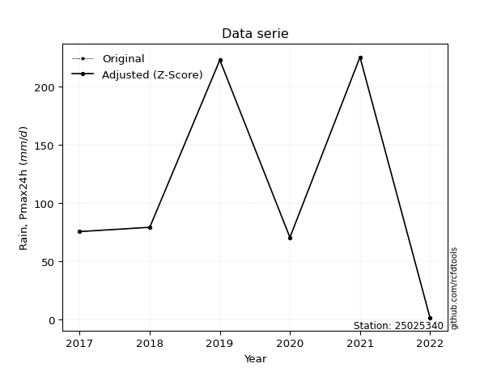</img>

</div>


> The initial value (value_initial) correspond to the initial obtained or null completed value, and value (value) is adjusted only when the initial value is outside the valid range (outlier) definite through the Z-Score value. If Z-Score is active, values out of range or outliers are replaced with the station mean value. A Z-Score (or standard score) measures how many standard deviations a data point is from the mean of a dataset, indicating its relative position; positive scores mean above the mean, negative mean below, and a score of zero is exactly at the mean, allowing for comparison of values from different distributions. It´s calculated using the formula $z=(x–μ)/σ$, where $x$ is the data point, $μ$ is the mean, and $σ$ is the standard deviation, helping identify outliers and understand probability.
>
> <sub>**Note**: In this study, "completing" (filling gaps in) and "extending" (forecasting or lengthening the historical record) rainfall data series are avoided for certain critical analyses because they introduce artificial bias and uncertainty, which can distort the statistics of rare events (extremes), alter day-to-day variability, and compromise the integrity and homogeneity of the original data. Some reasons against Completing/Extending rainfall data are: **Distortion of Extremes and Variability**: The primary issue is that most gap-filling or extension methods rely on averaging or regression with nearby stations, which inherently smooths the data. Rainfall is highly variable in space and time, with a large percentage of zero values and occasional large storms. Infilling methods often underestimate the highest values and overestimate the lowest (zero) values, which severely distorts analyses focused on flood frequency, drought severity, and intensity-duration-frequency (IDF) curves, **Loss of Data Homogeneity**: Infilled or extended data are synthetic estimates, not actual measurements. Combining these estimates with observed data can violate the assumption of data homogeneity, which requires that the data properties do not change over time. Inhomogeneity can lead to incorrect conclusions about long-term trends or changes in climate patterns, **Propagation of Errors**: Errors and biases from the original data (e.g., wind-induced undercatch, instrument errors, site changes) or the data used for imputation can propagate through the analysis, leading to unreliable hydrological models and inaccurate predictions, **Compromised Statistical Integrity**: For statistical analyses, especially those involving the frequency of events, using artificial data can introduce time bias or autocorrelation that doesn´t exist in reality, making it difficult to assess the true probability of events, **Difficulty in Validation**: It is difficult to accurately validate the quality of filled or extended data, especially for past periods where ground-truth measurements are unavailable. The reliability of imputation techniques heavily depends on the density of the surrounding station network and the complexity of the local topography.</sub>


### 4. Active continuous probability distributions from SciPy (80 of 104 available)

A Probability Density Function (PDF) describes the relative likelihood of a continuous random variable falling within a specific range, where the total area under its curve equals 1, and the area over any interval gives the actual probability for that range. Unlike discrete probabilities (like rolling a die), a PDF shows density, not direct probability for a single point (which is zero), with higher points indicating higher likelihood, often visualized as a bell curve for normal distributions.

A log of a probability density function (log-PDF) is simply the logarithm of the PDF´s value, denoted as $log(f(x))$, useful for converting multiplication of probabilities into addition, improving numerical stability with tiny numbers, and connecting to information theory concepts like entropy. Instead of dealing with very small probabilities (e.g., 0.000001), log-PDFs use negative numbers (e.g., $log(0.00001) ≈ -11.51$ that are easier for computers to handle, preventing underflow errors and simplifying complex calculations. In this study, each active probability distribution from SciPy is also evaluated in the $log$ form.

[scipy.stats](https://docs.scipy.org/doc/scipy/reference/stats.html) is a Python´s powerful submodule within the SciPy library for comprehensive statistical analysis, offering over 130 probability distributions (like Normal, Poisson, etc.), functions for descriptive stats (mean, variance), hypothesis testing (t-tests, chi-square), random variable generation, and statistical tests, making it essential for data science, modeling, and research. It provides tools to explore, model, and draw conclusions from data efficiently, working seamlessly with [NumPy](https://numpy.org/).

<div align="center">

|   id | p_dist           |   n_parameter | fit_method   | label                                                                       | active   | ref                                                                                                      |
|-----:|:-----------------|--------------:|:-------------|:----------------------------------------------------------------------------|:---------|:---------------------------------------------------------------------------------------------------------|
|    0 | alpha            |             3 | MLE          | Alpha                                                                       | True     | [:mortar_board:](https://docs.scipy.org/doc/scipy/reference/generated/scipy.stats.alpha.html)            |
|    1 | anglit           |             2 | MM           | Anglit                                                                      | True     | [:mortar_board:](https://docs.scipy.org/doc/scipy/reference/generated/scipy.stats.anglit.html)           |
|    2 | arcsine          |             2 | MM           | Arcsine                                                                     | True     | [:mortar_board:](https://docs.scipy.org/doc/scipy/reference/generated/scipy.stats.arcsine.html)          |
|    3 | argus            |             3 | MLE          | Argus                                                                       | True     | [:mortar_board:](https://docs.scipy.org/doc/scipy/reference/generated/scipy.stats.argus.html)            |
|    4 | beta             |             4 | MLE          | Beta                                                                        | True     | [:mortar_board:](https://docs.scipy.org/doc/scipy/reference/generated/scipy.stats.beta.html)             |
|    5 | betaprime        |             4 | MLE          | Beta prime                                                                  | True     | [:mortar_board:](https://docs.scipy.org/doc/scipy/reference/generated/scipy.stats.betaprime.html)        |
|    6 | bradford         |             3 | MLE          | Bradford                                                                    | True     | [:mortar_board:](https://docs.scipy.org/doc/scipy/reference/generated/scipy.stats.bradford.html)         |
|    7 | burr             |             4 | MLE          | Burr (Type III)                                                             | True     | [:mortar_board:](https://docs.scipy.org/doc/scipy/reference/generated/scipy.stats.burr.html)             |
|    8 | burr12           |             4 | MLE          | Burr (Type III) 12                                                          | True     | [:mortar_board:](https://docs.scipy.org/doc/scipy/reference/generated/scipy.stats.burr12.html)           |
|    9 | cosine           |             2 | MLE          | Cosine                                                                      | True     | [:mortar_board:](https://docs.scipy.org/doc/scipy/reference/generated/scipy.stats.cosine.html)           |
|   10 | crystalball      |             4 | MLE          | Crystalball                                                                 | True     | [:mortar_board:](https://docs.scipy.org/doc/scipy/reference/generated/scipy.stats.crystalball.html)      |
|   11 | dgamma           |             3 | MLE          | Double gamma                                                                | True     | [:mortar_board:](https://docs.scipy.org/doc/scipy/reference/generated/scipy.stats.dgamma.html)           |
|   12 | dweibull         |             3 | MLE          | Double Weibull                                                              | True     | [:mortar_board:](https://docs.scipy.org/doc/scipy/reference/generated/scipy.stats.dweibull.html)         |
|   13 | erlang           |             3 | MLE          | Erlang                                                                      | True     | [:mortar_board:](https://docs.scipy.org/doc/scipy/reference/generated/scipy.stats.erlang.html)           |
|   14 | exponnorm        |             3 | MLE          | Exponentially modified Normal                                               | True     | [:mortar_board:](https://docs.scipy.org/doc/scipy/reference/generated/scipy.stats.exponnorm.html)        |
|   15 | exponpow         |             3 | MLE          | Exponential power                                                           | True     | [:mortar_board:](https://docs.scipy.org/doc/scipy/reference/generated/scipy.stats.exponpow.html)         |
|   16 | exponweib        |             4 | MLE          | Exponentiated Weibull                                                       | True     | [:mortar_board:](https://docs.scipy.org/doc/scipy/reference/generated/scipy.stats.exponweib.html)        |
|   17 | f                |             4 | MLE          | F                                                                           | True     | [:mortar_board:](https://docs.scipy.org/doc/scipy/reference/generated/scipy.stats.f.html)                |
|   18 | fatiguelife      |             3 | MLE          | Fatigue-life (Birnbaum-Saunders)                                            | True     | [:mortar_board:](https://docs.scipy.org/doc/scipy/reference/generated/scipy.stats.fatiguelife.html)      |
|   19 | foldnorm         |             3 | MM           | Fold Normal                                                                 | True     | [:mortar_board:](https://docs.scipy.org/doc/scipy/reference/generated/scipy.stats.foldnorm.html)         |
|   20 | gamma            |             3 | MLE          | Gamma                                                                       | True     | [:mortar_board:](https://docs.scipy.org/doc/scipy/reference/generated/scipy.stats.gamma.html)            |
|   21 | gausshyper       |             6 | MLE          | Gauss hypergeometric                                                        | True     | [:mortar_board:](https://docs.scipy.org/doc/scipy/reference/generated/scipy.stats.gausshyper.html)       |
|   22 | genexpon         |             5 | MLE          | Generalized exponential                                                     | True     | [:mortar_board:](https://docs.scipy.org/doc/scipy/reference/generated/scipy.stats.genexpon.html)         |
|   23 | genextreme       |             3 | MLE          | Generalized exponential                                                     | True     | [:mortar_board:](https://docs.scipy.org/doc/scipy/reference/generated/scipy.stats.genextreme.html)       |
|   24 | gengamma         |             4 | MLE          | Generalized gamma                                                           | True     | [:mortar_board:](https://docs.scipy.org/doc/scipy/reference/generated/scipy.stats.gengamma.html)         |
|   25 | genhalflogistic  |             3 | MLE          | Generalized half-logistic                                                   | True     | [:mortar_board:](https://docs.scipy.org/doc/scipy/reference/generated/scipy.stats.genhalflogistic.html)  |
|   26 | genlogistic      |             3 | MLE          | Generalized logistic                                                        | True     | [:mortar_board:](https://docs.scipy.org/doc/scipy/reference/generated/scipy.stats.genlogistic.html)      |
|   27 | gennorm          |             3 | MLE          | Generalized Normal                                                          | True     | [:mortar_board:](https://docs.scipy.org/doc/scipy/reference/generated/scipy.stats.gennorm.html)          |
|   28 | genpareto        |             3 | MLE          | Generalized Pareto                                                          | True     | [:mortar_board:](https://docs.scipy.org/doc/scipy/reference/generated/scipy.stats.genpareto.html)        |
|   29 | gompertz         |             3 | MLE          | Gompertz (or truncated Gumbel)                                              | True     | [:mortar_board:](https://docs.scipy.org/doc/scipy/reference/generated/scipy.stats.gompertz.html)         |
|   30 | gumbel_l         |             2 | MM           | Gumbel Left Skew                                                            | True     | [:mortar_board:](https://docs.scipy.org/doc/scipy/reference/generated/scipy.stats.gumbel_l.html)         |
|   31 | gumbel_r         |             2 | MM           | Gumbel Right Skew                                                           | True     | [:mortar_board:](https://docs.scipy.org/doc/scipy/reference/generated/scipy.stats.gumbel_r.html)         |
|   32 | halfgennorm      |             3 | MLE          | Upper half of a generalized normal                                          | True     | [:mortar_board:](https://docs.scipy.org/doc/scipy/reference/generated/scipy.stats.halfgennorm.html)      |
|   33 | halflogistic     |             2 | MM           | Half-logistic                                                               | True     | [:mortar_board:](https://docs.scipy.org/doc/scipy/reference/generated/scipy.stats.halflogistic.html)     |
|   34 | halfnorm         |             2 | MM           | Half Normal                                                                 | True     | [:mortar_board:](https://docs.scipy.org/doc/scipy/reference/generated/scipy.stats.halfnorm.html)         |
|   35 | hypsecant        |             2 | MM           | hyperbolic secant                                                           | True     | [:mortar_board:](https://docs.scipy.org/doc/scipy/reference/generated/scipy.stats.hypsecant.html)        |
|   36 | invgamma         |             3 | MLE          | Inverted gamma                                                              | True     | [:mortar_board:](https://docs.scipy.org/doc/scipy/reference/generated/scipy.stats.invgamma.html)         |
|   37 | invgauss         |             3 | MLE          | Inverse Gaussian                                                            | True     | [:mortar_board:](https://docs.scipy.org/doc/scipy/reference/generated/scipy.stats.invgauss.html)         |
|   38 | invweibull       |             3 | MLE          | Inverted Weibull                                                            | True     | [:mortar_board:](https://docs.scipy.org/doc/scipy/reference/generated/scipy.stats.invweibull.html)       |
|   39 | johnsonsb        |             4 | MLE          | Johnson SB                                                                  | True     | [:mortar_board:](https://docs.scipy.org/doc/scipy/reference/generated/scipy.stats.johnsonsb.html)        |
|   40 | johnsonsu        |             4 | MLE          | Johnson Su                                                                  | True     | [:mortar_board:](https://docs.scipy.org/doc/scipy/reference/generated/scipy.stats.johnsonsu.html)        |
|   41 | kappa3           |             3 | MLE          | Kappa 3                                                                     | True     | [:mortar_board:](https://docs.scipy.org/doc/scipy/reference/generated/scipy.stats.kappa3.html)           |
|   42 | kappa4           |             4 | MLE          | Kappa 4                                                                     | True     | [:mortar_board:](https://docs.scipy.org/doc/scipy/reference/generated/scipy.stats.kappa4.html)           |
|   43 | ksone            |             3 | MLE          | Kolmogorov-Smirnov one-sided test statistic distribution                    | True     | [:mortar_board:](https://docs.scipy.org/doc/scipy/reference/generated/scipy.stats.ksone.html)            |
|   44 | kstwobign        |             2 | MLE          | Limiting distribution of scaled Kolmogorov-Smirnov two-sided test statistic | True     | [:mortar_board:](https://docs.scipy.org/doc/scipy/reference/generated/scipy.stats.kstwobign.html)        |
|   45 | laplace          |             2 | MM           | Laplace                                                                     | True     | [:mortar_board:](https://docs.scipy.org/doc/scipy/reference/generated/scipy.stats.laplace.html)          |
|   46 | levy_l           |             2 | MLE          | Left-skewed Levy                                                            | True     | [:mortar_board:](https://docs.scipy.org/doc/scipy/reference/generated/scipy.stats.levy_l.html)           |
|   47 | loggamma         |             3 | MLE          | Log gamma                                                                   | True     | [:mortar_board:](https://docs.scipy.org/doc/scipy/reference/generated/scipy.stats.loggamma.html)         |
|   48 | logistic         |             2 | MM           | Logistic (or Sech-squared)                                                  | True     | [:mortar_board:](https://docs.scipy.org/doc/scipy/reference/generated/scipy.stats.logistic.html)         |
|   49 | loglaplace       |             3 | MLE          | Log-Laplace                                                                 | True     | [:mortar_board:](https://docs.scipy.org/doc/scipy/reference/generated/scipy.stats.loglaplace.html)       |
|   50 | lomax            |             3 | MLE          | Lomax (Pareto of the second kind)                                           | True     | [:mortar_board:](https://docs.scipy.org/doc/scipy/reference/generated/scipy.stats.lomax.html)            |
|   51 | maxwell          |             2 | MM           | Maxwell                                                                     | True     | [:mortar_board:](https://docs.scipy.org/doc/scipy/reference/generated/scipy.stats.maxwell.html)          |
|   52 | mielke           |             4 | MLE          | Mielke Beta-Kappa / Dagum                                                   | True     | [:mortar_board:](https://docs.scipy.org/doc/scipy/reference/generated/scipy.stats.mielke.html)           |
|   53 | moyal            |             2 | MM           | Moyal                                                                       | True     | [:mortar_board:](https://docs.scipy.org/doc/scipy/reference/generated/scipy.stats.moyal.html)            |
|   54 | nakagami         |             3 | MLE          | Nakagami                                                                    | True     | [:mortar_board:](https://docs.scipy.org/doc/scipy/reference/generated/scipy.stats.nakagami.html)         |
|   55 | ncf              |             5 | MLE          | Non-central F distribution                                                  | True     | [:mortar_board:](https://docs.scipy.org/doc/scipy/reference/generated/scipy.stats.ncf.html)              |
|   56 | nct              |             4 | MLE          | Non-central Student’s t                                                     | True     | [:mortar_board:](https://docs.scipy.org/doc/scipy/reference/generated/scipy.stats.nct.html)              |
|   57 | norm             |             2 | MM           | Normal                                                                      | True     | [:mortar_board:](https://docs.scipy.org/doc/scipy/reference/generated/scipy.stats.norm.html)             |
|   58 | pearson3         |             3 | MM           | Pearson type III                                                            | True     | [:mortar_board:](https://docs.scipy.org/doc/scipy/reference/generated/scipy.stats.pearson3.html)         |
|   59 | powerlaw         |             3 | MLE          | Power-function                                                              | True     | [:mortar_board:](https://docs.scipy.org/doc/scipy/reference/generated/scipy.stats.powerlaw.html)         |
|   60 | rayleigh         |             2 | MM           | Rayleigh                                                                    | True     | [:mortar_board:](https://docs.scipy.org/doc/scipy/reference/generated/scipy.stats.rayleigh.html)         |
|   61 | rdist            |             3 | MLE          | R-distributed (symmetric beta)                                              | True     | [:mortar_board:](https://docs.scipy.org/doc/scipy/reference/generated/scipy.stats.rdist.html)            |
|   62 | rice             |             3 | MLE          | Rice                                                                        | True     | [:mortar_board:](https://docs.scipy.org/doc/scipy/reference/generated/scipy.stats.rice.html)             |
|   63 | semicircular     |             2 | MM           | Semicircular                                                                | True     | [:mortar_board:](https://docs.scipy.org/doc/scipy/reference/generated/scipy.stats.semicircular.html)     |
|   64 | skewnorm         |             3 | MLE          | Skew normal                                                                 | True     | [:mortar_board:](https://docs.scipy.org/doc/scipy/reference/generated/scipy.stats.skewnorm.html)         |
|   65 | t                |             3 | MLE          | Student’s t                                                                 | True     | [:mortar_board:](https://docs.scipy.org/doc/scipy/reference/generated/scipy.stats.t.html)                |
|   66 | trapezoid        |             4 | MLE          | Trapezoid                                                                   | True     | [:mortar_board:](https://docs.scipy.org/doc/scipy/reference/generated/scipy.stats.trapezoid.html)        |
|   67 | triang           |             3 | MLE          | Triangular                                                                  | True     | [:mortar_board:](https://docs.scipy.org/doc/scipy/reference/generated/scipy.stats.triang.html)           |
|   68 | truncexpon       |             3 | MLE          | Truncated exponential                                                       | True     | [:mortar_board:](https://docs.scipy.org/doc/scipy/reference/generated/scipy.stats.truncexpon.html)       |
|   69 | truncnorm        |             4 | MLE          | Truncated normal                                                            | True     | [:mortar_board:](https://docs.scipy.org/doc/scipy/reference/generated/scipy.stats.truncnorm.html)        |
|   70 | truncpareto      |             4 | MLE          | Upper truncated Pareto                                                      | True     | [:mortar_board:](https://docs.scipy.org/doc/scipy/reference/generated/scipy.stats.truncpareto.html)      |
|   71 | truncweibull_min |             5 | MLE          | Doubly truncated Weibull minimum                                            | True     | [:mortar_board:](https://docs.scipy.org/doc/scipy/reference/generated/scipy.stats.truncweibull_min.html) |
|   72 | tukeylambda      |             3 | MLE          | Tukey-Lamdba                                                                | True     | [:mortar_board:](https://docs.scipy.org/doc/scipy/reference/generated/scipy.stats.tukeylambda.html)      |
|   73 | uniform          |             2 | MLE          | Uniform                                                                     | True     | [:mortar_board:](https://docs.scipy.org/doc/scipy/reference/generated/scipy.stats.uniform.html)          |
|   74 | vonmises         |             3 | MLE          | Von Mises                                                                   | True     | [:mortar_board:](https://docs.scipy.org/doc/scipy/reference/generated/scipy.stats.vonmises.html)         |
|   75 | vonmises_line    |             3 | MLE          | Von Mises line                                                              | True     | [:mortar_board:](https://docs.scipy.org/doc/scipy/reference/generated/scipy.stats.vonmises_line.html)    |
|   76 | wald             |             2 | MM           | Wald                                                                        | True     | [:mortar_board:](https://docs.scipy.org/doc/scipy/reference/generated/scipy.stats.wald.html)             |
|   77 | weibull_max      |             3 | MLE          | Weibull maximum                                                             | True     | [:mortar_board:](https://docs.scipy.org/doc/scipy/reference/generated/scipy.stats.weibull_max.html)      |
|   78 | weibull_min      |             3 | MLE          | Weibull minimum                                                             | True     | [:mortar_board:](https://docs.scipy.org/doc/scipy/reference/generated/scipy.stats.weibull_min.html)      |
|   79 | wrapcauchy       |             3 | MLE          | Wrapped  Cauchy                                                             | True     | [:mortar_board:](https://docs.scipy.org/doc/scipy/reference/generated/scipy.stats.wrapcauchy.html)       |

</div>

> **n_parameter:** # arguments & localization & scale.
>
> **Fit methods:** (MLE) maximum likelihood, (MM) L-moments.
>
>**Inactive** (With the only purpose of prevent loops, zero divisions, infinite values, over high estimated values or horizontal trending for recurrence intervals estimations, the follow distributions were disabled.)**:** lognorm, norminvgauss, powernorm, powerlognorm, cauchy, halfcauchy, foldcauchy, skewcauchy, chi2, expon, fisk, genhyperbolic, geninvgauss, gibrat, kstwo, laplace_asymmetric, levy, levy_stable, ncx2, pareto, rel_breitwigner, recipinvgauss, studentized_range, loguniform, 


## B. Probability (PDF) vs. Empirical (EDF) distributions functions

A continuous probability distribution (CPD) describes probabilities for variables that can take any value within a range (like rain any time), unlike discrete variables with specific outcomes (like temperature). It uses a Probability Density Function (PDF), a curve where the total area under it equals 1, and the probability of the variable falling within an interval (a to b) is found by calculating the area under the curve between those points. A key feature is that the probability of hitting any single exact value is zero, so probabilities are always expressed for ranges, e.g., $P(a ≤ X ≤ b)$.

<div align="center">

Distributions parameters from station values
|     |   station | p_dist              |   n |              loc |           scale | shape                  | shape1                 | shape2                | shape3             |
|----:|----------:|:--------------------|----:|-----------------:|----------------:|:-----------------------|:-----------------------|:----------------------|:-------------------|
|   0 |  25025340 | alpha               |   7 |   -302.928       |  2183.35        | 5.425386116518258      |                        |                       |                    |
|   1 |  25025340 | anglit              |   7 |    111.657       |   225.164       |                        |                        |                       |                    |
|   2 |  25025340 | arcsine             |   7 |      2.80726     |   217.7         |                        |                        |                       |                    |
|   3 |  25025340 | argus               |   7 |    -53.7496      |   298.784       | 2.982123600590161e-07  |                        |                       |                    |
|   4 |  25025340 | beta                |   7 |    -27.1567      |   252.557       | 0.799311881976625      | 0.4504200710101631     |                       |                    |
|   5 |  25025340 | betaprime           |   7 |    -40.6309      |     3.0138e+06  | 3.566549201002614      | 70655.8762351976       |                       |                    |
|   6 |  25025340 | bradford            |   7 |      1.59999     |   223.8         | 0.6700010766347932     |                        |                       |                    |
|   7 |  25025340 | burr                |   7 |     -0.963815    |   231.347       | 157.6445997799854      | 0.0051254061943412105  |                       |                    |
|   8 |  25025340 | burr12              |   7 |    -11.3962      |  4649.22        | 1.5591143536887553     | 245.8273949978543      |                       |                    |
|   9 |  25025340 | cosine              |   7 |    115.453       |    62.9185      |                        |                        |                       |                    |
|  10 |  25025340 | crystalball         |   7 |    111.395       |    75.9488      | 10470.395357285484     | 2.0531798499367997     |                       |                    |
|  11 |  25025340 | dgamma              |   7 |     70.7         |    65.8822      | 0.6558656887299431     |                        |                       |                    |
|  12 |  25025340 | dweibull            |   7 |     75.7         |    74.3186      | 0.7465566397965626     |                        |                       |                    |
|  13 |  25025340 | erlang              |   7 |    -36.1431      |    45.1222      | 3.2755570708064363     |                        |                       |                    |
|  14 |  25025340 | exponnorm           |   7 |     34.4645      |    35.6896      | 2.162888465708355      |                        |                       |                    |
|  15 |  25025340 | exponpow            |   7 |      1.6         |     3.5547      | 0.0905275727175468     |                        |                       |                    |
|  16 |  25025340 | exponweib           |   7 |   -161.927       |    94.4349      | 20.170352028721716     | 1.2019932342348847     |                       |                    |
|  17 |  25025340 | f                   |   7 |      1.151       |   100.023       | 1.7319246058062374     | 23.764163249556304     |                       |                    |
|  18 |  25025340 | fatiguelife         |   7 |      1.6         |     0.000162107 | 682.3969255141528      |                        |                       |                    |
|  19 |  25025340 | foldnorm            |   7 |    -18.5398      |    85.693       | 1.4543516149069724     |                        |                       |                    |
|  20 |  25025340 | gamma               |   7 |    -36.1431      |    45.1222      | 3.2755573900253436     |                        |                       |                    |
|  21 |  25025340 | gausshyper          |   7 |     -7.52047     |   232.92        | 1.260396015489476      | 0.6415271070733396     | 0.7352128895725054    | 0.9577753928752843 |
|  22 |  25025340 | genexpon            |   7 |      1.6         |     2.48355     | 0.02255871226338977    | 4.704268149927658e-06  | 2.1131858959561516    |                    |
|  23 |  25025340 | genextreme          |   7 |     77.6256      |    65.0151      | 0.07286616452897535    |                        |                       |                    |
|  24 |  25025340 | gengamma            |   7 |      1.20859     |   181.766       | 0.4544490232359484     | 2.104416543189367      |                       |                    |
|  25 |  25025340 | genhalflogistic     |   7 |    -20.8145      |   312.338       | 1.2685599118375204     |                        |                       |                    |
|  26 |  25025340 | genlogistic         |   7 |   -291.114       |    63.2707      | 327.11862832577117     |                        |                       |                    |
|  27 |  25025340 | gennorm             |   7 |     75.7         |     4.41245     | 0.40287825306461494    |                        |                       |                    |
|  28 |  25025340 | genpareto           |   7 |     -2.04908     |   402.27        | -1.7686160827321424    |                        |                       |                    |
|  29 |  25025340 | gompertz            |   7 |    105.9         |     9.51888     | 5.983866210864728e-06  |                        |                       |                    |
|  30 |  25025340 | gumbel_l            |   7 |    146.297       |    60.0121      |                        |                        |                       |                    |
|  31 |  25025340 | gumbel_r            |   7 |     77.0172      |    60.0121      |                        |                        |                       |                    |
|  32 |  25025340 | halfgennorm         |   7 |      1.6         |     3.65104     | 0.3477674883892864     |                        |                       |                    |
|  33 |  25025340 | halflogistic        |   7 |     20.4316      |    65.8054      |                        |                        |                       |                    |
|  34 |  25025340 | halfnorm            |   7 |      9.78103     |   127.683       |                        |                        |                       |                    |
|  35 |  25025340 | hypsecant           |   7 |    111.657       |    48.9997      |                        |                        |                       |                    |
|  36 |  25025340 | invgamma            |   7 |   -208.692       |  5446.07        | 17.988555798082444     |                        |                       |                    |
|  37 |  25025340 | invgauss            |   7 |   -121.912       |  1991.33        | 0.11729323031546589    |                        |                       |                    |
|  38 |  25025340 | invweibull          |   7 |      1.6         |     4.38564     | 0.056410992211390704   |                        |                       |                    |
|  39 |  25025340 | johnsonsb           |   7 |    -42.469       |   267.869       | -0.26952073610791105   | 0.07700813868453882    |                       |                    |
|  40 |  25025340 | johnsonsu           |   7 |      3.69328e+09 |     2.52984e+08 | 161399969.37324584     | 47818511.352954        |                       |                    |
|  41 |  25025340 | kappa3              |   7 |      1.6         |   223.699       | 3847.764259797408      |                        |                       |                    |
|  42 |  25025340 | kappa4              |   7 |    -18.8927      |   258.325       | 1.0862252625906261     | 1.057438733385657      |                       |                    |
|  43 |  25025340 | ksone               |   7 |    -21.6562      |   266.627       | 1.0                    |                        |                       |                    |
|  44 |  25025340 | kstwobign           |   7 |   -149.548       |   299.704       |                        |                        |                       |                    |
|  45 |  25025340 | laplace             |   7 |    111.657       |    54.425       |                        |                        |                       |                    |
|  46 |  25025340 | levy_l              |   7 |    230.787       |    20.3426      |                        |                        |                       |                    |
|  47 |  25025340 | loggamma            |   7 | -20790.6         |  2892.04        | 1377.1812297189372     |                        |                       |                    |
|  48 |  25025340 | logistic            |   7 |    111.657       |    42.435       |                        |                        |                       |                    |
|  49 |  25025340 | loglaplace          |   7 |     -0.218956    |    79.619       | 1.1109224250729102     |                        |                       |                    |
|  50 |  25025340 | lomax               |   7 |      1.6         |     1.88532e+11 | 1684745876.028007      |                        |                       |                    |
|  51 |  25025340 | maxwell             |   7 |    -70.7259      |   114.292       |                        |                        |                       |                    |
|  52 |  25025340 | mielke              |   7 |      1.6         |   224.304       | 0.6159267429815902     | 385.98881045735527     |                       |                    |
|  53 |  25025340 | moyal               |   7 |     67.6416      |    34.648       |                        |                        |                       |                    |
|  54 |  25025340 | nakagami            |   7 |      1.6         |   122.287       | 0.23243896880962497    |                        |                       |                    |
|  55 |  25025340 | ncf                 |   7 |      1.6         |    16.7338      | 0.8954418316382069     | 101.86272008541422     | 5.540513997260707     |                    |
|  56 |  25025340 | nct                 |   7 |     -0.251617    |     0.0894472   | 0.2995908496846906     | 54.736159429969405     |                       |                    |
|  57 |  25025340 | norm                |   7 |    111.657       |    76.9685      |                        |                        |                       |                    |
|  58 |  25025340 | pearson3            |   7 |    111.657       |    76.9685      | 0.4280179701271684     |                        |                       |                    |
|  59 |  25025340 | powerlaw            |   7 |      1.6         |   223.8         | 0.153622412556241      |                        |                       |                    |
|  60 |  25025340 | rayleigh            |   7 |    -35.5881      |   117.485       |                        |                        |                       |                    |
|  61 |  25025340 | rdist               |   7 |    -20.9039      |   126.804       | 1.027480849994332      |                        |                       |                    |
|  62 |  25025340 | rice                |   7 |    -29.3963      |   107.117       | 0.5003308927876182     |                        |                       |                    |
|  63 |  25025340 | semicircular        |   7 |    111.657       |   153.937       |                        |                        |                       |                    |
|  64 |  25025340 | skewnorm            |   7 |     20.4707      |   119.328       | 3.4147676378436724     |                        |                       |                    |
|  65 |  25025340 | t                   |   7 |    111.648       |    76.9716      | 4499932.478058541      |                        |                       |                    |
|  66 |  25025340 | trapezoid           |   7 |    -21.819       |   268.56        | 1.0                    | 1.0                    |                       |                    |
|  67 |  25025340 | triang              |   7 |    -68.6625      |   294.063       | 0.9999991276430011     |                        |                       |                    |
|  68 |  25025340 | truncexpon          |   7 |     -3.06497     |   269.234       | 0.8485741879327382     |                        |                       |                    |
|  69 |  25025340 | truncnorm           |   7 |      4.68807     |    12.4742      | -8.600623887440474     | 17.693436256252767     |                       |                    |
|  70 |  25025340 | truncpareto         |   7 |      1.49153     |     0.108471    | 0.16791917751199922    | 2064.2219734109817     |                       |                    |
|  71 |  25025340 | truncweibull_min    |   7 |     -2.66613     |   270.986       | 1.0524816797245613     | 0.00023511088088218085 | 0.8416172668170601    |                    |
|  72 |  25025340 | tukeylambda         |   7 |    113.322       |   124.499       | 1.1108238486966637     |                        |                       |                    |
|  73 |  25025340 | uniform             |   7 |      1.6         |   223.8         |                        |                        |                       |                    |
|  74 |  25025340 | vonmises            |   7 |      0.308686    |     1           | 0.17515095687998125    |                        |                       |                    |
|  75 |  25025340 | vonmises_line       |   7 |    113.5         |    35.6189      | 0.007099087677533799   |                        |                       |                    |
|  76 |  25025340 | wald                |   7 |     34.6886      |    76.9685      |                        |                        |                       |                    |
|  77 |  25025340 | weibull_max         |   7 |    225.4         |     1.76585     | 0.22750082744560352    |                        |                       |                    |
|  78 |  25025340 | weibull_min         |   7 |    -12.152       |   137.258       | 1.57718755180644       |                        |                       |                    |
|  79 |  25025340 | wrapcauchy          |   7 |      1.5999      |    35.6189      | 0.14695860947653888    |                        |                       |                    |
|  80 |  25025340 | logalpha            |   7 |    -30.6583      |   723.037       | 20.86630072197859      |                        |                       |                    |
|  81 |  25025340 | loganglit           |   7 |      4.13097     |     4.56999     |                        |                        |                       |                    |
|  82 |  25025340 | logarcsine          |   7 |      1.92175     |     4.41847     |                        |                        |                       |                    |
|  83 |  25025340 | logargus            |   7 |     -1.81559     |     7.37838     | 3.0021239498239796     |                        |                       |                    |
|  84 |  25025340 | logbeta             |   7 |     -0.0259573   |     5.44383     | 0.5848078577235023     | 0.12977637049424606    |                       |                    |
|  85 |  25025340 | logbetaprime        |   7 |     -2.79897     |     4.28921e+11 | 10.276526353644497     | 628056072137.1791      |                       |                    |
|  86 |  25025340 | logbradford         |   7 |     -0.0328904   |     5.45079     | 0.0017274933423418242  |                        |                       |                    |
|  87 |  25025340 | logburr             |   7 |     -3.18219     |     8.63554     | 824.7935598355084      | 0.006112935708454376   |                       |                    |
|  88 |  25025340 | logburr12           |   7 |  -7414.44        |  7430.89        | 7798.249938417022      | 222319.89271806343     |                       |                    |
|  89 |  25025340 | logcosine           |   7 |      3.76109     |     1.4355      |                        |                        |                       |                    |
|  90 |  25025340 | logcrystalball      |   7 |      4.13097     |     1.56218     | 43.06285557501877      | 214.35283802608197     |                       |                    |
|  91 |  25025340 | logdgamma           |   7 |      4.3745      |     1.23884     | 0.7546486210748771     |                        |                       |                    |
|  92 |  25025340 | logdweibull         |   7 |      4.3745      |     1.17581     | 0.8255429081344585     |                        |                       |                    |
|  93 |  25025340 | logerlang           |   7 |    -19.3554      |     0.123787    | 189.45157887049223     |                        |                       |                    |
|  94 |  25025340 | logexponnorm        |   7 |      4.12996     |     1.56218     | 0.0006606424583485493  |                        |                       |                    |
|  95 |  25025340 | logexponpow         |   7 |     -8.72044e+07 |     8.72044e+07 | 80148355.82082923      |                        |                       |                    |
|  96 |  25025340 | logexponweib        |   7 |     -1.9173e+06  |     1.91731e+06 | 0.0625278574901088     | 22429279.44419515      |                       |                    |
|  97 |  25025340 | logf                |   7 |  -2941.1         |  2945.23        | 17557578.93418861      | 11807125.781134948     |                       |                    |
|  98 |  25025340 | logfatiguelife      |   7 |  -1002.56        |  1006.69        | 0.0015461121196254021  |                        |                       |                    |
|  99 |  25025340 | logfoldnorm         |   7 |      0.055231    |     1.32037     | 3.1238708874642716     |                        |                       |                    |
| 100 |  25025340 | loggamma            |   7 |    -21.0022      |     0.106705    | 235.48697967232084     |                        |                       |                    |
| 101 |  25025340 | loggausshyper       |   7 |     -0.0316771   |     5.44955     | 1.2919890006579953     | 0.5926591131526315     | 0.9840274093689201    | 0.8943975586319541 |
| 102 |  25025340 | loggenexpon         |   7 |      0.0793091   |     0.0289965   | 0.0008285441200178521  | 4.82023200625601       | 1.632723171792301e-05 |                    |
| 103 |  25025340 | loggenextreme       |   7 |      4.41475     |     1.18426     | 1.180577173868555      |                        |                       |                    |
| 104 |  25025340 | loggengamma         |   7 |     -6.0037e+06  |     6.00371e+06 | 0.01727630607507915    | 260514718.92645818     |                       |                    |
| 105 |  25025340 | loggenhalflogistic  |   7 |     -0.0253105   |     6.1787      | 1.1351260887144976     |                        |                       |                    |
| 106 |  25025340 | loggenlogistic      |   7 |      5.41794     |     3.17476e-06 | 2.4731084784993883e-06 |                        |                       |                    |
| 107 |  25025340 | loggennorm          |   7 |      4.3745      |     0.0169472   | 0.3419188875852024     |                        |                       |                    |
| 108 |  25025340 | loggenpareto        |   7 |     -0.0135425   |    14.1794      | -2.6106269809727536    |                        |                       |                    |
| 109 |  25025340 | loggompertz         |   7 |      0.470003    |     0.923078    | 0.009921217116831773   |                        |                       |                    |
| 110 |  25025340 | loggumbel_l         |   7 |      4.83404     |     1.21802     |                        |                        |                       |                    |
| 111 |  25025340 | loggumbel_r         |   7 |      3.42791     |     1.21802     |                        |                        |                       |                    |
| 112 |  25025340 | loghalfgennorm      |   7 |      0.470004    |     5.17886     | 61.116886554222134     |                        |                       |                    |
| 113 |  25025340 | loghalflogistic     |   7 |      2.27947     |     1.33559     |                        |                        |                       |                    |
| 114 |  25025340 | loghalfnorm         |   7 |      2.06329     |     2.59147     |                        |                        |                       |                    |
| 115 |  25025340 | loghypsecant        |   7 |      4.13097     |     0.994512    |                        |                        |                       |                    |
| 116 |  25025340 | loginvgamma         |   7 |    -26.9665      | 10259.1         | 330.95193197922913     |                        |                       |                    |
| 117 |  25025340 | loginvgauss         |   7 |    -12.9595      |  1605.14        | 0.010655630509345926   |                        |                       |                    |
| 118 |  25025340 | loginvweibull       |   7 |     -2.15193e+08 |     2.15193e+08 | 112659037.4501574      |                        |                       |                    |
| 119 |  25025340 | logjohnsonsb        |   7 |     -0.0561402   |     5.47402     | -1.3493907956117934    | 0.1327347620122284     |                       |                    |
| 120 |  25025340 | logjohnsonsu        |   7 |      5.41788     |     1.32216e-13 | 3.7607595089362498     | 0.1508573304986518     |                       |                    |
| 121 |  25025340 | logkappa3           |   7 |      0.470003    |     4.94788     | 3934916.802666041      |                        |                       |                    |
| 122 |  25025340 | logkappa4           |   7 |     -0.0160684   |     7.19548     | 1.0733293352082751     | 1.323557692622639      |                       |                    |
| 123 |  25025340 | logksone            |   7 |     -0.0247837   |     5.93745     | 1.0                    |                        |                       |                    |
| 124 |  25025340 | logkstwobign        |   7 |     -3.81941     |     9.09797     |                        |                        |                       |                    |
| 125 |  25025340 | loglaplace          |   7 |      4.13097     |     1.10463     |                        |                        |                       |                    |
| 126 |  25025340 | loglevy_l           |   7 |      5.45712     |     0.141654    |                        |                        |                       |                    |
| 127 |  25025340 | logloggamma         |   7 |      5.41807     |     5.13849e-06 | 3.98755503496313e-06   |                        |                       |                    |
| 128 |  25025340 | loglogistic         |   7 |      4.13097     |     0.861273    |                        |                        |                       |                    |
| 129 |  25025340 | logloglaplace       |   7 |     -0.00203308  |     4.37653     | 2.5452344564729463     |                        |                       |                    |
| 130 |  25025340 | loglomax            |   7 |      0.470004    |     2.944e+12   | 767841117257.0015      |                        |                       |                    |
| 131 |  25025340 | logmaxwell          |   7 |      0.429272    |     2.3197      |                        |                        |                       |                    |
| 132 |  25025340 | logmielke           |   7 |     -3.792e+07   |     3.792e+07   | 29447924.71984669      | 254380397402.784       |                       |                    |
| 133 |  25025340 | logmoyal            |   7 |      3.23762     |     0.703226    |                        |                        |                       |                    |
| 134 |  25025340 | lognakagami         |   7 |      0.470004    |     3.84133     | 0.36718533139251247    |                        |                       |                    |
| 135 |  25025340 | logncf              |   7 |     -0.3149      |     2.59467e-06 | 1.1507753527243417e-05 | 119.24691558271331     | 19.621689379652828    |                    |
| 136 |  25025340 | lognct              |   7 |   -109.695       |     1.51806     | 42826.37281350611      | 74.97978316299788      |                       |                    |
| 137 |  25025340 | lognorm             |   7 |      4.13097     |     1.56218     |                        |                        |                       |                    |
| 138 |  25025340 | logpearson3         |   7 |      4.13097     |     1.56219     | -1.6744607839809853    |                        |                       |                    |
| 139 |  25025340 | logpowerlaw         |   7 |      0.470004    |     4.94787     | 0.17521997240524573    |                        |                       |                    |
| 140 |  25025340 | lograyleigh         |   7 |      1.14247     |     2.38449     |                        |                        |                       |                    |
| 141 |  25025340 | logrdist            |   7 |      1.16786     |     0.697858    | 1.4777282616213956     |                        |                       |                    |
| 142 |  25025340 | logrice             |   7 |   -351.444       |     1.56219     | 227.61165593700298     |                        |                       |                    |
| 143 |  25025340 | logsemicircular     |   7 |      4.13097     |     3.12434     |                        |                        |                       |                    |
| 144 |  25025340 | logskewnorm         |   7 |      5.41788     |     2.02397     | -13391127.337340862    |                        |                       |                    |
| 145 |  25025340 | logt                |   7 |      4.34272     |     0.105809    | 0.48734426525593       |                        |                       |                    |
| 146 |  25025340 | logtrapezoid        |   7 |     -0.301904    |     6.62775     | 1.0                    | 1.0                    |                       |                    |
| 147 |  25025340 | logtriang           |   7 |     -0.295611    |     5.71351     | 0.9999982653455358     |                        |                       |                    |
| 148 |  25025340 | logtruncexpon       |   7 |     -0.0225178   |     9.42455     | 0.5772576261692342     |                        |                       |                    |
| 149 |  25025340 | logtruncnorm        |   7 |      1.49551     |     4.08452     | -0.2510712369910603    | 57.90610478241535      |                       |                    |
| 150 |  25025340 | logtruncpareto      |   7 |      0.465944    |     0.00405942  | 0.1677895187584354     | 1219.8627325362415     |                       |                    |
| 151 |  25025340 | logtruncweibull_min |   7 |      0.0195759   |     9.63386     | 2.2774874474087796     | 0.006357257419279662   | 0.5603464117149429    |                    |
| 152 |  25025340 | logtukeylambda      |   7 |      0.470013    |     1.39851e-05 | 1.523861781617547      |                        |                       |                    |
| 153 |  25025340 | loguniform          |   7 |      0.470004    |     4.94787     |                        |                        |                       |                    |
| 154 |  25025340 | logvonmises         |   7 |     -1.37043     |     1           | 2.05232815499894       |                        |                       |                    |
| 155 |  25025340 | logvonmises_line    |   7 |      4.50257     |     1.28361     | 1.6902104882891984     |                        |                       |                    |
| 156 |  25025340 | logwald             |   7 |      2.56882     |     1.56216     |                        |                        |                       |                    |
| 157 |  25025340 | logweibull_max      |   7 |      5.41788     |     1.92007     | 0.18057469894057634    |                        |                       |                    |
| 158 |  25025340 | logweibull_min      |   7 |     -7.88405e+07 |     7.88405e+07 | 89911681.61782372      |                        |                       |                    |
| 159 |  25025340 | logwrapcauchy       |   7 |      0.470003    |     0.787479    | 0.5731440021373424     |                        |                       |                    |

</div>

> **loc** (Location parameter): This shifts the distribution along the x-axis. For many common distributions, like the normal (Gaussian) distribution, loc represents the mean $μ$. For others, like the uniform distribution, it might represent the minimum value, or for the beta distribution, the left end of the support interval.
>
> **scale** (Scale parameter): This determines the width or spread of the distribution. For the normal distribution, scale represents the standard deviation $σ$. For a uniform distribution, it defines the length of the interval (from $loc$ to $loc + scale$).
>
> **shape** (Shape parameters): Refers to parameters that define the specific form of a probability distribution, distinct from its location (loc) and scale (scale). These parameters are required arguments for most distribution functions. For example, a normal (Gaussian) distribution is fully defined by its location (mean) and scale (standard deviation), so it has no specific shape parameters beyond loc and scale. However, other distributions have intrinsic properties that need specification, as Gamma distribution that takes a shape parameter, often named $a$ or $alpha$.


### 0. Cumulative distribution values - CDF (160 evaluated)

Cumulative Distribution Function (CDF), denoted as $F$<sub>$X$</sub>$(x)$, is a function that gives the probability that a random variable $X$ will take a value less than or equal to a specific value, $x$ (i.e., $(P(X≥x)$. It essentially "accumulates" probabilities from a given point up to the far right (positive infinity), providing a complete picture of the distribution´s probabilities for both discrete (like rain) and continuous (like temperature) variables, helping to find probabilities over ranges or above certain values. Each station is evaluated separately ordering the $x$ values ascending, calculating the CDF and PDF values for the activated distributions and their logarithmic forms.

<div align="center">

CDF ordered by x ascending and calculating $log(f(x))$ separately
|   id |   Station |   date |     x |   count |    mean |     std |     zscore |   Value_initial |   station |   m |     alpha |   alpha_pdf |   anglit |   anglit_pdf |   arcsine |   arcsine_pdf |     argus |   argus_pdf |      beta |        beta_pdf |   betaprime |   betaprime_pdf |    bradford |   bradford_pdf |      burr |     burr_pdf |    burr12 |   burr12_pdf |    cosine |   cosine_pdf |   crystalball |   crystalball_pdf |   dgamma |     dgamma_pdf |   dweibull |   dweibull_pdf |    erlang |   erlang_pdf |   exponnorm |   exponnorm_pdf |   exponpow |   exponpow_pdf |   exponweib |   exponweib_pdf |          f |      f_pdf |   fatiguelife |   fatiguelife_pdf |   foldnorm |   foldnorm_pdf |     gamma |   gamma_pdf |   gausshyper |   gausshyper_pdf |    genexpon |   genexpon_pdf |   genextreme |   genextreme_pdf |   gengamma |   gengamma_pdf |   genhalflogistic |   genhalflogistic_pdf |   genlogistic |   genlogistic_pdf |   gennorm |   gennorm_pdf |   genpareto |   genpareto_pdf |    gompertz |   gompertz_pdf |   gumbel_l |   gumbel_l_pdf |   gumbel_r |   gumbel_r_pdf |   halfgennorm |   halfgennorm_pdf |   halflogistic |   halflogistic_pdf |   halfnorm |   halfnorm_pdf |   hypsecant |   hypsecant_pdf |   invgamma |   invgamma_pdf |   invgauss |   invgauss_pdf |   invweibull |   invweibull_pdf |   johnsonsb |   johnsonsb_pdf |   johnsonsu |   johnsonsu_pdf |     kappa3 |   kappa3_pdf |      kappa4 |   kappa4_pdf |     ksone |   ksone_pdf |   kstwobign |   kstwobign_pdf |   laplace |   laplace_pdf |   levy_l |   levy_l_pdf |   loggamma |   loggamma_pdf |   logistic |   logistic_pdf |   loglaplace |   loglaplace_pdf |       lomax |   lomax_pdf |   maxwell |   maxwell_pdf |      mielke |   mielke_pdf |      moyal |   moyal_pdf |   nakagami |   nakagami_pdf |         ncf |       ncf_pdf |       nct |     nct_pdf |      norm |   norm_pdf |   pearson3 |   pearson3_pdf |   powerlaw |   powerlaw_pdf |   rayleigh |   rayleigh_pdf |    rdist |      rdist_pdf |      rice |   rice_pdf |   semicircular |   semicircular_pdf |   skewnorm |   skewnorm_pdf |         t |      t_pdf |   trapezoid |   trapezoid_pdf |    triang |   triang_pdf |   truncexpon |   truncexpon_pdf |   truncnorm |   truncnorm_pdf |   truncpareto |   truncpareto_pdf |   truncweibull_min |   truncweibull_min_pdf |   tukeylambda |   tukeylambda_pdf |   uniform |   uniform_pdf |   vonmises |   vonmises_pdf |   vonmises_line |   vonmises_line_pdf |     wald |    wald_pdf |   weibull_max |   weibull_max_pdf |   weibull_min |   weibull_min_pdf |   wrapcauchy |   wrapcauchy_pdf |   logalpha |   logalpha_pdf |   loganglit |   loganglit_pdf |   logarcsine |   logarcsine_pdf |   logargus |   logargus_pdf |   logbeta |   logbeta_pdf |   logbetaprime |   logbetaprime_pdf |   logbradford |   logbradford_pdf |   logburr |   logburr_pdf |   logburr12 |   logburr12_pdf |   logcosine |   logcosine_pdf |   logcrystalball |   logcrystalball_pdf |   logdgamma |   logdgamma_pdf |   logdweibull |   logdweibull_pdf |   logerlang |   logerlang_pdf |   logexponnorm |   logexponnorm_pdf |   logexponpow |   logexponpow_pdf |   logexponweib |   logexponweib_pdf |      logf |   logf_pdf |   logfatiguelife |   logfatiguelife_pdf |   logfoldnorm |   logfoldnorm_pdf |   loggausshyper |   loggausshyper_pdf |   loggenexpon |   loggenexpon_pdf |   loggenextreme |   loggenextreme_pdf |   loggengamma |   loggengamma_pdf |   loggenhalflogistic |   loggenhalflogistic_pdf |   loggenlogistic |   loggenlogistic_pdf |   loggennorm |   loggennorm_pdf |   loggenpareto |   loggenpareto_pdf |   loggompertz |   loggompertz_pdf |   loggumbel_l |   loggumbel_l_pdf |   loggumbel_r |   loggumbel_r_pdf |   loghalfgennorm |   loghalfgennorm_pdf |   loghalflogistic |   loghalflogistic_pdf |   loghalfnorm |   loghalfnorm_pdf |   loghypsecant |   loghypsecant_pdf |   loginvgamma |   loginvgamma_pdf |   loginvgauss |   loginvgauss_pdf |   loginvweibull |   loginvweibull_pdf |   logjohnsonsb |   logjohnsonsb_pdf |   logjohnsonsu |   logjohnsonsu_pdf |   logkappa3 |   logkappa3_pdf |   logkappa4 |   logkappa4_pdf |   logksone |   logksone_pdf |   logkstwobign |   logkstwobign_pdf |   loglevy_l |   loglevy_l_pdf |   logloggamma |   logloggamma_pdf |   loglogistic |   loglogistic_pdf |   logloglaplace |   logloglaplace_pdf |    loglomax |   loglomax_pdf |   logmaxwell |   logmaxwell_pdf |   logmielke |   logmielke_pdf |    logmoyal |   logmoyal_pdf |   lognakagami |   lognakagami_pdf |     logncf |   logncf_pdf |     lognct |   lognct_pdf |    lognorm |   lognorm_pdf |   logpearson3 |   logpearson3_pdf |   logpowerlaw |   logpowerlaw_pdf |   lograyleigh |   lograyleigh_pdf |    logrdist |   logrdist_pdf |    logrice |   logrice_pdf |   logsemicircular |   logsemicircular_pdf |   logskewnorm |   logskewnorm_pdf |      logt |   logt_pdf |   logtrapezoid |   logtrapezoid_pdf |   logtriang |   logtriang_pdf |   logtruncexpon |   logtruncexpon_pdf |   logtruncnorm |   logtruncnorm_pdf |   logtruncpareto |   logtruncpareto_pdf |   logtruncweibull_min |   logtruncweibull_min_pdf |   logtukeylambda |   logtukeylambda_pdf |   loguniform |   loguniform_pdf |   logvonmises |   logvonmises_pdf |   logvonmises_line |   logvonmises_line_pdf |   logwald |   logwald_pdf |   logweibull_max |   logweibull_max_pdf |   logweibull_min |   logweibull_min_pdf |   logwrapcauchy |   logwrapcauchy_pdf |
|-----:|----------:|-------:|------:|--------:|--------:|--------:|-----------:|----------------:|----------:|----:|----------:|------------:|---------:|-------------:|----------:|--------------:|----------:|------------:|----------:|----------------:|------------:|----------------:|------------:|---------------:|----------:|-------------:|----------:|-------------:|----------:|-------------:|--------------:|------------------:|---------:|---------------:|-----------:|---------------:|----------:|-------------:|------------:|----------------:|-----------:|---------------:|------------:|----------------:|-----------:|-----------:|--------------:|------------------:|-----------:|---------------:|----------:|------------:|-------------:|-----------------:|------------:|---------------:|-------------:|-----------------:|-----------:|---------------:|------------------:|----------------------:|--------------:|------------------:|----------:|--------------:|------------:|----------------:|------------:|---------------:|-----------:|---------------:|-----------:|---------------:|--------------:|------------------:|---------------:|-------------------:|-----------:|---------------:|------------:|----------------:|-----------:|---------------:|-----------:|---------------:|-------------:|-----------------:|------------:|----------------:|------------:|----------------:|-----------:|-------------:|------------:|-------------:|----------:|------------:|------------:|----------------:|----------:|--------------:|---------:|-------------:|-----------:|---------------:|-----------:|---------------:|-------------:|-----------------:|------------:|------------:|----------:|--------------:|------------:|-------------:|-----------:|------------:|-----------:|---------------:|------------:|--------------:|----------:|------------:|----------:|-----------:|-----------:|---------------:|-----------:|---------------:|-----------:|---------------:|---------:|---------------:|----------:|-----------:|---------------:|-------------------:|-----------:|---------------:|----------:|-----------:|------------:|----------------:|----------:|-------------:|-------------:|-----------------:|------------:|----------------:|--------------:|------------------:|-------------------:|-----------------------:|--------------:|------------------:|----------:|--------------:|-----------:|---------------:|----------------:|--------------------:|---------:|------------:|--------------:|------------------:|--------------:|------------------:|-------------:|-----------------:|-----------:|---------------:|------------:|----------------:|-------------:|-----------------:|-----------:|---------------:|----------:|--------------:|---------------:|-------------------:|--------------:|------------------:|----------:|--------------:|------------:|----------------:|------------:|----------------:|-----------------:|---------------------:|------------:|----------------:|--------------:|------------------:|------------:|----------------:|---------------:|-------------------:|--------------:|------------------:|---------------:|-------------------:|----------:|-----------:|-----------------:|---------------------:|--------------:|------------------:|----------------:|--------------------:|--------------:|------------------:|----------------:|--------------------:|--------------:|------------------:|---------------------:|-------------------------:|-----------------:|---------------------:|-------------:|-----------------:|---------------:|-------------------:|--------------:|------------------:|--------------:|------------------:|--------------:|------------------:|-----------------:|---------------------:|------------------:|----------------------:|--------------:|------------------:|---------------:|-------------------:|--------------:|------------------:|--------------:|------------------:|----------------:|--------------------:|---------------:|-------------------:|---------------:|-------------------:|------------:|----------------:|------------:|----------------:|-----------:|---------------:|---------------:|-------------------:|------------:|----------------:|--------------:|------------------:|--------------:|------------------:|----------------:|--------------------:|------------:|---------------:|-------------:|-----------------:|------------:|----------------:|------------:|---------------:|--------------:|------------------:|-----------:|-------------:|-----------:|-------------:|-----------:|--------------:|--------------:|------------------:|--------------:|------------------:|--------------:|------------------:|------------:|---------------:|-----------:|--------------:|------------------:|----------------------:|--------------:|------------------:|----------:|-----------:|---------------:|-------------------:|------------:|----------------:|----------------:|--------------------:|---------------:|-------------------:|-----------------:|---------------------:|----------------------:|--------------------------:|-----------------:|---------------------:|-------------:|-----------------:|--------------:|------------------:|-------------------:|-----------------------:|----------:|--------------:|-----------------:|---------------------:|-----------------:|---------------------:|----------------:|--------------------:|
|    0 |  25025340 |   2022 |   1.6 |       7 | 111.657 | 83.1355 | -1.32383   |             1.6 |  25025340 |   1 | 0.0405597 |  0.00205185 | 0.085428 |   0.00248279 |  0        |    0          | 0.0510318 |  0.00182784 | 0.0897501 |      0.00258964 |   0.0354503 |      0.00237224 | 8.14595e-08 |     0.00583777 | 0.0263069 | nan          | 0.0253367 |   0.00300057 | 0.0573626 |   0.00193136 |     0.0741393 |        0.00184748 | 0.103825 |    0.00190393  |   0.184344 |    0.00185319  | 0.0346764 |   0.00244405 |   0.0366666 |      0.00183826 |  0.0341172 |    1.39041e+13 |    0.042979 |      0.00208169 | 0.00854687 | 0.016447   |      0.101943 |       5.24317e+08 |  0.0657857 |     0.00333115 | 0.0346764 |  0.00244405 |    0.0141857 |       0.0019496  | 1.90226e-08 |     0.00908324 |    0.0463475 |       0.00201773 | 0.00317891 |     0.00776717 |         0.0376038 |            0.00175867 |     0.0412965 |        0.00207002 |  0.14021  |   0.00154183  |  0.00910309 |      0.00250343 | 0           |    0           |  0.0858071 |     0.00136665 |  0.0297833 |     0.00174386 |   5.59913e-13 |       0.0532537   |       0        |         0          |   0        |     0          |   0.0671131 |      0.00135954 |  0.0425698 |     0.00206844 |  0.0398313 |     0.00216577 |  0.000247699 |      5.22514e+11 |    0.346547 |     0.000771887 |   0.0775697 |      0.00187598 | 8.5951e-11 |   0.00446071 | 0.000295125 |   0.00783927 | 0.0872239 |  0.00375056 |   0.0388892 |      0.0022387  | 0.0661832 |    0.00121604 | 0.234241 |  0.000496084 | 0.00993321 |       0.01798  |  0.0695548 |     0.00152508 |    0.0181812 |        0.0164592 | 4.78965e-12 |  0.00893611 | 0.0598525 |    0.00228837 | 2.72847e-06 |   8.09625    | 0.00949844 |  0.00103386 | 4.4279e-09 |    9.27035e+06 | 4.70927e-07 | 2047.69       | 0.0350823 | 0.0612728   | 0.0763731 | 0.00186473 |  0.0623159 |     0.00203887 | 0.00171503 |    1.18655e+12 |  0.0488632 |     0.00256262 | 0.557857 |     0.00259786 | 0.0362733 | 0.00229788 |      0.0873345 |         0.0028915  |  0.0410417 |     0.00194532 | 0.0763992 | 0.00186514 |  0.00760421 |     0.000649405 | 0.0570909 |   0.00162507 |     0.030032 |       0.00638217 |    0.402239 |     0.0310162   |      0        |       2.14287     |          0.0219776 |             0.0054535  |    0.00196729 |        0.00535096 |  0        |    0.00446828 |   0.732525 |       0.16576  |     1.47161e-07 |          0.00443661 | 0        | 0           |     0.0493443 |       0.000150929 |     0.0262037 |        0.00296553 |   6.1645e-07 |       0.00600783 | 0.00910509 |      0.0183225 |    0        |        0        |     0        |         0        |  0.0143476 |      0.0150986 | 0.0501404 |    0.0623224  |      0.0195302 |          0.0365787 |      0.092333 |          0.183589 | 0.0130514 |    nan        |    0.011317 |       0.0118345 |    0.015655 |       0.0376106 |       0.00955175 |            0.0163909 |   0.0124597 |       0.0106845 |     0.0338261 |          0.019263 |   0.0130561 |       0.0220714 |     0.00955169 |          0.0163908 |     0.0129189 |         0.0118729 |      0.0253686 |          0.0185565 | 0.0096609 |  0.0165188 |       0.00923882 |            0.0160371 |    0.00218608 |        0.00665286 |       0.0382636 |           0.0969761 |     0.0181405 |         0.0639584 |       0.0209805 |            0.013879 |     0.0236525 |         0.0177313 |            0.0420001 |                 0.088867 |         0        |             0.016504 |    0.0209169 |       0.00876538 |      0.0350863 |        0.0747008   |   2.29844e-09 |          0.010748 |     0.0274128 |         0.0221946 |   1.18727e-05 |       0.000110549 |         0        |             0.194882 |          0        |              0        |      0        |          0        |      0.0160353 |          0.0161169 |     0.0111577 |         0.0202557 |     0.0107153 |         0.0205977 |       0.0148079 |           0.0326573 |      0.0497926 |        0.0286904   |       0.144892 |        0.00694572  | 3.25106e-08 |        0.202106 |  1.3659e-15 |        1.74942  |  0.0833333 |       0.168423 |      0.0206655 |          0.0486609 |    0.133838 |       0.0132918 |     0.0214983 |          0.016683 |     0.0140546 |         0.0160891 |      0.00172717 |          0.00931297 | 3.32999e-16 |      0.260816  |   1.4397e-06 |      0.000106032 |   0.0214239 |       0.0166374 | 8.37227e-13 |    3.10479e-11 |   3.34338e-13 |      4423.04      | 0.00866507 |    0.0270608 | 0.00965481 |    0.0165569 | 0.00955171 |     0.0163909 |     0.0332642 |         0.0233206 |    0.00107156 |       3.38235e+12 |      0        |          0        | 7.60021e-13 |        7247.92 | 0.00955176 |     0.0163909 |          0        |              0        |     0.0144998 |         0.0198613 | 0.0556777 | 0.00700499 |      0.0135643 |          0.0351449 |   0.0179562 |       0.0469067 |        0.1161   |            0.22962  |    4.45794e-15 |           0.157967 |         0        |           59.3439    |            0.00393884 |                 0.0201205 |      6.94073e-09 |                71501 |     0        |         0.202107 |      0.978595 |         0.0389563 |        2.74771e-11 |              0.0123488 |  0        |     0         |         0.305316 |          0.0132197   |       0.00755077 |           0.00857849 |     2.76326e-07 |            0.744849 |
|    1 |  25025340 |   2020 |  70.7 |       7 | 111.657 | 83.1355 | -0.492655  |            70.7 |  25025340 |   2 | 0.337881  |  0.00571699 | 0.322086 |   0.00415055 |  0.377206 |    0.00315626 | 0.248597  |  0.0038021  | 0.259628  |      0.00248107 |   0.35241   |      0.00565028 | 0.366653    |     0.00483712 | 0.387936  |   0.00437389 | 0.364888  |   0.00547036 | 0.282897  |   0.00444572 |     0.296043  |        0.00455037 | 0.5      | 1360.01        |   0.437586 |    0.00871158  | 0.356666  |   0.00564128 |   0.351025  |      0.00639948 |  0.932751  |    0.000426357 |    0.340153 |      0.0057538  | 0.511038   | 0.00447371 |      0.830654 |       0.00174756  |  0.333532  |     0.0044817  | 0.356666  |  0.00564128 |    0.205542  |       0.00325966 | 0.466225    |     0.00484942 |    0.328918  |       0.00558212 | 0.432301   |     0.00542835 |         0.181145  |            0.00246422 |     0.342085  |        0.00579023 |  0.415627 |   0.0121484   |  0.19582    |      0.0029392  | 0           |    0           |  0.247038  |     0.00356004 |  0.329228  |     0.006095   |   0.556383    |       0.0033025   |       0.364398 |         0.00658924 |   0.366718 |     0.0055767  |   0.260408  |      0.00474119 |  0.336021  |     0.00567949 |  0.342887  |     0.005681   |  0.424877    |      0.000296893 |    0.384534 |     0.000450229 |   0.298391  |      0.00448025 | 0.308235   |   0.00446071 | 0.324872    |   0.00437235 | 0.346388  |  0.00375056 |   0.347356  |      0.00562833 | 0.235583  |    0.00432859 | 0.278513 |  0.000833657 | 0.540947   |       0.241472 |  0.275843  |     0.00470729 |    0.554494  |        0.403309  | 0.460701    |  0.00481923 | 0.324909  |    0.0049712  | 0.484217    |   0.00431609 | 0.338656   |  0.00697049 | 0.592007   |    0.00374933  | 0.342228    |    0.00503699 | 0.638053  | 0.00152736  | 0.297318  | 0.00449893 |  0.315018  |     0.00499865 | 0.834822   |    0.00185597  |  0.335844  |     0.00511437 | 0.760988 |     0.00366169 | 0.320135  | 0.00524984 |      0.332638  |         0.00398652 |  0.333001  |     0.00565878 | 0.297369  | 0.0044991  |  0.11868    |     0.00256554  | 0.224601  |   0.00322326 |     0.418993 |       0.00493747 |    1        |     2.65423e-08 |      0.916262 |       0.00113544  |          0.394694  |             0.00497995 |    0.314722   |        0.00436835 |  0.308758 |    0.00446828 |  11.73     |       0.166179 |     0.307703    |          0.00447968 | 0.336061 | 0.0119671   |     0.0628826 |       0.00025583  |     0.363041  |        0.00546911 |   0.349956   |       0.00387686 | 0.56311    |      0.233627  |    0.527879 |        0.218478 |     0.518376 |         0.144322 |  0.388723  |      0.329583  | 0.263994  |    0.089998   |      0.548571  |          0.17972   |      0.787431 |          0.183369 | 0.471946  |      0.3198   |    0.45725  |       0.348647  |    0.609188 |       0.215153  |       0.532517   |            0.254527  |   0.412553  |       0.53886   |     0.431288  |          0.453544 |   0.547441  |       0.231389  |     0.532513   |          0.254527  |     0.406784  |         0.348698  |      0.405311  |          0.296474  | 0.531642  |  0.253684  |       0.532835   |            0.255414  |    0.523716   |        0.30161    |       0.598395  |           0.209662  |     0.607873  |         0.164416  |       0.322871  |            0.266662 |     0.404846  |         0.303496  |            0.592282  |                 0.246639 |         0        |             0.31569  |    0.33902   |       0.783452   |      0.446522  |        0.182857    |   0.446343    |          0.360555 |     0.463883  |         0.274393  |   0.603101    |       0.250381    |         0.7383   |             0.194882 |          0.629667 |              0.225938 |      0.603044 |          0.215073 |      0.540688  |          0.317455  |     0.545308  |         0.23035   |     0.546184  |         0.223251  |       0.560073  |           0.169972  |      0.120004  |        0.0290559   |       0.200539 |        0.0364857   | 0.765667    |        0.202106 |  0.684253   |        0.208374 |  0.721392  |       0.168423 |      0.590311  |          0.155658  |    0.268978 |       0.107848  |     0.406615  |          0.31554  |     0.536933  |         0.288684  |      0.466942   |          0.278954   | 0.627712    |      0.0971054 |   0.563984   |      0.239969    |   0.406076  |       0.315351  | 0.628435    |    0.244199    |   0.703407    |         0.10447   | 0.56776    |    0.182701  | 0.532878   |    0.253674  | 0.532517   |     0.254527  |     0.420711  |         0.257868  |    0.954293   |       0.0441372   |      0.574217 |          0.233342 | 1           |           0    | 0.532517   |     0.254527  |          0.525967 |              0.203592 |     0.566746  |         0.334563  | 0.329566  | 1.3611     |      0.473439  |          0.207633  |   0.635318  |       0.279012  |        0.832413 |            0.153615 |    0.583756    |           0.129686 |         0.980054 |            0.0201605 |            0.608916   |                 0.302614  |      1           |                    0 |     0.765671 |         0.202107 |      1.20059  |         0.342959  |        0.412312    |              0.351956  |  0.698758 |     0.226334  |         0.401344 |          0.0570649   |       0.434549   |           0.367652   |     0.592617    |            0.111626 |
|    2 |  25025340 |   2017 |  75.7 |       7 | 111.657 | 83.1355 | -0.432513  |            75.7 |  25025340 |   3 | 0.36652   |  0.00573251 | 0.343008 |   0.00421661 |  0.392838 |    0.00309823 | 0.267906  |  0.00392069 | 0.272083  |      0.00250113 |   0.38061   |      0.00562508 | 0.39069     |     0.00477786 | 0.409663  |   0.00431762 | 0.392099  |   0.005411   | 0.305443  |   0.00457076 |     0.319184  |        0.00470354 | 0.599279 |    0.0124361   |   0.5      |   48.3814      | 0.384789  |   0.0056034  |   0.383016  |      0.00638687 |  0.934793  |    0.000391196 |    0.369012 |      0.00578364 | 0.532818   | 0.00424094 |      0.839099 |       0.0016326   |  0.356116  |     0.00455019 | 0.384789  |  0.0056034  |    0.221976  |       0.0033141  | 0.48993     |     0.00463406 |    0.356997  |       0.00564369 | 0.459124   |     0.00530043 |         0.19364   |            0.00253419 |     0.371089  |        0.00580535 |  0.5      |   0.034773    |  0.210621   |      0.00298147 | 0           |    0           |  0.265373  |     0.00377513 |  0.359805  |     0.0061286  |   0.572339    |       0.00308422  |       0.396879 |         0.00640136 |   0.394335 |     0.00546928 |   0.284936  |      0.00506899 |  0.364517  |     0.00571304 |  0.371321  |     0.00568724 |  0.42631     |      0.000276701 |    0.386775 |     0.00044634  |   0.321163  |      0.00462632 | 0.330538   |   0.00446071 | 0.346692    |   0.00435568 | 0.365141  |  0.00375056 |   0.375475  |      0.00561456 | 0.258252  |    0.0047451  | 0.282777 |  0.000872506 | 0.557393   |       0.239804 |  0.29999   |     0.00494865 |    0.581218  |        0.379117  | 0.484267    |  0.00460865 | 0.349954  |    0.00504328 | 0.505507    |   0.00420183 | 0.373349   |  0.0068967  | 0.610304   |    0.00357178  | 0.367286    |    0.00498355 | 0.645359  | 0.00139812  | 0.32019   | 0.00464735 |  0.340284  |     0.00510363 | 0.84383    |    0.00174941  |  0.361509  |     0.00514803 | 0.779872 |     0.00390171 | 0.346518  | 0.00529983 |      0.35266   |         0.00402118 |  0.361325  |     0.00566492 | 0.320242  | 0.00464748 |  0.131855   |     0.00270419  | 0.241006  |   0.00333891 |     0.443452 |       0.00484662 |    1        |     2.93671e-09 |      0.921711 |       0.00104661  |          0.419412  |             0.00490726 |    0.336545   |        0.00436094 |  0.331099 |    0.00446828 |  12.4987   |       0.188175 |     0.330112    |          0.00448372 | 0.393121 | 0.0108585   |     0.0641915 |       0.000267868 |     0.39026   |        0.0054155  |   0.369023   |       0.0037527  | 0.578988   |      0.231035  |    0.542794 |        0.218016 |     0.528248 |         0.144651 |  0.411887  |      0.348537  | 0.270286  |    0.0942621  |      0.560787  |          0.177813  |      0.799961 |          0.183365 | 0.494209  |      0.331837 |    0.481397 |       0.357941  |    0.623826 |       0.213244  |       0.549873   |            0.253378  |   0.454223  |       0.70815   |     0.465739  |          0.571909 |   0.563195  |       0.229666  |     0.549869   |          0.253377  |     0.431197  |         0.365848  |      0.426085  |          0.311669  | 0.548804  |  0.252567  |       0.55025    |            0.254229  |    0.544285   |        0.30028    |       0.612885  |           0.21452   |     0.619032  |         0.162168  |       0.341706  |            0.284852 |     0.426125  |         0.319449  |            0.609377  |                 0.253792 |         0        |             0.332949 |    0.407019  |       1.29932    |      0.459251  |        0.18984     |   0.471334    |          0.370733 |     0.482826  |         0.279972  |   0.619971    |       0.243343    |         0.751617 |             0.194882 |          0.644858 |              0.21869  |      0.617576 |          0.210249 |      0.562269  |          0.313962  |     0.560986  |         0.228466  |     0.561372  |         0.221217  |       0.571599  |           0.167374  |      0.122046  |        0.0307572   |       0.203118 |        0.0390685   | 0.779478    |        0.202106 |  0.698586   |        0.211163 |  0.732901  |       0.168423 |      0.600866  |          0.153257  |    0.276665 |       0.117354  |     0.428759  |          0.332724 |     0.556592  |         0.286549  |      0.486241   |          0.285898   | 0.634288    |      0.0953825 |   0.580272   |      0.236708    |   0.428206  |       0.332537  | 0.644813    |    0.235154    |   0.710483    |         0.102632  | 0.580156   |    0.180099  | 0.550175   |    0.252505  | 0.549873   |     0.253378  |     0.438646  |         0.26709   |    0.957287   |       0.0434912   |      0.590035 |          0.2296   | 1           |           0    | 0.549873   |     0.253378  |          0.539872 |              0.203361 |     0.589826  |         0.340902  | 0.460128  | 2.44581    |      0.487733  |          0.210744  |   0.654527  |       0.283199  |        0.842872 |            0.152506 |    0.592567    |           0.128209 |         0.981417 |            0.0197444 |            0.629748   |                 0.307099  |      1           |                    0 |     0.779481 |         0.202107 |      1.22502  |         0.372075  |        0.436549    |              0.35715   |  0.713743 |     0.212436  |         0.405361 |          0.0605776   |       0.460082   |           0.379502   |     0.600572    |            0.12146  |
|    3 |  25025340 |   2018 |  79.4 |       7 | 111.657 | 83.1355 | -0.388007  |            79.4 |  25025340 |   4 | 0.387715  |  0.00572122 | 0.358691 |   0.00426016 |  0.404232 |    0.00306184 | 0.28257   |  0.00400565 | 0.281367  |      0.00251785 |   0.401361  |      0.00558929 | 0.408288    |     0.00473494 | 0.425566  |   0.00427872 | 0.412021  |   0.00535612 | 0.322513  |   0.00465504 |     0.336781  |        0.00480677 | 0.639698 |    0.00971657  |   0.550509 |    0.00965821  | 0.405444  |   0.0055591  |   0.406571  |      0.00634032 |  0.936197  |    0.000368316 |    0.390416 |      0.00578292 | 0.548207   | 0.00407853 |      0.844994 |       0.00155473  |  0.373035  |     0.00459473 | 0.405444  |  0.0055591  |    0.234313  |       0.00335415 | 0.506791    |     0.00448087 |    0.377929  |       0.00566755 | 0.478556   |     0.00520301 |         0.203116  |            0.00258827 |     0.392552  |        0.00579329 |  0.567622 |   0.0136993   |  0.221712   |      0.00301407 | 0           |    0           |  0.279641  |     0.00393723 |  0.382482  |     0.00612532 |   0.583476    |       0.00293766  |       0.420296 |         0.00625596 |   0.414418 |     0.0053858  |   0.30413   |      0.0053046  |  0.385666  |     0.00571586 |  0.39234   |     0.00567163 |  0.427309    |      0.000263434 |    0.388422 |     0.000444302 |   0.338465  |      0.00472476 | 0.347043   |   0.00446071 | 0.362787    |   0.00434457 | 0.379018  |  0.00375056 |   0.396201  |      0.00558638 | 0.276419  |    0.0050789  | 0.286062 |  0.000903239 | 0.568804   |       0.238404 |  0.318613  |     0.00511603 |    0.598924  |        0.363087  | 0.50104     |  0.00445876 | 0.368692  |    0.00508333 | 0.520908    |   0.00412392 | 0.398707   |  0.00680585 | 0.623291   |    0.00344958  | 0.385637    |    0.00493498 | 0.650374  | 0.00131439  | 0.337573  | 0.00474741 |  0.359287  |     0.00516612 | 0.85017    |    0.00167873  |  0.380582  |     0.00516029 | 0.794707 |     0.00412465 | 0.366173  | 0.00532267 |      0.367581  |         0.00404377 |  0.382258  |     0.00564743 | 0.337625  | 0.00474751 |  0.14205    |     0.00280679  | 0.253519  |   0.00342448 |     0.461262 |       0.00478047 |    1        |     5.19329e-10 |      0.925475 |       0.000988789 |          0.437469  |             0.00485329 |    0.352671   |        0.00435619 |  0.347632 |    0.00446828 |  13.0738   |       0.136052 |     0.346707    |          0.00448651 | 0.431816 | 0.0100643   |     0.0652    |       0.000277388 |     0.410206  |        0.00536457 |   0.382755   |       0.00367129 | 0.589966   |      0.229026  |    0.553187 |        0.217577 |     0.535158 |         0.144965 |  0.428845  |      0.362228  | 0.274862  |    0.0975601  |      0.569239  |          0.176403  |      0.808711 |          0.183362 | 0.510249  |      0.340444 |    0.498621 |       0.363852  |    0.633968 |       0.211772  |       0.561939   |            0.252292  |   0.5       |    1720.2       |     0.5       |        152.576    |   0.574122  |       0.228258  |     0.561936   |          0.252291  |     0.448941  |         0.377829  |      0.44122   |          0.32274   | 0.560807  |  0.251505  |       0.562356   |            0.253116  |    0.558583   |        0.29888    |       0.623209  |           0.218179  |     0.626732  |         0.160554  |       0.355621  |            0.298487 |     0.441645  |         0.331083  |            0.621613  |                 0.259041 |         0        |             0.345559 |    0.5       |       5.39896    |      0.468436  |        0.19515     |   0.489183    |          0.377223 |     0.496274  |         0.283588  |   0.631464    |       0.238331    |         0.760917 |             0.194882 |          0.655174 |              0.213669 |      0.627528 |          0.206859 |      0.577176  |          0.310705  |     0.571853  |         0.226952  |     0.571891  |         0.219622  |       0.579542  |           0.165512  |      0.123545  |        0.0320911   |       0.20503  |        0.041084    | 0.789122    |        0.202106 |  0.708712   |        0.213254 |  0.740938  |       0.168423 |      0.608139  |          0.151557  |    0.282441 |       0.124852  |     0.444934  |          0.345276 |     0.57022   |         0.284543  |      0.5        |          0.290782   | 0.638811    |      0.0942027 |   0.59151    |      0.23425     |   0.444373  |       0.345091  | 0.655885    |    0.2289      |   0.71535     |         0.101359  | 0.588706   |    0.178214  | 0.562199   |    0.251408  | 0.561939   |     0.252292  |     0.451547  |         0.27361   |    0.959352   |       0.0430523   |      0.600926 |          0.22685  | 1           |           0    | 0.561939   |     0.252292  |          0.549571 |              0.203141 |     0.606196  |         0.345167  | 0.577035  | 2.22981    |      0.497842  |          0.212916  |   0.668111  |       0.286122  |        0.850132 |            0.151735 |    0.598661    |           0.127166 |         0.982353 |            0.0194632 |            0.644477   |                 0.310189  |      1           |                    0 |     0.789126 |         0.202107 |      1.24326  |         0.392011  |        0.453659    |              0.35981   |  0.723661 |     0.203351  |         0.408315 |          0.0632967   |       0.478377   |           0.387149   |     0.606552    |            0.129312 |
|    4 |  25025340 |   2025 | 105.9 |       7 | 111.657 | 83.1355 | -0.0692501 |           105.9 |  25025340 |   5 | 0.533823  |  0.00519263 | 0.474442 |   0.00443541 |  0.483156 |    0.0029284  | 0.396059  |  0.00453495 | 0.350141  |      0.0026883  |   0.542871  |      0.00501069 | 0.529892    |     0.00444868 | 0.535762  |   0.00405088 | 0.546724  |   0.00475964 | 0.451762  |   0.00502998 |     0.471164  |        0.00523905 | 0.80147  |    0.00401724  |   0.699914 |    0.00378731  | 0.545569  |   0.00494321 |   0.56355   |      0.00536042 |  0.9443    |    0.000255212 |    0.539039 |      0.00531461 | 0.642809   | 0.00311389 |      0.880092 |       0.00112661  |  0.497297  |     0.00472363 | 0.545569  |  0.00494321 |    0.32705   |       0.00364924 | 0.612321    |     0.00352212 |    0.525821  |       0.00536884 | 0.606641   |     0.00444944 |         0.277456  |            0.0030444  |     0.540418  |        0.00525151 |  0.751708 |   0.00396886  |  0.305043   |      0.00328818 | 1.53143e-13 |    6.28632e-07 |  0.399564  |     0.00510367 |  0.539027  |     0.00555077 |   0.650053    |       0.00215255  |       0.571268 |         0.00511852 |   0.548427 |     0.00470707 |   0.462686  |      0.00645158 |  0.532969  |     0.00528412 |  0.537238  |     0.00516372 |  0.433309    |      0.000195993 |    0.400189 |     0.000449546 |   0.470366  |      0.00513898 | 0.465252   |   0.00446071 | 0.477103    |   0.00428958 | 0.478407  |  0.00375056 |   0.538223  |      0.00504921 | 0.449811  |    0.00826479 | 0.313489 |  0.00118842  | 0.635848   |       0.226136 |  0.466134  |     0.00586434 |    0.690972  |        0.279758  | 0.606249    |  0.0035186  | 0.504175  |    0.0050513  | 0.623981    |   0.00368482 | 0.564792   |  0.00561667 | 0.704717   |    0.0027357   | 0.510147    |    0.00442105 | 0.679189  | 0.000905171 | 0.470187  | 0.00516871 |  0.498527  |     0.00523263 | 0.889329   |    0.00130988  |  0.515764  |     0.0049638  | 1        | 74674.5        | 0.506317  | 0.00516547 |      0.476196  |         0.00413269 |  0.526361  |     0.00513738 | 0.470238  | 0.00516855 |  0.226167   |     0.00354163  | 0.352388  |   0.00403739 |     0.58191  |       0.00433236 |    1        |     1.62064e-16 |      0.947483 |       0.000702427 |          0.560962  |             0.00446794 |    0.467809   |        0.00433766 |  0.466041 |    0.00446828 |  17.2789   |       0.167661 |     0.465801    |          0.00449933 | 0.636508 | 0.0058067   |     0.0736318 |       0.00036568  |     0.545431  |        0.00478806 |   0.474701   |       0.00334017 | 0.653852   |      0.213797  |    0.615261 |        0.212925 |     0.57734  |         0.148442 |  0.545746  |      0.451004  | 0.306617  |    0.125867   |      0.618692  |          0.166703  |      0.861516 |          0.183345 | 0.616145  |      0.396006 |    0.607207 |       0.385811  |    0.69344  |       0.200592  |       0.633163   |            0.241014  |   0.663897  |       0.375276  |     0.634399  |          0.328092 |   0.638289  |       0.216435  |     0.63316    |          0.241014  |     0.567759  |         0.444936  |      0.544683  |          0.398408  | 0.631818  |  0.24042   |       0.63379    |            0.241635  |    0.642629   |        0.282622   |       0.689852  |           0.246841  |     0.671496  |         0.150133  |       0.455473  |            0.401658 |     0.548072  |         0.410867  |            0.701324  |                 0.29631  |         0        |             0.432469 |    0.754398  |       0.387629   |      0.530297  |        0.238184    |   0.602013    |          0.401513 |     0.580475  |         0.299184  |   0.695648    |       0.207269    |         0.817043 |             0.194882 |          0.712443 |              0.184348 |      0.684132 |          0.186187 |      0.662557  |          0.279228  |     0.635564  |         0.214621  |     0.633464  |         0.207218  |       0.625522  |           0.153641  |      0.134317  |        0.0441055   |       0.219152 |        0.0590018   | 0.847328    |        0.202106 |  0.772273   |        0.229274 |  0.789443  |       0.168423 |      0.650277  |          0.140998  |    0.327132 |       0.193897  |     0.55636   |          0.431745 |     0.649566  |         0.264295  |      0.574868   |          0.231976   | 0.664948    |      0.0873944 |   0.656548   |      0.216685    |   0.555749  |       0.431584  | 0.716536    |    0.192843    |   0.743453    |         0.0938533 | 0.638291   |    0.165881  | 0.633165   |    0.240119  | 0.633164   |     0.241014  |     0.536106  |         0.313728  |    0.97139    |       0.040598    |      0.663653 |          0.20823  | 1           |           0    | 0.633164   |     0.241014  |          0.607779 |              0.200791 |     0.708986  |         0.367696  | 0.813673  | 0.275283   |      0.561049  |          0.226029  |   0.753054  |       0.303767  |        0.89317  |            0.147169 |    0.63436     |           0.1207   |         0.987729 |            0.0179126 |            0.736418   |                 0.328077  |      1           |                    0 |     0.847332 |         0.202107 |      1.37161  |         0.491541  |        0.557775    |              0.358125  |  0.775298 |     0.157635  |         0.429571 |          0.0867693   |       0.59499    |           0.41747    |     0.653056    |            0.202452 |
|    5 |  25025340 |   2019 | 222.9 |       7 | 111.657 | 83.1355 |  1.33809   |           222.9 |  25025340 |   6 | 0.898523  |  0.00140073 | 0.917493 |   0.00244387 |  1        |    0          | 0.946108  |  0.00351165 | 0.890051  |      0.0198367  |   0.905041  |      0.00145507 | 0.991241    |     0.0035114  | 0.973754  |   0.00349497 | 0.901706  |   0.00151022 | 0.929456  |   0.00218429 |     0.92897   |        0.00178783 | 0.975679 |    0.000410998 |   0.905467 |    0.000798592 | 0.902551  |   0.00145115 |   0.903115  |      0.00125511 |  0.962303  |    9.58934e-05 |    0.913753 |      0.00139636 | 0.863564   | 0.00106571 |      0.956569 |       0.000356339 |  0.913572  |     0.00183903 | 0.902551  |  0.00145115 |    0.944507  |       0.0142492  | 0.866083    |     0.00121665 |    0.916441  |       0.00146917 | 0.928672   |     0.00128979 |         0.947741  |            0.0160477  |     0.907628  |        0.00139013 |  0.9289   |   0.000571455 |  0.921948   |      0.0176527  | 0.728373    |    0.0371914   |  0.972233  |     0.00165822 |  0.915799  |     0.00134227 |   0.805818    |       0.000824693 |       0.911849 |         0.00128053 |   0.904908 |     0.00155181 |   0.93448   |      0.00132773 |  0.909735  |     0.00142392 |  0.907716  |     0.00144425 |  0.448629    |      9.16653e-05 |    0.535741 |     0.0123547   |   0.924635  |      0.00183528 | 0.987154   |   0.00446071 | 0.986867    |   0.00497075 | 0.917223  |  0.00375056 |   0.908887  |      0.00151076 | 0.935243  |    0.00118984 | 0.891733 |  0.0223701   | 0.785594   |       0.172337 |  0.932232  |     0.00148876 |    0.842458  |        0.14262   | 0.861594    |  0.00123681 | 0.914208  |    0.00169926 | 0.99172     |   0.00274511 | 0.915262   |  0.00121824 | 0.909471   |    0.00101178  | 0.857099    |    0.00166771 | 0.743201  | 0.000344742 | 0.925814  | 0.00182389 |  0.917465  |     0.00165352 | 0.998276   |    0.000692985 |  0.911115  |     0.00166459 | 1        |     0          | 0.915407  | 0.00166953 |      0.916075  |         0.00285857 |  0.910192  |     0.00158594 | 0.925823  | 0.00182363 |  0.830334   |     0.00678602  | 0.983067  |   0.00674344 |     0.993019 |       0.0028054  |    1        |     1.13912e-68 |      0.999275 |       0.000291961 |          0.992577  |             0.00298245 |    0.987088   |        0.00497018 |  0.988829 |    0.00446828 |  35.9384   |       0.135019 |     0.988908    |          0.00443669 | 0.924212 | 0.0008843   |     0.338814  |       0.0333698   |     0.903286  |        0.00151594 |   0.984985   |       0.00600186 | 0.793369   |      0.158687  |    0.76488  |        0.185591 |     0.695956 |         0.17648  |  0.94325   |      0.499782  | 0.601526  |    4.64       |      0.731502  |          0.135428  |      0.997951 |          0.183302 | 0.973006  |      0.564684 |    0.870368 |       0.278351  |    0.827488 |       0.156526  |       0.792935   |            0.182962  |   0.840997  |       0.150463  |     0.796321  |          0.146291 |   0.782124  |       0.166652  |     0.792932   |          0.182963  |     0.90404   |         0.355991  |      0.928479  |          0.562992  | 0.791393  |  0.183042  |       0.793788   |            0.182955  |    0.823593   |        0.196222   |       0.974718  |           1.34372   |     0.772177  |         0.119946  |       0.978116  |            1.64366  |     0.956757  |         0.685462  |            0.991474  |                 0.670589 |         0        |             0.772211 |    0.892841  |       0.0916977  |      0.906556  |        3.20923     |   0.87452     |          0.283499 |     0.798159  |         0.265184  |   0.8212      |       0.132811    |         0.961261 |             0.184715 |          0.82451  |              0.119866 |      0.803009 |          0.133951 |      0.827814  |          0.164815  |     0.777938  |         0.164873  |     0.771085  |         0.160047  |       0.727767  |           0.121073  |      0.299016  |        4.14012     |       0.444676 |        5.34402     | 0.997741    |        0.202106 |  0.989129   |        0.600791 |  0.914788  |       0.168423 |      0.744795  |          0.113068  |    0.906361 |       3.25511   |     0.991233  |          0.769213 |     0.814759  |         0.175237  |      0.70833    |          0.137253   | 0.724061    |      0.0719691 |   0.796815   |      0.158445    |   0.99056   |       0.76925   | 0.830626    |    0.118601    |   0.806487    |         0.0758881 | 0.748585   |    0.130061  | 0.792376   |    0.182427  | 0.792935   |     0.182962  |     0.80363   |         0.391304  |    0.999605   |       0.0354792   |      0.797915 |          0.151561 | 1           |           0    | 0.792935   |     0.182962  |          0.752533 |              0.186001 |     0.995603  |         0.394212  | 0.895568  | 0.0476956  |      0.741875  |          0.259914  |   0.996093  |       0.349363  |        0.998484 |            0.135994 |    0.717687    |           0.103073 |         0.999835 |            0.0148033 |            0.995898   |                 0.367506  |      1           |                    0 |     0.997746 |         0.202107 |      1.73898  |         0.409991  |        0.788292    |              0.242677  |  0.863074 |     0.0868076 |         0.673892 |          4.30618     |       0.879005   |           0.291427   |     0.991694    |            0.74438  |
|    6 |  25025340 |   2021 | 225.4 |       7 | 111.657 | 83.1355 |  1.36816   |           225.4 |  25025340 |   7 | 0.901964  |  0.00135296 | 0.923499 |   0.00236093 |  1        |    0          | 0.954682  |  0.00334453 | 1         | 919043          |   0.908617  |      0.00140591 | 1           |     0.00349567 | 0.982399  |   0.00339692 | 0.90542   |   0.00146157 | 0.934793  |   0.00208502 |     0.933333  |        0.00170256 | 0.976684 |    0.000393482 |   0.907438 |    0.000778608 | 0.906119  |   0.00140327 |   0.906202  |      0.00121511 |  0.962541  |    9.44592e-05 |    0.917179 |      0.00134506 | 0.8662     | 0.00104306 |      0.95745  |       0.000348524 |  0.918078  |     0.00176654 | 0.906119  |  0.00140327 |    1         |    1467.88       | 0.869091    |     0.00118933 |    0.920044  |       0.00141335 | 0.931838   |     0.00124324 |         1         |           15.2779     |     0.911042  |        0.00134131 |  0.930309 |   0.000555692 |  1          |  21336.7        | 0.816362    |    0.032696    |  0.97616   |     0.00148431 |  0.919091  |     0.00129213 |   0.807863    |       0.000811348 |       0.914996 |         0.00123685 |   0.908725 |     0.00150162 |   0.937718  |      0.00126298 |  0.91323   |     0.0013722  |  0.911263  |     0.00139363 |  0.448857    |      9.06299e-05 |    0.993897 |     2.23484e+10 |   0.929117  |      0.00175115 | 0.998306   |   0.00445416 | 1           |   0.0284752  | 0.9266    |  0.00375056 |   0.912599  |      0.00145899 | 0.93815   |    0.00113642 | 0.94802  |  0.0217813   | 0.787511   |       0.17139  |  0.93586   |     0.00141453 |    0.844041  |        0.141188  | 0.864651    |  0.00120949 | 0.918374  |    0.00163349 | 0.998057    |   0.00193509 | 0.918254   |  0.00117553 | 0.911971   |    0.000988468 | 0.861215    |    0.00162473 | 0.744057  | 0.000339787 | 0.930267  | 0.00173932 |  0.921515  |     0.00158637 | 1          |    0.000686427 |  0.915199  |     0.00160346 | 1        |     0          | 0.9195    | 0.00160494 |      0.923132  |         0.00278666 |  0.914087  |     0.00153023 | 0.930276  | 0.00173909 |  0.847386   |     0.00685534  | 0.999998  |   0.00680126 |     1        |       0.00277947 |    1        |     3.35184e-70 |      1        |       0.000288157 |          1         |             0.0029556  |    1          |        0.00782074 |  1        |    0.00446828 |  36.2991   |       0.170912 |     1           |          0.00443661 | 0.926386 | 0.000855292 |     0.999272  |       5.82141e+09 |     0.907013  |        0.00146644 |   1          |       0.00600783 | 0.795134   |      0.157783  |    0.766946 |        0.185023 |     0.697928 |         0.17726  |  0.948765  |      0.489003  | 0.992436  |    1.6241e+12 |      0.73301   |          0.134924  |      0.999995 |          0.183301 | 0.979264  |      0.555473 |    0.873453 |       0.274929  |    0.829229 |       0.155739  |       0.79497    |            0.181894  |   0.842666  |       0.148722  |     0.797944  |          0.144853 |   0.783978  |       0.165781  |     0.794967   |          0.181895  |     0.907973  |         0.349235  |      0.934697  |          0.551655  | 0.793429  |  0.181984  |       0.795823   |            0.181878  |    0.825773   |        0.194681   |       1         |      340245         |     0.773512  |         0.119479  |       1         |          232.762    |     0.964334  |         0.671665  |            1         |                25.6671   |         0.999947 |             0.778949 |    0.893856  |       0.0903321  |      0.999999  |        4.91507e+08 |   0.877662    |          0.279762 |     0.801109  |         0.263713  |   0.822676    |       0.131837    |         0.963313 |             0.183257 |          0.825842 |              0.119043 |      0.804498 |          0.133208 |      0.829644  |          0.163235  |     0.779772  |         0.164017  |     0.772866  |         0.15925   |       0.729115  |           0.120591  |      0.99979   |        1.73436e+11 |       0.999871 |        4.55224e+08 | 0.999996    |        0.202106 |  0.996969   |        0.907629 |  0.916667  |       0.168423 |      0.746054  |          0.112657  |    0.942548 |       3.17731   |     0.999849  |          0.775899 |     0.816706  |         0.17381   |      0.709856   |          0.136254   | 0.724863    |      0.0717608 |   0.798577   |      0.15752     |   0.999177  |       0.775312  | 0.831943    |    0.117707    |   0.807332    |         0.0756349 | 0.750032   |    0.129514  | 0.794405   |    0.181367  | 0.79497    |     0.181894  |     0.807996  |         0.391455  |    1          |       0.0354132   |      0.7996   |          0.15069  | 1           |           0    | 0.79497    |     0.181894  |          0.754606 |              0.185674 |     1         |         0.394218  | 0.896096  | 0.046965   |      0.744777  |          0.260421  |   0.999993  |       0.350047  |        1        |            0.135833 |    0.718835    |           0.102803 |         1        |            0.0147643 |            1          |                 0.368015  |      1           |                    0 |     1        |         0.202107 |      1.74353  |         0.40552   |        0.790986    |              0.240368  |  0.864038 |     0.0860835 |         0.9983   |          3.45412e+11 |       0.882232   |           0.287284   |     1           |            0.744849 |


</div>

An Empirical Distribution Function (EDF) is a step-function estimate of a true cumulative distribution function (CDF) based on observed sample data, representing the proportion of data points less than or equal to a given value. It is calculated by ordering your data and jumping up by $1/n$ (where $n$ is sample size) at each unique data point, allowing analysis without assuming an underlying population distribution, and it gets closer to the true CDF as the sample size grows. For the empirical probability calculations, the parameter $m$ correspond to the order number which means the position of the $x$ values in an ascending order list.

The Kolmogorov-Smirnov (K-S) test is a non-parametric statistical test used to determine if a sample data set comes from a specific theoretical distribution (one-sample) or if two different samples come from the same underlying distribution (two-sample), by comparing their cumulative distribution functions (CDFs). It calculates the maximum vertical difference (D statistic) between these functions, with a small p-value indicating a significant difference and rejection of the null hypothesis (that the data/samples match).


### 1. EDF California (1923)

California´s estimates the true probability distribution of water-related data (like rainfall, streamflow) using observed samples, crucial for risk assessment.

<div align="center">


$P=m/n$


</div>


**1.1. Empirical values**

<div align="center">

|                | 0                   | 1                  | 2                   | 3                  | 4                  | 5                  | 6              |
|:---------------|:--------------------|:-------------------|:--------------------|:-------------------|:-------------------|:-------------------|:---------------|
| date           | 2022                | 2020               | 2017                | 2018               | 2025               | 2019               | 2021           |
| x              | 1.6                 | 70.7               | 75.7                | 79.4               | 105.9              | 222.9              | 225.4          |
| m              | 1                   | 2                  | 3                   | 4                  | 5                  | 6                  | 7              |
| empirical_dist | edf_california      | edf_california     | edf_california      | edf_california     | edf_california     | edf_california     | edf_california |
| empirical      | 0.14285714285714285 | 0.2857142857142857 | 0.42857142857142855 | 0.5714285714285714 | 0.7142857142857143 | 0.8571428571428571 | 1.0            |
| empirical_tr   | 1.1666666666666665  | 1.4                | 1.75                | 2.333333333333333  | 3.5                | 6.999999999999997  | inf            |

</div>


**1.2. Kolmogorov-Smirnov fit test (sorted by Δ)**


<div align="center">

|                | 0                   | 1                   | 2                   | 3                   | 4                   | 5                   | 6                   | 7                   | 8                   | 9                   | 10                  | 11                  | 12                  | 13                  | 14                  | 15                  | 16                  | 17                  | 18                  | 19                  | 20                  | 21                  | 22                  | 23                  | 24                  | 25                  | 26                  | 27                  | 28                  | 29                  | 30                  | 31                  | 32                  | 33                  | 34                  | 35                  | 36                  | 37                  | 38                  | 39                  | 40                  | 41                  | 42                  | 43                  | 44                  | 45                  | 46                  | 47                  | 48                  | 49                  | 50                  | 51                  | 52                  | 53                  | 54                  | 55                  | 56                  | 57                  | 58                  | 59                  | 60                  | 61                  | 62                  | 63                  | 64                  | 65                  | 66                  | 67                  | 68                  | 69                  | 70                  | 71                  | 72                  | 73                  | 74                  | 75                  | 76                  | 77                  | 78                  | 79                  | 80                  | 81                  | 82                  | 83                  | 84                  | 85                  | 86                  | 87                  | 88                  | 89                  | 90                  | 91                  | 92                  | 93                  | 94                  | 95                  | 96                  | 97                  | 98                  | 99                  | 100                 | 101                 | 102                 | 103                 | 104                 | 105                 | 106                 | 107                 | 108                 | 109                 | 110                 | 111                 | 112                 | 113                 | 114                 | 115                 | 116                 | 117                 | 118                 | 119                 | 120                 | 121                 | 122                 | 123                 | 124                 | 125                 | 126                 | 127                 | 128                 | 129                 | 130                 | 131                 | 132                 | 133                 | 134                 | 135                 | 136                 | 137                 | 138                 | 139                 | 140                 | 141                 | 142                 | 143                 | 144                 | 145                 | 146                 | 147                 | 148                 | 149                 | 150                 | 151                 | 152                 | 153                 | 154                 | 155                 | 156                 | 157                 | 158                 | 159                 |
|:---------------|:--------------------|:--------------------|:--------------------|:--------------------|:--------------------|:--------------------|:--------------------|:--------------------|:--------------------|:--------------------|:--------------------|:--------------------|:--------------------|:--------------------|:--------------------|:--------------------|:--------------------|:--------------------|:--------------------|:--------------------|:--------------------|:--------------------|:--------------------|:--------------------|:--------------------|:--------------------|:--------------------|:--------------------|:--------------------|:--------------------|:--------------------|:--------------------|:--------------------|:--------------------|:--------------------|:--------------------|:--------------------|:--------------------|:--------------------|:--------------------|:--------------------|:--------------------|:--------------------|:--------------------|:--------------------|:--------------------|:--------------------|:--------------------|:--------------------|:--------------------|:--------------------|:--------------------|:--------------------|:--------------------|:--------------------|:--------------------|:--------------------|:--------------------|:--------------------|:--------------------|:--------------------|:--------------------|:--------------------|:--------------------|:--------------------|:--------------------|:--------------------|:--------------------|:--------------------|:--------------------|:--------------------|:--------------------|:--------------------|:--------------------|:--------------------|:--------------------|:--------------------|:--------------------|:--------------------|:--------------------|:--------------------|:--------------------|:--------------------|:--------------------|:--------------------|:--------------------|:--------------------|:--------------------|:--------------------|:--------------------|:--------------------|:--------------------|:--------------------|:--------------------|:--------------------|:--------------------|:--------------------|:--------------------|:--------------------|:--------------------|:--------------------|:--------------------|:--------------------|:--------------------|:--------------------|:--------------------|:--------------------|:--------------------|:--------------------|:--------------------|:--------------------|:--------------------|:--------------------|:--------------------|:--------------------|:--------------------|:--------------------|:--------------------|:--------------------|:--------------------|:--------------------|:--------------------|:--------------------|:--------------------|:--------------------|:--------------------|:--------------------|:--------------------|:--------------------|:--------------------|:--------------------|:--------------------|:--------------------|:--------------------|:--------------------|:--------------------|:--------------------|:--------------------|:--------------------|:--------------------|:--------------------|:--------------------|:--------------------|:--------------------|:--------------------|:--------------------|:--------------------|:--------------------|:--------------------|:--------------------|:--------------------|:--------------------|:--------------------|:--------------------|:--------------------|:--------------------|:--------------------|:--------------------|:--------------------|:--------------------|
| station        | 25025340            | 25025340            | 25025340            | 25025340            | 25025340            | 25025340            | 25025340            | 25025340            | 25025340            | 25025340            | 25025340            | 25025340            | 25025340            | 25025340            | 25025340            | 25025340            | 25025340            | 25025340            | 25025340            | 25025340            | 25025340            | 25025340            | 25025340            | 25025340            | 25025340            | 25025340            | 25025340            | 25025340            | 25025340            | 25025340            | 25025340            | 25025340            | 25025340            | 25025340            | 25025340            | 25025340            | 25025340            | 25025340            | 25025340            | 25025340            | 25025340            | 25025340            | 25025340            | 25025340            | 25025340            | 25025340            | 25025340            | 25025340            | 25025340            | 25025340            | 25025340            | 25025340            | 25025340            | 25025340            | 25025340            | 25025340            | 25025340            | 25025340            | 25025340            | 25025340            | 25025340            | 25025340            | 25025340            | 25025340            | 25025340            | 25025340            | 25025340            | 25025340            | 25025340            | 25025340            | 25025340            | 25025340            | 25025340            | 25025340            | 25025340            | 25025340            | 25025340            | 25025340            | 25025340            | 25025340            | 25025340            | 25025340            | 25025340            | 25025340            | 25025340            | 25025340            | 25025340            | 25025340            | 25025340            | 25025340            | 25025340            | 25025340            | 25025340            | 25025340            | 25025340            | 25025340            | 25025340            | 25025340            | 25025340            | 25025340            | 25025340            | 25025340            | 25025340            | 25025340            | 25025340            | 25025340            | 25025340            | 25025340            | 25025340            | 25025340            | 25025340            | 25025340            | 25025340            | 25025340            | 25025340            | 25025340            | 25025340            | 25025340            | 25025340            | 25025340            | 25025340            | 25025340            | 25025340            | 25025340            | 25025340            | 25025340            | 25025340            | 25025340            | 25025340            | 25025340            | 25025340            | 25025340            | 25025340            | 25025340            | 25025340            | 25025340            | 25025340            | 25025340            | 25025340            | 25025340            | 25025340            | 25025340            | 25025340            | 25025340            | 25025340            | 25025340            | 25025340            | 25025340            | 25025340            | 25025340            | 25025340            | 25025340            | 25025340            | 25025340            | 25025340            | 25025340            | 25025340            | 25025340            | 25025340            | 25025340            |
| empirical_dist | edf_california      | edf_california      | edf_california      | edf_california      | edf_california      | edf_california      | edf_california      | edf_california      | edf_california      | edf_california      | edf_california      | edf_california      | edf_california      | edf_california      | edf_california      | edf_california      | edf_california      | edf_california      | edf_california      | edf_california      | edf_california      | edf_california      | edf_california      | edf_california      | edf_california      | edf_california      | edf_california      | edf_california      | edf_california      | edf_california      | edf_california      | edf_california      | edf_california      | edf_california      | edf_california      | edf_california      | edf_california      | edf_california      | edf_california      | edf_california      | edf_california      | edf_california      | edf_california      | edf_california      | edf_california      | edf_california      | edf_california      | edf_california      | edf_california      | edf_california      | edf_california      | edf_california      | edf_california      | edf_california      | edf_california      | edf_california      | edf_california      | edf_california      | edf_california      | edf_california      | edf_california      | edf_california      | edf_california      | edf_california      | edf_california      | edf_california      | edf_california      | edf_california      | edf_california      | edf_california      | edf_california      | edf_california      | edf_california      | edf_california      | edf_california      | edf_california      | edf_california      | edf_california      | edf_california      | edf_california      | edf_california      | edf_california      | edf_california      | edf_california      | edf_california      | edf_california      | edf_california      | edf_california      | edf_california      | edf_california      | edf_california      | edf_california      | edf_california      | edf_california      | edf_california      | edf_california      | edf_california      | edf_california      | edf_california      | edf_california      | edf_california      | edf_california      | edf_california      | edf_california      | edf_california      | edf_california      | edf_california      | edf_california      | edf_california      | edf_california      | edf_california      | edf_california      | edf_california      | edf_california      | edf_california      | edf_california      | edf_california      | edf_california      | edf_california      | edf_california      | edf_california      | edf_california      | edf_california      | edf_california      | edf_california      | edf_california      | edf_california      | edf_california      | edf_california      | edf_california      | edf_california      | edf_california      | edf_california      | edf_california      | edf_california      | edf_california      | edf_california      | edf_california      | edf_california      | edf_california      | edf_california      | edf_california      | edf_california      | edf_california      | edf_california      | edf_california      | edf_california      | edf_california      | edf_california      | edf_california      | edf_california      | edf_california      | edf_california      | edf_california      | edf_california      | edf_california      | edf_california      | edf_california      | edf_california      | edf_california      |
| p_dist         | logt                | loggennorm          | gennorm             | truncexpon          | wald                | logexponpow         | gengamma            | logweibull_min      | halflogistic        | dweibull            | truncweibull_min    | logdgamma           | logloggamma         | logmielke           | loggompertz         | exponnorm           | halfnorm            | loggengamma         | burr12              | logargus            | erlang              | gamma               | weibull_min         | logexponweib        | betaprime           | logburr12           | moyal               | lomax               | kstwobign           | burr                | genlogistic         | invgauss            | genexpon            | exponweib           | alpha               | loggenpareto        | bradford            | invgamma            | logburr             | gumbel_r            | skewnorm            | logpearson3         | genextreme          | mielke              | rayleigh            | loggumbel_l         | logdweibull         | ncf                 | rice                | logvonmises_line    | maxwell             | dgamma              | pearson3            | foldnorm            | f                   | arcsine             | ksone               | kappa4              | logfoldnorm         | semicircular        | wrapcauchy          | anglit              | loganglit           | crystalball         | johnsonsu           | t                   | norm                | logsemicircular     | logf                | tukeylambda         | logexponnorm        | logcrystalball      | lognorm             | logrice             | logfatiguelife      | lognct              | uniform             | vonmises_line       | kappa3              | loglogistic         | logistic            | loghypsecant        | logtrapezoid        | loggamma            | loggamma            | loggenextreme       | loginvgamma         | loginvgauss         | logerlang           | cosine              | logbetaprime        | hypsecant           | loglaplace          | loglaplace          | halfgennorm         | loginvweibull       | logalpha            | logmaxwell          | logskewnorm         | logncf              | logweibull_max      | lograyleigh         | logloglaplace       | laplace             | logtruncnorm        | logarcsine          | logkstwobign        | nakagami            | loggenhalflogistic  | logwrapcauchy       | loggausshyper       | gumbel_l            | loghalfnorm         | loggumbel_r         | argus               | johnsonsb           | loggenexpon         | logtruncweibull_min | logcosine           | loglomax            | logmoyal            | loghalflogistic     | logtriang           | nct                 | triang              | beta                | loglevy_l           | gausshyper          | logkappa4           | levy_l              | logbeta             | genpareto           | logwald             | lognakagami         | logksone            | genhalflogistic     | loghalfgennorm      | rdist               | logkappa3           | loguniform          | trapezoid           | logjohnsonsu        | logbradford         | fatiguelife         | logtruncexpon       | powerlaw            | invweibull          | logjohnsonsb        | truncpareto         | weibull_max         | exponpow            | logpowerlaw         | logtruncpareto      | truncnorm           | gompertz            | logrdist            | logtukeylambda      | loggenlogistic      | logvonmises         | vonmises            |
| delta          | 0.10390448198698965 | 0.12194027063277756 | 0.1299130984131564  | 0.13587610791706362 | 0.14285714285714285 | 0.146526794041133   | 0.14658629698558218 | 0.14883520302821907 | 0.1511320934086986  | 0.15187216369235157 | 0.1533234761504495  | 0.1573341032735227  | 0.15792522395761766 | 0.15853677723652249 | 0.16062920030180616 | 0.16485799694212838 | 0.16585878344086435 | 0.16621383976771764 | 0.16756162095761284 | 0.1685398128668013  | 0.16871683376503577 | 0.16871685826610805 | 0.1688550712752116  | 0.1696027739183893  | 0.171414593550981   | 0.17153600454418405 | 0.17272108269859476 | 0.17498681142663475 | 0.17606318075351468 | 0.17852343305531626 | 0.1788762374143737  | 0.17908859748151562 | 0.18051061508940958 | 0.18101302738756386 | 0.1837138584350247  | 0.18398863295655155 | 0.18439329129118254 | 0.18576223112659895 | 0.18623217098451184 | 0.1889462757104738  | 0.18917009926118056 | 0.19200438386601193 | 0.1935000424315944  | 0.19850264925329864 | 0.1985220225654344  | 0.19889113312118    | 0.20205572396078697 | 0.2041385229520809  | 0.20796891959689479 | 0.20901399753727334 | 0.21011114913468543 | 0.21428571431518217 | 0.21575909788460285 | 0.21698856135434597 | 0.22532372115880372 | 0.23112922016842463 | 0.235878233887227   | 0.2371831449671875  | 0.23800201490670525 | 0.23808932272868305 | 0.23958504061876895 | 0.23984328175614583 | 0.24216496535008747 | 0.24312211155156838 | 0.24392011147663295 | 0.24404733616238616 | 0.24409826904956783 | 0.24539444280992484 | 0.24592769399699077 | 0.24647668670742362 | 0.24679908702659492 | 0.24680264873235636 | 0.24680269643135    | 0.24680276262245426 | 0.2471205910893175  | 0.24716374043023326 | 0.24824460615345334 | 0.2484843475549921  | 0.24903406315309046 | 0.25121912333244434 | 0.2528159282759248  | 0.2549736816754673  | 0.2552232618538224  | 0.25523312983776847 | 0.25523312983776847 | 0.2588132142710129  | 0.2595933499684492  | 0.26046997374476566 | 0.2617265996397544  | 0.26252376622587775 | 0.2669900970881385  | 0.2672988269080203  | 0.26877982471127315 | 0.26877982471127315 | 0.27066844153100666 | 0.2743582867001849  | 0.2773962001189617  | 0.27826980000465573 | 0.2810316972758703  | 0.28204580543079427 | 0.2847143892422012  | 0.288502275103938   | 0.2901443021606491  | 0.29500958602986427 | 0.29804171857334294 | 0.30207160715759684 | 0.3045967030995691  | 0.3062929628108587  | 0.30656740112910585 | 0.3069026196937653  | 0.31268064273349494 | 0.31472131018107363 | 0.3173299764715233  | 0.31738669330572244 | 0.3182268815715167  | 0.3214020121479657  | 0.3221589595510884  | 0.32320157202107547 | 0.3234739868804374  | 0.341997290977596   | 0.3427210911030252  | 0.3439530895489372  | 0.34960394762184244 | 0.3523391651905341  | 0.3618972719812884  | 0.3641446854062166  | 0.3871540521865956  | 0.38723586515695496 | 0.39853910224786315 | 0.4007964559082492  | 0.40766859442474934 | 0.4092422243727995  | 0.41304340644973414 | 0.41769246598915577 | 0.4356780622063895  | 0.43682937511759207 | 0.4525862063807604  | 0.4752739466232224  | 0.4799531217533354  | 0.47995653179052467 | 0.4881191698826782  | 0.4951339351378891  | 0.5017167741713445  | 0.5449397320729423  | 0.5466991622503073  | 0.5491077046985978  | 0.5511427036460789  | 0.5799687146994219  | 0.6305472441855808  | 0.6406538838779673  | 0.6470370808671992  | 0.6685789799286839  | 0.6943398795749733  | 0.7142856537483707  | 0.7142857142855612  | 0.7142857142857143  | 0.7142857142857143  | 0.8571428571428571  | 0.9148766560317049  | 35.29911819367999   |
| deltao         | 0.48442053926100004 | 0.48442053926100004 | 0.48442053926100004 | 0.48442053926100004 | 0.48442053926100004 | 0.48442053926100004 | 0.48442053926100004 | 0.48442053926100004 | 0.48442053926100004 | 0.48442053926100004 | 0.48442053926100004 | 0.48442053926100004 | 0.48442053926100004 | 0.48442053926100004 | 0.48442053926100004 | 0.48442053926100004 | 0.48442053926100004 | 0.48442053926100004 | 0.48442053926100004 | 0.48442053926100004 | 0.48442053926100004 | 0.48442053926100004 | 0.48442053926100004 | 0.48442053926100004 | 0.48442053926100004 | 0.48442053926100004 | 0.48442053926100004 | 0.48442053926100004 | 0.48442053926100004 | 0.48442053926100004 | 0.48442053926100004 | 0.48442053926100004 | 0.48442053926100004 | 0.48442053926100004 | 0.48442053926100004 | 0.48442053926100004 | 0.48442053926100004 | 0.48442053926100004 | 0.48442053926100004 | 0.48442053926100004 | 0.48442053926100004 | 0.48442053926100004 | 0.48442053926100004 | 0.48442053926100004 | 0.48442053926100004 | 0.48442053926100004 | 0.48442053926100004 | 0.48442053926100004 | 0.48442053926100004 | 0.48442053926100004 | 0.48442053926100004 | 0.48442053926100004 | 0.48442053926100004 | 0.48442053926100004 | 0.48442053926100004 | 0.48442053926100004 | 0.48442053926100004 | 0.48442053926100004 | 0.48442053926100004 | 0.48442053926100004 | 0.48442053926100004 | 0.48442053926100004 | 0.48442053926100004 | 0.48442053926100004 | 0.48442053926100004 | 0.48442053926100004 | 0.48442053926100004 | 0.48442053926100004 | 0.48442053926100004 | 0.48442053926100004 | 0.48442053926100004 | 0.48442053926100004 | 0.48442053926100004 | 0.48442053926100004 | 0.48442053926100004 | 0.48442053926100004 | 0.48442053926100004 | 0.48442053926100004 | 0.48442053926100004 | 0.48442053926100004 | 0.48442053926100004 | 0.48442053926100004 | 0.48442053926100004 | 0.48442053926100004 | 0.48442053926100004 | 0.48442053926100004 | 0.48442053926100004 | 0.48442053926100004 | 0.48442053926100004 | 0.48442053926100004 | 0.48442053926100004 | 0.48442053926100004 | 0.48442053926100004 | 0.48442053926100004 | 0.48442053926100004 | 0.48442053926100004 | 0.48442053926100004 | 0.48442053926100004 | 0.48442053926100004 | 0.48442053926100004 | 0.48442053926100004 | 0.48442053926100004 | 0.48442053926100004 | 0.48442053926100004 | 0.48442053926100004 | 0.48442053926100004 | 0.48442053926100004 | 0.48442053926100004 | 0.48442053926100004 | 0.48442053926100004 | 0.48442053926100004 | 0.48442053926100004 | 0.48442053926100004 | 0.48442053926100004 | 0.48442053926100004 | 0.48442053926100004 | 0.48442053926100004 | 0.48442053926100004 | 0.48442053926100004 | 0.48442053926100004 | 0.48442053926100004 | 0.48442053926100004 | 0.48442053926100004 | 0.48442053926100004 | 0.48442053926100004 | 0.48442053926100004 | 0.48442053926100004 | 0.48442053926100004 | 0.48442053926100004 | 0.48442053926100004 | 0.48442053926100004 | 0.48442053926100004 | 0.48442053926100004 | 0.48442053926100004 | 0.48442053926100004 | 0.48442053926100004 | 0.48442053926100004 | 0.48442053926100004 | 0.48442053926100004 | 0.48442053926100004 | 0.48442053926100004 | 0.48442053926100004 | 0.48442053926100004 | 0.48442053926100004 | 0.48442053926100004 | 0.48442053926100004 | 0.48442053926100004 | 0.48442053926100004 | 0.48442053926100004 | 0.48442053926100004 | 0.48442053926100004 | 0.48442053926100004 | 0.48442053926100004 | 0.48442053926100004 | 0.48442053926100004 | 0.48442053926100004 | 0.48442053926100004 | 0.48442053926100004 | 0.48442053926100004 | 0.48442053926100004 |
| eval           | Δo > Δ              | Δo > Δ              | Δo > Δ              | Δo > Δ              | Δo > Δ              | Δo > Δ              | Δo > Δ              | Δo > Δ              | Δo > Δ              | Δo > Δ              | Δo > Δ              | Δo > Δ              | Δo > Δ              | Δo > Δ              | Δo > Δ              | Δo > Δ              | Δo > Δ              | Δo > Δ              | Δo > Δ              | Δo > Δ              | Δo > Δ              | Δo > Δ              | Δo > Δ              | Δo > Δ              | Δo > Δ              | Δo > Δ              | Δo > Δ              | Δo > Δ              | Δo > Δ              | Δo > Δ              | Δo > Δ              | Δo > Δ              | Δo > Δ              | Δo > Δ              | Δo > Δ              | Δo > Δ              | Δo > Δ              | Δo > Δ              | Δo > Δ              | Δo > Δ              | Δo > Δ              | Δo > Δ              | Δo > Δ              | Δo > Δ              | Δo > Δ              | Δo > Δ              | Δo > Δ              | Δo > Δ              | Δo > Δ              | Δo > Δ              | Δo > Δ              | Δo > Δ              | Δo > Δ              | Δo > Δ              | Δo > Δ              | Δo > Δ              | Δo > Δ              | Δo > Δ              | Δo > Δ              | Δo > Δ              | Δo > Δ              | Δo > Δ              | Δo > Δ              | Δo > Δ              | Δo > Δ              | Δo > Δ              | Δo > Δ              | Δo > Δ              | Δo > Δ              | Δo > Δ              | Δo > Δ              | Δo > Δ              | Δo > Δ              | Δo > Δ              | Δo > Δ              | Δo > Δ              | Δo > Δ              | Δo > Δ              | Δo > Δ              | Δo > Δ              | Δo > Δ              | Δo > Δ              | Δo > Δ              | Δo > Δ              | Δo > Δ              | Δo > Δ              | Δo > Δ              | Δo > Δ              | Δo > Δ              | Δo > Δ              | Δo > Δ              | Δo > Δ              | Δo > Δ              | Δo > Δ              | Δo > Δ              | Δo > Δ              | Δo > Δ              | Δo > Δ              | Δo > Δ              | Δo > Δ              | Δo > Δ              | Δo > Δ              | Δo > Δ              | Δo > Δ              | Δo > Δ              | Δo > Δ              | Δo > Δ              | Δo > Δ              | Δo > Δ              | Δo > Δ              | Δo > Δ              | Δo > Δ              | Δo > Δ              | Δo > Δ              | Δo > Δ              | Δo > Δ              | Δo > Δ              | Δo > Δ              | Δo > Δ              | Δo > Δ              | Δo > Δ              | Δo > Δ              | Δo > Δ              | Δo > Δ              | Δo > Δ              | Δo > Δ              | Δo > Δ              | Δo > Δ              | Δo > Δ              | Δo > Δ              | Δo > Δ              | Δo > Δ              | Δo > Δ              | Δo > Δ              | Δo > Δ              | Δo > Δ              | Δo > Δ              | Δo > Δ              | Δo > Δ              | Δo > Δ              | Δo <= Δ             | Δo <= Δ             | Δo <= Δ             | Δo <= Δ             | Δo <= Δ             | Δo <= Δ             | Δo <= Δ             | Δo <= Δ             | Δo <= Δ             | Δo <= Δ             | Δo <= Δ             | Δo <= Δ             | Δo <= Δ             | Δo <= Δ             | Δo <= Δ             | Δo <= Δ             | Δo <= Δ             | Δo <= Δ             | Δo <= Δ             | Δo <= Δ             |
| fit            | 1                   | 1                   | 1                   | 1                   | 1                   | 1                   | 1                   | 1                   | 1                   | 1                   | 1                   | 1                   | 1                   | 1                   | 1                   | 1                   | 1                   | 1                   | 1                   | 1                   | 1                   | 1                   | 1                   | 1                   | 1                   | 1                   | 1                   | 1                   | 1                   | 1                   | 1                   | 1                   | 1                   | 1                   | 1                   | 1                   | 1                   | 1                   | 1                   | 1                   | 1                   | 1                   | 1                   | 1                   | 1                   | 1                   | 1                   | 1                   | 1                   | 1                   | 1                   | 1                   | 1                   | 1                   | 1                   | 1                   | 1                   | 1                   | 1                   | 1                   | 1                   | 1                   | 1                   | 1                   | 1                   | 1                   | 1                   | 1                   | 1                   | 1                   | 1                   | 1                   | 1                   | 1                   | 1                   | 1                   | 1                   | 1                   | 1                   | 1                   | 1                   | 1                   | 1                   | 1                   | 1                   | 1                   | 1                   | 1                   | 1                   | 1                   | 1                   | 1                   | 1                   | 1                   | 1                   | 1                   | 1                   | 1                   | 1                   | 1                   | 1                   | 1                   | 1                   | 1                   | 1                   | 1                   | 1                   | 1                   | 1                   | 1                   | 1                   | 1                   | 1                   | 1                   | 1                   | 1                   | 1                   | 1                   | 1                   | 1                   | 1                   | 1                   | 1                   | 1                   | 1                   | 1                   | 1                   | 1                   | 1                   | 1                   | 1                   | 1                   | 1                   | 1                   | 1                   | 1                   | 1                   | 1                   | 1                   | 1                   | 0                   | 0                   | 0                   | 0                   | 0                   | 0                   | 0                   | 0                   | 0                   | 0                   | 0                   | 0                   | 0                   | 0                   | 0                   | 0                   | 0                   | 0                   | 0                   | 0                   |
| n              | 7                   | 7                   | 7                   | 7                   | 7                   | 7                   | 7                   | 7                   | 7                   | 7                   | 7                   | 7                   | 7                   | 7                   | 7                   | 7                   | 7                   | 7                   | 7                   | 7                   | 7                   | 7                   | 7                   | 7                   | 7                   | 7                   | 7                   | 7                   | 7                   | 7                   | 7                   | 7                   | 7                   | 7                   | 7                   | 7                   | 7                   | 7                   | 7                   | 7                   | 7                   | 7                   | 7                   | 7                   | 7                   | 7                   | 7                   | 7                   | 7                   | 7                   | 7                   | 7                   | 7                   | 7                   | 7                   | 7                   | 7                   | 7                   | 7                   | 7                   | 7                   | 7                   | 7                   | 7                   | 7                   | 7                   | 7                   | 7                   | 7                   | 7                   | 7                   | 7                   | 7                   | 7                   | 7                   | 7                   | 7                   | 7                   | 7                   | 7                   | 7                   | 7                   | 7                   | 7                   | 7                   | 7                   | 7                   | 7                   | 7                   | 7                   | 7                   | 7                   | 7                   | 7                   | 7                   | 7                   | 7                   | 7                   | 7                   | 7                   | 7                   | 7                   | 7                   | 7                   | 7                   | 7                   | 7                   | 7                   | 7                   | 7                   | 7                   | 7                   | 7                   | 7                   | 7                   | 7                   | 7                   | 7                   | 7                   | 7                   | 7                   | 7                   | 7                   | 7                   | 7                   | 7                   | 7                   | 7                   | 7                   | 7                   | 7                   | 7                   | 7                   | 7                   | 7                   | 7                   | 7                   | 7                   | 7                   | 7                   | 7                   | 7                   | 7                   | 7                   | 7                   | 7                   | 7                   | 7                   | 7                   | 7                   | 7                   | 7                   | 7                   | 7                   | 7                   | 7                   | 7                   | 7                   | 7                   | 7                   |
| best_fit       | 1                   | 0                   | 0                   | 0                   | 0                   | 0                   | 0                   | 0                   | 0                   | 0                   | 0                   | 0                   | 0                   | 0                   | 0                   | 0                   | 0                   | 0                   | 0                   | 0                   | 0                   | 0                   | 0                   | 0                   | 0                   | 0                   | 0                   | 0                   | 0                   | 0                   | 0                   | 0                   | 0                   | 0                   | 0                   | 0                   | 0                   | 0                   | 0                   | 0                   | 0                   | 0                   | 0                   | 0                   | 0                   | 0                   | 0                   | 0                   | 0                   | 0                   | 0                   | 0                   | 0                   | 0                   | 0                   | 0                   | 0                   | 0                   | 0                   | 0                   | 0                   | 0                   | 0                   | 0                   | 0                   | 0                   | 0                   | 0                   | 0                   | 0                   | 0                   | 0                   | 0                   | 0                   | 0                   | 0                   | 0                   | 0                   | 0                   | 0                   | 0                   | 0                   | 0                   | 0                   | 0                   | 0                   | 0                   | 0                   | 0                   | 0                   | 0                   | 0                   | 0                   | 0                   | 0                   | 0                   | 0                   | 0                   | 0                   | 0                   | 0                   | 0                   | 0                   | 0                   | 0                   | 0                   | 0                   | 0                   | 0                   | 0                   | 0                   | 0                   | 0                   | 0                   | 0                   | 0                   | 0                   | 0                   | 0                   | 0                   | 0                   | 0                   | 0                   | 0                   | 0                   | 0                   | 0                   | 0                   | 0                   | 0                   | 0                   | 0                   | 0                   | 0                   | 0                   | 0                   | 0                   | 0                   | 0                   | 0                   | 0                   | 0                   | 0                   | 0                   | 0                   | 0                   | 0                   | 0                   | 0                   | 0                   | 0                   | 0                   | 0                   | 0                   | 0                   | 0                   | 0                   | 0                   | 0                   | 0                   |
| best_fit_sort  | 1                   | 2                   | 3                   | 4                   | 5                   | 6                   | 7                   | 8                   | 9                   | 10                  | 11                  | 12                  | 13                  | 14                  | 15                  | 16                  | 17                  | 18                  | 19                  | 20                  | 21                  | 22                  | 23                  | 24                  | 25                  | 26                  | 27                  | 28                  | 29                  | 30                  | 31                  | 32                  | 33                  | 34                  | 35                  | 36                  | 37                  | 38                  | 39                  | 40                  | 41                  | 42                  | 43                  | 44                  | 45                  | 46                  | 47                  | 48                  | 49                  | 50                  | 51                  | 52                  | 53                  | 54                  | 55                  | 56                  | 57                  | 58                  | 59                  | 60                  | 61                  | 62                  | 63                  | 64                  | 65                  | 66                  | 67                  | 68                  | 69                  | 70                  | 71                  | 72                  | 73                  | 74                  | 75                  | 76                  | 77                  | 78                  | 79                  | 80                  | 81                  | 82                  | 83                  | 84                  | 85                  | 86                  | 87                  | 88                  | 89                  | 90                  | 91                  | 92                  | 93                  | 94                  | 95                  | 96                  | 97                  | 98                  | 99                  | 100                 | 101                 | 102                 | 103                 | 104                 | 105                 | 106                 | 107                 | 108                 | 109                 | 110                 | 111                 | 112                 | 113                 | 114                 | 115                 | 116                 | 117                 | 118                 | 119                 | 120                 | 121                 | 122                 | 123                 | 124                 | 125                 | 126                 | 127                 | 128                 | 129                 | 130                 | 131                 | 132                 | 133                 | 134                 | 135                 | 136                 | 137                 | 138                 | 139                 | 140                 | 141                 | 142                 | 143                 | 144                 | 145                 | 146                 | 147                 | 148                 | 149                 | 150                 | 151                 | 152                 | 153                 | 154                 | 155                 | 156                 | 157                 | 158                 | 159                 | 160                 |

</div>


**1.3. Best fit**

<div align="center">

|   id |   station | empirical_dist   | p_dist   |    delta |   deltao | eval   |   fit |   n |   best_fit |   best_fit_sort |
|-----:|----------:|:-----------------|:---------|---------:|---------:|:-------|------:|----:|-----------:|----------------:|
|    0 |  25025340 | edf_california   | logt     | 0.103904 | 0.484421 | Δo > Δ |     1 |   7 |          1 |               1 |

</div>


<div align="center">

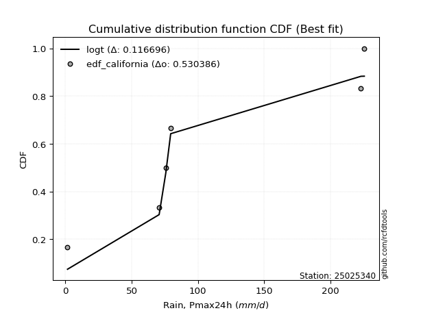</img>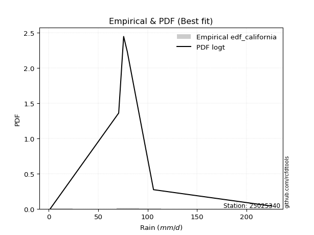</img>

</div>


### 2. EDF Hazen (1930)

Hazen method for plotting positions is a formula used to estimate the empirical cumulative probability distribution of flood events or other hydrological data. This formula often results in biased estimations, particularly when extrapolating to extreme events (high return periods).

<div align="center">


$P=(m-0.5)/n$


</div>


**2.1. Empirical values**

<div align="center">

|                | 0                   | 1                   | 2                   | 3         | 4                  | 5                  | 6                  |
|:---------------|:--------------------|:--------------------|:--------------------|:----------|:-------------------|:-------------------|:-------------------|
| date           | 2022                | 2020                | 2017                | 2018      | 2025               | 2019               | 2021               |
| x              | 1.6                 | 70.7                | 75.7                | 79.4      | 105.9              | 222.9              | 225.4              |
| m              | 1                   | 2                   | 3                   | 4         | 5                  | 6                  | 7                  |
| empirical_dist | edf_hazen           | edf_hazen           | edf_hazen           | edf_hazen | edf_hazen          | edf_hazen          | edf_hazen          |
| empirical      | 0.07142857142857142 | 0.21428571428571427 | 0.35714285714285715 | 0.5       | 0.6428571428571429 | 0.7857142857142857 | 0.9285714285714286 |
| empirical_tr   | 1.0769230769230769  | 1.2727272727272727  | 1.5555555555555558  | 2.0       | 2.8000000000000003 | 4.666666666666666  | 14.000000000000007 |

</div>


**2.2. Kolmogorov-Smirnov fit test (sorted by Δ)**


<div align="center">

|                | 0                   | 1                   | 2                   | 3                   | 4                   | 5                   | 6                   | 7                   | 8                   | 9                   | 10                  | 11                  | 12                  | 13                  | 14                  | 15                  | 16                  | 17                  | 18                  | 19                  | 20                  | 21                  | 22                  | 23                  | 24                  | 25                  | 26                  | 27                  | 28                  | 29                  | 30                  | 31                  | 32                  | 33                  | 34                  | 35                  | 36                  | 37                  | 38                  | 39                  | 40                  | 41                  | 42                  | 43                  | 44                  | 45                  | 46                  | 47                  | 48                  | 49                  | 50                  | 51                  | 52                  | 53                  | 54                  | 55                  | 56                  | 57                  | 58                  | 59                  | 60                  | 61                  | 62                  | 63                  | 64                  | 65                  | 66                  | 67                  | 68                  | 69                  | 70                  | 71                  | 72                  | 73                  | 74                  | 75                  | 76                  | 77                  | 78                  | 79                  | 80                  | 81                  | 82                  | 83                  | 84                  | 85                  | 86                  | 87                  | 88                  | 89                  | 90                  | 91                  | 92                  | 93                  | 94                  | 95                  | 96                  | 97                  | 98                  | 99                  | 100                 | 101                 | 102                 | 103                 | 104                 | 105                 | 106                 | 107                 | 108                 | 109                 | 110                 | 111                 | 112                 | 113                 | 114                 | 115                 | 116                 | 117                 | 118                 | 119                 | 120                 | 121                 | 122                 | 123                 | 124                 | 125                 | 126                 | 127                 | 128                 | 129                 | 130                 | 131                 | 132                 | 133                 | 134                 | 135                 | 136                 | 137                 | 138                 | 139                 | 140                 | 141                 | 142                 | 143                 | 144                 | 145                 | 146                 | 147                 | 148                 | 149                 | 150                 | 151                 | 152                 | 153                 | 154                 | 155                 | 156                 | 157                 | 158                 | 159                 |
|:---------------|:--------------------|:--------------------|:--------------------|:--------------------|:--------------------|:--------------------|:--------------------|:--------------------|:--------------------|:--------------------|:--------------------|:--------------------|:--------------------|:--------------------|:--------------------|:--------------------|:--------------------|:--------------------|:--------------------|:--------------------|:--------------------|:--------------------|:--------------------|:--------------------|:--------------------|:--------------------|:--------------------|:--------------------|:--------------------|:--------------------|:--------------------|:--------------------|:--------------------|:--------------------|:--------------------|:--------------------|:--------------------|:--------------------|:--------------------|:--------------------|:--------------------|:--------------------|:--------------------|:--------------------|:--------------------|:--------------------|:--------------------|:--------------------|:--------------------|:--------------------|:--------------------|:--------------------|:--------------------|:--------------------|:--------------------|:--------------------|:--------------------|:--------------------|:--------------------|:--------------------|:--------------------|:--------------------|:--------------------|:--------------------|:--------------------|:--------------------|:--------------------|:--------------------|:--------------------|:--------------------|:--------------------|:--------------------|:--------------------|:--------------------|:--------------------|:--------------------|:--------------------|:--------------------|:--------------------|:--------------------|:--------------------|:--------------------|:--------------------|:--------------------|:--------------------|:--------------------|:--------------------|:--------------------|:--------------------|:--------------------|:--------------------|:--------------------|:--------------------|:--------------------|:--------------------|:--------------------|:--------------------|:--------------------|:--------------------|:--------------------|:--------------------|:--------------------|:--------------------|:--------------------|:--------------------|:--------------------|:--------------------|:--------------------|:--------------------|:--------------------|:--------------------|:--------------------|:--------------------|:--------------------|:--------------------|:--------------------|:--------------------|:--------------------|:--------------------|:--------------------|:--------------------|:--------------------|:--------------------|:--------------------|:--------------------|:--------------------|:--------------------|:--------------------|:--------------------|:--------------------|:--------------------|:--------------------|:--------------------|:--------------------|:--------------------|:--------------------|:--------------------|:--------------------|:--------------------|:--------------------|:--------------------|:--------------------|:--------------------|:--------------------|:--------------------|:--------------------|:--------------------|:--------------------|:--------------------|:--------------------|:--------------------|:--------------------|:--------------------|:--------------------|:--------------------|:--------------------|:--------------------|:--------------------|:--------------------|:--------------------|
| station        | 25025340            | 25025340            | 25025340            | 25025340            | 25025340            | 25025340            | 25025340            | 25025340            | 25025340            | 25025340            | 25025340            | 25025340            | 25025340            | 25025340            | 25025340            | 25025340            | 25025340            | 25025340            | 25025340            | 25025340            | 25025340            | 25025340            | 25025340            | 25025340            | 25025340            | 25025340            | 25025340            | 25025340            | 25025340            | 25025340            | 25025340            | 25025340            | 25025340            | 25025340            | 25025340            | 25025340            | 25025340            | 25025340            | 25025340            | 25025340            | 25025340            | 25025340            | 25025340            | 25025340            | 25025340            | 25025340            | 25025340            | 25025340            | 25025340            | 25025340            | 25025340            | 25025340            | 25025340            | 25025340            | 25025340            | 25025340            | 25025340            | 25025340            | 25025340            | 25025340            | 25025340            | 25025340            | 25025340            | 25025340            | 25025340            | 25025340            | 25025340            | 25025340            | 25025340            | 25025340            | 25025340            | 25025340            | 25025340            | 25025340            | 25025340            | 25025340            | 25025340            | 25025340            | 25025340            | 25025340            | 25025340            | 25025340            | 25025340            | 25025340            | 25025340            | 25025340            | 25025340            | 25025340            | 25025340            | 25025340            | 25025340            | 25025340            | 25025340            | 25025340            | 25025340            | 25025340            | 25025340            | 25025340            | 25025340            | 25025340            | 25025340            | 25025340            | 25025340            | 25025340            | 25025340            | 25025340            | 25025340            | 25025340            | 25025340            | 25025340            | 25025340            | 25025340            | 25025340            | 25025340            | 25025340            | 25025340            | 25025340            | 25025340            | 25025340            | 25025340            | 25025340            | 25025340            | 25025340            | 25025340            | 25025340            | 25025340            | 25025340            | 25025340            | 25025340            | 25025340            | 25025340            | 25025340            | 25025340            | 25025340            | 25025340            | 25025340            | 25025340            | 25025340            | 25025340            | 25025340            | 25025340            | 25025340            | 25025340            | 25025340            | 25025340            | 25025340            | 25025340            | 25025340            | 25025340            | 25025340            | 25025340            | 25025340            | 25025340            | 25025340            | 25025340            | 25025340            | 25025340            | 25025340            | 25025340            | 25025340            |
| empirical_dist | edf_hazen           | edf_hazen           | edf_hazen           | edf_hazen           | edf_hazen           | edf_hazen           | edf_hazen           | edf_hazen           | edf_hazen           | edf_hazen           | edf_hazen           | edf_hazen           | edf_hazen           | edf_hazen           | edf_hazen           | edf_hazen           | edf_hazen           | edf_hazen           | edf_hazen           | edf_hazen           | edf_hazen           | edf_hazen           | edf_hazen           | edf_hazen           | edf_hazen           | edf_hazen           | edf_hazen           | edf_hazen           | edf_hazen           | edf_hazen           | edf_hazen           | edf_hazen           | edf_hazen           | edf_hazen           | edf_hazen           | edf_hazen           | edf_hazen           | edf_hazen           | edf_hazen           | edf_hazen           | edf_hazen           | edf_hazen           | edf_hazen           | edf_hazen           | edf_hazen           | edf_hazen           | edf_hazen           | edf_hazen           | edf_hazen           | edf_hazen           | edf_hazen           | edf_hazen           | edf_hazen           | edf_hazen           | edf_hazen           | edf_hazen           | edf_hazen           | edf_hazen           | edf_hazen           | edf_hazen           | edf_hazen           | edf_hazen           | edf_hazen           | edf_hazen           | edf_hazen           | edf_hazen           | edf_hazen           | edf_hazen           | edf_hazen           | edf_hazen           | edf_hazen           | edf_hazen           | edf_hazen           | edf_hazen           | edf_hazen           | edf_hazen           | edf_hazen           | edf_hazen           | edf_hazen           | edf_hazen           | edf_hazen           | edf_hazen           | edf_hazen           | edf_hazen           | edf_hazen           | edf_hazen           | edf_hazen           | edf_hazen           | edf_hazen           | edf_hazen           | edf_hazen           | edf_hazen           | edf_hazen           | edf_hazen           | edf_hazen           | edf_hazen           | edf_hazen           | edf_hazen           | edf_hazen           | edf_hazen           | edf_hazen           | edf_hazen           | edf_hazen           | edf_hazen           | edf_hazen           | edf_hazen           | edf_hazen           | edf_hazen           | edf_hazen           | edf_hazen           | edf_hazen           | edf_hazen           | edf_hazen           | edf_hazen           | edf_hazen           | edf_hazen           | edf_hazen           | edf_hazen           | edf_hazen           | edf_hazen           | edf_hazen           | edf_hazen           | edf_hazen           | edf_hazen           | edf_hazen           | edf_hazen           | edf_hazen           | edf_hazen           | edf_hazen           | edf_hazen           | edf_hazen           | edf_hazen           | edf_hazen           | edf_hazen           | edf_hazen           | edf_hazen           | edf_hazen           | edf_hazen           | edf_hazen           | edf_hazen           | edf_hazen           | edf_hazen           | edf_hazen           | edf_hazen           | edf_hazen           | edf_hazen           | edf_hazen           | edf_hazen           | edf_hazen           | edf_hazen           | edf_hazen           | edf_hazen           | edf_hazen           | edf_hazen           | edf_hazen           | edf_hazen           | edf_hazen           | edf_hazen           | edf_hazen           | edf_hazen           |
| p_dist         | alpha               | invgamma            | skewnorm            | loggennorm          | rayleigh            | genlogistic         | exponweib           | invgauss            | moyal               | gumbel_r            | genextreme          | ncf                 | kstwobign           | rice                | exponnorm           | betaprime           | wald                | maxwell             | gamma               | erlang              | pearson3            | foldnorm            | weibull_min         | halflogistic        | burr12              | halfnorm            | ksone               | semicircular        | anglit              | logt                | crystalball         | johnsonsu           | t                   | norm                | logargus            | logistic            | burr                | loggengamma         | logexponweib        | cosine              | loggenextreme       | logexponpow         | hypsecant           | logvonmises_line    | logdgamma           | wrapcauchy          | kappa4              | gennorm             | tukeylambda         | kappa3              | uniform             | vonmises_line       | logmielke           | logloggamma         | bradford            | logpearson3         | truncweibull_min    | truncexpon          | arcsine             | logdweibull         | gengamma            | logweibull_min      | dweibull            | laplace             | loggompertz         | loggenpareto        | logweibull_max      | logburr12           | gumbel_l            | lomax               | argus               | loggumbel_l         | genexpon            | logloglaplace       | logburr             | logtrapezoid        | mielke              | johnsonsb           | dgamma              | triang              | beta                | f                   | logarcsine          | logfoldnorm         | logsemicircular     | loganglit           | loglevy_l           | gausshyper          | logf                | logexponnorm        | logcrystalball      | lognorm             | logrice             | logfatiguelife      | lognct              | loglogistic         | loghypsecant        | loggamma            | loggamma            | levy_l              | loginvgamma         | loginvgauss         | logerlang           | logbetaprime        | logbeta             | genpareto           | loglaplace          | loglaplace          | halfgennorm         | loginvweibull       | logalpha            | logmaxwell          | logskewnorm         | logncf              | lograyleigh         | genhalflogistic     | logtruncnorm        | logkstwobign        | nakagami            | loggenhalflogistic  | logwrapcauchy       | loggausshyper       | loghalfnorm         | loggumbel_r         | loggenexpon         | logtruncweibull_min | logcosine           | loglomax            | logmoyal            | loghalflogistic     | trapezoid           | logtriang           | logjohnsonsu        | nct                 | logkappa4           | invweibull          | logwald             | lognakagami         | logksone            | logjohnsonsb        | loghalfgennorm      | rdist               | logkappa3           | loguniform          | weibull_max         | logbradford         | fatiguelife         | logtruncexpon       | powerlaw            | gompertz            | truncpareto         | exponpow            | logpowerlaw         | logtruncpareto      | truncnorm           | loggenlogistic      | logtukeylambda      | logrdist            | logvonmises         | vonmises            |
| delta          | 0.12359485346426521 | 0.12402064768755028 | 0.12447816661679378 | 0.1247347839041422  | 0.127093451136863   | 0.127798801747348   | 0.1280384713317987  | 0.12860108805228784 | 0.12954736094781483 | 0.13008454277862835 | 0.13072712387867635 | 0.1327099515235095  | 0.13306991549811928 | 0.1365403481683234  | 0.13673934622790931 | 0.13812440775246335 | 0.1384974338217826  | 0.13868257770611403 | 0.14238063007272042 | 0.14238064872956033 | 0.14433052645603145 | 0.14555998992577457 | 0.14875513891998257 | 0.15011229302804216 | 0.15060277360219052 | 0.15243181323135982 | 0.1644496624586556  | 0.16666075130011165 | 0.16841471032757444 | 0.17081615856829757 | 0.17169354012299698 | 0.17249154004806155 | 0.17261876473381477 | 0.17266969762099643 | 0.17443736060355178 | 0.1813873568473534  | 0.1880394135572966  | 0.19056039501707464 | 0.19102533947954017 | 0.19109519479730636 | 0.1924017929997609  | 0.1924982483964303  | 0.19587025547944892 | 0.19802658110738133 | 0.19826778096311562 | 0.19927111910873674 | 0.20115255486296924 | 0.20134166984172783 | 0.20137380343912425 | 0.2014399845215088  | 0.20311502617132648 | 0.20319379935396142 | 0.20484534411529698 | 0.2055184945456766  | 0.20552673454564052 | 0.2064255572408277  | 0.20686319348028281 | 0.207304679345635   | 0.2142857142857143  | 0.21700239712905653 | 0.2180148684141536  | 0.2202637744567905  | 0.223300735120923   | 0.22358101460129287 | 0.2320577717303776  | 0.23223592927102885 | 0.23388705192906614 | 0.24296457597275548 | 0.24329273875250224 | 0.24641538285520617 | 0.2467983101429453  | 0.2495975321204478  | 0.251939186517981   | 0.2526566734942307  | 0.25766074241308323 | 0.25915285491069884 | 0.26993122068187003 | 0.27511885414751847 | 0.28571428574375357 | 0.290468700552717   | 0.2927161139776452  | 0.2967522925873751  | 0.3040898754171616  | 0.30943058633527665 | 0.31168137961782505 | 0.31359353677865887 | 0.3157254807580242  | 0.31580729372838356 | 0.31735626542556217 | 0.3182276584551663  | 0.31823122016092775 | 0.3182312678599214  | 0.31823133405102566 | 0.3185491625178889  | 0.31859231185880466 | 0.32264769476101574 | 0.3264022531040387  | 0.32666170126633987 | 0.32666170126633987 | 0.3293678844796778  | 0.3310219213970206  | 0.33189854517333706 | 0.3331551710683258  | 0.33428478974607245 | 0.33624002299617795 | 0.3378136529442281  | 0.34020839613984455 | 0.34020839613984455 | 0.34209701295957806 | 0.3457868581287563  | 0.3488247715475331  | 0.34969837143322713 | 0.3524602687044417  | 0.35347437685936567 | 0.3599308465325094  | 0.36540080368902067 | 0.36947029000191434 | 0.3760252745281405  | 0.3777215342394301  | 0.37799597255767725 | 0.3783311911223367  | 0.38410921416206634 | 0.3887585479000947  | 0.38881526473429384 | 0.3935875309796598  | 0.39463014344964686 | 0.3949025583090088  | 0.4134258624061674  | 0.4141496625315966  | 0.4153816609775086  | 0.41669059845410683 | 0.42103251905041383 | 0.4237053637093177  | 0.4237677366191055  | 0.46996767367643455 | 0.47971413221750747 | 0.48447197787830554 | 0.48912103741772717 | 0.5071066336349609  | 0.5085401432708505  | 0.5240147778093318  | 0.5467025180517938  | 0.5513816931819068  | 0.5513851032190961  | 0.5692253124493959  | 0.5731453455999159  | 0.6163683035015137  | 0.6181277336788787  | 0.6205362761271692  | 0.6428571428569898  | 0.7019758156141522  | 0.7184656522957706  | 0.7400075513572553  | 0.7657684510035447  | 0.7857142251769421  | 0.7857142857142857  | 0.7857142857142857  | 0.7857142857142857  | 0.9863052274602763  | 35.37054676510856   |
| deltao         | 0.48442053926100004 | 0.48442053926100004 | 0.48442053926100004 | 0.48442053926100004 | 0.48442053926100004 | 0.48442053926100004 | 0.48442053926100004 | 0.48442053926100004 | 0.48442053926100004 | 0.48442053926100004 | 0.48442053926100004 | 0.48442053926100004 | 0.48442053926100004 | 0.48442053926100004 | 0.48442053926100004 | 0.48442053926100004 | 0.48442053926100004 | 0.48442053926100004 | 0.48442053926100004 | 0.48442053926100004 | 0.48442053926100004 | 0.48442053926100004 | 0.48442053926100004 | 0.48442053926100004 | 0.48442053926100004 | 0.48442053926100004 | 0.48442053926100004 | 0.48442053926100004 | 0.48442053926100004 | 0.48442053926100004 | 0.48442053926100004 | 0.48442053926100004 | 0.48442053926100004 | 0.48442053926100004 | 0.48442053926100004 | 0.48442053926100004 | 0.48442053926100004 | 0.48442053926100004 | 0.48442053926100004 | 0.48442053926100004 | 0.48442053926100004 | 0.48442053926100004 | 0.48442053926100004 | 0.48442053926100004 | 0.48442053926100004 | 0.48442053926100004 | 0.48442053926100004 | 0.48442053926100004 | 0.48442053926100004 | 0.48442053926100004 | 0.48442053926100004 | 0.48442053926100004 | 0.48442053926100004 | 0.48442053926100004 | 0.48442053926100004 | 0.48442053926100004 | 0.48442053926100004 | 0.48442053926100004 | 0.48442053926100004 | 0.48442053926100004 | 0.48442053926100004 | 0.48442053926100004 | 0.48442053926100004 | 0.48442053926100004 | 0.48442053926100004 | 0.48442053926100004 | 0.48442053926100004 | 0.48442053926100004 | 0.48442053926100004 | 0.48442053926100004 | 0.48442053926100004 | 0.48442053926100004 | 0.48442053926100004 | 0.48442053926100004 | 0.48442053926100004 | 0.48442053926100004 | 0.48442053926100004 | 0.48442053926100004 | 0.48442053926100004 | 0.48442053926100004 | 0.48442053926100004 | 0.48442053926100004 | 0.48442053926100004 | 0.48442053926100004 | 0.48442053926100004 | 0.48442053926100004 | 0.48442053926100004 | 0.48442053926100004 | 0.48442053926100004 | 0.48442053926100004 | 0.48442053926100004 | 0.48442053926100004 | 0.48442053926100004 | 0.48442053926100004 | 0.48442053926100004 | 0.48442053926100004 | 0.48442053926100004 | 0.48442053926100004 | 0.48442053926100004 | 0.48442053926100004 | 0.48442053926100004 | 0.48442053926100004 | 0.48442053926100004 | 0.48442053926100004 | 0.48442053926100004 | 0.48442053926100004 | 0.48442053926100004 | 0.48442053926100004 | 0.48442053926100004 | 0.48442053926100004 | 0.48442053926100004 | 0.48442053926100004 | 0.48442053926100004 | 0.48442053926100004 | 0.48442053926100004 | 0.48442053926100004 | 0.48442053926100004 | 0.48442053926100004 | 0.48442053926100004 | 0.48442053926100004 | 0.48442053926100004 | 0.48442053926100004 | 0.48442053926100004 | 0.48442053926100004 | 0.48442053926100004 | 0.48442053926100004 | 0.48442053926100004 | 0.48442053926100004 | 0.48442053926100004 | 0.48442053926100004 | 0.48442053926100004 | 0.48442053926100004 | 0.48442053926100004 | 0.48442053926100004 | 0.48442053926100004 | 0.48442053926100004 | 0.48442053926100004 | 0.48442053926100004 | 0.48442053926100004 | 0.48442053926100004 | 0.48442053926100004 | 0.48442053926100004 | 0.48442053926100004 | 0.48442053926100004 | 0.48442053926100004 | 0.48442053926100004 | 0.48442053926100004 | 0.48442053926100004 | 0.48442053926100004 | 0.48442053926100004 | 0.48442053926100004 | 0.48442053926100004 | 0.48442053926100004 | 0.48442053926100004 | 0.48442053926100004 | 0.48442053926100004 | 0.48442053926100004 | 0.48442053926100004 | 0.48442053926100004 | 0.48442053926100004 |
| eval           | Δo > Δ              | Δo > Δ              | Δo > Δ              | Δo > Δ              | Δo > Δ              | Δo > Δ              | Δo > Δ              | Δo > Δ              | Δo > Δ              | Δo > Δ              | Δo > Δ              | Δo > Δ              | Δo > Δ              | Δo > Δ              | Δo > Δ              | Δo > Δ              | Δo > Δ              | Δo > Δ              | Δo > Δ              | Δo > Δ              | Δo > Δ              | Δo > Δ              | Δo > Δ              | Δo > Δ              | Δo > Δ              | Δo > Δ              | Δo > Δ              | Δo > Δ              | Δo > Δ              | Δo > Δ              | Δo > Δ              | Δo > Δ              | Δo > Δ              | Δo > Δ              | Δo > Δ              | Δo > Δ              | Δo > Δ              | Δo > Δ              | Δo > Δ              | Δo > Δ              | Δo > Δ              | Δo > Δ              | Δo > Δ              | Δo > Δ              | Δo > Δ              | Δo > Δ              | Δo > Δ              | Δo > Δ              | Δo > Δ              | Δo > Δ              | Δo > Δ              | Δo > Δ              | Δo > Δ              | Δo > Δ              | Δo > Δ              | Δo > Δ              | Δo > Δ              | Δo > Δ              | Δo > Δ              | Δo > Δ              | Δo > Δ              | Δo > Δ              | Δo > Δ              | Δo > Δ              | Δo > Δ              | Δo > Δ              | Δo > Δ              | Δo > Δ              | Δo > Δ              | Δo > Δ              | Δo > Δ              | Δo > Δ              | Δo > Δ              | Δo > Δ              | Δo > Δ              | Δo > Δ              | Δo > Δ              | Δo > Δ              | Δo > Δ              | Δo > Δ              | Δo > Δ              | Δo > Δ              | Δo > Δ              | Δo > Δ              | Δo > Δ              | Δo > Δ              | Δo > Δ              | Δo > Δ              | Δo > Δ              | Δo > Δ              | Δo > Δ              | Δo > Δ              | Δo > Δ              | Δo > Δ              | Δo > Δ              | Δo > Δ              | Δo > Δ              | Δo > Δ              | Δo > Δ              | Δo > Δ              | Δo > Δ              | Δo > Δ              | Δo > Δ              | Δo > Δ              | Δo > Δ              | Δo > Δ              | Δo > Δ              | Δo > Δ              | Δo > Δ              | Δo > Δ              | Δo > Δ              | Δo > Δ              | Δo > Δ              | Δo > Δ              | Δo > Δ              | Δo > Δ              | Δo > Δ              | Δo > Δ              | Δo > Δ              | Δo > Δ              | Δo > Δ              | Δo > Δ              | Δo > Δ              | Δo > Δ              | Δo > Δ              | Δo > Δ              | Δo > Δ              | Δo > Δ              | Δo > Δ              | Δo > Δ              | Δo > Δ              | Δo > Δ              | Δo > Δ              | Δo > Δ              | Δo > Δ              | Δo > Δ              | Δo <= Δ             | Δo <= Δ             | Δo <= Δ             | Δo <= Δ             | Δo <= Δ             | Δo <= Δ             | Δo <= Δ             | Δo <= Δ             | Δo <= Δ             | Δo <= Δ             | Δo <= Δ             | Δo <= Δ             | Δo <= Δ             | Δo <= Δ             | Δo <= Δ             | Δo <= Δ             | Δo <= Δ             | Δo <= Δ             | Δo <= Δ             | Δo <= Δ             | Δo <= Δ             | Δo <= Δ             | Δo <= Δ             | Δo <= Δ             |
| fit            | 1                   | 1                   | 1                   | 1                   | 1                   | 1                   | 1                   | 1                   | 1                   | 1                   | 1                   | 1                   | 1                   | 1                   | 1                   | 1                   | 1                   | 1                   | 1                   | 1                   | 1                   | 1                   | 1                   | 1                   | 1                   | 1                   | 1                   | 1                   | 1                   | 1                   | 1                   | 1                   | 1                   | 1                   | 1                   | 1                   | 1                   | 1                   | 1                   | 1                   | 1                   | 1                   | 1                   | 1                   | 1                   | 1                   | 1                   | 1                   | 1                   | 1                   | 1                   | 1                   | 1                   | 1                   | 1                   | 1                   | 1                   | 1                   | 1                   | 1                   | 1                   | 1                   | 1                   | 1                   | 1                   | 1                   | 1                   | 1                   | 1                   | 1                   | 1                   | 1                   | 1                   | 1                   | 1                   | 1                   | 1                   | 1                   | 1                   | 1                   | 1                   | 1                   | 1                   | 1                   | 1                   | 1                   | 1                   | 1                   | 1                   | 1                   | 1                   | 1                   | 1                   | 1                   | 1                   | 1                   | 1                   | 1                   | 1                   | 1                   | 1                   | 1                   | 1                   | 1                   | 1                   | 1                   | 1                   | 1                   | 1                   | 1                   | 1                   | 1                   | 1                   | 1                   | 1                   | 1                   | 1                   | 1                   | 1                   | 1                   | 1                   | 1                   | 1                   | 1                   | 1                   | 1                   | 1                   | 1                   | 1                   | 1                   | 1                   | 1                   | 1                   | 1                   | 1                   | 1                   | 0                   | 0                   | 0                   | 0                   | 0                   | 0                   | 0                   | 0                   | 0                   | 0                   | 0                   | 0                   | 0                   | 0                   | 0                   | 0                   | 0                   | 0                   | 0                   | 0                   | 0                   | 0                   | 0                   | 0                   |
| n              | 7                   | 7                   | 7                   | 7                   | 7                   | 7                   | 7                   | 7                   | 7                   | 7                   | 7                   | 7                   | 7                   | 7                   | 7                   | 7                   | 7                   | 7                   | 7                   | 7                   | 7                   | 7                   | 7                   | 7                   | 7                   | 7                   | 7                   | 7                   | 7                   | 7                   | 7                   | 7                   | 7                   | 7                   | 7                   | 7                   | 7                   | 7                   | 7                   | 7                   | 7                   | 7                   | 7                   | 7                   | 7                   | 7                   | 7                   | 7                   | 7                   | 7                   | 7                   | 7                   | 7                   | 7                   | 7                   | 7                   | 7                   | 7                   | 7                   | 7                   | 7                   | 7                   | 7                   | 7                   | 7                   | 7                   | 7                   | 7                   | 7                   | 7                   | 7                   | 7                   | 7                   | 7                   | 7                   | 7                   | 7                   | 7                   | 7                   | 7                   | 7                   | 7                   | 7                   | 7                   | 7                   | 7                   | 7                   | 7                   | 7                   | 7                   | 7                   | 7                   | 7                   | 7                   | 7                   | 7                   | 7                   | 7                   | 7                   | 7                   | 7                   | 7                   | 7                   | 7                   | 7                   | 7                   | 7                   | 7                   | 7                   | 7                   | 7                   | 7                   | 7                   | 7                   | 7                   | 7                   | 7                   | 7                   | 7                   | 7                   | 7                   | 7                   | 7                   | 7                   | 7                   | 7                   | 7                   | 7                   | 7                   | 7                   | 7                   | 7                   | 7                   | 7                   | 7                   | 7                   | 7                   | 7                   | 7                   | 7                   | 7                   | 7                   | 7                   | 7                   | 7                   | 7                   | 7                   | 7                   | 7                   | 7                   | 7                   | 7                   | 7                   | 7                   | 7                   | 7                   | 7                   | 7                   | 7                   | 7                   |
| best_fit       | 1                   | 0                   | 0                   | 0                   | 0                   | 0                   | 0                   | 0                   | 0                   | 0                   | 0                   | 0                   | 0                   | 0                   | 0                   | 0                   | 0                   | 0                   | 0                   | 0                   | 0                   | 0                   | 0                   | 0                   | 0                   | 0                   | 0                   | 0                   | 0                   | 0                   | 0                   | 0                   | 0                   | 0                   | 0                   | 0                   | 0                   | 0                   | 0                   | 0                   | 0                   | 0                   | 0                   | 0                   | 0                   | 0                   | 0                   | 0                   | 0                   | 0                   | 0                   | 0                   | 0                   | 0                   | 0                   | 0                   | 0                   | 0                   | 0                   | 0                   | 0                   | 0                   | 0                   | 0                   | 0                   | 0                   | 0                   | 0                   | 0                   | 0                   | 0                   | 0                   | 0                   | 0                   | 0                   | 0                   | 0                   | 0                   | 0                   | 0                   | 0                   | 0                   | 0                   | 0                   | 0                   | 0                   | 0                   | 0                   | 0                   | 0                   | 0                   | 0                   | 0                   | 0                   | 0                   | 0                   | 0                   | 0                   | 0                   | 0                   | 0                   | 0                   | 0                   | 0                   | 0                   | 0                   | 0                   | 0                   | 0                   | 0                   | 0                   | 0                   | 0                   | 0                   | 0                   | 0                   | 0                   | 0                   | 0                   | 0                   | 0                   | 0                   | 0                   | 0                   | 0                   | 0                   | 0                   | 0                   | 0                   | 0                   | 0                   | 0                   | 0                   | 0                   | 0                   | 0                   | 0                   | 0                   | 0                   | 0                   | 0                   | 0                   | 0                   | 0                   | 0                   | 0                   | 0                   | 0                   | 0                   | 0                   | 0                   | 0                   | 0                   | 0                   | 0                   | 0                   | 0                   | 0                   | 0                   | 0                   |
| best_fit_sort  | 1                   | 2                   | 3                   | 4                   | 5                   | 6                   | 7                   | 8                   | 9                   | 10                  | 11                  | 12                  | 13                  | 14                  | 15                  | 16                  | 17                  | 18                  | 19                  | 20                  | 21                  | 22                  | 23                  | 24                  | 25                  | 26                  | 27                  | 28                  | 29                  | 30                  | 31                  | 32                  | 33                  | 34                  | 35                  | 36                  | 37                  | 38                  | 39                  | 40                  | 41                  | 42                  | 43                  | 44                  | 45                  | 46                  | 47                  | 48                  | 49                  | 50                  | 51                  | 52                  | 53                  | 54                  | 55                  | 56                  | 57                  | 58                  | 59                  | 60                  | 61                  | 62                  | 63                  | 64                  | 65                  | 66                  | 67                  | 68                  | 69                  | 70                  | 71                  | 72                  | 73                  | 74                  | 75                  | 76                  | 77                  | 78                  | 79                  | 80                  | 81                  | 82                  | 83                  | 84                  | 85                  | 86                  | 87                  | 88                  | 89                  | 90                  | 91                  | 92                  | 93                  | 94                  | 95                  | 96                  | 97                  | 98                  | 99                  | 100                 | 101                 | 102                 | 103                 | 104                 | 105                 | 106                 | 107                 | 108                 | 109                 | 110                 | 111                 | 112                 | 113                 | 114                 | 115                 | 116                 | 117                 | 118                 | 119                 | 120                 | 121                 | 122                 | 123                 | 124                 | 125                 | 126                 | 127                 | 128                 | 129                 | 130                 | 131                 | 132                 | 133                 | 134                 | 135                 | 136                 | 137                 | 138                 | 139                 | 140                 | 141                 | 142                 | 143                 | 144                 | 145                 | 146                 | 147                 | 148                 | 149                 | 150                 | 151                 | 152                 | 153                 | 154                 | 155                 | 156                 | 157                 | 158                 | 159                 | 160                 |

</div>


**2.3. Best fit**

<div align="center">

|   id |   station | empirical_dist   | p_dist   |    delta |   deltao | eval   |   fit |   n |   best_fit |   best_fit_sort |
|-----:|----------:|:-----------------|:---------|---------:|---------:|:-------|------:|----:|-----------:|----------------:|
|    0 |  25025340 | edf_hazen        | alpha    | 0.123595 | 0.484421 | Δo > Δ |     1 |   7 |          1 |               1 |

</div>


<div align="center">

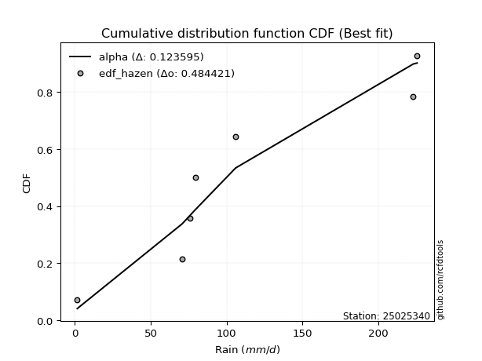</img></img>

</div>


### 3. EDF Weibull (1939)

Weibull plotting position formula is an empirical method used to estimate the non-exceedance probability or plotting position for a set of observed data, is often recommended or widely used in practice, particularly in flood frequency analysis.

<div align="center">


$P=m/(n+1)$


</div>


**3.1. Empirical values**

<div align="center">

|                | 0                  | 1                  | 2           | 3           | 4                  | 5           | 6           |
|:---------------|:-------------------|:-------------------|:------------|:------------|:-------------------|:------------|:------------|
| date           | 2022               | 2020               | 2017        | 2018        | 2025               | 2019        | 2021        |
| x              | 1.6                | 70.7               | 75.7        | 79.4        | 105.9              | 222.9       | 225.4       |
| m              | 1                  | 2                  | 3           | 4           | 5                  | 6           | 7           |
| empirical_dist | edf_weibull        | edf_weibull        | edf_weibull | edf_weibull | edf_weibull        | edf_weibull | edf_weibull |
| empirical      | 0.125              | 0.25               | 0.375       | 0.5         | 0.625              | 0.75        | 0.875       |
| empirical_tr   | 1.1428571428571428 | 1.3333333333333333 | 1.6         | 2.0         | 2.6666666666666665 | 4.0         | 8.0         |

</div>


**3.2. Kolmogorov-Smirnov fit test (sorted by Δ)**


<div align="center">

|                | 0                   | 1                   | 2                   | 3                   | 4                   | 5                   | 6                   | 7                   | 8                   | 9                   | 10                  | 11                  | 12                  | 13                  | 14                  | 15                  | 16                  | 17                  | 18                  | 19                  | 20                  | 21                  | 22                  | 23                  | 24                  | 25                  | 26                  | 27                  | 28                  | 29                  | 30                  | 31                  | 32                  | 33                  | 34                  | 35                  | 36                  | 37                  | 38                  | 39                  | 40                  | 41                  | 42                  | 43                  | 44                  | 45                  | 46                  | 47                  | 48                  | 49                  | 50                  | 51                  | 52                  | 53                  | 54                  | 55                  | 56                  | 57                  | 58                  | 59                  | 60                  | 61                  | 62                  | 63                  | 64                  | 65                  | 66                  | 67                  | 68                  | 69                  | 70                  | 71                  | 72                  | 73                  | 74                  | 75                  | 76                  | 77                  | 78                  | 79                  | 80                  | 81                  | 82                  | 83                  | 84                  | 85                  | 86                  | 87                  | 88                  | 89                  | 90                  | 91                  | 92                  | 93                  | 94                  | 95                  | 96                  | 97                  | 98                  | 99                  | 100                 | 101                 | 102                 | 103                 | 104                 | 105                 | 106                 | 107                 | 108                 | 109                 | 110                 | 111                 | 112                 | 113                 | 114                 | 115                 | 116                 | 117                 | 118                 | 119                 | 120                 | 121                 | 122                 | 123                 | 124                 | 125                 | 126                 | 127                 | 128                 | 129                 | 130                 | 131                 | 132                 | 133                 | 134                 | 135                 | 136                 | 137                 | 138                 | 139                 | 140                 | 141                 | 142                 | 143                 | 144                 | 145                 | 146                 | 147                 | 148                 | 149                 | 150                 | 151                 | 152                 | 153                 | 154                 | 155                 | 156                 | 157                 | 158                 | 159                 |
|:---------------|:--------------------|:--------------------|:--------------------|:--------------------|:--------------------|:--------------------|:--------------------|:--------------------|:--------------------|:--------------------|:--------------------|:--------------------|:--------------------|:--------------------|:--------------------|:--------------------|:--------------------|:--------------------|:--------------------|:--------------------|:--------------------|:--------------------|:--------------------|:--------------------|:--------------------|:--------------------|:--------------------|:--------------------|:--------------------|:--------------------|:--------------------|:--------------------|:--------------------|:--------------------|:--------------------|:--------------------|:--------------------|:--------------------|:--------------------|:--------------------|:--------------------|:--------------------|:--------------------|:--------------------|:--------------------|:--------------------|:--------------------|:--------------------|:--------------------|:--------------------|:--------------------|:--------------------|:--------------------|:--------------------|:--------------------|:--------------------|:--------------------|:--------------------|:--------------------|:--------------------|:--------------------|:--------------------|:--------------------|:--------------------|:--------------------|:--------------------|:--------------------|:--------------------|:--------------------|:--------------------|:--------------------|:--------------------|:--------------------|:--------------------|:--------------------|:--------------------|:--------------------|:--------------------|:--------------------|:--------------------|:--------------------|:--------------------|:--------------------|:--------------------|:--------------------|:--------------------|:--------------------|:--------------------|:--------------------|:--------------------|:--------------------|:--------------------|:--------------------|:--------------------|:--------------------|:--------------------|:--------------------|:--------------------|:--------------------|:--------------------|:--------------------|:--------------------|:--------------------|:--------------------|:--------------------|:--------------------|:--------------------|:--------------------|:--------------------|:--------------------|:--------------------|:--------------------|:--------------------|:--------------------|:--------------------|:--------------------|:--------------------|:--------------------|:--------------------|:--------------------|:--------------------|:--------------------|:--------------------|:--------------------|:--------------------|:--------------------|:--------------------|:--------------------|:--------------------|:--------------------|:--------------------|:--------------------|:--------------------|:--------------------|:--------------------|:--------------------|:--------------------|:--------------------|:--------------------|:--------------------|:--------------------|:--------------------|:--------------------|:--------------------|:--------------------|:--------------------|:--------------------|:--------------------|:--------------------|:--------------------|:--------------------|:--------------------|:--------------------|:--------------------|:--------------------|:--------------------|:--------------------|:--------------------|:--------------------|:--------------------|
| station        | 25025340            | 25025340            | 25025340            | 25025340            | 25025340            | 25025340            | 25025340            | 25025340            | 25025340            | 25025340            | 25025340            | 25025340            | 25025340            | 25025340            | 25025340            | 25025340            | 25025340            | 25025340            | 25025340            | 25025340            | 25025340            | 25025340            | 25025340            | 25025340            | 25025340            | 25025340            | 25025340            | 25025340            | 25025340            | 25025340            | 25025340            | 25025340            | 25025340            | 25025340            | 25025340            | 25025340            | 25025340            | 25025340            | 25025340            | 25025340            | 25025340            | 25025340            | 25025340            | 25025340            | 25025340            | 25025340            | 25025340            | 25025340            | 25025340            | 25025340            | 25025340            | 25025340            | 25025340            | 25025340            | 25025340            | 25025340            | 25025340            | 25025340            | 25025340            | 25025340            | 25025340            | 25025340            | 25025340            | 25025340            | 25025340            | 25025340            | 25025340            | 25025340            | 25025340            | 25025340            | 25025340            | 25025340            | 25025340            | 25025340            | 25025340            | 25025340            | 25025340            | 25025340            | 25025340            | 25025340            | 25025340            | 25025340            | 25025340            | 25025340            | 25025340            | 25025340            | 25025340            | 25025340            | 25025340            | 25025340            | 25025340            | 25025340            | 25025340            | 25025340            | 25025340            | 25025340            | 25025340            | 25025340            | 25025340            | 25025340            | 25025340            | 25025340            | 25025340            | 25025340            | 25025340            | 25025340            | 25025340            | 25025340            | 25025340            | 25025340            | 25025340            | 25025340            | 25025340            | 25025340            | 25025340            | 25025340            | 25025340            | 25025340            | 25025340            | 25025340            | 25025340            | 25025340            | 25025340            | 25025340            | 25025340            | 25025340            | 25025340            | 25025340            | 25025340            | 25025340            | 25025340            | 25025340            | 25025340            | 25025340            | 25025340            | 25025340            | 25025340            | 25025340            | 25025340            | 25025340            | 25025340            | 25025340            | 25025340            | 25025340            | 25025340            | 25025340            | 25025340            | 25025340            | 25025340            | 25025340            | 25025340            | 25025340            | 25025340            | 25025340            | 25025340            | 25025340            | 25025340            | 25025340            | 25025340            | 25025340            |
| empirical_dist | edf_weibull         | edf_weibull         | edf_weibull         | edf_weibull         | edf_weibull         | edf_weibull         | edf_weibull         | edf_weibull         | edf_weibull         | edf_weibull         | edf_weibull         | edf_weibull         | edf_weibull         | edf_weibull         | edf_weibull         | edf_weibull         | edf_weibull         | edf_weibull         | edf_weibull         | edf_weibull         | edf_weibull         | edf_weibull         | edf_weibull         | edf_weibull         | edf_weibull         | edf_weibull         | edf_weibull         | edf_weibull         | edf_weibull         | edf_weibull         | edf_weibull         | edf_weibull         | edf_weibull         | edf_weibull         | edf_weibull         | edf_weibull         | edf_weibull         | edf_weibull         | edf_weibull         | edf_weibull         | edf_weibull         | edf_weibull         | edf_weibull         | edf_weibull         | edf_weibull         | edf_weibull         | edf_weibull         | edf_weibull         | edf_weibull         | edf_weibull         | edf_weibull         | edf_weibull         | edf_weibull         | edf_weibull         | edf_weibull         | edf_weibull         | edf_weibull         | edf_weibull         | edf_weibull         | edf_weibull         | edf_weibull         | edf_weibull         | edf_weibull         | edf_weibull         | edf_weibull         | edf_weibull         | edf_weibull         | edf_weibull         | edf_weibull         | edf_weibull         | edf_weibull         | edf_weibull         | edf_weibull         | edf_weibull         | edf_weibull         | edf_weibull         | edf_weibull         | edf_weibull         | edf_weibull         | edf_weibull         | edf_weibull         | edf_weibull         | edf_weibull         | edf_weibull         | edf_weibull         | edf_weibull         | edf_weibull         | edf_weibull         | edf_weibull         | edf_weibull         | edf_weibull         | edf_weibull         | edf_weibull         | edf_weibull         | edf_weibull         | edf_weibull         | edf_weibull         | edf_weibull         | edf_weibull         | edf_weibull         | edf_weibull         | edf_weibull         | edf_weibull         | edf_weibull         | edf_weibull         | edf_weibull         | edf_weibull         | edf_weibull         | edf_weibull         | edf_weibull         | edf_weibull         | edf_weibull         | edf_weibull         | edf_weibull         | edf_weibull         | edf_weibull         | edf_weibull         | edf_weibull         | edf_weibull         | edf_weibull         | edf_weibull         | edf_weibull         | edf_weibull         | edf_weibull         | edf_weibull         | edf_weibull         | edf_weibull         | edf_weibull         | edf_weibull         | edf_weibull         | edf_weibull         | edf_weibull         | edf_weibull         | edf_weibull         | edf_weibull         | edf_weibull         | edf_weibull         | edf_weibull         | edf_weibull         | edf_weibull         | edf_weibull         | edf_weibull         | edf_weibull         | edf_weibull         | edf_weibull         | edf_weibull         | edf_weibull         | edf_weibull         | edf_weibull         | edf_weibull         | edf_weibull         | edf_weibull         | edf_weibull         | edf_weibull         | edf_weibull         | edf_weibull         | edf_weibull         | edf_weibull         | edf_weibull         | edf_weibull         |
| p_dist         | ncf                 | loggennorm          | alpha               | burr12              | gamma               | erlang              | exponnorm           | weibull_min         | halfnorm            | betaprime           | logexponpow         | genlogistic         | invgauss            | kstwobign           | invgamma            | skewnorm            | rayleigh            | halflogistic        | logvonmises_line    | logdgamma           | foldnorm            | exponweib           | maxwell             | moyal               | rice                | gumbel_r            | semicircular        | genextreme          | ksone               | pearson3            | anglit              | logpearson3         | wald                | johnsonsu           | norm                | t                   | logexponweib        | gennorm             | crystalball         | cosine              | logdweibull         | logistic            | gengamma            | logweibull_min      | dweibull            | logt                | logargus            | logweibull_max      | hypsecant           | loggompertz         | loggenpareto        | loggengamma         | logburr12           | lomax               | loggumbel_l         | genexpon            | logloglaplace       | logburr             | logtrapezoid        | laplace             | burr                | johnsonsb           | gumbel_l            | loggenextreme       | argus               | wrapcauchy          | kappa4              | tukeylambda         | kappa3              | uniform             | vonmises_line       | logmielke           | logloggamma         | bradford            | mielke              | truncweibull_min    | truncexpon          | arcsine             | dgamma              | f                   | logarcsine          | triang              | logfoldnorm         | beta                | logsemicircular     | loganglit           | logf                | logexponnorm        | logcrystalball      | lognorm             | logrice             | logfatiguelife      | lognct              | loglogistic         | loghypsecant        | loggamma            | loggamma            | loginvgamma         | loginvgauss         | logerlang           | loglevy_l           | gausshyper          | logbetaprime        | loglaplace          | loglaplace          | halfgennorm         | loginvweibull       | levy_l              | logalpha            | logmaxwell          | logskewnorm         | logncf              | logbeta             | genpareto           | lograyleigh         | logtruncnorm        | logkstwobign        | nakagami            | loggenhalflogistic  | logwrapcauchy       | genhalflogistic     | loggausshyper       | loghalfnorm         | loggumbel_r         | loggenexpon         | logtruncweibull_min | logcosine           | loglomax            | logmoyal            | loghalflogistic     | logtriang           | nct                 | trapezoid           | logjohnsonsu        | invweibull          | logkappa4           | logwald             | lognakagami         | logksone            | loghalfgennorm      | logjohnsonsb        | rdist               | logkappa3           | loguniform          | logbradford         | weibull_max         | fatiguelife         | logtruncexpon       | powerlaw            | gompertz            | truncpareto         | exponpow            | logpowerlaw         | logtruncpareto      | truncnorm           | loggenlogistic      | logtukeylambda      | logrdist            | logvonmises         | vonmises            |
| delta          | 0.12499952907323934 | 0.14284110828045793 | 0.14852266747065657 | 0.15170596118557444 | 0.15255098146599178 | 0.1525509939875711  | 0.15311450073199406 | 0.15328550210572145 | 0.15490808060124006 | 0.15504127610420748 | 0.15678396268214456 | 0.15762837755595094 | 0.15771613696514497 | 0.15888739733538204 | 0.15973493340183598 | 0.16019245233107948 | 0.1611145833954467  | 0.16184924870386996 | 0.1623122953930956  | 0.1625534952488299  | 0.16357176388648664 | 0.16375275704608439 | 0.1642080948919824  | 0.16526164666210053 | 0.1654070438471582  | 0.16579882849291405 | 0.16607458732412694 | 0.16644140959296205 | 0.16722320133245583 | 0.16746524469827673 | 0.16749288274369067 | 0.17071127152654197 | 0.1742117195360683  | 0.17463483067703034 | 0.1758136816041035  | 0.17582314133526977 | 0.17847938795309337 | 0.17889983099899653 | 0.17897048865188914 | 0.1794564601289712  | 0.1812881114147708  | 0.18223194218231353 | 0.18230058269986787 | 0.18454948874250476 | 0.18758644940663727 | 0.18867330142544048 | 0.1932496148226135  | 0.19542867495648691 | 0.19587025547944892 | 0.19634348601609186 | 0.19652164355674312 | 0.20675694159811675 | 0.20725029025846975 | 0.21070109714092045 | 0.21388324640616208 | 0.21622490080369527 | 0.21694238777994496 | 0.22300591291107097 | 0.22343856919641308 | 0.22358101460129287 | 0.22375369927158228 | 0.22481073046785166 | 0.22543559589535933 | 0.2281160787140466  | 0.22894116728580238 | 0.23498540482302244 | 0.23686684057725493 | 0.23708808915340995 | 0.2371542702357945  | 0.23882931188561218 | 0.23890808506824712 | 0.24055962982958268 | 0.2412327802599623  | 0.24124102025992622 | 0.24172034242103513 | 0.2425774791945685  | 0.2430189650599207  | 0.25                | 0.2500000000294679  | 0.2610380068730894  | 0.2683755897028759  | 0.2726115576955741  | 0.27371630062099095 | 0.2748589711205023  | 0.27596709390353935 | 0.27787925106437317 | 0.28164197971127647 | 0.2825133727408806  | 0.28251693444664205 | 0.2825169821456357  | 0.28251704833673996 | 0.2828348768036032  | 0.28287802614451896 | 0.28693340904673004 | 0.290687967389753   | 0.29094741555205417 | 0.29094741555205417 | 0.2953076356827349  | 0.29618425945905136 | 0.2974408853540401  | 0.2978683379008813  | 0.29795015087124066 | 0.29857050403178675 | 0.30449411042555885 | 0.30449411042555885 | 0.30638272724529236 | 0.3100725724144706  | 0.3115107416225349  | 0.3131104858332474  | 0.31398408571894143 | 0.316745982990156   | 0.31776009114507997 | 0.31838288013903504 | 0.3199565100870852  | 0.3242165608182237  | 0.33375600428762864 | 0.3403109888138548  | 0.3420072485251444  | 0.34228168684339155 | 0.342616905408051   | 0.34754366083187777 | 0.34839492844778064 | 0.353044262185809   | 0.35310097902000814 | 0.3578732452653741  | 0.35891585773536117 | 0.3591882725947231  | 0.3777115766918817  | 0.3784353768173109  | 0.3796673752632229  | 0.38531823333612814 | 0.3880534509048198  | 0.3988334555969639  | 0.4058482208521748  | 0.42614270364607887 | 0.43425338796214885 | 0.44875769216401984 | 0.45340675170344147 | 0.4713923479206752  | 0.4883004920950461  | 0.49068300041370755 | 0.5109882323375081  | 0.5156674074676211  | 0.5156708175048104  | 0.5374310598856302  | 0.551368169592253   | 0.580654017787228   | 0.582413447964593   | 0.5848219904128835  | 0.6249999999998469  | 0.6662615298998665  | 0.6827513665814849  | 0.7042932656429696  | 0.730054165289259   | 0.7499999394626564  | 0.75                | 0.75                | 0.75                | 0.9889842111758558  | 35.42411819367999   |
| deltao         | 0.48442053926100004 | 0.48442053926100004 | 0.48442053926100004 | 0.48442053926100004 | 0.48442053926100004 | 0.48442053926100004 | 0.48442053926100004 | 0.48442053926100004 | 0.48442053926100004 | 0.48442053926100004 | 0.48442053926100004 | 0.48442053926100004 | 0.48442053926100004 | 0.48442053926100004 | 0.48442053926100004 | 0.48442053926100004 | 0.48442053926100004 | 0.48442053926100004 | 0.48442053926100004 | 0.48442053926100004 | 0.48442053926100004 | 0.48442053926100004 | 0.48442053926100004 | 0.48442053926100004 | 0.48442053926100004 | 0.48442053926100004 | 0.48442053926100004 | 0.48442053926100004 | 0.48442053926100004 | 0.48442053926100004 | 0.48442053926100004 | 0.48442053926100004 | 0.48442053926100004 | 0.48442053926100004 | 0.48442053926100004 | 0.48442053926100004 | 0.48442053926100004 | 0.48442053926100004 | 0.48442053926100004 | 0.48442053926100004 | 0.48442053926100004 | 0.48442053926100004 | 0.48442053926100004 | 0.48442053926100004 | 0.48442053926100004 | 0.48442053926100004 | 0.48442053926100004 | 0.48442053926100004 | 0.48442053926100004 | 0.48442053926100004 | 0.48442053926100004 | 0.48442053926100004 | 0.48442053926100004 | 0.48442053926100004 | 0.48442053926100004 | 0.48442053926100004 | 0.48442053926100004 | 0.48442053926100004 | 0.48442053926100004 | 0.48442053926100004 | 0.48442053926100004 | 0.48442053926100004 | 0.48442053926100004 | 0.48442053926100004 | 0.48442053926100004 | 0.48442053926100004 | 0.48442053926100004 | 0.48442053926100004 | 0.48442053926100004 | 0.48442053926100004 | 0.48442053926100004 | 0.48442053926100004 | 0.48442053926100004 | 0.48442053926100004 | 0.48442053926100004 | 0.48442053926100004 | 0.48442053926100004 | 0.48442053926100004 | 0.48442053926100004 | 0.48442053926100004 | 0.48442053926100004 | 0.48442053926100004 | 0.48442053926100004 | 0.48442053926100004 | 0.48442053926100004 | 0.48442053926100004 | 0.48442053926100004 | 0.48442053926100004 | 0.48442053926100004 | 0.48442053926100004 | 0.48442053926100004 | 0.48442053926100004 | 0.48442053926100004 | 0.48442053926100004 | 0.48442053926100004 | 0.48442053926100004 | 0.48442053926100004 | 0.48442053926100004 | 0.48442053926100004 | 0.48442053926100004 | 0.48442053926100004 | 0.48442053926100004 | 0.48442053926100004 | 0.48442053926100004 | 0.48442053926100004 | 0.48442053926100004 | 0.48442053926100004 | 0.48442053926100004 | 0.48442053926100004 | 0.48442053926100004 | 0.48442053926100004 | 0.48442053926100004 | 0.48442053926100004 | 0.48442053926100004 | 0.48442053926100004 | 0.48442053926100004 | 0.48442053926100004 | 0.48442053926100004 | 0.48442053926100004 | 0.48442053926100004 | 0.48442053926100004 | 0.48442053926100004 | 0.48442053926100004 | 0.48442053926100004 | 0.48442053926100004 | 0.48442053926100004 | 0.48442053926100004 | 0.48442053926100004 | 0.48442053926100004 | 0.48442053926100004 | 0.48442053926100004 | 0.48442053926100004 | 0.48442053926100004 | 0.48442053926100004 | 0.48442053926100004 | 0.48442053926100004 | 0.48442053926100004 | 0.48442053926100004 | 0.48442053926100004 | 0.48442053926100004 | 0.48442053926100004 | 0.48442053926100004 | 0.48442053926100004 | 0.48442053926100004 | 0.48442053926100004 | 0.48442053926100004 | 0.48442053926100004 | 0.48442053926100004 | 0.48442053926100004 | 0.48442053926100004 | 0.48442053926100004 | 0.48442053926100004 | 0.48442053926100004 | 0.48442053926100004 | 0.48442053926100004 | 0.48442053926100004 | 0.48442053926100004 | 0.48442053926100004 | 0.48442053926100004 | 0.48442053926100004 |
| eval           | Δo > Δ              | Δo > Δ              | Δo > Δ              | Δo > Δ              | Δo > Δ              | Δo > Δ              | Δo > Δ              | Δo > Δ              | Δo > Δ              | Δo > Δ              | Δo > Δ              | Δo > Δ              | Δo > Δ              | Δo > Δ              | Δo > Δ              | Δo > Δ              | Δo > Δ              | Δo > Δ              | Δo > Δ              | Δo > Δ              | Δo > Δ              | Δo > Δ              | Δo > Δ              | Δo > Δ              | Δo > Δ              | Δo > Δ              | Δo > Δ              | Δo > Δ              | Δo > Δ              | Δo > Δ              | Δo > Δ              | Δo > Δ              | Δo > Δ              | Δo > Δ              | Δo > Δ              | Δo > Δ              | Δo > Δ              | Δo > Δ              | Δo > Δ              | Δo > Δ              | Δo > Δ              | Δo > Δ              | Δo > Δ              | Δo > Δ              | Δo > Δ              | Δo > Δ              | Δo > Δ              | Δo > Δ              | Δo > Δ              | Δo > Δ              | Δo > Δ              | Δo > Δ              | Δo > Δ              | Δo > Δ              | Δo > Δ              | Δo > Δ              | Δo > Δ              | Δo > Δ              | Δo > Δ              | Δo > Δ              | Δo > Δ              | Δo > Δ              | Δo > Δ              | Δo > Δ              | Δo > Δ              | Δo > Δ              | Δo > Δ              | Δo > Δ              | Δo > Δ              | Δo > Δ              | Δo > Δ              | Δo > Δ              | Δo > Δ              | Δo > Δ              | Δo > Δ              | Δo > Δ              | Δo > Δ              | Δo > Δ              | Δo > Δ              | Δo > Δ              | Δo > Δ              | Δo > Δ              | Δo > Δ              | Δo > Δ              | Δo > Δ              | Δo > Δ              | Δo > Δ              | Δo > Δ              | Δo > Δ              | Δo > Δ              | Δo > Δ              | Δo > Δ              | Δo > Δ              | Δo > Δ              | Δo > Δ              | Δo > Δ              | Δo > Δ              | Δo > Δ              | Δo > Δ              | Δo > Δ              | Δo > Δ              | Δo > Δ              | Δo > Δ              | Δo > Δ              | Δo > Δ              | Δo > Δ              | Δo > Δ              | Δo > Δ              | Δo > Δ              | Δo > Δ              | Δo > Δ              | Δo > Δ              | Δo > Δ              | Δo > Δ              | Δo > Δ              | Δo > Δ              | Δo > Δ              | Δo > Δ              | Δo > Δ              | Δo > Δ              | Δo > Δ              | Δo > Δ              | Δo > Δ              | Δo > Δ              | Δo > Δ              | Δo > Δ              | Δo > Δ              | Δo > Δ              | Δo > Δ              | Δo > Δ              | Δo > Δ              | Δo > Δ              | Δo > Δ              | Δo > Δ              | Δo > Δ              | Δo > Δ              | Δo > Δ              | Δo > Δ              | Δo > Δ              | Δo <= Δ             | Δo <= Δ             | Δo <= Δ             | Δo <= Δ             | Δo <= Δ             | Δo <= Δ             | Δo <= Δ             | Δo <= Δ             | Δo <= Δ             | Δo <= Δ             | Δo <= Δ             | Δo <= Δ             | Δo <= Δ             | Δo <= Δ             | Δo <= Δ             | Δo <= Δ             | Δo <= Δ             | Δo <= Δ             | Δo <= Δ             | Δo <= Δ             | Δo <= Δ             |
| fit            | 1                   | 1                   | 1                   | 1                   | 1                   | 1                   | 1                   | 1                   | 1                   | 1                   | 1                   | 1                   | 1                   | 1                   | 1                   | 1                   | 1                   | 1                   | 1                   | 1                   | 1                   | 1                   | 1                   | 1                   | 1                   | 1                   | 1                   | 1                   | 1                   | 1                   | 1                   | 1                   | 1                   | 1                   | 1                   | 1                   | 1                   | 1                   | 1                   | 1                   | 1                   | 1                   | 1                   | 1                   | 1                   | 1                   | 1                   | 1                   | 1                   | 1                   | 1                   | 1                   | 1                   | 1                   | 1                   | 1                   | 1                   | 1                   | 1                   | 1                   | 1                   | 1                   | 1                   | 1                   | 1                   | 1                   | 1                   | 1                   | 1                   | 1                   | 1                   | 1                   | 1                   | 1                   | 1                   | 1                   | 1                   | 1                   | 1                   | 1                   | 1                   | 1                   | 1                   | 1                   | 1                   | 1                   | 1                   | 1                   | 1                   | 1                   | 1                   | 1                   | 1                   | 1                   | 1                   | 1                   | 1                   | 1                   | 1                   | 1                   | 1                   | 1                   | 1                   | 1                   | 1                   | 1                   | 1                   | 1                   | 1                   | 1                   | 1                   | 1                   | 1                   | 1                   | 1                   | 1                   | 1                   | 1                   | 1                   | 1                   | 1                   | 1                   | 1                   | 1                   | 1                   | 1                   | 1                   | 1                   | 1                   | 1                   | 1                   | 1                   | 1                   | 1                   | 1                   | 1                   | 1                   | 1                   | 1                   | 0                   | 0                   | 0                   | 0                   | 0                   | 0                   | 0                   | 0                   | 0                   | 0                   | 0                   | 0                   | 0                   | 0                   | 0                   | 0                   | 0                   | 0                   | 0                   | 0                   | 0                   |
| n              | 7                   | 7                   | 7                   | 7                   | 7                   | 7                   | 7                   | 7                   | 7                   | 7                   | 7                   | 7                   | 7                   | 7                   | 7                   | 7                   | 7                   | 7                   | 7                   | 7                   | 7                   | 7                   | 7                   | 7                   | 7                   | 7                   | 7                   | 7                   | 7                   | 7                   | 7                   | 7                   | 7                   | 7                   | 7                   | 7                   | 7                   | 7                   | 7                   | 7                   | 7                   | 7                   | 7                   | 7                   | 7                   | 7                   | 7                   | 7                   | 7                   | 7                   | 7                   | 7                   | 7                   | 7                   | 7                   | 7                   | 7                   | 7                   | 7                   | 7                   | 7                   | 7                   | 7                   | 7                   | 7                   | 7                   | 7                   | 7                   | 7                   | 7                   | 7                   | 7                   | 7                   | 7                   | 7                   | 7                   | 7                   | 7                   | 7                   | 7                   | 7                   | 7                   | 7                   | 7                   | 7                   | 7                   | 7                   | 7                   | 7                   | 7                   | 7                   | 7                   | 7                   | 7                   | 7                   | 7                   | 7                   | 7                   | 7                   | 7                   | 7                   | 7                   | 7                   | 7                   | 7                   | 7                   | 7                   | 7                   | 7                   | 7                   | 7                   | 7                   | 7                   | 7                   | 7                   | 7                   | 7                   | 7                   | 7                   | 7                   | 7                   | 7                   | 7                   | 7                   | 7                   | 7                   | 7                   | 7                   | 7                   | 7                   | 7                   | 7                   | 7                   | 7                   | 7                   | 7                   | 7                   | 7                   | 7                   | 7                   | 7                   | 7                   | 7                   | 7                   | 7                   | 7                   | 7                   | 7                   | 7                   | 7                   | 7                   | 7                   | 7                   | 7                   | 7                   | 7                   | 7                   | 7                   | 7                   | 7                   |
| best_fit       | 1                   | 0                   | 0                   | 0                   | 0                   | 0                   | 0                   | 0                   | 0                   | 0                   | 0                   | 0                   | 0                   | 0                   | 0                   | 0                   | 0                   | 0                   | 0                   | 0                   | 0                   | 0                   | 0                   | 0                   | 0                   | 0                   | 0                   | 0                   | 0                   | 0                   | 0                   | 0                   | 0                   | 0                   | 0                   | 0                   | 0                   | 0                   | 0                   | 0                   | 0                   | 0                   | 0                   | 0                   | 0                   | 0                   | 0                   | 0                   | 0                   | 0                   | 0                   | 0                   | 0                   | 0                   | 0                   | 0                   | 0                   | 0                   | 0                   | 0                   | 0                   | 0                   | 0                   | 0                   | 0                   | 0                   | 0                   | 0                   | 0                   | 0                   | 0                   | 0                   | 0                   | 0                   | 0                   | 0                   | 0                   | 0                   | 0                   | 0                   | 0                   | 0                   | 0                   | 0                   | 0                   | 0                   | 0                   | 0                   | 0                   | 0                   | 0                   | 0                   | 0                   | 0                   | 0                   | 0                   | 0                   | 0                   | 0                   | 0                   | 0                   | 0                   | 0                   | 0                   | 0                   | 0                   | 0                   | 0                   | 0                   | 0                   | 0                   | 0                   | 0                   | 0                   | 0                   | 0                   | 0                   | 0                   | 0                   | 0                   | 0                   | 0                   | 0                   | 0                   | 0                   | 0                   | 0                   | 0                   | 0                   | 0                   | 0                   | 0                   | 0                   | 0                   | 0                   | 0                   | 0                   | 0                   | 0                   | 0                   | 0                   | 0                   | 0                   | 0                   | 0                   | 0                   | 0                   | 0                   | 0                   | 0                   | 0                   | 0                   | 0                   | 0                   | 0                   | 0                   | 0                   | 0                   | 0                   | 0                   |
| best_fit_sort  | 1                   | 2                   | 3                   | 4                   | 5                   | 6                   | 7                   | 8                   | 9                   | 10                  | 11                  | 12                  | 13                  | 14                  | 15                  | 16                  | 17                  | 18                  | 19                  | 20                  | 21                  | 22                  | 23                  | 24                  | 25                  | 26                  | 27                  | 28                  | 29                  | 30                  | 31                  | 32                  | 33                  | 34                  | 35                  | 36                  | 37                  | 38                  | 39                  | 40                  | 41                  | 42                  | 43                  | 44                  | 45                  | 46                  | 47                  | 48                  | 49                  | 50                  | 51                  | 52                  | 53                  | 54                  | 55                  | 56                  | 57                  | 58                  | 59                  | 60                  | 61                  | 62                  | 63                  | 64                  | 65                  | 66                  | 67                  | 68                  | 69                  | 70                  | 71                  | 72                  | 73                  | 74                  | 75                  | 76                  | 77                  | 78                  | 79                  | 80                  | 81                  | 82                  | 83                  | 84                  | 85                  | 86                  | 87                  | 88                  | 89                  | 90                  | 91                  | 92                  | 93                  | 94                  | 95                  | 96                  | 97                  | 98                  | 99                  | 100                 | 101                 | 102                 | 103                 | 104                 | 105                 | 106                 | 107                 | 108                 | 109                 | 110                 | 111                 | 112                 | 113                 | 114                 | 115                 | 116                 | 117                 | 118                 | 119                 | 120                 | 121                 | 122                 | 123                 | 124                 | 125                 | 126                 | 127                 | 128                 | 129                 | 130                 | 131                 | 132                 | 133                 | 134                 | 135                 | 136                 | 137                 | 138                 | 139                 | 140                 | 141                 | 142                 | 143                 | 144                 | 145                 | 146                 | 147                 | 148                 | 149                 | 150                 | 151                 | 152                 | 153                 | 154                 | 155                 | 156                 | 157                 | 158                 | 159                 | 160                 |

</div>


**3.3. Best fit**

<div align="center">

|   id |   station | empirical_dist   | p_dist   |   delta |   deltao | eval   |   fit |   n |   best_fit |   best_fit_sort |
|-----:|----------:|:-----------------|:---------|--------:|---------:|:-------|------:|----:|-----------:|----------------:|
|    0 |  25025340 | edf_weibull      | ncf      |   0.125 | 0.484421 | Δo > Δ |     1 |   7 |          1 |               1 |

</div>


<div align="center">

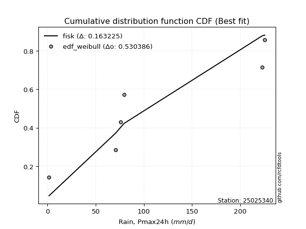</img>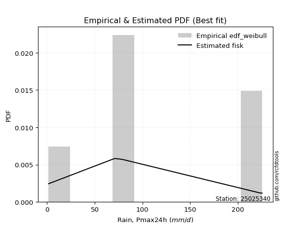</img>

</div>


### 4. EDF Beard (1943)

The Beard formula (or Beard´s plotting position formula) in hydrology is used to estimate the empirical non-exceedance probability _(P)_ of a flood event (or other extreme hydrological data point) within a given dataset.

<div align="center">


$P=(m-0.31)/(n+0.38)$


</div>


**4.1. Empirical values**

<div align="center">

|                | 0                   | 1                   | 2                   | 3         | 4                  | 5                  | 6                  |
|:---------------|:--------------------|:--------------------|:--------------------|:----------|:-------------------|:-------------------|:-------------------|
| date           | 2022                | 2020                | 2017                | 2018      | 2025               | 2019               | 2021               |
| x              | 1.6                 | 70.7                | 75.7                | 79.4      | 105.9              | 222.9              | 225.4              |
| m              | 1                   | 2                   | 3                   | 4         | 5                  | 6                  | 7                  |
| empirical_dist | edf_beard           | edf_beard           | edf_beard           | edf_beard | edf_beard          | edf_beard          | edf_beard          |
| empirical      | 0.09349593495934959 | 0.22899728997289973 | 0.36449864498644985 | 0.5       | 0.6355013550135502 | 0.7710027100271003 | 0.9065040650406505 |
| empirical_tr   | 1.1031390134529149  | 1.29701230228471    | 1.5735607675906182  | 2.0       | 2.743494423791822  | 4.366863905325444  | 10.695652173913055 |

</div>


**4.2. Kolmogorov-Smirnov fit test (sorted by Δ)**


<div align="center">

|                | 0                   | 1                   | 2                   | 3                   | 4                   | 5                   | 6                   | 7                   | 8                   | 9                   | 10                  | 11                  | 12                  | 13                  | 14                  | 15                  | 16                  | 17                  | 18                  | 19                  | 20                  | 21                  | 22                  | 23                  | 24                  | 25                  | 26                  | 27                  | 28                  | 29                  | 30                  | 31                  | 32                  | 33                  | 34                  | 35                  | 36                  | 37                  | 38                  | 39                  | 40                  | 41                  | 42                  | 43                  | 44                  | 45                  | 46                  | 47                  | 48                  | 49                  | 50                  | 51                  | 52                  | 53                  | 54                  | 55                  | 56                  | 57                  | 58                  | 59                  | 60                  | 61                  | 62                  | 63                  | 64                  | 65                  | 66                  | 67                  | 68                  | 69                  | 70                  | 71                  | 72                  | 73                  | 74                  | 75                  | 76                  | 77                  | 78                  | 79                  | 80                  | 81                  | 82                  | 83                  | 84                  | 85                  | 86                  | 87                  | 88                  | 89                  | 90                  | 91                  | 92                  | 93                  | 94                  | 95                  | 96                  | 97                  | 98                  | 99                  | 100                 | 101                 | 102                 | 103                 | 104                 | 105                 | 106                 | 107                 | 108                 | 109                 | 110                 | 111                 | 112                 | 113                 | 114                 | 115                 | 116                 | 117                 | 118                 | 119                 | 120                 | 121                 | 122                 | 123                 | 124                 | 125                 | 126                 | 127                 | 128                 | 129                 | 130                 | 131                 | 132                 | 133                 | 134                 | 135                 | 136                 | 137                 | 138                 | 139                 | 140                 | 141                 | 142                 | 143                 | 144                 | 145                 | 146                 | 147                 | 148                 | 149                 | 150                 | 151                 | 152                 | 153                 | 154                 | 155                 | 156                 | 157                 | 158                 | 159                 |
|:---------------|:--------------------|:--------------------|:--------------------|:--------------------|:--------------------|:--------------------|:--------------------|:--------------------|:--------------------|:--------------------|:--------------------|:--------------------|:--------------------|:--------------------|:--------------------|:--------------------|:--------------------|:--------------------|:--------------------|:--------------------|:--------------------|:--------------------|:--------------------|:--------------------|:--------------------|:--------------------|:--------------------|:--------------------|:--------------------|:--------------------|:--------------------|:--------------------|:--------------------|:--------------------|:--------------------|:--------------------|:--------------------|:--------------------|:--------------------|:--------------------|:--------------------|:--------------------|:--------------------|:--------------------|:--------------------|:--------------------|:--------------------|:--------------------|:--------------------|:--------------------|:--------------------|:--------------------|:--------------------|:--------------------|:--------------------|:--------------------|:--------------------|:--------------------|:--------------------|:--------------------|:--------------------|:--------------------|:--------------------|:--------------------|:--------------------|:--------------------|:--------------------|:--------------------|:--------------------|:--------------------|:--------------------|:--------------------|:--------------------|:--------------------|:--------------------|:--------------------|:--------------------|:--------------------|:--------------------|:--------------------|:--------------------|:--------------------|:--------------------|:--------------------|:--------------------|:--------------------|:--------------------|:--------------------|:--------------------|:--------------------|:--------------------|:--------------------|:--------------------|:--------------------|:--------------------|:--------------------|:--------------------|:--------------------|:--------------------|:--------------------|:--------------------|:--------------------|:--------------------|:--------------------|:--------------------|:--------------------|:--------------------|:--------------------|:--------------------|:--------------------|:--------------------|:--------------------|:--------------------|:--------------------|:--------------------|:--------------------|:--------------------|:--------------------|:--------------------|:--------------------|:--------------------|:--------------------|:--------------------|:--------------------|:--------------------|:--------------------|:--------------------|:--------------------|:--------------------|:--------------------|:--------------------|:--------------------|:--------------------|:--------------------|:--------------------|:--------------------|:--------------------|:--------------------|:--------------------|:--------------------|:--------------------|:--------------------|:--------------------|:--------------------|:--------------------|:--------------------|:--------------------|:--------------------|:--------------------|:--------------------|:--------------------|:--------------------|:--------------------|:--------------------|:--------------------|:--------------------|:--------------------|:--------------------|:--------------------|:--------------------|
| station        | 25025340            | 25025340            | 25025340            | 25025340            | 25025340            | 25025340            | 25025340            | 25025340            | 25025340            | 25025340            | 25025340            | 25025340            | 25025340            | 25025340            | 25025340            | 25025340            | 25025340            | 25025340            | 25025340            | 25025340            | 25025340            | 25025340            | 25025340            | 25025340            | 25025340            | 25025340            | 25025340            | 25025340            | 25025340            | 25025340            | 25025340            | 25025340            | 25025340            | 25025340            | 25025340            | 25025340            | 25025340            | 25025340            | 25025340            | 25025340            | 25025340            | 25025340            | 25025340            | 25025340            | 25025340            | 25025340            | 25025340            | 25025340            | 25025340            | 25025340            | 25025340            | 25025340            | 25025340            | 25025340            | 25025340            | 25025340            | 25025340            | 25025340            | 25025340            | 25025340            | 25025340            | 25025340            | 25025340            | 25025340            | 25025340            | 25025340            | 25025340            | 25025340            | 25025340            | 25025340            | 25025340            | 25025340            | 25025340            | 25025340            | 25025340            | 25025340            | 25025340            | 25025340            | 25025340            | 25025340            | 25025340            | 25025340            | 25025340            | 25025340            | 25025340            | 25025340            | 25025340            | 25025340            | 25025340            | 25025340            | 25025340            | 25025340            | 25025340            | 25025340            | 25025340            | 25025340            | 25025340            | 25025340            | 25025340            | 25025340            | 25025340            | 25025340            | 25025340            | 25025340            | 25025340            | 25025340            | 25025340            | 25025340            | 25025340            | 25025340            | 25025340            | 25025340            | 25025340            | 25025340            | 25025340            | 25025340            | 25025340            | 25025340            | 25025340            | 25025340            | 25025340            | 25025340            | 25025340            | 25025340            | 25025340            | 25025340            | 25025340            | 25025340            | 25025340            | 25025340            | 25025340            | 25025340            | 25025340            | 25025340            | 25025340            | 25025340            | 25025340            | 25025340            | 25025340            | 25025340            | 25025340            | 25025340            | 25025340            | 25025340            | 25025340            | 25025340            | 25025340            | 25025340            | 25025340            | 25025340            | 25025340            | 25025340            | 25025340            | 25025340            | 25025340            | 25025340            | 25025340            | 25025340            | 25025340            | 25025340            |
| empirical_dist | edf_beard           | edf_beard           | edf_beard           | edf_beard           | edf_beard           | edf_beard           | edf_beard           | edf_beard           | edf_beard           | edf_beard           | edf_beard           | edf_beard           | edf_beard           | edf_beard           | edf_beard           | edf_beard           | edf_beard           | edf_beard           | edf_beard           | edf_beard           | edf_beard           | edf_beard           | edf_beard           | edf_beard           | edf_beard           | edf_beard           | edf_beard           | edf_beard           | edf_beard           | edf_beard           | edf_beard           | edf_beard           | edf_beard           | edf_beard           | edf_beard           | edf_beard           | edf_beard           | edf_beard           | edf_beard           | edf_beard           | edf_beard           | edf_beard           | edf_beard           | edf_beard           | edf_beard           | edf_beard           | edf_beard           | edf_beard           | edf_beard           | edf_beard           | edf_beard           | edf_beard           | edf_beard           | edf_beard           | edf_beard           | edf_beard           | edf_beard           | edf_beard           | edf_beard           | edf_beard           | edf_beard           | edf_beard           | edf_beard           | edf_beard           | edf_beard           | edf_beard           | edf_beard           | edf_beard           | edf_beard           | edf_beard           | edf_beard           | edf_beard           | edf_beard           | edf_beard           | edf_beard           | edf_beard           | edf_beard           | edf_beard           | edf_beard           | edf_beard           | edf_beard           | edf_beard           | edf_beard           | edf_beard           | edf_beard           | edf_beard           | edf_beard           | edf_beard           | edf_beard           | edf_beard           | edf_beard           | edf_beard           | edf_beard           | edf_beard           | edf_beard           | edf_beard           | edf_beard           | edf_beard           | edf_beard           | edf_beard           | edf_beard           | edf_beard           | edf_beard           | edf_beard           | edf_beard           | edf_beard           | edf_beard           | edf_beard           | edf_beard           | edf_beard           | edf_beard           | edf_beard           | edf_beard           | edf_beard           | edf_beard           | edf_beard           | edf_beard           | edf_beard           | edf_beard           | edf_beard           | edf_beard           | edf_beard           | edf_beard           | edf_beard           | edf_beard           | edf_beard           | edf_beard           | edf_beard           | edf_beard           | edf_beard           | edf_beard           | edf_beard           | edf_beard           | edf_beard           | edf_beard           | edf_beard           | edf_beard           | edf_beard           | edf_beard           | edf_beard           | edf_beard           | edf_beard           | edf_beard           | edf_beard           | edf_beard           | edf_beard           | edf_beard           | edf_beard           | edf_beard           | edf_beard           | edf_beard           | edf_beard           | edf_beard           | edf_beard           | edf_beard           | edf_beard           | edf_beard           | edf_beard           | edf_beard           | edf_beard           |
| p_dist         | loggennorm          | ncf                 | alpha               | gamma               | erlang              | exponnorm           | betaprime           | weibull_min         | burr12              | genlogistic         | invgauss            | halfnorm            | kstwobign           | invgamma            | skewnorm            | rayleigh            | halflogistic        | foldnorm            | exponweib           | maxwell             | moyal               | rice                | gumbel_r            | genextreme          | pearson3            | wald                | ksone               | semicircular        | anglit              | crystalball         | johnsonsu           | t                   | norm                | logargus            | logexponweib        | logexponpow         | logt                | logistic            | logvonmises_line    | logdgamma           | cosine              | loggengamma         | gennorm             | logpearson3         | hypsecant           | logdweibull         | burr                | gengamma            | logweibull_min      | loggenextreme       | dweibull            | logweibull_max      | wrapcauchy          | kappa4              | tukeylambda         | kappa3              | loggompertz         | loggenpareto        | uniform             | vonmises_line       | logmielke           | logloggamma         | bradford            | truncweibull_min    | truncexpon          | laplace             | logburr12           | arcsine             | lomax               | loggumbel_l         | gumbel_l            | genexpon            | logloglaplace       | argus               | logburr             | logtrapezoid        | johnsonsb           | mielke              | dgamma              | f                   | triang              | beta                | logarcsine          | logfoldnorm         | logsemicircular     | loganglit           | logf                | logexponnorm        | logcrystalball      | lognorm             | logrice             | logfatiguelife      | lognct              | loglogistic         | loglevy_l           | gausshyper          | loghypsecant        | loggamma            | loggamma            | loginvgamma         | loginvgauss         | logerlang           | logbetaprime        | levy_l              | loglaplace          | loglaplace          | halfgennorm         | logbeta             | genpareto           | loginvweibull       | logalpha            | logmaxwell          | logskewnorm         | logncf              | lograyleigh         | logtruncnorm        | genhalflogistic     | logkstwobign        | nakagami            | loggenhalflogistic  | logwrapcauchy       | loggausshyper       | loghalfnorm         | loggumbel_r         | loggenexpon         | logtruncweibull_min | logcosine           | loglomax            | logmoyal            | loghalflogistic     | logtriang           | nct                 | trapezoid           | logjohnsonsu        | logkappa4           | invweibull          | logwald             | lognakagami         | logksone            | logjohnsonsb        | loghalfgennorm      | rdist               | logkappa3           | loguniform          | logbradford         | weibull_max         | fatiguelife         | logtruncexpon       | powerlaw            | gompertz            | truncpareto         | exponpow            | logpowerlaw         | logtruncpareto      | truncnorm           | loggenlogistic      | logtukeylambda      | logrdist            | logvonmises         | vonmises            |
| delta          | 0.12183839825335763 | 0.1253541636799168  | 0.12751995744355626 | 0.13154827143889147 | 0.1315482839604708  | 0.13211179070489376 | 0.13403856607710718 | 0.13404356323279712 | 0.13589119791500506 | 0.13662566752885064 | 0.13671342693804467 | 0.13772023754417437 | 0.13788468730828174 | 0.13873222337473567 | 0.13918974230397918 | 0.1401118733683464  | 0.14084653867676966 | 0.14256905385938634 | 0.14275004701898408 | 0.1432053848648821  | 0.14425893663500022 | 0.1444043338200579  | 0.14479611846581375 | 0.14543869956586175 | 0.14646253467117643 | 0.15320900950896799 | 0.1570938746150629  | 0.15930496345651896 | 0.16105892248398174 | 0.16433775227940428 | 0.16513575220446886 | 0.16526297689022207 | 0.16531390977740373 | 0.1722469047955132  | 0.17631376379235472 | 0.17778667270924484 | 0.17817194641189027 | 0.1813873568473534  | 0.18331500542019588 | 0.18355620527593017 | 0.18373940695371366 | 0.18575423157101645 | 0.18663009415454238 | 0.19171398155364225 | 0.19587025547944892 | 0.20229082144187108 | 0.20275098924448198 | 0.20330329272696815 | 0.20555219876960504 | 0.2071133686869463  | 0.20858915943373754 | 0.21181968839828796 | 0.21398269479592213 | 0.21586413055015463 | 0.21608537912630965 | 0.2161515602086942  | 0.21734619604319214 | 0.2175243535838434  | 0.21782660185851188 | 0.21790537504114682 | 0.21955691980248238 | 0.220230070232862   | 0.22023831023282592 | 0.2215747691674682  | 0.2220162550328204  | 0.22358101460129287 | 0.22825300028557002 | 0.2289972899728997  | 0.23170380716802072 | 0.23488595643326235 | 0.23593695090890954 | 0.23722761083079555 | 0.23794509780704523 | 0.2394425222993526  | 0.2429491667258978  | 0.24444127922351336 | 0.25305149061674026 | 0.25521964499468464 | 0.2710027100565682  | 0.2820407169001897  | 0.2831129127091243  | 0.2853603261340525  | 0.2893782997299762  | 0.29471901064809125 | 0.29696980393063965 | 0.29888196109147347 | 0.30264468973837677 | 0.3035160827679809  | 0.30351964447374236 | 0.303519692172736   | 0.30351975836384026 | 0.3038375868307035  | 0.30388073617161926 | 0.30793611907383034 | 0.3083696929144315  | 0.30845150588479087 | 0.3116906774168533  | 0.31195012557915447 | 0.31195012557915447 | 0.3163103457098352  | 0.31718696948615166 | 0.3184435953811404  | 0.31957321405888706 | 0.3220120966360851  | 0.32549682045265915 | 0.32549682045265915 | 0.32738543727239267 | 0.32888423515258525 | 0.3304578651006354  | 0.3310752824415709  | 0.3341131958603477  | 0.33498679574604173 | 0.3377486930172563  | 0.3387628011721803  | 0.345219270845324   | 0.35475871431472894 | 0.35804501584542797 | 0.3613136988409551  | 0.3630099585522447  | 0.36328439687049185 | 0.3636196154351513  | 0.36939763847488094 | 0.3740469722129093  | 0.37410368904710845 | 0.3788759552924744  | 0.37991856776246147 | 0.3801909826218234  | 0.398714286718982   | 0.3994380868444112  | 0.4006700852903232  | 0.40632094336322844 | 0.4090561609319201  | 0.40933481061051413 | 0.416349575865725   | 0.45525609798924915 | 0.4576467686867294  | 0.46976040219112014 | 0.47440946173054177 | 0.4923950579477755  | 0.5011843554272577  | 0.5093032021221464  | 0.5319909423646084  | 0.5366701174947214  | 0.5366735275319107  | 0.5584337699127305  | 0.5618695246058032  | 0.6016567278143283  | 0.6034161579916933  | 0.6058247004399838  | 0.6355013550133971  | 0.6872642399269668  | 0.7037540766085852  | 0.7252959756700699  | 0.7510568753163593  | 0.7710026494897567  | 0.7710027100271003  | 0.7710027100271003  | 0.7710027100271003  | 0.9715936517730909  | 35.39261412863934   |
| deltao         | 0.48442053926100004 | 0.48442053926100004 | 0.48442053926100004 | 0.48442053926100004 | 0.48442053926100004 | 0.48442053926100004 | 0.48442053926100004 | 0.48442053926100004 | 0.48442053926100004 | 0.48442053926100004 | 0.48442053926100004 | 0.48442053926100004 | 0.48442053926100004 | 0.48442053926100004 | 0.48442053926100004 | 0.48442053926100004 | 0.48442053926100004 | 0.48442053926100004 | 0.48442053926100004 | 0.48442053926100004 | 0.48442053926100004 | 0.48442053926100004 | 0.48442053926100004 | 0.48442053926100004 | 0.48442053926100004 | 0.48442053926100004 | 0.48442053926100004 | 0.48442053926100004 | 0.48442053926100004 | 0.48442053926100004 | 0.48442053926100004 | 0.48442053926100004 | 0.48442053926100004 | 0.48442053926100004 | 0.48442053926100004 | 0.48442053926100004 | 0.48442053926100004 | 0.48442053926100004 | 0.48442053926100004 | 0.48442053926100004 | 0.48442053926100004 | 0.48442053926100004 | 0.48442053926100004 | 0.48442053926100004 | 0.48442053926100004 | 0.48442053926100004 | 0.48442053926100004 | 0.48442053926100004 | 0.48442053926100004 | 0.48442053926100004 | 0.48442053926100004 | 0.48442053926100004 | 0.48442053926100004 | 0.48442053926100004 | 0.48442053926100004 | 0.48442053926100004 | 0.48442053926100004 | 0.48442053926100004 | 0.48442053926100004 | 0.48442053926100004 | 0.48442053926100004 | 0.48442053926100004 | 0.48442053926100004 | 0.48442053926100004 | 0.48442053926100004 | 0.48442053926100004 | 0.48442053926100004 | 0.48442053926100004 | 0.48442053926100004 | 0.48442053926100004 | 0.48442053926100004 | 0.48442053926100004 | 0.48442053926100004 | 0.48442053926100004 | 0.48442053926100004 | 0.48442053926100004 | 0.48442053926100004 | 0.48442053926100004 | 0.48442053926100004 | 0.48442053926100004 | 0.48442053926100004 | 0.48442053926100004 | 0.48442053926100004 | 0.48442053926100004 | 0.48442053926100004 | 0.48442053926100004 | 0.48442053926100004 | 0.48442053926100004 | 0.48442053926100004 | 0.48442053926100004 | 0.48442053926100004 | 0.48442053926100004 | 0.48442053926100004 | 0.48442053926100004 | 0.48442053926100004 | 0.48442053926100004 | 0.48442053926100004 | 0.48442053926100004 | 0.48442053926100004 | 0.48442053926100004 | 0.48442053926100004 | 0.48442053926100004 | 0.48442053926100004 | 0.48442053926100004 | 0.48442053926100004 | 0.48442053926100004 | 0.48442053926100004 | 0.48442053926100004 | 0.48442053926100004 | 0.48442053926100004 | 0.48442053926100004 | 0.48442053926100004 | 0.48442053926100004 | 0.48442053926100004 | 0.48442053926100004 | 0.48442053926100004 | 0.48442053926100004 | 0.48442053926100004 | 0.48442053926100004 | 0.48442053926100004 | 0.48442053926100004 | 0.48442053926100004 | 0.48442053926100004 | 0.48442053926100004 | 0.48442053926100004 | 0.48442053926100004 | 0.48442053926100004 | 0.48442053926100004 | 0.48442053926100004 | 0.48442053926100004 | 0.48442053926100004 | 0.48442053926100004 | 0.48442053926100004 | 0.48442053926100004 | 0.48442053926100004 | 0.48442053926100004 | 0.48442053926100004 | 0.48442053926100004 | 0.48442053926100004 | 0.48442053926100004 | 0.48442053926100004 | 0.48442053926100004 | 0.48442053926100004 | 0.48442053926100004 | 0.48442053926100004 | 0.48442053926100004 | 0.48442053926100004 | 0.48442053926100004 | 0.48442053926100004 | 0.48442053926100004 | 0.48442053926100004 | 0.48442053926100004 | 0.48442053926100004 | 0.48442053926100004 | 0.48442053926100004 | 0.48442053926100004 | 0.48442053926100004 | 0.48442053926100004 | 0.48442053926100004 | 0.48442053926100004 |
| eval           | Δo > Δ              | Δo > Δ              | Δo > Δ              | Δo > Δ              | Δo > Δ              | Δo > Δ              | Δo > Δ              | Δo > Δ              | Δo > Δ              | Δo > Δ              | Δo > Δ              | Δo > Δ              | Δo > Δ              | Δo > Δ              | Δo > Δ              | Δo > Δ              | Δo > Δ              | Δo > Δ              | Δo > Δ              | Δo > Δ              | Δo > Δ              | Δo > Δ              | Δo > Δ              | Δo > Δ              | Δo > Δ              | Δo > Δ              | Δo > Δ              | Δo > Δ              | Δo > Δ              | Δo > Δ              | Δo > Δ              | Δo > Δ              | Δo > Δ              | Δo > Δ              | Δo > Δ              | Δo > Δ              | Δo > Δ              | Δo > Δ              | Δo > Δ              | Δo > Δ              | Δo > Δ              | Δo > Δ              | Δo > Δ              | Δo > Δ              | Δo > Δ              | Δo > Δ              | Δo > Δ              | Δo > Δ              | Δo > Δ              | Δo > Δ              | Δo > Δ              | Δo > Δ              | Δo > Δ              | Δo > Δ              | Δo > Δ              | Δo > Δ              | Δo > Δ              | Δo > Δ              | Δo > Δ              | Δo > Δ              | Δo > Δ              | Δo > Δ              | Δo > Δ              | Δo > Δ              | Δo > Δ              | Δo > Δ              | Δo > Δ              | Δo > Δ              | Δo > Δ              | Δo > Δ              | Δo > Δ              | Δo > Δ              | Δo > Δ              | Δo > Δ              | Δo > Δ              | Δo > Δ              | Δo > Δ              | Δo > Δ              | Δo > Δ              | Δo > Δ              | Δo > Δ              | Δo > Δ              | Δo > Δ              | Δo > Δ              | Δo > Δ              | Δo > Δ              | Δo > Δ              | Δo > Δ              | Δo > Δ              | Δo > Δ              | Δo > Δ              | Δo > Δ              | Δo > Δ              | Δo > Δ              | Δo > Δ              | Δo > Δ              | Δo > Δ              | Δo > Δ              | Δo > Δ              | Δo > Δ              | Δo > Δ              | Δo > Δ              | Δo > Δ              | Δo > Δ              | Δo > Δ              | Δo > Δ              | Δo > Δ              | Δo > Δ              | Δo > Δ              | Δo > Δ              | Δo > Δ              | Δo > Δ              | Δo > Δ              | Δo > Δ              | Δo > Δ              | Δo > Δ              | Δo > Δ              | Δo > Δ              | Δo > Δ              | Δo > Δ              | Δo > Δ              | Δo > Δ              | Δo > Δ              | Δo > Δ              | Δo > Δ              | Δo > Δ              | Δo > Δ              | Δo > Δ              | Δo > Δ              | Δo > Δ              | Δo > Δ              | Δo > Δ              | Δo > Δ              | Δo > Δ              | Δo > Δ              | Δo > Δ              | Δo > Δ              | Δo > Δ              | Δo <= Δ             | Δo <= Δ             | Δo <= Δ             | Δo <= Δ             | Δo <= Δ             | Δo <= Δ             | Δo <= Δ             | Δo <= Δ             | Δo <= Δ             | Δo <= Δ             | Δo <= Δ             | Δo <= Δ             | Δo <= Δ             | Δo <= Δ             | Δo <= Δ             | Δo <= Δ             | Δo <= Δ             | Δo <= Δ             | Δo <= Δ             | Δo <= Δ             | Δo <= Δ             | Δo <= Δ             |
| fit            | 1                   | 1                   | 1                   | 1                   | 1                   | 1                   | 1                   | 1                   | 1                   | 1                   | 1                   | 1                   | 1                   | 1                   | 1                   | 1                   | 1                   | 1                   | 1                   | 1                   | 1                   | 1                   | 1                   | 1                   | 1                   | 1                   | 1                   | 1                   | 1                   | 1                   | 1                   | 1                   | 1                   | 1                   | 1                   | 1                   | 1                   | 1                   | 1                   | 1                   | 1                   | 1                   | 1                   | 1                   | 1                   | 1                   | 1                   | 1                   | 1                   | 1                   | 1                   | 1                   | 1                   | 1                   | 1                   | 1                   | 1                   | 1                   | 1                   | 1                   | 1                   | 1                   | 1                   | 1                   | 1                   | 1                   | 1                   | 1                   | 1                   | 1                   | 1                   | 1                   | 1                   | 1                   | 1                   | 1                   | 1                   | 1                   | 1                   | 1                   | 1                   | 1                   | 1                   | 1                   | 1                   | 1                   | 1                   | 1                   | 1                   | 1                   | 1                   | 1                   | 1                   | 1                   | 1                   | 1                   | 1                   | 1                   | 1                   | 1                   | 1                   | 1                   | 1                   | 1                   | 1                   | 1                   | 1                   | 1                   | 1                   | 1                   | 1                   | 1                   | 1                   | 1                   | 1                   | 1                   | 1                   | 1                   | 1                   | 1                   | 1                   | 1                   | 1                   | 1                   | 1                   | 1                   | 1                   | 1                   | 1                   | 1                   | 1                   | 1                   | 1                   | 1                   | 1                   | 1                   | 1                   | 1                   | 0                   | 0                   | 0                   | 0                   | 0                   | 0                   | 0                   | 0                   | 0                   | 0                   | 0                   | 0                   | 0                   | 0                   | 0                   | 0                   | 0                   | 0                   | 0                   | 0                   | 0                   | 0                   |
| n              | 7                   | 7                   | 7                   | 7                   | 7                   | 7                   | 7                   | 7                   | 7                   | 7                   | 7                   | 7                   | 7                   | 7                   | 7                   | 7                   | 7                   | 7                   | 7                   | 7                   | 7                   | 7                   | 7                   | 7                   | 7                   | 7                   | 7                   | 7                   | 7                   | 7                   | 7                   | 7                   | 7                   | 7                   | 7                   | 7                   | 7                   | 7                   | 7                   | 7                   | 7                   | 7                   | 7                   | 7                   | 7                   | 7                   | 7                   | 7                   | 7                   | 7                   | 7                   | 7                   | 7                   | 7                   | 7                   | 7                   | 7                   | 7                   | 7                   | 7                   | 7                   | 7                   | 7                   | 7                   | 7                   | 7                   | 7                   | 7                   | 7                   | 7                   | 7                   | 7                   | 7                   | 7                   | 7                   | 7                   | 7                   | 7                   | 7                   | 7                   | 7                   | 7                   | 7                   | 7                   | 7                   | 7                   | 7                   | 7                   | 7                   | 7                   | 7                   | 7                   | 7                   | 7                   | 7                   | 7                   | 7                   | 7                   | 7                   | 7                   | 7                   | 7                   | 7                   | 7                   | 7                   | 7                   | 7                   | 7                   | 7                   | 7                   | 7                   | 7                   | 7                   | 7                   | 7                   | 7                   | 7                   | 7                   | 7                   | 7                   | 7                   | 7                   | 7                   | 7                   | 7                   | 7                   | 7                   | 7                   | 7                   | 7                   | 7                   | 7                   | 7                   | 7                   | 7                   | 7                   | 7                   | 7                   | 7                   | 7                   | 7                   | 7                   | 7                   | 7                   | 7                   | 7                   | 7                   | 7                   | 7                   | 7                   | 7                   | 7                   | 7                   | 7                   | 7                   | 7                   | 7                   | 7                   | 7                   | 7                   |
| best_fit       | 1                   | 0                   | 0                   | 0                   | 0                   | 0                   | 0                   | 0                   | 0                   | 0                   | 0                   | 0                   | 0                   | 0                   | 0                   | 0                   | 0                   | 0                   | 0                   | 0                   | 0                   | 0                   | 0                   | 0                   | 0                   | 0                   | 0                   | 0                   | 0                   | 0                   | 0                   | 0                   | 0                   | 0                   | 0                   | 0                   | 0                   | 0                   | 0                   | 0                   | 0                   | 0                   | 0                   | 0                   | 0                   | 0                   | 0                   | 0                   | 0                   | 0                   | 0                   | 0                   | 0                   | 0                   | 0                   | 0                   | 0                   | 0                   | 0                   | 0                   | 0                   | 0                   | 0                   | 0                   | 0                   | 0                   | 0                   | 0                   | 0                   | 0                   | 0                   | 0                   | 0                   | 0                   | 0                   | 0                   | 0                   | 0                   | 0                   | 0                   | 0                   | 0                   | 0                   | 0                   | 0                   | 0                   | 0                   | 0                   | 0                   | 0                   | 0                   | 0                   | 0                   | 0                   | 0                   | 0                   | 0                   | 0                   | 0                   | 0                   | 0                   | 0                   | 0                   | 0                   | 0                   | 0                   | 0                   | 0                   | 0                   | 0                   | 0                   | 0                   | 0                   | 0                   | 0                   | 0                   | 0                   | 0                   | 0                   | 0                   | 0                   | 0                   | 0                   | 0                   | 0                   | 0                   | 0                   | 0                   | 0                   | 0                   | 0                   | 0                   | 0                   | 0                   | 0                   | 0                   | 0                   | 0                   | 0                   | 0                   | 0                   | 0                   | 0                   | 0                   | 0                   | 0                   | 0                   | 0                   | 0                   | 0                   | 0                   | 0                   | 0                   | 0                   | 0                   | 0                   | 0                   | 0                   | 0                   | 0                   |
| best_fit_sort  | 1                   | 2                   | 3                   | 4                   | 5                   | 6                   | 7                   | 8                   | 9                   | 10                  | 11                  | 12                  | 13                  | 14                  | 15                  | 16                  | 17                  | 18                  | 19                  | 20                  | 21                  | 22                  | 23                  | 24                  | 25                  | 26                  | 27                  | 28                  | 29                  | 30                  | 31                  | 32                  | 33                  | 34                  | 35                  | 36                  | 37                  | 38                  | 39                  | 40                  | 41                  | 42                  | 43                  | 44                  | 45                  | 46                  | 47                  | 48                  | 49                  | 50                  | 51                  | 52                  | 53                  | 54                  | 55                  | 56                  | 57                  | 58                  | 59                  | 60                  | 61                  | 62                  | 63                  | 64                  | 65                  | 66                  | 67                  | 68                  | 69                  | 70                  | 71                  | 72                  | 73                  | 74                  | 75                  | 76                  | 77                  | 78                  | 79                  | 80                  | 81                  | 82                  | 83                  | 84                  | 85                  | 86                  | 87                  | 88                  | 89                  | 90                  | 91                  | 92                  | 93                  | 94                  | 95                  | 96                  | 97                  | 98                  | 99                  | 100                 | 101                 | 102                 | 103                 | 104                 | 105                 | 106                 | 107                 | 108                 | 109                 | 110                 | 111                 | 112                 | 113                 | 114                 | 115                 | 116                 | 117                 | 118                 | 119                 | 120                 | 121                 | 122                 | 123                 | 124                 | 125                 | 126                 | 127                 | 128                 | 129                 | 130                 | 131                 | 132                 | 133                 | 134                 | 135                 | 136                 | 137                 | 138                 | 139                 | 140                 | 141                 | 142                 | 143                 | 144                 | 145                 | 146                 | 147                 | 148                 | 149                 | 150                 | 151                 | 152                 | 153                 | 154                 | 155                 | 156                 | 157                 | 158                 | 159                 | 160                 |

</div>


**4.3. Best fit**

<div align="center">

|   id |   station | empirical_dist   | p_dist     |    delta |   deltao | eval   |   fit |   n |   best_fit |   best_fit_sort |
|-----:|----------:|:-----------------|:-----------|---------:|---------:|:-------|------:|----:|-----------:|----------------:|
|    0 |  25025340 | edf_beard        | loggennorm | 0.121838 | 0.484421 | Δo > Δ |     1 |   7 |          1 |               1 |

</div>


<div align="center">

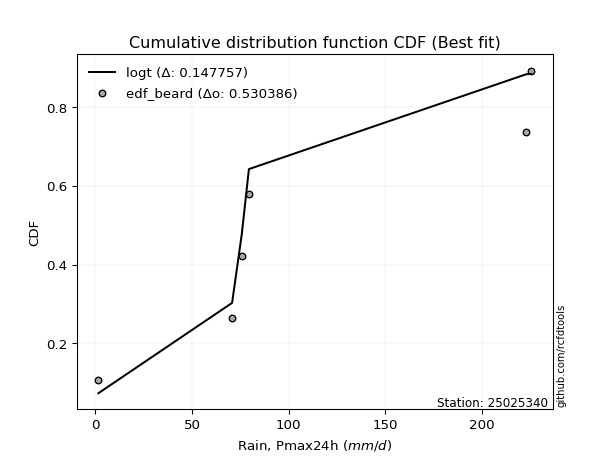</img>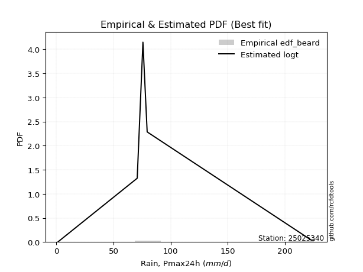</img>

</div>


### 5. EDF Chegodayev (1955)

The Chegodayev formula is an empirical plotting position formula used in hydrological frequency analysis to estimate the exceedance probability or return period of a specific event from a set of observed data. It is primarily used for plotting observed data points on probability paper to fit a theoretical distribution, particularly for analyzing extreme events like maximum flood flows or rainfall intensities. The constant _b_ value in the generalized plotting position formula is 0.3.

<div align="center">


$P=(m-b)/(n+1-2b)$


</div>


**5.1. Empirical values**

<div align="center">

|                | 0                   | 1                   | 2                   | 3              | 4                  | 5                  | 6                  |
|:---------------|:--------------------|:--------------------|:--------------------|:---------------|:-------------------|:-------------------|:-------------------|
| date           | 2022                | 2020                | 2017                | 2018           | 2025               | 2019               | 2021               |
| x              | 1.6                 | 70.7                | 75.7                | 79.4           | 105.9              | 222.9              | 225.4              |
| m              | 1                   | 2                   | 3                   | 4              | 5                  | 6                  | 7                  |
| empirical_dist | edf_chegodayev      | edf_chegodayev      | edf_chegodayev      | edf_chegodayev | edf_chegodayev     | edf_chegodayev     | edf_chegodayev     |
| empirical      | 0.09459459459459459 | 0.22972972972972971 | 0.36486486486486486 | 0.5            | 0.6351351351351351 | 0.7702702702702703 | 0.9054054054054054 |
| empirical_tr   | 1.1044776119402986  | 1.2982456140350878  | 1.574468085106383   | 2.0            | 2.7407407407407405 | 4.352941176470589  | 10.571428571428568 |

</div>


**5.2. Kolmogorov-Smirnov fit test (sorted by Δ)**


<div align="center">

|                | 0                   | 1                   | 2                   | 3                   | 4                   | 5                   | 6                   | 7                   | 8                   | 9                   | 10                  | 11                  | 12                  | 13                  | 14                  | 15                  | 16                  | 17                  | 18                  | 19                  | 20                  | 21                  | 22                  | 23                  | 24                  | 25                  | 26                  | 27                  | 28                  | 29                  | 30                  | 31                  | 32                  | 33                  | 34                  | 35                  | 36                  | 37                  | 38                  | 39                  | 40                  | 41                  | 42                  | 43                  | 44                  | 45                  | 46                  | 47                  | 48                  | 49                  | 50                  | 51                  | 52                  | 53                  | 54                  | 55                  | 56                  | 57                  | 58                  | 59                  | 60                  | 61                  | 62                  | 63                  | 64                  | 65                  | 66                  | 67                  | 68                  | 69                  | 70                  | 71                  | 72                  | 73                  | 74                  | 75                  | 76                  | 77                  | 78                  | 79                  | 80                  | 81                  | 82                  | 83                  | 84                  | 85                  | 86                  | 87                  | 88                  | 89                  | 90                  | 91                  | 92                  | 93                  | 94                  | 95                  | 96                  | 97                  | 98                  | 99                  | 100                 | 101                 | 102                 | 103                 | 104                 | 105                 | 106                 | 107                 | 108                 | 109                 | 110                 | 111                 | 112                 | 113                 | 114                 | 115                 | 116                 | 117                 | 118                 | 119                 | 120                 | 121                 | 122                 | 123                 | 124                 | 125                 | 126                 | 127                 | 128                 | 129                 | 130                 | 131                 | 132                 | 133                 | 134                 | 135                 | 136                 | 137                 | 138                 | 139                 | 140                 | 141                 | 142                 | 143                 | 144                 | 145                 | 146                 | 147                 | 148                 | 149                 | 150                 | 151                 | 152                 | 153                 | 154                 | 155                 | 156                 | 157                 | 158                 | 159                 |
|:---------------|:--------------------|:--------------------|:--------------------|:--------------------|:--------------------|:--------------------|:--------------------|:--------------------|:--------------------|:--------------------|:--------------------|:--------------------|:--------------------|:--------------------|:--------------------|:--------------------|:--------------------|:--------------------|:--------------------|:--------------------|:--------------------|:--------------------|:--------------------|:--------------------|:--------------------|:--------------------|:--------------------|:--------------------|:--------------------|:--------------------|:--------------------|:--------------------|:--------------------|:--------------------|:--------------------|:--------------------|:--------------------|:--------------------|:--------------------|:--------------------|:--------------------|:--------------------|:--------------------|:--------------------|:--------------------|:--------------------|:--------------------|:--------------------|:--------------------|:--------------------|:--------------------|:--------------------|:--------------------|:--------------------|:--------------------|:--------------------|:--------------------|:--------------------|:--------------------|:--------------------|:--------------------|:--------------------|:--------------------|:--------------------|:--------------------|:--------------------|:--------------------|:--------------------|:--------------------|:--------------------|:--------------------|:--------------------|:--------------------|:--------------------|:--------------------|:--------------------|:--------------------|:--------------------|:--------------------|:--------------------|:--------------------|:--------------------|:--------------------|:--------------------|:--------------------|:--------------------|:--------------------|:--------------------|:--------------------|:--------------------|:--------------------|:--------------------|:--------------------|:--------------------|:--------------------|:--------------------|:--------------------|:--------------------|:--------------------|:--------------------|:--------------------|:--------------------|:--------------------|:--------------------|:--------------------|:--------------------|:--------------------|:--------------------|:--------------------|:--------------------|:--------------------|:--------------------|:--------------------|:--------------------|:--------------------|:--------------------|:--------------------|:--------------------|:--------------------|:--------------------|:--------------------|:--------------------|:--------------------|:--------------------|:--------------------|:--------------------|:--------------------|:--------------------|:--------------------|:--------------------|:--------------------|:--------------------|:--------------------|:--------------------|:--------------------|:--------------------|:--------------------|:--------------------|:--------------------|:--------------------|:--------------------|:--------------------|:--------------------|:--------------------|:--------------------|:--------------------|:--------------------|:--------------------|:--------------------|:--------------------|:--------------------|:--------------------|:--------------------|:--------------------|:--------------------|:--------------------|:--------------------|:--------------------|:--------------------|:--------------------|
| station        | 25025340            | 25025340            | 25025340            | 25025340            | 25025340            | 25025340            | 25025340            | 25025340            | 25025340            | 25025340            | 25025340            | 25025340            | 25025340            | 25025340            | 25025340            | 25025340            | 25025340            | 25025340            | 25025340            | 25025340            | 25025340            | 25025340            | 25025340            | 25025340            | 25025340            | 25025340            | 25025340            | 25025340            | 25025340            | 25025340            | 25025340            | 25025340            | 25025340            | 25025340            | 25025340            | 25025340            | 25025340            | 25025340            | 25025340            | 25025340            | 25025340            | 25025340            | 25025340            | 25025340            | 25025340            | 25025340            | 25025340            | 25025340            | 25025340            | 25025340            | 25025340            | 25025340            | 25025340            | 25025340            | 25025340            | 25025340            | 25025340            | 25025340            | 25025340            | 25025340            | 25025340            | 25025340            | 25025340            | 25025340            | 25025340            | 25025340            | 25025340            | 25025340            | 25025340            | 25025340            | 25025340            | 25025340            | 25025340            | 25025340            | 25025340            | 25025340            | 25025340            | 25025340            | 25025340            | 25025340            | 25025340            | 25025340            | 25025340            | 25025340            | 25025340            | 25025340            | 25025340            | 25025340            | 25025340            | 25025340            | 25025340            | 25025340            | 25025340            | 25025340            | 25025340            | 25025340            | 25025340            | 25025340            | 25025340            | 25025340            | 25025340            | 25025340            | 25025340            | 25025340            | 25025340            | 25025340            | 25025340            | 25025340            | 25025340            | 25025340            | 25025340            | 25025340            | 25025340            | 25025340            | 25025340            | 25025340            | 25025340            | 25025340            | 25025340            | 25025340            | 25025340            | 25025340            | 25025340            | 25025340            | 25025340            | 25025340            | 25025340            | 25025340            | 25025340            | 25025340            | 25025340            | 25025340            | 25025340            | 25025340            | 25025340            | 25025340            | 25025340            | 25025340            | 25025340            | 25025340            | 25025340            | 25025340            | 25025340            | 25025340            | 25025340            | 25025340            | 25025340            | 25025340            | 25025340            | 25025340            | 25025340            | 25025340            | 25025340            | 25025340            | 25025340            | 25025340            | 25025340            | 25025340            | 25025340            | 25025340            |
| empirical_dist | edf_chegodayev      | edf_chegodayev      | edf_chegodayev      | edf_chegodayev      | edf_chegodayev      | edf_chegodayev      | edf_chegodayev      | edf_chegodayev      | edf_chegodayev      | edf_chegodayev      | edf_chegodayev      | edf_chegodayev      | edf_chegodayev      | edf_chegodayev      | edf_chegodayev      | edf_chegodayev      | edf_chegodayev      | edf_chegodayev      | edf_chegodayev      | edf_chegodayev      | edf_chegodayev      | edf_chegodayev      | edf_chegodayev      | edf_chegodayev      | edf_chegodayev      | edf_chegodayev      | edf_chegodayev      | edf_chegodayev      | edf_chegodayev      | edf_chegodayev      | edf_chegodayev      | edf_chegodayev      | edf_chegodayev      | edf_chegodayev      | edf_chegodayev      | edf_chegodayev      | edf_chegodayev      | edf_chegodayev      | edf_chegodayev      | edf_chegodayev      | edf_chegodayev      | edf_chegodayev      | edf_chegodayev      | edf_chegodayev      | edf_chegodayev      | edf_chegodayev      | edf_chegodayev      | edf_chegodayev      | edf_chegodayev      | edf_chegodayev      | edf_chegodayev      | edf_chegodayev      | edf_chegodayev      | edf_chegodayev      | edf_chegodayev      | edf_chegodayev      | edf_chegodayev      | edf_chegodayev      | edf_chegodayev      | edf_chegodayev      | edf_chegodayev      | edf_chegodayev      | edf_chegodayev      | edf_chegodayev      | edf_chegodayev      | edf_chegodayev      | edf_chegodayev      | edf_chegodayev      | edf_chegodayev      | edf_chegodayev      | edf_chegodayev      | edf_chegodayev      | edf_chegodayev      | edf_chegodayev      | edf_chegodayev      | edf_chegodayev      | edf_chegodayev      | edf_chegodayev      | edf_chegodayev      | edf_chegodayev      | edf_chegodayev      | edf_chegodayev      | edf_chegodayev      | edf_chegodayev      | edf_chegodayev      | edf_chegodayev      | edf_chegodayev      | edf_chegodayev      | edf_chegodayev      | edf_chegodayev      | edf_chegodayev      | edf_chegodayev      | edf_chegodayev      | edf_chegodayev      | edf_chegodayev      | edf_chegodayev      | edf_chegodayev      | edf_chegodayev      | edf_chegodayev      | edf_chegodayev      | edf_chegodayev      | edf_chegodayev      | edf_chegodayev      | edf_chegodayev      | edf_chegodayev      | edf_chegodayev      | edf_chegodayev      | edf_chegodayev      | edf_chegodayev      | edf_chegodayev      | edf_chegodayev      | edf_chegodayev      | edf_chegodayev      | edf_chegodayev      | edf_chegodayev      | edf_chegodayev      | edf_chegodayev      | edf_chegodayev      | edf_chegodayev      | edf_chegodayev      | edf_chegodayev      | edf_chegodayev      | edf_chegodayev      | edf_chegodayev      | edf_chegodayev      | edf_chegodayev      | edf_chegodayev      | edf_chegodayev      | edf_chegodayev      | edf_chegodayev      | edf_chegodayev      | edf_chegodayev      | edf_chegodayev      | edf_chegodayev      | edf_chegodayev      | edf_chegodayev      | edf_chegodayev      | edf_chegodayev      | edf_chegodayev      | edf_chegodayev      | edf_chegodayev      | edf_chegodayev      | edf_chegodayev      | edf_chegodayev      | edf_chegodayev      | edf_chegodayev      | edf_chegodayev      | edf_chegodayev      | edf_chegodayev      | edf_chegodayev      | edf_chegodayev      | edf_chegodayev      | edf_chegodayev      | edf_chegodayev      | edf_chegodayev      | edf_chegodayev      | edf_chegodayev      | edf_chegodayev      | edf_chegodayev      | edf_chegodayev      |
| p_dist         | loggennorm          | ncf                 | alpha               | gamma               | erlang              | exponnorm           | weibull_min         | betaprime           | burr12              | halfnorm            | genlogistic         | invgauss            | kstwobign           | invgamma            | skewnorm            | rayleigh            | halflogistic        | foldnorm            | exponweib           | maxwell             | moyal               | rice                | gumbel_r            | genextreme          | pearson3            | wald                | ksone               | semicircular        | anglit              | crystalball         | johnsonsu           | t                   | norm                | logargus            | logexponweib        | logexponpow         | logt                | logistic            | logvonmises_line    | logdgamma           | cosine              | gennorm             | loggengamma         | logpearson3         | hypsecant           | logdweibull         | gengamma            | burr                | logweibull_min      | loggenextreme       | dweibull            | logweibull_max      | wrapcauchy          | kappa4              | loggompertz         | loggenpareto        | tukeylambda         | kappa3              | uniform             | vonmises_line       | logmielke           | logloggamma         | bradford            | truncweibull_min    | truncexpon          | laplace             | logburr12           | arcsine             | lomax               | loggumbel_l         | gumbel_l            | genexpon            | logloglaplace       | argus               | logburr             | logtrapezoid        | johnsonsb           | mielke              | dgamma              | f                   | triang              | beta                | logarcsine          | logfoldnorm         | logsemicircular     | loganglit           | logf                | logexponnorm        | logcrystalball      | lognorm             | logrice             | logfatiguelife      | lognct              | loglogistic         | loglevy_l           | gausshyper          | loghypsecant        | loggamma            | loggamma            | loginvgamma         | loginvgauss         | logerlang           | logbetaprime        | levy_l              | loglaplace          | loglaplace          | halfgennorm         | logbeta             | genpareto           | loginvweibull       | logalpha            | logmaxwell          | logskewnorm         | logncf              | lograyleigh         | logtruncnorm        | genhalflogistic     | logkstwobign        | nakagami            | loggenhalflogistic  | logwrapcauchy       | loggausshyper       | loghalfnorm         | loggumbel_r         | loggenexpon         | logtruncweibull_min | logcosine           | loglomax            | logmoyal            | loghalflogistic     | logtriang           | nct                 | trapezoid           | logjohnsonsu        | logkappa4           | invweibull          | logwald             | lognakagami         | logksone            | logjohnsonsb        | loghalfgennorm      | rdist               | logkappa3           | loguniform          | logbradford         | weibull_max         | fatiguelife         | logtruncexpon       | powerlaw            | gompertz            | truncpareto         | exponpow            | logpowerlaw         | logtruncpareto      | truncnorm           | loggenlogistic      | logtukeylambda      | logrdist            | logvonmises         | vonmises            |
| delta          | 0.12257083801018764 | 0.12498794380150169 | 0.12825239720038628 | 0.1322807111957215  | 0.13228072371730082 | 0.13284423046172378 | 0.13331112347596713 | 0.1347710058339372  | 0.13515875815817507 | 0.13698779778734438 | 0.13735810728568065 | 0.13744586669487469 | 0.13861712706511176 | 0.1394646631315657  | 0.1399221820608092  | 0.14084431312517642 | 0.14157897843359968 | 0.14330149361621636 | 0.1434824867758141  | 0.14393782462171212 | 0.14499137639183024 | 0.14513677357688792 | 0.14552855822264377 | 0.14617113932269177 | 0.14719497442800644 | 0.153941449265798   | 0.1567276547366478  | 0.15893874357810384 | 0.16069270260556662 | 0.16397153240098916 | 0.16476953232605374 | 0.16489675701180695 | 0.16494768989898861 | 0.1729793445523432  | 0.17558132403552473 | 0.17705423295241485 | 0.1785381662903054  | 0.1813873568473534  | 0.1825825656633659  | 0.18282376551910018 | 0.18337318707529854 | 0.1858976543977124  | 0.18648667132784646 | 0.19098154179681226 | 0.19587025547944892 | 0.2015583816850411  | 0.20257085297013816 | 0.203483429001312   | 0.20481975901277505 | 0.20784580844377631 | 0.20785671967690755 | 0.210721028763043   | 0.21471513455275215 | 0.21659657030698465 | 0.21661375628636215 | 0.2167919138270134  | 0.21681781888313967 | 0.2168839999655242  | 0.2185590416153419  | 0.21863781479797684 | 0.2202893595593124  | 0.22096250998969202 | 0.22097074998965593 | 0.22230720892429823 | 0.22274869478965043 | 0.22358101460129287 | 0.22752056052874003 | 0.22972972972972971 | 0.23097136741119073 | 0.23415351667643236 | 0.23557073103049442 | 0.23649517107396556 | 0.23721265805021524 | 0.23907630242093747 | 0.24221672696906782 | 0.24370883946668337 | 0.2519528309814953  | 0.2544872052378546  | 0.27027027029973816 | 0.2813082771433597  | 0.2827466928307092  | 0.28499410625563737 | 0.2886458599731462  | 0.29398657089126123 | 0.29623736417380964 | 0.29814952133464345 | 0.30191224998154675 | 0.3027836430111509  | 0.30278720471691234 | 0.302787252415906   | 0.30278731860701025 | 0.3031051470738735  | 0.30314829641478924 | 0.3072036793170003  | 0.3080034730360164  | 0.30808528600637575 | 0.3109582376600233  | 0.31121768582232445 | 0.31121768582232445 | 0.31557790595300517 | 0.31645452972932164 | 0.3177111556243104  | 0.31884077430205704 | 0.32164587675767    | 0.32476438069582914 | 0.32476438069582914 | 0.32665299751556265 | 0.3285180152741701  | 0.3300916452222203  | 0.3303428426847409  | 0.3333807561035177  | 0.3342543559892117  | 0.3370162532604263  | 0.33803036141535026 | 0.344486831088494   | 0.3540262745578989  | 0.35767879596701285 | 0.3605812590841251  | 0.3622775187954147  | 0.36255195711366184 | 0.3628871756783213  | 0.3686651987180509  | 0.37331453245607926 | 0.37337124929027843 | 0.3781435155356444  | 0.37918612800563145 | 0.37945854286499336 | 0.397981846962152   | 0.39870564708758116 | 0.3999376455334932  | 0.4055885036063984  | 0.4083237211750901  | 0.408968590732099   | 0.4159833559873099  | 0.45452365823241914 | 0.45654810905148424 | 0.4690279624342901  | 0.47367702197371175 | 0.4916626181909455  | 0.5008181355488426  | 0.5085707623653164  | 0.5312585026077784  | 0.5359376777378914  | 0.5359410877750806  | 0.5577013301559005  | 0.5615033047273881  | 0.6009242880574983  | 0.6026837182348633  | 0.6050922606831538  | 0.635135135134982   | 0.6865318001701368  | 0.7030216368517552  | 0.7245635359132399  | 0.7503244355595293  | 0.7702702097329267  | 0.7702702702702703  | 0.7702702702702703  | 0.7702702702702703  | 0.9708612120162609  | 35.393712788274584  |
| deltao         | 0.48442053926100004 | 0.48442053926100004 | 0.48442053926100004 | 0.48442053926100004 | 0.48442053926100004 | 0.48442053926100004 | 0.48442053926100004 | 0.48442053926100004 | 0.48442053926100004 | 0.48442053926100004 | 0.48442053926100004 | 0.48442053926100004 | 0.48442053926100004 | 0.48442053926100004 | 0.48442053926100004 | 0.48442053926100004 | 0.48442053926100004 | 0.48442053926100004 | 0.48442053926100004 | 0.48442053926100004 | 0.48442053926100004 | 0.48442053926100004 | 0.48442053926100004 | 0.48442053926100004 | 0.48442053926100004 | 0.48442053926100004 | 0.48442053926100004 | 0.48442053926100004 | 0.48442053926100004 | 0.48442053926100004 | 0.48442053926100004 | 0.48442053926100004 | 0.48442053926100004 | 0.48442053926100004 | 0.48442053926100004 | 0.48442053926100004 | 0.48442053926100004 | 0.48442053926100004 | 0.48442053926100004 | 0.48442053926100004 | 0.48442053926100004 | 0.48442053926100004 | 0.48442053926100004 | 0.48442053926100004 | 0.48442053926100004 | 0.48442053926100004 | 0.48442053926100004 | 0.48442053926100004 | 0.48442053926100004 | 0.48442053926100004 | 0.48442053926100004 | 0.48442053926100004 | 0.48442053926100004 | 0.48442053926100004 | 0.48442053926100004 | 0.48442053926100004 | 0.48442053926100004 | 0.48442053926100004 | 0.48442053926100004 | 0.48442053926100004 | 0.48442053926100004 | 0.48442053926100004 | 0.48442053926100004 | 0.48442053926100004 | 0.48442053926100004 | 0.48442053926100004 | 0.48442053926100004 | 0.48442053926100004 | 0.48442053926100004 | 0.48442053926100004 | 0.48442053926100004 | 0.48442053926100004 | 0.48442053926100004 | 0.48442053926100004 | 0.48442053926100004 | 0.48442053926100004 | 0.48442053926100004 | 0.48442053926100004 | 0.48442053926100004 | 0.48442053926100004 | 0.48442053926100004 | 0.48442053926100004 | 0.48442053926100004 | 0.48442053926100004 | 0.48442053926100004 | 0.48442053926100004 | 0.48442053926100004 | 0.48442053926100004 | 0.48442053926100004 | 0.48442053926100004 | 0.48442053926100004 | 0.48442053926100004 | 0.48442053926100004 | 0.48442053926100004 | 0.48442053926100004 | 0.48442053926100004 | 0.48442053926100004 | 0.48442053926100004 | 0.48442053926100004 | 0.48442053926100004 | 0.48442053926100004 | 0.48442053926100004 | 0.48442053926100004 | 0.48442053926100004 | 0.48442053926100004 | 0.48442053926100004 | 0.48442053926100004 | 0.48442053926100004 | 0.48442053926100004 | 0.48442053926100004 | 0.48442053926100004 | 0.48442053926100004 | 0.48442053926100004 | 0.48442053926100004 | 0.48442053926100004 | 0.48442053926100004 | 0.48442053926100004 | 0.48442053926100004 | 0.48442053926100004 | 0.48442053926100004 | 0.48442053926100004 | 0.48442053926100004 | 0.48442053926100004 | 0.48442053926100004 | 0.48442053926100004 | 0.48442053926100004 | 0.48442053926100004 | 0.48442053926100004 | 0.48442053926100004 | 0.48442053926100004 | 0.48442053926100004 | 0.48442053926100004 | 0.48442053926100004 | 0.48442053926100004 | 0.48442053926100004 | 0.48442053926100004 | 0.48442053926100004 | 0.48442053926100004 | 0.48442053926100004 | 0.48442053926100004 | 0.48442053926100004 | 0.48442053926100004 | 0.48442053926100004 | 0.48442053926100004 | 0.48442053926100004 | 0.48442053926100004 | 0.48442053926100004 | 0.48442053926100004 | 0.48442053926100004 | 0.48442053926100004 | 0.48442053926100004 | 0.48442053926100004 | 0.48442053926100004 | 0.48442053926100004 | 0.48442053926100004 | 0.48442053926100004 | 0.48442053926100004 | 0.48442053926100004 | 0.48442053926100004 | 0.48442053926100004 |
| eval           | Δo > Δ              | Δo > Δ              | Δo > Δ              | Δo > Δ              | Δo > Δ              | Δo > Δ              | Δo > Δ              | Δo > Δ              | Δo > Δ              | Δo > Δ              | Δo > Δ              | Δo > Δ              | Δo > Δ              | Δo > Δ              | Δo > Δ              | Δo > Δ              | Δo > Δ              | Δo > Δ              | Δo > Δ              | Δo > Δ              | Δo > Δ              | Δo > Δ              | Δo > Δ              | Δo > Δ              | Δo > Δ              | Δo > Δ              | Δo > Δ              | Δo > Δ              | Δo > Δ              | Δo > Δ              | Δo > Δ              | Δo > Δ              | Δo > Δ              | Δo > Δ              | Δo > Δ              | Δo > Δ              | Δo > Δ              | Δo > Δ              | Δo > Δ              | Δo > Δ              | Δo > Δ              | Δo > Δ              | Δo > Δ              | Δo > Δ              | Δo > Δ              | Δo > Δ              | Δo > Δ              | Δo > Δ              | Δo > Δ              | Δo > Δ              | Δo > Δ              | Δo > Δ              | Δo > Δ              | Δo > Δ              | Δo > Δ              | Δo > Δ              | Δo > Δ              | Δo > Δ              | Δo > Δ              | Δo > Δ              | Δo > Δ              | Δo > Δ              | Δo > Δ              | Δo > Δ              | Δo > Δ              | Δo > Δ              | Δo > Δ              | Δo > Δ              | Δo > Δ              | Δo > Δ              | Δo > Δ              | Δo > Δ              | Δo > Δ              | Δo > Δ              | Δo > Δ              | Δo > Δ              | Δo > Δ              | Δo > Δ              | Δo > Δ              | Δo > Δ              | Δo > Δ              | Δo > Δ              | Δo > Δ              | Δo > Δ              | Δo > Δ              | Δo > Δ              | Δo > Δ              | Δo > Δ              | Δo > Δ              | Δo > Δ              | Δo > Δ              | Δo > Δ              | Δo > Δ              | Δo > Δ              | Δo > Δ              | Δo > Δ              | Δo > Δ              | Δo > Δ              | Δo > Δ              | Δo > Δ              | Δo > Δ              | Δo > Δ              | Δo > Δ              | Δo > Δ              | Δo > Δ              | Δo > Δ              | Δo > Δ              | Δo > Δ              | Δo > Δ              | Δo > Δ              | Δo > Δ              | Δo > Δ              | Δo > Δ              | Δo > Δ              | Δo > Δ              | Δo > Δ              | Δo > Δ              | Δo > Δ              | Δo > Δ              | Δo > Δ              | Δo > Δ              | Δo > Δ              | Δo > Δ              | Δo > Δ              | Δo > Δ              | Δo > Δ              | Δo > Δ              | Δo > Δ              | Δo > Δ              | Δo > Δ              | Δo > Δ              | Δo > Δ              | Δo > Δ              | Δo > Δ              | Δo > Δ              | Δo > Δ              | Δo > Δ              | Δo > Δ              | Δo <= Δ             | Δo <= Δ             | Δo <= Δ             | Δo <= Δ             | Δo <= Δ             | Δo <= Δ             | Δo <= Δ             | Δo <= Δ             | Δo <= Δ             | Δo <= Δ             | Δo <= Δ             | Δo <= Δ             | Δo <= Δ             | Δo <= Δ             | Δo <= Δ             | Δo <= Δ             | Δo <= Δ             | Δo <= Δ             | Δo <= Δ             | Δo <= Δ             | Δo <= Δ             | Δo <= Δ             |
| fit            | 1                   | 1                   | 1                   | 1                   | 1                   | 1                   | 1                   | 1                   | 1                   | 1                   | 1                   | 1                   | 1                   | 1                   | 1                   | 1                   | 1                   | 1                   | 1                   | 1                   | 1                   | 1                   | 1                   | 1                   | 1                   | 1                   | 1                   | 1                   | 1                   | 1                   | 1                   | 1                   | 1                   | 1                   | 1                   | 1                   | 1                   | 1                   | 1                   | 1                   | 1                   | 1                   | 1                   | 1                   | 1                   | 1                   | 1                   | 1                   | 1                   | 1                   | 1                   | 1                   | 1                   | 1                   | 1                   | 1                   | 1                   | 1                   | 1                   | 1                   | 1                   | 1                   | 1                   | 1                   | 1                   | 1                   | 1                   | 1                   | 1                   | 1                   | 1                   | 1                   | 1                   | 1                   | 1                   | 1                   | 1                   | 1                   | 1                   | 1                   | 1                   | 1                   | 1                   | 1                   | 1                   | 1                   | 1                   | 1                   | 1                   | 1                   | 1                   | 1                   | 1                   | 1                   | 1                   | 1                   | 1                   | 1                   | 1                   | 1                   | 1                   | 1                   | 1                   | 1                   | 1                   | 1                   | 1                   | 1                   | 1                   | 1                   | 1                   | 1                   | 1                   | 1                   | 1                   | 1                   | 1                   | 1                   | 1                   | 1                   | 1                   | 1                   | 1                   | 1                   | 1                   | 1                   | 1                   | 1                   | 1                   | 1                   | 1                   | 1                   | 1                   | 1                   | 1                   | 1                   | 1                   | 1                   | 0                   | 0                   | 0                   | 0                   | 0                   | 0                   | 0                   | 0                   | 0                   | 0                   | 0                   | 0                   | 0                   | 0                   | 0                   | 0                   | 0                   | 0                   | 0                   | 0                   | 0                   | 0                   |
| n              | 7                   | 7                   | 7                   | 7                   | 7                   | 7                   | 7                   | 7                   | 7                   | 7                   | 7                   | 7                   | 7                   | 7                   | 7                   | 7                   | 7                   | 7                   | 7                   | 7                   | 7                   | 7                   | 7                   | 7                   | 7                   | 7                   | 7                   | 7                   | 7                   | 7                   | 7                   | 7                   | 7                   | 7                   | 7                   | 7                   | 7                   | 7                   | 7                   | 7                   | 7                   | 7                   | 7                   | 7                   | 7                   | 7                   | 7                   | 7                   | 7                   | 7                   | 7                   | 7                   | 7                   | 7                   | 7                   | 7                   | 7                   | 7                   | 7                   | 7                   | 7                   | 7                   | 7                   | 7                   | 7                   | 7                   | 7                   | 7                   | 7                   | 7                   | 7                   | 7                   | 7                   | 7                   | 7                   | 7                   | 7                   | 7                   | 7                   | 7                   | 7                   | 7                   | 7                   | 7                   | 7                   | 7                   | 7                   | 7                   | 7                   | 7                   | 7                   | 7                   | 7                   | 7                   | 7                   | 7                   | 7                   | 7                   | 7                   | 7                   | 7                   | 7                   | 7                   | 7                   | 7                   | 7                   | 7                   | 7                   | 7                   | 7                   | 7                   | 7                   | 7                   | 7                   | 7                   | 7                   | 7                   | 7                   | 7                   | 7                   | 7                   | 7                   | 7                   | 7                   | 7                   | 7                   | 7                   | 7                   | 7                   | 7                   | 7                   | 7                   | 7                   | 7                   | 7                   | 7                   | 7                   | 7                   | 7                   | 7                   | 7                   | 7                   | 7                   | 7                   | 7                   | 7                   | 7                   | 7                   | 7                   | 7                   | 7                   | 7                   | 7                   | 7                   | 7                   | 7                   | 7                   | 7                   | 7                   | 7                   |
| best_fit       | 1                   | 0                   | 0                   | 0                   | 0                   | 0                   | 0                   | 0                   | 0                   | 0                   | 0                   | 0                   | 0                   | 0                   | 0                   | 0                   | 0                   | 0                   | 0                   | 0                   | 0                   | 0                   | 0                   | 0                   | 0                   | 0                   | 0                   | 0                   | 0                   | 0                   | 0                   | 0                   | 0                   | 0                   | 0                   | 0                   | 0                   | 0                   | 0                   | 0                   | 0                   | 0                   | 0                   | 0                   | 0                   | 0                   | 0                   | 0                   | 0                   | 0                   | 0                   | 0                   | 0                   | 0                   | 0                   | 0                   | 0                   | 0                   | 0                   | 0                   | 0                   | 0                   | 0                   | 0                   | 0                   | 0                   | 0                   | 0                   | 0                   | 0                   | 0                   | 0                   | 0                   | 0                   | 0                   | 0                   | 0                   | 0                   | 0                   | 0                   | 0                   | 0                   | 0                   | 0                   | 0                   | 0                   | 0                   | 0                   | 0                   | 0                   | 0                   | 0                   | 0                   | 0                   | 0                   | 0                   | 0                   | 0                   | 0                   | 0                   | 0                   | 0                   | 0                   | 0                   | 0                   | 0                   | 0                   | 0                   | 0                   | 0                   | 0                   | 0                   | 0                   | 0                   | 0                   | 0                   | 0                   | 0                   | 0                   | 0                   | 0                   | 0                   | 0                   | 0                   | 0                   | 0                   | 0                   | 0                   | 0                   | 0                   | 0                   | 0                   | 0                   | 0                   | 0                   | 0                   | 0                   | 0                   | 0                   | 0                   | 0                   | 0                   | 0                   | 0                   | 0                   | 0                   | 0                   | 0                   | 0                   | 0                   | 0                   | 0                   | 0                   | 0                   | 0                   | 0                   | 0                   | 0                   | 0                   | 0                   |
| best_fit_sort  | 1                   | 2                   | 3                   | 4                   | 5                   | 6                   | 7                   | 8                   | 9                   | 10                  | 11                  | 12                  | 13                  | 14                  | 15                  | 16                  | 17                  | 18                  | 19                  | 20                  | 21                  | 22                  | 23                  | 24                  | 25                  | 26                  | 27                  | 28                  | 29                  | 30                  | 31                  | 32                  | 33                  | 34                  | 35                  | 36                  | 37                  | 38                  | 39                  | 40                  | 41                  | 42                  | 43                  | 44                  | 45                  | 46                  | 47                  | 48                  | 49                  | 50                  | 51                  | 52                  | 53                  | 54                  | 55                  | 56                  | 57                  | 58                  | 59                  | 60                  | 61                  | 62                  | 63                  | 64                  | 65                  | 66                  | 67                  | 68                  | 69                  | 70                  | 71                  | 72                  | 73                  | 74                  | 75                  | 76                  | 77                  | 78                  | 79                  | 80                  | 81                  | 82                  | 83                  | 84                  | 85                  | 86                  | 87                  | 88                  | 89                  | 90                  | 91                  | 92                  | 93                  | 94                  | 95                  | 96                  | 97                  | 98                  | 99                  | 100                 | 101                 | 102                 | 103                 | 104                 | 105                 | 106                 | 107                 | 108                 | 109                 | 110                 | 111                 | 112                 | 113                 | 114                 | 115                 | 116                 | 117                 | 118                 | 119                 | 120                 | 121                 | 122                 | 123                 | 124                 | 125                 | 126                 | 127                 | 128                 | 129                 | 130                 | 131                 | 132                 | 133                 | 134                 | 135                 | 136                 | 137                 | 138                 | 139                 | 140                 | 141                 | 142                 | 143                 | 144                 | 145                 | 146                 | 147                 | 148                 | 149                 | 150                 | 151                 | 152                 | 153                 | 154                 | 155                 | 156                 | 157                 | 158                 | 159                 | 160                 |

</div>


**5.3. Best fit**

<div align="center">

|   id |   station | empirical_dist   | p_dist     |    delta |   deltao | eval   |   fit |   n |   best_fit |   best_fit_sort |
|-----:|----------:|:-----------------|:-----------|---------:|---------:|:-------|------:|----:|-----------:|----------------:|
|    0 |  25025340 | edf_chegodayev   | loggennorm | 0.122571 | 0.484421 | Δo > Δ |     1 |   7 |          1 |               1 |

</div>


<div align="center">

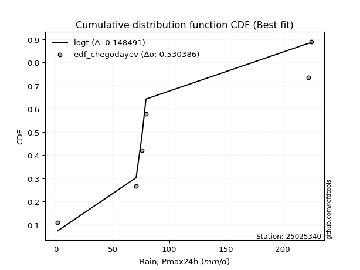</img>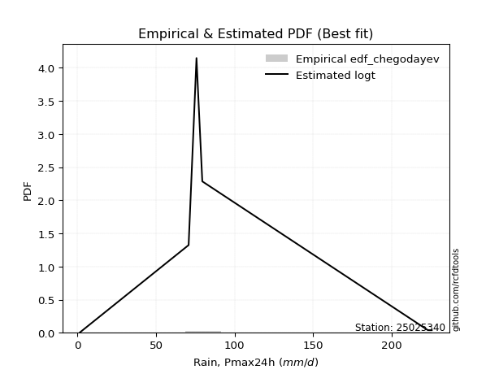</img>

</div>


### 6. EDF Blom (1958)

The Blom formula is a specific "plotting position" formula used in hydrology and statistical analysis to estimate the empirical cumulative probability (or non-exceedance probability) of a data series. It is particularly recommended for data that are approximately normally distributed. The constant _a_ is set to 0.375 (or 3/8).

<div align="center">


$P=(m-a)/(n+1-2a)$


</div>


**6.1. Empirical values**

<div align="center">

|                | 0                   | 1                   | 2                  | 3        | 4                  | 5                  | 6                  |
|:---------------|:--------------------|:--------------------|:-------------------|:---------|:-------------------|:-------------------|:-------------------|
| date           | 2022                | 2020                | 2017               | 2018     | 2025               | 2019               | 2021               |
| x              | 1.6                 | 70.7                | 75.7               | 79.4     | 105.9              | 222.9              | 225.4              |
| m              | 1                   | 2                   | 3                  | 4        | 5                  | 6                  | 7                  |
| empirical_dist | edf_blom            | edf_blom            | edf_blom           | edf_blom | edf_blom           | edf_blom           | edf_blom           |
| empirical      | 0.08620689655172414 | 0.22413793103448276 | 0.3620689655172414 | 0.5      | 0.6379310344827587 | 0.7758620689655172 | 0.9137931034482759 |
| empirical_tr   | 1.0943396226415094  | 1.288888888888889   | 1.5675675675675675 | 2.0      | 2.7619047619047623 | 4.461538461538462  | 11.600000000000007 |

</div>


**6.2. Kolmogorov-Smirnov fit test (sorted by Δ)**


<div align="center">

|                | 0                   | 1                   | 2                   | 3                   | 4                   | 5                   | 6                   | 7                   | 8                   | 9                   | 10                  | 11                  | 12                  | 13                  | 14                  | 15                  | 16                  | 17                  | 18                  | 19                  | 20                  | 21                  | 22                  | 23                  | 24                  | 25                  | 26                  | 27                  | 28                  | 29                  | 30                  | 31                  | 32                  | 33                  | 34                  | 35                  | 36                  | 37                  | 38                  | 39                  | 40                  | 41                  | 42                  | 43                  | 44                  | 45                  | 46                  | 47                  | 48                  | 49                  | 50                  | 51                  | 52                  | 53                  | 54                  | 55                  | 56                  | 57                  | 58                  | 59                  | 60                  | 61                  | 62                  | 63                  | 64                  | 65                  | 66                  | 67                  | 68                  | 69                  | 70                  | 71                  | 72                  | 73                  | 74                  | 75                  | 76                  | 77                  | 78                  | 79                  | 80                  | 81                  | 82                  | 83                  | 84                  | 85                  | 86                  | 87                  | 88                  | 89                  | 90                  | 91                  | 92                  | 93                  | 94                  | 95                  | 96                  | 97                  | 98                  | 99                  | 100                 | 101                 | 102                 | 103                 | 104                 | 105                 | 106                 | 107                 | 108                 | 109                 | 110                 | 111                 | 112                 | 113                 | 114                 | 115                 | 116                 | 117                 | 118                 | 119                 | 120                 | 121                 | 122                 | 123                 | 124                 | 125                 | 126                 | 127                 | 128                 | 129                 | 130                 | 131                 | 132                 | 133                 | 134                 | 135                 | 136                 | 137                 | 138                 | 139                 | 140                 | 141                 | 142                 | 143                 | 144                 | 145                 | 146                 | 147                 | 148                 | 149                 | 150                 | 151                 | 152                 | 153                 | 154                 | 155                 | 156                 | 157                 | 158                 | 159                 |
|:---------------|:--------------------|:--------------------|:--------------------|:--------------------|:--------------------|:--------------------|:--------------------|:--------------------|:--------------------|:--------------------|:--------------------|:--------------------|:--------------------|:--------------------|:--------------------|:--------------------|:--------------------|:--------------------|:--------------------|:--------------------|:--------------------|:--------------------|:--------------------|:--------------------|:--------------------|:--------------------|:--------------------|:--------------------|:--------------------|:--------------------|:--------------------|:--------------------|:--------------------|:--------------------|:--------------------|:--------------------|:--------------------|:--------------------|:--------------------|:--------------------|:--------------------|:--------------------|:--------------------|:--------------------|:--------------------|:--------------------|:--------------------|:--------------------|:--------------------|:--------------------|:--------------------|:--------------------|:--------------------|:--------------------|:--------------------|:--------------------|:--------------------|:--------------------|:--------------------|:--------------------|:--------------------|:--------------------|:--------------------|:--------------------|:--------------------|:--------------------|:--------------------|:--------------------|:--------------------|:--------------------|:--------------------|:--------------------|:--------------------|:--------------------|:--------------------|:--------------------|:--------------------|:--------------------|:--------------------|:--------------------|:--------------------|:--------------------|:--------------------|:--------------------|:--------------------|:--------------------|:--------------------|:--------------------|:--------------------|:--------------------|:--------------------|:--------------------|:--------------------|:--------------------|:--------------------|:--------------------|:--------------------|:--------------------|:--------------------|:--------------------|:--------------------|:--------------------|:--------------------|:--------------------|:--------------------|:--------------------|:--------------------|:--------------------|:--------------------|:--------------------|:--------------------|:--------------------|:--------------------|:--------------------|:--------------------|:--------------------|:--------------------|:--------------------|:--------------------|:--------------------|:--------------------|:--------------------|:--------------------|:--------------------|:--------------------|:--------------------|:--------------------|:--------------------|:--------------------|:--------------------|:--------------------|:--------------------|:--------------------|:--------------------|:--------------------|:--------------------|:--------------------|:--------------------|:--------------------|:--------------------|:--------------------|:--------------------|:--------------------|:--------------------|:--------------------|:--------------------|:--------------------|:--------------------|:--------------------|:--------------------|:--------------------|:--------------------|:--------------------|:--------------------|:--------------------|:--------------------|:--------------------|:--------------------|:--------------------|:--------------------|
| station        | 25025340            | 25025340            | 25025340            | 25025340            | 25025340            | 25025340            | 25025340            | 25025340            | 25025340            | 25025340            | 25025340            | 25025340            | 25025340            | 25025340            | 25025340            | 25025340            | 25025340            | 25025340            | 25025340            | 25025340            | 25025340            | 25025340            | 25025340            | 25025340            | 25025340            | 25025340            | 25025340            | 25025340            | 25025340            | 25025340            | 25025340            | 25025340            | 25025340            | 25025340            | 25025340            | 25025340            | 25025340            | 25025340            | 25025340            | 25025340            | 25025340            | 25025340            | 25025340            | 25025340            | 25025340            | 25025340            | 25025340            | 25025340            | 25025340            | 25025340            | 25025340            | 25025340            | 25025340            | 25025340            | 25025340            | 25025340            | 25025340            | 25025340            | 25025340            | 25025340            | 25025340            | 25025340            | 25025340            | 25025340            | 25025340            | 25025340            | 25025340            | 25025340            | 25025340            | 25025340            | 25025340            | 25025340            | 25025340            | 25025340            | 25025340            | 25025340            | 25025340            | 25025340            | 25025340            | 25025340            | 25025340            | 25025340            | 25025340            | 25025340            | 25025340            | 25025340            | 25025340            | 25025340            | 25025340            | 25025340            | 25025340            | 25025340            | 25025340            | 25025340            | 25025340            | 25025340            | 25025340            | 25025340            | 25025340            | 25025340            | 25025340            | 25025340            | 25025340            | 25025340            | 25025340            | 25025340            | 25025340            | 25025340            | 25025340            | 25025340            | 25025340            | 25025340            | 25025340            | 25025340            | 25025340            | 25025340            | 25025340            | 25025340            | 25025340            | 25025340            | 25025340            | 25025340            | 25025340            | 25025340            | 25025340            | 25025340            | 25025340            | 25025340            | 25025340            | 25025340            | 25025340            | 25025340            | 25025340            | 25025340            | 25025340            | 25025340            | 25025340            | 25025340            | 25025340            | 25025340            | 25025340            | 25025340            | 25025340            | 25025340            | 25025340            | 25025340            | 25025340            | 25025340            | 25025340            | 25025340            | 25025340            | 25025340            | 25025340            | 25025340            | 25025340            | 25025340            | 25025340            | 25025340            | 25025340            | 25025340            |
| empirical_dist | edf_blom            | edf_blom            | edf_blom            | edf_blom            | edf_blom            | edf_blom            | edf_blom            | edf_blom            | edf_blom            | edf_blom            | edf_blom            | edf_blom            | edf_blom            | edf_blom            | edf_blom            | edf_blom            | edf_blom            | edf_blom            | edf_blom            | edf_blom            | edf_blom            | edf_blom            | edf_blom            | edf_blom            | edf_blom            | edf_blom            | edf_blom            | edf_blom            | edf_blom            | edf_blom            | edf_blom            | edf_blom            | edf_blom            | edf_blom            | edf_blom            | edf_blom            | edf_blom            | edf_blom            | edf_blom            | edf_blom            | edf_blom            | edf_blom            | edf_blom            | edf_blom            | edf_blom            | edf_blom            | edf_blom            | edf_blom            | edf_blom            | edf_blom            | edf_blom            | edf_blom            | edf_blom            | edf_blom            | edf_blom            | edf_blom            | edf_blom            | edf_blom            | edf_blom            | edf_blom            | edf_blom            | edf_blom            | edf_blom            | edf_blom            | edf_blom            | edf_blom            | edf_blom            | edf_blom            | edf_blom            | edf_blom            | edf_blom            | edf_blom            | edf_blom            | edf_blom            | edf_blom            | edf_blom            | edf_blom            | edf_blom            | edf_blom            | edf_blom            | edf_blom            | edf_blom            | edf_blom            | edf_blom            | edf_blom            | edf_blom            | edf_blom            | edf_blom            | edf_blom            | edf_blom            | edf_blom            | edf_blom            | edf_blom            | edf_blom            | edf_blom            | edf_blom            | edf_blom            | edf_blom            | edf_blom            | edf_blom            | edf_blom            | edf_blom            | edf_blom            | edf_blom            | edf_blom            | edf_blom            | edf_blom            | edf_blom            | edf_blom            | edf_blom            | edf_blom            | edf_blom            | edf_blom            | edf_blom            | edf_blom            | edf_blom            | edf_blom            | edf_blom            | edf_blom            | edf_blom            | edf_blom            | edf_blom            | edf_blom            | edf_blom            | edf_blom            | edf_blom            | edf_blom            | edf_blom            | edf_blom            | edf_blom            | edf_blom            | edf_blom            | edf_blom            | edf_blom            | edf_blom            | edf_blom            | edf_blom            | edf_blom            | edf_blom            | edf_blom            | edf_blom            | edf_blom            | edf_blom            | edf_blom            | edf_blom            | edf_blom            | edf_blom            | edf_blom            | edf_blom            | edf_blom            | edf_blom            | edf_blom            | edf_blom            | edf_blom            | edf_blom            | edf_blom            | edf_blom            | edf_blom            | edf_blom            | edf_blom            |
| p_dist         | loggennorm          | alpha               | exponnorm           | ncf                 | betaprime           | genlogistic         | invgauss            | gamma               | erlang              | kstwobign           | invgamma            | skewnorm            | rayleigh            | exponweib           | maxwell             | weibull_min         | moyal               | rice                | gumbel_r            | halflogistic        | genextreme          | foldnorm            | burr12              | pearson3            | halfnorm            | wald                | ksone               | semicircular        | anglit              | crystalball         | logargus            | johnsonsu           | t                   | norm                | logt                | loggengamma         | logexponweib        | logistic            | logexponpow         | cosine              | logvonmises_line    | logdgamma           | gennorm             | hypsecant           | logpearson3         | burr                | loggenextreme       | logdweibull         | gengamma            | wrapcauchy          | logweibull_min      | kappa4              | tukeylambda         | kappa3              | uniform             | vonmises_line       | dweibull            | logmielke           | logloggamma         | bradford            | truncweibull_min    | truncexpon          | logweibull_max      | loggompertz         | loggenpareto        | laplace             | arcsine             | logburr12           | lomax               | gumbel_l            | loggumbel_l         | argus               | genexpon            | logloglaplace       | logburr             | logtrapezoid        | mielke              | johnsonsb           | dgamma              | triang              | f                   | beta                | logarcsine          | logfoldnorm         | logsemicircular     | loganglit           | logf                | logexponnorm        | logcrystalball      | lognorm             | logrice             | logfatiguelife      | lognct              | loglevy_l           | gausshyper          | loglogistic         | loghypsecant        | loggamma            | loggamma            | loginvgamma         | loginvgauss         | logerlang           | logbetaprime        | levy_l              | loglaplace          | loglaplace          | logbeta             | halfgennorm         | genpareto           | loginvweibull       | logalpha            | logmaxwell          | logskewnorm         | logncf              | lograyleigh         | logtruncnorm        | genhalflogistic     | logkstwobign        | nakagami            | loggenhalflogistic  | logwrapcauchy       | loggausshyper       | loghalfnorm         | loggumbel_r         | loggenexpon         | logtruncweibull_min | logcosine           | loglomax            | logmoyal            | loghalflogistic     | logtriang           | trapezoid           | nct                 | logjohnsonsu        | logkappa4           | invweibull          | logwald             | lognakagami         | logksone            | logjohnsonsb        | loghalfgennorm      | rdist               | logkappa3           | loguniform          | logbradford         | weibull_max         | fatiguelife         | logtruncexpon       | powerlaw            | gompertz            | truncpareto         | exponpow            | logpowerlaw         | logtruncpareto      | truncnorm           | loggenlogistic      | logtukeylambda      | logrdist            | logvonmises         | vonmises            |
| delta          | 0.11697903931494069 | 0.12266059850513933 | 0.12725243176647683 | 0.12778384314912528 | 0.12917920713869024 | 0.1317663085904337  | 0.13185406799962773 | 0.13252841332395193 | 0.13252843198079184 | 0.1330253283698648  | 0.13387286443631874 | 0.13433038336556224 | 0.13525251442992947 | 0.13789068808056715 | 0.13834602592646517 | 0.13890292217121408 | 0.1393995776965833  | 0.13954497488164097 | 0.13993675952739681 | 0.14026007627927367 | 0.14057934062744482 | 0.14063388155139034 | 0.14075055685342203 | 0.1416031757327595  | 0.14257959648259133 | 0.14834965057055105 | 0.15952355408427138 | 0.16173464292572742 | 0.1634886019531902  | 0.16676743174861275 | 0.16738754585709625 | 0.16756543167367732 | 0.16769265635943054 | 0.1677435892466122  | 0.1757422669426818  | 0.1808948726325995  | 0.18117312273077169 | 0.1813873568473534  | 0.1826460316476618  | 0.18616908642292213 | 0.18817436435861284 | 0.18841556421434713 | 0.19148945309295934 | 0.19587025547944892 | 0.1965733404920592  | 0.19789163030606505 | 0.20225400974852936 | 0.20715018038028804 | 0.2081626516653851  | 0.2091233358575052  | 0.210411557708022   | 0.2110047716117377  | 0.21122602018789272 | 0.21129220127027726 | 0.21296724292009495 | 0.21304601610272988 | 0.2134485183721545  | 0.21469756086406544 | 0.21537071129444507 | 0.21537895129440898 | 0.21671541022905128 | 0.21715689609440347 | 0.21910872680591342 | 0.2222055549816091  | 0.22238371252226036 | 0.22358101460129287 | 0.22413793103448276 | 0.233112359223987   | 0.23656316610643768 | 0.238366630378118   | 0.2397453153716793  | 0.24187220176856106 | 0.2420869697692125  | 0.2428044567454622  | 0.24780852566431477 | 0.24930063816193032 | 0.26007900393310157 | 0.2603405290243657  | 0.2758620689949851  | 0.2855425921783328  | 0.28690007583860666 | 0.28779000560326096 | 0.29423765866839313 | 0.2995783695865082  | 0.3018291628690566  | 0.3037413200298904  | 0.3075040486767937  | 0.30837544170639786 | 0.3083790034121593  | 0.30837905111115294 | 0.3083791173022572  | 0.30869694576912043 | 0.3087400951100362  | 0.31079937238363997 | 0.31088118535399933 | 0.3127954780122473  | 0.31655003635527024 | 0.3168094845175714  | 0.3168094845175714  | 0.3211697046482521  | 0.3220463284245686  | 0.32330295431955736 | 0.324432572997304   | 0.32444177610529357 | 0.3303561793910761  | 0.3303561793910761  | 0.3313139146217937  | 0.3322447962108096  | 0.3328875445698439  | 0.33593464137998785 | 0.33897255479876465 | 0.33984615468445867 | 0.34260805195567323 | 0.3436221601105972  | 0.35007862978374094 | 0.3596180732531459  | 0.36047469531463644 | 0.36617305777937204 | 0.36786931749066165 | 0.3681437558089088  | 0.36847897437356825 | 0.3742569974132979  | 0.3789063311513262  | 0.3789630479855254  | 0.38373531423089136 | 0.3847779267008784  | 0.3850503415602403  | 0.40357364565739895 | 0.4042974457828281  | 0.40552944422874015 | 0.4111803023016454  | 0.4117644900797226  | 0.41391551987033703 | 0.4187792553349335  | 0.4601154569276661  | 0.4649358070943548  | 0.4746197611295371  | 0.4792688206689587  | 0.49725441688619243 | 0.5036140348964662  | 0.5141625610605634  | 0.5368503013030254  | 0.5415294764331383  | 0.5415328864703276  | 0.5632931288511475  | 0.5642992040750117  | 0.6065160867527453  | 0.6082755169301103  | 0.6106840593784008  | 0.6379310344826056  | 0.6921235988653838  | 0.7086134355470022  | 0.7301553346084868  | 0.7559162342547763  | 0.7758620084281737  | 0.7758620689655172  | 0.7758620689655172  | 0.7758620689655172  | 0.9764530107115078  | 35.38532509023171   |
| deltao         | 0.48442053926100004 | 0.48442053926100004 | 0.48442053926100004 | 0.48442053926100004 | 0.48442053926100004 | 0.48442053926100004 | 0.48442053926100004 | 0.48442053926100004 | 0.48442053926100004 | 0.48442053926100004 | 0.48442053926100004 | 0.48442053926100004 | 0.48442053926100004 | 0.48442053926100004 | 0.48442053926100004 | 0.48442053926100004 | 0.48442053926100004 | 0.48442053926100004 | 0.48442053926100004 | 0.48442053926100004 | 0.48442053926100004 | 0.48442053926100004 | 0.48442053926100004 | 0.48442053926100004 | 0.48442053926100004 | 0.48442053926100004 | 0.48442053926100004 | 0.48442053926100004 | 0.48442053926100004 | 0.48442053926100004 | 0.48442053926100004 | 0.48442053926100004 | 0.48442053926100004 | 0.48442053926100004 | 0.48442053926100004 | 0.48442053926100004 | 0.48442053926100004 | 0.48442053926100004 | 0.48442053926100004 | 0.48442053926100004 | 0.48442053926100004 | 0.48442053926100004 | 0.48442053926100004 | 0.48442053926100004 | 0.48442053926100004 | 0.48442053926100004 | 0.48442053926100004 | 0.48442053926100004 | 0.48442053926100004 | 0.48442053926100004 | 0.48442053926100004 | 0.48442053926100004 | 0.48442053926100004 | 0.48442053926100004 | 0.48442053926100004 | 0.48442053926100004 | 0.48442053926100004 | 0.48442053926100004 | 0.48442053926100004 | 0.48442053926100004 | 0.48442053926100004 | 0.48442053926100004 | 0.48442053926100004 | 0.48442053926100004 | 0.48442053926100004 | 0.48442053926100004 | 0.48442053926100004 | 0.48442053926100004 | 0.48442053926100004 | 0.48442053926100004 | 0.48442053926100004 | 0.48442053926100004 | 0.48442053926100004 | 0.48442053926100004 | 0.48442053926100004 | 0.48442053926100004 | 0.48442053926100004 | 0.48442053926100004 | 0.48442053926100004 | 0.48442053926100004 | 0.48442053926100004 | 0.48442053926100004 | 0.48442053926100004 | 0.48442053926100004 | 0.48442053926100004 | 0.48442053926100004 | 0.48442053926100004 | 0.48442053926100004 | 0.48442053926100004 | 0.48442053926100004 | 0.48442053926100004 | 0.48442053926100004 | 0.48442053926100004 | 0.48442053926100004 | 0.48442053926100004 | 0.48442053926100004 | 0.48442053926100004 | 0.48442053926100004 | 0.48442053926100004 | 0.48442053926100004 | 0.48442053926100004 | 0.48442053926100004 | 0.48442053926100004 | 0.48442053926100004 | 0.48442053926100004 | 0.48442053926100004 | 0.48442053926100004 | 0.48442053926100004 | 0.48442053926100004 | 0.48442053926100004 | 0.48442053926100004 | 0.48442053926100004 | 0.48442053926100004 | 0.48442053926100004 | 0.48442053926100004 | 0.48442053926100004 | 0.48442053926100004 | 0.48442053926100004 | 0.48442053926100004 | 0.48442053926100004 | 0.48442053926100004 | 0.48442053926100004 | 0.48442053926100004 | 0.48442053926100004 | 0.48442053926100004 | 0.48442053926100004 | 0.48442053926100004 | 0.48442053926100004 | 0.48442053926100004 | 0.48442053926100004 | 0.48442053926100004 | 0.48442053926100004 | 0.48442053926100004 | 0.48442053926100004 | 0.48442053926100004 | 0.48442053926100004 | 0.48442053926100004 | 0.48442053926100004 | 0.48442053926100004 | 0.48442053926100004 | 0.48442053926100004 | 0.48442053926100004 | 0.48442053926100004 | 0.48442053926100004 | 0.48442053926100004 | 0.48442053926100004 | 0.48442053926100004 | 0.48442053926100004 | 0.48442053926100004 | 0.48442053926100004 | 0.48442053926100004 | 0.48442053926100004 | 0.48442053926100004 | 0.48442053926100004 | 0.48442053926100004 | 0.48442053926100004 | 0.48442053926100004 | 0.48442053926100004 | 0.48442053926100004 | 0.48442053926100004 |
| eval           | Δo > Δ              | Δo > Δ              | Δo > Δ              | Δo > Δ              | Δo > Δ              | Δo > Δ              | Δo > Δ              | Δo > Δ              | Δo > Δ              | Δo > Δ              | Δo > Δ              | Δo > Δ              | Δo > Δ              | Δo > Δ              | Δo > Δ              | Δo > Δ              | Δo > Δ              | Δo > Δ              | Δo > Δ              | Δo > Δ              | Δo > Δ              | Δo > Δ              | Δo > Δ              | Δo > Δ              | Δo > Δ              | Δo > Δ              | Δo > Δ              | Δo > Δ              | Δo > Δ              | Δo > Δ              | Δo > Δ              | Δo > Δ              | Δo > Δ              | Δo > Δ              | Δo > Δ              | Δo > Δ              | Δo > Δ              | Δo > Δ              | Δo > Δ              | Δo > Δ              | Δo > Δ              | Δo > Δ              | Δo > Δ              | Δo > Δ              | Δo > Δ              | Δo > Δ              | Δo > Δ              | Δo > Δ              | Δo > Δ              | Δo > Δ              | Δo > Δ              | Δo > Δ              | Δo > Δ              | Δo > Δ              | Δo > Δ              | Δo > Δ              | Δo > Δ              | Δo > Δ              | Δo > Δ              | Δo > Δ              | Δo > Δ              | Δo > Δ              | Δo > Δ              | Δo > Δ              | Δo > Δ              | Δo > Δ              | Δo > Δ              | Δo > Δ              | Δo > Δ              | Δo > Δ              | Δo > Δ              | Δo > Δ              | Δo > Δ              | Δo > Δ              | Δo > Δ              | Δo > Δ              | Δo > Δ              | Δo > Δ              | Δo > Δ              | Δo > Δ              | Δo > Δ              | Δo > Δ              | Δo > Δ              | Δo > Δ              | Δo > Δ              | Δo > Δ              | Δo > Δ              | Δo > Δ              | Δo > Δ              | Δo > Δ              | Δo > Δ              | Δo > Δ              | Δo > Δ              | Δo > Δ              | Δo > Δ              | Δo > Δ              | Δo > Δ              | Δo > Δ              | Δo > Δ              | Δo > Δ              | Δo > Δ              | Δo > Δ              | Δo > Δ              | Δo > Δ              | Δo > Δ              | Δo > Δ              | Δo > Δ              | Δo > Δ              | Δo > Δ              | Δo > Δ              | Δo > Δ              | Δo > Δ              | Δo > Δ              | Δo > Δ              | Δo > Δ              | Δo > Δ              | Δo > Δ              | Δo > Δ              | Δo > Δ              | Δo > Δ              | Δo > Δ              | Δo > Δ              | Δo > Δ              | Δo > Δ              | Δo > Δ              | Δo > Δ              | Δo > Δ              | Δo > Δ              | Δo > Δ              | Δo > Δ              | Δo > Δ              | Δo > Δ              | Δo > Δ              | Δo > Δ              | Δo > Δ              | Δo > Δ              | Δo > Δ              | Δo > Δ              | Δo <= Δ             | Δo <= Δ             | Δo <= Δ             | Δo <= Δ             | Δo <= Δ             | Δo <= Δ             | Δo <= Δ             | Δo <= Δ             | Δo <= Δ             | Δo <= Δ             | Δo <= Δ             | Δo <= Δ             | Δo <= Δ             | Δo <= Δ             | Δo <= Δ             | Δo <= Δ             | Δo <= Δ             | Δo <= Δ             | Δo <= Δ             | Δo <= Δ             | Δo <= Δ             | Δo <= Δ             |
| fit            | 1                   | 1                   | 1                   | 1                   | 1                   | 1                   | 1                   | 1                   | 1                   | 1                   | 1                   | 1                   | 1                   | 1                   | 1                   | 1                   | 1                   | 1                   | 1                   | 1                   | 1                   | 1                   | 1                   | 1                   | 1                   | 1                   | 1                   | 1                   | 1                   | 1                   | 1                   | 1                   | 1                   | 1                   | 1                   | 1                   | 1                   | 1                   | 1                   | 1                   | 1                   | 1                   | 1                   | 1                   | 1                   | 1                   | 1                   | 1                   | 1                   | 1                   | 1                   | 1                   | 1                   | 1                   | 1                   | 1                   | 1                   | 1                   | 1                   | 1                   | 1                   | 1                   | 1                   | 1                   | 1                   | 1                   | 1                   | 1                   | 1                   | 1                   | 1                   | 1                   | 1                   | 1                   | 1                   | 1                   | 1                   | 1                   | 1                   | 1                   | 1                   | 1                   | 1                   | 1                   | 1                   | 1                   | 1                   | 1                   | 1                   | 1                   | 1                   | 1                   | 1                   | 1                   | 1                   | 1                   | 1                   | 1                   | 1                   | 1                   | 1                   | 1                   | 1                   | 1                   | 1                   | 1                   | 1                   | 1                   | 1                   | 1                   | 1                   | 1                   | 1                   | 1                   | 1                   | 1                   | 1                   | 1                   | 1                   | 1                   | 1                   | 1                   | 1                   | 1                   | 1                   | 1                   | 1                   | 1                   | 1                   | 1                   | 1                   | 1                   | 1                   | 1                   | 1                   | 1                   | 1                   | 1                   | 0                   | 0                   | 0                   | 0                   | 0                   | 0                   | 0                   | 0                   | 0                   | 0                   | 0                   | 0                   | 0                   | 0                   | 0                   | 0                   | 0                   | 0                   | 0                   | 0                   | 0                   | 0                   |
| n              | 7                   | 7                   | 7                   | 7                   | 7                   | 7                   | 7                   | 7                   | 7                   | 7                   | 7                   | 7                   | 7                   | 7                   | 7                   | 7                   | 7                   | 7                   | 7                   | 7                   | 7                   | 7                   | 7                   | 7                   | 7                   | 7                   | 7                   | 7                   | 7                   | 7                   | 7                   | 7                   | 7                   | 7                   | 7                   | 7                   | 7                   | 7                   | 7                   | 7                   | 7                   | 7                   | 7                   | 7                   | 7                   | 7                   | 7                   | 7                   | 7                   | 7                   | 7                   | 7                   | 7                   | 7                   | 7                   | 7                   | 7                   | 7                   | 7                   | 7                   | 7                   | 7                   | 7                   | 7                   | 7                   | 7                   | 7                   | 7                   | 7                   | 7                   | 7                   | 7                   | 7                   | 7                   | 7                   | 7                   | 7                   | 7                   | 7                   | 7                   | 7                   | 7                   | 7                   | 7                   | 7                   | 7                   | 7                   | 7                   | 7                   | 7                   | 7                   | 7                   | 7                   | 7                   | 7                   | 7                   | 7                   | 7                   | 7                   | 7                   | 7                   | 7                   | 7                   | 7                   | 7                   | 7                   | 7                   | 7                   | 7                   | 7                   | 7                   | 7                   | 7                   | 7                   | 7                   | 7                   | 7                   | 7                   | 7                   | 7                   | 7                   | 7                   | 7                   | 7                   | 7                   | 7                   | 7                   | 7                   | 7                   | 7                   | 7                   | 7                   | 7                   | 7                   | 7                   | 7                   | 7                   | 7                   | 7                   | 7                   | 7                   | 7                   | 7                   | 7                   | 7                   | 7                   | 7                   | 7                   | 7                   | 7                   | 7                   | 7                   | 7                   | 7                   | 7                   | 7                   | 7                   | 7                   | 7                   | 7                   |
| best_fit       | 1                   | 0                   | 0                   | 0                   | 0                   | 0                   | 0                   | 0                   | 0                   | 0                   | 0                   | 0                   | 0                   | 0                   | 0                   | 0                   | 0                   | 0                   | 0                   | 0                   | 0                   | 0                   | 0                   | 0                   | 0                   | 0                   | 0                   | 0                   | 0                   | 0                   | 0                   | 0                   | 0                   | 0                   | 0                   | 0                   | 0                   | 0                   | 0                   | 0                   | 0                   | 0                   | 0                   | 0                   | 0                   | 0                   | 0                   | 0                   | 0                   | 0                   | 0                   | 0                   | 0                   | 0                   | 0                   | 0                   | 0                   | 0                   | 0                   | 0                   | 0                   | 0                   | 0                   | 0                   | 0                   | 0                   | 0                   | 0                   | 0                   | 0                   | 0                   | 0                   | 0                   | 0                   | 0                   | 0                   | 0                   | 0                   | 0                   | 0                   | 0                   | 0                   | 0                   | 0                   | 0                   | 0                   | 0                   | 0                   | 0                   | 0                   | 0                   | 0                   | 0                   | 0                   | 0                   | 0                   | 0                   | 0                   | 0                   | 0                   | 0                   | 0                   | 0                   | 0                   | 0                   | 0                   | 0                   | 0                   | 0                   | 0                   | 0                   | 0                   | 0                   | 0                   | 0                   | 0                   | 0                   | 0                   | 0                   | 0                   | 0                   | 0                   | 0                   | 0                   | 0                   | 0                   | 0                   | 0                   | 0                   | 0                   | 0                   | 0                   | 0                   | 0                   | 0                   | 0                   | 0                   | 0                   | 0                   | 0                   | 0                   | 0                   | 0                   | 0                   | 0                   | 0                   | 0                   | 0                   | 0                   | 0                   | 0                   | 0                   | 0                   | 0                   | 0                   | 0                   | 0                   | 0                   | 0                   | 0                   |
| best_fit_sort  | 1                   | 2                   | 3                   | 4                   | 5                   | 6                   | 7                   | 8                   | 9                   | 10                  | 11                  | 12                  | 13                  | 14                  | 15                  | 16                  | 17                  | 18                  | 19                  | 20                  | 21                  | 22                  | 23                  | 24                  | 25                  | 26                  | 27                  | 28                  | 29                  | 30                  | 31                  | 32                  | 33                  | 34                  | 35                  | 36                  | 37                  | 38                  | 39                  | 40                  | 41                  | 42                  | 43                  | 44                  | 45                  | 46                  | 47                  | 48                  | 49                  | 50                  | 51                  | 52                  | 53                  | 54                  | 55                  | 56                  | 57                  | 58                  | 59                  | 60                  | 61                  | 62                  | 63                  | 64                  | 65                  | 66                  | 67                  | 68                  | 69                  | 70                  | 71                  | 72                  | 73                  | 74                  | 75                  | 76                  | 77                  | 78                  | 79                  | 80                  | 81                  | 82                  | 83                  | 84                  | 85                  | 86                  | 87                  | 88                  | 89                  | 90                  | 91                  | 92                  | 93                  | 94                  | 95                  | 96                  | 97                  | 98                  | 99                  | 100                 | 101                 | 102                 | 103                 | 104                 | 105                 | 106                 | 107                 | 108                 | 109                 | 110                 | 111                 | 112                 | 113                 | 114                 | 115                 | 116                 | 117                 | 118                 | 119                 | 120                 | 121                 | 122                 | 123                 | 124                 | 125                 | 126                 | 127                 | 128                 | 129                 | 130                 | 131                 | 132                 | 133                 | 134                 | 135                 | 136                 | 137                 | 138                 | 139                 | 140                 | 141                 | 142                 | 143                 | 144                 | 145                 | 146                 | 147                 | 148                 | 149                 | 150                 | 151                 | 152                 | 153                 | 154                 | 155                 | 156                 | 157                 | 158                 | 159                 | 160                 |

</div>


**6.3. Best fit**

<div align="center">

|   id |   station | empirical_dist   | p_dist     |    delta |   deltao | eval   |   fit |   n |   best_fit |   best_fit_sort |
|-----:|----------:|:-----------------|:-----------|---------:|---------:|:-------|------:|----:|-----------:|----------------:|
|    0 |  25025340 | edf_blom         | loggennorm | 0.116979 | 0.484421 | Δo > Δ |     1 |   7 |          1 |               1 |

</div>


<div align="center">

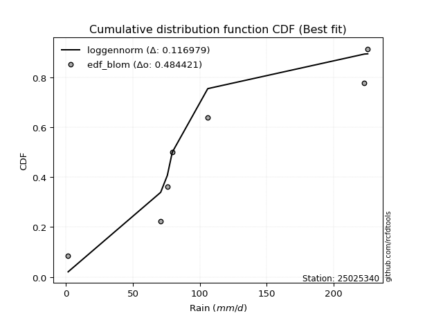</img></img>

</div>


### 7. EDF Tukey (1962)

In hydrology, the Tukey formula is used as a plotting position formula to estimate the empirical probability or frequency of a flood event (or other hydrological data). The formula parameter is given as _c=0.333_ (or 1/3).

<div align="center">


$P=(m-c)/(n+1-2c)$


</div>


**7.1. Empirical values**

<div align="center">

|                | 0                   | 1                   | 2                   | 3         | 4                  | 5                  | 6                  |
|:---------------|:--------------------|:--------------------|:--------------------|:----------|:-------------------|:-------------------|:-------------------|
| date           | 2022                | 2020                | 2017                | 2018      | 2025               | 2019               | 2021               |
| x              | 1.6                 | 70.7                | 75.7                | 79.4      | 105.9              | 222.9              | 225.4              |
| m              | 1                   | 2                   | 3                   | 4         | 5                  | 6                  | 7                  |
| empirical_dist | edf_tukey           | edf_tukey           | edf_tukey           | edf_tukey | edf_tukey          | edf_tukey          | edf_tukey          |
| empirical      | 0.09090909090909091 | 0.22727272727272727 | 0.36363636363636365 | 0.5       | 0.6363636363636364 | 0.7727272727272727 | 0.9090909090909091 |
| empirical_tr   | 1.1                 | 1.2941176470588236  | 1.5714285714285714  | 2.0       | 2.75               | 4.3999999999999995 | 10.999999999999996 |

</div>


**7.2. Kolmogorov-Smirnov fit test (sorted by Δ)**


<div align="center">

|                | 0                   | 1                   | 2                   | 3                   | 4                   | 5                   | 6                   | 7                   | 8                   | 9                   | 10                  | 11                  | 12                  | 13                  | 14                  | 15                  | 16                  | 17                  | 18                  | 19                  | 20                  | 21                  | 22                  | 23                  | 24                  | 25                  | 26                  | 27                  | 28                  | 29                  | 30                  | 31                  | 32                  | 33                  | 34                  | 35                  | 36                  | 37                  | 38                  | 39                  | 40                  | 41                  | 42                  | 43                  | 44                  | 45                  | 46                  | 47                  | 48                  | 49                  | 50                  | 51                  | 52                  | 53                  | 54                  | 55                  | 56                  | 57                  | 58                  | 59                  | 60                  | 61                  | 62                  | 63                  | 64                  | 65                  | 66                  | 67                  | 68                  | 69                  | 70                  | 71                  | 72                  | 73                  | 74                  | 75                  | 76                  | 77                  | 78                  | 79                  | 80                  | 81                  | 82                  | 83                  | 84                  | 85                  | 86                  | 87                  | 88                  | 89                  | 90                  | 91                  | 92                  | 93                  | 94                  | 95                  | 96                  | 97                  | 98                  | 99                  | 100                 | 101                 | 102                 | 103                 | 104                 | 105                 | 106                 | 107                 | 108                 | 109                 | 110                 | 111                 | 112                 | 113                 | 114                 | 115                 | 116                 | 117                 | 118                 | 119                 | 120                 | 121                 | 122                 | 123                 | 124                 | 125                 | 126                 | 127                 | 128                 | 129                 | 130                 | 131                 | 132                 | 133                 | 134                 | 135                 | 136                 | 137                 | 138                 | 139                 | 140                 | 141                 | 142                 | 143                 | 144                 | 145                 | 146                 | 147                 | 148                 | 149                 | 150                 | 151                 | 152                 | 153                 | 154                 | 155                 | 156                 | 157                 | 158                 | 159                 |
|:---------------|:--------------------|:--------------------|:--------------------|:--------------------|:--------------------|:--------------------|:--------------------|:--------------------|:--------------------|:--------------------|:--------------------|:--------------------|:--------------------|:--------------------|:--------------------|:--------------------|:--------------------|:--------------------|:--------------------|:--------------------|:--------------------|:--------------------|:--------------------|:--------------------|:--------------------|:--------------------|:--------------------|:--------------------|:--------------------|:--------------------|:--------------------|:--------------------|:--------------------|:--------------------|:--------------------|:--------------------|:--------------------|:--------------------|:--------------------|:--------------------|:--------------------|:--------------------|:--------------------|:--------------------|:--------------------|:--------------------|:--------------------|:--------------------|:--------------------|:--------------------|:--------------------|:--------------------|:--------------------|:--------------------|:--------------------|:--------------------|:--------------------|:--------------------|:--------------------|:--------------------|:--------------------|:--------------------|:--------------------|:--------------------|:--------------------|:--------------------|:--------------------|:--------------------|:--------------------|:--------------------|:--------------------|:--------------------|:--------------------|:--------------------|:--------------------|:--------------------|:--------------------|:--------------------|:--------------------|:--------------------|:--------------------|:--------------------|:--------------------|:--------------------|:--------------------|:--------------------|:--------------------|:--------------------|:--------------------|:--------------------|:--------------------|:--------------------|:--------------------|:--------------------|:--------------------|:--------------------|:--------------------|:--------------------|:--------------------|:--------------------|:--------------------|:--------------------|:--------------------|:--------------------|:--------------------|:--------------------|:--------------------|:--------------------|:--------------------|:--------------------|:--------------------|:--------------------|:--------------------|:--------------------|:--------------------|:--------------------|:--------------------|:--------------------|:--------------------|:--------------------|:--------------------|:--------------------|:--------------------|:--------------------|:--------------------|:--------------------|:--------------------|:--------------------|:--------------------|:--------------------|:--------------------|:--------------------|:--------------------|:--------------------|:--------------------|:--------------------|:--------------------|:--------------------|:--------------------|:--------------------|:--------------------|:--------------------|:--------------------|:--------------------|:--------------------|:--------------------|:--------------------|:--------------------|:--------------------|:--------------------|:--------------------|:--------------------|:--------------------|:--------------------|:--------------------|:--------------------|:--------------------|:--------------------|:--------------------|:--------------------|
| station        | 25025340            | 25025340            | 25025340            | 25025340            | 25025340            | 25025340            | 25025340            | 25025340            | 25025340            | 25025340            | 25025340            | 25025340            | 25025340            | 25025340            | 25025340            | 25025340            | 25025340            | 25025340            | 25025340            | 25025340            | 25025340            | 25025340            | 25025340            | 25025340            | 25025340            | 25025340            | 25025340            | 25025340            | 25025340            | 25025340            | 25025340            | 25025340            | 25025340            | 25025340            | 25025340            | 25025340            | 25025340            | 25025340            | 25025340            | 25025340            | 25025340            | 25025340            | 25025340            | 25025340            | 25025340            | 25025340            | 25025340            | 25025340            | 25025340            | 25025340            | 25025340            | 25025340            | 25025340            | 25025340            | 25025340            | 25025340            | 25025340            | 25025340            | 25025340            | 25025340            | 25025340            | 25025340            | 25025340            | 25025340            | 25025340            | 25025340            | 25025340            | 25025340            | 25025340            | 25025340            | 25025340            | 25025340            | 25025340            | 25025340            | 25025340            | 25025340            | 25025340            | 25025340            | 25025340            | 25025340            | 25025340            | 25025340            | 25025340            | 25025340            | 25025340            | 25025340            | 25025340            | 25025340            | 25025340            | 25025340            | 25025340            | 25025340            | 25025340            | 25025340            | 25025340            | 25025340            | 25025340            | 25025340            | 25025340            | 25025340            | 25025340            | 25025340            | 25025340            | 25025340            | 25025340            | 25025340            | 25025340            | 25025340            | 25025340            | 25025340            | 25025340            | 25025340            | 25025340            | 25025340            | 25025340            | 25025340            | 25025340            | 25025340            | 25025340            | 25025340            | 25025340            | 25025340            | 25025340            | 25025340            | 25025340            | 25025340            | 25025340            | 25025340            | 25025340            | 25025340            | 25025340            | 25025340            | 25025340            | 25025340            | 25025340            | 25025340            | 25025340            | 25025340            | 25025340            | 25025340            | 25025340            | 25025340            | 25025340            | 25025340            | 25025340            | 25025340            | 25025340            | 25025340            | 25025340            | 25025340            | 25025340            | 25025340            | 25025340            | 25025340            | 25025340            | 25025340            | 25025340            | 25025340            | 25025340            | 25025340            |
| empirical_dist | edf_tukey           | edf_tukey           | edf_tukey           | edf_tukey           | edf_tukey           | edf_tukey           | edf_tukey           | edf_tukey           | edf_tukey           | edf_tukey           | edf_tukey           | edf_tukey           | edf_tukey           | edf_tukey           | edf_tukey           | edf_tukey           | edf_tukey           | edf_tukey           | edf_tukey           | edf_tukey           | edf_tukey           | edf_tukey           | edf_tukey           | edf_tukey           | edf_tukey           | edf_tukey           | edf_tukey           | edf_tukey           | edf_tukey           | edf_tukey           | edf_tukey           | edf_tukey           | edf_tukey           | edf_tukey           | edf_tukey           | edf_tukey           | edf_tukey           | edf_tukey           | edf_tukey           | edf_tukey           | edf_tukey           | edf_tukey           | edf_tukey           | edf_tukey           | edf_tukey           | edf_tukey           | edf_tukey           | edf_tukey           | edf_tukey           | edf_tukey           | edf_tukey           | edf_tukey           | edf_tukey           | edf_tukey           | edf_tukey           | edf_tukey           | edf_tukey           | edf_tukey           | edf_tukey           | edf_tukey           | edf_tukey           | edf_tukey           | edf_tukey           | edf_tukey           | edf_tukey           | edf_tukey           | edf_tukey           | edf_tukey           | edf_tukey           | edf_tukey           | edf_tukey           | edf_tukey           | edf_tukey           | edf_tukey           | edf_tukey           | edf_tukey           | edf_tukey           | edf_tukey           | edf_tukey           | edf_tukey           | edf_tukey           | edf_tukey           | edf_tukey           | edf_tukey           | edf_tukey           | edf_tukey           | edf_tukey           | edf_tukey           | edf_tukey           | edf_tukey           | edf_tukey           | edf_tukey           | edf_tukey           | edf_tukey           | edf_tukey           | edf_tukey           | edf_tukey           | edf_tukey           | edf_tukey           | edf_tukey           | edf_tukey           | edf_tukey           | edf_tukey           | edf_tukey           | edf_tukey           | edf_tukey           | edf_tukey           | edf_tukey           | edf_tukey           | edf_tukey           | edf_tukey           | edf_tukey           | edf_tukey           | edf_tukey           | edf_tukey           | edf_tukey           | edf_tukey           | edf_tukey           | edf_tukey           | edf_tukey           | edf_tukey           | edf_tukey           | edf_tukey           | edf_tukey           | edf_tukey           | edf_tukey           | edf_tukey           | edf_tukey           | edf_tukey           | edf_tukey           | edf_tukey           | edf_tukey           | edf_tukey           | edf_tukey           | edf_tukey           | edf_tukey           | edf_tukey           | edf_tukey           | edf_tukey           | edf_tukey           | edf_tukey           | edf_tukey           | edf_tukey           | edf_tukey           | edf_tukey           | edf_tukey           | edf_tukey           | edf_tukey           | edf_tukey           | edf_tukey           | edf_tukey           | edf_tukey           | edf_tukey           | edf_tukey           | edf_tukey           | edf_tukey           | edf_tukey           | edf_tukey           | edf_tukey           | edf_tukey           |
| p_dist         | loggennorm          | alpha               | ncf                 | gamma               | erlang              | exponnorm           | betaprime           | genlogistic         | invgauss            | weibull_min         | kstwobign           | invgamma            | skewnorm            | burr12              | rayleigh            | halflogistic        | halfnorm            | foldnorm            | exponweib           | maxwell             | moyal               | rice                | gumbel_r            | genextreme          | pearson3            | wald                | ksone               | semicircular        | anglit              | crystalball         | johnsonsu           | t                   | norm                | logargus            | logt                | logexponweib        | logexponpow         | logistic            | loggengamma         | cosine              | logvonmises_line    | logdgamma           | gennorm             | logpearson3         | hypsecant           | burr                | logdweibull         | gengamma            | loggenextreme       | logweibull_min      | dweibull            | wrapcauchy          | kappa4              | tukeylambda         | logweibull_max      | kappa3              | uniform             | vonmises_line       | logmielke           | logloggamma         | bradford            | loggompertz         | loggenpareto        | truncweibull_min    | truncexpon          | laplace             | arcsine             | logburr12           | lomax               | loggumbel_l         | gumbel_l            | genexpon            | logloglaplace       | argus               | logburr             | logtrapezoid        | johnsonsb           | mielke              | dgamma              | f                   | triang              | beta                | logarcsine          | logfoldnorm         | logsemicircular     | loganglit           | logf                | logexponnorm        | logcrystalball      | lognorm             | logrice             | logfatiguelife      | lognct              | loglevy_l           | gausshyper          | loglogistic         | loghypsecant        | loggamma            | loggamma            | loginvgamma         | loginvgauss         | logerlang           | logbetaprime        | levy_l              | loglaplace          | loglaplace          | halfgennorm         | logbeta             | genpareto           | loginvweibull       | logalpha            | logmaxwell          | logskewnorm         | logncf              | lograyleigh         | logtruncnorm        | genhalflogistic     | logkstwobign        | nakagami            | loggenhalflogistic  | logwrapcauchy       | loggausshyper       | loghalfnorm         | loggumbel_r         | loggenexpon         | logtruncweibull_min | logcosine           | loglomax            | logmoyal            | loghalflogistic     | logtriang           | trapezoid           | nct                 | logjohnsonsu        | logkappa4           | invweibull          | logwald             | lognakagami         | logksone            | logjohnsonsb        | loghalfgennorm      | rdist               | logkappa3           | loguniform          | logbradford         | weibull_max         | fatiguelife         | logtruncexpon       | powerlaw            | gompertz            | truncpareto         | exponpow            | logpowerlaw         | logtruncpareto      | truncnorm           | loggenlogistic      | logtukeylambda      | logrdist            | logvonmises         | vonmises            |
| delta          | 0.12011383555318522 | 0.12579539474338386 | 0.12621644503000296 | 0.12982370873871907 | 0.1298237212602984  | 0.13038722800472136 | 0.13231400337693477 | 0.13490110482867823 | 0.13498886423787226 | 0.13576812593296958 | 0.13616012460810933 | 0.13700766067456327 | 0.13746517960380678 | 0.13761576061517752 | 0.138387310668174   | 0.13912197597659726 | 0.13944480024434683 | 0.14084449115921394 | 0.14102548431881168 | 0.1414808221647097  | 0.14253437393482782 | 0.1426797711198855  | 0.14307155576564135 | 0.14371413686568935 | 0.14473797197100402 | 0.15148444680879558 | 0.15795615596514906 | 0.1601672448066051  | 0.16192120383406788 | 0.16520003362949043 | 0.165998033554555   | 0.16612525824030822 | 0.16617619112748988 | 0.17052234209534078 | 0.17730966506180412 | 0.17803832649252718 | 0.1795112354094173  | 0.1813873568473534  | 0.18402966887084404 | 0.1846016883037998  | 0.18503956812036834 | 0.18528076797610263 | 0.18835465685471484 | 0.1934385442538147  | 0.19587025547944892 | 0.20102642654430958 | 0.20401538414204354 | 0.2050278554271406  | 0.2053888059867739  | 0.2072767614697775  | 0.21031372213391    | 0.21225813209574973 | 0.21413956784998223 | 0.21436081642613725 | 0.21440653244854666 | 0.2144269975085218  | 0.21610203915833948 | 0.21618081234097442 | 0.21783235710230997 | 0.2185055075326896  | 0.2185137475326535  | 0.2190707587433646  | 0.21924891628401585 | 0.2198502064672958  | 0.220291692332648   | 0.22358101460129287 | 0.2272727272727273  | 0.22997756298574248 | 0.23342836986819318 | 0.2366105191334348  | 0.23679923225899568 | 0.238952173530968   | 0.2396696605072177  | 0.24030480364943874 | 0.24467372942607027 | 0.24616584192368582 | 0.2556383346669989  | 0.25694420769485704 | 0.2727272727567406  | 0.28376527960036213 | 0.28397519405921046 | 0.28622260748413864 | 0.2911028624301486  | 0.29644357334826366 | 0.29869436663081206 | 0.3006065237916459  | 0.3043692524385492  | 0.3052406454681533  | 0.30524420717391476 | 0.3052442548729084  | 0.30524432106401267 | 0.3055621495308759  | 0.30560529887179166 | 0.30923197426451765 | 0.309313787234877   | 0.30966068177400274 | 0.3134152401170257  | 0.3136746882793269  | 0.3136746882793269  | 0.3180349084100076  | 0.31891153218632406 | 0.3201681580813128  | 0.32129777675905946 | 0.32287437798617125 | 0.32722138315283156 | 0.32722138315283156 | 0.32910999997256507 | 0.3297465165026714  | 0.33132014645072155 | 0.3327998451417433  | 0.3358377585605201  | 0.33671135844621414 | 0.3394732557174287  | 0.3404873638723527  | 0.3469438335454964  | 0.35648327701490135 | 0.3589072971955141  | 0.3630382615411275  | 0.3647345212524171  | 0.36500895957066426 | 0.3653441781353237  | 0.37112220117505335 | 0.3757715349130817  | 0.37582825174728085 | 0.3806005179926468  | 0.3816431304626339  | 0.3819155453219958  | 0.4004388494191544  | 0.4011626495445836  | 0.4023946479904956  | 0.40804550606340084 | 0.4101970919606003  | 0.4107807236320925  | 0.41721185721581117 | 0.45698066068942156 | 0.46023361273698793 | 0.47148496489129255 | 0.4761340244307142  | 0.4941196206479479  | 0.502046636777344   | 0.5110277648223188  | 0.5337155050647808  | 0.5383946801948938  | 0.5383980902320831  | 0.5601583326129029  | 0.5627318059558893  | 0.6033812905145007  | 0.6051407206918658  | 0.6075492631401562  | 0.6363636363634833  | 0.6889888026271392  | 0.7054786393087576  | 0.7270205383702423  | 0.7527814380165317  | 0.7727272121899291  | 0.7727272727272727  | 0.7727272727272727  | 0.7727272727272727  | 0.9733182144732633  | 35.39002728458908   |
| deltao         | 0.48442053926100004 | 0.48442053926100004 | 0.48442053926100004 | 0.48442053926100004 | 0.48442053926100004 | 0.48442053926100004 | 0.48442053926100004 | 0.48442053926100004 | 0.48442053926100004 | 0.48442053926100004 | 0.48442053926100004 | 0.48442053926100004 | 0.48442053926100004 | 0.48442053926100004 | 0.48442053926100004 | 0.48442053926100004 | 0.48442053926100004 | 0.48442053926100004 | 0.48442053926100004 | 0.48442053926100004 | 0.48442053926100004 | 0.48442053926100004 | 0.48442053926100004 | 0.48442053926100004 | 0.48442053926100004 | 0.48442053926100004 | 0.48442053926100004 | 0.48442053926100004 | 0.48442053926100004 | 0.48442053926100004 | 0.48442053926100004 | 0.48442053926100004 | 0.48442053926100004 | 0.48442053926100004 | 0.48442053926100004 | 0.48442053926100004 | 0.48442053926100004 | 0.48442053926100004 | 0.48442053926100004 | 0.48442053926100004 | 0.48442053926100004 | 0.48442053926100004 | 0.48442053926100004 | 0.48442053926100004 | 0.48442053926100004 | 0.48442053926100004 | 0.48442053926100004 | 0.48442053926100004 | 0.48442053926100004 | 0.48442053926100004 | 0.48442053926100004 | 0.48442053926100004 | 0.48442053926100004 | 0.48442053926100004 | 0.48442053926100004 | 0.48442053926100004 | 0.48442053926100004 | 0.48442053926100004 | 0.48442053926100004 | 0.48442053926100004 | 0.48442053926100004 | 0.48442053926100004 | 0.48442053926100004 | 0.48442053926100004 | 0.48442053926100004 | 0.48442053926100004 | 0.48442053926100004 | 0.48442053926100004 | 0.48442053926100004 | 0.48442053926100004 | 0.48442053926100004 | 0.48442053926100004 | 0.48442053926100004 | 0.48442053926100004 | 0.48442053926100004 | 0.48442053926100004 | 0.48442053926100004 | 0.48442053926100004 | 0.48442053926100004 | 0.48442053926100004 | 0.48442053926100004 | 0.48442053926100004 | 0.48442053926100004 | 0.48442053926100004 | 0.48442053926100004 | 0.48442053926100004 | 0.48442053926100004 | 0.48442053926100004 | 0.48442053926100004 | 0.48442053926100004 | 0.48442053926100004 | 0.48442053926100004 | 0.48442053926100004 | 0.48442053926100004 | 0.48442053926100004 | 0.48442053926100004 | 0.48442053926100004 | 0.48442053926100004 | 0.48442053926100004 | 0.48442053926100004 | 0.48442053926100004 | 0.48442053926100004 | 0.48442053926100004 | 0.48442053926100004 | 0.48442053926100004 | 0.48442053926100004 | 0.48442053926100004 | 0.48442053926100004 | 0.48442053926100004 | 0.48442053926100004 | 0.48442053926100004 | 0.48442053926100004 | 0.48442053926100004 | 0.48442053926100004 | 0.48442053926100004 | 0.48442053926100004 | 0.48442053926100004 | 0.48442053926100004 | 0.48442053926100004 | 0.48442053926100004 | 0.48442053926100004 | 0.48442053926100004 | 0.48442053926100004 | 0.48442053926100004 | 0.48442053926100004 | 0.48442053926100004 | 0.48442053926100004 | 0.48442053926100004 | 0.48442053926100004 | 0.48442053926100004 | 0.48442053926100004 | 0.48442053926100004 | 0.48442053926100004 | 0.48442053926100004 | 0.48442053926100004 | 0.48442053926100004 | 0.48442053926100004 | 0.48442053926100004 | 0.48442053926100004 | 0.48442053926100004 | 0.48442053926100004 | 0.48442053926100004 | 0.48442053926100004 | 0.48442053926100004 | 0.48442053926100004 | 0.48442053926100004 | 0.48442053926100004 | 0.48442053926100004 | 0.48442053926100004 | 0.48442053926100004 | 0.48442053926100004 | 0.48442053926100004 | 0.48442053926100004 | 0.48442053926100004 | 0.48442053926100004 | 0.48442053926100004 | 0.48442053926100004 | 0.48442053926100004 | 0.48442053926100004 | 0.48442053926100004 |
| eval           | Δo > Δ              | Δo > Δ              | Δo > Δ              | Δo > Δ              | Δo > Δ              | Δo > Δ              | Δo > Δ              | Δo > Δ              | Δo > Δ              | Δo > Δ              | Δo > Δ              | Δo > Δ              | Δo > Δ              | Δo > Δ              | Δo > Δ              | Δo > Δ              | Δo > Δ              | Δo > Δ              | Δo > Δ              | Δo > Δ              | Δo > Δ              | Δo > Δ              | Δo > Δ              | Δo > Δ              | Δo > Δ              | Δo > Δ              | Δo > Δ              | Δo > Δ              | Δo > Δ              | Δo > Δ              | Δo > Δ              | Δo > Δ              | Δo > Δ              | Δo > Δ              | Δo > Δ              | Δo > Δ              | Δo > Δ              | Δo > Δ              | Δo > Δ              | Δo > Δ              | Δo > Δ              | Δo > Δ              | Δo > Δ              | Δo > Δ              | Δo > Δ              | Δo > Δ              | Δo > Δ              | Δo > Δ              | Δo > Δ              | Δo > Δ              | Δo > Δ              | Δo > Δ              | Δo > Δ              | Δo > Δ              | Δo > Δ              | Δo > Δ              | Δo > Δ              | Δo > Δ              | Δo > Δ              | Δo > Δ              | Δo > Δ              | Δo > Δ              | Δo > Δ              | Δo > Δ              | Δo > Δ              | Δo > Δ              | Δo > Δ              | Δo > Δ              | Δo > Δ              | Δo > Δ              | Δo > Δ              | Δo > Δ              | Δo > Δ              | Δo > Δ              | Δo > Δ              | Δo > Δ              | Δo > Δ              | Δo > Δ              | Δo > Δ              | Δo > Δ              | Δo > Δ              | Δo > Δ              | Δo > Δ              | Δo > Δ              | Δo > Δ              | Δo > Δ              | Δo > Δ              | Δo > Δ              | Δo > Δ              | Δo > Δ              | Δo > Δ              | Δo > Δ              | Δo > Δ              | Δo > Δ              | Δo > Δ              | Δo > Δ              | Δo > Δ              | Δo > Δ              | Δo > Δ              | Δo > Δ              | Δo > Δ              | Δo > Δ              | Δo > Δ              | Δo > Δ              | Δo > Δ              | Δo > Δ              | Δo > Δ              | Δo > Δ              | Δo > Δ              | Δo > Δ              | Δo > Δ              | Δo > Δ              | Δo > Δ              | Δo > Δ              | Δo > Δ              | Δo > Δ              | Δo > Δ              | Δo > Δ              | Δo > Δ              | Δo > Δ              | Δo > Δ              | Δo > Δ              | Δo > Δ              | Δo > Δ              | Δo > Δ              | Δo > Δ              | Δo > Δ              | Δo > Δ              | Δo > Δ              | Δo > Δ              | Δo > Δ              | Δo > Δ              | Δo > Δ              | Δo > Δ              | Δo > Δ              | Δo > Δ              | Δo > Δ              | Δo > Δ              | Δo <= Δ             | Δo <= Δ             | Δo <= Δ             | Δo <= Δ             | Δo <= Δ             | Δo <= Δ             | Δo <= Δ             | Δo <= Δ             | Δo <= Δ             | Δo <= Δ             | Δo <= Δ             | Δo <= Δ             | Δo <= Δ             | Δo <= Δ             | Δo <= Δ             | Δo <= Δ             | Δo <= Δ             | Δo <= Δ             | Δo <= Δ             | Δo <= Δ             | Δo <= Δ             | Δo <= Δ             |
| fit            | 1                   | 1                   | 1                   | 1                   | 1                   | 1                   | 1                   | 1                   | 1                   | 1                   | 1                   | 1                   | 1                   | 1                   | 1                   | 1                   | 1                   | 1                   | 1                   | 1                   | 1                   | 1                   | 1                   | 1                   | 1                   | 1                   | 1                   | 1                   | 1                   | 1                   | 1                   | 1                   | 1                   | 1                   | 1                   | 1                   | 1                   | 1                   | 1                   | 1                   | 1                   | 1                   | 1                   | 1                   | 1                   | 1                   | 1                   | 1                   | 1                   | 1                   | 1                   | 1                   | 1                   | 1                   | 1                   | 1                   | 1                   | 1                   | 1                   | 1                   | 1                   | 1                   | 1                   | 1                   | 1                   | 1                   | 1                   | 1                   | 1                   | 1                   | 1                   | 1                   | 1                   | 1                   | 1                   | 1                   | 1                   | 1                   | 1                   | 1                   | 1                   | 1                   | 1                   | 1                   | 1                   | 1                   | 1                   | 1                   | 1                   | 1                   | 1                   | 1                   | 1                   | 1                   | 1                   | 1                   | 1                   | 1                   | 1                   | 1                   | 1                   | 1                   | 1                   | 1                   | 1                   | 1                   | 1                   | 1                   | 1                   | 1                   | 1                   | 1                   | 1                   | 1                   | 1                   | 1                   | 1                   | 1                   | 1                   | 1                   | 1                   | 1                   | 1                   | 1                   | 1                   | 1                   | 1                   | 1                   | 1                   | 1                   | 1                   | 1                   | 1                   | 1                   | 1                   | 1                   | 1                   | 1                   | 0                   | 0                   | 0                   | 0                   | 0                   | 0                   | 0                   | 0                   | 0                   | 0                   | 0                   | 0                   | 0                   | 0                   | 0                   | 0                   | 0                   | 0                   | 0                   | 0                   | 0                   | 0                   |
| n              | 7                   | 7                   | 7                   | 7                   | 7                   | 7                   | 7                   | 7                   | 7                   | 7                   | 7                   | 7                   | 7                   | 7                   | 7                   | 7                   | 7                   | 7                   | 7                   | 7                   | 7                   | 7                   | 7                   | 7                   | 7                   | 7                   | 7                   | 7                   | 7                   | 7                   | 7                   | 7                   | 7                   | 7                   | 7                   | 7                   | 7                   | 7                   | 7                   | 7                   | 7                   | 7                   | 7                   | 7                   | 7                   | 7                   | 7                   | 7                   | 7                   | 7                   | 7                   | 7                   | 7                   | 7                   | 7                   | 7                   | 7                   | 7                   | 7                   | 7                   | 7                   | 7                   | 7                   | 7                   | 7                   | 7                   | 7                   | 7                   | 7                   | 7                   | 7                   | 7                   | 7                   | 7                   | 7                   | 7                   | 7                   | 7                   | 7                   | 7                   | 7                   | 7                   | 7                   | 7                   | 7                   | 7                   | 7                   | 7                   | 7                   | 7                   | 7                   | 7                   | 7                   | 7                   | 7                   | 7                   | 7                   | 7                   | 7                   | 7                   | 7                   | 7                   | 7                   | 7                   | 7                   | 7                   | 7                   | 7                   | 7                   | 7                   | 7                   | 7                   | 7                   | 7                   | 7                   | 7                   | 7                   | 7                   | 7                   | 7                   | 7                   | 7                   | 7                   | 7                   | 7                   | 7                   | 7                   | 7                   | 7                   | 7                   | 7                   | 7                   | 7                   | 7                   | 7                   | 7                   | 7                   | 7                   | 7                   | 7                   | 7                   | 7                   | 7                   | 7                   | 7                   | 7                   | 7                   | 7                   | 7                   | 7                   | 7                   | 7                   | 7                   | 7                   | 7                   | 7                   | 7                   | 7                   | 7                   | 7                   |
| best_fit       | 1                   | 0                   | 0                   | 0                   | 0                   | 0                   | 0                   | 0                   | 0                   | 0                   | 0                   | 0                   | 0                   | 0                   | 0                   | 0                   | 0                   | 0                   | 0                   | 0                   | 0                   | 0                   | 0                   | 0                   | 0                   | 0                   | 0                   | 0                   | 0                   | 0                   | 0                   | 0                   | 0                   | 0                   | 0                   | 0                   | 0                   | 0                   | 0                   | 0                   | 0                   | 0                   | 0                   | 0                   | 0                   | 0                   | 0                   | 0                   | 0                   | 0                   | 0                   | 0                   | 0                   | 0                   | 0                   | 0                   | 0                   | 0                   | 0                   | 0                   | 0                   | 0                   | 0                   | 0                   | 0                   | 0                   | 0                   | 0                   | 0                   | 0                   | 0                   | 0                   | 0                   | 0                   | 0                   | 0                   | 0                   | 0                   | 0                   | 0                   | 0                   | 0                   | 0                   | 0                   | 0                   | 0                   | 0                   | 0                   | 0                   | 0                   | 0                   | 0                   | 0                   | 0                   | 0                   | 0                   | 0                   | 0                   | 0                   | 0                   | 0                   | 0                   | 0                   | 0                   | 0                   | 0                   | 0                   | 0                   | 0                   | 0                   | 0                   | 0                   | 0                   | 0                   | 0                   | 0                   | 0                   | 0                   | 0                   | 0                   | 0                   | 0                   | 0                   | 0                   | 0                   | 0                   | 0                   | 0                   | 0                   | 0                   | 0                   | 0                   | 0                   | 0                   | 0                   | 0                   | 0                   | 0                   | 0                   | 0                   | 0                   | 0                   | 0                   | 0                   | 0                   | 0                   | 0                   | 0                   | 0                   | 0                   | 0                   | 0                   | 0                   | 0                   | 0                   | 0                   | 0                   | 0                   | 0                   | 0                   |
| best_fit_sort  | 1                   | 2                   | 3                   | 4                   | 5                   | 6                   | 7                   | 8                   | 9                   | 10                  | 11                  | 12                  | 13                  | 14                  | 15                  | 16                  | 17                  | 18                  | 19                  | 20                  | 21                  | 22                  | 23                  | 24                  | 25                  | 26                  | 27                  | 28                  | 29                  | 30                  | 31                  | 32                  | 33                  | 34                  | 35                  | 36                  | 37                  | 38                  | 39                  | 40                  | 41                  | 42                  | 43                  | 44                  | 45                  | 46                  | 47                  | 48                  | 49                  | 50                  | 51                  | 52                  | 53                  | 54                  | 55                  | 56                  | 57                  | 58                  | 59                  | 60                  | 61                  | 62                  | 63                  | 64                  | 65                  | 66                  | 67                  | 68                  | 69                  | 70                  | 71                  | 72                  | 73                  | 74                  | 75                  | 76                  | 77                  | 78                  | 79                  | 80                  | 81                  | 82                  | 83                  | 84                  | 85                  | 86                  | 87                  | 88                  | 89                  | 90                  | 91                  | 92                  | 93                  | 94                  | 95                  | 96                  | 97                  | 98                  | 99                  | 100                 | 101                 | 102                 | 103                 | 104                 | 105                 | 106                 | 107                 | 108                 | 109                 | 110                 | 111                 | 112                 | 113                 | 114                 | 115                 | 116                 | 117                 | 118                 | 119                 | 120                 | 121                 | 122                 | 123                 | 124                 | 125                 | 126                 | 127                 | 128                 | 129                 | 130                 | 131                 | 132                 | 133                 | 134                 | 135                 | 136                 | 137                 | 138                 | 139                 | 140                 | 141                 | 142                 | 143                 | 144                 | 145                 | 146                 | 147                 | 148                 | 149                 | 150                 | 151                 | 152                 | 153                 | 154                 | 155                 | 156                 | 157                 | 158                 | 159                 | 160                 |

</div>


**7.3. Best fit**

<div align="center">

|   id |   station | empirical_dist   | p_dist     |    delta |   deltao | eval   |   fit |   n |   best_fit |   best_fit_sort |
|-----:|----------:|:-----------------|:-----------|---------:|---------:|:-------|------:|----:|-----------:|----------------:|
|    0 |  25025340 | edf_tukey        | loggennorm | 0.120114 | 0.484421 | Δo > Δ |     1 |   7 |          1 |               1 |

</div>


<div align="center">

</img>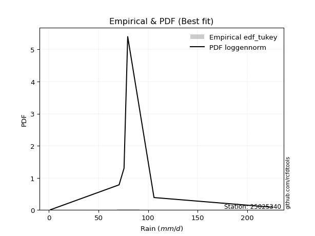</img>

</div>


### 8. EDF Gringorten (1963)

Gringorten plotting position formula is essential for estimating the probability and return periods of extreme events like floods and heavy rainfall. The constant _a=0.44_.

<div align="center">


$P=(m-a)/(n+1-2a)$


</div>


**8.1. Empirical values**

<div align="center">

|                | 0                   | 1                   | 2                  | 3              | 4                  | 5                  | 6                  |
|:---------------|:--------------------|:--------------------|:-------------------|:---------------|:-------------------|:-------------------|:-------------------|
| date           | 2022                | 2020                | 2017               | 2018           | 2025               | 2019               | 2021               |
| x              | 1.6                 | 70.7                | 75.7               | 79.4           | 105.9              | 222.9              | 225.4              |
| m              | 1                   | 2                   | 3                  | 4              | 5                  | 6                  | 7                  |
| empirical_dist | edf_gringorten      | edf_gringorten      | edf_gringorten     | edf_gringorten | edf_gringorten     | edf_gringorten     | edf_gringorten     |
| empirical      | 0.07865168539325844 | 0.21910112359550563 | 0.3595505617977528 | 0.5            | 0.6404494382022471 | 0.7808988764044943 | 0.9213483146067415 |
| empirical_tr   | 1.0853658536585364  | 1.2805755395683454  | 1.5614035087719298 | 2.0            | 2.781249999999999  | 4.564102564102562  | 12.714285714285701 |

</div>


**8.2. Kolmogorov-Smirnov fit test (sorted by Δ)**


<div align="center">

|                | 0                   | 1                   | 2                   | 3                   | 4                   | 5                   | 6                   | 7                   | 8                   | 9                   | 10                  | 11                  | 12                  | 13                  | 14                  | 15                  | 16                  | 17                  | 18                  | 19                  | 20                  | 21                  | 22                  | 23                  | 24                  | 25                  | 26                  | 27                  | 28                  | 29                  | 30                  | 31                  | 32                  | 33                  | 34                  | 35                  | 36                  | 37                  | 38                  | 39                  | 40                  | 41                  | 42                  | 43                  | 44                  | 45                  | 46                  | 47                  | 48                  | 49                  | 50                  | 51                  | 52                  | 53                  | 54                  | 55                  | 56                  | 57                  | 58                  | 59                  | 60                  | 61                  | 62                  | 63                  | 64                  | 65                  | 66                  | 67                  | 68                  | 69                  | 70                  | 71                  | 72                  | 73                  | 74                  | 75                  | 76                  | 77                  | 78                  | 79                  | 80                  | 81                  | 82                  | 83                  | 84                  | 85                  | 86                  | 87                  | 88                  | 89                  | 90                  | 91                  | 92                  | 93                  | 94                  | 95                  | 96                  | 97                  | 98                  | 99                  | 100                 | 101                 | 102                 | 103                 | 104                 | 105                 | 106                 | 107                 | 108                 | 109                 | 110                 | 111                 | 112                 | 113                 | 114                 | 115                 | 116                 | 117                 | 118                 | 119                 | 120                 | 121                 | 122                 | 123                 | 124                 | 125                 | 126                 | 127                 | 128                 | 129                 | 130                 | 131                 | 132                 | 133                 | 134                 | 135                 | 136                 | 137                 | 138                 | 139                 | 140                 | 141                 | 142                 | 143                 | 144                 | 145                 | 146                 | 147                 | 148                 | 149                 | 150                 | 151                 | 152                 | 153                 | 154                 | 155                 | 156                 | 157                 | 158                 | 159                 |
|:---------------|:--------------------|:--------------------|:--------------------|:--------------------|:--------------------|:--------------------|:--------------------|:--------------------|:--------------------|:--------------------|:--------------------|:--------------------|:--------------------|:--------------------|:--------------------|:--------------------|:--------------------|:--------------------|:--------------------|:--------------------|:--------------------|:--------------------|:--------------------|:--------------------|:--------------------|:--------------------|:--------------------|:--------------------|:--------------------|:--------------------|:--------------------|:--------------------|:--------------------|:--------------------|:--------------------|:--------------------|:--------------------|:--------------------|:--------------------|:--------------------|:--------------------|:--------------------|:--------------------|:--------------------|:--------------------|:--------------------|:--------------------|:--------------------|:--------------------|:--------------------|:--------------------|:--------------------|:--------------------|:--------------------|:--------------------|:--------------------|:--------------------|:--------------------|:--------------------|:--------------------|:--------------------|:--------------------|:--------------------|:--------------------|:--------------------|:--------------------|:--------------------|:--------------------|:--------------------|:--------------------|:--------------------|:--------------------|:--------------------|:--------------------|:--------------------|:--------------------|:--------------------|:--------------------|:--------------------|:--------------------|:--------------------|:--------------------|:--------------------|:--------------------|:--------------------|:--------------------|:--------------------|:--------------------|:--------------------|:--------------------|:--------------------|:--------------------|:--------------------|:--------------------|:--------------------|:--------------------|:--------------------|:--------------------|:--------------------|:--------------------|:--------------------|:--------------------|:--------------------|:--------------------|:--------------------|:--------------------|:--------------------|:--------------------|:--------------------|:--------------------|:--------------------|:--------------------|:--------------------|:--------------------|:--------------------|:--------------------|:--------------------|:--------------------|:--------------------|:--------------------|:--------------------|:--------------------|:--------------------|:--------------------|:--------------------|:--------------------|:--------------------|:--------------------|:--------------------|:--------------------|:--------------------|:--------------------|:--------------------|:--------------------|:--------------------|:--------------------|:--------------------|:--------------------|:--------------------|:--------------------|:--------------------|:--------------------|:--------------------|:--------------------|:--------------------|:--------------------|:--------------------|:--------------------|:--------------------|:--------------------|:--------------------|:--------------------|:--------------------|:--------------------|:--------------------|:--------------------|:--------------------|:--------------------|:--------------------|:--------------------|
| station        | 25025340            | 25025340            | 25025340            | 25025340            | 25025340            | 25025340            | 25025340            | 25025340            | 25025340            | 25025340            | 25025340            | 25025340            | 25025340            | 25025340            | 25025340            | 25025340            | 25025340            | 25025340            | 25025340            | 25025340            | 25025340            | 25025340            | 25025340            | 25025340            | 25025340            | 25025340            | 25025340            | 25025340            | 25025340            | 25025340            | 25025340            | 25025340            | 25025340            | 25025340            | 25025340            | 25025340            | 25025340            | 25025340            | 25025340            | 25025340            | 25025340            | 25025340            | 25025340            | 25025340            | 25025340            | 25025340            | 25025340            | 25025340            | 25025340            | 25025340            | 25025340            | 25025340            | 25025340            | 25025340            | 25025340            | 25025340            | 25025340            | 25025340            | 25025340            | 25025340            | 25025340            | 25025340            | 25025340            | 25025340            | 25025340            | 25025340            | 25025340            | 25025340            | 25025340            | 25025340            | 25025340            | 25025340            | 25025340            | 25025340            | 25025340            | 25025340            | 25025340            | 25025340            | 25025340            | 25025340            | 25025340            | 25025340            | 25025340            | 25025340            | 25025340            | 25025340            | 25025340            | 25025340            | 25025340            | 25025340            | 25025340            | 25025340            | 25025340            | 25025340            | 25025340            | 25025340            | 25025340            | 25025340            | 25025340            | 25025340            | 25025340            | 25025340            | 25025340            | 25025340            | 25025340            | 25025340            | 25025340            | 25025340            | 25025340            | 25025340            | 25025340            | 25025340            | 25025340            | 25025340            | 25025340            | 25025340            | 25025340            | 25025340            | 25025340            | 25025340            | 25025340            | 25025340            | 25025340            | 25025340            | 25025340            | 25025340            | 25025340            | 25025340            | 25025340            | 25025340            | 25025340            | 25025340            | 25025340            | 25025340            | 25025340            | 25025340            | 25025340            | 25025340            | 25025340            | 25025340            | 25025340            | 25025340            | 25025340            | 25025340            | 25025340            | 25025340            | 25025340            | 25025340            | 25025340            | 25025340            | 25025340            | 25025340            | 25025340            | 25025340            | 25025340            | 25025340            | 25025340            | 25025340            | 25025340            | 25025340            |
| empirical_dist | edf_gringorten      | edf_gringorten      | edf_gringorten      | edf_gringorten      | edf_gringorten      | edf_gringorten      | edf_gringorten      | edf_gringorten      | edf_gringorten      | edf_gringorten      | edf_gringorten      | edf_gringorten      | edf_gringorten      | edf_gringorten      | edf_gringorten      | edf_gringorten      | edf_gringorten      | edf_gringorten      | edf_gringorten      | edf_gringorten      | edf_gringorten      | edf_gringorten      | edf_gringorten      | edf_gringorten      | edf_gringorten      | edf_gringorten      | edf_gringorten      | edf_gringorten      | edf_gringorten      | edf_gringorten      | edf_gringorten      | edf_gringorten      | edf_gringorten      | edf_gringorten      | edf_gringorten      | edf_gringorten      | edf_gringorten      | edf_gringorten      | edf_gringorten      | edf_gringorten      | edf_gringorten      | edf_gringorten      | edf_gringorten      | edf_gringorten      | edf_gringorten      | edf_gringorten      | edf_gringorten      | edf_gringorten      | edf_gringorten      | edf_gringorten      | edf_gringorten      | edf_gringorten      | edf_gringorten      | edf_gringorten      | edf_gringorten      | edf_gringorten      | edf_gringorten      | edf_gringorten      | edf_gringorten      | edf_gringorten      | edf_gringorten      | edf_gringorten      | edf_gringorten      | edf_gringorten      | edf_gringorten      | edf_gringorten      | edf_gringorten      | edf_gringorten      | edf_gringorten      | edf_gringorten      | edf_gringorten      | edf_gringorten      | edf_gringorten      | edf_gringorten      | edf_gringorten      | edf_gringorten      | edf_gringorten      | edf_gringorten      | edf_gringorten      | edf_gringorten      | edf_gringorten      | edf_gringorten      | edf_gringorten      | edf_gringorten      | edf_gringorten      | edf_gringorten      | edf_gringorten      | edf_gringorten      | edf_gringorten      | edf_gringorten      | edf_gringorten      | edf_gringorten      | edf_gringorten      | edf_gringorten      | edf_gringorten      | edf_gringorten      | edf_gringorten      | edf_gringorten      | edf_gringorten      | edf_gringorten      | edf_gringorten      | edf_gringorten      | edf_gringorten      | edf_gringorten      | edf_gringorten      | edf_gringorten      | edf_gringorten      | edf_gringorten      | edf_gringorten      | edf_gringorten      | edf_gringorten      | edf_gringorten      | edf_gringorten      | edf_gringorten      | edf_gringorten      | edf_gringorten      | edf_gringorten      | edf_gringorten      | edf_gringorten      | edf_gringorten      | edf_gringorten      | edf_gringorten      | edf_gringorten      | edf_gringorten      | edf_gringorten      | edf_gringorten      | edf_gringorten      | edf_gringorten      | edf_gringorten      | edf_gringorten      | edf_gringorten      | edf_gringorten      | edf_gringorten      | edf_gringorten      | edf_gringorten      | edf_gringorten      | edf_gringorten      | edf_gringorten      | edf_gringorten      | edf_gringorten      | edf_gringorten      | edf_gringorten      | edf_gringorten      | edf_gringorten      | edf_gringorten      | edf_gringorten      | edf_gringorten      | edf_gringorten      | edf_gringorten      | edf_gringorten      | edf_gringorten      | edf_gringorten      | edf_gringorten      | edf_gringorten      | edf_gringorten      | edf_gringorten      | edf_gringorten      | edf_gringorten      | edf_gringorten      | edf_gringorten      |
| p_dist         | alpha               | loggennorm          | genlogistic         | invgauss            | kstwobign           | invgamma            | skewnorm            | rayleigh            | ncf                 | exponnorm           | exponweib           | betaprime           | moyal               | rice                | gumbel_r            | genextreme          | maxwell             | gamma               | erlang              | pearson3            | foldnorm            | wald                | weibull_min         | halflogistic        | burr12              | halfnorm            | ksone               | semicircular        | anglit              | crystalball         | logargus            | johnsonsu           | t                   | norm                | logt                | logistic            | loggengamma         | logexponweib        | logexponpow         | cosine              | burr                | logvonmises_line    | logdgamma           | hypsecant           | gennorm             | loggenextreme       | logpearson3         | wrapcauchy          | kappa4              | tukeylambda         | kappa3              | uniform             | vonmises_line       | logmielke           | logloggamma         | bradford            | truncweibull_min    | truncexpon          | logdweibull         | gengamma            | logweibull_min      | dweibull            | arcsine             | laplace             | logweibull_max      | loggompertz         | loggenpareto        | logburr12           | gumbel_l            | lomax               | argus               | loggumbel_l         | genexpon            | logloglaplace       | logburr             | logtrapezoid        | mielke              | johnsonsb           | dgamma              | triang              | beta                | f                   | logarcsine          | logfoldnorm         | logsemicircular     | loganglit           | logf                | loglevy_l           | gausshyper          | logexponnorm        | logcrystalball      | lognorm             | logrice             | logfatiguelife      | lognct              | loglogistic         | loghypsecant        | loggamma            | loggamma            | loginvgamma         | levy_l              | loginvgauss         | logerlang           | logbetaprime        | logbeta             | loglaplace          | loglaplace          | genpareto           | halfgennorm         | loginvweibull       | logalpha            | logmaxwell          | logskewnorm         | logncf              | lograyleigh         | genhalflogistic     | logtruncnorm        | logkstwobign        | nakagami            | loggenhalflogistic  | logwrapcauchy       | loggausshyper       | loghalfnorm         | loggumbel_r         | loggenexpon         | logtruncweibull_min | logcosine           | loglomax            | logmoyal            | loghalflogistic     | trapezoid           | logtriang           | nct                 | logjohnsonsu        | logkappa4           | invweibull          | logwald             | lognakagami         | logksone            | logjohnsonsb        | loghalfgennorm      | rdist               | logkappa3           | loguniform          | weibull_max         | logbradford         | fatiguelife         | logtruncexpon       | powerlaw            | gompertz            | truncpareto         | exponpow            | logpowerlaw         | logtruncpareto      | truncnorm           | loggenlogistic      | logtukeylambda      | logrdist            | logvonmises         | vonmises            |
| delta          | 0.11877944415447386 | 0.11991937459435084 | 0.12672950115145665 | 0.12681726056065068 | 0.12825450618832793 | 0.12883605699734169 | 0.1292935759265852  | 0.13021570699095242 | 0.1303022468686137  | 0.13192393691811796 | 0.1328538806415901  | 0.133308998442672   | 0.13436277025760623 | 0.13450816744266392 | 0.13489995208841976 | 0.13554253318846776 | 0.13627487305121821 | 0.13756522076292907 | 0.13756523941976898 | 0.14192282180113563 | 0.14315228527087875 | 0.143312843131574   | 0.14393972961019122 | 0.1452968837182508  | 0.14578736429239916 | 0.14761640392156847 | 0.1620419578037598  | 0.16425304664521584 | 0.16600700567267862 | 0.16928583546810116 | 0.16962195129376043 | 0.17008383539316574 | 0.17021106007891895 | 0.17026199296610062 | 0.1732238632231934  | 0.1813873568473534  | 0.1857449857072833  | 0.18620993016974882 | 0.18768283908663894 | 0.18868749014241054 | 0.192854822867088   | 0.19321117179758998 | 0.19345237165332427 | 0.19587025547944892 | 0.19652626053193648 | 0.1972172023095523  | 0.20161014793103635 | 0.20408652841852815 | 0.20596796417276064 | 0.20618921274891566 | 0.2062553938313002  | 0.2079304354811179  | 0.20800920866375283 | 0.2096607534250884  | 0.21033390385546802 | 0.21034214385543193 | 0.21167860279007422 | 0.21212008865542642 | 0.21218698781926518 | 0.21319945910436225 | 0.21544836514699914 | 0.21848532581113164 | 0.2191011235955057  | 0.22358101460129287 | 0.22666393796437911 | 0.22724236242058624 | 0.2274205199612375  | 0.23814916666296412 | 0.24088503409760642 | 0.24159997354541482 | 0.24439060548804947 | 0.24478212281065645 | 0.24712377720818965 | 0.24784126418443933 | 0.25284533310329194 | 0.25433744560090743 | 0.26511581137207874 | 0.2678957401828314  | 0.2808988764339623  | 0.2880609958978212  | 0.2903084093227494  | 0.2919368832775838  | 0.2992744661073703  | 0.30461517702548535 | 0.30686597030803375 | 0.30877812746886757 | 0.31254085611577087 | 0.3133177761031284  | 0.31339958907348775 | 0.313412249145375   | 0.31341581085113646 | 0.3134158585501301  | 0.31341592474123436 | 0.3137337532080976  | 0.31377690254901336 | 0.31783228545122444 | 0.3215868437942474  | 0.32184629195654857 | 0.32184629195654857 | 0.3262065120872293  | 0.326960179824782   | 0.32708313586354576 | 0.3283397617585345  | 0.32946938043628116 | 0.33383231834128213 | 0.33539298683005325 | 0.33539298683005325 | 0.3354059482893323  | 0.33728160364978677 | 0.340971448818965   | 0.3440093622377418  | 0.34488296212343583 | 0.3476448593946504  | 0.3486589675495744  | 0.3551154372227181  | 0.36299309903412486 | 0.36465488069212304 | 0.3712098652183492  | 0.3729061249296388  | 0.37318056324788595 | 0.3735157818125454  | 0.37929380485227504 | 0.3839431385903034  | 0.38399985542450255 | 0.3887721216698685  | 0.38981473413985557 | 0.3900871489992175  | 0.4086104530963761  | 0.4093342532218053  | 0.4105662516677173  | 0.414282893799211   | 0.41621710974062254 | 0.4189523273093142  | 0.4212976590544219  | 0.46515226436664325 | 0.47249101825282036 | 0.47965656856851424 | 0.48430562810793587 | 0.5022912243251696  | 0.5061324386159547  | 0.5191993684995405  | 0.5418871087420025  | 0.5465662838721155  | 0.5465696939093048  | 0.5668176077945001  | 0.5683299362901246  | 0.6115528941917224  | 0.6133123243690874  | 0.6157208668173779  | 0.640449438202094   | 0.6971604063043609  | 0.7136502429859793  | 0.735192142047464   | 0.7609530416937534  | 0.7808988158671508  | 0.7808988764044943  | 0.7808988764044944  | 0.7808988764044944  | 0.981489818150485   | 35.37776987907325   |
| deltao         | 0.48442053926100004 | 0.48442053926100004 | 0.48442053926100004 | 0.48442053926100004 | 0.48442053926100004 | 0.48442053926100004 | 0.48442053926100004 | 0.48442053926100004 | 0.48442053926100004 | 0.48442053926100004 | 0.48442053926100004 | 0.48442053926100004 | 0.48442053926100004 | 0.48442053926100004 | 0.48442053926100004 | 0.48442053926100004 | 0.48442053926100004 | 0.48442053926100004 | 0.48442053926100004 | 0.48442053926100004 | 0.48442053926100004 | 0.48442053926100004 | 0.48442053926100004 | 0.48442053926100004 | 0.48442053926100004 | 0.48442053926100004 | 0.48442053926100004 | 0.48442053926100004 | 0.48442053926100004 | 0.48442053926100004 | 0.48442053926100004 | 0.48442053926100004 | 0.48442053926100004 | 0.48442053926100004 | 0.48442053926100004 | 0.48442053926100004 | 0.48442053926100004 | 0.48442053926100004 | 0.48442053926100004 | 0.48442053926100004 | 0.48442053926100004 | 0.48442053926100004 | 0.48442053926100004 | 0.48442053926100004 | 0.48442053926100004 | 0.48442053926100004 | 0.48442053926100004 | 0.48442053926100004 | 0.48442053926100004 | 0.48442053926100004 | 0.48442053926100004 | 0.48442053926100004 | 0.48442053926100004 | 0.48442053926100004 | 0.48442053926100004 | 0.48442053926100004 | 0.48442053926100004 | 0.48442053926100004 | 0.48442053926100004 | 0.48442053926100004 | 0.48442053926100004 | 0.48442053926100004 | 0.48442053926100004 | 0.48442053926100004 | 0.48442053926100004 | 0.48442053926100004 | 0.48442053926100004 | 0.48442053926100004 | 0.48442053926100004 | 0.48442053926100004 | 0.48442053926100004 | 0.48442053926100004 | 0.48442053926100004 | 0.48442053926100004 | 0.48442053926100004 | 0.48442053926100004 | 0.48442053926100004 | 0.48442053926100004 | 0.48442053926100004 | 0.48442053926100004 | 0.48442053926100004 | 0.48442053926100004 | 0.48442053926100004 | 0.48442053926100004 | 0.48442053926100004 | 0.48442053926100004 | 0.48442053926100004 | 0.48442053926100004 | 0.48442053926100004 | 0.48442053926100004 | 0.48442053926100004 | 0.48442053926100004 | 0.48442053926100004 | 0.48442053926100004 | 0.48442053926100004 | 0.48442053926100004 | 0.48442053926100004 | 0.48442053926100004 | 0.48442053926100004 | 0.48442053926100004 | 0.48442053926100004 | 0.48442053926100004 | 0.48442053926100004 | 0.48442053926100004 | 0.48442053926100004 | 0.48442053926100004 | 0.48442053926100004 | 0.48442053926100004 | 0.48442053926100004 | 0.48442053926100004 | 0.48442053926100004 | 0.48442053926100004 | 0.48442053926100004 | 0.48442053926100004 | 0.48442053926100004 | 0.48442053926100004 | 0.48442053926100004 | 0.48442053926100004 | 0.48442053926100004 | 0.48442053926100004 | 0.48442053926100004 | 0.48442053926100004 | 0.48442053926100004 | 0.48442053926100004 | 0.48442053926100004 | 0.48442053926100004 | 0.48442053926100004 | 0.48442053926100004 | 0.48442053926100004 | 0.48442053926100004 | 0.48442053926100004 | 0.48442053926100004 | 0.48442053926100004 | 0.48442053926100004 | 0.48442053926100004 | 0.48442053926100004 | 0.48442053926100004 | 0.48442053926100004 | 0.48442053926100004 | 0.48442053926100004 | 0.48442053926100004 | 0.48442053926100004 | 0.48442053926100004 | 0.48442053926100004 | 0.48442053926100004 | 0.48442053926100004 | 0.48442053926100004 | 0.48442053926100004 | 0.48442053926100004 | 0.48442053926100004 | 0.48442053926100004 | 0.48442053926100004 | 0.48442053926100004 | 0.48442053926100004 | 0.48442053926100004 | 0.48442053926100004 | 0.48442053926100004 | 0.48442053926100004 | 0.48442053926100004 | 0.48442053926100004 |
| eval           | Δo > Δ              | Δo > Δ              | Δo > Δ              | Δo > Δ              | Δo > Δ              | Δo > Δ              | Δo > Δ              | Δo > Δ              | Δo > Δ              | Δo > Δ              | Δo > Δ              | Δo > Δ              | Δo > Δ              | Δo > Δ              | Δo > Δ              | Δo > Δ              | Δo > Δ              | Δo > Δ              | Δo > Δ              | Δo > Δ              | Δo > Δ              | Δo > Δ              | Δo > Δ              | Δo > Δ              | Δo > Δ              | Δo > Δ              | Δo > Δ              | Δo > Δ              | Δo > Δ              | Δo > Δ              | Δo > Δ              | Δo > Δ              | Δo > Δ              | Δo > Δ              | Δo > Δ              | Δo > Δ              | Δo > Δ              | Δo > Δ              | Δo > Δ              | Δo > Δ              | Δo > Δ              | Δo > Δ              | Δo > Δ              | Δo > Δ              | Δo > Δ              | Δo > Δ              | Δo > Δ              | Δo > Δ              | Δo > Δ              | Δo > Δ              | Δo > Δ              | Δo > Δ              | Δo > Δ              | Δo > Δ              | Δo > Δ              | Δo > Δ              | Δo > Δ              | Δo > Δ              | Δo > Δ              | Δo > Δ              | Δo > Δ              | Δo > Δ              | Δo > Δ              | Δo > Δ              | Δo > Δ              | Δo > Δ              | Δo > Δ              | Δo > Δ              | Δo > Δ              | Δo > Δ              | Δo > Δ              | Δo > Δ              | Δo > Δ              | Δo > Δ              | Δo > Δ              | Δo > Δ              | Δo > Δ              | Δo > Δ              | Δo > Δ              | Δo > Δ              | Δo > Δ              | Δo > Δ              | Δo > Δ              | Δo > Δ              | Δo > Δ              | Δo > Δ              | Δo > Δ              | Δo > Δ              | Δo > Δ              | Δo > Δ              | Δo > Δ              | Δo > Δ              | Δo > Δ              | Δo > Δ              | Δo > Δ              | Δo > Δ              | Δo > Δ              | Δo > Δ              | Δo > Δ              | Δo > Δ              | Δo > Δ              | Δo > Δ              | Δo > Δ              | Δo > Δ              | Δo > Δ              | Δo > Δ              | Δo > Δ              | Δo > Δ              | Δo > Δ              | Δo > Δ              | Δo > Δ              | Δo > Δ              | Δo > Δ              | Δo > Δ              | Δo > Δ              | Δo > Δ              | Δo > Δ              | Δo > Δ              | Δo > Δ              | Δo > Δ              | Δo > Δ              | Δo > Δ              | Δo > Δ              | Δo > Δ              | Δo > Δ              | Δo > Δ              | Δo > Δ              | Δo > Δ              | Δo > Δ              | Δo > Δ              | Δo > Δ              | Δo > Δ              | Δo > Δ              | Δo > Δ              | Δo > Δ              | Δo > Δ              | Δo > Δ              | Δo > Δ              | Δo <= Δ             | Δo <= Δ             | Δo <= Δ             | Δo <= Δ             | Δo <= Δ             | Δo <= Δ             | Δo <= Δ             | Δo <= Δ             | Δo <= Δ             | Δo <= Δ             | Δo <= Δ             | Δo <= Δ             | Δo <= Δ             | Δo <= Δ             | Δo <= Δ             | Δo <= Δ             | Δo <= Δ             | Δo <= Δ             | Δo <= Δ             | Δo <= Δ             | Δo <= Δ             | Δo <= Δ             |
| fit            | 1                   | 1                   | 1                   | 1                   | 1                   | 1                   | 1                   | 1                   | 1                   | 1                   | 1                   | 1                   | 1                   | 1                   | 1                   | 1                   | 1                   | 1                   | 1                   | 1                   | 1                   | 1                   | 1                   | 1                   | 1                   | 1                   | 1                   | 1                   | 1                   | 1                   | 1                   | 1                   | 1                   | 1                   | 1                   | 1                   | 1                   | 1                   | 1                   | 1                   | 1                   | 1                   | 1                   | 1                   | 1                   | 1                   | 1                   | 1                   | 1                   | 1                   | 1                   | 1                   | 1                   | 1                   | 1                   | 1                   | 1                   | 1                   | 1                   | 1                   | 1                   | 1                   | 1                   | 1                   | 1                   | 1                   | 1                   | 1                   | 1                   | 1                   | 1                   | 1                   | 1                   | 1                   | 1                   | 1                   | 1                   | 1                   | 1                   | 1                   | 1                   | 1                   | 1                   | 1                   | 1                   | 1                   | 1                   | 1                   | 1                   | 1                   | 1                   | 1                   | 1                   | 1                   | 1                   | 1                   | 1                   | 1                   | 1                   | 1                   | 1                   | 1                   | 1                   | 1                   | 1                   | 1                   | 1                   | 1                   | 1                   | 1                   | 1                   | 1                   | 1                   | 1                   | 1                   | 1                   | 1                   | 1                   | 1                   | 1                   | 1                   | 1                   | 1                   | 1                   | 1                   | 1                   | 1                   | 1                   | 1                   | 1                   | 1                   | 1                   | 1                   | 1                   | 1                   | 1                   | 1                   | 1                   | 0                   | 0                   | 0                   | 0                   | 0                   | 0                   | 0                   | 0                   | 0                   | 0                   | 0                   | 0                   | 0                   | 0                   | 0                   | 0                   | 0                   | 0                   | 0                   | 0                   | 0                   | 0                   |
| n              | 7                   | 7                   | 7                   | 7                   | 7                   | 7                   | 7                   | 7                   | 7                   | 7                   | 7                   | 7                   | 7                   | 7                   | 7                   | 7                   | 7                   | 7                   | 7                   | 7                   | 7                   | 7                   | 7                   | 7                   | 7                   | 7                   | 7                   | 7                   | 7                   | 7                   | 7                   | 7                   | 7                   | 7                   | 7                   | 7                   | 7                   | 7                   | 7                   | 7                   | 7                   | 7                   | 7                   | 7                   | 7                   | 7                   | 7                   | 7                   | 7                   | 7                   | 7                   | 7                   | 7                   | 7                   | 7                   | 7                   | 7                   | 7                   | 7                   | 7                   | 7                   | 7                   | 7                   | 7                   | 7                   | 7                   | 7                   | 7                   | 7                   | 7                   | 7                   | 7                   | 7                   | 7                   | 7                   | 7                   | 7                   | 7                   | 7                   | 7                   | 7                   | 7                   | 7                   | 7                   | 7                   | 7                   | 7                   | 7                   | 7                   | 7                   | 7                   | 7                   | 7                   | 7                   | 7                   | 7                   | 7                   | 7                   | 7                   | 7                   | 7                   | 7                   | 7                   | 7                   | 7                   | 7                   | 7                   | 7                   | 7                   | 7                   | 7                   | 7                   | 7                   | 7                   | 7                   | 7                   | 7                   | 7                   | 7                   | 7                   | 7                   | 7                   | 7                   | 7                   | 7                   | 7                   | 7                   | 7                   | 7                   | 7                   | 7                   | 7                   | 7                   | 7                   | 7                   | 7                   | 7                   | 7                   | 7                   | 7                   | 7                   | 7                   | 7                   | 7                   | 7                   | 7                   | 7                   | 7                   | 7                   | 7                   | 7                   | 7                   | 7                   | 7                   | 7                   | 7                   | 7                   | 7                   | 7                   | 7                   |
| best_fit       | 1                   | 0                   | 0                   | 0                   | 0                   | 0                   | 0                   | 0                   | 0                   | 0                   | 0                   | 0                   | 0                   | 0                   | 0                   | 0                   | 0                   | 0                   | 0                   | 0                   | 0                   | 0                   | 0                   | 0                   | 0                   | 0                   | 0                   | 0                   | 0                   | 0                   | 0                   | 0                   | 0                   | 0                   | 0                   | 0                   | 0                   | 0                   | 0                   | 0                   | 0                   | 0                   | 0                   | 0                   | 0                   | 0                   | 0                   | 0                   | 0                   | 0                   | 0                   | 0                   | 0                   | 0                   | 0                   | 0                   | 0                   | 0                   | 0                   | 0                   | 0                   | 0                   | 0                   | 0                   | 0                   | 0                   | 0                   | 0                   | 0                   | 0                   | 0                   | 0                   | 0                   | 0                   | 0                   | 0                   | 0                   | 0                   | 0                   | 0                   | 0                   | 0                   | 0                   | 0                   | 0                   | 0                   | 0                   | 0                   | 0                   | 0                   | 0                   | 0                   | 0                   | 0                   | 0                   | 0                   | 0                   | 0                   | 0                   | 0                   | 0                   | 0                   | 0                   | 0                   | 0                   | 0                   | 0                   | 0                   | 0                   | 0                   | 0                   | 0                   | 0                   | 0                   | 0                   | 0                   | 0                   | 0                   | 0                   | 0                   | 0                   | 0                   | 0                   | 0                   | 0                   | 0                   | 0                   | 0                   | 0                   | 0                   | 0                   | 0                   | 0                   | 0                   | 0                   | 0                   | 0                   | 0                   | 0                   | 0                   | 0                   | 0                   | 0                   | 0                   | 0                   | 0                   | 0                   | 0                   | 0                   | 0                   | 0                   | 0                   | 0                   | 0                   | 0                   | 0                   | 0                   | 0                   | 0                   | 0                   |
| best_fit_sort  | 1                   | 2                   | 3                   | 4                   | 5                   | 6                   | 7                   | 8                   | 9                   | 10                  | 11                  | 12                  | 13                  | 14                  | 15                  | 16                  | 17                  | 18                  | 19                  | 20                  | 21                  | 22                  | 23                  | 24                  | 25                  | 26                  | 27                  | 28                  | 29                  | 30                  | 31                  | 32                  | 33                  | 34                  | 35                  | 36                  | 37                  | 38                  | 39                  | 40                  | 41                  | 42                  | 43                  | 44                  | 45                  | 46                  | 47                  | 48                  | 49                  | 50                  | 51                  | 52                  | 53                  | 54                  | 55                  | 56                  | 57                  | 58                  | 59                  | 60                  | 61                  | 62                  | 63                  | 64                  | 65                  | 66                  | 67                  | 68                  | 69                  | 70                  | 71                  | 72                  | 73                  | 74                  | 75                  | 76                  | 77                  | 78                  | 79                  | 80                  | 81                  | 82                  | 83                  | 84                  | 85                  | 86                  | 87                  | 88                  | 89                  | 90                  | 91                  | 92                  | 93                  | 94                  | 95                  | 96                  | 97                  | 98                  | 99                  | 100                 | 101                 | 102                 | 103                 | 104                 | 105                 | 106                 | 107                 | 108                 | 109                 | 110                 | 111                 | 112                 | 113                 | 114                 | 115                 | 116                 | 117                 | 118                 | 119                 | 120                 | 121                 | 122                 | 123                 | 124                 | 125                 | 126                 | 127                 | 128                 | 129                 | 130                 | 131                 | 132                 | 133                 | 134                 | 135                 | 136                 | 137                 | 138                 | 139                 | 140                 | 141                 | 142                 | 143                 | 144                 | 145                 | 146                 | 147                 | 148                 | 149                 | 150                 | 151                 | 152                 | 153                 | 154                 | 155                 | 156                 | 157                 | 158                 | 159                 | 160                 |

</div>


**8.3. Best fit**

<div align="center">

|   id |   station | empirical_dist   | p_dist   |    delta |   deltao | eval   |   fit |   n |   best_fit |   best_fit_sort |
|-----:|----------:|:-----------------|:---------|---------:|---------:|:-------|------:|----:|-----------:|----------------:|
|    0 |  25025340 | edf_gringorten   | alpha    | 0.118779 | 0.484421 | Δo > Δ |     1 |   7 |          1 |               1 |

</div>


<div align="center">

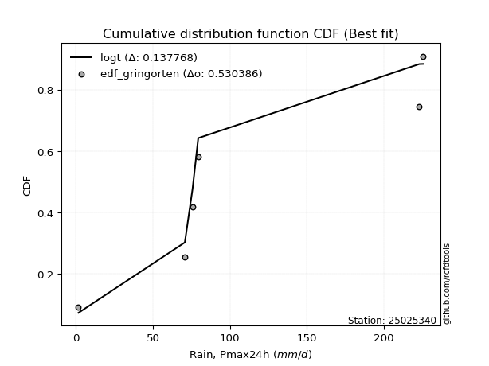</img></img>

</div>


### 9. EDF Filliben (1975)

The specific values of the constants (0.3175) (often denoted as $alpha$) and (0.365) are derived from a method proposed by James J. Filliben in a 1975 paper. This particular formula is the mean value of the $i$-th order statistic of the normal distribution and is considered a robust and effective plotting position formula for the normal probability plot correlation coefficient test for normality.

<div align="center">


$P=(m-0.3175)/(n+0.365)$


</div>


**9.1. Empirical values**

<div align="center">

|                | 0                   | 1                   | 2                   | 3            | 4                  | 5                  | 6                  |
|:---------------|:--------------------|:--------------------|:--------------------|:-------------|:-------------------|:-------------------|:-------------------|
| date           | 2022                | 2020                | 2017                | 2018         | 2025               | 2019               | 2021               |
| x              | 1.6                 | 70.7                | 75.7                | 79.4         | 105.9              | 222.9              | 225.4              |
| m              | 1                   | 2                   | 3                   | 4            | 5                  | 6                  | 7                  |
| empirical_dist | edf_filliben        | edf_filliben        | edf_filliben        | edf_filliben | edf_filliben       | edf_filliben       | edf_filliben       |
| empirical      | 0.09266802443991853 | 0.22844534962661237 | 0.36422267481330617 | 0.5          | 0.6357773251866938 | 0.7715546503733877 | 0.9073319755600815 |
| empirical_tr   | 1.1021324354657687  | 1.2960844698636163  | 1.5728777362520021  | 2.0          | 2.7455731593662627 | 4.377414561664191  | 10.791208791208794 |

</div>


**9.2. Kolmogorov-Smirnov fit test (sorted by Δ)**


<div align="center">

|                | 0                   | 1                   | 2                   | 3                   | 4                   | 5                   | 6                   | 7                   | 8                   | 9                   | 10                  | 11                  | 12                  | 13                  | 14                  | 15                  | 16                  | 17                  | 18                  | 19                  | 20                  | 21                  | 22                  | 23                  | 24                  | 25                  | 26                  | 27                  | 28                  | 29                  | 30                  | 31                  | 32                  | 33                  | 34                  | 35                  | 36                  | 37                  | 38                  | 39                  | 40                  | 41                  | 42                  | 43                  | 44                  | 45                  | 46                  | 47                  | 48                  | 49                  | 50                  | 51                  | 52                  | 53                  | 54                  | 55                  | 56                  | 57                  | 58                  | 59                  | 60                  | 61                  | 62                  | 63                  | 64                  | 65                  | 66                  | 67                  | 68                  | 69                  | 70                  | 71                  | 72                  | 73                  | 74                  | 75                  | 76                  | 77                  | 78                  | 79                  | 80                  | 81                  | 82                  | 83                  | 84                  | 85                  | 86                  | 87                  | 88                  | 89                  | 90                  | 91                  | 92                  | 93                  | 94                  | 95                  | 96                  | 97                  | 98                  | 99                  | 100                 | 101                 | 102                 | 103                 | 104                 | 105                 | 106                 | 107                 | 108                 | 109                 | 110                 | 111                 | 112                 | 113                 | 114                 | 115                 | 116                 | 117                 | 118                 | 119                 | 120                 | 121                 | 122                 | 123                 | 124                 | 125                 | 126                 | 127                 | 128                 | 129                 | 130                 | 131                 | 132                 | 133                 | 134                 | 135                 | 136                 | 137                 | 138                 | 139                 | 140                 | 141                 | 142                 | 143                 | 144                 | 145                 | 146                 | 147                 | 148                 | 149                 | 150                 | 151                 | 152                 | 153                 | 154                 | 155                 | 156                 | 157                 | 158                 | 159                 |
|:---------------|:--------------------|:--------------------|:--------------------|:--------------------|:--------------------|:--------------------|:--------------------|:--------------------|:--------------------|:--------------------|:--------------------|:--------------------|:--------------------|:--------------------|:--------------------|:--------------------|:--------------------|:--------------------|:--------------------|:--------------------|:--------------------|:--------------------|:--------------------|:--------------------|:--------------------|:--------------------|:--------------------|:--------------------|:--------------------|:--------------------|:--------------------|:--------------------|:--------------------|:--------------------|:--------------------|:--------------------|:--------------------|:--------------------|:--------------------|:--------------------|:--------------------|:--------------------|:--------------------|:--------------------|:--------------------|:--------------------|:--------------------|:--------------------|:--------------------|:--------------------|:--------------------|:--------------------|:--------------------|:--------------------|:--------------------|:--------------------|:--------------------|:--------------------|:--------------------|:--------------------|:--------------------|:--------------------|:--------------------|:--------------------|:--------------------|:--------------------|:--------------------|:--------------------|:--------------------|:--------------------|:--------------------|:--------------------|:--------------------|:--------------------|:--------------------|:--------------------|:--------------------|:--------------------|:--------------------|:--------------------|:--------------------|:--------------------|:--------------------|:--------------------|:--------------------|:--------------------|:--------------------|:--------------------|:--------------------|:--------------------|:--------------------|:--------------------|:--------------------|:--------------------|:--------------------|:--------------------|:--------------------|:--------------------|:--------------------|:--------------------|:--------------------|:--------------------|:--------------------|:--------------------|:--------------------|:--------------------|:--------------------|:--------------------|:--------------------|:--------------------|:--------------------|:--------------------|:--------------------|:--------------------|:--------------------|:--------------------|:--------------------|:--------------------|:--------------------|:--------------------|:--------------------|:--------------------|:--------------------|:--------------------|:--------------------|:--------------------|:--------------------|:--------------------|:--------------------|:--------------------|:--------------------|:--------------------|:--------------------|:--------------------|:--------------------|:--------------------|:--------------------|:--------------------|:--------------------|:--------------------|:--------------------|:--------------------|:--------------------|:--------------------|:--------------------|:--------------------|:--------------------|:--------------------|:--------------------|:--------------------|:--------------------|:--------------------|:--------------------|:--------------------|:--------------------|:--------------------|:--------------------|:--------------------|:--------------------|:--------------------|
| station        | 25025340            | 25025340            | 25025340            | 25025340            | 25025340            | 25025340            | 25025340            | 25025340            | 25025340            | 25025340            | 25025340            | 25025340            | 25025340            | 25025340            | 25025340            | 25025340            | 25025340            | 25025340            | 25025340            | 25025340            | 25025340            | 25025340            | 25025340            | 25025340            | 25025340            | 25025340            | 25025340            | 25025340            | 25025340            | 25025340            | 25025340            | 25025340            | 25025340            | 25025340            | 25025340            | 25025340            | 25025340            | 25025340            | 25025340            | 25025340            | 25025340            | 25025340            | 25025340            | 25025340            | 25025340            | 25025340            | 25025340            | 25025340            | 25025340            | 25025340            | 25025340            | 25025340            | 25025340            | 25025340            | 25025340            | 25025340            | 25025340            | 25025340            | 25025340            | 25025340            | 25025340            | 25025340            | 25025340            | 25025340            | 25025340            | 25025340            | 25025340            | 25025340            | 25025340            | 25025340            | 25025340            | 25025340            | 25025340            | 25025340            | 25025340            | 25025340            | 25025340            | 25025340            | 25025340            | 25025340            | 25025340            | 25025340            | 25025340            | 25025340            | 25025340            | 25025340            | 25025340            | 25025340            | 25025340            | 25025340            | 25025340            | 25025340            | 25025340            | 25025340            | 25025340            | 25025340            | 25025340            | 25025340            | 25025340            | 25025340            | 25025340            | 25025340            | 25025340            | 25025340            | 25025340            | 25025340            | 25025340            | 25025340            | 25025340            | 25025340            | 25025340            | 25025340            | 25025340            | 25025340            | 25025340            | 25025340            | 25025340            | 25025340            | 25025340            | 25025340            | 25025340            | 25025340            | 25025340            | 25025340            | 25025340            | 25025340            | 25025340            | 25025340            | 25025340            | 25025340            | 25025340            | 25025340            | 25025340            | 25025340            | 25025340            | 25025340            | 25025340            | 25025340            | 25025340            | 25025340            | 25025340            | 25025340            | 25025340            | 25025340            | 25025340            | 25025340            | 25025340            | 25025340            | 25025340            | 25025340            | 25025340            | 25025340            | 25025340            | 25025340            | 25025340            | 25025340            | 25025340            | 25025340            | 25025340            | 25025340            |
| empirical_dist | edf_filliben        | edf_filliben        | edf_filliben        | edf_filliben        | edf_filliben        | edf_filliben        | edf_filliben        | edf_filliben        | edf_filliben        | edf_filliben        | edf_filliben        | edf_filliben        | edf_filliben        | edf_filliben        | edf_filliben        | edf_filliben        | edf_filliben        | edf_filliben        | edf_filliben        | edf_filliben        | edf_filliben        | edf_filliben        | edf_filliben        | edf_filliben        | edf_filliben        | edf_filliben        | edf_filliben        | edf_filliben        | edf_filliben        | edf_filliben        | edf_filliben        | edf_filliben        | edf_filliben        | edf_filliben        | edf_filliben        | edf_filliben        | edf_filliben        | edf_filliben        | edf_filliben        | edf_filliben        | edf_filliben        | edf_filliben        | edf_filliben        | edf_filliben        | edf_filliben        | edf_filliben        | edf_filliben        | edf_filliben        | edf_filliben        | edf_filliben        | edf_filliben        | edf_filliben        | edf_filliben        | edf_filliben        | edf_filliben        | edf_filliben        | edf_filliben        | edf_filliben        | edf_filliben        | edf_filliben        | edf_filliben        | edf_filliben        | edf_filliben        | edf_filliben        | edf_filliben        | edf_filliben        | edf_filliben        | edf_filliben        | edf_filliben        | edf_filliben        | edf_filliben        | edf_filliben        | edf_filliben        | edf_filliben        | edf_filliben        | edf_filliben        | edf_filliben        | edf_filliben        | edf_filliben        | edf_filliben        | edf_filliben        | edf_filliben        | edf_filliben        | edf_filliben        | edf_filliben        | edf_filliben        | edf_filliben        | edf_filliben        | edf_filliben        | edf_filliben        | edf_filliben        | edf_filliben        | edf_filliben        | edf_filliben        | edf_filliben        | edf_filliben        | edf_filliben        | edf_filliben        | edf_filliben        | edf_filliben        | edf_filliben        | edf_filliben        | edf_filliben        | edf_filliben        | edf_filliben        | edf_filliben        | edf_filliben        | edf_filliben        | edf_filliben        | edf_filliben        | edf_filliben        | edf_filliben        | edf_filliben        | edf_filliben        | edf_filliben        | edf_filliben        | edf_filliben        | edf_filliben        | edf_filliben        | edf_filliben        | edf_filliben        | edf_filliben        | edf_filliben        | edf_filliben        | edf_filliben        | edf_filliben        | edf_filliben        | edf_filliben        | edf_filliben        | edf_filliben        | edf_filliben        | edf_filliben        | edf_filliben        | edf_filliben        | edf_filliben        | edf_filliben        | edf_filliben        | edf_filliben        | edf_filliben        | edf_filliben        | edf_filliben        | edf_filliben        | edf_filliben        | edf_filliben        | edf_filliben        | edf_filliben        | edf_filliben        | edf_filliben        | edf_filliben        | edf_filliben        | edf_filliben        | edf_filliben        | edf_filliben        | edf_filliben        | edf_filliben        | edf_filliben        | edf_filliben        | edf_filliben        | edf_filliben        | edf_filliben        |
| p_dist         | loggennorm          | ncf                 | alpha               | gamma               | erlang              | exponnorm           | betaprime           | weibull_min         | genlogistic         | invgauss            | burr12              | kstwobign           | invgamma            | halfnorm            | skewnorm            | rayleigh            | halflogistic        | foldnorm            | exponweib           | maxwell             | moyal               | rice                | gumbel_r            | genextreme          | pearson3            | wald                | ksone               | semicircular        | anglit              | crystalball         | johnsonsu           | t                   | norm                | logargus            | logexponweib        | logt                | logexponpow         | logistic            | logvonmises_line    | cosine              | logdgamma           | loggengamma         | gennorm             | logpearson3         | hypsecant           | burr                | logdweibull         | gengamma            | logweibull_min      | loggenextreme       | dweibull            | logweibull_max      | wrapcauchy          | kappa4              | tukeylambda         | kappa3              | uniform             | vonmises_line       | loggompertz         | loggenpareto        | logmielke           | logloggamma         | bradford            | truncweibull_min    | truncexpon          | laplace             | arcsine             | logburr12           | lomax               | loggumbel_l         | gumbel_l            | genexpon            | logloglaplace       | argus               | logburr             | logtrapezoid        | johnsonsb           | mielke              | dgamma              | f                   | triang              | beta                | logarcsine          | logfoldnorm         | logsemicircular     | loganglit           | logf                | logexponnorm        | logcrystalball      | lognorm             | logrice             | logfatiguelife      | lognct              | loglogistic         | loglevy_l           | gausshyper          | loghypsecant        | loggamma            | loggamma            | loginvgamma         | loginvgauss         | logerlang           | logbetaprime        | levy_l              | loglaplace          | loglaplace          | halfgennorm         | logbeta             | genpareto           | loginvweibull       | logalpha            | logmaxwell          | logskewnorm         | logncf              | lograyleigh         | logtruncnorm        | genhalflogistic     | logkstwobign        | nakagami            | loggenhalflogistic  | logwrapcauchy       | loggausshyper       | loghalfnorm         | loggumbel_r         | loggenexpon         | logtruncweibull_min | logcosine           | loglomax            | logmoyal            | loghalflogistic     | logtriang           | nct                 | trapezoid           | logjohnsonsu        | logkappa4           | invweibull          | logwald             | lognakagami         | logksone            | logjohnsonsb        | loghalfgennorm      | rdist               | logkappa3           | loguniform          | logbradford         | weibull_max         | fatiguelife         | logtruncexpon       | powerlaw            | gompertz            | truncpareto         | exponpow            | logpowerlaw         | logtruncpareto      | truncnorm           | loggenlogistic      | logtukeylambda      | logrdist            | logvonmises         | vonmises            |
| delta          | 0.12128645790707027 | 0.12563013385306043 | 0.1269680170972689  | 0.1309963310926041  | 0.13099634361418344 | 0.1315598503586064  | 0.13348662573081982 | 0.13459550357908448 | 0.13607372718256328 | 0.1361614865917573  | 0.13644313826129242 | 0.13733274696199438 | 0.13818028302844831 | 0.13827217789046173 | 0.13863780195769182 | 0.13955993302205905 | 0.1402945983304823  | 0.14201711351309898 | 0.14219810667269672 | 0.14265344451859474 | 0.14370699628871286 | 0.14385239347377055 | 0.1442441781195264  | 0.1448867592195744  | 0.14591059432488906 | 0.15265706916268063 | 0.15736984478820654 | 0.15958093362966258 | 0.16133489265712536 | 0.1646137224525479  | 0.16541172237761248 | 0.1655389470633657  | 0.16558987995054736 | 0.17169496444922583 | 0.17686570413864208 | 0.17789597623874664 | 0.1783386130555322  | 0.1813873568473534  | 0.18386694576648324 | 0.18401537712685728 | 0.18410814562221753 | 0.1852022912247291  | 0.18718203450082974 | 0.1922659218999296  | 0.19587025547944892 | 0.20219904889819462 | 0.20284276178815844 | 0.2038552330732555  | 0.2061041391158924  | 0.20656142834065894 | 0.2091410997800249  | 0.21264759891771903 | 0.21343075444963477 | 0.21531219020386727 | 0.2155334387800223  | 0.21559961986240683 | 0.21727466151222452 | 0.21735343469485946 | 0.2178981363894795  | 0.21807629393013075 | 0.21900497945619501 | 0.21967812988657465 | 0.21968636988653856 | 0.22102282882118085 | 0.22146431468653305 | 0.22358101460129287 | 0.22844534962661234 | 0.22880494063185738 | 0.23225574751430808 | 0.2354378967795497  | 0.23621292108205316 | 0.2377795511770829  | 0.2384970381533326  | 0.23971849247249621 | 0.24350110707218517 | 0.24499321956980072 | 0.25387940113617136 | 0.255771585340972   | 0.27155465040285554 | 0.2825926572464771  | 0.28338888288226793 | 0.2856362963071961  | 0.28993024007626356 | 0.2952709509943786  | 0.297521744276927   | 0.29943390143776083 | 0.30319663008466413 | 0.3040680231142683  | 0.3040715848200297  | 0.30407163251902336 | 0.3040716987101276  | 0.30438952717699086 | 0.3044326765179066  | 0.3084880594201177  | 0.30864566308757513 | 0.3087274760579345  | 0.31224261776314066 | 0.31250206592544183 | 0.31250206592544183 | 0.31686228605612254 | 0.317738909832439   | 0.3189955357274278  | 0.3201251544051744  | 0.3222880668092287  | 0.3260487607989465  | 0.3260487607989465  | 0.32793737761868    | 0.32916020532572887 | 0.33073383527377903 | 0.3316272227878583  | 0.33466513620663507 | 0.3355387360923291  | 0.33830063336354366 | 0.33931474151846763 | 0.34577121119161136 | 0.3553106546610163  | 0.3583209860185716  | 0.36186563918724246 | 0.3635618988985321  | 0.3638363372167792  | 0.36417155578143867 | 0.3699495788211683  | 0.37459891255919664 | 0.3746556293933958  | 0.3794278956387618  | 0.38047050810874883 | 0.38074292296811074 | 0.3992662270652694  | 0.39999002719069854 | 0.4012220256366106  | 0.4068728837095158  | 0.40960810127820746 | 0.40961078078365776 | 0.41662554603886864 | 0.4558080383355365  | 0.45847467920616036 | 0.4703123425374075  | 0.47496140207682913 | 0.49294699829406285 | 0.5014603256004013  | 0.5098551424684338  | 0.5325428827108958  | 0.5372220578410087  | 0.537225467878198   | 0.5589857102590179  | 0.5621454947789468  | 0.6022086681606157  | 0.6039680983379807  | 0.6063766407862712  | 0.6357773251865407  | 0.6878161802732542  | 0.7043060169548726  | 0.7258479160163572  | 0.7516088156626467  | 0.7715545898360441  | 0.7715546503733877  | 0.7715546503733877  | 0.7715546503733877  | 0.9721455921193782  | 35.391786218119904  |
| deltao         | 0.48442053926100004 | 0.48442053926100004 | 0.48442053926100004 | 0.48442053926100004 | 0.48442053926100004 | 0.48442053926100004 | 0.48442053926100004 | 0.48442053926100004 | 0.48442053926100004 | 0.48442053926100004 | 0.48442053926100004 | 0.48442053926100004 | 0.48442053926100004 | 0.48442053926100004 | 0.48442053926100004 | 0.48442053926100004 | 0.48442053926100004 | 0.48442053926100004 | 0.48442053926100004 | 0.48442053926100004 | 0.48442053926100004 | 0.48442053926100004 | 0.48442053926100004 | 0.48442053926100004 | 0.48442053926100004 | 0.48442053926100004 | 0.48442053926100004 | 0.48442053926100004 | 0.48442053926100004 | 0.48442053926100004 | 0.48442053926100004 | 0.48442053926100004 | 0.48442053926100004 | 0.48442053926100004 | 0.48442053926100004 | 0.48442053926100004 | 0.48442053926100004 | 0.48442053926100004 | 0.48442053926100004 | 0.48442053926100004 | 0.48442053926100004 | 0.48442053926100004 | 0.48442053926100004 | 0.48442053926100004 | 0.48442053926100004 | 0.48442053926100004 | 0.48442053926100004 | 0.48442053926100004 | 0.48442053926100004 | 0.48442053926100004 | 0.48442053926100004 | 0.48442053926100004 | 0.48442053926100004 | 0.48442053926100004 | 0.48442053926100004 | 0.48442053926100004 | 0.48442053926100004 | 0.48442053926100004 | 0.48442053926100004 | 0.48442053926100004 | 0.48442053926100004 | 0.48442053926100004 | 0.48442053926100004 | 0.48442053926100004 | 0.48442053926100004 | 0.48442053926100004 | 0.48442053926100004 | 0.48442053926100004 | 0.48442053926100004 | 0.48442053926100004 | 0.48442053926100004 | 0.48442053926100004 | 0.48442053926100004 | 0.48442053926100004 | 0.48442053926100004 | 0.48442053926100004 | 0.48442053926100004 | 0.48442053926100004 | 0.48442053926100004 | 0.48442053926100004 | 0.48442053926100004 | 0.48442053926100004 | 0.48442053926100004 | 0.48442053926100004 | 0.48442053926100004 | 0.48442053926100004 | 0.48442053926100004 | 0.48442053926100004 | 0.48442053926100004 | 0.48442053926100004 | 0.48442053926100004 | 0.48442053926100004 | 0.48442053926100004 | 0.48442053926100004 | 0.48442053926100004 | 0.48442053926100004 | 0.48442053926100004 | 0.48442053926100004 | 0.48442053926100004 | 0.48442053926100004 | 0.48442053926100004 | 0.48442053926100004 | 0.48442053926100004 | 0.48442053926100004 | 0.48442053926100004 | 0.48442053926100004 | 0.48442053926100004 | 0.48442053926100004 | 0.48442053926100004 | 0.48442053926100004 | 0.48442053926100004 | 0.48442053926100004 | 0.48442053926100004 | 0.48442053926100004 | 0.48442053926100004 | 0.48442053926100004 | 0.48442053926100004 | 0.48442053926100004 | 0.48442053926100004 | 0.48442053926100004 | 0.48442053926100004 | 0.48442053926100004 | 0.48442053926100004 | 0.48442053926100004 | 0.48442053926100004 | 0.48442053926100004 | 0.48442053926100004 | 0.48442053926100004 | 0.48442053926100004 | 0.48442053926100004 | 0.48442053926100004 | 0.48442053926100004 | 0.48442053926100004 | 0.48442053926100004 | 0.48442053926100004 | 0.48442053926100004 | 0.48442053926100004 | 0.48442053926100004 | 0.48442053926100004 | 0.48442053926100004 | 0.48442053926100004 | 0.48442053926100004 | 0.48442053926100004 | 0.48442053926100004 | 0.48442053926100004 | 0.48442053926100004 | 0.48442053926100004 | 0.48442053926100004 | 0.48442053926100004 | 0.48442053926100004 | 0.48442053926100004 | 0.48442053926100004 | 0.48442053926100004 | 0.48442053926100004 | 0.48442053926100004 | 0.48442053926100004 | 0.48442053926100004 | 0.48442053926100004 | 0.48442053926100004 | 0.48442053926100004 |
| eval           | Δo > Δ              | Δo > Δ              | Δo > Δ              | Δo > Δ              | Δo > Δ              | Δo > Δ              | Δo > Δ              | Δo > Δ              | Δo > Δ              | Δo > Δ              | Δo > Δ              | Δo > Δ              | Δo > Δ              | Δo > Δ              | Δo > Δ              | Δo > Δ              | Δo > Δ              | Δo > Δ              | Δo > Δ              | Δo > Δ              | Δo > Δ              | Δo > Δ              | Δo > Δ              | Δo > Δ              | Δo > Δ              | Δo > Δ              | Δo > Δ              | Δo > Δ              | Δo > Δ              | Δo > Δ              | Δo > Δ              | Δo > Δ              | Δo > Δ              | Δo > Δ              | Δo > Δ              | Δo > Δ              | Δo > Δ              | Δo > Δ              | Δo > Δ              | Δo > Δ              | Δo > Δ              | Δo > Δ              | Δo > Δ              | Δo > Δ              | Δo > Δ              | Δo > Δ              | Δo > Δ              | Δo > Δ              | Δo > Δ              | Δo > Δ              | Δo > Δ              | Δo > Δ              | Δo > Δ              | Δo > Δ              | Δo > Δ              | Δo > Δ              | Δo > Δ              | Δo > Δ              | Δo > Δ              | Δo > Δ              | Δo > Δ              | Δo > Δ              | Δo > Δ              | Δo > Δ              | Δo > Δ              | Δo > Δ              | Δo > Δ              | Δo > Δ              | Δo > Δ              | Δo > Δ              | Δo > Δ              | Δo > Δ              | Δo > Δ              | Δo > Δ              | Δo > Δ              | Δo > Δ              | Δo > Δ              | Δo > Δ              | Δo > Δ              | Δo > Δ              | Δo > Δ              | Δo > Δ              | Δo > Δ              | Δo > Δ              | Δo > Δ              | Δo > Δ              | Δo > Δ              | Δo > Δ              | Δo > Δ              | Δo > Δ              | Δo > Δ              | Δo > Δ              | Δo > Δ              | Δo > Δ              | Δo > Δ              | Δo > Δ              | Δo > Δ              | Δo > Δ              | Δo > Δ              | Δo > Δ              | Δo > Δ              | Δo > Δ              | Δo > Δ              | Δo > Δ              | Δo > Δ              | Δo > Δ              | Δo > Δ              | Δo > Δ              | Δo > Δ              | Δo > Δ              | Δo > Δ              | Δo > Δ              | Δo > Δ              | Δo > Δ              | Δo > Δ              | Δo > Δ              | Δo > Δ              | Δo > Δ              | Δo > Δ              | Δo > Δ              | Δo > Δ              | Δo > Δ              | Δo > Δ              | Δo > Δ              | Δo > Δ              | Δo > Δ              | Δo > Δ              | Δo > Δ              | Δo > Δ              | Δo > Δ              | Δo > Δ              | Δo > Δ              | Δo > Δ              | Δo > Δ              | Δo > Δ              | Δo > Δ              | Δo > Δ              | Δo > Δ              | Δo <= Δ             | Δo <= Δ             | Δo <= Δ             | Δo <= Δ             | Δo <= Δ             | Δo <= Δ             | Δo <= Δ             | Δo <= Δ             | Δo <= Δ             | Δo <= Δ             | Δo <= Δ             | Δo <= Δ             | Δo <= Δ             | Δo <= Δ             | Δo <= Δ             | Δo <= Δ             | Δo <= Δ             | Δo <= Δ             | Δo <= Δ             | Δo <= Δ             | Δo <= Δ             | Δo <= Δ             |
| fit            | 1                   | 1                   | 1                   | 1                   | 1                   | 1                   | 1                   | 1                   | 1                   | 1                   | 1                   | 1                   | 1                   | 1                   | 1                   | 1                   | 1                   | 1                   | 1                   | 1                   | 1                   | 1                   | 1                   | 1                   | 1                   | 1                   | 1                   | 1                   | 1                   | 1                   | 1                   | 1                   | 1                   | 1                   | 1                   | 1                   | 1                   | 1                   | 1                   | 1                   | 1                   | 1                   | 1                   | 1                   | 1                   | 1                   | 1                   | 1                   | 1                   | 1                   | 1                   | 1                   | 1                   | 1                   | 1                   | 1                   | 1                   | 1                   | 1                   | 1                   | 1                   | 1                   | 1                   | 1                   | 1                   | 1                   | 1                   | 1                   | 1                   | 1                   | 1                   | 1                   | 1                   | 1                   | 1                   | 1                   | 1                   | 1                   | 1                   | 1                   | 1                   | 1                   | 1                   | 1                   | 1                   | 1                   | 1                   | 1                   | 1                   | 1                   | 1                   | 1                   | 1                   | 1                   | 1                   | 1                   | 1                   | 1                   | 1                   | 1                   | 1                   | 1                   | 1                   | 1                   | 1                   | 1                   | 1                   | 1                   | 1                   | 1                   | 1                   | 1                   | 1                   | 1                   | 1                   | 1                   | 1                   | 1                   | 1                   | 1                   | 1                   | 1                   | 1                   | 1                   | 1                   | 1                   | 1                   | 1                   | 1                   | 1                   | 1                   | 1                   | 1                   | 1                   | 1                   | 1                   | 1                   | 1                   | 0                   | 0                   | 0                   | 0                   | 0                   | 0                   | 0                   | 0                   | 0                   | 0                   | 0                   | 0                   | 0                   | 0                   | 0                   | 0                   | 0                   | 0                   | 0                   | 0                   | 0                   | 0                   |
| n              | 7                   | 7                   | 7                   | 7                   | 7                   | 7                   | 7                   | 7                   | 7                   | 7                   | 7                   | 7                   | 7                   | 7                   | 7                   | 7                   | 7                   | 7                   | 7                   | 7                   | 7                   | 7                   | 7                   | 7                   | 7                   | 7                   | 7                   | 7                   | 7                   | 7                   | 7                   | 7                   | 7                   | 7                   | 7                   | 7                   | 7                   | 7                   | 7                   | 7                   | 7                   | 7                   | 7                   | 7                   | 7                   | 7                   | 7                   | 7                   | 7                   | 7                   | 7                   | 7                   | 7                   | 7                   | 7                   | 7                   | 7                   | 7                   | 7                   | 7                   | 7                   | 7                   | 7                   | 7                   | 7                   | 7                   | 7                   | 7                   | 7                   | 7                   | 7                   | 7                   | 7                   | 7                   | 7                   | 7                   | 7                   | 7                   | 7                   | 7                   | 7                   | 7                   | 7                   | 7                   | 7                   | 7                   | 7                   | 7                   | 7                   | 7                   | 7                   | 7                   | 7                   | 7                   | 7                   | 7                   | 7                   | 7                   | 7                   | 7                   | 7                   | 7                   | 7                   | 7                   | 7                   | 7                   | 7                   | 7                   | 7                   | 7                   | 7                   | 7                   | 7                   | 7                   | 7                   | 7                   | 7                   | 7                   | 7                   | 7                   | 7                   | 7                   | 7                   | 7                   | 7                   | 7                   | 7                   | 7                   | 7                   | 7                   | 7                   | 7                   | 7                   | 7                   | 7                   | 7                   | 7                   | 7                   | 7                   | 7                   | 7                   | 7                   | 7                   | 7                   | 7                   | 7                   | 7                   | 7                   | 7                   | 7                   | 7                   | 7                   | 7                   | 7                   | 7                   | 7                   | 7                   | 7                   | 7                   | 7                   |
| best_fit       | 1                   | 0                   | 0                   | 0                   | 0                   | 0                   | 0                   | 0                   | 0                   | 0                   | 0                   | 0                   | 0                   | 0                   | 0                   | 0                   | 0                   | 0                   | 0                   | 0                   | 0                   | 0                   | 0                   | 0                   | 0                   | 0                   | 0                   | 0                   | 0                   | 0                   | 0                   | 0                   | 0                   | 0                   | 0                   | 0                   | 0                   | 0                   | 0                   | 0                   | 0                   | 0                   | 0                   | 0                   | 0                   | 0                   | 0                   | 0                   | 0                   | 0                   | 0                   | 0                   | 0                   | 0                   | 0                   | 0                   | 0                   | 0                   | 0                   | 0                   | 0                   | 0                   | 0                   | 0                   | 0                   | 0                   | 0                   | 0                   | 0                   | 0                   | 0                   | 0                   | 0                   | 0                   | 0                   | 0                   | 0                   | 0                   | 0                   | 0                   | 0                   | 0                   | 0                   | 0                   | 0                   | 0                   | 0                   | 0                   | 0                   | 0                   | 0                   | 0                   | 0                   | 0                   | 0                   | 0                   | 0                   | 0                   | 0                   | 0                   | 0                   | 0                   | 0                   | 0                   | 0                   | 0                   | 0                   | 0                   | 0                   | 0                   | 0                   | 0                   | 0                   | 0                   | 0                   | 0                   | 0                   | 0                   | 0                   | 0                   | 0                   | 0                   | 0                   | 0                   | 0                   | 0                   | 0                   | 0                   | 0                   | 0                   | 0                   | 0                   | 0                   | 0                   | 0                   | 0                   | 0                   | 0                   | 0                   | 0                   | 0                   | 0                   | 0                   | 0                   | 0                   | 0                   | 0                   | 0                   | 0                   | 0                   | 0                   | 0                   | 0                   | 0                   | 0                   | 0                   | 0                   | 0                   | 0                   | 0                   |
| best_fit_sort  | 1                   | 2                   | 3                   | 4                   | 5                   | 6                   | 7                   | 8                   | 9                   | 10                  | 11                  | 12                  | 13                  | 14                  | 15                  | 16                  | 17                  | 18                  | 19                  | 20                  | 21                  | 22                  | 23                  | 24                  | 25                  | 26                  | 27                  | 28                  | 29                  | 30                  | 31                  | 32                  | 33                  | 34                  | 35                  | 36                  | 37                  | 38                  | 39                  | 40                  | 41                  | 42                  | 43                  | 44                  | 45                  | 46                  | 47                  | 48                  | 49                  | 50                  | 51                  | 52                  | 53                  | 54                  | 55                  | 56                  | 57                  | 58                  | 59                  | 60                  | 61                  | 62                  | 63                  | 64                  | 65                  | 66                  | 67                  | 68                  | 69                  | 70                  | 71                  | 72                  | 73                  | 74                  | 75                  | 76                  | 77                  | 78                  | 79                  | 80                  | 81                  | 82                  | 83                  | 84                  | 85                  | 86                  | 87                  | 88                  | 89                  | 90                  | 91                  | 92                  | 93                  | 94                  | 95                  | 96                  | 97                  | 98                  | 99                  | 100                 | 101                 | 102                 | 103                 | 104                 | 105                 | 106                 | 107                 | 108                 | 109                 | 110                 | 111                 | 112                 | 113                 | 114                 | 115                 | 116                 | 117                 | 118                 | 119                 | 120                 | 121                 | 122                 | 123                 | 124                 | 125                 | 126                 | 127                 | 128                 | 129                 | 130                 | 131                 | 132                 | 133                 | 134                 | 135                 | 136                 | 137                 | 138                 | 139                 | 140                 | 141                 | 142                 | 143                 | 144                 | 145                 | 146                 | 147                 | 148                 | 149                 | 150                 | 151                 | 152                 | 153                 | 154                 | 155                 | 156                 | 157                 | 158                 | 159                 | 160                 |

</div>


**9.3. Best fit**

<div align="center">

|   id |   station | empirical_dist   | p_dist     |    delta |   deltao | eval   |   fit |   n |   best_fit |   best_fit_sort |
|-----:|----------:|:-----------------|:-----------|---------:|---------:|:-------|------:|----:|-----------:|----------------:|
|    0 |  25025340 | edf_filliben     | loggennorm | 0.121286 | 0.484421 | Δo > Δ |     1 |   7 |          1 |               1 |

</div>


<div align="center">

</img></img>

</div>


### 10. EDF Jenkinson (1977)

The Jenkinson formula in hydrology is an empirical plotting position formula used to estimate the non-exceedance probability _(P)_ or return period _(T)_ of a given ordered observation within a sample. It is a widely used method in the frequency analysis of extreme events such as floods and rainfall, as it provides a distribution-free way to plot data. _a≈0.31_ and _b≈0.38_ are constants derived to approximate the median of the probability distribution for the given rank.

<div align="center">


$P=(m-a)/(n+b)$


</div>


**10.1. Empirical values**

<div align="center">

|                | 0                   | 1                   | 2                   | 3             | 4                  | 5                  | 6                  |
|:---------------|:--------------------|:--------------------|:--------------------|:--------------|:-------------------|:-------------------|:-------------------|
| date           | 2022                | 2020                | 2017                | 2018          | 2025               | 2019               | 2021               |
| x              | 1.6                 | 70.7                | 75.7                | 79.4          | 105.9              | 222.9              | 225.4              |
| m              | 1                   | 2                   | 3                   | 4             | 5                  | 6                  | 7                  |
| empirical_dist | edf_jenkinson       | edf_jenkinson       | edf_jenkinson       | edf_jenkinson | edf_jenkinson      | edf_jenkinson      | edf_jenkinson      |
| empirical      | 0.09349593495934959 | 0.22899728997289973 | 0.36449864498644985 | 0.5           | 0.6355013550135502 | 0.7710027100271003 | 0.9065040650406505 |
| empirical_tr   | 1.1031390134529149  | 1.29701230228471    | 1.5735607675906182  | 2.0           | 2.743494423791822  | 4.366863905325444  | 10.695652173913055 |

</div>


**10.2. Kolmogorov-Smirnov fit test (sorted by Δ)**


<div align="center">

|                | 0                   | 1                   | 2                   | 3                   | 4                   | 5                   | 6                   | 7                   | 8                   | 9                   | 10                  | 11                  | 12                  | 13                  | 14                  | 15                  | 16                  | 17                  | 18                  | 19                  | 20                  | 21                  | 22                  | 23                  | 24                  | 25                  | 26                  | 27                  | 28                  | 29                  | 30                  | 31                  | 32                  | 33                  | 34                  | 35                  | 36                  | 37                  | 38                  | 39                  | 40                  | 41                  | 42                  | 43                  | 44                  | 45                  | 46                  | 47                  | 48                  | 49                  | 50                  | 51                  | 52                  | 53                  | 54                  | 55                  | 56                  | 57                  | 58                  | 59                  | 60                  | 61                  | 62                  | 63                  | 64                  | 65                  | 66                  | 67                  | 68                  | 69                  | 70                  | 71                  | 72                  | 73                  | 74                  | 75                  | 76                  | 77                  | 78                  | 79                  | 80                  | 81                  | 82                  | 83                  | 84                  | 85                  | 86                  | 87                  | 88                  | 89                  | 90                  | 91                  | 92                  | 93                  | 94                  | 95                  | 96                  | 97                  | 98                  | 99                  | 100                 | 101                 | 102                 | 103                 | 104                 | 105                 | 106                 | 107                 | 108                 | 109                 | 110                 | 111                 | 112                 | 113                 | 114                 | 115                 | 116                 | 117                 | 118                 | 119                 | 120                 | 121                 | 122                 | 123                 | 124                 | 125                 | 126                 | 127                 | 128                 | 129                 | 130                 | 131                 | 132                 | 133                 | 134                 | 135                 | 136                 | 137                 | 138                 | 139                 | 140                 | 141                 | 142                 | 143                 | 144                 | 145                 | 146                 | 147                 | 148                 | 149                 | 150                 | 151                 | 152                 | 153                 | 154                 | 155                 | 156                 | 157                 | 158                 | 159                 |
|:---------------|:--------------------|:--------------------|:--------------------|:--------------------|:--------------------|:--------------------|:--------------------|:--------------------|:--------------------|:--------------------|:--------------------|:--------------------|:--------------------|:--------------------|:--------------------|:--------------------|:--------------------|:--------------------|:--------------------|:--------------------|:--------------------|:--------------------|:--------------------|:--------------------|:--------------------|:--------------------|:--------------------|:--------------------|:--------------------|:--------------------|:--------------------|:--------------------|:--------------------|:--------------------|:--------------------|:--------------------|:--------------------|:--------------------|:--------------------|:--------------------|:--------------------|:--------------------|:--------------------|:--------------------|:--------------------|:--------------------|:--------------------|:--------------------|:--------------------|:--------------------|:--------------------|:--------------------|:--------------------|:--------------------|:--------------------|:--------------------|:--------------------|:--------------------|:--------------------|:--------------------|:--------------------|:--------------------|:--------------------|:--------------------|:--------------------|:--------------------|:--------------------|:--------------------|:--------------------|:--------------------|:--------------------|:--------------------|:--------------------|:--------------------|:--------------------|:--------------------|:--------------------|:--------------------|:--------------------|:--------------------|:--------------------|:--------------------|:--------------------|:--------------------|:--------------------|:--------------------|:--------------------|:--------------------|:--------------------|:--------------------|:--------------------|:--------------------|:--------------------|:--------------------|:--------------------|:--------------------|:--------------------|:--------------------|:--------------------|:--------------------|:--------------------|:--------------------|:--------------------|:--------------------|:--------------------|:--------------------|:--------------------|:--------------------|:--------------------|:--------------------|:--------------------|:--------------------|:--------------------|:--------------------|:--------------------|:--------------------|:--------------------|:--------------------|:--------------------|:--------------------|:--------------------|:--------------------|:--------------------|:--------------------|:--------------------|:--------------------|:--------------------|:--------------------|:--------------------|:--------------------|:--------------------|:--------------------|:--------------------|:--------------------|:--------------------|:--------------------|:--------------------|:--------------------|:--------------------|:--------------------|:--------------------|:--------------------|:--------------------|:--------------------|:--------------------|:--------------------|:--------------------|:--------------------|:--------------------|:--------------------|:--------------------|:--------------------|:--------------------|:--------------------|:--------------------|:--------------------|:--------------------|:--------------------|:--------------------|:--------------------|
| station        | 25025340            | 25025340            | 25025340            | 25025340            | 25025340            | 25025340            | 25025340            | 25025340            | 25025340            | 25025340            | 25025340            | 25025340            | 25025340            | 25025340            | 25025340            | 25025340            | 25025340            | 25025340            | 25025340            | 25025340            | 25025340            | 25025340            | 25025340            | 25025340            | 25025340            | 25025340            | 25025340            | 25025340            | 25025340            | 25025340            | 25025340            | 25025340            | 25025340            | 25025340            | 25025340            | 25025340            | 25025340            | 25025340            | 25025340            | 25025340            | 25025340            | 25025340            | 25025340            | 25025340            | 25025340            | 25025340            | 25025340            | 25025340            | 25025340            | 25025340            | 25025340            | 25025340            | 25025340            | 25025340            | 25025340            | 25025340            | 25025340            | 25025340            | 25025340            | 25025340            | 25025340            | 25025340            | 25025340            | 25025340            | 25025340            | 25025340            | 25025340            | 25025340            | 25025340            | 25025340            | 25025340            | 25025340            | 25025340            | 25025340            | 25025340            | 25025340            | 25025340            | 25025340            | 25025340            | 25025340            | 25025340            | 25025340            | 25025340            | 25025340            | 25025340            | 25025340            | 25025340            | 25025340            | 25025340            | 25025340            | 25025340            | 25025340            | 25025340            | 25025340            | 25025340            | 25025340            | 25025340            | 25025340            | 25025340            | 25025340            | 25025340            | 25025340            | 25025340            | 25025340            | 25025340            | 25025340            | 25025340            | 25025340            | 25025340            | 25025340            | 25025340            | 25025340            | 25025340            | 25025340            | 25025340            | 25025340            | 25025340            | 25025340            | 25025340            | 25025340            | 25025340            | 25025340            | 25025340            | 25025340            | 25025340            | 25025340            | 25025340            | 25025340            | 25025340            | 25025340            | 25025340            | 25025340            | 25025340            | 25025340            | 25025340            | 25025340            | 25025340            | 25025340            | 25025340            | 25025340            | 25025340            | 25025340            | 25025340            | 25025340            | 25025340            | 25025340            | 25025340            | 25025340            | 25025340            | 25025340            | 25025340            | 25025340            | 25025340            | 25025340            | 25025340            | 25025340            | 25025340            | 25025340            | 25025340            | 25025340            |
| empirical_dist | edf_jenkinson       | edf_jenkinson       | edf_jenkinson       | edf_jenkinson       | edf_jenkinson       | edf_jenkinson       | edf_jenkinson       | edf_jenkinson       | edf_jenkinson       | edf_jenkinson       | edf_jenkinson       | edf_jenkinson       | edf_jenkinson       | edf_jenkinson       | edf_jenkinson       | edf_jenkinson       | edf_jenkinson       | edf_jenkinson       | edf_jenkinson       | edf_jenkinson       | edf_jenkinson       | edf_jenkinson       | edf_jenkinson       | edf_jenkinson       | edf_jenkinson       | edf_jenkinson       | edf_jenkinson       | edf_jenkinson       | edf_jenkinson       | edf_jenkinson       | edf_jenkinson       | edf_jenkinson       | edf_jenkinson       | edf_jenkinson       | edf_jenkinson       | edf_jenkinson       | edf_jenkinson       | edf_jenkinson       | edf_jenkinson       | edf_jenkinson       | edf_jenkinson       | edf_jenkinson       | edf_jenkinson       | edf_jenkinson       | edf_jenkinson       | edf_jenkinson       | edf_jenkinson       | edf_jenkinson       | edf_jenkinson       | edf_jenkinson       | edf_jenkinson       | edf_jenkinson       | edf_jenkinson       | edf_jenkinson       | edf_jenkinson       | edf_jenkinson       | edf_jenkinson       | edf_jenkinson       | edf_jenkinson       | edf_jenkinson       | edf_jenkinson       | edf_jenkinson       | edf_jenkinson       | edf_jenkinson       | edf_jenkinson       | edf_jenkinson       | edf_jenkinson       | edf_jenkinson       | edf_jenkinson       | edf_jenkinson       | edf_jenkinson       | edf_jenkinson       | edf_jenkinson       | edf_jenkinson       | edf_jenkinson       | edf_jenkinson       | edf_jenkinson       | edf_jenkinson       | edf_jenkinson       | edf_jenkinson       | edf_jenkinson       | edf_jenkinson       | edf_jenkinson       | edf_jenkinson       | edf_jenkinson       | edf_jenkinson       | edf_jenkinson       | edf_jenkinson       | edf_jenkinson       | edf_jenkinson       | edf_jenkinson       | edf_jenkinson       | edf_jenkinson       | edf_jenkinson       | edf_jenkinson       | edf_jenkinson       | edf_jenkinson       | edf_jenkinson       | edf_jenkinson       | edf_jenkinson       | edf_jenkinson       | edf_jenkinson       | edf_jenkinson       | edf_jenkinson       | edf_jenkinson       | edf_jenkinson       | edf_jenkinson       | edf_jenkinson       | edf_jenkinson       | edf_jenkinson       | edf_jenkinson       | edf_jenkinson       | edf_jenkinson       | edf_jenkinson       | edf_jenkinson       | edf_jenkinson       | edf_jenkinson       | edf_jenkinson       | edf_jenkinson       | edf_jenkinson       | edf_jenkinson       | edf_jenkinson       | edf_jenkinson       | edf_jenkinson       | edf_jenkinson       | edf_jenkinson       | edf_jenkinson       | edf_jenkinson       | edf_jenkinson       | edf_jenkinson       | edf_jenkinson       | edf_jenkinson       | edf_jenkinson       | edf_jenkinson       | edf_jenkinson       | edf_jenkinson       | edf_jenkinson       | edf_jenkinson       | edf_jenkinson       | edf_jenkinson       | edf_jenkinson       | edf_jenkinson       | edf_jenkinson       | edf_jenkinson       | edf_jenkinson       | edf_jenkinson       | edf_jenkinson       | edf_jenkinson       | edf_jenkinson       | edf_jenkinson       | edf_jenkinson       | edf_jenkinson       | edf_jenkinson       | edf_jenkinson       | edf_jenkinson       | edf_jenkinson       | edf_jenkinson       | edf_jenkinson       | edf_jenkinson       | edf_jenkinson       |
| p_dist         | loggennorm          | ncf                 | alpha               | gamma               | erlang              | exponnorm           | betaprime           | weibull_min         | burr12              | genlogistic         | invgauss            | halfnorm            | kstwobign           | invgamma            | skewnorm            | rayleigh            | halflogistic        | foldnorm            | exponweib           | maxwell             | moyal               | rice                | gumbel_r            | genextreme          | pearson3            | wald                | ksone               | semicircular        | anglit              | crystalball         | johnsonsu           | t                   | norm                | logargus            | logexponweib        | logexponpow         | logt                | logistic            | logvonmises_line    | logdgamma           | cosine              | loggengamma         | gennorm             | logpearson3         | hypsecant           | logdweibull         | burr                | gengamma            | logweibull_min      | loggenextreme       | dweibull            | logweibull_max      | wrapcauchy          | kappa4              | tukeylambda         | kappa3              | loggompertz         | loggenpareto        | uniform             | vonmises_line       | logmielke           | logloggamma         | bradford            | truncweibull_min    | truncexpon          | laplace             | logburr12           | arcsine             | lomax               | loggumbel_l         | gumbel_l            | genexpon            | logloglaplace       | argus               | logburr             | logtrapezoid        | johnsonsb           | mielke              | dgamma              | f                   | triang              | beta                | logarcsine          | logfoldnorm         | logsemicircular     | loganglit           | logf                | logexponnorm        | logcrystalball      | lognorm             | logrice             | logfatiguelife      | lognct              | loglogistic         | loglevy_l           | gausshyper          | loghypsecant        | loggamma            | loggamma            | loginvgamma         | loginvgauss         | logerlang           | logbetaprime        | levy_l              | loglaplace          | loglaplace          | halfgennorm         | logbeta             | genpareto           | loginvweibull       | logalpha            | logmaxwell          | logskewnorm         | logncf              | lograyleigh         | logtruncnorm        | genhalflogistic     | logkstwobign        | nakagami            | loggenhalflogistic  | logwrapcauchy       | loggausshyper       | loghalfnorm         | loggumbel_r         | loggenexpon         | logtruncweibull_min | logcosine           | loglomax            | logmoyal            | loghalflogistic     | logtriang           | nct                 | trapezoid           | logjohnsonsu        | logkappa4           | invweibull          | logwald             | lognakagami         | logksone            | logjohnsonsb        | loghalfgennorm      | rdist               | logkappa3           | loguniform          | logbradford         | weibull_max         | fatiguelife         | logtruncexpon       | powerlaw            | gompertz            | truncpareto         | exponpow            | logpowerlaw         | logtruncpareto      | truncnorm           | loggenlogistic      | logtukeylambda      | logrdist            | logvonmises         | vonmises            |
| delta          | 0.12183839825335763 | 0.1253541636799168  | 0.12751995744355626 | 0.13154827143889147 | 0.1315482839604708  | 0.13211179070489376 | 0.13403856607710718 | 0.13404356323279712 | 0.13589119791500506 | 0.13662566752885064 | 0.13671342693804467 | 0.13772023754417437 | 0.13788468730828174 | 0.13873222337473567 | 0.13918974230397918 | 0.1401118733683464  | 0.14084653867676966 | 0.14256905385938634 | 0.14275004701898408 | 0.1432053848648821  | 0.14425893663500022 | 0.1444043338200579  | 0.14479611846581375 | 0.14543869956586175 | 0.14646253467117643 | 0.15320900950896799 | 0.1570938746150629  | 0.15930496345651896 | 0.16105892248398174 | 0.16433775227940428 | 0.16513575220446886 | 0.16526297689022207 | 0.16531390977740373 | 0.1722469047955132  | 0.17631376379235472 | 0.17778667270924484 | 0.17817194641189027 | 0.1813873568473534  | 0.18331500542019588 | 0.18355620527593017 | 0.18373940695371366 | 0.18575423157101645 | 0.18663009415454238 | 0.19171398155364225 | 0.19587025547944892 | 0.20229082144187108 | 0.20275098924448198 | 0.20330329272696815 | 0.20555219876960504 | 0.2071133686869463  | 0.20858915943373754 | 0.21181968839828796 | 0.21398269479592213 | 0.21586413055015463 | 0.21608537912630965 | 0.2161515602086942  | 0.21734619604319214 | 0.2175243535838434  | 0.21782660185851188 | 0.21790537504114682 | 0.21955691980248238 | 0.220230070232862   | 0.22023831023282592 | 0.2215747691674682  | 0.2220162550328204  | 0.22358101460129287 | 0.22825300028557002 | 0.2289972899728997  | 0.23170380716802072 | 0.23488595643326235 | 0.23593695090890954 | 0.23722761083079555 | 0.23794509780704523 | 0.2394425222993526  | 0.2429491667258978  | 0.24444127922351336 | 0.25305149061674026 | 0.25521964499468464 | 0.2710027100565682  | 0.2820407169001897  | 0.2831129127091243  | 0.2853603261340525  | 0.2893782997299762  | 0.29471901064809125 | 0.29696980393063965 | 0.29888196109147347 | 0.30264468973837677 | 0.3035160827679809  | 0.30351964447374236 | 0.303519692172736   | 0.30351975836384026 | 0.3038375868307035  | 0.30388073617161926 | 0.30793611907383034 | 0.3083696929144315  | 0.30845150588479087 | 0.3116906774168533  | 0.31195012557915447 | 0.31195012557915447 | 0.3163103457098352  | 0.31718696948615166 | 0.3184435953811404  | 0.31957321405888706 | 0.3220120966360851  | 0.32549682045265915 | 0.32549682045265915 | 0.32738543727239267 | 0.32888423515258525 | 0.3304578651006354  | 0.3310752824415709  | 0.3341131958603477  | 0.33498679574604173 | 0.3377486930172563  | 0.3387628011721803  | 0.345219270845324   | 0.35475871431472894 | 0.35804501584542797 | 0.3613136988409551  | 0.3630099585522447  | 0.36328439687049185 | 0.3636196154351513  | 0.36939763847488094 | 0.3740469722129093  | 0.37410368904710845 | 0.3788759552924744  | 0.37991856776246147 | 0.3801909826218234  | 0.398714286718982   | 0.3994380868444112  | 0.4006700852903232  | 0.40632094336322844 | 0.4090561609319201  | 0.40933481061051413 | 0.416349575865725   | 0.45525609798924915 | 0.4576467686867294  | 0.46976040219112014 | 0.47440946173054177 | 0.4923950579477755  | 0.5011843554272577  | 0.5093032021221464  | 0.5319909423646084  | 0.5366701174947214  | 0.5366735275319107  | 0.5584337699127305  | 0.5618695246058032  | 0.6016567278143283  | 0.6034161579916933  | 0.6058247004399838  | 0.6355013550133971  | 0.6872642399269668  | 0.7037540766085852  | 0.7252959756700699  | 0.7510568753163593  | 0.7710026494897567  | 0.7710027100271003  | 0.7710027100271003  | 0.7710027100271003  | 0.9715936517730909  | 35.39261412863934   |
| deltao         | 0.48442053926100004 | 0.48442053926100004 | 0.48442053926100004 | 0.48442053926100004 | 0.48442053926100004 | 0.48442053926100004 | 0.48442053926100004 | 0.48442053926100004 | 0.48442053926100004 | 0.48442053926100004 | 0.48442053926100004 | 0.48442053926100004 | 0.48442053926100004 | 0.48442053926100004 | 0.48442053926100004 | 0.48442053926100004 | 0.48442053926100004 | 0.48442053926100004 | 0.48442053926100004 | 0.48442053926100004 | 0.48442053926100004 | 0.48442053926100004 | 0.48442053926100004 | 0.48442053926100004 | 0.48442053926100004 | 0.48442053926100004 | 0.48442053926100004 | 0.48442053926100004 | 0.48442053926100004 | 0.48442053926100004 | 0.48442053926100004 | 0.48442053926100004 | 0.48442053926100004 | 0.48442053926100004 | 0.48442053926100004 | 0.48442053926100004 | 0.48442053926100004 | 0.48442053926100004 | 0.48442053926100004 | 0.48442053926100004 | 0.48442053926100004 | 0.48442053926100004 | 0.48442053926100004 | 0.48442053926100004 | 0.48442053926100004 | 0.48442053926100004 | 0.48442053926100004 | 0.48442053926100004 | 0.48442053926100004 | 0.48442053926100004 | 0.48442053926100004 | 0.48442053926100004 | 0.48442053926100004 | 0.48442053926100004 | 0.48442053926100004 | 0.48442053926100004 | 0.48442053926100004 | 0.48442053926100004 | 0.48442053926100004 | 0.48442053926100004 | 0.48442053926100004 | 0.48442053926100004 | 0.48442053926100004 | 0.48442053926100004 | 0.48442053926100004 | 0.48442053926100004 | 0.48442053926100004 | 0.48442053926100004 | 0.48442053926100004 | 0.48442053926100004 | 0.48442053926100004 | 0.48442053926100004 | 0.48442053926100004 | 0.48442053926100004 | 0.48442053926100004 | 0.48442053926100004 | 0.48442053926100004 | 0.48442053926100004 | 0.48442053926100004 | 0.48442053926100004 | 0.48442053926100004 | 0.48442053926100004 | 0.48442053926100004 | 0.48442053926100004 | 0.48442053926100004 | 0.48442053926100004 | 0.48442053926100004 | 0.48442053926100004 | 0.48442053926100004 | 0.48442053926100004 | 0.48442053926100004 | 0.48442053926100004 | 0.48442053926100004 | 0.48442053926100004 | 0.48442053926100004 | 0.48442053926100004 | 0.48442053926100004 | 0.48442053926100004 | 0.48442053926100004 | 0.48442053926100004 | 0.48442053926100004 | 0.48442053926100004 | 0.48442053926100004 | 0.48442053926100004 | 0.48442053926100004 | 0.48442053926100004 | 0.48442053926100004 | 0.48442053926100004 | 0.48442053926100004 | 0.48442053926100004 | 0.48442053926100004 | 0.48442053926100004 | 0.48442053926100004 | 0.48442053926100004 | 0.48442053926100004 | 0.48442053926100004 | 0.48442053926100004 | 0.48442053926100004 | 0.48442053926100004 | 0.48442053926100004 | 0.48442053926100004 | 0.48442053926100004 | 0.48442053926100004 | 0.48442053926100004 | 0.48442053926100004 | 0.48442053926100004 | 0.48442053926100004 | 0.48442053926100004 | 0.48442053926100004 | 0.48442053926100004 | 0.48442053926100004 | 0.48442053926100004 | 0.48442053926100004 | 0.48442053926100004 | 0.48442053926100004 | 0.48442053926100004 | 0.48442053926100004 | 0.48442053926100004 | 0.48442053926100004 | 0.48442053926100004 | 0.48442053926100004 | 0.48442053926100004 | 0.48442053926100004 | 0.48442053926100004 | 0.48442053926100004 | 0.48442053926100004 | 0.48442053926100004 | 0.48442053926100004 | 0.48442053926100004 | 0.48442053926100004 | 0.48442053926100004 | 0.48442053926100004 | 0.48442053926100004 | 0.48442053926100004 | 0.48442053926100004 | 0.48442053926100004 | 0.48442053926100004 | 0.48442053926100004 | 0.48442053926100004 | 0.48442053926100004 |
| eval           | Δo > Δ              | Δo > Δ              | Δo > Δ              | Δo > Δ              | Δo > Δ              | Δo > Δ              | Δo > Δ              | Δo > Δ              | Δo > Δ              | Δo > Δ              | Δo > Δ              | Δo > Δ              | Δo > Δ              | Δo > Δ              | Δo > Δ              | Δo > Δ              | Δo > Δ              | Δo > Δ              | Δo > Δ              | Δo > Δ              | Δo > Δ              | Δo > Δ              | Δo > Δ              | Δo > Δ              | Δo > Δ              | Δo > Δ              | Δo > Δ              | Δo > Δ              | Δo > Δ              | Δo > Δ              | Δo > Δ              | Δo > Δ              | Δo > Δ              | Δo > Δ              | Δo > Δ              | Δo > Δ              | Δo > Δ              | Δo > Δ              | Δo > Δ              | Δo > Δ              | Δo > Δ              | Δo > Δ              | Δo > Δ              | Δo > Δ              | Δo > Δ              | Δo > Δ              | Δo > Δ              | Δo > Δ              | Δo > Δ              | Δo > Δ              | Δo > Δ              | Δo > Δ              | Δo > Δ              | Δo > Δ              | Δo > Δ              | Δo > Δ              | Δo > Δ              | Δo > Δ              | Δo > Δ              | Δo > Δ              | Δo > Δ              | Δo > Δ              | Δo > Δ              | Δo > Δ              | Δo > Δ              | Δo > Δ              | Δo > Δ              | Δo > Δ              | Δo > Δ              | Δo > Δ              | Δo > Δ              | Δo > Δ              | Δo > Δ              | Δo > Δ              | Δo > Δ              | Δo > Δ              | Δo > Δ              | Δo > Δ              | Δo > Δ              | Δo > Δ              | Δo > Δ              | Δo > Δ              | Δo > Δ              | Δo > Δ              | Δo > Δ              | Δo > Δ              | Δo > Δ              | Δo > Δ              | Δo > Δ              | Δo > Δ              | Δo > Δ              | Δo > Δ              | Δo > Δ              | Δo > Δ              | Δo > Δ              | Δo > Δ              | Δo > Δ              | Δo > Δ              | Δo > Δ              | Δo > Δ              | Δo > Δ              | Δo > Δ              | Δo > Δ              | Δo > Δ              | Δo > Δ              | Δo > Δ              | Δo > Δ              | Δo > Δ              | Δo > Δ              | Δo > Δ              | Δo > Δ              | Δo > Δ              | Δo > Δ              | Δo > Δ              | Δo > Δ              | Δo > Δ              | Δo > Δ              | Δo > Δ              | Δo > Δ              | Δo > Δ              | Δo > Δ              | Δo > Δ              | Δo > Δ              | Δo > Δ              | Δo > Δ              | Δo > Δ              | Δo > Δ              | Δo > Δ              | Δo > Δ              | Δo > Δ              | Δo > Δ              | Δo > Δ              | Δo > Δ              | Δo > Δ              | Δo > Δ              | Δo > Δ              | Δo > Δ              | Δo > Δ              | Δo <= Δ             | Δo <= Δ             | Δo <= Δ             | Δo <= Δ             | Δo <= Δ             | Δo <= Δ             | Δo <= Δ             | Δo <= Δ             | Δo <= Δ             | Δo <= Δ             | Δo <= Δ             | Δo <= Δ             | Δo <= Δ             | Δo <= Δ             | Δo <= Δ             | Δo <= Δ             | Δo <= Δ             | Δo <= Δ             | Δo <= Δ             | Δo <= Δ             | Δo <= Δ             | Δo <= Δ             |
| fit            | 1                   | 1                   | 1                   | 1                   | 1                   | 1                   | 1                   | 1                   | 1                   | 1                   | 1                   | 1                   | 1                   | 1                   | 1                   | 1                   | 1                   | 1                   | 1                   | 1                   | 1                   | 1                   | 1                   | 1                   | 1                   | 1                   | 1                   | 1                   | 1                   | 1                   | 1                   | 1                   | 1                   | 1                   | 1                   | 1                   | 1                   | 1                   | 1                   | 1                   | 1                   | 1                   | 1                   | 1                   | 1                   | 1                   | 1                   | 1                   | 1                   | 1                   | 1                   | 1                   | 1                   | 1                   | 1                   | 1                   | 1                   | 1                   | 1                   | 1                   | 1                   | 1                   | 1                   | 1                   | 1                   | 1                   | 1                   | 1                   | 1                   | 1                   | 1                   | 1                   | 1                   | 1                   | 1                   | 1                   | 1                   | 1                   | 1                   | 1                   | 1                   | 1                   | 1                   | 1                   | 1                   | 1                   | 1                   | 1                   | 1                   | 1                   | 1                   | 1                   | 1                   | 1                   | 1                   | 1                   | 1                   | 1                   | 1                   | 1                   | 1                   | 1                   | 1                   | 1                   | 1                   | 1                   | 1                   | 1                   | 1                   | 1                   | 1                   | 1                   | 1                   | 1                   | 1                   | 1                   | 1                   | 1                   | 1                   | 1                   | 1                   | 1                   | 1                   | 1                   | 1                   | 1                   | 1                   | 1                   | 1                   | 1                   | 1                   | 1                   | 1                   | 1                   | 1                   | 1                   | 1                   | 1                   | 0                   | 0                   | 0                   | 0                   | 0                   | 0                   | 0                   | 0                   | 0                   | 0                   | 0                   | 0                   | 0                   | 0                   | 0                   | 0                   | 0                   | 0                   | 0                   | 0                   | 0                   | 0                   |
| n              | 7                   | 7                   | 7                   | 7                   | 7                   | 7                   | 7                   | 7                   | 7                   | 7                   | 7                   | 7                   | 7                   | 7                   | 7                   | 7                   | 7                   | 7                   | 7                   | 7                   | 7                   | 7                   | 7                   | 7                   | 7                   | 7                   | 7                   | 7                   | 7                   | 7                   | 7                   | 7                   | 7                   | 7                   | 7                   | 7                   | 7                   | 7                   | 7                   | 7                   | 7                   | 7                   | 7                   | 7                   | 7                   | 7                   | 7                   | 7                   | 7                   | 7                   | 7                   | 7                   | 7                   | 7                   | 7                   | 7                   | 7                   | 7                   | 7                   | 7                   | 7                   | 7                   | 7                   | 7                   | 7                   | 7                   | 7                   | 7                   | 7                   | 7                   | 7                   | 7                   | 7                   | 7                   | 7                   | 7                   | 7                   | 7                   | 7                   | 7                   | 7                   | 7                   | 7                   | 7                   | 7                   | 7                   | 7                   | 7                   | 7                   | 7                   | 7                   | 7                   | 7                   | 7                   | 7                   | 7                   | 7                   | 7                   | 7                   | 7                   | 7                   | 7                   | 7                   | 7                   | 7                   | 7                   | 7                   | 7                   | 7                   | 7                   | 7                   | 7                   | 7                   | 7                   | 7                   | 7                   | 7                   | 7                   | 7                   | 7                   | 7                   | 7                   | 7                   | 7                   | 7                   | 7                   | 7                   | 7                   | 7                   | 7                   | 7                   | 7                   | 7                   | 7                   | 7                   | 7                   | 7                   | 7                   | 7                   | 7                   | 7                   | 7                   | 7                   | 7                   | 7                   | 7                   | 7                   | 7                   | 7                   | 7                   | 7                   | 7                   | 7                   | 7                   | 7                   | 7                   | 7                   | 7                   | 7                   | 7                   |
| best_fit       | 1                   | 0                   | 0                   | 0                   | 0                   | 0                   | 0                   | 0                   | 0                   | 0                   | 0                   | 0                   | 0                   | 0                   | 0                   | 0                   | 0                   | 0                   | 0                   | 0                   | 0                   | 0                   | 0                   | 0                   | 0                   | 0                   | 0                   | 0                   | 0                   | 0                   | 0                   | 0                   | 0                   | 0                   | 0                   | 0                   | 0                   | 0                   | 0                   | 0                   | 0                   | 0                   | 0                   | 0                   | 0                   | 0                   | 0                   | 0                   | 0                   | 0                   | 0                   | 0                   | 0                   | 0                   | 0                   | 0                   | 0                   | 0                   | 0                   | 0                   | 0                   | 0                   | 0                   | 0                   | 0                   | 0                   | 0                   | 0                   | 0                   | 0                   | 0                   | 0                   | 0                   | 0                   | 0                   | 0                   | 0                   | 0                   | 0                   | 0                   | 0                   | 0                   | 0                   | 0                   | 0                   | 0                   | 0                   | 0                   | 0                   | 0                   | 0                   | 0                   | 0                   | 0                   | 0                   | 0                   | 0                   | 0                   | 0                   | 0                   | 0                   | 0                   | 0                   | 0                   | 0                   | 0                   | 0                   | 0                   | 0                   | 0                   | 0                   | 0                   | 0                   | 0                   | 0                   | 0                   | 0                   | 0                   | 0                   | 0                   | 0                   | 0                   | 0                   | 0                   | 0                   | 0                   | 0                   | 0                   | 0                   | 0                   | 0                   | 0                   | 0                   | 0                   | 0                   | 0                   | 0                   | 0                   | 0                   | 0                   | 0                   | 0                   | 0                   | 0                   | 0                   | 0                   | 0                   | 0                   | 0                   | 0                   | 0                   | 0                   | 0                   | 0                   | 0                   | 0                   | 0                   | 0                   | 0                   | 0                   |
| best_fit_sort  | 1                   | 2                   | 3                   | 4                   | 5                   | 6                   | 7                   | 8                   | 9                   | 10                  | 11                  | 12                  | 13                  | 14                  | 15                  | 16                  | 17                  | 18                  | 19                  | 20                  | 21                  | 22                  | 23                  | 24                  | 25                  | 26                  | 27                  | 28                  | 29                  | 30                  | 31                  | 32                  | 33                  | 34                  | 35                  | 36                  | 37                  | 38                  | 39                  | 40                  | 41                  | 42                  | 43                  | 44                  | 45                  | 46                  | 47                  | 48                  | 49                  | 50                  | 51                  | 52                  | 53                  | 54                  | 55                  | 56                  | 57                  | 58                  | 59                  | 60                  | 61                  | 62                  | 63                  | 64                  | 65                  | 66                  | 67                  | 68                  | 69                  | 70                  | 71                  | 72                  | 73                  | 74                  | 75                  | 76                  | 77                  | 78                  | 79                  | 80                  | 81                  | 82                  | 83                  | 84                  | 85                  | 86                  | 87                  | 88                  | 89                  | 90                  | 91                  | 92                  | 93                  | 94                  | 95                  | 96                  | 97                  | 98                  | 99                  | 100                 | 101                 | 102                 | 103                 | 104                 | 105                 | 106                 | 107                 | 108                 | 109                 | 110                 | 111                 | 112                 | 113                 | 114                 | 115                 | 116                 | 117                 | 118                 | 119                 | 120                 | 121                 | 122                 | 123                 | 124                 | 125                 | 126                 | 127                 | 128                 | 129                 | 130                 | 131                 | 132                 | 133                 | 134                 | 135                 | 136                 | 137                 | 138                 | 139                 | 140                 | 141                 | 142                 | 143                 | 144                 | 145                 | 146                 | 147                 | 148                 | 149                 | 150                 | 151                 | 152                 | 153                 | 154                 | 155                 | 156                 | 157                 | 158                 | 159                 | 160                 |

</div>


**10.3. Best fit**

<div align="center">

|   id |   station | empirical_dist   | p_dist     |    delta |   deltao | eval   |   fit |   n |   best_fit |   best_fit_sort |
|-----:|----------:|:-----------------|:-----------|---------:|---------:|:-------|------:|----:|-----------:|----------------:|
|    0 |  25025340 | edf_jenkinson    | loggennorm | 0.121838 | 0.484421 | Δo > Δ |     1 |   7 |          1 |               1 |

</div>


<div align="center">

</img></img>

</div>


### 11. EDF Cunnane (1978)

Cunnane´s work in statistical hydrology has focused on the performance and evaluation of different probability distributions (such as GEV, Gumbel, Lognormal) for flood frequency estimation. _b_ is a constant, typically set to 0.4.

<div align="center">


$P=(m-b)/(n+1-2b)$


</div>


**11.1. Empirical values**

<div align="center">

|                | 0                   | 1                   | 2                  | 3           | 4                  | 5                  | 6                  |
|:---------------|:--------------------|:--------------------|:-------------------|:------------|:-------------------|:-------------------|:-------------------|
| date           | 2022                | 2020                | 2017               | 2018        | 2025               | 2019               | 2021               |
| x              | 1.6                 | 70.7                | 75.7               | 79.4        | 105.9              | 222.9              | 225.4              |
| m              | 1                   | 2                   | 3                  | 4           | 5                  | 6                  | 7                  |
| empirical_dist | edf_cunnane         | edf_cunnane         | edf_cunnane        | edf_cunnane | edf_cunnane        | edf_cunnane        | edf_cunnane        |
| empirical      | 0.08333333333333333 | 0.22222222222222224 | 0.3611111111111111 | 0.5         | 0.6388888888888888 | 0.7777777777777777 | 0.9166666666666666 |
| empirical_tr   | 1.090909090909091   | 1.2857142857142856  | 1.565217391304348  | 2.0         | 2.7692307692307687 | 4.499999999999998  | 11.999999999999995 |

</div>


**11.2. Kolmogorov-Smirnov fit test (sorted by Δ)**


<div align="center">

|                | 0                   | 1                   | 2                   | 3                   | 4                   | 5                   | 6                   | 7                   | 8                   | 9                   | 10                  | 11                  | 12                  | 13                  | 14                  | 15                  | 16                  | 17                  | 18                  | 19                  | 20                  | 21                  | 22                  | 23                  | 24                  | 25                  | 26                  | 27                  | 28                  | 29                  | 30                  | 31                  | 32                  | 33                  | 34                  | 35                  | 36                  | 37                  | 38                  | 39                  | 40                  | 41                  | 42                  | 43                  | 44                  | 45                  | 46                  | 47                  | 48                  | 49                  | 50                  | 51                  | 52                  | 53                  | 54                  | 55                  | 56                  | 57                  | 58                  | 59                  | 60                  | 61                  | 62                  | 63                  | 64                  | 65                  | 66                  | 67                  | 68                  | 69                  | 70                  | 71                  | 72                  | 73                  | 74                  | 75                  | 76                  | 77                  | 78                  | 79                  | 80                  | 81                  | 82                  | 83                  | 84                  | 85                  | 86                  | 87                  | 88                  | 89                  | 90                  | 91                  | 92                  | 93                  | 94                  | 95                  | 96                  | 97                  | 98                  | 99                  | 100                 | 101                 | 102                 | 103                 | 104                 | 105                 | 106                 | 107                 | 108                 | 109                 | 110                 | 111                 | 112                 | 113                 | 114                 | 115                 | 116                 | 117                 | 118                 | 119                 | 120                 | 121                 | 122                 | 123                 | 124                 | 125                 | 126                 | 127                 | 128                 | 129                 | 130                 | 131                 | 132                 | 133                 | 134                 | 135                 | 136                 | 137                 | 138                 | 139                 | 140                 | 141                 | 142                 | 143                 | 144                 | 145                 | 146                 | 147                 | 148                 | 149                 | 150                 | 151                 | 152                 | 153                 | 154                 | 155                 | 156                 | 157                 | 158                 | 159                 |
|:---------------|:--------------------|:--------------------|:--------------------|:--------------------|:--------------------|:--------------------|:--------------------|:--------------------|:--------------------|:--------------------|:--------------------|:--------------------|:--------------------|:--------------------|:--------------------|:--------------------|:--------------------|:--------------------|:--------------------|:--------------------|:--------------------|:--------------------|:--------------------|:--------------------|:--------------------|:--------------------|:--------------------|:--------------------|:--------------------|:--------------------|:--------------------|:--------------------|:--------------------|:--------------------|:--------------------|:--------------------|:--------------------|:--------------------|:--------------------|:--------------------|:--------------------|:--------------------|:--------------------|:--------------------|:--------------------|:--------------------|:--------------------|:--------------------|:--------------------|:--------------------|:--------------------|:--------------------|:--------------------|:--------------------|:--------------------|:--------------------|:--------------------|:--------------------|:--------------------|:--------------------|:--------------------|:--------------------|:--------------------|:--------------------|:--------------------|:--------------------|:--------------------|:--------------------|:--------------------|:--------------------|:--------------------|:--------------------|:--------------------|:--------------------|:--------------------|:--------------------|:--------------------|:--------------------|:--------------------|:--------------------|:--------------------|:--------------------|:--------------------|:--------------------|:--------------------|:--------------------|:--------------------|:--------------------|:--------------------|:--------------------|:--------------------|:--------------------|:--------------------|:--------------------|:--------------------|:--------------------|:--------------------|:--------------------|:--------------------|:--------------------|:--------------------|:--------------------|:--------------------|:--------------------|:--------------------|:--------------------|:--------------------|:--------------------|:--------------------|:--------------------|:--------------------|:--------------------|:--------------------|:--------------------|:--------------------|:--------------------|:--------------------|:--------------------|:--------------------|:--------------------|:--------------------|:--------------------|:--------------------|:--------------------|:--------------------|:--------------------|:--------------------|:--------------------|:--------------------|:--------------------|:--------------------|:--------------------|:--------------------|:--------------------|:--------------------|:--------------------|:--------------------|:--------------------|:--------------------|:--------------------|:--------------------|:--------------------|:--------------------|:--------------------|:--------------------|:--------------------|:--------------------|:--------------------|:--------------------|:--------------------|:--------------------|:--------------------|:--------------------|:--------------------|:--------------------|:--------------------|:--------------------|:--------------------|:--------------------|:--------------------|
| station        | 25025340            | 25025340            | 25025340            | 25025340            | 25025340            | 25025340            | 25025340            | 25025340            | 25025340            | 25025340            | 25025340            | 25025340            | 25025340            | 25025340            | 25025340            | 25025340            | 25025340            | 25025340            | 25025340            | 25025340            | 25025340            | 25025340            | 25025340            | 25025340            | 25025340            | 25025340            | 25025340            | 25025340            | 25025340            | 25025340            | 25025340            | 25025340            | 25025340            | 25025340            | 25025340            | 25025340            | 25025340            | 25025340            | 25025340            | 25025340            | 25025340            | 25025340            | 25025340            | 25025340            | 25025340            | 25025340            | 25025340            | 25025340            | 25025340            | 25025340            | 25025340            | 25025340            | 25025340            | 25025340            | 25025340            | 25025340            | 25025340            | 25025340            | 25025340            | 25025340            | 25025340            | 25025340            | 25025340            | 25025340            | 25025340            | 25025340            | 25025340            | 25025340            | 25025340            | 25025340            | 25025340            | 25025340            | 25025340            | 25025340            | 25025340            | 25025340            | 25025340            | 25025340            | 25025340            | 25025340            | 25025340            | 25025340            | 25025340            | 25025340            | 25025340            | 25025340            | 25025340            | 25025340            | 25025340            | 25025340            | 25025340            | 25025340            | 25025340            | 25025340            | 25025340            | 25025340            | 25025340            | 25025340            | 25025340            | 25025340            | 25025340            | 25025340            | 25025340            | 25025340            | 25025340            | 25025340            | 25025340            | 25025340            | 25025340            | 25025340            | 25025340            | 25025340            | 25025340            | 25025340            | 25025340            | 25025340            | 25025340            | 25025340            | 25025340            | 25025340            | 25025340            | 25025340            | 25025340            | 25025340            | 25025340            | 25025340            | 25025340            | 25025340            | 25025340            | 25025340            | 25025340            | 25025340            | 25025340            | 25025340            | 25025340            | 25025340            | 25025340            | 25025340            | 25025340            | 25025340            | 25025340            | 25025340            | 25025340            | 25025340            | 25025340            | 25025340            | 25025340            | 25025340            | 25025340            | 25025340            | 25025340            | 25025340            | 25025340            | 25025340            | 25025340            | 25025340            | 25025340            | 25025340            | 25025340            | 25025340            |
| empirical_dist | edf_cunnane         | edf_cunnane         | edf_cunnane         | edf_cunnane         | edf_cunnane         | edf_cunnane         | edf_cunnane         | edf_cunnane         | edf_cunnane         | edf_cunnane         | edf_cunnane         | edf_cunnane         | edf_cunnane         | edf_cunnane         | edf_cunnane         | edf_cunnane         | edf_cunnane         | edf_cunnane         | edf_cunnane         | edf_cunnane         | edf_cunnane         | edf_cunnane         | edf_cunnane         | edf_cunnane         | edf_cunnane         | edf_cunnane         | edf_cunnane         | edf_cunnane         | edf_cunnane         | edf_cunnane         | edf_cunnane         | edf_cunnane         | edf_cunnane         | edf_cunnane         | edf_cunnane         | edf_cunnane         | edf_cunnane         | edf_cunnane         | edf_cunnane         | edf_cunnane         | edf_cunnane         | edf_cunnane         | edf_cunnane         | edf_cunnane         | edf_cunnane         | edf_cunnane         | edf_cunnane         | edf_cunnane         | edf_cunnane         | edf_cunnane         | edf_cunnane         | edf_cunnane         | edf_cunnane         | edf_cunnane         | edf_cunnane         | edf_cunnane         | edf_cunnane         | edf_cunnane         | edf_cunnane         | edf_cunnane         | edf_cunnane         | edf_cunnane         | edf_cunnane         | edf_cunnane         | edf_cunnane         | edf_cunnane         | edf_cunnane         | edf_cunnane         | edf_cunnane         | edf_cunnane         | edf_cunnane         | edf_cunnane         | edf_cunnane         | edf_cunnane         | edf_cunnane         | edf_cunnane         | edf_cunnane         | edf_cunnane         | edf_cunnane         | edf_cunnane         | edf_cunnane         | edf_cunnane         | edf_cunnane         | edf_cunnane         | edf_cunnane         | edf_cunnane         | edf_cunnane         | edf_cunnane         | edf_cunnane         | edf_cunnane         | edf_cunnane         | edf_cunnane         | edf_cunnane         | edf_cunnane         | edf_cunnane         | edf_cunnane         | edf_cunnane         | edf_cunnane         | edf_cunnane         | edf_cunnane         | edf_cunnane         | edf_cunnane         | edf_cunnane         | edf_cunnane         | edf_cunnane         | edf_cunnane         | edf_cunnane         | edf_cunnane         | edf_cunnane         | edf_cunnane         | edf_cunnane         | edf_cunnane         | edf_cunnane         | edf_cunnane         | edf_cunnane         | edf_cunnane         | edf_cunnane         | edf_cunnane         | edf_cunnane         | edf_cunnane         | edf_cunnane         | edf_cunnane         | edf_cunnane         | edf_cunnane         | edf_cunnane         | edf_cunnane         | edf_cunnane         | edf_cunnane         | edf_cunnane         | edf_cunnane         | edf_cunnane         | edf_cunnane         | edf_cunnane         | edf_cunnane         | edf_cunnane         | edf_cunnane         | edf_cunnane         | edf_cunnane         | edf_cunnane         | edf_cunnane         | edf_cunnane         | edf_cunnane         | edf_cunnane         | edf_cunnane         | edf_cunnane         | edf_cunnane         | edf_cunnane         | edf_cunnane         | edf_cunnane         | edf_cunnane         | edf_cunnane         | edf_cunnane         | edf_cunnane         | edf_cunnane         | edf_cunnane         | edf_cunnane         | edf_cunnane         | edf_cunnane         | edf_cunnane         | edf_cunnane         |
| p_dist         | loggennorm          | alpha               | ncf                 | exponnorm           | genlogistic         | invgauss            | betaprime           | kstwobign           | invgamma            | skewnorm            | rayleigh            | gamma               | erlang              | exponweib           | maxwell             | moyal               | rice                | gumbel_r            | genextreme          | pearson3            | weibull_min         | foldnorm            | halflogistic        | burr12              | halfnorm            | wald                | ksone               | semicircular        | anglit              | logargus            | crystalball         | johnsonsu           | t                   | norm                | logt                | logistic            | loggengamma         | logexponweib        | logexponpow         | cosine              | logvonmises_line    | logdgamma           | gennorm             | hypsecant           | burr                | logpearson3         | loggenextreme       | wrapcauchy          | logdweibull         | kappa4              | tukeylambda         | kappa3              | gengamma            | uniform             | vonmises_line       | logweibull_min      | logmielke           | logloggamma         | bradford            | truncweibull_min    | truncexpon          | dweibull            | logweibull_max      | arcsine             | laplace             | loggompertz         | loggenpareto        | logburr12           | lomax               | gumbel_l            | loggumbel_l         | argus               | genexpon            | logloglaplace       | logburr             | logtrapezoid        | mielke              | johnsonsb           | dgamma              | triang              | beta                | f                   | logarcsine          | logfoldnorm         | logsemicircular     | loganglit           | logf                | logexponnorm        | logcrystalball      | lognorm             | logrice             | logfatiguelife      | lognct              | loglevy_l           | gausshyper          | loglogistic         | loghypsecant        | loggamma            | loggamma            | loginvgamma         | loginvgauss         | logerlang           | levy_l              | logbetaprime        | logbeta             | loglaplace          | loglaplace          | genpareto           | halfgennorm         | loginvweibull       | logalpha            | logmaxwell          | logskewnorm         | logncf              | lograyleigh         | genhalflogistic     | logtruncnorm        | logkstwobign        | nakagami            | loggenhalflogistic  | logwrapcauchy       | loggausshyper       | loghalfnorm         | loggumbel_r         | loggenexpon         | logtruncweibull_min | logcosine           | loglomax            | logmoyal            | loghalflogistic     | trapezoid           | logtriang           | nct                 | logjohnsonsu        | logkappa4           | invweibull          | logwald             | lognakagami         | logksone            | logjohnsonsb        | loghalfgennorm      | rdist               | logkappa3           | loguniform          | logbradford         | weibull_max         | fatiguelife         | logtruncexpon       | powerlaw            | gompertz            | truncpareto         | exponpow            | logpowerlaw         | logtruncpareto      | truncnorm           | loggenlogistic      | logtukeylambda      | logrdist            | logvonmises         | vonmises            |
| delta          | 0.11679827596763423 | 0.12074488969287889 | 0.12874169755525544 | 0.12880283829140135 | 0.12985059977817326 | 0.1299383591873673  | 0.13018789981595538 | 0.13110961955760436 | 0.1319571556240583  | 0.1324146745533018  | 0.13333680561766903 | 0.13444412213621246 | 0.13444414079305236 | 0.1359749792683067  | 0.13643031711420472 | 0.13748386888432285 | 0.13762926606938053 | 0.13802105071513637 | 0.13866363181518437 | 0.14071306155948643 | 0.1408186309834746  | 0.1415917359575205  | 0.1421757850915342  | 0.14266626566568255 | 0.14449530529485186 | 0.1464339417582906  | 0.16048140849040154 | 0.1626924973318576  | 0.16444645635932037 | 0.1665008526670438  | 0.16772528615474291 | 0.1685232860798075  | 0.1686505107655607  | 0.16870144365274237 | 0.17478441253655164 | 0.1813873568473534  | 0.18262388708056668 | 0.1830888315430322  | 0.18456174045992232 | 0.1871269408290523  | 0.19009007317087337 | 0.19033127302660766 | 0.19340516190521986 | 0.19587025547944892 | 0.1959759214938046  | 0.19848904930431974 | 0.20033830093626892 | 0.20720762704524476 | 0.20906588919254857 | 0.20908906279947725 | 0.20931031137563227 | 0.20937649245801682 | 0.21007836047764564 | 0.2110515341078345  | 0.21113030729046944 | 0.21232726652028253 | 0.212781852051805   | 0.21345500248218463 | 0.21346324248214854 | 0.21479970141679083 | 0.21524118728214303 | 0.21536422718441503 | 0.22198229002430425 | 0.22222222222222232 | 0.22358101460129287 | 0.22412126379386962 | 0.22429942133452088 | 0.2350280680362475  | 0.2384788749186982  | 0.23932448478424817 | 0.24166102418393984 | 0.24283005617469122 | 0.24400267858147304 | 0.24472016555772272 | 0.2497242344765753  | 0.2512163469741908  | 0.2619947127453621  | 0.26321409224275655 | 0.27777777780724566 | 0.28650044658446294 | 0.2887478600093911  | 0.2888157846508672  | 0.2961533674806537  | 0.30149407839876874 | 0.30374487168131714 | 0.30565702884215096 | 0.30941975748905426 | 0.3102911505186584  | 0.31029471222441984 | 0.3102947599234135  | 0.31029482611451775 | 0.310612654581381   | 0.31065580392229675 | 0.31175722678977014 | 0.3118390397601295  | 0.3147111868245078  | 0.3184657451675308  | 0.31872519332983196 | 0.31872519332983196 | 0.32308541346051267 | 0.32396203723682915 | 0.3252186631318179  | 0.32539963051142373 | 0.32634828180956454 | 0.3322717690279239  | 0.33227188820333664 | 0.33227188820333664 | 0.33384539897597404 | 0.33416050502307015 | 0.3378503501922484  | 0.3408882636110252  | 0.3417618634967192  | 0.3445237607679338  | 0.34553786892285776 | 0.3519943385960015  | 0.3614325497207666  | 0.36153378206540643 | 0.3680887665916326  | 0.3697850263029222  | 0.37005946462116934 | 0.3703946831858288  | 0.37617270622555843 | 0.38082203996358677 | 0.38087875679778593 | 0.3856510230431519  | 0.38669363551313896 | 0.38696605037250087 | 0.4054893544696595  | 0.40621315459508867 | 0.4074451530410007  | 0.41272234448585277 | 0.4130960111139059  | 0.4158312286825976  | 0.41973710974106365 | 0.46203116573992664 | 0.4678093703127455  | 0.47653546994179763 | 0.48118452948121926 | 0.499170125698453   | 0.5045718893025963  | 0.5160782698728239  | 0.5387660101152859  | 0.5434451852453989  | 0.5434485952825882  | 0.565208837663408   | 0.5652570584811418  | 0.6084317955650058  | 0.6101912257423708  | 0.6125997681906613  | 0.6388888888887357  | 0.6940393076776443  | 0.7105291443592627  | 0.7320710434207474  | 0.7578319430670368  | 0.7777777172404342  | 0.7777777777777777  | 0.7777777777777778  | 0.7777777777777778  | 0.9783687195237684  | 35.38245152701332   |
| deltao         | 0.48442053926100004 | 0.48442053926100004 | 0.48442053926100004 | 0.48442053926100004 | 0.48442053926100004 | 0.48442053926100004 | 0.48442053926100004 | 0.48442053926100004 | 0.48442053926100004 | 0.48442053926100004 | 0.48442053926100004 | 0.48442053926100004 | 0.48442053926100004 | 0.48442053926100004 | 0.48442053926100004 | 0.48442053926100004 | 0.48442053926100004 | 0.48442053926100004 | 0.48442053926100004 | 0.48442053926100004 | 0.48442053926100004 | 0.48442053926100004 | 0.48442053926100004 | 0.48442053926100004 | 0.48442053926100004 | 0.48442053926100004 | 0.48442053926100004 | 0.48442053926100004 | 0.48442053926100004 | 0.48442053926100004 | 0.48442053926100004 | 0.48442053926100004 | 0.48442053926100004 | 0.48442053926100004 | 0.48442053926100004 | 0.48442053926100004 | 0.48442053926100004 | 0.48442053926100004 | 0.48442053926100004 | 0.48442053926100004 | 0.48442053926100004 | 0.48442053926100004 | 0.48442053926100004 | 0.48442053926100004 | 0.48442053926100004 | 0.48442053926100004 | 0.48442053926100004 | 0.48442053926100004 | 0.48442053926100004 | 0.48442053926100004 | 0.48442053926100004 | 0.48442053926100004 | 0.48442053926100004 | 0.48442053926100004 | 0.48442053926100004 | 0.48442053926100004 | 0.48442053926100004 | 0.48442053926100004 | 0.48442053926100004 | 0.48442053926100004 | 0.48442053926100004 | 0.48442053926100004 | 0.48442053926100004 | 0.48442053926100004 | 0.48442053926100004 | 0.48442053926100004 | 0.48442053926100004 | 0.48442053926100004 | 0.48442053926100004 | 0.48442053926100004 | 0.48442053926100004 | 0.48442053926100004 | 0.48442053926100004 | 0.48442053926100004 | 0.48442053926100004 | 0.48442053926100004 | 0.48442053926100004 | 0.48442053926100004 | 0.48442053926100004 | 0.48442053926100004 | 0.48442053926100004 | 0.48442053926100004 | 0.48442053926100004 | 0.48442053926100004 | 0.48442053926100004 | 0.48442053926100004 | 0.48442053926100004 | 0.48442053926100004 | 0.48442053926100004 | 0.48442053926100004 | 0.48442053926100004 | 0.48442053926100004 | 0.48442053926100004 | 0.48442053926100004 | 0.48442053926100004 | 0.48442053926100004 | 0.48442053926100004 | 0.48442053926100004 | 0.48442053926100004 | 0.48442053926100004 | 0.48442053926100004 | 0.48442053926100004 | 0.48442053926100004 | 0.48442053926100004 | 0.48442053926100004 | 0.48442053926100004 | 0.48442053926100004 | 0.48442053926100004 | 0.48442053926100004 | 0.48442053926100004 | 0.48442053926100004 | 0.48442053926100004 | 0.48442053926100004 | 0.48442053926100004 | 0.48442053926100004 | 0.48442053926100004 | 0.48442053926100004 | 0.48442053926100004 | 0.48442053926100004 | 0.48442053926100004 | 0.48442053926100004 | 0.48442053926100004 | 0.48442053926100004 | 0.48442053926100004 | 0.48442053926100004 | 0.48442053926100004 | 0.48442053926100004 | 0.48442053926100004 | 0.48442053926100004 | 0.48442053926100004 | 0.48442053926100004 | 0.48442053926100004 | 0.48442053926100004 | 0.48442053926100004 | 0.48442053926100004 | 0.48442053926100004 | 0.48442053926100004 | 0.48442053926100004 | 0.48442053926100004 | 0.48442053926100004 | 0.48442053926100004 | 0.48442053926100004 | 0.48442053926100004 | 0.48442053926100004 | 0.48442053926100004 | 0.48442053926100004 | 0.48442053926100004 | 0.48442053926100004 | 0.48442053926100004 | 0.48442053926100004 | 0.48442053926100004 | 0.48442053926100004 | 0.48442053926100004 | 0.48442053926100004 | 0.48442053926100004 | 0.48442053926100004 | 0.48442053926100004 | 0.48442053926100004 | 0.48442053926100004 | 0.48442053926100004 |
| eval           | Δo > Δ              | Δo > Δ              | Δo > Δ              | Δo > Δ              | Δo > Δ              | Δo > Δ              | Δo > Δ              | Δo > Δ              | Δo > Δ              | Δo > Δ              | Δo > Δ              | Δo > Δ              | Δo > Δ              | Δo > Δ              | Δo > Δ              | Δo > Δ              | Δo > Δ              | Δo > Δ              | Δo > Δ              | Δo > Δ              | Δo > Δ              | Δo > Δ              | Δo > Δ              | Δo > Δ              | Δo > Δ              | Δo > Δ              | Δo > Δ              | Δo > Δ              | Δo > Δ              | Δo > Δ              | Δo > Δ              | Δo > Δ              | Δo > Δ              | Δo > Δ              | Δo > Δ              | Δo > Δ              | Δo > Δ              | Δo > Δ              | Δo > Δ              | Δo > Δ              | Δo > Δ              | Δo > Δ              | Δo > Δ              | Δo > Δ              | Δo > Δ              | Δo > Δ              | Δo > Δ              | Δo > Δ              | Δo > Δ              | Δo > Δ              | Δo > Δ              | Δo > Δ              | Δo > Δ              | Δo > Δ              | Δo > Δ              | Δo > Δ              | Δo > Δ              | Δo > Δ              | Δo > Δ              | Δo > Δ              | Δo > Δ              | Δo > Δ              | Δo > Δ              | Δo > Δ              | Δo > Δ              | Δo > Δ              | Δo > Δ              | Δo > Δ              | Δo > Δ              | Δo > Δ              | Δo > Δ              | Δo > Δ              | Δo > Δ              | Δo > Δ              | Δo > Δ              | Δo > Δ              | Δo > Δ              | Δo > Δ              | Δo > Δ              | Δo > Δ              | Δo > Δ              | Δo > Δ              | Δo > Δ              | Δo > Δ              | Δo > Δ              | Δo > Δ              | Δo > Δ              | Δo > Δ              | Δo > Δ              | Δo > Δ              | Δo > Δ              | Δo > Δ              | Δo > Δ              | Δo > Δ              | Δo > Δ              | Δo > Δ              | Δo > Δ              | Δo > Δ              | Δo > Δ              | Δo > Δ              | Δo > Δ              | Δo > Δ              | Δo > Δ              | Δo > Δ              | Δo > Δ              | Δo > Δ              | Δo > Δ              | Δo > Δ              | Δo > Δ              | Δo > Δ              | Δo > Δ              | Δo > Δ              | Δo > Δ              | Δo > Δ              | Δo > Δ              | Δo > Δ              | Δo > Δ              | Δo > Δ              | Δo > Δ              | Δo > Δ              | Δo > Δ              | Δo > Δ              | Δo > Δ              | Δo > Δ              | Δo > Δ              | Δo > Δ              | Δo > Δ              | Δo > Δ              | Δo > Δ              | Δo > Δ              | Δo > Δ              | Δo > Δ              | Δo > Δ              | Δo > Δ              | Δo > Δ              | Δo > Δ              | Δo > Δ              | Δo > Δ              | Δo <= Δ             | Δo <= Δ             | Δo <= Δ             | Δo <= Δ             | Δo <= Δ             | Δo <= Δ             | Δo <= Δ             | Δo <= Δ             | Δo <= Δ             | Δo <= Δ             | Δo <= Δ             | Δo <= Δ             | Δo <= Δ             | Δo <= Δ             | Δo <= Δ             | Δo <= Δ             | Δo <= Δ             | Δo <= Δ             | Δo <= Δ             | Δo <= Δ             | Δo <= Δ             | Δo <= Δ             |
| fit            | 1                   | 1                   | 1                   | 1                   | 1                   | 1                   | 1                   | 1                   | 1                   | 1                   | 1                   | 1                   | 1                   | 1                   | 1                   | 1                   | 1                   | 1                   | 1                   | 1                   | 1                   | 1                   | 1                   | 1                   | 1                   | 1                   | 1                   | 1                   | 1                   | 1                   | 1                   | 1                   | 1                   | 1                   | 1                   | 1                   | 1                   | 1                   | 1                   | 1                   | 1                   | 1                   | 1                   | 1                   | 1                   | 1                   | 1                   | 1                   | 1                   | 1                   | 1                   | 1                   | 1                   | 1                   | 1                   | 1                   | 1                   | 1                   | 1                   | 1                   | 1                   | 1                   | 1                   | 1                   | 1                   | 1                   | 1                   | 1                   | 1                   | 1                   | 1                   | 1                   | 1                   | 1                   | 1                   | 1                   | 1                   | 1                   | 1                   | 1                   | 1                   | 1                   | 1                   | 1                   | 1                   | 1                   | 1                   | 1                   | 1                   | 1                   | 1                   | 1                   | 1                   | 1                   | 1                   | 1                   | 1                   | 1                   | 1                   | 1                   | 1                   | 1                   | 1                   | 1                   | 1                   | 1                   | 1                   | 1                   | 1                   | 1                   | 1                   | 1                   | 1                   | 1                   | 1                   | 1                   | 1                   | 1                   | 1                   | 1                   | 1                   | 1                   | 1                   | 1                   | 1                   | 1                   | 1                   | 1                   | 1                   | 1                   | 1                   | 1                   | 1                   | 1                   | 1                   | 1                   | 1                   | 1                   | 0                   | 0                   | 0                   | 0                   | 0                   | 0                   | 0                   | 0                   | 0                   | 0                   | 0                   | 0                   | 0                   | 0                   | 0                   | 0                   | 0                   | 0                   | 0                   | 0                   | 0                   | 0                   |
| n              | 7                   | 7                   | 7                   | 7                   | 7                   | 7                   | 7                   | 7                   | 7                   | 7                   | 7                   | 7                   | 7                   | 7                   | 7                   | 7                   | 7                   | 7                   | 7                   | 7                   | 7                   | 7                   | 7                   | 7                   | 7                   | 7                   | 7                   | 7                   | 7                   | 7                   | 7                   | 7                   | 7                   | 7                   | 7                   | 7                   | 7                   | 7                   | 7                   | 7                   | 7                   | 7                   | 7                   | 7                   | 7                   | 7                   | 7                   | 7                   | 7                   | 7                   | 7                   | 7                   | 7                   | 7                   | 7                   | 7                   | 7                   | 7                   | 7                   | 7                   | 7                   | 7                   | 7                   | 7                   | 7                   | 7                   | 7                   | 7                   | 7                   | 7                   | 7                   | 7                   | 7                   | 7                   | 7                   | 7                   | 7                   | 7                   | 7                   | 7                   | 7                   | 7                   | 7                   | 7                   | 7                   | 7                   | 7                   | 7                   | 7                   | 7                   | 7                   | 7                   | 7                   | 7                   | 7                   | 7                   | 7                   | 7                   | 7                   | 7                   | 7                   | 7                   | 7                   | 7                   | 7                   | 7                   | 7                   | 7                   | 7                   | 7                   | 7                   | 7                   | 7                   | 7                   | 7                   | 7                   | 7                   | 7                   | 7                   | 7                   | 7                   | 7                   | 7                   | 7                   | 7                   | 7                   | 7                   | 7                   | 7                   | 7                   | 7                   | 7                   | 7                   | 7                   | 7                   | 7                   | 7                   | 7                   | 7                   | 7                   | 7                   | 7                   | 7                   | 7                   | 7                   | 7                   | 7                   | 7                   | 7                   | 7                   | 7                   | 7                   | 7                   | 7                   | 7                   | 7                   | 7                   | 7                   | 7                   | 7                   |
| best_fit       | 1                   | 0                   | 0                   | 0                   | 0                   | 0                   | 0                   | 0                   | 0                   | 0                   | 0                   | 0                   | 0                   | 0                   | 0                   | 0                   | 0                   | 0                   | 0                   | 0                   | 0                   | 0                   | 0                   | 0                   | 0                   | 0                   | 0                   | 0                   | 0                   | 0                   | 0                   | 0                   | 0                   | 0                   | 0                   | 0                   | 0                   | 0                   | 0                   | 0                   | 0                   | 0                   | 0                   | 0                   | 0                   | 0                   | 0                   | 0                   | 0                   | 0                   | 0                   | 0                   | 0                   | 0                   | 0                   | 0                   | 0                   | 0                   | 0                   | 0                   | 0                   | 0                   | 0                   | 0                   | 0                   | 0                   | 0                   | 0                   | 0                   | 0                   | 0                   | 0                   | 0                   | 0                   | 0                   | 0                   | 0                   | 0                   | 0                   | 0                   | 0                   | 0                   | 0                   | 0                   | 0                   | 0                   | 0                   | 0                   | 0                   | 0                   | 0                   | 0                   | 0                   | 0                   | 0                   | 0                   | 0                   | 0                   | 0                   | 0                   | 0                   | 0                   | 0                   | 0                   | 0                   | 0                   | 0                   | 0                   | 0                   | 0                   | 0                   | 0                   | 0                   | 0                   | 0                   | 0                   | 0                   | 0                   | 0                   | 0                   | 0                   | 0                   | 0                   | 0                   | 0                   | 0                   | 0                   | 0                   | 0                   | 0                   | 0                   | 0                   | 0                   | 0                   | 0                   | 0                   | 0                   | 0                   | 0                   | 0                   | 0                   | 0                   | 0                   | 0                   | 0                   | 0                   | 0                   | 0                   | 0                   | 0                   | 0                   | 0                   | 0                   | 0                   | 0                   | 0                   | 0                   | 0                   | 0                   | 0                   |
| best_fit_sort  | 1                   | 2                   | 3                   | 4                   | 5                   | 6                   | 7                   | 8                   | 9                   | 10                  | 11                  | 12                  | 13                  | 14                  | 15                  | 16                  | 17                  | 18                  | 19                  | 20                  | 21                  | 22                  | 23                  | 24                  | 25                  | 26                  | 27                  | 28                  | 29                  | 30                  | 31                  | 32                  | 33                  | 34                  | 35                  | 36                  | 37                  | 38                  | 39                  | 40                  | 41                  | 42                  | 43                  | 44                  | 45                  | 46                  | 47                  | 48                  | 49                  | 50                  | 51                  | 52                  | 53                  | 54                  | 55                  | 56                  | 57                  | 58                  | 59                  | 60                  | 61                  | 62                  | 63                  | 64                  | 65                  | 66                  | 67                  | 68                  | 69                  | 70                  | 71                  | 72                  | 73                  | 74                  | 75                  | 76                  | 77                  | 78                  | 79                  | 80                  | 81                  | 82                  | 83                  | 84                  | 85                  | 86                  | 87                  | 88                  | 89                  | 90                  | 91                  | 92                  | 93                  | 94                  | 95                  | 96                  | 97                  | 98                  | 99                  | 100                 | 101                 | 102                 | 103                 | 104                 | 105                 | 106                 | 107                 | 108                 | 109                 | 110                 | 111                 | 112                 | 113                 | 114                 | 115                 | 116                 | 117                 | 118                 | 119                 | 120                 | 121                 | 122                 | 123                 | 124                 | 125                 | 126                 | 127                 | 128                 | 129                 | 130                 | 131                 | 132                 | 133                 | 134                 | 135                 | 136                 | 137                 | 138                 | 139                 | 140                 | 141                 | 142                 | 143                 | 144                 | 145                 | 146                 | 147                 | 148                 | 149                 | 150                 | 151                 | 152                 | 153                 | 154                 | 155                 | 156                 | 157                 | 158                 | 159                 | 160                 |

</div>


**11.3. Best fit**

<div align="center">

|   id |   station | empirical_dist   | p_dist     |    delta |   deltao | eval   |   fit |   n |   best_fit |   best_fit_sort |
|-----:|----------:|:-----------------|:-----------|---------:|---------:|:-------|------:|----:|-----------:|----------------:|
|    0 |  25025340 | edf_cunnane      | loggennorm | 0.116798 | 0.484421 | Δo > Δ |     1 |   7 |          1 |               1 |

</div>


<div align="center">

</img>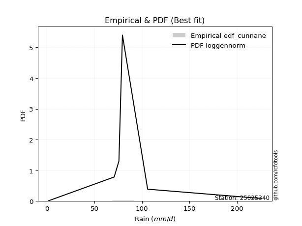</img>

</div>


### 12. EDF Adamowski (1981)

The Adamowski formula in hydrology refers to a specific plotting position formula used for estimating the non-parametric empirical distribution of hydrological events (like flood peaks) to calculate their return periods. This formula provides an alternative to traditional parametric methods (like the Gumbel or Log Pearson Type III distributions). 

<div align="center">


$P=(m-0.25)/(n+0.5)$


</div>


**12.1. Empirical values**

<div align="center">

|                | 0                  | 1                   | 2                   | 3             | 4                  | 5                  | 6                  |
|:---------------|:-------------------|:--------------------|:--------------------|:--------------|:-------------------|:-------------------|:-------------------|
| date           | 2022               | 2020                | 2017                | 2018          | 2025               | 2019               | 2021               |
| x              | 1.6                | 70.7                | 75.7                | 79.4          | 105.9              | 222.9              | 225.4              |
| m              | 1                  | 2                   | 3                   | 4             | 5                  | 6                  | 7                  |
| empirical_dist | edf_adamowski      | edf_adamowski       | edf_adamowski       | edf_adamowski | edf_adamowski      | edf_adamowski      | edf_adamowski      |
| empirical      | 0.1                | 0.23333333333333334 | 0.36666666666666664 | 0.5           | 0.6333333333333333 | 0.7666666666666667 | 0.9                |
| empirical_tr   | 1.1111111111111112 | 1.3043478260869565  | 1.5789473684210527  | 2.0           | 2.727272727272727  | 4.2857142857142865 | 10.000000000000002 |

</div>


**12.2. Kolmogorov-Smirnov fit test (sorted by Δ)**


<div align="center">

|                | 0                   | 1                   | 2                   | 3                   | 4                   | 5                   | 6                   | 7                   | 8                   | 9                   | 10                  | 11                  | 12                  | 13                  | 14                  | 15                  | 16                  | 17                  | 18                  | 19                  | 20                  | 21                  | 22                  | 23                  | 24                  | 25                  | 26                  | 27                  | 28                  | 29                  | 30                  | 31                  | 32                  | 33                  | 34                  | 35                  | 36                  | 37                  | 38                  | 39                  | 40                  | 41                  | 42                  | 43                  | 44                  | 45                  | 46                  | 47                  | 48                  | 49                  | 50                  | 51                  | 52                  | 53                  | 54                  | 55                  | 56                  | 57                  | 58                  | 59                  | 60                  | 61                  | 62                  | 63                  | 64                  | 65                  | 66                  | 67                  | 68                  | 69                  | 70                  | 71                  | 72                  | 73                  | 74                  | 75                  | 76                  | 77                  | 78                  | 79                  | 80                  | 81                  | 82                  | 83                  | 84                  | 85                  | 86                  | 87                  | 88                  | 89                  | 90                  | 91                  | 92                  | 93                  | 94                  | 95                  | 96                  | 97                  | 98                  | 99                  | 100                 | 101                 | 102                 | 103                 | 104                 | 105                 | 106                 | 107                 | 108                 | 109                 | 110                 | 111                 | 112                 | 113                 | 114                 | 115                 | 116                 | 117                 | 118                 | 119                 | 120                 | 121                 | 122                 | 123                 | 124                 | 125                 | 126                 | 127                 | 128                 | 129                 | 130                 | 131                 | 132                 | 133                 | 134                 | 135                 | 136                 | 137                 | 138                 | 139                 | 140                 | 141                 | 142                 | 143                 | 144                 | 145                 | 146                 | 147                 | 148                 | 149                 | 150                 | 151                 | 152                 | 153                 | 154                 | 155                 | 156                 | 157                 | 158                 | 159                 |
|:---------------|:--------------------|:--------------------|:--------------------|:--------------------|:--------------------|:--------------------|:--------------------|:--------------------|:--------------------|:--------------------|:--------------------|:--------------------|:--------------------|:--------------------|:--------------------|:--------------------|:--------------------|:--------------------|:--------------------|:--------------------|:--------------------|:--------------------|:--------------------|:--------------------|:--------------------|:--------------------|:--------------------|:--------------------|:--------------------|:--------------------|:--------------------|:--------------------|:--------------------|:--------------------|:--------------------|:--------------------|:--------------------|:--------------------|:--------------------|:--------------------|:--------------------|:--------------------|:--------------------|:--------------------|:--------------------|:--------------------|:--------------------|:--------------------|:--------------------|:--------------------|:--------------------|:--------------------|:--------------------|:--------------------|:--------------------|:--------------------|:--------------------|:--------------------|:--------------------|:--------------------|:--------------------|:--------------------|:--------------------|:--------------------|:--------------------|:--------------------|:--------------------|:--------------------|:--------------------|:--------------------|:--------------------|:--------------------|:--------------------|:--------------------|:--------------------|:--------------------|:--------------------|:--------------------|:--------------------|:--------------------|:--------------------|:--------------------|:--------------------|:--------------------|:--------------------|:--------------------|:--------------------|:--------------------|:--------------------|:--------------------|:--------------------|:--------------------|:--------------------|:--------------------|:--------------------|:--------------------|:--------------------|:--------------------|:--------------------|:--------------------|:--------------------|:--------------------|:--------------------|:--------------------|:--------------------|:--------------------|:--------------------|:--------------------|:--------------------|:--------------------|:--------------------|:--------------------|:--------------------|:--------------------|:--------------------|:--------------------|:--------------------|:--------------------|:--------------------|:--------------------|:--------------------|:--------------------|:--------------------|:--------------------|:--------------------|:--------------------|:--------------------|:--------------------|:--------------------|:--------------------|:--------------------|:--------------------|:--------------------|:--------------------|:--------------------|:--------------------|:--------------------|:--------------------|:--------------------|:--------------------|:--------------------|:--------------------|:--------------------|:--------------------|:--------------------|:--------------------|:--------------------|:--------------------|:--------------------|:--------------------|:--------------------|:--------------------|:--------------------|:--------------------|:--------------------|:--------------------|:--------------------|:--------------------|:--------------------|:--------------------|
| station        | 25025340            | 25025340            | 25025340            | 25025340            | 25025340            | 25025340            | 25025340            | 25025340            | 25025340            | 25025340            | 25025340            | 25025340            | 25025340            | 25025340            | 25025340            | 25025340            | 25025340            | 25025340            | 25025340            | 25025340            | 25025340            | 25025340            | 25025340            | 25025340            | 25025340            | 25025340            | 25025340            | 25025340            | 25025340            | 25025340            | 25025340            | 25025340            | 25025340            | 25025340            | 25025340            | 25025340            | 25025340            | 25025340            | 25025340            | 25025340            | 25025340            | 25025340            | 25025340            | 25025340            | 25025340            | 25025340            | 25025340            | 25025340            | 25025340            | 25025340            | 25025340            | 25025340            | 25025340            | 25025340            | 25025340            | 25025340            | 25025340            | 25025340            | 25025340            | 25025340            | 25025340            | 25025340            | 25025340            | 25025340            | 25025340            | 25025340            | 25025340            | 25025340            | 25025340            | 25025340            | 25025340            | 25025340            | 25025340            | 25025340            | 25025340            | 25025340            | 25025340            | 25025340            | 25025340            | 25025340            | 25025340            | 25025340            | 25025340            | 25025340            | 25025340            | 25025340            | 25025340            | 25025340            | 25025340            | 25025340            | 25025340            | 25025340            | 25025340            | 25025340            | 25025340            | 25025340            | 25025340            | 25025340            | 25025340            | 25025340            | 25025340            | 25025340            | 25025340            | 25025340            | 25025340            | 25025340            | 25025340            | 25025340            | 25025340            | 25025340            | 25025340            | 25025340            | 25025340            | 25025340            | 25025340            | 25025340            | 25025340            | 25025340            | 25025340            | 25025340            | 25025340            | 25025340            | 25025340            | 25025340            | 25025340            | 25025340            | 25025340            | 25025340            | 25025340            | 25025340            | 25025340            | 25025340            | 25025340            | 25025340            | 25025340            | 25025340            | 25025340            | 25025340            | 25025340            | 25025340            | 25025340            | 25025340            | 25025340            | 25025340            | 25025340            | 25025340            | 25025340            | 25025340            | 25025340            | 25025340            | 25025340            | 25025340            | 25025340            | 25025340            | 25025340            | 25025340            | 25025340            | 25025340            | 25025340            | 25025340            |
| empirical_dist | edf_adamowski       | edf_adamowski       | edf_adamowski       | edf_adamowski       | edf_adamowski       | edf_adamowski       | edf_adamowski       | edf_adamowski       | edf_adamowski       | edf_adamowski       | edf_adamowski       | edf_adamowski       | edf_adamowski       | edf_adamowski       | edf_adamowski       | edf_adamowski       | edf_adamowski       | edf_adamowski       | edf_adamowski       | edf_adamowski       | edf_adamowski       | edf_adamowski       | edf_adamowski       | edf_adamowski       | edf_adamowski       | edf_adamowski       | edf_adamowski       | edf_adamowski       | edf_adamowski       | edf_adamowski       | edf_adamowski       | edf_adamowski       | edf_adamowski       | edf_adamowski       | edf_adamowski       | edf_adamowski       | edf_adamowski       | edf_adamowski       | edf_adamowski       | edf_adamowski       | edf_adamowski       | edf_adamowski       | edf_adamowski       | edf_adamowski       | edf_adamowski       | edf_adamowski       | edf_adamowski       | edf_adamowski       | edf_adamowski       | edf_adamowski       | edf_adamowski       | edf_adamowski       | edf_adamowski       | edf_adamowski       | edf_adamowski       | edf_adamowski       | edf_adamowski       | edf_adamowski       | edf_adamowski       | edf_adamowski       | edf_adamowski       | edf_adamowski       | edf_adamowski       | edf_adamowski       | edf_adamowski       | edf_adamowski       | edf_adamowski       | edf_adamowski       | edf_adamowski       | edf_adamowski       | edf_adamowski       | edf_adamowski       | edf_adamowski       | edf_adamowski       | edf_adamowski       | edf_adamowski       | edf_adamowski       | edf_adamowski       | edf_adamowski       | edf_adamowski       | edf_adamowski       | edf_adamowski       | edf_adamowski       | edf_adamowski       | edf_adamowski       | edf_adamowski       | edf_adamowski       | edf_adamowski       | edf_adamowski       | edf_adamowski       | edf_adamowski       | edf_adamowski       | edf_adamowski       | edf_adamowski       | edf_adamowski       | edf_adamowski       | edf_adamowski       | edf_adamowski       | edf_adamowski       | edf_adamowski       | edf_adamowski       | edf_adamowski       | edf_adamowski       | edf_adamowski       | edf_adamowski       | edf_adamowski       | edf_adamowski       | edf_adamowski       | edf_adamowski       | edf_adamowski       | edf_adamowski       | edf_adamowski       | edf_adamowski       | edf_adamowski       | edf_adamowski       | edf_adamowski       | edf_adamowski       | edf_adamowski       | edf_adamowski       | edf_adamowski       | edf_adamowski       | edf_adamowski       | edf_adamowski       | edf_adamowski       | edf_adamowski       | edf_adamowski       | edf_adamowski       | edf_adamowski       | edf_adamowski       | edf_adamowski       | edf_adamowski       | edf_adamowski       | edf_adamowski       | edf_adamowski       | edf_adamowski       | edf_adamowski       | edf_adamowski       | edf_adamowski       | edf_adamowski       | edf_adamowski       | edf_adamowski       | edf_adamowski       | edf_adamowski       | edf_adamowski       | edf_adamowski       | edf_adamowski       | edf_adamowski       | edf_adamowski       | edf_adamowski       | edf_adamowski       | edf_adamowski       | edf_adamowski       | edf_adamowski       | edf_adamowski       | edf_adamowski       | edf_adamowski       | edf_adamowski       | edf_adamowski       | edf_adamowski       | edf_adamowski       |
| p_dist         | ncf                 | loggennorm          | alpha               | burr12              | gamma               | erlang              | exponnorm           | weibull_min         | halfnorm            | betaprime           | genlogistic         | invgauss            | kstwobign           | invgamma            | skewnorm            | rayleigh            | halflogistic        | foldnorm            | exponweib           | maxwell             | moyal               | rice                | gumbel_r            | genextreme          | pearson3            | ksone               | semicircular        | wald                | anglit              | johnsonsu           | t                   | norm                | crystalball         | logexponweib        | logexponpow         | logargus            | logvonmises_line    | logdgamma           | logt                | logistic            | cosine              | gennorm             | logpearson3         | loggengamma         | hypsecant           | logdweibull         | gengamma            | logweibull_min      | dweibull            | logweibull_max      | burr                | loggenextreme       | loggompertz         | loggenpareto        | wrapcauchy          | kappa4              | tukeylambda         | kappa3              | uniform             | vonmises_line       | laplace             | logmielke           | logburr12           | logloggamma         | bradford            | truncweibull_min    | truncexpon          | lomax               | loggumbel_l         | genexpon            | arcsine             | logloglaplace       | gumbel_l            | argus               | logburr             | logtrapezoid        | johnsonsb           | mielke              | dgamma              | f                   | triang              | beta                | logarcsine          | logfoldnorm         | logsemicircular     | loganglit           | logf                | logexponnorm        | logcrystalball      | lognorm             | logrice             | logfatiguelife      | lognct              | loglogistic         | loglevy_l           | gausshyper          | loghypsecant        | loggamma            | loggamma            | loginvgamma         | loginvgauss         | logerlang           | logbetaprime        | levy_l              | loglaplace          | loglaplace          | halfgennorm         | logbeta             | loginvweibull       | genpareto           | logalpha            | logmaxwell          | logskewnorm         | logncf              | lograyleigh         | logtruncnorm        | genhalflogistic     | logkstwobign        | nakagami            | loggenhalflogistic  | logwrapcauchy       | loggausshyper       | loghalfnorm         | loggumbel_r         | loggenexpon         | logtruncweibull_min | logcosine           | loglomax            | logmoyal            | loghalflogistic     | logtriang           | nct                 | trapezoid           | logjohnsonsu        | logkappa4           | invweibull          | logwald             | lognakagami         | logksone            | logjohnsonsb        | loghalfgennorm      | rdist               | logkappa3           | loguniform          | logbradford         | weibull_max         | fatiguelife         | logtruncexpon       | powerlaw            | gompertz            | truncpareto         | exponpow            | logpowerlaw         | logtruncpareto      | truncnorm           | logrdist            | logtukeylambda      | loggenlogistic      | logvonmises         | vonmises            |
| delta          | 0.1231861419996999  | 0.1261744416137912  | 0.13185600080398985 | 0.13503929451890773 | 0.13588431479932506 | 0.13588432732090439 | 0.13644783406532734 | 0.13661883543905473 | 0.13824141393457334 | 0.13837460943754076 | 0.14096171088928422 | 0.14104947029847825 | 0.14222073066871532 | 0.14306826673516926 | 0.14352578566441276 | 0.14444791672878    | 0.14518258203720324 | 0.14690509721981992 | 0.14708609037941767 | 0.14754142822531569 | 0.1485949799954338  | 0.1487403771804915  | 0.14913216182624733 | 0.14977474292629533 | 0.15079857803161    | 0.154925852934846   | 0.15713694177630205 | 0.15754505286940157 | 0.15889090080376483 | 0.16296773052425195 | 0.16309495521000517 | 0.16314588809718683 | 0.16321901852862053 | 0.1719777204319211  | 0.17345062934881122 | 0.17658294815594677 | 0.17897896205976227 | 0.17922016191549656 | 0.18033996809210717 | 0.1813873568473534  | 0.18157138527349675 | 0.18229405079410876 | 0.18737793819320864 | 0.19009027493145003 | 0.19587025547944892 | 0.19795477808143747 | 0.19896724936653454 | 0.20121615540917143 | 0.20425311607330393 | 0.20531562335763756 | 0.20708703260491557 | 0.21144941204737988 | 0.21301015268275852 | 0.21318831022340978 | 0.21831873815635572 | 0.22020017391058821 | 0.22042142248674323 | 0.22048760356912778 | 0.22216264521894546 | 0.2222414184015804  | 0.22358101460129287 | 0.22389296316291596 | 0.2239169569251364  | 0.2245661135932956  | 0.2245743535932595  | 0.2259108125279018  | 0.226352298393254   | 0.2273677638075871  | 0.23054991307282874 | 0.23289156747036194 | 0.23333333333333328 | 0.23360905444661162 | 0.23376892922869263 | 0.2372745006191357  | 0.2386131233654642  | 0.24010523586307975 | 0.24654742557608986 | 0.250883601634251   | 0.26666666669613454 | 0.2777046735397561  | 0.2809448910289074  | 0.2831923044538356  | 0.28504225636954256 | 0.2903829672876576  | 0.292633760570206   | 0.29454591773103983 | 0.29830864637794313 | 0.2991800394075473  | 0.2991836011133087  | 0.29918364881230236 | 0.2991837150034066  | 0.29950154347026986 | 0.2995446928111856  | 0.3036000757133967  | 0.3062016712342146  | 0.30628348420457396 | 0.30735463405641966 | 0.30761408221872083 | 0.30761408221872083 | 0.31197430234940154 | 0.312850926125718   | 0.3141075520207068  | 0.3152371706984534  | 0.3198440749558682  | 0.3211607770922255  | 0.3211607770922255  | 0.323049393911959   | 0.32671621347236834 | 0.3267392390811373  | 0.3282898434204185  | 0.3297771524999141  | 0.3306507523856081  | 0.33341264965682266 | 0.33442675781174663 | 0.34088322748489036 | 0.3504226709542953  | 0.35587699416521107 | 0.35697765548052146 | 0.3586739151918111  | 0.3589483535100582  | 0.35928357207471767 | 0.3650615951144473  | 0.36971092885247564 | 0.3697676456866748  | 0.3745399119320408  | 0.37558252440202783 | 0.37585493926138974 | 0.3943782433585484  | 0.39510204348397754 | 0.3963340419298896  | 0.4019849000027948  | 0.40472011757148646 | 0.40716678893029723 | 0.4141815541855081  | 0.4509200546288155  | 0.4511427036460789  | 0.4654243588306865  | 0.47007341837010813 | 0.48805901458734186 | 0.49901633374704085 | 0.5049671587617128  | 0.5276548990041747  | 0.5323340741342877  | 0.532337484171477   | 0.5540977265522968  | 0.5597015029255863  | 0.5973206844538947  | 0.5990801146312597  | 0.6014886570795501  | 0.6333333333331802  | 0.6829281965665333  | 0.6994180332481517  | 0.7209599323096363  | 0.7467208319559258  | 0.766666606129323   | 0.7666666666666666  | 0.7666666666666666  | 0.7666666666666667  | 0.9723175445091891  | 35.39911819367999   |
| deltao         | 0.48442053926100004 | 0.48442053926100004 | 0.48442053926100004 | 0.48442053926100004 | 0.48442053926100004 | 0.48442053926100004 | 0.48442053926100004 | 0.48442053926100004 | 0.48442053926100004 | 0.48442053926100004 | 0.48442053926100004 | 0.48442053926100004 | 0.48442053926100004 | 0.48442053926100004 | 0.48442053926100004 | 0.48442053926100004 | 0.48442053926100004 | 0.48442053926100004 | 0.48442053926100004 | 0.48442053926100004 | 0.48442053926100004 | 0.48442053926100004 | 0.48442053926100004 | 0.48442053926100004 | 0.48442053926100004 | 0.48442053926100004 | 0.48442053926100004 | 0.48442053926100004 | 0.48442053926100004 | 0.48442053926100004 | 0.48442053926100004 | 0.48442053926100004 | 0.48442053926100004 | 0.48442053926100004 | 0.48442053926100004 | 0.48442053926100004 | 0.48442053926100004 | 0.48442053926100004 | 0.48442053926100004 | 0.48442053926100004 | 0.48442053926100004 | 0.48442053926100004 | 0.48442053926100004 | 0.48442053926100004 | 0.48442053926100004 | 0.48442053926100004 | 0.48442053926100004 | 0.48442053926100004 | 0.48442053926100004 | 0.48442053926100004 | 0.48442053926100004 | 0.48442053926100004 | 0.48442053926100004 | 0.48442053926100004 | 0.48442053926100004 | 0.48442053926100004 | 0.48442053926100004 | 0.48442053926100004 | 0.48442053926100004 | 0.48442053926100004 | 0.48442053926100004 | 0.48442053926100004 | 0.48442053926100004 | 0.48442053926100004 | 0.48442053926100004 | 0.48442053926100004 | 0.48442053926100004 | 0.48442053926100004 | 0.48442053926100004 | 0.48442053926100004 | 0.48442053926100004 | 0.48442053926100004 | 0.48442053926100004 | 0.48442053926100004 | 0.48442053926100004 | 0.48442053926100004 | 0.48442053926100004 | 0.48442053926100004 | 0.48442053926100004 | 0.48442053926100004 | 0.48442053926100004 | 0.48442053926100004 | 0.48442053926100004 | 0.48442053926100004 | 0.48442053926100004 | 0.48442053926100004 | 0.48442053926100004 | 0.48442053926100004 | 0.48442053926100004 | 0.48442053926100004 | 0.48442053926100004 | 0.48442053926100004 | 0.48442053926100004 | 0.48442053926100004 | 0.48442053926100004 | 0.48442053926100004 | 0.48442053926100004 | 0.48442053926100004 | 0.48442053926100004 | 0.48442053926100004 | 0.48442053926100004 | 0.48442053926100004 | 0.48442053926100004 | 0.48442053926100004 | 0.48442053926100004 | 0.48442053926100004 | 0.48442053926100004 | 0.48442053926100004 | 0.48442053926100004 | 0.48442053926100004 | 0.48442053926100004 | 0.48442053926100004 | 0.48442053926100004 | 0.48442053926100004 | 0.48442053926100004 | 0.48442053926100004 | 0.48442053926100004 | 0.48442053926100004 | 0.48442053926100004 | 0.48442053926100004 | 0.48442053926100004 | 0.48442053926100004 | 0.48442053926100004 | 0.48442053926100004 | 0.48442053926100004 | 0.48442053926100004 | 0.48442053926100004 | 0.48442053926100004 | 0.48442053926100004 | 0.48442053926100004 | 0.48442053926100004 | 0.48442053926100004 | 0.48442053926100004 | 0.48442053926100004 | 0.48442053926100004 | 0.48442053926100004 | 0.48442053926100004 | 0.48442053926100004 | 0.48442053926100004 | 0.48442053926100004 | 0.48442053926100004 | 0.48442053926100004 | 0.48442053926100004 | 0.48442053926100004 | 0.48442053926100004 | 0.48442053926100004 | 0.48442053926100004 | 0.48442053926100004 | 0.48442053926100004 | 0.48442053926100004 | 0.48442053926100004 | 0.48442053926100004 | 0.48442053926100004 | 0.48442053926100004 | 0.48442053926100004 | 0.48442053926100004 | 0.48442053926100004 | 0.48442053926100004 | 0.48442053926100004 | 0.48442053926100004 |
| eval           | Δo > Δ              | Δo > Δ              | Δo > Δ              | Δo > Δ              | Δo > Δ              | Δo > Δ              | Δo > Δ              | Δo > Δ              | Δo > Δ              | Δo > Δ              | Δo > Δ              | Δo > Δ              | Δo > Δ              | Δo > Δ              | Δo > Δ              | Δo > Δ              | Δo > Δ              | Δo > Δ              | Δo > Δ              | Δo > Δ              | Δo > Δ              | Δo > Δ              | Δo > Δ              | Δo > Δ              | Δo > Δ              | Δo > Δ              | Δo > Δ              | Δo > Δ              | Δo > Δ              | Δo > Δ              | Δo > Δ              | Δo > Δ              | Δo > Δ              | Δo > Δ              | Δo > Δ              | Δo > Δ              | Δo > Δ              | Δo > Δ              | Δo > Δ              | Δo > Δ              | Δo > Δ              | Δo > Δ              | Δo > Δ              | Δo > Δ              | Δo > Δ              | Δo > Δ              | Δo > Δ              | Δo > Δ              | Δo > Δ              | Δo > Δ              | Δo > Δ              | Δo > Δ              | Δo > Δ              | Δo > Δ              | Δo > Δ              | Δo > Δ              | Δo > Δ              | Δo > Δ              | Δo > Δ              | Δo > Δ              | Δo > Δ              | Δo > Δ              | Δo > Δ              | Δo > Δ              | Δo > Δ              | Δo > Δ              | Δo > Δ              | Δo > Δ              | Δo > Δ              | Δo > Δ              | Δo > Δ              | Δo > Δ              | Δo > Δ              | Δo > Δ              | Δo > Δ              | Δo > Δ              | Δo > Δ              | Δo > Δ              | Δo > Δ              | Δo > Δ              | Δo > Δ              | Δo > Δ              | Δo > Δ              | Δo > Δ              | Δo > Δ              | Δo > Δ              | Δo > Δ              | Δo > Δ              | Δo > Δ              | Δo > Δ              | Δo > Δ              | Δo > Δ              | Δo > Δ              | Δo > Δ              | Δo > Δ              | Δo > Δ              | Δo > Δ              | Δo > Δ              | Δo > Δ              | Δo > Δ              | Δo > Δ              | Δo > Δ              | Δo > Δ              | Δo > Δ              | Δo > Δ              | Δo > Δ              | Δo > Δ              | Δo > Δ              | Δo > Δ              | Δo > Δ              | Δo > Δ              | Δo > Δ              | Δo > Δ              | Δo > Δ              | Δo > Δ              | Δo > Δ              | Δo > Δ              | Δo > Δ              | Δo > Δ              | Δo > Δ              | Δo > Δ              | Δo > Δ              | Δo > Δ              | Δo > Δ              | Δo > Δ              | Δo > Δ              | Δo > Δ              | Δo > Δ              | Δo > Δ              | Δo > Δ              | Δo > Δ              | Δo > Δ              | Δo > Δ              | Δo > Δ              | Δo > Δ              | Δo > Δ              | Δo > Δ              | Δo > Δ              | Δo <= Δ             | Δo <= Δ             | Δo <= Δ             | Δo <= Δ             | Δo <= Δ             | Δo <= Δ             | Δo <= Δ             | Δo <= Δ             | Δo <= Δ             | Δo <= Δ             | Δo <= Δ             | Δo <= Δ             | Δo <= Δ             | Δo <= Δ             | Δo <= Δ             | Δo <= Δ             | Δo <= Δ             | Δo <= Δ             | Δo <= Δ             | Δo <= Δ             | Δo <= Δ             | Δo <= Δ             |
| fit            | 1                   | 1                   | 1                   | 1                   | 1                   | 1                   | 1                   | 1                   | 1                   | 1                   | 1                   | 1                   | 1                   | 1                   | 1                   | 1                   | 1                   | 1                   | 1                   | 1                   | 1                   | 1                   | 1                   | 1                   | 1                   | 1                   | 1                   | 1                   | 1                   | 1                   | 1                   | 1                   | 1                   | 1                   | 1                   | 1                   | 1                   | 1                   | 1                   | 1                   | 1                   | 1                   | 1                   | 1                   | 1                   | 1                   | 1                   | 1                   | 1                   | 1                   | 1                   | 1                   | 1                   | 1                   | 1                   | 1                   | 1                   | 1                   | 1                   | 1                   | 1                   | 1                   | 1                   | 1                   | 1                   | 1                   | 1                   | 1                   | 1                   | 1                   | 1                   | 1                   | 1                   | 1                   | 1                   | 1                   | 1                   | 1                   | 1                   | 1                   | 1                   | 1                   | 1                   | 1                   | 1                   | 1                   | 1                   | 1                   | 1                   | 1                   | 1                   | 1                   | 1                   | 1                   | 1                   | 1                   | 1                   | 1                   | 1                   | 1                   | 1                   | 1                   | 1                   | 1                   | 1                   | 1                   | 1                   | 1                   | 1                   | 1                   | 1                   | 1                   | 1                   | 1                   | 1                   | 1                   | 1                   | 1                   | 1                   | 1                   | 1                   | 1                   | 1                   | 1                   | 1                   | 1                   | 1                   | 1                   | 1                   | 1                   | 1                   | 1                   | 1                   | 1                   | 1                   | 1                   | 1                   | 1                   | 0                   | 0                   | 0                   | 0                   | 0                   | 0                   | 0                   | 0                   | 0                   | 0                   | 0                   | 0                   | 0                   | 0                   | 0                   | 0                   | 0                   | 0                   | 0                   | 0                   | 0                   | 0                   |
| n              | 7                   | 7                   | 7                   | 7                   | 7                   | 7                   | 7                   | 7                   | 7                   | 7                   | 7                   | 7                   | 7                   | 7                   | 7                   | 7                   | 7                   | 7                   | 7                   | 7                   | 7                   | 7                   | 7                   | 7                   | 7                   | 7                   | 7                   | 7                   | 7                   | 7                   | 7                   | 7                   | 7                   | 7                   | 7                   | 7                   | 7                   | 7                   | 7                   | 7                   | 7                   | 7                   | 7                   | 7                   | 7                   | 7                   | 7                   | 7                   | 7                   | 7                   | 7                   | 7                   | 7                   | 7                   | 7                   | 7                   | 7                   | 7                   | 7                   | 7                   | 7                   | 7                   | 7                   | 7                   | 7                   | 7                   | 7                   | 7                   | 7                   | 7                   | 7                   | 7                   | 7                   | 7                   | 7                   | 7                   | 7                   | 7                   | 7                   | 7                   | 7                   | 7                   | 7                   | 7                   | 7                   | 7                   | 7                   | 7                   | 7                   | 7                   | 7                   | 7                   | 7                   | 7                   | 7                   | 7                   | 7                   | 7                   | 7                   | 7                   | 7                   | 7                   | 7                   | 7                   | 7                   | 7                   | 7                   | 7                   | 7                   | 7                   | 7                   | 7                   | 7                   | 7                   | 7                   | 7                   | 7                   | 7                   | 7                   | 7                   | 7                   | 7                   | 7                   | 7                   | 7                   | 7                   | 7                   | 7                   | 7                   | 7                   | 7                   | 7                   | 7                   | 7                   | 7                   | 7                   | 7                   | 7                   | 7                   | 7                   | 7                   | 7                   | 7                   | 7                   | 7                   | 7                   | 7                   | 7                   | 7                   | 7                   | 7                   | 7                   | 7                   | 7                   | 7                   | 7                   | 7                   | 7                   | 7                   | 7                   |
| best_fit       | 1                   | 0                   | 0                   | 0                   | 0                   | 0                   | 0                   | 0                   | 0                   | 0                   | 0                   | 0                   | 0                   | 0                   | 0                   | 0                   | 0                   | 0                   | 0                   | 0                   | 0                   | 0                   | 0                   | 0                   | 0                   | 0                   | 0                   | 0                   | 0                   | 0                   | 0                   | 0                   | 0                   | 0                   | 0                   | 0                   | 0                   | 0                   | 0                   | 0                   | 0                   | 0                   | 0                   | 0                   | 0                   | 0                   | 0                   | 0                   | 0                   | 0                   | 0                   | 0                   | 0                   | 0                   | 0                   | 0                   | 0                   | 0                   | 0                   | 0                   | 0                   | 0                   | 0                   | 0                   | 0                   | 0                   | 0                   | 0                   | 0                   | 0                   | 0                   | 0                   | 0                   | 0                   | 0                   | 0                   | 0                   | 0                   | 0                   | 0                   | 0                   | 0                   | 0                   | 0                   | 0                   | 0                   | 0                   | 0                   | 0                   | 0                   | 0                   | 0                   | 0                   | 0                   | 0                   | 0                   | 0                   | 0                   | 0                   | 0                   | 0                   | 0                   | 0                   | 0                   | 0                   | 0                   | 0                   | 0                   | 0                   | 0                   | 0                   | 0                   | 0                   | 0                   | 0                   | 0                   | 0                   | 0                   | 0                   | 0                   | 0                   | 0                   | 0                   | 0                   | 0                   | 0                   | 0                   | 0                   | 0                   | 0                   | 0                   | 0                   | 0                   | 0                   | 0                   | 0                   | 0                   | 0                   | 0                   | 0                   | 0                   | 0                   | 0                   | 0                   | 0                   | 0                   | 0                   | 0                   | 0                   | 0                   | 0                   | 0                   | 0                   | 0                   | 0                   | 0                   | 0                   | 0                   | 0                   | 0                   |
| best_fit_sort  | 1                   | 2                   | 3                   | 4                   | 5                   | 6                   | 7                   | 8                   | 9                   | 10                  | 11                  | 12                  | 13                  | 14                  | 15                  | 16                  | 17                  | 18                  | 19                  | 20                  | 21                  | 22                  | 23                  | 24                  | 25                  | 26                  | 27                  | 28                  | 29                  | 30                  | 31                  | 32                  | 33                  | 34                  | 35                  | 36                  | 37                  | 38                  | 39                  | 40                  | 41                  | 42                  | 43                  | 44                  | 45                  | 46                  | 47                  | 48                  | 49                  | 50                  | 51                  | 52                  | 53                  | 54                  | 55                  | 56                  | 57                  | 58                  | 59                  | 60                  | 61                  | 62                  | 63                  | 64                  | 65                  | 66                  | 67                  | 68                  | 69                  | 70                  | 71                  | 72                  | 73                  | 74                  | 75                  | 76                  | 77                  | 78                  | 79                  | 80                  | 81                  | 82                  | 83                  | 84                  | 85                  | 86                  | 87                  | 88                  | 89                  | 90                  | 91                  | 92                  | 93                  | 94                  | 95                  | 96                  | 97                  | 98                  | 99                  | 100                 | 101                 | 102                 | 103                 | 104                 | 105                 | 106                 | 107                 | 108                 | 109                 | 110                 | 111                 | 112                 | 113                 | 114                 | 115                 | 116                 | 117                 | 118                 | 119                 | 120                 | 121                 | 122                 | 123                 | 124                 | 125                 | 126                 | 127                 | 128                 | 129                 | 130                 | 131                 | 132                 | 133                 | 134                 | 135                 | 136                 | 137                 | 138                 | 139                 | 140                 | 141                 | 142                 | 143                 | 144                 | 145                 | 146                 | 147                 | 148                 | 149                 | 150                 | 151                 | 152                 | 153                 | 154                 | 155                 | 156                 | 157                 | 158                 | 159                 | 160                 |

</div>


**12.3. Best fit**

<div align="center">

|   id |   station | empirical_dist   | p_dist   |    delta |   deltao | eval   |   fit |   n |   best_fit |   best_fit_sort |
|-----:|----------:|:-----------------|:---------|---------:|---------:|:-------|------:|----:|-----------:|----------------:|
|    0 |  25025340 | edf_adamowski    | ncf      | 0.123186 | 0.484421 | Δo > Δ |     1 |   7 |          1 |               1 |

</div>


<div align="center">

</img>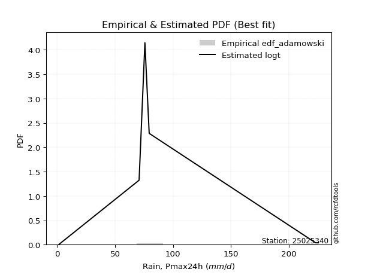</img>

</div>


## C. Best fit & Estimate extreme values for specific return periods - Tr

Best fit in probability distribution analysis means finding the theoretical distribution (like Normal, Poisson, Exponential, etc.) that most accurately mirrors your real-world data´s patterns (shape, center, spread) for better predictions, using methods like visual checks (Q-Q plots), goodness-of-fit tests (Kolmogorov-Smirnov, Chi-Squared), and information criteria (AIC) to score and select the simplest, most representative model.


### 1. Best fit (ordered by delta Δ)

:file_folder:Table: [bestfit_25025340.csv](table/bestfit_25025340.csv)

<div align="center">

|   id |   station | empirical_dist   | p_dist     |    delta |   deltao | eval   |   fit |   n |   best_fit |   best_fit_sort |
|-----:|----------:|:-----------------|:-----------|---------:|---------:|:-------|------:|----:|-----------:|----------------:|
|    0 |  25025340 | edf_california   | logt       | 0.103904 | 0.484421 | Δo > Δ |     1 |   7 |          1 |               1 |
|    1 |  25025340 | edf_cunnane      | loggennorm | 0.116798 | 0.484421 | Δo > Δ |     1 |   7 |          1 |               2 |
|    2 |  25025340 | edf_blom         | loggennorm | 0.116979 | 0.484421 | Δo > Δ |     1 |   7 |          1 |               3 |
|    3 |  25025340 | edf_gringorten   | alpha      | 0.118779 | 0.484421 | Δo > Δ |     1 |   7 |          1 |               4 |
|    4 |  25025340 | edf_tukey        | loggennorm | 0.120114 | 0.484421 | Δo > Δ |     1 |   7 |          1 |               5 |
|    5 |  25025340 | edf_filliben     | loggennorm | 0.121286 | 0.484421 | Δo > Δ |     1 |   7 |          1 |               6 |
|    6 |  25025340 | edf_beard        | loggennorm | 0.121838 | 0.484421 | Δo > Δ |     1 |   7 |          1 |               7 |
|    7 |  25025340 | edf_jenkinson    | loggennorm | 0.121838 | 0.484421 | Δo > Δ |     1 |   7 |          1 |               8 |
|    8 |  25025340 | edf_chegodayev   | loggennorm | 0.122571 | 0.484421 | Δo > Δ |     1 |   7 |          1 |               9 |
|    9 |  25025340 | edf_adamowski    | ncf        | 0.123186 | 0.484421 | Δo > Δ |     1 |   7 |          1 |              10 |
|   10 |  25025340 | edf_hazen        | alpha      | 0.123595 | 0.484421 | Δo > Δ |     1 |   7 |          1 |              11 |
|   11 |  25025340 | edf_weibull      | ncf        | 0.125    | 0.484421 | Δo > Δ |     1 |   7 |          1 |              12 |

</div>


### 2. Extreme values and % difference analysis

In hydrology, a return period (or recurrence interval $Tr$) is the statistical average time between extreme events like floods or droughts of a specific magnitude, indicating how rare an event is, with a 100-year flood, for example, having a 1% chance of occurring in any given year, not that it happens exactly every century. It is a key tool for infrastructure design (like bridges or dams) and risk assessment, calculated from historical data to determine the probability of future events, although it is important to remember it is statistical average, and events can cluster or be missed.

The extreme value porcentage difference is evaluated as $pdiff = 1 - (ETrBf / ETr) * 100$, where _ETrBf_ correspond to the bestfit extreme value for a specific recurrence interval and _ETr_ correspond to the extreme value for one of the most used PDFsused in hydrology.

> risk_rate: assuming the return period as the project useful life.

:file_folder:Table: [extreme_25025340.csv](table/extreme_25025340.csv), all PDFs.  
:file_folder:Table: [extremepdiff_25025340.csv](table/extremepdiff_25025340.csv), % difference between bestfit and most used PDFs in Hydrology.

<div align="center">

Extreme values table for only best fit PDFs
|   id |      tr |   prob_l |     prob_g |    alpha |   anglit |   arcsine |   argus |    beta |   betaprime |   bradford |    burr |   burr12 |   cosine |   crystalball |   dgamma |   dweibull |   erlang |   exponnorm |    exponpow |   exponweib |         f |   fatiguelife |   foldnorm |    gamma |   gausshyper |   genexpon |   genextreme |   gengamma |   genhalflogistic |   genlogistic |   gennorm |   genpareto |   gompertz |   gumbel_l |   gumbel_r |   halfgennorm |   halflogistic |   halfnorm |   hypsecant |   invgamma |   invgauss |       invweibull |   johnsonsb |   johnsonsu |   kappa3 |   kappa4 |   ksone |   kstwobign |   laplace |   levy_l |   loggamma |   logistic |   loglaplace |    lomax |   maxwell |   mielke |    moyal |   nakagami |     ncf |              nct |    norm |   pearson3 |   powerlaw |   rayleigh |     rdist |    rice |   semicircular |   skewnorm |       t |   trapezoid |   triang |   truncexpon |   truncnorm |   truncpareto |   truncweibull_min |   tukeylambda |   uniform |   vonmises |   vonmises_line |     wald |   weibull_max |   weibull_min |   wrapcauchy |   logalpha |   loganglit |   logarcsine |   logargus |   logbeta |   logbetaprime |   logbradford |   logburr |   logburr12 |   logcosine |   logcrystalball |   logdgamma |      logdweibull |   logerlang |   logexponnorm |   logexponpow |   logexponweib |      logf |   logfatiguelife |   logfoldnorm |   loggausshyper |   loggenexpon |   loggenextreme |   loggengamma |   loggenhalflogistic |   loggenlogistic |       loggennorm |   loggenpareto |   loggompertz |   loggumbel_l |   loggumbel_r |   loghalfgennorm |   loghalflogistic |   loghalfnorm |   loghypsecant |   loginvgamma |   loginvgauss |    loginvweibull |   logjohnsonsb |   logjohnsonsu |   logkappa3 |   logkappa4 |   logksone |     logkstwobign |   loglevy_l |   logloggamma |   loglogistic |    logloglaplace |         loglomax |   logmaxwell |   logmielke |    logmoyal |      lognakagami |      logncf |    lognct |   lognorm |   logpearson3 |   logpowerlaw |   lograyleigh |   logrdist |   logrice |   logsemicircular |   logskewnorm |              logt |   logtrapezoid |   logtriang |   logtruncexpon |     logtruncnorm |   logtruncpareto |   logtruncweibull_min |   logtukeylambda |   loguniform |   logvonmises |   logvonmises_line |          logwald |   logweibull_max |   logweibull_min |   logwrapcauchy |   station |   n |   risk_rate |
|-----:|--------:|---------:|-----------:|---------:|---------:|----------:|--------:|--------:|------------:|-----------:|--------:|---------:|---------:|--------------:|---------:|-----------:|---------:|------------:|------------:|------------:|----------:|--------------:|-----------:|---------:|-------------:|-----------:|-------------:|-----------:|------------------:|--------------:|----------:|------------:|-----------:|-----------:|-----------:|--------------:|---------------:|-----------:|------------:|-----------:|-----------:|-----------------:|------------:|------------:|---------:|---------:|--------:|------------:|----------:|---------:|-----------:|-----------:|-------------:|---------:|----------:|---------:|---------:|-----------:|--------:|-----------------:|--------:|-----------:|-----------:|-----------:|----------:|--------:|---------------:|-----------:|--------:|------------:|---------:|-------------:|------------:|--------------:|-------------------:|--------------:|----------:|-----------:|----------------:|---------:|--------------:|--------------:|-------------:|-----------:|------------:|-------------:|-----------:|----------:|---------------:|--------------:|----------:|------------:|------------:|-----------------:|------------:|-----------------:|------------:|---------------:|--------------:|---------------:|----------:|-----------------:|--------------:|----------------:|--------------:|----------------:|--------------:|---------------------:|-----------------:|-----------------:|---------------:|--------------:|--------------:|--------------:|-----------------:|------------------:|--------------:|---------------:|--------------:|--------------:|-----------------:|---------------:|---------------:|------------:|------------:|-----------:|-----------------:|------------:|--------------:|--------------:|-----------------:|-----------------:|-------------:|------------:|------------:|-----------------:|------------:|----------:|----------:|--------------:|--------------:|--------------:|-----------:|----------:|------------------:|--------------:|------------------:|---------------:|------------:|----------------:|-----------------:|-----------------:|----------------------:|-----------------:|-------------:|--------------:|-------------------:|-----------------:|-----------------:|-----------------:|----------------:|----------:|----:|------------:|
|    0 |    2    | 0.5      | 0.5        |  99.5037 |  111.657 |   111.657 | 128.003 | 156.105 |     97.5422 |    99.2318 |  97.143 |  96.3382 |  115.453 |       111.395 |  70.7    |    75.7    |  96.9192 |     94.6109 |     1.60298 |      98.691 |   68.265  |       1.60016 |    106.472 |  96.9192 |      149.729 |    77.8949 |      101.139 |    83.5662 |           164.298 |       98.3664 |   75.7    |     158.646 |    216.89  |    124.302 |    99.0124 |       55.4726 |        92.7261 |    95.9018 |     111.657 |    99.7561 |    98.8231 |   2910.48        |     217.547 |     111.656 |    1.6   |  111.242 | 111.657 |     98.4786 |   111.657 |  186.071 |    59.7306 |    111.657 |      62.2385 |  79.167  |   105.074 |  74.3938 |  94.9303 |    48.9006 | 103.618 |     23.8218      | 111.657 |    106.182 |    4.05649 |    102.74  | -20.9039  | 104.679 |        111.657 |    100.836 | 111.648 |     168.082 |  139.271 |      87.6278 |     4.68807 |       3.05631 |            92.5441 |       113.322 |   113.5   |   0.308686 |         113.5   |  86.7071 |       225.047 |       96.6446 |      113.5   |    54.1965 |     62.2384 |      62.2389 |    95.3116 |   211.451 |        54.2137 |       14.7513 |   77.0265 |     79.7013 |     42.9952 |          62.2385 |     79.4    |     79.4         |     57.6837 |        62.2394 |        90.389 |        94.2051 |   62.4655 |          62.1897 |       65.3597 |         42.7235 |       37.9264 |         117.577 |       93.6947 |              47.1716 |          inf     |     79.4         |        92.6289 |       81.6985 |       80.4484 |       48.1506 |          20.8146 |           42.3835 |       45.205  |        62.2385 |       58.1729 |       57.6118 |     50.2499      |        225.353 |        224.403 |         1.6 |     27.432  |    18.9905 |     40.8469      |     171.7   |       92.2829 |       62.2385 |     79.3999      |     22.8194      |      54.4546 |       0     |     44.322  |     14.3812      |     49.3769 |   62.1245 |   62.2385 |       94.0939 |       1.75895 |       51.9347 |    3.21511 |   62.2385 |           62.2384 |       57.5544 |     76.9163       |        80.2081 |     42.2857 |         10.0789 |     38.191       |          1.67868 |               48.5547 |          1.60001 |      18.9905 |      0.253997 |            90.2489 |     37.5094      |          175.147 |          83.9115 |         18.9905 |  25025340 |   7 |    0.75     |
|    1 |    2.33 | 0.570815 | 0.429185   | 113.191  |  127.656 |   135.674 | 142.409 | 175.408 |    111.575  |   115.196  | 114.619 | 111.039  |  129.509 |       124.948 |  73.6318 |    81.6971 | 111.092  |    107.264  |     1.61594 |     111.987 |   85.1104 |       4.0042  |    121.599 | 111.092  |      165.573 |    94.7049 |      114.461 |    98.0533 |           177.921 |      111.797  |   79.6359 |     174.447 |    218.785 |    136.252 |   111.74   |       75.2076 |       105.812  |   110.725  |     122.649 |   113.213  |   112.532  | 124867           |     224.605 |     125.471 |    1.6   |  127.805 | 130.538 |    112.481  |   119.969 |  198.24  |    80.0731 |    123.759 |      73.6758 |  96.2573 |   119.344 |  91.8592 | 106.978  |    65.2025 | 120.183 |     39.8973      | 125.392 |    119.969 |    7.41804 |    117.22  |   6.56922 | 118.671 |        128.816 |    114.775 | 125.383 |     181.084 |  153.509 |     103.351  |     6.9141  |       4.06399 |           108.113  |       129.646 |   129.348 |   0.686571 |         129.24  |  95.7134 |       225.261 |      111.285  |      134.534 |    73.0767 |     86.1155 |     101.335  |   111.836  |   220.992 |        80.1134 |       21.7009 |   94.1131 |     96.3244 |     59.2508 |          82.2486 |     86.5817 |     89.5876      |     78.2591 |        82.2498 |       106.629 |       112.907  |   82.6327 |          82.1032 |       82.7254 |         61.8138 |       56.693  |         135.807 |      111.802  |              64.7044 |          inf     |     81.9897      |       124.089  |       97.9528 |      102.529  |       62.3427 |          29.935  |           55.2762 |       61.0731 |        77.7948 |       79.0381 |       79.0123 |     75.3467      |        225.388 |        225.094 |         1.6 |     40.0009 |    28.9162 |     62.4826      |     186.884 |      109.459  |       79.5664 |    104.078       |     40.9833      |      72.7473 |       0     |     56.5999 |     23.4553      |     71.8943 |   82.1734 |   82.2485 |      117.984  |       1.95758 |       69.6786 |    3.62235 |   82.2485 |           88.1672 |       71.5637 |     79.181        |       110.556  |     55.7611 |         14.7762 |     64.0374      |          1.7318  |               62.2241 |          1.60002 |      26.9592 |      0.291    |           109.84   |     45.0324      |          208.499 |          99.9195 |         56.7395 |  25025340 |   7 |    0.729209 |
|    2 |    5    | 0.8      | 0.2        | 173.394  |  184.104 |   199.719 | 188.617 | 216     |    171.953  |   171.023  | 174.556 | 173.755  |  180.162 |       175.315 | 105.536  |   141.806  | 172.476  |    166.947  |     3.84202 |     168.709 |  174.891  |      55.0703  |    178.236 | 172.476  |      207.03  |   178.751  |      170.004 |   158.972  |           210.236 |      170.125  |  120.609  |     212.197 |    224.908 |    174.856 |   167.032  |      216.005  |       165.021  |   173.413  |     166.741 |   170.635  |   171.278  |      1.54777e+12 |     225.4   |     176.811 |    1.6   |  181.289 | 191.645 |    171.959  |   161.526 |  218.401 |   242.772  |    170.484 |     171.251  | 181.705  |   175.509 | 157.734  | 162.785  |   146.948  | 193.516 |    513.771       | 176.435 |    174.324 |   53.9634  |    175.194 |  80.67    | 174.56  |        187.373 |    173.395 | 176.428 |     218.388 |  194.355 |     161.629  |    15.1866  |      19.9534  |           164.798  |       182.041 |   180.64  |   2.02207  |         180.399 | 146.13   |       225.398 |      173.448  |      190.108 |   232.518  |    270.797  |     371.775  |   172.367  |   225.388 |       389.448  |       75.7161 |  160.692  |    177.637  |    188.186  |         231.768  |    175.479  |    228.642       |    248.848  |       231.772  |       173.56  |       179.332  |  233.769  |         230.669  |      198.574  |        156.778  |      283.985  |         190.023 |      175.388  |             143.802  |          inf     |    122.217       |       207.797  |      176.477  |      224.455  |      191.497  |          97.0323 |          183.837  |      217.977  |       190.372  |      255.956  |      269.177  |    437.905       |        225.4   |        225.396 |         1.6 |    119.242  |   112.75   |    380.1         |     215.05  |      169.105  |      205.399  |    529.002       |    765.693       |     227.45   |       0     |    175.682  |    204.859       |    342.549  |  232.521  |  231.768  |      220.841  |       6.38953 |      225.999  |    5.20432 |  231.768  |          289.373  |      134.978  |    101.268        |       277.588  |    123.31   |         57.3842 |    543.679       |          2.68368 |              128.131  |          1.60002 |      83.789  |      0.489485 |           234.16   |    125.292       |          225.293 |         175.639  |        165.889  |  25025340 |   7 |    0.67232  |
|    3 |   10    | 0.9      | 0.1        | 223.962  |  216.054 |   215.18  | 210.899 | 223.374 |    219.515  |   197.514  | 202.1   | 221.779  |  210.765 |       208.727 | 141.851  |   216.283  | 221.162  |    220.458  |    26.9661  |     213.707 |  263.297  |     125.579   |    215.915 | 221.162  |      219.145 |   255.046  |      212.568 |   203.571  |           219.523 |      217.616  |  183.342  |     221.525 |    228.317 |    196.349 |   212.066  |      407.974  |       214.191  |   219.801  |     201.95  |   216.385  |   217.75   |      9.26963e+17 |     225.4   |     210.869 |  203.362 |  204.098 | 218.308 |    217.244  |   199.251 |  223.268 |   515.633  |    204.896 |     368.264  | 259.272  |   215.035 | 190.637  | 211.373  |   213.922  | 252.958 |   5197.17        | 210.296 |    213.148 |  114.321   |    216.53  |  99.1912  | 214.271 |        217.419 |    216.747 | 210.291 |     232.959 |  210.31  |     191.631  |    20.6744  |      57.961   |           193.472  |       204.338 |   203.02  |   2.70772  |         202.871 | 199.635  |       225.4   |      220.763  |      208.509 |   523.241  |    517.929  |     508.817  |   205.409  |   225.4   |      1249.13   |      130.634  |  195.344  |    249.762  |    378.281  |         460.81   |    367.509  |    643.611       |    547.051  |       460.819  |       220.408 |       212.227  |  466.098  |         457.987  |      354.97   |        201.259  |      896.887  |         210.078 |      205.232  |             185.941  |          inf     |    242.049       |       222.419  |      245.202  |      347.203  |      477.667  |         162.105  |          498.708  |      558.845  |       389.005  |      576.546  |      635.925  |   1836.13        |        225.4   |        225.4   |         1.6 |    174.794  |   204.163  |   1502.86        |     222.464 |      196.822  |      412.974  |   3769.08        |  10920.4         |     507.33   |       0     |    470.99   |   1067.46        |   1124.67   |  463.884  |  460.809  |      285.925  |      24.0928  |      522.957  |    5.92868 |  460.81   |          532.481  |      174.783  |    246.17         |       397.715  |    168.123  |        110.943  |   2563.24        |          6.76276 |              170.924  |          1.60003 |     137.427  |      0.714708 |           411.805  |    371.14        |          225.398 |         240.442  |        196.248  |  25025340 |   7 |    0.651322 |
|    4 |   15    | 0.933333 | 0.0666667  | 253.438  |  229.697 |   218.128 | 219.37  | 224.576 |    245.586  |   206.651  | 211.449 | 247.48   |  224.705 |       225.4   | 164.424  |   265.651  | 247.941  |    251.757  |    72.0817  |     238.656 |  317.881  |     171.694   |    234.724 | 247.941  |      222.073 |   299.675  |      235.574 |   226.613  |           221.963 |      244.408  |  231.014  |     223.508 |    229.861 |    206.083 |   237.475  |      550.559  |       242.018  |   243.94   |     222.044 |   241.945  |   243.394  |      1.68499e+21 |     225.4   |     227.865 |  210.834 |  211.503 | 227.195 |    241.284  |   221.318 |  224.738 |   754.869  |    223.645 |     576.334  | 304.646  |   235.315 | 202.135  | 239.571  |   249.594  | 286.045 |  20116.6         | 227.193 |    233.364 |  144.429   |    237.828 | 102.839   | 234.683 |        229.136 |    239.308 | 227.188 |     237.635 |  215.429 |     202.424  |    23.413   |      87.8436  |           203.714  |       211.597 |   210.48  |   2.95099  |         210.377 | 233.993  |       225.4   |      245.991  |      214.231 |   795.18   |    683.173  |     540.199  |   218.593  |   225.4   |      2315.86   |      156.683  |  207.677  |    291.442  |    519.922  |         649.327  |    576.01   |   1238.52        |    815.435  |       649.34   |       243.749 |       224.845  |  657.744  |         645.014  |      474.328  |        212.865  |     1622.49   |         215.977 |      215.48   |             200.095  |          inf     |    419.421       |       224.361  |      284.636  |      423.04   |      799.995  |         192.456  |          877.242  |      912.162  |       584.885  |      873.39   |      990.723  |   4122.18        |        225.4   |        225.4   |         1.6 |    194.415  |   248.846  |   3117.92        |     224.753 |      206.266  |      604.211  |  15630.8         |  51688.6         |     765.688  |     206.458 |    834.775  |   2535.06        |   2137.93   |  654.899  |  649.326  |      313.319  |      45.0357  |      805.749  |    6.14653 |  649.327  |          675.437  |      190.294  |   1117.08         |       446.355  |    185.705  |        139.691  |   5704.44        |         13.2726  |              187.652  |          1.60003 |     162.068  |      0.880678 |           566.252  |    745.394       |          225.4   |         277.19   |        205.849  |  25025340 |   7 |    0.644736 |
|    5 |   20    | 0.95     | 0.05       | 274.596  |  237.723 |   219.167 | 224.02  | 224.965 |    263.521  |   211.278  | 216.153 | 264.902  |  233.277 |       236.319 | 180.824  |   302.833  | 266.394  |    273.963  |   131.645   |     255.95  |  357.891  |     205.836   |    247.043 | 266.394  |      223.275 |   331.34   |      251.266 |   241.915  |           223.04  |      263.165  |  269.792  |     224.263 |    230.822 |    212.142 |   255.265  |      665.977  |       261.514  |   260.035  |     236.219 |   259.783  |   261.119  |      3.22732e+23 |     225.4   |     238.995 |  214.571 |  215.14  | 231.639 |    257.479  |   236.975 |  225.491 |   970.731  |    236.604 |     791.927  | 336.839  |   248.774 | 207.981  | 259.542  |   273.525  | 309     |  52552.1         | 238.259 |    246.911 |  161.87    |    251.985 | 104.148   | 248.233 |        235.635 |    254.349 | 238.255 |     239.941 |  217.954 |     207.986  |    25.2063  |     109.556   |           208.979  |       215.172 |   214.21  |   3.07465  |         214.132 | 259.596  |       225.4   |      263.056  |      217.047 |  1051.35   |    804.034  |     551.706  |   225.972  |   225.4   |      3515.39   |      171.595  |  213.993  |    320.828  |    632.239  |         812.835  |    796.173  |   2005.62        |   1061.4    |       812.851  |       258.907 |       231.96   |  824.182  |         807.211  |      573.482  |        217.598  |     2406.2    |         218.718 |      220.724  |             207.017  |          inf     |    665.074       |       224.909  |      312.336  |      478.396  |     1147.89   |         209.918  |         1303.06   |     1264.55   |       779.86   |     1150.68   |     1331.48   |   7261.79        |        225.4   |        225.4   |         1.6 |    203.881  |   274.731  |   5097.65        |     225.935 |      211.024  |      785.987  |  49653.8         | 155749           |    1006.21   |     211.217 |   1251.99   |   4517.55        |   3316.93   |  820.885  |  812.833  |      328.932  |      64.2126  |     1073.94   |    6.24574 |  812.835  |          770.674  |      198.534  |   9623.71         |       472.497  |    195.044  |        157.085  |   9703.94        |         21.2804  |              196.532  |          1.60003 |     176      |      1.02065  |           710.846  |   1253.34        |          225.4   |         302.849  |        210.657  |  25025340 |   7 |    0.641514 |
|    6 |   25    | 0.96     | 0.04       | 291.228  |  243.162 |   219.649 | 227.018 | 225.135 |    277.165  |   214.074  | 218.986 | 278.016  |  239.289 |       244.357 | 193.717  |   332.792  | 280.446  |    291.189  |   200.527   |     269.178 |  389.663  |     232.963   |    256.111 | 280.446  |      223.899 |   355.902  |      263.123 |   253.27   |           223.633 |      277.614  |  302.731  |     224.634 |    231.506 |    216.453 |   268.968  |      763.913  |       276.534  |   272.009  |     247.189 |   273.509  |   274.65   |      1.84828e+25 |     225.4   |     247.188 |  216.813 |  217.293 | 234.305 |    269.61   |   249.12  |  225.964 |  1169.29   |    246.518 |    1013.29   | 361.81   |   258.767 | 211.52   | 275.021  |   291.375  | 326.567 | 110679           | 246.405 |    257.039 |  173.175   |    262.503 | 104.765   | 258.29  |        239.852 |    265.54  | 246.401 |     241.315 |  219.459 |     211.38   |    26.5265  |     125.639   |           212.187  |       217.293 |   216.448 |   3.14933  |         216.385 | 280.104  |       225.4   |      275.882  |      218.726 |  1294.77   |    897.876  |     557.128  |   230.783  |   225.4   |      4811.8    |      181.216  |  217.832  |    343.528  |    725.186  |         958.967  |   1025.65   |   2941.2         |   1290.17   |       958.987  |       269.977 |       236.696  |  973.071  |         952.167  |      659.488  |        220.015  |     3224.85   |         220.279 |      223.961  |             211.077  |          inf     |    991.857       |       225.126  |      333.681  |      522.145  |     1515.96   |         221.387  |         1767.52   |     1612.45   |       974.351  |     1412.32   |     1659.64   |  11232.2         |        225.4   |        225.4   |         1.6 |    209.307  |   291.537  |   7367.06        |     226.68  |      213.891  |      961.165  | 133758           | 366429           |    1232.44   |     214.085 |   1714.14   |   6946.09        |   4627.42   |  969.436  |  958.965  |      339.199  |      80.6061  |     1329.51   |    6.30089 |  958.967  |          839.526  |      203.643  | 159011            |       488.794  |    200.83   |        168.663  |  14395.3         |         29.9606  |              202.033  |          1.60003 |     184.927  |      1.14556  |           849.662  |   1900.35        |          225.4   |         322.541  |        213.559  |  25025340 |   7 |    0.639603 |
|    7 |   50    | 0.98     | 0.02       | 344.635  |  256.55  |   220.292 | 233.817 | 225.343 |    318.333  |   219.708  | 224.699 | 316.876  |  255.031 |       267.374 | 234.511  |   431.461  | 322.917  |    344.694  |   604.98    |     309.443 |  492.543  |     319.999   |    282.081 | 322.917  |      224.89  |   432.196  |      298.435 |   286.132  |           224.676 |      322.121  |  421.223  |     225.175 |    233.362 |    228.157 |   311.181  |     1116.92   |       322.815  |   306.816  |     281.201 |   315.835  |   315.74   |      4.80959e+30 |     225.4   |     270.65  |  221.296 |  221.501 | 239.638 |    305.23   |   286.844 |  227.028 |  2001.44   |    276.806 |    2179.01   | 439.377  |   287.746 | 218.666  | 323.075  |   343.357  | 380.105 |      1.1191e+06  | 269.731 |    286.784 |  197.821   |    293.034 | 105.605   | 287.439 |        249.483 |    298.069 | 269.728 |     244.042 |  222.445 |     218.299  |    30.307   |     167.006   |           218.715  |       221.46  |   220.924 |   3.29951  |         220.892 | 347.063  |       225.4   |      313.793  |      222.069 |  2381.36   |   1178.23   |     564.452  |   241.843  |   225.4   |     12202.8    |      202.106  |  225.699  |    413.576  |   1038.56   |        1539.63   |   2273.77   |  10096.1         |   2268.19   |      1539.66   |       301.157 |       248.303  | 1565.66   |        1528.18   |      983.995  |        223.713  |     7546.65   |         223.153 |      230.988  |             218.837  |          inf     |   4388.66        |       225.355  |      399.297  |      662.147  |     3570.88   |         248.168  |         4521.73   |     3268.02   |      1943.21   |     2562.74   |     3159.04   |  43050.7         |        225.4   |        225.4   |         1.6 |    219.152  |   328.296  |  21722.4         |     228.365 |      219.65   |     1777.38   |      5.38574e+06 |      5.22607e+06 |    2219.24   |     219.845 |   4545.92   |  24273.5         |  12582.1    | 1561.17   | 1539.62   |      362.962  |     131.506   |     2470.66   |    6.3975  | 1539.63   |         1020.78   |      214.249  |      4.30665e+15  |       522.82   |    212.825  |        194.761  |  45120.8         |         70.5104  |              213.438  |          1.60003 |     204.163  |      1.661    |          1483.54   |   7396.69        |          225.4   |         382.695  |        219.421  |  25025340 |   7 |    0.63583  |
|    8 |   75    | 0.986667 | 0.0133333  | 377.449  |  262.442 |   220.412 | 236.513 | 225.377 |    341.719  |   221.599  | 226.681 | 338.497  |  262.549 |       279.725 | 258.778  |   492.738  | 347.086  |    375.993  |  1034.08    |     332.535 |  555.731  |     372.416   |    296.015 | 347.086  |      225.129 |   476.826  |      318.143 |   303.937  |           224.969 |      347.989  |  502.081  |     225.29  |    234.301 |    234.075 |   335.716  |     1359.1    |       349.718  |   325.763  |     301.078 |   340.552  |   339.259  |      6.7563e+33  |     225.4   |     283.239 |  222.791 |  222.86  | 241.415 |    324.829  |   308.912 |  227.465 |  2677.9    |    294.3   |    3410.16   | 484.751  |   303.501 | 221.069  | 351.177  |   371.661  | 410.877 |      4.33154e+06 | 282.247 |    303.199 |  206.675   |    309.645 | 105.766   | 303.269 |        253.331 |    315.776 | 282.244 |     244.945 |  223.433 |     220.645  |    32.3355  |     184.236   |           220.925  |       222.815 |   222.416 |   3.34973  |         222.395 | 388.266  |       225.4   |      334.825  |      223.18  |  3329.39   |   1327.91   |     565.821  |   246.287  |   225.4   |     20501.8    |      209.592  |  228.519  |    454.267  |   1232.88   |        1984.91   |   3640.98   |  21349.2         |   3080.06   |      1984.95   |       317.52  |       253.555  | 2020.88   |        1969.96   |     1219.66   |        224.547  |    11986.1    |         224.011 |      233.764  |             221.251  |          inf     |  12552.5         |       225.384  |      437.256  |      746.659  |     5875.52   |         259.467  |         7806.19   |     4800.59   |      2908.87   |     3548.31   |     4497.69   |  94003           |        225.4   |        225.4   |         1.6 |    221.957  |   341.551  |  39381.1         |     229.062 |      221.578  |     2535      |      7.83148e+07 |      2.4736e+07  |    3055.5    |     221.773 |   8041.21   |  47969           |  22167.7    | 2016.17   | 1984.9    |      372.523  |     156.49    |     3461.18   |    6.42405 | 1984.91   |         1103.69   |      217.904  |      3.00372e+33  |       534.598  |    216.952  |        204.43   |  83864.4         |         99.8491  |              217.362  |          1.60003 |     211.01   |      2.08389  |          2012.87   |  17069.5         |          225.4   |         417.262  |        221.399  |  25025340 |   7 |    0.634587 |
|    9 |  100    | 0.99     | 0.01       | 401.596  |  265.946 |   220.453 | 238.018 | 225.388 |    358.056  |   222.547  | 227.744 | 353.414  |  267.261 |       288.078 | 276.137  |   537.665  | 363.985  |    398.2    |  1456.43    |     348.749 |  601.95   |     410.132   |    305.44  | 363.985  |      225.227 |   508.491  |      331.741 |   316.035  |           225.101 |      366.298  |  564.716  |     225.334 |    234.915 |    237.946 |   353.082  |     1547.6    |       368.759  |   338.67   |     315.178 |   358.132  |   355.766  |      1.14146e+36 |     225.4   |     291.753 |  223.538 |  223.526 | 242.304 |    338.257  |   324.569 |  227.721 |  3264.38   |    306.651 |    4685.81   | 516.944  |   314.233 | 222.275  | 371.113  |   390.93   | 432.528 |      1.13155e+07 | 290.713 |    314.483 |  211.227   |    320.961 | 105.823   | 314.041 |        255.486 |    327.839 | 290.71  |     245.395 |  223.926 |     221.826  |    33.7075  |     193.633   |           222.037  |       223.483 |   223.162 |   3.37486  |         223.146 | 418.307  |       225.4   |      349.31   |      223.735 |  4190.32   |   1425.78   |     566.301  |   248.783  |   225.4   |     29348.5    |      213.438  |  230.072  |    483.024  |   1372.8    |        2356.99   |   5094.16   |  36719.8         |   3793.08   |      2357.05   |       328.428 |       256.794  | 2401.68   |        2339.19   |     1410.29   |        224.875  |    16427.9    |         224.412 |      235.363  |             222.405  |          inf     |  28805.6         |       225.393  |      464.021  |      807.69   |     8358.25   |         266.166  |        11488.9    |     6238.3    |      3872.62   |     4431.97   |     5729.86   | 163376           |        225.4   |        225.4   |         1.6 |    223.219  |   348.378  |  59199.4         |     229.47  |      222.543  |     3257.21   |      6.89525e+08 |      7.4535e+07  |    3799.07   |     222.738 |  12051.9    |  76286.9         |  32913.1    | 2397.03   | 2356.99   |      377.874  |     171.068   |     4354.84   |    6.43581 | 2356.99   |         1153.03   |      219.754  |      7.84163e+58  |       540.572  |    219.04   |        209.462  | 127839           |        120.485   |              219.348  |          1.60003 |     214.519  |      2.44788  |          2436.82   |  31406.4         |          225.4   |         441.544  |        222.393  |  25025340 |   7 |    0.633968 |
|   10 |  200    | 0.995    | 0.005      | 463.277  |  272.565 |   220.494 | 240.634 | 225.397 |    396.684  |   223.972  | 229.642 | 388.104  |  276.842 |       307.026 | 318.354  |   650.483  | 403.987  |    451.706  |  2999.46    |     387.319 |  718.187  |     502.454   |    326.819 | 403.987  |      225.341 |   584.785  |      363.282 |   343.611  |           225.276 |      410.313  |  733.924  |     225.381 |    236.25  |    246.361 |   394.83   |     2060.9    |       414.537  |   368.191  |     349.145 |   400.802  |   395.045  |      2.5894e+41  |     225.4   |     311.067 |  224.659 |  224.499 | 243.637 |    369.185  |   362.293 |  228.205 |  5132.46   |    336.278 |   10076.5    | 594.511  |   338.785 | 224.112  | 419.147  |   434.942  | 484.232 |      1.14414e+08 | 309.915 |    340.627 |  218.215   |    346.854 | 105.88    | 338.657 |        259.242 |    355.428 | 309.913 |     246.069 |  224.664 |     223.607  |    36.8195  |     208.807   |           223.713  |       224.466 |   224.281 |   3.41256  |         224.273 | 493.136  |       225.4   |      382.915  |      224.568 |  7132.92   |   1630.79   |     566.764  |   253.144  |   225.4   |     67794.6    |      219.34   |  232.954  |    551.968  |   1708.2    |        3480.31   |  11498.8    | 140328           |   6106.54   |      3480.4    |       352.67  |       263.368  | 3553.06   |        3454.18   |     1960.51   |        225.237  |    33796.5    |         224.965 |      238.373  |             224.035  |          inf     | 288750           |       225.399  |      528      |      958.105  |    19503.3    |         279.151  |        29092.8    |    11357.4    |      7716.31   |     7390.66   |    10019.4    | 616993           |        225.4   |        225.4   |         1.6 |    224.866  |   358.876  | 151377           |     230.245 |      223.992  |     5942.91   |      4.03169e+11 |      1.06303e+09 |    6253.12   |     224.187 |  31948.5    | 220329           |  83769.1    | 3549.62   | 3480.3    |      387.156  |     196.044   |     7365.54   |    6.45087 | 3480.31   |         1244.37   |      222.559  |      1.89864e+238 |       549.637  |    222.204  |        217.269  | 334649           |        162.771   |              222.356  |          1.60003 |     219.892  |      3.47618  |          3432.08   | 143415           |          225.4   |         499.308  |        223.892  |  25025340 |   7 |    0.633042 |
|   11 |  250    | 0.996    | 0.004      | 484.34   |  274.25  |   220.498 | 241.246 | 225.398 |    408.926  |   224.257  | 230.133 | 398.935  |  279.468 |       312.816 | 332.044  |   688.093  | 416.678  |    468.931  |  3689.03    |     399.603 |  757.117  |     532.541   |    333.352 | 416.678  |      225.359 |   609.347  |      373.087 |   352.069  |           225.307 |      424.464  |  793.987  |     225.387 |    236.643 |    248.836 |   408.251  |     2244.54   |       429.254  |   377.273  |     360.079 |   414.667  |   407.566  |      1.36456e+43 |     225.4   |     316.97  |  224.883 |  224.689 | 243.904 |    378.756  |   374.438 |  228.331 |  5899.04   |    345.79  |   12893.2    | 619.482  |   346.343 | 224.498  | 434.61   |   448.461  | 500.771 |      2.40964e+08 | 315.783 |    348.768 |  219.637   |    354.824 | 105.887   | 346.225 |        260.123 |    363.915 | 315.782 |     246.203 |  224.812 |     223.965  |    37.7706  |     212.008   |           224.05   |       224.659 |   224.505 |   3.42011  |         224.498 | 517.891  |       225.4   |      393.385  |      224.734 |  8416.45   |   1687.51   |     566.82   |   254.169  |   225.4   |     88137.4    |      220.54   |  233.725  |    574.067  |   1813.69   |        3920.51   |  14963.2    | 218127           |   7070.62   |      3920.61   |       359.936 |       265.193  | 4004.83   |        3891.24   |     2168.15   |        225.288  |    42200.9    |         225.066 |      239.159  |             224.341  |          inf     | 666774           |       225.399  |      548.455  |     1007.48   |    25610.1    |         282.622  |        39220      |    13656.2    |      9633.66   |     8657.66   |    11917.2    | 945818           |        225.4   |        225.4   |         1.6 |    225.148  |   361.013  | 202417           |     230.447 |      224.282  |     7208.44   |      4.66625e+12 |      2.50098e+09 |    7289.81   |     224.478 |  43727.2    | 305286           | 112650      | 4002.24   | 3920.5    |      389.317  |     201.539   |     8658.84   |    6.4534  | 3920.52   |         1266.83   |      223.125  |    inf            |       551.466  |    222.841  |        218.869  | 449738           |        173.365   |              222.962  |          1.60003 |     220.983  |      3.81007  |          3702.66   | 237029           |          225.4   |         517.7    |        224.193  |  25025340 |   7 |    0.632858 |
|   12 |  500    | 0.998    | 0.002      | 554.218  |  278.427 |   220.505 | 242.654 | 225.4   |    446.449  |   224.828  | 231.47  | 431.672  |  286.457 |       329.987 | 374.821  |   808.637  | 455.608  |    522.437  |  6584.73    |     437.392 |  882.929  |     626.927   |    352.727 | 455.608  |      225.386 |   685.642  |      402.522 |   377.222  |           225.361 |      468.383  |  998.301  |     225.396 |    237.768 |    255.933 |   449.909  |     2874.53   |       474.933  |   404.35   |     394.043 |   458.253  |   446.153  |      3.01357e+48 |     225.4   |     334.473 |  225.331 |  225.058 | 244.437 |    407.44   |   412.162 |  228.657 |  8936.44   |    375.289 |   27725.9    | 697.049  |   368.896 | 225.371  | 482.643  |   488.702  | 551.925 |      2.43644e+09 | 333.185 |    373.334 |  222.502   |    378.605 | 105.897   | 368.779 |        262.152 |    389.221 | 333.184 |     246.472 |  225.106 |     224.681  |    40.5909  |     218.583   |           224.724  |       225.038 |   224.952 |   3.43519  |         224.949 | 596.606  |       225.4   |      424.962  |      225.067 | 13861.7    |   1836.82   |     566.894  |   256.532  |   225.4   |    195446      |      222.96   |  235.869  |    642.448  |   2127.24   |        5581.28   |  34017      | 882000           |  10953      |      5581.43   |       381.081 |       270.19   | 5711.53   |        5540.79   |     2922.38   |        225.365  |    81871.5    |         225.253 |      241.211  |             224.918  |          inf     |      1.22257e+07 |       225.4    |      611.604  |     1163.57   |    59649.1    |         291.852  |        99115.2    |    23659.5    |     19194.4    |    13917.4    |    20082.6    |      3.56161e+06 |        225.4   |        225.4   |         1.6 |    225.641  |   365.326  | 483507           |     230.97  |      224.863  |    13117.8    |      4.3143e+16  |      3.56694e+10 |   11521.6    |     225.058 | 115915      | 806784           | 279611      | 5713.63   | 5581.27   |      394.244  |     213.08    |    14030.7    |    6.45777 | 5581.28   |         1320.09   |      224.26   |    inf            |       555.139  |    224.12   |        222.108  |      1.08444e+06 |        197.266   |              224.178  |          1.60003 |     223.18   |      4.68257  |          4332.5    |      1.17119e+06 |          225.4   |         574.267  |        224.796  |  25025340 |   7 |    0.632489 |
|   13 |  750    | 0.998667 | 0.00133333 | 598.672  |  280.277 |   220.506 | 243.219 | 225.4   |    468.085  |   225.019  | 232.17  | 450.247  |  289.844 |       339.526 | 399.995  |   881.616  | 478.076  |    553.736  |  8901.21    |     459.262 |  960.07   |     682.693   |    363.489 | 478.076  |      225.393 |   730.271  |      419.053 |   391.233  |           225.377 |      494.059  | 1130.47   |     225.398 |    238.37  |    259.726 |   474.262  |     3286.24   |       501.637  |   419.478  |     413.911 |   484.17   |   468.544  |      4.01077e+51 |     225.4   |     344.196 |  225.481 |  225.177 | 244.615 |    423.553  |   434.23  |  228.811 | 11274.1    |    392.523 |   43391      | 742.423  |   381.51  | 225.749  | 510.74   |   511.137  | 581.745 |      9.43036e+09 | 342.852 |    387.254 |  223.465   |    391.904 | 105.898   | 381.374 |        262.969 |    403.359 | 342.852 |     246.562 |  225.204 |     224.921  |    42.1576  |     220.828   |           224.949  |       225.162 |   225.102 |   3.44022  |         225.1   | 643.801  |       225.4   |      442.834  |      225.178 | 18389      |   1907.08   |     566.907  |   257.484  |   225.4   |    307820      |      223.772  |  237.017  |    682.274  |   2298.14   |        6791.17   |  55102.6    |      2.03273e+06 |  13994.3    |      6791.35   |       392.568 |       272.733  | 6956.7    |        6743.06   |     3449.51   |        225.382  |   118603      |         225.309 |      242.204  |             225.096  |          225.03  |      8.39576e+07 |       225.4    |      648.289  |     1256.68   |    97783.1    |         296.409  |       170419      |    32162.1    |     28727.6    |    18181.8    |    26967.6    |      7.73179e+06 |        225.4   |        225.4   |         1.6 |    225.777  |   366.775  | 788570           |     231.219 |      225.056  |    18611.1    |      3.21967e+19 |      1.6883e+11  |   14883.3    |     225.252 | 205023      |      1.38795e+06 | 472875      | 6963.48   | 6791.15   |      396.198  |     217.097   |    18378      |    6.45896 | 6791.17   |         1342.15   |      224.639  |    inf            |       556.368  |    224.547  |        223.199  |      1.772e+06   |        206.133   |              224.585  |          1.60003 |     223.918  |      5.04368  |          4570.52   |      3.05232e+06 |          225.4   |         606.992  |        224.997  |  25025340 |   7 |    0.632366 |
|   14 | 1000    | 0.999    | 0.001      | 632.059  |  281.379 |   220.507 | 243.537 | 225.4   |    483.312  |   225.114  | 232.646 | 463.195  |  291.981 |       346.094 | 417.914  |   934.441  | 493.897  |    575.943  | 10869       |     474.681 | 1016.45   |     722.473   |    370.899 | 493.897  |      225.395 |   761.936  |      430.486 |   400.892  |           225.384 |      512.271  | 1230.01   |     225.399 |    238.775 |    262.279 |   491.536  |     3598.35   |       520.579  |   429.925  |     428.007 |   502.771  |   484.364  |      6.59639e+53 |     225.4   |     350.891 |  225.557 |  225.236 | 244.704 |    434.717  |   449.887 |  228.908 | 13239.1    |    404.745 |   59622.6    | 774.616  |   390.228 | 225.984  | 530.675  |   526.611  | 602.877 |      2.46354e+10 | 349.508 |    396.953 |  223.947   |    401.093 | 105.899   | 390.072 |        263.428 |    413.122 | 349.508 |     246.607 |  225.253 |     225.04   |    43.2363  |     221.961   |           225.062  |       225.223 |   225.176 |   3.44273  |         225.175 | 677.75   |       225.4   |      455.273  |      225.234 | 22391.1    |   1950.22   |     566.912  |   258.019  |   225.4   |    422923      |      224.179  |  237.804  |    710.46   |   2412.94   |        7773.42   |  77646.2    |      3.70322e+06 |  16579.2    |      7773.63   |       400.368 |       274.401  | 7968.51   |        7719.43   |     3866.73   |        225.389  |   153227      |         225.335 |      242.839  |             225.18   |          225.126 |      3.65797e+08 |       225.4    |      674.212  |     1323.51   |   138845      |         299.35   |       250312      |    39758.4    |     38243.1    |    21888.2    |    33103.3    |      1.33989e+07 |        225.4   |        225.4   |         1.6 |    225.838  |   367.501  |      1.10666e+06 |     231.375 |      225.153  |    23850.9    |      6.95473e+21 |      5.08722e+11 |   17764.3    |     225.349 | 307272      |      2.01847e+06 | 684932      | 7979.75   | 7773.4    |      397.286  |     219.139   |    22146.3    |    6.45948 | 7773.42   |         1354.71   |      224.829  |    inf            |       556.983  |    224.761  |        223.747  |      2.48675e+06 |        210.752   |              224.788  |          1.60003 |     224.288  |      5.23827  |          4694.99   |      6.07956e+06 |          225.4   |         630.061  |        225.098  |  25025340 |   7 |    0.632305 |


</div>


<div align="center">

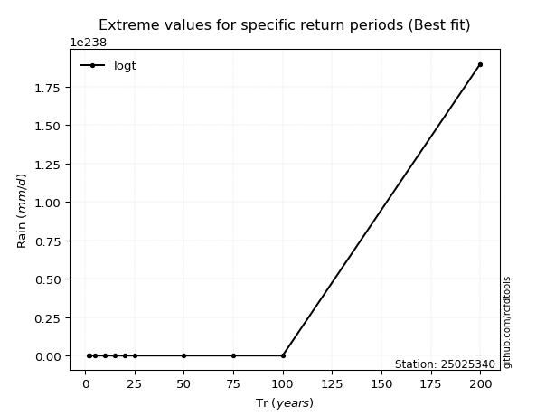</img>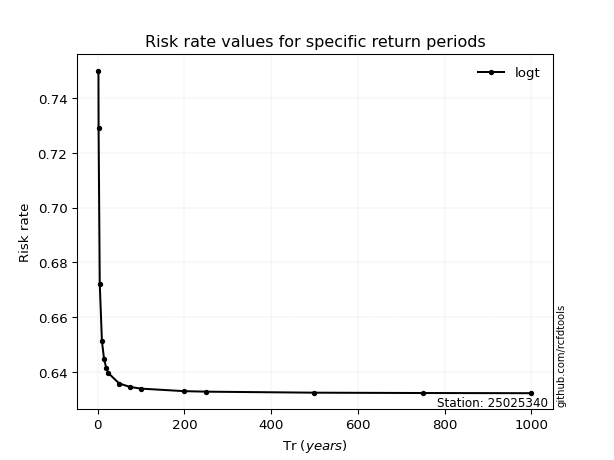</img>

</div>


<sub>**APP DISCLAIMER**: NO WARRANTY - This software is provided by [github.com/rcfdtools](https://github.com/rcfdtools) "as is", without any express or implied warranty, including warranties of merchantability, fitness for a particular purpose, or non-infringement. There is no guarantee that the software will be error-free or operate without interruption. LIMITATION OF LIABILITY - Neither the authors nor copyright holders will be liable for claims or damages arising from the software or its use. You are responsible for determining if the software is appropriate for your use and assume all associated risks, including errors, legal compliance, and data loss. NO PROFESSIONAL ADVICE - The software provides general information and does not offer professional advice. It should not replace consultation with professional advisors.</sub>