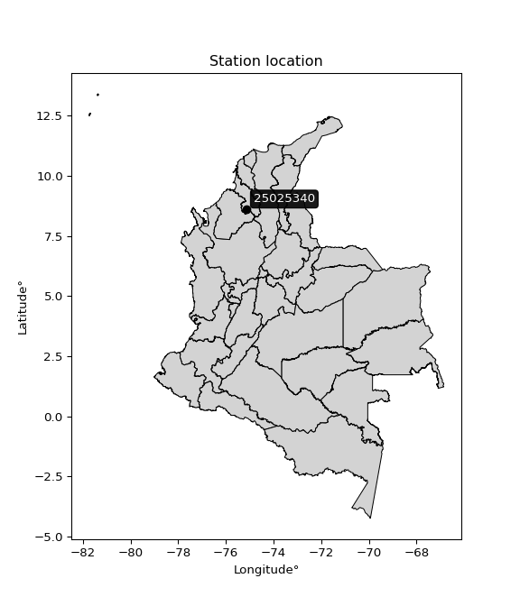

<div align="center">


</div>

# PMP Station (Rain, Pmax24h): 25025340

Probable Maximum Precipitation (PMP) is the greatest amount of rainfall for a specific duration that is meteorologically possible for a given location, acting as a "worst-case" scenario for extreme storms, crucial for designing safety-critical infrastructure like bridges, river deviations, dams, spillways, and nuclear plants to prevent catastrophic failure. PMP is calculated by hydrologists using meteorological data to determine the upper limit of extreme rainfall, often leading to the Probable Maximum Flood (PMF) for flood control design, and is increasingly being studied for climate change impacts. Probable Maximum Precipitation (PMP) is the theoretical upper limit of rainfall, a deterministic estimate for extreme events, while probability distributions (like GEV, Gumbel) describe the likelihood and frequency of various precipitation amounts, including rare ones, showing how often events occur, with PMP representing the extreme end of these distributions, used for critical infrastructure design to ensure safety against the worst conceivable weather, unlike standard statistical forecasts which cover typical probabilities.

The most common probability distributions in hydrology, used for analyzing floods, rainfall, and streamflow, include the Normal, Log-Normal, Gumbel, Gamma (including Log-Pearson Type III), and Generalized Extreme Value (GEV) distributions, often chosen based on the data´s skewness and whether modeling extremes or general conditions, with Gumbel and GEV popular for extreme events like floods, while the Normal distribution serves as a baseline, though often requiring transformations for skewed hydrological data. These distributions help in designing water infrastructure, managing water resources, and forecasting hydrologic events.

> Hydrological data often isn´t perfectly normal (it´s skewed), so different distributions are needed for different applications, such as: **Flood Frequency Analysis**: Using Gumbel, GEV, or Log-Pearson Type III for predicting extreme flood magnitudes and their return periods, **Rainfall Analysis**: Normal for annual totals, but Log-Normal, Weibull, or GEV for intensity or extreme daily rainfall, **Streamflow Modeling**: Gamma and Log-Normal for maximum flows, GEV for minimum flows, and Kappa for daily flows.

<div align="center">

</img>

</div>


## A. General information


### 1. General running parameters

• app_version: _v20260108_. • runtime: _2026-01-08 13:24:42.400241_. • Python version: _3.14.0_. • SciPy version: _1.16.3_. • Pandas version: _2.3.3_. • NumPy version: _2.3.5_. • Stations dataset (station_dataset_file): _dataset/pmax24h_in/automatic_colombia_2003_2024.csv_. • Stations catalog (station_catalog_file): _dataset/CNE.xls_. • Minimum year to eval til year_max (date_min): _1900_. • Maximum year to eval since year_min (date_max): _2024_. • Creates, save and include plots into reports (create_plot): _False_. • Plot only fit distributions with Δo > Δ (plot_only_fit): _True_. • Plot only simple graphs avoiding multiple CDFs and multiple Extreme values plots (plot_only_simple): _True_. • Eval low extreme values, if False, evaluates high extreme values (low_extreme): _False_. • Eval every SciPy distribution as logarithmic (pdist_logarithmic_on): _True_. • Standard deviation normalized (ddof): _1.0_. • Return periods to eval in years (Tr): _[2, 2.33, 5, 10, 15, 20, 25, 50, 75, 100, 200, 250, 500, 750, 1000]_. • Minimum data sample per station, 0 means any (minimum_sample): _5_. • Z-Score maximum threshold to adjust a value, 0 means disable (zscore_max): _3.5_. • Z-Score minimum threshold to adjust a value, 0 means disable (zscore_min): _-2.5_. • Avoid zeros, e.g. rain = 0 (avoid_zeros): _True_. • Avoid null values (avoid_nans): _True_. 

:file_folder:Table: [dataset.csv](../../dataset/pmax24h_in/automatic_colombia_2003_2024.csv)

> Delta Degrees of Freedom (DDOF): is a parameter used in the formulas for calculating variance and standard deviation. When ddof=0, the divisor is $N$ (the total number of observations) and this is used when your data set is the entire population. When ddof=1, the divisor is $N-1$ and this is used when your data set is a sample drawn from a larger population. Using $N-1$ provides an unbiased estimate of the population variance (known as Bessel´s correction).


### 2. Station info and location

|   id |   CODIGO | NOMBRE                      | CATEGORIA               | TECNOLOGIA                | ESTADO           | FECHA_INSTALACION   |   FECHA_SUSPENSION |   ALTITUD |   LATITUD |   LONGITUD | DEPARTAMENTO   | MUNICIPIO   | AREA_OPERATIVA                              | ENTIDAD                                                     | AREA_HIDROGRAFICA   | ZONA_HIDROGRAFICA                | SUBZONA_HIDROGRAFICA       |   CORRIENTE | Catalogo   |   Version |
|-----:|---------:|:----------------------------|:------------------------|:--------------------------|:-----------------|:--------------------|-------------------:|----------:|----------:|-----------:|:---------------|:------------|:--------------------------------------------|:------------------------------------------------------------|:--------------------|:---------------------------------|:---------------------------|------------:|:-----------|----------:|
|    0 | 25025340 | SAN MARCOS - AUT [25025340] | Climatológica Principal | Automática con Telemetría | En Mantenimiento | 07/10/2005          |                nan |        31 |   8.59683 |   -75.1427 | Sucre          | San Marcos  | Area Operativa 02 - Atlántico-Bolivar-Sucre | INSTITUTO DE HIDROLOGIA METEOROLOGIA Y ESTUDIOS AMBIENTALES | Magdalena Cauca     | Bajo Magdalena- Cauca -San Jorge | Bajo San Jorge - La Mojana |         nan | CNE_IDEAM  |  20251226 |

<div align="center">

Dynamic map: [:earth_americas:Google](http://maps.google.com/maps?q=8.596833333,-75.14269444) [:earth_americas:OSM](https://www.openstreetmap.org/#map=18/8.596833333/-75.14269444&layers=P) [:earth_americas:Bing](https://www.bing.com/maps?cp=8.596833333~-75.14269444&lvl=18) [:earth_americas:Apple](https://maps.apple.com/frame?center=8.596833333%2C-75.14269444&span=0.003%2C0.006)

</div>


<div align="center">

```geojson
{
  "type": "Feature",
  "geometry": {
    "type": "Point", 
    "coordinates": [-75.14269444, 8.596833333]
  }, 
  "properties": {
    "Name": "25025340"
  }
}
```

</div>


### 3. Discrete values table and plot

<div align="center">

|               |           0 |           1 |          2 |           3 |         4 |          5 |
|:--------------|------------:|------------:|-----------:|------------:|----------:|-----------:|
| Date          | 2017        | 2018        | 2019       | 2020        | 2021      | 2022       |
| Value         |   75.7      |   79.4      |  222.9     |   70.7      |  225.4    |    1.6     |
| Value_initial |   75.7      |   79.4      |  222.9     |   70.7      |  225.4    |    1.6     |
| count         |    6        |    6        |    6       |    6        |    6      |    6       |
| mean          |  112.617    |  112.617    |  112.617   |  112.617    |  112.617  |  112.617   |
| std           |   91.0279   |   91.0279   |   91.0279  |   91.0279   |   91.0279 |   91.0279  |
| zscore        |   -0.405553 |   -0.364906 |    1.21153 |   -0.460482 |    1.239  |   -1.21959 |


</div>


> The initial value (value_initial) correspond to the initial obtained or null completed value, and value (value) is adjusted only when the initial value is outside the valid range (outlier) definite through the Z-Score value. If Z-Score is active, values out of range or outliers are replaced with the station mean value. A Z-Score (or standard score) measures how many standard deviations a data point is from the mean of a dataset, indicating its relative position; positive scores mean above the mean, negative mean below, and a score of zero is exactly at the mean, allowing for comparison of values from different distributions. It´s calculated using the formula $z=(x–μ)/σ$, where $x$ is the data point, $μ$ is the mean, and $σ$ is the standard deviation, helping identify outliers and understand probability.
>
> <sub>**Note**: In this study, "completing" (filling gaps in) and "extending" (forecasting or lengthening the historical record) rainfall data series are avoided for certain critical analyses because they introduce artificial bias and uncertainty, which can distort the statistics of rare events (extremes), alter day-to-day variability, and compromise the integrity and homogeneity of the original data. Some reasons against Completing/Extending rainfall data are: **Distortion of Extremes and Variability**: The primary issue is that most gap-filling or extension methods rely on averaging or regression with nearby stations, which inherently smooths the data. Rainfall is highly variable in space and time, with a large percentage of zero values and occasional large storms. Infilling methods often underestimate the highest values and overestimate the lowest (zero) values, which severely distorts analyses focused on flood frequency, drought severity, and intensity-duration-frequency (IDF) curves, **Loss of Data Homogeneity**: Infilled or extended data are synthetic estimates, not actual measurements. Combining these estimates with observed data can violate the assumption of data homogeneity, which requires that the data properties do not change over time. Inhomogeneity can lead to incorrect conclusions about long-term trends or changes in climate patterns, **Propagation of Errors**: Errors and biases from the original data (e.g., wind-induced undercatch, instrument errors, site changes) or the data used for imputation can propagate through the analysis, leading to unreliable hydrological models and inaccurate predictions, **Compromised Statistical Integrity**: For statistical analyses, especially those involving the frequency of events, using artificial data can introduce time bias or autocorrelation that doesn´t exist in reality, making it difficult to assess the true probability of events, **Difficulty in Validation**: It is difficult to accurately validate the quality of filled or extended data, especially for past periods where ground-truth measurements are unavailable. The reliability of imputation techniques heavily depends on the density of the surrounding station network and the complexity of the local topography.</sub>


### 4. Active continuous probability distributions from SciPy (43 of 104 available)

A Probability Density Function (PDF) describes the relative likelihood of a continuous random variable falling within a specific range, where the total area under its curve equals 1, and the area over any interval gives the actual probability for that range. Unlike discrete probabilities (like rolling a die), a PDF shows density, not direct probability for a single point (which is zero), with higher points indicating higher likelihood, often visualized as a bell curve for normal distributions.

A log of a probability density function (log-PDF) is simply the logarithm of the PDF´s value, denoted as $log(f(x))$, useful for converting multiplication of probabilities into addition, improving numerical stability with tiny numbers, and connecting to information theory concepts like entropy. Instead of dealing with very small probabilities (e.g., 0.000001), log-PDFs use negative numbers (e.g., $log(0.00001) ≈ -11.51$ that are easier for computers to handle, preventing underflow errors and simplifying complex calculations. In this study, each active probability distribution from SciPy is also evaluated in the $log$ form.

[scipy.stats](https://docs.scipy.org/doc/scipy/reference/stats.html) is a Python´s powerful submodule within the SciPy library for comprehensive statistical analysis, offering over 130 probability distributions (like Normal, Poisson), functions for descriptive stats (mean, variance), hypothesis testing (t-tests, chi-square), random variable generation, and statistical tests, making it essential for data science, modeling, and research. It provides tools to explore, model, and draw conclusions from data efficiently, working seamlessly with NumPy.

<div align="center">

|   id | p_dist             |   n_parameter | fit_method   | label                                                                       | active   | ref                                                                                                        |
|-----:|:-------------------|--------------:|:-------------|:----------------------------------------------------------------------------|:---------|:-----------------------------------------------------------------------------------------------------------|
|    0 | alpha              |             3 | MLE          | Alpha                                                                       | True     | [:mortar_board:](https://docs.scipy.org/doc/scipy/reference/generated/scipy.stats.alpha.html)              |
|    1 | betaprime          |             4 | MLE          | Beta prime                                                                  | True     | [:mortar_board:](https://docs.scipy.org/doc/scipy/reference/generated/scipy.stats.betaprime.html)          |
|    2 | chi2               |             3 | MLE          | Chi²                                                                        | True     | [:mortar_board:](https://docs.scipy.org/doc/scipy/reference/generated/scipy.stats.chi2.html)               |
|    3 | crystalball        |             4 | MLE          | Crystalball                                                                 | True     | [:mortar_board:](https://docs.scipy.org/doc/scipy/reference/generated/scipy.stats.crystalball.html)        |
|    4 | erlang             |             3 | MLE          | Erlang                                                                      | True     | [:mortar_board:](https://docs.scipy.org/doc/scipy/reference/generated/scipy.stats.erlang.html)             |
|    5 | expon              |             2 | MLE          | Exponential                                                                 | True     | [:mortar_board:](https://docs.scipy.org/doc/scipy/reference/generated/scipy.stats.expon.html)              |
|    6 | exponnorm          |             3 | MLE          | Exponentially modified Normal                                               | True     | [:mortar_board:](https://docs.scipy.org/doc/scipy/reference/generated/scipy.stats.exponnorm.html)          |
|    7 | f                  |             4 | MLE          | F                                                                           | True     | [:mortar_board:](https://docs.scipy.org/doc/scipy/reference/generated/scipy.stats.f.html)                  |
|    8 | fatiguelife        |             3 | MLE          | Fatigue-life (Birnbaum-Saunders)                                            | True     | [:mortar_board:](https://docs.scipy.org/doc/scipy/reference/generated/scipy.stats.fatiguelife.html)        |
|    9 | fisk               |             3 | MLE          | Fisk                                                                        | True     | [:mortar_board:](https://docs.scipy.org/doc/scipy/reference/generated/scipy.stats.fisk.html)               |
|   10 | gamma              |             3 | MLE          | Gamma                                                                       | True     | [:mortar_board:](https://docs.scipy.org/doc/scipy/reference/generated/scipy.stats.gamma.html)              |
|   11 | genexpon           |             5 | MLE          | Generalized exponential                                                     | True     | [:mortar_board:](https://docs.scipy.org/doc/scipy/reference/generated/scipy.stats.genexpon.html)           |
|   12 | genlogistic        |             3 | MLE          | Generalized logistic                                                        | True     | [:mortar_board:](https://docs.scipy.org/doc/scipy/reference/generated/scipy.stats.genlogistic.html)        |
|   13 | gibrat             |             2 | MM           | Gibrat                                                                      | True     | [:mortar_board:](https://docs.scipy.org/doc/scipy/reference/generated/scipy.stats.gibrat.html)             |
|   14 | gompertz           |             3 | MLE          | Gompertz (or truncated Gumbel)                                              | True     | [:mortar_board:](https://docs.scipy.org/doc/scipy/reference/generated/scipy.stats.gompertz.html)           |
|   15 | gumbel_l           |             2 | MM           | Gumbel Left Skew                                                            | True     | [:mortar_board:](https://docs.scipy.org/doc/scipy/reference/generated/scipy.stats.gumbel_l.html)           |
|   16 | gumbel_r           |             2 | MM           | Gumbel Right Skew                                                           | True     | [:mortar_board:](https://docs.scipy.org/doc/scipy/reference/generated/scipy.stats.gumbel_r.html)           |
|   17 | halflogistic       |             2 | MM           | Half-logistic                                                               | True     | [:mortar_board:](https://docs.scipy.org/doc/scipy/reference/generated/scipy.stats.halflogistic.html)       |
|   18 | halfnorm           |             2 | MM           | Half Normal                                                                 | True     | [:mortar_board:](https://docs.scipy.org/doc/scipy/reference/generated/scipy.stats.halfnorm.html)           |
|   19 | hypsecant          |             2 | MM           | hyperbolic secant                                                           | True     | [:mortar_board:](https://docs.scipy.org/doc/scipy/reference/generated/scipy.stats.hypsecant.html)          |
|   20 | invgamma           |             3 | MLE          | Inverted gamma                                                              | True     | [:mortar_board:](https://docs.scipy.org/doc/scipy/reference/generated/scipy.stats.invgamma.html)           |
|   21 | invgauss           |             3 | MLE          | Inverse Gaussian                                                            | True     | [:mortar_board:](https://docs.scipy.org/doc/scipy/reference/generated/scipy.stats.invgauss.html)           |
|   22 | invweibull         |             3 | MLE          | Inverted Weibull                                                            | True     | [:mortar_board:](https://docs.scipy.org/doc/scipy/reference/generated/scipy.stats.invweibull.html)         |
|   23 | kstwobign          |             2 | MLE          | Limiting distribution of scaled Kolmogorov-Smirnov two-sided test statistic | True     | [:mortar_board:](https://docs.scipy.org/doc/scipy/reference/generated/scipy.stats.kstwobign.html)          |
|   24 | laplace            |             2 | MM           | Laplace                                                                     | True     | [:mortar_board:](https://docs.scipy.org/doc/scipy/reference/generated/scipy.stats.laplace.html)            |
|   25 | laplace_asymmetric |             3 | MLE          | Asymmetric Laplace                                                          | True     | [:mortar_board:](https://docs.scipy.org/doc/scipy/reference/generated/scipy.stats.laplace_asymmetric.html) |
|   26 | loggamma           |             3 | MLE          | Log gamma                                                                   | True     | [:mortar_board:](https://docs.scipy.org/doc/scipy/reference/generated/scipy.stats.loggamma.html)           |
|   27 | logistic           |             2 | MM           | Logistic (or Sech-squared)                                                  | True     | [:mortar_board:](https://docs.scipy.org/doc/scipy/reference/generated/scipy.stats.logistic.html)           |
|   28 | lognorm            |             3 | MLE          | Log Normal                                                                  | True     | [:mortar_board:](https://docs.scipy.org/doc/scipy/reference/generated/scipy.stats.lognorm.html)            |
|   29 | maxwell            |             2 | MM           | Maxwell                                                                     | True     | [:mortar_board:](https://docs.scipy.org/doc/scipy/reference/generated/scipy.stats.maxwell.html)            |
|   30 | mielke             |             4 | MLE          | Mielke Beta-Kappa / Dagum                                                   | True     | [:mortar_board:](https://docs.scipy.org/doc/scipy/reference/generated/scipy.stats.mielke.html)             |
|   31 | moyal              |             2 | MM           | Moyal                                                                       | True     | [:mortar_board:](https://docs.scipy.org/doc/scipy/reference/generated/scipy.stats.moyal.html)              |
|   32 | nakagami           |             3 | MLE          | Nakagami                                                                    | True     | [:mortar_board:](https://docs.scipy.org/doc/scipy/reference/generated/scipy.stats.nakagami.html)           |
|   33 | ncf                |             5 | MLE          | Non-central F distribution                                                  | True     | [:mortar_board:](https://docs.scipy.org/doc/scipy/reference/generated/scipy.stats.ncf.html)                |
|   34 | nct                |             4 | MLE          | Non-central Student’s t                                                     | True     | [:mortar_board:](https://docs.scipy.org/doc/scipy/reference/generated/scipy.stats.nct.html)                |
|   35 | norm               |             2 | MM           | Normal                                                                      | True     | [:mortar_board:](https://docs.scipy.org/doc/scipy/reference/generated/scipy.stats.norm.html)               |
|   36 | pearson3           |             3 | MM           | Pearson type III                                                            | True     | [:mortar_board:](https://docs.scipy.org/doc/scipy/reference/generated/scipy.stats.pearson3.html)           |
|   37 | rayleigh           |             2 | MM           | Rayleigh                                                                    | True     | [:mortar_board:](https://docs.scipy.org/doc/scipy/reference/generated/scipy.stats.rayleigh.html)           |
|   38 | rice               |             3 | MLE          | Rice                                                                        | True     | [:mortar_board:](https://docs.scipy.org/doc/scipy/reference/generated/scipy.stats.rice.html)               |
|   39 | t                  |             3 | MLE          | Student’s t                                                                 | True     | [:mortar_board:](https://docs.scipy.org/doc/scipy/reference/generated/scipy.stats.t.html)                  |
|   40 | truncnorm          |             4 | MLE          | Truncated normal                                                            | True     | [:mortar_board:](https://docs.scipy.org/doc/scipy/reference/generated/scipy.stats.truncnorm.html)          |
|   41 | wald               |             2 | MM           | Wald                                                                        | True     | [:mortar_board:](https://docs.scipy.org/doc/scipy/reference/generated/scipy.stats.wald.html)               |
|   42 | weibull_min        |             3 | MLE          | Weibull minimum                                                             | True     | [:mortar_board:](https://docs.scipy.org/doc/scipy/reference/generated/scipy.stats.weibull_min.html)        |

</div>

> **n_parameter:** # arguments & localization & scale.
>
> **Fit methods:** (MLE) maximum likelihood, (MM) L-moments.
>
>**Inactive** (With the only purpose of prevent loops, zero divisions, infinite values, over high estimated values or horizontal trending for recurrence intervals estimations, the follow distributions were disabled.)**:** foldnorm, gennorm, norminvgauss, powernorm, powerlognorm, skewnorm, genextreme, anglit, arcsine, argus, beta, bradford, burr, burr12, cauchy, cosine, halfcauchy, foldcauchy, skewcauchy, wrapcauchy, dgamma, gengamma, exponweib, exponpow, truncexpon, gausshyper, genhalflogistic, genhyperbolic, geninvgauss, halfgennorm, johnsonsb, johnsonsu, kappa4, kappa3, ksone, kstwo, loglaplace, levy, levy_l, levy_stable, ncx2, pareto, genpareto, truncpareto, lomax, powerlaw, rdist, rel_breitwigner, recipinvgauss, semicircular, studentized_range, trapezoid, triang, truncweibull_min, tukeylambda, uniform, loguniform, vonmises, vonmises_line, weibull_max, dweibull, 


## B. Probability (PDF) vs. Empirical (EDF) distributions functions

A continuous probability distribution (CPD) describes probabilities for variables that can take any value within a range (like rain any time), unlike discrete variables with specific outcomes (like temperature). It uses a Probability Density Function (PDF), a curve where the total area under it equals 1, and the probability of the variable falling within an interval (a to b) is found by calculating the area under the curve between those points. A key feature is that the probability of hitting any single exact value is zero, so probabilities are always expressed for ranges, e.g., $P(a ≤ X ≤ b)$.

<div align="center">

Distributions parameters from station values
|    |   station | p_dist                |   n |              loc |           scale | shape                  | shape1                 | shape2                | shape3   |
|---:|----------:|:----------------------|----:|-----------------:|----------------:|:-----------------------|:-----------------------|:----------------------|:---------|
|  0 |  25025340 | alpha                 |   6 |   -359.761       |  2696.25        | 5.881909142895156      |                        |                       |          |
|  1 |  25025340 | betaprime             |   6 |      1.59999     |  4582.05        | 0.8684032871438359     | 49.18629735291061      |                       |          |
|  2 |  25025340 | chi2                  |   6 |      1.6         |    65.8209      | 0.7136615348783604     |                        |                       |          |
|  3 |  25025340 | crystalball           |   6 |    112.617       |    83.0967      | 10579.199992671538     | 20.010017866274637     |                       |          |
|  4 |  25025340 | erlang                |   6 |      1.6         |   117.702       | 0.7076974236127789     |                        |                       |          |
|  5 |  25025340 | expon                 |   6 |      1.6         |   111.017       |                        |                        |                       |          |
|  6 |  25025340 | exponnorm             |   6 |     23.6504      |    33.0391      | 2.692757337091405      |                        |                       |          |
|  7 |  25025340 | f                     |   6 |      1.6         |   160.498       | 1.0594001315146457     | 147.3483704266518      |                       |          |
|  8 |  25025340 | fatiguelife           |   6 |    -78.7785      |   172.607       | 0.46608824315759706    |                        |                       |          |
|  9 |  25025340 | fisk                  |   6 |    -56.0539      |   149.598       | 3.1601488759957927     |                        |                       |          |
| 10 |  25025340 | gamma                 |   6 |      1.6         |   265.632       | 0.30262999270079205    |                        |                       |          |
| 11 |  25025340 | genexpon              |   6 |      1.59993     |     2.61543     | 0.023650707916085537   | 5.5172877042643494e-08 | 2.608937559744872     |          |
| 12 |  25025340 | genlogistic           |   6 |   -355.667       |    67.4168      | 577.6632908198471      |                        |                       |          |
| 13 |  25025340 | gibrat                |   6 |     49.2244      |    38.4494      |                        |                        |                       |          |
| 14 |  25025340 | gompertz              |   6 |      1.6         |   182.19        | 0.9553069416049114     |                        |                       |          |
| 15 |  25025340 | gumbel_l              |   6 |    150.015       |    64.7902      |                        |                        |                       |          |
| 16 |  25025340 | gumbel_r              |   6 |     75.2187      |    64.7902      |                        |                        |                       |          |
| 17 |  25025340 | halflogistic          |   6 |     14.1277      |    71.0447      |                        |                        |                       |          |
| 18 |  25025340 | halfnorm              |   6 |      2.62918     |   137.849       |                        |                        |                       |          |
| 19 |  25025340 | hypsecant             |   6 |    112.617       |    52.901       |                        |                        |                       |          |
| 20 |  25025340 | invgamma              |   6 |   -170.048       |  3076.62        | 11.861025807039404     |                        |                       |          |
| 21 |  25025340 | invgauss              |   6 |    -89.0127      |  1010.92        | 0.19945130497608166    |                        |                       |          |
| 22 |  25025340 | invweibull            |   6 |      1.6         |     6.21913     | 0.054786010292636966   |                        |                       |          |
| 23 |  25025340 | kstwobign             |   6 |   -163.357       |   316.091       |                        |                        |                       |          |
| 24 |  25025340 | laplace               |   6 |    112.617       |    58.7583      |                        |                        |                       |          |
| 25 |  25025340 | laplace_asymmetric    |   6 |     70.7         |    53.3085      | 0.6812704807363936     |                        |                       |          |
| 26 |  25025340 | loggamma              |   6 | -20112.9         |  2860.52        | 1177.2354216126505     |                        |                       |          |
| 27 |  25025340 | logistic              |   6 |    112.617       |    45.8136      |                        |                        |                       |          |
| 28 |  25025340 | lognorm               |   6 |      1.6         |     0.127916    | 15.207667628923906     |                        |                       |          |
| 29 |  25025340 | maxwell               |   6 |    -84.2877      |   123.391       |                        |                        |                       |          |
| 30 |  25025340 | mielke                |   6 |      1.6         |   225.206       | 0.5920592909967314     | 513.0216120873678      |                       |          |
| 31 |  25025340 | moyal                 |   6 |     65.0966      |    37.4067      |                        |                        |                       |          |
| 32 |  25025340 | nakagami              |   6 |      1.6         |   115.251       | 0.17505280056148       |                        |                       |          |
| 33 |  25025340 | ncf                   |   6 |      1.59996     |    16.3226      | 0.7956332333733882     | 51.608737382091974     | 5.886452380077637     |          |
| 34 |  25025340 | nct                   |   6 |     -0.162693    |     0.0788329   | 0.2964126495425916     | 54.73619477802012      |                       |          |
| 35 |  25025340 | norm                  |   6 |    112.617       |    83.0967      |                        |                        |                       |          |
| 36 |  25025340 | pearson3              |   6 |    112.617       |    83.0967      | 0.3622378263529701     |                        |                       |          |
| 37 |  25025340 | rayleigh              |   6 |    -46.3522      |   126.839       |                        |                        |                       |          |
| 38 |  25025340 | rice                  |   6 |    -35.9213      |   113.581       | 0.495481098292313      |                        |                       |          |
| 39 |  25025340 | t                     |   6 |    112.616       |    83.0992      | 43375528.465724856     |                        |                       |          |
| 40 |  25025340 | truncnorm             |   6 |      4.68807     |    12.4742      | -8.600623887440474     | 17.693436256252767     |                       |          |
| 41 |  25025340 | wald                  |   6 |     29.5199      |    83.0967      |                        |                        |                       |          |
| 42 |  25025340 | weibull_min           |   6 |      1.6         |    87.7897      | 0.7331118905134728     |                        |                       |          |
| 43 |  25025340 | logalpha              |   6 |      0.00349528  |     1.11937     | 1.1967150994228326e-08 |                        |                       |          |
| 44 |  25025340 | logbetaprime          |   6 |    -48.72        |   473.929       | 1054.309250235879      | 9474.929245052015      |                       |          |
| 45 |  25025340 | logchi2               |   6 |    -20.5896      |     0.0646646   | 380.46366866814196     |                        |                       |          |
| 46 |  25025340 | logcrystalball        |   6 |      4.04239     |     1.67099     | 805.049693240873       | 56.8453888746449       |                       |          |
| 47 |  25025340 | logerlang             |   6 |    -17.4512      |     0.14708     | 145.84257406212248     |                        |                       |          |
| 48 |  25025340 | logexpon              |   6 |      0.470004    |     3.57238     |                        |                        |                       |          |
| 49 |  25025340 | logexponnorm          |   6 |      4.04149     |     1.67098     | 0.0005360433526789656  |                        |                       |          |
| 50 |  25025340 | logf                  |   6 |  -3326.57        |  3330.61        | 88951181.89908406      | 8667651.447822593      |                       |          |
| 51 |  25025340 | logfatiguelife        |   6 |  -1000.97        |  1005.02        | 0.0016605159102853458  |                        |                       |          |
| 52 |  25025340 | logfisk               |   6 |     -1.66903e+08 |     1.66903e+08 | 199735632.54671693     |                        |                       |          |
| 53 |  25025340 | loggamma              |   6 |    -25.1247      |     0.105802    | 275.42097186626825     |                        |                       |          |
| 54 |  25025340 | loggenexpon           |   6 |      0.462741    |     0.431345    | 0.041060542624433455   | 33.366877342505845     | 0.0004720299242302851 |          |
| 55 |  25025340 | loggenlogistic        |   6 |      5.41861     |     5.48251e-06 | 4.007360502029061e-06  |                        |                       |          |
| 56 |  25025340 | loggibrat             |   6 |      2.76764     |     0.77317     |                        |                        |                       |          |
| 57 |  25025340 | loggompertz           |   6 |      0.470001    |     1.0704      | 0.019654744374879546   |                        |                       |          |
| 58 |  25025340 | loggumbel_l           |   6 |      4.79442     |     1.30286     |                        |                        |                       |          |
| 59 |  25025340 | loggumbel_r           |   6 |      3.29035     |     1.30286     |                        |                        |                       |          |
| 60 |  25025340 | loghalflogistic       |   6 |      2.06191     |     1.42862     |                        |                        |                       |          |
| 61 |  25025340 | loghalfnorm           |   6 |      1.83063     |     2.77203     |                        |                        |                       |          |
| 62 |  25025340 | loghypsecant          |   6 |      4.04239     |     1.06378     |                        |                        |                       |          |
| 63 |  25025340 | loginvgamma           |   6 |    -31.6538      | 14751.1         | 414.2932088924306      |                        |                       |          |
| 64 |  25025340 | loginvgauss           |   6 |    -12.7447      |  1344.96        | 0.012442349477224071   |                        |                       |          |
| 65 |  25025340 | loginvweibull         |   6 | -52316.4         | 52319.4         | 26316.370567911887     |                        |                       |          |
| 66 |  25025340 | logkstwobign          |   6 |     -4.02194     |     9.21096     |                        |                        |                       |          |
| 67 |  25025340 | loglaplace            |   6 |      4.04239     |     1.18157     |                        |                        |                       |          |
| 68 |  25025340 | loglaplace_asymmetric |   6 |      4.3745      |     0.981557    | 1.180790925697984      |                        |                       |          |
| 69 |  25025340 | logloggamma           |   6 |      5.41793     |     4.15388e-06 | 3.0137762501498417e-06 |                        |                       |          |
| 70 |  25025340 | loglogistic           |   6 |      4.04239     |     0.921263    |                        |                        |                       |          |
| 71 |  25025340 | loglognorm            |   6 |      0.470004    |     0.00652751  | 14.489357390973542     |                        |                       |          |
| 72 |  25025340 | logmaxwell            |   6 |      0.0828523   |     2.48127     |                        |                        |                       |          |
| 73 |  25025340 | logmielke             |   6 |     -1.30796e+08 |     1.30796e+08 | 94751834.03078237      | 149795873272.3686      |                       |          |
| 74 |  25025340 | logmoyal              |   6 |      3.08681     |     0.752208    |                        |                        |                       |          |
| 75 |  25025340 | lognakagami           |   6 |      4.25845     |     0.482202    | 0.221221403536734      |                        |                       |          |
| 76 |  25025340 | logncf                |   6 |     -0.107567    |     2.4132e-05  | 7.850439267351861e-05  | 16.893152616883604     | 12.928378700882016    |          |
| 77 |  25025340 | lognct                |   6 |   -102.279       |     1.62636     | 34197.59478724979      | 65.37260480094074      |                       |          |
| 78 |  25025340 | lognorm               |   6 |      4.04239     |     1.67099     |                        |                        |                       |          |
| 79 |  25025340 | logpearson3           |   6 |      4.04239     |     1.67098     | -1.44242232658958      |                        |                       |          |
| 80 |  25025340 | lograyleigh           |   6 |      0.845707    |     2.55058     |                        |                        |                       |          |
| 81 |  25025340 | logrice               |   6 |   -512.118       |     1.67101     | 308.88948351351144     |                        |                       |          |
| 82 |  25025340 | logt                  |   6 |      4.33233     |     0.0579787   | 0.3626701221591923     |                        |                       |          |
| 83 |  25025340 | logtruncnorm          |   6 |      1.49944     |     3.44627     | -0.2987095170504811    | 69.4318608580544       |                       |          |
| 84 |  25025340 | logwald               |   6 |      2.37138     |     1.67099     |                        |                        |                       |          |
| 85 |  25025340 | logweibull_min        |   6 |     -2.5571e+08  |     2.5571e+08  | 256953020.2653927      |                        |                       |          |

</div>

> **loc** (Location parameter): This shifts the distribution along the x-axis. For many common distributions, like the normal (Gaussian) distribution, loc represents the mean $μ$. For others, like the uniform distribution, it might represent the minimum value, or for the beta distribution, the left end of the support interval.
>
> **scale** (Scale parameter): This determines the width or spread of the distribution. For the normal distribution, scale represents the standard deviation $σ$. For a uniform distribution, it defines the length of the interval (from $loc$ to $loc + scale$).
>
> **shape** (Shape parameters): Refers to parameters that define the specific form of a probability distribution, distinct from its location (loc) and scale (scale). These parameters are required arguments for most distribution functions. For example, a normal (Gaussian) distribution is fully defined by its location (mean) and scale (standard deviation), so it has no specific shape parameters beyond loc and scale. However, other distributions have intrinsic properties that need specification, as Gamma distribution that takes a shape parameter, often named $a$ or $alpha$.


### 0. Cumulative distribution values - CDF (86 evaluated)

Cumulative Distribution Function (CDF), denoted as $F$<sub>$X$</sub>$(x)$, is a function that gives the probability that a random variable $X$ will take a value less than or equal to a specific value, $x$ (i.e., $(P(X≥x)$. It essentially "accumulates" probabilities from a given point up to the far right (positive infinity), providing a complete picture of the distribution´s probabilities for both discrete (like rain) and continuous (like temperature) variables, helping to find probabilities over ranges or above certain values. Each station is evaluated separately ordering the $x$ values ascending, calculating the CDF and PDF values for the activated distributions and their logarithmic forms.

<div align="center">

CDF ordered by x ascending and calculating $log(f(x))$ separately
|   id |   Station |   date |     x |   count |    mean |     std |    zscore |   Value_initial |   station |   m |    alpha |   alpha_pdf |   betaprime |   betaprime_pdf |        chi2 |         chi2_pdf |   crystalball |   crystalball_pdf |      erlang |    erlang_pdf |    expon |   expon_pdf |   exponnorm |   exponnorm_pdf |           f |        f_pdf |   fatiguelife |   fatiguelife_pdf |      fisk |   fisk_pdf |      gamma |   gamma_pdf |    genexpon |   genexpon_pdf |   genlogistic |   genlogistic_pdf |   gibrat |   gibrat_pdf |    gompertz |   gompertz_pdf |   gumbel_l |   gumbel_l_pdf |   gumbel_r |   gumbel_r_pdf |   halflogistic |   halflogistic_pdf |   halfnorm |   halfnorm_pdf |   hypsecant |   hypsecant_pdf |   invgamma |   invgamma_pdf |   invgauss |   invgauss_pdf |   invweibull |   invweibull_pdf |   kstwobign |   kstwobign_pdf |   laplace |   laplace_pdf |   laplace_asymmetric |   laplace_asymmetric_pdf |   loggamma |   loggamma_pdf |   logistic |   logistic_pdf |   lognorm |   lognorm_pdf |   maxwell |   maxwell_pdf |      mielke |     mielke_pdf |     moyal |   moyal_pdf |    nakagami |   nakagami_pdf |         ncf |    ncf_pdf |       nct |     nct_pdf |      norm |   norm_pdf |   pearson3 |   pearson3_pdf |   rayleigh |   rayleigh_pdf |      rice |   rice_pdf |         t |      t_pdf |   truncnorm |   truncnorm_pdf |     wald |    wald_pdf |   weibull_min |   weibull_min_pdf |   logalpha |   logalpha_pdf |   logbetaprime |   logbetaprime_pdf |   logchi2 |   logchi2_pdf |   logcrystalball |   logcrystalball_pdf |   logerlang |   logerlang_pdf |   logexpon |   logexpon_pdf |   logexponnorm |   logexponnorm_pdf |      logf |   logf_pdf |   logfatiguelife |   logfatiguelife_pdf |    logfisk |   logfisk_pdf |   loggenexpon |   loggenexpon_pdf |   loggenlogistic |   loggenlogistic_pdf |   loggibrat |   loggibrat_pdf |   loggompertz |   loggompertz_pdf |   loggumbel_l |   loggumbel_l_pdf |   loggumbel_r |   loggumbel_r_pdf |   loghalflogistic |   loghalflogistic_pdf |   loghalfnorm |   loghalfnorm_pdf |   loghypsecant |   loghypsecant_pdf |   loginvgamma |   loginvgamma_pdf |   loginvgauss |   loginvgauss_pdf |   loginvweibull |   loginvweibull_pdf |   logkstwobign |   logkstwobign_pdf |   loglaplace |   loglaplace_pdf |   loglaplace_asymmetric |   loglaplace_asymmetric_pdf |   logloggamma |   logloggamma_pdf |   loglogistic |   loglogistic_pdf |   loglognorm |   loglognorm_pdf |   logmaxwell |   logmaxwell_pdf |   logmielke |   logmielke_pdf |   logmoyal |   logmoyal_pdf |   lognakagami |   lognakagami_pdf |    logncf |   logncf_pdf |    lognct |   lognct_pdf |   logpearson3 |   logpearson3_pdf |   lograyleigh |   lograyleigh_pdf |   logrice |   logrice_pdf |      logt |   logt_pdf |   logtruncnorm |   logtruncnorm_pdf |   logwald |   logwald_pdf |   logweibull_min |   logweibull_min_pdf |
|-----:|----------:|-------:|------:|--------:|--------:|--------:|----------:|----------------:|----------:|----:|---------:|------------:|------------:|----------------:|------------:|-----------------:|--------------:|------------------:|------------:|--------------:|---------:|------------:|------------:|----------------:|------------:|-------------:|--------------:|------------------:|----------:|-----------:|-----------:|------------:|------------:|---------------:|--------------:|------------------:|---------:|-------------:|------------:|---------------:|-----------:|---------------:|-----------:|---------------:|---------------:|-------------------:|-----------:|---------------:|------------:|----------------:|-----------:|---------------:|-----------:|---------------:|-------------:|-----------------:|------------:|----------------:|----------:|--------------:|---------------------:|-------------------------:|-----------:|---------------:|-----------:|---------------:|----------:|--------------:|----------:|--------------:|------------:|---------------:|----------:|------------:|------------:|---------------:|------------:|-----------:|----------:|------------:|----------:|-----------:|-----------:|---------------:|-----------:|---------------:|----------:|-----------:|----------:|-----------:|------------:|----------------:|---------:|------------:|--------------:|------------------:|-----------:|---------------:|---------------:|-------------------:|----------:|--------------:|-----------------:|---------------------:|------------:|----------------:|-----------:|---------------:|---------------:|-------------------:|----------:|-----------:|-----------------:|---------------------:|-----------:|--------------:|--------------:|------------------:|-----------------:|---------------------:|------------:|----------------:|--------------:|------------------:|--------------:|------------------:|--------------:|------------------:|------------------:|----------------------:|--------------:|------------------:|---------------:|-------------------:|--------------:|------------------:|--------------:|------------------:|----------------:|--------------------:|---------------:|-------------------:|-------------:|-----------------:|------------------------:|----------------------------:|--------------:|------------------:|--------------:|------------------:|-------------:|-----------------:|-------------:|-----------------:|------------:|----------------:|-----------:|---------------:|--------------:|------------------:|----------:|-------------:|----------:|-------------:|--------------:|------------------:|--------------:|------------------:|----------:|--------------:|----------:|-----------:|---------------:|-------------------:|----------:|--------------:|-----------------:|---------------------:|
|    0 |  25025340 |   2022 |   1.6 |       6 | 112.617 | 91.0279 | -1.21959  |             1.6 |  25025340 |   1 | 0.057114 |  0.00236627 | 6.14693e-07 |     0.0861264   | 3.32256e-05 | 443158           |     0.0907757 |        0.00196673 | 1.11718e-12 | 593.445       | 0        |  0.00900766 |   0.0470933 |      0.00230608 | 2.24536e-06 | 226.089      |     0.0464828 |        0.00278884 | 0.0468337 | 0.00244684 | 1.1423e-05 | 3.99196e+08 | 6.61016e-07 |     0.00904275 |     0.0562425 |        0.00239507 | 0        |  0           | 4.05753e-14 |     0.00524347 |  0.0962443 |     0.00141158 |  0.0443739 |     0.00213349 |       0        |         0          |   0        |     0          |   0.0776816 |      0.0014539  |  0.0525786 |     0.00247741 |  0.0475623 |     0.00271053 |  0.000348078 |      6.83891e+11 |   0.0517838 |      0.0025302  | 0.0755828 |    0.00128633 |            0.0472871 |               0.00130205 |   0.018439 |      0.0280696 |  0.0814188 |     0.00163248 | 0.0162628 |     0.0242913 | 0.0777161 |    0.00245889 | 3.29249e-11 | 43895.5        | 0.0194555 |  0.00162523 | 5.00144e-07 |    7.88594e+08 | 0.000249079 | 2.25825    | 0.0445835 | 0.0728122   | 0.0907757 | 0.00196673 |   0.080701 |     0.00216894 |  0.0689695 |     0.00277503 | 0.0471246 | 0.00245223 | 0.0907835 | 0.0019668  |    0.402239 |     0.0310162   | 0        | 0           |   1.25727e-13 |     415.105       |  0.0164193 |      0.230669  |      0.0172008 |          0.0261738 | 0.0194143 |     0.0293739 |        0.0162628 |            0.0242913 |   0.0187719 |       0.0291398 |   0        |      0.279925  |      0.0162626 |           0.024291 | 0.0164881 |  0.0245388 |        0.0157224 |            0.0237123 | 0.00916142 |     0.0108632 |   0.000693363 |         0.0957402 |         0        |             0.019633 |    0        |       0         |   4.74378e-08 |         0.0183621 |     0.0355362 |          0.026785 |   0.000164551 |        0.00110036 |          0        |              0        |      0        |          0        |      0.0221443 |          0.0207998 |     0.0158848 |          0.026091 |     0.0192425 |         0.0320621 |       0.0259583 |           0.0476765 |      0.0287141 |          0.0599273 |     0.024317 |        0.0205803 |               0.0200501 |                   0.0172993 |     0.0276015 |         0.0200258 |     0.0202786 |         0.0215654 |    0.0126759 |      4.07202e+13 |   0.00100293 |       0.00773379 |   0.0276567 |       0.0200352 | 1.2408e-08 |     2.7521e-07 |   0           |       0           | 0.0243619 |    0.0652994 | 0.0164139 |    0.0244986 |     0.0398905 |         0.0279032 |      0        |          0        |  0.016263 |     0.0242912 | 0.0736538 | 0.00691573 |    1.93356e-10 |          0.17931   |  0        |     0         |        0.0137995 |            0.0137705 |
|    1 |  25025340 |   2020 |  70.7 |       6 | 112.617 | 91.0279 | -0.460482 |            70.7 |  25025340 |   2 | 0.351332 |  0.00539711 | 0.585203    |     0.0048124   | 0.785628    |      0.00272591  |     0.306979  |        0.00422739 | 0.599947    |   0.00429153  | 0.463361 |  0.00483386 |   0.383762  |      0.00605873 | 0.475909    |   0.00313312 |     0.378687  |        0.00547345 | 0.371998  | 0.00582435 | 0.699926   | 0.0025041   | 0.464662    |     0.00484094 |     0.355464  |        0.00544877 | 0.280141 |  0.0156785   | 0.356357    |     0.00493152 |  0.254724  |     0.00338186 |  0.342243  |     0.00566389 |       0.378361 |         0.00603031 |   0.378558 |     0.00512373 |   0.270665  |      0.00452178 |  0.360753  |     0.00547861 |  0.37431   |     0.00548098 |  0.416274    |      0.000289254 |   0.356776  |      0.00533526 | 0.244994  |    0.00416952 |            0.317     |               0.00872858 |   0.562814 |      0.223122  |  0.28599   |     0.00445719 | 0.55144   |     0.236759  | 0.335543  |    0.00463539 | 0.496836    |     0.00425696 | 0.353492  |  0.0064342  | 0.659908    |    0.00316882  | 0.294348    | 0.00446141 | 0.647935  | 0.00147195  | 0.306979  | 0.00422739 |   0.322838 |     0.0046013  |  0.346765  |     0.00475274 | 0.323154  | 0.00496305 | 0.306987  | 0.00422731 |    1        |     2.65423e-08 | 0.361068 | 0.0106457   |   0.567874    |       0.00384666  |  0.792493  |      0.0476536 |      0.559694  |          0.229614  | 0.564079  |     0.219272  |        0.55144   |            0.236759  |   0.568623  |       0.219467  |   0.65371  |      0.0969351 |      0.551439  |           0.23676  | 0.551517  |  0.236024  |        0.548752  |            0.237215  | 0.462606   |     0.297506  |   0.621023    |         0.157593  |         0        |             0.313037 |    0.744272 |       0.215715  |   0.481752    |         0.327758  |     0.48456   |          0.262192 |   0.621474    |        0.226894   |          0.646209 |              0.203838 |      0.618876 |          0.196144 |      0.56421   |          0.293157  |     0.562753  |          0.222656 |     0.57874   |         0.206558  |       0.580962  |           0.158693  |      0.605847  |          0.150231  |     0.583557 |        0.352451  |               0.52685   |                   0.454567  |     0.431173  |         0.312831  |     0.558364  |         0.267669  |    0.669741  |      0.00659954  |   0.581735   |       0.221004   |   0.430226  |       0.311666  | 0.646265   |     0.219081   |   2.37359e-07 |       1.18239e+08 | 0.584514  |    0.134534  | 0.551621  |    0.235922  |     0.45586   |         0.249985  |      0.591455 |          0.214321 |  0.551431 |     0.236757  | 0.302719  | 1.32339    |    0.65714     |          0.136083  |  0.715055 |     0.197471  |        0.464969  |            0.336252  |
|    2 |  25025340 |   2017 |  75.7 |       6 | 112.617 | 91.0279 | -0.405553 |            75.7 |  25025340 |   3 | 0.378353 |  0.00540667 | 0.608522    |     0.00451869  | 0.798704    |      0.00250901  |     0.328427  |        0.00434979 | 0.620742    |   0.00402991  | 0.486994 |  0.00462098 |   0.413782  |      0.00594197 | 0.491191    |   0.00298204 |     0.405865  |        0.00539413 | 0.400978  | 0.00576112 | 0.71203    | 0.00234055  | 0.488327    |     0.00462694 |     0.382719  |        0.00544788 | 0.354531 |  0.0140551   | 0.380877    |     0.00487564 |  0.272097  |     0.00356802 |  0.370612  |     0.00567785 |       0.408104 |         0.00586568 |   0.403943 |     0.00502947 |   0.293973  |      0.00480009 |  0.388098  |     0.00545478 |  0.401556  |     0.00541379 |  0.41767     |      0.000269607 |   0.383412  |      0.00531489 | 0.266754  |    0.00453986 |            0.359278  |               0.00818828 |   0.577998 |      0.221253  |  0.308786  |     0.00465882 | 0.567571  |     0.235314  | 0.358864  |    0.00469033 | 0.517817    |     0.00413736 | 0.385474  |  0.00635125 | 0.675323    |    0.00299973  | 0.316617    | 0.00444426 | 0.654975  | 0.00134753  | 0.328427  | 0.00434979 |   0.346076 |     0.004691   |  0.370591  |     0.00477501 | 0.348084  | 0.00500584 | 0.328434  | 0.0043497  |    1        |     2.93671e-09 | 0.411926 | 0.00970289  |   0.586513    |       0.00361275  |  0.7957    |      0.0462092 |      0.575326  |          0.227851  | 0.578999  |     0.217376  |        0.567571  |            0.235314  |   0.583551  |       0.217411  |   0.660271 |      0.0950986 |      0.567571  |           0.235314 | 0.567587  |  0.23458   |        0.564915  |            0.235815  | 0.482986   |     0.298833  |   0.631713    |         0.155269  |         0        |             0.329069 |    0.75847  |       0.200079  |   0.504371    |         0.334116  |     0.50263   |          0.266623 |   0.636764    |        0.220597   |          0.659923 |              0.197569 |      0.632134 |          0.191896 |      0.584101  |          0.288841  |     0.577898  |          0.220579 |     0.592773  |         0.204135  |       0.59172   |           0.15617   |      0.616031  |          0.147835  |     0.606957 |        0.332646  |               0.558845  |                   0.482173  |     0.453089  |         0.328731  |     0.576567  |         0.265003  |    0.670187  |      0.0064791   |   0.596732   |       0.217875   |   0.452059  |       0.327483  | 0.660968   |     0.211276   |   0.330273    |       2.1307      | 0.593628  |    0.132233  | 0.567694  |    0.234465  |     0.473169  |         0.25662   |      0.605982 |          0.210839 |  0.567562 |     0.235312  | 0.476725  | 4.14508    |    0.666365    |          0.133914  |  0.728162 |     0.186282  |        0.488232  |            0.344492  |
|    3 |  25025340 |   2018 |  79.4 |       6 | 112.617 | 91.0279 | -0.364906 |            79.4 |  25025340 |   4 | 0.398342 |  0.00539522 | 0.624861    |     0.0043148   | 0.807716    |      0.00236421  |     0.344676  |        0.00443229 | 0.635316    |   0.00384997  | 0.50381  |  0.00446951 |   0.435566  |      0.00582995 | 0.502031    |   0.00287897 |     0.425693  |        0.00532214 | 0.42217   | 0.00569119 | 0.720485   | 0.00223106  | 0.505164    |     0.00447469 |     0.402845  |        0.00542862 | 0.404271 |  0.0128382   | 0.398836    |     0.00483134 |  0.285557  |     0.00370785 |  0.391605  |     0.00566644 |       0.429574 |         0.0057391  |   0.422418 |     0.00495663 |   0.312103  |      0.00499885 |  0.40822   |     0.00541946 |  0.421472  |     0.00534972 |  0.418644    |      0.000256697 |   0.403025  |      0.00528498 | 0.284092  |    0.00483493 |            0.38887   |               0.00781011 |   0.588522 |      0.219765  |  0.326284  |     0.0047982  | 0.578771  |     0.234077  | 0.376277  |    0.00472044 | 0.532973    |     0.00405593 | 0.408817  |  0.00626301 | 0.686207    |    0.00288478  | 0.333025    | 0.00442365 | 0.659809  | 0.00126691  | 0.344676  | 0.00443229 |   0.363537 |     0.0047458  |  0.388273  |     0.00478155 | 0.366645  | 0.00502562 | 0.344683  | 0.00443219 |    1        |     5.19329e-10 | 0.446583 | 0.00903666  |   0.599582    |       0.00345336  |  0.797882  |      0.0452387 |      0.586165  |          0.226417  | 0.589338  |     0.21588   |        0.578771  |            0.234077  |   0.593888  |       0.215805  |   0.664779 |      0.0938367 |      0.578771  |           0.234078 | 0.578751  |  0.233347  |        0.576141  |            0.234609  | 0.497256   |     0.29917   |   0.639083    |         0.153614  |         0        |             0.34075  |    0.767774 |       0.189988  |   0.52041     |         0.338043  |     0.515421  |          0.269457 |   0.647184    |        0.216144   |          0.669247 |              0.193231 |      0.641221 |          0.188916 |      0.5978    |          0.285212  |     0.588386  |          0.218951 |     0.602471  |         0.202311  |       0.599129  |           0.154375  |      0.623046  |          0.146144  |     0.622515 |        0.319479  |               0.582335  |                   0.50244   |     0.46905   |         0.340312  |     0.58916   |         0.262738  |    0.670495  |      0.00639752  |   0.607074   |       0.215553   |   0.46796   |       0.339002  | 0.670921   |     0.205893   |   0.416861    |       1.57265     | 0.5999    |    0.130623  | 0.578854  |    0.233224  |     0.485524  |         0.261197  |      0.615983 |          0.208304 |  0.578762 |     0.234076  | 0.642066  | 2.28421    |    0.672719    |          0.132389  |  0.736875 |     0.17893   |        0.504798  |            0.349715  |
|    4 |  25025340 |   2019 | 222.9 |       6 | 112.617 | 91.0279 |  1.21153  |           222.9 |  25025340 |   5 | 0.895157 |  0.00144257 | 0.922735    |     0.000823911 | 0.958224    |      0.000405762 |     0.907773  |        0.00198998 | 0.91138     |   0.000838047 | 0.863768 |  0.00122713 |   0.885897  |      0.00128255 | 0.755867    |   0.00109632 |     0.887542  |        0.00141191 | 0.877511  | 0.00121766 | 0.890754   | 0.000627031 | 0.864822    |     0.00122238 |     0.897377  |        0.00144116 | 0.934203 |  0.000736995 | 0.895992    |     0.00183742 |  0.954043  |     0.00218475 |  0.902715  |     0.00142601 |       0.899444 |         0.00134423 |   0.889938 |     0.00161468 |   0.921245  |      0.00147358 |  0.892123  |     0.00141868 |  0.88894   |     0.00141798 |  0.439434    |      8.9453e-05  |   0.899081  |      0.00155996 | 0.923468  |    0.00130249 |            0.902348  |               0.00124797 |   0.788179 |      0.159912  |  0.917376  |     0.00165447 | 0.792889  |     0.171071  | 0.897626  |    0.00180742 | 0.989694    |     0.00264746 | 0.903435  |  0.00128443 | 0.919442    |    0.000830619 | 0.798796    | 0.00191495 | 0.749369  | 0.00033303  | 0.907773  | 0.00198998 |   0.901982 |     0.00180352 |  0.894929  |     0.00175848 | 0.901286  | 0.00177926 | 0.907768  | 0.00199    |    1        |     1.13912e-68 | 0.915658 | 0.000926256 |   0.860484    |       0.000910303 |  0.83588   |      0.0299424 |      0.791989  |          0.164217  | 0.785567  |     0.157645  |        0.792889  |            0.171071  |   0.789045  |       0.155928  |   0.748902 |      0.0702886 |      0.792889  |           0.171071 | 0.792285  |  0.170762  |        0.79104   |            0.171958  | 0.77282    |     0.210106  |   0.777612    |         0.113991  |         0        |             0.724613 |    0.890218 |       0.071149  |   0.859055    |         0.260591  |     0.798092  |          0.247947 |   0.821166    |        0.124184   |          0.824479 |              0.112078 |      0.802972 |          0.125242 |      0.827772  |          0.154117  |     0.786222  |          0.157819 |     0.783957  |         0.145055  |       0.737265  |           0.11303   |      0.754479  |          0.108531  |     0.842422 |        0.133364  |               0.879345  |                   0.145145  |     0.991902  |         0.719658  |     0.814715  |         0.163856  |    0.676333  |      0.00502318  |   0.796775   |       0.148147   |   0.988463  |       0.716068  | 0.830595   |     0.110897   |   0.959503    |       0.12659     | 0.717044  |    0.0969573 | 0.792212  |    0.170588  |     0.793297  |         0.312487  |      0.797876 |          0.14171  |  0.79288  |     0.171073  | 0.882866  | 0.0395154  |    0.791964    |          0.0985942 |  0.863051 |     0.0811695 |        0.862326  |            0.274316  |
|    5 |  25025340 |   2021 | 225.4 |       6 | 112.617 | 91.0279 |  1.239    |           225.4 |  25025340 |   6 | 0.898704 |  0.00139496 | 0.924767    |     0.000801544 | 0.959225    |      0.000395262 |     0.91265   |        0.00191122 | 0.91345     |   0.000817745 | 0.866801 |  0.00119981 |   0.889058  |      0.00124701 | 0.758589    |   0.00108161 |     0.89102   |        0.00137069 | 0.880509  | 0.00118132 | 0.892308   | 0.000616311 | 0.867844    |     0.00119506 |     0.900921  |        0.00139419 | 0.936013 |  0.000710975 | 0.900516    |     0.00178178 |  0.959287  |     0.00201157 |  0.906219  |     0.00137735 |       0.902752 |         0.00130227 |   0.893917 |     0.00156831 |   0.924846  |      0.0014075  |  0.895614  |     0.00137391 |  0.892432  |     0.00137584 |  0.439657    |      8.84441e-05 |   0.902919  |      0.00151042 | 0.926656  |    0.00124823 |            0.905418  |               0.00120873 |   0.789958 |      0.159084  |  0.921419  |     0.00158045 | 0.794792  |     0.170137  | 0.902068  |    0.00174624 | 0.996253    |     0.00253369 | 0.906594  |  0.00124281 | 0.921496    |    0.000812573 | 0.803534    | 0.001875   | 0.750196  | 0.000328253 | 0.91265   | 0.00191122 |   0.906409 |     0.00173824 |  0.899254  |     0.00170175 | 0.905657  | 0.00171734 | 0.912644  | 0.00191125 |    1        |     3.35184e-70 | 0.917937 | 0.000897473 |   0.862738    |       0.000892916 |  0.836213  |      0.0298218 |      0.793815  |          0.163338  | 0.787321  |     0.156848  |        0.794791  |            0.170137  |   0.79078   |       0.155123  |   0.749685 |      0.0700695 |      0.794792  |           0.170138 | 0.794184  |  0.169835  |        0.792953  |            0.171025  | 0.775155   |     0.208575  |   0.778881    |         0.113548  |         0.999465 |             0.730545 |    0.891008 |       0.0704831 |   0.861946    |         0.257919  |     0.80085   |          0.246663 |   0.822546    |        0.123332   |          0.825725 |              0.111359 |      0.804365 |          0.124593 |      0.829483  |          0.152736  |     0.787978  |          0.156999 |     0.785571  |         0.144338  |       0.738523  |           0.112589  |      0.755688  |          0.108134  |     0.843902 |        0.132111  |               0.880953  |                   0.143211  |     0.999961  |         0.725504  |     0.816535  |         0.162609  |    0.676389  |      0.0050115   |   0.798423   |       0.147339   |   0.99648   |       0.719138  | 0.831828   |     0.110115   |   0.960894    |       0.122863    | 0.718123  |    0.0966189 | 0.794109  |    0.169662  |     0.79678   |         0.311984  |      0.799452 |          0.140949 |  0.794782 |     0.17014   | 0.883304  | 0.0389637  |    0.793062    |          0.0982325 |  0.863953 |     0.0805363 |        0.865369  |            0.271277  |


</div>

An Empirical Distribution Function (EDF) is a step-function estimate of a true cumulative distribution function (CDF) based on observed sample data, representing the proportion of data points less than or equal to a given value. It is calculated by ordering your data and jumping up by $1/n$ (where $n$ is sample size) at each unique data point, allowing analysis without assuming an underlying population distribution, and it gets closer to the true CDF as the sample size grows. For the empirical probability calculations, the parameter $m$ correspond to the order number which means the position of the $x$ values in an ascending order list.

The Kolmogorov-Smirnov (K-S) test is a non-parametric statistical test used to determine if a sample data set comes from a specific theoretical distribution (one-sample) or if two different samples come from the same underlying distribution (two-sample), by comparing their cumulative distribution functions (CDFs). It calculates the maximum vertical difference (D statistic) between these functions, with a small p-value indicating a significant difference and rejection of the null hypothesis (that the data/samples match).


### 1. EDF California (1923)

California´s estimates the true probability distribution of water-related data (like rainfall, streamflow) using observed samples, crucial for risk assessment.

<div align="center">


$P=m/n$


</div>


**1.1. Empirical values**

<div align="center">

|                | 0                   | 1                  | 2              | 3                  | 4                  | 5              |
|:---------------|:--------------------|:-------------------|:---------------|:-------------------|:-------------------|:---------------|
| date           | 2022                | 2020               | 2017           | 2018               | 2019               | 2021           |
| x              | 1.6                 | 70.7               | 75.7           | 79.4               | 222.9              | 225.4          |
| m              | 1                   | 2                  | 3              | 4                  | 5                  | 6              |
| empirical_dist | edf_california      | edf_california     | edf_california | edf_california     | edf_california     | edf_california |
| empirical      | 0.16666666666666666 | 0.3333333333333333 | 0.5            | 0.6666666666666666 | 0.8333333333333334 | 1.0            |
| empirical_tr   | 1.2                 | 1.4999999999999998 | 2.0            | 2.9999999999999996 | 6.000000000000002  | inf            |

</div>


**1.2. Kolmogorov-Smirnov fit test (sorted by Δ)**


<div align="center">

|                | 0                   | 1                   | 2                   | 3                   | 4                   | 5                   | 6                     | 7                   | 8                   | 9                   | 10                 | 11                  | 12                  | 13                  | 14                  | 15                  | 16                  | 17                 | 18                  | 19                  | 20                  | 21                  | 22                 | 23                  | 24                 | 25                 | 26                  | 27                  | 28                  | 29                  | 30                  | 31                  | 32                  | 33                 | 34                  | 35                 | 36                 | 37                  | 38                  | 39                 | 40                 | 41                 | 42                 | 43                 | 44                  | 45                  | 46                 | 47                 | 48                  | 49                 | 50                 | 51                 | 52                  | 53                 | 54                 | 55                  | 56                 | 57                 | 58                 | 59                  | 60                 | 61                  | 62                 | 63                 | 64                 | 65                  | 66                 | 67                 | 68                | 69                  | 70                  | 71                 | 72                 | 73                  | 74                 | 75                 | 76                  | 77                 | 78                  | 79                | 80                  | 81                 | 82                 | 83                 | 84                 | 85                 |
|:---------------|:--------------------|:--------------------|:--------------------|:--------------------|:--------------------|:--------------------|:----------------------|:--------------------|:--------------------|:--------------------|:-------------------|:--------------------|:--------------------|:--------------------|:--------------------|:--------------------|:--------------------|:-------------------|:--------------------|:--------------------|:--------------------|:--------------------|:-------------------|:--------------------|:-------------------|:-------------------|:--------------------|:--------------------|:--------------------|:--------------------|:--------------------|:--------------------|:--------------------|:-------------------|:--------------------|:-------------------|:-------------------|:--------------------|:--------------------|:-------------------|:-------------------|:-------------------|:-------------------|:-------------------|:--------------------|:--------------------|:-------------------|:-------------------|:--------------------|:-------------------|:-------------------|:-------------------|:--------------------|:-------------------|:-------------------|:--------------------|:-------------------|:-------------------|:-------------------|:--------------------|:-------------------|:--------------------|:-------------------|:-------------------|:-------------------|:--------------------|:-------------------|:-------------------|:------------------|:--------------------|:--------------------|:-------------------|:-------------------|:--------------------|:-------------------|:-------------------|:--------------------|:-------------------|:--------------------|:------------------|:--------------------|:-------------------|:-------------------|:-------------------|:-------------------|:-------------------|
| station        | 25025340            | 25025340            | 25025340            | 25025340            | 25025340            | 25025340            | 25025340              | 25025340            | 25025340            | 25025340            | 25025340           | 25025340            | 25025340            | 25025340            | 25025340            | 25025340            | 25025340            | 25025340           | 25025340            | 25025340            | 25025340            | 25025340            | 25025340           | 25025340            | 25025340           | 25025340           | 25025340            | 25025340            | 25025340            | 25025340            | 25025340            | 25025340            | 25025340            | 25025340           | 25025340            | 25025340           | 25025340           | 25025340            | 25025340            | 25025340           | 25025340           | 25025340           | 25025340           | 25025340           | 25025340            | 25025340            | 25025340           | 25025340           | 25025340            | 25025340           | 25025340           | 25025340           | 25025340            | 25025340           | 25025340           | 25025340            | 25025340           | 25025340           | 25025340           | 25025340            | 25025340           | 25025340            | 25025340           | 25025340           | 25025340           | 25025340            | 25025340           | 25025340           | 25025340          | 25025340            | 25025340            | 25025340           | 25025340           | 25025340            | 25025340           | 25025340           | 25025340            | 25025340           | 25025340            | 25025340          | 25025340            | 25025340           | 25025340           | 25025340           | 25025340           | 25025340           |
| empirical_dist | edf_california      | edf_california      | edf_california      | edf_california      | edf_california      | edf_california      | edf_california        | edf_california      | edf_california      | edf_california      | edf_california     | edf_california      | edf_california      | edf_california      | edf_california      | edf_california      | edf_california      | edf_california     | edf_california      | edf_california      | edf_california      | edf_california      | edf_california     | edf_california      | edf_california     | edf_california     | edf_california      | edf_california      | edf_california      | edf_california      | edf_california      | edf_california      | edf_california      | edf_california     | edf_california      | edf_california     | edf_california     | edf_california      | edf_california      | edf_california     | edf_california     | edf_california     | edf_california     | edf_california     | edf_california      | edf_california      | edf_california     | edf_california     | edf_california      | edf_california     | edf_california     | edf_california     | edf_california      | edf_california     | edf_california     | edf_california      | edf_california     | edf_california     | edf_california     | edf_california      | edf_california     | edf_california      | edf_california     | edf_california     | edf_california     | edf_california      | edf_california     | edf_california     | edf_california    | edf_california      | edf_california      | edf_california     | edf_california     | edf_california      | edf_california     | edf_california     | edf_california      | edf_california     | edf_california      | edf_california    | edf_california      | edf_california     | edf_california     | edf_california     | edf_california     | edf_california     |
| p_dist         | logt                | logweibull_min      | genexpon            | loggompertz         | mielke              | expon               | loglaplace_asymmetric | logloggamma         | logmielke           | loggumbel_l         | logpearson3        | logfatiguelife      | logrice             | logexponnorm        | logcrystalball      | lognorm             | lognorm             | logf               | lognct              | wald                | logfisk             | loglogistic         | logbetaprime       | loginvgamma         | loggamma           | loggamma           | logchi2             | loghypsecant        | exponnorm           | weibull_min         | logerlang           | halflogistic        | fatiguelife         | f                  | halfnorm            | fisk               | invgauss           | loginvgauss         | logmaxwell          | loglaplace         | betaprime          | moyal              | lograyleigh        | invgamma           | loginvweibull       | gibrat              | kstwobign          | genlogistic        | erlang              | gompertz           | alpha              | logkstwobign       | gumbel_r            | laplace_asymmetric | rayleigh           | logncf              | loghalfnorm        | loggenexpon        | loggumbel_r        | maxwell             | rice               | pearson3            | loghalflogistic    | logmoyal           | nct                | logexpon            | t                  | crystalball        | norm              | logtruncnorm        | nakagami            | lognakagami        | ncf                | loglognorm          | logistic           | hypsecant          | gamma               | gumbel_l           | logwald             | laplace           | loggibrat           | chi2               | logalpha           | invweibull         | truncnorm          | loggenlogistic     |
| delta          | 0.11669603187792188 | 0.16186916177670418 | 0.16666600565055997 | 0.16666661922891368 | 0.16666666663374172 | 0.16666666666666666 | 0.19351619085358235   | 0.19761618141711002 | 0.19870708491679512 | 0.19914987985262644 | 0.2032204955716782 | 0.21541820558058328 | 0.21809717278527857 | 0.21810603755587493 | 0.21810638526132503 | 0.21810640918986507 | 0.21810640918986507 | 0.2181837599399587 | 0.21828758990488945 | 0.22008360320891684 | 0.22484477689561633 | 0.22503032969381281 | 0.2263602985915864 | 0.22941962665890575 | 0.2294804563264014 | 0.2294804563264014 | 0.23074572789464148 | 0.23087656363481318 | 0.23110044298423282 | 0.23454076463598844 | 0.23528931426776528 | 0.23709255753611164 | 0.24097346896046723 | 0.2414108340069524 | 0.24424865886537706 | 0.2444965577812191 | 0.2451942635803661 | 0.24540634801498723 | 0.24840194674474064 | 0.2502231991851515 | 0.2518701377160682 | 0.2578499383332422 | 0.2581213661240011 | 0.2584470080191631 | 0.26147685383189145 | 0.26239571683907414 | 0.2636416277758986 | 0.2638219121380793 | 0.26661401672764956 | 0.2678310849549592 | 0.2683251096566558 | 0.2725139840504989 | 0.27506210739013176 | 0.2777970768279583 | 0.2783932258051555 | 0.28187664889023156 | 0.2855429039966432 | 0.2876900239095083 | 0.2881405268468176 | 0.29039002219353616 | 0.3000215965126776 | 0.30312957197914436 | 0.3128754070190834 | 0.3129312228998293 | 0.3146014172088178 | 0.32037713413726693 | 0.3219836806576809 | 0.3219908013976967 | 0.321990810030728 | 0.32380669136560974 | 0.32657509161990234 | 0.3333330959744781 | 0.3336417552868196 | 0.33640730776208555 | 0.3403823571944408 | 0.3545633794073625 | 0.36659309355129616 | 0.3811100262837859 | 0.38172206562905814 | 0.382574860867753 | 0.41093874864820307 | 0.4522945974591917 | 0.4591600211289077 | 0.5603434974721262 | 0.6666666061293232 | 0.8333333333333334 |
| deltao         | 0.530385761606      | 0.530385761606      | 0.530385761606      | 0.530385761606      | 0.530385761606      | 0.530385761606      | 0.530385761606        | 0.530385761606      | 0.530385761606      | 0.530385761606      | 0.530385761606     | 0.530385761606      | 0.530385761606      | 0.530385761606      | 0.530385761606      | 0.530385761606      | 0.530385761606      | 0.530385761606     | 0.530385761606      | 0.530385761606      | 0.530385761606      | 0.530385761606      | 0.530385761606     | 0.530385761606      | 0.530385761606     | 0.530385761606     | 0.530385761606      | 0.530385761606      | 0.530385761606      | 0.530385761606      | 0.530385761606      | 0.530385761606      | 0.530385761606      | 0.530385761606     | 0.530385761606      | 0.530385761606     | 0.530385761606     | 0.530385761606      | 0.530385761606      | 0.530385761606     | 0.530385761606     | 0.530385761606     | 0.530385761606     | 0.530385761606     | 0.530385761606      | 0.530385761606      | 0.530385761606     | 0.530385761606     | 0.530385761606      | 0.530385761606     | 0.530385761606     | 0.530385761606     | 0.530385761606      | 0.530385761606     | 0.530385761606     | 0.530385761606      | 0.530385761606     | 0.530385761606     | 0.530385761606     | 0.530385761606      | 0.530385761606     | 0.530385761606      | 0.530385761606     | 0.530385761606     | 0.530385761606     | 0.530385761606      | 0.530385761606     | 0.530385761606     | 0.530385761606    | 0.530385761606      | 0.530385761606      | 0.530385761606     | 0.530385761606     | 0.530385761606      | 0.530385761606     | 0.530385761606     | 0.530385761606      | 0.530385761606     | 0.530385761606      | 0.530385761606    | 0.530385761606      | 0.530385761606     | 0.530385761606     | 0.530385761606     | 0.530385761606     | 0.530385761606     |
| eval           | Δo > Δ              | Δo > Δ              | Δo > Δ              | Δo > Δ              | Δo > Δ              | Δo > Δ              | Δo > Δ                | Δo > Δ              | Δo > Δ              | Δo > Δ              | Δo > Δ             | Δo > Δ              | Δo > Δ              | Δo > Δ              | Δo > Δ              | Δo > Δ              | Δo > Δ              | Δo > Δ             | Δo > Δ              | Δo > Δ              | Δo > Δ              | Δo > Δ              | Δo > Δ             | Δo > Δ              | Δo > Δ             | Δo > Δ             | Δo > Δ              | Δo > Δ              | Δo > Δ              | Δo > Δ              | Δo > Δ              | Δo > Δ              | Δo > Δ              | Δo > Δ             | Δo > Δ              | Δo > Δ             | Δo > Δ             | Δo > Δ              | Δo > Δ              | Δo > Δ             | Δo > Δ             | Δo > Δ             | Δo > Δ             | Δo > Δ             | Δo > Δ              | Δo > Δ              | Δo > Δ             | Δo > Δ             | Δo > Δ              | Δo > Δ             | Δo > Δ             | Δo > Δ             | Δo > Δ              | Δo > Δ             | Δo > Δ             | Δo > Δ              | Δo > Δ             | Δo > Δ             | Δo > Δ             | Δo > Δ              | Δo > Δ             | Δo > Δ              | Δo > Δ             | Δo > Δ             | Δo > Δ             | Δo > Δ              | Δo > Δ             | Δo > Δ             | Δo > Δ            | Δo > Δ              | Δo > Δ              | Δo > Δ             | Δo > Δ             | Δo > Δ              | Δo > Δ             | Δo > Δ             | Δo > Δ              | Δo > Δ             | Δo > Δ              | Δo > Δ            | Δo > Δ              | Δo > Δ             | Δo > Δ             | Δo <= Δ            | Δo <= Δ            | Δo <= Δ            |
| fit            | 1                   | 1                   | 1                   | 1                   | 1                   | 1                   | 1                     | 1                   | 1                   | 1                   | 1                  | 1                   | 1                   | 1                   | 1                   | 1                   | 1                   | 1                  | 1                   | 1                   | 1                   | 1                   | 1                  | 1                   | 1                  | 1                  | 1                   | 1                   | 1                   | 1                   | 1                   | 1                   | 1                   | 1                  | 1                   | 1                  | 1                  | 1                   | 1                   | 1                  | 1                  | 1                  | 1                  | 1                  | 1                   | 1                   | 1                  | 1                  | 1                   | 1                  | 1                  | 1                  | 1                   | 1                  | 1                  | 1                   | 1                  | 1                  | 1                  | 1                   | 1                  | 1                   | 1                  | 1                  | 1                  | 1                   | 1                  | 1                  | 1                 | 1                   | 1                   | 1                  | 1                  | 1                   | 1                  | 1                  | 1                   | 1                  | 1                   | 1                 | 1                   | 1                  | 1                  | 0                  | 0                  | 0                  |
| n              | 6                   | 6                   | 6                   | 6                   | 6                   | 6                   | 6                     | 6                   | 6                   | 6                   | 6                  | 6                   | 6                   | 6                   | 6                   | 6                   | 6                   | 6                  | 6                   | 6                   | 6                   | 6                   | 6                  | 6                   | 6                  | 6                  | 6                   | 6                   | 6                   | 6                   | 6                   | 6                   | 6                   | 6                  | 6                   | 6                  | 6                  | 6                   | 6                   | 6                  | 6                  | 6                  | 6                  | 6                  | 6                   | 6                   | 6                  | 6                  | 6                   | 6                  | 6                  | 6                  | 6                   | 6                  | 6                  | 6                   | 6                  | 6                  | 6                  | 6                   | 6                  | 6                   | 6                  | 6                  | 6                  | 6                   | 6                  | 6                  | 6                 | 6                   | 6                   | 6                  | 6                  | 6                   | 6                  | 6                  | 6                   | 6                  | 6                   | 6                 | 6                   | 6                  | 6                  | 6                  | 6                  | 6                  |
| best_fit       | 1                   | 0                   | 0                   | 0                   | 0                   | 0                   | 0                     | 0                   | 0                   | 0                   | 0                  | 0                   | 0                   | 0                   | 0                   | 0                   | 0                   | 0                  | 0                   | 0                   | 0                   | 0                   | 0                  | 0                   | 0                  | 0                  | 0                   | 0                   | 0                   | 0                   | 0                   | 0                   | 0                   | 0                  | 0                   | 0                  | 0                  | 0                   | 0                   | 0                  | 0                  | 0                  | 0                  | 0                  | 0                   | 0                   | 0                  | 0                  | 0                   | 0                  | 0                  | 0                  | 0                   | 0                  | 0                  | 0                   | 0                  | 0                  | 0                  | 0                   | 0                  | 0                   | 0                  | 0                  | 0                  | 0                   | 0                  | 0                  | 0                 | 0                   | 0                   | 0                  | 0                  | 0                   | 0                  | 0                  | 0                   | 0                  | 0                   | 0                 | 0                   | 0                  | 0                  | 0                  | 0                  | 0                  |
| best_fit_sort  | 1                   | 2                   | 3                   | 4                   | 5                   | 6                   | 7                     | 8                   | 9                   | 10                  | 11                 | 12                  | 13                  | 14                  | 15                  | 16                  | 17                  | 18                 | 19                  | 20                  | 21                  | 22                  | 23                 | 24                  | 25                 | 26                 | 27                  | 28                  | 29                  | 30                  | 31                  | 32                  | 33                  | 34                 | 35                  | 36                 | 37                 | 38                  | 39                  | 40                 | 41                 | 42                 | 43                 | 44                 | 45                  | 46                  | 47                 | 48                 | 49                  | 50                 | 51                 | 52                 | 53                  | 54                 | 55                 | 56                  | 57                 | 58                 | 59                 | 60                  | 61                 | 62                  | 63                 | 64                 | 65                 | 66                  | 67                 | 68                 | 69                | 70                  | 71                  | 72                 | 73                 | 74                  | 75                 | 76                 | 77                  | 78                 | 79                  | 80                | 81                  | 82                 | 83                 | 84                 | 85                 | 86                 |

</div>


<div align="center">

</img>

</div>


**1.3. Best fit**

<div align="center">

|   id |   station | empirical_dist   | p_dist   |    delta |   deltao | eval   |   fit |   n |   best_fit |   best_fit_sort |
|-----:|----------:|:-----------------|:---------|---------:|---------:|:-------|------:|----:|-----------:|----------------:|
|    0 |  25025340 | edf_california   | logt     | 0.116696 | 0.530386 | Δo > Δ |     1 |   6 |          1 |               1 |

</div>


### 2. EDF Hazen (1930)

Hazen method for plotting positions is a formula used to estimate the empirical cumulative probability distribution of flood events or other hydrological data. This formula often results in biased estimations, particularly when extrapolating to extreme events (high return periods).

<div align="center">


$P=(m-0.5)/n$


</div>


**2.1. Empirical values**

<div align="center">

|                | 0                   | 1                  | 2                  | 3                  | 4         | 5                  |
|:---------------|:--------------------|:-------------------|:-------------------|:-------------------|:----------|:-------------------|
| date           | 2022                | 2020               | 2017               | 2018               | 2019      | 2021               |
| x              | 1.6                 | 70.7               | 75.7               | 79.4               | 222.9     | 225.4              |
| m              | 1                   | 2                  | 3                  | 4                  | 5         | 6                  |
| empirical_dist | edf_hazen           | edf_hazen          | edf_hazen          | edf_hazen          | edf_hazen | edf_hazen          |
| empirical      | 0.08333333333333333 | 0.25               | 0.4166666666666667 | 0.5833333333333334 | 0.75      | 0.9166666666666666 |
| empirical_tr   | 1.090909090909091   | 1.3333333333333333 | 1.7142857142857144 | 2.4000000000000004 | 4.0       | 11.999999999999995 |

</div>


**2.2. Kolmogorov-Smirnov fit test (sorted by Δ)**


<div align="center">

|                | 0                   | 1                   | 2                   | 3                   | 4                  | 5                   | 6                   | 7                   | 8                   | 9                   | 10                  | 11                  | 12                  | 13                  | 14                  | 15                 | 16                  | 17                  | 18                  | 19                 | 20                | 21                 | 22                  | 23                  | 24                  | 25                 | 26                 | 27                  | 28                  | 29                  | 30                  | 31                  | 32                  | 33                  | 34                  | 35                  | 36                  | 37                  | 38                  | 39                    | 40                 | 41                 | 42                  | 43                 | 44                  | 45                  | 46                 | 47                 | 48                | 49                  | 50                  | 51                 | 52                  | 53                 | 54                 | 55                 | 56                 | 57                  | 58                 | 59                  | 60                 | 61                  | 62                 | 63                 | 64                 | 65                 | 66                 | 67                  | 68                  | 69                  | 70                  | 71                 | 72                 | 73                 | 74                  | 75                  | 76                  | 77                  | 78                  | 79                  | 80                 | 81                 | 82                | 83                | 84                 | 85             |
|:---------------|:--------------------|:--------------------|:--------------------|:--------------------|:-------------------|:--------------------|:--------------------|:--------------------|:--------------------|:--------------------|:--------------------|:--------------------|:--------------------|:--------------------|:--------------------|:-------------------|:--------------------|:--------------------|:--------------------|:-------------------|:------------------|:-------------------|:--------------------|:--------------------|:--------------------|:-------------------|:-------------------|:--------------------|:--------------------|:--------------------|:--------------------|:--------------------|:--------------------|:--------------------|:--------------------|:--------------------|:--------------------|:--------------------|:--------------------|:----------------------|:-------------------|:-------------------|:--------------------|:-------------------|:--------------------|:--------------------|:-------------------|:-------------------|:------------------|:--------------------|:--------------------|:-------------------|:--------------------|:-------------------|:-------------------|:-------------------|:-------------------|:--------------------|:-------------------|:--------------------|:-------------------|:--------------------|:-------------------|:-------------------|:-------------------|:-------------------|:-------------------|:--------------------|:--------------------|:--------------------|:--------------------|:-------------------|:-------------------|:-------------------|:--------------------|:--------------------|:--------------------|:--------------------|:--------------------|:--------------------|:-------------------|:-------------------|:------------------|:------------------|:-------------------|:---------------|
| station        | 25025340            | 25025340            | 25025340            | 25025340            | 25025340           | 25025340            | 25025340            | 25025340            | 25025340            | 25025340            | 25025340            | 25025340            | 25025340            | 25025340            | 25025340            | 25025340           | 25025340            | 25025340            | 25025340            | 25025340           | 25025340          | 25025340           | 25025340            | 25025340            | 25025340            | 25025340           | 25025340           | 25025340            | 25025340            | 25025340            | 25025340            | 25025340            | 25025340            | 25025340            | 25025340            | 25025340            | 25025340            | 25025340            | 25025340            | 25025340              | 25025340           | 25025340           | 25025340            | 25025340           | 25025340            | 25025340            | 25025340           | 25025340           | 25025340          | 25025340            | 25025340            | 25025340           | 25025340            | 25025340           | 25025340           | 25025340           | 25025340           | 25025340            | 25025340           | 25025340            | 25025340           | 25025340            | 25025340           | 25025340           | 25025340           | 25025340           | 25025340           | 25025340            | 25025340            | 25025340            | 25025340            | 25025340           | 25025340           | 25025340           | 25025340            | 25025340            | 25025340            | 25025340            | 25025340            | 25025340            | 25025340           | 25025340           | 25025340          | 25025340          | 25025340           | 25025340       |
| empirical_dist | edf_hazen           | edf_hazen           | edf_hazen           | edf_hazen           | edf_hazen          | edf_hazen           | edf_hazen           | edf_hazen           | edf_hazen           | edf_hazen           | edf_hazen           | edf_hazen           | edf_hazen           | edf_hazen           | edf_hazen           | edf_hazen          | edf_hazen           | edf_hazen           | edf_hazen           | edf_hazen          | edf_hazen         | edf_hazen          | edf_hazen           | edf_hazen           | edf_hazen           | edf_hazen          | edf_hazen          | edf_hazen           | edf_hazen           | edf_hazen           | edf_hazen           | edf_hazen           | edf_hazen           | edf_hazen           | edf_hazen           | edf_hazen           | edf_hazen           | edf_hazen           | edf_hazen           | edf_hazen             | edf_hazen          | edf_hazen          | edf_hazen           | edf_hazen          | edf_hazen           | edf_hazen           | edf_hazen          | edf_hazen          | edf_hazen         | edf_hazen           | edf_hazen           | edf_hazen          | edf_hazen           | edf_hazen          | edf_hazen          | edf_hazen          | edf_hazen          | edf_hazen           | edf_hazen          | edf_hazen           | edf_hazen          | edf_hazen           | edf_hazen          | edf_hazen          | edf_hazen          | edf_hazen          | edf_hazen          | edf_hazen           | edf_hazen           | edf_hazen           | edf_hazen           | edf_hazen          | edf_hazen          | edf_hazen          | edf_hazen           | edf_hazen           | edf_hazen           | edf_hazen           | edf_hazen           | edf_hazen           | edf_hazen          | edf_hazen          | edf_hazen         | edf_hazen         | edf_hazen          | edf_hazen      |
| p_dist         | logt                | exponnorm           | halflogistic        | fatiguelife         | halfnorm           | fisk                | invgauss            | wald                | moyal               | invgamma            | kstwobign           | genlogistic         | gibrat              | gompertz            | alpha               | gumbel_r           | laplace_asymmetric  | rayleigh            | logpearson3         | maxwell            | logfisk           | expon              | genexpon            | logweibull_min      | rice                | pearson3           | f                  | loggompertz         | loggumbel_l         | logmielke           | t                   | crystalball         | norm                | logloggamma         | mielke              | lognakagami         | ncf                 | logistic            | hypsecant           | loglaplace_asymmetric | gumbel_l           | logfatiguelife     | laplace             | logrice            | logexponnorm        | logcrystalball      | lognorm            | lognorm            | logf              | lognct              | loglogistic         | logbetaprime       | loginvgamma         | loggamma           | loggamma           | logchi2            | loghypsecant       | weibull_min         | logerlang          | loginvgauss         | loginvweibull      | logmaxwell          | loglaplace         | logncf             | betaprime          | lograyleigh        | erlang             | logkstwobign        | loghalfnorm         | loggenexpon         | loggumbel_r         | loghalflogistic    | logmoyal           | nct                | logexpon            | logtruncnorm        | nakagami            | loglognorm          | gamma               | logwald             | invweibull         | loggibrat          | chi2              | logalpha          | truncnorm          | loggenlogistic |
| delta          | 0.13286632789483732 | 0.14776710965089956 | 0.15375922420277838 | 0.15764013562713397 | 0.1609153255320438 | 0.16116322444788583 | 0.16186093024703285 | 0.16565766671553672 | 0.17451660499990895 | 0.17511367468582983 | 0.18030829444256535 | 0.18048857880474606 | 0.18420313512539854 | 0.18449775162162596 | 0.18499177632332253 | 0.1917287740567985 | 0.19446374349462503 | 0.19505989247182226 | 0.20585956458925858 | 0.2070566888602029 | 0.212605539808846 | 0.2133606785044906 | 0.21466161138539208 | 0.21496850350698948 | 0.21668826317934436 | 0.2197962386458111 | 0.2259087693299816 | 0.23175229723278434 | 0.23455953706077182 | 0.23846326691417175 | 0.23865034732434764 | 0.23865746806436344 | 0.23865747669739473 | 0.24190153004240145 | 0.24683583326475367 | 0.24999976264114473 | 0.25030842195348635 | 0.25704902386110756 | 0.27123004607402923 | 0.27684952418691566   | 0.2977766929504526 | 0.2987515389139166 | 0.29924152753441974 | 0.3014305061186119 | 0.30143937088920825 | 0.30143971859465835 | 0.3014397425231984 | 0.3014397425231984 | 0.301517093273292 | 0.30162092323822276 | 0.30836366302714613 | 0.3096936319249197 | 0.31275295999223907 | 0.3128137896597347 | 0.3128137896597347 | 0.3140790612279748 | 0.3142098969681465 | 0.31787409796932176 | 0.3186226476010986 | 0.32873968134832054 | 0.3309616527807716 | 0.33173528007807396 | 0.3335565325184848 | 0.3345138943859889 | 0.3352034710494015 | 0.3414546994573344 | 0.3499473500609829 | 0.35584731738383224 | 0.36887623732997654 | 0.37102335724284163 | 0.37147386018015094 | 0.3962087403524167 | 0.3962645562331626 | 0.3979347505421511 | 0.40371046747060024 | 0.40714002469894306 | 0.40990842495323565 | 0.41974064109541886 | 0.44992642688462947 | 0.46505539896239145 | 0.4770101641387928 | 0.4942720819815364 | 0.535627930792525 | 0.542493354462241 | 0.7499999394626564 | 0.75           |
| deltao         | 0.530385761606      | 0.530385761606      | 0.530385761606      | 0.530385761606      | 0.530385761606     | 0.530385761606      | 0.530385761606      | 0.530385761606      | 0.530385761606      | 0.530385761606      | 0.530385761606      | 0.530385761606      | 0.530385761606      | 0.530385761606      | 0.530385761606      | 0.530385761606     | 0.530385761606      | 0.530385761606      | 0.530385761606      | 0.530385761606     | 0.530385761606    | 0.530385761606     | 0.530385761606      | 0.530385761606      | 0.530385761606      | 0.530385761606     | 0.530385761606     | 0.530385761606      | 0.530385761606      | 0.530385761606      | 0.530385761606      | 0.530385761606      | 0.530385761606      | 0.530385761606      | 0.530385761606      | 0.530385761606      | 0.530385761606      | 0.530385761606      | 0.530385761606      | 0.530385761606        | 0.530385761606     | 0.530385761606     | 0.530385761606      | 0.530385761606     | 0.530385761606      | 0.530385761606      | 0.530385761606     | 0.530385761606     | 0.530385761606    | 0.530385761606      | 0.530385761606      | 0.530385761606     | 0.530385761606      | 0.530385761606     | 0.530385761606     | 0.530385761606     | 0.530385761606     | 0.530385761606      | 0.530385761606     | 0.530385761606      | 0.530385761606     | 0.530385761606      | 0.530385761606     | 0.530385761606     | 0.530385761606     | 0.530385761606     | 0.530385761606     | 0.530385761606      | 0.530385761606      | 0.530385761606      | 0.530385761606      | 0.530385761606     | 0.530385761606     | 0.530385761606     | 0.530385761606      | 0.530385761606      | 0.530385761606      | 0.530385761606      | 0.530385761606      | 0.530385761606      | 0.530385761606     | 0.530385761606     | 0.530385761606    | 0.530385761606    | 0.530385761606     | 0.530385761606 |
| eval           | Δo > Δ              | Δo > Δ              | Δo > Δ              | Δo > Δ              | Δo > Δ             | Δo > Δ              | Δo > Δ              | Δo > Δ              | Δo > Δ              | Δo > Δ              | Δo > Δ              | Δo > Δ              | Δo > Δ              | Δo > Δ              | Δo > Δ              | Δo > Δ             | Δo > Δ              | Δo > Δ              | Δo > Δ              | Δo > Δ             | Δo > Δ            | Δo > Δ             | Δo > Δ              | Δo > Δ              | Δo > Δ              | Δo > Δ             | Δo > Δ             | Δo > Δ              | Δo > Δ              | Δo > Δ              | Δo > Δ              | Δo > Δ              | Δo > Δ              | Δo > Δ              | Δo > Δ              | Δo > Δ              | Δo > Δ              | Δo > Δ              | Δo > Δ              | Δo > Δ                | Δo > Δ             | Δo > Δ             | Δo > Δ              | Δo > Δ             | Δo > Δ              | Δo > Δ              | Δo > Δ             | Δo > Δ             | Δo > Δ            | Δo > Δ              | Δo > Δ              | Δo > Δ             | Δo > Δ              | Δo > Δ             | Δo > Δ             | Δo > Δ             | Δo > Δ             | Δo > Δ              | Δo > Δ             | Δo > Δ              | Δo > Δ             | Δo > Δ              | Δo > Δ             | Δo > Δ             | Δo > Δ             | Δo > Δ             | Δo > Δ             | Δo > Δ              | Δo > Δ              | Δo > Δ              | Δo > Δ              | Δo > Δ             | Δo > Δ             | Δo > Δ             | Δo > Δ              | Δo > Δ              | Δo > Δ              | Δo > Δ              | Δo > Δ              | Δo > Δ              | Δo > Δ             | Δo > Δ             | Δo <= Δ           | Δo <= Δ           | Δo <= Δ            | Δo <= Δ        |
| fit            | 1                   | 1                   | 1                   | 1                   | 1                  | 1                   | 1                   | 1                   | 1                   | 1                   | 1                   | 1                   | 1                   | 1                   | 1                   | 1                  | 1                   | 1                   | 1                   | 1                  | 1                 | 1                  | 1                   | 1                   | 1                   | 1                  | 1                  | 1                   | 1                   | 1                   | 1                   | 1                   | 1                   | 1                   | 1                   | 1                   | 1                   | 1                   | 1                   | 1                     | 1                  | 1                  | 1                   | 1                  | 1                   | 1                   | 1                  | 1                  | 1                 | 1                   | 1                   | 1                  | 1                   | 1                  | 1                  | 1                  | 1                  | 1                   | 1                  | 1                   | 1                  | 1                   | 1                  | 1                  | 1                  | 1                  | 1                  | 1                   | 1                   | 1                   | 1                   | 1                  | 1                  | 1                  | 1                   | 1                   | 1                   | 1                   | 1                   | 1                   | 1                  | 1                  | 0                 | 0                 | 0                  | 0              |
| n              | 6                   | 6                   | 6                   | 6                   | 6                  | 6                   | 6                   | 6                   | 6                   | 6                   | 6                   | 6                   | 6                   | 6                   | 6                   | 6                  | 6                   | 6                   | 6                   | 6                  | 6                 | 6                  | 6                   | 6                   | 6                   | 6                  | 6                  | 6                   | 6                   | 6                   | 6                   | 6                   | 6                   | 6                   | 6                   | 6                   | 6                   | 6                   | 6                   | 6                     | 6                  | 6                  | 6                   | 6                  | 6                   | 6                   | 6                  | 6                  | 6                 | 6                   | 6                   | 6                  | 6                   | 6                  | 6                  | 6                  | 6                  | 6                   | 6                  | 6                   | 6                  | 6                   | 6                  | 6                  | 6                  | 6                  | 6                  | 6                   | 6                   | 6                   | 6                   | 6                  | 6                  | 6                  | 6                   | 6                   | 6                   | 6                   | 6                   | 6                   | 6                  | 6                  | 6                 | 6                 | 6                  | 6              |
| best_fit       | 1                   | 0                   | 0                   | 0                   | 0                  | 0                   | 0                   | 0                   | 0                   | 0                   | 0                   | 0                   | 0                   | 0                   | 0                   | 0                  | 0                   | 0                   | 0                   | 0                  | 0                 | 0                  | 0                   | 0                   | 0                   | 0                  | 0                  | 0                   | 0                   | 0                   | 0                   | 0                   | 0                   | 0                   | 0                   | 0                   | 0                   | 0                   | 0                   | 0                     | 0                  | 0                  | 0                   | 0                  | 0                   | 0                   | 0                  | 0                  | 0                 | 0                   | 0                   | 0                  | 0                   | 0                  | 0                  | 0                  | 0                  | 0                   | 0                  | 0                   | 0                  | 0                   | 0                  | 0                  | 0                  | 0                  | 0                  | 0                   | 0                   | 0                   | 0                   | 0                  | 0                  | 0                  | 0                   | 0                   | 0                   | 0                   | 0                   | 0                   | 0                  | 0                  | 0                 | 0                 | 0                  | 0              |
| best_fit_sort  | 1                   | 2                   | 3                   | 4                   | 5                  | 6                   | 7                   | 8                   | 9                   | 10                  | 11                  | 12                  | 13                  | 14                  | 15                  | 16                 | 17                  | 18                  | 19                  | 20                 | 21                | 22                 | 23                  | 24                  | 25                  | 26                 | 27                 | 28                  | 29                  | 30                  | 31                  | 32                  | 33                  | 34                  | 35                  | 36                  | 37                  | 38                  | 39                  | 40                    | 41                 | 42                 | 43                  | 44                 | 45                  | 46                  | 47                 | 48                 | 49                | 50                  | 51                  | 52                 | 53                  | 54                 | 55                 | 56                 | 57                 | 58                  | 59                 | 60                  | 61                 | 62                  | 63                 | 64                 | 65                 | 66                 | 67                 | 68                  | 69                  | 70                  | 71                  | 72                 | 73                 | 74                 | 75                  | 76                  | 77                  | 78                  | 79                  | 80                  | 81                 | 82                 | 83                | 84                | 85                 | 86             |

</div>


<div align="center">

</img>

</div>


**2.3. Best fit**

<div align="center">

|   id |   station | empirical_dist   | p_dist   |    delta |   deltao | eval   |   fit |   n |   best_fit |   best_fit_sort |
|-----:|----------:|:-----------------|:---------|---------:|---------:|:-------|------:|----:|-----------:|----------------:|
|    0 |  25025340 | edf_hazen        | logt     | 0.132866 | 0.530386 | Δo > Δ |     1 |   6 |          1 |               1 |

</div>


### 3. EDF Weibull (1939)

Weibull plotting position formula is an empirical method used to estimate the non-exceedance probability or plotting position for a set of observed data, is often recommended or widely used in practice, particularly in flood frequency analysis.

<div align="center">


$P=m/(n+1)$


</div>


**3.1. Empirical values**

<div align="center">

|                | 0                   | 1                  | 2                   | 3                  | 4                  | 5                  |
|:---------------|:--------------------|:-------------------|:--------------------|:-------------------|:-------------------|:-------------------|
| date           | 2022                | 2020               | 2017                | 2018               | 2019               | 2021               |
| x              | 1.6                 | 70.7               | 75.7                | 79.4               | 222.9              | 225.4              |
| m              | 1                   | 2                  | 3                   | 4                  | 5                  | 6                  |
| empirical_dist | edf_weibull         | edf_weibull        | edf_weibull         | edf_weibull        | edf_weibull        | edf_weibull        |
| empirical      | 0.14285714285714285 | 0.2857142857142857 | 0.42857142857142855 | 0.5714285714285714 | 0.7142857142857143 | 0.8571428571428571 |
| empirical_tr   | 1.1666666666666665  | 1.4                | 1.75                | 2.333333333333333  | 3.5                | 6.999999999999997  |

</div>


**3.2. Kolmogorov-Smirnov fit test (sorted by Δ)**


<div align="center">

|                | 0                   | 1                   | 2                   | 3                   | 4                   | 5                   | 6                   | 7                  | 8                  | 9                   | 10                  | 11                  | 12                  | 13                  | 14                  | 15                 | 16                  | 17                  | 18                  | 19                  | 20                 | 21                 | 22                  | 23                  | 24                  | 25                  | 26                 | 27                  | 28                  | 29                  | 30                  | 31                  | 32                  | 33                    | 34                 | 35                  | 36                 | 37                 | 38                  | 39                  | 40                 | 41                 | 42                 | 43                  | 44                  | 45                | 46                  | 47                  | 48                  | 49                | 50                | 51                  | 52                 | 53                 | 54                  | 55                 | 56                  | 57                  | 58                  | 59                  | 60                 | 61                  | 62                  | 63                 | 64                 | 65                 | 66                 | 67                  | 68                  | 69                  | 70                  | 71                | 72                 | 73                 | 74                  | 75                  | 76                  | 77                  | 78                 | 79                 | 80                  | 81                 | 82                 | 83                 | 84                 | 85                 |
|:---------------|:--------------------|:--------------------|:--------------------|:--------------------|:--------------------|:--------------------|:--------------------|:-------------------|:-------------------|:--------------------|:--------------------|:--------------------|:--------------------|:--------------------|:--------------------|:-------------------|:--------------------|:--------------------|:--------------------|:--------------------|:-------------------|:-------------------|:--------------------|:--------------------|:--------------------|:--------------------|:-------------------|:--------------------|:--------------------|:--------------------|:--------------------|:--------------------|:--------------------|:----------------------|:-------------------|:--------------------|:-------------------|:-------------------|:--------------------|:--------------------|:-------------------|:-------------------|:-------------------|:--------------------|:--------------------|:------------------|:--------------------|:--------------------|:--------------------|:------------------|:------------------|:--------------------|:-------------------|:-------------------|:--------------------|:-------------------|:--------------------|:--------------------|:--------------------|:--------------------|:-------------------|:--------------------|:--------------------|:-------------------|:-------------------|:-------------------|:-------------------|:--------------------|:--------------------|:--------------------|:--------------------|:------------------|:-------------------|:-------------------|:--------------------|:--------------------|:--------------------|:--------------------|:-------------------|:-------------------|:--------------------|:-------------------|:-------------------|:-------------------|:-------------------|:-------------------|
| station        | 25025340            | 25025340            | 25025340            | 25025340            | 25025340            | 25025340            | 25025340            | 25025340           | 25025340           | 25025340            | 25025340            | 25025340            | 25025340            | 25025340            | 25025340            | 25025340           | 25025340            | 25025340            | 25025340            | 25025340            | 25025340           | 25025340           | 25025340            | 25025340            | 25025340            | 25025340            | 25025340           | 25025340            | 25025340            | 25025340            | 25025340            | 25025340            | 25025340            | 25025340              | 25025340           | 25025340            | 25025340           | 25025340           | 25025340            | 25025340            | 25025340           | 25025340           | 25025340           | 25025340            | 25025340            | 25025340          | 25025340            | 25025340            | 25025340            | 25025340          | 25025340          | 25025340            | 25025340           | 25025340           | 25025340            | 25025340           | 25025340            | 25025340            | 25025340            | 25025340            | 25025340           | 25025340            | 25025340            | 25025340           | 25025340           | 25025340           | 25025340           | 25025340            | 25025340            | 25025340            | 25025340            | 25025340          | 25025340           | 25025340           | 25025340            | 25025340            | 25025340            | 25025340            | 25025340           | 25025340           | 25025340            | 25025340           | 25025340           | 25025340           | 25025340           | 25025340           |
| empirical_dist | edf_weibull         | edf_weibull         | edf_weibull         | edf_weibull         | edf_weibull         | edf_weibull         | edf_weibull         | edf_weibull        | edf_weibull        | edf_weibull         | edf_weibull         | edf_weibull         | edf_weibull         | edf_weibull         | edf_weibull         | edf_weibull        | edf_weibull         | edf_weibull         | edf_weibull         | edf_weibull         | edf_weibull        | edf_weibull        | edf_weibull         | edf_weibull         | edf_weibull         | edf_weibull         | edf_weibull        | edf_weibull         | edf_weibull         | edf_weibull         | edf_weibull         | edf_weibull         | edf_weibull         | edf_weibull           | edf_weibull        | edf_weibull         | edf_weibull        | edf_weibull        | edf_weibull         | edf_weibull         | edf_weibull        | edf_weibull        | edf_weibull        | edf_weibull         | edf_weibull         | edf_weibull       | edf_weibull         | edf_weibull         | edf_weibull         | edf_weibull       | edf_weibull       | edf_weibull         | edf_weibull        | edf_weibull        | edf_weibull         | edf_weibull        | edf_weibull         | edf_weibull         | edf_weibull         | edf_weibull         | edf_weibull        | edf_weibull         | edf_weibull         | edf_weibull        | edf_weibull        | edf_weibull        | edf_weibull        | edf_weibull         | edf_weibull         | edf_weibull         | edf_weibull         | edf_weibull       | edf_weibull        | edf_weibull        | edf_weibull         | edf_weibull         | edf_weibull         | edf_weibull         | edf_weibull        | edf_weibull        | edf_weibull         | edf_weibull        | edf_weibull        | edf_weibull        | edf_weibull        | edf_weibull        |
| p_dist         | fisk                | logt                | logpearson3         | exponnorm           | fatiguelife         | invgauss            | halfnorm            | logfisk            | expon              | invgamma            | genexpon            | logweibull_min      | alpha               | gompertz            | genlogistic         | rayleigh           | kstwobign           | halflogistic        | laplace_asymmetric  | gumbel_r            | moyal              | f                  | maxwell             | loggompertz         | loggumbel_l         | wald                | rice               | pearson3            | gibrat              | t                   | crystalball         | norm                | ncf                 | loglaplace_asymmetric | logistic           | hypsecant           | logfatiguelife     | logrice            | logexponnorm        | logcrystalball      | lognorm            | lognorm            | logf               | lognct              | loglogistic         | logbetaprime      | logmielke           | mielke              | loginvgamma         | loggamma          | loggamma          | logloggamma         | logchi2            | loghypsecant       | weibull_min         | logerlang          | lognakagami         | gumbel_l            | laplace             | loginvgauss         | loginvweibull      | logmaxwell          | loglaplace          | logncf             | betaprime          | lograyleigh        | erlang             | logkstwobign        | loghalfnorm         | loggenexpon         | loggumbel_r         | loghalflogistic   | logmoyal           | nct                | logexpon            | logtruncnorm        | nakagami            | loglognorm          | gamma              | invweibull         | logwald             | loggibrat          | chi2               | logalpha           | truncnorm          | loggenlogistic     |
| delta          | 0.16322524048945442 | 0.16858061360912302 | 0.17014527887497288 | 0.17161100998283574 | 0.17325590532436086 | 0.17465401452433282 | 0.17565243650455553 | 0.1768912540945603 | 0.1776463927902049 | 0.17783734224929781 | 0.17894732567110638 | 0.17925421779270378 | 0.18087155469562421 | 0.18170641883428273 | 0.18309135105952778 | 0.1831551305670603 | 0.18479573381796044 | 0.18515834443173063 | 0.18806206649430213 | 0.18842951439830669 | 0.1891490977481861 | 0.1901944836156959 | 0.19515192695544092 | 0.19603801151849864 | 0.19884525134648612 | 0.20137195242982242 | 0.2047835012745824 | 0.20789147674104913 | 0.21991742083968424 | 0.22674558541958567 | 0.22675270615960147 | 0.22675271479263276 | 0.23840366004872438 | 0.24113523847262996   | 0.2451442619563456 | 0.25932528416926726 | 0.2630372531996309 | 0.2657162204043262 | 0.26572508517492255 | 0.26572543288037265 | 0.2657254568089127 | 0.2657254568089127 | 0.2658028075590063 | 0.26590663752393706 | 0.27264937731286043 | 0.273979346210634 | 0.27417755262845744 | 0.27540800088451856 | 0.27703867427795337 | 0.277099503945449 | 0.277099503945449 | 0.27761581575668715 | 0.2783647755136891 | 0.2784956112538608 | 0.28215981225503606 | 0.2829083618868129 | 0.28571404835543046 | 0.28587193104569064 | 0.28733676562965776 | 0.29302539563403485 | 0.2952473670664859 | 0.29602099436378826 | 0.29784224680419913 | 0.2987996086717032 | 0.2994891853351158 | 0.3057404137430487 | 0.3142330643466972 | 0.32013303166954654 | 0.33316195161569084 | 0.33530907152855594 | 0.33575957446586524 | 0.360494454638131 | 0.3605502705188769 | 0.3622204648278654 | 0.36799618175631454 | 0.37142573898465736 | 0.37419413923894995 | 0.38402635538113317 | 0.4142121411703438 | 0.4174863546149833 | 0.42934111324810575 | 0.4585577962672507 | 0.4999136450782393 | 0.5067790687479553 | 0.7142856537483707 | 0.7142857142857143 |
| deltao         | 0.530385761606      | 0.530385761606      | 0.530385761606      | 0.530385761606      | 0.530385761606      | 0.530385761606      | 0.530385761606      | 0.530385761606     | 0.530385761606     | 0.530385761606      | 0.530385761606      | 0.530385761606      | 0.530385761606      | 0.530385761606      | 0.530385761606      | 0.530385761606     | 0.530385761606      | 0.530385761606      | 0.530385761606      | 0.530385761606      | 0.530385761606     | 0.530385761606     | 0.530385761606      | 0.530385761606      | 0.530385761606      | 0.530385761606      | 0.530385761606     | 0.530385761606      | 0.530385761606      | 0.530385761606      | 0.530385761606      | 0.530385761606      | 0.530385761606      | 0.530385761606        | 0.530385761606     | 0.530385761606      | 0.530385761606     | 0.530385761606     | 0.530385761606      | 0.530385761606      | 0.530385761606     | 0.530385761606     | 0.530385761606     | 0.530385761606      | 0.530385761606      | 0.530385761606    | 0.530385761606      | 0.530385761606      | 0.530385761606      | 0.530385761606    | 0.530385761606    | 0.530385761606      | 0.530385761606     | 0.530385761606     | 0.530385761606      | 0.530385761606     | 0.530385761606      | 0.530385761606      | 0.530385761606      | 0.530385761606      | 0.530385761606     | 0.530385761606      | 0.530385761606      | 0.530385761606     | 0.530385761606     | 0.530385761606     | 0.530385761606     | 0.530385761606      | 0.530385761606      | 0.530385761606      | 0.530385761606      | 0.530385761606    | 0.530385761606     | 0.530385761606     | 0.530385761606      | 0.530385761606      | 0.530385761606      | 0.530385761606      | 0.530385761606     | 0.530385761606     | 0.530385761606      | 0.530385761606     | 0.530385761606     | 0.530385761606     | 0.530385761606     | 0.530385761606     |
| eval           | Δo > Δ              | Δo > Δ              | Δo > Δ              | Δo > Δ              | Δo > Δ              | Δo > Δ              | Δo > Δ              | Δo > Δ             | Δo > Δ             | Δo > Δ              | Δo > Δ              | Δo > Δ              | Δo > Δ              | Δo > Δ              | Δo > Δ              | Δo > Δ             | Δo > Δ              | Δo > Δ              | Δo > Δ              | Δo > Δ              | Δo > Δ             | Δo > Δ             | Δo > Δ              | Δo > Δ              | Δo > Δ              | Δo > Δ              | Δo > Δ             | Δo > Δ              | Δo > Δ              | Δo > Δ              | Δo > Δ              | Δo > Δ              | Δo > Δ              | Δo > Δ                | Δo > Δ             | Δo > Δ              | Δo > Δ             | Δo > Δ             | Δo > Δ              | Δo > Δ              | Δo > Δ             | Δo > Δ             | Δo > Δ             | Δo > Δ              | Δo > Δ              | Δo > Δ            | Δo > Δ              | Δo > Δ              | Δo > Δ              | Δo > Δ            | Δo > Δ            | Δo > Δ              | Δo > Δ             | Δo > Δ             | Δo > Δ              | Δo > Δ             | Δo > Δ              | Δo > Δ              | Δo > Δ              | Δo > Δ              | Δo > Δ             | Δo > Δ              | Δo > Δ              | Δo > Δ             | Δo > Δ             | Δo > Δ             | Δo > Δ             | Δo > Δ              | Δo > Δ              | Δo > Δ              | Δo > Δ              | Δo > Δ            | Δo > Δ             | Δo > Δ             | Δo > Δ              | Δo > Δ              | Δo > Δ              | Δo > Δ              | Δo > Δ             | Δo > Δ             | Δo > Δ              | Δo > Δ             | Δo > Δ             | Δo > Δ             | Δo <= Δ            | Δo <= Δ            |
| fit            | 1                   | 1                   | 1                   | 1                   | 1                   | 1                   | 1                   | 1                  | 1                  | 1                   | 1                   | 1                   | 1                   | 1                   | 1                   | 1                  | 1                   | 1                   | 1                   | 1                   | 1                  | 1                  | 1                   | 1                   | 1                   | 1                   | 1                  | 1                   | 1                   | 1                   | 1                   | 1                   | 1                   | 1                     | 1                  | 1                   | 1                  | 1                  | 1                   | 1                   | 1                  | 1                  | 1                  | 1                   | 1                   | 1                 | 1                   | 1                   | 1                   | 1                 | 1                 | 1                   | 1                  | 1                  | 1                   | 1                  | 1                   | 1                   | 1                   | 1                   | 1                  | 1                   | 1                   | 1                  | 1                  | 1                  | 1                  | 1                   | 1                   | 1                   | 1                   | 1                 | 1                  | 1                  | 1                   | 1                   | 1                   | 1                   | 1                  | 1                  | 1                   | 1                  | 1                  | 1                  | 0                  | 0                  |
| n              | 6                   | 6                   | 6                   | 6                   | 6                   | 6                   | 6                   | 6                  | 6                  | 6                   | 6                   | 6                   | 6                   | 6                   | 6                   | 6                  | 6                   | 6                   | 6                   | 6                   | 6                  | 6                  | 6                   | 6                   | 6                   | 6                   | 6                  | 6                   | 6                   | 6                   | 6                   | 6                   | 6                   | 6                     | 6                  | 6                   | 6                  | 6                  | 6                   | 6                   | 6                  | 6                  | 6                  | 6                   | 6                   | 6                 | 6                   | 6                   | 6                   | 6                 | 6                 | 6                   | 6                  | 6                  | 6                   | 6                  | 6                   | 6                   | 6                   | 6                   | 6                  | 6                   | 6                   | 6                  | 6                  | 6                  | 6                  | 6                   | 6                   | 6                   | 6                   | 6                 | 6                  | 6                  | 6                   | 6                   | 6                   | 6                   | 6                  | 6                  | 6                   | 6                  | 6                  | 6                  | 6                  | 6                  |
| best_fit       | 1                   | 0                   | 0                   | 0                   | 0                   | 0                   | 0                   | 0                  | 0                  | 0                   | 0                   | 0                   | 0                   | 0                   | 0                   | 0                  | 0                   | 0                   | 0                   | 0                   | 0                  | 0                  | 0                   | 0                   | 0                   | 0                   | 0                  | 0                   | 0                   | 0                   | 0                   | 0                   | 0                   | 0                     | 0                  | 0                   | 0                  | 0                  | 0                   | 0                   | 0                  | 0                  | 0                  | 0                   | 0                   | 0                 | 0                   | 0                   | 0                   | 0                 | 0                 | 0                   | 0                  | 0                  | 0                   | 0                  | 0                   | 0                   | 0                   | 0                   | 0                  | 0                   | 0                   | 0                  | 0                  | 0                  | 0                  | 0                   | 0                   | 0                   | 0                   | 0                 | 0                  | 0                  | 0                   | 0                   | 0                   | 0                   | 0                  | 0                  | 0                   | 0                  | 0                  | 0                  | 0                  | 0                  |
| best_fit_sort  | 1                   | 2                   | 3                   | 4                   | 5                   | 6                   | 7                   | 8                  | 9                  | 10                  | 11                  | 12                  | 13                  | 14                  | 15                  | 16                 | 17                  | 18                  | 19                  | 20                  | 21                 | 22                 | 23                  | 24                  | 25                  | 26                  | 27                 | 28                  | 29                  | 30                  | 31                  | 32                  | 33                  | 34                    | 35                 | 36                  | 37                 | 38                 | 39                  | 40                  | 41                 | 42                 | 43                 | 44                  | 45                  | 46                | 47                  | 48                  | 49                  | 50                | 51                | 52                  | 53                 | 54                 | 55                  | 56                 | 57                  | 58                  | 59                  | 60                  | 61                 | 62                  | 63                  | 64                 | 65                 | 66                 | 67                 | 68                  | 69                  | 70                  | 71                  | 72                | 73                 | 74                 | 75                  | 76                  | 77                  | 78                  | 79                 | 80                 | 81                  | 82                 | 83                 | 84                 | 85                 | 86                 |

</div>


<div align="center">

</img>

</div>


**3.3. Best fit**

<div align="center">

|   id |   station | empirical_dist   | p_dist   |    delta |   deltao | eval   |   fit |   n |   best_fit |   best_fit_sort |
|-----:|----------:|:-----------------|:---------|---------:|---------:|:-------|------:|----:|-----------:|----------------:|
|    0 |  25025340 | edf_weibull      | fisk     | 0.163225 | 0.530386 | Δo > Δ |     1 |   6 |          1 |               1 |

</div>


### 4. EDF Beard (1943)

The Beard formula (or Beard´s plotting position formula) in hydrology is used to estimate the empirical non-exceedance probability _(P)_ of a flood event (or other extreme hydrological data point) within a given dataset.

<div align="center">


$P=(m-0.31)/(n+0.38)$


</div>


**4.1. Empirical values**

<div align="center">

|                | 0                   | 1                   | 2                  | 3                  | 4                  | 5                  |
|:---------------|:--------------------|:--------------------|:-------------------|:-------------------|:-------------------|:-------------------|
| date           | 2022                | 2020                | 2017               | 2018               | 2019               | 2021               |
| x              | 1.6                 | 70.7                | 75.7               | 79.4               | 222.9              | 225.4              |
| m              | 1                   | 2                   | 3                  | 4                  | 5                  | 6                  |
| empirical_dist | edf_beard           | edf_beard           | edf_beard          | edf_beard          | edf_beard          | edf_beard          |
| empirical      | 0.10815047021943573 | 0.26489028213166144 | 0.4216300940438871 | 0.5783699059561128 | 0.7351097178683387 | 0.8918495297805643 |
| empirical_tr   | 1.1212653778558874  | 1.3603411513859276  | 1.7289972899728996 | 2.3717472118959106 | 3.7751479289940844 | 9.246376811594207  |

</div>


**4.2. Kolmogorov-Smirnov fit test (sorted by Δ)**


<div align="center">

|                | 0                   | 1                   | 2                   | 3                   | 4                   | 5                  | 6                   | 7                  | 8                   | 9                  | 10                 | 11                 | 12                  | 13                  | 14                  | 15                  | 16                 | 17                  | 18                  | 19                  | 20                  | 21                  | 22                  | 23                  | 24                  | 25                 | 26                  | 27                 | 28                  | 29                 | 30                 | 31                  | 32                 | 33                | 34                  | 35                 | 36                 | 37                    | 38                 | 39                 | 40                  | 41                  | 42                 | 43                 | 44                  | 45                  | 46                 | 47                 | 48                  | 49                 | 50                 | 51                 | 52                  | 53                 | 54                 | 55                  | 56                  | 57                 | 58                  | 59                 | 60                 | 61                 | 62                 | 63                  | 64                 | 65                | 66                  | 67                 | 68                 | 69                 | 70                 | 71                 | 72                  | 73                  | 74                 | 75                 | 76                 | 77                  | 78                  | 79               | 80                 | 81                  | 82                 | 83                 | 84                | 85                 |
|:---------------|:--------------------|:--------------------|:--------------------|:--------------------|:--------------------|:-------------------|:--------------------|:-------------------|:--------------------|:-------------------|:-------------------|:-------------------|:--------------------|:--------------------|:--------------------|:--------------------|:-------------------|:--------------------|:--------------------|:--------------------|:--------------------|:--------------------|:--------------------|:--------------------|:--------------------|:-------------------|:--------------------|:-------------------|:--------------------|:-------------------|:-------------------|:--------------------|:-------------------|:------------------|:--------------------|:-------------------|:-------------------|:----------------------|:-------------------|:-------------------|:--------------------|:--------------------|:-------------------|:-------------------|:--------------------|:--------------------|:-------------------|:-------------------|:--------------------|:-------------------|:-------------------|:-------------------|:--------------------|:-------------------|:-------------------|:--------------------|:--------------------|:-------------------|:--------------------|:-------------------|:-------------------|:-------------------|:-------------------|:--------------------|:-------------------|:------------------|:--------------------|:-------------------|:-------------------|:-------------------|:-------------------|:-------------------|:--------------------|:--------------------|:-------------------|:-------------------|:-------------------|:--------------------|:--------------------|:-----------------|:-------------------|:--------------------|:-------------------|:-------------------|:------------------|:-------------------|
| station        | 25025340            | 25025340            | 25025340            | 25025340            | 25025340            | 25025340           | 25025340            | 25025340           | 25025340            | 25025340           | 25025340           | 25025340           | 25025340            | 25025340            | 25025340            | 25025340            | 25025340           | 25025340            | 25025340            | 25025340            | 25025340            | 25025340            | 25025340            | 25025340            | 25025340            | 25025340           | 25025340            | 25025340           | 25025340            | 25025340           | 25025340           | 25025340            | 25025340           | 25025340          | 25025340            | 25025340           | 25025340           | 25025340              | 25025340           | 25025340           | 25025340            | 25025340            | 25025340           | 25025340           | 25025340            | 25025340            | 25025340           | 25025340           | 25025340            | 25025340           | 25025340           | 25025340           | 25025340            | 25025340           | 25025340           | 25025340            | 25025340            | 25025340           | 25025340            | 25025340           | 25025340           | 25025340           | 25025340           | 25025340            | 25025340           | 25025340          | 25025340            | 25025340           | 25025340           | 25025340           | 25025340           | 25025340           | 25025340            | 25025340            | 25025340           | 25025340           | 25025340           | 25025340            | 25025340            | 25025340         | 25025340           | 25025340            | 25025340           | 25025340           | 25025340          | 25025340           |
| empirical_dist | edf_beard           | edf_beard           | edf_beard           | edf_beard           | edf_beard           | edf_beard          | edf_beard           | edf_beard          | edf_beard           | edf_beard          | edf_beard          | edf_beard          | edf_beard           | edf_beard           | edf_beard           | edf_beard           | edf_beard          | edf_beard           | edf_beard           | edf_beard           | edf_beard           | edf_beard           | edf_beard           | edf_beard           | edf_beard           | edf_beard          | edf_beard           | edf_beard          | edf_beard           | edf_beard          | edf_beard          | edf_beard           | edf_beard          | edf_beard         | edf_beard           | edf_beard          | edf_beard          | edf_beard             | edf_beard          | edf_beard          | edf_beard           | edf_beard           | edf_beard          | edf_beard          | edf_beard           | edf_beard           | edf_beard          | edf_beard          | edf_beard           | edf_beard          | edf_beard          | edf_beard          | edf_beard           | edf_beard          | edf_beard          | edf_beard           | edf_beard           | edf_beard          | edf_beard           | edf_beard          | edf_beard          | edf_beard          | edf_beard          | edf_beard           | edf_beard          | edf_beard         | edf_beard           | edf_beard          | edf_beard          | edf_beard          | edf_beard          | edf_beard          | edf_beard           | edf_beard           | edf_beard          | edf_beard          | edf_beard          | edf_beard           | edf_beard           | edf_beard        | edf_beard          | edf_beard           | edf_beard          | edf_beard          | edf_beard         | edf_beard          |
| p_dist         | logt                | exponnorm           | fatiguelife         | halfnorm            | fisk                | invgauss           | halflogistic        | moyal              | invgamma            | kstwobign          | genlogistic        | gompertz           | alpha               | wald                | gumbel_r            | laplace_asymmetric  | rayleigh           | logpearson3         | logfisk             | expon               | gibrat              | genexpon            | logweibull_min      | maxwell             | f                   | rice               | pearson3            | loggompertz        | loggumbel_l         | t                  | crystalball        | norm                | ncf                | logistic          | logmielke           | mielke             | logloggamma        | loglaplace_asymmetric | lognakagami        | hypsecant          | logfatiguelife      | logrice             | logexponnorm       | logcrystalball     | lognorm             | lognorm             | logf               | lognct             | gumbel_l            | loglogistic        | laplace            | logbetaprime       | loginvgamma         | loggamma           | loggamma           | logchi2             | loghypsecant        | weibull_min        | logerlang           | loginvgauss        | loginvweibull      | logmaxwell         | loglaplace         | logncf              | betaprime          | lograyleigh       | erlang              | logkstwobign       | loghalfnorm        | loggenexpon        | loggumbel_r        | loghalflogistic    | logmoyal            | nct                 | logexpon           | logtruncnorm       | nakagami           | loglognorm          | gamma               | logwald          | invweibull         | loggibrat           | chi2               | logalpha           | truncnorm         | loggenlogistic     |
| delta          | 0.14775661002649865 | 0.15078700640021137 | 0.15267670824991342 | 0.15595189815482324 | 0.15619979707066528 | 0.1568975028698123 | 0.16433434084910625 | 0.1695531776226884 | 0.17015024730860928 | 0.1753448670653448 | 0.1755251514275255 | 0.1795343242444054 | 0.18002834894610198 | 0.18054794884719805 | 0.18676534667957795 | 0.18950031611740448 | 0.1900964650946017 | 0.19096928245759714 | 0.19771525767718456 | 0.19847039637282915 | 0.19909341725705987 | 0.19977132925373065 | 0.20007822137532805 | 0.20209326148298234 | 0.21101848719832017 | 0.2117248358021238 | 0.21483281126859055 | 0.2168620151011229 | 0.21966925492911038 | 0.2336869199471271 | 0.2336940406871429 | 0.23369404932017418 | 0.2453449945762658 | 0.252085596483887 | 0.25335354904583307 | 0.2545839973018942 | 0.2567918121740628 | 0.2619592420552542    | 0.2648900447728062 | 0.2662666186968087 | 0.28386125678225516 | 0.28654022398695045 | 0.2865490887575468 | 0.2865494364629969 | 0.28654946039153695 | 0.28654946039153695 | 0.2866268111416306 | 0.2867306411065613 | 0.29281326557323206 | 0.2934733808954847 | 0.2942781001571992 | 0.2948033497932583 | 0.29786267786057763 | 0.2979235075280733 | 0.2979235075280733 | 0.29918877909631336 | 0.29931961483648506 | 0.3029838158376603 | 0.30373236546943716 | 0.3138493992166591 | 0.3160713706491102 | 0.3168449979464125 | 0.3186662503868234 | 0.31962361225432745 | 0.3203131889177401 | 0.326564417325673 | 0.33505706792932144 | 0.3409570352521708 | 0.3539859551983151 | 0.3561330751111802 | 0.3565835780484895 | 0.3813184582207553 | 0.38137427410150115 | 0.38304446841048967 | 0.3888201853389388 | 0.3922497425672816 | 0.3950181428215742 | 0.40485035896375743 | 0.43503614475296803 | 0.45016511683073 | 0.4521930272526905 | 0.47938179984987495 | 0.5207376486608636 | 0.5276030723305796 | 0.735109657330995 | 0.7351097178683387 |
| deltao         | 0.530385761606      | 0.530385761606      | 0.530385761606      | 0.530385761606      | 0.530385761606      | 0.530385761606     | 0.530385761606      | 0.530385761606     | 0.530385761606      | 0.530385761606     | 0.530385761606     | 0.530385761606     | 0.530385761606      | 0.530385761606      | 0.530385761606      | 0.530385761606      | 0.530385761606     | 0.530385761606      | 0.530385761606      | 0.530385761606      | 0.530385761606      | 0.530385761606      | 0.530385761606      | 0.530385761606      | 0.530385761606      | 0.530385761606     | 0.530385761606      | 0.530385761606     | 0.530385761606      | 0.530385761606     | 0.530385761606     | 0.530385761606      | 0.530385761606     | 0.530385761606    | 0.530385761606      | 0.530385761606     | 0.530385761606     | 0.530385761606        | 0.530385761606     | 0.530385761606     | 0.530385761606      | 0.530385761606      | 0.530385761606     | 0.530385761606     | 0.530385761606      | 0.530385761606      | 0.530385761606     | 0.530385761606     | 0.530385761606      | 0.530385761606     | 0.530385761606     | 0.530385761606     | 0.530385761606      | 0.530385761606     | 0.530385761606     | 0.530385761606      | 0.530385761606      | 0.530385761606     | 0.530385761606      | 0.530385761606     | 0.530385761606     | 0.530385761606     | 0.530385761606     | 0.530385761606      | 0.530385761606     | 0.530385761606    | 0.530385761606      | 0.530385761606     | 0.530385761606     | 0.530385761606     | 0.530385761606     | 0.530385761606     | 0.530385761606      | 0.530385761606      | 0.530385761606     | 0.530385761606     | 0.530385761606     | 0.530385761606      | 0.530385761606      | 0.530385761606   | 0.530385761606     | 0.530385761606      | 0.530385761606     | 0.530385761606     | 0.530385761606    | 0.530385761606     |
| eval           | Δo > Δ              | Δo > Δ              | Δo > Δ              | Δo > Δ              | Δo > Δ              | Δo > Δ             | Δo > Δ              | Δo > Δ             | Δo > Δ              | Δo > Δ             | Δo > Δ             | Δo > Δ             | Δo > Δ              | Δo > Δ              | Δo > Δ              | Δo > Δ              | Δo > Δ             | Δo > Δ              | Δo > Δ              | Δo > Δ              | Δo > Δ              | Δo > Δ              | Δo > Δ              | Δo > Δ              | Δo > Δ              | Δo > Δ             | Δo > Δ              | Δo > Δ             | Δo > Δ              | Δo > Δ             | Δo > Δ             | Δo > Δ              | Δo > Δ             | Δo > Δ            | Δo > Δ              | Δo > Δ             | Δo > Δ             | Δo > Δ                | Δo > Δ             | Δo > Δ             | Δo > Δ              | Δo > Δ              | Δo > Δ             | Δo > Δ             | Δo > Δ              | Δo > Δ              | Δo > Δ             | Δo > Δ             | Δo > Δ              | Δo > Δ             | Δo > Δ             | Δo > Δ             | Δo > Δ              | Δo > Δ             | Δo > Δ             | Δo > Δ              | Δo > Δ              | Δo > Δ             | Δo > Δ              | Δo > Δ             | Δo > Δ             | Δo > Δ             | Δo > Δ             | Δo > Δ              | Δo > Δ             | Δo > Δ            | Δo > Δ              | Δo > Δ             | Δo > Δ             | Δo > Δ             | Δo > Δ             | Δo > Δ             | Δo > Δ              | Δo > Δ              | Δo > Δ             | Δo > Δ             | Δo > Δ             | Δo > Δ              | Δo > Δ              | Δo > Δ           | Δo > Δ             | Δo > Δ              | Δo > Δ             | Δo > Δ             | Δo <= Δ           | Δo <= Δ            |
| fit            | 1                   | 1                   | 1                   | 1                   | 1                   | 1                  | 1                   | 1                  | 1                   | 1                  | 1                  | 1                  | 1                   | 1                   | 1                   | 1                   | 1                  | 1                   | 1                   | 1                   | 1                   | 1                   | 1                   | 1                   | 1                   | 1                  | 1                   | 1                  | 1                   | 1                  | 1                  | 1                   | 1                  | 1                 | 1                   | 1                  | 1                  | 1                     | 1                  | 1                  | 1                   | 1                   | 1                  | 1                  | 1                   | 1                   | 1                  | 1                  | 1                   | 1                  | 1                  | 1                  | 1                   | 1                  | 1                  | 1                   | 1                   | 1                  | 1                   | 1                  | 1                  | 1                  | 1                  | 1                   | 1                  | 1                 | 1                   | 1                  | 1                  | 1                  | 1                  | 1                  | 1                   | 1                   | 1                  | 1                  | 1                  | 1                   | 1                   | 1                | 1                  | 1                   | 1                  | 1                  | 0                 | 0                  |
| n              | 6                   | 6                   | 6                   | 6                   | 6                   | 6                  | 6                   | 6                  | 6                   | 6                  | 6                  | 6                  | 6                   | 6                   | 6                   | 6                   | 6                  | 6                   | 6                   | 6                   | 6                   | 6                   | 6                   | 6                   | 6                   | 6                  | 6                   | 6                  | 6                   | 6                  | 6                  | 6                   | 6                  | 6                 | 6                   | 6                  | 6                  | 6                     | 6                  | 6                  | 6                   | 6                   | 6                  | 6                  | 6                   | 6                   | 6                  | 6                  | 6                   | 6                  | 6                  | 6                  | 6                   | 6                  | 6                  | 6                   | 6                   | 6                  | 6                   | 6                  | 6                  | 6                  | 6                  | 6                   | 6                  | 6                 | 6                   | 6                  | 6                  | 6                  | 6                  | 6                  | 6                   | 6                   | 6                  | 6                  | 6                  | 6                   | 6                   | 6                | 6                  | 6                   | 6                  | 6                  | 6                 | 6                  |
| best_fit       | 1                   | 0                   | 0                   | 0                   | 0                   | 0                  | 0                   | 0                  | 0                   | 0                  | 0                  | 0                  | 0                   | 0                   | 0                   | 0                   | 0                  | 0                   | 0                   | 0                   | 0                   | 0                   | 0                   | 0                   | 0                   | 0                  | 0                   | 0                  | 0                   | 0                  | 0                  | 0                   | 0                  | 0                 | 0                   | 0                  | 0                  | 0                     | 0                  | 0                  | 0                   | 0                   | 0                  | 0                  | 0                   | 0                   | 0                  | 0                  | 0                   | 0                  | 0                  | 0                  | 0                   | 0                  | 0                  | 0                   | 0                   | 0                  | 0                   | 0                  | 0                  | 0                  | 0                  | 0                   | 0                  | 0                 | 0                   | 0                  | 0                  | 0                  | 0                  | 0                  | 0                   | 0                   | 0                  | 0                  | 0                  | 0                   | 0                   | 0                | 0                  | 0                   | 0                  | 0                  | 0                 | 0                  |
| best_fit_sort  | 1                   | 2                   | 3                   | 4                   | 5                   | 6                  | 7                   | 8                  | 9                   | 10                 | 11                 | 12                 | 13                  | 14                  | 15                  | 16                  | 17                 | 18                  | 19                  | 20                  | 21                  | 22                  | 23                  | 24                  | 25                  | 26                 | 27                  | 28                 | 29                  | 30                 | 31                 | 32                  | 33                 | 34                | 35                  | 36                 | 37                 | 38                    | 39                 | 40                 | 41                  | 42                  | 43                 | 44                 | 45                  | 46                  | 47                 | 48                 | 49                  | 50                 | 51                 | 52                 | 53                  | 54                 | 55                 | 56                  | 57                  | 58                 | 59                  | 60                 | 61                 | 62                 | 63                 | 64                  | 65                 | 66                | 67                  | 68                 | 69                 | 70                 | 71                 | 72                 | 73                  | 74                  | 75                 | 76                 | 77                 | 78                  | 79                  | 80               | 81                 | 82                  | 83                 | 84                 | 85                | 86                 |

</div>


<div align="center">

</img>

</div>


**4.3. Best fit**

<div align="center">

|   id |   station | empirical_dist   | p_dist   |    delta |   deltao | eval   |   fit |   n |   best_fit |   best_fit_sort |
|-----:|----------:|:-----------------|:---------|---------:|---------:|:-------|------:|----:|-----------:|----------------:|
|    0 |  25025340 | edf_beard        | logt     | 0.147757 | 0.530386 | Δo > Δ |     1 |   6 |          1 |               1 |

</div>


### 5. EDF Chegodayev (1955)

The Chegodayev formula is an empirical plotting position formula used in hydrological frequency analysis to estimate the exceedance probability or return period of a specific event from a set of observed data. It is primarily used for plotting observed data points on probability paper to fit a theoretical distribution, particularly for analyzing extreme events like maximum flood flows or rainfall intensities. The constant _b_ value in the generalized plotting position formula is 0.3.

<div align="center">


$P=(m-b)/(n+1-2b)$


</div>


**5.1. Empirical values**

<div align="center">

|                | 0                   | 1                  | 2                  | 3                  | 4                 | 5                 |
|:---------------|:--------------------|:-------------------|:-------------------|:-------------------|:------------------|:------------------|
| date           | 2022                | 2020               | 2017               | 2018               | 2019              | 2021              |
| x              | 1.6                 | 70.7               | 75.7               | 79.4               | 222.9             | 225.4             |
| m              | 1                   | 2                  | 3                  | 4                  | 5                 | 6                 |
| empirical_dist | edf_chegodayev      | edf_chegodayev     | edf_chegodayev     | edf_chegodayev     | edf_chegodayev    | edf_chegodayev    |
| empirical      | 0.10937499999999999 | 0.265625           | 0.421875           | 0.578125           | 0.734375          | 0.890625          |
| empirical_tr   | 1.1228070175438596  | 1.3617021276595744 | 1.7297297297297298 | 2.3703703703703702 | 3.764705882352941 | 9.142857142857142 |

</div>


**5.2. Kolmogorov-Smirnov fit test (sorted by Δ)**


<div align="center">

|                | 0                   | 1                   | 2                   | 3                   | 4                   | 5                   | 6                   | 7                   | 8                   | 9                   | 10                 | 11                 | 12                  | 13                  | 14                  | 15                  | 16                 | 17                  | 18                | 19                 | 20                  | 21                  | 22                  | 23                  | 24                 | 25                | 26                  | 27                  | 28                  | 29                  | 30                  | 31                  | 32                  | 33                 | 34                  | 35                  | 36                  | 37                    | 38                  | 39                  | 40                 | 41                 | 42                  | 43                  | 44                 | 45                 | 46                | 47                  | 48                  | 49                  | 50                  | 51                 | 52                  | 53                 | 54                 | 55                 | 56                 | 57                  | 58                 | 59                  | 60                 | 61                  | 62                 | 63                 | 64                 | 65                 | 66                 | 67                  | 68                  | 69                  | 70                  | 71                 | 72                 | 73                 | 74                  | 75                  | 76                  | 77                  | 78                  | 79                  | 80                 | 81                 | 82                | 83                | 84                 | 85             |
|:---------------|:--------------------|:--------------------|:--------------------|:--------------------|:--------------------|:--------------------|:--------------------|:--------------------|:--------------------|:--------------------|:-------------------|:-------------------|:--------------------|:--------------------|:--------------------|:--------------------|:-------------------|:--------------------|:------------------|:-------------------|:--------------------|:--------------------|:--------------------|:--------------------|:-------------------|:------------------|:--------------------|:--------------------|:--------------------|:--------------------|:--------------------|:--------------------|:--------------------|:-------------------|:--------------------|:--------------------|:--------------------|:----------------------|:--------------------|:--------------------|:-------------------|:-------------------|:--------------------|:--------------------|:-------------------|:-------------------|:------------------|:--------------------|:--------------------|:--------------------|:--------------------|:-------------------|:--------------------|:-------------------|:-------------------|:-------------------|:-------------------|:--------------------|:-------------------|:--------------------|:-------------------|:--------------------|:-------------------|:-------------------|:-------------------|:-------------------|:-------------------|:--------------------|:--------------------|:--------------------|:--------------------|:-------------------|:-------------------|:-------------------|:--------------------|:--------------------|:--------------------|:--------------------|:--------------------|:--------------------|:-------------------|:-------------------|:------------------|:------------------|:-------------------|:---------------|
| station        | 25025340            | 25025340            | 25025340            | 25025340            | 25025340            | 25025340            | 25025340            | 25025340            | 25025340            | 25025340            | 25025340           | 25025340           | 25025340            | 25025340            | 25025340            | 25025340            | 25025340           | 25025340            | 25025340          | 25025340           | 25025340            | 25025340            | 25025340            | 25025340            | 25025340           | 25025340          | 25025340            | 25025340            | 25025340            | 25025340            | 25025340            | 25025340            | 25025340            | 25025340           | 25025340            | 25025340            | 25025340            | 25025340              | 25025340            | 25025340            | 25025340           | 25025340           | 25025340            | 25025340            | 25025340           | 25025340           | 25025340          | 25025340            | 25025340            | 25025340            | 25025340            | 25025340           | 25025340            | 25025340           | 25025340           | 25025340           | 25025340           | 25025340            | 25025340           | 25025340            | 25025340           | 25025340            | 25025340           | 25025340           | 25025340           | 25025340           | 25025340           | 25025340            | 25025340            | 25025340            | 25025340            | 25025340           | 25025340           | 25025340           | 25025340            | 25025340            | 25025340            | 25025340            | 25025340            | 25025340            | 25025340           | 25025340           | 25025340          | 25025340          | 25025340           | 25025340       |
| empirical_dist | edf_chegodayev      | edf_chegodayev      | edf_chegodayev      | edf_chegodayev      | edf_chegodayev      | edf_chegodayev      | edf_chegodayev      | edf_chegodayev      | edf_chegodayev      | edf_chegodayev      | edf_chegodayev     | edf_chegodayev     | edf_chegodayev      | edf_chegodayev      | edf_chegodayev      | edf_chegodayev      | edf_chegodayev     | edf_chegodayev      | edf_chegodayev    | edf_chegodayev     | edf_chegodayev      | edf_chegodayev      | edf_chegodayev      | edf_chegodayev      | edf_chegodayev     | edf_chegodayev    | edf_chegodayev      | edf_chegodayev      | edf_chegodayev      | edf_chegodayev      | edf_chegodayev      | edf_chegodayev      | edf_chegodayev      | edf_chegodayev     | edf_chegodayev      | edf_chegodayev      | edf_chegodayev      | edf_chegodayev        | edf_chegodayev      | edf_chegodayev      | edf_chegodayev     | edf_chegodayev     | edf_chegodayev      | edf_chegodayev      | edf_chegodayev     | edf_chegodayev     | edf_chegodayev    | edf_chegodayev      | edf_chegodayev      | edf_chegodayev      | edf_chegodayev      | edf_chegodayev     | edf_chegodayev      | edf_chegodayev     | edf_chegodayev     | edf_chegodayev     | edf_chegodayev     | edf_chegodayev      | edf_chegodayev     | edf_chegodayev      | edf_chegodayev     | edf_chegodayev      | edf_chegodayev     | edf_chegodayev     | edf_chegodayev     | edf_chegodayev     | edf_chegodayev     | edf_chegodayev      | edf_chegodayev      | edf_chegodayev      | edf_chegodayev      | edf_chegodayev     | edf_chegodayev     | edf_chegodayev     | edf_chegodayev      | edf_chegodayev      | edf_chegodayev      | edf_chegodayev      | edf_chegodayev      | edf_chegodayev      | edf_chegodayev     | edf_chegodayev     | edf_chegodayev    | edf_chegodayev    | edf_chegodayev     | edf_chegodayev |
| p_dist         | logt                | exponnorm           | fatiguelife         | halfnorm            | fisk                | invgauss            | halflogistic        | moyal               | invgamma            | kstwobign           | genlogistic        | gompertz           | alpha               | wald                | gumbel_r            | laplace_asymmetric  | rayleigh           | logpearson3         | logfisk           | expon              | genexpon            | logweibull_min      | gibrat              | maxwell             | f                  | rice              | pearson3            | loggompertz         | loggumbel_l         | t                   | crystalball         | norm                | ncf                 | logistic           | logmielke           | mielke              | logloggamma         | loglaplace_asymmetric | lognakagami         | hypsecant           | logfatiguelife     | logrice            | logexponnorm        | logcrystalball      | lognorm            | lognorm            | logf              | lognct              | gumbel_l            | loglogistic         | laplace             | logbetaprime       | loginvgamma         | loggamma           | loggamma           | logchi2            | loghypsecant       | weibull_min         | logerlang          | loginvgauss         | loginvweibull      | logmaxwell          | loglaplace         | logncf             | betaprime          | lograyleigh        | erlang             | logkstwobign        | loghalfnorm         | loggenexpon         | loggumbel_r         | loghalflogistic    | logmoyal           | nct                | logexpon            | logtruncnorm        | nakagami            | loglognorm          | gamma               | logwald             | invweibull         | loggibrat          | chi2              | logalpha          | truncnorm          | loggenlogistic |
| delta          | 0.14849132789483732 | 0.15152172426855004 | 0.15316661961007516 | 0.15570699219871043 | 0.15595489111455246 | 0.15665259691369948 | 0.16506905871744493 | 0.16930827166657558 | 0.16990534135249646 | 0.17509996110923198 | 0.1752802454714127 | 0.1792894182882926 | 0.17978344298998916 | 0.18128266671553672 | 0.18652044072346513 | 0.18925541016129166 | 0.1898515591384889 | 0.19023456458925858 | 0.196980539808846 | 0.1977356785044906 | 0.19903661138539208 | 0.19934350350698948 | 0.19982813512539854 | 0.20184835552686953 | 0.2102837693299816 | 0.211479929846011 | 0.21458790531247773 | 0.21612729723278434 | 0.21893453706077182 | 0.23344201399101427 | 0.23344913473103007 | 0.23344914336406136 | 0.24510008862015298 | 0.2518406905277742 | 0.25408826691417175 | 0.25531871517023286 | 0.25752653004240145 | 0.26122452418691566   | 0.26562476264114476 | 0.26602171274069586 | 0.2831265389139166 | 0.2858055061186119 | 0.28581437088920825 | 0.28581471859465835 | 0.2858147425231984 | 0.2858147425231984 | 0.285892093273292 | 0.28599592323822276 | 0.29256835961711924 | 0.29273866302714613 | 0.29403319420108637 | 0.2940686319249197 | 0.29712795999223907 | 0.2971887896597347 | 0.2971887896597347 | 0.2984540612279748 | 0.2985848969681465 | 0.30224909796932176 | 0.3029976476010986 | 0.31311468134832054 | 0.3153366527807716 | 0.31611028007807396 | 0.3179315325184848 | 0.3188888943859889 | 0.3195784710494015 | 0.3258296994573344 | 0.3343223500609829 | 0.34022231738383224 | 0.35325123732997654 | 0.35539835724284163 | 0.35584886018015094 | 0.3805837403524167 | 0.3806395562331626 | 0.3823097505421511 | 0.38808546747060024 | 0.39151502469894306 | 0.39428342495323565 | 0.40411564109541886 | 0.43430142688462947 | 0.44943039896239145 | 0.4509684974721262 | 0.4786470819815364 | 0.520002930792525 | 0.526868354462241 | 0.7343749394626564 | 0.734375       |
| deltao         | 0.530385761606      | 0.530385761606      | 0.530385761606      | 0.530385761606      | 0.530385761606      | 0.530385761606      | 0.530385761606      | 0.530385761606      | 0.530385761606      | 0.530385761606      | 0.530385761606     | 0.530385761606     | 0.530385761606      | 0.530385761606      | 0.530385761606      | 0.530385761606      | 0.530385761606     | 0.530385761606      | 0.530385761606    | 0.530385761606     | 0.530385761606      | 0.530385761606      | 0.530385761606      | 0.530385761606      | 0.530385761606     | 0.530385761606    | 0.530385761606      | 0.530385761606      | 0.530385761606      | 0.530385761606      | 0.530385761606      | 0.530385761606      | 0.530385761606      | 0.530385761606     | 0.530385761606      | 0.530385761606      | 0.530385761606      | 0.530385761606        | 0.530385761606      | 0.530385761606      | 0.530385761606     | 0.530385761606     | 0.530385761606      | 0.530385761606      | 0.530385761606     | 0.530385761606     | 0.530385761606    | 0.530385761606      | 0.530385761606      | 0.530385761606      | 0.530385761606      | 0.530385761606     | 0.530385761606      | 0.530385761606     | 0.530385761606     | 0.530385761606     | 0.530385761606     | 0.530385761606      | 0.530385761606     | 0.530385761606      | 0.530385761606     | 0.530385761606      | 0.530385761606     | 0.530385761606     | 0.530385761606     | 0.530385761606     | 0.530385761606     | 0.530385761606      | 0.530385761606      | 0.530385761606      | 0.530385761606      | 0.530385761606     | 0.530385761606     | 0.530385761606     | 0.530385761606      | 0.530385761606      | 0.530385761606      | 0.530385761606      | 0.530385761606      | 0.530385761606      | 0.530385761606     | 0.530385761606     | 0.530385761606    | 0.530385761606    | 0.530385761606     | 0.530385761606 |
| eval           | Δo > Δ              | Δo > Δ              | Δo > Δ              | Δo > Δ              | Δo > Δ              | Δo > Δ              | Δo > Δ              | Δo > Δ              | Δo > Δ              | Δo > Δ              | Δo > Δ             | Δo > Δ             | Δo > Δ              | Δo > Δ              | Δo > Δ              | Δo > Δ              | Δo > Δ             | Δo > Δ              | Δo > Δ            | Δo > Δ             | Δo > Δ              | Δo > Δ              | Δo > Δ              | Δo > Δ              | Δo > Δ             | Δo > Δ            | Δo > Δ              | Δo > Δ              | Δo > Δ              | Δo > Δ              | Δo > Δ              | Δo > Δ              | Δo > Δ              | Δo > Δ             | Δo > Δ              | Δo > Δ              | Δo > Δ              | Δo > Δ                | Δo > Δ              | Δo > Δ              | Δo > Δ             | Δo > Δ             | Δo > Δ              | Δo > Δ              | Δo > Δ             | Δo > Δ             | Δo > Δ            | Δo > Δ              | Δo > Δ              | Δo > Δ              | Δo > Δ              | Δo > Δ             | Δo > Δ              | Δo > Δ             | Δo > Δ             | Δo > Δ             | Δo > Δ             | Δo > Δ              | Δo > Δ             | Δo > Δ              | Δo > Δ             | Δo > Δ              | Δo > Δ             | Δo > Δ             | Δo > Δ             | Δo > Δ             | Δo > Δ             | Δo > Δ              | Δo > Δ              | Δo > Δ              | Δo > Δ              | Δo > Δ             | Δo > Δ             | Δo > Δ             | Δo > Δ              | Δo > Δ              | Δo > Δ              | Δo > Δ              | Δo > Δ              | Δo > Δ              | Δo > Δ             | Δo > Δ             | Δo > Δ            | Δo > Δ            | Δo <= Δ            | Δo <= Δ        |
| fit            | 1                   | 1                   | 1                   | 1                   | 1                   | 1                   | 1                   | 1                   | 1                   | 1                   | 1                  | 1                  | 1                   | 1                   | 1                   | 1                   | 1                  | 1                   | 1                 | 1                  | 1                   | 1                   | 1                   | 1                   | 1                  | 1                 | 1                   | 1                   | 1                   | 1                   | 1                   | 1                   | 1                   | 1                  | 1                   | 1                   | 1                   | 1                     | 1                   | 1                   | 1                  | 1                  | 1                   | 1                   | 1                  | 1                  | 1                 | 1                   | 1                   | 1                   | 1                   | 1                  | 1                   | 1                  | 1                  | 1                  | 1                  | 1                   | 1                  | 1                   | 1                  | 1                   | 1                  | 1                  | 1                  | 1                  | 1                  | 1                   | 1                   | 1                   | 1                   | 1                  | 1                  | 1                  | 1                   | 1                   | 1                   | 1                   | 1                   | 1                   | 1                  | 1                  | 1                 | 1                 | 0                  | 0              |
| n              | 6                   | 6                   | 6                   | 6                   | 6                   | 6                   | 6                   | 6                   | 6                   | 6                   | 6                  | 6                  | 6                   | 6                   | 6                   | 6                   | 6                  | 6                   | 6                 | 6                  | 6                   | 6                   | 6                   | 6                   | 6                  | 6                 | 6                   | 6                   | 6                   | 6                   | 6                   | 6                   | 6                   | 6                  | 6                   | 6                   | 6                   | 6                     | 6                   | 6                   | 6                  | 6                  | 6                   | 6                   | 6                  | 6                  | 6                 | 6                   | 6                   | 6                   | 6                   | 6                  | 6                   | 6                  | 6                  | 6                  | 6                  | 6                   | 6                  | 6                   | 6                  | 6                   | 6                  | 6                  | 6                  | 6                  | 6                  | 6                   | 6                   | 6                   | 6                   | 6                  | 6                  | 6                  | 6                   | 6                   | 6                   | 6                   | 6                   | 6                   | 6                  | 6                  | 6                 | 6                 | 6                  | 6              |
| best_fit       | 1                   | 0                   | 0                   | 0                   | 0                   | 0                   | 0                   | 0                   | 0                   | 0                   | 0                  | 0                  | 0                   | 0                   | 0                   | 0                   | 0                  | 0                   | 0                 | 0                  | 0                   | 0                   | 0                   | 0                   | 0                  | 0                 | 0                   | 0                   | 0                   | 0                   | 0                   | 0                   | 0                   | 0                  | 0                   | 0                   | 0                   | 0                     | 0                   | 0                   | 0                  | 0                  | 0                   | 0                   | 0                  | 0                  | 0                 | 0                   | 0                   | 0                   | 0                   | 0                  | 0                   | 0                  | 0                  | 0                  | 0                  | 0                   | 0                  | 0                   | 0                  | 0                   | 0                  | 0                  | 0                  | 0                  | 0                  | 0                   | 0                   | 0                   | 0                   | 0                  | 0                  | 0                  | 0                   | 0                   | 0                   | 0                   | 0                   | 0                   | 0                  | 0                  | 0                 | 0                 | 0                  | 0              |
| best_fit_sort  | 1                   | 2                   | 3                   | 4                   | 5                   | 6                   | 7                   | 8                   | 9                   | 10                  | 11                 | 12                 | 13                  | 14                  | 15                  | 16                  | 17                 | 18                  | 19                | 20                 | 21                  | 22                  | 23                  | 24                  | 25                 | 26                | 27                  | 28                  | 29                  | 30                  | 31                  | 32                  | 33                  | 34                 | 35                  | 36                  | 37                  | 38                    | 39                  | 40                  | 41                 | 42                 | 43                  | 44                  | 45                 | 46                 | 47                | 48                  | 49                  | 50                  | 51                  | 52                 | 53                  | 54                 | 55                 | 56                 | 57                 | 58                  | 59                 | 60                  | 61                 | 62                  | 63                 | 64                 | 65                 | 66                 | 67                 | 68                  | 69                  | 70                  | 71                  | 72                 | 73                 | 74                 | 75                  | 76                  | 77                  | 78                  | 79                  | 80                  | 81                 | 82                 | 83                | 84                | 85                 | 86             |

</div>


<div align="center">

</img>

</div>


**5.3. Best fit**

<div align="center">

|   id |   station | empirical_dist   | p_dist   |    delta |   deltao | eval   |   fit |   n |   best_fit |   best_fit_sort |
|-----:|----------:|:-----------------|:---------|---------:|---------:|:-------|------:|----:|-----------:|----------------:|
|    0 |  25025340 | edf_chegodayev   | logt     | 0.148491 | 0.530386 | Δo > Δ |     1 |   6 |          1 |               1 |

</div>


### 6. EDF Blom (1958)

The Blom formula is a specific "plotting position" formula used in hydrology and statistical analysis to estimate the empirical cumulative probability (or non-exceedance probability) of a data series. It is particularly recommended for data that are approximately normally distributed. The constant _a_ is set to 0.375 (or 3/8).

<div align="center">


$P=(m-a)/(n+1-2a)$


</div>


**6.1. Empirical values**

<div align="center">

|                | 0                  | 1                  | 2                  | 3                 | 4                 | 5                  |
|:---------------|:-------------------|:-------------------|:-------------------|:------------------|:------------------|:-------------------|
| date           | 2022               | 2020               | 2017               | 2018              | 2019              | 2021               |
| x              | 1.6                | 70.7               | 75.7               | 79.4              | 222.9             | 225.4              |
| m              | 1                  | 2                  | 3                  | 4                 | 5                 | 6                  |
| empirical_dist | edf_blom           | edf_blom           | edf_blom           | edf_blom          | edf_blom          | edf_blom           |
| empirical      | 0.1                | 0.26               | 0.42               | 0.58              | 0.74              | 0.9                |
| empirical_tr   | 1.1111111111111112 | 1.3513513513513513 | 1.7241379310344827 | 2.380952380952381 | 3.846153846153846 | 10.000000000000002 |

</div>


**6.2. Kolmogorov-Smirnov fit test (sorted by Δ)**


<div align="center">

|                | 0                   | 1                   | 2                   | 3                   | 4                   | 5                   | 6                   | 7                   | 8                   | 9                   | 10                  | 11                  | 12                  | 13                  | 14                 | 15                  | 16                  | 17                  | 18                  | 19                | 20                  | 21                 | 22                  | 23                  | 24                  | 25                 | 26                 | 27                  | 28                 | 29                  | 30                  | 31                  | 32                  | 33                  | 34                  | 35                  | 36                  | 37                  | 38                    | 39                 | 40                 | 41                 | 42                  | 43                  | 44                 | 45                 | 46                | 47                  | 48                 | 49                 | 50                 | 51                 | 52                  | 53                 | 54                 | 55                 | 56                 | 57                  | 58                 | 59                  | 60                 | 61                  | 62                 | 63                 | 64                 | 65                 | 66                  | 67                  | 68                  | 69                 | 70                  | 71                 | 72                 | 73                 | 74                  | 75                  | 76                  | 77                  | 78                  | 79                  | 80                 | 81                 | 82                | 83                | 84                 | 85             |
|:---------------|:--------------------|:--------------------|:--------------------|:--------------------|:--------------------|:--------------------|:--------------------|:--------------------|:--------------------|:--------------------|:--------------------|:--------------------|:--------------------|:--------------------|:-------------------|:--------------------|:--------------------|:--------------------|:--------------------|:------------------|:--------------------|:-------------------|:--------------------|:--------------------|:--------------------|:-------------------|:-------------------|:--------------------|:-------------------|:--------------------|:--------------------|:--------------------|:--------------------|:--------------------|:--------------------|:--------------------|:--------------------|:--------------------|:----------------------|:-------------------|:-------------------|:-------------------|:--------------------|:--------------------|:-------------------|:-------------------|:------------------|:--------------------|:-------------------|:-------------------|:-------------------|:-------------------|:--------------------|:-------------------|:-------------------|:-------------------|:-------------------|:--------------------|:-------------------|:--------------------|:-------------------|:--------------------|:-------------------|:-------------------|:-------------------|:-------------------|:--------------------|:--------------------|:--------------------|:-------------------|:--------------------|:-------------------|:-------------------|:-------------------|:--------------------|:--------------------|:--------------------|:--------------------|:--------------------|:--------------------|:-------------------|:-------------------|:------------------|:------------------|:-------------------|:---------------|
| station        | 25025340            | 25025340            | 25025340            | 25025340            | 25025340            | 25025340            | 25025340            | 25025340            | 25025340            | 25025340            | 25025340            | 25025340            | 25025340            | 25025340            | 25025340           | 25025340            | 25025340            | 25025340            | 25025340            | 25025340          | 25025340            | 25025340           | 25025340            | 25025340            | 25025340            | 25025340           | 25025340           | 25025340            | 25025340           | 25025340            | 25025340            | 25025340            | 25025340            | 25025340            | 25025340            | 25025340            | 25025340            | 25025340            | 25025340              | 25025340           | 25025340           | 25025340           | 25025340            | 25025340            | 25025340           | 25025340           | 25025340          | 25025340            | 25025340           | 25025340           | 25025340           | 25025340           | 25025340            | 25025340           | 25025340           | 25025340           | 25025340           | 25025340            | 25025340           | 25025340            | 25025340           | 25025340            | 25025340           | 25025340           | 25025340           | 25025340           | 25025340            | 25025340            | 25025340            | 25025340           | 25025340            | 25025340           | 25025340           | 25025340           | 25025340            | 25025340            | 25025340            | 25025340            | 25025340            | 25025340            | 25025340           | 25025340           | 25025340          | 25025340          | 25025340           | 25025340       |
| empirical_dist | edf_blom            | edf_blom            | edf_blom            | edf_blom            | edf_blom            | edf_blom            | edf_blom            | edf_blom            | edf_blom            | edf_blom            | edf_blom            | edf_blom            | edf_blom            | edf_blom            | edf_blom           | edf_blom            | edf_blom            | edf_blom            | edf_blom            | edf_blom          | edf_blom            | edf_blom           | edf_blom            | edf_blom            | edf_blom            | edf_blom           | edf_blom           | edf_blom            | edf_blom           | edf_blom            | edf_blom            | edf_blom            | edf_blom            | edf_blom            | edf_blom            | edf_blom            | edf_blom            | edf_blom            | edf_blom              | edf_blom           | edf_blom           | edf_blom           | edf_blom            | edf_blom            | edf_blom           | edf_blom           | edf_blom          | edf_blom            | edf_blom           | edf_blom           | edf_blom           | edf_blom           | edf_blom            | edf_blom           | edf_blom           | edf_blom           | edf_blom           | edf_blom            | edf_blom           | edf_blom            | edf_blom           | edf_blom            | edf_blom           | edf_blom           | edf_blom           | edf_blom           | edf_blom            | edf_blom            | edf_blom            | edf_blom           | edf_blom            | edf_blom           | edf_blom           | edf_blom           | edf_blom            | edf_blom            | edf_blom            | edf_blom            | edf_blom            | edf_blom            | edf_blom           | edf_blom           | edf_blom          | edf_blom          | edf_blom           | edf_blom       |
| p_dist         | logt                | exponnorm           | fatiguelife         | halfnorm            | fisk                | invgauss            | halflogistic        | moyal               | invgamma            | wald                | kstwobign           | genlogistic         | gompertz            | alpha               | gumbel_r           | laplace_asymmetric  | rayleigh            | gibrat              | logpearson3         | logfisk           | expon               | maxwell            | genexpon            | logweibull_min      | rice                | f                  | pearson3           | loggompertz         | loggumbel_l        | t                   | crystalball         | norm                | ncf                 | logmielke           | mielke              | logloggamma         | logistic            | lognakagami         | loglaplace_asymmetric | hypsecant          | logfatiguelife     | logrice            | logexponnorm        | logcrystalball      | lognorm            | lognorm            | logf              | lognct              | gumbel_l           | laplace            | loglogistic        | logbetaprime       | loginvgamma         | loggamma           | loggamma           | logchi2            | loghypsecant       | weibull_min         | logerlang          | loginvgauss         | loginvweibull      | logmaxwell          | loglaplace         | logncf             | betaprime          | lograyleigh        | erlang              | logkstwobign        | loghalfnorm         | loggenexpon        | loggumbel_r         | loghalflogistic    | logmoyal           | nct                | logexpon            | logtruncnorm        | nakagami            | loglognorm          | gamma               | logwald             | invweibull         | loggibrat          | chi2              | logalpha          | truncnorm          | loggenlogistic |
| delta          | 0.14286632789483733 | 0.14589672426855005 | 0.15430680229380056 | 0.15758199219871039 | 0.15782989111455242 | 0.15852759691369944 | 0.15944405871744494 | 0.17118327166657554 | 0.17178034135249642 | 0.17565766671553673 | 0.17697496110923194 | 0.17715524547141265 | 0.18116441828829255 | 0.18165844298998912 | 0.1883954407234651 | 0.19113041016129162 | 0.19172655913848885 | 0.19420313512539855 | 0.19585956458925857 | 0.202605539808846 | 0.20336067850449058 | 0.2037233555268695 | 0.20466161138539207 | 0.20496850350698947 | 0.21335492984601095 | 0.2159087693299816 | 0.2164629053124777 | 0.22175229723278433 | 0.2245595370607718 | 0.23531701399101423 | 0.23532413473103003 | 0.23532414336406132 | 0.24697508862015294 | 0.24846326691417175 | 0.24969371517023287 | 0.25190153004240146 | 0.25371569052777415 | 0.25999976264114477 | 0.26684952418691565   | 0.2678967127406958 | 0.2887515389139166 | 0.2914305061186119 | 0.29143937088920824 | 0.29143971859465834 | 0.2914397425231984 | 0.2914397425231984 | 0.291517093273292 | 0.29162092323822275 | 0.2944433596171192 | 0.2959081942010863 | 0.2983636630271461 | 0.2996936319249197 | 0.30275295999223906 | 0.3028137896597347 | 0.3028137896597347 | 0.3040790612279748 | 0.3042098969681465 | 0.30787409796932175 | 0.3086226476010986 | 0.31873968134832054 | 0.3209616527807716 | 0.32173528007807395 | 0.3235565325184848 | 0.3245138943859889 | 0.3252034710494015 | 0.3314546994573344 | 0.33994735006098287 | 0.34584731738383223 | 0.35887623732997653 | 0.3610233572428416 | 0.36147386018015093 | 0.3862087403524167 | 0.3862645562331626 | 0.3879347505421511 | 0.39371046747060023 | 0.39714002469894305 | 0.39990842495323564 | 0.40974064109541886 | 0.43992642688462946 | 0.45505539896239144 | 0.4603434974721262 | 0.4842720819815364 | 0.525627930792525 | 0.532493354462241 | 0.7399999394626564 | 0.74           |
| deltao         | 0.530385761606      | 0.530385761606      | 0.530385761606      | 0.530385761606      | 0.530385761606      | 0.530385761606      | 0.530385761606      | 0.530385761606      | 0.530385761606      | 0.530385761606      | 0.530385761606      | 0.530385761606      | 0.530385761606      | 0.530385761606      | 0.530385761606     | 0.530385761606      | 0.530385761606      | 0.530385761606      | 0.530385761606      | 0.530385761606    | 0.530385761606      | 0.530385761606     | 0.530385761606      | 0.530385761606      | 0.530385761606      | 0.530385761606     | 0.530385761606     | 0.530385761606      | 0.530385761606     | 0.530385761606      | 0.530385761606      | 0.530385761606      | 0.530385761606      | 0.530385761606      | 0.530385761606      | 0.530385761606      | 0.530385761606      | 0.530385761606      | 0.530385761606        | 0.530385761606     | 0.530385761606     | 0.530385761606     | 0.530385761606      | 0.530385761606      | 0.530385761606     | 0.530385761606     | 0.530385761606    | 0.530385761606      | 0.530385761606     | 0.530385761606     | 0.530385761606     | 0.530385761606     | 0.530385761606      | 0.530385761606     | 0.530385761606     | 0.530385761606     | 0.530385761606     | 0.530385761606      | 0.530385761606     | 0.530385761606      | 0.530385761606     | 0.530385761606      | 0.530385761606     | 0.530385761606     | 0.530385761606     | 0.530385761606     | 0.530385761606      | 0.530385761606      | 0.530385761606      | 0.530385761606     | 0.530385761606      | 0.530385761606     | 0.530385761606     | 0.530385761606     | 0.530385761606      | 0.530385761606      | 0.530385761606      | 0.530385761606      | 0.530385761606      | 0.530385761606      | 0.530385761606     | 0.530385761606     | 0.530385761606    | 0.530385761606    | 0.530385761606     | 0.530385761606 |
| eval           | Δo > Δ              | Δo > Δ              | Δo > Δ              | Δo > Δ              | Δo > Δ              | Δo > Δ              | Δo > Δ              | Δo > Δ              | Δo > Δ              | Δo > Δ              | Δo > Δ              | Δo > Δ              | Δo > Δ              | Δo > Δ              | Δo > Δ             | Δo > Δ              | Δo > Δ              | Δo > Δ              | Δo > Δ              | Δo > Δ            | Δo > Δ              | Δo > Δ             | Δo > Δ              | Δo > Δ              | Δo > Δ              | Δo > Δ             | Δo > Δ             | Δo > Δ              | Δo > Δ             | Δo > Δ              | Δo > Δ              | Δo > Δ              | Δo > Δ              | Δo > Δ              | Δo > Δ              | Δo > Δ              | Δo > Δ              | Δo > Δ              | Δo > Δ                | Δo > Δ             | Δo > Δ             | Δo > Δ             | Δo > Δ              | Δo > Δ              | Δo > Δ             | Δo > Δ             | Δo > Δ            | Δo > Δ              | Δo > Δ             | Δo > Δ             | Δo > Δ             | Δo > Δ             | Δo > Δ              | Δo > Δ             | Δo > Δ             | Δo > Δ             | Δo > Δ             | Δo > Δ              | Δo > Δ             | Δo > Δ              | Δo > Δ             | Δo > Δ              | Δo > Δ             | Δo > Δ             | Δo > Δ             | Δo > Δ             | Δo > Δ              | Δo > Δ              | Δo > Δ              | Δo > Δ             | Δo > Δ              | Δo > Δ             | Δo > Δ             | Δo > Δ             | Δo > Δ              | Δo > Δ              | Δo > Δ              | Δo > Δ              | Δo > Δ              | Δo > Δ              | Δo > Δ             | Δo > Δ             | Δo > Δ            | Δo <= Δ           | Δo <= Δ            | Δo <= Δ        |
| fit            | 1                   | 1                   | 1                   | 1                   | 1                   | 1                   | 1                   | 1                   | 1                   | 1                   | 1                   | 1                   | 1                   | 1                   | 1                  | 1                   | 1                   | 1                   | 1                   | 1                 | 1                   | 1                  | 1                   | 1                   | 1                   | 1                  | 1                  | 1                   | 1                  | 1                   | 1                   | 1                   | 1                   | 1                   | 1                   | 1                   | 1                   | 1                   | 1                     | 1                  | 1                  | 1                  | 1                   | 1                   | 1                  | 1                  | 1                 | 1                   | 1                  | 1                  | 1                  | 1                  | 1                   | 1                  | 1                  | 1                  | 1                  | 1                   | 1                  | 1                   | 1                  | 1                   | 1                  | 1                  | 1                  | 1                  | 1                   | 1                   | 1                   | 1                  | 1                   | 1                  | 1                  | 1                  | 1                   | 1                   | 1                   | 1                   | 1                   | 1                   | 1                  | 1                  | 1                 | 0                 | 0                  | 0              |
| n              | 6                   | 6                   | 6                   | 6                   | 6                   | 6                   | 6                   | 6                   | 6                   | 6                   | 6                   | 6                   | 6                   | 6                   | 6                  | 6                   | 6                   | 6                   | 6                   | 6                 | 6                   | 6                  | 6                   | 6                   | 6                   | 6                  | 6                  | 6                   | 6                  | 6                   | 6                   | 6                   | 6                   | 6                   | 6                   | 6                   | 6                   | 6                   | 6                     | 6                  | 6                  | 6                  | 6                   | 6                   | 6                  | 6                  | 6                 | 6                   | 6                  | 6                  | 6                  | 6                  | 6                   | 6                  | 6                  | 6                  | 6                  | 6                   | 6                  | 6                   | 6                  | 6                   | 6                  | 6                  | 6                  | 6                  | 6                   | 6                   | 6                   | 6                  | 6                   | 6                  | 6                  | 6                  | 6                   | 6                   | 6                   | 6                   | 6                   | 6                   | 6                  | 6                  | 6                 | 6                 | 6                  | 6              |
| best_fit       | 1                   | 0                   | 0                   | 0                   | 0                   | 0                   | 0                   | 0                   | 0                   | 0                   | 0                   | 0                   | 0                   | 0                   | 0                  | 0                   | 0                   | 0                   | 0                   | 0                 | 0                   | 0                  | 0                   | 0                   | 0                   | 0                  | 0                  | 0                   | 0                  | 0                   | 0                   | 0                   | 0                   | 0                   | 0                   | 0                   | 0                   | 0                   | 0                     | 0                  | 0                  | 0                  | 0                   | 0                   | 0                  | 0                  | 0                 | 0                   | 0                  | 0                  | 0                  | 0                  | 0                   | 0                  | 0                  | 0                  | 0                  | 0                   | 0                  | 0                   | 0                  | 0                   | 0                  | 0                  | 0                  | 0                  | 0                   | 0                   | 0                   | 0                  | 0                   | 0                  | 0                  | 0                  | 0                   | 0                   | 0                   | 0                   | 0                   | 0                   | 0                  | 0                  | 0                 | 0                 | 0                  | 0              |
| best_fit_sort  | 1                   | 2                   | 3                   | 4                   | 5                   | 6                   | 7                   | 8                   | 9                   | 10                  | 11                  | 12                  | 13                  | 14                  | 15                 | 16                  | 17                  | 18                  | 19                  | 20                | 21                  | 22                 | 23                  | 24                  | 25                  | 26                 | 27                 | 28                  | 29                 | 30                  | 31                  | 32                  | 33                  | 34                  | 35                  | 36                  | 37                  | 38                  | 39                    | 40                 | 41                 | 42                 | 43                  | 44                  | 45                 | 46                 | 47                | 48                  | 49                 | 50                 | 51                 | 52                 | 53                  | 54                 | 55                 | 56                 | 57                 | 58                  | 59                 | 60                  | 61                 | 62                  | 63                 | 64                 | 65                 | 66                 | 67                  | 68                  | 69                  | 70                 | 71                  | 72                 | 73                 | 74                 | 75                  | 76                  | 77                  | 78                  | 79                  | 80                  | 81                 | 82                 | 83                | 84                | 85                 | 86             |

</div>


<div align="center">

</img>

</div>


**6.3. Best fit**

<div align="center">

|   id |   station | empirical_dist   | p_dist   |    delta |   deltao | eval   |   fit |   n |   best_fit |   best_fit_sort |
|-----:|----------:|:-----------------|:---------|---------:|---------:|:-------|------:|----:|-----------:|----------------:|
|    0 |  25025340 | edf_blom         | logt     | 0.142866 | 0.530386 | Δo > Δ |     1 |   6 |          1 |               1 |

</div>


### 7. EDF Tukey (1962)

In hydrology, the Tukey formula is used as a plotting position formula to estimate the empirical probability or frequency of a flood event (or other hydrological data). The formula parameter is given as _c=0.333_ (or 1/3).

<div align="center">


$P=(m-c)/(n+1-2c)$


</div>


**7.1. Empirical values**

<div align="center">

|                | 0                   | 1                  | 2                   | 3                  | 4                  | 5                  |
|:---------------|:--------------------|:-------------------|:--------------------|:-------------------|:-------------------|:-------------------|
| date           | 2022                | 2020               | 2017                | 2018               | 2019               | 2021               |
| x              | 1.6                 | 70.7               | 75.7                | 79.4               | 222.9              | 225.4              |
| m              | 1                   | 2                  | 3                   | 4                  | 5                  | 6                  |
| empirical_dist | edf_tukey           | edf_tukey          | edf_tukey           | edf_tukey          | edf_tukey          | edf_tukey          |
| empirical      | 0.10526315789473684 | 0.2631578947368421 | 0.42105263157894735 | 0.5789473684210527 | 0.7368421052631579 | 0.8947368421052632 |
| empirical_tr   | 1.1176470588235294  | 1.357142857142857  | 1.7272727272727273  | 2.375              | 3.7999999999999994 | 9.5                |

</div>


**7.2. Kolmogorov-Smirnov fit test (sorted by Δ)**


<div align="center">

|                | 0                   | 1                   | 2                   | 3                   | 4                   | 5                   | 6                   | 7                   | 8                   | 9                   | 10                  | 11                  | 12                  | 13                  | 14                  | 15                  | 16                  | 17                 | 18                 | 19                 | 20                 | 21               | 22                 | 23                  | 24                  | 25                  | 26                 | 27                  | 28                  | 29                  | 30                  | 31                  | 32                  | 33                 | 34                  | 35                | 36                 | 37                  | 38                    | 39                 | 40                 | 41                 | 42                  | 43                  | 44                 | 45                 | 46                 | 47                  | 48                 | 49                | 50                  | 51                  | 52                | 53                  | 54                  | 55                 | 56                 | 57                  | 58                 | 59                  | 60                 | 61                  | 62                  | 63                 | 64                 | 65                  | 66                 | 67                  | 68                  | 69                  | 70                  | 71                 | 72                 | 73                | 74                  | 75                  | 76                  | 77                 | 78                 | 79                  | 80                  | 81                 | 82                 | 83                | 84                 | 85                 |
|:---------------|:--------------------|:--------------------|:--------------------|:--------------------|:--------------------|:--------------------|:--------------------|:--------------------|:--------------------|:--------------------|:--------------------|:--------------------|:--------------------|:--------------------|:--------------------|:--------------------|:--------------------|:-------------------|:-------------------|:-------------------|:-------------------|:-----------------|:-------------------|:--------------------|:--------------------|:--------------------|:-------------------|:--------------------|:--------------------|:--------------------|:--------------------|:--------------------|:--------------------|:-------------------|:--------------------|:------------------|:-------------------|:--------------------|:----------------------|:-------------------|:-------------------|:-------------------|:--------------------|:--------------------|:-------------------|:-------------------|:-------------------|:--------------------|:-------------------|:------------------|:--------------------|:--------------------|:------------------|:--------------------|:--------------------|:-------------------|:-------------------|:--------------------|:-------------------|:--------------------|:-------------------|:--------------------|:--------------------|:-------------------|:-------------------|:--------------------|:-------------------|:--------------------|:--------------------|:--------------------|:--------------------|:-------------------|:-------------------|:------------------|:--------------------|:--------------------|:--------------------|:-------------------|:-------------------|:--------------------|:--------------------|:-------------------|:-------------------|:------------------|:-------------------|:-------------------|
| station        | 25025340            | 25025340            | 25025340            | 25025340            | 25025340            | 25025340            | 25025340            | 25025340            | 25025340            | 25025340            | 25025340            | 25025340            | 25025340            | 25025340            | 25025340            | 25025340            | 25025340            | 25025340           | 25025340           | 25025340           | 25025340           | 25025340         | 25025340           | 25025340            | 25025340            | 25025340            | 25025340           | 25025340            | 25025340            | 25025340            | 25025340            | 25025340            | 25025340            | 25025340           | 25025340            | 25025340          | 25025340           | 25025340            | 25025340              | 25025340           | 25025340           | 25025340           | 25025340            | 25025340            | 25025340           | 25025340           | 25025340           | 25025340            | 25025340           | 25025340          | 25025340            | 25025340            | 25025340          | 25025340            | 25025340            | 25025340           | 25025340           | 25025340            | 25025340           | 25025340            | 25025340           | 25025340            | 25025340            | 25025340           | 25025340           | 25025340            | 25025340           | 25025340            | 25025340            | 25025340            | 25025340            | 25025340           | 25025340           | 25025340          | 25025340            | 25025340            | 25025340            | 25025340           | 25025340           | 25025340            | 25025340            | 25025340           | 25025340           | 25025340          | 25025340           | 25025340           |
| empirical_dist | edf_tukey           | edf_tukey           | edf_tukey           | edf_tukey           | edf_tukey           | edf_tukey           | edf_tukey           | edf_tukey           | edf_tukey           | edf_tukey           | edf_tukey           | edf_tukey           | edf_tukey           | edf_tukey           | edf_tukey           | edf_tukey           | edf_tukey           | edf_tukey          | edf_tukey          | edf_tukey          | edf_tukey          | edf_tukey        | edf_tukey          | edf_tukey           | edf_tukey           | edf_tukey           | edf_tukey          | edf_tukey           | edf_tukey           | edf_tukey           | edf_tukey           | edf_tukey           | edf_tukey           | edf_tukey          | edf_tukey           | edf_tukey         | edf_tukey          | edf_tukey           | edf_tukey             | edf_tukey          | edf_tukey          | edf_tukey          | edf_tukey           | edf_tukey           | edf_tukey          | edf_tukey          | edf_tukey          | edf_tukey           | edf_tukey          | edf_tukey         | edf_tukey           | edf_tukey           | edf_tukey         | edf_tukey           | edf_tukey           | edf_tukey          | edf_tukey          | edf_tukey           | edf_tukey          | edf_tukey           | edf_tukey          | edf_tukey           | edf_tukey           | edf_tukey          | edf_tukey          | edf_tukey           | edf_tukey          | edf_tukey           | edf_tukey           | edf_tukey           | edf_tukey           | edf_tukey          | edf_tukey          | edf_tukey         | edf_tukey           | edf_tukey           | edf_tukey           | edf_tukey          | edf_tukey          | edf_tukey           | edf_tukey           | edf_tukey          | edf_tukey          | edf_tukey         | edf_tukey          | edf_tukey          |
| p_dist         | logt                | exponnorm           | fatiguelife         | halfnorm            | fisk                | invgauss            | halflogistic        | moyal               | invgamma            | kstwobign           | genlogistic         | wald                | gompertz            | alpha               | gumbel_r            | laplace_asymmetric  | rayleigh            | logpearson3        | gibrat             | logfisk            | expon              | genexpon         | logweibull_min     | maxwell             | rice                | f                   | pearson3           | loggompertz         | loggumbel_l         | t                   | crystalball         | norm                | ncf                 | logmielke          | logistic            | mielke            | logloggamma        | lognakagami         | loglaplace_asymmetric | hypsecant          | logfatiguelife     | logrice            | logexponnorm        | logcrystalball      | lognorm            | lognorm            | logf               | lognct              | gumbel_l           | laplace           | loglogistic         | logbetaprime        | loginvgamma       | loggamma            | loggamma            | logchi2            | loghypsecant       | weibull_min         | logerlang          | loginvgauss         | loginvweibull      | logmaxwell          | loglaplace          | logncf             | betaprime          | lograyleigh         | erlang             | logkstwobign        | loghalfnorm         | loggenexpon         | loggumbel_r         | loghalflogistic    | logmoyal           | nct               | logexpon            | logtruncnorm        | nakagami            | loglognorm         | gamma              | logwald             | invweibull          | loggibrat          | chi2               | logalpha          | truncnorm          | loggenlogistic     |
| delta          | 0.14602422263167947 | 0.14905461900539219 | 0.15325417071485326 | 0.15652936061976308 | 0.15677725953560512 | 0.15747496533475214 | 0.16260195345428707 | 0.17013064008762824 | 0.17072770977354912 | 0.17592232953028464 | 0.17610261389246534 | 0.17881556145237887 | 0.18011178670934525 | 0.18060581141104182 | 0.18734280914451779 | 0.19007777858234431 | 0.19067392755954155 | 0.1927016698524165 | 0.1973610298622407 | 0.1994476450720039 | 0.2002027837676485 | 0.20150371664855 | 0.2018106087701474 | 0.20267072394792218 | 0.21230229826706365 | 0.21275087459313952 | 0.2154102737335304 | 0.21859440249594225 | 0.22140164232392973 | 0.23426438241206693 | 0.23427150315208273 | 0.23427151178511402 | 0.24592245704120563 | 0.2516211616510139 | 0.25266305894882685 | 0.252851609907075 | 0.2550594247792436 | 0.26315765737798685 | 0.2636916294500736    | 0.2668440811617485 | 0.2855936441770745 | 0.2882726113817698 | 0.28828147615236616 | 0.28828182385781626 | 0.2882818477863563 | 0.2882818477863563 | 0.2883591985364499 | 0.28846302850138067 | 0.2933907280381719 | 0.294855562622139 | 0.29520576829030404 | 0.29653573718807763 | 0.299595065255397 | 0.29965589492289263 | 0.29965589492289263 | 0.3009211664911327 | 0.3010520022313044 | 0.30471620323247967 | 0.3054647528642565 | 0.31558178661147845 | 0.3178037580439295 | 0.31857738534123187 | 0.32039863778164274 | 0.3213559996491468 | 0.3220455763125594 | 0.32829680472049233 | 0.3367894553241408 | 0.34268942264699015 | 0.35571834259313445 | 0.35786546250599954 | 0.35831596544330885 | 0.3830508456155746 | 0.3831066614963205 | 0.384776855805309 | 0.39055257273375815 | 0.39398212996210097 | 0.39675053021639356 | 0.4065827463585768 | 0.4367685321477874 | 0.45189750422554936 | 0.45508033957738936 | 0.4811141872446943 | 0.5224700360556829 | 0.529335459725399 | 0.7368420447258144 | 0.7368421052631579 |
| deltao         | 0.530385761606      | 0.530385761606      | 0.530385761606      | 0.530385761606      | 0.530385761606      | 0.530385761606      | 0.530385761606      | 0.530385761606      | 0.530385761606      | 0.530385761606      | 0.530385761606      | 0.530385761606      | 0.530385761606      | 0.530385761606      | 0.530385761606      | 0.530385761606      | 0.530385761606      | 0.530385761606     | 0.530385761606     | 0.530385761606     | 0.530385761606     | 0.530385761606   | 0.530385761606     | 0.530385761606      | 0.530385761606      | 0.530385761606      | 0.530385761606     | 0.530385761606      | 0.530385761606      | 0.530385761606      | 0.530385761606      | 0.530385761606      | 0.530385761606      | 0.530385761606     | 0.530385761606      | 0.530385761606    | 0.530385761606     | 0.530385761606      | 0.530385761606        | 0.530385761606     | 0.530385761606     | 0.530385761606     | 0.530385761606      | 0.530385761606      | 0.530385761606     | 0.530385761606     | 0.530385761606     | 0.530385761606      | 0.530385761606     | 0.530385761606    | 0.530385761606      | 0.530385761606      | 0.530385761606    | 0.530385761606      | 0.530385761606      | 0.530385761606     | 0.530385761606     | 0.530385761606      | 0.530385761606     | 0.530385761606      | 0.530385761606     | 0.530385761606      | 0.530385761606      | 0.530385761606     | 0.530385761606     | 0.530385761606      | 0.530385761606     | 0.530385761606      | 0.530385761606      | 0.530385761606      | 0.530385761606      | 0.530385761606     | 0.530385761606     | 0.530385761606    | 0.530385761606      | 0.530385761606      | 0.530385761606      | 0.530385761606     | 0.530385761606     | 0.530385761606      | 0.530385761606      | 0.530385761606     | 0.530385761606     | 0.530385761606    | 0.530385761606     | 0.530385761606     |
| eval           | Δo > Δ              | Δo > Δ              | Δo > Δ              | Δo > Δ              | Δo > Δ              | Δo > Δ              | Δo > Δ              | Δo > Δ              | Δo > Δ              | Δo > Δ              | Δo > Δ              | Δo > Δ              | Δo > Δ              | Δo > Δ              | Δo > Δ              | Δo > Δ              | Δo > Δ              | Δo > Δ             | Δo > Δ             | Δo > Δ             | Δo > Δ             | Δo > Δ           | Δo > Δ             | Δo > Δ              | Δo > Δ              | Δo > Δ              | Δo > Δ             | Δo > Δ              | Δo > Δ              | Δo > Δ              | Δo > Δ              | Δo > Δ              | Δo > Δ              | Δo > Δ             | Δo > Δ              | Δo > Δ            | Δo > Δ             | Δo > Δ              | Δo > Δ                | Δo > Δ             | Δo > Δ             | Δo > Δ             | Δo > Δ              | Δo > Δ              | Δo > Δ             | Δo > Δ             | Δo > Δ             | Δo > Δ              | Δo > Δ             | Δo > Δ            | Δo > Δ              | Δo > Δ              | Δo > Δ            | Δo > Δ              | Δo > Δ              | Δo > Δ             | Δo > Δ             | Δo > Δ              | Δo > Δ             | Δo > Δ              | Δo > Δ             | Δo > Δ              | Δo > Δ              | Δo > Δ             | Δo > Δ             | Δo > Δ              | Δo > Δ             | Δo > Δ              | Δo > Δ              | Δo > Δ              | Δo > Δ              | Δo > Δ             | Δo > Δ             | Δo > Δ            | Δo > Δ              | Δo > Δ              | Δo > Δ              | Δo > Δ             | Δo > Δ             | Δo > Δ              | Δo > Δ              | Δo > Δ             | Δo > Δ             | Δo > Δ            | Δo <= Δ            | Δo <= Δ            |
| fit            | 1                   | 1                   | 1                   | 1                   | 1                   | 1                   | 1                   | 1                   | 1                   | 1                   | 1                   | 1                   | 1                   | 1                   | 1                   | 1                   | 1                   | 1                  | 1                  | 1                  | 1                  | 1                | 1                  | 1                   | 1                   | 1                   | 1                  | 1                   | 1                   | 1                   | 1                   | 1                   | 1                   | 1                  | 1                   | 1                 | 1                  | 1                   | 1                     | 1                  | 1                  | 1                  | 1                   | 1                   | 1                  | 1                  | 1                  | 1                   | 1                  | 1                 | 1                   | 1                   | 1                 | 1                   | 1                   | 1                  | 1                  | 1                   | 1                  | 1                   | 1                  | 1                   | 1                   | 1                  | 1                  | 1                   | 1                  | 1                   | 1                   | 1                   | 1                   | 1                  | 1                  | 1                 | 1                   | 1                   | 1                   | 1                  | 1                  | 1                   | 1                   | 1                  | 1                  | 1                 | 0                  | 0                  |
| n              | 6                   | 6                   | 6                   | 6                   | 6                   | 6                   | 6                   | 6                   | 6                   | 6                   | 6                   | 6                   | 6                   | 6                   | 6                   | 6                   | 6                   | 6                  | 6                  | 6                  | 6                  | 6                | 6                  | 6                   | 6                   | 6                   | 6                  | 6                   | 6                   | 6                   | 6                   | 6                   | 6                   | 6                  | 6                   | 6                 | 6                  | 6                   | 6                     | 6                  | 6                  | 6                  | 6                   | 6                   | 6                  | 6                  | 6                  | 6                   | 6                  | 6                 | 6                   | 6                   | 6                 | 6                   | 6                   | 6                  | 6                  | 6                   | 6                  | 6                   | 6                  | 6                   | 6                   | 6                  | 6                  | 6                   | 6                  | 6                   | 6                   | 6                   | 6                   | 6                  | 6                  | 6                 | 6                   | 6                   | 6                   | 6                  | 6                  | 6                   | 6                   | 6                  | 6                  | 6                 | 6                  | 6                  |
| best_fit       | 1                   | 0                   | 0                   | 0                   | 0                   | 0                   | 0                   | 0                   | 0                   | 0                   | 0                   | 0                   | 0                   | 0                   | 0                   | 0                   | 0                   | 0                  | 0                  | 0                  | 0                  | 0                | 0                  | 0                   | 0                   | 0                   | 0                  | 0                   | 0                   | 0                   | 0                   | 0                   | 0                   | 0                  | 0                   | 0                 | 0                  | 0                   | 0                     | 0                  | 0                  | 0                  | 0                   | 0                   | 0                  | 0                  | 0                  | 0                   | 0                  | 0                 | 0                   | 0                   | 0                 | 0                   | 0                   | 0                  | 0                  | 0                   | 0                  | 0                   | 0                  | 0                   | 0                   | 0                  | 0                  | 0                   | 0                  | 0                   | 0                   | 0                   | 0                   | 0                  | 0                  | 0                 | 0                   | 0                   | 0                   | 0                  | 0                  | 0                   | 0                   | 0                  | 0                  | 0                 | 0                  | 0                  |
| best_fit_sort  | 1                   | 2                   | 3                   | 4                   | 5                   | 6                   | 7                   | 8                   | 9                   | 10                  | 11                  | 12                  | 13                  | 14                  | 15                  | 16                  | 17                  | 18                 | 19                 | 20                 | 21                 | 22               | 23                 | 24                  | 25                  | 26                  | 27                 | 28                  | 29                  | 30                  | 31                  | 32                  | 33                  | 34                 | 35                  | 36                | 37                 | 38                  | 39                    | 40                 | 41                 | 42                 | 43                  | 44                  | 45                 | 46                 | 47                 | 48                  | 49                 | 50                | 51                  | 52                  | 53                | 54                  | 55                  | 56                 | 57                 | 58                  | 59                 | 60                  | 61                 | 62                  | 63                  | 64                 | 65                 | 66                  | 67                 | 68                  | 69                  | 70                  | 71                  | 72                 | 73                 | 74                | 75                  | 76                  | 77                  | 78                 | 79                 | 80                  | 81                  | 82                 | 83                 | 84                | 85                 | 86                 |

</div>


<div align="center">

</img>

</div>


**7.3. Best fit**

<div align="center">

|   id |   station | empirical_dist   | p_dist   |    delta |   deltao | eval   |   fit |   n |   best_fit |   best_fit_sort |
|-----:|----------:|:-----------------|:---------|---------:|---------:|:-------|------:|----:|-----------:|----------------:|
|    0 |  25025340 | edf_tukey        | logt     | 0.146024 | 0.530386 | Δo > Δ |     1 |   6 |          1 |               1 |

</div>


### 8. EDF Gringorten (1963)

Gringorten plotting position formula is essential for estimating the probability and return periods of extreme events like floods and heavy rainfall. The constant _a=0.44_.

<div align="center">


$P=(m-a)/(n+1-2a)$


</div>


**8.1. Empirical values**

<div align="center">

|                | 0                   | 1                  | 2                   | 3                  | 4                  | 5                  |
|:---------------|:--------------------|:-------------------|:--------------------|:-------------------|:-------------------|:-------------------|
| date           | 2022                | 2020               | 2017                | 2018               | 2019               | 2021               |
| x              | 1.6                 | 70.7               | 75.7                | 79.4               | 222.9              | 225.4              |
| m              | 1                   | 2                  | 3                   | 4                  | 5                  | 6                  |
| empirical_dist | edf_gringorten      | edf_gringorten     | edf_gringorten      | edf_gringorten     | edf_gringorten     | edf_gringorten     |
| empirical      | 0.09150326797385622 | 0.2549019607843137 | 0.41830065359477125 | 0.5816993464052288 | 0.7450980392156862 | 0.9084967320261437 |
| empirical_tr   | 1.1007194244604317  | 1.3421052631578947 | 1.7191011235955058  | 2.3906250000000004 | 3.9230769230769216 | 10.928571428571415 |

</div>


**8.2. Kolmogorov-Smirnov fit test (sorted by Δ)**


<div align="center">

|                | 0                   | 1                 | 2                   | 3                  | 4                   | 5                   | 6                   | 7                   | 8                   | 9                   | 10                  | 11                 | 12                 | 13                  | 14                  | 15                  | 16                  | 17                 | 18                  | 19                  | 20                 | 21                  | 22                  | 23                  | 24                 | 25                  | 26                 | 27                  | 28                 | 29                  | 30                  | 31                  | 32                  | 33                  | 34                  | 35                  | 36                  | 37                | 38                  | 39                    | 40                 | 41                  | 42                 | 43                  | 44                  | 45                 | 46                 | 47                 | 48                  | 49                  | 50                 | 51                | 52                  | 53                | 54                | 55                 | 56                 | 57                  | 58                 | 59                  | 60                 | 61                  | 62                 | 63                 | 64                 | 65                 | 66                  | 67                  | 68                  | 69                 | 70                  | 71                | 72                 | 73                 | 74                  | 75                  | 76                  | 77                  | 78                  | 79                  | 80                  | 81                 | 82                 | 83                 | 84                 | 85                 |
|:---------------|:--------------------|:------------------|:--------------------|:-------------------|:--------------------|:--------------------|:--------------------|:--------------------|:--------------------|:--------------------|:--------------------|:-------------------|:-------------------|:--------------------|:--------------------|:--------------------|:--------------------|:-------------------|:--------------------|:--------------------|:-------------------|:--------------------|:--------------------|:--------------------|:-------------------|:--------------------|:-------------------|:--------------------|:-------------------|:--------------------|:--------------------|:--------------------|:--------------------|:--------------------|:--------------------|:--------------------|:--------------------|:------------------|:--------------------|:----------------------|:-------------------|:--------------------|:-------------------|:--------------------|:--------------------|:-------------------|:-------------------|:-------------------|:--------------------|:--------------------|:-------------------|:------------------|:--------------------|:------------------|:------------------|:-------------------|:-------------------|:--------------------|:-------------------|:--------------------|:-------------------|:--------------------|:-------------------|:-------------------|:-------------------|:-------------------|:--------------------|:--------------------|:--------------------|:-------------------|:--------------------|:------------------|:-------------------|:-------------------|:--------------------|:--------------------|:--------------------|:--------------------|:--------------------|:--------------------|:--------------------|:-------------------|:-------------------|:-------------------|:-------------------|:-------------------|
| station        | 25025340            | 25025340          | 25025340            | 25025340           | 25025340            | 25025340            | 25025340            | 25025340            | 25025340            | 25025340            | 25025340            | 25025340           | 25025340           | 25025340            | 25025340            | 25025340            | 25025340            | 25025340           | 25025340            | 25025340            | 25025340           | 25025340            | 25025340            | 25025340            | 25025340           | 25025340            | 25025340           | 25025340            | 25025340           | 25025340            | 25025340            | 25025340            | 25025340            | 25025340            | 25025340            | 25025340            | 25025340            | 25025340          | 25025340            | 25025340              | 25025340           | 25025340            | 25025340           | 25025340            | 25025340            | 25025340           | 25025340           | 25025340           | 25025340            | 25025340            | 25025340           | 25025340          | 25025340            | 25025340          | 25025340          | 25025340           | 25025340           | 25025340            | 25025340           | 25025340            | 25025340           | 25025340            | 25025340           | 25025340           | 25025340           | 25025340           | 25025340            | 25025340            | 25025340            | 25025340           | 25025340            | 25025340          | 25025340           | 25025340           | 25025340            | 25025340            | 25025340            | 25025340            | 25025340            | 25025340            | 25025340            | 25025340           | 25025340           | 25025340           | 25025340           | 25025340           |
| empirical_dist | edf_gringorten      | edf_gringorten    | edf_gringorten      | edf_gringorten     | edf_gringorten      | edf_gringorten      | edf_gringorten      | edf_gringorten      | edf_gringorten      | edf_gringorten      | edf_gringorten      | edf_gringorten     | edf_gringorten     | edf_gringorten      | edf_gringorten      | edf_gringorten      | edf_gringorten      | edf_gringorten     | edf_gringorten      | edf_gringorten      | edf_gringorten     | edf_gringorten      | edf_gringorten      | edf_gringorten      | edf_gringorten     | edf_gringorten      | edf_gringorten     | edf_gringorten      | edf_gringorten     | edf_gringorten      | edf_gringorten      | edf_gringorten      | edf_gringorten      | edf_gringorten      | edf_gringorten      | edf_gringorten      | edf_gringorten      | edf_gringorten    | edf_gringorten      | edf_gringorten        | edf_gringorten     | edf_gringorten      | edf_gringorten     | edf_gringorten      | edf_gringorten      | edf_gringorten     | edf_gringorten     | edf_gringorten     | edf_gringorten      | edf_gringorten      | edf_gringorten     | edf_gringorten    | edf_gringorten      | edf_gringorten    | edf_gringorten    | edf_gringorten     | edf_gringorten     | edf_gringorten      | edf_gringorten     | edf_gringorten      | edf_gringorten     | edf_gringorten      | edf_gringorten     | edf_gringorten     | edf_gringorten     | edf_gringorten     | edf_gringorten      | edf_gringorten      | edf_gringorten      | edf_gringorten     | edf_gringorten      | edf_gringorten    | edf_gringorten     | edf_gringorten     | edf_gringorten      | edf_gringorten      | edf_gringorten      | edf_gringorten      | edf_gringorten      | edf_gringorten      | edf_gringorten      | edf_gringorten     | edf_gringorten     | edf_gringorten     | edf_gringorten     | edf_gringorten     |
| p_dist         | logt                | exponnorm         | halflogistic        | fatiguelife        | halfnorm            | fisk                | invgauss            | wald                | moyal               | invgamma            | kstwobign           | genlogistic        | gompertz           | alpha               | gibrat              | gumbel_r            | laplace_asymmetric  | rayleigh           | logpearson3         | maxwell             | logfisk            | expon               | genexpon            | logweibull_min      | rice               | pearson3            | f                  | loggompertz         | loggumbel_l        | t                   | crystalball         | norm                | logmielke           | mielke              | logloggamma         | ncf                 | lognakagami         | logistic          | hypsecant           | loglaplace_asymmetric | logfatiguelife     | gumbel_l            | logrice            | logexponnorm        | logcrystalball      | lognorm            | lognorm            | logf               | lognct              | laplace             | loglogistic        | logbetaprime      | loginvgamma         | loggamma          | loggamma          | logchi2            | loghypsecant       | weibull_min         | logerlang          | loginvgauss         | loginvweibull      | logmaxwell          | loglaplace         | logncf             | betaprime          | lograyleigh        | erlang              | logkstwobign        | loghalfnorm         | loggenexpon        | loggumbel_r         | loghalflogistic   | logmoyal           | nct                | logexpon            | logtruncnorm        | nakagami            | loglognorm          | gamma               | logwald             | invweibull          | loggibrat          | chi2               | logalpha           | truncnorm          | loggenlogistic     |
| delta          | 0.13776828867915114 | 0.146133122722795 | 0.15434601950175875 | 0.1560061486990294 | 0.15928133860393923 | 0.15952923751978126 | 0.16022694331892828 | 0.17055962749985054 | 0.17288261807180438 | 0.17347968775772526 | 0.17867430751446078 | 0.1788545918766415 | 0.1828637646935214 | 0.18335778939521796 | 0.18910509590971236 | 0.19009478712869393 | 0.19282975656652046 | 0.1934259055437177 | 0.20095760380494487 | 0.20542270193209833 | 0.2077035790245323 | 0.20845871772017688 | 0.20975965060107837 | 0.21006654272267578 | 0.2150542762512398 | 0.21816225171770653 | 0.2210068085456679 | 0.22685033644847064 | 0.2296575762764581 | 0.23701636039624308 | 0.23702348113625887 | 0.23702348976929016 | 0.24336522769848556 | 0.24459567595454668 | 0.24680349082671527 | 0.24867443502538178 | 0.25490172342545847 | 0.255415036933003 | 0.26959605914592466 | 0.27194756340260196   | 0.2938495781296029 | 0.29614270602234805 | 0.2965285453342982 | 0.29653741010489454 | 0.29653775781034464 | 0.2965377817388847 | 0.2965377817388847 | 0.2966151324889783 | 0.29671896245390905 | 0.29760754060631517 | 0.3034617022428324 | 0.304791671140606 | 0.30785099920792536 | 0.307911828875421 | 0.307911828875421 | 0.3091771004436611 | 0.3093079361838328 | 0.31297213718500805 | 0.3137206868167849 | 0.32383772056400684 | 0.3260596919964579 | 0.32683331929376025 | 0.3286545717341711 | 0.3296119336016752 | 0.3303015102650878 | 0.3365527386730207 | 0.34504538927666917 | 0.35094535659951853 | 0.36397427654566283 | 0.3661213964585279 | 0.36657189939583723 | 0.391306779568103 | 0.3913625954488489 | 0.3930327897578374 | 0.39880850668628653 | 0.40223806391462935 | 0.40500646416892194 | 0.41483868031110516 | 0.44502446610031576 | 0.46015343817807774 | 0.46884022949826987 | 0.4893701211972227 | 0.5307259700082113 | 0.5375913936779273 | 0.7450979786783427 | 0.7450980392156862 |
| deltao         | 0.530385761606      | 0.530385761606    | 0.530385761606      | 0.530385761606     | 0.530385761606      | 0.530385761606      | 0.530385761606      | 0.530385761606      | 0.530385761606      | 0.530385761606      | 0.530385761606      | 0.530385761606     | 0.530385761606     | 0.530385761606      | 0.530385761606      | 0.530385761606      | 0.530385761606      | 0.530385761606     | 0.530385761606      | 0.530385761606      | 0.530385761606     | 0.530385761606      | 0.530385761606      | 0.530385761606      | 0.530385761606     | 0.530385761606      | 0.530385761606     | 0.530385761606      | 0.530385761606     | 0.530385761606      | 0.530385761606      | 0.530385761606      | 0.530385761606      | 0.530385761606      | 0.530385761606      | 0.530385761606      | 0.530385761606      | 0.530385761606    | 0.530385761606      | 0.530385761606        | 0.530385761606     | 0.530385761606      | 0.530385761606     | 0.530385761606      | 0.530385761606      | 0.530385761606     | 0.530385761606     | 0.530385761606     | 0.530385761606      | 0.530385761606      | 0.530385761606     | 0.530385761606    | 0.530385761606      | 0.530385761606    | 0.530385761606    | 0.530385761606     | 0.530385761606     | 0.530385761606      | 0.530385761606     | 0.530385761606      | 0.530385761606     | 0.530385761606      | 0.530385761606     | 0.530385761606     | 0.530385761606     | 0.530385761606     | 0.530385761606      | 0.530385761606      | 0.530385761606      | 0.530385761606     | 0.530385761606      | 0.530385761606    | 0.530385761606     | 0.530385761606     | 0.530385761606      | 0.530385761606      | 0.530385761606      | 0.530385761606      | 0.530385761606      | 0.530385761606      | 0.530385761606      | 0.530385761606     | 0.530385761606     | 0.530385761606     | 0.530385761606     | 0.530385761606     |
| eval           | Δo > Δ              | Δo > Δ            | Δo > Δ              | Δo > Δ             | Δo > Δ              | Δo > Δ              | Δo > Δ              | Δo > Δ              | Δo > Δ              | Δo > Δ              | Δo > Δ              | Δo > Δ             | Δo > Δ             | Δo > Δ              | Δo > Δ              | Δo > Δ              | Δo > Δ              | Δo > Δ             | Δo > Δ              | Δo > Δ              | Δo > Δ             | Δo > Δ              | Δo > Δ              | Δo > Δ              | Δo > Δ             | Δo > Δ              | Δo > Δ             | Δo > Δ              | Δo > Δ             | Δo > Δ              | Δo > Δ              | Δo > Δ              | Δo > Δ              | Δo > Δ              | Δo > Δ              | Δo > Δ              | Δo > Δ              | Δo > Δ            | Δo > Δ              | Δo > Δ                | Δo > Δ             | Δo > Δ              | Δo > Δ             | Δo > Δ              | Δo > Δ              | Δo > Δ             | Δo > Δ             | Δo > Δ             | Δo > Δ              | Δo > Δ              | Δo > Δ             | Δo > Δ            | Δo > Δ              | Δo > Δ            | Δo > Δ            | Δo > Δ             | Δo > Δ             | Δo > Δ              | Δo > Δ             | Δo > Δ              | Δo > Δ             | Δo > Δ              | Δo > Δ             | Δo > Δ             | Δo > Δ             | Δo > Δ             | Δo > Δ              | Δo > Δ              | Δo > Δ              | Δo > Δ             | Δo > Δ              | Δo > Δ            | Δo > Δ             | Δo > Δ             | Δo > Δ              | Δo > Δ              | Δo > Δ              | Δo > Δ              | Δo > Δ              | Δo > Δ              | Δo > Δ              | Δo > Δ             | Δo <= Δ            | Δo <= Δ            | Δo <= Δ            | Δo <= Δ            |
| fit            | 1                   | 1                 | 1                   | 1                  | 1                   | 1                   | 1                   | 1                   | 1                   | 1                   | 1                   | 1                  | 1                  | 1                   | 1                   | 1                   | 1                   | 1                  | 1                   | 1                   | 1                  | 1                   | 1                   | 1                   | 1                  | 1                   | 1                  | 1                   | 1                  | 1                   | 1                   | 1                   | 1                   | 1                   | 1                   | 1                   | 1                   | 1                 | 1                   | 1                     | 1                  | 1                   | 1                  | 1                   | 1                   | 1                  | 1                  | 1                  | 1                   | 1                   | 1                  | 1                 | 1                   | 1                 | 1                 | 1                  | 1                  | 1                   | 1                  | 1                   | 1                  | 1                   | 1                  | 1                  | 1                  | 1                  | 1                   | 1                   | 1                   | 1                  | 1                   | 1                 | 1                  | 1                  | 1                   | 1                   | 1                   | 1                   | 1                   | 1                   | 1                   | 1                  | 0                  | 0                  | 0                  | 0                  |
| n              | 6                   | 6                 | 6                   | 6                  | 6                   | 6                   | 6                   | 6                   | 6                   | 6                   | 6                   | 6                  | 6                  | 6                   | 6                   | 6                   | 6                   | 6                  | 6                   | 6                   | 6                  | 6                   | 6                   | 6                   | 6                  | 6                   | 6                  | 6                   | 6                  | 6                   | 6                   | 6                   | 6                   | 6                   | 6                   | 6                   | 6                   | 6                 | 6                   | 6                     | 6                  | 6                   | 6                  | 6                   | 6                   | 6                  | 6                  | 6                  | 6                   | 6                   | 6                  | 6                 | 6                   | 6                 | 6                 | 6                  | 6                  | 6                   | 6                  | 6                   | 6                  | 6                   | 6                  | 6                  | 6                  | 6                  | 6                   | 6                   | 6                   | 6                  | 6                   | 6                 | 6                  | 6                  | 6                   | 6                   | 6                   | 6                   | 6                   | 6                   | 6                   | 6                  | 6                  | 6                  | 6                  | 6                  |
| best_fit       | 1                   | 0                 | 0                   | 0                  | 0                   | 0                   | 0                   | 0                   | 0                   | 0                   | 0                   | 0                  | 0                  | 0                   | 0                   | 0                   | 0                   | 0                  | 0                   | 0                   | 0                  | 0                   | 0                   | 0                   | 0                  | 0                   | 0                  | 0                   | 0                  | 0                   | 0                   | 0                   | 0                   | 0                   | 0                   | 0                   | 0                   | 0                 | 0                   | 0                     | 0                  | 0                   | 0                  | 0                   | 0                   | 0                  | 0                  | 0                  | 0                   | 0                   | 0                  | 0                 | 0                   | 0                 | 0                 | 0                  | 0                  | 0                   | 0                  | 0                   | 0                  | 0                   | 0                  | 0                  | 0                  | 0                  | 0                   | 0                   | 0                   | 0                  | 0                   | 0                 | 0                  | 0                  | 0                   | 0                   | 0                   | 0                   | 0                   | 0                   | 0                   | 0                  | 0                  | 0                  | 0                  | 0                  |
| best_fit_sort  | 1                   | 2                 | 3                   | 4                  | 5                   | 6                   | 7                   | 8                   | 9                   | 10                  | 11                  | 12                 | 13                 | 14                  | 15                  | 16                  | 17                  | 18                 | 19                  | 20                  | 21                 | 22                  | 23                  | 24                  | 25                 | 26                  | 27                 | 28                  | 29                 | 30                  | 31                  | 32                  | 33                  | 34                  | 35                  | 36                  | 37                  | 38                | 39                  | 40                    | 41                 | 42                  | 43                 | 44                  | 45                  | 46                 | 47                 | 48                 | 49                  | 50                  | 51                 | 52                | 53                  | 54                | 55                | 56                 | 57                 | 58                  | 59                 | 60                  | 61                 | 62                  | 63                 | 64                 | 65                 | 66                 | 67                  | 68                  | 69                  | 70                 | 71                  | 72                | 73                 | 74                 | 75                  | 76                  | 77                  | 78                  | 79                  | 80                  | 81                  | 82                 | 83                 | 84                 | 85                 | 86                 |

</div>


<div align="center">

</img>

</div>


**8.3. Best fit**

<div align="center">

|   id |   station | empirical_dist   | p_dist   |    delta |   deltao | eval   |   fit |   n |   best_fit |   best_fit_sort |
|-----:|----------:|:-----------------|:---------|---------:|---------:|:-------|------:|----:|-----------:|----------------:|
|    0 |  25025340 | edf_gringorten   | logt     | 0.137768 | 0.530386 | Δo > Δ |     1 |   6 |          1 |               1 |

</div>


### 9. EDF Filliben (1975)

The specific values of the constants (0.3175) (often denoted as $alpha$) and (0.365) are derived from a method proposed by James J. Filliben in a 1975 paper. This particular formula is the mean value of the $i$-th order statistic of the normal distribution and is considered a robust and effective plotting position formula for the normal probability plot correlation coefficient test for normality.

<div align="center">


$P=(m-0.3175)/(n+0.365)$


</div>


**9.1. Empirical values**

<div align="center">

|                | 0                   | 1                   | 2                  | 3                  | 4                  | 5                  |
|:---------------|:--------------------|:--------------------|:-------------------|:-------------------|:-------------------|:-------------------|
| date           | 2022                | 2020                | 2017               | 2018               | 2019               | 2021               |
| x              | 1.6                 | 70.7                | 75.7               | 79.4               | 222.9              | 225.4              |
| m              | 1                   | 2                   | 3                  | 4                  | 5                  | 6                  |
| empirical_dist | edf_filliben        | edf_filliben        | edf_filliben       | edf_filliben       | edf_filliben       | edf_filliben       |
| empirical      | 0.10722702278083267 | 0.26433621366849963 | 0.4214454045561665 | 0.5785545954438335 | 0.7356637863315004 | 0.8927729772191673 |
| empirical_tr   | 1.1201055873295205  | 1.3593166043780034  | 1.7284453496266123 | 2.3727865796831313 | 3.783060921248143  | 9.326007326007321  |

</div>


**9.2. Kolmogorov-Smirnov fit test (sorted by Δ)**


<div align="center">

|                | 0                  | 1                   | 2                   | 3                  | 4                   | 5                   | 6                  | 7                   | 8                   | 9                   | 10                  | 11                  | 12                 | 13                  | 14                 | 15                  | 16                  | 17                  | 18                  | 19                  | 20                  | 21                  | 22                  | 23                | 24                  | 25                  | 26                 | 27                 | 28                  | 29                  | 30                  | 31                  | 32                  | 33                  | 34                 | 35                  | 36                | 37                    | 38                 | 39                  | 40                  | 41                  | 42                 | 43                 | 44                  | 45                  | 46                 | 47                  | 48                 | 49                 | 50                  | 51                 | 52                  | 53                 | 54                 | 55                  | 56                  | 57                 | 58                  | 59                 | 60                | 61                 | 62                 | 63                  | 64                 | 65                 | 66                  | 67                 | 68                 | 69                | 70                 | 71                 | 72                  | 73                 | 74                 | 75                  | 76                | 77                  | 78                  | 79                 | 80                  | 81                  | 82                 | 83                 | 84                 | 85                 |
|:---------------|:-------------------|:--------------------|:--------------------|:-------------------|:--------------------|:--------------------|:-------------------|:--------------------|:--------------------|:--------------------|:--------------------|:--------------------|:-------------------|:--------------------|:-------------------|:--------------------|:--------------------|:--------------------|:--------------------|:--------------------|:--------------------|:--------------------|:--------------------|:------------------|:--------------------|:--------------------|:-------------------|:-------------------|:--------------------|:--------------------|:--------------------|:--------------------|:--------------------|:--------------------|:-------------------|:--------------------|:------------------|:----------------------|:-------------------|:--------------------|:--------------------|:--------------------|:-------------------|:-------------------|:--------------------|:--------------------|:-------------------|:--------------------|:-------------------|:-------------------|:--------------------|:-------------------|:--------------------|:-------------------|:-------------------|:--------------------|:--------------------|:-------------------|:--------------------|:-------------------|:------------------|:-------------------|:-------------------|:--------------------|:-------------------|:-------------------|:--------------------|:-------------------|:-------------------|:------------------|:-------------------|:-------------------|:--------------------|:-------------------|:-------------------|:--------------------|:------------------|:--------------------|:--------------------|:-------------------|:--------------------|:--------------------|:-------------------|:-------------------|:-------------------|:-------------------|
| station        | 25025340           | 25025340            | 25025340            | 25025340           | 25025340            | 25025340            | 25025340           | 25025340            | 25025340            | 25025340            | 25025340            | 25025340            | 25025340           | 25025340            | 25025340           | 25025340            | 25025340            | 25025340            | 25025340            | 25025340            | 25025340            | 25025340            | 25025340            | 25025340          | 25025340            | 25025340            | 25025340           | 25025340           | 25025340            | 25025340            | 25025340            | 25025340            | 25025340            | 25025340            | 25025340           | 25025340            | 25025340          | 25025340              | 25025340           | 25025340            | 25025340            | 25025340            | 25025340           | 25025340           | 25025340            | 25025340            | 25025340           | 25025340            | 25025340           | 25025340           | 25025340            | 25025340           | 25025340            | 25025340           | 25025340           | 25025340            | 25025340            | 25025340           | 25025340            | 25025340           | 25025340          | 25025340           | 25025340           | 25025340            | 25025340           | 25025340           | 25025340            | 25025340           | 25025340           | 25025340          | 25025340           | 25025340           | 25025340            | 25025340           | 25025340           | 25025340            | 25025340          | 25025340            | 25025340            | 25025340           | 25025340            | 25025340            | 25025340           | 25025340           | 25025340           | 25025340           |
| empirical_dist | edf_filliben       | edf_filliben        | edf_filliben        | edf_filliben       | edf_filliben        | edf_filliben        | edf_filliben       | edf_filliben        | edf_filliben        | edf_filliben        | edf_filliben        | edf_filliben        | edf_filliben       | edf_filliben        | edf_filliben       | edf_filliben        | edf_filliben        | edf_filliben        | edf_filliben        | edf_filliben        | edf_filliben        | edf_filliben        | edf_filliben        | edf_filliben      | edf_filliben        | edf_filliben        | edf_filliben       | edf_filliben       | edf_filliben        | edf_filliben        | edf_filliben        | edf_filliben        | edf_filliben        | edf_filliben        | edf_filliben       | edf_filliben        | edf_filliben      | edf_filliben          | edf_filliben       | edf_filliben        | edf_filliben        | edf_filliben        | edf_filliben       | edf_filliben       | edf_filliben        | edf_filliben        | edf_filliben       | edf_filliben        | edf_filliben       | edf_filliben       | edf_filliben        | edf_filliben       | edf_filliben        | edf_filliben       | edf_filliben       | edf_filliben        | edf_filliben        | edf_filliben       | edf_filliben        | edf_filliben       | edf_filliben      | edf_filliben       | edf_filliben       | edf_filliben        | edf_filliben       | edf_filliben       | edf_filliben        | edf_filliben       | edf_filliben       | edf_filliben      | edf_filliben       | edf_filliben       | edf_filliben        | edf_filliben       | edf_filliben       | edf_filliben        | edf_filliben      | edf_filliben        | edf_filliben        | edf_filliben       | edf_filliben        | edf_filliben        | edf_filliben       | edf_filliben       | edf_filliben       | edf_filliben       |
| p_dist         | logt               | exponnorm           | fatiguelife         | halfnorm           | fisk                | invgauss            | halflogistic       | moyal               | invgamma            | kstwobign           | genlogistic         | gompertz            | wald               | alpha               | gumbel_r           | laplace_asymmetric  | rayleigh            | logpearson3         | logfisk             | gibrat              | expon               | genexpon            | logweibull_min      | maxwell           | f                   | rice                | pearson3           | loggompertz        | loggumbel_l         | t                   | crystalball         | norm                | ncf                 | logistic            | logmielke          | mielke              | logloggamma       | loglaplace_asymmetric | lognakagami        | hypsecant           | logfatiguelife      | logrice             | logexponnorm       | logcrystalball     | lognorm             | lognorm             | logf               | lognct              | gumbel_l           | loglogistic        | laplace             | logbetaprime       | loginvgamma         | loggamma           | loggamma           | logchi2             | loghypsecant        | weibull_min        | logerlang           | loginvgauss        | loginvweibull     | logmaxwell         | loglaplace         | logncf              | betaprime          | lograyleigh        | erlang              | logkstwobign       | loghalfnorm        | loggenexpon       | loggumbel_r        | loghalflogistic    | logmoyal            | nct                | logexpon           | logtruncnorm        | nakagami          | loglognorm          | gamma               | logwald            | invweibull          | loggibrat           | chi2               | logalpha           | truncnorm          | loggenlogistic     |
| delta          | 0.1472025415633369 | 0.15023293793704962 | 0.15286139773763407 | 0.1561365876425439 | 0.15638448655838594 | 0.15708219235753296 | 0.1637802723859445 | 0.16973786711040906 | 0.17033493679632994 | 0.17552955655306546 | 0.17570984091524616 | 0.17971901373212607 | 0.1799938803840363 | 0.18021303843382264 | 0.1869500361672986 | 0.18968500560512513 | 0.19028115458232236 | 0.19152335092075895 | 0.19826932614034637 | 0.19853934879389812 | 0.19902446483599096 | 0.20032539771689245 | 0.20063228983848985 | 0.202277950970703 | 0.21157255566148198 | 0.21190952528984447 | 0.2150175007563112 | 0.2174160835642847 | 0.22022332339227219 | 0.23387160943484775 | 0.23387873017486355 | 0.23387873880789484 | 0.24552968406398645 | 0.25227028597160767 | 0.2527994805826713 | 0.25402992883873243 | 0.256237743710901 | 0.26251331051841603   | 0.2643359763096444 | 0.26645130818452933 | 0.28441532524541696 | 0.28709429245011225 | 0.2871031572207086 | 0.2871035049261587 | 0.28710352885469875 | 0.28710352885469875 | 0.2871808796047924 | 0.28728470956972313 | 0.2929979550609527 | 0.2940274493586465 | 0.29446278964491984 | 0.2953574182564201 | 0.29841674632373943 | 0.2984775759912351 | 0.2984775759912351 | 0.29974284755947517 | 0.29987368329964686 | 0.3035378843008221 | 0.30428643393259897 | 0.3144034676798209 | 0.316625439112272 | 0.3173990664095743 | 0.3192203188499852 | 0.32017768071748925 | 0.3208672573809019 | 0.3271184857888348 | 0.33561113639248324 | 0.3415111037153326 | 0.3545400236614769 | 0.356687143574342 | 0.3571376465116513 | 0.3818725266839171 | 0.38192834256466296 | 0.3835985368736515 | 0.3893742538021006 | 0.39280381103044343 | 0.395572211284736 | 0.40540442742691923 | 0.43559021321612984 | 0.4507191852938918 | 0.45311647469129346 | 0.47993586831303675 | 0.5212917171240254 | 0.5281571407937413 | 0.7356637257941567 | 0.7356637863315004 |
| deltao         | 0.530385761606     | 0.530385761606      | 0.530385761606      | 0.530385761606     | 0.530385761606      | 0.530385761606      | 0.530385761606     | 0.530385761606      | 0.530385761606      | 0.530385761606      | 0.530385761606      | 0.530385761606      | 0.530385761606     | 0.530385761606      | 0.530385761606     | 0.530385761606      | 0.530385761606      | 0.530385761606      | 0.530385761606      | 0.530385761606      | 0.530385761606      | 0.530385761606      | 0.530385761606      | 0.530385761606    | 0.530385761606      | 0.530385761606      | 0.530385761606     | 0.530385761606     | 0.530385761606      | 0.530385761606      | 0.530385761606      | 0.530385761606      | 0.530385761606      | 0.530385761606      | 0.530385761606     | 0.530385761606      | 0.530385761606    | 0.530385761606        | 0.530385761606     | 0.530385761606      | 0.530385761606      | 0.530385761606      | 0.530385761606     | 0.530385761606     | 0.530385761606      | 0.530385761606      | 0.530385761606     | 0.530385761606      | 0.530385761606     | 0.530385761606     | 0.530385761606      | 0.530385761606     | 0.530385761606      | 0.530385761606     | 0.530385761606     | 0.530385761606      | 0.530385761606      | 0.530385761606     | 0.530385761606      | 0.530385761606     | 0.530385761606    | 0.530385761606     | 0.530385761606     | 0.530385761606      | 0.530385761606     | 0.530385761606     | 0.530385761606      | 0.530385761606     | 0.530385761606     | 0.530385761606    | 0.530385761606     | 0.530385761606     | 0.530385761606      | 0.530385761606     | 0.530385761606     | 0.530385761606      | 0.530385761606    | 0.530385761606      | 0.530385761606      | 0.530385761606     | 0.530385761606      | 0.530385761606      | 0.530385761606     | 0.530385761606     | 0.530385761606     | 0.530385761606     |
| eval           | Δo > Δ             | Δo > Δ              | Δo > Δ              | Δo > Δ             | Δo > Δ              | Δo > Δ              | Δo > Δ             | Δo > Δ              | Δo > Δ              | Δo > Δ              | Δo > Δ              | Δo > Δ              | Δo > Δ             | Δo > Δ              | Δo > Δ             | Δo > Δ              | Δo > Δ              | Δo > Δ              | Δo > Δ              | Δo > Δ              | Δo > Δ              | Δo > Δ              | Δo > Δ              | Δo > Δ            | Δo > Δ              | Δo > Δ              | Δo > Δ             | Δo > Δ             | Δo > Δ              | Δo > Δ              | Δo > Δ              | Δo > Δ              | Δo > Δ              | Δo > Δ              | Δo > Δ             | Δo > Δ              | Δo > Δ            | Δo > Δ                | Δo > Δ             | Δo > Δ              | Δo > Δ              | Δo > Δ              | Δo > Δ             | Δo > Δ             | Δo > Δ              | Δo > Δ              | Δo > Δ             | Δo > Δ              | Δo > Δ             | Δo > Δ             | Δo > Δ              | Δo > Δ             | Δo > Δ              | Δo > Δ             | Δo > Δ             | Δo > Δ              | Δo > Δ              | Δo > Δ             | Δo > Δ              | Δo > Δ             | Δo > Δ            | Δo > Δ             | Δo > Δ             | Δo > Δ              | Δo > Δ             | Δo > Δ             | Δo > Δ              | Δo > Δ             | Δo > Δ             | Δo > Δ            | Δo > Δ             | Δo > Δ             | Δo > Δ              | Δo > Δ             | Δo > Δ             | Δo > Δ              | Δo > Δ            | Δo > Δ              | Δo > Δ              | Δo > Δ             | Δo > Δ              | Δo > Δ              | Δo > Δ             | Δo > Δ             | Δo <= Δ            | Δo <= Δ            |
| fit            | 1                  | 1                   | 1                   | 1                  | 1                   | 1                   | 1                  | 1                   | 1                   | 1                   | 1                   | 1                   | 1                  | 1                   | 1                  | 1                   | 1                   | 1                   | 1                   | 1                   | 1                   | 1                   | 1                   | 1                 | 1                   | 1                   | 1                  | 1                  | 1                   | 1                   | 1                   | 1                   | 1                   | 1                   | 1                  | 1                   | 1                 | 1                     | 1                  | 1                   | 1                   | 1                   | 1                  | 1                  | 1                   | 1                   | 1                  | 1                   | 1                  | 1                  | 1                   | 1                  | 1                   | 1                  | 1                  | 1                   | 1                   | 1                  | 1                   | 1                  | 1                 | 1                  | 1                  | 1                   | 1                  | 1                  | 1                   | 1                  | 1                  | 1                 | 1                  | 1                  | 1                   | 1                  | 1                  | 1                   | 1                 | 1                   | 1                   | 1                  | 1                   | 1                   | 1                  | 1                  | 0                  | 0                  |
| n              | 6                  | 6                   | 6                   | 6                  | 6                   | 6                   | 6                  | 6                   | 6                   | 6                   | 6                   | 6                   | 6                  | 6                   | 6                  | 6                   | 6                   | 6                   | 6                   | 6                   | 6                   | 6                   | 6                   | 6                 | 6                   | 6                   | 6                  | 6                  | 6                   | 6                   | 6                   | 6                   | 6                   | 6                   | 6                  | 6                   | 6                 | 6                     | 6                  | 6                   | 6                   | 6                   | 6                  | 6                  | 6                   | 6                   | 6                  | 6                   | 6                  | 6                  | 6                   | 6                  | 6                   | 6                  | 6                  | 6                   | 6                   | 6                  | 6                   | 6                  | 6                 | 6                  | 6                  | 6                   | 6                  | 6                  | 6                   | 6                  | 6                  | 6                 | 6                  | 6                  | 6                   | 6                  | 6                  | 6                   | 6                 | 6                   | 6                   | 6                  | 6                   | 6                   | 6                  | 6                  | 6                  | 6                  |
| best_fit       | 1                  | 0                   | 0                   | 0                  | 0                   | 0                   | 0                  | 0                   | 0                   | 0                   | 0                   | 0                   | 0                  | 0                   | 0                  | 0                   | 0                   | 0                   | 0                   | 0                   | 0                   | 0                   | 0                   | 0                 | 0                   | 0                   | 0                  | 0                  | 0                   | 0                   | 0                   | 0                   | 0                   | 0                   | 0                  | 0                   | 0                 | 0                     | 0                  | 0                   | 0                   | 0                   | 0                  | 0                  | 0                   | 0                   | 0                  | 0                   | 0                  | 0                  | 0                   | 0                  | 0                   | 0                  | 0                  | 0                   | 0                   | 0                  | 0                   | 0                  | 0                 | 0                  | 0                  | 0                   | 0                  | 0                  | 0                   | 0                  | 0                  | 0                 | 0                  | 0                  | 0                   | 0                  | 0                  | 0                   | 0                 | 0                   | 0                   | 0                  | 0                   | 0                   | 0                  | 0                  | 0                  | 0                  |
| best_fit_sort  | 1                  | 2                   | 3                   | 4                  | 5                   | 6                   | 7                  | 8                   | 9                   | 10                  | 11                  | 12                  | 13                 | 14                  | 15                 | 16                  | 17                  | 18                  | 19                  | 20                  | 21                  | 22                  | 23                  | 24                | 25                  | 26                  | 27                 | 28                 | 29                  | 30                  | 31                  | 32                  | 33                  | 34                  | 35                 | 36                  | 37                | 38                    | 39                 | 40                  | 41                  | 42                  | 43                 | 44                 | 45                  | 46                  | 47                 | 48                  | 49                 | 50                 | 51                  | 52                 | 53                  | 54                 | 55                 | 56                  | 57                  | 58                 | 59                  | 60                 | 61                | 62                 | 63                 | 64                  | 65                 | 66                 | 67                  | 68                 | 69                 | 70                | 71                 | 72                 | 73                  | 74                 | 75                 | 76                  | 77                | 78                  | 79                  | 80                 | 81                  | 82                  | 83                 | 84                 | 85                 | 86                 |

</div>


<div align="center">

</img>

</div>


**9.3. Best fit**

<div align="center">

|   id |   station | empirical_dist   | p_dist   |    delta |   deltao | eval   |   fit |   n |   best_fit |   best_fit_sort |
|-----:|----------:|:-----------------|:---------|---------:|---------:|:-------|------:|----:|-----------:|----------------:|
|    0 |  25025340 | edf_filliben     | logt     | 0.147203 | 0.530386 | Δo > Δ |     1 |   6 |          1 |               1 |

</div>


### 10. EDF Jenkinson (1977)

The Jenkinson formula in hydrology is an empirical plotting position formula used to estimate the non-exceedance probability _(P)_ or return period _(T)_ of a given ordered observation within a sample. It is a widely used method in the frequency analysis of extreme events such as floods and rainfall, as it provides a distribution-free way to plot data. _a≈0.31_ and _b≈0.38_ are constants derived to approximate the median of the probability distribution for the given rank.

<div align="center">


$P=(m-a)/(n+b)$


</div>


**10.1. Empirical values**

<div align="center">

|                | 0                   | 1                   | 2                  | 3                  | 4                  | 5                  |
|:---------------|:--------------------|:--------------------|:-------------------|:-------------------|:-------------------|:-------------------|
| date           | 2022                | 2020                | 2017               | 2018               | 2019               | 2021               |
| x              | 1.6                 | 70.7                | 75.7               | 79.4               | 222.9              | 225.4              |
| m              | 1                   | 2                   | 3                  | 4                  | 5                  | 6                  |
| empirical_dist | edf_jenkinson       | edf_jenkinson       | edf_jenkinson      | edf_jenkinson      | edf_jenkinson      | edf_jenkinson      |
| empirical      | 0.10815047021943573 | 0.26489028213166144 | 0.4216300940438871 | 0.5783699059561128 | 0.7351097178683387 | 0.8918495297805643 |
| empirical_tr   | 1.1212653778558874  | 1.3603411513859276  | 1.7289972899728996 | 2.3717472118959106 | 3.7751479289940844 | 9.246376811594207  |

</div>


**10.2. Kolmogorov-Smirnov fit test (sorted by Δ)**


<div align="center">

|                | 0                   | 1                   | 2                   | 3                   | 4                   | 5                  | 6                   | 7                  | 8                   | 9                  | 10                 | 11                 | 12                  | 13                  | 14                  | 15                  | 16                 | 17                  | 18                  | 19                  | 20                  | 21                  | 22                  | 23                  | 24                  | 25                 | 26                  | 27                 | 28                  | 29                 | 30                 | 31                  | 32                 | 33                | 34                  | 35                 | 36                 | 37                    | 38                 | 39                 | 40                  | 41                  | 42                 | 43                 | 44                  | 45                  | 46                 | 47                 | 48                  | 49                 | 50                 | 51                 | 52                  | 53                 | 54                 | 55                  | 56                  | 57                 | 58                  | 59                 | 60                 | 61                 | 62                 | 63                  | 64                 | 65                | 66                  | 67                 | 68                 | 69                 | 70                 | 71                 | 72                  | 73                  | 74                 | 75                 | 76                 | 77                  | 78                  | 79               | 80                 | 81                  | 82                 | 83                 | 84                | 85                 |
|:---------------|:--------------------|:--------------------|:--------------------|:--------------------|:--------------------|:-------------------|:--------------------|:-------------------|:--------------------|:-------------------|:-------------------|:-------------------|:--------------------|:--------------------|:--------------------|:--------------------|:-------------------|:--------------------|:--------------------|:--------------------|:--------------------|:--------------------|:--------------------|:--------------------|:--------------------|:-------------------|:--------------------|:-------------------|:--------------------|:-------------------|:-------------------|:--------------------|:-------------------|:------------------|:--------------------|:-------------------|:-------------------|:----------------------|:-------------------|:-------------------|:--------------------|:--------------------|:-------------------|:-------------------|:--------------------|:--------------------|:-------------------|:-------------------|:--------------------|:-------------------|:-------------------|:-------------------|:--------------------|:-------------------|:-------------------|:--------------------|:--------------------|:-------------------|:--------------------|:-------------------|:-------------------|:-------------------|:-------------------|:--------------------|:-------------------|:------------------|:--------------------|:-------------------|:-------------------|:-------------------|:-------------------|:-------------------|:--------------------|:--------------------|:-------------------|:-------------------|:-------------------|:--------------------|:--------------------|:-----------------|:-------------------|:--------------------|:-------------------|:-------------------|:------------------|:-------------------|
| station        | 25025340            | 25025340            | 25025340            | 25025340            | 25025340            | 25025340           | 25025340            | 25025340           | 25025340            | 25025340           | 25025340           | 25025340           | 25025340            | 25025340            | 25025340            | 25025340            | 25025340           | 25025340            | 25025340            | 25025340            | 25025340            | 25025340            | 25025340            | 25025340            | 25025340            | 25025340           | 25025340            | 25025340           | 25025340            | 25025340           | 25025340           | 25025340            | 25025340           | 25025340          | 25025340            | 25025340           | 25025340           | 25025340              | 25025340           | 25025340           | 25025340            | 25025340            | 25025340           | 25025340           | 25025340            | 25025340            | 25025340           | 25025340           | 25025340            | 25025340           | 25025340           | 25025340           | 25025340            | 25025340           | 25025340           | 25025340            | 25025340            | 25025340           | 25025340            | 25025340           | 25025340           | 25025340           | 25025340           | 25025340            | 25025340           | 25025340          | 25025340            | 25025340           | 25025340           | 25025340           | 25025340           | 25025340           | 25025340            | 25025340            | 25025340           | 25025340           | 25025340           | 25025340            | 25025340            | 25025340         | 25025340           | 25025340            | 25025340           | 25025340           | 25025340          | 25025340           |
| empirical_dist | edf_jenkinson       | edf_jenkinson       | edf_jenkinson       | edf_jenkinson       | edf_jenkinson       | edf_jenkinson      | edf_jenkinson       | edf_jenkinson      | edf_jenkinson       | edf_jenkinson      | edf_jenkinson      | edf_jenkinson      | edf_jenkinson       | edf_jenkinson       | edf_jenkinson       | edf_jenkinson       | edf_jenkinson      | edf_jenkinson       | edf_jenkinson       | edf_jenkinson       | edf_jenkinson       | edf_jenkinson       | edf_jenkinson       | edf_jenkinson       | edf_jenkinson       | edf_jenkinson      | edf_jenkinson       | edf_jenkinson      | edf_jenkinson       | edf_jenkinson      | edf_jenkinson      | edf_jenkinson       | edf_jenkinson      | edf_jenkinson     | edf_jenkinson       | edf_jenkinson      | edf_jenkinson      | edf_jenkinson         | edf_jenkinson      | edf_jenkinson      | edf_jenkinson       | edf_jenkinson       | edf_jenkinson      | edf_jenkinson      | edf_jenkinson       | edf_jenkinson       | edf_jenkinson      | edf_jenkinson      | edf_jenkinson       | edf_jenkinson      | edf_jenkinson      | edf_jenkinson      | edf_jenkinson       | edf_jenkinson      | edf_jenkinson      | edf_jenkinson       | edf_jenkinson       | edf_jenkinson      | edf_jenkinson       | edf_jenkinson      | edf_jenkinson      | edf_jenkinson      | edf_jenkinson      | edf_jenkinson       | edf_jenkinson      | edf_jenkinson     | edf_jenkinson       | edf_jenkinson      | edf_jenkinson      | edf_jenkinson      | edf_jenkinson      | edf_jenkinson      | edf_jenkinson       | edf_jenkinson       | edf_jenkinson      | edf_jenkinson      | edf_jenkinson      | edf_jenkinson       | edf_jenkinson       | edf_jenkinson    | edf_jenkinson      | edf_jenkinson       | edf_jenkinson      | edf_jenkinson      | edf_jenkinson     | edf_jenkinson      |
| p_dist         | logt                | exponnorm           | fatiguelife         | halfnorm            | fisk                | invgauss           | halflogistic        | moyal              | invgamma            | kstwobign          | genlogistic        | gompertz           | alpha               | wald                | gumbel_r            | laplace_asymmetric  | rayleigh           | logpearson3         | logfisk             | expon               | gibrat              | genexpon            | logweibull_min      | maxwell             | f                   | rice               | pearson3            | loggompertz        | loggumbel_l         | t                  | crystalball        | norm                | ncf                | logistic          | logmielke           | mielke             | logloggamma        | loglaplace_asymmetric | lognakagami        | hypsecant          | logfatiguelife      | logrice             | logexponnorm       | logcrystalball     | lognorm             | lognorm             | logf               | lognct             | gumbel_l            | loglogistic        | laplace            | logbetaprime       | loginvgamma         | loggamma           | loggamma           | logchi2             | loghypsecant        | weibull_min        | logerlang           | loginvgauss        | loginvweibull      | logmaxwell         | loglaplace         | logncf              | betaprime          | lograyleigh       | erlang              | logkstwobign       | loghalfnorm        | loggenexpon        | loggumbel_r        | loghalflogistic    | logmoyal            | nct                 | logexpon           | logtruncnorm       | nakagami           | loglognorm          | gamma               | logwald          | invweibull         | loggibrat           | chi2               | logalpha           | truncnorm         | loggenlogistic     |
| delta          | 0.14775661002649865 | 0.15078700640021137 | 0.15267670824991342 | 0.15595189815482324 | 0.15619979707066528 | 0.1568975028698123 | 0.16433434084910625 | 0.1695531776226884 | 0.17015024730860928 | 0.1753448670653448 | 0.1755251514275255 | 0.1795343242444054 | 0.18002834894610198 | 0.18054794884719805 | 0.18676534667957795 | 0.18950031611740448 | 0.1900964650946017 | 0.19096928245759714 | 0.19771525767718456 | 0.19847039637282915 | 0.19909341725705987 | 0.19977132925373065 | 0.20007822137532805 | 0.20209326148298234 | 0.21101848719832017 | 0.2117248358021238 | 0.21483281126859055 | 0.2168620151011229 | 0.21966925492911038 | 0.2336869199471271 | 0.2336940406871429 | 0.23369404932017418 | 0.2453449945762658 | 0.252085596483887 | 0.25335354904583307 | 0.2545839973018942 | 0.2567918121740628 | 0.2619592420552542    | 0.2648900447728062 | 0.2662666186968087 | 0.28386125678225516 | 0.28654022398695045 | 0.2865490887575468 | 0.2865494364629969 | 0.28654946039153695 | 0.28654946039153695 | 0.2866268111416306 | 0.2867306411065613 | 0.29281326557323206 | 0.2934733808954847 | 0.2942781001571992 | 0.2948033497932583 | 0.29786267786057763 | 0.2979235075280733 | 0.2979235075280733 | 0.29918877909631336 | 0.29931961483648506 | 0.3029838158376603 | 0.30373236546943716 | 0.3138493992166591 | 0.3160713706491102 | 0.3168449979464125 | 0.3186662503868234 | 0.31962361225432745 | 0.3203131889177401 | 0.326564417325673 | 0.33505706792932144 | 0.3409570352521708 | 0.3539859551983151 | 0.3561330751111802 | 0.3565835780484895 | 0.3813184582207553 | 0.38137427410150115 | 0.38304446841048967 | 0.3888201853389388 | 0.3922497425672816 | 0.3950181428215742 | 0.40485035896375743 | 0.43503614475296803 | 0.45016511683073 | 0.4521930272526905 | 0.47938179984987495 | 0.5207376486608636 | 0.5276030723305796 | 0.735109657330995 | 0.7351097178683387 |
| deltao         | 0.530385761606      | 0.530385761606      | 0.530385761606      | 0.530385761606      | 0.530385761606      | 0.530385761606     | 0.530385761606      | 0.530385761606     | 0.530385761606      | 0.530385761606     | 0.530385761606     | 0.530385761606     | 0.530385761606      | 0.530385761606      | 0.530385761606      | 0.530385761606      | 0.530385761606     | 0.530385761606      | 0.530385761606      | 0.530385761606      | 0.530385761606      | 0.530385761606      | 0.530385761606      | 0.530385761606      | 0.530385761606      | 0.530385761606     | 0.530385761606      | 0.530385761606     | 0.530385761606      | 0.530385761606     | 0.530385761606     | 0.530385761606      | 0.530385761606     | 0.530385761606    | 0.530385761606      | 0.530385761606     | 0.530385761606     | 0.530385761606        | 0.530385761606     | 0.530385761606     | 0.530385761606      | 0.530385761606      | 0.530385761606     | 0.530385761606     | 0.530385761606      | 0.530385761606      | 0.530385761606     | 0.530385761606     | 0.530385761606      | 0.530385761606     | 0.530385761606     | 0.530385761606     | 0.530385761606      | 0.530385761606     | 0.530385761606     | 0.530385761606      | 0.530385761606      | 0.530385761606     | 0.530385761606      | 0.530385761606     | 0.530385761606     | 0.530385761606     | 0.530385761606     | 0.530385761606      | 0.530385761606     | 0.530385761606    | 0.530385761606      | 0.530385761606     | 0.530385761606     | 0.530385761606     | 0.530385761606     | 0.530385761606     | 0.530385761606      | 0.530385761606      | 0.530385761606     | 0.530385761606     | 0.530385761606     | 0.530385761606      | 0.530385761606      | 0.530385761606   | 0.530385761606     | 0.530385761606      | 0.530385761606     | 0.530385761606     | 0.530385761606    | 0.530385761606     |
| eval           | Δo > Δ              | Δo > Δ              | Δo > Δ              | Δo > Δ              | Δo > Δ              | Δo > Δ             | Δo > Δ              | Δo > Δ             | Δo > Δ              | Δo > Δ             | Δo > Δ             | Δo > Δ             | Δo > Δ              | Δo > Δ              | Δo > Δ              | Δo > Δ              | Δo > Δ             | Δo > Δ              | Δo > Δ              | Δo > Δ              | Δo > Δ              | Δo > Δ              | Δo > Δ              | Δo > Δ              | Δo > Δ              | Δo > Δ             | Δo > Δ              | Δo > Δ             | Δo > Δ              | Δo > Δ             | Δo > Δ             | Δo > Δ              | Δo > Δ             | Δo > Δ            | Δo > Δ              | Δo > Δ             | Δo > Δ             | Δo > Δ                | Δo > Δ             | Δo > Δ             | Δo > Δ              | Δo > Δ              | Δo > Δ             | Δo > Δ             | Δo > Δ              | Δo > Δ              | Δo > Δ             | Δo > Δ             | Δo > Δ              | Δo > Δ             | Δo > Δ             | Δo > Δ             | Δo > Δ              | Δo > Δ             | Δo > Δ             | Δo > Δ              | Δo > Δ              | Δo > Δ             | Δo > Δ              | Δo > Δ             | Δo > Δ             | Δo > Δ             | Δo > Δ             | Δo > Δ              | Δo > Δ             | Δo > Δ            | Δo > Δ              | Δo > Δ             | Δo > Δ             | Δo > Δ             | Δo > Δ             | Δo > Δ             | Δo > Δ              | Δo > Δ              | Δo > Δ             | Δo > Δ             | Δo > Δ             | Δo > Δ              | Δo > Δ              | Δo > Δ           | Δo > Δ             | Δo > Δ              | Δo > Δ             | Δo > Δ             | Δo <= Δ           | Δo <= Δ            |
| fit            | 1                   | 1                   | 1                   | 1                   | 1                   | 1                  | 1                   | 1                  | 1                   | 1                  | 1                  | 1                  | 1                   | 1                   | 1                   | 1                   | 1                  | 1                   | 1                   | 1                   | 1                   | 1                   | 1                   | 1                   | 1                   | 1                  | 1                   | 1                  | 1                   | 1                  | 1                  | 1                   | 1                  | 1                 | 1                   | 1                  | 1                  | 1                     | 1                  | 1                  | 1                   | 1                   | 1                  | 1                  | 1                   | 1                   | 1                  | 1                  | 1                   | 1                  | 1                  | 1                  | 1                   | 1                  | 1                  | 1                   | 1                   | 1                  | 1                   | 1                  | 1                  | 1                  | 1                  | 1                   | 1                  | 1                 | 1                   | 1                  | 1                  | 1                  | 1                  | 1                  | 1                   | 1                   | 1                  | 1                  | 1                  | 1                   | 1                   | 1                | 1                  | 1                   | 1                  | 1                  | 0                 | 0                  |
| n              | 6                   | 6                   | 6                   | 6                   | 6                   | 6                  | 6                   | 6                  | 6                   | 6                  | 6                  | 6                  | 6                   | 6                   | 6                   | 6                   | 6                  | 6                   | 6                   | 6                   | 6                   | 6                   | 6                   | 6                   | 6                   | 6                  | 6                   | 6                  | 6                   | 6                  | 6                  | 6                   | 6                  | 6                 | 6                   | 6                  | 6                  | 6                     | 6                  | 6                  | 6                   | 6                   | 6                  | 6                  | 6                   | 6                   | 6                  | 6                  | 6                   | 6                  | 6                  | 6                  | 6                   | 6                  | 6                  | 6                   | 6                   | 6                  | 6                   | 6                  | 6                  | 6                  | 6                  | 6                   | 6                  | 6                 | 6                   | 6                  | 6                  | 6                  | 6                  | 6                  | 6                   | 6                   | 6                  | 6                  | 6                  | 6                   | 6                   | 6                | 6                  | 6                   | 6                  | 6                  | 6                 | 6                  |
| best_fit       | 1                   | 0                   | 0                   | 0                   | 0                   | 0                  | 0                   | 0                  | 0                   | 0                  | 0                  | 0                  | 0                   | 0                   | 0                   | 0                   | 0                  | 0                   | 0                   | 0                   | 0                   | 0                   | 0                   | 0                   | 0                   | 0                  | 0                   | 0                  | 0                   | 0                  | 0                  | 0                   | 0                  | 0                 | 0                   | 0                  | 0                  | 0                     | 0                  | 0                  | 0                   | 0                   | 0                  | 0                  | 0                   | 0                   | 0                  | 0                  | 0                   | 0                  | 0                  | 0                  | 0                   | 0                  | 0                  | 0                   | 0                   | 0                  | 0                   | 0                  | 0                  | 0                  | 0                  | 0                   | 0                  | 0                 | 0                   | 0                  | 0                  | 0                  | 0                  | 0                  | 0                   | 0                   | 0                  | 0                  | 0                  | 0                   | 0                   | 0                | 0                  | 0                   | 0                  | 0                  | 0                 | 0                  |
| best_fit_sort  | 1                   | 2                   | 3                   | 4                   | 5                   | 6                  | 7                   | 8                  | 9                   | 10                 | 11                 | 12                 | 13                  | 14                  | 15                  | 16                  | 17                 | 18                  | 19                  | 20                  | 21                  | 22                  | 23                  | 24                  | 25                  | 26                 | 27                  | 28                 | 29                  | 30                 | 31                 | 32                  | 33                 | 34                | 35                  | 36                 | 37                 | 38                    | 39                 | 40                 | 41                  | 42                  | 43                 | 44                 | 45                  | 46                  | 47                 | 48                 | 49                  | 50                 | 51                 | 52                 | 53                  | 54                 | 55                 | 56                  | 57                  | 58                 | 59                  | 60                 | 61                 | 62                 | 63                 | 64                  | 65                 | 66                | 67                  | 68                 | 69                 | 70                 | 71                 | 72                 | 73                  | 74                  | 75                 | 76                 | 77                 | 78                  | 79                  | 80               | 81                 | 82                  | 83                 | 84                 | 85                | 86                 |

</div>


<div align="center">

</img>

</div>


**10.3. Best fit**

<div align="center">

|   id |   station | empirical_dist   | p_dist   |    delta |   deltao | eval   |   fit |   n |   best_fit |   best_fit_sort |
|-----:|----------:|:-----------------|:---------|---------:|---------:|:-------|------:|----:|-----------:|----------------:|
|    0 |  25025340 | edf_jenkinson    | logt     | 0.147757 | 0.530386 | Δo > Δ |     1 |   6 |          1 |               1 |

</div>


### 11. EDF Cunnane (1978)

Cunnane´s work in statistical hydrology has focused on the performance and evaluation of different probability distributions (such as GEV, Gumbel, Lognormal) for flood frequency estimation. _b_ is a constant, typically set to 0.4.

<div align="center">


$P=(m-b)/(n+1-2b)$


</div>


**11.1. Empirical values**

<div align="center">

|                | 0                  | 1                   | 2                   | 3                  | 4                  | 5                  |
|:---------------|:-------------------|:--------------------|:--------------------|:-------------------|:-------------------|:-------------------|
| date           | 2022               | 2020                | 2017                | 2018               | 2019               | 2021               |
| x              | 1.6                | 70.7                | 75.7                | 79.4               | 222.9              | 225.4              |
| m              | 1                  | 2                   | 3                   | 4                  | 5                  | 6                  |
| empirical_dist | edf_cunnane        | edf_cunnane         | edf_cunnane         | edf_cunnane        | edf_cunnane        | edf_cunnane        |
| empirical      | 0.0967741935483871 | 0.25806451612903225 | 0.41935483870967744 | 0.5806451612903226 | 0.7419354838709676 | 0.9032258064516128 |
| empirical_tr   | 1.1071428571428572 | 1.3478260869565217  | 1.7222222222222225  | 2.384615384615385  | 3.8749999999999982 | 10.333333333333318 |

</div>


**11.2. Kolmogorov-Smirnov fit test (sorted by Δ)**


<div align="center">

|                | 0                   | 1                  | 2                   | 3                  | 4                   | 5                   | 6                  | 7                  | 8                   | 9                   | 10                 | 11                 | 12                 | 13                  | 14                  | 15                  | 16                 | 17                 | 18                  | 19                  | 20                  | 21                  | 22                  | 23                  | 24                  | 25                  | 26                  | 27                 | 28                  | 29                 | 30                 | 31                  | 32                 | 33                 | 34                  | 35                 | 36                 | 37                | 38                 | 39                    | 40                  | 41                  | 42                | 43                 | 44                  | 45                  | 46                  | 47                 | 48                  | 49                | 50                 | 51                  | 52                 | 53                  | 54                  | 55                  | 56                  | 57                 | 58                  | 59                 | 60                  | 61                 | 62                 | 63                  | 64                  | 65                  | 66                 | 67              | 68                 | 69                 | 70                 | 71                  | 72                  | 73                  | 74                | 75                 | 76                 | 77                 | 78                 | 79                 | 80                  | 81                  | 82                 | 83                 | 84                 | 85                 |
|:---------------|:--------------------|:-------------------|:--------------------|:-------------------|:--------------------|:--------------------|:-------------------|:-------------------|:--------------------|:--------------------|:-------------------|:-------------------|:-------------------|:--------------------|:--------------------|:--------------------|:-------------------|:-------------------|:--------------------|:--------------------|:--------------------|:--------------------|:--------------------|:--------------------|:--------------------|:--------------------|:--------------------|:-------------------|:--------------------|:-------------------|:-------------------|:--------------------|:-------------------|:-------------------|:--------------------|:-------------------|:-------------------|:------------------|:-------------------|:----------------------|:--------------------|:--------------------|:------------------|:-------------------|:--------------------|:--------------------|:--------------------|:-------------------|:--------------------|:------------------|:-------------------|:--------------------|:-------------------|:--------------------|:--------------------|:--------------------|:--------------------|:-------------------|:--------------------|:-------------------|:--------------------|:-------------------|:-------------------|:--------------------|:--------------------|:--------------------|:-------------------|:----------------|:-------------------|:-------------------|:-------------------|:--------------------|:--------------------|:--------------------|:------------------|:-------------------|:-------------------|:-------------------|:-------------------|:-------------------|:--------------------|:--------------------|:-------------------|:-------------------|:-------------------|:-------------------|
| station        | 25025340            | 25025340           | 25025340            | 25025340           | 25025340            | 25025340            | 25025340           | 25025340           | 25025340            | 25025340            | 25025340           | 25025340           | 25025340           | 25025340            | 25025340            | 25025340            | 25025340           | 25025340           | 25025340            | 25025340            | 25025340            | 25025340            | 25025340            | 25025340            | 25025340            | 25025340            | 25025340            | 25025340           | 25025340            | 25025340           | 25025340           | 25025340            | 25025340           | 25025340           | 25025340            | 25025340           | 25025340           | 25025340          | 25025340           | 25025340              | 25025340            | 25025340            | 25025340          | 25025340           | 25025340            | 25025340            | 25025340            | 25025340           | 25025340            | 25025340          | 25025340           | 25025340            | 25025340           | 25025340            | 25025340            | 25025340            | 25025340            | 25025340           | 25025340            | 25025340           | 25025340            | 25025340           | 25025340           | 25025340            | 25025340            | 25025340            | 25025340           | 25025340        | 25025340           | 25025340           | 25025340           | 25025340            | 25025340            | 25025340            | 25025340          | 25025340           | 25025340           | 25025340           | 25025340           | 25025340           | 25025340            | 25025340            | 25025340           | 25025340           | 25025340           | 25025340           |
| empirical_dist | edf_cunnane         | edf_cunnane        | edf_cunnane         | edf_cunnane        | edf_cunnane         | edf_cunnane         | edf_cunnane        | edf_cunnane        | edf_cunnane         | edf_cunnane         | edf_cunnane        | edf_cunnane        | edf_cunnane        | edf_cunnane         | edf_cunnane         | edf_cunnane         | edf_cunnane        | edf_cunnane        | edf_cunnane         | edf_cunnane         | edf_cunnane         | edf_cunnane         | edf_cunnane         | edf_cunnane         | edf_cunnane         | edf_cunnane         | edf_cunnane         | edf_cunnane        | edf_cunnane         | edf_cunnane        | edf_cunnane        | edf_cunnane         | edf_cunnane        | edf_cunnane        | edf_cunnane         | edf_cunnane        | edf_cunnane        | edf_cunnane       | edf_cunnane        | edf_cunnane           | edf_cunnane         | edf_cunnane         | edf_cunnane       | edf_cunnane        | edf_cunnane         | edf_cunnane         | edf_cunnane         | edf_cunnane        | edf_cunnane         | edf_cunnane       | edf_cunnane        | edf_cunnane         | edf_cunnane        | edf_cunnane         | edf_cunnane         | edf_cunnane         | edf_cunnane         | edf_cunnane        | edf_cunnane         | edf_cunnane        | edf_cunnane         | edf_cunnane        | edf_cunnane        | edf_cunnane         | edf_cunnane         | edf_cunnane         | edf_cunnane        | edf_cunnane     | edf_cunnane        | edf_cunnane        | edf_cunnane        | edf_cunnane         | edf_cunnane         | edf_cunnane         | edf_cunnane       | edf_cunnane        | edf_cunnane        | edf_cunnane        | edf_cunnane        | edf_cunnane        | edf_cunnane         | edf_cunnane         | edf_cunnane        | edf_cunnane        | edf_cunnane        | edf_cunnane        |
| p_dist         | logt                | exponnorm          | fatiguelife         | halflogistic       | halfnorm            | fisk                | invgauss           | moyal              | invgamma            | wald                | kstwobign          | genlogistic        | gompertz           | alpha               | gumbel_r            | laplace_asymmetric  | gibrat             | rayleigh           | logpearson3         | maxwell             | logfisk             | expon               | genexpon            | logweibull_min      | rice                | pearson3            | f                   | loggompertz        | loggumbel_l         | t                  | crystalball        | norm                | logmielke          | ncf                | mielke              | logloggamma        | logistic           | lognakagami       | hypsecant          | loglaplace_asymmetric | logfatiguelife      | logrice             | logexponnorm      | logcrystalball     | lognorm             | lognorm             | logf                | lognct             | gumbel_l            | laplace           | loglogistic        | logbetaprime        | loginvgamma        | loggamma            | loggamma            | logchi2             | loghypsecant        | weibull_min        | logerlang           | loginvgauss        | loginvweibull       | logmaxwell         | loglaplace         | logncf              | betaprime           | lograyleigh         | erlang             | logkstwobign    | loghalfnorm        | loggenexpon        | loggumbel_r        | loghalflogistic     | logmoyal            | nct                 | logexpon          | logtruncnorm       | nakagami           | loglognorm         | gamma              | logwald            | invweibull          | loggibrat           | chi2               | logalpha           | truncnorm          | loggenlogistic     |
| delta          | 0.14093084402386968 | 0.1450789376078888 | 0.15495196358412322 | 0.1575085748464773 | 0.15822715348903305 | 0.15847505240487508 | 0.1591727582040221 | 0.1718284329568982 | 0.17242550264281908 | 0.17372218284456908 | 0.1776201223995546 | 0.1778004067617353 | 0.1818095795786152 | 0.18230360428031178 | 0.18904060201378775 | 0.19177557145161428 | 0.1922676512544309 | 0.1923717204288115 | 0.19779504846022633 | 0.20436851681719215 | 0.20454102367981375 | 0.20529616237545834 | 0.20659709525635983 | 0.20690398737795723 | 0.21400009113633361 | 0.21710806660280035 | 0.21784425320094936 | 0.2236877811037521 | 0.22649502093173957 | 0.2359621752813369 | 0.2359692960213527 | 0.23596930465438398 | 0.2465277830432041 | 0.2476202499104756 | 0.24775823129926522 | 0.2499660461714338 | 0.2543608518180968 | 0.258064278770177 | 0.2685418740310185 | 0.2687850080578834    | 0.29068702278488434 | 0.29336598998957963 | 0.293374854760176 | 0.2933752024656261 | 0.29337522639416613 | 0.29337522639416613 | 0.29345257714425976 | 0.2935564071091905 | 0.29508852090744186 | 0.296553355491409 | 0.3002991468981139 | 0.30162911579588747 | 0.3046884438632068 | 0.30474927353070247 | 0.30474927353070247 | 0.30601454509894255 | 0.30614538083911425 | 0.3098095818402895 | 0.31055813147206635 | 0.3206751652192883 | 0.32289713665173936 | 0.3236707639490417 | 0.3254920163894526 | 0.32644937825695663 | 0.32713895492036926 | 0.33339018332830217 | 0.3418828339319506 | 0.3477828012548 | 0.3608117212009443 | 0.3629588411138094 | 0.3634093440511187 | 0.38814422422338446 | 0.38820004010413034 | 0.38987023441311885 | 0.395645951341568 | 0.3990755085699108 | 0.4018439088242034 | 0.4116761249663866 | 0.4418619107555972 | 0.4569908828333592 | 0.46356930392373896 | 0.48620756585250413 | 0.5275634146634928 | 0.5344288383332088 | 0.7419354233336242 | 0.7419354838709676 |
| deltao         | 0.530385761606      | 0.530385761606     | 0.530385761606      | 0.530385761606     | 0.530385761606      | 0.530385761606      | 0.530385761606     | 0.530385761606     | 0.530385761606      | 0.530385761606      | 0.530385761606     | 0.530385761606     | 0.530385761606     | 0.530385761606      | 0.530385761606      | 0.530385761606      | 0.530385761606     | 0.530385761606     | 0.530385761606      | 0.530385761606      | 0.530385761606      | 0.530385761606      | 0.530385761606      | 0.530385761606      | 0.530385761606      | 0.530385761606      | 0.530385761606      | 0.530385761606     | 0.530385761606      | 0.530385761606     | 0.530385761606     | 0.530385761606      | 0.530385761606     | 0.530385761606     | 0.530385761606      | 0.530385761606     | 0.530385761606     | 0.530385761606    | 0.530385761606     | 0.530385761606        | 0.530385761606      | 0.530385761606      | 0.530385761606    | 0.530385761606     | 0.530385761606      | 0.530385761606      | 0.530385761606      | 0.530385761606     | 0.530385761606      | 0.530385761606    | 0.530385761606     | 0.530385761606      | 0.530385761606     | 0.530385761606      | 0.530385761606      | 0.530385761606      | 0.530385761606      | 0.530385761606     | 0.530385761606      | 0.530385761606     | 0.530385761606      | 0.530385761606     | 0.530385761606     | 0.530385761606      | 0.530385761606      | 0.530385761606      | 0.530385761606     | 0.530385761606  | 0.530385761606     | 0.530385761606     | 0.530385761606     | 0.530385761606      | 0.530385761606      | 0.530385761606      | 0.530385761606    | 0.530385761606     | 0.530385761606     | 0.530385761606     | 0.530385761606     | 0.530385761606     | 0.530385761606      | 0.530385761606      | 0.530385761606     | 0.530385761606     | 0.530385761606     | 0.530385761606     |
| eval           | Δo > Δ              | Δo > Δ             | Δo > Δ              | Δo > Δ             | Δo > Δ              | Δo > Δ              | Δo > Δ             | Δo > Δ             | Δo > Δ              | Δo > Δ              | Δo > Δ             | Δo > Δ             | Δo > Δ             | Δo > Δ              | Δo > Δ              | Δo > Δ              | Δo > Δ             | Δo > Δ             | Δo > Δ              | Δo > Δ              | Δo > Δ              | Δo > Δ              | Δo > Δ              | Δo > Δ              | Δo > Δ              | Δo > Δ              | Δo > Δ              | Δo > Δ             | Δo > Δ              | Δo > Δ             | Δo > Δ             | Δo > Δ              | Δo > Δ             | Δo > Δ             | Δo > Δ              | Δo > Δ             | Δo > Δ             | Δo > Δ            | Δo > Δ             | Δo > Δ                | Δo > Δ              | Δo > Δ              | Δo > Δ            | Δo > Δ             | Δo > Δ              | Δo > Δ              | Δo > Δ              | Δo > Δ             | Δo > Δ              | Δo > Δ            | Δo > Δ             | Δo > Δ              | Δo > Δ             | Δo > Δ              | Δo > Δ              | Δo > Δ              | Δo > Δ              | Δo > Δ             | Δo > Δ              | Δo > Δ             | Δo > Δ              | Δo > Δ             | Δo > Δ             | Δo > Δ              | Δo > Δ              | Δo > Δ              | Δo > Δ             | Δo > Δ          | Δo > Δ             | Δo > Δ             | Δo > Δ             | Δo > Δ              | Δo > Δ              | Δo > Δ              | Δo > Δ            | Δo > Δ             | Δo > Δ             | Δo > Δ             | Δo > Δ             | Δo > Δ             | Δo > Δ              | Δo > Δ              | Δo > Δ             | Δo <= Δ            | Δo <= Δ            | Δo <= Δ            |
| fit            | 1                   | 1                  | 1                   | 1                  | 1                   | 1                   | 1                  | 1                  | 1                   | 1                   | 1                  | 1                  | 1                  | 1                   | 1                   | 1                   | 1                  | 1                  | 1                   | 1                   | 1                   | 1                   | 1                   | 1                   | 1                   | 1                   | 1                   | 1                  | 1                   | 1                  | 1                  | 1                   | 1                  | 1                  | 1                   | 1                  | 1                  | 1                 | 1                  | 1                     | 1                   | 1                   | 1                 | 1                  | 1                   | 1                   | 1                   | 1                  | 1                   | 1                 | 1                  | 1                   | 1                  | 1                   | 1                   | 1                   | 1                   | 1                  | 1                   | 1                  | 1                   | 1                  | 1                  | 1                   | 1                   | 1                   | 1                  | 1               | 1                  | 1                  | 1                  | 1                   | 1                   | 1                   | 1                 | 1                  | 1                  | 1                  | 1                  | 1                  | 1                   | 1                   | 1                  | 0                  | 0                  | 0                  |
| n              | 6                   | 6                  | 6                   | 6                  | 6                   | 6                   | 6                  | 6                  | 6                   | 6                   | 6                  | 6                  | 6                  | 6                   | 6                   | 6                   | 6                  | 6                  | 6                   | 6                   | 6                   | 6                   | 6                   | 6                   | 6                   | 6                   | 6                   | 6                  | 6                   | 6                  | 6                  | 6                   | 6                  | 6                  | 6                   | 6                  | 6                  | 6                 | 6                  | 6                     | 6                   | 6                   | 6                 | 6                  | 6                   | 6                   | 6                   | 6                  | 6                   | 6                 | 6                  | 6                   | 6                  | 6                   | 6                   | 6                   | 6                   | 6                  | 6                   | 6                  | 6                   | 6                  | 6                  | 6                   | 6                   | 6                   | 6                  | 6               | 6                  | 6                  | 6                  | 6                   | 6                   | 6                   | 6                 | 6                  | 6                  | 6                  | 6                  | 6                  | 6                   | 6                   | 6                  | 6                  | 6                  | 6                  |
| best_fit       | 1                   | 0                  | 0                   | 0                  | 0                   | 0                   | 0                  | 0                  | 0                   | 0                   | 0                  | 0                  | 0                  | 0                   | 0                   | 0                   | 0                  | 0                  | 0                   | 0                   | 0                   | 0                   | 0                   | 0                   | 0                   | 0                   | 0                   | 0                  | 0                   | 0                  | 0                  | 0                   | 0                  | 0                  | 0                   | 0                  | 0                  | 0                 | 0                  | 0                     | 0                   | 0                   | 0                 | 0                  | 0                   | 0                   | 0                   | 0                  | 0                   | 0                 | 0                  | 0                   | 0                  | 0                   | 0                   | 0                   | 0                   | 0                  | 0                   | 0                  | 0                   | 0                  | 0                  | 0                   | 0                   | 0                   | 0                  | 0               | 0                  | 0                  | 0                  | 0                   | 0                   | 0                   | 0                 | 0                  | 0                  | 0                  | 0                  | 0                  | 0                   | 0                   | 0                  | 0                  | 0                  | 0                  |
| best_fit_sort  | 1                   | 2                  | 3                   | 4                  | 5                   | 6                   | 7                  | 8                  | 9                   | 10                  | 11                 | 12                 | 13                 | 14                  | 15                  | 16                  | 17                 | 18                 | 19                  | 20                  | 21                  | 22                  | 23                  | 24                  | 25                  | 26                  | 27                  | 28                 | 29                  | 30                 | 31                 | 32                  | 33                 | 34                 | 35                  | 36                 | 37                 | 38                | 39                 | 40                    | 41                  | 42                  | 43                | 44                 | 45                  | 46                  | 47                  | 48                 | 49                  | 50                | 51                 | 52                  | 53                 | 54                  | 55                  | 56                  | 57                  | 58                 | 59                  | 60                 | 61                  | 62                 | 63                 | 64                  | 65                  | 66                  | 67                 | 68              | 69                 | 70                 | 71                 | 72                  | 73                  | 74                  | 75                | 76                 | 77                 | 78                 | 79                 | 80                 | 81                  | 82                  | 83                 | 84                 | 85                 | 86                 |

</div>


<div align="center">

</img>

</div>


**11.3. Best fit**

<div align="center">

|   id |   station | empirical_dist   | p_dist   |    delta |   deltao | eval   |   fit |   n |   best_fit |   best_fit_sort |
|-----:|----------:|:-----------------|:---------|---------:|---------:|:-------|------:|----:|-----------:|----------------:|
|    0 |  25025340 | edf_cunnane      | logt     | 0.140931 | 0.530386 | Δo > Δ |     1 |   6 |          1 |               1 |

</div>


### 12. EDF Adamowski (1981)

The Adamowski formula in hydrology refers to a specific plotting position formula used for estimating the non-parametric empirical distribution of hydrological events (like flood peaks) to calculate their return periods. This formula provides an alternative to traditional parametric methods (like the Gumbel or Log Pearson Type III distributions). 

<div align="center">


$P=(m-0.25)/(n+0.5)$


</div>


**12.1. Empirical values**

<div align="center">

|                | 0                   | 1                  | 2                  | 3                  | 4                  | 5                  |
|:---------------|:--------------------|:-------------------|:-------------------|:-------------------|:-------------------|:-------------------|
| date           | 2022                | 2020               | 2017               | 2018               | 2019               | 2021               |
| x              | 1.6                 | 70.7               | 75.7               | 79.4               | 222.9              | 225.4              |
| m              | 1                   | 2                  | 3                  | 4                  | 5                  | 6                  |
| empirical_dist | edf_adamowski       | edf_adamowski      | edf_adamowski      | edf_adamowski      | edf_adamowski      | edf_adamowski      |
| empirical      | 0.11538461538461539 | 0.2692307692307692 | 0.4230769230769231 | 0.5769230769230769 | 0.7307692307692307 | 0.8846153846153846 |
| empirical_tr   | 1.1304347826086958  | 1.3684210526315788 | 1.7333333333333334 | 2.3636363636363633 | 3.7142857142857135 | 8.666666666666664  |

</div>


**12.2. Kolmogorov-Smirnov fit test (sorted by Δ)**


<div align="center">

|                | 0                  | 1                   | 2                  | 3                   | 4                  | 5                  | 6                  | 7                   | 8                  | 9                   | 10                  | 11                  | 12                  | 13                | 14                | 15                  | 16                  | 17                  | 18                  | 19                  | 20                  | 21                  | 22                 | 23                  | 24                 | 25                  | 26                  | 27                 | 28                 | 29                  | 30                  | 31                  | 32                  | 33                  | 34                    | 35                | 36                  | 37                 | 38                  | 39                | 40                 | 41                  | 42                  | 43                  | 44                  | 45                  | 46                 | 47                  | 48                 | 49                 | 50                 | 51                  | 52                  | 53                 | 54                 | 55                 | 56                 | 57                  | 58                 | 59                 | 60                 | 61                  | 62                 | 63                  | 64                 | 65                 | 66                  | 67                | 68                 | 69                 | 70                 | 71                 | 72                 | 73                 | 74                | 75                  | 76                  | 77                  | 78                  | 79                 | 80                  | 81                  | 82                 | 83                 | 84                 | 85                 |
|:---------------|:-------------------|:--------------------|:-------------------|:--------------------|:-------------------|:-------------------|:-------------------|:--------------------|:-------------------|:--------------------|:--------------------|:--------------------|:--------------------|:------------------|:------------------|:--------------------|:--------------------|:--------------------|:--------------------|:--------------------|:--------------------|:--------------------|:-------------------|:--------------------|:-------------------|:--------------------|:--------------------|:-------------------|:-------------------|:--------------------|:--------------------|:--------------------|:--------------------|:--------------------|:----------------------|:------------------|:--------------------|:-------------------|:--------------------|:------------------|:-------------------|:--------------------|:--------------------|:--------------------|:--------------------|:--------------------|:-------------------|:--------------------|:-------------------|:-------------------|:-------------------|:--------------------|:--------------------|:-------------------|:-------------------|:-------------------|:-------------------|:--------------------|:-------------------|:-------------------|:-------------------|:--------------------|:-------------------|:--------------------|:-------------------|:-------------------|:--------------------|:------------------|:-------------------|:-------------------|:-------------------|:-------------------|:-------------------|:-------------------|:------------------|:--------------------|:--------------------|:--------------------|:--------------------|:-------------------|:--------------------|:--------------------|:-------------------|:-------------------|:-------------------|:-------------------|
| station        | 25025340           | 25025340            | 25025340           | 25025340            | 25025340           | 25025340           | 25025340           | 25025340            | 25025340           | 25025340            | 25025340            | 25025340            | 25025340            | 25025340          | 25025340          | 25025340            | 25025340            | 25025340            | 25025340            | 25025340            | 25025340            | 25025340            | 25025340           | 25025340            | 25025340           | 25025340            | 25025340            | 25025340           | 25025340           | 25025340            | 25025340            | 25025340            | 25025340            | 25025340            | 25025340              | 25025340          | 25025340            | 25025340           | 25025340            | 25025340          | 25025340           | 25025340            | 25025340            | 25025340            | 25025340            | 25025340            | 25025340           | 25025340            | 25025340           | 25025340           | 25025340           | 25025340            | 25025340            | 25025340           | 25025340           | 25025340           | 25025340           | 25025340            | 25025340           | 25025340           | 25025340           | 25025340            | 25025340           | 25025340            | 25025340           | 25025340           | 25025340            | 25025340          | 25025340           | 25025340           | 25025340           | 25025340           | 25025340           | 25025340           | 25025340          | 25025340            | 25025340            | 25025340            | 25025340            | 25025340           | 25025340            | 25025340            | 25025340           | 25025340           | 25025340           | 25025340           |
| empirical_dist | edf_adamowski      | edf_adamowski       | edf_adamowski      | edf_adamowski       | edf_adamowski      | edf_adamowski      | edf_adamowski      | edf_adamowski       | edf_adamowski      | edf_adamowski       | edf_adamowski       | edf_adamowski       | edf_adamowski       | edf_adamowski     | edf_adamowski     | edf_adamowski       | edf_adamowski       | edf_adamowski       | edf_adamowski       | edf_adamowski       | edf_adamowski       | edf_adamowski       | edf_adamowski      | edf_adamowski       | edf_adamowski      | edf_adamowski       | edf_adamowski       | edf_adamowski      | edf_adamowski      | edf_adamowski       | edf_adamowski       | edf_adamowski       | edf_adamowski       | edf_adamowski       | edf_adamowski         | edf_adamowski     | edf_adamowski       | edf_adamowski      | edf_adamowski       | edf_adamowski     | edf_adamowski      | edf_adamowski       | edf_adamowski       | edf_adamowski       | edf_adamowski       | edf_adamowski       | edf_adamowski      | edf_adamowski       | edf_adamowski      | edf_adamowski      | edf_adamowski      | edf_adamowski       | edf_adamowski       | edf_adamowski      | edf_adamowski      | edf_adamowski      | edf_adamowski      | edf_adamowski       | edf_adamowski      | edf_adamowski      | edf_adamowski      | edf_adamowski       | edf_adamowski      | edf_adamowski       | edf_adamowski      | edf_adamowski      | edf_adamowski       | edf_adamowski     | edf_adamowski      | edf_adamowski      | edf_adamowski      | edf_adamowski      | edf_adamowski      | edf_adamowski      | edf_adamowski     | edf_adamowski       | edf_adamowski       | edf_adamowski       | edf_adamowski       | edf_adamowski      | edf_adamowski       | edf_adamowski       | edf_adamowski      | edf_adamowski      | edf_adamowski      | edf_adamowski      |
| p_dist         | logt               | fisk                | exponnorm          | fatiguelife         | invgauss           | halfnorm           | halflogistic       | invgamma            | moyal              | kstwobign           | genlogistic         | gompertz            | alpha               | wald              | gumbel_r          | logpearson3         | laplace_asymmetric  | rayleigh            | logfisk             | expon               | genexpon            | logweibull_min      | maxwell            | gibrat              | f                  | rice                | loggompertz         | pearson3           | loggumbel_l        | t                   | crystalball         | norm                | ncf                 | logistic            | loglaplace_asymmetric | logmielke         | mielke              | logloggamma        | hypsecant           | lognakagami       | logfatiguelife     | logrice             | logexponnorm        | logcrystalball      | lognorm             | lognorm             | logf               | lognct              | loglogistic        | logbetaprime       | gumbel_l           | laplace             | loginvgamma         | loggamma           | loggamma           | logchi2            | loghypsecant       | weibull_min         | logerlang          | loginvgauss        | loginvweibull      | logmaxwell          | loglaplace         | logncf              | betaprime          | lograyleigh        | erlang              | logkstwobign      | loghalfnorm        | loggenexpon        | loggumbel_r        | loghalflogistic    | logmoyal           | nct                | logexpon          | logtruncnorm        | nakagami            | loglognorm          | gamma               | invweibull         | logwald             | loggibrat           | chi2               | logalpha           | truncnorm          | loggenlogistic     |
| delta          | 0.1520970971256066 | 0.15475296803762933 | 0.1551274934993193 | 0.15677238884084443 | 0.1581704980408164 | 0.1591689200210391 | 0.1686748279482142 | 0.16870341827557334 | 0.1726655812646697 | 0.17389803803230885 | 0.17407832239448956 | 0.17808749521136946 | 0.17858151991306603 | 0.184888435946306 | 0.185318517646542 | 0.18662879535848936 | 0.18805348708436853 | 0.18864963606156576 | 0.19337477057807678 | 0.19412990927372137 | 0.19543084215462286 | 0.19573773427622027 | 0.2006464324499464 | 0.20343390435616782 | 0.2066780000992124 | 0.21027800676908787 | 0.21252152800201513 | 0.2133859822355546 | 0.2153287678300026 | 0.23224009091409115 | 0.23224721165410694 | 0.23224722028713823 | 0.24389816554322985 | 0.25063876745085106 | 0.25761875495614645   | 0.257694036144941 | 0.25892448440100213 | 0.2611322992731707 | 0.26481978966377273 | 0.269230531871914 | 0.2795207696831474 | 0.28219973688784267 | 0.28220860165843903 | 0.28220894936388913 | 0.28220897329242917 | 0.28220897329242917 | 0.2822863240425228 | 0.28239015400745354 | 0.2891328937963769 | 0.2904628626941505 | 0.2913664365401961 | 0.29283127112416324 | 0.29352219076146985 | 0.2935830204289655 | 0.2935830204289655 | 0.2948482919972056 | 0.2949791277373773 | 0.29864332873855254 | 0.2993918783703294 | 0.3095089121175513 | 0.3117308835500024 | 0.31250451084730474 | 0.3143257632877156 | 0.31528312515521967 | 0.3159727018186323 | 0.3222239302265652 | 0.33071658083021366 | 0.336616548153063 | 0.3496454680992073 | 0.3517925880120724 | 0.3522430909493817 | 0.3769779711216475 | 0.3770337870023934 | 0.3787039813113819 | 0.384479698239831 | 0.38790925546817384 | 0.39067765572246643 | 0.40050987186464965 | 0.43069565765386025 | 0.4449588820875108 | 0.44582462973162224 | 0.47504131275076716 | 0.5163971615617557 | 0.5232625852314718 | 0.7307691702318873 | 0.7307692307692307 |
| deltao         | 0.530385761606     | 0.530385761606      | 0.530385761606     | 0.530385761606      | 0.530385761606     | 0.530385761606     | 0.530385761606     | 0.530385761606      | 0.530385761606     | 0.530385761606      | 0.530385761606      | 0.530385761606      | 0.530385761606      | 0.530385761606    | 0.530385761606    | 0.530385761606      | 0.530385761606      | 0.530385761606      | 0.530385761606      | 0.530385761606      | 0.530385761606      | 0.530385761606      | 0.530385761606     | 0.530385761606      | 0.530385761606     | 0.530385761606      | 0.530385761606      | 0.530385761606     | 0.530385761606     | 0.530385761606      | 0.530385761606      | 0.530385761606      | 0.530385761606      | 0.530385761606      | 0.530385761606        | 0.530385761606    | 0.530385761606      | 0.530385761606     | 0.530385761606      | 0.530385761606    | 0.530385761606     | 0.530385761606      | 0.530385761606      | 0.530385761606      | 0.530385761606      | 0.530385761606      | 0.530385761606     | 0.530385761606      | 0.530385761606     | 0.530385761606     | 0.530385761606     | 0.530385761606      | 0.530385761606      | 0.530385761606     | 0.530385761606     | 0.530385761606     | 0.530385761606     | 0.530385761606      | 0.530385761606     | 0.530385761606     | 0.530385761606     | 0.530385761606      | 0.530385761606     | 0.530385761606      | 0.530385761606     | 0.530385761606     | 0.530385761606      | 0.530385761606    | 0.530385761606     | 0.530385761606     | 0.530385761606     | 0.530385761606     | 0.530385761606     | 0.530385761606     | 0.530385761606    | 0.530385761606      | 0.530385761606      | 0.530385761606      | 0.530385761606      | 0.530385761606     | 0.530385761606      | 0.530385761606      | 0.530385761606     | 0.530385761606     | 0.530385761606     | 0.530385761606     |
| eval           | Δo > Δ             | Δo > Δ              | Δo > Δ             | Δo > Δ              | Δo > Δ             | Δo > Δ             | Δo > Δ             | Δo > Δ              | Δo > Δ             | Δo > Δ              | Δo > Δ              | Δo > Δ              | Δo > Δ              | Δo > Δ            | Δo > Δ            | Δo > Δ              | Δo > Δ              | Δo > Δ              | Δo > Δ              | Δo > Δ              | Δo > Δ              | Δo > Δ              | Δo > Δ             | Δo > Δ              | Δo > Δ             | Δo > Δ              | Δo > Δ              | Δo > Δ             | Δo > Δ             | Δo > Δ              | Δo > Δ              | Δo > Δ              | Δo > Δ              | Δo > Δ              | Δo > Δ                | Δo > Δ            | Δo > Δ              | Δo > Δ             | Δo > Δ              | Δo > Δ            | Δo > Δ             | Δo > Δ              | Δo > Δ              | Δo > Δ              | Δo > Δ              | Δo > Δ              | Δo > Δ             | Δo > Δ              | Δo > Δ             | Δo > Δ             | Δo > Δ             | Δo > Δ              | Δo > Δ              | Δo > Δ             | Δo > Δ             | Δo > Δ             | Δo > Δ             | Δo > Δ              | Δo > Δ             | Δo > Δ             | Δo > Δ             | Δo > Δ              | Δo > Δ             | Δo > Δ              | Δo > Δ             | Δo > Δ             | Δo > Δ              | Δo > Δ            | Δo > Δ             | Δo > Δ             | Δo > Δ             | Δo > Δ             | Δo > Δ             | Δo > Δ             | Δo > Δ            | Δo > Δ              | Δo > Δ              | Δo > Δ              | Δo > Δ              | Δo > Δ             | Δo > Δ              | Δo > Δ              | Δo > Δ             | Δo > Δ             | Δo <= Δ            | Δo <= Δ            |
| fit            | 1                  | 1                   | 1                  | 1                   | 1                  | 1                  | 1                  | 1                   | 1                  | 1                   | 1                   | 1                   | 1                   | 1                 | 1                 | 1                   | 1                   | 1                   | 1                   | 1                   | 1                   | 1                   | 1                  | 1                   | 1                  | 1                   | 1                   | 1                  | 1                  | 1                   | 1                   | 1                   | 1                   | 1                   | 1                     | 1                 | 1                   | 1                  | 1                   | 1                 | 1                  | 1                   | 1                   | 1                   | 1                   | 1                   | 1                  | 1                   | 1                  | 1                  | 1                  | 1                   | 1                   | 1                  | 1                  | 1                  | 1                  | 1                   | 1                  | 1                  | 1                  | 1                   | 1                  | 1                   | 1                  | 1                  | 1                   | 1                 | 1                  | 1                  | 1                  | 1                  | 1                  | 1                  | 1                 | 1                   | 1                   | 1                   | 1                   | 1                  | 1                   | 1                   | 1                  | 1                  | 0                  | 0                  |
| n              | 6                  | 6                   | 6                  | 6                   | 6                  | 6                  | 6                  | 6                   | 6                  | 6                   | 6                   | 6                   | 6                   | 6                 | 6                 | 6                   | 6                   | 6                   | 6                   | 6                   | 6                   | 6                   | 6                  | 6                   | 6                  | 6                   | 6                   | 6                  | 6                  | 6                   | 6                   | 6                   | 6                   | 6                   | 6                     | 6                 | 6                   | 6                  | 6                   | 6                 | 6                  | 6                   | 6                   | 6                   | 6                   | 6                   | 6                  | 6                   | 6                  | 6                  | 6                  | 6                   | 6                   | 6                  | 6                  | 6                  | 6                  | 6                   | 6                  | 6                  | 6                  | 6                   | 6                  | 6                   | 6                  | 6                  | 6                   | 6                 | 6                  | 6                  | 6                  | 6                  | 6                  | 6                  | 6                 | 6                   | 6                   | 6                   | 6                   | 6                  | 6                   | 6                   | 6                  | 6                  | 6                  | 6                  |
| best_fit       | 1                  | 0                   | 0                  | 0                   | 0                  | 0                  | 0                  | 0                   | 0                  | 0                   | 0                   | 0                   | 0                   | 0                 | 0                 | 0                   | 0                   | 0                   | 0                   | 0                   | 0                   | 0                   | 0                  | 0                   | 0                  | 0                   | 0                   | 0                  | 0                  | 0                   | 0                   | 0                   | 0                   | 0                   | 0                     | 0                 | 0                   | 0                  | 0                   | 0                 | 0                  | 0                   | 0                   | 0                   | 0                   | 0                   | 0                  | 0                   | 0                  | 0                  | 0                  | 0                   | 0                   | 0                  | 0                  | 0                  | 0                  | 0                   | 0                  | 0                  | 0                  | 0                   | 0                  | 0                   | 0                  | 0                  | 0                   | 0                 | 0                  | 0                  | 0                  | 0                  | 0                  | 0                  | 0                 | 0                   | 0                   | 0                   | 0                   | 0                  | 0                   | 0                   | 0                  | 0                  | 0                  | 0                  |
| best_fit_sort  | 1                  | 2                   | 3                  | 4                   | 5                  | 6                  | 7                  | 8                   | 9                  | 10                  | 11                  | 12                  | 13                  | 14                | 15                | 16                  | 17                  | 18                  | 19                  | 20                  | 21                  | 22                  | 23                 | 24                  | 25                 | 26                  | 27                  | 28                 | 29                 | 30                  | 31                  | 32                  | 33                  | 34                  | 35                    | 36                | 37                  | 38                 | 39                  | 40                | 41                 | 42                  | 43                  | 44                  | 45                  | 46                  | 47                 | 48                  | 49                 | 50                 | 51                 | 52                  | 53                  | 54                 | 55                 | 56                 | 57                 | 58                  | 59                 | 60                 | 61                 | 62                  | 63                 | 64                  | 65                 | 66                 | 67                  | 68                | 69                 | 70                 | 71                 | 72                 | 73                 | 74                 | 75                | 76                  | 77                  | 78                  | 79                  | 80                 | 81                  | 82                  | 83                 | 84                 | 85                 | 86                 |

</div>


<div align="center">

</img>

</div>


**12.3. Best fit**

<div align="center">

|   id |   station | empirical_dist   | p_dist   |    delta |   deltao | eval   |   fit |   n |   best_fit |   best_fit_sort |
|-----:|----------:|:-----------------|:---------|---------:|---------:|:-------|------:|----:|-----------:|----------------:|
|    0 |  25025340 | edf_adamowski    | logt     | 0.152097 | 0.530386 | Δo > Δ |     1 |   6 |          1 |               1 |

</div>


## C. Best fit & Estimate extreme values for specific return periods - Tr

Best fit in probability distribution analysis means finding the theoretical distribution (like Normal, Poisson, Exponential) that most accurately mirrors your real-world data´s patterns (shape, center, spread) for better predictions, using methods like visual checks (Q-Q plots), goodness-of-fit tests (Kolmogorov-Smirnov, Chi-Squared), and information criteria (AIC) to score and select the simplest, most representative model.


### 1. Best fit (ordered by delta Δ)

:file_folder:Table: [bestfit_25025340.csv](table/bestfit_25025340.csv)

<div align="center">

|   id |   station | empirical_dist   | p_dist   |    delta |   deltao | eval   |   fit |   n |   best_fit |   best_fit_sort |
|-----:|----------:|:-----------------|:---------|---------:|---------:|:-------|------:|----:|-----------:|----------------:|
|    0 |  25025340 | edf_california   | logt     | 0.116696 | 0.530386 | Δo > Δ |     1 |   6 |          1 |               1 |
|    1 |  25025340 | edf_hazen        | logt     | 0.132866 | 0.530386 | Δo > Δ |     1 |   6 |          1 |               2 |
|    2 |  25025340 | edf_gringorten   | logt     | 0.137768 | 0.530386 | Δo > Δ |     1 |   6 |          1 |               3 |
|    3 |  25025340 | edf_cunnane      | logt     | 0.140931 | 0.530386 | Δo > Δ |     1 |   6 |          1 |               4 |
|    4 |  25025340 | edf_blom         | logt     | 0.142866 | 0.530386 | Δo > Δ |     1 |   6 |          1 |               5 |
|    5 |  25025340 | edf_tukey        | logt     | 0.146024 | 0.530386 | Δo > Δ |     1 |   6 |          1 |               6 |
|    6 |  25025340 | edf_filliben     | logt     | 0.147203 | 0.530386 | Δo > Δ |     1 |   6 |          1 |               7 |
|    7 |  25025340 | edf_jenkinson    | logt     | 0.147757 | 0.530386 | Δo > Δ |     1 |   6 |          1 |               8 |
|    8 |  25025340 | edf_beard        | logt     | 0.147757 | 0.530386 | Δo > Δ |     1 |   6 |          1 |               9 |
|    9 |  25025340 | edf_chegodayev   | logt     | 0.148491 | 0.530386 | Δo > Δ |     1 |   6 |          1 |              10 |
|   10 |  25025340 | edf_adamowski    | logt     | 0.152097 | 0.530386 | Δo > Δ |     1 |   6 |          1 |              11 |
|   11 |  25025340 | edf_weibull      | fisk     | 0.163225 | 0.530386 | Δo > Δ |     1 |   6 |          1 |              12 |

</div>


### 2. Extreme values and % difference analysis

In hydrology, a return period (or recurrence interval $Tr$) is the statistical average time between extreme events like floods or droughts of a specific magnitude, indicating how rare an event is, with a 100-year flood, for example, having a 1% chance of occurring in any given year, not that it happens exactly every century. It is a key tool for infrastructure design (like bridges or dams) and risk assessment, calculated from historical data to determine the probability of future events, although it is important to remember it is statistical average, and events can cluster or be missed.

> risk_rate: assuming the return period as the project useful life.

:file_folder:Table: [extreme_25025340.csv](table/extreme_25025340.csv), all PDFs.  
:file_folder:Table: [extremepdiff_25025340.csv](table/extremepdiff_25025340.csv), % difference between bestfit and most used PDFs in Hydrology.

<div align="center">

Extreme values table for only best fit PDFs
|   id |      tr |   prob_l |     prob_g |    alpha |   betaprime |     chi2 |   crystalball |   erlang |    expon |   exponnorm |         f |   fatiguelife |      fisk |     gamma |   genexpon |   genlogistic |   gibrat |   gompertz |   gumbel_l |   gumbel_r |   halflogistic |   halfnorm |   hypsecant |   invgamma |   invgauss |       invweibull |   kstwobign |   laplace |   laplace_asymmetric |   loggamma |   logistic |   lognorm |   maxwell |   mielke |   moyal |   nakagami |     ncf |              nct |    norm |   pearson3 |   rayleigh |    rice |       t |   truncnorm |     wald |   weibull_min |          logalpha |   logbetaprime |    logchi2 |   logcrystalball |   logerlang |         logexpon |   logexponnorm |       logf |   logfatiguelife |    logfisk |   loggenexpon |   loggenlogistic |        loggibrat |   loggompertz |   loggumbel_l |   loggumbel_r |   loghalflogistic |   loghalfnorm |   loghypsecant |   loginvgamma |   loginvgauss |    loginvweibull |     logkstwobign |   loglaplace |   loglaplace_asymmetric |   logloggamma |   loglogistic |   loglognorm |   logmaxwell |   logmielke |    logmoyal |   lognakagami |           logncf |     lognct |   logpearson3 |   lograyleigh |   logrice |             logt |   logtruncnorm |          logwald |   logweibull_min |   station |   n |   risk_rate |
|-----:|--------:|---------:|-----------:|---------:|------------:|---------:|--------------:|---------:|---------:|------------:|----------:|--------------:|----------:|----------:|-----------:|--------------:|---------:|-----------:|-----------:|-----------:|---------------:|-----------:|------------:|-----------:|-----------:|-----------------:|------------:|----------:|---------------------:|-----------:|-----------:|----------:|----------:|---------:|--------:|-----------:|--------:|-----------------:|--------:|-----------:|-----------:|--------:|--------:|------------:|---------:|--------------:|------------------:|---------------:|-----------:|-----------------:|------------:|-----------------:|---------------:|-----------:|-----------------:|-----------:|--------------:|-----------------:|-----------------:|--------------:|--------------:|--------------:|------------------:|--------------:|---------------:|--------------:|--------------:|-----------------:|-----------------:|-------------:|------------------------:|--------------:|--------------:|-------------:|-------------:|------------:|------------:|--------------:|-----------------:|-----------:|--------------:|--------------:|----------:|-----------------:|---------------:|-----------------:|-----------------:|----------:|----:|------------:|
|    0 |    2    | 0.5      | 0.5        |  98.6363 |     54.7475 |  16.3887 |       112.617 |  50.3978 |  78.5509 |     90.8705 |   78.6967 |       93.8286 |   93.5443 |   21.4762 |    78.252  |       97.7046 |  87.6737 |    100.996 |    126.268 |    98.9652 |        92.1784 |    95.6068 |     112.617 |    96.8016 |    94.5579 |   5003.28        |     98.2321 |   112.617 |              95.1047 |    53.5247 |    112.617 |   56.9622 |   105.51  |  71.4449 |  94.558 |    32.2231 | 119.17  |     21.4864      | 112.617 |    107.61  |    102.989 | 106.082 | 112.616 |     4.68807 |  85.6801 |       54.8502 |      5.2755       |        54.6463 |    52.9772 |          56.9622 |     51.9529 |     19.0333      |        56.9623 |    56.8962 |          57.6262 |    80.1315 |       34.4535 |          inf     |     34.4949      |       74.7145 |       74.9562 |       43.2878 |           37.7659 |       40.4607 |        56.9622 |       53.5377 |       48.7332 |     43.525       |     36.6277      |      56.9622 |                 66.5412 |       86.7099 |       56.9622 |      1.61048 |      49.3765 |       0     |     39.6166 |       84.326  |     39.338       |    56.877  |       83.8788 |       46.9362 |   56.9643 |    76.1214       |        25.0504 |     33.1389      |          78.316  |  25025340 |   6 |    0.75     |
|    1 |    2.33 | 0.570815 | 0.429185   | 112.979  |     67.7656 |  23.9183 |       127.445 |  64.192  |  95.5055 |    104.841  |  106.211  |      108.794  |  107.672  |   33.4386 |    95.1407 |      112.01   |  95.1854 |    117.138 |    139.169 |   112.706  |       106.306  |   111.611  |     124.484 |   111.294  |   109.412  | 240029           |    113      |   121.59  |             107.055  |    73.287  |    125.682 |   76.7517 |   120.916 |  88.9568 | 107.565 |    46.576  | 138.221 |     36.1383      | 127.445 |    122.504 |    118.623 | 120.903 | 127.445 |     6.9141  |  95.4034 |       71.4684 |      7.22978      |        74.2181 |    72.9099 |          76.7518 |     71.4104 |     32.844       |        76.7518 |    76.7499 |          77.6204 |   101.694  |       51.9141 |          inf     |     40.1194      |       91.9708 |       97.1574 |       57.0641 |           50.1737 |       55.8215 |        72.3147 |       73.3133 |       68.0471 |     66.3517      |     56.325       |      68.2268 |                 77.5825 |      104.077  |       74.0775 |      1.74479 |      67.3075 |       0     |     51.46   |       89.8951 |     63.9361      |    76.7151 |      108.226  |       64.2748 |   76.7548 |    77.482        |        39.0116 |     40.2953      |          95.4793 |  25025340 |   6 |    0.729209 |
|    2 |    5    | 0.8      | 0.2        | 175.179  |    135.245  |  76.2186 |       182.553 | 138.472  | 180.274  |    172.971  |  268.163  |      176.107  |  175.922  |  125.144  |   179.581  |      174.144  | 138.432  |    181.527 |    180.847 |   172.4    |       170.229  |   179.29   |     172.087 |   175.285  |   175.865  |      4.82961e+12 |    175.73   |   166.456 |             166.803  |   240.318  |    176.128 |  232.462  |   181.552 | 156.089  | 167.815 |   128.842  | 223.53  |    477.445       | 182.553 |    180.694 |    181.212 | 180.108 | 182.554 |    15.1866  | 149.835  |      169.618  |     83.247        |       234.181  |   244.758  |         232.462  |    239.407  |    502.469       |       232.461  |   233.321  |         234.981  |   255.209  |      273.233  |          inf     |     95.7262      |      180.989  |      224.625  |      189.534  |          181.437  |      217.701  |       188.344  |      243.686  |      249.679  |    414.377       |    350.411       |     168.182  |                146.44   |      165.732  |      204.288  |    inf       |     227.832  |     166.453 |    172.84   |      124.662  |    607.044       |   233.434  |      227.741  |      226.278  |  232.474  |    97.196        |       242.099  |    120.397       |         181.104  |  25025340 |   6 |    0.67232  |
|    3 |   10    | 0.9      | 0.1        | 226.335  |    198.817  | 136.841  |       219.109 | 210.155  | 257.225  |    234.638  |  436.138  |      232.221  |  243.785  |  238.444  |   256.233  |      224.742  | 187.728  |    225.111 |    204.052 |   221.021  |       223.315  |   229.37   |     210.099 |   228.66   |   231.093  |      4.29169e+18 |    223.491  |   207.184 |             221.041  |   537.581  |    213.279 |  484.851  |   224.225 | 190.093  | 220.272 |   201.591  | 294.036 |   4950.35        | 219.109 |    221.81  |    225.84  | 222.181 | 219.112 |    20.6744  | 207.599  |      275.457  |   7415.36         |       506.933  |   558.273  |         484.851  |    547.203  |   5977.28        |       484.85   |   487.967  |         490.283  |   502.559  |      902.722  |          inf     |    257.952       |      264.516  |      358.185  |      503.848  |          527.631  |      595.98   |       404.5    |      556.855  |      623.867  |   1842.36        |   1409.33        |     381.474  |                260.553  |      194.944  |      431.216  |    inf       |     537.387  |     195.841 |    496.318  |      163.448  |   4441.01        |   488.754  |      319.324  |      555.113  |  484.882  |   401.128        |       904.862  |    384.666       |         258.653  |  25025340 |   6 |    0.651322 |
|    4 |   15    | 0.933333 | 0.0666667  | 255.706  |    236.769  | 175.781  |       237.352 | 253.154  | 302.239  |    270.71   |  540.092  |      264.012  |  288.779  |  312.857  |   301.071  |      253.288  | 221.73   |    246.482 |    214.561 |   248.452  |       253.356  |   255.432  |     231.792 |   259.365  |   262.386  |      9.7464e+21  |    248.846  |   231.009 |             252.768  |   807.584  |    233.521 |  699.721  |   246.12  | 202.034  | 250.715 |   240.999  | 333.856 |  19441.1         | 237.352 |    243.091 |    248.834 | 243.809 | 237.355 |    23.413   | 244.693  |      343.271  | 650035            |       747.528  |   847.851  |         699.721  |    832.645  |  25443.1         |       699.718  |   705.227  |         707.829  |   726.993  |     1674.55   |          inf     |    511.074       |      314.241  |      442.469  |      874.705  |          965.359  |     1006.56   |       625.706  |      848.835  |     1001.65   |   4275.3         |   2950.49        |     615.926  |                364.986  |      204.965  |      647.846  |    inf       |     834.641  |     205.923 |    915.442  |      188.884  |  14531           |   706.87   |      363.451  |      881.439  |  699.767  | 12287.9          |      1784.47   |    811.021       |         303.961  |  25025340 |   6 |    0.644736 |
|    5 |   20    | 0.95     | 0.05       | 276.589  |    263.998  | 204.539  |       249.299 | 284.007  | 334.176  |    296.304  |  615.794  |      286.271  |  323.765  |  368.305  |   332.885  |      273.274  | 248.402  |    260.255 |    221.102 |   267.658  |       274.405  |   272.808  |     247.096 |   281.16   |   284.311  |      2.18163e+24 |    265.927  |   247.913 |             275.279  |  1056.21   |    247.512 |  889.727  |   260.651 | 208.117  | 272.276 |   267.552  | 361.732 |  51312.9         | 249.299 |    257.306 |    264.117 | 258.166 | 249.302 |    25.2063  | 272.335  |      393.718  |      5.67588e+07  |       965.079  |  1117.29   |         889.728  |   1099      |  71104.8         |       889.723  |   897.597  |         900.327  |   938.329  |     2526.51   |          inf     |    873.804       |      349.844  |      504.671  |     1287.05   |         1474.03   |     1427.53   |       851.177  |     1122.49   |     1374.07   |   7708.12        |   4853.46        |     865.271  |                463.59   |      210.026  |      858.331  |    inf       |    1117.9    |     211.016 |   1412.29   |      208.143  |  34277.3         |   900.159  |      390.699  |     1198.58   |  889.789  |     5.7856e+06   |      2800.56   |   1413.96        |         336.087  |  25025340 |   6 |    0.641514 |
|    6 |   25    | 0.96     | 0.04       | 292.891  |    285.282  | 227.381  |       258.093 | 308.102  | 358.949  |    316.157  |  675.476  |      303.405  |  352.907  |  412.571  |   357.561  |      288.668  | 270.637  |    270.264 |    225.756 |   282.453  |       290.621  |   285.736  |     258.94  |   298.133  |   301.199  |      1.4088e+26  |    278.72   |   261.024 |             292.739  |  1288.16   |    258.215 | 1061.84   |   271.439 | 211.802  | 288.988 |   287.393  | 383.204 | 108936           | 258.093 |    267.911 |    275.472 | 268.823 | 258.097 |    26.5265  | 294.476  |      434.09   |      4.94823e+09  |      1165.38   |  1370.55   |        1061.84   |   1349.92   | 157797           |      1061.84   |  1072.01   |        1074.78   |  1140.6    |     3430.48   |          inf     |   1366.46        |      377.626  |      554.19   |     1732.99   |         2042.33   |     1851.36   |      1080.07   |     1381.25   |     1739.49   |  12137.4         |   7046.3         |    1126.31   |                558.075  |      213.08   |     1064.45   |    inf       |    1388.71   |     214.089 |   1976.38   |      223.781  |  67493           |  1075.51   |      409.673  |     1506.03   | 1061.92   |     8.1645e+10   |      3912.7    |   2206.97        |         360.996  |  25025340 |   6 |    0.639603 |
|    7 |   50    | 0.98     | 0.02       | 344.559  |    352.254  | 300.742  |       283.276 | 383.687  | 435.9    |    377.823  |  865.442  |      356.081  |  456.54   |  555.717  |   434.213  |      336.091  | 349.017  |    298.254 |    238.392 |   328.026  |       340.587  |   323.314  |     295.66  |   351.553  |   353.195  |      5.30651e+31 |    316.289  |   301.752 |             346.977  |  2284.64   |    290.915 | 1761.94   |   302.725 | 219.251  | 340.868 |   345.25   | 449.409 |      1.12914e+06 | 283.276 |    298.95  |    308.435 | 299.711 | 283.281 |    30.307   | 366.765  |      565.897  |      2.47445e+19  |      2005.09   |  2473.89   |        1761.95   |   2447.91   |      1.87712e+06 |      1761.93   |  1782.64   |        1785.13   |  2070.92   |     8345.24   |          inf     |   6608.47        |      464.752  |      714.509  |     4333.13   |         5578.07   |     3941.55   |      2260.17   |     2522.49   |     3468.17   |  49151.7         |  21057.5         |    2554.73   |                992.956  |      219.222  |     2054.48   |    inf       |    2605.21   |     220.27  |   5609.85   |      276.349  | 598860           |  1790.82   |      457.96   |     2922.13   | 1762.08   |     8.71072e+62  |     10302.7    |   9443.2         |         438.318  |  25025340 |   6 |    0.63583  |
|    8 |   75    | 0.986667 | 0.0133333  | 375.805  |    392.007  | 345.013  |       296.789 | 428.321  | 480.913  |    413.896  |  979.331  |      386.613  |  527.966  |  642.627  |   479.052  |      363.654  | 401.955  |    312.832 |    244.782 |   354.515  |       369.632  |   343.769  |     317.119 |   383.488  |   383.391  |      9.24208e+34 |    336.959  |   325.577 |             378.704  |  3115.56   |    309.801 | 2312.07   |   319.735 | 221.758  | 371.207 |   376.764  | 487.987 |      4.43428e+06 | 296.789 |    316.015 |    326.368 | 316.486 | 296.794 |    32.3355  | 411.249  |      647.149  |      1.23353e+29  |      2687.06   |  3407.76   |        2312.07   |   3381.96   |      7.99022e+06 |      2312.05   |  2342.02   |        2343.94   |  2922.6    |    13544.1    |          inf     |  19160.9         |      516.235  |      812.473  |     7381.36   |        10003.2    |     5947.2    |      3479.75   |     3502.61   |     5068.35   | 110815           |  38458.7         |    4124.85   |               1390.94   |      221.28   |     3003.59   |    inf       |    3667.7    |     222.341 |  10325.3    |      309.995  |      2.28704e+06 |  2354.62   |      479.831  |     4190.94   | 2312.26   |     4.39655e+188 |     17416.3    |  23099.7         |         483.517  |  25025340 |   6 |    0.634587 |
|    9 |  100    | 0.99     | 0.01       | 398.558  |    420.461  | 376.913  |       305.929 | 460.142  | 512.851  |    439.49   | 1061.22   |      408.183  |  584.31   |  705.434  |   510.865  |      383.163  | 442.964  |    322.51  |    248.961 |   373.264  |       390.189  |   357.704  |     332.341 |   406.529  |   404.753  |      1.81802e+37 |    351.121  |   342.48  |             401.215  |  3847.05   |    323.136 | 2778.54   |   331.321 | 223.016  | 392.731 |   398.213  | 515.364 |      1.17038e+07 | 305.929 |    327.721 |    338.585 | 327.903 | 305.934 |    33.7075  | 443.682  |      706.524  |      6.14448e+38  |      3277.53   |  4237.65   |        2778.55   |   4214.79   |      2.233e+07   |      2778.52   |  2816.85   |        2818.14   |  3727.31   |    18841.8    |          inf     |  43707.3         |      552.971  |      883.707  |    10761.4    |        15124      |     7870.67   |      4725.91   |     4382.35   |     6575.06   | 197008           |  58106.3         |    5794.7    |               1766.72   |      222.311  |     3927.27   |    inf       |    4629.96   |     223.379 |  15917.6    |      335.215  |      6.10793e+06 |  2833.61   |      492.983  |     5358.05   | 2778.78   |   inf            |     24887.4    |  44345.6         |         515.574  |  25025340 |   6 |    0.633968 |
|   10 |  200    | 0.995    | 0.005      | 455.782  |    489.847  | 455.156  |       326.66  | 537.247  | 589.802  |    501.157  | 1261.83   |      459.917  |  742.634  |  859.981  |   587.517  |      430.062  | 554.534  |    343.913 |    258.045 |   418.336  |       439.612  |   389.576  |     369.013 |   463.554  |   456.085  |      5.94553e+42 |    383.74   |   383.208 |             455.453  |  6227.4    |    355.122 | 4215.66   |   357.829 | 224.913  | 444.589 |   447.17   | 581.529 |      1.21312e+08 | 326.66  |    354.767 |    366.539 | 353.99  | 326.666 |    36.8195  | 524.469  |      855.098  |      3.77551e+77  |      5152.94   |  6975.64   |        4215.67   |   6976.59   |      2.65633e+08 |      4215.63   |  4281.97   |        4280.72   |  6679.9    |    40126.4    |          inf     | 412012           |      642.13   |     1060.82   |    26637.4    |        40858.5    |    14940.1    |      9879.71   |     7330.95   |    11998.2    | 785678           | 150325           |   13143.7    |               3143.44   |      223.86   |     7471.96   |    inf       |    7889.89   |     224.937 |  45161      |      400.774  |      7.33102e+07 |  4313.38   |      518.056  |     9400.19   | 4216.04   |   inf            |     56199.3    | 225102           |         592.773  |  25025340 |   6 |    0.633042 |
|   11 |  250    | 0.996    | 0.004      | 475.033  |    512.431  | 480.701  |       332.995 | 562.182  | 614.574  |    521.009  | 1327.33   |      476.516  |  801.343  |  910.562  |   612.194  |      445.14   | 594.566  |    350.301 |    260.718 |   432.826  |       455.501  |   399.381  |     380.818 |   482.415  |   472.585  |      3.52413e+44 |    393.835  |   396.32  |             472.914  |  7221.46   |    365.391 | 4788.44   |   365.988 | 225.301  | 461.283 |   462.196  | 602.929 |      2.57541e+08 | 332.995 |    363.17  |    375.144 | 362.01  | 333.001 |    37.7706  | 551.195  |      904.502  |      9.35555e+96  |      5920.2    |  8132.39   |        4788.44   |   8148.6    |      5.89498e+08 |      4788.39   |  4866.66   |        4864.24   |  8055.91   |    50647.2    |          inf     | 921535           |      671.013  |     1119.4    |    35648      |        56239.5    |    18196.3    |     12526.8    |     8594.2    |    14464      |      1.2257e+06  | 201736           |   17108.9    |               3784.1    |      224.17   |     9185.78   |    inf       |    9296.75   |     225.25  |  63176.9    |      423.375  |      1.69518e+08 |  4904.57   |      524.47   |    11176      | 4788.87   |   inf            |     72170.4    | 385290           |         617.615  |  25025340 |   6 |    0.632858 |
|   12 |  500    | 0.998    | 0.002      | 537.868  |    583.333  | 560.967  |       351.782 | 639.929  | 691.525  |    582.676  | 1533.39   |      527.948  | 1012.3    | 1069.8    |   688.846  |      491.937  | 732.914  |    368.825 |    268.38  |   477.8    |       504.816  |   428.614  |     417.486 |   542.74   |   523.802  |      1.12111e+50 |    424.087  |   437.048 |             527.151  | 11231.8    |    397.239 | 6986.64   |   390.337 | 226.131  | 513.14  |   506.886  | 669.846 |      2.66946e+09 | 351.782 |    388.466 |    400.819 | 385.914 | 351.789 |    40.5909  | 636.177  |     1062.56   |      8.73433e+193 |      8948.11   | 12857.6    |        6986.65   |  12960.1    |      7.01257e+09 |      6986.58   |  7113.64   |        7106.15   | 14400.9    |   101496      |          224.948 |      1.48842e+07 |      761.241  |     1305.87   |    88065      |       151608      |    32755.9    |     26186.3    |    13838.3    |    25396      |      4.87371e+06 | 487119           |   38807      |               6732.87   |      224.791  |    17428      |    inf       |   15169.6    |     225.883 | 179240      |      498.465  |      2.60826e+09 |  7179.14   |      540.39   |    18728.7    | 6987.31   |   inf            |    151967      |      2.12791e+06 |         694.751  |  25025340 |   6 |    0.632489 |
|   13 |  750    | 0.998667 | 0.00133333 | 577.039  |    625.333  | 608.476  |       362.219 | 685.588  | 736.538  |    618.748  | 1655.65   |      557.964  | 1158.82   | 1164.24   |   733.684  |      519.295  | 824.409  |    378.847 |    272.475 |   504.092  |       533.646  |   444.946  |     438.936 |   579.342  |   553.756  |      1.84697e+53 |    441.082  |   460.872 |             558.879  | 14378.6    |    415.845 | 8618.16   |   403.955 | 226.465  | 543.474 |   531.777  | 709.364 |      1.04833e+10 | 362.219 |    402.766 |    415.176 | 399.264 | 362.226 |    42.1576  | 687.13   |     1158.08   |      8.15182e+290 |     11266.7    | 16616.7    |        8618.16   |  16809.3    |      2.98499e+10 |      8618.07   |  8783.85   |        8772.23   | 20219.8    |   149749      |          225.154 |      9.37049e+07 |      814.355  |     1417.95   |   149422      |       270705      |    45490.3    |     40308.6    |    18088      |    34916      |      1.09224e+07 | 799302           |   62657.5    |               9431.48   |      224.998  |    25336.1    |    inf       |   19948.2    |     226.108 | 329875      |      545.962  |      1.42227e+10 |  8872.08   |      547.427  |    24997.1    | 8618.99   |   inf            |    230212      |      5.9284e+06  |         739.852  |  25025340 |   6 |    0.632366 |
|   14 | 1000    | 0.999    | 0.001      | 606.056  |    655.366  | 642.4    |       369.405 | 718.054  | 768.476  |    644.342  | 1743.11   |      579.236  | 1274.74   | 1231.74   |   765.498  |      538.701  | 894.426  |    385.638 |    275.231 |   522.741  |       554.096  |   456.225  |     454.155 |   605.941  |   575.013  |      3.53402e+55 |    452.856  |   477.776 |             581.389  | 17055.3    |    429.04  | 9957.91   |   413.368 | 226.665  | 564.997 |   548.934  | 737.596 |      2.76695e+10 | 369.405 |    412.713 |    425.098 | 408.483 | 369.412 |    43.2363  | 723.782  |     1227.17   |    inf            |     13208.7    | 19842.3    |        9957.92   |  20124.5    |      8.34203e+10 |      9957.81   | 10156.7    |       10141.5    | 25721.7    |   195944      |          225.256 |      3.83025e+08 |      852.18   |     1498.76   |   217414      |       408404      |    57071.5    |     54740.1    |    21779.8    |    43575.5    |      1.93605e+07 |      1.12645e+06 |   88023.1    |              11979.5    |      225.102  |    33035      |    inf       |   24104.9    |     226.232 | 508522      |      581.33   |      4.96387e+10 | 10264.8    |      551.612  |    30516.6    | 9958.9    |   inf            |    306614      |      1.23887e+07 |         771.845  |  25025340 |   6 |    0.632305 |


</div>


<div align="center">

</img>

</div>


<sub>**APP DISCLAIMER**: NO WARRANTY - This software is provided by [github.com/rcfdtools](https://github.com/rcfdtools) "as is", without any express or implied warranty, including warranties of merchantability, fitness for a particular purpose, or non-infringement. There is no guarantee that the software will be error-free or operate without interruption. LIMITATION OF LIABILITY - Neither the authors nor copyright holders will be liable for claims or damages arising from the software or its use. You are responsible for determining if the software is appropriate for your use and assume all associated risks, including errors, legal compliance, and data loss. NO PROFESSIONAL ADVICE - The software provides general information and does not offer professional advice. It should not replace consultation with professional advisors.</sub>