<div align="center">


</div>

# Station (rain, Pmax24h): 25025350

Probable Maximum Precipitation (PMP) is the greatest amount of rainfall for a specific duration that is meteorologically possible for a given location, acting as a "worst-case" scenario for extreme storms, crucial for designing safety-critical infrastructure like bridges, river deviations, dams, spillways, and nuclear plants to prevent catastrophic failure. PMP is calculated by hydrologists using meteorological data to determine the upper limit of extreme rainfall, often leading to the Probable Maximum Flood (PMF) for flood control design, and is increasingly being studied for climate change impacts.

<div align="center">

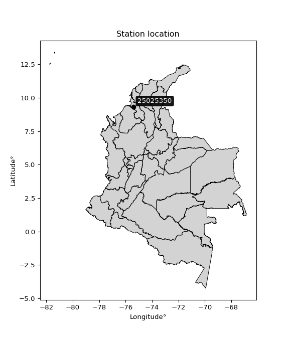</img>

</div>


## A. General information


### 1. General running parameters

• app_version: _v20251225_. • runtime: _2025-12-26 14:29:50.888910_. • Python version: _3.14.0_. • SciPy version: _1.16.3_. • Pandas version: _2.3.3_. • NumPy version: _2.3.5_. • Stations dataset (station_dataset_file): _dataset/pmax24h_in/automatic_colombia.csv_. • Stations catalog (station_catalog_file): _dataset/CNE_IDEAM.xls_. • Plot only fit distributions with Δo > Δ (plot_only_fit): _True_. • Eval low extreme values, if False, evaluates high extreme values (low_extreme): _False_. • Eval every SciPy distribution as logarithmic (pdist_logarithmic_on): _True_. • Standard deviation normalized (ddof): _1.0_. • Return periods to eval in years (Tr): _[2, 2.33, 5, 10, 15, 20, 25, 50, 75, 100, 200, 250, 500, 750, 1000]_. • Minimum data sample per station, 0 means any (minimum_sample): _5_. • Z-Score threshold to adjust a value, 0 means disable (zscore): _3.5_. • Avoid zeros, e.g. rain = 0 (avoid_zeros): _True_. • Avoid null values (avoid_nans): _True_. [:file_folder:Dataset file.](../../dataset/pmax24h_in/automatic_colombia.csv)


### 2. Station info and location

|   id |   CODIGO | NOMBRE                       | CATEGORIA     | TECNOLOGIA   | ESTADO   | FECHA_INSTALACION   |   FECHA_SUSPENSION |   ALTITUD |   LATITUD |   LONGITUD | DEPARTAMENTO   | MUNICIPIO   | AREA_OPERATIVA                              | ENTIDAD                                                     | AREA_HIDROGRAFICA   | ZONA_HIDROGRAFICA                | SUBZONA_HIDROGRAFICA       |   CORRIENTE | OBSERVACION                                                                                                                                                                                                                                                                                        | SUBRED                                                   | Catalogo   |
|-----:|---------:|:-----------------------------|:--------------|:-------------|:---------|:--------------------|-------------------:|----------:|----------:|-----------:|:---------------|:------------|:--------------------------------------------|:------------------------------------------------------------|:--------------------|:---------------------------------|:---------------------------|------------:|:---------------------------------------------------------------------------------------------------------------------------------------------------------------------------------------------------------------------------------------------------------------------------------------------------|:---------------------------------------------------------|:-----------|
|    0 | 25025350 | PUERTA ROJA - AUT [25025350] | Pluviométrica | Convencional | Activa   | 23/08/2004          |                nan |       160 |   9.31639 |   -75.3875 | Sucre          | Sincelejo   | Area Operativa 02 - Atlántico-Bolivar-Sucre | INSTITUTO DE HIDROLOGIA METEOROLOGIA Y ESTUDIOS AMBIENTALES | Magdalena Cauca     | Bajo Magdalena- Cauca -San Jorge | Bajo San Jorge - La Mojana |         nan | Actualizada Categoría de CP a PM por solicitud del coordinador del AO. (10022023)|15/01/2025$mvelez$La estación actualmente es únicamente convencional y cuenta con un pluviómetro. No dispone de componente automático, reporta la coordinadora Mayra Soto mediante correo electrónico 10/01/2025 | Radiación Visible,Radición Global,Radiación Ultravioleta | CNE_IDEAM  |

<div align="center">

Map location in: [:earth_americas:Google](http://maps.google.com/maps?q=9.316388889,-75.3875) [:earth_americas:OSM](https://www.openstreetmap.org/#map=18/9.316388889/-75.3875&layers=P) [:earth_americas:Bing](https://www.bing.com/maps?cp=9.316388889~-75.3875&lvl=18) [:earth_americas:Apple](https://maps.apple.com/frame?center=9.316388889%2C-75.3875&span=0.003%2C0.006)

</div>


<div align="center">

```geojson
{
  "type": "Feature",
  "geometry": {
    "type": "Point", 
    "coordinates": [-75.3875, 9.316388889]
  }, 
  "properties": {
    "Name": "25025350"
  }
}
```

</div>


### 3. Discrete values table and plot

|               |           0 |          1 |          2 |           3 |           4 |
|:--------------|------------:|-----------:|-----------:|------------:|------------:|
| Date          | 2017        | 2018       | 2019       | 2020        | 2021        |
| Value         |   48.9      |   50.3     |   28.8     |   39.6      |   37.8      |
| Value_initial |   48.9      |   50.3     |   28.8     |   39.6      |   37.8      |
| count         |    5        |    5       |    5       |    5        |    5        |
| mean          |   41.08     |   41.08    |   41.08    |   41.08     |   41.08     |
| std           |    8.8021   |    8.8021  |    8.8021  |    8.8021   |    8.8021   |
| zscore        |    0.888424 |    1.04748 |   -1.39512 |   -0.168142 |   -0.372638 |

<div align="center">

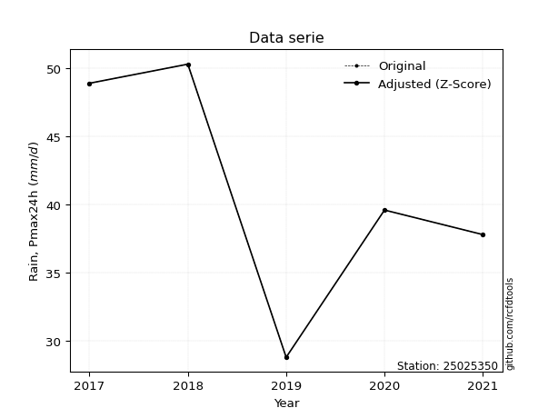</img>

</div>

> If Z-Score is active, values out of range or outliers are replaced with the station mean value.


### 4. Active continuous probability distributions from SciPy (45 of 104 available)

[scipy.stats](https://docs.scipy.org/doc/scipy/reference/stats.html) is a Python´s powerful submodule within the SciPy library for comprehensive statistical analysis, offering over 130 probability distributions (like Normal, Poisson), functions for descriptive stats (mean, variance), hypothesis testing (t-tests, chi-square), random variable generation, and statistical tests, making it essential for data science, modeling, and research. It provides tools to explore, model, and draw conclusions from data efficiently, working seamlessly with NumPy.

<div align="center">

|   id | p_dist             |   n_parameter | fit_method   | label                                                                       | active   | ref                                                                                                        |
|-----:|:-------------------|--------------:|:-------------|:----------------------------------------------------------------------------|:---------|:-----------------------------------------------------------------------------------------------------------|
|    0 | alpha              |             3 | MLE          | Alpha                                                                       | True     | [:mortar_board:](https://docs.scipy.org/doc/scipy/reference/generated/scipy.stats.alpha.html)              |
|    1 | betaprime          |             4 | MLE          | Beta prime                                                                  | True     | [:mortar_board:](https://docs.scipy.org/doc/scipy/reference/generated/scipy.stats.betaprime.html)          |
|    2 | chi2               |             3 | MLE          | Chi²                                                                        | True     | [:mortar_board:](https://docs.scipy.org/doc/scipy/reference/generated/scipy.stats.chi2.html)               |
|    3 | crystalball        |             4 | MLE          | Crystalball                                                                 | True     | [:mortar_board:](https://docs.scipy.org/doc/scipy/reference/generated/scipy.stats.crystalball.html)        |
|    4 | erlang             |             3 | MLE          | Erlang                                                                      | True     | [:mortar_board:](https://docs.scipy.org/doc/scipy/reference/generated/scipy.stats.erlang.html)             |
|    5 | expon              |             2 | MLE          | Exponential                                                                 | True     | [:mortar_board:](https://docs.scipy.org/doc/scipy/reference/generated/scipy.stats.expon.html)              |
|    6 | exponnorm          |             3 | MLE          | Exponentially modified Normal                                               | True     | [:mortar_board:](https://docs.scipy.org/doc/scipy/reference/generated/scipy.stats.exponnorm.html)          |
|    7 | f                  |             4 | MLE          | F                                                                           | True     | [:mortar_board:](https://docs.scipy.org/doc/scipy/reference/generated/scipy.stats.f.html)                  |
|    8 | fatiguelife        |             3 | MLE          | Fatigue-life (Birnbaum-Saunders)                                            | True     | [:mortar_board:](https://docs.scipy.org/doc/scipy/reference/generated/scipy.stats.fatiguelife.html)        |
|    9 | fisk               |             3 | MLE          | Fisk                                                                        | True     | [:mortar_board:](https://docs.scipy.org/doc/scipy/reference/generated/scipy.stats.fisk.html)               |
|   10 | gamma              |             3 | MLE          | Gamma                                                                       | True     | [:mortar_board:](https://docs.scipy.org/doc/scipy/reference/generated/scipy.stats.gamma.html)              |
|   11 | genexpon           |             5 | MLE          | Generalized exponential                                                     | True     | [:mortar_board:](https://docs.scipy.org/doc/scipy/reference/generated/scipy.stats.genexpon.html)           |
|   12 | genlogistic        |             3 | MLE          | Generalized logistic                                                        | True     | [:mortar_board:](https://docs.scipy.org/doc/scipy/reference/generated/scipy.stats.genlogistic.html)        |
|   13 | gibrat             |             2 | MM           | Gibrat                                                                      | True     | [:mortar_board:](https://docs.scipy.org/doc/scipy/reference/generated/scipy.stats.gibrat.html)             |
|   14 | gompertz           |             3 | MLE          | Gompertz (or truncated Gumbel)                                              | True     | [:mortar_board:](https://docs.scipy.org/doc/scipy/reference/generated/scipy.stats.gompertz.html)           |
|   15 | gumbel_l           |             2 | MM           | Gumbel Left Skew                                                            | True     | [:mortar_board:](https://docs.scipy.org/doc/scipy/reference/generated/scipy.stats.gumbel_l.html)           |
|   16 | gumbel_r           |             2 | MM           | Gumbel Right Skew                                                           | True     | [:mortar_board:](https://docs.scipy.org/doc/scipy/reference/generated/scipy.stats.gumbel_r.html)           |
|   17 | halflogistic       |             2 | MM           | Half-logistic                                                               | True     | [:mortar_board:](https://docs.scipy.org/doc/scipy/reference/generated/scipy.stats.halflogistic.html)       |
|   18 | halfnorm           |             2 | MM           | Half Normal                                                                 | True     | [:mortar_board:](https://docs.scipy.org/doc/scipy/reference/generated/scipy.stats.halfnorm.html)           |
|   19 | hypsecant          |             2 | MM           | hyperbolic secant                                                           | True     | [:mortar_board:](https://docs.scipy.org/doc/scipy/reference/generated/scipy.stats.hypsecant.html)          |
|   20 | invgamma           |             3 | MLE          | Inverted gamma                                                              | True     | [:mortar_board:](https://docs.scipy.org/doc/scipy/reference/generated/scipy.stats.invgamma.html)           |
|   21 | invgauss           |             3 | MLE          | Inverse Gaussian                                                            | True     | [:mortar_board:](https://docs.scipy.org/doc/scipy/reference/generated/scipy.stats.invgauss.html)           |
|   22 | invweibull         |             3 | MLE          | Inverted Weibull                                                            | True     | [:mortar_board:](https://docs.scipy.org/doc/scipy/reference/generated/scipy.stats.invweibull.html)         |
|   23 | johnsonsu          |             4 | MLE          | Johnson Su                                                                  | True     | [:mortar_board:](https://docs.scipy.org/doc/scipy/reference/generated/scipy.stats.johnsonsu.html)          |
|   24 | kstwobign          |             2 | MLE          | Limiting distribution of scaled Kolmogorov-Smirnov two-sided test statistic | True     | [:mortar_board:](https://docs.scipy.org/doc/scipy/reference/generated/scipy.stats.kstwobign.html)          |
|   25 | laplace            |             2 | MM           | Laplace                                                                     | True     | [:mortar_board:](https://docs.scipy.org/doc/scipy/reference/generated/scipy.stats.laplace.html)            |
|   26 | laplace_asymmetric |             3 | MLE          | Asymmetric Laplace                                                          | True     | [:mortar_board:](https://docs.scipy.org/doc/scipy/reference/generated/scipy.stats.laplace_asymmetric.html) |
|   27 | loggamma           |             3 | MLE          | Log gamma                                                                   | True     | [:mortar_board:](https://docs.scipy.org/doc/scipy/reference/generated/scipy.stats.loggamma.html)           |
|   28 | logistic           |             2 | MM           | Logistic (or Sech-squared)                                                  | True     | [:mortar_board:](https://docs.scipy.org/doc/scipy/reference/generated/scipy.stats.logistic.html)           |
|   29 | lognorm            |             3 | MLE          | Log Normal                                                                  | True     | [:mortar_board:](https://docs.scipy.org/doc/scipy/reference/generated/scipy.stats.lognorm.html)            |
|   30 | maxwell            |             2 | MM           | Maxwell                                                                     | True     | [:mortar_board:](https://docs.scipy.org/doc/scipy/reference/generated/scipy.stats.maxwell.html)            |
|   31 | mielke             |             4 | MLE          | Mielke Beta-Kappa / Dagum                                                   | True     | [:mortar_board:](https://docs.scipy.org/doc/scipy/reference/generated/scipy.stats.mielke.html)             |
|   32 | moyal              |             2 | MM           | Moyal                                                                       | True     | [:mortar_board:](https://docs.scipy.org/doc/scipy/reference/generated/scipy.stats.moyal.html)              |
|   33 | nakagami           |             3 | MLE          | Nakagami                                                                    | True     | [:mortar_board:](https://docs.scipy.org/doc/scipy/reference/generated/scipy.stats.nakagami.html)           |
|   34 | ncf                |             5 | MLE          | Non-central F distribution                                                  | True     | [:mortar_board:](https://docs.scipy.org/doc/scipy/reference/generated/scipy.stats.ncf.html)                |
|   35 | nct                |             4 | MLE          | Non-central Student’s t                                                     | True     | [:mortar_board:](https://docs.scipy.org/doc/scipy/reference/generated/scipy.stats.nct.html)                |
|   36 | norm               |             2 | MM           | Normal                                                                      | True     | [:mortar_board:](https://docs.scipy.org/doc/scipy/reference/generated/scipy.stats.norm.html)               |
|   37 | pareto             |             3 | MLE          | Pareto                                                                      | True     | [:mortar_board:](https://docs.scipy.org/doc/scipy/reference/generated/scipy.stats.pareto.html)             |
|   38 | pearson3           |             3 | MM           | Pearson type III                                                            | True     | [:mortar_board:](https://docs.scipy.org/doc/scipy/reference/generated/scipy.stats.pearson3.html)           |
|   39 | rayleigh           |             2 | MM           | Rayleigh                                                                    | True     | [:mortar_board:](https://docs.scipy.org/doc/scipy/reference/generated/scipy.stats.rayleigh.html)           |
|   40 | rice               |             3 | MLE          | Rice                                                                        | True     | [:mortar_board:](https://docs.scipy.org/doc/scipy/reference/generated/scipy.stats.rice.html)               |
|   41 | t                  |             3 | MLE          | Student’s t                                                                 | True     | [:mortar_board:](https://docs.scipy.org/doc/scipy/reference/generated/scipy.stats.t.html)                  |
|   42 | truncnorm          |             4 | MLE          | Truncated normal                                                            | True     | [:mortar_board:](https://docs.scipy.org/doc/scipy/reference/generated/scipy.stats.truncnorm.html)          |
|   43 | wald               |             2 | MM           | Wald                                                                        | True     | [:mortar_board:](https://docs.scipy.org/doc/scipy/reference/generated/scipy.stats.wald.html)               |
|   44 | weibull_min        |             3 | MLE          | Weibull minimum                                                             | True     | [:mortar_board:](https://docs.scipy.org/doc/scipy/reference/generated/scipy.stats.weibull_min.html)        |

</div>

> **n_parameter:** # arguments & localization & scale.
>
> **Fit methods:** (MLE) maximum likelihood, (MM) L-moments.
>
>**Inactive:** foldnorm, gennorm, norminvgauss, powernorm, powerlognorm, skewnorm, genextreme, anglit, arcsine, argus, beta, bradford, burr, burr12, cauchy, cosine, halfcauchy, foldcauchy, skewcauchy, wrapcauchy, dgamma, gengamma, exponweib, exponpow, truncexpon, gausshyper, genhalflogistic, genhyperbolic, geninvgauss, halfgennorm, johnsonsb, kappa4, kappa3, ksone, kstwo, loglaplace, levy, levy_l, levy_stable, ncx2, genpareto, truncpareto, lomax, powerlaw, rdist, rel_breitwigner, recipinvgauss, semicircular, studentized_range, trapezoid, triang, truncweibull_min, tukeylambda, uniform, loguniform, vonmises, vonmises_line, weibull_max, dweibull, 


## B. Probability distributions vs. Empirical distributions

A continuous probability distribution (CPD) describes probabilities for variables that can take any value within a range (like rain any time), unlike discrete variables with specific outcomes (like temperature). It uses a Probability Density Function (PDF), a curve where the total area under it equals 1, and the probability of the variable falling within an interval (a to b) is found by calculating the area under the curve between those points. A key feature is that the probability of hitting any single exact value is zero, so probabilities are always expressed for ranges, e.g., $P(a ≤ X ≤ b)$.

<div align="center">

Distributions parameters
|    |   station | p_dist                |   n |               loc |            scale | shape                  | shape1                | shape2             | shape3   |
|---:|----------:|:----------------------|----:|------------------:|-----------------:|:-----------------------|:----------------------|:-------------------|:---------|
|  0 |  25025350 | alpha                 |   5 |    -109.607       |   2837.8         | 18.896535372842997     |                       |                    |          |
|  1 |  25025350 | betaprime             |   5 |      -1.79077     |    111.682       | 38.47712956385702      | 101.45879617271146    |                    |          |
|  2 |  25025350 | chi2                  |   5 |      28.8         |      1.31896     | 0.90740072844776       |                       |                    |          |
|  3 |  25025350 | crystalball           |   5 |      41.08        |      7.87284     | 1526.6047496299177     | 7340.013858191752     |                    |          |
|  4 |  25025350 | erlang                |   5 |     -98.5169      |      0.450084    | 310.12586474659986     |                       |                    |          |
|  5 |  25025350 | expon                 |   5 |      28.8         |     12.28        |                        |                       |                    |          |
|  6 |  25025350 | exponnorm             |   5 |      41.073       |      7.87284     | 0.0008986364883584112  |                       |                    |          |
|  7 |  25025350 | f                     |   5 |    -760.847       |    801.937       | 22595.610235669745     | 231731.16801430332    |                    |          |
|  8 |  25025350 | fatiguelife           |   5 |      28.8         |      0.0284171   | 18.683863803500742     |                       |                    |          |
|  9 |  25025350 | fisk                  |   5 | -415562           | 415604           | 86785.1839662606       |                       |                    |          |
| 10 |  25025350 | gamma                 |   5 |     -88.7545      |      0.490615    | 264.6470332799247      |                       |                    |          |
| 11 |  25025350 | genexpon              |   5 |      28.8         |      2.49576     | 0.20334344721344855    | 4.291343291649844e-07 | 1.2200427858560867 |          |
| 12 |  25025350 | genlogistic           |   5 |      50.3002      |      1.17837e-05 | 1.2832157934961121e-06 |                       |                    |          |
| 13 |  25025350 | gibrat                |   5 |      35.074       |      3.64281     |                        |                       |                    |          |
| 14 |  25025350 | gompertz              |   5 |      28.8         |      9.95035     | 0.2833608825600286     |                       |                    |          |
| 15 |  25025350 | gumbel_l              |   5 |      44.6232      |      6.13843     |                        |                       |                    |          |
| 16 |  25025350 | gumbel_r              |   5 |      37.5368      |      6.13843     |                        |                       |                    |          |
| 17 |  25025350 | halflogistic          |   5 |      31.7488      |      6.73101     |                        |                       |                    |          |
| 18 |  25025350 | halfnorm              |   5 |      30.6595      |     13.0602      |                        |                       |                    |          |
| 19 |  25025350 | hypsecant             |   5 |      41.08        |      5.01201     |                        |                       |                    |          |
| 20 |  25025350 | invgamma              |   5 |     -51.2364      |  12110.6         | 132.20972651722434     |                       |                    |          |
| 21 |  25025350 | invgauss              |   5 |     -10.0465      |   1950.64        | 0.0262454770130863     |                       |                    |          |
| 22 |  25025350 | invweibull            |   5 |      28.8         |      1.55053     | 0.04369464350443525    |                       |                    |          |
| 23 |  25025350 | johnsonsu             |   5 |      50.3         |      2.9233e-11  | 3.1336306651675443     | 0.1401708506891633    |                    |          |
| 24 |  25025350 | kstwobign             |   5 |      10.9235      |     34.4059      |                        |                       |                    |          |
| 25 |  25025350 | laplace               |   5 |      41.08        |      5.56694     |                        |                       |                    |          |
| 26 |  25025350 | laplace_asymmetric    |   5 |      39.6         |      6.39216     | 0.8909254475083344     |                       |                    |          |
| 27 |  25025350 | loggamma              |   5 |      50.3004      |      2.88021e-05 | 3.118034047443861e-06  |                       |                    |          |
| 28 |  25025350 | logistic              |   5 |      41.08        |      4.34052     |                        |                       |                    |          |
| 29 |  25025350 | lognorm               |   5 |      28.8         |      0.0108336   | 14.376983035220174     |                       |                    |          |
| 30 |  25025350 | maxwell               |   5 |      22.4247      |     11.6905      |                        |                       |                    |          |
| 31 |  25025350 | mielke                |   5 |      -9.11175     |     59.4747      | 5.500329478479394      | 5110.922222794691     |                    |          |
| 32 |  25025350 | moyal                 |   5 |      36.5778      |      3.54402     |                        |                       |                    |          |
| 33 |  25025350 | nakagami              |   5 |      37.8         |      6.92329     | 0.07730184523206299    |                       |                    |          |
| 34 |  25025350 | ncf                   |   5 |      -1.84934     |      5.56339     | 18.67592225778663      | 232.29059020464615    | 123.79150447002792 |          |
| 35 |  25025350 | nct                   |   5 |    -237.822       |      7.84824     | 101183.5025004501      | 35.53657099460084     |                    |          |
| 36 |  25025350 | norm                  |   5 |      41.08        |      7.87284     |                        |                       |                    |          |
| 37 |  25025350 | pareto                |   5 |      28.6791      |      0.120866    | 0.2613160351880828     |                       |                    |          |
| 38 |  25025350 | pearson3              |   5 |      41.08        |      7.87285     | -0.25754942398299197   |                       |                    |          |
| 39 |  25025350 | rayleigh              |   5 |      26.0188      |     12.0171      |                        |                       |                    |          |
| 40 |  25025350 | rice                  |   5 |      24.205       |      9.01445     | 1.5056948775309995     |                       |                    |          |
| 41 |  25025350 | t                     |   5 |      41.0801      |      7.87282     | 287421733.72513366     |                       |                    |          |
| 42 |  25025350 | truncnorm             |   5 |       0.61428     |     16.3437      | 2.2752356470472686     | 1724.1882570326225    |                    |          |
| 43 |  25025350 | wald                  |   5 |      33.2071      |      7.87286     |                        |                       |                    |          |
| 44 |  25025350 | weibull_min           |   5 |      -2.65724     |     47.0053      | 6.685775553692073      |                       |                    |          |
| 45 |  25025350 | logalpha              |   5 |      -3.65201     |    264.725       | 36.06194739132301      |                       |                    |          |
| 46 |  25025350 | logbetaprime          |   5 |      -4.88347     |    131.71        | 1875.8978674996288     | 28793.735360604784    |                    |          |
| 47 |  25025350 | logchi2               |   5 |       3.36038     |      1.00281     | 1.0357751462490596     |                       |                    |          |
| 48 |  25025350 | logcrystalball        |   5 |       3.69586     |      0.201906    | 7.785120874595897      | 40.99239893060819     |                    |          |
| 49 |  25025350 | logerlang             |   5 |       0.296232    |      0.0124017   | 274.0761232927739      |                       |                    |          |
| 50 |  25025350 | logexpon              |   5 |       3.36038     |      0.335484    |                        |                       |                    |          |
| 51 |  25025350 | logexponnorm          |   5 |       3.69569     |      0.201906    | 0.0008479986195587454  |                       |                    |          |
| 52 |  25025350 | logf                  |   5 |     -45.386       |     49.0819      | 137114.6100622912      | 854499.1628658585     |                    |          |
| 53 |  25025350 | logfatiguelife        |   5 |     -30.9172      |     34.6122      | 0.005870557284147461   |                       |                    |          |
| 54 |  25025350 | logfisk               |   5 |      -1.06068e+07 |      1.06068e+07 | 88260464.56949332      |                       |                    |          |
| 55 |  25025350 | loggamma              |   5 |       0.529814    |      0.0132388   | 239.0586962466001      |                       |                    |          |
| 56 |  25025350 | loggenexpon           |   5 |       3.35919     |      2.74019     | 3.866745384214667      | 68.53700655853943     | 0.7671363177064185 |          |
| 57 |  25025350 | loggenlogistic        |   5 |       3.91808     |      5.39778e-07 | 2.4410481191980513e-06 |                       |                    |          |
| 58 |  25025350 | loggibrat             |   5 |       3.54187     |      0.093399    |                        |                       |                    |          |
| 59 |  25025350 | loggompertz           |   5 |       3.36038     |      0.570327    | 1.1766122503519338     |                       |                    |          |
| 60 |  25025350 | loggumbel_l           |   5 |       3.78673     |      0.157426    |                        |                       |                    |          |
| 61 |  25025350 | loggumbel_r           |   5 |       3.60499     |      0.157426    |                        |                       |                    |          |
| 62 |  25025350 | loghalflogistic       |   5 |       3.45657     |      0.17261     |                        |                       |                    |          |
| 63 |  25025350 | loghalfnorm           |   5 |       3.42865     |      0.334899    |                        |                       |                    |          |
| 64 |  25025350 | loghypsecant          |   5 |       3.69586     |      0.128538    |                        |                       |                    |          |
| 65 |  25025350 | loginvgamma           |   5 |      -4.63419     |  13823.2         | 1660.5736446259243     |                       |                    |          |
| 66 |  25025350 | loginvgauss           |   5 |       1.94926     |    115.345       | 0.015118188499598773   |                       |                    |          |
| 67 |  25025350 | loginvweibull         |   5 |      -1.64034e+07 |      1.64034e+07 | 78092265.41931808      |                       |                    |          |
| 68 |  25025350 | logjohnsonsu          |   5 |       3.91801     |      1.58221e-10 | 3.5784379987098465     | 0.21837919728438182   |                    |          |
| 69 |  25025350 | logkstwobign          |   5 |       2.88286     |      0.927307    |                        |                       |                    |          |
| 70 |  25025350 | loglaplace            |   5 |       3.69586     |      0.142769    |                        |                       |                    |          |
| 71 |  25025350 | loglaplace_asymmetric |   5 |       3.67883     |      0.162347    | 0.9489508656581689     |                       |                    |          |
| 72 |  25025350 | logloggamma           |   5 |       3.91802     |      1.20112e-06 | 5.414405329724621e-06  |                       |                    |          |
| 73 |  25025350 | loglogistic           |   5 |       3.69586     |      0.111317    |                        |                       |                    |          |
| 74 |  25025350 | loglognorm            |   5 |       3.36038     |      0.00040834  | 13.77637828726931      |                       |                    |          |
| 75 |  25025350 | logmaxwell            |   5 |       3.21743     |      0.299814    |                        |                       |                    |          |
| 76 |  25025350 | logmielke             |   5 |      -6.94151e+06 |      6.94151e+06 | 30705664.59652949      | 6842200150.69561      |                    |          |
| 77 |  25025350 | logmoyal              |   5 |       3.5804      |      0.0908898   |                        |                       |                    |          |
| 78 |  25025350 | lognakagami           |   5 |       3.63231     |      0.153612    | 0.19571054623437642    |                       |                    |          |
| 79 |  25025350 | logncf                |   5 |      -1.71131     |      1.03463e-07 | 8.933188150959565e-06  | 1905.5288934081443    | 466.0331109876529  |          |
| 80 |  25025350 | lognct                |   5 |      -0.792702    |      0.0987346   | 313.5729458326566      | 45.33043514498486     |                    |          |
| 81 |  25025350 | lognorm               |   5 |       3.69586     |      0.201906    |                        |                       |                    |          |
| 82 |  25025350 | logpareto             |   5 |       3.35702     |      0.00335562  | 0.2610013128779659     |                       |                    |          |
| 83 |  25025350 | logpearson3           |   5 |       3.69586     |      0.201906    | -0.48025848247418423   |                       |                    |          |
| 84 |  25025350 | lograyleigh           |   5 |       3.3096      |      0.30819     |                        |                       |                    |          |
| 85 |  25025350 | logrice               |   5 |       3.23235     |      0.22483     | 1.74831914506409       |                       |                    |          |
| 86 |  25025350 | logt                  |   5 |       3.69586     |      0.201906    | 2266065505.198642      |                       |                    |          |
| 87 |  25025350 | logtruncnorm          |   5 |      -0.0588122   |      1.02021     | 3.6180009177342765     | 3.8980388190421063    |                    |          |
| 88 |  25025350 | logwald               |   5 |       3.49399     |      0.201873    |                        |                       |                    |          |
| 89 |  25025350 | logweibull_min        |   5 |      -4.69006e+06 |      4.69007e+06 | 29371908.244648576     |                       |                    |          |

</div>

> **loc** (Location parameter): This shifts the distribution along the x-axis. For many common distributions, like the normal (Gaussian) distribution, loc represents the mean $μ$. For others, like the uniform distribution, it might represent the minimum value, or for the beta distribution, the left end of the support interval.
>
> **scale** (Scale parameter): This determines the width or spread of the distribution. For the normal distribution, scale represents the standard deviation $σ$. For a uniform distribution, it defines the length of the interval (from $loc$ to $loc + scale$).
>
> **shape** (Shape parameters): Refers to parameters that define the specific form of a probability distribution, distinct from its location (loc) and scale (scale). These parameters are required arguments for most distribution functions. For example, a normal (Gaussian) distribution is fully defined by its location (mean) and scale (standard deviation), so it has no specific shape parameters beyond loc and scale. However, other distributions have intrinsic properties that need specification, as Gamma distribution that takes a shape parameter, often named $a$ or $alpha$.


### 0. Cumulative distribution values - CDF (90 evaluated)

> Ordered by x ascending and calculating $log(f(x))$ separately. 

|   id |   Station |   date |    x |   count |   mean |    std |    zscore |   Value_initial |   station |   m |     alpha |   alpha_pdf |   betaprime |   betaprime_pdf |        chi2 |    chi2_pdf |   crystalball |   crystalball_pdf |    erlang |   erlang_pdf |    expon |   expon_pdf |   exponnorm |   exponnorm_pdf |         f |     f_pdf |   fatiguelife |   fatiguelife_pdf |      fisk |   fisk_pdf |     gamma |   gamma_pdf |    genexpon |   genexpon_pdf |   genlogistic |   genlogistic_pdf |   gibrat |   gibrat_pdf |    gompertz |   gompertz_pdf |   gumbel_l |   gumbel_l_pdf |   gumbel_r |   gumbel_r_pdf |   halflogistic |   halflogistic_pdf |   halfnorm |   halfnorm_pdf |   hypsecant |   hypsecant_pdf |   invgamma |   invgamma_pdf |   invgauss |   invgauss_pdf |   invweibull |   invweibull_pdf |   johnsonsu |   johnsonsu_pdf |   kstwobign |   kstwobign_pdf |   laplace |   laplace_pdf |   laplace_asymmetric |   laplace_asymmetric_pdf |   loggamma |   loggamma_pdf |   logistic |   logistic_pdf |   lognorm |   lognorm_pdf |   maxwell |   maxwell_pdf |    mielke |   mielke_pdf |      moyal |   moyal_pdf |   nakagami |   nakagami_pdf |       ncf |   ncf_pdf |      nct |   nct_pdf |      norm |   norm_pdf |      pareto |   pareto_pdf |   pearson3 |   pearson3_pdf |   rayleigh |   rayleigh_pdf |      rice |   rice_pdf |        t |     t_pdf |   truncnorm |   truncnorm_pdf |     wald |   wald_pdf |   weibull_min |   weibull_min_pdf |   logalpha |   logalpha_pdf |   logbetaprime |   logbetaprime_pdf |     logchi2 |   logchi2_pdf |   logcrystalball |   logcrystalball_pdf |   logerlang |   logerlang_pdf |   logexpon |   logexpon_pdf |   logexponnorm |   logexponnorm_pdf |      logf |   logf_pdf |   logfatiguelife |   logfatiguelife_pdf |   logfisk |   logfisk_pdf |   loggenexpon |   loggenexpon_pdf |   loggenlogistic |   loggenlogistic_pdf |   loggibrat |   loggibrat_pdf |   loggompertz |   loggompertz_pdf |   loggumbel_l |   loggumbel_l_pdf |   loggumbel_r |   loggumbel_r_pdf |   loghalflogistic |   loghalflogistic_pdf |   loghalfnorm |   loghalfnorm_pdf |   loghypsecant |   loghypsecant_pdf |   loginvgamma |   loginvgamma_pdf |   loginvgauss |   loginvgauss_pdf |   loginvweibull |   loginvweibull_pdf |   logjohnsonsu |   logjohnsonsu_pdf |   logkstwobign |   logkstwobign_pdf |   loglaplace |   loglaplace_pdf |   loglaplace_asymmetric |   loglaplace_asymmetric_pdf |   logloggamma |   logloggamma_pdf |   loglogistic |   loglogistic_pdf |   loglognorm |   loglognorm_pdf |   logmaxwell |   logmaxwell_pdf |   logmielke |   logmielke_pdf |    logmoyal |   logmoyal_pdf |   lognakagami |   lognakagami_pdf |   logncf |   logncf_pdf |    lognct |   lognct_pdf |   logpareto |   logpareto_pdf |   logpearson3 |   logpearson3_pdf |   lograyleigh |   lograyleigh_pdf |   logrice |   logrice_pdf |      logt |   logt_pdf |   logtruncnorm |   logtruncnorm_pdf |   logwald |   logwald_pdf |   logweibull_min |   logweibull_min_pdf |
|-----:|----------:|-------:|-----:|--------:|-------:|-------:|----------:|----------------:|----------:|----:|----------:|------------:|------------:|----------------:|------------:|------------:|--------------:|------------------:|----------:|-------------:|---------:|------------:|------------:|----------------:|----------:|----------:|--------------:|------------------:|----------:|-----------:|----------:|------------:|------------:|---------------:|--------------:|------------------:|---------:|-------------:|------------:|---------------:|-----------:|---------------:|-----------:|---------------:|---------------:|-------------------:|-----------:|---------------:|------------:|----------------:|-----------:|---------------:|-----------:|---------------:|-------------:|-----------------:|------------:|----------------:|------------:|----------------:|----------:|--------------:|---------------------:|-------------------------:|-----------:|---------------:|-----------:|---------------:|----------:|--------------:|----------:|--------------:|----------:|-------------:|-----------:|------------:|-----------:|---------------:|----------:|----------:|---------:|----------:|----------:|-----------:|------------:|-------------:|-----------:|---------------:|-----------:|---------------:|----------:|-----------:|---------:|----------:|------------:|----------------:|---------:|-----------:|--------------:|------------------:|-----------:|---------------:|---------------:|-------------------:|------------:|--------------:|-----------------:|---------------------:|------------:|----------------:|-----------:|---------------:|---------------:|-------------------:|----------:|-----------:|-----------------:|---------------------:|----------:|--------------:|--------------:|------------------:|-----------------:|---------------------:|------------:|----------------:|--------------:|------------------:|--------------:|------------------:|--------------:|------------------:|------------------:|----------------------:|--------------:|------------------:|---------------:|-------------------:|--------------:|------------------:|--------------:|------------------:|----------------:|--------------------:|---------------:|-------------------:|---------------:|-------------------:|-------------:|-----------------:|------------------------:|----------------------------:|--------------:|------------------:|--------------:|------------------:|-------------:|-----------------:|-------------:|-----------------:|------------:|----------------:|------------:|---------------:|--------------:|------------------:|---------:|-------------:|----------:|-------------:|------------:|----------------:|--------------:|------------------:|--------------:|------------------:|----------:|--------------:|----------:|-----------:|---------------:|-------------------:|----------:|--------------:|-----------------:|---------------------:|
|    0 |  25025350 |   2019 | 28.8 |       5 |  41.08 | 8.8021 | -1.39512  |            28.8 |  25025350 |   1 | 0.0540509 |   0.0162538 |   0.0501776 |       0.0169017 | 2.02258e-07 | 2.58294e+07 |     0.0594044 |         0.0150131 | 0.0574842 |    0.0154535 | 0        |   0.0814332 |   0.0594039 |       0.015013  | 0.0592838 | 0.0150983 |      0.041828 |     2851.89       | 0.0684013 |  0.0133068 | 0.0582067 |   0.0155753 | 8.80727e-08 |      0.0814755 |      0        |         0.0104761 | 0        |   0          | 5.10587e-12 |      0.0284775 |  0.0731341 |      0.0114674 |  0.0157521 |      0.0106515 |       0        |          0         |   0        |      0         |   0.0547941 |       0.0108786 |   0.053021 |      0.0162435 |  0.0510803 |      0.0168867 |    0.0127528 |      6.84163e+11 |    0.213736 |     0.00189843  |    0.049973 |       0.0227548 | 0.0550767 |    0.00989354 |            0.0664226 |                0.0116634 |  0.0471922 |       0.518396 |  0.0557691 |      0.0121319 | 0.0482985 |      0.496877 |  0.039483 |     0.0174931 | 0.0840165 |    0.0121893 | 0.00273452 |  0.00379068 |  0         |    0           | 0.0504456 | 0.0165336 | 0.059373 | 0.015015  | 0.0594044 |  0.0150131 | 1.11022e-16 |   2.16204    |  0.0657293 |      0.0143857 |  0.0264261 |      0.01875   | 0.0421096 |  0.018426  | 0.059403 | 0.0150128 | 0           |       0         | 0        |  0         |     0.0659326 |         0.0135405 |  0.0455935 |       0.515691 |      0.0480057 |           0.502298 | 1.26064e-08 |   7.35066e+06 |        0.0482985 |             0.496877 |   0.0477042 |        0.518554 |   0        |       2.98077  |      0.0482978 |           0.496872 | 0.0479779 |   0.496747 |        0.0489897 |             0.504253 | 0.0518511 |      0.409088 |    0.00168005 |          1.41705  |         0        |             0.363094 |    0        |        0        |   2.88342e-08 |          2.06305  |      0.064479 |          0.396085 |    0.00882986 |          0.265279 |          0        |              0        |      0        |          0        |      0.0467292 |           0.362241 |     0.0477988 |          0.514024 |     0.0477622 |          0.577423 |       0.0477984 |            0.691944 |      0.0847902 |        0.0608268   |      0.0464294 |           0.807495 |    0.0476927 |         0.334054 |               0.0599647 |                    0.38923  |     0.0809637 |          0.364969 |     0.0468075 |          0.400807 |    0.0227723 |      8.83228e+12 |    0.0269394 |         0.539992 |   0.0834403 |        0.369097 | 0.000794433 |       0.052995 |    0          |       0           | 0.271876 |     0.649824 | 0.0463399 |     0.524507 | 1.11022e-16 |       77.7803   |     0.0595185 |          0.469404 |      0.01348  |          0.527374 | 0.0365389 |       0.59025 | 0.0482982 |   0.496875 |    0           |            0       |  0        |      0        |        0.0651388 |             0.394352 |
|    1 |  25025350 |   2021 | 37.8 |       5 |  41.08 | 8.8021 | -0.372638 |            37.8 |  25025350 |   2 | 0.361316  |   0.0489215 |   0.372432  |       0.049861  | 0.992359    | 0.00327621  |     0.338477  |         0.0464609 | 0.345932  |    0.0472674 | 0.519486 |   0.0391298 |   0.338476  |       0.0464608 | 0.339419  | 0.0464654 |      0.828815 |        0.0134929  | 0.32473   |  0.0457899 | 0.346568  |   0.0470334 | 0.51967     |      0.0391353 |      0        |         0.0279152 | 0.385935 |   0.140325   | 0.340802    |      0.0463802 |  0.280391  |      0.0385743 |  0.383648  |      0.0598763 |       0.421487 |          0.0610866 |   0.415442 |      0.0526114 |   0.305141  |       0.0519764 |   0.360525 |      0.0487888 |  0.367497  |      0.0487909 |    0.396121  |      0.00178091  |    0.236531 |     0.00345833  |    0.424922 |       0.0481188 | 0.277387  |    0.0498277  |            0.322592  |                0.0566454 |  0.387797  |       1.89618  |  0.319587  |      0.0500979 | 0.376476  |      1.88039  |  0.36966  |     0.0497142 | 0.271137  |    0.0317903 | 0.400002   |  0.0664842  |  0.0041121 |    8.94732e+10 | 0.368357  | 0.0499125 | 0.338528 | 0.046471  | 0.338477  |  0.0464609 | 0.676914    |   0.00925653 |  0.325581  |      0.0441658 |  0.381565  |      0.0504527 | 0.357982  |  0.0478247 | 0.338474 | 0.0464608 | 9.23695e-07 |       0.160252  | 0.433729 |  0.0980039 |     0.307046  |         0.0420029 |  0.38979   |       1.9139   |      0.377512  |           1.86839  | 0.382784    |   0.666161    |        0.376476  |             1.88039  |   0.386584  |        1.88723  |   0.555396 |       1.32526  |      0.376474  |           1.88039  | 0.376772  |   1.88244  |        0.37878   |             1.87542  | 0.344492  |      1.87905  |    0.47273    |          1.71483  |         0        |             1.24194  |    0.487148 |        4.40896  |   0.512669    |          1.6196   |      0.312693 |          1.6371   |    0.431413   |          2.30384  |          0.46921  |              2.25897  |      0.456894 |          1.98026  |      0.34867   |           2.20177  |     0.384873  |          1.88849  |     0.409938  |          1.88234  |       0.434662  |            1.72413  |      0.109816  |        0.143557    |      0.469139  |           1.73865  |    0.320372  |         2.24398  |               0.35033   |                    2.27399  |     0.275841  |          1.24344  |     0.361031  |          2.07235  |    0.681505  |      0.0952694   |    0.409747  |         1.95623  |   0.277835  |        1.229    | 0.452306    |       2.48719  |    1.6108e-06 |       1.41976e+09 | 0.466962 |     0.754537 | 0.392837  |     1.91116  | 0.683452    |        0.300118 |     0.349447  |          1.74399  |      0.422022 |          1.96374  | 0.392705  |       1.88283 | 0.376475  |   1.88039  |    3.35884e-06 |            5.62299 |  0.506165 |      3.2412   |        0.309141  |             1.60005  |
|    2 |  25025350 |   2020 | 39.6 |       5 |  41.08 | 8.8021 | -0.168142 |            39.6 |  25025350 |   3 | 0.451173  |   0.0504714 |   0.463089  |       0.0504142 | 0.996444    | 0.0014989   |     0.425443  |         0.0497857 | 0.433825  |    0.0499846 | 0.585001 |   0.0337947 |   0.425441  |       0.0497857 | 0.426291  | 0.0496763 |      0.850985 |        0.0112431  | 0.411869  |  0.0505826 | 0.433964  |   0.0496728 | 0.585191    |      0.0337968 |      0        |         0.0339601 | 0.585926 |   0.0860925  | 0.426246    |      0.0483733 |  0.356718  |      0.046233  |  0.489416  |      0.0569704 |       0.524994 |          0.0538093 |   0.50638  |      0.0483314 |   0.407343  |       0.0608377 |   0.450044 |      0.0502323 |  0.456319  |      0.0494715 |    0.399042  |      0.00148317  |    0.243304 |     0.00410281  |    0.509242 |       0.0453164 | 0.383275  |    0.0688484  |            0.442508  |                0.077702  |  0.477699  |       1.95223  |  0.415573  |      0.0559546 | 0.46639   |      1.96886  |  0.459824 |     0.0500666 | 0.333526  |    0.0376604 | 0.513841   |  0.0593859  |  0.693048  |    0.0592385   | 0.459454  | 0.0508419 | 0.425508 | 0.0497913 | 0.425443  |  0.0497857 | 0.691768    |   0.00737542 |  0.409299  |      0.0485554 |  0.471983  |      0.0496577 | 0.44572   |  0.0493055 | 0.425439 | 0.0497857 | 0.25467     |       0.123978  | 0.581194 |  0.0677615 |     0.3878    |         0.0475288 |  0.48036   |       1.96278  |      0.466638  |           1.94721  | 0.412255    |   0.603172    |        0.46639   |             1.96886  |   0.47612   |        1.94568  |   0.612964 |       1.15367  |      0.466389  |           1.96886  | 0.466746  |   1.96926  |        0.468325  |             1.95809  | 0.436288  |      2.0465   |    0.549919   |          1.59873  |         0        |             1.53273  |    0.649063 |        2.70711  |   0.585175    |          1.4958   |      0.395825 |          1.93385  |    0.534938   |          2.12582  |          0.567489 |              1.96384  |      0.544955 |          1.80238  |      0.45795   |           2.45482  |     0.474599  |          1.95249  |     0.497798  |          1.87948  |       0.512905  |            1.63031  |      0.11728   |        0.179711    |      0.547302  |           1.61507  |    0.443778  |         3.10835  |               0.473825  |                    3.0756   |     0.340198  |          1.53355  |     0.461828  |          2.23275  |    0.685585  |      0.0809082   |    0.50046   |         1.92864  |   0.341315  |        1.5098   | 0.560649    |       2.15627  |    0.49381    |       4.09299     | 0.502054 |     0.753159 | 0.483135  |     1.95392  | 0.696093    |        0.246482 |     0.434944  |          1.92062  |      0.512112 |          1.89661  | 0.481545  |       1.9218  | 0.46639   |   1.96886  |    0.241067    |            4.76286 |  0.6322   |      2.24678  |        0.390367  |             1.88946  |
|    3 |  25025350 |   2017 | 48.9 |       5 |  41.08 | 8.8021 |  0.888424 |            48.9 |  25025350 |   4 | 0.839696  |   0.0275161 |   0.838412  |       0.0261219 | 0.999922    | 3.14261e-05 |     0.839715  |         0.0309412 | 0.838748  |    0.0297508 | 0.8054   |   0.0158469 |   0.839714  |       0.0309413 | 0.838287  | 0.0307806 |      0.922405 |        0.00515106 | 0.830016  |  0.0294614 | 0.836591  |   0.0297256 | 0.805566    |      0.0158417 |      0        |         0.0934972 | 0.908864 |   0.0118552  | 0.843198    |      0.0336622 |  0.865632  |      0.0439363 |  0.854657  |      0.0218669 |       0.854889 |          0.0199944 |   0.837481 |      0.0230365 |   0.868174  |       0.0255566 |   0.836491 |      0.0275075 |  0.830023  |      0.0266441 |    0.40898   |      0.000794904 |    0.340669 |     0.0367133   |    0.825211 |       0.0223847 | 0.877282  |    0.022044   |            0.84749   |                0.0212566 |  0.830396  |       1.18613  |  0.858347  |      0.0280122 | 0.831582  |      1.24582  |  0.837396 |     0.0269412 | 0.871981  |    0.0826761 | 0.860456   |  0.0194852  |  0.906032  |    0.0104875   | 0.841337  | 0.0265644 | 0.839719 | 0.0309302 | 0.839715  |  0.0309412 | 0.7376      |   0.00339102 |  0.8403    |      0.0338184 |  0.836789  |      0.0258601 | 0.836622  |  0.0288989 | 0.839714 | 0.0309414 | 0.863148    |       0.0271361 | 0.884735 |  0.0140586 |     0.843576  |         0.0376316 |  0.831674  |       1.17031  |      0.826555  |           1.23403  | 0.518494    |   0.424954    |        0.831582  |             1.24582  |   0.828965  |        1.19224  |   0.793618 |       0.615178 |      0.831581  |           1.24582  | 0.831412  |   1.24273  |        0.830469  |             1.23623  | 0.817438  |      1.24179  |    0.814988   |          0.899835 |         0        |             3.97899  |    0.905754 |        0.482973 |   0.834749    |          0.862552 |      0.85403  |          1.78432  |    0.8489     |          0.883348 |          0.849643 |              0.805594 |      0.831462 |          0.923288 |      0.861406  |           1.04449  |     0.829868  |          1.20084  |     0.824484  |          1.0859   |       0.783038  |            0.911732 |      0.235134  |        2.37814     |      0.810969  |           0.883149 |    0.871446  |         0.900429 |               0.846669  |                    0.896251 |     0.880459  |          3.96894  |     0.850946  |          1.13942  |    0.698561  |      0.0477763   |    0.830321  |         1.08274  |   0.867776  |        3.83859  | 0.855327    |       0.787092 |    0.892065   |       0.848853    | 0.654965 |     0.679541 | 0.831531  |     1.15917  | 0.73356     |        0.130531 |     0.832562  |          1.47873  |      0.830001 |          1.03841  | 0.828838  |       1.18177 | 0.831582  |   1.24582  |    0.941496    |            2.18573 |  0.881048 |      0.568924 |        0.843487  |             1.81785  |
|    4 |  25025350 |   2018 | 50.3 |       5 |  41.08 | 8.8021 |  1.04748  |            50.3 |  25025350 |   5 | 0.874919  |   0.0228561 |   0.871924  |       0.0218112 | 0.999956    | 1.78166e-05 |     0.879224  |         0.0255246 | 0.876794  |    0.0246359 | 0.826368 |   0.0141395 |   0.879223  |       0.0255247 | 0.877629  | 0.0254475 |      0.929252 |        0.00464077 | 0.86739   |  0.0240185 | 0.874657  |   0.0246874 | 0.826526    |      0.0141339 |      0.999982 |         0.108895  | 0.923677 |   0.00942165 | 0.886448    |      0.0280602 |  0.91965   |      0.0330039 |  0.882473  |      0.0179741 |       0.880511 |          0.0166914 |   0.867379 |      0.0197197 |   0.89969   |       0.0196843 |   0.871762 |      0.0229317 |  0.864337  |      0.0224265 |    0.410056  |      0.000742909 |    0.996616 |     4.68497e+06 |    0.854395 |       0.019351  | 0.904569  |    0.0171424  |            0.874525  |                0.0174884 |  0.861675  |       1.03059  |  0.89323   |      0.021972  | 0.864387  |      1.07869  |  0.872049 |     0.0226087 | 0.994188  |    0.0916327 | 0.885275   |  0.0160737  |  0.919635  |    0.00899327  | 0.875345  | 0.0220792 | 0.879214 | 0.0255158 | 0.879224  |  0.0255246 | 0.74215     |   0.00311645 |  0.883423  |      0.0277688 |  0.870143  |      0.0218342 | 0.873755  |  0.0241765 | 0.879222 | 0.0255248 | 0.896674    |       0.0209916 | 0.902593 |  0.01155   |     0.891295  |         0.0304548 |  0.862515  |       1.01559  |      0.859122  |           1.0737   | 0.530257    |   0.408651    |        0.864387  |             1.07869  |   0.860422  |        1.03704  |   0.810272 |       0.565534 |      0.864386  |           1.07869  | 0.864137  |   1.0762   |        0.863046  |             1.0722   | 0.84992   |      1.06141  |    0.839108   |          0.809826 |         0.999659 |             4.52077  |    0.9182   |        0.401945 |   0.857916    |          0.779259 |      0.899969 |          1.4629   |    0.872037   |          0.758469 |          0.870862 |              0.699845 |      0.85604  |          0.819203 |      0.888107  |           0.852692 |     0.861533  |          1.0432   |     0.853243  |          0.952666 |       0.807494  |            0.82198  |      0.999628  |        1.26249e+06 |      0.834641  |           0.794885 |    0.894508  |         0.738895 |               0.869991  |                    0.759928 |     0.999934  |          4.5075   |     0.880336  |          0.946347 |    0.699874  |      0.0452686   |    0.858964  |         0.947599 |   0.983086  |        4.2515   | 0.875952    |       0.676882 |    0.913895   |       0.701632    | 0.673912 |     0.662663 | 0.862091  |     1.00682  | 0.737126    |        0.122303 |     0.871487  |          1.27669  |      0.857524 |          0.912637 | 0.860073  |       1.03171 | 0.864387  |   1.07869  |    0.999998    |            1.96301 |  0.89591  |      0.486615 |        0.890654  |             1.5156   |

An Empirical Distribution Function (EDF) is a step-function estimate of a true cumulative distribution function (CDF) based on observed sample data, representing the proportion of data points less than or equal to a given value. It is calculated by ordering your data and jumping up by $1/n$ (where $n$ is sample size) at each unique data point, allowing analysis without assuming an underlying population distribution, and it gets closer to the true CDF as the sample size grows.


### 1. Empirical - EDF California (1923)

California´s estimates the true probability distribution of water-related data (like rainfall, streamflow) using observed samples, crucial for risk assessment.

<div align="center">


$P=m/n$


</div>


**1.1. Empirical values**

<div align="center">

|                | 0              | 1                  | 2              | 3                 | 4              |
|:---------------|:---------------|:-------------------|:---------------|:------------------|:---------------|
| date           | 2019           | 2021               | 2020           | 2017              | 2018           |
| x              | 28.8           | 37.8               | 39.6           | 48.9              | 50.3           |
| m              | 1              | 2                  | 3              | 4                 | 5              |
| empirical_dist | edf_california | edf_california     | edf_california | edf_california    | edf_california |
| empirical      | 0.2            | 0.4                | 0.6            | 0.8               | 1.0            |
| empirical_tr   | 1.25           | 1.6666666666666667 | 2.5            | 5.000000000000001 | inf            |

</div>


**1.2. Kolmogorov-Smirnov fit test (sorted by Δ)**


<div align="center">

|                | 0                     | 1                   | 2                   | 3                   | 4                  | 5                  | 6                   | 7                  | 8                   | 9                   | 10                  | 11                 | 12                  | 13                  | 14                 | 15                  | 16                  | 17                  | 18                 | 19                 | 20                  | 21                  | 22                 | 23                  | 24                  | 25                 | 26                  | 27                 | 28                 | 29                  | 30                 | 31                  | 32                 | 33                  | 34                  | 35                  | 36                  | 37                  | 38                  | 39                  | 40                 | 41                 | 42                  | 43                  | 44                 | 45                  | 46                 | 47                  | 48                  | 49                 | 50                  | 51                  | 52                  | 53                 | 54                  | 55                  | 56                 | 57                 | 58                 | 59                 | 60                 | 61                 | 62                 | 63                 | 64                 | 65                 | 66                 | 67                  | 68                  | 69                  | 70                 | 71                  | 72                  | 73                  | 74                 | 75                  | 76                  | 77                 | 78                 | 79                 | 80                  | 81                 | 82                  | 83                  | 84                  | 85                 | 86                 | 87                 | 88                 | 89                 |
|:---------------|:----------------------|:--------------------|:--------------------|:--------------------|:-------------------|:-------------------|:--------------------|:-------------------|:--------------------|:--------------------|:--------------------|:-------------------|:--------------------|:--------------------|:-------------------|:--------------------|:--------------------|:--------------------|:-------------------|:-------------------|:--------------------|:--------------------|:-------------------|:--------------------|:--------------------|:-------------------|:--------------------|:-------------------|:-------------------|:--------------------|:-------------------|:--------------------|:-------------------|:--------------------|:--------------------|:--------------------|:--------------------|:--------------------|:--------------------|:--------------------|:-------------------|:-------------------|:--------------------|:--------------------|:-------------------|:--------------------|:-------------------|:--------------------|:--------------------|:-------------------|:--------------------|:--------------------|:--------------------|:-------------------|:--------------------|:--------------------|:-------------------|:-------------------|:-------------------|:-------------------|:-------------------|:-------------------|:-------------------|:-------------------|:-------------------|:-------------------|:-------------------|:--------------------|:--------------------|:--------------------|:-------------------|:--------------------|:--------------------|:--------------------|:-------------------|:--------------------|:--------------------|:-------------------|:-------------------|:-------------------|:--------------------|:-------------------|:--------------------|:--------------------|:--------------------|:-------------------|:-------------------|:-------------------|:-------------------|:-------------------|
| station        | 25025350              | 25025350            | 25025350            | 25025350            | 25025350           | 25025350           | 25025350            | 25025350           | 25025350            | 25025350            | 25025350            | 25025350           | 25025350            | 25025350            | 25025350           | 25025350            | 25025350            | 25025350            | 25025350           | 25025350           | 25025350            | 25025350            | 25025350           | 25025350            | 25025350            | 25025350           | 25025350            | 25025350           | 25025350           | 25025350            | 25025350           | 25025350            | 25025350           | 25025350            | 25025350            | 25025350            | 25025350            | 25025350            | 25025350            | 25025350            | 25025350           | 25025350           | 25025350            | 25025350            | 25025350           | 25025350            | 25025350           | 25025350            | 25025350            | 25025350           | 25025350            | 25025350            | 25025350            | 25025350           | 25025350            | 25025350            | 25025350           | 25025350           | 25025350           | 25025350           | 25025350           | 25025350           | 25025350           | 25025350           | 25025350           | 25025350           | 25025350           | 25025350            | 25025350            | 25025350            | 25025350           | 25025350            | 25025350            | 25025350            | 25025350           | 25025350            | 25025350            | 25025350           | 25025350           | 25025350           | 25025350            | 25025350           | 25025350            | 25025350            | 25025350            | 25025350           | 25025350           | 25025350           | 25025350           | 25025350           |
| empirical_dist | edf_california        | edf_california      | edf_california      | edf_california      | edf_california     | edf_california     | edf_california      | edf_california     | edf_california      | edf_california      | edf_california      | edf_california     | edf_california      | edf_california      | edf_california     | edf_california      | edf_california      | edf_california      | edf_california     | edf_california     | edf_california      | edf_california      | edf_california     | edf_california      | edf_california      | edf_california     | edf_california      | edf_california     | edf_california     | edf_california      | edf_california     | edf_california      | edf_california     | edf_california      | edf_california      | edf_california      | edf_california      | edf_california      | edf_california      | edf_california      | edf_california     | edf_california     | edf_california      | edf_california      | edf_california     | edf_california      | edf_california     | edf_california      | edf_california      | edf_california     | edf_california      | edf_california      | edf_california      | edf_california     | edf_california      | edf_california      | edf_california     | edf_california     | edf_california     | edf_california     | edf_california     | edf_california     | edf_california     | edf_california     | edf_california     | edf_california     | edf_california     | edf_california      | edf_california      | edf_california      | edf_california     | edf_california      | edf_california      | edf_california      | edf_california     | edf_california      | edf_california      | edf_california     | edf_california     | edf_california     | edf_california      | edf_california     | edf_california      | edf_california      | edf_california      | edf_california     | edf_california     | edf_california     | edf_california     | edf_california     |
| p_dist         | loglaplace_asymmetric | alpha               | invgauss            | ncf                 | betaprime          | invgamma           | kstwobign           | logfatiguelife     | lognorm             | lognorm             | logcrystalball      | logt               | logexponnorm        | logbetaprime        | logf               | loginvgamma         | loginvgauss         | logerlang           | loggamma           | loggamma           | loglogistic         | loghypsecant        | lognct             | logalpha            | loglaplace          | laplace_asymmetric | rice                | maxwell            | logrice            | logfisk             | logpearson3        | logkstwobign        | gamma              | erlang              | logmaxwell          | rayleigh            | f                   | nct                 | crystalball         | norm                | exponnorm          | t                  | gumbel_r            | logistic            | lograyleigh        | fisk                | pearson3           | loggumbel_r         | loginvweibull       | hypsecant          | moyal               | loggenexpon         | logmoyal            | genexpon           | loggompertz         | gompertz            | halfnorm           | halflogistic       | gibrat             | expon              | loghalfnorm        | wald               | logexpon           | loggibrat          | logwald            | loghalflogistic    | loggumbel_l        | logweibull_min      | weibull_min         | laplace             | gumbel_l           | logmielke           | logloggamma         | mielke              | pareto             | logpareto           | loglognorm          | logncf             | nakagami           | logtruncnorm       | lognakagami         | truncnorm          | fatiguelife         | johnsonsu           | logchi2             | logjohnsonsu       | invweibull         | chi2               | loggenlogistic     | genlogistic        |
| delta          | 0.14003534574425652   | 0.14882651490585075 | 0.14891971672869578 | 0.14955441721023904 | 0.1498223959685364 | 0.1499563960342919 | 0.15002695348639025 | 0.1510102821850094 | 0.15170154158538995 | 0.15170154158538995 | 0.15170154979466063 | 0.1517018276941846 | 0.15170219706136728 | 0.15199434151807684 | 0.1520220945071139 | 0.15220117842048209 | 0.15223782486245935 | 0.15229581194723912 | 0.1528077525389118 | 0.1528077525389118 | 0.15319250961651082 | 0.15327077285990603 | 0.1536600993411274 | 0.15440648275988306 | 0.15622211954523485 | 0.1574918615125248 | 0.15789038277912337 | 0.1605169754946742 | 0.1634611124080802 | 0.16371218343233535 | 0.165056264445528  | 0.16535944353859888 | 0.1660359409469439 | 0.16617505120595832 | 0.17306059535160884 | 0.17357390689493354 | 0.17370889270211237 | 0.17449194740165858 | 0.17455699751171033 | 0.17455700428576537 | 0.1745586789835724 | 0.174560577324386  | 0.18424789799974256 | 0.18442677652905148 | 0.1865200178627315 | 0.18813118714187593 | 0.1907007724122432 | 0.19117014319893935 | 0.19250564129225134 | 0.1926570898997953 | 0.19726547542617193 | 0.19831994698621572 | 0.19920556743058085 | 0.1999999119273266 | 0.19999997116584162 | 0.19999999999489415 | 0.2                | 0.2                | 0.2                | 0.2                | 0.2                | 0.2                | 0.2                | 0.2                | 0.2                | 0.2                | 0.2041749053705929 | 0.20963312183874971 | 0.21219985786733386 | 0.21672498014533048 | 0.2432818523353999 | 0.25868460628251594 | 0.25980152708745485 | 0.26647382339699865 | 0.2769140081808016 | 0.28345219892248463 | 0.30012595854563917 | 0.3260881065614446 | 0.3958879031039742 | 0.3999966411591105 | 0.39999838919993114 | 0.3999990763052361 | 0.42881523298472535 | 0.45933067652590454 | 0.46974345758098657 | 0.5648659133922657 | 0.5899438940161279 | 0.5923594017684829 | 0.8                | 0.8                |
| deltao         | 0.5865427407550001    | 0.5865427407550001  | 0.5865427407550001  | 0.5865427407550001  | 0.5865427407550001 | 0.5865427407550001 | 0.5865427407550001  | 0.5865427407550001 | 0.5865427407550001  | 0.5865427407550001  | 0.5865427407550001  | 0.5865427407550001 | 0.5865427407550001  | 0.5865427407550001  | 0.5865427407550001 | 0.5865427407550001  | 0.5865427407550001  | 0.5865427407550001  | 0.5865427407550001 | 0.5865427407550001 | 0.5865427407550001  | 0.5865427407550001  | 0.5865427407550001 | 0.5865427407550001  | 0.5865427407550001  | 0.5865427407550001 | 0.5865427407550001  | 0.5865427407550001 | 0.5865427407550001 | 0.5865427407550001  | 0.5865427407550001 | 0.5865427407550001  | 0.5865427407550001 | 0.5865427407550001  | 0.5865427407550001  | 0.5865427407550001  | 0.5865427407550001  | 0.5865427407550001  | 0.5865427407550001  | 0.5865427407550001  | 0.5865427407550001 | 0.5865427407550001 | 0.5865427407550001  | 0.5865427407550001  | 0.5865427407550001 | 0.5865427407550001  | 0.5865427407550001 | 0.5865427407550001  | 0.5865427407550001  | 0.5865427407550001 | 0.5865427407550001  | 0.5865427407550001  | 0.5865427407550001  | 0.5865427407550001 | 0.5865427407550001  | 0.5865427407550001  | 0.5865427407550001 | 0.5865427407550001 | 0.5865427407550001 | 0.5865427407550001 | 0.5865427407550001 | 0.5865427407550001 | 0.5865427407550001 | 0.5865427407550001 | 0.5865427407550001 | 0.5865427407550001 | 0.5865427407550001 | 0.5865427407550001  | 0.5865427407550001  | 0.5865427407550001  | 0.5865427407550001 | 0.5865427407550001  | 0.5865427407550001  | 0.5865427407550001  | 0.5865427407550001 | 0.5865427407550001  | 0.5865427407550001  | 0.5865427407550001 | 0.5865427407550001 | 0.5865427407550001 | 0.5865427407550001  | 0.5865427407550001 | 0.5865427407550001  | 0.5865427407550001  | 0.5865427407550001  | 0.5865427407550001 | 0.5865427407550001 | 0.5865427407550001 | 0.5865427407550001 | 0.5865427407550001 |
| eval           | Δo > Δ                | Δo > Δ              | Δo > Δ              | Δo > Δ              | Δo > Δ             | Δo > Δ             | Δo > Δ              | Δo > Δ             | Δo > Δ              | Δo > Δ              | Δo > Δ              | Δo > Δ             | Δo > Δ              | Δo > Δ              | Δo > Δ             | Δo > Δ              | Δo > Δ              | Δo > Δ              | Δo > Δ             | Δo > Δ             | Δo > Δ              | Δo > Δ              | Δo > Δ             | Δo > Δ              | Δo > Δ              | Δo > Δ             | Δo > Δ              | Δo > Δ             | Δo > Δ             | Δo > Δ              | Δo > Δ             | Δo > Δ              | Δo > Δ             | Δo > Δ              | Δo > Δ              | Δo > Δ              | Δo > Δ              | Δo > Δ              | Δo > Δ              | Δo > Δ              | Δo > Δ             | Δo > Δ             | Δo > Δ              | Δo > Δ              | Δo > Δ             | Δo > Δ              | Δo > Δ             | Δo > Δ              | Δo > Δ              | Δo > Δ             | Δo > Δ              | Δo > Δ              | Δo > Δ              | Δo > Δ             | Δo > Δ              | Δo > Δ              | Δo > Δ             | Δo > Δ             | Δo > Δ             | Δo > Δ             | Δo > Δ             | Δo > Δ             | Δo > Δ             | Δo > Δ             | Δo > Δ             | Δo > Δ             | Δo > Δ             | Δo > Δ              | Δo > Δ              | Δo > Δ              | Δo > Δ             | Δo > Δ              | Δo > Δ              | Δo > Δ              | Δo > Δ             | Δo > Δ              | Δo > Δ              | Δo > Δ             | Δo > Δ             | Δo > Δ             | Δo > Δ              | Δo > Δ             | Δo > Δ              | Δo > Δ              | Δo > Δ              | Δo > Δ             | Δo <= Δ            | Δo <= Δ            | Δo <= Δ            | Δo <= Δ            |
| fit            | 1                     | 1                   | 1                   | 1                   | 1                  | 1                  | 1                   | 1                  | 1                   | 1                   | 1                   | 1                  | 1                   | 1                   | 1                  | 1                   | 1                   | 1                   | 1                  | 1                  | 1                   | 1                   | 1                  | 1                   | 1                   | 1                  | 1                   | 1                  | 1                  | 1                   | 1                  | 1                   | 1                  | 1                   | 1                   | 1                   | 1                   | 1                   | 1                   | 1                   | 1                  | 1                  | 1                   | 1                   | 1                  | 1                   | 1                  | 1                   | 1                   | 1                  | 1                   | 1                   | 1                   | 1                  | 1                   | 1                   | 1                  | 1                  | 1                  | 1                  | 1                  | 1                  | 1                  | 1                  | 1                  | 1                  | 1                  | 1                   | 1                   | 1                   | 1                  | 1                   | 1                   | 1                   | 1                  | 1                   | 1                   | 1                  | 1                  | 1                  | 1                   | 1                  | 1                   | 1                   | 1                   | 1                  | 0                  | 0                  | 0                  | 0                  |
| n              | 5                     | 5                   | 5                   | 5                   | 5                  | 5                  | 5                   | 5                  | 5                   | 5                   | 5                   | 5                  | 5                   | 5                   | 5                  | 5                   | 5                   | 5                   | 5                  | 5                  | 5                   | 5                   | 5                  | 5                   | 5                   | 5                  | 5                   | 5                  | 5                  | 5                   | 5                  | 5                   | 5                  | 5                   | 5                   | 5                   | 5                   | 5                   | 5                   | 5                   | 5                  | 5                  | 5                   | 5                   | 5                  | 5                   | 5                  | 5                   | 5                   | 5                  | 5                   | 5                   | 5                   | 5                  | 5                   | 5                   | 5                  | 5                  | 5                  | 5                  | 5                  | 5                  | 5                  | 5                  | 5                  | 5                  | 5                  | 5                   | 5                   | 5                   | 5                  | 5                   | 5                   | 5                   | 5                  | 5                   | 5                   | 5                  | 5                  | 5                  | 5                   | 5                  | 5                   | 5                   | 5                   | 5                  | 5                  | 5                  | 5                  | 5                  |
| best_fit       | 1                     | 0                   | 0                   | 0                   | 0                  | 0                  | 0                   | 0                  | 0                   | 0                   | 0                   | 0                  | 0                   | 0                   | 0                  | 0                   | 0                   | 0                   | 0                  | 0                  | 0                   | 0                   | 0                  | 0                   | 0                   | 0                  | 0                   | 0                  | 0                  | 0                   | 0                  | 0                   | 0                  | 0                   | 0                   | 0                   | 0                   | 0                   | 0                   | 0                   | 0                  | 0                  | 0                   | 0                   | 0                  | 0                   | 0                  | 0                   | 0                   | 0                  | 0                   | 0                   | 0                   | 0                  | 0                   | 0                   | 0                  | 0                  | 0                  | 0                  | 0                  | 0                  | 0                  | 0                  | 0                  | 0                  | 0                  | 0                   | 0                   | 0                   | 0                  | 0                   | 0                   | 0                   | 0                  | 0                   | 0                   | 0                  | 0                  | 0                  | 0                   | 0                  | 0                   | 0                   | 0                   | 0                  | 0                  | 0                  | 0                  | 0                  |
| best_fit_sort  | 1                     | 2                   | 3                   | 4                   | 5                  | 6                  | 7                   | 8                  | 9                   | 10                  | 11                  | 12                 | 13                  | 14                  | 15                 | 16                  | 17                  | 18                  | 19                 | 20                 | 21                  | 22                  | 23                 | 24                  | 25                  | 26                 | 27                  | 28                 | 29                 | 30                  | 31                 | 32                  | 33                 | 34                  | 35                  | 36                  | 37                  | 38                  | 39                  | 40                  | 41                 | 42                 | 43                  | 44                  | 45                 | 46                  | 47                 | 48                  | 49                  | 50                 | 51                  | 52                  | 53                  | 54                 | 55                  | 56                  | 57                 | 58                 | 59                 | 60                 | 61                 | 62                 | 63                 | 64                 | 65                 | 66                 | 67                 | 68                  | 69                  | 70                  | 71                 | 72                  | 73                  | 74                  | 75                 | 76                  | 77                  | 78                 | 79                 | 80                 | 81                  | 82                 | 83                  | 84                  | 85                  | 86                 | 87                 | 88                 | 89                 | 90                 |

</div>


<div align="center">

</img>

</div>


**1.3. Best fit**

<div align="center">

|   id |   station | empirical_dist   | p_dist                |    delta |   deltao | eval   |   fit |   n |   best_fit |   best_fit_sort |
|-----:|----------:|:-----------------|:----------------------|---------:|---------:|:-------|------:|----:|-----------:|----------------:|
|    0 |  25025350 | edf_california   | loglaplace_asymmetric | 0.140035 | 0.586543 | Δo > Δ |     1 |   5 |          1 |               1 |

</div>


<div align="center">

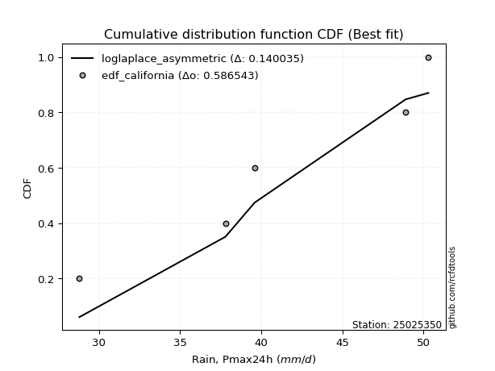</img>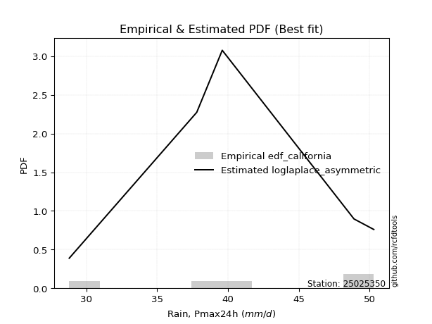</img>

</div>


### 2. Empirical - EDF Hazen (1930)

Hazen method for plotting positions is a formula used to estimate the empirical cumulative probability distribution of flood events or other hydrological data. This formula often results in biased estimations, particularly when extrapolating to extreme events (high return periods).

<div align="center">


$P=(m-0.5)/n$


</div>


**2.1. Empirical values**

<div align="center">

|                | 0                  | 1                  | 2         | 3                 | 4                  |
|:---------------|:-------------------|:-------------------|:----------|:------------------|:-------------------|
| date           | 2019               | 2021               | 2020      | 2017              | 2018               |
| x              | 28.8               | 37.8               | 39.6      | 48.9              | 50.3               |
| m              | 1                  | 2                  | 3         | 4                 | 5                  |
| empirical_dist | edf_hazen          | edf_hazen          | edf_hazen | edf_hazen         | edf_hazen          |
| empirical      | 0.1                | 0.3                | 0.5       | 0.7               | 0.9                |
| empirical_tr   | 1.1111111111111112 | 1.4285714285714286 | 2.0       | 3.333333333333333 | 10.000000000000002 |

</div>


**2.2. Kolmogorov-Smirnov fit test (sorted by Δ)**


<div align="center">

|                | 0                   | 1                   | 2                  | 3                  | 4                   | 5                   | 6                  | 7                   | 8                   | 9                   | 10                  | 11                  | 12                  | 13                  | 14                  | 15                  | 16                 | 17                  | 18                 | 19                 | 20                  | 21                 | 22                  | 23                  | 24                 | 25                  | 26                 | 27                  | 28                  | 29                  | 30                  | 31                  | 32                  | 33                  | 34                  | 35                  | 36                  | 37                  | 38                  | 39                  | 40                  | 41                  | 42                 | 43                 | 44                    | 45                 | 46                  | 47                  | 48                  | 49                  | 50                  | 51                  | 52                  | 53                  | 54                  | 55                 | 56                 | 57                 | 58                  | 59                  | 60                  | 61                  | 62                  | 63                  | 64                  | 65                  | 66                  | 67                 | 68                  | 69                 | 70                  | 71                  | 72                  | 73                  | 74                 | 75                  | 76                  | 77                 | 78                 | 79                  | 80                 | 81                 | 82                  | 83                  | 84                 | 85                 | 86                 | 87                 | 88                 | 89                 |
|:---------------|:--------------------|:--------------------|:-------------------|:-------------------|:--------------------|:--------------------|:-------------------|:--------------------|:--------------------|:--------------------|:--------------------|:--------------------|:--------------------|:--------------------|:--------------------|:--------------------|:-------------------|:--------------------|:-------------------|:-------------------|:--------------------|:-------------------|:--------------------|:--------------------|:-------------------|:--------------------|:-------------------|:--------------------|:--------------------|:--------------------|:--------------------|:--------------------|:--------------------|:--------------------|:--------------------|:--------------------|:--------------------|:--------------------|:--------------------|:--------------------|:--------------------|:--------------------|:-------------------|:-------------------|:----------------------|:-------------------|:--------------------|:--------------------|:--------------------|:--------------------|:--------------------|:--------------------|:--------------------|:--------------------|:--------------------|:-------------------|:-------------------|:-------------------|:--------------------|:--------------------|:--------------------|:--------------------|:--------------------|:--------------------|:--------------------|:--------------------|:--------------------|:-------------------|:--------------------|:-------------------|:--------------------|:--------------------|:--------------------|:--------------------|:-------------------|:--------------------|:--------------------|:-------------------|:-------------------|:--------------------|:-------------------|:-------------------|:--------------------|:--------------------|:-------------------|:-------------------|:-------------------|:-------------------|:-------------------|:-------------------|
| station        | 25025350            | 25025350            | 25025350           | 25025350           | 25025350            | 25025350            | 25025350           | 25025350            | 25025350            | 25025350            | 25025350            | 25025350            | 25025350            | 25025350            | 25025350            | 25025350            | 25025350           | 25025350            | 25025350           | 25025350           | 25025350            | 25025350           | 25025350            | 25025350            | 25025350           | 25025350            | 25025350           | 25025350            | 25025350            | 25025350            | 25025350            | 25025350            | 25025350            | 25025350            | 25025350            | 25025350            | 25025350            | 25025350            | 25025350            | 25025350            | 25025350            | 25025350            | 25025350           | 25025350           | 25025350              | 25025350           | 25025350            | 25025350            | 25025350            | 25025350            | 25025350            | 25025350            | 25025350            | 25025350            | 25025350            | 25025350           | 25025350           | 25025350           | 25025350            | 25025350            | 25025350            | 25025350            | 25025350            | 25025350            | 25025350            | 25025350            | 25025350            | 25025350           | 25025350            | 25025350           | 25025350            | 25025350            | 25025350            | 25025350            | 25025350           | 25025350            | 25025350            | 25025350           | 25025350           | 25025350            | 25025350           | 25025350           | 25025350            | 25025350            | 25025350           | 25025350           | 25025350           | 25025350           | 25025350           | 25025350           |
| empirical_dist | edf_hazen           | edf_hazen           | edf_hazen          | edf_hazen          | edf_hazen           | edf_hazen           | edf_hazen          | edf_hazen           | edf_hazen           | edf_hazen           | edf_hazen           | edf_hazen           | edf_hazen           | edf_hazen           | edf_hazen           | edf_hazen           | edf_hazen          | edf_hazen           | edf_hazen          | edf_hazen          | edf_hazen           | edf_hazen          | edf_hazen           | edf_hazen           | edf_hazen          | edf_hazen           | edf_hazen          | edf_hazen           | edf_hazen           | edf_hazen           | edf_hazen           | edf_hazen           | edf_hazen           | edf_hazen           | edf_hazen           | edf_hazen           | edf_hazen           | edf_hazen           | edf_hazen           | edf_hazen           | edf_hazen           | edf_hazen           | edf_hazen          | edf_hazen          | edf_hazen             | edf_hazen          | edf_hazen           | edf_hazen           | edf_hazen           | edf_hazen           | edf_hazen           | edf_hazen           | edf_hazen           | edf_hazen           | edf_hazen           | edf_hazen          | edf_hazen          | edf_hazen          | edf_hazen           | edf_hazen           | edf_hazen           | edf_hazen           | edf_hazen           | edf_hazen           | edf_hazen           | edf_hazen           | edf_hazen           | edf_hazen          | edf_hazen           | edf_hazen          | edf_hazen           | edf_hazen           | edf_hazen           | edf_hazen           | edf_hazen          | edf_hazen           | edf_hazen           | edf_hazen          | edf_hazen          | edf_hazen           | edf_hazen          | edf_hazen          | edf_hazen           | edf_hazen           | edf_hazen          | edf_hazen          | edf_hazen          | edf_hazen          | edf_hazen          | edf_hazen          |
| p_dist         | logfisk             | loginvgauss         | kstwobign          | logbetaprime       | logrice             | logerlang           | loginvgamma        | lograyleigh         | fisk                | invgauss            | logmaxwell          | loggamma            | loggamma            | logfatiguelife      | logf                | lognct              | logexponnorm       | logcrystalball      | lognorm            | lognorm            | logt                | logalpha           | logpearson3         | loginvweibull       | invgamma           | gamma               | rice               | rayleigh            | maxwell             | halfnorm            | f                   | betaprime           | erlang              | alpha               | t                   | exponnorm           | crystalball         | norm                | nct                 | pearson3            | ncf                 | gompertz            | logweibull_min     | weibull_min        | loglaplace_asymmetric | laplace_asymmetric | loggumbel_r         | loglogistic         | loggumbel_l         | gumbel_r            | halflogistic        | logmoyal            | loghalfnorm         | logistic            | moyal               | loghypsecant       | gumbel_l           | logmielke          | hypsecant           | logkstwobign        | loghalflogistic     | loglaplace          | mielke              | loggenexpon         | laplace             | logloggamma         | wald                | loggibrat          | logwald             | gibrat             | loggompertz         | expon               | genexpon            | logncf              | logexpon           | nakagami            | logtruncnorm        | lognakagami        | truncnorm          | johnsonsu           | logchi2            | pareto             | loglognorm          | logpareto           | logjohnsonsu       | invweibull         | fatiguelife        | chi2               | loggenlogistic     | genlogistic        |
| delta          | 0.11743809535147531 | 0.12448369466505349 | 0.125210882273189  | 0.1265547694454916 | 0.12883764231386952 | 0.12896546733605907 | 0.129867705738565  | 0.13000064202154005 | 0.13001609348893484 | 0.13002319017470154 | 0.13032105241796277 | 0.13039634966410762 | 0.13039634966410762 | 0.13046885225196625 | 0.13141195017364182 | 0.13153132703574788 | 0.1315813549832202 | 0.13158202307319977 | 0.1315820256756539 | 0.1315820256756539 | 0.13158214271114477 | 0.1316741755709816 | 0.13256198787481288 | 0.13466232688246366 | 0.1364908297669125 | 0.13659101220359215 | 0.1366223661953424 | 0.13678874306274835 | 0.13739598715140544 | 0.13748125921283583 | 0.13828741095400854 | 0.13841225858698092 | 0.13874797761004098 | 0.13969615015555836 | 0.13971359113514237 | 0.13971417927771468 | 0.13971528115827525 | 0.13971528438499115 | 0.13971919177376524 | 0.14029997448927545 | 0.14133680988146102 | 0.14319771488446775 | 0.143486660391259  | 0.143576001071558  | 0.14666873226643196   | 0.1474895048046957 | 0.14889972768080006 | 0.15094571489082287 | 0.15403018106737254 | 0.15465682468021247 | 0.15488907996869894 | 0.15532665925081424 | 0.15689388266501153 | 0.15834673472093985 | 0.16045647613242198 | 0.1614060597045146 | 0.1656317157496321 | 0.1677758267597511 | 0.16817422007191574 | 0.16913917794742395 | 0.16921015411190438 | 0.17144628617401358 | 0.17198136086823812 | 0.17273040786865618 | 0.17728235118480562 | 0.18045945190263613 | 0.18473507901245778 | 0.2057536902269923 | 0.20616471738720737 | 0.2088642278597359 | 0.21266934158842338 | 0.21948605195384158 | 0.21966951952048502 | 0.22608810656144462 | 0.2553962099611325 | 0.29588790310397417 | 0.29999664115911046 | 0.2999983891999311 | 0.2999990763052361 | 0.35933067652590445 | 0.3697434575809866 | 0.3769140081808016 | 0.38150453959277725 | 0.38345219892248467 | 0.4648659133922656 | 0.489943894016128  | 0.5288152329847253 | 0.6923594017684829 | 0.7                | 0.7                |
| deltao         | 0.5865427407550001  | 0.5865427407550001  | 0.5865427407550001 | 0.5865427407550001 | 0.5865427407550001  | 0.5865427407550001  | 0.5865427407550001 | 0.5865427407550001  | 0.5865427407550001  | 0.5865427407550001  | 0.5865427407550001  | 0.5865427407550001  | 0.5865427407550001  | 0.5865427407550001  | 0.5865427407550001  | 0.5865427407550001  | 0.5865427407550001 | 0.5865427407550001  | 0.5865427407550001 | 0.5865427407550001 | 0.5865427407550001  | 0.5865427407550001 | 0.5865427407550001  | 0.5865427407550001  | 0.5865427407550001 | 0.5865427407550001  | 0.5865427407550001 | 0.5865427407550001  | 0.5865427407550001  | 0.5865427407550001  | 0.5865427407550001  | 0.5865427407550001  | 0.5865427407550001  | 0.5865427407550001  | 0.5865427407550001  | 0.5865427407550001  | 0.5865427407550001  | 0.5865427407550001  | 0.5865427407550001  | 0.5865427407550001  | 0.5865427407550001  | 0.5865427407550001  | 0.5865427407550001 | 0.5865427407550001 | 0.5865427407550001    | 0.5865427407550001 | 0.5865427407550001  | 0.5865427407550001  | 0.5865427407550001  | 0.5865427407550001  | 0.5865427407550001  | 0.5865427407550001  | 0.5865427407550001  | 0.5865427407550001  | 0.5865427407550001  | 0.5865427407550001 | 0.5865427407550001 | 0.5865427407550001 | 0.5865427407550001  | 0.5865427407550001  | 0.5865427407550001  | 0.5865427407550001  | 0.5865427407550001  | 0.5865427407550001  | 0.5865427407550001  | 0.5865427407550001  | 0.5865427407550001  | 0.5865427407550001 | 0.5865427407550001  | 0.5865427407550001 | 0.5865427407550001  | 0.5865427407550001  | 0.5865427407550001  | 0.5865427407550001  | 0.5865427407550001 | 0.5865427407550001  | 0.5865427407550001  | 0.5865427407550001 | 0.5865427407550001 | 0.5865427407550001  | 0.5865427407550001 | 0.5865427407550001 | 0.5865427407550001  | 0.5865427407550001  | 0.5865427407550001 | 0.5865427407550001 | 0.5865427407550001 | 0.5865427407550001 | 0.5865427407550001 | 0.5865427407550001 |
| eval           | Δo > Δ              | Δo > Δ              | Δo > Δ             | Δo > Δ             | Δo > Δ              | Δo > Δ              | Δo > Δ             | Δo > Δ              | Δo > Δ              | Δo > Δ              | Δo > Δ              | Δo > Δ              | Δo > Δ              | Δo > Δ              | Δo > Δ              | Δo > Δ              | Δo > Δ             | Δo > Δ              | Δo > Δ             | Δo > Δ             | Δo > Δ              | Δo > Δ             | Δo > Δ              | Δo > Δ              | Δo > Δ             | Δo > Δ              | Δo > Δ             | Δo > Δ              | Δo > Δ              | Δo > Δ              | Δo > Δ              | Δo > Δ              | Δo > Δ              | Δo > Δ              | Δo > Δ              | Δo > Δ              | Δo > Δ              | Δo > Δ              | Δo > Δ              | Δo > Δ              | Δo > Δ              | Δo > Δ              | Δo > Δ             | Δo > Δ             | Δo > Δ                | Δo > Δ             | Δo > Δ              | Δo > Δ              | Δo > Δ              | Δo > Δ              | Δo > Δ              | Δo > Δ              | Δo > Δ              | Δo > Δ              | Δo > Δ              | Δo > Δ             | Δo > Δ             | Δo > Δ             | Δo > Δ              | Δo > Δ              | Δo > Δ              | Δo > Δ              | Δo > Δ              | Δo > Δ              | Δo > Δ              | Δo > Δ              | Δo > Δ              | Δo > Δ             | Δo > Δ              | Δo > Δ             | Δo > Δ              | Δo > Δ              | Δo > Δ              | Δo > Δ              | Δo > Δ             | Δo > Δ              | Δo > Δ              | Δo > Δ             | Δo > Δ             | Δo > Δ              | Δo > Δ             | Δo > Δ             | Δo > Δ              | Δo > Δ              | Δo > Δ             | Δo > Δ             | Δo > Δ             | Δo <= Δ            | Δo <= Δ            | Δo <= Δ            |
| fit            | 1                   | 1                   | 1                  | 1                  | 1                   | 1                   | 1                  | 1                   | 1                   | 1                   | 1                   | 1                   | 1                   | 1                   | 1                   | 1                   | 1                  | 1                   | 1                  | 1                  | 1                   | 1                  | 1                   | 1                   | 1                  | 1                   | 1                  | 1                   | 1                   | 1                   | 1                   | 1                   | 1                   | 1                   | 1                   | 1                   | 1                   | 1                   | 1                   | 1                   | 1                   | 1                   | 1                  | 1                  | 1                     | 1                  | 1                   | 1                   | 1                   | 1                   | 1                   | 1                   | 1                   | 1                   | 1                   | 1                  | 1                  | 1                  | 1                   | 1                   | 1                   | 1                   | 1                   | 1                   | 1                   | 1                   | 1                   | 1                  | 1                   | 1                  | 1                   | 1                   | 1                   | 1                   | 1                  | 1                   | 1                   | 1                  | 1                  | 1                   | 1                  | 1                  | 1                   | 1                   | 1                  | 1                  | 1                  | 0                  | 0                  | 0                  |
| n              | 5                   | 5                   | 5                  | 5                  | 5                   | 5                   | 5                  | 5                   | 5                   | 5                   | 5                   | 5                   | 5                   | 5                   | 5                   | 5                   | 5                  | 5                   | 5                  | 5                  | 5                   | 5                  | 5                   | 5                   | 5                  | 5                   | 5                  | 5                   | 5                   | 5                   | 5                   | 5                   | 5                   | 5                   | 5                   | 5                   | 5                   | 5                   | 5                   | 5                   | 5                   | 5                   | 5                  | 5                  | 5                     | 5                  | 5                   | 5                   | 5                   | 5                   | 5                   | 5                   | 5                   | 5                   | 5                   | 5                  | 5                  | 5                  | 5                   | 5                   | 5                   | 5                   | 5                   | 5                   | 5                   | 5                   | 5                   | 5                  | 5                   | 5                  | 5                   | 5                   | 5                   | 5                   | 5                  | 5                   | 5                   | 5                  | 5                  | 5                   | 5                  | 5                  | 5                   | 5                   | 5                  | 5                  | 5                  | 5                  | 5                  | 5                  |
| best_fit       | 1                   | 0                   | 0                  | 0                  | 0                   | 0                   | 0                  | 0                   | 0                   | 0                   | 0                   | 0                   | 0                   | 0                   | 0                   | 0                   | 0                  | 0                   | 0                  | 0                  | 0                   | 0                  | 0                   | 0                   | 0                  | 0                   | 0                  | 0                   | 0                   | 0                   | 0                   | 0                   | 0                   | 0                   | 0                   | 0                   | 0                   | 0                   | 0                   | 0                   | 0                   | 0                   | 0                  | 0                  | 0                     | 0                  | 0                   | 0                   | 0                   | 0                   | 0                   | 0                   | 0                   | 0                   | 0                   | 0                  | 0                  | 0                  | 0                   | 0                   | 0                   | 0                   | 0                   | 0                   | 0                   | 0                   | 0                   | 0                  | 0                   | 0                  | 0                   | 0                   | 0                   | 0                   | 0                  | 0                   | 0                   | 0                  | 0                  | 0                   | 0                  | 0                  | 0                   | 0                   | 0                  | 0                  | 0                  | 0                  | 0                  | 0                  |
| best_fit_sort  | 1                   | 2                   | 3                  | 4                  | 5                   | 6                   | 7                  | 8                   | 9                   | 10                  | 11                  | 12                  | 13                  | 14                  | 15                  | 16                  | 17                 | 18                  | 19                 | 20                 | 21                  | 22                 | 23                  | 24                  | 25                 | 26                  | 27                 | 28                  | 29                  | 30                  | 31                  | 32                  | 33                  | 34                  | 35                  | 36                  | 37                  | 38                  | 39                  | 40                  | 41                  | 42                  | 43                 | 44                 | 45                    | 46                 | 47                  | 48                  | 49                  | 50                  | 51                  | 52                  | 53                  | 54                  | 55                  | 56                 | 57                 | 58                 | 59                  | 60                  | 61                  | 62                  | 63                  | 64                  | 65                  | 66                  | 67                  | 68                 | 69                  | 70                 | 71                  | 72                  | 73                  | 74                  | 75                 | 76                  | 77                  | 78                 | 79                 | 80                  | 81                 | 82                 | 83                  | 84                  | 85                 | 86                 | 87                 | 88                 | 89                 | 90                 |

</div>


<div align="center">

</img>

</div>


**2.3. Best fit**

<div align="center">

|   id |   station | empirical_dist   | p_dist   |    delta |   deltao | eval   |   fit |   n |   best_fit |   best_fit_sort |
|-----:|----------:|:-----------------|:---------|---------:|---------:|:-------|------:|----:|-----------:|----------------:|
|    0 |  25025350 | edf_hazen        | logfisk  | 0.117438 | 0.586543 | Δo > Δ |     1 |   5 |          1 |               1 |

</div>


<div align="center">

</img>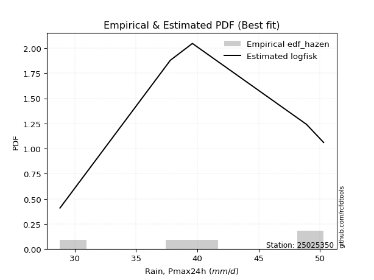</img>

</div>


### 3. Empirical - EDF Weibull (1939)

Weibull plotting position formula is an empirical method used to estimate the non-exceedance probability or plotting position for a set of observed data, is often recommended or widely used in practice, particularly in flood frequency analysis.

<div align="center">


$P=m/(n+1)$


</div>


**3.1. Empirical values**

<div align="center">

|                | 0                   | 1                  | 2           | 3                  | 4                  |
|:---------------|:--------------------|:-------------------|:------------|:-------------------|:-------------------|
| date           | 2019                | 2021               | 2020        | 2017               | 2018               |
| x              | 28.8                | 37.8               | 39.6        | 48.9               | 50.3               |
| m              | 1                   | 2                  | 3           | 4                  | 5                  |
| empirical_dist | edf_weibull         | edf_weibull        | edf_weibull | edf_weibull        | edf_weibull        |
| empirical      | 0.16666666666666666 | 0.3333333333333333 | 0.5         | 0.6666666666666666 | 0.8333333333333334 |
| empirical_tr   | 1.2                 | 1.4999999999999998 | 2.0         | 2.9999999999999996 | 6.000000000000002  |

</div>


**3.2. Kolmogorov-Smirnov fit test (sorted by Δ)**


<div align="center">

|                | 0                  | 1                   | 2                   | 3                   | 4                   | 5                   | 6                   | 7                   | 8                  | 9                  | 10                  | 11                  | 12                  | 13                 | 14                  | 15                  | 16                  | 17                  | 18                 | 19                  | 20                 | 21                  | 22                  | 23                 | 24                  | 25                  | 26                 | 27                  | 28                  | 29                  | 30                  | 31                  | 32                  | 33                  | 34                  | 35                  | 36                 | 37                 | 38                 | 39                 | 40                  | 41                  | 42                  | 43                  | 44                  | 45                  | 46                  | 47                  | 48                  | 49                    | 50                  | 51                 | 52                  | 53                 | 54                  | 55                 | 56                  | 57                 | 58                  | 59                  | 60                  | 61                 | 62                  | 63                  | 64                  | 65                  | 66                 | 67                  | 68                  | 69                  | 70                  | 71                 | 72                  | 73                  | 74                  | 75                  | 76                 | 77                 | 78                 | 79                  | 80                 | 81                 | 82                 | 83                  | 84                 | 85                  | 86                  | 87                 | 88                 | 89                 |
|:---------------|:-------------------|:--------------------|:--------------------|:--------------------|:--------------------|:--------------------|:--------------------|:--------------------|:-------------------|:-------------------|:--------------------|:--------------------|:--------------------|:-------------------|:--------------------|:--------------------|:--------------------|:--------------------|:-------------------|:--------------------|:-------------------|:--------------------|:--------------------|:-------------------|:--------------------|:--------------------|:-------------------|:--------------------|:--------------------|:--------------------|:--------------------|:--------------------|:--------------------|:--------------------|:--------------------|:--------------------|:-------------------|:-------------------|:-------------------|:-------------------|:--------------------|:--------------------|:--------------------|:--------------------|:--------------------|:--------------------|:--------------------|:--------------------|:--------------------|:----------------------|:--------------------|:-------------------|:--------------------|:-------------------|:--------------------|:-------------------|:--------------------|:-------------------|:--------------------|:--------------------|:--------------------|:-------------------|:--------------------|:--------------------|:--------------------|:--------------------|:-------------------|:--------------------|:--------------------|:--------------------|:--------------------|:-------------------|:--------------------|:--------------------|:--------------------|:--------------------|:-------------------|:-------------------|:-------------------|:--------------------|:-------------------|:-------------------|:-------------------|:--------------------|:-------------------|:--------------------|:--------------------|:-------------------|:-------------------|:-------------------|
| station        | 25025350           | 25025350            | 25025350            | 25025350            | 25025350            | 25025350            | 25025350            | 25025350            | 25025350           | 25025350           | 25025350            | 25025350            | 25025350            | 25025350           | 25025350            | 25025350            | 25025350            | 25025350            | 25025350           | 25025350            | 25025350           | 25025350            | 25025350            | 25025350           | 25025350            | 25025350            | 25025350           | 25025350            | 25025350            | 25025350            | 25025350            | 25025350            | 25025350            | 25025350            | 25025350            | 25025350            | 25025350           | 25025350           | 25025350           | 25025350           | 25025350            | 25025350            | 25025350            | 25025350            | 25025350            | 25025350            | 25025350            | 25025350            | 25025350            | 25025350              | 25025350            | 25025350           | 25025350            | 25025350           | 25025350            | 25025350           | 25025350            | 25025350           | 25025350            | 25025350            | 25025350            | 25025350           | 25025350            | 25025350            | 25025350            | 25025350            | 25025350           | 25025350            | 25025350            | 25025350            | 25025350            | 25025350           | 25025350            | 25025350            | 25025350            | 25025350            | 25025350           | 25025350           | 25025350           | 25025350            | 25025350           | 25025350           | 25025350           | 25025350            | 25025350           | 25025350            | 25025350            | 25025350           | 25025350           | 25025350           |
| empirical_dist | edf_weibull        | edf_weibull         | edf_weibull         | edf_weibull         | edf_weibull         | edf_weibull         | edf_weibull         | edf_weibull         | edf_weibull        | edf_weibull        | edf_weibull         | edf_weibull         | edf_weibull         | edf_weibull        | edf_weibull         | edf_weibull         | edf_weibull         | edf_weibull         | edf_weibull        | edf_weibull         | edf_weibull        | edf_weibull         | edf_weibull         | edf_weibull        | edf_weibull         | edf_weibull         | edf_weibull        | edf_weibull         | edf_weibull         | edf_weibull         | edf_weibull         | edf_weibull         | edf_weibull         | edf_weibull         | edf_weibull         | edf_weibull         | edf_weibull        | edf_weibull        | edf_weibull        | edf_weibull        | edf_weibull         | edf_weibull         | edf_weibull         | edf_weibull         | edf_weibull         | edf_weibull         | edf_weibull         | edf_weibull         | edf_weibull         | edf_weibull           | edf_weibull         | edf_weibull        | edf_weibull         | edf_weibull        | edf_weibull         | edf_weibull        | edf_weibull         | edf_weibull        | edf_weibull         | edf_weibull         | edf_weibull         | edf_weibull        | edf_weibull         | edf_weibull         | edf_weibull         | edf_weibull         | edf_weibull        | edf_weibull         | edf_weibull         | edf_weibull         | edf_weibull         | edf_weibull        | edf_weibull         | edf_weibull         | edf_weibull         | edf_weibull         | edf_weibull        | edf_weibull        | edf_weibull        | edf_weibull         | edf_weibull        | edf_weibull        | edf_weibull        | edf_weibull         | edf_weibull        | edf_weibull         | edf_weibull         | edf_weibull        | edf_weibull        | edf_weibull        |
| p_dist         | loginvweibull      | logkstwobign        | logfisk             | loginvgauss         | kstwobign           | logncf              | logbetaprime        | logrice             | logerlang          | loginvgamma        | lograyleigh         | fisk                | invgauss            | logmaxwell         | loggamma            | loggamma            | logfatiguelife      | logf                | lognct             | logexponnorm        | logcrystalball     | lognorm             | lognorm             | logt               | loggenexpon         | logalpha            | logpearson3        | loghalfnorm         | invgamma            | gamma               | rice                | rayleigh            | maxwell             | halfnorm            | f                   | betaprime           | erlang             | alpha              | t                  | exponnorm          | crystalball         | norm                | nct                 | pearson3            | ncf                 | gompertz            | logweibull_min      | weibull_min         | loggompertz         | loglaplace_asymmetric | laplace_asymmetric  | loggumbel_r        | loghalflogistic     | loglogistic        | expon               | genexpon           | loggumbel_l         | gumbel_r           | halflogistic        | logmoyal            | logistic            | moyal              | loghypsecant        | gumbel_l            | logmielke           | hypsecant           | loglaplace         | mielke              | laplace             | logloggamma         | logwald             | wald               | logexpon            | loggibrat           | gibrat              | logchi2             | johnsonsu          | nakagami           | logtruncnorm       | lognakagami         | truncnorm          | pareto             | loglognorm         | logpareto           | invweibull         | logjohnsonsu        | fatiguelife         | chi2               | loggenlogistic     | genlogistic        |
| delta          | 0.1188682887871286 | 0.14430259751616448 | 0.15077142868480864 | 0.15781702799838682 | 0.15854421560652232 | 0.15942143989477797 | 0.15988810277882493 | 0.16217097564720284 | 0.1622988006693924 | 0.1632010390718983 | 0.16333397535487337 | 0.16334942682226816 | 0.16335652350803487 | 0.1636543857512961 | 0.16372968299744095 | 0.16372968299744095 | 0.16380218558529958 | 0.16474528350697515 | 0.1648646603690812 | 0.16491468831655354 | 0.1649153564065331 | 0.16491535900898724 | 0.16491535900898724 | 0.1649154760444781 | 0.16498661365288236 | 0.16500750890431493 | 0.1658953212081462 | 0.16666666666666666 | 0.16982416310024584 | 0.16992434553692548 | 0.16995569952867573 | 0.17012207639608168 | 0.17072932048473877 | 0.17081459254616915 | 0.17162074428734186 | 0.17174559192031424 | 0.1720813109433743 | 0.1730294834888917 | 0.1730469244684757 | 0.173047512611048  | 0.17304861449160858 | 0.17304861771832447 | 0.17305252510709856 | 0.17363330782260877 | 0.17467014321479435 | 0.17653104821780108 | 0.17681999372459234 | 0.17690933440489132 | 0.17933600825509005 | 0.18000206559976528   | 0.18082283813802902 | 0.1822330610141334 | 0.18297623608493985 | 0.1842790482241562 | 0.18615271862050825 | 0.1863361861871517 | 0.18736351440070587 | 0.1879901580135458 | 0.18822241330203227 | 0.18865999258414756 | 0.19168006805427318 | 0.1937898094657553 | 0.19473939303784793 | 0.19896504908296542 | 0.20110916009308444 | 0.20150755340524906 | 0.2047796195073469 | 0.20531469420157145 | 0.21061568451813895 | 0.21379278523596945 | 0.21438163700758472 | 0.2180684123457911 | 0.22206287662779917 | 0.23908702356032563 | 0.24219756119306923 | 0.30307679091431994 | 0.3259973431925711 | 0.3292212364373075 | 0.3333299744924438 | 0.33333172253326443 | 0.3333324096385694 | 0.3435806748474683 | 0.3481712062594439 | 0.35011886558915134 | 0.4232772273494613 | 0.43153258005893225 | 0.49548189965139205 | 0.6590260684351497 | 0.6666666666666666 | 0.6666666666666666 |
| deltao         | 0.5865427407550001 | 0.5865427407550001  | 0.5865427407550001  | 0.5865427407550001  | 0.5865427407550001  | 0.5865427407550001  | 0.5865427407550001  | 0.5865427407550001  | 0.5865427407550001 | 0.5865427407550001 | 0.5865427407550001  | 0.5865427407550001  | 0.5865427407550001  | 0.5865427407550001 | 0.5865427407550001  | 0.5865427407550001  | 0.5865427407550001  | 0.5865427407550001  | 0.5865427407550001 | 0.5865427407550001  | 0.5865427407550001 | 0.5865427407550001  | 0.5865427407550001  | 0.5865427407550001 | 0.5865427407550001  | 0.5865427407550001  | 0.5865427407550001 | 0.5865427407550001  | 0.5865427407550001  | 0.5865427407550001  | 0.5865427407550001  | 0.5865427407550001  | 0.5865427407550001  | 0.5865427407550001  | 0.5865427407550001  | 0.5865427407550001  | 0.5865427407550001 | 0.5865427407550001 | 0.5865427407550001 | 0.5865427407550001 | 0.5865427407550001  | 0.5865427407550001  | 0.5865427407550001  | 0.5865427407550001  | 0.5865427407550001  | 0.5865427407550001  | 0.5865427407550001  | 0.5865427407550001  | 0.5865427407550001  | 0.5865427407550001    | 0.5865427407550001  | 0.5865427407550001 | 0.5865427407550001  | 0.5865427407550001 | 0.5865427407550001  | 0.5865427407550001 | 0.5865427407550001  | 0.5865427407550001 | 0.5865427407550001  | 0.5865427407550001  | 0.5865427407550001  | 0.5865427407550001 | 0.5865427407550001  | 0.5865427407550001  | 0.5865427407550001  | 0.5865427407550001  | 0.5865427407550001 | 0.5865427407550001  | 0.5865427407550001  | 0.5865427407550001  | 0.5865427407550001  | 0.5865427407550001 | 0.5865427407550001  | 0.5865427407550001  | 0.5865427407550001  | 0.5865427407550001  | 0.5865427407550001 | 0.5865427407550001 | 0.5865427407550001 | 0.5865427407550001  | 0.5865427407550001 | 0.5865427407550001 | 0.5865427407550001 | 0.5865427407550001  | 0.5865427407550001 | 0.5865427407550001  | 0.5865427407550001  | 0.5865427407550001 | 0.5865427407550001 | 0.5865427407550001 |
| eval           | Δo > Δ             | Δo > Δ              | Δo > Δ              | Δo > Δ              | Δo > Δ              | Δo > Δ              | Δo > Δ              | Δo > Δ              | Δo > Δ             | Δo > Δ             | Δo > Δ              | Δo > Δ              | Δo > Δ              | Δo > Δ             | Δo > Δ              | Δo > Δ              | Δo > Δ              | Δo > Δ              | Δo > Δ             | Δo > Δ              | Δo > Δ             | Δo > Δ              | Δo > Δ              | Δo > Δ             | Δo > Δ              | Δo > Δ              | Δo > Δ             | Δo > Δ              | Δo > Δ              | Δo > Δ              | Δo > Δ              | Δo > Δ              | Δo > Δ              | Δo > Δ              | Δo > Δ              | Δo > Δ              | Δo > Δ             | Δo > Δ             | Δo > Δ             | Δo > Δ             | Δo > Δ              | Δo > Δ              | Δo > Δ              | Δo > Δ              | Δo > Δ              | Δo > Δ              | Δo > Δ              | Δo > Δ              | Δo > Δ              | Δo > Δ                | Δo > Δ              | Δo > Δ             | Δo > Δ              | Δo > Δ             | Δo > Δ              | Δo > Δ             | Δo > Δ              | Δo > Δ             | Δo > Δ              | Δo > Δ              | Δo > Δ              | Δo > Δ             | Δo > Δ              | Δo > Δ              | Δo > Δ              | Δo > Δ              | Δo > Δ             | Δo > Δ              | Δo > Δ              | Δo > Δ              | Δo > Δ              | Δo > Δ             | Δo > Δ              | Δo > Δ              | Δo > Δ              | Δo > Δ              | Δo > Δ             | Δo > Δ             | Δo > Δ             | Δo > Δ              | Δo > Δ             | Δo > Δ             | Δo > Δ             | Δo > Δ              | Δo > Δ             | Δo > Δ              | Δo > Δ              | Δo <= Δ            | Δo <= Δ            | Δo <= Δ            |
| fit            | 1                  | 1                   | 1                   | 1                   | 1                   | 1                   | 1                   | 1                   | 1                  | 1                  | 1                   | 1                   | 1                   | 1                  | 1                   | 1                   | 1                   | 1                   | 1                  | 1                   | 1                  | 1                   | 1                   | 1                  | 1                   | 1                   | 1                  | 1                   | 1                   | 1                   | 1                   | 1                   | 1                   | 1                   | 1                   | 1                   | 1                  | 1                  | 1                  | 1                  | 1                   | 1                   | 1                   | 1                   | 1                   | 1                   | 1                   | 1                   | 1                   | 1                     | 1                   | 1                  | 1                   | 1                  | 1                   | 1                  | 1                   | 1                  | 1                   | 1                   | 1                   | 1                  | 1                   | 1                   | 1                   | 1                   | 1                  | 1                   | 1                   | 1                   | 1                   | 1                  | 1                   | 1                   | 1                   | 1                   | 1                  | 1                  | 1                  | 1                   | 1                  | 1                  | 1                  | 1                   | 1                  | 1                   | 1                   | 0                  | 0                  | 0                  |
| n              | 5                  | 5                   | 5                   | 5                   | 5                   | 5                   | 5                   | 5                   | 5                  | 5                  | 5                   | 5                   | 5                   | 5                  | 5                   | 5                   | 5                   | 5                   | 5                  | 5                   | 5                  | 5                   | 5                   | 5                  | 5                   | 5                   | 5                  | 5                   | 5                   | 5                   | 5                   | 5                   | 5                   | 5                   | 5                   | 5                   | 5                  | 5                  | 5                  | 5                  | 5                   | 5                   | 5                   | 5                   | 5                   | 5                   | 5                   | 5                   | 5                   | 5                     | 5                   | 5                  | 5                   | 5                  | 5                   | 5                  | 5                   | 5                  | 5                   | 5                   | 5                   | 5                  | 5                   | 5                   | 5                   | 5                   | 5                  | 5                   | 5                   | 5                   | 5                   | 5                  | 5                   | 5                   | 5                   | 5                   | 5                  | 5                  | 5                  | 5                   | 5                  | 5                  | 5                  | 5                   | 5                  | 5                   | 5                   | 5                  | 5                  | 5                  |
| best_fit       | 1                  | 0                   | 0                   | 0                   | 0                   | 0                   | 0                   | 0                   | 0                  | 0                  | 0                   | 0                   | 0                   | 0                  | 0                   | 0                   | 0                   | 0                   | 0                  | 0                   | 0                  | 0                   | 0                   | 0                  | 0                   | 0                   | 0                  | 0                   | 0                   | 0                   | 0                   | 0                   | 0                   | 0                   | 0                   | 0                   | 0                  | 0                  | 0                  | 0                  | 0                   | 0                   | 0                   | 0                   | 0                   | 0                   | 0                   | 0                   | 0                   | 0                     | 0                   | 0                  | 0                   | 0                  | 0                   | 0                  | 0                   | 0                  | 0                   | 0                   | 0                   | 0                  | 0                   | 0                   | 0                   | 0                   | 0                  | 0                   | 0                   | 0                   | 0                   | 0                  | 0                   | 0                   | 0                   | 0                   | 0                  | 0                  | 0                  | 0                   | 0                  | 0                  | 0                  | 0                   | 0                  | 0                   | 0                   | 0                  | 0                  | 0                  |
| best_fit_sort  | 1                  | 2                   | 3                   | 4                   | 5                   | 6                   | 7                   | 8                   | 9                  | 10                 | 11                  | 12                  | 13                  | 14                 | 15                  | 16                  | 17                  | 18                  | 19                 | 20                  | 21                 | 22                  | 23                  | 24                 | 25                  | 26                  | 27                 | 28                  | 29                  | 30                  | 31                  | 32                  | 33                  | 34                  | 35                  | 36                  | 37                 | 38                 | 39                 | 40                 | 41                  | 42                  | 43                  | 44                  | 45                  | 46                  | 47                  | 48                  | 49                  | 50                    | 51                  | 52                 | 53                  | 54                 | 55                  | 56                 | 57                  | 58                 | 59                  | 60                  | 61                  | 62                 | 63                  | 64                  | 65                  | 66                  | 67                 | 68                  | 69                  | 70                  | 71                  | 72                 | 73                  | 74                  | 75                  | 76                  | 77                 | 78                 | 79                 | 80                  | 81                 | 82                 | 83                 | 84                  | 85                 | 86                  | 87                  | 88                 | 89                 | 90                 |

</div>


<div align="center">

</img>

</div>


**3.3. Best fit**

<div align="center">

|   id |   station | empirical_dist   | p_dist        |    delta |   deltao | eval   |   fit |   n |   best_fit |   best_fit_sort |
|-----:|----------:|:-----------------|:--------------|---------:|---------:|:-------|------:|----:|-----------:|----------------:|
|    0 |  25025350 | edf_weibull      | loginvweibull | 0.118868 | 0.586543 | Δo > Δ |     1 |   5 |          1 |               1 |

</div>


<div align="center">

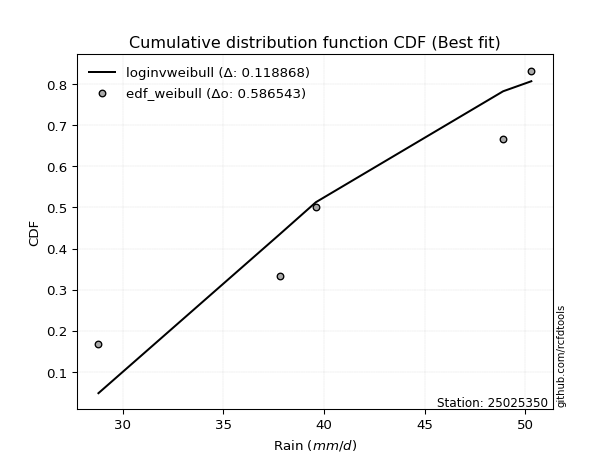</img>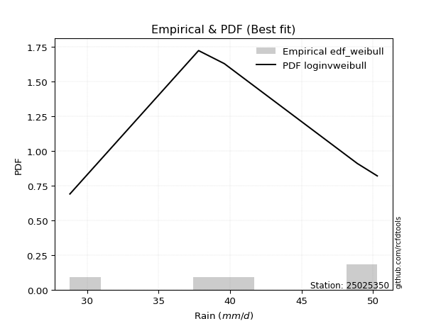</img>

</div>


### 4. Empirical - EDF Beard (1943)

The Beard formula (or Beard´s plotting position formula) in hydrology is used to estimate the empirical non-exceedance probability _(P)_ of a flood event (or other extreme hydrological data point) within a given dataset.

<div align="center">


$P=(m-0.31)/(n+0.38)$


</div>


**4.1. Empirical values**

<div align="center">

|                | 0                   | 1                  | 2         | 3                  | 4                  |
|:---------------|:--------------------|:-------------------|:----------|:-------------------|:-------------------|
| date           | 2019                | 2021               | 2020      | 2017               | 2018               |
| x              | 28.8                | 37.8               | 39.6      | 48.9               | 50.3               |
| m              | 1                   | 2                  | 3         | 4                  | 5                  |
| empirical_dist | edf_beard           | edf_beard          | edf_beard | edf_beard          | edf_beard          |
| empirical      | 0.12825278810408922 | 0.3141263940520446 | 0.5       | 0.6858736059479554 | 0.8717472118959109 |
| empirical_tr   | 1.1471215351812367  | 1.4579945799457996 | 2.0       | 3.183431952662722  | 7.797101449275368  |

</div>


**4.2. Kolmogorov-Smirnov fit test (sorted by Δ)**


<div align="center">

|                | 0                   | 1                   | 2                  | 3                   | 4                   | 5                   | 6                  | 7                  | 8                   | 9                   | 10                  | 11                 | 12                  | 13                  | 14                  | 15                  | 16                 | 17                 | 18                  | 19                 | 20                  | 21                  | 22                 | 23                  | 24                 | 25                  | 26                  | 27                  | 28                  | 29                  | 30                  | 31                  | 32                  | 33                 | 34                  | 35                 | 36                 | 37                  | 38                  | 39                  | 40                  | 41                 | 42                  | 43                  | 44                  | 45                 | 46                  | 47                    | 48                  | 49                 | 50                  | 51                 | 52                  | 53                 | 54                  | 55                  | 56                  | 57                 | 58                  | 59                 | 60                  | 61                  | 62                 | 63                  | 64                  | 65                  | 66                  | 67                  | 68                  | 69                 | 70                  | 71                 | 72                  | 73                  | 74                  | 75                 | 76                 | 77                  | 78                 | 79                  | 80                 | 81                 | 82                 | 83                  | 84                  | 85                 | 86                 | 87                 | 88                 | 89                 |
|:---------------|:--------------------|:--------------------|:-------------------|:--------------------|:--------------------|:--------------------|:-------------------|:-------------------|:--------------------|:--------------------|:--------------------|:-------------------|:--------------------|:--------------------|:--------------------|:--------------------|:-------------------|:-------------------|:--------------------|:-------------------|:--------------------|:--------------------|:-------------------|:--------------------|:-------------------|:--------------------|:--------------------|:--------------------|:--------------------|:--------------------|:--------------------|:--------------------|:--------------------|:-------------------|:--------------------|:-------------------|:-------------------|:--------------------|:--------------------|:--------------------|:--------------------|:-------------------|:--------------------|:--------------------|:--------------------|:-------------------|:--------------------|:----------------------|:--------------------|:-------------------|:--------------------|:-------------------|:--------------------|:-------------------|:--------------------|:--------------------|:--------------------|:-------------------|:--------------------|:-------------------|:--------------------|:--------------------|:-------------------|:--------------------|:--------------------|:--------------------|:--------------------|:--------------------|:--------------------|:-------------------|:--------------------|:-------------------|:--------------------|:--------------------|:--------------------|:-------------------|:-------------------|:--------------------|:-------------------|:--------------------|:-------------------|:-------------------|:-------------------|:--------------------|:--------------------|:-------------------|:-------------------|:-------------------|:-------------------|:-------------------|
| station        | 25025350            | 25025350            | 25025350           | 25025350            | 25025350            | 25025350            | 25025350           | 25025350           | 25025350            | 25025350            | 25025350            | 25025350           | 25025350            | 25025350            | 25025350            | 25025350            | 25025350           | 25025350           | 25025350            | 25025350           | 25025350            | 25025350            | 25025350           | 25025350            | 25025350           | 25025350            | 25025350            | 25025350            | 25025350            | 25025350            | 25025350            | 25025350            | 25025350            | 25025350           | 25025350            | 25025350           | 25025350           | 25025350            | 25025350            | 25025350            | 25025350            | 25025350           | 25025350            | 25025350            | 25025350            | 25025350           | 25025350            | 25025350              | 25025350            | 25025350           | 25025350            | 25025350           | 25025350            | 25025350           | 25025350            | 25025350            | 25025350            | 25025350           | 25025350            | 25025350           | 25025350            | 25025350            | 25025350           | 25025350            | 25025350            | 25025350            | 25025350            | 25025350            | 25025350            | 25025350           | 25025350            | 25025350           | 25025350            | 25025350            | 25025350            | 25025350           | 25025350           | 25025350            | 25025350           | 25025350            | 25025350           | 25025350           | 25025350           | 25025350            | 25025350            | 25025350           | 25025350           | 25025350           | 25025350           | 25025350           |
| empirical_dist | edf_beard           | edf_beard           | edf_beard          | edf_beard           | edf_beard           | edf_beard           | edf_beard          | edf_beard          | edf_beard           | edf_beard           | edf_beard           | edf_beard          | edf_beard           | edf_beard           | edf_beard           | edf_beard           | edf_beard          | edf_beard          | edf_beard           | edf_beard          | edf_beard           | edf_beard           | edf_beard          | edf_beard           | edf_beard          | edf_beard           | edf_beard           | edf_beard           | edf_beard           | edf_beard           | edf_beard           | edf_beard           | edf_beard           | edf_beard          | edf_beard           | edf_beard          | edf_beard          | edf_beard           | edf_beard           | edf_beard           | edf_beard           | edf_beard          | edf_beard           | edf_beard           | edf_beard           | edf_beard          | edf_beard           | edf_beard             | edf_beard           | edf_beard          | edf_beard           | edf_beard          | edf_beard           | edf_beard          | edf_beard           | edf_beard           | edf_beard           | edf_beard          | edf_beard           | edf_beard          | edf_beard           | edf_beard           | edf_beard          | edf_beard           | edf_beard           | edf_beard           | edf_beard           | edf_beard           | edf_beard           | edf_beard          | edf_beard           | edf_beard          | edf_beard           | edf_beard           | edf_beard           | edf_beard          | edf_beard          | edf_beard           | edf_beard          | edf_beard           | edf_beard          | edf_beard          | edf_beard          | edf_beard           | edf_beard           | edf_beard          | edf_beard          | edf_beard          | edf_beard          | edf_beard          |
| p_dist         | loginvweibull       | logfisk             | loginvgauss        | kstwobign           | logbetaprime        | logrice             | logerlang          | loginvgamma        | lograyleigh         | fisk                | invgauss            | logmaxwell         | loggamma            | loggamma            | logfatiguelife      | logf                | loghalfnorm        | lognct             | logexponnorm        | logcrystalball     | lognorm             | lognorm             | logt               | logalpha            | logpearson3        | invgamma            | gamma               | rice                | rayleigh            | maxwell             | halfnorm            | f                   | betaprime           | erlang             | alpha               | t                  | exponnorm          | crystalball         | norm                | nct                 | pearson3            | logkstwobign       | ncf                 | gompertz            | logweibull_min      | weibull_min        | loggenexpon         | loglaplace_asymmetric | laplace_asymmetric  | loggumbel_r        | loghalflogistic     | loglogistic        | loggumbel_l         | gumbel_r           | halflogistic        | logmoyal            | logistic            | moyal              | loghypsecant        | gumbel_l           | logmielke           | hypsecant           | loglaplace         | mielke              | laplace             | logloggamma         | logwald             | logncf              | loggompertz         | wald               | expon               | genexpon           | loggibrat           | gibrat              | logexpon            | nakagami           | logtruncnorm       | lognakagami         | truncnorm          | logchi2             | johnsonsu          | pareto             | loglognorm         | logpareto           | logjohnsonsu        | invweibull         | fatiguelife        | chi2               | loggenlogistic     | genlogistic        |
| delta          | 0.12053593283041902 | 0.13156448940351984 | 0.138610088717098  | 0.13933727632523352 | 0.14068116349753612 | 0.14296403636591404 | 0.1430918613881036 | 0.1439940997906095 | 0.14412703607358457 | 0.14414248754097936 | 0.14414958422674606 | 0.1444474464700073 | 0.14452274371615215 | 0.14452274371615215 | 0.14459524630401077 | 0.14553834422568634 | 0.1455882256835893 | 0.1456577210877924 | 0.14570774903526473 | 0.1457084171252443 | 0.14570841972769843 | 0.14570841972769843 | 0.1457085367631893 | 0.14580056962302612 | 0.1466883819268574 | 0.15061722381895704 | 0.15071740625563668 | 0.15074876024738693 | 0.15091513711479287 | 0.15152238120344996 | 0.15160765326488035 | 0.15241380500605306 | 0.15253865263902544 | 0.1528743716620855 | 0.15382254420760288 | 0.1538399851871869 | 0.1538405733297592 | 0.15384167521031977 | 0.15384167843703567 | 0.15384558582580976 | 0.15442636854131997 | 0.1550127838953793 | 0.15546320393350554 | 0.15732410893651227 | 0.15761305444330354 | 0.1577023951236025 | 0.15860401381661154 | 0.16079512631847648   | 0.16161589885674021 | 0.1630261217328446 | 0.16376929680365104 | 0.1650721089428674 | 0.16815657511941706 | 0.168783218732257  | 0.16901547402074346 | 0.16945305330285876 | 0.17247312877298437 | 0.1745828701844665 | 0.17553245375655913 | 0.1797581098016766 | 0.18190222081179563 | 0.18230061412396026 | 0.1855726802260581 | 0.18610775492028264 | 0.19140874523685014 | 0.19458584595468065 | 0.19517469772629592 | 0.19783531845735547 | 0.19854294753637874 | 0.1988614730645023 | 0.20535965790179694 | 0.2055431254684404 | 0.21988008427903682 | 0.22299062191178043 | 0.24126981590908786 | 0.3100142971560188 | 0.3141230352111551 | 0.31412478325197574 | 0.3141254703572807 | 0.34149066947689743 | 0.3452042824738599 | 0.362787614128757  | 0.3673781455407326 | 0.36932580487044003 | 0.45073951934022105 | 0.4616911059120388 | 0.5146888389326807 | 0.6782330077164382 | 0.6858736059479554 | 0.6858736059479554 |
| deltao         | 0.5865427407550001  | 0.5865427407550001  | 0.5865427407550001 | 0.5865427407550001  | 0.5865427407550001  | 0.5865427407550001  | 0.5865427407550001 | 0.5865427407550001 | 0.5865427407550001  | 0.5865427407550001  | 0.5865427407550001  | 0.5865427407550001 | 0.5865427407550001  | 0.5865427407550001  | 0.5865427407550001  | 0.5865427407550001  | 0.5865427407550001 | 0.5865427407550001 | 0.5865427407550001  | 0.5865427407550001 | 0.5865427407550001  | 0.5865427407550001  | 0.5865427407550001 | 0.5865427407550001  | 0.5865427407550001 | 0.5865427407550001  | 0.5865427407550001  | 0.5865427407550001  | 0.5865427407550001  | 0.5865427407550001  | 0.5865427407550001  | 0.5865427407550001  | 0.5865427407550001  | 0.5865427407550001 | 0.5865427407550001  | 0.5865427407550001 | 0.5865427407550001 | 0.5865427407550001  | 0.5865427407550001  | 0.5865427407550001  | 0.5865427407550001  | 0.5865427407550001 | 0.5865427407550001  | 0.5865427407550001  | 0.5865427407550001  | 0.5865427407550001 | 0.5865427407550001  | 0.5865427407550001    | 0.5865427407550001  | 0.5865427407550001 | 0.5865427407550001  | 0.5865427407550001 | 0.5865427407550001  | 0.5865427407550001 | 0.5865427407550001  | 0.5865427407550001  | 0.5865427407550001  | 0.5865427407550001 | 0.5865427407550001  | 0.5865427407550001 | 0.5865427407550001  | 0.5865427407550001  | 0.5865427407550001 | 0.5865427407550001  | 0.5865427407550001  | 0.5865427407550001  | 0.5865427407550001  | 0.5865427407550001  | 0.5865427407550001  | 0.5865427407550001 | 0.5865427407550001  | 0.5865427407550001 | 0.5865427407550001  | 0.5865427407550001  | 0.5865427407550001  | 0.5865427407550001 | 0.5865427407550001 | 0.5865427407550001  | 0.5865427407550001 | 0.5865427407550001  | 0.5865427407550001 | 0.5865427407550001 | 0.5865427407550001 | 0.5865427407550001  | 0.5865427407550001  | 0.5865427407550001 | 0.5865427407550001 | 0.5865427407550001 | 0.5865427407550001 | 0.5865427407550001 |
| eval           | Δo > Δ              | Δo > Δ              | Δo > Δ             | Δo > Δ              | Δo > Δ              | Δo > Δ              | Δo > Δ             | Δo > Δ             | Δo > Δ              | Δo > Δ              | Δo > Δ              | Δo > Δ             | Δo > Δ              | Δo > Δ              | Δo > Δ              | Δo > Δ              | Δo > Δ             | Δo > Δ             | Δo > Δ              | Δo > Δ             | Δo > Δ              | Δo > Δ              | Δo > Δ             | Δo > Δ              | Δo > Δ             | Δo > Δ              | Δo > Δ              | Δo > Δ              | Δo > Δ              | Δo > Δ              | Δo > Δ              | Δo > Δ              | Δo > Δ              | Δo > Δ             | Δo > Δ              | Δo > Δ             | Δo > Δ             | Δo > Δ              | Δo > Δ              | Δo > Δ              | Δo > Δ              | Δo > Δ             | Δo > Δ              | Δo > Δ              | Δo > Δ              | Δo > Δ             | Δo > Δ              | Δo > Δ                | Δo > Δ              | Δo > Δ             | Δo > Δ              | Δo > Δ             | Δo > Δ              | Δo > Δ             | Δo > Δ              | Δo > Δ              | Δo > Δ              | Δo > Δ             | Δo > Δ              | Δo > Δ             | Δo > Δ              | Δo > Δ              | Δo > Δ             | Δo > Δ              | Δo > Δ              | Δo > Δ              | Δo > Δ              | Δo > Δ              | Δo > Δ              | Δo > Δ             | Δo > Δ              | Δo > Δ             | Δo > Δ              | Δo > Δ              | Δo > Δ              | Δo > Δ             | Δo > Δ             | Δo > Δ              | Δo > Δ             | Δo > Δ              | Δo > Δ             | Δo > Δ             | Δo > Δ             | Δo > Δ              | Δo > Δ              | Δo > Δ             | Δo > Δ             | Δo <= Δ            | Δo <= Δ            | Δo <= Δ            |
| fit            | 1                   | 1                   | 1                  | 1                   | 1                   | 1                   | 1                  | 1                  | 1                   | 1                   | 1                   | 1                  | 1                   | 1                   | 1                   | 1                   | 1                  | 1                  | 1                   | 1                  | 1                   | 1                   | 1                  | 1                   | 1                  | 1                   | 1                   | 1                   | 1                   | 1                   | 1                   | 1                   | 1                   | 1                  | 1                   | 1                  | 1                  | 1                   | 1                   | 1                   | 1                   | 1                  | 1                   | 1                   | 1                   | 1                  | 1                   | 1                     | 1                   | 1                  | 1                   | 1                  | 1                   | 1                  | 1                   | 1                   | 1                   | 1                  | 1                   | 1                  | 1                   | 1                   | 1                  | 1                   | 1                   | 1                   | 1                   | 1                   | 1                   | 1                  | 1                   | 1                  | 1                   | 1                   | 1                   | 1                  | 1                  | 1                   | 1                  | 1                   | 1                  | 1                  | 1                  | 1                   | 1                   | 1                  | 1                  | 0                  | 0                  | 0                  |
| n              | 5                   | 5                   | 5                  | 5                   | 5                   | 5                   | 5                  | 5                  | 5                   | 5                   | 5                   | 5                  | 5                   | 5                   | 5                   | 5                   | 5                  | 5                  | 5                   | 5                  | 5                   | 5                   | 5                  | 5                   | 5                  | 5                   | 5                   | 5                   | 5                   | 5                   | 5                   | 5                   | 5                   | 5                  | 5                   | 5                  | 5                  | 5                   | 5                   | 5                   | 5                   | 5                  | 5                   | 5                   | 5                   | 5                  | 5                   | 5                     | 5                   | 5                  | 5                   | 5                  | 5                   | 5                  | 5                   | 5                   | 5                   | 5                  | 5                   | 5                  | 5                   | 5                   | 5                  | 5                   | 5                   | 5                   | 5                   | 5                   | 5                   | 5                  | 5                   | 5                  | 5                   | 5                   | 5                   | 5                  | 5                  | 5                   | 5                  | 5                   | 5                  | 5                  | 5                  | 5                   | 5                   | 5                  | 5                  | 5                  | 5                  | 5                  |
| best_fit       | 1                   | 0                   | 0                  | 0                   | 0                   | 0                   | 0                  | 0                  | 0                   | 0                   | 0                   | 0                  | 0                   | 0                   | 0                   | 0                   | 0                  | 0                  | 0                   | 0                  | 0                   | 0                   | 0                  | 0                   | 0                  | 0                   | 0                   | 0                   | 0                   | 0                   | 0                   | 0                   | 0                   | 0                  | 0                   | 0                  | 0                  | 0                   | 0                   | 0                   | 0                   | 0                  | 0                   | 0                   | 0                   | 0                  | 0                   | 0                     | 0                   | 0                  | 0                   | 0                  | 0                   | 0                  | 0                   | 0                   | 0                   | 0                  | 0                   | 0                  | 0                   | 0                   | 0                  | 0                   | 0                   | 0                   | 0                   | 0                   | 0                   | 0                  | 0                   | 0                  | 0                   | 0                   | 0                   | 0                  | 0                  | 0                   | 0                  | 0                   | 0                  | 0                  | 0                  | 0                   | 0                   | 0                  | 0                  | 0                  | 0                  | 0                  |
| best_fit_sort  | 1                   | 2                   | 3                  | 4                   | 5                   | 6                   | 7                  | 8                  | 9                   | 10                  | 11                  | 12                 | 13                  | 14                  | 15                  | 16                  | 17                 | 18                 | 19                  | 20                 | 21                  | 22                  | 23                 | 24                  | 25                 | 26                  | 27                  | 28                  | 29                  | 30                  | 31                  | 32                  | 33                  | 34                 | 35                  | 36                 | 37                 | 38                  | 39                  | 40                  | 41                  | 42                 | 43                  | 44                  | 45                  | 46                 | 47                  | 48                    | 49                  | 50                 | 51                  | 52                 | 53                  | 54                 | 55                  | 56                  | 57                  | 58                 | 59                  | 60                 | 61                  | 62                  | 63                 | 64                  | 65                  | 66                  | 67                  | 68                  | 69                  | 70                 | 71                  | 72                 | 73                  | 74                  | 75                  | 76                 | 77                 | 78                  | 79                 | 80                  | 81                 | 82                 | 83                 | 84                  | 85                  | 86                 | 87                 | 88                 | 89                 | 90                 |

</div>


<div align="center">

</img>

</div>


**4.3. Best fit**

<div align="center">

|   id |   station | empirical_dist   | p_dist        |    delta |   deltao | eval   |   fit |   n |   best_fit |   best_fit_sort |
|-----:|----------:|:-----------------|:--------------|---------:|---------:|:-------|------:|----:|-----------:|----------------:|
|    0 |  25025350 | edf_beard        | loginvweibull | 0.120536 | 0.586543 | Δo > Δ |     1 |   5 |          1 |               1 |

</div>


<div align="center">

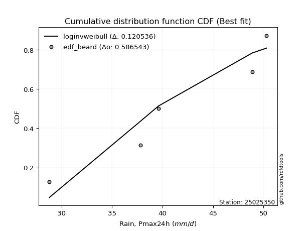</img></img>

</div>


### 5. Empirical - EDF Chegodayev (1955)

The Chegodayev formula is an empirical plotting position formula used in hydrological frequency analysis to estimate the exceedance probability or return period of a specific event from a set of observed data. It is primarily used for plotting observed data points on probability paper to fit a theoretical distribution, particularly for analyzing extreme events like maximum flood flows or rainfall intensities. The constant _b_ value in the generalized plotting position formula is 0.3.

<div align="center">


$P=(m-b)/(n+1-2b)$


</div>


**5.1. Empirical values**

<div align="center">

|                | 0                   | 1                   | 2              | 3                  | 4                  |
|:---------------|:--------------------|:--------------------|:---------------|:-------------------|:-------------------|
| date           | 2019                | 2021                | 2020           | 2017               | 2018               |
| x              | 28.8                | 37.8                | 39.6           | 48.9               | 50.3               |
| m              | 1                   | 2                   | 3              | 4                  | 5                  |
| empirical_dist | edf_chegodayev      | edf_chegodayev      | edf_chegodayev | edf_chegodayev     | edf_chegodayev     |
| empirical      | 0.12962962962962962 | 0.31481481481481477 | 0.5            | 0.6851851851851851 | 0.8703703703703703 |
| empirical_tr   | 1.148936170212766   | 1.4594594594594594  | 2.0            | 3.1764705882352935 | 7.714285714285713  |

</div>


**5.2. Kolmogorov-Smirnov fit test (sorted by Δ)**


<div align="center">

|                | 0                   | 1                   | 2                   | 3                   | 4                   | 5                   | 6                  | 7                   | 8                   | 9                   | 10                  | 11                 | 12                  | 13                  | 14                  | 15                  | 16                  | 17                  | 18                  | 19                 | 20                  | 21                  | 22                 | 23                  | 24                  | 25                  | 26                 | 27                  | 28                 | 29                  | 30                  | 31                  | 32                  | 33                  | 34                  | 35                 | 36                 | 37                  | 38                 | 39                  | 40                  | 41                  | 42                  | 43                 | 44                 | 45                  | 46                  | 47                    | 48                  | 49                 | 50                  | 51                 | 52                  | 53                 | 54                  | 55                  | 56                 | 57                 | 58                  | 59                  | 60                  | 61                  | 62                  | 63                  | 64                  | 65                  | 66                  | 67                  | 68                 | 69                  | 70                 | 71                  | 72                  | 73                  | 74                 | 75                  | 76                  | 77                 | 78                  | 79                 | 80                 | 81                  | 82                  | 83                 | 84                  | 85                 | 86                 | 87                 | 88                 | 89                 |
|:---------------|:--------------------|:--------------------|:--------------------|:--------------------|:--------------------|:--------------------|:-------------------|:--------------------|:--------------------|:--------------------|:--------------------|:-------------------|:--------------------|:--------------------|:--------------------|:--------------------|:--------------------|:--------------------|:--------------------|:-------------------|:--------------------|:--------------------|:-------------------|:--------------------|:--------------------|:--------------------|:-------------------|:--------------------|:-------------------|:--------------------|:--------------------|:--------------------|:--------------------|:--------------------|:--------------------|:-------------------|:-------------------|:--------------------|:-------------------|:--------------------|:--------------------|:--------------------|:--------------------|:-------------------|:-------------------|:--------------------|:--------------------|:----------------------|:--------------------|:-------------------|:--------------------|:-------------------|:--------------------|:-------------------|:--------------------|:--------------------|:-------------------|:-------------------|:--------------------|:--------------------|:--------------------|:--------------------|:--------------------|:--------------------|:--------------------|:--------------------|:--------------------|:--------------------|:-------------------|:--------------------|:-------------------|:--------------------|:--------------------|:--------------------|:-------------------|:--------------------|:--------------------|:-------------------|:--------------------|:-------------------|:-------------------|:--------------------|:--------------------|:-------------------|:--------------------|:-------------------|:-------------------|:-------------------|:-------------------|:-------------------|
| station        | 25025350            | 25025350            | 25025350            | 25025350            | 25025350            | 25025350            | 25025350           | 25025350            | 25025350            | 25025350            | 25025350            | 25025350           | 25025350            | 25025350            | 25025350            | 25025350            | 25025350            | 25025350            | 25025350            | 25025350           | 25025350            | 25025350            | 25025350           | 25025350            | 25025350            | 25025350            | 25025350           | 25025350            | 25025350           | 25025350            | 25025350            | 25025350            | 25025350            | 25025350            | 25025350            | 25025350           | 25025350           | 25025350            | 25025350           | 25025350            | 25025350            | 25025350            | 25025350            | 25025350           | 25025350           | 25025350            | 25025350            | 25025350              | 25025350            | 25025350           | 25025350            | 25025350           | 25025350            | 25025350           | 25025350            | 25025350            | 25025350           | 25025350           | 25025350            | 25025350            | 25025350            | 25025350            | 25025350            | 25025350            | 25025350            | 25025350            | 25025350            | 25025350            | 25025350           | 25025350            | 25025350           | 25025350            | 25025350            | 25025350            | 25025350           | 25025350            | 25025350            | 25025350           | 25025350            | 25025350           | 25025350           | 25025350            | 25025350            | 25025350           | 25025350            | 25025350           | 25025350           | 25025350           | 25025350           | 25025350           |
| empirical_dist | edf_chegodayev      | edf_chegodayev      | edf_chegodayev      | edf_chegodayev      | edf_chegodayev      | edf_chegodayev      | edf_chegodayev     | edf_chegodayev      | edf_chegodayev      | edf_chegodayev      | edf_chegodayev      | edf_chegodayev     | edf_chegodayev      | edf_chegodayev      | edf_chegodayev      | edf_chegodayev      | edf_chegodayev      | edf_chegodayev      | edf_chegodayev      | edf_chegodayev     | edf_chegodayev      | edf_chegodayev      | edf_chegodayev     | edf_chegodayev      | edf_chegodayev      | edf_chegodayev      | edf_chegodayev     | edf_chegodayev      | edf_chegodayev     | edf_chegodayev      | edf_chegodayev      | edf_chegodayev      | edf_chegodayev      | edf_chegodayev      | edf_chegodayev      | edf_chegodayev     | edf_chegodayev     | edf_chegodayev      | edf_chegodayev     | edf_chegodayev      | edf_chegodayev      | edf_chegodayev      | edf_chegodayev      | edf_chegodayev     | edf_chegodayev     | edf_chegodayev      | edf_chegodayev      | edf_chegodayev        | edf_chegodayev      | edf_chegodayev     | edf_chegodayev      | edf_chegodayev     | edf_chegodayev      | edf_chegodayev     | edf_chegodayev      | edf_chegodayev      | edf_chegodayev     | edf_chegodayev     | edf_chegodayev      | edf_chegodayev      | edf_chegodayev      | edf_chegodayev      | edf_chegodayev      | edf_chegodayev      | edf_chegodayev      | edf_chegodayev      | edf_chegodayev      | edf_chegodayev      | edf_chegodayev     | edf_chegodayev      | edf_chegodayev     | edf_chegodayev      | edf_chegodayev      | edf_chegodayev      | edf_chegodayev     | edf_chegodayev      | edf_chegodayev      | edf_chegodayev     | edf_chegodayev      | edf_chegodayev     | edf_chegodayev     | edf_chegodayev      | edf_chegodayev      | edf_chegodayev     | edf_chegodayev      | edf_chegodayev     | edf_chegodayev     | edf_chegodayev     | edf_chegodayev     | edf_chegodayev     |
| p_dist         | loginvweibull       | logfisk             | loginvgauss         | kstwobign           | logbetaprime        | logrice             | logerlang          | loginvgamma         | lograyleigh         | fisk                | invgauss            | logmaxwell         | loggamma            | loggamma            | logfatiguelife      | logf                | loghalfnorm         | lognct              | logexponnorm        | logcrystalball     | lognorm             | lognorm             | logt               | logalpha            | logpearson3         | invgamma            | gamma              | rice                | rayleigh           | maxwell             | halfnorm            | f                   | betaprime           | erlang              | logkstwobign        | alpha              | t                  | exponnorm           | crystalball        | norm                | nct                 | pearson3            | ncf                 | loggenexpon        | gompertz           | logweibull_min      | weibull_min         | loglaplace_asymmetric | laplace_asymmetric  | loggumbel_r        | loghalflogistic     | loglogistic        | loggumbel_l         | gumbel_r           | halflogistic        | logmoyal            | logistic           | moyal              | loghypsecant        | gumbel_l            | logmielke           | hypsecant           | loglaplace          | mielke              | laplace             | logloggamma         | logwald             | logncf              | loggompertz        | wald                | expon              | genexpon            | loggibrat           | gibrat              | logexpon           | nakagami            | logtruncnorm        | lognakagami        | truncnorm           | logchi2            | johnsonsu          | pareto              | loglognorm          | logpareto          | logjohnsonsu        | invweibull         | fatiguelife        | chi2               | loggenlogistic     | genlogistic        |
| delta          | 0.11984751206764888 | 0.13225291016629015 | 0.13929850947986833 | 0.14002569708800383 | 0.14136958426030644 | 0.14365245712868435 | 0.1437802821508739 | 0.14468252055337982 | 0.14481545683635488 | 0.14483090830374967 | 0.14483800498951638 | 0.1451358672327776 | 0.14521116447892246 | 0.14521116447892246 | 0.14528366706678109 | 0.14622676498845666 | 0.14627664644635963 | 0.14634614185056272 | 0.14639616979803505 | 0.1463968378880146 | 0.14639684049046875 | 0.14639684049046875 | 0.1463969575259596 | 0.14648899038579644 | 0.14737680268962772 | 0.15130564458172735 | 0.151405827018407  | 0.15143718101015724 | 0.1516035578775632 | 0.15221080196622028 | 0.15229607402765066 | 0.15310222576882337 | 0.15322707340179575 | 0.15356279242485582 | 0.15432436313260917 | 0.1545109649703732 | 0.1545284059499572 | 0.15452899409252951 | 0.1545300959730901 | 0.15453009919980598 | 0.15453400658858008 | 0.15511478930409028 | 0.15615162469627586 | 0.1579155930538414 | 0.1580125296992826 | 0.15830147520607385 | 0.15839081588637283 | 0.1614835470812468    | 0.16230431961951053 | 0.1637145424956149 | 0.16445771756642136 | 0.1657605297056377 | 0.16884499588218738 | 0.1694716394950273 | 0.16970389478351378 | 0.17014147406562907 | 0.1731615495357547 | 0.1752712909472368 | 0.17622087451932944 | 0.18044653056444693 | 0.18259064157456595 | 0.18298903488673057 | 0.18626110098882842 | 0.18679617568305296 | 0.19209716599962046 | 0.19527426671745096 | 0.19586311848906623 | 0.19645847693181495 | 0.1978545267736086 | 0.19954989382727262 | 0.2046712371390268 | 0.20485470470567024 | 0.22056850504180714 | 0.22367904267455074 | 0.2405813951463177 | 0.31070271791878895 | 0.31481145597392524 | 0.3148132040147459 | 0.31481389112005087 | 0.3401138279513569 | 0.3445158617110896 | 0.36209919336598684 | 0.36668972477796247 | 0.3686373841076699 | 0.45005109857745074 | 0.4603142643864983 | 0.5140004181699106 | 0.6775445869536681 | 0.6851851851851851 | 0.6851851851851851 |
| deltao         | 0.5865427407550001  | 0.5865427407550001  | 0.5865427407550001  | 0.5865427407550001  | 0.5865427407550001  | 0.5865427407550001  | 0.5865427407550001 | 0.5865427407550001  | 0.5865427407550001  | 0.5865427407550001  | 0.5865427407550001  | 0.5865427407550001 | 0.5865427407550001  | 0.5865427407550001  | 0.5865427407550001  | 0.5865427407550001  | 0.5865427407550001  | 0.5865427407550001  | 0.5865427407550001  | 0.5865427407550001 | 0.5865427407550001  | 0.5865427407550001  | 0.5865427407550001 | 0.5865427407550001  | 0.5865427407550001  | 0.5865427407550001  | 0.5865427407550001 | 0.5865427407550001  | 0.5865427407550001 | 0.5865427407550001  | 0.5865427407550001  | 0.5865427407550001  | 0.5865427407550001  | 0.5865427407550001  | 0.5865427407550001  | 0.5865427407550001 | 0.5865427407550001 | 0.5865427407550001  | 0.5865427407550001 | 0.5865427407550001  | 0.5865427407550001  | 0.5865427407550001  | 0.5865427407550001  | 0.5865427407550001 | 0.5865427407550001 | 0.5865427407550001  | 0.5865427407550001  | 0.5865427407550001    | 0.5865427407550001  | 0.5865427407550001 | 0.5865427407550001  | 0.5865427407550001 | 0.5865427407550001  | 0.5865427407550001 | 0.5865427407550001  | 0.5865427407550001  | 0.5865427407550001 | 0.5865427407550001 | 0.5865427407550001  | 0.5865427407550001  | 0.5865427407550001  | 0.5865427407550001  | 0.5865427407550001  | 0.5865427407550001  | 0.5865427407550001  | 0.5865427407550001  | 0.5865427407550001  | 0.5865427407550001  | 0.5865427407550001 | 0.5865427407550001  | 0.5865427407550001 | 0.5865427407550001  | 0.5865427407550001  | 0.5865427407550001  | 0.5865427407550001 | 0.5865427407550001  | 0.5865427407550001  | 0.5865427407550001 | 0.5865427407550001  | 0.5865427407550001 | 0.5865427407550001 | 0.5865427407550001  | 0.5865427407550001  | 0.5865427407550001 | 0.5865427407550001  | 0.5865427407550001 | 0.5865427407550001 | 0.5865427407550001 | 0.5865427407550001 | 0.5865427407550001 |
| eval           | Δo > Δ              | Δo > Δ              | Δo > Δ              | Δo > Δ              | Δo > Δ              | Δo > Δ              | Δo > Δ             | Δo > Δ              | Δo > Δ              | Δo > Δ              | Δo > Δ              | Δo > Δ             | Δo > Δ              | Δo > Δ              | Δo > Δ              | Δo > Δ              | Δo > Δ              | Δo > Δ              | Δo > Δ              | Δo > Δ             | Δo > Δ              | Δo > Δ              | Δo > Δ             | Δo > Δ              | Δo > Δ              | Δo > Δ              | Δo > Δ             | Δo > Δ              | Δo > Δ             | Δo > Δ              | Δo > Δ              | Δo > Δ              | Δo > Δ              | Δo > Δ              | Δo > Δ              | Δo > Δ             | Δo > Δ             | Δo > Δ              | Δo > Δ             | Δo > Δ              | Δo > Δ              | Δo > Δ              | Δo > Δ              | Δo > Δ             | Δo > Δ             | Δo > Δ              | Δo > Δ              | Δo > Δ                | Δo > Δ              | Δo > Δ             | Δo > Δ              | Δo > Δ             | Δo > Δ              | Δo > Δ             | Δo > Δ              | Δo > Δ              | Δo > Δ             | Δo > Δ             | Δo > Δ              | Δo > Δ              | Δo > Δ              | Δo > Δ              | Δo > Δ              | Δo > Δ              | Δo > Δ              | Δo > Δ              | Δo > Δ              | Δo > Δ              | Δo > Δ             | Δo > Δ              | Δo > Δ             | Δo > Δ              | Δo > Δ              | Δo > Δ              | Δo > Δ             | Δo > Δ              | Δo > Δ              | Δo > Δ             | Δo > Δ              | Δo > Δ             | Δo > Δ             | Δo > Δ              | Δo > Δ              | Δo > Δ             | Δo > Δ              | Δo > Δ             | Δo > Δ             | Δo <= Δ            | Δo <= Δ            | Δo <= Δ            |
| fit            | 1                   | 1                   | 1                   | 1                   | 1                   | 1                   | 1                  | 1                   | 1                   | 1                   | 1                   | 1                  | 1                   | 1                   | 1                   | 1                   | 1                   | 1                   | 1                   | 1                  | 1                   | 1                   | 1                  | 1                   | 1                   | 1                   | 1                  | 1                   | 1                  | 1                   | 1                   | 1                   | 1                   | 1                   | 1                   | 1                  | 1                  | 1                   | 1                  | 1                   | 1                   | 1                   | 1                   | 1                  | 1                  | 1                   | 1                   | 1                     | 1                   | 1                  | 1                   | 1                  | 1                   | 1                  | 1                   | 1                   | 1                  | 1                  | 1                   | 1                   | 1                   | 1                   | 1                   | 1                   | 1                   | 1                   | 1                   | 1                   | 1                  | 1                   | 1                  | 1                   | 1                   | 1                   | 1                  | 1                   | 1                   | 1                  | 1                   | 1                  | 1                  | 1                   | 1                   | 1                  | 1                   | 1                  | 1                  | 0                  | 0                  | 0                  |
| n              | 5                   | 5                   | 5                   | 5                   | 5                   | 5                   | 5                  | 5                   | 5                   | 5                   | 5                   | 5                  | 5                   | 5                   | 5                   | 5                   | 5                   | 5                   | 5                   | 5                  | 5                   | 5                   | 5                  | 5                   | 5                   | 5                   | 5                  | 5                   | 5                  | 5                   | 5                   | 5                   | 5                   | 5                   | 5                   | 5                  | 5                  | 5                   | 5                  | 5                   | 5                   | 5                   | 5                   | 5                  | 5                  | 5                   | 5                   | 5                     | 5                   | 5                  | 5                   | 5                  | 5                   | 5                  | 5                   | 5                   | 5                  | 5                  | 5                   | 5                   | 5                   | 5                   | 5                   | 5                   | 5                   | 5                   | 5                   | 5                   | 5                  | 5                   | 5                  | 5                   | 5                   | 5                   | 5                  | 5                   | 5                   | 5                  | 5                   | 5                  | 5                  | 5                   | 5                   | 5                  | 5                   | 5                  | 5                  | 5                  | 5                  | 5                  |
| best_fit       | 1                   | 0                   | 0                   | 0                   | 0                   | 0                   | 0                  | 0                   | 0                   | 0                   | 0                   | 0                  | 0                   | 0                   | 0                   | 0                   | 0                   | 0                   | 0                   | 0                  | 0                   | 0                   | 0                  | 0                   | 0                   | 0                   | 0                  | 0                   | 0                  | 0                   | 0                   | 0                   | 0                   | 0                   | 0                   | 0                  | 0                  | 0                   | 0                  | 0                   | 0                   | 0                   | 0                   | 0                  | 0                  | 0                   | 0                   | 0                     | 0                   | 0                  | 0                   | 0                  | 0                   | 0                  | 0                   | 0                   | 0                  | 0                  | 0                   | 0                   | 0                   | 0                   | 0                   | 0                   | 0                   | 0                   | 0                   | 0                   | 0                  | 0                   | 0                  | 0                   | 0                   | 0                   | 0                  | 0                   | 0                   | 0                  | 0                   | 0                  | 0                  | 0                   | 0                   | 0                  | 0                   | 0                  | 0                  | 0                  | 0                  | 0                  |
| best_fit_sort  | 1                   | 2                   | 3                   | 4                   | 5                   | 6                   | 7                  | 8                   | 9                   | 10                  | 11                  | 12                 | 13                  | 14                  | 15                  | 16                  | 17                  | 18                  | 19                  | 20                 | 21                  | 22                  | 23                 | 24                  | 25                  | 26                  | 27                 | 28                  | 29                 | 30                  | 31                  | 32                  | 33                  | 34                  | 35                  | 36                 | 37                 | 38                  | 39                 | 40                  | 41                  | 42                  | 43                  | 44                 | 45                 | 46                  | 47                  | 48                    | 49                  | 50                 | 51                  | 52                 | 53                  | 54                 | 55                  | 56                  | 57                 | 58                 | 59                  | 60                  | 61                  | 62                  | 63                  | 64                  | 65                  | 66                  | 67                  | 68                  | 69                 | 70                  | 71                 | 72                  | 73                  | 74                  | 75                 | 76                  | 77                  | 78                 | 79                  | 80                 | 81                 | 82                  | 83                  | 84                 | 85                  | 86                 | 87                 | 88                 | 89                 | 90                 |

</div>


<div align="center">

</img>

</div>


**5.3. Best fit**

<div align="center">

|   id |   station | empirical_dist   | p_dist        |    delta |   deltao | eval   |   fit |   n |   best_fit |   best_fit_sort |
|-----:|----------:|:-----------------|:--------------|---------:|---------:|:-------|------:|----:|-----------:|----------------:|
|    0 |  25025350 | edf_chegodayev   | loginvweibull | 0.119848 | 0.586543 | Δo > Δ |     1 |   5 |          1 |               1 |

</div>


<div align="center">

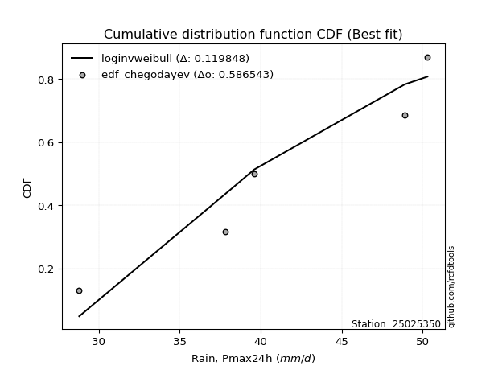</img>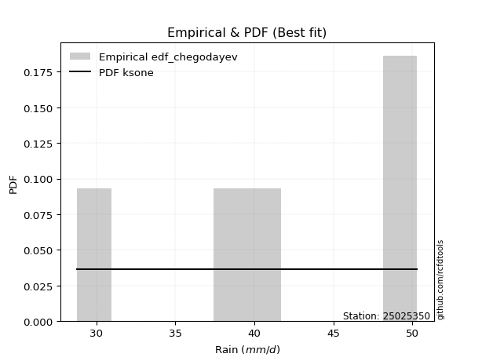</img>

</div>


### 6. Empirical - EDF Blom (1958)

The Blom formula is a specific "plotting position" formula used in hydrology and statistical analysis to estimate the empirical cumulative probability (or non-exceedance probability) of a data series. It is particularly recommended for data that are approximately normally distributed. The constant _a_ is set to 0.375 (or 3/8).

<div align="center">


$P=(m-a)/(n+1-2a)$


</div>


**6.1. Empirical values**

<div align="center">

|                | 0                   | 1                   | 2        | 3                  | 4                  |
|:---------------|:--------------------|:--------------------|:---------|:-------------------|:-------------------|
| date           | 2019                | 2021                | 2020     | 2017               | 2018               |
| x              | 28.8                | 37.8                | 39.6     | 48.9               | 50.3               |
| m              | 1                   | 2                   | 3        | 4                  | 5                  |
| empirical_dist | edf_blom            | edf_blom            | edf_blom | edf_blom           | edf_blom           |
| empirical      | 0.11904761904761904 | 0.30952380952380953 | 0.5      | 0.6904761904761905 | 0.8809523809523809 |
| empirical_tr   | 1.135135135135135   | 1.4482758620689655  | 2.0      | 3.230769230769231  | 8.399999999999999  |

</div>


**6.2. Kolmogorov-Smirnov fit test (sorted by Δ)**


<div align="center">

|                | 0                  | 1                  | 2                   | 3                   | 4                  | 5                  | 6                   | 7                   | 8                   | 9                   | 10                  | 11                  | 12                  | 13                  | 14                  | 15                 | 16                  | 17                 | 18                  | 19                 | 20                 | 21                  | 22                 | 23                  | 24                 | 25                  | 26                 | 27                  | 28                  | 29                  | 30                  | 31                  | 32                 | 33                  | 34                  | 35                  | 36                  | 37                  | 38                  | 39                  | 40                  | 41                 | 42                  | 43                 | 44                  | 45                    | 46                  | 47                  | 48                 | 49                  | 50                  | 51                  | 52                  | 53                  | 54                  | 55                  | 56                  | 57                  | 58                 | 59                  | 60                 | 61                  | 62                  | 63                 | 64                 | 65                  | 66                  | 67                  | 68                  | 69                  | 70                  | 71                  | 72                 | 73                 | 74                  | 75                 | 76                 | 77                  | 78                  | 79                  | 80                 | 81                 | 82                 | 83                 | 84                 | 85                 | 86                 | 87                 | 88                 | 89                 |
|:---------------|:-------------------|:-------------------|:--------------------|:--------------------|:-------------------|:-------------------|:--------------------|:--------------------|:--------------------|:--------------------|:--------------------|:--------------------|:--------------------|:--------------------|:--------------------|:-------------------|:--------------------|:-------------------|:--------------------|:-------------------|:-------------------|:--------------------|:-------------------|:--------------------|:-------------------|:--------------------|:-------------------|:--------------------|:--------------------|:--------------------|:--------------------|:--------------------|:-------------------|:--------------------|:--------------------|:--------------------|:--------------------|:--------------------|:--------------------|:--------------------|:--------------------|:-------------------|:--------------------|:-------------------|:--------------------|:----------------------|:--------------------|:--------------------|:-------------------|:--------------------|:--------------------|:--------------------|:--------------------|:--------------------|:--------------------|:--------------------|:--------------------|:--------------------|:-------------------|:--------------------|:-------------------|:--------------------|:--------------------|:-------------------|:-------------------|:--------------------|:--------------------|:--------------------|:--------------------|:--------------------|:--------------------|:--------------------|:-------------------|:-------------------|:--------------------|:-------------------|:-------------------|:--------------------|:--------------------|:--------------------|:-------------------|:-------------------|:-------------------|:-------------------|:-------------------|:-------------------|:-------------------|:-------------------|:-------------------|:-------------------|
| station        | 25025350           | 25025350           | 25025350            | 25025350            | 25025350           | 25025350           | 25025350            | 25025350            | 25025350            | 25025350            | 25025350            | 25025350            | 25025350            | 25025350            | 25025350            | 25025350           | 25025350            | 25025350           | 25025350            | 25025350           | 25025350           | 25025350            | 25025350           | 25025350            | 25025350           | 25025350            | 25025350           | 25025350            | 25025350            | 25025350            | 25025350            | 25025350            | 25025350           | 25025350            | 25025350            | 25025350            | 25025350            | 25025350            | 25025350            | 25025350            | 25025350            | 25025350           | 25025350            | 25025350           | 25025350            | 25025350              | 25025350            | 25025350            | 25025350           | 25025350            | 25025350            | 25025350            | 25025350            | 25025350            | 25025350            | 25025350            | 25025350            | 25025350            | 25025350           | 25025350            | 25025350           | 25025350            | 25025350            | 25025350           | 25025350           | 25025350            | 25025350            | 25025350            | 25025350            | 25025350            | 25025350            | 25025350            | 25025350           | 25025350           | 25025350            | 25025350           | 25025350           | 25025350            | 25025350            | 25025350            | 25025350           | 25025350           | 25025350           | 25025350           | 25025350           | 25025350           | 25025350           | 25025350           | 25025350           | 25025350           |
| empirical_dist | edf_blom           | edf_blom           | edf_blom            | edf_blom            | edf_blom           | edf_blom           | edf_blom            | edf_blom            | edf_blom            | edf_blom            | edf_blom            | edf_blom            | edf_blom            | edf_blom            | edf_blom            | edf_blom           | edf_blom            | edf_blom           | edf_blom            | edf_blom           | edf_blom           | edf_blom            | edf_blom           | edf_blom            | edf_blom           | edf_blom            | edf_blom           | edf_blom            | edf_blom            | edf_blom            | edf_blom            | edf_blom            | edf_blom           | edf_blom            | edf_blom            | edf_blom            | edf_blom            | edf_blom            | edf_blom            | edf_blom            | edf_blom            | edf_blom           | edf_blom            | edf_blom           | edf_blom            | edf_blom              | edf_blom            | edf_blom            | edf_blom           | edf_blom            | edf_blom            | edf_blom            | edf_blom            | edf_blom            | edf_blom            | edf_blom            | edf_blom            | edf_blom            | edf_blom           | edf_blom            | edf_blom           | edf_blom            | edf_blom            | edf_blom           | edf_blom           | edf_blom            | edf_blom            | edf_blom            | edf_blom            | edf_blom            | edf_blom            | edf_blom            | edf_blom           | edf_blom           | edf_blom            | edf_blom           | edf_blom           | edf_blom            | edf_blom            | edf_blom            | edf_blom           | edf_blom           | edf_blom           | edf_blom           | edf_blom           | edf_blom           | edf_blom           | edf_blom           | edf_blom           | edf_blom           |
| p_dist         | loginvweibull      | logfisk            | loginvgauss         | kstwobign           | logbetaprime       | logrice            | logerlang           | loginvgamma         | lograyleigh         | fisk                | invgauss            | logmaxwell          | loggamma            | loggamma            | logfatiguelife      | logf               | lognct              | logexponnorm       | logcrystalball      | lognorm            | lognorm            | logt                | logalpha           | logpearson3         | invgamma           | gamma               | rice               | rayleigh            | maxwell             | halfnorm            | loghalfnorm         | f                   | betaprime          | erlang              | alpha               | t                   | exponnorm           | crystalball         | norm                | nct                 | pearson3            | ncf                | gompertz            | logweibull_min     | weibull_min         | loglaplace_asymmetric | laplace_asymmetric  | loggumbel_r         | logkstwobign       | loghalflogistic     | loglogistic         | loggenexpon         | loggumbel_l         | gumbel_r            | halflogistic        | logmoyal            | logistic            | moyal               | loghypsecant       | gumbel_l            | logmielke          | hypsecant           | loglaplace          | mielke             | laplace            | logloggamma         | wald                | logwald             | loggompertz         | logncf              | expon               | genexpon            | loggibrat          | gibrat             | logexpon            | nakagami           | logtruncnorm       | lognakagami         | truncnorm           | johnsonsu           | logchi2            | pareto             | loglognorm         | logpareto          | logjohnsonsu       | invweibull         | fatiguelife        | chi2               | loggenlogistic     | genlogistic        |
| delta          | 0.1251385173586541 | 0.1269619048752848 | 0.13400750418886298 | 0.13473469179699848 | 0.1360785789693011 | 0.138361451837679  | 0.13848927685986856 | 0.13939151526237448 | 0.13952445154534954 | 0.13953990301274433 | 0.13954699969851103 | 0.13984486194177226 | 0.13992015918791711 | 0.13992015918791711 | 0.13999266177577574 | 0.1409357596974513 | 0.14105513655955737 | 0.1411051645070297 | 0.14110583259700926 | 0.1411058351994634 | 0.1411058351994634 | 0.14110595223495426 | 0.1411979850947911 | 0.14208579739862237 | 0.146014639290722  | 0.14611482172740164 | 0.1461461757191519 | 0.14631255258655784 | 0.14691979667521493 | 0.14700506873664532 | 0.14737007314120198 | 0.14781122047781803 | 0.1479360681107904 | 0.14827178713385047 | 0.14921995967936785 | 0.14923740065895186 | 0.14923798880152417 | 0.14923909068208474 | 0.14923909390880064 | 0.14924300129757473 | 0.14982378401308494 | 0.1508606194052705 | 0.15272152440827724 | 0.1530104699150685 | 0.15309981059536748 | 0.15619254179024145   | 0.15701331432850518 | 0.15842353720460955 | 0.1596153684236144 | 0.15968634458809483 | 0.16046952441463236 | 0.16320659834484663 | 0.16355399059118203 | 0.16418063420402196 | 0.16441288949250843 | 0.16485046877462373 | 0.16787054424474934 | 0.16998028565623147 | 0.1709298692283241 | 0.17515552527344158 | 0.1772996362835606 | 0.17769802959572523 | 0.18097009569782307 | 0.1815051703920476 | 0.1868061607086151 | 0.18998326142644562 | 0.19425888853626727 | 0.19664090786339783 | 0.20314553206461383 | 0.20704048751382553 | 0.20996224243003203 | 0.21014570999667548 | 0.2152774997508018 | 0.2183880373835454 | 0.24587240043732295 | 0.3054117126277837 | 0.30952045068292   | 0.30952219872374065 | 0.30952288582904564 | 0.34980686700209496 | 0.3506958385333675 | 0.3673901986569921 | 0.3719807300689677 | 0.3739283893986751 | 0.4553421038684561 | 0.4708962749685089 | 0.5192914234609158 | 0.6828355922446734 | 0.6904761904761905 | 0.6904761904761905 |
| deltao         | 0.5865427407550001 | 0.5865427407550001 | 0.5865427407550001  | 0.5865427407550001  | 0.5865427407550001 | 0.5865427407550001 | 0.5865427407550001  | 0.5865427407550001  | 0.5865427407550001  | 0.5865427407550001  | 0.5865427407550001  | 0.5865427407550001  | 0.5865427407550001  | 0.5865427407550001  | 0.5865427407550001  | 0.5865427407550001 | 0.5865427407550001  | 0.5865427407550001 | 0.5865427407550001  | 0.5865427407550001 | 0.5865427407550001 | 0.5865427407550001  | 0.5865427407550001 | 0.5865427407550001  | 0.5865427407550001 | 0.5865427407550001  | 0.5865427407550001 | 0.5865427407550001  | 0.5865427407550001  | 0.5865427407550001  | 0.5865427407550001  | 0.5865427407550001  | 0.5865427407550001 | 0.5865427407550001  | 0.5865427407550001  | 0.5865427407550001  | 0.5865427407550001  | 0.5865427407550001  | 0.5865427407550001  | 0.5865427407550001  | 0.5865427407550001  | 0.5865427407550001 | 0.5865427407550001  | 0.5865427407550001 | 0.5865427407550001  | 0.5865427407550001    | 0.5865427407550001  | 0.5865427407550001  | 0.5865427407550001 | 0.5865427407550001  | 0.5865427407550001  | 0.5865427407550001  | 0.5865427407550001  | 0.5865427407550001  | 0.5865427407550001  | 0.5865427407550001  | 0.5865427407550001  | 0.5865427407550001  | 0.5865427407550001 | 0.5865427407550001  | 0.5865427407550001 | 0.5865427407550001  | 0.5865427407550001  | 0.5865427407550001 | 0.5865427407550001 | 0.5865427407550001  | 0.5865427407550001  | 0.5865427407550001  | 0.5865427407550001  | 0.5865427407550001  | 0.5865427407550001  | 0.5865427407550001  | 0.5865427407550001 | 0.5865427407550001 | 0.5865427407550001  | 0.5865427407550001 | 0.5865427407550001 | 0.5865427407550001  | 0.5865427407550001  | 0.5865427407550001  | 0.5865427407550001 | 0.5865427407550001 | 0.5865427407550001 | 0.5865427407550001 | 0.5865427407550001 | 0.5865427407550001 | 0.5865427407550001 | 0.5865427407550001 | 0.5865427407550001 | 0.5865427407550001 |
| eval           | Δo > Δ             | Δo > Δ             | Δo > Δ              | Δo > Δ              | Δo > Δ             | Δo > Δ             | Δo > Δ              | Δo > Δ              | Δo > Δ              | Δo > Δ              | Δo > Δ              | Δo > Δ              | Δo > Δ              | Δo > Δ              | Δo > Δ              | Δo > Δ             | Δo > Δ              | Δo > Δ             | Δo > Δ              | Δo > Δ             | Δo > Δ             | Δo > Δ              | Δo > Δ             | Δo > Δ              | Δo > Δ             | Δo > Δ              | Δo > Δ             | Δo > Δ              | Δo > Δ              | Δo > Δ              | Δo > Δ              | Δo > Δ              | Δo > Δ             | Δo > Δ              | Δo > Δ              | Δo > Δ              | Δo > Δ              | Δo > Δ              | Δo > Δ              | Δo > Δ              | Δo > Δ              | Δo > Δ             | Δo > Δ              | Δo > Δ             | Δo > Δ              | Δo > Δ                | Δo > Δ              | Δo > Δ              | Δo > Δ             | Δo > Δ              | Δo > Δ              | Δo > Δ              | Δo > Δ              | Δo > Δ              | Δo > Δ              | Δo > Δ              | Δo > Δ              | Δo > Δ              | Δo > Δ             | Δo > Δ              | Δo > Δ             | Δo > Δ              | Δo > Δ              | Δo > Δ             | Δo > Δ             | Δo > Δ              | Δo > Δ              | Δo > Δ              | Δo > Δ              | Δo > Δ              | Δo > Δ              | Δo > Δ              | Δo > Δ             | Δo > Δ             | Δo > Δ              | Δo > Δ             | Δo > Δ             | Δo > Δ              | Δo > Δ              | Δo > Δ              | Δo > Δ             | Δo > Δ             | Δo > Δ             | Δo > Δ             | Δo > Δ             | Δo > Δ             | Δo > Δ             | Δo <= Δ            | Δo <= Δ            | Δo <= Δ            |
| fit            | 1                  | 1                  | 1                   | 1                   | 1                  | 1                  | 1                   | 1                   | 1                   | 1                   | 1                   | 1                   | 1                   | 1                   | 1                   | 1                  | 1                   | 1                  | 1                   | 1                  | 1                  | 1                   | 1                  | 1                   | 1                  | 1                   | 1                  | 1                   | 1                   | 1                   | 1                   | 1                   | 1                  | 1                   | 1                   | 1                   | 1                   | 1                   | 1                   | 1                   | 1                   | 1                  | 1                   | 1                  | 1                   | 1                     | 1                   | 1                   | 1                  | 1                   | 1                   | 1                   | 1                   | 1                   | 1                   | 1                   | 1                   | 1                   | 1                  | 1                   | 1                  | 1                   | 1                   | 1                  | 1                  | 1                   | 1                   | 1                   | 1                   | 1                   | 1                   | 1                   | 1                  | 1                  | 1                   | 1                  | 1                  | 1                   | 1                   | 1                   | 1                  | 1                  | 1                  | 1                  | 1                  | 1                  | 1                  | 0                  | 0                  | 0                  |
| n              | 5                  | 5                  | 5                   | 5                   | 5                  | 5                  | 5                   | 5                   | 5                   | 5                   | 5                   | 5                   | 5                   | 5                   | 5                   | 5                  | 5                   | 5                  | 5                   | 5                  | 5                  | 5                   | 5                  | 5                   | 5                  | 5                   | 5                  | 5                   | 5                   | 5                   | 5                   | 5                   | 5                  | 5                   | 5                   | 5                   | 5                   | 5                   | 5                   | 5                   | 5                   | 5                  | 5                   | 5                  | 5                   | 5                     | 5                   | 5                   | 5                  | 5                   | 5                   | 5                   | 5                   | 5                   | 5                   | 5                   | 5                   | 5                   | 5                  | 5                   | 5                  | 5                   | 5                   | 5                  | 5                  | 5                   | 5                   | 5                   | 5                   | 5                   | 5                   | 5                   | 5                  | 5                  | 5                   | 5                  | 5                  | 5                   | 5                   | 5                   | 5                  | 5                  | 5                  | 5                  | 5                  | 5                  | 5                  | 5                  | 5                  | 5                  |
| best_fit       | 1                  | 0                  | 0                   | 0                   | 0                  | 0                  | 0                   | 0                   | 0                   | 0                   | 0                   | 0                   | 0                   | 0                   | 0                   | 0                  | 0                   | 0                  | 0                   | 0                  | 0                  | 0                   | 0                  | 0                   | 0                  | 0                   | 0                  | 0                   | 0                   | 0                   | 0                   | 0                   | 0                  | 0                   | 0                   | 0                   | 0                   | 0                   | 0                   | 0                   | 0                   | 0                  | 0                   | 0                  | 0                   | 0                     | 0                   | 0                   | 0                  | 0                   | 0                   | 0                   | 0                   | 0                   | 0                   | 0                   | 0                   | 0                   | 0                  | 0                   | 0                  | 0                   | 0                   | 0                  | 0                  | 0                   | 0                   | 0                   | 0                   | 0                   | 0                   | 0                   | 0                  | 0                  | 0                   | 0                  | 0                  | 0                   | 0                   | 0                   | 0                  | 0                  | 0                  | 0                  | 0                  | 0                  | 0                  | 0                  | 0                  | 0                  |
| best_fit_sort  | 1                  | 2                  | 3                   | 4                   | 5                  | 6                  | 7                   | 8                   | 9                   | 10                  | 11                  | 12                  | 13                  | 14                  | 15                  | 16                 | 17                  | 18                 | 19                  | 20                 | 21                 | 22                  | 23                 | 24                  | 25                 | 26                  | 27                 | 28                  | 29                  | 30                  | 31                  | 32                  | 33                 | 34                  | 35                  | 36                  | 37                  | 38                  | 39                  | 40                  | 41                  | 42                 | 43                  | 44                 | 45                  | 46                    | 47                  | 48                  | 49                 | 50                  | 51                  | 52                  | 53                  | 54                  | 55                  | 56                  | 57                  | 58                  | 59                 | 60                  | 61                 | 62                  | 63                  | 64                 | 65                 | 66                  | 67                  | 68                  | 69                  | 70                  | 71                  | 72                  | 73                 | 74                 | 75                  | 76                 | 77                 | 78                  | 79                  | 80                  | 81                 | 82                 | 83                 | 84                 | 85                 | 86                 | 87                 | 88                 | 89                 | 90                 |

</div>


<div align="center">

</img>

</div>


**6.3. Best fit**

<div align="center">

|   id |   station | empirical_dist   | p_dist        |    delta |   deltao | eval   |   fit |   n |   best_fit |   best_fit_sort |
|-----:|----------:|:-----------------|:--------------|---------:|---------:|:-------|------:|----:|-----------:|----------------:|
|    0 |  25025350 | edf_blom         | loginvweibull | 0.125139 | 0.586543 | Δo > Δ |     1 |   5 |          1 |               1 |

</div>


<div align="center">

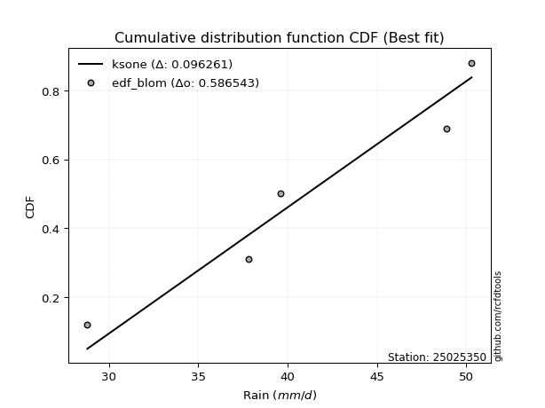</img>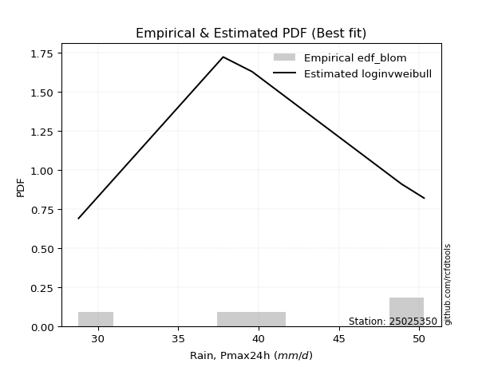</img>

</div>


### 7. Empirical - EDF Tukey (1962)

In hydrology, the Tukey formula is used as a plotting position formula to estimate the empirical probability or frequency of a flood event (or other hydrological data). The formula parameter is given as _c=0.333_ (or 1/3).

<div align="center">


$P=(m-c)/(n+1-2c)$


</div>


**7.1. Empirical values**

<div align="center">

|                | 0                  | 1                  | 2         | 3         | 4         |
|:---------------|:-------------------|:-------------------|:----------|:----------|:----------|
| date           | 2019               | 2021               | 2020      | 2017      | 2018      |
| x              | 28.8               | 37.8               | 39.6      | 48.9      | 50.3      |
| m              | 1                  | 2                  | 3         | 4         | 5         |
| empirical_dist | edf_tukey          | edf_tukey          | edf_tukey | edf_tukey | edf_tukey |
| empirical      | 0.125              | 0.3125             | 0.5       | 0.6875    | 0.875     |
| empirical_tr   | 1.1428571428571428 | 1.4545454545454546 | 2.0       | 3.2       | 8.0       |

</div>


**7.2. Kolmogorov-Smirnov fit test (sorted by Δ)**


<div align="center">

|                | 0                   | 1                   | 2                   | 3                   | 4                   | 5                   | 6                   | 7                   | 8                  | 9                  | 10                 | 11                  | 12                  | 13                  | 14                 | 15                  | 16                  | 17                  | 18                  | 19                  | 20                  | 21                  | 22                  | 23                  | 24                  | 25                  | 26                 | 27                  | 28                 | 29                 | 30                  | 31                 | 32                  | 33                  | 34                  | 35                  | 36                  | 37                 | 38                 | 39                 | 40                 | 41                  | 42                 | 43                  | 44                  | 45                  | 46                    | 47                  | 48                  | 49                  | 50                  | 51                  | 52                 | 53                  | 54                 | 55                 | 56                 | 57                  | 58                  | 59                  | 60                  | 61                 | 62                  | 63                  | 64                  | 65                  | 66                  | 67                  | 68                  | 69                 | 70                  | 71                 | 72                  | 73                  | 74                  | 75                 | 76                  | 77                 | 78                 | 79                  | 80                 | 81                 | 82                  | 83                  | 84                 | 85                  | 86                 | 87                 | 88                 | 89                 |
|:---------------|:--------------------|:--------------------|:--------------------|:--------------------|:--------------------|:--------------------|:--------------------|:--------------------|:-------------------|:-------------------|:-------------------|:--------------------|:--------------------|:--------------------|:-------------------|:--------------------|:--------------------|:--------------------|:--------------------|:--------------------|:--------------------|:--------------------|:--------------------|:--------------------|:--------------------|:--------------------|:-------------------|:--------------------|:-------------------|:-------------------|:--------------------|:-------------------|:--------------------|:--------------------|:--------------------|:--------------------|:--------------------|:-------------------|:-------------------|:-------------------|:-------------------|:--------------------|:-------------------|:--------------------|:--------------------|:--------------------|:----------------------|:--------------------|:--------------------|:--------------------|:--------------------|:--------------------|:-------------------|:--------------------|:-------------------|:-------------------|:-------------------|:--------------------|:--------------------|:--------------------|:--------------------|:-------------------|:--------------------|:--------------------|:--------------------|:--------------------|:--------------------|:--------------------|:--------------------|:-------------------|:--------------------|:-------------------|:--------------------|:--------------------|:--------------------|:-------------------|:--------------------|:-------------------|:-------------------|:--------------------|:-------------------|:-------------------|:--------------------|:--------------------|:-------------------|:--------------------|:-------------------|:-------------------|:-------------------|:-------------------|
| station        | 25025350            | 25025350            | 25025350            | 25025350            | 25025350            | 25025350            | 25025350            | 25025350            | 25025350           | 25025350           | 25025350           | 25025350            | 25025350            | 25025350            | 25025350           | 25025350            | 25025350            | 25025350            | 25025350            | 25025350            | 25025350            | 25025350            | 25025350            | 25025350            | 25025350            | 25025350            | 25025350           | 25025350            | 25025350           | 25025350           | 25025350            | 25025350           | 25025350            | 25025350            | 25025350            | 25025350            | 25025350            | 25025350           | 25025350           | 25025350           | 25025350           | 25025350            | 25025350           | 25025350            | 25025350            | 25025350            | 25025350              | 25025350            | 25025350            | 25025350            | 25025350            | 25025350            | 25025350           | 25025350            | 25025350           | 25025350           | 25025350           | 25025350            | 25025350            | 25025350            | 25025350            | 25025350           | 25025350            | 25025350            | 25025350            | 25025350            | 25025350            | 25025350            | 25025350            | 25025350           | 25025350            | 25025350           | 25025350            | 25025350            | 25025350            | 25025350           | 25025350            | 25025350           | 25025350           | 25025350            | 25025350           | 25025350           | 25025350            | 25025350            | 25025350           | 25025350            | 25025350           | 25025350           | 25025350           | 25025350           |
| empirical_dist | edf_tukey           | edf_tukey           | edf_tukey           | edf_tukey           | edf_tukey           | edf_tukey           | edf_tukey           | edf_tukey           | edf_tukey          | edf_tukey          | edf_tukey          | edf_tukey           | edf_tukey           | edf_tukey           | edf_tukey          | edf_tukey           | edf_tukey           | edf_tukey           | edf_tukey           | edf_tukey           | edf_tukey           | edf_tukey           | edf_tukey           | edf_tukey           | edf_tukey           | edf_tukey           | edf_tukey          | edf_tukey           | edf_tukey          | edf_tukey          | edf_tukey           | edf_tukey          | edf_tukey           | edf_tukey           | edf_tukey           | edf_tukey           | edf_tukey           | edf_tukey          | edf_tukey          | edf_tukey          | edf_tukey          | edf_tukey           | edf_tukey          | edf_tukey           | edf_tukey           | edf_tukey           | edf_tukey             | edf_tukey           | edf_tukey           | edf_tukey           | edf_tukey           | edf_tukey           | edf_tukey          | edf_tukey           | edf_tukey          | edf_tukey          | edf_tukey          | edf_tukey           | edf_tukey           | edf_tukey           | edf_tukey           | edf_tukey          | edf_tukey           | edf_tukey           | edf_tukey           | edf_tukey           | edf_tukey           | edf_tukey           | edf_tukey           | edf_tukey          | edf_tukey           | edf_tukey          | edf_tukey           | edf_tukey           | edf_tukey           | edf_tukey          | edf_tukey           | edf_tukey          | edf_tukey          | edf_tukey           | edf_tukey          | edf_tukey          | edf_tukey           | edf_tukey           | edf_tukey          | edf_tukey           | edf_tukey          | edf_tukey          | edf_tukey          | edf_tukey          |
| p_dist         | loginvweibull       | logfisk             | loginvgauss         | kstwobign           | logbetaprime        | logrice             | logerlang           | loginvgamma         | lograyleigh        | fisk               | invgauss           | logmaxwell          | loggamma            | loggamma            | logfatiguelife     | logf                | lognct              | logexponnorm        | logcrystalball      | lognorm             | lognorm             | logt                | logalpha            | loghalfnorm         | logpearson3         | invgamma            | gamma              | rice                | rayleigh           | maxwell            | halfnorm            | f                  | betaprime           | erlang              | alpha               | t                   | exponnorm           | crystalball        | norm               | nct                | pearson3           | ncf                 | gompertz           | logweibull_min      | weibull_min         | logkstwobign        | loglaplace_asymmetric | laplace_asymmetric  | loggenexpon         | loggumbel_r         | loghalflogistic     | loglogistic         | loggumbel_l        | gumbel_r            | halflogistic       | logmoyal           | logistic           | moyal               | loghypsecant        | gumbel_l            | logmielke           | hypsecant          | loglaplace          | mielke              | laplace             | logloggamma         | logwald             | wald                | loggompertz         | logncf             | expon               | genexpon           | loggibrat           | gibrat              | logexpon            | nakagami           | logtruncnorm        | lognakagami        | truncnorm          | logchi2             | johnsonsu          | pareto             | loglognorm          | logpareto           | logjohnsonsu       | invweibull          | fatiguelife        | chi2               | loggenlogistic     | genlogistic        |
| delta          | 0.12216232688246365 | 0.12993809535147527 | 0.13698369466505345 | 0.13771088227318895 | 0.13905476944549156 | 0.14133764231386947 | 0.14146546733605903 | 0.14236770573856494 | 0.14250064202154   | 0.1425160934889348 | 0.1425231901747015 | 0.14282105241796272 | 0.14289634966410758 | 0.14289634966410758 | 0.1429688522519662 | 0.14391195017364178 | 0.14403132703574784 | 0.14408135498322017 | 0.14408202307319973 | 0.14408202567565387 | 0.14408202567565387 | 0.14408214271114472 | 0.14417417557098156 | 0.14439388266501152 | 0.14506198787481284 | 0.14899082976691247 | 0.1490910122035921 | 0.14912236619534236 | 0.1492887430627483 | 0.1498959871514054 | 0.14998125921283578 | 0.1507874109540085 | 0.15091225858698087 | 0.15124797761004094 | 0.15219615015555832 | 0.15221359113514232 | 0.15221417927771463 | 0.1522152811582752 | 0.1522152843849911 | 0.1522191917737652 | 0.1527999744892754 | 0.15383680988146098 | 0.1556977148844677 | 0.15598666039125897 | 0.15607600107155795 | 0.15663917794742394 | 0.1591687322664319    | 0.15998950480469565 | 0.16023040786865617 | 0.16139972768080002 | 0.16214290275160648 | 0.16344571489082282 | 0.1665301810673725 | 0.16715682468021242 | 0.1673890799686989 | 0.1678266592508142 | 0.1708467347209398 | 0.17295647613242193 | 0.17390605970451456 | 0.17813171574963205 | 0.18027582675975107 | 0.1806742200719157 | 0.18394628617401354 | 0.18448136086823808 | 0.18978235118480558 | 0.19295945190263608 | 0.19366471738720736 | 0.19723507901245774 | 0.20016934158842337 | 0.2010881065614446 | 0.20698605195384157 | 0.207169519520485  | 0.21825369022699226 | 0.22136422785973586 | 0.24289620996113248 | 0.3083879031039742 | 0.31249664115911047 | 0.3124983891999311 | 0.3124990763052361 | 0.34474345758098657 | 0.3468306765259045 | 0.3644140081808016 | 0.36900453959277724 | 0.37095219892248465 | 0.4523659133922656 | 0.46494389401612796 | 0.5163152329847254 | 0.6798594017684829 | 0.6875             | 0.6875             |
| deltao         | 0.5865427407550001  | 0.5865427407550001  | 0.5865427407550001  | 0.5865427407550001  | 0.5865427407550001  | 0.5865427407550001  | 0.5865427407550001  | 0.5865427407550001  | 0.5865427407550001 | 0.5865427407550001 | 0.5865427407550001 | 0.5865427407550001  | 0.5865427407550001  | 0.5865427407550001  | 0.5865427407550001 | 0.5865427407550001  | 0.5865427407550001  | 0.5865427407550001  | 0.5865427407550001  | 0.5865427407550001  | 0.5865427407550001  | 0.5865427407550001  | 0.5865427407550001  | 0.5865427407550001  | 0.5865427407550001  | 0.5865427407550001  | 0.5865427407550001 | 0.5865427407550001  | 0.5865427407550001 | 0.5865427407550001 | 0.5865427407550001  | 0.5865427407550001 | 0.5865427407550001  | 0.5865427407550001  | 0.5865427407550001  | 0.5865427407550001  | 0.5865427407550001  | 0.5865427407550001 | 0.5865427407550001 | 0.5865427407550001 | 0.5865427407550001 | 0.5865427407550001  | 0.5865427407550001 | 0.5865427407550001  | 0.5865427407550001  | 0.5865427407550001  | 0.5865427407550001    | 0.5865427407550001  | 0.5865427407550001  | 0.5865427407550001  | 0.5865427407550001  | 0.5865427407550001  | 0.5865427407550001 | 0.5865427407550001  | 0.5865427407550001 | 0.5865427407550001 | 0.5865427407550001 | 0.5865427407550001  | 0.5865427407550001  | 0.5865427407550001  | 0.5865427407550001  | 0.5865427407550001 | 0.5865427407550001  | 0.5865427407550001  | 0.5865427407550001  | 0.5865427407550001  | 0.5865427407550001  | 0.5865427407550001  | 0.5865427407550001  | 0.5865427407550001 | 0.5865427407550001  | 0.5865427407550001 | 0.5865427407550001  | 0.5865427407550001  | 0.5865427407550001  | 0.5865427407550001 | 0.5865427407550001  | 0.5865427407550001 | 0.5865427407550001 | 0.5865427407550001  | 0.5865427407550001 | 0.5865427407550001 | 0.5865427407550001  | 0.5865427407550001  | 0.5865427407550001 | 0.5865427407550001  | 0.5865427407550001 | 0.5865427407550001 | 0.5865427407550001 | 0.5865427407550001 |
| eval           | Δo > Δ              | Δo > Δ              | Δo > Δ              | Δo > Δ              | Δo > Δ              | Δo > Δ              | Δo > Δ              | Δo > Δ              | Δo > Δ             | Δo > Δ             | Δo > Δ             | Δo > Δ              | Δo > Δ              | Δo > Δ              | Δo > Δ             | Δo > Δ              | Δo > Δ              | Δo > Δ              | Δo > Δ              | Δo > Δ              | Δo > Δ              | Δo > Δ              | Δo > Δ              | Δo > Δ              | Δo > Δ              | Δo > Δ              | Δo > Δ             | Δo > Δ              | Δo > Δ             | Δo > Δ             | Δo > Δ              | Δo > Δ             | Δo > Δ              | Δo > Δ              | Δo > Δ              | Δo > Δ              | Δo > Δ              | Δo > Δ             | Δo > Δ             | Δo > Δ             | Δo > Δ             | Δo > Δ              | Δo > Δ             | Δo > Δ              | Δo > Δ              | Δo > Δ              | Δo > Δ                | Δo > Δ              | Δo > Δ              | Δo > Δ              | Δo > Δ              | Δo > Δ              | Δo > Δ             | Δo > Δ              | Δo > Δ             | Δo > Δ             | Δo > Δ             | Δo > Δ              | Δo > Δ              | Δo > Δ              | Δo > Δ              | Δo > Δ             | Δo > Δ              | Δo > Δ              | Δo > Δ              | Δo > Δ              | Δo > Δ              | Δo > Δ              | Δo > Δ              | Δo > Δ             | Δo > Δ              | Δo > Δ             | Δo > Δ              | Δo > Δ              | Δo > Δ              | Δo > Δ             | Δo > Δ              | Δo > Δ             | Δo > Δ             | Δo > Δ              | Δo > Δ             | Δo > Δ             | Δo > Δ              | Δo > Δ              | Δo > Δ             | Δo > Δ              | Δo > Δ             | Δo <= Δ            | Δo <= Δ            | Δo <= Δ            |
| fit            | 1                   | 1                   | 1                   | 1                   | 1                   | 1                   | 1                   | 1                   | 1                  | 1                  | 1                  | 1                   | 1                   | 1                   | 1                  | 1                   | 1                   | 1                   | 1                   | 1                   | 1                   | 1                   | 1                   | 1                   | 1                   | 1                   | 1                  | 1                   | 1                  | 1                  | 1                   | 1                  | 1                   | 1                   | 1                   | 1                   | 1                   | 1                  | 1                  | 1                  | 1                  | 1                   | 1                  | 1                   | 1                   | 1                   | 1                     | 1                   | 1                   | 1                   | 1                   | 1                   | 1                  | 1                   | 1                  | 1                  | 1                  | 1                   | 1                   | 1                   | 1                   | 1                  | 1                   | 1                   | 1                   | 1                   | 1                   | 1                   | 1                   | 1                  | 1                   | 1                  | 1                   | 1                   | 1                   | 1                  | 1                   | 1                  | 1                  | 1                   | 1                  | 1                  | 1                   | 1                   | 1                  | 1                   | 1                  | 0                  | 0                  | 0                  |
| n              | 5                   | 5                   | 5                   | 5                   | 5                   | 5                   | 5                   | 5                   | 5                  | 5                  | 5                  | 5                   | 5                   | 5                   | 5                  | 5                   | 5                   | 5                   | 5                   | 5                   | 5                   | 5                   | 5                   | 5                   | 5                   | 5                   | 5                  | 5                   | 5                  | 5                  | 5                   | 5                  | 5                   | 5                   | 5                   | 5                   | 5                   | 5                  | 5                  | 5                  | 5                  | 5                   | 5                  | 5                   | 5                   | 5                   | 5                     | 5                   | 5                   | 5                   | 5                   | 5                   | 5                  | 5                   | 5                  | 5                  | 5                  | 5                   | 5                   | 5                   | 5                   | 5                  | 5                   | 5                   | 5                   | 5                   | 5                   | 5                   | 5                   | 5                  | 5                   | 5                  | 5                   | 5                   | 5                   | 5                  | 5                   | 5                  | 5                  | 5                   | 5                  | 5                  | 5                   | 5                   | 5                  | 5                   | 5                  | 5                  | 5                  | 5                  |
| best_fit       | 1                   | 0                   | 0                   | 0                   | 0                   | 0                   | 0                   | 0                   | 0                  | 0                  | 0                  | 0                   | 0                   | 0                   | 0                  | 0                   | 0                   | 0                   | 0                   | 0                   | 0                   | 0                   | 0                   | 0                   | 0                   | 0                   | 0                  | 0                   | 0                  | 0                  | 0                   | 0                  | 0                   | 0                   | 0                   | 0                   | 0                   | 0                  | 0                  | 0                  | 0                  | 0                   | 0                  | 0                   | 0                   | 0                   | 0                     | 0                   | 0                   | 0                   | 0                   | 0                   | 0                  | 0                   | 0                  | 0                  | 0                  | 0                   | 0                   | 0                   | 0                   | 0                  | 0                   | 0                   | 0                   | 0                   | 0                   | 0                   | 0                   | 0                  | 0                   | 0                  | 0                   | 0                   | 0                   | 0                  | 0                   | 0                  | 0                  | 0                   | 0                  | 0                  | 0                   | 0                   | 0                  | 0                   | 0                  | 0                  | 0                  | 0                  |
| best_fit_sort  | 1                   | 2                   | 3                   | 4                   | 5                   | 6                   | 7                   | 8                   | 9                  | 10                 | 11                 | 12                  | 13                  | 14                  | 15                 | 16                  | 17                  | 18                  | 19                  | 20                  | 21                  | 22                  | 23                  | 24                  | 25                  | 26                  | 27                 | 28                  | 29                 | 30                 | 31                  | 32                 | 33                  | 34                  | 35                  | 36                  | 37                  | 38                 | 39                 | 40                 | 41                 | 42                  | 43                 | 44                  | 45                  | 46                  | 47                    | 48                  | 49                  | 50                  | 51                  | 52                  | 53                 | 54                  | 55                 | 56                 | 57                 | 58                  | 59                  | 60                  | 61                  | 62                 | 63                  | 64                  | 65                  | 66                  | 67                  | 68                  | 69                  | 70                 | 71                  | 72                 | 73                  | 74                  | 75                  | 76                 | 77                  | 78                 | 79                 | 80                  | 81                 | 82                 | 83                  | 84                  | 85                 | 86                  | 87                 | 88                 | 89                 | 90                 |

</div>


<div align="center">

</img>

</div>


**7.3. Best fit**

<div align="center">

|   id |   station | empirical_dist   | p_dist        |    delta |   deltao | eval   |   fit |   n |   best_fit |   best_fit_sort |
|-----:|----------:|:-----------------|:--------------|---------:|---------:|:-------|------:|----:|-----------:|----------------:|
|    0 |  25025350 | edf_tukey        | loginvweibull | 0.122162 | 0.586543 | Δo > Δ |     1 |   5 |          1 |               1 |

</div>


<div align="center">

</img>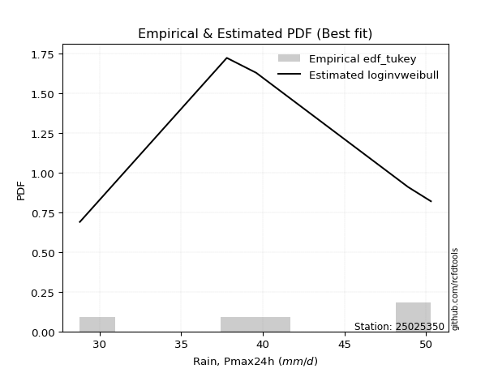</img>

</div>


### 8. Empirical - EDF Gringorten (1963)

Gringorten plotting position formula is essential for estimating the probability and return periods of extreme events like floods and heavy rainfall. The constant _a=0.44_.

<div align="center">


$P=(m-a)/(n+1-2a)$


</div>


**8.1. Empirical values**

<div align="center">

|                | 0                   | 1                  | 2              | 3                 | 4                  |
|:---------------|:--------------------|:-------------------|:---------------|:------------------|:-------------------|
| date           | 2019                | 2021               | 2020           | 2017              | 2018               |
| x              | 28.8                | 37.8               | 39.6           | 48.9              | 50.3               |
| m              | 1                   | 2                  | 3              | 4                 | 5                  |
| empirical_dist | edf_gringorten      | edf_gringorten     | edf_gringorten | edf_gringorten    | edf_gringorten     |
| empirical      | 0.10937500000000001 | 0.3046875          | 0.5            | 0.6953125         | 0.8906249999999999 |
| empirical_tr   | 1.1228070175438596  | 1.4382022471910112 | 2.0            | 3.282051282051282 | 9.142857142857133  |

</div>


**8.2. Kolmogorov-Smirnov fit test (sorted by Δ)**


<div align="center">

|                | 0                   | 1                   | 2                   | 3                   | 4                   | 5                   | 6                   | 7                   | 8                  | 9                  | 10                 | 11                  | 12                  | 13                  | 14                 | 15                  | 16                  | 17                  | 18                  | 19                  | 20                  | 21                  | 22                  | 23                  | 24                  | 25                 | 26                  | 27                 | 28                 | 29                  | 30                 | 31                  | 32                  | 33                  | 34                  | 35                  | 36                 | 37                 | 38                 | 39                 | 40                  | 41                 | 42                  | 43                  | 44                    | 45                  | 46                  | 47                  | 48                  | 49                 | 50                  | 51                 | 52                 | 53                 | 54                  | 55                  | 56                  | 57                  | 58                  | 59                  | 60                  | 61                 | 62                  | 63                  | 64                  | 65                  | 66                  | 67                  | 68                  | 69                  | 70                  | 71                  | 72                 | 73                 | 74                 | 75                 | 76                  | 77                 | 78                 | 79                 | 80                  | 81                 | 82                  | 83                  | 84                 | 85                  | 86                 | 87                 | 88                 | 89                 |
|:---------------|:--------------------|:--------------------|:--------------------|:--------------------|:--------------------|:--------------------|:--------------------|:--------------------|:-------------------|:-------------------|:-------------------|:--------------------|:--------------------|:--------------------|:-------------------|:--------------------|:--------------------|:--------------------|:--------------------|:--------------------|:--------------------|:--------------------|:--------------------|:--------------------|:--------------------|:-------------------|:--------------------|:-------------------|:-------------------|:--------------------|:-------------------|:--------------------|:--------------------|:--------------------|:--------------------|:--------------------|:-------------------|:-------------------|:-------------------|:-------------------|:--------------------|:-------------------|:--------------------|:--------------------|:----------------------|:--------------------|:--------------------|:--------------------|:--------------------|:-------------------|:--------------------|:-------------------|:-------------------|:-------------------|:--------------------|:--------------------|:--------------------|:--------------------|:--------------------|:--------------------|:--------------------|:-------------------|:--------------------|:--------------------|:--------------------|:--------------------|:--------------------|:--------------------|:--------------------|:--------------------|:--------------------|:--------------------|:-------------------|:-------------------|:-------------------|:-------------------|:--------------------|:-------------------|:-------------------|:-------------------|:--------------------|:-------------------|:--------------------|:--------------------|:-------------------|:--------------------|:-------------------|:-------------------|:-------------------|:-------------------|
| station        | 25025350            | 25025350            | 25025350            | 25025350            | 25025350            | 25025350            | 25025350            | 25025350            | 25025350           | 25025350           | 25025350           | 25025350            | 25025350            | 25025350            | 25025350           | 25025350            | 25025350            | 25025350            | 25025350            | 25025350            | 25025350            | 25025350            | 25025350            | 25025350            | 25025350            | 25025350           | 25025350            | 25025350           | 25025350           | 25025350            | 25025350           | 25025350            | 25025350            | 25025350            | 25025350            | 25025350            | 25025350           | 25025350           | 25025350           | 25025350           | 25025350            | 25025350           | 25025350            | 25025350            | 25025350              | 25025350            | 25025350            | 25025350            | 25025350            | 25025350           | 25025350            | 25025350           | 25025350           | 25025350           | 25025350            | 25025350            | 25025350            | 25025350            | 25025350            | 25025350            | 25025350            | 25025350           | 25025350            | 25025350            | 25025350            | 25025350            | 25025350            | 25025350            | 25025350            | 25025350            | 25025350            | 25025350            | 25025350           | 25025350           | 25025350           | 25025350           | 25025350            | 25025350           | 25025350           | 25025350           | 25025350            | 25025350           | 25025350            | 25025350            | 25025350           | 25025350            | 25025350           | 25025350           | 25025350           | 25025350           |
| empirical_dist | edf_gringorten      | edf_gringorten      | edf_gringorten      | edf_gringorten      | edf_gringorten      | edf_gringorten      | edf_gringorten      | edf_gringorten      | edf_gringorten     | edf_gringorten     | edf_gringorten     | edf_gringorten      | edf_gringorten      | edf_gringorten      | edf_gringorten     | edf_gringorten      | edf_gringorten      | edf_gringorten      | edf_gringorten      | edf_gringorten      | edf_gringorten      | edf_gringorten      | edf_gringorten      | edf_gringorten      | edf_gringorten      | edf_gringorten     | edf_gringorten      | edf_gringorten     | edf_gringorten     | edf_gringorten      | edf_gringorten     | edf_gringorten      | edf_gringorten      | edf_gringorten      | edf_gringorten      | edf_gringorten      | edf_gringorten     | edf_gringorten     | edf_gringorten     | edf_gringorten     | edf_gringorten      | edf_gringorten     | edf_gringorten      | edf_gringorten      | edf_gringorten        | edf_gringorten      | edf_gringorten      | edf_gringorten      | edf_gringorten      | edf_gringorten     | edf_gringorten      | edf_gringorten     | edf_gringorten     | edf_gringorten     | edf_gringorten      | edf_gringorten      | edf_gringorten      | edf_gringorten      | edf_gringorten      | edf_gringorten      | edf_gringorten      | edf_gringorten     | edf_gringorten      | edf_gringorten      | edf_gringorten      | edf_gringorten      | edf_gringorten      | edf_gringorten      | edf_gringorten      | edf_gringorten      | edf_gringorten      | edf_gringorten      | edf_gringorten     | edf_gringorten     | edf_gringorten     | edf_gringorten     | edf_gringorten      | edf_gringorten     | edf_gringorten     | edf_gringorten     | edf_gringorten      | edf_gringorten     | edf_gringorten      | edf_gringorten      | edf_gringorten     | edf_gringorten      | edf_gringorten     | edf_gringorten     | edf_gringorten     | edf_gringorten     |
| p_dist         | logfisk             | loginvgauss         | kstwobign           | loginvweibull       | logbetaprime        | logrice             | logerlang           | loginvgamma         | lograyleigh        | fisk               | invgauss           | logmaxwell          | loggamma            | loggamma            | logfatiguelife     | logf                | lognct              | logexponnorm        | logcrystalball      | lognorm             | lognorm             | logt                | logalpha            | logpearson3         | invgamma            | gamma              | rice                | rayleigh           | maxwell            | halfnorm            | f                  | betaprime           | erlang              | alpha               | t                   | exponnorm           | crystalball        | norm               | nct                | pearson3           | ncf                 | gompertz           | logweibull_min      | weibull_min         | loglaplace_asymmetric | laplace_asymmetric  | loghalfnorm         | loggumbel_r         | loglogistic         | loggumbel_l        | gumbel_r            | halflogistic       | logmoyal           | logistic           | logkstwobign        | loghalflogistic     | moyal               | loghypsecant        | loggenexpon         | gumbel_l            | logmielke           | hypsecant          | loglaplace          | mielke              | laplace             | logloggamma         | wald                | logwald             | loggompertz         | loggibrat           | gibrat              | expon               | genexpon           | logncf             | logexpon           | nakagami           | logtruncnorm        | lognakagami        | truncnorm          | johnsonsu          | logchi2             | pareto             | loglognorm          | logpareto           | logjohnsonsu       | invweibull          | fatiguelife        | chi2               | loggenlogistic     | genlogistic        |
| delta          | 0.12212559535147527 | 0.12917119466505345 | 0.12989838227318895 | 0.12997482688246365 | 0.13124226944549156 | 0.13352514231386947 | 0.13365296733605903 | 0.13455520573856494 | 0.13468814202154   | 0.1347035934889348 | 0.1347106901747015 | 0.13500855241796272 | 0.13508384966410758 | 0.13508384966410758 | 0.1351563522519662 | 0.13609945017364178 | 0.13621882703574784 | 0.13626885498322017 | 0.13626952307319973 | 0.13626952567565387 | 0.13626952567565387 | 0.13626964271114472 | 0.13636167557098156 | 0.13724948787481284 | 0.14117832976691247 | 0.1412785122035921 | 0.14130986619534236 | 0.1414762430627483 | 0.1420834871514054 | 0.14216875921283578 | 0.1429749109540085 | 0.14309975858698087 | 0.14343547761004094 | 0.14438365015555832 | 0.14440109113514232 | 0.14440167927771463 | 0.1444027811582752 | 0.1444027843849911 | 0.1444066917737652 | 0.1449874744892754 | 0.14602430988146098 | 0.1478852148844677 | 0.14817416039125897 | 0.14826350107155795 | 0.1513562322664319    | 0.15217700480469565 | 0.15220638266501152 | 0.15358722768080002 | 0.15563321489082282 | 0.1587176810673725 | 0.15934432468021242 | 0.1595765799686989 | 0.1600141592508142 | 0.1630342347209398 | 0.16445167794742394 | 0.16452265411190437 | 0.16514397613242193 | 0.16609355970451456 | 0.16804290786865617 | 0.17031921574963205 | 0.17246332675975107 | 0.1728617200719157 | 0.17613378617401354 | 0.17666886086823808 | 0.18196985118480558 | 0.18514695190263608 | 0.18942257901245774 | 0.20147721738720736 | 0.20798184158842337 | 0.21044119022699226 | 0.21355172785973586 | 0.21479855195384157 | 0.214982019520485  | 0.2167131065614445 | 0.2507087099611325 | 0.3005754031039742 | 0.30468414115911047 | 0.3046858891999311 | 0.3046865763052361 | 0.3546431765259045 | 0.36036845758098646 | 0.3722265081808016 | 0.37681703959277724 | 0.37876469892248465 | 0.4601784133922656 | 0.48056889401612785 | 0.5241277329847254 | 0.6876719017684829 | 0.6953125          | 0.6953125          |
| deltao         | 0.5865427407550001  | 0.5865427407550001  | 0.5865427407550001  | 0.5865427407550001  | 0.5865427407550001  | 0.5865427407550001  | 0.5865427407550001  | 0.5865427407550001  | 0.5865427407550001 | 0.5865427407550001 | 0.5865427407550001 | 0.5865427407550001  | 0.5865427407550001  | 0.5865427407550001  | 0.5865427407550001 | 0.5865427407550001  | 0.5865427407550001  | 0.5865427407550001  | 0.5865427407550001  | 0.5865427407550001  | 0.5865427407550001  | 0.5865427407550001  | 0.5865427407550001  | 0.5865427407550001  | 0.5865427407550001  | 0.5865427407550001 | 0.5865427407550001  | 0.5865427407550001 | 0.5865427407550001 | 0.5865427407550001  | 0.5865427407550001 | 0.5865427407550001  | 0.5865427407550001  | 0.5865427407550001  | 0.5865427407550001  | 0.5865427407550001  | 0.5865427407550001 | 0.5865427407550001 | 0.5865427407550001 | 0.5865427407550001 | 0.5865427407550001  | 0.5865427407550001 | 0.5865427407550001  | 0.5865427407550001  | 0.5865427407550001    | 0.5865427407550001  | 0.5865427407550001  | 0.5865427407550001  | 0.5865427407550001  | 0.5865427407550001 | 0.5865427407550001  | 0.5865427407550001 | 0.5865427407550001 | 0.5865427407550001 | 0.5865427407550001  | 0.5865427407550001  | 0.5865427407550001  | 0.5865427407550001  | 0.5865427407550001  | 0.5865427407550001  | 0.5865427407550001  | 0.5865427407550001 | 0.5865427407550001  | 0.5865427407550001  | 0.5865427407550001  | 0.5865427407550001  | 0.5865427407550001  | 0.5865427407550001  | 0.5865427407550001  | 0.5865427407550001  | 0.5865427407550001  | 0.5865427407550001  | 0.5865427407550001 | 0.5865427407550001 | 0.5865427407550001 | 0.5865427407550001 | 0.5865427407550001  | 0.5865427407550001 | 0.5865427407550001 | 0.5865427407550001 | 0.5865427407550001  | 0.5865427407550001 | 0.5865427407550001  | 0.5865427407550001  | 0.5865427407550001 | 0.5865427407550001  | 0.5865427407550001 | 0.5865427407550001 | 0.5865427407550001 | 0.5865427407550001 |
| eval           | Δo > Δ              | Δo > Δ              | Δo > Δ              | Δo > Δ              | Δo > Δ              | Δo > Δ              | Δo > Δ              | Δo > Δ              | Δo > Δ             | Δo > Δ             | Δo > Δ             | Δo > Δ              | Δo > Δ              | Δo > Δ              | Δo > Δ             | Δo > Δ              | Δo > Δ              | Δo > Δ              | Δo > Δ              | Δo > Δ              | Δo > Δ              | Δo > Δ              | Δo > Δ              | Δo > Δ              | Δo > Δ              | Δo > Δ             | Δo > Δ              | Δo > Δ             | Δo > Δ             | Δo > Δ              | Δo > Δ             | Δo > Δ              | Δo > Δ              | Δo > Δ              | Δo > Δ              | Δo > Δ              | Δo > Δ             | Δo > Δ             | Δo > Δ             | Δo > Δ             | Δo > Δ              | Δo > Δ             | Δo > Δ              | Δo > Δ              | Δo > Δ                | Δo > Δ              | Δo > Δ              | Δo > Δ              | Δo > Δ              | Δo > Δ             | Δo > Δ              | Δo > Δ             | Δo > Δ             | Δo > Δ             | Δo > Δ              | Δo > Δ              | Δo > Δ              | Δo > Δ              | Δo > Δ              | Δo > Δ              | Δo > Δ              | Δo > Δ             | Δo > Δ              | Δo > Δ              | Δo > Δ              | Δo > Δ              | Δo > Δ              | Δo > Δ              | Δo > Δ              | Δo > Δ              | Δo > Δ              | Δo > Δ              | Δo > Δ             | Δo > Δ             | Δo > Δ             | Δo > Δ             | Δo > Δ              | Δo > Δ             | Δo > Δ             | Δo > Δ             | Δo > Δ              | Δo > Δ             | Δo > Δ              | Δo > Δ              | Δo > Δ             | Δo > Δ              | Δo > Δ             | Δo <= Δ            | Δo <= Δ            | Δo <= Δ            |
| fit            | 1                   | 1                   | 1                   | 1                   | 1                   | 1                   | 1                   | 1                   | 1                  | 1                  | 1                  | 1                   | 1                   | 1                   | 1                  | 1                   | 1                   | 1                   | 1                   | 1                   | 1                   | 1                   | 1                   | 1                   | 1                   | 1                  | 1                   | 1                  | 1                  | 1                   | 1                  | 1                   | 1                   | 1                   | 1                   | 1                   | 1                  | 1                  | 1                  | 1                  | 1                   | 1                  | 1                   | 1                   | 1                     | 1                   | 1                   | 1                   | 1                   | 1                  | 1                   | 1                  | 1                  | 1                  | 1                   | 1                   | 1                   | 1                   | 1                   | 1                   | 1                   | 1                  | 1                   | 1                   | 1                   | 1                   | 1                   | 1                   | 1                   | 1                   | 1                   | 1                   | 1                  | 1                  | 1                  | 1                  | 1                   | 1                  | 1                  | 1                  | 1                   | 1                  | 1                   | 1                   | 1                  | 1                   | 1                  | 0                  | 0                  | 0                  |
| n              | 5                   | 5                   | 5                   | 5                   | 5                   | 5                   | 5                   | 5                   | 5                  | 5                  | 5                  | 5                   | 5                   | 5                   | 5                  | 5                   | 5                   | 5                   | 5                   | 5                   | 5                   | 5                   | 5                   | 5                   | 5                   | 5                  | 5                   | 5                  | 5                  | 5                   | 5                  | 5                   | 5                   | 5                   | 5                   | 5                   | 5                  | 5                  | 5                  | 5                  | 5                   | 5                  | 5                   | 5                   | 5                     | 5                   | 5                   | 5                   | 5                   | 5                  | 5                   | 5                  | 5                  | 5                  | 5                   | 5                   | 5                   | 5                   | 5                   | 5                   | 5                   | 5                  | 5                   | 5                   | 5                   | 5                   | 5                   | 5                   | 5                   | 5                   | 5                   | 5                   | 5                  | 5                  | 5                  | 5                  | 5                   | 5                  | 5                  | 5                  | 5                   | 5                  | 5                   | 5                   | 5                  | 5                   | 5                  | 5                  | 5                  | 5                  |
| best_fit       | 1                   | 0                   | 0                   | 0                   | 0                   | 0                   | 0                   | 0                   | 0                  | 0                  | 0                  | 0                   | 0                   | 0                   | 0                  | 0                   | 0                   | 0                   | 0                   | 0                   | 0                   | 0                   | 0                   | 0                   | 0                   | 0                  | 0                   | 0                  | 0                  | 0                   | 0                  | 0                   | 0                   | 0                   | 0                   | 0                   | 0                  | 0                  | 0                  | 0                  | 0                   | 0                  | 0                   | 0                   | 0                     | 0                   | 0                   | 0                   | 0                   | 0                  | 0                   | 0                  | 0                  | 0                  | 0                   | 0                   | 0                   | 0                   | 0                   | 0                   | 0                   | 0                  | 0                   | 0                   | 0                   | 0                   | 0                   | 0                   | 0                   | 0                   | 0                   | 0                   | 0                  | 0                  | 0                  | 0                  | 0                   | 0                  | 0                  | 0                  | 0                   | 0                  | 0                   | 0                   | 0                  | 0                   | 0                  | 0                  | 0                  | 0                  |
| best_fit_sort  | 1                   | 2                   | 3                   | 4                   | 5                   | 6                   | 7                   | 8                   | 9                  | 10                 | 11                 | 12                  | 13                  | 14                  | 15                 | 16                  | 17                  | 18                  | 19                  | 20                  | 21                  | 22                  | 23                  | 24                  | 25                  | 26                 | 27                  | 28                 | 29                 | 30                  | 31                 | 32                  | 33                  | 34                  | 35                  | 36                  | 37                 | 38                 | 39                 | 40                 | 41                  | 42                 | 43                  | 44                  | 45                    | 46                  | 47                  | 48                  | 49                  | 50                 | 51                  | 52                 | 53                 | 54                 | 55                  | 56                  | 57                  | 58                  | 59                  | 60                  | 61                  | 62                 | 63                  | 64                  | 65                  | 66                  | 67                  | 68                  | 69                  | 70                  | 71                  | 72                  | 73                 | 74                 | 75                 | 76                 | 77                  | 78                 | 79                 | 80                 | 81                  | 82                 | 83                  | 84                  | 85                 | 86                  | 87                 | 88                 | 89                 | 90                 |

</div>


<div align="center">

</img>

</div>


**8.3. Best fit**

<div align="center">

|   id |   station | empirical_dist   | p_dist   |    delta |   deltao | eval   |   fit |   n |   best_fit |   best_fit_sort |
|-----:|----------:|:-----------------|:---------|---------:|---------:|:-------|------:|----:|-----------:|----------------:|
|    0 |  25025350 | edf_gringorten   | logfisk  | 0.122126 | 0.586543 | Δo > Δ |     1 |   5 |          1 |               1 |

</div>


<div align="center">

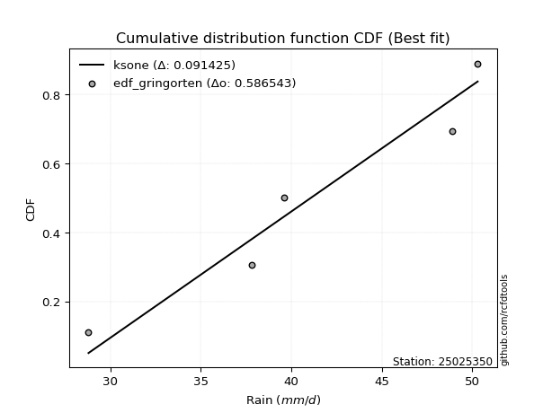</img>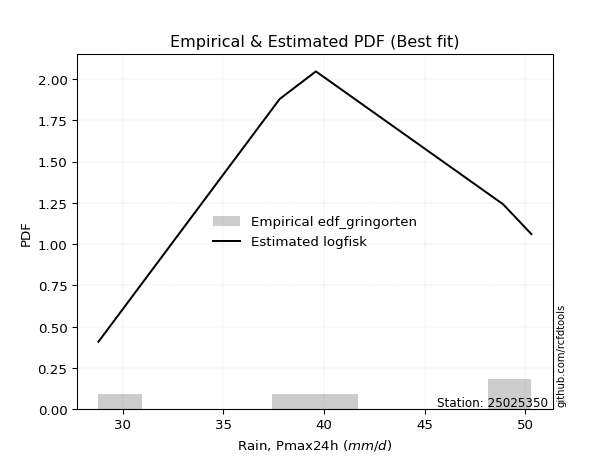</img>

</div>


### 9. Empirical - EDF Filliben (1975)

The specific values of the constants (0.3175) (often denoted as $alpha$) and (0.365) are derived from a method proposed by James J. Filliben in a 1975 paper. This particular formula is the mean value of the $i$-th order statistic of the normal distribution and is considered a robust and effective plotting position formula for the normal probability plot correlation coefficient test for normality.

<div align="center">


$P=(m-0.3175)/(n+0.365)$


</div>


**9.1. Empirical values**

<div align="center">

|                | 0                   | 1                  | 2            | 3                  | 4                  |
|:---------------|:--------------------|:-------------------|:-------------|:-------------------|:-------------------|
| date           | 2019                | 2021               | 2020         | 2017               | 2018               |
| x              | 28.8                | 37.8               | 39.6         | 48.9               | 50.3               |
| m              | 1                   | 2                  | 3            | 4                  | 5                  |
| empirical_dist | edf_filliben        | edf_filliben       | edf_filliben | edf_filliben       | edf_filliben       |
| empirical      | 0.12721342031686858 | 0.3136067101584343 | 0.5          | 0.6863932898415657 | 0.8727865796831314 |
| empirical_tr   | 1.1457554725040042  | 1.456890699253225  | 2.0          | 3.188707280832095  | 7.860805860805863  |

</div>


**9.2. Kolmogorov-Smirnov fit test (sorted by Δ)**


<div align="center">

|                | 0                   | 1                  | 2                   | 3                   | 4                  | 5                  | 6                   | 7                   | 8                   | 9                   | 10                  | 11                  | 12                 | 13                 | 14                  | 15                 | 16                  | 17                  | 18                 | 19                  | 20                 | 21                 | 22                  | 23                 | 24                  | 25                 | 26                  | 27                 | 28                  | 29                  | 30                  | 31                  | 32                 | 33                  | 34                  | 35                  | 36                  | 37                  | 38                  | 39                  | 40                  | 41                 | 42                  | 43                  | 44                 | 45                  | 46                 | 47                    | 48                  | 49                  | 50                 | 51                  | 52                  | 53                  | 54                  | 55                  | 56                  | 57                  | 58                 | 59                  | 60                 | 61                  | 62                  | 63                 | 64                 | 65                 | 66                  | 67                  | 68                  | 69                 | 70                 | 71                  | 72                 | 73                 | 74                 | 75                  | 76                  | 77                 | 78                 | 79                 | 80                  | 81                  | 82                  | 83                 | 84                 | 85                 | 86                 | 87                 | 88                 | 89                 |
|:---------------|:--------------------|:-------------------|:--------------------|:--------------------|:-------------------|:-------------------|:--------------------|:--------------------|:--------------------|:--------------------|:--------------------|:--------------------|:-------------------|:-------------------|:--------------------|:-------------------|:--------------------|:--------------------|:-------------------|:--------------------|:-------------------|:-------------------|:--------------------|:-------------------|:--------------------|:-------------------|:--------------------|:-------------------|:--------------------|:--------------------|:--------------------|:--------------------|:-------------------|:--------------------|:--------------------|:--------------------|:--------------------|:--------------------|:--------------------|:--------------------|:--------------------|:-------------------|:--------------------|:--------------------|:-------------------|:--------------------|:-------------------|:----------------------|:--------------------|:--------------------|:-------------------|:--------------------|:--------------------|:--------------------|:--------------------|:--------------------|:--------------------|:--------------------|:-------------------|:--------------------|:-------------------|:--------------------|:--------------------|:-------------------|:-------------------|:-------------------|:--------------------|:--------------------|:--------------------|:-------------------|:-------------------|:--------------------|:-------------------|:-------------------|:-------------------|:--------------------|:--------------------|:-------------------|:-------------------|:-------------------|:--------------------|:--------------------|:--------------------|:-------------------|:-------------------|:-------------------|:-------------------|:-------------------|:-------------------|:-------------------|
| station        | 25025350            | 25025350           | 25025350            | 25025350            | 25025350           | 25025350           | 25025350            | 25025350            | 25025350            | 25025350            | 25025350            | 25025350            | 25025350           | 25025350           | 25025350            | 25025350           | 25025350            | 25025350            | 25025350           | 25025350            | 25025350           | 25025350           | 25025350            | 25025350           | 25025350            | 25025350           | 25025350            | 25025350           | 25025350            | 25025350            | 25025350            | 25025350            | 25025350           | 25025350            | 25025350            | 25025350            | 25025350            | 25025350            | 25025350            | 25025350            | 25025350            | 25025350           | 25025350            | 25025350            | 25025350           | 25025350            | 25025350           | 25025350              | 25025350            | 25025350            | 25025350           | 25025350            | 25025350            | 25025350            | 25025350            | 25025350            | 25025350            | 25025350            | 25025350           | 25025350            | 25025350           | 25025350            | 25025350            | 25025350           | 25025350           | 25025350           | 25025350            | 25025350            | 25025350            | 25025350           | 25025350           | 25025350            | 25025350           | 25025350           | 25025350           | 25025350            | 25025350            | 25025350           | 25025350           | 25025350           | 25025350            | 25025350            | 25025350            | 25025350           | 25025350           | 25025350           | 25025350           | 25025350           | 25025350           | 25025350           |
| empirical_dist | edf_filliben        | edf_filliben       | edf_filliben        | edf_filliben        | edf_filliben       | edf_filliben       | edf_filliben        | edf_filliben        | edf_filliben        | edf_filliben        | edf_filliben        | edf_filliben        | edf_filliben       | edf_filliben       | edf_filliben        | edf_filliben       | edf_filliben        | edf_filliben        | edf_filliben       | edf_filliben        | edf_filliben       | edf_filliben       | edf_filliben        | edf_filliben       | edf_filliben        | edf_filliben       | edf_filliben        | edf_filliben       | edf_filliben        | edf_filliben        | edf_filliben        | edf_filliben        | edf_filliben       | edf_filliben        | edf_filliben        | edf_filliben        | edf_filliben        | edf_filliben        | edf_filliben        | edf_filliben        | edf_filliben        | edf_filliben       | edf_filliben        | edf_filliben        | edf_filliben       | edf_filliben        | edf_filliben       | edf_filliben          | edf_filliben        | edf_filliben        | edf_filliben       | edf_filliben        | edf_filliben        | edf_filliben        | edf_filliben        | edf_filliben        | edf_filliben        | edf_filliben        | edf_filliben       | edf_filliben        | edf_filliben       | edf_filliben        | edf_filliben        | edf_filliben       | edf_filliben       | edf_filliben       | edf_filliben        | edf_filliben        | edf_filliben        | edf_filliben       | edf_filliben       | edf_filliben        | edf_filliben       | edf_filliben       | edf_filliben       | edf_filliben        | edf_filliben        | edf_filliben       | edf_filliben       | edf_filliben       | edf_filliben        | edf_filliben        | edf_filliben        | edf_filliben       | edf_filliben       | edf_filliben       | edf_filliben       | edf_filliben       | edf_filliben       | edf_filliben       |
| p_dist         | loginvweibull       | logfisk            | loginvgauss         | kstwobign           | logbetaprime       | logrice            | logerlang           | loginvgamma         | lograyleigh         | fisk                | invgauss            | logmaxwell          | loggamma           | loggamma           | logfatiguelife      | logf               | loghalfnorm         | lognct              | logexponnorm       | logcrystalball      | lognorm            | lognorm            | logt                | logalpha           | logpearson3         | invgamma           | gamma               | rice               | rayleigh            | maxwell             | halfnorm            | f                   | betaprime          | erlang              | alpha               | t                   | exponnorm           | crystalball         | norm                | nct                 | pearson3            | ncf                | logkstwobign        | gompertz            | logweibull_min     | weibull_min         | loggenexpon        | loglaplace_asymmetric | laplace_asymmetric  | loggumbel_r         | loghalflogistic    | loglogistic         | loggumbel_l         | gumbel_r            | halflogistic        | logmoyal            | logistic            | moyal               | loghypsecant       | gumbel_l            | logmielke          | hypsecant           | loglaplace          | mielke             | laplace            | logloggamma        | logwald             | wald                | logncf              | loggompertz        | expon              | genexpon            | loggibrat          | gibrat             | logexpon           | nakagami            | logtruncnorm        | lognakagami        | truncnorm          | logchi2            | johnsonsu           | pareto              | loglognorm          | logpareto          | logjohnsonsu       | invweibull         | fatiguelife        | chi2               | loggenlogistic     | genlogistic        |
| delta          | 0.12105561672402937 | 0.1310448055099096 | 0.13809040482348778 | 0.13881759243162328 | 0.1401614796039259 | 0.1424443524723038 | 0.14257217749449336 | 0.14347441589699927 | 0.14360735217997433 | 0.14362280364736912 | 0.14362990033313583 | 0.14392776257639706 | 0.1440030598225419 | 0.1440030598225419 | 0.14407556241040054 | 0.1450186603320761 | 0.14506854178997908 | 0.14513803719418217 | 0.1451880651416545 | 0.14518873323163406 | 0.1451887358340882 | 0.1451887358340882 | 0.14518885286957905 | 0.1452808857294159 | 0.14616869803324717 | 0.1500975399253468 | 0.15019772236202644 | 0.1502290763537767 | 0.15039545322118264 | 0.15100269730983973 | 0.15108796937127011 | 0.15189412111244283 | 0.1520189687454152 | 0.15235468776847527 | 0.15330286031399265 | 0.15332030129357666 | 0.15332088943614897 | 0.15332199131670954 | 0.15332199454342543 | 0.15332590193219953 | 0.15390668464770974 | 0.1549435200398953 | 0.15553246778898966 | 0.15680442504290204 | 0.1570933705496933 | 0.15718271122999228 | 0.1591236977102219 | 0.16027544242486624   | 0.16109621496312998 | 0.16250643783923435 | 0.1632496129100408 | 0.16455242504925716 | 0.16763689122580683 | 0.16826353483864676 | 0.16849579012713323 | 0.16893336940924852 | 0.17195344487937414 | 0.17406318629085626 | 0.1750127698629489 | 0.17923842590806638 | 0.1813825369181854 | 0.18178093023035002 | 0.18505299633244787 | 0.1855880710266724 | 0.1908890613432399 | 0.1940661620610704 | 0.19465501383268569 | 0.19834178917089207 | 0.19887468624457605 | 0.1990626314299891 | 0.2058793417954073 | 0.20606280936205074 | 0.2193604003854266 | 0.2224709380181702 | 0.2417894998026982 | 0.30949461326240846 | 0.31360335131754474 | 0.3136050993583654 | 0.3136057864636704 | 0.342530037264118  | 0.34572396636747016 | 0.36330729802236733 | 0.36789782943434296 | 0.3698454887640504 | 0.4512592032338313 | 0.4627304736992594 | 0.515208522826291  | 0.6787526916100486 | 0.6863932898415657 | 0.6863932898415657 |
| deltao         | 0.5865427407550001  | 0.5865427407550001 | 0.5865427407550001  | 0.5865427407550001  | 0.5865427407550001 | 0.5865427407550001 | 0.5865427407550001  | 0.5865427407550001  | 0.5865427407550001  | 0.5865427407550001  | 0.5865427407550001  | 0.5865427407550001  | 0.5865427407550001 | 0.5865427407550001 | 0.5865427407550001  | 0.5865427407550001 | 0.5865427407550001  | 0.5865427407550001  | 0.5865427407550001 | 0.5865427407550001  | 0.5865427407550001 | 0.5865427407550001 | 0.5865427407550001  | 0.5865427407550001 | 0.5865427407550001  | 0.5865427407550001 | 0.5865427407550001  | 0.5865427407550001 | 0.5865427407550001  | 0.5865427407550001  | 0.5865427407550001  | 0.5865427407550001  | 0.5865427407550001 | 0.5865427407550001  | 0.5865427407550001  | 0.5865427407550001  | 0.5865427407550001  | 0.5865427407550001  | 0.5865427407550001  | 0.5865427407550001  | 0.5865427407550001  | 0.5865427407550001 | 0.5865427407550001  | 0.5865427407550001  | 0.5865427407550001 | 0.5865427407550001  | 0.5865427407550001 | 0.5865427407550001    | 0.5865427407550001  | 0.5865427407550001  | 0.5865427407550001 | 0.5865427407550001  | 0.5865427407550001  | 0.5865427407550001  | 0.5865427407550001  | 0.5865427407550001  | 0.5865427407550001  | 0.5865427407550001  | 0.5865427407550001 | 0.5865427407550001  | 0.5865427407550001 | 0.5865427407550001  | 0.5865427407550001  | 0.5865427407550001 | 0.5865427407550001 | 0.5865427407550001 | 0.5865427407550001  | 0.5865427407550001  | 0.5865427407550001  | 0.5865427407550001 | 0.5865427407550001 | 0.5865427407550001  | 0.5865427407550001 | 0.5865427407550001 | 0.5865427407550001 | 0.5865427407550001  | 0.5865427407550001  | 0.5865427407550001 | 0.5865427407550001 | 0.5865427407550001 | 0.5865427407550001  | 0.5865427407550001  | 0.5865427407550001  | 0.5865427407550001 | 0.5865427407550001 | 0.5865427407550001 | 0.5865427407550001 | 0.5865427407550001 | 0.5865427407550001 | 0.5865427407550001 |
| eval           | Δo > Δ              | Δo > Δ             | Δo > Δ              | Δo > Δ              | Δo > Δ             | Δo > Δ             | Δo > Δ              | Δo > Δ              | Δo > Δ              | Δo > Δ              | Δo > Δ              | Δo > Δ              | Δo > Δ             | Δo > Δ             | Δo > Δ              | Δo > Δ             | Δo > Δ              | Δo > Δ              | Δo > Δ             | Δo > Δ              | Δo > Δ             | Δo > Δ             | Δo > Δ              | Δo > Δ             | Δo > Δ              | Δo > Δ             | Δo > Δ              | Δo > Δ             | Δo > Δ              | Δo > Δ              | Δo > Δ              | Δo > Δ              | Δo > Δ             | Δo > Δ              | Δo > Δ              | Δo > Δ              | Δo > Δ              | Δo > Δ              | Δo > Δ              | Δo > Δ              | Δo > Δ              | Δo > Δ             | Δo > Δ              | Δo > Δ              | Δo > Δ             | Δo > Δ              | Δo > Δ             | Δo > Δ                | Δo > Δ              | Δo > Δ              | Δo > Δ             | Δo > Δ              | Δo > Δ              | Δo > Δ              | Δo > Δ              | Δo > Δ              | Δo > Δ              | Δo > Δ              | Δo > Δ             | Δo > Δ              | Δo > Δ             | Δo > Δ              | Δo > Δ              | Δo > Δ             | Δo > Δ             | Δo > Δ             | Δo > Δ              | Δo > Δ              | Δo > Δ              | Δo > Δ             | Δo > Δ             | Δo > Δ              | Δo > Δ             | Δo > Δ             | Δo > Δ             | Δo > Δ              | Δo > Δ              | Δo > Δ             | Δo > Δ             | Δo > Δ             | Δo > Δ              | Δo > Δ              | Δo > Δ              | Δo > Δ             | Δo > Δ             | Δo > Δ             | Δo > Δ             | Δo <= Δ            | Δo <= Δ            | Δo <= Δ            |
| fit            | 1                   | 1                  | 1                   | 1                   | 1                  | 1                  | 1                   | 1                   | 1                   | 1                   | 1                   | 1                   | 1                  | 1                  | 1                   | 1                  | 1                   | 1                   | 1                  | 1                   | 1                  | 1                  | 1                   | 1                  | 1                   | 1                  | 1                   | 1                  | 1                   | 1                   | 1                   | 1                   | 1                  | 1                   | 1                   | 1                   | 1                   | 1                   | 1                   | 1                   | 1                   | 1                  | 1                   | 1                   | 1                  | 1                   | 1                  | 1                     | 1                   | 1                   | 1                  | 1                   | 1                   | 1                   | 1                   | 1                   | 1                   | 1                   | 1                  | 1                   | 1                  | 1                   | 1                   | 1                  | 1                  | 1                  | 1                   | 1                   | 1                   | 1                  | 1                  | 1                   | 1                  | 1                  | 1                  | 1                   | 1                   | 1                  | 1                  | 1                  | 1                   | 1                   | 1                   | 1                  | 1                  | 1                  | 1                  | 0                  | 0                  | 0                  |
| n              | 5                   | 5                  | 5                   | 5                   | 5                  | 5                  | 5                   | 5                   | 5                   | 5                   | 5                   | 5                   | 5                  | 5                  | 5                   | 5                  | 5                   | 5                   | 5                  | 5                   | 5                  | 5                  | 5                   | 5                  | 5                   | 5                  | 5                   | 5                  | 5                   | 5                   | 5                   | 5                   | 5                  | 5                   | 5                   | 5                   | 5                   | 5                   | 5                   | 5                   | 5                   | 5                  | 5                   | 5                   | 5                  | 5                   | 5                  | 5                     | 5                   | 5                   | 5                  | 5                   | 5                   | 5                   | 5                   | 5                   | 5                   | 5                   | 5                  | 5                   | 5                  | 5                   | 5                   | 5                  | 5                  | 5                  | 5                   | 5                   | 5                   | 5                  | 5                  | 5                   | 5                  | 5                  | 5                  | 5                   | 5                   | 5                  | 5                  | 5                  | 5                   | 5                   | 5                   | 5                  | 5                  | 5                  | 5                  | 5                  | 5                  | 5                  |
| best_fit       | 1                   | 0                  | 0                   | 0                   | 0                  | 0                  | 0                   | 0                   | 0                   | 0                   | 0                   | 0                   | 0                  | 0                  | 0                   | 0                  | 0                   | 0                   | 0                  | 0                   | 0                  | 0                  | 0                   | 0                  | 0                   | 0                  | 0                   | 0                  | 0                   | 0                   | 0                   | 0                   | 0                  | 0                   | 0                   | 0                   | 0                   | 0                   | 0                   | 0                   | 0                   | 0                  | 0                   | 0                   | 0                  | 0                   | 0                  | 0                     | 0                   | 0                   | 0                  | 0                   | 0                   | 0                   | 0                   | 0                   | 0                   | 0                   | 0                  | 0                   | 0                  | 0                   | 0                   | 0                  | 0                  | 0                  | 0                   | 0                   | 0                   | 0                  | 0                  | 0                   | 0                  | 0                  | 0                  | 0                   | 0                   | 0                  | 0                  | 0                  | 0                   | 0                   | 0                   | 0                  | 0                  | 0                  | 0                  | 0                  | 0                  | 0                  |
| best_fit_sort  | 1                   | 2                  | 3                   | 4                   | 5                  | 6                  | 7                   | 8                   | 9                   | 10                  | 11                  | 12                  | 13                 | 14                 | 15                  | 16                 | 17                  | 18                  | 19                 | 20                  | 21                 | 22                 | 23                  | 24                 | 25                  | 26                 | 27                  | 28                 | 29                  | 30                  | 31                  | 32                  | 33                 | 34                  | 35                  | 36                  | 37                  | 38                  | 39                  | 40                  | 41                  | 42                 | 43                  | 44                  | 45                 | 46                  | 47                 | 48                    | 49                  | 50                  | 51                 | 52                  | 53                  | 54                  | 55                  | 56                  | 57                  | 58                  | 59                 | 60                  | 61                 | 62                  | 63                  | 64                 | 65                 | 66                 | 67                  | 68                  | 69                  | 70                 | 71                 | 72                  | 73                 | 74                 | 75                 | 76                  | 77                  | 78                 | 79                 | 80                 | 81                  | 82                  | 83                  | 84                 | 85                 | 86                 | 87                 | 88                 | 89                 | 90                 |

</div>


<div align="center">

</img>

</div>


**9.3. Best fit**

<div align="center">

|   id |   station | empirical_dist   | p_dist        |    delta |   deltao | eval   |   fit |   n |   best_fit |   best_fit_sort |
|-----:|----------:|:-----------------|:--------------|---------:|---------:|:-------|------:|----:|-----------:|----------------:|
|    0 |  25025350 | edf_filliben     | loginvweibull | 0.121056 | 0.586543 | Δo > Δ |     1 |   5 |          1 |               1 |

</div>


<div align="center">

</img>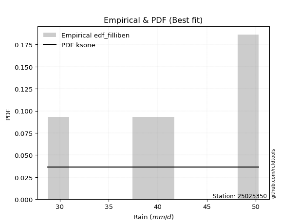</img>

</div>


### 10. Empirical - EDF Jenkinson (1977)

The Jenkinson formula in hydrology is an empirical plotting position formula used to estimate the non-exceedance probability _(P)_ or return period _(T)_ of a given ordered observation within a sample. It is a widely used method in the frequency analysis of extreme events such as floods and rainfall, as it provides a distribution-free way to plot data. _a≈0.31_ and _b≈0.38_ are constants derived to approximate the median of the probability distribution for the given rank.

<div align="center">


$P=(m-a)/(n+b)$


</div>


**10.1. Empirical values**

<div align="center">

|                | 0                   | 1                  | 2             | 3                  | 4                  |
|:---------------|:--------------------|:-------------------|:--------------|:-------------------|:-------------------|
| date           | 2019                | 2021               | 2020          | 2017               | 2018               |
| x              | 28.8                | 37.8               | 39.6          | 48.9               | 50.3               |
| m              | 1                   | 2                  | 3             | 4                  | 5                  |
| empirical_dist | edf_jenkinson       | edf_jenkinson      | edf_jenkinson | edf_jenkinson      | edf_jenkinson      |
| empirical      | 0.12825278810408922 | 0.3141263940520446 | 0.5           | 0.6858736059479554 | 0.8717472118959109 |
| empirical_tr   | 1.1471215351812367  | 1.4579945799457996 | 2.0           | 3.183431952662722  | 7.797101449275368  |

</div>


**10.2. Kolmogorov-Smirnov fit test (sorted by Δ)**


<div align="center">

|                | 0                   | 1                   | 2                  | 3                   | 4                   | 5                   | 6                  | 7                  | 8                   | 9                   | 10                  | 11                 | 12                  | 13                  | 14                  | 15                  | 16                 | 17                 | 18                  | 19                 | 20                  | 21                  | 22                 | 23                  | 24                 | 25                  | 26                  | 27                  | 28                  | 29                  | 30                  | 31                  | 32                  | 33                 | 34                  | 35                 | 36                 | 37                  | 38                  | 39                  | 40                  | 41                 | 42                  | 43                  | 44                  | 45                 | 46                  | 47                    | 48                  | 49                 | 50                  | 51                 | 52                  | 53                 | 54                  | 55                  | 56                  | 57                 | 58                  | 59                 | 60                  | 61                  | 62                 | 63                  | 64                  | 65                  | 66                  | 67                  | 68                  | 69                 | 70                  | 71                 | 72                  | 73                  | 74                  | 75                 | 76                 | 77                  | 78                 | 79                  | 80                 | 81                 | 82                 | 83                  | 84                  | 85                 | 86                 | 87                 | 88                 | 89                 |
|:---------------|:--------------------|:--------------------|:-------------------|:--------------------|:--------------------|:--------------------|:-------------------|:-------------------|:--------------------|:--------------------|:--------------------|:-------------------|:--------------------|:--------------------|:--------------------|:--------------------|:-------------------|:-------------------|:--------------------|:-------------------|:--------------------|:--------------------|:-------------------|:--------------------|:-------------------|:--------------------|:--------------------|:--------------------|:--------------------|:--------------------|:--------------------|:--------------------|:--------------------|:-------------------|:--------------------|:-------------------|:-------------------|:--------------------|:--------------------|:--------------------|:--------------------|:-------------------|:--------------------|:--------------------|:--------------------|:-------------------|:--------------------|:----------------------|:--------------------|:-------------------|:--------------------|:-------------------|:--------------------|:-------------------|:--------------------|:--------------------|:--------------------|:-------------------|:--------------------|:-------------------|:--------------------|:--------------------|:-------------------|:--------------------|:--------------------|:--------------------|:--------------------|:--------------------|:--------------------|:-------------------|:--------------------|:-------------------|:--------------------|:--------------------|:--------------------|:-------------------|:-------------------|:--------------------|:-------------------|:--------------------|:-------------------|:-------------------|:-------------------|:--------------------|:--------------------|:-------------------|:-------------------|:-------------------|:-------------------|:-------------------|
| station        | 25025350            | 25025350            | 25025350           | 25025350            | 25025350            | 25025350            | 25025350           | 25025350           | 25025350            | 25025350            | 25025350            | 25025350           | 25025350            | 25025350            | 25025350            | 25025350            | 25025350           | 25025350           | 25025350            | 25025350           | 25025350            | 25025350            | 25025350           | 25025350            | 25025350           | 25025350            | 25025350            | 25025350            | 25025350            | 25025350            | 25025350            | 25025350            | 25025350            | 25025350           | 25025350            | 25025350           | 25025350           | 25025350            | 25025350            | 25025350            | 25025350            | 25025350           | 25025350            | 25025350            | 25025350            | 25025350           | 25025350            | 25025350              | 25025350            | 25025350           | 25025350            | 25025350           | 25025350            | 25025350           | 25025350            | 25025350            | 25025350            | 25025350           | 25025350            | 25025350           | 25025350            | 25025350            | 25025350           | 25025350            | 25025350            | 25025350            | 25025350            | 25025350            | 25025350            | 25025350           | 25025350            | 25025350           | 25025350            | 25025350            | 25025350            | 25025350           | 25025350           | 25025350            | 25025350           | 25025350            | 25025350           | 25025350           | 25025350           | 25025350            | 25025350            | 25025350           | 25025350           | 25025350           | 25025350           | 25025350           |
| empirical_dist | edf_jenkinson       | edf_jenkinson       | edf_jenkinson      | edf_jenkinson       | edf_jenkinson       | edf_jenkinson       | edf_jenkinson      | edf_jenkinson      | edf_jenkinson       | edf_jenkinson       | edf_jenkinson       | edf_jenkinson      | edf_jenkinson       | edf_jenkinson       | edf_jenkinson       | edf_jenkinson       | edf_jenkinson      | edf_jenkinson      | edf_jenkinson       | edf_jenkinson      | edf_jenkinson       | edf_jenkinson       | edf_jenkinson      | edf_jenkinson       | edf_jenkinson      | edf_jenkinson       | edf_jenkinson       | edf_jenkinson       | edf_jenkinson       | edf_jenkinson       | edf_jenkinson       | edf_jenkinson       | edf_jenkinson       | edf_jenkinson      | edf_jenkinson       | edf_jenkinson      | edf_jenkinson      | edf_jenkinson       | edf_jenkinson       | edf_jenkinson       | edf_jenkinson       | edf_jenkinson      | edf_jenkinson       | edf_jenkinson       | edf_jenkinson       | edf_jenkinson      | edf_jenkinson       | edf_jenkinson         | edf_jenkinson       | edf_jenkinson      | edf_jenkinson       | edf_jenkinson      | edf_jenkinson       | edf_jenkinson      | edf_jenkinson       | edf_jenkinson       | edf_jenkinson       | edf_jenkinson      | edf_jenkinson       | edf_jenkinson      | edf_jenkinson       | edf_jenkinson       | edf_jenkinson      | edf_jenkinson       | edf_jenkinson       | edf_jenkinson       | edf_jenkinson       | edf_jenkinson       | edf_jenkinson       | edf_jenkinson      | edf_jenkinson       | edf_jenkinson      | edf_jenkinson       | edf_jenkinson       | edf_jenkinson       | edf_jenkinson      | edf_jenkinson      | edf_jenkinson       | edf_jenkinson      | edf_jenkinson       | edf_jenkinson      | edf_jenkinson      | edf_jenkinson      | edf_jenkinson       | edf_jenkinson       | edf_jenkinson      | edf_jenkinson      | edf_jenkinson      | edf_jenkinson      | edf_jenkinson      |
| p_dist         | loginvweibull       | logfisk             | loginvgauss        | kstwobign           | logbetaprime        | logrice             | logerlang          | loginvgamma        | lograyleigh         | fisk                | invgauss            | logmaxwell         | loggamma            | loggamma            | logfatiguelife      | logf                | loghalfnorm        | lognct             | logexponnorm        | logcrystalball     | lognorm             | lognorm             | logt               | logalpha            | logpearson3        | invgamma            | gamma               | rice                | rayleigh            | maxwell             | halfnorm            | f                   | betaprime           | erlang             | alpha               | t                  | exponnorm          | crystalball         | norm                | nct                 | pearson3            | logkstwobign       | ncf                 | gompertz            | logweibull_min      | weibull_min        | loggenexpon         | loglaplace_asymmetric | laplace_asymmetric  | loggumbel_r        | loghalflogistic     | loglogistic        | loggumbel_l         | gumbel_r           | halflogistic        | logmoyal            | logistic            | moyal              | loghypsecant        | gumbel_l           | logmielke           | hypsecant           | loglaplace         | mielke              | laplace             | logloggamma         | logwald             | logncf              | loggompertz         | wald               | expon               | genexpon           | loggibrat           | gibrat              | logexpon            | nakagami           | logtruncnorm       | lognakagami         | truncnorm          | logchi2             | johnsonsu          | pareto             | loglognorm         | logpareto           | logjohnsonsu        | invweibull         | fatiguelife        | chi2               | loggenlogistic     | genlogistic        |
| delta          | 0.12053593283041902 | 0.13156448940351984 | 0.138610088717098  | 0.13933727632523352 | 0.14068116349753612 | 0.14296403636591404 | 0.1430918613881036 | 0.1439940997906095 | 0.14412703607358457 | 0.14414248754097936 | 0.14414958422674606 | 0.1444474464700073 | 0.14452274371615215 | 0.14452274371615215 | 0.14459524630401077 | 0.14553834422568634 | 0.1455882256835893 | 0.1456577210877924 | 0.14570774903526473 | 0.1457084171252443 | 0.14570841972769843 | 0.14570841972769843 | 0.1457085367631893 | 0.14580056962302612 | 0.1466883819268574 | 0.15061722381895704 | 0.15071740625563668 | 0.15074876024738693 | 0.15091513711479287 | 0.15152238120344996 | 0.15160765326488035 | 0.15241380500605306 | 0.15253865263902544 | 0.1528743716620855 | 0.15382254420760288 | 0.1538399851871869 | 0.1538405733297592 | 0.15384167521031977 | 0.15384167843703567 | 0.15384558582580976 | 0.15442636854131997 | 0.1550127838953793 | 0.15546320393350554 | 0.15732410893651227 | 0.15761305444330354 | 0.1577023951236025 | 0.15860401381661154 | 0.16079512631847648   | 0.16161589885674021 | 0.1630261217328446 | 0.16376929680365104 | 0.1650721089428674 | 0.16815657511941706 | 0.168783218732257  | 0.16901547402074346 | 0.16945305330285876 | 0.17247312877298437 | 0.1745828701844665 | 0.17553245375655913 | 0.1797581098016766 | 0.18190222081179563 | 0.18230061412396026 | 0.1855726802260581 | 0.18610775492028264 | 0.19140874523685014 | 0.19458584595468065 | 0.19517469772629592 | 0.19783531845735547 | 0.19854294753637874 | 0.1988614730645023 | 0.20535965790179694 | 0.2055431254684404 | 0.21988008427903682 | 0.22299062191178043 | 0.24126981590908786 | 0.3100142971560188 | 0.3141230352111551 | 0.31412478325197574 | 0.3141254703572807 | 0.34149066947689743 | 0.3452042824738599 | 0.362787614128757  | 0.3673781455407326 | 0.36932580487044003 | 0.45073951934022105 | 0.4616911059120388 | 0.5146888389326807 | 0.6782330077164382 | 0.6858736059479554 | 0.6858736059479554 |
| deltao         | 0.5865427407550001  | 0.5865427407550001  | 0.5865427407550001 | 0.5865427407550001  | 0.5865427407550001  | 0.5865427407550001  | 0.5865427407550001 | 0.5865427407550001 | 0.5865427407550001  | 0.5865427407550001  | 0.5865427407550001  | 0.5865427407550001 | 0.5865427407550001  | 0.5865427407550001  | 0.5865427407550001  | 0.5865427407550001  | 0.5865427407550001 | 0.5865427407550001 | 0.5865427407550001  | 0.5865427407550001 | 0.5865427407550001  | 0.5865427407550001  | 0.5865427407550001 | 0.5865427407550001  | 0.5865427407550001 | 0.5865427407550001  | 0.5865427407550001  | 0.5865427407550001  | 0.5865427407550001  | 0.5865427407550001  | 0.5865427407550001  | 0.5865427407550001  | 0.5865427407550001  | 0.5865427407550001 | 0.5865427407550001  | 0.5865427407550001 | 0.5865427407550001 | 0.5865427407550001  | 0.5865427407550001  | 0.5865427407550001  | 0.5865427407550001  | 0.5865427407550001 | 0.5865427407550001  | 0.5865427407550001  | 0.5865427407550001  | 0.5865427407550001 | 0.5865427407550001  | 0.5865427407550001    | 0.5865427407550001  | 0.5865427407550001 | 0.5865427407550001  | 0.5865427407550001 | 0.5865427407550001  | 0.5865427407550001 | 0.5865427407550001  | 0.5865427407550001  | 0.5865427407550001  | 0.5865427407550001 | 0.5865427407550001  | 0.5865427407550001 | 0.5865427407550001  | 0.5865427407550001  | 0.5865427407550001 | 0.5865427407550001  | 0.5865427407550001  | 0.5865427407550001  | 0.5865427407550001  | 0.5865427407550001  | 0.5865427407550001  | 0.5865427407550001 | 0.5865427407550001  | 0.5865427407550001 | 0.5865427407550001  | 0.5865427407550001  | 0.5865427407550001  | 0.5865427407550001 | 0.5865427407550001 | 0.5865427407550001  | 0.5865427407550001 | 0.5865427407550001  | 0.5865427407550001 | 0.5865427407550001 | 0.5865427407550001 | 0.5865427407550001  | 0.5865427407550001  | 0.5865427407550001 | 0.5865427407550001 | 0.5865427407550001 | 0.5865427407550001 | 0.5865427407550001 |
| eval           | Δo > Δ              | Δo > Δ              | Δo > Δ             | Δo > Δ              | Δo > Δ              | Δo > Δ              | Δo > Δ             | Δo > Δ             | Δo > Δ              | Δo > Δ              | Δo > Δ              | Δo > Δ             | Δo > Δ              | Δo > Δ              | Δo > Δ              | Δo > Δ              | Δo > Δ             | Δo > Δ             | Δo > Δ              | Δo > Δ             | Δo > Δ              | Δo > Δ              | Δo > Δ             | Δo > Δ              | Δo > Δ             | Δo > Δ              | Δo > Δ              | Δo > Δ              | Δo > Δ              | Δo > Δ              | Δo > Δ              | Δo > Δ              | Δo > Δ              | Δo > Δ             | Δo > Δ              | Δo > Δ             | Δo > Δ             | Δo > Δ              | Δo > Δ              | Δo > Δ              | Δo > Δ              | Δo > Δ             | Δo > Δ              | Δo > Δ              | Δo > Δ              | Δo > Δ             | Δo > Δ              | Δo > Δ                | Δo > Δ              | Δo > Δ             | Δo > Δ              | Δo > Δ             | Δo > Δ              | Δo > Δ             | Δo > Δ              | Δo > Δ              | Δo > Δ              | Δo > Δ             | Δo > Δ              | Δo > Δ             | Δo > Δ              | Δo > Δ              | Δo > Δ             | Δo > Δ              | Δo > Δ              | Δo > Δ              | Δo > Δ              | Δo > Δ              | Δo > Δ              | Δo > Δ             | Δo > Δ              | Δo > Δ             | Δo > Δ              | Δo > Δ              | Δo > Δ              | Δo > Δ             | Δo > Δ             | Δo > Δ              | Δo > Δ             | Δo > Δ              | Δo > Δ             | Δo > Δ             | Δo > Δ             | Δo > Δ              | Δo > Δ              | Δo > Δ             | Δo > Δ             | Δo <= Δ            | Δo <= Δ            | Δo <= Δ            |
| fit            | 1                   | 1                   | 1                  | 1                   | 1                   | 1                   | 1                  | 1                  | 1                   | 1                   | 1                   | 1                  | 1                   | 1                   | 1                   | 1                   | 1                  | 1                  | 1                   | 1                  | 1                   | 1                   | 1                  | 1                   | 1                  | 1                   | 1                   | 1                   | 1                   | 1                   | 1                   | 1                   | 1                   | 1                  | 1                   | 1                  | 1                  | 1                   | 1                   | 1                   | 1                   | 1                  | 1                   | 1                   | 1                   | 1                  | 1                   | 1                     | 1                   | 1                  | 1                   | 1                  | 1                   | 1                  | 1                   | 1                   | 1                   | 1                  | 1                   | 1                  | 1                   | 1                   | 1                  | 1                   | 1                   | 1                   | 1                   | 1                   | 1                   | 1                  | 1                   | 1                  | 1                   | 1                   | 1                   | 1                  | 1                  | 1                   | 1                  | 1                   | 1                  | 1                  | 1                  | 1                   | 1                   | 1                  | 1                  | 0                  | 0                  | 0                  |
| n              | 5                   | 5                   | 5                  | 5                   | 5                   | 5                   | 5                  | 5                  | 5                   | 5                   | 5                   | 5                  | 5                   | 5                   | 5                   | 5                   | 5                  | 5                  | 5                   | 5                  | 5                   | 5                   | 5                  | 5                   | 5                  | 5                   | 5                   | 5                   | 5                   | 5                   | 5                   | 5                   | 5                   | 5                  | 5                   | 5                  | 5                  | 5                   | 5                   | 5                   | 5                   | 5                  | 5                   | 5                   | 5                   | 5                  | 5                   | 5                     | 5                   | 5                  | 5                   | 5                  | 5                   | 5                  | 5                   | 5                   | 5                   | 5                  | 5                   | 5                  | 5                   | 5                   | 5                  | 5                   | 5                   | 5                   | 5                   | 5                   | 5                   | 5                  | 5                   | 5                  | 5                   | 5                   | 5                   | 5                  | 5                  | 5                   | 5                  | 5                   | 5                  | 5                  | 5                  | 5                   | 5                   | 5                  | 5                  | 5                  | 5                  | 5                  |
| best_fit       | 1                   | 0                   | 0                  | 0                   | 0                   | 0                   | 0                  | 0                  | 0                   | 0                   | 0                   | 0                  | 0                   | 0                   | 0                   | 0                   | 0                  | 0                  | 0                   | 0                  | 0                   | 0                   | 0                  | 0                   | 0                  | 0                   | 0                   | 0                   | 0                   | 0                   | 0                   | 0                   | 0                   | 0                  | 0                   | 0                  | 0                  | 0                   | 0                   | 0                   | 0                   | 0                  | 0                   | 0                   | 0                   | 0                  | 0                   | 0                     | 0                   | 0                  | 0                   | 0                  | 0                   | 0                  | 0                   | 0                   | 0                   | 0                  | 0                   | 0                  | 0                   | 0                   | 0                  | 0                   | 0                   | 0                   | 0                   | 0                   | 0                   | 0                  | 0                   | 0                  | 0                   | 0                   | 0                   | 0                  | 0                  | 0                   | 0                  | 0                   | 0                  | 0                  | 0                  | 0                   | 0                   | 0                  | 0                  | 0                  | 0                  | 0                  |
| best_fit_sort  | 1                   | 2                   | 3                  | 4                   | 5                   | 6                   | 7                  | 8                  | 9                   | 10                  | 11                  | 12                 | 13                  | 14                  | 15                  | 16                  | 17                 | 18                 | 19                  | 20                 | 21                  | 22                  | 23                 | 24                  | 25                 | 26                  | 27                  | 28                  | 29                  | 30                  | 31                  | 32                  | 33                  | 34                 | 35                  | 36                 | 37                 | 38                  | 39                  | 40                  | 41                  | 42                 | 43                  | 44                  | 45                  | 46                 | 47                  | 48                    | 49                  | 50                 | 51                  | 52                 | 53                  | 54                 | 55                  | 56                  | 57                  | 58                 | 59                  | 60                 | 61                  | 62                  | 63                 | 64                  | 65                  | 66                  | 67                  | 68                  | 69                  | 70                 | 71                  | 72                 | 73                  | 74                  | 75                  | 76                 | 77                 | 78                  | 79                 | 80                  | 81                 | 82                 | 83                 | 84                  | 85                  | 86                 | 87                 | 88                 | 89                 | 90                 |

</div>


<div align="center">

</img>

</div>


**10.3. Best fit**

<div align="center">

|   id |   station | empirical_dist   | p_dist        |    delta |   deltao | eval   |   fit |   n |   best_fit |   best_fit_sort |
|-----:|----------:|:-----------------|:--------------|---------:|---------:|:-------|------:|----:|-----------:|----------------:|
|    0 |  25025350 | edf_jenkinson    | loginvweibull | 0.120536 | 0.586543 | Δo > Δ |     1 |   5 |          1 |               1 |

</div>


<div align="center">

</img>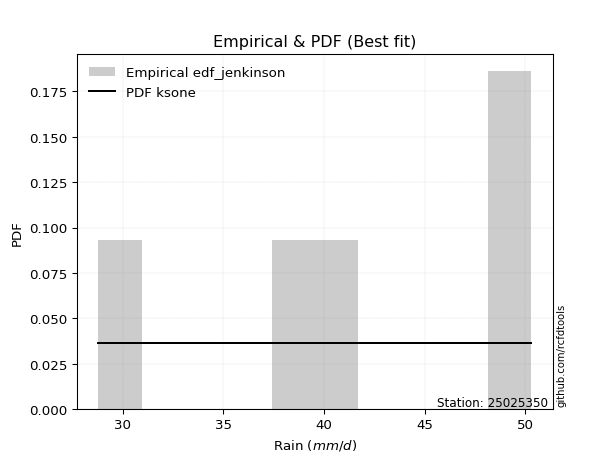</img>

</div>


### 11. Empirical - EDF Cunnane (1978)

Cunnane´s work in statistical hydrology has focused on the performance and evaluation of different probability distributions (such as GEV, Gumbel, Lognormal) for flood frequency estimation. _b_ is a constant, typically set to 0.4.

<div align="center">


$P=(m-b)/(n+1-2b)$


</div>


**11.1. Empirical values**

<div align="center">

|                | 0                   | 1                  | 2           | 3                  | 4                  |
|:---------------|:--------------------|:-------------------|:------------|:-------------------|:-------------------|
| date           | 2019                | 2021               | 2020        | 2017               | 2018               |
| x              | 28.8                | 37.8               | 39.6        | 48.9               | 50.3               |
| m              | 1                   | 2                  | 3           | 4                  | 5                  |
| empirical_dist | edf_cunnane         | edf_cunnane        | edf_cunnane | edf_cunnane        | edf_cunnane        |
| empirical      | 0.11538461538461538 | 0.3076923076923077 | 0.5         | 0.6923076923076923 | 0.8846153846153845 |
| empirical_tr   | 1.1304347826086958  | 1.4444444444444444 | 2.0         | 3.25               | 8.666666666666655  |

</div>


**11.2. Kolmogorov-Smirnov fit test (sorted by Δ)**


<div align="center">

|                | 0                   | 1                   | 2                   | 3                   | 4                   | 5                   | 6                   | 7                   | 8                  | 9                  | 10                 | 11                  | 12                 | 13                 | 14                  | 15                 | 16                  | 17                  | 18                  | 19                  | 20                  | 21                  | 22                  | 23                  | 24                  | 25                  | 26                  | 27                  | 28                 | 29                 | 30                 | 31                  | 32                  | 33                  | 34                  | 35                  | 36                  | 37                 | 38                 | 39                 | 40                 | 41                 | 42                  | 43                  | 44                  | 45                    | 46                  | 47                  | 48                  | 49                  | 50                  | 51                 | 52                  | 53                 | 54                 | 55                  | 56                  | 57                  | 58                  | 59                  | 60                  | 61                 | 62                  | 63                  | 64                  | 65                 | 66                  | 67                  | 68                  | 69                  | 70                  | 71                 | 72                  | 73                  | 74                  | 75                 | 76                 | 77                 | 78                 | 79                 | 80                  | 81                 | 82                 | 83                  | 84                 | 85                 | 86                 | 87                 | 88                 | 89                 |
|:---------------|:--------------------|:--------------------|:--------------------|:--------------------|:--------------------|:--------------------|:--------------------|:--------------------|:-------------------|:-------------------|:-------------------|:--------------------|:-------------------|:-------------------|:--------------------|:-------------------|:--------------------|:--------------------|:--------------------|:--------------------|:--------------------|:--------------------|:--------------------|:--------------------|:--------------------|:--------------------|:--------------------|:--------------------|:-------------------|:-------------------|:-------------------|:--------------------|:--------------------|:--------------------|:--------------------|:--------------------|:--------------------|:-------------------|:-------------------|:-------------------|:-------------------|:-------------------|:--------------------|:--------------------|:--------------------|:----------------------|:--------------------|:--------------------|:--------------------|:--------------------|:--------------------|:-------------------|:--------------------|:-------------------|:-------------------|:--------------------|:--------------------|:--------------------|:--------------------|:--------------------|:--------------------|:-------------------|:--------------------|:--------------------|:--------------------|:-------------------|:--------------------|:--------------------|:--------------------|:--------------------|:--------------------|:-------------------|:--------------------|:--------------------|:--------------------|:-------------------|:-------------------|:-------------------|:-------------------|:-------------------|:--------------------|:-------------------|:-------------------|:--------------------|:-------------------|:-------------------|:-------------------|:-------------------|:-------------------|:-------------------|
| station        | 25025350            | 25025350            | 25025350            | 25025350            | 25025350            | 25025350            | 25025350            | 25025350            | 25025350           | 25025350           | 25025350           | 25025350            | 25025350           | 25025350           | 25025350            | 25025350           | 25025350            | 25025350            | 25025350            | 25025350            | 25025350            | 25025350            | 25025350            | 25025350            | 25025350            | 25025350            | 25025350            | 25025350            | 25025350           | 25025350           | 25025350           | 25025350            | 25025350            | 25025350            | 25025350            | 25025350            | 25025350            | 25025350           | 25025350           | 25025350           | 25025350           | 25025350           | 25025350            | 25025350            | 25025350            | 25025350              | 25025350            | 25025350            | 25025350            | 25025350            | 25025350            | 25025350           | 25025350            | 25025350           | 25025350           | 25025350            | 25025350            | 25025350            | 25025350            | 25025350            | 25025350            | 25025350           | 25025350            | 25025350            | 25025350            | 25025350           | 25025350            | 25025350            | 25025350            | 25025350            | 25025350            | 25025350           | 25025350            | 25025350            | 25025350            | 25025350           | 25025350           | 25025350           | 25025350           | 25025350           | 25025350            | 25025350           | 25025350           | 25025350            | 25025350           | 25025350           | 25025350           | 25025350           | 25025350           | 25025350           |
| empirical_dist | edf_cunnane         | edf_cunnane         | edf_cunnane         | edf_cunnane         | edf_cunnane         | edf_cunnane         | edf_cunnane         | edf_cunnane         | edf_cunnane        | edf_cunnane        | edf_cunnane        | edf_cunnane         | edf_cunnane        | edf_cunnane        | edf_cunnane         | edf_cunnane        | edf_cunnane         | edf_cunnane         | edf_cunnane         | edf_cunnane         | edf_cunnane         | edf_cunnane         | edf_cunnane         | edf_cunnane         | edf_cunnane         | edf_cunnane         | edf_cunnane         | edf_cunnane         | edf_cunnane        | edf_cunnane        | edf_cunnane        | edf_cunnane         | edf_cunnane         | edf_cunnane         | edf_cunnane         | edf_cunnane         | edf_cunnane         | edf_cunnane        | edf_cunnane        | edf_cunnane        | edf_cunnane        | edf_cunnane        | edf_cunnane         | edf_cunnane         | edf_cunnane         | edf_cunnane           | edf_cunnane         | edf_cunnane         | edf_cunnane         | edf_cunnane         | edf_cunnane         | edf_cunnane        | edf_cunnane         | edf_cunnane        | edf_cunnane        | edf_cunnane         | edf_cunnane         | edf_cunnane         | edf_cunnane         | edf_cunnane         | edf_cunnane         | edf_cunnane        | edf_cunnane         | edf_cunnane         | edf_cunnane         | edf_cunnane        | edf_cunnane         | edf_cunnane         | edf_cunnane         | edf_cunnane         | edf_cunnane         | edf_cunnane        | edf_cunnane         | edf_cunnane         | edf_cunnane         | edf_cunnane        | edf_cunnane        | edf_cunnane        | edf_cunnane        | edf_cunnane        | edf_cunnane         | edf_cunnane        | edf_cunnane        | edf_cunnane         | edf_cunnane        | edf_cunnane        | edf_cunnane        | edf_cunnane        | edf_cunnane        | edf_cunnane        |
| p_dist         | logfisk             | loginvweibull       | loginvgauss         | kstwobign           | logbetaprime        | logrice             | logerlang           | loginvgamma         | lograyleigh        | fisk               | invgauss           | logmaxwell          | loggamma           | loggamma           | logfatiguelife      | logf               | lognct              | logexponnorm        | logcrystalball      | lognorm             | lognorm             | logt                | logalpha            | logpearson3         | invgamma            | gamma               | rice                | rayleigh            | maxwell            | halfnorm           | f                  | betaprime           | erlang              | alpha               | t                   | exponnorm           | crystalball         | norm               | nct                | pearson3           | ncf                | loghalfnorm        | gompertz            | logweibull_min      | weibull_min         | loglaplace_asymmetric | laplace_asymmetric  | loggumbel_r         | loglogistic         | logkstwobign        | loghalflogistic     | loggumbel_l        | gumbel_r            | halflogistic       | logmoyal           | loggenexpon         | logistic            | moyal               | loghypsecant        | gumbel_l            | logmielke           | hypsecant          | loglaplace          | mielke              | laplace             | logloggamma        | wald                | logwald             | loggompertz         | logncf              | expon               | genexpon           | loggibrat           | gibrat              | logexpon            | nakagami           | logtruncnorm       | lognakagami        | truncnorm          | johnsonsu          | logchi2             | pareto             | loglognorm         | logpareto           | logjohnsonsu       | invweibull         | fatiguelife        | chi2               | loggenlogistic     | genlogistic        |
| delta          | 0.12513040304378298 | 0.12697001919015594 | 0.13217600235736116 | 0.13290318996549666 | 0.13424707713779926 | 0.13652995000617718 | 0.13665777502836673 | 0.13756001343087265 | 0.1376929497138477 | 0.1377084011812425 | 0.1377154978670092 | 0.13801336011027043 | 0.1380886573564153 | 0.1380886573564153 | 0.13816115994427391 | 0.1391042578659495 | 0.13922363472805555 | 0.13927366267552788 | 0.13927433076550744 | 0.13927433336796158 | 0.13927433336796158 | 0.13927445040345243 | 0.13936648326328926 | 0.14025429556712055 | 0.14418313745922018 | 0.14428331989589982 | 0.14431467388765007 | 0.14448105075505602 | 0.1450882948437131 | 0.1451735669051435 | 0.1459797186463162 | 0.14610456627928858 | 0.14644028530234865 | 0.14738845784786603 | 0.14740589882745003 | 0.14740648697002234 | 0.14740758885058292 | 0.1474075920772988 | 0.1474114994660729 | 0.1479922821815831 | 0.1490291175737687 | 0.1492015749727038 | 0.15089002257677542 | 0.15117896808356668 | 0.15126830876386566 | 0.15436103995873962   | 0.15518181249700336 | 0.15659203537310773 | 0.15863802258313053 | 0.16144687025511623 | 0.16151784641959666 | 0.1617224887596802 | 0.16234913237252013 | 0.1625813876610066 | 0.1630189669431219 | 0.16503810017634846 | 0.16603904241324752 | 0.16814878382472964 | 0.16909836739682227 | 0.17332402344193976 | 0.17546813445205878 | 0.1758665277642234 | 0.17913859386632125 | 0.17967366856054579 | 0.18497465887711328 | 0.1881517595949438 | 0.19242738670476545 | 0.19847240969489965 | 0.20497703389611566 | 0.21070349117682907 | 0.21179374426153386 | 0.2119772118281773 | 0.21344599791929997 | 0.21655653555204357 | 0.24770390226882477 | 0.3035802107962819 | 0.3076889488514182 | 0.3076906968922388 | 0.3076913839975438 | 0.3516383688335968 | 0.35435884219637104 | 0.3692217004884939 | 0.3738122319004695 | 0.37575989123017695 | 0.4571736056999579 | 0.4745592786315124 | 0.5211229252924177 | 0.6846670940761752 | 0.6923076923076923 | 0.6923076923076923 |
| deltao         | 0.5865427407550001  | 0.5865427407550001  | 0.5865427407550001  | 0.5865427407550001  | 0.5865427407550001  | 0.5865427407550001  | 0.5865427407550001  | 0.5865427407550001  | 0.5865427407550001 | 0.5865427407550001 | 0.5865427407550001 | 0.5865427407550001  | 0.5865427407550001 | 0.5865427407550001 | 0.5865427407550001  | 0.5865427407550001 | 0.5865427407550001  | 0.5865427407550001  | 0.5865427407550001  | 0.5865427407550001  | 0.5865427407550001  | 0.5865427407550001  | 0.5865427407550001  | 0.5865427407550001  | 0.5865427407550001  | 0.5865427407550001  | 0.5865427407550001  | 0.5865427407550001  | 0.5865427407550001 | 0.5865427407550001 | 0.5865427407550001 | 0.5865427407550001  | 0.5865427407550001  | 0.5865427407550001  | 0.5865427407550001  | 0.5865427407550001  | 0.5865427407550001  | 0.5865427407550001 | 0.5865427407550001 | 0.5865427407550001 | 0.5865427407550001 | 0.5865427407550001 | 0.5865427407550001  | 0.5865427407550001  | 0.5865427407550001  | 0.5865427407550001    | 0.5865427407550001  | 0.5865427407550001  | 0.5865427407550001  | 0.5865427407550001  | 0.5865427407550001  | 0.5865427407550001 | 0.5865427407550001  | 0.5865427407550001 | 0.5865427407550001 | 0.5865427407550001  | 0.5865427407550001  | 0.5865427407550001  | 0.5865427407550001  | 0.5865427407550001  | 0.5865427407550001  | 0.5865427407550001 | 0.5865427407550001  | 0.5865427407550001  | 0.5865427407550001  | 0.5865427407550001 | 0.5865427407550001  | 0.5865427407550001  | 0.5865427407550001  | 0.5865427407550001  | 0.5865427407550001  | 0.5865427407550001 | 0.5865427407550001  | 0.5865427407550001  | 0.5865427407550001  | 0.5865427407550001 | 0.5865427407550001 | 0.5865427407550001 | 0.5865427407550001 | 0.5865427407550001 | 0.5865427407550001  | 0.5865427407550001 | 0.5865427407550001 | 0.5865427407550001  | 0.5865427407550001 | 0.5865427407550001 | 0.5865427407550001 | 0.5865427407550001 | 0.5865427407550001 | 0.5865427407550001 |
| eval           | Δo > Δ              | Δo > Δ              | Δo > Δ              | Δo > Δ              | Δo > Δ              | Δo > Δ              | Δo > Δ              | Δo > Δ              | Δo > Δ             | Δo > Δ             | Δo > Δ             | Δo > Δ              | Δo > Δ             | Δo > Δ             | Δo > Δ              | Δo > Δ             | Δo > Δ              | Δo > Δ              | Δo > Δ              | Δo > Δ              | Δo > Δ              | Δo > Δ              | Δo > Δ              | Δo > Δ              | Δo > Δ              | Δo > Δ              | Δo > Δ              | Δo > Δ              | Δo > Δ             | Δo > Δ             | Δo > Δ             | Δo > Δ              | Δo > Δ              | Δo > Δ              | Δo > Δ              | Δo > Δ              | Δo > Δ              | Δo > Δ             | Δo > Δ             | Δo > Δ             | Δo > Δ             | Δo > Δ             | Δo > Δ              | Δo > Δ              | Δo > Δ              | Δo > Δ                | Δo > Δ              | Δo > Δ              | Δo > Δ              | Δo > Δ              | Δo > Δ              | Δo > Δ             | Δo > Δ              | Δo > Δ             | Δo > Δ             | Δo > Δ              | Δo > Δ              | Δo > Δ              | Δo > Δ              | Δo > Δ              | Δo > Δ              | Δo > Δ             | Δo > Δ              | Δo > Δ              | Δo > Δ              | Δo > Δ             | Δo > Δ              | Δo > Δ              | Δo > Δ              | Δo > Δ              | Δo > Δ              | Δo > Δ             | Δo > Δ              | Δo > Δ              | Δo > Δ              | Δo > Δ             | Δo > Δ             | Δo > Δ             | Δo > Δ             | Δo > Δ             | Δo > Δ              | Δo > Δ             | Δo > Δ             | Δo > Δ              | Δo > Δ             | Δo > Δ             | Δo > Δ             | Δo <= Δ            | Δo <= Δ            | Δo <= Δ            |
| fit            | 1                   | 1                   | 1                   | 1                   | 1                   | 1                   | 1                   | 1                   | 1                  | 1                  | 1                  | 1                   | 1                  | 1                  | 1                   | 1                  | 1                   | 1                   | 1                   | 1                   | 1                   | 1                   | 1                   | 1                   | 1                   | 1                   | 1                   | 1                   | 1                  | 1                  | 1                  | 1                   | 1                   | 1                   | 1                   | 1                   | 1                   | 1                  | 1                  | 1                  | 1                  | 1                  | 1                   | 1                   | 1                   | 1                     | 1                   | 1                   | 1                   | 1                   | 1                   | 1                  | 1                   | 1                  | 1                  | 1                   | 1                   | 1                   | 1                   | 1                   | 1                   | 1                  | 1                   | 1                   | 1                   | 1                  | 1                   | 1                   | 1                   | 1                   | 1                   | 1                  | 1                   | 1                   | 1                   | 1                  | 1                  | 1                  | 1                  | 1                  | 1                   | 1                  | 1                  | 1                   | 1                  | 1                  | 1                  | 0                  | 0                  | 0                  |
| n              | 5                   | 5                   | 5                   | 5                   | 5                   | 5                   | 5                   | 5                   | 5                  | 5                  | 5                  | 5                   | 5                  | 5                  | 5                   | 5                  | 5                   | 5                   | 5                   | 5                   | 5                   | 5                   | 5                   | 5                   | 5                   | 5                   | 5                   | 5                   | 5                  | 5                  | 5                  | 5                   | 5                   | 5                   | 5                   | 5                   | 5                   | 5                  | 5                  | 5                  | 5                  | 5                  | 5                   | 5                   | 5                   | 5                     | 5                   | 5                   | 5                   | 5                   | 5                   | 5                  | 5                   | 5                  | 5                  | 5                   | 5                   | 5                   | 5                   | 5                   | 5                   | 5                  | 5                   | 5                   | 5                   | 5                  | 5                   | 5                   | 5                   | 5                   | 5                   | 5                  | 5                   | 5                   | 5                   | 5                  | 5                  | 5                  | 5                  | 5                  | 5                   | 5                  | 5                  | 5                   | 5                  | 5                  | 5                  | 5                  | 5                  | 5                  |
| best_fit       | 1                   | 0                   | 0                   | 0                   | 0                   | 0                   | 0                   | 0                   | 0                  | 0                  | 0                  | 0                   | 0                  | 0                  | 0                   | 0                  | 0                   | 0                   | 0                   | 0                   | 0                   | 0                   | 0                   | 0                   | 0                   | 0                   | 0                   | 0                   | 0                  | 0                  | 0                  | 0                   | 0                   | 0                   | 0                   | 0                   | 0                   | 0                  | 0                  | 0                  | 0                  | 0                  | 0                   | 0                   | 0                   | 0                     | 0                   | 0                   | 0                   | 0                   | 0                   | 0                  | 0                   | 0                  | 0                  | 0                   | 0                   | 0                   | 0                   | 0                   | 0                   | 0                  | 0                   | 0                   | 0                   | 0                  | 0                   | 0                   | 0                   | 0                   | 0                   | 0                  | 0                   | 0                   | 0                   | 0                  | 0                  | 0                  | 0                  | 0                  | 0                   | 0                  | 0                  | 0                   | 0                  | 0                  | 0                  | 0                  | 0                  | 0                  |
| best_fit_sort  | 1                   | 2                   | 3                   | 4                   | 5                   | 6                   | 7                   | 8                   | 9                  | 10                 | 11                 | 12                  | 13                 | 14                 | 15                  | 16                 | 17                  | 18                  | 19                  | 20                  | 21                  | 22                  | 23                  | 24                  | 25                  | 26                  | 27                  | 28                  | 29                 | 30                 | 31                 | 32                  | 33                  | 34                  | 35                  | 36                  | 37                  | 38                 | 39                 | 40                 | 41                 | 42                 | 43                  | 44                  | 45                  | 46                    | 47                  | 48                  | 49                  | 50                  | 51                  | 52                 | 53                  | 54                 | 55                 | 56                  | 57                  | 58                  | 59                  | 60                  | 61                  | 62                 | 63                  | 64                  | 65                  | 66                 | 67                  | 68                  | 69                  | 70                  | 71                  | 72                 | 73                  | 74                  | 75                  | 76                 | 77                 | 78                 | 79                 | 80                 | 81                  | 82                 | 83                 | 84                  | 85                 | 86                 | 87                 | 88                 | 89                 | 90                 |

</div>


<div align="center">

</img>

</div>


**11.3. Best fit**

<div align="center">

|   id |   station | empirical_dist   | p_dist   |   delta |   deltao | eval   |   fit |   n |   best_fit |   best_fit_sort |
|-----:|----------:|:-----------------|:---------|--------:|---------:|:-------|------:|----:|-----------:|----------------:|
|    0 |  25025350 | edf_cunnane      | logfisk  | 0.12513 | 0.586543 | Δo > Δ |     1 |   5 |          1 |               1 |

</div>


<div align="center">

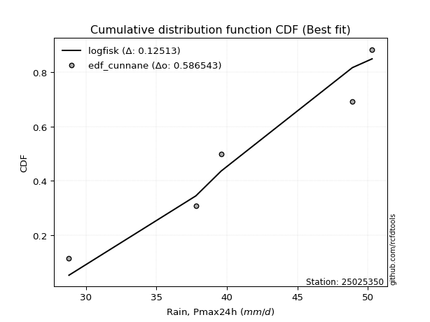</img></img>

</div>


### 12. Empirical - EDF Adamowski (1981)

The Adamowski formula in hydrology refers to a specific plotting position formula used for estimating the non-parametric empirical distribution of hydrological events (like flood peaks) to calculate their return periods. This formula provides an alternative to traditional parametric methods (like the Gumbel or Log Pearson Type III distributions). 

<div align="center">


$P=(m-0.25)/(n+0.5)$


</div>


**12.1. Empirical values**

<div align="center">

|                | 0                   | 1                  | 2             | 3                  | 4                  |
|:---------------|:--------------------|:-------------------|:--------------|:-------------------|:-------------------|
| date           | 2019                | 2021               | 2020          | 2017               | 2018               |
| x              | 28.8                | 37.8               | 39.6          | 48.9               | 50.3               |
| m              | 1                   | 2                  | 3             | 4                  | 5                  |
| empirical_dist | edf_adamowski       | edf_adamowski      | edf_adamowski | edf_adamowski      | edf_adamowski      |
| empirical      | 0.13636363636363635 | 0.3181818181818182 | 0.5           | 0.6818181818181818 | 0.8636363636363636 |
| empirical_tr   | 1.1578947368421053  | 1.4666666666666666 | 2.0           | 3.1428571428571423 | 7.333333333333334  |

</div>


**12.2. Kolmogorov-Smirnov fit test (sorted by Δ)**


<div align="center">

|                | 0                   | 1                  | 2                   | 3                   | 4                  | 5                  | 6                   | 7                   | 8                   | 9                   | 10                  | 11                  | 12                 | 13                 | 14                  | 15                 | 16                  | 17                  | 18                 | 19                  | 20                 | 21                 | 22                  | 23                 | 24                  | 25                  | 26                 | 27                 | 28                  | 29                 | 30                  | 31                  | 32                  | 33                  | 34                 | 35                  | 36                  | 37                  | 38                  | 39                  | 40                  | 41                  | 42                  | 43                 | 44                  | 45                 | 46                  | 47                    | 48                  | 49                  | 50                 | 51                  | 52                  | 53                  | 54                  | 55                  | 56                  | 57                  | 58                 | 59                  | 60                 | 61                  | 62                  | 63                  | 64                 | 65                 | 66                 | 67                 | 68                 | 69                 | 70                  | 71                  | 72                 | 73                 | 74                 | 75                  | 76                  | 77                 | 78                 | 79                 | 80                  | 81                  | 82                  | 83                 | 84                 | 85                 | 86                 | 87                 | 88                 | 89                 |
|:---------------|:--------------------|:-------------------|:--------------------|:--------------------|:-------------------|:-------------------|:--------------------|:--------------------|:--------------------|:--------------------|:--------------------|:--------------------|:-------------------|:-------------------|:--------------------|:-------------------|:--------------------|:--------------------|:-------------------|:--------------------|:-------------------|:-------------------|:--------------------|:-------------------|:--------------------|:--------------------|:-------------------|:-------------------|:--------------------|:-------------------|:--------------------|:--------------------|:--------------------|:--------------------|:-------------------|:--------------------|:--------------------|:--------------------|:--------------------|:--------------------|:--------------------|:--------------------|:--------------------|:-------------------|:--------------------|:-------------------|:--------------------|:----------------------|:--------------------|:--------------------|:-------------------|:--------------------|:--------------------|:--------------------|:--------------------|:--------------------|:--------------------|:--------------------|:-------------------|:--------------------|:-------------------|:--------------------|:--------------------|:--------------------|:-------------------|:-------------------|:-------------------|:-------------------|:-------------------|:-------------------|:--------------------|:--------------------|:-------------------|:-------------------|:-------------------|:--------------------|:--------------------|:-------------------|:-------------------|:-------------------|:--------------------|:--------------------|:--------------------|:-------------------|:-------------------|:-------------------|:-------------------|:-------------------|:-------------------|:-------------------|
| station        | 25025350            | 25025350           | 25025350            | 25025350            | 25025350           | 25025350           | 25025350            | 25025350            | 25025350            | 25025350            | 25025350            | 25025350            | 25025350           | 25025350           | 25025350            | 25025350           | 25025350            | 25025350            | 25025350           | 25025350            | 25025350           | 25025350           | 25025350            | 25025350           | 25025350            | 25025350            | 25025350           | 25025350           | 25025350            | 25025350           | 25025350            | 25025350            | 25025350            | 25025350            | 25025350           | 25025350            | 25025350            | 25025350            | 25025350            | 25025350            | 25025350            | 25025350            | 25025350            | 25025350           | 25025350            | 25025350           | 25025350            | 25025350              | 25025350            | 25025350            | 25025350           | 25025350            | 25025350            | 25025350            | 25025350            | 25025350            | 25025350            | 25025350            | 25025350           | 25025350            | 25025350           | 25025350            | 25025350            | 25025350            | 25025350           | 25025350           | 25025350           | 25025350           | 25025350           | 25025350           | 25025350            | 25025350            | 25025350           | 25025350           | 25025350           | 25025350            | 25025350            | 25025350           | 25025350           | 25025350           | 25025350            | 25025350            | 25025350            | 25025350           | 25025350           | 25025350           | 25025350           | 25025350           | 25025350           | 25025350           |
| empirical_dist | edf_adamowski       | edf_adamowski      | edf_adamowski       | edf_adamowski       | edf_adamowski      | edf_adamowski      | edf_adamowski       | edf_adamowski       | edf_adamowski       | edf_adamowski       | edf_adamowski       | edf_adamowski       | edf_adamowski      | edf_adamowski      | edf_adamowski       | edf_adamowski      | edf_adamowski       | edf_adamowski       | edf_adamowski      | edf_adamowski       | edf_adamowski      | edf_adamowski      | edf_adamowski       | edf_adamowski      | edf_adamowski       | edf_adamowski       | edf_adamowski      | edf_adamowski      | edf_adamowski       | edf_adamowski      | edf_adamowski       | edf_adamowski       | edf_adamowski       | edf_adamowski       | edf_adamowski      | edf_adamowski       | edf_adamowski       | edf_adamowski       | edf_adamowski       | edf_adamowski       | edf_adamowski       | edf_adamowski       | edf_adamowski       | edf_adamowski      | edf_adamowski       | edf_adamowski      | edf_adamowski       | edf_adamowski         | edf_adamowski       | edf_adamowski       | edf_adamowski      | edf_adamowski       | edf_adamowski       | edf_adamowski       | edf_adamowski       | edf_adamowski       | edf_adamowski       | edf_adamowski       | edf_adamowski      | edf_adamowski       | edf_adamowski      | edf_adamowski       | edf_adamowski       | edf_adamowski       | edf_adamowski      | edf_adamowski      | edf_adamowski      | edf_adamowski      | edf_adamowski      | edf_adamowski      | edf_adamowski       | edf_adamowski       | edf_adamowski      | edf_adamowski      | edf_adamowski      | edf_adamowski       | edf_adamowski       | edf_adamowski      | edf_adamowski      | edf_adamowski      | edf_adamowski       | edf_adamowski       | edf_adamowski       | edf_adamowski      | edf_adamowski      | edf_adamowski      | edf_adamowski      | edf_adamowski      | edf_adamowski      | edf_adamowski      |
| p_dist         | loginvweibull       | logfisk            | loginvgauss         | kstwobign           | logbetaprime       | logrice            | logerlang           | loginvgamma         | lograyleigh         | fisk                | invgauss            | logmaxwell          | loggamma           | loggamma           | logfatiguelife      | logf               | loghalfnorm         | lognct              | logexponnorm       | logcrystalball      | lognorm            | lognorm            | logt                | logalpha           | logpearson3         | logkstwobign        | loggenexpon        | invgamma           | gamma               | rice               | rayleigh            | maxwell             | halfnorm            | f                   | betaprime          | erlang              | alpha               | t                   | exponnorm           | crystalball         | norm                | nct                 | pearson3            | ncf                | gompertz            | logweibull_min     | weibull_min         | loglaplace_asymmetric | laplace_asymmetric  | loggumbel_r         | loghalflogistic    | loglogistic         | loggumbel_l         | gumbel_r            | halflogistic        | logmoyal            | logistic            | moyal               | loghypsecant       | gumbel_l            | logmielke          | hypsecant           | loglaplace          | logncf              | mielke             | loggompertz        | laplace            | logloggamma        | logwald            | expon              | genexpon            | wald                | loggibrat          | gibrat             | logexpon           | nakagami            | logtruncnorm        | lognakagami        | truncnorm          | logchi2            | johnsonsu           | pareto              | loglognorm          | logpareto          | logjohnsonsu       | invweibull         | fatiguelife        | chi2               | loggenlogistic     | genlogistic        |
| delta          | 0.11648050870064547 | 0.1356199135332935 | 0.14266551284687168 | 0.14339270045500718 | 0.1447365876273098 | 0.1470194604956877 | 0.14714728551787726 | 0.14804952392038317 | 0.14818246020335823 | 0.14819791167075302 | 0.14820500835651973 | 0.14850287059978096 | 0.1485781678459258 | 0.1485781678459258 | 0.14865067043378444 | 0.14959376835546   | 0.14964364981336298 | 0.14971314521756607 | 0.1497631731650384 | 0.14976384125501796 | 0.1497638438574721 | 0.1497638438574721 | 0.14976396089296296 | 0.1498559937527998 | 0.15074380605663107 | 0.15095735976560576 | 0.154548589686838  | 0.1546726479487307 | 0.15477283038541034 | 0.1548041843771606 | 0.15497056124456654 | 0.15557780533322363 | 0.15566307739465401 | 0.15646922913582673 | 0.1565940767687991 | 0.15692979579185917 | 0.15787796833737655 | 0.15789540931696056 | 0.15789599745953287 | 0.15789709934009344 | 0.15789710256680933 | 0.15790100995558343 | 0.15848179267109364 | 0.1595186280632792 | 0.16137953306628594 | 0.1616684785730772 | 0.16175781925337618 | 0.16485055044825014   | 0.16567132298651388 | 0.16708154586261825 | 0.1678247209334247 | 0.16912753307264106 | 0.17221199924919073 | 0.17283864286203066 | 0.17307089815051713 | 0.17350847743263242 | 0.17652855290275804 | 0.17863829431424016 | 0.1795878778863328 | 0.18381353393145028 | 0.1859576449415693 | 0.18635603825373392 | 0.18962810435583177 | 0.18972447019780825 | 0.1901631790500563 | 0.1944875234066052 | 0.1954641693666238 | 0.1986412700844543 | 0.1992301218560696 | 0.2013042337720234 | 0.20148770133866684 | 0.20291689719427597 | 0.2239355084088105 | 0.2270460460415541 | 0.2372143917793143 | 0.31406972128579236 | 0.31817845934092864 | 0.3181802073817493 | 0.3181808944870543 | 0.3333798212173502 | 0.34114885834408626 | 0.35873218999898343 | 0.36332272141095906 | 0.3652703807406665 | 0.4466840952104474 | 0.4535802576524916 | 0.5106334148029072 | 0.6741775835866648 | 0.6818181818181818 | 0.6818181818181818 |
| deltao         | 0.5865427407550001  | 0.5865427407550001 | 0.5865427407550001  | 0.5865427407550001  | 0.5865427407550001 | 0.5865427407550001 | 0.5865427407550001  | 0.5865427407550001  | 0.5865427407550001  | 0.5865427407550001  | 0.5865427407550001  | 0.5865427407550001  | 0.5865427407550001 | 0.5865427407550001 | 0.5865427407550001  | 0.5865427407550001 | 0.5865427407550001  | 0.5865427407550001  | 0.5865427407550001 | 0.5865427407550001  | 0.5865427407550001 | 0.5865427407550001 | 0.5865427407550001  | 0.5865427407550001 | 0.5865427407550001  | 0.5865427407550001  | 0.5865427407550001 | 0.5865427407550001 | 0.5865427407550001  | 0.5865427407550001 | 0.5865427407550001  | 0.5865427407550001  | 0.5865427407550001  | 0.5865427407550001  | 0.5865427407550001 | 0.5865427407550001  | 0.5865427407550001  | 0.5865427407550001  | 0.5865427407550001  | 0.5865427407550001  | 0.5865427407550001  | 0.5865427407550001  | 0.5865427407550001  | 0.5865427407550001 | 0.5865427407550001  | 0.5865427407550001 | 0.5865427407550001  | 0.5865427407550001    | 0.5865427407550001  | 0.5865427407550001  | 0.5865427407550001 | 0.5865427407550001  | 0.5865427407550001  | 0.5865427407550001  | 0.5865427407550001  | 0.5865427407550001  | 0.5865427407550001  | 0.5865427407550001  | 0.5865427407550001 | 0.5865427407550001  | 0.5865427407550001 | 0.5865427407550001  | 0.5865427407550001  | 0.5865427407550001  | 0.5865427407550001 | 0.5865427407550001 | 0.5865427407550001 | 0.5865427407550001 | 0.5865427407550001 | 0.5865427407550001 | 0.5865427407550001  | 0.5865427407550001  | 0.5865427407550001 | 0.5865427407550001 | 0.5865427407550001 | 0.5865427407550001  | 0.5865427407550001  | 0.5865427407550001 | 0.5865427407550001 | 0.5865427407550001 | 0.5865427407550001  | 0.5865427407550001  | 0.5865427407550001  | 0.5865427407550001 | 0.5865427407550001 | 0.5865427407550001 | 0.5865427407550001 | 0.5865427407550001 | 0.5865427407550001 | 0.5865427407550001 |
| eval           | Δo > Δ              | Δo > Δ             | Δo > Δ              | Δo > Δ              | Δo > Δ             | Δo > Δ             | Δo > Δ              | Δo > Δ              | Δo > Δ              | Δo > Δ              | Δo > Δ              | Δo > Δ              | Δo > Δ             | Δo > Δ             | Δo > Δ              | Δo > Δ             | Δo > Δ              | Δo > Δ              | Δo > Δ             | Δo > Δ              | Δo > Δ             | Δo > Δ             | Δo > Δ              | Δo > Δ             | Δo > Δ              | Δo > Δ              | Δo > Δ             | Δo > Δ             | Δo > Δ              | Δo > Δ             | Δo > Δ              | Δo > Δ              | Δo > Δ              | Δo > Δ              | Δo > Δ             | Δo > Δ              | Δo > Δ              | Δo > Δ              | Δo > Δ              | Δo > Δ              | Δo > Δ              | Δo > Δ              | Δo > Δ              | Δo > Δ             | Δo > Δ              | Δo > Δ             | Δo > Δ              | Δo > Δ                | Δo > Δ              | Δo > Δ              | Δo > Δ             | Δo > Δ              | Δo > Δ              | Δo > Δ              | Δo > Δ              | Δo > Δ              | Δo > Δ              | Δo > Δ              | Δo > Δ             | Δo > Δ              | Δo > Δ             | Δo > Δ              | Δo > Δ              | Δo > Δ              | Δo > Δ             | Δo > Δ             | Δo > Δ             | Δo > Δ             | Δo > Δ             | Δo > Δ             | Δo > Δ              | Δo > Δ              | Δo > Δ             | Δo > Δ             | Δo > Δ             | Δo > Δ              | Δo > Δ              | Δo > Δ             | Δo > Δ             | Δo > Δ             | Δo > Δ              | Δo > Δ              | Δo > Δ              | Δo > Δ             | Δo > Δ             | Δo > Δ             | Δo > Δ             | Δo <= Δ            | Δo <= Δ            | Δo <= Δ            |
| fit            | 1                   | 1                  | 1                   | 1                   | 1                  | 1                  | 1                   | 1                   | 1                   | 1                   | 1                   | 1                   | 1                  | 1                  | 1                   | 1                  | 1                   | 1                   | 1                  | 1                   | 1                  | 1                  | 1                   | 1                  | 1                   | 1                   | 1                  | 1                  | 1                   | 1                  | 1                   | 1                   | 1                   | 1                   | 1                  | 1                   | 1                   | 1                   | 1                   | 1                   | 1                   | 1                   | 1                   | 1                  | 1                   | 1                  | 1                   | 1                     | 1                   | 1                   | 1                  | 1                   | 1                   | 1                   | 1                   | 1                   | 1                   | 1                   | 1                  | 1                   | 1                  | 1                   | 1                   | 1                   | 1                  | 1                  | 1                  | 1                  | 1                  | 1                  | 1                   | 1                   | 1                  | 1                  | 1                  | 1                   | 1                   | 1                  | 1                  | 1                  | 1                   | 1                   | 1                   | 1                  | 1                  | 1                  | 1                  | 0                  | 0                  | 0                  |
| n              | 5                   | 5                  | 5                   | 5                   | 5                  | 5                  | 5                   | 5                   | 5                   | 5                   | 5                   | 5                   | 5                  | 5                  | 5                   | 5                  | 5                   | 5                   | 5                  | 5                   | 5                  | 5                  | 5                   | 5                  | 5                   | 5                   | 5                  | 5                  | 5                   | 5                  | 5                   | 5                   | 5                   | 5                   | 5                  | 5                   | 5                   | 5                   | 5                   | 5                   | 5                   | 5                   | 5                   | 5                  | 5                   | 5                  | 5                   | 5                     | 5                   | 5                   | 5                  | 5                   | 5                   | 5                   | 5                   | 5                   | 5                   | 5                   | 5                  | 5                   | 5                  | 5                   | 5                   | 5                   | 5                  | 5                  | 5                  | 5                  | 5                  | 5                  | 5                   | 5                   | 5                  | 5                  | 5                  | 5                   | 5                   | 5                  | 5                  | 5                  | 5                   | 5                   | 5                   | 5                  | 5                  | 5                  | 5                  | 5                  | 5                  | 5                  |
| best_fit       | 1                   | 0                  | 0                   | 0                   | 0                  | 0                  | 0                   | 0                   | 0                   | 0                   | 0                   | 0                   | 0                  | 0                  | 0                   | 0                  | 0                   | 0                   | 0                  | 0                   | 0                  | 0                  | 0                   | 0                  | 0                   | 0                   | 0                  | 0                  | 0                   | 0                  | 0                   | 0                   | 0                   | 0                   | 0                  | 0                   | 0                   | 0                   | 0                   | 0                   | 0                   | 0                   | 0                   | 0                  | 0                   | 0                  | 0                   | 0                     | 0                   | 0                   | 0                  | 0                   | 0                   | 0                   | 0                   | 0                   | 0                   | 0                   | 0                  | 0                   | 0                  | 0                   | 0                   | 0                   | 0                  | 0                  | 0                  | 0                  | 0                  | 0                  | 0                   | 0                   | 0                  | 0                  | 0                  | 0                   | 0                   | 0                  | 0                  | 0                  | 0                   | 0                   | 0                   | 0                  | 0                  | 0                  | 0                  | 0                  | 0                  | 0                  |
| best_fit_sort  | 1                   | 2                  | 3                   | 4                   | 5                  | 6                  | 7                   | 8                   | 9                   | 10                  | 11                  | 12                  | 13                 | 14                 | 15                  | 16                 | 17                  | 18                  | 19                 | 20                  | 21                 | 22                 | 23                  | 24                 | 25                  | 26                  | 27                 | 28                 | 29                  | 30                 | 31                  | 32                  | 33                  | 34                  | 35                 | 36                  | 37                  | 38                  | 39                  | 40                  | 41                  | 42                  | 43                  | 44                 | 45                  | 46                 | 47                  | 48                    | 49                  | 50                  | 51                 | 52                  | 53                  | 54                  | 55                  | 56                  | 57                  | 58                  | 59                 | 60                  | 61                 | 62                  | 63                  | 64                  | 65                 | 66                 | 67                 | 68                 | 69                 | 70                 | 71                  | 72                  | 73                 | 74                 | 75                 | 76                  | 77                  | 78                 | 79                 | 80                 | 81                  | 82                  | 83                  | 84                 | 85                 | 86                 | 87                 | 88                 | 89                 | 90                 |

</div>


<div align="center">

</img>

</div>


**12.3. Best fit**

<div align="center">

|   id |   station | empirical_dist   | p_dist        |    delta |   deltao | eval   |   fit |   n |   best_fit |   best_fit_sort |
|-----:|----------:|:-----------------|:--------------|---------:|---------:|:-------|------:|----:|-----------:|----------------:|
|    0 |  25025350 | edf_adamowski    | loginvweibull | 0.116481 | 0.586543 | Δo > Δ |     1 |   5 |          1 |               1 |

</div>


<div align="center">

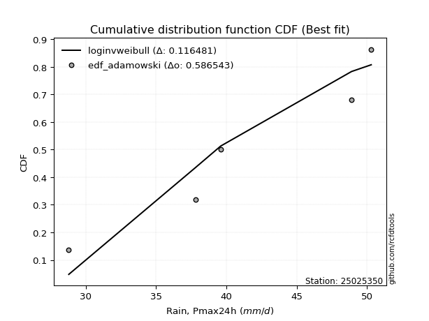</img>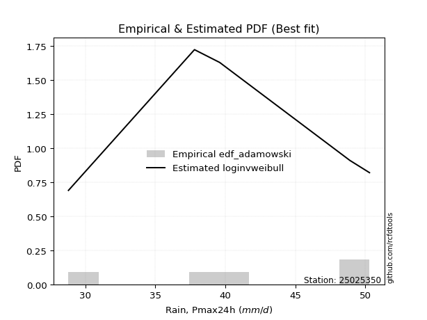</img>

</div>


## C. Best fit & Estimate extreme values for specific return periods - Tr


### 1. Best fit (ordered by delta Δ)

<div align="center">

|   id |   station | empirical_dist   | p_dist                |    delta |   deltao | eval   |   fit |   n |   best_fit |   best_fit_sort |
|-----:|----------:|:-----------------|:----------------------|---------:|---------:|:-------|------:|----:|-----------:|----------------:|
|    0 |  25025350 | edf_adamowski    | loginvweibull         | 0.116481 | 0.586543 | Δo > Δ |     1 |   5 |          1 |               1 |
|    1 |  25025350 | edf_hazen        | logfisk               | 0.117438 | 0.586543 | Δo > Δ |     1 |   5 |          1 |               2 |
|    2 |  25025350 | edf_weibull      | loginvweibull         | 0.118868 | 0.586543 | Δo > Δ |     1 |   5 |          1 |               3 |
|    3 |  25025350 | edf_chegodayev   | loginvweibull         | 0.119848 | 0.586543 | Δo > Δ |     1 |   5 |          1 |               4 |
|    4 |  25025350 | edf_jenkinson    | loginvweibull         | 0.120536 | 0.586543 | Δo > Δ |     1 |   5 |          1 |               5 |
|    5 |  25025350 | edf_beard        | loginvweibull         | 0.120536 | 0.586543 | Δo > Δ |     1 |   5 |          1 |               6 |
|    6 |  25025350 | edf_filliben     | loginvweibull         | 0.121056 | 0.586543 | Δo > Δ |     1 |   5 |          1 |               7 |
|    7 |  25025350 | edf_gringorten   | logfisk               | 0.122126 | 0.586543 | Δo > Δ |     1 |   5 |          1 |               8 |
|    8 |  25025350 | edf_tukey        | loginvweibull         | 0.122162 | 0.586543 | Δo > Δ |     1 |   5 |          1 |               9 |
|    9 |  25025350 | edf_cunnane      | logfisk               | 0.12513  | 0.586543 | Δo > Δ |     1 |   5 |          1 |              10 |
|   10 |  25025350 | edf_blom         | loginvweibull         | 0.125139 | 0.586543 | Δo > Δ |     1 |   5 |          1 |              11 |
|   11 |  25025350 | edf_california   | loglaplace_asymmetric | 0.140035 | 0.586543 | Δo > Δ |     1 |   5 |          1 |              12 |

</div>

:file_folder:Tables: [bestfit_25025350.csv](table/bestfit_25025350.csv) | [extreme_25025350.csv](table/extreme_25025350.csv)


### 2. Extreme values

In hydrology, a return period (or recurrence interval $Tr$) is the statistical average time between extreme events like floods or droughts of a specific magnitude, indicating how rare an event is, with a 100-year flood, for example, having a 1% chance of occurring in any given year, not that it happens exactly every century. It is a key tool for infrastructure design (like bridges or dams) and risk assessment, calculated from historical data to determine the probability of future events, although it is important to remember it is statistical average, and events can cluster or be missed.

> risk_rate: assuming the return period as the project useful life.

|   id |      tr |   prob_l |     prob_g |   alpha |   betaprime |    chi2 |   crystalball |   erlang |    expon |   exponnorm |       f |   fatiguelife |    fisk |   gamma |   genexpon |   genlogistic |   gibrat |   gompertz |   gumbel_l |   gumbel_r |   halflogistic |   halfnorm |   hypsecant |   invgamma |   invgauss |       invweibull |   johnsonsu |   kstwobign |   laplace |   laplace_asymmetric |   loggamma |   logistic |   lognorm |   maxwell |   mielke |   moyal |   nakagami |     ncf |     nct |    norm |           pareto |   pearson3 |   rayleigh |    rice |       t |   truncnorm |    wald |   weibull_min |   logalpha |   logbetaprime |          logchi2 |   logcrystalball |   logerlang |   logexpon |   logexponnorm |    logf |   logfatiguelife |   logfisk |   loggenexpon |   loggenlogistic |   loggibrat |   loggompertz |   loggumbel_l |   loggumbel_r |   loghalflogistic |   loghalfnorm |   loghypsecant |   loginvgamma |   loginvgauss |   loginvweibull |   logjohnsonsu |   logkstwobign |   loglaplace |   loglaplace_asymmetric |   logloggamma |   loglogistic |    loglognorm |   logmaxwell |   logmielke |   logmoyal |   lognakagami |   logncf |   lognct |      logpareto |   logpearson3 |   lograyleigh |   logrice |    logt |   logtruncnorm |   logwald |   logweibull_min |   station |   n |   risk_rate |
|-----:|--------:|---------:|-----------:|--------:|------------:|--------:|--------------:|---------:|---------:|------------:|--------:|--------------:|--------:|--------:|-----------:|--------------:|---------:|-----------:|-----------:|-----------:|---------------:|-----------:|------------:|-----------:|-----------:|-----------------:|------------:|------------:|----------:|---------------------:|-----------:|-----------:|----------:|----------:|---------:|--------:|-----------:|--------:|--------:|--------:|-----------------:|-----------:|-----------:|--------:|--------:|------------:|--------:|--------------:|-----------:|---------------:|-----------------:|-----------------:|------------:|-----------:|---------------:|--------:|-----------------:|----------:|--------------:|-----------------:|------------:|--------------:|--------------:|--------------:|------------------:|--------------:|---------------:|--------------:|--------------:|----------------:|---------------:|---------------:|-------------:|------------------------:|--------------:|--------------:|--------------:|-------------:|------------:|-----------:|--------------:|---------:|---------:|---------------:|--------------:|--------------:|----------:|--------:|---------------:|----------:|-----------------:|----------:|----:|------------:|
|    0 |    2    | 0.5      | 0.5        | 40.5688 |     40.3355 | 29.297  |       41.08   |  40.9159 |  37.3118 |     41.08   | 41.0678 |       28.8284 | 41.306  | 40.9217 |    37.3074 |           inf |  38.7168 |    41.1112 |    42.3734 |    39.7866 |        39.1436 |    39.4684 |     41.08   |    40.5965 |    40.4873 |   6842.19        |     50.2252 |     39.3969 |   41.08   |              40.3809 |    40.055  |    41.08   |   40.2802 |   40.4067 |  43.321  | 39.3691 |    38.0173 | 40.4004 | 41.0786 | 41.08   |     30.3942      |    41.4176 |    40.1679 | 40.7012 | 41.0801 |     41.9439 | 38.5279 |       41.8406 |    39.9985 |        40.2832 |     46.8786      |          40.2802 |     40.089  |    36.3399 |        40.2802 | 40.2729 |          40.2446 |   40.8384 |       38.4124 |         inf      |     37.9121 |       37.5072 |       41.6387 |       38.966  |           38.3289 |       38.6496 |        40.2802 |       40.1184 |       39.6464 |         39.2897 |        50.248  |        38.4852 |      40.2802 |                 39.9472 |       43.1315 |       40.2802 |  28.8118      |      39.5906 |     43.1698 |    38.551  |       39.6606 |  39.4922 |  39.9435 |  30.1079       |       40.9341 |       39.3488 |   39.9824 | 40.2802 |        42.0706 |   37.7287 |          41.7886 |  25025350 |   5 |    0.75     |
|    1 |    2.33 | 0.570815 | 0.429185   | 42.0005 |     41.7835 | 29.4992 |       42.4849 |  42.3342 |  39.1873 |     42.4849 | 42.4791 |       29.1705 | 42.6717 | 42.3502 |    39.1819 |           inf |  39.4285 |    42.557  |    43.5957 |    41.0884 |        40.4821 |    40.9847 |     42.2044 |    42.0381 |    41.9647 | 873495           |     50.2791 |     41.0044 |   41.9302 |              41.4766 |    41.5498 |    42.3178 |   41.7579 |   41.8663 |  44.599  | 40.6014 |    38.312  | 41.8313 | 42.4836 | 42.4849 |     31.7559      |    42.8073 |    41.6491 | 42.16   | 42.485  |     42.8126 | 39.4492 |       43.1858 |    41.4856 |        41.7823 |     55.9439      |          41.7579 |     41.5894 |    38.2503 |        41.758  | 41.751  |          41.7314 |   42.2623 |       40.1272 |         inf      |     38.6102 |       39.2249 |       42.9646 |       40.2889 |           39.6673 |       40.1819 |        41.4586 |       41.6127 |       41.1953 |         41.0795 |        50.277  |        40.1892 |      41.1681 |                 41.0047 |       44.4177 |       41.5794 |  28.9378      |      41.1006 |     44.482  |    39.7888 |       40.4571 |  43.4278 |  41.4365 |  31.2736       |       42.397  |       40.8723 |   41.501  | 41.7579 |        42.8847 |   38.6305 |          43.1386 |  25025350 |   5 |    0.729209 |
|    2 |    5    | 0.8      | 0.2        | 47.5692 |     47.5441 | 30.7546 |       47.7059 |  47.6892 |  48.5639 |     47.706  | 47.7399 |       35.8833 | 47.9449 | 47.7504 |    48.5536 |           inf |  43.5258 |    47.6966 |    47.5444 |    46.7441 |        46.5384 |    47.3968 |     46.7144 |    47.6675 |    47.8397 |      1.25558e+15 |     50.2998 |     47.8324 |   46.1809 |              46.955  |    47.7284 |    47.0972 |   47.7409 |   47.6112 |  47.9984 | 46.3097 |    42.4156 | 47.4735 | 47.7055 | 47.7059 |     85.8414      |    47.7851 |    47.5789 | 47.7158 | 47.706  |     46.9534 | 44.6062 |       47.8158 |    47.6678 |        47.9054 |    158.953       |          47.7409 |     47.7852 |    49.4181 |        47.7409 | 47.744  |          47.7706 |   48.2416 |       48.1152 |         inf      |     42.887  |       47.0866 |       47.5435 |       46.5776 |           46.3321 |       47.3629 |        46.5421 |       47.7607 |       47.859  |         49.851  |        50.2989 |        48.3095 |      45.9098 |                 46.7268 |       47.8714 |       47.0014 |   5.01794e+20 |      47.625  |     48.0092 |    46.0616 |       45.0434 |  62.3687 |  47.6617 | 142.005        |       47.8826 |       47.5856 |   47.779  | 47.7409 |        46.1483 |   44.0919 |          47.8053 |  25025350 |   5 |    0.67232  |
|    3 |   10    | 0.9      | 0.1        | 51.4946 |     51.7182 | 32.1021 |       51.1694 |  51.3151 |  57.0757 |     51.1695 | 51.2435 |       45.1492 | 51.8284 | 51.413  |    57.061  |           inf |  48.1962 |    50.8015 |    49.7428 |    51.3505 |        51.5679 |    52.1416 |     50.3158 |    51.6533 |    52.0883 |      3.61053e+22 |     50.3    |     53.0311 |   50.0396 |              51.9282 |    52.4396 |    50.6171 |   52.1755 |   51.6541 |  49.2345 | 51.2796 |    48.3427 | 51.5163 | 51.1702 | 51.1694 |    839.802       |    50.9276 |    51.8071 | 51.4786 | 51.1695 |     50.4608 | 50.0789 |       50.5933 |    52.4221 |        52.4988 |    468.718       |          52.1755 |     52.5028 |    62.3557 |        52.1755 | 52.1949 |          52.2667 |   53.1797 |       55.0223 |         inf      |     48.3427 |       53.4476 |       50.3011 |       52.4183 |           52.7103 |       53.4908 |        51.0456 |       52.42   |       53.2244 |         58.3621 |        50.2999 |        55.5755 |      50.6854 |                 52.6098 |       49.1387 |       51.4416 | inf           |      52.8281 |     49.3047 |    52.3231 |       49.3742 |  79.924  |  52.4692 |   2.20021e+11  |       51.5228 |       53.0357 |   52.5315 | 52.1755 |        48.0117 |   50.7346 |          50.6189 |  25025350 |   5 |    0.651322 |
|    4 |   15    | 0.933333 | 0.0666667  | 53.5278 |     53.9138 | 32.944  |       52.8978 |  53.1466 |  62.0549 |     52.8978 | 52.996  |       51.2092 | 53.9443 | 53.2648 |    62.0375 |           inf |  51.4177 |    52.2508 |    50.7385 |    53.9494 |        54.4141 |    54.6108 |     52.3711 |    53.7221 |    54.3185 |      5.83072e+26 |     50.3    |     55.791  |   52.2968 |              54.8373 |    54.9975 |    52.5349 |   54.5402 |   53.7285 |  49.6216 | 54.1639 |    51.9626 | 53.629  | 52.8994 | 52.8978 |   3856.48        |    52.4488 |    53.9856 | 53.3716 | 52.8979 |     52.4183 | 53.5933 |       51.9009 |    55.0189 |        54.967  |    912.95        |          54.5402 |     55.062  |    71.4418 |        54.5402 | 54.5714 |          54.6709 |   56.0797 |       59.0293 |         inf      |     52.5052 |       56.9157 |       51.602  |       56.0312 |           56.7015 |       56.9871 |        53.8084 |       54.9403 |       56.2409 |         63.7902 |        50.2999 |        59.8671 |      53.7061 |                 56.3888 |       49.5367 |       54.0349 | inf           |      55.7147 |     49.7118 |    56.3402 |       51.8723 |  90.6711 |  55.1022 |   1.55528e+48  |       53.3267 |       56.0832 |   55.0927 | 54.5402 |        48.719  |   55.5189 |          51.947  |  25025350 |   5 |    0.644736 |
|    5 |   20    | 0.95     | 0.05       | 54.8872 |     55.3941 | 33.5587 |       54.0297 |  54.354  |  65.5876 |     54.0297 | 54.1452 |       55.6958 | 55.4068 | 54.4863 |    65.5684 |           inf |  53.9447 |    53.1644 |    51.3582 |    55.7691 |        56.4083 |    56.257  |     53.821  |    55.107  |    55.8197 |      5.15421e+29 |     50.3    |     57.6501 |   53.8983 |              56.9013 |    56.7532 |    53.8604 |   56.1466 |   55.1052 |  49.8109 | 56.2066 |    54.4795 | 55.0483 | 54.0319 | 54.0297 |  11538.4         |    53.4282 |    55.4336 | 54.6158 | 54.0297 |     53.7695 | 56.2122 |       52.731  |    56.8078 |        56.6511 |   1481.37        |          56.1466 |     56.8176 |    78.6805 |        56.1466 | 56.1869 |          56.3068 |   58.1761 |       61.8776 |         inf      |     56.0196 |       59.2827 |       52.4287 |       58.708  |           59.6766 |       59.4443 |        55.8469 |       56.6666 |       58.3536 |         67.8886 |        50.3    |        62.9433 |      55.9578 |                 59.2335 |       49.7316 |       55.9034 | inf           |      57.7169 |     49.9111 |    59.3704 |       53.623  |  98.5667 |  56.9188 |   1.46868e+142 |       54.5008 |       58.205  |   56.8421 | 56.1466 |        49.092  |   59.3752 |          52.7912 |  25025350 |   5 |    0.641514 |
|    6 |   25    | 0.96     | 0.04       | 55.9026 |     56.5058 | 34.0437 |       54.8629 |  55.2469 |  68.3278 |     54.8629 | 54.9918 |       59.2607 | 56.5256 | 55.3898 |    68.3072 |           inf |  56.0513 |    53.8195 |    51.7992 |    57.1708 |        57.9447 |    57.4818 |     54.9431 |    56.1419 |    56.9458 |      9.58723e+31 |     50.3    |     59.0427 |   55.1406 |              58.5023 |    58.0883 |    54.8744 |   57.3592 |   56.1273 |  49.9232 | 57.79   |    56.385  | 56.1116 | 54.8656 | 54.8629 |  27063.1         |    54.1408 |    56.5095 | 55.5337 | 54.8629 |     54.7974 | 58.3099 |       53.3294 |    58.1716 |        57.9264 |   2167.67        |          57.3592 |     58.1522 |    84.7967 |        57.3593 | 57.4072 |          57.5431 |   59.8325 |       64.0951 |         inf      |     59.1286 |       61.0706 |       53.025  |       60.8567 |           62.0747 |       61.341  |        57.4774 |       57.9774 |       59.9832 |         71.2241 |        50.3    |        65.3506 |      57.7692 |                 61.5385 |       49.8473 |       57.3762 | inf           |      59.2498 |     50.0294 |    61.8308 |       54.9685 | 104.862  |  58.3055 | inf            |       55.3605 |       59.8333 |   58.1674 | 57.3592 |        49.3226 |   62.6563 |          53.4003 |  25025350 |   5 |    0.639603 |
|    7 |   50    | 0.98     | 0.02       | 58.8807 |     59.7955 | 35.5875 |       57.2488 |  57.8228 |  76.8396 |     57.2489 | 57.42   |       70.6983 | 59.9439 | 57.9981 |    76.8146 |           inf |  63.4773 |    55.6164 |    52.9963 |    61.4886 |        62.6786 |    61.042  |     58.4221 |    59.1803 |    60.2705 |      9.39822e+38 |     50.3    |     63.1319 |   58.9993 |              63.4755 |    62.1228 |    57.9725 |   60.9787 |   59.0915 |  50.1449 | 62.7052 |    62.0037 | 59.2457 | 57.2532 | 57.2488 | 383642           |    56.1422 |    59.6324 | 58.1706 | 57.2489 |     57.8872 | 65.1589 |       54.9866 |    62.312  |        61.7528 |   7240.83        |          60.9787 |     62.1827 |   106.996  |        60.9787 | 61.0524 |          61.2403 |   65.1913 |       71.0568 |         inf      |     71.5295 |       66.3899 |       54.6782 |       67.9829 |           70.0869 |       67.2046 |        62.8414 |       61.9288 |       65.0287 |         82.5647 |        50.3    |        72.9651 |      63.7785 |                 69.2862 |       50.0758 |       62.121  | inf           |      63.9295 |     50.2637 |    70.1376 |       59.0854 | 125.466  |  62.523  | inf            |       57.797  |       64.8226 |   62.1461 | 60.9787 |        49.7998 |   74.6853 |          55.0894 |  25025350 |   5 |    0.63583  |
|    8 |   75    | 0.986667 | 0.0133333  | 60.5233 |     61.6276 | 36.5115 |       58.5291 |  59.2166 |  81.8188 |     58.5291 | 58.725  |       77.5866 | 61.9182 | 59.4104 |    81.7911 |           inf |  68.4928 |    56.5344 |    53.6017 |    63.9982 |        65.4305 |    62.9801 |     60.4552 |    60.8575 |    62.1167 |      1.08814e+43 |     50.3    |     65.3818 |   61.2565 |              66.3846 |    64.424  |    59.7619 |   63.014  |   60.7031 |  50.218  | 65.5796 |    65.0792 | 60.9833 | 58.5344 | 58.5291 |      1.81035e+06 |    57.1922 |    61.3314 | 59.5899 | 58.5291 |     59.6284 | 69.3734 |       55.8432 |    64.6865 |        63.9176 |  14858.8         |          63.014  |     64.48   |   122.587  |        63.014  | 63.1043 |          63.3239 |   68.5024 |       75.1978 |         inf      |     81.3454 |       69.3571 |       55.5337 |       72.5024 |           75.2114 |       70.6288 |        66.2049 |       64.1765 |       67.9884 |         89.9685 |        50.3    |        77.5265 |      67.5795 |                 74.2631 |       50.1512 |       65.0382 | inf           |      66.6271 |     50.3428 |    75.5032 |       61.4556 | 138.322  |  64.9473 | inf            |       59.086  |       67.7095 |   64.3976 | 63.014  |        49.9639 |   83.2086 |          55.9638 |  25025350 |   5 |    0.634587 |
|    9 |  100    | 0.99     | 0.01       | 61.6525 |     62.8941 | 37.1746 |       59.395  |  60.1639 |  85.3515 |     59.395  | 59.6085 |       82.5429 | 63.3121 | 60.3707 |    85.322  |           inf |  72.3781 |    57.1379 |    53.9977 |    65.7745 |        67.3781 |    64.3003 |     61.8974 |    62.0111 |    63.3905 |      8.18041e+45 |     50.3    |     66.9234 |   62.858  |              68.4486 |    66.0377 |    61.0252 |   64.429  |   61.8008 |  50.2544 | 67.6189 |    67.1726 | 62.1815 | 59.401  | 59.395  |      5.44343e+06 |    57.8931 |    62.4889 | 60.5515 | 59.395  |     60.8368 | 72.4462 |       56.4103 |    66.3572 |        65.4281 |  24865.1         |          64.429  |     66.0902 |   135.008  |        64.429  | 64.5317 |          64.7744 |   70.9409 |       78.173  |         inf      |     89.8662 |       71.4056 |       56.1005 |       75.8815 |           79.0633 |       73.0608 |        68.6994 |       65.75   |       70.0992 |         95.6066 |        50.3    |        80.8153 |      70.4129 |                 78.0095 |       50.1887 |       67.1799 | inf           |      68.5294 |     50.3844 |    79.557  |       63.1232 | 147.833  |  66.6552 | inf            |       59.9495 |       69.7496 |   65.9685 | 64.429  |        50.0469 |   90.03   |          56.5432 |  25025350 |   5 |    0.633968 |
|   10 |  200    | 0.995    | 0.005      | 64.2704 |     65.8513 | 38.794  |       61.3591 |  62.3267 |  93.8633 |     61.3591 | 61.6151 |       94.6751 | 66.6558 | 62.5641 |    93.8294 |           inf |  82.9486 |    58.4572 |    54.8583 |    70.0448 |        72.0606 |    67.3199 |     65.3718 |    64.6866 |    66.3562 |      6.71711e+52 |     50.3    |     70.4739 |   66.7167 |              73.4218 |    69.8781 |    64.0557 |   67.7575 |   64.3121 |  50.3089 | 72.5321 |    71.9421 | 64.9694 | 61.3669 | 61.3591 |      7.72409e+07 |    59.4551 |    65.1374 | 62.7368 | 61.3591 |     63.6633 | 80.1002 |       57.6621 |    70.3523 |        68.9989 |  87160.2         |          67.7575 |     69.92   |   170.353  |        67.7575 | 67.8922 |          68.1927 |   77.15   |       85.485  |         inf      |    117.842  |       76.1688 |       57.3526 |       84.6638 |           89.1505 |       78.9427 |        75.1018 |       69.4866 |       75.2404 |        110.649  |        50.3    |        88.9309 |      77.7374 |                 87.831  |       50.2448 |       72.6093 | inf           |      73.0884 |     50.4563 |    90.2404 |       67.102  | 172.169  |  70.747  | inf            |       61.8808 |       74.6518 |   69.6811 | 67.7575 |        50.1727 |  109.553  |          57.8234 |  25025350 |   5 |    0.633042 |
|   11 |  250    | 0.996    | 0.004      | 65.0865 |     66.7788 | 39.3209 |       61.9593 |  62.9915 |  96.6035 |     61.9594 | 62.229  |       98.629  | 67.7293 | 63.2386 |    96.5682 |           inf |  86.7413 |    58.8473 |    55.1116 |    71.4176 |        73.566  |    68.2488 |     66.4902 |    65.5208 |    67.2838 |      1.12218e+55 |     50.3    |     71.5727 |   67.9589 |              75.0228 |    71.1037 |    65.0286 |   68.8086 |   65.0852 |  50.3199 | 74.1137 |    73.4024 | 65.8412 | 61.9677 | 61.9593 |      1.81427e+08 |    59.9248 |    65.9527 | 63.4057 | 61.9594 |     64.5493 | 82.6324 |       58.0355 |    71.633  |        70.1316 | 130986           |          68.8086 |     71.1416 |   183.596  |        68.8086 | 68.9542 |          69.2739 |   79.2564 |       87.886  |         inf      |    129.876  |       77.655  |       57.7263 |       87.6977 |           92.6593 |       80.8458 |        77.2872 |       70.6768 |       76.9162 |        115.971  |        50.3    |        91.604  |      80.2539 |                 91.2488 |       50.256  |       74.4438 | inf           |      74.5519 |     50.4744 |    93.9761 |       68.3731 | 180.456  |  72.0609 | inf            |       62.4627 |       76.2291 |   70.8583 | 68.8086 |        50.198  |  116.902  |          58.2056 |  25025350 |   5 |    0.632858 |
|   12 |  500    | 0.998    | 0.002      | 67.5522 |     69.5973 | 40.9719 |       63.7393 |  64.9736 | 105.115  |     63.7393 | 64.0516 |      111.032  | 71.0585 | 65.2505 |   105.076  |           inf |  99.8489 |    59.9697 |    55.8375 |    75.6786 |        78.2383 |    71.0185 |     69.9643 |    68.0418 |    70.0947 |      8.90082e+61 |     50.3    |     74.8655 |   71.8176 |              79.9959 |    74.8898 |    68.046  |   72.0225 |   67.3921 |  50.3433 | 79.0268 |    77.7333 | 68.4829 | 63.7494 | 63.7393 |      2.57441e+09 |    61.2968 |    68.3852 | 65.3921 | 63.7393 |     67.2339 | 90.6838 |       59.1186 |    75.6065 |        73.61   | 468528           |          72.0225 |     74.9134 |   231.661  |        72.0225 | 72.2039 |          72.585  |   86.162  |       95.5041 |         inf      |    181.753  |       82.1411 |       58.811  |       97.8243 |          104.454  |       86.7964 |        84.4893 |       74.3465 |       82.2001 |        134.176  |        50.3    |       100.105  |      88.6021 |                102.737  |       50.2784 |       80.4332 | inf           |      79.0956 |     50.5227 |   106.595  |       72.2993 | 207.699  |  76.1442 | inf            |       64.1639 |       81.136  |   74.4716 | 72.0225 |        50.2489 |  143.708  |          59.3152 |  25025350 |   5 |    0.632489 |
|   13 |  750    | 0.998667 | 0.00133333 | 68.9522 |     71.2078 | 41.9464 |       64.7281 |  66.0815 | 110.094  |     64.7281 | 65.0654 |      118.361  | 73.0035 | 66.3756 |   110.052  |           inf | 108.517  |    60.572  |    56.2255 |    78.1695 |        80.9697 |    72.5658 |     71.9965 |    69.4733 |    71.6952 |      9.61147e+65 |     50.3    |     76.7154 |   74.0748 |              82.905  |    77.0952 |    69.8088 |   73.8723 |   68.6823 |  50.3525 | 81.9008 |    80.1369 | 69.9875 | 64.7393 | 64.7281 |      1.2149e+10  |    62.0455 |    69.7454 | 66.4971 | 64.7281 |     68.7598 | 95.5113 |       59.7053 |    77.9331 |        75.6222 | 993007           |          73.8723 |     77.109  |   265.417  |        73.8723 | 74.0759 |          74.4943 |   90.4717 |      100.08   |          50.289  |    226.99   |       84.6815 |       59.3991 |      104.278  |          112.033  |       90.3095 |        89.0094 |       76.4795 |       85.3525 |        146.114  |        50.3    |       105.223  |      93.8824 |                110.117  |       50.2859 |       84.153  | inf           |      81.7566 |     50.5476 |   114.749  |       74.584  | 224.748  |  78.5398 | inf            |       65.092  |       84.0164 |   76.5603 | 73.8722 |        50.2659 |  162.645  |          59.9168 |  25025350 |   5 |    0.632366 |
|   14 | 1000    | 0.999    | 0.001      | 69.9291 |     72.3358 | 42.6412 |       65.4089 |  66.8472 | 113.627  |     65.4089 | 65.7638 |      123.588  | 74.3829 | 67.1534 |   113.583  |           inf | 115.151  |    60.9782 |    56.4866 |    79.9365 |        82.9072 |    73.6344 |     73.4384 |    70.472  |    72.8136 |      6.97925e+68 |     50.3    |     77.9969 |   75.6763 |              84.9691 |    78.6578 |    71.0589 |   75.1734 |   69.5741 |  50.358  | 83.9399 |    81.7901 | 71.0393 | 65.4209 | 65.4089 |      3.65304e+10 |    62.5555 |    70.6854 | 67.2586 | 65.4089 |     69.8239 | 98.9838 |       60.1034 |    79.5872 |        77.042  |      1.69572e+06 |          75.1734 |     78.6642 |   292.31   |        75.1734 | 75.3933 |          75.8388 |   93.658  |      103.382  |          50.2927 |    269.074  |       86.4496 |       59.7982 |      109.112  |          117.74   |       92.8183 |        92.3624 |       77.9889 |       87.6197 |        155.221  |        50.3    |       108.921  |      97.8186 |                115.672  |       50.2896 |       86.8947 | inf           |      83.648  |     50.5643 |   120.909  |       76.2011 | 237.371  |  80.2449 | inf            |       65.7236 |       86.0663 |   78.0333 | 75.1733 |        50.2745 |  177.791  |          60.3252 |  25025350 |   5 |    0.632305 |

<div align="center">

</img>

</div>


<div align="center">

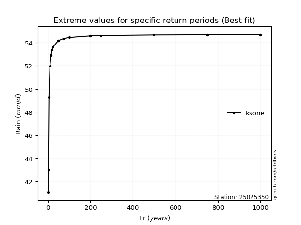</img>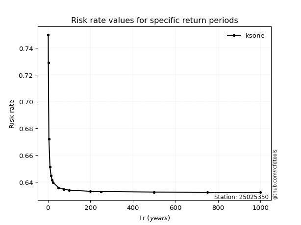</img>

</div>


<sub>**APP DISCLAIMER**: NO WARRANTY - This software is provided by [github.com/rcfdtools](https://github.com/rcfdtools) "as is", without any express or implied warranty, including warranties of merchantability, fitness for a particular purpose, or non-infringement. There is no guarantee that the software will be error-free or operate without interruption. LIMITATION OF LIABILITY - Neither the authors nor copyright holders will be liable for claims or damages arising from the software or its use. You are responsible for determining if the software is appropriate for your use and assume all associated risks, including errors, legal compliance, and data loss. NO PROFESSIONAL ADVICE - The software provides general information and does not offer professional advice. It should not replace consultation with professional advisors.</sub>