<div align="center">


</div>

# Station (rain, Pmax24h): 25025360

Probable Maximum Precipitation (PMP) is the greatest amount of rainfall for a specific duration that is meteorologically possible for a given location, acting as a "worst-case" scenario for extreme storms, crucial for designing safety-critical infrastructure like bridges, river deviations, dams, spillways, and nuclear plants to prevent catastrophic failure. PMP is calculated by hydrologists using meteorological data to determine the upper limit of extreme rainfall, often leading to the Probable Maximum Flood (PMF) for flood control design, and is increasingly being studied for climate change impacts.

<div align="center">

</img>

</div>


## A. General information


### 1. General running parameters

• app_version: _v20251225_. • runtime: _2025-12-26 14:29:50.888910_. • Python version: _3.14.0_. • SciPy version: _1.16.3_. • Pandas version: _2.3.3_. • NumPy version: _2.3.5_. • Stations dataset (station_dataset_file): _dataset/pmax24h_in/automatic_colombia.csv_. • Stations catalog (station_catalog_file): _dataset/CNE_IDEAM.xls_. • Plot only fit distributions with Δo > Δ (plot_only_fit): _True_. • Eval low extreme values, if False, evaluates high extreme values (low_extreme): _False_. • Eval every SciPy distribution as logarithmic (pdist_logarithmic_on): _True_. • Standard deviation normalized (ddof): _1.0_. • Return periods to eval in years (Tr): _[2, 2.33, 5, 10, 15, 20, 25, 50, 75, 100, 200, 250, 500, 750, 1000]_. • Minimum data sample per station, 0 means any (minimum_sample): _5_. • Z-Score threshold to adjust a value, 0 means disable (zscore): _3.5_. • Avoid zeros, e.g. rain = 0 (avoid_zeros): _True_. • Avoid null values (avoid_nans): _True_. [:file_folder:Dataset file.](../../dataset/pmax24h_in/automatic_colombia.csv)


### 2. Station info and location

|   id |   CODIGO | NOMBRE                                  | CATEGORIA               | TECNOLOGIA                              | ESTADO   | FECHA_INSTALACION   |   FECHA_SUSPENSION |   ALTITUD |   LATITUD |   LONGITUD | DEPARTAMENTO   | MUNICIPIO   | AREA_OPERATIVA                                         | ENTIDAD                                                     | AREA_HIDROGRAFICA   | ZONA_HIDROGRAFICA   | SUBZONA_HIDROGRAFICA                              |   CORRIENTE | OBSERVACION                                                                                                                                                                                                     |   SUBRED | Catalogo   |
|-----:|---------:|:----------------------------------------|:------------------------|:----------------------------------------|:---------|:--------------------|-------------------:|----------:|----------:|-----------:|:---------------|:------------|:-------------------------------------------------------|:------------------------------------------------------------|:--------------------|:--------------------|:--------------------------------------------------|------------:|:----------------------------------------------------------------------------------------------------------------------------------------------------------------------------------------------------------------|---------:|:-----------|
|    0 | 25025360 | AEROPUERTO LAS FLORES  - AUT [25025360] | Climatológica Principal | Automática con Telemetría, Convencional | Activa   | 05/05/2013          |                nan |        34 |   9.04633 |   -73.9708 | Magdalena      | El Banco    | Area Operativa 05 - Magdalena-Cesar-Guajira-San Andrés | INSTITUTO DE HIDROLOGIA METEOROLOGIA Y ESTUDIOS AMBIENTALES | Magdalena Cauca     | Bajo Magdalena      | Directos Bajo Magdalena entre El Banco y El Plato |         nan | Cambio de tecnología por instalación o repotenciación de estaciones proyecto Fondo de Adaptación|25/10/2022$Migracion$INCLUSIÓN EN MODULO DE ALERTAS POR SOLICITUD DEL COORDINADOR DEL AO 05   REQ 2022-006231. |      nan | CNE_IDEAM  |

<div align="center">

Map location in: [:earth_americas:Google](http://maps.google.com/maps?q=9.046333333,-73.97083333) [:earth_americas:OSM](https://www.openstreetmap.org/#map=18/9.046333333/-73.97083333&layers=P) [:earth_americas:Bing](https://www.bing.com/maps?cp=9.046333333~-73.97083333&lvl=18) [:earth_americas:Apple](https://maps.apple.com/frame?center=9.046333333%2C-73.97083333&span=0.003%2C0.006)

</div>


<div align="center">

```geojson
{
  "type": "Feature",
  "geometry": {
    "type": "Point", 
    "coordinates": [-73.97083333, 9.046333333]
  }, 
  "properties": {
    "Name": "25025360"
  }
}
```

</div>


### 3. Discrete values table and plot

|               |           0 |          1 |           2 |           3 |          4 |           5 |           6 |           7 |           8 |
|:--------------|------------:|-----------:|------------:|------------:|-----------:|------------:|------------:|------------:|------------:|
| Date          | 2017        | 2018       | 2019        | 2020        | 2021       | 2022        | 2023        | 2024        | 2025        |
| Value         |  178.68     |  329.9     |   80.2      |   90.8      |   14       |  131.2      |   62.3      |  131        |   70.9      |
| Value_initial |  178.68     |  329.9     |   80.2      |   90.8      |   14       |  131.2      |   62.3      |  131        |   70.9      |
| count         |    9        |    9       |    9        |    9        |    9       |    9        |    9        |    9        |    9        |
| mean          |  120.998    |  120.998   |  120.998    |  120.998    |  120.998   |  120.998    |  120.998    |  120.998    |  120.998    |
| std           |   91.6185   |   91.6185  |   91.6185   |   91.6185   |   91.6185  |   91.6185   |   91.6185   |   91.6185   |   91.6185   |
| zscore        |    0.629591 |    2.28013 |   -0.445301 |   -0.329603 |   -1.16786 |    0.111355 |   -0.640676 |    0.109173 |   -0.546808 |

<div align="center">

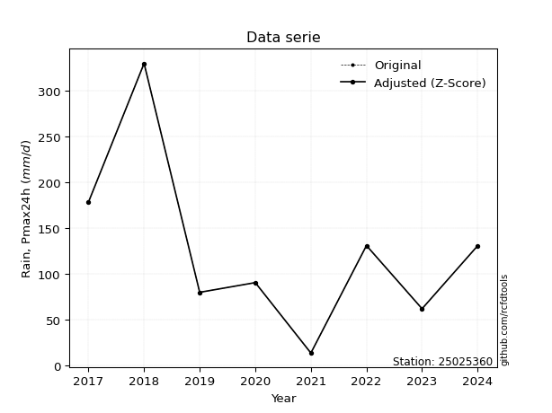</img>

</div>

> If Z-Score is active, values out of range or outliers are replaced with the station mean value.


### 4. Active continuous probability distributions from SciPy (45 of 104 available)

[scipy.stats](https://docs.scipy.org/doc/scipy/reference/stats.html) is a Python´s powerful submodule within the SciPy library for comprehensive statistical analysis, offering over 130 probability distributions (like Normal, Poisson), functions for descriptive stats (mean, variance), hypothesis testing (t-tests, chi-square), random variable generation, and statistical tests, making it essential for data science, modeling, and research. It provides tools to explore, model, and draw conclusions from data efficiently, working seamlessly with NumPy.

<div align="center">

|   id | p_dist             |   n_parameter | fit_method   | label                                                                       | active   | ref                                                                                                        |
|-----:|:-------------------|--------------:|:-------------|:----------------------------------------------------------------------------|:---------|:-----------------------------------------------------------------------------------------------------------|
|    0 | alpha              |             3 | MLE          | Alpha                                                                       | True     | [:mortar_board:](https://docs.scipy.org/doc/scipy/reference/generated/scipy.stats.alpha.html)              |
|    1 | betaprime          |             4 | MLE          | Beta prime                                                                  | True     | [:mortar_board:](https://docs.scipy.org/doc/scipy/reference/generated/scipy.stats.betaprime.html)          |
|    2 | chi2               |             3 | MLE          | Chi²                                                                        | True     | [:mortar_board:](https://docs.scipy.org/doc/scipy/reference/generated/scipy.stats.chi2.html)               |
|    3 | crystalball        |             4 | MLE          | Crystalball                                                                 | True     | [:mortar_board:](https://docs.scipy.org/doc/scipy/reference/generated/scipy.stats.crystalball.html)        |
|    4 | erlang             |             3 | MLE          | Erlang                                                                      | True     | [:mortar_board:](https://docs.scipy.org/doc/scipy/reference/generated/scipy.stats.erlang.html)             |
|    5 | expon              |             2 | MLE          | Exponential                                                                 | True     | [:mortar_board:](https://docs.scipy.org/doc/scipy/reference/generated/scipy.stats.expon.html)              |
|    6 | exponnorm          |             3 | MLE          | Exponentially modified Normal                                               | True     | [:mortar_board:](https://docs.scipy.org/doc/scipy/reference/generated/scipy.stats.exponnorm.html)          |
|    7 | f                  |             4 | MLE          | F                                                                           | True     | [:mortar_board:](https://docs.scipy.org/doc/scipy/reference/generated/scipy.stats.f.html)                  |
|    8 | fatiguelife        |             3 | MLE          | Fatigue-life (Birnbaum-Saunders)                                            | True     | [:mortar_board:](https://docs.scipy.org/doc/scipy/reference/generated/scipy.stats.fatiguelife.html)        |
|    9 | fisk               |             3 | MLE          | Fisk                                                                        | True     | [:mortar_board:](https://docs.scipy.org/doc/scipy/reference/generated/scipy.stats.fisk.html)               |
|   10 | gamma              |             3 | MLE          | Gamma                                                                       | True     | [:mortar_board:](https://docs.scipy.org/doc/scipy/reference/generated/scipy.stats.gamma.html)              |
|   11 | genexpon           |             5 | MLE          | Generalized exponential                                                     | True     | [:mortar_board:](https://docs.scipy.org/doc/scipy/reference/generated/scipy.stats.genexpon.html)           |
|   12 | genlogistic        |             3 | MLE          | Generalized logistic                                                        | True     | [:mortar_board:](https://docs.scipy.org/doc/scipy/reference/generated/scipy.stats.genlogistic.html)        |
|   13 | gibrat             |             2 | MM           | Gibrat                                                                      | True     | [:mortar_board:](https://docs.scipy.org/doc/scipy/reference/generated/scipy.stats.gibrat.html)             |
|   14 | gompertz           |             3 | MLE          | Gompertz (or truncated Gumbel)                                              | True     | [:mortar_board:](https://docs.scipy.org/doc/scipy/reference/generated/scipy.stats.gompertz.html)           |
|   15 | gumbel_l           |             2 | MM           | Gumbel Left Skew                                                            | True     | [:mortar_board:](https://docs.scipy.org/doc/scipy/reference/generated/scipy.stats.gumbel_l.html)           |
|   16 | gumbel_r           |             2 | MM           | Gumbel Right Skew                                                           | True     | [:mortar_board:](https://docs.scipy.org/doc/scipy/reference/generated/scipy.stats.gumbel_r.html)           |
|   17 | halflogistic       |             2 | MM           | Half-logistic                                                               | True     | [:mortar_board:](https://docs.scipy.org/doc/scipy/reference/generated/scipy.stats.halflogistic.html)       |
|   18 | halfnorm           |             2 | MM           | Half Normal                                                                 | True     | [:mortar_board:](https://docs.scipy.org/doc/scipy/reference/generated/scipy.stats.halfnorm.html)           |
|   19 | hypsecant          |             2 | MM           | hyperbolic secant                                                           | True     | [:mortar_board:](https://docs.scipy.org/doc/scipy/reference/generated/scipy.stats.hypsecant.html)          |
|   20 | invgamma           |             3 | MLE          | Inverted gamma                                                              | True     | [:mortar_board:](https://docs.scipy.org/doc/scipy/reference/generated/scipy.stats.invgamma.html)           |
|   21 | invgauss           |             3 | MLE          | Inverse Gaussian                                                            | True     | [:mortar_board:](https://docs.scipy.org/doc/scipy/reference/generated/scipy.stats.invgauss.html)           |
|   22 | invweibull         |             3 | MLE          | Inverted Weibull                                                            | True     | [:mortar_board:](https://docs.scipy.org/doc/scipy/reference/generated/scipy.stats.invweibull.html)         |
|   23 | johnsonsu          |             4 | MLE          | Johnson Su                                                                  | True     | [:mortar_board:](https://docs.scipy.org/doc/scipy/reference/generated/scipy.stats.johnsonsu.html)          |
|   24 | kstwobign          |             2 | MLE          | Limiting distribution of scaled Kolmogorov-Smirnov two-sided test statistic | True     | [:mortar_board:](https://docs.scipy.org/doc/scipy/reference/generated/scipy.stats.kstwobign.html)          |
|   25 | laplace            |             2 | MM           | Laplace                                                                     | True     | [:mortar_board:](https://docs.scipy.org/doc/scipy/reference/generated/scipy.stats.laplace.html)            |
|   26 | laplace_asymmetric |             3 | MLE          | Asymmetric Laplace                                                          | True     | [:mortar_board:](https://docs.scipy.org/doc/scipy/reference/generated/scipy.stats.laplace_asymmetric.html) |
|   27 | loggamma           |             3 | MLE          | Log gamma                                                                   | True     | [:mortar_board:](https://docs.scipy.org/doc/scipy/reference/generated/scipy.stats.loggamma.html)           |
|   28 | logistic           |             2 | MM           | Logistic (or Sech-squared)                                                  | True     | [:mortar_board:](https://docs.scipy.org/doc/scipy/reference/generated/scipy.stats.logistic.html)           |
|   29 | lognorm            |             3 | MLE          | Log Normal                                                                  | True     | [:mortar_board:](https://docs.scipy.org/doc/scipy/reference/generated/scipy.stats.lognorm.html)            |
|   30 | maxwell            |             2 | MM           | Maxwell                                                                     | True     | [:mortar_board:](https://docs.scipy.org/doc/scipy/reference/generated/scipy.stats.maxwell.html)            |
|   31 | mielke             |             4 | MLE          | Mielke Beta-Kappa / Dagum                                                   | True     | [:mortar_board:](https://docs.scipy.org/doc/scipy/reference/generated/scipy.stats.mielke.html)             |
|   32 | moyal              |             2 | MM           | Moyal                                                                       | True     | [:mortar_board:](https://docs.scipy.org/doc/scipy/reference/generated/scipy.stats.moyal.html)              |
|   33 | nakagami           |             3 | MLE          | Nakagami                                                                    | True     | [:mortar_board:](https://docs.scipy.org/doc/scipy/reference/generated/scipy.stats.nakagami.html)           |
|   34 | ncf                |             5 | MLE          | Non-central F distribution                                                  | True     | [:mortar_board:](https://docs.scipy.org/doc/scipy/reference/generated/scipy.stats.ncf.html)                |
|   35 | nct                |             4 | MLE          | Non-central Student’s t                                                     | True     | [:mortar_board:](https://docs.scipy.org/doc/scipy/reference/generated/scipy.stats.nct.html)                |
|   36 | norm               |             2 | MM           | Normal                                                                      | True     | [:mortar_board:](https://docs.scipy.org/doc/scipy/reference/generated/scipy.stats.norm.html)               |
|   37 | pareto             |             3 | MLE          | Pareto                                                                      | True     | [:mortar_board:](https://docs.scipy.org/doc/scipy/reference/generated/scipy.stats.pareto.html)             |
|   38 | pearson3           |             3 | MM           | Pearson type III                                                            | True     | [:mortar_board:](https://docs.scipy.org/doc/scipy/reference/generated/scipy.stats.pearson3.html)           |
|   39 | rayleigh           |             2 | MM           | Rayleigh                                                                    | True     | [:mortar_board:](https://docs.scipy.org/doc/scipy/reference/generated/scipy.stats.rayleigh.html)           |
|   40 | rice               |             3 | MLE          | Rice                                                                        | True     | [:mortar_board:](https://docs.scipy.org/doc/scipy/reference/generated/scipy.stats.rice.html)               |
|   41 | t                  |             3 | MLE          | Student’s t                                                                 | True     | [:mortar_board:](https://docs.scipy.org/doc/scipy/reference/generated/scipy.stats.t.html)                  |
|   42 | truncnorm          |             4 | MLE          | Truncated normal                                                            | True     | [:mortar_board:](https://docs.scipy.org/doc/scipy/reference/generated/scipy.stats.truncnorm.html)          |
|   43 | wald               |             2 | MM           | Wald                                                                        | True     | [:mortar_board:](https://docs.scipy.org/doc/scipy/reference/generated/scipy.stats.wald.html)               |
|   44 | weibull_min        |             3 | MLE          | Weibull minimum                                                             | True     | [:mortar_board:](https://docs.scipy.org/doc/scipy/reference/generated/scipy.stats.weibull_min.html)        |

</div>

> **n_parameter:** # arguments & localization & scale.
>
> **Fit methods:** (MLE) maximum likelihood, (MM) L-moments.
>
>**Inactive:** foldnorm, gennorm, norminvgauss, powernorm, powerlognorm, skewnorm, genextreme, anglit, arcsine, argus, beta, bradford, burr, burr12, cauchy, cosine, halfcauchy, foldcauchy, skewcauchy, wrapcauchy, dgamma, gengamma, exponweib, exponpow, truncexpon, gausshyper, genhalflogistic, genhyperbolic, geninvgauss, halfgennorm, johnsonsb, kappa4, kappa3, ksone, kstwo, loglaplace, levy, levy_l, levy_stable, ncx2, genpareto, truncpareto, lomax, powerlaw, rdist, rel_breitwigner, recipinvgauss, semicircular, studentized_range, trapezoid, triang, truncweibull_min, tukeylambda, uniform, loguniform, vonmises, vonmises_line, weibull_max, dweibull, 


## B. Probability distributions vs. Empirical distributions

A continuous probability distribution (CPD) describes probabilities for variables that can take any value within a range (like rain any time), unlike discrete variables with specific outcomes (like temperature). It uses a Probability Density Function (PDF), a curve where the total area under it equals 1, and the probability of the variable falling within an interval (a to b) is found by calculating the area under the curve between those points. A key feature is that the probability of hitting any single exact value is zero, so probabilities are always expressed for ranges, e.g., $P(a ≤ X ≤ b)$.

<div align="center">

Distributions parameters
|    |   station | p_dist                |   n |              loc |           scale | shape                  | shape1                | shape2             | shape3   |
|---:|----------:|:----------------------|----:|-----------------:|----------------:|:-----------------------|:----------------------|:-------------------|:---------|
|  0 |  25025360 | alpha                 |   9 |     -0.0999002   |    39.0603      | 3.6231929127463733e-11 |                       |                    |          |
|  1 |  25025360 | betaprime             |   9 |      3.01198     |  5591.91        | 1.8276646954912574     | 88.7116759588724      |                    |          |
|  2 |  25025360 | chi2                  |   9 |     14           |     7.36376     | 0.30464627212688844    |                       |                    |          |
|  3 |  25025360 | crystalball           |   9 |    120.998       |    86.3788      | 10905.272222020933     | 2049.342050687651     |                    |          |
|  4 |  25025360 | erlang                |   9 |      5.4522      |    70.484       | 1.6393156909534812     |                       |                    |          |
|  5 |  25025360 | expon                 |   9 |     14           |   106.998       |                        |                       |                    |          |
|  6 |  25025360 | exponnorm             |   9 |     41.4216      |    29.405       | 2.706209171940916      |                       |                    |          |
|  7 |  25025360 | f                     |   9 |      5.56375     |   115.315       | 3.269613549266122      | 4867.006533332893     |                    |          |
|  8 |  25025360 | fatiguelife           |   9 |     14           |     0.0021071   | 207.19831785182055     |                       |                    |          |
|  9 |  25025360 | fisk                  |   9 |    -28.1111      |   128.358       | 3.219598790734545      |                       |                    |          |
| 10 |  25025360 | gamma                 |   9 |      5.45224     |    70.4841      | 1.639313712493757      |                       |                    |          |
| 11 |  25025360 | genexpon              |   9 |     14           |     2.64175     | 0.024690708981550784   | 1.126113679306625e-07 | 2.7250610400055595 |          |
| 12 |  25025360 | genlogistic           |   9 |   -331.649       |    59.7947      | 1045.5258791641927     |                       |                    |          |
| 13 |  25025360 | gibrat                |   9 |     55.1016      |    39.968       |                        |                       |                    |          |
| 14 |  25025360 | gompertz              |   9 |     14           |   371.31        | 2.6701244746589747     |                       |                    |          |
| 15 |  25025360 | gumbel_l              |   9 |    159.873       |    67.3492      |                        |                       |                    |          |
| 16 |  25025360 | gumbel_r              |   9 |     82.1227      |    67.3492      |                        |                       |                    |          |
| 17 |  25025360 | halflogistic          |   9 |     18.6188      |    73.8508      |                        |                       |                    |          |
| 18 |  25025360 | halfnorm              |   9 |      6.66615     |   143.293       |                        |                       |                    |          |
| 19 |  25025360 | hypsecant             |   9 |    120.998       |    54.9904      |                        |                       |                    |          |
| 20 |  25025360 | invgamma              |   9 |    -79.9124      |  1208.59        | 7.009737005889575      |                       |                    |          |
| 21 |  25025360 | invgauss              |   9 |    -43.3202      |   596.055       | 0.2756778930907337     |                       |                    |          |
| 22 |  25025360 | invweibull            |   9 |   -334.876       |   414.634       | 7.340263188562343      |                       |                    |          |
| 23 |  25025360 | johnsonsu             |   9 |     59.3098      |    43.3926      | -0.8588684109115701    | 1.0473811127875028    |                    |          |
| 24 |  25025360 | kstwobign             |   9 |   -136.891       |   298.848       |                        |                       |                    |          |
| 25 |  25025360 | laplace               |   9 |    120.998       |    61.079       |                        |                       |                    |          |
| 26 |  25025360 | laplace_asymmetric    |   9 |     70.9         |    45.7899      | 0.6020703036515773     |                       |                    |          |
| 27 |  25025360 | loggamma              |   9 | -25119           |  3434.7         | 1554.337709990601      |                       |                    |          |
| 28 |  25025360 | logistic              |   9 |    120.998       |    47.6231      |                        |                       |                    |          |
| 29 |  25025360 | lognorm               |   9 |     14           |     1.37619     | 12.133469875986153     |                       |                    |          |
| 30 |  25025360 | maxwell               |   9 |    -83.6836      |   128.265       |                        |                       |                    |          |
| 31 |  25025360 | mielke                |   9 |     13.9994      |   178.654       | 0.7262519840279864     | 3.553544402160828     |                    |          |
| 32 |  25025360 | moyal                 |   9 |     71.6009      |    38.8841      |                        |                       |                    |          |
| 33 |  25025360 | nakagami              |   9 |     62.3         |    74.5859      | 0.15743482474628073    |                       |                    |          |
| 34 |  25025360 | ncf                   |   9 |     -0.0647113   |     9.37755e-06 | 2.0203173186729544e-06 | 4.517859073004343     | 18.842032247013073 |          |
| 35 |  25025360 | nct                   |   9 |     -0.147113    |    42.5916      | 3.3923369458078585     | 2.1699218488817795    |                    |          |
| 36 |  25025360 | norm                  |   9 |    120.998       |    86.3788      |                        |                       |                    |          |
| 37 |  25025360 | pareto                |   9 |     13.9875      |     0.012483    | 0.12516276136122362    |                       |                    |          |
| 38 |  25025360 | pearson3              |   9 |    120.998       |    86.3788      | 1.320951680714237      |                       |                    |          |
| 39 |  25025360 | rayleigh              |   9 |    -44.2498      |   131.849       |                        |                       |                    |          |
| 40 |  25025360 | rice                  |   9 |    -19.8881      |   116.855       | 0.0014726915087498367  |                       |                    |          |
| 41 |  25025360 | t                     |   9 |    120.984       |    86.3643      | 9390.84194279601       |                       |                    |          |
| 42 |  25025360 | truncnorm             |   9 |     18.9123      |     4.55972     | -11.734772552900424    | 68.20318847112685     |                    |          |
| 43 |  25025360 | wald                  |   9 |     34.619       |    86.3787      |                        |                       |                    |          |
| 44 |  25025360 | weibull_min           |   9 |     10.9298      |   116.57        | 1.2082495861925908     |                       |                    |          |
| 45 |  25025360 | logalpha              |   9 |    -17.8465      |   582.121       | 26.094986510661755     |                       |                    |          |
| 46 |  25025360 | logbetaprime          |   9 |    -13.5594      |    51.5105      | 596.8085787199543      | 1701.7152566361556    |                    |          |
| 47 |  25025360 | logchi2               |   9 |      2.63906     |     0.929909    | 1.219866286688776      |                       |                    |          |
| 48 |  25025360 | logcrystalball        |   9 |      4.51797     |     0.823653    | 90.27329796398544      | 134.17628629521909    |                    |          |
| 49 |  25025360 | logerlang             |   9 |     -9.41678     |     0.0496482   | 280.51607895023994     |                       |                    |          |
| 50 |  25025360 | logexpon              |   9 |      2.63906     |     1.87892     |                        |                       |                    |          |
| 51 |  25025360 | logexponnorm          |   9 |      4.51749     |     0.823655    | 0.0005883128504224861  |                       |                    |          |
| 52 |  25025360 | logf                  |   9 |   -134.751       |   139.275       | 86841.9234423907       | 159947.4417952081     |                    |          |
| 53 |  25025360 | logfatiguelife        |   9 |   -573.483       |   577.998       | 0.0014207234492951241  |                       |                    |          |
| 54 |  25025360 | logfisk               |   9 |     -5.18214e+07 |     5.18214e+07 | 119407904.91820633     |                       |                    |          |
| 55 |  25025360 | loggamma              |   9 |    -10.7588      |     0.0472393   | 323.3977570400625      |                       |                    |          |
| 56 |  25025360 | loggenexpon           |   9 |      2.63906     |     4.96657e+08 | 78007206.00373048      | 808088417.5520147     | 121301932.16154465 |          |
| 57 |  25025360 | loggenlogistic        |   9 |      4.95201     |     0.315367    | 0.5005957023369982     |                       |                    |          |
| 58 |  25025360 | loggibrat             |   9 |      3.88962     |     0.38111     |                        |                       |                    |          |
| 59 |  25025360 | loggompertz           |   9 |      2.63906     |     0.772393    | 0.059310433967604444   |                       |                    |          |
| 60 |  25025360 | loggumbel_l           |   9 |      4.88866     |     0.6422      |                        |                       |                    |          |
| 61 |  25025360 | loggumbel_r           |   9 |      4.14729     |     0.6422      |                        |                       |                    |          |
| 62 |  25025360 | loghalflogistic       |   9 |      3.54173     |     0.70421     |                        |                       |                    |          |
| 63 |  25025360 | loghalfnorm           |   9 |      3.42782     |     1.36631     |                        |                       |                    |          |
| 64 |  25025360 | loghypsecant          |   9 |      4.51798     |     0.524354    |                        |                       |                    |          |
| 65 |  25025360 | loginvgamma           |   9 |    -12.9149      |  7223.36        | 415.6893541867644      |                       |                    |          |
| 66 |  25025360 | loginvgauss           |   9 |     -2.90677     |   495.875       | 0.014939155081247574   |                       |                    |          |
| 67 |  25025360 | loginvweibull         |   9 |     -1.94327e+08 |     1.94327e+08 | 205342066.92396352     |                       |                    |          |
| 68 |  25025360 | logjohnsonsu          |   9 |      4.83573     |     0.735841    | 0.38578022014619234    | 1.2669589933433092    |                    |          |
| 69 |  25025360 | logkstwobign          |   9 |      0.607862    |     4.48741     |                        |                       |                    |          |
| 70 |  25025360 | loglaplace            |   9 |      4.51798     |     0.582411    |                        |                       |                    |          |
| 71 |  25025360 | loglaplace_asymmetric |   9 |      4.50866     |     0.590745    | 0.9933145300006792     |                       |                    |          |
| 72 |  25025360 | logloggamma           |   9 |      4.28881     |     0.937182    | 1.7461463036616514     |                       |                    |          |
| 73 |  25025360 | loglogistic           |   9 |      4.51798     |     0.454104    |                        |                       |                    |          |
| 74 |  25025360 | loglognorm            |   9 |      2.63906     |     0.0373457   | 11.338123010417434     |                       |                    |          |
| 75 |  25025360 | logmaxwell            |   9 |      2.56626     |     1.22305     |                        |                       |                    |          |
| 76 |  25025360 | logmielke             |   9 | -46046.3         | 46051.2         | 73055.32653294329      | 146478.47178294882    |                    |          |
| 77 |  25025360 | logmoyal              |   9 |      4.04696     |     0.370774    |                        |                       |                    |          |
| 78 |  25025360 | lognakagami           |   9 |      4.13196     |     0.784359    | 0.285665315722067      |                       |                    |          |
| 79 |  25025360 | logncf                |   9 |    -25.7883      |    27.5149      | 4040.173143248776      | 6794.027540827659     | 408.57730599864726 |          |
| 80 |  25025360 | lognct                |   9 |     50.5887      |     0.803276    | 32285.667824641598     | -57.35147072826473    |                    |          |
| 81 |  25025360 | lognorm               |   9 |      4.51798     |     0.823653    |                        |                       |                    |          |
| 82 |  25025360 | logpareto             |   9 |      2.6388      |     0.000256296 | 0.12514406932156083    |                       |                    |          |
| 83 |  25025360 | logpearson3           |   9 |      4.51798     |     0.823654    | -0.8390567478569008    |                       |                    |          |
| 84 |  25025360 | lograyleigh           |   9 |      2.94228     |     1.25722     |                        |                       |                    |          |
| 85 |  25025360 | logrice               |   9 |   -335.522       |     0.823655    | 412.842024651963       |                       |                    |          |
| 86 |  25025360 | logt                  |   9 |      4.60957     |     0.515743    | 2.559255615429244      |                       |                    |          |
| 87 |  25025360 | logtruncnorm          |   9 |     -0.148713    |     1.95416     | 2.190509940852981      | 3.047323508864924     |                    |          |
| 88 |  25025360 | logwald               |   9 |      3.69437     |     0.823615    |                        |                       |                    |          |
| 89 |  25025360 | logweibull_min        |   9 |     -4.88469     |     9.75583     | 14.073441314832339     |                       |                    |          |

</div>

> **loc** (Location parameter): This shifts the distribution along the x-axis. For many common distributions, like the normal (Gaussian) distribution, loc represents the mean $μ$. For others, like the uniform distribution, it might represent the minimum value, or for the beta distribution, the left end of the support interval.
>
> **scale** (Scale parameter): This determines the width or spread of the distribution. For the normal distribution, scale represents the standard deviation $σ$. For a uniform distribution, it defines the length of the interval (from $loc$ to $loc + scale$).
>
> **shape** (Shape parameters): Refers to parameters that define the specific form of a probability distribution, distinct from its location (loc) and scale (scale). These parameters are required arguments for most distribution functions. For example, a normal (Gaussian) distribution is fully defined by its location (mean) and scale (standard deviation), so it has no specific shape parameters beyond loc and scale. However, other distributions have intrinsic properties that need specification, as Gamma distribution that takes a shape parameter, often named $a$ or $alpha$.


### 0. Cumulative distribution values - CDF (90 evaluated)

> Ordered by x ascending and calculating $log(f(x))$ separately. 

|   id |   Station |   date |      x |   count |    mean |     std |    zscore |   Value_initial |   station |   m |      alpha |   alpha_pdf |   betaprime |   betaprime_pdf |       chi2 |    chi2_pdf |   crystalball |   crystalball_pdf |    erlang |   erlang_pdf |    expon |   expon_pdf |   exponnorm |   exponnorm_pdf |         f |       f_pdf |   fatiguelife |   fatiguelife_pdf |     fisk |    fisk_pdf |     gamma |   gamma_pdf |    genexpon |   genexpon_pdf |   genlogistic |   genlogistic_pdf |    gibrat |   gibrat_pdf |    gompertz |   gompertz_pdf |   gumbel_l |   gumbel_l_pdf |   gumbel_r |   gumbel_r_pdf |   halflogistic |   halflogistic_pdf |   halfnorm |   halfnorm_pdf |   hypsecant |   hypsecant_pdf |   invgamma |   invgamma_pdf |   invgauss |   invgauss_pdf |   invweibull |   invweibull_pdf |   johnsonsu |   johnsonsu_pdf |   kstwobign |   kstwobign_pdf |   laplace |   laplace_pdf |   laplace_asymmetric |   laplace_asymmetric_pdf |   loggamma |   loggamma_pdf |   logistic |   logistic_pdf |   lognorm |   lognorm_pdf |   maxwell |   maxwell_pdf |      mielke |   mielke_pdf |     moyal |   moyal_pdf |    nakagami |   nakagami_pdf |       ncf |     ncf_pdf |       nct |     nct_pdf |     norm |    norm_pdf |   pareto |   pareto_pdf |   pearson3 |   pearson3_pdf |   rayleigh |   rayleigh_pdf |      rice |    rice_pdf |        t |       t_pdf |   truncnorm |   truncnorm_pdf |     wald |    wald_pdf |   weibull_min |   weibull_min_pdf |   logalpha |   logalpha_pdf |   logbetaprime |   logbetaprime_pdf |     logchi2 |    logchi2_pdf |   logcrystalball |   logcrystalball_pdf |   logerlang |   logerlang_pdf |   logexpon |   logexpon_pdf |   logexponnorm |   logexponnorm_pdf |      logf |   logf_pdf |   logfatiguelife |   logfatiguelife_pdf |   logfisk |   logfisk_pdf |   loggenexpon |   loggenexpon_pdf |   loggenlogistic |   loggenlogistic_pdf |   loggibrat |   loggibrat_pdf |   loggompertz |   loggompertz_pdf |   loggumbel_l |   loggumbel_l_pdf |   loggumbel_r |   loggumbel_r_pdf |   loghalflogistic |   loghalflogistic_pdf |   loghalfnorm |   loghalfnorm_pdf |   loghypsecant |   loghypsecant_pdf |   loginvgamma |   loginvgamma_pdf |   loginvgauss |   loginvgauss_pdf |   loginvweibull |   loginvweibull_pdf |   logjohnsonsu |   logjohnsonsu_pdf |   logkstwobign |   logkstwobign_pdf |   loglaplace |   loglaplace_pdf |   loglaplace_asymmetric |   loglaplace_asymmetric_pdf |   logloggamma |   logloggamma_pdf |   loglogistic |   loglogistic_pdf |   loglognorm |   loglognorm_pdf |   logmaxwell |   logmaxwell_pdf |   logmielke |   logmielke_pdf |    logmoyal |   logmoyal_pdf |   lognakagami |   lognakagami_pdf |   logncf |   logncf_pdf |    lognct |   lognct_pdf |   logpareto |   logpareto_pdf |   logpearson3 |   logpearson3_pdf |   lograyleigh |   lograyleigh_pdf |   logrice |   logrice_pdf |      logt |   logt_pdf |   logtruncnorm |   logtruncnorm_pdf |   logwald |   logwald_pdf |   logweibull_min |   logweibull_min_pdf |
|-----:|----------:|-------:|-------:|--------:|--------:|--------:|----------:|----------------:|----------:|----:|-----------:|------------:|------------:|----------------:|-----------:|------------:|--------------:|------------------:|----------:|-------------:|---------:|------------:|------------:|----------------:|----------:|------------:|--------------:|------------------:|---------:|------------:|----------:|------------:|------------:|---------------:|--------------:|------------------:|----------:|-------------:|------------:|---------------:|-----------:|---------------:|-----------:|---------------:|---------------:|-------------------:|-----------:|---------------:|------------:|----------------:|-----------:|---------------:|-----------:|---------------:|-------------:|-----------------:|------------:|----------------:|------------:|----------------:|----------:|--------------:|---------------------:|-------------------------:|-----------:|---------------:|-----------:|---------------:|----------:|--------------:|----------:|--------------:|------------:|-------------:|----------:|------------:|------------:|---------------:|----------:|------------:|----------:|------------:|---------:|------------:|---------:|-------------:|-----------:|---------------:|-----------:|---------------:|----------:|------------:|---------:|------------:|------------:|----------------:|---------:|------------:|--------------:|------------------:|-----------:|---------------:|---------------:|-------------------:|------------:|---------------:|-----------------:|---------------------:|------------:|----------------:|-----------:|---------------:|---------------:|-------------------:|----------:|-----------:|-----------------:|---------------------:|----------:|--------------:|--------------:|------------------:|-----------------:|---------------------:|------------:|----------------:|--------------:|------------------:|--------------:|------------------:|--------------:|------------------:|------------------:|----------------------:|--------------:|------------------:|---------------:|-------------------:|--------------:|------------------:|--------------:|------------------:|----------------:|--------------------:|---------------:|-------------------:|---------------:|-------------------:|-------------:|-----------------:|------------------------:|----------------------------:|--------------:|------------------:|--------------:|------------------:|-------------:|-----------------:|-------------:|-----------------:|------------:|----------------:|------------:|---------------:|--------------:|------------------:|---------:|-------------:|----------:|-------------:|------------:|----------------:|--------------:|------------------:|--------------:|------------------:|----------:|--------------:|----------:|-----------:|---------------:|-------------------:|----------:|--------------:|-----------------:|---------------------:|
|    0 |  25025360 |   2021 |  14    |       9 | 120.998 | 91.6185 | -1.16786  |           14    |  25025360 |   1 | 0.00560125 | 0.003379    |   0.0215301 |     0.0033599   | 0.00403352 | 3.45876e+11 |      0.107727 |       0.00214444  | 0.0198286 |  0.00363026  | 0        | 0.00934599  |    0.029782 |     0.00183151  | 0.0196615 | 0.00363919  |     0.0323921 |       4.65187e+06 | 0.026902 | 0.00200146  | 0.0198285 | 0.00363026  | 1.05534e-07 |    0.00934636  |     0.0398587 |       0.00214473  | 0         |  0           | 5.72273e-15 |    0.00719109  |   0.108317 |    0.00151786  |  0.0639483 |    0.00261083  |       0        |        0           |  0.0408184 |    0.0055609   |   0.0903485 |     0.00162101  |  0.0281555 |    0.00224204  |  0.0275222 |     0.00247539 |     0.028667 |      0.00214238  |   0.0348108 |     0.00128429  |   0.0392811 |      0.0022593  | 0.0867313 |   0.00141999  |            0.0337759 |              0.00122515  |  0.0109742 |      0.0371465 |  0.0956291 |    0.00181601  | 0.0112683 |     0.0359053 | 0.0990044 |   0.00269969  | 0.000104669 |  0.128628    | 0.0359628 | 0.00238565  | 0           |    0           | 0.0146078 | 0.00250781  | 0.0323739 | 0.00171368  | 0.107727 | 0.00214444  | 0        | 10.0267      |  0.0379788 |    0.00321097  |   0.09298  |    0.00303921  | 0.0411786 | 0.00237953  | 0.107734 | 0.00214458  |    0.140666 |    0.0489712    | 0        | 0           |      0.012274 |       0.00480055  |  0.0101363 |      0.0374094 |      0.0117675 |          0.0391349 | 3.31101e-10 | 454749         |        0.0112683 |            0.0359052 |  0.00964787 |       0.0342166 |   0        |       0.532221 |      0.0112684 |          0.0359054 | 0.0111951 |  0.0358571 |        0.0110749 |            0.0355912 |  0.011155 |     0.0254168 |   2.04424e-11 |          0.157064 |        0.0254311 |            0.0403416 |    0        |       0         |   3.40286e-09 |         0.0767879 |     0.0296592 |         0.0454919 |   2.83682e-05 |       0.000462507 |          0        |              0        |      0        |          0        |      0.0176832 |          0.0337064 |     0.0102178 |          0.036949 |     0.0101548 |         0.0403475 |       0.0104906 |           0.0505186 |      0.0279255 |          0.0350602 |      0.0134359 |          0.0730457 |     0.019856 |        0.0340927 |               0.0205272 |                   0.0349819 |     0.0258797 |         0.0452499 |     0.0157098 |         0.0340516 |   0.00234279 |      1.45338e+12 |  5.60167e-05 |       0.00230692 |   0.0254469 |       0.0403451 | 2.44707e-11 |    1.50264e-09 |   0           |       0           | 0.011763 |    0.0383172 | 0.0113424 |    0.0359724 |    0        |     488.279     |     0.0266048 |         0.0481369 |      0        |          0        | 0.0112689 |     0.0359071 | 0.0207623 |  0.0237915 |    0           |           0        |  0        |     0         |        0.0254976 |             0.047081 |
|    1 |  25025360 |   2023 |  62.3  |       9 | 120.998 | 91.6185 | -0.640676 |           62.3  |  25025360 |   2 | 0.531336   | 0.00657994  |   0.29126   |     0.00623308  | 0.998146   | 0.000152596 |      0.248398 |       0.00366632  | 0.295478  |  0.00614326  | 0.363271 | 0.00595086  |    0.239616 |     0.00655399  | 0.295995  | 0.0061506   |     0.767512  |       0.00231081  | 0.244469 | 0.00657744  | 0.295478  | 0.00614326  | 0.363284    |    0.005951    |     0.237413  |       0.00570544  | 0.0432439 |  0.0127519   | 0.309909    |    0.00565189  |   0.20932  |    0.00275728  |  0.261264  |    0.00520681  |       0.287409 |        0.00621115  |  0.30217   |    0.00516394  |   0.210865  |     0.0035602   |  0.257512  |    0.00638856  |  0.26539   |     0.00625971 |     0.253779 |      0.00643152  |   0.215714  |     0.00704955  |   0.234016  |      0.00535013 | 0.191252  |   0.00313123  |            0.194753  |              0.00706428  |  0.329924  |      0.433573  |  0.225736  |    0.00367005  | 0.319656  |     0.433981  | 0.269766  |   0.00421637  | 0.386011    |  0.00574902  | 0.259724  | 0.00612706  | 7.24895e-06 |    3.2123e+08  | 0.307773  | 0.00678398  | 0.237625  | 0.00661014  | 0.248398 | 0.00366632  | 0.644411 |  0.000921222 |  0.277721  |    0.00577158  |   0.278578 |    0.00442172  | 0.219125  | 0.00469999  | 0.248422 | 0.00366688  |    1        |    1.90888e-21  | 0.187661 | 0.0123862   |      0.310332 |       0.00602695  |  0.347874  |      0.445371  |      0.333141  |          0.430412  | 0.741575    |      0.178962  |        0.319656  |            0.433982  |  0.330229   |       0.443676  |   0.548218 |       0.240448 |      0.319656  |          0.43398   | 0.318413  |  0.430932  |        0.320529  |            0.436077  |  0.260249 |     0.443608  |   0.466378    |          0.349093 |        0.262486  |            0.387857  |    0.325362 |       1.48586   |   0.295641    |         0.373684  |     0.26494   |         0.35231   |   0.359101    |       0.572678    |          0.39615  |              0.59859  |      0.393698 |          0.51135  |      0.284354  |          0.47299   |     0.341457  |          0.441741 |     0.360095  |         0.435864  |       0.390234  |           0.388029  |      0.244654  |          0.390865  |      0.431815  |          0.367682  |     0.257707 |        0.442483  |               0.261364  |                   0.445409  |     0.278203  |         0.372357  |     0.299421  |         0.461939  |   0.627522   |      0.0223542   |  0.349374    |       0.47115    |   0.262429  |       0.387844  | 0.372556    |    0.644702    |   2.24552e-09 |       1.44446e+06 | 0.328374 |    0.430597  | 0.31912   |    0.43341   |    0.662101 |       0.0283198 |     0.281189  |         0.361915  |      0.360918 |          0.48102  | 0.319664  |     0.433985  | 0.216604  |  0.420363  |    9.28882e-05 |           1.41599  |  0.391846 |     1.01715   |        0.281028  |             0.370247 |
|    2 |  25025360 |   2025 |  70.9  |       9 | 120.998 | 91.6185 | -0.546808 |           70.9  |  25025360 |   3 | 0.582219   | 0.00531421  |   0.344251  |     0.00607572  | 0.999079   | 7.40657e-05 |      0.280965 |       0.00390356  | 0.34753   |  0.00595009  | 0.412446 | 0.00549127  |    0.297426 |     0.00684278  | 0.348098  | 0.00595471  |     0.786131  |       0.00203018  | 0.302424 | 0.00686003  | 0.34753   | 0.00595009  | 0.41246     |    0.00549139  |     0.287815  |       0.00599121  | 0.176659  |  0.0164144   | 0.357372    |    0.0053865   |   0.234213 |    0.0030342   |  0.306872  |    0.00538262  |       0.339887 |        0.00598827  |  0.34604   |    0.00503593  |   0.243396  |     0.00400726  |  0.312985  |    0.00648077  |  0.319334  |     0.00626041 |     0.309819 |      0.00656711  |   0.28017   |     0.0078523   |   0.280965  |      0.00554887 | 0.220169  |   0.00360466  |            0.266049  |              0.00965039  |  0.387537  |      0.455918  |  0.258848  |    0.00402842  | 0.377647  |     0.461395  | 0.30672   |   0.00437059  | 0.43413     |  0.0054476   | 0.312949  | 0.00622236  | 0.406726    |    0.0148644   | 0.364251  | 0.0063351   | 0.296226  | 0.00697038  | 0.280965 | 0.00390356  | 0.651628 |  0.000766145 |  0.327298  |    0.00574232  |   0.317075 |    0.00452362  | 0.260522  | 0.00491655  | 0.280993 | 0.00390419  |    1        |    5.17742e-30  | 0.290513 | 0.0113682   |      0.361067 |       0.0057665   |  0.406659  |      0.46209   |      0.390269  |          0.451607  | 0.763571    |      0.161619  |        0.377647  |            0.461395  |  0.389199   |       0.466678  |   0.578264 |       0.224457 |      0.377646  |          0.461394  | 0.375979  |  0.457888  |        0.378789  |            0.463422  |  0.321537 |     0.502668  |   0.510781    |          0.33723  |        0.316783  |            0.452245  |    0.489969 |       1.07311   |   0.346326    |         0.409995  |     0.313714  |         0.402304  |   0.432847    |       0.564394    |          0.470635 |              0.55275  |      0.458138 |          0.484832 |      0.350043  |          0.540924  |     0.39989   |          0.460314 |     0.417243  |         0.446415  |       0.440068  |           0.381695  |      0.300388  |          0.472156  |      0.478691  |          0.356721  |     0.321773 |        0.552484  |               0.325798  |                   0.555216  |     0.329323  |         0.418062  |     0.362322  |         0.508793  |   0.630291   |      0.0205228   |  0.410965    |       0.4796     |   0.316732  |       0.452353  | 0.453853    |    0.608785    |   0.276948    |       1.21628     | 0.385658 |    0.453839  | 0.377048  |    0.461011  |    0.665595 |       0.0257933 |     0.3307    |         0.403661  |      0.423246 |          0.481292 | 0.377655  |     0.461398  | 0.277695  |  0.525097  |    0.170422    |           1.22224  |  0.508201 |     0.790424  |        0.331781  |             0.41452  |
|    3 |  25025360 |   2019 |  80.2  |       9 | 120.998 | 91.6185 | -0.445301 |           80.2  |  25025360 |   4 | 0.626662   | 0.00429403  |   0.399636  |     0.00582356  | 0.999561   | 3.46451e-05 |      0.318352 |       0.00413107  | 0.401636  |  0.0056769   | 0.461358 | 0.00503414  |    0.361324 |     0.00684945  | 0.402235  | 0.00567904  |     0.803845  |       0.00178787  | 0.366621 | 0.00690256  | 0.401636  | 0.0056769   | 0.461373    |    0.00503422  |     0.344337  |       0.00613637  | 0.320867  |  0.0142645   | 0.406148    |    0.0051039   |   0.263882 |    0.00334852  |  0.357378  |    0.00546002  |       0.394341 |        0.00571758  |  0.392167  |    0.00488123  |   0.282934  |     0.0044939   |  0.372976  |    0.00639182  |  0.376978  |     0.00611431 |     0.370756 |      0.00650543  |   0.354826  |     0.00809529  |   0.333086  |      0.00563988 | 0.256379  |   0.0041975   |            0.350527  |              0.00853962  |  0.44456   |      0.467765  |  0.298033  |    0.00439302  | 0.435643  |     0.478041  | 0.347958  |   0.00448944  | 0.483401    |  0.00515183  | 0.370616  | 0.0061525   | 0.511836    |    0.00893316  | 0.420639  | 0.00578612  | 0.361655  | 0.00704977  | 0.318352 | 0.00413107  | 0.658165 |  0.000646177 |  0.380185  |    0.00561723  |   0.35947  |    0.00458546  | 0.307059  | 0.00507908  | 0.318387 | 0.00413176  |    1        |    5.14643e-41  | 0.388803 | 0.00975303  |      0.413272 |       0.00545673  |  0.464079  |      0.467995  |      0.446705  |          0.462603  | 0.782573    |      0.146996  |        0.435644  |            0.478041  |  0.44755    |       0.478451  |   0.605041 |       0.210205 |      0.435643  |          0.47804   | 0.433524  |  0.474262  |        0.437023  |            0.479861  |  0.386342 |     0.546289  |   0.551531    |          0.3237   |        0.376281  |            0.512522  |    0.603056 |       0.779059  |   0.398881    |         0.442262  |     0.366256  |         0.450105  |   0.501004    |       0.539185    |          0.535908 |              0.506101 |      0.516203 |          0.45701  |      0.419849  |          0.587908  |     0.457209  |          0.468138 |     0.472418  |         0.447432  |       0.486464  |           0.370412  |      0.363476  |          0.550938  |      0.52185   |          0.343168  |     0.39761  |        0.682696  |               0.401948  |                   0.684988  |     0.383408  |         0.45888   |     0.427054  |         0.538817  |   0.632726   |      0.0190323   |  0.470047    |       0.477516   |   0.376253  |       0.512808  | 0.525879    |    0.558127    |   0.404027    |       0.893122    | 0.442488 |    0.466742  | 0.435011  |    0.477877  |    0.668645 |       0.0237536 |     0.382807  |         0.441354  |      0.482112 |          0.472552 | 0.435652  |     0.478042  | 0.348356  |  0.618764  |    0.310747    |           1.05798  |  0.594756 |     0.621651  |        0.385356  |             0.454206 |
|    4 |  25025360 |   2020 |  90.8  |       9 | 120.998 | 91.6185 | -0.329603 |           90.8  |  25025360 |   5 | 0.667409   | 0.00343917  |   0.459539  |     0.00547003  | 0.999808   | 1.48725e-05 |      0.36332  |       0.00434474  | 0.459934  |  0.00531642  | 0.512162 | 0.00455933  |    0.432562 |     0.00654576  | 0.460544  | 0.00531631  |     0.821575  |       0.00156544  | 0.438776 | 0.00666743  | 0.459934  | 0.00531642  | 0.512177    |    0.00455938  |     0.409419  |       0.00611195  | 0.455025  |  0.0111043   | 0.45857     |    0.00478812  |   0.301335 |    0.00371987  |  0.41515   |    0.00541899  |       0.453181 |        0.00537995  |  0.442893  |    0.00468657  |   0.333377  |     0.00501335  |  0.439386  |    0.00611204  |  0.440314  |     0.00581724 |     0.438433 |      0.00623378  |   0.439059  |     0.00770234  |   0.392816  |      0.00560799 | 0.304967  |   0.00499299  |            0.435022  |              0.00742864  |  0.502854  |      0.469756  |  0.346582  |    0.00475531  | 0.495488  |     0.484326  | 0.395996  |   0.00456342  | 0.536302    |  0.00483094  | 0.434663  | 0.0059073   | 0.591446    |    0.00640574  | 0.478604  | 0.005154    | 0.435398  | 0.00681407  | 0.36332  | 0.00434474  | 0.66446  |  0.000546748 |  0.438576  |    0.00538684  |   0.408193 |    0.00459752  | 0.361491  | 0.00517576  | 0.363363 | 0.00434548  |    1        |    9.28517e-56  | 0.482746 | 0.0080154   |      0.469157 |       0.00508557  |  0.522027  |      0.463989  |      0.504321  |          0.464053  | 0.79999     |      0.133869  |        0.495488  |            0.484327  |  0.50713    |       0.479678  |   0.630292 |       0.196766 |      0.495487  |          0.484325  | 0.492894  |  0.480492  |        0.497074  |            0.485811  |  0.455945 |     0.571583  |   0.590777    |          0.308355 |        0.443296  |            0.565118  |    0.686188 |       0.572929  |   0.455584    |         0.470379  |     0.424993  |         0.495474  |   0.565716    |       0.501818    |          0.595752 |              0.458017 |      0.571093 |          0.427075 |      0.494345  |          0.606956  |     0.515294  |          0.466039 |     0.527579  |         0.439923  |       0.531524  |           0.354969  |      0.436321  |          0.619666  |      0.563481  |          0.327239  |     0.492066 |        0.844877  |               0.496643  |                   0.846364  |     0.442647  |         0.494338  |     0.494871  |         0.550477  |   0.635006   |      0.0177318   |  0.528712    |       0.466212   |   0.443318  |       0.565631  | 0.591587    |    0.499908    |   0.503691    |       0.725656    | 0.500726 |    0.469883  | 0.49485   |    0.484403  |    0.671481 |       0.0219868 |     0.439742  |         0.475027  |      0.539821 |          0.456036 | 0.495496  |     0.484326  | 0.429675  |  0.68472   |    0.432783    |           0.911179 |  0.663548 |     0.49269   |        0.443966  |             0.48895  |
|    5 |  25025360 |   2024 | 131    |       9 | 120.998 | 91.6185 |  0.109173 |          131    |  25025360 |   6 | 0.765747   | 0.00173458  |   0.648921  |     0.00394622  | 0.999991   | 6.7915e-07  |      0.546092 |       0.00458766  | 0.643977  |  0.00384665  | 0.664952 | 0.00313136  |    0.652782 |     0.00434879  | 0.64448   | 0.00384243  |     0.872283  |       0.0010156   | 0.666301 | 0.00449911  | 0.643977  | 0.00384665  | 0.664968    |    0.00313134  |     0.633808  |       0.00483253  | 0.739341  |  0.00427925  | 0.628054    |    0.0036654   |   0.47866  |    0.00504202  |  0.616331  |    0.00442895  |       0.641587 |        0.00398348  |  0.614434  |    0.00382145  |   0.557581  |     0.00569401  |  0.650973  |    0.00433139  |  0.642794  |     0.00420515 |     0.653671 |      0.00437868  |   0.683638  |     0.00444814  |   0.602295  |      0.00465559 | 0.575527  |   0.00694958  |            0.666976  |              0.00437878  |  0.668349  |      0.420595  |  0.552315  |    0.00519208  | 0.667748  |     0.44088   | 0.576737  |   0.00429426  | 0.705808    |  0.00358458  | 0.641291  | 0.00428836  | 0.768951    |    0.00313869  | 0.643759  | 0.00320403  | 0.666967  | 0.00455682  | 0.546092 | 0.00458766  | 0.68168  |  0.000340492 |  0.630674  |    0.00411182  |   0.586606 |    0.00416746  | 0.565542  | 0.00480076  | 0.546163 | 0.00458821  |    1        |    5.29792e-133 | 0.710553 | 0.00389509  |      0.645267 |       0.00369953  |  0.682715  |      0.401779  |      0.66772   |          0.415365  | 0.84301     |      0.102509  |        0.667749  |            0.44088   |  0.675392   |       0.425187  |   0.695816 |       0.161893 |      0.667747  |          0.44088   | 0.663924  |  0.438365  |        0.669628  |            0.440937  |  0.661034 |     0.516302  |   0.694591    |          0.257083 |        0.662552  |            0.589576  |    0.828978 |       0.257745  |   0.636988    |         0.504119  |     0.624407  |         0.572718  |   0.724759    |       0.363301    |          0.738323 |              0.322971 |      0.710552 |          0.333205 |      0.701795  |          0.489095  |     0.677577  |          0.407903 |     0.678921  |         0.377305  |       0.651124  |           0.295204  |      0.674977  |          0.618824  |      0.673687  |          0.272937  |     0.729233 |        0.464907  |               0.728223  |                   0.456982  |     0.634826  |         0.534319  |     0.687112  |         0.473436  |   0.640925   |      0.0147429   |  0.687438    |       0.391313   |   0.662863  |       0.590475  | 0.743448    |    0.33379     |   0.713458    |       0.448163    | 0.666826 |    0.423488  | 0.667258  |    0.441553  |    0.678759 |       0.017976  |     0.625753  |         0.52412   |      0.693298 |          0.375064 | 0.667756  |     0.440876  | 0.676175  |  0.589884  |    0.7007      |           0.572559 |  0.796944 |     0.264241  |        0.634276  |             0.530461 |
|    6 |  25025360 |   2022 | 131.2  |       9 | 120.998 | 91.6185 |  0.111355 |          131.2  |  25025360 |   7 | 0.766093   | 0.00172954  |   0.649709  |     0.00393883  | 0.999991   | 6.69021e-07 |      0.54701  |       0.00458642  | 0.644746  |  0.00383966  | 0.665577 | 0.00312551  |    0.653651 |     0.00433819  | 0.645248  | 0.00383543  |     0.872486  |       0.00101361  | 0.6672   | 0.00448741  | 0.644746  | 0.00383965  | 0.665594    |    0.0031255   |     0.634774  |       0.00482373  | 0.740195  |  0.00426079  | 0.628787    |    0.00366015  |   0.479669 |    0.00504723  |  0.617216  |    0.00442216  |       0.642383 |        0.00397656  |  0.615198  |    0.00381682  |   0.558719  |     0.00569025  |  0.651838  |    0.00432203  |  0.643634  |     0.00419688 |     0.654546 |      0.00436888  |   0.684526  |     0.00443377  |   0.603225  |      0.004649   | 0.576914  |   0.00692686  |            0.667851  |              0.00436728  |  0.66899   |      0.420243  |  0.553353  |    0.00518978  | 0.668421  |     0.440525  | 0.577595  |   0.00429104  | 0.706525    |  0.00357814  | 0.642148  | 0.00427973  | 0.769578    |    0.00313001  | 0.644399  | 0.00319645  | 0.667877  | 0.00454481  | 0.54701  | 0.00458642  | 0.681748 |  0.000339839 |  0.631496  |    0.00410495  |   0.587439 |    0.00416381  | 0.566501  | 0.0047965   | 0.54708  | 0.00458696  |    1        |    1.80061e-133 | 0.711331 | 0.0038821   |      0.646006 |       0.0036931   |  0.683328  |      0.401396  |      0.668354  |          0.415022  | 0.843167    |      0.102397  |        0.668421  |            0.440525  |  0.67604    |       0.424807  |   0.696062 |       0.161762 |      0.66842   |          0.440525  | 0.664593  |  0.43802   |        0.670301  |            0.440576  |  0.661821 |     0.515716  |   0.694983    |          0.25686  |        0.663451  |            0.589121  |    0.829371 |       0.256968  |   0.637757    |         0.504045  |     0.625281  |         0.572744  |   0.725312    |       0.362716    |          0.738816 |              0.322455 |      0.71106  |          0.332811 |      0.702541  |          0.488251  |     0.678199  |          0.40753  |     0.679496  |         0.37695   |       0.651574  |           0.294932  |      0.67592   |          0.618016  |      0.674103  |          0.2727    |     0.729942 |        0.463691  |               0.728919  |                   0.455811  |     0.635641  |         0.53421   |     0.687834  |         0.47284   |   0.640947   |      0.0147325   |  0.688034    |       0.390908   |   0.663764  |       0.590018  | 0.743957    |    0.333178    |   0.714141    |       0.447298    | 0.667472 |    0.423144  | 0.667931  |    0.4412    |    0.678786 |       0.0179622 |     0.626553  |         0.524102  |      0.69387  |          0.37466  | 0.668428  |     0.440521  | 0.677074  |  0.58875   |    0.701572    |           0.571411 |  0.797347 |     0.263604  |        0.635085  |             0.53037  |
|    7 |  25025360 |   2017 | 178.68 |       9 | 120.998 | 91.6185 |  0.629591 |          178.68 |  25025360 |   8 | 0.827053   | 0.000952079 |   0.798658  |     0.00241876  | 1          | 1.99575e-08 |      0.747864 |       0.00369547  | 0.791079  |  0.00240259  | 0.785425 | 0.00200541  |    0.809213 |     0.00239752  | 0.791369  | 0.00239839  |     0.911369  |       0.000657713 | 0.822792 | 0.00227009  | 0.791078  | 0.00240259  | 0.78544     |    0.00200536  |     0.814275  |       0.00279761  | 0.870508  |  0.00170719  | 0.774713    |    0.00252433  |   0.733435 |    0.00523296  |  0.787864  |    0.0027892   |       0.79456  |        0.00249608  |  0.770028  |    0.00270893  |   0.785493  |     0.00361219  |  0.809263  |    0.0024351   |  0.800189  |     0.00249564 |     0.812262 |      0.00241403  |   0.831475  |     0.00207511  |   0.785229  |      0.00302416 | 0.805541  |   0.00318373  |            0.822088  |              0.00233929  |  0.786048  |      0.333324  |  0.770515  |    0.00371293  | 0.791191  |     0.348737  | 0.75773   |   0.00321278  | 0.840829    |  0.00212048  | 0.800763  | 0.002508    | 0.880357    |    0.00170392  | 0.761218  | 0.00186442  | 0.825102  | 0.00228984  | 0.747864 | 0.00369547  | 0.69501  |  0.000231786 |  0.789357  |    0.00259888  |   0.760549 |    0.00307068  | 0.763962  | 0.0034324   | 0.747943 | 0.00369525  |    1        |    2.21341e-268 | 0.840988 | 0.001876    |      0.788254 |       0.00236757  |  0.794057  |      0.312639  |      0.784116  |          0.330326  | 0.871589    |      0.0824627 |        0.791191  |            0.348737  |  0.793637   |       0.332362  |   0.742136 |       0.137241 |      0.79119   |          0.348737  | 0.786939  |  0.348595  |        0.792905  |            0.347687  |  0.799494 |     0.369374  |   0.767345    |          0.211848 |        0.822696  |            0.421619  |    0.88951  |       0.145555  |   0.786443    |         0.443254  |     0.795632  |         0.505298  |   0.819933    |       0.253478    |          0.823363 |              0.228677 |      0.801736 |          0.255263 |      0.82624   |          0.315164  |     0.790981  |          0.319359 |     0.783907  |         0.297104  |       0.734124  |           0.239763  |      0.833356  |          0.388477  |      0.750954  |          0.225142  |     0.841096 |        0.272839  |               0.838734  |                   0.271163  |     0.791549  |         0.457262  |     0.813087  |         0.334674  |   0.645201   |      0.0128915   |  0.795305    |       0.302008   |   0.823197  |       0.421822  | 0.829494    |    0.2264      |   0.828008    |       0.297846    | 0.785555 |    0.336747  | 0.79094   |    0.349536  |    0.683941 |       0.0155304 |     0.782827  |         0.470857  |      0.79647  |          0.288865 | 0.791197  |     0.348731  | 0.821079  |  0.346834  |    0.846058    |           0.375832 |  0.862248 |     0.165826  |        0.79045   |             0.457665 |
|    8 |  25025360 |   2018 | 329.9  |       9 | 120.998 | 91.6185 |  2.28013  |          329.9  |  25025360 |   9 | 0.905779   | 0.000284188 |   0.970117  |     0.000388287 | 1          | 3.99045e-13 |      0.992206 |       0.000247991 | 0.966549  |  0.000419907 | 0.947786 | 0.000487995 |    0.971473 |     0.000358483 | 0.966525  | 0.000419443 |     0.969169  |       0.000205864 | 0.964514 | 0.000307805 | 0.966549  | 0.000419907 | 0.947792    |    0.000487953 |     0.983749  |       0.000269559 | 0.97307   |  0.000226337 | 0.972176    |    0.000468494 |   0.999996 |    7.01021e-07 |  0.975068  |    0.000365541 |       0.970885 |        0.000388495 |  0.975914  |    0.000437303 |   0.985745  |     0.000259144 |  0.96929   |    0.000341819 |  0.97114   |     0.00037162 |     0.969211 |      0.000334676 |   0.96334   |     0.000306749 |   0.984798  |      0.00031782 | 0.983647  |   0.000267735 |            0.975639  |              0.000320307 |  0.931298  |      0.147665  |  0.98771   |    0.000254904 | 0.940032  |     0.144568  | 0.984524  |   0.000357315 | 0.97499     |  0.000261262 | 0.971201  | 0.000370161 | 0.990665    |    0.000186227 | 0.90912   | 0.000477875 | 0.967085  | 0.000300972 | 0.992206 | 0.000247991 | 0.718889 |  0.000111374 |  0.972502  |    0.000392909 |   0.982161 |    0.000383952 | 0.988668  | 0.000290291 | 0.992209 | 0.000247836 |    1        |    0            | 0.966857 | 0.000310618 |      0.965763 |       0.000437632 |  0.930031  |      0.13975   |      0.929001  |          0.148986  | 0.912935    |      0.0545154 |        0.940032  |            0.144567  |  0.936229   |       0.141648  |   0.813938 |       0.099026 |      0.940031  |          0.144568  | 0.936971  |  0.147889  |        0.940857  |            0.14312   |  0.942463 |     0.12495   |   0.871873    |          0.132236 |        0.967505  |            0.0980754 |    0.946446 |       0.0570514 |   0.969403    |         0.140475  |     0.983846  |         0.103778  |   0.926436    |       0.11023     |          0.922051 |              0.106376 |      0.917314 |          0.129568 |      0.944797  |          0.10475   |     0.930059  |          0.142635 |     0.91702   |         0.144344  |       0.85071   |           0.145342  |      0.960703  |          0.0887918 |      0.862404  |          0.14174   |     0.944552 |        0.0952046 |               0.942488  |                   0.0967045 |     0.972341  |         0.129357  |     0.943775  |         0.116853  |   0.652258   |      0.0103145   |  0.927636    |       0.138619   |   0.967786  |       0.0975562 | 0.924955    |    0.100902    |   0.947364    |       0.112773    | 0.932216 |    0.148481  | 0.940123  |    0.144803  |    0.69236  |       0.0121834 |     0.976892  |         0.138086  |      0.924315 |          0.13678  | 0.940034  |     0.144563  | 0.940255  |  0.0950989 |    0.998874    |           0.15192  |  0.931281 |     0.0738835 |        0.972421  |             0.13045  |

An Empirical Distribution Function (EDF) is a step-function estimate of a true cumulative distribution function (CDF) based on observed sample data, representing the proportion of data points less than or equal to a given value. It is calculated by ordering your data and jumping up by $1/n$ (where $n$ is sample size) at each unique data point, allowing analysis without assuming an underlying population distribution, and it gets closer to the true CDF as the sample size grows.


### 1. Empirical - EDF California (1923)

California´s estimates the true probability distribution of water-related data (like rainfall, streamflow) using observed samples, crucial for risk assessment.

<div align="center">


$P=m/n$


</div>


**1.1. Empirical values**

<div align="center">

|                | 0                  | 1                  | 2                  | 3                  | 4                  | 5                  | 6                  | 7                  | 8              |
|:---------------|:-------------------|:-------------------|:-------------------|:-------------------|:-------------------|:-------------------|:-------------------|:-------------------|:---------------|
| date           | 2021               | 2023               | 2025               | 2019               | 2020               | 2024               | 2022               | 2017               | 2018           |
| x              | 14.0               | 62.3               | 70.9               | 80.2               | 90.8               | 131.0              | 131.2              | 178.68             | 329.9          |
| m              | 1                  | 2                  | 3                  | 4                  | 5                  | 6                  | 7                  | 8                  | 9              |
| empirical_dist | edf_california     | edf_california     | edf_california     | edf_california     | edf_california     | edf_california     | edf_california     | edf_california     | edf_california |
| empirical      | 0.1111111111111111 | 0.2222222222222222 | 0.3333333333333333 | 0.4444444444444444 | 0.5555555555555556 | 0.6666666666666666 | 0.7777777777777778 | 0.8888888888888888 | 1.0            |
| empirical_tr   | 1.125              | 1.2857142857142856 | 1.4999999999999998 | 1.7999999999999998 | 2.25               | 2.9999999999999996 | 4.5                | 8.999999999999996  | inf            |

</div>


**1.2. Kolmogorov-Smirnov fit test (sorted by Δ)**


<div align="center">

|                | 0                     | 1                   | 2                   | 3                   | 4                   | 5                   | 6                   | 7                   | 8                   | 9                   | 10                  | 11                  | 12                  | 13                  | 14                  | 15                  | 16                  | 17                  | 18                  | 19                  | 20                  | 21                  | 22                  | 23                  | 24                  | 25                  | 26                  | 27                  | 28                  | 29                  | 30                  | 31                  | 32                  | 33                  | 34                  | 35                  | 36                  | 37                  | 38                  | 39                  | 40                  | 41                  | 42                  | 43                  | 44                  | 45                  | 46                  | 47                  | 48                  | 49                  | 50                  | 51                  | 52                  | 53                  | 54                  | 55                  | 56                  | 57                  | 58                  | 59                  | 60                  | 61                  | 62                  | 63                  | 64                  | 65                  | 66                  | 67                  | 68                  | 69                  | 70                  | 71                  | 72                  | 73                  | 74                  | 75                  | 76                  | 77                  | 78                  | 79                  | 80                  | 81                  | 82                  | 83                  | 84                  | 85                  | 86                  | 87                  | 88                  | 89                  |
|:---------------|:----------------------|:--------------------|:--------------------|:--------------------|:--------------------|:--------------------|:--------------------|:--------------------|:--------------------|:--------------------|:--------------------|:--------------------|:--------------------|:--------------------|:--------------------|:--------------------|:--------------------|:--------------------|:--------------------|:--------------------|:--------------------|:--------------------|:--------------------|:--------------------|:--------------------|:--------------------|:--------------------|:--------------------|:--------------------|:--------------------|:--------------------|:--------------------|:--------------------|:--------------------|:--------------------|:--------------------|:--------------------|:--------------------|:--------------------|:--------------------|:--------------------|:--------------------|:--------------------|:--------------------|:--------------------|:--------------------|:--------------------|:--------------------|:--------------------|:--------------------|:--------------------|:--------------------|:--------------------|:--------------------|:--------------------|:--------------------|:--------------------|:--------------------|:--------------------|:--------------------|:--------------------|:--------------------|:--------------------|:--------------------|:--------------------|:--------------------|:--------------------|:--------------------|:--------------------|:--------------------|:--------------------|:--------------------|:--------------------|:--------------------|:--------------------|:--------------------|:--------------------|:--------------------|:--------------------|:--------------------|:--------------------|:--------------------|:--------------------|:--------------------|:--------------------|:--------------------|:--------------------|:--------------------|:--------------------|:--------------------|
| station        | 25025360              | 25025360            | 25025360            | 25025360            | 25025360            | 25025360            | 25025360            | 25025360            | 25025360            | 25025360            | 25025360            | 25025360            | 25025360            | 25025360            | 25025360            | 25025360            | 25025360            | 25025360            | 25025360            | 25025360            | 25025360            | 25025360            | 25025360            | 25025360            | 25025360            | 25025360            | 25025360            | 25025360            | 25025360            | 25025360            | 25025360            | 25025360            | 25025360            | 25025360            | 25025360            | 25025360            | 25025360            | 25025360            | 25025360            | 25025360            | 25025360            | 25025360            | 25025360            | 25025360            | 25025360            | 25025360            | 25025360            | 25025360            | 25025360            | 25025360            | 25025360            | 25025360            | 25025360            | 25025360            | 25025360            | 25025360            | 25025360            | 25025360            | 25025360            | 25025360            | 25025360            | 25025360            | 25025360            | 25025360            | 25025360            | 25025360            | 25025360            | 25025360            | 25025360            | 25025360            | 25025360            | 25025360            | 25025360            | 25025360            | 25025360            | 25025360            | 25025360            | 25025360            | 25025360            | 25025360            | 25025360            | 25025360            | 25025360            | 25025360            | 25025360            | 25025360            | 25025360            | 25025360            | 25025360            | 25025360            |
| empirical_dist | edf_california        | edf_california      | edf_california      | edf_california      | edf_california      | edf_california      | edf_california      | edf_california      | edf_california      | edf_california      | edf_california      | edf_california      | edf_california      | edf_california      | edf_california      | edf_california      | edf_california      | edf_california      | edf_california      | edf_california      | edf_california      | edf_california      | edf_california      | edf_california      | edf_california      | edf_california      | edf_california      | edf_california      | edf_california      | edf_california      | edf_california      | edf_california      | edf_california      | edf_california      | edf_california      | edf_california      | edf_california      | edf_california      | edf_california      | edf_california      | edf_california      | edf_california      | edf_california      | edf_california      | edf_california      | edf_california      | edf_california      | edf_california      | edf_california      | edf_california      | edf_california      | edf_california      | edf_california      | edf_california      | edf_california      | edf_california      | edf_california      | edf_california      | edf_california      | edf_california      | edf_california      | edf_california      | edf_california      | edf_california      | edf_california      | edf_california      | edf_california      | edf_california      | edf_california      | edf_california      | edf_california      | edf_california      | edf_california      | edf_california      | edf_california      | edf_california      | edf_california      | edf_california      | edf_california      | edf_california      | edf_california      | edf_california      | edf_california      | edf_california      | edf_california      | edf_california      | edf_california      | edf_california      | edf_california      | edf_california      |
| p_dist         | loglaplace_asymmetric | loglaplace          | loghypsecant        | loglogistic         | logfatiguelife      | logerlang           | loggamma            | loggamma            | logrice             | logcrystalball      | lognorm             | lognorm             | logexponnorm        | lognct              | logncf              | logbetaprime        | wald                | logf                | logmielke           | loggenlogistic      | logfisk             | johnsonsu           | fisk                | logjohnsonsu        | loginvgamma         | nct                 | laplace_asymmetric  | invweibull          | exponnorm           | logalpha            | logt                | invgamma            | logmaxwell          | betaprime           | weibull_min         | f                   | erlang              | gamma               | ncf                 | invgauss            | halflogistic        | moyal               | loggumbel_r         | loginvgauss         | lograyleigh         | loggompertz         | expon               | genexpon            | logloggamma         | logweibull_min      | genlogistic         | pearson3            | gompertz            | logmoyal            | logpearson3         | loggumbel_l         | gumbel_r            | loggibrat           | halfnorm            | mielke              | loginvweibull       | loghalfnorm         | loghalflogistic     | kstwobign           | logwald             | gibrat              | rayleigh            | maxwell             | logkstwobign        | rice                | logtruncnorm        | hypsecant           | nakagami            | lognakagami         | logistic            | t                   | crystalball         | norm                | loggenexpon         | laplace             | gumbel_l            | alpha               | logexpon            | loglognorm          | pareto              | logpareto           | logchi2             | fatiguelife         | chi2                | truncnorm           |
| delta          | 0.09058387893035333   | 0.0912551527649351  | 0.09342791569726006 | 0.09540135819746255 | 0.10747723512574814 | 0.10800682489253122 | 0.10878768868909594 | 0.10878768868909594 | 0.10934959159606983 | 0.10935662972772842 | 0.10935707289704033 | 0.10935707289704033 | 0.10935819803882052 | 0.10984642392363952 | 0.11030619829551269 | 0.11091896283800284 | 0.1111111111111111  | 0.11318523822303395 | 0.11401398926049089 | 0.11432641352375084 | 0.11595643380122378 | 0.1164963993362148  | 0.11677926730533844 | 0.11923442638781179 | 0.11923519018241491 | 0.12015797625554114 | 0.12053322409135481 | 0.12323202385330123 | 0.12412675923426064 | 0.125652138942427   | 0.12588073121409704 | 0.12593979470352223 | 0.12715222470635995 | 0.12806865177190319 | 0.13177189012129709 | 0.13252991020074545 | 0.13303196073943047 | 0.13303196644560777 | 0.13337875923356246 | 0.13414374386187833 | 0.13539476153900287 | 0.13562955542017052 | 0.1368786137819687  | 0.13787289683086978 | 0.13869541878327668 | 0.14002126313083918 | 0.14104884057182093 | 0.1410615345501034  | 0.14213675574915563 | 0.1426926669573524  | 0.1461365034100507  | 0.14628160225607145 | 0.14899119342580358 | 0.15033381173536808 | 0.15122483632808303 | 0.1524967513566705  | 0.16056214659498447 | 0.16231151181176784 | 0.16257969287563423 | 0.16378855532985126 | 0.16801216808993225 | 0.17147560791745864 | 0.1739275877872471  | 0.17455265479990922 | 0.1748675366859897  | 0.17897827965038    | 0.19033875419384372 | 0.20018231719730173 | 0.20959243628292257 | 0.2112764761274265  | 0.22212933406558635 | 0.22217809864103755 | 0.22221497326879763 | 0.22222221997670166 | 0.22442456884310147 | 0.23069757207381636 | 0.2307679019496225  | 0.23076790479074316 | 0.24415594827725395 | 0.2505887564288923  | 0.2981085613333684  | 0.30911403543285176 | 0.3259956354819139  | 0.40529974004195113 | 0.4221887116317805  | 0.43987873662559285 | 0.5193529661973182  | 0.5452898830814801  | 0.775924111484569   | 0.7777777777777778  |
| deltao         | 0.41761268023100007   | 0.41761268023100007 | 0.41761268023100007 | 0.41761268023100007 | 0.41761268023100007 | 0.41761268023100007 | 0.41761268023100007 | 0.41761268023100007 | 0.41761268023100007 | 0.41761268023100007 | 0.41761268023100007 | 0.41761268023100007 | 0.41761268023100007 | 0.41761268023100007 | 0.41761268023100007 | 0.41761268023100007 | 0.41761268023100007 | 0.41761268023100007 | 0.41761268023100007 | 0.41761268023100007 | 0.41761268023100007 | 0.41761268023100007 | 0.41761268023100007 | 0.41761268023100007 | 0.41761268023100007 | 0.41761268023100007 | 0.41761268023100007 | 0.41761268023100007 | 0.41761268023100007 | 0.41761268023100007 | 0.41761268023100007 | 0.41761268023100007 | 0.41761268023100007 | 0.41761268023100007 | 0.41761268023100007 | 0.41761268023100007 | 0.41761268023100007 | 0.41761268023100007 | 0.41761268023100007 | 0.41761268023100007 | 0.41761268023100007 | 0.41761268023100007 | 0.41761268023100007 | 0.41761268023100007 | 0.41761268023100007 | 0.41761268023100007 | 0.41761268023100007 | 0.41761268023100007 | 0.41761268023100007 | 0.41761268023100007 | 0.41761268023100007 | 0.41761268023100007 | 0.41761268023100007 | 0.41761268023100007 | 0.41761268023100007 | 0.41761268023100007 | 0.41761268023100007 | 0.41761268023100007 | 0.41761268023100007 | 0.41761268023100007 | 0.41761268023100007 | 0.41761268023100007 | 0.41761268023100007 | 0.41761268023100007 | 0.41761268023100007 | 0.41761268023100007 | 0.41761268023100007 | 0.41761268023100007 | 0.41761268023100007 | 0.41761268023100007 | 0.41761268023100007 | 0.41761268023100007 | 0.41761268023100007 | 0.41761268023100007 | 0.41761268023100007 | 0.41761268023100007 | 0.41761268023100007 | 0.41761268023100007 | 0.41761268023100007 | 0.41761268023100007 | 0.41761268023100007 | 0.41761268023100007 | 0.41761268023100007 | 0.41761268023100007 | 0.41761268023100007 | 0.41761268023100007 | 0.41761268023100007 | 0.41761268023100007 | 0.41761268023100007 | 0.41761268023100007 |
| eval           | Δo > Δ                | Δo > Δ              | Δo > Δ              | Δo > Δ              | Δo > Δ              | Δo > Δ              | Δo > Δ              | Δo > Δ              | Δo > Δ              | Δo > Δ              | Δo > Δ              | Δo > Δ              | Δo > Δ              | Δo > Δ              | Δo > Δ              | Δo > Δ              | Δo > Δ              | Δo > Δ              | Δo > Δ              | Δo > Δ              | Δo > Δ              | Δo > Δ              | Δo > Δ              | Δo > Δ              | Δo > Δ              | Δo > Δ              | Δo > Δ              | Δo > Δ              | Δo > Δ              | Δo > Δ              | Δo > Δ              | Δo > Δ              | Δo > Δ              | Δo > Δ              | Δo > Δ              | Δo > Δ              | Δo > Δ              | Δo > Δ              | Δo > Δ              | Δo > Δ              | Δo > Δ              | Δo > Δ              | Δo > Δ              | Δo > Δ              | Δo > Δ              | Δo > Δ              | Δo > Δ              | Δo > Δ              | Δo > Δ              | Δo > Δ              | Δo > Δ              | Δo > Δ              | Δo > Δ              | Δo > Δ              | Δo > Δ              | Δo > Δ              | Δo > Δ              | Δo > Δ              | Δo > Δ              | Δo > Δ              | Δo > Δ              | Δo > Δ              | Δo > Δ              | Δo > Δ              | Δo > Δ              | Δo > Δ              | Δo > Δ              | Δo > Δ              | Δo > Δ              | Δo > Δ              | Δo > Δ              | Δo > Δ              | Δo > Δ              | Δo > Δ              | Δo > Δ              | Δo > Δ              | Δo > Δ              | Δo > Δ              | Δo > Δ              | Δo > Δ              | Δo > Δ              | Δo > Δ              | Δo > Δ              | Δo > Δ              | Δo <= Δ             | Δo <= Δ             | Δo <= Δ             | Δo <= Δ             | Δo <= Δ             | Δo <= Δ             |
| fit            | 1                     | 1                   | 1                   | 1                   | 1                   | 1                   | 1                   | 1                   | 1                   | 1                   | 1                   | 1                   | 1                   | 1                   | 1                   | 1                   | 1                   | 1                   | 1                   | 1                   | 1                   | 1                   | 1                   | 1                   | 1                   | 1                   | 1                   | 1                   | 1                   | 1                   | 1                   | 1                   | 1                   | 1                   | 1                   | 1                   | 1                   | 1                   | 1                   | 1                   | 1                   | 1                   | 1                   | 1                   | 1                   | 1                   | 1                   | 1                   | 1                   | 1                   | 1                   | 1                   | 1                   | 1                   | 1                   | 1                   | 1                   | 1                   | 1                   | 1                   | 1                   | 1                   | 1                   | 1                   | 1                   | 1                   | 1                   | 1                   | 1                   | 1                   | 1                   | 1                   | 1                   | 1                   | 1                   | 1                   | 1                   | 1                   | 1                   | 1                   | 1                   | 1                   | 1                   | 1                   | 0                   | 0                   | 0                   | 0                   | 0                   | 0                   |
| n              | 9                     | 9                   | 9                   | 9                   | 9                   | 9                   | 9                   | 9                   | 9                   | 9                   | 9                   | 9                   | 9                   | 9                   | 9                   | 9                   | 9                   | 9                   | 9                   | 9                   | 9                   | 9                   | 9                   | 9                   | 9                   | 9                   | 9                   | 9                   | 9                   | 9                   | 9                   | 9                   | 9                   | 9                   | 9                   | 9                   | 9                   | 9                   | 9                   | 9                   | 9                   | 9                   | 9                   | 9                   | 9                   | 9                   | 9                   | 9                   | 9                   | 9                   | 9                   | 9                   | 9                   | 9                   | 9                   | 9                   | 9                   | 9                   | 9                   | 9                   | 9                   | 9                   | 9                   | 9                   | 9                   | 9                   | 9                   | 9                   | 9                   | 9                   | 9                   | 9                   | 9                   | 9                   | 9                   | 9                   | 9                   | 9                   | 9                   | 9                   | 9                   | 9                   | 9                   | 9                   | 9                   | 9                   | 9                   | 9                   | 9                   | 9                   |
| best_fit       | 1                     | 0                   | 0                   | 0                   | 0                   | 0                   | 0                   | 0                   | 0                   | 0                   | 0                   | 0                   | 0                   | 0                   | 0                   | 0                   | 0                   | 0                   | 0                   | 0                   | 0                   | 0                   | 0                   | 0                   | 0                   | 0                   | 0                   | 0                   | 0                   | 0                   | 0                   | 0                   | 0                   | 0                   | 0                   | 0                   | 0                   | 0                   | 0                   | 0                   | 0                   | 0                   | 0                   | 0                   | 0                   | 0                   | 0                   | 0                   | 0                   | 0                   | 0                   | 0                   | 0                   | 0                   | 0                   | 0                   | 0                   | 0                   | 0                   | 0                   | 0                   | 0                   | 0                   | 0                   | 0                   | 0                   | 0                   | 0                   | 0                   | 0                   | 0                   | 0                   | 0                   | 0                   | 0                   | 0                   | 0                   | 0                   | 0                   | 0                   | 0                   | 0                   | 0                   | 0                   | 0                   | 0                   | 0                   | 0                   | 0                   | 0                   |
| best_fit_sort  | 1                     | 2                   | 3                   | 4                   | 5                   | 6                   | 7                   | 8                   | 9                   | 10                  | 11                  | 12                  | 13                  | 14                  | 15                  | 16                  | 17                  | 18                  | 19                  | 20                  | 21                  | 22                  | 23                  | 24                  | 25                  | 26                  | 27                  | 28                  | 29                  | 30                  | 31                  | 32                  | 33                  | 34                  | 35                  | 36                  | 37                  | 38                  | 39                  | 40                  | 41                  | 42                  | 43                  | 44                  | 45                  | 46                  | 47                  | 48                  | 49                  | 50                  | 51                  | 52                  | 53                  | 54                  | 55                  | 56                  | 57                  | 58                  | 59                  | 60                  | 61                  | 62                  | 63                  | 64                  | 65                  | 66                  | 67                  | 68                  | 69                  | 70                  | 71                  | 72                  | 73                  | 74                  | 75                  | 76                  | 77                  | 78                  | 79                  | 80                  | 81                  | 82                  | 83                  | 84                  | 85                  | 86                  | 87                  | 88                  | 89                  | 90                  |

</div>


<div align="center">

</img>

</div>


**1.3. Best fit**

<div align="center">

|   id |   station | empirical_dist   | p_dist                |     delta |   deltao | eval   |   fit |   n |   best_fit |   best_fit_sort |
|-----:|----------:|:-----------------|:----------------------|----------:|---------:|:-------|------:|----:|-----------:|----------------:|
|    0 |  25025360 | edf_california   | loglaplace_asymmetric | 0.0905839 | 0.417613 | Δo > Δ |     1 |   9 |          1 |               1 |

</div>


<div align="center">

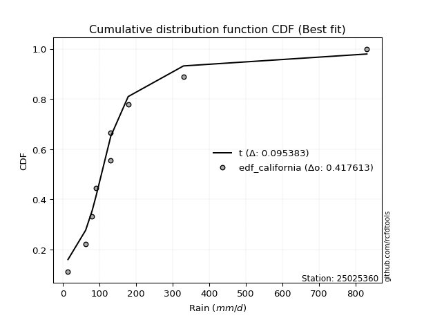</img>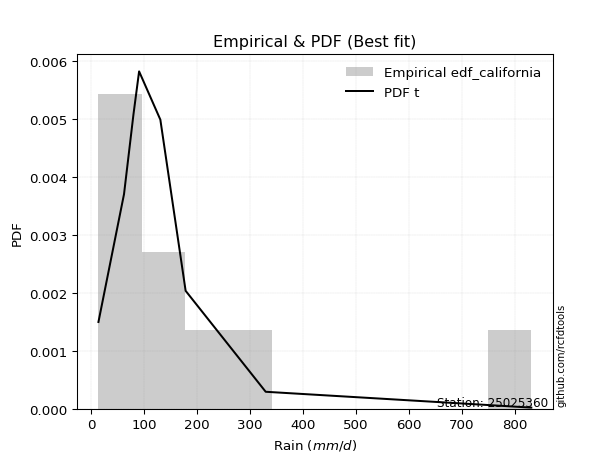</img>

</div>


### 2. Empirical - EDF Hazen (1930)

Hazen method for plotting positions is a formula used to estimate the empirical cumulative probability distribution of flood events or other hydrological data. This formula often results in biased estimations, particularly when extrapolating to extreme events (high return periods).

<div align="center">


$P=(m-0.5)/n$


</div>


**2.1. Empirical values**

<div align="center">

|                | 0                   | 1                   | 2                  | 3                  | 4         | 5                  | 6                  | 7                  | 8                  |
|:---------------|:--------------------|:--------------------|:-------------------|:-------------------|:----------|:-------------------|:-------------------|:-------------------|:-------------------|
| date           | 2021                | 2023                | 2025               | 2019               | 2020      | 2024               | 2022               | 2017               | 2018               |
| x              | 14.0                | 62.3                | 70.9               | 80.2               | 90.8      | 131.0              | 131.2              | 178.68             | 329.9              |
| m              | 1                   | 2                   | 3                  | 4                  | 5         | 6                  | 7                  | 8                  | 9                  |
| empirical_dist | edf_hazen           | edf_hazen           | edf_hazen          | edf_hazen          | edf_hazen | edf_hazen          | edf_hazen          | edf_hazen          | edf_hazen          |
| empirical      | 0.05555555555555555 | 0.16666666666666666 | 0.2777777777777778 | 0.3888888888888889 | 0.5       | 0.6111111111111112 | 0.7222222222222222 | 0.8333333333333334 | 0.9444444444444444 |
| empirical_tr   | 1.0588235294117647  | 1.2                 | 1.3846153846153846 | 1.6363636363636362 | 2.0       | 2.5714285714285716 | 3.5999999999999996 | 6.000000000000002  | 17.999999999999993 |

</div>


**2.2. Kolmogorov-Smirnov fit test (sorted by Δ)**


<div align="center">

|                | 0                   | 1                   | 2                   | 3                   | 4                   | 5                   | 6                   | 7                   | 8                   | 9                   | 10                  | 11                  | 12                  | 13                  | 14                  | 15                  | 16                  | 17                  | 18                  | 19                  | 20                  | 21                  | 22                    | 23                  | 24                  | 25                  | 26                  | 27                  | 28                  | 29                  | 30                  | 31                  | 32                  | 33                  | 34                  | 35                  | 36                  | 37                  | 38                  | 39                  | 40                  | 41                  | 42                  | 43                  | 44                  | 45                  | 46                  | 47                  | 48                  | 49                  | 50                  | 51                  | 52                  | 53                  | 54                  | 55                  | 56                  | 57                  | 58                  | 59                  | 60                  | 61                  | 62                  | 63                  | 64                  | 65                  | 66                  | 67                  | 68                  | 69                  | 70                  | 71                  | 72                  | 73                  | 74                  | 75                  | 76                  | 77                  | 78                  | 79                  | 80                  | 81                  | 82                  | 83                  | 84                  | 85                  | 86                  | 87                  | 88                  | 89                  |
|:---------------|:--------------------|:--------------------|:--------------------|:--------------------|:--------------------|:--------------------|:--------------------|:--------------------|:--------------------|:--------------------|:--------------------|:--------------------|:--------------------|:--------------------|:--------------------|:--------------------|:--------------------|:--------------------|:--------------------|:--------------------|:--------------------|:--------------------|:----------------------|:--------------------|:--------------------|:--------------------|:--------------------|:--------------------|:--------------------|:--------------------|:--------------------|:--------------------|:--------------------|:--------------------|:--------------------|:--------------------|:--------------------|:--------------------|:--------------------|:--------------------|:--------------------|:--------------------|:--------------------|:--------------------|:--------------------|:--------------------|:--------------------|:--------------------|:--------------------|:--------------------|:--------------------|:--------------------|:--------------------|:--------------------|:--------------------|:--------------------|:--------------------|:--------------------|:--------------------|:--------------------|:--------------------|:--------------------|:--------------------|:--------------------|:--------------------|:--------------------|:--------------------|:--------------------|:--------------------|:--------------------|:--------------------|:--------------------|:--------------------|:--------------------|:--------------------|:--------------------|:--------------------|:--------------------|:--------------------|:--------------------|:--------------------|:--------------------|:--------------------|:--------------------|:--------------------|:--------------------|:--------------------|:--------------------|:--------------------|:--------------------|
| station        | 25025360            | 25025360            | 25025360            | 25025360            | 25025360            | 25025360            | 25025360            | 25025360            | 25025360            | 25025360            | 25025360            | 25025360            | 25025360            | 25025360            | 25025360            | 25025360            | 25025360            | 25025360            | 25025360            | 25025360            | 25025360            | 25025360            | 25025360              | 25025360            | 25025360            | 25025360            | 25025360            | 25025360            | 25025360            | 25025360            | 25025360            | 25025360            | 25025360            | 25025360            | 25025360            | 25025360            | 25025360            | 25025360            | 25025360            | 25025360            | 25025360            | 25025360            | 25025360            | 25025360            | 25025360            | 25025360            | 25025360            | 25025360            | 25025360            | 25025360            | 25025360            | 25025360            | 25025360            | 25025360            | 25025360            | 25025360            | 25025360            | 25025360            | 25025360            | 25025360            | 25025360            | 25025360            | 25025360            | 25025360            | 25025360            | 25025360            | 25025360            | 25025360            | 25025360            | 25025360            | 25025360            | 25025360            | 25025360            | 25025360            | 25025360            | 25025360            | 25025360            | 25025360            | 25025360            | 25025360            | 25025360            | 25025360            | 25025360            | 25025360            | 25025360            | 25025360            | 25025360            | 25025360            | 25025360            | 25025360            |
| empirical_dist | edf_hazen           | edf_hazen           | edf_hazen           | edf_hazen           | edf_hazen           | edf_hazen           | edf_hazen           | edf_hazen           | edf_hazen           | edf_hazen           | edf_hazen           | edf_hazen           | edf_hazen           | edf_hazen           | edf_hazen           | edf_hazen           | edf_hazen           | edf_hazen           | edf_hazen           | edf_hazen           | edf_hazen           | edf_hazen           | edf_hazen             | edf_hazen           | edf_hazen           | edf_hazen           | edf_hazen           | edf_hazen           | edf_hazen           | edf_hazen           | edf_hazen           | edf_hazen           | edf_hazen           | edf_hazen           | edf_hazen           | edf_hazen           | edf_hazen           | edf_hazen           | edf_hazen           | edf_hazen           | edf_hazen           | edf_hazen           | edf_hazen           | edf_hazen           | edf_hazen           | edf_hazen           | edf_hazen           | edf_hazen           | edf_hazen           | edf_hazen           | edf_hazen           | edf_hazen           | edf_hazen           | edf_hazen           | edf_hazen           | edf_hazen           | edf_hazen           | edf_hazen           | edf_hazen           | edf_hazen           | edf_hazen           | edf_hazen           | edf_hazen           | edf_hazen           | edf_hazen           | edf_hazen           | edf_hazen           | edf_hazen           | edf_hazen           | edf_hazen           | edf_hazen           | edf_hazen           | edf_hazen           | edf_hazen           | edf_hazen           | edf_hazen           | edf_hazen           | edf_hazen           | edf_hazen           | edf_hazen           | edf_hazen           | edf_hazen           | edf_hazen           | edf_hazen           | edf_hazen           | edf_hazen           | edf_hazen           | edf_hazen           | edf_hazen           | edf_hazen           |
| p_dist         | laplace_asymmetric  | logt                | nct                 | johnsonsu           | exponnorm           | fisk                | logjohnsonsu        | invweibull          | genlogistic         | invgamma            | moyal               | logfisk             | logmielke           | loggenlogistic      | loggumbel_l         | invgauss            | wald                | gumbel_r            | pearson3            | logloggamma         | logweibull_min      | logpearson3         | loglaplace_asymmetric | loghypsecant        | loglaplace          | kstwobign           | halflogistic        | betaprime           | gibrat              | erlang              | gamma               | loggompertz         | f                   | loglogistic         | rayleigh            | halfnorm            | ncf                 | gompertz            | weibull_min         | maxwell             | logf                | lognct              | logexponnorm        | lognorm             | lognorm             | logcrystalball      | logrice             | logfatiguelife      | rice                | logncf              | loggamma            | loggamma            | logerlang           | logbetaprime        | logtruncnorm        | hypsecant           | nakagami            | lognakagami         | logistic            | loginvgamma         | t                   | crystalball         | norm                | logalpha            | logmaxwell          | loggumbel_r         | loginvgauss         | lograyleigh         | laplace             | expon               | genexpon            | logmoyal            | loggibrat           | mielke              | loginvweibull       | loghalfnorm         | loghalflogistic     | logwald             | gumbel_l            | logkstwobign        | loggenexpon         | alpha               | logexpon            | loglognorm          | pareto              | logpareto           | logchi2             | fatiguelife         | chi2                | truncnorm           |
| delta          | 0.06497766853579923 | 0.07032517565854146 | 0.070958119623793   | 0.07252679824444952 | 0.07294888608071468 | 0.07780281655202312 | 0.07798707677410646 | 0.08711191746467387 | 0.09058094785449511 | 0.09084543905687423 | 0.09305774092605931 | 0.09358269187647059 | 0.09576266325158547 | 0.09581927481336752 | 0.09827299187688812 | 0.09872316099900327 | 0.0994422138741321  | 0.10500659103942889 | 0.11105386128182018 | 0.11153603368940548 | 0.11436095527148984 | 0.11452275338916887 | 0.11711210999050436   | 0.11768707081790489 | 0.11812216086514349 | 0.11899709924435364 | 0.12074207039154858 | 0.124592942281983   | 0.12823006259574599 | 0.1288108668323711  | 0.12881094374580712 | 0.12897477760062523 | 0.1293280829339686  | 0.13275435336895589 | 0.13478319863828814 | 0.13550317266346004 | 0.14110626407136992 | 0.14324271531234636 | 0.14366578588374754 | 0.14462676164174615 | 0.15174660311426766 | 0.15245309268993637 | 0.15298898171166084 | 0.15298943412142044 | 0.15298943412142044 | 0.15298955376960363 | 0.15299690843216487 | 0.15386267586861377 | 0.15572092057187092 | 0.1617076710871099  | 0.16325724952729895 | 0.16325724952729895 | 0.16356238044808677 | 0.1664745183935584  | 0.1665737785100308  | 0.16662254308548197 | 0.16665941771324208 | 0.1666666644211461  | 0.1688690132875459  | 0.17479074573797046 | 0.17514201651826078 | 0.1752123463940669  | 0.17521234923518758 | 0.18120769449798255 | 0.1827077802619155  | 0.19243416933752425 | 0.19342845238642534 | 0.19425097433883223 | 0.1950332008733367  | 0.19660439612737649 | 0.19661709010565895 | 0.20588936729092364 | 0.2178670673673233  | 0.2193441108854068  | 0.2235677236454878  | 0.2270311634730142  | 0.22948314334280265 | 0.23042309224154522 | 0.2425530057778128  | 0.26514799183847815 | 0.29971150383280953 | 0.36466959098840734 | 0.3815511910374695  | 0.4608552955975067  | 0.4777442671873361  | 0.49543429218114843 | 0.5749085217528738  | 0.6008454386370357  | 0.8314796670401245  | 0.8333333333333334  |
| deltao         | 0.41761268023100007 | 0.41761268023100007 | 0.41761268023100007 | 0.41761268023100007 | 0.41761268023100007 | 0.41761268023100007 | 0.41761268023100007 | 0.41761268023100007 | 0.41761268023100007 | 0.41761268023100007 | 0.41761268023100007 | 0.41761268023100007 | 0.41761268023100007 | 0.41761268023100007 | 0.41761268023100007 | 0.41761268023100007 | 0.41761268023100007 | 0.41761268023100007 | 0.41761268023100007 | 0.41761268023100007 | 0.41761268023100007 | 0.41761268023100007 | 0.41761268023100007   | 0.41761268023100007 | 0.41761268023100007 | 0.41761268023100007 | 0.41761268023100007 | 0.41761268023100007 | 0.41761268023100007 | 0.41761268023100007 | 0.41761268023100007 | 0.41761268023100007 | 0.41761268023100007 | 0.41761268023100007 | 0.41761268023100007 | 0.41761268023100007 | 0.41761268023100007 | 0.41761268023100007 | 0.41761268023100007 | 0.41761268023100007 | 0.41761268023100007 | 0.41761268023100007 | 0.41761268023100007 | 0.41761268023100007 | 0.41761268023100007 | 0.41761268023100007 | 0.41761268023100007 | 0.41761268023100007 | 0.41761268023100007 | 0.41761268023100007 | 0.41761268023100007 | 0.41761268023100007 | 0.41761268023100007 | 0.41761268023100007 | 0.41761268023100007 | 0.41761268023100007 | 0.41761268023100007 | 0.41761268023100007 | 0.41761268023100007 | 0.41761268023100007 | 0.41761268023100007 | 0.41761268023100007 | 0.41761268023100007 | 0.41761268023100007 | 0.41761268023100007 | 0.41761268023100007 | 0.41761268023100007 | 0.41761268023100007 | 0.41761268023100007 | 0.41761268023100007 | 0.41761268023100007 | 0.41761268023100007 | 0.41761268023100007 | 0.41761268023100007 | 0.41761268023100007 | 0.41761268023100007 | 0.41761268023100007 | 0.41761268023100007 | 0.41761268023100007 | 0.41761268023100007 | 0.41761268023100007 | 0.41761268023100007 | 0.41761268023100007 | 0.41761268023100007 | 0.41761268023100007 | 0.41761268023100007 | 0.41761268023100007 | 0.41761268023100007 | 0.41761268023100007 | 0.41761268023100007 |
| eval           | Δo > Δ              | Δo > Δ              | Δo > Δ              | Δo > Δ              | Δo > Δ              | Δo > Δ              | Δo > Δ              | Δo > Δ              | Δo > Δ              | Δo > Δ              | Δo > Δ              | Δo > Δ              | Δo > Δ              | Δo > Δ              | Δo > Δ              | Δo > Δ              | Δo > Δ              | Δo > Δ              | Δo > Δ              | Δo > Δ              | Δo > Δ              | Δo > Δ              | Δo > Δ                | Δo > Δ              | Δo > Δ              | Δo > Δ              | Δo > Δ              | Δo > Δ              | Δo > Δ              | Δo > Δ              | Δo > Δ              | Δo > Δ              | Δo > Δ              | Δo > Δ              | Δo > Δ              | Δo > Δ              | Δo > Δ              | Δo > Δ              | Δo > Δ              | Δo > Δ              | Δo > Δ              | Δo > Δ              | Δo > Δ              | Δo > Δ              | Δo > Δ              | Δo > Δ              | Δo > Δ              | Δo > Δ              | Δo > Δ              | Δo > Δ              | Δo > Δ              | Δo > Δ              | Δo > Δ              | Δo > Δ              | Δo > Δ              | Δo > Δ              | Δo > Δ              | Δo > Δ              | Δo > Δ              | Δo > Δ              | Δo > Δ              | Δo > Δ              | Δo > Δ              | Δo > Δ              | Δo > Δ              | Δo > Δ              | Δo > Δ              | Δo > Δ              | Δo > Δ              | Δo > Δ              | Δo > Δ              | Δo > Δ              | Δo > Δ              | Δo > Δ              | Δo > Δ              | Δo > Δ              | Δo > Δ              | Δo > Δ              | Δo > Δ              | Δo > Δ              | Δo > Δ              | Δo > Δ              | Δo > Δ              | Δo <= Δ             | Δo <= Δ             | Δo <= Δ             | Δo <= Δ             | Δo <= Δ             | Δo <= Δ             | Δo <= Δ             |
| fit            | 1                   | 1                   | 1                   | 1                   | 1                   | 1                   | 1                   | 1                   | 1                   | 1                   | 1                   | 1                   | 1                   | 1                   | 1                   | 1                   | 1                   | 1                   | 1                   | 1                   | 1                   | 1                   | 1                     | 1                   | 1                   | 1                   | 1                   | 1                   | 1                   | 1                   | 1                   | 1                   | 1                   | 1                   | 1                   | 1                   | 1                   | 1                   | 1                   | 1                   | 1                   | 1                   | 1                   | 1                   | 1                   | 1                   | 1                   | 1                   | 1                   | 1                   | 1                   | 1                   | 1                   | 1                   | 1                   | 1                   | 1                   | 1                   | 1                   | 1                   | 1                   | 1                   | 1                   | 1                   | 1                   | 1                   | 1                   | 1                   | 1                   | 1                   | 1                   | 1                   | 1                   | 1                   | 1                   | 1                   | 1                   | 1                   | 1                   | 1                   | 1                   | 1                   | 1                   | 0                   | 0                   | 0                   | 0                   | 0                   | 0                   | 0                   |
| n              | 9                   | 9                   | 9                   | 9                   | 9                   | 9                   | 9                   | 9                   | 9                   | 9                   | 9                   | 9                   | 9                   | 9                   | 9                   | 9                   | 9                   | 9                   | 9                   | 9                   | 9                   | 9                   | 9                     | 9                   | 9                   | 9                   | 9                   | 9                   | 9                   | 9                   | 9                   | 9                   | 9                   | 9                   | 9                   | 9                   | 9                   | 9                   | 9                   | 9                   | 9                   | 9                   | 9                   | 9                   | 9                   | 9                   | 9                   | 9                   | 9                   | 9                   | 9                   | 9                   | 9                   | 9                   | 9                   | 9                   | 9                   | 9                   | 9                   | 9                   | 9                   | 9                   | 9                   | 9                   | 9                   | 9                   | 9                   | 9                   | 9                   | 9                   | 9                   | 9                   | 9                   | 9                   | 9                   | 9                   | 9                   | 9                   | 9                   | 9                   | 9                   | 9                   | 9                   | 9                   | 9                   | 9                   | 9                   | 9                   | 9                   | 9                   |
| best_fit       | 1                   | 0                   | 0                   | 0                   | 0                   | 0                   | 0                   | 0                   | 0                   | 0                   | 0                   | 0                   | 0                   | 0                   | 0                   | 0                   | 0                   | 0                   | 0                   | 0                   | 0                   | 0                   | 0                     | 0                   | 0                   | 0                   | 0                   | 0                   | 0                   | 0                   | 0                   | 0                   | 0                   | 0                   | 0                   | 0                   | 0                   | 0                   | 0                   | 0                   | 0                   | 0                   | 0                   | 0                   | 0                   | 0                   | 0                   | 0                   | 0                   | 0                   | 0                   | 0                   | 0                   | 0                   | 0                   | 0                   | 0                   | 0                   | 0                   | 0                   | 0                   | 0                   | 0                   | 0                   | 0                   | 0                   | 0                   | 0                   | 0                   | 0                   | 0                   | 0                   | 0                   | 0                   | 0                   | 0                   | 0                   | 0                   | 0                   | 0                   | 0                   | 0                   | 0                   | 0                   | 0                   | 0                   | 0                   | 0                   | 0                   | 0                   |
| best_fit_sort  | 1                   | 2                   | 3                   | 4                   | 5                   | 6                   | 7                   | 8                   | 9                   | 10                  | 11                  | 12                  | 13                  | 14                  | 15                  | 16                  | 17                  | 18                  | 19                  | 20                  | 21                  | 22                  | 23                    | 24                  | 25                  | 26                  | 27                  | 28                  | 29                  | 30                  | 31                  | 32                  | 33                  | 34                  | 35                  | 36                  | 37                  | 38                  | 39                  | 40                  | 41                  | 42                  | 43                  | 44                  | 45                  | 46                  | 47                  | 48                  | 49                  | 50                  | 51                  | 52                  | 53                  | 54                  | 55                  | 56                  | 57                  | 58                  | 59                  | 60                  | 61                  | 62                  | 63                  | 64                  | 65                  | 66                  | 67                  | 68                  | 69                  | 70                  | 71                  | 72                  | 73                  | 74                  | 75                  | 76                  | 77                  | 78                  | 79                  | 80                  | 81                  | 82                  | 83                  | 84                  | 85                  | 86                  | 87                  | 88                  | 89                  | 90                  |

</div>


<div align="center">

</img>

</div>


**2.3. Best fit**

<div align="center">

|   id |   station | empirical_dist   | p_dist             |     delta |   deltao | eval   |   fit |   n |   best_fit |   best_fit_sort |
|-----:|----------:|:-----------------|:-------------------|----------:|---------:|:-------|------:|----:|-----------:|----------------:|
|    0 |  25025360 | edf_hazen        | laplace_asymmetric | 0.0649777 | 0.417613 | Δo > Δ |     1 |   9 |          1 |               1 |

</div>


<div align="center">

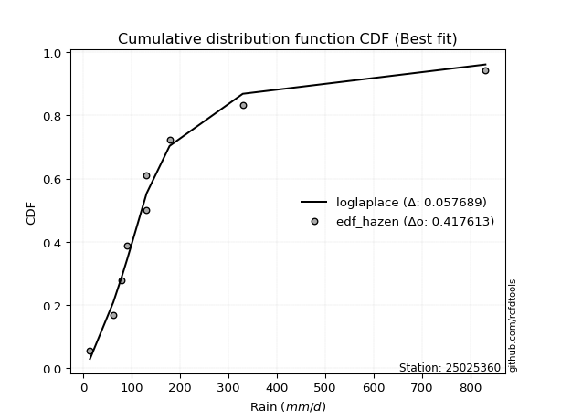</img></img>

</div>


### 3. Empirical - EDF Weibull (1939)

Weibull plotting position formula is an empirical method used to estimate the non-exceedance probability or plotting position for a set of observed data, is often recommended or widely used in practice, particularly in flood frequency analysis.

<div align="center">


$P=m/(n+1)$


</div>


**3.1. Empirical values**

<div align="center">

|                | 0                  | 1           | 2                  | 3                  | 4           | 5           | 6                 | 7                 | 8                  |
|:---------------|:-------------------|:------------|:-------------------|:-------------------|:------------|:------------|:------------------|:------------------|:-------------------|
| date           | 2021               | 2023        | 2025               | 2019               | 2020        | 2024        | 2022              | 2017              | 2018               |
| x              | 14.0               | 62.3        | 70.9               | 80.2               | 90.8        | 131.0       | 131.2             | 178.68            | 329.9              |
| m              | 1                  | 2           | 3                  | 4                  | 5           | 6           | 7                 | 8                 | 9                  |
| empirical_dist | edf_weibull        | edf_weibull | edf_weibull        | edf_weibull        | edf_weibull | edf_weibull | edf_weibull       | edf_weibull       | edf_weibull        |
| empirical      | 0.1                | 0.2         | 0.3                | 0.4                | 0.5         | 0.6         | 0.7               | 0.8               | 0.9                |
| empirical_tr   | 1.1111111111111112 | 1.25        | 1.4285714285714286 | 1.6666666666666667 | 2.0         | 2.5         | 3.333333333333333 | 5.000000000000001 | 10.000000000000002 |

</div>


**3.2. Kolmogorov-Smirnov fit test (sorted by Δ)**


<div align="center">

|                | 0                   | 1                   | 2                   | 3                   | 4                   | 5                   | 6                   | 7                   | 8                   | 9                   | 10                  | 11                  | 12                  | 13                  | 14                  | 15                  | 16                  | 17                  | 18                  | 19                  | 20                  | 21                  | 22                  | 23                  | 24                  | 25                  | 26                  | 27                  | 28                  | 29                  | 30                  | 31                  | 32                  | 33                  | 34                  | 35                  | 36                  | 37                  | 38                  | 39                  | 40                  | 41                  | 42                  | 43                  | 44                  | 45                    | 46                  | 47                  | 48                  | 49                  | 50                  | 51                  | 52                  | 53                  | 54                  | 55                  | 56                  | 57                  | 58                  | 59                  | 60                  | 61                  | 62                  | 63                  | 64                  | 65                  | 66                  | 67                  | 68                  | 69                  | 70                  | 71                  | 72                  | 73                  | 74                  | 75                  | 76                  | 77                  | 78                  | 79                  | 80                  | 81                  | 82                  | 83                  | 84                  | 85                  | 86                  | 87                  | 88                  | 89                  |
|:---------------|:--------------------|:--------------------|:--------------------|:--------------------|:--------------------|:--------------------|:--------------------|:--------------------|:--------------------|:--------------------|:--------------------|:--------------------|:--------------------|:--------------------|:--------------------|:--------------------|:--------------------|:--------------------|:--------------------|:--------------------|:--------------------|:--------------------|:--------------------|:--------------------|:--------------------|:--------------------|:--------------------|:--------------------|:--------------------|:--------------------|:--------------------|:--------------------|:--------------------|:--------------------|:--------------------|:--------------------|:--------------------|:--------------------|:--------------------|:--------------------|:--------------------|:--------------------|:--------------------|:--------------------|:--------------------|:----------------------|:--------------------|:--------------------|:--------------------|:--------------------|:--------------------|:--------------------|:--------------------|:--------------------|:--------------------|:--------------------|:--------------------|:--------------------|:--------------------|:--------------------|:--------------------|:--------------------|:--------------------|:--------------------|:--------------------|:--------------------|:--------------------|:--------------------|:--------------------|:--------------------|:--------------------|:--------------------|:--------------------|:--------------------|:--------------------|:--------------------|:--------------------|:--------------------|:--------------------|:--------------------|:--------------------|:--------------------|:--------------------|:--------------------|:--------------------|:--------------------|:--------------------|:--------------------|:--------------------|:--------------------|
| station        | 25025360            | 25025360            | 25025360            | 25025360            | 25025360            | 25025360            | 25025360            | 25025360            | 25025360            | 25025360            | 25025360            | 25025360            | 25025360            | 25025360            | 25025360            | 25025360            | 25025360            | 25025360            | 25025360            | 25025360            | 25025360            | 25025360            | 25025360            | 25025360            | 25025360            | 25025360            | 25025360            | 25025360            | 25025360            | 25025360            | 25025360            | 25025360            | 25025360            | 25025360            | 25025360            | 25025360            | 25025360            | 25025360            | 25025360            | 25025360            | 25025360            | 25025360            | 25025360            | 25025360            | 25025360            | 25025360              | 25025360            | 25025360            | 25025360            | 25025360            | 25025360            | 25025360            | 25025360            | 25025360            | 25025360            | 25025360            | 25025360            | 25025360            | 25025360            | 25025360            | 25025360            | 25025360            | 25025360            | 25025360            | 25025360            | 25025360            | 25025360            | 25025360            | 25025360            | 25025360            | 25025360            | 25025360            | 25025360            | 25025360            | 25025360            | 25025360            | 25025360            | 25025360            | 25025360            | 25025360            | 25025360            | 25025360            | 25025360            | 25025360            | 25025360            | 25025360            | 25025360            | 25025360            | 25025360            | 25025360            |
| empirical_dist | edf_weibull         | edf_weibull         | edf_weibull         | edf_weibull         | edf_weibull         | edf_weibull         | edf_weibull         | edf_weibull         | edf_weibull         | edf_weibull         | edf_weibull         | edf_weibull         | edf_weibull         | edf_weibull         | edf_weibull         | edf_weibull         | edf_weibull         | edf_weibull         | edf_weibull         | edf_weibull         | edf_weibull         | edf_weibull         | edf_weibull         | edf_weibull         | edf_weibull         | edf_weibull         | edf_weibull         | edf_weibull         | edf_weibull         | edf_weibull         | edf_weibull         | edf_weibull         | edf_weibull         | edf_weibull         | edf_weibull         | edf_weibull         | edf_weibull         | edf_weibull         | edf_weibull         | edf_weibull         | edf_weibull         | edf_weibull         | edf_weibull         | edf_weibull         | edf_weibull         | edf_weibull           | edf_weibull         | edf_weibull         | edf_weibull         | edf_weibull         | edf_weibull         | edf_weibull         | edf_weibull         | edf_weibull         | edf_weibull         | edf_weibull         | edf_weibull         | edf_weibull         | edf_weibull         | edf_weibull         | edf_weibull         | edf_weibull         | edf_weibull         | edf_weibull         | edf_weibull         | edf_weibull         | edf_weibull         | edf_weibull         | edf_weibull         | edf_weibull         | edf_weibull         | edf_weibull         | edf_weibull         | edf_weibull         | edf_weibull         | edf_weibull         | edf_weibull         | edf_weibull         | edf_weibull         | edf_weibull         | edf_weibull         | edf_weibull         | edf_weibull         | edf_weibull         | edf_weibull         | edf_weibull         | edf_weibull         | edf_weibull         | edf_weibull         | edf_weibull         |
| p_dist         | nct                 | moyal               | invweibull          | exponnorm           | invgamma            | invgauss            | fisk                | logmielke           | loggenlogistic      | logjohnsonsu        | laplace_asymmetric  | pearson3            | logloggamma         | logt                | logweibull_min      | logpearson3         | johnsonsu           | loggumbel_l         | gumbel_r            | logfisk             | genlogistic         | betaprime           | erlang              | gamma               | f                   | loglogistic         | loggompertz         | halflogistic        | loghypsecant        | halfnorm            | kstwobign           | ncf                 | gompertz            | weibull_min         | wald                | rayleigh            | logf                | lognct              | logexponnorm        | lognorm             | lognorm             | logcrystalball      | logrice             | logfatiguelife      | maxwell             | loglaplace_asymmetric | logncf              | loglaplace          | loggamma            | loggamma            | logerlang           | logbetaprime        | rice                | loginvgamma         | logalpha            | logmaxwell          | t                   | crystalball         | norm                | logistic            | gibrat              | loggumbel_r         | loginvgauss         | lograyleigh         | expon               | genexpon            | hypsecant           | logmoyal            | mielke              | loginvweibull       | loghalfnorm         | laplace             | loghalflogistic     | logtruncnorm        | nakagami            | lognakagami         | logwald             | gumbel_l            | loggibrat           | logkstwobign        | loggenexpon         | alpha               | logexpon            | loglognorm          | pareto              | logpareto           | logchi2             | fatiguelife         | chi2                | truncnorm           |
| delta          | 0.0676261119789999  | 0.07120075859778685 | 0.07133303490228583 | 0.07147328874773551 | 0.07184454630390047 | 0.07247778471689208 | 0.07309800301464915 | 0.07455311063220431 | 0.07456891810462289 | 0.07497654095823092 | 0.07563938321309216 | 0.07772052794848683 | 0.07820270035607213 | 0.07923767687789035 | 0.08102762193815649 | 0.08118942005583552 | 0.0836379093555607  | 0.08384550908525834 | 0.08484976917094983 | 0.08884503018332082 | 0.09058094785449511 | 0.09125960894864965 | 0.09547753349903776 | 0.09547761041247377 | 0.09599474960063525 | 0.09942102003562253 | 0.09999999659713707 | 0.1                 | 0.10179521131290825 | 0.10216983933012669 | 0.10718372581032448 | 0.10777293073803657 | 0.10990938197901301 | 0.11033245255041418 | 0.11055332498524328 | 0.11256097641606588 | 0.1184132697809343  | 0.11911975935660302 | 0.11965564837832748 | 0.11965610078808708 | 0.11965610078808708 | 0.11965622043627028 | 0.11966357509883152 | 0.12052934253528041 | 0.1224045394195239  | 0.12822322110161555   | 0.12837433775377655 | 0.12923327197625467 | 0.1299239161939656  | 0.1299239161939656  | 0.13022904711475342 | 0.13314118506022504 | 0.13850894263111335 | 0.1414574124046371  | 0.1478743611646492  | 0.14937444692858215 | 0.15291979429603852 | 0.15299012417184465 | 0.15299012701296533 | 0.15341838033073368 | 0.1567560574281578  | 0.1591008360041909  | 0.16009511905309198 | 0.16091764100549888 | 0.16327106279404313 | 0.1632837567723256  | 0.16662254308548197 | 0.17255603395759028 | 0.18601077755207346 | 0.19023439031215444 | 0.19369783013968084 | 0.1950332008733367  | 0.1961498100094693  | 0.19990711184336415 | 0.19999275104657543 | 0.19999999775447946 | 0.20820087001932303 | 0.22033078355559055 | 0.2289781784784345  | 0.23181465850514477 | 0.26637817049947615 | 0.33133625765507396 | 0.3482178577041361  | 0.4275219622641733  | 0.4444109338540027  | 0.46210095884781505 | 0.5415751884195403  | 0.5675121053037022  | 0.7981463337067911  | 0.8                 |
| deltao         | 0.41761268023100007 | 0.41761268023100007 | 0.41761268023100007 | 0.41761268023100007 | 0.41761268023100007 | 0.41761268023100007 | 0.41761268023100007 | 0.41761268023100007 | 0.41761268023100007 | 0.41761268023100007 | 0.41761268023100007 | 0.41761268023100007 | 0.41761268023100007 | 0.41761268023100007 | 0.41761268023100007 | 0.41761268023100007 | 0.41761268023100007 | 0.41761268023100007 | 0.41761268023100007 | 0.41761268023100007 | 0.41761268023100007 | 0.41761268023100007 | 0.41761268023100007 | 0.41761268023100007 | 0.41761268023100007 | 0.41761268023100007 | 0.41761268023100007 | 0.41761268023100007 | 0.41761268023100007 | 0.41761268023100007 | 0.41761268023100007 | 0.41761268023100007 | 0.41761268023100007 | 0.41761268023100007 | 0.41761268023100007 | 0.41761268023100007 | 0.41761268023100007 | 0.41761268023100007 | 0.41761268023100007 | 0.41761268023100007 | 0.41761268023100007 | 0.41761268023100007 | 0.41761268023100007 | 0.41761268023100007 | 0.41761268023100007 | 0.41761268023100007   | 0.41761268023100007 | 0.41761268023100007 | 0.41761268023100007 | 0.41761268023100007 | 0.41761268023100007 | 0.41761268023100007 | 0.41761268023100007 | 0.41761268023100007 | 0.41761268023100007 | 0.41761268023100007 | 0.41761268023100007 | 0.41761268023100007 | 0.41761268023100007 | 0.41761268023100007 | 0.41761268023100007 | 0.41761268023100007 | 0.41761268023100007 | 0.41761268023100007 | 0.41761268023100007 | 0.41761268023100007 | 0.41761268023100007 | 0.41761268023100007 | 0.41761268023100007 | 0.41761268023100007 | 0.41761268023100007 | 0.41761268023100007 | 0.41761268023100007 | 0.41761268023100007 | 0.41761268023100007 | 0.41761268023100007 | 0.41761268023100007 | 0.41761268023100007 | 0.41761268023100007 | 0.41761268023100007 | 0.41761268023100007 | 0.41761268023100007 | 0.41761268023100007 | 0.41761268023100007 | 0.41761268023100007 | 0.41761268023100007 | 0.41761268023100007 | 0.41761268023100007 | 0.41761268023100007 | 0.41761268023100007 |
| eval           | Δo > Δ              | Δo > Δ              | Δo > Δ              | Δo > Δ              | Δo > Δ              | Δo > Δ              | Δo > Δ              | Δo > Δ              | Δo > Δ              | Δo > Δ              | Δo > Δ              | Δo > Δ              | Δo > Δ              | Δo > Δ              | Δo > Δ              | Δo > Δ              | Δo > Δ              | Δo > Δ              | Δo > Δ              | Δo > Δ              | Δo > Δ              | Δo > Δ              | Δo > Δ              | Δo > Δ              | Δo > Δ              | Δo > Δ              | Δo > Δ              | Δo > Δ              | Δo > Δ              | Δo > Δ              | Δo > Δ              | Δo > Δ              | Δo > Δ              | Δo > Δ              | Δo > Δ              | Δo > Δ              | Δo > Δ              | Δo > Δ              | Δo > Δ              | Δo > Δ              | Δo > Δ              | Δo > Δ              | Δo > Δ              | Δo > Δ              | Δo > Δ              | Δo > Δ                | Δo > Δ              | Δo > Δ              | Δo > Δ              | Δo > Δ              | Δo > Δ              | Δo > Δ              | Δo > Δ              | Δo > Δ              | Δo > Δ              | Δo > Δ              | Δo > Δ              | Δo > Δ              | Δo > Δ              | Δo > Δ              | Δo > Δ              | Δo > Δ              | Δo > Δ              | Δo > Δ              | Δo > Δ              | Δo > Δ              | Δo > Δ              | Δo > Δ              | Δo > Δ              | Δo > Δ              | Δo > Δ              | Δo > Δ              | Δo > Δ              | Δo > Δ              | Δo > Δ              | Δo > Δ              | Δo > Δ              | Δo > Δ              | Δo > Δ              | Δo > Δ              | Δo > Δ              | Δo > Δ              | Δo > Δ              | Δo <= Δ             | Δo <= Δ             | Δo <= Δ             | Δo <= Δ             | Δo <= Δ             | Δo <= Δ             | Δo <= Δ             |
| fit            | 1                   | 1                   | 1                   | 1                   | 1                   | 1                   | 1                   | 1                   | 1                   | 1                   | 1                   | 1                   | 1                   | 1                   | 1                   | 1                   | 1                   | 1                   | 1                   | 1                   | 1                   | 1                   | 1                   | 1                   | 1                   | 1                   | 1                   | 1                   | 1                   | 1                   | 1                   | 1                   | 1                   | 1                   | 1                   | 1                   | 1                   | 1                   | 1                   | 1                   | 1                   | 1                   | 1                   | 1                   | 1                   | 1                     | 1                   | 1                   | 1                   | 1                   | 1                   | 1                   | 1                   | 1                   | 1                   | 1                   | 1                   | 1                   | 1                   | 1                   | 1                   | 1                   | 1                   | 1                   | 1                   | 1                   | 1                   | 1                   | 1                   | 1                   | 1                   | 1                   | 1                   | 1                   | 1                   | 1                   | 1                   | 1                   | 1                   | 1                   | 1                   | 1                   | 1                   | 0                   | 0                   | 0                   | 0                   | 0                   | 0                   | 0                   |
| n              | 9                   | 9                   | 9                   | 9                   | 9                   | 9                   | 9                   | 9                   | 9                   | 9                   | 9                   | 9                   | 9                   | 9                   | 9                   | 9                   | 9                   | 9                   | 9                   | 9                   | 9                   | 9                   | 9                   | 9                   | 9                   | 9                   | 9                   | 9                   | 9                   | 9                   | 9                   | 9                   | 9                   | 9                   | 9                   | 9                   | 9                   | 9                   | 9                   | 9                   | 9                   | 9                   | 9                   | 9                   | 9                   | 9                     | 9                   | 9                   | 9                   | 9                   | 9                   | 9                   | 9                   | 9                   | 9                   | 9                   | 9                   | 9                   | 9                   | 9                   | 9                   | 9                   | 9                   | 9                   | 9                   | 9                   | 9                   | 9                   | 9                   | 9                   | 9                   | 9                   | 9                   | 9                   | 9                   | 9                   | 9                   | 9                   | 9                   | 9                   | 9                   | 9                   | 9                   | 9                   | 9                   | 9                   | 9                   | 9                   | 9                   | 9                   |
| best_fit       | 1                   | 0                   | 0                   | 0                   | 0                   | 0                   | 0                   | 0                   | 0                   | 0                   | 0                   | 0                   | 0                   | 0                   | 0                   | 0                   | 0                   | 0                   | 0                   | 0                   | 0                   | 0                   | 0                   | 0                   | 0                   | 0                   | 0                   | 0                   | 0                   | 0                   | 0                   | 0                   | 0                   | 0                   | 0                   | 0                   | 0                   | 0                   | 0                   | 0                   | 0                   | 0                   | 0                   | 0                   | 0                   | 0                     | 0                   | 0                   | 0                   | 0                   | 0                   | 0                   | 0                   | 0                   | 0                   | 0                   | 0                   | 0                   | 0                   | 0                   | 0                   | 0                   | 0                   | 0                   | 0                   | 0                   | 0                   | 0                   | 0                   | 0                   | 0                   | 0                   | 0                   | 0                   | 0                   | 0                   | 0                   | 0                   | 0                   | 0                   | 0                   | 0                   | 0                   | 0                   | 0                   | 0                   | 0                   | 0                   | 0                   | 0                   |
| best_fit_sort  | 1                   | 2                   | 3                   | 4                   | 5                   | 6                   | 7                   | 8                   | 9                   | 10                  | 11                  | 12                  | 13                  | 14                  | 15                  | 16                  | 17                  | 18                  | 19                  | 20                  | 21                  | 22                  | 23                  | 24                  | 25                  | 26                  | 27                  | 28                  | 29                  | 30                  | 31                  | 32                  | 33                  | 34                  | 35                  | 36                  | 37                  | 38                  | 39                  | 40                  | 41                  | 42                  | 43                  | 44                  | 45                  | 46                    | 47                  | 48                  | 49                  | 50                  | 51                  | 52                  | 53                  | 54                  | 55                  | 56                  | 57                  | 58                  | 59                  | 60                  | 61                  | 62                  | 63                  | 64                  | 65                  | 66                  | 67                  | 68                  | 69                  | 70                  | 71                  | 72                  | 73                  | 74                  | 75                  | 76                  | 77                  | 78                  | 79                  | 80                  | 81                  | 82                  | 83                  | 84                  | 85                  | 86                  | 87                  | 88                  | 89                  | 90                  |

</div>


<div align="center">

</img>

</div>


**3.3. Best fit**

<div align="center">

|   id |   station | empirical_dist   | p_dist   |     delta |   deltao | eval   |   fit |   n |   best_fit |   best_fit_sort |
|-----:|----------:|:-----------------|:---------|----------:|---------:|:-------|------:|----:|-----------:|----------------:|
|    0 |  25025360 | edf_weibull      | nct      | 0.0676261 | 0.417613 | Δo > Δ |     1 |   9 |          1 |               1 |

</div>


<div align="center">

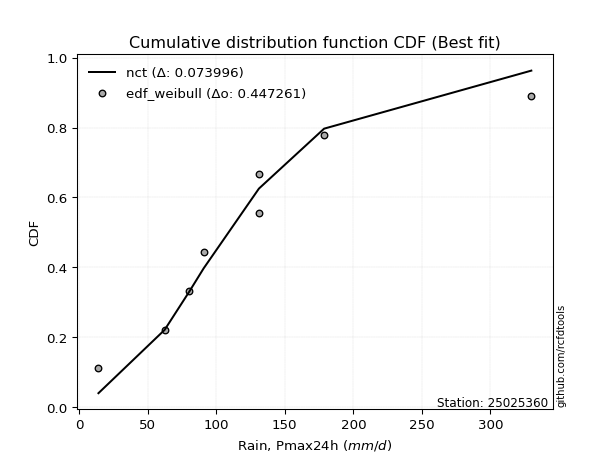</img>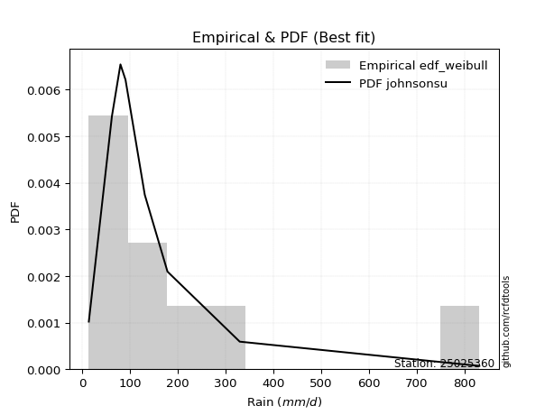</img>

</div>


### 4. Empirical - EDF Beard (1943)

The Beard formula (or Beard´s plotting position formula) in hydrology is used to estimate the empirical non-exceedance probability _(P)_ of a flood event (or other extreme hydrological data point) within a given dataset.

<div align="center">


$P=(m-0.31)/(n+0.38)$


</div>


**4.1. Empirical values**

<div align="center">

|                | 0                   | 1                   | 2                  | 3                   | 4         | 5                  | 6                  | 7                  | 8                  |
|:---------------|:--------------------|:--------------------|:-------------------|:--------------------|:----------|:-------------------|:-------------------|:-------------------|:-------------------|
| date           | 2021                | 2023                | 2025               | 2019                | 2020      | 2024               | 2022               | 2017               | 2018               |
| x              | 14.0                | 62.3                | 70.9               | 80.2                | 90.8      | 131.0              | 131.2              | 178.68             | 329.9              |
| m              | 1                   | 2                   | 3                  | 4                   | 5         | 6                  | 7                  | 8                  | 9                  |
| empirical_dist | edf_beard           | edf_beard           | edf_beard          | edf_beard           | edf_beard | edf_beard          | edf_beard          | edf_beard          | edf_beard          |
| empirical      | 0.07356076759061833 | 0.18017057569296374 | 0.2867803837953091 | 0.39339019189765456 | 0.5       | 0.6066098081023454 | 0.7132196162046908 | 0.8198294243070362 | 0.9264392324093815 |
| empirical_tr   | 1.0794016110471807  | 1.2197659297789336  | 1.4020926756352765 | 1.6485061511423549  | 2.0       | 2.542005420054201  | 3.486988847583642  | 5.550295857988164  | 13.5942028985507   |

</div>


**4.2. Kolmogorov-Smirnov fit test (sorted by Δ)**


<div align="center">

|                | 0                   | 1                   | 2                   | 3                   | 4                   | 5                   | 6                   | 7                   | 8                   | 9                   | 10                  | 11                  | 12                  | 13                  | 14                  | 15                  | 16                  | 17                  | 18                  | 19                  | 20                  | 21                  | 22                  | 23                  | 24                  | 25                  | 26                  | 27                  | 28                  | 29                  | 30                  | 31                    | 32                  | 33                  | 34                  | 35                  | 36                  | 37                  | 38                  | 39                  | 40                  | 41                  | 42                  | 43                  | 44                  | 45                  | 46                  | 47                  | 48                  | 49                  | 50                  | 51                  | 52                  | 53                  | 54                  | 55                  | 56                  | 57                  | 58                  | 59                  | 60                  | 61                  | 62                  | 63                  | 64                  | 65                  | 66                  | 67                  | 68                  | 69                  | 70                  | 71                  | 72                  | 73                  | 74                  | 75                  | 76                  | 77                  | 78                  | 79                  | 80                  | 81                  | 82                  | 83                  | 84                  | 85                  | 86                  | 87                  | 88                  | 89                  |
|:---------------|:--------------------|:--------------------|:--------------------|:--------------------|:--------------------|:--------------------|:--------------------|:--------------------|:--------------------|:--------------------|:--------------------|:--------------------|:--------------------|:--------------------|:--------------------|:--------------------|:--------------------|:--------------------|:--------------------|:--------------------|:--------------------|:--------------------|:--------------------|:--------------------|:--------------------|:--------------------|:--------------------|:--------------------|:--------------------|:--------------------|:--------------------|:----------------------|:--------------------|:--------------------|:--------------------|:--------------------|:--------------------|:--------------------|:--------------------|:--------------------|:--------------------|:--------------------|:--------------------|:--------------------|:--------------------|:--------------------|:--------------------|:--------------------|:--------------------|:--------------------|:--------------------|:--------------------|:--------------------|:--------------------|:--------------------|:--------------------|:--------------------|:--------------------|:--------------------|:--------------------|:--------------------|:--------------------|:--------------------|:--------------------|:--------------------|:--------------------|:--------------------|:--------------------|:--------------------|:--------------------|:--------------------|:--------------------|:--------------------|:--------------------|:--------------------|:--------------------|:--------------------|:--------------------|:--------------------|:--------------------|:--------------------|:--------------------|:--------------------|:--------------------|:--------------------|:--------------------|:--------------------|:--------------------|:--------------------|:--------------------|
| station        | 25025360            | 25025360            | 25025360            | 25025360            | 25025360            | 25025360            | 25025360            | 25025360            | 25025360            | 25025360            | 25025360            | 25025360            | 25025360            | 25025360            | 25025360            | 25025360            | 25025360            | 25025360            | 25025360            | 25025360            | 25025360            | 25025360            | 25025360            | 25025360            | 25025360            | 25025360            | 25025360            | 25025360            | 25025360            | 25025360            | 25025360            | 25025360              | 25025360            | 25025360            | 25025360            | 25025360            | 25025360            | 25025360            | 25025360            | 25025360            | 25025360            | 25025360            | 25025360            | 25025360            | 25025360            | 25025360            | 25025360            | 25025360            | 25025360            | 25025360            | 25025360            | 25025360            | 25025360            | 25025360            | 25025360            | 25025360            | 25025360            | 25025360            | 25025360            | 25025360            | 25025360            | 25025360            | 25025360            | 25025360            | 25025360            | 25025360            | 25025360            | 25025360            | 25025360            | 25025360            | 25025360            | 25025360            | 25025360            | 25025360            | 25025360            | 25025360            | 25025360            | 25025360            | 25025360            | 25025360            | 25025360            | 25025360            | 25025360            | 25025360            | 25025360            | 25025360            | 25025360            | 25025360            | 25025360            | 25025360            |
| empirical_dist | edf_beard           | edf_beard           | edf_beard           | edf_beard           | edf_beard           | edf_beard           | edf_beard           | edf_beard           | edf_beard           | edf_beard           | edf_beard           | edf_beard           | edf_beard           | edf_beard           | edf_beard           | edf_beard           | edf_beard           | edf_beard           | edf_beard           | edf_beard           | edf_beard           | edf_beard           | edf_beard           | edf_beard           | edf_beard           | edf_beard           | edf_beard           | edf_beard           | edf_beard           | edf_beard           | edf_beard           | edf_beard             | edf_beard           | edf_beard           | edf_beard           | edf_beard           | edf_beard           | edf_beard           | edf_beard           | edf_beard           | edf_beard           | edf_beard           | edf_beard           | edf_beard           | edf_beard           | edf_beard           | edf_beard           | edf_beard           | edf_beard           | edf_beard           | edf_beard           | edf_beard           | edf_beard           | edf_beard           | edf_beard           | edf_beard           | edf_beard           | edf_beard           | edf_beard           | edf_beard           | edf_beard           | edf_beard           | edf_beard           | edf_beard           | edf_beard           | edf_beard           | edf_beard           | edf_beard           | edf_beard           | edf_beard           | edf_beard           | edf_beard           | edf_beard           | edf_beard           | edf_beard           | edf_beard           | edf_beard           | edf_beard           | edf_beard           | edf_beard           | edf_beard           | edf_beard           | edf_beard           | edf_beard           | edf_beard           | edf_beard           | edf_beard           | edf_beard           | edf_beard           | edf_beard           |
| p_dist         | fisk                | nct                 | laplace_asymmetric  | exponnorm           | logjohnsonsu        | logt                | invweibull          | johnsonsu           | invgamma            | moyal               | logfisk             | logmielke           | loggenlogistic      | invgauss            | loggumbel_l         | genlogistic         | gumbel_r            | pearson3            | logloggamma         | logweibull_min      | logpearson3         | wald                | loghypsecant        | halflogistic        | kstwobign           | betaprime           | erlang              | gamma               | loggompertz         | f                   | loglogistic         | loglaplace_asymmetric | halfnorm            | loglaplace          | rayleigh            | ncf                 | gompertz            | weibull_min         | maxwell             | gibrat              | logf                | lognct              | logexponnorm        | lognorm             | lognorm             | logcrystalball      | logrice             | logfatiguelife      | rice                | logncf              | loggamma            | loggamma            | logerlang           | logbetaprime        | logistic            | loginvgamma         | t                   | crystalball         | norm                | hypsecant           | logalpha            | logmaxwell          | loggumbel_r         | loginvgauss         | logtruncnorm        | nakagami            | lognakagami         | lograyleigh         | expon               | genexpon            | logmoyal            | laplace             | mielke              | loginvweibull       | loghalfnorm         | loghalflogistic     | logwald             | loggibrat           | gumbel_l            | logkstwobign        | loggenexpon         | alpha               | logexpon            | loglognorm          | pareto              | logpareto           | logchi2             | fatiguelife         | chi2                | truncnorm           |
| delta          | 0.06429890752572603 | 0.06460242069998556 | 0.06497766853579923 | 0.06743763374938805 | 0.06836673285588546 | 0.07032517565854146 | 0.07360800843837678 | 0.07702810125321524 | 0.07734153003057714 | 0.07955383189976223 | 0.0800787828501735  | 0.08225875422528839 | 0.08231536578707044 | 0.08521925197270619 | 0.08793858978358349 | 0.09058094785449511 | 0.09600398502189744 | 0.0975499522555231  | 0.0980321246631084  | 0.10085704624519276 | 0.10101884436287178 | 0.10394351688289782 | 0.1041831617916078  | 0.1072381613652515  | 0.1099944932268222  | 0.11108903325568592 | 0.11530695780607403 | 0.11530703471951004 | 0.11547086857432814 | 0.11582417390767152 | 0.1192504443426588  | 0.12161341299927009   | 0.12199926363716296 | 0.12262346387390921 | 0.1257805926207567  | 0.12760235504507283 | 0.12973880628604928 | 0.13016187685745045 | 0.1356241556242147  | 0.13692663312112152 | 0.13824269408797057 | 0.1389491836636393  | 0.13948507268536375 | 0.13948552509512335 | 0.13948552509512335 | 0.13948564474330655 | 0.1394929994058678  | 0.14035876684231668 | 0.14671831455433948 | 0.14820376206081282 | 0.14975334050100186 | 0.14975334050100186 | 0.15005847142178969 | 0.1529706093672613  | 0.15986640727001444 | 0.16128683671167338 | 0.16613941050072933 | 0.16620974037653546 | 0.16620974321765614 | 0.16662254308548197 | 0.16770378547168546 | 0.16920387123561842 | 0.17893026031122716 | 0.17992454336012825 | 0.18007768753632789 | 0.18016332673953916 | 0.1801705734474432  | 0.18074706531253515 | 0.1831004871010794  | 0.18311318107936186 | 0.19238545826462655 | 0.1950332008733367  | 0.20584020185910973 | 0.21006381461919071 | 0.2135272544467171  | 0.21597923431650556 | 0.2214204862240139  | 0.22236837037608903 | 0.23355039976028136 | 0.25164408281218104 | 0.2862075948065124  | 0.35116568196211023 | 0.36804728201117237 | 0.4473513865712096  | 0.464240358161039   | 0.4819303831548513  | 0.5614046127265766  | 0.5873415296107385  | 0.8179757580138274  | 0.8198294243070363  |
| deltao         | 0.41761268023100007 | 0.41761268023100007 | 0.41761268023100007 | 0.41761268023100007 | 0.41761268023100007 | 0.41761268023100007 | 0.41761268023100007 | 0.41761268023100007 | 0.41761268023100007 | 0.41761268023100007 | 0.41761268023100007 | 0.41761268023100007 | 0.41761268023100007 | 0.41761268023100007 | 0.41761268023100007 | 0.41761268023100007 | 0.41761268023100007 | 0.41761268023100007 | 0.41761268023100007 | 0.41761268023100007 | 0.41761268023100007 | 0.41761268023100007 | 0.41761268023100007 | 0.41761268023100007 | 0.41761268023100007 | 0.41761268023100007 | 0.41761268023100007 | 0.41761268023100007 | 0.41761268023100007 | 0.41761268023100007 | 0.41761268023100007 | 0.41761268023100007   | 0.41761268023100007 | 0.41761268023100007 | 0.41761268023100007 | 0.41761268023100007 | 0.41761268023100007 | 0.41761268023100007 | 0.41761268023100007 | 0.41761268023100007 | 0.41761268023100007 | 0.41761268023100007 | 0.41761268023100007 | 0.41761268023100007 | 0.41761268023100007 | 0.41761268023100007 | 0.41761268023100007 | 0.41761268023100007 | 0.41761268023100007 | 0.41761268023100007 | 0.41761268023100007 | 0.41761268023100007 | 0.41761268023100007 | 0.41761268023100007 | 0.41761268023100007 | 0.41761268023100007 | 0.41761268023100007 | 0.41761268023100007 | 0.41761268023100007 | 0.41761268023100007 | 0.41761268023100007 | 0.41761268023100007 | 0.41761268023100007 | 0.41761268023100007 | 0.41761268023100007 | 0.41761268023100007 | 0.41761268023100007 | 0.41761268023100007 | 0.41761268023100007 | 0.41761268023100007 | 0.41761268023100007 | 0.41761268023100007 | 0.41761268023100007 | 0.41761268023100007 | 0.41761268023100007 | 0.41761268023100007 | 0.41761268023100007 | 0.41761268023100007 | 0.41761268023100007 | 0.41761268023100007 | 0.41761268023100007 | 0.41761268023100007 | 0.41761268023100007 | 0.41761268023100007 | 0.41761268023100007 | 0.41761268023100007 | 0.41761268023100007 | 0.41761268023100007 | 0.41761268023100007 | 0.41761268023100007 |
| eval           | Δo > Δ              | Δo > Δ              | Δo > Δ              | Δo > Δ              | Δo > Δ              | Δo > Δ              | Δo > Δ              | Δo > Δ              | Δo > Δ              | Δo > Δ              | Δo > Δ              | Δo > Δ              | Δo > Δ              | Δo > Δ              | Δo > Δ              | Δo > Δ              | Δo > Δ              | Δo > Δ              | Δo > Δ              | Δo > Δ              | Δo > Δ              | Δo > Δ              | Δo > Δ              | Δo > Δ              | Δo > Δ              | Δo > Δ              | Δo > Δ              | Δo > Δ              | Δo > Δ              | Δo > Δ              | Δo > Δ              | Δo > Δ                | Δo > Δ              | Δo > Δ              | Δo > Δ              | Δo > Δ              | Δo > Δ              | Δo > Δ              | Δo > Δ              | Δo > Δ              | Δo > Δ              | Δo > Δ              | Δo > Δ              | Δo > Δ              | Δo > Δ              | Δo > Δ              | Δo > Δ              | Δo > Δ              | Δo > Δ              | Δo > Δ              | Δo > Δ              | Δo > Δ              | Δo > Δ              | Δo > Δ              | Δo > Δ              | Δo > Δ              | Δo > Δ              | Δo > Δ              | Δo > Δ              | Δo > Δ              | Δo > Δ              | Δo > Δ              | Δo > Δ              | Δo > Δ              | Δo > Δ              | Δo > Δ              | Δo > Δ              | Δo > Δ              | Δo > Δ              | Δo > Δ              | Δo > Δ              | Δo > Δ              | Δo > Δ              | Δo > Δ              | Δo > Δ              | Δo > Δ              | Δo > Δ              | Δo > Δ              | Δo > Δ              | Δo > Δ              | Δo > Δ              | Δo > Δ              | Δo > Δ              | Δo <= Δ             | Δo <= Δ             | Δo <= Δ             | Δo <= Δ             | Δo <= Δ             | Δo <= Δ             | Δo <= Δ             |
| fit            | 1                   | 1                   | 1                   | 1                   | 1                   | 1                   | 1                   | 1                   | 1                   | 1                   | 1                   | 1                   | 1                   | 1                   | 1                   | 1                   | 1                   | 1                   | 1                   | 1                   | 1                   | 1                   | 1                   | 1                   | 1                   | 1                   | 1                   | 1                   | 1                   | 1                   | 1                   | 1                     | 1                   | 1                   | 1                   | 1                   | 1                   | 1                   | 1                   | 1                   | 1                   | 1                   | 1                   | 1                   | 1                   | 1                   | 1                   | 1                   | 1                   | 1                   | 1                   | 1                   | 1                   | 1                   | 1                   | 1                   | 1                   | 1                   | 1                   | 1                   | 1                   | 1                   | 1                   | 1                   | 1                   | 1                   | 1                   | 1                   | 1                   | 1                   | 1                   | 1                   | 1                   | 1                   | 1                   | 1                   | 1                   | 1                   | 1                   | 1                   | 1                   | 1                   | 1                   | 0                   | 0                   | 0                   | 0                   | 0                   | 0                   | 0                   |
| n              | 9                   | 9                   | 9                   | 9                   | 9                   | 9                   | 9                   | 9                   | 9                   | 9                   | 9                   | 9                   | 9                   | 9                   | 9                   | 9                   | 9                   | 9                   | 9                   | 9                   | 9                   | 9                   | 9                   | 9                   | 9                   | 9                   | 9                   | 9                   | 9                   | 9                   | 9                   | 9                     | 9                   | 9                   | 9                   | 9                   | 9                   | 9                   | 9                   | 9                   | 9                   | 9                   | 9                   | 9                   | 9                   | 9                   | 9                   | 9                   | 9                   | 9                   | 9                   | 9                   | 9                   | 9                   | 9                   | 9                   | 9                   | 9                   | 9                   | 9                   | 9                   | 9                   | 9                   | 9                   | 9                   | 9                   | 9                   | 9                   | 9                   | 9                   | 9                   | 9                   | 9                   | 9                   | 9                   | 9                   | 9                   | 9                   | 9                   | 9                   | 9                   | 9                   | 9                   | 9                   | 9                   | 9                   | 9                   | 9                   | 9                   | 9                   |
| best_fit       | 1                   | 0                   | 0                   | 0                   | 0                   | 0                   | 0                   | 0                   | 0                   | 0                   | 0                   | 0                   | 0                   | 0                   | 0                   | 0                   | 0                   | 0                   | 0                   | 0                   | 0                   | 0                   | 0                   | 0                   | 0                   | 0                   | 0                   | 0                   | 0                   | 0                   | 0                   | 0                     | 0                   | 0                   | 0                   | 0                   | 0                   | 0                   | 0                   | 0                   | 0                   | 0                   | 0                   | 0                   | 0                   | 0                   | 0                   | 0                   | 0                   | 0                   | 0                   | 0                   | 0                   | 0                   | 0                   | 0                   | 0                   | 0                   | 0                   | 0                   | 0                   | 0                   | 0                   | 0                   | 0                   | 0                   | 0                   | 0                   | 0                   | 0                   | 0                   | 0                   | 0                   | 0                   | 0                   | 0                   | 0                   | 0                   | 0                   | 0                   | 0                   | 0                   | 0                   | 0                   | 0                   | 0                   | 0                   | 0                   | 0                   | 0                   |
| best_fit_sort  | 1                   | 2                   | 3                   | 4                   | 5                   | 6                   | 7                   | 8                   | 9                   | 10                  | 11                  | 12                  | 13                  | 14                  | 15                  | 16                  | 17                  | 18                  | 19                  | 20                  | 21                  | 22                  | 23                  | 24                  | 25                  | 26                  | 27                  | 28                  | 29                  | 30                  | 31                  | 32                    | 33                  | 34                  | 35                  | 36                  | 37                  | 38                  | 39                  | 40                  | 41                  | 42                  | 43                  | 44                  | 45                  | 46                  | 47                  | 48                  | 49                  | 50                  | 51                  | 52                  | 53                  | 54                  | 55                  | 56                  | 57                  | 58                  | 59                  | 60                  | 61                  | 62                  | 63                  | 64                  | 65                  | 66                  | 67                  | 68                  | 69                  | 70                  | 71                  | 72                  | 73                  | 74                  | 75                  | 76                  | 77                  | 78                  | 79                  | 80                  | 81                  | 82                  | 83                  | 84                  | 85                  | 86                  | 87                  | 88                  | 89                  | 90                  |

</div>


<div align="center">

</img>

</div>


**4.3. Best fit**

<div align="center">

|   id |   station | empirical_dist   | p_dist   |     delta |   deltao | eval   |   fit |   n |   best_fit |   best_fit_sort |
|-----:|----------:|:-----------------|:---------|----------:|---------:|:-------|------:|----:|-----------:|----------------:|
|    0 |  25025360 | edf_beard        | fisk     | 0.0642989 | 0.417613 | Δo > Δ |     1 |   9 |          1 |               1 |

</div>


<div align="center">

</img></img>

</div>


### 5. Empirical - EDF Chegodayev (1955)

The Chegodayev formula is an empirical plotting position formula used in hydrological frequency analysis to estimate the exceedance probability or return period of a specific event from a set of observed data. It is primarily used for plotting observed data points on probability paper to fit a theoretical distribution, particularly for analyzing extreme events like maximum flood flows or rainfall intensities. The constant _b_ value in the generalized plotting position formula is 0.3.

<div align="center">


$P=(m-b)/(n+1-2b)$


</div>


**5.1. Empirical values**

<div align="center">

|                | 0                   | 1                   | 2                  | 3                   | 4              | 5                  | 6                  | 7                  | 8                  |
|:---------------|:--------------------|:--------------------|:-------------------|:--------------------|:---------------|:-------------------|:-------------------|:-------------------|:-------------------|
| date           | 2021                | 2023                | 2025               | 2019                | 2020           | 2024               | 2022               | 2017               | 2018               |
| x              | 14.0                | 62.3                | 70.9               | 80.2                | 90.8           | 131.0              | 131.2              | 178.68             | 329.9              |
| m              | 1                   | 2                   | 3                  | 4                   | 5              | 6                  | 7                  | 8                  | 9                  |
| empirical_dist | edf_chegodayev      | edf_chegodayev      | edf_chegodayev     | edf_chegodayev      | edf_chegodayev | edf_chegodayev     | edf_chegodayev     | edf_chegodayev     | edf_chegodayev     |
| empirical      | 0.07446808510638298 | 0.18085106382978722 | 0.2872340425531915 | 0.39361702127659576 | 0.5            | 0.6063829787234043 | 0.7127659574468085 | 0.8191489361702128 | 0.9255319148936169 |
| empirical_tr   | 1.0804597701149425  | 1.2207792207792207  | 1.4029850746268657 | 1.6491228070175437  | 2.0            | 2.540540540540541  | 3.481481481481481  | 5.529411764705883  | 13.428571428571399 |

</div>


**5.2. Kolmogorov-Smirnov fit test (sorted by Δ)**


<div align="center">

|                | 0                   | 1                   | 2                   | 3                   | 4                   | 5                   | 6                   | 7                   | 8                   | 9                   | 10                  | 11                  | 12                  | 13                  | 14                  | 15                  | 16                  | 17                  | 18                  | 19                  | 20                  | 21                  | 22                  | 23                  | 24                  | 25                  | 26                  | 27                  | 28                  | 29                  | 30                  | 31                  | 32                    | 33                  | 34                  | 35                  | 36                  | 37                  | 38                  | 39                  | 40                  | 41                  | 42                  | 43                  | 44                  | 45                  | 46                  | 47                  | 48                  | 49                  | 50                  | 51                  | 52                  | 53                  | 54                  | 55                  | 56                  | 57                  | 58                  | 59                  | 60                  | 61                  | 62                  | 63                  | 64                  | 65                  | 66                  | 67                  | 68                  | 69                  | 70                  | 71                  | 72                  | 73                  | 74                  | 75                  | 76                  | 77                  | 78                  | 79                  | 80                  | 81                  | 82                  | 83                  | 84                  | 85                  | 86                  | 87                  | 88                  | 89                  |
|:---------------|:--------------------|:--------------------|:--------------------|:--------------------|:--------------------|:--------------------|:--------------------|:--------------------|:--------------------|:--------------------|:--------------------|:--------------------|:--------------------|:--------------------|:--------------------|:--------------------|:--------------------|:--------------------|:--------------------|:--------------------|:--------------------|:--------------------|:--------------------|:--------------------|:--------------------|:--------------------|:--------------------|:--------------------|:--------------------|:--------------------|:--------------------|:--------------------|:----------------------|:--------------------|:--------------------|:--------------------|:--------------------|:--------------------|:--------------------|:--------------------|:--------------------|:--------------------|:--------------------|:--------------------|:--------------------|:--------------------|:--------------------|:--------------------|:--------------------|:--------------------|:--------------------|:--------------------|:--------------------|:--------------------|:--------------------|:--------------------|:--------------------|:--------------------|:--------------------|:--------------------|:--------------------|:--------------------|:--------------------|:--------------------|:--------------------|:--------------------|:--------------------|:--------------------|:--------------------|:--------------------|:--------------------|:--------------------|:--------------------|:--------------------|:--------------------|:--------------------|:--------------------|:--------------------|:--------------------|:--------------------|:--------------------|:--------------------|:--------------------|:--------------------|:--------------------|:--------------------|:--------------------|:--------------------|:--------------------|:--------------------|
| station        | 25025360            | 25025360            | 25025360            | 25025360            | 25025360            | 25025360            | 25025360            | 25025360            | 25025360            | 25025360            | 25025360            | 25025360            | 25025360            | 25025360            | 25025360            | 25025360            | 25025360            | 25025360            | 25025360            | 25025360            | 25025360            | 25025360            | 25025360            | 25025360            | 25025360            | 25025360            | 25025360            | 25025360            | 25025360            | 25025360            | 25025360            | 25025360            | 25025360              | 25025360            | 25025360            | 25025360            | 25025360            | 25025360            | 25025360            | 25025360            | 25025360            | 25025360            | 25025360            | 25025360            | 25025360            | 25025360            | 25025360            | 25025360            | 25025360            | 25025360            | 25025360            | 25025360            | 25025360            | 25025360            | 25025360            | 25025360            | 25025360            | 25025360            | 25025360            | 25025360            | 25025360            | 25025360            | 25025360            | 25025360            | 25025360            | 25025360            | 25025360            | 25025360            | 25025360            | 25025360            | 25025360            | 25025360            | 25025360            | 25025360            | 25025360            | 25025360            | 25025360            | 25025360            | 25025360            | 25025360            | 25025360            | 25025360            | 25025360            | 25025360            | 25025360            | 25025360            | 25025360            | 25025360            | 25025360            | 25025360            |
| empirical_dist | edf_chegodayev      | edf_chegodayev      | edf_chegodayev      | edf_chegodayev      | edf_chegodayev      | edf_chegodayev      | edf_chegodayev      | edf_chegodayev      | edf_chegodayev      | edf_chegodayev      | edf_chegodayev      | edf_chegodayev      | edf_chegodayev      | edf_chegodayev      | edf_chegodayev      | edf_chegodayev      | edf_chegodayev      | edf_chegodayev      | edf_chegodayev      | edf_chegodayev      | edf_chegodayev      | edf_chegodayev      | edf_chegodayev      | edf_chegodayev      | edf_chegodayev      | edf_chegodayev      | edf_chegodayev      | edf_chegodayev      | edf_chegodayev      | edf_chegodayev      | edf_chegodayev      | edf_chegodayev      | edf_chegodayev        | edf_chegodayev      | edf_chegodayev      | edf_chegodayev      | edf_chegodayev      | edf_chegodayev      | edf_chegodayev      | edf_chegodayev      | edf_chegodayev      | edf_chegodayev      | edf_chegodayev      | edf_chegodayev      | edf_chegodayev      | edf_chegodayev      | edf_chegodayev      | edf_chegodayev      | edf_chegodayev      | edf_chegodayev      | edf_chegodayev      | edf_chegodayev      | edf_chegodayev      | edf_chegodayev      | edf_chegodayev      | edf_chegodayev      | edf_chegodayev      | edf_chegodayev      | edf_chegodayev      | edf_chegodayev      | edf_chegodayev      | edf_chegodayev      | edf_chegodayev      | edf_chegodayev      | edf_chegodayev      | edf_chegodayev      | edf_chegodayev      | edf_chegodayev      | edf_chegodayev      | edf_chegodayev      | edf_chegodayev      | edf_chegodayev      | edf_chegodayev      | edf_chegodayev      | edf_chegodayev      | edf_chegodayev      | edf_chegodayev      | edf_chegodayev      | edf_chegodayev      | edf_chegodayev      | edf_chegodayev      | edf_chegodayev      | edf_chegodayev      | edf_chegodayev      | edf_chegodayev      | edf_chegodayev      | edf_chegodayev      | edf_chegodayev      | edf_chegodayev      | edf_chegodayev      |
| p_dist         | fisk                | nct                 | laplace_asymmetric  | exponnorm           | logjohnsonsu        | logt                | invweibull          | invgamma            | johnsonsu           | moyal               | logfisk             | logmielke           | loggenlogistic      | invgauss            | loggumbel_l         | genlogistic         | gumbel_r            | pearson3            | logloggamma         | logweibull_min      | logpearson3         | loghypsecant        | wald                | halflogistic        | kstwobign           | betaprime           | erlang              | gamma               | loggompertz         | f                   | loglogistic         | halfnorm            | loglaplace_asymmetric | loglaplace          | rayleigh            | ncf                 | gompertz            | weibull_min         | maxwell             | logf                | gibrat              | lognct              | logexponnorm        | lognorm             | lognorm             | logcrystalball      | logrice             | logfatiguelife      | rice                | logncf              | loggamma            | loggamma            | logerlang           | logbetaprime        | logistic            | loginvgamma         | t                   | crystalball         | norm                | hypsecant           | logalpha            | logmaxwell          | loggumbel_r         | loginvgauss         | lograyleigh         | logtruncnorm        | nakagami            | lognakagami         | expon               | genexpon            | logmoyal            | laplace             | mielke              | loginvweibull       | loghalfnorm         | loghalflogistic     | logwald             | loggibrat           | gumbel_l            | logkstwobign        | loggenexpon         | alpha               | logexpon            | loglognorm          | pareto              | logpareto           | logchi2             | fatiguelife         | chi2                | truncnorm           |
| delta          | 0.06361841938890256 | 0.06460242069998556 | 0.06497766853579923 | 0.06743763374938805 | 0.0685935622348266  | 0.07032517565854146 | 0.0729275203015533  | 0.07666104189375367 | 0.07725493063215638 | 0.07887334376293875 | 0.07939829471335003 | 0.08157826608846491 | 0.08163487765024696 | 0.08453876383588271 | 0.08748493102570121 | 0.09058094785449511 | 0.09555032626401516 | 0.09686946411869962 | 0.09735163652628492 | 0.10017655810836928 | 0.10033835622604831 | 0.10350267365478433 | 0.10417034626183896 | 0.10655767322842802 | 0.10954083446893992 | 0.11040854511886244 | 0.11462646966925055 | 0.11462654658268656 | 0.11479038043750467 | 0.11514368577084805 | 0.11856995620583533 | 0.12131877550033948 | 0.12184024237821123   | 0.12285029325285035 | 0.1253269338628744  | 0.12692186690824936 | 0.1290583181492258  | 0.12948138872062698 | 0.13517049686633242 | 0.1375622059511471  | 0.137607121257945   | 0.1382686955268158  | 0.13880458454854028 | 0.13880503695829988 | 0.13880503695829988 | 0.13880515660648307 | 0.13881251126904431 | 0.1396782787054932  | 0.1462646557964572  | 0.14752327392398934 | 0.1490728523641784  | 0.1490728523641784  | 0.1493779832849662  | 0.15229012123043784 | 0.15941274851213216 | 0.1606063485748499  | 0.16568575174284705 | 0.16575608161865318 | 0.16575608445977386 | 0.16662254308548197 | 0.167023297334862   | 0.16852338309879494 | 0.1782497721744037  | 0.17924405522330478 | 0.18006657717571167 | 0.18075817567315136 | 0.18084381487636264 | 0.18085106158426667 | 0.18241999896425592 | 0.1824326929425384  | 0.19170497012780308 | 0.1950332008733367  | 0.20515971372228625 | 0.20938332648236724 | 0.21284676630989363 | 0.2152987461796821  | 0.2209668274661315  | 0.22259519975503017 | 0.23309674100239908 | 0.25096359467535756 | 0.28552710666968895 | 0.35048519382528676 | 0.3673667938743489  | 0.4466708984343861  | 0.4635598700242155  | 0.48124989501802784 | 0.5607241245897532  | 0.5866610414739151  | 0.817295269877004   | 0.8191489361702128  |
| deltao         | 0.41761268023100007 | 0.41761268023100007 | 0.41761268023100007 | 0.41761268023100007 | 0.41761268023100007 | 0.41761268023100007 | 0.41761268023100007 | 0.41761268023100007 | 0.41761268023100007 | 0.41761268023100007 | 0.41761268023100007 | 0.41761268023100007 | 0.41761268023100007 | 0.41761268023100007 | 0.41761268023100007 | 0.41761268023100007 | 0.41761268023100007 | 0.41761268023100007 | 0.41761268023100007 | 0.41761268023100007 | 0.41761268023100007 | 0.41761268023100007 | 0.41761268023100007 | 0.41761268023100007 | 0.41761268023100007 | 0.41761268023100007 | 0.41761268023100007 | 0.41761268023100007 | 0.41761268023100007 | 0.41761268023100007 | 0.41761268023100007 | 0.41761268023100007 | 0.41761268023100007   | 0.41761268023100007 | 0.41761268023100007 | 0.41761268023100007 | 0.41761268023100007 | 0.41761268023100007 | 0.41761268023100007 | 0.41761268023100007 | 0.41761268023100007 | 0.41761268023100007 | 0.41761268023100007 | 0.41761268023100007 | 0.41761268023100007 | 0.41761268023100007 | 0.41761268023100007 | 0.41761268023100007 | 0.41761268023100007 | 0.41761268023100007 | 0.41761268023100007 | 0.41761268023100007 | 0.41761268023100007 | 0.41761268023100007 | 0.41761268023100007 | 0.41761268023100007 | 0.41761268023100007 | 0.41761268023100007 | 0.41761268023100007 | 0.41761268023100007 | 0.41761268023100007 | 0.41761268023100007 | 0.41761268023100007 | 0.41761268023100007 | 0.41761268023100007 | 0.41761268023100007 | 0.41761268023100007 | 0.41761268023100007 | 0.41761268023100007 | 0.41761268023100007 | 0.41761268023100007 | 0.41761268023100007 | 0.41761268023100007 | 0.41761268023100007 | 0.41761268023100007 | 0.41761268023100007 | 0.41761268023100007 | 0.41761268023100007 | 0.41761268023100007 | 0.41761268023100007 | 0.41761268023100007 | 0.41761268023100007 | 0.41761268023100007 | 0.41761268023100007 | 0.41761268023100007 | 0.41761268023100007 | 0.41761268023100007 | 0.41761268023100007 | 0.41761268023100007 | 0.41761268023100007 |
| eval           | Δo > Δ              | Δo > Δ              | Δo > Δ              | Δo > Δ              | Δo > Δ              | Δo > Δ              | Δo > Δ              | Δo > Δ              | Δo > Δ              | Δo > Δ              | Δo > Δ              | Δo > Δ              | Δo > Δ              | Δo > Δ              | Δo > Δ              | Δo > Δ              | Δo > Δ              | Δo > Δ              | Δo > Δ              | Δo > Δ              | Δo > Δ              | Δo > Δ              | Δo > Δ              | Δo > Δ              | Δo > Δ              | Δo > Δ              | Δo > Δ              | Δo > Δ              | Δo > Δ              | Δo > Δ              | Δo > Δ              | Δo > Δ              | Δo > Δ                | Δo > Δ              | Δo > Δ              | Δo > Δ              | Δo > Δ              | Δo > Δ              | Δo > Δ              | Δo > Δ              | Δo > Δ              | Δo > Δ              | Δo > Δ              | Δo > Δ              | Δo > Δ              | Δo > Δ              | Δo > Δ              | Δo > Δ              | Δo > Δ              | Δo > Δ              | Δo > Δ              | Δo > Δ              | Δo > Δ              | Δo > Δ              | Δo > Δ              | Δo > Δ              | Δo > Δ              | Δo > Δ              | Δo > Δ              | Δo > Δ              | Δo > Δ              | Δo > Δ              | Δo > Δ              | Δo > Δ              | Δo > Δ              | Δo > Δ              | Δo > Δ              | Δo > Δ              | Δo > Δ              | Δo > Δ              | Δo > Δ              | Δo > Δ              | Δo > Δ              | Δo > Δ              | Δo > Δ              | Δo > Δ              | Δo > Δ              | Δo > Δ              | Δo > Δ              | Δo > Δ              | Δo > Δ              | Δo > Δ              | Δo > Δ              | Δo <= Δ             | Δo <= Δ             | Δo <= Δ             | Δo <= Δ             | Δo <= Δ             | Δo <= Δ             | Δo <= Δ             |
| fit            | 1                   | 1                   | 1                   | 1                   | 1                   | 1                   | 1                   | 1                   | 1                   | 1                   | 1                   | 1                   | 1                   | 1                   | 1                   | 1                   | 1                   | 1                   | 1                   | 1                   | 1                   | 1                   | 1                   | 1                   | 1                   | 1                   | 1                   | 1                   | 1                   | 1                   | 1                   | 1                   | 1                     | 1                   | 1                   | 1                   | 1                   | 1                   | 1                   | 1                   | 1                   | 1                   | 1                   | 1                   | 1                   | 1                   | 1                   | 1                   | 1                   | 1                   | 1                   | 1                   | 1                   | 1                   | 1                   | 1                   | 1                   | 1                   | 1                   | 1                   | 1                   | 1                   | 1                   | 1                   | 1                   | 1                   | 1                   | 1                   | 1                   | 1                   | 1                   | 1                   | 1                   | 1                   | 1                   | 1                   | 1                   | 1                   | 1                   | 1                   | 1                   | 1                   | 1                   | 0                   | 0                   | 0                   | 0                   | 0                   | 0                   | 0                   |
| n              | 9                   | 9                   | 9                   | 9                   | 9                   | 9                   | 9                   | 9                   | 9                   | 9                   | 9                   | 9                   | 9                   | 9                   | 9                   | 9                   | 9                   | 9                   | 9                   | 9                   | 9                   | 9                   | 9                   | 9                   | 9                   | 9                   | 9                   | 9                   | 9                   | 9                   | 9                   | 9                   | 9                     | 9                   | 9                   | 9                   | 9                   | 9                   | 9                   | 9                   | 9                   | 9                   | 9                   | 9                   | 9                   | 9                   | 9                   | 9                   | 9                   | 9                   | 9                   | 9                   | 9                   | 9                   | 9                   | 9                   | 9                   | 9                   | 9                   | 9                   | 9                   | 9                   | 9                   | 9                   | 9                   | 9                   | 9                   | 9                   | 9                   | 9                   | 9                   | 9                   | 9                   | 9                   | 9                   | 9                   | 9                   | 9                   | 9                   | 9                   | 9                   | 9                   | 9                   | 9                   | 9                   | 9                   | 9                   | 9                   | 9                   | 9                   |
| best_fit       | 1                   | 0                   | 0                   | 0                   | 0                   | 0                   | 0                   | 0                   | 0                   | 0                   | 0                   | 0                   | 0                   | 0                   | 0                   | 0                   | 0                   | 0                   | 0                   | 0                   | 0                   | 0                   | 0                   | 0                   | 0                   | 0                   | 0                   | 0                   | 0                   | 0                   | 0                   | 0                   | 0                     | 0                   | 0                   | 0                   | 0                   | 0                   | 0                   | 0                   | 0                   | 0                   | 0                   | 0                   | 0                   | 0                   | 0                   | 0                   | 0                   | 0                   | 0                   | 0                   | 0                   | 0                   | 0                   | 0                   | 0                   | 0                   | 0                   | 0                   | 0                   | 0                   | 0                   | 0                   | 0                   | 0                   | 0                   | 0                   | 0                   | 0                   | 0                   | 0                   | 0                   | 0                   | 0                   | 0                   | 0                   | 0                   | 0                   | 0                   | 0                   | 0                   | 0                   | 0                   | 0                   | 0                   | 0                   | 0                   | 0                   | 0                   |
| best_fit_sort  | 1                   | 2                   | 3                   | 4                   | 5                   | 6                   | 7                   | 8                   | 9                   | 10                  | 11                  | 12                  | 13                  | 14                  | 15                  | 16                  | 17                  | 18                  | 19                  | 20                  | 21                  | 22                  | 23                  | 24                  | 25                  | 26                  | 27                  | 28                  | 29                  | 30                  | 31                  | 32                  | 33                    | 34                  | 35                  | 36                  | 37                  | 38                  | 39                  | 40                  | 41                  | 42                  | 43                  | 44                  | 45                  | 46                  | 47                  | 48                  | 49                  | 50                  | 51                  | 52                  | 53                  | 54                  | 55                  | 56                  | 57                  | 58                  | 59                  | 60                  | 61                  | 62                  | 63                  | 64                  | 65                  | 66                  | 67                  | 68                  | 69                  | 70                  | 71                  | 72                  | 73                  | 74                  | 75                  | 76                  | 77                  | 78                  | 79                  | 80                  | 81                  | 82                  | 83                  | 84                  | 85                  | 86                  | 87                  | 88                  | 89                  | 90                  |

</div>


<div align="center">

</img>

</div>


**5.3. Best fit**

<div align="center">

|   id |   station | empirical_dist   | p_dist   |     delta |   deltao | eval   |   fit |   n |   best_fit |   best_fit_sort |
|-----:|----------:|:-----------------|:---------|----------:|---------:|:-------|------:|----:|-----------:|----------------:|
|    0 |  25025360 | edf_chegodayev   | fisk     | 0.0636184 | 0.417613 | Δo > Δ |     1 |   9 |          1 |               1 |

</div>


<div align="center">

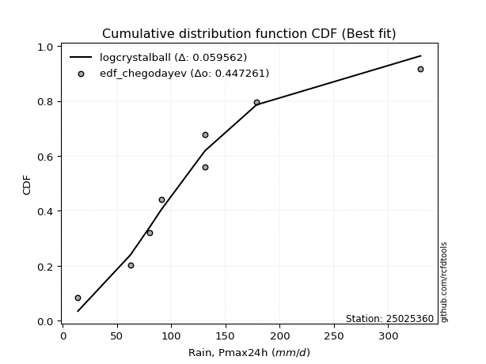</img>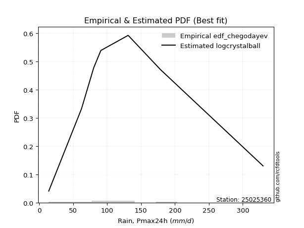</img>

</div>


### 6. Empirical - EDF Blom (1958)

The Blom formula is a specific "plotting position" formula used in hydrology and statistical analysis to estimate the empirical cumulative probability (or non-exceedance probability) of a data series. It is particularly recommended for data that are approximately normally distributed. The constant _a_ is set to 0.375 (or 3/8).

<div align="center">


$P=(m-a)/(n+1-2a)$


</div>


**6.1. Empirical values**

<div align="center">

|                | 0                   | 1                   | 2                   | 3                  | 4        | 5                  | 6                  | 7                  | 8                  |
|:---------------|:--------------------|:--------------------|:--------------------|:-------------------|:---------|:-------------------|:-------------------|:-------------------|:-------------------|
| date           | 2021                | 2023                | 2025                | 2019               | 2020     | 2024               | 2022               | 2017               | 2018               |
| x              | 14.0                | 62.3                | 70.9                | 80.2               | 90.8     | 131.0              | 131.2              | 178.68             | 329.9              |
| m              | 1                   | 2                   | 3                   | 4                  | 5        | 6                  | 7                  | 8                  | 9                  |
| empirical_dist | edf_blom            | edf_blom            | edf_blom            | edf_blom           | edf_blom | edf_blom           | edf_blom           | edf_blom           | edf_blom           |
| empirical      | 0.06756756756756757 | 0.17567567567567569 | 0.28378378378378377 | 0.3918918918918919 | 0.5      | 0.6081081081081081 | 0.7162162162162162 | 0.8243243243243243 | 0.9324324324324325 |
| empirical_tr   | 1.072463768115942   | 1.2131147540983607  | 1.3962264150943395  | 1.6444444444444444 | 2.0      | 2.5517241379310347 | 3.523809523809524  | 5.6923076923076925 | 14.800000000000006 |

</div>


**6.2. Kolmogorov-Smirnov fit test (sorted by Δ)**


<div align="center">

|                | 0                   | 1                   | 2                   | 3                   | 4                   | 5                   | 6                   | 7                   | 8                   | 9                   | 10                  | 11                  | 12                  | 13                  | 14                  | 15                  | 16                  | 17                  | 18                  | 19                  | 20                  | 21                  | 22                  | 23                  | 24                  | 25                  | 26                  | 27                  | 28                  | 29                    | 30                  | 31                  | 32                  | 33                  | 34                  | 35                  | 36                  | 37                  | 38                  | 39                  | 40                  | 41                  | 42                  | 43                  | 44                  | 45                  | 46                  | 47                  | 48                  | 49                  | 50                  | 51                  | 52                  | 53                  | 54                  | 55                  | 56                  | 57                  | 58                  | 59                  | 60                  | 61                  | 62                  | 63                  | 64                  | 65                  | 66                  | 67                  | 68                  | 69                  | 70                  | 71                  | 72                  | 73                  | 74                  | 75                  | 76                  | 77                  | 78                  | 79                  | 80                  | 81                  | 82                  | 83                  | 84                  | 85                  | 86                  | 87                  | 88                  | 89                  |
|:---------------|:--------------------|:--------------------|:--------------------|:--------------------|:--------------------|:--------------------|:--------------------|:--------------------|:--------------------|:--------------------|:--------------------|:--------------------|:--------------------|:--------------------|:--------------------|:--------------------|:--------------------|:--------------------|:--------------------|:--------------------|:--------------------|:--------------------|:--------------------|:--------------------|:--------------------|:--------------------|:--------------------|:--------------------|:--------------------|:----------------------|:--------------------|:--------------------|:--------------------|:--------------------|:--------------------|:--------------------|:--------------------|:--------------------|:--------------------|:--------------------|:--------------------|:--------------------|:--------------------|:--------------------|:--------------------|:--------------------|:--------------------|:--------------------|:--------------------|:--------------------|:--------------------|:--------------------|:--------------------|:--------------------|:--------------------|:--------------------|:--------------------|:--------------------|:--------------------|:--------------------|:--------------------|:--------------------|:--------------------|:--------------------|:--------------------|:--------------------|:--------------------|:--------------------|:--------------------|:--------------------|:--------------------|:--------------------|:--------------------|:--------------------|:--------------------|:--------------------|:--------------------|:--------------------|:--------------------|:--------------------|:--------------------|:--------------------|:--------------------|:--------------------|:--------------------|:--------------------|:--------------------|:--------------------|:--------------------|:--------------------|
| station        | 25025360            | 25025360            | 25025360            | 25025360            | 25025360            | 25025360            | 25025360            | 25025360            | 25025360            | 25025360            | 25025360            | 25025360            | 25025360            | 25025360            | 25025360            | 25025360            | 25025360            | 25025360            | 25025360            | 25025360            | 25025360            | 25025360            | 25025360            | 25025360            | 25025360            | 25025360            | 25025360            | 25025360            | 25025360            | 25025360              | 25025360            | 25025360            | 25025360            | 25025360            | 25025360            | 25025360            | 25025360            | 25025360            | 25025360            | 25025360            | 25025360            | 25025360            | 25025360            | 25025360            | 25025360            | 25025360            | 25025360            | 25025360            | 25025360            | 25025360            | 25025360            | 25025360            | 25025360            | 25025360            | 25025360            | 25025360            | 25025360            | 25025360            | 25025360            | 25025360            | 25025360            | 25025360            | 25025360            | 25025360            | 25025360            | 25025360            | 25025360            | 25025360            | 25025360            | 25025360            | 25025360            | 25025360            | 25025360            | 25025360            | 25025360            | 25025360            | 25025360            | 25025360            | 25025360            | 25025360            | 25025360            | 25025360            | 25025360            | 25025360            | 25025360            | 25025360            | 25025360            | 25025360            | 25025360            | 25025360            |
| empirical_dist | edf_blom            | edf_blom            | edf_blom            | edf_blom            | edf_blom            | edf_blom            | edf_blom            | edf_blom            | edf_blom            | edf_blom            | edf_blom            | edf_blom            | edf_blom            | edf_blom            | edf_blom            | edf_blom            | edf_blom            | edf_blom            | edf_blom            | edf_blom            | edf_blom            | edf_blom            | edf_blom            | edf_blom            | edf_blom            | edf_blom            | edf_blom            | edf_blom            | edf_blom            | edf_blom              | edf_blom            | edf_blom            | edf_blom            | edf_blom            | edf_blom            | edf_blom            | edf_blom            | edf_blom            | edf_blom            | edf_blom            | edf_blom            | edf_blom            | edf_blom            | edf_blom            | edf_blom            | edf_blom            | edf_blom            | edf_blom            | edf_blom            | edf_blom            | edf_blom            | edf_blom            | edf_blom            | edf_blom            | edf_blom            | edf_blom            | edf_blom            | edf_blom            | edf_blom            | edf_blom            | edf_blom            | edf_blom            | edf_blom            | edf_blom            | edf_blom            | edf_blom            | edf_blom            | edf_blom            | edf_blom            | edf_blom            | edf_blom            | edf_blom            | edf_blom            | edf_blom            | edf_blom            | edf_blom            | edf_blom            | edf_blom            | edf_blom            | edf_blom            | edf_blom            | edf_blom            | edf_blom            | edf_blom            | edf_blom            | edf_blom            | edf_blom            | edf_blom            | edf_blom            | edf_blom            |
| p_dist         | nct                 | laplace_asymmetric  | exponnorm           | fisk                | logjohnsonsu        | logt                | johnsonsu           | invweibull          | invgamma            | moyal               | logfisk             | logmielke           | loggenlogistic      | invgauss            | genlogistic         | loggumbel_l         | gumbel_r            | pearson3            | wald                | logloggamma         | logweibull_min      | logpearson3         | loghypsecant        | halflogistic        | kstwobign           | betaprime           | erlang              | gamma               | loggompertz         | loglaplace_asymmetric | f                   | loglaplace          | loglogistic         | halfnorm            | rayleigh            | ncf                 | gibrat              | gompertz            | weibull_min         | maxwell             | logf                | lognct              | logexponnorm        | lognorm             | lognorm             | logcrystalball      | logrice             | logfatiguelife      | rice                | logncf              | loggamma            | loggamma            | logerlang           | logbetaprime        | logistic            | loginvgamma         | hypsecant           | t                   | crystalball         | norm                | logalpha            | logmaxwell          | logtruncnorm        | nakagami            | lognakagami         | loggumbel_r         | loginvgauss         | lograyleigh         | expon               | genexpon            | laplace             | logmoyal            | mielke              | loginvweibull       | loghalfnorm         | loghalflogistic     | loggibrat           | logwald             | gumbel_l            | logkstwobign        | loggenexpon         | alpha               | logexpon            | loglognorm          | pareto              | logpareto           | logchi2             | fatiguelife         | chi2                | truncnorm           |
| delta          | 0.06460242069998556 | 0.06497766853579923 | 0.06743763374938805 | 0.06879380754301409 | 0.06897806776509743 | 0.07032517565854146 | 0.07552980124745257 | 0.07810290845566484 | 0.0818364300478652  | 0.08404873191705028 | 0.08457368286746156 | 0.08675365424257644 | 0.0868102658043585  | 0.08971415198999425 | 0.09058094785449511 | 0.09093518979510895 | 0.0990005850334229  | 0.10204485227281115 | 0.10244521687713515 | 0.10252702468039646 | 0.10535194626248082 | 0.10551374438015984 | 0.10867806180889586 | 0.11173306138253955 | 0.11299109323834766 | 0.11558393327297398 | 0.11980185782336208 | 0.1198019347367981  | 0.1199657685916162  | 0.12011511299350741   | 0.12031907392495958 | 0.12112516386814653 | 0.12374534435994686 | 0.12649416365445101 | 0.12877719263228216 | 0.1320972550623609  | 0.13243173310383347 | 0.13423370630333734 | 0.1346567768747385  | 0.13862075563574017 | 0.14273759410525863 | 0.14344408368092734 | 0.1439799727026518  | 0.1439804251124114  | 0.1439804251124114  | 0.1439805447605946  | 0.14398789942315585 | 0.14485366685960474 | 0.14971491456586494 | 0.15269866207810087 | 0.15424824051828992 | 0.15424824051828992 | 0.15455337143907774 | 0.15746550938454937 | 0.1628630072815399  | 0.16578173672896143 | 0.16662254308548197 | 0.1691360105122548  | 0.16920634038806093 | 0.1692063432291816  | 0.17219868548897352 | 0.17369877125290648 | 0.17558278751903983 | 0.1756684267222511  | 0.17567567343015514 | 0.18342516032851522 | 0.1844194433774163  | 0.1852419653298232  | 0.18759538711836746 | 0.18760808109664992 | 0.1950332008733367  | 0.1968803582819146  | 0.21033510187639778 | 0.21455871463647877 | 0.21802215446400516 | 0.22047413433379362 | 0.22087007037032635 | 0.22441708623553924 | 0.23654699977180682 | 0.2561389828294691  | 0.2907024948238005  | 0.3556605819793983  | 0.37254218202846046 | 0.4518462865884977  | 0.46873525817832706 | 0.4864252831721394  | 0.5658995127438647  | 0.5918364296280266  | 0.8224706580311155  | 0.8243243243243243  |
| deltao         | 0.41761268023100007 | 0.41761268023100007 | 0.41761268023100007 | 0.41761268023100007 | 0.41761268023100007 | 0.41761268023100007 | 0.41761268023100007 | 0.41761268023100007 | 0.41761268023100007 | 0.41761268023100007 | 0.41761268023100007 | 0.41761268023100007 | 0.41761268023100007 | 0.41761268023100007 | 0.41761268023100007 | 0.41761268023100007 | 0.41761268023100007 | 0.41761268023100007 | 0.41761268023100007 | 0.41761268023100007 | 0.41761268023100007 | 0.41761268023100007 | 0.41761268023100007 | 0.41761268023100007 | 0.41761268023100007 | 0.41761268023100007 | 0.41761268023100007 | 0.41761268023100007 | 0.41761268023100007 | 0.41761268023100007   | 0.41761268023100007 | 0.41761268023100007 | 0.41761268023100007 | 0.41761268023100007 | 0.41761268023100007 | 0.41761268023100007 | 0.41761268023100007 | 0.41761268023100007 | 0.41761268023100007 | 0.41761268023100007 | 0.41761268023100007 | 0.41761268023100007 | 0.41761268023100007 | 0.41761268023100007 | 0.41761268023100007 | 0.41761268023100007 | 0.41761268023100007 | 0.41761268023100007 | 0.41761268023100007 | 0.41761268023100007 | 0.41761268023100007 | 0.41761268023100007 | 0.41761268023100007 | 0.41761268023100007 | 0.41761268023100007 | 0.41761268023100007 | 0.41761268023100007 | 0.41761268023100007 | 0.41761268023100007 | 0.41761268023100007 | 0.41761268023100007 | 0.41761268023100007 | 0.41761268023100007 | 0.41761268023100007 | 0.41761268023100007 | 0.41761268023100007 | 0.41761268023100007 | 0.41761268023100007 | 0.41761268023100007 | 0.41761268023100007 | 0.41761268023100007 | 0.41761268023100007 | 0.41761268023100007 | 0.41761268023100007 | 0.41761268023100007 | 0.41761268023100007 | 0.41761268023100007 | 0.41761268023100007 | 0.41761268023100007 | 0.41761268023100007 | 0.41761268023100007 | 0.41761268023100007 | 0.41761268023100007 | 0.41761268023100007 | 0.41761268023100007 | 0.41761268023100007 | 0.41761268023100007 | 0.41761268023100007 | 0.41761268023100007 | 0.41761268023100007 |
| eval           | Δo > Δ              | Δo > Δ              | Δo > Δ              | Δo > Δ              | Δo > Δ              | Δo > Δ              | Δo > Δ              | Δo > Δ              | Δo > Δ              | Δo > Δ              | Δo > Δ              | Δo > Δ              | Δo > Δ              | Δo > Δ              | Δo > Δ              | Δo > Δ              | Δo > Δ              | Δo > Δ              | Δo > Δ              | Δo > Δ              | Δo > Δ              | Δo > Δ              | Δo > Δ              | Δo > Δ              | Δo > Δ              | Δo > Δ              | Δo > Δ              | Δo > Δ              | Δo > Δ              | Δo > Δ                | Δo > Δ              | Δo > Δ              | Δo > Δ              | Δo > Δ              | Δo > Δ              | Δo > Δ              | Δo > Δ              | Δo > Δ              | Δo > Δ              | Δo > Δ              | Δo > Δ              | Δo > Δ              | Δo > Δ              | Δo > Δ              | Δo > Δ              | Δo > Δ              | Δo > Δ              | Δo > Δ              | Δo > Δ              | Δo > Δ              | Δo > Δ              | Δo > Δ              | Δo > Δ              | Δo > Δ              | Δo > Δ              | Δo > Δ              | Δo > Δ              | Δo > Δ              | Δo > Δ              | Δo > Δ              | Δo > Δ              | Δo > Δ              | Δo > Δ              | Δo > Δ              | Δo > Δ              | Δo > Δ              | Δo > Δ              | Δo > Δ              | Δo > Δ              | Δo > Δ              | Δo > Δ              | Δo > Δ              | Δo > Δ              | Δo > Δ              | Δo > Δ              | Δo > Δ              | Δo > Δ              | Δo > Δ              | Δo > Δ              | Δo > Δ              | Δo > Δ              | Δo > Δ              | Δo > Δ              | Δo <= Δ             | Δo <= Δ             | Δo <= Δ             | Δo <= Δ             | Δo <= Δ             | Δo <= Δ             | Δo <= Δ             |
| fit            | 1                   | 1                   | 1                   | 1                   | 1                   | 1                   | 1                   | 1                   | 1                   | 1                   | 1                   | 1                   | 1                   | 1                   | 1                   | 1                   | 1                   | 1                   | 1                   | 1                   | 1                   | 1                   | 1                   | 1                   | 1                   | 1                   | 1                   | 1                   | 1                   | 1                     | 1                   | 1                   | 1                   | 1                   | 1                   | 1                   | 1                   | 1                   | 1                   | 1                   | 1                   | 1                   | 1                   | 1                   | 1                   | 1                   | 1                   | 1                   | 1                   | 1                   | 1                   | 1                   | 1                   | 1                   | 1                   | 1                   | 1                   | 1                   | 1                   | 1                   | 1                   | 1                   | 1                   | 1                   | 1                   | 1                   | 1                   | 1                   | 1                   | 1                   | 1                   | 1                   | 1                   | 1                   | 1                   | 1                   | 1                   | 1                   | 1                   | 1                   | 1                   | 1                   | 1                   | 0                   | 0                   | 0                   | 0                   | 0                   | 0                   | 0                   |
| n              | 9                   | 9                   | 9                   | 9                   | 9                   | 9                   | 9                   | 9                   | 9                   | 9                   | 9                   | 9                   | 9                   | 9                   | 9                   | 9                   | 9                   | 9                   | 9                   | 9                   | 9                   | 9                   | 9                   | 9                   | 9                   | 9                   | 9                   | 9                   | 9                   | 9                     | 9                   | 9                   | 9                   | 9                   | 9                   | 9                   | 9                   | 9                   | 9                   | 9                   | 9                   | 9                   | 9                   | 9                   | 9                   | 9                   | 9                   | 9                   | 9                   | 9                   | 9                   | 9                   | 9                   | 9                   | 9                   | 9                   | 9                   | 9                   | 9                   | 9                   | 9                   | 9                   | 9                   | 9                   | 9                   | 9                   | 9                   | 9                   | 9                   | 9                   | 9                   | 9                   | 9                   | 9                   | 9                   | 9                   | 9                   | 9                   | 9                   | 9                   | 9                   | 9                   | 9                   | 9                   | 9                   | 9                   | 9                   | 9                   | 9                   | 9                   |
| best_fit       | 1                   | 0                   | 0                   | 0                   | 0                   | 0                   | 0                   | 0                   | 0                   | 0                   | 0                   | 0                   | 0                   | 0                   | 0                   | 0                   | 0                   | 0                   | 0                   | 0                   | 0                   | 0                   | 0                   | 0                   | 0                   | 0                   | 0                   | 0                   | 0                   | 0                     | 0                   | 0                   | 0                   | 0                   | 0                   | 0                   | 0                   | 0                   | 0                   | 0                   | 0                   | 0                   | 0                   | 0                   | 0                   | 0                   | 0                   | 0                   | 0                   | 0                   | 0                   | 0                   | 0                   | 0                   | 0                   | 0                   | 0                   | 0                   | 0                   | 0                   | 0                   | 0                   | 0                   | 0                   | 0                   | 0                   | 0                   | 0                   | 0                   | 0                   | 0                   | 0                   | 0                   | 0                   | 0                   | 0                   | 0                   | 0                   | 0                   | 0                   | 0                   | 0                   | 0                   | 0                   | 0                   | 0                   | 0                   | 0                   | 0                   | 0                   |
| best_fit_sort  | 1                   | 2                   | 3                   | 4                   | 5                   | 6                   | 7                   | 8                   | 9                   | 10                  | 11                  | 12                  | 13                  | 14                  | 15                  | 16                  | 17                  | 18                  | 19                  | 20                  | 21                  | 22                  | 23                  | 24                  | 25                  | 26                  | 27                  | 28                  | 29                  | 30                    | 31                  | 32                  | 33                  | 34                  | 35                  | 36                  | 37                  | 38                  | 39                  | 40                  | 41                  | 42                  | 43                  | 44                  | 45                  | 46                  | 47                  | 48                  | 49                  | 50                  | 51                  | 52                  | 53                  | 54                  | 55                  | 56                  | 57                  | 58                  | 59                  | 60                  | 61                  | 62                  | 63                  | 64                  | 65                  | 66                  | 67                  | 68                  | 69                  | 70                  | 71                  | 72                  | 73                  | 74                  | 75                  | 76                  | 77                  | 78                  | 79                  | 80                  | 81                  | 82                  | 83                  | 84                  | 85                  | 86                  | 87                  | 88                  | 89                  | 90                  |

</div>


<div align="center">

</img>

</div>


**6.3. Best fit**

<div align="center">

|   id |   station | empirical_dist   | p_dist   |     delta |   deltao | eval   |   fit |   n |   best_fit |   best_fit_sort |
|-----:|----------:|:-----------------|:---------|----------:|---------:|:-------|------:|----:|-----------:|----------------:|
|    0 |  25025360 | edf_blom         | nct      | 0.0646024 | 0.417613 | Δo > Δ |     1 |   9 |          1 |               1 |

</div>


<div align="center">

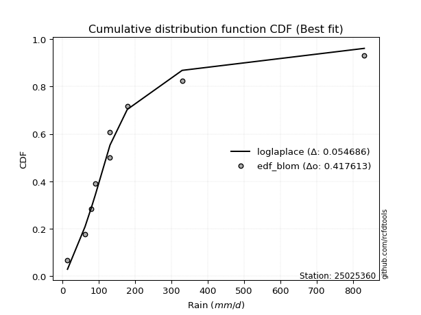</img>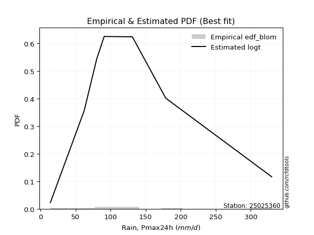</img>

</div>


### 7. Empirical - EDF Tukey (1962)

In hydrology, the Tukey formula is used as a plotting position formula to estimate the empirical probability or frequency of a flood event (or other hydrological data). The formula parameter is given as _c=0.333_ (or 1/3).

<div align="center">


$P=(m-c)/(n+1-2c)$


</div>


**7.1. Empirical values**

<div align="center">

|                | 0                   | 1                   | 2                  | 3                   | 4         | 5                  | 6                  | 7                  | 8                  |
|:---------------|:--------------------|:--------------------|:-------------------|:--------------------|:----------|:-------------------|:-------------------|:-------------------|:-------------------|
| date           | 2021                | 2023                | 2025               | 2019                | 2020      | 2024               | 2022               | 2017               | 2018               |
| x              | 14.0                | 62.3                | 70.9               | 80.2                | 90.8      | 131.0              | 131.2              | 178.68             | 329.9              |
| m              | 1                   | 2                   | 3                  | 4                   | 5         | 6                  | 7                  | 8                  | 9                  |
| empirical_dist | edf_tukey           | edf_tukey           | edf_tukey          | edf_tukey           | edf_tukey | edf_tukey          | edf_tukey          | edf_tukey          | edf_tukey          |
| empirical      | 0.07142857142857142 | 0.17857142857142858 | 0.2857142857142857 | 0.39285714285714285 | 0.5       | 0.6071428571428571 | 0.7142857142857143 | 0.8214285714285714 | 0.9285714285714286 |
| empirical_tr   | 1.0769230769230769  | 1.2173913043478262  | 1.4                | 1.6470588235294117  | 2.0       | 2.545454545454545  | 3.5                | 5.599999999999999  | 14.000000000000007 |

</div>


**7.2. Kolmogorov-Smirnov fit test (sorted by Δ)**


<div align="center">

|                | 0                   | 1                   | 2                   | 3                   | 4                   | 5                   | 6                   | 7                   | 8                   | 9                   | 10                  | 11                  | 12                  | 13                  | 14                  | 15                  | 16                  | 17                  | 18                  | 19                  | 20                  | 21                  | 22                  | 23                  | 24                  | 25                  | 26                  | 27                  | 28                  | 29                  | 30                  | 31                    | 32                  | 33                  | 34                  | 35                  | 36                  | 37                  | 38                  | 39                  | 40                  | 41                  | 42                  | 43                  | 44                  | 45                  | 46                  | 47                  | 48                  | 49                  | 50                  | 51                  | 52                  | 53                  | 54                  | 55                  | 56                  | 57                  | 58                  | 59                  | 60                  | 61                  | 62                  | 63                  | 64                  | 65                  | 66                  | 67                  | 68                  | 69                  | 70                  | 71                  | 72                  | 73                  | 74                  | 75                  | 76                  | 77                  | 78                  | 79                  | 80                  | 81                  | 82                  | 83                  | 84                  | 85                  | 86                  | 87                  | 88                  | 89                  |
|:---------------|:--------------------|:--------------------|:--------------------|:--------------------|:--------------------|:--------------------|:--------------------|:--------------------|:--------------------|:--------------------|:--------------------|:--------------------|:--------------------|:--------------------|:--------------------|:--------------------|:--------------------|:--------------------|:--------------------|:--------------------|:--------------------|:--------------------|:--------------------|:--------------------|:--------------------|:--------------------|:--------------------|:--------------------|:--------------------|:--------------------|:--------------------|:----------------------|:--------------------|:--------------------|:--------------------|:--------------------|:--------------------|:--------------------|:--------------------|:--------------------|:--------------------|:--------------------|:--------------------|:--------------------|:--------------------|:--------------------|:--------------------|:--------------------|:--------------------|:--------------------|:--------------------|:--------------------|:--------------------|:--------------------|:--------------------|:--------------------|:--------------------|:--------------------|:--------------------|:--------------------|:--------------------|:--------------------|:--------------------|:--------------------|:--------------------|:--------------------|:--------------------|:--------------------|:--------------------|:--------------------|:--------------------|:--------------------|:--------------------|:--------------------|:--------------------|:--------------------|:--------------------|:--------------------|:--------------------|:--------------------|:--------------------|:--------------------|:--------------------|:--------------------|:--------------------|:--------------------|:--------------------|:--------------------|:--------------------|:--------------------|
| station        | 25025360            | 25025360            | 25025360            | 25025360            | 25025360            | 25025360            | 25025360            | 25025360            | 25025360            | 25025360            | 25025360            | 25025360            | 25025360            | 25025360            | 25025360            | 25025360            | 25025360            | 25025360            | 25025360            | 25025360            | 25025360            | 25025360            | 25025360            | 25025360            | 25025360            | 25025360            | 25025360            | 25025360            | 25025360            | 25025360            | 25025360            | 25025360              | 25025360            | 25025360            | 25025360            | 25025360            | 25025360            | 25025360            | 25025360            | 25025360            | 25025360            | 25025360            | 25025360            | 25025360            | 25025360            | 25025360            | 25025360            | 25025360            | 25025360            | 25025360            | 25025360            | 25025360            | 25025360            | 25025360            | 25025360            | 25025360            | 25025360            | 25025360            | 25025360            | 25025360            | 25025360            | 25025360            | 25025360            | 25025360            | 25025360            | 25025360            | 25025360            | 25025360            | 25025360            | 25025360            | 25025360            | 25025360            | 25025360            | 25025360            | 25025360            | 25025360            | 25025360            | 25025360            | 25025360            | 25025360            | 25025360            | 25025360            | 25025360            | 25025360            | 25025360            | 25025360            | 25025360            | 25025360            | 25025360            | 25025360            |
| empirical_dist | edf_tukey           | edf_tukey           | edf_tukey           | edf_tukey           | edf_tukey           | edf_tukey           | edf_tukey           | edf_tukey           | edf_tukey           | edf_tukey           | edf_tukey           | edf_tukey           | edf_tukey           | edf_tukey           | edf_tukey           | edf_tukey           | edf_tukey           | edf_tukey           | edf_tukey           | edf_tukey           | edf_tukey           | edf_tukey           | edf_tukey           | edf_tukey           | edf_tukey           | edf_tukey           | edf_tukey           | edf_tukey           | edf_tukey           | edf_tukey           | edf_tukey           | edf_tukey             | edf_tukey           | edf_tukey           | edf_tukey           | edf_tukey           | edf_tukey           | edf_tukey           | edf_tukey           | edf_tukey           | edf_tukey           | edf_tukey           | edf_tukey           | edf_tukey           | edf_tukey           | edf_tukey           | edf_tukey           | edf_tukey           | edf_tukey           | edf_tukey           | edf_tukey           | edf_tukey           | edf_tukey           | edf_tukey           | edf_tukey           | edf_tukey           | edf_tukey           | edf_tukey           | edf_tukey           | edf_tukey           | edf_tukey           | edf_tukey           | edf_tukey           | edf_tukey           | edf_tukey           | edf_tukey           | edf_tukey           | edf_tukey           | edf_tukey           | edf_tukey           | edf_tukey           | edf_tukey           | edf_tukey           | edf_tukey           | edf_tukey           | edf_tukey           | edf_tukey           | edf_tukey           | edf_tukey           | edf_tukey           | edf_tukey           | edf_tukey           | edf_tukey           | edf_tukey           | edf_tukey           | edf_tukey           | edf_tukey           | edf_tukey           | edf_tukey           | edf_tukey           |
| p_dist         | nct                 | laplace_asymmetric  | fisk                | exponnorm           | logjohnsonsu        | logt                | invweibull          | johnsonsu           | invgamma            | moyal               | logfisk             | logmielke           | loggenlogistic      | invgauss            | loggumbel_l         | genlogistic         | gumbel_r            | pearson3            | logloggamma         | logweibull_min      | logpearson3         | wald                | loghypsecant        | halflogistic        | kstwobign           | betaprime           | erlang              | gamma               | loggompertz         | f                   | loglogistic         | loglaplace_asymmetric | loglaplace          | halfnorm            | rayleigh            | ncf                 | gompertz            | weibull_min         | gibrat              | maxwell             | logf                | lognct              | logexponnorm        | lognorm             | lognorm             | logcrystalball      | logrice             | logfatiguelife      | rice                | logncf              | loggamma            | loggamma            | logerlang           | logbetaprime        | logistic            | loginvgamma         | hypsecant           | t                   | crystalball         | norm                | logalpha            | logmaxwell          | logtruncnorm        | nakagami            | lognakagami         | loggumbel_r         | loginvgauss         | lograyleigh         | expon               | genexpon            | logmoyal            | laplace             | mielke              | loginvweibull       | loghalfnorm         | loghalflogistic     | loggibrat           | logwald             | gumbel_l            | logkstwobign        | loggenexpon         | alpha               | logexpon            | loglognorm          | pareto              | logpareto           | logchi2             | fatiguelife         | chi2                | truncnorm           |
| delta          | 0.06460242069998556 | 0.06497766853579923 | 0.0658980546472612  | 0.06743763374938805 | 0.0678336838153738  | 0.07032517565854146 | 0.07520715555991195 | 0.07649505221270358 | 0.07894067715211231 | 0.0811529790212974  | 0.08167792997170867 | 0.08385790134682355 | 0.0839145129086056  | 0.08681839909424136 | 0.08900468786460702 | 0.09058094785449511 | 0.09707008310292098 | 0.09914909937705826 | 0.09963127178464357 | 0.10245619336672793 | 0.10261799148440695 | 0.10341046784238617 | 0.10578230891314297 | 0.10883730848678666 | 0.11106059130784574 | 0.11268818037722109 | 0.1169061049276092  | 0.1169061818410452  | 0.11707001569586331 | 0.11742332102920669 | 0.12084959146419397 | 0.12108036395875843   | 0.12209041483339755 | 0.12359841075869812 | 0.12684669070178023 | 0.129201502166608   | 0.13133795340758445 | 0.13176102397898562 | 0.13532748599958636 | 0.13669025370523824 | 0.13984184120950574 | 0.14054833078517445 | 0.14108421980689892 | 0.14108467221665852 | 0.14108467221665852 | 0.1410847918648417  | 0.14109214652740296 | 0.14195791396385185 | 0.14778441263536302 | 0.14980290918234798 | 0.15135248762253703 | 0.15135248762253703 | 0.15165761854332485 | 0.15456975648879648 | 0.16093250535103798 | 0.16288598383320854 | 0.16662254308548197 | 0.16720550858175287 | 0.167275838457559   | 0.16727584129867967 | 0.16930293259322063 | 0.17080301835715359 | 0.17847854041479272 | 0.178564179618004   | 0.17857142632590803 | 0.18052940743276233 | 0.18152369048166342 | 0.18234621243407031 | 0.18469963422261457 | 0.18471232820089703 | 0.19398460538616172 | 0.1950332008733367  | 0.2074393489806449  | 0.21166296174072588 | 0.21512640156825227 | 0.21757838143804073 | 0.22183532133557737 | 0.22248658430503732 | 0.2346164978413049  | 0.2532432299337162  | 0.28780674192804756 | 0.35276482908364537 | 0.3696464291327075  | 0.44895053369274474 | 0.4658395052825741  | 0.48352953027638645 | 0.5630037598481118  | 0.5889406767322737  | 0.8195749051353626  | 0.8214285714285714  |
| deltao         | 0.41761268023100007 | 0.41761268023100007 | 0.41761268023100007 | 0.41761268023100007 | 0.41761268023100007 | 0.41761268023100007 | 0.41761268023100007 | 0.41761268023100007 | 0.41761268023100007 | 0.41761268023100007 | 0.41761268023100007 | 0.41761268023100007 | 0.41761268023100007 | 0.41761268023100007 | 0.41761268023100007 | 0.41761268023100007 | 0.41761268023100007 | 0.41761268023100007 | 0.41761268023100007 | 0.41761268023100007 | 0.41761268023100007 | 0.41761268023100007 | 0.41761268023100007 | 0.41761268023100007 | 0.41761268023100007 | 0.41761268023100007 | 0.41761268023100007 | 0.41761268023100007 | 0.41761268023100007 | 0.41761268023100007 | 0.41761268023100007 | 0.41761268023100007   | 0.41761268023100007 | 0.41761268023100007 | 0.41761268023100007 | 0.41761268023100007 | 0.41761268023100007 | 0.41761268023100007 | 0.41761268023100007 | 0.41761268023100007 | 0.41761268023100007 | 0.41761268023100007 | 0.41761268023100007 | 0.41761268023100007 | 0.41761268023100007 | 0.41761268023100007 | 0.41761268023100007 | 0.41761268023100007 | 0.41761268023100007 | 0.41761268023100007 | 0.41761268023100007 | 0.41761268023100007 | 0.41761268023100007 | 0.41761268023100007 | 0.41761268023100007 | 0.41761268023100007 | 0.41761268023100007 | 0.41761268023100007 | 0.41761268023100007 | 0.41761268023100007 | 0.41761268023100007 | 0.41761268023100007 | 0.41761268023100007 | 0.41761268023100007 | 0.41761268023100007 | 0.41761268023100007 | 0.41761268023100007 | 0.41761268023100007 | 0.41761268023100007 | 0.41761268023100007 | 0.41761268023100007 | 0.41761268023100007 | 0.41761268023100007 | 0.41761268023100007 | 0.41761268023100007 | 0.41761268023100007 | 0.41761268023100007 | 0.41761268023100007 | 0.41761268023100007 | 0.41761268023100007 | 0.41761268023100007 | 0.41761268023100007 | 0.41761268023100007 | 0.41761268023100007 | 0.41761268023100007 | 0.41761268023100007 | 0.41761268023100007 | 0.41761268023100007 | 0.41761268023100007 | 0.41761268023100007 |
| eval           | Δo > Δ              | Δo > Δ              | Δo > Δ              | Δo > Δ              | Δo > Δ              | Δo > Δ              | Δo > Δ              | Δo > Δ              | Δo > Δ              | Δo > Δ              | Δo > Δ              | Δo > Δ              | Δo > Δ              | Δo > Δ              | Δo > Δ              | Δo > Δ              | Δo > Δ              | Δo > Δ              | Δo > Δ              | Δo > Δ              | Δo > Δ              | Δo > Δ              | Δo > Δ              | Δo > Δ              | Δo > Δ              | Δo > Δ              | Δo > Δ              | Δo > Δ              | Δo > Δ              | Δo > Δ              | Δo > Δ              | Δo > Δ                | Δo > Δ              | Δo > Δ              | Δo > Δ              | Δo > Δ              | Δo > Δ              | Δo > Δ              | Δo > Δ              | Δo > Δ              | Δo > Δ              | Δo > Δ              | Δo > Δ              | Δo > Δ              | Δo > Δ              | Δo > Δ              | Δo > Δ              | Δo > Δ              | Δo > Δ              | Δo > Δ              | Δo > Δ              | Δo > Δ              | Δo > Δ              | Δo > Δ              | Δo > Δ              | Δo > Δ              | Δo > Δ              | Δo > Δ              | Δo > Δ              | Δo > Δ              | Δo > Δ              | Δo > Δ              | Δo > Δ              | Δo > Δ              | Δo > Δ              | Δo > Δ              | Δo > Δ              | Δo > Δ              | Δo > Δ              | Δo > Δ              | Δo > Δ              | Δo > Δ              | Δo > Δ              | Δo > Δ              | Δo > Δ              | Δo > Δ              | Δo > Δ              | Δo > Δ              | Δo > Δ              | Δo > Δ              | Δo > Δ              | Δo > Δ              | Δo > Δ              | Δo <= Δ             | Δo <= Δ             | Δo <= Δ             | Δo <= Δ             | Δo <= Δ             | Δo <= Δ             | Δo <= Δ             |
| fit            | 1                   | 1                   | 1                   | 1                   | 1                   | 1                   | 1                   | 1                   | 1                   | 1                   | 1                   | 1                   | 1                   | 1                   | 1                   | 1                   | 1                   | 1                   | 1                   | 1                   | 1                   | 1                   | 1                   | 1                   | 1                   | 1                   | 1                   | 1                   | 1                   | 1                   | 1                   | 1                     | 1                   | 1                   | 1                   | 1                   | 1                   | 1                   | 1                   | 1                   | 1                   | 1                   | 1                   | 1                   | 1                   | 1                   | 1                   | 1                   | 1                   | 1                   | 1                   | 1                   | 1                   | 1                   | 1                   | 1                   | 1                   | 1                   | 1                   | 1                   | 1                   | 1                   | 1                   | 1                   | 1                   | 1                   | 1                   | 1                   | 1                   | 1                   | 1                   | 1                   | 1                   | 1                   | 1                   | 1                   | 1                   | 1                   | 1                   | 1                   | 1                   | 1                   | 1                   | 0                   | 0                   | 0                   | 0                   | 0                   | 0                   | 0                   |
| n              | 9                   | 9                   | 9                   | 9                   | 9                   | 9                   | 9                   | 9                   | 9                   | 9                   | 9                   | 9                   | 9                   | 9                   | 9                   | 9                   | 9                   | 9                   | 9                   | 9                   | 9                   | 9                   | 9                   | 9                   | 9                   | 9                   | 9                   | 9                   | 9                   | 9                   | 9                   | 9                     | 9                   | 9                   | 9                   | 9                   | 9                   | 9                   | 9                   | 9                   | 9                   | 9                   | 9                   | 9                   | 9                   | 9                   | 9                   | 9                   | 9                   | 9                   | 9                   | 9                   | 9                   | 9                   | 9                   | 9                   | 9                   | 9                   | 9                   | 9                   | 9                   | 9                   | 9                   | 9                   | 9                   | 9                   | 9                   | 9                   | 9                   | 9                   | 9                   | 9                   | 9                   | 9                   | 9                   | 9                   | 9                   | 9                   | 9                   | 9                   | 9                   | 9                   | 9                   | 9                   | 9                   | 9                   | 9                   | 9                   | 9                   | 9                   |
| best_fit       | 1                   | 0                   | 0                   | 0                   | 0                   | 0                   | 0                   | 0                   | 0                   | 0                   | 0                   | 0                   | 0                   | 0                   | 0                   | 0                   | 0                   | 0                   | 0                   | 0                   | 0                   | 0                   | 0                   | 0                   | 0                   | 0                   | 0                   | 0                   | 0                   | 0                   | 0                   | 0                     | 0                   | 0                   | 0                   | 0                   | 0                   | 0                   | 0                   | 0                   | 0                   | 0                   | 0                   | 0                   | 0                   | 0                   | 0                   | 0                   | 0                   | 0                   | 0                   | 0                   | 0                   | 0                   | 0                   | 0                   | 0                   | 0                   | 0                   | 0                   | 0                   | 0                   | 0                   | 0                   | 0                   | 0                   | 0                   | 0                   | 0                   | 0                   | 0                   | 0                   | 0                   | 0                   | 0                   | 0                   | 0                   | 0                   | 0                   | 0                   | 0                   | 0                   | 0                   | 0                   | 0                   | 0                   | 0                   | 0                   | 0                   | 0                   |
| best_fit_sort  | 1                   | 2                   | 3                   | 4                   | 5                   | 6                   | 7                   | 8                   | 9                   | 10                  | 11                  | 12                  | 13                  | 14                  | 15                  | 16                  | 17                  | 18                  | 19                  | 20                  | 21                  | 22                  | 23                  | 24                  | 25                  | 26                  | 27                  | 28                  | 29                  | 30                  | 31                  | 32                    | 33                  | 34                  | 35                  | 36                  | 37                  | 38                  | 39                  | 40                  | 41                  | 42                  | 43                  | 44                  | 45                  | 46                  | 47                  | 48                  | 49                  | 50                  | 51                  | 52                  | 53                  | 54                  | 55                  | 56                  | 57                  | 58                  | 59                  | 60                  | 61                  | 62                  | 63                  | 64                  | 65                  | 66                  | 67                  | 68                  | 69                  | 70                  | 71                  | 72                  | 73                  | 74                  | 75                  | 76                  | 77                  | 78                  | 79                  | 80                  | 81                  | 82                  | 83                  | 84                  | 85                  | 86                  | 87                  | 88                  | 89                  | 90                  |

</div>


<div align="center">

</img>

</div>


**7.3. Best fit**

<div align="center">

|   id |   station | empirical_dist   | p_dist   |     delta |   deltao | eval   |   fit |   n |   best_fit |   best_fit_sort |
|-----:|----------:|:-----------------|:---------|----------:|---------:|:-------|------:|----:|-----------:|----------------:|
|    0 |  25025360 | edf_tukey        | nct      | 0.0646024 | 0.417613 | Δo > Δ |     1 |   9 |          1 |               1 |

</div>


<div align="center">

</img>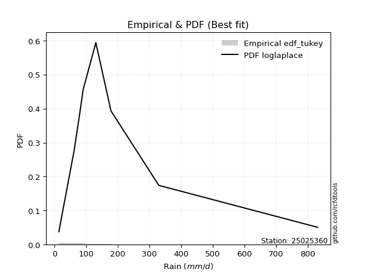</img>

</div>


### 8. Empirical - EDF Gringorten (1963)

Gringorten plotting position formula is essential for estimating the probability and return periods of extreme events like floods and heavy rainfall. The constant _a=0.44_.

<div align="center">


$P=(m-a)/(n+1-2a)$


</div>


**8.1. Empirical values**

<div align="center">

|                | 0                    | 1                  | 2                   | 3                  | 4              | 5                  | 6                  | 7                  | 8                  |
|:---------------|:---------------------|:-------------------|:--------------------|:-------------------|:---------------|:-------------------|:-------------------|:-------------------|:-------------------|
| date           | 2021                 | 2023               | 2025                | 2019               | 2020           | 2024               | 2022               | 2017               | 2018               |
| x              | 14.0                 | 62.3               | 70.9                | 80.2               | 90.8           | 131.0              | 131.2              | 178.68             | 329.9              |
| m              | 1                    | 2                  | 3                   | 4                  | 5              | 6                  | 7                  | 8                  | 9                  |
| empirical_dist | edf_gringorten       | edf_gringorten     | edf_gringorten      | edf_gringorten     | edf_gringorten | edf_gringorten     | edf_gringorten     | edf_gringorten     | edf_gringorten     |
| empirical      | 0.061403508771929835 | 0.1710526315789474 | 0.28070175438596495 | 0.3903508771929825 | 0.5            | 0.6096491228070176 | 0.7192982456140351 | 0.8289473684210527 | 0.9385964912280703 |
| empirical_tr   | 1.0654205607476634   | 1.2063492063492063 | 1.3902439024390243  | 1.6402877697841727 | 2.0            | 2.561797752808989  | 3.5625             | 5.846153846153847  | 16.285714285714324 |

</div>


**8.2. Kolmogorov-Smirnov fit test (sorted by Δ)**


<div align="center">

|                | 0                   | 1                   | 2                   | 3                   | 4                   | 5                   | 6                   | 7                   | 8                   | 9                   | 10                  | 11                  | 12                  | 13                  | 14                  | 15                  | 16                  | 17                  | 18                  | 19                  | 20                  | 21                  | 22                  | 23                  | 24                  | 25                    | 26                  | 27                  | 28                  | 29                  | 30                  | 31                  | 32                  | 33                  | 34                  | 35                  | 36                  | 37                  | 38                  | 39                  | 40                  | 41                  | 42                  | 43                  | 44                  | 45                  | 46                  | 47                  | 48                  | 49                  | 50                  | 51                  | 52                  | 53                  | 54                  | 55                  | 56                  | 57                  | 58                  | 59                  | 60                  | 61                  | 62                  | 63                  | 64                  | 65                  | 66                  | 67                  | 68                  | 69                  | 70                  | 71                  | 72                  | 73                  | 74                  | 75                  | 76                  | 77                  | 78                  | 79                  | 80                  | 81                  | 82                  | 83                  | 84                  | 85                  | 86                  | 87                  | 88                  | 89                  |
|:---------------|:--------------------|:--------------------|:--------------------|:--------------------|:--------------------|:--------------------|:--------------------|:--------------------|:--------------------|:--------------------|:--------------------|:--------------------|:--------------------|:--------------------|:--------------------|:--------------------|:--------------------|:--------------------|:--------------------|:--------------------|:--------------------|:--------------------|:--------------------|:--------------------|:--------------------|:----------------------|:--------------------|:--------------------|:--------------------|:--------------------|:--------------------|:--------------------|:--------------------|:--------------------|:--------------------|:--------------------|:--------------------|:--------------------|:--------------------|:--------------------|:--------------------|:--------------------|:--------------------|:--------------------|:--------------------|:--------------------|:--------------------|:--------------------|:--------------------|:--------------------|:--------------------|:--------------------|:--------------------|:--------------------|:--------------------|:--------------------|:--------------------|:--------------------|:--------------------|:--------------------|:--------------------|:--------------------|:--------------------|:--------------------|:--------------------|:--------------------|:--------------------|:--------------------|:--------------------|:--------------------|:--------------------|:--------------------|:--------------------|:--------------------|:--------------------|:--------------------|:--------------------|:--------------------|:--------------------|:--------------------|:--------------------|:--------------------|:--------------------|:--------------------|:--------------------|:--------------------|:--------------------|:--------------------|:--------------------|:--------------------|
| station        | 25025360            | 25025360            | 25025360            | 25025360            | 25025360            | 25025360            | 25025360            | 25025360            | 25025360            | 25025360            | 25025360            | 25025360            | 25025360            | 25025360            | 25025360            | 25025360            | 25025360            | 25025360            | 25025360            | 25025360            | 25025360            | 25025360            | 25025360            | 25025360            | 25025360            | 25025360              | 25025360            | 25025360            | 25025360            | 25025360            | 25025360            | 25025360            | 25025360            | 25025360            | 25025360            | 25025360            | 25025360            | 25025360            | 25025360            | 25025360            | 25025360            | 25025360            | 25025360            | 25025360            | 25025360            | 25025360            | 25025360            | 25025360            | 25025360            | 25025360            | 25025360            | 25025360            | 25025360            | 25025360            | 25025360            | 25025360            | 25025360            | 25025360            | 25025360            | 25025360            | 25025360            | 25025360            | 25025360            | 25025360            | 25025360            | 25025360            | 25025360            | 25025360            | 25025360            | 25025360            | 25025360            | 25025360            | 25025360            | 25025360            | 25025360            | 25025360            | 25025360            | 25025360            | 25025360            | 25025360            | 25025360            | 25025360            | 25025360            | 25025360            | 25025360            | 25025360            | 25025360            | 25025360            | 25025360            | 25025360            |
| empirical_dist | edf_gringorten      | edf_gringorten      | edf_gringorten      | edf_gringorten      | edf_gringorten      | edf_gringorten      | edf_gringorten      | edf_gringorten      | edf_gringorten      | edf_gringorten      | edf_gringorten      | edf_gringorten      | edf_gringorten      | edf_gringorten      | edf_gringorten      | edf_gringorten      | edf_gringorten      | edf_gringorten      | edf_gringorten      | edf_gringorten      | edf_gringorten      | edf_gringorten      | edf_gringorten      | edf_gringorten      | edf_gringorten      | edf_gringorten        | edf_gringorten      | edf_gringorten      | edf_gringorten      | edf_gringorten      | edf_gringorten      | edf_gringorten      | edf_gringorten      | edf_gringorten      | edf_gringorten      | edf_gringorten      | edf_gringorten      | edf_gringorten      | edf_gringorten      | edf_gringorten      | edf_gringorten      | edf_gringorten      | edf_gringorten      | edf_gringorten      | edf_gringorten      | edf_gringorten      | edf_gringorten      | edf_gringorten      | edf_gringorten      | edf_gringorten      | edf_gringorten      | edf_gringorten      | edf_gringorten      | edf_gringorten      | edf_gringorten      | edf_gringorten      | edf_gringorten      | edf_gringorten      | edf_gringorten      | edf_gringorten      | edf_gringorten      | edf_gringorten      | edf_gringorten      | edf_gringorten      | edf_gringorten      | edf_gringorten      | edf_gringorten      | edf_gringorten      | edf_gringorten      | edf_gringorten      | edf_gringorten      | edf_gringorten      | edf_gringorten      | edf_gringorten      | edf_gringorten      | edf_gringorten      | edf_gringorten      | edf_gringorten      | edf_gringorten      | edf_gringorten      | edf_gringorten      | edf_gringorten      | edf_gringorten      | edf_gringorten      | edf_gringorten      | edf_gringorten      | edf_gringorten      | edf_gringorten      | edf_gringorten      | edf_gringorten      |
| p_dist         | laplace_asymmetric  | nct                 | exponnorm           | logt                | fisk                | logjohnsonsu        | johnsonsu           | invweibull          | invgamma            | moyal               | logfisk             | genlogistic         | logmielke           | loggenlogistic      | loggumbel_l         | invgauss            | wald                | gumbel_r            | pearson3            | logloggamma         | logweibull_min      | logpearson3         | loghypsecant        | kstwobign           | halflogistic        | loglaplace_asymmetric | loglaplace          | betaprime           | erlang              | gamma               | loggompertz         | f                   | loglogistic         | gibrat              | halfnorm            | rayleigh            | ncf                 | gompertz            | weibull_min         | maxwell             | logf                | lognct              | logexponnorm        | lognorm             | lognorm             | logcrystalball      | logrice             | logfatiguelife      | rice                | logncf              | loggamma            | loggamma            | logerlang           | logbetaprime        | logistic            | hypsecant           | loginvgamma         | logtruncnorm        | nakagami            | lognakagami         | t                   | crystalball         | norm                | logalpha            | logmaxwell          | loggumbel_r         | loginvgauss         | lograyleigh         | expon               | genexpon            | laplace             | logmoyal            | mielke              | loginvweibull       | loggibrat           | loghalfnorm         | loghalflogistic     | logwald             | gumbel_l            | logkstwobign        | loggenexpon         | alpha               | logexpon            | loglognorm          | pareto              | logpareto           | logchi2             | fatiguelife         | chi2                | truncnorm           |
| delta          | 0.06497766853579923 | 0.06657215471151226 | 0.06856292116843393 | 0.07032517565854146 | 0.07341685163974238 | 0.07360111186182572 | 0.07398878654854313 | 0.08272595255239312 | 0.08645947414459348 | 0.08867177601377857 | 0.08919672696418984 | 0.09058094785449511 | 0.09137669833930473 | 0.09143330990108678 | 0.09401721919292783 | 0.09433719608672253 | 0.10090420217822571 | 0.10208261443124178 | 0.10666789636953944 | 0.10715006877712474 | 0.1099749903592091  | 0.11013678847688813 | 0.11330110590562414 | 0.11607312263616654 | 0.11635610547926784 | 0.11857409829459797   | 0.1195841491692371  | 0.12020697736970226 | 0.12442490192009037 | 0.12442497883352638 | 0.12458881268834449 | 0.12494211802168786 | 0.12836838845667514 | 0.1296920508998396  | 0.1311172077511793  | 0.13185922203010103 | 0.13672029915908918 | 0.13885675040006562 | 0.1392798209714668  | 0.14170278503355904 | 0.14736063820198692 | 0.14806712777765563 | 0.1486030167993801  | 0.1486034692091397  | 0.1486034692091397  | 0.1486035888573229  | 0.14861094351988413 | 0.14947671095633303 | 0.15279694396368382 | 0.15732170617482916 | 0.1588712846150182  | 0.1588712846150182  | 0.15917641553580603 | 0.16208855348127765 | 0.16594503667935878 | 0.16662254308548197 | 0.17040478082568972 | 0.17095974342231154 | 0.17104538262552282 | 0.17105262933342685 | 0.17221803991007367 | 0.1722883697858798  | 0.17228837262700047 | 0.1768217295857018  | 0.17832181534963476 | 0.1880482044252435  | 0.1890424874741446  | 0.1898650094265515  | 0.19221843121509574 | 0.1922311251933782  | 0.1950332008733367  | 0.2015034023786429  | 0.21495814597312607 | 0.21918175873320705 | 0.21932905567141692 | 0.22264519856073345 | 0.2250971784305219  | 0.22749911563335806 | 0.2396290291696257  | 0.2607620269261974  | 0.29532553892052876 | 0.3602836260761266  | 0.3771652261251887  | 0.45646933068522594 | 0.4733583022750553  | 0.49104832726886766 | 0.5705225568405929  | 0.5964594737247548  | 0.8270937021278437  | 0.8289473684210527  |
| deltao         | 0.41761268023100007 | 0.41761268023100007 | 0.41761268023100007 | 0.41761268023100007 | 0.41761268023100007 | 0.41761268023100007 | 0.41761268023100007 | 0.41761268023100007 | 0.41761268023100007 | 0.41761268023100007 | 0.41761268023100007 | 0.41761268023100007 | 0.41761268023100007 | 0.41761268023100007 | 0.41761268023100007 | 0.41761268023100007 | 0.41761268023100007 | 0.41761268023100007 | 0.41761268023100007 | 0.41761268023100007 | 0.41761268023100007 | 0.41761268023100007 | 0.41761268023100007 | 0.41761268023100007 | 0.41761268023100007 | 0.41761268023100007   | 0.41761268023100007 | 0.41761268023100007 | 0.41761268023100007 | 0.41761268023100007 | 0.41761268023100007 | 0.41761268023100007 | 0.41761268023100007 | 0.41761268023100007 | 0.41761268023100007 | 0.41761268023100007 | 0.41761268023100007 | 0.41761268023100007 | 0.41761268023100007 | 0.41761268023100007 | 0.41761268023100007 | 0.41761268023100007 | 0.41761268023100007 | 0.41761268023100007 | 0.41761268023100007 | 0.41761268023100007 | 0.41761268023100007 | 0.41761268023100007 | 0.41761268023100007 | 0.41761268023100007 | 0.41761268023100007 | 0.41761268023100007 | 0.41761268023100007 | 0.41761268023100007 | 0.41761268023100007 | 0.41761268023100007 | 0.41761268023100007 | 0.41761268023100007 | 0.41761268023100007 | 0.41761268023100007 | 0.41761268023100007 | 0.41761268023100007 | 0.41761268023100007 | 0.41761268023100007 | 0.41761268023100007 | 0.41761268023100007 | 0.41761268023100007 | 0.41761268023100007 | 0.41761268023100007 | 0.41761268023100007 | 0.41761268023100007 | 0.41761268023100007 | 0.41761268023100007 | 0.41761268023100007 | 0.41761268023100007 | 0.41761268023100007 | 0.41761268023100007 | 0.41761268023100007 | 0.41761268023100007 | 0.41761268023100007 | 0.41761268023100007 | 0.41761268023100007 | 0.41761268023100007 | 0.41761268023100007 | 0.41761268023100007 | 0.41761268023100007 | 0.41761268023100007 | 0.41761268023100007 | 0.41761268023100007 | 0.41761268023100007 |
| eval           | Δo > Δ              | Δo > Δ              | Δo > Δ              | Δo > Δ              | Δo > Δ              | Δo > Δ              | Δo > Δ              | Δo > Δ              | Δo > Δ              | Δo > Δ              | Δo > Δ              | Δo > Δ              | Δo > Δ              | Δo > Δ              | Δo > Δ              | Δo > Δ              | Δo > Δ              | Δo > Δ              | Δo > Δ              | Δo > Δ              | Δo > Δ              | Δo > Δ              | Δo > Δ              | Δo > Δ              | Δo > Δ              | Δo > Δ                | Δo > Δ              | Δo > Δ              | Δo > Δ              | Δo > Δ              | Δo > Δ              | Δo > Δ              | Δo > Δ              | Δo > Δ              | Δo > Δ              | Δo > Δ              | Δo > Δ              | Δo > Δ              | Δo > Δ              | Δo > Δ              | Δo > Δ              | Δo > Δ              | Δo > Δ              | Δo > Δ              | Δo > Δ              | Δo > Δ              | Δo > Δ              | Δo > Δ              | Δo > Δ              | Δo > Δ              | Δo > Δ              | Δo > Δ              | Δo > Δ              | Δo > Δ              | Δo > Δ              | Δo > Δ              | Δo > Δ              | Δo > Δ              | Δo > Δ              | Δo > Δ              | Δo > Δ              | Δo > Δ              | Δo > Δ              | Δo > Δ              | Δo > Δ              | Δo > Δ              | Δo > Δ              | Δo > Δ              | Δo > Δ              | Δo > Δ              | Δo > Δ              | Δo > Δ              | Δo > Δ              | Δo > Δ              | Δo > Δ              | Δo > Δ              | Δo > Δ              | Δo > Δ              | Δo > Δ              | Δo > Δ              | Δo > Δ              | Δo > Δ              | Δo > Δ              | Δo <= Δ             | Δo <= Δ             | Δo <= Δ             | Δo <= Δ             | Δo <= Δ             | Δo <= Δ             | Δo <= Δ             |
| fit            | 1                   | 1                   | 1                   | 1                   | 1                   | 1                   | 1                   | 1                   | 1                   | 1                   | 1                   | 1                   | 1                   | 1                   | 1                   | 1                   | 1                   | 1                   | 1                   | 1                   | 1                   | 1                   | 1                   | 1                   | 1                   | 1                     | 1                   | 1                   | 1                   | 1                   | 1                   | 1                   | 1                   | 1                   | 1                   | 1                   | 1                   | 1                   | 1                   | 1                   | 1                   | 1                   | 1                   | 1                   | 1                   | 1                   | 1                   | 1                   | 1                   | 1                   | 1                   | 1                   | 1                   | 1                   | 1                   | 1                   | 1                   | 1                   | 1                   | 1                   | 1                   | 1                   | 1                   | 1                   | 1                   | 1                   | 1                   | 1                   | 1                   | 1                   | 1                   | 1                   | 1                   | 1                   | 1                   | 1                   | 1                   | 1                   | 1                   | 1                   | 1                   | 1                   | 1                   | 0                   | 0                   | 0                   | 0                   | 0                   | 0                   | 0                   |
| n              | 9                   | 9                   | 9                   | 9                   | 9                   | 9                   | 9                   | 9                   | 9                   | 9                   | 9                   | 9                   | 9                   | 9                   | 9                   | 9                   | 9                   | 9                   | 9                   | 9                   | 9                   | 9                   | 9                   | 9                   | 9                   | 9                     | 9                   | 9                   | 9                   | 9                   | 9                   | 9                   | 9                   | 9                   | 9                   | 9                   | 9                   | 9                   | 9                   | 9                   | 9                   | 9                   | 9                   | 9                   | 9                   | 9                   | 9                   | 9                   | 9                   | 9                   | 9                   | 9                   | 9                   | 9                   | 9                   | 9                   | 9                   | 9                   | 9                   | 9                   | 9                   | 9                   | 9                   | 9                   | 9                   | 9                   | 9                   | 9                   | 9                   | 9                   | 9                   | 9                   | 9                   | 9                   | 9                   | 9                   | 9                   | 9                   | 9                   | 9                   | 9                   | 9                   | 9                   | 9                   | 9                   | 9                   | 9                   | 9                   | 9                   | 9                   |
| best_fit       | 1                   | 0                   | 0                   | 0                   | 0                   | 0                   | 0                   | 0                   | 0                   | 0                   | 0                   | 0                   | 0                   | 0                   | 0                   | 0                   | 0                   | 0                   | 0                   | 0                   | 0                   | 0                   | 0                   | 0                   | 0                   | 0                     | 0                   | 0                   | 0                   | 0                   | 0                   | 0                   | 0                   | 0                   | 0                   | 0                   | 0                   | 0                   | 0                   | 0                   | 0                   | 0                   | 0                   | 0                   | 0                   | 0                   | 0                   | 0                   | 0                   | 0                   | 0                   | 0                   | 0                   | 0                   | 0                   | 0                   | 0                   | 0                   | 0                   | 0                   | 0                   | 0                   | 0                   | 0                   | 0                   | 0                   | 0                   | 0                   | 0                   | 0                   | 0                   | 0                   | 0                   | 0                   | 0                   | 0                   | 0                   | 0                   | 0                   | 0                   | 0                   | 0                   | 0                   | 0                   | 0                   | 0                   | 0                   | 0                   | 0                   | 0                   |
| best_fit_sort  | 1                   | 2                   | 3                   | 4                   | 5                   | 6                   | 7                   | 8                   | 9                   | 10                  | 11                  | 12                  | 13                  | 14                  | 15                  | 16                  | 17                  | 18                  | 19                  | 20                  | 21                  | 22                  | 23                  | 24                  | 25                  | 26                    | 27                  | 28                  | 29                  | 30                  | 31                  | 32                  | 33                  | 34                  | 35                  | 36                  | 37                  | 38                  | 39                  | 40                  | 41                  | 42                  | 43                  | 44                  | 45                  | 46                  | 47                  | 48                  | 49                  | 50                  | 51                  | 52                  | 53                  | 54                  | 55                  | 56                  | 57                  | 58                  | 59                  | 60                  | 61                  | 62                  | 63                  | 64                  | 65                  | 66                  | 67                  | 68                  | 69                  | 70                  | 71                  | 72                  | 73                  | 74                  | 75                  | 76                  | 77                  | 78                  | 79                  | 80                  | 81                  | 82                  | 83                  | 84                  | 85                  | 86                  | 87                  | 88                  | 89                  | 90                  |

</div>


<div align="center">

</img>

</div>


**8.3. Best fit**

<div align="center">

|   id |   station | empirical_dist   | p_dist             |     delta |   deltao | eval   |   fit |   n |   best_fit |   best_fit_sort |
|-----:|----------:|:-----------------|:-------------------|----------:|---------:|:-------|------:|----:|-----------:|----------------:|
|    0 |  25025360 | edf_gringorten   | laplace_asymmetric | 0.0649777 | 0.417613 | Δo > Δ |     1 |   9 |          1 |               1 |

</div>


<div align="center">

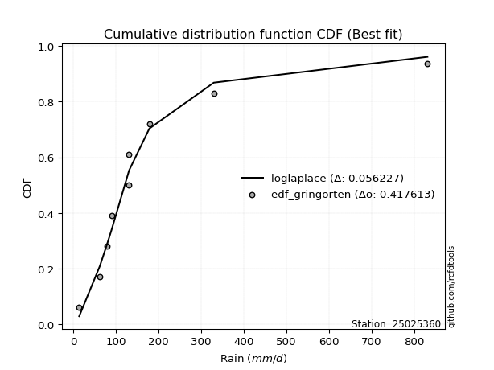</img>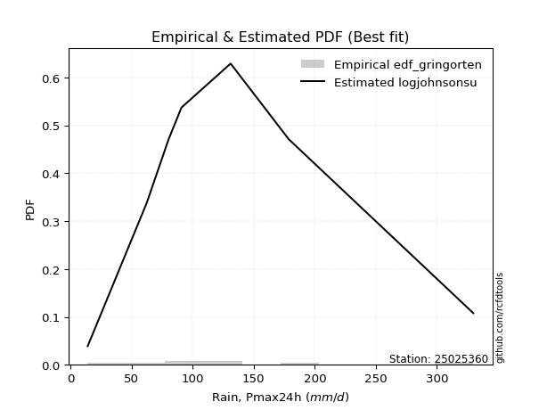</img>

</div>


### 9. Empirical - EDF Filliben (1975)

The specific values of the constants (0.3175) (often denoted as $alpha$) and (0.365) are derived from a method proposed by James J. Filliben in a 1975 paper. This particular formula is the mean value of the $i$-th order statistic of the normal distribution and is considered a robust and effective plotting position formula for the normal probability plot correlation coefficient test for normality.

<div align="center">


$P=(m-0.3175)/(n+0.365)$


</div>


**9.1. Empirical values**

<div align="center">

|                | 0                   | 1                  | 2                   | 3                   | 4            | 5                  | 6                  | 7                  | 8                  |
|:---------------|:--------------------|:-------------------|:--------------------|:--------------------|:-------------|:-------------------|:-------------------|:-------------------|:-------------------|
| date           | 2021                | 2023               | 2025                | 2019                | 2020         | 2024               | 2022               | 2017               | 2018               |
| x              | 14.0                | 62.3               | 70.9                | 80.2                | 90.8         | 131.0              | 131.2              | 178.68             | 329.9              |
| m              | 1                   | 2                  | 3                   | 4                   | 5            | 6                  | 7                  | 8                  | 9                  |
| empirical_dist | edf_filliben        | edf_filliben       | edf_filliben        | edf_filliben        | edf_filliben | edf_filliben       | edf_filliben       | edf_filliben       | edf_filliben       |
| empirical      | 0.07287773625200214 | 0.1796583021890016 | 0.28643886812600106 | 0.39321943406300053 | 0.5          | 0.6067805659369995 | 0.7135611318739989 | 0.8203416978109984 | 0.9271222637479978 |
| empirical_tr   | 1.0786063921681543  | 1.219004230393752  | 1.401421623643846   | 1.6480422349318082  | 2.0          | 2.5431093007467753 | 3.491146318732526  | 5.566121842496286  | 13.721611721611705 |

</div>


**9.2. Kolmogorov-Smirnov fit test (sorted by Δ)**


<div align="center">

|                | 0                   | 1                   | 2                   | 3                   | 4                   | 5                   | 6                   | 7                   | 8                   | 9                   | 10                  | 11                  | 12                  | 13                  | 14                  | 15                  | 16                  | 17                  | 18                  | 19                  | 20                  | 21                  | 22                  | 23                  | 24                  | 25                  | 26                  | 27                  | 28                  | 29                  | 30                  | 31                    | 32                  | 33                  | 34                  | 35                  | 36                  | 37                  | 38                  | 39                  | 40                  | 41                  | 42                  | 43                  | 44                  | 45                  | 46                  | 47                  | 48                  | 49                  | 50                  | 51                  | 52                  | 53                  | 54                  | 55                  | 56                  | 57                  | 58                  | 59                  | 60                  | 61                  | 62                  | 63                  | 64                  | 65                  | 66                  | 67                  | 68                  | 69                  | 70                  | 71                  | 72                  | 73                  | 74                  | 75                  | 76                  | 77                  | 78                  | 79                  | 80                  | 81                  | 82                  | 83                  | 84                  | 85                  | 86                  | 87                  | 88                  | 89                  |
|:---------------|:--------------------|:--------------------|:--------------------|:--------------------|:--------------------|:--------------------|:--------------------|:--------------------|:--------------------|:--------------------|:--------------------|:--------------------|:--------------------|:--------------------|:--------------------|:--------------------|:--------------------|:--------------------|:--------------------|:--------------------|:--------------------|:--------------------|:--------------------|:--------------------|:--------------------|:--------------------|:--------------------|:--------------------|:--------------------|:--------------------|:--------------------|:----------------------|:--------------------|:--------------------|:--------------------|:--------------------|:--------------------|:--------------------|:--------------------|:--------------------|:--------------------|:--------------------|:--------------------|:--------------------|:--------------------|:--------------------|:--------------------|:--------------------|:--------------------|:--------------------|:--------------------|:--------------------|:--------------------|:--------------------|:--------------------|:--------------------|:--------------------|:--------------------|:--------------------|:--------------------|:--------------------|:--------------------|:--------------------|:--------------------|:--------------------|:--------------------|:--------------------|:--------------------|:--------------------|:--------------------|:--------------------|:--------------------|:--------------------|:--------------------|:--------------------|:--------------------|:--------------------|:--------------------|:--------------------|:--------------------|:--------------------|:--------------------|:--------------------|:--------------------|:--------------------|:--------------------|:--------------------|:--------------------|:--------------------|:--------------------|
| station        | 25025360            | 25025360            | 25025360            | 25025360            | 25025360            | 25025360            | 25025360            | 25025360            | 25025360            | 25025360            | 25025360            | 25025360            | 25025360            | 25025360            | 25025360            | 25025360            | 25025360            | 25025360            | 25025360            | 25025360            | 25025360            | 25025360            | 25025360            | 25025360            | 25025360            | 25025360            | 25025360            | 25025360            | 25025360            | 25025360            | 25025360            | 25025360              | 25025360            | 25025360            | 25025360            | 25025360            | 25025360            | 25025360            | 25025360            | 25025360            | 25025360            | 25025360            | 25025360            | 25025360            | 25025360            | 25025360            | 25025360            | 25025360            | 25025360            | 25025360            | 25025360            | 25025360            | 25025360            | 25025360            | 25025360            | 25025360            | 25025360            | 25025360            | 25025360            | 25025360            | 25025360            | 25025360            | 25025360            | 25025360            | 25025360            | 25025360            | 25025360            | 25025360            | 25025360            | 25025360            | 25025360            | 25025360            | 25025360            | 25025360            | 25025360            | 25025360            | 25025360            | 25025360            | 25025360            | 25025360            | 25025360            | 25025360            | 25025360            | 25025360            | 25025360            | 25025360            | 25025360            | 25025360            | 25025360            | 25025360            |
| empirical_dist | edf_filliben        | edf_filliben        | edf_filliben        | edf_filliben        | edf_filliben        | edf_filliben        | edf_filliben        | edf_filliben        | edf_filliben        | edf_filliben        | edf_filliben        | edf_filliben        | edf_filliben        | edf_filliben        | edf_filliben        | edf_filliben        | edf_filliben        | edf_filliben        | edf_filliben        | edf_filliben        | edf_filliben        | edf_filliben        | edf_filliben        | edf_filliben        | edf_filliben        | edf_filliben        | edf_filliben        | edf_filliben        | edf_filliben        | edf_filliben        | edf_filliben        | edf_filliben          | edf_filliben        | edf_filliben        | edf_filliben        | edf_filliben        | edf_filliben        | edf_filliben        | edf_filliben        | edf_filliben        | edf_filliben        | edf_filliben        | edf_filliben        | edf_filliben        | edf_filliben        | edf_filliben        | edf_filliben        | edf_filliben        | edf_filliben        | edf_filliben        | edf_filliben        | edf_filliben        | edf_filliben        | edf_filliben        | edf_filliben        | edf_filliben        | edf_filliben        | edf_filliben        | edf_filliben        | edf_filliben        | edf_filliben        | edf_filliben        | edf_filliben        | edf_filliben        | edf_filliben        | edf_filliben        | edf_filliben        | edf_filliben        | edf_filliben        | edf_filliben        | edf_filliben        | edf_filliben        | edf_filliben        | edf_filliben        | edf_filliben        | edf_filliben        | edf_filliben        | edf_filliben        | edf_filliben        | edf_filliben        | edf_filliben        | edf_filliben        | edf_filliben        | edf_filliben        | edf_filliben        | edf_filliben        | edf_filliben        | edf_filliben        | edf_filliben        | edf_filliben        |
| p_dist         | nct                 | fisk                | laplace_asymmetric  | exponnorm           | logjohnsonsu        | logt                | invweibull          | johnsonsu           | invgamma            | moyal               | logfisk             | logmielke           | loggenlogistic      | invgauss            | loggumbel_l         | genlogistic         | gumbel_r            | pearson3            | logloggamma         | logweibull_min      | logpearson3         | wald                | loghypsecant        | halflogistic        | kstwobign           | betaprime           | erlang              | gamma               | loggompertz         | f                   | loglogistic         | loglaplace_asymmetric | loglaplace          | halfnorm            | rayleigh            | ncf                 | gompertz            | weibull_min         | maxwell             | gibrat              | logf                | lognct              | logexponnorm        | lognorm             | lognorm             | logcrystalball      | logrice             | logfatiguelife      | rice                | logncf              | loggamma            | loggamma            | logerlang           | logbetaprime        | logistic            | loginvgamma         | t                   | crystalball         | norm                | hypsecant           | logalpha            | logmaxwell          | loggumbel_r         | logtruncnorm        | nakagami            | lognakagami         | loginvgauss         | lograyleigh         | expon               | genexpon            | logmoyal            | laplace             | mielke              | loginvweibull       | loghalfnorm         | loghalflogistic     | logwald             | loggibrat           | gumbel_l            | logkstwobign        | loggenexpon         | alpha               | logexpon            | loglognorm          | pareto              | logpareto           | logchi2             | fatiguelife         | chi2                | truncnorm           |
| delta          | 0.06460242069998556 | 0.06481118102968816 | 0.06497766853579923 | 0.06743763374938805 | 0.06819597502123143 | 0.07032517565854146 | 0.07412028194233891 | 0.07685734341856121 | 0.07785380353453927 | 0.08006610540372436 | 0.08059105635413563 | 0.08277102772925052 | 0.08282763929103257 | 0.08573152547666832 | 0.08828010545289167 | 0.09058094785449511 | 0.09634550069120562 | 0.09806222575948523 | 0.09854439816707053 | 0.10136931974915489 | 0.10153111786683391 | 0.10377275904824379 | 0.10469543529556993 | 0.10775043486921362 | 0.11033600889613038 | 0.11160130675964805 | 0.11581923131003616 | 0.11581930822347217 | 0.11598314207829027 | 0.11633644741163365 | 0.11976271784662093 | 0.12144265516461605   | 0.12245270603925518 | 0.12251153714112509 | 0.12612210829006487 | 0.12811462854903496 | 0.1302510797900114  | 0.13067415036141258 | 0.13596567129352288 | 0.1364143596171594  | 0.1387549675919327  | 0.13946145716760142 | 0.13999734618932588 | 0.13999779859908548 | 0.13999779859908548 | 0.13999791824726868 | 0.14000527290982992 | 0.14087104034627881 | 0.14705983022364766 | 0.14871603556477495 | 0.150265614004964   | 0.150265614004964   | 0.15057074492575181 | 0.15348288287122344 | 0.16020792293932262 | 0.1617991102156355  | 0.1664809261700375  | 0.16655125604584364 | 0.16655125888696432 | 0.16662254308548197 | 0.1682160589756476  | 0.16971614473958055 | 0.1794425338151893  | 0.17956541403236576 | 0.17965105323557704 | 0.17965829994348106 | 0.18043681686409038 | 0.18125933881649728 | 0.18361276060504153 | 0.183625454583324   | 0.19289773176858868 | 0.1950332008733367  | 0.20635247536307186 | 0.21057608812315284 | 0.21403952795067924 | 0.2164915078204677  | 0.22176200189332196 | 0.222197612541435   | 0.23389191542958954 | 0.2521563563161432  | 0.2867198683104746  | 0.3516779554660724  | 0.36855955551513453 | 0.44786366007517175 | 0.46475263166500114 | 0.4824426566588135  | 0.5619168862305388  | 0.5878538031147007  | 0.8184880315177896  | 0.8203416978109984  |
| deltao         | 0.41761268023100007 | 0.41761268023100007 | 0.41761268023100007 | 0.41761268023100007 | 0.41761268023100007 | 0.41761268023100007 | 0.41761268023100007 | 0.41761268023100007 | 0.41761268023100007 | 0.41761268023100007 | 0.41761268023100007 | 0.41761268023100007 | 0.41761268023100007 | 0.41761268023100007 | 0.41761268023100007 | 0.41761268023100007 | 0.41761268023100007 | 0.41761268023100007 | 0.41761268023100007 | 0.41761268023100007 | 0.41761268023100007 | 0.41761268023100007 | 0.41761268023100007 | 0.41761268023100007 | 0.41761268023100007 | 0.41761268023100007 | 0.41761268023100007 | 0.41761268023100007 | 0.41761268023100007 | 0.41761268023100007 | 0.41761268023100007 | 0.41761268023100007   | 0.41761268023100007 | 0.41761268023100007 | 0.41761268023100007 | 0.41761268023100007 | 0.41761268023100007 | 0.41761268023100007 | 0.41761268023100007 | 0.41761268023100007 | 0.41761268023100007 | 0.41761268023100007 | 0.41761268023100007 | 0.41761268023100007 | 0.41761268023100007 | 0.41761268023100007 | 0.41761268023100007 | 0.41761268023100007 | 0.41761268023100007 | 0.41761268023100007 | 0.41761268023100007 | 0.41761268023100007 | 0.41761268023100007 | 0.41761268023100007 | 0.41761268023100007 | 0.41761268023100007 | 0.41761268023100007 | 0.41761268023100007 | 0.41761268023100007 | 0.41761268023100007 | 0.41761268023100007 | 0.41761268023100007 | 0.41761268023100007 | 0.41761268023100007 | 0.41761268023100007 | 0.41761268023100007 | 0.41761268023100007 | 0.41761268023100007 | 0.41761268023100007 | 0.41761268023100007 | 0.41761268023100007 | 0.41761268023100007 | 0.41761268023100007 | 0.41761268023100007 | 0.41761268023100007 | 0.41761268023100007 | 0.41761268023100007 | 0.41761268023100007 | 0.41761268023100007 | 0.41761268023100007 | 0.41761268023100007 | 0.41761268023100007 | 0.41761268023100007 | 0.41761268023100007 | 0.41761268023100007 | 0.41761268023100007 | 0.41761268023100007 | 0.41761268023100007 | 0.41761268023100007 | 0.41761268023100007 |
| eval           | Δo > Δ              | Δo > Δ              | Δo > Δ              | Δo > Δ              | Δo > Δ              | Δo > Δ              | Δo > Δ              | Δo > Δ              | Δo > Δ              | Δo > Δ              | Δo > Δ              | Δo > Δ              | Δo > Δ              | Δo > Δ              | Δo > Δ              | Δo > Δ              | Δo > Δ              | Δo > Δ              | Δo > Δ              | Δo > Δ              | Δo > Δ              | Δo > Δ              | Δo > Δ              | Δo > Δ              | Δo > Δ              | Δo > Δ              | Δo > Δ              | Δo > Δ              | Δo > Δ              | Δo > Δ              | Δo > Δ              | Δo > Δ                | Δo > Δ              | Δo > Δ              | Δo > Δ              | Δo > Δ              | Δo > Δ              | Δo > Δ              | Δo > Δ              | Δo > Δ              | Δo > Δ              | Δo > Δ              | Δo > Δ              | Δo > Δ              | Δo > Δ              | Δo > Δ              | Δo > Δ              | Δo > Δ              | Δo > Δ              | Δo > Δ              | Δo > Δ              | Δo > Δ              | Δo > Δ              | Δo > Δ              | Δo > Δ              | Δo > Δ              | Δo > Δ              | Δo > Δ              | Δo > Δ              | Δo > Δ              | Δo > Δ              | Δo > Δ              | Δo > Δ              | Δo > Δ              | Δo > Δ              | Δo > Δ              | Δo > Δ              | Δo > Δ              | Δo > Δ              | Δo > Δ              | Δo > Δ              | Δo > Δ              | Δo > Δ              | Δo > Δ              | Δo > Δ              | Δo > Δ              | Δo > Δ              | Δo > Δ              | Δo > Δ              | Δo > Δ              | Δo > Δ              | Δo > Δ              | Δo > Δ              | Δo <= Δ             | Δo <= Δ             | Δo <= Δ             | Δo <= Δ             | Δo <= Δ             | Δo <= Δ             | Δo <= Δ             |
| fit            | 1                   | 1                   | 1                   | 1                   | 1                   | 1                   | 1                   | 1                   | 1                   | 1                   | 1                   | 1                   | 1                   | 1                   | 1                   | 1                   | 1                   | 1                   | 1                   | 1                   | 1                   | 1                   | 1                   | 1                   | 1                   | 1                   | 1                   | 1                   | 1                   | 1                   | 1                   | 1                     | 1                   | 1                   | 1                   | 1                   | 1                   | 1                   | 1                   | 1                   | 1                   | 1                   | 1                   | 1                   | 1                   | 1                   | 1                   | 1                   | 1                   | 1                   | 1                   | 1                   | 1                   | 1                   | 1                   | 1                   | 1                   | 1                   | 1                   | 1                   | 1                   | 1                   | 1                   | 1                   | 1                   | 1                   | 1                   | 1                   | 1                   | 1                   | 1                   | 1                   | 1                   | 1                   | 1                   | 1                   | 1                   | 1                   | 1                   | 1                   | 1                   | 1                   | 1                   | 0                   | 0                   | 0                   | 0                   | 0                   | 0                   | 0                   |
| n              | 9                   | 9                   | 9                   | 9                   | 9                   | 9                   | 9                   | 9                   | 9                   | 9                   | 9                   | 9                   | 9                   | 9                   | 9                   | 9                   | 9                   | 9                   | 9                   | 9                   | 9                   | 9                   | 9                   | 9                   | 9                   | 9                   | 9                   | 9                   | 9                   | 9                   | 9                   | 9                     | 9                   | 9                   | 9                   | 9                   | 9                   | 9                   | 9                   | 9                   | 9                   | 9                   | 9                   | 9                   | 9                   | 9                   | 9                   | 9                   | 9                   | 9                   | 9                   | 9                   | 9                   | 9                   | 9                   | 9                   | 9                   | 9                   | 9                   | 9                   | 9                   | 9                   | 9                   | 9                   | 9                   | 9                   | 9                   | 9                   | 9                   | 9                   | 9                   | 9                   | 9                   | 9                   | 9                   | 9                   | 9                   | 9                   | 9                   | 9                   | 9                   | 9                   | 9                   | 9                   | 9                   | 9                   | 9                   | 9                   | 9                   | 9                   |
| best_fit       | 1                   | 0                   | 0                   | 0                   | 0                   | 0                   | 0                   | 0                   | 0                   | 0                   | 0                   | 0                   | 0                   | 0                   | 0                   | 0                   | 0                   | 0                   | 0                   | 0                   | 0                   | 0                   | 0                   | 0                   | 0                   | 0                   | 0                   | 0                   | 0                   | 0                   | 0                   | 0                     | 0                   | 0                   | 0                   | 0                   | 0                   | 0                   | 0                   | 0                   | 0                   | 0                   | 0                   | 0                   | 0                   | 0                   | 0                   | 0                   | 0                   | 0                   | 0                   | 0                   | 0                   | 0                   | 0                   | 0                   | 0                   | 0                   | 0                   | 0                   | 0                   | 0                   | 0                   | 0                   | 0                   | 0                   | 0                   | 0                   | 0                   | 0                   | 0                   | 0                   | 0                   | 0                   | 0                   | 0                   | 0                   | 0                   | 0                   | 0                   | 0                   | 0                   | 0                   | 0                   | 0                   | 0                   | 0                   | 0                   | 0                   | 0                   |
| best_fit_sort  | 1                   | 2                   | 3                   | 4                   | 5                   | 6                   | 7                   | 8                   | 9                   | 10                  | 11                  | 12                  | 13                  | 14                  | 15                  | 16                  | 17                  | 18                  | 19                  | 20                  | 21                  | 22                  | 23                  | 24                  | 25                  | 26                  | 27                  | 28                  | 29                  | 30                  | 31                  | 32                    | 33                  | 34                  | 35                  | 36                  | 37                  | 38                  | 39                  | 40                  | 41                  | 42                  | 43                  | 44                  | 45                  | 46                  | 47                  | 48                  | 49                  | 50                  | 51                  | 52                  | 53                  | 54                  | 55                  | 56                  | 57                  | 58                  | 59                  | 60                  | 61                  | 62                  | 63                  | 64                  | 65                  | 66                  | 67                  | 68                  | 69                  | 70                  | 71                  | 72                  | 73                  | 74                  | 75                  | 76                  | 77                  | 78                  | 79                  | 80                  | 81                  | 82                  | 83                  | 84                  | 85                  | 86                  | 87                  | 88                  | 89                  | 90                  |

</div>


<div align="center">

</img>

</div>


**9.3. Best fit**

<div align="center">

|   id |   station | empirical_dist   | p_dist   |     delta |   deltao | eval   |   fit |   n |   best_fit |   best_fit_sort |
|-----:|----------:|:-----------------|:---------|----------:|---------:|:-------|------:|----:|-----------:|----------------:|
|    0 |  25025360 | edf_filliben     | nct      | 0.0646024 | 0.417613 | Δo > Δ |     1 |   9 |          1 |               1 |

</div>


<div align="center">

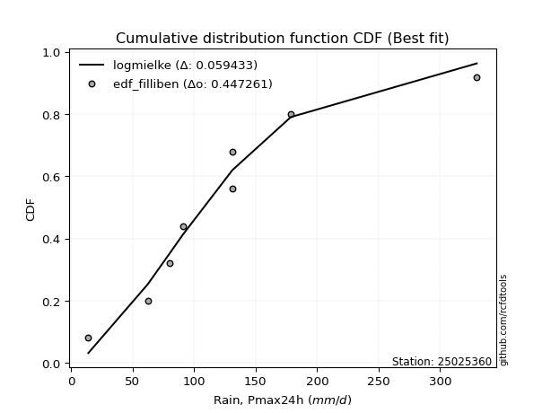</img>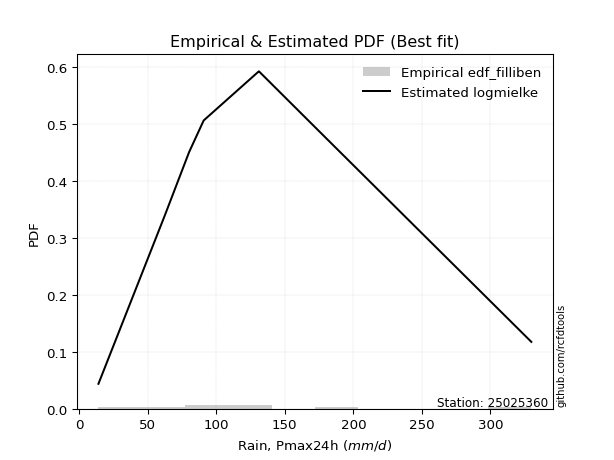</img>

</div>


### 10. Empirical - EDF Jenkinson (1977)

The Jenkinson formula in hydrology is an empirical plotting position formula used to estimate the non-exceedance probability _(P)_ or return period _(T)_ of a given ordered observation within a sample. It is a widely used method in the frequency analysis of extreme events such as floods and rainfall, as it provides a distribution-free way to plot data. _a≈0.31_ and _b≈0.38_ are constants derived to approximate the median of the probability distribution for the given rank.

<div align="center">


$P=(m-a)/(n+b)$


</div>


**10.1. Empirical values**

<div align="center">

|                | 0                   | 1                   | 2                  | 3                   | 4             | 5                  | 6                  | 7                  | 8                  |
|:---------------|:--------------------|:--------------------|:-------------------|:--------------------|:--------------|:-------------------|:-------------------|:-------------------|:-------------------|
| date           | 2021                | 2023                | 2025               | 2019                | 2020          | 2024               | 2022               | 2017               | 2018               |
| x              | 14.0                | 62.3                | 70.9               | 80.2                | 90.8          | 131.0              | 131.2              | 178.68             | 329.9              |
| m              | 1                   | 2                   | 3                  | 4                   | 5             | 6                  | 7                  | 8                  | 9                  |
| empirical_dist | edf_jenkinson       | edf_jenkinson       | edf_jenkinson      | edf_jenkinson       | edf_jenkinson | edf_jenkinson      | edf_jenkinson      | edf_jenkinson      | edf_jenkinson      |
| empirical      | 0.07356076759061833 | 0.18017057569296374 | 0.2867803837953091 | 0.39339019189765456 | 0.5           | 0.6066098081023454 | 0.7132196162046908 | 0.8198294243070362 | 0.9264392324093815 |
| empirical_tr   | 1.0794016110471807  | 1.2197659297789336  | 1.4020926756352765 | 1.6485061511423549  | 2.0           | 2.542005420054201  | 3.486988847583642  | 5.550295857988164  | 13.5942028985507   |

</div>


**10.2. Kolmogorov-Smirnov fit test (sorted by Δ)**


<div align="center">

|                | 0                   | 1                   | 2                   | 3                   | 4                   | 5                   | 6                   | 7                   | 8                   | 9                   | 10                  | 11                  | 12                  | 13                  | 14                  | 15                  | 16                  | 17                  | 18                  | 19                  | 20                  | 21                  | 22                  | 23                  | 24                  | 25                  | 26                  | 27                  | 28                  | 29                  | 30                  | 31                    | 32                  | 33                  | 34                  | 35                  | 36                  | 37                  | 38                  | 39                  | 40                  | 41                  | 42                  | 43                  | 44                  | 45                  | 46                  | 47                  | 48                  | 49                  | 50                  | 51                  | 52                  | 53                  | 54                  | 55                  | 56                  | 57                  | 58                  | 59                  | 60                  | 61                  | 62                  | 63                  | 64                  | 65                  | 66                  | 67                  | 68                  | 69                  | 70                  | 71                  | 72                  | 73                  | 74                  | 75                  | 76                  | 77                  | 78                  | 79                  | 80                  | 81                  | 82                  | 83                  | 84                  | 85                  | 86                  | 87                  | 88                  | 89                  |
|:---------------|:--------------------|:--------------------|:--------------------|:--------------------|:--------------------|:--------------------|:--------------------|:--------------------|:--------------------|:--------------------|:--------------------|:--------------------|:--------------------|:--------------------|:--------------------|:--------------------|:--------------------|:--------------------|:--------------------|:--------------------|:--------------------|:--------------------|:--------------------|:--------------------|:--------------------|:--------------------|:--------------------|:--------------------|:--------------------|:--------------------|:--------------------|:----------------------|:--------------------|:--------------------|:--------------------|:--------------------|:--------------------|:--------------------|:--------------------|:--------------------|:--------------------|:--------------------|:--------------------|:--------------------|:--------------------|:--------------------|:--------------------|:--------------------|:--------------------|:--------------------|:--------------------|:--------------------|:--------------------|:--------------------|:--------------------|:--------------------|:--------------------|:--------------------|:--------------------|:--------------------|:--------------------|:--------------------|:--------------------|:--------------------|:--------------------|:--------------------|:--------------------|:--------------------|:--------------------|:--------------------|:--------------------|:--------------------|:--------------------|:--------------------|:--------------------|:--------------------|:--------------------|:--------------------|:--------------------|:--------------------|:--------------------|:--------------------|:--------------------|:--------------------|:--------------------|:--------------------|:--------------------|:--------------------|:--------------------|:--------------------|
| station        | 25025360            | 25025360            | 25025360            | 25025360            | 25025360            | 25025360            | 25025360            | 25025360            | 25025360            | 25025360            | 25025360            | 25025360            | 25025360            | 25025360            | 25025360            | 25025360            | 25025360            | 25025360            | 25025360            | 25025360            | 25025360            | 25025360            | 25025360            | 25025360            | 25025360            | 25025360            | 25025360            | 25025360            | 25025360            | 25025360            | 25025360            | 25025360              | 25025360            | 25025360            | 25025360            | 25025360            | 25025360            | 25025360            | 25025360            | 25025360            | 25025360            | 25025360            | 25025360            | 25025360            | 25025360            | 25025360            | 25025360            | 25025360            | 25025360            | 25025360            | 25025360            | 25025360            | 25025360            | 25025360            | 25025360            | 25025360            | 25025360            | 25025360            | 25025360            | 25025360            | 25025360            | 25025360            | 25025360            | 25025360            | 25025360            | 25025360            | 25025360            | 25025360            | 25025360            | 25025360            | 25025360            | 25025360            | 25025360            | 25025360            | 25025360            | 25025360            | 25025360            | 25025360            | 25025360            | 25025360            | 25025360            | 25025360            | 25025360            | 25025360            | 25025360            | 25025360            | 25025360            | 25025360            | 25025360            | 25025360            |
| empirical_dist | edf_jenkinson       | edf_jenkinson       | edf_jenkinson       | edf_jenkinson       | edf_jenkinson       | edf_jenkinson       | edf_jenkinson       | edf_jenkinson       | edf_jenkinson       | edf_jenkinson       | edf_jenkinson       | edf_jenkinson       | edf_jenkinson       | edf_jenkinson       | edf_jenkinson       | edf_jenkinson       | edf_jenkinson       | edf_jenkinson       | edf_jenkinson       | edf_jenkinson       | edf_jenkinson       | edf_jenkinson       | edf_jenkinson       | edf_jenkinson       | edf_jenkinson       | edf_jenkinson       | edf_jenkinson       | edf_jenkinson       | edf_jenkinson       | edf_jenkinson       | edf_jenkinson       | edf_jenkinson         | edf_jenkinson       | edf_jenkinson       | edf_jenkinson       | edf_jenkinson       | edf_jenkinson       | edf_jenkinson       | edf_jenkinson       | edf_jenkinson       | edf_jenkinson       | edf_jenkinson       | edf_jenkinson       | edf_jenkinson       | edf_jenkinson       | edf_jenkinson       | edf_jenkinson       | edf_jenkinson       | edf_jenkinson       | edf_jenkinson       | edf_jenkinson       | edf_jenkinson       | edf_jenkinson       | edf_jenkinson       | edf_jenkinson       | edf_jenkinson       | edf_jenkinson       | edf_jenkinson       | edf_jenkinson       | edf_jenkinson       | edf_jenkinson       | edf_jenkinson       | edf_jenkinson       | edf_jenkinson       | edf_jenkinson       | edf_jenkinson       | edf_jenkinson       | edf_jenkinson       | edf_jenkinson       | edf_jenkinson       | edf_jenkinson       | edf_jenkinson       | edf_jenkinson       | edf_jenkinson       | edf_jenkinson       | edf_jenkinson       | edf_jenkinson       | edf_jenkinson       | edf_jenkinson       | edf_jenkinson       | edf_jenkinson       | edf_jenkinson       | edf_jenkinson       | edf_jenkinson       | edf_jenkinson       | edf_jenkinson       | edf_jenkinson       | edf_jenkinson       | edf_jenkinson       | edf_jenkinson       |
| p_dist         | fisk                | nct                 | laplace_asymmetric  | exponnorm           | logjohnsonsu        | logt                | invweibull          | johnsonsu           | invgamma            | moyal               | logfisk             | logmielke           | loggenlogistic      | invgauss            | loggumbel_l         | genlogistic         | gumbel_r            | pearson3            | logloggamma         | logweibull_min      | logpearson3         | wald                | loghypsecant        | halflogistic        | kstwobign           | betaprime           | erlang              | gamma               | loggompertz         | f                   | loglogistic         | loglaplace_asymmetric | halfnorm            | loglaplace          | rayleigh            | ncf                 | gompertz            | weibull_min         | maxwell             | gibrat              | logf                | lognct              | logexponnorm        | lognorm             | lognorm             | logcrystalball      | logrice             | logfatiguelife      | rice                | logncf              | loggamma            | loggamma            | logerlang           | logbetaprime        | logistic            | loginvgamma         | t                   | crystalball         | norm                | hypsecant           | logalpha            | logmaxwell          | loggumbel_r         | loginvgauss         | logtruncnorm        | nakagami            | lognakagami         | lograyleigh         | expon               | genexpon            | logmoyal            | laplace             | mielke              | loginvweibull       | loghalfnorm         | loghalflogistic     | logwald             | loggibrat           | gumbel_l            | logkstwobign        | loggenexpon         | alpha               | logexpon            | loglognorm          | pareto              | logpareto           | logchi2             | fatiguelife         | chi2                | truncnorm           |
| delta          | 0.06429890752572603 | 0.06460242069998556 | 0.06497766853579923 | 0.06743763374938805 | 0.06836673285588546 | 0.07032517565854146 | 0.07360800843837678 | 0.07702810125321524 | 0.07734153003057714 | 0.07955383189976223 | 0.0800787828501735  | 0.08225875422528839 | 0.08231536578707044 | 0.08521925197270619 | 0.08793858978358349 | 0.09058094785449511 | 0.09600398502189744 | 0.0975499522555231  | 0.0980321246631084  | 0.10085704624519276 | 0.10101884436287178 | 0.10394351688289782 | 0.1041831617916078  | 0.1072381613652515  | 0.1099944932268222  | 0.11108903325568592 | 0.11530695780607403 | 0.11530703471951004 | 0.11547086857432814 | 0.11582417390767152 | 0.1192504443426588  | 0.12161341299927009   | 0.12199926363716296 | 0.12262346387390921 | 0.1257805926207567  | 0.12760235504507283 | 0.12973880628604928 | 0.13016187685745045 | 0.1356241556242147  | 0.13692663312112152 | 0.13824269408797057 | 0.1389491836636393  | 0.13948507268536375 | 0.13948552509512335 | 0.13948552509512335 | 0.13948564474330655 | 0.1394929994058678  | 0.14035876684231668 | 0.14671831455433948 | 0.14820376206081282 | 0.14975334050100186 | 0.14975334050100186 | 0.15005847142178969 | 0.1529706093672613  | 0.15986640727001444 | 0.16128683671167338 | 0.16613941050072933 | 0.16620974037653546 | 0.16620974321765614 | 0.16662254308548197 | 0.16770378547168546 | 0.16920387123561842 | 0.17893026031122716 | 0.17992454336012825 | 0.18007768753632789 | 0.18016332673953916 | 0.1801705734474432  | 0.18074706531253515 | 0.1831004871010794  | 0.18311318107936186 | 0.19238545826462655 | 0.1950332008733367  | 0.20584020185910973 | 0.21006381461919071 | 0.2135272544467171  | 0.21597923431650556 | 0.2214204862240139  | 0.22236837037608903 | 0.23355039976028136 | 0.25164408281218104 | 0.2862075948065124  | 0.35116568196211023 | 0.36804728201117237 | 0.4473513865712096  | 0.464240358161039   | 0.4819303831548513  | 0.5614046127265766  | 0.5873415296107385  | 0.8179757580138274  | 0.8198294243070363  |
| deltao         | 0.41761268023100007 | 0.41761268023100007 | 0.41761268023100007 | 0.41761268023100007 | 0.41761268023100007 | 0.41761268023100007 | 0.41761268023100007 | 0.41761268023100007 | 0.41761268023100007 | 0.41761268023100007 | 0.41761268023100007 | 0.41761268023100007 | 0.41761268023100007 | 0.41761268023100007 | 0.41761268023100007 | 0.41761268023100007 | 0.41761268023100007 | 0.41761268023100007 | 0.41761268023100007 | 0.41761268023100007 | 0.41761268023100007 | 0.41761268023100007 | 0.41761268023100007 | 0.41761268023100007 | 0.41761268023100007 | 0.41761268023100007 | 0.41761268023100007 | 0.41761268023100007 | 0.41761268023100007 | 0.41761268023100007 | 0.41761268023100007 | 0.41761268023100007   | 0.41761268023100007 | 0.41761268023100007 | 0.41761268023100007 | 0.41761268023100007 | 0.41761268023100007 | 0.41761268023100007 | 0.41761268023100007 | 0.41761268023100007 | 0.41761268023100007 | 0.41761268023100007 | 0.41761268023100007 | 0.41761268023100007 | 0.41761268023100007 | 0.41761268023100007 | 0.41761268023100007 | 0.41761268023100007 | 0.41761268023100007 | 0.41761268023100007 | 0.41761268023100007 | 0.41761268023100007 | 0.41761268023100007 | 0.41761268023100007 | 0.41761268023100007 | 0.41761268023100007 | 0.41761268023100007 | 0.41761268023100007 | 0.41761268023100007 | 0.41761268023100007 | 0.41761268023100007 | 0.41761268023100007 | 0.41761268023100007 | 0.41761268023100007 | 0.41761268023100007 | 0.41761268023100007 | 0.41761268023100007 | 0.41761268023100007 | 0.41761268023100007 | 0.41761268023100007 | 0.41761268023100007 | 0.41761268023100007 | 0.41761268023100007 | 0.41761268023100007 | 0.41761268023100007 | 0.41761268023100007 | 0.41761268023100007 | 0.41761268023100007 | 0.41761268023100007 | 0.41761268023100007 | 0.41761268023100007 | 0.41761268023100007 | 0.41761268023100007 | 0.41761268023100007 | 0.41761268023100007 | 0.41761268023100007 | 0.41761268023100007 | 0.41761268023100007 | 0.41761268023100007 | 0.41761268023100007 |
| eval           | Δo > Δ              | Δo > Δ              | Δo > Δ              | Δo > Δ              | Δo > Δ              | Δo > Δ              | Δo > Δ              | Δo > Δ              | Δo > Δ              | Δo > Δ              | Δo > Δ              | Δo > Δ              | Δo > Δ              | Δo > Δ              | Δo > Δ              | Δo > Δ              | Δo > Δ              | Δo > Δ              | Δo > Δ              | Δo > Δ              | Δo > Δ              | Δo > Δ              | Δo > Δ              | Δo > Δ              | Δo > Δ              | Δo > Δ              | Δo > Δ              | Δo > Δ              | Δo > Δ              | Δo > Δ              | Δo > Δ              | Δo > Δ                | Δo > Δ              | Δo > Δ              | Δo > Δ              | Δo > Δ              | Δo > Δ              | Δo > Δ              | Δo > Δ              | Δo > Δ              | Δo > Δ              | Δo > Δ              | Δo > Δ              | Δo > Δ              | Δo > Δ              | Δo > Δ              | Δo > Δ              | Δo > Δ              | Δo > Δ              | Δo > Δ              | Δo > Δ              | Δo > Δ              | Δo > Δ              | Δo > Δ              | Δo > Δ              | Δo > Δ              | Δo > Δ              | Δo > Δ              | Δo > Δ              | Δo > Δ              | Δo > Δ              | Δo > Δ              | Δo > Δ              | Δo > Δ              | Δo > Δ              | Δo > Δ              | Δo > Δ              | Δo > Δ              | Δo > Δ              | Δo > Δ              | Δo > Δ              | Δo > Δ              | Δo > Δ              | Δo > Δ              | Δo > Δ              | Δo > Δ              | Δo > Δ              | Δo > Δ              | Δo > Δ              | Δo > Δ              | Δo > Δ              | Δo > Δ              | Δo > Δ              | Δo <= Δ             | Δo <= Δ             | Δo <= Δ             | Δo <= Δ             | Δo <= Δ             | Δo <= Δ             | Δo <= Δ             |
| fit            | 1                   | 1                   | 1                   | 1                   | 1                   | 1                   | 1                   | 1                   | 1                   | 1                   | 1                   | 1                   | 1                   | 1                   | 1                   | 1                   | 1                   | 1                   | 1                   | 1                   | 1                   | 1                   | 1                   | 1                   | 1                   | 1                   | 1                   | 1                   | 1                   | 1                   | 1                   | 1                     | 1                   | 1                   | 1                   | 1                   | 1                   | 1                   | 1                   | 1                   | 1                   | 1                   | 1                   | 1                   | 1                   | 1                   | 1                   | 1                   | 1                   | 1                   | 1                   | 1                   | 1                   | 1                   | 1                   | 1                   | 1                   | 1                   | 1                   | 1                   | 1                   | 1                   | 1                   | 1                   | 1                   | 1                   | 1                   | 1                   | 1                   | 1                   | 1                   | 1                   | 1                   | 1                   | 1                   | 1                   | 1                   | 1                   | 1                   | 1                   | 1                   | 1                   | 1                   | 0                   | 0                   | 0                   | 0                   | 0                   | 0                   | 0                   |
| n              | 9                   | 9                   | 9                   | 9                   | 9                   | 9                   | 9                   | 9                   | 9                   | 9                   | 9                   | 9                   | 9                   | 9                   | 9                   | 9                   | 9                   | 9                   | 9                   | 9                   | 9                   | 9                   | 9                   | 9                   | 9                   | 9                   | 9                   | 9                   | 9                   | 9                   | 9                   | 9                     | 9                   | 9                   | 9                   | 9                   | 9                   | 9                   | 9                   | 9                   | 9                   | 9                   | 9                   | 9                   | 9                   | 9                   | 9                   | 9                   | 9                   | 9                   | 9                   | 9                   | 9                   | 9                   | 9                   | 9                   | 9                   | 9                   | 9                   | 9                   | 9                   | 9                   | 9                   | 9                   | 9                   | 9                   | 9                   | 9                   | 9                   | 9                   | 9                   | 9                   | 9                   | 9                   | 9                   | 9                   | 9                   | 9                   | 9                   | 9                   | 9                   | 9                   | 9                   | 9                   | 9                   | 9                   | 9                   | 9                   | 9                   | 9                   |
| best_fit       | 1                   | 0                   | 0                   | 0                   | 0                   | 0                   | 0                   | 0                   | 0                   | 0                   | 0                   | 0                   | 0                   | 0                   | 0                   | 0                   | 0                   | 0                   | 0                   | 0                   | 0                   | 0                   | 0                   | 0                   | 0                   | 0                   | 0                   | 0                   | 0                   | 0                   | 0                   | 0                     | 0                   | 0                   | 0                   | 0                   | 0                   | 0                   | 0                   | 0                   | 0                   | 0                   | 0                   | 0                   | 0                   | 0                   | 0                   | 0                   | 0                   | 0                   | 0                   | 0                   | 0                   | 0                   | 0                   | 0                   | 0                   | 0                   | 0                   | 0                   | 0                   | 0                   | 0                   | 0                   | 0                   | 0                   | 0                   | 0                   | 0                   | 0                   | 0                   | 0                   | 0                   | 0                   | 0                   | 0                   | 0                   | 0                   | 0                   | 0                   | 0                   | 0                   | 0                   | 0                   | 0                   | 0                   | 0                   | 0                   | 0                   | 0                   |
| best_fit_sort  | 1                   | 2                   | 3                   | 4                   | 5                   | 6                   | 7                   | 8                   | 9                   | 10                  | 11                  | 12                  | 13                  | 14                  | 15                  | 16                  | 17                  | 18                  | 19                  | 20                  | 21                  | 22                  | 23                  | 24                  | 25                  | 26                  | 27                  | 28                  | 29                  | 30                  | 31                  | 32                    | 33                  | 34                  | 35                  | 36                  | 37                  | 38                  | 39                  | 40                  | 41                  | 42                  | 43                  | 44                  | 45                  | 46                  | 47                  | 48                  | 49                  | 50                  | 51                  | 52                  | 53                  | 54                  | 55                  | 56                  | 57                  | 58                  | 59                  | 60                  | 61                  | 62                  | 63                  | 64                  | 65                  | 66                  | 67                  | 68                  | 69                  | 70                  | 71                  | 72                  | 73                  | 74                  | 75                  | 76                  | 77                  | 78                  | 79                  | 80                  | 81                  | 82                  | 83                  | 84                  | 85                  | 86                  | 87                  | 88                  | 89                  | 90                  |

</div>


<div align="center">

</img>

</div>


**10.3. Best fit**

<div align="center">

|   id |   station | empirical_dist   | p_dist   |     delta |   deltao | eval   |   fit |   n |   best_fit |   best_fit_sort |
|-----:|----------:|:-----------------|:---------|----------:|---------:|:-------|------:|----:|-----------:|----------------:|
|    0 |  25025360 | edf_jenkinson    | fisk     | 0.0642989 | 0.417613 | Δo > Δ |     1 |   9 |          1 |               1 |

</div>


<div align="center">

</img>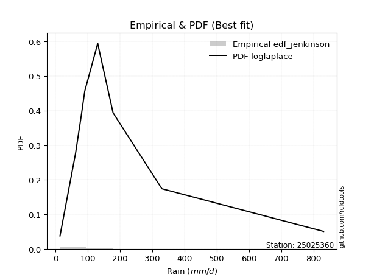</img>

</div>


### 11. Empirical - EDF Cunnane (1978)

Cunnane´s work in statistical hydrology has focused on the performance and evaluation of different probability distributions (such as GEV, Gumbel, Lognormal) for flood frequency estimation. _b_ is a constant, typically set to 0.4.

<div align="center">


$P=(m-b)/(n+1-2b)$


</div>


**11.1. Empirical values**

<div align="center">

|                | 0                   | 1                  | 2                   | 3                  | 4           | 5                  | 6                 | 7                  | 8                  |
|:---------------|:--------------------|:-------------------|:--------------------|:-------------------|:------------|:-------------------|:------------------|:-------------------|:-------------------|
| date           | 2021                | 2023               | 2025                | 2019               | 2020        | 2024               | 2022              | 2017               | 2018               |
| x              | 14.0                | 62.3               | 70.9                | 80.2               | 90.8        | 131.0              | 131.2             | 178.68             | 329.9              |
| m              | 1                   | 2                  | 3                   | 4                  | 5           | 6                  | 7                 | 8                  | 9                  |
| empirical_dist | edf_cunnane         | edf_cunnane        | edf_cunnane         | edf_cunnane        | edf_cunnane | edf_cunnane        | edf_cunnane       | edf_cunnane        | edf_cunnane        |
| empirical      | 0.06521739130434782 | 0.1739130434782609 | 0.28260869565217395 | 0.391304347826087  | 0.5         | 0.6086956521739131 | 0.717391304347826 | 0.8260869565217391 | 0.9347826086956522 |
| empirical_tr   | 1.069767441860465   | 1.2105263157894737 | 1.393939393939394   | 1.6428571428571428 | 2.0         | 2.555555555555556  | 3.538461538461538 | 5.75               | 15.333333333333343 |

</div>


**11.2. Kolmogorov-Smirnov fit test (sorted by Δ)**


<div align="center">

|                | 0                   | 1                   | 2                   | 3                   | 4                   | 5                   | 6                   | 7                   | 8                   | 9                   | 10                  | 11                  | 12                  | 13                  | 14                  | 15                  | 16                  | 17                  | 18                  | 19                  | 20                  | 21                  | 22                  | 23                  | 24                  | 25                  | 26                    | 27                  | 28                  | 29                  | 30                  | 31                  | 32                  | 33                  | 34                  | 35                  | 36                  | 37                  | 38                  | 39                  | 40                  | 41                  | 42                  | 43                  | 44                  | 45                  | 46                  | 47                  | 48                  | 49                  | 50                  | 51                  | 52                  | 53                  | 54                  | 55                  | 56                  | 57                  | 58                  | 59                  | 60                  | 61                  | 62                  | 63                  | 64                  | 65                  | 66                  | 67                  | 68                  | 69                  | 70                  | 71                  | 72                  | 73                  | 74                  | 75                  | 76                  | 77                  | 78                  | 79                  | 80                  | 81                  | 82                  | 83                  | 84                  | 85                  | 86                  | 87                  | 88                  | 89                  |
|:---------------|:--------------------|:--------------------|:--------------------|:--------------------|:--------------------|:--------------------|:--------------------|:--------------------|:--------------------|:--------------------|:--------------------|:--------------------|:--------------------|:--------------------|:--------------------|:--------------------|:--------------------|:--------------------|:--------------------|:--------------------|:--------------------|:--------------------|:--------------------|:--------------------|:--------------------|:--------------------|:----------------------|:--------------------|:--------------------|:--------------------|:--------------------|:--------------------|:--------------------|:--------------------|:--------------------|:--------------------|:--------------------|:--------------------|:--------------------|:--------------------|:--------------------|:--------------------|:--------------------|:--------------------|:--------------------|:--------------------|:--------------------|:--------------------|:--------------------|:--------------------|:--------------------|:--------------------|:--------------------|:--------------------|:--------------------|:--------------------|:--------------------|:--------------------|:--------------------|:--------------------|:--------------------|:--------------------|:--------------------|:--------------------|:--------------------|:--------------------|:--------------------|:--------------------|:--------------------|:--------------------|:--------------------|:--------------------|:--------------------|:--------------------|:--------------------|:--------------------|:--------------------|:--------------------|:--------------------|:--------------------|:--------------------|:--------------------|:--------------------|:--------------------|:--------------------|:--------------------|:--------------------|:--------------------|:--------------------|:--------------------|
| station        | 25025360            | 25025360            | 25025360            | 25025360            | 25025360            | 25025360            | 25025360            | 25025360            | 25025360            | 25025360            | 25025360            | 25025360            | 25025360            | 25025360            | 25025360            | 25025360            | 25025360            | 25025360            | 25025360            | 25025360            | 25025360            | 25025360            | 25025360            | 25025360            | 25025360            | 25025360            | 25025360              | 25025360            | 25025360            | 25025360            | 25025360            | 25025360            | 25025360            | 25025360            | 25025360            | 25025360            | 25025360            | 25025360            | 25025360            | 25025360            | 25025360            | 25025360            | 25025360            | 25025360            | 25025360            | 25025360            | 25025360            | 25025360            | 25025360            | 25025360            | 25025360            | 25025360            | 25025360            | 25025360            | 25025360            | 25025360            | 25025360            | 25025360            | 25025360            | 25025360            | 25025360            | 25025360            | 25025360            | 25025360            | 25025360            | 25025360            | 25025360            | 25025360            | 25025360            | 25025360            | 25025360            | 25025360            | 25025360            | 25025360            | 25025360            | 25025360            | 25025360            | 25025360            | 25025360            | 25025360            | 25025360            | 25025360            | 25025360            | 25025360            | 25025360            | 25025360            | 25025360            | 25025360            | 25025360            | 25025360            |
| empirical_dist | edf_cunnane         | edf_cunnane         | edf_cunnane         | edf_cunnane         | edf_cunnane         | edf_cunnane         | edf_cunnane         | edf_cunnane         | edf_cunnane         | edf_cunnane         | edf_cunnane         | edf_cunnane         | edf_cunnane         | edf_cunnane         | edf_cunnane         | edf_cunnane         | edf_cunnane         | edf_cunnane         | edf_cunnane         | edf_cunnane         | edf_cunnane         | edf_cunnane         | edf_cunnane         | edf_cunnane         | edf_cunnane         | edf_cunnane         | edf_cunnane           | edf_cunnane         | edf_cunnane         | edf_cunnane         | edf_cunnane         | edf_cunnane         | edf_cunnane         | edf_cunnane         | edf_cunnane         | edf_cunnane         | edf_cunnane         | edf_cunnane         | edf_cunnane         | edf_cunnane         | edf_cunnane         | edf_cunnane         | edf_cunnane         | edf_cunnane         | edf_cunnane         | edf_cunnane         | edf_cunnane         | edf_cunnane         | edf_cunnane         | edf_cunnane         | edf_cunnane         | edf_cunnane         | edf_cunnane         | edf_cunnane         | edf_cunnane         | edf_cunnane         | edf_cunnane         | edf_cunnane         | edf_cunnane         | edf_cunnane         | edf_cunnane         | edf_cunnane         | edf_cunnane         | edf_cunnane         | edf_cunnane         | edf_cunnane         | edf_cunnane         | edf_cunnane         | edf_cunnane         | edf_cunnane         | edf_cunnane         | edf_cunnane         | edf_cunnane         | edf_cunnane         | edf_cunnane         | edf_cunnane         | edf_cunnane         | edf_cunnane         | edf_cunnane         | edf_cunnane         | edf_cunnane         | edf_cunnane         | edf_cunnane         | edf_cunnane         | edf_cunnane         | edf_cunnane         | edf_cunnane         | edf_cunnane         | edf_cunnane         | edf_cunnane         |
| p_dist         | nct                 | laplace_asymmetric  | exponnorm           | logt                | fisk                | logjohnsonsu        | johnsonsu           | invweibull          | invgamma            | moyal               | logfisk             | logmielke           | loggenlogistic      | genlogistic         | invgauss            | loggumbel_l         | gumbel_r            | wald                | pearson3            | logloggamma         | logweibull_min      | logpearson3         | loghypsecant        | halflogistic        | kstwobign           | betaprime           | loglaplace_asymmetric | loglaplace          | erlang              | gamma               | loggompertz         | f                   | loglogistic         | halfnorm            | rayleigh            | gibrat              | ncf                 | gompertz            | weibull_min         | maxwell             | logf                | lognct              | logexponnorm        | lognorm             | lognorm             | logcrystalball      | logrice             | logfatiguelife      | rice                | logncf              | loggamma            | loggamma            | logerlang           | logbetaprime        | logistic            | hypsecant           | loginvgamma         | t                   | crystalball         | norm                | logtruncnorm        | nakagami            | lognakagami         | logalpha            | logmaxwell          | loggumbel_r         | loginvgauss         | lograyleigh         | expon               | genexpon            | laplace             | logmoyal            | mielke              | loginvweibull       | loghalfnorm         | loggibrat           | loghalflogistic     | logwald             | gumbel_l            | logkstwobign        | loggenexpon         | alpha               | logexpon            | loglognorm          | pareto              | logpareto           | logchi2             | fatiguelife         | chi2                | truncnorm           |
| delta          | 0.06460242069998556 | 0.06497766853579923 | 0.06743763374938805 | 0.07032517565854146 | 0.07055643974042888 | 0.07074069996251223 | 0.0749422571816476  | 0.07986554065307963 | 0.08359906224527999 | 0.08581136411446508 | 0.08633631506487635 | 0.08851628643999124 | 0.08857289800177329 | 0.09058094785449511 | 0.09147678418740904 | 0.09211027792671878 | 0.10017567316503273 | 0.10185767281133018 | 0.10380748447022595 | 0.10428965687781125 | 0.10711457845989561 | 0.10727637657757463 | 0.11044069400631065 | 0.11349569357995434 | 0.11416618136995749 | 0.11734656547038877 | 0.11952756892770244   | 0.12053761980234157 | 0.12156449002077688 | 0.12156456693421289 | 0.121728400789031   | 0.12208170612237437 | 0.12550797655736165 | 0.1282567958518658  | 0.12995228076389198 | 0.13066910090641867 | 0.13385988725977568 | 0.13599633850075213 | 0.1364194090721533  | 0.13979584376735    | 0.14450022630267342 | 0.14520671587834214 | 0.1457426049000666  | 0.1457430573098262  | 0.1457430573098262  | 0.1457431769580094  | 0.14575053162057064 | 0.14661629905701953 | 0.15089000269747477 | 0.15446129427551566 | 0.1560108727157047  | 0.1560108727157047  | 0.15631600363649253 | 0.15922814158196416 | 0.16403809541314973 | 0.16662254308548197 | 0.16754436892637622 | 0.17031109864386462 | 0.17038142851967075 | 0.17038143136079142 | 0.17382015532162504 | 0.17390579452483632 | 0.17391304123274035 | 0.1739613176863883  | 0.17546140345032127 | 0.18518779252593    | 0.1861820755748311  | 0.187004597527238   | 0.18935801931578225 | 0.1893707132940647  | 0.1950332008733367  | 0.1986429904793294  | 0.21209773407381258 | 0.21632134683389356 | 0.21978478666141996 | 0.2202825263045214  | 0.2222367665312084  | 0.22559217436714907 | 0.23772208790341665 | 0.2579016150268839  | 0.2924651270212153  | 0.3574232141768131  | 0.37430481422587525 | 0.4536089187859125  | 0.47049789037574186 | 0.4881879153695542  | 0.5676621449412795  | 0.5935990618254414  | 0.8242332902285303  | 0.8260869565217391  |
| deltao         | 0.41761268023100007 | 0.41761268023100007 | 0.41761268023100007 | 0.41761268023100007 | 0.41761268023100007 | 0.41761268023100007 | 0.41761268023100007 | 0.41761268023100007 | 0.41761268023100007 | 0.41761268023100007 | 0.41761268023100007 | 0.41761268023100007 | 0.41761268023100007 | 0.41761268023100007 | 0.41761268023100007 | 0.41761268023100007 | 0.41761268023100007 | 0.41761268023100007 | 0.41761268023100007 | 0.41761268023100007 | 0.41761268023100007 | 0.41761268023100007 | 0.41761268023100007 | 0.41761268023100007 | 0.41761268023100007 | 0.41761268023100007 | 0.41761268023100007   | 0.41761268023100007 | 0.41761268023100007 | 0.41761268023100007 | 0.41761268023100007 | 0.41761268023100007 | 0.41761268023100007 | 0.41761268023100007 | 0.41761268023100007 | 0.41761268023100007 | 0.41761268023100007 | 0.41761268023100007 | 0.41761268023100007 | 0.41761268023100007 | 0.41761268023100007 | 0.41761268023100007 | 0.41761268023100007 | 0.41761268023100007 | 0.41761268023100007 | 0.41761268023100007 | 0.41761268023100007 | 0.41761268023100007 | 0.41761268023100007 | 0.41761268023100007 | 0.41761268023100007 | 0.41761268023100007 | 0.41761268023100007 | 0.41761268023100007 | 0.41761268023100007 | 0.41761268023100007 | 0.41761268023100007 | 0.41761268023100007 | 0.41761268023100007 | 0.41761268023100007 | 0.41761268023100007 | 0.41761268023100007 | 0.41761268023100007 | 0.41761268023100007 | 0.41761268023100007 | 0.41761268023100007 | 0.41761268023100007 | 0.41761268023100007 | 0.41761268023100007 | 0.41761268023100007 | 0.41761268023100007 | 0.41761268023100007 | 0.41761268023100007 | 0.41761268023100007 | 0.41761268023100007 | 0.41761268023100007 | 0.41761268023100007 | 0.41761268023100007 | 0.41761268023100007 | 0.41761268023100007 | 0.41761268023100007 | 0.41761268023100007 | 0.41761268023100007 | 0.41761268023100007 | 0.41761268023100007 | 0.41761268023100007 | 0.41761268023100007 | 0.41761268023100007 | 0.41761268023100007 | 0.41761268023100007 |
| eval           | Δo > Δ              | Δo > Δ              | Δo > Δ              | Δo > Δ              | Δo > Δ              | Δo > Δ              | Δo > Δ              | Δo > Δ              | Δo > Δ              | Δo > Δ              | Δo > Δ              | Δo > Δ              | Δo > Δ              | Δo > Δ              | Δo > Δ              | Δo > Δ              | Δo > Δ              | Δo > Δ              | Δo > Δ              | Δo > Δ              | Δo > Δ              | Δo > Δ              | Δo > Δ              | Δo > Δ              | Δo > Δ              | Δo > Δ              | Δo > Δ                | Δo > Δ              | Δo > Δ              | Δo > Δ              | Δo > Δ              | Δo > Δ              | Δo > Δ              | Δo > Δ              | Δo > Δ              | Δo > Δ              | Δo > Δ              | Δo > Δ              | Δo > Δ              | Δo > Δ              | Δo > Δ              | Δo > Δ              | Δo > Δ              | Δo > Δ              | Δo > Δ              | Δo > Δ              | Δo > Δ              | Δo > Δ              | Δo > Δ              | Δo > Δ              | Δo > Δ              | Δo > Δ              | Δo > Δ              | Δo > Δ              | Δo > Δ              | Δo > Δ              | Δo > Δ              | Δo > Δ              | Δo > Δ              | Δo > Δ              | Δo > Δ              | Δo > Δ              | Δo > Δ              | Δo > Δ              | Δo > Δ              | Δo > Δ              | Δo > Δ              | Δo > Δ              | Δo > Δ              | Δo > Δ              | Δo > Δ              | Δo > Δ              | Δo > Δ              | Δo > Δ              | Δo > Δ              | Δo > Δ              | Δo > Δ              | Δo > Δ              | Δo > Δ              | Δo > Δ              | Δo > Δ              | Δo > Δ              | Δo > Δ              | Δo <= Δ             | Δo <= Δ             | Δo <= Δ             | Δo <= Δ             | Δo <= Δ             | Δo <= Δ             | Δo <= Δ             |
| fit            | 1                   | 1                   | 1                   | 1                   | 1                   | 1                   | 1                   | 1                   | 1                   | 1                   | 1                   | 1                   | 1                   | 1                   | 1                   | 1                   | 1                   | 1                   | 1                   | 1                   | 1                   | 1                   | 1                   | 1                   | 1                   | 1                   | 1                     | 1                   | 1                   | 1                   | 1                   | 1                   | 1                   | 1                   | 1                   | 1                   | 1                   | 1                   | 1                   | 1                   | 1                   | 1                   | 1                   | 1                   | 1                   | 1                   | 1                   | 1                   | 1                   | 1                   | 1                   | 1                   | 1                   | 1                   | 1                   | 1                   | 1                   | 1                   | 1                   | 1                   | 1                   | 1                   | 1                   | 1                   | 1                   | 1                   | 1                   | 1                   | 1                   | 1                   | 1                   | 1                   | 1                   | 1                   | 1                   | 1                   | 1                   | 1                   | 1                   | 1                   | 1                   | 1                   | 1                   | 0                   | 0                   | 0                   | 0                   | 0                   | 0                   | 0                   |
| n              | 9                   | 9                   | 9                   | 9                   | 9                   | 9                   | 9                   | 9                   | 9                   | 9                   | 9                   | 9                   | 9                   | 9                   | 9                   | 9                   | 9                   | 9                   | 9                   | 9                   | 9                   | 9                   | 9                   | 9                   | 9                   | 9                   | 9                     | 9                   | 9                   | 9                   | 9                   | 9                   | 9                   | 9                   | 9                   | 9                   | 9                   | 9                   | 9                   | 9                   | 9                   | 9                   | 9                   | 9                   | 9                   | 9                   | 9                   | 9                   | 9                   | 9                   | 9                   | 9                   | 9                   | 9                   | 9                   | 9                   | 9                   | 9                   | 9                   | 9                   | 9                   | 9                   | 9                   | 9                   | 9                   | 9                   | 9                   | 9                   | 9                   | 9                   | 9                   | 9                   | 9                   | 9                   | 9                   | 9                   | 9                   | 9                   | 9                   | 9                   | 9                   | 9                   | 9                   | 9                   | 9                   | 9                   | 9                   | 9                   | 9                   | 9                   |
| best_fit       | 1                   | 0                   | 0                   | 0                   | 0                   | 0                   | 0                   | 0                   | 0                   | 0                   | 0                   | 0                   | 0                   | 0                   | 0                   | 0                   | 0                   | 0                   | 0                   | 0                   | 0                   | 0                   | 0                   | 0                   | 0                   | 0                   | 0                     | 0                   | 0                   | 0                   | 0                   | 0                   | 0                   | 0                   | 0                   | 0                   | 0                   | 0                   | 0                   | 0                   | 0                   | 0                   | 0                   | 0                   | 0                   | 0                   | 0                   | 0                   | 0                   | 0                   | 0                   | 0                   | 0                   | 0                   | 0                   | 0                   | 0                   | 0                   | 0                   | 0                   | 0                   | 0                   | 0                   | 0                   | 0                   | 0                   | 0                   | 0                   | 0                   | 0                   | 0                   | 0                   | 0                   | 0                   | 0                   | 0                   | 0                   | 0                   | 0                   | 0                   | 0                   | 0                   | 0                   | 0                   | 0                   | 0                   | 0                   | 0                   | 0                   | 0                   |
| best_fit_sort  | 1                   | 2                   | 3                   | 4                   | 5                   | 6                   | 7                   | 8                   | 9                   | 10                  | 11                  | 12                  | 13                  | 14                  | 15                  | 16                  | 17                  | 18                  | 19                  | 20                  | 21                  | 22                  | 23                  | 24                  | 25                  | 26                  | 27                    | 28                  | 29                  | 30                  | 31                  | 32                  | 33                  | 34                  | 35                  | 36                  | 37                  | 38                  | 39                  | 40                  | 41                  | 42                  | 43                  | 44                  | 45                  | 46                  | 47                  | 48                  | 49                  | 50                  | 51                  | 52                  | 53                  | 54                  | 55                  | 56                  | 57                  | 58                  | 59                  | 60                  | 61                  | 62                  | 63                  | 64                  | 65                  | 66                  | 67                  | 68                  | 69                  | 70                  | 71                  | 72                  | 73                  | 74                  | 75                  | 76                  | 77                  | 78                  | 79                  | 80                  | 81                  | 82                  | 83                  | 84                  | 85                  | 86                  | 87                  | 88                  | 89                  | 90                  |

</div>


<div align="center">

</img>

</div>


**11.3. Best fit**

<div align="center">

|   id |   station | empirical_dist   | p_dist   |     delta |   deltao | eval   |   fit |   n |   best_fit |   best_fit_sort |
|-----:|----------:|:-----------------|:---------|----------:|---------:|:-------|------:|----:|-----------:|----------------:|
|    0 |  25025360 | edf_cunnane      | nct      | 0.0646024 | 0.417613 | Δo > Δ |     1 |   9 |          1 |               1 |

</div>


<div align="center">

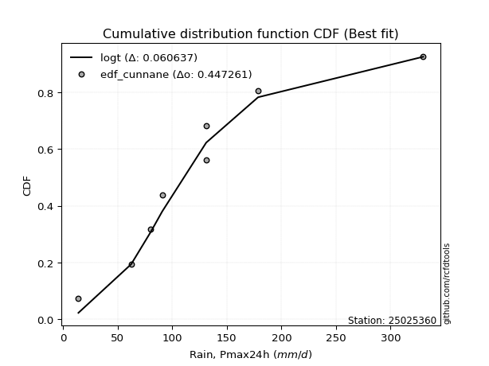</img></img>

</div>


### 12. Empirical - EDF Adamowski (1981)

The Adamowski formula in hydrology refers to a specific plotting position formula used for estimating the non-parametric empirical distribution of hydrological events (like flood peaks) to calculate their return periods. This formula provides an alternative to traditional parametric methods (like the Gumbel or Log Pearson Type III distributions). 

<div align="center">


$P=(m-0.25)/(n+0.5)$


</div>


**12.1. Empirical values**

<div align="center">

|                | 0                   | 1                   | 2                  | 3                   | 4             | 5                  | 6                  | 7                  | 8                  |
|:---------------|:--------------------|:--------------------|:-------------------|:--------------------|:--------------|:-------------------|:-------------------|:-------------------|:-------------------|
| date           | 2021                | 2023                | 2025               | 2019                | 2020          | 2024               | 2022               | 2017               | 2018               |
| x              | 14.0                | 62.3                | 70.9               | 80.2                | 90.8          | 131.0              | 131.2              | 178.68             | 329.9              |
| m              | 1                   | 2                   | 3                  | 4                   | 5             | 6                  | 7                  | 8                  | 9                  |
| empirical_dist | edf_adamowski       | edf_adamowski       | edf_adamowski      | edf_adamowski       | edf_adamowski | edf_adamowski      | edf_adamowski      | edf_adamowski      | edf_adamowski      |
| empirical      | 0.07894736842105263 | 0.18421052631578946 | 0.2894736842105263 | 0.39473684210526316 | 0.5           | 0.6052631578947368 | 0.7105263157894737 | 0.8157894736842105 | 0.9210526315789473 |
| empirical_tr   | 1.0857142857142856  | 1.2258064516129032  | 1.4074074074074074 | 1.6521739130434783  | 2.0           | 2.533333333333333  | 3.4545454545454546 | 5.428571428571428  | 12.666666666666663 |

</div>


**12.2. Kolmogorov-Smirnov fit test (sorted by Δ)**


<div align="center">

|                | 0                   | 1                   | 2                   | 3                   | 4                   | 5                   | 6                   | 7                   | 8                   | 9                   | 10                  | 11                  | 12                  | 13                  | 14                  | 15                  | 16                  | 17                  | 18                  | 19                  | 20                  | 21                  | 22                  | 23                  | 24                  | 25                  | 26                  | 27                  | 28                  | 29                  | 30                  | 31                  | 32                    | 33                  | 34                  | 35                  | 36                  | 37                  | 38                  | 39                  | 40                  | 41                  | 42                  | 43                  | 44                  | 45                  | 46                  | 47                  | 48                  | 49                  | 50                  | 51                  | 52                  | 53                  | 54                  | 55                  | 56                  | 57                  | 58                  | 59                  | 60                  | 61                  | 62                  | 63                  | 64                  | 65                  | 66                  | 67                  | 68                  | 69                  | 70                  | 71                  | 72                  | 73                  | 74                  | 75                  | 76                  | 77                  | 78                  | 79                  | 80                  | 81                  | 82                  | 83                  | 84                  | 85                  | 86                  | 87                  | 88                  | 89                  |
|:---------------|:--------------------|:--------------------|:--------------------|:--------------------|:--------------------|:--------------------|:--------------------|:--------------------|:--------------------|:--------------------|:--------------------|:--------------------|:--------------------|:--------------------|:--------------------|:--------------------|:--------------------|:--------------------|:--------------------|:--------------------|:--------------------|:--------------------|:--------------------|:--------------------|:--------------------|:--------------------|:--------------------|:--------------------|:--------------------|:--------------------|:--------------------|:--------------------|:----------------------|:--------------------|:--------------------|:--------------------|:--------------------|:--------------------|:--------------------|:--------------------|:--------------------|:--------------------|:--------------------|:--------------------|:--------------------|:--------------------|:--------------------|:--------------------|:--------------------|:--------------------|:--------------------|:--------------------|:--------------------|:--------------------|:--------------------|:--------------------|:--------------------|:--------------------|:--------------------|:--------------------|:--------------------|:--------------------|:--------------------|:--------------------|:--------------------|:--------------------|:--------------------|:--------------------|:--------------------|:--------------------|:--------------------|:--------------------|:--------------------|:--------------------|:--------------------|:--------------------|:--------------------|:--------------------|:--------------------|:--------------------|:--------------------|:--------------------|:--------------------|:--------------------|:--------------------|:--------------------|:--------------------|:--------------------|:--------------------|:--------------------|
| station        | 25025360            | 25025360            | 25025360            | 25025360            | 25025360            | 25025360            | 25025360            | 25025360            | 25025360            | 25025360            | 25025360            | 25025360            | 25025360            | 25025360            | 25025360            | 25025360            | 25025360            | 25025360            | 25025360            | 25025360            | 25025360            | 25025360            | 25025360            | 25025360            | 25025360            | 25025360            | 25025360            | 25025360            | 25025360            | 25025360            | 25025360            | 25025360            | 25025360              | 25025360            | 25025360            | 25025360            | 25025360            | 25025360            | 25025360            | 25025360            | 25025360            | 25025360            | 25025360            | 25025360            | 25025360            | 25025360            | 25025360            | 25025360            | 25025360            | 25025360            | 25025360            | 25025360            | 25025360            | 25025360            | 25025360            | 25025360            | 25025360            | 25025360            | 25025360            | 25025360            | 25025360            | 25025360            | 25025360            | 25025360            | 25025360            | 25025360            | 25025360            | 25025360            | 25025360            | 25025360            | 25025360            | 25025360            | 25025360            | 25025360            | 25025360            | 25025360            | 25025360            | 25025360            | 25025360            | 25025360            | 25025360            | 25025360            | 25025360            | 25025360            | 25025360            | 25025360            | 25025360            | 25025360            | 25025360            | 25025360            |
| empirical_dist | edf_adamowski       | edf_adamowski       | edf_adamowski       | edf_adamowski       | edf_adamowski       | edf_adamowski       | edf_adamowski       | edf_adamowski       | edf_adamowski       | edf_adamowski       | edf_adamowski       | edf_adamowski       | edf_adamowski       | edf_adamowski       | edf_adamowski       | edf_adamowski       | edf_adamowski       | edf_adamowski       | edf_adamowski       | edf_adamowski       | edf_adamowski       | edf_adamowski       | edf_adamowski       | edf_adamowski       | edf_adamowski       | edf_adamowski       | edf_adamowski       | edf_adamowski       | edf_adamowski       | edf_adamowski       | edf_adamowski       | edf_adamowski       | edf_adamowski         | edf_adamowski       | edf_adamowski       | edf_adamowski       | edf_adamowski       | edf_adamowski       | edf_adamowski       | edf_adamowski       | edf_adamowski       | edf_adamowski       | edf_adamowski       | edf_adamowski       | edf_adamowski       | edf_adamowski       | edf_adamowski       | edf_adamowski       | edf_adamowski       | edf_adamowski       | edf_adamowski       | edf_adamowski       | edf_adamowski       | edf_adamowski       | edf_adamowski       | edf_adamowski       | edf_adamowski       | edf_adamowski       | edf_adamowski       | edf_adamowski       | edf_adamowski       | edf_adamowski       | edf_adamowski       | edf_adamowski       | edf_adamowski       | edf_adamowski       | edf_adamowski       | edf_adamowski       | edf_adamowski       | edf_adamowski       | edf_adamowski       | edf_adamowski       | edf_adamowski       | edf_adamowski       | edf_adamowski       | edf_adamowski       | edf_adamowski       | edf_adamowski       | edf_adamowski       | edf_adamowski       | edf_adamowski       | edf_adamowski       | edf_adamowski       | edf_adamowski       | edf_adamowski       | edf_adamowski       | edf_adamowski       | edf_adamowski       | edf_adamowski       | edf_adamowski       |
| p_dist         | fisk                | nct                 | laplace_asymmetric  | exponnorm           | invweibull          | logjohnsonsu        | logt                | invgamma            | moyal               | logfisk             | logmielke           | loggenlogistic      | johnsonsu           | invgauss            | loggumbel_l         | genlogistic         | gumbel_r            | pearson3            | logloggamma         | logweibull_min      | logpearson3         | loghypsecant        | halflogistic        | wald                | betaprime           | kstwobign           | erlang              | gamma               | loggompertz         | f                   | loglogistic         | halfnorm            | loglaplace_asymmetric | rayleigh            | ncf                 | loglaplace          | gompertz            | weibull_min         | maxwell             | logf                | lognct              | logexponnorm        | lognorm             | lognorm             | logcrystalball      | logrice             | logfatiguelife      | gibrat              | rice                | logncf              | loggamma            | loggamma            | logerlang           | logbetaprime        | logistic            | loginvgamma         | t                   | crystalball         | norm                | logalpha            | logmaxwell          | hypsecant           | loggumbel_r         | loginvgauss         | lograyleigh         | expon               | genexpon            | logtruncnorm        | nakagami            | lognakagami         | logmoyal            | laplace             | mielke              | loginvweibull       | loghalfnorm         | loghalflogistic     | logwald             | loggibrat           | gumbel_l            | logkstwobign        | loggenexpon         | alpha               | logexpon            | loglognorm          | pareto              | logpareto           | logchi2             | fatiguelife         | chi2                | truncnorm           |
| delta          | 0.06122371174978286 | 0.06460242069998556 | 0.06497766853579923 | 0.06743763374938805 | 0.06956805781555106 | 0.06971338306349406 | 0.0709117806306282  | 0.07330157940775142 | 0.0755138812769365  | 0.07603883222734778 | 0.07821880360246267 | 0.07827541516424472 | 0.07837475146082384 | 0.08117930134988047 | 0.0852452893683664  | 0.09058094785449511 | 0.09331068460668035 | 0.09351000163269738 | 0.09399217404028268 | 0.09681709562236704 | 0.09697889374004606 | 0.10014321116878208 | 0.10319821074242577 | 0.10529016709050643 | 0.1070490826328602  | 0.1073011928116051  | 0.1112670071832483  | 0.11126708409668432 | 0.11143091795150242 | 0.1117842232848458  | 0.11521049371983308 | 0.11795931301433724 | 0.12296006320687869   | 0.1230872922055396  | 0.12356240442224711 | 0.12397011408151781 | 0.12569885566322356 | 0.12612192623462473 | 0.1329308552089976  | 0.13420274346514485 | 0.13490923304081356 | 0.13544512206253803 | 0.13544557447229763 | 0.13544557447229763 | 0.13544569412048083 | 0.13545304878304207 | 0.13631881621949096 | 0.14096658374394724 | 0.1440250141391224  | 0.1441638114379871  | 0.14571338987817614 | 0.14571338987817614 | 0.14601852079896396 | 0.1489306587444356  | 0.15717310685479735 | 0.15724688608884765 | 0.16344611008551224 | 0.16351643996131837 | 0.16351644280243904 | 0.16366383484885974 | 0.1651639206127927  | 0.16662254308548197 | 0.17489030968840144 | 0.17588459273730253 | 0.17670711468970943 | 0.17906053647825368 | 0.17907323045653614 | 0.1841176381591536  | 0.1842032773623649  | 0.18421052407026892 | 0.18834550764180083 | 0.1950332008733367  | 0.201800251236284   | 0.206023863996365   | 0.20948730382389139 | 0.21193928369367984 | 0.2187271858087967  | 0.22371502058369763 | 0.23085709934506426 | 0.2476041321893553  | 0.28216764418368667 | 0.3471257313392845  | 0.3640073313883466  | 0.44331143594838385 | 0.46020040753821323 | 0.47789043253202557 | 0.5573646621037509  | 0.5833015789879128  | 0.8139358073910017  | 0.8157894736842105  |
| deltao         | 0.41761268023100007 | 0.41761268023100007 | 0.41761268023100007 | 0.41761268023100007 | 0.41761268023100007 | 0.41761268023100007 | 0.41761268023100007 | 0.41761268023100007 | 0.41761268023100007 | 0.41761268023100007 | 0.41761268023100007 | 0.41761268023100007 | 0.41761268023100007 | 0.41761268023100007 | 0.41761268023100007 | 0.41761268023100007 | 0.41761268023100007 | 0.41761268023100007 | 0.41761268023100007 | 0.41761268023100007 | 0.41761268023100007 | 0.41761268023100007 | 0.41761268023100007 | 0.41761268023100007 | 0.41761268023100007 | 0.41761268023100007 | 0.41761268023100007 | 0.41761268023100007 | 0.41761268023100007 | 0.41761268023100007 | 0.41761268023100007 | 0.41761268023100007 | 0.41761268023100007   | 0.41761268023100007 | 0.41761268023100007 | 0.41761268023100007 | 0.41761268023100007 | 0.41761268023100007 | 0.41761268023100007 | 0.41761268023100007 | 0.41761268023100007 | 0.41761268023100007 | 0.41761268023100007 | 0.41761268023100007 | 0.41761268023100007 | 0.41761268023100007 | 0.41761268023100007 | 0.41761268023100007 | 0.41761268023100007 | 0.41761268023100007 | 0.41761268023100007 | 0.41761268023100007 | 0.41761268023100007 | 0.41761268023100007 | 0.41761268023100007 | 0.41761268023100007 | 0.41761268023100007 | 0.41761268023100007 | 0.41761268023100007 | 0.41761268023100007 | 0.41761268023100007 | 0.41761268023100007 | 0.41761268023100007 | 0.41761268023100007 | 0.41761268023100007 | 0.41761268023100007 | 0.41761268023100007 | 0.41761268023100007 | 0.41761268023100007 | 0.41761268023100007 | 0.41761268023100007 | 0.41761268023100007 | 0.41761268023100007 | 0.41761268023100007 | 0.41761268023100007 | 0.41761268023100007 | 0.41761268023100007 | 0.41761268023100007 | 0.41761268023100007 | 0.41761268023100007 | 0.41761268023100007 | 0.41761268023100007 | 0.41761268023100007 | 0.41761268023100007 | 0.41761268023100007 | 0.41761268023100007 | 0.41761268023100007 | 0.41761268023100007 | 0.41761268023100007 | 0.41761268023100007 |
| eval           | Δo > Δ              | Δo > Δ              | Δo > Δ              | Δo > Δ              | Δo > Δ              | Δo > Δ              | Δo > Δ              | Δo > Δ              | Δo > Δ              | Δo > Δ              | Δo > Δ              | Δo > Δ              | Δo > Δ              | Δo > Δ              | Δo > Δ              | Δo > Δ              | Δo > Δ              | Δo > Δ              | Δo > Δ              | Δo > Δ              | Δo > Δ              | Δo > Δ              | Δo > Δ              | Δo > Δ              | Δo > Δ              | Δo > Δ              | Δo > Δ              | Δo > Δ              | Δo > Δ              | Δo > Δ              | Δo > Δ              | Δo > Δ              | Δo > Δ                | Δo > Δ              | Δo > Δ              | Δo > Δ              | Δo > Δ              | Δo > Δ              | Δo > Δ              | Δo > Δ              | Δo > Δ              | Δo > Δ              | Δo > Δ              | Δo > Δ              | Δo > Δ              | Δo > Δ              | Δo > Δ              | Δo > Δ              | Δo > Δ              | Δo > Δ              | Δo > Δ              | Δo > Δ              | Δo > Δ              | Δo > Δ              | Δo > Δ              | Δo > Δ              | Δo > Δ              | Δo > Δ              | Δo > Δ              | Δo > Δ              | Δo > Δ              | Δo > Δ              | Δo > Δ              | Δo > Δ              | Δo > Δ              | Δo > Δ              | Δo > Δ              | Δo > Δ              | Δo > Δ              | Δo > Δ              | Δo > Δ              | Δo > Δ              | Δo > Δ              | Δo > Δ              | Δo > Δ              | Δo > Δ              | Δo > Δ              | Δo > Δ              | Δo > Δ              | Δo > Δ              | Δo > Δ              | Δo > Δ              | Δo > Δ              | Δo <= Δ             | Δo <= Δ             | Δo <= Δ             | Δo <= Δ             | Δo <= Δ             | Δo <= Δ             | Δo <= Δ             |
| fit            | 1                   | 1                   | 1                   | 1                   | 1                   | 1                   | 1                   | 1                   | 1                   | 1                   | 1                   | 1                   | 1                   | 1                   | 1                   | 1                   | 1                   | 1                   | 1                   | 1                   | 1                   | 1                   | 1                   | 1                   | 1                   | 1                   | 1                   | 1                   | 1                   | 1                   | 1                   | 1                   | 1                     | 1                   | 1                   | 1                   | 1                   | 1                   | 1                   | 1                   | 1                   | 1                   | 1                   | 1                   | 1                   | 1                   | 1                   | 1                   | 1                   | 1                   | 1                   | 1                   | 1                   | 1                   | 1                   | 1                   | 1                   | 1                   | 1                   | 1                   | 1                   | 1                   | 1                   | 1                   | 1                   | 1                   | 1                   | 1                   | 1                   | 1                   | 1                   | 1                   | 1                   | 1                   | 1                   | 1                   | 1                   | 1                   | 1                   | 1                   | 1                   | 1                   | 1                   | 0                   | 0                   | 0                   | 0                   | 0                   | 0                   | 0                   |
| n              | 9                   | 9                   | 9                   | 9                   | 9                   | 9                   | 9                   | 9                   | 9                   | 9                   | 9                   | 9                   | 9                   | 9                   | 9                   | 9                   | 9                   | 9                   | 9                   | 9                   | 9                   | 9                   | 9                   | 9                   | 9                   | 9                   | 9                   | 9                   | 9                   | 9                   | 9                   | 9                   | 9                     | 9                   | 9                   | 9                   | 9                   | 9                   | 9                   | 9                   | 9                   | 9                   | 9                   | 9                   | 9                   | 9                   | 9                   | 9                   | 9                   | 9                   | 9                   | 9                   | 9                   | 9                   | 9                   | 9                   | 9                   | 9                   | 9                   | 9                   | 9                   | 9                   | 9                   | 9                   | 9                   | 9                   | 9                   | 9                   | 9                   | 9                   | 9                   | 9                   | 9                   | 9                   | 9                   | 9                   | 9                   | 9                   | 9                   | 9                   | 9                   | 9                   | 9                   | 9                   | 9                   | 9                   | 9                   | 9                   | 9                   | 9                   |
| best_fit       | 1                   | 0                   | 0                   | 0                   | 0                   | 0                   | 0                   | 0                   | 0                   | 0                   | 0                   | 0                   | 0                   | 0                   | 0                   | 0                   | 0                   | 0                   | 0                   | 0                   | 0                   | 0                   | 0                   | 0                   | 0                   | 0                   | 0                   | 0                   | 0                   | 0                   | 0                   | 0                   | 0                     | 0                   | 0                   | 0                   | 0                   | 0                   | 0                   | 0                   | 0                   | 0                   | 0                   | 0                   | 0                   | 0                   | 0                   | 0                   | 0                   | 0                   | 0                   | 0                   | 0                   | 0                   | 0                   | 0                   | 0                   | 0                   | 0                   | 0                   | 0                   | 0                   | 0                   | 0                   | 0                   | 0                   | 0                   | 0                   | 0                   | 0                   | 0                   | 0                   | 0                   | 0                   | 0                   | 0                   | 0                   | 0                   | 0                   | 0                   | 0                   | 0                   | 0                   | 0                   | 0                   | 0                   | 0                   | 0                   | 0                   | 0                   |
| best_fit_sort  | 1                   | 2                   | 3                   | 4                   | 5                   | 6                   | 7                   | 8                   | 9                   | 10                  | 11                  | 12                  | 13                  | 14                  | 15                  | 16                  | 17                  | 18                  | 19                  | 20                  | 21                  | 22                  | 23                  | 24                  | 25                  | 26                  | 27                  | 28                  | 29                  | 30                  | 31                  | 32                  | 33                    | 34                  | 35                  | 36                  | 37                  | 38                  | 39                  | 40                  | 41                  | 42                  | 43                  | 44                  | 45                  | 46                  | 47                  | 48                  | 49                  | 50                  | 51                  | 52                  | 53                  | 54                  | 55                  | 56                  | 57                  | 58                  | 59                  | 60                  | 61                  | 62                  | 63                  | 64                  | 65                  | 66                  | 67                  | 68                  | 69                  | 70                  | 71                  | 72                  | 73                  | 74                  | 75                  | 76                  | 77                  | 78                  | 79                  | 80                  | 81                  | 82                  | 83                  | 84                  | 85                  | 86                  | 87                  | 88                  | 89                  | 90                  |

</div>


<div align="center">

</img>

</div>


**12.3. Best fit**

<div align="center">

|   id |   station | empirical_dist   | p_dist   |     delta |   deltao | eval   |   fit |   n |   best_fit |   best_fit_sort |
|-----:|----------:|:-----------------|:---------|----------:|---------:|:-------|------:|----:|-----------:|----------------:|
|    0 |  25025360 | edf_adamowski    | fisk     | 0.0612237 | 0.417613 | Δo > Δ |     1 |   9 |          1 |               1 |

</div>


<div align="center">

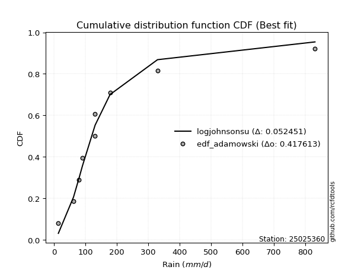</img>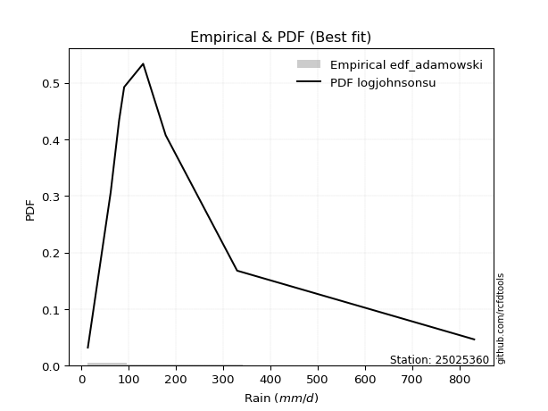</img>

</div>


## C. Best fit & Estimate extreme values for specific return periods - Tr


### 1. Best fit (ordered by delta Δ)

<div align="center">

|   id |   station | empirical_dist   | p_dist                |     delta |   deltao | eval   |   fit |   n |   best_fit |   best_fit_sort |
|-----:|----------:|:-----------------|:----------------------|----------:|---------:|:-------|------:|----:|-----------:|----------------:|
|    0 |  25025360 | edf_adamowski    | fisk                  | 0.0612237 | 0.417613 | Δo > Δ |     1 |   9 |          1 |               1 |
|    1 |  25025360 | edf_chegodayev   | fisk                  | 0.0636184 | 0.417613 | Δo > Δ |     1 |   9 |          1 |               2 |
|    2 |  25025360 | edf_jenkinson    | fisk                  | 0.0642989 | 0.417613 | Δo > Δ |     1 |   9 |          1 |               3 |
|    3 |  25025360 | edf_beard        | fisk                  | 0.0642989 | 0.417613 | Δo > Δ |     1 |   9 |          1 |               4 |
|    4 |  25025360 | edf_filliben     | nct                   | 0.0646024 | 0.417613 | Δo > Δ |     1 |   9 |          1 |               5 |
|    5 |  25025360 | edf_tukey        | nct                   | 0.0646024 | 0.417613 | Δo > Δ |     1 |   9 |          1 |               6 |
|    6 |  25025360 | edf_blom         | nct                   | 0.0646024 | 0.417613 | Δo > Δ |     1 |   9 |          1 |               7 |
|    7 |  25025360 | edf_cunnane      | nct                   | 0.0646024 | 0.417613 | Δo > Δ |     1 |   9 |          1 |               8 |
|    8 |  25025360 | edf_gringorten   | laplace_asymmetric    | 0.0649777 | 0.417613 | Δo > Δ |     1 |   9 |          1 |               9 |
|    9 |  25025360 | edf_hazen        | laplace_asymmetric    | 0.0649777 | 0.417613 | Δo > Δ |     1 |   9 |          1 |              10 |
|   10 |  25025360 | edf_weibull      | nct                   | 0.0676261 | 0.417613 | Δo > Δ |     1 |   9 |          1 |              11 |
|   11 |  25025360 | edf_california   | loglaplace_asymmetric | 0.0905839 | 0.417613 | Δo > Δ |     1 |   9 |          1 |              12 |

</div>

:file_folder:Tables: [bestfit_25025360.csv](table/bestfit_25025360.csv) | [extreme_25025360.csv](table/extreme_25025360.csv)


### 2. Extreme values

In hydrology, a return period (or recurrence interval $Tr$) is the statistical average time between extreme events like floods or droughts of a specific magnitude, indicating how rare an event is, with a 100-year flood, for example, having a 1% chance of occurring in any given year, not that it happens exactly every century. It is a key tool for infrastructure design (like bridges or dams) and risk assessment, calculated from historical data to determine the probability of future events, although it is important to remember it is statistical average, and events can cluster or be missed.

> risk_rate: assuming the return period as the project useful life.

|   id |      tr |   prob_l |     prob_g |      alpha |   betaprime |    chi2 |   crystalball |   erlang |    expon |   exponnorm |        f |   fatiguelife |     fisk |    gamma |   genexpon |   genlogistic |   gibrat |   gompertz |   gumbel_l |   gumbel_r |   halflogistic |   halfnorm |   hypsecant |   invgamma |   invgauss |   invweibull |   johnsonsu |   kstwobign |   laplace |   laplace_asymmetric |   loggamma |   logistic |   lognorm |   maxwell |   mielke |   moyal |   nakagami |       ncf |     nct |    norm |         pareto |   pearson3 |   rayleigh |    rice |       t |   truncnorm |     wald |   weibull_min |   logalpha |   logbetaprime |     logchi2 |   logcrystalball |   logerlang |         logexpon |   logexponnorm |      logf |   logfatiguelife |   logfisk |   loggenexpon |   loggenlogistic |   loggibrat |   loggompertz |   loggumbel_l |   loggumbel_r |   loghalflogistic |   loghalfnorm |   loghypsecant |   loginvgamma |   loginvgauss |   loginvweibull |   logjohnsonsu |   logkstwobign |   loglaplace |   loglaplace_asymmetric |   logloggamma |   loglogistic |     loglognorm |   logmaxwell |   logmielke |   logmoyal |   lognakagami |    logncf |    lognct |     logpareto |   logpearson3 |   lograyleigh |   logrice |      logt |   logtruncnorm |    logwald |   logweibull_min |   station |   n |   risk_rate |
|-----:|--------:|---------:|-----------:|-----------:|------------:|--------:|--------------:|---------:|---------:|------------:|---------:|--------------:|---------:|---------:|-----------:|--------------:|---------:|-----------:|-----------:|-----------:|---------------:|-----------:|------------:|-----------:|-----------:|-------------:|------------:|------------:|----------:|---------------------:|-----------:|-----------:|----------:|----------:|---------:|--------:|-----------:|----------:|--------:|--------:|---------------:|-----------:|-----------:|--------:|--------:|------------:|---------:|--------------:|-----------:|---------------:|------------:|-----------------:|------------:|-----------------:|---------------:|----------:|-----------------:|----------:|--------------:|-----------------:|------------:|--------------:|--------------:|--------------:|------------------:|--------------:|---------------:|--------------:|--------------:|----------------:|---------------:|---------------:|-------------:|------------------------:|--------------:|--------------:|---------------:|-------------:|------------:|-----------:|--------------:|----------:|----------:|--------------:|--------------:|--------------:|----------:|----------:|---------------:|-----------:|-----------------:|----------:|----:|------------:|
|    0 |    2    | 0.5      | 0.5        |    57.811  |     98.3883 | 14.0987 |       120.998 |  98.5396 |  88.1652 |     101.508 |  98.4198 |       14.0021 |  100.247 |  98.5396 |    88.1619 |       105.955 |  95.0696 |    99.6943 |    135.188 |    106.807 |        99.7522 |    103.316 |     120.998 |    101.031 |    101.401 |      100.987 |     99.0164 |     110.428 |   120.998 |              100.092 |    90.2501 |    120.998 |   91.6499 |   113.61  |  83.4535 | 102.226 |    78.9091 |   95.0529 | 100.572 | 120.998 |   17.1602      |    102.551 |    110.99  | 117.698 | 120.984 |     18.9123 |  92.9974 |       96.9991 |    86.6031 |        89.9587 |     25.6081 |          91.6498 |     89.4609 |     51.4919      |         91.65  |   92.1528 |          91.3485 |    98.036 |       68.6796 |          100.107 |     71.5742 |       99.6204 |       104.929 |       80.0509 |           74.8423 |       77.4307 |        91.6499 |       87.8737 |       85.3135 |          83.202 |        100.303 |        75.3036 |      91.6499 |                 91.1621 |       101.667 |       91.6499 |  14.5327       |      85.4158 |     100.093 |    76.6292 |        90.341 |   90.6599 |   91.7705 |  14.9393      |       102.707 |       83.308  |   91.6483 |   100.441 |        98.0994 |    70.1755 |          101.529 |  25025360 |   9 |    0.75     |
|    1 |    2.33 | 0.570815 | 0.429185   |    68.8076 |    112.792  | 14.2375 |       136.412 | 113.419  | 104.506  |     113.995 | 113.293  |       16.8849 |  112.135 | 113.419  |   104.502  |       118.64  | 102.878  |   116.183  |    148.599 |    121.09  |       114.438  |    119.952 |     133.334 |    114.063 |    115.136 |      113.764 |    109.664  |     124.39  |   130.326 |              111.707 |   105.066  |    134.579 |  106.161  |   129.625 |  98.1102 | 115.747 |    87.7096 |  110.856  | 112.267 | 136.412 |   24.7359      |    117.232 |    127.241 | 132.101 | 136.396 |     19.726  | 103.105  |      112.419  |   100.982  |       104.924  |     31.0164 |         106.161  |    103.815  |     68.6056      |        106.161 |  106.877  |         105.767  |   110.952 |       85.1801 |          112.543 |     77.1066 |      114.904  |       119.243 |       91.7307 |           86.092  |       90.7409 |       103.09   |      102.417  |      100.3    |         101.694 |        111.584 |        92.868  |     100.175  |                 99.8297 |       116.251 |      104.321  |  18.5693       |      99.5077 |     112.511 |    87.1738 |       100.271 |  105.527  |  106.295  |  17.4564      |       117.938 |       97.2716 |  106.159  |   111.186 |       107.379  |    77.2752 |          116.255 |  25025360 |   9 |    0.729209 |
|    2 |    5    | 0.8      | 0.2        |   154.077  |    179.237  | 16.4727 |       193.696 | 182.468  | 186.206  |     174.927 | 182.349  |       78.0795 |  169.323 | 182.468  |   186.199  |       173.742 | 147.832  |   189.156  |    191.923 |    183.143 |       180.886  |    190.304 |     182.817 |    174.966 |    178.604 |      173.764 |    165.056  |     183.698 |   176.964 |              169.78  |   186.48   |    187.017 |  183.31   |   192.656 | 161.415  | 178.376 |   141.623  |  202.173  | 168.528 | 193.696 | 4809.19        |    182.868 |    192.303 | 189.764 | 193.673 |     22.7499 | 159.686  |      183.768  |   182.142  |       187.695  |     90.8068 |         183.31   |    182.168  |    288.028       |        183.311 |  185.632  |         182.402  |   178.925 |      210.318  |          169.682 |    118.374  |      184.3    |       180.238 |      165.761  |          162.233  |      177.473  |       165.247  |      183.872  |      188.893  |         243.203 |        165.047 |       226.271  |     156.277  |                157.209  |       182.043 |      172      |   1.63669e+227 |     181.502  |     169.502 |   158.396  |       163.554 |  186.681  |  183.435  |   9.68187e+43 |       185.412 |      180.89   |  183.307  |   168.72  |       159.559  |   132.538  |          182.484 |  25025360 |   9 |    0.67232  |
|    3 |   10    | 0.9      | 0.1        |   310.738  |    235.553  | 20.666  |       231.697 | 241.09   | 260.371  |     230.085 | 241.018  |      162.574  |  225.874 | 241.09   |   260.361  |       218.617 | 199.075  |   244.895  |    216.044 |    233.683 |       236.068  |    242.363 |     222.33  |    229.815 |    233.302 |      228.516 |    223.957  |     228.854 |   219.301 |              222.496 |   274.965  |    225.636 |  263.362  |   237.015 | 213.587  | 232.905 |   191.129  |  312.08   | 223.421 | 231.697 |    1.21876e+06 |    236.626 |    238.693 | 230.878 | 231.672 |     24.7559 | 219.732  |      243.403  |   274.095  |       278.438  |    264.664  |         263.362  |    266.686  |   1059.37        |        263.363 |  268.03   |         261.915  |   254.398 |      417.426  |          223.568 |    192.957  |      241.022  |       226.848 |      268.399  |          274.577  |      291.546  |       240.861  |      275.018  |      295.777  |         494.758 |        221.502 |       445.757  |     234.002  |                237.414  |       236.235 |      248.575  | inf            |     277.061  |     223.174 |   266.414  |       240.509 |  274.022  |  263.35   | inf           |       237.993 |      281.529  |  263.358  |   243.483 |       209.761  |   234.957  |          236.694 |  25025360 |   9 |    0.651322 |
|    4 |   15    | 0.933333 | 0.0666667  |   466.84   |    267.603  | 23.8274 |       250.66  | 274.389  | 303.755  |     262.351 | 274.358  |      217.834  |  263.234 | 274.389  |   303.743  |       243.934 | 234.421  |   274      |    226.968 |    262.198 |       267.296  |    269.454 |     244.88  |    262.979 |    264.892 |      261.967 |    263.538  |     252.826 |   244.066 |              253.334 |   334.534  |    246.678 |  315.56   |   259.774 | 244.952  | 264.551 |   218.173  |  392.911  | 259.112 | 250.66  |    3.11038e+07 |    266.657 |    262.595 | 252.063 | 250.635 |     25.7569 | 258.29   |      276.802  |   337.947  |       339.881  |    506.813  |         315.56   |    323.342  |   2269.38        |        315.562 |  322.057  |         313.767  |   308.17  |      602.482  |          258.533 |    270.29   |      272.396  |       251.751 |      352.26   |          369.818  |      377.479  |       298.641  |      337.712  |      373.234  |         738.589 |        262.555 |       638.89   |     296.331  |                302.157  |       266.535 |      303.804  | inf            |     344.213  |     257.973 |   360.254  |       294.824 |  332.408  |  315.4    | inf           |       265.803 |      353.595  |  315.555  |   308.251 |       236.841  |   339.358  |          266.869 |  25025360 |   9 |    0.644736 |
|    5 |   20    | 0.95     | 0.05       |   622.804  |    290.08   | 26.3099 |       263.078 | 297.695  | 334.537  |     285.243 | 297.698  |      258.748  |  292.221 | 297.696  |   334.523  |       261.66  | 262.146  |   293.349  |    233.768 |    282.163 |       289.176  |    287.516 |     260.788 |    287.218 |    287.239 |      286.565 |    294.214  |     268.975 |   261.637 |              275.213 |   380.694  |    261.221 |  355.23   |   274.879 | 268.274  | 286.963 |   236.434  |  459.453  | 286.503 | 263.078 |    3.09759e+08 |    287.508 |    278.482 | 266.143 | 263.055 |     26.4124 | 287.024  |      299.973  |   388.411  |       387.66   |    809.829  |         355.229  |    367.141  |   3896.34        |        355.231 |  363.254  |         353.179  |   351.842 |      773.003  |          285.488 |    352.084  |      294.02   |       268.615 |      426.131  |          455.614  |      448.423  |       347.558  |      386.959  |      436.061  |         977.778 |        296.914 |       814.206  |     350.383  |                358.538  |       287.571 |      348.995  | inf            |     397.538  |     284.788 |   446.088  |       337.874 |  377.453  |  354.93   | inf           |       284.372 |      411.431  |  355.224  |   369.979 |       253.991  |   446.318  |          287.766 |  25025360 |   9 |    0.641514 |
|    6 |   25    | 0.96     | 0.04       |   778.714  |    307.398  | 28.3499 |       272.22  | 315.621  | 358.413  |     303     | 315.653  |      291.256  |  316.329 | 315.621  |   358.397  |       275.314 | 285.26   |   307.692  |    238.606 |    297.542 |       306.033  |    300.955 |     273.1   |    306.489 |    304.559 |      306.2   |    319.593  |     281.07  |   275.267 |              292.184 |   418.875  |    272.347 |  387.584  |   286.093 | 287.185  | 304.335 |   250.091  |  517.106  | 309.1   | 272.22  |    1.84202e+09 |    303.465 |    290.286 | 276.605 | 272.197 |     26.895  | 310.039  |      317.681  |   430.768  |       427.278  |   1169.15   |         387.584  |    403.312  |   5925.74        |        387.586 |  396.935  |         385.326  |   389.384 |      932.863  |          307.833 |    438.898  |      310.473  |       281.298 |      493.432  |          535.064  |      509.727  |       390.851  |      428.104  |      489.789  |        1213.63  |        327.323 |       976.369  |     399.01   |                409.421  |       303.665 |      388.053  | inf            |     442.402  |     307.012 |   526.454  |       373.997 |  414.593  |  387.155  | inf           |       298.156 |      460.446  |  387.578  |   430.816 |       265.874  |   555.839  |          303.726 |  25025360 |   9 |    0.639603 |
|    7 |   50    | 0.98     | 0.02       |  1558.02   |    360.707  | 35.1982 |       298.398 | 370.614  | 432.578  |     358.158 | 370.75   |      395.554  |  401.815 | 370.614  |   432.559  |       317.374 | 366.735  |   349.009  |    251.741 |    344.915 |       357.972  |    340.017 |     311.271 |    369.37  |    358.401 |      370.673 |    407.988  |     316.59  |   317.604 |              344.901 |   551.844  |    306.338 |  497.479  |   318.615 | 351.864  | 358.264 |   289.945  |  736.664  | 388.076 | 298.398 |    4.6817e+11  |    352.048 |    324.55  | 306.972 | 298.379 |     28.2769 | 385.184  |      371.413  |   582.31   |       565.867  |   3719.05   |         497.477  |    528.948  |  21794.8         |        497.481 |  511.818  |         494.542  |   530.772 |     1632.38   |          386.816 |    954.483  |      360.053  |       318.83  |      775.193  |          878.009  |      739.763  |       562.448  |      574.058  |      688.579  |        2361.48  |        450.156 |      1664.34   |     597.458  |                618.3    |       352.623 |      536.607  | inf            |     603.249  |     385.522 |   880.42   |       502.621 |  543.194  |  496.507  | inf           |       337.779 |      638.371  |  497.47   |   744.67  |       294.464  |  1137.95   |          352.148 |  25025360 |   9 |    0.63583  |
|    8 |   75    | 0.986667 | 0.0133333  |  2337.21   |    391.65   | 39.4899 |       312.444 | 402.389  | 475.962  |     390.424 | 402.596  |      458.368  |  460.544 | 402.389  |   475.941  |       341.821 | 421.764  |   371.205  |    258.383 |    372.451 |       388.164  |    361.28  |     333.578 |    408.545 |    389.977 |      411.087 |    466.971  |     336.132 |   342.369 |              375.738 |   640.608  |    325.971 |  568.778  |   336.297 | 394.858  | 389.801 |   311.658  |  899.728  | 441.476 | 312.444 |    1.19482e+13 |    379.905 |    343.191 | 323.494 | 312.429 |     29.0183 | 431.425  |      402.07   |   686.699  |       658.849  |   7387.28   |         568.777  |    612.584  |  46689           |        568.781 |  586.711  |         565.422  |   634.756 |     2232.97   |          440.995 |   1613.07   |      388.13   |       339.676 |     1007.95   |         1170.93   |      906.036  |       695.758  |      673.593  |      830.752  |        3477.11  |        549.735 |      2231.95   |     756.597  |                786.909  |       380.658 |      647.079  | inf            |     714.035  |     439.346 |  1189.29   |       590.382 |  628.477  |  567.381  | inf           |       358.895 |      762.552  |  568.769  |  1094.25  |       305.841  |  1768.49   |          379.797 |  25025360 |   9 |    0.634587 |
|    9 |  100    | 0.99     | 0.01       |  3116.38   |    413.532  | 42.6368 |       321.945 | 424.79   | 506.743  |     413.316 | 425.05   |      503.565  |  506.777 | 424.79   |   506.721  |       359.124 | 464.393  |   386.186  |    262.727 |    391.939 |       409.534  |    375.766 |     349.401 |    437.533 |    412.433 |      441.081 |    512.35   |     349.522 |   359.94  |              397.617 |   708.95   |    339.832 |  622.709  |   348.341 | 428.139  | 412.175 |   326.435  | 1034.42   | 483.119 | 321.945 |    1.1899e+14  |    399.463 |    355.891 | 334.749 | 321.932 |     29.5198 | 465.139  |      423.52   |   768.702  |       730.663  |  12062.5    |         622.708  |    676.873  |  80161.2         |        622.713 |  643.529  |         619.047  |   720.218 |     2774.45   |          483.647 |   2422.06   |      407.691  |       354.043 |     1213.79   |         1435.58   |     1040.23   |       809.068  |      751.275  |      945.07   |        4572.43  |        637.891 |      2728.98   |     894.603  |                933.745  |       400.324 |      738.512  | inf            |     800.929  |     481.704 |  1472.12   |       658.759 |  693.868  |  620.955  | inf           |       373.026 |      860.719  |  622.699  |  1489.97  |       311.961  |  2438.99   |          399.161 |  25025360 |   9 |    0.633968 |
|   10 |  200    | 0.995    | 0.005      |  6232.98   |    466.088  | 50.5022 |       343.495 | 478.349  | 580.908  |     468.474 | 478.753  |      614.198  |  636.307 | 478.35   |   580.883  |       400.721 | 580.37   |   419.977  |    272.17  |    438.792 |       460.908  |    408.896 |     387.521 |    511.841 |    466.745 |      518.219 |    634.697  |     380.361 |   402.277 |              450.334 |   893.524  |    373.081 |  764.763  |   375.895 | 519.454  | 466.082 |   360.153  | 1438.67   | 598.307 | 343.495 |    3.02427e+16 |    445.995 |    384.95  | 360.503 | 343.489 |     30.6574 | 549.116  |      474.287  |   996.745  |       925.476  |  39695.2    |         764.761  |    850.133  | 294832           |        764.768 |  793.806  |         760.338  |   975.117 |     4612.38   |          603.252 |   7319.19   |      453.738  |       387.401 |     1897.43   |         2343.06   |     1426.66   |      1163.71   |      965.246  |     1273.71   |        8832.07  |        937.107 |      4336.23   |    1339.53   |               1410.12   |       447.044 |     1014.03   | inf            |    1041.6    |     600.424 |  2461.38   |       846.209 |  869.435  |  761.94   | inf           |       404.393 |     1135.53   |  764.75   |  3635.4   |       321.753  |  5431.98   |          445.074 |  25025360 |   9 |    0.633042 |
|   11 |  250    | 0.996    | 0.004      |  7791.27   |    482.976  | 53.1065 |       350.08  | 495.484  | 604.784  |     486.231 | 495.937  |      650.253  |  684.212 | 495.484  |   604.758  |       414.094 | 621.983  |   430.232  |    274.949 |    453.854 |       477.425  |    419.088 |     399.792 |    537.209 |    484.296 |      544.612 |    678.261  |     389.906 |   415.906 |              467.305 |   959.381  |    383.756 |  814.327  |   384.377 | 552.662  | 483.435 |   370.499  | 1597.45   | 640.453 | 350.08  |    1.79842e+17 |    460.82  |    393.895 | 368.431 | 350.077 |     31.005  | 576.898  |      490.381  |  1080.3    |       995.263  |  58393.3    |         814.324  |    911.842  | 448395           |        814.332 |  846.433  |         809.651  |  1074.74  |     5411.32   |          647.541 |  10884      |      468.267  |       397.802 |     2190.49   |         2742.72   |     1572.27   |      1308.16   |     1042.96   |     1397.67   |       10913.9   |       1069.72  |      5004.4    |    1525.44   |               1610.24   |       461.908 |     1122.68   | inf            |    1129.34   |     644.366 |  2904.31   |       913.901 |  931.75   |  811.089  | inf           |       413.737 |     1236.63   |  814.313  |  5106.42  |       323.807  |  7079.51   |          459.657 |  25025360 |   9 |    0.632858 |
|   12 |  500    | 0.998    | 0.002      | 15582.7    |    535.393  | 61.3784 |       369.61  | 548.425  | 678.949  |     541.389 | 549.045  |      763.359  |  855.878 | 548.425  |   678.92   |       455.6   | 765.795  |   460.392  |    282.913 |    500.604 |       528.688  |    449.476 |     437.909 |    620.944 |    539.027 |      631.842 |    827.718  |     418.507 |   458.243 |              520.021 |  1185.95   |    416.861 |  981.01   |   409.687 | 669.771  | 537.34  |   401.259  | 2203.53   | 789.915 | 369.61  |    4.57088e+19 |    506.464 |    420.583 | 392.085 | 369.616 |     32.036  | 665.237  |      539.681  |  1375.82   |      1236.32   | 194930      |         981.007  |   1123.77   |      1.64919e+06 |        981.017 | 1024.08   |         975.543  |  1453.2   |     8798.34   |          806.518 |  42888.4    |      512.585  |       429.19  |     3420.92   |         4471.74   |     2100.71   |      1881.53   |     1315.31   |     1849.46   |       21051.1   |       1661.02  |      7689.01   |    2284.12   |               2431.76   |       507.607 |     1539.39   | inf            |    1437.61   |     802.026 |  4855.93   |      1149.3   | 1144.97   |  976.242  | inf           |       440.618 |     1595      |  980.994  | 17981.3   |       328.017  | 16436.5    |          504.432 |  25025360 |   9 |    0.632489 |
|   13 |  750    | 0.998667 | 0.00133333 | 23374.1    |    566.053  | 66.3266 |       380.459 | 579.22   | 722.333  |     573.654 | 579.946  |      830.186  |  974.726 | 579.22   |   722.302  |       479.865 | 860.904  |   476.962  |    287.17  |    527.935 |       558.657  |    466.453 |     460.206 |    673.648 |    571.193 |      686.791 |    925.762  |     434.575 |   483.009 |              550.859 |  1335.14   |    436.203 | 1087.93   |   423.843 | 749.439  | 568.873 |   418.384  | 2654.41   | 892.221 | 380.459 |    1.16654e+21 |    532.913 |    435.508 | 405.312 | 380.471 |     32.6086 | 718.202  |      568.077  |  1576.85   |      1395.79   | 396135      |        1087.93   |   1263.07   |      3.53291e+06 |       1087.94  | 1138.52   |        1082      |  1733.29  |    11619.1    |          916.821 | 106218      |      537.988  |       446.969 |     4439.38   |         5950.91   |     2469.83   |      2327.26   |     1498.57   |     2167.4    |       30907     |       2195.61  |      9787.05   |    2892.51   |               3094.89   |       534.042 |     1851.17   | inf            |    1645.37   |     911.358 |  6559.22   |      1306.07  | 1284.51   | 1082.07   | inf           |       454.943 |     1838.93   | 1087.91   | 44527.3   |       329.451  | 27235.6    |          530.294 |  25025360 |   9 |    0.632366 |
|   14 | 1000    | 0.999    | 0.001      | 31165.5    |    587.816  | 69.8793 |       387.928 | 601.001  | 753.114  |     596.547 | 601.805  |      877.856  | 1068.57  | 601.001  |   753.082  |       497.077 | 933.686  |   488.286  |    290.035 |    547.321 |       579.915  |    478.177 |     476.025 |    712.836 |    594.082 |      727.652 |   1000.42   |     445.706 |   500.58  |              572.738 |  1449.07   |    449.919 | 1168.24   |   433.628 | 811.675  | 591.245 |   430.186  | 3027.08   | 972.454 | 387.928 |    1.16174e+22 |    551.58  |    445.821 | 414.452 | 387.945 |     33.0029 | 756.302  |      588.041  |  1733.58   |      1517.93   | 656177      |        1168.24   |   1369.32   |      6.06572e+06 |       1168.25  | 1224.71   |        1161.98   |  1964.07  |    14118.7    |         1004.05  | 212619      |      555.799  |       459.348 |     5340.77   |         7288.16   |     2761.96   |      2706.18   |     1640.46   |     2420.63   |       40584.6   |       2704.01  |     11567.6    |    3420.12   |               3672.4    |       552.678 |     2109.82   | inf            |    1806.26   |     997.788 |  8118.97   |      1426.53  | 1390.65   | 1161.52   | inf           |       464.527 |     2028.96   | 1168.22   | 92844.8   |       330.175  | 39165.7    |          548.512 |  25025360 |   9 |    0.632305 |

<div align="center">

</img>

</div>


<div align="center">

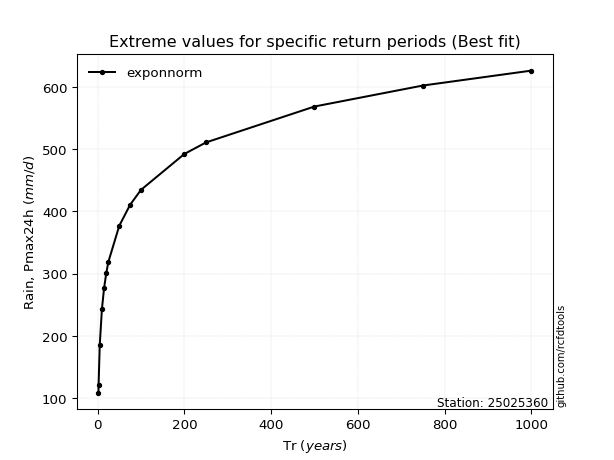</img>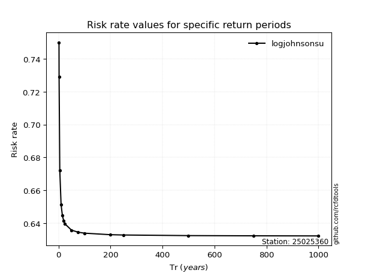</img>

</div>


<sub>**APP DISCLAIMER**: NO WARRANTY - This software is provided by [github.com/rcfdtools](https://github.com/rcfdtools) "as is", without any express or implied warranty, including warranties of merchantability, fitness for a particular purpose, or non-infringement. There is no guarantee that the software will be error-free or operate without interruption. LIMITATION OF LIABILITY - Neither the authors nor copyright holders will be liable for claims or damages arising from the software or its use. You are responsible for determining if the software is appropriate for your use and assume all associated risks, including errors, legal compliance, and data loss. NO PROFESSIONAL ADVICE - The software provides general information and does not offer professional advice. It should not replace consultation with professional advisors.</sub>