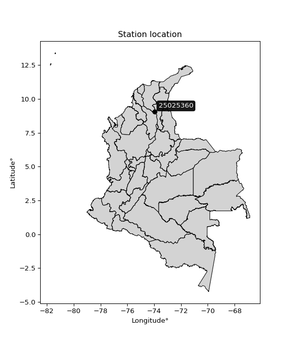

<div align="center">


</div>

# PMP Station (rain, Pmax24h): 25025360

Probable Maximum Precipitation (PMP) is the greatest amount of rainfall for a specific duration that is meteorologically possible for a given location, acting as a "worst-case" scenario for extreme storms, crucial for designing safety-critical infrastructure like bridges, river deviations, dams, spillways, and nuclear plants to prevent catastrophic failure. PMP is calculated by hydrologists using meteorological data to determine the upper limit of extreme rainfall, often leading to the Probable Maximum Flood (PMF) for flood control design, and is increasingly being studied for climate change impacts.

<div align="center">

</img>

</div>


## A. General information


### 1. General running parameters

• app_version: _v20251228_. • runtime: _2025-12-28 08:43:48.795225_. • Python version: _3.14.0_. • SciPy version: _1.16.3_. • Pandas version: _2.3.3_. • NumPy version: _2.3.5_. • Stations dataset (station_dataset_file): _dataset/pmax24h_in/automatic_colombia_2003_2024.csv_. • Stations catalog (station_catalog_file): _dataset/CNE_IDEAM.xls_. • Minimum year to eval til year_max (date_min): _1900_. • Maximum year to eval since year_min (date_max): _2024_. • Creates, save and include plots into reports (create_plot): _False_. • Plot only fit distributions with Δo > Δ (plot_only_fit): _True_. • Eval low extreme values, if False, evaluates high extreme values (low_extreme): _False_. • Eval every SciPy distribution as logarithmic (pdist_logarithmic_on): _True_. • Standard deviation normalized (ddof): _1.0_. • Return periods to eval in years (Tr): _[2, 2.33, 5, 10, 15, 20, 25, 50, 75, 100, 200, 250, 500, 750, 1000]_. • Minimum data sample per station, 0 means any (minimum_sample): _5_. • Z-Score maximum threshold to adjust a value, 0 means disable (zscore_max): _3.5_. • Z-Score minimum threshold to adjust a value, 0 means disable (zscore_min): _-2.5_. • Avoid zeros, e.g. rain = 0 (avoid_zeros): _True_. • Avoid null values (avoid_nans): _True_. [:file_folder:Dataset file.](../../dataset/pmax24h_in/automatic_colombia_2003_2024.csv)

> Delta Degrees of Freedom (DDOF): is a parameter used in the formulas for calculating variance and standard deviation. When ddof=0, the divisor is $N$ (the total number of observations) and this is used when your data set is the entire population. When ddof=1, the divisor is $N-1$ and this is used when your data set is a sample drawn from a larger population. Using $N-1$ provides an unbiased estimate of the population variance (known as Bessel´s correction).


### 2. Station info and location

|   id |   CODIGO | NOMBRE                                  | CATEGORIA               | TECNOLOGIA                              | ESTADO   | FECHA_INSTALACION   |   FECHA_SUSPENSION |   ALTITUD |   LATITUD |   LONGITUD | DEPARTAMENTO   | MUNICIPIO   | AREA_OPERATIVA                                         | ENTIDAD                                                     | AREA_HIDROGRAFICA   | ZONA_HIDROGRAFICA   | SUBZONA_HIDROGRAFICA                              |   CORRIENTE | Catalogo   |
|-----:|---------:|:----------------------------------------|:------------------------|:----------------------------------------|:---------|:--------------------|-------------------:|----------:|----------:|-----------:|:---------------|:------------|:-------------------------------------------------------|:------------------------------------------------------------|:--------------------|:--------------------|:--------------------------------------------------|------------:|:-----------|
|    0 | 25025360 | AEROPUERTO LAS FLORES  - AUT [25025360] | Climatológica Principal | Automática con Telemetría, Convencional | Activa   | 05/05/2013          |                nan |        34 |   9.04633 |   -73.9708 | Magdalena      | El Banco    | Area Operativa 05 - Magdalena-Cesar-Guajira-San Andrés | INSTITUTO DE HIDROLOGIA METEOROLOGIA Y ESTUDIOS AMBIENTALES | Magdalena Cauca     | Bajo Magdalena      | Directos Bajo Magdalena entre El Banco y El Plato |         nan | CNE_IDEAM  |

<div align="center">

Map location in: [:earth_americas:Google](http://maps.google.com/maps?q=9.046333333,-73.97083333) [:earth_americas:OSM](https://www.openstreetmap.org/#map=18/9.046333333/-73.97083333&layers=P) [:earth_americas:Bing](https://www.bing.com/maps?cp=9.046333333~-73.97083333&lvl=18) [:earth_americas:Apple](https://maps.apple.com/frame?center=9.046333333%2C-73.97083333&span=0.003%2C0.006)

</div>


<div align="center">

```geojson
{
  "type": "Feature",
  "geometry": {
    "type": "Point", 
    "coordinates": [-73.97083333, 9.046333333]
  }, 
  "properties": {
    "Name": "25025360"
  }
}
```

</div>


### 3. Discrete values table and plot

|               |          0 |          1 |           2 |           3 |          4 |            5 |           6 |           7 |
|:--------------|-----------:|-----------:|------------:|------------:|-----------:|-------------:|------------:|------------:|
| Date          | 2017       | 2018       | 2019        | 2020        | 2021       | 2022         | 2023        | 2024        |
| Value         |  178.68    |  329.9     |   80.2      |   90.8      |   14       |  131.2       |   62.3      |  131        |
| Value_initial |  178.68    |  329.9     |   80.2      |   90.8      |   14       |  131.2       |   62.3      |  131        |
| count         |    8       |    8       |    8        |    8        |    8       |    8         |    8        |    8        |
| mean          |  127.26    |  127.26    |  127.26     |  127.26     |  127.26    |  127.26      |  127.26     |  127.26     |
| std           |   95.8631  |   95.8631  |   95.8631   |   95.8631   |   95.8631  |   95.8631    |   95.8631   |   95.8631   |
| zscore        |    0.53639 |    2.11385 |   -0.490909 |   -0.380334 |   -1.18148 |    0.0411003 |   -0.677633 |    0.039014 |

> The initial value (value_initial) correspond to the initial obtained or null completed value, and value (value) is adjusted only when the initial value is outside the valid range definite through the Z-Score value. If Z-Score is active, values out of range or outliers are replaced with the station mean value


### 4. Active continuous probability distributions from SciPy (44 of 104 available)

[scipy.stats](https://docs.scipy.org/doc/scipy/reference/stats.html) is a Python´s powerful submodule within the SciPy library for comprehensive statistical analysis, offering over 130 probability distributions (like Normal, Poisson), functions for descriptive stats (mean, variance), hypothesis testing (t-tests, chi-square), random variable generation, and statistical tests, making it essential for data science, modeling, and research. It provides tools to explore, model, and draw conclusions from data efficiently, working seamlessly with NumPy.

<div align="center">

|   id | p_dist             |   n_parameter | fit_method   | label                                                                       | active   | ref                                                                                                        |
|-----:|:-------------------|--------------:|:-------------|:----------------------------------------------------------------------------|:---------|:-----------------------------------------------------------------------------------------------------------|
|    0 | alpha              |             3 | MLE          | Alpha                                                                       | True     | [:mortar_board:](https://docs.scipy.org/doc/scipy/reference/generated/scipy.stats.alpha.html)              |
|    1 | betaprime          |             4 | MLE          | Beta prime                                                                  | True     | [:mortar_board:](https://docs.scipy.org/doc/scipy/reference/generated/scipy.stats.betaprime.html)          |
|    2 | chi2               |             3 | MLE          | Chi²                                                                        | True     | [:mortar_board:](https://docs.scipy.org/doc/scipy/reference/generated/scipy.stats.chi2.html)               |
|    3 | crystalball        |             4 | MLE          | Crystalball                                                                 | True     | [:mortar_board:](https://docs.scipy.org/doc/scipy/reference/generated/scipy.stats.crystalball.html)        |
|    4 | erlang             |             3 | MLE          | Erlang                                                                      | True     | [:mortar_board:](https://docs.scipy.org/doc/scipy/reference/generated/scipy.stats.erlang.html)             |
|    5 | expon              |             2 | MLE          | Exponential                                                                 | True     | [:mortar_board:](https://docs.scipy.org/doc/scipy/reference/generated/scipy.stats.expon.html)              |
|    6 | exponnorm          |             3 | MLE          | Exponentially modified Normal                                               | True     | [:mortar_board:](https://docs.scipy.org/doc/scipy/reference/generated/scipy.stats.exponnorm.html)          |
|    7 | f                  |             4 | MLE          | F                                                                           | True     | [:mortar_board:](https://docs.scipy.org/doc/scipy/reference/generated/scipy.stats.f.html)                  |
|    8 | fatiguelife        |             3 | MLE          | Fatigue-life (Birnbaum-Saunders)                                            | True     | [:mortar_board:](https://docs.scipy.org/doc/scipy/reference/generated/scipy.stats.fatiguelife.html)        |
|    9 | fisk               |             3 | MLE          | Fisk                                                                        | True     | [:mortar_board:](https://docs.scipy.org/doc/scipy/reference/generated/scipy.stats.fisk.html)               |
|   10 | gamma              |             3 | MLE          | Gamma                                                                       | True     | [:mortar_board:](https://docs.scipy.org/doc/scipy/reference/generated/scipy.stats.gamma.html)              |
|   11 | genexpon           |             5 | MLE          | Generalized exponential                                                     | True     | [:mortar_board:](https://docs.scipy.org/doc/scipy/reference/generated/scipy.stats.genexpon.html)           |
|   12 | genlogistic        |             3 | MLE          | Generalized logistic                                                        | True     | [:mortar_board:](https://docs.scipy.org/doc/scipy/reference/generated/scipy.stats.genlogistic.html)        |
|   13 | gibrat             |             2 | MM           | Gibrat                                                                      | True     | [:mortar_board:](https://docs.scipy.org/doc/scipy/reference/generated/scipy.stats.gibrat.html)             |
|   14 | gompertz           |             3 | MLE          | Gompertz (or truncated Gumbel)                                              | True     | [:mortar_board:](https://docs.scipy.org/doc/scipy/reference/generated/scipy.stats.gompertz.html)           |
|   15 | gumbel_l           |             2 | MM           | Gumbel Left Skew                                                            | True     | [:mortar_board:](https://docs.scipy.org/doc/scipy/reference/generated/scipy.stats.gumbel_l.html)           |
|   16 | gumbel_r           |             2 | MM           | Gumbel Right Skew                                                           | True     | [:mortar_board:](https://docs.scipy.org/doc/scipy/reference/generated/scipy.stats.gumbel_r.html)           |
|   17 | halflogistic       |             2 | MM           | Half-logistic                                                               | True     | [:mortar_board:](https://docs.scipy.org/doc/scipy/reference/generated/scipy.stats.halflogistic.html)       |
|   18 | halfnorm           |             2 | MM           | Half Normal                                                                 | True     | [:mortar_board:](https://docs.scipy.org/doc/scipy/reference/generated/scipy.stats.halfnorm.html)           |
|   19 | hypsecant          |             2 | MM           | hyperbolic secant                                                           | True     | [:mortar_board:](https://docs.scipy.org/doc/scipy/reference/generated/scipy.stats.hypsecant.html)          |
|   20 | invgamma           |             3 | MLE          | Inverted gamma                                                              | True     | [:mortar_board:](https://docs.scipy.org/doc/scipy/reference/generated/scipy.stats.invgamma.html)           |
|   21 | invgauss           |             3 | MLE          | Inverse Gaussian                                                            | True     | [:mortar_board:](https://docs.scipy.org/doc/scipy/reference/generated/scipy.stats.invgauss.html)           |
|   22 | invweibull         |             3 | MLE          | Inverted Weibull                                                            | True     | [:mortar_board:](https://docs.scipy.org/doc/scipy/reference/generated/scipy.stats.invweibull.html)         |
|   23 | johnsonsu          |             4 | MLE          | Johnson Su                                                                  | True     | [:mortar_board:](https://docs.scipy.org/doc/scipy/reference/generated/scipy.stats.johnsonsu.html)          |
|   24 | kstwobign          |             2 | MLE          | Limiting distribution of scaled Kolmogorov-Smirnov two-sided test statistic | True     | [:mortar_board:](https://docs.scipy.org/doc/scipy/reference/generated/scipy.stats.kstwobign.html)          |
|   25 | laplace            |             2 | MM           | Laplace                                                                     | True     | [:mortar_board:](https://docs.scipy.org/doc/scipy/reference/generated/scipy.stats.laplace.html)            |
|   26 | laplace_asymmetric |             3 | MLE          | Asymmetric Laplace                                                          | True     | [:mortar_board:](https://docs.scipy.org/doc/scipy/reference/generated/scipy.stats.laplace_asymmetric.html) |
|   27 | loggamma           |             3 | MLE          | Log gamma                                                                   | True     | [:mortar_board:](https://docs.scipy.org/doc/scipy/reference/generated/scipy.stats.loggamma.html)           |
|   28 | logistic           |             2 | MM           | Logistic (or Sech-squared)                                                  | True     | [:mortar_board:](https://docs.scipy.org/doc/scipy/reference/generated/scipy.stats.logistic.html)           |
|   29 | lognorm            |             3 | MLE          | Log Normal                                                                  | True     | [:mortar_board:](https://docs.scipy.org/doc/scipy/reference/generated/scipy.stats.lognorm.html)            |
|   30 | maxwell            |             2 | MM           | Maxwell                                                                     | True     | [:mortar_board:](https://docs.scipy.org/doc/scipy/reference/generated/scipy.stats.maxwell.html)            |
|   31 | mielke             |             4 | MLE          | Mielke Beta-Kappa / Dagum                                                   | True     | [:mortar_board:](https://docs.scipy.org/doc/scipy/reference/generated/scipy.stats.mielke.html)             |
|   32 | moyal              |             2 | MM           | Moyal                                                                       | True     | [:mortar_board:](https://docs.scipy.org/doc/scipy/reference/generated/scipy.stats.moyal.html)              |
|   33 | nakagami           |             3 | MLE          | Nakagami                                                                    | True     | [:mortar_board:](https://docs.scipy.org/doc/scipy/reference/generated/scipy.stats.nakagami.html)           |
|   34 | ncf                |             5 | MLE          | Non-central F distribution                                                  | True     | [:mortar_board:](https://docs.scipy.org/doc/scipy/reference/generated/scipy.stats.ncf.html)                |
|   35 | nct                |             4 | MLE          | Non-central Student’s t                                                     | True     | [:mortar_board:](https://docs.scipy.org/doc/scipy/reference/generated/scipy.stats.nct.html)                |
|   36 | norm               |             2 | MM           | Normal                                                                      | True     | [:mortar_board:](https://docs.scipy.org/doc/scipy/reference/generated/scipy.stats.norm.html)               |
|   37 | pearson3           |             3 | MM           | Pearson type III                                                            | True     | [:mortar_board:](https://docs.scipy.org/doc/scipy/reference/generated/scipy.stats.pearson3.html)           |
|   38 | rayleigh           |             2 | MM           | Rayleigh                                                                    | True     | [:mortar_board:](https://docs.scipy.org/doc/scipy/reference/generated/scipy.stats.rayleigh.html)           |
|   39 | rice               |             3 | MLE          | Rice                                                                        | True     | [:mortar_board:](https://docs.scipy.org/doc/scipy/reference/generated/scipy.stats.rice.html)               |
|   40 | t                  |             3 | MLE          | Student’s t                                                                 | True     | [:mortar_board:](https://docs.scipy.org/doc/scipy/reference/generated/scipy.stats.t.html)                  |
|   41 | truncnorm          |             4 | MLE          | Truncated normal                                                            | True     | [:mortar_board:](https://docs.scipy.org/doc/scipy/reference/generated/scipy.stats.truncnorm.html)          |
|   42 | wald               |             2 | MM           | Wald                                                                        | True     | [:mortar_board:](https://docs.scipy.org/doc/scipy/reference/generated/scipy.stats.wald.html)               |
|   43 | weibull_min        |             3 | MLE          | Weibull minimum                                                             | True     | [:mortar_board:](https://docs.scipy.org/doc/scipy/reference/generated/scipy.stats.weibull_min.html)        |

</div>

> **n_parameter:** # arguments & localization & scale.
>
> **Fit methods:** (MLE) maximum likelihood, (MM) L-moments.
>
>**Inactive:** foldnorm, gennorm, norminvgauss, powernorm, powerlognorm, skewnorm, genextreme, anglit, arcsine, argus, beta, bradford, burr, burr12, cauchy, cosine, halfcauchy, foldcauchy, skewcauchy, wrapcauchy, dgamma, gengamma, exponweib, exponpow, truncexpon, gausshyper, genhalflogistic, genhyperbolic, geninvgauss, halfgennorm, johnsonsb, kappa4, kappa3, ksone, kstwo, loglaplace, levy, levy_l, levy_stable, ncx2, pareto, genpareto, truncpareto, lomax, powerlaw, rdist, rel_breitwigner, recipinvgauss, semicircular, studentized_range, trapezoid, triang, truncweibull_min, tukeylambda, uniform, loguniform, vonmises, vonmises_line, weibull_max, dweibull, 


## B. Probability distributions vs. Empirical distributions

A continuous probability distribution (CPD) describes probabilities for variables that can take any value within a range (like rain any time), unlike discrete variables with specific outcomes (like temperature). It uses a Probability Density Function (PDF), a curve where the total area under it equals 1, and the probability of the variable falling within an interval (a to b) is found by calculating the area under the curve between those points. A key feature is that the probability of hitting any single exact value is zero, so probabilities are always expressed for ranges, e.g., $P(a ≤ X ≤ b)$.

<div align="center">

Distributions parameters from station values
|    |   station | p_dist                |   n |              loc |           scale | shape                  | shape1                | shape2             | shape3   |
|---:|----------:|:----------------------|----:|-----------------:|----------------:|:-----------------------|:----------------------|:-------------------|:---------|
|  0 |  25025360 | alpha                 |   8 |     -0.107108    |    37.4789      | 1.4315066368941414e-11 |                       |                    |          |
|  1 |  25025360 | betaprime             |   8 |     -4.84381     |  3582.66        | 2.218039180052096      | 61.975983094560945    |                    |          |
|  2 |  25025360 | chi2                  |   8 |     14           |     7.31452     | 0.3185157523349623     |                       |                    |          |
|  3 |  25025360 | crystalball           |   8 |    127.26        |    89.6717      | 11430.815078883508     | 4393.065817394248     |                    |          |
|  4 |  25025360 | erlang                |   8 |     14           |    99.4763      | 0.9806786905537637     |                       |                    |          |
|  5 |  25025360 | expon                 |   8 |     14           |   113.26        |                        |                       |                    |          |
|  6 |  25025360 | exponnorm             |   8 |     44.0946      |    34.8638      | 2.3854366134330447     |                       |                    |          |
|  7 |  25025360 | f                     |   8 |     14           |    93.1403      | 0.9609233778135842     | 6769.349482500682     |                    |          |
|  8 |  25025360 | fatiguelife           |   8 |     14           |     0.00117892  | 297.0392127045051      |                       |                    |          |
|  9 |  25025360 | fisk                  |   8 |    -39.8556      |   146.853       | 3.3668838982881333     |                       |                    |          |
| 10 |  25025360 | gamma                 |   8 |     14           |   133.462       | 0.7145884318624813     |                       |                    |          |
| 11 |  25025360 | genexpon              |   8 |     14           |     2.70818     | 0.023909990434028583   | 7.473252235919647e-08 | 2.887887506762923  |          |
| 12 |  25025360 | genlogistic           |   8 |   -319.752       |    64.614       | 549.5992018690072      |                       |                    |          |
| 13 |  25025360 | gibrat                |   8 |     58.8518      |    41.4917      |                        |                       |                    |          |
| 14 |  25025360 | gompertz              |   8 |     13.9999      |   335.675       | 2.1827969169683303     |                       |                    |          |
| 15 |  25025360 | gumbel_l              |   8 |    167.617       |    69.9167      |                        |                       |                    |          |
| 16 |  25025360 | gumbel_r              |   8 |     86.903       |    69.9167      |                        |                       |                    |          |
| 17 |  25025360 | halflogistic          |   8 |     20.9782      |    76.6661      |                        |                       |                    |          |
| 18 |  25025360 | halfnorm              |   8 |      8.56982     |   148.756       |                        |                       |                    |          |
| 19 |  25025360 | hypsecant             |   8 |    127.26        |    57.0868      |                        |                       |                    |          |
| 20 |  25025360 | invgamma              |   8 |   -101.122       |  1580.65        | 7.910658224607941      |                       |                    |          |
| 21 |  25025360 | invgauss              |   8 |    -54.7666      |   723.516       | 0.2515862327413984     |                       |                    |          |
| 22 |  25025360 | invweibull            |   8 |   -506.053       |   590.404       | 9.51177383501716       |                       |                    |          |
| 23 |  25025360 | johnsonsu             |   8 |    -48.9166      |     5.77437     | -8.083345171171661     | 2.0256119081697985    |                    |          |
| 24 |  25025360 | kstwobign             |   8 |   -148.397       |   318.65        |                        |                       |                    |          |
| 25 |  25025360 | laplace               |   8 |    127.26        |    63.4075      |                        |                       |                    |          |
| 26 |  25025360 | laplace_asymmetric    |   8 |     80.2         |    53.7164      | 0.6536903687144521     |                       |                    |          |
| 27 |  25025360 | loggamma              |   8 | -26841.7         |  3650.96        | 1614.9652910377336     |                       |                    |          |
| 28 |  25025360 | logistic              |   8 |    127.26        |    49.4386      |                        |                       |                    |          |
| 29 |  25025360 | lognorm               |   8 |     14           |     0.864221    | 12.793577922897432     |                       |                    |          |
| 30 |  25025360 | maxwell               |   8 |    -85.2243      |   133.155       |                        |                       |                    |          |
| 31 |  25025360 | mielke                |   8 |     14           |   171.41        | 0.8919182745336781     | 2.496720699654593     |                    |          |
| 32 |  25025360 | moyal                 |   8 |     75.98        |    40.3664      |                        |                       |                    |          |
| 33 |  25025360 | nakagami              |   8 |     62.3         |   113.336       | 0.2576974266073577     |                       |                    |          |
| 34 |  25025360 | ncf                   |   8 |     -0.549179    |    48.492       | 2.713718422291773      | 80.62456045367148     | 4.282928006321056  |          |
| 35 |  25025360 | nct                   |   8 |     -0.135398    |    49.1662      | 3.6893716207539797     | 2.027258021486703     |                    |          |
| 36 |  25025360 | norm                  |   8 |    127.26        |    89.6717      |                        |                       |                    |          |
| 37 |  25025360 | pearson3              |   8 |    127.26        |    89.6718      | 1.1402359248131608     |                       |                    |          |
| 38 |  25025360 | rayleigh              |   8 |    -44.2872      |   136.875       |                        |                       |                    |          |
| 39 |  25025360 | rice                  |   8 |    -22.4355      |   123.389       | 0.00032570761890396134 |                       |                    |          |
| 40 |  25025360 | t                     |   8 |    127.239       |    89.6495      | 5353.958013834457      |                       |                    |          |
| 41 |  25025360 | truncnorm             |   8 |     18.9123      |     4.55972     | -11.734772552900424    | 68.20318847112685     |                    |          |
| 42 |  25025360 | wald                  |   8 |     37.5883      |    89.6717      |                        |                       |                    |          |
| 43 |  25025360 | weibull_min           |   8 |     14           |   128.844       | 0.9044117998237463     |                       |                    |          |
| 44 |  25025360 | logalpha              |   8 |    -23.7562      |   895.756       | 31.67308107363568      |                       |                    |          |
| 45 |  25025360 | logbetaprime          |   8 |    -14.4165      |    83.7454      | 542.0336205292201      | 2394.9374528149747    |                    |          |
| 46 |  25025360 | logchi2               |   8 |      2.63906     |     0.960483    | 1.146546476341468      |                       |                    |          |
| 47 |  25025360 | logcrystalball        |   8 |      4.77972     |     0.583685    | 0.8867181602129873     | 14.144359472617518    |                    |          |
| 48 |  25025360 | logerlang             |   8 |    -10.7081      |     0.0518695   | 293.9120264409628      |                       |                    |          |
| 49 |  25025360 | logexpon              |   8 |      2.63906     |     1.91101     |                        |                       |                    |          |
| 50 |  25025360 | logexponnorm          |   8 |      4.54975     |     0.86829     | 0.0003624847433683911  |                       |                    |          |
| 51 |  25025360 | logf                  |   8 |   -829.649       |   834.2         | 17355384.983762145     | 2048535.9365810184    |                    |          |
| 52 |  25025360 | logfatiguelife        |   8 |   -513.458       |   518.007       | 0.001671826560424579   |                       |                    |          |
| 53 |  25025360 | logfisk               |   8 |     -5.13769e+07 |     5.13769e+07 | 111503997.8941957      |                       |                    |          |
| 54 |  25025360 | loggamma              |   8 |    -11.4132      |     0.0509341   | 313.24082732433067     |                       |                    |          |
| 55 |  25025360 | loggenexpon           |   8 |      2.63906     |     1.21179e+10 | 2326346825.812521      | 13264904563.147564    | 3776643062.270815  |          |
| 56 |  25025360 | loggenlogistic        |   8 |      5.10556     |     0.295534    | 0.414231353053392      |                       |                    |          |
| 57 |  25025360 | loggibrat             |   8 |      3.88769     |     0.401754    |                        |                       |                    |          |
| 58 |  25025360 | loggompertz           |   8 |      2.63906     |     0.777487    | 0.05715378502081704    |                       |                    |          |
| 59 |  25025360 | loggumbel_l           |   8 |      4.94084     |     0.677008    |                        |                       |                    |          |
| 60 |  25025360 | loggumbel_r           |   8 |      4.15928     |     0.677008    |                        |                       |                    |          |
| 61 |  25025360 | loghalflogistic       |   8 |      3.52093     |     0.742361    |                        |                       |                    |          |
| 62 |  25025360 | loghalfnorm           |   8 |      3.40077     |     1.44042     |                        |                       |                    |          |
| 63 |  25025360 | loghypsecant          |   8 |      4.55006     |     0.552775    |                        |                       |                    |          |
| 64 |  25025360 | loginvgamma           |   8 |    -16.4325      | 11388.6         | 544.3153384394653      |                       |                    |          |
| 65 |  25025360 | loginvgauss           |   8 |     -4.14654     |   737.817       | 0.011773089902084324   |                       |                    |          |
| 66 |  25025360 | loginvweibull         |   8 |     -1.15095e+08 |     1.15095e+08 | 115700825.77588922     |                       |                    |          |
| 67 |  25025360 | logjohnsonsu          |   8 |      5.05492     |     0.774451    | 0.6158285768315441     | 1.3160493040381847    |                    |          |
| 68 |  25025360 | logkstwobign          |   8 |      0.471449    |     4.67407     |                        |                       |                    |          |
| 69 |  25025360 | loglaplace            |   8 |      4.55006     |     0.613978    |                        |                       |                    |          |
| 70 |  25025360 | loglaplace_asymmetric |   8 |      4.87672     |     0.566698    | 1.3296310762212533     |                       |                    |          |
| 71 |  25025360 | logloggamma           |   8 |      4.83828     |     0.738838    | 1.1238318147374056     |                       |                    |          |
| 72 |  25025360 | loglogistic           |   8 |      4.55006     |     0.478717    |                        |                       |                    |          |
| 73 |  25025360 | loglognorm            |   8 |      2.63906     |     0.0233081   | 11.942448002244355     |                       |                    |          |
| 74 |  25025360 | logmaxwell            |   8 |      2.49257     |     1.28935     |                        |                       |                    |          |
| 75 |  25025360 | logmielke             |   8 |     -2.98547e+06 |     2.98547e+06 | 4151211.968531559      | 10109176.44479331     |                    |          |
| 76 |  25025360 | logmoyal              |   8 |      4.05352     |     0.390871    |                        |                       |                    |          |
| 77 |  25025360 | lognakagami           |   8 |      4.13196     |     0.624332    | 0.07916343583340989    |                       |                    |          |
| 78 |  25025360 | logncf                |   8 |    -18.6949      |    10.343       | 1513.7815945663665     | 3357.0413134970654    | 1886.8508530997221 |          |
| 79 |  25025360 | lognct                |   8 |     50.0391      |     0.825016    | 14996.392106505024     | -55.13435669945173    |                    |          |
| 80 |  25025360 | lognorm               |   8 |      4.55006     |     0.868296    |                        |                       |                    |          |
| 81 |  25025360 | logpearson3           |   8 |      4.55006     |     0.868297    | -0.9133698632767941    |                       |                    |          |
| 82 |  25025360 | lograyleigh           |   8 |      2.88899     |     1.32535     |                        |                       |                    |          |
| 83 |  25025360 | logrice               |   8 |   -204.973       |     0.867902    | 241.4106738770189      |                       |                    |          |
| 84 |  25025360 | logt                  |   8 |      4.69082     |     0.531776    | 2.412287265420761      |                       |                    |          |
| 85 |  25025360 | logtruncnorm          |   8 |      0.0609563   |     2.30704     | 1.7645989396406985     | 2.4870966341514493    |                    |          |
| 86 |  25025360 | logwald               |   8 |      3.6818      |     0.86827     |                        |                       |                    |          |
| 87 |  25025360 | logweibull_min        |   8 |    -25.9118      |    30.848       | 44.48335604164865      |                       |                    |          |

</div>

> **loc** (Location parameter): This shifts the distribution along the x-axis. For many common distributions, like the normal (Gaussian) distribution, loc represents the mean $μ$. For others, like the uniform distribution, it might represent the minimum value, or for the beta distribution, the left end of the support interval.
>
> **scale** (Scale parameter): This determines the width or spread of the distribution. For the normal distribution, scale represents the standard deviation $σ$. For a uniform distribution, it defines the length of the interval (from $loc$ to $loc + scale$).
>
> **shape** (Shape parameters): Refers to parameters that define the specific form of a probability distribution, distinct from its location (loc) and scale (scale). These parameters are required arguments for most distribution functions. For example, a normal (Gaussian) distribution is fully defined by its location (mean) and scale (standard deviation), so it has no specific shape parameters beyond loc and scale. However, other distributions have intrinsic properties that need specification, as Gamma distribution that takes a shape parameter, often named $a$ or $alpha$.


### 0. Cumulative distribution values - CDF (88 evaluated)

Cumulative Distribution Function (CDF), denoted as $F$<sub>$X$</sub>$(x)$, is a function that gives the probability that a random variable $X$ will take a value less than or equal to a specific value, $x$ (i.e., $(P(X≥x)$. It essentially "accumulates" probabilities from a given point up to the far right (positive infinity), providing a complete picture of the distribution´s probabilities for both discrete (like rain) and continuous (like temperature) variables, helping to find probabilities over ranges or above certain values.

<div align="center">

CDF ordered by x ascending and calculating $log(f(x))$ separately
|   id |   Station |   date |      x |   count |   mean |     std |     zscore |   Value_initial |   station |   m |      alpha |   alpha_pdf |   betaprime |   betaprime_pdf |       chi2 |    chi2_pdf |   crystalball |   crystalball_pdf |     erlang |   erlang_pdf |    expon |   expon_pdf |   exponnorm |   exponnorm_pdf |           f |       f_pdf |   fatiguelife |   fatiguelife_pdf |      fisk |    fisk_pdf |      gamma |     gamma_pdf |    genexpon |   genexpon_pdf |   genlogistic |   genlogistic_pdf |     gibrat |   gibrat_pdf |   gompertz |   gompertz_pdf |   gumbel_l |   gumbel_l_pdf |   gumbel_r |   gumbel_r_pdf |   halflogistic |   halflogistic_pdf |   halfnorm |   halfnorm_pdf |   hypsecant |   hypsecant_pdf |   invgamma |   invgamma_pdf |   invgauss |   invgauss_pdf |   invweibull |   invweibull_pdf |   johnsonsu |   johnsonsu_pdf |   kstwobign |   kstwobign_pdf |   laplace |   laplace_pdf |   laplace_asymmetric |   laplace_asymmetric_pdf |   loggamma |   loggamma_pdf |   logistic |   logistic_pdf |   lognorm |   lognorm_pdf |   maxwell |   maxwell_pdf |      mielke |   mielke_pdf |     moyal |   moyal_pdf |    nakagami |     nakagami_pdf |       ncf |     ncf_pdf |       nct |     nct_pdf |     norm |    norm_pdf |   pearson3 |   pearson3_pdf |   rayleigh |   rayleigh_pdf |      rice |    rice_pdf |        t |       t_pdf |   truncnorm |   truncnorm_pdf |     wald |    wald_pdf |   weibull_min |   weibull_min_pdf |   logalpha |   logalpha_pdf |   logbetaprime |   logbetaprime_pdf |     logchi2 |   logchi2_pdf |   logcrystalball |   logcrystalball_pdf |   logerlang |   logerlang_pdf |   logexpon |   logexpon_pdf |   logexponnorm |   logexponnorm_pdf |      logf |   logf_pdf |   logfatiguelife |   logfatiguelife_pdf |   logfisk |   logfisk_pdf |   loggenexpon |   loggenexpon_pdf |   loggenlogistic |   loggenlogistic_pdf |   loggibrat |   loggibrat_pdf |   loggompertz |   loggompertz_pdf |   loggumbel_l |   loggumbel_l_pdf |   loggumbel_r |   loggumbel_r_pdf |   loghalflogistic |   loghalflogistic_pdf |   loghalfnorm |   loghalfnorm_pdf |   loghypsecant |   loghypsecant_pdf |   loginvgamma |   loginvgamma_pdf |   loginvgauss |   loginvgauss_pdf |   loginvweibull |   loginvweibull_pdf |   logjohnsonsu |   logjohnsonsu_pdf |   logkstwobign |   logkstwobign_pdf |   loglaplace |   loglaplace_pdf |   loglaplace_asymmetric |   loglaplace_asymmetric_pdf |   logloggamma |   logloggamma_pdf |   loglogistic |   loglogistic_pdf |   loglognorm |   loglognorm_pdf |   logmaxwell |   logmaxwell_pdf |   logmielke |   logmielke_pdf |    logmoyal |   logmoyal_pdf |   lognakagami |   lognakagami_pdf |    logncf |   logncf_pdf |    lognct |   lognct_pdf |   logpearson3 |   logpearson3_pdf |   lograyleigh |   lograyleigh_pdf |   logrice |   logrice_pdf |      logt |   logt_pdf |   logtruncnorm |   logtruncnorm_pdf |   logwald |   logwald_pdf |   logweibull_min |   logweibull_min_pdf |
|-----:|----------:|-------:|-------:|--------:|-------:|--------:|-----------:|----------------:|----------:|----:|-----------:|------------:|------------:|----------------:|-----------:|------------:|--------------:|------------------:|-----------:|-------------:|---------:|------------:|------------:|----------------:|------------:|------------:|--------------:|------------------:|----------:|------------:|-----------:|--------------:|------------:|---------------:|--------------:|------------------:|-----------:|-------------:|-----------:|---------------:|-----------:|---------------:|-----------:|---------------:|---------------:|-------------------:|-----------:|---------------:|------------:|----------------:|-----------:|---------------:|-----------:|---------------:|-------------:|-----------------:|------------:|----------------:|------------:|----------------:|----------:|--------------:|---------------------:|-------------------------:|-----------:|---------------:|-----------:|---------------:|----------:|--------------:|----------:|--------------:|------------:|-------------:|----------:|------------:|------------:|-----------------:|----------:|------------:|----------:|------------:|---------:|------------:|-----------:|---------------:|-----------:|---------------:|----------:|------------:|---------:|------------:|------------:|----------------:|---------:|------------:|--------------:|------------------:|-----------:|---------------:|---------------:|-------------------:|------------:|--------------:|-----------------:|---------------------:|------------:|----------------:|-----------:|---------------:|---------------:|-------------------:|----------:|-----------:|-----------------:|---------------------:|----------:|--------------:|--------------:|------------------:|-----------------:|---------------------:|------------:|----------------:|--------------:|------------------:|--------------:|------------------:|--------------:|------------------:|------------------:|----------------------:|--------------:|------------------:|---------------:|-------------------:|--------------:|------------------:|--------------:|------------------:|----------------:|--------------------:|---------------:|-------------------:|---------------:|-------------------:|-------------:|-----------------:|------------------------:|----------------------------:|--------------:|------------------:|--------------:|------------------:|-------------:|-----------------:|-------------:|-----------------:|------------:|----------------:|------------:|---------------:|--------------:|------------------:|----------:|-------------:|----------:|-------------:|--------------:|------------------:|--------------:|------------------:|----------:|--------------:|----------:|-----------:|---------------:|-------------------:|----------:|--------------:|-----------------:|---------------------:|
|    0 |  25025360 |   2021 |  14    |       8 | 127.26 | 95.8631 | -1.18148   |           14    |  25025360 |   1 | 0.00789009 | 0.00440728  |   0.0273926 |     0.00289588  | 0.00313907 | 2.81431e+11 |      0.103285 |       0.00200373  | 7.4837e-17 |  0.0206577   | 0        |  0.00882924 |   0.0374605 |     0.00188241  | 0.000131991 | 49.9784     |     0.0394683 |       1.72983e+07 | 0.0330092 | 0.00199551  | 9.5715e-13 | 385.04        | 9.16192e-08 |    0.00882881  |     0.0437205 |       0.00211183  | 0          |  0           | 9.5023e-07 |    0.0065027   |   0.105169 |    0.00142218  |  0.0586072 |    0.00237801  |       0        |        0           |  0.0291194 |    0.00536014  |   0.0870013 |     0.00150511  |  0.0343512 |     0.00224498 |   0.032916 |     0.00245497 |     0.035336 |      0.00216047  |   0.0330965 |      0.00236598 |   0.0425594 |     0.00222751  | 0.0837958 |   0.00132154  |            0.0454415 |              0.00129412  |  0.0145702 |       0.044608 |  0.0918775 |    0.00168767  | 0.0138727 |     0.0407774 | 0.0934138 |   0.00252072  | 3.91539e-08 |   0.0411045  | 0.0311744 | 0.00208938  | 0           |      0           | 0.0322205 | 0.00318668  | 0.0401291 | 0.00174698  | 0.103285 | 0.00200373  |  0.0505715 |    0.00282074  |  0.0866819 |    0.0028415   | 0.0426611 | 0.00229106  | 0.103298 | 0.00200387  |    0.140666 |    0.0489712    | 0        | 0           |   1.05534e-15 |       0.268656    |  0.0118132 |      0.0396144 |      0.0144993 |          0.0443256 | 1.22039e-09 |    1.5754e+06 |        0.0346986 |            0.0417143 |    0.013543 |       0.0426307 |   0        |       0.523285 |      0.0138719 |          0.0407757 | 0.0139674 |  0.0409829 |        0.0135912 |            0.0403168 |  0.012857 |     0.0275449 |   1.39826e-12 |          0.191976 |        0.0315167 |            0.0441645 |    0        |       0         |   2.15731e-08 |          0.073511 |     0.0328245 |         0.0476801 |   7.90673e-05 |         0.0011031 |          0        |              0        |      0        |          0        |       0.02006  |          0.0362656 |     0.0135754 |         0.0438533 |     0.0128366 |         0.0453855 |       0.0141501 |           0.0605686 |      0.0339118 |           0.039057 |      0.0174392 |          0.0842571 |    0.0222448 |        0.0362307 |               0.0327782 |                   0.0435013 |     0.0324117 |         0.0481268 |     0.0181292 |         0.0371839 |   0.00408073 |      2.27413e+12 |   0.00038857 |       0.00793698 |   0.0322061 |       0.0447713 | 1.01781e-09 |    4.97914e-08 |    0          |       0           | 0.0144756 |    0.0438881 | 0.0138885 |    0.0406154 |     0.0310452 |         0.0510831 |      0        |          0        | 0.0138371 |     0.0407058 | 0.0224558 |   0.023524 |    0           |           0        |  0        |     0         |         0.03148  |            0.0482669 |
|    1 |  25025360 |   2023 |  62.3  |       8 | 127.26 | 95.8631 | -0.677633  |           62.3  |  25025360 |   2 | 0.548137   | 0.00641122  |   0.263087  |     0.00578809  | 0.99809    | 0.000157898 |      0.234404 |       0.00342215  | 0.394149   |  0.00620149  | 0.347179 |  0.00576391 |   0.224664  |     0.00570628  | 0.535485    |  0.00448943 |     0.752193  |       0.00223119  | 0.227592  | 0.00579389  | 0.459025   |   0.00546716  | 0.347166    |    0.00576376  |     0.226643  |       0.00519966  | 0.00642984 |  0.00524251  | 0.286663   |    0.00535647  |   0.198864 |    0.00254061  |  0.241291  |    0.00490663  |       0.263152 |        0.00607016  |  0.282047  |    0.005025    |   0.197444  |     0.0032411   |  0.24138   |     0.0057254  |   0.249984 |     0.00571564 |     0.237808 |      0.00571627  |   0.246334  |      0.00573458 |   0.225566  |     0.00497119  | 0.179491  |   0.00283075  |            0.179819  |              0.00512102  |  0.330206  |       0.408833 |  0.211826  |    0.00337703  | 0.315073  |     0.409161  | 0.253578  |   0.00398156  | 0.318372    |   0.0056404  | 0.236156  | 0.00580412  | 3.47408e-09 | 251994           | 0.258093  | 0.00542256  | 0.221276  | 0.00569859  | 0.234404 | 0.00342215  |  0.254674  |    0.00510405  |  0.26155   |    0.00420125  | 0.210063  | 0.00439647  | 0.234436 | 0.00342285  |    1        |    1.90888e-21  | 0.139601 | 0.0118678   |   0.337499    |       0.00510766  |  0.327625  |      0.415884  |      0.328815  |          0.407975  | 0.751222    |    0.171503   |        0.23899   |            0.332745  |    0.329942 |       0.414572  |   0.54215  |       0.239586 |      0.31507   |          0.409162  | 0.314818  |  0.407752  |        0.315211  |            0.410644  |  0.249579 |     0.406476  |   0.458865    |          0.324264 |        0.251649  |            0.340106  |    0.309403 |       1.44303   |   0.283054    |          0.359548 |     0.261229  |         0.330389  |   0.353037    |         0.542942  |          0.389785 |              0.571197 |      0.388282 |          0.486965 |       0.279376 |          0.442972  |     0.337839  |         0.417053  |     0.348331  |         0.412368  |       0.386983  |           0.369325  |      0.237526  |           0.337649 |      0.428221  |          0.353638  |    0.253062  |        0.412168  |               0.237712  |                   0.315477  |     0.264726  |         0.334019  |     0.294551  |         0.434058  |   0.636196   |      0.0210591   |   0.34439    |       0.445798   |   0.252997  |       0.339405  | 0.365718    |    0.613246    |    0.00380037 |       6.77455e+11 | 0.325143  |    0.405014  | 0.314085  |    0.409086  |     0.274081  |         0.334485  |      0.355821 |          0.455835 | 0.314996  |     0.409306  | 0.193511  |   0.356415 |    1.40773e-06 |           1.12584  |  0.38097  |     0.984162  |         0.265637 |            0.33571   |
|    2 |  25025360 |   2019 |  80.2  |       8 | 127.26 | 95.8631 | -0.490909  |           80.2  |  25025360 |   3 | 0.640719   | 0.00415837  |   0.365917  |     0.00563839  | 0.99955    | 3.56344e-05 |      0.29986  |       0.00387658  | 0.495426   |  0.00514876  | 0.442613 |  0.0049213  |   0.332626  |     0.00621872  | 0.606075    |  0.00347502 |     0.787492  |       0.00174868  | 0.336631  | 0.0062626   | 0.54649    |   0.00436956  | 0.442598    |    0.00492121  |     0.324467  |       0.00564641  | 0.253177   |  0.014985    | 0.378651   |    0.00492129  |   0.249052 |    0.00307631  |  0.332666  |    0.00523677  |       0.368107 |        0.00563807  |  0.369859  |    0.00477656  |   0.263091  |     0.00410153  |  0.346237  |     0.00589193 |   0.353082 |     0.00572123 |     0.343207 |      0.005955    |   0.350441  |      0.00580776 |   0.317881  |     0.00527624  | 0.238037  |   0.00375408  |            0.299382  |              0.00852603  |  0.438084  |       0.440062 |  0.278505  |    0.00406444  | 0.4244    |     0.45118   | 0.327715  |   0.00427482  | 0.414653    |   0.00511138 | 0.342584  | 0.00597855  | 0.300608    |      0.00861127  | 0.355128  | 0.00536656  | 0.330171  | 0.00632744  | 0.29986  | 0.00387658  |  0.347359  |    0.00519599  |  0.338729  |    0.00439397  | 0.292451  | 0.0047698   | 0.299907 | 0.00387748  |    1        |    5.14643e-41  | 0.342773 | 0.0101646   |   0.421647    |       0.00432655  |  0.437146  |      0.44565   |      0.43653   |          0.439651  | 0.790481    |    0.140672   |        0.340892  |            0.477095  |    0.439373 |       0.446381  |   0.598832 |       0.209925 |      0.424397  |          0.451182  | 0.423744  |  0.449466  |        0.424916  |            0.452623  |  0.365233 |     0.503161  |   0.537952    |          0.300915 |        0.351602  |            0.453298  |    0.584112 |       0.785049  |   0.382705    |          0.428392 |     0.35575   |         0.418395  |   0.488221    |         0.517052  |          0.523866 |              0.488687 |      0.505369 |          0.438699 |       0.406069 |          0.55095   |     0.447282  |         0.443929  |     0.455248  |         0.428919  |       0.478786  |           0.354482  |      0.339151  |           0.47032  |      0.515015  |          0.331724  |    0.381835  |        0.621904  |               0.332368  |                   0.4411    |     0.359877  |         0.419346  |     0.414401  |         0.506924  |   0.641099   |      0.0179285   |   0.458775   |       0.45404    |   0.352649  |       0.451607  | 0.512596    |    0.539363    |    0.73765    |       0.456901    | 0.432267  |    0.438024  | 0.4235    |    0.451963  |     0.367966  |         0.408306  |      0.470941 |          0.450444 | 0.424367  |     0.451379  | 0.306934  |   0.544241 |    0.258076    |           0.92252  |  0.579763 |     0.617034  |         0.361132 |            0.420294  |
|    3 |  25025360 |   2020 |  90.8  |       8 | 127.26 | 95.8631 | -0.380334  |           90.8  |  25025360 |   4 | 0.680137   | 0.0033237   |   0.42452   |     0.0054055   | 0.999804   | 1.5239e-05  |      0.342153 |       0.00409596  | 0.547121   |  0.00461508  | 0.492412 |  0.00448161 |   0.398398  |     0.00614946  | 0.640552    |  0.00304577 |     0.804898  |       0.00154287  | 0.402881  | 0.00619923  | 0.590075   |   0.00386843  | 0.492397    |    0.00448155  |     0.384651  |       0.00568273  | 0.396901   |  0.0120678   | 0.429452   |    0.00466391  |   0.283449 |    0.00341593  |  0.388374  |    0.00525366  |       0.426297 |        0.00533659  |  0.41959   |    0.00460375  |   0.309263  |     0.00460444  |  0.408057  |     0.00574767 |   0.412813 |     0.00553019 |     0.405826 |      0.00583256  |   0.411201  |      0.00563518 |   0.373943  |     0.00528214  | 0.281349  |   0.00443716  |            0.384172  |              0.0074942   |  0.492984  |       0.44305  |  0.323555  |    0.00442705  | 0.480984  |     0.458932  | 0.373587  |   0.00437056  | 0.467091    |   0.00478051 | 0.405243  | 0.00581762  | 0.381269    |      0.00680606  | 0.411229  | 0.00520574  | 0.397408  | 0.0063152   | 0.342153 | 0.00409596  |  0.40206   |    0.00511008  |  0.385548  |    0.00443052  | 0.343673  | 0.00488145  | 0.34221  | 0.00409695  |    1        |    9.28517e-56  | 0.441404 | 0.00846704  |   0.46543     |       0.00394264  |  0.492656  |      0.447231  |      0.491395  |          0.442888  | 0.807146    |    0.128059   |        0.404099  |            0.538667  |    0.495045 |       0.449111  |   0.624063 |       0.196722 |      0.480981  |          0.458935  | 0.480055  |  0.457201  |        0.481669  |            0.460212  |  0.429643 |     0.531835  |   0.574477    |          0.287387 |        0.411375  |            0.509051  |    0.668382 |       0.584336  |   0.437753    |          0.457737 |     0.410306  |         0.460035  |   0.550533    |         0.485365  |          0.581855 |              0.445501 |      0.558191 |          0.41209  |       0.47618  |          0.574229  |     0.502501  |         0.4443    |     0.508347  |         0.425334  |       0.521995  |           0.341133  |      0.401728  |           0.537096 |      0.555321  |          0.31737   |    0.467394  |        0.761255  |               0.391893  |                   0.520098  |     0.414418  |         0.458757  |     0.478391  |         0.521254  |   0.643247   |      0.0167031   |   0.514691   |       0.445578   |   0.412184  |       0.506922  | 0.576395    |    0.487811    |    0.784945   |       0.321216    | 0.486979  |    0.442074  | 0.480207  |    0.460116  |     0.420745  |         0.44143   |      0.526087 |          0.436984 | 0.480977  |     0.459142  | 0.379767  |   0.625286 |    0.366958    |           0.832825 |  0.648373 |     0.493825  |         0.415757 |            0.45915   |
|    4 |  25025360 |   2024 | 131    |       8 | 127.26 | 95.8631 |  0.039014  |          131    |  25025360 |   5 | 0.774982   | 0.00167005  |   0.617196  |     0.00412484  | 0.999991   | 6.85211e-07 |      0.516634 |       0.00444505  | 0.699117   |  0.00305591  | 0.64407  |  0.00314259 |   0.616977  |     0.00452934  | 0.739488    |  0.00198908 |     0.855554  |       0.00103037  | 0.624737  | 0.00461989  | 0.716444   |   0.00253829  | 0.644053    |    0.0031426   |     0.59866   |       0.00475139  | 0.709947   |  0.00474486  | 0.597579   |    0.00370808  |   0.446952 |    0.00468523  |  0.587303  |    0.00447062  |       0.615382 |        0.00405202  |  0.589507  |    0.00382275  |   0.520839  |     0.00556395  |  0.614481  |     0.00439536 |   0.61077  |     0.00423473 |     0.615613 |      0.00445921  |   0.613109  |      0.00430756 |   0.574477  |     0.00454293  | 0.528639  |   0.00743384  |            0.622427  |              0.00459479  |  0.65042   |       0.405046 |  0.518903  |    0.00504955  | 0.645965  |     0.428346  | 0.548945  |   0.00422747  | 0.633139    |   0.00348386 | 0.612959  | 0.00439895  | 0.590648    |      0.00410844  | 0.600855  | 0.00415145  | 0.624788  | 0.00474906  | 0.516634 | 0.00444505  |  0.591851  |    0.00422623  |  0.559576  |    0.00412073  | 0.538447  | 0.00465151  | 0.51673  | 0.0044459   |    1        |    5.29792e-133 | 0.684233 | 0.00418093  |   0.600078    |       0.00283323  |  0.650734  |      0.404428  |      0.648902  |          0.40557   | 0.848289    |    0.0980312  |        0.618106  |            0.592027  |    0.654307 |       0.408584  |   0.689676 |       0.162388 |      0.645964  |          0.42835   | 0.644533  |  0.427152  |        0.646974  |            0.428765  |  0.625321 |     0.508493  |   0.671858    |          0.243271 |        0.619241  |            0.595039  |    0.815766 |       0.269608  |   0.615976    |          0.500946 |     0.596504  |         0.540922  |   0.706569    |         0.362501  |          0.722156 |              0.322277 |      0.69398  |          0.328043 |       0.677279 |          0.488818  |     0.65902   |         0.399186  |     0.656807  |         0.376253  |       0.637798  |           0.288349  |      0.622897  |           0.628798 |      0.662801  |          0.267897  |    0.705566  |        0.479551  |               0.637426  |                   0.845955  |     0.598601  |         0.531083  |     0.663555  |         0.46635   |   0.648822   |      0.013887    |   0.668029   |       0.38319    |   0.619206  |       0.593029  | 0.726672    |    0.33563     |    0.868945   |       0.166795    | 0.644637  |    0.407131  | 0.645775  |    0.4302    |     0.596024  |         0.503175  |      0.674681 |          0.367853 | 0.646031  |     0.428515  | 0.621612  |   0.624081 |    0.628879    |           0.605409 |  0.783532 |     0.270962  |         0.599729 |            0.529538  |
|    5 |  25025360 |   2022 | 131.2  |       8 | 127.26 | 95.8631 |  0.0411003 |          131.2  |  25025360 |   6 | 0.775315   | 0.00166517  |   0.61802   |     0.004118    | 0.999991   | 6.74938e-07 |      0.517523 |       0.00444463  | 0.699728   |  0.00304968  | 0.644698 |  0.00313705 |   0.617882  |     0.00451968  | 0.739885    |  0.00198527 |     0.85576   |       0.0010285   | 0.62566   | 0.00460994  | 0.716951   |   0.00253325  | 0.644681    |    0.00313705  |     0.599609  |       0.00474423  | 0.710894   |  0.00472449  | 0.59832    |    0.00370345  |   0.44789  |    0.00469069  |  0.588196  |    0.00446463  |       0.616192 |        0.00404551  |  0.590271  |    0.00381852  |   0.521952  |     0.00556264  |  0.615359  |     0.00438741 |   0.611617 |     0.00422752 |     0.616504 |      0.00445095  |   0.61397   |      0.00429999 |   0.575385  |     0.00453741  | 0.530123  |   0.00741043  |            0.623345  |              0.00458362  |  0.651038  |       0.404759 |  0.519913  |    0.00504876  | 0.646619  |     0.428064  | 0.54979   |   0.00422498  | 0.633835    |   0.00347761 | 0.613838  | 0.00439085  | 0.591469    |      0.0041004   | 0.601684  | 0.00414537  | 0.625736  | 0.00473886  | 0.517523 | 0.00444463  |  0.592696  |    0.0042206   |  0.5604    |    0.00411771  | 0.539376  | 0.00464819  | 0.517619 | 0.00444547  |    1        |    1.80061e-133 | 0.685068 | 0.00416717  |   0.600645    |       0.00282875  |  0.651351  |      0.404124  |      0.649521  |          0.405285  | 0.848439    |    0.0979249  |        0.619009  |            0.591772  |    0.65493  |       0.408283  |   0.689923 |       0.162258 |      0.646617  |          0.428068  | 0.645184  |  0.426873  |        0.647628  |            0.428479  |  0.626096 |     0.50807   |   0.672229    |          0.243081 |        0.620148  |            0.594943  |    0.816177 |       0.268819  |   0.61674     |          0.500931 |     0.597329  |         0.541033  |   0.707122    |         0.361968  |          0.722647 |              0.321799 |      0.69448  |          0.327687 |       0.678024 |          0.488104  |     0.659629  |         0.398876  |     0.65738   |         0.375952  |       0.638238  |           0.288105  |      0.623856  |           0.62857  |      0.66321   |          0.267679  |    0.706297  |        0.478361  |               0.638718  |                   0.847669  |     0.599411  |         0.531161  |     0.664266  |         0.465863  |   0.648843   |      0.0138772   |   0.668613   |       0.382843   |   0.620111  |       0.59294   | 0.727183    |    0.335055    |    0.869199   |       0.166431    | 0.645258  |    0.406855  | 0.646431  |    0.429918  |     0.596792  |         0.503262  |      0.675242 |          0.3675   | 0.646684  |     0.428232  | 0.622564  |   0.623242 |    0.629802    |           0.604574 |  0.783945 |     0.270332  |         0.600537 |            0.529609  |
|    6 |  25025360 |   2017 | 178.68 |       8 | 127.26 | 95.8631 |  0.53639   |          178.68 |  25025360 |   7 | 0.833958   | 0.000915191 |   0.776787  |     0.00262629  | 1          | 1.97483e-08 |      0.716822 |       0.00377445  | 0.814501   |  0.0018798   | 0.766366 |  0.00206281 |   0.783561  |     0.00260184  | 0.816412    |  0.00130231 |     0.895847  |       0.000690604 | 0.792226  | 0.00253598  | 0.813416   |   0.0016107   | 0.766351    |    0.00206285  |     0.782424  |       0.00297043  | 0.855556   |  0.00189716  | 0.749008   |    0.00266573  |   0.690079 |    0.00519265  |  0.764065  |    0.00294081  |       0.773305 |        0.00262175  |  0.74719   |    0.00278933  |   0.754328  |     0.00388878  |  0.780771  |     0.00265451 |   0.773601 |     0.00265857 |     0.783346 |      0.00265708  |   0.777394  |      0.00265219 |   0.757279  |     0.00311056  | 0.777781  |   0.00350462  |            0.788647  |              0.00257202  |  0.765439  |       0.331657 |  0.738865  |    0.00390269  | 0.767895  |     0.351489  | 0.730663  |   0.00330212  | 0.766496    |   0.0021794  | 0.779291  | 0.002663    | 0.749101    |      0.00266596  | 0.764549  | 0.00274392  | 0.796851  | 0.00259869  | 0.716822 | 0.00377445  |  0.760346  |    0.00284981  |  0.734674  |    0.00315771  | 0.735082  | 0.00349948  | 0.716936 | 0.00377429  |    1        |    2.21341e-268 | 0.824775 | 0.00203051  |   0.713067    |       0.00196742  |  0.765111  |      0.328541  |      0.764147  |          0.332546  | 0.875626    |    0.0789041  |        0.78632   |            0.471144  |    0.769951 |       0.332138  |   0.7362   |       0.138042 |      0.767894  |          0.351491  | 0.766231  |  0.351232  |        0.768907  |            0.351124  |  0.766    |     0.389016  |   0.74137     |          0.204741 |        0.790714  |            0.479566  |    0.879536 |       0.154544  |   0.76653     |          0.453992 |     0.762007  |         0.504636  |   0.802841    |         0.260415  |          0.807985 |              0.233822 |      0.784692 |          0.257069 |       0.804729 |          0.331512  |     0.771666  |         0.322824  |     0.763032  |         0.305515  |       0.719509  |           0.238099  |      0.798662  |           0.470999 |      0.739079  |          0.223694  |    0.822406  |        0.289252  |               0.82497   |                   0.410669  |     0.760355  |         0.491847  |     0.790439  |         0.346019  |   0.65285    |      0.0121429   |   0.77512    |       0.304783   |   0.790324  |       0.47934   | 0.814206    |    0.233324    |    0.911253   |       0.111026    | 0.760592  |    0.335403  | 0.768256  |    0.353067  |     0.750744  |         0.478883  |      0.777172 |          0.291337 | 0.767998  |     0.351563  | 0.782207  |   0.401846 |    0.792264    |           0.45309  |  0.850991 |     0.172697  |         0.760831 |            0.489432  |
|    7 |  25025360 |   2018 | 329.9  |       8 | 127.26 | 95.8631 |  2.11385   |          329.9  |  25025360 |   8 | 0.909579   | 0.000272822 |   0.966528  |     0.000436275 | 1          | 3.70159e-13 |      0.988083 |       0.000346219 | 0.959814   |  0.000405927 | 0.938527 |  0.00054276 |   0.964871  |     0.000422402 | 0.932809    |  0.00042563 |     0.959305  |       0.00024104  | 0.957263  | 0.000372517 | 0.947353   |   0.000430715 | 0.938519    |    0.000542804 |     0.976646  |       0.000357178 | 0.969728   |  0.000252921 | 0.966999   |    0.000549965 |   0.999962 |    5.48783e-06 |  0.969528  |    0.000429121 |       0.965053 |        0.000447868 |  0.969236  |    0.000520278 |   0.981713  |     0.000320168 |  0.963444  |     0.00040989 |   0.964332 |     0.00044344 |     0.964067 |      0.000401422 |   0.96369   |      0.00042576 |   0.977917  |     0.000416095 | 0.979534  |   0.000322771 |            0.966442  |              0.000408383 |  0.915964  |       0.162719 |  0.983679  |    0.000324747 | 0.924802  |     0.163355  | 0.978892  |   0.000451512 | 0.932162    |   0.00046984 | 0.965655  | 0.000425157 | 0.962162    |      0.000555525 | 0.965808  | 0.000461251 | 0.962885  | 0.000355287 | 0.988083 | 0.000346219 |  0.968553  |    0.000458866 |  0.97617   |    0.000475957 | 0.98304   | 0.000392493 | 0.988088 | 0.000345926 |    1        |    0            | 0.962281 | 0.000345377 |   0.894641    |       0.000678803 |  0.913871  |      0.161159  |      0.915262  |          0.163624  | 0.915229    |    0.0522978  |        0.964524  |            0.130688  |    0.919382 |       0.159489  |   0.808609 |       0.100152 |      0.924802  |          0.163355  | 0.923506  |  0.164566  |        0.925352  |            0.162477  |  0.925303 |     0.150006  |   0.845107    |          0.135956 |        0.96282   |            0.117962  |    0.940572 |       0.0618657 |   0.961982    |          0.162679 |     0.971307  |         0.150501  |   0.915055    |         0.119985  |          0.911141 |              0.11438  |      0.904049 |          0.138551 |       0.933743 |          0.118999  |     0.917254  |         0.156845  |     0.903925  |         0.158513  |       0.837178  |           0.149565  |      0.958952  |           0.107853 |      0.851236  |          0.144924  |    0.934583  |        0.106546  |               0.958478  |                   0.0974232 |     0.967323  |         0.157846  |     0.931406  |         0.133459  |   0.659497   |      0.00971559  |   0.913266   |       0.151934   |   0.962695  |       0.11837   | 0.914587    |    0.108842    |    0.959577   |       0.0537806   | 0.913576  |    0.166356  | 0.925624  |    0.163248  |     0.966058  |         0.181957  |      0.910194 |          0.148767 | 0.924896  |     0.163274  | 0.924804  |   0.117078 |    0.999999    |           0.242346 |  0.923724 |     0.0789681 |         0.966957 |            0.158061  |


</div>

An Empirical Distribution Function (EDF) is a step-function estimate of a true cumulative distribution function (CDF) based on observed sample data, representing the proportion of data points less than or equal to a given value. It is calculated by ordering your data and jumping up by $1/n$ (where $n$ is sample size) at each unique data point, allowing analysis without assuming an underlying population distribution, and it gets closer to the true CDF as the sample size grows.


### 1. Empirical - EDF California (1923)

California´s estimates the true probability distribution of water-related data (like rainfall, streamflow) using observed samples, crucial for risk assessment.

<div align="center">


$P=m/n$


</div>


**1.1. Empirical values**

<div align="center">

|                | 0                  | 1                  | 2              | 3              | 4                  | 5              | 6              | 7              |
|:---------------|:-------------------|:-------------------|:---------------|:---------------|:-------------------|:---------------|:---------------|:---------------|
| date           | 2021               | 2023               | 2019           | 2020           | 2024               | 2022           | 2017           | 2018           |
| x              | 14.0               | 62.3               | 80.2           | 90.8           | 131.0              | 131.2          | 178.68         | 329.9          |
| m              | 1                  | 2                  | 3              | 4              | 5                  | 6              | 7              | 8              |
| empirical_dist | edf_california     | edf_california     | edf_california | edf_california | edf_california     | edf_california | edf_california | edf_california |
| empirical      | 0.125              | 0.25               | 0.375          | 0.5            | 0.625              | 0.75           | 0.875          | 1.0            |
| empirical_tr   | 1.1428571428571428 | 1.3333333333333333 | 1.6            | 2.0            | 2.6666666666666665 | 4.0            | 8.0            | inf            |

</div>


**1.2. Kolmogorov-Smirnov fit test (sorted by Δ)**


<div align="center">

|                | 0                  | 1                   | 2                  | 3                   | 4                   | 5                   | 6                  | 7                   | 8                   | 9                   | 10                  | 11                  | 12                    | 13                  | 14                 | 15                  | 16                  | 17                 | 18                  | 19                  | 20                  | 21                  | 22                  | 23                  | 24                  | 25                  | 26                 | 27                 | 28                 | 29                  | 30                  | 31                 | 32                  | 33                 | 34                  | 35                  | 36                  | 37                  | 38                 | 39                  | 40                  | 41                  | 42                  | 43                  | 44                  | 45                  | 46                  | 47                  | 48                  | 49                 | 50                  | 51                  | 52                  | 53                  | 54                  | 55                 | 56                 | 57                 | 58                 | 59                  | 60                  | 61                  | 62                  | 63                  | 64                  | 65                  | 66                  | 67                  | 68                  | 69                 | 70                  | 71                 | 72                 | 73                 | 74                  | 75                  | 76                  | 77                 | 78                  | 79                 | 80                  | 81                 | 82                 | 83                 | 84                 | 85                 | 86                 | 87                 |
|:---------------|:-------------------|:--------------------|:-------------------|:--------------------|:--------------------|:--------------------|:-------------------|:--------------------|:--------------------|:--------------------|:--------------------|:--------------------|:----------------------|:--------------------|:-------------------|:--------------------|:--------------------|:-------------------|:--------------------|:--------------------|:--------------------|:--------------------|:--------------------|:--------------------|:--------------------|:--------------------|:-------------------|:-------------------|:-------------------|:--------------------|:--------------------|:-------------------|:--------------------|:-------------------|:--------------------|:--------------------|:--------------------|:--------------------|:-------------------|:--------------------|:--------------------|:--------------------|:--------------------|:--------------------|:--------------------|:--------------------|:--------------------|:--------------------|:--------------------|:-------------------|:--------------------|:--------------------|:--------------------|:--------------------|:--------------------|:-------------------|:-------------------|:-------------------|:-------------------|:--------------------|:--------------------|:--------------------|:--------------------|:--------------------|:--------------------|:--------------------|:--------------------|:--------------------|:--------------------|:-------------------|:--------------------|:-------------------|:-------------------|:-------------------|:--------------------|:--------------------|:--------------------|:-------------------|:--------------------|:-------------------|:--------------------|:-------------------|:-------------------|:-------------------|:-------------------|:-------------------|:-------------------|:-------------------|
| station        | 25025360           | 25025360            | 25025360           | 25025360            | 25025360            | 25025360            | 25025360           | 25025360            | 25025360            | 25025360            | 25025360            | 25025360            | 25025360              | 25025360            | 25025360           | 25025360            | 25025360            | 25025360           | 25025360            | 25025360            | 25025360            | 25025360            | 25025360            | 25025360            | 25025360            | 25025360            | 25025360           | 25025360           | 25025360           | 25025360            | 25025360            | 25025360           | 25025360            | 25025360           | 25025360            | 25025360            | 25025360            | 25025360            | 25025360           | 25025360            | 25025360            | 25025360            | 25025360            | 25025360            | 25025360            | 25025360            | 25025360            | 25025360            | 25025360            | 25025360           | 25025360            | 25025360            | 25025360            | 25025360            | 25025360            | 25025360           | 25025360           | 25025360           | 25025360           | 25025360            | 25025360            | 25025360            | 25025360            | 25025360            | 25025360            | 25025360            | 25025360            | 25025360            | 25025360            | 25025360           | 25025360            | 25025360           | 25025360           | 25025360           | 25025360            | 25025360            | 25025360            | 25025360           | 25025360            | 25025360           | 25025360            | 25025360           | 25025360           | 25025360           | 25025360           | 25025360           | 25025360           | 25025360           |
| empirical_dist | edf_california     | edf_california      | edf_california     | edf_california      | edf_california      | edf_california      | edf_california     | edf_california      | edf_california      | edf_california      | edf_california      | edf_california      | edf_california        | edf_california      | edf_california     | edf_california      | edf_california      | edf_california     | edf_california      | edf_california      | edf_california      | edf_california      | edf_california      | edf_california      | edf_california      | edf_california      | edf_california     | edf_california     | edf_california     | edf_california      | edf_california      | edf_california     | edf_california      | edf_california     | edf_california      | edf_california      | edf_california      | edf_california      | edf_california     | edf_california      | edf_california      | edf_california      | edf_california      | edf_california      | edf_california      | edf_california      | edf_california      | edf_california      | edf_california      | edf_california     | edf_california      | edf_california      | edf_california      | edf_california      | edf_california      | edf_california     | edf_california     | edf_california     | edf_california     | edf_california      | edf_california      | edf_california      | edf_california      | edf_california      | edf_california      | edf_california      | edf_california      | edf_california      | edf_california      | edf_california     | edf_california      | edf_california     | edf_california     | edf_california     | edf_california      | edf_california      | edf_california      | edf_california     | edf_california      | edf_california     | edf_california      | edf_california     | edf_california     | edf_california     | edf_california     | edf_california     | edf_california     | edf_california     |
| p_dist         | loglaplace         | loghypsecant        | loglogistic        | loggamma            | loggamma            | logbetaprime        | logf               | lognct              | lognorm             | lognorm             | logexponnorm        | logrice             | loglaplace_asymmetric | logfatiguelife      | loginvgamma        | logerlang           | loginvgauss         | logalpha           | logncf              | logfisk             | nct                 | fisk                | logmaxwell          | loggumbel_r         | genexpon            | mielke              | wald               | expon              | lograyleigh        | logjohnsonsu        | laplace_asymmetric  | logt               | loggenlogistic      | logmielke          | logcrystalball      | betaprime           | exponnorm           | loggompertz         | invweibull         | halflogistic        | invgamma            | johnsonsu           | moyal               | logmoyal            | loghalfnorm         | invgauss            | erlang              | ncf                 | loghalflogistic     | logweibull_min     | genlogistic         | logloggamma         | gompertz            | loggumbel_l         | logpearson3         | pearson3           | halfnorm           | gumbel_r           | weibull_min        | loginvweibull       | kstwobign           | logkstwobign        | rayleigh            | maxwell             | logwald             | loggenexpon         | gamma               | loggibrat           | rice                | laplace            | hypsecant           | logistic           | t                  | norm               | crystalball         | gibrat              | logtruncnorm        | nakagami           | f                   | logexpon           | alpha               | gumbel_l           | lognakagami        | loglognorm         | logchi2            | fatiguelife        | chi2               | truncnorm          |
| delta          | 0.1027551596791757 | 0.10494004666499424 | 0.1068707637534685 | 0.11042975690537236 | 0.11042975690537236 | 0.11085302403018149 | 0.1110326484164351 | 0.11111154191261619 | 0.11112733101608832 | 0.11112733101608832 | 0.11112809593063809 | 0.11116292202451662 | 0.11128228133120988   | 0.11140877220027033 | 0.1114246082373673 | 0.11145699898940443 | 0.11216338074688487 | 0.1131867509906249 | 0.11440817156130911 | 0.12390358054044404 | 0.12426354501830716 | 0.12433956794658851 | 0.12461143027461963 | 0.12492093265117825 | 0.12499990838079536 | 0.12499996084605285 | 0.125              | 0.125              | 0.125              | 0.12614435840973293 | 0.12665473379877368 | 0.1274362690739611 | 0.12985177786030322 | 0.1298894199313908 | 0.13099090263076185 | 0.13197966339428502 | 0.13211783774380648 | 0.13325973518619338 | 0.1334958681288021 | 0.13380782972769234 | 0.13464052902891277 | 0.13603007307450443 | 0.13616193036058877 | 0.13759570147124778 | 0.13828156985890017 | 0.13838343780028572 | 0.14414930479229232 | 0.14831564398424557 | 0.14886618575371136 | 0.1494626222305021 | 0.15039091470977617 | 0.15058891724240941 | 0.15168014789009088 | 0.15267090302177355 | 0.15320826526133502 | 0.157303958457369  | 0.1597288595955696 | 0.1618037808252586 | 0.1619331027080273 | 0.16282203453020105 | 0.17461510703452487 | 0.17822127578512448 | 0.18960018448669447 | 0.20021009217504526 | 0.20476254793082227 | 0.20886471729634104 | 0.20902493028161767 | 0.20911177610087583 | 0.21062352697264586 | 0.2198766917603011 | 0.22804839215272332 | 0.2300868334089029 | 0.2323806826011121 | 0.2324768897451981 | 0.23247689098846847 | 0.24357015860278558 | 0.24999859227302793 | 0.2499999965259178 | 0.28548481207244203 | 0.2921499974104076 | 0.29813665653015453 | 0.3021101270134895 | 0.3626497386678931 | 0.3861963964450794 | 0.5012220885946396 | 0.5021934377458301 | 0.7480900398489493 | 0.75               |
| deltao         | 0.4472608134160001 | 0.4472608134160001  | 0.4472608134160001 | 0.4472608134160001  | 0.4472608134160001  | 0.4472608134160001  | 0.4472608134160001 | 0.4472608134160001  | 0.4472608134160001  | 0.4472608134160001  | 0.4472608134160001  | 0.4472608134160001  | 0.4472608134160001    | 0.4472608134160001  | 0.4472608134160001 | 0.4472608134160001  | 0.4472608134160001  | 0.4472608134160001 | 0.4472608134160001  | 0.4472608134160001  | 0.4472608134160001  | 0.4472608134160001  | 0.4472608134160001  | 0.4472608134160001  | 0.4472608134160001  | 0.4472608134160001  | 0.4472608134160001 | 0.4472608134160001 | 0.4472608134160001 | 0.4472608134160001  | 0.4472608134160001  | 0.4472608134160001 | 0.4472608134160001  | 0.4472608134160001 | 0.4472608134160001  | 0.4472608134160001  | 0.4472608134160001  | 0.4472608134160001  | 0.4472608134160001 | 0.4472608134160001  | 0.4472608134160001  | 0.4472608134160001  | 0.4472608134160001  | 0.4472608134160001  | 0.4472608134160001  | 0.4472608134160001  | 0.4472608134160001  | 0.4472608134160001  | 0.4472608134160001  | 0.4472608134160001 | 0.4472608134160001  | 0.4472608134160001  | 0.4472608134160001  | 0.4472608134160001  | 0.4472608134160001  | 0.4472608134160001 | 0.4472608134160001 | 0.4472608134160001 | 0.4472608134160001 | 0.4472608134160001  | 0.4472608134160001  | 0.4472608134160001  | 0.4472608134160001  | 0.4472608134160001  | 0.4472608134160001  | 0.4472608134160001  | 0.4472608134160001  | 0.4472608134160001  | 0.4472608134160001  | 0.4472608134160001 | 0.4472608134160001  | 0.4472608134160001 | 0.4472608134160001 | 0.4472608134160001 | 0.4472608134160001  | 0.4472608134160001  | 0.4472608134160001  | 0.4472608134160001 | 0.4472608134160001  | 0.4472608134160001 | 0.4472608134160001  | 0.4472608134160001 | 0.4472608134160001 | 0.4472608134160001 | 0.4472608134160001 | 0.4472608134160001 | 0.4472608134160001 | 0.4472608134160001 |
| eval           | Δo > Δ             | Δo > Δ              | Δo > Δ             | Δo > Δ              | Δo > Δ              | Δo > Δ              | Δo > Δ             | Δo > Δ              | Δo > Δ              | Δo > Δ              | Δo > Δ              | Δo > Δ              | Δo > Δ                | Δo > Δ              | Δo > Δ             | Δo > Δ              | Δo > Δ              | Δo > Δ             | Δo > Δ              | Δo > Δ              | Δo > Δ              | Δo > Δ              | Δo > Δ              | Δo > Δ              | Δo > Δ              | Δo > Δ              | Δo > Δ             | Δo > Δ             | Δo > Δ             | Δo > Δ              | Δo > Δ              | Δo > Δ             | Δo > Δ              | Δo > Δ             | Δo > Δ              | Δo > Δ              | Δo > Δ              | Δo > Δ              | Δo > Δ             | Δo > Δ              | Δo > Δ              | Δo > Δ              | Δo > Δ              | Δo > Δ              | Δo > Δ              | Δo > Δ              | Δo > Δ              | Δo > Δ              | Δo > Δ              | Δo > Δ             | Δo > Δ              | Δo > Δ              | Δo > Δ              | Δo > Δ              | Δo > Δ              | Δo > Δ             | Δo > Δ             | Δo > Δ             | Δo > Δ             | Δo > Δ              | Δo > Δ              | Δo > Δ              | Δo > Δ              | Δo > Δ              | Δo > Δ              | Δo > Δ              | Δo > Δ              | Δo > Δ              | Δo > Δ              | Δo > Δ             | Δo > Δ              | Δo > Δ             | Δo > Δ             | Δo > Δ             | Δo > Δ              | Δo > Δ              | Δo > Δ              | Δo > Δ             | Δo > Δ              | Δo > Δ             | Δo > Δ              | Δo > Δ             | Δo > Δ             | Δo > Δ             | Δo <= Δ            | Δo <= Δ            | Δo <= Δ            | Δo <= Δ            |
| fit            | 1                  | 1                   | 1                  | 1                   | 1                   | 1                   | 1                  | 1                   | 1                   | 1                   | 1                   | 1                   | 1                     | 1                   | 1                  | 1                   | 1                   | 1                  | 1                   | 1                   | 1                   | 1                   | 1                   | 1                   | 1                   | 1                   | 1                  | 1                  | 1                  | 1                   | 1                   | 1                  | 1                   | 1                  | 1                   | 1                   | 1                   | 1                   | 1                  | 1                   | 1                   | 1                   | 1                   | 1                   | 1                   | 1                   | 1                   | 1                   | 1                   | 1                  | 1                   | 1                   | 1                   | 1                   | 1                   | 1                  | 1                  | 1                  | 1                  | 1                   | 1                   | 1                   | 1                   | 1                   | 1                   | 1                   | 1                   | 1                   | 1                   | 1                  | 1                   | 1                  | 1                  | 1                  | 1                   | 1                   | 1                   | 1                  | 1                   | 1                  | 1                   | 1                  | 1                  | 1                  | 0                  | 0                  | 0                  | 0                  |
| n              | 8                  | 8                   | 8                  | 8                   | 8                   | 8                   | 8                  | 8                   | 8                   | 8                   | 8                   | 8                   | 8                     | 8                   | 8                  | 8                   | 8                   | 8                  | 8                   | 8                   | 8                   | 8                   | 8                   | 8                   | 8                   | 8                   | 8                  | 8                  | 8                  | 8                   | 8                   | 8                  | 8                   | 8                  | 8                   | 8                   | 8                   | 8                   | 8                  | 8                   | 8                   | 8                   | 8                   | 8                   | 8                   | 8                   | 8                   | 8                   | 8                   | 8                  | 8                   | 8                   | 8                   | 8                   | 8                   | 8                  | 8                  | 8                  | 8                  | 8                   | 8                   | 8                   | 8                   | 8                   | 8                   | 8                   | 8                   | 8                   | 8                   | 8                  | 8                   | 8                  | 8                  | 8                  | 8                   | 8                   | 8                   | 8                  | 8                   | 8                  | 8                   | 8                  | 8                  | 8                  | 8                  | 8                  | 8                  | 8                  |
| best_fit       | 1                  | 0                   | 0                  | 0                   | 0                   | 0                   | 0                  | 0                   | 0                   | 0                   | 0                   | 0                   | 0                     | 0                   | 0                  | 0                   | 0                   | 0                  | 0                   | 0                   | 0                   | 0                   | 0                   | 0                   | 0                   | 0                   | 0                  | 0                  | 0                  | 0                   | 0                   | 0                  | 0                   | 0                  | 0                   | 0                   | 0                   | 0                   | 0                  | 0                   | 0                   | 0                   | 0                   | 0                   | 0                   | 0                   | 0                   | 0                   | 0                   | 0                  | 0                   | 0                   | 0                   | 0                   | 0                   | 0                  | 0                  | 0                  | 0                  | 0                   | 0                   | 0                   | 0                   | 0                   | 0                   | 0                   | 0                   | 0                   | 0                   | 0                  | 0                   | 0                  | 0                  | 0                  | 0                   | 0                   | 0                   | 0                  | 0                   | 0                  | 0                   | 0                  | 0                  | 0                  | 0                  | 0                  | 0                  | 0                  |
| best_fit_sort  | 1                  | 2                   | 3                  | 4                   | 5                   | 6                   | 7                  | 8                   | 9                   | 10                  | 11                  | 12                  | 13                    | 14                  | 15                 | 16                  | 17                  | 18                 | 19                  | 20                  | 21                  | 22                  | 23                  | 24                  | 25                  | 26                  | 27                 | 28                 | 29                 | 30                  | 31                  | 32                 | 33                  | 34                 | 35                  | 36                  | 37                  | 38                  | 39                 | 40                  | 41                  | 42                  | 43                  | 44                  | 45                  | 46                  | 47                  | 48                  | 49                  | 50                 | 51                  | 52                  | 53                  | 54                  | 55                  | 56                 | 57                 | 58                 | 59                 | 60                  | 61                  | 62                  | 63                  | 64                  | 65                  | 66                  | 67                  | 68                  | 69                  | 70                 | 71                  | 72                 | 73                 | 74                 | 75                  | 76                  | 77                  | 78                 | 79                  | 80                 | 81                  | 82                 | 83                 | 84                 | 85                 | 86                 | 87                 | 88                 |

</div>


**1.3. Best fit**

<div align="center">

|   id |   station | empirical_dist   | p_dist     |    delta |   deltao | eval   |   fit |   n |   best_fit |   best_fit_sort |
|-----:|----------:|:-----------------|:-----------|---------:|---------:|:-------|------:|----:|-----------:|----------------:|
|    0 |  25025360 | edf_california   | loglaplace | 0.102755 | 0.447261 | Δo > Δ |     1 |   8 |          1 |               1 |

</div>


### 2. Empirical - EDF Hazen (1930)

Hazen method for plotting positions is a formula used to estimate the empirical cumulative probability distribution of flood events or other hydrological data. This formula often results in biased estimations, particularly when extrapolating to extreme events (high return periods).

<div align="center">


$P=(m-0.5)/n$


</div>


**2.1. Empirical values**

<div align="center">

|                | 0                  | 1                  | 2                  | 3                  | 4                  | 5         | 6                 | 7         |
|:---------------|:-------------------|:-------------------|:-------------------|:-------------------|:-------------------|:----------|:------------------|:----------|
| date           | 2021               | 2023               | 2019               | 2020               | 2024               | 2022      | 2017              | 2018      |
| x              | 14.0               | 62.3               | 80.2               | 90.8               | 131.0              | 131.2     | 178.68            | 329.9     |
| m              | 1                  | 2                  | 3                  | 4                  | 5                  | 6         | 7                 | 8         |
| empirical_dist | edf_hazen          | edf_hazen          | edf_hazen          | edf_hazen          | edf_hazen          | edf_hazen | edf_hazen         | edf_hazen |
| empirical      | 0.0625             | 0.1875             | 0.3125             | 0.4375             | 0.5625             | 0.6875    | 0.8125            | 0.9375    |
| empirical_tr   | 1.0666666666666667 | 1.2307692307692308 | 1.4545454545454546 | 1.7777777777777777 | 2.2857142857142856 | 3.2       | 5.333333333333333 | 16.0      |

</div>


**2.2. Kolmogorov-Smirnov fit test (sorted by Δ)**


<div align="center">

|                | 0                   | 1                    | 2                   | 3                   | 4                   | 5                  | 6                   | 7                  | 8                   | 9                   | 10                 | 11                  | 12                  | 13                  | 14                    | 15                  | 16                  | 17                  | 18                  | 19                 | 20                  | 21                  | 22                  | 23                  | 24                 | 25                  | 26                 | 27                  | 28                  | 29                  | 30                  | 31                  | 32                  | 33                  | 34                  | 35                  | 36                  | 37                  | 38                  | 39                  | 40                  | 41                  | 42                 | 43                  | 44                  | 45                 | 46                  | 47                  | 48                  | 49                  | 50                  | 51                  | 52                  | 53                  | 54                 | 55                 | 56                  | 57                  | 58                  | 59                 | 60                  | 61                 | 62                 | 63                  | 64                 | 65                  | 66                  | 67                 | 68                  | 69                  | 70                  | 71                  | 72                  | 73                 | 74                  | 75                  | 76                  | 77                  | 78                  | 79                  | 80                 | 81                  | 82                 | 83                 | 84                 | 85                 | 86                 | 87                 |
|:---------------|:--------------------|:---------------------|:--------------------|:--------------------|:--------------------|:-------------------|:--------------------|:-------------------|:--------------------|:--------------------|:-------------------|:--------------------|:--------------------|:--------------------|:----------------------|:--------------------|:--------------------|:--------------------|:--------------------|:-------------------|:--------------------|:--------------------|:--------------------|:--------------------|:-------------------|:--------------------|:-------------------|:--------------------|:--------------------|:--------------------|:--------------------|:--------------------|:--------------------|:--------------------|:--------------------|:--------------------|:--------------------|:--------------------|:--------------------|:--------------------|:--------------------|:--------------------|:-------------------|:--------------------|:--------------------|:-------------------|:--------------------|:--------------------|:--------------------|:--------------------|:--------------------|:--------------------|:--------------------|:--------------------|:-------------------|:-------------------|:--------------------|:--------------------|:--------------------|:-------------------|:--------------------|:-------------------|:-------------------|:--------------------|:-------------------|:--------------------|:--------------------|:-------------------|:--------------------|:--------------------|:--------------------|:--------------------|:--------------------|:-------------------|:--------------------|:--------------------|:--------------------|:--------------------|:--------------------|:--------------------|:-------------------|:--------------------|:-------------------|:-------------------|:-------------------|:-------------------|:-------------------|:-------------------|
| station        | 25025360            | 25025360             | 25025360            | 25025360            | 25025360            | 25025360           | 25025360            | 25025360           | 25025360            | 25025360            | 25025360           | 25025360            | 25025360            | 25025360            | 25025360              | 25025360            | 25025360            | 25025360            | 25025360            | 25025360           | 25025360            | 25025360            | 25025360            | 25025360            | 25025360           | 25025360            | 25025360           | 25025360            | 25025360            | 25025360            | 25025360            | 25025360            | 25025360            | 25025360            | 25025360            | 25025360            | 25025360            | 25025360            | 25025360            | 25025360            | 25025360            | 25025360            | 25025360           | 25025360            | 25025360            | 25025360           | 25025360            | 25025360            | 25025360            | 25025360            | 25025360            | 25025360            | 25025360            | 25025360            | 25025360           | 25025360           | 25025360            | 25025360            | 25025360            | 25025360           | 25025360            | 25025360           | 25025360           | 25025360            | 25025360           | 25025360            | 25025360            | 25025360           | 25025360            | 25025360            | 25025360            | 25025360            | 25025360            | 25025360           | 25025360            | 25025360            | 25025360            | 25025360            | 25025360            | 25025360            | 25025360           | 25025360            | 25025360           | 25025360           | 25025360           | 25025360           | 25025360           | 25025360           |
| empirical_dist | edf_hazen           | edf_hazen            | edf_hazen           | edf_hazen           | edf_hazen           | edf_hazen          | edf_hazen           | edf_hazen          | edf_hazen           | edf_hazen           | edf_hazen          | edf_hazen           | edf_hazen           | edf_hazen           | edf_hazen             | edf_hazen           | edf_hazen           | edf_hazen           | edf_hazen           | edf_hazen          | edf_hazen           | edf_hazen           | edf_hazen           | edf_hazen           | edf_hazen          | edf_hazen           | edf_hazen          | edf_hazen           | edf_hazen           | edf_hazen           | edf_hazen           | edf_hazen           | edf_hazen           | edf_hazen           | edf_hazen           | edf_hazen           | edf_hazen           | edf_hazen           | edf_hazen           | edf_hazen           | edf_hazen           | edf_hazen           | edf_hazen          | edf_hazen           | edf_hazen           | edf_hazen          | edf_hazen           | edf_hazen           | edf_hazen           | edf_hazen           | edf_hazen           | edf_hazen           | edf_hazen           | edf_hazen           | edf_hazen          | edf_hazen          | edf_hazen           | edf_hazen           | edf_hazen           | edf_hazen          | edf_hazen           | edf_hazen          | edf_hazen          | edf_hazen           | edf_hazen          | edf_hazen           | edf_hazen           | edf_hazen          | edf_hazen           | edf_hazen           | edf_hazen           | edf_hazen           | edf_hazen           | edf_hazen          | edf_hazen           | edf_hazen           | edf_hazen           | edf_hazen           | edf_hazen           | edf_hazen           | edf_hazen          | edf_hazen           | edf_hazen          | edf_hazen          | edf_hazen          | edf_hazen          | edf_hazen          | edf_hazen          |
| p_dist         | fisk                | nct                  | logfisk             | logjohnsonsu        | laplace_asymmetric  | logt               | loggenlogistic      | logmielke          | logcrystalball      | exponnorm           | invweibull         | invgamma            | johnsonsu           | moyal               | loglaplace_asymmetric | betaprime           | halflogistic        | invgauss            | ncf                 | logweibull_min     | genlogistic         | logloggamma         | loggumbel_l         | logpearson3         | pearson3           | loggompertz         | halfnorm           | gompertz            | gumbel_r            | loglogistic         | kstwobign           | loghypsecant        | wald                | lognct              | rayleigh            | logf                | logrice             | logexponnorm        | lognorm             | lognorm             | logfatiguelife      | mielke              | logncf             | maxwell             | logalpha            | logbetaprime       | logerlang           | loggamma            | loggamma            | loglaplace          | rice                | weibull_min         | loginvgamma         | logmaxwell          | laplace            | genexpon           | expon               | loginvgauss         | hypsecant           | logistic           | lograyleigh         | t                  | norm               | crystalball         | loggumbel_r        | gibrat              | logtruncnorm        | nakagami           | loginvweibull       | logmoyal            | loghalfnorm         | erlang              | loghalflogistic     | gumbel_l           | logkstwobign        | logwald             | loggenexpon         | gamma               | loggibrat           | f                   | logexpon           | alpha               | lognakagami        | loglognorm         | logchi2            | fatiguelife        | chi2               | truncnorm          |
| delta          | 0.06223744895897465 | 0.062287663376087044 | 0.06282100335843466 | 0.06364435840973293 | 0.06415473379877368 | 0.0649362690739611 | 0.06735177786030322 | 0.0673894199313908 | 0.06849090263076185 | 0.06961783774380648 | 0.0709958681288021 | 0.07214052902891277 | 0.07353007307450443 | 0.07366193036058877 | 0.07492586253569622   | 0.07558729894037414 | 0.07565201615202682 | 0.07588343780028572 | 0.08581564398424557 | 0.0869626222305021 | 0.08789091470977617 | 0.08808891724240941 | 0.09017090302177355 | 0.09070826526133502 | 0.094803958457369  | 0.09555414977099869 | 0.0972288595955696 | 0.09916340873029855 | 0.09930378082525859 | 0.10705135463347082 | 0.11211510703452487 | 0.11477875043275743 | 0.12173347472376639 | 0.12658531116213412 | 0.12710018448669447 | 0.12731845349429954 | 0.12749630040598264 | 0.12757012253771016 | 0.12757349612650892 | 0.12757349612650892 | 0.12771089533689933 | 0.13087205064933793 | 0.1376430090130092 | 0.13771009217504526 | 0.14012495339362446 | 0.1413149465094249 | 0.14244182676260275 | 0.14270605359001476 | 0.14270605359001476 | 0.14306584089784058 | 0.14812352697264586 | 0.14999919108732807 | 0.15033878761646258 | 0.15689044582855804 | 0.1573766917603011 | 0.1596664029140581 | 0.15967906766566442 | 0.16083072303550117 | 0.16554839215272332 | 0.1675868334089029 | 0.16832125067626158 | 0.1698806826011121 | 0.1699768897451981 | 0.16997689098846847 | 0.1757214265872647 | 0.18107015860278558 | 0.18749859227302793 | 0.1874999965259178 | 0.19948348453288217 | 0.20009570147124778 | 0.20078156985890017 | 0.20664930479229232 | 0.21136618575371136 | 0.2396101270134895 | 0.24072127578512448 | 0.26726254793082227 | 0.27136471729634104 | 0.27152493028161767 | 0.27161177610087583 | 0.34798481207244203 | 0.3546499974104076 | 0.36063665653015453 | 0.4251497386678931 | 0.4486963964450794 | 0.5637220885946396 | 0.5646934377458301 | 0.8105900398489493 | 0.8125             |
| deltao         | 0.4472608134160001  | 0.4472608134160001   | 0.4472608134160001  | 0.4472608134160001  | 0.4472608134160001  | 0.4472608134160001 | 0.4472608134160001  | 0.4472608134160001 | 0.4472608134160001  | 0.4472608134160001  | 0.4472608134160001 | 0.4472608134160001  | 0.4472608134160001  | 0.4472608134160001  | 0.4472608134160001    | 0.4472608134160001  | 0.4472608134160001  | 0.4472608134160001  | 0.4472608134160001  | 0.4472608134160001 | 0.4472608134160001  | 0.4472608134160001  | 0.4472608134160001  | 0.4472608134160001  | 0.4472608134160001 | 0.4472608134160001  | 0.4472608134160001 | 0.4472608134160001  | 0.4472608134160001  | 0.4472608134160001  | 0.4472608134160001  | 0.4472608134160001  | 0.4472608134160001  | 0.4472608134160001  | 0.4472608134160001  | 0.4472608134160001  | 0.4472608134160001  | 0.4472608134160001  | 0.4472608134160001  | 0.4472608134160001  | 0.4472608134160001  | 0.4472608134160001  | 0.4472608134160001 | 0.4472608134160001  | 0.4472608134160001  | 0.4472608134160001 | 0.4472608134160001  | 0.4472608134160001  | 0.4472608134160001  | 0.4472608134160001  | 0.4472608134160001  | 0.4472608134160001  | 0.4472608134160001  | 0.4472608134160001  | 0.4472608134160001 | 0.4472608134160001 | 0.4472608134160001  | 0.4472608134160001  | 0.4472608134160001  | 0.4472608134160001 | 0.4472608134160001  | 0.4472608134160001 | 0.4472608134160001 | 0.4472608134160001  | 0.4472608134160001 | 0.4472608134160001  | 0.4472608134160001  | 0.4472608134160001 | 0.4472608134160001  | 0.4472608134160001  | 0.4472608134160001  | 0.4472608134160001  | 0.4472608134160001  | 0.4472608134160001 | 0.4472608134160001  | 0.4472608134160001  | 0.4472608134160001  | 0.4472608134160001  | 0.4472608134160001  | 0.4472608134160001  | 0.4472608134160001 | 0.4472608134160001  | 0.4472608134160001 | 0.4472608134160001 | 0.4472608134160001 | 0.4472608134160001 | 0.4472608134160001 | 0.4472608134160001 |
| eval           | Δo > Δ              | Δo > Δ               | Δo > Δ              | Δo > Δ              | Δo > Δ              | Δo > Δ             | Δo > Δ              | Δo > Δ             | Δo > Δ              | Δo > Δ              | Δo > Δ             | Δo > Δ              | Δo > Δ              | Δo > Δ              | Δo > Δ                | Δo > Δ              | Δo > Δ              | Δo > Δ              | Δo > Δ              | Δo > Δ             | Δo > Δ              | Δo > Δ              | Δo > Δ              | Δo > Δ              | Δo > Δ             | Δo > Δ              | Δo > Δ             | Δo > Δ              | Δo > Δ              | Δo > Δ              | Δo > Δ              | Δo > Δ              | Δo > Δ              | Δo > Δ              | Δo > Δ              | Δo > Δ              | Δo > Δ              | Δo > Δ              | Δo > Δ              | Δo > Δ              | Δo > Δ              | Δo > Δ              | Δo > Δ             | Δo > Δ              | Δo > Δ              | Δo > Δ             | Δo > Δ              | Δo > Δ              | Δo > Δ              | Δo > Δ              | Δo > Δ              | Δo > Δ              | Δo > Δ              | Δo > Δ              | Δo > Δ             | Δo > Δ             | Δo > Δ              | Δo > Δ              | Δo > Δ              | Δo > Δ             | Δo > Δ              | Δo > Δ             | Δo > Δ             | Δo > Δ              | Δo > Δ             | Δo > Δ              | Δo > Δ              | Δo > Δ             | Δo > Δ              | Δo > Δ              | Δo > Δ              | Δo > Δ              | Δo > Δ              | Δo > Δ             | Δo > Δ              | Δo > Δ              | Δo > Δ              | Δo > Δ              | Δo > Δ              | Δo > Δ              | Δo > Δ             | Δo > Δ              | Δo > Δ             | Δo <= Δ            | Δo <= Δ            | Δo <= Δ            | Δo <= Δ            | Δo <= Δ            |
| fit            | 1                   | 1                    | 1                   | 1                   | 1                   | 1                  | 1                   | 1                  | 1                   | 1                   | 1                  | 1                   | 1                   | 1                   | 1                     | 1                   | 1                   | 1                   | 1                   | 1                  | 1                   | 1                   | 1                   | 1                   | 1                  | 1                   | 1                  | 1                   | 1                   | 1                   | 1                   | 1                   | 1                   | 1                   | 1                   | 1                   | 1                   | 1                   | 1                   | 1                   | 1                   | 1                   | 1                  | 1                   | 1                   | 1                  | 1                   | 1                   | 1                   | 1                   | 1                   | 1                   | 1                   | 1                   | 1                  | 1                  | 1                   | 1                   | 1                   | 1                  | 1                   | 1                  | 1                  | 1                   | 1                  | 1                   | 1                   | 1                  | 1                   | 1                   | 1                   | 1                   | 1                   | 1                  | 1                   | 1                   | 1                   | 1                   | 1                   | 1                   | 1                  | 1                   | 1                  | 0                  | 0                  | 0                  | 0                  | 0                  |
| n              | 8                   | 8                    | 8                   | 8                   | 8                   | 8                  | 8                   | 8                  | 8                   | 8                   | 8                  | 8                   | 8                   | 8                   | 8                     | 8                   | 8                   | 8                   | 8                   | 8                  | 8                   | 8                   | 8                   | 8                   | 8                  | 8                   | 8                  | 8                   | 8                   | 8                   | 8                   | 8                   | 8                   | 8                   | 8                   | 8                   | 8                   | 8                   | 8                   | 8                   | 8                   | 8                   | 8                  | 8                   | 8                   | 8                  | 8                   | 8                   | 8                   | 8                   | 8                   | 8                   | 8                   | 8                   | 8                  | 8                  | 8                   | 8                   | 8                   | 8                  | 8                   | 8                  | 8                  | 8                   | 8                  | 8                   | 8                   | 8                  | 8                   | 8                   | 8                   | 8                   | 8                   | 8                  | 8                   | 8                   | 8                   | 8                   | 8                   | 8                   | 8                  | 8                   | 8                  | 8                  | 8                  | 8                  | 8                  | 8                  |
| best_fit       | 1                   | 0                    | 0                   | 0                   | 0                   | 0                  | 0                   | 0                  | 0                   | 0                   | 0                  | 0                   | 0                   | 0                   | 0                     | 0                   | 0                   | 0                   | 0                   | 0                  | 0                   | 0                   | 0                   | 0                   | 0                  | 0                   | 0                  | 0                   | 0                   | 0                   | 0                   | 0                   | 0                   | 0                   | 0                   | 0                   | 0                   | 0                   | 0                   | 0                   | 0                   | 0                   | 0                  | 0                   | 0                   | 0                  | 0                   | 0                   | 0                   | 0                   | 0                   | 0                   | 0                   | 0                   | 0                  | 0                  | 0                   | 0                   | 0                   | 0                  | 0                   | 0                  | 0                  | 0                   | 0                  | 0                   | 0                   | 0                  | 0                   | 0                   | 0                   | 0                   | 0                   | 0                  | 0                   | 0                   | 0                   | 0                   | 0                   | 0                   | 0                  | 0                   | 0                  | 0                  | 0                  | 0                  | 0                  | 0                  |
| best_fit_sort  | 1                   | 2                    | 3                   | 4                   | 5                   | 6                  | 7                   | 8                  | 9                   | 10                  | 11                 | 12                  | 13                  | 14                  | 15                    | 16                  | 17                  | 18                  | 19                  | 20                 | 21                  | 22                  | 23                  | 24                  | 25                 | 26                  | 27                 | 28                  | 29                  | 30                  | 31                  | 32                  | 33                  | 34                  | 35                  | 36                  | 37                  | 38                  | 39                  | 40                  | 41                  | 42                  | 43                 | 44                  | 45                  | 46                 | 47                  | 48                  | 49                  | 50                  | 51                  | 52                  | 53                  | 54                  | 55                 | 56                 | 57                  | 58                  | 59                  | 60                 | 61                  | 62                 | 63                 | 64                  | 65                 | 66                  | 67                  | 68                 | 69                  | 70                  | 71                  | 72                  | 73                  | 74                 | 75                  | 76                  | 77                  | 78                  | 79                  | 80                  | 81                 | 82                  | 83                 | 84                 | 85                 | 86                 | 87                 | 88                 |

</div>


**2.3. Best fit**

<div align="center">

|   id |   station | empirical_dist   | p_dist   |     delta |   deltao | eval   |   fit |   n |   best_fit |   best_fit_sort |
|-----:|----------:|:-----------------|:---------|----------:|---------:|:-------|------:|----:|-----------:|----------------:|
|    0 |  25025360 | edf_hazen        | fisk     | 0.0622374 | 0.447261 | Δo > Δ |     1 |   8 |          1 |               1 |

</div>


### 3. Empirical - EDF Weibull (1939)

Weibull plotting position formula is an empirical method used to estimate the non-exceedance probability or plotting position for a set of observed data, is often recommended or widely used in practice, particularly in flood frequency analysis.

<div align="center">


$P=m/(n+1)$


</div>


**3.1. Empirical values**

<div align="center">

|                | 0                  | 1                  | 2                  | 3                  | 4                  | 5                  | 6                  | 7                  |
|:---------------|:-------------------|:-------------------|:-------------------|:-------------------|:-------------------|:-------------------|:-------------------|:-------------------|
| date           | 2021               | 2023               | 2019               | 2020               | 2024               | 2022               | 2017               | 2018               |
| x              | 14.0               | 62.3               | 80.2               | 90.8               | 131.0              | 131.2              | 178.68             | 329.9              |
| m              | 1                  | 2                  | 3                  | 4                  | 5                  | 6                  | 7                  | 8                  |
| empirical_dist | edf_weibull        | edf_weibull        | edf_weibull        | edf_weibull        | edf_weibull        | edf_weibull        | edf_weibull        | edf_weibull        |
| empirical      | 0.1111111111111111 | 0.2222222222222222 | 0.3333333333333333 | 0.4444444444444444 | 0.5555555555555556 | 0.6666666666666666 | 0.7777777777777778 | 0.8888888888888888 |
| empirical_tr   | 1.125              | 1.2857142857142856 | 1.4999999999999998 | 1.7999999999999998 | 2.25               | 2.9999999999999996 | 4.5                | 8.999999999999996  |

</div>


**3.2. Kolmogorov-Smirnov fit test (sorted by Δ)**


<div align="center">

|                | 0                  | 1                  | 2                   | 3                   | 4                   | 5                   | 6                  | 7                  | 8                   | 9                   | 10                  | 11                  | 12                  | 13                  | 14                  | 15                  | 16                  | 17                  | 18                  | 19                    | 20                  | 21                  | 22                  | 23                  | 24                  | 25                 | 26                  | 27                  | 28                  | 29                  | 30                 | 31                  | 32                  | 33                  | 34                  | 35                  | 36                 | 37                  | 38                  | 39                  | 40                  | 41                  | 42                 | 43                  | 44                  | 45                 | 46                  | 47                  | 48                  | 49                  | 50                  | 51                  | 52                 | 53                  | 54                 | 55                 | 56                  | 57                  | 58                  | 59                  | 60                  | 61                 | 62                 | 63                  | 64                  | 65                  | 66                 | 67                  | 68                  | 69                  | 70                  | 71                 | 72                  | 73                  | 74                  | 75                  | 76                  | 77                  | 78                  | 79                 | 80                 | 81                 | 82                  | 83                 | 84                 | 85                 | 86                 | 87                 |
|:---------------|:-------------------|:-------------------|:--------------------|:--------------------|:--------------------|:--------------------|:-------------------|:-------------------|:--------------------|:--------------------|:--------------------|:--------------------|:--------------------|:--------------------|:--------------------|:--------------------|:--------------------|:--------------------|:--------------------|:----------------------|:--------------------|:--------------------|:--------------------|:--------------------|:--------------------|:-------------------|:--------------------|:--------------------|:--------------------|:--------------------|:-------------------|:--------------------|:--------------------|:--------------------|:--------------------|:--------------------|:-------------------|:--------------------|:--------------------|:--------------------|:--------------------|:--------------------|:-------------------|:--------------------|:--------------------|:-------------------|:--------------------|:--------------------|:--------------------|:--------------------|:--------------------|:--------------------|:-------------------|:--------------------|:-------------------|:-------------------|:--------------------|:--------------------|:--------------------|:--------------------|:--------------------|:-------------------|:-------------------|:--------------------|:--------------------|:--------------------|:-------------------|:--------------------|:--------------------|:--------------------|:--------------------|:-------------------|:--------------------|:--------------------|:--------------------|:--------------------|:--------------------|:--------------------|:--------------------|:-------------------|:-------------------|:-------------------|:--------------------|:-------------------|:-------------------|:-------------------|:-------------------|:-------------------|
| station        | 25025360           | 25025360           | 25025360            | 25025360            | 25025360            | 25025360            | 25025360           | 25025360           | 25025360            | 25025360            | 25025360            | 25025360            | 25025360            | 25025360            | 25025360            | 25025360            | 25025360            | 25025360            | 25025360            | 25025360              | 25025360            | 25025360            | 25025360            | 25025360            | 25025360            | 25025360           | 25025360            | 25025360            | 25025360            | 25025360            | 25025360           | 25025360            | 25025360            | 25025360            | 25025360            | 25025360            | 25025360           | 25025360            | 25025360            | 25025360            | 25025360            | 25025360            | 25025360           | 25025360            | 25025360            | 25025360           | 25025360            | 25025360            | 25025360            | 25025360            | 25025360            | 25025360            | 25025360           | 25025360            | 25025360           | 25025360           | 25025360            | 25025360            | 25025360            | 25025360            | 25025360            | 25025360           | 25025360           | 25025360            | 25025360            | 25025360            | 25025360           | 25025360            | 25025360            | 25025360            | 25025360            | 25025360           | 25025360            | 25025360            | 25025360            | 25025360            | 25025360            | 25025360            | 25025360            | 25025360           | 25025360           | 25025360           | 25025360            | 25025360           | 25025360           | 25025360           | 25025360           | 25025360           |
| empirical_dist | edf_weibull        | edf_weibull        | edf_weibull         | edf_weibull         | edf_weibull         | edf_weibull         | edf_weibull        | edf_weibull        | edf_weibull         | edf_weibull         | edf_weibull         | edf_weibull         | edf_weibull         | edf_weibull         | edf_weibull         | edf_weibull         | edf_weibull         | edf_weibull         | edf_weibull         | edf_weibull           | edf_weibull         | edf_weibull         | edf_weibull         | edf_weibull         | edf_weibull         | edf_weibull        | edf_weibull         | edf_weibull         | edf_weibull         | edf_weibull         | edf_weibull        | edf_weibull         | edf_weibull         | edf_weibull         | edf_weibull         | edf_weibull         | edf_weibull        | edf_weibull         | edf_weibull         | edf_weibull         | edf_weibull         | edf_weibull         | edf_weibull        | edf_weibull         | edf_weibull         | edf_weibull        | edf_weibull         | edf_weibull         | edf_weibull         | edf_weibull         | edf_weibull         | edf_weibull         | edf_weibull        | edf_weibull         | edf_weibull        | edf_weibull        | edf_weibull         | edf_weibull         | edf_weibull         | edf_weibull         | edf_weibull         | edf_weibull        | edf_weibull        | edf_weibull         | edf_weibull         | edf_weibull         | edf_weibull        | edf_weibull         | edf_weibull         | edf_weibull         | edf_weibull         | edf_weibull        | edf_weibull         | edf_weibull         | edf_weibull         | edf_weibull         | edf_weibull         | edf_weibull         | edf_weibull         | edf_weibull        | edf_weibull        | edf_weibull        | edf_weibull         | edf_weibull        | edf_weibull        | edf_weibull        | edf_weibull        | edf_weibull        |
| p_dist         | nct                | invweibull         | exponnorm           | logcrystalball      | invgamma            | logjohnsonsu        | laplace_asymmetric | johnsonsu          | fisk                | invgauss            | logloggamma         | ncf                 | logmielke           | loggenlogistic      | logweibull_min      | pearson3            | moyal               | logpearson3         | gumbel_r            | loglaplace_asymmetric | halfnorm            | loggumbel_l         | betaprime           | genlogistic         | logt                | kstwobign          | logf                | lognct              | lognorm             | lognorm             | logexponnorm       | logrice             | logfatiguelife      | logfisk             | logncf              | logalpha            | rayleigh           | logbetaprime        | logerlang           | loggamma            | loggamma            | loglogistic         | gompertz           | mielke              | loggompertz         | halflogistic       | weibull_min         | loginvgamma         | maxwell             | loghypsecant        | genexpon            | expon               | logmaxwell         | loginvgauss         | rice               | wald               | lograyleigh         | hypsecant           | logistic            | t                   | norm                | crystalball        | loglaplace         | loggumbel_r         | laplace             | loginvweibull       | erlang             | loghalfnorm         | logmoyal            | loghalflogistic     | logkstwobign        | gibrat             | gumbel_l            | logtruncnorm        | nakagami            | loggenexpon         | gamma               | logwald             | loggibrat           | f                  | logexpon           | alpha              | lognakagami         | loglognorm         | logchi2            | fatiguelife        | chi2               | truncnorm          |
| delta          | 0.0739956894049042 | 0.0757751396336446 | 0.07598184388097029 | 0.07641250294100854 | 0.07675992866164147 | 0.07719935631385907 | 0.0775526123018675 | 0.078014591378857  | 0.07810194689515368 | 0.07819515012863115 | 0.07869940284414767 | 0.07889064351027827 | 0.07890498325241549 | 0.07959437652941136 | 0.07963114249101584 | 0.07966455407410666 | 0.07993675315784478 | 0.08006594486408128 | 0.08063930422184062 | 0.08187030698014064   | 0.08199166354081151 | 0.08241853406730226 | 0.08371849517803376 | 0.08775709469610127 | 0.08865535459955734 | 0.0912817737011915 | 0.09714375952754621 | 0.09722265302372729 | 0.09723844212719943 | 0.09723844212719943 | 0.0972392070417492 | 0.09727403313562773 | 0.09751988331138144 | 0.09825415833759363 | 0.10292078679078698 | 0.10540273117140225 | 0.1062668511533611 | 0.10659272428720268 | 0.10771960454038054 | 0.10798383136779255 | 0.10798383136779255 | 0.10799959076168608 | 0.1111101608811772 | 0.11111107195716395 | 0.11111108953804708 | 0.1111111111111111 | 0.11527696886510586 | 0.11561656539424037 | 0.11687675884171189 | 0.12172319487720185 | 0.12494418069183588 | 0.12495684544344221 | 0.1254413257360647 | 0.12610850081327896 | 0.1272901936393125 | 0.1286779191682108 | 0.13760733152918375 | 0.14471505881938995 | 0.14675350007556953 | 0.14904734926777874 | 0.14914355641186472 | 0.1491435576551351 | 0.150010285342285  | 0.15488809325393138 | 0.16309515529281216 | 0.16476126231065996 | 0.1719270825700701 | 0.17203564796151133 | 0.17926236813791446 | 0.19053285242037804 | 0.20599905356290227 | 0.2157923808250078 | 0.21877679368015612 | 0.22222081449525014 | 0.22222221874814002 | 0.23664249507411883 | 0.23680270805939546 | 0.24642921459748895 | 0.26021089000105135 | 0.3132625898502198 | 0.3199277751881854 | 0.3259144343079323 | 0.40431640533455976 | 0.4139741742228572 | 0.5289998663724174 | 0.5299712155236079 | 0.7758678176267271 | 0.7777777777777778 |
| deltao         | 0.4472608134160001 | 0.4472608134160001 | 0.4472608134160001  | 0.4472608134160001  | 0.4472608134160001  | 0.4472608134160001  | 0.4472608134160001 | 0.4472608134160001 | 0.4472608134160001  | 0.4472608134160001  | 0.4472608134160001  | 0.4472608134160001  | 0.4472608134160001  | 0.4472608134160001  | 0.4472608134160001  | 0.4472608134160001  | 0.4472608134160001  | 0.4472608134160001  | 0.4472608134160001  | 0.4472608134160001    | 0.4472608134160001  | 0.4472608134160001  | 0.4472608134160001  | 0.4472608134160001  | 0.4472608134160001  | 0.4472608134160001 | 0.4472608134160001  | 0.4472608134160001  | 0.4472608134160001  | 0.4472608134160001  | 0.4472608134160001 | 0.4472608134160001  | 0.4472608134160001  | 0.4472608134160001  | 0.4472608134160001  | 0.4472608134160001  | 0.4472608134160001 | 0.4472608134160001  | 0.4472608134160001  | 0.4472608134160001  | 0.4472608134160001  | 0.4472608134160001  | 0.4472608134160001 | 0.4472608134160001  | 0.4472608134160001  | 0.4472608134160001 | 0.4472608134160001  | 0.4472608134160001  | 0.4472608134160001  | 0.4472608134160001  | 0.4472608134160001  | 0.4472608134160001  | 0.4472608134160001 | 0.4472608134160001  | 0.4472608134160001 | 0.4472608134160001 | 0.4472608134160001  | 0.4472608134160001  | 0.4472608134160001  | 0.4472608134160001  | 0.4472608134160001  | 0.4472608134160001 | 0.4472608134160001 | 0.4472608134160001  | 0.4472608134160001  | 0.4472608134160001  | 0.4472608134160001 | 0.4472608134160001  | 0.4472608134160001  | 0.4472608134160001  | 0.4472608134160001  | 0.4472608134160001 | 0.4472608134160001  | 0.4472608134160001  | 0.4472608134160001  | 0.4472608134160001  | 0.4472608134160001  | 0.4472608134160001  | 0.4472608134160001  | 0.4472608134160001 | 0.4472608134160001 | 0.4472608134160001 | 0.4472608134160001  | 0.4472608134160001 | 0.4472608134160001 | 0.4472608134160001 | 0.4472608134160001 | 0.4472608134160001 |
| eval           | Δo > Δ             | Δo > Δ             | Δo > Δ              | Δo > Δ              | Δo > Δ              | Δo > Δ              | Δo > Δ             | Δo > Δ             | Δo > Δ              | Δo > Δ              | Δo > Δ              | Δo > Δ              | Δo > Δ              | Δo > Δ              | Δo > Δ              | Δo > Δ              | Δo > Δ              | Δo > Δ              | Δo > Δ              | Δo > Δ                | Δo > Δ              | Δo > Δ              | Δo > Δ              | Δo > Δ              | Δo > Δ              | Δo > Δ             | Δo > Δ              | Δo > Δ              | Δo > Δ              | Δo > Δ              | Δo > Δ             | Δo > Δ              | Δo > Δ              | Δo > Δ              | Δo > Δ              | Δo > Δ              | Δo > Δ             | Δo > Δ              | Δo > Δ              | Δo > Δ              | Δo > Δ              | Δo > Δ              | Δo > Δ             | Δo > Δ              | Δo > Δ              | Δo > Δ             | Δo > Δ              | Δo > Δ              | Δo > Δ              | Δo > Δ              | Δo > Δ              | Δo > Δ              | Δo > Δ             | Δo > Δ              | Δo > Δ             | Δo > Δ             | Δo > Δ              | Δo > Δ              | Δo > Δ              | Δo > Δ              | Δo > Δ              | Δo > Δ             | Δo > Δ             | Δo > Δ              | Δo > Δ              | Δo > Δ              | Δo > Δ             | Δo > Δ              | Δo > Δ              | Δo > Δ              | Δo > Δ              | Δo > Δ             | Δo > Δ              | Δo > Δ              | Δo > Δ              | Δo > Δ              | Δo > Δ              | Δo > Δ              | Δo > Δ              | Δo > Δ             | Δo > Δ             | Δo > Δ             | Δo > Δ              | Δo > Δ             | Δo <= Δ            | Δo <= Δ            | Δo <= Δ            | Δo <= Δ            |
| fit            | 1                  | 1                  | 1                   | 1                   | 1                   | 1                   | 1                  | 1                  | 1                   | 1                   | 1                   | 1                   | 1                   | 1                   | 1                   | 1                   | 1                   | 1                   | 1                   | 1                     | 1                   | 1                   | 1                   | 1                   | 1                   | 1                  | 1                   | 1                   | 1                   | 1                   | 1                  | 1                   | 1                   | 1                   | 1                   | 1                   | 1                  | 1                   | 1                   | 1                   | 1                   | 1                   | 1                  | 1                   | 1                   | 1                  | 1                   | 1                   | 1                   | 1                   | 1                   | 1                   | 1                  | 1                   | 1                  | 1                  | 1                   | 1                   | 1                   | 1                   | 1                   | 1                  | 1                  | 1                   | 1                   | 1                   | 1                  | 1                   | 1                   | 1                   | 1                   | 1                  | 1                   | 1                   | 1                   | 1                   | 1                   | 1                   | 1                   | 1                  | 1                  | 1                  | 1                   | 1                  | 0                  | 0                  | 0                  | 0                  |
| n              | 8                  | 8                  | 8                   | 8                   | 8                   | 8                   | 8                  | 8                  | 8                   | 8                   | 8                   | 8                   | 8                   | 8                   | 8                   | 8                   | 8                   | 8                   | 8                   | 8                     | 8                   | 8                   | 8                   | 8                   | 8                   | 8                  | 8                   | 8                   | 8                   | 8                   | 8                  | 8                   | 8                   | 8                   | 8                   | 8                   | 8                  | 8                   | 8                   | 8                   | 8                   | 8                   | 8                  | 8                   | 8                   | 8                  | 8                   | 8                   | 8                   | 8                   | 8                   | 8                   | 8                  | 8                   | 8                  | 8                  | 8                   | 8                   | 8                   | 8                   | 8                   | 8                  | 8                  | 8                   | 8                   | 8                   | 8                  | 8                   | 8                   | 8                   | 8                   | 8                  | 8                   | 8                   | 8                   | 8                   | 8                   | 8                   | 8                   | 8                  | 8                  | 8                  | 8                   | 8                  | 8                  | 8                  | 8                  | 8                  |
| best_fit       | 1                  | 0                  | 0                   | 0                   | 0                   | 0                   | 0                  | 0                  | 0                   | 0                   | 0                   | 0                   | 0                   | 0                   | 0                   | 0                   | 0                   | 0                   | 0                   | 0                     | 0                   | 0                   | 0                   | 0                   | 0                   | 0                  | 0                   | 0                   | 0                   | 0                   | 0                  | 0                   | 0                   | 0                   | 0                   | 0                   | 0                  | 0                   | 0                   | 0                   | 0                   | 0                   | 0                  | 0                   | 0                   | 0                  | 0                   | 0                   | 0                   | 0                   | 0                   | 0                   | 0                  | 0                   | 0                  | 0                  | 0                   | 0                   | 0                   | 0                   | 0                   | 0                  | 0                  | 0                   | 0                   | 0                   | 0                  | 0                   | 0                   | 0                   | 0                   | 0                  | 0                   | 0                   | 0                   | 0                   | 0                   | 0                   | 0                   | 0                  | 0                  | 0                  | 0                   | 0                  | 0                  | 0                  | 0                  | 0                  |
| best_fit_sort  | 1                  | 2                  | 3                   | 4                   | 5                   | 6                   | 7                  | 8                  | 9                   | 10                  | 11                  | 12                  | 13                  | 14                  | 15                  | 16                  | 17                  | 18                  | 19                  | 20                    | 21                  | 22                  | 23                  | 24                  | 25                  | 26                 | 27                  | 28                  | 29                  | 30                  | 31                 | 32                  | 33                  | 34                  | 35                  | 36                  | 37                 | 38                  | 39                  | 40                  | 41                  | 42                  | 43                 | 44                  | 45                  | 46                 | 47                  | 48                  | 49                  | 50                  | 51                  | 52                  | 53                 | 54                  | 55                 | 56                 | 57                  | 58                  | 59                  | 60                  | 61                  | 62                 | 63                 | 64                  | 65                  | 66                  | 67                 | 68                  | 69                  | 70                  | 71                  | 72                 | 73                  | 74                  | 75                  | 76                  | 77                  | 78                  | 79                  | 80                 | 81                 | 82                 | 83                  | 84                 | 85                 | 86                 | 87                 | 88                 |

</div>


**3.3. Best fit**

<div align="center">

|   id |   station | empirical_dist   | p_dist   |     delta |   deltao | eval   |   fit |   n |   best_fit |   best_fit_sort |
|-----:|----------:|:-----------------|:---------|----------:|---------:|:-------|------:|----:|-----------:|----------------:|
|    0 |  25025360 | edf_weibull      | nct      | 0.0739957 | 0.447261 | Δo > Δ |     1 |   8 |          1 |               1 |

</div>


### 4. Empirical - EDF Beard (1943)

The Beard formula (or Beard´s plotting position formula) in hydrology is used to estimate the empirical non-exceedance probability _(P)_ of a flood event (or other extreme hydrological data point) within a given dataset.

<div align="center">


$P=(m-0.31)/(n+0.38)$


</div>


**4.1. Empirical values**

<div align="center">

|                | 0                   | 1                   | 2                  | 3                   | 4                  | 5                  | 6                  | 7                  |
|:---------------|:--------------------|:--------------------|:-------------------|:--------------------|:-------------------|:-------------------|:-------------------|:-------------------|
| date           | 2021                | 2023                | 2019               | 2020                | 2024               | 2022               | 2017               | 2018               |
| x              | 14.0                | 62.3                | 80.2               | 90.8                | 131.0              | 131.2              | 178.68             | 329.9              |
| m              | 1                   | 2                   | 3                  | 4                   | 5                  | 6                  | 7                  | 8                  |
| empirical_dist | edf_beard           | edf_beard           | edf_beard          | edf_beard           | edf_beard          | edf_beard          | edf_beard          | edf_beard          |
| empirical      | 0.08233890214797135 | 0.20167064439140808 | 0.3210023866348448 | 0.44033412887828155 | 0.5596658711217184 | 0.6789976133651551 | 0.7983293556085919 | 0.9176610978520287 |
| empirical_tr   | 1.0897269180754225  | 1.2526158445440956  | 1.4727592267135323 | 1.7867803837953091  | 2.2710027100271004 | 3.115241635687732  | 4.958579881656804  | 12.144927536231886 |

</div>


**4.2. Kolmogorov-Smirnov fit test (sorted by Δ)**


<div align="center">

|                | 0                   | 1                    | 2                    | 3                   | 4                    | 5                    | 6                   | 7                  | 8                  | 9                   | 10                 | 11                  | 12                  | 13                  | 14                 | 15                  | 16                  | 17                    | 18                  | 19                  | 20                  | 21                  | 22                  | 23                  | 24                  | 25                  | 26                  | 27                  | 28                  | 29                  | 30                  | 31                  | 32                  | 33                  | 34                  | 35                  | 36                  | 37                  | 38                  | 39                  | 40                  | 41                 | 42                 | 43                  | 44                 | 45                  | 46                  | 47                  | 48                  | 49                  | 50                 | 51                  | 52                  | 53                 | 54                  | 55                  | 56                  | 57                 | 58                 | 59                  | 60                  | 61                  | 62                  | 63                  | 64                  | 65                 | 66                  | 67                  | 68                  | 69                  | 70                 | 71                 | 72                  | 73                 | 74                  | 75                  | 76                 | 77                  | 78                 | 79                  | 80                 | 81                  | 82                  | 83                  | 84                 | 85                 | 86                 | 87                 |
|:---------------|:--------------------|:---------------------|:---------------------|:--------------------|:---------------------|:---------------------|:--------------------|:-------------------|:-------------------|:--------------------|:-------------------|:--------------------|:--------------------|:--------------------|:-------------------|:--------------------|:--------------------|:----------------------|:--------------------|:--------------------|:--------------------|:--------------------|:--------------------|:--------------------|:--------------------|:--------------------|:--------------------|:--------------------|:--------------------|:--------------------|:--------------------|:--------------------|:--------------------|:--------------------|:--------------------|:--------------------|:--------------------|:--------------------|:--------------------|:--------------------|:--------------------|:-------------------|:-------------------|:--------------------|:-------------------|:--------------------|:--------------------|:--------------------|:--------------------|:--------------------|:-------------------|:--------------------|:--------------------|:-------------------|:--------------------|:--------------------|:--------------------|:-------------------|:-------------------|:--------------------|:--------------------|:--------------------|:--------------------|:--------------------|:--------------------|:-------------------|:--------------------|:--------------------|:--------------------|:--------------------|:-------------------|:-------------------|:--------------------|:-------------------|:--------------------|:--------------------|:-------------------|:--------------------|:-------------------|:--------------------|:-------------------|:--------------------|:--------------------|:--------------------|:-------------------|:-------------------|:-------------------|:-------------------|
| station        | 25025360            | 25025360             | 25025360             | 25025360            | 25025360             | 25025360             | 25025360            | 25025360           | 25025360           | 25025360            | 25025360           | 25025360            | 25025360            | 25025360            | 25025360           | 25025360            | 25025360            | 25025360              | 25025360            | 25025360            | 25025360            | 25025360            | 25025360            | 25025360            | 25025360            | 25025360            | 25025360            | 25025360            | 25025360            | 25025360            | 25025360            | 25025360            | 25025360            | 25025360            | 25025360            | 25025360            | 25025360            | 25025360            | 25025360            | 25025360            | 25025360            | 25025360           | 25025360           | 25025360            | 25025360           | 25025360            | 25025360            | 25025360            | 25025360            | 25025360            | 25025360           | 25025360            | 25025360            | 25025360           | 25025360            | 25025360            | 25025360            | 25025360           | 25025360           | 25025360            | 25025360            | 25025360            | 25025360            | 25025360            | 25025360            | 25025360           | 25025360            | 25025360            | 25025360            | 25025360            | 25025360           | 25025360           | 25025360            | 25025360           | 25025360            | 25025360            | 25025360           | 25025360            | 25025360           | 25025360            | 25025360           | 25025360            | 25025360            | 25025360            | 25025360           | 25025360           | 25025360           | 25025360           |
| empirical_dist | edf_beard           | edf_beard            | edf_beard            | edf_beard           | edf_beard            | edf_beard            | edf_beard           | edf_beard          | edf_beard          | edf_beard           | edf_beard          | edf_beard           | edf_beard           | edf_beard           | edf_beard          | edf_beard           | edf_beard           | edf_beard             | edf_beard           | edf_beard           | edf_beard           | edf_beard           | edf_beard           | edf_beard           | edf_beard           | edf_beard           | edf_beard           | edf_beard           | edf_beard           | edf_beard           | edf_beard           | edf_beard           | edf_beard           | edf_beard           | edf_beard           | edf_beard           | edf_beard           | edf_beard           | edf_beard           | edf_beard           | edf_beard           | edf_beard          | edf_beard          | edf_beard           | edf_beard          | edf_beard           | edf_beard           | edf_beard           | edf_beard           | edf_beard           | edf_beard          | edf_beard           | edf_beard           | edf_beard          | edf_beard           | edf_beard           | edf_beard           | edf_beard          | edf_beard          | edf_beard           | edf_beard           | edf_beard           | edf_beard           | edf_beard           | edf_beard           | edf_beard          | edf_beard           | edf_beard           | edf_beard           | edf_beard           | edf_beard          | edf_beard          | edf_beard           | edf_beard          | edf_beard           | edf_beard           | edf_beard          | edf_beard           | edf_beard          | edf_beard           | edf_beard          | edf_beard           | edf_beard           | edf_beard           | edf_beard          | edf_beard          | edf_beard          | edf_beard          |
| p_dist         | logmielke           | loggenlogistic       | logcrystalball       | exponnorm           | betaprime            | logt                 | invweibull          | laplace_asymmetric | logjohnsonsu       | invgamma            | johnsonsu          | fisk                | nct                 | moyal               | invgauss           | logfisk             | ncf                 | loglaplace_asymmetric | logweibull_min      | genlogistic         | logloggamma         | loggumbel_l         | logpearson3         | loggompertz         | halflogistic        | gompertz            | pearson3            | halfnorm            | gumbel_r            | kstwobign           | loglogistic         | lognct              | logf                | logrice             | logexponnorm        | lognorm             | lognorm             | logfatiguelife      | mielke              | loghypsecant        | rayleigh            | logncf             | wald               | logalpha            | logbetaprime       | logerlang           | loggamma            | loggamma            | maxwell             | weibull_min         | loginvgamma        | rice                | logmaxwell          | genexpon           | expon               | loglaplace          | loginvgauss         | lograyleigh        | hypsecant          | laplace             | logistic            | t                   | norm                | crystalball         | loggumbel_r         | loginvweibull      | loghalfnorm         | logmoyal            | erlang              | gibrat              | logtruncnorm       | nakagami           | loghalflogistic     | logkstwobign       | gumbel_l            | loggenexpon         | gamma              | logwald             | loggibrat          | f                   | logexpon           | alpha               | lognakagami         | loglognorm          | logchi2            | fatiguelife        | chi2               | truncnorm          |
| delta          | 0.05954007840707998 | 0.059574660131925694 | 0.059988515995916925 | 0.06111545110896155 | 0.061416654548966054 | 0.061946430417360254 | 0.06249348149395717 | 0.062761554117861  | 0.0632306785782838 | 0.06363814239406784 | 0.0650276864396595 | 0.06507157783725626 | 0.06512179225436865 | 0.06515954372574384 | 0.0673810511654408 | 0.06948194937445387 | 0.07731325734940064 | 0.07775999141397782   | 0.07846023559565718 | 0.07938852807493124 | 0.07958653060756449 | 0.08166851638692862 | 0.08220587862649009 | 0.08233888057490732 | 0.08233890214797135 | 0.08499276433889047 | 0.08630157182252407 | 0.08872647296072467 | 0.09080139419041366 | 0.10361272039967995 | 0.10388927519552327 | 0.11241466677072603 | 0.11314780910289146 | 0.11332565601457456 | 0.11339947814630208 | 0.11340285173510084 | 0.11340285173510084 | 0.11354025094549125 | 0.11670140625792985 | 0.11761287931103903 | 0.11859779785184954 | 0.1234723646216011 | 0.124567603602048  | 0.12595430900221638 | 0.1271443021180168 | 0.12827118237119467 | 0.12853540919860668 | 0.12853540919860668 | 0.12920770554020033 | 0.13582854669591998 | 0.1361681432250545 | 0.13962114033780093 | 0.14271980143714996 | 0.14549575852265   | 0.14550842327425634 | 0.14589996977612218 | 0.14666007864409308 | 0.1541506062848535 | 0.1570460055178784 | 0.15898483972664929 | 0.15908444677405797 | 0.16137829596626718 | 0.16147450311035316 | 0.16147450435362354 | 0.16721903995241988 | 0.1853128401414741 | 0.18661092546749208 | 0.19159331483640296 | 0.19247866040088424 | 0.19524080299419366 | 0.201669236664436  | 0.2016706409173259 | 0.20286379911886654 | 0.2265506313937164 | 0.23110774037864457 | 0.25719407290493296 | 0.2573542858902096 | 0.25876016129597745 | 0.263109389466031  | 0.33381416768103395 | 0.3404793530189995 | 0.34646601213874645 | 0.41664735203304826 | 0.43452575205367133 | 0.5495514442032314 | 0.5505227933544221 | 0.7964193954575411 | 0.798329355608592  |
| deltao         | 0.4472608134160001  | 0.4472608134160001   | 0.4472608134160001   | 0.4472608134160001  | 0.4472608134160001   | 0.4472608134160001   | 0.4472608134160001  | 0.4472608134160001 | 0.4472608134160001 | 0.4472608134160001  | 0.4472608134160001 | 0.4472608134160001  | 0.4472608134160001  | 0.4472608134160001  | 0.4472608134160001 | 0.4472608134160001  | 0.4472608134160001  | 0.4472608134160001    | 0.4472608134160001  | 0.4472608134160001  | 0.4472608134160001  | 0.4472608134160001  | 0.4472608134160001  | 0.4472608134160001  | 0.4472608134160001  | 0.4472608134160001  | 0.4472608134160001  | 0.4472608134160001  | 0.4472608134160001  | 0.4472608134160001  | 0.4472608134160001  | 0.4472608134160001  | 0.4472608134160001  | 0.4472608134160001  | 0.4472608134160001  | 0.4472608134160001  | 0.4472608134160001  | 0.4472608134160001  | 0.4472608134160001  | 0.4472608134160001  | 0.4472608134160001  | 0.4472608134160001 | 0.4472608134160001 | 0.4472608134160001  | 0.4472608134160001 | 0.4472608134160001  | 0.4472608134160001  | 0.4472608134160001  | 0.4472608134160001  | 0.4472608134160001  | 0.4472608134160001 | 0.4472608134160001  | 0.4472608134160001  | 0.4472608134160001 | 0.4472608134160001  | 0.4472608134160001  | 0.4472608134160001  | 0.4472608134160001 | 0.4472608134160001 | 0.4472608134160001  | 0.4472608134160001  | 0.4472608134160001  | 0.4472608134160001  | 0.4472608134160001  | 0.4472608134160001  | 0.4472608134160001 | 0.4472608134160001  | 0.4472608134160001  | 0.4472608134160001  | 0.4472608134160001  | 0.4472608134160001 | 0.4472608134160001 | 0.4472608134160001  | 0.4472608134160001 | 0.4472608134160001  | 0.4472608134160001  | 0.4472608134160001 | 0.4472608134160001  | 0.4472608134160001 | 0.4472608134160001  | 0.4472608134160001 | 0.4472608134160001  | 0.4472608134160001  | 0.4472608134160001  | 0.4472608134160001 | 0.4472608134160001 | 0.4472608134160001 | 0.4472608134160001 |
| eval           | Δo > Δ              | Δo > Δ               | Δo > Δ               | Δo > Δ              | Δo > Δ               | Δo > Δ               | Δo > Δ              | Δo > Δ             | Δo > Δ             | Δo > Δ              | Δo > Δ             | Δo > Δ              | Δo > Δ              | Δo > Δ              | Δo > Δ             | Δo > Δ              | Δo > Δ              | Δo > Δ                | Δo > Δ              | Δo > Δ              | Δo > Δ              | Δo > Δ              | Δo > Δ              | Δo > Δ              | Δo > Δ              | Δo > Δ              | Δo > Δ              | Δo > Δ              | Δo > Δ              | Δo > Δ              | Δo > Δ              | Δo > Δ              | Δo > Δ              | Δo > Δ              | Δo > Δ              | Δo > Δ              | Δo > Δ              | Δo > Δ              | Δo > Δ              | Δo > Δ              | Δo > Δ              | Δo > Δ             | Δo > Δ             | Δo > Δ              | Δo > Δ             | Δo > Δ              | Δo > Δ              | Δo > Δ              | Δo > Δ              | Δo > Δ              | Δo > Δ             | Δo > Δ              | Δo > Δ              | Δo > Δ             | Δo > Δ              | Δo > Δ              | Δo > Δ              | Δo > Δ             | Δo > Δ             | Δo > Δ              | Δo > Δ              | Δo > Δ              | Δo > Δ              | Δo > Δ              | Δo > Δ              | Δo > Δ             | Δo > Δ              | Δo > Δ              | Δo > Δ              | Δo > Δ              | Δo > Δ             | Δo > Δ             | Δo > Δ              | Δo > Δ             | Δo > Δ              | Δo > Δ              | Δo > Δ             | Δo > Δ              | Δo > Δ             | Δo > Δ              | Δo > Δ             | Δo > Δ              | Δo > Δ              | Δo > Δ              | Δo <= Δ            | Δo <= Δ            | Δo <= Δ            | Δo <= Δ            |
| fit            | 1                   | 1                    | 1                    | 1                   | 1                    | 1                    | 1                   | 1                  | 1                  | 1                   | 1                  | 1                   | 1                   | 1                   | 1                  | 1                   | 1                   | 1                     | 1                   | 1                   | 1                   | 1                   | 1                   | 1                   | 1                   | 1                   | 1                   | 1                   | 1                   | 1                   | 1                   | 1                   | 1                   | 1                   | 1                   | 1                   | 1                   | 1                   | 1                   | 1                   | 1                   | 1                  | 1                  | 1                   | 1                  | 1                   | 1                   | 1                   | 1                   | 1                   | 1                  | 1                   | 1                   | 1                  | 1                   | 1                   | 1                   | 1                  | 1                  | 1                   | 1                   | 1                   | 1                   | 1                   | 1                   | 1                  | 1                   | 1                   | 1                   | 1                   | 1                  | 1                  | 1                   | 1                  | 1                   | 1                   | 1                  | 1                   | 1                  | 1                   | 1                  | 1                   | 1                   | 1                   | 0                  | 0                  | 0                  | 0                  |
| n              | 8                   | 8                    | 8                    | 8                   | 8                    | 8                    | 8                   | 8                  | 8                  | 8                   | 8                  | 8                   | 8                   | 8                   | 8                  | 8                   | 8                   | 8                     | 8                   | 8                   | 8                   | 8                   | 8                   | 8                   | 8                   | 8                   | 8                   | 8                   | 8                   | 8                   | 8                   | 8                   | 8                   | 8                   | 8                   | 8                   | 8                   | 8                   | 8                   | 8                   | 8                   | 8                  | 8                  | 8                   | 8                  | 8                   | 8                   | 8                   | 8                   | 8                   | 8                  | 8                   | 8                   | 8                  | 8                   | 8                   | 8                   | 8                  | 8                  | 8                   | 8                   | 8                   | 8                   | 8                   | 8                   | 8                  | 8                   | 8                   | 8                   | 8                   | 8                  | 8                  | 8                   | 8                  | 8                   | 8                   | 8                  | 8                   | 8                  | 8                   | 8                  | 8                   | 8                   | 8                   | 8                  | 8                  | 8                  | 8                  |
| best_fit       | 1                   | 0                    | 0                    | 0                   | 0                    | 0                    | 0                   | 0                  | 0                  | 0                   | 0                  | 0                   | 0                   | 0                   | 0                  | 0                   | 0                   | 0                     | 0                   | 0                   | 0                   | 0                   | 0                   | 0                   | 0                   | 0                   | 0                   | 0                   | 0                   | 0                   | 0                   | 0                   | 0                   | 0                   | 0                   | 0                   | 0                   | 0                   | 0                   | 0                   | 0                   | 0                  | 0                  | 0                   | 0                  | 0                   | 0                   | 0                   | 0                   | 0                   | 0                  | 0                   | 0                   | 0                  | 0                   | 0                   | 0                   | 0                  | 0                  | 0                   | 0                   | 0                   | 0                   | 0                   | 0                   | 0                  | 0                   | 0                   | 0                   | 0                   | 0                  | 0                  | 0                   | 0                  | 0                   | 0                   | 0                  | 0                   | 0                  | 0                   | 0                  | 0                   | 0                   | 0                   | 0                  | 0                  | 0                  | 0                  |
| best_fit_sort  | 1                   | 2                    | 3                    | 4                   | 5                    | 6                    | 7                   | 8                  | 9                  | 10                  | 11                 | 12                  | 13                  | 14                  | 15                 | 16                  | 17                  | 18                    | 19                  | 20                  | 21                  | 22                  | 23                  | 24                  | 25                  | 26                  | 27                  | 28                  | 29                  | 30                  | 31                  | 32                  | 33                  | 34                  | 35                  | 36                  | 37                  | 38                  | 39                  | 40                  | 41                  | 42                 | 43                 | 44                  | 45                 | 46                  | 47                  | 48                  | 49                  | 50                  | 51                 | 52                  | 53                  | 54                 | 55                  | 56                  | 57                  | 58                 | 59                 | 60                  | 61                  | 62                  | 63                  | 64                  | 65                  | 66                 | 67                  | 68                  | 69                  | 70                  | 71                 | 72                 | 73                  | 74                 | 75                  | 76                  | 77                 | 78                  | 79                 | 80                  | 81                 | 82                  | 83                  | 84                  | 85                 | 86                 | 87                 | 88                 |

</div>


**4.3. Best fit**

<div align="center">

|   id |   station | empirical_dist   | p_dist    |     delta |   deltao | eval   |   fit |   n |   best_fit |   best_fit_sort |
|-----:|----------:|:-----------------|:----------|----------:|---------:|:-------|------:|----:|-----------:|----------------:|
|    0 |  25025360 | edf_beard        | logmielke | 0.0595401 | 0.447261 | Δo > Δ |     1 |   8 |          1 |               1 |

</div>


### 5. Empirical - EDF Chegodayev (1955)

The Chegodayev formula is an empirical plotting position formula used in hydrological frequency analysis to estimate the exceedance probability or return period of a specific event from a set of observed data. It is primarily used for plotting observed data points on probability paper to fit a theoretical distribution, particularly for analyzing extreme events like maximum flood flows or rainfall intensities. The constant _b_ value in the generalized plotting position formula is 0.3.

<div align="center">


$P=(m-b)/(n+1-2b)$


</div>


**5.1. Empirical values**

<div align="center">

|                | 0                   | 1                   | 2                   | 3                   | 4                  | 5                  | 6                  | 7                  |
|:---------------|:--------------------|:--------------------|:--------------------|:--------------------|:-------------------|:-------------------|:-------------------|:-------------------|
| date           | 2021                | 2023                | 2019                | 2020                | 2024               | 2022               | 2017               | 2018               |
| x              | 14.0                | 62.3                | 80.2                | 90.8                | 131.0              | 131.2              | 178.68             | 329.9              |
| m              | 1                   | 2                   | 3                   | 4                   | 5                  | 6                  | 7                  | 8                  |
| empirical_dist | edf_chegodayev      | edf_chegodayev      | edf_chegodayev      | edf_chegodayev      | edf_chegodayev     | edf_chegodayev     | edf_chegodayev     | edf_chegodayev     |
| empirical      | 0.08333333333333333 | 0.20238095238095236 | 0.32142857142857145 | 0.44047619047619047 | 0.5595238095238095 | 0.6785714285714286 | 0.7976190476190476 | 0.9166666666666666 |
| empirical_tr   | 1.090909090909091   | 1.253731343283582   | 1.4736842105263157  | 1.7872340425531914  | 2.27027027027027   | 3.1111111111111116 | 4.941176470588234  | 11.999999999999995 |

</div>


**5.2. Kolmogorov-Smirnov fit test (sorted by Δ)**


<div align="center">

|                | 0                    | 1                   | 2                    | 3                   | 4                   | 5                  | 6                    | 7                   | 8                   | 9                   | 10                  | 11                  | 12                  | 13                  | 14                  | 15                  | 16                  | 17                    | 18                  | 19                  | 20                  | 21                  | 22                  | 23                 | 24                  | 25                 | 26                 | 27                 | 28                 | 29                  | 30                  | 31                  | 32                  | 33                  | 34                 | 35                  | 36                  | 37                  | 38                  | 39                  | 40                  | 41                  | 42                  | 43                 | 44                  | 45                 | 46                 | 47                 | 48                  | 49                 | 50                  | 51                  | 52                 | 53                  | 54                  | 55                 | 56                  | 57                  | 58                  | 59                 | 60                 | 61                 | 62                 | 63                  | 64                  | 65                  | 66                 | 67                  | 68                  | 69                  | 70                  | 71                  | 72                 | 73                  | 74                 | 75                 | 76                 | 77                 | 78                 | 79                 | 80                  | 81                 | 82                 | 83                 | 84                 | 85                 | 86                 | 87                 |
|:---------------|:---------------------|:--------------------|:---------------------|:--------------------|:--------------------|:-------------------|:---------------------|:--------------------|:--------------------|:--------------------|:--------------------|:--------------------|:--------------------|:--------------------|:--------------------|:--------------------|:--------------------|:----------------------|:--------------------|:--------------------|:--------------------|:--------------------|:--------------------|:-------------------|:--------------------|:-------------------|:-------------------|:-------------------|:-------------------|:--------------------|:--------------------|:--------------------|:--------------------|:--------------------|:-------------------|:--------------------|:--------------------|:--------------------|:--------------------|:--------------------|:--------------------|:--------------------|:--------------------|:-------------------|:--------------------|:-------------------|:-------------------|:-------------------|:--------------------|:-------------------|:--------------------|:--------------------|:-------------------|:--------------------|:--------------------|:-------------------|:--------------------|:--------------------|:--------------------|:-------------------|:-------------------|:-------------------|:-------------------|:--------------------|:--------------------|:--------------------|:-------------------|:--------------------|:--------------------|:--------------------|:--------------------|:--------------------|:-------------------|:--------------------|:-------------------|:-------------------|:-------------------|:-------------------|:-------------------|:-------------------|:--------------------|:-------------------|:-------------------|:-------------------|:-------------------|:-------------------|:-------------------|:-------------------|
| station        | 25025360             | 25025360            | 25025360             | 25025360            | 25025360            | 25025360           | 25025360             | 25025360            | 25025360            | 25025360            | 25025360            | 25025360            | 25025360            | 25025360            | 25025360            | 25025360            | 25025360            | 25025360              | 25025360            | 25025360            | 25025360            | 25025360            | 25025360            | 25025360           | 25025360            | 25025360           | 25025360           | 25025360           | 25025360           | 25025360            | 25025360            | 25025360            | 25025360            | 25025360            | 25025360           | 25025360            | 25025360            | 25025360            | 25025360            | 25025360            | 25025360            | 25025360            | 25025360            | 25025360           | 25025360            | 25025360           | 25025360           | 25025360           | 25025360            | 25025360           | 25025360            | 25025360            | 25025360           | 25025360            | 25025360            | 25025360           | 25025360            | 25025360            | 25025360            | 25025360           | 25025360           | 25025360           | 25025360           | 25025360            | 25025360            | 25025360            | 25025360           | 25025360            | 25025360            | 25025360            | 25025360            | 25025360            | 25025360           | 25025360            | 25025360           | 25025360           | 25025360           | 25025360           | 25025360           | 25025360           | 25025360            | 25025360           | 25025360           | 25025360           | 25025360           | 25025360           | 25025360           | 25025360           |
| empirical_dist | edf_chegodayev       | edf_chegodayev      | edf_chegodayev       | edf_chegodayev      | edf_chegodayev      | edf_chegodayev     | edf_chegodayev       | edf_chegodayev      | edf_chegodayev      | edf_chegodayev      | edf_chegodayev      | edf_chegodayev      | edf_chegodayev      | edf_chegodayev      | edf_chegodayev      | edf_chegodayev      | edf_chegodayev      | edf_chegodayev        | edf_chegodayev      | edf_chegodayev      | edf_chegodayev      | edf_chegodayev      | edf_chegodayev      | edf_chegodayev     | edf_chegodayev      | edf_chegodayev     | edf_chegodayev     | edf_chegodayev     | edf_chegodayev     | edf_chegodayev      | edf_chegodayev      | edf_chegodayev      | edf_chegodayev      | edf_chegodayev      | edf_chegodayev     | edf_chegodayev      | edf_chegodayev      | edf_chegodayev      | edf_chegodayev      | edf_chegodayev      | edf_chegodayev      | edf_chegodayev      | edf_chegodayev      | edf_chegodayev     | edf_chegodayev      | edf_chegodayev     | edf_chegodayev     | edf_chegodayev     | edf_chegodayev      | edf_chegodayev     | edf_chegodayev      | edf_chegodayev      | edf_chegodayev     | edf_chegodayev      | edf_chegodayev      | edf_chegodayev     | edf_chegodayev      | edf_chegodayev      | edf_chegodayev      | edf_chegodayev     | edf_chegodayev     | edf_chegodayev     | edf_chegodayev     | edf_chegodayev      | edf_chegodayev      | edf_chegodayev      | edf_chegodayev     | edf_chegodayev      | edf_chegodayev      | edf_chegodayev      | edf_chegodayev      | edf_chegodayev      | edf_chegodayev     | edf_chegodayev      | edf_chegodayev     | edf_chegodayev     | edf_chegodayev     | edf_chegodayev     | edf_chegodayev     | edf_chegodayev     | edf_chegodayev      | edf_chegodayev     | edf_chegodayev     | edf_chegodayev     | edf_chegodayev     | edf_chegodayev     | edf_chegodayev     | edf_chegodayev     |
| p_dist         | logcrystalball       | logmielke           | loggenlogistic       | exponnorm           | betaprime           | invweibull         | logt                 | laplace_asymmetric  | invgamma            | logjohnsonsu        | johnsonsu           | moyal               | fisk                | nct                 | invgauss            | logfisk             | ncf                 | loglaplace_asymmetric | logweibull_min      | genlogistic         | logloggamma         | loggumbel_l         | logpearson3         | loggompertz        | halflogistic        | gompertz           | pearson3           | halfnorm           | gumbel_r           | kstwobign           | loglogistic         | lognct              | logf                | logrice             | logexponnorm       | lognorm             | lognorm             | logfatiguelife      | mielke              | loghypsecant        | rayleigh            | logncf              | wald                | logalpha           | logbetaprime        | logerlang          | loggamma           | loggamma           | maxwell             | weibull_min        | loginvgamma         | rice                | logmaxwell         | genexpon            | expon               | loginvgauss        | loglaplace          | lograyleigh         | hypsecant           | logistic           | laplace            | t                  | norm               | crystalball         | loggumbel_r         | loginvweibull       | loghalfnorm        | logmoyal            | erlang              | gibrat              | logtruncnorm        | nakagami            | loghalflogistic    | logkstwobign        | gumbel_l           | loggenexpon        | gamma              | logwald            | loggibrat          | f                  | logexpon            | alpha              | lognakagami        | loglognorm         | logchi2            | fatiguelife        | chi2               | truncnorm          |
| delta          | 0.059562331202190455 | 0.05968214000498884 | 0.059716721729834554 | 0.06068926631523508 | 0.06070634655942178 | 0.0620672967002307 | 0.062088492015269114 | 0.06290361571576986 | 0.06321195760034137 | 0.06337274017619265 | 0.06460150164593303 | 0.06473335893201737 | 0.06521363943516512 | 0.06526385385227751 | 0.06695486637171433 | 0.07047638055981585 | 0.07688707255567417 | 0.07790205301188668   | 0.07803405080193071 | 0.07896234328120477 | 0.07916034581383802 | 0.08124233159320216 | 0.08177969383276362 | 0.0833333117602693 | 0.08333333333333333 | 0.0842824563493462 | 0.0858753870287976 | 0.0883002881669982 | 0.0903752093966872 | 0.10318653560595348 | 0.10403133679343213 | 0.11170435878118176 | 0.11243750111334719 | 0.11261534802503029 | 0.1126891701567578 | 0.11269254374555657 | 0.11269254374555657 | 0.11282994295594698 | 0.11599109826838558 | 0.11775494090894789 | 0.11817161305812307 | 0.12276205663205683 | 0.12470966519995685 | 0.1252440010126721 | 0.12643399412847253 | 0.1275608743816504 | 0.1278251012090624 | 0.1278251012090624 | 0.12878152074647387 | 0.1351182387063757 | 0.13545783523551022 | 0.13919495554407446 | 0.1420094934476057 | 0.14478545053310574 | 0.14479811528471206 | 0.1459497706545488 | 0.14604203137403104 | 0.15344029829530922 | 0.15661982072415193 | 0.1586582619803315 | 0.1591269013245582 | 0.1609521111725407 | 0.1610483183166267 | 0.16104831955989707 | 0.16679285515869324 | 0.18460253215192982 | 0.1859006174779478 | 0.19116713004267633 | 0.19176835241133997 | 0.19595111098373794 | 0.20237954465398028 | 0.20238094890687017 | 0.2024376143251399 | 0.22584032340417212 | 0.2306815555849181 | 0.2564837649153887 | 0.2566439779006653 | 0.2583339765022508 | 0.2626832046723044 | 0.3331038596914897 | 0.33976904502945526 | 0.3457557041492022 | 0.4162211672393216 | 0.4338154440641271 | 0.5488411362136872 | 0.5498124853648778 | 0.795709087467997  | 0.7976190476190477 |
| deltao         | 0.4472608134160001   | 0.4472608134160001  | 0.4472608134160001   | 0.4472608134160001  | 0.4472608134160001  | 0.4472608134160001 | 0.4472608134160001   | 0.4472608134160001  | 0.4472608134160001  | 0.4472608134160001  | 0.4472608134160001  | 0.4472608134160001  | 0.4472608134160001  | 0.4472608134160001  | 0.4472608134160001  | 0.4472608134160001  | 0.4472608134160001  | 0.4472608134160001    | 0.4472608134160001  | 0.4472608134160001  | 0.4472608134160001  | 0.4472608134160001  | 0.4472608134160001  | 0.4472608134160001 | 0.4472608134160001  | 0.4472608134160001 | 0.4472608134160001 | 0.4472608134160001 | 0.4472608134160001 | 0.4472608134160001  | 0.4472608134160001  | 0.4472608134160001  | 0.4472608134160001  | 0.4472608134160001  | 0.4472608134160001 | 0.4472608134160001  | 0.4472608134160001  | 0.4472608134160001  | 0.4472608134160001  | 0.4472608134160001  | 0.4472608134160001  | 0.4472608134160001  | 0.4472608134160001  | 0.4472608134160001 | 0.4472608134160001  | 0.4472608134160001 | 0.4472608134160001 | 0.4472608134160001 | 0.4472608134160001  | 0.4472608134160001 | 0.4472608134160001  | 0.4472608134160001  | 0.4472608134160001 | 0.4472608134160001  | 0.4472608134160001  | 0.4472608134160001 | 0.4472608134160001  | 0.4472608134160001  | 0.4472608134160001  | 0.4472608134160001 | 0.4472608134160001 | 0.4472608134160001 | 0.4472608134160001 | 0.4472608134160001  | 0.4472608134160001  | 0.4472608134160001  | 0.4472608134160001 | 0.4472608134160001  | 0.4472608134160001  | 0.4472608134160001  | 0.4472608134160001  | 0.4472608134160001  | 0.4472608134160001 | 0.4472608134160001  | 0.4472608134160001 | 0.4472608134160001 | 0.4472608134160001 | 0.4472608134160001 | 0.4472608134160001 | 0.4472608134160001 | 0.4472608134160001  | 0.4472608134160001 | 0.4472608134160001 | 0.4472608134160001 | 0.4472608134160001 | 0.4472608134160001 | 0.4472608134160001 | 0.4472608134160001 |
| eval           | Δo > Δ               | Δo > Δ              | Δo > Δ               | Δo > Δ              | Δo > Δ              | Δo > Δ             | Δo > Δ               | Δo > Δ              | Δo > Δ              | Δo > Δ              | Δo > Δ              | Δo > Δ              | Δo > Δ              | Δo > Δ              | Δo > Δ              | Δo > Δ              | Δo > Δ              | Δo > Δ                | Δo > Δ              | Δo > Δ              | Δo > Δ              | Δo > Δ              | Δo > Δ              | Δo > Δ             | Δo > Δ              | Δo > Δ             | Δo > Δ             | Δo > Δ             | Δo > Δ             | Δo > Δ              | Δo > Δ              | Δo > Δ              | Δo > Δ              | Δo > Δ              | Δo > Δ             | Δo > Δ              | Δo > Δ              | Δo > Δ              | Δo > Δ              | Δo > Δ              | Δo > Δ              | Δo > Δ              | Δo > Δ              | Δo > Δ             | Δo > Δ              | Δo > Δ             | Δo > Δ             | Δo > Δ             | Δo > Δ              | Δo > Δ             | Δo > Δ              | Δo > Δ              | Δo > Δ             | Δo > Δ              | Δo > Δ              | Δo > Δ             | Δo > Δ              | Δo > Δ              | Δo > Δ              | Δo > Δ             | Δo > Δ             | Δo > Δ             | Δo > Δ             | Δo > Δ              | Δo > Δ              | Δo > Δ              | Δo > Δ             | Δo > Δ              | Δo > Δ              | Δo > Δ              | Δo > Δ              | Δo > Δ              | Δo > Δ             | Δo > Δ              | Δo > Δ             | Δo > Δ             | Δo > Δ             | Δo > Δ             | Δo > Δ             | Δo > Δ             | Δo > Δ              | Δo > Δ             | Δo > Δ             | Δo > Δ             | Δo <= Δ            | Δo <= Δ            | Δo <= Δ            | Δo <= Δ            |
| fit            | 1                    | 1                   | 1                    | 1                   | 1                   | 1                  | 1                    | 1                   | 1                   | 1                   | 1                   | 1                   | 1                   | 1                   | 1                   | 1                   | 1                   | 1                     | 1                   | 1                   | 1                   | 1                   | 1                   | 1                  | 1                   | 1                  | 1                  | 1                  | 1                  | 1                   | 1                   | 1                   | 1                   | 1                   | 1                  | 1                   | 1                   | 1                   | 1                   | 1                   | 1                   | 1                   | 1                   | 1                  | 1                   | 1                  | 1                  | 1                  | 1                   | 1                  | 1                   | 1                   | 1                  | 1                   | 1                   | 1                  | 1                   | 1                   | 1                   | 1                  | 1                  | 1                  | 1                  | 1                   | 1                   | 1                   | 1                  | 1                   | 1                   | 1                   | 1                   | 1                   | 1                  | 1                   | 1                  | 1                  | 1                  | 1                  | 1                  | 1                  | 1                   | 1                  | 1                  | 1                  | 0                  | 0                  | 0                  | 0                  |
| n              | 8                    | 8                   | 8                    | 8                   | 8                   | 8                  | 8                    | 8                   | 8                   | 8                   | 8                   | 8                   | 8                   | 8                   | 8                   | 8                   | 8                   | 8                     | 8                   | 8                   | 8                   | 8                   | 8                   | 8                  | 8                   | 8                  | 8                  | 8                  | 8                  | 8                   | 8                   | 8                   | 8                   | 8                   | 8                  | 8                   | 8                   | 8                   | 8                   | 8                   | 8                   | 8                   | 8                   | 8                  | 8                   | 8                  | 8                  | 8                  | 8                   | 8                  | 8                   | 8                   | 8                  | 8                   | 8                   | 8                  | 8                   | 8                   | 8                   | 8                  | 8                  | 8                  | 8                  | 8                   | 8                   | 8                   | 8                  | 8                   | 8                   | 8                   | 8                   | 8                   | 8                  | 8                   | 8                  | 8                  | 8                  | 8                  | 8                  | 8                  | 8                   | 8                  | 8                  | 8                  | 8                  | 8                  | 8                  | 8                  |
| best_fit       | 1                    | 0                   | 0                    | 0                   | 0                   | 0                  | 0                    | 0                   | 0                   | 0                   | 0                   | 0                   | 0                   | 0                   | 0                   | 0                   | 0                   | 0                     | 0                   | 0                   | 0                   | 0                   | 0                   | 0                  | 0                   | 0                  | 0                  | 0                  | 0                  | 0                   | 0                   | 0                   | 0                   | 0                   | 0                  | 0                   | 0                   | 0                   | 0                   | 0                   | 0                   | 0                   | 0                   | 0                  | 0                   | 0                  | 0                  | 0                  | 0                   | 0                  | 0                   | 0                   | 0                  | 0                   | 0                   | 0                  | 0                   | 0                   | 0                   | 0                  | 0                  | 0                  | 0                  | 0                   | 0                   | 0                   | 0                  | 0                   | 0                   | 0                   | 0                   | 0                   | 0                  | 0                   | 0                  | 0                  | 0                  | 0                  | 0                  | 0                  | 0                   | 0                  | 0                  | 0                  | 0                  | 0                  | 0                  | 0                  |
| best_fit_sort  | 1                    | 2                   | 3                    | 4                   | 5                   | 6                  | 7                    | 8                   | 9                   | 10                  | 11                  | 12                  | 13                  | 14                  | 15                  | 16                  | 17                  | 18                    | 19                  | 20                  | 21                  | 22                  | 23                  | 24                 | 25                  | 26                 | 27                 | 28                 | 29                 | 30                  | 31                  | 32                  | 33                  | 34                  | 35                 | 36                  | 37                  | 38                  | 39                  | 40                  | 41                  | 42                  | 43                  | 44                 | 45                  | 46                 | 47                 | 48                 | 49                  | 50                 | 51                  | 52                  | 53                 | 54                  | 55                  | 56                 | 57                  | 58                  | 59                  | 60                 | 61                 | 62                 | 63                 | 64                  | 65                  | 66                  | 67                 | 68                  | 69                  | 70                  | 71                  | 72                  | 73                 | 74                  | 75                 | 76                 | 77                 | 78                 | 79                 | 80                 | 81                  | 82                 | 83                 | 84                 | 85                 | 86                 | 87                 | 88                 |

</div>


**5.3. Best fit**

<div align="center">

|   id |   station | empirical_dist   | p_dist         |     delta |   deltao | eval   |   fit |   n |   best_fit |   best_fit_sort |
|-----:|----------:|:-----------------|:---------------|----------:|---------:|:-------|------:|----:|-----------:|----------------:|
|    0 |  25025360 | edf_chegodayev   | logcrystalball | 0.0595623 | 0.447261 | Δo > Δ |     1 |   8 |          1 |               1 |

</div>


### 6. Empirical - EDF Blom (1958)

The Blom formula is a specific "plotting position" formula used in hydrology and statistical analysis to estimate the empirical cumulative probability (or non-exceedance probability) of a data series. It is particularly recommended for data that are approximately normally distributed. The constant _a_ is set to 0.375 (or 3/8).

<div align="center">


$P=(m-a)/(n+1-2a)$


</div>


**6.1. Empirical values**

<div align="center">

|                | 0                   | 1                   | 2                  | 3                  | 4                  | 5                  | 6                 | 7                  |
|:---------------|:--------------------|:--------------------|:-------------------|:-------------------|:-------------------|:-------------------|:------------------|:-------------------|
| date           | 2021                | 2023                | 2019               | 2020               | 2024               | 2022               | 2017              | 2018               |
| x              | 14.0                | 62.3                | 80.2               | 90.8               | 131.0              | 131.2              | 178.68            | 329.9              |
| m              | 1                   | 2                   | 3                  | 4                  | 5                  | 6                  | 7                 | 8                  |
| empirical_dist | edf_blom            | edf_blom            | edf_blom           | edf_blom           | edf_blom           | edf_blom           | edf_blom          | edf_blom           |
| empirical      | 0.07575757575757576 | 0.19696969696969696 | 0.3181818181818182 | 0.4393939393939394 | 0.5606060606060606 | 0.6818181818181818 | 0.803030303030303 | 0.9242424242424242 |
| empirical_tr   | 1.0819672131147542  | 1.2452830188679247  | 1.4666666666666666 | 1.783783783783784  | 2.275862068965517  | 3.1428571428571423 | 5.076923076923076 | 13.199999999999992 |

</div>


**6.2. Kolmogorov-Smirnov fit test (sorted by Δ)**


<div align="center">

|                | 0                  | 1                   | 2                   | 3                   | 4                   | 5                   | 6                   | 7                  | 8                   | 9                  | 10                  | 11                  | 12                  | 13                 | 14                  | 15                  | 16                  | 17                    | 18                  | 19                  | 20                  | 21                  | 22                  | 23                  | 24                  | 25                  | 26                  | 27                  | 28                  | 29                  | 30                  | 31                  | 32                  | 33                  | 34                  | 35                 | 36                  | 37                  | 38                  | 39                  | 40                  | 41                  | 42                  | 43                 | 44                  | 45                  | 46                 | 47                 | 48                 | 49                 | 50                  | 51                  | 52                  | 53                  | 54                  | 55                  | 56                 | 57                  | 58                  | 59                 | 60                  | 61                  | 62                  | 63                  | 64                  | 65                 | 66                  | 67                 | 68                 | 69                 | 70                  | 71                  | 72                  | 73                  | 74                  | 75                 | 76                 | 77                 | 78                  | 79                  | 80                  | 81                  | 82                 | 83                  | 84                 | 85                 | 86                 | 87                 |
|:---------------|:-------------------|:--------------------|:--------------------|:--------------------|:--------------------|:--------------------|:--------------------|:-------------------|:--------------------|:-------------------|:--------------------|:--------------------|:--------------------|:-------------------|:--------------------|:--------------------|:--------------------|:----------------------|:--------------------|:--------------------|:--------------------|:--------------------|:--------------------|:--------------------|:--------------------|:--------------------|:--------------------|:--------------------|:--------------------|:--------------------|:--------------------|:--------------------|:--------------------|:--------------------|:--------------------|:-------------------|:--------------------|:--------------------|:--------------------|:--------------------|:--------------------|:--------------------|:--------------------|:-------------------|:--------------------|:--------------------|:-------------------|:-------------------|:-------------------|:-------------------|:--------------------|:--------------------|:--------------------|:--------------------|:--------------------|:--------------------|:-------------------|:--------------------|:--------------------|:-------------------|:--------------------|:--------------------|:--------------------|:--------------------|:--------------------|:-------------------|:--------------------|:-------------------|:-------------------|:-------------------|:--------------------|:--------------------|:--------------------|:--------------------|:--------------------|:-------------------|:-------------------|:-------------------|:--------------------|:--------------------|:--------------------|:--------------------|:-------------------|:--------------------|:-------------------|:-------------------|:-------------------|:-------------------|
| station        | 25025360           | 25025360            | 25025360            | 25025360            | 25025360            | 25025360            | 25025360            | 25025360           | 25025360            | 25025360           | 25025360            | 25025360            | 25025360            | 25025360           | 25025360            | 25025360            | 25025360            | 25025360              | 25025360            | 25025360            | 25025360            | 25025360            | 25025360            | 25025360            | 25025360            | 25025360            | 25025360            | 25025360            | 25025360            | 25025360            | 25025360            | 25025360            | 25025360            | 25025360            | 25025360            | 25025360           | 25025360            | 25025360            | 25025360            | 25025360            | 25025360            | 25025360            | 25025360            | 25025360           | 25025360            | 25025360            | 25025360           | 25025360           | 25025360           | 25025360           | 25025360            | 25025360            | 25025360            | 25025360            | 25025360            | 25025360            | 25025360           | 25025360            | 25025360            | 25025360           | 25025360            | 25025360            | 25025360            | 25025360            | 25025360            | 25025360           | 25025360            | 25025360           | 25025360           | 25025360           | 25025360            | 25025360            | 25025360            | 25025360            | 25025360            | 25025360           | 25025360           | 25025360           | 25025360            | 25025360            | 25025360            | 25025360            | 25025360           | 25025360            | 25025360           | 25025360           | 25025360           | 25025360           |
| empirical_dist | edf_blom           | edf_blom            | edf_blom            | edf_blom            | edf_blom            | edf_blom            | edf_blom            | edf_blom           | edf_blom            | edf_blom           | edf_blom            | edf_blom            | edf_blom            | edf_blom           | edf_blom            | edf_blom            | edf_blom            | edf_blom              | edf_blom            | edf_blom            | edf_blom            | edf_blom            | edf_blom            | edf_blom            | edf_blom            | edf_blom            | edf_blom            | edf_blom            | edf_blom            | edf_blom            | edf_blom            | edf_blom            | edf_blom            | edf_blom            | edf_blom            | edf_blom           | edf_blom            | edf_blom            | edf_blom            | edf_blom            | edf_blom            | edf_blom            | edf_blom            | edf_blom           | edf_blom            | edf_blom            | edf_blom           | edf_blom           | edf_blom           | edf_blom           | edf_blom            | edf_blom            | edf_blom            | edf_blom            | edf_blom            | edf_blom            | edf_blom           | edf_blom            | edf_blom            | edf_blom           | edf_blom            | edf_blom            | edf_blom            | edf_blom            | edf_blom            | edf_blom           | edf_blom            | edf_blom           | edf_blom           | edf_blom           | edf_blom            | edf_blom            | edf_blom            | edf_blom            | edf_blom            | edf_blom           | edf_blom           | edf_blom           | edf_blom            | edf_blom            | edf_blom            | edf_blom            | edf_blom           | edf_blom            | edf_blom           | edf_blom           | edf_blom           | edf_blom           |
| p_dist         | logt               | loggenlogistic      | logmielke           | laplace_asymmetric  | logjohnsonsu        | logcrystalball      | exponnorm           | fisk               | nct                 | logfisk            | invweibull          | betaprime           | invgamma            | johnsonsu          | moyal               | invgauss            | halflogistic        | loglaplace_asymmetric | ncf                 | logweibull_min      | genlogistic         | logloggamma         | loggumbel_l         | logpearson3         | loggompertz         | pearson3            | gompertz            | halfnorm            | gumbel_r            | loglogistic         | kstwobign           | loghypsecant        | lognct              | logf                | logrice             | logexponnorm       | lognorm             | lognorm             | logfatiguelife      | mielke              | rayleigh            | wald                | logncf              | logalpha           | logbetaprime        | maxwell             | logerlang          | loggamma           | loggamma           | weibull_min        | loginvgamma         | rice                | loglaplace          | logmaxwell          | genexpon            | expon               | loginvgauss        | laplace             | lograyleigh         | hypsecant          | logistic            | t                   | norm                | crystalball         | loggumbel_r         | loginvweibull      | gibrat              | loghalfnorm        | logmoyal           | logtruncnorm       | nakagami            | erlang              | loghalflogistic     | logkstwobign        | gumbel_l            | logwald            | loggenexpon        | gamma              | loggibrat           | f                   | logexpon            | alpha               | lognakagami        | loglognorm          | logchi2            | fatiguelife        | chi2               | truncnorm          |
| delta          | 0.0610062409330181 | 0.06166995967848499 | 0.06170760174957257 | 0.06182136463351884 | 0.06229048909394164 | 0.06280908444894362 | 0.06393601956198824 | 0.0641313883529141 | 0.06418160277002649 | 0.0647149427523741 | 0.06531404994698387 | 0.06611760197067718 | 0.06645871084709454 | 0.0678482548926862 | 0.06798011217877054 | 0.07020161961846749 | 0.07575757575757576 | 0.07681980192963567   | 0.08013382580242734 | 0.08128080404868387 | 0.08220909652795794 | 0.08240709906059118 | 0.08448908483995532 | 0.08502644707951679 | 0.08608445280130173 | 0.08912214027555077 | 0.08969371176060159 | 0.09154704141375136 | 0.09362196264344036 | 0.10294908571118111 | 0.10643328885270664 | 0.11667268982669687 | 0.11711561419243716 | 0.11784875652460258 | 0.11802660343628568 | 0.1181004255680132 | 0.11810379915681196 | 0.11810379915681196 | 0.11824119836720237 | 0.12140235367964097 | 0.12141836630487624 | 0.12362741411770584 | 0.12817331204331223 | 0.1306552564239275 | 0.13184524953972793 | 0.13202827399322703 | 0.1329721297929058 | 0.1332363566203178 | 0.1332363566203178 | 0.1405294941176311 | 0.14086909064676562 | 0.14244170879082763 | 0.14495978029178003 | 0.14742074885886108 | 0.15019670594436113 | 0.15020937069596746 | 0.1513610260658042 | 0.15804465024230713 | 0.15885155370656462 | 0.1598665739709051 | 0.16190501522708467 | 0.16419886441929388 | 0.16429507156337986 | 0.16429507280665023 | 0.17003960840544652 | 0.1900137875631852 | 0.19053985557248254 | 0.1913118728892032 | 0.1944138832894296 | 0.1969682892427249 | 0.19696969349561477 | 0.19717960782259536 | 0.20568436757189318 | 0.23125157881542752 | 0.23392830883167126 | 0.2615807297490041 | 0.2618950203266441 | 0.2620552333119207 | 0.26592995791905766 | 0.33851511510274507 | 0.34518030044071063 | 0.35116695956045757 | 0.4194679204860749 | 0.43922669947538245 | 0.5542523916249427 | 0.5552237407761331 | 0.8011203428792524 | 0.803030303030303  |
| deltao         | 0.4472608134160001 | 0.4472608134160001  | 0.4472608134160001  | 0.4472608134160001  | 0.4472608134160001  | 0.4472608134160001  | 0.4472608134160001  | 0.4472608134160001 | 0.4472608134160001  | 0.4472608134160001 | 0.4472608134160001  | 0.4472608134160001  | 0.4472608134160001  | 0.4472608134160001 | 0.4472608134160001  | 0.4472608134160001  | 0.4472608134160001  | 0.4472608134160001    | 0.4472608134160001  | 0.4472608134160001  | 0.4472608134160001  | 0.4472608134160001  | 0.4472608134160001  | 0.4472608134160001  | 0.4472608134160001  | 0.4472608134160001  | 0.4472608134160001  | 0.4472608134160001  | 0.4472608134160001  | 0.4472608134160001  | 0.4472608134160001  | 0.4472608134160001  | 0.4472608134160001  | 0.4472608134160001  | 0.4472608134160001  | 0.4472608134160001 | 0.4472608134160001  | 0.4472608134160001  | 0.4472608134160001  | 0.4472608134160001  | 0.4472608134160001  | 0.4472608134160001  | 0.4472608134160001  | 0.4472608134160001 | 0.4472608134160001  | 0.4472608134160001  | 0.4472608134160001 | 0.4472608134160001 | 0.4472608134160001 | 0.4472608134160001 | 0.4472608134160001  | 0.4472608134160001  | 0.4472608134160001  | 0.4472608134160001  | 0.4472608134160001  | 0.4472608134160001  | 0.4472608134160001 | 0.4472608134160001  | 0.4472608134160001  | 0.4472608134160001 | 0.4472608134160001  | 0.4472608134160001  | 0.4472608134160001  | 0.4472608134160001  | 0.4472608134160001  | 0.4472608134160001 | 0.4472608134160001  | 0.4472608134160001 | 0.4472608134160001 | 0.4472608134160001 | 0.4472608134160001  | 0.4472608134160001  | 0.4472608134160001  | 0.4472608134160001  | 0.4472608134160001  | 0.4472608134160001 | 0.4472608134160001 | 0.4472608134160001 | 0.4472608134160001  | 0.4472608134160001  | 0.4472608134160001  | 0.4472608134160001  | 0.4472608134160001 | 0.4472608134160001  | 0.4472608134160001 | 0.4472608134160001 | 0.4472608134160001 | 0.4472608134160001 |
| eval           | Δo > Δ             | Δo > Δ              | Δo > Δ              | Δo > Δ              | Δo > Δ              | Δo > Δ              | Δo > Δ              | Δo > Δ             | Δo > Δ              | Δo > Δ             | Δo > Δ              | Δo > Δ              | Δo > Δ              | Δo > Δ             | Δo > Δ              | Δo > Δ              | Δo > Δ              | Δo > Δ                | Δo > Δ              | Δo > Δ              | Δo > Δ              | Δo > Δ              | Δo > Δ              | Δo > Δ              | Δo > Δ              | Δo > Δ              | Δo > Δ              | Δo > Δ              | Δo > Δ              | Δo > Δ              | Δo > Δ              | Δo > Δ              | Δo > Δ              | Δo > Δ              | Δo > Δ              | Δo > Δ             | Δo > Δ              | Δo > Δ              | Δo > Δ              | Δo > Δ              | Δo > Δ              | Δo > Δ              | Δo > Δ              | Δo > Δ             | Δo > Δ              | Δo > Δ              | Δo > Δ             | Δo > Δ             | Δo > Δ             | Δo > Δ             | Δo > Δ              | Δo > Δ              | Δo > Δ              | Δo > Δ              | Δo > Δ              | Δo > Δ              | Δo > Δ             | Δo > Δ              | Δo > Δ              | Δo > Δ             | Δo > Δ              | Δo > Δ              | Δo > Δ              | Δo > Δ              | Δo > Δ              | Δo > Δ             | Δo > Δ              | Δo > Δ             | Δo > Δ             | Δo > Δ             | Δo > Δ              | Δo > Δ              | Δo > Δ              | Δo > Δ              | Δo > Δ              | Δo > Δ             | Δo > Δ             | Δo > Δ             | Δo > Δ              | Δo > Δ              | Δo > Δ              | Δo > Δ              | Δo > Δ             | Δo > Δ              | Δo <= Δ            | Δo <= Δ            | Δo <= Δ            | Δo <= Δ            |
| fit            | 1                  | 1                   | 1                   | 1                   | 1                   | 1                   | 1                   | 1                  | 1                   | 1                  | 1                   | 1                   | 1                   | 1                  | 1                   | 1                   | 1                   | 1                     | 1                   | 1                   | 1                   | 1                   | 1                   | 1                   | 1                   | 1                   | 1                   | 1                   | 1                   | 1                   | 1                   | 1                   | 1                   | 1                   | 1                   | 1                  | 1                   | 1                   | 1                   | 1                   | 1                   | 1                   | 1                   | 1                  | 1                   | 1                   | 1                  | 1                  | 1                  | 1                  | 1                   | 1                   | 1                   | 1                   | 1                   | 1                   | 1                  | 1                   | 1                   | 1                  | 1                   | 1                   | 1                   | 1                   | 1                   | 1                  | 1                   | 1                  | 1                  | 1                  | 1                   | 1                   | 1                   | 1                   | 1                   | 1                  | 1                  | 1                  | 1                   | 1                   | 1                   | 1                   | 1                  | 1                   | 0                  | 0                  | 0                  | 0                  |
| n              | 8                  | 8                   | 8                   | 8                   | 8                   | 8                   | 8                   | 8                  | 8                   | 8                  | 8                   | 8                   | 8                   | 8                  | 8                   | 8                   | 8                   | 8                     | 8                   | 8                   | 8                   | 8                   | 8                   | 8                   | 8                   | 8                   | 8                   | 8                   | 8                   | 8                   | 8                   | 8                   | 8                   | 8                   | 8                   | 8                  | 8                   | 8                   | 8                   | 8                   | 8                   | 8                   | 8                   | 8                  | 8                   | 8                   | 8                  | 8                  | 8                  | 8                  | 8                   | 8                   | 8                   | 8                   | 8                   | 8                   | 8                  | 8                   | 8                   | 8                  | 8                   | 8                   | 8                   | 8                   | 8                   | 8                  | 8                   | 8                  | 8                  | 8                  | 8                   | 8                   | 8                   | 8                   | 8                   | 8                  | 8                  | 8                  | 8                   | 8                   | 8                   | 8                   | 8                  | 8                   | 8                  | 8                  | 8                  | 8                  |
| best_fit       | 1                  | 0                   | 0                   | 0                   | 0                   | 0                   | 0                   | 0                  | 0                   | 0                  | 0                   | 0                   | 0                   | 0                  | 0                   | 0                   | 0                   | 0                     | 0                   | 0                   | 0                   | 0                   | 0                   | 0                   | 0                   | 0                   | 0                   | 0                   | 0                   | 0                   | 0                   | 0                   | 0                   | 0                   | 0                   | 0                  | 0                   | 0                   | 0                   | 0                   | 0                   | 0                   | 0                   | 0                  | 0                   | 0                   | 0                  | 0                  | 0                  | 0                  | 0                   | 0                   | 0                   | 0                   | 0                   | 0                   | 0                  | 0                   | 0                   | 0                  | 0                   | 0                   | 0                   | 0                   | 0                   | 0                  | 0                   | 0                  | 0                  | 0                  | 0                   | 0                   | 0                   | 0                   | 0                   | 0                  | 0                  | 0                  | 0                   | 0                   | 0                   | 0                   | 0                  | 0                   | 0                  | 0                  | 0                  | 0                  |
| best_fit_sort  | 1                  | 2                   | 3                   | 4                   | 5                   | 6                   | 7                   | 8                  | 9                   | 10                 | 11                  | 12                  | 13                  | 14                 | 15                  | 16                  | 17                  | 18                    | 19                  | 20                  | 21                  | 22                  | 23                  | 24                  | 25                  | 26                  | 27                  | 28                  | 29                  | 30                  | 31                  | 32                  | 33                  | 34                  | 35                  | 36                 | 37                  | 38                  | 39                  | 40                  | 41                  | 42                  | 43                  | 44                 | 45                  | 46                  | 47                 | 48                 | 49                 | 50                 | 51                  | 52                  | 53                  | 54                  | 55                  | 56                  | 57                 | 58                  | 59                  | 60                 | 61                  | 62                  | 63                  | 64                  | 65                  | 66                 | 67                  | 68                 | 69                 | 70                 | 71                  | 72                  | 73                  | 74                  | 75                  | 76                 | 77                 | 78                 | 79                  | 80                  | 81                  | 82                  | 83                 | 84                  | 85                 | 86                 | 87                 | 88                 |

</div>


**6.3. Best fit**

<div align="center">

|   id |   station | empirical_dist   | p_dist   |     delta |   deltao | eval   |   fit |   n |   best_fit |   best_fit_sort |
|-----:|----------:|:-----------------|:---------|----------:|---------:|:-------|------:|----:|-----------:|----------------:|
|    0 |  25025360 | edf_blom         | logt     | 0.0610062 | 0.447261 | Δo > Δ |     1 |   8 |          1 |               1 |

</div>


### 7. Empirical - EDF Tukey (1962)

In hydrology, the Tukey formula is used as a plotting position formula to estimate the empirical probability or frequency of a flood event (or other hydrological data). The formula parameter is given as _c=0.333_ (or 1/3).

<div align="center">


$P=(m-c)/(n+1-2c)$


</div>


**7.1. Empirical values**

<div align="center">

|                | 0                  | 1         | 2                  | 3                  | 4                 | 5                  | 6                 | 7                  |
|:---------------|:-------------------|:----------|:-------------------|:-------------------|:------------------|:-------------------|:------------------|:-------------------|
| date           | 2021               | 2023      | 2019               | 2020               | 2024              | 2022               | 2017              | 2018               |
| x              | 14.0               | 62.3      | 80.2               | 90.8               | 131.0             | 131.2              | 178.68            | 329.9              |
| m              | 1                  | 2         | 3                  | 4                  | 5                 | 6                  | 7                 | 8                  |
| empirical_dist | edf_tukey          | edf_tukey | edf_tukey          | edf_tukey          | edf_tukey         | edf_tukey          | edf_tukey         | edf_tukey          |
| empirical      | 0.08               | 0.2       | 0.32               | 0.44               | 0.56              | 0.68               | 0.8               | 0.92               |
| empirical_tr   | 1.0869565217391304 | 1.25      | 1.4705882352941178 | 1.7857142857142856 | 2.272727272727273 | 3.1250000000000004 | 5.000000000000001 | 12.500000000000007 |

</div>


**7.2. Kolmogorov-Smirnov fit test (sorted by Δ)**


<div align="center">

|                | 0                   | 1                   | 2                  | 3                    | 4                    | 5                   | 6                   | 7                   | 8                   | 9                   | 10                 | 11                  | 12                  | 13                  | 14                  | 15                  | 16                    | 17                  | 18                  | 19                 | 20                  | 21                  | 22                 | 23                  | 24                  | 25                  | 26                  | 27                  | 28                  | 29                  | 30                  | 31                 | 32                  | 33                  | 34                  | 35                  | 36                  | 37                  | 38                  | 39                  | 40                  | 41                  | 42                  | 43                  | 44                  | 45                  | 46                  | 47                  | 48                 | 49                  | 50                  | 51                 | 52                  | 53                  | 54                  | 55                 | 56                  | 57                  | 58                  | 59                  | 60                  | 61                  | 62                  | 63                  | 64                 | 65                  | 66                  | 67                  | 68                 | 69                 | 70                  | 71                  | 72                  | 73                  | 74                  | 75                  | 76                  | 77                  | 78                  | 79                 | 80                 | 81                 | 82                  | 83                 | 84                 | 85                 | 86                 | 87                 |
|:---------------|:--------------------|:--------------------|:-------------------|:---------------------|:---------------------|:--------------------|:--------------------|:--------------------|:--------------------|:--------------------|:-------------------|:--------------------|:--------------------|:--------------------|:--------------------|:--------------------|:----------------------|:--------------------|:--------------------|:-------------------|:--------------------|:--------------------|:-------------------|:--------------------|:--------------------|:--------------------|:--------------------|:--------------------|:--------------------|:--------------------|:--------------------|:-------------------|:--------------------|:--------------------|:--------------------|:--------------------|:--------------------|:--------------------|:--------------------|:--------------------|:--------------------|:--------------------|:--------------------|:--------------------|:--------------------|:--------------------|:--------------------|:--------------------|:-------------------|:--------------------|:--------------------|:-------------------|:--------------------|:--------------------|:--------------------|:-------------------|:--------------------|:--------------------|:--------------------|:--------------------|:--------------------|:--------------------|:--------------------|:--------------------|:-------------------|:--------------------|:--------------------|:--------------------|:-------------------|:-------------------|:--------------------|:--------------------|:--------------------|:--------------------|:--------------------|:--------------------|:--------------------|:--------------------|:--------------------|:-------------------|:-------------------|:-------------------|:--------------------|:-------------------|:-------------------|:-------------------|:-------------------|:-------------------|
| station        | 25025360            | 25025360            | 25025360           | 25025360             | 25025360             | 25025360            | 25025360            | 25025360            | 25025360            | 25025360            | 25025360           | 25025360            | 25025360            | 25025360            | 25025360            | 25025360            | 25025360              | 25025360            | 25025360            | 25025360           | 25025360            | 25025360            | 25025360           | 25025360            | 25025360            | 25025360            | 25025360            | 25025360            | 25025360            | 25025360            | 25025360            | 25025360           | 25025360            | 25025360            | 25025360            | 25025360            | 25025360            | 25025360            | 25025360            | 25025360            | 25025360            | 25025360            | 25025360            | 25025360            | 25025360            | 25025360            | 25025360            | 25025360            | 25025360           | 25025360            | 25025360            | 25025360           | 25025360            | 25025360            | 25025360            | 25025360           | 25025360            | 25025360            | 25025360            | 25025360            | 25025360            | 25025360            | 25025360            | 25025360            | 25025360           | 25025360            | 25025360            | 25025360            | 25025360           | 25025360           | 25025360            | 25025360            | 25025360            | 25025360            | 25025360            | 25025360            | 25025360            | 25025360            | 25025360            | 25025360           | 25025360           | 25025360           | 25025360            | 25025360           | 25025360           | 25025360           | 25025360           | 25025360           |
| empirical_dist | edf_tukey           | edf_tukey           | edf_tukey          | edf_tukey            | edf_tukey            | edf_tukey           | edf_tukey           | edf_tukey           | edf_tukey           | edf_tukey           | edf_tukey          | edf_tukey           | edf_tukey           | edf_tukey           | edf_tukey           | edf_tukey           | edf_tukey             | edf_tukey           | edf_tukey           | edf_tukey          | edf_tukey           | edf_tukey           | edf_tukey          | edf_tukey           | edf_tukey           | edf_tukey           | edf_tukey           | edf_tukey           | edf_tukey           | edf_tukey           | edf_tukey           | edf_tukey          | edf_tukey           | edf_tukey           | edf_tukey           | edf_tukey           | edf_tukey           | edf_tukey           | edf_tukey           | edf_tukey           | edf_tukey           | edf_tukey           | edf_tukey           | edf_tukey           | edf_tukey           | edf_tukey           | edf_tukey           | edf_tukey           | edf_tukey          | edf_tukey           | edf_tukey           | edf_tukey          | edf_tukey           | edf_tukey           | edf_tukey           | edf_tukey          | edf_tukey           | edf_tukey           | edf_tukey           | edf_tukey           | edf_tukey           | edf_tukey           | edf_tukey           | edf_tukey           | edf_tukey          | edf_tukey           | edf_tukey           | edf_tukey           | edf_tukey          | edf_tukey          | edf_tukey           | edf_tukey           | edf_tukey           | edf_tukey           | edf_tukey           | edf_tukey           | edf_tukey           | edf_tukey           | edf_tukey           | edf_tukey          | edf_tukey          | edf_tukey          | edf_tukey           | edf_tukey          | edf_tukey          | edf_tukey          | edf_tukey          | edf_tukey          |
| p_dist         | loggenlogistic      | logmielke           | logcrystalball     | logt                 | exponnorm            | laplace_asymmetric  | logjohnsonsu        | betaprime           | invweibull          | invgamma            | fisk               | nct                 | johnsonsu           | moyal               | logfisk             | invgauss            | loglaplace_asymmetric | ncf                 | logweibull_min      | halflogistic       | genlogistic         | logloggamma         | loggumbel_l        | loggompertz         | logpearson3         | gompertz            | pearson3            | halfnorm            | gumbel_r            | loglogistic         | kstwobign           | lognct             | logf                | logrice             | logexponnorm        | lognorm             | lognorm             | logfatiguelife      | loghypsecant        | mielke              | rayleigh            | wald                | logncf              | logalpha            | logbetaprime        | logerlang           | loggamma            | loggamma            | maxwell            | weibull_min         | loginvgamma         | rice               | logmaxwell          | loglaplace          | genexpon            | expon              | loginvgauss         | lograyleigh         | hypsecant           | laplace             | logistic            | t                   | norm                | crystalball         | loggumbel_r        | loginvweibull       | loghalfnorm         | logmoyal            | gibrat             | erlang             | logtruncnorm        | nakagami            | loghalflogistic     | logkstwobign        | gumbel_l            | loggenexpon         | gamma               | logwald             | loggibrat           | f                  | logexpon           | alpha              | lognakagami         | loglognorm         | logchi2            | fatiguelife        | chi2               | truncnorm          |
| delta          | 0.05985177786030327 | 0.05988941993139085 | 0.0609909026307619 | 0.061612301539078596 | 0.062117837743806525 | 0.06242742523957934 | 0.06289654970000214 | 0.06308729894037413 | 0.06349586812880215 | 0.06464052902891282 | 0.0647374489589746 | 0.06478766337608699 | 0.06603007307450448 | 0.06616193036058882 | 0.06714304722648252 | 0.06838343780028577 | 0.07742586253569617   | 0.07831564398424562 | 0.07946262223050216 | 0.08               | 0.08039091470977622 | 0.08058891724240946 | 0.0826709030217736 | 0.08305414977099868 | 0.08320826526133507 | 0.08666340873029854 | 0.08730395845736905 | 0.08972885959556964 | 0.09180378082525864 | 0.10355514631724161 | 0.10461510703452492 | 0.1140853111621341 | 0.11481845349429953 | 0.11499630040598263 | 0.11507012253771015 | 0.11507349612650891 | 0.11507349612650891 | 0.11521089533689932 | 0.11727875043275737 | 0.11837205064933792 | 0.11960018448669452 | 0.12423347472376634 | 0.12514300901300918 | 0.12762495339362445 | 0.12881494650942488 | 0.12994182676260274 | 0.13020605359001475 | 0.13020605359001475 | 0.1302100921750453 | 0.13749919108732805 | 0.13783878761646257 | 0.1406235269726459 | 0.14439044582855803 | 0.14556584089784053 | 0.14716640291405808 | 0.1471790676656644 | 0.14833072303550116 | 0.15582125067626157 | 0.15804839215272337 | 0.15865071084836774 | 0.16008683340890295 | 0.16238068260111216 | 0.16247688974519814 | 0.16247689098846851 | 0.1682214265872647 | 0.18698348453288216 | 0.18828156985890016 | 0.19259570147124777 | 0.1935701586027856 | 0.1941493047922923 | 0.19999859227302794 | 0.19999999652591782 | 0.20386618575371135 | 0.22822127578512447 | 0.23211012701348954 | 0.25886471729634103 | 0.25902493028161766 | 0.25976254793082226 | 0.26411177610087583 | 0.335484812072442  | 0.3421499974104076 | 0.3481366565301545 | 0.41764973866789307 | 0.4361963964450794 | 0.5512220885946395 | 0.5521934377458302 | 0.7980900398489492 | 0.8                |
| deltao         | 0.4472608134160001  | 0.4472608134160001  | 0.4472608134160001 | 0.4472608134160001   | 0.4472608134160001   | 0.4472608134160001  | 0.4472608134160001  | 0.4472608134160001  | 0.4472608134160001  | 0.4472608134160001  | 0.4472608134160001 | 0.4472608134160001  | 0.4472608134160001  | 0.4472608134160001  | 0.4472608134160001  | 0.4472608134160001  | 0.4472608134160001    | 0.4472608134160001  | 0.4472608134160001  | 0.4472608134160001 | 0.4472608134160001  | 0.4472608134160001  | 0.4472608134160001 | 0.4472608134160001  | 0.4472608134160001  | 0.4472608134160001  | 0.4472608134160001  | 0.4472608134160001  | 0.4472608134160001  | 0.4472608134160001  | 0.4472608134160001  | 0.4472608134160001 | 0.4472608134160001  | 0.4472608134160001  | 0.4472608134160001  | 0.4472608134160001  | 0.4472608134160001  | 0.4472608134160001  | 0.4472608134160001  | 0.4472608134160001  | 0.4472608134160001  | 0.4472608134160001  | 0.4472608134160001  | 0.4472608134160001  | 0.4472608134160001  | 0.4472608134160001  | 0.4472608134160001  | 0.4472608134160001  | 0.4472608134160001 | 0.4472608134160001  | 0.4472608134160001  | 0.4472608134160001 | 0.4472608134160001  | 0.4472608134160001  | 0.4472608134160001  | 0.4472608134160001 | 0.4472608134160001  | 0.4472608134160001  | 0.4472608134160001  | 0.4472608134160001  | 0.4472608134160001  | 0.4472608134160001  | 0.4472608134160001  | 0.4472608134160001  | 0.4472608134160001 | 0.4472608134160001  | 0.4472608134160001  | 0.4472608134160001  | 0.4472608134160001 | 0.4472608134160001 | 0.4472608134160001  | 0.4472608134160001  | 0.4472608134160001  | 0.4472608134160001  | 0.4472608134160001  | 0.4472608134160001  | 0.4472608134160001  | 0.4472608134160001  | 0.4472608134160001  | 0.4472608134160001 | 0.4472608134160001 | 0.4472608134160001 | 0.4472608134160001  | 0.4472608134160001 | 0.4472608134160001 | 0.4472608134160001 | 0.4472608134160001 | 0.4472608134160001 |
| eval           | Δo > Δ              | Δo > Δ              | Δo > Δ             | Δo > Δ               | Δo > Δ               | Δo > Δ              | Δo > Δ              | Δo > Δ              | Δo > Δ              | Δo > Δ              | Δo > Δ             | Δo > Δ              | Δo > Δ              | Δo > Δ              | Δo > Δ              | Δo > Δ              | Δo > Δ                | Δo > Δ              | Δo > Δ              | Δo > Δ             | Δo > Δ              | Δo > Δ              | Δo > Δ             | Δo > Δ              | Δo > Δ              | Δo > Δ              | Δo > Δ              | Δo > Δ              | Δo > Δ              | Δo > Δ              | Δo > Δ              | Δo > Δ             | Δo > Δ              | Δo > Δ              | Δo > Δ              | Δo > Δ              | Δo > Δ              | Δo > Δ              | Δo > Δ              | Δo > Δ              | Δo > Δ              | Δo > Δ              | Δo > Δ              | Δo > Δ              | Δo > Δ              | Δo > Δ              | Δo > Δ              | Δo > Δ              | Δo > Δ             | Δo > Δ              | Δo > Δ              | Δo > Δ             | Δo > Δ              | Δo > Δ              | Δo > Δ              | Δo > Δ             | Δo > Δ              | Δo > Δ              | Δo > Δ              | Δo > Δ              | Δo > Δ              | Δo > Δ              | Δo > Δ              | Δo > Δ              | Δo > Δ             | Δo > Δ              | Δo > Δ              | Δo > Δ              | Δo > Δ             | Δo > Δ             | Δo > Δ              | Δo > Δ              | Δo > Δ              | Δo > Δ              | Δo > Δ              | Δo > Δ              | Δo > Δ              | Δo > Δ              | Δo > Δ              | Δo > Δ             | Δo > Δ             | Δo > Δ             | Δo > Δ              | Δo > Δ             | Δo <= Δ            | Δo <= Δ            | Δo <= Δ            | Δo <= Δ            |
| fit            | 1                   | 1                   | 1                  | 1                    | 1                    | 1                   | 1                   | 1                   | 1                   | 1                   | 1                  | 1                   | 1                   | 1                   | 1                   | 1                   | 1                     | 1                   | 1                   | 1                  | 1                   | 1                   | 1                  | 1                   | 1                   | 1                   | 1                   | 1                   | 1                   | 1                   | 1                   | 1                  | 1                   | 1                   | 1                   | 1                   | 1                   | 1                   | 1                   | 1                   | 1                   | 1                   | 1                   | 1                   | 1                   | 1                   | 1                   | 1                   | 1                  | 1                   | 1                   | 1                  | 1                   | 1                   | 1                   | 1                  | 1                   | 1                   | 1                   | 1                   | 1                   | 1                   | 1                   | 1                   | 1                  | 1                   | 1                   | 1                   | 1                  | 1                  | 1                   | 1                   | 1                   | 1                   | 1                   | 1                   | 1                   | 1                   | 1                   | 1                  | 1                  | 1                  | 1                   | 1                  | 0                  | 0                  | 0                  | 0                  |
| n              | 8                   | 8                   | 8                  | 8                    | 8                    | 8                   | 8                   | 8                   | 8                   | 8                   | 8                  | 8                   | 8                   | 8                   | 8                   | 8                   | 8                     | 8                   | 8                   | 8                  | 8                   | 8                   | 8                  | 8                   | 8                   | 8                   | 8                   | 8                   | 8                   | 8                   | 8                   | 8                  | 8                   | 8                   | 8                   | 8                   | 8                   | 8                   | 8                   | 8                   | 8                   | 8                   | 8                   | 8                   | 8                   | 8                   | 8                   | 8                   | 8                  | 8                   | 8                   | 8                  | 8                   | 8                   | 8                   | 8                  | 8                   | 8                   | 8                   | 8                   | 8                   | 8                   | 8                   | 8                   | 8                  | 8                   | 8                   | 8                   | 8                  | 8                  | 8                   | 8                   | 8                   | 8                   | 8                   | 8                   | 8                   | 8                   | 8                   | 8                  | 8                  | 8                  | 8                   | 8                  | 8                  | 8                  | 8                  | 8                  |
| best_fit       | 1                   | 0                   | 0                  | 0                    | 0                    | 0                   | 0                   | 0                   | 0                   | 0                   | 0                  | 0                   | 0                   | 0                   | 0                   | 0                   | 0                     | 0                   | 0                   | 0                  | 0                   | 0                   | 0                  | 0                   | 0                   | 0                   | 0                   | 0                   | 0                   | 0                   | 0                   | 0                  | 0                   | 0                   | 0                   | 0                   | 0                   | 0                   | 0                   | 0                   | 0                   | 0                   | 0                   | 0                   | 0                   | 0                   | 0                   | 0                   | 0                  | 0                   | 0                   | 0                  | 0                   | 0                   | 0                   | 0                  | 0                   | 0                   | 0                   | 0                   | 0                   | 0                   | 0                   | 0                   | 0                  | 0                   | 0                   | 0                   | 0                  | 0                  | 0                   | 0                   | 0                   | 0                   | 0                   | 0                   | 0                   | 0                   | 0                   | 0                  | 0                  | 0                  | 0                   | 0                  | 0                  | 0                  | 0                  | 0                  |
| best_fit_sort  | 1                   | 2                   | 3                  | 4                    | 5                    | 6                   | 7                   | 8                   | 9                   | 10                  | 11                 | 12                  | 13                  | 14                  | 15                  | 16                  | 17                    | 18                  | 19                  | 20                 | 21                  | 22                  | 23                 | 24                  | 25                  | 26                  | 27                  | 28                  | 29                  | 30                  | 31                  | 32                 | 33                  | 34                  | 35                  | 36                  | 37                  | 38                  | 39                  | 40                  | 41                  | 42                  | 43                  | 44                  | 45                  | 46                  | 47                  | 48                  | 49                 | 50                  | 51                  | 52                 | 53                  | 54                  | 55                  | 56                 | 57                  | 58                  | 59                  | 60                  | 61                  | 62                  | 63                  | 64                  | 65                 | 66                  | 67                  | 68                  | 69                 | 70                 | 71                  | 72                  | 73                  | 74                  | 75                  | 76                  | 77                  | 78                  | 79                  | 80                 | 81                 | 82                 | 83                  | 84                 | 85                 | 86                 | 87                 | 88                 |

</div>


**7.3. Best fit**

<div align="center">

|   id |   station | empirical_dist   | p_dist         |     delta |   deltao | eval   |   fit |   n |   best_fit |   best_fit_sort |
|-----:|----------:|:-----------------|:---------------|----------:|---------:|:-------|------:|----:|-----------:|----------------:|
|    0 |  25025360 | edf_tukey        | loggenlogistic | 0.0598518 | 0.447261 | Δo > Δ |     1 |   8 |          1 |               1 |

</div>


### 8. Empirical - EDF Gringorten (1963)

Gringorten plotting position formula is essential for estimating the probability and return periods of extreme events like floods and heavy rainfall. The constant _a=0.44_.

<div align="center">


$P=(m-a)/(n+1-2a)$


</div>


**8.1. Empirical values**

<div align="center">

|                | 0                   | 1                   | 2                  | 3                  | 4                  | 5                  | 6                  | 7                  |
|:---------------|:--------------------|:--------------------|:-------------------|:-------------------|:-------------------|:-------------------|:-------------------|:-------------------|
| date           | 2021                | 2023                | 2019               | 2020               | 2024               | 2022               | 2017               | 2018               |
| x              | 14.0                | 62.3                | 80.2               | 90.8               | 131.0              | 131.2              | 178.68             | 329.9              |
| m              | 1                   | 2                   | 3                  | 4                  | 5                  | 6                  | 7                  | 8                  |
| empirical_dist | edf_gringorten      | edf_gringorten      | edf_gringorten     | edf_gringorten     | edf_gringorten     | edf_gringorten     | edf_gringorten     | edf_gringorten     |
| empirical      | 0.06896551724137932 | 0.19211822660098524 | 0.3152709359605912 | 0.4384236453201971 | 0.5615763546798029 | 0.6847290640394089 | 0.8078817733990148 | 0.9310344827586208 |
| empirical_tr   | 1.0740740740740742  | 1.2378048780487805  | 1.460431654676259  | 1.780701754385965  | 2.2808988764044944 | 3.1718750000000004 | 5.205128205128205  | 14.500000000000018 |

</div>


**8.2. Kolmogorov-Smirnov fit test (sorted by Δ)**


<div align="center">

|                | 0                   | 1                  | 2                    | 3                   | 4                   | 5                   | 6                   | 7                   | 8                   | 9                  | 10                  | 11                  | 12                  | 13                  | 14                 | 15                  | 16                  | 17                    | 18                  | 19                  | 20                  | 21                  | 22                  | 23                  | 24                  | 25                  | 26                  | 27                  | 28                  | 29                  | 30                 | 31                  | 32                  | 33                  | 34                  | 35                 | 36                  | 37                  | 38                  | 39                 | 40                  | 41                 | 42                  | 43                  | 44                  | 45                  | 46                  | 47                  | 48                  | 49                  | 50                  | 51                  | 52                  | 53                 | 54                  | 55                  | 56                  | 57                  | 58                  | 59                  | 60                  | 61                  | 62                 | 63                  | 64                 | 65                  | 66                  | 67                  | 68                  | 69                  | 70                  | 71                  | 72                  | 73                  | 74                 | 75                 | 76                  | 77                 | 78                  | 79                 | 80                 | 81                 | 82                 | 83                 | 84                 | 85                 | 86                 | 87                 |
|:---------------|:--------------------|:-------------------|:---------------------|:--------------------|:--------------------|:--------------------|:--------------------|:--------------------|:--------------------|:-------------------|:--------------------|:--------------------|:--------------------|:--------------------|:-------------------|:--------------------|:--------------------|:----------------------|:--------------------|:--------------------|:--------------------|:--------------------|:--------------------|:--------------------|:--------------------|:--------------------|:--------------------|:--------------------|:--------------------|:--------------------|:-------------------|:--------------------|:--------------------|:--------------------|:--------------------|:-------------------|:--------------------|:--------------------|:--------------------|:-------------------|:--------------------|:-------------------|:--------------------|:--------------------|:--------------------|:--------------------|:--------------------|:--------------------|:--------------------|:--------------------|:--------------------|:--------------------|:--------------------|:-------------------|:--------------------|:--------------------|:--------------------|:--------------------|:--------------------|:--------------------|:--------------------|:--------------------|:-------------------|:--------------------|:-------------------|:--------------------|:--------------------|:--------------------|:--------------------|:--------------------|:--------------------|:--------------------|:--------------------|:--------------------|:-------------------|:-------------------|:--------------------|:-------------------|:--------------------|:-------------------|:-------------------|:-------------------|:-------------------|:-------------------|:-------------------|:-------------------|:-------------------|:-------------------|
| station        | 25025360            | 25025360           | 25025360             | 25025360            | 25025360            | 25025360            | 25025360            | 25025360            | 25025360            | 25025360           | 25025360            | 25025360            | 25025360            | 25025360            | 25025360           | 25025360            | 25025360            | 25025360              | 25025360            | 25025360            | 25025360            | 25025360            | 25025360            | 25025360            | 25025360            | 25025360            | 25025360            | 25025360            | 25025360            | 25025360            | 25025360           | 25025360            | 25025360            | 25025360            | 25025360            | 25025360           | 25025360            | 25025360            | 25025360            | 25025360           | 25025360            | 25025360           | 25025360            | 25025360            | 25025360            | 25025360            | 25025360            | 25025360            | 25025360            | 25025360            | 25025360            | 25025360            | 25025360            | 25025360           | 25025360            | 25025360            | 25025360            | 25025360            | 25025360            | 25025360            | 25025360            | 25025360            | 25025360           | 25025360            | 25025360           | 25025360            | 25025360            | 25025360            | 25025360            | 25025360            | 25025360            | 25025360            | 25025360            | 25025360            | 25025360           | 25025360           | 25025360            | 25025360           | 25025360            | 25025360           | 25025360           | 25025360           | 25025360           | 25025360           | 25025360           | 25025360           | 25025360           | 25025360           |
| empirical_dist | edf_gringorten      | edf_gringorten     | edf_gringorten       | edf_gringorten      | edf_gringorten      | edf_gringorten      | edf_gringorten      | edf_gringorten      | edf_gringorten      | edf_gringorten     | edf_gringorten      | edf_gringorten      | edf_gringorten      | edf_gringorten      | edf_gringorten     | edf_gringorten      | edf_gringorten      | edf_gringorten        | edf_gringorten      | edf_gringorten      | edf_gringorten      | edf_gringorten      | edf_gringorten      | edf_gringorten      | edf_gringorten      | edf_gringorten      | edf_gringorten      | edf_gringorten      | edf_gringorten      | edf_gringorten      | edf_gringorten     | edf_gringorten      | edf_gringorten      | edf_gringorten      | edf_gringorten      | edf_gringorten     | edf_gringorten      | edf_gringorten      | edf_gringorten      | edf_gringorten     | edf_gringorten      | edf_gringorten     | edf_gringorten      | edf_gringorten      | edf_gringorten      | edf_gringorten      | edf_gringorten      | edf_gringorten      | edf_gringorten      | edf_gringorten      | edf_gringorten      | edf_gringorten      | edf_gringorten      | edf_gringorten     | edf_gringorten      | edf_gringorten      | edf_gringorten      | edf_gringorten      | edf_gringorten      | edf_gringorten      | edf_gringorten      | edf_gringorten      | edf_gringorten     | edf_gringorten      | edf_gringorten     | edf_gringorten      | edf_gringorten      | edf_gringorten      | edf_gringorten      | edf_gringorten      | edf_gringorten      | edf_gringorten      | edf_gringorten      | edf_gringorten      | edf_gringorten     | edf_gringorten     | edf_gringorten      | edf_gringorten     | edf_gringorten      | edf_gringorten     | edf_gringorten     | edf_gringorten     | edf_gringorten     | edf_gringorten     | edf_gringorten     | edf_gringorten     | edf_gringorten     | edf_gringorten     |
| p_dist         | logjohnsonsu        | laplace_asymmetric | logt                 | fisk                | nct                 | logfisk             | loggenlogistic      | logmielke           | logcrystalball      | exponnorm          | invweibull          | invgamma            | johnsonsu           | moyal               | betaprime          | halflogistic        | invgauss            | loglaplace_asymmetric | ncf                 | logweibull_min      | genlogistic         | logloggamma         | loggumbel_l         | logpearson3         | loggompertz         | pearson3            | halfnorm            | gompertz            | gumbel_r            | loglogistic         | kstwobign          | loghypsecant        | lognct              | wald                | logf                | logrice            | logexponnorm        | lognorm             | lognorm             | logfatiguelife     | rayleigh            | mielke             | logncf              | maxwell             | logalpha            | logbetaprime        | logerlang           | loggamma            | loggamma            | loglaplace          | rice                | weibull_min         | loginvgamma         | logmaxwell         | genexpon            | expon               | loginvgauss         | laplace             | hypsecant           | lograyleigh         | logistic            | t                   | norm               | crystalball         | loggumbel_r        | gibrat              | logtruncnorm        | nakagami            | loginvweibull       | loghalfnorm         | logmoyal            | erlang              | loghalflogistic     | logkstwobign        | gumbel_l           | logwald            | loggenexpon         | gamma              | loggibrat           | f                  | logexpon           | alpha              | lognakagami        | loglognorm         | logchi2            | fatiguelife        | chi2               | truncnorm          |
| delta          | 0.06132019502019925 | 0.0613837978381826 | 0.062165333113370025 | 0.06316109427917171 | 0.06321130869628411 | 0.06374464867863172 | 0.06458084189971214 | 0.06461848397079972 | 0.06571996667017077 | 0.0668469017832154 | 0.06822493216821102 | 0.06936959306832169 | 0.07075913711391335 | 0.07089099439999769 | 0.0709690723393889 | 0.07103378955104159 | 0.07311250183969464 | 0.07584950785589328   | 0.08304470802365449 | 0.08419168626991103 | 0.08511997874918509 | 0.08531798128181833 | 0.08739996706118247 | 0.08793732930074394 | 0.09093592317001345 | 0.09203302249677792 | 0.09445792363497851 | 0.09454518212931332 | 0.09653284486466751 | 0.10243312803248558 | 0.1093441710739338 | 0.11570239575295449 | 0.12196708456114888 | 0.12265712004396345 | 0.12270022689331431 | 0.1228780738049974 | 0.12295189593672493 | 0.12295526952552369 | 0.12295526952552369 | 0.1230926687359141 | 0.12432924852610339 | 0.1262538240483527 | 0.13302478241202395 | 0.13493915621445418 | 0.13550672679263923 | 0.13669671990843965 | 0.13782360016161752 | 0.13808782698902952 | 0.13808782698902952 | 0.14398948621803764 | 0.14535259101205478 | 0.14538096448634283 | 0.14572056101547734 | 0.1522722192275728 | 0.15504817631307286 | 0.15506084106467918 | 0.15621249643451593 | 0.15707435616856485 | 0.16277745619213224 | 0.16370302407527634 | 0.16481589744831182 | 0.16710974664052103 | 0.167205953784607  | 0.16720595502787738 | 0.1729504906266735 | 0.18568838520377082 | 0.19211681887401316 | 0.19211822312690305 | 0.19486525793189693 | 0.19616334325791493 | 0.19732476551065659 | 0.20203107819130708 | 0.20859524979312016 | 0.23610304918413924 | 0.2368391910528984 | 0.2644916119702311 | 0.26674649069535583 | 0.2669067036806324 | 0.26884084014028464 | 0.3433665854714568 | 0.3500317708094224 | 0.3560184299291693 | 0.4223788027073019 | 0.4440781698440942 | 0.5591038619936544 | 0.5600752111448449 | 0.8059718132479641 | 0.8078817733990148 |
| deltao         | 0.4472608134160001  | 0.4472608134160001 | 0.4472608134160001   | 0.4472608134160001  | 0.4472608134160001  | 0.4472608134160001  | 0.4472608134160001  | 0.4472608134160001  | 0.4472608134160001  | 0.4472608134160001 | 0.4472608134160001  | 0.4472608134160001  | 0.4472608134160001  | 0.4472608134160001  | 0.4472608134160001 | 0.4472608134160001  | 0.4472608134160001  | 0.4472608134160001    | 0.4472608134160001  | 0.4472608134160001  | 0.4472608134160001  | 0.4472608134160001  | 0.4472608134160001  | 0.4472608134160001  | 0.4472608134160001  | 0.4472608134160001  | 0.4472608134160001  | 0.4472608134160001  | 0.4472608134160001  | 0.4472608134160001  | 0.4472608134160001 | 0.4472608134160001  | 0.4472608134160001  | 0.4472608134160001  | 0.4472608134160001  | 0.4472608134160001 | 0.4472608134160001  | 0.4472608134160001  | 0.4472608134160001  | 0.4472608134160001 | 0.4472608134160001  | 0.4472608134160001 | 0.4472608134160001  | 0.4472608134160001  | 0.4472608134160001  | 0.4472608134160001  | 0.4472608134160001  | 0.4472608134160001  | 0.4472608134160001  | 0.4472608134160001  | 0.4472608134160001  | 0.4472608134160001  | 0.4472608134160001  | 0.4472608134160001 | 0.4472608134160001  | 0.4472608134160001  | 0.4472608134160001  | 0.4472608134160001  | 0.4472608134160001  | 0.4472608134160001  | 0.4472608134160001  | 0.4472608134160001  | 0.4472608134160001 | 0.4472608134160001  | 0.4472608134160001 | 0.4472608134160001  | 0.4472608134160001  | 0.4472608134160001  | 0.4472608134160001  | 0.4472608134160001  | 0.4472608134160001  | 0.4472608134160001  | 0.4472608134160001  | 0.4472608134160001  | 0.4472608134160001 | 0.4472608134160001 | 0.4472608134160001  | 0.4472608134160001 | 0.4472608134160001  | 0.4472608134160001 | 0.4472608134160001 | 0.4472608134160001 | 0.4472608134160001 | 0.4472608134160001 | 0.4472608134160001 | 0.4472608134160001 | 0.4472608134160001 | 0.4472608134160001 |
| eval           | Δo > Δ              | Δo > Δ             | Δo > Δ               | Δo > Δ              | Δo > Δ              | Δo > Δ              | Δo > Δ              | Δo > Δ              | Δo > Δ              | Δo > Δ             | Δo > Δ              | Δo > Δ              | Δo > Δ              | Δo > Δ              | Δo > Δ             | Δo > Δ              | Δo > Δ              | Δo > Δ                | Δo > Δ              | Δo > Δ              | Δo > Δ              | Δo > Δ              | Δo > Δ              | Δo > Δ              | Δo > Δ              | Δo > Δ              | Δo > Δ              | Δo > Δ              | Δo > Δ              | Δo > Δ              | Δo > Δ             | Δo > Δ              | Δo > Δ              | Δo > Δ              | Δo > Δ              | Δo > Δ             | Δo > Δ              | Δo > Δ              | Δo > Δ              | Δo > Δ             | Δo > Δ              | Δo > Δ             | Δo > Δ              | Δo > Δ              | Δo > Δ              | Δo > Δ              | Δo > Δ              | Δo > Δ              | Δo > Δ              | Δo > Δ              | Δo > Δ              | Δo > Δ              | Δo > Δ              | Δo > Δ             | Δo > Δ              | Δo > Δ              | Δo > Δ              | Δo > Δ              | Δo > Δ              | Δo > Δ              | Δo > Δ              | Δo > Δ              | Δo > Δ             | Δo > Δ              | Δo > Δ             | Δo > Δ              | Δo > Δ              | Δo > Δ              | Δo > Δ              | Δo > Δ              | Δo > Δ              | Δo > Δ              | Δo > Δ              | Δo > Δ              | Δo > Δ             | Δo > Δ             | Δo > Δ              | Δo > Δ             | Δo > Δ              | Δo > Δ             | Δo > Δ             | Δo > Δ             | Δo > Δ             | Δo > Δ             | Δo <= Δ            | Δo <= Δ            | Δo <= Δ            | Δo <= Δ            |
| fit            | 1                   | 1                  | 1                    | 1                   | 1                   | 1                   | 1                   | 1                   | 1                   | 1                  | 1                   | 1                   | 1                   | 1                   | 1                  | 1                   | 1                   | 1                     | 1                   | 1                   | 1                   | 1                   | 1                   | 1                   | 1                   | 1                   | 1                   | 1                   | 1                   | 1                   | 1                  | 1                   | 1                   | 1                   | 1                   | 1                  | 1                   | 1                   | 1                   | 1                  | 1                   | 1                  | 1                   | 1                   | 1                   | 1                   | 1                   | 1                   | 1                   | 1                   | 1                   | 1                   | 1                   | 1                  | 1                   | 1                   | 1                   | 1                   | 1                   | 1                   | 1                   | 1                   | 1                  | 1                   | 1                  | 1                   | 1                   | 1                   | 1                   | 1                   | 1                   | 1                   | 1                   | 1                   | 1                  | 1                  | 1                   | 1                  | 1                   | 1                  | 1                  | 1                  | 1                  | 1                  | 0                  | 0                  | 0                  | 0                  |
| n              | 8                   | 8                  | 8                    | 8                   | 8                   | 8                   | 8                   | 8                   | 8                   | 8                  | 8                   | 8                   | 8                   | 8                   | 8                  | 8                   | 8                   | 8                     | 8                   | 8                   | 8                   | 8                   | 8                   | 8                   | 8                   | 8                   | 8                   | 8                   | 8                   | 8                   | 8                  | 8                   | 8                   | 8                   | 8                   | 8                  | 8                   | 8                   | 8                   | 8                  | 8                   | 8                  | 8                   | 8                   | 8                   | 8                   | 8                   | 8                   | 8                   | 8                   | 8                   | 8                   | 8                   | 8                  | 8                   | 8                   | 8                   | 8                   | 8                   | 8                   | 8                   | 8                   | 8                  | 8                   | 8                  | 8                   | 8                   | 8                   | 8                   | 8                   | 8                   | 8                   | 8                   | 8                   | 8                  | 8                  | 8                   | 8                  | 8                   | 8                  | 8                  | 8                  | 8                  | 8                  | 8                  | 8                  | 8                  | 8                  |
| best_fit       | 1                   | 0                  | 0                    | 0                   | 0                   | 0                   | 0                   | 0                   | 0                   | 0                  | 0                   | 0                   | 0                   | 0                   | 0                  | 0                   | 0                   | 0                     | 0                   | 0                   | 0                   | 0                   | 0                   | 0                   | 0                   | 0                   | 0                   | 0                   | 0                   | 0                   | 0                  | 0                   | 0                   | 0                   | 0                   | 0                  | 0                   | 0                   | 0                   | 0                  | 0                   | 0                  | 0                   | 0                   | 0                   | 0                   | 0                   | 0                   | 0                   | 0                   | 0                   | 0                   | 0                   | 0                  | 0                   | 0                   | 0                   | 0                   | 0                   | 0                   | 0                   | 0                   | 0                  | 0                   | 0                  | 0                   | 0                   | 0                   | 0                   | 0                   | 0                   | 0                   | 0                   | 0                   | 0                  | 0                  | 0                   | 0                  | 0                   | 0                  | 0                  | 0                  | 0                  | 0                  | 0                  | 0                  | 0                  | 0                  |
| best_fit_sort  | 1                   | 2                  | 3                    | 4                   | 5                   | 6                   | 7                   | 8                   | 9                   | 10                 | 11                  | 12                  | 13                  | 14                  | 15                 | 16                  | 17                  | 18                    | 19                  | 20                  | 21                  | 22                  | 23                  | 24                  | 25                  | 26                  | 27                  | 28                  | 29                  | 30                  | 31                 | 32                  | 33                  | 34                  | 35                  | 36                 | 37                  | 38                  | 39                  | 40                 | 41                  | 42                 | 43                  | 44                  | 45                  | 46                  | 47                  | 48                  | 49                  | 50                  | 51                  | 52                  | 53                  | 54                 | 55                  | 56                  | 57                  | 58                  | 59                  | 60                  | 61                  | 62                  | 63                 | 64                  | 65                 | 66                  | 67                  | 68                  | 69                  | 70                  | 71                  | 72                  | 73                  | 74                  | 75                 | 76                 | 77                  | 78                 | 79                  | 80                 | 81                 | 82                 | 83                 | 84                 | 85                 | 86                 | 87                 | 88                 |

</div>


**8.3. Best fit**

<div align="center">

|   id |   station | empirical_dist   | p_dist       |     delta |   deltao | eval   |   fit |   n |   best_fit |   best_fit_sort |
|-----:|----------:|:-----------------|:-------------|----------:|---------:|:-------|------:|----:|-----------:|----------------:|
|    0 |  25025360 | edf_gringorten   | logjohnsonsu | 0.0613202 | 0.447261 | Δo > Δ |     1 |   8 |          1 |               1 |

</div>


### 9. Empirical - EDF Filliben (1975)

The specific values of the constants (0.3175) (often denoted as $alpha$) and (0.365) are derived from a method proposed by James J. Filliben in a 1975 paper. This particular formula is the mean value of the $i$-th order statistic of the normal distribution and is considered a robust and effective plotting position formula for the normal probability plot correlation coefficient test for normality.

<div align="center">


$P=(m-0.3175)/(n+0.365)$


</div>


**9.1. Empirical values**

<div align="center">

|                | 0                  | 1                   | 2                  | 3                   | 4                  | 5                  | 6                  | 7                  |
|:---------------|:-------------------|:--------------------|:-------------------|:--------------------|:-------------------|:-------------------|:-------------------|:-------------------|
| date           | 2021               | 2023                | 2019               | 2020                | 2024               | 2022               | 2017               | 2018               |
| x              | 14.0               | 62.3                | 80.2               | 90.8                | 131.0              | 131.2              | 178.68             | 329.9              |
| m              | 1                  | 2                   | 3                  | 4                   | 5                  | 6                  | 7                  | 8                  |
| empirical_dist | edf_filliben       | edf_filliben        | edf_filliben       | edf_filliben        | edf_filliben       | edf_filliben       | edf_filliben       | edf_filliben       |
| empirical      | 0.0815899581589958 | 0.20113568439928273 | 0.3206814106395696 | 0.44022713687985654 | 0.5597728631201434 | 0.6793185893604303 | 0.7988643156007172 | 0.9184100418410042 |
| empirical_tr   | 1.0888382687927107 | 1.2517770295548074  | 1.4720633523977125 | 1.7864388681260008  | 2.271554650373387  | 3.118359739049394  | 4.971768202080237  | 12.256410256410254 |

</div>


**9.2. Kolmogorov-Smirnov fit test (sorted by Δ)**


<div align="center">

|                | 0                   | 1                    | 2                   | 3                  | 4                    | 5                   | 6                   | 7                   | 8                   | 9                  | 10                  | 11                  | 12                  | 13                  | 14                  | 15                  | 16                 | 17                    | 18                  | 19                 | 20                  | 21                 | 22                  | 23                  | 24                  | 25                  | 26                  | 27                  | 28                  | 29                  | 30                 | 31                  | 32                  | 33                  | 34                  | 35                 | 36                 | 37                 | 38                  | 39                  | 40                  | 41                  | 42                  | 43                  | 44                  | 45                  | 46                  | 47                  | 48                 | 49                  | 50                  | 51                  | 52                  | 53                  | 54                  | 55                 | 56                  | 57                  | 58                  | 59                  | 60                  | 61                  | 62                  | 63                 | 64                  | 65                  | 66                  | 67                  | 68                 | 69                 | 70                  | 71                  | 72                  | 73                  | 74                  | 75                 | 76                  | 77                  | 78                 | 79                 | 80                  | 81                 | 82                  | 83                  | 84                 | 85                 | 86                 | 87                 |
|:---------------|:--------------------|:---------------------|:--------------------|:-------------------|:---------------------|:--------------------|:--------------------|:--------------------|:--------------------|:-------------------|:--------------------|:--------------------|:--------------------|:--------------------|:--------------------|:--------------------|:-------------------|:----------------------|:--------------------|:-------------------|:--------------------|:-------------------|:--------------------|:--------------------|:--------------------|:--------------------|:--------------------|:--------------------|:--------------------|:--------------------|:-------------------|:--------------------|:--------------------|:--------------------|:--------------------|:-------------------|:-------------------|:-------------------|:--------------------|:--------------------|:--------------------|:--------------------|:--------------------|:--------------------|:--------------------|:--------------------|:--------------------|:--------------------|:-------------------|:--------------------|:--------------------|:--------------------|:--------------------|:--------------------|:--------------------|:-------------------|:--------------------|:--------------------|:--------------------|:--------------------|:--------------------|:--------------------|:--------------------|:-------------------|:--------------------|:--------------------|:--------------------|:--------------------|:-------------------|:-------------------|:--------------------|:--------------------|:--------------------|:--------------------|:--------------------|:-------------------|:--------------------|:--------------------|:-------------------|:-------------------|:--------------------|:-------------------|:--------------------|:--------------------|:-------------------|:-------------------|:-------------------|:-------------------|
| station        | 25025360            | 25025360             | 25025360            | 25025360           | 25025360             | 25025360            | 25025360            | 25025360            | 25025360            | 25025360           | 25025360            | 25025360            | 25025360            | 25025360            | 25025360            | 25025360            | 25025360           | 25025360              | 25025360            | 25025360           | 25025360            | 25025360           | 25025360            | 25025360            | 25025360            | 25025360            | 25025360            | 25025360            | 25025360            | 25025360            | 25025360           | 25025360            | 25025360            | 25025360            | 25025360            | 25025360           | 25025360           | 25025360           | 25025360            | 25025360            | 25025360            | 25025360            | 25025360            | 25025360            | 25025360            | 25025360            | 25025360            | 25025360            | 25025360           | 25025360            | 25025360            | 25025360            | 25025360            | 25025360            | 25025360            | 25025360           | 25025360            | 25025360            | 25025360            | 25025360            | 25025360            | 25025360            | 25025360            | 25025360           | 25025360            | 25025360            | 25025360            | 25025360            | 25025360           | 25025360           | 25025360            | 25025360            | 25025360            | 25025360            | 25025360            | 25025360           | 25025360            | 25025360            | 25025360           | 25025360           | 25025360            | 25025360           | 25025360            | 25025360            | 25025360           | 25025360           | 25025360           | 25025360           |
| empirical_dist | edf_filliben        | edf_filliben         | edf_filliben        | edf_filliben       | edf_filliben         | edf_filliben        | edf_filliben        | edf_filliben        | edf_filliben        | edf_filliben       | edf_filliben        | edf_filliben        | edf_filliben        | edf_filliben        | edf_filliben        | edf_filliben        | edf_filliben       | edf_filliben          | edf_filliben        | edf_filliben       | edf_filliben        | edf_filliben       | edf_filliben        | edf_filliben        | edf_filliben        | edf_filliben        | edf_filliben        | edf_filliben        | edf_filliben        | edf_filliben        | edf_filliben       | edf_filliben        | edf_filliben        | edf_filliben        | edf_filliben        | edf_filliben       | edf_filliben       | edf_filliben       | edf_filliben        | edf_filliben        | edf_filliben        | edf_filliben        | edf_filliben        | edf_filliben        | edf_filliben        | edf_filliben        | edf_filliben        | edf_filliben        | edf_filliben       | edf_filliben        | edf_filliben        | edf_filliben        | edf_filliben        | edf_filliben        | edf_filliben        | edf_filliben       | edf_filliben        | edf_filliben        | edf_filliben        | edf_filliben        | edf_filliben        | edf_filliben        | edf_filliben        | edf_filliben       | edf_filliben        | edf_filliben        | edf_filliben        | edf_filliben        | edf_filliben       | edf_filliben       | edf_filliben        | edf_filliben        | edf_filliben        | edf_filliben        | edf_filliben        | edf_filliben       | edf_filliben        | edf_filliben        | edf_filliben       | edf_filliben       | edf_filliben        | edf_filliben       | edf_filliben        | edf_filliben        | edf_filliben       | edf_filliben       | edf_filliben       | edf_filliben       |
| p_dist         | logmielke           | loggenlogistic       | logcrystalball      | exponnorm          | logt                 | betaprime           | laplace_asymmetric  | invweibull          | logjohnsonsu        | invgamma           | fisk                | nct                 | johnsonsu           | moyal               | invgauss            | logfisk             | ncf                | loglaplace_asymmetric | logweibull_min      | genlogistic        | logloggamma         | halflogistic       | loggompertz         | loggumbel_l         | logpearson3         | gompertz            | pearson3            | halfnorm            | gumbel_r            | loglogistic         | kstwobign          | lognct              | logf                | logrice             | logexponnorm        | lognorm            | lognorm            | logfatiguelife     | mielke              | loghypsecant        | rayleigh            | logncf              | wald                | logalpha            | logbetaprime        | logerlang           | loggamma            | loggamma            | maxwell            | weibull_min         | loginvgamma         | rice                | logmaxwell          | loglaplace          | genexpon            | expon              | loginvgauss         | lograyleigh         | hypsecant           | laplace             | logistic            | t                   | norm                | crystalball        | loggumbel_r         | loginvweibull       | loghalfnorm         | logmoyal            | erlang             | gibrat             | logtruncnorm        | nakagami            | loghalflogistic     | logkstwobign        | gumbel_l            | loggenexpon        | gamma               | logwald             | loggibrat          | f                  | logexpon            | alpha              | lognakagami         | loglognorm          | logchi2            | fatiguelife        | chi2               | truncnorm          |
| delta          | 0.05943308640865497 | 0.059467668133500684 | 0.06030949199119218 | 0.0614364271042368 | 0.061839438418935244 | 0.06195161454109141 | 0.06265456211943599 | 0.06281445748923242 | 0.06312368657985878 | 0.0639591183893431 | 0.06496458583883125 | 0.06501480025594364 | 0.06534866243493476 | 0.06548051972101909 | 0.06770202716071605 | 0.06873300538547833 | 0.0776342333446759 | 0.07765299941555281   | 0.07878121159093243 | 0.0797095040702065 | 0.07990750660283974 | 0.0815899581589958 | 0.08191846537171596 | 0.08198949238220388 | 0.08252685462176534 | 0.08552772433101583 | 0.08662254781779932 | 0.08904744895599992 | 0.09112237018568892 | 0.10378228319709826 | 0.1039336963949552 | 0.11294962676285139 | 0.11368276909501682 | 0.11386061600669992 | 0.11393443813842744 | 0.1139378117272262 | 0.1139378117272262 | 0.1140752109376166 | 0.11723636625005521 | 0.11750588731261402 | 0.11891877384712479 | 0.12400732461372646 | 0.12446061160362298 | 0.12648926899434174 | 0.12767926211014216 | 0.12880614236332003 | 0.12907036919073203 | 0.12907036919073203 | 0.1295286815354756 | 0.13636350668804534 | 0.13670310321717985 | 0.13994211633307618 | 0.14325476142927532 | 0.14579297777769717 | 0.14603071851477537 | 0.1460433832663817 | 0.14719503863621844 | 0.15468556627697885 | 0.15736698151315365 | 0.15887784772822428 | 0.15940542276933323 | 0.16169927196154243 | 0.16179547910562841 | 0.1617954803488988 | 0.16754001594769508 | 0.18584780013359944 | 0.18714588545961744 | 0.19191429083167816 | 0.1930136203930096 | 0.1947058430020683 | 0.20113427667231065 | 0.20113568092520054 | 0.20318477511414174 | 0.22708559138584175 | 0.23142871637391982 | 0.2577290328970583 | 0.25788924588233497 | 0.25908113729125265 | 0.2634303654613062 | 0.3343491276731593 | 0.34101431301112484 | 0.3470009721308718 | 0.41696832802832345 | 0.43506071204579666 | 0.5500864041953568 | 0.5510577533465474 | 0.7969543554496665 | 0.7988643156007172 |
| deltao         | 0.4472608134160001  | 0.4472608134160001   | 0.4472608134160001  | 0.4472608134160001 | 0.4472608134160001   | 0.4472608134160001  | 0.4472608134160001  | 0.4472608134160001  | 0.4472608134160001  | 0.4472608134160001 | 0.4472608134160001  | 0.4472608134160001  | 0.4472608134160001  | 0.4472608134160001  | 0.4472608134160001  | 0.4472608134160001  | 0.4472608134160001 | 0.4472608134160001    | 0.4472608134160001  | 0.4472608134160001 | 0.4472608134160001  | 0.4472608134160001 | 0.4472608134160001  | 0.4472608134160001  | 0.4472608134160001  | 0.4472608134160001  | 0.4472608134160001  | 0.4472608134160001  | 0.4472608134160001  | 0.4472608134160001  | 0.4472608134160001 | 0.4472608134160001  | 0.4472608134160001  | 0.4472608134160001  | 0.4472608134160001  | 0.4472608134160001 | 0.4472608134160001 | 0.4472608134160001 | 0.4472608134160001  | 0.4472608134160001  | 0.4472608134160001  | 0.4472608134160001  | 0.4472608134160001  | 0.4472608134160001  | 0.4472608134160001  | 0.4472608134160001  | 0.4472608134160001  | 0.4472608134160001  | 0.4472608134160001 | 0.4472608134160001  | 0.4472608134160001  | 0.4472608134160001  | 0.4472608134160001  | 0.4472608134160001  | 0.4472608134160001  | 0.4472608134160001 | 0.4472608134160001  | 0.4472608134160001  | 0.4472608134160001  | 0.4472608134160001  | 0.4472608134160001  | 0.4472608134160001  | 0.4472608134160001  | 0.4472608134160001 | 0.4472608134160001  | 0.4472608134160001  | 0.4472608134160001  | 0.4472608134160001  | 0.4472608134160001 | 0.4472608134160001 | 0.4472608134160001  | 0.4472608134160001  | 0.4472608134160001  | 0.4472608134160001  | 0.4472608134160001  | 0.4472608134160001 | 0.4472608134160001  | 0.4472608134160001  | 0.4472608134160001 | 0.4472608134160001 | 0.4472608134160001  | 0.4472608134160001 | 0.4472608134160001  | 0.4472608134160001  | 0.4472608134160001 | 0.4472608134160001 | 0.4472608134160001 | 0.4472608134160001 |
| eval           | Δo > Δ              | Δo > Δ               | Δo > Δ              | Δo > Δ             | Δo > Δ               | Δo > Δ              | Δo > Δ              | Δo > Δ              | Δo > Δ              | Δo > Δ             | Δo > Δ              | Δo > Δ              | Δo > Δ              | Δo > Δ              | Δo > Δ              | Δo > Δ              | Δo > Δ             | Δo > Δ                | Δo > Δ              | Δo > Δ             | Δo > Δ              | Δo > Δ             | Δo > Δ              | Δo > Δ              | Δo > Δ              | Δo > Δ              | Δo > Δ              | Δo > Δ              | Δo > Δ              | Δo > Δ              | Δo > Δ             | Δo > Δ              | Δo > Δ              | Δo > Δ              | Δo > Δ              | Δo > Δ             | Δo > Δ             | Δo > Δ             | Δo > Δ              | Δo > Δ              | Δo > Δ              | Δo > Δ              | Δo > Δ              | Δo > Δ              | Δo > Δ              | Δo > Δ              | Δo > Δ              | Δo > Δ              | Δo > Δ             | Δo > Δ              | Δo > Δ              | Δo > Δ              | Δo > Δ              | Δo > Δ              | Δo > Δ              | Δo > Δ             | Δo > Δ              | Δo > Δ              | Δo > Δ              | Δo > Δ              | Δo > Δ              | Δo > Δ              | Δo > Δ              | Δo > Δ             | Δo > Δ              | Δo > Δ              | Δo > Δ              | Δo > Δ              | Δo > Δ             | Δo > Δ             | Δo > Δ              | Δo > Δ              | Δo > Δ              | Δo > Δ              | Δo > Δ              | Δo > Δ             | Δo > Δ              | Δo > Δ              | Δo > Δ             | Δo > Δ             | Δo > Δ              | Δo > Δ             | Δo > Δ              | Δo > Δ              | Δo <= Δ            | Δo <= Δ            | Δo <= Δ            | Δo <= Δ            |
| fit            | 1                   | 1                    | 1                   | 1                  | 1                    | 1                   | 1                   | 1                   | 1                   | 1                  | 1                   | 1                   | 1                   | 1                   | 1                   | 1                   | 1                  | 1                     | 1                   | 1                  | 1                   | 1                  | 1                   | 1                   | 1                   | 1                   | 1                   | 1                   | 1                   | 1                   | 1                  | 1                   | 1                   | 1                   | 1                   | 1                  | 1                  | 1                  | 1                   | 1                   | 1                   | 1                   | 1                   | 1                   | 1                   | 1                   | 1                   | 1                   | 1                  | 1                   | 1                   | 1                   | 1                   | 1                   | 1                   | 1                  | 1                   | 1                   | 1                   | 1                   | 1                   | 1                   | 1                   | 1                  | 1                   | 1                   | 1                   | 1                   | 1                  | 1                  | 1                   | 1                   | 1                   | 1                   | 1                   | 1                  | 1                   | 1                   | 1                  | 1                  | 1                   | 1                  | 1                   | 1                   | 0                  | 0                  | 0                  | 0                  |
| n              | 8                   | 8                    | 8                   | 8                  | 8                    | 8                   | 8                   | 8                   | 8                   | 8                  | 8                   | 8                   | 8                   | 8                   | 8                   | 8                   | 8                  | 8                     | 8                   | 8                  | 8                   | 8                  | 8                   | 8                   | 8                   | 8                   | 8                   | 8                   | 8                   | 8                   | 8                  | 8                   | 8                   | 8                   | 8                   | 8                  | 8                  | 8                  | 8                   | 8                   | 8                   | 8                   | 8                   | 8                   | 8                   | 8                   | 8                   | 8                   | 8                  | 8                   | 8                   | 8                   | 8                   | 8                   | 8                   | 8                  | 8                   | 8                   | 8                   | 8                   | 8                   | 8                   | 8                   | 8                  | 8                   | 8                   | 8                   | 8                   | 8                  | 8                  | 8                   | 8                   | 8                   | 8                   | 8                   | 8                  | 8                   | 8                   | 8                  | 8                  | 8                   | 8                  | 8                   | 8                   | 8                  | 8                  | 8                  | 8                  |
| best_fit       | 1                   | 0                    | 0                   | 0                  | 0                    | 0                   | 0                   | 0                   | 0                   | 0                  | 0                   | 0                   | 0                   | 0                   | 0                   | 0                   | 0                  | 0                     | 0                   | 0                  | 0                   | 0                  | 0                   | 0                   | 0                   | 0                   | 0                   | 0                   | 0                   | 0                   | 0                  | 0                   | 0                   | 0                   | 0                   | 0                  | 0                  | 0                  | 0                   | 0                   | 0                   | 0                   | 0                   | 0                   | 0                   | 0                   | 0                   | 0                   | 0                  | 0                   | 0                   | 0                   | 0                   | 0                   | 0                   | 0                  | 0                   | 0                   | 0                   | 0                   | 0                   | 0                   | 0                   | 0                  | 0                   | 0                   | 0                   | 0                   | 0                  | 0                  | 0                   | 0                   | 0                   | 0                   | 0                   | 0                  | 0                   | 0                   | 0                  | 0                  | 0                   | 0                  | 0                   | 0                   | 0                  | 0                  | 0                  | 0                  |
| best_fit_sort  | 1                   | 2                    | 3                   | 4                  | 5                    | 6                   | 7                   | 8                   | 9                   | 10                 | 11                  | 12                  | 13                  | 14                  | 15                  | 16                  | 17                 | 18                    | 19                  | 20                 | 21                  | 22                 | 23                  | 24                  | 25                  | 26                  | 27                  | 28                  | 29                  | 30                  | 31                 | 32                  | 33                  | 34                  | 35                  | 36                 | 37                 | 38                 | 39                  | 40                  | 41                  | 42                  | 43                  | 44                  | 45                  | 46                  | 47                  | 48                  | 49                 | 50                  | 51                  | 52                  | 53                  | 54                  | 55                  | 56                 | 57                  | 58                  | 59                  | 60                  | 61                  | 62                  | 63                  | 64                 | 65                  | 66                  | 67                  | 68                  | 69                 | 70                 | 71                  | 72                  | 73                  | 74                  | 75                  | 76                 | 77                  | 78                  | 79                 | 80                 | 81                  | 82                 | 83                  | 84                  | 85                 | 86                 | 87                 | 88                 |

</div>


**9.3. Best fit**

<div align="center">

|   id |   station | empirical_dist   | p_dist    |     delta |   deltao | eval   |   fit |   n |   best_fit |   best_fit_sort |
|-----:|----------:|:-----------------|:----------|----------:|---------:|:-------|------:|----:|-----------:|----------------:|
|    0 |  25025360 | edf_filliben     | logmielke | 0.0594331 | 0.447261 | Δo > Δ |     1 |   8 |          1 |               1 |

</div>


### 10. Empirical - EDF Jenkinson (1977)

The Jenkinson formula in hydrology is an empirical plotting position formula used to estimate the non-exceedance probability _(P)_ or return period _(T)_ of a given ordered observation within a sample. It is a widely used method in the frequency analysis of extreme events such as floods and rainfall, as it provides a distribution-free way to plot data. _a≈0.31_ and _b≈0.38_ are constants derived to approximate the median of the probability distribution for the given rank.

<div align="center">


$P=(m-a)/(n+b)$


</div>


**10.1. Empirical values**

<div align="center">

|                | 0                   | 1                   | 2                  | 3                   | 4                  | 5                  | 6                  | 7                  |
|:---------------|:--------------------|:--------------------|:-------------------|:--------------------|:-------------------|:-------------------|:-------------------|:-------------------|
| date           | 2021                | 2023                | 2019               | 2020                | 2024               | 2022               | 2017               | 2018               |
| x              | 14.0                | 62.3                | 80.2               | 90.8                | 131.0              | 131.2              | 178.68             | 329.9              |
| m              | 1                   | 2                   | 3                  | 4                   | 5                  | 6                  | 7                  | 8                  |
| empirical_dist | edf_jenkinson       | edf_jenkinson       | edf_jenkinson      | edf_jenkinson       | edf_jenkinson      | edf_jenkinson      | edf_jenkinson      | edf_jenkinson      |
| empirical      | 0.08233890214797135 | 0.20167064439140808 | 0.3210023866348448 | 0.44033412887828155 | 0.5596658711217184 | 0.6789976133651551 | 0.7983293556085919 | 0.9176610978520287 |
| empirical_tr   | 1.0897269180754225  | 1.2526158445440956  | 1.4727592267135323 | 1.7867803837953091  | 2.2710027100271004 | 3.115241635687732  | 4.958579881656804  | 12.144927536231886 |

</div>


**10.2. Kolmogorov-Smirnov fit test (sorted by Δ)**


<div align="center">

|                | 0                   | 1                    | 2                    | 3                   | 4                    | 5                    | 6                   | 7                  | 8                  | 9                   | 10                 | 11                  | 12                  | 13                  | 14                 | 15                  | 16                  | 17                    | 18                  | 19                  | 20                  | 21                  | 22                  | 23                  | 24                  | 25                  | 26                  | 27                  | 28                  | 29                  | 30                  | 31                  | 32                  | 33                  | 34                  | 35                  | 36                  | 37                  | 38                  | 39                  | 40                  | 41                 | 42                 | 43                  | 44                 | 45                  | 46                  | 47                  | 48                  | 49                  | 50                 | 51                  | 52                  | 53                 | 54                  | 55                  | 56                  | 57                 | 58                 | 59                  | 60                  | 61                  | 62                  | 63                  | 64                  | 65                 | 66                  | 67                  | 68                  | 69                  | 70                 | 71                 | 72                  | 73                 | 74                  | 75                  | 76                 | 77                  | 78                 | 79                  | 80                 | 81                  | 82                  | 83                  | 84                 | 85                 | 86                 | 87                 |
|:---------------|:--------------------|:---------------------|:---------------------|:--------------------|:---------------------|:---------------------|:--------------------|:-------------------|:-------------------|:--------------------|:-------------------|:--------------------|:--------------------|:--------------------|:-------------------|:--------------------|:--------------------|:----------------------|:--------------------|:--------------------|:--------------------|:--------------------|:--------------------|:--------------------|:--------------------|:--------------------|:--------------------|:--------------------|:--------------------|:--------------------|:--------------------|:--------------------|:--------------------|:--------------------|:--------------------|:--------------------|:--------------------|:--------------------|:--------------------|:--------------------|:--------------------|:-------------------|:-------------------|:--------------------|:-------------------|:--------------------|:--------------------|:--------------------|:--------------------|:--------------------|:-------------------|:--------------------|:--------------------|:-------------------|:--------------------|:--------------------|:--------------------|:-------------------|:-------------------|:--------------------|:--------------------|:--------------------|:--------------------|:--------------------|:--------------------|:-------------------|:--------------------|:--------------------|:--------------------|:--------------------|:-------------------|:-------------------|:--------------------|:-------------------|:--------------------|:--------------------|:-------------------|:--------------------|:-------------------|:--------------------|:-------------------|:--------------------|:--------------------|:--------------------|:-------------------|:-------------------|:-------------------|:-------------------|
| station        | 25025360            | 25025360             | 25025360             | 25025360            | 25025360             | 25025360             | 25025360            | 25025360           | 25025360           | 25025360            | 25025360           | 25025360            | 25025360            | 25025360            | 25025360           | 25025360            | 25025360            | 25025360              | 25025360            | 25025360            | 25025360            | 25025360            | 25025360            | 25025360            | 25025360            | 25025360            | 25025360            | 25025360            | 25025360            | 25025360            | 25025360            | 25025360            | 25025360            | 25025360            | 25025360            | 25025360            | 25025360            | 25025360            | 25025360            | 25025360            | 25025360            | 25025360           | 25025360           | 25025360            | 25025360           | 25025360            | 25025360            | 25025360            | 25025360            | 25025360            | 25025360           | 25025360            | 25025360            | 25025360           | 25025360            | 25025360            | 25025360            | 25025360           | 25025360           | 25025360            | 25025360            | 25025360            | 25025360            | 25025360            | 25025360            | 25025360           | 25025360            | 25025360            | 25025360            | 25025360            | 25025360           | 25025360           | 25025360            | 25025360           | 25025360            | 25025360            | 25025360           | 25025360            | 25025360           | 25025360            | 25025360           | 25025360            | 25025360            | 25025360            | 25025360           | 25025360           | 25025360           | 25025360           |
| empirical_dist | edf_jenkinson       | edf_jenkinson        | edf_jenkinson        | edf_jenkinson       | edf_jenkinson        | edf_jenkinson        | edf_jenkinson       | edf_jenkinson      | edf_jenkinson      | edf_jenkinson       | edf_jenkinson      | edf_jenkinson       | edf_jenkinson       | edf_jenkinson       | edf_jenkinson      | edf_jenkinson       | edf_jenkinson       | edf_jenkinson         | edf_jenkinson       | edf_jenkinson       | edf_jenkinson       | edf_jenkinson       | edf_jenkinson       | edf_jenkinson       | edf_jenkinson       | edf_jenkinson       | edf_jenkinson       | edf_jenkinson       | edf_jenkinson       | edf_jenkinson       | edf_jenkinson       | edf_jenkinson       | edf_jenkinson       | edf_jenkinson       | edf_jenkinson       | edf_jenkinson       | edf_jenkinson       | edf_jenkinson       | edf_jenkinson       | edf_jenkinson       | edf_jenkinson       | edf_jenkinson      | edf_jenkinson      | edf_jenkinson       | edf_jenkinson      | edf_jenkinson       | edf_jenkinson       | edf_jenkinson       | edf_jenkinson       | edf_jenkinson       | edf_jenkinson      | edf_jenkinson       | edf_jenkinson       | edf_jenkinson      | edf_jenkinson       | edf_jenkinson       | edf_jenkinson       | edf_jenkinson      | edf_jenkinson      | edf_jenkinson       | edf_jenkinson       | edf_jenkinson       | edf_jenkinson       | edf_jenkinson       | edf_jenkinson       | edf_jenkinson      | edf_jenkinson       | edf_jenkinson       | edf_jenkinson       | edf_jenkinson       | edf_jenkinson      | edf_jenkinson      | edf_jenkinson       | edf_jenkinson      | edf_jenkinson       | edf_jenkinson       | edf_jenkinson      | edf_jenkinson       | edf_jenkinson      | edf_jenkinson       | edf_jenkinson      | edf_jenkinson       | edf_jenkinson       | edf_jenkinson       | edf_jenkinson      | edf_jenkinson      | edf_jenkinson      | edf_jenkinson      |
| p_dist         | logmielke           | loggenlogistic       | logcrystalball       | exponnorm           | betaprime            | logt                 | invweibull          | laplace_asymmetric | logjohnsonsu       | invgamma            | johnsonsu          | fisk                | nct                 | moyal               | invgauss           | logfisk             | ncf                 | loglaplace_asymmetric | logweibull_min      | genlogistic         | logloggamma         | loggumbel_l         | logpearson3         | loggompertz         | halflogistic        | gompertz            | pearson3            | halfnorm            | gumbel_r            | kstwobign           | loglogistic         | lognct              | logf                | logrice             | logexponnorm        | lognorm             | lognorm             | logfatiguelife      | mielke              | loghypsecant        | rayleigh            | logncf             | wald               | logalpha            | logbetaprime       | logerlang           | loggamma            | loggamma            | maxwell             | weibull_min         | loginvgamma        | rice                | logmaxwell          | genexpon           | expon               | loglaplace          | loginvgauss         | lograyleigh        | hypsecant          | laplace             | logistic            | t                   | norm                | crystalball         | loggumbel_r         | loginvweibull      | loghalfnorm         | logmoyal            | erlang              | gibrat              | logtruncnorm       | nakagami           | loghalflogistic     | logkstwobign       | gumbel_l            | loggenexpon         | gamma              | logwald             | loggibrat          | f                   | logexpon           | alpha               | lognakagami         | loglognorm          | logchi2            | fatiguelife        | chi2               | truncnorm          |
| delta          | 0.05954007840707998 | 0.059574660131925694 | 0.059988515995916925 | 0.06111545110896155 | 0.061416654548966054 | 0.061946430417360254 | 0.06249348149395717 | 0.062761554117861  | 0.0632306785782838 | 0.06363814239406784 | 0.0650276864396595 | 0.06507157783725626 | 0.06512179225436865 | 0.06515954372574384 | 0.0673810511654408 | 0.06948194937445387 | 0.07731325734940064 | 0.07775999141397782   | 0.07846023559565718 | 0.07938852807493124 | 0.07958653060756449 | 0.08166851638692862 | 0.08220587862649009 | 0.08233888057490732 | 0.08233890214797135 | 0.08499276433889047 | 0.08630157182252407 | 0.08872647296072467 | 0.09080139419041366 | 0.10361272039967995 | 0.10388927519552327 | 0.11241466677072603 | 0.11314780910289146 | 0.11332565601457456 | 0.11339947814630208 | 0.11340285173510084 | 0.11340285173510084 | 0.11354025094549125 | 0.11670140625792985 | 0.11761287931103903 | 0.11859779785184954 | 0.1234723646216011 | 0.124567603602048  | 0.12595430900221638 | 0.1271443021180168 | 0.12827118237119467 | 0.12853540919860668 | 0.12853540919860668 | 0.12920770554020033 | 0.13582854669591998 | 0.1361681432250545 | 0.13962114033780093 | 0.14271980143714996 | 0.14549575852265   | 0.14550842327425634 | 0.14589996977612218 | 0.14666007864409308 | 0.1541506062848535 | 0.1570460055178784 | 0.15898483972664929 | 0.15908444677405797 | 0.16137829596626718 | 0.16147450311035316 | 0.16147450435362354 | 0.16721903995241988 | 0.1853128401414741 | 0.18661092546749208 | 0.19159331483640296 | 0.19247866040088424 | 0.19524080299419366 | 0.201669236664436  | 0.2016706409173259 | 0.20286379911886654 | 0.2265506313937164 | 0.23110774037864457 | 0.25719407290493296 | 0.2573542858902096 | 0.25876016129597745 | 0.263109389466031  | 0.33381416768103395 | 0.3404793530189995 | 0.34646601213874645 | 0.41664735203304826 | 0.43452575205367133 | 0.5495514442032314 | 0.5505227933544221 | 0.7964193954575411 | 0.798329355608592  |
| deltao         | 0.4472608134160001  | 0.4472608134160001   | 0.4472608134160001   | 0.4472608134160001  | 0.4472608134160001   | 0.4472608134160001   | 0.4472608134160001  | 0.4472608134160001 | 0.4472608134160001 | 0.4472608134160001  | 0.4472608134160001 | 0.4472608134160001  | 0.4472608134160001  | 0.4472608134160001  | 0.4472608134160001 | 0.4472608134160001  | 0.4472608134160001  | 0.4472608134160001    | 0.4472608134160001  | 0.4472608134160001  | 0.4472608134160001  | 0.4472608134160001  | 0.4472608134160001  | 0.4472608134160001  | 0.4472608134160001  | 0.4472608134160001  | 0.4472608134160001  | 0.4472608134160001  | 0.4472608134160001  | 0.4472608134160001  | 0.4472608134160001  | 0.4472608134160001  | 0.4472608134160001  | 0.4472608134160001  | 0.4472608134160001  | 0.4472608134160001  | 0.4472608134160001  | 0.4472608134160001  | 0.4472608134160001  | 0.4472608134160001  | 0.4472608134160001  | 0.4472608134160001 | 0.4472608134160001 | 0.4472608134160001  | 0.4472608134160001 | 0.4472608134160001  | 0.4472608134160001  | 0.4472608134160001  | 0.4472608134160001  | 0.4472608134160001  | 0.4472608134160001 | 0.4472608134160001  | 0.4472608134160001  | 0.4472608134160001 | 0.4472608134160001  | 0.4472608134160001  | 0.4472608134160001  | 0.4472608134160001 | 0.4472608134160001 | 0.4472608134160001  | 0.4472608134160001  | 0.4472608134160001  | 0.4472608134160001  | 0.4472608134160001  | 0.4472608134160001  | 0.4472608134160001 | 0.4472608134160001  | 0.4472608134160001  | 0.4472608134160001  | 0.4472608134160001  | 0.4472608134160001 | 0.4472608134160001 | 0.4472608134160001  | 0.4472608134160001 | 0.4472608134160001  | 0.4472608134160001  | 0.4472608134160001 | 0.4472608134160001  | 0.4472608134160001 | 0.4472608134160001  | 0.4472608134160001 | 0.4472608134160001  | 0.4472608134160001  | 0.4472608134160001  | 0.4472608134160001 | 0.4472608134160001 | 0.4472608134160001 | 0.4472608134160001 |
| eval           | Δo > Δ              | Δo > Δ               | Δo > Δ               | Δo > Δ              | Δo > Δ               | Δo > Δ               | Δo > Δ              | Δo > Δ             | Δo > Δ             | Δo > Δ              | Δo > Δ             | Δo > Δ              | Δo > Δ              | Δo > Δ              | Δo > Δ             | Δo > Δ              | Δo > Δ              | Δo > Δ                | Δo > Δ              | Δo > Δ              | Δo > Δ              | Δo > Δ              | Δo > Δ              | Δo > Δ              | Δo > Δ              | Δo > Δ              | Δo > Δ              | Δo > Δ              | Δo > Δ              | Δo > Δ              | Δo > Δ              | Δo > Δ              | Δo > Δ              | Δo > Δ              | Δo > Δ              | Δo > Δ              | Δo > Δ              | Δo > Δ              | Δo > Δ              | Δo > Δ              | Δo > Δ              | Δo > Δ             | Δo > Δ             | Δo > Δ              | Δo > Δ             | Δo > Δ              | Δo > Δ              | Δo > Δ              | Δo > Δ              | Δo > Δ              | Δo > Δ             | Δo > Δ              | Δo > Δ              | Δo > Δ             | Δo > Δ              | Δo > Δ              | Δo > Δ              | Δo > Δ             | Δo > Δ             | Δo > Δ              | Δo > Δ              | Δo > Δ              | Δo > Δ              | Δo > Δ              | Δo > Δ              | Δo > Δ             | Δo > Δ              | Δo > Δ              | Δo > Δ              | Δo > Δ              | Δo > Δ             | Δo > Δ             | Δo > Δ              | Δo > Δ             | Δo > Δ              | Δo > Δ              | Δo > Δ             | Δo > Δ              | Δo > Δ             | Δo > Δ              | Δo > Δ             | Δo > Δ              | Δo > Δ              | Δo > Δ              | Δo <= Δ            | Δo <= Δ            | Δo <= Δ            | Δo <= Δ            |
| fit            | 1                   | 1                    | 1                    | 1                   | 1                    | 1                    | 1                   | 1                  | 1                  | 1                   | 1                  | 1                   | 1                   | 1                   | 1                  | 1                   | 1                   | 1                     | 1                   | 1                   | 1                   | 1                   | 1                   | 1                   | 1                   | 1                   | 1                   | 1                   | 1                   | 1                   | 1                   | 1                   | 1                   | 1                   | 1                   | 1                   | 1                   | 1                   | 1                   | 1                   | 1                   | 1                  | 1                  | 1                   | 1                  | 1                   | 1                   | 1                   | 1                   | 1                   | 1                  | 1                   | 1                   | 1                  | 1                   | 1                   | 1                   | 1                  | 1                  | 1                   | 1                   | 1                   | 1                   | 1                   | 1                   | 1                  | 1                   | 1                   | 1                   | 1                   | 1                  | 1                  | 1                   | 1                  | 1                   | 1                   | 1                  | 1                   | 1                  | 1                   | 1                  | 1                   | 1                   | 1                   | 0                  | 0                  | 0                  | 0                  |
| n              | 8                   | 8                    | 8                    | 8                   | 8                    | 8                    | 8                   | 8                  | 8                  | 8                   | 8                  | 8                   | 8                   | 8                   | 8                  | 8                   | 8                   | 8                     | 8                   | 8                   | 8                   | 8                   | 8                   | 8                   | 8                   | 8                   | 8                   | 8                   | 8                   | 8                   | 8                   | 8                   | 8                   | 8                   | 8                   | 8                   | 8                   | 8                   | 8                   | 8                   | 8                   | 8                  | 8                  | 8                   | 8                  | 8                   | 8                   | 8                   | 8                   | 8                   | 8                  | 8                   | 8                   | 8                  | 8                   | 8                   | 8                   | 8                  | 8                  | 8                   | 8                   | 8                   | 8                   | 8                   | 8                   | 8                  | 8                   | 8                   | 8                   | 8                   | 8                  | 8                  | 8                   | 8                  | 8                   | 8                   | 8                  | 8                   | 8                  | 8                   | 8                  | 8                   | 8                   | 8                   | 8                  | 8                  | 8                  | 8                  |
| best_fit       | 1                   | 0                    | 0                    | 0                   | 0                    | 0                    | 0                   | 0                  | 0                  | 0                   | 0                  | 0                   | 0                   | 0                   | 0                  | 0                   | 0                   | 0                     | 0                   | 0                   | 0                   | 0                   | 0                   | 0                   | 0                   | 0                   | 0                   | 0                   | 0                   | 0                   | 0                   | 0                   | 0                   | 0                   | 0                   | 0                   | 0                   | 0                   | 0                   | 0                   | 0                   | 0                  | 0                  | 0                   | 0                  | 0                   | 0                   | 0                   | 0                   | 0                   | 0                  | 0                   | 0                   | 0                  | 0                   | 0                   | 0                   | 0                  | 0                  | 0                   | 0                   | 0                   | 0                   | 0                   | 0                   | 0                  | 0                   | 0                   | 0                   | 0                   | 0                  | 0                  | 0                   | 0                  | 0                   | 0                   | 0                  | 0                   | 0                  | 0                   | 0                  | 0                   | 0                   | 0                   | 0                  | 0                  | 0                  | 0                  |
| best_fit_sort  | 1                   | 2                    | 3                    | 4                   | 5                    | 6                    | 7                   | 8                  | 9                  | 10                  | 11                 | 12                  | 13                  | 14                  | 15                 | 16                  | 17                  | 18                    | 19                  | 20                  | 21                  | 22                  | 23                  | 24                  | 25                  | 26                  | 27                  | 28                  | 29                  | 30                  | 31                  | 32                  | 33                  | 34                  | 35                  | 36                  | 37                  | 38                  | 39                  | 40                  | 41                  | 42                 | 43                 | 44                  | 45                 | 46                  | 47                  | 48                  | 49                  | 50                  | 51                 | 52                  | 53                  | 54                 | 55                  | 56                  | 57                  | 58                 | 59                 | 60                  | 61                  | 62                  | 63                  | 64                  | 65                  | 66                 | 67                  | 68                  | 69                  | 70                  | 71                 | 72                 | 73                  | 74                 | 75                  | 76                  | 77                 | 78                  | 79                 | 80                  | 81                 | 82                  | 83                  | 84                  | 85                 | 86                 | 87                 | 88                 |

</div>


**10.3. Best fit**

<div align="center">

|   id |   station | empirical_dist   | p_dist    |     delta |   deltao | eval   |   fit |   n |   best_fit |   best_fit_sort |
|-----:|----------:|:-----------------|:----------|----------:|---------:|:-------|------:|----:|-----------:|----------------:|
|    0 |  25025360 | edf_jenkinson    | logmielke | 0.0595401 | 0.447261 | Δo > Δ |     1 |   8 |          1 |               1 |

</div>


### 11. Empirical - EDF Cunnane (1978)

Cunnane´s work in statistical hydrology has focused on the performance and evaluation of different probability distributions (such as GEV, Gumbel, Lognormal) for flood frequency estimation. _b_ is a constant, typically set to 0.4.

<div align="center">


$P=(m-b)/(n+1-2b)$


</div>


**11.1. Empirical values**

<div align="center">

|                | 0                   | 1                   | 2                  | 3                  | 4                  | 5                  | 6                  | 7                  |
|:---------------|:--------------------|:--------------------|:-------------------|:-------------------|:-------------------|:-------------------|:-------------------|:-------------------|
| date           | 2021                | 2023                | 2019               | 2020               | 2024               | 2022               | 2017               | 2018               |
| x              | 14.0                | 62.3                | 80.2               | 90.8               | 131.0              | 131.2              | 178.68             | 329.9              |
| m              | 1                   | 2                   | 3                  | 4                  | 5                  | 6                  | 7                  | 8                  |
| empirical_dist | edf_cunnane         | edf_cunnane         | edf_cunnane        | edf_cunnane        | edf_cunnane        | edf_cunnane        | edf_cunnane        | edf_cunnane        |
| empirical      | 0.07317073170731708 | 0.19512195121951223 | 0.3170731707317074 | 0.4390243902439025 | 0.5609756097560976 | 0.6829268292682927 | 0.8048780487804879 | 0.926829268292683  |
| empirical_tr   | 1.0789473684210527  | 1.2424242424242424  | 1.4642857142857144 | 1.782608695652174  | 2.277777777777778  | 3.153846153846154  | 5.125000000000001  | 13.666666666666675 |

</div>


**11.2. Kolmogorov-Smirnov fit test (sorted by Δ)**


<div align="center">

|                | 0                    | 1                    | 2                    | 3                   | 4                   | 5                   | 6                   | 7                   | 8                   | 9                   | 10                  | 11                 | 12                  | 13                  | 14                 | 15                  | 16                  | 17                    | 18                 | 19                  | 20                 | 21                  | 22                  | 23                  | 24                  | 25                  | 26                  | 27                  | 28                  | 29                  | 30                  | 31                  | 32                  | 33                  | 34                  | 35                  | 36                 | 37                 | 38                 | 39                 | 40                 | 41                  | 42                  | 43                  | 44                 | 45                  | 46                  | 47                  | 48                  | 49                  | 50                  | 51                 | 52                  | 53                  | 54                  | 55                 | 56                  | 57                  | 58                  | 59                  | 60                  | 61                  | 62                  | 63                 | 64                  | 65                 | 66                  | 67                  | 68                  | 69                  | 70                 | 71                 | 72                  | 73                  | 74                  | 75                 | 76                 | 77                  | 78                  | 79                  | 80                  | 81                 | 82                 | 83                  | 84                 | 85                 | 86                 | 87                 |
|:---------------|:---------------------|:---------------------|:---------------------|:--------------------|:--------------------|:--------------------|:--------------------|:--------------------|:--------------------|:--------------------|:--------------------|:-------------------|:--------------------|:--------------------|:-------------------|:--------------------|:--------------------|:----------------------|:-------------------|:--------------------|:-------------------|:--------------------|:--------------------|:--------------------|:--------------------|:--------------------|:--------------------|:--------------------|:--------------------|:--------------------|:--------------------|:--------------------|:--------------------|:--------------------|:--------------------|:--------------------|:-------------------|:-------------------|:-------------------|:-------------------|:-------------------|:--------------------|:--------------------|:--------------------|:-------------------|:--------------------|:--------------------|:--------------------|:--------------------|:--------------------|:--------------------|:-------------------|:--------------------|:--------------------|:--------------------|:-------------------|:--------------------|:--------------------|:--------------------|:--------------------|:--------------------|:--------------------|:--------------------|:-------------------|:--------------------|:-------------------|:--------------------|:--------------------|:--------------------|:--------------------|:-------------------|:-------------------|:--------------------|:--------------------|:--------------------|:-------------------|:-------------------|:--------------------|:--------------------|:--------------------|:--------------------|:-------------------|:-------------------|:--------------------|:-------------------|:-------------------|:-------------------|:-------------------|
| station        | 25025360             | 25025360             | 25025360             | 25025360            | 25025360            | 25025360            | 25025360            | 25025360            | 25025360            | 25025360            | 25025360            | 25025360           | 25025360            | 25025360            | 25025360           | 25025360            | 25025360            | 25025360              | 25025360           | 25025360            | 25025360           | 25025360            | 25025360            | 25025360            | 25025360            | 25025360            | 25025360            | 25025360            | 25025360            | 25025360            | 25025360            | 25025360            | 25025360            | 25025360            | 25025360            | 25025360            | 25025360           | 25025360           | 25025360           | 25025360           | 25025360           | 25025360            | 25025360            | 25025360            | 25025360           | 25025360            | 25025360            | 25025360            | 25025360            | 25025360            | 25025360            | 25025360           | 25025360            | 25025360            | 25025360            | 25025360           | 25025360            | 25025360            | 25025360            | 25025360            | 25025360            | 25025360            | 25025360            | 25025360           | 25025360            | 25025360           | 25025360            | 25025360            | 25025360            | 25025360            | 25025360           | 25025360           | 25025360            | 25025360            | 25025360            | 25025360           | 25025360           | 25025360            | 25025360            | 25025360            | 25025360            | 25025360           | 25025360           | 25025360            | 25025360           | 25025360           | 25025360           | 25025360           |
| empirical_dist | edf_cunnane          | edf_cunnane          | edf_cunnane          | edf_cunnane         | edf_cunnane         | edf_cunnane         | edf_cunnane         | edf_cunnane         | edf_cunnane         | edf_cunnane         | edf_cunnane         | edf_cunnane        | edf_cunnane         | edf_cunnane         | edf_cunnane        | edf_cunnane         | edf_cunnane         | edf_cunnane           | edf_cunnane        | edf_cunnane         | edf_cunnane        | edf_cunnane         | edf_cunnane         | edf_cunnane         | edf_cunnane         | edf_cunnane         | edf_cunnane         | edf_cunnane         | edf_cunnane         | edf_cunnane         | edf_cunnane         | edf_cunnane         | edf_cunnane         | edf_cunnane         | edf_cunnane         | edf_cunnane         | edf_cunnane        | edf_cunnane        | edf_cunnane        | edf_cunnane        | edf_cunnane        | edf_cunnane         | edf_cunnane         | edf_cunnane         | edf_cunnane        | edf_cunnane         | edf_cunnane         | edf_cunnane         | edf_cunnane         | edf_cunnane         | edf_cunnane         | edf_cunnane        | edf_cunnane         | edf_cunnane         | edf_cunnane         | edf_cunnane        | edf_cunnane         | edf_cunnane         | edf_cunnane         | edf_cunnane         | edf_cunnane         | edf_cunnane         | edf_cunnane         | edf_cunnane        | edf_cunnane         | edf_cunnane        | edf_cunnane         | edf_cunnane         | edf_cunnane         | edf_cunnane         | edf_cunnane        | edf_cunnane        | edf_cunnane         | edf_cunnane         | edf_cunnane         | edf_cunnane        | edf_cunnane        | edf_cunnane         | edf_cunnane         | edf_cunnane         | edf_cunnane         | edf_cunnane        | edf_cunnane        | edf_cunnane         | edf_cunnane        | edf_cunnane        | edf_cunnane        | edf_cunnane        |
| p_dist         | logt                 | laplace_asymmetric   | logjohnsonsu         | loggenlogistic      | logmielke           | fisk                | nct                 | logcrystalball      | logfisk             | exponnorm           | invweibull          | invgamma           | betaprime           | johnsonsu           | moyal              | invgauss            | halflogistic        | loglaplace_asymmetric | ncf                | logweibull_min      | genlogistic        | logloggamma         | loggumbel_l         | logpearson3         | loggompertz         | pearson3            | gompertz            | halfnorm            | gumbel_r            | loglogistic         | kstwobign           | loghypsecant        | lognct              | logf                | logrice             | logexponnorm        | lognorm            | lognorm            | logfatiguelife     | rayleigh           | mielke             | wald                | logncf              | logalpha            | maxwell            | logbetaprime        | logerlang           | loggamma            | loggamma            | weibull_min         | loginvgamma         | rice               | loglaplace          | logmaxwell          | genexpon            | expon              | loginvgauss         | laplace             | lograyleigh         | hypsecant           | logistic            | t                   | norm                | crystalball        | loggumbel_r         | gibrat             | loginvweibull       | loghalfnorm         | logtruncnorm        | nakagami            | logmoyal           | erlang             | loghalflogistic     | logkstwobign        | gumbel_l            | logwald            | loggenexpon        | gamma               | loggibrat           | f                   | logexpon            | alpha              | lognakagami        | loglognorm          | logchi2            | fatiguelife        | chi2               | truncnorm          |
| delta          | 0.060636691782981034 | 0.061451815483481775 | 0.061920939943904574 | 0.06277860712859595 | 0.06281624919968354 | 0.06376183920287704 | 0.06381205361998943 | 0.06391773189905459 | 0.06434539360233704 | 0.06504466701209921 | 0.06642269739709483 | 0.0675673582972055 | 0.06796534772086191 | 0.06895690234279717 | 0.0690887596288815 | 0.07131026706857846 | 0.07317073170731708 | 0.0764502527795986    | 0.0812424732525383 | 0.08238945149879484 | 0.0833177439780689 | 0.08351574651070215 | 0.08559773229006629 | 0.08613509452962775 | 0.08793219855148646 | 0.09023078772566173 | 0.09154145751078632 | 0.09265568886386233 | 0.09473061009355133 | 0.10257953656114405 | 0.10754193630281761 | 0.11630314067665981 | 0.11896335994262189 | 0.11969650227478731 | 0.11987434918647041 | 0.11994817131819793 | 0.1199515449069967 | 0.1199515449069967 | 0.1200889441173871 | 0.1225270137549872 | 0.1232500994298257 | 0.12325786496766877 | 0.13002105779349696 | 0.13250300217411223 | 0.133136921443338  | 0.13369299528991266 | 0.13481987554309052 | 0.13508410237050253 | 0.13508410237050253 | 0.14237723986781584 | 0.14271683639695035 | 0.1435503562409386 | 0.14459023114174296 | 0.14926849460904582 | 0.15204445169454586 | 0.1520571164461522 | 0.15320877181598894 | 0.15767510109227023 | 0.16069929945674935 | 0.16097522142101606 | 0.16301366267719564 | 0.16530751186940484 | 0.16540371901349082 | 0.1654037202567612 | 0.17114825585555732 | 0.1886921098222978 | 0.19186153331336994 | 0.19315961863938794 | 0.19512054349254015 | 0.19512194774543004 | 0.1955225307395404 | 0.1990273535727801 | 0.20679301502200398 | 0.23309932456561225 | 0.23503695628178223 | 0.2626893771991149 | 0.2637427660768288 | 0.26390297906210547 | 0.26703860536916846 | 0.34036286085292977 | 0.34702804619089533 | 0.3530147053106423 | 0.4205765679361857 | 0.44107444522556716 | 0.5561001373751273 | 0.5570714865263179 | 0.802968088629437  | 0.8048780487804877 |
| deltao         | 0.4472608134160001   | 0.4472608134160001   | 0.4472608134160001   | 0.4472608134160001  | 0.4472608134160001  | 0.4472608134160001  | 0.4472608134160001  | 0.4472608134160001  | 0.4472608134160001  | 0.4472608134160001  | 0.4472608134160001  | 0.4472608134160001 | 0.4472608134160001  | 0.4472608134160001  | 0.4472608134160001 | 0.4472608134160001  | 0.4472608134160001  | 0.4472608134160001    | 0.4472608134160001 | 0.4472608134160001  | 0.4472608134160001 | 0.4472608134160001  | 0.4472608134160001  | 0.4472608134160001  | 0.4472608134160001  | 0.4472608134160001  | 0.4472608134160001  | 0.4472608134160001  | 0.4472608134160001  | 0.4472608134160001  | 0.4472608134160001  | 0.4472608134160001  | 0.4472608134160001  | 0.4472608134160001  | 0.4472608134160001  | 0.4472608134160001  | 0.4472608134160001 | 0.4472608134160001 | 0.4472608134160001 | 0.4472608134160001 | 0.4472608134160001 | 0.4472608134160001  | 0.4472608134160001  | 0.4472608134160001  | 0.4472608134160001 | 0.4472608134160001  | 0.4472608134160001  | 0.4472608134160001  | 0.4472608134160001  | 0.4472608134160001  | 0.4472608134160001  | 0.4472608134160001 | 0.4472608134160001  | 0.4472608134160001  | 0.4472608134160001  | 0.4472608134160001 | 0.4472608134160001  | 0.4472608134160001  | 0.4472608134160001  | 0.4472608134160001  | 0.4472608134160001  | 0.4472608134160001  | 0.4472608134160001  | 0.4472608134160001 | 0.4472608134160001  | 0.4472608134160001 | 0.4472608134160001  | 0.4472608134160001  | 0.4472608134160001  | 0.4472608134160001  | 0.4472608134160001 | 0.4472608134160001 | 0.4472608134160001  | 0.4472608134160001  | 0.4472608134160001  | 0.4472608134160001 | 0.4472608134160001 | 0.4472608134160001  | 0.4472608134160001  | 0.4472608134160001  | 0.4472608134160001  | 0.4472608134160001 | 0.4472608134160001 | 0.4472608134160001  | 0.4472608134160001 | 0.4472608134160001 | 0.4472608134160001 | 0.4472608134160001 |
| eval           | Δo > Δ               | Δo > Δ               | Δo > Δ               | Δo > Δ              | Δo > Δ              | Δo > Δ              | Δo > Δ              | Δo > Δ              | Δo > Δ              | Δo > Δ              | Δo > Δ              | Δo > Δ             | Δo > Δ              | Δo > Δ              | Δo > Δ             | Δo > Δ              | Δo > Δ              | Δo > Δ                | Δo > Δ             | Δo > Δ              | Δo > Δ             | Δo > Δ              | Δo > Δ              | Δo > Δ              | Δo > Δ              | Δo > Δ              | Δo > Δ              | Δo > Δ              | Δo > Δ              | Δo > Δ              | Δo > Δ              | Δo > Δ              | Δo > Δ              | Δo > Δ              | Δo > Δ              | Δo > Δ              | Δo > Δ             | Δo > Δ             | Δo > Δ             | Δo > Δ             | Δo > Δ             | Δo > Δ              | Δo > Δ              | Δo > Δ              | Δo > Δ             | Δo > Δ              | Δo > Δ              | Δo > Δ              | Δo > Δ              | Δo > Δ              | Δo > Δ              | Δo > Δ             | Δo > Δ              | Δo > Δ              | Δo > Δ              | Δo > Δ             | Δo > Δ              | Δo > Δ              | Δo > Δ              | Δo > Δ              | Δo > Δ              | Δo > Δ              | Δo > Δ              | Δo > Δ             | Δo > Δ              | Δo > Δ             | Δo > Δ              | Δo > Δ              | Δo > Δ              | Δo > Δ              | Δo > Δ             | Δo > Δ             | Δo > Δ              | Δo > Δ              | Δo > Δ              | Δo > Δ             | Δo > Δ             | Δo > Δ              | Δo > Δ              | Δo > Δ              | Δo > Δ              | Δo > Δ             | Δo > Δ             | Δo > Δ              | Δo <= Δ            | Δo <= Δ            | Δo <= Δ            | Δo <= Δ            |
| fit            | 1                    | 1                    | 1                    | 1                   | 1                   | 1                   | 1                   | 1                   | 1                   | 1                   | 1                   | 1                  | 1                   | 1                   | 1                  | 1                   | 1                   | 1                     | 1                  | 1                   | 1                  | 1                   | 1                   | 1                   | 1                   | 1                   | 1                   | 1                   | 1                   | 1                   | 1                   | 1                   | 1                   | 1                   | 1                   | 1                   | 1                  | 1                  | 1                  | 1                  | 1                  | 1                   | 1                   | 1                   | 1                  | 1                   | 1                   | 1                   | 1                   | 1                   | 1                   | 1                  | 1                   | 1                   | 1                   | 1                  | 1                   | 1                   | 1                   | 1                   | 1                   | 1                   | 1                   | 1                  | 1                   | 1                  | 1                   | 1                   | 1                   | 1                   | 1                  | 1                  | 1                   | 1                   | 1                   | 1                  | 1                  | 1                   | 1                   | 1                   | 1                   | 1                  | 1                  | 1                   | 0                  | 0                  | 0                  | 0                  |
| n              | 8                    | 8                    | 8                    | 8                   | 8                   | 8                   | 8                   | 8                   | 8                   | 8                   | 8                   | 8                  | 8                   | 8                   | 8                  | 8                   | 8                   | 8                     | 8                  | 8                   | 8                  | 8                   | 8                   | 8                   | 8                   | 8                   | 8                   | 8                   | 8                   | 8                   | 8                   | 8                   | 8                   | 8                   | 8                   | 8                   | 8                  | 8                  | 8                  | 8                  | 8                  | 8                   | 8                   | 8                   | 8                  | 8                   | 8                   | 8                   | 8                   | 8                   | 8                   | 8                  | 8                   | 8                   | 8                   | 8                  | 8                   | 8                   | 8                   | 8                   | 8                   | 8                   | 8                   | 8                  | 8                   | 8                  | 8                   | 8                   | 8                   | 8                   | 8                  | 8                  | 8                   | 8                   | 8                   | 8                  | 8                  | 8                   | 8                   | 8                   | 8                   | 8                  | 8                  | 8                   | 8                  | 8                  | 8                  | 8                  |
| best_fit       | 1                    | 0                    | 0                    | 0                   | 0                   | 0                   | 0                   | 0                   | 0                   | 0                   | 0                   | 0                  | 0                   | 0                   | 0                  | 0                   | 0                   | 0                     | 0                  | 0                   | 0                  | 0                   | 0                   | 0                   | 0                   | 0                   | 0                   | 0                   | 0                   | 0                   | 0                   | 0                   | 0                   | 0                   | 0                   | 0                   | 0                  | 0                  | 0                  | 0                  | 0                  | 0                   | 0                   | 0                   | 0                  | 0                   | 0                   | 0                   | 0                   | 0                   | 0                   | 0                  | 0                   | 0                   | 0                   | 0                  | 0                   | 0                   | 0                   | 0                   | 0                   | 0                   | 0                   | 0                  | 0                   | 0                  | 0                   | 0                   | 0                   | 0                   | 0                  | 0                  | 0                   | 0                   | 0                   | 0                  | 0                  | 0                   | 0                   | 0                   | 0                   | 0                  | 0                  | 0                   | 0                  | 0                  | 0                  | 0                  |
| best_fit_sort  | 1                    | 2                    | 3                    | 4                   | 5                   | 6                   | 7                   | 8                   | 9                   | 10                  | 11                  | 12                 | 13                  | 14                  | 15                 | 16                  | 17                  | 18                    | 19                 | 20                  | 21                 | 22                  | 23                  | 24                  | 25                  | 26                  | 27                  | 28                  | 29                  | 30                  | 31                  | 32                  | 33                  | 34                  | 35                  | 36                  | 37                 | 38                 | 39                 | 40                 | 41                 | 42                  | 43                  | 44                  | 45                 | 46                  | 47                  | 48                  | 49                  | 50                  | 51                  | 52                 | 53                  | 54                  | 55                  | 56                 | 57                  | 58                  | 59                  | 60                  | 61                  | 62                  | 63                  | 64                 | 65                  | 66                 | 67                  | 68                  | 69                  | 70                  | 71                 | 72                 | 73                  | 74                  | 75                  | 76                 | 77                 | 78                  | 79                  | 80                  | 81                  | 82                 | 83                 | 84                  | 85                 | 86                 | 87                 | 88                 |

</div>


**11.3. Best fit**

<div align="center">

|   id |   station | empirical_dist   | p_dist   |     delta |   deltao | eval   |   fit |   n |   best_fit |   best_fit_sort |
|-----:|----------:|:-----------------|:---------|----------:|---------:|:-------|------:|----:|-----------:|----------------:|
|    0 |  25025360 | edf_cunnane      | logt     | 0.0606367 | 0.447261 | Δo > Δ |     1 |   8 |          1 |               1 |

</div>


### 12. Empirical - EDF Adamowski (1981)

The Adamowski formula in hydrology refers to a specific plotting position formula used for estimating the non-parametric empirical distribution of hydrological events (like flood peaks) to calculate their return periods. This formula provides an alternative to traditional parametric methods (like the Gumbel or Log Pearson Type III distributions). 

<div align="center">


$P=(m-0.25)/(n+0.5)$


</div>


**12.1. Empirical values**

<div align="center">

|                | 0                   | 1                   | 2                  | 3                  | 4                  | 5                  | 6                  | 7                  |
|:---------------|:--------------------|:--------------------|:-------------------|:-------------------|:-------------------|:-------------------|:-------------------|:-------------------|
| date           | 2021                | 2023                | 2019               | 2020               | 2024               | 2022               | 2017               | 2018               |
| x              | 14.0                | 62.3                | 80.2               | 90.8               | 131.0              | 131.2              | 178.68             | 329.9              |
| m              | 1                   | 2                   | 3                  | 4                  | 5                  | 6                  | 7                  | 8                  |
| empirical_dist | edf_adamowski       | edf_adamowski       | edf_adamowski      | edf_adamowski      | edf_adamowski      | edf_adamowski      | edf_adamowski      | edf_adamowski      |
| empirical      | 0.08823529411764706 | 0.20588235294117646 | 0.3235294117647059 | 0.4411764705882353 | 0.5588235294117647 | 0.6764705882352942 | 0.7941176470588235 | 0.9117647058823529 |
| empirical_tr   | 1.096774193548387   | 1.259259259259259   | 1.4782608695652173 | 1.7894736842105263 | 2.2666666666666666 | 3.0909090909090913 | 4.857142857142856  | 11.33333333333333  |

</div>


**12.2. Kolmogorov-Smirnov fit test (sorted by Δ)**


<div align="center">

|                | 0                   | 1                   | 2                    | 3                   | 4                   | 5                    | 6                   | 7                   | 8                   | 9                   | 10                  | 11                  | 12                 | 13                  | 14                  | 15                  | 16                  | 17                  | 18                  | 19                  | 20                    | 21                  | 22                  | 23                  | 24                  | 25                  | 26                  | 27                  | 28                  | 29                  | 30                  | 31                  | 32                  | 33                  | 34                 | 35                  | 36                  | 37                  | 38                  | 39                  | 40                  | 41                  | 42                 | 43                  | 44                  | 45                 | 46                 | 47                  | 48                  | 49                 | 50                  | 51                  | 52                  | 53                  | 54                  | 55                 | 56                  | 57                  | 58                  | 59                  | 60                  | 61                  | 62                  | 63                  | 64                 | 65                 | 66                 | 67                  | 68                  | 69                  | 70                  | 71                  | 72                  | 73                  | 74                  | 75                 | 76                 | 77                  | 78                  | 79                  | 80                  | 81                  | 82                 | 83                  | 84                 | 85                 | 86                 | 87                 |
|:---------------|:--------------------|:--------------------|:---------------------|:--------------------|:--------------------|:---------------------|:--------------------|:--------------------|:--------------------|:--------------------|:--------------------|:--------------------|:-------------------|:--------------------|:--------------------|:--------------------|:--------------------|:--------------------|:--------------------|:--------------------|:----------------------|:--------------------|:--------------------|:--------------------|:--------------------|:--------------------|:--------------------|:--------------------|:--------------------|:--------------------|:--------------------|:--------------------|:--------------------|:--------------------|:-------------------|:--------------------|:--------------------|:--------------------|:--------------------|:--------------------|:--------------------|:--------------------|:-------------------|:--------------------|:--------------------|:-------------------|:-------------------|:--------------------|:--------------------|:-------------------|:--------------------|:--------------------|:--------------------|:--------------------|:--------------------|:-------------------|:--------------------|:--------------------|:--------------------|:--------------------|:--------------------|:--------------------|:--------------------|:--------------------|:-------------------|:-------------------|:-------------------|:--------------------|:--------------------|:--------------------|:--------------------|:--------------------|:--------------------|:--------------------|:--------------------|:-------------------|:-------------------|:--------------------|:--------------------|:--------------------|:--------------------|:--------------------|:-------------------|:--------------------|:-------------------|:-------------------|:-------------------|:-------------------|
| station        | 25025360            | 25025360            | 25025360             | 25025360            | 25025360            | 25025360             | 25025360            | 25025360            | 25025360            | 25025360            | 25025360            | 25025360            | 25025360           | 25025360            | 25025360            | 25025360            | 25025360            | 25025360            | 25025360            | 25025360            | 25025360              | 25025360            | 25025360            | 25025360            | 25025360            | 25025360            | 25025360            | 25025360            | 25025360            | 25025360            | 25025360            | 25025360            | 25025360            | 25025360            | 25025360           | 25025360            | 25025360            | 25025360            | 25025360            | 25025360            | 25025360            | 25025360            | 25025360           | 25025360            | 25025360            | 25025360           | 25025360           | 25025360            | 25025360            | 25025360           | 25025360            | 25025360            | 25025360            | 25025360            | 25025360            | 25025360           | 25025360            | 25025360            | 25025360            | 25025360            | 25025360            | 25025360            | 25025360            | 25025360            | 25025360           | 25025360           | 25025360           | 25025360            | 25025360            | 25025360            | 25025360            | 25025360            | 25025360            | 25025360            | 25025360            | 25025360           | 25025360           | 25025360            | 25025360            | 25025360            | 25025360            | 25025360            | 25025360           | 25025360            | 25025360           | 25025360           | 25025360           | 25025360           |
| empirical_dist | edf_adamowski       | edf_adamowski       | edf_adamowski        | edf_adamowski       | edf_adamowski       | edf_adamowski        | edf_adamowski       | edf_adamowski       | edf_adamowski       | edf_adamowski       | edf_adamowski       | edf_adamowski       | edf_adamowski      | edf_adamowski       | edf_adamowski       | edf_adamowski       | edf_adamowski       | edf_adamowski       | edf_adamowski       | edf_adamowski       | edf_adamowski         | edf_adamowski       | edf_adamowski       | edf_adamowski       | edf_adamowski       | edf_adamowski       | edf_adamowski       | edf_adamowski       | edf_adamowski       | edf_adamowski       | edf_adamowski       | edf_adamowski       | edf_adamowski       | edf_adamowski       | edf_adamowski      | edf_adamowski       | edf_adamowski       | edf_adamowski       | edf_adamowski       | edf_adamowski       | edf_adamowski       | edf_adamowski       | edf_adamowski      | edf_adamowski       | edf_adamowski       | edf_adamowski      | edf_adamowski      | edf_adamowski       | edf_adamowski       | edf_adamowski      | edf_adamowski       | edf_adamowski       | edf_adamowski       | edf_adamowski       | edf_adamowski       | edf_adamowski      | edf_adamowski       | edf_adamowski       | edf_adamowski       | edf_adamowski       | edf_adamowski       | edf_adamowski       | edf_adamowski       | edf_adamowski       | edf_adamowski      | edf_adamowski      | edf_adamowski      | edf_adamowski       | edf_adamowski       | edf_adamowski       | edf_adamowski       | edf_adamowski       | edf_adamowski       | edf_adamowski       | edf_adamowski       | edf_adamowski      | edf_adamowski      | edf_adamowski       | edf_adamowski       | edf_adamowski       | edf_adamowski       | edf_adamowski       | edf_adamowski      | edf_adamowski       | edf_adamowski      | edf_adamowski      | edf_adamowski      | edf_adamowski      |
| p_dist         | exponnorm           | logcrystalball      | invweibull           | logmielke           | loggenlogistic      | betaprime            | invgamma            | johnsonsu           | moyal               | laplace_asymmetric  | logjohnsonsu        | invgauss            | logt               | fisk                | nct                 | ncf                 | logfisk             | logweibull_min      | genlogistic         | logloggamma         | loglaplace_asymmetric | loggumbel_l         | logpearson3         | pearson3            | halfnorm            | gompertz            | loggompertz         | halflogistic        | gumbel_r            | kstwobign           | loglogistic         | lognct              | logf                | logrice             | logexponnorm       | lognorm             | lognorm             | logfatiguelife      | mielke              | rayleigh            | loghypsecant        | logncf              | logalpha           | logbetaprime        | logerlang           | loggamma           | loggamma           | wald                | maxwell             | weibull_min        | loginvgamma         | rice                | logmaxwell          | genexpon            | expon               | loginvgauss        | loglaplace          | lograyleigh         | hypsecant           | logistic            | t                   | norm                | crystalball         | laplace             | loggumbel_r        | loginvweibull      | loghalfnorm        | erlang              | logmoyal            | gibrat              | loghalflogistic     | logtruncnorm        | nakagami            | logkstwobign        | gumbel_l            | loggenexpon        | gamma              | logwald             | loggibrat           | f                   | logexpon            | alpha               | lognakagami        | loglognorm          | logchi2            | fatiguelife        | chi2               | truncnorm          |
| delta          | 0.05858842597910063 | 0.05928259363127175 | 0.059966456364096254 | 0.06038242011703365 | 0.06041700184187937 | 0.060842678184569725 | 0.06111111726420693 | 0.06250066130979859 | 0.06263251859588292 | 0.06360389582781467 | 0.06407302028823747 | 0.06485402603557988 | 0.0657795376060933 | 0.06591391954720993 | 0.06596413396432232 | 0.07478623221953973 | 0.07537834134412959 | 0.07593321046579626 | 0.07686150294507033 | 0.07705950547770357 | 0.0786023331239315    | 0.07914149125706771 | 0.07967885349662918 | 0.08377454669266315 | 0.08619944783086375 | 0.08823434388771316 | 0.08823527254458303 | 0.08823529411764706 | 0.08827436906055275 | 0.10108569526981903 | 0.10473161690547694 | 0.10820295822095766 | 0.10893610055312308 | 0.10911394746480618 | 0.1091877695965337 | 0.10919114318533246 | 0.10919114318533246 | 0.10932854239572287 | 0.11248969770816147 | 0.11607077272198862 | 0.11845522102099271 | 0.11926065607183273 | 0.121742600452448  | 0.12293259356824843 | 0.12405947382142629 | 0.1243237006488383 | 0.1243237006488383 | 0.12540994531200167 | 0.12668068041033942 | 0.1316168381461516 | 0.13195643467528612 | 0.13709411520794001 | 0.13850809288738158 | 0.14128404997288163 | 0.14129671472448796 | 0.1424483700943247 | 0.14674231148607586 | 0.14993889773508512 | 0.15451898038801748 | 0.15655742164419706 | 0.15885127083640627 | 0.15894747798049225 | 0.15894747922376262 | 0.15982718143660302 | 0.1646920148225588 | 0.1811011315917057 | 0.1823992169177237 | 0.18826695185111586 | 0.18906628970654188 | 0.19945251154396204 | 0.20033677398900546 | 0.20588094521420439 | 0.20588234946709427 | 0.22233892284394802 | 0.22858071524878365 | 0.2529823643551646 | 0.2531425773404412 | 0.25623313616611637 | 0.26058236433616994 | 0.32960245913126557 | 0.33626764446923113 | 0.34225430358897807 | 0.4141203269031872 | 0.43031404350390295 | 0.545339735653463  | 0.5463110848046537 | 0.7922076869077728 | 0.7941176470588236 |
| deltao         | 0.4472608134160001  | 0.4472608134160001  | 0.4472608134160001   | 0.4472608134160001  | 0.4472608134160001  | 0.4472608134160001   | 0.4472608134160001  | 0.4472608134160001  | 0.4472608134160001  | 0.4472608134160001  | 0.4472608134160001  | 0.4472608134160001  | 0.4472608134160001 | 0.4472608134160001  | 0.4472608134160001  | 0.4472608134160001  | 0.4472608134160001  | 0.4472608134160001  | 0.4472608134160001  | 0.4472608134160001  | 0.4472608134160001    | 0.4472608134160001  | 0.4472608134160001  | 0.4472608134160001  | 0.4472608134160001  | 0.4472608134160001  | 0.4472608134160001  | 0.4472608134160001  | 0.4472608134160001  | 0.4472608134160001  | 0.4472608134160001  | 0.4472608134160001  | 0.4472608134160001  | 0.4472608134160001  | 0.4472608134160001 | 0.4472608134160001  | 0.4472608134160001  | 0.4472608134160001  | 0.4472608134160001  | 0.4472608134160001  | 0.4472608134160001  | 0.4472608134160001  | 0.4472608134160001 | 0.4472608134160001  | 0.4472608134160001  | 0.4472608134160001 | 0.4472608134160001 | 0.4472608134160001  | 0.4472608134160001  | 0.4472608134160001 | 0.4472608134160001  | 0.4472608134160001  | 0.4472608134160001  | 0.4472608134160001  | 0.4472608134160001  | 0.4472608134160001 | 0.4472608134160001  | 0.4472608134160001  | 0.4472608134160001  | 0.4472608134160001  | 0.4472608134160001  | 0.4472608134160001  | 0.4472608134160001  | 0.4472608134160001  | 0.4472608134160001 | 0.4472608134160001 | 0.4472608134160001 | 0.4472608134160001  | 0.4472608134160001  | 0.4472608134160001  | 0.4472608134160001  | 0.4472608134160001  | 0.4472608134160001  | 0.4472608134160001  | 0.4472608134160001  | 0.4472608134160001 | 0.4472608134160001 | 0.4472608134160001  | 0.4472608134160001  | 0.4472608134160001  | 0.4472608134160001  | 0.4472608134160001  | 0.4472608134160001 | 0.4472608134160001  | 0.4472608134160001 | 0.4472608134160001 | 0.4472608134160001 | 0.4472608134160001 |
| eval           | Δo > Δ              | Δo > Δ              | Δo > Δ               | Δo > Δ              | Δo > Δ              | Δo > Δ               | Δo > Δ              | Δo > Δ              | Δo > Δ              | Δo > Δ              | Δo > Δ              | Δo > Δ              | Δo > Δ             | Δo > Δ              | Δo > Δ              | Δo > Δ              | Δo > Δ              | Δo > Δ              | Δo > Δ              | Δo > Δ              | Δo > Δ                | Δo > Δ              | Δo > Δ              | Δo > Δ              | Δo > Δ              | Δo > Δ              | Δo > Δ              | Δo > Δ              | Δo > Δ              | Δo > Δ              | Δo > Δ              | Δo > Δ              | Δo > Δ              | Δo > Δ              | Δo > Δ             | Δo > Δ              | Δo > Δ              | Δo > Δ              | Δo > Δ              | Δo > Δ              | Δo > Δ              | Δo > Δ              | Δo > Δ             | Δo > Δ              | Δo > Δ              | Δo > Δ             | Δo > Δ             | Δo > Δ              | Δo > Δ              | Δo > Δ             | Δo > Δ              | Δo > Δ              | Δo > Δ              | Δo > Δ              | Δo > Δ              | Δo > Δ             | Δo > Δ              | Δo > Δ              | Δo > Δ              | Δo > Δ              | Δo > Δ              | Δo > Δ              | Δo > Δ              | Δo > Δ              | Δo > Δ             | Δo > Δ             | Δo > Δ             | Δo > Δ              | Δo > Δ              | Δo > Δ              | Δo > Δ              | Δo > Δ              | Δo > Δ              | Δo > Δ              | Δo > Δ              | Δo > Δ             | Δo > Δ             | Δo > Δ              | Δo > Δ              | Δo > Δ              | Δo > Δ              | Δo > Δ              | Δo > Δ             | Δo > Δ              | Δo <= Δ            | Δo <= Δ            | Δo <= Δ            | Δo <= Δ            |
| fit            | 1                   | 1                   | 1                    | 1                   | 1                   | 1                    | 1                   | 1                   | 1                   | 1                   | 1                   | 1                   | 1                  | 1                   | 1                   | 1                   | 1                   | 1                   | 1                   | 1                   | 1                     | 1                   | 1                   | 1                   | 1                   | 1                   | 1                   | 1                   | 1                   | 1                   | 1                   | 1                   | 1                   | 1                   | 1                  | 1                   | 1                   | 1                   | 1                   | 1                   | 1                   | 1                   | 1                  | 1                   | 1                   | 1                  | 1                  | 1                   | 1                   | 1                  | 1                   | 1                   | 1                   | 1                   | 1                   | 1                  | 1                   | 1                   | 1                   | 1                   | 1                   | 1                   | 1                   | 1                   | 1                  | 1                  | 1                  | 1                   | 1                   | 1                   | 1                   | 1                   | 1                   | 1                   | 1                   | 1                  | 1                  | 1                   | 1                   | 1                   | 1                   | 1                   | 1                  | 1                   | 0                  | 0                  | 0                  | 0                  |
| n              | 8                   | 8                   | 8                    | 8                   | 8                   | 8                    | 8                   | 8                   | 8                   | 8                   | 8                   | 8                   | 8                  | 8                   | 8                   | 8                   | 8                   | 8                   | 8                   | 8                   | 8                     | 8                   | 8                   | 8                   | 8                   | 8                   | 8                   | 8                   | 8                   | 8                   | 8                   | 8                   | 8                   | 8                   | 8                  | 8                   | 8                   | 8                   | 8                   | 8                   | 8                   | 8                   | 8                  | 8                   | 8                   | 8                  | 8                  | 8                   | 8                   | 8                  | 8                   | 8                   | 8                   | 8                   | 8                   | 8                  | 8                   | 8                   | 8                   | 8                   | 8                   | 8                   | 8                   | 8                   | 8                  | 8                  | 8                  | 8                   | 8                   | 8                   | 8                   | 8                   | 8                   | 8                   | 8                   | 8                  | 8                  | 8                   | 8                   | 8                   | 8                   | 8                   | 8                  | 8                   | 8                  | 8                  | 8                  | 8                  |
| best_fit       | 1                   | 0                   | 0                    | 0                   | 0                   | 0                    | 0                   | 0                   | 0                   | 0                   | 0                   | 0                   | 0                  | 0                   | 0                   | 0                   | 0                   | 0                   | 0                   | 0                   | 0                     | 0                   | 0                   | 0                   | 0                   | 0                   | 0                   | 0                   | 0                   | 0                   | 0                   | 0                   | 0                   | 0                   | 0                  | 0                   | 0                   | 0                   | 0                   | 0                   | 0                   | 0                   | 0                  | 0                   | 0                   | 0                  | 0                  | 0                   | 0                   | 0                  | 0                   | 0                   | 0                   | 0                   | 0                   | 0                  | 0                   | 0                   | 0                   | 0                   | 0                   | 0                   | 0                   | 0                   | 0                  | 0                  | 0                  | 0                   | 0                   | 0                   | 0                   | 0                   | 0                   | 0                   | 0                   | 0                  | 0                  | 0                   | 0                   | 0                   | 0                   | 0                   | 0                  | 0                   | 0                  | 0                  | 0                  | 0                  |
| best_fit_sort  | 1                   | 2                   | 3                    | 4                   | 5                   | 6                    | 7                   | 8                   | 9                   | 10                  | 11                  | 12                  | 13                 | 14                  | 15                  | 16                  | 17                  | 18                  | 19                  | 20                  | 21                    | 22                  | 23                  | 24                  | 25                  | 26                  | 27                  | 28                  | 29                  | 30                  | 31                  | 32                  | 33                  | 34                  | 35                 | 36                  | 37                  | 38                  | 39                  | 40                  | 41                  | 42                  | 43                 | 44                  | 45                  | 46                 | 47                 | 48                  | 49                  | 50                 | 51                  | 52                  | 53                  | 54                  | 55                  | 56                 | 57                  | 58                  | 59                  | 60                  | 61                  | 62                  | 63                  | 64                  | 65                 | 66                 | 67                 | 68                  | 69                  | 70                  | 71                  | 72                  | 73                  | 74                  | 75                  | 76                 | 77                 | 78                  | 79                  | 80                  | 81                  | 82                  | 83                 | 84                  | 85                 | 86                 | 87                 | 88                 |

</div>


**12.3. Best fit**

<div align="center">

|   id |   station | empirical_dist   | p_dist    |     delta |   deltao | eval   |   fit |   n |   best_fit |   best_fit_sort |
|-----:|----------:|:-----------------|:----------|----------:|---------:|:-------|------:|----:|-----------:|----------------:|
|    0 |  25025360 | edf_adamowski    | exponnorm | 0.0585884 | 0.447261 | Δo > Δ |     1 |   8 |          1 |               1 |

</div>


## C. Best fit & Estimate extreme values for specific return periods - Tr


### 1. Best fit (ordered by delta Δ)

<div align="center">

|   id |   station | empirical_dist   | p_dist         |     delta |   deltao | eval   |   fit |   n |   best_fit |   best_fit_sort |
|-----:|----------:|:-----------------|:---------------|----------:|---------:|:-------|------:|----:|-----------:|----------------:|
|    0 |  25025360 | edf_adamowski    | exponnorm      | 0.0585884 | 0.447261 | Δo > Δ |     1 |   8 |          1 |               1 |
|    1 |  25025360 | edf_filliben     | logmielke      | 0.0594331 | 0.447261 | Δo > Δ |     1 |   8 |          1 |               2 |
|    2 |  25025360 | edf_jenkinson    | logmielke      | 0.0595401 | 0.447261 | Δo > Δ |     1 |   8 |          1 |               3 |
|    3 |  25025360 | edf_beard        | logmielke      | 0.0595401 | 0.447261 | Δo > Δ |     1 |   8 |          1 |               4 |
|    4 |  25025360 | edf_chegodayev   | logcrystalball | 0.0595623 | 0.447261 | Δo > Δ |     1 |   8 |          1 |               5 |
|    5 |  25025360 | edf_tukey        | loggenlogistic | 0.0598518 | 0.447261 | Δo > Δ |     1 |   8 |          1 |               6 |
|    6 |  25025360 | edf_cunnane      | logt           | 0.0606367 | 0.447261 | Δo > Δ |     1 |   8 |          1 |               7 |
|    7 |  25025360 | edf_blom         | logt           | 0.0610062 | 0.447261 | Δo > Δ |     1 |   8 |          1 |               8 |
|    8 |  25025360 | edf_gringorten   | logjohnsonsu   | 0.0613202 | 0.447261 | Δo > Δ |     1 |   8 |          1 |               9 |
|    9 |  25025360 | edf_hazen        | fisk           | 0.0622374 | 0.447261 | Δo > Δ |     1 |   8 |          1 |              10 |
|   10 |  25025360 | edf_weibull      | nct            | 0.0739957 | 0.447261 | Δo > Δ |     1 |   8 |          1 |              11 |
|   11 |  25025360 | edf_california   | loglaplace     | 0.102755  | 0.447261 | Δo > Δ |     1 |   8 |          1 |              12 |

</div>

:file_folder:Tables: [bestfit_25025360.csv](table/bestfit_25025360.csv) | [extreme_25025360.csv](table/extreme_25025360.csv)


### 2. Extreme values

In hydrology, a return period (or recurrence interval $Tr$) is the statistical average time between extreme events like floods or droughts of a specific magnitude, indicating how rare an event is, with a 100-year flood, for example, having a 1% chance of occurring in any given year, not that it happens exactly every century. It is a key tool for infrastructure design (like bridges or dams) and risk assessment, calculated from historical data to determine the probability of future events, although it is important to remember it is statistical average, and events can cluster or be missed.

> risk_rate: assuming the return period as the project useful life.

|   id |      tr |   prob_l |     prob_g |      alpha |   betaprime |    chi2 |   crystalball |   erlang |    expon |   exponnorm |         f |   fatiguelife |     fisk |    gamma |   genexpon |   genlogistic |   gibrat |   gompertz |   gumbel_l |   gumbel_r |   halflogistic |   halfnorm |   hypsecant |   invgamma |   invgauss |   invweibull |   johnsonsu |   kstwobign |   laplace |   laplace_asymmetric |   loggamma |   logistic |   lognorm |   maxwell |    mielke |   moyal |   nakagami |     ncf |     nct |    norm |   pearson3 |   rayleigh |    rice |       t |   truncnorm |     wald |   weibull_min |   logalpha |   logbetaprime |     logchi2 |   logcrystalball |   logerlang |         logexpon |   logexponnorm |      logf |   logfatiguelife |   logfisk |   loggenexpon |   loggenlogistic |   loggibrat |   loggompertz |   loggumbel_l |   loggumbel_r |   loghalflogistic |   loghalfnorm |   loghypsecant |   loginvgamma |   loginvgauss |   loginvweibull |   logjohnsonsu |   logkstwobign |   loglaplace |   loglaplace_asymmetric |   logloggamma |   loglogistic |    loglognorm |   logmaxwell |   logmielke |   logmoyal |   lognakagami |    logncf |    lognct |   logpearson3 |   lograyleigh |   logrice |       logt |   logtruncnorm |    logwald |   logweibull_min |   station |   n |   risk_rate |
|-----:|--------:|---------:|-----------:|-----------:|------------:|--------:|--------------:|---------:|---------:|------------:|----------:|--------------:|---------:|---------:|-----------:|--------------:|---------:|-----------:|-----------:|-----------:|---------------:|-----------:|------------:|-----------:|-----------:|-------------:|------------:|------------:|----------:|---------------------:|-----------:|-----------:|----------:|----------:|----------:|--------:|-----------:|--------:|--------:|--------:|-----------:|-----------:|--------:|--------:|------------:|---------:|--------------:|-----------:|---------------:|------------:|-----------------:|------------:|-----------------:|---------------:|----------:|-----------------:|----------:|--------------:|-----------------:|------------:|--------------:|--------------:|--------------:|------------------:|--------------:|---------------:|--------------:|--------------:|----------------:|---------------:|---------------:|-------------:|------------------------:|--------------:|--------------:|--------------:|-------------:|------------:|-----------:|--------------:|----------:|----------:|--------------:|--------------:|----------:|-----------:|---------------:|-----------:|-----------------:|----------:|----:|------------:|
|    0 |    2    | 0.5      | 0.5        |    55.4592 |     105.306 | 14.1203 |       127.26  |  81.0925 |  92.5058 |     107.98  |   54.871  |       14.0012 |  106.997 |  70.1889 |    92.5094 |       111.551 |  100.343 |    106.57  |    141.992 |    112.528 |        105.205 |    108.904 |     127.26  |    107.409 |    107.216 |      107.545 |     107.185 |     115.309 |   127.26  |              107.922 |    92.2496 |    127.26  |   94.6384 |   119.591 |   97.8502 | 107.772 |    111.128 | 108.503 | 107.56  | 127.26  |    110.586 |    116.871 | 122.844 | 127.239 |     18.9123 |  98.1921 |       99.9141 |    92.3041 |        92.5819 |     24.5182 |          107.491 |     91.8075 |     52.65        |        94.6389 |   94.8332 |          94.4871 |   103.461 |       70.8783 |          106.959 |     72.9256 |       103.635 |       109.149 |       82.0572 |           76.4393 |       79.2273 |        94.6384 |       90.2904 |       89.0376 |         85.1892 |        107.679 |        76.6755 |      94.6384 |                 109.096 |       108.395 |       94.6384 |  14.3301      |       87.865 |     106.877 |    78.364  |       63.6561 |   93.5147 |   94.7876 |       107.822 |       85.5812 |   94.6381 |    108.943 |        107.801 |    71.4226 |          108.11  |  25025360 |   8 |    0.75     |
|    1 |    2.33 | 0.570815 | 0.429185   |    66.0106 |     120.237 | 14.279  |       143.262 |  96.0749 | 109.803  |     121.311 |   70.6871 |       17.3148 |  119.978 |  85.9563 |   109.807  |       125.261 |  108.449 |    123.939 |    155.914 |    127.356 |        120.45  |    126.175 |     140.066 |    121.474 |    121.916 |      121.38  |     121.571 |     130.196 |   136.944 |              120.472 |   108.398  |    141.359 |  110.5    |   136.216 |  114.373  | 121.809 |    126.285 | 123.945 | 120.25  | 143.262 |    126.102 |    133.742 | 138.053 | 143.238 |     19.726  | 108.685  |      121.073  |   108.346  |       108.796  |     29.5571 |          121.02  |    107.644  |     70.4932      |       110.5    |  110.793  |         110.281  |   117.99  |       89.6533 |          120.766 |     78.88   |       119.692 |       124.901 |       94.7264 |           88.5986 |       93.6486 |       107.133  |      106.062  |      105.388  |        105.197  |        120.635 |        95.3882 |     103.942  |                 120.546 |       124.3   |      108.482  |  17.0375      |      103.212 |     120.737 |    89.7725 |       65.476  |  109.921  |  110.62   |       124.577 |      100.768  |  110.491  |    121.052 |        119.486 |    79.0605 |          124.016 |  25025360 |   8 |    0.729209 |
|    2 |    5    | 0.8      | 0.2        |   147.828  |     187.956 | 16.6582 |       202.73  | 171.254  | 196.285  |     185.251 |  166.7    |       87.6815 |  181.811 | 170.656  |   196.293  |       184.813 |  155.118 |    199.41  |    200.889 |    191.774 |        189.431 |    199.208 |     191.436 |    186.25  |    189.184 |      185.196 |     187.641 |     193.434 |   185.36  |              183.217 |   199.296  |    195.796 |  196.535  |   201.65  |  195.445  | 186.826 |    199.601 | 192.514 | 179.902 | 202.73  |    193.644 |    201.283 | 198.94  | 202.696 |     22.7499 | 167.423  |      232.062  |   199.756  |       200.085  |     85.9698 |          184.041 |    196.35   |    303.294       |       196.535  |  197.56   |         195.945  |   195.968 |      244.927  |          182.22  |    123.941  |       192.743 |       193.064 |      176.753  |          172.788  |      189.946  |       176.175  |      195.778  |      203.017  |        263.056  |        179.19  |       241.182  |     166.109  |                 168.807 |       194.156 |      183.774  |   6.0434e+235 |      194.491 |     182.374 |   168.484  |       95.417  |  202.224  |  196.231  |       198.651 |      193.8    |  196.468  |    187.128 |        181.783 |   139.625  |          194.039 |  25025360 |   8 |    0.67232  |
|    3 |   10    | 0.9      | 0.1        |   298.146  |     244.529 | 20.9596 |       242.179 | 239.709  | 274.791  |     242.898 |  268.131  |      184.84   |  242.179 | 252.237  |   274.803  |       233.308 |  208.314 |    255.759 |    225.93  |    244.241 |        246.717 |    253.252 |     232.456 |    243.438 |    246.534 |      241.941 |     245.039 |     241.581 |   229.31  |              240.176 |   300.997  |    235.888 |  287.962  |   247.7   |  277.114  | 243.433 |    258.431 | 248.458 | 236.386 | 242.179 |    247.497 |    249.442 | 242.353 | 242.144 |     24.7559 | 229.758  |      338.012  |   304.191  |       302.272  |    252.757  |          240.718 |    295.043  |   1140.6         |       287.962  |  290.035  |         287.005  |   284.746 |      534.439  |          237.883 |    207.451  |       252.584 |       246.039 |      293.771  |          300.896  |      320.553  |       262.087  |      297.894  |      321.958  |        554.943  |        235.945 |       488.723  |     254.226  |                 226.825 |       249.5   |      270.944  | inf           |      303.775 |     238.137 |   291.481  |      162.41   |  305.411  |  286.811  |       255.669 |      308.938  |  287.815  |    276.514 |        234.227 |   255.324  |          249.662 |  25025360 |   8 |    0.651322 |
|    4 |   15    | 0.933333 | 0.0666667  |   447.928  |     276.55  | 24.1636 |       261.865 | 279.805  | 320.714  |     276.618 |  331.137  |      248.383  |  281.728 | 301.136  |   320.728  |       260.667 |  245.007 |    284.809 |    237.27  |    273.843 |        279.136 |    281.376 |     255.865 |    277.569 |    279.469 |      275.988 |     278.695 |     267.142 |   255.02  |              273.495 |   370.685  |    257.731 |  348.435  |   271.327 |  332.423  | 276.286 |    289.621 | 279.754 | 272.419 | 261.865 |    277.193 |    274.255 | 264.722 | 261.831 |     25.7569 | 269.786  |      401.657  |   376.949  |       372.322  |    488.337  |          274.811 |    362.446  |   2475.4         |       348.433  |  351.316  |         347.256  |   349.036 |      816.376  |          273.235 |    295.946  |       285.723 |       274.595 |      391.285  |          411.858  |      420.891  |       328.769  |      368.797  |      408.549  |        845.59   |        274.801 |       711.038  |     326.089  |                 269.614 |       279.675 |      334.764  | inf           |      381.867 |     273.533 |   400.65   |      224.301  |  376.074  |  346.544  |       285.429 |      392.842  |  348.225  |    356.888 |        259.166 |   376.201  |          280.038 |  25025360 |   8 |    0.644736 |
|    5 |   20    | 0.95     | 0.05       |   597.578  |     298.958 | 26.6685 |       274.757 | 308.271  | 353.297  |     300.544 |  377.03   |      295.429  |  312.26  | 336.21   |   353.312  |       279.823 |  273.789 |    303.995 |    244.329 |    294.569 |        301.849 |    300.126 |     272.38  |    302.325 |    302.702 |      300.745 |     302.795 |     284.36  |   273.261 |              297.135 |   425.232  |    272.829 |  394.762  |   287.008 |  376.242  | 299.552 |    310.52  | 301.534 | 299.765 | 274.757 |    297.682 |    290.748 | 279.59  | 274.725 |     26.4124 | 299.616  |      447.439  |   434.523  |       427.171  |    786.216  |          299.596 |    415.11   |   4289.48        |       394.76   |  398.317  |         393.427  |   401.772 |     1091.07   |          300.187 |    391.064  |       308.578 |       294.02  |      478.248  |          513.174  |      504.687  |       385.78   |      424.774  |      478.936  |       1135.61   |        306.153 |       915.337  |     389.086  |                 304.784 |       300.329 |      387.461  | inf           |      444.482 |     300.512 |   501.89   |      280.653  |  431.365  |  392.222  |       305.116 |      460.866  |  394.503  |    435.687 |        273.775 |   502.177  |          300.848 |  25025360 |   8 |    0.641514 |
|    6 |   25    | 0.96     | 0.04       |   747.175  |     316.202 | 28.722  |       284.247 | 330.359  | 378.57   |     319.101 |  413.192  |      332.809  |  337.56  | 363.596  |   378.587  |       294.577 |  297.784 |    318.156 |    249.352 |    310.534 |        319.349 |    314.077 |     285.161 |    321.9   |    320.677 |      320.347 |     321.662 |     297.258 |   287.41  |              315.471 |   470.668  |    284.379 |  432.758  |   298.649 |  413.321  | 317.586 |    326.101 | 318.238 | 322.146 | 284.247 |    313.299 |    303.002 | 290.636 | 284.217 |     26.895  | 323.508  |      483.274  |   482.875  |       472.868  |   1142.39   |          319.205 |    458.922  |   6570.52        |       432.755  |  436.895  |         431.302  |   447.433 |     1359.52   |          322.368 |    493.344  |       325.976 |       308.674 |      558.2    |          607.933  |      577.684  |       436.603  |      471.698  |      539.207  |       1425.2    |        333.167 |      1105.97   |     446.217  |                 335.194 |       315.976 |      433.309  | inf           |      497.519 |     322.711 |   597.651  |      332.516  |  477.409  |  429.636  |       319.626 |      518.925  |  432.455  |    515.211 |        283.377 |   632.892  |          316.623 |  25025360 |   8 |    0.639603 |
|    7 |   50    | 0.98     | 0.02       |  1494.93   |     369.215 | 35.5947 |       311.423 | 399.005  | 457.076  |     376.747 |  528.069  |      452.741  |  426.684 | 449.481  |   457.096  |       340.028 |  382.366 |    358.682 |    262.987 |    359.714 |        373.268 |    354.628 |     324.787 |    385.163 |    376.394 |      383.776 |     381.476 |     335.13  |   331.361 |              372.43  |   630.816  |    319.666 |  563.026  |   332.411 |  549.51   | 373.572 |    371.458 | 369.346 | 399.284 | 311.423 |    360.555 |    338.572 | 322.702 | 311.402 |     28.2769 | 401.518  |      596.204  |   655.934  |       634.014  |   3717.05   |          382.504 |    613.024  |  24709.9         |       563.022  |  569.347  |         561.214  |   621.666 |     2632.49   |          399.822 |   1119      |       378.434 |       352.242 |      898.68   |         1024.71   |      855.497  |       640.805  |      639.066  |      762.617  |       2869.21   |        436.935 |      1927.55   |     682.924  |                 450.399 |       362.811 |      609.808  | inf           |      689.904 |     400.212 |  1027.74   |      548.063  |  639.63   |  557.613  |       360.793 |      732.298  |  562.564  |    949.119 |        304.819 |  1347.02   |          363.894 |  25025360 |   8 |    0.63583  |
|    8 |   75    | 0.986667 | 0.0133333  |  2242.57   |     399.959 | 39.8911 |       326.005 | 439.181  | 502.999  |     410.468 |  596.71   |      524.969  |  487.452 | 500.182  |   503.021  |       366.446 |  439.492 |    380.302 |    269.882 |    388.299 |        404.611 |    376.702 |     347.944 |    424.149 |    408.978 |      422.858 |     417.455 |     355.968 |   357.07  |              405.749 |   739.132  |    340.047 |  648.41   |   350.767 |  647.21   | 406.311 |    396.153 | 398.854 | 450.633 | 326.005 |    387.481 |    357.924 | 340.148 | 325.99  |     29.0183 | 449.521  |      663.28   |   775.114  |       743.067  |   7492.76   |          421.357 |    717.017  |  53626.8         |       648.405  |  656.299  |         646.409  |   751.71  |     3825.81   |          452.271 |   1945.62   |       408.163 |       376.563 |     1185.26   |         1388.06   |     1059.37   |       801.879  |      753.844  |      922.633  |       4309.15   |        516.33  |      2616.66   |     875.968  |                 535.364 |       389.15  |      742.849  | inf           |      824.1   |     452.682 |  1411.1    |      720.416  |  749.297  |  641.274  |       382.37  |      883.216  |  647.836  |   1468.27  |        312.73  |  2144.05   |          390.512 |  25025360 |   8 |    0.634587 |
|    9 |  100    | 0.99     | 0.01       |  2990.2    |     421.697 | 43.0379 |       335.868 | 467.694  | 535.582  |     434.393 |  645.935  |      576.94   |  535.064 | 536.324  |   535.605  |       385.143 |  483.746 |    394.838 |    274.392 |    408.53  |        426.795 |    391.74  |     364.37  |    452.802 |    432.115 |      451.551 |     443.48  |     370.244 |   375.311 |              429.389 |   823.182  |    354.436 |  713.386  |   363.27  |  726.373  | 429.538 |    412.968 | 419.674 | 490.292 | 335.868 |    406.321 |    371.108 | 352.033 | 335.858 |     29.5198 | 484.52   |      711.28   |   868.682  |       827.723  |  12369.8    |          449.801 |    797.607  |  92926.7         |       713.38   |  722.532  |         711.264  |   859.591 |     4965.09   |          493.246 |   2986.44   |       428.883 |       393.372 |     1441.76   |         1720.67   |     1225.42   |       940.128  |      843.704  |     1051.38   |       5746.5    |        583.961 |      3226.23   |    1045.2    |                 605.2   |       407.432 |      853.909  | inf           |      930.161 |     493.669 |  1767      |      867.783  |  834.373  |  704.835  |       396.656 |     1003.48   |  712.723  |   2090.38  |        316.847 |  3008.94   |          409.002 |  25025360 |   8 |    0.633968 |
|   10 |  200    | 0.995    | 0.005      |  5980.62   |     473.916 | 50.8942 |       358.239 | 536.416  | 614.087  |     492.039 |  766.028  |      704.155  |  667.546 | 623.884  |   614.115  |       430.093 |  604.144 |    427.476 |    284.195 |    457.169 |        480.129 |    426.133 |     403.943 |    525.568 |    487.971 |      524.212 |     508.022 |     403.127 |   419.262 |              486.347 |  1052.63   |    388.954 |  885.938  |   391.874 |  957.944  | 485.499 |    451.381 | 469.583 | 598.519 | 358.239 |    450.958 |    401.274 | 379.227 | 358.243 |     30.6574 | 571.699  |      828.208  |  1128.54   |      1058.96   |  41860.7    |          521.501 |   1017.22   | 349470           |       885.929  |  898.657  |         883.583  |  1185.78  |     9185.04   |          606.924 |   9581.8    |       477.683 |       432.542 |     2309.05   |         2883.9    |     1709.7    |      1379.12   |     1092.23   |     1421.66   |      11480.1    |        799.955 |      5226.04   |    1599.65   |                 813.204 |       450.269 |     1192.8    | inf           |     1227.01  |     607.364 |  3037.88   |     1326.09   | 1066.54   |  873.24   |       427.887 |     1343.9    |  885.027  |   5882.42  |        323.237 |  6998.67   |          452.373 |  25025360 |   8 |    0.633042 |
|   11 |  250    | 0.996    | 0.004      |  7475.82   |     490.702 | 53.4932 |       365.076 | 558.545  | 639.361  |     510.597 |  805.074  |      745.614  |  716.244 | 652.197  |   639.389  |       444.543 |  647.343 |    437.342 |    287.08  |    472.805 |        497.274 |    436.714 |     416.682 |    550.2   |    505.993 |      548.723 |     529.385 |     413.304 |   433.411 |              504.684 |  1135.27   |    400.035 |  946.571  |   400.68  | 1046.98   | 503.514 |    463.184 | 485.605 | 637.647 | 365.076 |    465.13  |    410.56  | 387.598 | 365.085 |     31.005  | 600.541  |      866.207  |  1223.61   |      1142.29   |  62160      |          545.577 |   1096.2    | 535311           |       946.561  |  960.619  |         944.164  |  1314.79  |    11159.6    |          648.626 |  14558.2    |       493.087 |       444.792 |     2686.52   |         3404.74   |     1894.15   |      1560.18   |     1182.79   |     1561.35   |      14340.5    |        890.581 |      6067.38   |    1834.53   |                 894.341 |       463.732 |     1327.91   | inf           |     1336.22  |     649.068 |  3616.84   |     1509.96   | 1150.13   |  932.295  |       437.054 |     1470.33   |  945.569  |   8764.58  |        324.548 |  9253.32   |          466.017 |  25025360 |   8 |    0.632858 |
|   12 |  500    | 0.998    | 0.002      | 14951.8    |     542.84  | 61.7433 |       385.35  | 627.298  | 717.867  |     568.243 |  927.363  |      875.673  |  889.638 | 740.467  |   717.899  |       489.395 |  796.638 |    466.261 |    295.348 |    521.338 |        550.492 |    468.261 |     456.252 |    630.821 |    562.12  |      628.577 |     597.676 |     443.801 |   477.362 |              561.643 |  1422.17   |    434.403 | 1151.89   |   426.955 | 1379.61   | 559.474 |    498.325 | 535.328 | 774.73  | 385.35  |    508.629 |    438.266 | 412.574 | 385.377 |     32.036  | 692.246  |      985.254  |  1559.17   |      1431.77   | 213863      |          623.613 |   1369.99   |      2.01315e+06 |      1151.88   | 1170.69   |        1149.41   |  1811.18  |    20262.2    |          796.891 |  61790      |       540.093 |       481.868 |     4298.17   |         5700.07   |     2570.86   |      2288.65   |     1501.14   |     2070.35   |      28605.6    |       1268.89  |      9490.25   |    2807.7    |                1201.72  |       504.655 |     1852.23   | inf           |     1723.35  |     797.322 |  6218.11   |     2219.3    | 1440.26   | 1131.86   |       463.047 |     1922.76   | 1150.57   |  39096.9   |        327.202 | 22487.3    |          507.531 |  25025360 |   8 |    0.632489 |
|   13 |  750    | 0.998667 | 0.00133333 | 22427.7    |     573.368 | 66.6755 |       396.612 | 667.525  | 763.789  |     601.963 |  999.507  |      952.517  | 1008.8   | 792.299  |   763.824  |       515.616 |  895.373 |    482.089 |    299.767 |    549.71  |        581.603 |    485.884 |     479.399 |    681.067 |    595.06  |      678.031 |     639.039 |     460.933 |   503.071 |              594.961 |  1613.06   |    454.481 | 1284.62   |   441.651 | 1621.23   | 592.209 |    517.923 | 564.431 | 867.268 | 396.612 |    533.752 |    453.759 | 426.541 | 396.651 |     32.6086 | 747.231  |     1055.56   |  1786.82   |      1624.5    | 442624      |          671.627 |   1551.86   |      4.36906e+06 |      1284.6    | 1306.67   |        1282.17   |  2183.9   |    28577.2    |          898.642 | 160736      |       567.05  |       502.935 |     5657.14   |         7703.9    |     3049.24   |      2863.64   |     1716.03   |     2428.37   |      42831.6    |       1585.33  |     12201.6    |    3601.36   |                1428.42  |       528.024 |     2249.73   | inf           |     1986.89  |     899.052 |  8537.22   |     2748.2    | 1633.24   | 1260.55   |       476.652 |     2233.98   | 1283.08   | 116504     |        328.096 | 38296.2    |          531.263 |  25025360 |   8 |    0.632366 |
|   14 | 1000    | 0.999    | 0.001      | 29903.7    |     595.055 | 70.2156 |       404.366 | 696.07   | 796.372  |     625.889 | 1050.93   |     1007.33   | 1102.46  | 829.152  |   796.408  |       534.215 |  970.93  |    492.884 |    302.741 |    569.836 |        603.671 |    498.056 |     495.822 |    718.198 |    618.482 |      714.412 |     669.045 |     472.802 |   521.313 |              618.601 |  1759.74   |    468.72  | 1384.79   |   451.808 | 1817.97   | 615.434 |    531.444 | 585.107 | 939.209 | 404.366 |    551.45  |    464.466 | 436.192 | 404.414 |     33.0029 | 786.783  |     1105.72   |  1963.96   |      1772.69   | 742926      |          706.794 |   1691.48   |      7.57088e+06 |      1384.77   | 1409.38   |        1382.41   |  2493.82  |    36402.9    |          978.551 | 334073      |       585.955 |       517.629 |     6874.34   |         9539.25   |     3430.64   |      3357.23   |     1882.71   |     2713.37   |      57032.3    |       1870.52  |     14522      |    4297.11   |                1614.75  |       544.372 |     2582.32   | inf           |     2192.24  |     978.939 | 10690.2    |     3183.5    | 1781.52   | 1357.53   |       485.652 |     2478      | 1383.08   | 284397     |        328.546 | 56166.7    |          547.877 |  25025360 |   8 |    0.632305 |

<sub>**APP DISCLAIMER**: NO WARRANTY - This software is provided by [github.com/rcfdtools](https://github.com/rcfdtools) "as is", without any express or implied warranty, including warranties of merchantability, fitness for a particular purpose, or non-infringement. There is no guarantee that the software will be error-free or operate without interruption. LIMITATION OF LIABILITY - Neither the authors nor copyright holders will be liable for claims or damages arising from the software or its use. You are responsible for determining if the software is appropriate for your use and assume all associated risks, including errors, legal compliance, and data loss. NO PROFESSIONAL ADVICE - The software provides general information and does not offer professional advice. It should not replace consultation with professional advisors.</sub>