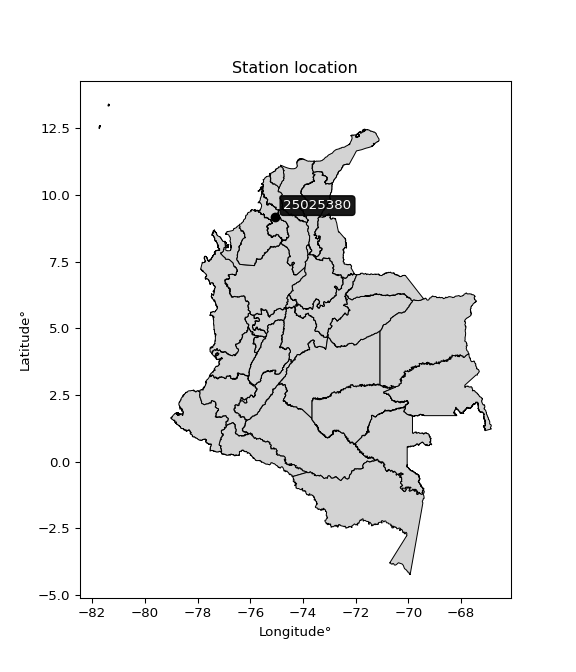

<div align="center">


</div>

# PMP Station (Rain, Pmax24h): 25025380

Probable Maximum Precipitation (PMP) is the greatest amount of rainfall for a specific duration that is meteorologically possible for a given location, acting as a "worst-case" scenario for extreme storms, crucial for designing safety-critical infrastructure like bridges, river deviations, dams, spillways, and nuclear plants to prevent catastrophic failure. PMP is calculated by hydrologists using meteorological data to determine the upper limit of extreme rainfall, often leading to the Probable Maximum Flood (PMF) for flood control design, and is increasingly being studied for climate change impacts. Probable Maximum Precipitation (PMP) is the theoretical upper limit of rainfall, a deterministic estimate for extreme events, while probability distributions (like GEV, Gumbel) describe the likelihood and frequency of various precipitation amounts, including rare ones, showing how often events occur, with PMP representing the extreme end of these distributions, used for critical infrastructure design to ensure safety against the worst conceivable weather, unlike standard statistical forecasts which cover typical probabilities.

The most common probability distributions in hydrology, used for analyzing floods, rainfall, and streamflow, include the Normal, Log-Normal, Gumbel, Gamma (including Log-Pearson Type III), and Generalized Extreme Value (GEV) distributions, often chosen based on the data´s skewness and whether modeling extremes or general conditions, with Gumbel and GEV popular for extreme events like floods, while the Normal distribution serves as a baseline, though often requiring transformations for skewed hydrological data. These distributions help in designing water infrastructure, managing water resources, and forecasting hydrologic events.

> Hydrological data often isn´t perfectly normal (it´s skewed), so different distributions are needed for different applications, such as: **Flood Frequency Analysis**: Using Gumbel, GEV, or Log-Pearson Type III for predicting extreme flood magnitudes and their return periods, **Rainfall Analysis**: Normal for annual totals, but Log-Normal, Weibull, or GEV for intensity or extreme daily rainfall, **Streamflow Modeling**: Gamma and Log-Normal for maximum flows, GEV for minimum flows, and Kappa for daily flows.

<div align="center">

</img>

</div>


## A. General information


### 1. General running parameters

• app_version: _v20260113_. • runtime: _2026-01-17 18:24:04.630693_. • Python version: _3.14.0_. • SciPy version: _1.16.3_. • Pandas version: _2.3.3_. • NumPy version: _2.3.5_. • Stations dataset (station_dataset_file): _dataset/pmax24h_in/automatic_colombia_2003_2025.csv_. • Stations catalog (station_catalog_file): _dataset/CNE.xls_. • Minimum year to eval til year_max (date_min): _1900_. • Maximum year to eval since year_min (date_max): _2025_. • Creates, save and include plots into reports (create_plot): _False_. • Plot only fit distributions with Δo > Δ (plot_only_fit): _True_. • Plot only simple graphs avoiding multiple CDFs and multiple Extreme values plots (plot_only_simple): _True_. • Eval low extreme values, if False, evaluates high extreme values (low_extreme): _False_. • Eval every SciPy distribution as logarithmic (pdist_logarithmic_on): _True_. • Standard deviation normalized (ddof): _1.0_. • Return periods to eval in years (Tr): _[2, 2.33, 5, 10, 15, 20, 25, 50, 75, 100, 200, 250, 500, 750, 1000]_. • Minimum data sample per station, 0 means any (minimum_sample): _5_. • Z-Score maximum threshold to adjust a value, 0 means disable (zscore_max): _3.5_. • Z-Score minimum threshold to adjust a value, 0 means disable (zscore_min): _-2.5_. • Avoid zeros, e.g. rain = 0 (avoid_zeros): _True_. • Avoid null values (avoid_nans): _True_. 

:file_folder:Table: [dataset.csv](../../dataset/pmax24h_in/automatic_colombia_2003_2025.csv)

> Delta Degrees of Freedom (DDOF): is a parameter used in the formulas for calculating variance and standard deviation. When ddof=0, the divisor is $N$ (the total number of observations) and this is used when your data set is the entire population. When ddof=1, the divisor is $N-1$ and this is used when your data set is a sample drawn from a larger population. Using $N-1$ provides an unbiased estimate of the population variance (known as Bessel´s correction).


### 2. Station info and location

|   id |   CODIGO | NOMBRE                      | CATEGORIA               | TECNOLOGIA                              | ESTADO   | FECHA_INSTALACION   |   FECHA_SUSPENSION |   ALTITUD |   LATITUD |   LONGITUD | DEPARTAMENTO   | MUNICIPIO       | AREA_OPERATIVA                              | ENTIDAD                                                     | AREA_HIDROGRAFICA   | ZONA_HIDROGRAFICA                | SUBZONA_HIDROGRAFICA       |   CORRIENTE | Catalogo   |   Version |
|-----:|---------:|:----------------------------|:------------------------|:----------------------------------------|:---------|:--------------------|-------------------:|----------:|----------:|-----------:|:---------------|:----------------|:--------------------------------------------|:------------------------------------------------------------|:--------------------|:---------------------------------|:---------------------------|------------:|:-----------|----------:|
|    0 | 25025380 | SAN BENITO - AUT [25025380] | Climatológica Ordinaria | Automática con Telemetría, Convencional | Activa   | 14/11/2014          |                nan |        20 |   9.16389 |   -75.0447 | Sucre          | San Benito Abad | Area Operativa 02 - Atlántico-Bolivar-Sucre | INSTITUTO DE HIDROLOGIA METEOROLOGIA Y ESTUDIOS AMBIENTALES | Magdalena Cauca     | Bajo Magdalena- Cauca -San Jorge | Bajo San Jorge - La Mojana |         nan | CNE_IDEAM  |  20251226 |

<div align="center">

Dynamic map: [:earth_americas:Google](http://maps.google.com/maps?q=9.163888889,-75.04472222) [:earth_americas:OSM](https://www.openstreetmap.org/#map=18/9.163888889/-75.04472222&layers=P) [:earth_americas:Bing](https://www.bing.com/maps?cp=9.163888889~-75.04472222&lvl=18) [:earth_americas:Apple](https://maps.apple.com/frame?center=9.163888889%2C-75.04472222&span=0.003%2C0.006)

</div>


<div align="center">

```geojson
{
  "type": "Feature",
  "geometry": {
    "type": "Point", 
    "coordinates": [-75.04472222, 9.163888889]
  }, 
  "properties": {
    "Name": "25025380"
  }
}
```

</div>


### 3. Discrete values table and plot

<div align="center">

|               |           0 |           1 |           2 |          3 |           4 |           5 |          6 |           7 |          8 |
|:--------------|------------:|------------:|------------:|-----------:|------------:|------------:|-----------:|------------:|-----------:|
| Date          | 2017        | 2018        | 2019        | 2020       | 2021        | 2022        | 2023       | 2024        | 2025       |
| Value         |  106.22     |   85.38     |  106.4      |   62.5     |  103.7      |   87.6      |   43.4     |  108.4      |  129.3     |
| Value_initial |  106.22     |   85.38     |  106.4      |   62.5     |  103.7      |   87.6      |   43.4     |  108.4      |  129.3     |
| count         |    9        |    9        |    9        |    9       |    9        |    9        |    9       |    9        |    9       |
| mean          |   92.5444   |   92.5444   |   92.5444   |   92.5444  |   92.5444   |   92.5444   |   92.5444  |   92.5444   |   92.5444  |
| std           |   26.2189   |   26.2189   |   26.2189   |   26.2189  |   26.2189   |   26.2189   |   26.2189  |   26.2189   |   26.2189  |
| zscore        |    0.521592 |   -0.273255 |    0.528457 |   -1.14591 |    0.425478 |   -0.188583 |   -1.87439 |    0.604738 |    1.40187 |


</div>


> The initial value (value_initial) correspond to the initial obtained or null completed value, and value (value) is adjusted only when the initial value is outside the valid range (outlier) definite through the Z-Score value. If Z-Score is active, values out of range or outliers are replaced with the station mean value. A Z-Score (or standard score) measures how many standard deviations a data point is from the mean of a dataset, indicating its relative position; positive scores mean above the mean, negative mean below, and a score of zero is exactly at the mean, allowing for comparison of values from different distributions. It´s calculated using the formula $z=(x–μ)/σ$, where $x$ is the data point, $μ$ is the mean, and $σ$ is the standard deviation, helping identify outliers and understand probability.
>
> <sub>**Note**: In this study, "completing" (filling gaps in) and "extending" (forecasting or lengthening the historical record) rainfall data series are avoided for certain critical analyses because they introduce artificial bias and uncertainty, which can distort the statistics of rare events (extremes), alter day-to-day variability, and compromise the integrity and homogeneity of the original data. Some reasons against Completing/Extending rainfall data are: **Distortion of Extremes and Variability**: The primary issue is that most gap-filling or extension methods rely on averaging or regression with nearby stations, which inherently smooths the data. Rainfall is highly variable in space and time, with a large percentage of zero values and occasional large storms. Infilling methods often underestimate the highest values and overestimate the lowest (zero) values, which severely distorts analyses focused on flood frequency, drought severity, and intensity-duration-frequency (IDF) curves, **Loss of Data Homogeneity**: Infilled or extended data are synthetic estimates, not actual measurements. Combining these estimates with observed data can violate the assumption of data homogeneity, which requires that the data properties do not change over time. Inhomogeneity can lead to incorrect conclusions about long-term trends or changes in climate patterns, **Propagation of Errors**: Errors and biases from the original data (e.g., wind-induced undercatch, instrument errors, site changes) or the data used for imputation can propagate through the analysis, leading to unreliable hydrological models and inaccurate predictions, **Compromised Statistical Integrity**: For statistical analyses, especially those involving the frequency of events, using artificial data can introduce time bias or autocorrelation that doesn´t exist in reality, making it difficult to assess the true probability of events, **Difficulty in Validation**: It is difficult to accurately validate the quality of filled or extended data, especially for past periods where ground-truth measurements are unavailable. The reliability of imputation techniques heavily depends on the density of the surrounding station network and the complexity of the local topography.</sub>


### 4. Active continuous probability distributions from SciPy (80 of 104 available)

A Probability Density Function (PDF) describes the relative likelihood of a continuous random variable falling within a specific range, where the total area under its curve equals 1, and the area over any interval gives the actual probability for that range. Unlike discrete probabilities (like rolling a die), a PDF shows density, not direct probability for a single point (which is zero), with higher points indicating higher likelihood, often visualized as a bell curve for normal distributions.

A log of a probability density function (log-PDF) is simply the logarithm of the PDF´s value, denoted as $log(f(x))$, useful for converting multiplication of probabilities into addition, improving numerical stability with tiny numbers, and connecting to information theory concepts like entropy. Instead of dealing with very small probabilities (e.g., 0.000001), log-PDFs use negative numbers (e.g., $log(0.00001) ≈ -11.51$ that are easier for computers to handle, preventing underflow errors and simplifying complex calculations. In this study, each active probability distribution from SciPy is also evaluated in the $log$ form.

[scipy.stats](https://docs.scipy.org/doc/scipy/reference/stats.html) is a Python´s powerful submodule within the SciPy library for comprehensive statistical analysis, offering over 130 probability distributions (like Normal, Poisson), functions for descriptive stats (mean, variance), hypothesis testing (t-tests, chi-square), random variable generation, and statistical tests, making it essential for data science, modeling, and research. It provides tools to explore, model, and draw conclusions from data efficiently, working seamlessly with NumPy.

<div align="center">

|   id | p_dist           |   n_parameter | fit_method   | label                                                                       | active   | ref                                                                                                      |
|-----:|:-----------------|--------------:|:-------------|:----------------------------------------------------------------------------|:---------|:---------------------------------------------------------------------------------------------------------|
|    0 | alpha            |             3 | MLE          | Alpha                                                                       | True     | [:mortar_board:](https://docs.scipy.org/doc/scipy/reference/generated/scipy.stats.alpha.html)            |
|    1 | anglit           |             2 | MM           | Anglit                                                                      | True     | [:mortar_board:](https://docs.scipy.org/doc/scipy/reference/generated/scipy.stats.anglit.html)           |
|    2 | arcsine          |             2 | MM           | Arcsine                                                                     | True     | [:mortar_board:](https://docs.scipy.org/doc/scipy/reference/generated/scipy.stats.arcsine.html)          |
|    3 | argus            |             3 | MLE          | Argus                                                                       | True     | [:mortar_board:](https://docs.scipy.org/doc/scipy/reference/generated/scipy.stats.argus.html)            |
|    4 | beta             |             4 | MLE          | Beta                                                                        | True     | [:mortar_board:](https://docs.scipy.org/doc/scipy/reference/generated/scipy.stats.beta.html)             |
|    5 | betaprime        |             4 | MLE          | Beta prime                                                                  | True     | [:mortar_board:](https://docs.scipy.org/doc/scipy/reference/generated/scipy.stats.betaprime.html)        |
|    6 | bradford         |             3 | MLE          | Bradford                                                                    | True     | [:mortar_board:](https://docs.scipy.org/doc/scipy/reference/generated/scipy.stats.bradford.html)         |
|    7 | burr             |             4 | MLE          | Burr (Type III)                                                             | True     | [:mortar_board:](https://docs.scipy.org/doc/scipy/reference/generated/scipy.stats.burr.html)             |
|    8 | burr12           |             4 | MLE          | Burr (Type III) 12                                                          | True     | [:mortar_board:](https://docs.scipy.org/doc/scipy/reference/generated/scipy.stats.burr12.html)           |
|    9 | cosine           |             2 | MLE          | Cosine                                                                      | True     | [:mortar_board:](https://docs.scipy.org/doc/scipy/reference/generated/scipy.stats.cosine.html)           |
|   10 | crystalball      |             4 | MLE          | Crystalball                                                                 | True     | [:mortar_board:](https://docs.scipy.org/doc/scipy/reference/generated/scipy.stats.crystalball.html)      |
|   11 | dgamma           |             3 | MLE          | Double gamma                                                                | True     | [:mortar_board:](https://docs.scipy.org/doc/scipy/reference/generated/scipy.stats.dgamma.html)           |
|   12 | dweibull         |             3 | MLE          | Double Weibull                                                              | True     | [:mortar_board:](https://docs.scipy.org/doc/scipy/reference/generated/scipy.stats.dweibull.html)         |
|   13 | erlang           |             3 | MLE          | Erlang                                                                      | True     | [:mortar_board:](https://docs.scipy.org/doc/scipy/reference/generated/scipy.stats.erlang.html)           |
|   14 | exponnorm        |             3 | MLE          | Exponentially modified Normal                                               | True     | [:mortar_board:](https://docs.scipy.org/doc/scipy/reference/generated/scipy.stats.exponnorm.html)        |
|   15 | exponpow         |             3 | MLE          | Exponential power                                                           | True     | [:mortar_board:](https://docs.scipy.org/doc/scipy/reference/generated/scipy.stats.exponpow.html)         |
|   16 | exponweib        |             4 | MLE          | Exponentiated Weibull                                                       | True     | [:mortar_board:](https://docs.scipy.org/doc/scipy/reference/generated/scipy.stats.exponweib.html)        |
|   17 | f                |             4 | MLE          | F                                                                           | True     | [:mortar_board:](https://docs.scipy.org/doc/scipy/reference/generated/scipy.stats.f.html)                |
|   18 | fatiguelife      |             3 | MLE          | Fatigue-life (Birnbaum-Saunders)                                            | True     | [:mortar_board:](https://docs.scipy.org/doc/scipy/reference/generated/scipy.stats.fatiguelife.html)      |
|   19 | foldnorm         |             3 | MM           | Fold Normal                                                                 | True     | [:mortar_board:](https://docs.scipy.org/doc/scipy/reference/generated/scipy.stats.foldnorm.html)         |
|   20 | gamma            |             3 | MLE          | Gamma                                                                       | True     | [:mortar_board:](https://docs.scipy.org/doc/scipy/reference/generated/scipy.stats.gamma.html)            |
|   21 | gausshyper       |             6 | MLE          | Gauss hypergeometric                                                        | True     | [:mortar_board:](https://docs.scipy.org/doc/scipy/reference/generated/scipy.stats.gausshyper.html)       |
|   22 | genexpon         |             5 | MLE          | Generalized exponential                                                     | True     | [:mortar_board:](https://docs.scipy.org/doc/scipy/reference/generated/scipy.stats.genexpon.html)         |
|   23 | genextreme       |             3 | MLE          | Generalized exponential                                                     | True     | [:mortar_board:](https://docs.scipy.org/doc/scipy/reference/generated/scipy.stats.genextreme.html)       |
|   24 | gengamma         |             4 | MLE          | Generalized gamma                                                           | True     | [:mortar_board:](https://docs.scipy.org/doc/scipy/reference/generated/scipy.stats.gengamma.html)         |
|   25 | genhalflogistic  |             3 | MLE          | Generalized half-logistic                                                   | True     | [:mortar_board:](https://docs.scipy.org/doc/scipy/reference/generated/scipy.stats.genhalflogistic.html)  |
|   26 | genlogistic      |             3 | MLE          | Generalized logistic                                                        | True     | [:mortar_board:](https://docs.scipy.org/doc/scipy/reference/generated/scipy.stats.genlogistic.html)      |
|   27 | gennorm          |             3 | MLE          | Generalized Normal                                                          | True     | [:mortar_board:](https://docs.scipy.org/doc/scipy/reference/generated/scipy.stats.gennorm.html)          |
|   28 | genpareto        |             3 | MLE          | Generalized Pareto                                                          | True     | [:mortar_board:](https://docs.scipy.org/doc/scipy/reference/generated/scipy.stats.genpareto.html)        |
|   29 | gompertz         |             3 | MLE          | Gompertz (or truncated Gumbel)                                              | True     | [:mortar_board:](https://docs.scipy.org/doc/scipy/reference/generated/scipy.stats.gompertz.html)         |
|   30 | gumbel_l         |             2 | MM           | Gumbel Left Skew                                                            | True     | [:mortar_board:](https://docs.scipy.org/doc/scipy/reference/generated/scipy.stats.gumbel_l.html)         |
|   31 | gumbel_r         |             2 | MM           | Gumbel Right Skew                                                           | True     | [:mortar_board:](https://docs.scipy.org/doc/scipy/reference/generated/scipy.stats.gumbel_r.html)         |
|   32 | halfgennorm      |             3 | MLE          | Upper half of a generalized normal                                          | True     | [:mortar_board:](https://docs.scipy.org/doc/scipy/reference/generated/scipy.stats.halfgennorm.html)      |
|   33 | halflogistic     |             2 | MM           | Half-logistic                                                               | True     | [:mortar_board:](https://docs.scipy.org/doc/scipy/reference/generated/scipy.stats.halflogistic.html)     |
|   34 | halfnorm         |             2 | MM           | Half Normal                                                                 | True     | [:mortar_board:](https://docs.scipy.org/doc/scipy/reference/generated/scipy.stats.halfnorm.html)         |
|   35 | hypsecant        |             2 | MM           | hyperbolic secant                                                           | True     | [:mortar_board:](https://docs.scipy.org/doc/scipy/reference/generated/scipy.stats.hypsecant.html)        |
|   36 | invgamma         |             3 | MLE          | Inverted gamma                                                              | True     | [:mortar_board:](https://docs.scipy.org/doc/scipy/reference/generated/scipy.stats.invgamma.html)         |
|   37 | invgauss         |             3 | MLE          | Inverse Gaussian                                                            | True     | [:mortar_board:](https://docs.scipy.org/doc/scipy/reference/generated/scipy.stats.invgauss.html)         |
|   38 | invweibull       |             3 | MLE          | Inverted Weibull                                                            | True     | [:mortar_board:](https://docs.scipy.org/doc/scipy/reference/generated/scipy.stats.invweibull.html)       |
|   39 | johnsonsb        |             4 | MLE          | Johnson SB                                                                  | True     | [:mortar_board:](https://docs.scipy.org/doc/scipy/reference/generated/scipy.stats.johnsonsb.html)        |
|   40 | johnsonsu        |             4 | MLE          | Johnson Su                                                                  | True     | [:mortar_board:](https://docs.scipy.org/doc/scipy/reference/generated/scipy.stats.johnsonsu.html)        |
|   41 | kappa3           |             3 | MLE          | Kappa 3                                                                     | True     | [:mortar_board:](https://docs.scipy.org/doc/scipy/reference/generated/scipy.stats.kappa3.html)           |
|   42 | kappa4           |             4 | MLE          | Kappa 4                                                                     | True     | [:mortar_board:](https://docs.scipy.org/doc/scipy/reference/generated/scipy.stats.kappa4.html)           |
|   43 | ksone            |             3 | MLE          | Kolmogorov-Smirnov one-sided test statistic distribution                    | True     | [:mortar_board:](https://docs.scipy.org/doc/scipy/reference/generated/scipy.stats.ksone.html)            |
|   44 | kstwobign        |             2 | MLE          | Limiting distribution of scaled Kolmogorov-Smirnov two-sided test statistic | True     | [:mortar_board:](https://docs.scipy.org/doc/scipy/reference/generated/scipy.stats.kstwobign.html)        |
|   45 | laplace          |             2 | MM           | Laplace                                                                     | True     | [:mortar_board:](https://docs.scipy.org/doc/scipy/reference/generated/scipy.stats.laplace.html)          |
|   46 | levy_l           |             2 | MLE          | Left-skewed Levy                                                            | True     | [:mortar_board:](https://docs.scipy.org/doc/scipy/reference/generated/scipy.stats.levy_l.html)           |
|   47 | loggamma         |             3 | MLE          | Log gamma                                                                   | True     | [:mortar_board:](https://docs.scipy.org/doc/scipy/reference/generated/scipy.stats.loggamma.html)         |
|   48 | logistic         |             2 | MM           | Logistic (or Sech-squared)                                                  | True     | [:mortar_board:](https://docs.scipy.org/doc/scipy/reference/generated/scipy.stats.logistic.html)         |
|   49 | loglaplace       |             3 | MLE          | Log-Laplace                                                                 | True     | [:mortar_board:](https://docs.scipy.org/doc/scipy/reference/generated/scipy.stats.loglaplace.html)       |
|   50 | lomax            |             3 | MLE          | Lomax (Pareto of the second kind)                                           | True     | [:mortar_board:](https://docs.scipy.org/doc/scipy/reference/generated/scipy.stats.lomax.html)            |
|   51 | maxwell          |             2 | MM           | Maxwell                                                                     | True     | [:mortar_board:](https://docs.scipy.org/doc/scipy/reference/generated/scipy.stats.maxwell.html)          |
|   52 | mielke           |             4 | MLE          | Mielke Beta-Kappa / Dagum                                                   | True     | [:mortar_board:](https://docs.scipy.org/doc/scipy/reference/generated/scipy.stats.mielke.html)           |
|   53 | moyal            |             2 | MM           | Moyal                                                                       | True     | [:mortar_board:](https://docs.scipy.org/doc/scipy/reference/generated/scipy.stats.moyal.html)            |
|   54 | nakagami         |             3 | MLE          | Nakagami                                                                    | True     | [:mortar_board:](https://docs.scipy.org/doc/scipy/reference/generated/scipy.stats.nakagami.html)         |
|   55 | ncf              |             5 | MLE          | Non-central F distribution                                                  | True     | [:mortar_board:](https://docs.scipy.org/doc/scipy/reference/generated/scipy.stats.ncf.html)              |
|   56 | nct              |             4 | MLE          | Non-central Student’s t                                                     | True     | [:mortar_board:](https://docs.scipy.org/doc/scipy/reference/generated/scipy.stats.nct.html)              |
|   57 | norm             |             2 | MM           | Normal                                                                      | True     | [:mortar_board:](https://docs.scipy.org/doc/scipy/reference/generated/scipy.stats.norm.html)             |
|   58 | pearson3         |             3 | MM           | Pearson type III                                                            | True     | [:mortar_board:](https://docs.scipy.org/doc/scipy/reference/generated/scipy.stats.pearson3.html)         |
|   59 | powerlaw         |             3 | MLE          | Power-function                                                              | True     | [:mortar_board:](https://docs.scipy.org/doc/scipy/reference/generated/scipy.stats.powerlaw.html)         |
|   60 | rayleigh         |             2 | MM           | Rayleigh                                                                    | True     | [:mortar_board:](https://docs.scipy.org/doc/scipy/reference/generated/scipy.stats.rayleigh.html)         |
|   61 | rdist            |             3 | MLE          | R-distributed (symmetric beta)                                              | True     | [:mortar_board:](https://docs.scipy.org/doc/scipy/reference/generated/scipy.stats.rdist.html)            |
|   62 | rice             |             3 | MLE          | Rice                                                                        | True     | [:mortar_board:](https://docs.scipy.org/doc/scipy/reference/generated/scipy.stats.rice.html)             |
|   63 | semicircular     |             2 | MM           | Semicircular                                                                | True     | [:mortar_board:](https://docs.scipy.org/doc/scipy/reference/generated/scipy.stats.semicircular.html)     |
|   64 | skewnorm         |             3 | MLE          | Skew normal                                                                 | True     | [:mortar_board:](https://docs.scipy.org/doc/scipy/reference/generated/scipy.stats.skewnorm.html)         |
|   65 | t                |             3 | MLE          | Student’s t                                                                 | True     | [:mortar_board:](https://docs.scipy.org/doc/scipy/reference/generated/scipy.stats.t.html)                |
|   66 | trapezoid        |             4 | MLE          | Trapezoid                                                                   | True     | [:mortar_board:](https://docs.scipy.org/doc/scipy/reference/generated/scipy.stats.trapezoid.html)        |
|   67 | triang           |             3 | MLE          | Triangular                                                                  | True     | [:mortar_board:](https://docs.scipy.org/doc/scipy/reference/generated/scipy.stats.triang.html)           |
|   68 | truncexpon       |             3 | MLE          | Truncated exponential                                                       | True     | [:mortar_board:](https://docs.scipy.org/doc/scipy/reference/generated/scipy.stats.truncexpon.html)       |
|   69 | truncnorm        |             4 | MLE          | Truncated normal                                                            | True     | [:mortar_board:](https://docs.scipy.org/doc/scipy/reference/generated/scipy.stats.truncnorm.html)        |
|   70 | truncpareto      |             4 | MLE          | Upper truncated Pareto                                                      | True     | [:mortar_board:](https://docs.scipy.org/doc/scipy/reference/generated/scipy.stats.truncpareto.html)      |
|   71 | truncweibull_min |             5 | MLE          | Doubly truncated Weibull minimum                                            | True     | [:mortar_board:](https://docs.scipy.org/doc/scipy/reference/generated/scipy.stats.truncweibull_min.html) |
|   72 | tukeylambda      |             3 | MLE          | Tukey-Lamdba                                                                | True     | [:mortar_board:](https://docs.scipy.org/doc/scipy/reference/generated/scipy.stats.tukeylambda.html)      |
|   73 | uniform          |             2 | MLE          | Uniform                                                                     | True     | [:mortar_board:](https://docs.scipy.org/doc/scipy/reference/generated/scipy.stats.uniform.html)          |
|   74 | vonmises         |             3 | MLE          | Von Mises                                                                   | True     | [:mortar_board:](https://docs.scipy.org/doc/scipy/reference/generated/scipy.stats.vonmises.html)         |
|   75 | vonmises_line    |             3 | MLE          | Von Mises line                                                              | True     | [:mortar_board:](https://docs.scipy.org/doc/scipy/reference/generated/scipy.stats.vonmises_line.html)    |
|   76 | wald             |             2 | MM           | Wald                                                                        | True     | [:mortar_board:](https://docs.scipy.org/doc/scipy/reference/generated/scipy.stats.wald.html)             |
|   77 | weibull_max      |             3 | MLE          | Weibull maximum                                                             | True     | [:mortar_board:](https://docs.scipy.org/doc/scipy/reference/generated/scipy.stats.weibull_max.html)      |
|   78 | weibull_min      |             3 | MLE          | Weibull minimum                                                             | True     | [:mortar_board:](https://docs.scipy.org/doc/scipy/reference/generated/scipy.stats.weibull_min.html)      |
|   79 | wrapcauchy       |             3 | MLE          | Wrapped  Cauchy                                                             | True     | [:mortar_board:](https://docs.scipy.org/doc/scipy/reference/generated/scipy.stats.wrapcauchy.html)       |

</div>

> **n_parameter:** # arguments & localization & scale.
>
> **Fit methods:** (MLE) maximum likelihood, (MM) L-moments.
>
>**Inactive** (With the only purpose of prevent loops, zero divisions, infinite values, over high estimated values or horizontal trending for recurrence intervals estimations, the follow distributions were disabled.)**:** lognorm, norminvgauss, powernorm, powerlognorm, cauchy, halfcauchy, foldcauchy, skewcauchy, chi2, expon, fisk, genhyperbolic, geninvgauss, gibrat, kstwo, laplace_asymmetric, levy, levy_stable, ncx2, pareto, rel_breitwigner, recipinvgauss, studentized_range, loguniform, 


## B. Probability (PDF) vs. Empirical (EDF) distributions functions

A continuous probability distribution (CPD) describes probabilities for variables that can take any value within a range (like rain any time), unlike discrete variables with specific outcomes (like temperature). It uses a Probability Density Function (PDF), a curve where the total area under it equals 1, and the probability of the variable falling within an interval (a to b) is found by calculating the area under the curve between those points. A key feature is that the probability of hitting any single exact value is zero, so probabilities are always expressed for ranges, e.g., $P(a ≤ X ≤ b)$.

<div align="center">

Distributions parameters from station values
|     |   station | p_dist              |   n |              loc |           scale | shape                  | shape1                 | shape2             | shape3             |
|----:|----------:|:--------------------|----:|-----------------:|----------------:|:-----------------------|:-----------------------|:-------------------|:-------------------|
|   0 |  25025380 | alpha               |   9 |   -435.836       | 10690.5         | 20.294704269621        |                        |                    |                    |
|   1 |  25025380 | anglit              |   9 |     92.5444      |    72.3141      |                        |                        |                    |                    |
|   2 |  25025380 | arcsine             |   9 |     57.5859      |    69.917       |                        |                        |                    |                    |
|   3 |  25025380 | argus               |   9 |     27.2871      |   105.084       | 1.0813534669240648     |                        |                    |                    |
|   4 |  25025380 | beta                |   9 |     43.4         |    86.1196      | 0.7343725992539192     | 0.9024742998191333     |                    |                    |
|   5 |  25025380 | betaprime           |   9 |   -348.846       |     1.44927     | 89433.11507353705      | 294.4166973244787      |                    |                    |
|   6 |  25025380 | bradford            |   9 |     43.4         |    85.9002      | 1.0024088521991898     |                        |                    |                    |
|   7 |  25025380 | burr                |   9 |  -1067.47        |   862.072       | 44.99178846449705      | 358294.3327978642      |                    |                    |
|   8 |  25025380 | burr12              |   9 |     -3.67156     |    46.8018      | 679.7288488085126      | 0.0021635088676968707  |                    |                    |
|   9 |  25025380 | cosine              |   9 |     90.1603      |    21.2376      |                        |                        |                    |                    |
|  10 |  25025380 | crystalball         |   9 |     92.5444      |    24.7194      | 7704.43703616781       | 465.59567310698117     |                    |                    |
|  11 |  25025380 | dgamma              |   9 |     94.737       |     8.81311     | 2.2744310956020604     |                        |                    |                    |
|  12 |  25025380 | dweibull            |   9 |    106.22        |    19.8521      | 0.890432739850701      |                        |                    |                    |
|  13 |  25025380 | erlang              |   9 |   -310.118       |     1.61857     | 248.61684911106045     |                        |                    |                    |
|  14 |  25025380 | exponnorm           |   9 |     92.5297      |    24.7194      | 0.0006041800406909161  |                        |                    |                    |
|  15 |  25025380 | exponpow            |   9 |     43.4         |     1.59665     | 0.07968038092287166    |                        |                    |                    |
|  16 |  25025380 | exponweib           |   9 |     43.4         |     1.24843     | 1.2820357611340922     | 0.18426288434123866    |                    |                    |
|  17 |  25025380 | f                   |   9 | -10399.5         | 10492           | 548936.9173649724      | 1030620.5170851401     |                    |                    |
|  18 |  25025380 | fatiguelife         |   9 |     43.4         |     0.000152142 | 592.6632898139637      |                        |                    |                    |
|  19 |  25025380 | foldnorm            |   9 |     61.9894      |    31.5438      | 0.6885605872667333     |                        |                    |                    |
|  20 |  25025380 | gamma               |   9 |   -323.617       |     1.54828     | 268.53177920792655     |                        |                    |                    |
|  21 |  25025380 | gausshyper          |   9 |     42.4116      |    86.8884      | 1.2033076179799702     | 0.8557989523292711     | 1.0333893732259396 | 0.7669025558272182 |
|  22 |  25025380 | genexpon            |   9 |     43.4         |     4.64631     | 0.02989878727584114    | 0.24743291587227695    | 0.0452244721480413 |                    |
|  23 |  25025380 | genextreme          |   9 |     87.6562      |    27.3475      | 0.5885414742058208     |                        |                    |                    |
|  24 |  25025380 | gengamma            |   9 |     43.4         |     1.27743     | 1.2369379714764603     | 0.2540696702048464     |                    |                    |
|  25 |  25025380 | genhalflogistic     |   9 |     36.2913      |    98.9948      | 1.0643610939334032     |                        |                    |                    |
|  26 |  25025380 | genlogistic         |   9 |    112.628       |     7.18719     | 0.31028037570998357    |                        |                    |                    |
|  27 |  25025380 | gennorm             |   9 |    106.22        |     4.83085e-06 | 0.14096178565452377    |                        |                    |                    |
|  28 |  25025380 | genpareto           |   9 |     -0.92145     |   212.938       | -1.6351970740169948    |                        |                    |                    |
|  29 |  25025380 | gompertz            |   9 |     43.789       |     3.82852     | 1.5746852408490624e-09 |                        |                    |                    |
|  30 |  25025380 | gumbel_l            |   9 |    103.669       |    19.2736      |                        |                        |                    |                    |
|  31 |  25025380 | gumbel_r            |   9 |     81.4194      |    19.2736      |                        |                        |                    |                    |
|  32 |  25025380 | halfgennorm         |   9 |     43.4         |     1.28581     | 0.33277383812597205    |                        |                    |                    |
|  33 |  25025380 | halflogistic        |   9 |     63.2462      |    21.1342      |                        |                        |                    |                    |
|  34 |  25025380 | halfnorm            |   9 |     59.8257      |    41.0069      |                        |                        |                    |                    |
|  35 |  25025380 | hypsecant           |   9 |     92.5444      |    15.7369      |                        |                        |                    |                    |
|  36 |  25025380 | invgamma            |   9 |   -297.217       | 93239.3         | 240.2336064205603      |                        |                    |                    |
|  37 |  25025380 | invgauss            |   9 |    -56.9997      |  4181.62        | 0.03583649373357366    |                        |                    |                    |
|  38 |  25025380 | invweibull          |   9 |     43.4         |     1.28644     | 0.05407294496125656    |                        |                    |                    |
|  39 |  25025380 | johnsonsb           |   9 |     43.4         |    86.0366      | 0.41028359001738346    | 0.08622192349912078    |                    |                    |
|  40 |  25025380 | johnsonsu           |   9 |    106.817       |     1.62893     | 0.5841677717239345     | 0.41653683599744956    |                    |                    |
|  41 |  25025380 | kappa3              |   9 |     43.4         |    73.9254      | 19.435937935138305     |                        |                    |                    |
|  42 |  25025380 | kappa4              |   9 |     32.7936      |    97.3944      | 1.1222675091062606     | 1.007292643385764      |                    |                    |
|  43 |  25025380 | ksone               |   9 |     34.81        |   103.08        | 1.0                    |                        |                    |                    |
|  44 |  25025380 | kstwobign           |   9 |    -13.7911      |   121.556       |                        |                        |                    |                    |
|  45 |  25025380 | laplace             |   9 |     92.5444      |    17.4792      |                        |                        |                    |                    |
|  46 |  25025380 | levy_l              |   9 |    133.031       |    18.5224      |                        |                        |                    |                    |
|  47 |  25025380 | loggamma            |   9 |    102.33        |    20.8404      | 1.0686945611172258     |                        |                    |                    |
|  48 |  25025380 | logistic            |   9 |     92.5444      |    13.6285      |                        |                        |                    |                    |
|  49 |  25025380 | loglaplace          |   9 |     -0.285047    |   103.985       | 4.390327513303888      |                        |                    |                    |
|  50 |  25025380 | lomax               |   9 |     43.4         |     7.25447e+12 | 69456090596.77898      |                        |                    |                    |
|  51 |  25025380 | maxwell             |   9 |     33.9699      |    36.7062      |                        |                        |                    |                    |
|  52 |  25025380 | mielke              |   9 |      0.611731    |   117.13        | 3.3021885204734565     | 17.871700056686347     |                    |                    |
|  53 |  25025380 | moyal               |   9 |     78.4083      |    11.1276      |                        |                        |                    |                    |
|  54 |  25025380 | nakagami            |   9 |     52.4986      |    48.704       | 1.3585539134908091     |                        |                    |                    |
|  55 |  25025380 | ncf                 |   9 |     -0.0785443   |     1.2913e-07  | 7.226158734001779e-09  | 8.664913095444685      | 4.135335138608534  |                    |
|  56 |  25025380 | nct                 |   9 |  -1512.23        |    24.6438      | 313619.8394259966      | 65.11881943810536      |                    |                    |
|  57 |  25025380 | norm                |   9 |     92.5444      |    24.7194      |                        |                        |                    |                    |
|  58 |  25025380 | pearson3            |   9 |     92.5444      |    24.7194      | -0.6330256391610258    |                        |                    |                    |
|  59 |  25025380 | powerlaw            |   9 |     43.4         |    85.9         | 0.21860230787910503    |                        |                    |                    |
|  60 |  25025380 | rayleigh            |   9 |     45.2548      |    37.7317      |                        |                        |                    |                    |
|  61 |  25025380 | rdist               |   9 |     47.99        |    39.61        | 1.1286509557610904     |                        |                    |                    |
|  62 |  25025380 | rice                |   9 |     27.8702      |    26.6379      | 2.180791717018214      |                        |                    |                    |
|  63 |  25025380 | semicircular        |   9 |     92.5444      |    49.4388      |                        |                        |                    |                    |
|  64 |  25025380 | skewnorm            |   9 |    121.503       |    38.0742      | -3.4739027274390923    |                        |                    |                    |
|  65 |  25025380 | t                   |   9 |     92.5413      |    24.7079      | 49229.18992586645      |                        |                    |                    |
|  66 |  25025380 | trapezoid           |   9 |     34.81        |   103.08        | 0.9999999999999999     | 1.0                    |                    |                    |
|  67 |  25025380 | triang              |   9 |     25.0461      |   104.254       | 0.9999999931562102     |                        |                    |                    |
|  68 |  25025380 | truncexpon          |   9 |     43.4         |   114.467       | 0.7504367285150976     |                        |                    |                    |
|  69 |  25025380 | truncnorm           |   9 |     92.5444      |    24.7194      | -1258.2868330009655    | 7016.52000469524       |                    |                    |
|  70 |  25025380 | truncpareto         |   9 |     43.3936      |     0.00639101  | 0.1251565553321197     | 13441.75863581874      |                    |                    |
|  71 |  25025380 | truncweibull_min    |   9 |     42.4769      |   142.53        | 1.0968941489044388     | 0.00010038119777897356 | 0.6091549914114658 |                    |
|  72 |  25025380 | tukeylambda         |   9 |     65.501       |    23.1145      | 1.0458552588703673     |                        |                    |                    |
|  73 |  25025380 | uniform             |   9 |     43.4         |    85.9         |                        |                        |                    |                    |
|  74 |  25025380 | vonmises            |   9 |     -0.914128    |     1           | 0.6575683241303707     |                        |                    |                    |
|  75 |  25025380 | vonmises_line       |   9 |     85.7106      |    13.8749      | 0.09028160914823002    |                        |                    |                    |
|  76 |  25025380 | wald                |   9 |     67.825       |    24.7194      |                        |                        |                    |                    |
|  77 |  25025380 | weibull_max         |   9 |    129.3         |     1.37966     | 0.2962989788243874     |                        |                    |                    |
|  78 |  25025380 | weibull_min         |   9 |   -398.621       |   502.247       | 24.77763771247949      |                        |                    |                    |
|  79 |  25025380 | wrapcauchy          |   9 |     43.3997      |    13.7704      | 2.2514480165597016e-05 |                        |                    |                    |
|  80 |  25025380 | logalpha            |   9 |     -6.73366     |   375.798       | 33.544234160228356     |                        |                    |                    |
|  81 |  25025380 | loganglit           |   9 |      4.48308     |     0.928858    |                        |                        |                    |                    |
|  82 |  25025380 | logarcsine          |   9 |      4.03404     |     0.898072    |                        |                        |                    |                    |
|  83 |  25025380 | logargus            |   9 |      3.45446     |     1.43145     | 2.1605302123557735     |                        |                    |                    |
|  84 |  25025380 | logbeta             |   9 |      3.58258     |     1.27955     | 1.385846069268946      | 0.42884885403121975    |                    |                    |
|  85 |  25025380 | logbetaprime        |   9 |     -0.166241    |    44.5363      | 214.62343150854755     | 2055.0356014267036     |                    |                    |
|  86 |  25025380 | logbradford         |   9 |      3.77045     |     1.09169     | 1.0834183419112042     |                        |                    |                    |
|  87 |  25025380 | logburr             |   9 |    -67.8983      |    72.6665      | 1309.4169526080768     | 0.18369900389870913    |                    |                    |
|  88 |  25025380 | logburr12           |   9 |    -93.9942      |   100.882       | 459.23408959176635     | 33655.33470337807      |                    |                    |
|  89 |  25025380 | logcosine           |   9 |      4.42702     |     0.282312    |                        |                        |                    |                    |
|  90 |  25025380 | logcrystalball      |   9 |      4.48308     |     0.317515    | 781.8629900732466      | 13.663809287694605     |                    |                    |
|  91 |  25025380 | logdgamma           |   9 |      4.66551     |     0.284076    | 0.7511679562233363     |                        |                    |                    |
|  92 |  25025380 | logdweibull         |   9 |      4.66721     |     0.280066    | 0.6817954157253623     |                        |                    |                    |
|  93 |  25025380 | logerlang           |   9 |      3.77046     |     1.11301     | 0.6141404383793317     |                        |                    |                    |
|  94 |  25025380 | logexponnorm        |   9 |      4.48289     |     0.317513    | 0.0005824227304092138  |                        |                    |                    |
|  95 |  25025380 | logexponpow         |   9 |     -5.08833e+06 |     5.08833e+06 | 17664864.41815448      |                        |                    |                    |
|  96 |  25025380 | logexponweib        |   9 |     -2.41918e+07 |     2.41918e+07 | 20.867141862113122     | 23118880.844140343     |                    |                    |
|  97 |  25025380 | logf                |   9 |   -600.933       |   605.416       | 19913064.815327667     | 11318417.07165249      |                    |                    |
|  98 |  25025380 | logfatiguelife      |   9 |   -176.676       |   181.158       | 0.0017459630855643834  |                        |                    |                    |
|  99 |  25025380 | logfoldnorm         |   9 |      3.98446     |     0.3534      | 1.3258874274478532     |                        |                    |                    |
| 100 |  25025380 | loggamma            |   9 |      3.77046     |     0.769642    | 0.7101880156623267     |                        |                    |                    |
| 101 |  25025380 | loggausshyper       |   9 |      3.73449     |     1.12765     | 1.3820063846432404     | 0.6966253404540822     | 1.312043618934382  | 0.8738436783573613 |
| 102 |  25025380 | loggenexpon         |   9 |      3.77046     |     0.855819    | 0.3466998712403938     | 2.3654160658552987     | 0.9165273019308031 |                    |
| 103 |  25025380 | loggenextreme       |   9 |      4.53272     |     0.356515    | 1.0822774390367407     |                        |                    |                    |
| 104 |  25025380 | loggengamma         |   9 |     -8.51859     |     7.41633     | 41.622543128159435     | 6.6211692877684065     |                    |                    |
| 105 |  25025380 | loggenhalflogistic  |   9 |      3.7664      |     1.16206     | 1.0605248729803352     |                        |                    |                    |
| 106 |  25025380 | loggenlogistic      |   9 |      4.76817     |     0.055709    | 0.1854519363455525     |                        |                    |                    |
| 107 |  25025380 | loggennorm          |   9 |      4.66551     |     0.00493258  | 0.3479050333237864     |                        |                    |                    |
| 108 |  25025380 | loggenpareto        |   9 |     -0.011319    |    12.3353      | -2.5311177234044844    |                        |                    |                    |
| 109 |  25025380 | loggompertz         |   9 |      3.76343     |     0.236805    | 0.028238452953865525   |                        |                    |                    |
| 110 |  25025380 | loggumbel_l         |   9 |      4.62598     |     0.247566    |                        |                        |                    |                    |
| 111 |  25025380 | loggumbel_r         |   9 |      4.34018     |     0.247566    |                        |                        |                    |                    |
| 112 |  25025380 | loghalfgennorm      |   9 |      3.77046     |     1.09169     | 853524.86013717        |                        |                    |                    |
| 113 |  25025380 | loghalflogistic     |   9 |      4.10698     |     0.271302    |                        |                        |                    |                    |
| 114 |  25025380 | loghalfnorm         |   9 |      4.06279     |     0.526748    |                        |                        |                    |                    |
| 115 |  25025380 | loghypsecant        |   9 |      4.48308     |     0.202136    |                        |                        |                    |                    |
| 116 |  25025380 | loginvgamma         |   9 |     -2.58258     |  3039.51        | 431.57551787608816     |                        |                    |                    |
| 117 |  25025380 | loginvgauss         |   9 |      0.799382    |   426.627       | 0.00865165882220682    |                        |                    |                    |
| 118 |  25025380 | loginvweibull       |   9 | -10993.4         | 10997.7         | 29895.744820877324     |                        |                    |                    |
| 119 |  25025380 | logjohnsonsb        |   9 |      3.77046     |     1.09168     | -0.8647645096909029    | 0.20427482050926327    |                    |                    |
| 120 |  25025380 | logjohnsonsu        |   9 |      4.67089     |     0.0128281   | 0.606255417204738      | 0.3835949071413219     |                    |                    |
| 121 |  25025380 | logkappa3           |   9 |      3.77046     |     1.09088     | 3007.5550769161086     |                        |                    |                    |
| 122 |  25025380 | logkappa4           |   9 |      3.73881     |     1.23868     | 1.0020265667814696     | 1.1026902588975513     |                    |                    |
| 123 |  25025380 | logksone            |   9 |      3.66129     |     1.31001     | 1.0                    |                        |                    |                    |
| 124 |  25025380 | logkstwobign        |   9 |      2.98253     |     1.71726     |                        |                        |                    |                    |
| 125 |  25025380 | loglaplace          |   9 |      4.48308     |     0.224517    |                        |                        |                    |                    |
| 126 |  25025380 | loglevy_l           |   9 |      4.89595     |     0.167414    |                        |                        |                    |                    |
| 127 |  25025380 | logloggamma         |   9 |      4.80879     |     0.0924349   | 0.29827149730413505    |                        |                    |                    |
| 128 |  25025380 | loglogistic         |   9 |      4.48308     |     0.175055    |                        |                        |                    |                    |
| 129 |  25025380 | logloglaplace       |   9 |     -0.0201712   |     4.66167     | 19.24862675822626      |                        |                    |                    |
| 130 |  25025380 | loglomax            |   9 |      3.77046     |    16.0558      | 22.645675895278153     |                        |                    |                    |
| 131 |  25025380 | logmaxwell          |   9 |      3.7307      |     0.471483    |                        |                        |                    |                    |
| 132 |  25025380 | logmielke           |   9 |   -319.977       |   324.745       | 1079.3844761862879     | 5855.041331543633      |                    |                    |
| 133 |  25025380 | logmoyal            |   9 |      4.3015      |     0.142932    |                        |                        |                    |                    |
| 134 |  25025380 | lognakagami         |   9 |      3.93242     |     0.662106    | 2.126273670453732      |                        |                    |                    |
| 135 |  25025380 | logncf              |   9 |    -20.4656      |    16.1335      | 12566.590635031112     | 75757.96520461403      | 6867.18108572464   |                    |
| 136 |  25025380 | lognct              |   9 |    -19.167       |     0.306964    | 39889.15562566943      | 77.04478402898542      |                    |                    |
| 137 |  25025380 | lognorm             |   9 |      4.48308     |     0.317515    |                        |                        |                    |                    |
| 138 |  25025380 | logpearson3         |   9 |      4.48308     |     0.317515    | -1.1279400599538008    |                        |                    |                    |
| 139 |  25025380 | logpowerlaw         |   9 |      3.77046     |     1.09168     | 0.2352868112819837     |                        |                    |                    |
| 140 |  25025380 | lograyleigh         |   9 |      3.87564     |     0.484662    |                        |                        |                    |                    |
| 141 |  25025380 | logrdist            |   9 |      4.17675     |     0.685382    | 1.0587115940622813     |                        |                    |                    |
| 142 |  25025380 | logrice             |   9 |    -38.9076      |     0.317517    | 136.65242475934997     |                        |                    |                    |
| 143 |  25025380 | logsemicircular     |   9 |      4.48308     |     0.635082    |                        |                        |                    |                    |
| 144 |  25025380 | logskewnorm         |   9 |      4.86214     |     0.494499    | -45248980.29158124     |                        |                    |                    |
| 145 |  25025380 | logt                |   9 |      4.59833     |     0.171866    | 1.7991536051076102     |                        |                    |                    |
| 146 |  25025380 | logtrapezoid        |   9 |      3.58501     |     1.3471      | 1.0                    | 1.0                    |                    |                    |
| 147 |  25025380 | logtriang           |   9 |      3.58848     |     1.27366     | 0.9999983112209117     |                        |                    |                    |
| 148 |  25025380 | logtruncexpon       |   9 |      3.76928     |     1.23653     | 0.8838077227391569     |                        |                    |                    |
| 149 |  25025380 | logtruncnorm        |   9 |     -0.148851    |     1.19487     | 3.5843962283631408     | 4.193766559112993      |                    |                    |
| 150 |  25025380 | logtruncpareto      |   9 |      3.77036     |     9.58156e-05 | 0.12514865055196772    | 11394.504534124664     |                    |                    |
| 151 |  25025380 | logtruncweibull_min |   9 |      3.75819     |     1.57852     | 1.2917935045448452     | 6.598170915792434e-05  | 0.699349445398094  |                    |
| 152 |  25025380 | logtukeylambda      |   9 |      4.50102     |     0.462238    | 1.2634566965023888     |                        |                    |                    |
| 153 |  25025380 | loguniform          |   9 |      3.77046     |     1.09168     |                        |                        |                    |                    |
| 154 |  25025380 | logvonmises         |   9 |     -1.79395     |     1           | 10.468583769691778     |                        |                    |                    |
| 155 |  25025380 | logvonmises_line    |   9 |      4.5353      |     0.243455    | 1.0456798432438177     |                        |                    |                    |
| 156 |  25025380 | logwald             |   9 |      4.16554     |     0.317542    |                        |                        |                    |                    |
| 157 |  25025380 | logweibull_max      |   9 |      4.86214     |     0.404548    | 0.26001460111193275    |                        |                    |                    |
| 158 |  25025380 | logweibull_min      |   9 |     -2.77012e+07 |     2.77012e+07 | 127036205.25959052     |                        |                    |                    |
| 159 |  25025380 | logwrapcauchy       |   9 |      3.77046     |     0.173746    | 0.5000000000000001     |                        |                    |                    |

</div>

> **loc** (Location parameter): This shifts the distribution along the x-axis. For many common distributions, like the normal (Gaussian) distribution, loc represents the mean $μ$. For others, like the uniform distribution, it might represent the minimum value, or for the beta distribution, the left end of the support interval.
>
> **scale** (Scale parameter): This determines the width or spread of the distribution. For the normal distribution, scale represents the standard deviation $σ$. For a uniform distribution, it defines the length of the interval (from $loc$ to $loc + scale$).
>
> **shape** (Shape parameters): Refers to parameters that define the specific form of a probability distribution, distinct from its location (loc) and scale (scale). These parameters are required arguments for most distribution functions. For example, a normal (Gaussian) distribution is fully defined by its location (mean) and scale (standard deviation), so it has no specific shape parameters beyond loc and scale. However, other distributions have intrinsic properties that need specification, as Gamma distribution that takes a shape parameter, often named $a$ or $alpha$.


### 0. Cumulative distribution values - CDF (160 evaluated)

Cumulative Distribution Function (CDF), denoted as $F$<sub>$X$</sub>$(x)$, is a function that gives the probability that a random variable $X$ will take a value less than or equal to a specific value, $x$ (i.e., $(P(X≥x)$. It essentially "accumulates" probabilities from a given point up to the far right (positive infinity), providing a complete picture of the distribution´s probabilities for both discrete (like rain) and continuous (like temperature) variables, helping to find probabilities over ranges or above certain values. Each station is evaluated separately ordering the $x$ values ascending, calculating the CDF and PDF values for the activated distributions and their logarithmic forms.

<div align="center">

CDF ordered by x ascending and calculating $log(f(x))$ separately
|   id |   Station |   date |      x |   count |    mean |     std |    zscore |   Value_initial |   station |   m |     alpha |   alpha_pdf |    anglit |   anglit_pdf |   arcsine |   arcsine_pdf |     argus |   argus_pdf |        beta |     beta_pdf |   betaprime |   betaprime_pdf |   bradford |   bradford_pdf |      burr |   burr_pdf |     burr12 |   burr12_pdf |    cosine |   cosine_pdf |   crystalball |   crystalball_pdf |    dgamma |   dgamma_pdf |   dweibull |   dweibull_pdf |    erlang |   erlang_pdf |   exponnorm |   exponnorm_pdf |   exponpow |   exponpow_pdf |   exponweib |   exponweib_pdf |         f |      f_pdf |   fatiguelife |   fatiguelife_pdf |   foldnorm |   foldnorm_pdf |    gamma |   gamma_pdf |   gausshyper |   gausshyper_pdf |    genexpon |   genexpon_pdf |   genextreme |   genextreme_pdf |    gengamma |   gengamma_pdf |   genhalflogistic |   genhalflogistic_pdf |   genlogistic |   genlogistic_pdf |   gennorm |   gennorm_pdf |   genpareto |   genpareto_pdf |    gompertz |   gompertz_pdf |   gumbel_l |   gumbel_l_pdf |    gumbel_r |   gumbel_r_pdf |   halfgennorm |   halfgennorm_pdf |   halflogistic |   halflogistic_pdf |   halfnorm |   halfnorm_pdf |   hypsecant |   hypsecant_pdf |   invgamma |   invgamma_pdf |   invgauss |   invgauss_pdf |   invweibull |   invweibull_pdf |   johnsonsb |   johnsonsb_pdf |   johnsonsu |   johnsonsu_pdf |      kappa3 |   kappa3_pdf |      kappa4 |   kappa4_pdf |     ksone |   ksone_pdf |   kstwobign |   kstwobign_pdf |   laplace |   laplace_pdf |   levy_l |   levy_l_pdf |    loggamma |   loggamma_pdf |   logistic |   logistic_pdf |   loglaplace |   loglaplace_pdf |       lomax |   lomax_pdf |    maxwell |   maxwell_pdf |    mielke |   mielke_pdf |       moyal |   moyal_pdf |   nakagami |   nakagami_pdf |      ncf |    ncf_pdf |       nct |    nct_pdf |      norm |   norm_pdf |   pearson3 |   pearson3_pdf |    powerlaw |   powerlaw_pdf |   rayleigh |   rayleigh_pdf |    rdist |      rdist_pdf |      rice |   rice_pdf |   semicircular |   semicircular_pdf |   skewnorm |   skewnorm_pdf |         t |      t_pdf |   trapezoid |   trapezoid_pdf |    triang |   triang_pdf |   truncexpon |   truncexpon_pdf |   truncnorm |   truncnorm_pdf |   truncpareto |   truncpareto_pdf |   truncweibull_min |   truncweibull_min_pdf |   tukeylambda |   tukeylambda_pdf |   uniform |   uniform_pdf |   vonmises |   vonmises_pdf |   vonmises_line |   vonmises_line_pdf |     wald |   wald_pdf |   weibull_max |   weibull_max_pdf |   weibull_min |   weibull_min_pdf |   wrapcauchy |   wrapcauchy_pdf |   logalpha |   logalpha_pdf |   loganglit |   loganglit_pdf |   logarcsine |   logarcsine_pdf |   logargus |   logargus_pdf |   logbeta |   logbeta_pdf |   logbetaprime |   logbetaprime_pdf |   logbradford |   logbradford_pdf |   logburr |   logburr_pdf |   logburr12 |   logburr12_pdf |   logcosine |   logcosine_pdf |   logcrystalball |   logcrystalball_pdf |   logdgamma |   logdgamma_pdf |   logdweibull |   logdweibull_pdf |   logerlang |   logerlang_pdf |   logexponnorm |   logexponnorm_pdf |   logexponpow |   logexponpow_pdf |   logexponweib |   logexponweib_pdf |      logf |   logf_pdf |   logfatiguelife |   logfatiguelife_pdf |   logfoldnorm |   logfoldnorm_pdf |   loggausshyper |   loggausshyper_pdf |   loggenexpon |   loggenexpon_pdf |   loggenextreme |   loggenextreme_pdf |   loggengamma |   loggengamma_pdf |   loggenhalflogistic |   loggenhalflogistic_pdf |   loggenlogistic |   loggenlogistic_pdf |   loggennorm |   loggennorm_pdf |   loggenpareto |   loggenpareto_pdf |   loggompertz |   loggompertz_pdf |   loggumbel_l |   loggumbel_l_pdf |   loggumbel_r |   loggumbel_r_pdf |   loghalfgennorm |   loghalfgennorm_pdf |   loghalflogistic |   loghalflogistic_pdf |   loghalfnorm |   loghalfnorm_pdf |   loghypsecant |   loghypsecant_pdf |   loginvgamma |   loginvgamma_pdf |   loginvgauss |   loginvgauss_pdf |   loginvweibull |   loginvweibull_pdf |   logjohnsonsb |   logjohnsonsb_pdf |   logjohnsonsu |   logjohnsonsu_pdf |   logkappa3 |   logkappa3_pdf |   logkappa4 |   logkappa4_pdf |   logksone |   logksone_pdf |   logkstwobign |   logkstwobign_pdf |   loglevy_l |   loglevy_l_pdf |   logloggamma |   logloggamma_pdf |   loglogistic |   loglogistic_pdf |   logloglaplace |   logloglaplace_pdf |    loglomax |   loglomax_pdf |   logmaxwell |   logmaxwell_pdf |   logmielke |   logmielke_pdf |    logmoyal |   logmoyal_pdf |   lognakagami |   lognakagami_pdf |    logncf |   logncf_pdf |    lognct |   lognct_pdf |   lognorm |   lognorm_pdf |   logpearson3 |   logpearson3_pdf |   logpowerlaw |   logpowerlaw_pdf |   lograyleigh |   lograyleigh_pdf |   logrdist |   logrdist_pdf |   logrice |   logrice_pdf |   logsemicircular |   logsemicircular_pdf |   logskewnorm |   logskewnorm_pdf |      logt |   logt_pdf |   logtrapezoid |   logtrapezoid_pdf |   logtriang |   logtriang_pdf |   logtruncexpon |   logtruncexpon_pdf |   logtruncnorm |   logtruncnorm_pdf |   logtruncpareto |   logtruncpareto_pdf |   logtruncweibull_min |   logtruncweibull_min_pdf |   logtukeylambda |   logtukeylambda_pdf |   loguniform |   loguniform_pdf |   logvonmises |   logvonmises_pdf |   logvonmises_line |   logvonmises_line_pdf |   logwald |   logwald_pdf |   logweibull_max |   logweibull_max_pdf |   logweibull_min |   logweibull_min_pdf |   logwrapcauchy |   logwrapcauchy_pdf |
|-----:|----------:|-------:|-------:|--------:|--------:|--------:|----------:|----------------:|----------:|----:|----------:|------------:|----------:|-------------:|----------:|--------------:|----------:|------------:|------------:|-------------:|------------:|----------------:|-----------:|---------------:|----------:|-----------:|-----------:|-------------:|----------:|-------------:|--------------:|------------------:|----------:|-------------:|-----------:|---------------:|----------:|-------------:|------------:|----------------:|-----------:|---------------:|------------:|----------------:|----------:|-----------:|--------------:|------------------:|-----------:|---------------:|---------:|------------:|-------------:|-----------------:|------------:|---------------:|-------------:|-----------------:|------------:|---------------:|------------------:|----------------------:|--------------:|------------------:|----------:|--------------:|------------:|----------------:|------------:|---------------:|-----------:|---------------:|------------:|---------------:|--------------:|------------------:|---------------:|-------------------:|-----------:|---------------:|------------:|----------------:|-----------:|---------------:|-----------:|---------------:|-------------:|-----------------:|------------:|----------------:|------------:|----------------:|------------:|-------------:|------------:|-------------:|----------:|------------:|------------:|----------------:|----------:|--------------:|---------:|-------------:|------------:|---------------:|-----------:|---------------:|-------------:|-----------------:|------------:|------------:|-----------:|--------------:|----------:|-------------:|------------:|------------:|-----------:|---------------:|---------:|-----------:|----------:|-----------:|----------:|-----------:|-----------:|---------------:|------------:|---------------:|-----------:|---------------:|---------:|---------------:|----------:|-----------:|---------------:|-------------------:|-----------:|---------------:|----------:|-----------:|------------:|----------------:|----------:|-------------:|-------------:|-----------------:|------------:|----------------:|--------------:|------------------:|-------------------:|-----------------------:|--------------:|------------------:|----------:|--------------:|-----------:|---------------:|----------------:|--------------------:|---------:|-----------:|--------------:|------------------:|--------------:|------------------:|-------------:|-----------------:|-----------:|---------------:|------------:|----------------:|-------------:|-----------------:|-----------:|---------------:|----------:|--------------:|---------------:|-------------------:|--------------:|------------------:|----------:|--------------:|------------:|----------------:|------------:|----------------:|-----------------:|---------------------:|------------:|----------------:|--------------:|------------------:|------------:|----------------:|---------------:|-------------------:|--------------:|------------------:|---------------:|-------------------:|----------:|-----------:|-----------------:|---------------------:|--------------:|------------------:|----------------:|--------------------:|--------------:|------------------:|----------------:|--------------------:|--------------:|------------------:|---------------------:|-------------------------:|-----------------:|---------------------:|-------------:|-----------------:|---------------:|-------------------:|--------------:|------------------:|--------------:|------------------:|--------------:|------------------:|-----------------:|---------------------:|------------------:|----------------------:|--------------:|------------------:|---------------:|-------------------:|--------------:|------------------:|--------------:|------------------:|----------------:|--------------------:|---------------:|-------------------:|---------------:|-------------------:|------------:|----------------:|------------:|----------------:|-----------:|---------------:|---------------:|-------------------:|------------:|----------------:|--------------:|------------------:|--------------:|------------------:|----------------:|--------------------:|------------:|---------------:|-------------:|-----------------:|------------:|----------------:|------------:|---------------:|--------------:|------------------:|----------:|-------------:|----------:|-------------:|----------:|--------------:|--------------:|------------------:|--------------:|------------------:|--------------:|------------------:|-----------:|---------------:|----------:|--------------:|------------------:|----------------------:|--------------:|------------------:|----------:|-----------:|---------------:|-------------------:|------------:|----------------:|----------------:|--------------------:|---------------:|-------------------:|-----------------:|---------------------:|----------------------:|--------------------------:|-----------------:|---------------------:|-------------:|-----------------:|--------------:|------------------:|-------------------:|-----------------------:|----------:|--------------:|-----------------:|---------------------:|-----------------:|---------------------:|----------------:|--------------------:|
|    0 |  25025380 |   2023 |  43.4  |       9 | 92.5444 | 26.2189 | -1.87439  |           43.4  |  25025380 |   1 | 0.0220726 |  0.00244989 | 0.0111522 |   0.00290437 |  0        |    0          | 0.0276082 |  0.00342994 | 1.42022e-12 | 146.785      |   0.0209347 |      0.00228421 | 5.6573e-07 |     0.0168063  | 0.0186997 | 0.00301373 | 0.00846037 |   0.0303672  | 0.0210669 |   0.00307304 |     0.0234007 |        0.00223664 | 0.0149054 |   0.00137717 |  0.0307359 |     0.00121514 | 0.0239823 |   0.00241188 |   0.0234004 |      0.00223661 |  0.0717922 |    8.03656e+11 | 0.000430798 |     1.43056e+10 | 0.0235436 | 0.00225091 |      0.081178 |       4.73276e+08 |  0         |     0          | 0.023777 |  0.00240083 |   0.00547611 |       0.00664485 | 4.34196e-10 |     0.00643496 |    0.0442944 |       0.0025857  | 2.94525e-05 |    1.30253e+09 |         0.0373331 |            0.00546113 |      0.050354 |        0.0021737  | 0.0666403 |   0.000722288 |    0.224646 |      0.00551997 | 0           |    0           |  0.0428998 |     0.00217739 | 0.000754516 |    0.000281449 |   9.79187e-14 |        0.12879    |       0        |         0          |  0         |     0          |   0.0280121 |      0.00177774 |  0.0183188 |     0.00213645 |  0.0203923 |     0.0026544  |   0.00273539 |      1.22848e+11 |  0.00269505 |     1.00791e+11 |    0.109367 |      0.00122955 | 4.89221e-10 |   0.011612   | 6.07593e-15 |    0.562385  | 0.0833333 |   0.0097012 |   0.0202359 |      0.00359011 | 0.0300547 |    0.00171945 | 0.350596 |   0.00182473 | 1.65288e-11 |   26432.9      |  0.0264421 |     0.0018889  |    0.0209178 |        0.0931681 | 7.16367e-12 |  0.00957425 | 0.00442153 |    0.00138812 | 0.0359592 |   0.00277515 | 1.42657e-06 | 1.54948e-06 |  0         |     0          | 0.421156 | 0.00583092 | 0.0234118 | 0.00223774 | 0.0234007 | 0.00223663 |  0.0375652 |     0.00240122 | 0.000305035 |    9.38456e+09 |  0         |     0          | 0.459846 |     0.00878269 | 0.0175356 | 0.00247773 |    0.000275478 |         0.00140304 |  0.0402341 |     0.00255598 | 0.0233597 | 0.00223422 |  0.00694444 |      0.00161687 | 0.0309935 |   0.00337733 |  3.83766e-08 |       0.0165508  |   0.0234007 |      0.00223663 |      0        |      28.1488      |         0.00891395 |             0.0106814  |   7.10543e-15 |         0.035331  |  0        |     0.0116414 |    7.59066 |      0.266737  |       0.0133766 |           0.0104631 | 0        | 0          |     0.0333349 |       0.000391076 |     0.0413386 |        0.00226868 |  3.16404e-06 |        0.0115583 |  0.0128065 |       0.112545 |   0.0003312 |        0.039179 |     0        |         0        |  0.0247722 |       0.163831 | 0.0271287 |   0.208062    |      0.0121087 |           0.106529 |   1.94839e-05 |          1.35204  |  0.035951 |      0.120661 |   0.0183414 |       0.0853607 |   0.0139363 |        0.177472 |        0.0124046 |             0.101238 |   0.012366  |       0.0462834 |     0.0547964 |         0.0921133 |  3.8987e-10 |   539159        |      0.0124043 |           0.101236 |     0.0338485 |          0.117464 |      0.0173244 |           0.12849  | 0.0126557 |   0.102753 |        0.0120986 |            0.0998446 |      0        |          0        |      0.00956837 |            0.363618 |   6.16491e-10 |          0.405109 |       0.0485339 |            0.124282 |      0.01131  |         0.0910315 |           0.00175128 |                 0.431871 |        0.0361049 |             0.120191 |    0.0249981 |        0.0439543 |       0.44627  |        0.200397    |    0.00085061 |          0.122737 |     0.0310716 |          0.123538 |   4.59917e-05 |        0.00185535 |         0        |             0.916011 |         0         |              0        |      0        |          0        |      0.0187361 |          0.0926366 |     0.0140927 |          0.121492 |     0.0109092 |          0.104773 |       0.0132712 |            0.155934 |    2.36178e-06 |         164.556    |       0.098455 |          0.0739102 | 1.14024e-11 |        0.914256 |   0.0237918 |        0.815617 |  0.0833333 |       0.763352 |      0.0155736 |           0.211892 |    0.300266 |        0.12691  |     0.0390607 |          0.126041 |     0.0167771 |          0.094231 |      0.00932951 |           0.0473748 | 8.78785e-12 |       1.41044  |  0.000159147 |        0.0119913 |   0.0360705 |        0.12026  | 1.46639e-10 |    2.15597e-08 |     0         |          0        | 0.0124193 |     0.10237  | 0.0124042 |     0.101432 | 0.0124046 |      0.101237 |     0.0319427 |          0.132116 |   0.000239215 |       1.26741e+11 |      0        |          0        |   0.29078  |    0.592237    |  0.012404 |      0.101234 |          0        |              0        |     0.0272693 |          0.141081 | 0.024827  |  0.0510748 |      0.0189518 |           0.204388 |   0.0204143 |        0.22436  |      0.00162224 |            1.37688  |     0          |           0        |         0        |         1894.82      |            0.00401589 |                  0.423484 |      0           |              0       |     0        |         0.916023 |       1.01237 |         0.0956454 |        3.10219e-09 |               0.177745 |  0        |      0        |         0.274038 |          0.0844915   |        0.0199957 |            0.0907764 |        0        |            2.74807  |
|    1 |  25025380 |   2020 |  62.5  |       9 | 92.5444 | 26.2189 | -1.14591  |           62.5  |  25025380 |   2 | 0.123489  |  0.00878654 | 0.130716  |   0.00932294 |  0.170818 |    0.0178099  | 0.13221   |  0.00752765 | 0.30734     |   0.01199    |   0.116019  |      0.00831926 | 0.289788   |     0.0137431  | 0.157555  | 0.011593   | 0.399092   |   0.0133546  | 0.139255  |   0.00948117 |     0.112103  |        0.00771068 | 0.0803138 |   0.0066477  |  0.0663417 |     0.00272906 | 0.119818  |   0.00824225 |   0.112102  |      0.00771061 |  0.907693  |    0.0015874   | 0.761498    |     0.00368677  | 0.112657  | 0.00773477 |      0.725025 |       0.00522185  |  0.0101892 |     0.0199546  | 0.119615 |  0.00826469 |   0.191447   |       0.0108345  | 0.190921    |     0.012516   |    0.124202  |       0.00614586 | 0.806374    |    0.00468791  |         0.154246  |            0.0068651  |      0.114822 |        0.00495236 | 0.0843214 |   0.00119246  |    0.335173 |      0.00608642 | 2.07214e-07 |    5.45352e-08 |  0.111411  |     0.0054458  | 0.0693368   |    0.00960092  |   0.443219    |        0.0110648  |       0        |         0          |  0.0519984 |     0.019416   |   0.0936667 |      0.00586653 |  0.112307  |     0.0084347  |  0.133554  |     0.0096328  |   0.421362   |      0.00103097  |  0.618734   |     0.00221151  |    0.139915 |      0.00208975 | 0.221789    |   0.011612   | 0.259944    |    0.0121384 | 0.268626  |   0.0097012 |   0.174263  |      0.0120237  | 0.0896349 |    0.00512807 | 0.39167  |   0.00254193 | 0.535993    |       0.783347 |  0.0993446 |     0.0065653  |    0.106167  |        0.472866  | 0.167122    |  0.00797423 | 0.104513   |    0.00970835 | 0.121645  |   0.0064906  | 0.0409733   | 0.00907603  |  0.0164386 |     0.00435824 | 0.523136 | 0.00485598 | 0.112144  | 0.00771221 | 0.112103  | 0.00771068 |  0.11702   |     0.00640011 | 0.719882    |    0.00823916  |  0.0991769 |     0.0109118  | 0.629312 |     0.00929679 | 0.115355  | 0.00831128 |    0.138466    |         0.0102263  |  0.121217  |     0.00630702 | 0.112023  | 0.00771011 |  0.0721601  |      0.005212   | 0.129065  |   0.00689195 |  0.291154    |       0.0140072  |   0.112103  |      0.00771068 |      0.909459 |       0.00345824  |         0.248917   |             0.0128642  |   0.432978    |         0.0223389 |  0.222352 |     0.0116414 |   10.6553  |      0.248087  |       0.219513  |           0.0113425 | 0        | 0          |     0.0425561 |       0.00059591  |     0.113454  |        0.00573656 |  0.220764    |        0.0115579 |  0.151143  |       0.745481 |   0.159504  |        0.788377 |     0.217852 |         1.12126  |  0.135488  |       0.481581 | 0.136939  |   0.397947    |      0.144789  |           0.722347 |   0.42087     |          0.992729 |  0.121888 |      0.407011 |   0.0972835 |       0.432374  |   0.198709  |        0.852144 |        0.136598  |             0.689339 |   0.0493143 |       0.190347  |     0.106248  |         0.21088   |  0.499375   |        0.683152 |      0.136597  |           0.689338 |     0.119791  |          0.413782 |      0.154087  |           0.707783 | 0.137588  |   0.690571 |        0.136202  |            0.691949  |      0.144348 |          0.996447 |      0.236257   |            0.751102 |   0.274788    |          0.94189  |       0.125182  |            0.330621 |      0.126584 |         0.658016  |           0.191065   |                 0.62486  |        0.121573  |             0.404705 |    0.0520265 |        0.121482  |       0.528442 |        0.256275    |    0.101894   |          0.514677 |     0.128656  |          0.48472  |   0.101368    |        0.93725    |         0        |             0.916011 |         0.0518969 |              1.838    |      0.109283 |          1.50051  |      0.112672  |          0.545839  |     0.157323  |          0.755966 |     0.148426  |          0.747968 |       0.201151  |            0.876921 |    0.157287    |           0.202368 |       0.13758  |          0.157444  | 0.333436    |        0.914256 |   0.325452  |        0.842613 |  0.361733  |       0.763352 |      0.241519  |           0.938066 |    0.361003 |        0.22036  |     0.126699  |          0.408619 |     0.120528  |          0.60553  |      0.0546739  |           0.253264  | 0.398689    |       0.829277 |  0.135276    |        0.861992  |   0.1216    |        0.404957 | 0.0735532   |    1.0074      |     0.0125757 |          0.247207 | 0.137852  |     0.692997 | 0.136829  |     0.690067 | 0.136598  |      0.689338 |     0.133779  |          0.49195  |   0.772624    |       0.49845     |      0.133563 |          0.957273 |   0.4799   |    0.483899    |  0.136596 |      0.689336 |          0.169576 |              0.838623 |     0.141531  |          0.547608 | 0.0639651 |  0.211395  |      0.166791  |           0.606339 |   0.184235  |        0.674006 |      0.436501   |            1.02519  |     0.00399311 |           3.47767  |         0.933727 |            0.177352  |            0.311279   |                  0.985038 |      7.10543e-15 |              2.16298 |     0.33408  |         0.916023 |       1.13027 |         0.665853  |        0.0962826   |               0.468729 |  0        |      0        |         0.31204  |          0.12998     |        0.101985  |            0.442995  |        0.439801 |            0.391673 |
|    2 |  25025380 |   2018 |  85.38 |       9 | 92.5444 | 26.2189 | -0.273255 |           85.38 |  25025380 |   3 | 0.414487  |  0.015337   | 0.401573  |   0.013558   |  0.4343   |    0.00930282 | 0.359857  |  0.012298   | 0.556043    |   0.0101312  |   0.399259  |      0.015302   | 0.574203   |     0.0112803  | 0.472414  | 0.0138257  | 0.61172    |   0.00641206 | 0.428654  |   0.014799   |     0.385973  |        0.015475   | 0.392019  |   0.0184294  |  0.175988  |     0.00785176 | 0.400932  |   0.0153217  |   0.38597   |      0.015475   |  0.930081  |    0.000630332 | 0.814491    |     0.00152044  | 0.386593  | 0.0154457  |      0.812275 |       0.00284346  |  0.444776  |     0.0171783  | 0.40219  |  0.0154152  |   0.447211   |       0.0114065  | 0.488568    |     0.0124266  |    0.338019  |       0.0127804  | 0.870975    |    0.00175872  |         0.338569  |            0.00946987 |      0.306281 |        0.0129307  | 0.127606  |   0.00307864  |    0.485557 |      0.00716317 | 8.2246e-05  |    2.1482e-05  |  0.321012  |     0.0136389  | 0.442973    |    0.0187141   |   0.61683     |        0.00530359 |       0.480511 |         0.0181958  |  0.466828  |     0.0160234  |   0.359846  |      0.0182978  |  0.403569  |     0.0157605  |  0.429534  |     0.01464    |   0.436821   |      0.000466008 |  0.657673   |     0.00147348  |    0.218094 |      0.0057082  | 0.487471    |   0.011612   | 0.524959    |    0.0111726 | 0.49059   |   0.0097012 |   0.481412  |      0.0131408  | 0.331864  |    0.0189862  | 0.467022 |   0.00429777 | 0.719344    |       0.436654 |  0.371521  |     0.0171327  |    0.425989  |        1.89736   | 0.33097     |  0.00640549 | 0.419593   |    0.0159903  | 0.343566  |   0.0133425  | 0.464743    | 0.0200635   |  0.306065  |     0.0191789  | 0.621995 | 0.00381612 | 0.386     | 0.0154715  | 0.385973  | 0.015475   |  0.349606  |     0.0140907  | 0.855117    |    0.00445285  |  0.431894  |     0.0160116  | 0.910484 |     0.0229362  | 0.396782  | 0.0153578  |    0.408068    |         0.012741   |  0.342728  |     0.0133547  | 0.385971  | 0.0154821  |  0.240678   |      0.00951862 | 0.334918  |   0.0111021  |  0.581641    |       0.0114695  |   0.385973  |      0.015475   |      0.959    |       0.00142604  |         0.533652   |             0.0118994  |   0.947583    |         0.023122  |  0.488708 |     0.0116414 |   14.1374  |      0.134174  |       0.495858  |           0.0125286 | 0.522181 | 0.0254182  |     0.0615393 |       0.00115751  |     0.329527  |        0.0137217  |  0.4852      |        0.0115573 |  0.473341  |       1.1966   |   0.461318  |        1.07336  |     0.474477 |         0.711159 |  0.363424  |       1.04238  | 0.296005  |   0.651432    |      0.462326  |           1.19721  |   0.699915    |          0.808868 |  0.344455 |      1.14181  |   0.35572   |       1.32132   |   0.52264   |        1.12609  |        0.454907  |             1.24842  |   0.17065   |       0.711744  |     0.21403   |         0.56256   |  0.663616   |        0.406653 |      0.454907  |           1.24842  |     0.346692  |          1.14684  |      0.460051  |           1.15108  | 0.455222  |   1.24396  |        0.456103  |            1.2539    |      0.489112 |          1.16378  |      0.491227   |            0.888419 |   0.556869    |          0.810899 |       0.289976  |            0.799202 |      0.444265 |         1.28777   |           0.428225   |                 0.92768  |        0.343224  |             1.139    |    0.127352  |        0.469498  |       0.622119 |        0.359725    |    0.380226   |          1.32599  |     0.384635  |          1.20689  |   0.522437    |        1.37011    |         0        |             0.916011 |         0.555878  |              1.27349  |      0.534369 |          1.16076  |      0.44366   |          1.55013   |     0.478129  |          1.17785  |     0.46789   |          1.17329  |       0.503169  |            0.939433 |    0.222162    |           0.236445 |       0.224627 |          0.512767  | 0.618633    |        0.914256 |   0.594448  |        0.886684 |  0.599858  |       0.763352 |      0.539009  |           0.880434 |    0.458625 |        0.450485 |     0.345152  |          1.09672  |     0.448816  |          1.41315  |      0.220243   |           0.948983  | 0.607341    |       0.531425 |  0.48917     |        1.23171   |   0.34328   |        1.13866  | 0.547922    |    1.40012     |     0.330308  |          1.72812  | 0.454989  |     1.23568  | 0.45494   |     1.24607  | 0.454907  |      1.24842  |     0.382391  |          1.14316  |   0.893561    |       0.310711    |      0.500999 |          1.21399  |   0.634029 |    0.523083    |  0.454905 |      1.24842  |          0.463968 |              1.00081  |     0.401312  |          1.13454  | 0.24025   |  1.23103   |      0.409559  |           0.95014  |   0.454474  |        1.0586   |      0.719153   |            0.796604 |     0.702287   |           1.31818  |         0.9722   |            0.0884872 |            0.620638   |                  0.975761 |      0.429962    |              1.30091 |     0.619829 |         0.916023 |       1.44648 |         1.26287   |        0.375927    |               1.34461  |  0.618796 |      1.49374  |         0.365434 |          0.230474    |        0.362213  |            1.31546   |        0.541703 |            0.34703  |
|    3 |  25025380 |   2022 |  87.6  |       9 | 92.5444 | 26.2189 | -0.188583 |           87.6  |  25025380 |   4 | 0.448668  |  0.0154371  | 0.431838  |   0.0136995  |  0.454828 |    0.00919782 | 0.387632  |  0.012723   | 0.578436    |   0.0100439  |   0.433452  |      0.0154828  | 0.59903    |     0.0110875  | 0.50272   | 0.0134668  | 0.625529   |   0.00603361 | 0.461672  |   0.0149337  |     0.420731  |        0.0158192  | 0.431388  |   0.0167884  |  0.194428  |     0.0087822  | 0.435215  |   0.0155446  |   0.420728  |      0.0158191  |  0.931437  |    0.000592627 | 0.817767    |     0.00143278  | 0.421279  | 0.0157832  |      0.818443 |       0.00271417  |  0.482337  |     0.0166545  | 0.436681 |  0.0156382  |   0.472573   |       0.0114424  | 0.515832    |     0.0121304  |    0.367123  |       0.0134358  | 0.874749    |    0.00164418  |         0.359962  |            0.00980568 |      0.336257 |        0.0140838  | 0.134918  |   0.00352613  |    0.501619 |      0.00730896 | 0.00014687  |    3.83598e-05 |  0.352357  |     0.0145975  | 0.484006    |    0.018223    |   0.628283    |        0.0050189  |       0.519876 |         0.0172642  |  0.50179   |     0.0154692  |   0.401595  |      0.0192681  |  0.438761  |     0.0159222  |  0.46198   |     0.014575   |   0.437829   |      0.000442389 |  0.660937   |     0.00146835  |    0.231701 |      0.00658531 | 0.513249    |   0.0116119  | 0.549696    |    0.011114  | 0.512127  |   0.0097012 |   0.510231  |      0.0128146  | 0.376807  |    0.0215574  | 0.476863 |   0.00457297 | 0.730309    |       0.417798 |  0.410282  |     0.0177533  |    0.477586  |        2.12717   | 0.345041    |  0.0062707  | 0.455078   |    0.0159585  | 0.374059  |   0.0141304  | 0.508193    | 0.0190579   |  0.349242  |     0.0196791  | 0.630365 | 0.00372541 | 0.42075   | 0.0158151  | 0.420731  | 0.0158192  |  0.381647  |     0.0147656  | 0.864804    |    0.00427711  |  0.467273  |     0.0158452  | 1        | 42635.9        | 0.431172  | 0.0156048  |    0.436437    |         0.0128124  |  0.373186  |     0.0140833  | 0.420746  | 0.0158266  |  0.262274   |      0.00993649 | 0.360018  |   0.0115106  |  0.606858    |       0.0112492  |   0.420731  |      0.0158192  |      0.962075 |       0.00134572  |         0.559933   |             0.0117768  |   0.999944    |         0.0264096 |  0.514552 |     0.0116414 |   14.6471  |      0.250967  |       0.523665  |           0.0125185 | 0.574712 | 0.0219986  |     0.0642125 |       0.00125269  |     0.36095   |        0.014582   |  0.510857    |        0.0115573 |  0.504035  |       1.19373  |   0.488915  |        1.07633  |     0.4927   |         0.709061 |  0.390994  |       1.10623  | 0.31313   |   0.683296    |      0.493077  |           1.19753  |   0.720522    |          0.796726 |  0.375016 |      1.24045  |   0.390757  |       1.40802   |   0.551479  |        1.12012  |        0.487065  |             1.25579  |   0.19007   |       0.803671  |     0.229271  |         0.626876  |  0.673861   |        0.391713 |      0.487065  |           1.2558   |     0.377259  |          1.23524  |      0.489636  |           1.15301  | 0.485108  |   1.25112  |        0.488396  |            1.26083   |      0.518895 |          1.15599  |      0.514216   |            0.90291  |   0.5774      |          0.788672 |       0.311286  |            0.862111 |      0.477516 |         1.3015    |           0.452486   |                 0.962967 |        0.373716  |             1.23791  |    0.140401  |        0.550489  |       0.631532 |        0.373889    |    0.415153   |          1.39452  |     0.416427  |          1.26958  |   0.556936    |        1.31673    |         0        |             0.916011 |         0.587707  |              1.20641  |      0.56363  |          1.11889  |      0.483792  |          1.57269   |     0.508324  |          1.17365  |     0.497964  |          1.16884  |       0.527009  |            0.917624 |    0.228359    |           0.246635 |       0.238849 |          0.599091  | 0.642101    |        0.914256 |   0.617275  |        0.891904 |  0.619452  |       0.763352 |      0.561317  |           0.857449 |    0.470642 |        0.486554 |     0.374412  |          1.18383  |     0.485299  |          1.42689  |      0.245923   |           1.05358   | 0.620738    |       0.512507 |  0.520584    |        1.21483   |   0.373761  |        1.23746  | 0.582818    |    1.31842     |     0.375323  |          1.77531  | 0.486806  |     1.24198  | 0.487034  |     1.25323  | 0.487065  |      1.25579  |     0.412483  |          1.20109  |   0.901424    |       0.301989    |      0.531865 |          1.19006  |   0.647572 |    0.532358    |  0.487063 |      1.2558   |          0.48968  |              1.00229  |     0.431064  |          1.18346  | 0.274156  |  1.41225   |      0.434311  |           0.97843  |   0.482054  |        1.09025  |      0.739391   |            0.780238 |     0.734761   |           1.21335  |         0.974425 |            0.0848573 |            0.645612   |                  0.970015 |      0.46333     |              1.29909 |     0.643343 |         0.916023 |       1.47904 |         1.27285   |        0.41106     |               1.39051  |  0.654844 |      1.31931  |         0.371541 |          0.245661    |        0.39706   |            1.39894   |        0.550859 |            0.367172 |
|    4 |  25025380 |   2021 | 103.7  |       9 | 92.5444 | 26.2189 |  0.425478 |          103.7  |  25025380 |   5 | 0.684538  |  0.0130541  | 0.651829  |   0.0131756  |  0.603383 |    0.00960767 | 0.614172  |  0.015183   | 0.736687    |   0.00969606 |   0.673989  |      0.0135162  | 0.767313   |     0.00986476 | 0.691477  | 0.00980009 | 0.705109   |   0.00403894 | 0.696199  |   0.013516   |     0.674109  |        0.0145763  | 0.600754  |   0.0182438  |  0.426434  |     0.0239808  | 0.678758  |   0.0137746  |   0.674106  |      0.0145764  |  0.93932   |    0.000407168 | 0.836952    |     0.000997695 | 0.673854  | 0.0145237  |      0.855938 |       0.0019988   |  0.714708  |     0.0120209  | 0.681401 |  0.0138131  |   0.659416   |       0.0118184  | 0.689692    |     0.00933336 |    0.614513  |       0.0167116  | 0.896212    |    0.00108568  |         0.541337  |            0.0129728  |      0.628677 |        0.0210598  | 0.278738  |   0.0283162   |    0.630191 |      0.0088342  | 0.00979864  |    0.0025468   |  0.632703  |     0.0190872  | 0.72998     |    0.0119206   |   0.69594     |        0.00352488 |       0.742967 |         0.0105989  |  0.715347  |     0.0109776  |   0.70882   |      0.0160283  |  0.683878  |     0.0136052  |  0.678946  |     0.0118295  |   0.443893   |      0.000323287 |  0.685699   |     0.00169644  |    0.499704 |      0.0472519  | 0.700167    |   0.0116     | 0.725756    |    0.0107806 | 0.668316  |   0.0097012 |   0.692417  |      0.00967472 | 0.735883  |    0.0151103  | 0.573193 |   0.00788207 | 0.791675    |       0.315255 |  0.693927  |     0.0155844  |    0.753099  |        1.0997    | 0.438603    |  0.00537499 | 0.693077   |    0.0129099  | 0.644268  |   0.0187264  | 0.74824     | 0.0109292   |  0.657466  |     0.0169797  | 0.685368 | 0.00312348 | 0.674048  | 0.0145716  | 0.674109  | 0.0145763  |  0.643459  |     0.0166817  | 0.925563    |    0.00335539  |  0.698701  |     0.012369   | 1        |     0          | 0.677276  | 0.0140153  |    0.642421    |         0.0125448  |  0.635822  |     0.0178062  | 0.67423   | 0.0145807  |  0.446646   |      0.0129669  | 0.569188  |   0.0144732  |  0.775809    |       0.00977319 |   0.674109  |      0.0145763  |      0.980196 |       0.000948843 |         0.742071   |             0.0108387  |   1           |         0         |  0.701979 |     0.0116414 |   17.0769  |      0.0972783 |       0.720252  |           0.0117307 | 0.800725 | 0.00860537 |     0.0929218 |       0.00255537  |     0.633477  |        0.018146   |  0.696931    |        0.0115576 |  0.6941    |       1.01864  |   0.667269  |        1.01456  |     0.614773 |         0.75759  |  0.616075  |       1.56665  | 0.452219  |   1.0106      |      0.68531   |           1.03862  |   0.848721    |          0.725174 |  0.645595 |      1.94304  |   0.663021  |       1.70655   |   0.730527  |        0.972494 |        0.691093  |             1.1094   |   0.417991  |       2.444     |     0.410906  |         2.13895   |  0.732681   |        0.309781 |      0.691094  |           1.1094   |     0.634566  |          1.77307  |      0.676081  |           1.01747  | 0.690661  |   1.10558  |        0.692911  |            1.10981   |      0.702366 |          0.986303 |      0.677026   |            1.04497  |   0.697271    |          0.630159 |       0.501324  |            1.44969  |      0.691202 |         1.16903   |           0.638483   |                 1.26575  |        0.644137  |             1.94419  |    0.360373  |        3.48427   |       0.705596 |        0.527182    |    0.674732   |          1.58145  |     0.655176  |          1.48301  |   0.743732    |        0.889462   |         0        |             0.916011 |         0.755266  |              0.791688 |      0.728077 |          0.828392 |      0.727269  |          1.19011   |     0.694823  |          0.999016 |     0.68376   |          0.996951 |       0.667035  |            0.734185 |    0.279524    |           0.390287 |       0.502092 |          4.77177   | 0.796356    |        0.914256 |   0.771388  |        0.939926 |  0.748246  |       0.763352 |      0.691822  |           0.685744 |    0.582718 |        0.915252 |     0.625926  |          1.7787   |     0.711975  |          1.17144  |      0.5        |           2.06456   | 0.697715    |       0.404414 |  0.708078    |        0.977338  |   0.644112  |        1.94472  | 0.760814    |    0.811184    |     0.667364  |          1.54546  | 0.688341  |     1.09597  | 0.690594  |     1.10684  | 0.691093  |      1.1094   |     0.641144  |          1.45952  |   0.948264    |       0.256146    |      0.713066 |          0.935519 |   0.745291 |    0.645466    |  0.691093 |      1.1094   |          0.657147 |              0.97073  |     0.65547   |          1.46065  | 0.586298  |  1.93575   |      0.61508   |           1.16438  |   0.68355   |        1.29826  |      0.862447   |            0.68072  |     0.892048   |           0.69576  |         0.987085 |            0.0666035 |            0.805415   |                  0.92151  |      0.683228    |              1.31656 |     0.797895 |         0.916023 |       1.68652 |         1.12924   |        0.647955    |               1.30476  |  0.81055  |      0.630068 |         0.425641 |          0.428459    |        0.666064  |            1.67966   |        0.635252 |            0.720454 |
|    5 |  25025380 |   2017 | 106.22 |       9 | 92.5444 | 26.2189 |  0.521592 |          106.22 |  25025380 |   6 | 0.716523  |  0.0123208  | 0.684636  |   0.0128512  |  0.627938 |    0.00989381 | 0.652719  |  0.0153982  | 0.761107    |   0.00968773 |   0.707166  |      0.0128021  | 0.79196    |     0.00969738 | 0.715396  | 0.00918474 | 0.714999   |   0.00381396 | 0.729557  |   0.0129456  |     0.709948  |        0.0138488  | 0.647726  |   0.0187961  |  0.5       |     0.948851   | 0.712582  |   0.0130556  |   0.709945  |      0.0138488  |  0.94032   |    0.000387332 | 0.839407    |     0.000950723 | 0.709564  | 0.0138     |      0.860865 |       0.00191266  |  0.744     |     0.0112257  | 0.715303 |  0.0130798  |   0.689319   |       0.0119172  | 0.712604    |     0.00885042 |    0.656787  |       0.0168135  | 0.898872    |    0.00102664  |         0.574842  |            0.013628   |      0.681643 |        0.0208704  | 0.501358  |   2.63203     |    0.6529   |      0.00919706 | 0.0188382   |    0.00487386  |  0.680656  |     0.0189132  | 0.758689    |    0.0108709   |   0.704606    |        0.00335512 |       0.768514 |         0.00968539 |  0.742104  |     0.0102596  |   0.747206  |      0.0144277  |  0.717197  |     0.0128274  |  0.707935  |     0.011173   |   0.444691   |      0.000310189 |  0.690091   |     0.0017942   |    0.668142 |      0.0871493  | 0.729383    |   0.0115855  | 0.752872    |    0.0107403 | 0.692763  |   0.0097012 |   0.716127  |      0.00914257 | 0.771344  |    0.0130816  | 0.594125 |   0.00875533 | 0.799099    |       0.303173 |  0.731737  |     0.0144035  |    0.77814   |        0.988163  | 0.451986    |  0.00524681 | 0.724645   |    0.0121365  | 0.691493  |   0.0186854  | 0.774419    | 0.00986159  |  0.698852  |     0.0158487  | 0.693131 | 0.00303798 | 0.709875  | 0.0138445  | 0.709948  | 0.0138488  |  0.685072  |     0.0163096  | 0.933884    |    0.00324975  |  0.728918  |     0.0116083  | 1        |     0          | 0.71172   | 0.0133062  |    0.673827    |         0.0123745  |  0.680692  |     0.0177565  | 0.710078  | 0.0138521  |  0.47992    |      0.0134413  | 0.606245  |   0.0149369  |  0.800169    |       0.00956039 |   0.709948  |      0.0138488  |      0.982532 |       0.00090613  |         0.769194   |             0.010688   |   1           |         0         |  0.731315 |     0.0116414 |   17.5875  |      0.267404  |       0.749578  |           0.0115433 | 0.821052 | 0.0075549  |     0.0998434 |       0.00295342  |     0.678959  |        0.0179026  |  0.726056    |        0.0115577 |  0.718061  |       0.976788 |   0.691395  |        0.994592 |     0.633174 |         0.775786 |  0.654438  |       1.62809  | 0.477395  |   1.08872     |      0.709766  |           0.997969 |   0.866022    |          0.716023 |  0.692838 |      1.9851   |   0.703696  |       1.6776    |   0.753468  |        0.938035 |        0.717209  |             1.06527  |   0.5       |    4450.12      |     0.484874  |         5.99762   |  0.740001   |        0.300006 |      0.71721   |           1.06527  |     0.677584  |          1.80646  |      0.700081  |           0.981154 | 0.71669   |   1.06184  |        0.719028  |            1.06498   |      0.725592 |          0.94789  |      0.702497   |            1.07752  |   0.712126    |          0.607186 |       0.537529  |            1.56806  |      0.718721 |         1.12233   |           0.66955    |                 1.32288  |        0.691417  |             1.98699  |    0.5       |       19.7312    |       0.718697 |        0.565234    |    0.712337   |          1.54786  |     0.690611  |          1.46612  |   0.764366    |        0.829645   |         0        |             0.916011 |         0.773649  |              0.739891 |      0.74747  |          0.787111 |      0.754726  |          1.09684   |     0.718327  |          0.958347 |     0.707227  |          0.957395 |       0.68432   |            0.705619 |    0.28939     |           0.43332  |       0.673536 |          9.94254   | 0.818307    |        0.914256 |   0.794074  |        0.95001  |  0.766574  |       0.763352 |      0.707981  |           0.660312 |    0.605985 |        1.02618  |     0.669303  |          1.8309   |     0.739265  |          1.10109  |      0.547077   |           1.86059   | 0.707265    |       0.391084 |  0.731002    |        0.931876  |   0.691413  |        1.98826  | 0.779564    |    0.751196    |     0.703414  |          1.45599  | 0.714148  |     1.05298  | 0.716651  |     1.06292  | 0.717209  |      1.06527  |     0.676262  |          1.46377  |   0.95435     |       0.250875    |      0.734997 |          0.891104 |   0.76113  |    0.674838    |  0.717209 |      1.06527  |          0.68033  |              0.96017  |     0.69091   |          1.49088  | 0.631374  |  1.8124    |      0.643355  |           1.19084  |   0.715077  |        1.32787  |      0.878634   |            0.66763  |     0.908097   |           0.641777 |         0.98866  |            0.0645968 |            0.827444   |                  0.913412 |      0.714926    |              1.3241  |     0.819889 |         0.916023 |       1.7131  |         1.08376   |        0.678564    |               1.24348  |  0.824975 |      0.572618 |         0.436508 |          0.478502    |        0.706089  |            1.65043   |        0.653847 |            0.832897 |
|    6 |  25025380 |   2019 | 106.4  |       9 | 92.5444 | 26.2189 |  0.528457 |          106.4  |  25025380 |   7 | 0.718736  |  0.0122663  | 0.686947  |   0.0128256  |  0.629721 |    0.00991758 | 0.655492  |  0.0154108  | 0.762851    |   0.0096877  |   0.709465  |      0.0127484  | 0.793704   |     0.00968564 | 0.717045  | 0.00914121 | 0.715685   |   0.00379857 | 0.731883  |   0.0129018  |     0.712435  |        0.0137927  | 0.651108  |   0.0187847  |  0.507532  |     0.03698    | 0.714927  |   0.0130011  |   0.712432  |      0.0137928  |  0.94039   |    0.000385981 | 0.839577    |     0.00094752  | 0.712043  | 0.0137443  |      0.861209 |       0.00190671  |  0.746015  |     0.0111689  | 0.717653 |  0.0130244  |   0.691465   |       0.011925   | 0.714194    |     0.00881591 |    0.659814  |       0.0168147  | 0.899057    |    0.00102262  |         0.577299  |            0.0136771  |      0.685397 |        0.0208316  | 0.574235  |   0.206218    |    0.654558 |      0.00922508 | 0.0197361   |    0.00510381  |  0.684058  |     0.0188873  | 0.760639    |    0.0107975   |   0.705209    |        0.00334348 |       0.770252 |         0.00962213 |  0.743946  |     0.0102087  |   0.749793  |      0.014312   |  0.719501  |     0.0127693  |  0.709942  |     0.0111251  |   0.444747   |      0.000309294 |  0.690415   |     0.00180223  |    0.683932 |      0.0881309  | 0.731468    |   0.011584   | 0.754805    |    0.0107376 | 0.694509  |   0.0097012 |   0.717769  |      0.00910471 | 0.773686  |    0.0129476  | 0.595707 |   0.00882362 | 0.799611    |       0.302342 |  0.734321  |     0.0143151  |    0.779807  |        0.980739  | 0.45293     |  0.00523776 | 0.726824   |    0.0120798  | 0.694855  |   0.018666   | 0.776187    | 0.0097886   |  0.701697  |     0.0157641  | 0.693677 | 0.00303196 | 0.712362  | 0.0137885  | 0.712435  | 0.0137927  |  0.688004  |     0.016275   | 0.934468    |    0.00324249  |  0.731003  |     0.0115531  | 1        |     0          | 0.71411   | 0.0132522  |    0.676053    |         0.0123609  |  0.683886  |     0.0177414  | 0.712567  | 0.013796   |  0.482343   |      0.0134751  | 0.608937  |   0.0149701  |  0.801888    |       0.00954536 |   0.712435  |      0.0137927  |      0.982695 |       0.000903218 |         0.771117   |             0.0106773  |   1           |         0         |  0.733411 |     0.0116414 |   17.6346  |      0.255097  |       0.751654  |           0.0115299 | 0.822405 | 0.00748605 |     0.100378  |       0.00298563  |     0.682179  |        0.0178739  |  0.728137    |        0.0115577 |  0.719713  |       0.973731 |   0.693078  |        0.993083 |     0.634489 |         0.77722  |  0.657198  |       1.63223  | 0.479244  |   1.09477     |      0.711453  |           0.994984 |   0.867234    |          0.715386 |  0.6962   |      1.98632  |   0.706534  |       1.67465   |   0.755055  |        0.9355   |        0.71901   |             1.06199  |   0.511567  |       5.11445   |     0.5       |     49996         |  0.740509   |        0.299331 |      0.719011  |           1.062    |     0.680644  |          1.80791  |      0.70174   |           0.978477 | 0.718485  |   1.05859  |        0.720829  |            1.06165   |      0.727195 |          0.945081 |      0.704323   |            1.08002  |   0.713152    |          0.605571 |       0.540192  |            1.57686  |      0.720618 |         1.11883   |           0.671794   |                 1.32709  |        0.694782  |             1.98828  |    0.520235  |        9.9066    |       0.719656 |        0.568199    |    0.714955   |          1.54478  |     0.693092  |          1.46435  |   0.765767    |        0.825501   |         0        |             0.916011 |         0.774898  |              0.736325 |      0.748801 |          0.784217 |      0.756578  |          1.09025   |     0.719947  |          0.955381 |     0.708846  |          0.954513 |       0.685513  |            0.703603 |    0.290127    |           0.436779 |       0.69055  |         10.1307    | 0.819855    |        0.914256 |   0.795684  |        0.950771 |  0.767867  |       0.763352 |      0.709098  |           0.658522 |    0.607729 |        1.03481  |     0.672405  |          1.83372  |     0.741125  |          1.09599  |      0.550216   |           1.84703   | 0.707926    |       0.390162 |  0.732577    |        0.928613  |   0.694781  |        1.9896   | 0.780832    |    0.747105    |     0.705874  |          1.44938  | 0.715928  |     1.0498   | 0.718447  |     1.05966  | 0.71901   |      1.06199  |     0.67874   |          1.46362  |   0.954775    |       0.250512    |      0.736503 |          0.887938 |   0.762275 |    0.677131    |  0.71901  |      1.062    |          0.681956 |              0.959365 |     0.693436  |          1.4929   | 0.634435  |  1.80232   |      0.645372  |           1.19271  |   0.717327  |        1.32995  |      0.879763   |            0.666716 |     0.909181   |           0.638123 |         0.988769 |            0.0644596 |            0.82899    |                  0.912832 |      0.717169    |              1.3247  |     0.82144  |         0.916023 |       1.71493 |         1.08038   |        0.680666    |               1.23885  |  0.825941 |      0.568814 |         0.437321 |          0.482471    |        0.708881  |            1.64749   |        0.655265 |            0.841879 |
|    7 |  25025380 |   2024 | 108.4  |       9 | 92.5444 | 26.2189 |  0.604738 |          108.4  |  25025380 |   8 | 0.742652  |  0.0116454  | 0.7123    |   0.0125201  |  0.649844 |    0.0102166  | 0.686434  |  0.0155232  | 0.78223     |   0.00969276 |   0.734352  |      0.0121324  | 0.812946   |     0.00955709 | 0.734848  | 0.00866268 | 0.723115   |   0.00363328 | 0.757183  |   0.01239    |     0.739376  |        0.0131381  | 0.688306  |   0.0183167  |  0.56527   |     0.0248386  | 0.740308  |   0.012373   |   0.739373  |      0.0131382  |  0.941147  |    0.000371512 | 0.841438    |     0.000913192 | 0.738891  | 0.0130938  |      0.864957 |       0.00184235  |  0.767721  |     0.0105375  | 0.743069 |  0.0123847  |   0.715407   |       0.0120189  | 0.731443    |     0.00843319 |    0.693417  |       0.0167698  | 0.901059    |    0.000979686 |         0.605213  |            0.0142439  |      0.726466 |        0.0201649  | 0.711024  |   0.0322166   |    0.673334 |      0.00955845 | 0.0330505   |    0.00848845  |  0.721457  |     0.0184723  | 0.781431    |    0.00999933  |   0.711769    |        0.00321826 |       0.788806 |         0.00893777 |  0.763801  |     0.00964708 |   0.777134  |      0.013033   |  0.744381  |     0.0121058  |  0.731654  |     0.0105853  |   0.445356   |      0.000299681 |  0.694116   |     0.00190276  |    0.827152 |      0.0468978  | 0.754615    |   0.0115607  | 0.77625     |    0.0107079 | 0.713912  |   0.0097012 |   0.735559  |      0.00868611 | 0.798155  |    0.0115477  | 0.614155 |   0.00964365 | 0.805158    |       0.293361 |  0.761952  |     0.013309   |    0.797334  |        0.902675  | 0.463306    |  0.00513847 | 0.750346   |    0.0114388  | 0.731855  |   0.0182819  | 0.794974    | 0.00900698  |  0.732267  |     0.0147984  | 0.699675 | 0.00296586 | 0.739294  | 0.0131344  | 0.739376  | 0.0131381  |  0.72012   |     0.0158185  | 0.940874    |    0.00316427  |  0.753491  |     0.0109336  | 1        |     0          | 0.739996  | 0.0126256  |    0.700615    |         0.0121967  |  0.719124  |     0.0174611  | 0.739512  | 0.0131405  |  0.50967    |      0.0138516  | 0.639245  |   0.0153381  |  0.820813    |       0.00938003 |   0.739376  |      0.0131381  |      0.98447  |       0.000872012 |         0.792352   |             0.0105575  |   1           |         0         |  0.756694 |     0.0116414 |   17.9502  |      0.0845861 |       0.774565  |           0.0113809 | 0.836647 | 0.00677039 |     0.106736  |       0.00338561  |     0.717536  |        0.0174507  |  0.751252    |        0.0115578 |  0.737528  |       0.939307 |   0.711411  |        0.97562  |     0.649119 |         0.79447  |  0.688003  |       1.67538  | 0.500287  |   1.16703     |      0.729671  |           0.961253 |   0.880491    |          0.708459 |  0.733198 |      1.98115  |   0.737365  |       1.63409   |   0.772211  |        0.906754 |        0.738443  |             1.02472  |   0.572734  |       2.58111   |     0.572876  |         2.46345   |  0.746015   |        0.292039 |      0.738444  |           1.02472  |     0.714403  |          1.81477  |      0.719682  |           0.948126 | 0.737858  |   1.02165  |        0.740251  |            1.02385   |      0.744501 |          0.9134   |      0.724706   |            1.10966  |   0.724264    |          0.587872 |       0.570486  |            1.67805  |      0.741085 |         1.0788    |           0.69695    |                 1.37519  |        0.731822  |             1.98376  |    0.626115  |        3.8428    |       0.73056  |        0.603782    |    0.743367   |          1.50459  |     0.720146  |          1.43958  |   0.780721    |        0.780634   |         0        |             0.916011 |         0.78825   |              0.69786  |      0.76311  |          0.752571 |      0.776208  |          1.01815   |     0.73743   |          0.922015 |     0.726321  |          0.922122 |       0.69841   |            0.681455 |    0.298644    |           0.479453 |       0.8382   |          4.77564   | 0.836881    |        0.914256 |   0.813471  |        0.959661 |  0.782082  |       0.763352 |      0.721178  |           0.63888  |    0.627936 |        1.13787  |     0.706785  |          1.85557  |     0.761007  |          1.03896  |      0.583267   |           1.70453   | 0.715098    |       0.380163 |  0.749533    |        0.892332  |   0.731851  |        1.98569  | 0.794334    |    0.703304    |     0.732174  |          1.37454  | 0.735144  |     1.01357  | 0.737839  |     1.02257  | 0.738443  |      1.02472  |     0.705954  |          1.45768  |   0.959403    |       0.246605    |      0.752713 |          0.852918 |   0.775134 |    0.704669    |  0.738444 |      1.02472  |          0.699735 |              0.949964 |     0.721438  |          1.51416  | 0.666907  |  1.68267   |      0.667775  |           1.21323  |   0.742308  |        1.35291  |      0.892086   |            0.656751 |     0.920698   |           0.599197 |         0.989955 |            0.0629861 |            0.845929   |                  0.906379 |      0.741904    |              1.33193 |     0.838499 |         0.916023 |       1.7347  |         1.04187   |        0.703247    |               1.18572  |  0.836157 |      0.528945 |         0.446742 |          0.530882    |        0.73921   |            1.60743   |        0.671931 |            0.951334 |
|    8 |  25025380 |   2025 | 129.3  |       9 | 92.5444 | 26.2189 |  1.40187  |          129.3  |  25025380 |   9 | 0.915897  |  0.00516739 | 0.925149  |   0.00727797 |  1        |    0          | 0.980985  |  0.00902571 | 0.996582    |   0.01405    |   0.915674  |      0.00539269 | 0.999999   |     0.00839304 | 0.869833  | 0.00456026 | 0.784678   |   0.00238135 | 0.946611  |   0.00547961 |     0.931481  |        0.00534293 | 0.933877  |   0.00557972 |  0.840659  |     0.00702995 | 0.92352   |   0.0053096  |   0.93148   |      0.00534301 |  0.947669  |    0.000263418 | 0.857558    |     0.000654909 | 0.930698  | 0.00535704 |      0.897572 |       0.00131798  |  0.923433  |     0.00468587 | 0.925517 |  0.00524262 |   1          |       1.84547    | 0.868302    |     0.00482128 |    0.978927  |       0.00734534 | 0.917877    |    0.000663047 |         1         |            0.186286   |      0.971325 |        0.00375323 | 0.878873  |   0.0027171   |    1        |   5654.81       | 0.999627    |    0.0007692   |  0.977186  |     0.00447482 | 0.919994    |    0.00398037  |   0.767977    |        0.00224829 |       0.91586  |         0.00381372 |  0.909775  |     0.00463228 |   0.938599  |      0.00387759 |  0.921892  |     0.00514186 |  0.894546  |     0.00522367 |   0.450778   |      0.000226094 |  0.832958   |     0.158243    |    0.975396 |      0.0010656  | 0.963728    |   0.00574773 | 0.998021    |    0.010747  | 0.916667  |   0.0097012 |   0.874885  |      0.00484296 | 0.938944  |    0.00349308 | 0.974126 |   0.0199069  | 0.850233    |       0.22169  |  0.936847  |     0.00434124 |    0.907585  |        0.411615  | 0.560637    |  0.00420658 | 0.919515   |    0.00502949 | 0.968969  |   0.00389983 | 0.919075    | 0.00362371  |  0.93528   |     0.00521469 | 0.755038 | 0.00235581 | 0.931389  | 0.00534517 | 0.931481  | 0.00534294 |  0.956066  |     0.00579838 | 1           |    0.00254485  |  0.91632   |     0.00493996 | 1        |     0          | 0.926784  | 0.00535378 |    0.925082    |         0.0086119  |  0.969885  |     0.00489268 | 0.931586  | 0.0053389  |  0.840278   |      0.0177855  | 1         |   0.0191839  |  1           |       0.00781463 |   0.931481  |      0.00534294 |      1        |       0.000637236 |         1          |             0.00931995 |   1           |         0         |  1        |     0.0116414 |   21.1292  |      0.128834  |       1         |           0.0104591 | 0.926984 | 0.00263836 |     0.999912  |       9.18032e+08 |     0.967918  |        0.00517895 |  0.992817    |        0.0115583 |  0.872042  |       0.584775 |   0.864267  |        0.737475 |     0.819899 |         1.32229  |  0.980905  |       1.15818  | 1         |   2.75588e+08 |      0.86809   |           0.604882 |   0.999999    |          0.64896  |  0.969412 |      0.498617 |   0.951918  |       0.677848  |   0.904382  |        0.580413 |        0.883727  |             0.616118 |   0.813029  |       0.788803  |     0.771045  |         0.625494  |  0.792046   |        0.232878 |      0.883728  |           0.616116 |     0.96899   |          0.721496 |      0.858365  |           0.61876  | 0.882907  |   0.616439 |        0.885054  |            0.612187  |      0.876422 |          0.578422 |      1          |        34249.9      |   0.813705    |          0.430423 |       1         |           45.7963   |      0.892375 |         0.627348  |           1          |                14.0069   |        0.968991  |             0.503897 |    0.861714  |        0.536908  |       1        |        3.63131e+08 |    0.944692   |          0.68271  |     0.925419  |          0.782023 |   0.885646    |        0.434434   |         0.999988 |             0.915984 |         0.883549  |              0.404238 |      0.870861 |          0.478946 |      0.90315   |          0.471772  |     0.869954  |          0.57965  |     0.859826  |          0.590782 |       0.800692  |            0.483783 |    0.999999    |      821682        |       0.971869 |          0.129085  | 0.99807     |        0.911517 |   1         |       24.7083   |  0.916667  |       0.763352 |      0.817975  |           0.463015 |    0.973929 |        2.20819  |     0.971084  |          0.719377 |     0.897095  |          0.52735  |      0.794697   |           0.809414  | 0.77455     |       0.29774  |  0.876043    |        0.547403  |   0.969224  |        0.50231  | 0.888114    |    0.388821    |     0.908665  |          0.645797 | 0.879553  |     0.617601 | 0.882951  |     0.616367 | 0.883727  |      0.616118 |     0.929394  |          0.923352 |   1           |       0.215528    |      0.874    |          0.529159 |   1        |    5.86006e+06 |  0.883728 |      0.616118 |          0.856023 |              0.804283 |     1         |          1.61352  | 0.861132  |  0.629538  |      0.898806  |           1.40754  |   0.999998  |        1.57028  |      1          |            0.569479 |     1          |           0.326252 |         1        |            0.0516633 |            1          |                  0.839996 |      0.991626    |              1.68825 |     1        |         0.916023 |       1.88185 |         0.620771  |        0.863362    |               0.640777 |  0.904624 |      0.279437 |         0.999846 |          4.51871e+10 |        0.951045  |            0.677297  |        1        |            2.74807  |


</div>

An Empirical Distribution Function (EDF) is a step-function estimate of a true cumulative distribution function (CDF) based on observed sample data, representing the proportion of data points less than or equal to a given value. It is calculated by ordering your data and jumping up by $1/n$ (where $n$ is sample size) at each unique data point, allowing analysis without assuming an underlying population distribution, and it gets closer to the true CDF as the sample size grows. For the empirical probability calculations, the parameter $m$ correspond to the order number which means the position of the $x$ values in an ascending order list.

The Kolmogorov-Smirnov (K-S) test is a non-parametric statistical test used to determine if a sample data set comes from a specific theoretical distribution (one-sample) or if two different samples come from the same underlying distribution (two-sample), by comparing their cumulative distribution functions (CDFs). It calculates the maximum vertical difference (D statistic) between these functions, with a small p-value indicating a significant difference and rejection of the null hypothesis (that the data/samples match).


### 1. EDF California (1923)

California´s estimates the true probability distribution of water-related data (like rainfall, streamflow) using observed samples, crucial for risk assessment.

<div align="center">


$P=m/n$


</div>


**1.1. Empirical values**

<div align="center">

|                | 0                  | 1                  | 2                  | 3                  | 4                  | 5                  | 6                  | 7                  | 8              |
|:---------------|:-------------------|:-------------------|:-------------------|:-------------------|:-------------------|:-------------------|:-------------------|:-------------------|:---------------|
| date           | 2023               | 2020               | 2018               | 2022               | 2021               | 2017               | 2019               | 2024               | 2025           |
| x              | 43.4               | 62.5               | 85.38              | 87.6               | 103.7              | 106.22             | 106.4              | 108.4              | 129.3          |
| m              | 1                  | 2                  | 3                  | 4                  | 5                  | 6                  | 7                  | 8                  | 9              |
| empirical_dist | edf_california     | edf_california     | edf_california     | edf_california     | edf_california     | edf_california     | edf_california     | edf_california     | edf_california |
| empirical      | 0.1111111111111111 | 0.2222222222222222 | 0.3333333333333333 | 0.4444444444444444 | 0.5555555555555556 | 0.6666666666666666 | 0.7777777777777778 | 0.8888888888888888 | 1.0            |
| empirical_tr   | 1.125              | 1.2857142857142856 | 1.4999999999999998 | 1.7999999999999998 | 2.25               | 2.9999999999999996 | 4.5                | 8.999999999999996  | inf            |

</div>


**1.2. Kolmogorov-Smirnov fit test (sorted by Δ)**


<div align="center">

|                | 0                   | 1                   | 2                   | 3                   | 4                   | 5                   | 6                   | 7                   | 8                   | 9                   | 10                  | 11                  | 12                  | 13                  | 14                  | 15                  | 16                  | 17                  | 18                  | 19                  | 20                  | 21                  | 22                  | 23                  | 24                  | 25                  | 26                  | 27                  | 28                  | 29                  | 30                  | 31                  | 32                  | 33                  | 34                  | 35                  | 36                  | 37                  | 38                  | 39                  | 40                  | 41                  | 42                  | 43                  | 44                  | 45                  | 46                  | 47                  | 48                  | 49                  | 50                  | 51                  | 52                  | 53                  | 54                  | 55                  | 56                  | 57                  | 58                  | 59                  | 60                  | 61                  | 62                  | 63                  | 64                  | 65                  | 66                  | 67                  | 68                  | 69                  | 70                  | 71                  | 72                  | 73                  | 74                  | 75                  | 76                  | 77                  | 78                  | 79                  | 80                  | 81                  | 82                  | 83                  | 84                  | 85                  | 86                  | 87                  | 88                  | 89                  | 90                  | 91                  | 92                  | 93                  | 94                  | 95                  | 96                  | 97                  | 98                  | 99                  | 100                 | 101                 | 102                 | 103                 | 104                 | 105                 | 106                 | 107                 | 108                 | 109                 | 110                 | 111                 | 112                 | 113                 | 114                 | 115                 | 116                 | 117                 | 118                 | 119                 | 120                 | 121                 | 122                 | 123                 | 124                 | 125                 | 126                 | 127                 | 128                 | 129                 | 130                 | 131                 | 132                 | 133                 | 134                 | 135                 | 136                 | 137                 | 138                 | 139                 | 140                 | 141                 | 142                 | 143                 | 144                 | 145                 | 146                 | 147                 | 148                 | 149                 | 150                 | 151                 | 152                 | 153                 | 154                 | 155                 | 156                 | 157                 | 158                 | 159                 |
|:---------------|:--------------------|:--------------------|:--------------------|:--------------------|:--------------------|:--------------------|:--------------------|:--------------------|:--------------------|:--------------------|:--------------------|:--------------------|:--------------------|:--------------------|:--------------------|:--------------------|:--------------------|:--------------------|:--------------------|:--------------------|:--------------------|:--------------------|:--------------------|:--------------------|:--------------------|:--------------------|:--------------------|:--------------------|:--------------------|:--------------------|:--------------------|:--------------------|:--------------------|:--------------------|:--------------------|:--------------------|:--------------------|:--------------------|:--------------------|:--------------------|:--------------------|:--------------------|:--------------------|:--------------------|:--------------------|:--------------------|:--------------------|:--------------------|:--------------------|:--------------------|:--------------------|:--------------------|:--------------------|:--------------------|:--------------------|:--------------------|:--------------------|:--------------------|:--------------------|:--------------------|:--------------------|:--------------------|:--------------------|:--------------------|:--------------------|:--------------------|:--------------------|:--------------------|:--------------------|:--------------------|:--------------------|:--------------------|:--------------------|:--------------------|:--------------------|:--------------------|:--------------------|:--------------------|:--------------------|:--------------------|:--------------------|:--------------------|:--------------------|:--------------------|:--------------------|:--------------------|:--------------------|:--------------------|:--------------------|:--------------------|:--------------------|:--------------------|:--------------------|:--------------------|:--------------------|:--------------------|:--------------------|:--------------------|:--------------------|:--------------------|:--------------------|:--------------------|:--------------------|:--------------------|:--------------------|:--------------------|:--------------------|:--------------------|:--------------------|:--------------------|:--------------------|:--------------------|:--------------------|:--------------------|:--------------------|:--------------------|:--------------------|:--------------------|:--------------------|:--------------------|:--------------------|:--------------------|:--------------------|:--------------------|:--------------------|:--------------------|:--------------------|:--------------------|:--------------------|:--------------------|:--------------------|:--------------------|:--------------------|:--------------------|:--------------------|:--------------------|:--------------------|:--------------------|:--------------------|:--------------------|:--------------------|:--------------------|:--------------------|:--------------------|:--------------------|:--------------------|:--------------------|:--------------------|:--------------------|:--------------------|:--------------------|:--------------------|:--------------------|:--------------------|:--------------------|:--------------------|:--------------------|:--------------------|:--------------------|:--------------------|
| station        | 25025380            | 25025380            | 25025380            | 25025380            | 25025380            | 25025380            | 25025380            | 25025380            | 25025380            | 25025380            | 25025380            | 25025380            | 25025380            | 25025380            | 25025380            | 25025380            | 25025380            | 25025380            | 25025380            | 25025380            | 25025380            | 25025380            | 25025380            | 25025380            | 25025380            | 25025380            | 25025380            | 25025380            | 25025380            | 25025380            | 25025380            | 25025380            | 25025380            | 25025380            | 25025380            | 25025380            | 25025380            | 25025380            | 25025380            | 25025380            | 25025380            | 25025380            | 25025380            | 25025380            | 25025380            | 25025380            | 25025380            | 25025380            | 25025380            | 25025380            | 25025380            | 25025380            | 25025380            | 25025380            | 25025380            | 25025380            | 25025380            | 25025380            | 25025380            | 25025380            | 25025380            | 25025380            | 25025380            | 25025380            | 25025380            | 25025380            | 25025380            | 25025380            | 25025380            | 25025380            | 25025380            | 25025380            | 25025380            | 25025380            | 25025380            | 25025380            | 25025380            | 25025380            | 25025380            | 25025380            | 25025380            | 25025380            | 25025380            | 25025380            | 25025380            | 25025380            | 25025380            | 25025380            | 25025380            | 25025380            | 25025380            | 25025380            | 25025380            | 25025380            | 25025380            | 25025380            | 25025380            | 25025380            | 25025380            | 25025380            | 25025380            | 25025380            | 25025380            | 25025380            | 25025380            | 25025380            | 25025380            | 25025380            | 25025380            | 25025380            | 25025380            | 25025380            | 25025380            | 25025380            | 25025380            | 25025380            | 25025380            | 25025380            | 25025380            | 25025380            | 25025380            | 25025380            | 25025380            | 25025380            | 25025380            | 25025380            | 25025380            | 25025380            | 25025380            | 25025380            | 25025380            | 25025380            | 25025380            | 25025380            | 25025380            | 25025380            | 25025380            | 25025380            | 25025380            | 25025380            | 25025380            | 25025380            | 25025380            | 25025380            | 25025380            | 25025380            | 25025380            | 25025380            | 25025380            | 25025380            | 25025380            | 25025380            | 25025380            | 25025380            | 25025380            | 25025380            | 25025380            | 25025380            | 25025380            | 25025380            |
| empirical_dist | edf_california      | edf_california      | edf_california      | edf_california      | edf_california      | edf_california      | edf_california      | edf_california      | edf_california      | edf_california      | edf_california      | edf_california      | edf_california      | edf_california      | edf_california      | edf_california      | edf_california      | edf_california      | edf_california      | edf_california      | edf_california      | edf_california      | edf_california      | edf_california      | edf_california      | edf_california      | edf_california      | edf_california      | edf_california      | edf_california      | edf_california      | edf_california      | edf_california      | edf_california      | edf_california      | edf_california      | edf_california      | edf_california      | edf_california      | edf_california      | edf_california      | edf_california      | edf_california      | edf_california      | edf_california      | edf_california      | edf_california      | edf_california      | edf_california      | edf_california      | edf_california      | edf_california      | edf_california      | edf_california      | edf_california      | edf_california      | edf_california      | edf_california      | edf_california      | edf_california      | edf_california      | edf_california      | edf_california      | edf_california      | edf_california      | edf_california      | edf_california      | edf_california      | edf_california      | edf_california      | edf_california      | edf_california      | edf_california      | edf_california      | edf_california      | edf_california      | edf_california      | edf_california      | edf_california      | edf_california      | edf_california      | edf_california      | edf_california      | edf_california      | edf_california      | edf_california      | edf_california      | edf_california      | edf_california      | edf_california      | edf_california      | edf_california      | edf_california      | edf_california      | edf_california      | edf_california      | edf_california      | edf_california      | edf_california      | edf_california      | edf_california      | edf_california      | edf_california      | edf_california      | edf_california      | edf_california      | edf_california      | edf_california      | edf_california      | edf_california      | edf_california      | edf_california      | edf_california      | edf_california      | edf_california      | edf_california      | edf_california      | edf_california      | edf_california      | edf_california      | edf_california      | edf_california      | edf_california      | edf_california      | edf_california      | edf_california      | edf_california      | edf_california      | edf_california      | edf_california      | edf_california      | edf_california      | edf_california      | edf_california      | edf_california      | edf_california      | edf_california      | edf_california      | edf_california      | edf_california      | edf_california      | edf_california      | edf_california      | edf_california      | edf_california      | edf_california      | edf_california      | edf_california      | edf_california      | edf_california      | edf_california      | edf_california      | edf_california      | edf_california      | edf_california      | edf_california      | edf_california      | edf_california      | edf_california      | edf_california      |
| p_dist         | logistic            | maxwell             | cosine              | rayleigh            | invgamma            | loggompertz         | gamma               | alpha               | logtriang           | loggengamma         | erlang              | logfatiguelife      | rice                | t                   | crystalball         | norm                | truncnorm           | exponnorm           | nct                 | logweibull_min      | f                   | logexponnorm        | logrice             | logcrystalball      | lognorm             | logf                | lognct              | logalpha            | loginvgamma         | logburr12           | wrapcauchy          | hypsecant           | kstwobign           | logncf              | burr                | kappa3              | betaprime           | uniform             | logburr             | logfoldnorm         | logmaxwell          | loglogistic         | mielke              | logmielke           | loggenlogistic      | invgauss            | genexpon            | logbetaprime        | genlogistic         | loginvgauss         | loggausshyper       | vonmises_line       | gumbel_l            | logskewnorm         | lograyleigh         | loggumbel_l         | pearson3            | logexponweib        | skewnorm            | halfnorm            | weibull_min         | loghypsecant        | gausshyper          | gumbel_r            | logexponpow         | ksone               | anglit              | loganglit           | laplace             | logloggamma         | logpearson3         | logvonmises_line    | semicircular        | loggumbel_r         | logsemicircular     | logcosine           | kappa4              | loggenhalflogistic  | moyal               | genextreme          | loglaplace          | loglaplace          | loginvweibull       | truncweibull_min    | dgamma              | logargus            | loghalfnorm         | argus               | logjohnsonsu        | logkstwobign        | nakagami            | lognakagami         | foldnorm            | johnsonsu           | logmoyal            | genpareto           | logwrapcauchy       | logtrapezoid        | logt                | logtukeylambda      | halflogistic        | loghalflogistic     | beta                | loggenexpon         | arcsine             | logarcsine          | bradford            | wald                | truncexpon          | triang              | loglevy_l           | logkappa4           | logksone            | loglomax            | levy_l              | burr12              | halfgennorm         | genhalflogistic     | logkappa3           | logwald             | loguniform          | logtruncweibull_min | logrdist            | loggennorm          | logloglaplace       | gennorm             | ncf                 | logdweibull         | logdgamma           | loggenextreme       | dweibull            | logerlang           | loggenpareto        | logbradford         | logtruncnorm        | trapezoid           | logtruncexpon       | loggamma            | loggamma            | logbeta             | johnsonsb           | lomax               | logweibull_max      | fatiguelife         | powerlaw            | exponweib           | invweibull          | logpowerlaw         | rdist               | gengamma            | logjohnsonsb        | tukeylambda         | exponpow            | truncpareto         | logtruncpareto      | weibull_max         | gompertz            | loghalfgennorm      | logvonmises         | vonmises            |
| delta          | 0.13837188356730412 | 0.13854332136171532 | 0.1406429752085867  | 0.14314558450838444 | 0.1445075921718506  | 0.14552215792711642 | 0.14582026459184305 | 0.14623728194053054 | 0.14658089566384502 | 0.14780346821703427 | 0.14858094143148237 | 0.14863805237124117 | 0.148893011584322   | 0.1493764131596248  | 0.14951317145239562 | 0.1495132423792196  | 0.14951324961791934 | 0.149516090878558   | 0.14959458803187564 | 0.14967873469798665 | 0.14999817140403215 | 0.15044455662811573 | 0.1504453453742992  | 0.1504459304723076  | 0.1504459609418034  | 0.151030432535614   | 0.1510497258226653  | 0.15136114699320435 | 0.15145877915665118 | 0.15152349927904285 | 0.151866435730165   | 0.15326482062254132 | 0.1533299141330139  | 0.1537449793336504  | 0.15404114925726653 | 0.15413740399129167 | 0.15453716195729028 | 0.15537446643383773 | 0.15569069948270753 | 0.15577819456405928 | 0.15583673077452986 | 0.15641926665985262 | 0.15703356588858786 | 0.1570375763074453  | 0.1570664841122219  | 0.15723449437190573 | 0.1574460217979745  | 0.15921812091666798 | 0.16242304017965792 | 0.1625673918714149  | 0.16418321718689433 | 0.1646959835915286  | 0.16743178874539533 | 0.16745066594888725 | 0.16766591767055655 | 0.1687426631128257  | 0.16876932874230488 | 0.1692073348622084  | 0.16976463329053826 | 0.17022380879624338 | 0.17135295895454317 | 0.1717138739874503  | 0.1734823296204584  | 0.17442450110689    | 0.17448593865465178 | 0.17497736385978524 | 0.17658929840395388 | 0.17747773503887188 | 0.18032775138436707 | 0.18210434487722693 | 0.1829353452240814  | 0.1856413897101734  | 0.1882741089371468  | 0.18910374699750582 | 0.18915358229449497 | 0.18930673023355876 | 0.1916254643182868  | 0.19193880789135176 | 0.19268445897384456 | 0.19547232414774074 | 0.19754363740554914 | 0.19754363740554914 | 0.1993080096844171  | 0.20031882897837444 | 0.20058250964720847 | 0.20088554073905462 | 0.2010358459972777  | 0.2024544326965484  | 0.20559547486012997 | 0.20567571473930796 | 0.20578365457738962 | 0.20964656939399187 | 0.2120330073268972  | 0.21274318317664798 | 0.21458889658621166 | 0.21555469796421112 | 0.21757856742618892 | 0.22111404747102015 | 0.2219822798782477  | 0.2222222222222151  | 0.2222222222222222  | 0.22254462730010455 | 0.22271011231440535 | 0.22353517924389282 | 0.2390449856673118  | 0.23977009525068693 | 0.24086992082608155 | 0.24516924091793335 | 0.24830753093940344 | 0.24964419348097966 | 0.2609532430794146  | 0.2611148135067583  | 0.2665242377321722  | 0.27400811098595584 | 0.27473375715147297 | 0.27838678640803644 | 0.2834963080652933  | 0.2836756083076628  | 0.2852999164730065  | 0.28546272366541564 | 0.2864957519452734  | 0.28730458231678097 | 0.3006955381034044  | 0.30404312283595514 | 0.3056217302471589  | 0.30952667476766266 | 0.31004508178253204 | 0.31601265131359124 | 0.3161553030483135  | 0.31840259752675115 | 0.323619081758191   | 0.33028244609456575 | 0.3351590632933758  | 0.3665818941256738  | 0.3689540817125139  | 0.3792192233195083  | 0.38581993806551856 | 0.3860110943422463  | 0.3860110943422463  | 0.3886021814073327  | 0.39651135719749    | 0.43936347654535    | 0.4421464996488076  | 0.5028023493793081  | 0.5217834942678541  | 0.539275745822356   | 0.5492217055939029  | 0.5602279225700688  | 0.5771508483465668  | 0.584151673463573   | 0.5902445931808706  | 0.6142497501309971  | 0.6854712563350357  | 0.6872363626225064  | 0.7115051714690349  | 0.7821533360208319  | 0.8558384290729155  | 0.8888888888888888  | 1.1309691957858399  | 20.12919027523822   |
| deltao         | 0.41761268023100007 | 0.41761268023100007 | 0.41761268023100007 | 0.41761268023100007 | 0.41761268023100007 | 0.41761268023100007 | 0.41761268023100007 | 0.41761268023100007 | 0.41761268023100007 | 0.41761268023100007 | 0.41761268023100007 | 0.41761268023100007 | 0.41761268023100007 | 0.41761268023100007 | 0.41761268023100007 | 0.41761268023100007 | 0.41761268023100007 | 0.41761268023100007 | 0.41761268023100007 | 0.41761268023100007 | 0.41761268023100007 | 0.41761268023100007 | 0.41761268023100007 | 0.41761268023100007 | 0.41761268023100007 | 0.41761268023100007 | 0.41761268023100007 | 0.41761268023100007 | 0.41761268023100007 | 0.41761268023100007 | 0.41761268023100007 | 0.41761268023100007 | 0.41761268023100007 | 0.41761268023100007 | 0.41761268023100007 | 0.41761268023100007 | 0.41761268023100007 | 0.41761268023100007 | 0.41761268023100007 | 0.41761268023100007 | 0.41761268023100007 | 0.41761268023100007 | 0.41761268023100007 | 0.41761268023100007 | 0.41761268023100007 | 0.41761268023100007 | 0.41761268023100007 | 0.41761268023100007 | 0.41761268023100007 | 0.41761268023100007 | 0.41761268023100007 | 0.41761268023100007 | 0.41761268023100007 | 0.41761268023100007 | 0.41761268023100007 | 0.41761268023100007 | 0.41761268023100007 | 0.41761268023100007 | 0.41761268023100007 | 0.41761268023100007 | 0.41761268023100007 | 0.41761268023100007 | 0.41761268023100007 | 0.41761268023100007 | 0.41761268023100007 | 0.41761268023100007 | 0.41761268023100007 | 0.41761268023100007 | 0.41761268023100007 | 0.41761268023100007 | 0.41761268023100007 | 0.41761268023100007 | 0.41761268023100007 | 0.41761268023100007 | 0.41761268023100007 | 0.41761268023100007 | 0.41761268023100007 | 0.41761268023100007 | 0.41761268023100007 | 0.41761268023100007 | 0.41761268023100007 | 0.41761268023100007 | 0.41761268023100007 | 0.41761268023100007 | 0.41761268023100007 | 0.41761268023100007 | 0.41761268023100007 | 0.41761268023100007 | 0.41761268023100007 | 0.41761268023100007 | 0.41761268023100007 | 0.41761268023100007 | 0.41761268023100007 | 0.41761268023100007 | 0.41761268023100007 | 0.41761268023100007 | 0.41761268023100007 | 0.41761268023100007 | 0.41761268023100007 | 0.41761268023100007 | 0.41761268023100007 | 0.41761268023100007 | 0.41761268023100007 | 0.41761268023100007 | 0.41761268023100007 | 0.41761268023100007 | 0.41761268023100007 | 0.41761268023100007 | 0.41761268023100007 | 0.41761268023100007 | 0.41761268023100007 | 0.41761268023100007 | 0.41761268023100007 | 0.41761268023100007 | 0.41761268023100007 | 0.41761268023100007 | 0.41761268023100007 | 0.41761268023100007 | 0.41761268023100007 | 0.41761268023100007 | 0.41761268023100007 | 0.41761268023100007 | 0.41761268023100007 | 0.41761268023100007 | 0.41761268023100007 | 0.41761268023100007 | 0.41761268023100007 | 0.41761268023100007 | 0.41761268023100007 | 0.41761268023100007 | 0.41761268023100007 | 0.41761268023100007 | 0.41761268023100007 | 0.41761268023100007 | 0.41761268023100007 | 0.41761268023100007 | 0.41761268023100007 | 0.41761268023100007 | 0.41761268023100007 | 0.41761268023100007 | 0.41761268023100007 | 0.41761268023100007 | 0.41761268023100007 | 0.41761268023100007 | 0.41761268023100007 | 0.41761268023100007 | 0.41761268023100007 | 0.41761268023100007 | 0.41761268023100007 | 0.41761268023100007 | 0.41761268023100007 | 0.41761268023100007 | 0.41761268023100007 | 0.41761268023100007 | 0.41761268023100007 | 0.41761268023100007 | 0.41761268023100007 | 0.41761268023100007 | 0.41761268023100007 | 0.41761268023100007 |
| eval           | Δo > Δ              | Δo > Δ              | Δo > Δ              | Δo > Δ              | Δo > Δ              | Δo > Δ              | Δo > Δ              | Δo > Δ              | Δo > Δ              | Δo > Δ              | Δo > Δ              | Δo > Δ              | Δo > Δ              | Δo > Δ              | Δo > Δ              | Δo > Δ              | Δo > Δ              | Δo > Δ              | Δo > Δ              | Δo > Δ              | Δo > Δ              | Δo > Δ              | Δo > Δ              | Δo > Δ              | Δo > Δ              | Δo > Δ              | Δo > Δ              | Δo > Δ              | Δo > Δ              | Δo > Δ              | Δo > Δ              | Δo > Δ              | Δo > Δ              | Δo > Δ              | Δo > Δ              | Δo > Δ              | Δo > Δ              | Δo > Δ              | Δo > Δ              | Δo > Δ              | Δo > Δ              | Δo > Δ              | Δo > Δ              | Δo > Δ              | Δo > Δ              | Δo > Δ              | Δo > Δ              | Δo > Δ              | Δo > Δ              | Δo > Δ              | Δo > Δ              | Δo > Δ              | Δo > Δ              | Δo > Δ              | Δo > Δ              | Δo > Δ              | Δo > Δ              | Δo > Δ              | Δo > Δ              | Δo > Δ              | Δo > Δ              | Δo > Δ              | Δo > Δ              | Δo > Δ              | Δo > Δ              | Δo > Δ              | Δo > Δ              | Δo > Δ              | Δo > Δ              | Δo > Δ              | Δo > Δ              | Δo > Δ              | Δo > Δ              | Δo > Δ              | Δo > Δ              | Δo > Δ              | Δo > Δ              | Δo > Δ              | Δo > Δ              | Δo > Δ              | Δo > Δ              | Δo > Δ              | Δo > Δ              | Δo > Δ              | Δo > Δ              | Δo > Δ              | Δo > Δ              | Δo > Δ              | Δo > Δ              | Δo > Δ              | Δo > Δ              | Δo > Δ              | Δo > Δ              | Δo > Δ              | Δo > Δ              | Δo > Δ              | Δo > Δ              | Δo > Δ              | Δo > Δ              | Δo > Δ              | Δo > Δ              | Δo > Δ              | Δo > Δ              | Δo > Δ              | Δo > Δ              | Δo > Δ              | Δo > Δ              | Δo > Δ              | Δo > Δ              | Δo > Δ              | Δo > Δ              | Δo > Δ              | Δo > Δ              | Δo > Δ              | Δo > Δ              | Δo > Δ              | Δo > Δ              | Δo > Δ              | Δo > Δ              | Δo > Δ              | Δo > Δ              | Δo > Δ              | Δo > Δ              | Δo > Δ              | Δo > Δ              | Δo > Δ              | Δo > Δ              | Δo > Δ              | Δo > Δ              | Δo > Δ              | Δo > Δ              | Δo > Δ              | Δo > Δ              | Δo > Δ              | Δo > Δ              | Δo > Δ              | Δo > Δ              | Δo > Δ              | Δo > Δ              | Δo > Δ              | Δo > Δ              | Δo <= Δ             | Δo <= Δ             | Δo <= Δ             | Δo <= Δ             | Δo <= Δ             | Δo <= Δ             | Δo <= Δ             | Δo <= Δ             | Δo <= Δ             | Δo <= Δ             | Δo <= Δ             | Δo <= Δ             | Δo <= Δ             | Δo <= Δ             | Δo <= Δ             | Δo <= Δ             | Δo <= Δ             | Δo <= Δ             | Δo <= Δ             |
| fit            | 1                   | 1                   | 1                   | 1                   | 1                   | 1                   | 1                   | 1                   | 1                   | 1                   | 1                   | 1                   | 1                   | 1                   | 1                   | 1                   | 1                   | 1                   | 1                   | 1                   | 1                   | 1                   | 1                   | 1                   | 1                   | 1                   | 1                   | 1                   | 1                   | 1                   | 1                   | 1                   | 1                   | 1                   | 1                   | 1                   | 1                   | 1                   | 1                   | 1                   | 1                   | 1                   | 1                   | 1                   | 1                   | 1                   | 1                   | 1                   | 1                   | 1                   | 1                   | 1                   | 1                   | 1                   | 1                   | 1                   | 1                   | 1                   | 1                   | 1                   | 1                   | 1                   | 1                   | 1                   | 1                   | 1                   | 1                   | 1                   | 1                   | 1                   | 1                   | 1                   | 1                   | 1                   | 1                   | 1                   | 1                   | 1                   | 1                   | 1                   | 1                   | 1                   | 1                   | 1                   | 1                   | 1                   | 1                   | 1                   | 1                   | 1                   | 1                   | 1                   | 1                   | 1                   | 1                   | 1                   | 1                   | 1                   | 1                   | 1                   | 1                   | 1                   | 1                   | 1                   | 1                   | 1                   | 1                   | 1                   | 1                   | 1                   | 1                   | 1                   | 1                   | 1                   | 1                   | 1                   | 1                   | 1                   | 1                   | 1                   | 1                   | 1                   | 1                   | 1                   | 1                   | 1                   | 1                   | 1                   | 1                   | 1                   | 1                   | 1                   | 1                   | 1                   | 1                   | 1                   | 1                   | 1                   | 1                   | 1                   | 1                   | 0                   | 0                   | 0                   | 0                   | 0                   | 0                   | 0                   | 0                   | 0                   | 0                   | 0                   | 0                   | 0                   | 0                   | 0                   | 0                   | 0                   | 0                   | 0                   |
| n              | 9                   | 9                   | 9                   | 9                   | 9                   | 9                   | 9                   | 9                   | 9                   | 9                   | 9                   | 9                   | 9                   | 9                   | 9                   | 9                   | 9                   | 9                   | 9                   | 9                   | 9                   | 9                   | 9                   | 9                   | 9                   | 9                   | 9                   | 9                   | 9                   | 9                   | 9                   | 9                   | 9                   | 9                   | 9                   | 9                   | 9                   | 9                   | 9                   | 9                   | 9                   | 9                   | 9                   | 9                   | 9                   | 9                   | 9                   | 9                   | 9                   | 9                   | 9                   | 9                   | 9                   | 9                   | 9                   | 9                   | 9                   | 9                   | 9                   | 9                   | 9                   | 9                   | 9                   | 9                   | 9                   | 9                   | 9                   | 9                   | 9                   | 9                   | 9                   | 9                   | 9                   | 9                   | 9                   | 9                   | 9                   | 9                   | 9                   | 9                   | 9                   | 9                   | 9                   | 9                   | 9                   | 9                   | 9                   | 9                   | 9                   | 9                   | 9                   | 9                   | 9                   | 9                   | 9                   | 9                   | 9                   | 9                   | 9                   | 9                   | 9                   | 9                   | 9                   | 9                   | 9                   | 9                   | 9                   | 9                   | 9                   | 9                   | 9                   | 9                   | 9                   | 9                   | 9                   | 9                   | 9                   | 9                   | 9                   | 9                   | 9                   | 9                   | 9                   | 9                   | 9                   | 9                   | 9                   | 9                   | 9                   | 9                   | 9                   | 9                   | 9                   | 9                   | 9                   | 9                   | 9                   | 9                   | 9                   | 9                   | 9                   | 9                   | 9                   | 9                   | 9                   | 9                   | 9                   | 9                   | 9                   | 9                   | 9                   | 9                   | 9                   | 9                   | 9                   | 9                   | 9                   | 9                   | 9                   | 9                   |
| best_fit       | 1                   | 0                   | 0                   | 0                   | 0                   | 0                   | 0                   | 0                   | 0                   | 0                   | 0                   | 0                   | 0                   | 0                   | 0                   | 0                   | 0                   | 0                   | 0                   | 0                   | 0                   | 0                   | 0                   | 0                   | 0                   | 0                   | 0                   | 0                   | 0                   | 0                   | 0                   | 0                   | 0                   | 0                   | 0                   | 0                   | 0                   | 0                   | 0                   | 0                   | 0                   | 0                   | 0                   | 0                   | 0                   | 0                   | 0                   | 0                   | 0                   | 0                   | 0                   | 0                   | 0                   | 0                   | 0                   | 0                   | 0                   | 0                   | 0                   | 0                   | 0                   | 0                   | 0                   | 0                   | 0                   | 0                   | 0                   | 0                   | 0                   | 0                   | 0                   | 0                   | 0                   | 0                   | 0                   | 0                   | 0                   | 0                   | 0                   | 0                   | 0                   | 0                   | 0                   | 0                   | 0                   | 0                   | 0                   | 0                   | 0                   | 0                   | 0                   | 0                   | 0                   | 0                   | 0                   | 0                   | 0                   | 0                   | 0                   | 0                   | 0                   | 0                   | 0                   | 0                   | 0                   | 0                   | 0                   | 0                   | 0                   | 0                   | 0                   | 0                   | 0                   | 0                   | 0                   | 0                   | 0                   | 0                   | 0                   | 0                   | 0                   | 0                   | 0                   | 0                   | 0                   | 0                   | 0                   | 0                   | 0                   | 0                   | 0                   | 0                   | 0                   | 0                   | 0                   | 0                   | 0                   | 0                   | 0                   | 0                   | 0                   | 0                   | 0                   | 0                   | 0                   | 0                   | 0                   | 0                   | 0                   | 0                   | 0                   | 0                   | 0                   | 0                   | 0                   | 0                   | 0                   | 0                   | 0                   | 0                   |
| best_fit_sort  | 1                   | 2                   | 3                   | 4                   | 5                   | 6                   | 7                   | 8                   | 9                   | 10                  | 11                  | 12                  | 13                  | 14                  | 15                  | 16                  | 17                  | 18                  | 19                  | 20                  | 21                  | 22                  | 23                  | 24                  | 25                  | 26                  | 27                  | 28                  | 29                  | 30                  | 31                  | 32                  | 33                  | 34                  | 35                  | 36                  | 37                  | 38                  | 39                  | 40                  | 41                  | 42                  | 43                  | 44                  | 45                  | 46                  | 47                  | 48                  | 49                  | 50                  | 51                  | 52                  | 53                  | 54                  | 55                  | 56                  | 57                  | 58                  | 59                  | 60                  | 61                  | 62                  | 63                  | 64                  | 65                  | 66                  | 67                  | 68                  | 69                  | 70                  | 71                  | 72                  | 73                  | 74                  | 75                  | 76                  | 77                  | 78                  | 79                  | 80                  | 81                  | 82                  | 83                  | 84                  | 85                  | 86                  | 87                  | 88                  | 89                  | 90                  | 91                  | 92                  | 93                  | 94                  | 95                  | 96                  | 97                  | 98                  | 99                  | 100                 | 101                 | 102                 | 103                 | 104                 | 105                 | 106                 | 107                 | 108                 | 109                 | 110                 | 111                 | 112                 | 113                 | 114                 | 115                 | 116                 | 117                 | 118                 | 119                 | 120                 | 121                 | 122                 | 123                 | 124                 | 125                 | 126                 | 127                 | 128                 | 129                 | 130                 | 131                 | 132                 | 133                 | 134                 | 135                 | 136                 | 137                 | 138                 | 139                 | 140                 | 141                 | 142                 | 143                 | 144                 | 145                 | 146                 | 147                 | 148                 | 149                 | 150                 | 151                 | 152                 | 153                 | 154                 | 155                 | 156                 | 157                 | 158                 | 159                 | 160                 |

</div>


**1.3. Best fit**

<div align="center">

|   id |   station | empirical_dist   | p_dist   |    delta |   deltao | eval   |   fit |   n |   best_fit |   best_fit_sort |
|-----:|----------:|:-----------------|:---------|---------:|---------:|:-------|------:|----:|-----------:|----------------:|
|    0 |  25025380 | edf_california   | logistic | 0.138372 | 0.417613 | Δo > Δ |     1 |   9 |          1 |               1 |

</div>


### 2. EDF Hazen (1930)

Hazen method for plotting positions is a formula used to estimate the empirical cumulative probability distribution of flood events or other hydrological data. This formula often results in biased estimations, particularly when extrapolating to extreme events (high return periods).

<div align="center">


$P=(m-0.5)/n$


</div>


**2.1. Empirical values**

<div align="center">

|                | 0                   | 1                   | 2                  | 3                  | 4         | 5                  | 6                  | 7                  | 8                  |
|:---------------|:--------------------|:--------------------|:-------------------|:-------------------|:----------|:-------------------|:-------------------|:-------------------|:-------------------|
| date           | 2023                | 2020                | 2018               | 2022               | 2021      | 2017               | 2019               | 2024               | 2025               |
| x              | 43.4                | 62.5                | 85.38              | 87.6               | 103.7     | 106.22             | 106.4              | 108.4              | 129.3              |
| m              | 1                   | 2                   | 3                  | 4                  | 5         | 6                  | 7                  | 8                  | 9                  |
| empirical_dist | edf_hazen           | edf_hazen           | edf_hazen          | edf_hazen          | edf_hazen | edf_hazen          | edf_hazen          | edf_hazen          | edf_hazen          |
| empirical      | 0.05555555555555555 | 0.16666666666666666 | 0.2777777777777778 | 0.3888888888888889 | 0.5       | 0.6111111111111112 | 0.7222222222222222 | 0.8333333333333334 | 0.9444444444444444 |
| empirical_tr   | 1.0588235294117647  | 1.2                 | 1.3846153846153846 | 1.6363636363636362 | 2.0       | 2.5714285714285716 | 3.5999999999999996 | 6.000000000000002  | 17.999999999999993 |

</div>


**2.2. Kolmogorov-Smirnov fit test (sorted by Δ)**


<div align="center">

|                | 0                   | 1                   | 2                   | 3                   | 4                   | 5                   | 6                   | 7                   | 8                   | 9                   | 10                  | 11                  | 12                  | 13                  | 14                  | 15                  | 16                  | 17                  | 18                  | 19                  | 20                  | 21                  | 22                  | 23                  | 24                  | 25                  | 26                  | 27                  | 28                  | 29                  | 30                  | 31                  | 32                  | 33                  | 34                  | 35                  | 36                  | 37                  | 38                  | 39                  | 40                  | 41                  | 42                  | 43                  | 44                  | 45                  | 46                  | 47                  | 48                  | 49                  | 50                  | 51                  | 52                  | 53                  | 54                  | 55                  | 56                  | 57                  | 58                  | 59                  | 60                  | 61                  | 62                  | 63                  | 64                  | 65                  | 66                  | 67                  | 68                  | 69                  | 70                  | 71                  | 72                  | 73                  | 74                  | 75                  | 76                  | 77                  | 78                  | 79                  | 80                  | 81                  | 82                  | 83                  | 84                  | 85                  | 86                  | 87                  | 88                  | 89                  | 90                  | 91                  | 92                  | 93                  | 94                  | 95                  | 96                  | 97                  | 98                  | 99                  | 100                 | 101                 | 102                 | 103                 | 104                 | 105                 | 106                 | 107                 | 108                 | 109                 | 110                 | 111                 | 112                 | 113                 | 114                 | 115                 | 116                 | 117                 | 118                 | 119                 | 120                 | 121                 | 122                 | 123                 | 124                 | 125                 | 126                 | 127                 | 128                 | 129                 | 130                 | 131                 | 132                 | 133                 | 134                 | 135                 | 136                 | 137                 | 138                 | 139                 | 140                 | 141                 | 142                 | 143                 | 144                 | 145                 | 146                 | 147                 | 148                 | 149                 | 150                 | 151                 | 152                 | 153                 | 154                 | 155                 | 156                 | 157                 | 158                 | 159                 |
|:---------------|:--------------------|:--------------------|:--------------------|:--------------------|:--------------------|:--------------------|:--------------------|:--------------------|:--------------------|:--------------------|:--------------------|:--------------------|:--------------------|:--------------------|:--------------------|:--------------------|:--------------------|:--------------------|:--------------------|:--------------------|:--------------------|:--------------------|:--------------------|:--------------------|:--------------------|:--------------------|:--------------------|:--------------------|:--------------------|:--------------------|:--------------------|:--------------------|:--------------------|:--------------------|:--------------------|:--------------------|:--------------------|:--------------------|:--------------------|:--------------------|:--------------------|:--------------------|:--------------------|:--------------------|:--------------------|:--------------------|:--------------------|:--------------------|:--------------------|:--------------------|:--------------------|:--------------------|:--------------------|:--------------------|:--------------------|:--------------------|:--------------------|:--------------------|:--------------------|:--------------------|:--------------------|:--------------------|:--------------------|:--------------------|:--------------------|:--------------------|:--------------------|:--------------------|:--------------------|:--------------------|:--------------------|:--------------------|:--------------------|:--------------------|:--------------------|:--------------------|:--------------------|:--------------------|:--------------------|:--------------------|:--------------------|:--------------------|:--------------------|:--------------------|:--------------------|:--------------------|:--------------------|:--------------------|:--------------------|:--------------------|:--------------------|:--------------------|:--------------------|:--------------------|:--------------------|:--------------------|:--------------------|:--------------------|:--------------------|:--------------------|:--------------------|:--------------------|:--------------------|:--------------------|:--------------------|:--------------------|:--------------------|:--------------------|:--------------------|:--------------------|:--------------------|:--------------------|:--------------------|:--------------------|:--------------------|:--------------------|:--------------------|:--------------------|:--------------------|:--------------------|:--------------------|:--------------------|:--------------------|:--------------------|:--------------------|:--------------------|:--------------------|:--------------------|:--------------------|:--------------------|:--------------------|:--------------------|:--------------------|:--------------------|:--------------------|:--------------------|:--------------------|:--------------------|:--------------------|:--------------------|:--------------------|:--------------------|:--------------------|:--------------------|:--------------------|:--------------------|:--------------------|:--------------------|:--------------------|:--------------------|:--------------------|:--------------------|:--------------------|:--------------------|:--------------------|:--------------------|:--------------------|:--------------------|:--------------------|:--------------------|
| station        | 25025380            | 25025380            | 25025380            | 25025380            | 25025380            | 25025380            | 25025380            | 25025380            | 25025380            | 25025380            | 25025380            | 25025380            | 25025380            | 25025380            | 25025380            | 25025380            | 25025380            | 25025380            | 25025380            | 25025380            | 25025380            | 25025380            | 25025380            | 25025380            | 25025380            | 25025380            | 25025380            | 25025380            | 25025380            | 25025380            | 25025380            | 25025380            | 25025380            | 25025380            | 25025380            | 25025380            | 25025380            | 25025380            | 25025380            | 25025380            | 25025380            | 25025380            | 25025380            | 25025380            | 25025380            | 25025380            | 25025380            | 25025380            | 25025380            | 25025380            | 25025380            | 25025380            | 25025380            | 25025380            | 25025380            | 25025380            | 25025380            | 25025380            | 25025380            | 25025380            | 25025380            | 25025380            | 25025380            | 25025380            | 25025380            | 25025380            | 25025380            | 25025380            | 25025380            | 25025380            | 25025380            | 25025380            | 25025380            | 25025380            | 25025380            | 25025380            | 25025380            | 25025380            | 25025380            | 25025380            | 25025380            | 25025380            | 25025380            | 25025380            | 25025380            | 25025380            | 25025380            | 25025380            | 25025380            | 25025380            | 25025380            | 25025380            | 25025380            | 25025380            | 25025380            | 25025380            | 25025380            | 25025380            | 25025380            | 25025380            | 25025380            | 25025380            | 25025380            | 25025380            | 25025380            | 25025380            | 25025380            | 25025380            | 25025380            | 25025380            | 25025380            | 25025380            | 25025380            | 25025380            | 25025380            | 25025380            | 25025380            | 25025380            | 25025380            | 25025380            | 25025380            | 25025380            | 25025380            | 25025380            | 25025380            | 25025380            | 25025380            | 25025380            | 25025380            | 25025380            | 25025380            | 25025380            | 25025380            | 25025380            | 25025380            | 25025380            | 25025380            | 25025380            | 25025380            | 25025380            | 25025380            | 25025380            | 25025380            | 25025380            | 25025380            | 25025380            | 25025380            | 25025380            | 25025380            | 25025380            | 25025380            | 25025380            | 25025380            | 25025380            | 25025380            | 25025380            | 25025380            | 25025380            | 25025380            | 25025380            |
| empirical_dist | edf_hazen           | edf_hazen           | edf_hazen           | edf_hazen           | edf_hazen           | edf_hazen           | edf_hazen           | edf_hazen           | edf_hazen           | edf_hazen           | edf_hazen           | edf_hazen           | edf_hazen           | edf_hazen           | edf_hazen           | edf_hazen           | edf_hazen           | edf_hazen           | edf_hazen           | edf_hazen           | edf_hazen           | edf_hazen           | edf_hazen           | edf_hazen           | edf_hazen           | edf_hazen           | edf_hazen           | edf_hazen           | edf_hazen           | edf_hazen           | edf_hazen           | edf_hazen           | edf_hazen           | edf_hazen           | edf_hazen           | edf_hazen           | edf_hazen           | edf_hazen           | edf_hazen           | edf_hazen           | edf_hazen           | edf_hazen           | edf_hazen           | edf_hazen           | edf_hazen           | edf_hazen           | edf_hazen           | edf_hazen           | edf_hazen           | edf_hazen           | edf_hazen           | edf_hazen           | edf_hazen           | edf_hazen           | edf_hazen           | edf_hazen           | edf_hazen           | edf_hazen           | edf_hazen           | edf_hazen           | edf_hazen           | edf_hazen           | edf_hazen           | edf_hazen           | edf_hazen           | edf_hazen           | edf_hazen           | edf_hazen           | edf_hazen           | edf_hazen           | edf_hazen           | edf_hazen           | edf_hazen           | edf_hazen           | edf_hazen           | edf_hazen           | edf_hazen           | edf_hazen           | edf_hazen           | edf_hazen           | edf_hazen           | edf_hazen           | edf_hazen           | edf_hazen           | edf_hazen           | edf_hazen           | edf_hazen           | edf_hazen           | edf_hazen           | edf_hazen           | edf_hazen           | edf_hazen           | edf_hazen           | edf_hazen           | edf_hazen           | edf_hazen           | edf_hazen           | edf_hazen           | edf_hazen           | edf_hazen           | edf_hazen           | edf_hazen           | edf_hazen           | edf_hazen           | edf_hazen           | edf_hazen           | edf_hazen           | edf_hazen           | edf_hazen           | edf_hazen           | edf_hazen           | edf_hazen           | edf_hazen           | edf_hazen           | edf_hazen           | edf_hazen           | edf_hazen           | edf_hazen           | edf_hazen           | edf_hazen           | edf_hazen           | edf_hazen           | edf_hazen           | edf_hazen           | edf_hazen           | edf_hazen           | edf_hazen           | edf_hazen           | edf_hazen           | edf_hazen           | edf_hazen           | edf_hazen           | edf_hazen           | edf_hazen           | edf_hazen           | edf_hazen           | edf_hazen           | edf_hazen           | edf_hazen           | edf_hazen           | edf_hazen           | edf_hazen           | edf_hazen           | edf_hazen           | edf_hazen           | edf_hazen           | edf_hazen           | edf_hazen           | edf_hazen           | edf_hazen           | edf_hazen           | edf_hazen           | edf_hazen           | edf_hazen           | edf_hazen           | edf_hazen           | edf_hazen           | edf_hazen           | edf_hazen           | edf_hazen           |
| p_dist         | logloggamma         | genlogistic         | gumbel_l            | weibull_min         | logexponpow         | skewnorm            | genextreme          | logpearson3         | semicircular        | pearson3            | logmielke           | loggenlogistic      | mielke              | dgamma              | logargus            | logburr             | argus               | logvonmises_line    | logjohnsonsu        | loggenhalflogistic  | anglit              | loggumbel_l         | logskewnorm         | johnsonsu           | nakagami            | logburr12           | logtrapezoid        | logweibull_min      | logt                | lognakagami         | gausshyper          | f                   | betaprime           | nct                 | exponnorm           | truncnorm           | norm                | crystalball         | t                   | loggompertz         | rice                | erlang              | invgauss            | gamma               | logexponweib        | logtukeylambda      | arcsine             | loganglit           | logtriang           | invgamma            | alpha               | logbetaprime        | logsemicircular     | logncf              | loginvgauss         | lognct              | logf                | lognorm             | logcrystalball      | logrice             | logexponnorm        | loggengamma         | logfatiguelife      | maxwell             | logistic            | triang              | burr                | logalpha            | cosine              | logarcsine          | rayleigh            | loginvgamma         | kstwobign           | wrapcauchy          | genpareto           | hypsecant           | kappa3              | genexpon            | uniform             | logfoldnorm         | logmaxwell          | loglogistic         | ksone               | loggausshyper       | foldnorm            | halfnorm            | vonmises_line       | lograyleigh         | loginvweibull       | loghypsecant        | genhalflogistic     | gumbel_r            | laplace             | halflogistic        | loggumbel_r         | loglevy_l           | logcosine           | kappa4              | moyal               | loggennorm          | logloglaplace       | loglaplace          | loglaplace          | gennorm             | truncweibull_min    | loghalfnorm         | logdweibull         | logdgamma           | logkstwobign        | loggenextreme       | dweibull            | logmoyal            | logwrapcauchy       | loghalflogistic     | beta                | loggenexpon         | levy_l              | bradford            | wald                | truncexpon          | logkappa4           | logksone            | trapezoid           | loglomax            | logbeta             | burr12              | halfgennorm         | logkappa3           | logwald             | loguniform          | logtruncweibull_min | logrdist            | ncf                 | lomax               | logerlang           | logweibull_max      | loggenpareto        | logbradford         | logtruncnorm        | logtruncexpon       | loggamma            | loggamma            | johnsonsb           | invweibull          | logjohnsonsb        | fatiguelife         | powerlaw            | exponweib           | logpowerlaw         | rdist               | gengamma            | tukeylambda         | weibull_max         | exponpow            | truncpareto         | logtruncpareto      | gompertz            | loghalfgennorm      | logvonmises         | vonmises            |
| delta          | 0.12654878932167146 | 0.12867665613510548 | 0.13270298400041636 | 0.13347693694911156 | 0.13456636982089676 | 0.13582172755294475 | 0.13991676859218527 | 0.14114406576306582 | 0.14242084064817528 | 0.14345853414520016 | 0.14411227078489874 | 0.14413710448691675 | 0.14426775060206554 | 0.145026954091653   | 0.14532998518349916 | 0.14559495118547905 | 0.14689887714099292 | 0.14795520013420482 | 0.15003991930457444 | 0.15044712957760775 | 0.1518294885522362  | 0.15517573088842718 | 0.15547048597956548 | 0.15718762762109245 | 0.15746606584703815 | 0.16302070507202937 | 0.16555849191546468 | 0.16606449034091697 | 0.16642672432269223 | 0.16736435460315469 | 0.169433396403863   | 0.17385368695391534 | 0.17398915341202037 | 0.17404753182313204 | 0.17410580988352597 | 0.1741088590911699  | 0.17410886710930684 | 0.17410894378354114 | 0.17422960957036104 | 0.1747317434088178  | 0.17727566846806042 | 0.1787582370275569  | 0.17894576450451505 | 0.18140055941549704 | 0.1822727679724231  | 0.18322825190090697 | 0.18348943011175634 | 0.18354009665942284 | 0.18354995544469987 | 0.18387761002522363 | 0.18453794898675524 | 0.1853100425203844  | 0.18619003726785427 | 0.18834104496865967 | 0.19011176268848612 | 0.19059360645104084 | 0.190661251461699   | 0.19109259019498748 | 0.19109265096148076 | 0.1910929204378633  | 0.19109386219430335 | 0.19120180829490552 | 0.1929108221765503  | 0.19307709908175485 | 0.1939274391228597  | 0.1940886379254242  | 0.19463609659502928 | 0.1955631364517878  | 0.1961985307641423  | 0.19669910766780518 | 0.19870114006394002 | 0.20035101638266561 | 0.20363456147483605 | 0.20742199128572053 | 0.20777902647882623 | 0.2088203761780969  | 0.2096929595468472  | 0.21078975143737788 | 0.21093002198939326 | 0.2113337501196148  | 0.2113922863300854  | 0.2119748222154082  | 0.21281205536153142 | 0.21344942562626895 | 0.21470797533875774 | 0.21534703059937155 | 0.22025153914708417 | 0.22322147322611208 | 0.22539146576359415 | 0.22726942954300589 | 0.22812005275210734 | 0.2299800566624456  | 0.23588330693992265 | 0.2429666189852766  | 0.24465930255306134 | 0.24471005405383564 | 0.2448622857891143  | 0.24718101987384233 | 0.24824001452940014 | 0.24848756728039958 | 0.2500661746916034  | 0.2530991929611047  | 0.2530991929611047  | 0.25397111921210713 | 0.25587438453392997 | 0.2565914015528332  | 0.2604570957580358  | 0.26059974749275805 | 0.2612312702948635  | 0.2628470419711957  | 0.2680635262026355  | 0.2701444521417672  | 0.27313412298174444 | 0.27810018285566007 | 0.2782656678699609  | 0.27909073479944835 | 0.295040306527681   | 0.2964254763816371  | 0.30072479647348893 | 0.30386308649495897 | 0.31667036906231383 | 0.32207979328772773 | 0.32366366776395283 | 0.32956366654151137 | 0.33304662585177724 | 0.33394234196359196 | 0.3390518636208488  | 0.34085547202856203 | 0.34101827922097117 | 0.3420513075008289  | 0.3428601378723365  | 0.3562510936589599  | 0.36560063733808756 | 0.38380792098979444 | 0.3858380016501213  | 0.3865909440932521  | 0.3907146188489313  | 0.42213744968122935 | 0.42450963726806945 | 0.4413754936210741  | 0.4415666498978018  | 0.4415666498978018  | 0.45206691275304556 | 0.49366615003834735 | 0.5346890376253151  | 0.5583579049348637  | 0.5773390498234097  | 0.5948313013779116  | 0.6157834781256244  | 0.6327064039021223  | 0.6397072290191286  | 0.6698053056865526  | 0.7265977804652765  | 0.7410268118905913  | 0.742791918178062   | 0.7670607270245905  | 0.80028287351736    | 0.8333333333333334  | 1.1865247513413955  | 20.184745830793776  |
| deltao         | 0.41761268023100007 | 0.41761268023100007 | 0.41761268023100007 | 0.41761268023100007 | 0.41761268023100007 | 0.41761268023100007 | 0.41761268023100007 | 0.41761268023100007 | 0.41761268023100007 | 0.41761268023100007 | 0.41761268023100007 | 0.41761268023100007 | 0.41761268023100007 | 0.41761268023100007 | 0.41761268023100007 | 0.41761268023100007 | 0.41761268023100007 | 0.41761268023100007 | 0.41761268023100007 | 0.41761268023100007 | 0.41761268023100007 | 0.41761268023100007 | 0.41761268023100007 | 0.41761268023100007 | 0.41761268023100007 | 0.41761268023100007 | 0.41761268023100007 | 0.41761268023100007 | 0.41761268023100007 | 0.41761268023100007 | 0.41761268023100007 | 0.41761268023100007 | 0.41761268023100007 | 0.41761268023100007 | 0.41761268023100007 | 0.41761268023100007 | 0.41761268023100007 | 0.41761268023100007 | 0.41761268023100007 | 0.41761268023100007 | 0.41761268023100007 | 0.41761268023100007 | 0.41761268023100007 | 0.41761268023100007 | 0.41761268023100007 | 0.41761268023100007 | 0.41761268023100007 | 0.41761268023100007 | 0.41761268023100007 | 0.41761268023100007 | 0.41761268023100007 | 0.41761268023100007 | 0.41761268023100007 | 0.41761268023100007 | 0.41761268023100007 | 0.41761268023100007 | 0.41761268023100007 | 0.41761268023100007 | 0.41761268023100007 | 0.41761268023100007 | 0.41761268023100007 | 0.41761268023100007 | 0.41761268023100007 | 0.41761268023100007 | 0.41761268023100007 | 0.41761268023100007 | 0.41761268023100007 | 0.41761268023100007 | 0.41761268023100007 | 0.41761268023100007 | 0.41761268023100007 | 0.41761268023100007 | 0.41761268023100007 | 0.41761268023100007 | 0.41761268023100007 | 0.41761268023100007 | 0.41761268023100007 | 0.41761268023100007 | 0.41761268023100007 | 0.41761268023100007 | 0.41761268023100007 | 0.41761268023100007 | 0.41761268023100007 | 0.41761268023100007 | 0.41761268023100007 | 0.41761268023100007 | 0.41761268023100007 | 0.41761268023100007 | 0.41761268023100007 | 0.41761268023100007 | 0.41761268023100007 | 0.41761268023100007 | 0.41761268023100007 | 0.41761268023100007 | 0.41761268023100007 | 0.41761268023100007 | 0.41761268023100007 | 0.41761268023100007 | 0.41761268023100007 | 0.41761268023100007 | 0.41761268023100007 | 0.41761268023100007 | 0.41761268023100007 | 0.41761268023100007 | 0.41761268023100007 | 0.41761268023100007 | 0.41761268023100007 | 0.41761268023100007 | 0.41761268023100007 | 0.41761268023100007 | 0.41761268023100007 | 0.41761268023100007 | 0.41761268023100007 | 0.41761268023100007 | 0.41761268023100007 | 0.41761268023100007 | 0.41761268023100007 | 0.41761268023100007 | 0.41761268023100007 | 0.41761268023100007 | 0.41761268023100007 | 0.41761268023100007 | 0.41761268023100007 | 0.41761268023100007 | 0.41761268023100007 | 0.41761268023100007 | 0.41761268023100007 | 0.41761268023100007 | 0.41761268023100007 | 0.41761268023100007 | 0.41761268023100007 | 0.41761268023100007 | 0.41761268023100007 | 0.41761268023100007 | 0.41761268023100007 | 0.41761268023100007 | 0.41761268023100007 | 0.41761268023100007 | 0.41761268023100007 | 0.41761268023100007 | 0.41761268023100007 | 0.41761268023100007 | 0.41761268023100007 | 0.41761268023100007 | 0.41761268023100007 | 0.41761268023100007 | 0.41761268023100007 | 0.41761268023100007 | 0.41761268023100007 | 0.41761268023100007 | 0.41761268023100007 | 0.41761268023100007 | 0.41761268023100007 | 0.41761268023100007 | 0.41761268023100007 | 0.41761268023100007 | 0.41761268023100007 | 0.41761268023100007 | 0.41761268023100007 | 0.41761268023100007 |
| eval           | Δo > Δ              | Δo > Δ              | Δo > Δ              | Δo > Δ              | Δo > Δ              | Δo > Δ              | Δo > Δ              | Δo > Δ              | Δo > Δ              | Δo > Δ              | Δo > Δ              | Δo > Δ              | Δo > Δ              | Δo > Δ              | Δo > Δ              | Δo > Δ              | Δo > Δ              | Δo > Δ              | Δo > Δ              | Δo > Δ              | Δo > Δ              | Δo > Δ              | Δo > Δ              | Δo > Δ              | Δo > Δ              | Δo > Δ              | Δo > Δ              | Δo > Δ              | Δo > Δ              | Δo > Δ              | Δo > Δ              | Δo > Δ              | Δo > Δ              | Δo > Δ              | Δo > Δ              | Δo > Δ              | Δo > Δ              | Δo > Δ              | Δo > Δ              | Δo > Δ              | Δo > Δ              | Δo > Δ              | Δo > Δ              | Δo > Δ              | Δo > Δ              | Δo > Δ              | Δo > Δ              | Δo > Δ              | Δo > Δ              | Δo > Δ              | Δo > Δ              | Δo > Δ              | Δo > Δ              | Δo > Δ              | Δo > Δ              | Δo > Δ              | Δo > Δ              | Δo > Δ              | Δo > Δ              | Δo > Δ              | Δo > Δ              | Δo > Δ              | Δo > Δ              | Δo > Δ              | Δo > Δ              | Δo > Δ              | Δo > Δ              | Δo > Δ              | Δo > Δ              | Δo > Δ              | Δo > Δ              | Δo > Δ              | Δo > Δ              | Δo > Δ              | Δo > Δ              | Δo > Δ              | Δo > Δ              | Δo > Δ              | Δo > Δ              | Δo > Δ              | Δo > Δ              | Δo > Δ              | Δo > Δ              | Δo > Δ              | Δo > Δ              | Δo > Δ              | Δo > Δ              | Δo > Δ              | Δo > Δ              | Δo > Δ              | Δo > Δ              | Δo > Δ              | Δo > Δ              | Δo > Δ              | Δo > Δ              | Δo > Δ              | Δo > Δ              | Δo > Δ              | Δo > Δ              | Δo > Δ              | Δo > Δ              | Δo > Δ              | Δo > Δ              | Δo > Δ              | Δo > Δ              | Δo > Δ              | Δo > Δ              | Δo > Δ              | Δo > Δ              | Δo > Δ              | Δo > Δ              | Δo > Δ              | Δo > Δ              | Δo > Δ              | Δo > Δ              | Δo > Δ              | Δo > Δ              | Δo > Δ              | Δo > Δ              | Δo > Δ              | Δo > Δ              | Δo > Δ              | Δo > Δ              | Δo > Δ              | Δo > Δ              | Δo > Δ              | Δo > Δ              | Δo > Δ              | Δo > Δ              | Δo > Δ              | Δo > Δ              | Δo > Δ              | Δo > Δ              | Δo > Δ              | Δo > Δ              | Δo > Δ              | Δo > Δ              | Δo <= Δ             | Δo <= Δ             | Δo <= Δ             | Δo <= Δ             | Δo <= Δ             | Δo <= Δ             | Δo <= Δ             | Δo <= Δ             | Δo <= Δ             | Δo <= Δ             | Δo <= Δ             | Δo <= Δ             | Δo <= Δ             | Δo <= Δ             | Δo <= Δ             | Δo <= Δ             | Δo <= Δ             | Δo <= Δ             | Δo <= Δ             | Δo <= Δ             | Δo <= Δ             | Δo <= Δ             | Δo <= Δ             |
| fit            | 1                   | 1                   | 1                   | 1                   | 1                   | 1                   | 1                   | 1                   | 1                   | 1                   | 1                   | 1                   | 1                   | 1                   | 1                   | 1                   | 1                   | 1                   | 1                   | 1                   | 1                   | 1                   | 1                   | 1                   | 1                   | 1                   | 1                   | 1                   | 1                   | 1                   | 1                   | 1                   | 1                   | 1                   | 1                   | 1                   | 1                   | 1                   | 1                   | 1                   | 1                   | 1                   | 1                   | 1                   | 1                   | 1                   | 1                   | 1                   | 1                   | 1                   | 1                   | 1                   | 1                   | 1                   | 1                   | 1                   | 1                   | 1                   | 1                   | 1                   | 1                   | 1                   | 1                   | 1                   | 1                   | 1                   | 1                   | 1                   | 1                   | 1                   | 1                   | 1                   | 1                   | 1                   | 1                   | 1                   | 1                   | 1                   | 1                   | 1                   | 1                   | 1                   | 1                   | 1                   | 1                   | 1                   | 1                   | 1                   | 1                   | 1                   | 1                   | 1                   | 1                   | 1                   | 1                   | 1                   | 1                   | 1                   | 1                   | 1                   | 1                   | 1                   | 1                   | 1                   | 1                   | 1                   | 1                   | 1                   | 1                   | 1                   | 1                   | 1                   | 1                   | 1                   | 1                   | 1                   | 1                   | 1                   | 1                   | 1                   | 1                   | 1                   | 1                   | 1                   | 1                   | 1                   | 1                   | 1                   | 1                   | 1                   | 1                   | 1                   | 1                   | 1                   | 1                   | 1                   | 1                   | 0                   | 0                   | 0                   | 0                   | 0                   | 0                   | 0                   | 0                   | 0                   | 0                   | 0                   | 0                   | 0                   | 0                   | 0                   | 0                   | 0                   | 0                   | 0                   | 0                   | 0                   | 0                   | 0                   |
| n              | 9                   | 9                   | 9                   | 9                   | 9                   | 9                   | 9                   | 9                   | 9                   | 9                   | 9                   | 9                   | 9                   | 9                   | 9                   | 9                   | 9                   | 9                   | 9                   | 9                   | 9                   | 9                   | 9                   | 9                   | 9                   | 9                   | 9                   | 9                   | 9                   | 9                   | 9                   | 9                   | 9                   | 9                   | 9                   | 9                   | 9                   | 9                   | 9                   | 9                   | 9                   | 9                   | 9                   | 9                   | 9                   | 9                   | 9                   | 9                   | 9                   | 9                   | 9                   | 9                   | 9                   | 9                   | 9                   | 9                   | 9                   | 9                   | 9                   | 9                   | 9                   | 9                   | 9                   | 9                   | 9                   | 9                   | 9                   | 9                   | 9                   | 9                   | 9                   | 9                   | 9                   | 9                   | 9                   | 9                   | 9                   | 9                   | 9                   | 9                   | 9                   | 9                   | 9                   | 9                   | 9                   | 9                   | 9                   | 9                   | 9                   | 9                   | 9                   | 9                   | 9                   | 9                   | 9                   | 9                   | 9                   | 9                   | 9                   | 9                   | 9                   | 9                   | 9                   | 9                   | 9                   | 9                   | 9                   | 9                   | 9                   | 9                   | 9                   | 9                   | 9                   | 9                   | 9                   | 9                   | 9                   | 9                   | 9                   | 9                   | 9                   | 9                   | 9                   | 9                   | 9                   | 9                   | 9                   | 9                   | 9                   | 9                   | 9                   | 9                   | 9                   | 9                   | 9                   | 9                   | 9                   | 9                   | 9                   | 9                   | 9                   | 9                   | 9                   | 9                   | 9                   | 9                   | 9                   | 9                   | 9                   | 9                   | 9                   | 9                   | 9                   | 9                   | 9                   | 9                   | 9                   | 9                   | 9                   | 9                   |
| best_fit       | 1                   | 0                   | 0                   | 0                   | 0                   | 0                   | 0                   | 0                   | 0                   | 0                   | 0                   | 0                   | 0                   | 0                   | 0                   | 0                   | 0                   | 0                   | 0                   | 0                   | 0                   | 0                   | 0                   | 0                   | 0                   | 0                   | 0                   | 0                   | 0                   | 0                   | 0                   | 0                   | 0                   | 0                   | 0                   | 0                   | 0                   | 0                   | 0                   | 0                   | 0                   | 0                   | 0                   | 0                   | 0                   | 0                   | 0                   | 0                   | 0                   | 0                   | 0                   | 0                   | 0                   | 0                   | 0                   | 0                   | 0                   | 0                   | 0                   | 0                   | 0                   | 0                   | 0                   | 0                   | 0                   | 0                   | 0                   | 0                   | 0                   | 0                   | 0                   | 0                   | 0                   | 0                   | 0                   | 0                   | 0                   | 0                   | 0                   | 0                   | 0                   | 0                   | 0                   | 0                   | 0                   | 0                   | 0                   | 0                   | 0                   | 0                   | 0                   | 0                   | 0                   | 0                   | 0                   | 0                   | 0                   | 0                   | 0                   | 0                   | 0                   | 0                   | 0                   | 0                   | 0                   | 0                   | 0                   | 0                   | 0                   | 0                   | 0                   | 0                   | 0                   | 0                   | 0                   | 0                   | 0                   | 0                   | 0                   | 0                   | 0                   | 0                   | 0                   | 0                   | 0                   | 0                   | 0                   | 0                   | 0                   | 0                   | 0                   | 0                   | 0                   | 0                   | 0                   | 0                   | 0                   | 0                   | 0                   | 0                   | 0                   | 0                   | 0                   | 0                   | 0                   | 0                   | 0                   | 0                   | 0                   | 0                   | 0                   | 0                   | 0                   | 0                   | 0                   | 0                   | 0                   | 0                   | 0                   | 0                   |
| best_fit_sort  | 1                   | 2                   | 3                   | 4                   | 5                   | 6                   | 7                   | 8                   | 9                   | 10                  | 11                  | 12                  | 13                  | 14                  | 15                  | 16                  | 17                  | 18                  | 19                  | 20                  | 21                  | 22                  | 23                  | 24                  | 25                  | 26                  | 27                  | 28                  | 29                  | 30                  | 31                  | 32                  | 33                  | 34                  | 35                  | 36                  | 37                  | 38                  | 39                  | 40                  | 41                  | 42                  | 43                  | 44                  | 45                  | 46                  | 47                  | 48                  | 49                  | 50                  | 51                  | 52                  | 53                  | 54                  | 55                  | 56                  | 57                  | 58                  | 59                  | 60                  | 61                  | 62                  | 63                  | 64                  | 65                  | 66                  | 67                  | 68                  | 69                  | 70                  | 71                  | 72                  | 73                  | 74                  | 75                  | 76                  | 77                  | 78                  | 79                  | 80                  | 81                  | 82                  | 83                  | 84                  | 85                  | 86                  | 87                  | 88                  | 89                  | 90                  | 91                  | 92                  | 93                  | 94                  | 95                  | 96                  | 97                  | 98                  | 99                  | 100                 | 101                 | 102                 | 103                 | 104                 | 105                 | 106                 | 107                 | 108                 | 109                 | 110                 | 111                 | 112                 | 113                 | 114                 | 115                 | 116                 | 117                 | 118                 | 119                 | 120                 | 121                 | 122                 | 123                 | 124                 | 125                 | 126                 | 127                 | 128                 | 129                 | 130                 | 131                 | 132                 | 133                 | 134                 | 135                 | 136                 | 137                 | 138                 | 139                 | 140                 | 141                 | 142                 | 143                 | 144                 | 145                 | 146                 | 147                 | 148                 | 149                 | 150                 | 151                 | 152                 | 153                 | 154                 | 155                 | 156                 | 157                 | 158                 | 159                 | 160                 |

</div>


**2.3. Best fit**

<div align="center">

|   id |   station | empirical_dist   | p_dist      |    delta |   deltao | eval   |   fit |   n |   best_fit |   best_fit_sort |
|-----:|----------:|:-----------------|:------------|---------:|---------:|:-------|------:|----:|-----------:|----------------:|
|    0 |  25025380 | edf_hazen        | logloggamma | 0.126549 | 0.417613 | Δo > Δ |     1 |   9 |          1 |               1 |

</div>


### 3. EDF Weibull (1939)

Weibull plotting position formula is an empirical method used to estimate the non-exceedance probability or plotting position for a set of observed data, is often recommended or widely used in practice, particularly in flood frequency analysis.

<div align="center">


$P=m/(n+1)$


</div>


**3.1. Empirical values**

<div align="center">

|                | 0                  | 1           | 2                  | 3                  | 4           | 5           | 6                 | 7                 | 8                  |
|:---------------|:-------------------|:------------|:-------------------|:-------------------|:------------|:------------|:------------------|:------------------|:-------------------|
| date           | 2023               | 2020        | 2018               | 2022               | 2021        | 2017        | 2019              | 2024              | 2025               |
| x              | 43.4               | 62.5        | 85.38              | 87.6               | 103.7       | 106.22      | 106.4             | 108.4             | 129.3              |
| m              | 1                  | 2           | 3                  | 4                  | 5           | 6           | 7                 | 8                 | 9                  |
| empirical_dist | edf_weibull        | edf_weibull | edf_weibull        | edf_weibull        | edf_weibull | edf_weibull | edf_weibull       | edf_weibull       | edf_weibull        |
| empirical      | 0.1                | 0.2         | 0.3                | 0.4                | 0.5         | 0.6         | 0.7               | 0.8               | 0.9                |
| empirical_tr   | 1.1111111111111112 | 1.25        | 1.4285714285714286 | 1.6666666666666667 | 2.0         | 2.5         | 3.333333333333333 | 5.000000000000001 | 10.000000000000002 |

</div>


**3.2. Kolmogorov-Smirnov fit test (sorted by Δ)**


<div align="center">

|                | 0                   | 1                   | 2                   | 3                   | 4                   | 5                   | 6                   | 7                   | 8                   | 9                   | 10                  | 11                  | 12                  | 13                  | 14                  | 15                  | 16                  | 17                  | 18                  | 19                  | 20                  | 21                  | 22                  | 23                  | 24                  | 25                  | 26                  | 27                  | 28                  | 29                  | 30                  | 31                  | 32                  | 33                  | 34                  | 35                  | 36                  | 37                  | 38                  | 39                  | 40                  | 41                  | 42                  | 43                  | 44                  | 45                  | 46                  | 47                  | 48                  | 49                  | 50                  | 51                  | 52                  | 53                  | 54                  | 55                  | 56                  | 57                  | 58                  | 59                  | 60                  | 61                  | 62                  | 63                  | 64                  | 65                  | 66                  | 67                  | 68                  | 69                  | 70                  | 71                  | 72                  | 73                  | 74                  | 75                  | 76                  | 77                  | 78                  | 79                  | 80                  | 81                  | 82                  | 83                  | 84                  | 85                  | 86                  | 87                  | 88                  | 89                  | 90                  | 91                  | 92                  | 93                  | 94                  | 95                  | 96                  | 97                  | 98                  | 99                  | 100                 | 101                 | 102                 | 103                 | 104                 | 105                 | 106                 | 107                 | 108                 | 109                 | 110                 | 111                 | 112                 | 113                 | 114                 | 115                 | 116                 | 117                 | 118                 | 119                 | 120                 | 121                 | 122                 | 123                 | 124                 | 125                 | 126                 | 127                 | 128                 | 129                 | 130                 | 131                 | 132                 | 133                 | 134                 | 135                 | 136                 | 137                 | 138                 | 139                 | 140                 | 141                 | 142                 | 143                 | 144                 | 145                 | 146                 | 147                 | 148                 | 149                 | 150                 | 151                 | 152                 | 153                 | 154                 | 155                 | 156                 | 157                 | 158                 | 159                 |
|:---------------|:--------------------|:--------------------|:--------------------|:--------------------|:--------------------|:--------------------|:--------------------|:--------------------|:--------------------|:--------------------|:--------------------|:--------------------|:--------------------|:--------------------|:--------------------|:--------------------|:--------------------|:--------------------|:--------------------|:--------------------|:--------------------|:--------------------|:--------------------|:--------------------|:--------------------|:--------------------|:--------------------|:--------------------|:--------------------|:--------------------|:--------------------|:--------------------|:--------------------|:--------------------|:--------------------|:--------------------|:--------------------|:--------------------|:--------------------|:--------------------|:--------------------|:--------------------|:--------------------|:--------------------|:--------------------|:--------------------|:--------------------|:--------------------|:--------------------|:--------------------|:--------------------|:--------------------|:--------------------|:--------------------|:--------------------|:--------------------|:--------------------|:--------------------|:--------------------|:--------------------|:--------------------|:--------------------|:--------------------|:--------------------|:--------------------|:--------------------|:--------------------|:--------------------|:--------------------|:--------------------|:--------------------|:--------------------|:--------------------|:--------------------|:--------------------|:--------------------|:--------------------|:--------------------|:--------------------|:--------------------|:--------------------|:--------------------|:--------------------|:--------------------|:--------------------|:--------------------|:--------------------|:--------------------|:--------------------|:--------------------|:--------------------|:--------------------|:--------------------|:--------------------|:--------------------|:--------------------|:--------------------|:--------------------|:--------------------|:--------------------|:--------------------|:--------------------|:--------------------|:--------------------|:--------------------|:--------------------|:--------------------|:--------------------|:--------------------|:--------------------|:--------------------|:--------------------|:--------------------|:--------------------|:--------------------|:--------------------|:--------------------|:--------------------|:--------------------|:--------------------|:--------------------|:--------------------|:--------------------|:--------------------|:--------------------|:--------------------|:--------------------|:--------------------|:--------------------|:--------------------|:--------------------|:--------------------|:--------------------|:--------------------|:--------------------|:--------------------|:--------------------|:--------------------|:--------------------|:--------------------|:--------------------|:--------------------|:--------------------|:--------------------|:--------------------|:--------------------|:--------------------|:--------------------|:--------------------|:--------------------|:--------------------|:--------------------|:--------------------|:--------------------|:--------------------|:--------------------|:--------------------|:--------------------|:--------------------|:--------------------|
| station        | 25025380            | 25025380            | 25025380            | 25025380            | 25025380            | 25025380            | 25025380            | 25025380            | 25025380            | 25025380            | 25025380            | 25025380            | 25025380            | 25025380            | 25025380            | 25025380            | 25025380            | 25025380            | 25025380            | 25025380            | 25025380            | 25025380            | 25025380            | 25025380            | 25025380            | 25025380            | 25025380            | 25025380            | 25025380            | 25025380            | 25025380            | 25025380            | 25025380            | 25025380            | 25025380            | 25025380            | 25025380            | 25025380            | 25025380            | 25025380            | 25025380            | 25025380            | 25025380            | 25025380            | 25025380            | 25025380            | 25025380            | 25025380            | 25025380            | 25025380            | 25025380            | 25025380            | 25025380            | 25025380            | 25025380            | 25025380            | 25025380            | 25025380            | 25025380            | 25025380            | 25025380            | 25025380            | 25025380            | 25025380            | 25025380            | 25025380            | 25025380            | 25025380            | 25025380            | 25025380            | 25025380            | 25025380            | 25025380            | 25025380            | 25025380            | 25025380            | 25025380            | 25025380            | 25025380            | 25025380            | 25025380            | 25025380            | 25025380            | 25025380            | 25025380            | 25025380            | 25025380            | 25025380            | 25025380            | 25025380            | 25025380            | 25025380            | 25025380            | 25025380            | 25025380            | 25025380            | 25025380            | 25025380            | 25025380            | 25025380            | 25025380            | 25025380            | 25025380            | 25025380            | 25025380            | 25025380            | 25025380            | 25025380            | 25025380            | 25025380            | 25025380            | 25025380            | 25025380            | 25025380            | 25025380            | 25025380            | 25025380            | 25025380            | 25025380            | 25025380            | 25025380            | 25025380            | 25025380            | 25025380            | 25025380            | 25025380            | 25025380            | 25025380            | 25025380            | 25025380            | 25025380            | 25025380            | 25025380            | 25025380            | 25025380            | 25025380            | 25025380            | 25025380            | 25025380            | 25025380            | 25025380            | 25025380            | 25025380            | 25025380            | 25025380            | 25025380            | 25025380            | 25025380            | 25025380            | 25025380            | 25025380            | 25025380            | 25025380            | 25025380            | 25025380            | 25025380            | 25025380            | 25025380            | 25025380            | 25025380            |
| empirical_dist | edf_weibull         | edf_weibull         | edf_weibull         | edf_weibull         | edf_weibull         | edf_weibull         | edf_weibull         | edf_weibull         | edf_weibull         | edf_weibull         | edf_weibull         | edf_weibull         | edf_weibull         | edf_weibull         | edf_weibull         | edf_weibull         | edf_weibull         | edf_weibull         | edf_weibull         | edf_weibull         | edf_weibull         | edf_weibull         | edf_weibull         | edf_weibull         | edf_weibull         | edf_weibull         | edf_weibull         | edf_weibull         | edf_weibull         | edf_weibull         | edf_weibull         | edf_weibull         | edf_weibull         | edf_weibull         | edf_weibull         | edf_weibull         | edf_weibull         | edf_weibull         | edf_weibull         | edf_weibull         | edf_weibull         | edf_weibull         | edf_weibull         | edf_weibull         | edf_weibull         | edf_weibull         | edf_weibull         | edf_weibull         | edf_weibull         | edf_weibull         | edf_weibull         | edf_weibull         | edf_weibull         | edf_weibull         | edf_weibull         | edf_weibull         | edf_weibull         | edf_weibull         | edf_weibull         | edf_weibull         | edf_weibull         | edf_weibull         | edf_weibull         | edf_weibull         | edf_weibull         | edf_weibull         | edf_weibull         | edf_weibull         | edf_weibull         | edf_weibull         | edf_weibull         | edf_weibull         | edf_weibull         | edf_weibull         | edf_weibull         | edf_weibull         | edf_weibull         | edf_weibull         | edf_weibull         | edf_weibull         | edf_weibull         | edf_weibull         | edf_weibull         | edf_weibull         | edf_weibull         | edf_weibull         | edf_weibull         | edf_weibull         | edf_weibull         | edf_weibull         | edf_weibull         | edf_weibull         | edf_weibull         | edf_weibull         | edf_weibull         | edf_weibull         | edf_weibull         | edf_weibull         | edf_weibull         | edf_weibull         | edf_weibull         | edf_weibull         | edf_weibull         | edf_weibull         | edf_weibull         | edf_weibull         | edf_weibull         | edf_weibull         | edf_weibull         | edf_weibull         | edf_weibull         | edf_weibull         | edf_weibull         | edf_weibull         | edf_weibull         | edf_weibull         | edf_weibull         | edf_weibull         | edf_weibull         | edf_weibull         | edf_weibull         | edf_weibull         | edf_weibull         | edf_weibull         | edf_weibull         | edf_weibull         | edf_weibull         | edf_weibull         | edf_weibull         | edf_weibull         | edf_weibull         | edf_weibull         | edf_weibull         | edf_weibull         | edf_weibull         | edf_weibull         | edf_weibull         | edf_weibull         | edf_weibull         | edf_weibull         | edf_weibull         | edf_weibull         | edf_weibull         | edf_weibull         | edf_weibull         | edf_weibull         | edf_weibull         | edf_weibull         | edf_weibull         | edf_weibull         | edf_weibull         | edf_weibull         | edf_weibull         | edf_weibull         | edf_weibull         | edf_weibull         | edf_weibull         | edf_weibull         | edf_weibull         | edf_weibull         |
| p_dist         | argus               | genextreme          | logargus            | dgamma              | logloggamma         | genlogistic         | logtrapezoid        | gumbel_l            | weibull_min         | logexponpow         | skewnorm            | logt                | loggenhalflogistic  | logpearson3         | semicircular        | pearson3            | logmielke           | loggenlogistic      | mielke              | logburr             | logvonmises_line    | arcsine             | anglit              | loggumbel_l         | logskewnorm         | gausshyper          | triang              | logjohnsonsu        | logburr12           | logsemicircular     | logweibull_min      | loganglit           | johnsonsu           | f                   | betaprime           | nct                 | exponnorm           | truncnorm           | norm                | crystalball         | t                   | logarcsine          | loggompertz         | logexponweib        | rice                | erlang              | invgauss            | gamma               | logtriang           | nakagami            | loginvgauss         | invgamma            | alpha               | logbetaprime        | genpareto           | lognakagami         | logncf              | genexpon            | ksone               | lognct              | logf                | lognorm             | logcrystalball      | logrice             | logexponnorm        | loggengamma         | loggausshyper       | burr                | kstwobign           | logfatiguelife      | maxwell             | logistic            | logalpha            | genhalflogistic     | loginvgamma         | cosine              | wrapcauchy          | rayleigh            | logtukeylambda      | kappa3              | loglevy_l           | uniform             | logfoldnorm         | loginvweibull       | logmaxwell          | hypsecant           | loglogistic         | lograyleigh         | foldnorm            | halfnorm            | logloglaplace       | vonmises_line       | kappa4              | logdweibull         | logdgamma           | loghypsecant        | loggenextreme       | gumbel_r            | logcosine           | loghalfnorm         | dweibull            | laplace             | logkstwobign        | logwrapcauchy       | truncweibull_min    | halflogistic        | loggumbel_r         | moyal               | levy_l              | loglaplace          | loglaplace          | loghalflogistic     | beta                | loggenexpon         | loggennorm          | logmoyal            | gennorm             | bradford            | truncexpon          | trapezoid           | logkappa4           | logbeta             | logksone            | wald                | loglomax            | burr12              | halfgennorm         | logkappa3           | logwald             | loguniform          | logtruncweibull_min | ncf                 | logrdist            | lomax               | loggenpareto        | logweibull_max      | logerlang           | logbradford         | logtruncnorm        | johnsonsb           | logtruncexpon       | loggamma            | loggamma            | invweibull          | logjohnsonsb        | fatiguelife         | powerlaw            | exponweib           | logpowerlaw         | gengamma            | rdist               | tukeylambda         | weibull_max         | exponpow            | truncpareto         | logtruncpareto      | gompertz            | loghalfgennorm      | logvonmises         | vonmises            |
| delta          | 0.11417208659081068 | 0.1145131688332337  | 0.11607526754234843 | 0.11968617489046028 | 0.12592640955229328 | 0.12867665613510548 | 0.13222515858213135 | 0.13270298400041636 | 0.13347693694911156 | 0.13456636982089676 | 0.13582172755294475 | 0.1360349089500509  | 0.1384827554489052  | 0.14114406576306582 | 0.14242084064817528 | 0.14345853414520016 | 0.14411227078489874 | 0.14413710448691675 | 0.14426775060206554 | 0.14559495118547905 | 0.14795520013420482 | 0.150156096778423   | 0.1518294885522362  | 0.15517573088842718 | 0.15547048597956548 | 0.15941616485709265 | 0.16075530459209086 | 0.16115103041568557 | 0.16302070507202937 | 0.16396781504563207 | 0.16606449034091697 | 0.16726932937707184 | 0.16829873873220358 | 0.17385368695391534 | 0.17398915341202037 | 0.17404753182313204 | 0.17410580988352597 | 0.1741088590911699  | 0.17410886710930684 | 0.17410894378354114 | 0.17422960957036104 | 0.17447688544558299 | 0.1747317434088178  | 0.17608083006196684 | 0.17727566846806042 | 0.1787582370275569  | 0.17894576450451505 | 0.18140055941549704 | 0.18354995544469987 | 0.18356143235516742 | 0.183759859945276   | 0.18387761002522363 | 0.18453794898675524 | 0.1853100425203844  | 0.18555680425660404 | 0.18742434717176967 | 0.18834104496865967 | 0.18969227589293047 | 0.19058983313930922 | 0.19059360645104084 | 0.190661251461699   | 0.19109259019498748 | 0.19109265096148076 | 0.1910929204378633  | 0.19109386219430335 | 0.19120180829490552 | 0.19122720340404675 | 0.19147736729049203 | 0.19241743556734348 | 0.1929108221765503  | 0.19307709908175485 | 0.1939274391228597  | 0.1941002476274627  | 0.194786719418774   | 0.1948231737775613  | 0.1961985307641423  | 0.196931007574646   | 0.19870114006394002 | 0.1999999999999929  | 0.20016682997247948 | 0.2002656096093912  | 0.2019790454016298  | 0.20236622271565585 | 0.20316924354137195 | 0.2080784222415586  | 0.2088203761780969  | 0.2119748222154082  | 0.2130659949012178  | 0.21470797533875774 | 0.21534703059937155 | 0.2167328413582701  | 0.22025153914708417 | 0.22575579775981347 | 0.22712376242470245 | 0.22726641415942472 | 0.22726942954300589 | 0.22951370863786236 | 0.2299800566624456  | 0.2305265531451468  | 0.23436917933061102 | 0.2347301928693022  | 0.23588330693992265 | 0.23900904807264128 | 0.24170312084025275 | 0.24207065553964413 | 0.2429666189852766  | 0.24373187509899708 | 0.24824001452940014 | 0.2505958620832366  | 0.2530991929611047  | 0.2530991929611047  | 0.2558779606334379  | 0.2560434456477387  | 0.25686851257722615 | 0.25959867839151074 | 0.2608144831607708  | 0.26508223032321826 | 0.2742032541594149  | 0.28164086427273677 | 0.2903303344306195  | 0.29444814684009163 | 0.2997132925184439  | 0.29985757106550553 | 0.30072479647348893 | 0.30734144431928917 | 0.31172011974136976 | 0.3168296413986266  | 0.31863324980633984 | 0.31879605699874897 | 0.3198290852786067  | 0.3206379156501143  | 0.32313580105275147 | 0.3340288714367377  | 0.33936347654535004 | 0.34627017440448693 | 0.3532576107599188  | 0.3636157794278991  | 0.39991522745900715 | 0.40228741504584725 | 0.4187335794197122  | 0.4191532713988519  | 0.4193444276755796  | 0.4193444276755796  | 0.44922170559390295 | 0.5013557042919818  | 0.5250245716015303  | 0.5551168276011875  | 0.5614979680445782  | 0.5935612559034023  | 0.6063738956857951  | 0.6104841816799     | 0.6475830834643304  | 0.6932644471319431  | 0.707693478557258   | 0.7094585848447286  | 0.7337273936912572  | 0.7669495401840267  | 0.8                 | 1.1865247513413955  | 20.22919027523822   |
| deltao         | 0.41761268023100007 | 0.41761268023100007 | 0.41761268023100007 | 0.41761268023100007 | 0.41761268023100007 | 0.41761268023100007 | 0.41761268023100007 | 0.41761268023100007 | 0.41761268023100007 | 0.41761268023100007 | 0.41761268023100007 | 0.41761268023100007 | 0.41761268023100007 | 0.41761268023100007 | 0.41761268023100007 | 0.41761268023100007 | 0.41761268023100007 | 0.41761268023100007 | 0.41761268023100007 | 0.41761268023100007 | 0.41761268023100007 | 0.41761268023100007 | 0.41761268023100007 | 0.41761268023100007 | 0.41761268023100007 | 0.41761268023100007 | 0.41761268023100007 | 0.41761268023100007 | 0.41761268023100007 | 0.41761268023100007 | 0.41761268023100007 | 0.41761268023100007 | 0.41761268023100007 | 0.41761268023100007 | 0.41761268023100007 | 0.41761268023100007 | 0.41761268023100007 | 0.41761268023100007 | 0.41761268023100007 | 0.41761268023100007 | 0.41761268023100007 | 0.41761268023100007 | 0.41761268023100007 | 0.41761268023100007 | 0.41761268023100007 | 0.41761268023100007 | 0.41761268023100007 | 0.41761268023100007 | 0.41761268023100007 | 0.41761268023100007 | 0.41761268023100007 | 0.41761268023100007 | 0.41761268023100007 | 0.41761268023100007 | 0.41761268023100007 | 0.41761268023100007 | 0.41761268023100007 | 0.41761268023100007 | 0.41761268023100007 | 0.41761268023100007 | 0.41761268023100007 | 0.41761268023100007 | 0.41761268023100007 | 0.41761268023100007 | 0.41761268023100007 | 0.41761268023100007 | 0.41761268023100007 | 0.41761268023100007 | 0.41761268023100007 | 0.41761268023100007 | 0.41761268023100007 | 0.41761268023100007 | 0.41761268023100007 | 0.41761268023100007 | 0.41761268023100007 | 0.41761268023100007 | 0.41761268023100007 | 0.41761268023100007 | 0.41761268023100007 | 0.41761268023100007 | 0.41761268023100007 | 0.41761268023100007 | 0.41761268023100007 | 0.41761268023100007 | 0.41761268023100007 | 0.41761268023100007 | 0.41761268023100007 | 0.41761268023100007 | 0.41761268023100007 | 0.41761268023100007 | 0.41761268023100007 | 0.41761268023100007 | 0.41761268023100007 | 0.41761268023100007 | 0.41761268023100007 | 0.41761268023100007 | 0.41761268023100007 | 0.41761268023100007 | 0.41761268023100007 | 0.41761268023100007 | 0.41761268023100007 | 0.41761268023100007 | 0.41761268023100007 | 0.41761268023100007 | 0.41761268023100007 | 0.41761268023100007 | 0.41761268023100007 | 0.41761268023100007 | 0.41761268023100007 | 0.41761268023100007 | 0.41761268023100007 | 0.41761268023100007 | 0.41761268023100007 | 0.41761268023100007 | 0.41761268023100007 | 0.41761268023100007 | 0.41761268023100007 | 0.41761268023100007 | 0.41761268023100007 | 0.41761268023100007 | 0.41761268023100007 | 0.41761268023100007 | 0.41761268023100007 | 0.41761268023100007 | 0.41761268023100007 | 0.41761268023100007 | 0.41761268023100007 | 0.41761268023100007 | 0.41761268023100007 | 0.41761268023100007 | 0.41761268023100007 | 0.41761268023100007 | 0.41761268023100007 | 0.41761268023100007 | 0.41761268023100007 | 0.41761268023100007 | 0.41761268023100007 | 0.41761268023100007 | 0.41761268023100007 | 0.41761268023100007 | 0.41761268023100007 | 0.41761268023100007 | 0.41761268023100007 | 0.41761268023100007 | 0.41761268023100007 | 0.41761268023100007 | 0.41761268023100007 | 0.41761268023100007 | 0.41761268023100007 | 0.41761268023100007 | 0.41761268023100007 | 0.41761268023100007 | 0.41761268023100007 | 0.41761268023100007 | 0.41761268023100007 | 0.41761268023100007 | 0.41761268023100007 | 0.41761268023100007 | 0.41761268023100007 | 0.41761268023100007 |
| eval           | Δo > Δ              | Δo > Δ              | Δo > Δ              | Δo > Δ              | Δo > Δ              | Δo > Δ              | Δo > Δ              | Δo > Δ              | Δo > Δ              | Δo > Δ              | Δo > Δ              | Δo > Δ              | Δo > Δ              | Δo > Δ              | Δo > Δ              | Δo > Δ              | Δo > Δ              | Δo > Δ              | Δo > Δ              | Δo > Δ              | Δo > Δ              | Δo > Δ              | Δo > Δ              | Δo > Δ              | Δo > Δ              | Δo > Δ              | Δo > Δ              | Δo > Δ              | Δo > Δ              | Δo > Δ              | Δo > Δ              | Δo > Δ              | Δo > Δ              | Δo > Δ              | Δo > Δ              | Δo > Δ              | Δo > Δ              | Δo > Δ              | Δo > Δ              | Δo > Δ              | Δo > Δ              | Δo > Δ              | Δo > Δ              | Δo > Δ              | Δo > Δ              | Δo > Δ              | Δo > Δ              | Δo > Δ              | Δo > Δ              | Δo > Δ              | Δo > Δ              | Δo > Δ              | Δo > Δ              | Δo > Δ              | Δo > Δ              | Δo > Δ              | Δo > Δ              | Δo > Δ              | Δo > Δ              | Δo > Δ              | Δo > Δ              | Δo > Δ              | Δo > Δ              | Δo > Δ              | Δo > Δ              | Δo > Δ              | Δo > Δ              | Δo > Δ              | Δo > Δ              | Δo > Δ              | Δo > Δ              | Δo > Δ              | Δo > Δ              | Δo > Δ              | Δo > Δ              | Δo > Δ              | Δo > Δ              | Δo > Δ              | Δo > Δ              | Δo > Δ              | Δo > Δ              | Δo > Δ              | Δo > Δ              | Δo > Δ              | Δo > Δ              | Δo > Δ              | Δo > Δ              | Δo > Δ              | Δo > Δ              | Δo > Δ              | Δo > Δ              | Δo > Δ              | Δo > Δ              | Δo > Δ              | Δo > Δ              | Δo > Δ              | Δo > Δ              | Δo > Δ              | Δo > Δ              | Δo > Δ              | Δo > Δ              | Δo > Δ              | Δo > Δ              | Δo > Δ              | Δo > Δ              | Δo > Δ              | Δo > Δ              | Δo > Δ              | Δo > Δ              | Δo > Δ              | Δo > Δ              | Δo > Δ              | Δo > Δ              | Δo > Δ              | Δo > Δ              | Δo > Δ              | Δo > Δ              | Δo > Δ              | Δo > Δ              | Δo > Δ              | Δo > Δ              | Δo > Δ              | Δo > Δ              | Δo > Δ              | Δo > Δ              | Δo > Δ              | Δo > Δ              | Δo > Δ              | Δo > Δ              | Δo > Δ              | Δo > Δ              | Δo > Δ              | Δo > Δ              | Δo > Δ              | Δo > Δ              | Δo > Δ              | Δo > Δ              | Δo > Δ              | Δo > Δ              | Δo <= Δ             | Δo <= Δ             | Δo <= Δ             | Δo <= Δ             | Δo <= Δ             | Δo <= Δ             | Δo <= Δ             | Δo <= Δ             | Δo <= Δ             | Δo <= Δ             | Δo <= Δ             | Δo <= Δ             | Δo <= Δ             | Δo <= Δ             | Δo <= Δ             | Δo <= Δ             | Δo <= Δ             | Δo <= Δ             | Δo <= Δ             | Δo <= Δ             | Δo <= Δ             |
| fit            | 1                   | 1                   | 1                   | 1                   | 1                   | 1                   | 1                   | 1                   | 1                   | 1                   | 1                   | 1                   | 1                   | 1                   | 1                   | 1                   | 1                   | 1                   | 1                   | 1                   | 1                   | 1                   | 1                   | 1                   | 1                   | 1                   | 1                   | 1                   | 1                   | 1                   | 1                   | 1                   | 1                   | 1                   | 1                   | 1                   | 1                   | 1                   | 1                   | 1                   | 1                   | 1                   | 1                   | 1                   | 1                   | 1                   | 1                   | 1                   | 1                   | 1                   | 1                   | 1                   | 1                   | 1                   | 1                   | 1                   | 1                   | 1                   | 1                   | 1                   | 1                   | 1                   | 1                   | 1                   | 1                   | 1                   | 1                   | 1                   | 1                   | 1                   | 1                   | 1                   | 1                   | 1                   | 1                   | 1                   | 1                   | 1                   | 1                   | 1                   | 1                   | 1                   | 1                   | 1                   | 1                   | 1                   | 1                   | 1                   | 1                   | 1                   | 1                   | 1                   | 1                   | 1                   | 1                   | 1                   | 1                   | 1                   | 1                   | 1                   | 1                   | 1                   | 1                   | 1                   | 1                   | 1                   | 1                   | 1                   | 1                   | 1                   | 1                   | 1                   | 1                   | 1                   | 1                   | 1                   | 1                   | 1                   | 1                   | 1                   | 1                   | 1                   | 1                   | 1                   | 1                   | 1                   | 1                   | 1                   | 1                   | 1                   | 1                   | 1                   | 1                   | 1                   | 1                   | 1                   | 1                   | 1                   | 1                   | 0                   | 0                   | 0                   | 0                   | 0                   | 0                   | 0                   | 0                   | 0                   | 0                   | 0                   | 0                   | 0                   | 0                   | 0                   | 0                   | 0                   | 0                   | 0                   | 0                   | 0                   |
| n              | 9                   | 9                   | 9                   | 9                   | 9                   | 9                   | 9                   | 9                   | 9                   | 9                   | 9                   | 9                   | 9                   | 9                   | 9                   | 9                   | 9                   | 9                   | 9                   | 9                   | 9                   | 9                   | 9                   | 9                   | 9                   | 9                   | 9                   | 9                   | 9                   | 9                   | 9                   | 9                   | 9                   | 9                   | 9                   | 9                   | 9                   | 9                   | 9                   | 9                   | 9                   | 9                   | 9                   | 9                   | 9                   | 9                   | 9                   | 9                   | 9                   | 9                   | 9                   | 9                   | 9                   | 9                   | 9                   | 9                   | 9                   | 9                   | 9                   | 9                   | 9                   | 9                   | 9                   | 9                   | 9                   | 9                   | 9                   | 9                   | 9                   | 9                   | 9                   | 9                   | 9                   | 9                   | 9                   | 9                   | 9                   | 9                   | 9                   | 9                   | 9                   | 9                   | 9                   | 9                   | 9                   | 9                   | 9                   | 9                   | 9                   | 9                   | 9                   | 9                   | 9                   | 9                   | 9                   | 9                   | 9                   | 9                   | 9                   | 9                   | 9                   | 9                   | 9                   | 9                   | 9                   | 9                   | 9                   | 9                   | 9                   | 9                   | 9                   | 9                   | 9                   | 9                   | 9                   | 9                   | 9                   | 9                   | 9                   | 9                   | 9                   | 9                   | 9                   | 9                   | 9                   | 9                   | 9                   | 9                   | 9                   | 9                   | 9                   | 9                   | 9                   | 9                   | 9                   | 9                   | 9                   | 9                   | 9                   | 9                   | 9                   | 9                   | 9                   | 9                   | 9                   | 9                   | 9                   | 9                   | 9                   | 9                   | 9                   | 9                   | 9                   | 9                   | 9                   | 9                   | 9                   | 9                   | 9                   | 9                   |
| best_fit       | 1                   | 0                   | 0                   | 0                   | 0                   | 0                   | 0                   | 0                   | 0                   | 0                   | 0                   | 0                   | 0                   | 0                   | 0                   | 0                   | 0                   | 0                   | 0                   | 0                   | 0                   | 0                   | 0                   | 0                   | 0                   | 0                   | 0                   | 0                   | 0                   | 0                   | 0                   | 0                   | 0                   | 0                   | 0                   | 0                   | 0                   | 0                   | 0                   | 0                   | 0                   | 0                   | 0                   | 0                   | 0                   | 0                   | 0                   | 0                   | 0                   | 0                   | 0                   | 0                   | 0                   | 0                   | 0                   | 0                   | 0                   | 0                   | 0                   | 0                   | 0                   | 0                   | 0                   | 0                   | 0                   | 0                   | 0                   | 0                   | 0                   | 0                   | 0                   | 0                   | 0                   | 0                   | 0                   | 0                   | 0                   | 0                   | 0                   | 0                   | 0                   | 0                   | 0                   | 0                   | 0                   | 0                   | 0                   | 0                   | 0                   | 0                   | 0                   | 0                   | 0                   | 0                   | 0                   | 0                   | 0                   | 0                   | 0                   | 0                   | 0                   | 0                   | 0                   | 0                   | 0                   | 0                   | 0                   | 0                   | 0                   | 0                   | 0                   | 0                   | 0                   | 0                   | 0                   | 0                   | 0                   | 0                   | 0                   | 0                   | 0                   | 0                   | 0                   | 0                   | 0                   | 0                   | 0                   | 0                   | 0                   | 0                   | 0                   | 0                   | 0                   | 0                   | 0                   | 0                   | 0                   | 0                   | 0                   | 0                   | 0                   | 0                   | 0                   | 0                   | 0                   | 0                   | 0                   | 0                   | 0                   | 0                   | 0                   | 0                   | 0                   | 0                   | 0                   | 0                   | 0                   | 0                   | 0                   | 0                   |
| best_fit_sort  | 1                   | 2                   | 3                   | 4                   | 5                   | 6                   | 7                   | 8                   | 9                   | 10                  | 11                  | 12                  | 13                  | 14                  | 15                  | 16                  | 17                  | 18                  | 19                  | 20                  | 21                  | 22                  | 23                  | 24                  | 25                  | 26                  | 27                  | 28                  | 29                  | 30                  | 31                  | 32                  | 33                  | 34                  | 35                  | 36                  | 37                  | 38                  | 39                  | 40                  | 41                  | 42                  | 43                  | 44                  | 45                  | 46                  | 47                  | 48                  | 49                  | 50                  | 51                  | 52                  | 53                  | 54                  | 55                  | 56                  | 57                  | 58                  | 59                  | 60                  | 61                  | 62                  | 63                  | 64                  | 65                  | 66                  | 67                  | 68                  | 69                  | 70                  | 71                  | 72                  | 73                  | 74                  | 75                  | 76                  | 77                  | 78                  | 79                  | 80                  | 81                  | 82                  | 83                  | 84                  | 85                  | 86                  | 87                  | 88                  | 89                  | 90                  | 91                  | 92                  | 93                  | 94                  | 95                  | 96                  | 97                  | 98                  | 99                  | 100                 | 101                 | 102                 | 103                 | 104                 | 105                 | 106                 | 107                 | 108                 | 109                 | 110                 | 111                 | 112                 | 113                 | 114                 | 115                 | 116                 | 117                 | 118                 | 119                 | 120                 | 121                 | 122                 | 123                 | 124                 | 125                 | 126                 | 127                 | 128                 | 129                 | 130                 | 131                 | 132                 | 133                 | 134                 | 135                 | 136                 | 137                 | 138                 | 139                 | 140                 | 141                 | 142                 | 143                 | 144                 | 145                 | 146                 | 147                 | 148                 | 149                 | 150                 | 151                 | 152                 | 153                 | 154                 | 155                 | 156                 | 157                 | 158                 | 159                 | 160                 |

</div>


**3.3. Best fit**

<div align="center">

|   id |   station | empirical_dist   | p_dist   |    delta |   deltao | eval   |   fit |   n |   best_fit |   best_fit_sort |
|-----:|----------:|:-----------------|:---------|---------:|---------:|:-------|------:|----:|-----------:|----------------:|
|    0 |  25025380 | edf_weibull      | argus    | 0.114172 | 0.417613 | Δo > Δ |     1 |   9 |          1 |               1 |

</div>


### 4. EDF Beard (1943)

The Beard formula (or Beard´s plotting position formula) in hydrology is used to estimate the empirical non-exceedance probability _(P)_ of a flood event (or other extreme hydrological data point) within a given dataset.

<div align="center">


$P=(m-0.31)/(n+0.38)$


</div>


**4.1. Empirical values**

<div align="center">

|                | 0                   | 1                   | 2                  | 3                   | 4         | 5                  | 6                  | 7                  | 8                  |
|:---------------|:--------------------|:--------------------|:-------------------|:--------------------|:----------|:-------------------|:-------------------|:-------------------|:-------------------|
| date           | 2023                | 2020                | 2018               | 2022                | 2021      | 2017               | 2019               | 2024               | 2025               |
| x              | 43.4                | 62.5                | 85.38              | 87.6                | 103.7     | 106.22             | 106.4              | 108.4              | 129.3              |
| m              | 1                   | 2                   | 3                  | 4                   | 5         | 6                  | 7                  | 8                  | 9                  |
| empirical_dist | edf_beard           | edf_beard           | edf_beard          | edf_beard           | edf_beard | edf_beard          | edf_beard          | edf_beard          | edf_beard          |
| empirical      | 0.07356076759061833 | 0.18017057569296374 | 0.2867803837953091 | 0.39339019189765456 | 0.5       | 0.6066098081023454 | 0.7132196162046908 | 0.8198294243070362 | 0.9264392324093815 |
| empirical_tr   | 1.0794016110471807  | 1.2197659297789336  | 1.4020926756352765 | 1.6485061511423549  | 2.0       | 2.542005420054201  | 3.486988847583642  | 5.550295857988164  | 13.5942028985507   |

</div>


**4.2. Kolmogorov-Smirnov fit test (sorted by Δ)**


<div align="center">

|                | 0                   | 1                   | 2                   | 3                   | 4                   | 5                   | 6                   | 7                   | 8                   | 9                   | 10                  | 11                  | 12                  | 13                  | 14                  | 15                  | 16                  | 17                  | 18                  | 19                  | 20                  | 21                  | 22                  | 23                  | 24                  | 25                  | 26                  | 27                  | 28                  | 29                  | 30                  | 31                  | 32                  | 33                  | 34                  | 35                  | 36                  | 37                  | 38                  | 39                  | 40                  | 41                  | 42                  | 43                  | 44                  | 45                  | 46                  | 47                  | 48                  | 49                  | 50                  | 51                  | 52                  | 53                  | 54                  | 55                  | 56                  | 57                  | 58                  | 59                  | 60                  | 61                  | 62                  | 63                  | 64                  | 65                  | 66                  | 67                  | 68                  | 69                  | 70                  | 71                  | 72                  | 73                  | 74                  | 75                  | 76                  | 77                  | 78                  | 79                  | 80                  | 81                  | 82                  | 83                  | 84                  | 85                  | 86                  | 87                  | 88                  | 89                  | 90                  | 91                  | 92                  | 93                  | 94                  | 95                  | 96                  | 97                  | 98                  | 99                  | 100                 | 101                 | 102                 | 103                 | 104                 | 105                 | 106                 | 107                 | 108                 | 109                 | 110                 | 111                 | 112                 | 113                 | 114                 | 115                 | 116                 | 117                 | 118                 | 119                 | 120                 | 121                 | 122                 | 123                 | 124                 | 125                 | 126                 | 127                 | 128                 | 129                 | 130                 | 131                 | 132                 | 133                 | 134                 | 135                 | 136                 | 137                 | 138                 | 139                 | 140                 | 141                 | 142                 | 143                 | 144                 | 145                 | 146                 | 147                 | 148                 | 149                 | 150                 | 151                 | 152                 | 153                 | 154                 | 155                 | 156                 | 157                 | 158                 | 159                 |
|:---------------|:--------------------|:--------------------|:--------------------|:--------------------|:--------------------|:--------------------|:--------------------|:--------------------|:--------------------|:--------------------|:--------------------|:--------------------|:--------------------|:--------------------|:--------------------|:--------------------|:--------------------|:--------------------|:--------------------|:--------------------|:--------------------|:--------------------|:--------------------|:--------------------|:--------------------|:--------------------|:--------------------|:--------------------|:--------------------|:--------------------|:--------------------|:--------------------|:--------------------|:--------------------|:--------------------|:--------------------|:--------------------|:--------------------|:--------------------|:--------------------|:--------------------|:--------------------|:--------------------|:--------------------|:--------------------|:--------------------|:--------------------|:--------------------|:--------------------|:--------------------|:--------------------|:--------------------|:--------------------|:--------------------|:--------------------|:--------------------|:--------------------|:--------------------|:--------------------|:--------------------|:--------------------|:--------------------|:--------------------|:--------------------|:--------------------|:--------------------|:--------------------|:--------------------|:--------------------|:--------------------|:--------------------|:--------------------|:--------------------|:--------------------|:--------------------|:--------------------|:--------------------|:--------------------|:--------------------|:--------------------|:--------------------|:--------------------|:--------------------|:--------------------|:--------------------|:--------------------|:--------------------|:--------------------|:--------------------|:--------------------|:--------------------|:--------------------|:--------------------|:--------------------|:--------------------|:--------------------|:--------------------|:--------------------|:--------------------|:--------------------|:--------------------|:--------------------|:--------------------|:--------------------|:--------------------|:--------------------|:--------------------|:--------------------|:--------------------|:--------------------|:--------------------|:--------------------|:--------------------|:--------------------|:--------------------|:--------------------|:--------------------|:--------------------|:--------------------|:--------------------|:--------------------|:--------------------|:--------------------|:--------------------|:--------------------|:--------------------|:--------------------|:--------------------|:--------------------|:--------------------|:--------------------|:--------------------|:--------------------|:--------------------|:--------------------|:--------------------|:--------------------|:--------------------|:--------------------|:--------------------|:--------------------|:--------------------|:--------------------|:--------------------|:--------------------|:--------------------|:--------------------|:--------------------|:--------------------|:--------------------|:--------------------|:--------------------|:--------------------|:--------------------|:--------------------|:--------------------|:--------------------|:--------------------|:--------------------|:--------------------|
| station        | 25025380            | 25025380            | 25025380            | 25025380            | 25025380            | 25025380            | 25025380            | 25025380            | 25025380            | 25025380            | 25025380            | 25025380            | 25025380            | 25025380            | 25025380            | 25025380            | 25025380            | 25025380            | 25025380            | 25025380            | 25025380            | 25025380            | 25025380            | 25025380            | 25025380            | 25025380            | 25025380            | 25025380            | 25025380            | 25025380            | 25025380            | 25025380            | 25025380            | 25025380            | 25025380            | 25025380            | 25025380            | 25025380            | 25025380            | 25025380            | 25025380            | 25025380            | 25025380            | 25025380            | 25025380            | 25025380            | 25025380            | 25025380            | 25025380            | 25025380            | 25025380            | 25025380            | 25025380            | 25025380            | 25025380            | 25025380            | 25025380            | 25025380            | 25025380            | 25025380            | 25025380            | 25025380            | 25025380            | 25025380            | 25025380            | 25025380            | 25025380            | 25025380            | 25025380            | 25025380            | 25025380            | 25025380            | 25025380            | 25025380            | 25025380            | 25025380            | 25025380            | 25025380            | 25025380            | 25025380            | 25025380            | 25025380            | 25025380            | 25025380            | 25025380            | 25025380            | 25025380            | 25025380            | 25025380            | 25025380            | 25025380            | 25025380            | 25025380            | 25025380            | 25025380            | 25025380            | 25025380            | 25025380            | 25025380            | 25025380            | 25025380            | 25025380            | 25025380            | 25025380            | 25025380            | 25025380            | 25025380            | 25025380            | 25025380            | 25025380            | 25025380            | 25025380            | 25025380            | 25025380            | 25025380            | 25025380            | 25025380            | 25025380            | 25025380            | 25025380            | 25025380            | 25025380            | 25025380            | 25025380            | 25025380            | 25025380            | 25025380            | 25025380            | 25025380            | 25025380            | 25025380            | 25025380            | 25025380            | 25025380            | 25025380            | 25025380            | 25025380            | 25025380            | 25025380            | 25025380            | 25025380            | 25025380            | 25025380            | 25025380            | 25025380            | 25025380            | 25025380            | 25025380            | 25025380            | 25025380            | 25025380            | 25025380            | 25025380            | 25025380            | 25025380            | 25025380            | 25025380            | 25025380            | 25025380            | 25025380            |
| empirical_dist | edf_beard           | edf_beard           | edf_beard           | edf_beard           | edf_beard           | edf_beard           | edf_beard           | edf_beard           | edf_beard           | edf_beard           | edf_beard           | edf_beard           | edf_beard           | edf_beard           | edf_beard           | edf_beard           | edf_beard           | edf_beard           | edf_beard           | edf_beard           | edf_beard           | edf_beard           | edf_beard           | edf_beard           | edf_beard           | edf_beard           | edf_beard           | edf_beard           | edf_beard           | edf_beard           | edf_beard           | edf_beard           | edf_beard           | edf_beard           | edf_beard           | edf_beard           | edf_beard           | edf_beard           | edf_beard           | edf_beard           | edf_beard           | edf_beard           | edf_beard           | edf_beard           | edf_beard           | edf_beard           | edf_beard           | edf_beard           | edf_beard           | edf_beard           | edf_beard           | edf_beard           | edf_beard           | edf_beard           | edf_beard           | edf_beard           | edf_beard           | edf_beard           | edf_beard           | edf_beard           | edf_beard           | edf_beard           | edf_beard           | edf_beard           | edf_beard           | edf_beard           | edf_beard           | edf_beard           | edf_beard           | edf_beard           | edf_beard           | edf_beard           | edf_beard           | edf_beard           | edf_beard           | edf_beard           | edf_beard           | edf_beard           | edf_beard           | edf_beard           | edf_beard           | edf_beard           | edf_beard           | edf_beard           | edf_beard           | edf_beard           | edf_beard           | edf_beard           | edf_beard           | edf_beard           | edf_beard           | edf_beard           | edf_beard           | edf_beard           | edf_beard           | edf_beard           | edf_beard           | edf_beard           | edf_beard           | edf_beard           | edf_beard           | edf_beard           | edf_beard           | edf_beard           | edf_beard           | edf_beard           | edf_beard           | edf_beard           | edf_beard           | edf_beard           | edf_beard           | edf_beard           | edf_beard           | edf_beard           | edf_beard           | edf_beard           | edf_beard           | edf_beard           | edf_beard           | edf_beard           | edf_beard           | edf_beard           | edf_beard           | edf_beard           | edf_beard           | edf_beard           | edf_beard           | edf_beard           | edf_beard           | edf_beard           | edf_beard           | edf_beard           | edf_beard           | edf_beard           | edf_beard           | edf_beard           | edf_beard           | edf_beard           | edf_beard           | edf_beard           | edf_beard           | edf_beard           | edf_beard           | edf_beard           | edf_beard           | edf_beard           | edf_beard           | edf_beard           | edf_beard           | edf_beard           | edf_beard           | edf_beard           | edf_beard           | edf_beard           | edf_beard           | edf_beard           | edf_beard           | edf_beard           | edf_beard           | edf_beard           |
| p_dist         | logloggamma         | genextreme          | genlogistic         | dgamma              | logargus            | gumbel_l            | argus               | weibull_min         | logexponpow         | skewnorm            | logpearson3         | loggenhalflogistic  | semicircular        | pearson3            | logmielke           | loggenlogistic      | mielke              | logburr             | logvonmises_line    | anglit              | logtrapezoid        | logt                | logjohnsonsu        | loggumbel_l         | logskewnorm         | gausshyper          | johnsonsu           | logburr12           | nakagami            | logweibull_min      | lognakagami         | arcsine             | f                   | betaprime           | nct                 | exponnorm           | truncnorm           | norm                | crystalball         | t                   | loganglit           | loggompertz         | logexponweib        | logsemicircular     | rice                | erlang              | invgauss            | triang              | gamma               | logtukeylambda      | logtriang           | loginvgauss         | invgamma            | alpha               | logbetaprime        | logarcsine          | logncf              | lognct              | logf                | lognorm             | logcrystalball      | logrice             | logexponnorm        | loggengamma         | burr                | logfatiguelife      | maxwell             | logistic            | logalpha            | kstwobign           | loginvgamma         | cosine              | wrapcauchy          | rayleigh            | genpareto           | kappa3              | genexpon            | uniform             | logfoldnorm         | ksone               | loggausshyper       | logmaxwell          | hypsecant           | loglogistic         | lograyleigh         | genhalflogistic     | foldnorm            | halfnorm            | loginvweibull       | vonmises_line       | loglevy_l           | loghypsecant        | gumbel_r            | logcosine           | laplace             | logloglaplace       | kappa4              | halflogistic        | loggumbel_r         | truncweibull_min    | logdweibull         | logdgamma           | loghalfnorm         | moyal               | loggenextreme       | logkstwobign        | loggennorm          | loglaplace          | loglaplace          | dweibull            | gennorm             | logwrapcauchy       | logmoyal            | loghalflogistic     | beta                | loggenexpon         | levy_l              | bradford            | truncexpon          | wald                | logkappa4           | trapezoid           | logksone            | logbeta             | loglomax            | burr12              | halfgennorm         | logkappa3           | logwald             | loguniform          | logtruncweibull_min | logrdist            | ncf                 | lomax               | loggenpareto        | logweibull_max      | logerlang           | logbradford         | logtruncnorm        | logtruncexpon       | loggamma            | loggamma            | johnsonsb           | invweibull          | logjohnsonsb        | fatiguelife         | powerlaw            | exponweib           | logpowerlaw         | rdist               | gengamma            | tukeylambda         | weibull_max         | exponpow            | truncpareto         | logtruncpareto      | gompertz            | loghalfgennorm      | logvonmises         | vonmises            |
| delta          | 0.12592640955229328 | 0.1264128595658881  | 0.12867665613510548 | 0.13152304506535584 | 0.131826076157202   | 0.13270298400041636 | 0.13339496811469576 | 0.13347693694911156 | 0.13456636982089676 | 0.13582172755294475 | 0.14114406576306582 | 0.14144452356007642 | 0.14242084064817528 | 0.14345853414520016 | 0.14411227078489874 | 0.14413710448691675 | 0.14426775060206554 | 0.14559495118547905 | 0.14795520013420482 | 0.1518294885522362  | 0.1520545828891675  | 0.15292281529639506 | 0.1545412223133401  | 0.15517573088842718 | 0.15547048597956548 | 0.16043079038633168 | 0.16168893062985812 | 0.16302070507202937 | 0.16373200804813115 | 0.16606449034091697 | 0.1675949228647334  | 0.16998552108545917 | 0.17385368695391534 | 0.17398915341202037 | 0.17404753182313204 | 0.17410580988352597 | 0.1741088590911699  | 0.17410886710930684 | 0.17410894378354114 | 0.17422960957036104 | 0.1745374906418915  | 0.1747317434088178  | 0.17608083006196684 | 0.17718743125032294 | 0.17727566846806042 | 0.1787582370275569  | 0.17894576450451505 | 0.18058472889912702 | 0.18140055941549704 | 0.18322825190090697 | 0.18354995544469987 | 0.183759859945276   | 0.18387761002522363 | 0.18453794898675524 | 0.1853100425203844  | 0.18769650165027385 | 0.18834104496865967 | 0.19059360645104084 | 0.190661251461699   | 0.19109259019498748 | 0.19109265096148076 | 0.1910929204378633  | 0.19109386219430335 | 0.19120180829490552 | 0.19147736729049203 | 0.1929108221765503  | 0.19307709908175485 | 0.1939274391228597  | 0.1941002476274627  | 0.19463195545730472 | 0.1948231737775613  | 0.1961985307641423  | 0.1984193852681892  | 0.19870114006394002 | 0.1987764204612949  | 0.20069035352931586 | 0.20178714541984655 | 0.2019790454016298  | 0.20236622271565585 | 0.20380944934400008 | 0.20444681960873762 | 0.2080784222415586  | 0.2088203761780969  | 0.2119748222154082  | 0.21421886720858074 | 0.21461614372581017 | 0.21470797533875774 | 0.21534703059937155 | 0.2163888597460628  | 0.22025153914708417 | 0.22670484201877286 | 0.22726942954300589 | 0.2299800566624456  | 0.23585967977158295 | 0.23588330693992265 | 0.23656226566530625 | 0.238178413856311   | 0.2429666189852766  | 0.24373187509899708 | 0.24687177851639863 | 0.2469531867317386  | 0.24709583846646088 | 0.2475887955353019  | 0.24824001452940014 | 0.24934313294489852 | 0.25222866427733215 | 0.2529888702891653  | 0.2530991929611047  | 0.2530991929611047  | 0.25455961717633835 | 0.2584724222208728  | 0.2596302139554474  | 0.26114184612423585 | 0.26909757683812874 | 0.26926306185242954 | 0.270088128781917   | 0.2770350944926182  | 0.28742287036410574 | 0.29486048047742763 | 0.30072479647348893 | 0.3076677630447825  | 0.31015975873765567 | 0.3130771872701964  | 0.3195427168254801  | 0.32056106052398003 | 0.3249397359460606  | 0.3300492576033175  | 0.3318528660110307  | 0.33201567320343983 | 0.33304870148329757 | 0.33385753185480516 | 0.34724848764142857 | 0.3475954253030248  | 0.36580270895473155 | 0.37270940681386855 | 0.37308703506695495 | 0.37683539563258994 | 0.413134843663698   | 0.4155070312505381  | 0.43237288760354275 | 0.4325640438802705  | 0.4325640438802705  | 0.43856300372674845 | 0.47566093800328446 | 0.5211851285990179  | 0.5448539959085665  | 0.5683364438058783  | 0.5813273923516145  | 0.6067808721080931  | 0.623703797884591   | 0.6262033199928314  | 0.6608026996690213  | 0.7130938714389793  | 0.7275229028642942  | 0.7292880091517648  | 0.7535568179982934  | 0.7867789644910629  | 0.8198294243070362  | 1.1865247513413955  | 20.202751042828837  |
| deltao         | 0.41761268023100007 | 0.41761268023100007 | 0.41761268023100007 | 0.41761268023100007 | 0.41761268023100007 | 0.41761268023100007 | 0.41761268023100007 | 0.41761268023100007 | 0.41761268023100007 | 0.41761268023100007 | 0.41761268023100007 | 0.41761268023100007 | 0.41761268023100007 | 0.41761268023100007 | 0.41761268023100007 | 0.41761268023100007 | 0.41761268023100007 | 0.41761268023100007 | 0.41761268023100007 | 0.41761268023100007 | 0.41761268023100007 | 0.41761268023100007 | 0.41761268023100007 | 0.41761268023100007 | 0.41761268023100007 | 0.41761268023100007 | 0.41761268023100007 | 0.41761268023100007 | 0.41761268023100007 | 0.41761268023100007 | 0.41761268023100007 | 0.41761268023100007 | 0.41761268023100007 | 0.41761268023100007 | 0.41761268023100007 | 0.41761268023100007 | 0.41761268023100007 | 0.41761268023100007 | 0.41761268023100007 | 0.41761268023100007 | 0.41761268023100007 | 0.41761268023100007 | 0.41761268023100007 | 0.41761268023100007 | 0.41761268023100007 | 0.41761268023100007 | 0.41761268023100007 | 0.41761268023100007 | 0.41761268023100007 | 0.41761268023100007 | 0.41761268023100007 | 0.41761268023100007 | 0.41761268023100007 | 0.41761268023100007 | 0.41761268023100007 | 0.41761268023100007 | 0.41761268023100007 | 0.41761268023100007 | 0.41761268023100007 | 0.41761268023100007 | 0.41761268023100007 | 0.41761268023100007 | 0.41761268023100007 | 0.41761268023100007 | 0.41761268023100007 | 0.41761268023100007 | 0.41761268023100007 | 0.41761268023100007 | 0.41761268023100007 | 0.41761268023100007 | 0.41761268023100007 | 0.41761268023100007 | 0.41761268023100007 | 0.41761268023100007 | 0.41761268023100007 | 0.41761268023100007 | 0.41761268023100007 | 0.41761268023100007 | 0.41761268023100007 | 0.41761268023100007 | 0.41761268023100007 | 0.41761268023100007 | 0.41761268023100007 | 0.41761268023100007 | 0.41761268023100007 | 0.41761268023100007 | 0.41761268023100007 | 0.41761268023100007 | 0.41761268023100007 | 0.41761268023100007 | 0.41761268023100007 | 0.41761268023100007 | 0.41761268023100007 | 0.41761268023100007 | 0.41761268023100007 | 0.41761268023100007 | 0.41761268023100007 | 0.41761268023100007 | 0.41761268023100007 | 0.41761268023100007 | 0.41761268023100007 | 0.41761268023100007 | 0.41761268023100007 | 0.41761268023100007 | 0.41761268023100007 | 0.41761268023100007 | 0.41761268023100007 | 0.41761268023100007 | 0.41761268023100007 | 0.41761268023100007 | 0.41761268023100007 | 0.41761268023100007 | 0.41761268023100007 | 0.41761268023100007 | 0.41761268023100007 | 0.41761268023100007 | 0.41761268023100007 | 0.41761268023100007 | 0.41761268023100007 | 0.41761268023100007 | 0.41761268023100007 | 0.41761268023100007 | 0.41761268023100007 | 0.41761268023100007 | 0.41761268023100007 | 0.41761268023100007 | 0.41761268023100007 | 0.41761268023100007 | 0.41761268023100007 | 0.41761268023100007 | 0.41761268023100007 | 0.41761268023100007 | 0.41761268023100007 | 0.41761268023100007 | 0.41761268023100007 | 0.41761268023100007 | 0.41761268023100007 | 0.41761268023100007 | 0.41761268023100007 | 0.41761268023100007 | 0.41761268023100007 | 0.41761268023100007 | 0.41761268023100007 | 0.41761268023100007 | 0.41761268023100007 | 0.41761268023100007 | 0.41761268023100007 | 0.41761268023100007 | 0.41761268023100007 | 0.41761268023100007 | 0.41761268023100007 | 0.41761268023100007 | 0.41761268023100007 | 0.41761268023100007 | 0.41761268023100007 | 0.41761268023100007 | 0.41761268023100007 | 0.41761268023100007 | 0.41761268023100007 | 0.41761268023100007 |
| eval           | Δo > Δ              | Δo > Δ              | Δo > Δ              | Δo > Δ              | Δo > Δ              | Δo > Δ              | Δo > Δ              | Δo > Δ              | Δo > Δ              | Δo > Δ              | Δo > Δ              | Δo > Δ              | Δo > Δ              | Δo > Δ              | Δo > Δ              | Δo > Δ              | Δo > Δ              | Δo > Δ              | Δo > Δ              | Δo > Δ              | Δo > Δ              | Δo > Δ              | Δo > Δ              | Δo > Δ              | Δo > Δ              | Δo > Δ              | Δo > Δ              | Δo > Δ              | Δo > Δ              | Δo > Δ              | Δo > Δ              | Δo > Δ              | Δo > Δ              | Δo > Δ              | Δo > Δ              | Δo > Δ              | Δo > Δ              | Δo > Δ              | Δo > Δ              | Δo > Δ              | Δo > Δ              | Δo > Δ              | Δo > Δ              | Δo > Δ              | Δo > Δ              | Δo > Δ              | Δo > Δ              | Δo > Δ              | Δo > Δ              | Δo > Δ              | Δo > Δ              | Δo > Δ              | Δo > Δ              | Δo > Δ              | Δo > Δ              | Δo > Δ              | Δo > Δ              | Δo > Δ              | Δo > Δ              | Δo > Δ              | Δo > Δ              | Δo > Δ              | Δo > Δ              | Δo > Δ              | Δo > Δ              | Δo > Δ              | Δo > Δ              | Δo > Δ              | Δo > Δ              | Δo > Δ              | Δo > Δ              | Δo > Δ              | Δo > Δ              | Δo > Δ              | Δo > Δ              | Δo > Δ              | Δo > Δ              | Δo > Δ              | Δo > Δ              | Δo > Δ              | Δo > Δ              | Δo > Δ              | Δo > Δ              | Δo > Δ              | Δo > Δ              | Δo > Δ              | Δo > Δ              | Δo > Δ              | Δo > Δ              | Δo > Δ              | Δo > Δ              | Δo > Δ              | Δo > Δ              | Δo > Δ              | Δo > Δ              | Δo > Δ              | Δo > Δ              | Δo > Δ              | Δo > Δ              | Δo > Δ              | Δo > Δ              | Δo > Δ              | Δo > Δ              | Δo > Δ              | Δo > Δ              | Δo > Δ              | Δo > Δ              | Δo > Δ              | Δo > Δ              | Δo > Δ              | Δo > Δ              | Δo > Δ              | Δo > Δ              | Δo > Δ              | Δo > Δ              | Δo > Δ              | Δo > Δ              | Δo > Δ              | Δo > Δ              | Δo > Δ              | Δo > Δ              | Δo > Δ              | Δo > Δ              | Δo > Δ              | Δo > Δ              | Δo > Δ              | Δo > Δ              | Δo > Δ              | Δo > Δ              | Δo > Δ              | Δo > Δ              | Δo > Δ              | Δo > Δ              | Δo > Δ              | Δo > Δ              | Δo > Δ              | Δo > Δ              | Δo > Δ              | Δo > Δ              | Δo <= Δ             | Δo <= Δ             | Δo <= Δ             | Δo <= Δ             | Δo <= Δ             | Δo <= Δ             | Δo <= Δ             | Δo <= Δ             | Δo <= Δ             | Δo <= Δ             | Δo <= Δ             | Δo <= Δ             | Δo <= Δ             | Δo <= Δ             | Δo <= Δ             | Δo <= Δ             | Δo <= Δ             | Δo <= Δ             | Δo <= Δ             | Δo <= Δ             | Δo <= Δ             |
| fit            | 1                   | 1                   | 1                   | 1                   | 1                   | 1                   | 1                   | 1                   | 1                   | 1                   | 1                   | 1                   | 1                   | 1                   | 1                   | 1                   | 1                   | 1                   | 1                   | 1                   | 1                   | 1                   | 1                   | 1                   | 1                   | 1                   | 1                   | 1                   | 1                   | 1                   | 1                   | 1                   | 1                   | 1                   | 1                   | 1                   | 1                   | 1                   | 1                   | 1                   | 1                   | 1                   | 1                   | 1                   | 1                   | 1                   | 1                   | 1                   | 1                   | 1                   | 1                   | 1                   | 1                   | 1                   | 1                   | 1                   | 1                   | 1                   | 1                   | 1                   | 1                   | 1                   | 1                   | 1                   | 1                   | 1                   | 1                   | 1                   | 1                   | 1                   | 1                   | 1                   | 1                   | 1                   | 1                   | 1                   | 1                   | 1                   | 1                   | 1                   | 1                   | 1                   | 1                   | 1                   | 1                   | 1                   | 1                   | 1                   | 1                   | 1                   | 1                   | 1                   | 1                   | 1                   | 1                   | 1                   | 1                   | 1                   | 1                   | 1                   | 1                   | 1                   | 1                   | 1                   | 1                   | 1                   | 1                   | 1                   | 1                   | 1                   | 1                   | 1                   | 1                   | 1                   | 1                   | 1                   | 1                   | 1                   | 1                   | 1                   | 1                   | 1                   | 1                   | 1                   | 1                   | 1                   | 1                   | 1                   | 1                   | 1                   | 1                   | 1                   | 1                   | 1                   | 1                   | 1                   | 1                   | 1                   | 1                   | 0                   | 0                   | 0                   | 0                   | 0                   | 0                   | 0                   | 0                   | 0                   | 0                   | 0                   | 0                   | 0                   | 0                   | 0                   | 0                   | 0                   | 0                   | 0                   | 0                   | 0                   |
| n              | 9                   | 9                   | 9                   | 9                   | 9                   | 9                   | 9                   | 9                   | 9                   | 9                   | 9                   | 9                   | 9                   | 9                   | 9                   | 9                   | 9                   | 9                   | 9                   | 9                   | 9                   | 9                   | 9                   | 9                   | 9                   | 9                   | 9                   | 9                   | 9                   | 9                   | 9                   | 9                   | 9                   | 9                   | 9                   | 9                   | 9                   | 9                   | 9                   | 9                   | 9                   | 9                   | 9                   | 9                   | 9                   | 9                   | 9                   | 9                   | 9                   | 9                   | 9                   | 9                   | 9                   | 9                   | 9                   | 9                   | 9                   | 9                   | 9                   | 9                   | 9                   | 9                   | 9                   | 9                   | 9                   | 9                   | 9                   | 9                   | 9                   | 9                   | 9                   | 9                   | 9                   | 9                   | 9                   | 9                   | 9                   | 9                   | 9                   | 9                   | 9                   | 9                   | 9                   | 9                   | 9                   | 9                   | 9                   | 9                   | 9                   | 9                   | 9                   | 9                   | 9                   | 9                   | 9                   | 9                   | 9                   | 9                   | 9                   | 9                   | 9                   | 9                   | 9                   | 9                   | 9                   | 9                   | 9                   | 9                   | 9                   | 9                   | 9                   | 9                   | 9                   | 9                   | 9                   | 9                   | 9                   | 9                   | 9                   | 9                   | 9                   | 9                   | 9                   | 9                   | 9                   | 9                   | 9                   | 9                   | 9                   | 9                   | 9                   | 9                   | 9                   | 9                   | 9                   | 9                   | 9                   | 9                   | 9                   | 9                   | 9                   | 9                   | 9                   | 9                   | 9                   | 9                   | 9                   | 9                   | 9                   | 9                   | 9                   | 9                   | 9                   | 9                   | 9                   | 9                   | 9                   | 9                   | 9                   | 9                   |
| best_fit       | 1                   | 0                   | 0                   | 0                   | 0                   | 0                   | 0                   | 0                   | 0                   | 0                   | 0                   | 0                   | 0                   | 0                   | 0                   | 0                   | 0                   | 0                   | 0                   | 0                   | 0                   | 0                   | 0                   | 0                   | 0                   | 0                   | 0                   | 0                   | 0                   | 0                   | 0                   | 0                   | 0                   | 0                   | 0                   | 0                   | 0                   | 0                   | 0                   | 0                   | 0                   | 0                   | 0                   | 0                   | 0                   | 0                   | 0                   | 0                   | 0                   | 0                   | 0                   | 0                   | 0                   | 0                   | 0                   | 0                   | 0                   | 0                   | 0                   | 0                   | 0                   | 0                   | 0                   | 0                   | 0                   | 0                   | 0                   | 0                   | 0                   | 0                   | 0                   | 0                   | 0                   | 0                   | 0                   | 0                   | 0                   | 0                   | 0                   | 0                   | 0                   | 0                   | 0                   | 0                   | 0                   | 0                   | 0                   | 0                   | 0                   | 0                   | 0                   | 0                   | 0                   | 0                   | 0                   | 0                   | 0                   | 0                   | 0                   | 0                   | 0                   | 0                   | 0                   | 0                   | 0                   | 0                   | 0                   | 0                   | 0                   | 0                   | 0                   | 0                   | 0                   | 0                   | 0                   | 0                   | 0                   | 0                   | 0                   | 0                   | 0                   | 0                   | 0                   | 0                   | 0                   | 0                   | 0                   | 0                   | 0                   | 0                   | 0                   | 0                   | 0                   | 0                   | 0                   | 0                   | 0                   | 0                   | 0                   | 0                   | 0                   | 0                   | 0                   | 0                   | 0                   | 0                   | 0                   | 0                   | 0                   | 0                   | 0                   | 0                   | 0                   | 0                   | 0                   | 0                   | 0                   | 0                   | 0                   | 0                   |
| best_fit_sort  | 1                   | 2                   | 3                   | 4                   | 5                   | 6                   | 7                   | 8                   | 9                   | 10                  | 11                  | 12                  | 13                  | 14                  | 15                  | 16                  | 17                  | 18                  | 19                  | 20                  | 21                  | 22                  | 23                  | 24                  | 25                  | 26                  | 27                  | 28                  | 29                  | 30                  | 31                  | 32                  | 33                  | 34                  | 35                  | 36                  | 37                  | 38                  | 39                  | 40                  | 41                  | 42                  | 43                  | 44                  | 45                  | 46                  | 47                  | 48                  | 49                  | 50                  | 51                  | 52                  | 53                  | 54                  | 55                  | 56                  | 57                  | 58                  | 59                  | 60                  | 61                  | 62                  | 63                  | 64                  | 65                  | 66                  | 67                  | 68                  | 69                  | 70                  | 71                  | 72                  | 73                  | 74                  | 75                  | 76                  | 77                  | 78                  | 79                  | 80                  | 81                  | 82                  | 83                  | 84                  | 85                  | 86                  | 87                  | 88                  | 89                  | 90                  | 91                  | 92                  | 93                  | 94                  | 95                  | 96                  | 97                  | 98                  | 99                  | 100                 | 101                 | 102                 | 103                 | 104                 | 105                 | 106                 | 107                 | 108                 | 109                 | 110                 | 111                 | 112                 | 113                 | 114                 | 115                 | 116                 | 117                 | 118                 | 119                 | 120                 | 121                 | 122                 | 123                 | 124                 | 125                 | 126                 | 127                 | 128                 | 129                 | 130                 | 131                 | 132                 | 133                 | 134                 | 135                 | 136                 | 137                 | 138                 | 139                 | 140                 | 141                 | 142                 | 143                 | 144                 | 145                 | 146                 | 147                 | 148                 | 149                 | 150                 | 151                 | 152                 | 153                 | 154                 | 155                 | 156                 | 157                 | 158                 | 159                 | 160                 |

</div>


**4.3. Best fit**

<div align="center">

|   id |   station | empirical_dist   | p_dist      |    delta |   deltao | eval   |   fit |   n |   best_fit |   best_fit_sort |
|-----:|----------:|:-----------------|:------------|---------:|---------:|:-------|------:|----:|-----------:|----------------:|
|    0 |  25025380 | edf_beard        | logloggamma | 0.125926 | 0.417613 | Δo > Δ |     1 |   9 |          1 |               1 |

</div>


### 5. EDF Chegodayev (1955)

The Chegodayev formula is an empirical plotting position formula used in hydrological frequency analysis to estimate the exceedance probability or return period of a specific event from a set of observed data. It is primarily used for plotting observed data points on probability paper to fit a theoretical distribution, particularly for analyzing extreme events like maximum flood flows or rainfall intensities. The constant _b_ value in the generalized plotting position formula is 0.3.

<div align="center">


$P=(m-b)/(n+1-2b)$


</div>


**5.1. Empirical values**

<div align="center">

|                | 0                   | 1                   | 2                  | 3                   | 4              | 5                  | 6                  | 7                  | 8                  |
|:---------------|:--------------------|:--------------------|:-------------------|:--------------------|:---------------|:-------------------|:-------------------|:-------------------|:-------------------|
| date           | 2023                | 2020                | 2018               | 2022                | 2021           | 2017               | 2019               | 2024               | 2025               |
| x              | 43.4                | 62.5                | 85.38              | 87.6                | 103.7          | 106.22             | 106.4              | 108.4              | 129.3              |
| m              | 1                   | 2                   | 3                  | 4                   | 5              | 6                  | 7                  | 8                  | 9                  |
| empirical_dist | edf_chegodayev      | edf_chegodayev      | edf_chegodayev     | edf_chegodayev      | edf_chegodayev | edf_chegodayev     | edf_chegodayev     | edf_chegodayev     | edf_chegodayev     |
| empirical      | 0.07446808510638298 | 0.18085106382978722 | 0.2872340425531915 | 0.39361702127659576 | 0.5            | 0.6063829787234043 | 0.7127659574468085 | 0.8191489361702128 | 0.9255319148936169 |
| empirical_tr   | 1.0804597701149425  | 1.2207792207792207  | 1.4029850746268657 | 1.6491228070175437  | 2.0            | 2.540540540540541  | 3.481481481481481  | 5.529411764705883  | 13.428571428571399 |

</div>


**5.2. Kolmogorov-Smirnov fit test (sorted by Δ)**


<div align="center">

|                | 0                   | 1                   | 2                   | 3                   | 4                   | 5                   | 6                   | 7                   | 8                   | 9                   | 10                  | 11                  | 12                  | 13                  | 14                  | 15                  | 16                  | 17                  | 18                  | 19                  | 20                  | 21                  | 22                  | 23                  | 24                  | 25                  | 26                  | 27                  | 28                  | 29                  | 30                  | 31                  | 32                  | 33                  | 34                  | 35                  | 36                  | 37                  | 38                  | 39                  | 40                  | 41                  | 42                  | 43                  | 44                  | 45                  | 46                  | 47                  | 48                  | 49                  | 50                  | 51                  | 52                  | 53                  | 54                  | 55                  | 56                  | 57                  | 58                  | 59                  | 60                  | 61                  | 62                  | 63                  | 64                  | 65                  | 66                  | 67                  | 68                  | 69                  | 70                  | 71                  | 72                  | 73                  | 74                  | 75                  | 76                  | 77                  | 78                  | 79                  | 80                  | 81                  | 82                  | 83                  | 84                  | 85                  | 86                  | 87                  | 88                  | 89                  | 90                  | 91                  | 92                  | 93                  | 94                  | 95                  | 96                  | 97                  | 98                  | 99                  | 100                 | 101                 | 102                 | 103                 | 104                 | 105                 | 106                 | 107                 | 108                 | 109                 | 110                 | 111                 | 112                 | 113                 | 114                 | 115                 | 116                 | 117                 | 118                 | 119                 | 120                 | 121                 | 122                 | 123                 | 124                 | 125                 | 126                 | 127                 | 128                 | 129                 | 130                 | 131                 | 132                 | 133                 | 134                 | 135                 | 136                 | 137                 | 138                 | 139                 | 140                 | 141                 | 142                 | 143                 | 144                 | 145                 | 146                 | 147                 | 148                 | 149                 | 150                 | 151                 | 152                 | 153                 | 154                 | 155                 | 156                 | 157                 | 158                 | 159                 |
|:---------------|:--------------------|:--------------------|:--------------------|:--------------------|:--------------------|:--------------------|:--------------------|:--------------------|:--------------------|:--------------------|:--------------------|:--------------------|:--------------------|:--------------------|:--------------------|:--------------------|:--------------------|:--------------------|:--------------------|:--------------------|:--------------------|:--------------------|:--------------------|:--------------------|:--------------------|:--------------------|:--------------------|:--------------------|:--------------------|:--------------------|:--------------------|:--------------------|:--------------------|:--------------------|:--------------------|:--------------------|:--------------------|:--------------------|:--------------------|:--------------------|:--------------------|:--------------------|:--------------------|:--------------------|:--------------------|:--------------------|:--------------------|:--------------------|:--------------------|:--------------------|:--------------------|:--------------------|:--------------------|:--------------------|:--------------------|:--------------------|:--------------------|:--------------------|:--------------------|:--------------------|:--------------------|:--------------------|:--------------------|:--------------------|:--------------------|:--------------------|:--------------------|:--------------------|:--------------------|:--------------------|:--------------------|:--------------------|:--------------------|:--------------------|:--------------------|:--------------------|:--------------------|:--------------------|:--------------------|:--------------------|:--------------------|:--------------------|:--------------------|:--------------------|:--------------------|:--------------------|:--------------------|:--------------------|:--------------------|:--------------------|:--------------------|:--------------------|:--------------------|:--------------------|:--------------------|:--------------------|:--------------------|:--------------------|:--------------------|:--------------------|:--------------------|:--------------------|:--------------------|:--------------------|:--------------------|:--------------------|:--------------------|:--------------------|:--------------------|:--------------------|:--------------------|:--------------------|:--------------------|:--------------------|:--------------------|:--------------------|:--------------------|:--------------------|:--------------------|:--------------------|:--------------------|:--------------------|:--------------------|:--------------------|:--------------------|:--------------------|:--------------------|:--------------------|:--------------------|:--------------------|:--------------------|:--------------------|:--------------------|:--------------------|:--------------------|:--------------------|:--------------------|:--------------------|:--------------------|:--------------------|:--------------------|:--------------------|:--------------------|:--------------------|:--------------------|:--------------------|:--------------------|:--------------------|:--------------------|:--------------------|:--------------------|:--------------------|:--------------------|:--------------------|:--------------------|:--------------------|:--------------------|:--------------------|:--------------------|:--------------------|
| station        | 25025380            | 25025380            | 25025380            | 25025380            | 25025380            | 25025380            | 25025380            | 25025380            | 25025380            | 25025380            | 25025380            | 25025380            | 25025380            | 25025380            | 25025380            | 25025380            | 25025380            | 25025380            | 25025380            | 25025380            | 25025380            | 25025380            | 25025380            | 25025380            | 25025380            | 25025380            | 25025380            | 25025380            | 25025380            | 25025380            | 25025380            | 25025380            | 25025380            | 25025380            | 25025380            | 25025380            | 25025380            | 25025380            | 25025380            | 25025380            | 25025380            | 25025380            | 25025380            | 25025380            | 25025380            | 25025380            | 25025380            | 25025380            | 25025380            | 25025380            | 25025380            | 25025380            | 25025380            | 25025380            | 25025380            | 25025380            | 25025380            | 25025380            | 25025380            | 25025380            | 25025380            | 25025380            | 25025380            | 25025380            | 25025380            | 25025380            | 25025380            | 25025380            | 25025380            | 25025380            | 25025380            | 25025380            | 25025380            | 25025380            | 25025380            | 25025380            | 25025380            | 25025380            | 25025380            | 25025380            | 25025380            | 25025380            | 25025380            | 25025380            | 25025380            | 25025380            | 25025380            | 25025380            | 25025380            | 25025380            | 25025380            | 25025380            | 25025380            | 25025380            | 25025380            | 25025380            | 25025380            | 25025380            | 25025380            | 25025380            | 25025380            | 25025380            | 25025380            | 25025380            | 25025380            | 25025380            | 25025380            | 25025380            | 25025380            | 25025380            | 25025380            | 25025380            | 25025380            | 25025380            | 25025380            | 25025380            | 25025380            | 25025380            | 25025380            | 25025380            | 25025380            | 25025380            | 25025380            | 25025380            | 25025380            | 25025380            | 25025380            | 25025380            | 25025380            | 25025380            | 25025380            | 25025380            | 25025380            | 25025380            | 25025380            | 25025380            | 25025380            | 25025380            | 25025380            | 25025380            | 25025380            | 25025380            | 25025380            | 25025380            | 25025380            | 25025380            | 25025380            | 25025380            | 25025380            | 25025380            | 25025380            | 25025380            | 25025380            | 25025380            | 25025380            | 25025380            | 25025380            | 25025380            | 25025380            | 25025380            |
| empirical_dist | edf_chegodayev      | edf_chegodayev      | edf_chegodayev      | edf_chegodayev      | edf_chegodayev      | edf_chegodayev      | edf_chegodayev      | edf_chegodayev      | edf_chegodayev      | edf_chegodayev      | edf_chegodayev      | edf_chegodayev      | edf_chegodayev      | edf_chegodayev      | edf_chegodayev      | edf_chegodayev      | edf_chegodayev      | edf_chegodayev      | edf_chegodayev      | edf_chegodayev      | edf_chegodayev      | edf_chegodayev      | edf_chegodayev      | edf_chegodayev      | edf_chegodayev      | edf_chegodayev      | edf_chegodayev      | edf_chegodayev      | edf_chegodayev      | edf_chegodayev      | edf_chegodayev      | edf_chegodayev      | edf_chegodayev      | edf_chegodayev      | edf_chegodayev      | edf_chegodayev      | edf_chegodayev      | edf_chegodayev      | edf_chegodayev      | edf_chegodayev      | edf_chegodayev      | edf_chegodayev      | edf_chegodayev      | edf_chegodayev      | edf_chegodayev      | edf_chegodayev      | edf_chegodayev      | edf_chegodayev      | edf_chegodayev      | edf_chegodayev      | edf_chegodayev      | edf_chegodayev      | edf_chegodayev      | edf_chegodayev      | edf_chegodayev      | edf_chegodayev      | edf_chegodayev      | edf_chegodayev      | edf_chegodayev      | edf_chegodayev      | edf_chegodayev      | edf_chegodayev      | edf_chegodayev      | edf_chegodayev      | edf_chegodayev      | edf_chegodayev      | edf_chegodayev      | edf_chegodayev      | edf_chegodayev      | edf_chegodayev      | edf_chegodayev      | edf_chegodayev      | edf_chegodayev      | edf_chegodayev      | edf_chegodayev      | edf_chegodayev      | edf_chegodayev      | edf_chegodayev      | edf_chegodayev      | edf_chegodayev      | edf_chegodayev      | edf_chegodayev      | edf_chegodayev      | edf_chegodayev      | edf_chegodayev      | edf_chegodayev      | edf_chegodayev      | edf_chegodayev      | edf_chegodayev      | edf_chegodayev      | edf_chegodayev      | edf_chegodayev      | edf_chegodayev      | edf_chegodayev      | edf_chegodayev      | edf_chegodayev      | edf_chegodayev      | edf_chegodayev      | edf_chegodayev      | edf_chegodayev      | edf_chegodayev      | edf_chegodayev      | edf_chegodayev      | edf_chegodayev      | edf_chegodayev      | edf_chegodayev      | edf_chegodayev      | edf_chegodayev      | edf_chegodayev      | edf_chegodayev      | edf_chegodayev      | edf_chegodayev      | edf_chegodayev      | edf_chegodayev      | edf_chegodayev      | edf_chegodayev      | edf_chegodayev      | edf_chegodayev      | edf_chegodayev      | edf_chegodayev      | edf_chegodayev      | edf_chegodayev      | edf_chegodayev      | edf_chegodayev      | edf_chegodayev      | edf_chegodayev      | edf_chegodayev      | edf_chegodayev      | edf_chegodayev      | edf_chegodayev      | edf_chegodayev      | edf_chegodayev      | edf_chegodayev      | edf_chegodayev      | edf_chegodayev      | edf_chegodayev      | edf_chegodayev      | edf_chegodayev      | edf_chegodayev      | edf_chegodayev      | edf_chegodayev      | edf_chegodayev      | edf_chegodayev      | edf_chegodayev      | edf_chegodayev      | edf_chegodayev      | edf_chegodayev      | edf_chegodayev      | edf_chegodayev      | edf_chegodayev      | edf_chegodayev      | edf_chegodayev      | edf_chegodayev      | edf_chegodayev      | edf_chegodayev      | edf_chegodayev      | edf_chegodayev      | edf_chegodayev      | edf_chegodayev      | edf_chegodayev      |
| p_dist         | genextreme          | logloggamma         | genlogistic         | dgamma              | logargus            | gumbel_l            | argus               | weibull_min         | logexponpow         | skewnorm            | loggenhalflogistic  | logpearson3         | semicircular        | pearson3            | logmielke           | loggenlogistic      | mielke              | logburr             | logvonmises_line    | logtrapezoid        | anglit              | logt                | logjohnsonsu        | loggumbel_l         | logskewnorm         | gausshyper          | johnsonsu           | logburr12           | nakagami            | logweibull_min      | lognakagami         | arcsine             | f                   | betaprime           | nct                 | loganglit           | exponnorm           | truncnorm           | norm                | crystalball         | t                   | loggompertz         | logexponweib        | logsemicircular     | rice                | erlang              | invgauss            | triang              | gamma               | logtukeylambda      | logtriang           | loginvgauss         | invgamma            | alpha               | logbetaprime        | logarcsine          | logncf              | lognct              | logf                | lognorm             | logcrystalball      | logrice             | logexponnorm        | loggengamma         | burr                | logfatiguelife      | maxwell             | logistic            | logalpha            | kstwobign           | loginvgamma         | cosine              | wrapcauchy          | genpareto           | rayleigh            | kappa3              | genexpon            | uniform             | logfoldnorm         | ksone               | loggausshyper       | logmaxwell          | hypsecant           | loglogistic         | lograyleigh         | genhalflogistic     | foldnorm            | halfnorm            | loginvweibull       | vonmises_line       | loglevy_l           | loghypsecant        | gumbel_r            | logcosine           | logloglaplace       | laplace             | kappa4              | halflogistic        | loggumbel_r         | logdweibull         | logdgamma           | truncweibull_min    | loghalfnorm         | moyal               | loggenextreme       | logkstwobign        | loglaplace          | loglaplace          | loggennorm          | dweibull            | gennorm             | logwrapcauchy       | logmoyal            | loghalflogistic     | beta                | loggenexpon         | levy_l              | bradford            | truncexpon          | wald                | logkappa4           | trapezoid           | logksone            | logbeta             | loglomax            | burr12              | halfgennorm         | logkappa3           | logwald             | loguniform          | logtruncweibull_min | ncf                 | logrdist            | lomax               | loggenpareto        | logweibull_max      | logerlang           | logbradford         | logtruncnorm        | logtruncexpon       | loggamma            | loggamma            | johnsonsb           | invweibull          | logjohnsonsb        | fatiguelife         | powerlaw            | exponweib           | logpowerlaw         | rdist               | gengamma            | tukeylambda         | weibull_max         | exponpow            | truncpareto         | logtruncpareto      | gompertz            | loghalfgennorm      | logvonmises         | vonmises            |
| delta          | 0.12573237142906468 | 0.12592640955229328 | 0.12867665613510548 | 0.13084255692853242 | 0.13114558802037857 | 0.13270298400041636 | 0.13271447997787233 | 0.13347693694911156 | 0.13456636982089676 | 0.13582172755294475 | 0.14099086480219403 | 0.14114406576306582 | 0.14242084064817528 | 0.14345853414520016 | 0.14411227078489874 | 0.14413710448691675 | 0.14426775060206554 | 0.14559495118547905 | 0.14795520013420482 | 0.1513740947523441  | 0.1518294885522362  | 0.15224232715957164 | 0.1547680516922813  | 0.15517573088842718 | 0.15547048597956548 | 0.1599771316284493  | 0.16191576000879931 | 0.16302070507202937 | 0.16441249618495463 | 0.16606449034091697 | 0.16827541100155688 | 0.16930503294863575 | 0.17385368695391534 | 0.17398915341202037 | 0.17404753182313204 | 0.1740838318840091  | 0.17410580988352597 | 0.1741088590911699  | 0.17410886710930684 | 0.17410894378354114 | 0.17422960957036104 | 0.1747317434088178  | 0.17608083006196684 | 0.17673377249244054 | 0.17727566846806042 | 0.1787582370275569  | 0.17894576450451505 | 0.1799042407623036  | 0.18140055941549704 | 0.18322825190090697 | 0.18354995544469987 | 0.183759859945276   | 0.18387761002522363 | 0.18453794898675524 | 0.1853100425203844  | 0.18724284289239146 | 0.18834104496865967 | 0.19059360645104084 | 0.190661251461699   | 0.19109259019498748 | 0.19109265096148076 | 0.1910929204378633  | 0.19109386219430335 | 0.19120180829490552 | 0.19147736729049203 | 0.1929108221765503  | 0.19307709908175485 | 0.1939274391228597  | 0.1941002476274627  | 0.19417829669942233 | 0.1948231737775613  | 0.1961985307641423  | 0.1979657265103068  | 0.1983227617034125  | 0.19870114006394002 | 0.20023669477143347 | 0.20133348666196416 | 0.2019790454016298  | 0.20236622271565585 | 0.2033557905861177  | 0.20399316085085523 | 0.2080784222415586  | 0.2088203761780969  | 0.2119748222154082  | 0.21376520845069835 | 0.21393565558898675 | 0.21470797533875774 | 0.21534703059937155 | 0.21593520098818042 | 0.22025153914708417 | 0.22579752450300822 | 0.22726942954300589 | 0.2299800566624456  | 0.23540602101370056 | 0.23588177752848283 | 0.23588330693992265 | 0.2377247550984286  | 0.2429666189852766  | 0.24373187509899708 | 0.24627269859491518 | 0.24641535032963746 | 0.24641811975851624 | 0.2471351367774195  | 0.24824001452940014 | 0.2486626448080751  | 0.25177500551944976 | 0.2530991929611047  | 0.2530991929611047  | 0.2532156996681064  | 0.25387912903951493 | 0.258699251599814   | 0.2589497258186239  | 0.2608144831607708  | 0.26864391808024635 | 0.26880940309454715 | 0.2696344700240346  | 0.2761277769768536  | 0.28696921160622335 | 0.29440682171954524 | 0.30072479647348893 | 0.3072141042869001  | 0.30947927060083225 | 0.312623528512314   | 0.31886222868865666 | 0.32010740176609764 | 0.32448607718817823 | 0.3295955988454351  | 0.3313992072531483  | 0.33156201444555744 | 0.3325950427254152  | 0.33340387309692276 | 0.34668810778726017 | 0.3467948288835462  | 0.3648953914389669  | 0.37180208929810393 | 0.37240654693013153 | 0.37638173687470755 | 0.4126811849058156  | 0.4150533724926557  | 0.43191922884566036 | 0.4321103851223881  | 0.4321103851223881  | 0.43788251558992497 | 0.4747536204875198  | 0.5205046404621945  | 0.5441735077717431  | 0.5678827850479959  | 0.580646904214791   | 0.6063272133502107  | 0.6232501391267086  | 0.625522831856008   | 0.6603490409111389  | 0.7124133833021559  | 0.7268424147274707  | 0.7286075210149414  | 0.7528763298614699  | 0.7860984763542395  | 0.8191489361702128  | 1.1865247513413955  | 20.2036583603446    |
| deltao         | 0.41761268023100007 | 0.41761268023100007 | 0.41761268023100007 | 0.41761268023100007 | 0.41761268023100007 | 0.41761268023100007 | 0.41761268023100007 | 0.41761268023100007 | 0.41761268023100007 | 0.41761268023100007 | 0.41761268023100007 | 0.41761268023100007 | 0.41761268023100007 | 0.41761268023100007 | 0.41761268023100007 | 0.41761268023100007 | 0.41761268023100007 | 0.41761268023100007 | 0.41761268023100007 | 0.41761268023100007 | 0.41761268023100007 | 0.41761268023100007 | 0.41761268023100007 | 0.41761268023100007 | 0.41761268023100007 | 0.41761268023100007 | 0.41761268023100007 | 0.41761268023100007 | 0.41761268023100007 | 0.41761268023100007 | 0.41761268023100007 | 0.41761268023100007 | 0.41761268023100007 | 0.41761268023100007 | 0.41761268023100007 | 0.41761268023100007 | 0.41761268023100007 | 0.41761268023100007 | 0.41761268023100007 | 0.41761268023100007 | 0.41761268023100007 | 0.41761268023100007 | 0.41761268023100007 | 0.41761268023100007 | 0.41761268023100007 | 0.41761268023100007 | 0.41761268023100007 | 0.41761268023100007 | 0.41761268023100007 | 0.41761268023100007 | 0.41761268023100007 | 0.41761268023100007 | 0.41761268023100007 | 0.41761268023100007 | 0.41761268023100007 | 0.41761268023100007 | 0.41761268023100007 | 0.41761268023100007 | 0.41761268023100007 | 0.41761268023100007 | 0.41761268023100007 | 0.41761268023100007 | 0.41761268023100007 | 0.41761268023100007 | 0.41761268023100007 | 0.41761268023100007 | 0.41761268023100007 | 0.41761268023100007 | 0.41761268023100007 | 0.41761268023100007 | 0.41761268023100007 | 0.41761268023100007 | 0.41761268023100007 | 0.41761268023100007 | 0.41761268023100007 | 0.41761268023100007 | 0.41761268023100007 | 0.41761268023100007 | 0.41761268023100007 | 0.41761268023100007 | 0.41761268023100007 | 0.41761268023100007 | 0.41761268023100007 | 0.41761268023100007 | 0.41761268023100007 | 0.41761268023100007 | 0.41761268023100007 | 0.41761268023100007 | 0.41761268023100007 | 0.41761268023100007 | 0.41761268023100007 | 0.41761268023100007 | 0.41761268023100007 | 0.41761268023100007 | 0.41761268023100007 | 0.41761268023100007 | 0.41761268023100007 | 0.41761268023100007 | 0.41761268023100007 | 0.41761268023100007 | 0.41761268023100007 | 0.41761268023100007 | 0.41761268023100007 | 0.41761268023100007 | 0.41761268023100007 | 0.41761268023100007 | 0.41761268023100007 | 0.41761268023100007 | 0.41761268023100007 | 0.41761268023100007 | 0.41761268023100007 | 0.41761268023100007 | 0.41761268023100007 | 0.41761268023100007 | 0.41761268023100007 | 0.41761268023100007 | 0.41761268023100007 | 0.41761268023100007 | 0.41761268023100007 | 0.41761268023100007 | 0.41761268023100007 | 0.41761268023100007 | 0.41761268023100007 | 0.41761268023100007 | 0.41761268023100007 | 0.41761268023100007 | 0.41761268023100007 | 0.41761268023100007 | 0.41761268023100007 | 0.41761268023100007 | 0.41761268023100007 | 0.41761268023100007 | 0.41761268023100007 | 0.41761268023100007 | 0.41761268023100007 | 0.41761268023100007 | 0.41761268023100007 | 0.41761268023100007 | 0.41761268023100007 | 0.41761268023100007 | 0.41761268023100007 | 0.41761268023100007 | 0.41761268023100007 | 0.41761268023100007 | 0.41761268023100007 | 0.41761268023100007 | 0.41761268023100007 | 0.41761268023100007 | 0.41761268023100007 | 0.41761268023100007 | 0.41761268023100007 | 0.41761268023100007 | 0.41761268023100007 | 0.41761268023100007 | 0.41761268023100007 | 0.41761268023100007 | 0.41761268023100007 | 0.41761268023100007 | 0.41761268023100007 | 0.41761268023100007 |
| eval           | Δo > Δ              | Δo > Δ              | Δo > Δ              | Δo > Δ              | Δo > Δ              | Δo > Δ              | Δo > Δ              | Δo > Δ              | Δo > Δ              | Δo > Δ              | Δo > Δ              | Δo > Δ              | Δo > Δ              | Δo > Δ              | Δo > Δ              | Δo > Δ              | Δo > Δ              | Δo > Δ              | Δo > Δ              | Δo > Δ              | Δo > Δ              | Δo > Δ              | Δo > Δ              | Δo > Δ              | Δo > Δ              | Δo > Δ              | Δo > Δ              | Δo > Δ              | Δo > Δ              | Δo > Δ              | Δo > Δ              | Δo > Δ              | Δo > Δ              | Δo > Δ              | Δo > Δ              | Δo > Δ              | Δo > Δ              | Δo > Δ              | Δo > Δ              | Δo > Δ              | Δo > Δ              | Δo > Δ              | Δo > Δ              | Δo > Δ              | Δo > Δ              | Δo > Δ              | Δo > Δ              | Δo > Δ              | Δo > Δ              | Δo > Δ              | Δo > Δ              | Δo > Δ              | Δo > Δ              | Δo > Δ              | Δo > Δ              | Δo > Δ              | Δo > Δ              | Δo > Δ              | Δo > Δ              | Δo > Δ              | Δo > Δ              | Δo > Δ              | Δo > Δ              | Δo > Δ              | Δo > Δ              | Δo > Δ              | Δo > Δ              | Δo > Δ              | Δo > Δ              | Δo > Δ              | Δo > Δ              | Δo > Δ              | Δo > Δ              | Δo > Δ              | Δo > Δ              | Δo > Δ              | Δo > Δ              | Δo > Δ              | Δo > Δ              | Δo > Δ              | Δo > Δ              | Δo > Δ              | Δo > Δ              | Δo > Δ              | Δo > Δ              | Δo > Δ              | Δo > Δ              | Δo > Δ              | Δo > Δ              | Δo > Δ              | Δo > Δ              | Δo > Δ              | Δo > Δ              | Δo > Δ              | Δo > Δ              | Δo > Δ              | Δo > Δ              | Δo > Δ              | Δo > Δ              | Δo > Δ              | Δo > Δ              | Δo > Δ              | Δo > Δ              | Δo > Δ              | Δo > Δ              | Δo > Δ              | Δo > Δ              | Δo > Δ              | Δo > Δ              | Δo > Δ              | Δo > Δ              | Δo > Δ              | Δo > Δ              | Δo > Δ              | Δo > Δ              | Δo > Δ              | Δo > Δ              | Δo > Δ              | Δo > Δ              | Δo > Δ              | Δo > Δ              | Δo > Δ              | Δo > Δ              | Δo > Δ              | Δo > Δ              | Δo > Δ              | Δo > Δ              | Δo > Δ              | Δo > Δ              | Δo > Δ              | Δo > Δ              | Δo > Δ              | Δo > Δ              | Δo > Δ              | Δo > Δ              | Δo > Δ              | Δo > Δ              | Δo > Δ              | Δo > Δ              | Δo <= Δ             | Δo <= Δ             | Δo <= Δ             | Δo <= Δ             | Δo <= Δ             | Δo <= Δ             | Δo <= Δ             | Δo <= Δ             | Δo <= Δ             | Δo <= Δ             | Δo <= Δ             | Δo <= Δ             | Δo <= Δ             | Δo <= Δ             | Δo <= Δ             | Δo <= Δ             | Δo <= Δ             | Δo <= Δ             | Δo <= Δ             | Δo <= Δ             | Δo <= Δ             |
| fit            | 1                   | 1                   | 1                   | 1                   | 1                   | 1                   | 1                   | 1                   | 1                   | 1                   | 1                   | 1                   | 1                   | 1                   | 1                   | 1                   | 1                   | 1                   | 1                   | 1                   | 1                   | 1                   | 1                   | 1                   | 1                   | 1                   | 1                   | 1                   | 1                   | 1                   | 1                   | 1                   | 1                   | 1                   | 1                   | 1                   | 1                   | 1                   | 1                   | 1                   | 1                   | 1                   | 1                   | 1                   | 1                   | 1                   | 1                   | 1                   | 1                   | 1                   | 1                   | 1                   | 1                   | 1                   | 1                   | 1                   | 1                   | 1                   | 1                   | 1                   | 1                   | 1                   | 1                   | 1                   | 1                   | 1                   | 1                   | 1                   | 1                   | 1                   | 1                   | 1                   | 1                   | 1                   | 1                   | 1                   | 1                   | 1                   | 1                   | 1                   | 1                   | 1                   | 1                   | 1                   | 1                   | 1                   | 1                   | 1                   | 1                   | 1                   | 1                   | 1                   | 1                   | 1                   | 1                   | 1                   | 1                   | 1                   | 1                   | 1                   | 1                   | 1                   | 1                   | 1                   | 1                   | 1                   | 1                   | 1                   | 1                   | 1                   | 1                   | 1                   | 1                   | 1                   | 1                   | 1                   | 1                   | 1                   | 1                   | 1                   | 1                   | 1                   | 1                   | 1                   | 1                   | 1                   | 1                   | 1                   | 1                   | 1                   | 1                   | 1                   | 1                   | 1                   | 1                   | 1                   | 1                   | 1                   | 1                   | 0                   | 0                   | 0                   | 0                   | 0                   | 0                   | 0                   | 0                   | 0                   | 0                   | 0                   | 0                   | 0                   | 0                   | 0                   | 0                   | 0                   | 0                   | 0                   | 0                   | 0                   |
| n              | 9                   | 9                   | 9                   | 9                   | 9                   | 9                   | 9                   | 9                   | 9                   | 9                   | 9                   | 9                   | 9                   | 9                   | 9                   | 9                   | 9                   | 9                   | 9                   | 9                   | 9                   | 9                   | 9                   | 9                   | 9                   | 9                   | 9                   | 9                   | 9                   | 9                   | 9                   | 9                   | 9                   | 9                   | 9                   | 9                   | 9                   | 9                   | 9                   | 9                   | 9                   | 9                   | 9                   | 9                   | 9                   | 9                   | 9                   | 9                   | 9                   | 9                   | 9                   | 9                   | 9                   | 9                   | 9                   | 9                   | 9                   | 9                   | 9                   | 9                   | 9                   | 9                   | 9                   | 9                   | 9                   | 9                   | 9                   | 9                   | 9                   | 9                   | 9                   | 9                   | 9                   | 9                   | 9                   | 9                   | 9                   | 9                   | 9                   | 9                   | 9                   | 9                   | 9                   | 9                   | 9                   | 9                   | 9                   | 9                   | 9                   | 9                   | 9                   | 9                   | 9                   | 9                   | 9                   | 9                   | 9                   | 9                   | 9                   | 9                   | 9                   | 9                   | 9                   | 9                   | 9                   | 9                   | 9                   | 9                   | 9                   | 9                   | 9                   | 9                   | 9                   | 9                   | 9                   | 9                   | 9                   | 9                   | 9                   | 9                   | 9                   | 9                   | 9                   | 9                   | 9                   | 9                   | 9                   | 9                   | 9                   | 9                   | 9                   | 9                   | 9                   | 9                   | 9                   | 9                   | 9                   | 9                   | 9                   | 9                   | 9                   | 9                   | 9                   | 9                   | 9                   | 9                   | 9                   | 9                   | 9                   | 9                   | 9                   | 9                   | 9                   | 9                   | 9                   | 9                   | 9                   | 9                   | 9                   | 9                   |
| best_fit       | 1                   | 0                   | 0                   | 0                   | 0                   | 0                   | 0                   | 0                   | 0                   | 0                   | 0                   | 0                   | 0                   | 0                   | 0                   | 0                   | 0                   | 0                   | 0                   | 0                   | 0                   | 0                   | 0                   | 0                   | 0                   | 0                   | 0                   | 0                   | 0                   | 0                   | 0                   | 0                   | 0                   | 0                   | 0                   | 0                   | 0                   | 0                   | 0                   | 0                   | 0                   | 0                   | 0                   | 0                   | 0                   | 0                   | 0                   | 0                   | 0                   | 0                   | 0                   | 0                   | 0                   | 0                   | 0                   | 0                   | 0                   | 0                   | 0                   | 0                   | 0                   | 0                   | 0                   | 0                   | 0                   | 0                   | 0                   | 0                   | 0                   | 0                   | 0                   | 0                   | 0                   | 0                   | 0                   | 0                   | 0                   | 0                   | 0                   | 0                   | 0                   | 0                   | 0                   | 0                   | 0                   | 0                   | 0                   | 0                   | 0                   | 0                   | 0                   | 0                   | 0                   | 0                   | 0                   | 0                   | 0                   | 0                   | 0                   | 0                   | 0                   | 0                   | 0                   | 0                   | 0                   | 0                   | 0                   | 0                   | 0                   | 0                   | 0                   | 0                   | 0                   | 0                   | 0                   | 0                   | 0                   | 0                   | 0                   | 0                   | 0                   | 0                   | 0                   | 0                   | 0                   | 0                   | 0                   | 0                   | 0                   | 0                   | 0                   | 0                   | 0                   | 0                   | 0                   | 0                   | 0                   | 0                   | 0                   | 0                   | 0                   | 0                   | 0                   | 0                   | 0                   | 0                   | 0                   | 0                   | 0                   | 0                   | 0                   | 0                   | 0                   | 0                   | 0                   | 0                   | 0                   | 0                   | 0                   | 0                   |
| best_fit_sort  | 1                   | 2                   | 3                   | 4                   | 5                   | 6                   | 7                   | 8                   | 9                   | 10                  | 11                  | 12                  | 13                  | 14                  | 15                  | 16                  | 17                  | 18                  | 19                  | 20                  | 21                  | 22                  | 23                  | 24                  | 25                  | 26                  | 27                  | 28                  | 29                  | 30                  | 31                  | 32                  | 33                  | 34                  | 35                  | 36                  | 37                  | 38                  | 39                  | 40                  | 41                  | 42                  | 43                  | 44                  | 45                  | 46                  | 47                  | 48                  | 49                  | 50                  | 51                  | 52                  | 53                  | 54                  | 55                  | 56                  | 57                  | 58                  | 59                  | 60                  | 61                  | 62                  | 63                  | 64                  | 65                  | 66                  | 67                  | 68                  | 69                  | 70                  | 71                  | 72                  | 73                  | 74                  | 75                  | 76                  | 77                  | 78                  | 79                  | 80                  | 81                  | 82                  | 83                  | 84                  | 85                  | 86                  | 87                  | 88                  | 89                  | 90                  | 91                  | 92                  | 93                  | 94                  | 95                  | 96                  | 97                  | 98                  | 99                  | 100                 | 101                 | 102                 | 103                 | 104                 | 105                 | 106                 | 107                 | 108                 | 109                 | 110                 | 111                 | 112                 | 113                 | 114                 | 115                 | 116                 | 117                 | 118                 | 119                 | 120                 | 121                 | 122                 | 123                 | 124                 | 125                 | 126                 | 127                 | 128                 | 129                 | 130                 | 131                 | 132                 | 133                 | 134                 | 135                 | 136                 | 137                 | 138                 | 139                 | 140                 | 141                 | 142                 | 143                 | 144                 | 145                 | 146                 | 147                 | 148                 | 149                 | 150                 | 151                 | 152                 | 153                 | 154                 | 155                 | 156                 | 157                 | 158                 | 159                 | 160                 |

</div>


**5.3. Best fit**

<div align="center">

|   id |   station | empirical_dist   | p_dist     |    delta |   deltao | eval   |   fit |   n |   best_fit |   best_fit_sort |
|-----:|----------:|:-----------------|:-----------|---------:|---------:|:-------|------:|----:|-----------:|----------------:|
|    0 |  25025380 | edf_chegodayev   | genextreme | 0.125732 | 0.417613 | Δo > Δ |     1 |   9 |          1 |               1 |

</div>


### 6. EDF Blom (1958)

The Blom formula is a specific "plotting position" formula used in hydrology and statistical analysis to estimate the empirical cumulative probability (or non-exceedance probability) of a data series. It is particularly recommended for data that are approximately normally distributed. The constant _a_ is set to 0.375 (or 3/8).

<div align="center">


$P=(m-a)/(n+1-2a)$


</div>


**6.1. Empirical values**

<div align="center">

|                | 0                   | 1                   | 2                   | 3                  | 4        | 5                  | 6                  | 7                  | 8                  |
|:---------------|:--------------------|:--------------------|:--------------------|:-------------------|:---------|:-------------------|:-------------------|:-------------------|:-------------------|
| date           | 2023                | 2020                | 2018                | 2022               | 2021     | 2017               | 2019               | 2024               | 2025               |
| x              | 43.4                | 62.5                | 85.38               | 87.6               | 103.7    | 106.22             | 106.4              | 108.4              | 129.3              |
| m              | 1                   | 2                   | 3                   | 4                  | 5        | 6                  | 7                  | 8                  | 9                  |
| empirical_dist | edf_blom            | edf_blom            | edf_blom            | edf_blom           | edf_blom | edf_blom           | edf_blom           | edf_blom           | edf_blom           |
| empirical      | 0.06756756756756757 | 0.17567567567567569 | 0.28378378378378377 | 0.3918918918918919 | 0.5      | 0.6081081081081081 | 0.7162162162162162 | 0.8243243243243243 | 0.9324324324324325 |
| empirical_tr   | 1.072463768115942   | 1.2131147540983607  | 1.3962264150943395  | 1.6444444444444444 | 2.0      | 2.5517241379310347 | 3.523809523809524  | 5.6923076923076925 | 14.800000000000006 |

</div>


**6.2. Kolmogorov-Smirnov fit test (sorted by Δ)**


<div align="center">

|                | 0                   | 1                   | 2                   | 3                   | 4                   | 5                   | 6                   | 7                   | 8                   | 9                   | 10                  | 11                  | 12                  | 13                  | 14                  | 15                  | 16                  | 17                  | 18                  | 19                  | 20                  | 21                  | 22                  | 23                  | 24                  | 25                  | 26                  | 27                  | 28                  | 29                  | 30                  | 31                  | 32                  | 33                  | 34                  | 35                  | 36                  | 37                  | 38                  | 39                  | 40                  | 41                  | 42                  | 43                  | 44                  | 45                  | 46                  | 47                  | 48                  | 49                  | 50                  | 51                  | 52                  | 53                  | 54                  | 55                  | 56                  | 57                  | 58                  | 59                  | 60                  | 61                  | 62                  | 63                  | 64                  | 65                  | 66                  | 67                  | 68                  | 69                  | 70                  | 71                  | 72                  | 73                  | 74                  | 75                  | 76                  | 77                  | 78                  | 79                  | 80                  | 81                  | 82                  | 83                  | 84                  | 85                  | 86                  | 87                  | 88                  | 89                  | 90                  | 91                  | 92                  | 93                  | 94                  | 95                  | 96                  | 97                  | 98                  | 99                  | 100                 | 101                 | 102                 | 103                 | 104                 | 105                 | 106                 | 107                 | 108                 | 109                 | 110                 | 111                 | 112                 | 113                 | 114                 | 115                 | 116                 | 117                 | 118                 | 119                 | 120                 | 121                 | 122                 | 123                 | 124                 | 125                 | 126                 | 127                 | 128                 | 129                 | 130                 | 131                 | 132                 | 133                 | 134                 | 135                 | 136                 | 137                 | 138                 | 139                 | 140                 | 141                 | 142                 | 143                 | 144                 | 145                 | 146                 | 147                 | 148                 | 149                 | 150                 | 151                 | 152                 | 153                 | 154                 | 155                 | 156                 | 157                 | 158                 | 159                 |
|:---------------|:--------------------|:--------------------|:--------------------|:--------------------|:--------------------|:--------------------|:--------------------|:--------------------|:--------------------|:--------------------|:--------------------|:--------------------|:--------------------|:--------------------|:--------------------|:--------------------|:--------------------|:--------------------|:--------------------|:--------------------|:--------------------|:--------------------|:--------------------|:--------------------|:--------------------|:--------------------|:--------------------|:--------------------|:--------------------|:--------------------|:--------------------|:--------------------|:--------------------|:--------------------|:--------------------|:--------------------|:--------------------|:--------------------|:--------------------|:--------------------|:--------------------|:--------------------|:--------------------|:--------------------|:--------------------|:--------------------|:--------------------|:--------------------|:--------------------|:--------------------|:--------------------|:--------------------|:--------------------|:--------------------|:--------------------|:--------------------|:--------------------|:--------------------|:--------------------|:--------------------|:--------------------|:--------------------|:--------------------|:--------------------|:--------------------|:--------------------|:--------------------|:--------------------|:--------------------|:--------------------|:--------------------|:--------------------|:--------------------|:--------------------|:--------------------|:--------------------|:--------------------|:--------------------|:--------------------|:--------------------|:--------------------|:--------------------|:--------------------|:--------------------|:--------------------|:--------------------|:--------------------|:--------------------|:--------------------|:--------------------|:--------------------|:--------------------|:--------------------|:--------------------|:--------------------|:--------------------|:--------------------|:--------------------|:--------------------|:--------------------|:--------------------|:--------------------|:--------------------|:--------------------|:--------------------|:--------------------|:--------------------|:--------------------|:--------------------|:--------------------|:--------------------|:--------------------|:--------------------|:--------------------|:--------------------|:--------------------|:--------------------|:--------------------|:--------------------|:--------------------|:--------------------|:--------------------|:--------------------|:--------------------|:--------------------|:--------------------|:--------------------|:--------------------|:--------------------|:--------------------|:--------------------|:--------------------|:--------------------|:--------------------|:--------------------|:--------------------|:--------------------|:--------------------|:--------------------|:--------------------|:--------------------|:--------------------|:--------------------|:--------------------|:--------------------|:--------------------|:--------------------|:--------------------|:--------------------|:--------------------|:--------------------|:--------------------|:--------------------|:--------------------|:--------------------|:--------------------|:--------------------|:--------------------|:--------------------|:--------------------|
| station        | 25025380            | 25025380            | 25025380            | 25025380            | 25025380            | 25025380            | 25025380            | 25025380            | 25025380            | 25025380            | 25025380            | 25025380            | 25025380            | 25025380            | 25025380            | 25025380            | 25025380            | 25025380            | 25025380            | 25025380            | 25025380            | 25025380            | 25025380            | 25025380            | 25025380            | 25025380            | 25025380            | 25025380            | 25025380            | 25025380            | 25025380            | 25025380            | 25025380            | 25025380            | 25025380            | 25025380            | 25025380            | 25025380            | 25025380            | 25025380            | 25025380            | 25025380            | 25025380            | 25025380            | 25025380            | 25025380            | 25025380            | 25025380            | 25025380            | 25025380            | 25025380            | 25025380            | 25025380            | 25025380            | 25025380            | 25025380            | 25025380            | 25025380            | 25025380            | 25025380            | 25025380            | 25025380            | 25025380            | 25025380            | 25025380            | 25025380            | 25025380            | 25025380            | 25025380            | 25025380            | 25025380            | 25025380            | 25025380            | 25025380            | 25025380            | 25025380            | 25025380            | 25025380            | 25025380            | 25025380            | 25025380            | 25025380            | 25025380            | 25025380            | 25025380            | 25025380            | 25025380            | 25025380            | 25025380            | 25025380            | 25025380            | 25025380            | 25025380            | 25025380            | 25025380            | 25025380            | 25025380            | 25025380            | 25025380            | 25025380            | 25025380            | 25025380            | 25025380            | 25025380            | 25025380            | 25025380            | 25025380            | 25025380            | 25025380            | 25025380            | 25025380            | 25025380            | 25025380            | 25025380            | 25025380            | 25025380            | 25025380            | 25025380            | 25025380            | 25025380            | 25025380            | 25025380            | 25025380            | 25025380            | 25025380            | 25025380            | 25025380            | 25025380            | 25025380            | 25025380            | 25025380            | 25025380            | 25025380            | 25025380            | 25025380            | 25025380            | 25025380            | 25025380            | 25025380            | 25025380            | 25025380            | 25025380            | 25025380            | 25025380            | 25025380            | 25025380            | 25025380            | 25025380            | 25025380            | 25025380            | 25025380            | 25025380            | 25025380            | 25025380            | 25025380            | 25025380            | 25025380            | 25025380            | 25025380            | 25025380            |
| empirical_dist | edf_blom            | edf_blom            | edf_blom            | edf_blom            | edf_blom            | edf_blom            | edf_blom            | edf_blom            | edf_blom            | edf_blom            | edf_blom            | edf_blom            | edf_blom            | edf_blom            | edf_blom            | edf_blom            | edf_blom            | edf_blom            | edf_blom            | edf_blom            | edf_blom            | edf_blom            | edf_blom            | edf_blom            | edf_blom            | edf_blom            | edf_blom            | edf_blom            | edf_blom            | edf_blom            | edf_blom            | edf_blom            | edf_blom            | edf_blom            | edf_blom            | edf_blom            | edf_blom            | edf_blom            | edf_blom            | edf_blom            | edf_blom            | edf_blom            | edf_blom            | edf_blom            | edf_blom            | edf_blom            | edf_blom            | edf_blom            | edf_blom            | edf_blom            | edf_blom            | edf_blom            | edf_blom            | edf_blom            | edf_blom            | edf_blom            | edf_blom            | edf_blom            | edf_blom            | edf_blom            | edf_blom            | edf_blom            | edf_blom            | edf_blom            | edf_blom            | edf_blom            | edf_blom            | edf_blom            | edf_blom            | edf_blom            | edf_blom            | edf_blom            | edf_blom            | edf_blom            | edf_blom            | edf_blom            | edf_blom            | edf_blom            | edf_blom            | edf_blom            | edf_blom            | edf_blom            | edf_blom            | edf_blom            | edf_blom            | edf_blom            | edf_blom            | edf_blom            | edf_blom            | edf_blom            | edf_blom            | edf_blom            | edf_blom            | edf_blom            | edf_blom            | edf_blom            | edf_blom            | edf_blom            | edf_blom            | edf_blom            | edf_blom            | edf_blom            | edf_blom            | edf_blom            | edf_blom            | edf_blom            | edf_blom            | edf_blom            | edf_blom            | edf_blom            | edf_blom            | edf_blom            | edf_blom            | edf_blom            | edf_blom            | edf_blom            | edf_blom            | edf_blom            | edf_blom            | edf_blom            | edf_blom            | edf_blom            | edf_blom            | edf_blom            | edf_blom            | edf_blom            | edf_blom            | edf_blom            | edf_blom            | edf_blom            | edf_blom            | edf_blom            | edf_blom            | edf_blom            | edf_blom            | edf_blom            | edf_blom            | edf_blom            | edf_blom            | edf_blom            | edf_blom            | edf_blom            | edf_blom            | edf_blom            | edf_blom            | edf_blom            | edf_blom            | edf_blom            | edf_blom            | edf_blom            | edf_blom            | edf_blom            | edf_blom            | edf_blom            | edf_blom            | edf_blom            | edf_blom            | edf_blom            | edf_blom            | edf_blom            |
| p_dist         | logloggamma         | genlogistic         | genextreme          | gumbel_l            | weibull_min         | logexponpow         | skewnorm            | dgamma              | logargus            | argus               | logpearson3         | semicircular        | pearson3            | logmielke           | loggenlogistic      | mielke              | loggenhalflogistic  | logburr             | logvonmises_line    | anglit              | logjohnsonsu        | loggumbel_l         | logskewnorm         | logtrapezoid        | logt                | nakagami            | johnsonsu           | logburr12           | gausshyper          | logweibull_min      | lognakagami         | f                   | betaprime           | nct                 | exponnorm           | truncnorm           | norm                | crystalball         | t                   | arcsine             | loggompertz         | logexponweib        | rice                | loganglit           | erlang              | invgauss            | logsemicircular     | gamma               | logtukeylambda      | logtriang           | invgamma            | loginvgauss         | alpha               | triang              | logbetaprime        | logncf              | lognct              | logf                | logarcsine          | lognorm             | logcrystalball      | logrice             | logexponnorm        | loggengamma         | burr                | logfatiguelife      | maxwell             | logistic            | logalpha            | loginvgamma         | cosine              | kstwobign           | rayleigh            | wrapcauchy          | genpareto           | kappa3              | genexpon            | uniform             | logfoldnorm         | ksone               | loggausshyper       | logmaxwell          | hypsecant           | loglogistic         | foldnorm            | halfnorm            | lograyleigh         | genhalflogistic     | loginvweibull       | vonmises_line       | loghypsecant        | gumbel_r            | loglevy_l           | laplace             | logcosine           | logloglaplace       | kappa4              | halflogistic        | loggumbel_r         | moyal               | truncweibull_min    | loghalfnorm         | logdweibull         | loggennorm          | logdgamma           | loglaplace          | loglaplace          | loggenextreme       | logkstwobign        | gennorm             | dweibull            | logwrapcauchy       | logmoyal            | loghalflogistic     | beta                | loggenexpon         | levy_l              | bradford            | truncexpon          | wald                | logkappa4           | trapezoid           | logksone            | loglomax            | logbeta             | burr12              | halfgennorm         | logkappa3           | logwald             | loguniform          | logtruncweibull_min | logrdist            | ncf                 | lomax               | logweibull_max      | loggenpareto        | logerlang           | logbradford         | logtruncnorm        | logtruncexpon       | loggamma            | loggamma            | johnsonsb           | invweibull          | logjohnsonsb        | fatiguelife         | powerlaw            | exponweib           | logpowerlaw         | rdist               | gengamma            | tukeylambda         | weibull_max         | exponpow            | truncpareto         | logtruncpareto      | gompertz            | loghalfgennorm      | logvonmises         | vonmises            |
| delta          | 0.12592640955229328 | 0.12867665613510548 | 0.13090775958317624 | 0.13270298400041636 | 0.13347693694911156 | 0.13456636982089676 | 0.13582172755294475 | 0.13601794508264398 | 0.13632097617449013 | 0.1378898681319839  | 0.14114406576306582 | 0.14242084064817528 | 0.14345853414520016 | 0.14411227078489874 | 0.14413710448691675 | 0.14426775060206554 | 0.14444112357160177 | 0.14559495118547905 | 0.14795520013420482 | 0.1518294885522362  | 0.15304292230757743 | 0.15517573088842718 | 0.15547048597956548 | 0.15654948290645565 | 0.1574177153136832  | 0.1592371080308431  | 0.16019063062409544 | 0.16302070507202937 | 0.16342739039785703 | 0.16606449034091697 | 0.16736435460315469 | 0.17385368695391534 | 0.17398915341202037 | 0.17404753182313204 | 0.17410580988352597 | 0.1741088590911699  | 0.17410886710930684 | 0.17410894378354114 | 0.17422960957036104 | 0.1744804211027473  | 0.1747317434088178  | 0.1762667619664171  | 0.17727566846806042 | 0.17753409065341685 | 0.1787582370275569  | 0.17894576450451505 | 0.1801840312618483  | 0.18140055941549704 | 0.18322825190090697 | 0.18354995544469987 | 0.18387761002522363 | 0.18410575668248014 | 0.18453794898675524 | 0.18507962891641516 | 0.1853100425203844  | 0.18834104496865967 | 0.19059360645104084 | 0.190661251461699   | 0.1906931016617992  | 0.19109259019498748 | 0.19109265096148076 | 0.1910929204378633  | 0.19109386219430335 | 0.19120180829490552 | 0.19147736729049203 | 0.1929108221765503  | 0.19307709908175485 | 0.1939274391228597  | 0.1941002476274627  | 0.1948231737775613  | 0.1961985307641423  | 0.19762855546883007 | 0.19870114006394002 | 0.20141598527971455 | 0.20177302047282025 | 0.2036869535408412  | 0.2047837454313719  | 0.20492401598338728 | 0.20532774411360882 | 0.20680604935552543 | 0.20744341962026297 | 0.2080784222415586  | 0.2088203761780969  | 0.2119748222154082  | 0.21470797533875774 | 0.21534703059937155 | 0.2172154672201061  | 0.2191110437430983  | 0.21938545975758816 | 0.22025153914708417 | 0.22726942954300589 | 0.2299800566624456  | 0.23269804204182362 | 0.23588330693992265 | 0.2388562797831083  | 0.2410571656825944  | 0.24117501386783635 | 0.2429666189852766  | 0.24373187509899708 | 0.24824001452940014 | 0.24986837852792398 | 0.25058539554682724 | 0.25144808674902674 | 0.2514905702834026  | 0.251590738483749   | 0.2530991929611047  | 0.2530991929611047  | 0.25383803296218665 | 0.2552252642888575  | 0.2569741222151101  | 0.2590545171936265  | 0.2641251139727354  | 0.2641384461357612  | 0.2720941768496541  | 0.2722596618639549  | 0.27308472879344237 | 0.283028294515669   | 0.2904194703756311  | 0.297857080488953   | 0.30072479647348893 | 0.31066436305630785 | 0.3146546587549438  | 0.31607378728172175 | 0.3235576605355054  | 0.3240376168427682  | 0.327936335957586   | 0.33304585761484284 | 0.33484946602255605 | 0.3350122732149652  | 0.3360453014948229  | 0.3368541318663305  | 0.3502450876529539  | 0.3535886253260756  | 0.3717959089777825  | 0.3775819350842431  | 0.37870260683691936 | 0.3798319956441153  | 0.41613144367522337 | 0.41850363126206347 | 0.4353694876150681  | 0.43556064389179583 | 0.43556064389179583 | 0.44305790374403653 | 0.4816541380263354  | 0.5256800286163061  | 0.5493488959258547  | 0.5713330438174037  | 0.5858222923689026  | 0.6097774721196184  | 0.6267003978961163  | 0.6306982200101195  | 0.6637992996805466  | 0.7175887714562674  | 0.7320178028815822  | 0.733782909169053   | 0.7580517180155815  | 0.791273864508351   | 0.8243243243243243  | 1.1865247513413955  | 20.196757842805788  |
| deltao         | 0.41761268023100007 | 0.41761268023100007 | 0.41761268023100007 | 0.41761268023100007 | 0.41761268023100007 | 0.41761268023100007 | 0.41761268023100007 | 0.41761268023100007 | 0.41761268023100007 | 0.41761268023100007 | 0.41761268023100007 | 0.41761268023100007 | 0.41761268023100007 | 0.41761268023100007 | 0.41761268023100007 | 0.41761268023100007 | 0.41761268023100007 | 0.41761268023100007 | 0.41761268023100007 | 0.41761268023100007 | 0.41761268023100007 | 0.41761268023100007 | 0.41761268023100007 | 0.41761268023100007 | 0.41761268023100007 | 0.41761268023100007 | 0.41761268023100007 | 0.41761268023100007 | 0.41761268023100007 | 0.41761268023100007 | 0.41761268023100007 | 0.41761268023100007 | 0.41761268023100007 | 0.41761268023100007 | 0.41761268023100007 | 0.41761268023100007 | 0.41761268023100007 | 0.41761268023100007 | 0.41761268023100007 | 0.41761268023100007 | 0.41761268023100007 | 0.41761268023100007 | 0.41761268023100007 | 0.41761268023100007 | 0.41761268023100007 | 0.41761268023100007 | 0.41761268023100007 | 0.41761268023100007 | 0.41761268023100007 | 0.41761268023100007 | 0.41761268023100007 | 0.41761268023100007 | 0.41761268023100007 | 0.41761268023100007 | 0.41761268023100007 | 0.41761268023100007 | 0.41761268023100007 | 0.41761268023100007 | 0.41761268023100007 | 0.41761268023100007 | 0.41761268023100007 | 0.41761268023100007 | 0.41761268023100007 | 0.41761268023100007 | 0.41761268023100007 | 0.41761268023100007 | 0.41761268023100007 | 0.41761268023100007 | 0.41761268023100007 | 0.41761268023100007 | 0.41761268023100007 | 0.41761268023100007 | 0.41761268023100007 | 0.41761268023100007 | 0.41761268023100007 | 0.41761268023100007 | 0.41761268023100007 | 0.41761268023100007 | 0.41761268023100007 | 0.41761268023100007 | 0.41761268023100007 | 0.41761268023100007 | 0.41761268023100007 | 0.41761268023100007 | 0.41761268023100007 | 0.41761268023100007 | 0.41761268023100007 | 0.41761268023100007 | 0.41761268023100007 | 0.41761268023100007 | 0.41761268023100007 | 0.41761268023100007 | 0.41761268023100007 | 0.41761268023100007 | 0.41761268023100007 | 0.41761268023100007 | 0.41761268023100007 | 0.41761268023100007 | 0.41761268023100007 | 0.41761268023100007 | 0.41761268023100007 | 0.41761268023100007 | 0.41761268023100007 | 0.41761268023100007 | 0.41761268023100007 | 0.41761268023100007 | 0.41761268023100007 | 0.41761268023100007 | 0.41761268023100007 | 0.41761268023100007 | 0.41761268023100007 | 0.41761268023100007 | 0.41761268023100007 | 0.41761268023100007 | 0.41761268023100007 | 0.41761268023100007 | 0.41761268023100007 | 0.41761268023100007 | 0.41761268023100007 | 0.41761268023100007 | 0.41761268023100007 | 0.41761268023100007 | 0.41761268023100007 | 0.41761268023100007 | 0.41761268023100007 | 0.41761268023100007 | 0.41761268023100007 | 0.41761268023100007 | 0.41761268023100007 | 0.41761268023100007 | 0.41761268023100007 | 0.41761268023100007 | 0.41761268023100007 | 0.41761268023100007 | 0.41761268023100007 | 0.41761268023100007 | 0.41761268023100007 | 0.41761268023100007 | 0.41761268023100007 | 0.41761268023100007 | 0.41761268023100007 | 0.41761268023100007 | 0.41761268023100007 | 0.41761268023100007 | 0.41761268023100007 | 0.41761268023100007 | 0.41761268023100007 | 0.41761268023100007 | 0.41761268023100007 | 0.41761268023100007 | 0.41761268023100007 | 0.41761268023100007 | 0.41761268023100007 | 0.41761268023100007 | 0.41761268023100007 | 0.41761268023100007 | 0.41761268023100007 | 0.41761268023100007 | 0.41761268023100007 | 0.41761268023100007 |
| eval           | Δo > Δ              | Δo > Δ              | Δo > Δ              | Δo > Δ              | Δo > Δ              | Δo > Δ              | Δo > Δ              | Δo > Δ              | Δo > Δ              | Δo > Δ              | Δo > Δ              | Δo > Δ              | Δo > Δ              | Δo > Δ              | Δo > Δ              | Δo > Δ              | Δo > Δ              | Δo > Δ              | Δo > Δ              | Δo > Δ              | Δo > Δ              | Δo > Δ              | Δo > Δ              | Δo > Δ              | Δo > Δ              | Δo > Δ              | Δo > Δ              | Δo > Δ              | Δo > Δ              | Δo > Δ              | Δo > Δ              | Δo > Δ              | Δo > Δ              | Δo > Δ              | Δo > Δ              | Δo > Δ              | Δo > Δ              | Δo > Δ              | Δo > Δ              | Δo > Δ              | Δo > Δ              | Δo > Δ              | Δo > Δ              | Δo > Δ              | Δo > Δ              | Δo > Δ              | Δo > Δ              | Δo > Δ              | Δo > Δ              | Δo > Δ              | Δo > Δ              | Δo > Δ              | Δo > Δ              | Δo > Δ              | Δo > Δ              | Δo > Δ              | Δo > Δ              | Δo > Δ              | Δo > Δ              | Δo > Δ              | Δo > Δ              | Δo > Δ              | Δo > Δ              | Δo > Δ              | Δo > Δ              | Δo > Δ              | Δo > Δ              | Δo > Δ              | Δo > Δ              | Δo > Δ              | Δo > Δ              | Δo > Δ              | Δo > Δ              | Δo > Δ              | Δo > Δ              | Δo > Δ              | Δo > Δ              | Δo > Δ              | Δo > Δ              | Δo > Δ              | Δo > Δ              | Δo > Δ              | Δo > Δ              | Δo > Δ              | Δo > Δ              | Δo > Δ              | Δo > Δ              | Δo > Δ              | Δo > Δ              | Δo > Δ              | Δo > Δ              | Δo > Δ              | Δo > Δ              | Δo > Δ              | Δo > Δ              | Δo > Δ              | Δo > Δ              | Δo > Δ              | Δo > Δ              | Δo > Δ              | Δo > Δ              | Δo > Δ              | Δo > Δ              | Δo > Δ              | Δo > Δ              | Δo > Δ              | Δo > Δ              | Δo > Δ              | Δo > Δ              | Δo > Δ              | Δo > Δ              | Δo > Δ              | Δo > Δ              | Δo > Δ              | Δo > Δ              | Δo > Δ              | Δo > Δ              | Δo > Δ              | Δo > Δ              | Δo > Δ              | Δo > Δ              | Δo > Δ              | Δo > Δ              | Δo > Δ              | Δo > Δ              | Δo > Δ              | Δo > Δ              | Δo > Δ              | Δo > Δ              | Δo > Δ              | Δo > Δ              | Δo > Δ              | Δo > Δ              | Δo > Δ              | Δo > Δ              | Δo > Δ              | Δo > Δ              | Δo > Δ              | Δo <= Δ             | Δo <= Δ             | Δo <= Δ             | Δo <= Δ             | Δo <= Δ             | Δo <= Δ             | Δo <= Δ             | Δo <= Δ             | Δo <= Δ             | Δo <= Δ             | Δo <= Δ             | Δo <= Δ             | Δo <= Δ             | Δo <= Δ             | Δo <= Δ             | Δo <= Δ             | Δo <= Δ             | Δo <= Δ             | Δo <= Δ             | Δo <= Δ             | Δo <= Δ             | Δo <= Δ             |
| fit            | 1                   | 1                   | 1                   | 1                   | 1                   | 1                   | 1                   | 1                   | 1                   | 1                   | 1                   | 1                   | 1                   | 1                   | 1                   | 1                   | 1                   | 1                   | 1                   | 1                   | 1                   | 1                   | 1                   | 1                   | 1                   | 1                   | 1                   | 1                   | 1                   | 1                   | 1                   | 1                   | 1                   | 1                   | 1                   | 1                   | 1                   | 1                   | 1                   | 1                   | 1                   | 1                   | 1                   | 1                   | 1                   | 1                   | 1                   | 1                   | 1                   | 1                   | 1                   | 1                   | 1                   | 1                   | 1                   | 1                   | 1                   | 1                   | 1                   | 1                   | 1                   | 1                   | 1                   | 1                   | 1                   | 1                   | 1                   | 1                   | 1                   | 1                   | 1                   | 1                   | 1                   | 1                   | 1                   | 1                   | 1                   | 1                   | 1                   | 1                   | 1                   | 1                   | 1                   | 1                   | 1                   | 1                   | 1                   | 1                   | 1                   | 1                   | 1                   | 1                   | 1                   | 1                   | 1                   | 1                   | 1                   | 1                   | 1                   | 1                   | 1                   | 1                   | 1                   | 1                   | 1                   | 1                   | 1                   | 1                   | 1                   | 1                   | 1                   | 1                   | 1                   | 1                   | 1                   | 1                   | 1                   | 1                   | 1                   | 1                   | 1                   | 1                   | 1                   | 1                   | 1                   | 1                   | 1                   | 1                   | 1                   | 1                   | 1                   | 1                   | 1                   | 1                   | 1                   | 1                   | 1                   | 1                   | 0                   | 0                   | 0                   | 0                   | 0                   | 0                   | 0                   | 0                   | 0                   | 0                   | 0                   | 0                   | 0                   | 0                   | 0                   | 0                   | 0                   | 0                   | 0                   | 0                   | 0                   | 0                   |
| n              | 9                   | 9                   | 9                   | 9                   | 9                   | 9                   | 9                   | 9                   | 9                   | 9                   | 9                   | 9                   | 9                   | 9                   | 9                   | 9                   | 9                   | 9                   | 9                   | 9                   | 9                   | 9                   | 9                   | 9                   | 9                   | 9                   | 9                   | 9                   | 9                   | 9                   | 9                   | 9                   | 9                   | 9                   | 9                   | 9                   | 9                   | 9                   | 9                   | 9                   | 9                   | 9                   | 9                   | 9                   | 9                   | 9                   | 9                   | 9                   | 9                   | 9                   | 9                   | 9                   | 9                   | 9                   | 9                   | 9                   | 9                   | 9                   | 9                   | 9                   | 9                   | 9                   | 9                   | 9                   | 9                   | 9                   | 9                   | 9                   | 9                   | 9                   | 9                   | 9                   | 9                   | 9                   | 9                   | 9                   | 9                   | 9                   | 9                   | 9                   | 9                   | 9                   | 9                   | 9                   | 9                   | 9                   | 9                   | 9                   | 9                   | 9                   | 9                   | 9                   | 9                   | 9                   | 9                   | 9                   | 9                   | 9                   | 9                   | 9                   | 9                   | 9                   | 9                   | 9                   | 9                   | 9                   | 9                   | 9                   | 9                   | 9                   | 9                   | 9                   | 9                   | 9                   | 9                   | 9                   | 9                   | 9                   | 9                   | 9                   | 9                   | 9                   | 9                   | 9                   | 9                   | 9                   | 9                   | 9                   | 9                   | 9                   | 9                   | 9                   | 9                   | 9                   | 9                   | 9                   | 9                   | 9                   | 9                   | 9                   | 9                   | 9                   | 9                   | 9                   | 9                   | 9                   | 9                   | 9                   | 9                   | 9                   | 9                   | 9                   | 9                   | 9                   | 9                   | 9                   | 9                   | 9                   | 9                   | 9                   |
| best_fit       | 1                   | 0                   | 0                   | 0                   | 0                   | 0                   | 0                   | 0                   | 0                   | 0                   | 0                   | 0                   | 0                   | 0                   | 0                   | 0                   | 0                   | 0                   | 0                   | 0                   | 0                   | 0                   | 0                   | 0                   | 0                   | 0                   | 0                   | 0                   | 0                   | 0                   | 0                   | 0                   | 0                   | 0                   | 0                   | 0                   | 0                   | 0                   | 0                   | 0                   | 0                   | 0                   | 0                   | 0                   | 0                   | 0                   | 0                   | 0                   | 0                   | 0                   | 0                   | 0                   | 0                   | 0                   | 0                   | 0                   | 0                   | 0                   | 0                   | 0                   | 0                   | 0                   | 0                   | 0                   | 0                   | 0                   | 0                   | 0                   | 0                   | 0                   | 0                   | 0                   | 0                   | 0                   | 0                   | 0                   | 0                   | 0                   | 0                   | 0                   | 0                   | 0                   | 0                   | 0                   | 0                   | 0                   | 0                   | 0                   | 0                   | 0                   | 0                   | 0                   | 0                   | 0                   | 0                   | 0                   | 0                   | 0                   | 0                   | 0                   | 0                   | 0                   | 0                   | 0                   | 0                   | 0                   | 0                   | 0                   | 0                   | 0                   | 0                   | 0                   | 0                   | 0                   | 0                   | 0                   | 0                   | 0                   | 0                   | 0                   | 0                   | 0                   | 0                   | 0                   | 0                   | 0                   | 0                   | 0                   | 0                   | 0                   | 0                   | 0                   | 0                   | 0                   | 0                   | 0                   | 0                   | 0                   | 0                   | 0                   | 0                   | 0                   | 0                   | 0                   | 0                   | 0                   | 0                   | 0                   | 0                   | 0                   | 0                   | 0                   | 0                   | 0                   | 0                   | 0                   | 0                   | 0                   | 0                   | 0                   |
| best_fit_sort  | 1                   | 2                   | 3                   | 4                   | 5                   | 6                   | 7                   | 8                   | 9                   | 10                  | 11                  | 12                  | 13                  | 14                  | 15                  | 16                  | 17                  | 18                  | 19                  | 20                  | 21                  | 22                  | 23                  | 24                  | 25                  | 26                  | 27                  | 28                  | 29                  | 30                  | 31                  | 32                  | 33                  | 34                  | 35                  | 36                  | 37                  | 38                  | 39                  | 40                  | 41                  | 42                  | 43                  | 44                  | 45                  | 46                  | 47                  | 48                  | 49                  | 50                  | 51                  | 52                  | 53                  | 54                  | 55                  | 56                  | 57                  | 58                  | 59                  | 60                  | 61                  | 62                  | 63                  | 64                  | 65                  | 66                  | 67                  | 68                  | 69                  | 70                  | 71                  | 72                  | 73                  | 74                  | 75                  | 76                  | 77                  | 78                  | 79                  | 80                  | 81                  | 82                  | 83                  | 84                  | 85                  | 86                  | 87                  | 88                  | 89                  | 90                  | 91                  | 92                  | 93                  | 94                  | 95                  | 96                  | 97                  | 98                  | 99                  | 100                 | 101                 | 102                 | 103                 | 104                 | 105                 | 106                 | 107                 | 108                 | 109                 | 110                 | 111                 | 112                 | 113                 | 114                 | 115                 | 116                 | 117                 | 118                 | 119                 | 120                 | 121                 | 122                 | 123                 | 124                 | 125                 | 126                 | 127                 | 128                 | 129                 | 130                 | 131                 | 132                 | 133                 | 134                 | 135                 | 136                 | 137                 | 138                 | 139                 | 140                 | 141                 | 142                 | 143                 | 144                 | 145                 | 146                 | 147                 | 148                 | 149                 | 150                 | 151                 | 152                 | 153                 | 154                 | 155                 | 156                 | 157                 | 158                 | 159                 | 160                 |

</div>


**6.3. Best fit**

<div align="center">

|   id |   station | empirical_dist   | p_dist      |    delta |   deltao | eval   |   fit |   n |   best_fit |   best_fit_sort |
|-----:|----------:|:-----------------|:------------|---------:|---------:|:-------|------:|----:|-----------:|----------------:|
|    0 |  25025380 | edf_blom         | logloggamma | 0.125926 | 0.417613 | Δo > Δ |     1 |   9 |          1 |               1 |

</div>


### 7. EDF Tukey (1962)

In hydrology, the Tukey formula is used as a plotting position formula to estimate the empirical probability or frequency of a flood event (or other hydrological data). The formula parameter is given as _c=0.333_ (or 1/3).

<div align="center">


$P=(m-c)/(n+1-2c)$


</div>


**7.1. Empirical values**

<div align="center">

|                | 0                   | 1                   | 2                  | 3                   | 4         | 5                  | 6                  | 7                  | 8                  |
|:---------------|:--------------------|:--------------------|:-------------------|:--------------------|:----------|:-------------------|:-------------------|:-------------------|:-------------------|
| date           | 2023                | 2020                | 2018               | 2022                | 2021      | 2017               | 2019               | 2024               | 2025               |
| x              | 43.4                | 62.5                | 85.38              | 87.6                | 103.7     | 106.22             | 106.4              | 108.4              | 129.3              |
| m              | 1                   | 2                   | 3                  | 4                   | 5         | 6                  | 7                  | 8                  | 9                  |
| empirical_dist | edf_tukey           | edf_tukey           | edf_tukey          | edf_tukey           | edf_tukey | edf_tukey          | edf_tukey          | edf_tukey          | edf_tukey          |
| empirical      | 0.07142857142857142 | 0.17857142857142858 | 0.2857142857142857 | 0.39285714285714285 | 0.5       | 0.6071428571428571 | 0.7142857142857143 | 0.8214285714285714 | 0.9285714285714286 |
| empirical_tr   | 1.0769230769230769  | 1.2173913043478262  | 1.4                | 1.6470588235294117  | 2.0       | 2.545454545454545  | 3.5                | 5.599999999999999  | 14.000000000000007 |

</div>


**7.2. Kolmogorov-Smirnov fit test (sorted by Δ)**


<div align="center">

|                | 0                   | 1                   | 2                   | 3                   | 4                   | 5                   | 6                   | 7                   | 8                   | 9                   | 10                  | 11                  | 12                  | 13                  | 14                  | 15                  | 16                  | 17                  | 18                  | 19                  | 20                  | 21                  | 22                  | 23                  | 24                  | 25                  | 26                  | 27                  | 28                  | 29                  | 30                  | 31                  | 32                  | 33                  | 34                  | 35                  | 36                  | 37                  | 38                  | 39                  | 40                  | 41                  | 42                  | 43                  | 44                  | 45                  | 46                  | 47                  | 48                  | 49                  | 50                  | 51                  | 52                  | 53                  | 54                  | 55                  | 56                  | 57                  | 58                  | 59                  | 60                  | 61                  | 62                  | 63                  | 64                  | 65                  | 66                  | 67                  | 68                  | 69                  | 70                  | 71                  | 72                  | 73                  | 74                  | 75                  | 76                  | 77                  | 78                  | 79                  | 80                  | 81                  | 82                  | 83                  | 84                  | 85                  | 86                  | 87                  | 88                  | 89                  | 90                  | 91                  | 92                  | 93                  | 94                  | 95                  | 96                  | 97                  | 98                  | 99                  | 100                 | 101                 | 102                 | 103                 | 104                 | 105                 | 106                 | 107                 | 108                 | 109                 | 110                 | 111                 | 112                 | 113                 | 114                 | 115                 | 116                 | 117                 | 118                 | 119                 | 120                 | 121                 | 122                 | 123                 | 124                 | 125                 | 126                 | 127                 | 128                 | 129                 | 130                 | 131                 | 132                 | 133                 | 134                 | 135                 | 136                 | 137                 | 138                 | 139                 | 140                 | 141                 | 142                 | 143                 | 144                 | 145                 | 146                 | 147                 | 148                 | 149                 | 150                 | 151                 | 152                 | 153                 | 154                 | 155                 | 156                 | 157                 | 158                 | 159                 |
|:---------------|:--------------------|:--------------------|:--------------------|:--------------------|:--------------------|:--------------------|:--------------------|:--------------------|:--------------------|:--------------------|:--------------------|:--------------------|:--------------------|:--------------------|:--------------------|:--------------------|:--------------------|:--------------------|:--------------------|:--------------------|:--------------------|:--------------------|:--------------------|:--------------------|:--------------------|:--------------------|:--------------------|:--------------------|:--------------------|:--------------------|:--------------------|:--------------------|:--------------------|:--------------------|:--------------------|:--------------------|:--------------------|:--------------------|:--------------------|:--------------------|:--------------------|:--------------------|:--------------------|:--------------------|:--------------------|:--------------------|:--------------------|:--------------------|:--------------------|:--------------------|:--------------------|:--------------------|:--------------------|:--------------------|:--------------------|:--------------------|:--------------------|:--------------------|:--------------------|:--------------------|:--------------------|:--------------------|:--------------------|:--------------------|:--------------------|:--------------------|:--------------------|:--------------------|:--------------------|:--------------------|:--------------------|:--------------------|:--------------------|:--------------------|:--------------------|:--------------------|:--------------------|:--------------------|:--------------------|:--------------------|:--------------------|:--------------------|:--------------------|:--------------------|:--------------------|:--------------------|:--------------------|:--------------------|:--------------------|:--------------------|:--------------------|:--------------------|:--------------------|:--------------------|:--------------------|:--------------------|:--------------------|:--------------------|:--------------------|:--------------------|:--------------------|:--------------------|:--------------------|:--------------------|:--------------------|:--------------------|:--------------------|:--------------------|:--------------------|:--------------------|:--------------------|:--------------------|:--------------------|:--------------------|:--------------------|:--------------------|:--------------------|:--------------------|:--------------------|:--------------------|:--------------------|:--------------------|:--------------------|:--------------------|:--------------------|:--------------------|:--------------------|:--------------------|:--------------------|:--------------------|:--------------------|:--------------------|:--------------------|:--------------------|:--------------------|:--------------------|:--------------------|:--------------------|:--------------------|:--------------------|:--------------------|:--------------------|:--------------------|:--------------------|:--------------------|:--------------------|:--------------------|:--------------------|:--------------------|:--------------------|:--------------------|:--------------------|:--------------------|:--------------------|:--------------------|:--------------------|:--------------------|:--------------------|:--------------------|:--------------------|
| station        | 25025380            | 25025380            | 25025380            | 25025380            | 25025380            | 25025380            | 25025380            | 25025380            | 25025380            | 25025380            | 25025380            | 25025380            | 25025380            | 25025380            | 25025380            | 25025380            | 25025380            | 25025380            | 25025380            | 25025380            | 25025380            | 25025380            | 25025380            | 25025380            | 25025380            | 25025380            | 25025380            | 25025380            | 25025380            | 25025380            | 25025380            | 25025380            | 25025380            | 25025380            | 25025380            | 25025380            | 25025380            | 25025380            | 25025380            | 25025380            | 25025380            | 25025380            | 25025380            | 25025380            | 25025380            | 25025380            | 25025380            | 25025380            | 25025380            | 25025380            | 25025380            | 25025380            | 25025380            | 25025380            | 25025380            | 25025380            | 25025380            | 25025380            | 25025380            | 25025380            | 25025380            | 25025380            | 25025380            | 25025380            | 25025380            | 25025380            | 25025380            | 25025380            | 25025380            | 25025380            | 25025380            | 25025380            | 25025380            | 25025380            | 25025380            | 25025380            | 25025380            | 25025380            | 25025380            | 25025380            | 25025380            | 25025380            | 25025380            | 25025380            | 25025380            | 25025380            | 25025380            | 25025380            | 25025380            | 25025380            | 25025380            | 25025380            | 25025380            | 25025380            | 25025380            | 25025380            | 25025380            | 25025380            | 25025380            | 25025380            | 25025380            | 25025380            | 25025380            | 25025380            | 25025380            | 25025380            | 25025380            | 25025380            | 25025380            | 25025380            | 25025380            | 25025380            | 25025380            | 25025380            | 25025380            | 25025380            | 25025380            | 25025380            | 25025380            | 25025380            | 25025380            | 25025380            | 25025380            | 25025380            | 25025380            | 25025380            | 25025380            | 25025380            | 25025380            | 25025380            | 25025380            | 25025380            | 25025380            | 25025380            | 25025380            | 25025380            | 25025380            | 25025380            | 25025380            | 25025380            | 25025380            | 25025380            | 25025380            | 25025380            | 25025380            | 25025380            | 25025380            | 25025380            | 25025380            | 25025380            | 25025380            | 25025380            | 25025380            | 25025380            | 25025380            | 25025380            | 25025380            | 25025380            | 25025380            | 25025380            |
| empirical_dist | edf_tukey           | edf_tukey           | edf_tukey           | edf_tukey           | edf_tukey           | edf_tukey           | edf_tukey           | edf_tukey           | edf_tukey           | edf_tukey           | edf_tukey           | edf_tukey           | edf_tukey           | edf_tukey           | edf_tukey           | edf_tukey           | edf_tukey           | edf_tukey           | edf_tukey           | edf_tukey           | edf_tukey           | edf_tukey           | edf_tukey           | edf_tukey           | edf_tukey           | edf_tukey           | edf_tukey           | edf_tukey           | edf_tukey           | edf_tukey           | edf_tukey           | edf_tukey           | edf_tukey           | edf_tukey           | edf_tukey           | edf_tukey           | edf_tukey           | edf_tukey           | edf_tukey           | edf_tukey           | edf_tukey           | edf_tukey           | edf_tukey           | edf_tukey           | edf_tukey           | edf_tukey           | edf_tukey           | edf_tukey           | edf_tukey           | edf_tukey           | edf_tukey           | edf_tukey           | edf_tukey           | edf_tukey           | edf_tukey           | edf_tukey           | edf_tukey           | edf_tukey           | edf_tukey           | edf_tukey           | edf_tukey           | edf_tukey           | edf_tukey           | edf_tukey           | edf_tukey           | edf_tukey           | edf_tukey           | edf_tukey           | edf_tukey           | edf_tukey           | edf_tukey           | edf_tukey           | edf_tukey           | edf_tukey           | edf_tukey           | edf_tukey           | edf_tukey           | edf_tukey           | edf_tukey           | edf_tukey           | edf_tukey           | edf_tukey           | edf_tukey           | edf_tukey           | edf_tukey           | edf_tukey           | edf_tukey           | edf_tukey           | edf_tukey           | edf_tukey           | edf_tukey           | edf_tukey           | edf_tukey           | edf_tukey           | edf_tukey           | edf_tukey           | edf_tukey           | edf_tukey           | edf_tukey           | edf_tukey           | edf_tukey           | edf_tukey           | edf_tukey           | edf_tukey           | edf_tukey           | edf_tukey           | edf_tukey           | edf_tukey           | edf_tukey           | edf_tukey           | edf_tukey           | edf_tukey           | edf_tukey           | edf_tukey           | edf_tukey           | edf_tukey           | edf_tukey           | edf_tukey           | edf_tukey           | edf_tukey           | edf_tukey           | edf_tukey           | edf_tukey           | edf_tukey           | edf_tukey           | edf_tukey           | edf_tukey           | edf_tukey           | edf_tukey           | edf_tukey           | edf_tukey           | edf_tukey           | edf_tukey           | edf_tukey           | edf_tukey           | edf_tukey           | edf_tukey           | edf_tukey           | edf_tukey           | edf_tukey           | edf_tukey           | edf_tukey           | edf_tukey           | edf_tukey           | edf_tukey           | edf_tukey           | edf_tukey           | edf_tukey           | edf_tukey           | edf_tukey           | edf_tukey           | edf_tukey           | edf_tukey           | edf_tukey           | edf_tukey           | edf_tukey           | edf_tukey           | edf_tukey           | edf_tukey           | edf_tukey           |
| p_dist         | logloggamma         | genextreme          | genlogistic         | gumbel_l            | dgamma              | logargus            | weibull_min         | logexponpow         | argus               | skewnorm            | logpearson3         | semicircular        | loggenhalflogistic  | pearson3            | logmielke           | loggenlogistic      | mielke              | logburr             | logvonmises_line    | anglit              | logtrapezoid        | logjohnsonsu        | logt                | loggumbel_l         | logskewnorm         | johnsonsu           | gausshyper          | nakagami            | logburr12           | logweibull_min      | lognakagami         | arcsine             | f                   | betaprime           | nct                 | exponnorm           | truncnorm           | norm                | crystalball         | t                   | loggompertz         | loganglit           | logexponweib        | rice                | logsemicircular     | erlang              | invgauss            | gamma               | triang              | logtukeylambda      | logtriang           | loginvgauss         | invgamma            | alpha               | logbetaprime        | logncf              | logarcsine          | lognct              | logf                | lognorm             | logcrystalball      | logrice             | logexponnorm        | loggengamma         | burr                | logfatiguelife      | maxwell             | logistic            | logalpha            | loginvgamma         | kstwobign           | cosine              | rayleigh            | wrapcauchy          | genpareto           | kappa3              | genexpon            | uniform             | logfoldnorm         | ksone               | loggausshyper       | logmaxwell          | hypsecant           | loglogistic         | foldnorm            | lograyleigh         | halfnorm            | genhalflogistic     | loginvweibull       | vonmises_line       | loghypsecant        | loglevy_l           | gumbel_r            | laplace             | logcosine           | logloglaplace       | kappa4              | halflogistic        | loggumbel_r         | truncweibull_min    | moyal               | logdweibull         | loghalfnorm         | logdgamma           | loggenextreme       | loggennorm          | loglaplace          | loglaplace          | logkstwobign        | dweibull            | gennorm             | logwrapcauchy       | logmoyal            | loghalflogistic     | beta                | loggenexpon         | levy_l              | bradford            | truncexpon          | wald                | logkappa4           | trapezoid           | logksone            | logbeta             | loglomax            | burr12              | halfgennorm         | logkappa3           | logwald             | loguniform          | logtruncweibull_min | logrdist            | ncf                 | lomax               | logweibull_max      | loggenpareto        | logerlang           | logbradford         | logtruncnorm        | logtruncexpon       | loggamma            | loggamma            | johnsonsb           | invweibull          | logjohnsonsb        | fatiguelife         | powerlaw            | exponweib           | logpowerlaw         | rdist               | gengamma            | tukeylambda         | weibull_max         | exponpow            | truncpareto         | logtruncpareto      | gompertz            | loghalfgennorm      | logvonmises         | vonmises            |
| delta          | 0.12592640955229328 | 0.1280120066874233  | 0.12867665613510548 | 0.13270298400041636 | 0.13312219218689103 | 0.13342522327873718 | 0.13347693694911156 | 0.13456636982089676 | 0.13499411523623095 | 0.13582172755294475 | 0.14114406576306582 | 0.14242084064817528 | 0.14251062164109984 | 0.14345853414520016 | 0.14411227078489874 | 0.14413710448691675 | 0.14426775060206554 | 0.14559495118547905 | 0.14795520013420482 | 0.1518294885522362  | 0.1536537300107027  | 0.1540081732728284  | 0.15452196241793026 | 0.15517573088842718 | 0.15547048597956548 | 0.1611558815893464  | 0.1614968884673551  | 0.16213286092659598 | 0.16302070507202937 | 0.16606449034091697 | 0.16736435460315469 | 0.17158466820699436 | 0.17385368695391534 | 0.17398915341202037 | 0.17404753182313204 | 0.17410580988352597 | 0.1741088590911699  | 0.17410886710930684 | 0.17410894378354114 | 0.17422960957036104 | 0.1747317434088178  | 0.17560358872291493 | 0.17608083006196684 | 0.17727566846806042 | 0.17825352933134636 | 0.1787582370275569  | 0.17894576450451505 | 0.18140055941549704 | 0.18218387602066222 | 0.18322825190090697 | 0.18354995544469987 | 0.183759859945276   | 0.18387761002522363 | 0.18453794898675524 | 0.1853100425203844  | 0.18834104496865967 | 0.18876259973129728 | 0.19059360645104084 | 0.190661251461699   | 0.19109259019498748 | 0.19109265096148076 | 0.1910929204378633  | 0.19109386219430335 | 0.19120180829490552 | 0.19147736729049203 | 0.1929108221765503  | 0.19307709908175485 | 0.1939274391228597  | 0.1941002476274627  | 0.1948231737775613  | 0.19569805353832814 | 0.1961985307641423  | 0.19870114006394002 | 0.19948548334921262 | 0.19984251854231833 | 0.20175645161033928 | 0.20285324350086997 | 0.20299351405288535 | 0.2033972421831069  | 0.2048755474250235  | 0.20551291768976104 | 0.2080784222415586  | 0.2088203761780969  | 0.2119748222154082  | 0.21470797533875774 | 0.21528496528960417 | 0.21534703059937155 | 0.21621529084734536 | 0.21745495782708624 | 0.22025153914708417 | 0.22726942954300589 | 0.22883703818081977 | 0.2299800566624456  | 0.23588330693992265 | 0.23692577785260638 | 0.23816141278684144 | 0.23924451193733443 | 0.2429666189852766  | 0.24373187509899708 | 0.24793787659742206 | 0.24824001452940014 | 0.2485523338532738  | 0.2486548936163253  | 0.24869498558799608 | 0.2509422800664337  | 0.2524558212486535  | 0.2530991929611047  | 0.2530991929611047  | 0.2532947623583556  | 0.25615876429787354 | 0.2579393731803611  | 0.2612293610769826  | 0.2622079442052593  | 0.27016367491915216 | 0.27032915993345297 | 0.27115422686294044 | 0.27916729065466517 | 0.28848896844512917 | 0.29592657855845106 | 0.30072479647348893 | 0.3087338611258059  | 0.31175890585919086 | 0.3141432853512198  | 0.32114186394701527 | 0.32162715860500346 | 0.32600583402708405 | 0.3311153556843409  | 0.3329189640920541  | 0.33308177128446326 | 0.334114799564321   | 0.3349236299358286  | 0.348314585722452   | 0.34972762146507175 | 0.3679349051167786  | 0.37468618218849015 | 0.3748416029759155  | 0.37790149371361337 | 0.41420094174472144 | 0.41657312933156154 | 0.4334389856845662  | 0.4336301419612939  | 0.4336301419612939  | 0.4401621508482836  | 0.47779313416533153 | 0.5227842757205532  | 0.5464531430301017  | 0.5694025418869018  | 0.5829265394731497  | 0.6078469701891165  | 0.6247698959656144  | 0.6278024671143666  | 0.6618687977500447  | 0.7146930185605145  | 0.7291220499858293  | 0.7308871562733     | 0.7551559651198285  | 0.7883781116125981  | 0.8214285714285714  | 1.1865247513413955  | 20.200618846666792  |
| deltao         | 0.41761268023100007 | 0.41761268023100007 | 0.41761268023100007 | 0.41761268023100007 | 0.41761268023100007 | 0.41761268023100007 | 0.41761268023100007 | 0.41761268023100007 | 0.41761268023100007 | 0.41761268023100007 | 0.41761268023100007 | 0.41761268023100007 | 0.41761268023100007 | 0.41761268023100007 | 0.41761268023100007 | 0.41761268023100007 | 0.41761268023100007 | 0.41761268023100007 | 0.41761268023100007 | 0.41761268023100007 | 0.41761268023100007 | 0.41761268023100007 | 0.41761268023100007 | 0.41761268023100007 | 0.41761268023100007 | 0.41761268023100007 | 0.41761268023100007 | 0.41761268023100007 | 0.41761268023100007 | 0.41761268023100007 | 0.41761268023100007 | 0.41761268023100007 | 0.41761268023100007 | 0.41761268023100007 | 0.41761268023100007 | 0.41761268023100007 | 0.41761268023100007 | 0.41761268023100007 | 0.41761268023100007 | 0.41761268023100007 | 0.41761268023100007 | 0.41761268023100007 | 0.41761268023100007 | 0.41761268023100007 | 0.41761268023100007 | 0.41761268023100007 | 0.41761268023100007 | 0.41761268023100007 | 0.41761268023100007 | 0.41761268023100007 | 0.41761268023100007 | 0.41761268023100007 | 0.41761268023100007 | 0.41761268023100007 | 0.41761268023100007 | 0.41761268023100007 | 0.41761268023100007 | 0.41761268023100007 | 0.41761268023100007 | 0.41761268023100007 | 0.41761268023100007 | 0.41761268023100007 | 0.41761268023100007 | 0.41761268023100007 | 0.41761268023100007 | 0.41761268023100007 | 0.41761268023100007 | 0.41761268023100007 | 0.41761268023100007 | 0.41761268023100007 | 0.41761268023100007 | 0.41761268023100007 | 0.41761268023100007 | 0.41761268023100007 | 0.41761268023100007 | 0.41761268023100007 | 0.41761268023100007 | 0.41761268023100007 | 0.41761268023100007 | 0.41761268023100007 | 0.41761268023100007 | 0.41761268023100007 | 0.41761268023100007 | 0.41761268023100007 | 0.41761268023100007 | 0.41761268023100007 | 0.41761268023100007 | 0.41761268023100007 | 0.41761268023100007 | 0.41761268023100007 | 0.41761268023100007 | 0.41761268023100007 | 0.41761268023100007 | 0.41761268023100007 | 0.41761268023100007 | 0.41761268023100007 | 0.41761268023100007 | 0.41761268023100007 | 0.41761268023100007 | 0.41761268023100007 | 0.41761268023100007 | 0.41761268023100007 | 0.41761268023100007 | 0.41761268023100007 | 0.41761268023100007 | 0.41761268023100007 | 0.41761268023100007 | 0.41761268023100007 | 0.41761268023100007 | 0.41761268023100007 | 0.41761268023100007 | 0.41761268023100007 | 0.41761268023100007 | 0.41761268023100007 | 0.41761268023100007 | 0.41761268023100007 | 0.41761268023100007 | 0.41761268023100007 | 0.41761268023100007 | 0.41761268023100007 | 0.41761268023100007 | 0.41761268023100007 | 0.41761268023100007 | 0.41761268023100007 | 0.41761268023100007 | 0.41761268023100007 | 0.41761268023100007 | 0.41761268023100007 | 0.41761268023100007 | 0.41761268023100007 | 0.41761268023100007 | 0.41761268023100007 | 0.41761268023100007 | 0.41761268023100007 | 0.41761268023100007 | 0.41761268023100007 | 0.41761268023100007 | 0.41761268023100007 | 0.41761268023100007 | 0.41761268023100007 | 0.41761268023100007 | 0.41761268023100007 | 0.41761268023100007 | 0.41761268023100007 | 0.41761268023100007 | 0.41761268023100007 | 0.41761268023100007 | 0.41761268023100007 | 0.41761268023100007 | 0.41761268023100007 | 0.41761268023100007 | 0.41761268023100007 | 0.41761268023100007 | 0.41761268023100007 | 0.41761268023100007 | 0.41761268023100007 | 0.41761268023100007 | 0.41761268023100007 | 0.41761268023100007 | 0.41761268023100007 |
| eval           | Δo > Δ              | Δo > Δ              | Δo > Δ              | Δo > Δ              | Δo > Δ              | Δo > Δ              | Δo > Δ              | Δo > Δ              | Δo > Δ              | Δo > Δ              | Δo > Δ              | Δo > Δ              | Δo > Δ              | Δo > Δ              | Δo > Δ              | Δo > Δ              | Δo > Δ              | Δo > Δ              | Δo > Δ              | Δo > Δ              | Δo > Δ              | Δo > Δ              | Δo > Δ              | Δo > Δ              | Δo > Δ              | Δo > Δ              | Δo > Δ              | Δo > Δ              | Δo > Δ              | Δo > Δ              | Δo > Δ              | Δo > Δ              | Δo > Δ              | Δo > Δ              | Δo > Δ              | Δo > Δ              | Δo > Δ              | Δo > Δ              | Δo > Δ              | Δo > Δ              | Δo > Δ              | Δo > Δ              | Δo > Δ              | Δo > Δ              | Δo > Δ              | Δo > Δ              | Δo > Δ              | Δo > Δ              | Δo > Δ              | Δo > Δ              | Δo > Δ              | Δo > Δ              | Δo > Δ              | Δo > Δ              | Δo > Δ              | Δo > Δ              | Δo > Δ              | Δo > Δ              | Δo > Δ              | Δo > Δ              | Δo > Δ              | Δo > Δ              | Δo > Δ              | Δo > Δ              | Δo > Δ              | Δo > Δ              | Δo > Δ              | Δo > Δ              | Δo > Δ              | Δo > Δ              | Δo > Δ              | Δo > Δ              | Δo > Δ              | Δo > Δ              | Δo > Δ              | Δo > Δ              | Δo > Δ              | Δo > Δ              | Δo > Δ              | Δo > Δ              | Δo > Δ              | Δo > Δ              | Δo > Δ              | Δo > Δ              | Δo > Δ              | Δo > Δ              | Δo > Δ              | Δo > Δ              | Δo > Δ              | Δo > Δ              | Δo > Δ              | Δo > Δ              | Δo > Δ              | Δo > Δ              | Δo > Δ              | Δo > Δ              | Δo > Δ              | Δo > Δ              | Δo > Δ              | Δo > Δ              | Δo > Δ              | Δo > Δ              | Δo > Δ              | Δo > Δ              | Δo > Δ              | Δo > Δ              | Δo > Δ              | Δo > Δ              | Δo > Δ              | Δo > Δ              | Δo > Δ              | Δo > Δ              | Δo > Δ              | Δo > Δ              | Δo > Δ              | Δo > Δ              | Δo > Δ              | Δo > Δ              | Δo > Δ              | Δo > Δ              | Δo > Δ              | Δo > Δ              | Δo > Δ              | Δo > Δ              | Δo > Δ              | Δo > Δ              | Δo > Δ              | Δo > Δ              | Δo > Δ              | Δo > Δ              | Δo > Δ              | Δo > Δ              | Δo > Δ              | Δo > Δ              | Δo > Δ              | Δo > Δ              | Δo > Δ              | Δo > Δ              | Δo > Δ              | Δo <= Δ             | Δo <= Δ             | Δo <= Δ             | Δo <= Δ             | Δo <= Δ             | Δo <= Δ             | Δo <= Δ             | Δo <= Δ             | Δo <= Δ             | Δo <= Δ             | Δo <= Δ             | Δo <= Δ             | Δo <= Δ             | Δo <= Δ             | Δo <= Δ             | Δo <= Δ             | Δo <= Δ             | Δo <= Δ             | Δo <= Δ             | Δo <= Δ             | Δo <= Δ             |
| fit            | 1                   | 1                   | 1                   | 1                   | 1                   | 1                   | 1                   | 1                   | 1                   | 1                   | 1                   | 1                   | 1                   | 1                   | 1                   | 1                   | 1                   | 1                   | 1                   | 1                   | 1                   | 1                   | 1                   | 1                   | 1                   | 1                   | 1                   | 1                   | 1                   | 1                   | 1                   | 1                   | 1                   | 1                   | 1                   | 1                   | 1                   | 1                   | 1                   | 1                   | 1                   | 1                   | 1                   | 1                   | 1                   | 1                   | 1                   | 1                   | 1                   | 1                   | 1                   | 1                   | 1                   | 1                   | 1                   | 1                   | 1                   | 1                   | 1                   | 1                   | 1                   | 1                   | 1                   | 1                   | 1                   | 1                   | 1                   | 1                   | 1                   | 1                   | 1                   | 1                   | 1                   | 1                   | 1                   | 1                   | 1                   | 1                   | 1                   | 1                   | 1                   | 1                   | 1                   | 1                   | 1                   | 1                   | 1                   | 1                   | 1                   | 1                   | 1                   | 1                   | 1                   | 1                   | 1                   | 1                   | 1                   | 1                   | 1                   | 1                   | 1                   | 1                   | 1                   | 1                   | 1                   | 1                   | 1                   | 1                   | 1                   | 1                   | 1                   | 1                   | 1                   | 1                   | 1                   | 1                   | 1                   | 1                   | 1                   | 1                   | 1                   | 1                   | 1                   | 1                   | 1                   | 1                   | 1                   | 1                   | 1                   | 1                   | 1                   | 1                   | 1                   | 1                   | 1                   | 1                   | 1                   | 1                   | 1                   | 0                   | 0                   | 0                   | 0                   | 0                   | 0                   | 0                   | 0                   | 0                   | 0                   | 0                   | 0                   | 0                   | 0                   | 0                   | 0                   | 0                   | 0                   | 0                   | 0                   | 0                   |
| n              | 9                   | 9                   | 9                   | 9                   | 9                   | 9                   | 9                   | 9                   | 9                   | 9                   | 9                   | 9                   | 9                   | 9                   | 9                   | 9                   | 9                   | 9                   | 9                   | 9                   | 9                   | 9                   | 9                   | 9                   | 9                   | 9                   | 9                   | 9                   | 9                   | 9                   | 9                   | 9                   | 9                   | 9                   | 9                   | 9                   | 9                   | 9                   | 9                   | 9                   | 9                   | 9                   | 9                   | 9                   | 9                   | 9                   | 9                   | 9                   | 9                   | 9                   | 9                   | 9                   | 9                   | 9                   | 9                   | 9                   | 9                   | 9                   | 9                   | 9                   | 9                   | 9                   | 9                   | 9                   | 9                   | 9                   | 9                   | 9                   | 9                   | 9                   | 9                   | 9                   | 9                   | 9                   | 9                   | 9                   | 9                   | 9                   | 9                   | 9                   | 9                   | 9                   | 9                   | 9                   | 9                   | 9                   | 9                   | 9                   | 9                   | 9                   | 9                   | 9                   | 9                   | 9                   | 9                   | 9                   | 9                   | 9                   | 9                   | 9                   | 9                   | 9                   | 9                   | 9                   | 9                   | 9                   | 9                   | 9                   | 9                   | 9                   | 9                   | 9                   | 9                   | 9                   | 9                   | 9                   | 9                   | 9                   | 9                   | 9                   | 9                   | 9                   | 9                   | 9                   | 9                   | 9                   | 9                   | 9                   | 9                   | 9                   | 9                   | 9                   | 9                   | 9                   | 9                   | 9                   | 9                   | 9                   | 9                   | 9                   | 9                   | 9                   | 9                   | 9                   | 9                   | 9                   | 9                   | 9                   | 9                   | 9                   | 9                   | 9                   | 9                   | 9                   | 9                   | 9                   | 9                   | 9                   | 9                   | 9                   |
| best_fit       | 1                   | 0                   | 0                   | 0                   | 0                   | 0                   | 0                   | 0                   | 0                   | 0                   | 0                   | 0                   | 0                   | 0                   | 0                   | 0                   | 0                   | 0                   | 0                   | 0                   | 0                   | 0                   | 0                   | 0                   | 0                   | 0                   | 0                   | 0                   | 0                   | 0                   | 0                   | 0                   | 0                   | 0                   | 0                   | 0                   | 0                   | 0                   | 0                   | 0                   | 0                   | 0                   | 0                   | 0                   | 0                   | 0                   | 0                   | 0                   | 0                   | 0                   | 0                   | 0                   | 0                   | 0                   | 0                   | 0                   | 0                   | 0                   | 0                   | 0                   | 0                   | 0                   | 0                   | 0                   | 0                   | 0                   | 0                   | 0                   | 0                   | 0                   | 0                   | 0                   | 0                   | 0                   | 0                   | 0                   | 0                   | 0                   | 0                   | 0                   | 0                   | 0                   | 0                   | 0                   | 0                   | 0                   | 0                   | 0                   | 0                   | 0                   | 0                   | 0                   | 0                   | 0                   | 0                   | 0                   | 0                   | 0                   | 0                   | 0                   | 0                   | 0                   | 0                   | 0                   | 0                   | 0                   | 0                   | 0                   | 0                   | 0                   | 0                   | 0                   | 0                   | 0                   | 0                   | 0                   | 0                   | 0                   | 0                   | 0                   | 0                   | 0                   | 0                   | 0                   | 0                   | 0                   | 0                   | 0                   | 0                   | 0                   | 0                   | 0                   | 0                   | 0                   | 0                   | 0                   | 0                   | 0                   | 0                   | 0                   | 0                   | 0                   | 0                   | 0                   | 0                   | 0                   | 0                   | 0                   | 0                   | 0                   | 0                   | 0                   | 0                   | 0                   | 0                   | 0                   | 0                   | 0                   | 0                   | 0                   |
| best_fit_sort  | 1                   | 2                   | 3                   | 4                   | 5                   | 6                   | 7                   | 8                   | 9                   | 10                  | 11                  | 12                  | 13                  | 14                  | 15                  | 16                  | 17                  | 18                  | 19                  | 20                  | 21                  | 22                  | 23                  | 24                  | 25                  | 26                  | 27                  | 28                  | 29                  | 30                  | 31                  | 32                  | 33                  | 34                  | 35                  | 36                  | 37                  | 38                  | 39                  | 40                  | 41                  | 42                  | 43                  | 44                  | 45                  | 46                  | 47                  | 48                  | 49                  | 50                  | 51                  | 52                  | 53                  | 54                  | 55                  | 56                  | 57                  | 58                  | 59                  | 60                  | 61                  | 62                  | 63                  | 64                  | 65                  | 66                  | 67                  | 68                  | 69                  | 70                  | 71                  | 72                  | 73                  | 74                  | 75                  | 76                  | 77                  | 78                  | 79                  | 80                  | 81                  | 82                  | 83                  | 84                  | 85                  | 86                  | 87                  | 88                  | 89                  | 90                  | 91                  | 92                  | 93                  | 94                  | 95                  | 96                  | 97                  | 98                  | 99                  | 100                 | 101                 | 102                 | 103                 | 104                 | 105                 | 106                 | 107                 | 108                 | 109                 | 110                 | 111                 | 112                 | 113                 | 114                 | 115                 | 116                 | 117                 | 118                 | 119                 | 120                 | 121                 | 122                 | 123                 | 124                 | 125                 | 126                 | 127                 | 128                 | 129                 | 130                 | 131                 | 132                 | 133                 | 134                 | 135                 | 136                 | 137                 | 138                 | 139                 | 140                 | 141                 | 142                 | 143                 | 144                 | 145                 | 146                 | 147                 | 148                 | 149                 | 150                 | 151                 | 152                 | 153                 | 154                 | 155                 | 156                 | 157                 | 158                 | 159                 | 160                 |

</div>


**7.3. Best fit**

<div align="center">

|   id |   station | empirical_dist   | p_dist      |    delta |   deltao | eval   |   fit |   n |   best_fit |   best_fit_sort |
|-----:|----------:|:-----------------|:------------|---------:|---------:|:-------|------:|----:|-----------:|----------------:|
|    0 |  25025380 | edf_tukey        | logloggamma | 0.125926 | 0.417613 | Δo > Δ |     1 |   9 |          1 |               1 |

</div>


### 8. EDF Gringorten (1963)

Gringorten plotting position formula is essential for estimating the probability and return periods of extreme events like floods and heavy rainfall. The constant _a=0.44_.

<div align="center">


$P=(m-a)/(n+1-2a)$


</div>


**8.1. Empirical values**

<div align="center">

|                | 0                    | 1                  | 2                   | 3                  | 4              | 5                  | 6                  | 7                  | 8                  |
|:---------------|:---------------------|:-------------------|:--------------------|:-------------------|:---------------|:-------------------|:-------------------|:-------------------|:-------------------|
| date           | 2023                 | 2020               | 2018                | 2022               | 2021           | 2017               | 2019               | 2024               | 2025               |
| x              | 43.4                 | 62.5               | 85.38               | 87.6               | 103.7          | 106.22             | 106.4              | 108.4              | 129.3              |
| m              | 1                    | 2                  | 3                   | 4                  | 5              | 6                  | 7                  | 8                  | 9                  |
| empirical_dist | edf_gringorten       | edf_gringorten     | edf_gringorten      | edf_gringorten     | edf_gringorten | edf_gringorten     | edf_gringorten     | edf_gringorten     | edf_gringorten     |
| empirical      | 0.061403508771929835 | 0.1710526315789474 | 0.28070175438596495 | 0.3903508771929825 | 0.5            | 0.6096491228070176 | 0.7192982456140351 | 0.8289473684210527 | 0.9385964912280703 |
| empirical_tr   | 1.0654205607476634   | 1.2063492063492063 | 1.3902439024390243  | 1.6402877697841727 | 2.0            | 2.561797752808989  | 3.5625             | 5.846153846153847  | 16.285714285714324 |

</div>


**8.2. Kolmogorov-Smirnov fit test (sorted by Δ)**


<div align="center">

|                | 0                   | 1                   | 2                   | 3                   | 4                   | 5                   | 6                   | 7                   | 8                   | 9                   | 10                  | 11                  | 12                  | 13                  | 14                  | 15                  | 16                  | 17                  | 18                  | 19                  | 20                  | 21                  | 22                  | 23                  | 24                  | 25                  | 26                  | 27                  | 28                  | 29                  | 30                  | 31                  | 32                  | 33                  | 34                  | 35                  | 36                  | 37                  | 38                  | 39                  | 40                  | 41                  | 42                  | 43                  | 44                  | 45                  | 46                  | 47                  | 48                  | 49                  | 50                  | 51                  | 52                  | 53                  | 54                  | 55                  | 56                  | 57                  | 58                  | 59                  | 60                  | 61                  | 62                  | 63                  | 64                  | 65                  | 66                  | 67                  | 68                  | 69                  | 70                  | 71                  | 72                  | 73                  | 74                  | 75                  | 76                  | 77                  | 78                  | 79                  | 80                  | 81                  | 82                  | 83                  | 84                  | 85                  | 86                  | 87                  | 88                  | 89                  | 90                  | 91                  | 92                  | 93                  | 94                  | 95                  | 96                  | 97                  | 98                  | 99                  | 100                 | 101                 | 102                 | 103                 | 104                 | 105                 | 106                 | 107                 | 108                 | 109                 | 110                 | 111                 | 112                 | 113                 | 114                 | 115                 | 116                 | 117                 | 118                 | 119                 | 120                 | 121                 | 122                 | 123                 | 124                 | 125                 | 126                 | 127                 | 128                 | 129                 | 130                 | 131                 | 132                 | 133                 | 134                 | 135                 | 136                 | 137                 | 138                 | 139                 | 140                 | 141                 | 142                 | 143                 | 144                 | 145                 | 146                 | 147                 | 148                 | 149                 | 150                 | 151                 | 152                 | 153                 | 154                 | 155                 | 156                 | 157                 | 158                 | 159                 |
|:---------------|:--------------------|:--------------------|:--------------------|:--------------------|:--------------------|:--------------------|:--------------------|:--------------------|:--------------------|:--------------------|:--------------------|:--------------------|:--------------------|:--------------------|:--------------------|:--------------------|:--------------------|:--------------------|:--------------------|:--------------------|:--------------------|:--------------------|:--------------------|:--------------------|:--------------------|:--------------------|:--------------------|:--------------------|:--------------------|:--------------------|:--------------------|:--------------------|:--------------------|:--------------------|:--------------------|:--------------------|:--------------------|:--------------------|:--------------------|:--------------------|:--------------------|:--------------------|:--------------------|:--------------------|:--------------------|:--------------------|:--------------------|:--------------------|:--------------------|:--------------------|:--------------------|:--------------------|:--------------------|:--------------------|:--------------------|:--------------------|:--------------------|:--------------------|:--------------------|:--------------------|:--------------------|:--------------------|:--------------------|:--------------------|:--------------------|:--------------------|:--------------------|:--------------------|:--------------------|:--------------------|:--------------------|:--------------------|:--------------------|:--------------------|:--------------------|:--------------------|:--------------------|:--------------------|:--------------------|:--------------------|:--------------------|:--------------------|:--------------------|:--------------------|:--------------------|:--------------------|:--------------------|:--------------------|:--------------------|:--------------------|:--------------------|:--------------------|:--------------------|:--------------------|:--------------------|:--------------------|:--------------------|:--------------------|:--------------------|:--------------------|:--------------------|:--------------------|:--------------------|:--------------------|:--------------------|:--------------------|:--------------------|:--------------------|:--------------------|:--------------------|:--------------------|:--------------------|:--------------------|:--------------------|:--------------------|:--------------------|:--------------------|:--------------------|:--------------------|:--------------------|:--------------------|:--------------------|:--------------------|:--------------------|:--------------------|:--------------------|:--------------------|:--------------------|:--------------------|:--------------------|:--------------------|:--------------------|:--------------------|:--------------------|:--------------------|:--------------------|:--------------------|:--------------------|:--------------------|:--------------------|:--------------------|:--------------------|:--------------------|:--------------------|:--------------------|:--------------------|:--------------------|:--------------------|:--------------------|:--------------------|:--------------------|:--------------------|:--------------------|:--------------------|:--------------------|:--------------------|:--------------------|:--------------------|:--------------------|:--------------------|
| station        | 25025380            | 25025380            | 25025380            | 25025380            | 25025380            | 25025380            | 25025380            | 25025380            | 25025380            | 25025380            | 25025380            | 25025380            | 25025380            | 25025380            | 25025380            | 25025380            | 25025380            | 25025380            | 25025380            | 25025380            | 25025380            | 25025380            | 25025380            | 25025380            | 25025380            | 25025380            | 25025380            | 25025380            | 25025380            | 25025380            | 25025380            | 25025380            | 25025380            | 25025380            | 25025380            | 25025380            | 25025380            | 25025380            | 25025380            | 25025380            | 25025380            | 25025380            | 25025380            | 25025380            | 25025380            | 25025380            | 25025380            | 25025380            | 25025380            | 25025380            | 25025380            | 25025380            | 25025380            | 25025380            | 25025380            | 25025380            | 25025380            | 25025380            | 25025380            | 25025380            | 25025380            | 25025380            | 25025380            | 25025380            | 25025380            | 25025380            | 25025380            | 25025380            | 25025380            | 25025380            | 25025380            | 25025380            | 25025380            | 25025380            | 25025380            | 25025380            | 25025380            | 25025380            | 25025380            | 25025380            | 25025380            | 25025380            | 25025380            | 25025380            | 25025380            | 25025380            | 25025380            | 25025380            | 25025380            | 25025380            | 25025380            | 25025380            | 25025380            | 25025380            | 25025380            | 25025380            | 25025380            | 25025380            | 25025380            | 25025380            | 25025380            | 25025380            | 25025380            | 25025380            | 25025380            | 25025380            | 25025380            | 25025380            | 25025380            | 25025380            | 25025380            | 25025380            | 25025380            | 25025380            | 25025380            | 25025380            | 25025380            | 25025380            | 25025380            | 25025380            | 25025380            | 25025380            | 25025380            | 25025380            | 25025380            | 25025380            | 25025380            | 25025380            | 25025380            | 25025380            | 25025380            | 25025380            | 25025380            | 25025380            | 25025380            | 25025380            | 25025380            | 25025380            | 25025380            | 25025380            | 25025380            | 25025380            | 25025380            | 25025380            | 25025380            | 25025380            | 25025380            | 25025380            | 25025380            | 25025380            | 25025380            | 25025380            | 25025380            | 25025380            | 25025380            | 25025380            | 25025380            | 25025380            | 25025380            | 25025380            |
| empirical_dist | edf_gringorten      | edf_gringorten      | edf_gringorten      | edf_gringorten      | edf_gringorten      | edf_gringorten      | edf_gringorten      | edf_gringorten      | edf_gringorten      | edf_gringorten      | edf_gringorten      | edf_gringorten      | edf_gringorten      | edf_gringorten      | edf_gringorten      | edf_gringorten      | edf_gringorten      | edf_gringorten      | edf_gringorten      | edf_gringorten      | edf_gringorten      | edf_gringorten      | edf_gringorten      | edf_gringorten      | edf_gringorten      | edf_gringorten      | edf_gringorten      | edf_gringorten      | edf_gringorten      | edf_gringorten      | edf_gringorten      | edf_gringorten      | edf_gringorten      | edf_gringorten      | edf_gringorten      | edf_gringorten      | edf_gringorten      | edf_gringorten      | edf_gringorten      | edf_gringorten      | edf_gringorten      | edf_gringorten      | edf_gringorten      | edf_gringorten      | edf_gringorten      | edf_gringorten      | edf_gringorten      | edf_gringorten      | edf_gringorten      | edf_gringorten      | edf_gringorten      | edf_gringorten      | edf_gringorten      | edf_gringorten      | edf_gringorten      | edf_gringorten      | edf_gringorten      | edf_gringorten      | edf_gringorten      | edf_gringorten      | edf_gringorten      | edf_gringorten      | edf_gringorten      | edf_gringorten      | edf_gringorten      | edf_gringorten      | edf_gringorten      | edf_gringorten      | edf_gringorten      | edf_gringorten      | edf_gringorten      | edf_gringorten      | edf_gringorten      | edf_gringorten      | edf_gringorten      | edf_gringorten      | edf_gringorten      | edf_gringorten      | edf_gringorten      | edf_gringorten      | edf_gringorten      | edf_gringorten      | edf_gringorten      | edf_gringorten      | edf_gringorten      | edf_gringorten      | edf_gringorten      | edf_gringorten      | edf_gringorten      | edf_gringorten      | edf_gringorten      | edf_gringorten      | edf_gringorten      | edf_gringorten      | edf_gringorten      | edf_gringorten      | edf_gringorten      | edf_gringorten      | edf_gringorten      | edf_gringorten      | edf_gringorten      | edf_gringorten      | edf_gringorten      | edf_gringorten      | edf_gringorten      | edf_gringorten      | edf_gringorten      | edf_gringorten      | edf_gringorten      | edf_gringorten      | edf_gringorten      | edf_gringorten      | edf_gringorten      | edf_gringorten      | edf_gringorten      | edf_gringorten      | edf_gringorten      | edf_gringorten      | edf_gringorten      | edf_gringorten      | edf_gringorten      | edf_gringorten      | edf_gringorten      | edf_gringorten      | edf_gringorten      | edf_gringorten      | edf_gringorten      | edf_gringorten      | edf_gringorten      | edf_gringorten      | edf_gringorten      | edf_gringorten      | edf_gringorten      | edf_gringorten      | edf_gringorten      | edf_gringorten      | edf_gringorten      | edf_gringorten      | edf_gringorten      | edf_gringorten      | edf_gringorten      | edf_gringorten      | edf_gringorten      | edf_gringorten      | edf_gringorten      | edf_gringorten      | edf_gringorten      | edf_gringorten      | edf_gringorten      | edf_gringorten      | edf_gringorten      | edf_gringorten      | edf_gringorten      | edf_gringorten      | edf_gringorten      | edf_gringorten      | edf_gringorten      | edf_gringorten      | edf_gringorten      | edf_gringorten      |
| p_dist         | logloggamma         | genlogistic         | gumbel_l            | weibull_min         | logexponpow         | genextreme          | skewnorm            | dgamma              | logargus            | logpearson3         | semicircular        | argus               | pearson3            | logmielke           | loggenlogistic      | mielke              | logburr             | loggenhalflogistic  | logvonmises_line    | logjohnsonsu        | anglit              | loggumbel_l         | logskewnorm         | nakagami            | johnsonsu           | logtrapezoid        | logt                | logburr12           | logweibull_min      | gausshyper          | lognakagami         | f                   | betaprime           | nct                 | exponnorm           | truncnorm           | norm                | crystalball         | t                   | loggompertz         | rice                | erlang              | invgauss            | arcsine             | logexponweib        | loganglit           | gamma               | logtukeylambda      | logsemicircular     | logtriang           | invgamma            | alpha               | logbetaprime        | loginvgauss         | logncf              | triang              | lognct              | logf                | lognorm             | logcrystalball      | logrice             | logexponnorm        | loggengamma         | burr                | logfatiguelife      | maxwell             | logarcsine          | logistic            | logalpha            | cosine              | loginvgamma         | rayleigh            | kstwobign           | wrapcauchy          | genpareto           | kappa3              | genexpon            | uniform             | logfoldnorm         | logmaxwell          | hypsecant           | ksone               | loggausshyper       | loglogistic         | foldnorm            | halfnorm            | vonmises_line       | lograyleigh         | loginvweibull       | genhalflogistic     | loghypsecant        | gumbel_r            | laplace             | loglevy_l           | logcosine           | halflogistic        | loggumbel_r         | kappa4              | logloglaplace       | moyal               | loggennorm          | truncweibull_min    | loglaplace          | loglaplace          | loghalfnorm         | gennorm             | logdweibull         | logdgamma           | logkstwobign        | loggenextreme       | dweibull            | logmoyal            | logwrapcauchy       | loghalflogistic     | beta                | loggenexpon         | levy_l              | bradford            | wald                | truncexpon          | logkappa4           | logksone            | trapezoid           | loglomax            | logbeta             | burr12              | halfgennorm         | logkappa3           | logwald             | loguniform          | logtruncweibull_min | logrdist            | ncf                 | lomax               | logweibull_max      | logerlang           | loggenpareto        | logbradford         | logtruncnorm        | logtruncexpon       | loggamma            | loggamma            | johnsonsb           | invweibull          | logjohnsonsb        | fatiguelife         | powerlaw            | exponweib           | logpowerlaw         | rdist               | gengamma            | tukeylambda         | weibull_max         | exponpow            | truncpareto         | logtruncpareto      | gompertz            | loghalfgennorm      | logvonmises         | vonmises            |
| delta          | 0.12592640955229328 | 0.12867665613510548 | 0.13270298400041636 | 0.13347693694911156 | 0.13456636982089676 | 0.13553080367990455 | 0.13582172755294475 | 0.1406409891793723  | 0.14094402027121844 | 0.14114406576306582 | 0.14242084064817528 | 0.1425129122287122  | 0.14345853414520016 | 0.14411227078489874 | 0.14413710448691675 | 0.14426775060206554 | 0.14559495118547905 | 0.1475231529694206  | 0.14795520013420482 | 0.15150190760866805 | 0.1518294885522362  | 0.15517573088842718 | 0.15547048597956548 | 0.15746606584703815 | 0.15864961592518606 | 0.16117252700318396 | 0.16204075941041152 | 0.16302070507202937 | 0.16606449034091697 | 0.16650941979567585 | 0.16736435460315469 | 0.17385368695391534 | 0.17398915341202037 | 0.17404753182313204 | 0.17410580988352597 | 0.1741088590911699  | 0.17410886710930684 | 0.17410894378354114 | 0.17422960957036104 | 0.1747317434088178  | 0.17727566846806042 | 0.1787582370275569  | 0.17894576450451505 | 0.17910346519947562 | 0.17934879136423593 | 0.18061612005123567 | 0.18140055941549704 | 0.18322825190090697 | 0.1832660606596671  | 0.18354995544469987 | 0.18387761002522363 | 0.18453794898675524 | 0.1853100425203844  | 0.18718778608029896 | 0.18834104496865967 | 0.18970267301314347 | 0.19059360645104084 | 0.190661251461699   | 0.19109259019498748 | 0.19109265096148076 | 0.1910929204378633  | 0.19109386219430335 | 0.19120180829490552 | 0.19171211998684212 | 0.1929108221765503  | 0.19307709908175485 | 0.19377513105961802 | 0.1939274391228597  | 0.1941002476274627  | 0.1961985307641423  | 0.19742703977447845 | 0.19870114006394002 | 0.2007105848666489  | 0.20449801467753337 | 0.20485504987063907 | 0.20676898293866003 | 0.20786577482919072 | 0.2080060453812061  | 0.20840977351142764 | 0.20846830972189823 | 0.2088203761780969  | 0.20988807875334425 | 0.2105254490180818  | 0.2119748222154082  | 0.21470797533875774 | 0.21534703059937155 | 0.22025153914708417 | 0.22029749661792491 | 0.22246748915540698 | 0.22373408783982662 | 0.22726942954300589 | 0.2299800566624456  | 0.23588330693992265 | 0.23886210083746134 | 0.24193830918092712 | 0.2429666189852766  | 0.24373187509899708 | 0.24425704326565517 | 0.2456802097793227  | 0.24824001452940014 | 0.2499495555844932  | 0.2529504079257428  | 0.2530991929611047  | 0.2530991929611047  | 0.25366742494464606 | 0.25543310751620074 | 0.25607113084575506 | 0.25621378258047733 | 0.2583072936866763  | 0.25846107705891497 | 0.2636775612903548  | 0.26722047553358    | 0.2687481580694637  | 0.2751762062474729  | 0.2753416912617737  | 0.2761667581912612  | 0.2891923533113067  | 0.2935014997734499  | 0.30072479647348893 | 0.3009391098867718  | 0.31374639245412667 | 0.31915581667954057 | 0.3192777028516721  | 0.3266396899333242  | 0.32866066093949653 | 0.3310183653554048  | 0.33612788701266166 | 0.33793149542037487 | 0.338094302612784   | 0.33912733089264174 | 0.33993616126414933 | 0.35332711705077274 | 0.3597526841217133  | 0.37795996777342034 | 0.3822049791809714  | 0.3829140250419341  | 0.38486666563255706 | 0.4192134730730422  | 0.4215856606598823  | 0.4384515170128869  | 0.43864267328961465 | 0.43864267328961465 | 0.4476809478407648  | 0.48781819682197325 | 0.5303030727130345  | 0.5539719400225829  | 0.5744150732152224  | 0.5904453364656308  | 0.6128595015174372  | 0.6297824272939352  | 0.6353212641068477  | 0.6668813290783655  | 0.7222118155529957  | 0.7366408469783106  | 0.7384059532657812  | 0.7626747621123098  | 0.7958969086050793  | 0.8289473684210527  | 1.1865247513413955  | 20.190593784010147  |
| deltao         | 0.41761268023100007 | 0.41761268023100007 | 0.41761268023100007 | 0.41761268023100007 | 0.41761268023100007 | 0.41761268023100007 | 0.41761268023100007 | 0.41761268023100007 | 0.41761268023100007 | 0.41761268023100007 | 0.41761268023100007 | 0.41761268023100007 | 0.41761268023100007 | 0.41761268023100007 | 0.41761268023100007 | 0.41761268023100007 | 0.41761268023100007 | 0.41761268023100007 | 0.41761268023100007 | 0.41761268023100007 | 0.41761268023100007 | 0.41761268023100007 | 0.41761268023100007 | 0.41761268023100007 | 0.41761268023100007 | 0.41761268023100007 | 0.41761268023100007 | 0.41761268023100007 | 0.41761268023100007 | 0.41761268023100007 | 0.41761268023100007 | 0.41761268023100007 | 0.41761268023100007 | 0.41761268023100007 | 0.41761268023100007 | 0.41761268023100007 | 0.41761268023100007 | 0.41761268023100007 | 0.41761268023100007 | 0.41761268023100007 | 0.41761268023100007 | 0.41761268023100007 | 0.41761268023100007 | 0.41761268023100007 | 0.41761268023100007 | 0.41761268023100007 | 0.41761268023100007 | 0.41761268023100007 | 0.41761268023100007 | 0.41761268023100007 | 0.41761268023100007 | 0.41761268023100007 | 0.41761268023100007 | 0.41761268023100007 | 0.41761268023100007 | 0.41761268023100007 | 0.41761268023100007 | 0.41761268023100007 | 0.41761268023100007 | 0.41761268023100007 | 0.41761268023100007 | 0.41761268023100007 | 0.41761268023100007 | 0.41761268023100007 | 0.41761268023100007 | 0.41761268023100007 | 0.41761268023100007 | 0.41761268023100007 | 0.41761268023100007 | 0.41761268023100007 | 0.41761268023100007 | 0.41761268023100007 | 0.41761268023100007 | 0.41761268023100007 | 0.41761268023100007 | 0.41761268023100007 | 0.41761268023100007 | 0.41761268023100007 | 0.41761268023100007 | 0.41761268023100007 | 0.41761268023100007 | 0.41761268023100007 | 0.41761268023100007 | 0.41761268023100007 | 0.41761268023100007 | 0.41761268023100007 | 0.41761268023100007 | 0.41761268023100007 | 0.41761268023100007 | 0.41761268023100007 | 0.41761268023100007 | 0.41761268023100007 | 0.41761268023100007 | 0.41761268023100007 | 0.41761268023100007 | 0.41761268023100007 | 0.41761268023100007 | 0.41761268023100007 | 0.41761268023100007 | 0.41761268023100007 | 0.41761268023100007 | 0.41761268023100007 | 0.41761268023100007 | 0.41761268023100007 | 0.41761268023100007 | 0.41761268023100007 | 0.41761268023100007 | 0.41761268023100007 | 0.41761268023100007 | 0.41761268023100007 | 0.41761268023100007 | 0.41761268023100007 | 0.41761268023100007 | 0.41761268023100007 | 0.41761268023100007 | 0.41761268023100007 | 0.41761268023100007 | 0.41761268023100007 | 0.41761268023100007 | 0.41761268023100007 | 0.41761268023100007 | 0.41761268023100007 | 0.41761268023100007 | 0.41761268023100007 | 0.41761268023100007 | 0.41761268023100007 | 0.41761268023100007 | 0.41761268023100007 | 0.41761268023100007 | 0.41761268023100007 | 0.41761268023100007 | 0.41761268023100007 | 0.41761268023100007 | 0.41761268023100007 | 0.41761268023100007 | 0.41761268023100007 | 0.41761268023100007 | 0.41761268023100007 | 0.41761268023100007 | 0.41761268023100007 | 0.41761268023100007 | 0.41761268023100007 | 0.41761268023100007 | 0.41761268023100007 | 0.41761268023100007 | 0.41761268023100007 | 0.41761268023100007 | 0.41761268023100007 | 0.41761268023100007 | 0.41761268023100007 | 0.41761268023100007 | 0.41761268023100007 | 0.41761268023100007 | 0.41761268023100007 | 0.41761268023100007 | 0.41761268023100007 | 0.41761268023100007 | 0.41761268023100007 | 0.41761268023100007 | 0.41761268023100007 |
| eval           | Δo > Δ              | Δo > Δ              | Δo > Δ              | Δo > Δ              | Δo > Δ              | Δo > Δ              | Δo > Δ              | Δo > Δ              | Δo > Δ              | Δo > Δ              | Δo > Δ              | Δo > Δ              | Δo > Δ              | Δo > Δ              | Δo > Δ              | Δo > Δ              | Δo > Δ              | Δo > Δ              | Δo > Δ              | Δo > Δ              | Δo > Δ              | Δo > Δ              | Δo > Δ              | Δo > Δ              | Δo > Δ              | Δo > Δ              | Δo > Δ              | Δo > Δ              | Δo > Δ              | Δo > Δ              | Δo > Δ              | Δo > Δ              | Δo > Δ              | Δo > Δ              | Δo > Δ              | Δo > Δ              | Δo > Δ              | Δo > Δ              | Δo > Δ              | Δo > Δ              | Δo > Δ              | Δo > Δ              | Δo > Δ              | Δo > Δ              | Δo > Δ              | Δo > Δ              | Δo > Δ              | Δo > Δ              | Δo > Δ              | Δo > Δ              | Δo > Δ              | Δo > Δ              | Δo > Δ              | Δo > Δ              | Δo > Δ              | Δo > Δ              | Δo > Δ              | Δo > Δ              | Δo > Δ              | Δo > Δ              | Δo > Δ              | Δo > Δ              | Δo > Δ              | Δo > Δ              | Δo > Δ              | Δo > Δ              | Δo > Δ              | Δo > Δ              | Δo > Δ              | Δo > Δ              | Δo > Δ              | Δo > Δ              | Δo > Δ              | Δo > Δ              | Δo > Δ              | Δo > Δ              | Δo > Δ              | Δo > Δ              | Δo > Δ              | Δo > Δ              | Δo > Δ              | Δo > Δ              | Δo > Δ              | Δo > Δ              | Δo > Δ              | Δo > Δ              | Δo > Δ              | Δo > Δ              | Δo > Δ              | Δo > Δ              | Δo > Δ              | Δo > Δ              | Δo > Δ              | Δo > Δ              | Δo > Δ              | Δo > Δ              | Δo > Δ              | Δo > Δ              | Δo > Δ              | Δo > Δ              | Δo > Δ              | Δo > Δ              | Δo > Δ              | Δo > Δ              | Δo > Δ              | Δo > Δ              | Δo > Δ              | Δo > Δ              | Δo > Δ              | Δo > Δ              | Δo > Δ              | Δo > Δ              | Δo > Δ              | Δo > Δ              | Δo > Δ              | Δo > Δ              | Δo > Δ              | Δo > Δ              | Δo > Δ              | Δo > Δ              | Δo > Δ              | Δo > Δ              | Δo > Δ              | Δo > Δ              | Δo > Δ              | Δo > Δ              | Δo > Δ              | Δo > Δ              | Δo > Δ              | Δo > Δ              | Δo > Δ              | Δo > Δ              | Δo > Δ              | Δo > Δ              | Δo > Δ              | Δo > Δ              | Δo > Δ              | Δo <= Δ             | Δo <= Δ             | Δo <= Δ             | Δo <= Δ             | Δo <= Δ             | Δo <= Δ             | Δo <= Δ             | Δo <= Δ             | Δo <= Δ             | Δo <= Δ             | Δo <= Δ             | Δo <= Δ             | Δo <= Δ             | Δo <= Δ             | Δo <= Δ             | Δo <= Δ             | Δo <= Δ             | Δo <= Δ             | Δo <= Δ             | Δo <= Δ             | Δo <= Δ             | Δo <= Δ             | Δo <= Δ             |
| fit            | 1                   | 1                   | 1                   | 1                   | 1                   | 1                   | 1                   | 1                   | 1                   | 1                   | 1                   | 1                   | 1                   | 1                   | 1                   | 1                   | 1                   | 1                   | 1                   | 1                   | 1                   | 1                   | 1                   | 1                   | 1                   | 1                   | 1                   | 1                   | 1                   | 1                   | 1                   | 1                   | 1                   | 1                   | 1                   | 1                   | 1                   | 1                   | 1                   | 1                   | 1                   | 1                   | 1                   | 1                   | 1                   | 1                   | 1                   | 1                   | 1                   | 1                   | 1                   | 1                   | 1                   | 1                   | 1                   | 1                   | 1                   | 1                   | 1                   | 1                   | 1                   | 1                   | 1                   | 1                   | 1                   | 1                   | 1                   | 1                   | 1                   | 1                   | 1                   | 1                   | 1                   | 1                   | 1                   | 1                   | 1                   | 1                   | 1                   | 1                   | 1                   | 1                   | 1                   | 1                   | 1                   | 1                   | 1                   | 1                   | 1                   | 1                   | 1                   | 1                   | 1                   | 1                   | 1                   | 1                   | 1                   | 1                   | 1                   | 1                   | 1                   | 1                   | 1                   | 1                   | 1                   | 1                   | 1                   | 1                   | 1                   | 1                   | 1                   | 1                   | 1                   | 1                   | 1                   | 1                   | 1                   | 1                   | 1                   | 1                   | 1                   | 1                   | 1                   | 1                   | 1                   | 1                   | 1                   | 1                   | 1                   | 1                   | 1                   | 1                   | 1                   | 1                   | 1                   | 1                   | 1                   | 0                   | 0                   | 0                   | 0                   | 0                   | 0                   | 0                   | 0                   | 0                   | 0                   | 0                   | 0                   | 0                   | 0                   | 0                   | 0                   | 0                   | 0                   | 0                   | 0                   | 0                   | 0                   | 0                   |
| n              | 9                   | 9                   | 9                   | 9                   | 9                   | 9                   | 9                   | 9                   | 9                   | 9                   | 9                   | 9                   | 9                   | 9                   | 9                   | 9                   | 9                   | 9                   | 9                   | 9                   | 9                   | 9                   | 9                   | 9                   | 9                   | 9                   | 9                   | 9                   | 9                   | 9                   | 9                   | 9                   | 9                   | 9                   | 9                   | 9                   | 9                   | 9                   | 9                   | 9                   | 9                   | 9                   | 9                   | 9                   | 9                   | 9                   | 9                   | 9                   | 9                   | 9                   | 9                   | 9                   | 9                   | 9                   | 9                   | 9                   | 9                   | 9                   | 9                   | 9                   | 9                   | 9                   | 9                   | 9                   | 9                   | 9                   | 9                   | 9                   | 9                   | 9                   | 9                   | 9                   | 9                   | 9                   | 9                   | 9                   | 9                   | 9                   | 9                   | 9                   | 9                   | 9                   | 9                   | 9                   | 9                   | 9                   | 9                   | 9                   | 9                   | 9                   | 9                   | 9                   | 9                   | 9                   | 9                   | 9                   | 9                   | 9                   | 9                   | 9                   | 9                   | 9                   | 9                   | 9                   | 9                   | 9                   | 9                   | 9                   | 9                   | 9                   | 9                   | 9                   | 9                   | 9                   | 9                   | 9                   | 9                   | 9                   | 9                   | 9                   | 9                   | 9                   | 9                   | 9                   | 9                   | 9                   | 9                   | 9                   | 9                   | 9                   | 9                   | 9                   | 9                   | 9                   | 9                   | 9                   | 9                   | 9                   | 9                   | 9                   | 9                   | 9                   | 9                   | 9                   | 9                   | 9                   | 9                   | 9                   | 9                   | 9                   | 9                   | 9                   | 9                   | 9                   | 9                   | 9                   | 9                   | 9                   | 9                   | 9                   |
| best_fit       | 1                   | 0                   | 0                   | 0                   | 0                   | 0                   | 0                   | 0                   | 0                   | 0                   | 0                   | 0                   | 0                   | 0                   | 0                   | 0                   | 0                   | 0                   | 0                   | 0                   | 0                   | 0                   | 0                   | 0                   | 0                   | 0                   | 0                   | 0                   | 0                   | 0                   | 0                   | 0                   | 0                   | 0                   | 0                   | 0                   | 0                   | 0                   | 0                   | 0                   | 0                   | 0                   | 0                   | 0                   | 0                   | 0                   | 0                   | 0                   | 0                   | 0                   | 0                   | 0                   | 0                   | 0                   | 0                   | 0                   | 0                   | 0                   | 0                   | 0                   | 0                   | 0                   | 0                   | 0                   | 0                   | 0                   | 0                   | 0                   | 0                   | 0                   | 0                   | 0                   | 0                   | 0                   | 0                   | 0                   | 0                   | 0                   | 0                   | 0                   | 0                   | 0                   | 0                   | 0                   | 0                   | 0                   | 0                   | 0                   | 0                   | 0                   | 0                   | 0                   | 0                   | 0                   | 0                   | 0                   | 0                   | 0                   | 0                   | 0                   | 0                   | 0                   | 0                   | 0                   | 0                   | 0                   | 0                   | 0                   | 0                   | 0                   | 0                   | 0                   | 0                   | 0                   | 0                   | 0                   | 0                   | 0                   | 0                   | 0                   | 0                   | 0                   | 0                   | 0                   | 0                   | 0                   | 0                   | 0                   | 0                   | 0                   | 0                   | 0                   | 0                   | 0                   | 0                   | 0                   | 0                   | 0                   | 0                   | 0                   | 0                   | 0                   | 0                   | 0                   | 0                   | 0                   | 0                   | 0                   | 0                   | 0                   | 0                   | 0                   | 0                   | 0                   | 0                   | 0                   | 0                   | 0                   | 0                   | 0                   |
| best_fit_sort  | 1                   | 2                   | 3                   | 4                   | 5                   | 6                   | 7                   | 8                   | 9                   | 10                  | 11                  | 12                  | 13                  | 14                  | 15                  | 16                  | 17                  | 18                  | 19                  | 20                  | 21                  | 22                  | 23                  | 24                  | 25                  | 26                  | 27                  | 28                  | 29                  | 30                  | 31                  | 32                  | 33                  | 34                  | 35                  | 36                  | 37                  | 38                  | 39                  | 40                  | 41                  | 42                  | 43                  | 44                  | 45                  | 46                  | 47                  | 48                  | 49                  | 50                  | 51                  | 52                  | 53                  | 54                  | 55                  | 56                  | 57                  | 58                  | 59                  | 60                  | 61                  | 62                  | 63                  | 64                  | 65                  | 66                  | 67                  | 68                  | 69                  | 70                  | 71                  | 72                  | 73                  | 74                  | 75                  | 76                  | 77                  | 78                  | 79                  | 80                  | 81                  | 82                  | 83                  | 84                  | 85                  | 86                  | 87                  | 88                  | 89                  | 90                  | 91                  | 92                  | 93                  | 94                  | 95                  | 96                  | 97                  | 98                  | 99                  | 100                 | 101                 | 102                 | 103                 | 104                 | 105                 | 106                 | 107                 | 108                 | 109                 | 110                 | 111                 | 112                 | 113                 | 114                 | 115                 | 116                 | 117                 | 118                 | 119                 | 120                 | 121                 | 122                 | 123                 | 124                 | 125                 | 126                 | 127                 | 128                 | 129                 | 130                 | 131                 | 132                 | 133                 | 134                 | 135                 | 136                 | 137                 | 138                 | 139                 | 140                 | 141                 | 142                 | 143                 | 144                 | 145                 | 146                 | 147                 | 148                 | 149                 | 150                 | 151                 | 152                 | 153                 | 154                 | 155                 | 156                 | 157                 | 158                 | 159                 | 160                 |

</div>


**8.3. Best fit**

<div align="center">

|   id |   station | empirical_dist   | p_dist      |    delta |   deltao | eval   |   fit |   n |   best_fit |   best_fit_sort |
|-----:|----------:|:-----------------|:------------|---------:|---------:|:-------|------:|----:|-----------:|----------------:|
|    0 |  25025380 | edf_gringorten   | logloggamma | 0.125926 | 0.417613 | Δo > Δ |     1 |   9 |          1 |               1 |

</div>


### 9. EDF Filliben (1975)

The specific values of the constants (0.3175) (often denoted as $alpha$) and (0.365) are derived from a method proposed by James J. Filliben in a 1975 paper. This particular formula is the mean value of the $i$-th order statistic of the normal distribution and is considered a robust and effective plotting position formula for the normal probability plot correlation coefficient test for normality.

<div align="center">


$P=(m-0.3175)/(n+0.365)$


</div>


**9.1. Empirical values**

<div align="center">

|                | 0                   | 1                  | 2                   | 3                   | 4            | 5                  | 6                  | 7                  | 8                  |
|:---------------|:--------------------|:-------------------|:--------------------|:--------------------|:-------------|:-------------------|:-------------------|:-------------------|:-------------------|
| date           | 2023                | 2020               | 2018                | 2022                | 2021         | 2017               | 2019               | 2024               | 2025               |
| x              | 43.4                | 62.5               | 85.38               | 87.6                | 103.7        | 106.22             | 106.4              | 108.4              | 129.3              |
| m              | 1                   | 2                  | 3                   | 4                   | 5            | 6                  | 7                  | 8                  | 9                  |
| empirical_dist | edf_filliben        | edf_filliben       | edf_filliben        | edf_filliben        | edf_filliben | edf_filliben       | edf_filliben       | edf_filliben       | edf_filliben       |
| empirical      | 0.07287773625200214 | 0.1796583021890016 | 0.28643886812600106 | 0.39321943406300053 | 0.5          | 0.6067805659369995 | 0.7135611318739989 | 0.8203416978109984 | 0.9271222637479978 |
| empirical_tr   | 1.0786063921681543  | 1.219004230393752  | 1.401421623643846   | 1.6480422349318082  | 2.0          | 2.5431093007467753 | 3.491146318732526  | 5.566121842496286  | 13.721611721611705 |

</div>


**9.2. Kolmogorov-Smirnov fit test (sorted by Δ)**


<div align="center">

|                | 0                   | 1                   | 2                   | 3                   | 4                   | 5                   | 6                   | 7                   | 8                   | 9                   | 10                  | 11                  | 12                  | 13                  | 14                  | 15                  | 16                  | 17                  | 18                  | 19                  | 20                  | 21                  | 22                  | 23                  | 24                  | 25                  | 26                  | 27                  | 28                  | 29                  | 30                  | 31                  | 32                  | 33                  | 34                  | 35                  | 36                  | 37                  | 38                  | 39                  | 40                  | 41                  | 42                  | 43                  | 44                  | 45                  | 46                  | 47                  | 48                  | 49                  | 50                  | 51                  | 52                  | 53                  | 54                  | 55                  | 56                  | 57                  | 58                  | 59                  | 60                  | 61                  | 62                  | 63                  | 64                  | 65                  | 66                  | 67                  | 68                  | 69                  | 70                  | 71                  | 72                  | 73                  | 74                  | 75                  | 76                  | 77                  | 78                  | 79                  | 80                  | 81                  | 82                  | 83                  | 84                  | 85                  | 86                  | 87                  | 88                  | 89                  | 90                  | 91                  | 92                  | 93                  | 94                  | 95                  | 96                  | 97                  | 98                  | 99                  | 100                 | 101                 | 102                 | 103                 | 104                 | 105                 | 106                 | 107                 | 108                 | 109                 | 110                 | 111                 | 112                 | 113                 | 114                 | 115                 | 116                 | 117                 | 118                 | 119                 | 120                 | 121                 | 122                 | 123                 | 124                 | 125                 | 126                 | 127                 | 128                 | 129                 | 130                 | 131                 | 132                 | 133                 | 134                 | 135                 | 136                 | 137                 | 138                 | 139                 | 140                 | 141                 | 142                 | 143                 | 144                 | 145                 | 146                 | 147                 | 148                 | 149                 | 150                 | 151                 | 152                 | 153                 | 154                 | 155                 | 156                 | 157                 | 158                 | 159                 |
|:---------------|:--------------------|:--------------------|:--------------------|:--------------------|:--------------------|:--------------------|:--------------------|:--------------------|:--------------------|:--------------------|:--------------------|:--------------------|:--------------------|:--------------------|:--------------------|:--------------------|:--------------------|:--------------------|:--------------------|:--------------------|:--------------------|:--------------------|:--------------------|:--------------------|:--------------------|:--------------------|:--------------------|:--------------------|:--------------------|:--------------------|:--------------------|:--------------------|:--------------------|:--------------------|:--------------------|:--------------------|:--------------------|:--------------------|:--------------------|:--------------------|:--------------------|:--------------------|:--------------------|:--------------------|:--------------------|:--------------------|:--------------------|:--------------------|:--------------------|:--------------------|:--------------------|:--------------------|:--------------------|:--------------------|:--------------------|:--------------------|:--------------------|:--------------------|:--------------------|:--------------------|:--------------------|:--------------------|:--------------------|:--------------------|:--------------------|:--------------------|:--------------------|:--------------------|:--------------------|:--------------------|:--------------------|:--------------------|:--------------------|:--------------------|:--------------------|:--------------------|:--------------------|:--------------------|:--------------------|:--------------------|:--------------------|:--------------------|:--------------------|:--------------------|:--------------------|:--------------------|:--------------------|:--------------------|:--------------------|:--------------------|:--------------------|:--------------------|:--------------------|:--------------------|:--------------------|:--------------------|:--------------------|:--------------------|:--------------------|:--------------------|:--------------------|:--------------------|:--------------------|:--------------------|:--------------------|:--------------------|:--------------------|:--------------------|:--------------------|:--------------------|:--------------------|:--------------------|:--------------------|:--------------------|:--------------------|:--------------------|:--------------------|:--------------------|:--------------------|:--------------------|:--------------------|:--------------------|:--------------------|:--------------------|:--------------------|:--------------------|:--------------------|:--------------------|:--------------------|:--------------------|:--------------------|:--------------------|:--------------------|:--------------------|:--------------------|:--------------------|:--------------------|:--------------------|:--------------------|:--------------------|:--------------------|:--------------------|:--------------------|:--------------------|:--------------------|:--------------------|:--------------------|:--------------------|:--------------------|:--------------------|:--------------------|:--------------------|:--------------------|:--------------------|:--------------------|:--------------------|:--------------------|:--------------------|:--------------------|:--------------------|
| station        | 25025380            | 25025380            | 25025380            | 25025380            | 25025380            | 25025380            | 25025380            | 25025380            | 25025380            | 25025380            | 25025380            | 25025380            | 25025380            | 25025380            | 25025380            | 25025380            | 25025380            | 25025380            | 25025380            | 25025380            | 25025380            | 25025380            | 25025380            | 25025380            | 25025380            | 25025380            | 25025380            | 25025380            | 25025380            | 25025380            | 25025380            | 25025380            | 25025380            | 25025380            | 25025380            | 25025380            | 25025380            | 25025380            | 25025380            | 25025380            | 25025380            | 25025380            | 25025380            | 25025380            | 25025380            | 25025380            | 25025380            | 25025380            | 25025380            | 25025380            | 25025380            | 25025380            | 25025380            | 25025380            | 25025380            | 25025380            | 25025380            | 25025380            | 25025380            | 25025380            | 25025380            | 25025380            | 25025380            | 25025380            | 25025380            | 25025380            | 25025380            | 25025380            | 25025380            | 25025380            | 25025380            | 25025380            | 25025380            | 25025380            | 25025380            | 25025380            | 25025380            | 25025380            | 25025380            | 25025380            | 25025380            | 25025380            | 25025380            | 25025380            | 25025380            | 25025380            | 25025380            | 25025380            | 25025380            | 25025380            | 25025380            | 25025380            | 25025380            | 25025380            | 25025380            | 25025380            | 25025380            | 25025380            | 25025380            | 25025380            | 25025380            | 25025380            | 25025380            | 25025380            | 25025380            | 25025380            | 25025380            | 25025380            | 25025380            | 25025380            | 25025380            | 25025380            | 25025380            | 25025380            | 25025380            | 25025380            | 25025380            | 25025380            | 25025380            | 25025380            | 25025380            | 25025380            | 25025380            | 25025380            | 25025380            | 25025380            | 25025380            | 25025380            | 25025380            | 25025380            | 25025380            | 25025380            | 25025380            | 25025380            | 25025380            | 25025380            | 25025380            | 25025380            | 25025380            | 25025380            | 25025380            | 25025380            | 25025380            | 25025380            | 25025380            | 25025380            | 25025380            | 25025380            | 25025380            | 25025380            | 25025380            | 25025380            | 25025380            | 25025380            | 25025380            | 25025380            | 25025380            | 25025380            | 25025380            | 25025380            |
| empirical_dist | edf_filliben        | edf_filliben        | edf_filliben        | edf_filliben        | edf_filliben        | edf_filliben        | edf_filliben        | edf_filliben        | edf_filliben        | edf_filliben        | edf_filliben        | edf_filliben        | edf_filliben        | edf_filliben        | edf_filliben        | edf_filliben        | edf_filliben        | edf_filliben        | edf_filliben        | edf_filliben        | edf_filliben        | edf_filliben        | edf_filliben        | edf_filliben        | edf_filliben        | edf_filliben        | edf_filliben        | edf_filliben        | edf_filliben        | edf_filliben        | edf_filliben        | edf_filliben        | edf_filliben        | edf_filliben        | edf_filliben        | edf_filliben        | edf_filliben        | edf_filliben        | edf_filliben        | edf_filliben        | edf_filliben        | edf_filliben        | edf_filliben        | edf_filliben        | edf_filliben        | edf_filliben        | edf_filliben        | edf_filliben        | edf_filliben        | edf_filliben        | edf_filliben        | edf_filliben        | edf_filliben        | edf_filliben        | edf_filliben        | edf_filliben        | edf_filliben        | edf_filliben        | edf_filliben        | edf_filliben        | edf_filliben        | edf_filliben        | edf_filliben        | edf_filliben        | edf_filliben        | edf_filliben        | edf_filliben        | edf_filliben        | edf_filliben        | edf_filliben        | edf_filliben        | edf_filliben        | edf_filliben        | edf_filliben        | edf_filliben        | edf_filliben        | edf_filliben        | edf_filliben        | edf_filliben        | edf_filliben        | edf_filliben        | edf_filliben        | edf_filliben        | edf_filliben        | edf_filliben        | edf_filliben        | edf_filliben        | edf_filliben        | edf_filliben        | edf_filliben        | edf_filliben        | edf_filliben        | edf_filliben        | edf_filliben        | edf_filliben        | edf_filliben        | edf_filliben        | edf_filliben        | edf_filliben        | edf_filliben        | edf_filliben        | edf_filliben        | edf_filliben        | edf_filliben        | edf_filliben        | edf_filliben        | edf_filliben        | edf_filliben        | edf_filliben        | edf_filliben        | edf_filliben        | edf_filliben        | edf_filliben        | edf_filliben        | edf_filliben        | edf_filliben        | edf_filliben        | edf_filliben        | edf_filliben        | edf_filliben        | edf_filliben        | edf_filliben        | edf_filliben        | edf_filliben        | edf_filliben        | edf_filliben        | edf_filliben        | edf_filliben        | edf_filliben        | edf_filliben        | edf_filliben        | edf_filliben        | edf_filliben        | edf_filliben        | edf_filliben        | edf_filliben        | edf_filliben        | edf_filliben        | edf_filliben        | edf_filliben        | edf_filliben        | edf_filliben        | edf_filliben        | edf_filliben        | edf_filliben        | edf_filliben        | edf_filliben        | edf_filliben        | edf_filliben        | edf_filliben        | edf_filliben        | edf_filliben        | edf_filliben        | edf_filliben        | edf_filliben        | edf_filliben        | edf_filliben        | edf_filliben        | edf_filliben        | edf_filliben        |
| p_dist         | logloggamma         | genextreme          | genlogistic         | dgamma              | logargus            | gumbel_l            | weibull_min         | argus               | logexponpow         | skewnorm            | logpearson3         | loggenhalflogistic  | semicircular        | pearson3            | logmielke           | loggenlogistic      | mielke              | logburr             | logvonmises_line    | anglit              | logtrapezoid        | logt                | logjohnsonsu        | loggumbel_l         | logskewnorm         | gausshyper          | johnsonsu           | logburr12           | nakagami            | logweibull_min      | lognakagami         | arcsine             | f                   | betaprime           | nct                 | exponnorm           | truncnorm           | norm                | crystalball         | t                   | loggompertz         | loganglit           | logexponweib        | rice                | logsemicircular     | erlang              | invgauss            | triang              | gamma               | logtukeylambda      | logtriang           | loginvgauss         | invgamma            | alpha               | logbetaprime        | logarcsine          | logncf              | lognct              | logf                | lognorm             | logcrystalball      | logrice             | logexponnorm        | loggengamma         | burr                | logfatiguelife      | maxwell             | logistic            | logalpha            | loginvgamma         | kstwobign           | cosine              | rayleigh            | wrapcauchy          | genpareto           | kappa3              | genexpon            | uniform             | logfoldnorm         | ksone               | loggausshyper       | logmaxwell          | hypsecant           | loglogistic         | lograyleigh         | foldnorm            | genhalflogistic     | halfnorm            | loginvweibull       | vonmises_line       | loghypsecant        | loglevy_l           | gumbel_r            | laplace             | logcosine           | logloglaplace       | kappa4              | halflogistic        | loggumbel_r         | truncweibull_min    | logdweibull         | logdgamma           | loghalfnorm         | moyal               | loggenextreme       | logkstwobign        | loggennorm          | loglaplace          | loglaplace          | dweibull            | gennorm             | logwrapcauchy       | logmoyal            | loghalflogistic     | beta                | loggenexpon         | levy_l              | bradford            | truncexpon          | wald                | logkappa4           | trapezoid           | logksone            | logbeta             | loglomax            | burr12              | halfgennorm         | logkappa3           | logwald             | loguniform          | logtruncweibull_min | logrdist            | ncf                 | lomax               | loggenpareto        | logweibull_max      | logerlang           | logbradford         | logtruncnorm        | logtruncexpon       | loggamma            | loggamma            | johnsonsb           | invweibull          | logjohnsonsb        | fatiguelife         | powerlaw            | exponweib           | logpowerlaw         | rdist               | gengamma            | tukeylambda         | weibull_max         | exponpow            | truncpareto         | logtruncpareto      | gompertz            | loghalfgennorm      | logvonmises         | vonmises            |
| delta          | 0.12592640955229328 | 0.12692513306985032 | 0.12867665613510548 | 0.13203531856931805 | 0.1323383496611642  | 0.13270298400041636 | 0.13347693694911156 | 0.13390724161865797 | 0.13456636982089676 | 0.13582172755294475 | 0.14114406576306582 | 0.1417860392293845  | 0.14242084064817528 | 0.14345853414520016 | 0.14411227078489874 | 0.14413710448691675 | 0.14426775060206554 | 0.14559495118547905 | 0.14795520013420482 | 0.1518294885522362  | 0.15256685639312972 | 0.15343508880035728 | 0.15437046447868608 | 0.15517573088842718 | 0.15547048597956548 | 0.16077230605563975 | 0.16151817279520408 | 0.16302070507202937 | 0.16321973454416902 | 0.16606449034091697 | 0.16736435460315469 | 0.17049779458942138 | 0.17385368695391534 | 0.17398915341202037 | 0.17404753182313204 | 0.17410580988352597 | 0.1741088590911699  | 0.17410886710930684 | 0.17410894378354114 | 0.17422960957036104 | 0.1747317434088178  | 0.17487900631119957 | 0.17608083006196684 | 0.17727566846806042 | 0.177528946919631   | 0.1787582370275569  | 0.17894576450451505 | 0.18109700240308924 | 0.18140055941549704 | 0.18322825190090697 | 0.18354995544469987 | 0.183759859945276   | 0.18387761002522363 | 0.18453794898675524 | 0.1853100425203844  | 0.18803801731958192 | 0.18834104496865967 | 0.19059360645104084 | 0.190661251461699   | 0.19109259019498748 | 0.19109265096148076 | 0.1910929204378633  | 0.19109386219430335 | 0.19120180829490552 | 0.19147736729049203 | 0.1929108221765503  | 0.19307709908175485 | 0.1939274391228597  | 0.1941002476274627  | 0.1948231737775613  | 0.19497347112661279 | 0.1961985307641423  | 0.19870114006394002 | 0.19876090093749726 | 0.19911793613060297 | 0.20103186919862392 | 0.20212866108915462 | 0.20226893164117    | 0.20267265977139154 | 0.20415096501330815 | 0.20478833527804569 | 0.2080784222415586  | 0.2088203761780969  | 0.2119748222154082  | 0.2145603828778888  | 0.21470797533875774 | 0.21512841722977238 | 0.21534703059937155 | 0.21673037541537088 | 0.22025153914708417 | 0.22726942954300589 | 0.22738787335738905 | 0.2299800566624456  | 0.23588330693992265 | 0.23620119544089102 | 0.23707453916926846 | 0.23851992952561907 | 0.2429666189852766  | 0.24373187509899708 | 0.2472132941857067  | 0.24746546023570082 | 0.2476081119704231  | 0.24793031120460995 | 0.24824001452940014 | 0.24985540644886073 | 0.2525701799466402  | 0.25281811245451125 | 0.2530991929611047  | 0.2530991929611047  | 0.25507189068030056 | 0.25830166438621877 | 0.2601424874594095  | 0.2614833617935439  | 0.2694390925074368  | 0.2696045775217376  | 0.2704296444512251  | 0.27771812583123445 | 0.2877643860334138  | 0.2952019961467357  | 0.30072479647348893 | 0.30800927871409056 | 0.3106720322416179  | 0.31341870293950447 | 0.3200549903294423  | 0.3209025761932881  | 0.3252812516153687  | 0.33039077327262556 | 0.33219438168033877 | 0.3323571888727479  | 0.33339021715260564 | 0.3341990475241132  | 0.34759000331073664 | 0.34827845664164103 | 0.3664857402933478  | 0.3733924381524848  | 0.37359930857091717 | 0.377176911301898   | 0.4134763593330061  | 0.4158485469198462  | 0.4327144032728508  | 0.43290555954957854 | 0.43290555954957854 | 0.4390752772307106  | 0.4763439693419007  | 0.5216974021029801  | 0.5453662694125287  | 0.5686779594751864  | 0.5818396658555767  | 0.6071223877774011  | 0.624045313553899   | 0.6267155934967936  | 0.6611442153383293  | 0.7136061449429415  | 0.7280351763682563  | 0.729800282655727   | 0.7540690915022555  | 0.7872912379950251  | 0.8203416978109984  | 1.1865247513413955  | 20.202068011490223  |
| deltao         | 0.41761268023100007 | 0.41761268023100007 | 0.41761268023100007 | 0.41761268023100007 | 0.41761268023100007 | 0.41761268023100007 | 0.41761268023100007 | 0.41761268023100007 | 0.41761268023100007 | 0.41761268023100007 | 0.41761268023100007 | 0.41761268023100007 | 0.41761268023100007 | 0.41761268023100007 | 0.41761268023100007 | 0.41761268023100007 | 0.41761268023100007 | 0.41761268023100007 | 0.41761268023100007 | 0.41761268023100007 | 0.41761268023100007 | 0.41761268023100007 | 0.41761268023100007 | 0.41761268023100007 | 0.41761268023100007 | 0.41761268023100007 | 0.41761268023100007 | 0.41761268023100007 | 0.41761268023100007 | 0.41761268023100007 | 0.41761268023100007 | 0.41761268023100007 | 0.41761268023100007 | 0.41761268023100007 | 0.41761268023100007 | 0.41761268023100007 | 0.41761268023100007 | 0.41761268023100007 | 0.41761268023100007 | 0.41761268023100007 | 0.41761268023100007 | 0.41761268023100007 | 0.41761268023100007 | 0.41761268023100007 | 0.41761268023100007 | 0.41761268023100007 | 0.41761268023100007 | 0.41761268023100007 | 0.41761268023100007 | 0.41761268023100007 | 0.41761268023100007 | 0.41761268023100007 | 0.41761268023100007 | 0.41761268023100007 | 0.41761268023100007 | 0.41761268023100007 | 0.41761268023100007 | 0.41761268023100007 | 0.41761268023100007 | 0.41761268023100007 | 0.41761268023100007 | 0.41761268023100007 | 0.41761268023100007 | 0.41761268023100007 | 0.41761268023100007 | 0.41761268023100007 | 0.41761268023100007 | 0.41761268023100007 | 0.41761268023100007 | 0.41761268023100007 | 0.41761268023100007 | 0.41761268023100007 | 0.41761268023100007 | 0.41761268023100007 | 0.41761268023100007 | 0.41761268023100007 | 0.41761268023100007 | 0.41761268023100007 | 0.41761268023100007 | 0.41761268023100007 | 0.41761268023100007 | 0.41761268023100007 | 0.41761268023100007 | 0.41761268023100007 | 0.41761268023100007 | 0.41761268023100007 | 0.41761268023100007 | 0.41761268023100007 | 0.41761268023100007 | 0.41761268023100007 | 0.41761268023100007 | 0.41761268023100007 | 0.41761268023100007 | 0.41761268023100007 | 0.41761268023100007 | 0.41761268023100007 | 0.41761268023100007 | 0.41761268023100007 | 0.41761268023100007 | 0.41761268023100007 | 0.41761268023100007 | 0.41761268023100007 | 0.41761268023100007 | 0.41761268023100007 | 0.41761268023100007 | 0.41761268023100007 | 0.41761268023100007 | 0.41761268023100007 | 0.41761268023100007 | 0.41761268023100007 | 0.41761268023100007 | 0.41761268023100007 | 0.41761268023100007 | 0.41761268023100007 | 0.41761268023100007 | 0.41761268023100007 | 0.41761268023100007 | 0.41761268023100007 | 0.41761268023100007 | 0.41761268023100007 | 0.41761268023100007 | 0.41761268023100007 | 0.41761268023100007 | 0.41761268023100007 | 0.41761268023100007 | 0.41761268023100007 | 0.41761268023100007 | 0.41761268023100007 | 0.41761268023100007 | 0.41761268023100007 | 0.41761268023100007 | 0.41761268023100007 | 0.41761268023100007 | 0.41761268023100007 | 0.41761268023100007 | 0.41761268023100007 | 0.41761268023100007 | 0.41761268023100007 | 0.41761268023100007 | 0.41761268023100007 | 0.41761268023100007 | 0.41761268023100007 | 0.41761268023100007 | 0.41761268023100007 | 0.41761268023100007 | 0.41761268023100007 | 0.41761268023100007 | 0.41761268023100007 | 0.41761268023100007 | 0.41761268023100007 | 0.41761268023100007 | 0.41761268023100007 | 0.41761268023100007 | 0.41761268023100007 | 0.41761268023100007 | 0.41761268023100007 | 0.41761268023100007 | 0.41761268023100007 | 0.41761268023100007 | 0.41761268023100007 |
| eval           | Δo > Δ              | Δo > Δ              | Δo > Δ              | Δo > Δ              | Δo > Δ              | Δo > Δ              | Δo > Δ              | Δo > Δ              | Δo > Δ              | Δo > Δ              | Δo > Δ              | Δo > Δ              | Δo > Δ              | Δo > Δ              | Δo > Δ              | Δo > Δ              | Δo > Δ              | Δo > Δ              | Δo > Δ              | Δo > Δ              | Δo > Δ              | Δo > Δ              | Δo > Δ              | Δo > Δ              | Δo > Δ              | Δo > Δ              | Δo > Δ              | Δo > Δ              | Δo > Δ              | Δo > Δ              | Δo > Δ              | Δo > Δ              | Δo > Δ              | Δo > Δ              | Δo > Δ              | Δo > Δ              | Δo > Δ              | Δo > Δ              | Δo > Δ              | Δo > Δ              | Δo > Δ              | Δo > Δ              | Δo > Δ              | Δo > Δ              | Δo > Δ              | Δo > Δ              | Δo > Δ              | Δo > Δ              | Δo > Δ              | Δo > Δ              | Δo > Δ              | Δo > Δ              | Δo > Δ              | Δo > Δ              | Δo > Δ              | Δo > Δ              | Δo > Δ              | Δo > Δ              | Δo > Δ              | Δo > Δ              | Δo > Δ              | Δo > Δ              | Δo > Δ              | Δo > Δ              | Δo > Δ              | Δo > Δ              | Δo > Δ              | Δo > Δ              | Δo > Δ              | Δo > Δ              | Δo > Δ              | Δo > Δ              | Δo > Δ              | Δo > Δ              | Δo > Δ              | Δo > Δ              | Δo > Δ              | Δo > Δ              | Δo > Δ              | Δo > Δ              | Δo > Δ              | Δo > Δ              | Δo > Δ              | Δo > Δ              | Δo > Δ              | Δo > Δ              | Δo > Δ              | Δo > Δ              | Δo > Δ              | Δo > Δ              | Δo > Δ              | Δo > Δ              | Δo > Δ              | Δo > Δ              | Δo > Δ              | Δo > Δ              | Δo > Δ              | Δo > Δ              | Δo > Δ              | Δo > Δ              | Δo > Δ              | Δo > Δ              | Δo > Δ              | Δo > Δ              | Δo > Δ              | Δo > Δ              | Δo > Δ              | Δo > Δ              | Δo > Δ              | Δo > Δ              | Δo > Δ              | Δo > Δ              | Δo > Δ              | Δo > Δ              | Δo > Δ              | Δo > Δ              | Δo > Δ              | Δo > Δ              | Δo > Δ              | Δo > Δ              | Δo > Δ              | Δo > Δ              | Δo > Δ              | Δo > Δ              | Δo > Δ              | Δo > Δ              | Δo > Δ              | Δo > Δ              | Δo > Δ              | Δo > Δ              | Δo > Δ              | Δo > Δ              | Δo > Δ              | Δo > Δ              | Δo > Δ              | Δo > Δ              | Δo > Δ              | Δo > Δ              | Δo > Δ              | Δo <= Δ             | Δo <= Δ             | Δo <= Δ             | Δo <= Δ             | Δo <= Δ             | Δo <= Δ             | Δo <= Δ             | Δo <= Δ             | Δo <= Δ             | Δo <= Δ             | Δo <= Δ             | Δo <= Δ             | Δo <= Δ             | Δo <= Δ             | Δo <= Δ             | Δo <= Δ             | Δo <= Δ             | Δo <= Δ             | Δo <= Δ             | Δo <= Δ             | Δo <= Δ             |
| fit            | 1                   | 1                   | 1                   | 1                   | 1                   | 1                   | 1                   | 1                   | 1                   | 1                   | 1                   | 1                   | 1                   | 1                   | 1                   | 1                   | 1                   | 1                   | 1                   | 1                   | 1                   | 1                   | 1                   | 1                   | 1                   | 1                   | 1                   | 1                   | 1                   | 1                   | 1                   | 1                   | 1                   | 1                   | 1                   | 1                   | 1                   | 1                   | 1                   | 1                   | 1                   | 1                   | 1                   | 1                   | 1                   | 1                   | 1                   | 1                   | 1                   | 1                   | 1                   | 1                   | 1                   | 1                   | 1                   | 1                   | 1                   | 1                   | 1                   | 1                   | 1                   | 1                   | 1                   | 1                   | 1                   | 1                   | 1                   | 1                   | 1                   | 1                   | 1                   | 1                   | 1                   | 1                   | 1                   | 1                   | 1                   | 1                   | 1                   | 1                   | 1                   | 1                   | 1                   | 1                   | 1                   | 1                   | 1                   | 1                   | 1                   | 1                   | 1                   | 1                   | 1                   | 1                   | 1                   | 1                   | 1                   | 1                   | 1                   | 1                   | 1                   | 1                   | 1                   | 1                   | 1                   | 1                   | 1                   | 1                   | 1                   | 1                   | 1                   | 1                   | 1                   | 1                   | 1                   | 1                   | 1                   | 1                   | 1                   | 1                   | 1                   | 1                   | 1                   | 1                   | 1                   | 1                   | 1                   | 1                   | 1                   | 1                   | 1                   | 1                   | 1                   | 1                   | 1                   | 1                   | 1                   | 1                   | 1                   | 0                   | 0                   | 0                   | 0                   | 0                   | 0                   | 0                   | 0                   | 0                   | 0                   | 0                   | 0                   | 0                   | 0                   | 0                   | 0                   | 0                   | 0                   | 0                   | 0                   | 0                   |
| n              | 9                   | 9                   | 9                   | 9                   | 9                   | 9                   | 9                   | 9                   | 9                   | 9                   | 9                   | 9                   | 9                   | 9                   | 9                   | 9                   | 9                   | 9                   | 9                   | 9                   | 9                   | 9                   | 9                   | 9                   | 9                   | 9                   | 9                   | 9                   | 9                   | 9                   | 9                   | 9                   | 9                   | 9                   | 9                   | 9                   | 9                   | 9                   | 9                   | 9                   | 9                   | 9                   | 9                   | 9                   | 9                   | 9                   | 9                   | 9                   | 9                   | 9                   | 9                   | 9                   | 9                   | 9                   | 9                   | 9                   | 9                   | 9                   | 9                   | 9                   | 9                   | 9                   | 9                   | 9                   | 9                   | 9                   | 9                   | 9                   | 9                   | 9                   | 9                   | 9                   | 9                   | 9                   | 9                   | 9                   | 9                   | 9                   | 9                   | 9                   | 9                   | 9                   | 9                   | 9                   | 9                   | 9                   | 9                   | 9                   | 9                   | 9                   | 9                   | 9                   | 9                   | 9                   | 9                   | 9                   | 9                   | 9                   | 9                   | 9                   | 9                   | 9                   | 9                   | 9                   | 9                   | 9                   | 9                   | 9                   | 9                   | 9                   | 9                   | 9                   | 9                   | 9                   | 9                   | 9                   | 9                   | 9                   | 9                   | 9                   | 9                   | 9                   | 9                   | 9                   | 9                   | 9                   | 9                   | 9                   | 9                   | 9                   | 9                   | 9                   | 9                   | 9                   | 9                   | 9                   | 9                   | 9                   | 9                   | 9                   | 9                   | 9                   | 9                   | 9                   | 9                   | 9                   | 9                   | 9                   | 9                   | 9                   | 9                   | 9                   | 9                   | 9                   | 9                   | 9                   | 9                   | 9                   | 9                   | 9                   |
| best_fit       | 1                   | 0                   | 0                   | 0                   | 0                   | 0                   | 0                   | 0                   | 0                   | 0                   | 0                   | 0                   | 0                   | 0                   | 0                   | 0                   | 0                   | 0                   | 0                   | 0                   | 0                   | 0                   | 0                   | 0                   | 0                   | 0                   | 0                   | 0                   | 0                   | 0                   | 0                   | 0                   | 0                   | 0                   | 0                   | 0                   | 0                   | 0                   | 0                   | 0                   | 0                   | 0                   | 0                   | 0                   | 0                   | 0                   | 0                   | 0                   | 0                   | 0                   | 0                   | 0                   | 0                   | 0                   | 0                   | 0                   | 0                   | 0                   | 0                   | 0                   | 0                   | 0                   | 0                   | 0                   | 0                   | 0                   | 0                   | 0                   | 0                   | 0                   | 0                   | 0                   | 0                   | 0                   | 0                   | 0                   | 0                   | 0                   | 0                   | 0                   | 0                   | 0                   | 0                   | 0                   | 0                   | 0                   | 0                   | 0                   | 0                   | 0                   | 0                   | 0                   | 0                   | 0                   | 0                   | 0                   | 0                   | 0                   | 0                   | 0                   | 0                   | 0                   | 0                   | 0                   | 0                   | 0                   | 0                   | 0                   | 0                   | 0                   | 0                   | 0                   | 0                   | 0                   | 0                   | 0                   | 0                   | 0                   | 0                   | 0                   | 0                   | 0                   | 0                   | 0                   | 0                   | 0                   | 0                   | 0                   | 0                   | 0                   | 0                   | 0                   | 0                   | 0                   | 0                   | 0                   | 0                   | 0                   | 0                   | 0                   | 0                   | 0                   | 0                   | 0                   | 0                   | 0                   | 0                   | 0                   | 0                   | 0                   | 0                   | 0                   | 0                   | 0                   | 0                   | 0                   | 0                   | 0                   | 0                   | 0                   |
| best_fit_sort  | 1                   | 2                   | 3                   | 4                   | 5                   | 6                   | 7                   | 8                   | 9                   | 10                  | 11                  | 12                  | 13                  | 14                  | 15                  | 16                  | 17                  | 18                  | 19                  | 20                  | 21                  | 22                  | 23                  | 24                  | 25                  | 26                  | 27                  | 28                  | 29                  | 30                  | 31                  | 32                  | 33                  | 34                  | 35                  | 36                  | 37                  | 38                  | 39                  | 40                  | 41                  | 42                  | 43                  | 44                  | 45                  | 46                  | 47                  | 48                  | 49                  | 50                  | 51                  | 52                  | 53                  | 54                  | 55                  | 56                  | 57                  | 58                  | 59                  | 60                  | 61                  | 62                  | 63                  | 64                  | 65                  | 66                  | 67                  | 68                  | 69                  | 70                  | 71                  | 72                  | 73                  | 74                  | 75                  | 76                  | 77                  | 78                  | 79                  | 80                  | 81                  | 82                  | 83                  | 84                  | 85                  | 86                  | 87                  | 88                  | 89                  | 90                  | 91                  | 92                  | 93                  | 94                  | 95                  | 96                  | 97                  | 98                  | 99                  | 100                 | 101                 | 102                 | 103                 | 104                 | 105                 | 106                 | 107                 | 108                 | 109                 | 110                 | 111                 | 112                 | 113                 | 114                 | 115                 | 116                 | 117                 | 118                 | 119                 | 120                 | 121                 | 122                 | 123                 | 124                 | 125                 | 126                 | 127                 | 128                 | 129                 | 130                 | 131                 | 132                 | 133                 | 134                 | 135                 | 136                 | 137                 | 138                 | 139                 | 140                 | 141                 | 142                 | 143                 | 144                 | 145                 | 146                 | 147                 | 148                 | 149                 | 150                 | 151                 | 152                 | 153                 | 154                 | 155                 | 156                 | 157                 | 158                 | 159                 | 160                 |

</div>


**9.3. Best fit**

<div align="center">

|   id |   station | empirical_dist   | p_dist      |    delta |   deltao | eval   |   fit |   n |   best_fit |   best_fit_sort |
|-----:|----------:|:-----------------|:------------|---------:|---------:|:-------|------:|----:|-----------:|----------------:|
|    0 |  25025380 | edf_filliben     | logloggamma | 0.125926 | 0.417613 | Δo > Δ |     1 |   9 |          1 |               1 |

</div>


### 10. EDF Jenkinson (1977)

The Jenkinson formula in hydrology is an empirical plotting position formula used to estimate the non-exceedance probability _(P)_ or return period _(T)_ of a given ordered observation within a sample. It is a widely used method in the frequency analysis of extreme events such as floods and rainfall, as it provides a distribution-free way to plot data. _a≈0.31_ and _b≈0.38_ are constants derived to approximate the median of the probability distribution for the given rank.

<div align="center">


$P=(m-a)/(n+b)$


</div>


**10.1. Empirical values**

<div align="center">

|                | 0                   | 1                   | 2                  | 3                   | 4             | 5                  | 6                  | 7                  | 8                  |
|:---------------|:--------------------|:--------------------|:-------------------|:--------------------|:--------------|:-------------------|:-------------------|:-------------------|:-------------------|
| date           | 2023                | 2020                | 2018               | 2022                | 2021          | 2017               | 2019               | 2024               | 2025               |
| x              | 43.4                | 62.5                | 85.38              | 87.6                | 103.7         | 106.22             | 106.4              | 108.4              | 129.3              |
| m              | 1                   | 2                   | 3                  | 4                   | 5             | 6                  | 7                  | 8                  | 9                  |
| empirical_dist | edf_jenkinson       | edf_jenkinson       | edf_jenkinson      | edf_jenkinson       | edf_jenkinson | edf_jenkinson      | edf_jenkinson      | edf_jenkinson      | edf_jenkinson      |
| empirical      | 0.07356076759061833 | 0.18017057569296374 | 0.2867803837953091 | 0.39339019189765456 | 0.5           | 0.6066098081023454 | 0.7132196162046908 | 0.8198294243070362 | 0.9264392324093815 |
| empirical_tr   | 1.0794016110471807  | 1.2197659297789336  | 1.4020926756352765 | 1.6485061511423549  | 2.0           | 2.542005420054201  | 3.486988847583642  | 5.550295857988164  | 13.5942028985507   |

</div>


**10.2. Kolmogorov-Smirnov fit test (sorted by Δ)**


<div align="center">

|                | 0                   | 1                   | 2                   | 3                   | 4                   | 5                   | 6                   | 7                   | 8                   | 9                   | 10                  | 11                  | 12                  | 13                  | 14                  | 15                  | 16                  | 17                  | 18                  | 19                  | 20                  | 21                  | 22                  | 23                  | 24                  | 25                  | 26                  | 27                  | 28                  | 29                  | 30                  | 31                  | 32                  | 33                  | 34                  | 35                  | 36                  | 37                  | 38                  | 39                  | 40                  | 41                  | 42                  | 43                  | 44                  | 45                  | 46                  | 47                  | 48                  | 49                  | 50                  | 51                  | 52                  | 53                  | 54                  | 55                  | 56                  | 57                  | 58                  | 59                  | 60                  | 61                  | 62                  | 63                  | 64                  | 65                  | 66                  | 67                  | 68                  | 69                  | 70                  | 71                  | 72                  | 73                  | 74                  | 75                  | 76                  | 77                  | 78                  | 79                  | 80                  | 81                  | 82                  | 83                  | 84                  | 85                  | 86                  | 87                  | 88                  | 89                  | 90                  | 91                  | 92                  | 93                  | 94                  | 95                  | 96                  | 97                  | 98                  | 99                  | 100                 | 101                 | 102                 | 103                 | 104                 | 105                 | 106                 | 107                 | 108                 | 109                 | 110                 | 111                 | 112                 | 113                 | 114                 | 115                 | 116                 | 117                 | 118                 | 119                 | 120                 | 121                 | 122                 | 123                 | 124                 | 125                 | 126                 | 127                 | 128                 | 129                 | 130                 | 131                 | 132                 | 133                 | 134                 | 135                 | 136                 | 137                 | 138                 | 139                 | 140                 | 141                 | 142                 | 143                 | 144                 | 145                 | 146                 | 147                 | 148                 | 149                 | 150                 | 151                 | 152                 | 153                 | 154                 | 155                 | 156                 | 157                 | 158                 | 159                 |
|:---------------|:--------------------|:--------------------|:--------------------|:--------------------|:--------------------|:--------------------|:--------------------|:--------------------|:--------------------|:--------------------|:--------------------|:--------------------|:--------------------|:--------------------|:--------------------|:--------------------|:--------------------|:--------------------|:--------------------|:--------------------|:--------------------|:--------------------|:--------------------|:--------------------|:--------------------|:--------------------|:--------------------|:--------------------|:--------------------|:--------------------|:--------------------|:--------------------|:--------------------|:--------------------|:--------------------|:--------------------|:--------------------|:--------------------|:--------------------|:--------------------|:--------------------|:--------------------|:--------------------|:--------------------|:--------------------|:--------------------|:--------------------|:--------------------|:--------------------|:--------------------|:--------------------|:--------------------|:--------------------|:--------------------|:--------------------|:--------------------|:--------------------|:--------------------|:--------------------|:--------------------|:--------------------|:--------------------|:--------------------|:--------------------|:--------------------|:--------------------|:--------------------|:--------------------|:--------------------|:--------------------|:--------------------|:--------------------|:--------------------|:--------------------|:--------------------|:--------------------|:--------------------|:--------------------|:--------------------|:--------------------|:--------------------|:--------------------|:--------------------|:--------------------|:--------------------|:--------------------|:--------------------|:--------------------|:--------------------|:--------------------|:--------------------|:--------------------|:--------------------|:--------------------|:--------------------|:--------------------|:--------------------|:--------------------|:--------------------|:--------------------|:--------------------|:--------------------|:--------------------|:--------------------|:--------------------|:--------------------|:--------------------|:--------------------|:--------------------|:--------------------|:--------------------|:--------------------|:--------------------|:--------------------|:--------------------|:--------------------|:--------------------|:--------------------|:--------------------|:--------------------|:--------------------|:--------------------|:--------------------|:--------------------|:--------------------|:--------------------|:--------------------|:--------------------|:--------------------|:--------------------|:--------------------|:--------------------|:--------------------|:--------------------|:--------------------|:--------------------|:--------------------|:--------------------|:--------------------|:--------------------|:--------------------|:--------------------|:--------------------|:--------------------|:--------------------|:--------------------|:--------------------|:--------------------|:--------------------|:--------------------|:--------------------|:--------------------|:--------------------|:--------------------|:--------------------|:--------------------|:--------------------|:--------------------|:--------------------|:--------------------|
| station        | 25025380            | 25025380            | 25025380            | 25025380            | 25025380            | 25025380            | 25025380            | 25025380            | 25025380            | 25025380            | 25025380            | 25025380            | 25025380            | 25025380            | 25025380            | 25025380            | 25025380            | 25025380            | 25025380            | 25025380            | 25025380            | 25025380            | 25025380            | 25025380            | 25025380            | 25025380            | 25025380            | 25025380            | 25025380            | 25025380            | 25025380            | 25025380            | 25025380            | 25025380            | 25025380            | 25025380            | 25025380            | 25025380            | 25025380            | 25025380            | 25025380            | 25025380            | 25025380            | 25025380            | 25025380            | 25025380            | 25025380            | 25025380            | 25025380            | 25025380            | 25025380            | 25025380            | 25025380            | 25025380            | 25025380            | 25025380            | 25025380            | 25025380            | 25025380            | 25025380            | 25025380            | 25025380            | 25025380            | 25025380            | 25025380            | 25025380            | 25025380            | 25025380            | 25025380            | 25025380            | 25025380            | 25025380            | 25025380            | 25025380            | 25025380            | 25025380            | 25025380            | 25025380            | 25025380            | 25025380            | 25025380            | 25025380            | 25025380            | 25025380            | 25025380            | 25025380            | 25025380            | 25025380            | 25025380            | 25025380            | 25025380            | 25025380            | 25025380            | 25025380            | 25025380            | 25025380            | 25025380            | 25025380            | 25025380            | 25025380            | 25025380            | 25025380            | 25025380            | 25025380            | 25025380            | 25025380            | 25025380            | 25025380            | 25025380            | 25025380            | 25025380            | 25025380            | 25025380            | 25025380            | 25025380            | 25025380            | 25025380            | 25025380            | 25025380            | 25025380            | 25025380            | 25025380            | 25025380            | 25025380            | 25025380            | 25025380            | 25025380            | 25025380            | 25025380            | 25025380            | 25025380            | 25025380            | 25025380            | 25025380            | 25025380            | 25025380            | 25025380            | 25025380            | 25025380            | 25025380            | 25025380            | 25025380            | 25025380            | 25025380            | 25025380            | 25025380            | 25025380            | 25025380            | 25025380            | 25025380            | 25025380            | 25025380            | 25025380            | 25025380            | 25025380            | 25025380            | 25025380            | 25025380            | 25025380            | 25025380            |
| empirical_dist | edf_jenkinson       | edf_jenkinson       | edf_jenkinson       | edf_jenkinson       | edf_jenkinson       | edf_jenkinson       | edf_jenkinson       | edf_jenkinson       | edf_jenkinson       | edf_jenkinson       | edf_jenkinson       | edf_jenkinson       | edf_jenkinson       | edf_jenkinson       | edf_jenkinson       | edf_jenkinson       | edf_jenkinson       | edf_jenkinson       | edf_jenkinson       | edf_jenkinson       | edf_jenkinson       | edf_jenkinson       | edf_jenkinson       | edf_jenkinson       | edf_jenkinson       | edf_jenkinson       | edf_jenkinson       | edf_jenkinson       | edf_jenkinson       | edf_jenkinson       | edf_jenkinson       | edf_jenkinson       | edf_jenkinson       | edf_jenkinson       | edf_jenkinson       | edf_jenkinson       | edf_jenkinson       | edf_jenkinson       | edf_jenkinson       | edf_jenkinson       | edf_jenkinson       | edf_jenkinson       | edf_jenkinson       | edf_jenkinson       | edf_jenkinson       | edf_jenkinson       | edf_jenkinson       | edf_jenkinson       | edf_jenkinson       | edf_jenkinson       | edf_jenkinson       | edf_jenkinson       | edf_jenkinson       | edf_jenkinson       | edf_jenkinson       | edf_jenkinson       | edf_jenkinson       | edf_jenkinson       | edf_jenkinson       | edf_jenkinson       | edf_jenkinson       | edf_jenkinson       | edf_jenkinson       | edf_jenkinson       | edf_jenkinson       | edf_jenkinson       | edf_jenkinson       | edf_jenkinson       | edf_jenkinson       | edf_jenkinson       | edf_jenkinson       | edf_jenkinson       | edf_jenkinson       | edf_jenkinson       | edf_jenkinson       | edf_jenkinson       | edf_jenkinson       | edf_jenkinson       | edf_jenkinson       | edf_jenkinson       | edf_jenkinson       | edf_jenkinson       | edf_jenkinson       | edf_jenkinson       | edf_jenkinson       | edf_jenkinson       | edf_jenkinson       | edf_jenkinson       | edf_jenkinson       | edf_jenkinson       | edf_jenkinson       | edf_jenkinson       | edf_jenkinson       | edf_jenkinson       | edf_jenkinson       | edf_jenkinson       | edf_jenkinson       | edf_jenkinson       | edf_jenkinson       | edf_jenkinson       | edf_jenkinson       | edf_jenkinson       | edf_jenkinson       | edf_jenkinson       | edf_jenkinson       | edf_jenkinson       | edf_jenkinson       | edf_jenkinson       | edf_jenkinson       | edf_jenkinson       | edf_jenkinson       | edf_jenkinson       | edf_jenkinson       | edf_jenkinson       | edf_jenkinson       | edf_jenkinson       | edf_jenkinson       | edf_jenkinson       | edf_jenkinson       | edf_jenkinson       | edf_jenkinson       | edf_jenkinson       | edf_jenkinson       | edf_jenkinson       | edf_jenkinson       | edf_jenkinson       | edf_jenkinson       | edf_jenkinson       | edf_jenkinson       | edf_jenkinson       | edf_jenkinson       | edf_jenkinson       | edf_jenkinson       | edf_jenkinson       | edf_jenkinson       | edf_jenkinson       | edf_jenkinson       | edf_jenkinson       | edf_jenkinson       | edf_jenkinson       | edf_jenkinson       | edf_jenkinson       | edf_jenkinson       | edf_jenkinson       | edf_jenkinson       | edf_jenkinson       | edf_jenkinson       | edf_jenkinson       | edf_jenkinson       | edf_jenkinson       | edf_jenkinson       | edf_jenkinson       | edf_jenkinson       | edf_jenkinson       | edf_jenkinson       | edf_jenkinson       | edf_jenkinson       | edf_jenkinson       | edf_jenkinson       | edf_jenkinson       |
| p_dist         | logloggamma         | genextreme          | genlogistic         | dgamma              | logargus            | gumbel_l            | argus               | weibull_min         | logexponpow         | skewnorm            | logpearson3         | loggenhalflogistic  | semicircular        | pearson3            | logmielke           | loggenlogistic      | mielke              | logburr             | logvonmises_line    | anglit              | logtrapezoid        | logt                | logjohnsonsu        | loggumbel_l         | logskewnorm         | gausshyper          | johnsonsu           | logburr12           | nakagami            | logweibull_min      | lognakagami         | arcsine             | f                   | betaprime           | nct                 | exponnorm           | truncnorm           | norm                | crystalball         | t                   | loganglit           | loggompertz         | logexponweib        | logsemicircular     | rice                | erlang              | invgauss            | triang              | gamma               | logtukeylambda      | logtriang           | loginvgauss         | invgamma            | alpha               | logbetaprime        | logarcsine          | logncf              | lognct              | logf                | lognorm             | logcrystalball      | logrice             | logexponnorm        | loggengamma         | burr                | logfatiguelife      | maxwell             | logistic            | logalpha            | kstwobign           | loginvgamma         | cosine              | wrapcauchy          | rayleigh            | genpareto           | kappa3              | genexpon            | uniform             | logfoldnorm         | ksone               | loggausshyper       | logmaxwell          | hypsecant           | loglogistic         | lograyleigh         | genhalflogistic     | foldnorm            | halfnorm            | loginvweibull       | vonmises_line       | loglevy_l           | loghypsecant        | gumbel_r            | logcosine           | laplace             | logloglaplace       | kappa4              | halflogistic        | loggumbel_r         | truncweibull_min    | logdweibull         | logdgamma           | loghalfnorm         | moyal               | loggenextreme       | logkstwobign        | loggennorm          | loglaplace          | loglaplace          | dweibull            | gennorm             | logwrapcauchy       | logmoyal            | loghalflogistic     | beta                | loggenexpon         | levy_l              | bradford            | truncexpon          | wald                | logkappa4           | trapezoid           | logksone            | logbeta             | loglomax            | burr12              | halfgennorm         | logkappa3           | logwald             | loguniform          | logtruncweibull_min | logrdist            | ncf                 | lomax               | loggenpareto        | logweibull_max      | logerlang           | logbradford         | logtruncnorm        | logtruncexpon       | loggamma            | loggamma            | johnsonsb           | invweibull          | logjohnsonsb        | fatiguelife         | powerlaw            | exponweib           | logpowerlaw         | rdist               | gengamma            | tukeylambda         | weibull_max         | exponpow            | truncpareto         | logtruncpareto      | gompertz            | loghalfgennorm      | logvonmises         | vonmises            |
| delta          | 0.12592640955229328 | 0.1264128595658881  | 0.12867665613510548 | 0.13152304506535584 | 0.131826076157202   | 0.13270298400041636 | 0.13339496811469576 | 0.13347693694911156 | 0.13456636982089676 | 0.13582172755294475 | 0.14114406576306582 | 0.14144452356007642 | 0.14242084064817528 | 0.14345853414520016 | 0.14411227078489874 | 0.14413710448691675 | 0.14426775060206554 | 0.14559495118547905 | 0.14795520013420482 | 0.1518294885522362  | 0.1520545828891675  | 0.15292281529639506 | 0.1545412223133401  | 0.15517573088842718 | 0.15547048597956548 | 0.16043079038633168 | 0.16168893062985812 | 0.16302070507202937 | 0.16373200804813115 | 0.16606449034091697 | 0.1675949228647334  | 0.16998552108545917 | 0.17385368695391534 | 0.17398915341202037 | 0.17404753182313204 | 0.17410580988352597 | 0.1741088590911699  | 0.17410886710930684 | 0.17410894378354114 | 0.17422960957036104 | 0.1745374906418915  | 0.1747317434088178  | 0.17608083006196684 | 0.17718743125032294 | 0.17727566846806042 | 0.1787582370275569  | 0.17894576450451505 | 0.18058472889912702 | 0.18140055941549704 | 0.18322825190090697 | 0.18354995544469987 | 0.183759859945276   | 0.18387761002522363 | 0.18453794898675524 | 0.1853100425203844  | 0.18769650165027385 | 0.18834104496865967 | 0.19059360645104084 | 0.190661251461699   | 0.19109259019498748 | 0.19109265096148076 | 0.1910929204378633  | 0.19109386219430335 | 0.19120180829490552 | 0.19147736729049203 | 0.1929108221765503  | 0.19307709908175485 | 0.1939274391228597  | 0.1941002476274627  | 0.19463195545730472 | 0.1948231737775613  | 0.1961985307641423  | 0.1984193852681892  | 0.19870114006394002 | 0.1987764204612949  | 0.20069035352931586 | 0.20178714541984655 | 0.2019790454016298  | 0.20236622271565585 | 0.20380944934400008 | 0.20444681960873762 | 0.2080784222415586  | 0.2088203761780969  | 0.2119748222154082  | 0.21421886720858074 | 0.21461614372581017 | 0.21470797533875774 | 0.21534703059937155 | 0.2163888597460628  | 0.22025153914708417 | 0.22670484201877286 | 0.22726942954300589 | 0.2299800566624456  | 0.23585967977158295 | 0.23588330693992265 | 0.23656226566530625 | 0.238178413856311   | 0.2429666189852766  | 0.24373187509899708 | 0.24687177851639863 | 0.2469531867317386  | 0.24709583846646088 | 0.2475887955353019  | 0.24824001452940014 | 0.24934313294489852 | 0.25222866427733215 | 0.2529888702891653  | 0.2530991929611047  | 0.2530991929611047  | 0.25455961717633835 | 0.2584724222208728  | 0.2596302139554474  | 0.26114184612423585 | 0.26909757683812874 | 0.26926306185242954 | 0.270088128781917   | 0.2770350944926182  | 0.28742287036410574 | 0.29486048047742763 | 0.30072479647348893 | 0.3076677630447825  | 0.31015975873765567 | 0.3130771872701964  | 0.3195427168254801  | 0.32056106052398003 | 0.3249397359460606  | 0.3300492576033175  | 0.3318528660110307  | 0.33201567320343983 | 0.33304870148329757 | 0.33385753185480516 | 0.34724848764142857 | 0.3475954253030248  | 0.36580270895473155 | 0.37270940681386855 | 0.37308703506695495 | 0.37683539563258994 | 0.413134843663698   | 0.4155070312505381  | 0.43237288760354275 | 0.4325640438802705  | 0.4325640438802705  | 0.43856300372674845 | 0.47566093800328446 | 0.5211851285990179  | 0.5448539959085665  | 0.5683364438058783  | 0.5813273923516145  | 0.6067808721080931  | 0.623703797884591   | 0.6262033199928314  | 0.6608026996690213  | 0.7130938714389793  | 0.7275229028642942  | 0.7292880091517648  | 0.7535568179982934  | 0.7867789644910629  | 0.8198294243070362  | 1.1865247513413955  | 20.202751042828837  |
| deltao         | 0.41761268023100007 | 0.41761268023100007 | 0.41761268023100007 | 0.41761268023100007 | 0.41761268023100007 | 0.41761268023100007 | 0.41761268023100007 | 0.41761268023100007 | 0.41761268023100007 | 0.41761268023100007 | 0.41761268023100007 | 0.41761268023100007 | 0.41761268023100007 | 0.41761268023100007 | 0.41761268023100007 | 0.41761268023100007 | 0.41761268023100007 | 0.41761268023100007 | 0.41761268023100007 | 0.41761268023100007 | 0.41761268023100007 | 0.41761268023100007 | 0.41761268023100007 | 0.41761268023100007 | 0.41761268023100007 | 0.41761268023100007 | 0.41761268023100007 | 0.41761268023100007 | 0.41761268023100007 | 0.41761268023100007 | 0.41761268023100007 | 0.41761268023100007 | 0.41761268023100007 | 0.41761268023100007 | 0.41761268023100007 | 0.41761268023100007 | 0.41761268023100007 | 0.41761268023100007 | 0.41761268023100007 | 0.41761268023100007 | 0.41761268023100007 | 0.41761268023100007 | 0.41761268023100007 | 0.41761268023100007 | 0.41761268023100007 | 0.41761268023100007 | 0.41761268023100007 | 0.41761268023100007 | 0.41761268023100007 | 0.41761268023100007 | 0.41761268023100007 | 0.41761268023100007 | 0.41761268023100007 | 0.41761268023100007 | 0.41761268023100007 | 0.41761268023100007 | 0.41761268023100007 | 0.41761268023100007 | 0.41761268023100007 | 0.41761268023100007 | 0.41761268023100007 | 0.41761268023100007 | 0.41761268023100007 | 0.41761268023100007 | 0.41761268023100007 | 0.41761268023100007 | 0.41761268023100007 | 0.41761268023100007 | 0.41761268023100007 | 0.41761268023100007 | 0.41761268023100007 | 0.41761268023100007 | 0.41761268023100007 | 0.41761268023100007 | 0.41761268023100007 | 0.41761268023100007 | 0.41761268023100007 | 0.41761268023100007 | 0.41761268023100007 | 0.41761268023100007 | 0.41761268023100007 | 0.41761268023100007 | 0.41761268023100007 | 0.41761268023100007 | 0.41761268023100007 | 0.41761268023100007 | 0.41761268023100007 | 0.41761268023100007 | 0.41761268023100007 | 0.41761268023100007 | 0.41761268023100007 | 0.41761268023100007 | 0.41761268023100007 | 0.41761268023100007 | 0.41761268023100007 | 0.41761268023100007 | 0.41761268023100007 | 0.41761268023100007 | 0.41761268023100007 | 0.41761268023100007 | 0.41761268023100007 | 0.41761268023100007 | 0.41761268023100007 | 0.41761268023100007 | 0.41761268023100007 | 0.41761268023100007 | 0.41761268023100007 | 0.41761268023100007 | 0.41761268023100007 | 0.41761268023100007 | 0.41761268023100007 | 0.41761268023100007 | 0.41761268023100007 | 0.41761268023100007 | 0.41761268023100007 | 0.41761268023100007 | 0.41761268023100007 | 0.41761268023100007 | 0.41761268023100007 | 0.41761268023100007 | 0.41761268023100007 | 0.41761268023100007 | 0.41761268023100007 | 0.41761268023100007 | 0.41761268023100007 | 0.41761268023100007 | 0.41761268023100007 | 0.41761268023100007 | 0.41761268023100007 | 0.41761268023100007 | 0.41761268023100007 | 0.41761268023100007 | 0.41761268023100007 | 0.41761268023100007 | 0.41761268023100007 | 0.41761268023100007 | 0.41761268023100007 | 0.41761268023100007 | 0.41761268023100007 | 0.41761268023100007 | 0.41761268023100007 | 0.41761268023100007 | 0.41761268023100007 | 0.41761268023100007 | 0.41761268023100007 | 0.41761268023100007 | 0.41761268023100007 | 0.41761268023100007 | 0.41761268023100007 | 0.41761268023100007 | 0.41761268023100007 | 0.41761268023100007 | 0.41761268023100007 | 0.41761268023100007 | 0.41761268023100007 | 0.41761268023100007 | 0.41761268023100007 | 0.41761268023100007 | 0.41761268023100007 | 0.41761268023100007 |
| eval           | Δo > Δ              | Δo > Δ              | Δo > Δ              | Δo > Δ              | Δo > Δ              | Δo > Δ              | Δo > Δ              | Δo > Δ              | Δo > Δ              | Δo > Δ              | Δo > Δ              | Δo > Δ              | Δo > Δ              | Δo > Δ              | Δo > Δ              | Δo > Δ              | Δo > Δ              | Δo > Δ              | Δo > Δ              | Δo > Δ              | Δo > Δ              | Δo > Δ              | Δo > Δ              | Δo > Δ              | Δo > Δ              | Δo > Δ              | Δo > Δ              | Δo > Δ              | Δo > Δ              | Δo > Δ              | Δo > Δ              | Δo > Δ              | Δo > Δ              | Δo > Δ              | Δo > Δ              | Δo > Δ              | Δo > Δ              | Δo > Δ              | Δo > Δ              | Δo > Δ              | Δo > Δ              | Δo > Δ              | Δo > Δ              | Δo > Δ              | Δo > Δ              | Δo > Δ              | Δo > Δ              | Δo > Δ              | Δo > Δ              | Δo > Δ              | Δo > Δ              | Δo > Δ              | Δo > Δ              | Δo > Δ              | Δo > Δ              | Δo > Δ              | Δo > Δ              | Δo > Δ              | Δo > Δ              | Δo > Δ              | Δo > Δ              | Δo > Δ              | Δo > Δ              | Δo > Δ              | Δo > Δ              | Δo > Δ              | Δo > Δ              | Δo > Δ              | Δo > Δ              | Δo > Δ              | Δo > Δ              | Δo > Δ              | Δo > Δ              | Δo > Δ              | Δo > Δ              | Δo > Δ              | Δo > Δ              | Δo > Δ              | Δo > Δ              | Δo > Δ              | Δo > Δ              | Δo > Δ              | Δo > Δ              | Δo > Δ              | Δo > Δ              | Δo > Δ              | Δo > Δ              | Δo > Δ              | Δo > Δ              | Δo > Δ              | Δo > Δ              | Δo > Δ              | Δo > Δ              | Δo > Δ              | Δo > Δ              | Δo > Δ              | Δo > Δ              | Δo > Δ              | Δo > Δ              | Δo > Δ              | Δo > Δ              | Δo > Δ              | Δo > Δ              | Δo > Δ              | Δo > Δ              | Δo > Δ              | Δo > Δ              | Δo > Δ              | Δo > Δ              | Δo > Δ              | Δo > Δ              | Δo > Δ              | Δo > Δ              | Δo > Δ              | Δo > Δ              | Δo > Δ              | Δo > Δ              | Δo > Δ              | Δo > Δ              | Δo > Δ              | Δo > Δ              | Δo > Δ              | Δo > Δ              | Δo > Δ              | Δo > Δ              | Δo > Δ              | Δo > Δ              | Δo > Δ              | Δo > Δ              | Δo > Δ              | Δo > Δ              | Δo > Δ              | Δo > Δ              | Δo > Δ              | Δo > Δ              | Δo > Δ              | Δo > Δ              | Δo > Δ              | Δo > Δ              | Δo <= Δ             | Δo <= Δ             | Δo <= Δ             | Δo <= Δ             | Δo <= Δ             | Δo <= Δ             | Δo <= Δ             | Δo <= Δ             | Δo <= Δ             | Δo <= Δ             | Δo <= Δ             | Δo <= Δ             | Δo <= Δ             | Δo <= Δ             | Δo <= Δ             | Δo <= Δ             | Δo <= Δ             | Δo <= Δ             | Δo <= Δ             | Δo <= Δ             | Δo <= Δ             |
| fit            | 1                   | 1                   | 1                   | 1                   | 1                   | 1                   | 1                   | 1                   | 1                   | 1                   | 1                   | 1                   | 1                   | 1                   | 1                   | 1                   | 1                   | 1                   | 1                   | 1                   | 1                   | 1                   | 1                   | 1                   | 1                   | 1                   | 1                   | 1                   | 1                   | 1                   | 1                   | 1                   | 1                   | 1                   | 1                   | 1                   | 1                   | 1                   | 1                   | 1                   | 1                   | 1                   | 1                   | 1                   | 1                   | 1                   | 1                   | 1                   | 1                   | 1                   | 1                   | 1                   | 1                   | 1                   | 1                   | 1                   | 1                   | 1                   | 1                   | 1                   | 1                   | 1                   | 1                   | 1                   | 1                   | 1                   | 1                   | 1                   | 1                   | 1                   | 1                   | 1                   | 1                   | 1                   | 1                   | 1                   | 1                   | 1                   | 1                   | 1                   | 1                   | 1                   | 1                   | 1                   | 1                   | 1                   | 1                   | 1                   | 1                   | 1                   | 1                   | 1                   | 1                   | 1                   | 1                   | 1                   | 1                   | 1                   | 1                   | 1                   | 1                   | 1                   | 1                   | 1                   | 1                   | 1                   | 1                   | 1                   | 1                   | 1                   | 1                   | 1                   | 1                   | 1                   | 1                   | 1                   | 1                   | 1                   | 1                   | 1                   | 1                   | 1                   | 1                   | 1                   | 1                   | 1                   | 1                   | 1                   | 1                   | 1                   | 1                   | 1                   | 1                   | 1                   | 1                   | 1                   | 1                   | 1                   | 1                   | 0                   | 0                   | 0                   | 0                   | 0                   | 0                   | 0                   | 0                   | 0                   | 0                   | 0                   | 0                   | 0                   | 0                   | 0                   | 0                   | 0                   | 0                   | 0                   | 0                   | 0                   |
| n              | 9                   | 9                   | 9                   | 9                   | 9                   | 9                   | 9                   | 9                   | 9                   | 9                   | 9                   | 9                   | 9                   | 9                   | 9                   | 9                   | 9                   | 9                   | 9                   | 9                   | 9                   | 9                   | 9                   | 9                   | 9                   | 9                   | 9                   | 9                   | 9                   | 9                   | 9                   | 9                   | 9                   | 9                   | 9                   | 9                   | 9                   | 9                   | 9                   | 9                   | 9                   | 9                   | 9                   | 9                   | 9                   | 9                   | 9                   | 9                   | 9                   | 9                   | 9                   | 9                   | 9                   | 9                   | 9                   | 9                   | 9                   | 9                   | 9                   | 9                   | 9                   | 9                   | 9                   | 9                   | 9                   | 9                   | 9                   | 9                   | 9                   | 9                   | 9                   | 9                   | 9                   | 9                   | 9                   | 9                   | 9                   | 9                   | 9                   | 9                   | 9                   | 9                   | 9                   | 9                   | 9                   | 9                   | 9                   | 9                   | 9                   | 9                   | 9                   | 9                   | 9                   | 9                   | 9                   | 9                   | 9                   | 9                   | 9                   | 9                   | 9                   | 9                   | 9                   | 9                   | 9                   | 9                   | 9                   | 9                   | 9                   | 9                   | 9                   | 9                   | 9                   | 9                   | 9                   | 9                   | 9                   | 9                   | 9                   | 9                   | 9                   | 9                   | 9                   | 9                   | 9                   | 9                   | 9                   | 9                   | 9                   | 9                   | 9                   | 9                   | 9                   | 9                   | 9                   | 9                   | 9                   | 9                   | 9                   | 9                   | 9                   | 9                   | 9                   | 9                   | 9                   | 9                   | 9                   | 9                   | 9                   | 9                   | 9                   | 9                   | 9                   | 9                   | 9                   | 9                   | 9                   | 9                   | 9                   | 9                   |
| best_fit       | 1                   | 0                   | 0                   | 0                   | 0                   | 0                   | 0                   | 0                   | 0                   | 0                   | 0                   | 0                   | 0                   | 0                   | 0                   | 0                   | 0                   | 0                   | 0                   | 0                   | 0                   | 0                   | 0                   | 0                   | 0                   | 0                   | 0                   | 0                   | 0                   | 0                   | 0                   | 0                   | 0                   | 0                   | 0                   | 0                   | 0                   | 0                   | 0                   | 0                   | 0                   | 0                   | 0                   | 0                   | 0                   | 0                   | 0                   | 0                   | 0                   | 0                   | 0                   | 0                   | 0                   | 0                   | 0                   | 0                   | 0                   | 0                   | 0                   | 0                   | 0                   | 0                   | 0                   | 0                   | 0                   | 0                   | 0                   | 0                   | 0                   | 0                   | 0                   | 0                   | 0                   | 0                   | 0                   | 0                   | 0                   | 0                   | 0                   | 0                   | 0                   | 0                   | 0                   | 0                   | 0                   | 0                   | 0                   | 0                   | 0                   | 0                   | 0                   | 0                   | 0                   | 0                   | 0                   | 0                   | 0                   | 0                   | 0                   | 0                   | 0                   | 0                   | 0                   | 0                   | 0                   | 0                   | 0                   | 0                   | 0                   | 0                   | 0                   | 0                   | 0                   | 0                   | 0                   | 0                   | 0                   | 0                   | 0                   | 0                   | 0                   | 0                   | 0                   | 0                   | 0                   | 0                   | 0                   | 0                   | 0                   | 0                   | 0                   | 0                   | 0                   | 0                   | 0                   | 0                   | 0                   | 0                   | 0                   | 0                   | 0                   | 0                   | 0                   | 0                   | 0                   | 0                   | 0                   | 0                   | 0                   | 0                   | 0                   | 0                   | 0                   | 0                   | 0                   | 0                   | 0                   | 0                   | 0                   | 0                   |
| best_fit_sort  | 1                   | 2                   | 3                   | 4                   | 5                   | 6                   | 7                   | 8                   | 9                   | 10                  | 11                  | 12                  | 13                  | 14                  | 15                  | 16                  | 17                  | 18                  | 19                  | 20                  | 21                  | 22                  | 23                  | 24                  | 25                  | 26                  | 27                  | 28                  | 29                  | 30                  | 31                  | 32                  | 33                  | 34                  | 35                  | 36                  | 37                  | 38                  | 39                  | 40                  | 41                  | 42                  | 43                  | 44                  | 45                  | 46                  | 47                  | 48                  | 49                  | 50                  | 51                  | 52                  | 53                  | 54                  | 55                  | 56                  | 57                  | 58                  | 59                  | 60                  | 61                  | 62                  | 63                  | 64                  | 65                  | 66                  | 67                  | 68                  | 69                  | 70                  | 71                  | 72                  | 73                  | 74                  | 75                  | 76                  | 77                  | 78                  | 79                  | 80                  | 81                  | 82                  | 83                  | 84                  | 85                  | 86                  | 87                  | 88                  | 89                  | 90                  | 91                  | 92                  | 93                  | 94                  | 95                  | 96                  | 97                  | 98                  | 99                  | 100                 | 101                 | 102                 | 103                 | 104                 | 105                 | 106                 | 107                 | 108                 | 109                 | 110                 | 111                 | 112                 | 113                 | 114                 | 115                 | 116                 | 117                 | 118                 | 119                 | 120                 | 121                 | 122                 | 123                 | 124                 | 125                 | 126                 | 127                 | 128                 | 129                 | 130                 | 131                 | 132                 | 133                 | 134                 | 135                 | 136                 | 137                 | 138                 | 139                 | 140                 | 141                 | 142                 | 143                 | 144                 | 145                 | 146                 | 147                 | 148                 | 149                 | 150                 | 151                 | 152                 | 153                 | 154                 | 155                 | 156                 | 157                 | 158                 | 159                 | 160                 |

</div>


**10.3. Best fit**

<div align="center">

|   id |   station | empirical_dist   | p_dist      |    delta |   deltao | eval   |   fit |   n |   best_fit |   best_fit_sort |
|-----:|----------:|:-----------------|:------------|---------:|---------:|:-------|------:|----:|-----------:|----------------:|
|    0 |  25025380 | edf_jenkinson    | logloggamma | 0.125926 | 0.417613 | Δo > Δ |     1 |   9 |          1 |               1 |

</div>


### 11. EDF Cunnane (1978)

Cunnane´s work in statistical hydrology has focused on the performance and evaluation of different probability distributions (such as GEV, Gumbel, Lognormal) for flood frequency estimation. _b_ is a constant, typically set to 0.4.

<div align="center">


$P=(m-b)/(n+1-2b)$


</div>


**11.1. Empirical values**

<div align="center">

|                | 0                   | 1                  | 2                   | 3                  | 4           | 5                  | 6                 | 7                  | 8                  |
|:---------------|:--------------------|:-------------------|:--------------------|:-------------------|:------------|:-------------------|:------------------|:-------------------|:-------------------|
| date           | 2023                | 2020               | 2018                | 2022               | 2021        | 2017               | 2019              | 2024               | 2025               |
| x              | 43.4                | 62.5               | 85.38               | 87.6               | 103.7       | 106.22             | 106.4             | 108.4              | 129.3              |
| m              | 1                   | 2                  | 3                   | 4                  | 5           | 6                  | 7                 | 8                  | 9                  |
| empirical_dist | edf_cunnane         | edf_cunnane        | edf_cunnane         | edf_cunnane        | edf_cunnane | edf_cunnane        | edf_cunnane       | edf_cunnane        | edf_cunnane        |
| empirical      | 0.06521739130434782 | 0.1739130434782609 | 0.28260869565217395 | 0.391304347826087  | 0.5         | 0.6086956521739131 | 0.717391304347826 | 0.8260869565217391 | 0.9347826086956522 |
| empirical_tr   | 1.069767441860465   | 1.2105263157894737 | 1.393939393939394   | 1.6428571428571428 | 2.0         | 2.555555555555556  | 3.538461538461538 | 5.75               | 15.333333333333343 |

</div>


**11.2. Kolmogorov-Smirnov fit test (sorted by Δ)**


<div align="center">

|                | 0                   | 1                   | 2                   | 3                   | 4                   | 5                   | 6                   | 7                   | 8                   | 9                   | 10                  | 11                  | 12                  | 13                  | 14                  | 15                  | 16                  | 17                  | 18                  | 19                  | 20                  | 21                  | 22                  | 23                  | 24                  | 25                  | 26                  | 27                  | 28                  | 29                  | 30                  | 31                  | 32                  | 33                  | 34                  | 35                  | 36                  | 37                  | 38                  | 39                  | 40                  | 41                  | 42                  | 43                  | 44                  | 45                  | 46                  | 47                  | 48                  | 49                  | 50                  | 51                  | 52                  | 53                  | 54                  | 55                  | 56                  | 57                  | 58                  | 59                  | 60                  | 61                  | 62                  | 63                  | 64                  | 65                  | 66                  | 67                  | 68                  | 69                  | 70                  | 71                  | 72                  | 73                  | 74                  | 75                  | 76                  | 77                  | 78                  | 79                  | 80                  | 81                  | 82                  | 83                  | 84                  | 85                  | 86                  | 87                  | 88                  | 89                  | 90                  | 91                  | 92                  | 93                  | 94                  | 95                  | 96                  | 97                  | 98                  | 99                  | 100                 | 101                 | 102                 | 103                 | 104                 | 105                 | 106                 | 107                 | 108                 | 109                 | 110                 | 111                 | 112                 | 113                 | 114                 | 115                 | 116                 | 117                 | 118                 | 119                 | 120                 | 121                 | 122                 | 123                 | 124                 | 125                 | 126                 | 127                 | 128                 | 129                 | 130                 | 131                 | 132                 | 133                 | 134                 | 135                 | 136                 | 137                 | 138                 | 139                 | 140                 | 141                 | 142                 | 143                 | 144                 | 145                 | 146                 | 147                 | 148                 | 149                 | 150                 | 151                 | 152                 | 153                 | 154                 | 155                 | 156                 | 157                 | 158                 | 159                 |
|:---------------|:--------------------|:--------------------|:--------------------|:--------------------|:--------------------|:--------------------|:--------------------|:--------------------|:--------------------|:--------------------|:--------------------|:--------------------|:--------------------|:--------------------|:--------------------|:--------------------|:--------------------|:--------------------|:--------------------|:--------------------|:--------------------|:--------------------|:--------------------|:--------------------|:--------------------|:--------------------|:--------------------|:--------------------|:--------------------|:--------------------|:--------------------|:--------------------|:--------------------|:--------------------|:--------------------|:--------------------|:--------------------|:--------------------|:--------------------|:--------------------|:--------------------|:--------------------|:--------------------|:--------------------|:--------------------|:--------------------|:--------------------|:--------------------|:--------------------|:--------------------|:--------------------|:--------------------|:--------------------|:--------------------|:--------------------|:--------------------|:--------------------|:--------------------|:--------------------|:--------------------|:--------------------|:--------------------|:--------------------|:--------------------|:--------------------|:--------------------|:--------------------|:--------------------|:--------------------|:--------------------|:--------------------|:--------------------|:--------------------|:--------------------|:--------------------|:--------------------|:--------------------|:--------------------|:--------------------|:--------------------|:--------------------|:--------------------|:--------------------|:--------------------|:--------------------|:--------------------|:--------------------|:--------------------|:--------------------|:--------------------|:--------------------|:--------------------|:--------------------|:--------------------|:--------------------|:--------------------|:--------------------|:--------------------|:--------------------|:--------------------|:--------------------|:--------------------|:--------------------|:--------------------|:--------------------|:--------------------|:--------------------|:--------------------|:--------------------|:--------------------|:--------------------|:--------------------|:--------------------|:--------------------|:--------------------|:--------------------|:--------------------|:--------------------|:--------------------|:--------------------|:--------------------|:--------------------|:--------------------|:--------------------|:--------------------|:--------------------|:--------------------|:--------------------|:--------------------|:--------------------|:--------------------|:--------------------|:--------------------|:--------------------|:--------------------|:--------------------|:--------------------|:--------------------|:--------------------|:--------------------|:--------------------|:--------------------|:--------------------|:--------------------|:--------------------|:--------------------|:--------------------|:--------------------|:--------------------|:--------------------|:--------------------|:--------------------|:--------------------|:--------------------|:--------------------|:--------------------|:--------------------|:--------------------|:--------------------|:--------------------|
| station        | 25025380            | 25025380            | 25025380            | 25025380            | 25025380            | 25025380            | 25025380            | 25025380            | 25025380            | 25025380            | 25025380            | 25025380            | 25025380            | 25025380            | 25025380            | 25025380            | 25025380            | 25025380            | 25025380            | 25025380            | 25025380            | 25025380            | 25025380            | 25025380            | 25025380            | 25025380            | 25025380            | 25025380            | 25025380            | 25025380            | 25025380            | 25025380            | 25025380            | 25025380            | 25025380            | 25025380            | 25025380            | 25025380            | 25025380            | 25025380            | 25025380            | 25025380            | 25025380            | 25025380            | 25025380            | 25025380            | 25025380            | 25025380            | 25025380            | 25025380            | 25025380            | 25025380            | 25025380            | 25025380            | 25025380            | 25025380            | 25025380            | 25025380            | 25025380            | 25025380            | 25025380            | 25025380            | 25025380            | 25025380            | 25025380            | 25025380            | 25025380            | 25025380            | 25025380            | 25025380            | 25025380            | 25025380            | 25025380            | 25025380            | 25025380            | 25025380            | 25025380            | 25025380            | 25025380            | 25025380            | 25025380            | 25025380            | 25025380            | 25025380            | 25025380            | 25025380            | 25025380            | 25025380            | 25025380            | 25025380            | 25025380            | 25025380            | 25025380            | 25025380            | 25025380            | 25025380            | 25025380            | 25025380            | 25025380            | 25025380            | 25025380            | 25025380            | 25025380            | 25025380            | 25025380            | 25025380            | 25025380            | 25025380            | 25025380            | 25025380            | 25025380            | 25025380            | 25025380            | 25025380            | 25025380            | 25025380            | 25025380            | 25025380            | 25025380            | 25025380            | 25025380            | 25025380            | 25025380            | 25025380            | 25025380            | 25025380            | 25025380            | 25025380            | 25025380            | 25025380            | 25025380            | 25025380            | 25025380            | 25025380            | 25025380            | 25025380            | 25025380            | 25025380            | 25025380            | 25025380            | 25025380            | 25025380            | 25025380            | 25025380            | 25025380            | 25025380            | 25025380            | 25025380            | 25025380            | 25025380            | 25025380            | 25025380            | 25025380            | 25025380            | 25025380            | 25025380            | 25025380            | 25025380            | 25025380            | 25025380            |
| empirical_dist | edf_cunnane         | edf_cunnane         | edf_cunnane         | edf_cunnane         | edf_cunnane         | edf_cunnane         | edf_cunnane         | edf_cunnane         | edf_cunnane         | edf_cunnane         | edf_cunnane         | edf_cunnane         | edf_cunnane         | edf_cunnane         | edf_cunnane         | edf_cunnane         | edf_cunnane         | edf_cunnane         | edf_cunnane         | edf_cunnane         | edf_cunnane         | edf_cunnane         | edf_cunnane         | edf_cunnane         | edf_cunnane         | edf_cunnane         | edf_cunnane         | edf_cunnane         | edf_cunnane         | edf_cunnane         | edf_cunnane         | edf_cunnane         | edf_cunnane         | edf_cunnane         | edf_cunnane         | edf_cunnane         | edf_cunnane         | edf_cunnane         | edf_cunnane         | edf_cunnane         | edf_cunnane         | edf_cunnane         | edf_cunnane         | edf_cunnane         | edf_cunnane         | edf_cunnane         | edf_cunnane         | edf_cunnane         | edf_cunnane         | edf_cunnane         | edf_cunnane         | edf_cunnane         | edf_cunnane         | edf_cunnane         | edf_cunnane         | edf_cunnane         | edf_cunnane         | edf_cunnane         | edf_cunnane         | edf_cunnane         | edf_cunnane         | edf_cunnane         | edf_cunnane         | edf_cunnane         | edf_cunnane         | edf_cunnane         | edf_cunnane         | edf_cunnane         | edf_cunnane         | edf_cunnane         | edf_cunnane         | edf_cunnane         | edf_cunnane         | edf_cunnane         | edf_cunnane         | edf_cunnane         | edf_cunnane         | edf_cunnane         | edf_cunnane         | edf_cunnane         | edf_cunnane         | edf_cunnane         | edf_cunnane         | edf_cunnane         | edf_cunnane         | edf_cunnane         | edf_cunnane         | edf_cunnane         | edf_cunnane         | edf_cunnane         | edf_cunnane         | edf_cunnane         | edf_cunnane         | edf_cunnane         | edf_cunnane         | edf_cunnane         | edf_cunnane         | edf_cunnane         | edf_cunnane         | edf_cunnane         | edf_cunnane         | edf_cunnane         | edf_cunnane         | edf_cunnane         | edf_cunnane         | edf_cunnane         | edf_cunnane         | edf_cunnane         | edf_cunnane         | edf_cunnane         | edf_cunnane         | edf_cunnane         | edf_cunnane         | edf_cunnane         | edf_cunnane         | edf_cunnane         | edf_cunnane         | edf_cunnane         | edf_cunnane         | edf_cunnane         | edf_cunnane         | edf_cunnane         | edf_cunnane         | edf_cunnane         | edf_cunnane         | edf_cunnane         | edf_cunnane         | edf_cunnane         | edf_cunnane         | edf_cunnane         | edf_cunnane         | edf_cunnane         | edf_cunnane         | edf_cunnane         | edf_cunnane         | edf_cunnane         | edf_cunnane         | edf_cunnane         | edf_cunnane         | edf_cunnane         | edf_cunnane         | edf_cunnane         | edf_cunnane         | edf_cunnane         | edf_cunnane         | edf_cunnane         | edf_cunnane         | edf_cunnane         | edf_cunnane         | edf_cunnane         | edf_cunnane         | edf_cunnane         | edf_cunnane         | edf_cunnane         | edf_cunnane         | edf_cunnane         | edf_cunnane         | edf_cunnane         | edf_cunnane         | edf_cunnane         |
| p_dist         | logloggamma         | genlogistic         | genextreme          | gumbel_l            | weibull_min         | logexponpow         | skewnorm            | dgamma              | logargus            | argus               | logpearson3         | semicircular        | pearson3            | logmielke           | loggenlogistic      | mielke              | logburr             | loggenhalflogistic  | logvonmises_line    | anglit              | logjohnsonsu        | loggumbel_l         | logskewnorm         | nakagami            | logtrapezoid        | logt                | johnsonsu           | logburr12           | gausshyper          | logweibull_min      | lognakagami         | f                   | betaprime           | nct                 | exponnorm           | truncnorm           | norm                | crystalball         | t                   | loggompertz         | arcsine             | rice                | logexponweib        | loganglit           | erlang              | invgauss            | logsemicircular     | gamma               | logtukeylambda      | logtriang           | invgamma            | alpha               | loginvgauss         | logbetaprime        | triang              | logncf              | lognct              | logf                | lognorm             | logcrystalball      | logrice             | logexponnorm        | loggengamma         | burr                | logarcsine          | logfatiguelife      | maxwell             | logistic            | logalpha            | loginvgamma         | cosine              | rayleigh            | kstwobign           | wrapcauchy          | genpareto           | kappa3              | genexpon            | uniform             | logfoldnorm         | ksone               | logmaxwell          | loggausshyper       | hypsecant           | loglogistic         | foldnorm            | halfnorm            | lograyleigh         | vonmises_line       | loginvweibull       | genhalflogistic     | loghypsecant        | gumbel_r            | loglevy_l           | laplace             | logcosine           | kappa4              | logloglaplace       | halflogistic        | loggumbel_r         | moyal               | loggennorm          | truncweibull_min    | loghalfnorm         | loglaplace          | loglaplace          | logdweibull         | logdgamma           | loggenextreme       | gennorm             | logkstwobign        | dweibull            | logmoyal            | logwrapcauchy       | loghalflogistic     | beta                | loggenexpon         | levy_l              | bradford            | truncexpon          | wald                | logkappa4           | trapezoid           | logksone            | loglomax            | logbeta             | burr12              | halfgennorm         | logkappa3           | logwald             | loguniform          | logtruncweibull_min | logrdist            | ncf                 | lomax               | logweibull_max      | logerlang           | loggenpareto        | logbradford         | logtruncnorm        | logtruncexpon       | loggamma            | loggamma            | johnsonsb           | invweibull          | logjohnsonsb        | fatiguelife         | powerlaw            | exponweib           | logpowerlaw         | rdist               | gengamma            | tukeylambda         | weibull_max         | exponpow            | truncpareto         | logtruncpareto      | gompertz            | loghalfgennorm      | logvonmises         | vonmises            |
| delta          | 0.12592640955229328 | 0.12867665613510548 | 0.13267039178059103 | 0.13270298400041636 | 0.13347693694911156 | 0.13456636982089676 | 0.13582172755294475 | 0.13778057728005877 | 0.13808360837190492 | 0.1396525003293987  | 0.14114406576306582 | 0.14242084064817528 | 0.14345853414520016 | 0.14411227078489874 | 0.14413710448691675 | 0.14426775060206554 | 0.14559495118547905 | 0.1456162117032116  | 0.14795520013420482 | 0.1518294885522362  | 0.15245537824177252 | 0.15517573088842718 | 0.15547048597956548 | 0.1574744758334283  | 0.15831211510387044 | 0.159180347511098   | 0.15960308655829053 | 0.16302070507202937 | 0.16460247852946686 | 0.16606449034091697 | 0.16736435460315469 | 0.17385368695391534 | 0.17398915341202037 | 0.17404753182313204 | 0.17410580988352597 | 0.1741088590911699  | 0.17410886710930684 | 0.17410894378354114 | 0.17422960957036104 | 0.1747317434088178  | 0.1762430533001621  | 0.17727566846806042 | 0.17744185009802693 | 0.17870917878502668 | 0.1787582370275569  | 0.17894576450451505 | 0.1813591193934581  | 0.18140055941549704 | 0.18322825190090697 | 0.18354995544469987 | 0.18387761002522363 | 0.18453794898675524 | 0.18528084481408996 | 0.1853100425203844  | 0.18684226111382995 | 0.18834104496865967 | 0.19059360645104084 | 0.190661251461699   | 0.19109259019498748 | 0.19109265096148076 | 0.1910929204378633  | 0.19109386219430335 | 0.19120180829490552 | 0.19147736729049203 | 0.19186818979340903 | 0.1929108221765503  | 0.19307709908175485 | 0.1939274391228597  | 0.1941002476274627  | 0.19552009850826946 | 0.1961985307641423  | 0.19870114006394002 | 0.1988036436004399  | 0.20259107341132437 | 0.20294810860443008 | 0.20486204167245103 | 0.20595883356298172 | 0.2060991041149971  | 0.20650283224521865 | 0.20798113748713526 | 0.2080784222415586  | 0.2086185077518728  | 0.2088203761780969  | 0.2119748222154082  | 0.21470797533875774 | 0.21534703059937155 | 0.21839055535171592 | 0.22025153914708417 | 0.220560547889198   | 0.2208736759405131  | 0.22726942954300589 | 0.2299800566624456  | 0.23504821830504335 | 0.23588330693992265 | 0.24003136791471813 | 0.24235010199944618 | 0.24281979788000918 | 0.2429666189852766  | 0.24373187509899708 | 0.24824001452940014 | 0.25090302621759764 | 0.2510434666595338  | 0.25176048367843706 | 0.2530991929611047  | 0.2530991929611047  | 0.25321071894644154 | 0.2533533706811638  | 0.25560066515960145 | 0.2563865781493052  | 0.2564003524204673  | 0.2608171493910413  | 0.26531353426737103 | 0.2658877461701502  | 0.2732692649812639  | 0.2734347499955647  | 0.2742598169250522  | 0.2853784707788887  | 0.2915945585072409  | 0.2990321686205628  | 0.30072479647348893 | 0.31183945118791767 | 0.3164172909523586  | 0.3172488754133316  | 0.3247327486671152  | 0.325800249040183   | 0.3291114240891958  | 0.33422094574645267 | 0.3360245541541659  | 0.336187361346575   | 0.33722038962643275 | 0.33802921999794033 | 0.35142017578456375 | 0.3559388015892953  | 0.37414608524100224 | 0.3793445672816579  | 0.3810070837757251  | 0.38105278310013907 | 0.4173065318068332  | 0.4196787193936733  | 0.43654457574667793 | 0.43673573202340565 | 0.43673573202340565 | 0.4448205359414513  | 0.48400431428955515 | 0.5274426608137208  | 0.5511115281232695  | 0.5725081319490135  | 0.5875849245663174  | 0.6109525602512282  | 0.6278754860277261  | 0.6324608522075343  | 0.6649743878121565  | 0.7193514036536822  | 0.733780435078997   | 0.7355455413664678  | 0.7598143502129963  | 0.7930364967057658  | 0.8260869565217391  | 1.1865247513413955  | 20.194407666542567  |
| deltao         | 0.41761268023100007 | 0.41761268023100007 | 0.41761268023100007 | 0.41761268023100007 | 0.41761268023100007 | 0.41761268023100007 | 0.41761268023100007 | 0.41761268023100007 | 0.41761268023100007 | 0.41761268023100007 | 0.41761268023100007 | 0.41761268023100007 | 0.41761268023100007 | 0.41761268023100007 | 0.41761268023100007 | 0.41761268023100007 | 0.41761268023100007 | 0.41761268023100007 | 0.41761268023100007 | 0.41761268023100007 | 0.41761268023100007 | 0.41761268023100007 | 0.41761268023100007 | 0.41761268023100007 | 0.41761268023100007 | 0.41761268023100007 | 0.41761268023100007 | 0.41761268023100007 | 0.41761268023100007 | 0.41761268023100007 | 0.41761268023100007 | 0.41761268023100007 | 0.41761268023100007 | 0.41761268023100007 | 0.41761268023100007 | 0.41761268023100007 | 0.41761268023100007 | 0.41761268023100007 | 0.41761268023100007 | 0.41761268023100007 | 0.41761268023100007 | 0.41761268023100007 | 0.41761268023100007 | 0.41761268023100007 | 0.41761268023100007 | 0.41761268023100007 | 0.41761268023100007 | 0.41761268023100007 | 0.41761268023100007 | 0.41761268023100007 | 0.41761268023100007 | 0.41761268023100007 | 0.41761268023100007 | 0.41761268023100007 | 0.41761268023100007 | 0.41761268023100007 | 0.41761268023100007 | 0.41761268023100007 | 0.41761268023100007 | 0.41761268023100007 | 0.41761268023100007 | 0.41761268023100007 | 0.41761268023100007 | 0.41761268023100007 | 0.41761268023100007 | 0.41761268023100007 | 0.41761268023100007 | 0.41761268023100007 | 0.41761268023100007 | 0.41761268023100007 | 0.41761268023100007 | 0.41761268023100007 | 0.41761268023100007 | 0.41761268023100007 | 0.41761268023100007 | 0.41761268023100007 | 0.41761268023100007 | 0.41761268023100007 | 0.41761268023100007 | 0.41761268023100007 | 0.41761268023100007 | 0.41761268023100007 | 0.41761268023100007 | 0.41761268023100007 | 0.41761268023100007 | 0.41761268023100007 | 0.41761268023100007 | 0.41761268023100007 | 0.41761268023100007 | 0.41761268023100007 | 0.41761268023100007 | 0.41761268023100007 | 0.41761268023100007 | 0.41761268023100007 | 0.41761268023100007 | 0.41761268023100007 | 0.41761268023100007 | 0.41761268023100007 | 0.41761268023100007 | 0.41761268023100007 | 0.41761268023100007 | 0.41761268023100007 | 0.41761268023100007 | 0.41761268023100007 | 0.41761268023100007 | 0.41761268023100007 | 0.41761268023100007 | 0.41761268023100007 | 0.41761268023100007 | 0.41761268023100007 | 0.41761268023100007 | 0.41761268023100007 | 0.41761268023100007 | 0.41761268023100007 | 0.41761268023100007 | 0.41761268023100007 | 0.41761268023100007 | 0.41761268023100007 | 0.41761268023100007 | 0.41761268023100007 | 0.41761268023100007 | 0.41761268023100007 | 0.41761268023100007 | 0.41761268023100007 | 0.41761268023100007 | 0.41761268023100007 | 0.41761268023100007 | 0.41761268023100007 | 0.41761268023100007 | 0.41761268023100007 | 0.41761268023100007 | 0.41761268023100007 | 0.41761268023100007 | 0.41761268023100007 | 0.41761268023100007 | 0.41761268023100007 | 0.41761268023100007 | 0.41761268023100007 | 0.41761268023100007 | 0.41761268023100007 | 0.41761268023100007 | 0.41761268023100007 | 0.41761268023100007 | 0.41761268023100007 | 0.41761268023100007 | 0.41761268023100007 | 0.41761268023100007 | 0.41761268023100007 | 0.41761268023100007 | 0.41761268023100007 | 0.41761268023100007 | 0.41761268023100007 | 0.41761268023100007 | 0.41761268023100007 | 0.41761268023100007 | 0.41761268023100007 | 0.41761268023100007 | 0.41761268023100007 | 0.41761268023100007 | 0.41761268023100007 |
| eval           | Δo > Δ              | Δo > Δ              | Δo > Δ              | Δo > Δ              | Δo > Δ              | Δo > Δ              | Δo > Δ              | Δo > Δ              | Δo > Δ              | Δo > Δ              | Δo > Δ              | Δo > Δ              | Δo > Δ              | Δo > Δ              | Δo > Δ              | Δo > Δ              | Δo > Δ              | Δo > Δ              | Δo > Δ              | Δo > Δ              | Δo > Δ              | Δo > Δ              | Δo > Δ              | Δo > Δ              | Δo > Δ              | Δo > Δ              | Δo > Δ              | Δo > Δ              | Δo > Δ              | Δo > Δ              | Δo > Δ              | Δo > Δ              | Δo > Δ              | Δo > Δ              | Δo > Δ              | Δo > Δ              | Δo > Δ              | Δo > Δ              | Δo > Δ              | Δo > Δ              | Δo > Δ              | Δo > Δ              | Δo > Δ              | Δo > Δ              | Δo > Δ              | Δo > Δ              | Δo > Δ              | Δo > Δ              | Δo > Δ              | Δo > Δ              | Δo > Δ              | Δo > Δ              | Δo > Δ              | Δo > Δ              | Δo > Δ              | Δo > Δ              | Δo > Δ              | Δo > Δ              | Δo > Δ              | Δo > Δ              | Δo > Δ              | Δo > Δ              | Δo > Δ              | Δo > Δ              | Δo > Δ              | Δo > Δ              | Δo > Δ              | Δo > Δ              | Δo > Δ              | Δo > Δ              | Δo > Δ              | Δo > Δ              | Δo > Δ              | Δo > Δ              | Δo > Δ              | Δo > Δ              | Δo > Δ              | Δo > Δ              | Δo > Δ              | Δo > Δ              | Δo > Δ              | Δo > Δ              | Δo > Δ              | Δo > Δ              | Δo > Δ              | Δo > Δ              | Δo > Δ              | Δo > Δ              | Δo > Δ              | Δo > Δ              | Δo > Δ              | Δo > Δ              | Δo > Δ              | Δo > Δ              | Δo > Δ              | Δo > Δ              | Δo > Δ              | Δo > Δ              | Δo > Δ              | Δo > Δ              | Δo > Δ              | Δo > Δ              | Δo > Δ              | Δo > Δ              | Δo > Δ              | Δo > Δ              | Δo > Δ              | Δo > Δ              | Δo > Δ              | Δo > Δ              | Δo > Δ              | Δo > Δ              | Δo > Δ              | Δo > Δ              | Δo > Δ              | Δo > Δ              | Δo > Δ              | Δo > Δ              | Δo > Δ              | Δo > Δ              | Δo > Δ              | Δo > Δ              | Δo > Δ              | Δo > Δ              | Δo > Δ              | Δo > Δ              | Δo > Δ              | Δo > Δ              | Δo > Δ              | Δo > Δ              | Δo > Δ              | Δo > Δ              | Δo > Δ              | Δo > Δ              | Δo > Δ              | Δo > Δ              | Δo > Δ              | Δo > Δ              | Δo <= Δ             | Δo <= Δ             | Δo <= Δ             | Δo <= Δ             | Δo <= Δ             | Δo <= Δ             | Δo <= Δ             | Δo <= Δ             | Δo <= Δ             | Δo <= Δ             | Δo <= Δ             | Δo <= Δ             | Δo <= Δ             | Δo <= Δ             | Δo <= Δ             | Δo <= Δ             | Δo <= Δ             | Δo <= Δ             | Δo <= Δ             | Δo <= Δ             | Δo <= Δ             | Δo <= Δ             |
| fit            | 1                   | 1                   | 1                   | 1                   | 1                   | 1                   | 1                   | 1                   | 1                   | 1                   | 1                   | 1                   | 1                   | 1                   | 1                   | 1                   | 1                   | 1                   | 1                   | 1                   | 1                   | 1                   | 1                   | 1                   | 1                   | 1                   | 1                   | 1                   | 1                   | 1                   | 1                   | 1                   | 1                   | 1                   | 1                   | 1                   | 1                   | 1                   | 1                   | 1                   | 1                   | 1                   | 1                   | 1                   | 1                   | 1                   | 1                   | 1                   | 1                   | 1                   | 1                   | 1                   | 1                   | 1                   | 1                   | 1                   | 1                   | 1                   | 1                   | 1                   | 1                   | 1                   | 1                   | 1                   | 1                   | 1                   | 1                   | 1                   | 1                   | 1                   | 1                   | 1                   | 1                   | 1                   | 1                   | 1                   | 1                   | 1                   | 1                   | 1                   | 1                   | 1                   | 1                   | 1                   | 1                   | 1                   | 1                   | 1                   | 1                   | 1                   | 1                   | 1                   | 1                   | 1                   | 1                   | 1                   | 1                   | 1                   | 1                   | 1                   | 1                   | 1                   | 1                   | 1                   | 1                   | 1                   | 1                   | 1                   | 1                   | 1                   | 1                   | 1                   | 1                   | 1                   | 1                   | 1                   | 1                   | 1                   | 1                   | 1                   | 1                   | 1                   | 1                   | 1                   | 1                   | 1                   | 1                   | 1                   | 1                   | 1                   | 1                   | 1                   | 1                   | 1                   | 1                   | 1                   | 1                   | 1                   | 0                   | 0                   | 0                   | 0                   | 0                   | 0                   | 0                   | 0                   | 0                   | 0                   | 0                   | 0                   | 0                   | 0                   | 0                   | 0                   | 0                   | 0                   | 0                   | 0                   | 0                   | 0                   |
| n              | 9                   | 9                   | 9                   | 9                   | 9                   | 9                   | 9                   | 9                   | 9                   | 9                   | 9                   | 9                   | 9                   | 9                   | 9                   | 9                   | 9                   | 9                   | 9                   | 9                   | 9                   | 9                   | 9                   | 9                   | 9                   | 9                   | 9                   | 9                   | 9                   | 9                   | 9                   | 9                   | 9                   | 9                   | 9                   | 9                   | 9                   | 9                   | 9                   | 9                   | 9                   | 9                   | 9                   | 9                   | 9                   | 9                   | 9                   | 9                   | 9                   | 9                   | 9                   | 9                   | 9                   | 9                   | 9                   | 9                   | 9                   | 9                   | 9                   | 9                   | 9                   | 9                   | 9                   | 9                   | 9                   | 9                   | 9                   | 9                   | 9                   | 9                   | 9                   | 9                   | 9                   | 9                   | 9                   | 9                   | 9                   | 9                   | 9                   | 9                   | 9                   | 9                   | 9                   | 9                   | 9                   | 9                   | 9                   | 9                   | 9                   | 9                   | 9                   | 9                   | 9                   | 9                   | 9                   | 9                   | 9                   | 9                   | 9                   | 9                   | 9                   | 9                   | 9                   | 9                   | 9                   | 9                   | 9                   | 9                   | 9                   | 9                   | 9                   | 9                   | 9                   | 9                   | 9                   | 9                   | 9                   | 9                   | 9                   | 9                   | 9                   | 9                   | 9                   | 9                   | 9                   | 9                   | 9                   | 9                   | 9                   | 9                   | 9                   | 9                   | 9                   | 9                   | 9                   | 9                   | 9                   | 9                   | 9                   | 9                   | 9                   | 9                   | 9                   | 9                   | 9                   | 9                   | 9                   | 9                   | 9                   | 9                   | 9                   | 9                   | 9                   | 9                   | 9                   | 9                   | 9                   | 9                   | 9                   | 9                   |
| best_fit       | 1                   | 0                   | 0                   | 0                   | 0                   | 0                   | 0                   | 0                   | 0                   | 0                   | 0                   | 0                   | 0                   | 0                   | 0                   | 0                   | 0                   | 0                   | 0                   | 0                   | 0                   | 0                   | 0                   | 0                   | 0                   | 0                   | 0                   | 0                   | 0                   | 0                   | 0                   | 0                   | 0                   | 0                   | 0                   | 0                   | 0                   | 0                   | 0                   | 0                   | 0                   | 0                   | 0                   | 0                   | 0                   | 0                   | 0                   | 0                   | 0                   | 0                   | 0                   | 0                   | 0                   | 0                   | 0                   | 0                   | 0                   | 0                   | 0                   | 0                   | 0                   | 0                   | 0                   | 0                   | 0                   | 0                   | 0                   | 0                   | 0                   | 0                   | 0                   | 0                   | 0                   | 0                   | 0                   | 0                   | 0                   | 0                   | 0                   | 0                   | 0                   | 0                   | 0                   | 0                   | 0                   | 0                   | 0                   | 0                   | 0                   | 0                   | 0                   | 0                   | 0                   | 0                   | 0                   | 0                   | 0                   | 0                   | 0                   | 0                   | 0                   | 0                   | 0                   | 0                   | 0                   | 0                   | 0                   | 0                   | 0                   | 0                   | 0                   | 0                   | 0                   | 0                   | 0                   | 0                   | 0                   | 0                   | 0                   | 0                   | 0                   | 0                   | 0                   | 0                   | 0                   | 0                   | 0                   | 0                   | 0                   | 0                   | 0                   | 0                   | 0                   | 0                   | 0                   | 0                   | 0                   | 0                   | 0                   | 0                   | 0                   | 0                   | 0                   | 0                   | 0                   | 0                   | 0                   | 0                   | 0                   | 0                   | 0                   | 0                   | 0                   | 0                   | 0                   | 0                   | 0                   | 0                   | 0                   | 0                   |
| best_fit_sort  | 1                   | 2                   | 3                   | 4                   | 5                   | 6                   | 7                   | 8                   | 9                   | 10                  | 11                  | 12                  | 13                  | 14                  | 15                  | 16                  | 17                  | 18                  | 19                  | 20                  | 21                  | 22                  | 23                  | 24                  | 25                  | 26                  | 27                  | 28                  | 29                  | 30                  | 31                  | 32                  | 33                  | 34                  | 35                  | 36                  | 37                  | 38                  | 39                  | 40                  | 41                  | 42                  | 43                  | 44                  | 45                  | 46                  | 47                  | 48                  | 49                  | 50                  | 51                  | 52                  | 53                  | 54                  | 55                  | 56                  | 57                  | 58                  | 59                  | 60                  | 61                  | 62                  | 63                  | 64                  | 65                  | 66                  | 67                  | 68                  | 69                  | 70                  | 71                  | 72                  | 73                  | 74                  | 75                  | 76                  | 77                  | 78                  | 79                  | 80                  | 81                  | 82                  | 83                  | 84                  | 85                  | 86                  | 87                  | 88                  | 89                  | 90                  | 91                  | 92                  | 93                  | 94                  | 95                  | 96                  | 97                  | 98                  | 99                  | 100                 | 101                 | 102                 | 103                 | 104                 | 105                 | 106                 | 107                 | 108                 | 109                 | 110                 | 111                 | 112                 | 113                 | 114                 | 115                 | 116                 | 117                 | 118                 | 119                 | 120                 | 121                 | 122                 | 123                 | 124                 | 125                 | 126                 | 127                 | 128                 | 129                 | 130                 | 131                 | 132                 | 133                 | 134                 | 135                 | 136                 | 137                 | 138                 | 139                 | 140                 | 141                 | 142                 | 143                 | 144                 | 145                 | 146                 | 147                 | 148                 | 149                 | 150                 | 151                 | 152                 | 153                 | 154                 | 155                 | 156                 | 157                 | 158                 | 159                 | 160                 |

</div>


**11.3. Best fit**

<div align="center">

|   id |   station | empirical_dist   | p_dist      |    delta |   deltao | eval   |   fit |   n |   best_fit |   best_fit_sort |
|-----:|----------:|:-----------------|:------------|---------:|---------:|:-------|------:|----:|-----------:|----------------:|
|    0 |  25025380 | edf_cunnane      | logloggamma | 0.125926 | 0.417613 | Δo > Δ |     1 |   9 |          1 |               1 |

</div>


### 12. EDF Adamowski (1981)

The Adamowski formula in hydrology refers to a specific plotting position formula used for estimating the non-parametric empirical distribution of hydrological events (like flood peaks) to calculate their return periods. This formula provides an alternative to traditional parametric methods (like the Gumbel or Log Pearson Type III distributions). 

<div align="center">


$P=(m-0.25)/(n+0.5)$


</div>


**12.1. Empirical values**

<div align="center">

|                | 0                   | 1                   | 2                  | 3                   | 4             | 5                  | 6                  | 7                  | 8                  |
|:---------------|:--------------------|:--------------------|:-------------------|:--------------------|:--------------|:-------------------|:-------------------|:-------------------|:-------------------|
| date           | 2023                | 2020                | 2018               | 2022                | 2021          | 2017               | 2019               | 2024               | 2025               |
| x              | 43.4                | 62.5                | 85.38              | 87.6                | 103.7         | 106.22             | 106.4              | 108.4              | 129.3              |
| m              | 1                   | 2                   | 3                  | 4                   | 5             | 6                  | 7                  | 8                  | 9                  |
| empirical_dist | edf_adamowski       | edf_adamowski       | edf_adamowski      | edf_adamowski       | edf_adamowski | edf_adamowski      | edf_adamowski      | edf_adamowski      | edf_adamowski      |
| empirical      | 0.07894736842105263 | 0.18421052631578946 | 0.2894736842105263 | 0.39473684210526316 | 0.5           | 0.6052631578947368 | 0.7105263157894737 | 0.8157894736842105 | 0.9210526315789473 |
| empirical_tr   | 1.0857142857142856  | 1.2258064516129032  | 1.4074074074074074 | 1.6521739130434783  | 2.0           | 2.533333333333333  | 3.4545454545454546 | 5.428571428571428  | 12.666666666666663 |

</div>


**12.2. Kolmogorov-Smirnov fit test (sorted by Δ)**


<div align="center">

|                | 0                   | 1                   | 2                   | 3                   | 4                   | 5                   | 6                   | 7                   | 8                   | 9                   | 10                  | 11                  | 12                  | 13                  | 14                  | 15                  | 16                  | 17                  | 18                  | 19                  | 20                  | 21                  | 22                  | 23                  | 24                  | 25                  | 26                  | 27                  | 28                  | 29                  | 30                  | 31                  | 32                  | 33                  | 34                  | 35                  | 36                  | 37                  | 38                  | 39                  | 40                  | 41                  | 42                  | 43                  | 44                  | 45                  | 46                  | 47                  | 48                  | 49                  | 50                  | 51                  | 52                  | 53                  | 54                  | 55                  | 56                  | 57                  | 58                  | 59                  | 60                  | 61                  | 62                  | 63                  | 64                  | 65                  | 66                  | 67                  | 68                  | 69                  | 70                  | 71                  | 72                  | 73                  | 74                  | 75                  | 76                  | 77                  | 78                  | 79                  | 80                  | 81                  | 82                  | 83                  | 84                  | 85                  | 86                  | 87                  | 88                  | 89                  | 90                  | 91                  | 92                  | 93                  | 94                  | 95                  | 96                  | 97                  | 98                  | 99                  | 100                 | 101                 | 102                 | 103                 | 104                 | 105                 | 106                 | 107                 | 108                 | 109                 | 110                 | 111                 | 112                 | 113                 | 114                 | 115                 | 116                 | 117                 | 118                 | 119                 | 120                 | 121                 | 122                 | 123                 | 124                 | 125                 | 126                 | 127                 | 128                 | 129                 | 130                 | 131                 | 132                 | 133                 | 134                 | 135                 | 136                 | 137                 | 138                 | 139                 | 140                 | 141                 | 142                 | 143                 | 144                 | 145                 | 146                 | 147                 | 148                 | 149                 | 150                 | 151                 | 152                 | 153                 | 154                 | 155                 | 156                 | 157                 | 158                 | 159                 |
|:---------------|:--------------------|:--------------------|:--------------------|:--------------------|:--------------------|:--------------------|:--------------------|:--------------------|:--------------------|:--------------------|:--------------------|:--------------------|:--------------------|:--------------------|:--------------------|:--------------------|:--------------------|:--------------------|:--------------------|:--------------------|:--------------------|:--------------------|:--------------------|:--------------------|:--------------------|:--------------------|:--------------------|:--------------------|:--------------------|:--------------------|:--------------------|:--------------------|:--------------------|:--------------------|:--------------------|:--------------------|:--------------------|:--------------------|:--------------------|:--------------------|:--------------------|:--------------------|:--------------------|:--------------------|:--------------------|:--------------------|:--------------------|:--------------------|:--------------------|:--------------------|:--------------------|:--------------------|:--------------------|:--------------------|:--------------------|:--------------------|:--------------------|:--------------------|:--------------------|:--------------------|:--------------------|:--------------------|:--------------------|:--------------------|:--------------------|:--------------------|:--------------------|:--------------------|:--------------------|:--------------------|:--------------------|:--------------------|:--------------------|:--------------------|:--------------------|:--------------------|:--------------------|:--------------------|:--------------------|:--------------------|:--------------------|:--------------------|:--------------------|:--------------------|:--------------------|:--------------------|:--------------------|:--------------------|:--------------------|:--------------------|:--------------------|:--------------------|:--------------------|:--------------------|:--------------------|:--------------------|:--------------------|:--------------------|:--------------------|:--------------------|:--------------------|:--------------------|:--------------------|:--------------------|:--------------------|:--------------------|:--------------------|:--------------------|:--------------------|:--------------------|:--------------------|:--------------------|:--------------------|:--------------------|:--------------------|:--------------------|:--------------------|:--------------------|:--------------------|:--------------------|:--------------------|:--------------------|:--------------------|:--------------------|:--------------------|:--------------------|:--------------------|:--------------------|:--------------------|:--------------------|:--------------------|:--------------------|:--------------------|:--------------------|:--------------------|:--------------------|:--------------------|:--------------------|:--------------------|:--------------------|:--------------------|:--------------------|:--------------------|:--------------------|:--------------------|:--------------------|:--------------------|:--------------------|:--------------------|:--------------------|:--------------------|:--------------------|:--------------------|:--------------------|:--------------------|:--------------------|:--------------------|:--------------------|:--------------------|:--------------------|
| station        | 25025380            | 25025380            | 25025380            | 25025380            | 25025380            | 25025380            | 25025380            | 25025380            | 25025380            | 25025380            | 25025380            | 25025380            | 25025380            | 25025380            | 25025380            | 25025380            | 25025380            | 25025380            | 25025380            | 25025380            | 25025380            | 25025380            | 25025380            | 25025380            | 25025380            | 25025380            | 25025380            | 25025380            | 25025380            | 25025380            | 25025380            | 25025380            | 25025380            | 25025380            | 25025380            | 25025380            | 25025380            | 25025380            | 25025380            | 25025380            | 25025380            | 25025380            | 25025380            | 25025380            | 25025380            | 25025380            | 25025380            | 25025380            | 25025380            | 25025380            | 25025380            | 25025380            | 25025380            | 25025380            | 25025380            | 25025380            | 25025380            | 25025380            | 25025380            | 25025380            | 25025380            | 25025380            | 25025380            | 25025380            | 25025380            | 25025380            | 25025380            | 25025380            | 25025380            | 25025380            | 25025380            | 25025380            | 25025380            | 25025380            | 25025380            | 25025380            | 25025380            | 25025380            | 25025380            | 25025380            | 25025380            | 25025380            | 25025380            | 25025380            | 25025380            | 25025380            | 25025380            | 25025380            | 25025380            | 25025380            | 25025380            | 25025380            | 25025380            | 25025380            | 25025380            | 25025380            | 25025380            | 25025380            | 25025380            | 25025380            | 25025380            | 25025380            | 25025380            | 25025380            | 25025380            | 25025380            | 25025380            | 25025380            | 25025380            | 25025380            | 25025380            | 25025380            | 25025380            | 25025380            | 25025380            | 25025380            | 25025380            | 25025380            | 25025380            | 25025380            | 25025380            | 25025380            | 25025380            | 25025380            | 25025380            | 25025380            | 25025380            | 25025380            | 25025380            | 25025380            | 25025380            | 25025380            | 25025380            | 25025380            | 25025380            | 25025380            | 25025380            | 25025380            | 25025380            | 25025380            | 25025380            | 25025380            | 25025380            | 25025380            | 25025380            | 25025380            | 25025380            | 25025380            | 25025380            | 25025380            | 25025380            | 25025380            | 25025380            | 25025380            | 25025380            | 25025380            | 25025380            | 25025380            | 25025380            | 25025380            |
| empirical_dist | edf_adamowski       | edf_adamowski       | edf_adamowski       | edf_adamowski       | edf_adamowski       | edf_adamowski       | edf_adamowski       | edf_adamowski       | edf_adamowski       | edf_adamowski       | edf_adamowski       | edf_adamowski       | edf_adamowski       | edf_adamowski       | edf_adamowski       | edf_adamowski       | edf_adamowski       | edf_adamowski       | edf_adamowski       | edf_adamowski       | edf_adamowski       | edf_adamowski       | edf_adamowski       | edf_adamowski       | edf_adamowski       | edf_adamowski       | edf_adamowski       | edf_adamowski       | edf_adamowski       | edf_adamowski       | edf_adamowski       | edf_adamowski       | edf_adamowski       | edf_adamowski       | edf_adamowski       | edf_adamowski       | edf_adamowski       | edf_adamowski       | edf_adamowski       | edf_adamowski       | edf_adamowski       | edf_adamowski       | edf_adamowski       | edf_adamowski       | edf_adamowski       | edf_adamowski       | edf_adamowski       | edf_adamowski       | edf_adamowski       | edf_adamowski       | edf_adamowski       | edf_adamowski       | edf_adamowski       | edf_adamowski       | edf_adamowski       | edf_adamowski       | edf_adamowski       | edf_adamowski       | edf_adamowski       | edf_adamowski       | edf_adamowski       | edf_adamowski       | edf_adamowski       | edf_adamowski       | edf_adamowski       | edf_adamowski       | edf_adamowski       | edf_adamowski       | edf_adamowski       | edf_adamowski       | edf_adamowski       | edf_adamowski       | edf_adamowski       | edf_adamowski       | edf_adamowski       | edf_adamowski       | edf_adamowski       | edf_adamowski       | edf_adamowski       | edf_adamowski       | edf_adamowski       | edf_adamowski       | edf_adamowski       | edf_adamowski       | edf_adamowski       | edf_adamowski       | edf_adamowski       | edf_adamowski       | edf_adamowski       | edf_adamowski       | edf_adamowski       | edf_adamowski       | edf_adamowski       | edf_adamowski       | edf_adamowski       | edf_adamowski       | edf_adamowski       | edf_adamowski       | edf_adamowski       | edf_adamowski       | edf_adamowski       | edf_adamowski       | edf_adamowski       | edf_adamowski       | edf_adamowski       | edf_adamowski       | edf_adamowski       | edf_adamowski       | edf_adamowski       | edf_adamowski       | edf_adamowski       | edf_adamowski       | edf_adamowski       | edf_adamowski       | edf_adamowski       | edf_adamowski       | edf_adamowski       | edf_adamowski       | edf_adamowski       | edf_adamowski       | edf_adamowski       | edf_adamowski       | edf_adamowski       | edf_adamowski       | edf_adamowski       | edf_adamowski       | edf_adamowski       | edf_adamowski       | edf_adamowski       | edf_adamowski       | edf_adamowski       | edf_adamowski       | edf_adamowski       | edf_adamowski       | edf_adamowski       | edf_adamowski       | edf_adamowski       | edf_adamowski       | edf_adamowski       | edf_adamowski       | edf_adamowski       | edf_adamowski       | edf_adamowski       | edf_adamowski       | edf_adamowski       | edf_adamowski       | edf_adamowski       | edf_adamowski       | edf_adamowski       | edf_adamowski       | edf_adamowski       | edf_adamowski       | edf_adamowski       | edf_adamowski       | edf_adamowski       | edf_adamowski       | edf_adamowski       | edf_adamowski       | edf_adamowski       | edf_adamowski       |
| p_dist         | genextreme          | logloggamma         | dgamma              | logargus            | genlogistic         | argus               | gumbel_l            | weibull_min         | logexponpow         | skewnorm            | loggenhalflogistic  | logpearson3         | semicircular        | pearson3            | logmielke           | loggenlogistic      | mielke              | logburr             | logvonmises_line    | logtrapezoid        | logt                | anglit              | loggumbel_l         | logskewnorm         | logjohnsonsu        | gausshyper          | logburr12           | johnsonsu           | arcsine             | logweibull_min      | nakagami            | lognakagami         | loganglit           | f                   | betaprime           | nct                 | exponnorm           | truncnorm           | norm                | crystalball         | t                   | logsemicircular     | loggompertz         | logexponweib        | triang              | rice                | erlang              | invgauss            | gamma               | logtriang           | loginvgauss         | invgamma            | logtukeylambda      | alpha               | logarcsine          | logbetaprime        | logncf              | lognct              | logf                | lognorm             | logcrystalball      | logrice             | logexponnorm        | loggengamma         | burr                | kstwobign           | logfatiguelife      | maxwell             | logistic            | logalpha            | loginvgamma         | genpareto           | cosine              | wrapcauchy          | rayleigh            | genexpon            | kappa3              | ksone               | loggausshyper       | uniform             | logfoldnorm         | logmaxwell          | hypsecant           | genhalflogistic     | loglogistic         | lograyleigh         | loginvweibull       | foldnorm            | halfnorm            | vonmises_line       | loglevy_l           | loghypsecant        | gumbel_r            | logloglaplace       | logcosine           | kappa4              | laplace             | logdweibull         | halflogistic        | logdgamma           | loggumbel_r         | truncweibull_min    | loghalfnorm         | loggenextreme       | moyal               | logkstwobign        | dweibull            | loglaplace          | loglaplace          | loggennorm          | logwrapcauchy       | gennorm             | logmoyal            | loghalflogistic     | beta                | loggenexpon         | levy_l              | bradford            | truncexpon          | wald                | logkappa4           | trapezoid           | logksone            | logbeta             | loglomax            | burr12              | halfgennorm         | logkappa3           | logwald             | loguniform          | logtruncweibull_min | ncf                 | logrdist            | lomax               | loggenpareto        | logweibull_max      | logerlang           | logbradford         | logtruncnorm        | logtruncexpon       | loggamma            | loggamma            | johnsonsb           | invweibull          | logjohnsonsb        | fatiguelife         | powerlaw            | exponweib           | logpowerlaw         | rdist               | gengamma            | tukeylambda         | weibull_max         | exponpow            | truncpareto         | logtruncpareto      | gompertz            | loghalfgennorm      | logvonmises         | vonmises            |
| delta          | 0.12237290894306241 | 0.12592640955229328 | 0.12748309444253014 | 0.1277861255343763  | 0.12867665613510548 | 0.12935501749187006 | 0.13270298400041636 | 0.13347693694911156 | 0.13456636982089676 | 0.13582172755294475 | 0.13875122314485921 | 0.14114406576306582 | 0.14242084064817528 | 0.14345853414520016 | 0.14411227078489874 | 0.14413710448691675 | 0.14426775060206554 | 0.14559495118547905 | 0.14795520013420482 | 0.14801463226634182 | 0.14888286467356937 | 0.1518294885522362  | 0.15517573088842718 | 0.15547048597956548 | 0.1558878725209487  | 0.15941616485709265 | 0.16302070507202937 | 0.16303558083746672 | 0.16594557046263347 | 0.16606449034091697 | 0.16777195867095687 | 0.17163487348755913 | 0.1718441902266743  | 0.17385368695391534 | 0.17398915341202037 | 0.17404753182313204 | 0.17410580988352597 | 0.1741088590911699  | 0.17410886710930684 | 0.17410894378354114 | 0.17422960957036104 | 0.17449413083510573 | 0.1747317434088178  | 0.17608083006196684 | 0.17654477827630133 | 0.17727566846806042 | 0.1787582370275569  | 0.17894576450451505 | 0.18140055941549704 | 0.18354995544469987 | 0.183759859945276   | 0.18387761002522363 | 0.18421052631578236 | 0.18453794898675524 | 0.18500320123505665 | 0.1853100425203844  | 0.18834104496865967 | 0.19059360645104084 | 0.190661251461699   | 0.19109259019498748 | 0.19109265096148076 | 0.1910929204378633  | 0.19109386219430335 | 0.19120180829490552 | 0.19147736729049203 | 0.19241743556734348 | 0.1929108221765503  | 0.19307709908175485 | 0.1939274391228597  | 0.1941002476274627  | 0.1948231737775613  | 0.1960831200460777  | 0.1961985307641423  | 0.196931007574646   | 0.19870114006394002 | 0.19909384500462934 | 0.20016682997247948 | 0.20111614892878288 | 0.20175351919352041 | 0.2019790454016298  | 0.20236622271565585 | 0.2080784222415586  | 0.2088203761780969  | 0.21057619310298448 | 0.2119748222154082  | 0.2130659949012178  | 0.2136955593308456  | 0.21470797533875774 | 0.21534703059937155 | 0.22025153914708417 | 0.22131824118833857 | 0.22726942954300589 | 0.2299800566624456  | 0.23252231504248055 | 0.23316637935636575 | 0.2354851134410938  | 0.23588330693992265 | 0.2429132361089129  | 0.2429666189852766  | 0.2430558878436352  | 0.24373187509899708 | 0.24417847810118143 | 0.24489549512008468 | 0.24530318232207282 | 0.24824001452940014 | 0.24953536386211495 | 0.25051966655351265 | 0.2530991929611047  | 0.2530991929611047  | 0.2543355204967739  | 0.2555902633326217  | 0.2598190724284814  | 0.2608144831607708  | 0.26640427642291153 | 0.26656976143721234 | 0.2673948283666998  | 0.2716484936621839  | 0.28472956994888854 | 0.29216718006221043 | 0.30072479647348893 | 0.3049744626295653  | 0.30611980811482997 | 0.3103838868549792  | 0.3155027662026544  | 0.31786776010876283 | 0.3222464355308434  | 0.3273559571881003  | 0.3291595655958135  | 0.32932237278822263 | 0.33035540106808037 | 0.33116423143958795 | 0.3422088244725905  | 0.34455518722621137 | 0.36041610812429736 | 0.36732280598343425 | 0.36904708444412926 | 0.37414209521737274 | 0.4104415432484808  | 0.4128137308353209  | 0.42967958718832555 | 0.4298707434650533  | 0.4298707434650533  | 0.4345230531039227  | 0.4702743371728503  | 0.5171451779761922  | 0.5408140452857408  | 0.5656431433906611  | 0.5772874417287888  | 0.6040875716928759  | 0.6210104974693738  | 0.6221633693700057  | 0.6581093992538041  | 0.7090539208161536  | 0.7234829522414684  | 0.7252480585289391  | 0.7495168673754676  | 0.7827390138682372  | 0.8157894736842105  | 1.1865247513413955  | 20.20813764365927   |
| deltao         | 0.41761268023100007 | 0.41761268023100007 | 0.41761268023100007 | 0.41761268023100007 | 0.41761268023100007 | 0.41761268023100007 | 0.41761268023100007 | 0.41761268023100007 | 0.41761268023100007 | 0.41761268023100007 | 0.41761268023100007 | 0.41761268023100007 | 0.41761268023100007 | 0.41761268023100007 | 0.41761268023100007 | 0.41761268023100007 | 0.41761268023100007 | 0.41761268023100007 | 0.41761268023100007 | 0.41761268023100007 | 0.41761268023100007 | 0.41761268023100007 | 0.41761268023100007 | 0.41761268023100007 | 0.41761268023100007 | 0.41761268023100007 | 0.41761268023100007 | 0.41761268023100007 | 0.41761268023100007 | 0.41761268023100007 | 0.41761268023100007 | 0.41761268023100007 | 0.41761268023100007 | 0.41761268023100007 | 0.41761268023100007 | 0.41761268023100007 | 0.41761268023100007 | 0.41761268023100007 | 0.41761268023100007 | 0.41761268023100007 | 0.41761268023100007 | 0.41761268023100007 | 0.41761268023100007 | 0.41761268023100007 | 0.41761268023100007 | 0.41761268023100007 | 0.41761268023100007 | 0.41761268023100007 | 0.41761268023100007 | 0.41761268023100007 | 0.41761268023100007 | 0.41761268023100007 | 0.41761268023100007 | 0.41761268023100007 | 0.41761268023100007 | 0.41761268023100007 | 0.41761268023100007 | 0.41761268023100007 | 0.41761268023100007 | 0.41761268023100007 | 0.41761268023100007 | 0.41761268023100007 | 0.41761268023100007 | 0.41761268023100007 | 0.41761268023100007 | 0.41761268023100007 | 0.41761268023100007 | 0.41761268023100007 | 0.41761268023100007 | 0.41761268023100007 | 0.41761268023100007 | 0.41761268023100007 | 0.41761268023100007 | 0.41761268023100007 | 0.41761268023100007 | 0.41761268023100007 | 0.41761268023100007 | 0.41761268023100007 | 0.41761268023100007 | 0.41761268023100007 | 0.41761268023100007 | 0.41761268023100007 | 0.41761268023100007 | 0.41761268023100007 | 0.41761268023100007 | 0.41761268023100007 | 0.41761268023100007 | 0.41761268023100007 | 0.41761268023100007 | 0.41761268023100007 | 0.41761268023100007 | 0.41761268023100007 | 0.41761268023100007 | 0.41761268023100007 | 0.41761268023100007 | 0.41761268023100007 | 0.41761268023100007 | 0.41761268023100007 | 0.41761268023100007 | 0.41761268023100007 | 0.41761268023100007 | 0.41761268023100007 | 0.41761268023100007 | 0.41761268023100007 | 0.41761268023100007 | 0.41761268023100007 | 0.41761268023100007 | 0.41761268023100007 | 0.41761268023100007 | 0.41761268023100007 | 0.41761268023100007 | 0.41761268023100007 | 0.41761268023100007 | 0.41761268023100007 | 0.41761268023100007 | 0.41761268023100007 | 0.41761268023100007 | 0.41761268023100007 | 0.41761268023100007 | 0.41761268023100007 | 0.41761268023100007 | 0.41761268023100007 | 0.41761268023100007 | 0.41761268023100007 | 0.41761268023100007 | 0.41761268023100007 | 0.41761268023100007 | 0.41761268023100007 | 0.41761268023100007 | 0.41761268023100007 | 0.41761268023100007 | 0.41761268023100007 | 0.41761268023100007 | 0.41761268023100007 | 0.41761268023100007 | 0.41761268023100007 | 0.41761268023100007 | 0.41761268023100007 | 0.41761268023100007 | 0.41761268023100007 | 0.41761268023100007 | 0.41761268023100007 | 0.41761268023100007 | 0.41761268023100007 | 0.41761268023100007 | 0.41761268023100007 | 0.41761268023100007 | 0.41761268023100007 | 0.41761268023100007 | 0.41761268023100007 | 0.41761268023100007 | 0.41761268023100007 | 0.41761268023100007 | 0.41761268023100007 | 0.41761268023100007 | 0.41761268023100007 | 0.41761268023100007 | 0.41761268023100007 | 0.41761268023100007 | 0.41761268023100007 |
| eval           | Δo > Δ              | Δo > Δ              | Δo > Δ              | Δo > Δ              | Δo > Δ              | Δo > Δ              | Δo > Δ              | Δo > Δ              | Δo > Δ              | Δo > Δ              | Δo > Δ              | Δo > Δ              | Δo > Δ              | Δo > Δ              | Δo > Δ              | Δo > Δ              | Δo > Δ              | Δo > Δ              | Δo > Δ              | Δo > Δ              | Δo > Δ              | Δo > Δ              | Δo > Δ              | Δo > Δ              | Δo > Δ              | Δo > Δ              | Δo > Δ              | Δo > Δ              | Δo > Δ              | Δo > Δ              | Δo > Δ              | Δo > Δ              | Δo > Δ              | Δo > Δ              | Δo > Δ              | Δo > Δ              | Δo > Δ              | Δo > Δ              | Δo > Δ              | Δo > Δ              | Δo > Δ              | Δo > Δ              | Δo > Δ              | Δo > Δ              | Δo > Δ              | Δo > Δ              | Δo > Δ              | Δo > Δ              | Δo > Δ              | Δo > Δ              | Δo > Δ              | Δo > Δ              | Δo > Δ              | Δo > Δ              | Δo > Δ              | Δo > Δ              | Δo > Δ              | Δo > Δ              | Δo > Δ              | Δo > Δ              | Δo > Δ              | Δo > Δ              | Δo > Δ              | Δo > Δ              | Δo > Δ              | Δo > Δ              | Δo > Δ              | Δo > Δ              | Δo > Δ              | Δo > Δ              | Δo > Δ              | Δo > Δ              | Δo > Δ              | Δo > Δ              | Δo > Δ              | Δo > Δ              | Δo > Δ              | Δo > Δ              | Δo > Δ              | Δo > Δ              | Δo > Δ              | Δo > Δ              | Δo > Δ              | Δo > Δ              | Δo > Δ              | Δo > Δ              | Δo > Δ              | Δo > Δ              | Δo > Δ              | Δo > Δ              | Δo > Δ              | Δo > Δ              | Δo > Δ              | Δo > Δ              | Δo > Δ              | Δo > Δ              | Δo > Δ              | Δo > Δ              | Δo > Δ              | Δo > Δ              | Δo > Δ              | Δo > Δ              | Δo > Δ              | Δo > Δ              | Δo > Δ              | Δo > Δ              | Δo > Δ              | Δo > Δ              | Δo > Δ              | Δo > Δ              | Δo > Δ              | Δo > Δ              | Δo > Δ              | Δo > Δ              | Δo > Δ              | Δo > Δ              | Δo > Δ              | Δo > Δ              | Δo > Δ              | Δo > Δ              | Δo > Δ              | Δo > Δ              | Δo > Δ              | Δo > Δ              | Δo > Δ              | Δo > Δ              | Δo > Δ              | Δo > Δ              | Δo > Δ              | Δo > Δ              | Δo > Δ              | Δo > Δ              | Δo > Δ              | Δo > Δ              | Δo > Δ              | Δo > Δ              | Δo > Δ              | Δo > Δ              | Δo > Δ              | Δo <= Δ             | Δo <= Δ             | Δo <= Δ             | Δo <= Δ             | Δo <= Δ             | Δo <= Δ             | Δo <= Δ             | Δo <= Δ             | Δo <= Δ             | Δo <= Δ             | Δo <= Δ             | Δo <= Δ             | Δo <= Δ             | Δo <= Δ             | Δo <= Δ             | Δo <= Δ             | Δo <= Δ             | Δo <= Δ             | Δo <= Δ             | Δo <= Δ             | Δo <= Δ             |
| fit            | 1                   | 1                   | 1                   | 1                   | 1                   | 1                   | 1                   | 1                   | 1                   | 1                   | 1                   | 1                   | 1                   | 1                   | 1                   | 1                   | 1                   | 1                   | 1                   | 1                   | 1                   | 1                   | 1                   | 1                   | 1                   | 1                   | 1                   | 1                   | 1                   | 1                   | 1                   | 1                   | 1                   | 1                   | 1                   | 1                   | 1                   | 1                   | 1                   | 1                   | 1                   | 1                   | 1                   | 1                   | 1                   | 1                   | 1                   | 1                   | 1                   | 1                   | 1                   | 1                   | 1                   | 1                   | 1                   | 1                   | 1                   | 1                   | 1                   | 1                   | 1                   | 1                   | 1                   | 1                   | 1                   | 1                   | 1                   | 1                   | 1                   | 1                   | 1                   | 1                   | 1                   | 1                   | 1                   | 1                   | 1                   | 1                   | 1                   | 1                   | 1                   | 1                   | 1                   | 1                   | 1                   | 1                   | 1                   | 1                   | 1                   | 1                   | 1                   | 1                   | 1                   | 1                   | 1                   | 1                   | 1                   | 1                   | 1                   | 1                   | 1                   | 1                   | 1                   | 1                   | 1                   | 1                   | 1                   | 1                   | 1                   | 1                   | 1                   | 1                   | 1                   | 1                   | 1                   | 1                   | 1                   | 1                   | 1                   | 1                   | 1                   | 1                   | 1                   | 1                   | 1                   | 1                   | 1                   | 1                   | 1                   | 1                   | 1                   | 1                   | 1                   | 1                   | 1                   | 1                   | 1                   | 1                   | 1                   | 0                   | 0                   | 0                   | 0                   | 0                   | 0                   | 0                   | 0                   | 0                   | 0                   | 0                   | 0                   | 0                   | 0                   | 0                   | 0                   | 0                   | 0                   | 0                   | 0                   | 0                   |
| n              | 9                   | 9                   | 9                   | 9                   | 9                   | 9                   | 9                   | 9                   | 9                   | 9                   | 9                   | 9                   | 9                   | 9                   | 9                   | 9                   | 9                   | 9                   | 9                   | 9                   | 9                   | 9                   | 9                   | 9                   | 9                   | 9                   | 9                   | 9                   | 9                   | 9                   | 9                   | 9                   | 9                   | 9                   | 9                   | 9                   | 9                   | 9                   | 9                   | 9                   | 9                   | 9                   | 9                   | 9                   | 9                   | 9                   | 9                   | 9                   | 9                   | 9                   | 9                   | 9                   | 9                   | 9                   | 9                   | 9                   | 9                   | 9                   | 9                   | 9                   | 9                   | 9                   | 9                   | 9                   | 9                   | 9                   | 9                   | 9                   | 9                   | 9                   | 9                   | 9                   | 9                   | 9                   | 9                   | 9                   | 9                   | 9                   | 9                   | 9                   | 9                   | 9                   | 9                   | 9                   | 9                   | 9                   | 9                   | 9                   | 9                   | 9                   | 9                   | 9                   | 9                   | 9                   | 9                   | 9                   | 9                   | 9                   | 9                   | 9                   | 9                   | 9                   | 9                   | 9                   | 9                   | 9                   | 9                   | 9                   | 9                   | 9                   | 9                   | 9                   | 9                   | 9                   | 9                   | 9                   | 9                   | 9                   | 9                   | 9                   | 9                   | 9                   | 9                   | 9                   | 9                   | 9                   | 9                   | 9                   | 9                   | 9                   | 9                   | 9                   | 9                   | 9                   | 9                   | 9                   | 9                   | 9                   | 9                   | 9                   | 9                   | 9                   | 9                   | 9                   | 9                   | 9                   | 9                   | 9                   | 9                   | 9                   | 9                   | 9                   | 9                   | 9                   | 9                   | 9                   | 9                   | 9                   | 9                   | 9                   |
| best_fit       | 1                   | 0                   | 0                   | 0                   | 0                   | 0                   | 0                   | 0                   | 0                   | 0                   | 0                   | 0                   | 0                   | 0                   | 0                   | 0                   | 0                   | 0                   | 0                   | 0                   | 0                   | 0                   | 0                   | 0                   | 0                   | 0                   | 0                   | 0                   | 0                   | 0                   | 0                   | 0                   | 0                   | 0                   | 0                   | 0                   | 0                   | 0                   | 0                   | 0                   | 0                   | 0                   | 0                   | 0                   | 0                   | 0                   | 0                   | 0                   | 0                   | 0                   | 0                   | 0                   | 0                   | 0                   | 0                   | 0                   | 0                   | 0                   | 0                   | 0                   | 0                   | 0                   | 0                   | 0                   | 0                   | 0                   | 0                   | 0                   | 0                   | 0                   | 0                   | 0                   | 0                   | 0                   | 0                   | 0                   | 0                   | 0                   | 0                   | 0                   | 0                   | 0                   | 0                   | 0                   | 0                   | 0                   | 0                   | 0                   | 0                   | 0                   | 0                   | 0                   | 0                   | 0                   | 0                   | 0                   | 0                   | 0                   | 0                   | 0                   | 0                   | 0                   | 0                   | 0                   | 0                   | 0                   | 0                   | 0                   | 0                   | 0                   | 0                   | 0                   | 0                   | 0                   | 0                   | 0                   | 0                   | 0                   | 0                   | 0                   | 0                   | 0                   | 0                   | 0                   | 0                   | 0                   | 0                   | 0                   | 0                   | 0                   | 0                   | 0                   | 0                   | 0                   | 0                   | 0                   | 0                   | 0                   | 0                   | 0                   | 0                   | 0                   | 0                   | 0                   | 0                   | 0                   | 0                   | 0                   | 0                   | 0                   | 0                   | 0                   | 0                   | 0                   | 0                   | 0                   | 0                   | 0                   | 0                   | 0                   |
| best_fit_sort  | 1                   | 2                   | 3                   | 4                   | 5                   | 6                   | 7                   | 8                   | 9                   | 10                  | 11                  | 12                  | 13                  | 14                  | 15                  | 16                  | 17                  | 18                  | 19                  | 20                  | 21                  | 22                  | 23                  | 24                  | 25                  | 26                  | 27                  | 28                  | 29                  | 30                  | 31                  | 32                  | 33                  | 34                  | 35                  | 36                  | 37                  | 38                  | 39                  | 40                  | 41                  | 42                  | 43                  | 44                  | 45                  | 46                  | 47                  | 48                  | 49                  | 50                  | 51                  | 52                  | 53                  | 54                  | 55                  | 56                  | 57                  | 58                  | 59                  | 60                  | 61                  | 62                  | 63                  | 64                  | 65                  | 66                  | 67                  | 68                  | 69                  | 70                  | 71                  | 72                  | 73                  | 74                  | 75                  | 76                  | 77                  | 78                  | 79                  | 80                  | 81                  | 82                  | 83                  | 84                  | 85                  | 86                  | 87                  | 88                  | 89                  | 90                  | 91                  | 92                  | 93                  | 94                  | 95                  | 96                  | 97                  | 98                  | 99                  | 100                 | 101                 | 102                 | 103                 | 104                 | 105                 | 106                 | 107                 | 108                 | 109                 | 110                 | 111                 | 112                 | 113                 | 114                 | 115                 | 116                 | 117                 | 118                 | 119                 | 120                 | 121                 | 122                 | 123                 | 124                 | 125                 | 126                 | 127                 | 128                 | 129                 | 130                 | 131                 | 132                 | 133                 | 134                 | 135                 | 136                 | 137                 | 138                 | 139                 | 140                 | 141                 | 142                 | 143                 | 144                 | 145                 | 146                 | 147                 | 148                 | 149                 | 150                 | 151                 | 152                 | 153                 | 154                 | 155                 | 156                 | 157                 | 158                 | 159                 | 160                 |

</div>


**12.3. Best fit**

<div align="center">

|   id |   station | empirical_dist   | p_dist     |    delta |   deltao | eval   |   fit |   n |   best_fit |   best_fit_sort |
|-----:|----------:|:-----------------|:-----------|---------:|---------:|:-------|------:|----:|-----------:|----------------:|
|    0 |  25025380 | edf_adamowski    | genextreme | 0.122373 | 0.417613 | Δo > Δ |     1 |   9 |          1 |               1 |

</div>


## C. Best fit & Estimate extreme values for specific return periods - Tr

Best fit in probability distribution analysis means finding the theoretical distribution (like Normal, Poisson, Exponential) that most accurately mirrors your real-world data´s patterns (shape, center, spread) for better predictions, using methods like visual checks (Q-Q plots), goodness-of-fit tests (Kolmogorov-Smirnov, Chi-Squared), and information criteria (AIC) to score and select the simplest, most representative model.


### 1. Best fit (ordered by delta Δ)

:file_folder:Table: [bestfit_25025380.csv](table/bestfit_25025380.csv)

<div align="center">

|   id |   station | empirical_dist   | p_dist      |    delta |   deltao | eval   |   fit |   n |   best_fit |   best_fit_sort |
|-----:|----------:|:-----------------|:------------|---------:|---------:|:-------|------:|----:|-----------:|----------------:|
|    0 |  25025380 | edf_weibull      | argus       | 0.114172 | 0.417613 | Δo > Δ |     1 |   9 |          1 |               1 |
|    1 |  25025380 | edf_adamowski    | genextreme  | 0.122373 | 0.417613 | Δo > Δ |     1 |   9 |          1 |               2 |
|    2 |  25025380 | edf_chegodayev   | genextreme  | 0.125732 | 0.417613 | Δo > Δ |     1 |   9 |          1 |               3 |
|    3 |  25025380 | edf_jenkinson    | logloggamma | 0.125926 | 0.417613 | Δo > Δ |     1 |   9 |          1 |               4 |
|    4 |  25025380 | edf_filliben     | logloggamma | 0.125926 | 0.417613 | Δo > Δ |     1 |   9 |          1 |               5 |
|    5 |  25025380 | edf_gringorten   | logloggamma | 0.125926 | 0.417613 | Δo > Δ |     1 |   9 |          1 |               6 |
|    6 |  25025380 | edf_tukey        | logloggamma | 0.125926 | 0.417613 | Δo > Δ |     1 |   9 |          1 |               7 |
|    7 |  25025380 | edf_cunnane      | logloggamma | 0.125926 | 0.417613 | Δo > Δ |     1 |   9 |          1 |               8 |
|    8 |  25025380 | edf_blom         | logloggamma | 0.125926 | 0.417613 | Δo > Δ |     1 |   9 |          1 |               9 |
|    9 |  25025380 | edf_beard        | logloggamma | 0.125926 | 0.417613 | Δo > Δ |     1 |   9 |          1 |              10 |
|   10 |  25025380 | edf_hazen        | logloggamma | 0.126549 | 0.417613 | Δo > Δ |     1 |   9 |          1 |              11 |
|   11 |  25025380 | edf_california   | logistic    | 0.138372 | 0.417613 | Δo > Δ |     1 |   9 |          1 |              12 |

</div>


### 2. Extreme values and % difference analysis

In hydrology, a return period (or recurrence interval $Tr$) is the statistical average time between extreme events like floods or droughts of a specific magnitude, indicating how rare an event is, with a 100-year flood, for example, having a 1% chance of occurring in any given year, not that it happens exactly every century. It is a key tool for infrastructure design (like bridges or dams) and risk assessment, calculated from historical data to determine the probability of future events, although it is important to remember it is statistical average, and events can cluster or be missed.

The extreme value porcentage difference is evaluated as $pdiff = 1 - (ETrBf / ETr) * 100$, where _ETrBf_ correspond to the bestfit extreme value for a specific recurrence interval and _ETr_ correspond to the extreme value for one of the most used PDFsused in hydrology.

> risk_rate: assuming the return period as the project useful life.

:file_folder:Table: [extreme_25025380.csv](table/extreme_25025380.csv), all PDFs.  
:file_folder:Table: [extremepdiff_25025380.csv](table/extremepdiff_25025380.csv), % difference between bestfit and most used PDFs in Hydrology.

<div align="center">

Extreme values table for only best fit PDFs
|   id |      tr |   prob_l |     prob_g |    alpha |   anglit |   arcsine |    argus |     beta |   betaprime |   bradford |     burr |   burr12 |   cosine |   crystalball |   dgamma |   dweibull |   erlang |   exponnorm |   exponpow |   exponweib |        f |   fatiguelife |   foldnorm |    gamma |   gausshyper |   genexpon |   genextreme |   gengamma |   genhalflogistic |   genlogistic |   gennorm |   genpareto |   gompertz |   gumbel_l |   gumbel_r |   halfgennorm |   halflogistic |   halfnorm |   hypsecant |   invgamma |   invgauss |      invweibull |   johnsonsb |   johnsonsu |   kappa3 |   kappa4 |    ksone |   kstwobign |   laplace |   levy_l |   loggamma |   logistic |   loglaplace |   lomax |   maxwell |   mielke |    moyal |   nakagami |       ncf |      nct |     norm |   pearson3 |   powerlaw |   rayleigh |   rdist |     rice |   semicircular |   skewnorm |        t |   trapezoid |   triang |   truncexpon |   truncnorm |   truncpareto |   truncweibull_min |   tukeylambda |   uniform |   vonmises |   vonmises_line |     wald |   weibull_max |   weibull_min |   wrapcauchy |   logalpha |   loganglit |   logarcsine |   logargus |   logbeta |   logbetaprime |   logbradford |   logburr |   logburr12 |   logcosine |   logcrystalball |   logdgamma |   logdweibull |   logerlang |   logexponnorm |   logexponpow |   logexponweib |     logf |   logfatiguelife |   logfoldnorm |   loggausshyper |   loggenexpon |   loggenextreme |   loggengamma |   loggenhalflogistic |   loggenlogistic |   loggennorm |   loggenpareto |   loggompertz |   loggumbel_l |   loggumbel_r |   loghalfgennorm |   loghalflogistic |   loghalfnorm |   loghypsecant |   loginvgamma |   loginvgauss |   loginvweibull |   logjohnsonsb |   logjohnsonsu |   logkappa3 |   logkappa4 |   logksone |   logkstwobign |   loglevy_l |   logloggamma |   loglogistic |   logloglaplace |   loglomax |   logmaxwell |   logmielke |   logmoyal |   lognakagami |   logncf |   lognct |   lognorm |   logpearson3 |   logpowerlaw |   lograyleigh |   logrdist |   logrice |   logsemicircular |   logskewnorm |       logt |   logtrapezoid |   logtriang |   logtruncexpon |   logtruncnorm |   logtruncpareto |   logtruncweibull_min |   logtukeylambda |   loguniform |   logvonmises |   logvonmises_line |   logwald |   logweibull_max |   logweibull_min |   logwrapcauchy |   station |   n |   risk_rate |
|-----:|--------:|---------:|-----------:|---------:|---------:|----------:|---------:|---------:|------------:|-----------:|---------:|---------:|---------:|--------------:|---------:|-----------:|---------:|------------:|-----------:|------------:|---------:|--------------:|-----------:|---------:|-------------:|-----------:|-------------:|-----------:|------------------:|--------------:|----------:|------------:|-----------:|-----------:|-----------:|--------------:|---------------:|-----------:|------------:|-----------:|-----------:|----------------:|------------:|------------:|---------:|---------:|---------:|------------:|----------:|---------:|-----------:|-----------:|-------------:|--------:|----------:|---------:|---------:|-----------:|----------:|---------:|---------:|-----------:|-----------:|-----------:|--------:|---------:|---------------:|-----------:|---------:|------------:|---------:|-------------:|------------:|--------------:|-------------------:|--------------:|----------:|-----------:|----------------:|---------:|--------------:|--------------:|-------------:|-----------:|------------:|-------------:|-----------:|----------:|---------------:|--------------:|----------:|------------:|------------:|-----------------:|------------:|--------------:|------------:|---------------:|--------------:|---------------:|---------:|-----------------:|--------------:|----------------:|--------------:|----------------:|--------------:|---------------------:|-----------------:|-------------:|---------------:|--------------:|--------------:|--------------:|-----------------:|------------------:|--------------:|---------------:|--------------:|--------------:|----------------:|---------------:|---------------:|------------:|------------:|-----------:|---------------:|------------:|--------------:|--------------:|----------------:|-----------:|-------------:|------------:|-----------:|--------------:|---------:|---------:|----------:|--------------:|--------------:|--------------:|-----------:|----------:|------------------:|--------------:|-----------:|---------------:|------------:|----------------:|---------------:|-----------------:|----------------------:|-----------------:|-------------:|--------------:|-------------------:|----------:|-----------------:|-----------------:|----------------:|----------:|----:|------------:|
|    0 |    2    | 0.5      | 0.5        |  90.9278 |  92.5444 |   92.5444 |  95.9413 |  79.9159 |     91.8859 |    78.9684 |  87.3983 |  71.3111 |  90.1603 |       92.5444 |   94.737 |    106.22  |  91.7452 |     92.5446 |    43.4005 |     43.9979 |  92.5234 |       43.4002 |    88.669  |  91.6279 |      89.9928 |    86.3044 |      96.6721 |    44.3364 |           100.414 |       97.3864 |   106.22  |     87.3783 |    119.987 |    96.6055 |    88.4834 |       68.2483 |        86.4645 |    87.4844 |     92.5444 |    91.4412 |    90.2244 |  1173.43        |     44.1318 |     103.706 |  86.459  |  83.1523 |  86.35   |     86.8054 |   92.5444 |  92.3167 |    59.8193 |    92.5444 |      88.5067 | 115.797 |   90.4303 |  95.6908 |  87.1724 |    95.1847 |   57.8463 |  92.5447 |  92.5444 |    95.1364 |    47.0052 |    89.6805 | 47.99   |  91.9792 |        92.5444 |    95.8558 |  92.5413 |     107.699 |  98.7648 |      78.4745 |     92.5444 |       43.5881 |            82.5699 |       65.501  |    86.35  |  -0.914128 |         85.7106 |  84.5314 |       128.9   |       96.2507 |      86.6606 |    87.3045 |     88.5067 |      88.5067 |    95.7594 |   108.373 |        88.1081 |       67.8457 |   95.6213 |     94.1383 |     83.682  |          88.5067 |     106.22  |       106.4   |     62.5572 |        88.5067 |       95.6753 |        88.3912 |  88.4848 |          88.4097 |       86.1833 |         86.2247 |       79.7808 |         103.605 |       89.1236 |              91.871  |          95.7074 |      106.22  |        55.6457 |       92.8322 |       93.246  |       84.0083 |          43.3999 |           81.8622 |       82.9368 |        88.5067 |       86.9814 |       87.7528 |         85.0929 |        127.298 |        103.654 |      43.4   |      76.663 |    74.9107 |        81.7524 |     92.5688 |       96.1219 |       88.5067 |         103.7   |    71.4858 |      86.1355 |     95.7079 |    82.6054 |       93.9024 |  88.5354 |  88.5107 |   88.5067 |       93.8324 |       45.9626 |       85.3098 |    65.1539 |   88.5068 |           88.5065 |       92.6289 |    99.3185 |         93.462 |     89.0405 |         66.6004 |        75.3538 |          43.5177 |               75.5528 |          90.1089 |      74.9107 |      0.166302 |            93.2511 |   79.8495 |          117.135 |          93.8251 |         74.9107 |  25025380 |   9 |    0.75     |
|    1 |    2.33 | 0.570815 | 0.429185   |  95.6007 |  97.6827 |  100.258  | 100.815  |  86.8424 |     96.5113 |    85.08   |  92.8547 |  79.5168 |  94.9048 |       96.9556 |  102.005 |    108.626 |  96.313  |     96.9558 |    43.4034 |     44.9265 |  96.9486 |       45.1021 |    93.1502 |  96.1687 |      96.129  |    92.267  |     101.067  |    45.2637 |           105.924 |      100.929  |   106.384 |     96.6425 |    120.749 |   100.443  |    92.5709 |       77.5691 |        90.6671 |    92.2452 |     96.0747 |    95.9531 |    95.2601 | 57112.6         |     48.8752 |     104.967 |  92.5575 |  89.5043 |  93.6497 |     92.4845 |   95.2139 | 103.396  |    65.4831 |    96.431  |      91.5941 | 131.748 |   95.0132 |  99.7236 |  91.0417 |    98.865  |   72.8503 |  96.9573 |  96.9556 |    99.3788 |    50.0081 |    94.3312 | 56.0513 |  96.5097 |        98.0553 |   100.018  |  96.9504 |     112.689 | 103.812  |      84.44   |     96.9556 |       43.758  |            88.5261 |       68.6719 |    92.433 |  -0.656132 |         91.3768 |  87.4239 |       129.104 |      100.244  |      92.7879 |    92.6955 |     94.5451 |      97.7248 |   100.671  |   114.431 |        93.535  |       73.3201 |   99.6537 |     98.2486 |     89.1297 |          93.6663 |     108.32  |       108.31  |     70.2081 |        93.6663 |       99.9533 |        94.0471 |  93.6646 |          93.5442 |       91.6661 |         93.1447 |       86.875  |         108.421 |       94.1051 |              98.0389 |          99.7354 |      107.131 |        72.9168 |       97.151  |       97.9578 |       88.5368 |          43.3999 |           86.3999 |       88.1671 |        92.6125 |       92.4444 |       93.3137 |         91.9974 |        128.453 |        104.945 |      43.4   |      83.128 |    82.1927 |        88.5817 |    102.319  |      100.454  |       93.0373 |         107.623 |    79.9595 |      91.3583 |     99.7369 |    86.8147 |       97.7661 |  93.762  |  93.6826 |   93.6663 |       98.765  |       47.9996 |       90.5613 |    75.3618 |   93.6664 |           94.9991 |       97.6928 |   102.881  |         99.761 |     94.7041 |         71.7835 |        78.2998 |          43.6224 |               81.1513 |          95.1565 |      80.9316 |      0.175855 |            97.9897 |   82.8722 |          123.77  |          97.9887 |         92.1567 |  25025380 |   9 |    0.729209 |
|    2 |    5    | 0.8      | 0.2        | 113.718  | 115.812  |  120.826  | 115.713  | 110.232  |    114.277  |   107.051  | 116.861  | inf      | 112.002  |      113.349  |  115.195 |    124.216 | 113.591  |    113.349  |    44.3458 |     76.9768 | 113.408  |       81.2532 |   111.617  | 113.333  |     115.315  |   117.438  |     114.903  |    61.196  |           120.329 |      112.259  |   113.592 |    119.93   |    123.212 |   112.842  |   110.329  |      145.336  |       109.683  |   112.378  |    110.235  |   113.345  |   115.514  |     1.4334e+12  |    128.862  |     107.889 | 112.341  | 110.621  | 117.274  |    116.608  |  108.561  | 121.753  |   106.537  |   111.438  |     108.723  | 211.501 |  113.051  | 112.285  | 108.965  |   113.402  |  150.708  | 113.357  | 113.349  |   113.735  |    74.3511 |   112.95   | 78.6027 | 113.502  |       116.861  |   113.222  | 113.336  |     127.008 | 118.294  |     106.202  |    113.349  |       47.6337 |           109.126  |       78.8961 |   112.12  |   0.34904  |        110.651  | 103.616  |       129.291 |      113.365  |     112.618  |   116.48   |    119.335  |     127.276  |   115.643  |   126.722 |       117.377  |       97.077  |  112.208  |    112.808  |    111.873  |         115.62   |     127.261 |       136.124 |    133.893  |       115.619  |      113.713  |       118.94   | 115.717  |         115.397  |      115.672  |        115.568  |      125.364  |         121.166 |      114.91   |             116.227  |         112.284  |      118.894 |       119.011  |      112.724  |      114.869  |      111.22   |          43.3999 |          110.288  |      114.188  |       111.087  |      116.655  |      118.319  |        129.115  |        129.267 |        107.691 |     104.114 |     106.884 |   110.975  |       124.552  |    120.785  |      114.018  |      112.816  |         130.162 |   141.61   |     115.179  |    112.277  |   109.289  |      114.392  | 116.137  | 115.714  |  115.62   |      115.815  |       66.2434 |      115.029  |   112.13   |  115.619  |          120.959  |      114.075  |   119.791  |        120.289 |    113.032  |         94.9176 |        92.9329 |          45.9889 |              103.093  |         113.194  |     103.939  |      0.216592 |           118.974  |  102.033  |          129.137 |         112.744  |        119.053  |  25025380 |   9 |    0.67232  |
|    3 |   10    | 0.9      | 0.1        | 126.434  | 126.073  |  125.792  | 122.492  | 120.403  |    126.585  |   117.79   | 136.78   | inf      | 122.332  |      124.224  |  124.292 |    140.098 | 125.318  |    124.224  |    58.2883 |    239.764  | 124.34   |      131.169  |   124.805  | 124.972  |     123.005  |   136.659  |     121.765  |   107.332  |           125.25  |      119.136  |   139.04  |    126.284  |    124.583 |   119.744  |   124.792  |      239.672  |       125.475  |   127.276  |    121.543  |   125.451  |   130.367  |     1.52592e+18 |    129.433  |     111.009 | 121.459  | 120.035  | 127.582  |    134.975  |  120.676  | 126.185  |   170.348  |   122.489  |     127.03   | 283.898 |  125.745  | 119.479  | 124.569  |   123.662  |  229.745  | 124.238  | 124.224  |   122.08   |    96.4487 |   126.226  | 84.9032 | 124.873  |       126.511  |   120.51   | 124.206  |     132.6   | 123.95   |     117.17   |    124.224  |       59.9727 |           118.909  |       83.3075 |   120.71  |   1.06333  |        119.805  | 120.8    |       129.299 |      120.819  |     121.27   |   136.24   |    136.148  |     135.658  |   122.454  |   128.786 |       137.053  |      111.449  |  119.389  |    121.84   |    128.34   |         132.952  |     150.704 |       186.803 |    254.407  |       132.952  |      121.139  |       139.494  | 133.146  |         132.659  |      135.1    |        124      |      167.232  |         125.624 |      130.923  |             123.209  |         119.474  |      141.8   |       127.458  |      122.55   |      125.519  |      133.927  |          43.3999 |          135.073  |      138.271  |       128.453  |      136.885  |      139.632  |        170.167  |        129.296 |        110.729 |     116.148 |     118.329 |   126.508  |       161.451  |    125.722  |      121.147  |      130.023  |         155.717 |   241.984  |     135.577  |    119.45   |   133.544  |      127.637  | 133.952  | 133.136  |  132.952  |      125.562  |       87.189  |      136.416  |   124.303  |  132.952  |          136.922  |      121.51   |   139.625  |        129.41  |    121.119  |        109.721  |       104.916  |          54.0832 |              115.146  |         121.672  |     115.928  |      0.249076 |           138.051  |  127.235  |          129.291 |         121.902  |        124.542  |  25025380 |   9 |    0.651322 |
|    4 |   15    | 0.933333 | 0.0666667  | 133.002  | 130.454  |  126.739  | 125.001  | 123.669  |    132.89   |   121.538  | 148.166  | inf      | 127.037  |      129.65   |  129.203 |    149.821 | 131.249  |    129.651  |    90.9431 |    485.27   | 129.799  |      163.814  |   131.53   | 130.857  |     125.366  |   146.99   |     124.49   |   158.103  |           126.718 |      122.62   |   169.003 |    127.746  |    125.204 |   122.87   |   132.952  |      310.608  |       134.411  |   135.029  |    127.996  |   131.67   |   138.226  |     3.83712e+21 |    129.436  |     114.087 | 125.041  | 123.189  | 131.018  |    144.726  |  127.763  | 127.524  |   225.723  |   128.511  |     139.137  | 326.247 |  132.259  | 123.053  | 133.626  |   128.931  |  281.081  | 129.668  | 129.65   |   125.909  |   106.051  |   133.066  | 86.2789 | 130.568  |       130.274  |   123.858  | 129.631  |     134.395 | 125.765  |     121.072  |    129.65   |       71.0478 |           122.3    |       84.7622 |   123.573 |   1.39457  |        122.946  | 131.834  |       129.3   |      124.23   |     124.154  |   147.557  |    144.03   |     137.318  |   124.977  |   129.1   |       148.267  |      116.966  |  122.955  |    126.168  |    136.623  |         142.55   |     167.03  |       232.703 |    375.608  |       142.55   |      124.411  |       151.171  | 142.804  |         142.222  |      145.993  |        126.305  |      195.819  |         126.963 |      139.646  |             125.376  |         123.048  |      163.25  |       128.637  |      127.294  |      130.661  |      148.726  |          43.3999 |          151.492  |      152.75   |       139.554  |      148.515  |      152.041  |        198.849  |        129.299 |        114.02  |     120.461 |     122.172 |   132.154  |       185.296  |    127.252  |      124.267  |      140.479  |         173.457 |   333.612  |     147.407  |    123.012  |   150.018  |      134.993  | 143.872  | 142.795  |  142.55   |      129.86   |       97.9726 |      148.945  |   126.941  |  142.55   |          143.703  |      124.061  |   155.882  |        132.48  |    123.835  |        115.617  |       110.798  |          62.3618 |              119.604  |         124.509  |     120.224  |      0.267263 |           149.743  |  146.612  |          129.298 |         126.291  |        126.161  |  25025380 |   9 |    0.644736 |
|    5 |   20    | 0.95     | 0.05       | 137.387  | 133.032  |  127.073  | 126.361  | 125.255  |    137.079  |   123.445  | 156.202  | inf      | 129.931  |      133.204  |  132.572 |    156.872 | 135.163  |    133.204  |   138.749  |    778.043  | 133.376  |      187.984  |   135.967  | 134.738  |     126.485  |   154.022  |     126.033  |   208.719  |           127.416 |      124.962  |   199.974 |    128.329  |    125.591 |   124.816  |   138.666  |      368.428  |       140.673  |   140.198  |    132.549  |   135.809  |   143.539  |     9.22423e+23 |    129.436  |     117.147 | 127.173  | 124.768  | 132.736  |    151.294  |  132.792  | 128.209  |   276.232  |   132.673  |     148.42   | 356.295 |  136.581  | 125.453  | 140.04   |   132.429  |  320.18   | 133.224  | 133.204  |   128.299  |   111.334  |   137.612  | 86.805  | 134.304  |       132.362  |   125.97   | 133.183  |     135.28  | 126.66   |     123.074  |    133.204  |       79.5709 |           124.022  |       85.4845 |   125.005 |   1.5836   |        124.528  | 140.057  |       129.3   |      126.365  |     125.596  |   155.567  |    148.879  |     137.908  |   126.347  |   129.198 |       156.179  |      119.879  |  125.349  |    128.94   |    141.981  |         149.208  |     179.878 |       275.605 |    497.473  |       149.208  |      126.414  |       159.376  | 149.506  |         148.857  |      153.6    |        127.308  |      218.28   |         127.6   |      145.64   |             126.422  |         125.448  |      183.648 |       128.979  |      130.343  |      133.968  |      160.052  |          43.3999 |          164.172  |      163.237  |       147.958  |      156.761  |      160.907  |        221.762  |        129.299 |        117.522 |     122.677 |     124.07  |   135.071  |       203.313  |    128.043  |      126.177  |      148.193  |         187.517 |   420.448  |     155.823  |    125.403  |   162.901  |      140.102  | 150.776  | 149.499  |  149.208  |      132.46   |      104.407  |      157.902  |   127.923  |  149.208  |          147.608  |      125.352  |   170.81   |        134.022 |    125.197  |        118.785  |       114.355  |          69.5044 |              121.927  |         125.915  |     122.431  |      0.279981 |           157.97   |  162.946  |          129.299 |         129.102  |        126.952  |  25025380 |   9 |    0.641514 |
|    6 |   25    | 0.96     | 0.04       | 140.658  | 134.779  |  127.227  | 127.233  | 126.184  |    140.193  |   124.6    | 162.428  | inf      | 131.96   |      135.82   |  135.134 |    162.416 | 138.058  |    135.821  |   197.943  |   1099.96   | 136.009  |      207.188  |   139.247  | 137.609  |     127.129  |   159.334  |     127.05   |   257.998  |           127.822 |      126.727  |   230.902 |    128.626  |    125.866 |   126.201  |   143.067  |      417.724  |       145.497  |   144.044  |    136.072  |   138.889  |   147.535  |     6.29313e+25 |    129.437  |     120.168 | 128.674  | 125.714  | 133.767  |    156.214  |  136.692  | 128.64   |   323.414  |   135.857  |     156.045  | 379.601 |  139.79   | 127.268  | 145.011  |   135.027  |  352.181  | 135.842  | 135.82   |   130      |   114.668  |   140.99   | 87.0642 | 137.058  |       133.716  |   127.49   | 135.798  |     135.807 | 127.194  |     124.293  |    135.82   |       86.0882 |           125.064  |       85.9156 |   125.864 |   1.7044   |        125.48   | 146.643  |       129.3   |      127.89   |     126.461  |   161.788  |    152.257  |     138.182  |   127.225  |   129.239 |       162.311  |      121.68   |  127.159  |    130.949  |    145.863  |         154.308  |     190.618 |       316.48  |    619.966  |       154.307  |      127.823  |       165.712  | 154.64   |         153.94   |      159.452  |        127.85   |      237.086  |         127.97  |      150.199  |             127.035  |         127.262  |      203.337 |       129.118  |      132.559  |      136.372  |      169.36   |          43.3999 |          174.66   |      171.503  |       154.808  |      163.176  |      167.84   |        241.197  |        129.3   |        121.181 |     124.026 |     125.192 |   136.852  |       217.947  |    128.542  |      127.521  |      154.379  |         199.364 |   504.112  |     162.381  |    127.21   |   173.642  |      144.016  | 156.074  | 154.635  |  154.307  |      134.263  |      108.663  |      164.904  |   128.394  |  154.307  |          150.198  |      126.133  |   185.089  |        134.949 |    126.015  |        120.762  |       116.752  |          75.4736 |              123.351  |         126.749  |     123.775  |      0.289784 |           164.066  |  177.332  |          129.3   |         131.14   |        127.423  |  25025380 |   9 |    0.639603 |
|    7 |   50    | 0.98     | 0.02       | 150.236  | 139.079  |  127.434  | 129.192  | 127.968  |    149.26   |   126.934  | 181.808  | inf      | 137.274  |      143.312  |  142.872 |    180.008 | 146.417  |    143.312  |   588.591  |   2895.83   | 143.553  |      268.804  |   148.685  | 145.896  |     128.332  |   175.187  |     129.448  |   480.515  |           128.601 |      132.026  |   377.262 |    129.083  |    126.612 |   129.96   |   156.624  |      596.843  |       160.36   |   155.222  |    146.996  |   147.873  |   159.39   |     2.80775e+31 |    129.437  |     134.533 | 132.824  | 127.606  | 135.828  |    170.661  |  148.808  | 129.608  |   530.357  |   145.584  |     182.321  | 451.998 |  149.097  | 132.775  | 160.444  |   142.562  |  462.004  | 143.339  | 143.312  |   134.605  |   121.717  |   150.796  | 87.4429 | 144.955  |       136.809  |   131.706  | 143.287  |     136.854 | 128.252  |     126.769  |    143.312  |      103.494  |           127.168  |       86.7706 |   127.582 |   1.96009  |        127.388  | 168.148  |       129.3   |      132.05   |     128.191  |   181.28   |    160.903  |     138.55   |   129.2    |   129.288 |       181.444  |      125.404  |  132.652  |    136.566  |    156.539  |         169.894  |     228.744 |       504.153 |   1240.4    |       169.893  |      131.575  |       185.301  | 170.34   |         169.481  |      177.476  |        128.762  |      304.345  |         128.677 |      163.98   |             128.221  |         132.77   |      296.611 |       129.268  |      138.774  |      143.118  |      201.576  |          43.3999 |          211.378  |      197.985  |       178.126  |      183.321  |      189.812  |        312.437  |        129.3   |        141.17  |     126.769 |     127.371 |   140.485  |       267.296  |    129.673  |      131.112  |      174.926  |         242.264 |   896.108  |     183.001  |    132.695  |   211.713  |      155.987  | 172.334  | 170.348  |  169.894  |      138.908  |      118.192  |      187.039  |   129.054  |  169.893  |          156.287  |      127.707  |   254.049  |        136.807 |    127.656  |        124.899  |       122.314  |          93.8859 |              126.274  |         128.386  |     126.508  |      0.320125 |           179.732  |  233.754  |          129.3   |         136.838  |        128.361  |  25025380 |   9 |    0.63583  |
|    8 |   75    | 0.986667 | 0.0133333  | 155.508  | 140.971  |  127.472  | 129.962  | 128.528  |    154.216  |   127.719  | 193.212  | inf      | 139.811  |      147.332  |  147.278 |    190.524 | 150.945  |    147.332  |  1047.09   |   4773.74   | 147.603  |      305.911  |   153.77   | 150.383  |     128.697  |   184.09   |     130.447  |   670.884  |           128.848 |      135.043  |   508.88  |    129.188  |    126.99  |   131.861  |   164.504  |      720.779  |       169.001  |   161.307  |    153.379  |   152.794  |   166.007  |     5.39583e+34 |    129.437  |     147.788 | 135.052  | 128.235  | 136.516  |    178.61   |  155.895  | 130.007  |   710.235  |   151.202  |     199.698  | 494.348 |  154.158  | 135.975  | 169.469  |   146.66   |  534.444  | 147.362  | 147.332  |   136.916  |   124.184  |   156.131  | 87.5234 | 149.199  |       138.045  |   133.897  | 147.305  |     137.2   | 128.603  |     127.606  |    147.332  |      110.975  |           127.876  |       87.0522 |   128.155 |   2.04844  |        128.025  | 181.381  |       129.3   |      134.166  |     128.768  |   192.865  |    164.862  |     138.618  |   129.977  |   129.295 |       192.76   |      126.683  |  135.843  |    139.498  |    161.909  |         178.896  |     254.793 |       677.605 |   1871.35   |       178.896  |      133.431  |       196.734  | 179.412  |         178.46   |      187.973  |        128.999  |      350.864  |         128.9   |      171.836  |             128.599  |         135.969  |      386.913 |       129.289  |      142.03   |      146.655  |      223.047  |          43.3999 |          236.172  |      214.082  |       193.347  |      195.326  |      203.043  |        363.154  |        129.3   |        163.6   |     127.697 |     128.063 |   141.718  |       299.062  |    130.14   |      132.899  |      188.016  |         272.416 |  1264.99   |     195.29   |    135.881  |   237.735  |      162.903  | 181.768  | 179.431  |  178.896  |      141.089  |      121.705  |      200.305  |   129.186  |  178.896  |          158.787  |      128.236  |   325.153  |        137.428 |    128.203  |        126.335  |       124.454  |         103.054  |              127.271  |         128.915  |     127.432  |      0.337937 |           186.105  |  277.066  |          129.3   |         139.812  |        128.674  |  25025380 |   9 |    0.634587 |
|    9 |  100    | 0.99     | 0.01       | 159.128  | 142.096  |  127.486  | 130.39   | 128.799  |    157.606  |   128.113  | 201.346  | inf      | 141.402  |      150.05   |  150.361 |    198.075 | 154.024  |    150.051  |  1525.25   |   6637.08   | 150.343  |      332.611  |   157.215  | 153.433  |     128.869  |   190.27   |     131.023  |   838.777  |           128.968 |      137.162  |   628.735 |    129.23   |    127.237 |   133.104  |   170.081  |      817.725  |       175.116  |   165.452  |    157.908  |   156.164  |   170.585  |     1.13798e+37 |    129.437  |     160.178 | 136.589  | 128.548  | 136.859  |    184.056  |  160.924  | 130.239  |   874.626  |   155.169  |     213.022  | 524.395 |  157.604  | 138.255  | 175.872  |   149.451  |  589.956  | 150.082  | 150.05   |   138.418  |   125.44   |   159.765  | 87.554  | 152.072  |       138.737  |   135.355  | 150.022  |     137.373 | 128.777  |     128.027  |    150.05   |      115.104  |           128.231  |       87.192  |   128.441 |   2.09299  |        128.344  | 191.029  |       129.3   |      135.555  |     129.056  |   201.19   |    167.262  |     138.642  |   130.409  |   129.298 |       200.867  |      127.33   |  138.118  |    141.451  |    165.368  |         185.254  |     275.171 |       843.904 |   2510.4    |       185.253  |      134.63   |       204.845  | 185.821  |         184.803  |      195.423  |        129.101  |      387.596  |         129.007 |      177.34   |             128.784  |         138.249  |      477.141 |       129.295  |      144.203  |      149.016  |      239.611  |          43.3999 |          255.46   |      225.79   |       204.927  |      203.967  |      212.627  |        403.949  |        129.3   |        188.503 |     128.164 |     128.398 |   142.338  |       322.981  |    130.414  |      134.057  |      197.844  |         296.506 |  1621.65   |     204.13   |    138.151  |   258.114  |      167.787  | 188.448  | 185.849  |  185.254  |      142.443  |      123.53   |      209.877  |   129.234  |  185.253  |          160.205  |      128.501  |   401.494  |        137.739 |    128.477  |        127.065  |       125.59   |         108.477  |              127.774  |         129.175  |     127.896  |      0.350655 |           189.499  |  313.624  |          129.3   |         141.793  |        128.83   |  25025380 |   9 |    0.633968 |
|   10 |  200    | 0.995    | 0.005      | 167.505  | 144.222  |  127.499  | 131.132  | 129.185  |    165.407  |   128.705  | 221.117  | inf      | 144.635  |      156.217  |  157.672 |    216.543 | 161.058  |    156.218  |  3412.77   |  13659.6    | 156.561  |      397.968  |   165.044  | 160.401  |     129.108  |   204.772  |     132.064  |  1377.3    |           129.141 |      142.221  |  1031.9   |    129.278  |    127.774 |   135.806  |   183.489  |     1083.5    |       189.818  |   174.933  |    168.816  |   163.932  |   181.285  |     4.39997e+42 |    129.437  |     203.959 | 140.235  | 129.018  | 137.375  |    196.6    |  173.039  | 130.68   |  1448.45   |   164.684  |     248.892  | 596.792 |  165.489  | 143.829  | 191.299  |   155.837  |  739.422  | 156.255  | 156.217  |   141.646  |   127.353  |   168.081  | 87.5865 | 158.596  |       139.943  |   138.599  | 156.187  |     137.632 | 129.039  |     128.662  |    156.217  |      121.842  |           128.764  |       87.3998 |   128.87  |   2.16013  |        128.822  | 215.061  |       129.3   |      138.587  |     129.489  |   221.678  |    171.892  |     138.665  |   131.158  |   129.3   |       220.732  |      128.31   |  143.679  |    145.79   |    172.632  |         200.526  |     331.598 |      1477.04  |   5124.37   |       200.525  |      137.192  |       224.403  | 201.223  |         200.044  |      213.435  |        129.226  |      490.849  |         129.162 |      190.421  |             129.053  |         143.822  |      852.147 |       129.299  |      149.043  |      154.279  |      284.644  |          43.3999 |          308.524  |      255.033  |       235.751  |      225.278  |      236.47   |        521.779  |        129.3   |        317.3   |     128.866 |     128.879 |   143.273  |       385.602  |    130.935  |      136.55   |      223.564  |         365.591 |  2989.25   |     225.888  |    143.698  |   314.679  |      179.515  | 204.554  | 201.277  |  200.526  |      145.171  |      126.359  |      233.536  |   129.282  |  200.525  |          162.707  |      128.9    |   782.677  |        138.205 |    128.889  |        128.174  |       127.384  |         117.92   |              128.534  |         129.555  |     128.596  |      0.381719 |           194.818  |  427.053  |          129.3   |         146.195  |        129.065  |  25025380 |   9 |    0.633042 |
|   11 |  250    | 0.996    | 0.004      | 170.112  | 144.763  |  127.5    | 131.305  | 129.258  |    167.823  |   128.824  | 227.538  | inf      | 145.522  |      158.102  |  159.995 |    222.564 | 163.222  |    158.102  |  4306.26   |  16911.7    | 158.462  |      419.268  |   167.439  | 162.544  |     129.152  |   209.339  |     132.318  |  1597.15   |           129.175 |      143.84   |  1203.31  |    129.284  |    127.932 |   136.601  |   187.799  |     1179.13   |       194.545  |   177.85   |    172.328  |   166.342  |   184.643  |     2.75226e+44 |    129.437  |     223.474 | 141.405  | 129.111  | 137.478  |    200.482  |  176.94   | 130.795  |  1705.1    |   167.739  |     261.679  | 620.099 |  167.917  | 145.654  | 196.265  |   157.803  |  792.742  | 158.141  | 158.102  |   142.584  |   127.739  |   170.641  | 87.5909 | 160.591  |       140.226  |   139.575  | 158.071  |     137.684 | 129.091  |     128.789  |    158.102  |      123.273  |           128.871  |       87.441  |   128.956 |   2.17359  |        128.918  | 223.012  |       129.3   |      139.482  |     129.575  |   228.418  |    173.091  |     138.667  |   131.333  |   129.3   |       227.239  |      128.507  |  145.5    |    147.092  |    174.679  |         205.439  |     352.224 |      1784.42  |   6457.28   |       205.438  |      137.935  |       230.708  | 206.18   |         204.949  |      219.263  |        129.246  |      529.13   |         129.192 |      194.589  |             129.105  |         145.647  |     1051.32  |       129.299  |      150.498  |      155.863  |      300.848  |          43.3999 |          327.823  |      264.769  |       246.628  |      232.301  |      244.39   |        566.53   |        129.3   |        403.148 |     129.007 |     128.971 |   143.461  |       407.34   |    131.071  |      137.277  |      232.511  |         391.726 |  3654.37   |     233.042  |    145.515  |   335.406  |      183.287  | 209.753  | 206.244  |  205.439  |      145.913  |      126.938  |      241.343  |   129.288  |  205.438  |          163.3    |      128.98   |  1030.36   |        138.299 |    128.971  |        128.398  |       127.757  |         120.026  |              128.686  |         129.63   |     128.737  |      0.391879 |           195.911  |  472.974  |          129.3   |         147.516  |        129.112  |  25025380 |   9 |    0.632858 |
|   12 |  500    | 0.998    | 0.002      | 177.978  | 146.105  |  127.502  | 131.702  | 129.398  |    175.076  |   129.062  | 247.673  | inf      | 147.881  |      163.691  |  167.134 |    241.48  | 169.676  |    163.691  |  8278.63   |  31272.2    | 164.1    |      486.086  |   174.549  | 168.934  |     129.234  |   223.262  |     132.923  |  2452.09   |           129.24  |      148.852  |  1899.94  |    129.295  |    128.384 |   138.881  |   201.178  |     1509.01   |       209.215  |   186.547  |    183.236  |   173.585  |   194.848  |     1.03479e+50 |    129.437  |     307.566 | 145.072  | 129.298  | 137.684  |    212.116  |  189.055  | 131.091  |  2835.57   |   177.213  |     305.742  | 692.496 |  175.16   | 151.445  | 211.691  |   163.669  |  976.727  | 163.735  | 163.691  |   145.237  |   128.517  |   178.278  | 87.5973 | 166.513  |       140.878  |   142.434  | 163.658  |     137.787 | 129.196  |     129.044  |    163.691  |      126.225  |           129.086  |       87.5226 |   129.128 |   2.20052  |        129.109  | 248.292  |       129.3   |      142.056  |     129.748  |   249.851  |    176.099  |     138.671  |   131.734  |   129.3   |       247.848  |      128.903  |  151.279  |    150.891  |    180.244  |         220.73   |     425.156 |      3294.34  |  13292.8    |       220.728  |      140.035  |       250.324  | 221.61   |         220.219  |      237.501  |        129.28   |      666.619  |         129.249 |      207.436  |             129.207  |         151.435  |     2177.96  |       129.3    |      154.752  |      160.494  |      357.257  |          43.3999 |          395.756  |      296.061  |       283.722  |      254.677  |      269.817  |        731.382  |        129.3   |       1171.38  |     129.29  |     129.147 |   143.837  |       480.104  |    131.422  |      139.349  |      262.599  |         487.954 |  6908.52   |     255.764  |    151.277  |   408.908  |      195.02   | 225.985  | 221.711  |  220.729  |      147.876  |      128.11   |      266.22   |   129.297  |  220.728  |          164.673  |      129.14   |  3114.28   |        138.485 |    129.135  |        128.847  |       128.518  |         124.485  |              128.993  |         129.775  |     129.018  |      0.424055 |           198.122  |  654.444  |          129.3   |         151.369  |        129.206  |  25025380 |   9 |    0.632489 |
|   13 |  750    | 0.998667 | 0.00133333 | 182.437  | 146.699  |  127.503  | 131.861  | 129.442  |    179.163  |   129.141  | 259.588  | inf      | 149.024  |      166.796  |  171.262 |    252.684 | 173.287  |    166.796  | 11642.9    |  43494.1    | 167.234  |      525.565  |   178.501  | 172.508  |     129.259  |   231.245  |     133.178  |  3090.02   |           129.261 |      151.776  |  2445.98  |    129.297  |    128.626 |   140.099  |   208.999  |     1725.91   |       217.791  |   191.405  |    189.617  |   177.673  |   200.679  |     1.87967e+53 |    129.437  |     378.217 | 147.252  | 129.36   | 137.753  |    218.652  |  196.143  | 131.232  |  3822.58   |   182.748  |     334.881  | 734.845 |  179.211  | 154.924  | 220.715  |   166.95   | 1098.64   | 166.842  | 166.796  |   146.629  |   128.777  |   182.549  | 87.5987 | 169.805  |       141.14   |   144      | 166.762  |     137.821 | 129.23   |     129.13   |    166.796  |      127.236  |           129.157  |       87.5495 |   129.185 |   2.2095   |        129.173  | 263.449  |       129.3   |      143.437  |     129.806  |   262.765  |    177.448  |     138.672  |   131.895  |   129.3   |       260.204  |      129.035  |  154.753  |    152.961  |    183.004  |         229.71   |     474.846 |      4797.98  |  20326.5    |       229.709  |      141.14   |       261.824  | 230.677  |         229.19   |      248.281  |        129.289  |      762.037  |         129.267 |      214.899  |             129.239  |         154.913  |     3523.94  |       129.3    |      157.075  |      163.025  |      395.012  |          43.3999 |          441.815  |      315.126  |       307.955  |      268.187  |      285.308  |        849.16   |        129.3   |       2962.39  |     129.385 |     129.202 |   143.963  |       526.542  |    131.589  |      140.448  |      281.948  |         556.924 | 10119      |     269.426  |    154.739  |   459.16   |      201.907  | 235.556  | 230.802  |  229.71   |      148.823  |      128.504  |      281.233  |   129.299  |  229.709  |          165.228  |      129.193  |  7459.65   |        138.548 |    129.19   |        128.998  |       128.776  |         126.049  |              129.095  |         129.823  |     129.112  |      0.443375 |           198.866  |  795.121  |          129.3   |         153.47   |        129.237  |  25025380 |   9 |    0.632366 |
|   14 | 1000    | 0.999    | 0.001      | 185.544  | 147.053  |  127.503  | 131.951  | 129.463  |    182.002  |   129.181  | 268.106  | inf      | 149.746  |      168.933  |  174.174 |    260.692 | 175.783  |    168.933  | 14598.1    |  54333      | 169.392  |      553.726  |   181.224  | 174.979  |     129.271  |   236.846  |     133.325  |  3612.83   |           129.271 |      153.849  |  2907.74  |    129.298  |    128.789 |   140.919  |   214.547  |     1890.95   |       223.875  |   194.76   |    194.144  |   180.515  |   204.761  |     3.85462e+55 |    129.437  |     440.835 | 148.819  | 129.391  | 137.787  |    223.179  |  201.171  | 131.32   |  4727.04   |   186.673  |     357.224  | 764.893 |  182.011  | 157.438  | 227.117  |   169.218  | 1192.25   | 168.982  | 168.933  |   147.554  |   128.908  |   185.5    | 87.5992 | 172.073  |       141.287  |   145.071  | 168.899  |     137.838 | 129.248  |     129.172  |    168.933  |      127.747  |           129.193  |       87.5629 |   129.214 |   2.21399  |        129.204  | 274.352  |       129.3   |      144.369  |     129.835  |   272.108  |    178.257  |     138.672  |   131.986  |   129.3   |       269.115  |      129.101  |  157.263  |    154.371  |    184.767  |         236.104  |     513.673 |      6311.61  |  27499.6    |       236.103  |      141.878  |       269.996  | 237.134  |         235.579  |      255.985  |        129.293  |      837.495  |         129.276 |      220.178  |             129.255  |         157.425  |     5086.37  |       129.3    |      158.659  |      164.751  |      424.188  |          43.3999 |          477.701  |      329.004  |       326.394  |      277.973  |      296.592  |        944.034  |        129.3   |       6863.54  |     129.434 |     129.229 |   144.026  |       561.323  |    131.695  |      141.185  |      296.528  |         612.736 | 13321.5    |     279.292  |    157.239  |   498.516  |      206.809  | 242.387  | 237.279  |  236.104  |      149.419  |      128.702  |      292.1    |   129.299  |  236.103  |          165.541  |      129.22   | 15797.2    |        138.579 |    129.218  |        129.073  |       128.906  |         126.846  |              129.146  |         129.846  |     129.159  |      0.457336 |           199.239  |  914.662  |          129.3   |         154.9    |        129.253  |  25025380 |   9 |    0.632305 |


</div>


<sub>**APP DISCLAIMER**: NO WARRANTY - This software is provided by [github.com/rcfdtools](https://github.com/rcfdtools) "as is", without any express or implied warranty, including warranties of merchantability, fitness for a particular purpose, or non-infringement. There is no guarantee that the software will be error-free or operate without interruption. LIMITATION OF LIABILITY - Neither the authors nor copyright holders will be liable for claims or damages arising from the software or its use. You are responsible for determining if the software is appropriate for your use and assume all associated risks, including errors, legal compliance, and data loss. NO PROFESSIONAL ADVICE - The software provides general information and does not offer professional advice. It should not replace consultation with professional advisors.</sub>