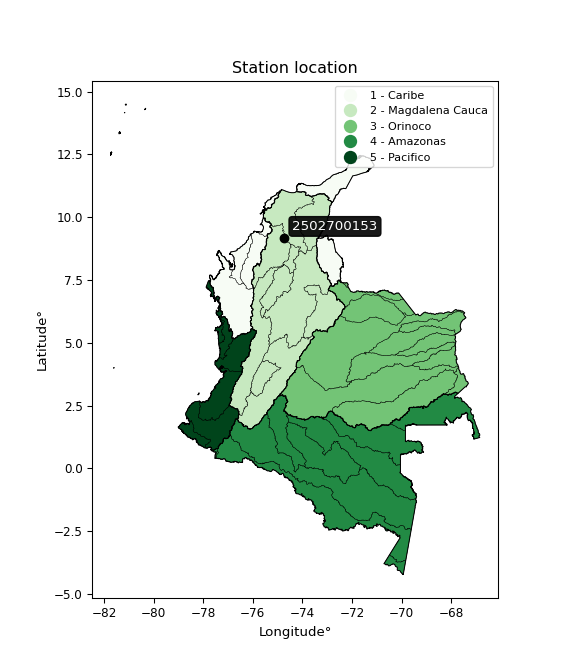

<div align="center">


</div>

# PMax24h Station (Rain): 2502700153

Maximum Precipitation in 24 hours (PMax24h) is the greatest amount of rainfall for a specific duration that is meteorologically possible for a given location, acting as a "worst-case" scenario for extreme storms, crucial for designing safety-critical infrastructure like bridges, river deviations, dams, spillways, and nuclear plants to prevent catastrophic failure. The PMax24h is related with the Probable Maximum Precipitation (PMP) and it is calculated by hydrologists using meteorological data to determine the upper limit of extreme rainfall, often leading to the Probable Maximum Flood (PMF) for flood control design, and is increasingly being studied for climate change impacts. Probable Maximum Precipitation (PMP) is the theoretical upper limit of rainfall, a deterministic estimate for extreme events, while probability distributions (like GEV, Gumbel) describe the likelihood and frequency of various precipitation amounts, including rare ones, showing how often events occur, with PMP representing the extreme end of these distributions, used for critical infrastructure design to ensure safety against the worst conceivable weather, unlike standard statistical forecasts which cover typical probabilities.

The most common probability distributions in hydrology, used for analyzing floods, rainfall, and streamflow, include the Normal, Log-Normal, Gumbel, Gamma (including Log-Pearson Type III), and Generalized Extreme Value (GEV) distributions, often chosen based on the data´s skewness and whether modeling extremes or general conditions, with Gumbel and GEV popular for extreme events like floods, while the Normal distribution serves as a baseline, though often requiring transformations for skewed hydrological data. These distributions help in designing water infrastructure, managing water resources, and forecasting hydrologic events.

> Hydrological data often isn´t perfectly normal (it´s skewed), so different distributions are needed for different applications, such as: **Flood Frequency Analysis**: Using Gumbel, GEV, or Log-Pearson Type III for predicting extreme flood magnitudes and their return periods, **Rainfall Analysis**: Normal for annual totals, but Log-Normal, Weibull, or GEV for intensity or extreme daily rainfall, **Streamflow Modeling**: Gamma and Log-Normal for maximum flows, GEV for minimum flows, and Kappa for daily flows.

<div align="center">

</img>

</div>


## A. General information


### 1. General running parameters

• app_version: _v20260225_. • runtime: _2026-02-28 16:54:07.457399_. • Python version: _3.14.0_. • SciPy version: _1.16.3_. • Pandas version: _2.3.3_. • NumPy version: _2.3.5_. • Stations dataset (station_dataset_file): _dataset/pmax24h_in/automatic_colombia_2003_2025.csv_. • Stations catalog (station_catalog_file): _dataset/CNE.xls_. • Minimum year to eval til year_max (date_min): _1900_. • Maximum year to eval since year_min (date_max): _2025_. • Creates, save and include plots into reports (create_plot): _False_. • Plot only fit distributions with Δo > Δ (plot_only_fit): _True_. • Plot only simple graphs avoiding multiple CDFs and multiple Extreme values plots (plot_only_simple): _False_. • Eval low extreme values, if False, evaluates high extreme values (low_extreme): _False_. • Eval every SciPy distribution as logarithmic (pdist_logarithmic_on): _True_. • Standard deviation normalized (ddof): _1.0_. • Return periods to eval in years (Tr): _[2, 2.33, 5, 10, 15, 20, 25, 50, 75, 100, 200, 250, 500, 750, 1000]_. • Minimum data sample per station, 0 means any (minimum_sample): _5_. • Z-Score maximum threshold to adjust a value, 0 means disable (zscore_max): _3.5_. • Z-Score minimum threshold to adjust a value, 0 means disable (zscore_min): _-2.5_. • Avoid zeros, e.g. rain = 0 (avoid_zeros): _True_. • Avoid null values (avoid_nans): _True_. 

:file_folder:Table: [dataset.csv](../../dataset/pmax24h_in/automatic_colombia_2003_2025.csv)

> Delta Degrees of Freedom (DDOF): is a parameter used in the formulas for calculating variance and standard deviation. When ddof=0, the divisor is $N$ (the total number of observations) and this is used when your data set is the entire population. When ddof=1, the divisor is $N-1$ and this is used when your data set is a sample drawn from a larger population. Using $N-1$ provides an unbiased estimate of the population variance (known as Bessel´s correction).


### 2. Station info and location

|   id |     CODIGO | NOMBRE                                | CATEGORIA    | TECNOLOGIA                | ESTADO           | FECHA_INSTALACION   |   FECHA_SUSPENSION |   ALTITUD |   LATITUD |   LONGITUD | DEPARTAMENTO   | MUNICIPIO   | AREA_OPERATIVA                              | ENTIDAD                                                     | AREA_HIDROGRAFICA   | ZONA_HIDROGRAFICA                | SUBZONA_HIDROGRAFICA       | CORRIENTE   | Catalogo   |   Version |
|-----:|-----------:|:--------------------------------------|:-------------|:--------------------------|:-----------------|:--------------------|-------------------:|----------:|----------:|-----------:|:---------------|:------------|:--------------------------------------------|:------------------------------------------------------------|:--------------------|:---------------------------------|:---------------------------|:------------|:-----------|----------:|
|    0 | 2502700153 | PLANTA ECOPETROL - AUT   [2502700153] | Limnigráfica | Automática con Telemetría | En Mantenimiento | 12/10/2018          |                nan |        14 |    9.1751 |   -74.7301 | Bolivar        | Magangué    | Area Operativa 02 - Atlántico-Bolivar-Sucre | INSTITUTO DE HIDROLOGIA METEOROLOGIA Y ESTUDIOS AMBIENTALES | Magdalena Cauca     | Bajo Magdalena- Cauca -San Jorge | Bajo San Jorge - La Mojana | Magdalena   | CNE_IDEAM  |  20251226 |

<div align="center">

Dynamic map: [:earth_americas:Google](http://maps.google.com/maps?q=9.1751,-74.730088889) [:earth_americas:OSM](https://www.openstreetmap.org/#map=18/9.1751/-74.730088889&layers=P) [:earth_americas:Bing](https://www.bing.com/maps?cp=9.1751~-74.730088889&lvl=18) [:earth_americas:Apple](https://maps.apple.com/frame?center=9.1751%2C-74.730088889&span=0.003%2C0.006)

</div>


<div align="center">

```geojson
{
  "type": "Feature",
  "geometry": {
    "type": "Point", 
    "coordinates": [-74.730088889, 9.1751]
  }, 
  "properties": {
    "Name": "2502700153"
  }
}
```

</div>


### 3. Discrete values table and plot

<div align="center">

|               |          0 |             1 |           2 |           3 |           4 |
|:--------------|-----------:|--------------:|------------:|------------:|------------:|
| Date          | 2019       | 2020          | 2022        | 2023        | 2025        |
| Value         |  183       |   59.8        |   34.8      |    9        |   11.1      |
| Value_initial |  183       |   59.8        |   34.8      |    9        |   11.1      |
| count         |    5       |    5          |    5        |    5        |    5        |
| mean          |   59.54    |   59.54       |   59.54     |   59.54     |   59.54     |
| std           |   72.0334  |   72.0334     |   72.0334   |   72.0334   |   72.0334   |
| zscore        |    1.71393 |    0.00360944 |   -0.343452 |   -0.701619 |   -0.672466 |


</div>


> The initial value (value_initial) correspond to the initial obtained or null completed value, and value (value) is adjusted only when the initial value is outside the valid range (outlier) definite through the Z-Score value. If Z-Score is active, values out of range or outliers are replaced with the station mean value. A Z-Score (or standard score) measures how many standard deviations a data point is from the mean of a dataset, indicating its relative position; positive scores mean above the mean, negative mean below, and a score of zero is exactly at the mean, allowing for comparison of values from different distributions. It´s calculated using the formula $z=(x–μ)/σ$, where $x$ is the data point, $μ$ is the mean, and $σ$ is the standard deviation, helping identify outliers and understand probability.
>
> <sub>**Note**: In this study, "completing" (filling gaps in) and "extending" (forecasting or lengthening the historical record) rainfall data series are avoided for certain critical analyses because they introduce artificial bias and uncertainty, which can distort the statistics of rare events (extremes), alter day-to-day variability, and compromise the integrity and homogeneity of the original data. Some reasons against Completing/Extending rainfall data are: **Distortion of Extremes and Variability**: The primary issue is that most gap-filling or extension methods rely on averaging or regression with nearby stations, which inherently smooths the data. Rainfall is highly variable in space and time, with a large percentage of zero values and occasional large storms. Infilling methods often underestimate the highest values and overestimate the lowest (zero) values, which severely distorts analyses focused on flood frequency, drought severity, and intensity-duration-frequency (IDF) curves, **Loss of Data Homogeneity**: Infilled or extended data are synthetic estimates, not actual measurements. Combining these estimates with observed data can violate the assumption of data homogeneity, which requires that the data properties do not change over time. Inhomogeneity can lead to incorrect conclusions about long-term trends or changes in climate patterns, **Propagation of Errors**: Errors and biases from the original data (e.g., wind-induced undercatch, instrument errors, site changes) or the data used for imputation can propagate through the analysis, leading to unreliable hydrological models and inaccurate predictions, **Compromised Statistical Integrity**: For statistical analyses, especially those involving the frequency of events, using artificial data can introduce time bias or autocorrelation that doesn´t exist in reality, making it difficult to assess the true probability of events, **Difficulty in Validation**: It is difficult to accurately validate the quality of filled or extended data, especially for past periods where ground-truth measurements are unavailable. The reliability of imputation techniques heavily depends on the density of the surrounding station network and the complexity of the local topography.</sub>


### 4. Active continuous probability distributions from SciPy (80 of 104 available)

A Probability Density Function (PDF) describes the relative likelihood of a continuous random variable falling within a specific range, where the total area under its curve equals 1, and the area over any interval gives the actual probability for that range. Unlike discrete probabilities (like rolling a die), a PDF shows density, not direct probability for a single point (which is zero), with higher points indicating higher likelihood, often visualized as a bell curve for normal distributions.

A log of a probability density function (log-PDF) is simply the logarithm of the PDF´s value, denoted as $log(f(x))$, useful for converting multiplication of probabilities into addition, improving numerical stability with tiny numbers, and connecting to information theory concepts like entropy. Instead of dealing with very small probabilities (e.g., 0.000001), log-PDFs use negative numbers (e.g., $log(0.00001) ≈ -11.51$ that are easier for computers to handle, preventing underflow errors and simplifying complex calculations. In this study, each active probability distribution from SciPy is also evaluated in the $log$ form.

[scipy.stats](https://docs.scipy.org/doc/scipy/reference/stats.html) is a Python´s powerful submodule within the SciPy library for comprehensive statistical analysis, offering over 130 probability distributions (like Normal, Poisson, etc.), functions for descriptive stats (mean, variance), hypothesis testing (t-tests, chi-square), random variable generation, and statistical tests, making it essential for data science, modeling, and research. It provides tools to explore, model, and draw conclusions from data efficiently, working seamlessly with [NumPy](https://numpy.org/).

<div align="center">

|   id | p_dist           |   n_parameter | fit_method   | label                                                                       | active   | ref                                                                                                      |
|-----:|:-----------------|--------------:|:-------------|:----------------------------------------------------------------------------|:---------|:---------------------------------------------------------------------------------------------------------|
|    0 | alpha            |             3 | MLE          | Alpha                                                                       | True     | [:mortar_board:](https://docs.scipy.org/doc/scipy/reference/generated/scipy.stats.alpha.html)            |
|    1 | anglit           |             2 | MM           | Anglit                                                                      | True     | [:mortar_board:](https://docs.scipy.org/doc/scipy/reference/generated/scipy.stats.anglit.html)           |
|    2 | arcsine          |             2 | MM           | Arcsine                                                                     | True     | [:mortar_board:](https://docs.scipy.org/doc/scipy/reference/generated/scipy.stats.arcsine.html)          |
|    3 | argus            |             3 | MLE          | Argus                                                                       | True     | [:mortar_board:](https://docs.scipy.org/doc/scipy/reference/generated/scipy.stats.argus.html)            |
|    4 | beta             |             4 | MLE          | Beta                                                                        | True     | [:mortar_board:](https://docs.scipy.org/doc/scipy/reference/generated/scipy.stats.beta.html)             |
|    5 | betaprime        |             4 | MLE          | Beta prime                                                                  | True     | [:mortar_board:](https://docs.scipy.org/doc/scipy/reference/generated/scipy.stats.betaprime.html)        |
|    6 | bradford         |             3 | MLE          | Bradford                                                                    | True     | [:mortar_board:](https://docs.scipy.org/doc/scipy/reference/generated/scipy.stats.bradford.html)         |
|    7 | burr             |             4 | MLE          | Burr (Type III)                                                             | True     | [:mortar_board:](https://docs.scipy.org/doc/scipy/reference/generated/scipy.stats.burr.html)             |
|    8 | burr12           |             4 | MLE          | Burr (Type III) 12                                                          | True     | [:mortar_board:](https://docs.scipy.org/doc/scipy/reference/generated/scipy.stats.burr12.html)           |
|    9 | cosine           |             2 | MLE          | Cosine                                                                      | True     | [:mortar_board:](https://docs.scipy.org/doc/scipy/reference/generated/scipy.stats.cosine.html)           |
|   10 | crystalball      |             4 | MLE          | Crystalball                                                                 | True     | [:mortar_board:](https://docs.scipy.org/doc/scipy/reference/generated/scipy.stats.crystalball.html)      |
|   11 | dgamma           |             3 | MLE          | Double gamma                                                                | True     | [:mortar_board:](https://docs.scipy.org/doc/scipy/reference/generated/scipy.stats.dgamma.html)           |
|   12 | dweibull         |             3 | MLE          | Double Weibull                                                              | True     | [:mortar_board:](https://docs.scipy.org/doc/scipy/reference/generated/scipy.stats.dweibull.html)         |
|   13 | erlang           |             3 | MLE          | Erlang                                                                      | True     | [:mortar_board:](https://docs.scipy.org/doc/scipy/reference/generated/scipy.stats.erlang.html)           |
|   14 | exponnorm        |             3 | MLE          | Exponentially modified Normal                                               | True     | [:mortar_board:](https://docs.scipy.org/doc/scipy/reference/generated/scipy.stats.exponnorm.html)        |
|   15 | exponpow         |             3 | MLE          | Exponential power                                                           | True     | [:mortar_board:](https://docs.scipy.org/doc/scipy/reference/generated/scipy.stats.exponpow.html)         |
|   16 | exponweib        |             4 | MLE          | Exponentiated Weibull                                                       | True     | [:mortar_board:](https://docs.scipy.org/doc/scipy/reference/generated/scipy.stats.exponweib.html)        |
|   17 | f                |             4 | MLE          | F                                                                           | True     | [:mortar_board:](https://docs.scipy.org/doc/scipy/reference/generated/scipy.stats.f.html)                |
|   18 | fatiguelife      |             3 | MLE          | Fatigue-life (Birnbaum-Saunders)                                            | True     | [:mortar_board:](https://docs.scipy.org/doc/scipy/reference/generated/scipy.stats.fatiguelife.html)      |
|   19 | foldnorm         |             3 | MM           | Fold Normal                                                                 | True     | [:mortar_board:](https://docs.scipy.org/doc/scipy/reference/generated/scipy.stats.foldnorm.html)         |
|   20 | gamma            |             3 | MLE          | Gamma                                                                       | True     | [:mortar_board:](https://docs.scipy.org/doc/scipy/reference/generated/scipy.stats.gamma.html)            |
|   21 | gausshyper       |             6 | MLE          | Gauss hypergeometric                                                        | True     | [:mortar_board:](https://docs.scipy.org/doc/scipy/reference/generated/scipy.stats.gausshyper.html)       |
|   22 | genexpon         |             5 | MLE          | Generalized exponential                                                     | True     | [:mortar_board:](https://docs.scipy.org/doc/scipy/reference/generated/scipy.stats.genexpon.html)         |
|   23 | genextreme       |             3 | MLE          | Generalized exponential                                                     | True     | [:mortar_board:](https://docs.scipy.org/doc/scipy/reference/generated/scipy.stats.genextreme.html)       |
|   24 | gengamma         |             4 | MLE          | Generalized gamma                                                           | True     | [:mortar_board:](https://docs.scipy.org/doc/scipy/reference/generated/scipy.stats.gengamma.html)         |
|   25 | genhalflogistic  |             3 | MLE          | Generalized half-logistic                                                   | True     | [:mortar_board:](https://docs.scipy.org/doc/scipy/reference/generated/scipy.stats.genhalflogistic.html)  |
|   26 | genlogistic      |             3 | MLE          | Generalized logistic                                                        | True     | [:mortar_board:](https://docs.scipy.org/doc/scipy/reference/generated/scipy.stats.genlogistic.html)      |
|   27 | gennorm          |             3 | MLE          | Generalized Normal                                                          | True     | [:mortar_board:](https://docs.scipy.org/doc/scipy/reference/generated/scipy.stats.gennorm.html)          |
|   28 | genpareto        |             3 | MLE          | Generalized Pareto                                                          | True     | [:mortar_board:](https://docs.scipy.org/doc/scipy/reference/generated/scipy.stats.genpareto.html)        |
|   29 | gompertz         |             3 | MLE          | Gompertz (or truncated Gumbel)                                              | True     | [:mortar_board:](https://docs.scipy.org/doc/scipy/reference/generated/scipy.stats.gompertz.html)         |
|   30 | gumbel_l         |             2 | MM           | Gumbel Left Skew                                                            | True     | [:mortar_board:](https://docs.scipy.org/doc/scipy/reference/generated/scipy.stats.gumbel_l.html)         |
|   31 | gumbel_r         |             2 | MM           | Gumbel Right Skew                                                           | True     | [:mortar_board:](https://docs.scipy.org/doc/scipy/reference/generated/scipy.stats.gumbel_r.html)         |
|   32 | halfgennorm      |             3 | MLE          | Upper half of a generalized normal                                          | True     | [:mortar_board:](https://docs.scipy.org/doc/scipy/reference/generated/scipy.stats.halfgennorm.html)      |
|   33 | halflogistic     |             2 | MM           | Half-logistic                                                               | True     | [:mortar_board:](https://docs.scipy.org/doc/scipy/reference/generated/scipy.stats.halflogistic.html)     |
|   34 | halfnorm         |             2 | MM           | Half Normal                                                                 | True     | [:mortar_board:](https://docs.scipy.org/doc/scipy/reference/generated/scipy.stats.halfnorm.html)         |
|   35 | hypsecant        |             2 | MM           | hyperbolic secant                                                           | True     | [:mortar_board:](https://docs.scipy.org/doc/scipy/reference/generated/scipy.stats.hypsecant.html)        |
|   36 | invgamma         |             3 | MLE          | Inverted gamma                                                              | True     | [:mortar_board:](https://docs.scipy.org/doc/scipy/reference/generated/scipy.stats.invgamma.html)         |
|   37 | invgauss         |             3 | MLE          | Inverse Gaussian                                                            | True     | [:mortar_board:](https://docs.scipy.org/doc/scipy/reference/generated/scipy.stats.invgauss.html)         |
|   38 | invweibull       |             3 | MLE          | Inverted Weibull                                                            | True     | [:mortar_board:](https://docs.scipy.org/doc/scipy/reference/generated/scipy.stats.invweibull.html)       |
|   39 | johnsonsb        |             4 | MLE          | Johnson SB                                                                  | True     | [:mortar_board:](https://docs.scipy.org/doc/scipy/reference/generated/scipy.stats.johnsonsb.html)        |
|   40 | johnsonsu        |             4 | MLE          | Johnson Su                                                                  | True     | [:mortar_board:](https://docs.scipy.org/doc/scipy/reference/generated/scipy.stats.johnsonsu.html)        |
|   41 | kappa3           |             3 | MLE          | Kappa 3                                                                     | True     | [:mortar_board:](https://docs.scipy.org/doc/scipy/reference/generated/scipy.stats.kappa3.html)           |
|   42 | kappa4           |             4 | MLE          | Kappa 4                                                                     | True     | [:mortar_board:](https://docs.scipy.org/doc/scipy/reference/generated/scipy.stats.kappa4.html)           |
|   43 | ksone            |             3 | MLE          | Kolmogorov-Smirnov one-sided test statistic distribution                    | True     | [:mortar_board:](https://docs.scipy.org/doc/scipy/reference/generated/scipy.stats.ksone.html)            |
|   44 | kstwobign        |             2 | MLE          | Limiting distribution of scaled Kolmogorov-Smirnov two-sided test statistic | True     | [:mortar_board:](https://docs.scipy.org/doc/scipy/reference/generated/scipy.stats.kstwobign.html)        |
|   45 | laplace          |             2 | MM           | Laplace                                                                     | True     | [:mortar_board:](https://docs.scipy.org/doc/scipy/reference/generated/scipy.stats.laplace.html)          |
|   46 | levy_l           |             2 | MLE          | Left-skewed Levy                                                            | True     | [:mortar_board:](https://docs.scipy.org/doc/scipy/reference/generated/scipy.stats.levy_l.html)           |
|   47 | loggamma         |             3 | MLE          | Log gamma                                                                   | True     | [:mortar_board:](https://docs.scipy.org/doc/scipy/reference/generated/scipy.stats.loggamma.html)         |
|   48 | logistic         |             2 | MM           | Logistic (or Sech-squared)                                                  | True     | [:mortar_board:](https://docs.scipy.org/doc/scipy/reference/generated/scipy.stats.logistic.html)         |
|   49 | loglaplace       |             3 | MLE          | Log-Laplace                                                                 | True     | [:mortar_board:](https://docs.scipy.org/doc/scipy/reference/generated/scipy.stats.loglaplace.html)       |
|   50 | lomax            |             3 | MLE          | Lomax (Pareto of the second kind)                                           | True     | [:mortar_board:](https://docs.scipy.org/doc/scipy/reference/generated/scipy.stats.lomax.html)            |
|   51 | maxwell          |             2 | MM           | Maxwell                                                                     | True     | [:mortar_board:](https://docs.scipy.org/doc/scipy/reference/generated/scipy.stats.maxwell.html)          |
|   52 | mielke           |             4 | MLE          | Mielke Beta-Kappa / Dagum                                                   | True     | [:mortar_board:](https://docs.scipy.org/doc/scipy/reference/generated/scipy.stats.mielke.html)           |
|   53 | moyal            |             2 | MM           | Moyal                                                                       | True     | [:mortar_board:](https://docs.scipy.org/doc/scipy/reference/generated/scipy.stats.moyal.html)            |
|   54 | nakagami         |             3 | MLE          | Nakagami                                                                    | True     | [:mortar_board:](https://docs.scipy.org/doc/scipy/reference/generated/scipy.stats.nakagami.html)         |
|   55 | ncf              |             5 | MLE          | Non-central F distribution                                                  | True     | [:mortar_board:](https://docs.scipy.org/doc/scipy/reference/generated/scipy.stats.ncf.html)              |
|   56 | nct              |             4 | MLE          | Non-central Student’s t                                                     | True     | [:mortar_board:](https://docs.scipy.org/doc/scipy/reference/generated/scipy.stats.nct.html)              |
|   57 | norm             |             2 | MM           | Normal                                                                      | True     | [:mortar_board:](https://docs.scipy.org/doc/scipy/reference/generated/scipy.stats.norm.html)             |
|   58 | pearson3         |             3 | MM           | Pearson type III                                                            | True     | [:mortar_board:](https://docs.scipy.org/doc/scipy/reference/generated/scipy.stats.pearson3.html)         |
|   59 | powerlaw         |             3 | MLE          | Power-function                                                              | True     | [:mortar_board:](https://docs.scipy.org/doc/scipy/reference/generated/scipy.stats.powerlaw.html)         |
|   60 | rayleigh         |             2 | MM           | Rayleigh                                                                    | True     | [:mortar_board:](https://docs.scipy.org/doc/scipy/reference/generated/scipy.stats.rayleigh.html)         |
|   61 | rdist            |             3 | MLE          | R-distributed (symmetric beta)                                              | True     | [:mortar_board:](https://docs.scipy.org/doc/scipy/reference/generated/scipy.stats.rdist.html)            |
|   62 | rice             |             3 | MLE          | Rice                                                                        | True     | [:mortar_board:](https://docs.scipy.org/doc/scipy/reference/generated/scipy.stats.rice.html)             |
|   63 | semicircular     |             2 | MM           | Semicircular                                                                | True     | [:mortar_board:](https://docs.scipy.org/doc/scipy/reference/generated/scipy.stats.semicircular.html)     |
|   64 | skewnorm         |             3 | MLE          | Skew normal                                                                 | True     | [:mortar_board:](https://docs.scipy.org/doc/scipy/reference/generated/scipy.stats.skewnorm.html)         |
|   65 | t                |             3 | MLE          | Student’s t                                                                 | True     | [:mortar_board:](https://docs.scipy.org/doc/scipy/reference/generated/scipy.stats.t.html)                |
|   66 | trapezoid        |             4 | MLE          | Trapezoid                                                                   | True     | [:mortar_board:](https://docs.scipy.org/doc/scipy/reference/generated/scipy.stats.trapezoid.html)        |
|   67 | triang           |             3 | MLE          | Triangular                                                                  | True     | [:mortar_board:](https://docs.scipy.org/doc/scipy/reference/generated/scipy.stats.triang.html)           |
|   68 | truncexpon       |             3 | MLE          | Truncated exponential                                                       | True     | [:mortar_board:](https://docs.scipy.org/doc/scipy/reference/generated/scipy.stats.truncexpon.html)       |
|   69 | truncnorm        |             4 | MLE          | Truncated normal                                                            | True     | [:mortar_board:](https://docs.scipy.org/doc/scipy/reference/generated/scipy.stats.truncnorm.html)        |
|   70 | truncpareto      |             4 | MLE          | Upper truncated Pareto                                                      | True     | [:mortar_board:](https://docs.scipy.org/doc/scipy/reference/generated/scipy.stats.truncpareto.html)      |
|   71 | truncweibull_min |             5 | MLE          | Doubly truncated Weibull minimum                                            | True     | [:mortar_board:](https://docs.scipy.org/doc/scipy/reference/generated/scipy.stats.truncweibull_min.html) |
|   72 | tukeylambda      |             3 | MLE          | Tukey-Lamdba                                                                | True     | [:mortar_board:](https://docs.scipy.org/doc/scipy/reference/generated/scipy.stats.tukeylambda.html)      |
|   73 | uniform          |             2 | MLE          | Uniform                                                                     | True     | [:mortar_board:](https://docs.scipy.org/doc/scipy/reference/generated/scipy.stats.uniform.html)          |
|   74 | vonmises         |             3 | MLE          | Von Mises                                                                   | True     | [:mortar_board:](https://docs.scipy.org/doc/scipy/reference/generated/scipy.stats.vonmises.html)         |
|   75 | vonmises_line    |             3 | MLE          | Von Mises line                                                              | True     | [:mortar_board:](https://docs.scipy.org/doc/scipy/reference/generated/scipy.stats.vonmises_line.html)    |
|   76 | wald             |             2 | MM           | Wald                                                                        | True     | [:mortar_board:](https://docs.scipy.org/doc/scipy/reference/generated/scipy.stats.wald.html)             |
|   77 | weibull_max      |             3 | MLE          | Weibull maximum                                                             | True     | [:mortar_board:](https://docs.scipy.org/doc/scipy/reference/generated/scipy.stats.weibull_max.html)      |
|   78 | weibull_min      |             3 | MLE          | Weibull minimum                                                             | True     | [:mortar_board:](https://docs.scipy.org/doc/scipy/reference/generated/scipy.stats.weibull_min.html)      |
|   79 | wrapcauchy       |             3 | MLE          | Wrapped  Cauchy                                                             | True     | [:mortar_board:](https://docs.scipy.org/doc/scipy/reference/generated/scipy.stats.wrapcauchy.html)       |

</div>

> **n_parameter:** # arguments & localization & scale.
>
> **Fit methods:** (MLE) maximum likelihood, (MM) L-moments.
>
>**Inactive** (With the only purpose of prevent loops, zero divisions, infinite values, over high estimated values or horizontal trending for recurrence intervals estimations, the follow distributions were disabled.)**:** lognorm, norminvgauss, powernorm, powerlognorm, cauchy, halfcauchy, foldcauchy, skewcauchy, chi2, expon, fisk, genhyperbolic, geninvgauss, gibrat, kstwo, laplace_asymmetric, levy, levy_stable, ncx2, pareto, rel_breitwigner, recipinvgauss, studentized_range, loguniform, 


## B. Probability (PDF) vs. Empirical (EDF) distributions functions

A continuous probability distribution (CPD) describes probabilities for variables that can take any value within a range (like rain any time), unlike discrete variables with specific outcomes (like temperature). It uses a Probability Density Function (PDF), a curve where the total area under it equals 1, and the probability of the variable falling within an interval (a to b) is found by calculating the area under the curve between those points. A key feature is that the probability of hitting any single exact value is zero, so probabilities are always expressed for ranges, e.g., $P(a ≤ X ≤ b)$.

<div align="center">

Distributions parameters from station values
|     |    station | p_dist              |   n |              loc |           scale | shape                  | shape1                 | shape2                 | shape3             |
|----:|-----------:|:--------------------|----:|-----------------:|----------------:|:-----------------------|:-----------------------|:-----------------------|:-------------------|
|   0 | 2502700153 | alpha               |   5 |     -0.0374276   |    15.2709      | 1.4594803325905895e-09 |                        |                        |                    |
|   1 | 2502700153 | anglit              |   5 |     59.54        |   188.479       |                        |                        |                        |                    |
|   2 | 2502700153 | arcsine             |   5 |    -31.5758      |   182.232       |                        |                        |                        |                    |
|   3 | 2502700153 | argus               |   5 |    -79.8519      |   276.747       | 8.376254224901936e-07  |                        |                        |                    |
|   4 | 2502700153 | beta                |   5 |     -8.58746     |   191.587       | 0.11764637806077513    | 0.3728339690497834     |                        |                    |
|   5 | 2502700153 | betaprime           |   5 |      8.79379     |     0.00118525  | 213.51312950029944     | 0.30961399669088385    |                        |                    |
|   6 | 2502700153 | bradford            |   5 |      8.52345     |   174.477       | 74.06517100794292      |                        |                        |                    |
|   7 | 2502700153 | burr                |   5 |     -0.103901    |     0.259172    | 1.1005303416032852     | 115.73842317565123     |                        |                    |
|   8 | 2502700153 | burr12              |   5 |      0.246965    |     8.5998      | 232.22855429522747     | 0.003246049876084735   |                        |                    |
|   9 | 2502700153 | cosine              |   5 |     70.3262      |    54.7794      |                        |                        |                        |                    |
|  10 | 2502700153 | crystalball         |   5 |      0.472233    |    87.5696      | 8.821387796827104      | 1.0000001027864829     |                        |                    |
|  11 | 2502700153 | dgamma              |   5 |     34.8         |    45.2546      | 0.5823678583570069     |                        |                        |                    |
|  12 | 2502700153 | dweibull            |   5 |     34.8         |    50.0409      | 0.8574333569655225     |                        |                        |                    |
|  13 | 2502700153 | erlang              |   5 |      9           |    64.543       | 0.5746090085709707     |                        |                        |                    |
|  14 | 2502700153 | exponnorm           |   5 |      8.9553      |     0.0139583   | 3604.7860888662626     |                        |                        |                    |
|  15 | 2502700153 | exponpow            |   5 |      9           |    55.5315      | 0.5424376798643175     |                        |                        |                    |
|  16 | 2502700153 | exponweib           |   5 |      9           |     0.588703    | 2.0074497461019174     | 0.20111211208958224    |                        |                    |
|  17 | 2502700153 | f                   |   5 |      9           |    10.1994      | 0.5017031138401622     | 1.0363222613583036     |                        |                    |
|  18 | 2502700153 | fatiguelife         |   5 |      9           |     7.0208e-06  | 2487.900597886528      |                        |                        |                    |
|  19 | 2502700153 | foldnorm            |   5 |    -27.9027      |   109.22        | 0.006690388929537348   |                        |                        |                    |
|  20 | 2502700153 | gamma               |   5 |      9           |    36.8151      | 0.8561234185092086     |                        |                        |                    |
|  21 | 2502700153 | gausshyper          |   5 |    -36.9348      |   219.935       | 1.2721986437995036     | 0.8488349023986168     | 0.981573379862397      | 1.0093852577370188 |
|  22 | 2502700153 | genexpon            |   5 |      9           |   108.26        | 2.142067760289874      | 1.0957958332344805e-11 | 3.1136431168241288     |                    |
|  23 | 2502700153 | genextreme          |   5 |      9.00988     |     0.0632938   | -6.409458953395255     |                        |                        |                    |
|  24 | 2502700153 | gengamma            |   5 |      9           |    48.6931      | 0.8322209582871638     | 0.6478857621974636     |                        |                    |
|  25 | 2502700153 | genhalflogistic     |   5 |     -8.67431     |   200.188       | 1.0444177032180955     |                        |                        |                    |
|  26 | 2502700153 | genlogistic         |   5 |   -258.791       |    39.0505      | 1727.2331992462912     |                        |                        |                    |
|  27 | 2502700153 | gennorm             |   5 |     34.8         |     2.32653     | 0.3842954625915145     |                        |                        |                    |
|  28 | 2502700153 | genpareto           |   5 |      9           |     5.49762     | 1.809632531447388      |                        |                        |                    |
|  29 | 2502700153 | gompertz            |   5 |      9           |   186.134       | 2.424921118351092      |                        |                        |                    |
|  30 | 2502700153 | gumbel_l            |   5 |     88.5363      |    50.2348      |                        |                        |                        |                    |
|  31 | 2502700153 | gumbel_r            |   5 |     30.5437      |    50.2348      |                        |                        |                        |                    |
|  32 | 2502700153 | halfgennorm         |   5 |      8.99974     |     1.77271e-09 | 0.10240341996387814    |                        |                        |                    |
|  33 | 2502700153 | halflogistic        |   5 |    -16.8229      |    55.0842      |                        |                        |                        |                    |
|  34 | 2502700153 | halfnorm            |   5 |    -25.7382      |   106.88        |                        |                        |                        |                    |
|  35 | 2502700153 | hypsecant           |   5 |     59.54        |    41.0165      |                        |                        |                        |                    |
|  36 | 2502700153 | invgamma            |   5 |      9           |     1.44001e-10 | 0.16874621144195612    |                        |                        |                    |
|  37 | 2502700153 | invgauss            |   5 |      7.84283     |     4.39937     | 11.751041958296966     |                        |                        |                    |
|  38 | 2502700153 | invweibull          |   5 |      9           |     4.49343     | 0.04845220955442135    |                        |                        |                    |
|  39 | 2502700153 | johnsonsb           |   5 |      9           |   174           | 1.5214485809574727     | 0.2140318967482572     |                        |                    |
|  40 | 2502700153 | johnsonsu           |   5 |      9           |     3.05611e-10 | -0.7971048115609002    | 0.08223174379222949    |                        |                    |
|  41 | 2502700153 | kappa3              |   5 |      9           |     4.29815     | 0.5468231650814975     |                        |                        |                    |
|  42 | 2502700153 | kappa4              |   5 |     -8.26121     |   192.047       | 1.0987358956846238     | 0.9959182403429616     |                        |                    |
|  43 | 2502700153 | ksone               |   5 |     -8.4         |   208.8         | 1.0                    |                        |                        |                    |
|  44 | 2502700153 | kstwobign           |   5 |   -112.63        |   199.715       |                        |                        |                        |                    |
|  45 | 2502700153 | laplace             |   5 |     59.54        |    45.5579      |                        |                        |                        |                    |
|  46 | 2502700153 | levy_l              |   5 |    195.571       |    48.1173      |                        |                        |                        |                    |
|  47 | 2502700153 | loggamma            |   5 | -22023.5         |  2913.61        | 1957.8297322136327     |                        |                        |                    |
|  48 | 2502700153 | logistic            |   5 |     59.54        |    35.5214      |                        |                        |                        |                    |
|  49 | 2502700153 | loglaplace          |   5 |     -0.0842991   |    34.8843      | 1.0681019954997373     |                        |                        |                    |
|  50 | 2502700153 | lomax               |   5 |      9           | 13258.6         | 262.961781636213       |                        |                        |                    |
|  51 | 2502700153 | maxwell             |   5 |    -93.1288      |    95.671       |                        |                        |                        |                    |
|  52 | 2502700153 | mielke              |   5 |     -0.0355121   |     0.124332    | 272.5694241044281      | 1.0941851305833696     |                        |                    |
|  53 | 2502700153 | moyal               |   5 |     22.6956      |    29.0031      |                        |                        |                        |                    |
|  54 | 2502700153 | nakagami            |   5 |      9           |    98.3377      | 0.1505422834111555     |                        |                        |                    |
|  55 | 2502700153 | ncf                 |   5 |      0.470514    |    19.3588      | 141.57785590898533     | 2.2093678472461615     | 3.723297844907632e-05  |                    |
|  56 | 2502700153 | nct                 |   5 |      7.19126     |     1.45699     | 0.4619467287287004     | 2.952647051881734      |                        |                    |
|  57 | 2502700153 | norm                |   5 |     59.54        |    64.4286      |                        |                        |                        |                    |
|  58 | 2502700153 | pearson3            |   5 |     59.54        |    64.4286      | 1.2143926680908064     |                        |                        |                    |
|  59 | 2502700153 | powerlaw            |   5 |      9           |   174           | 0.1071117376949155     |                        |                        |                    |
|  60 | 2502700153 | rayleigh            |   5 |    -63.7157      |    98.3438      |                        |                        |                        |                    |
|  61 | 2502700153 | rdist               |   5 |     -8.04821     |    67.8482      | 1.2013167686510449     |                        |                        |                    |
|  62 | 2502700153 | rice                |   5 |    -36.6503      |    81.8646      | 0.00045864521666503285 |                        |                        |                    |
|  63 | 2502700153 | semicircular        |   5 |     59.54        |   128.857       |                        |                        |                        |                    |
|  64 | 2502700153 | skewnorm            |   5 |      8.99995     |    81.8888      | 7913907.6980841085     |                        |                        |                    |
|  65 | 2502700153 | t                   |   5 |     27.934       |    24.5932      | 1.3196175178384788     |                        |                        |                    |
|  66 | 2502700153 | trapezoid           |   5 |     -8.82        |   208.8         | 1.0                    | 1.0                    |                        |                    |
|  67 | 2502700153 | triang              |   5 |     -9.68261     |   192.683       | 0.9999996246510956     |                        |                        |                    |
|  68 | 2502700153 | truncexpon          |   5 |      8.99995     |   127.016       | 1.369910562600258      |                        |                        |                    |
|  69 | 2502700153 | truncnorm           |   5 |  -5263.51        |   561.424       | 9.391284744442153      | 237.5276851790909      |                        |                    |
|  70 | 2502700153 | truncpareto         |   5 |     -2.14748e+09 |     2.14748e+09 | 42490737.41370861      | 1.0000000810250644     |                        |                    |
|  71 | 2502700153 | truncweibull_min    |   5 |      8.92943     |   134.336       | 0.06015817544673303    | 0.0005253335272404992  | 1.2957839862326233     |                    |
|  72 | 2502700153 | tukeylambda         |   5 |     -7.91705     |    77.8678      | 1.1499000501522443     |                        |                        |                    |
|  73 | 2502700153 | uniform             |   5 |      9           |   174           |                        |                        |                        |                    |
|  74 | 2502700153 | vonmises            |   5 |     -3.03389     |     1           | 0.915441876940401      |                        |                        |                    |
|  75 | 2502700153 | vonmises_line       |   5 |     41.233       |    45.1258      | 1.2524193551655647     |                        |                        |                    |
|  76 | 2502700153 | wald                |   5 |     -4.88861     |    64.4286      |                        |                        |                        |                    |
|  77 | 2502700153 | weibull_max         |   5 |    183           |     1.84684     | 0.20980006989208802    |                        |                        |                    |
|  78 | 2502700153 | weibull_min         |   5 |      9           |    26.9692      | 0.5207256098301967     |                        |                        |                    |
|  79 | 2502700153 | wrapcauchy          |   5 |      8.99999     |    27.693       | 0.9278768371784631     |                        |                        |                    |
|  80 | 2502700153 | logalpha            |   5 |     -3.5208      |    44.0768      | 6.4434798229828285     |                        |                        |                    |
|  81 | 2502700153 | loganglit           |   5 |      3.49086     |     3.24855     |                        |                        |                        |                    |
|  82 | 2502700153 | logarcsine          |   5 |      1.92044     |     3.14085     |                        |                        |                        |                    |
|  83 | 2502700153 | logargus            |   5 |      1.12307     |     4.32056     | 0.00010845585689882436 |                        |                        |                    |
|  84 | 2502700153 | logbeta             |   5 |      2.1972      |     3.01228     | 0.6442713665794206     | 0.757334356170025      |                        |                    |
|  85 | 2502700153 | logbetaprime        |   5 |     -0.359207    |     0.338062    | 138.69565301134287     | 13.164243287671109     |                        |                    |
|  86 | 2502700153 | logbradford         |   5 |      2.19721     |     3.0123      | 1.0774552054925808     |                        |                        |                    |
|  87 | 2502700153 | logburr             |   5 |     -0.11255     |     0.540678    | 3.667847880412812      | 496.227054039928       |                        |                    |
|  88 | 2502700153 | logburr12           |   5 |      2.05588     |  5474.82        | 1.3343135022699473     | 55890.31995922685      |                        |                    |
|  89 | 2502700153 | logcosine           |   5 |      3.54101     |     0.897472    |                        |                        |                        |                    |
|  90 | 2502700153 | logcrystalball      |   5 |      3.49086     |     1.11046     | 42.86581149227759      | 149.61361620637197     |                        |                    |
|  91 | 2502700153 | logdgamma           |   5 |      3.11675     |     0.267152    | 3.839936705666579      |                        |                        |                    |
|  92 | 2502700153 | logdweibull         |   5 |      3.19958     |     1.14432     | 1.9726404126194779     |                        |                        |                    |
|  93 | 2502700153 | logerlang           |   5 |      2.19722     |     0.933564    | 0.7855477834819662     |                        |                        |                    |
|  94 | 2502700153 | logexponnorm        |   5 |      3.23367     |     1.08044     | 0.2380333899711774     |                        |                        |                    |
|  95 | 2502700153 | logexponpow         |   5 |      2.19722     |     1.83723     | 0.43909600390870096    |                        |                        |                    |
|  96 | 2502700153 | logexponweib        |   5 |      2.19722     |     1.08556     | 1.0784210859862404     | 0.8618773854538555     |                        |                    |
|  97 | 2502700153 | logf                |   5 |      0.999025    |     2.01508     | 301.78395517065417     | 9.598427817964485      |                        |                    |
|  98 | 2502700153 | logfatiguelife      |   5 |      2.19722     |     6.81041e-07 | 1407.4328814828114     |                        |                        |                    |
|  99 | 2502700153 | logfoldnorm         |   5 |      1.36705     |     1.17631     | 1.7750916363476774     |                        |                        |                    |
| 100 | 2502700153 | loggamma            |   5 |      2.19722     |     0.940754    | 0.7207102543019515     |                        |                        |                    |
| 101 | 2502700153 | loggausshyper       |   5 |      2.19722     |     3.04456     | 0.8413597074073438     | 0.9960847145229943     | 0.9660718606786587     | 1.4325797094361148 |
| 102 | 2502700153 | loggenexpon         |   5 |      2.19558     |     0.00742677  | 0.004787024517565979   | 4.257308786204794      | 1.4693988870038808e-06 |                    |
| 103 | 2502700153 | loggenextreme       |   5 |      3.00517     |     0.96263     | 0.1008207000034953     |                        |                        |                    |
| 104 | 2502700153 | loggengamma         |   5 |      2.19722     |     1.35848     | 1.1172205556642347     | 0.12588709962576153    |                        |                    |
| 105 | 2502700153 | loggenhalflogistic  |   5 |      2.05601     |     3.35684     | 1.0644898338563302     |                        |                        |                    |
| 106 | 2502700153 | loggenlogistic      |   5 |     -3.33557     |     0.914913    | 967.1983547597265      |                        |                        |                    |
| 107 | 2502700153 | loggennorm          |   5 |      3.70336     |     1.50613     | 13655540.098938266     |                        |                        |                    |
| 108 | 2502700153 | loggenpareto        |   5 |      0.00135443  |     8.77612     | -1.6850794127525532    |                        |                        |                    |
| 109 | 2502700153 | loggompertz         |   5 |      2.19722     |     3.86857     | 2.188888932629885      |                        |                        |                    |
| 110 | 2502700153 | loggumbel_l         |   5 |      3.99062     |     0.865826    |                        |                        |                        |                    |
| 111 | 2502700153 | loggumbel_r         |   5 |      2.99109     |     0.865826    |                        |                        |                        |                    |
| 112 | 2502700153 | loghalfgennorm      |   5 |      2.19722     |     1.01824     | 0.853812935627035      |                        |                        |                    |
| 113 | 2502700153 | loghalflogistic     |   5 |      2.1747      |     0.949408    |                        |                        |                        |                    |
| 114 | 2502700153 | loghalfnorm         |   5 |      2.02103     |     1.84215     |                        |                        |                        |                    |
| 115 | 2502700153 | loghypsecant        |   5 |      3.49086     |     0.706944    |                        |                        |                        |                    |
| 116 | 2502700153 | loginvgamma         |   5 |      0.973711    |     9.69581     | 4.770592375663504      |                        |                        |                    |
| 117 | 2502700153 | loginvgauss         |   5 |      1.99497     |     0.915664    | 1.6336721490621189     |                        |                        |                    |
| 118 | 2502700153 | loginvweibull       |   5 |     -1.77517e+07 |     1.77517e+07 | 19398228.185533516     |                        |                        |                    |
| 119 | 2502700153 | logjohnsonsb        |   5 |      2.19722     |     4.19812     | 1.5374037378669763     | 0.08802991908522007    |                        |                    |
| 120 | 2502700153 | logjohnsonsu        |   5 |      2.19722     |     6.47853e-10 | -1.7802603977728326    | 0.15511142563073738    |                        |                    |
| 121 | 2502700153 | logkappa3           |   5 |      2.19696     |     3.0121      | 4781.057826848419      |                        |                        |                    |
| 122 | 2502700153 | logkappa4           |   5 |      1.60033     |     3.77773     | 1.1882665868817655     | 1.0328828030889694     |                        |                    |
| 123 | 2502700153 | logksone            |   5 |      1.56747     |     3.84677     | 1.0                    |                        |                        |                    |
| 124 | 2502700153 | logkstwobign        |   5 |     -0.170923    |     4.18017     |                        |                        |                        |                    |
| 125 | 2502700153 | loglaplace          |   5 |      3.49086     |     0.785218    |                        |                        |                        |                    |
| 126 | 2502700153 | loglevy_l           |   5 |      5.3645      |     0.592312    |                        |                        |                        |                    |
| 127 | 2502700153 | logloggamma         |   5 |   -246.462       |    35.9883      | 1038.8526252426043     |                        |                        |                    |
| 128 | 2502700153 | loglogistic         |   5 |      3.49086     |     0.612232    |                        |                        |                        |                    |
| 129 | 2502700153 | logloglaplace       |   5 |     -0.0137165   |     3.56333     | 3.602716819155816      |                        |                        |                    |
| 130 | 2502700153 | loglomax            |   5 |      2.19722     |    41.1085      | 32.411753653434204     |                        |                        |                    |
| 131 | 2502700153 | logmaxwell          |   5 |      0.859519    |     1.64895     |                        |                        |                        |                    |
| 132 | 2502700153 | logmielke           |   5 |    -31.6279      |    30.1876      | 7127.629914154852      | 38.505072660121854     |                        |                    |
| 133 | 2502700153 | logmoyal            |   5 |      2.85582     |     0.499885    |                        |                        |                        |                    |
| 134 | 2502700153 | lognakagami         |   5 |      2.19722     |     2.36732     | 0.056941111577612114   |                        |                        |                    |
| 135 | 2502700153 | logncf              |   5 |     -0.332993    |     3.71098     | 36.093361620307284     | 66.84111530278662      | 0.0002588526386311783  |                    |
| 136 | 2502700153 | lognct              |   5 |     -0.0727411   |     0.0883357   | 5.586237823010741      | 34.892577841056166     |                        |                    |
| 137 | 2502700153 | lognorm             |   5 |      3.49086     |     1.11047     |                        |                        |                        |                    |
| 138 | 2502700153 | logpearson3         |   5 |      3.49086     |     1.11047     | 0.2708377814395525     |                        |                        |                    |
| 139 | 2502700153 | logpowerlaw         |   5 |      2.19722     |     3.01226     | 0.12381509151933526    |                        |                        |                    |
| 140 | 2502700153 | lograyleigh         |   5 |      1.36647     |     1.69501     |                        |                        |                        |                    |
| 141 | 2502700153 | logrdist            |   5 |      3.1635      |     0.966273    | 1.3243142292624415     |                        |                        |                    |
| 142 | 2502700153 | logrice             |   5 |      1.54566     |     1.47447     | 0.5546124564277053     |                        |                        |                    |
| 143 | 2502700153 | logsemicircular     |   5 |      3.49086     |     2.22093     |                        |                        |                        |                    |
| 144 | 2502700153 | logskewnorm         |   5 |      2.19722     |     1.70526     | 8334329.7387771085     |                        |                        |                    |
| 145 | 2502700153 | logt                |   5 |      3.49085     |     1.11047     | 19564748367.829926     |                        |                        |                    |
| 146 | 2502700153 | logtrapezoid        |   5 |      1.896       |     3.61471     | 1.0                    | 1.0                    |                        |                    |
| 147 | 2502700153 | logtriang           |   5 |      0.894143    |     4.33722     | 0.9949560500049055     |                        |                        |                    |
| 148 | 2502700153 | logtruncexpon       |   5 |      2.1972      |     3.55809     | 0.8466039070346502     |                        |                        |                    |
| 149 | 2502700153 | logtruncnorm        |   5 |      0.359191    |     2.28402     | 0.8047360595397165     | 11.214389301286268     |                        |                    |
| 150 | 2502700153 | logtruncpareto      |   5 |      2.18546     |     0.0117646   | 0.27284932119211247    | 257.04433906966864     |                        |                    |
| 151 | 2502700153 | logtruncweibull_min |   5 |      2.1753      |     4.12287     | 0.5502994540274029     | 0.005317654888888735   | 0.7359406032778479     |                    |
| 152 | 2502700153 | logtukeylambda      |   5 |      3.70599     |     1.7445      | 1.1562433958529037     |                        |                        |                    |
| 153 | 2502700153 | loguniform          |   5 |      2.19722     |     3.01226     |                        |                        |                        |                    |
| 154 | 2502700153 | logvonmises         |   5 |     -2.88842     |     1           | 1.1154004063337966     |                        |                        |                    |
| 155 | 2502700153 | logvonmises_line    |   5 |      3.89207     |     0.540699    | 4.5587646452639746e-05 |                        |                        |                    |
| 156 | 2502700153 | logwald             |   5 |      2.38037     |     1.11048     |                        |                        |                        |                    |
| 157 | 2502700153 | logweibull_max      |   5 |      5.20949     |     1.58836     | 0.46698491980253887    |                        |                        |                    |
| 158 | 2502700153 | logweibull_min      |   5 |      2.19722     |     0.0692586   | 0.27429505190071646    |                        |                        |                    |
| 159 | 2502700153 | logwrapcauchy       |   5 |      2.19722     |     0.479416    | 0.5249999999999986     |                        |                        |                    |

</div>

> **loc** (Location parameter): This shifts the distribution along the x-axis. For many common distributions, like the normal (Gaussian) distribution, loc represents the mean $μ$. For others, like the uniform distribution, it might represent the minimum value, or for the beta distribution, the left end of the support interval.
>
> **scale** (Scale parameter): This determines the width or spread of the distribution. For the normal distribution, scale represents the standard deviation $σ$. For a uniform distribution, it defines the length of the interval (from $loc$ to $loc + scale$).
>
> **shape** (Shape parameters): Refers to parameters that define the specific form of a probability distribution, distinct from its location (loc) and scale (scale). These parameters are required arguments for most distribution functions. For example, a normal (Gaussian) distribution is fully defined by its location (mean) and scale (standard deviation), so it has no specific shape parameters beyond loc and scale. However, other distributions have intrinsic properties that need specification, as Gamma distribution that takes a shape parameter, often named $a$ or $alpha$.


### 0. Cumulative distribution values - CDF (160 evaluated)

Cumulative Distribution Function (CDF), denoted as $F$<sub>$X$</sub>$(x)$, is a function that gives the probability that a random variable $X$ will take a value less than or equal to a specific value, $x$ (i.e., $(P(X≥x)$. It essentially "accumulates" probabilities from a given point up to the far right (positive infinity), providing a complete picture of the distribution´s probabilities for both discrete (like rain) and continuous (like temperature) variables, helping to find probabilities over ranges or above certain values. Each station is evaluated separately ordering the $x$ values ascending, calculating the CDF and PDF values for the activated distributions and their logarithmic forms.

<div align="center">

CDF ordered by x ascending and calculating $log(f(x))$ separately
|   id |    Station |   date |     x |   count |   mean |     std |      zscore |   Value_initial |    station |   m |     alpha |   alpha_pdf |   anglit |   anglit_pdf |   arcsine |   arcsine_pdf |    argus |   argus_pdf |     beta |    beta_pdf |   betaprime |   betaprime_pdf |   bradford |   bradford_pdf |     burr |    burr_pdf |    burr12 |   burr12_pdf |   cosine |   cosine_pdf |   crystalball |   crystalball_pdf |   dgamma |      dgamma_pdf |   dweibull |   dweibull_pdf |      erlang |       erlang_pdf |   exponnorm |   exponnorm_pdf |    exponpow |     exponpow_pdf |   exponweib |   exponweib_pdf |          f |       f_pdf |   fatiguelife |   fatiguelife_pdf |   foldnorm |   foldnorm_pdf |       gamma |   gamma_pdf |   gausshyper |   gausshyper_pdf |   genexpon |   genexpon_pdf |   genextreme |   genextreme_pdf |    gengamma |     gengamma_pdf |   genhalflogistic |   genhalflogistic_pdf |   genlogistic |   genlogistic_pdf |   gennorm |   gennorm_pdf |   genpareto |   genpareto_pdf |    gompertz |   gompertz_pdf |   gumbel_l |   gumbel_l_pdf |   gumbel_r |   gumbel_r_pdf |   halfgennorm |   halfgennorm_pdf |   halflogistic |   halflogistic_pdf |   halfnorm |   halfnorm_pdf |   hypsecant |   hypsecant_pdf |   invgamma |   invgamma_pdf |   invgauss |   invgauss_pdf |   invweibull |   invweibull_pdf |   johnsonsb |   johnsonsb_pdf |   johnsonsu |   johnsonsu_pdf |   kappa3 |   kappa3_pdf |      kappa4 |   kappa4_pdf |     ksone |   ksone_pdf |   kstwobign |   kstwobign_pdf |   laplace |   laplace_pdf |   levy_l |   levy_l_pdf |    loggamma |   loggamma_pdf |   logistic |   logistic_pdf |   loglaplace |   loglaplace_pdf |       lomax |   lomax_pdf |   maxwell |   maxwell_pdf |   mielke |   mielke_pdf |    moyal |   moyal_pdf |    nakagami |   nakagami_pdf |      ncf |     ncf_pdf |       nct |     nct_pdf |     norm |    norm_pdf |   pearson3 |   pearson3_pdf |   powerlaw |   powerlaw_pdf |   rayleigh |   rayleigh_pdf |    rdist |     rdist_pdf |     rice |    rice_pdf |   semicircular |   semicircular_pdf |   skewnorm |   skewnorm_pdf |        t |       t_pdf |   trapezoid |   trapezoid_pdf |     triang |   triang_pdf |   truncexpon |   truncexpon_pdf |   truncnorm |   truncnorm_pdf |   truncpareto |   truncpareto_pdf |   truncweibull_min |   truncweibull_min_pdf |   tukeylambda |   tukeylambda_pdf |   uniform |   uniform_pdf |   vonmises |   vonmises_pdf |   vonmises_line |   vonmises_line_pdf |      wald |    wald_pdf |   weibull_max |   weibull_max_pdf |   weibull_min |   weibull_min_pdf |   wrapcauchy |   wrapcauchy_pdf |   logalpha |   logalpha_pdf |   loganglit |   loganglit_pdf |   logarcsine |   logarcsine_pdf |   logargus |   logargus_pdf |     logbeta |   logbeta_pdf |   logbetaprime |   logbetaprime_pdf |   logbradford |   logbradford_pdf |   logburr |   logburr_pdf |   logburr12 |   logburr12_pdf |   logcosine |   logcosine_pdf |   logcrystalball |   logcrystalball_pdf |   logdgamma |   logdgamma_pdf |   logdweibull |   logdweibull_pdf |   logerlang |   logerlang_pdf |   logexponnorm |   logexponnorm_pdf |   logexponpow |   logexponpow_pdf |   logexponweib |   logexponweib_pdf |      logf |   logf_pdf |   logfatiguelife |   logfatiguelife_pdf |   logfoldnorm |   logfoldnorm_pdf |   loggausshyper |   loggausshyper_pdf |   loggenexpon |   loggenexpon_pdf |   loggenextreme |   loggenextreme_pdf |   loggengamma |   loggengamma_pdf |   loggenhalflogistic |   loggenhalflogistic_pdf |   loggenlogistic |   loggenlogistic_pdf |   loggennorm |   loggennorm_pdf |   loggenpareto |   loggenpareto_pdf |   loggompertz |   loggompertz_pdf |   loggumbel_l |   loggumbel_l_pdf |   loggumbel_r |   loggumbel_r_pdf |   loghalfgennorm |   loghalfgennorm_pdf |   loghalflogistic |   loghalflogistic_pdf |   loghalfnorm |   loghalfnorm_pdf |   loghypsecant |   loghypsecant_pdf |   loginvgamma |   loginvgamma_pdf |   loginvgauss |   loginvgauss_pdf |   loginvweibull |   loginvweibull_pdf |   logjohnsonsb |   logjohnsonsb_pdf |   logjohnsonsu |   logjohnsonsu_pdf |   logkappa3 |   logkappa3_pdf |   logkappa4 |   logkappa4_pdf |   logksone |   logksone_pdf |   logkstwobign |   logkstwobign_pdf |   loglevy_l |   loglevy_l_pdf |   logloggamma |   logloggamma_pdf |   loglogistic |   loglogistic_pdf |   logloglaplace |   logloglaplace_pdf |    loglomax |   loglomax_pdf |   logmaxwell |   logmaxwell_pdf |   logmielke |   logmielke_pdf |   logmoyal |   logmoyal_pdf |   lognakagami |   lognakagami_pdf |   logncf |   logncf_pdf |    lognct |   lognct_pdf |   lognorm |   lognorm_pdf |   logpearson3 |   logpearson3_pdf |   logpowerlaw |   logpowerlaw_pdf |   lograyleigh |   lograyleigh_pdf |    logrdist |   logrdist_pdf |   logrice |   logrice_pdf |   logsemicircular |   logsemicircular_pdf |   logskewnorm |   logskewnorm_pdf |     logt |   logt_pdf |   logtrapezoid |   logtrapezoid_pdf |   logtriang |   logtriang_pdf |   logtruncexpon |   logtruncexpon_pdf |   logtruncnorm |   logtruncnorm_pdf |   logtruncpareto |   logtruncpareto_pdf |   logtruncweibull_min |   logtruncweibull_min_pdf |   logtukeylambda |   logtukeylambda_pdf |   loguniform |   loguniform_pdf |   logvonmises |   logvonmises_pdf |   logvonmises_line |   logvonmises_line_pdf |     logwald |   logwald_pdf |   logweibull_max |   logweibull_max_pdf |   logweibull_min |   logweibull_min_pdf |   logwrapcauchy |   logwrapcauchy_pdf |
|-----:|-----------:|-------:|------:|--------:|-------:|--------:|------------:|----------------:|-----------:|----:|----------:|------------:|---------:|-------------:|----------:|--------------:|---------:|------------:|---------:|------------:|------------:|----------------:|-----------:|---------------:|---------:|------------:|----------:|-------------:|---------:|-------------:|--------------:|------------------:|---------:|----------------:|-----------:|---------------:|------------:|-----------------:|------------:|----------------:|------------:|-----------------:|------------:|----------------:|-----------:|------------:|--------------:|------------------:|-----------:|---------------:|------------:|------------:|-------------:|-----------------:|-----------:|---------------:|-------------:|-----------------:|------------:|-----------------:|------------------:|----------------------:|--------------:|------------------:|----------:|--------------:|------------:|----------------:|------------:|---------------:|-----------:|---------------:|-----------:|---------------:|--------------:|------------------:|---------------:|-------------------:|-----------:|---------------:|------------:|----------------:|-----------:|---------------:|-----------:|---------------:|-------------:|-----------------:|------------:|----------------:|------------:|----------------:|---------:|-------------:|------------:|-------------:|----------:|------------:|------------:|----------------:|----------:|--------------:|---------:|-------------:|------------:|---------------:|-----------:|---------------:|-------------:|-----------------:|------------:|------------:|----------:|--------------:|---------:|-------------:|---------:|------------:|------------:|---------------:|---------:|------------:|----------:|------------:|---------:|------------:|-----------:|---------------:|-----------:|---------------:|-----------:|---------------:|---------:|--------------:|---------:|------------:|---------------:|-------------------:|-----------:|---------------:|---------:|------------:|------------:|----------------:|-----------:|-------------:|-------------:|-----------------:|------------:|----------------:|--------------:|------------------:|-------------------:|-----------------------:|--------------:|------------------:|----------:|--------------:|-----------:|---------------:|----------------:|--------------------:|----------:|------------:|--------------:|------------------:|--------------:|------------------:|-------------:|-----------------:|-----------:|---------------:|------------:|----------------:|-------------:|-----------------:|-----------:|---------------:|------------:|--------------:|---------------:|-------------------:|--------------:|------------------:|----------:|--------------:|------------:|----------------:|------------:|----------------:|-----------------:|---------------------:|------------:|----------------:|--------------:|------------------:|------------:|----------------:|---------------:|-------------------:|--------------:|------------------:|---------------:|-------------------:|----------:|-----------:|-----------------:|---------------------:|--------------:|------------------:|----------------:|--------------------:|--------------:|------------------:|----------------:|--------------------:|--------------:|------------------:|---------------------:|-------------------------:|-----------------:|---------------------:|-------------:|-----------------:|---------------:|-------------------:|--------------:|------------------:|--------------:|------------------:|--------------:|------------------:|-----------------:|---------------------:|------------------:|----------------------:|--------------:|------------------:|---------------:|-------------------:|--------------:|------------------:|--------------:|------------------:|----------------:|--------------------:|---------------:|-------------------:|---------------:|-------------------:|------------:|----------------:|------------:|----------------:|-----------:|---------------:|---------------:|-------------------:|------------:|----------------:|--------------:|------------------:|--------------:|------------------:|----------------:|--------------------:|------------:|---------------:|-------------:|-----------------:|------------:|----------------:|-----------:|---------------:|--------------:|------------------:|---------:|-------------:|----------:|-------------:|----------:|--------------:|--------------:|------------------:|--------------:|------------------:|--------------:|------------------:|------------:|---------------:|----------:|--------------:|------------------:|----------------------:|--------------:|------------------:|---------:|-----------:|---------------:|-------------------:|------------:|----------------:|----------------:|--------------------:|---------------:|-------------------:|-----------------:|---------------------:|----------------------:|--------------------------:|-----------------:|---------------------:|-------------:|-----------------:|--------------:|------------------:|-------------------:|-----------------------:|------------:|--------------:|-----------------:|---------------------:|-----------------:|---------------------:|----------------:|--------------------:|
|    0 | 2502700153 |   2023 |   9   |       5 |  59.54 | 72.0334 | -0.701619   |             9   | 2502700153 |   1 | 0.0910782 | 0.035786    | 0.244524 |   0.00456076 |  0.312841 |    0.00419855 | 0.150562 |  0.0032961  | 0.609381 | 0.00430287  |   0.0639579 |     0.523922    |  0.0426622 |     0.0817613  | 0.102159 | 0.0278963   | 0.0132784 |  0.0835949   | 0.178603 |   0.00417248 |      0.538789 |       0.00453417  | 0.167576 |     0.00515983  |   0.283713 |    0.00534283  | 3.42341e-10 | 110739           | 0.000888041 |     0.019843    | 1.12846e-09 | 344592           | 1.37176e-06 |     3.1158e+08  | 0.00108697 | 3.04638e+06 |     0.0485561 |       2.02792e+11 |   0.264537 |     0.00689986 | 1.13369e-14 |  5.46386    |     0.159059 |       0.00413156 | 5.4781e-13 |    0.0197863   |   0.00133319 |  25452.6         | 1.45762e-09 | 442436           |         0.0462809 |            0.00274546 |      0.162804 |       0.00756375  |  0.218656 |   0.00463647  | 1.34745e-11 |     0.181897    | 8.31878e-12 |    0.0130278   |   0.185596 |    0.00332829  |   0.215347 |    0.00658241  |    0.00343948 |       9.13044     |       0.230194 |        0.00859603  |   0.254834 |     0.00708114 |    0.180662 |      0.00417191 |   0.033769 |    4.71311e+08 |  0.0557049 |    0.109269    |   0.00378822 |      5.76144e+11 | 1.57603e-06 | 32976.6         |    0.225118 |     7.11944e+07 | 0        |  0.701664    | 3.01398e-15 |   0.141304   | 0.0833333 |  0.00478927 |    0.147879 |     0.00687225  |  0.164885 |   0.00361925  | 0.388436 |  0.000954532 | 9.86393e-12 |  16008.1       |   0.194222 |    0.0044058   |    0.0962671 |        0.122599  | 5.97864e-12 | 0.0198333   |  0.232465 |    0.00537581 |      nan |          nan | 0.205403 | 0.00781272  | 7.33279e-06 |    1.24288e+09 | 0.101582 | 0.0279379   | 0.0697714 | 0.0828875   | 0.216393 | 0.00455211  |   0.226935 |    0.00722071  |  0.0151378 |    9.12787e+11 |   0.23918  |     0.00572026 | 0.591413 |    0.0054564  | 0.143993 | 0.00583081  |       0.256865 |         0.00454464 |  0         |     0.00974351 | 0.277613 | 0.00883739  |  0.00728374 |     0.000817479 | 0.00940134 |   0.00100643 |   5.4227e-07 |       0.0105555  |  0.00025346 |     0.016909    |   9.74648e-09 |       0.0204398   |        2.85582e-08 |            1.70899     |      0.620672 |        0.00715145 |  0        |    0.00574713 |    2.33371 |       0.286896 |        0.248643 |         0.00634342  | 0.0782248 | 0.014846    |     0.0746311 |       0.000233532 |   3.74941e-09 |       1.09911e+06 |  9.60523e-07 |      0.153623    |   0.102949 |      0.241649  |    0.142566 |        0.215253 |     0.191878 |         0.357508 |  0.0912658 |       0.167206 | 0.000405241 |     11.5443   |       0.100322 |          0.260464  |   6.21389e-06 |          0.489211 | 0.0900398 |     0.343392  |   0.0413306 |       0.381977  |    0.102972 |        0.190359 |         0.12202  |             0.18227  |    0.257592 |        0.406861 |      0.231494 |         0.350822  | 2.94361e-12 |    1301.74      |       0.121567 |           0.183301 |   1.38922e-07 |        1.3736e+08 |    4.97962e-15 |         10.4222    | 0.0874505 |  0.335639  |        0.0225975 |          6.27257e+11 |      0.135903 |          0.20709  |     7.20915e-14 |          136.616    |     0.0010609 |          0.644067 |        0.106647 |           0.228621  |    0.00625283 |       1.96979e+12 |            0.0215159 |                 0.15586  |         0.101888 |            0.254041  |  6.42257e-07 |         0.331976 |       0.277421 |           0.142355 |   1.27407e-11 |         0.565813  |      0.118403 |         0.128315  |     0.0819632 |         0.236802  |      4.01279e-09 |            0.905208  |         0.0118639 |             0.52657   |     0.0761965 |         0.431151  |       0.101271 |          0.140847  |     0.0873759 |         0.336289  |     0.0596101 |         0.772164  |        0.101623 |           0.253911  |      0.0444913 |        1.86179e+13 |      0.0362938 |        1.89684e+07 | 8.61658e-05 |        0.331407 | 3.74303e-14 |       89.7523   |   0.163709 |       0.259959 |      0.0947232 |          0.267511  |    0.334583 |       0.0496076 |      0.123685 |          0.180797 |      0.107842 |         0.15715   |        0.089578 |           0.145967  | 4.10014e-13 |       0.788445 |     0.116994 |         0.229156 |         nan |             nan |  0.0533139 |      0.238391  |      0.014167 |       3.63299e+12 | 0.106087 |     0.235642 | 0.0936385 |    0.299084  |  0.122021 |      0.18227  |      0.117661 |          0.19926  |     0.0109605 |       3.05587e+12 |      0.113174 |          0.256427 | 1.25354e-11 |   77373.1      | 0.0803515 |      0.236584 |          0.151377 |              0.233    |     0         |         0.467897  | 0.122021 |   0.18227  |     0.00694444 |          0.0461078 |   0.0907228 |        0.139243 |     9.78713e-06 |            0.492091 |    3.66518e-10 |          0.600292  |      1.42337e-16 |           29.734     |            6.6385e-10 |                  2.57808  |      7.10543e-15 |             0.569722 |    0         |         0.331976 |       1.15283 |         0.178909  |         0.00112239 |               0.294337 | 0           |     0         |         0.259674 |          0.0542793   |      0.000127909 |           7.8999e+10 |        0        |            1.06582  |
|    1 | 2502700153 |   2025 |  11.1 |       5 |  59.54 | 72.0334 | -0.672466   |            11.1 | 2502700153 |   2 | 0.170334  | 0.0383705   | 0.254164 |   0.00462003 |  0.321579 |    0.00412463 | 0.157556 |  0.00336472 | 0.618006 | 0.00392502  |   0.451418  |     0.0676908   |  0.171119  |     0.04695    | 0.162187 | 0.0287525   | 0.160895  |  0.0582822   | 0.18747  |   0.00427175 |      0.548299 |       0.00452229  | 0.178864 |     0.00559999  |   0.295227 |    0.00562738  | 0.154962    |      0.0415321   | 0.0417285   |     0.0190449   | 0.168392    |      0.0430552   | 0.524555    |     0.0493681   | 0.427783   | 0.0482063   |     0.586997  |       0.0203823   |   0.278979 |     0.00685391 | 0.0885544   |  0.0350041  |     0.167762 |       0.00415734 | 0.0406999  |    0.018981    |   0.648335   |      0.0208735   | 0.184156    |      0.0440006   |         0.0520798 |            0.00277741 |      0.179027 |       0.00788242  |  0.228794 |   0.00502726  | 0.252015    |     0.0804471   | 0.0271383   |    0.0128181   |   0.192702 |    0.00344009  |   0.229319 |    0.00672253  |    0.375456   |       0.0550511   |       0.248165 |        0.008518    |   0.269656 |     0.0070347  |    0.189613 |      0.00435426 |   0.979214 |    0.00167026  |  0.266526  |    0.0786762   |   0.354324   |      0.00848206  | 0.718585    |     0.0348125   |    0.869174 |     0.00832004  | 0.338232 |  0.0720282   | 0.0178693   |   0.00774433 | 0.0933908 |  0.00478927 |    0.162589 |     0.0071334   |  0.172664 |   0.00378998  | 0.390456 |  0.000969454 | 0.339065    |      1.02136   |   0.203642 |    0.00456547  |    0.12574   |        0.160133  | 0.0407914   | 0.0190213   |  0.243853 |    0.00546817 |      nan |          nan | 0.221979 | 0.00796893  | 0.253174    |    0.0362963   | 0.161512 | 0.028624    | 0.241374  | 0.0687668   | 0.226074 | 0.00466752  |   0.242176 |    0.0072921   |  0.623052  |    0.0317791   |   0.251269 |     0.00579195 | 0.602912 |    0.00549529 | 0.156428 | 0.00601044  |       0.266444 |         0.00457813 |  0.0204597 |     0.00974031 | 0.29692  | 0.00955312  |  0.0091016  |     0.000913815 | 0.0116336  |   0.00111955 |   0.0219849  |       0.0103824  |  0.0351457  |     0.0163252   |   0.0420441   |       0.0196079   |        0.427091    |            0.0590464   |      0.635698 |        0.00715894 |  0.012069 |    0.00574713 |    2.88042 |       0.130767 |        0.262217 |         0.00658346  | 0.110787  | 0.0160366   |     0.0751255 |       0.000237346 |   0.232538    |       0.0503668   |  0.252211    |      0.0758532   |   0.160548 |      0.30589   |    0.190559 |        0.241795 |     0.25752  |         0.280109 |  0.129483  |       0.19701  | 0.146777    |      0.455723 |       0.162446 |          0.329111  |   0.098938    |          0.455075 | 0.17351   |     0.441643  |   0.132465  |       0.468535  |    0.147183 |        0.230958 |         0.16451  |             0.22311  |    0.346481 |        0.42766  |      0.307962 |         0.371436  | 0.302857    |       0.998081  |       0.164322 |           0.224595 |   0.375312    |        0.741634   |    0.190863    |          0.747491  | 0.168763  |  0.42951   |        0.653313  |          0.346968    |      0.182532 |          0.237906 |     0.153503    |            0.586441 |     0.129574  |          0.581911 |        0.16087  |           0.287343  |    0.492278   |       0.221659    |            0.0553589 |                 0.167087 |         0.162599 |            0.322521  |  0.5         |         0.331976 |       0.307713 |           0.146593 |   0.114797    |         0.528761  |      0.148332 |         0.157933  |     0.140384  |         0.318339  |      0.165481    |            0.698324  |         0.121706  |             0.518843  |     0.165934  |         0.423727  |       0.13533  |          0.185714  |     0.168854  |         0.43035   |     0.237375  |         0.805507  |        0.162318 |           0.3225    |      0.899397  |        0.0778797   |      0.914144  |        0.115957    | 0.069589    |        0.331407 | 0.102063    |        0.410025 |   0.218228 |       0.259959 |      0.158557  |          0.337546  |    0.345498 |       0.0546133 |      0.165769 |          0.220725 |      0.145489 |         0.203064  |        0.124163 |           0.184795  | 0.152049    |       0.665169 |     0.169907 |         0.274352 |         nan |             nan |  0.117182  |      0.366457  |      0.664347 |       0.3606      | 0.161807 |     0.294243 | 0.165805  |    0.383144  |  0.164511 |      0.22311  |      0.164267 |          0.245004 |     0.718977  |       0.42447     |      0.171719 |          0.29996  | 0.169773    |       0.548839 | 0.136208  |      0.293974 |          0.202119 |              0.25019  |     0.0978813 |         0.464372  | 0.164511 |   0.22311  |     0.0199804  |          0.0782092 |   0.122275  |        0.161654 |     0.100229    |            0.463924 |    0.121188    |          0.555189  |      0.706501    |            0.709033  |            0.253803   |                  0.769341 |      0.0764439   |             0.345984 |    0.0696223 |         0.331976 |       1.1946  |         0.220124  |         0.0628509  |               0.294338 | 2.73579e-10 |     2.199e-07 |         0.271539 |          0.0589853   |      0.742087    |           0.457122   |        0.197295 |            0.741069 |
|    2 | 2502700153 |   2022 |  34.8 |       5 |  59.54 | 72.0334 | -0.343452   |            34.8 | 2502700153 |   3 | 0.661135  | 0.00911985  | 0.370241 |   0.00512384 |  0.412473 |    0.00362983 | 0.246063 |  0.00408742 | 0.684633 | 0.0021451   |   0.734813  |     0.00313374  |  0.578389  |     0.00808771 | 0.592276 | 0.00975935  | 0.649498  |  0.00764673  | 0.300651 |   0.00522088 |      0.652473 |       0.00421879  | 0.5      | 21521.8         |   0.5      |    1.5567      | 0.576828    |      0.00989672  | 0.401688    |     0.011891    | 0.60718     |      0.010541    | 0.777558    |     0.00347478  | 0.71412    | 0.00428225  |     0.779504  |       0.00442715  |   0.434088 |     0.00619531 | 0.575451    |  0.0128174  |     0.268963 |       0.00436085 | 0.399797   |    0.0118758   |   0.746021   |      0.00132184  | 0.569504    |      0.00813428  |         0.122529  |            0.00318184 |      0.391492 |       0.00939906  |  0.5      |   0.0576574   | 0.711663    |     0.00552517  | 0.302691    |    0.010435    |   0.29044  |    0.00484639  |   0.399013 |    0.00729769  |    0.684546   |       0.00457372  |       0.437053 |        0.00734317  |   0.428886 |     0.00635882 |    0.318688 |      0.00653523 |   0.986387 |    8.90333e-05 |  0.742735  |    0.00586784  |   0.398996   |      0.00068847  | 0.874367    |     0.0020121   |    0.908038 |     0.000525931 | 0.710798 |  0.00469128  | 0.175184    |   0.00617785 | 0.206897  |  0.00478927 |    0.352948 |     0.00844563  |  0.290488 |   0.00637624  | 0.415672 |  0.00116885  | 0.850393    |      0.180134  |   0.332593 |    0.00624905  |    0.536052  |        0.590853  | 0.400226    | 0.0118724   |  0.382458 |    0.00609915 |      nan |          nan | 0.416987 | 0.00803129  | 0.538069    |    0.00622291  | 0.587229 | 0.00969553  | 0.674302  | 0.00541924  | 0.350493 | 0.00575192  |   0.416522 |    0.0071742   |  0.815102  |    0.00338399  |   0.394529 |     0.00616743 | 0.742538 |    0.00651406 | 0.316739 | 0.00728448  |       0.378527 |         0.00484859 |  0.247285  |     0.00927172 | 0.59125  | 0.0127141   |  0.0436426  |     0.00200103  | 0.0532961  |   0.00239627 |   0.246455   |       0.00861516 |  0.354455   |     0.0109705   |   0.413002    |       0.0122681   |        0.748983    |            0.0050726   |      0.807082 |        0.00733932 |  0.148276 |    0.00574713 |    6.54377 |       0.32297  |        0.444811 |         0.00850673  | 0.458257  | 0.0113625   |     0.0813277 |       0.000288897 |   0.623631    |       0.00742301  |  0.476356    |      0.00105986  |   0.58297  |      0.344112  |    0.518085 |        0.307628 |     0.511912 |         0.202833 |  0.43359   |       0.322656 | 0.509903    |      0.266666 |       0.59393  |          0.334269  |   0.539652    |          0.329717 | 0.640904  |     0.285437  |   0.625102  |       0.328553  |    0.503053 |        0.354666 |         0.5211   |             0.358754 |    0.548561 |        0.296026 |      0.546063 |         0.247249  | 0.833091    |       0.19679   |       0.52266  |           0.359128 |   0.752607    |        0.168285   |    0.68213     |          0.241239  | 0.633496  |  0.294003  |        0.841644  |          0.0894602   |      0.531877 |          0.33852  |     0.612881    |            0.297545 |     0.623458  |          0.300523 |        0.572017 |           0.351997  |    0.581628   |       0.0362487   |            0.292633  |                 0.258747 |         0.593732 |            0.338224  |  0.5         |         0.331976 |       0.49267  |           0.181383 |   0.599884    |         0.32113   |      0.451675 |         0.38054   |     0.591781  |         0.35857   |      0.656247    |            0.253146  |         0.619439  |             0.324568  |     0.593339  |         0.306974  |       0.526428 |          0.448711  |     0.633763  |         0.293664  |     0.711986  |         0.196849  |        0.593557 |           0.338329  |      0.929478  |        0.0129671   |      0.951122  |        0.0116168   | 0.448278    |        0.331407 | 0.492882    |        0.309843 |   0.515276 |       0.259959 |      0.593377  |          0.337283  |    0.432192 |       0.10667   |      0.518876 |          0.357021 |      0.523976 |         0.407403  |        0.5      |           0.505526  | 0.649755    |       0.267353 |     0.553187 |         0.340348 |         nan |             nan |  0.61736   |      0.351933  |      0.820646 |       0.0679002   | 0.57279  |     0.345636 | 0.620137  |    0.312496  |  0.521101 |      0.358754 |      0.539003 |          0.35566  |     0.905604  |       0.0829104   |      0.56371  |          0.331521 | 0.656729    |       0.422349 | 0.548785  |      0.360034 |          0.516842 |              0.286545 |     0.572265  |         0.341643  | 0.521101 |   0.358754 |     0.209278   |          0.253115  |   0.376754  |        0.283756 |     0.553645    |            0.336492 |    0.614084    |          0.312819  |      0.931574    |            0.0701014 |            0.710355   |                  0.245574 |      0.450044    |             0.31961  |    0.448963  |         0.331976 |       1.55603 |         0.358598  |         0.399195   |               0.294361 | 0.688403    |     0.332069  |         0.360314 |          0.103477    |      0.895598    |           0.0478452  |        0.483979 |            0.105838 |
|    3 | 2502700153 |   2020 |  59.8 |       5 |  59.54 | 72.0334 |  0.00360944 |            59.8 | 2502700153 |   4 | 0.798564  | 0.00329394  | 0.501379 |   0.0053056  |  0.500908 |    0.00349348 | 0.356501 |  0.00472265 | 0.730497 | 0.00161215  |   0.784491  |     0.00130321  |  0.723726  |     0.00431773 | 0.748748 | 0.00397527  | 0.767473  |  0.00294334  | 0.439023 |   0.00575728 |      0.750953 |       0.00362149  | 0.828232 |     0.0053214   |   0.711971 |    0.00544853  | 0.753802    |      0.00503621  | 0.635962    |     0.00723496  | 0.796699    |      0.00536365  | 0.834459    |     0.00153341  | 0.783807   | 0.00185552  |     0.860196  |       0.00236635  |   0.57801  |     0.00529199 | 0.797059    |  0.00589589 |     0.379642 |       0.00448489 | 0.634009   |    0.00724163  |   0.768273   |      0.000622002 | 0.71361     |      0.00413174  |         0.208493  |            0.00371693 |      0.609903 |       0.00772146  |  0.777578 |   0.00477926  | 0.795789    |     0.00209604  | 0.53277     |    0.00799707  |   0.431283 |    0.00638936  |   0.572032 |    0.00636042  |    0.760543   |       0.0020777   |       0.601508 |        0.00579284  |   0.576473 |     0.00541948 |    0.502018 |      0.00776037 |   0.987858 |    4.03326e-05 |  0.832298  |    0.00223427  |   0.411013   |      0.000348555 | 0.908543    |     0.000977892 |    0.916895 |     0.000247662 | 0.784802 |  0.00191727  | 0.324461    |   0.00580876 | 0.326628  |  0.00478927 |    0.554778 |     0.00743255  |  0.502845 |   0.0109126   | 0.448367 |  0.00146518  | 0.921294    |      0.0922202 |   0.50183  |    0.00703793  |    0.767172  |        0.296513  | 0.634178    | 0.00722778  |  0.534595 |    0.00593926 |      nan |          nan | 0.597867 | 0.00631318  | 0.657284    |    0.00376179  | 0.743485 | 0.00399459  | 0.75797   | 0.00212196  | 0.50161  | 0.00619195  |   0.58233  |    0.00599074  |  0.876454  |    0.001848    |   0.545572 |     0.00580355 | 1        | 7186.21       | 0.500447 | 0.00718941  |       0.501285 |         0.00494049 |  0.464975  |     0.00803801 | 0.811688 | 0.00524527  |  0.108004   |     0.00314789  | 0.130037   |   0.00374301 |   0.441963   |       0.00707592 |  0.578315   |     0.00719931  |   0.65495     |       0.00748082  |        0.837867    |            0.00258766  |      1        |        0.0127458  |  0.291954 |    0.00574713 |   10.5007  |       0.325662 |        0.654531 |         0.00776043  | 0.669707  | 0.00615466  |     0.0894687 |       0.000367772 |   0.75107     |       0.00354829  |  0.490882    |      0.000340844 |   0.743086 |      0.245236  |    0.680569 |        0.287055 |     0.624818 |         0.219339 |  0.616202  |       0.346628 | 0.651633    |      0.260348 |       0.747605 |          0.233318  |   0.707432    |          0.291653 | 0.764646  |     0.178989  |   0.772883  |       0.220721  |    0.689078 |        0.322403 |         0.705556 |             0.310442 |    0.764247 |        0.390645 |      0.728596 |         0.366961  | 0.911199    |       0.102516  |       0.706793 |           0.308993 |   0.827085    |        0.111933   |    0.787395    |          0.154905  | 0.762303  |  0.1881    |        0.881955  |          0.0618547   |      0.705583 |          0.293121 |     0.758998    |            0.245644 |     0.759595  |          0.206627 |        0.739364 |           0.26169   |    0.59817    |       0.0259919   |            0.451728  |                 0.334258 |         0.749373 |            0.23628   |  0.5         |         0.331976 |       0.598627 |           0.21296  |   0.749022    |         0.231691  |      0.674673 |         0.421929  |     0.755234  |         0.244871  |      0.767735    |            0.165601  |         0.765436  |             0.218087  |     0.738848  |         0.230376  |       0.742615 |          0.325683  |     0.762385  |         0.18779   |     0.795893  |         0.121454  |        0.749247 |           0.236359  |      0.935761  |        0.0106399   |      0.956187  |        0.00759817  | 0.627698    |        0.331407 | 0.656853    |        0.297119 |   0.656014 |       0.259959 |      0.750378  |          0.242103  |    0.504754 |       0.169314  |      0.703189 |          0.311555 |      0.727161 |         0.324057  |        0.699624 |           0.26364   | 0.76771     |       0.175082 |     0.720794 |         0.272373 |         nan |             nan |  0.771282  |      0.222399  |      0.851914 |       0.0494928   | 0.73652  |     0.255423 | 0.758946  |    0.204575  |  0.705556 |      0.310441 |      0.716573 |          0.290786 |     0.944155  |       0.0617287   |      0.725235 |          0.26056  | 0.945177    |       0.940306 | 0.724019  |      0.281136 |          0.669913 |              0.275982 |     0.73324   |         0.252543  | 0.705557 |   0.310441 |     0.368743   |          0.335984  |   0.546036  |        0.341607 |     0.722635    |            0.288997 |    0.757029    |          0.218423  |      0.962122    |            0.0458107 |            0.826847   |                  0.189556 |      0.62314     |             0.320716 |    0.628691  |         0.331976 |       1.73241 |         0.280325  |         0.55856    |               0.294363 | 0.818645    |     0.170905  |         0.427875 |          0.151656    |      0.916099    |           0.0301146  |        0.542172 |            0.120197 |
|    4 | 2502700153 |   2019 | 183   |       5 |  59.54 | 72.0334 |  1.71393    |           183   | 2502700153 |   5 | 0.933509  | 0.000362421 | 0.983101 |   0.00136773 |  1        |    0          | 0.969371 |  0.0032214  | 1        | 4.99531e+06 |   0.852543  |     0.000261782 |  1         |     0.00130954 | 0.918805 | 0.000467472 | 0.90014   |  0.000411904 | 0.968081 |   0.00154812 |      0.981437 |       0.000518962 | 0.993179 |     0.000166311 |   0.960444 |    0.000580589 | 0.974603    |      0.000442251 | 0.968539    |     0.000625268 | 0.995533    |      0.000165867 | 0.914975    |     0.000301663 | 0.87824    | 0.000342313 |     0.977304  |       0.000309825 |   0.94651  |     0.00113235 | 0.993759    |  0.00017389 |     1        |       0.958774   | 0.968026   |    0.000632655 |   0.804495   |      0.000156925 | 0.925462    |      0.000668371 |         1         |            0.0476562  |      0.979133 |       0.000528747 |  0.955893 |   0.000414552 | 0.894222    |     0.000330172 | 0.976499    |    0.000779735 |   0.998579 |    0.000185459 |   0.953057 |    0.000912189 |    0.871986   |       0.000427192 |       0.948216 |        0.000915745 |   0.949181 |     0.00110864 |    0.968646 |      0.0007632  |   0.990136 |    9.5663e-06  |  0.936009  |    0.000336015 |   0.432729   |      0.000100934 | 0.999998    |     0.0220721   |    0.931324 |     6.25281e-05 | 0.880201 |  0.000340945 | 0.992       |   0.00510949 | 0.916667  |  0.00478927 |    0.975008 |     0.000740949 |  0.96673  |   0.000730275 | 0.949584 |  0.00915899  | 0.978311    |      0.0246712 |   0.969987 |    0.000819567 |    0.943971  |        0.0713553 | 0.967566    | 0.000634941 |  0.960344 |    0.00107873 |      nan |          nan | 0.949714 | 0.000865757 | 0.904881    |    0.00103383  | 0.916041 | 0.000479957 | 0.861338  | 0.000364292 | 0.972332 | 0.000987372 |   0.950255 |    0.000959133 |  1         |    0.000615585 |   0.957011 |     0.00109664 | 1        |    0          | 0.972662 | 0.000895982 |       0.994887 |         0.00141489 |  0.966399  |     0.00101933 | 0.969703 | 0.000252022 |  0.84397    |     0.0087996   | 0.999999   |   0.0103798  |   1          |       0.00268247 |  0.949747   |     0.000877398 |   1           |       0.000653555 |        1           |            0.000757394 |      1        |        0          |  1        |    0.00574713 |   30.0381  |       0.063979 |        1        |         0.000703789 | 0.949751  | 0.000662492 |     0.998538  |       5.39168e+09 |   0.928646    |       0.000563764 |  0.999996    |      0.153623    |   0.918454 |      0.0872251 |    0.93571  |        0.151002 |     1        |         0        |  0.965757  |       0.213258 | 1           |   1291.44     |       0.915276 |          0.0852444 |   0.999994    |          0.235488 | 0.893181  |     0.0695297 |   0.929989  |       0.0787662 |    0.948469 |        0.126918 |         0.939149 |             0.108462 |    0.979741 |        0.05206  |      0.97603  |         0.0714656 | 0.975179    |       0.0280058 |       0.938593 |           0.107652 |   0.91492     |        0.0533799  |    0.903493    |          0.0662981 | 0.897804  |  0.0728607 |        0.932449  |          0.0324009   |      0.932075 |          0.111527 |     0.994104    |            0.182554 |     0.914366  |          0.08446  |        0.928662 |           0.0928298 |    0.621052   |       0.0163824   |            1         |                 5.51663  |         0.918534 |            0.0853084 |  0.999999    |         0.331976 |       1        |      349248        |   0.924201    |         0.0934331 |      0.983206 |         0.0792688 |     0.925763  |         0.0824766 |      0.893224    |            0.0725021 |         0.921405  |             0.0795298 |     0.916519  |         0.0968476 |       0.944158 |          0.0785867 |     0.897672  |         0.0727739 |     0.888019  |         0.0548857 |        0.918476 |           0.0853515 |      0.947327  |        0.0111215   |      0.962466  |        0.00421327  | 0.99837     |        0.331271 | 0.984818    |        0.30468  |   0.946773 |       0.259959 |      0.927218  |          0.0896289 |    0.949388 |       0.744563  |      0.938944 |          0.109875 |      0.943061 |         0.0877064 |        0.873925 |           0.0869606 | 0.898938    |       0.074242 |     0.92679  |         0.103782 |         nan |             nan |  0.92434   |      0.0754505 |      0.895537 |       0.0310256   | 0.922019 |     0.092397 | 0.905078  |    0.0764652 |  0.939149 |      0.108462 |      0.93261  |          0.103481 |     1         |       0.0411037   |      0.92348  |          0.102353 | 1           |       0        | 0.931842  |      0.101158 |          0.937679 |              0.181558 |     0.922681  |         0.0983039 | 0.939149 |   0.108462 |     0.840278   |          0.507186  |   0.994956  |        0.461125 |     0.999998    |            0.211044 |    0.919934    |          0.0870449 |      1           |            0.0254493 |            1          |                  0.127615 |      0.997735    |             0.413649 |    1         |         0.331976 |       1.92763 |         0.0909912 |         0.887787   |               0.29434  | 0.930826    |     0.0552119 |         1        |          3.96405e+07 |      0.940069    |           0.0153599  |        1        |            1.06582  |


</div>

An Empirical Distribution Function (EDF) is a step-function estimate of a true cumulative distribution function (CDF) based on observed sample data, representing the proportion of data points less than or equal to a given value. It is calculated by ordering your data and jumping up by $1/n$ (where $n$ is sample size) at each unique data point, allowing analysis without assuming an underlying population distribution, and it gets closer to the true CDF as the sample size grows. For the empirical probability calculations, the parameter $m$ correspond to the order number which means the position of the $x$ values in an ascending order list.

The Kolmogorov-Smirnov (K-S) test is a non-parametric statistical test used to determine if a sample data set comes from a specific theoretical distribution (one-sample) or if two different samples come from the same underlying distribution (two-sample), by comparing their cumulative distribution functions (CDFs). It calculates the maximum vertical difference (D statistic) between these functions, with a small p-value indicating a significant difference and rejection of the null hypothesis (that the data/samples match).


### 1. EDF California (1923)

California´s estimates the true probability distribution of water-related data (like rainfall, streamflow) using observed samples, crucial for risk assessment.

<div align="center">


$P=m/n$


</div>


**1.1. Empirical values**

<div align="center">

|                | 0              | 1                  | 2              | 3                 | 4              |
|:---------------|:---------------|:-------------------|:---------------|:------------------|:---------------|
| date           | 2023           | 2025               | 2022           | 2020              | 2019           |
| x              | 9.0            | 11.1               | 34.8           | 59.8              | 183.0          |
| m              | 1              | 2                  | 3              | 4                 | 5              |
| empirical_dist | edf_california | edf_california     | edf_california | edf_california    | edf_california |
| empirical      | 0.2            | 0.4                | 0.6            | 0.8               | 1.0            |
| empirical_tr   | 1.25           | 1.6666666666666667 | 2.5            | 5.000000000000001 | inf            |

</div>


**1.2. Kolmogorov-Smirnov fit test (sorted by Δ)**


<div align="center">

|                | 0                   | 1                   | 2                  | 3                  | 4                   | 5                   | 6                  | 7                   | 8                  | 9                  | 10                  | 11                  | 12                  | 13                  | 14                 | 15                  | 16                 | 17                  | 18                  | 19                 | 20                  | 21                  | 22                  | 23                 | 24                 | 25                  | 26                  | 27                  | 28                  | 29                  | 30                  | 31                  | 32                 | 33                  | 34                  | 35                 | 36                  | 37                  | 38                  | 39                  | 40                 | 41                 | 42                 | 43                  | 44                 | 45                  | 46                  | 47                  | 48                  | 49                  | 50                  | 51                  | 52                  | 53                 | 54                  | 55                 | 56                  | 57                  | 58                  | 59                  | 60                  | 61                  | 62                  | 63                  | 64                  | 65                  | 66                  | 67                  | 68                  | 69                  | 70                  | 71                 | 72                 | 73                 | 74                  | 75                 | 76                  | 77                  | 78                 | 79                  | 80                 | 81                 | 82                  | 83                  | 84                 | 85                  | 86                 | 87                 | 88                 | 89                 | 90                 | 91                  | 92                 | 93                 | 94                  | 95                  | 96                 | 97                  | 98                 | 99                 | 100                 | 101                | 102                | 103                 | 104                | 105                | 106                | 107                | 108                 | 109                | 110                | 111                 | 112                | 113                 | 114                 | 115                | 116                 | 117                | 118                 | 119                 | 120                 | 121                | 122                | 123                | 124                | 125                 | 126                | 127                 | 128                 | 129                 | 130                 | 131                 | 132                 | 133                | 134                 | 135                | 136                 | 137                | 138                | 139                 | 140                | 141                | 142                | 143                | 144                 | 145                | 146                 | 147                | 148                | 149                | 150                | 151                | 152                | 153                | 154                | 155                | 156                | 157                | 158                | 159                |
|:---------------|:--------------------|:--------------------|:-------------------|:-------------------|:--------------------|:--------------------|:-------------------|:--------------------|:-------------------|:-------------------|:--------------------|:--------------------|:--------------------|:--------------------|:-------------------|:--------------------|:-------------------|:--------------------|:--------------------|:-------------------|:--------------------|:--------------------|:--------------------|:-------------------|:-------------------|:--------------------|:--------------------|:--------------------|:--------------------|:--------------------|:--------------------|:--------------------|:-------------------|:--------------------|:--------------------|:-------------------|:--------------------|:--------------------|:--------------------|:--------------------|:-------------------|:-------------------|:-------------------|:--------------------|:-------------------|:--------------------|:--------------------|:--------------------|:--------------------|:--------------------|:--------------------|:--------------------|:--------------------|:-------------------|:--------------------|:-------------------|:--------------------|:--------------------|:--------------------|:--------------------|:--------------------|:--------------------|:--------------------|:--------------------|:--------------------|:--------------------|:--------------------|:--------------------|:--------------------|:--------------------|:--------------------|:-------------------|:-------------------|:-------------------|:--------------------|:-------------------|:--------------------|:--------------------|:-------------------|:--------------------|:-------------------|:-------------------|:--------------------|:--------------------|:-------------------|:--------------------|:-------------------|:-------------------|:-------------------|:-------------------|:-------------------|:--------------------|:-------------------|:-------------------|:--------------------|:--------------------|:-------------------|:--------------------|:-------------------|:-------------------|:--------------------|:-------------------|:-------------------|:--------------------|:-------------------|:-------------------|:-------------------|:-------------------|:--------------------|:-------------------|:-------------------|:--------------------|:-------------------|:--------------------|:--------------------|:-------------------|:--------------------|:-------------------|:--------------------|:--------------------|:--------------------|:-------------------|:-------------------|:-------------------|:-------------------|:--------------------|:-------------------|:--------------------|:--------------------|:--------------------|:--------------------|:--------------------|:--------------------|:-------------------|:--------------------|:-------------------|:--------------------|:-------------------|:-------------------|:--------------------|:-------------------|:-------------------|:-------------------|:-------------------|:--------------------|:-------------------|:--------------------|:-------------------|:-------------------|:-------------------|:-------------------|:-------------------|:-------------------|:-------------------|:-------------------|:-------------------|:-------------------|:-------------------|:-------------------|:-------------------|
| station        | 2502700153          | 2502700153          | 2502700153         | 2502700153         | 2502700153          | 2502700153          | 2502700153         | 2502700153          | 2502700153         | 2502700153         | 2502700153          | 2502700153          | 2502700153          | 2502700153          | 2502700153         | 2502700153          | 2502700153         | 2502700153          | 2502700153          | 2502700153         | 2502700153          | 2502700153          | 2502700153          | 2502700153         | 2502700153         | 2502700153          | 2502700153          | 2502700153          | 2502700153          | 2502700153          | 2502700153          | 2502700153          | 2502700153         | 2502700153          | 2502700153          | 2502700153         | 2502700153          | 2502700153          | 2502700153          | 2502700153          | 2502700153         | 2502700153         | 2502700153         | 2502700153          | 2502700153         | 2502700153          | 2502700153          | 2502700153          | 2502700153          | 2502700153          | 2502700153          | 2502700153          | 2502700153          | 2502700153         | 2502700153          | 2502700153         | 2502700153          | 2502700153          | 2502700153          | 2502700153          | 2502700153          | 2502700153          | 2502700153          | 2502700153          | 2502700153          | 2502700153          | 2502700153          | 2502700153          | 2502700153          | 2502700153          | 2502700153          | 2502700153         | 2502700153         | 2502700153         | 2502700153          | 2502700153         | 2502700153          | 2502700153          | 2502700153         | 2502700153          | 2502700153         | 2502700153         | 2502700153          | 2502700153          | 2502700153         | 2502700153          | 2502700153         | 2502700153         | 2502700153         | 2502700153         | 2502700153         | 2502700153          | 2502700153         | 2502700153         | 2502700153          | 2502700153          | 2502700153         | 2502700153          | 2502700153         | 2502700153         | 2502700153          | 2502700153         | 2502700153         | 2502700153          | 2502700153         | 2502700153         | 2502700153         | 2502700153         | 2502700153          | 2502700153         | 2502700153         | 2502700153          | 2502700153         | 2502700153          | 2502700153          | 2502700153         | 2502700153          | 2502700153         | 2502700153          | 2502700153          | 2502700153          | 2502700153         | 2502700153         | 2502700153         | 2502700153         | 2502700153          | 2502700153         | 2502700153          | 2502700153          | 2502700153          | 2502700153          | 2502700153          | 2502700153          | 2502700153         | 2502700153          | 2502700153         | 2502700153          | 2502700153         | 2502700153         | 2502700153          | 2502700153         | 2502700153         | 2502700153         | 2502700153         | 2502700153          | 2502700153         | 2502700153          | 2502700153         | 2502700153         | 2502700153         | 2502700153         | 2502700153         | 2502700153         | 2502700153         | 2502700153         | 2502700153         | 2502700153         | 2502700153         | 2502700153         | 2502700153         |
| empirical_dist | edf_california      | edf_california      | edf_california     | edf_california     | edf_california      | edf_california      | edf_california     | edf_california      | edf_california     | edf_california     | edf_california      | edf_california      | edf_california      | edf_california      | edf_california     | edf_california      | edf_california     | edf_california      | edf_california      | edf_california     | edf_california      | edf_california      | edf_california      | edf_california     | edf_california     | edf_california      | edf_california      | edf_california      | edf_california      | edf_california      | edf_california      | edf_california      | edf_california     | edf_california      | edf_california      | edf_california     | edf_california      | edf_california      | edf_california      | edf_california      | edf_california     | edf_california     | edf_california     | edf_california      | edf_california     | edf_california      | edf_california      | edf_california      | edf_california      | edf_california      | edf_california      | edf_california      | edf_california      | edf_california     | edf_california      | edf_california     | edf_california      | edf_california      | edf_california      | edf_california      | edf_california      | edf_california      | edf_california      | edf_california      | edf_california      | edf_california      | edf_california      | edf_california      | edf_california      | edf_california      | edf_california      | edf_california     | edf_california     | edf_california     | edf_california      | edf_california     | edf_california      | edf_california      | edf_california     | edf_california      | edf_california     | edf_california     | edf_california      | edf_california      | edf_california     | edf_california      | edf_california     | edf_california     | edf_california     | edf_california     | edf_california     | edf_california      | edf_california     | edf_california     | edf_california      | edf_california      | edf_california     | edf_california      | edf_california     | edf_california     | edf_california      | edf_california     | edf_california     | edf_california      | edf_california     | edf_california     | edf_california     | edf_california     | edf_california      | edf_california     | edf_california     | edf_california      | edf_california     | edf_california      | edf_california      | edf_california     | edf_california      | edf_california     | edf_california      | edf_california      | edf_california      | edf_california     | edf_california     | edf_california     | edf_california     | edf_california      | edf_california     | edf_california      | edf_california      | edf_california      | edf_california      | edf_california      | edf_california      | edf_california     | edf_california      | edf_california     | edf_california      | edf_california     | edf_california     | edf_california      | edf_california     | edf_california     | edf_california     | edf_california     | edf_california      | edf_california     | edf_california      | edf_california     | edf_california     | edf_california     | edf_california     | edf_california     | edf_california     | edf_california     | edf_california     | edf_california     | edf_california     | edf_california     | edf_california     | edf_california     |
| p_dist         | logdgamma           | logdweibull         | t                  | dweibull           | invgauss            | betaprime           | vonmises_line      | nct                 | loginvgauss        | gennorm            | logarcsine          | logksone            | fatiguelife         | halfgennorm         | logsemicircular    | halflogistic        | f                  | nakagami            | exponweib           | logexponpow        | truncweibull_min    | weibull_min         | logtruncweibull_min | genpareto          | kappa3             | loggenpareto        | moyal               | logexponweib        | loganglit           | gengamma            | logfoldnorm         | pearson3            | genlogistic        | dgamma              | foldnorm            | powerlaw           | halfnorm            | logburr             | gumbel_r            | lograyleigh         | bradford           | alpha              | logmaxwell         | logrdist            | loginvgamma        | logf                | exponpow            | logerlang           | loghalfnorm         | lognct              | logloggamma         | loghalfgennorm      | logt                | lognorm            | logcrystalball      | logexponnorm       | logpearson3         | loggenlogistic      | logbetaprime        | loginvweibull       | burr                | logncf              | ncf                 | burr12              | loggenextreme       | logalpha            | logkstwobign        | erlang              | loggausshyper       | kstwobign           | loglomax            | genextreme         | loggamma           | loggamma           | loggumbel_l         | logcosine          | logbeta             | logfatiguelife      | rayleigh           | loglogistic         | logwrapcauchy      | loggumbel_r        | logrice             | lognakagami         | loghypsecant       | maxwell             | logburr12          | loggenexpon        | logargus           | loglaplace         | loglaplace         | logloglaplace       | logtriang          | loghalflogistic    | logtruncnorm        | logmoyal            | loggompertz        | wald                | loglevy_l          | logkappa4          | hypsecant           | logistic           | norm               | anglit              | semicircular       | arcsine            | rice               | logtruncexpon      | loggennorm          | logbradford        | logskewnorm        | wrapcauchy          | laplace            | gamma               | johnsonsb           | logpowerlaw        | logtukeylambda      | loguniform         | logkappa3           | logtruncpareto      | logvonmises_line    | crystalball        | logweibull_min     | loggenhalflogistic | levy_l             | truncpareto         | exponnorm          | lomax               | genexpon            | cosine              | truncnorm           | gumbel_l            | logweibull_max      | gompertz           | truncexpon          | loggengamma        | skewnorm            | rdist              | logwald            | beta                | gausshyper         | tukeylambda        | logtrapezoid       | argus              | johnsonsu           | ksone              | kappa4              | logjohnsonsb       | uniform            | logjohnsonsu       | invweibull         | invgamma           | genhalflogistic    | triang             | trapezoid          | weibull_max        | logvonmises        | vonmises           | mielke             | logmielke          |
| delta          | 0.05759154013532003 | 0.09203849188298546 | 0.1030800614889783 | 0.1047727039353254 | 0.14429506279156884 | 0.14745688476464736 | 0.1551893203079669 | 0.15862631650225933 | 0.1626250793049493 | 0.1712060131347088 | 0.17518176084090475 | 0.18177199741783728 | 0.18699724553503483 | 0.19656051652598616 | 0.197880885031254  | 0.19849172287390726 | 0.1989130339232022 | 0.19999266720575334 | 0.19999862823922868 | 0.1999998610775129 | 0.19999997144182707 | 0.19999999625059267 | 0.1999999993361497  | 0.1999999999865255 | 0.2                | 0.20137261458788802 | 0.20213260198570393 | 0.20913684669297183 | 0.20944106247002092 | 0.21584385199277956 | 0.21746840392298283 | 0.21766973186551697 | 0.2209728065040467 | 0.22113562445242213 | 0.22199013332773343 | 0.2230520728191131 | 0.22352704827585956 | 0.22649009278922028 | 0.22796840142727304 | 0.22828140762494617 | 0.2288810471905804 | 0.2296661340182723 | 0.2300928890661134 | 0.23022670062836167 | 0.2311463687805354 | 0.23123702941873925 | 0.23160826706907175 | 0.23309084045457273 | 0.23406621752295736 | 0.23419538063297513 | 0.23423138480801317 | 0.23451872834425072 | 0.23548883960336547 | 0.2354892817256592 | 0.23548951142638191 | 0.2356777498168985 | 0.23573264331053587 | 0.23740092246330263 | 0.23755414218195145 | 0.23768178471680293 | 0.23781259067711755 | 0.23819257182377282 | 0.23848793654069225 | 0.23910457173895563 | 0.23912954050008484 | 0.23945198538089785 | 0.24144349525653502 | 0.24503783824268435 | 0.24649679790355095 | 0.24705190479128114 | 0.24795079835183267 | 0.248334818890256  | 0.2503925478595259 | 0.2503925478595259 | 0.25166782831307066 | 0.2528167598118595 | 0.25322265125068466 | 0.25331288096613613 | 0.2544282914750884 | 0.25451059981109936 | 0.2578276172952254 | 0.2596160105615782 | 0.26379212392749135 | 0.26434670427990625 | 0.2646701283339147 | 0.26540486712660283 | 0.2675352694495249 | 0.2704255592976735 | 0.2705173277800239 | 0.2742604299659078 | 0.2742604299659078 | 0.27583676479733465 | 0.2777250365945479 | 0.2782938922749539 | 0.27881243966609015 | 0.28281772031760394 | 0.2852032569348825 | 0.28921290461029014 | 0.295246004470026  | 0.2979368315933937 | 0.29798227651041853 | 0.2981701231238896 | 0.2983900831678238 | 0.29862054075984956 | 0.2987154696006069 | 0.2990917370267002 | 0.2995533824461517 | 0.2997711856561924 | 0.30000000000000004 | 0.3010620072947003 | 0.3021187410587645 | 0.30911791099569014 | 0.3095117875754326 | 0.31144557135397216 | 0.31858503018985973 | 0.3189766244576264 | 0.32355606475447163 | 0.330377715970136  | 0.33041102859083205 | 0.33157397616652295 | 0.33714906612121953 | 0.338788790288769  | 0.3420868972112854 | 0.3482721732263196 | 0.3516330758492645 | 0.35795585593635054 | 0.358271456238341  | 0.35920863529704955 | 0.35930014258425264 | 0.36097705599951974 | 0.36485426205708565 | 0.36871664272955373 | 0.37212521411305277 | 0.3728617070276736 | 0.37801513896281297 | 0.3789484000897979 | 0.37954034928834507 | 0.3914131845694306 | 0.399999999726421  | 0.40938093397675895 | 0.4203581243250379 | 0.4206721389681533 | 0.4312567674543049 | 0.4434988540354097 | 0.46917419060791465 | 0.4733716475095786 | 0.47553938080931024 | 0.4993969891914266 | 0.5080459770114942 | 0.5141437266091882 | 0.5672710116482402 | 0.5792140341950697 | 0.5915066668596842 | 0.6699630153093465 | 0.6919958511325436 | 0.7105313379317311 | 0.9560267675975239 | 29.038092338418927 | nan                | nan                |
| deltao         | 0.5865427407550001  | 0.5865427407550001  | 0.5865427407550001 | 0.5865427407550001 | 0.5865427407550001  | 0.5865427407550001  | 0.5865427407550001 | 0.5865427407550001  | 0.5865427407550001 | 0.5865427407550001 | 0.5865427407550001  | 0.5865427407550001  | 0.5865427407550001  | 0.5865427407550001  | 0.5865427407550001 | 0.5865427407550001  | 0.5865427407550001 | 0.5865427407550001  | 0.5865427407550001  | 0.5865427407550001 | 0.5865427407550001  | 0.5865427407550001  | 0.5865427407550001  | 0.5865427407550001 | 0.5865427407550001 | 0.5865427407550001  | 0.5865427407550001  | 0.5865427407550001  | 0.5865427407550001  | 0.5865427407550001  | 0.5865427407550001  | 0.5865427407550001  | 0.5865427407550001 | 0.5865427407550001  | 0.5865427407550001  | 0.5865427407550001 | 0.5865427407550001  | 0.5865427407550001  | 0.5865427407550001  | 0.5865427407550001  | 0.5865427407550001 | 0.5865427407550001 | 0.5865427407550001 | 0.5865427407550001  | 0.5865427407550001 | 0.5865427407550001  | 0.5865427407550001  | 0.5865427407550001  | 0.5865427407550001  | 0.5865427407550001  | 0.5865427407550001  | 0.5865427407550001  | 0.5865427407550001  | 0.5865427407550001 | 0.5865427407550001  | 0.5865427407550001 | 0.5865427407550001  | 0.5865427407550001  | 0.5865427407550001  | 0.5865427407550001  | 0.5865427407550001  | 0.5865427407550001  | 0.5865427407550001  | 0.5865427407550001  | 0.5865427407550001  | 0.5865427407550001  | 0.5865427407550001  | 0.5865427407550001  | 0.5865427407550001  | 0.5865427407550001  | 0.5865427407550001  | 0.5865427407550001 | 0.5865427407550001 | 0.5865427407550001 | 0.5865427407550001  | 0.5865427407550001 | 0.5865427407550001  | 0.5865427407550001  | 0.5865427407550001 | 0.5865427407550001  | 0.5865427407550001 | 0.5865427407550001 | 0.5865427407550001  | 0.5865427407550001  | 0.5865427407550001 | 0.5865427407550001  | 0.5865427407550001 | 0.5865427407550001 | 0.5865427407550001 | 0.5865427407550001 | 0.5865427407550001 | 0.5865427407550001  | 0.5865427407550001 | 0.5865427407550001 | 0.5865427407550001  | 0.5865427407550001  | 0.5865427407550001 | 0.5865427407550001  | 0.5865427407550001 | 0.5865427407550001 | 0.5865427407550001  | 0.5865427407550001 | 0.5865427407550001 | 0.5865427407550001  | 0.5865427407550001 | 0.5865427407550001 | 0.5865427407550001 | 0.5865427407550001 | 0.5865427407550001  | 0.5865427407550001 | 0.5865427407550001 | 0.5865427407550001  | 0.5865427407550001 | 0.5865427407550001  | 0.5865427407550001  | 0.5865427407550001 | 0.5865427407550001  | 0.5865427407550001 | 0.5865427407550001  | 0.5865427407550001  | 0.5865427407550001  | 0.5865427407550001 | 0.5865427407550001 | 0.5865427407550001 | 0.5865427407550001 | 0.5865427407550001  | 0.5865427407550001 | 0.5865427407550001  | 0.5865427407550001  | 0.5865427407550001  | 0.5865427407550001  | 0.5865427407550001  | 0.5865427407550001  | 0.5865427407550001 | 0.5865427407550001  | 0.5865427407550001 | 0.5865427407550001  | 0.5865427407550001 | 0.5865427407550001 | 0.5865427407550001  | 0.5865427407550001 | 0.5865427407550001 | 0.5865427407550001 | 0.5865427407550001 | 0.5865427407550001  | 0.5865427407550001 | 0.5865427407550001  | 0.5865427407550001 | 0.5865427407550001 | 0.5865427407550001 | 0.5865427407550001 | 0.5865427407550001 | 0.5865427407550001 | 0.5865427407550001 | 0.5865427407550001 | 0.5865427407550001 | 0.5865427407550001 | 0.5865427407550001 | 0.5865427407550001 | 0.5865427407550001 |
| eval           | Δo > Δ              | Δo > Δ              | Δo > Δ             | Δo > Δ             | Δo > Δ              | Δo > Δ              | Δo > Δ             | Δo > Δ              | Δo > Δ             | Δo > Δ             | Δo > Δ              | Δo > Δ              | Δo > Δ              | Δo > Δ              | Δo > Δ             | Δo > Δ              | Δo > Δ             | Δo > Δ              | Δo > Δ              | Δo > Δ             | Δo > Δ              | Δo > Δ              | Δo > Δ              | Δo > Δ             | Δo > Δ             | Δo > Δ              | Δo > Δ              | Δo > Δ              | Δo > Δ              | Δo > Δ              | Δo > Δ              | Δo > Δ              | Δo > Δ             | Δo > Δ              | Δo > Δ              | Δo > Δ             | Δo > Δ              | Δo > Δ              | Δo > Δ              | Δo > Δ              | Δo > Δ             | Δo > Δ             | Δo > Δ             | Δo > Δ              | Δo > Δ             | Δo > Δ              | Δo > Δ              | Δo > Δ              | Δo > Δ              | Δo > Δ              | Δo > Δ              | Δo > Δ              | Δo > Δ              | Δo > Δ             | Δo > Δ              | Δo > Δ             | Δo > Δ              | Δo > Δ              | Δo > Δ              | Δo > Δ              | Δo > Δ              | Δo > Δ              | Δo > Δ              | Δo > Δ              | Δo > Δ              | Δo > Δ              | Δo > Δ              | Δo > Δ              | Δo > Δ              | Δo > Δ              | Δo > Δ              | Δo > Δ             | Δo > Δ             | Δo > Δ             | Δo > Δ              | Δo > Δ             | Δo > Δ              | Δo > Δ              | Δo > Δ             | Δo > Δ              | Δo > Δ             | Δo > Δ             | Δo > Δ              | Δo > Δ              | Δo > Δ             | Δo > Δ              | Δo > Δ             | Δo > Δ             | Δo > Δ             | Δo > Δ             | Δo > Δ             | Δo > Δ              | Δo > Δ             | Δo > Δ             | Δo > Δ              | Δo > Δ              | Δo > Δ             | Δo > Δ              | Δo > Δ             | Δo > Δ             | Δo > Δ              | Δo > Δ             | Δo > Δ             | Δo > Δ              | Δo > Δ             | Δo > Δ             | Δo > Δ             | Δo > Δ             | Δo > Δ              | Δo > Δ             | Δo > Δ             | Δo > Δ              | Δo > Δ             | Δo > Δ              | Δo > Δ              | Δo > Δ             | Δo > Δ              | Δo > Δ             | Δo > Δ              | Δo > Δ              | Δo > Δ              | Δo > Δ             | Δo > Δ             | Δo > Δ             | Δo > Δ             | Δo > Δ              | Δo > Δ             | Δo > Δ              | Δo > Δ              | Δo > Δ              | Δo > Δ              | Δo > Δ              | Δo > Δ              | Δo > Δ             | Δo > Δ              | Δo > Δ             | Δo > Δ              | Δo > Δ             | Δo > Δ             | Δo > Δ              | Δo > Δ             | Δo > Δ             | Δo > Δ             | Δo > Δ             | Δo > Δ              | Δo > Δ             | Δo > Δ              | Δo > Δ             | Δo > Δ             | Δo > Δ             | Δo > Δ             | Δo > Δ             | Δo <= Δ            | Δo <= Δ            | Δo <= Δ            | Δo <= Δ            | Δo <= Δ            | Δo <= Δ            | Δo <= Δ            | Δo <= Δ            |
| fit            | 1                   | 1                   | 1                  | 1                  | 1                   | 1                   | 1                  | 1                   | 1                  | 1                  | 1                   | 1                   | 1                   | 1                   | 1                  | 1                   | 1                  | 1                   | 1                   | 1                  | 1                   | 1                   | 1                   | 1                  | 1                  | 1                   | 1                   | 1                   | 1                   | 1                   | 1                   | 1                   | 1                  | 1                   | 1                   | 1                  | 1                   | 1                   | 1                   | 1                   | 1                  | 1                  | 1                  | 1                   | 1                  | 1                   | 1                   | 1                   | 1                   | 1                   | 1                   | 1                   | 1                   | 1                  | 1                   | 1                  | 1                   | 1                   | 1                   | 1                   | 1                   | 1                   | 1                   | 1                   | 1                   | 1                   | 1                   | 1                   | 1                   | 1                   | 1                   | 1                  | 1                  | 1                  | 1                   | 1                  | 1                   | 1                   | 1                  | 1                   | 1                  | 1                  | 1                   | 1                   | 1                  | 1                   | 1                  | 1                  | 1                  | 1                  | 1                  | 1                   | 1                  | 1                  | 1                   | 1                   | 1                  | 1                   | 1                  | 1                  | 1                   | 1                  | 1                  | 1                   | 1                  | 1                  | 1                  | 1                  | 1                   | 1                  | 1                  | 1                   | 1                  | 1                   | 1                   | 1                  | 1                   | 1                  | 1                   | 1                   | 1                   | 1                  | 1                  | 1                  | 1                  | 1                   | 1                  | 1                   | 1                   | 1                   | 1                   | 1                   | 1                   | 1                  | 1                   | 1                  | 1                   | 1                  | 1                  | 1                   | 1                  | 1                  | 1                  | 1                  | 1                   | 1                  | 1                   | 1                  | 1                  | 1                  | 1                  | 1                  | 0                  | 0                  | 0                  | 0                  | 0                  | 0                  | 0                  | 0                  |
| n              | 5                   | 5                   | 5                  | 5                  | 5                   | 5                   | 5                  | 5                   | 5                  | 5                  | 5                   | 5                   | 5                   | 5                   | 5                  | 5                   | 5                  | 5                   | 5                   | 5                  | 5                   | 5                   | 5                   | 5                  | 5                  | 5                   | 5                   | 5                   | 5                   | 5                   | 5                   | 5                   | 5                  | 5                   | 5                   | 5                  | 5                   | 5                   | 5                   | 5                   | 5                  | 5                  | 5                  | 5                   | 5                  | 5                   | 5                   | 5                   | 5                   | 5                   | 5                   | 5                   | 5                   | 5                  | 5                   | 5                  | 5                   | 5                   | 5                   | 5                   | 5                   | 5                   | 5                   | 5                   | 5                   | 5                   | 5                   | 5                   | 5                   | 5                   | 5                   | 5                  | 5                  | 5                  | 5                   | 5                  | 5                   | 5                   | 5                  | 5                   | 5                  | 5                  | 5                   | 5                   | 5                  | 5                   | 5                  | 5                  | 5                  | 5                  | 5                  | 5                   | 5                  | 5                  | 5                   | 5                   | 5                  | 5                   | 5                  | 5                  | 5                   | 5                  | 5                  | 5                   | 5                  | 5                  | 5                  | 5                  | 5                   | 5                  | 5                  | 5                   | 5                  | 5                   | 5                   | 5                  | 5                   | 5                  | 5                   | 5                   | 5                   | 5                  | 5                  | 5                  | 5                  | 5                   | 5                  | 5                   | 5                   | 5                   | 5                   | 5                   | 5                   | 5                  | 5                   | 5                  | 5                   | 5                  | 5                  | 5                   | 5                  | 5                  | 5                  | 5                  | 5                   | 5                  | 5                   | 5                  | 5                  | 5                  | 5                  | 5                  | 5                  | 5                  | 5                  | 5                  | 5                  | 5                  | 5                  | 5                  |
| best_fit       | 1                   | 0                   | 0                  | 0                  | 0                   | 0                   | 0                  | 0                   | 0                  | 0                  | 0                   | 0                   | 0                   | 0                   | 0                  | 0                   | 0                  | 0                   | 0                   | 0                  | 0                   | 0                   | 0                   | 0                  | 0                  | 0                   | 0                   | 0                   | 0                   | 0                   | 0                   | 0                   | 0                  | 0                   | 0                   | 0                  | 0                   | 0                   | 0                   | 0                   | 0                  | 0                  | 0                  | 0                   | 0                  | 0                   | 0                   | 0                   | 0                   | 0                   | 0                   | 0                   | 0                   | 0                  | 0                   | 0                  | 0                   | 0                   | 0                   | 0                   | 0                   | 0                   | 0                   | 0                   | 0                   | 0                   | 0                   | 0                   | 0                   | 0                   | 0                   | 0                  | 0                  | 0                  | 0                   | 0                  | 0                   | 0                   | 0                  | 0                   | 0                  | 0                  | 0                   | 0                   | 0                  | 0                   | 0                  | 0                  | 0                  | 0                  | 0                  | 0                   | 0                  | 0                  | 0                   | 0                   | 0                  | 0                   | 0                  | 0                  | 0                   | 0                  | 0                  | 0                   | 0                  | 0                  | 0                  | 0                  | 0                   | 0                  | 0                  | 0                   | 0                  | 0                   | 0                   | 0                  | 0                   | 0                  | 0                   | 0                   | 0                   | 0                  | 0                  | 0                  | 0                  | 0                   | 0                  | 0                   | 0                   | 0                   | 0                   | 0                   | 0                   | 0                  | 0                   | 0                  | 0                   | 0                  | 0                  | 0                   | 0                  | 0                  | 0                  | 0                  | 0                   | 0                  | 0                   | 0                  | 0                  | 0                  | 0                  | 0                  | 0                  | 0                  | 0                  | 0                  | 0                  | 0                  | 0                  | 0                  |
| best_fit_sort  | 1                   | 2                   | 3                  | 4                  | 5                   | 6                   | 7                  | 8                   | 9                  | 10                 | 11                  | 12                  | 13                  | 14                  | 15                 | 16                  | 17                 | 18                  | 19                  | 20                 | 21                  | 22                  | 23                  | 24                 | 25                 | 26                  | 27                  | 28                  | 29                  | 30                  | 31                  | 32                  | 33                 | 34                  | 35                  | 36                 | 37                  | 38                  | 39                  | 40                  | 41                 | 42                 | 43                 | 44                  | 45                 | 46                  | 47                  | 48                  | 49                  | 50                  | 51                  | 52                  | 53                  | 54                 | 55                  | 56                 | 57                  | 58                  | 59                  | 60                  | 61                  | 62                  | 63                  | 64                  | 65                  | 66                  | 67                  | 68                  | 69                  | 70                  | 71                  | 72                 | 73                 | 74                 | 75                  | 76                 | 77                  | 78                  | 79                 | 80                  | 81                 | 82                 | 83                  | 84                  | 85                 | 86                  | 87                 | 88                 | 89                 | 90                 | 91                 | 92                  | 93                 | 94                 | 95                  | 96                  | 97                 | 98                  | 99                 | 100                | 101                 | 102                | 103                | 104                 | 105                | 106                | 107                | 108                | 109                 | 110                | 111                | 112                 | 113                | 114                 | 115                 | 116                | 117                 | 118                | 119                 | 120                 | 121                 | 122                | 123                | 124                | 125                | 126                 | 127                | 128                 | 129                 | 130                 | 131                 | 132                 | 133                 | 134                | 135                 | 136                | 137                 | 138                | 139                | 140                 | 141                | 142                | 143                | 144                | 145                 | 146                | 147                 | 148                | 149                | 150                | 151                | 152                | 153                | 154                | 155                | 156                | 157                | 158                | 159                | 160                |

</div>


**1.3. Best fit**

<div align="center">

|   id |    station | empirical_dist   | p_dist    |     delta |   deltao | eval   |   fit |   n |   best_fit |   best_fit_sort |
|-----:|-----------:|:-----------------|:----------|----------:|---------:|:-------|------:|----:|-----------:|----------------:|
|    0 | 2502700153 | edf_california   | logdgamma | 0.0575915 | 0.586543 | Δo > Δ |     1 |   5 |          1 |               1 |

</div>


### 2. EDF Hazen (1930)

Hazen method for plotting positions is a formula used to estimate the empirical cumulative probability distribution of flood events or other hydrological data. This formula often results in biased estimations, particularly when extrapolating to extreme events (high return periods).

<div align="center">


$P=(m-0.5)/n$


</div>


**2.1. Empirical values**

<div align="center">

|                | 0                  | 1                  | 2         | 3                 | 4                  |
|:---------------|:-------------------|:-------------------|:----------|:------------------|:-------------------|
| date           | 2023               | 2025               | 2022      | 2020              | 2019               |
| x              | 9.0                | 11.1               | 34.8      | 59.8              | 183.0              |
| m              | 1                  | 2                  | 3         | 4                 | 5                  |
| empirical_dist | edf_hazen          | edf_hazen          | edf_hazen | edf_hazen         | edf_hazen          |
| empirical      | 0.1                | 0.3                | 0.5       | 0.7               | 0.9                |
| empirical_tr   | 1.1111111111111112 | 1.4285714285714286 | 2.0       | 3.333333333333333 | 10.000000000000002 |

</div>


**2.2. Kolmogorov-Smirnov fit test (sorted by Δ)**


<div align="center">

|                | 0                   | 1                   | 2                   | 3                   | 4                   | 5                   | 6                   | 7                  | 8                   | 9                   | 10                  | 11                  | 12                  | 13                  | 14                  | 15                  | 16                  | 17                  | 18                 | 19                  | 20                 | 21                  | 22                  | 23                 | 24                  | 25                  | 26                  | 27                  | 28                  | 29                  | 30                 | 31                  | 32                 | 33                 | 34                 | 35                  | 36                 | 37                 | 38                  | 39                 | 40                  | 41                 | 42                  | 43                 | 44                  | 45                  | 46                  | 47                 | 48                  | 49                 | 50                 | 51                  | 52                  | 53                  | 54                  | 55                  | 56                  | 57                  | 58                  | 59                  | 60                  | 61                  | 62                  | 63                  | 64                 | 65                 | 66                  | 67                  | 68                  | 69                 | 70                  | 71                  | 72                  | 73                  | 74                 | 75                  | 76                  | 77                 | 78                 | 79                  | 80                  | 81                  | 82                 | 83                  | 84                  | 85                  | 86                  | 87                 | 88                  | 89                  | 90                  | 91                 | 92                  | 93                 | 94                  | 95                  | 96                  | 97                  | 98                  | 99                 | 100                 | 101                | 102                 | 103                 | 104                | 105                 | 106                 | 107                | 108                 | 109                | 110                | 111                 | 112                | 113                | 114                 | 115                | 116                 | 117                | 118                 | 119                 | 120                 | 121                 | 122                 | 123                 | 124                | 125                 | 126                | 127                 | 128                | 129                | 130                | 131                | 132                | 133                | 134                 | 135                | 136                | 137                 | 138                | 139                 | 140                 | 141                 | 142                 | 143                | 144                | 145                | 146                 | 147                | 148                | 149                | 150                | 151                | 152                | 153                | 154                | 155                | 156                | 157                | 158                | 159                |
|:---------------|:--------------------|:--------------------|:--------------------|:--------------------|:--------------------|:--------------------|:--------------------|:-------------------|:--------------------|:--------------------|:--------------------|:--------------------|:--------------------|:--------------------|:--------------------|:--------------------|:--------------------|:--------------------|:-------------------|:--------------------|:-------------------|:--------------------|:--------------------|:-------------------|:--------------------|:--------------------|:--------------------|:--------------------|:--------------------|:--------------------|:-------------------|:--------------------|:-------------------|:-------------------|:-------------------|:--------------------|:-------------------|:-------------------|:--------------------|:-------------------|:--------------------|:-------------------|:--------------------|:-------------------|:--------------------|:--------------------|:--------------------|:-------------------|:--------------------|:-------------------|:-------------------|:--------------------|:--------------------|:--------------------|:--------------------|:--------------------|:--------------------|:--------------------|:--------------------|:--------------------|:--------------------|:--------------------|:--------------------|:--------------------|:-------------------|:-------------------|:--------------------|:--------------------|:--------------------|:-------------------|:--------------------|:--------------------|:--------------------|:--------------------|:-------------------|:--------------------|:--------------------|:-------------------|:-------------------|:--------------------|:--------------------|:--------------------|:-------------------|:--------------------|:--------------------|:--------------------|:--------------------|:-------------------|:--------------------|:--------------------|:--------------------|:-------------------|:--------------------|:-------------------|:--------------------|:--------------------|:--------------------|:--------------------|:--------------------|:-------------------|:--------------------|:-------------------|:--------------------|:--------------------|:-------------------|:--------------------|:--------------------|:-------------------|:--------------------|:-------------------|:-------------------|:--------------------|:-------------------|:-------------------|:--------------------|:-------------------|:--------------------|:-------------------|:--------------------|:--------------------|:--------------------|:--------------------|:--------------------|:--------------------|:-------------------|:--------------------|:-------------------|:--------------------|:-------------------|:-------------------|:-------------------|:-------------------|:-------------------|:-------------------|:--------------------|:-------------------|:-------------------|:--------------------|:-------------------|:--------------------|:--------------------|:--------------------|:--------------------|:-------------------|:-------------------|:-------------------|:--------------------|:-------------------|:-------------------|:-------------------|:-------------------|:-------------------|:-------------------|:-------------------|:-------------------|:-------------------|:-------------------|:-------------------|:-------------------|:-------------------|
| station        | 2502700153          | 2502700153          | 2502700153          | 2502700153          | 2502700153          | 2502700153          | 2502700153          | 2502700153         | 2502700153          | 2502700153          | 2502700153          | 2502700153          | 2502700153          | 2502700153          | 2502700153          | 2502700153          | 2502700153          | 2502700153          | 2502700153         | 2502700153          | 2502700153         | 2502700153          | 2502700153          | 2502700153         | 2502700153          | 2502700153          | 2502700153          | 2502700153          | 2502700153          | 2502700153          | 2502700153         | 2502700153          | 2502700153         | 2502700153         | 2502700153         | 2502700153          | 2502700153         | 2502700153         | 2502700153          | 2502700153         | 2502700153          | 2502700153         | 2502700153          | 2502700153         | 2502700153          | 2502700153          | 2502700153          | 2502700153         | 2502700153          | 2502700153         | 2502700153         | 2502700153          | 2502700153          | 2502700153          | 2502700153          | 2502700153          | 2502700153          | 2502700153          | 2502700153          | 2502700153          | 2502700153          | 2502700153          | 2502700153          | 2502700153          | 2502700153         | 2502700153         | 2502700153          | 2502700153          | 2502700153          | 2502700153         | 2502700153          | 2502700153          | 2502700153          | 2502700153          | 2502700153         | 2502700153          | 2502700153          | 2502700153         | 2502700153         | 2502700153          | 2502700153          | 2502700153          | 2502700153         | 2502700153          | 2502700153          | 2502700153          | 2502700153          | 2502700153         | 2502700153          | 2502700153          | 2502700153          | 2502700153         | 2502700153          | 2502700153         | 2502700153          | 2502700153          | 2502700153          | 2502700153          | 2502700153          | 2502700153         | 2502700153          | 2502700153         | 2502700153          | 2502700153          | 2502700153         | 2502700153          | 2502700153          | 2502700153         | 2502700153          | 2502700153         | 2502700153         | 2502700153          | 2502700153         | 2502700153         | 2502700153          | 2502700153         | 2502700153          | 2502700153         | 2502700153          | 2502700153          | 2502700153          | 2502700153          | 2502700153          | 2502700153          | 2502700153         | 2502700153          | 2502700153         | 2502700153          | 2502700153         | 2502700153         | 2502700153         | 2502700153         | 2502700153         | 2502700153         | 2502700153          | 2502700153         | 2502700153         | 2502700153          | 2502700153         | 2502700153          | 2502700153          | 2502700153          | 2502700153          | 2502700153         | 2502700153         | 2502700153         | 2502700153          | 2502700153         | 2502700153         | 2502700153         | 2502700153         | 2502700153         | 2502700153         | 2502700153         | 2502700153         | 2502700153         | 2502700153         | 2502700153         | 2502700153         | 2502700153         |
| empirical_dist | edf_hazen           | edf_hazen           | edf_hazen           | edf_hazen           | edf_hazen           | edf_hazen           | edf_hazen           | edf_hazen          | edf_hazen           | edf_hazen           | edf_hazen           | edf_hazen           | edf_hazen           | edf_hazen           | edf_hazen           | edf_hazen           | edf_hazen           | edf_hazen           | edf_hazen          | edf_hazen           | edf_hazen          | edf_hazen           | edf_hazen           | edf_hazen          | edf_hazen           | edf_hazen           | edf_hazen           | edf_hazen           | edf_hazen           | edf_hazen           | edf_hazen          | edf_hazen           | edf_hazen          | edf_hazen          | edf_hazen          | edf_hazen           | edf_hazen          | edf_hazen          | edf_hazen           | edf_hazen          | edf_hazen           | edf_hazen          | edf_hazen           | edf_hazen          | edf_hazen           | edf_hazen           | edf_hazen           | edf_hazen          | edf_hazen           | edf_hazen          | edf_hazen          | edf_hazen           | edf_hazen           | edf_hazen           | edf_hazen           | edf_hazen           | edf_hazen           | edf_hazen           | edf_hazen           | edf_hazen           | edf_hazen           | edf_hazen           | edf_hazen           | edf_hazen           | edf_hazen          | edf_hazen          | edf_hazen           | edf_hazen           | edf_hazen           | edf_hazen          | edf_hazen           | edf_hazen           | edf_hazen           | edf_hazen           | edf_hazen          | edf_hazen           | edf_hazen           | edf_hazen          | edf_hazen          | edf_hazen           | edf_hazen           | edf_hazen           | edf_hazen          | edf_hazen           | edf_hazen           | edf_hazen           | edf_hazen           | edf_hazen          | edf_hazen           | edf_hazen           | edf_hazen           | edf_hazen          | edf_hazen           | edf_hazen          | edf_hazen           | edf_hazen           | edf_hazen           | edf_hazen           | edf_hazen           | edf_hazen          | edf_hazen           | edf_hazen          | edf_hazen           | edf_hazen           | edf_hazen          | edf_hazen           | edf_hazen           | edf_hazen          | edf_hazen           | edf_hazen          | edf_hazen          | edf_hazen           | edf_hazen          | edf_hazen          | edf_hazen           | edf_hazen          | edf_hazen           | edf_hazen          | edf_hazen           | edf_hazen           | edf_hazen           | edf_hazen           | edf_hazen           | edf_hazen           | edf_hazen          | edf_hazen           | edf_hazen          | edf_hazen           | edf_hazen          | edf_hazen          | edf_hazen          | edf_hazen          | edf_hazen          | edf_hazen          | edf_hazen           | edf_hazen          | edf_hazen          | edf_hazen           | edf_hazen          | edf_hazen           | edf_hazen           | edf_hazen           | edf_hazen           | edf_hazen          | edf_hazen          | edf_hazen          | edf_hazen           | edf_hazen          | edf_hazen          | edf_hazen          | edf_hazen          | edf_hazen          | edf_hazen          | edf_hazen          | edf_hazen          | edf_hazen          | edf_hazen          | edf_hazen          | edf_hazen          | edf_hazen          |
| p_dist         | logksone            | logsemicircular     | nakagami            | logarcsine          | moyal               | loganglit           | gengamma            | logfoldnorm        | gennorm             | genlogistic         | weibull_min         | pearson3            | gumbel_r            | dgamma              | lograyleigh         | bradford            | logmaxwell          | halflogistic        | logdweibull        | exponpow            | logf               | loginvgamma         | loghalfnorm         | lognct             | logloggamma         | logt                | lognorm             | logcrystalball      | logexponnorm        | logpearson3         | loggenlogistic     | logbetaprime        | loginvweibull      | burr               | logncf             | ncf                 | loggenextreme      | logalpha           | logburr             | logkstwobign       | erlang              | loggausshyper      | kstwobign           | vonmises_line      | burr12              | loglomax            | loggumbel_l         | logcosine          | logbeta             | rayleigh           | loglogistic        | halfnorm            | loghalfgennorm      | logdgamma           | logwrapcauchy       | loggumbel_r         | alpha               | logrice             | foldnorm            | loghypsecant        | maxwell             | logburr12           | loggenexpon         | logargus            | loglaplace         | loglaplace         | nct                 | logloglaplace       | loggenpareto        | t                  | logtriang           | loghalflogistic     | logtruncnorm        | logexponweib        | logmoyal           | dweibull            | halfgennorm         | loggompertz        | wald               | logkappa4           | hypsecant           | logistic            | norm               | anglit              | semicircular        | rice                | logtruncexpon       | loggennorm         | logbradford         | logskewnorm         | wrapcauchy          | laplace            | logtruncweibull_min | kappa3             | gamma               | genpareto           | loginvgauss         | arcsine             | f                   | logtukeylambda     | loguniform          | logkappa3          | loglevy_l           | betaprime           | logvonmises_line   | invgauss            | logrdist            | loggenhalflogistic | truncweibull_min    | logexponpow        | truncpareto        | exponnorm           | lomax              | genexpon           | cosine              | truncnorm          | gumbel_l            | logweibull_max     | gompertz            | exponweib           | truncexpon          | loggengamma         | skewnorm            | fatiguelife         | levy_l             | logwald             | gausshyper         | powerlaw            | logtrapezoid       | logerlang          | argus              | genextreme         | loggamma           | loggamma           | logfatiguelife      | lognakagami        | ksone              | kappa4              | uniform            | johnsonsb           | logpowerlaw         | logtruncpareto      | crystalball         | logweibull_min     | invweibull         | rdist              | genhalflogistic     | beta               | tukeylambda        | johnsonsu          | triang             | trapezoid          | logjohnsonsb       | weibull_max        | logjohnsonsu       | invgamma           | logvonmises        | vonmises           | mielke             | logmielke          |
| delta          | 0.08177199741783725 | 0.09788088503125397 | 0.09999266720575335 | 0.09999999999999998 | 0.10540275461478352 | 0.10944106247002089 | 0.11584385199277952 | 0.1174684039229828 | 0.11865617477696047 | 0.12097280650404665 | 0.12363069433704754 | 0.12693491659212713 | 0.12796840142727295 | 0.12823227829242967 | 0.12828140762494614 | 0.12888104719058036 | 0.13009288906611335 | 0.13019439488272483 | 0.1314941290210338 | 0.13160826706907172 | 0.1334963586088871 | 0.13376299218361032 | 0.13406621752295733 | 0.1341953806329751 | 0.13423138480801314 | 0.13548883960336544 | 0.13548928172565916 | 0.13548951142638188 | 0.13567774981689848 | 0.13573264331053583 | 0.1374009224633026 | 0.13755414218195142 | 0.1376817847168029 | 0.1378125906771175 | 0.1381925718237728 | 0.13848793654069222 | 0.1391295405000848 | 0.1394519853808978 | 0.14090423755524795 | 0.141443495256535  | 0.14503783824268432 | 0.1464967979035509 | 0.14705190479128116 | 0.1486434692659275 | 0.14949769428553217 | 0.14975515643935888 | 0.15166782831307066 | 0.1528167598118595 | 0.15322265125068465 | 0.1544282914750883 | 0.1545105998110993 | 0.15483379867937438 | 0.15624728812084376 | 0.15759154013532004 | 0.15782761729522532 | 0.15961601056157815 | 0.16113476943355698 | 0.16379212392749132 | 0.16453674755563527 | 0.16467012833391462 | 0.16540486712660274 | 0.16753526944952488 | 0.17042555929767345 | 0.17051732778002388 | 0.1742604299659078 | 0.1742604299659078 | 0.17430174045847924 | 0.17583676479733462 | 0.17742086349980454 | 0.1776133456366332 | 0.17772503659454786 | 0.17829389227495385 | 0.17881243966609012 | 0.18213013166955583 | 0.1828177203176039 | 0.18371261229450783 | 0.18454575278310315 | 0.1852032569348825 | 0.1892129046102901 | 0.19793683159339365 | 0.19798227651041844 | 0.19817012312388949 | 0.1983900831678237 | 0.19862054075984947 | 0.19871546960060682 | 0.19955338244615162 | 0.19977118565619234 | 0.2                | 0.20106200729470025 | 0.20211874105876448 | 0.20911791099569005 | 0.2095117875754326 | 0.21035473062869903 | 0.2107976266150785 | 0.21144557135397213 | 0.21166261054907887 | 0.21198636399490733 | 0.21284111227316457 | 0.21411990662721725 | 0.2235560647544716 | 0.23037771597013595 | 0.230411028590832  | 0.23458325819044265 | 0.23481286781440092 | 0.2371490661212195 | 0.24273529399857663 | 0.24517749030004166 | 0.2482721732263195 | 0.24898321540767232 | 0.2526072867742224 | 0.2579558559363505 | 0.25827145623834097 | 0.2592086352970495 | 0.2593001425842526 | 0.26097705599951965 | 0.2648542620570856 | 0.26871664272955365 | 0.2721252141130527 | 0.27286170702767354 | 0.27755767015234767 | 0.27801513896281294 | 0.27894840008979793 | 0.27954034928834504 | 0.28699724553503486 | 0.2884355126861392 | 0.29999999972642094 | 0.3203581243250378 | 0.32305207281911313 | 0.3312567674543048 | 0.3330908404545727 | 0.3434988540354096 | 0.348334818890256  | 0.3503925478595259 | 0.3503925478595259 | 0.35331288096613617 | 0.3643467042799063 | 0.3733716475095785 | 0.37553938080931015 | 0.4080459770114942 | 0.41858503018985976 | 0.41897662445762646 | 0.43157397616652293 | 0.43878879028876905 | 0.4420868972112854 | 0.4672710116482402 | 0.4914131845694306 | 0.49150666685968414 | 0.509380933976759  | 0.5206721389681533 | 0.5691741906079146 | 0.5699630153093465 | 0.5919958511325435 | 0.5993969891914266 | 0.610531337931731  | 0.6141437266091883 | 0.6792140341950696 | 1.056026767597524  | 29.13809233841893  | nan                | nan                |
| deltao         | 0.5865427407550001  | 0.5865427407550001  | 0.5865427407550001  | 0.5865427407550001  | 0.5865427407550001  | 0.5865427407550001  | 0.5865427407550001  | 0.5865427407550001 | 0.5865427407550001  | 0.5865427407550001  | 0.5865427407550001  | 0.5865427407550001  | 0.5865427407550001  | 0.5865427407550001  | 0.5865427407550001  | 0.5865427407550001  | 0.5865427407550001  | 0.5865427407550001  | 0.5865427407550001 | 0.5865427407550001  | 0.5865427407550001 | 0.5865427407550001  | 0.5865427407550001  | 0.5865427407550001 | 0.5865427407550001  | 0.5865427407550001  | 0.5865427407550001  | 0.5865427407550001  | 0.5865427407550001  | 0.5865427407550001  | 0.5865427407550001 | 0.5865427407550001  | 0.5865427407550001 | 0.5865427407550001 | 0.5865427407550001 | 0.5865427407550001  | 0.5865427407550001 | 0.5865427407550001 | 0.5865427407550001  | 0.5865427407550001 | 0.5865427407550001  | 0.5865427407550001 | 0.5865427407550001  | 0.5865427407550001 | 0.5865427407550001  | 0.5865427407550001  | 0.5865427407550001  | 0.5865427407550001 | 0.5865427407550001  | 0.5865427407550001 | 0.5865427407550001 | 0.5865427407550001  | 0.5865427407550001  | 0.5865427407550001  | 0.5865427407550001  | 0.5865427407550001  | 0.5865427407550001  | 0.5865427407550001  | 0.5865427407550001  | 0.5865427407550001  | 0.5865427407550001  | 0.5865427407550001  | 0.5865427407550001  | 0.5865427407550001  | 0.5865427407550001 | 0.5865427407550001 | 0.5865427407550001  | 0.5865427407550001  | 0.5865427407550001  | 0.5865427407550001 | 0.5865427407550001  | 0.5865427407550001  | 0.5865427407550001  | 0.5865427407550001  | 0.5865427407550001 | 0.5865427407550001  | 0.5865427407550001  | 0.5865427407550001 | 0.5865427407550001 | 0.5865427407550001  | 0.5865427407550001  | 0.5865427407550001  | 0.5865427407550001 | 0.5865427407550001  | 0.5865427407550001  | 0.5865427407550001  | 0.5865427407550001  | 0.5865427407550001 | 0.5865427407550001  | 0.5865427407550001  | 0.5865427407550001  | 0.5865427407550001 | 0.5865427407550001  | 0.5865427407550001 | 0.5865427407550001  | 0.5865427407550001  | 0.5865427407550001  | 0.5865427407550001  | 0.5865427407550001  | 0.5865427407550001 | 0.5865427407550001  | 0.5865427407550001 | 0.5865427407550001  | 0.5865427407550001  | 0.5865427407550001 | 0.5865427407550001  | 0.5865427407550001  | 0.5865427407550001 | 0.5865427407550001  | 0.5865427407550001 | 0.5865427407550001 | 0.5865427407550001  | 0.5865427407550001 | 0.5865427407550001 | 0.5865427407550001  | 0.5865427407550001 | 0.5865427407550001  | 0.5865427407550001 | 0.5865427407550001  | 0.5865427407550001  | 0.5865427407550001  | 0.5865427407550001  | 0.5865427407550001  | 0.5865427407550001  | 0.5865427407550001 | 0.5865427407550001  | 0.5865427407550001 | 0.5865427407550001  | 0.5865427407550001 | 0.5865427407550001 | 0.5865427407550001 | 0.5865427407550001 | 0.5865427407550001 | 0.5865427407550001 | 0.5865427407550001  | 0.5865427407550001 | 0.5865427407550001 | 0.5865427407550001  | 0.5865427407550001 | 0.5865427407550001  | 0.5865427407550001  | 0.5865427407550001  | 0.5865427407550001  | 0.5865427407550001 | 0.5865427407550001 | 0.5865427407550001 | 0.5865427407550001  | 0.5865427407550001 | 0.5865427407550001 | 0.5865427407550001 | 0.5865427407550001 | 0.5865427407550001 | 0.5865427407550001 | 0.5865427407550001 | 0.5865427407550001 | 0.5865427407550001 | 0.5865427407550001 | 0.5865427407550001 | 0.5865427407550001 | 0.5865427407550001 |
| eval           | Δo > Δ              | Δo > Δ              | Δo > Δ              | Δo > Δ              | Δo > Δ              | Δo > Δ              | Δo > Δ              | Δo > Δ             | Δo > Δ              | Δo > Δ              | Δo > Δ              | Δo > Δ              | Δo > Δ              | Δo > Δ              | Δo > Δ              | Δo > Δ              | Δo > Δ              | Δo > Δ              | Δo > Δ             | Δo > Δ              | Δo > Δ             | Δo > Δ              | Δo > Δ              | Δo > Δ             | Δo > Δ              | Δo > Δ              | Δo > Δ              | Δo > Δ              | Δo > Δ              | Δo > Δ              | Δo > Δ             | Δo > Δ              | Δo > Δ             | Δo > Δ             | Δo > Δ             | Δo > Δ              | Δo > Δ             | Δo > Δ             | Δo > Δ              | Δo > Δ             | Δo > Δ              | Δo > Δ             | Δo > Δ              | Δo > Δ             | Δo > Δ              | Δo > Δ              | Δo > Δ              | Δo > Δ             | Δo > Δ              | Δo > Δ             | Δo > Δ             | Δo > Δ              | Δo > Δ              | Δo > Δ              | Δo > Δ              | Δo > Δ              | Δo > Δ              | Δo > Δ              | Δo > Δ              | Δo > Δ              | Δo > Δ              | Δo > Δ              | Δo > Δ              | Δo > Δ              | Δo > Δ             | Δo > Δ             | Δo > Δ              | Δo > Δ              | Δo > Δ              | Δo > Δ             | Δo > Δ              | Δo > Δ              | Δo > Δ              | Δo > Δ              | Δo > Δ             | Δo > Δ              | Δo > Δ              | Δo > Δ             | Δo > Δ             | Δo > Δ              | Δo > Δ              | Δo > Δ              | Δo > Δ             | Δo > Δ              | Δo > Δ              | Δo > Δ              | Δo > Δ              | Δo > Δ             | Δo > Δ              | Δo > Δ              | Δo > Δ              | Δo > Δ             | Δo > Δ              | Δo > Δ             | Δo > Δ              | Δo > Δ              | Δo > Δ              | Δo > Δ              | Δo > Δ              | Δo > Δ             | Δo > Δ              | Δo > Δ             | Δo > Δ              | Δo > Δ              | Δo > Δ             | Δo > Δ              | Δo > Δ              | Δo > Δ             | Δo > Δ              | Δo > Δ             | Δo > Δ             | Δo > Δ              | Δo > Δ             | Δo > Δ             | Δo > Δ              | Δo > Δ             | Δo > Δ              | Δo > Δ             | Δo > Δ              | Δo > Δ              | Δo > Δ              | Δo > Δ              | Δo > Δ              | Δo > Δ              | Δo > Δ             | Δo > Δ              | Δo > Δ             | Δo > Δ              | Δo > Δ             | Δo > Δ             | Δo > Δ             | Δo > Δ             | Δo > Δ             | Δo > Δ             | Δo > Δ              | Δo > Δ             | Δo > Δ             | Δo > Δ              | Δo > Δ             | Δo > Δ              | Δo > Δ              | Δo > Δ              | Δo > Δ              | Δo > Δ             | Δo > Δ             | Δo > Δ             | Δo > Δ              | Δo > Δ             | Δo > Δ             | Δo > Δ             | Δo > Δ             | Δo <= Δ            | Δo <= Δ            | Δo <= Δ            | Δo <= Δ            | Δo <= Δ            | Δo <= Δ            | Δo <= Δ            | Δo <= Δ            | Δo <= Δ            |
| fit            | 1                   | 1                   | 1                   | 1                   | 1                   | 1                   | 1                   | 1                  | 1                   | 1                   | 1                   | 1                   | 1                   | 1                   | 1                   | 1                   | 1                   | 1                   | 1                  | 1                   | 1                  | 1                   | 1                   | 1                  | 1                   | 1                   | 1                   | 1                   | 1                   | 1                   | 1                  | 1                   | 1                  | 1                  | 1                  | 1                   | 1                  | 1                  | 1                   | 1                  | 1                   | 1                  | 1                   | 1                  | 1                   | 1                   | 1                   | 1                  | 1                   | 1                  | 1                  | 1                   | 1                   | 1                   | 1                   | 1                   | 1                   | 1                   | 1                   | 1                   | 1                   | 1                   | 1                   | 1                   | 1                  | 1                  | 1                   | 1                   | 1                   | 1                  | 1                   | 1                   | 1                   | 1                   | 1                  | 1                   | 1                   | 1                  | 1                  | 1                   | 1                   | 1                   | 1                  | 1                   | 1                   | 1                   | 1                   | 1                  | 1                   | 1                   | 1                   | 1                  | 1                   | 1                  | 1                   | 1                   | 1                   | 1                   | 1                   | 1                  | 1                   | 1                  | 1                   | 1                   | 1                  | 1                   | 1                   | 1                  | 1                   | 1                  | 1                  | 1                   | 1                  | 1                  | 1                   | 1                  | 1                   | 1                  | 1                   | 1                   | 1                   | 1                   | 1                   | 1                   | 1                  | 1                   | 1                  | 1                   | 1                  | 1                  | 1                  | 1                  | 1                  | 1                  | 1                   | 1                  | 1                  | 1                   | 1                  | 1                   | 1                   | 1                   | 1                   | 1                  | 1                  | 1                  | 1                   | 1                  | 1                  | 1                  | 1                  | 0                  | 0                  | 0                  | 0                  | 0                  | 0                  | 0                  | 0                  | 0                  |
| n              | 5                   | 5                   | 5                   | 5                   | 5                   | 5                   | 5                   | 5                  | 5                   | 5                   | 5                   | 5                   | 5                   | 5                   | 5                   | 5                   | 5                   | 5                   | 5                  | 5                   | 5                  | 5                   | 5                   | 5                  | 5                   | 5                   | 5                   | 5                   | 5                   | 5                   | 5                  | 5                   | 5                  | 5                  | 5                  | 5                   | 5                  | 5                  | 5                   | 5                  | 5                   | 5                  | 5                   | 5                  | 5                   | 5                   | 5                   | 5                  | 5                   | 5                  | 5                  | 5                   | 5                   | 5                   | 5                   | 5                   | 5                   | 5                   | 5                   | 5                   | 5                   | 5                   | 5                   | 5                   | 5                  | 5                  | 5                   | 5                   | 5                   | 5                  | 5                   | 5                   | 5                   | 5                   | 5                  | 5                   | 5                   | 5                  | 5                  | 5                   | 5                   | 5                   | 5                  | 5                   | 5                   | 5                   | 5                   | 5                  | 5                   | 5                   | 5                   | 5                  | 5                   | 5                  | 5                   | 5                   | 5                   | 5                   | 5                   | 5                  | 5                   | 5                  | 5                   | 5                   | 5                  | 5                   | 5                   | 5                  | 5                   | 5                  | 5                  | 5                   | 5                  | 5                  | 5                   | 5                  | 5                   | 5                  | 5                   | 5                   | 5                   | 5                   | 5                   | 5                   | 5                  | 5                   | 5                  | 5                   | 5                  | 5                  | 5                  | 5                  | 5                  | 5                  | 5                   | 5                  | 5                  | 5                   | 5                  | 5                   | 5                   | 5                   | 5                   | 5                  | 5                  | 5                  | 5                   | 5                  | 5                  | 5                  | 5                  | 5                  | 5                  | 5                  | 5                  | 5                  | 5                  | 5                  | 5                  | 5                  |
| best_fit       | 1                   | 0                   | 0                   | 0                   | 0                   | 0                   | 0                   | 0                  | 0                   | 0                   | 0                   | 0                   | 0                   | 0                   | 0                   | 0                   | 0                   | 0                   | 0                  | 0                   | 0                  | 0                   | 0                   | 0                  | 0                   | 0                   | 0                   | 0                   | 0                   | 0                   | 0                  | 0                   | 0                  | 0                  | 0                  | 0                   | 0                  | 0                  | 0                   | 0                  | 0                   | 0                  | 0                   | 0                  | 0                   | 0                   | 0                   | 0                  | 0                   | 0                  | 0                  | 0                   | 0                   | 0                   | 0                   | 0                   | 0                   | 0                   | 0                   | 0                   | 0                   | 0                   | 0                   | 0                   | 0                  | 0                  | 0                   | 0                   | 0                   | 0                  | 0                   | 0                   | 0                   | 0                   | 0                  | 0                   | 0                   | 0                  | 0                  | 0                   | 0                   | 0                   | 0                  | 0                   | 0                   | 0                   | 0                   | 0                  | 0                   | 0                   | 0                   | 0                  | 0                   | 0                  | 0                   | 0                   | 0                   | 0                   | 0                   | 0                  | 0                   | 0                  | 0                   | 0                   | 0                  | 0                   | 0                   | 0                  | 0                   | 0                  | 0                  | 0                   | 0                  | 0                  | 0                   | 0                  | 0                   | 0                  | 0                   | 0                   | 0                   | 0                   | 0                   | 0                   | 0                  | 0                   | 0                  | 0                   | 0                  | 0                  | 0                  | 0                  | 0                  | 0                  | 0                   | 0                  | 0                  | 0                   | 0                  | 0                   | 0                   | 0                   | 0                   | 0                  | 0                  | 0                  | 0                   | 0                  | 0                  | 0                  | 0                  | 0                  | 0                  | 0                  | 0                  | 0                  | 0                  | 0                  | 0                  | 0                  |
| best_fit_sort  | 1                   | 2                   | 3                   | 4                   | 5                   | 6                   | 7                   | 8                  | 9                   | 10                  | 11                  | 12                  | 13                  | 14                  | 15                  | 16                  | 17                  | 18                  | 19                 | 20                  | 21                 | 22                  | 23                  | 24                 | 25                  | 26                  | 27                  | 28                  | 29                  | 30                  | 31                 | 32                  | 33                 | 34                 | 35                 | 36                  | 37                 | 38                 | 39                  | 40                 | 41                  | 42                 | 43                  | 44                 | 45                  | 46                  | 47                  | 48                 | 49                  | 50                 | 51                 | 52                  | 53                  | 54                  | 55                  | 56                  | 57                  | 58                  | 59                  | 60                  | 61                  | 62                  | 63                  | 64                  | 65                 | 66                 | 67                  | 68                  | 69                  | 70                 | 71                  | 72                  | 73                  | 74                  | 75                 | 76                  | 77                  | 78                 | 79                 | 80                  | 81                  | 82                  | 83                 | 84                  | 85                  | 86                  | 87                  | 88                 | 89                  | 90                  | 91                  | 92                 | 93                  | 94                 | 95                  | 96                  | 97                  | 98                  | 99                  | 100                | 101                 | 102                | 103                 | 104                 | 105                | 106                 | 107                 | 108                | 109                 | 110                | 111                | 112                 | 113                | 114                | 115                 | 116                | 117                 | 118                | 119                 | 120                 | 121                 | 122                 | 123                 | 124                 | 125                | 126                 | 127                | 128                 | 129                | 130                | 131                | 132                | 133                | 134                | 135                 | 136                | 137                | 138                 | 139                | 140                 | 141                 | 142                 | 143                 | 144                | 145                | 146                | 147                 | 148                | 149                | 150                | 151                | 152                | 153                | 154                | 155                | 156                | 157                | 158                | 159                | 160                |

</div>


**2.3. Best fit**

<div align="center">

|   id |    station | empirical_dist   | p_dist   |    delta |   deltao | eval   |   fit |   n |   best_fit |   best_fit_sort |
|-----:|-----------:|:-----------------|:---------|---------:|---------:|:-------|------:|----:|-----------:|----------------:|
|    0 | 2502700153 | edf_hazen        | logksone | 0.081772 | 0.586543 | Δo > Δ |     1 |   5 |          1 |               1 |

</div>


### 3. EDF Weibull (1939)

Weibull plotting position formula is an empirical method used to estimate the non-exceedance probability or plotting position for a set of observed data, is often recommended or widely used in practice, particularly in flood frequency analysis.

<div align="center">


$P=m/(n+1)$


</div>


**3.1. Empirical values**

<div align="center">

|                | 0                   | 1                  | 2           | 3                  | 4                  |
|:---------------|:--------------------|:-------------------|:------------|:-------------------|:-------------------|
| date           | 2023                | 2025               | 2022        | 2020               | 2019               |
| x              | 9.0                 | 11.1               | 34.8        | 59.8               | 183.0              |
| m              | 1                   | 2                  | 3           | 4                  | 5                  |
| empirical_dist | edf_weibull         | edf_weibull        | edf_weibull | edf_weibull        | edf_weibull        |
| empirical      | 0.16666666666666666 | 0.3333333333333333 | 0.5         | 0.6666666666666666 | 0.8333333333333334 |
| empirical_tr   | 1.2                 | 1.4999999999999998 | 2.0         | 2.9999999999999996 | 6.000000000000002  |

</div>


**3.2. Kolmogorov-Smirnov fit test (sorted by Δ)**


<div align="center">

|                | 0                   | 1                   | 2                   | 3                  | 4                  | 5                   | 6                   | 7                   | 8                   | 9                  | 10                 | 11                 | 12                  | 13                  | 14                  | 15                  | 16                  | 17                  | 18                  | 19                 | 20                  | 21                 | 22                  | 23                 | 24                  | 25                  | 26                  | 27                 | 28                 | 29                  | 30                  | 31                  | 32                  | 33                  | 34                  | 35                  | 36                  | 37                  | 38                  | 39                  | 40                  | 41                  | 42                  | 43                 | 44                 | 45                  | 46                 | 47                 | 48                 | 49                  | 50                  | 51                  | 52                  | 53                  | 54                  | 55                 | 56                  | 57                  | 58                  | 59                  | 60                  | 61                  | 62                  | 63                  | 64                  | 65                  | 66                  | 67                  | 68                 | 69                  | 70                  | 71                  | 72                  | 73                  | 74                  | 75                  | 76                  | 77                 | 78                  | 79                 | 80                  | 81                  | 82                  | 83                 | 84                  | 85                 | 86                  | 87                  | 88                  | 89                  | 90                  | 91                  | 92                  | 93                  | 94                 | 95                  | 96                  | 97                  | 98                  | 99                  | 100                 | 101                 | 102                 | 103                | 104                 | 105                 | 106                 | 107                 | 108                | 109                | 110                | 111                 | 112                | 113                 | 114                | 115                | 116                 | 117                 | 118                 | 119                | 120                 | 121                 | 122                 | 123                 | 124                 | 125                 | 126                 | 127                 | 128                | 129                 | 130                 | 131                | 132                 | 133                | 134                | 135                | 136                | 137                | 138                | 139                | 140                 | 141                 | 142                | 143                | 144                 | 145                 | 146                 | 147                | 148                | 149                | 150                | 151                | 152                | 153                | 154                | 155                | 156                | 157                | 158                | 159                |
|:---------------|:--------------------|:--------------------|:--------------------|:-------------------|:-------------------|:--------------------|:--------------------|:--------------------|:--------------------|:-------------------|:-------------------|:-------------------|:--------------------|:--------------------|:--------------------|:--------------------|:--------------------|:--------------------|:--------------------|:-------------------|:--------------------|:-------------------|:--------------------|:-------------------|:--------------------|:--------------------|:--------------------|:-------------------|:-------------------|:--------------------|:--------------------|:--------------------|:--------------------|:--------------------|:--------------------|:--------------------|:--------------------|:--------------------|:--------------------|:--------------------|:--------------------|:--------------------|:--------------------|:-------------------|:-------------------|:--------------------|:-------------------|:-------------------|:-------------------|:--------------------|:--------------------|:--------------------|:--------------------|:--------------------|:--------------------|:-------------------|:--------------------|:--------------------|:--------------------|:--------------------|:--------------------|:--------------------|:--------------------|:--------------------|:--------------------|:--------------------|:--------------------|:--------------------|:-------------------|:--------------------|:--------------------|:--------------------|:--------------------|:--------------------|:--------------------|:--------------------|:--------------------|:-------------------|:--------------------|:-------------------|:--------------------|:--------------------|:--------------------|:-------------------|:--------------------|:-------------------|:--------------------|:--------------------|:--------------------|:--------------------|:--------------------|:--------------------|:--------------------|:--------------------|:-------------------|:--------------------|:--------------------|:--------------------|:--------------------|:--------------------|:--------------------|:--------------------|:--------------------|:-------------------|:--------------------|:--------------------|:--------------------|:--------------------|:-------------------|:-------------------|:-------------------|:--------------------|:-------------------|:--------------------|:-------------------|:-------------------|:--------------------|:--------------------|:--------------------|:-------------------|:--------------------|:--------------------|:--------------------|:--------------------|:--------------------|:--------------------|:--------------------|:--------------------|:-------------------|:--------------------|:--------------------|:-------------------|:--------------------|:-------------------|:-------------------|:-------------------|:-------------------|:-------------------|:-------------------|:-------------------|:--------------------|:--------------------|:-------------------|:-------------------|:--------------------|:--------------------|:--------------------|:-------------------|:-------------------|:-------------------|:-------------------|:-------------------|:-------------------|:-------------------|:-------------------|:-------------------|:-------------------|:-------------------|:-------------------|:-------------------|
| station        | 2502700153          | 2502700153          | 2502700153          | 2502700153         | 2502700153         | 2502700153          | 2502700153          | 2502700153          | 2502700153          | 2502700153         | 2502700153         | 2502700153         | 2502700153          | 2502700153          | 2502700153          | 2502700153          | 2502700153          | 2502700153          | 2502700153          | 2502700153         | 2502700153          | 2502700153         | 2502700153          | 2502700153         | 2502700153          | 2502700153          | 2502700153          | 2502700153         | 2502700153         | 2502700153          | 2502700153          | 2502700153          | 2502700153          | 2502700153          | 2502700153          | 2502700153          | 2502700153          | 2502700153          | 2502700153          | 2502700153          | 2502700153          | 2502700153          | 2502700153          | 2502700153         | 2502700153         | 2502700153          | 2502700153         | 2502700153         | 2502700153         | 2502700153          | 2502700153          | 2502700153          | 2502700153          | 2502700153          | 2502700153          | 2502700153         | 2502700153          | 2502700153          | 2502700153          | 2502700153          | 2502700153          | 2502700153          | 2502700153          | 2502700153          | 2502700153          | 2502700153          | 2502700153          | 2502700153          | 2502700153         | 2502700153          | 2502700153          | 2502700153          | 2502700153          | 2502700153          | 2502700153          | 2502700153          | 2502700153          | 2502700153         | 2502700153          | 2502700153         | 2502700153          | 2502700153          | 2502700153          | 2502700153         | 2502700153          | 2502700153         | 2502700153          | 2502700153          | 2502700153          | 2502700153          | 2502700153          | 2502700153          | 2502700153          | 2502700153          | 2502700153         | 2502700153          | 2502700153          | 2502700153          | 2502700153          | 2502700153          | 2502700153          | 2502700153          | 2502700153          | 2502700153         | 2502700153          | 2502700153          | 2502700153          | 2502700153          | 2502700153         | 2502700153         | 2502700153         | 2502700153          | 2502700153         | 2502700153          | 2502700153         | 2502700153         | 2502700153          | 2502700153          | 2502700153          | 2502700153         | 2502700153          | 2502700153          | 2502700153          | 2502700153          | 2502700153          | 2502700153          | 2502700153          | 2502700153          | 2502700153         | 2502700153          | 2502700153          | 2502700153         | 2502700153          | 2502700153         | 2502700153         | 2502700153         | 2502700153         | 2502700153         | 2502700153         | 2502700153         | 2502700153          | 2502700153          | 2502700153         | 2502700153         | 2502700153          | 2502700153          | 2502700153          | 2502700153         | 2502700153         | 2502700153         | 2502700153         | 2502700153         | 2502700153         | 2502700153         | 2502700153         | 2502700153         | 2502700153         | 2502700153         | 2502700153         | 2502700153         |
| empirical_dist | edf_weibull         | edf_weibull         | edf_weibull         | edf_weibull        | edf_weibull        | edf_weibull         | edf_weibull         | edf_weibull         | edf_weibull         | edf_weibull        | edf_weibull        | edf_weibull        | edf_weibull         | edf_weibull         | edf_weibull         | edf_weibull         | edf_weibull         | edf_weibull         | edf_weibull         | edf_weibull        | edf_weibull         | edf_weibull        | edf_weibull         | edf_weibull        | edf_weibull         | edf_weibull         | edf_weibull         | edf_weibull        | edf_weibull        | edf_weibull         | edf_weibull         | edf_weibull         | edf_weibull         | edf_weibull         | edf_weibull         | edf_weibull         | edf_weibull         | edf_weibull         | edf_weibull         | edf_weibull         | edf_weibull         | edf_weibull         | edf_weibull         | edf_weibull        | edf_weibull        | edf_weibull         | edf_weibull        | edf_weibull        | edf_weibull        | edf_weibull         | edf_weibull         | edf_weibull         | edf_weibull         | edf_weibull         | edf_weibull         | edf_weibull        | edf_weibull         | edf_weibull         | edf_weibull         | edf_weibull         | edf_weibull         | edf_weibull         | edf_weibull         | edf_weibull         | edf_weibull         | edf_weibull         | edf_weibull         | edf_weibull         | edf_weibull        | edf_weibull         | edf_weibull         | edf_weibull         | edf_weibull         | edf_weibull         | edf_weibull         | edf_weibull         | edf_weibull         | edf_weibull        | edf_weibull         | edf_weibull        | edf_weibull         | edf_weibull         | edf_weibull         | edf_weibull        | edf_weibull         | edf_weibull        | edf_weibull         | edf_weibull         | edf_weibull         | edf_weibull         | edf_weibull         | edf_weibull         | edf_weibull         | edf_weibull         | edf_weibull        | edf_weibull         | edf_weibull         | edf_weibull         | edf_weibull         | edf_weibull         | edf_weibull         | edf_weibull         | edf_weibull         | edf_weibull        | edf_weibull         | edf_weibull         | edf_weibull         | edf_weibull         | edf_weibull        | edf_weibull        | edf_weibull        | edf_weibull         | edf_weibull        | edf_weibull         | edf_weibull        | edf_weibull        | edf_weibull         | edf_weibull         | edf_weibull         | edf_weibull        | edf_weibull         | edf_weibull         | edf_weibull         | edf_weibull         | edf_weibull         | edf_weibull         | edf_weibull         | edf_weibull         | edf_weibull        | edf_weibull         | edf_weibull         | edf_weibull        | edf_weibull         | edf_weibull        | edf_weibull        | edf_weibull        | edf_weibull        | edf_weibull        | edf_weibull        | edf_weibull        | edf_weibull         | edf_weibull         | edf_weibull        | edf_weibull        | edf_weibull         | edf_weibull         | edf_weibull         | edf_weibull        | edf_weibull        | edf_weibull        | edf_weibull        | edf_weibull        | edf_weibull        | edf_weibull        | edf_weibull        | edf_weibull        | edf_weibull        | edf_weibull        | edf_weibull        | edf_weibull        |
| p_dist         | foldnorm            | halflogistic        | logksone            | halfnorm           | moyal              | pearson3            | gumbel_r            | gennorm             | rayleigh            | dweibull           | logsemicircular    | maxwell            | logdweibull         | loganglit           | t                   | logdgamma           | logfoldnorm         | genlogistic         | logburr             | dgamma             | lograyleigh         | alpha              | logmaxwell          | loginvgamma        | logf                | norm                | anglit              | semicircular       | nakagami           | bradford            | weibull_min         | gengamma            | exponpow            | vonmises_line       | loggenpareto        | arcsine             | logarcsine          | logwrapcauchy       | loggennorm          | loghalfnorm         | logistic            | lognct              | logloggamma         | loghalfgennorm     | loglevy_l          | logt                | lognorm            | logcrystalball     | logexponnorm       | logpearson3         | loggenlogistic      | kstwobign           | logbetaprime        | loginvweibull       | burr                | logncf             | ncf                 | burr12              | loggenextreme       | logalpha            | nct                 | logkstwobign        | wrapcauchy          | erlang              | loggausshyper       | loglomax            | hypsecant           | logexponweib        | rice               | halfgennorm         | loggumbel_l         | logcosine           | logbeta             | loglogistic         | loggumbel_r         | logrice             | loghypsecant        | logburr12          | loggenexpon         | logargus           | loglaplace          | loglaplace          | logloglaplace       | laplace            | logtruncweibull_min | kappa3             | logtriang           | loghalflogistic     | genpareto           | loginvgauss         | logtruncnorm        | loggengamma         | f                   | logmoyal            | loggompertz        | levy_l              | wald                | cosine              | logkappa4           | logtruncexpon       | logbradford         | betaprime           | gumbel_l            | logskewnorm        | logweibull_max      | invgauss            | gamma               | truncweibull_min    | logexponpow        | logtukeylambda     | loguniform         | logkappa3           | logvonmises_line   | exponweib           | loggenhalflogistic | logrdist           | fatiguelife         | gausshyper          | truncpareto         | exponnorm          | lomax               | genexpon            | truncnorm           | gompertz            | argus               | truncexpon          | skewnorm            | logtrapezoid        | genextreme         | powerlaw            | lognakagami         | logerlang          | logwald             | ksone              | logfatiguelife     | kappa4             | loggamma           | loggamma           | crystalball        | uniform            | johnsonsb           | invweibull          | logpowerlaw        | logweibull_min     | rdist               | logtruncpareto      | beta                | tukeylambda        | genhalflogistic    | johnsonsu          | triang             | trapezoid          | logjohnsonsb       | weibull_max        | logjohnsonsu       | invgamma           | logvonmises        | vonmises           | mielke             | logmielke          |
| delta          | 0.11317709745569371 | 0.11488283406066768 | 0.11510533075117058 | 0.1158479338702687 | 0.1163807942729369 | 0.11692125007234244 | 0.11972357611648521 | 0.12255920804538678 | 0.12367728188207083 | 0.1271102368310113 | 0.1312142183645873 | 0.1320715337932694 | 0.14269691363039239 | 0.14277439580335421 | 0.14502165598964845 | 0.14640760789362806 | 0.15080173725631613 | 0.15430613983737998 | 0.15982342612255357 | 0.161565611625763  | 0.16161474095827946 | 0.1629994673516056 | 0.16342622239944668 | 0.1644797021138687 | 0.16457036275207254 | 0.16505674983449037 | 0.16528720742651615 | 0.1653821362672735 | 0.16665933387242   | 0.16666662073526028 | 0.16666666291725932 | 0.16666666520904852 | 0.16666666553820814 | 0.16666666666598617 | 0.16666666666666663 | 0.16666666666666663 | 0.16666666666666663 | 0.16666666666666666 | 0.16666666666666669 | 0.16739955085629066 | 0.16740741421301014 | 0.16752871396630842 | 0.16756471814134646 | 0.167852061677584  | 0.167916591523776  | 0.16882217293669877 | 0.1688226150589925 | 0.1688228447597152 | 0.1690110831502318 | 0.16906597664386916 | 0.17073425579663593 | 0.17074475647226822 | 0.17088747551528474 | 0.17101511805013622 | 0.17114592401045084 | 0.1715259051571061 | 0.17182126987402555 | 0.17243790507228893 | 0.17246287383341813 | 0.17278531871423114 | 0.17430174045847924 | 0.17477682858986832 | 0.17578457766235672 | 0.17837117157601765 | 0.17983013123688424 | 0.18128413168516597 | 0.18131203718813532 | 0.18213013166955583 | 0.1832612205283755 | 0.18454575278310315 | 0.18500116164640398 | 0.18615009314519282 | 0.18655598458401798 | 0.18784393314443262 | 0.19294934389491147 | 0.19712545726082464 | 0.19800346166724794 | 0.2008686027828582 | 0.20375889263100677 | 0.2038506611133572 | 0.20759376329924112 | 0.20759376329924112 | 0.20917009813066795 | 0.2095117875754326 | 0.21035473062869903 | 0.2107976266150785 | 0.21105836992788118 | 0.21162722560828717 | 0.21166261054907887 | 0.21198636399490733 | 0.21214577299942344 | 0.21228173342313128 | 0.21411990662721725 | 0.21615105365093723 | 0.2185365902682158 | 0.22176884601947253 | 0.22254623794362344 | 0.22764372266618632 | 0.23127016492672697 | 0.23310451898952567 | 0.23439534062803358 | 0.23481286781440092 | 0.23538330939622032 | 0.2354520743920978 | 0.23879188077971936 | 0.24273529399857663 | 0.24477890468730545 | 0.24898321540767232 | 0.2526072867742224 | 0.2568893980878049 | 0.2637110493034693 | 0.26374436192416534 | 0.2704823994545528 | 0.27755767015234767 | 0.2779744125488872 | 0.278510823633375  | 0.27950405511062626 | 0.28702479099170447 | 0.29128918926968383 | 0.2916047895716743 | 0.29254196863038284 | 0.29263347591758593 | 0.29818759539041895 | 0.30619504036100686 | 0.31016552070207626 | 0.31134847229614626 | 0.31287368262167836 | 0.31335297275034174 | 0.3150014855569227 | 0.31510192030310524 | 0.33101337094657296 | 0.3330908404545727 | 0.33333333305975427 | 0.3400383141762452 | 0.3416439538884979 | 0.3422060474759768 | 0.3503925478595259 | 0.3503925478595259 | 0.3721221236221024 | 0.3747126436781609 | 0.38525169685652644 | 0.40060434498157355 | 0.405604080062995  | 0.4087535638779521 | 0.42474651790276396 | 0.43157397616652293 | 0.44271426731009234 | 0.4540054723014867 | 0.4581733335263508 | 0.5358408572745814 | 0.5366296819760132 | 0.5586625177992102 | 0.5660636558580934 | 0.5771980045983977 | 0.5808103932758548 | 0.6458807008617364 | 1.0942954344511286 | 29.204759005085595 | nan                | nan                |
| deltao         | 0.5865427407550001  | 0.5865427407550001  | 0.5865427407550001  | 0.5865427407550001 | 0.5865427407550001 | 0.5865427407550001  | 0.5865427407550001  | 0.5865427407550001  | 0.5865427407550001  | 0.5865427407550001 | 0.5865427407550001 | 0.5865427407550001 | 0.5865427407550001  | 0.5865427407550001  | 0.5865427407550001  | 0.5865427407550001  | 0.5865427407550001  | 0.5865427407550001  | 0.5865427407550001  | 0.5865427407550001 | 0.5865427407550001  | 0.5865427407550001 | 0.5865427407550001  | 0.5865427407550001 | 0.5865427407550001  | 0.5865427407550001  | 0.5865427407550001  | 0.5865427407550001 | 0.5865427407550001 | 0.5865427407550001  | 0.5865427407550001  | 0.5865427407550001  | 0.5865427407550001  | 0.5865427407550001  | 0.5865427407550001  | 0.5865427407550001  | 0.5865427407550001  | 0.5865427407550001  | 0.5865427407550001  | 0.5865427407550001  | 0.5865427407550001  | 0.5865427407550001  | 0.5865427407550001  | 0.5865427407550001 | 0.5865427407550001 | 0.5865427407550001  | 0.5865427407550001 | 0.5865427407550001 | 0.5865427407550001 | 0.5865427407550001  | 0.5865427407550001  | 0.5865427407550001  | 0.5865427407550001  | 0.5865427407550001  | 0.5865427407550001  | 0.5865427407550001 | 0.5865427407550001  | 0.5865427407550001  | 0.5865427407550001  | 0.5865427407550001  | 0.5865427407550001  | 0.5865427407550001  | 0.5865427407550001  | 0.5865427407550001  | 0.5865427407550001  | 0.5865427407550001  | 0.5865427407550001  | 0.5865427407550001  | 0.5865427407550001 | 0.5865427407550001  | 0.5865427407550001  | 0.5865427407550001  | 0.5865427407550001  | 0.5865427407550001  | 0.5865427407550001  | 0.5865427407550001  | 0.5865427407550001  | 0.5865427407550001 | 0.5865427407550001  | 0.5865427407550001 | 0.5865427407550001  | 0.5865427407550001  | 0.5865427407550001  | 0.5865427407550001 | 0.5865427407550001  | 0.5865427407550001 | 0.5865427407550001  | 0.5865427407550001  | 0.5865427407550001  | 0.5865427407550001  | 0.5865427407550001  | 0.5865427407550001  | 0.5865427407550001  | 0.5865427407550001  | 0.5865427407550001 | 0.5865427407550001  | 0.5865427407550001  | 0.5865427407550001  | 0.5865427407550001  | 0.5865427407550001  | 0.5865427407550001  | 0.5865427407550001  | 0.5865427407550001  | 0.5865427407550001 | 0.5865427407550001  | 0.5865427407550001  | 0.5865427407550001  | 0.5865427407550001  | 0.5865427407550001 | 0.5865427407550001 | 0.5865427407550001 | 0.5865427407550001  | 0.5865427407550001 | 0.5865427407550001  | 0.5865427407550001 | 0.5865427407550001 | 0.5865427407550001  | 0.5865427407550001  | 0.5865427407550001  | 0.5865427407550001 | 0.5865427407550001  | 0.5865427407550001  | 0.5865427407550001  | 0.5865427407550001  | 0.5865427407550001  | 0.5865427407550001  | 0.5865427407550001  | 0.5865427407550001  | 0.5865427407550001 | 0.5865427407550001  | 0.5865427407550001  | 0.5865427407550001 | 0.5865427407550001  | 0.5865427407550001 | 0.5865427407550001 | 0.5865427407550001 | 0.5865427407550001 | 0.5865427407550001 | 0.5865427407550001 | 0.5865427407550001 | 0.5865427407550001  | 0.5865427407550001  | 0.5865427407550001 | 0.5865427407550001 | 0.5865427407550001  | 0.5865427407550001  | 0.5865427407550001  | 0.5865427407550001 | 0.5865427407550001 | 0.5865427407550001 | 0.5865427407550001 | 0.5865427407550001 | 0.5865427407550001 | 0.5865427407550001 | 0.5865427407550001 | 0.5865427407550001 | 0.5865427407550001 | 0.5865427407550001 | 0.5865427407550001 | 0.5865427407550001 |
| eval           | Δo > Δ              | Δo > Δ              | Δo > Δ              | Δo > Δ             | Δo > Δ             | Δo > Δ              | Δo > Δ              | Δo > Δ              | Δo > Δ              | Δo > Δ             | Δo > Δ             | Δo > Δ             | Δo > Δ              | Δo > Δ              | Δo > Δ              | Δo > Δ              | Δo > Δ              | Δo > Δ              | Δo > Δ              | Δo > Δ             | Δo > Δ              | Δo > Δ             | Δo > Δ              | Δo > Δ             | Δo > Δ              | Δo > Δ              | Δo > Δ              | Δo > Δ             | Δo > Δ             | Δo > Δ              | Δo > Δ              | Δo > Δ              | Δo > Δ              | Δo > Δ              | Δo > Δ              | Δo > Δ              | Δo > Δ              | Δo > Δ              | Δo > Δ              | Δo > Δ              | Δo > Δ              | Δo > Δ              | Δo > Δ              | Δo > Δ             | Δo > Δ             | Δo > Δ              | Δo > Δ             | Δo > Δ             | Δo > Δ             | Δo > Δ              | Δo > Δ              | Δo > Δ              | Δo > Δ              | Δo > Δ              | Δo > Δ              | Δo > Δ             | Δo > Δ              | Δo > Δ              | Δo > Δ              | Δo > Δ              | Δo > Δ              | Δo > Δ              | Δo > Δ              | Δo > Δ              | Δo > Δ              | Δo > Δ              | Δo > Δ              | Δo > Δ              | Δo > Δ             | Δo > Δ              | Δo > Δ              | Δo > Δ              | Δo > Δ              | Δo > Δ              | Δo > Δ              | Δo > Δ              | Δo > Δ              | Δo > Δ             | Δo > Δ              | Δo > Δ             | Δo > Δ              | Δo > Δ              | Δo > Δ              | Δo > Δ             | Δo > Δ              | Δo > Δ             | Δo > Δ              | Δo > Δ              | Δo > Δ              | Δo > Δ              | Δo > Δ              | Δo > Δ              | Δo > Δ              | Δo > Δ              | Δo > Δ             | Δo > Δ              | Δo > Δ              | Δo > Δ              | Δo > Δ              | Δo > Δ              | Δo > Δ              | Δo > Δ              | Δo > Δ              | Δo > Δ             | Δo > Δ              | Δo > Δ              | Δo > Δ              | Δo > Δ              | Δo > Δ             | Δo > Δ             | Δo > Δ             | Δo > Δ              | Δo > Δ             | Δo > Δ              | Δo > Δ             | Δo > Δ             | Δo > Δ              | Δo > Δ              | Δo > Δ              | Δo > Δ             | Δo > Δ              | Δo > Δ              | Δo > Δ              | Δo > Δ              | Δo > Δ              | Δo > Δ              | Δo > Δ              | Δo > Δ              | Δo > Δ             | Δo > Δ              | Δo > Δ              | Δo > Δ             | Δo > Δ              | Δo > Δ             | Δo > Δ             | Δo > Δ             | Δo > Δ             | Δo > Δ             | Δo > Δ             | Δo > Δ             | Δo > Δ              | Δo > Δ              | Δo > Δ             | Δo > Δ             | Δo > Δ              | Δo > Δ              | Δo > Δ              | Δo > Δ             | Δo > Δ             | Δo > Δ             | Δo > Δ             | Δo > Δ             | Δo > Δ             | Δo > Δ             | Δo > Δ             | Δo <= Δ            | Δo <= Δ            | Δo <= Δ            | Δo <= Δ            | Δo <= Δ            |
| fit            | 1                   | 1                   | 1                   | 1                  | 1                  | 1                   | 1                   | 1                   | 1                   | 1                  | 1                  | 1                  | 1                   | 1                   | 1                   | 1                   | 1                   | 1                   | 1                   | 1                  | 1                   | 1                  | 1                   | 1                  | 1                   | 1                   | 1                   | 1                  | 1                  | 1                   | 1                   | 1                   | 1                   | 1                   | 1                   | 1                   | 1                   | 1                   | 1                   | 1                   | 1                   | 1                   | 1                   | 1                  | 1                  | 1                   | 1                  | 1                  | 1                  | 1                   | 1                   | 1                   | 1                   | 1                   | 1                   | 1                  | 1                   | 1                   | 1                   | 1                   | 1                   | 1                   | 1                   | 1                   | 1                   | 1                   | 1                   | 1                   | 1                  | 1                   | 1                   | 1                   | 1                   | 1                   | 1                   | 1                   | 1                   | 1                  | 1                   | 1                  | 1                   | 1                   | 1                   | 1                  | 1                   | 1                  | 1                   | 1                   | 1                   | 1                   | 1                   | 1                   | 1                   | 1                   | 1                  | 1                   | 1                   | 1                   | 1                   | 1                   | 1                   | 1                   | 1                   | 1                  | 1                   | 1                   | 1                   | 1                   | 1                  | 1                  | 1                  | 1                   | 1                  | 1                   | 1                  | 1                  | 1                   | 1                   | 1                   | 1                  | 1                   | 1                   | 1                   | 1                   | 1                   | 1                   | 1                   | 1                   | 1                  | 1                   | 1                   | 1                  | 1                   | 1                  | 1                  | 1                  | 1                  | 1                  | 1                  | 1                  | 1                   | 1                   | 1                  | 1                  | 1                   | 1                   | 1                   | 1                  | 1                  | 1                  | 1                  | 1                  | 1                  | 1                  | 1                  | 0                  | 0                  | 0                  | 0                  | 0                  |
| n              | 5                   | 5                   | 5                   | 5                  | 5                  | 5                   | 5                   | 5                   | 5                   | 5                  | 5                  | 5                  | 5                   | 5                   | 5                   | 5                   | 5                   | 5                   | 5                   | 5                  | 5                   | 5                  | 5                   | 5                  | 5                   | 5                   | 5                   | 5                  | 5                  | 5                   | 5                   | 5                   | 5                   | 5                   | 5                   | 5                   | 5                   | 5                   | 5                   | 5                   | 5                   | 5                   | 5                   | 5                  | 5                  | 5                   | 5                  | 5                  | 5                  | 5                   | 5                   | 5                   | 5                   | 5                   | 5                   | 5                  | 5                   | 5                   | 5                   | 5                   | 5                   | 5                   | 5                   | 5                   | 5                   | 5                   | 5                   | 5                   | 5                  | 5                   | 5                   | 5                   | 5                   | 5                   | 5                   | 5                   | 5                   | 5                  | 5                   | 5                  | 5                   | 5                   | 5                   | 5                  | 5                   | 5                  | 5                   | 5                   | 5                   | 5                   | 5                   | 5                   | 5                   | 5                   | 5                  | 5                   | 5                   | 5                   | 5                   | 5                   | 5                   | 5                   | 5                   | 5                  | 5                   | 5                   | 5                   | 5                   | 5                  | 5                  | 5                  | 5                   | 5                  | 5                   | 5                  | 5                  | 5                   | 5                   | 5                   | 5                  | 5                   | 5                   | 5                   | 5                   | 5                   | 5                   | 5                   | 5                   | 5                  | 5                   | 5                   | 5                  | 5                   | 5                  | 5                  | 5                  | 5                  | 5                  | 5                  | 5                  | 5                   | 5                   | 5                  | 5                  | 5                   | 5                   | 5                   | 5                  | 5                  | 5                  | 5                  | 5                  | 5                  | 5                  | 5                  | 5                  | 5                  | 5                  | 5                  | 5                  |
| best_fit       | 1                   | 0                   | 0                   | 0                  | 0                  | 0                   | 0                   | 0                   | 0                   | 0                  | 0                  | 0                  | 0                   | 0                   | 0                   | 0                   | 0                   | 0                   | 0                   | 0                  | 0                   | 0                  | 0                   | 0                  | 0                   | 0                   | 0                   | 0                  | 0                  | 0                   | 0                   | 0                   | 0                   | 0                   | 0                   | 0                   | 0                   | 0                   | 0                   | 0                   | 0                   | 0                   | 0                   | 0                  | 0                  | 0                   | 0                  | 0                  | 0                  | 0                   | 0                   | 0                   | 0                   | 0                   | 0                   | 0                  | 0                   | 0                   | 0                   | 0                   | 0                   | 0                   | 0                   | 0                   | 0                   | 0                   | 0                   | 0                   | 0                  | 0                   | 0                   | 0                   | 0                   | 0                   | 0                   | 0                   | 0                   | 0                  | 0                   | 0                  | 0                   | 0                   | 0                   | 0                  | 0                   | 0                  | 0                   | 0                   | 0                   | 0                   | 0                   | 0                   | 0                   | 0                   | 0                  | 0                   | 0                   | 0                   | 0                   | 0                   | 0                   | 0                   | 0                   | 0                  | 0                   | 0                   | 0                   | 0                   | 0                  | 0                  | 0                  | 0                   | 0                  | 0                   | 0                  | 0                  | 0                   | 0                   | 0                   | 0                  | 0                   | 0                   | 0                   | 0                   | 0                   | 0                   | 0                   | 0                   | 0                  | 0                   | 0                   | 0                  | 0                   | 0                  | 0                  | 0                  | 0                  | 0                  | 0                  | 0                  | 0                   | 0                   | 0                  | 0                  | 0                   | 0                   | 0                   | 0                  | 0                  | 0                  | 0                  | 0                  | 0                  | 0                  | 0                  | 0                  | 0                  | 0                  | 0                  | 0                  |
| best_fit_sort  | 1                   | 2                   | 3                   | 4                  | 5                  | 6                   | 7                   | 8                   | 9                   | 10                 | 11                 | 12                 | 13                  | 14                  | 15                  | 16                  | 17                  | 18                  | 19                  | 20                 | 21                  | 22                 | 23                  | 24                 | 25                  | 26                  | 27                  | 28                 | 29                 | 30                  | 31                  | 32                  | 33                  | 34                  | 35                  | 36                  | 37                  | 38                  | 39                  | 40                  | 41                  | 42                  | 43                  | 44                 | 45                 | 46                  | 47                 | 48                 | 49                 | 50                  | 51                  | 52                  | 53                  | 54                  | 55                  | 56                 | 57                  | 58                  | 59                  | 60                  | 61                  | 62                  | 63                  | 64                  | 65                  | 66                  | 67                  | 68                  | 69                 | 70                  | 71                  | 72                  | 73                  | 74                  | 75                  | 76                  | 77                  | 78                 | 79                  | 80                 | 81                  | 82                  | 83                  | 84                 | 85                  | 86                 | 87                  | 88                  | 89                  | 90                  | 91                  | 92                  | 93                  | 94                  | 95                 | 96                  | 97                  | 98                  | 99                  | 100                 | 101                 | 102                 | 103                 | 104                | 105                 | 106                 | 107                 | 108                 | 109                | 110                | 111                | 112                 | 113                | 114                 | 115                | 116                | 117                 | 118                 | 119                 | 120                | 121                 | 122                 | 123                 | 124                 | 125                 | 126                 | 127                 | 128                 | 129                | 130                 | 131                 | 132                | 133                 | 134                | 135                | 136                | 137                | 138                | 139                | 140                | 141                 | 142                 | 143                | 144                | 145                 | 146                 | 147                 | 148                | 149                | 150                | 151                | 152                | 153                | 154                | 155                | 156                | 157                | 158                | 159                | 160                |

</div>


**3.3. Best fit**

<div align="center">

|   id |    station | empirical_dist   | p_dist   |    delta |   deltao | eval   |   fit |   n |   best_fit |   best_fit_sort |
|-----:|-----------:|:-----------------|:---------|---------:|---------:|:-------|------:|----:|-----------:|----------------:|
|    0 | 2502700153 | edf_weibull      | foldnorm | 0.113177 | 0.586543 | Δo > Δ |     1 |   5 |          1 |               1 |

</div>


### 4. EDF Beard (1943)

The Beard formula (or Beard´s plotting position formula) in hydrology is used to estimate the empirical non-exceedance probability _(P)_ of a flood event (or other extreme hydrological data point) within a given dataset.

<div align="center">


$P=(m-0.31)/(n+0.38)$


</div>


**4.1. Empirical values**

<div align="center">

|                | 0                   | 1                  | 2         | 3                  | 4                  |
|:---------------|:--------------------|:-------------------|:----------|:-------------------|:-------------------|
| date           | 2023                | 2025               | 2022      | 2020               | 2019               |
| x              | 9.0                 | 11.1               | 34.8      | 59.8               | 183.0              |
| m              | 1                   | 2                  | 3         | 4                  | 5                  |
| empirical_dist | edf_beard           | edf_beard          | edf_beard | edf_beard          | edf_beard          |
| empirical      | 0.12825278810408922 | 0.3141263940520446 | 0.5       | 0.6858736059479554 | 0.8717472118959109 |
| empirical_tr   | 1.1471215351812367  | 1.4579945799457996 | 2.0       | 3.183431952662722  | 7.797101449275368  |

</div>


**4.2. Kolmogorov-Smirnov fit test (sorted by Δ)**


<div align="center">

|                | 0                   | 1                   | 2                   | 3                   | 4                   | 5                   | 6                  | 7                   | 8                   | 9                   | 10                  | 11                  | 12                  | 13                  | 14                  | 15                  | 16                  | 17                 | 18                  | 19                  | 20                  | 21                 | 22                  | 23                 | 24                 | 25                 | 26                 | 27                  | 28                  | 29                  | 30                  | 31                  | 32                  | 33                  | 34                  | 35                 | 36                  | 37                 | 38                  | 39                  | 40                  | 41                  | 42                  | 43                  | 44                  | 45                  | 46                  | 47                  | 48                  | 49                  | 50                  | 51                  | 52                  | 53                  | 54                  | 55                  | 56                  | 57                 | 58                  | 59                 | 60                  | 61                  | 62                  | 63                  | 64                  | 65                 | 66                  | 67                  | 68                  | 69                  | 70                  | 71                  | 72                  | 73                 | 74                 | 75                 | 76                 | 77                  | 78                  | 79                  | 80                  | 81                 | 82                  | 83                  | 84                  | 85                  | 86                  | 87                  | 88                  | 89                 | 90                  | 91                 | 92                  | 93                  | 94                  | 95                  | 96                  | 97                  | 98                  | 99                  | 100                 | 101                 | 102                 | 103                | 104                 | 105                 | 106                 | 107                | 108                 | 109                | 110                | 111                 | 112                | 113                | 114                 | 115                 | 116                | 117                 | 118                 | 119                 | 120                 | 121                 | 122                 | 123                 | 124                 | 125                | 126                | 127                 | 128                | 129                 | 130                | 131                | 132                | 133                 | 134                | 135                | 136                | 137                 | 138                | 139                 | 140                | 141                | 142                | 143                 | 144                 | 145                 | 146                | 147                | 148                | 149                | 150                | 151                | 152                | 153                | 154                | 155                | 156                | 157                | 158                | 159                |
|:---------------|:--------------------|:--------------------|:--------------------|:--------------------|:--------------------|:--------------------|:-------------------|:--------------------|:--------------------|:--------------------|:--------------------|:--------------------|:--------------------|:--------------------|:--------------------|:--------------------|:--------------------|:-------------------|:--------------------|:--------------------|:--------------------|:-------------------|:--------------------|:-------------------|:-------------------|:-------------------|:-------------------|:--------------------|:--------------------|:--------------------|:--------------------|:--------------------|:--------------------|:--------------------|:--------------------|:-------------------|:--------------------|:-------------------|:--------------------|:--------------------|:--------------------|:--------------------|:--------------------|:--------------------|:--------------------|:--------------------|:--------------------|:--------------------|:--------------------|:--------------------|:--------------------|:--------------------|:--------------------|:--------------------|:--------------------|:--------------------|:--------------------|:-------------------|:--------------------|:-------------------|:--------------------|:--------------------|:--------------------|:--------------------|:--------------------|:-------------------|:--------------------|:--------------------|:--------------------|:--------------------|:--------------------|:--------------------|:--------------------|:-------------------|:-------------------|:-------------------|:-------------------|:--------------------|:--------------------|:--------------------|:--------------------|:-------------------|:--------------------|:--------------------|:--------------------|:--------------------|:--------------------|:--------------------|:--------------------|:-------------------|:--------------------|:-------------------|:--------------------|:--------------------|:--------------------|:--------------------|:--------------------|:--------------------|:--------------------|:--------------------|:--------------------|:--------------------|:--------------------|:-------------------|:--------------------|:--------------------|:--------------------|:-------------------|:--------------------|:-------------------|:-------------------|:--------------------|:-------------------|:-------------------|:--------------------|:--------------------|:-------------------|:--------------------|:--------------------|:--------------------|:--------------------|:--------------------|:--------------------|:--------------------|:--------------------|:-------------------|:-------------------|:--------------------|:-------------------|:--------------------|:-------------------|:-------------------|:-------------------|:--------------------|:-------------------|:-------------------|:-------------------|:--------------------|:-------------------|:--------------------|:-------------------|:-------------------|:-------------------|:--------------------|:--------------------|:--------------------|:-------------------|:-------------------|:-------------------|:-------------------|:-------------------|:-------------------|:-------------------|:-------------------|:-------------------|:-------------------|:-------------------|:-------------------|:-------------------|:-------------------|
| station        | 2502700153          | 2502700153          | 2502700153          | 2502700153          | 2502700153          | 2502700153          | 2502700153         | 2502700153          | 2502700153          | 2502700153          | 2502700153          | 2502700153          | 2502700153          | 2502700153          | 2502700153          | 2502700153          | 2502700153          | 2502700153         | 2502700153          | 2502700153          | 2502700153          | 2502700153         | 2502700153          | 2502700153         | 2502700153         | 2502700153         | 2502700153         | 2502700153          | 2502700153          | 2502700153          | 2502700153          | 2502700153          | 2502700153          | 2502700153          | 2502700153          | 2502700153         | 2502700153          | 2502700153         | 2502700153          | 2502700153          | 2502700153          | 2502700153          | 2502700153          | 2502700153          | 2502700153          | 2502700153          | 2502700153          | 2502700153          | 2502700153          | 2502700153          | 2502700153          | 2502700153          | 2502700153          | 2502700153          | 2502700153          | 2502700153          | 2502700153          | 2502700153         | 2502700153          | 2502700153         | 2502700153          | 2502700153          | 2502700153          | 2502700153          | 2502700153          | 2502700153         | 2502700153          | 2502700153          | 2502700153          | 2502700153          | 2502700153          | 2502700153          | 2502700153          | 2502700153         | 2502700153         | 2502700153         | 2502700153         | 2502700153          | 2502700153          | 2502700153          | 2502700153          | 2502700153         | 2502700153          | 2502700153          | 2502700153          | 2502700153          | 2502700153          | 2502700153          | 2502700153          | 2502700153         | 2502700153          | 2502700153         | 2502700153          | 2502700153          | 2502700153          | 2502700153          | 2502700153          | 2502700153          | 2502700153          | 2502700153          | 2502700153          | 2502700153          | 2502700153          | 2502700153         | 2502700153          | 2502700153          | 2502700153          | 2502700153         | 2502700153          | 2502700153         | 2502700153         | 2502700153          | 2502700153         | 2502700153         | 2502700153          | 2502700153          | 2502700153         | 2502700153          | 2502700153          | 2502700153          | 2502700153          | 2502700153          | 2502700153          | 2502700153          | 2502700153          | 2502700153         | 2502700153         | 2502700153          | 2502700153         | 2502700153          | 2502700153         | 2502700153         | 2502700153         | 2502700153          | 2502700153         | 2502700153         | 2502700153         | 2502700153          | 2502700153         | 2502700153          | 2502700153         | 2502700153         | 2502700153         | 2502700153          | 2502700153          | 2502700153          | 2502700153         | 2502700153         | 2502700153         | 2502700153         | 2502700153         | 2502700153         | 2502700153         | 2502700153         | 2502700153         | 2502700153         | 2502700153         | 2502700153         | 2502700153         | 2502700153         |
| empirical_dist | edf_beard           | edf_beard           | edf_beard           | edf_beard           | edf_beard           | edf_beard           | edf_beard          | edf_beard           | edf_beard           | edf_beard           | edf_beard           | edf_beard           | edf_beard           | edf_beard           | edf_beard           | edf_beard           | edf_beard           | edf_beard          | edf_beard           | edf_beard           | edf_beard           | edf_beard          | edf_beard           | edf_beard          | edf_beard          | edf_beard          | edf_beard          | edf_beard           | edf_beard           | edf_beard           | edf_beard           | edf_beard           | edf_beard           | edf_beard           | edf_beard           | edf_beard          | edf_beard           | edf_beard          | edf_beard           | edf_beard           | edf_beard           | edf_beard           | edf_beard           | edf_beard           | edf_beard           | edf_beard           | edf_beard           | edf_beard           | edf_beard           | edf_beard           | edf_beard           | edf_beard           | edf_beard           | edf_beard           | edf_beard           | edf_beard           | edf_beard           | edf_beard          | edf_beard           | edf_beard          | edf_beard           | edf_beard           | edf_beard           | edf_beard           | edf_beard           | edf_beard          | edf_beard           | edf_beard           | edf_beard           | edf_beard           | edf_beard           | edf_beard           | edf_beard           | edf_beard          | edf_beard          | edf_beard          | edf_beard          | edf_beard           | edf_beard           | edf_beard           | edf_beard           | edf_beard          | edf_beard           | edf_beard           | edf_beard           | edf_beard           | edf_beard           | edf_beard           | edf_beard           | edf_beard          | edf_beard           | edf_beard          | edf_beard           | edf_beard           | edf_beard           | edf_beard           | edf_beard           | edf_beard           | edf_beard           | edf_beard           | edf_beard           | edf_beard           | edf_beard           | edf_beard          | edf_beard           | edf_beard           | edf_beard           | edf_beard          | edf_beard           | edf_beard          | edf_beard          | edf_beard           | edf_beard          | edf_beard          | edf_beard           | edf_beard           | edf_beard          | edf_beard           | edf_beard           | edf_beard           | edf_beard           | edf_beard           | edf_beard           | edf_beard           | edf_beard           | edf_beard          | edf_beard          | edf_beard           | edf_beard          | edf_beard           | edf_beard          | edf_beard          | edf_beard          | edf_beard           | edf_beard          | edf_beard          | edf_beard          | edf_beard           | edf_beard          | edf_beard           | edf_beard          | edf_beard          | edf_beard          | edf_beard           | edf_beard           | edf_beard           | edf_beard          | edf_beard          | edf_beard          | edf_beard          | edf_beard          | edf_beard          | edf_beard          | edf_beard          | edf_beard          | edf_beard          | edf_beard          | edf_beard          | edf_beard          | edf_beard          |
| p_dist         | gennorm             | moyal               | logksone            | halflogistic        | pearson3            | logdweibull         | logsemicircular    | gumbel_r            | loganglit           | halfnorm            | nakagami            | weibull_min         | vonmises_line       | logarcsine          | logdgamma           | gengamma            | logfoldnorm         | genlogistic        | foldnorm            | rayleigh            | logburr             | dgamma             | lograyleigh         | bradford           | logwrapcauchy      | logmaxwell         | loginvgamma        | logf                | exponpow            | loghalfnorm         | lognct              | logloggamma         | loggenpareto        | t                   | logt                | lognorm            | logcrystalball      | logexponnorm       | logpearson3         | maxwell             | loggenlogistic      | kstwobign           | logbetaprime        | loginvweibull       | burr                | logncf              | ncf                 | burr12              | loggenextreme       | logalpha            | dweibull            | logkstwobign        | loghalfgennorm      | erlang              | loggausshyper       | alpha               | loglomax            | loggumbel_l        | logcosine           | logbeta            | loglogistic         | loggumbel_r         | nct                 | logrice             | loghypsecant        | logburr12          | logexponweib        | hypsecant           | logistic            | norm                | anglit              | halfgennorm         | loggenexpon         | semicircular       | logargus           | arcsine            | rice               | loggennorm          | loglaplace          | loglaplace          | logloglaplace       | logtriang          | loghalflogistic     | logtruncnorm        | wrapcauchy          | logmoyal            | loggompertz         | wald                | loglevy_l           | laplace            | logtruncweibull_min | kappa3             | genpareto           | loginvgauss         | logkappa4           | logtruncexpon       | f                   | logbradford         | logskewnorm         | gamma               | betaprime           | logtukeylambda      | invgauss            | loguniform         | logkappa3           | cosine              | truncweibull_min    | loggengamma        | logvonmises_line    | logexponpow        | gumbel_l           | logweibull_max      | loggenhalflogistic | logrdist           | levy_l              | truncpareto         | exponnorm          | lomax               | genexpon            | exponweib           | truncnorm           | fatiguelife         | gompertz            | truncexpon          | skewnorm            | gausshyper         | logwald            | powerlaw            | logtrapezoid       | argus               | logerlang          | genextreme         | logfatiguelife     | lognakagami         | loggamma           | loggamma           | ksone              | kappa4              | uniform            | johnsonsb           | logpowerlaw        | crystalball        | logweibull_min     | logtruncpareto      | invweibull          | rdist               | genhalflogistic    | beta               | tukeylambda        | johnsonsu          | triang             | trapezoid          | logjohnsonsb       | weibull_max        | logjohnsonsu       | invgamma           | logvonmises        | vonmises           | mielke             | logmielke          |
| delta          | 0.09170440013261005 | 0.09214784894706113 | 0.09589839146988188 | 0.10194160677863562 | 0.10354333781347236 | 0.10428303506781489 | 0.1120072790832986 | 0.11384200737522843 | 0.12356745652206552 | 0.12658101057528517 | 0.12824545530984255 | 0.12825278435468188 | 0.12825278810340868 | 0.12825278810408913 | 0.12933875203123082 | 0.12997024604482416 | 0.13159479797502743 | 0.1350992005560913 | 0.13628395945154606 | 0.14030189742304378 | 0.14090423755524795 | 0.1423586723444742 | 0.14240780167699077 | 0.143007441242625  | 0.1437012232431808 | 0.144219283118158  | 0.14527276283258   | 0.14536342347078385 | 0.14573466112111635 | 0.14819261157500196 | 0.14832177468501972 | 0.14835777886005777 | 0.14916807539571533 | 0.14936055753254399 | 0.14961523365541007 | 0.1496156757777038 | 0.14961590547842651 | 0.1498041438689431 | 0.14985903736258047 | 0.15127847307455822 | 0.15152731651534723 | 0.15153781719097953 | 0.15168053623399605 | 0.15180817876884753 | 0.15193898472916215 | 0.15231896587581742 | 0.15261433059273685 | 0.15323096579100023 | 0.15325593455212944 | 0.15357837943294245 | 0.15545982419041862 | 0.15556988930857962 | 0.15624728812084376 | 0.15916423229472895 | 0.16062319195559555 | 0.16113476943355698 | 0.16207719240387727 | 0.1657942223651153 | 0.16694315386390413 | 0.1673490453027293 | 0.16863699386314393 | 0.17374240461362278 | 0.17430174045847924 | 0.17791851797953595 | 0.17879652238595925 | 0.1816616635015695 | 0.18213013166955583 | 0.18385588245837392 | 0.18404372907184496 | 0.18426368911577917 | 0.18449414670780495 | 0.18454575278310315 | 0.18455195334971808 | 0.1845890755485623 | 0.1846437218320685 | 0.1849653429746556 | 0.1854269883941071 | 0.18587360594795543 | 0.18838682401795243 | 0.18838682401795243 | 0.18996315884937925 | 0.1918514306465925 | 0.19242028632699848 | 0.19293883371813475 | 0.19499151694364553 | 0.19694411436964854 | 0.19932965098692712 | 0.20333929866233474 | 0.20633047008635344 | 0.2095117875754326 | 0.21035473062869903 | 0.2107976266150785 | 0.21166261054907887 | 0.21198636399490733 | 0.21206322564543828 | 0.21389757970823697 | 0.21411990662721725 | 0.21518840134674488 | 0.21624513511080912 | 0.22557196540601676 | 0.23481286781440092 | 0.23768245880651623 | 0.24273529399857663 | 0.2445041100221806 | 0.24453742264287665 | 0.24685066194747513 | 0.24898321540767232 | 0.2506956119857088 | 0.25127546017326413 | 0.2526072867742224 | 0.2545902486775091 | 0.25799882006100816 | 0.2587674732675985 | 0.2593038843520862 | 0.26018272458204994 | 0.27208224998839514 | 0.2723978502903856 | 0.27333502934909415 | 0.27342653663629723 | 0.27755767015234767 | 0.27898065610913025 | 0.27950405511062626 | 0.28698810107971817 | 0.29214153301485757 | 0.29366674334038967 | 0.3062317302729933 | 0.3141263937784656 | 0.31510192030310524 | 0.3171303734022603 | 0.32937245998336506 | 0.3330908404545727 | 0.3342084248382114 | 0.3416439538884979 | 0.35022031022786165 | 0.3503925478595259 | 0.3503925478595259 | 0.359245253457534  | 0.36141298675726563 | 0.3939195829594497 | 0.40445863613781513 | 0.405604080062995  | 0.4105360021846798 | 0.4279605031592408 | 0.43157397616652293 | 0.43901822354415104 | 0.46316039646534135 | 0.4773802728076396 | 0.4811281458726697 | 0.4924193508640641 | 0.55504779655587   | 0.555836621257302  | 0.577869457080499  | 0.585270595139382  | 0.5964049438796865 | 0.6000173325571436 | 0.665087640143025  | 1.056026767597524  | 29.166345126523016 | nan                | nan                |
| deltao         | 0.5865427407550001  | 0.5865427407550001  | 0.5865427407550001  | 0.5865427407550001  | 0.5865427407550001  | 0.5865427407550001  | 0.5865427407550001 | 0.5865427407550001  | 0.5865427407550001  | 0.5865427407550001  | 0.5865427407550001  | 0.5865427407550001  | 0.5865427407550001  | 0.5865427407550001  | 0.5865427407550001  | 0.5865427407550001  | 0.5865427407550001  | 0.5865427407550001 | 0.5865427407550001  | 0.5865427407550001  | 0.5865427407550001  | 0.5865427407550001 | 0.5865427407550001  | 0.5865427407550001 | 0.5865427407550001 | 0.5865427407550001 | 0.5865427407550001 | 0.5865427407550001  | 0.5865427407550001  | 0.5865427407550001  | 0.5865427407550001  | 0.5865427407550001  | 0.5865427407550001  | 0.5865427407550001  | 0.5865427407550001  | 0.5865427407550001 | 0.5865427407550001  | 0.5865427407550001 | 0.5865427407550001  | 0.5865427407550001  | 0.5865427407550001  | 0.5865427407550001  | 0.5865427407550001  | 0.5865427407550001  | 0.5865427407550001  | 0.5865427407550001  | 0.5865427407550001  | 0.5865427407550001  | 0.5865427407550001  | 0.5865427407550001  | 0.5865427407550001  | 0.5865427407550001  | 0.5865427407550001  | 0.5865427407550001  | 0.5865427407550001  | 0.5865427407550001  | 0.5865427407550001  | 0.5865427407550001 | 0.5865427407550001  | 0.5865427407550001 | 0.5865427407550001  | 0.5865427407550001  | 0.5865427407550001  | 0.5865427407550001  | 0.5865427407550001  | 0.5865427407550001 | 0.5865427407550001  | 0.5865427407550001  | 0.5865427407550001  | 0.5865427407550001  | 0.5865427407550001  | 0.5865427407550001  | 0.5865427407550001  | 0.5865427407550001 | 0.5865427407550001 | 0.5865427407550001 | 0.5865427407550001 | 0.5865427407550001  | 0.5865427407550001  | 0.5865427407550001  | 0.5865427407550001  | 0.5865427407550001 | 0.5865427407550001  | 0.5865427407550001  | 0.5865427407550001  | 0.5865427407550001  | 0.5865427407550001  | 0.5865427407550001  | 0.5865427407550001  | 0.5865427407550001 | 0.5865427407550001  | 0.5865427407550001 | 0.5865427407550001  | 0.5865427407550001  | 0.5865427407550001  | 0.5865427407550001  | 0.5865427407550001  | 0.5865427407550001  | 0.5865427407550001  | 0.5865427407550001  | 0.5865427407550001  | 0.5865427407550001  | 0.5865427407550001  | 0.5865427407550001 | 0.5865427407550001  | 0.5865427407550001  | 0.5865427407550001  | 0.5865427407550001 | 0.5865427407550001  | 0.5865427407550001 | 0.5865427407550001 | 0.5865427407550001  | 0.5865427407550001 | 0.5865427407550001 | 0.5865427407550001  | 0.5865427407550001  | 0.5865427407550001 | 0.5865427407550001  | 0.5865427407550001  | 0.5865427407550001  | 0.5865427407550001  | 0.5865427407550001  | 0.5865427407550001  | 0.5865427407550001  | 0.5865427407550001  | 0.5865427407550001 | 0.5865427407550001 | 0.5865427407550001  | 0.5865427407550001 | 0.5865427407550001  | 0.5865427407550001 | 0.5865427407550001 | 0.5865427407550001 | 0.5865427407550001  | 0.5865427407550001 | 0.5865427407550001 | 0.5865427407550001 | 0.5865427407550001  | 0.5865427407550001 | 0.5865427407550001  | 0.5865427407550001 | 0.5865427407550001 | 0.5865427407550001 | 0.5865427407550001  | 0.5865427407550001  | 0.5865427407550001  | 0.5865427407550001 | 0.5865427407550001 | 0.5865427407550001 | 0.5865427407550001 | 0.5865427407550001 | 0.5865427407550001 | 0.5865427407550001 | 0.5865427407550001 | 0.5865427407550001 | 0.5865427407550001 | 0.5865427407550001 | 0.5865427407550001 | 0.5865427407550001 | 0.5865427407550001 |
| eval           | Δo > Δ              | Δo > Δ              | Δo > Δ              | Δo > Δ              | Δo > Δ              | Δo > Δ              | Δo > Δ             | Δo > Δ              | Δo > Δ              | Δo > Δ              | Δo > Δ              | Δo > Δ              | Δo > Δ              | Δo > Δ              | Δo > Δ              | Δo > Δ              | Δo > Δ              | Δo > Δ             | Δo > Δ              | Δo > Δ              | Δo > Δ              | Δo > Δ             | Δo > Δ              | Δo > Δ             | Δo > Δ             | Δo > Δ             | Δo > Δ             | Δo > Δ              | Δo > Δ              | Δo > Δ              | Δo > Δ              | Δo > Δ              | Δo > Δ              | Δo > Δ              | Δo > Δ              | Δo > Δ             | Δo > Δ              | Δo > Δ             | Δo > Δ              | Δo > Δ              | Δo > Δ              | Δo > Δ              | Δo > Δ              | Δo > Δ              | Δo > Δ              | Δo > Δ              | Δo > Δ              | Δo > Δ              | Δo > Δ              | Δo > Δ              | Δo > Δ              | Δo > Δ              | Δo > Δ              | Δo > Δ              | Δo > Δ              | Δo > Δ              | Δo > Δ              | Δo > Δ             | Δo > Δ              | Δo > Δ             | Δo > Δ              | Δo > Δ              | Δo > Δ              | Δo > Δ              | Δo > Δ              | Δo > Δ             | Δo > Δ              | Δo > Δ              | Δo > Δ              | Δo > Δ              | Δo > Δ              | Δo > Δ              | Δo > Δ              | Δo > Δ             | Δo > Δ             | Δo > Δ             | Δo > Δ             | Δo > Δ              | Δo > Δ              | Δo > Δ              | Δo > Δ              | Δo > Δ             | Δo > Δ              | Δo > Δ              | Δo > Δ              | Δo > Δ              | Δo > Δ              | Δo > Δ              | Δo > Δ              | Δo > Δ             | Δo > Δ              | Δo > Δ             | Δo > Δ              | Δo > Δ              | Δo > Δ              | Δo > Δ              | Δo > Δ              | Δo > Δ              | Δo > Δ              | Δo > Δ              | Δo > Δ              | Δo > Δ              | Δo > Δ              | Δo > Δ             | Δo > Δ              | Δo > Δ              | Δo > Δ              | Δo > Δ             | Δo > Δ              | Δo > Δ             | Δo > Δ             | Δo > Δ              | Δo > Δ             | Δo > Δ             | Δo > Δ              | Δo > Δ              | Δo > Δ             | Δo > Δ              | Δo > Δ              | Δo > Δ              | Δo > Δ              | Δo > Δ              | Δo > Δ              | Δo > Δ              | Δo > Δ              | Δo > Δ             | Δo > Δ             | Δo > Δ              | Δo > Δ             | Δo > Δ              | Δo > Δ             | Δo > Δ             | Δo > Δ             | Δo > Δ              | Δo > Δ             | Δo > Δ             | Δo > Δ             | Δo > Δ              | Δo > Δ             | Δo > Δ              | Δo > Δ             | Δo > Δ             | Δo > Δ             | Δo > Δ              | Δo > Δ              | Δo > Δ              | Δo > Δ             | Δo > Δ             | Δo > Δ             | Δo > Δ             | Δo > Δ             | Δo > Δ             | Δo > Δ             | Δo <= Δ            | Δo <= Δ            | Δo <= Δ            | Δo <= Δ            | Δo <= Δ            | Δo <= Δ            | Δo <= Δ            |
| fit            | 1                   | 1                   | 1                   | 1                   | 1                   | 1                   | 1                  | 1                   | 1                   | 1                   | 1                   | 1                   | 1                   | 1                   | 1                   | 1                   | 1                   | 1                  | 1                   | 1                   | 1                   | 1                  | 1                   | 1                  | 1                  | 1                  | 1                  | 1                   | 1                   | 1                   | 1                   | 1                   | 1                   | 1                   | 1                   | 1                  | 1                   | 1                  | 1                   | 1                   | 1                   | 1                   | 1                   | 1                   | 1                   | 1                   | 1                   | 1                   | 1                   | 1                   | 1                   | 1                   | 1                   | 1                   | 1                   | 1                   | 1                   | 1                  | 1                   | 1                  | 1                   | 1                   | 1                   | 1                   | 1                   | 1                  | 1                   | 1                   | 1                   | 1                   | 1                   | 1                   | 1                   | 1                  | 1                  | 1                  | 1                  | 1                   | 1                   | 1                   | 1                   | 1                  | 1                   | 1                   | 1                   | 1                   | 1                   | 1                   | 1                   | 1                  | 1                   | 1                  | 1                   | 1                   | 1                   | 1                   | 1                   | 1                   | 1                   | 1                   | 1                   | 1                   | 1                   | 1                  | 1                   | 1                   | 1                   | 1                  | 1                   | 1                  | 1                  | 1                   | 1                  | 1                  | 1                   | 1                   | 1                  | 1                   | 1                   | 1                   | 1                   | 1                   | 1                   | 1                   | 1                   | 1                  | 1                  | 1                   | 1                  | 1                   | 1                  | 1                  | 1                  | 1                   | 1                  | 1                  | 1                  | 1                   | 1                  | 1                   | 1                  | 1                  | 1                  | 1                   | 1                   | 1                   | 1                  | 1                  | 1                  | 1                  | 1                  | 1                  | 1                  | 0                  | 0                  | 0                  | 0                  | 0                  | 0                  | 0                  |
| n              | 5                   | 5                   | 5                   | 5                   | 5                   | 5                   | 5                  | 5                   | 5                   | 5                   | 5                   | 5                   | 5                   | 5                   | 5                   | 5                   | 5                   | 5                  | 5                   | 5                   | 5                   | 5                  | 5                   | 5                  | 5                  | 5                  | 5                  | 5                   | 5                   | 5                   | 5                   | 5                   | 5                   | 5                   | 5                   | 5                  | 5                   | 5                  | 5                   | 5                   | 5                   | 5                   | 5                   | 5                   | 5                   | 5                   | 5                   | 5                   | 5                   | 5                   | 5                   | 5                   | 5                   | 5                   | 5                   | 5                   | 5                   | 5                  | 5                   | 5                  | 5                   | 5                   | 5                   | 5                   | 5                   | 5                  | 5                   | 5                   | 5                   | 5                   | 5                   | 5                   | 5                   | 5                  | 5                  | 5                  | 5                  | 5                   | 5                   | 5                   | 5                   | 5                  | 5                   | 5                   | 5                   | 5                   | 5                   | 5                   | 5                   | 5                  | 5                   | 5                  | 5                   | 5                   | 5                   | 5                   | 5                   | 5                   | 5                   | 5                   | 5                   | 5                   | 5                   | 5                  | 5                   | 5                   | 5                   | 5                  | 5                   | 5                  | 5                  | 5                   | 5                  | 5                  | 5                   | 5                   | 5                  | 5                   | 5                   | 5                   | 5                   | 5                   | 5                   | 5                   | 5                   | 5                  | 5                  | 5                   | 5                  | 5                   | 5                  | 5                  | 5                  | 5                   | 5                  | 5                  | 5                  | 5                   | 5                  | 5                   | 5                  | 5                  | 5                  | 5                   | 5                   | 5                   | 5                  | 5                  | 5                  | 5                  | 5                  | 5                  | 5                  | 5                  | 5                  | 5                  | 5                  | 5                  | 5                  | 5                  |
| best_fit       | 1                   | 0                   | 0                   | 0                   | 0                   | 0                   | 0                  | 0                   | 0                   | 0                   | 0                   | 0                   | 0                   | 0                   | 0                   | 0                   | 0                   | 0                  | 0                   | 0                   | 0                   | 0                  | 0                   | 0                  | 0                  | 0                  | 0                  | 0                   | 0                   | 0                   | 0                   | 0                   | 0                   | 0                   | 0                   | 0                  | 0                   | 0                  | 0                   | 0                   | 0                   | 0                   | 0                   | 0                   | 0                   | 0                   | 0                   | 0                   | 0                   | 0                   | 0                   | 0                   | 0                   | 0                   | 0                   | 0                   | 0                   | 0                  | 0                   | 0                  | 0                   | 0                   | 0                   | 0                   | 0                   | 0                  | 0                   | 0                   | 0                   | 0                   | 0                   | 0                   | 0                   | 0                  | 0                  | 0                  | 0                  | 0                   | 0                   | 0                   | 0                   | 0                  | 0                   | 0                   | 0                   | 0                   | 0                   | 0                   | 0                   | 0                  | 0                   | 0                  | 0                   | 0                   | 0                   | 0                   | 0                   | 0                   | 0                   | 0                   | 0                   | 0                   | 0                   | 0                  | 0                   | 0                   | 0                   | 0                  | 0                   | 0                  | 0                  | 0                   | 0                  | 0                  | 0                   | 0                   | 0                  | 0                   | 0                   | 0                   | 0                   | 0                   | 0                   | 0                   | 0                   | 0                  | 0                  | 0                   | 0                  | 0                   | 0                  | 0                  | 0                  | 0                   | 0                  | 0                  | 0                  | 0                   | 0                  | 0                   | 0                  | 0                  | 0                  | 0                   | 0                   | 0                   | 0                  | 0                  | 0                  | 0                  | 0                  | 0                  | 0                  | 0                  | 0                  | 0                  | 0                  | 0                  | 0                  | 0                  |
| best_fit_sort  | 1                   | 2                   | 3                   | 4                   | 5                   | 6                   | 7                  | 8                   | 9                   | 10                  | 11                  | 12                  | 13                  | 14                  | 15                  | 16                  | 17                  | 18                 | 19                  | 20                  | 21                  | 22                 | 23                  | 24                 | 25                 | 26                 | 27                 | 28                  | 29                  | 30                  | 31                  | 32                  | 33                  | 34                  | 35                  | 36                 | 37                  | 38                 | 39                  | 40                  | 41                  | 42                  | 43                  | 44                  | 45                  | 46                  | 47                  | 48                  | 49                  | 50                  | 51                  | 52                  | 53                  | 54                  | 55                  | 56                  | 57                  | 58                 | 59                  | 60                 | 61                  | 62                  | 63                  | 64                  | 65                  | 66                 | 67                  | 68                  | 69                  | 70                  | 71                  | 72                  | 73                  | 74                 | 75                 | 76                 | 77                 | 78                  | 79                  | 80                  | 81                  | 82                 | 83                  | 84                  | 85                  | 86                  | 87                  | 88                  | 89                  | 90                 | 91                  | 92                 | 93                  | 94                  | 95                  | 96                  | 97                  | 98                  | 99                  | 100                 | 101                 | 102                 | 103                 | 104                | 105                 | 106                 | 107                 | 108                | 109                 | 110                | 111                | 112                 | 113                | 114                | 115                 | 116                 | 117                | 118                 | 119                 | 120                 | 121                 | 122                 | 123                 | 124                 | 125                 | 126                | 127                | 128                 | 129                | 130                 | 131                | 132                | 133                | 134                 | 135                | 136                | 137                | 138                 | 139                | 140                 | 141                | 142                | 143                | 144                 | 145                 | 146                 | 147                | 148                | 149                | 150                | 151                | 152                | 153                | 154                | 155                | 156                | 157                | 158                | 159                | 160                |

</div>


**4.3. Best fit**

<div align="center">

|   id |    station | empirical_dist   | p_dist   |     delta |   deltao | eval   |   fit |   n |   best_fit |   best_fit_sort |
|-----:|-----------:|:-----------------|:---------|----------:|---------:|:-------|------:|----:|-----------:|----------------:|
|    0 | 2502700153 | edf_beard        | gennorm  | 0.0917044 | 0.586543 | Δo > Δ |     1 |   5 |          1 |               1 |

</div>


### 5. EDF Chegodayev (1955)

The Chegodayev formula is an empirical plotting position formula used in hydrological frequency analysis to estimate the exceedance probability or return period of a specific event from a set of observed data. It is primarily used for plotting observed data points on probability paper to fit a theoretical distribution, particularly for analyzing extreme events like maximum flood flows or rainfall intensities. The constant _b_ value in the generalized plotting position formula is 0.3.

<div align="center">


$P=(m-b)/(n+1-2b)$


</div>


**5.1. Empirical values**

<div align="center">

|                | 0                   | 1                   | 2              | 3                  | 4                  |
|:---------------|:--------------------|:--------------------|:---------------|:-------------------|:-------------------|
| date           | 2023                | 2025                | 2022           | 2020               | 2019               |
| x              | 9.0                 | 11.1                | 34.8           | 59.8               | 183.0              |
| m              | 1                   | 2                   | 3              | 4                  | 5                  |
| empirical_dist | edf_chegodayev      | edf_chegodayev      | edf_chegodayev | edf_chegodayev     | edf_chegodayev     |
| empirical      | 0.12962962962962962 | 0.31481481481481477 | 0.5            | 0.6851851851851851 | 0.8703703703703703 |
| empirical_tr   | 1.148936170212766   | 1.4594594594594594  | 2.0            | 3.1764705882352935 | 7.714285714285713  |

</div>


**5.2. Kolmogorov-Smirnov fit test (sorted by Δ)**


<div align="center">

|                | 0                   | 1                   | 2                   | 3                   | 4                   | 5                  | 6                   | 7                   | 8                   | 9                   | 10                  | 11                  | 12                  | 13                 | 14                  | 15                 | 16                  | 17                  | 18                  | 19                  | 20                  | 21                  | 22                 | 23                  | 24                  | 25                  | 26                  | 27                 | 28                 | 29                  | 30                  | 31                 | 32                  | 33                  | 34                  | 35                  | 36                  | 37                  | 38                  | 39                 | 40                  | 41                  | 42                 | 43                  | 44                 | 45                  | 46                 | 47                  | 48                  | 49                  | 50                 | 51                  | 52                  | 53                 | 54                  | 55                 | 56                  | 57                  | 58                  | 59                  | 60                  | 61                  | 62                  | 63                 | 64                 | 65                  | 66                  | 67                 | 68                  | 69                  | 70                  | 71                  | 72                 | 73                  | 74                  | 75                  | 76                  | 77                  | 78                  | 79                  | 80                 | 81                  | 82                  | 83                 | 84                 | 85                  | 86                  | 87                 | 88                  | 89                 | 90                  | 91                 | 92                  | 93                  | 94                  | 95                  | 96                  | 97                  | 98                  | 99                 | 100                 | 101                 | 102                 | 103                 | 104                | 105                | 106                 | 107                 | 108                | 109                | 110                | 111                 | 112                 | 113                 | 114                | 115                | 116                 | 117                | 118                | 119                 | 120                 | 121                | 122                | 123                | 124                | 125                 | 126                | 127                 | 128                | 129                 | 130                | 131                 | 132                | 133                | 134                | 135                | 136                | 137                | 138                 | 139                | 140                | 141                | 142                 | 143                 | 144                | 145                 | 146                | 147                | 148                 | 149                | 150                | 151                | 152                | 153                | 154                | 155                | 156                | 157                | 158                | 159                |
|:---------------|:--------------------|:--------------------|:--------------------|:--------------------|:--------------------|:-------------------|:--------------------|:--------------------|:--------------------|:--------------------|:--------------------|:--------------------|:--------------------|:-------------------|:--------------------|:-------------------|:--------------------|:--------------------|:--------------------|:--------------------|:--------------------|:--------------------|:-------------------|:--------------------|:--------------------|:--------------------|:--------------------|:-------------------|:-------------------|:--------------------|:--------------------|:-------------------|:--------------------|:--------------------|:--------------------|:--------------------|:--------------------|:--------------------|:--------------------|:-------------------|:--------------------|:--------------------|:-------------------|:--------------------|:-------------------|:--------------------|:-------------------|:--------------------|:--------------------|:--------------------|:-------------------|:--------------------|:--------------------|:-------------------|:--------------------|:-------------------|:--------------------|:--------------------|:--------------------|:--------------------|:--------------------|:--------------------|:--------------------|:-------------------|:-------------------|:--------------------|:--------------------|:-------------------|:--------------------|:--------------------|:--------------------|:--------------------|:-------------------|:--------------------|:--------------------|:--------------------|:--------------------|:--------------------|:--------------------|:--------------------|:-------------------|:--------------------|:--------------------|:-------------------|:-------------------|:--------------------|:--------------------|:-------------------|:--------------------|:-------------------|:--------------------|:-------------------|:--------------------|:--------------------|:--------------------|:--------------------|:--------------------|:--------------------|:--------------------|:-------------------|:--------------------|:--------------------|:--------------------|:--------------------|:-------------------|:-------------------|:--------------------|:--------------------|:-------------------|:-------------------|:-------------------|:--------------------|:--------------------|:--------------------|:-------------------|:-------------------|:--------------------|:-------------------|:-------------------|:--------------------|:--------------------|:-------------------|:-------------------|:-------------------|:-------------------|:--------------------|:-------------------|:--------------------|:-------------------|:--------------------|:-------------------|:--------------------|:-------------------|:-------------------|:-------------------|:-------------------|:-------------------|:-------------------|:--------------------|:-------------------|:-------------------|:-------------------|:--------------------|:--------------------|:-------------------|:--------------------|:-------------------|:-------------------|:--------------------|:-------------------|:-------------------|:-------------------|:-------------------|:-------------------|:-------------------|:-------------------|:-------------------|:-------------------|:-------------------|:-------------------|
| station        | 2502700153          | 2502700153          | 2502700153          | 2502700153          | 2502700153          | 2502700153         | 2502700153          | 2502700153          | 2502700153          | 2502700153          | 2502700153          | 2502700153          | 2502700153          | 2502700153         | 2502700153          | 2502700153         | 2502700153          | 2502700153          | 2502700153          | 2502700153          | 2502700153          | 2502700153          | 2502700153         | 2502700153          | 2502700153          | 2502700153          | 2502700153          | 2502700153         | 2502700153         | 2502700153          | 2502700153          | 2502700153         | 2502700153          | 2502700153          | 2502700153          | 2502700153          | 2502700153          | 2502700153          | 2502700153          | 2502700153         | 2502700153          | 2502700153          | 2502700153         | 2502700153          | 2502700153         | 2502700153          | 2502700153         | 2502700153          | 2502700153          | 2502700153          | 2502700153         | 2502700153          | 2502700153          | 2502700153         | 2502700153          | 2502700153         | 2502700153          | 2502700153          | 2502700153          | 2502700153          | 2502700153          | 2502700153          | 2502700153          | 2502700153         | 2502700153         | 2502700153          | 2502700153          | 2502700153         | 2502700153          | 2502700153          | 2502700153          | 2502700153          | 2502700153         | 2502700153          | 2502700153          | 2502700153          | 2502700153          | 2502700153          | 2502700153          | 2502700153          | 2502700153         | 2502700153          | 2502700153          | 2502700153         | 2502700153         | 2502700153          | 2502700153          | 2502700153         | 2502700153          | 2502700153         | 2502700153          | 2502700153         | 2502700153          | 2502700153          | 2502700153          | 2502700153          | 2502700153          | 2502700153          | 2502700153          | 2502700153         | 2502700153          | 2502700153          | 2502700153          | 2502700153          | 2502700153         | 2502700153         | 2502700153          | 2502700153          | 2502700153         | 2502700153         | 2502700153         | 2502700153          | 2502700153          | 2502700153          | 2502700153         | 2502700153         | 2502700153          | 2502700153         | 2502700153         | 2502700153          | 2502700153          | 2502700153         | 2502700153         | 2502700153         | 2502700153         | 2502700153          | 2502700153         | 2502700153          | 2502700153         | 2502700153          | 2502700153         | 2502700153          | 2502700153         | 2502700153         | 2502700153         | 2502700153         | 2502700153         | 2502700153         | 2502700153          | 2502700153         | 2502700153         | 2502700153         | 2502700153          | 2502700153          | 2502700153         | 2502700153          | 2502700153         | 2502700153         | 2502700153          | 2502700153         | 2502700153         | 2502700153         | 2502700153         | 2502700153         | 2502700153         | 2502700153         | 2502700153         | 2502700153         | 2502700153         | 2502700153         |
| empirical_dist | edf_chegodayev      | edf_chegodayev      | edf_chegodayev      | edf_chegodayev      | edf_chegodayev      | edf_chegodayev     | edf_chegodayev      | edf_chegodayev      | edf_chegodayev      | edf_chegodayev      | edf_chegodayev      | edf_chegodayev      | edf_chegodayev      | edf_chegodayev     | edf_chegodayev      | edf_chegodayev     | edf_chegodayev      | edf_chegodayev      | edf_chegodayev      | edf_chegodayev      | edf_chegodayev      | edf_chegodayev      | edf_chegodayev     | edf_chegodayev      | edf_chegodayev      | edf_chegodayev      | edf_chegodayev      | edf_chegodayev     | edf_chegodayev     | edf_chegodayev      | edf_chegodayev      | edf_chegodayev     | edf_chegodayev      | edf_chegodayev      | edf_chegodayev      | edf_chegodayev      | edf_chegodayev      | edf_chegodayev      | edf_chegodayev      | edf_chegodayev     | edf_chegodayev      | edf_chegodayev      | edf_chegodayev     | edf_chegodayev      | edf_chegodayev     | edf_chegodayev      | edf_chegodayev     | edf_chegodayev      | edf_chegodayev      | edf_chegodayev      | edf_chegodayev     | edf_chegodayev      | edf_chegodayev      | edf_chegodayev     | edf_chegodayev      | edf_chegodayev     | edf_chegodayev      | edf_chegodayev      | edf_chegodayev      | edf_chegodayev      | edf_chegodayev      | edf_chegodayev      | edf_chegodayev      | edf_chegodayev     | edf_chegodayev     | edf_chegodayev      | edf_chegodayev      | edf_chegodayev     | edf_chegodayev      | edf_chegodayev      | edf_chegodayev      | edf_chegodayev      | edf_chegodayev     | edf_chegodayev      | edf_chegodayev      | edf_chegodayev      | edf_chegodayev      | edf_chegodayev      | edf_chegodayev      | edf_chegodayev      | edf_chegodayev     | edf_chegodayev      | edf_chegodayev      | edf_chegodayev     | edf_chegodayev     | edf_chegodayev      | edf_chegodayev      | edf_chegodayev     | edf_chegodayev      | edf_chegodayev     | edf_chegodayev      | edf_chegodayev     | edf_chegodayev      | edf_chegodayev      | edf_chegodayev      | edf_chegodayev      | edf_chegodayev      | edf_chegodayev      | edf_chegodayev      | edf_chegodayev     | edf_chegodayev      | edf_chegodayev      | edf_chegodayev      | edf_chegodayev      | edf_chegodayev     | edf_chegodayev     | edf_chegodayev      | edf_chegodayev      | edf_chegodayev     | edf_chegodayev     | edf_chegodayev     | edf_chegodayev      | edf_chegodayev      | edf_chegodayev      | edf_chegodayev     | edf_chegodayev     | edf_chegodayev      | edf_chegodayev     | edf_chegodayev     | edf_chegodayev      | edf_chegodayev      | edf_chegodayev     | edf_chegodayev     | edf_chegodayev     | edf_chegodayev     | edf_chegodayev      | edf_chegodayev     | edf_chegodayev      | edf_chegodayev     | edf_chegodayev      | edf_chegodayev     | edf_chegodayev      | edf_chegodayev     | edf_chegodayev     | edf_chegodayev     | edf_chegodayev     | edf_chegodayev     | edf_chegodayev     | edf_chegodayev      | edf_chegodayev     | edf_chegodayev     | edf_chegodayev     | edf_chegodayev      | edf_chegodayev      | edf_chegodayev     | edf_chegodayev      | edf_chegodayev     | edf_chegodayev     | edf_chegodayev      | edf_chegodayev     | edf_chegodayev     | edf_chegodayev     | edf_chegodayev     | edf_chegodayev     | edf_chegodayev     | edf_chegodayev     | edf_chegodayev     | edf_chegodayev     | edf_chegodayev     | edf_chegodayev     |
| p_dist         | gennorm             | moyal               | logksone            | halflogistic        | pearson3            | logdweibull        | logsemicircular     | gumbel_r            | loganglit           | halfnorm            | logdgamma           | nakagami            | weibull_min         | vonmises_line      | logarcsine          | gengamma           | logfoldnorm         | foldnorm            | genlogistic         | rayleigh            | logburr             | logwrapcauchy       | dgamma             | lograyleigh         | bradford            | logmaxwell          | loginvgamma         | logf               | exponpow           | loggenpareto        | t                   | loghalfnorm        | lognct              | logloggamma         | logt                | lognorm             | logcrystalball      | logexponnorm        | logpearson3         | maxwell            | loggenlogistic      | kstwobign           | logbetaprime       | loginvweibull       | burr               | logncf              | ncf                | burr12              | loggenextreme       | dweibull            | logalpha           | loghalfgennorm      | logkstwobign        | erlang             | alpha               | loggausshyper      | loglomax            | loggumbel_l         | logcosine           | logbeta             | loglogistic         | nct                 | loggumbel_r         | logrice            | loghypsecant       | logexponweib        | logburr12           | hypsecant          | logistic            | norm                | anglit              | semicircular        | arcsine            | halfgennorm         | rice                | loggennorm          | loggenexpon         | logargus            | loglaplace          | loglaplace          | logloglaplace      | logtriang           | loghalflogistic     | logtruncnorm       | wrapcauchy         | logmoyal            | loggompertz         | wald               | loglevy_l           | laplace            | logtruncweibull_min | kappa3             | genpareto           | loginvgauss         | logkappa4           | f                   | logtruncexpon       | logbradford         | logskewnorm         | gamma              | betaprime           | logtukeylambda      | invgauss            | loguniform          | logkappa3          | cosine             | truncweibull_min    | loggengamma         | logvonmises_line   | logexponpow        | gumbel_l           | logweibull_max      | levy_l              | loggenhalflogistic  | logrdist           | truncpareto        | exponnorm           | lomax              | genexpon           | exponweib           | fatiguelife         | truncnorm          | gompertz           | truncexpon         | skewnorm           | gausshyper          | logwald            | powerlaw            | logtrapezoid       | argus               | logerlang          | genextreme          | logfatiguelife     | lognakagami        | loggamma           | loggamma           | ksone              | kappa4             | uniform             | johnsonsb          | logpowerlaw        | crystalball        | logweibull_min      | logtruncpareto      | invweibull         | rdist               | genhalflogistic    | beta               | tukeylambda         | johnsonsu          | triang             | trapezoid          | logjohnsonsb       | weibull_max        | logjohnsonsu       | invgamma           | logvonmises        | vonmises           | mielke             | logmielke          |
| delta          | 0.09239282089538037 | 0.09283626970983128 | 0.09658681223265203 | 0.10056476525309521 | 0.10285491705070204 | 0.1056598765933554 | 0.11269569984606875 | 0.11315358661245811 | 0.12425587728483567 | 0.12520416904974477 | 0.12796191050569042 | 0.12962229683538296 | 0.12962962588022228 | 0.1296296296289492 | 0.12962962962962965 | 0.1306586668075943 | 0.13228321873779758 | 0.13490711792600565 | 0.13578762131886143 | 0.13961347666027346 | 0.14130490760403502 | 0.14301280248041048 | 0.1430470931072445 | 0.14309622243976092 | 0.14369586200539514 | 0.14490770388092813 | 0.14596118359535015 | 0.146051844233554  | 0.1464230818838865 | 0.14779123387017493 | 0.14798371600700358 | 0.1488810323377721 | 0.14901019544778987 | 0.14904619962282792 | 0.15030365441818022 | 0.15030409654047394 | 0.15030432624119666 | 0.15049256463171326 | 0.15054745812535061 | 0.1505900523117879 | 0.15221573727811738 | 0.15222623795374968 | 0.1523689569967662 | 0.15249659953161768 | 0.1526274054919323 | 0.15300738663858757 | 0.153302751355507  | 0.15391938655377038 | 0.15394435531489958 | 0.15408298266487822 | 0.1542668001957126 | 0.15624728812084376 | 0.15625831007134977 | 0.1598526530574991 | 0.16113476943355698 | 0.1613116127183657 | 0.16276561316664742 | 0.16648264312788544 | 0.16763157462667427 | 0.16803746606549944 | 0.16932541462591408 | 0.17430174045847924 | 0.17443082537639293 | 0.1786069387423061 | 0.1794849431487294 | 0.18213013166955583 | 0.18235008426433966 | 0.1831674616956036 | 0.18335530830907465 | 0.18357526835300886 | 0.18380572594503464 | 0.18390065478579198 | 0.1842769222118853 | 0.18454575278310315 | 0.18473856763133678 | 0.18518518518518523 | 0.18524037411248823 | 0.18533214259483866 | 0.18907524478072257 | 0.18907524478072257 | 0.1906515796121494 | 0.19253985140936264 | 0.19310870708976863 | 0.1936272544809049 | 0.1943030961808752 | 0.19763253513241869 | 0.20001807174969727 | 0.2040277194251049 | 0.20495362856081303 | 0.2095117875754326 | 0.21035473062869903 | 0.2107976266150785 | 0.21166261054907887 | 0.21198636399490733 | 0.21275164640820843 | 0.21411990662721725 | 0.21458600047100712 | 0.21587682210951503 | 0.21693355587357926 | 0.2262603861687869 | 0.23481286781440092 | 0.23837087956928638 | 0.24273529399857663 | 0.24519253078495074 | 0.2452258434056468 | 0.2461622411847048 | 0.24898321540767232 | 0.24931877046016826 | 0.2519638809360343 | 0.2526072867742224 | 0.2539018279147388 | 0.25731039929823785 | 0.25880588305650953 | 0.25945589403036873 | 0.2599923051148565 | 0.2727706707511653 | 0.27308627105315575 | 0.2740234501118643 | 0.2741149573990674 | 0.27755767015234767 | 0.27950405511062626 | 0.2796690768719004 | 0.2876765218424883 | 0.2928299537776277 | 0.2943551641031598 | 0.30554330951022296 | 0.3148148145412357 | 0.31510192030310524 | 0.31644195263949   | 0.32868403922059475 | 0.3330908404545727 | 0.33352000407544125 | 0.3416439538884979 | 0.3495318894650915 | 0.3503925478595259 | 0.3503925478595259 | 0.3585568326947637 | 0.3607245659944953 | 0.39323116219667936 | 0.403770215375045  | 0.405604080062995  | 0.4091591606591394 | 0.42727208239647063 | 0.43157397616652293 | 0.4376413820186105 | 0.46178355493980094 | 0.4766918520448693 | 0.4797513043471293 | 0.49104250933852367 | 0.5543593757930999 | 0.5551482004945316 | 0.5771810363177287 | 0.5845821743766119 | 0.5957165231169161 | 0.5993289117943734 | 0.6643992193802549 | 1.0572583974140919 | 29.167721968048557 | nan                | nan                |
| deltao         | 0.5865427407550001  | 0.5865427407550001  | 0.5865427407550001  | 0.5865427407550001  | 0.5865427407550001  | 0.5865427407550001 | 0.5865427407550001  | 0.5865427407550001  | 0.5865427407550001  | 0.5865427407550001  | 0.5865427407550001  | 0.5865427407550001  | 0.5865427407550001  | 0.5865427407550001 | 0.5865427407550001  | 0.5865427407550001 | 0.5865427407550001  | 0.5865427407550001  | 0.5865427407550001  | 0.5865427407550001  | 0.5865427407550001  | 0.5865427407550001  | 0.5865427407550001 | 0.5865427407550001  | 0.5865427407550001  | 0.5865427407550001  | 0.5865427407550001  | 0.5865427407550001 | 0.5865427407550001 | 0.5865427407550001  | 0.5865427407550001  | 0.5865427407550001 | 0.5865427407550001  | 0.5865427407550001  | 0.5865427407550001  | 0.5865427407550001  | 0.5865427407550001  | 0.5865427407550001  | 0.5865427407550001  | 0.5865427407550001 | 0.5865427407550001  | 0.5865427407550001  | 0.5865427407550001 | 0.5865427407550001  | 0.5865427407550001 | 0.5865427407550001  | 0.5865427407550001 | 0.5865427407550001  | 0.5865427407550001  | 0.5865427407550001  | 0.5865427407550001 | 0.5865427407550001  | 0.5865427407550001  | 0.5865427407550001 | 0.5865427407550001  | 0.5865427407550001 | 0.5865427407550001  | 0.5865427407550001  | 0.5865427407550001  | 0.5865427407550001  | 0.5865427407550001  | 0.5865427407550001  | 0.5865427407550001  | 0.5865427407550001 | 0.5865427407550001 | 0.5865427407550001  | 0.5865427407550001  | 0.5865427407550001 | 0.5865427407550001  | 0.5865427407550001  | 0.5865427407550001  | 0.5865427407550001  | 0.5865427407550001 | 0.5865427407550001  | 0.5865427407550001  | 0.5865427407550001  | 0.5865427407550001  | 0.5865427407550001  | 0.5865427407550001  | 0.5865427407550001  | 0.5865427407550001 | 0.5865427407550001  | 0.5865427407550001  | 0.5865427407550001 | 0.5865427407550001 | 0.5865427407550001  | 0.5865427407550001  | 0.5865427407550001 | 0.5865427407550001  | 0.5865427407550001 | 0.5865427407550001  | 0.5865427407550001 | 0.5865427407550001  | 0.5865427407550001  | 0.5865427407550001  | 0.5865427407550001  | 0.5865427407550001  | 0.5865427407550001  | 0.5865427407550001  | 0.5865427407550001 | 0.5865427407550001  | 0.5865427407550001  | 0.5865427407550001  | 0.5865427407550001  | 0.5865427407550001 | 0.5865427407550001 | 0.5865427407550001  | 0.5865427407550001  | 0.5865427407550001 | 0.5865427407550001 | 0.5865427407550001 | 0.5865427407550001  | 0.5865427407550001  | 0.5865427407550001  | 0.5865427407550001 | 0.5865427407550001 | 0.5865427407550001  | 0.5865427407550001 | 0.5865427407550001 | 0.5865427407550001  | 0.5865427407550001  | 0.5865427407550001 | 0.5865427407550001 | 0.5865427407550001 | 0.5865427407550001 | 0.5865427407550001  | 0.5865427407550001 | 0.5865427407550001  | 0.5865427407550001 | 0.5865427407550001  | 0.5865427407550001 | 0.5865427407550001  | 0.5865427407550001 | 0.5865427407550001 | 0.5865427407550001 | 0.5865427407550001 | 0.5865427407550001 | 0.5865427407550001 | 0.5865427407550001  | 0.5865427407550001 | 0.5865427407550001 | 0.5865427407550001 | 0.5865427407550001  | 0.5865427407550001  | 0.5865427407550001 | 0.5865427407550001  | 0.5865427407550001 | 0.5865427407550001 | 0.5865427407550001  | 0.5865427407550001 | 0.5865427407550001 | 0.5865427407550001 | 0.5865427407550001 | 0.5865427407550001 | 0.5865427407550001 | 0.5865427407550001 | 0.5865427407550001 | 0.5865427407550001 | 0.5865427407550001 | 0.5865427407550001 |
| eval           | Δo > Δ              | Δo > Δ              | Δo > Δ              | Δo > Δ              | Δo > Δ              | Δo > Δ             | Δo > Δ              | Δo > Δ              | Δo > Δ              | Δo > Δ              | Δo > Δ              | Δo > Δ              | Δo > Δ              | Δo > Δ             | Δo > Δ              | Δo > Δ             | Δo > Δ              | Δo > Δ              | Δo > Δ              | Δo > Δ              | Δo > Δ              | Δo > Δ              | Δo > Δ             | Δo > Δ              | Δo > Δ              | Δo > Δ              | Δo > Δ              | Δo > Δ             | Δo > Δ             | Δo > Δ              | Δo > Δ              | Δo > Δ             | Δo > Δ              | Δo > Δ              | Δo > Δ              | Δo > Δ              | Δo > Δ              | Δo > Δ              | Δo > Δ              | Δo > Δ             | Δo > Δ              | Δo > Δ              | Δo > Δ             | Δo > Δ              | Δo > Δ             | Δo > Δ              | Δo > Δ             | Δo > Δ              | Δo > Δ              | Δo > Δ              | Δo > Δ             | Δo > Δ              | Δo > Δ              | Δo > Δ             | Δo > Δ              | Δo > Δ             | Δo > Δ              | Δo > Δ              | Δo > Δ              | Δo > Δ              | Δo > Δ              | Δo > Δ              | Δo > Δ              | Δo > Δ             | Δo > Δ             | Δo > Δ              | Δo > Δ              | Δo > Δ             | Δo > Δ              | Δo > Δ              | Δo > Δ              | Δo > Δ              | Δo > Δ             | Δo > Δ              | Δo > Δ              | Δo > Δ              | Δo > Δ              | Δo > Δ              | Δo > Δ              | Δo > Δ              | Δo > Δ             | Δo > Δ              | Δo > Δ              | Δo > Δ             | Δo > Δ             | Δo > Δ              | Δo > Δ              | Δo > Δ             | Δo > Δ              | Δo > Δ             | Δo > Δ              | Δo > Δ             | Δo > Δ              | Δo > Δ              | Δo > Δ              | Δo > Δ              | Δo > Δ              | Δo > Δ              | Δo > Δ              | Δo > Δ             | Δo > Δ              | Δo > Δ              | Δo > Δ              | Δo > Δ              | Δo > Δ             | Δo > Δ             | Δo > Δ              | Δo > Δ              | Δo > Δ             | Δo > Δ             | Δo > Δ             | Δo > Δ              | Δo > Δ              | Δo > Δ              | Δo > Δ             | Δo > Δ             | Δo > Δ              | Δo > Δ             | Δo > Δ             | Δo > Δ              | Δo > Δ              | Δo > Δ             | Δo > Δ             | Δo > Δ             | Δo > Δ             | Δo > Δ              | Δo > Δ             | Δo > Δ              | Δo > Δ             | Δo > Δ              | Δo > Δ             | Δo > Δ              | Δo > Δ             | Δo > Δ             | Δo > Δ             | Δo > Δ             | Δo > Δ             | Δo > Δ             | Δo > Δ              | Δo > Δ             | Δo > Δ             | Δo > Δ             | Δo > Δ              | Δo > Δ              | Δo > Δ             | Δo > Δ              | Δo > Δ             | Δo > Δ             | Δo > Δ              | Δo > Δ             | Δo > Δ             | Δo > Δ             | Δo > Δ             | Δo <= Δ            | Δo <= Δ            | Δo <= Δ            | Δo <= Δ            | Δo <= Δ            | Δo <= Δ            | Δo <= Δ            |
| fit            | 1                   | 1                   | 1                   | 1                   | 1                   | 1                  | 1                   | 1                   | 1                   | 1                   | 1                   | 1                   | 1                   | 1                  | 1                   | 1                  | 1                   | 1                   | 1                   | 1                   | 1                   | 1                   | 1                  | 1                   | 1                   | 1                   | 1                   | 1                  | 1                  | 1                   | 1                   | 1                  | 1                   | 1                   | 1                   | 1                   | 1                   | 1                   | 1                   | 1                  | 1                   | 1                   | 1                  | 1                   | 1                  | 1                   | 1                  | 1                   | 1                   | 1                   | 1                  | 1                   | 1                   | 1                  | 1                   | 1                  | 1                   | 1                   | 1                   | 1                   | 1                   | 1                   | 1                   | 1                  | 1                  | 1                   | 1                   | 1                  | 1                   | 1                   | 1                   | 1                   | 1                  | 1                   | 1                   | 1                   | 1                   | 1                   | 1                   | 1                   | 1                  | 1                   | 1                   | 1                  | 1                  | 1                   | 1                   | 1                  | 1                   | 1                  | 1                   | 1                  | 1                   | 1                   | 1                   | 1                   | 1                   | 1                   | 1                   | 1                  | 1                   | 1                   | 1                   | 1                   | 1                  | 1                  | 1                   | 1                   | 1                  | 1                  | 1                  | 1                   | 1                   | 1                   | 1                  | 1                  | 1                   | 1                  | 1                  | 1                   | 1                   | 1                  | 1                  | 1                  | 1                  | 1                   | 1                  | 1                   | 1                  | 1                   | 1                  | 1                   | 1                  | 1                  | 1                  | 1                  | 1                  | 1                  | 1                   | 1                  | 1                  | 1                  | 1                   | 1                   | 1                  | 1                   | 1                  | 1                  | 1                   | 1                  | 1                  | 1                  | 1                  | 0                  | 0                  | 0                  | 0                  | 0                  | 0                  | 0                  |
| n              | 5                   | 5                   | 5                   | 5                   | 5                   | 5                  | 5                   | 5                   | 5                   | 5                   | 5                   | 5                   | 5                   | 5                  | 5                   | 5                  | 5                   | 5                   | 5                   | 5                   | 5                   | 5                   | 5                  | 5                   | 5                   | 5                   | 5                   | 5                  | 5                  | 5                   | 5                   | 5                  | 5                   | 5                   | 5                   | 5                   | 5                   | 5                   | 5                   | 5                  | 5                   | 5                   | 5                  | 5                   | 5                  | 5                   | 5                  | 5                   | 5                   | 5                   | 5                  | 5                   | 5                   | 5                  | 5                   | 5                  | 5                   | 5                   | 5                   | 5                   | 5                   | 5                   | 5                   | 5                  | 5                  | 5                   | 5                   | 5                  | 5                   | 5                   | 5                   | 5                   | 5                  | 5                   | 5                   | 5                   | 5                   | 5                   | 5                   | 5                   | 5                  | 5                   | 5                   | 5                  | 5                  | 5                   | 5                   | 5                  | 5                   | 5                  | 5                   | 5                  | 5                   | 5                   | 5                   | 5                   | 5                   | 5                   | 5                   | 5                  | 5                   | 5                   | 5                   | 5                   | 5                  | 5                  | 5                   | 5                   | 5                  | 5                  | 5                  | 5                   | 5                   | 5                   | 5                  | 5                  | 5                   | 5                  | 5                  | 5                   | 5                   | 5                  | 5                  | 5                  | 5                  | 5                   | 5                  | 5                   | 5                  | 5                   | 5                  | 5                   | 5                  | 5                  | 5                  | 5                  | 5                  | 5                  | 5                   | 5                  | 5                  | 5                  | 5                   | 5                   | 5                  | 5                   | 5                  | 5                  | 5                   | 5                  | 5                  | 5                  | 5                  | 5                  | 5                  | 5                  | 5                  | 5                  | 5                  | 5                  |
| best_fit       | 1                   | 0                   | 0                   | 0                   | 0                   | 0                  | 0                   | 0                   | 0                   | 0                   | 0                   | 0                   | 0                   | 0                  | 0                   | 0                  | 0                   | 0                   | 0                   | 0                   | 0                   | 0                   | 0                  | 0                   | 0                   | 0                   | 0                   | 0                  | 0                  | 0                   | 0                   | 0                  | 0                   | 0                   | 0                   | 0                   | 0                   | 0                   | 0                   | 0                  | 0                   | 0                   | 0                  | 0                   | 0                  | 0                   | 0                  | 0                   | 0                   | 0                   | 0                  | 0                   | 0                   | 0                  | 0                   | 0                  | 0                   | 0                   | 0                   | 0                   | 0                   | 0                   | 0                   | 0                  | 0                  | 0                   | 0                   | 0                  | 0                   | 0                   | 0                   | 0                   | 0                  | 0                   | 0                   | 0                   | 0                   | 0                   | 0                   | 0                   | 0                  | 0                   | 0                   | 0                  | 0                  | 0                   | 0                   | 0                  | 0                   | 0                  | 0                   | 0                  | 0                   | 0                   | 0                   | 0                   | 0                   | 0                   | 0                   | 0                  | 0                   | 0                   | 0                   | 0                   | 0                  | 0                  | 0                   | 0                   | 0                  | 0                  | 0                  | 0                   | 0                   | 0                   | 0                  | 0                  | 0                   | 0                  | 0                  | 0                   | 0                   | 0                  | 0                  | 0                  | 0                  | 0                   | 0                  | 0                   | 0                  | 0                   | 0                  | 0                   | 0                  | 0                  | 0                  | 0                  | 0                  | 0                  | 0                   | 0                  | 0                  | 0                  | 0                   | 0                   | 0                  | 0                   | 0                  | 0                  | 0                   | 0                  | 0                  | 0                  | 0                  | 0                  | 0                  | 0                  | 0                  | 0                  | 0                  | 0                  |
| best_fit_sort  | 1                   | 2                   | 3                   | 4                   | 5                   | 6                  | 7                   | 8                   | 9                   | 10                  | 11                  | 12                  | 13                  | 14                 | 15                  | 16                 | 17                  | 18                  | 19                  | 20                  | 21                  | 22                  | 23                 | 24                  | 25                  | 26                  | 27                  | 28                 | 29                 | 30                  | 31                  | 32                 | 33                  | 34                  | 35                  | 36                  | 37                  | 38                  | 39                  | 40                 | 41                  | 42                  | 43                 | 44                  | 45                 | 46                  | 47                 | 48                  | 49                  | 50                  | 51                 | 52                  | 53                  | 54                 | 55                  | 56                 | 57                  | 58                  | 59                  | 60                  | 61                  | 62                  | 63                  | 64                 | 65                 | 66                  | 67                  | 68                 | 69                  | 70                  | 71                  | 72                  | 73                 | 74                  | 75                  | 76                  | 77                  | 78                  | 79                  | 80                  | 81                 | 82                  | 83                  | 84                 | 85                 | 86                  | 87                  | 88                 | 89                  | 90                 | 91                  | 92                 | 93                  | 94                  | 95                  | 96                  | 97                  | 98                  | 99                  | 100                | 101                 | 102                 | 103                 | 104                 | 105                | 106                | 107                 | 108                 | 109                | 110                | 111                | 112                 | 113                 | 114                 | 115                | 116                | 117                 | 118                | 119                | 120                 | 121                 | 122                | 123                | 124                | 125                | 126                 | 127                | 128                 | 129                | 130                 | 131                | 132                 | 133                | 134                | 135                | 136                | 137                | 138                | 139                 | 140                | 141                | 142                | 143                 | 144                 | 145                | 146                 | 147                | 148                | 149                 | 150                | 151                | 152                | 153                | 154                | 155                | 156                | 157                | 158                | 159                | 160                |

</div>


**5.3. Best fit**

<div align="center">

|   id |    station | empirical_dist   | p_dist   |     delta |   deltao | eval   |   fit |   n |   best_fit |   best_fit_sort |
|-----:|-----------:|:-----------------|:---------|----------:|---------:|:-------|------:|----:|-----------:|----------------:|
|    0 | 2502700153 | edf_chegodayev   | gennorm  | 0.0923928 | 0.586543 | Δo > Δ |     1 |   5 |          1 |               1 |

</div>


### 6. EDF Blom (1958)

The Blom formula is a specific "plotting position" formula used in hydrology and statistical analysis to estimate the empirical cumulative probability (or non-exceedance probability) of a data series. It is particularly recommended for data that are approximately normally distributed. The constant _a_ is set to 0.375 (or 3/8).

<div align="center">


$P=(m-a)/(n+1-2a)$


</div>


**6.1. Empirical values**

<div align="center">

|                | 0                   | 1                   | 2        | 3                  | 4                  |
|:---------------|:--------------------|:--------------------|:---------|:-------------------|:-------------------|
| date           | 2023                | 2025                | 2022     | 2020               | 2019               |
| x              | 9.0                 | 11.1                | 34.8     | 59.8               | 183.0              |
| m              | 1                   | 2                   | 3        | 4                  | 5                  |
| empirical_dist | edf_blom            | edf_blom            | edf_blom | edf_blom           | edf_blom           |
| empirical      | 0.11904761904761904 | 0.30952380952380953 | 0.5      | 0.6904761904761905 | 0.8809523809523809 |
| empirical_tr   | 1.135135135135135   | 1.4482758620689655  | 2.0      | 3.230769230769231  | 8.399999999999999  |

</div>


**6.2. Kolmogorov-Smirnov fit test (sorted by Δ)**


<div align="center">

|                | 0                  | 1                   | 2                   | 3                   | 4                   | 5                  | 6                   | 7                   | 8                   | 9                   | 10                  | 11                  | 12                  | 13                  | 14                  | 15                 | 16                  | 17                  | 18                  | 19                 | 20                 | 21                 | 22                  | 23                  | 24                  | 25                  | 26                  | 27                  | 28                  | 29                 | 30                 | 31                 | 32                  | 33                  | 34                  | 35                  | 36                  | 37                  | 38                  | 39                  | 40                  | 41                  | 42                  | 43                  | 44                  | 45                  | 46                  | 47                  | 48                  | 49                  | 50                  | 51                  | 52                 | 53                 | 54                  | 55                  | 56                 | 57                  | 58                 | 59                  | 60                 | 61                 | 62                  | 63                  | 64                  | 65                  | 66                 | 67                  | 68                  | 69                  | 70                  | 71                  | 72                  | 73                 | 74                 | 75                  | 76                  | 77                 | 78                 | 79                  | 80                  | 81                  | 82                  | 83                  | 84                  | 85                  | 86                  | 87                  | 88                 | 89                  | 90                 | 91                  | 92                 | 93                 | 94                  | 95                  | 96                  | 97                  | 98                  | 99                  | 100                 | 101                 | 102                | 103                 | 104                 | 105                 | 106                 | 107                 | 108                | 109                | 110                 | 111                 | 112                 | 113                | 114                 | 115                | 116                 | 117                 | 118                | 119                 | 120                 | 121                 | 122                | 123                | 124                | 125                | 126                | 127                 | 128                 | 129                | 130                | 131                | 132                | 133                | 134                | 135                 | 136                 | 137                 | 138                | 139                | 140                | 141                 | 142                 | 143                 | 144                | 145                | 146                 | 147                | 148                | 149                | 150                | 151                | 152                | 153                | 154                | 155                | 156                | 157                | 158                | 159                |
|:---------------|:-------------------|:--------------------|:--------------------|:--------------------|:--------------------|:-------------------|:--------------------|:--------------------|:--------------------|:--------------------|:--------------------|:--------------------|:--------------------|:--------------------|:--------------------|:-------------------|:--------------------|:--------------------|:--------------------|:-------------------|:-------------------|:-------------------|:--------------------|:--------------------|:--------------------|:--------------------|:--------------------|:--------------------|:--------------------|:-------------------|:-------------------|:-------------------|:--------------------|:--------------------|:--------------------|:--------------------|:--------------------|:--------------------|:--------------------|:--------------------|:--------------------|:--------------------|:--------------------|:--------------------|:--------------------|:--------------------|:--------------------|:--------------------|:--------------------|:--------------------|:--------------------|:--------------------|:-------------------|:-------------------|:--------------------|:--------------------|:-------------------|:--------------------|:-------------------|:--------------------|:-------------------|:-------------------|:--------------------|:--------------------|:--------------------|:--------------------|:-------------------|:--------------------|:--------------------|:--------------------|:--------------------|:--------------------|:--------------------|:-------------------|:-------------------|:--------------------|:--------------------|:-------------------|:-------------------|:--------------------|:--------------------|:--------------------|:--------------------|:--------------------|:--------------------|:--------------------|:--------------------|:--------------------|:-------------------|:--------------------|:-------------------|:--------------------|:-------------------|:-------------------|:--------------------|:--------------------|:--------------------|:--------------------|:--------------------|:--------------------|:--------------------|:--------------------|:-------------------|:--------------------|:--------------------|:--------------------|:--------------------|:--------------------|:-------------------|:-------------------|:--------------------|:--------------------|:--------------------|:-------------------|:--------------------|:-------------------|:--------------------|:--------------------|:-------------------|:--------------------|:--------------------|:--------------------|:-------------------|:-------------------|:-------------------|:-------------------|:-------------------|:--------------------|:--------------------|:-------------------|:-------------------|:-------------------|:-------------------|:-------------------|:-------------------|:--------------------|:--------------------|:--------------------|:-------------------|:-------------------|:-------------------|:--------------------|:--------------------|:--------------------|:-------------------|:-------------------|:--------------------|:-------------------|:-------------------|:-------------------|:-------------------|:-------------------|:-------------------|:-------------------|:-------------------|:-------------------|:-------------------|:-------------------|:-------------------|:-------------------|
| station        | 2502700153         | 2502700153          | 2502700153          | 2502700153          | 2502700153          | 2502700153         | 2502700153          | 2502700153          | 2502700153          | 2502700153          | 2502700153          | 2502700153          | 2502700153          | 2502700153          | 2502700153          | 2502700153         | 2502700153          | 2502700153          | 2502700153          | 2502700153         | 2502700153         | 2502700153         | 2502700153          | 2502700153          | 2502700153          | 2502700153          | 2502700153          | 2502700153          | 2502700153          | 2502700153         | 2502700153         | 2502700153         | 2502700153          | 2502700153          | 2502700153          | 2502700153          | 2502700153          | 2502700153          | 2502700153          | 2502700153          | 2502700153          | 2502700153          | 2502700153          | 2502700153          | 2502700153          | 2502700153          | 2502700153          | 2502700153          | 2502700153          | 2502700153          | 2502700153          | 2502700153          | 2502700153         | 2502700153         | 2502700153          | 2502700153          | 2502700153         | 2502700153          | 2502700153         | 2502700153          | 2502700153         | 2502700153         | 2502700153          | 2502700153          | 2502700153          | 2502700153          | 2502700153         | 2502700153          | 2502700153          | 2502700153          | 2502700153          | 2502700153          | 2502700153          | 2502700153         | 2502700153         | 2502700153          | 2502700153          | 2502700153         | 2502700153         | 2502700153          | 2502700153          | 2502700153          | 2502700153          | 2502700153          | 2502700153          | 2502700153          | 2502700153          | 2502700153          | 2502700153         | 2502700153          | 2502700153         | 2502700153          | 2502700153         | 2502700153         | 2502700153          | 2502700153          | 2502700153          | 2502700153          | 2502700153          | 2502700153          | 2502700153          | 2502700153          | 2502700153         | 2502700153          | 2502700153          | 2502700153          | 2502700153          | 2502700153          | 2502700153         | 2502700153         | 2502700153          | 2502700153          | 2502700153          | 2502700153         | 2502700153          | 2502700153         | 2502700153          | 2502700153          | 2502700153         | 2502700153          | 2502700153          | 2502700153          | 2502700153         | 2502700153         | 2502700153         | 2502700153         | 2502700153         | 2502700153          | 2502700153          | 2502700153         | 2502700153         | 2502700153         | 2502700153         | 2502700153         | 2502700153         | 2502700153          | 2502700153          | 2502700153          | 2502700153         | 2502700153         | 2502700153         | 2502700153          | 2502700153          | 2502700153          | 2502700153         | 2502700153         | 2502700153          | 2502700153         | 2502700153         | 2502700153         | 2502700153         | 2502700153         | 2502700153         | 2502700153         | 2502700153         | 2502700153         | 2502700153         | 2502700153         | 2502700153         | 2502700153         |
| empirical_dist | edf_blom           | edf_blom            | edf_blom            | edf_blom            | edf_blom            | edf_blom           | edf_blom            | edf_blom            | edf_blom            | edf_blom            | edf_blom            | edf_blom            | edf_blom            | edf_blom            | edf_blom            | edf_blom           | edf_blom            | edf_blom            | edf_blom            | edf_blom           | edf_blom           | edf_blom           | edf_blom            | edf_blom            | edf_blom            | edf_blom            | edf_blom            | edf_blom            | edf_blom            | edf_blom           | edf_blom           | edf_blom           | edf_blom            | edf_blom            | edf_blom            | edf_blom            | edf_blom            | edf_blom            | edf_blom            | edf_blom            | edf_blom            | edf_blom            | edf_blom            | edf_blom            | edf_blom            | edf_blom            | edf_blom            | edf_blom            | edf_blom            | edf_blom            | edf_blom            | edf_blom            | edf_blom           | edf_blom           | edf_blom            | edf_blom            | edf_blom           | edf_blom            | edf_blom           | edf_blom            | edf_blom           | edf_blom           | edf_blom            | edf_blom            | edf_blom            | edf_blom            | edf_blom           | edf_blom            | edf_blom            | edf_blom            | edf_blom            | edf_blom            | edf_blom            | edf_blom           | edf_blom           | edf_blom            | edf_blom            | edf_blom           | edf_blom           | edf_blom            | edf_blom            | edf_blom            | edf_blom            | edf_blom            | edf_blom            | edf_blom            | edf_blom            | edf_blom            | edf_blom           | edf_blom            | edf_blom           | edf_blom            | edf_blom           | edf_blom           | edf_blom            | edf_blom            | edf_blom            | edf_blom            | edf_blom            | edf_blom            | edf_blom            | edf_blom            | edf_blom           | edf_blom            | edf_blom            | edf_blom            | edf_blom            | edf_blom            | edf_blom           | edf_blom           | edf_blom            | edf_blom            | edf_blom            | edf_blom           | edf_blom            | edf_blom           | edf_blom            | edf_blom            | edf_blom           | edf_blom            | edf_blom            | edf_blom            | edf_blom           | edf_blom           | edf_blom           | edf_blom           | edf_blom           | edf_blom            | edf_blom            | edf_blom           | edf_blom           | edf_blom           | edf_blom           | edf_blom           | edf_blom           | edf_blom            | edf_blom            | edf_blom            | edf_blom           | edf_blom           | edf_blom           | edf_blom            | edf_blom            | edf_blom            | edf_blom           | edf_blom           | edf_blom            | edf_blom           | edf_blom           | edf_blom           | edf_blom           | edf_blom           | edf_blom           | edf_blom           | edf_blom           | edf_blom           | edf_blom           | edf_blom           | edf_blom           | edf_blom           |
| p_dist         | logksone           | moyal               | gennorm             | logsemicircular     | pearson3            | halflogistic       | logdweibull         | gumbel_r            | loganglit           | nakagami            | logarcsine          | weibull_min         | gengamma            | logfoldnorm         | vonmises_line       | genlogistic        | halfnorm            | dgamma              | lograyleigh         | bradford           | logdgamma          | logmaxwell         | loginvgamma         | logf                | logburr             | exponpow            | loghalfnorm         | lognct              | logloggamma         | rayleigh           | logt               | lognorm            | logcrystalball      | logexponnorm        | logpearson3         | foldnorm            | loggenlogistic      | kstwobign           | logbetaprime        | loginvweibull       | burr                | logncf              | ncf                 | logwrapcauchy       | loggenextreme       | logalpha            | burr12              | logkstwobign        | erlang              | maxwell             | loggausshyper       | loghalfgennorm      | loglomax           | loggenpareto       | t                   | alpha               | loggumbel_l        | logcosine           | logbeta            | loglogistic         | dweibull           | loggumbel_r        | logrice             | loghypsecant        | nct                 | logburr12           | loggenexpon        | logargus            | logexponweib        | loglaplace          | loglaplace          | halfgennorm         | logloglaplace       | logtriang          | loghalflogistic    | logtruncnorm        | hypsecant           | logistic           | norm               | anglit              | semicircular        | rice                | loggennorm          | logmoyal            | arcsine             | loggompertz         | wald                | wrapcauchy          | logkappa4          | logtruncexpon       | laplace            | logtruncweibull_min | logbradford        | kappa3             | logskewnorm         | genpareto           | loginvgauss         | f                   | loglevy_l           | gamma               | logtukeylambda      | betaprime           | loguniform         | logkappa3           | invgauss            | logvonmises_line    | truncweibull_min    | cosine              | logexponpow        | loggenhalflogistic | logrdist            | gumbel_l            | loggengamma         | logweibull_max     | truncpareto         | exponnorm          | lomax               | genexpon            | levy_l             | truncnorm           | exponweib           | fatiguelife         | gompertz           | truncexpon         | skewnorm           | logwald            | gausshyper         | powerlaw            | logtrapezoid        | logerlang          | argus              | genextreme         | logfatiguelife     | loggamma           | loggamma           | lognakagami         | ksone               | kappa4              | uniform            | johnsonsb          | logpowerlaw        | crystalball         | logtruncpareto      | logweibull_min      | invweibull         | rdist              | genhalflogistic     | beta               | tukeylambda        | johnsonsu          | triang             | trapezoid          | logjohnsonsb       | weibull_max        | logjohnsonsu       | invgamma           | logvonmises        | vonmises           | mielke             | logmielke          |
| delta          | 0.0912958069416468 | 0.09260879246189435 | 0.09960855572934144 | 0.10740469455506352 | 0.10814592234170739 | 0.1111467758351058 | 0.11244650997341477 | 0.11844459190346346 | 0.11896487199383043 | 0.11904028625337239 | 0.11904761904761907 | 0.12363069433704754 | 0.12536766151658907 | 0.12699221344679235 | 0.12959585021830847 | 0.1304966160278562 | 0.13578617963175535 | 0.13775608781623916 | 0.13780521714875568 | 0.1384048567143899 | 0.138543921087701  | 0.1396166985899229 | 0.14067017830434492 | 0.14076083894254876 | 0.14090423755524795 | 0.14113207659288127 | 0.14359002704676688 | 0.14371919015678464 | 0.14375519433182268 | 0.1449044819512788 | 0.145012649127175  | 0.1450130912494687 | 0.14501332095019143 | 0.14520155934070803 | 0.14525645283434538 | 0.14548912850801624 | 0.14692473198711214 | 0.14705190479128116 | 0.14707795170576096 | 0.14720559424061244 | 0.14733640020092706 | 0.14771638134758233 | 0.14801174606450176 | 0.14830380777141583 | 0.14865335002389435 | 0.14897579490470736 | 0.14949769428553217 | 0.15096730478034454 | 0.15456164776649386 | 0.15588105760279325 | 0.15602060742736046 | 0.15624728812084376 | 0.1574746078756422 | 0.1583732444521855 | 0.15856572658901416 | 0.16113476943355698 | 0.1611916378368802 | 0.16234056933566904 | 0.1627464607744942 | 0.16403440933490884 | 0.1646649932468888 | 0.1691398200853877 | 0.17331593345130086 | 0.17419393785772416 | 0.17430174045847924 | 0.17705907897333442 | 0.179949368821483  | 0.18004113730383342 | 0.18213013166955583 | 0.18378423948971734 | 0.18378423948971734 | 0.18454575278310315 | 0.18536057432114417 | 0.1872488461183574 | 0.1878177017987634 | 0.18833624918989966 | 0.18845846698660895 | 0.18864631360008   | 0.1888662736440142 | 0.18909673123603998 | 0.18919166007679733 | 0.19002957292234213 | 0.19047619047619047 | 0.19234152984141345 | 0.19379349322554554 | 0.19472706645869203 | 0.19873671413409966 | 0.19959410147188056 | 0.2074606411172032 | 0.20929499518000189 | 0.2095117875754326 | 0.21035473062869903 | 0.2105858168185098 | 0.2107976266150785 | 0.21164255058257403 | 0.21166261054907887 | 0.21198636399490733 | 0.21411990662721725 | 0.21553563914282362 | 0.22096938087778167 | 0.23307987427828114 | 0.23481286781440092 | 0.2399015254939455 | 0.23993483811464156 | 0.24273529399857663 | 0.24667287564502904 | 0.24898321540767232 | 0.25145324647571016 | 0.2526072867742224 | 0.2541648887393635 | 0.25470129982385115 | 0.25919283320574416 | 0.25990078104217884 | 0.2626014045892432 | 0.26747966546016005 | 0.2677952657621505 | 0.26873244482085906 | 0.26882395210806215 | 0.2693878936385201 | 0.27437807158089517 | 0.27755767015234767 | 0.27950405511062626 | 0.2823855165514831 | 0.2875389484866225 | 0.2890641588121546 | 0.3095238092502305 | 0.3108343148012283 | 0.31510192030310524 | 0.32173295793049533 | 0.3330908404545727 | 0.3339750445116001 | 0.3388110093664465 | 0.3437890714423266 | 0.3503925478595259 | 0.3503925478595259 | 0.35482289475609674 | 0.36384783798576903 | 0.36601557128550066 | 0.3985221674876847 | 0.4090612206660502 | 0.4094528149338169 | 0.41974117124114996 | 0.43157397616652293 | 0.43256308768747587 | 0.4482233926006211 | 0.4723655655218115 | 0.48198285733587465 | 0.4903333149291399 | 0.5016245199205343 | 0.5596503810841051 | 0.560439205785537  | 0.582472041608734  | 0.5898731796676171 | 0.6010075284079215 | 0.6046199170853787 | 0.6696902246712602 | 1.056026767597524  | 29.157139957466548 | nan                | nan                |
| deltao         | 0.5865427407550001 | 0.5865427407550001  | 0.5865427407550001  | 0.5865427407550001  | 0.5865427407550001  | 0.5865427407550001 | 0.5865427407550001  | 0.5865427407550001  | 0.5865427407550001  | 0.5865427407550001  | 0.5865427407550001  | 0.5865427407550001  | 0.5865427407550001  | 0.5865427407550001  | 0.5865427407550001  | 0.5865427407550001 | 0.5865427407550001  | 0.5865427407550001  | 0.5865427407550001  | 0.5865427407550001 | 0.5865427407550001 | 0.5865427407550001 | 0.5865427407550001  | 0.5865427407550001  | 0.5865427407550001  | 0.5865427407550001  | 0.5865427407550001  | 0.5865427407550001  | 0.5865427407550001  | 0.5865427407550001 | 0.5865427407550001 | 0.5865427407550001 | 0.5865427407550001  | 0.5865427407550001  | 0.5865427407550001  | 0.5865427407550001  | 0.5865427407550001  | 0.5865427407550001  | 0.5865427407550001  | 0.5865427407550001  | 0.5865427407550001  | 0.5865427407550001  | 0.5865427407550001  | 0.5865427407550001  | 0.5865427407550001  | 0.5865427407550001  | 0.5865427407550001  | 0.5865427407550001  | 0.5865427407550001  | 0.5865427407550001  | 0.5865427407550001  | 0.5865427407550001  | 0.5865427407550001 | 0.5865427407550001 | 0.5865427407550001  | 0.5865427407550001  | 0.5865427407550001 | 0.5865427407550001  | 0.5865427407550001 | 0.5865427407550001  | 0.5865427407550001 | 0.5865427407550001 | 0.5865427407550001  | 0.5865427407550001  | 0.5865427407550001  | 0.5865427407550001  | 0.5865427407550001 | 0.5865427407550001  | 0.5865427407550001  | 0.5865427407550001  | 0.5865427407550001  | 0.5865427407550001  | 0.5865427407550001  | 0.5865427407550001 | 0.5865427407550001 | 0.5865427407550001  | 0.5865427407550001  | 0.5865427407550001 | 0.5865427407550001 | 0.5865427407550001  | 0.5865427407550001  | 0.5865427407550001  | 0.5865427407550001  | 0.5865427407550001  | 0.5865427407550001  | 0.5865427407550001  | 0.5865427407550001  | 0.5865427407550001  | 0.5865427407550001 | 0.5865427407550001  | 0.5865427407550001 | 0.5865427407550001  | 0.5865427407550001 | 0.5865427407550001 | 0.5865427407550001  | 0.5865427407550001  | 0.5865427407550001  | 0.5865427407550001  | 0.5865427407550001  | 0.5865427407550001  | 0.5865427407550001  | 0.5865427407550001  | 0.5865427407550001 | 0.5865427407550001  | 0.5865427407550001  | 0.5865427407550001  | 0.5865427407550001  | 0.5865427407550001  | 0.5865427407550001 | 0.5865427407550001 | 0.5865427407550001  | 0.5865427407550001  | 0.5865427407550001  | 0.5865427407550001 | 0.5865427407550001  | 0.5865427407550001 | 0.5865427407550001  | 0.5865427407550001  | 0.5865427407550001 | 0.5865427407550001  | 0.5865427407550001  | 0.5865427407550001  | 0.5865427407550001 | 0.5865427407550001 | 0.5865427407550001 | 0.5865427407550001 | 0.5865427407550001 | 0.5865427407550001  | 0.5865427407550001  | 0.5865427407550001 | 0.5865427407550001 | 0.5865427407550001 | 0.5865427407550001 | 0.5865427407550001 | 0.5865427407550001 | 0.5865427407550001  | 0.5865427407550001  | 0.5865427407550001  | 0.5865427407550001 | 0.5865427407550001 | 0.5865427407550001 | 0.5865427407550001  | 0.5865427407550001  | 0.5865427407550001  | 0.5865427407550001 | 0.5865427407550001 | 0.5865427407550001  | 0.5865427407550001 | 0.5865427407550001 | 0.5865427407550001 | 0.5865427407550001 | 0.5865427407550001 | 0.5865427407550001 | 0.5865427407550001 | 0.5865427407550001 | 0.5865427407550001 | 0.5865427407550001 | 0.5865427407550001 | 0.5865427407550001 | 0.5865427407550001 |
| eval           | Δo > Δ             | Δo > Δ              | Δo > Δ              | Δo > Δ              | Δo > Δ              | Δo > Δ             | Δo > Δ              | Δo > Δ              | Δo > Δ              | Δo > Δ              | Δo > Δ              | Δo > Δ              | Δo > Δ              | Δo > Δ              | Δo > Δ              | Δo > Δ             | Δo > Δ              | Δo > Δ              | Δo > Δ              | Δo > Δ             | Δo > Δ             | Δo > Δ             | Δo > Δ              | Δo > Δ              | Δo > Δ              | Δo > Δ              | Δo > Δ              | Δo > Δ              | Δo > Δ              | Δo > Δ             | Δo > Δ             | Δo > Δ             | Δo > Δ              | Δo > Δ              | Δo > Δ              | Δo > Δ              | Δo > Δ              | Δo > Δ              | Δo > Δ              | Δo > Δ              | Δo > Δ              | Δo > Δ              | Δo > Δ              | Δo > Δ              | Δo > Δ              | Δo > Δ              | Δo > Δ              | Δo > Δ              | Δo > Δ              | Δo > Δ              | Δo > Δ              | Δo > Δ              | Δo > Δ             | Δo > Δ             | Δo > Δ              | Δo > Δ              | Δo > Δ             | Δo > Δ              | Δo > Δ             | Δo > Δ              | Δo > Δ             | Δo > Δ             | Δo > Δ              | Δo > Δ              | Δo > Δ              | Δo > Δ              | Δo > Δ             | Δo > Δ              | Δo > Δ              | Δo > Δ              | Δo > Δ              | Δo > Δ              | Δo > Δ              | Δo > Δ             | Δo > Δ             | Δo > Δ              | Δo > Δ              | Δo > Δ             | Δo > Δ             | Δo > Δ              | Δo > Δ              | Δo > Δ              | Δo > Δ              | Δo > Δ              | Δo > Δ              | Δo > Δ              | Δo > Δ              | Δo > Δ              | Δo > Δ             | Δo > Δ              | Δo > Δ             | Δo > Δ              | Δo > Δ             | Δo > Δ             | Δo > Δ              | Δo > Δ              | Δo > Δ              | Δo > Δ              | Δo > Δ              | Δo > Δ              | Δo > Δ              | Δo > Δ              | Δo > Δ             | Δo > Δ              | Δo > Δ              | Δo > Δ              | Δo > Δ              | Δo > Δ              | Δo > Δ             | Δo > Δ             | Δo > Δ              | Δo > Δ              | Δo > Δ              | Δo > Δ             | Δo > Δ              | Δo > Δ             | Δo > Δ              | Δo > Δ              | Δo > Δ             | Δo > Δ              | Δo > Δ              | Δo > Δ              | Δo > Δ             | Δo > Δ             | Δo > Δ             | Δo > Δ             | Δo > Δ             | Δo > Δ              | Δo > Δ              | Δo > Δ             | Δo > Δ             | Δo > Δ             | Δo > Δ             | Δo > Δ             | Δo > Δ             | Δo > Δ              | Δo > Δ              | Δo > Δ              | Δo > Δ             | Δo > Δ             | Δo > Δ             | Δo > Δ              | Δo > Δ              | Δo > Δ              | Δo > Δ             | Δo > Δ             | Δo > Δ              | Δo > Δ             | Δo > Δ             | Δo > Δ             | Δo > Δ             | Δo > Δ             | Δo <= Δ            | Δo <= Δ            | Δo <= Δ            | Δo <= Δ            | Δo <= Δ            | Δo <= Δ            | Δo <= Δ            | Δo <= Δ            |
| fit            | 1                  | 1                   | 1                   | 1                   | 1                   | 1                  | 1                   | 1                   | 1                   | 1                   | 1                   | 1                   | 1                   | 1                   | 1                   | 1                  | 1                   | 1                   | 1                   | 1                  | 1                  | 1                  | 1                   | 1                   | 1                   | 1                   | 1                   | 1                   | 1                   | 1                  | 1                  | 1                  | 1                   | 1                   | 1                   | 1                   | 1                   | 1                   | 1                   | 1                   | 1                   | 1                   | 1                   | 1                   | 1                   | 1                   | 1                   | 1                   | 1                   | 1                   | 1                   | 1                   | 1                  | 1                  | 1                   | 1                   | 1                  | 1                   | 1                  | 1                   | 1                  | 1                  | 1                   | 1                   | 1                   | 1                   | 1                  | 1                   | 1                   | 1                   | 1                   | 1                   | 1                   | 1                  | 1                  | 1                   | 1                   | 1                  | 1                  | 1                   | 1                   | 1                   | 1                   | 1                   | 1                   | 1                   | 1                   | 1                   | 1                  | 1                   | 1                  | 1                   | 1                  | 1                  | 1                   | 1                   | 1                   | 1                   | 1                   | 1                   | 1                   | 1                   | 1                  | 1                   | 1                   | 1                   | 1                   | 1                   | 1                  | 1                  | 1                   | 1                   | 1                   | 1                  | 1                   | 1                  | 1                   | 1                   | 1                  | 1                   | 1                   | 1                   | 1                  | 1                  | 1                  | 1                  | 1                  | 1                   | 1                   | 1                  | 1                  | 1                  | 1                  | 1                  | 1                  | 1                   | 1                   | 1                   | 1                  | 1                  | 1                  | 1                   | 1                   | 1                   | 1                  | 1                  | 1                   | 1                  | 1                  | 1                  | 1                  | 1                  | 0                  | 0                  | 0                  | 0                  | 0                  | 0                  | 0                  | 0                  |
| n              | 5                  | 5                   | 5                   | 5                   | 5                   | 5                  | 5                   | 5                   | 5                   | 5                   | 5                   | 5                   | 5                   | 5                   | 5                   | 5                  | 5                   | 5                   | 5                   | 5                  | 5                  | 5                  | 5                   | 5                   | 5                   | 5                   | 5                   | 5                   | 5                   | 5                  | 5                  | 5                  | 5                   | 5                   | 5                   | 5                   | 5                   | 5                   | 5                   | 5                   | 5                   | 5                   | 5                   | 5                   | 5                   | 5                   | 5                   | 5                   | 5                   | 5                   | 5                   | 5                   | 5                  | 5                  | 5                   | 5                   | 5                  | 5                   | 5                  | 5                   | 5                  | 5                  | 5                   | 5                   | 5                   | 5                   | 5                  | 5                   | 5                   | 5                   | 5                   | 5                   | 5                   | 5                  | 5                  | 5                   | 5                   | 5                  | 5                  | 5                   | 5                   | 5                   | 5                   | 5                   | 5                   | 5                   | 5                   | 5                   | 5                  | 5                   | 5                  | 5                   | 5                  | 5                  | 5                   | 5                   | 5                   | 5                   | 5                   | 5                   | 5                   | 5                   | 5                  | 5                   | 5                   | 5                   | 5                   | 5                   | 5                  | 5                  | 5                   | 5                   | 5                   | 5                  | 5                   | 5                  | 5                   | 5                   | 5                  | 5                   | 5                   | 5                   | 5                  | 5                  | 5                  | 5                  | 5                  | 5                   | 5                   | 5                  | 5                  | 5                  | 5                  | 5                  | 5                  | 5                   | 5                   | 5                   | 5                  | 5                  | 5                  | 5                   | 5                   | 5                   | 5                  | 5                  | 5                   | 5                  | 5                  | 5                  | 5                  | 5                  | 5                  | 5                  | 5                  | 5                  | 5                  | 5                  | 5                  | 5                  |
| best_fit       | 1                  | 0                   | 0                   | 0                   | 0                   | 0                  | 0                   | 0                   | 0                   | 0                   | 0                   | 0                   | 0                   | 0                   | 0                   | 0                  | 0                   | 0                   | 0                   | 0                  | 0                  | 0                  | 0                   | 0                   | 0                   | 0                   | 0                   | 0                   | 0                   | 0                  | 0                  | 0                  | 0                   | 0                   | 0                   | 0                   | 0                   | 0                   | 0                   | 0                   | 0                   | 0                   | 0                   | 0                   | 0                   | 0                   | 0                   | 0                   | 0                   | 0                   | 0                   | 0                   | 0                  | 0                  | 0                   | 0                   | 0                  | 0                   | 0                  | 0                   | 0                  | 0                  | 0                   | 0                   | 0                   | 0                   | 0                  | 0                   | 0                   | 0                   | 0                   | 0                   | 0                   | 0                  | 0                  | 0                   | 0                   | 0                  | 0                  | 0                   | 0                   | 0                   | 0                   | 0                   | 0                   | 0                   | 0                   | 0                   | 0                  | 0                   | 0                  | 0                   | 0                  | 0                  | 0                   | 0                   | 0                   | 0                   | 0                   | 0                   | 0                   | 0                   | 0                  | 0                   | 0                   | 0                   | 0                   | 0                   | 0                  | 0                  | 0                   | 0                   | 0                   | 0                  | 0                   | 0                  | 0                   | 0                   | 0                  | 0                   | 0                   | 0                   | 0                  | 0                  | 0                  | 0                  | 0                  | 0                   | 0                   | 0                  | 0                  | 0                  | 0                  | 0                  | 0                  | 0                   | 0                   | 0                   | 0                  | 0                  | 0                  | 0                   | 0                   | 0                   | 0                  | 0                  | 0                   | 0                  | 0                  | 0                  | 0                  | 0                  | 0                  | 0                  | 0                  | 0                  | 0                  | 0                  | 0                  | 0                  |
| best_fit_sort  | 1                  | 2                   | 3                   | 4                   | 5                   | 6                  | 7                   | 8                   | 9                   | 10                  | 11                  | 12                  | 13                  | 14                  | 15                  | 16                 | 17                  | 18                  | 19                  | 20                 | 21                 | 22                 | 23                  | 24                  | 25                  | 26                  | 27                  | 28                  | 29                  | 30                 | 31                 | 32                 | 33                  | 34                  | 35                  | 36                  | 37                  | 38                  | 39                  | 40                  | 41                  | 42                  | 43                  | 44                  | 45                  | 46                  | 47                  | 48                  | 49                  | 50                  | 51                  | 52                  | 53                 | 54                 | 55                  | 56                  | 57                 | 58                  | 59                 | 60                  | 61                 | 62                 | 63                  | 64                  | 65                  | 66                  | 67                 | 68                  | 69                  | 70                  | 71                  | 72                  | 73                  | 74                 | 75                 | 76                  | 77                  | 78                 | 79                 | 80                  | 81                  | 82                  | 83                  | 84                  | 85                  | 86                  | 87                  | 88                  | 89                 | 90                  | 91                 | 92                  | 93                 | 94                 | 95                  | 96                  | 97                  | 98                  | 99                  | 100                 | 101                 | 102                 | 103                | 104                 | 105                 | 106                 | 107                 | 108                 | 109                | 110                | 111                 | 112                 | 113                 | 114                | 115                 | 116                | 117                 | 118                 | 119                | 120                 | 121                 | 122                 | 123                | 124                | 125                | 126                | 127                | 128                 | 129                 | 130                | 131                | 132                | 133                | 134                | 135                | 136                 | 137                 | 138                 | 139                | 140                | 141                | 142                 | 143                 | 144                 | 145                | 146                | 147                 | 148                | 149                | 150                | 151                | 152                | 153                | 154                | 155                | 156                | 157                | 158                | 159                | 160                |

</div>


**6.3. Best fit**

<div align="center">

|   id |    station | empirical_dist   | p_dist   |     delta |   deltao | eval   |   fit |   n |   best_fit |   best_fit_sort |
|-----:|-----------:|:-----------------|:---------|----------:|---------:|:-------|------:|----:|-----------:|----------------:|
|    0 | 2502700153 | edf_blom         | logksone | 0.0912958 | 0.586543 | Δo > Δ |     1 |   5 |          1 |               1 |

</div>


### 7. EDF Tukey (1962)

In hydrology, the Tukey formula is used as a plotting position formula to estimate the empirical probability or frequency of a flood event (or other hydrological data). The formula parameter is given as _c=0.333_ (or 1/3).

<div align="center">


$P=(m-c)/(n+1-2c)$


</div>


**7.1. Empirical values**

<div align="center">

|                | 0                  | 1                  | 2         | 3         | 4         |
|:---------------|:-------------------|:-------------------|:----------|:----------|:----------|
| date           | 2023               | 2025               | 2022      | 2020      | 2019      |
| x              | 9.0                | 11.1               | 34.8      | 59.8      | 183.0     |
| m              | 1                  | 2                  | 3         | 4         | 5         |
| empirical_dist | edf_tukey          | edf_tukey          | edf_tukey | edf_tukey | edf_tukey |
| empirical      | 0.125              | 0.3125             | 0.5       | 0.6875    | 0.875     |
| empirical_tr   | 1.1428571428571428 | 1.4545454545454546 | 2.0       | 3.2       | 8.0       |

</div>


**7.2. Kolmogorov-Smirnov fit test (sorted by Δ)**


<div align="center">

|                | 0                  | 1                   | 2                   | 3                   | 4                   | 5                  | 6                   | 7                   | 8                  | 9                   | 10                  | 11                  | 12                 | 13                  | 14                 | 15                 | 16                  | 17                  | 18                  | 19                  | 20                  | 21                  | 22                  | 23                  | 24                  | 25                  | 26                  | 27                  | 28                  | 29                  | 30                 | 31                  | 32                  | 33                  | 34                 | 35                 | 36                  | 37                 | 38                 | 39                  | 40                 | 41                  | 42                 | 43                  | 44                 | 45                  | 46                  | 47                  | 48                 | 49                  | 50                 | 51                  | 52                  | 53                  | 54                  | 55                  | 56                  | 57                  | 58                 | 59                  | 60                 | 61                  | 62                  | 63                  | 64                  | 65                 | 66                  | 67                  | 68                 | 69                  | 70                 | 71                  | 72                  | 73                  | 74                  | 75                 | 76                 | 77                  | 78                 | 79                  | 80                  | 81                  | 82                  | 83                  | 84                  | 85                 | 86                 | 87                  | 88                 | 89                  | 90                  | 91                  | 92                 | 93                  | 94                  | 95                  | 96                  | 97                  | 98                 | 99                  | 100                 | 101                | 102                 | 103                 | 104                 | 105                | 106                 | 107                | 108                | 109                | 110                | 111                 | 112                | 113                | 114                | 115                | 116                | 117                 | 118                | 119                 | 120                 | 121                 | 122                 | 123                 | 124                 | 125                 | 126                 | 127                 | 128                 | 129                 | 130                | 131                | 132                | 133                | 134                | 135                | 136                 | 137                | 138                 | 139                 | 140                 | 141                | 142                | 143                 | 144                | 145                | 146                | 147                 | 148                | 149                | 150                | 151                | 152                | 153                | 154                | 155                | 156                | 157                | 158                | 159                |
|:---------------|:-------------------|:--------------------|:--------------------|:--------------------|:--------------------|:-------------------|:--------------------|:--------------------|:-------------------|:--------------------|:--------------------|:--------------------|:-------------------|:--------------------|:-------------------|:-------------------|:--------------------|:--------------------|:--------------------|:--------------------|:--------------------|:--------------------|:--------------------|:--------------------|:--------------------|:--------------------|:--------------------|:--------------------|:--------------------|:--------------------|:-------------------|:--------------------|:--------------------|:--------------------|:-------------------|:-------------------|:--------------------|:-------------------|:-------------------|:--------------------|:-------------------|:--------------------|:-------------------|:--------------------|:-------------------|:--------------------|:--------------------|:--------------------|:-------------------|:--------------------|:-------------------|:--------------------|:--------------------|:--------------------|:--------------------|:--------------------|:--------------------|:--------------------|:-------------------|:--------------------|:-------------------|:--------------------|:--------------------|:--------------------|:--------------------|:-------------------|:--------------------|:--------------------|:-------------------|:--------------------|:-------------------|:--------------------|:--------------------|:--------------------|:--------------------|:-------------------|:-------------------|:--------------------|:-------------------|:--------------------|:--------------------|:--------------------|:--------------------|:--------------------|:--------------------|:-------------------|:-------------------|:--------------------|:-------------------|:--------------------|:--------------------|:--------------------|:-------------------|:--------------------|:--------------------|:--------------------|:--------------------|:--------------------|:-------------------|:--------------------|:--------------------|:-------------------|:--------------------|:--------------------|:--------------------|:-------------------|:--------------------|:-------------------|:-------------------|:-------------------|:-------------------|:--------------------|:-------------------|:-------------------|:-------------------|:-------------------|:-------------------|:--------------------|:-------------------|:--------------------|:--------------------|:--------------------|:--------------------|:--------------------|:--------------------|:--------------------|:--------------------|:--------------------|:--------------------|:--------------------|:-------------------|:-------------------|:-------------------|:-------------------|:-------------------|:-------------------|:--------------------|:-------------------|:--------------------|:--------------------|:--------------------|:-------------------|:-------------------|:--------------------|:-------------------|:-------------------|:-------------------|:--------------------|:-------------------|:-------------------|:-------------------|:-------------------|:-------------------|:-------------------|:-------------------|:-------------------|:-------------------|:-------------------|:-------------------|:-------------------|
| station        | 2502700153         | 2502700153          | 2502700153          | 2502700153          | 2502700153          | 2502700153         | 2502700153          | 2502700153          | 2502700153         | 2502700153          | 2502700153          | 2502700153          | 2502700153         | 2502700153          | 2502700153         | 2502700153         | 2502700153          | 2502700153          | 2502700153          | 2502700153          | 2502700153          | 2502700153          | 2502700153          | 2502700153          | 2502700153          | 2502700153          | 2502700153          | 2502700153          | 2502700153          | 2502700153          | 2502700153         | 2502700153          | 2502700153          | 2502700153          | 2502700153         | 2502700153         | 2502700153          | 2502700153         | 2502700153         | 2502700153          | 2502700153         | 2502700153          | 2502700153         | 2502700153          | 2502700153         | 2502700153          | 2502700153          | 2502700153          | 2502700153         | 2502700153          | 2502700153         | 2502700153          | 2502700153          | 2502700153          | 2502700153          | 2502700153          | 2502700153          | 2502700153          | 2502700153         | 2502700153          | 2502700153         | 2502700153          | 2502700153          | 2502700153          | 2502700153          | 2502700153         | 2502700153          | 2502700153          | 2502700153         | 2502700153          | 2502700153         | 2502700153          | 2502700153          | 2502700153          | 2502700153          | 2502700153         | 2502700153         | 2502700153          | 2502700153         | 2502700153          | 2502700153          | 2502700153          | 2502700153          | 2502700153          | 2502700153          | 2502700153         | 2502700153         | 2502700153          | 2502700153         | 2502700153          | 2502700153          | 2502700153          | 2502700153         | 2502700153          | 2502700153          | 2502700153          | 2502700153          | 2502700153          | 2502700153         | 2502700153          | 2502700153          | 2502700153         | 2502700153          | 2502700153          | 2502700153          | 2502700153         | 2502700153          | 2502700153         | 2502700153         | 2502700153         | 2502700153         | 2502700153          | 2502700153         | 2502700153         | 2502700153         | 2502700153         | 2502700153         | 2502700153          | 2502700153         | 2502700153          | 2502700153          | 2502700153          | 2502700153          | 2502700153          | 2502700153          | 2502700153          | 2502700153          | 2502700153          | 2502700153          | 2502700153          | 2502700153         | 2502700153         | 2502700153         | 2502700153         | 2502700153         | 2502700153         | 2502700153          | 2502700153         | 2502700153          | 2502700153          | 2502700153          | 2502700153         | 2502700153         | 2502700153          | 2502700153         | 2502700153         | 2502700153         | 2502700153          | 2502700153         | 2502700153         | 2502700153         | 2502700153         | 2502700153         | 2502700153         | 2502700153         | 2502700153         | 2502700153         | 2502700153         | 2502700153         | 2502700153         |
| empirical_dist | edf_tukey          | edf_tukey           | edf_tukey           | edf_tukey           | edf_tukey           | edf_tukey          | edf_tukey           | edf_tukey           | edf_tukey          | edf_tukey           | edf_tukey           | edf_tukey           | edf_tukey          | edf_tukey           | edf_tukey          | edf_tukey          | edf_tukey           | edf_tukey           | edf_tukey           | edf_tukey           | edf_tukey           | edf_tukey           | edf_tukey           | edf_tukey           | edf_tukey           | edf_tukey           | edf_tukey           | edf_tukey           | edf_tukey           | edf_tukey           | edf_tukey          | edf_tukey           | edf_tukey           | edf_tukey           | edf_tukey          | edf_tukey          | edf_tukey           | edf_tukey          | edf_tukey          | edf_tukey           | edf_tukey          | edf_tukey           | edf_tukey          | edf_tukey           | edf_tukey          | edf_tukey           | edf_tukey           | edf_tukey           | edf_tukey          | edf_tukey           | edf_tukey          | edf_tukey           | edf_tukey           | edf_tukey           | edf_tukey           | edf_tukey           | edf_tukey           | edf_tukey           | edf_tukey          | edf_tukey           | edf_tukey          | edf_tukey           | edf_tukey           | edf_tukey           | edf_tukey           | edf_tukey          | edf_tukey           | edf_tukey           | edf_tukey          | edf_tukey           | edf_tukey          | edf_tukey           | edf_tukey           | edf_tukey           | edf_tukey           | edf_tukey          | edf_tukey          | edf_tukey           | edf_tukey          | edf_tukey           | edf_tukey           | edf_tukey           | edf_tukey           | edf_tukey           | edf_tukey           | edf_tukey          | edf_tukey          | edf_tukey           | edf_tukey          | edf_tukey           | edf_tukey           | edf_tukey           | edf_tukey          | edf_tukey           | edf_tukey           | edf_tukey           | edf_tukey           | edf_tukey           | edf_tukey          | edf_tukey           | edf_tukey           | edf_tukey          | edf_tukey           | edf_tukey           | edf_tukey           | edf_tukey          | edf_tukey           | edf_tukey          | edf_tukey          | edf_tukey          | edf_tukey          | edf_tukey           | edf_tukey          | edf_tukey          | edf_tukey          | edf_tukey          | edf_tukey          | edf_tukey           | edf_tukey          | edf_tukey           | edf_tukey           | edf_tukey           | edf_tukey           | edf_tukey           | edf_tukey           | edf_tukey           | edf_tukey           | edf_tukey           | edf_tukey           | edf_tukey           | edf_tukey          | edf_tukey          | edf_tukey          | edf_tukey          | edf_tukey          | edf_tukey          | edf_tukey           | edf_tukey          | edf_tukey           | edf_tukey           | edf_tukey           | edf_tukey          | edf_tukey          | edf_tukey           | edf_tukey          | edf_tukey          | edf_tukey          | edf_tukey           | edf_tukey          | edf_tukey          | edf_tukey          | edf_tukey          | edf_tukey          | edf_tukey          | edf_tukey          | edf_tukey          | edf_tukey          | edf_tukey          | edf_tukey          | edf_tukey          |
| p_dist         | moyal              | gennorm             | logksone            | pearson3            | halflogistic        | logdweibull        | logsemicircular     | gumbel_r            | loganglit          | nakagami            | weibull_min         | vonmises_line       | logarcsine         | gengamma            | halfnorm           | logfoldnorm        | logdgamma           | genlogistic         | foldnorm            | dgamma              | lograyleigh         | logburr             | bradford            | rayleigh            | logmaxwell          | loginvgamma         | logf                | exponpow            | logwrapcauchy       | loghalfnorm         | lognct             | logloggamma         | logt                | lognorm             | logcrystalball     | logexponnorm       | logpearson3         | loggenlogistic     | kstwobign          | logbetaprime        | loginvweibull      | burr                | logncf             | ncf                 | burr12             | loggenextreme       | logalpha            | loggenpareto        | t                  | maxwell             | logkstwobign       | loghalfgennorm      | erlang              | dweibull            | loggausshyper       | loglomax            | alpha               | loggumbel_l         | logcosine          | logbeta             | loglogistic        | loggumbel_r         | nct                 | logrice             | loghypsecant        | logburr12          | logexponweib        | loggenexpon         | logargus           | halfgennorm         | hypsecant          | logistic            | norm                | anglit              | semicircular        | loglaplace         | loglaplace         | rice                | loggennorm         | arcsine             | logloglaplace       | logtriang           | loghalflogistic     | logtruncnorm        | logmoyal            | wrapcauchy         | loggompertz        | wald                | laplace            | loglevy_l           | logtruncweibull_min | logkappa4           | kappa3             | genpareto           | loginvgauss         | logtruncexpon       | logbradford         | f                   | logskewnorm        | gamma               | betaprime           | logtukeylambda     | invgauss            | loguniform          | logkappa3           | cosine             | truncweibull_min    | logvonmises_line   | logexponpow        | loggengamma        | gumbel_l           | loggenhalflogistic  | logrdist           | logweibull_max     | levy_l             | truncpareto        | exponnorm          | lomax               | genexpon           | truncnorm           | exponweib           | fatiguelife         | gompertz            | truncexpon          | skewnorm            | gausshyper          | logwald             | powerlaw            | logtrapezoid        | argus               | logerlang          | genextreme         | logfatiguelife     | loggamma           | loggamma           | lognakagami        | ksone               | kappa4             | uniform             | johnsonsb           | logpowerlaw         | crystalball        | logweibull_min     | logtruncpareto      | invweibull         | rdist              | genhalflogistic    | beta                | tukeylambda        | johnsonsu          | triang             | trapezoid          | logjohnsonsb       | weibull_max        | logjohnsonsu       | invgamma           | logvonmises        | vonmises           | mielke             | logmielke          |
| delta          | 0.0905214548950165 | 0.09365617477696048 | 0.09427199741783726 | 0.10516973186551692 | 0.10519439488272483 | 0.1064941290210338 | 0.11038088503125398 | 0.11546840142727299 | 0.1219410624700209 | 0.12499266720575335 | 0.12499999625059265 | 0.12499999999931954 | 0.125              | 0.12834385199277953 | 0.1298337986793744 | 0.1299684039229828 | 0.13259154013532004 | 0.13347280650404666 | 0.13953674755563528 | 0.14073227829242962 | 0.14078140762494615 | 0.14090423755524795 | 0.14138104719058037 | 0.14192829147508834 | 0.14259288906611337 | 0.14364636878053538 | 0.14373702941873923 | 0.14410826706907173 | 0.14532761729522536 | 0.14656621752295734 | 0.1466953806329751 | 0.14673138480801315 | 0.14798883960336545 | 0.14798928172565917 | 0.1479895114263819 | 0.1481777498168985 | 0.14823264331053584 | 0.1499009224633026 | 0.1499114231389349 | 0.15005414218195143 | 0.1501817847168029 | 0.15031259067711752 | 0.1506925718237728 | 0.15098793654069223 | 0.1516045717389556 | 0.15162954050008481 | 0.15195198538089782 | 0.15242086349980455 | 0.1526133456366332 | 0.15290486712660278 | 0.153943495256535  | 0.15624728812084376 | 0.15753783824268433 | 0.15871261229450784 | 0.15899679790355092 | 0.16045079835183265 | 0.16113476943355698 | 0.16416782831307067 | 0.1653167598118595 | 0.16572265125068467 | 0.1670105998110993 | 0.17211601056157816 | 0.17430174045847924 | 0.17629212392749133 | 0.17717012833391463 | 0.1800352694495249 | 0.18213013166955583 | 0.18292555929767346 | 0.1830173277800239 | 0.18454575278310315 | 0.1854822765104185 | 0.18567012312388953 | 0.18589008316782374 | 0.18612054075984952 | 0.18621546960060686 | 0.1867604299659078 | 0.1867604299659078 | 0.18705338244615166 | 0.1875             | 0.18784111227316458 | 0.18833676479733463 | 0.19022503659454787 | 0.19079389227495386 | 0.19131243966609013 | 0.19531772031760392 | 0.1966179109956901 | 0.1977032569348825 | 0.20171290461029012 | 0.2095117875754326 | 0.20958325819044266 | 0.21035473062869903 | 0.21043683159339366 | 0.2107976266150785 | 0.21166261054907887 | 0.21198636399490733 | 0.21227118565619235 | 0.21356200729470026 | 0.21411990662721725 | 0.2146187410587645 | 0.22394557135397214 | 0.23481286781440092 | 0.2360560647544716 | 0.24273529399857663 | 0.24287771597013597 | 0.24291102859083202 | 0.2484770559995197 | 0.24898321540767232 | 0.2496490661212195 | 0.2526072867742224 | 0.2539484000897979 | 0.2562166427295537 | 0.25714107921555396 | 0.2576774903000416 | 0.2596252141130527 | 0.2634355126861392 | 0.2704558559363505 | 0.270771456238341  | 0.27170863529704953 | 0.2718001425842526 | 0.27735426205708563 | 0.27755767015234767 | 0.27950405511062626 | 0.28536170702767355 | 0.29051513896281295 | 0.29204034928834505 | 0.30785812432503784 | 0.31249999972642095 | 0.31510192030310524 | 0.31875676745430487 | 0.33099885403540963 | 0.3330908404545727 | 0.335834818890256  | 0.3416439538884979 | 0.3503925478595259 | 0.3503925478595259 | 0.3518467042799063 | 0.36087164750957856 | 0.3630393808093102 | 0.39554597701149424 | 0.40608503018985975 | 0.40647662445762645 | 0.413788790288769  | 0.4295868972112854 | 0.43157397616652293 | 0.4422710116482402 | 0.4664131845694306 | 0.4790066668596842 | 0.48438093397675897 | 0.4956721389681533 | 0.5566741906079147 | 0.5574630153093465 | 0.5794958511325435 | 0.5868969891914266 | 0.598031337931731  | 0.6016437266091882 | 0.6667140341950697 | 1.056026767597524  | 29.163092338418927 | nan                | nan                |
| deltao         | 0.5865427407550001 | 0.5865427407550001  | 0.5865427407550001  | 0.5865427407550001  | 0.5865427407550001  | 0.5865427407550001 | 0.5865427407550001  | 0.5865427407550001  | 0.5865427407550001 | 0.5865427407550001  | 0.5865427407550001  | 0.5865427407550001  | 0.5865427407550001 | 0.5865427407550001  | 0.5865427407550001 | 0.5865427407550001 | 0.5865427407550001  | 0.5865427407550001  | 0.5865427407550001  | 0.5865427407550001  | 0.5865427407550001  | 0.5865427407550001  | 0.5865427407550001  | 0.5865427407550001  | 0.5865427407550001  | 0.5865427407550001  | 0.5865427407550001  | 0.5865427407550001  | 0.5865427407550001  | 0.5865427407550001  | 0.5865427407550001 | 0.5865427407550001  | 0.5865427407550001  | 0.5865427407550001  | 0.5865427407550001 | 0.5865427407550001 | 0.5865427407550001  | 0.5865427407550001 | 0.5865427407550001 | 0.5865427407550001  | 0.5865427407550001 | 0.5865427407550001  | 0.5865427407550001 | 0.5865427407550001  | 0.5865427407550001 | 0.5865427407550001  | 0.5865427407550001  | 0.5865427407550001  | 0.5865427407550001 | 0.5865427407550001  | 0.5865427407550001 | 0.5865427407550001  | 0.5865427407550001  | 0.5865427407550001  | 0.5865427407550001  | 0.5865427407550001  | 0.5865427407550001  | 0.5865427407550001  | 0.5865427407550001 | 0.5865427407550001  | 0.5865427407550001 | 0.5865427407550001  | 0.5865427407550001  | 0.5865427407550001  | 0.5865427407550001  | 0.5865427407550001 | 0.5865427407550001  | 0.5865427407550001  | 0.5865427407550001 | 0.5865427407550001  | 0.5865427407550001 | 0.5865427407550001  | 0.5865427407550001  | 0.5865427407550001  | 0.5865427407550001  | 0.5865427407550001 | 0.5865427407550001 | 0.5865427407550001  | 0.5865427407550001 | 0.5865427407550001  | 0.5865427407550001  | 0.5865427407550001  | 0.5865427407550001  | 0.5865427407550001  | 0.5865427407550001  | 0.5865427407550001 | 0.5865427407550001 | 0.5865427407550001  | 0.5865427407550001 | 0.5865427407550001  | 0.5865427407550001  | 0.5865427407550001  | 0.5865427407550001 | 0.5865427407550001  | 0.5865427407550001  | 0.5865427407550001  | 0.5865427407550001  | 0.5865427407550001  | 0.5865427407550001 | 0.5865427407550001  | 0.5865427407550001  | 0.5865427407550001 | 0.5865427407550001  | 0.5865427407550001  | 0.5865427407550001  | 0.5865427407550001 | 0.5865427407550001  | 0.5865427407550001 | 0.5865427407550001 | 0.5865427407550001 | 0.5865427407550001 | 0.5865427407550001  | 0.5865427407550001 | 0.5865427407550001 | 0.5865427407550001 | 0.5865427407550001 | 0.5865427407550001 | 0.5865427407550001  | 0.5865427407550001 | 0.5865427407550001  | 0.5865427407550001  | 0.5865427407550001  | 0.5865427407550001  | 0.5865427407550001  | 0.5865427407550001  | 0.5865427407550001  | 0.5865427407550001  | 0.5865427407550001  | 0.5865427407550001  | 0.5865427407550001  | 0.5865427407550001 | 0.5865427407550001 | 0.5865427407550001 | 0.5865427407550001 | 0.5865427407550001 | 0.5865427407550001 | 0.5865427407550001  | 0.5865427407550001 | 0.5865427407550001  | 0.5865427407550001  | 0.5865427407550001  | 0.5865427407550001 | 0.5865427407550001 | 0.5865427407550001  | 0.5865427407550001 | 0.5865427407550001 | 0.5865427407550001 | 0.5865427407550001  | 0.5865427407550001 | 0.5865427407550001 | 0.5865427407550001 | 0.5865427407550001 | 0.5865427407550001 | 0.5865427407550001 | 0.5865427407550001 | 0.5865427407550001 | 0.5865427407550001 | 0.5865427407550001 | 0.5865427407550001 | 0.5865427407550001 |
| eval           | Δo > Δ             | Δo > Δ              | Δo > Δ              | Δo > Δ              | Δo > Δ              | Δo > Δ             | Δo > Δ              | Δo > Δ              | Δo > Δ             | Δo > Δ              | Δo > Δ              | Δo > Δ              | Δo > Δ             | Δo > Δ              | Δo > Δ             | Δo > Δ             | Δo > Δ              | Δo > Δ              | Δo > Δ              | Δo > Δ              | Δo > Δ              | Δo > Δ              | Δo > Δ              | Δo > Δ              | Δo > Δ              | Δo > Δ              | Δo > Δ              | Δo > Δ              | Δo > Δ              | Δo > Δ              | Δo > Δ             | Δo > Δ              | Δo > Δ              | Δo > Δ              | Δo > Δ             | Δo > Δ             | Δo > Δ              | Δo > Δ             | Δo > Δ             | Δo > Δ              | Δo > Δ             | Δo > Δ              | Δo > Δ             | Δo > Δ              | Δo > Δ             | Δo > Δ              | Δo > Δ              | Δo > Δ              | Δo > Δ             | Δo > Δ              | Δo > Δ             | Δo > Δ              | Δo > Δ              | Δo > Δ              | Δo > Δ              | Δo > Δ              | Δo > Δ              | Δo > Δ              | Δo > Δ             | Δo > Δ              | Δo > Δ             | Δo > Δ              | Δo > Δ              | Δo > Δ              | Δo > Δ              | Δo > Δ             | Δo > Δ              | Δo > Δ              | Δo > Δ             | Δo > Δ              | Δo > Δ             | Δo > Δ              | Δo > Δ              | Δo > Δ              | Δo > Δ              | Δo > Δ             | Δo > Δ             | Δo > Δ              | Δo > Δ             | Δo > Δ              | Δo > Δ              | Δo > Δ              | Δo > Δ              | Δo > Δ              | Δo > Δ              | Δo > Δ             | Δo > Δ             | Δo > Δ              | Δo > Δ             | Δo > Δ              | Δo > Δ              | Δo > Δ              | Δo > Δ             | Δo > Δ              | Δo > Δ              | Δo > Δ              | Δo > Δ              | Δo > Δ              | Δo > Δ             | Δo > Δ              | Δo > Δ              | Δo > Δ             | Δo > Δ              | Δo > Δ              | Δo > Δ              | Δo > Δ             | Δo > Δ              | Δo > Δ             | Δo > Δ             | Δo > Δ             | Δo > Δ             | Δo > Δ              | Δo > Δ             | Δo > Δ             | Δo > Δ             | Δo > Δ             | Δo > Δ             | Δo > Δ              | Δo > Δ             | Δo > Δ              | Δo > Δ              | Δo > Δ              | Δo > Δ              | Δo > Δ              | Δo > Δ              | Δo > Δ              | Δo > Δ              | Δo > Δ              | Δo > Δ              | Δo > Δ              | Δo > Δ             | Δo > Δ             | Δo > Δ             | Δo > Δ             | Δo > Δ             | Δo > Δ             | Δo > Δ              | Δo > Δ             | Δo > Δ              | Δo > Δ              | Δo > Δ              | Δo > Δ             | Δo > Δ             | Δo > Δ              | Δo > Δ             | Δo > Δ             | Δo > Δ             | Δo > Δ              | Δo > Δ             | Δo > Δ             | Δo > Δ             | Δo > Δ             | Δo <= Δ            | Δo <= Δ            | Δo <= Δ            | Δo <= Δ            | Δo <= Δ            | Δo <= Δ            | Δo <= Δ            | Δo <= Δ            |
| fit            | 1                  | 1                   | 1                   | 1                   | 1                   | 1                  | 1                   | 1                   | 1                  | 1                   | 1                   | 1                   | 1                  | 1                   | 1                  | 1                  | 1                   | 1                   | 1                   | 1                   | 1                   | 1                   | 1                   | 1                   | 1                   | 1                   | 1                   | 1                   | 1                   | 1                   | 1                  | 1                   | 1                   | 1                   | 1                  | 1                  | 1                   | 1                  | 1                  | 1                   | 1                  | 1                   | 1                  | 1                   | 1                  | 1                   | 1                   | 1                   | 1                  | 1                   | 1                  | 1                   | 1                   | 1                   | 1                   | 1                   | 1                   | 1                   | 1                  | 1                   | 1                  | 1                   | 1                   | 1                   | 1                   | 1                  | 1                   | 1                   | 1                  | 1                   | 1                  | 1                   | 1                   | 1                   | 1                   | 1                  | 1                  | 1                   | 1                  | 1                   | 1                   | 1                   | 1                   | 1                   | 1                   | 1                  | 1                  | 1                   | 1                  | 1                   | 1                   | 1                   | 1                  | 1                   | 1                   | 1                   | 1                   | 1                   | 1                  | 1                   | 1                   | 1                  | 1                   | 1                   | 1                   | 1                  | 1                   | 1                  | 1                  | 1                  | 1                  | 1                   | 1                  | 1                  | 1                  | 1                  | 1                  | 1                   | 1                  | 1                   | 1                   | 1                   | 1                   | 1                   | 1                   | 1                   | 1                   | 1                   | 1                   | 1                   | 1                  | 1                  | 1                  | 1                  | 1                  | 1                  | 1                   | 1                  | 1                   | 1                   | 1                   | 1                  | 1                  | 1                   | 1                  | 1                  | 1                  | 1                   | 1                  | 1                  | 1                  | 1                  | 0                  | 0                  | 0                  | 0                  | 0                  | 0                  | 0                  | 0                  |
| n              | 5                  | 5                   | 5                   | 5                   | 5                   | 5                  | 5                   | 5                   | 5                  | 5                   | 5                   | 5                   | 5                  | 5                   | 5                  | 5                  | 5                   | 5                   | 5                   | 5                   | 5                   | 5                   | 5                   | 5                   | 5                   | 5                   | 5                   | 5                   | 5                   | 5                   | 5                  | 5                   | 5                   | 5                   | 5                  | 5                  | 5                   | 5                  | 5                  | 5                   | 5                  | 5                   | 5                  | 5                   | 5                  | 5                   | 5                   | 5                   | 5                  | 5                   | 5                  | 5                   | 5                   | 5                   | 5                   | 5                   | 5                   | 5                   | 5                  | 5                   | 5                  | 5                   | 5                   | 5                   | 5                   | 5                  | 5                   | 5                   | 5                  | 5                   | 5                  | 5                   | 5                   | 5                   | 5                   | 5                  | 5                  | 5                   | 5                  | 5                   | 5                   | 5                   | 5                   | 5                   | 5                   | 5                  | 5                  | 5                   | 5                  | 5                   | 5                   | 5                   | 5                  | 5                   | 5                   | 5                   | 5                   | 5                   | 5                  | 5                   | 5                   | 5                  | 5                   | 5                   | 5                   | 5                  | 5                   | 5                  | 5                  | 5                  | 5                  | 5                   | 5                  | 5                  | 5                  | 5                  | 5                  | 5                   | 5                  | 5                   | 5                   | 5                   | 5                   | 5                   | 5                   | 5                   | 5                   | 5                   | 5                   | 5                   | 5                  | 5                  | 5                  | 5                  | 5                  | 5                  | 5                   | 5                  | 5                   | 5                   | 5                   | 5                  | 5                  | 5                   | 5                  | 5                  | 5                  | 5                   | 5                  | 5                  | 5                  | 5                  | 5                  | 5                  | 5                  | 5                  | 5                  | 5                  | 5                  | 5                  |
| best_fit       | 1                  | 0                   | 0                   | 0                   | 0                   | 0                  | 0                   | 0                   | 0                  | 0                   | 0                   | 0                   | 0                  | 0                   | 0                  | 0                  | 0                   | 0                   | 0                   | 0                   | 0                   | 0                   | 0                   | 0                   | 0                   | 0                   | 0                   | 0                   | 0                   | 0                   | 0                  | 0                   | 0                   | 0                   | 0                  | 0                  | 0                   | 0                  | 0                  | 0                   | 0                  | 0                   | 0                  | 0                   | 0                  | 0                   | 0                   | 0                   | 0                  | 0                   | 0                  | 0                   | 0                   | 0                   | 0                   | 0                   | 0                   | 0                   | 0                  | 0                   | 0                  | 0                   | 0                   | 0                   | 0                   | 0                  | 0                   | 0                   | 0                  | 0                   | 0                  | 0                   | 0                   | 0                   | 0                   | 0                  | 0                  | 0                   | 0                  | 0                   | 0                   | 0                   | 0                   | 0                   | 0                   | 0                  | 0                  | 0                   | 0                  | 0                   | 0                   | 0                   | 0                  | 0                   | 0                   | 0                   | 0                   | 0                   | 0                  | 0                   | 0                   | 0                  | 0                   | 0                   | 0                   | 0                  | 0                   | 0                  | 0                  | 0                  | 0                  | 0                   | 0                  | 0                  | 0                  | 0                  | 0                  | 0                   | 0                  | 0                   | 0                   | 0                   | 0                   | 0                   | 0                   | 0                   | 0                   | 0                   | 0                   | 0                   | 0                  | 0                  | 0                  | 0                  | 0                  | 0                  | 0                   | 0                  | 0                   | 0                   | 0                   | 0                  | 0                  | 0                   | 0                  | 0                  | 0                  | 0                   | 0                  | 0                  | 0                  | 0                  | 0                  | 0                  | 0                  | 0                  | 0                  | 0                  | 0                  | 0                  |
| best_fit_sort  | 1                  | 2                   | 3                   | 4                   | 5                   | 6                  | 7                   | 8                   | 9                  | 10                  | 11                  | 12                  | 13                 | 14                  | 15                 | 16                 | 17                  | 18                  | 19                  | 20                  | 21                  | 22                  | 23                  | 24                  | 25                  | 26                  | 27                  | 28                  | 29                  | 30                  | 31                 | 32                  | 33                  | 34                  | 35                 | 36                 | 37                  | 38                 | 39                 | 40                  | 41                 | 42                  | 43                 | 44                  | 45                 | 46                  | 47                  | 48                  | 49                 | 50                  | 51                 | 52                  | 53                  | 54                  | 55                  | 56                  | 57                  | 58                  | 59                 | 60                  | 61                 | 62                  | 63                  | 64                  | 65                  | 66                 | 67                  | 68                  | 69                 | 70                  | 71                 | 72                  | 73                  | 74                  | 75                  | 76                 | 77                 | 78                  | 79                 | 80                  | 81                  | 82                  | 83                  | 84                  | 85                  | 86                 | 87                 | 88                  | 89                 | 90                  | 91                  | 92                  | 93                 | 94                  | 95                  | 96                  | 97                  | 98                  | 99                 | 100                 | 101                 | 102                | 103                 | 104                 | 105                 | 106                | 107                 | 108                | 109                | 110                | 111                | 112                 | 113                | 114                | 115                | 116                | 117                | 118                 | 119                | 120                 | 121                 | 122                 | 123                 | 124                 | 125                 | 126                 | 127                 | 128                 | 129                 | 130                 | 131                | 132                | 133                | 134                | 135                | 136                | 137                 | 138                | 139                 | 140                 | 141                 | 142                | 143                | 144                 | 145                | 146                | 147                | 148                 | 149                | 150                | 151                | 152                | 153                | 154                | 155                | 156                | 157                | 158                | 159                | 160                |

</div>


**7.3. Best fit**

<div align="center">

|   id |    station | empirical_dist   | p_dist   |     delta |   deltao | eval   |   fit |   n |   best_fit |   best_fit_sort |
|-----:|-----------:|:-----------------|:---------|----------:|---------:|:-------|------:|----:|-----------:|----------------:|
|    0 | 2502700153 | edf_tukey        | moyal    | 0.0905215 | 0.586543 | Δo > Δ |     1 |   5 |          1 |               1 |

</div>


### 8. EDF Gringorten (1963)

Gringorten plotting position formula is essential for estimating the probability and return periods of extreme events like floods and heavy rainfall. The constant _a=0.44_.

<div align="center">


$P=(m-a)/(n+1-2a)$


</div>


**8.1. Empirical values**

<div align="center">

|                | 0                   | 1                  | 2              | 3                 | 4                  |
|:---------------|:--------------------|:-------------------|:---------------|:------------------|:-------------------|
| date           | 2023                | 2025               | 2022           | 2020              | 2019               |
| x              | 9.0                 | 11.1               | 34.8           | 59.8              | 183.0              |
| m              | 1                   | 2                  | 3              | 4                 | 5                  |
| empirical_dist | edf_gringorten      | edf_gringorten     | edf_gringorten | edf_gringorten    | edf_gringorten     |
| empirical      | 0.10937500000000001 | 0.3046875          | 0.5            | 0.6953125         | 0.8906249999999999 |
| empirical_tr   | 1.1228070175438596  | 1.4382022471910112 | 2.0            | 3.282051282051282 | 9.142857142857133  |

</div>


**8.2. Kolmogorov-Smirnov fit test (sorted by Δ)**


<div align="center">

|                | 0                   | 1                   | 2                   | 3                   | 4                   | 5                   | 6                  | 7                   | 8                   | 9                   | 10                  | 11                  | 12                  | 13                  | 14                  | 15                  | 16                  | 17                  | 18                  | 19                  | 20                  | 21                  | 22                  | 23                 | 24                  | 25                 | 26                  | 27                  | 28                 | 29                 | 30                  | 31                  | 32                 | 33                  | 34                 | 35                  | 36                 | 37                  | 38                  | 39                  | 40                 | 41                 | 42                  | 43                  | 44                  | 45                  | 46                  | 47                  | 48                  | 49                  | 50                  | 51                  | 52                  | 53                 | 54                  | 55                 | 56                  | 57                  | 58                  | 59                  | 60                 | 61                  | 62                  | 63                 | 64                  | 65                  | 66                  | 67                 | 68                 | 69                 | 70                  | 71                  | 72                  | 73                  | 74                  | 75                  | 76                  | 77                 | 78                 | 79                  | 80                  | 81                  | 82                  | 83                  | 84                  | 85                 | 86                  | 87                  | 88                 | 89                  | 90                  | 91                 | 92                 | 93                  | 94                 | 95                  | 96                  | 97                  | 98                  | 99                  | 100                | 101                 | 102                 | 103                 | 104                | 105                 | 106                 | 107                 | 108                | 109                | 110                | 111                | 112                | 113                 | 114                | 115                | 116                | 117                 | 118                | 119                 | 120                 | 121                | 122                 | 123                 | 124                 | 125                 | 126                 | 127                | 128                 | 129                | 130                 | 131                | 132                 | 133                | 134                | 135                | 136                 | 137                | 138                 | 139                 | 140                 | 141                | 142                 | 143                | 144                 | 145                | 146                | 147                | 148                | 149                | 150                | 151                | 152                | 153                | 154                | 155                | 156                | 157                | 158                | 159                |
|:---------------|:--------------------|:--------------------|:--------------------|:--------------------|:--------------------|:--------------------|:-------------------|:--------------------|:--------------------|:--------------------|:--------------------|:--------------------|:--------------------|:--------------------|:--------------------|:--------------------|:--------------------|:--------------------|:--------------------|:--------------------|:--------------------|:--------------------|:--------------------|:-------------------|:--------------------|:-------------------|:--------------------|:--------------------|:-------------------|:-------------------|:--------------------|:--------------------|:-------------------|:--------------------|:-------------------|:--------------------|:-------------------|:--------------------|:--------------------|:--------------------|:-------------------|:-------------------|:--------------------|:--------------------|:--------------------|:--------------------|:--------------------|:--------------------|:--------------------|:--------------------|:--------------------|:--------------------|:--------------------|:-------------------|:--------------------|:-------------------|:--------------------|:--------------------|:--------------------|:--------------------|:-------------------|:--------------------|:--------------------|:-------------------|:--------------------|:--------------------|:--------------------|:-------------------|:-------------------|:-------------------|:--------------------|:--------------------|:--------------------|:--------------------|:--------------------|:--------------------|:--------------------|:-------------------|:-------------------|:--------------------|:--------------------|:--------------------|:--------------------|:--------------------|:--------------------|:-------------------|:--------------------|:--------------------|:-------------------|:--------------------|:--------------------|:-------------------|:-------------------|:--------------------|:-------------------|:--------------------|:--------------------|:--------------------|:--------------------|:--------------------|:-------------------|:--------------------|:--------------------|:--------------------|:-------------------|:--------------------|:--------------------|:--------------------|:-------------------|:-------------------|:-------------------|:-------------------|:-------------------|:--------------------|:-------------------|:-------------------|:-------------------|:--------------------|:-------------------|:--------------------|:--------------------|:-------------------|:--------------------|:--------------------|:--------------------|:--------------------|:--------------------|:-------------------|:--------------------|:-------------------|:--------------------|:-------------------|:--------------------|:-------------------|:-------------------|:-------------------|:--------------------|:-------------------|:--------------------|:--------------------|:--------------------|:-------------------|:--------------------|:-------------------|:--------------------|:-------------------|:-------------------|:-------------------|:-------------------|:-------------------|:-------------------|:-------------------|:-------------------|:-------------------|:-------------------|:-------------------|:-------------------|:-------------------|:-------------------|:-------------------|
| station        | 2502700153          | 2502700153          | 2502700153          | 2502700153          | 2502700153          | 2502700153          | 2502700153         | 2502700153          | 2502700153          | 2502700153          | 2502700153          | 2502700153          | 2502700153          | 2502700153          | 2502700153          | 2502700153          | 2502700153          | 2502700153          | 2502700153          | 2502700153          | 2502700153          | 2502700153          | 2502700153          | 2502700153         | 2502700153          | 2502700153         | 2502700153          | 2502700153          | 2502700153         | 2502700153         | 2502700153          | 2502700153          | 2502700153         | 2502700153          | 2502700153         | 2502700153          | 2502700153         | 2502700153          | 2502700153          | 2502700153          | 2502700153         | 2502700153         | 2502700153          | 2502700153          | 2502700153          | 2502700153          | 2502700153          | 2502700153          | 2502700153          | 2502700153          | 2502700153          | 2502700153          | 2502700153          | 2502700153         | 2502700153          | 2502700153         | 2502700153          | 2502700153          | 2502700153          | 2502700153          | 2502700153         | 2502700153          | 2502700153          | 2502700153         | 2502700153          | 2502700153          | 2502700153          | 2502700153         | 2502700153         | 2502700153         | 2502700153          | 2502700153          | 2502700153          | 2502700153          | 2502700153          | 2502700153          | 2502700153          | 2502700153         | 2502700153         | 2502700153          | 2502700153          | 2502700153          | 2502700153          | 2502700153          | 2502700153          | 2502700153         | 2502700153          | 2502700153          | 2502700153         | 2502700153          | 2502700153          | 2502700153         | 2502700153         | 2502700153          | 2502700153         | 2502700153          | 2502700153          | 2502700153          | 2502700153          | 2502700153          | 2502700153         | 2502700153          | 2502700153          | 2502700153          | 2502700153         | 2502700153          | 2502700153          | 2502700153          | 2502700153         | 2502700153         | 2502700153         | 2502700153         | 2502700153         | 2502700153          | 2502700153         | 2502700153         | 2502700153         | 2502700153          | 2502700153         | 2502700153          | 2502700153          | 2502700153         | 2502700153          | 2502700153          | 2502700153          | 2502700153          | 2502700153          | 2502700153         | 2502700153          | 2502700153         | 2502700153          | 2502700153         | 2502700153          | 2502700153         | 2502700153         | 2502700153         | 2502700153          | 2502700153         | 2502700153          | 2502700153          | 2502700153          | 2502700153         | 2502700153          | 2502700153         | 2502700153          | 2502700153         | 2502700153         | 2502700153         | 2502700153         | 2502700153         | 2502700153         | 2502700153         | 2502700153         | 2502700153         | 2502700153         | 2502700153         | 2502700153         | 2502700153         | 2502700153         | 2502700153         |
| empirical_dist | edf_gringorten      | edf_gringorten      | edf_gringorten      | edf_gringorten      | edf_gringorten      | edf_gringorten      | edf_gringorten     | edf_gringorten      | edf_gringorten      | edf_gringorten      | edf_gringorten      | edf_gringorten      | edf_gringorten      | edf_gringorten      | edf_gringorten      | edf_gringorten      | edf_gringorten      | edf_gringorten      | edf_gringorten      | edf_gringorten      | edf_gringorten      | edf_gringorten      | edf_gringorten      | edf_gringorten     | edf_gringorten      | edf_gringorten     | edf_gringorten      | edf_gringorten      | edf_gringorten     | edf_gringorten     | edf_gringorten      | edf_gringorten      | edf_gringorten     | edf_gringorten      | edf_gringorten     | edf_gringorten      | edf_gringorten     | edf_gringorten      | edf_gringorten      | edf_gringorten      | edf_gringorten     | edf_gringorten     | edf_gringorten      | edf_gringorten      | edf_gringorten      | edf_gringorten      | edf_gringorten      | edf_gringorten      | edf_gringorten      | edf_gringorten      | edf_gringorten      | edf_gringorten      | edf_gringorten      | edf_gringorten     | edf_gringorten      | edf_gringorten     | edf_gringorten      | edf_gringorten      | edf_gringorten      | edf_gringorten      | edf_gringorten     | edf_gringorten      | edf_gringorten      | edf_gringorten     | edf_gringorten      | edf_gringorten      | edf_gringorten      | edf_gringorten     | edf_gringorten     | edf_gringorten     | edf_gringorten      | edf_gringorten      | edf_gringorten      | edf_gringorten      | edf_gringorten      | edf_gringorten      | edf_gringorten      | edf_gringorten     | edf_gringorten     | edf_gringorten      | edf_gringorten      | edf_gringorten      | edf_gringorten      | edf_gringorten      | edf_gringorten      | edf_gringorten     | edf_gringorten      | edf_gringorten      | edf_gringorten     | edf_gringorten      | edf_gringorten      | edf_gringorten     | edf_gringorten     | edf_gringorten      | edf_gringorten     | edf_gringorten      | edf_gringorten      | edf_gringorten      | edf_gringorten      | edf_gringorten      | edf_gringorten     | edf_gringorten      | edf_gringorten      | edf_gringorten      | edf_gringorten     | edf_gringorten      | edf_gringorten      | edf_gringorten      | edf_gringorten     | edf_gringorten     | edf_gringorten     | edf_gringorten     | edf_gringorten     | edf_gringorten      | edf_gringorten     | edf_gringorten     | edf_gringorten     | edf_gringorten      | edf_gringorten     | edf_gringorten      | edf_gringorten      | edf_gringorten     | edf_gringorten      | edf_gringorten      | edf_gringorten      | edf_gringorten      | edf_gringorten      | edf_gringorten     | edf_gringorten      | edf_gringorten     | edf_gringorten      | edf_gringorten     | edf_gringorten      | edf_gringorten     | edf_gringorten     | edf_gringorten     | edf_gringorten      | edf_gringorten     | edf_gringorten      | edf_gringorten      | edf_gringorten      | edf_gringorten     | edf_gringorten      | edf_gringorten     | edf_gringorten      | edf_gringorten     | edf_gringorten     | edf_gringorten     | edf_gringorten     | edf_gringorten     | edf_gringorten     | edf_gringorten     | edf_gringorten     | edf_gringorten     | edf_gringorten     | edf_gringorten     | edf_gringorten     | edf_gringorten     | edf_gringorten     | edf_gringorten     |
| p_dist         | logksone            | moyal               | logsemicircular     | gennorm             | nakagami            | logarcsine          | loganglit          | pearson3            | gengamma            | halflogistic        | logdweibull         | logfoldnorm         | gumbel_r            | weibull_min         | genlogistic         | dgamma              | lograyleigh         | bradford            | logmaxwell          | loginvgamma         | logf                | exponpow            | loghalfnorm         | lognct             | logloggamma         | vonmises_line      | logt                | lognorm             | logcrystalball     | logexponnorm       | logpearson3         | logburr             | loggenlogistic     | logbetaprime        | loginvweibull      | burr                | logncf             | ncf                 | loggenextreme       | logalpha            | halfnorm           | logkstwobign       | kstwobign           | logdgamma           | burr12              | erlang              | rayleigh            | loggausshyper       | loglomax            | logwrapcauchy       | foldnorm            | loghalfgennorm      | loggumbel_l         | logcosine          | logbeta             | loglogistic        | maxwell             | alpha               | loggumbel_r         | loggenpareto        | t                  | logrice             | loghypsecant        | logburr12          | nct                 | dweibull            | loggenexpon         | logargus           | loglaplace         | loglaplace         | logloglaplace       | logexponweib        | logtriang           | loghalflogistic     | logtruncnorm        | halfgennorm         | logmoyal            | loggompertz        | hypsecant          | logistic            | norm                | wald                | anglit              | semicircular        | rice                | loggennorm         | logkappa4           | arcsine             | wrapcauchy         | logtruncexpon       | logbradford         | logskewnorm        | laplace            | logtruncweibull_min | kappa3             | genpareto           | loginvgauss         | f                   | gamma               | loglevy_l           | logtukeylambda     | betaprime           | loguniform          | logkappa3           | logvonmises_line   | invgauss            | truncweibull_min    | loggenhalflogistic  | logrdist           | logexponpow        | cosine             | truncpareto        | exponnorm          | lomax               | genexpon           | gumbel_l           | logweibull_max     | truncnorm           | loggengamma        | gompertz            | exponweib           | levy_l             | fatiguelife         | truncexpon          | skewnorm            | logwald             | gausshyper          | powerlaw           | logtrapezoid        | logerlang          | argus               | genextreme         | logfatiguelife      | loggamma           | loggamma           | lognakagami        | ksone               | kappa4             | uniform             | johnsonsb           | logpowerlaw         | crystalball        | logtruncpareto      | logweibull_min     | invweibull          | rdist              | genhalflogistic    | beta               | tukeylambda        | johnsonsu          | triang             | trapezoid          | logjohnsonsb       | weibull_max        | logjohnsonsu       | invgamma           | logvonmises        | vonmises           | mielke             | logmielke          |
| delta          | 0.08645949741783726 | 0.09744510198570389 | 0.10256838503125398 | 0.10928117477696046 | 0.10936766720575336 | 0.10937500000000011 | 0.1141285624700209 | 0.11755991659212713 | 0.12053135199277953 | 0.12081939488272482 | 0.12211912902103379 | 0.12215590392298281 | 0.12328090142727299 | 0.12363069433704754 | 0.12566030650404666 | 0.13291977829242962 | 0.13296890762494615 | 0.13356854719058037 | 0.13478038906611337 | 0.13583386878053538 | 0.13592452941873923 | 0.13629576706907173 | 0.13875371752295734 | 0.1388828806329751 | 0.13891888480801315 | 0.1392684692659275 | 0.14017633960336545 | 0.14017678172565917 | 0.1401770114263819 | 0.1403652498168985 | 0.14042014331053584 | 0.14090423755524795 | 0.1420884224633026 | 0.14224164218195143 | 0.1423692847168029 | 0.14250009067711752 | 0.1428800718237728 | 0.14317543654069223 | 0.14381704050008481 | 0.14413948538089782 | 0.1454587986793744 | 0.146130995256535  | 0.14705190479128116 | 0.14821654013532004 | 0.14949769428553217 | 0.14972533824268433 | 0.14974079147508834 | 0.15118429790355092 | 0.15263829835183265 | 0.15314011729522536 | 0.15516174755563528 | 0.15624728812084376 | 0.15635532831307067 | 0.1575042598118595 | 0.15791015125068467 | 0.1591980998110993 | 0.16071736712660278 | 0.16113476943355698 | 0.16430351056157816 | 0.16804586349980455 | 0.1682383456366332 | 0.16847962392749133 | 0.16935762833391463 | 0.1722227694495249 | 0.17430174045847924 | 0.17433761229450784 | 0.17511305929767346 | 0.1752048277800239 | 0.1789479299659078 | 0.1789479299659078 | 0.18052426479733463 | 0.18213013166955583 | 0.18241253659454787 | 0.18298139227495386 | 0.18349993966609013 | 0.18454575278310315 | 0.18750522031760392 | 0.1898907569348825 | 0.1932947765104185 | 0.19348262312388953 | 0.19370258316782374 | 0.19390040461029012 | 0.19393304075984952 | 0.19402796960060686 | 0.19486588244615166 | 0.1953125          | 0.20262433159339366 | 0.20346611227316458 | 0.2044304109956901 | 0.20445868565619235 | 0.20574950729470026 | 0.2068062410587645 | 0.2095117875754326 | 0.21035473062869903 | 0.2107976266150785 | 0.21166261054907887 | 0.21198636399490733 | 0.21411990662721725 | 0.21613307135397214 | 0.22520825819044266 | 0.2282435647544716 | 0.23481286781440092 | 0.23506521597013597 | 0.23509852859083202 | 0.2418365661212195 | 0.24273529399857663 | 0.24898321540767232 | 0.24932857921555393 | 0.2498649903000416 | 0.2526072867742224 | 0.2562895559995197 | 0.2626433559363505 | 0.262958956238341  | 0.26389613529704953 | 0.2639876425842526 | 0.2640291427295537 | 0.2674377141130527 | 0.26954176205708563 | 0.2695734000897978 | 0.27754920702767355 | 0.27755767015234767 | 0.2790605126861392 | 0.28230974553503485 | 0.28270263896281295 | 0.28422784928834505 | 0.30468749972642095 | 0.31567062432503784 | 0.3183645728191131 | 0.32656926745430487 | 0.3330908404545727 | 0.33881135403540963 | 0.343647318890256  | 0.34862538096613616 | 0.3503925478595259 | 0.3503925478595259 | 0.3596592042799063 | 0.36868414750957856 | 0.3708518808093102 | 0.40335847701149424 | 0.41389753018985975 | 0.41428912445762645 | 0.429413790288769  | 0.43157397616652293 | 0.4373993972112854 | 0.45789601164824006 | 0.4820381845694306 | 0.4868191668596842 | 0.500005933976759  | 0.5112971389681533 | 0.5644866906079147 | 0.5652755153093465 | 0.5873083511325435 | 0.5947094891914266 | 0.605843837931731  | 0.6094562266091882 | 0.6745265341950697 | 1.056026767597524  | 29.147467338418927 | nan                | nan                |
| deltao         | 0.5865427407550001  | 0.5865427407550001  | 0.5865427407550001  | 0.5865427407550001  | 0.5865427407550001  | 0.5865427407550001  | 0.5865427407550001 | 0.5865427407550001  | 0.5865427407550001  | 0.5865427407550001  | 0.5865427407550001  | 0.5865427407550001  | 0.5865427407550001  | 0.5865427407550001  | 0.5865427407550001  | 0.5865427407550001  | 0.5865427407550001  | 0.5865427407550001  | 0.5865427407550001  | 0.5865427407550001  | 0.5865427407550001  | 0.5865427407550001  | 0.5865427407550001  | 0.5865427407550001 | 0.5865427407550001  | 0.5865427407550001 | 0.5865427407550001  | 0.5865427407550001  | 0.5865427407550001 | 0.5865427407550001 | 0.5865427407550001  | 0.5865427407550001  | 0.5865427407550001 | 0.5865427407550001  | 0.5865427407550001 | 0.5865427407550001  | 0.5865427407550001 | 0.5865427407550001  | 0.5865427407550001  | 0.5865427407550001  | 0.5865427407550001 | 0.5865427407550001 | 0.5865427407550001  | 0.5865427407550001  | 0.5865427407550001  | 0.5865427407550001  | 0.5865427407550001  | 0.5865427407550001  | 0.5865427407550001  | 0.5865427407550001  | 0.5865427407550001  | 0.5865427407550001  | 0.5865427407550001  | 0.5865427407550001 | 0.5865427407550001  | 0.5865427407550001 | 0.5865427407550001  | 0.5865427407550001  | 0.5865427407550001  | 0.5865427407550001  | 0.5865427407550001 | 0.5865427407550001  | 0.5865427407550001  | 0.5865427407550001 | 0.5865427407550001  | 0.5865427407550001  | 0.5865427407550001  | 0.5865427407550001 | 0.5865427407550001 | 0.5865427407550001 | 0.5865427407550001  | 0.5865427407550001  | 0.5865427407550001  | 0.5865427407550001  | 0.5865427407550001  | 0.5865427407550001  | 0.5865427407550001  | 0.5865427407550001 | 0.5865427407550001 | 0.5865427407550001  | 0.5865427407550001  | 0.5865427407550001  | 0.5865427407550001  | 0.5865427407550001  | 0.5865427407550001  | 0.5865427407550001 | 0.5865427407550001  | 0.5865427407550001  | 0.5865427407550001 | 0.5865427407550001  | 0.5865427407550001  | 0.5865427407550001 | 0.5865427407550001 | 0.5865427407550001  | 0.5865427407550001 | 0.5865427407550001  | 0.5865427407550001  | 0.5865427407550001  | 0.5865427407550001  | 0.5865427407550001  | 0.5865427407550001 | 0.5865427407550001  | 0.5865427407550001  | 0.5865427407550001  | 0.5865427407550001 | 0.5865427407550001  | 0.5865427407550001  | 0.5865427407550001  | 0.5865427407550001 | 0.5865427407550001 | 0.5865427407550001 | 0.5865427407550001 | 0.5865427407550001 | 0.5865427407550001  | 0.5865427407550001 | 0.5865427407550001 | 0.5865427407550001 | 0.5865427407550001  | 0.5865427407550001 | 0.5865427407550001  | 0.5865427407550001  | 0.5865427407550001 | 0.5865427407550001  | 0.5865427407550001  | 0.5865427407550001  | 0.5865427407550001  | 0.5865427407550001  | 0.5865427407550001 | 0.5865427407550001  | 0.5865427407550001 | 0.5865427407550001  | 0.5865427407550001 | 0.5865427407550001  | 0.5865427407550001 | 0.5865427407550001 | 0.5865427407550001 | 0.5865427407550001  | 0.5865427407550001 | 0.5865427407550001  | 0.5865427407550001  | 0.5865427407550001  | 0.5865427407550001 | 0.5865427407550001  | 0.5865427407550001 | 0.5865427407550001  | 0.5865427407550001 | 0.5865427407550001 | 0.5865427407550001 | 0.5865427407550001 | 0.5865427407550001 | 0.5865427407550001 | 0.5865427407550001 | 0.5865427407550001 | 0.5865427407550001 | 0.5865427407550001 | 0.5865427407550001 | 0.5865427407550001 | 0.5865427407550001 | 0.5865427407550001 | 0.5865427407550001 |
| eval           | Δo > Δ              | Δo > Δ              | Δo > Δ              | Δo > Δ              | Δo > Δ              | Δo > Δ              | Δo > Δ             | Δo > Δ              | Δo > Δ              | Δo > Δ              | Δo > Δ              | Δo > Δ              | Δo > Δ              | Δo > Δ              | Δo > Δ              | Δo > Δ              | Δo > Δ              | Δo > Δ              | Δo > Δ              | Δo > Δ              | Δo > Δ              | Δo > Δ              | Δo > Δ              | Δo > Δ             | Δo > Δ              | Δo > Δ             | Δo > Δ              | Δo > Δ              | Δo > Δ             | Δo > Δ             | Δo > Δ              | Δo > Δ              | Δo > Δ             | Δo > Δ              | Δo > Δ             | Δo > Δ              | Δo > Δ             | Δo > Δ              | Δo > Δ              | Δo > Δ              | Δo > Δ             | Δo > Δ             | Δo > Δ              | Δo > Δ              | Δo > Δ              | Δo > Δ              | Δo > Δ              | Δo > Δ              | Δo > Δ              | Δo > Δ              | Δo > Δ              | Δo > Δ              | Δo > Δ              | Δo > Δ             | Δo > Δ              | Δo > Δ             | Δo > Δ              | Δo > Δ              | Δo > Δ              | Δo > Δ              | Δo > Δ             | Δo > Δ              | Δo > Δ              | Δo > Δ             | Δo > Δ              | Δo > Δ              | Δo > Δ              | Δo > Δ             | Δo > Δ             | Δo > Δ             | Δo > Δ              | Δo > Δ              | Δo > Δ              | Δo > Δ              | Δo > Δ              | Δo > Δ              | Δo > Δ              | Δo > Δ             | Δo > Δ             | Δo > Δ              | Δo > Δ              | Δo > Δ              | Δo > Δ              | Δo > Δ              | Δo > Δ              | Δo > Δ             | Δo > Δ              | Δo > Δ              | Δo > Δ             | Δo > Δ              | Δo > Δ              | Δo > Δ             | Δo > Δ             | Δo > Δ              | Δo > Δ             | Δo > Δ              | Δo > Δ              | Δo > Δ              | Δo > Δ              | Δo > Δ              | Δo > Δ             | Δo > Δ              | Δo > Δ              | Δo > Δ              | Δo > Δ             | Δo > Δ              | Δo > Δ              | Δo > Δ              | Δo > Δ             | Δo > Δ             | Δo > Δ             | Δo > Δ             | Δo > Δ             | Δo > Δ              | Δo > Δ             | Δo > Δ             | Δo > Δ             | Δo > Δ              | Δo > Δ             | Δo > Δ              | Δo > Δ              | Δo > Δ             | Δo > Δ              | Δo > Δ              | Δo > Δ              | Δo > Δ              | Δo > Δ              | Δo > Δ             | Δo > Δ              | Δo > Δ             | Δo > Δ              | Δo > Δ             | Δo > Δ              | Δo > Δ             | Δo > Δ             | Δo > Δ             | Δo > Δ              | Δo > Δ             | Δo > Δ              | Δo > Δ              | Δo > Δ              | Δo > Δ             | Δo > Δ              | Δo > Δ             | Δo > Δ              | Δo > Δ             | Δo > Δ             | Δo > Δ             | Δo > Δ             | Δo > Δ             | Δo > Δ             | Δo <= Δ            | Δo <= Δ            | Δo <= Δ            | Δo <= Δ            | Δo <= Δ            | Δo <= Δ            | Δo <= Δ            | Δo <= Δ            | Δo <= Δ            |
| fit            | 1                   | 1                   | 1                   | 1                   | 1                   | 1                   | 1                  | 1                   | 1                   | 1                   | 1                   | 1                   | 1                   | 1                   | 1                   | 1                   | 1                   | 1                   | 1                   | 1                   | 1                   | 1                   | 1                   | 1                  | 1                   | 1                  | 1                   | 1                   | 1                  | 1                  | 1                   | 1                   | 1                  | 1                   | 1                  | 1                   | 1                  | 1                   | 1                   | 1                   | 1                  | 1                  | 1                   | 1                   | 1                   | 1                   | 1                   | 1                   | 1                   | 1                   | 1                   | 1                   | 1                   | 1                  | 1                   | 1                  | 1                   | 1                   | 1                   | 1                   | 1                  | 1                   | 1                   | 1                  | 1                   | 1                   | 1                   | 1                  | 1                  | 1                  | 1                   | 1                   | 1                   | 1                   | 1                   | 1                   | 1                   | 1                  | 1                  | 1                   | 1                   | 1                   | 1                   | 1                   | 1                   | 1                  | 1                   | 1                   | 1                  | 1                   | 1                   | 1                  | 1                  | 1                   | 1                  | 1                   | 1                   | 1                   | 1                   | 1                   | 1                  | 1                   | 1                   | 1                   | 1                  | 1                   | 1                   | 1                   | 1                  | 1                  | 1                  | 1                  | 1                  | 1                   | 1                  | 1                  | 1                  | 1                   | 1                  | 1                   | 1                   | 1                  | 1                   | 1                   | 1                   | 1                   | 1                   | 1                  | 1                   | 1                  | 1                   | 1                  | 1                   | 1                  | 1                  | 1                  | 1                   | 1                  | 1                   | 1                   | 1                   | 1                  | 1                   | 1                  | 1                   | 1                  | 1                  | 1                  | 1                  | 1                  | 1                  | 0                  | 0                  | 0                  | 0                  | 0                  | 0                  | 0                  | 0                  | 0                  |
| n              | 5                   | 5                   | 5                   | 5                   | 5                   | 5                   | 5                  | 5                   | 5                   | 5                   | 5                   | 5                   | 5                   | 5                   | 5                   | 5                   | 5                   | 5                   | 5                   | 5                   | 5                   | 5                   | 5                   | 5                  | 5                   | 5                  | 5                   | 5                   | 5                  | 5                  | 5                   | 5                   | 5                  | 5                   | 5                  | 5                   | 5                  | 5                   | 5                   | 5                   | 5                  | 5                  | 5                   | 5                   | 5                   | 5                   | 5                   | 5                   | 5                   | 5                   | 5                   | 5                   | 5                   | 5                  | 5                   | 5                  | 5                   | 5                   | 5                   | 5                   | 5                  | 5                   | 5                   | 5                  | 5                   | 5                   | 5                   | 5                  | 5                  | 5                  | 5                   | 5                   | 5                   | 5                   | 5                   | 5                   | 5                   | 5                  | 5                  | 5                   | 5                   | 5                   | 5                   | 5                   | 5                   | 5                  | 5                   | 5                   | 5                  | 5                   | 5                   | 5                  | 5                  | 5                   | 5                  | 5                   | 5                   | 5                   | 5                   | 5                   | 5                  | 5                   | 5                   | 5                   | 5                  | 5                   | 5                   | 5                   | 5                  | 5                  | 5                  | 5                  | 5                  | 5                   | 5                  | 5                  | 5                  | 5                   | 5                  | 5                   | 5                   | 5                  | 5                   | 5                   | 5                   | 5                   | 5                   | 5                  | 5                   | 5                  | 5                   | 5                  | 5                   | 5                  | 5                  | 5                  | 5                   | 5                  | 5                   | 5                   | 5                   | 5                  | 5                   | 5                  | 5                   | 5                  | 5                  | 5                  | 5                  | 5                  | 5                  | 5                  | 5                  | 5                  | 5                  | 5                  | 5                  | 5                  | 5                  | 5                  |
| best_fit       | 1                   | 0                   | 0                   | 0                   | 0                   | 0                   | 0                  | 0                   | 0                   | 0                   | 0                   | 0                   | 0                   | 0                   | 0                   | 0                   | 0                   | 0                   | 0                   | 0                   | 0                   | 0                   | 0                   | 0                  | 0                   | 0                  | 0                   | 0                   | 0                  | 0                  | 0                   | 0                   | 0                  | 0                   | 0                  | 0                   | 0                  | 0                   | 0                   | 0                   | 0                  | 0                  | 0                   | 0                   | 0                   | 0                   | 0                   | 0                   | 0                   | 0                   | 0                   | 0                   | 0                   | 0                  | 0                   | 0                  | 0                   | 0                   | 0                   | 0                   | 0                  | 0                   | 0                   | 0                  | 0                   | 0                   | 0                   | 0                  | 0                  | 0                  | 0                   | 0                   | 0                   | 0                   | 0                   | 0                   | 0                   | 0                  | 0                  | 0                   | 0                   | 0                   | 0                   | 0                   | 0                   | 0                  | 0                   | 0                   | 0                  | 0                   | 0                   | 0                  | 0                  | 0                   | 0                  | 0                   | 0                   | 0                   | 0                   | 0                   | 0                  | 0                   | 0                   | 0                   | 0                  | 0                   | 0                   | 0                   | 0                  | 0                  | 0                  | 0                  | 0                  | 0                   | 0                  | 0                  | 0                  | 0                   | 0                  | 0                   | 0                   | 0                  | 0                   | 0                   | 0                   | 0                   | 0                   | 0                  | 0                   | 0                  | 0                   | 0                  | 0                   | 0                  | 0                  | 0                  | 0                   | 0                  | 0                   | 0                   | 0                   | 0                  | 0                   | 0                  | 0                   | 0                  | 0                  | 0                  | 0                  | 0                  | 0                  | 0                  | 0                  | 0                  | 0                  | 0                  | 0                  | 0                  | 0                  | 0                  |
| best_fit_sort  | 1                   | 2                   | 3                   | 4                   | 5                   | 6                   | 7                  | 8                   | 9                   | 10                  | 11                  | 12                  | 13                  | 14                  | 15                  | 16                  | 17                  | 18                  | 19                  | 20                  | 21                  | 22                  | 23                  | 24                 | 25                  | 26                 | 27                  | 28                  | 29                 | 30                 | 31                  | 32                  | 33                 | 34                  | 35                 | 36                  | 37                 | 38                  | 39                  | 40                  | 41                 | 42                 | 43                  | 44                  | 45                  | 46                  | 47                  | 48                  | 49                  | 50                  | 51                  | 52                  | 53                  | 54                 | 55                  | 56                 | 57                  | 58                  | 59                  | 60                  | 61                 | 62                  | 63                  | 64                 | 65                  | 66                  | 67                  | 68                 | 69                 | 70                 | 71                  | 72                  | 73                  | 74                  | 75                  | 76                  | 77                  | 78                 | 79                 | 80                  | 81                  | 82                  | 83                  | 84                  | 85                  | 86                 | 87                  | 88                  | 89                 | 90                  | 91                  | 92                 | 93                 | 94                  | 95                 | 96                  | 97                  | 98                  | 99                  | 100                 | 101                | 102                 | 103                 | 104                 | 105                | 106                 | 107                 | 108                 | 109                | 110                | 111                | 112                | 113                | 114                 | 115                | 116                | 117                | 118                 | 119                | 120                 | 121                 | 122                | 123                 | 124                 | 125                 | 126                 | 127                 | 128                | 129                 | 130                | 131                 | 132                | 133                 | 134                | 135                | 136                | 137                 | 138                | 139                 | 140                 | 141                 | 142                | 143                 | 144                | 145                 | 146                | 147                | 148                | 149                | 150                | 151                | 152                | 153                | 154                | 155                | 156                | 157                | 158                | 159                | 160                |

</div>


**8.3. Best fit**

<div align="center">

|   id |    station | empirical_dist   | p_dist   |     delta |   deltao | eval   |   fit |   n |   best_fit |   best_fit_sort |
|-----:|-----------:|:-----------------|:---------|----------:|---------:|:-------|------:|----:|-----------:|----------------:|
|    0 | 2502700153 | edf_gringorten   | logksone | 0.0864595 | 0.586543 | Δo > Δ |     1 |   5 |          1 |               1 |

</div>


### 9. EDF Filliben (1975)

The specific values of the constants (0.3175) (often denoted as $alpha$) and (0.365) are derived from a method proposed by James J. Filliben in a 1975 paper. This particular formula is the mean value of the $i$-th order statistic of the normal distribution and is considered a robust and effective plotting position formula for the normal probability plot correlation coefficient test for normality.

<div align="center">


$P=(m-0.3175)/(n+0.365)$


</div>


**9.1. Empirical values**

<div align="center">

|                | 0                   | 1                  | 2            | 3                  | 4                  |
|:---------------|:--------------------|:-------------------|:-------------|:-------------------|:-------------------|
| date           | 2023                | 2025               | 2022         | 2020               | 2019               |
| x              | 9.0                 | 11.1               | 34.8         | 59.8               | 183.0              |
| m              | 1                   | 2                  | 3            | 4                  | 5                  |
| empirical_dist | edf_filliben        | edf_filliben       | edf_filliben | edf_filliben       | edf_filliben       |
| empirical      | 0.12721342031686858 | 0.3136067101584343 | 0.5          | 0.6863932898415657 | 0.8727865796831314 |
| empirical_tr   | 1.1457554725040042  | 1.456890699253225  | 2.0          | 3.188707280832095  | 7.860805860805863  |

</div>


**9.2. Kolmogorov-Smirnov fit test (sorted by Δ)**


<div align="center">

|                | 0                  | 1                   | 2                   | 3                   | 4                   | 5                   | 6                   | 7                   | 8                   | 9                  | 10                  | 11                 | 12                  | 13                 | 14                 | 15                  | 16                 | 17                  | 18                 | 19                 | 20                  | 21                  | 22                  | 23                  | 24                  | 25                  | 26                  | 27                 | 28                 | 29                  | 30                  | 31                  | 32                  | 33                  | 34                  | 35                  | 36                  | 37                  | 38                  | 39                 | 40                  | 41                 | 42                  | 43                 | 44                  | 45                  | 46                 | 47                 | 48                 | 49                 | 50                  | 51                  | 52                  | 53                 | 54                 | 55                  | 56                  | 57                  | 58                  | 59                  | 60                  | 61                  | 62                  | 63                 | 64                 | 65                  | 66                  | 67                  | 68                  | 69                  | 70                  | 71                 | 72                 | 73                  | 74                  | 75                 | 76                  | 77                  | 78                  | 79                  | 80                 | 81                  | 82                  | 83                 | 84                  | 85                 | 86                  | 87                 | 88                  | 89                 | 90                  | 91                 | 92                  | 93                  | 94                  | 95                  | 96                  | 97                  | 98                  | 99                  | 100                 | 101                 | 102                 | 103                 | 104                | 105                 | 106                 | 107                | 108                 | 109                | 110                 | 111                | 112                | 113                 | 114                 | 115                | 116                 | 117                | 118                | 119                 | 120                | 121                 | 122                | 123                | 124                | 125                | 126                 | 127                 | 128                 | 129                | 130                | 131                 | 132                | 133                | 134                | 135                | 136                 | 137                 | 138                | 139                | 140                | 141                | 142                | 143                 | 144                | 145                 | 146                 | 147                | 148                 | 149                | 150                | 151                | 152                | 153                | 154                | 155                | 156                | 157                | 158                | 159                |
|:---------------|:-------------------|:--------------------|:--------------------|:--------------------|:--------------------|:--------------------|:--------------------|:--------------------|:--------------------|:-------------------|:--------------------|:-------------------|:--------------------|:-------------------|:-------------------|:--------------------|:-------------------|:--------------------|:-------------------|:-------------------|:--------------------|:--------------------|:--------------------|:--------------------|:--------------------|:--------------------|:--------------------|:-------------------|:-------------------|:--------------------|:--------------------|:--------------------|:--------------------|:--------------------|:--------------------|:--------------------|:--------------------|:--------------------|:--------------------|:-------------------|:--------------------|:-------------------|:--------------------|:-------------------|:--------------------|:--------------------|:-------------------|:-------------------|:-------------------|:-------------------|:--------------------|:--------------------|:--------------------|:-------------------|:-------------------|:--------------------|:--------------------|:--------------------|:--------------------|:--------------------|:--------------------|:--------------------|:--------------------|:-------------------|:-------------------|:--------------------|:--------------------|:--------------------|:--------------------|:--------------------|:--------------------|:-------------------|:-------------------|:--------------------|:--------------------|:-------------------|:--------------------|:--------------------|:--------------------|:--------------------|:-------------------|:--------------------|:--------------------|:-------------------|:--------------------|:-------------------|:--------------------|:-------------------|:--------------------|:-------------------|:--------------------|:-------------------|:--------------------|:--------------------|:--------------------|:--------------------|:--------------------|:--------------------|:--------------------|:--------------------|:--------------------|:--------------------|:--------------------|:--------------------|:-------------------|:--------------------|:--------------------|:-------------------|:--------------------|:-------------------|:--------------------|:-------------------|:-------------------|:--------------------|:--------------------|:-------------------|:--------------------|:-------------------|:-------------------|:--------------------|:-------------------|:--------------------|:-------------------|:-------------------|:-------------------|:-------------------|:--------------------|:--------------------|:--------------------|:-------------------|:-------------------|:--------------------|:-------------------|:-------------------|:-------------------|:-------------------|:--------------------|:--------------------|:-------------------|:-------------------|:-------------------|:-------------------|:-------------------|:--------------------|:-------------------|:--------------------|:--------------------|:-------------------|:--------------------|:-------------------|:-------------------|:-------------------|:-------------------|:-------------------|:-------------------|:-------------------|:-------------------|:-------------------|:-------------------|:-------------------|
| station        | 2502700153         | 2502700153          | 2502700153          | 2502700153          | 2502700153          | 2502700153          | 2502700153          | 2502700153          | 2502700153          | 2502700153         | 2502700153          | 2502700153         | 2502700153          | 2502700153         | 2502700153         | 2502700153          | 2502700153         | 2502700153          | 2502700153         | 2502700153         | 2502700153          | 2502700153          | 2502700153          | 2502700153          | 2502700153          | 2502700153          | 2502700153          | 2502700153         | 2502700153         | 2502700153          | 2502700153          | 2502700153          | 2502700153          | 2502700153          | 2502700153          | 2502700153          | 2502700153          | 2502700153          | 2502700153          | 2502700153         | 2502700153          | 2502700153         | 2502700153          | 2502700153         | 2502700153          | 2502700153          | 2502700153         | 2502700153         | 2502700153         | 2502700153         | 2502700153          | 2502700153          | 2502700153          | 2502700153         | 2502700153         | 2502700153          | 2502700153          | 2502700153          | 2502700153          | 2502700153          | 2502700153          | 2502700153          | 2502700153          | 2502700153         | 2502700153         | 2502700153          | 2502700153          | 2502700153          | 2502700153          | 2502700153          | 2502700153          | 2502700153         | 2502700153         | 2502700153          | 2502700153          | 2502700153         | 2502700153          | 2502700153          | 2502700153          | 2502700153          | 2502700153         | 2502700153          | 2502700153          | 2502700153         | 2502700153          | 2502700153         | 2502700153          | 2502700153         | 2502700153          | 2502700153         | 2502700153          | 2502700153         | 2502700153          | 2502700153          | 2502700153          | 2502700153          | 2502700153          | 2502700153          | 2502700153          | 2502700153          | 2502700153          | 2502700153          | 2502700153          | 2502700153          | 2502700153         | 2502700153          | 2502700153          | 2502700153         | 2502700153          | 2502700153         | 2502700153          | 2502700153         | 2502700153         | 2502700153          | 2502700153          | 2502700153         | 2502700153          | 2502700153         | 2502700153         | 2502700153          | 2502700153         | 2502700153          | 2502700153         | 2502700153         | 2502700153         | 2502700153         | 2502700153          | 2502700153          | 2502700153          | 2502700153         | 2502700153         | 2502700153          | 2502700153         | 2502700153         | 2502700153         | 2502700153         | 2502700153          | 2502700153          | 2502700153         | 2502700153         | 2502700153         | 2502700153         | 2502700153         | 2502700153          | 2502700153         | 2502700153          | 2502700153          | 2502700153         | 2502700153          | 2502700153         | 2502700153         | 2502700153         | 2502700153         | 2502700153         | 2502700153         | 2502700153         | 2502700153         | 2502700153         | 2502700153         | 2502700153         |
| empirical_dist | edf_filliben       | edf_filliben        | edf_filliben        | edf_filliben        | edf_filliben        | edf_filliben        | edf_filliben        | edf_filliben        | edf_filliben        | edf_filliben       | edf_filliben        | edf_filliben       | edf_filliben        | edf_filliben       | edf_filliben       | edf_filliben        | edf_filliben       | edf_filliben        | edf_filliben       | edf_filliben       | edf_filliben        | edf_filliben        | edf_filliben        | edf_filliben        | edf_filliben        | edf_filliben        | edf_filliben        | edf_filliben       | edf_filliben       | edf_filliben        | edf_filliben        | edf_filliben        | edf_filliben        | edf_filliben        | edf_filliben        | edf_filliben        | edf_filliben        | edf_filliben        | edf_filliben        | edf_filliben       | edf_filliben        | edf_filliben       | edf_filliben        | edf_filliben       | edf_filliben        | edf_filliben        | edf_filliben       | edf_filliben       | edf_filliben       | edf_filliben       | edf_filliben        | edf_filliben        | edf_filliben        | edf_filliben       | edf_filliben       | edf_filliben        | edf_filliben        | edf_filliben        | edf_filliben        | edf_filliben        | edf_filliben        | edf_filliben        | edf_filliben        | edf_filliben       | edf_filliben       | edf_filliben        | edf_filliben        | edf_filliben        | edf_filliben        | edf_filliben        | edf_filliben        | edf_filliben       | edf_filliben       | edf_filliben        | edf_filliben        | edf_filliben       | edf_filliben        | edf_filliben        | edf_filliben        | edf_filliben        | edf_filliben       | edf_filliben        | edf_filliben        | edf_filliben       | edf_filliben        | edf_filliben       | edf_filliben        | edf_filliben       | edf_filliben        | edf_filliben       | edf_filliben        | edf_filliben       | edf_filliben        | edf_filliben        | edf_filliben        | edf_filliben        | edf_filliben        | edf_filliben        | edf_filliben        | edf_filliben        | edf_filliben        | edf_filliben        | edf_filliben        | edf_filliben        | edf_filliben       | edf_filliben        | edf_filliben        | edf_filliben       | edf_filliben        | edf_filliben       | edf_filliben        | edf_filliben       | edf_filliben       | edf_filliben        | edf_filliben        | edf_filliben       | edf_filliben        | edf_filliben       | edf_filliben       | edf_filliben        | edf_filliben       | edf_filliben        | edf_filliben       | edf_filliben       | edf_filliben       | edf_filliben       | edf_filliben        | edf_filliben        | edf_filliben        | edf_filliben       | edf_filliben       | edf_filliben        | edf_filliben       | edf_filliben       | edf_filliben       | edf_filliben       | edf_filliben        | edf_filliben        | edf_filliben       | edf_filliben       | edf_filliben       | edf_filliben       | edf_filliben       | edf_filliben        | edf_filliben       | edf_filliben        | edf_filliben        | edf_filliben       | edf_filliben        | edf_filliben       | edf_filliben       | edf_filliben       | edf_filliben       | edf_filliben       | edf_filliben       | edf_filliben       | edf_filliben       | edf_filliben       | edf_filliben       | edf_filliben       |
| p_dist         | gennorm            | moyal               | logksone            | halflogistic        | pearson3            | logdweibull         | logsemicircular     | gumbel_r            | loganglit           | nakagami           | weibull_min         | vonmises_line      | logarcsine          | halfnorm           | gengamma           | logdgamma           | logfoldnorm        | genlogistic         | foldnorm           | rayleigh           | logburr             | dgamma              | lograyleigh         | bradford            | logmaxwell          | logwrapcauchy       | loginvgamma         | logf               | exponpow           | loghalfnorm         | lognct              | logloggamma         | logt                | lognorm             | logcrystalball      | logexponnorm        | logpearson3         | loggenpareto        | t                   | loggenlogistic     | kstwobign           | logbetaprime       | loginvweibull       | burr               | maxwell             | logncf              | ncf                | burr12             | loggenextreme      | logalpha           | logkstwobign        | loghalfgennorm      | dweibull            | erlang             | loggausshyper      | alpha               | loglomax            | loggumbel_l         | logcosine           | logbeta             | loglogistic         | loggumbel_r         | nct                 | logrice            | loghypsecant       | logburr12           | logexponweib        | loggenexpon         | logargus            | hypsecant           | halfgennorm         | logistic           | norm               | anglit              | semicircular        | arcsine            | rice                | loggennorm          | loglaplace          | loglaplace          | logloglaplace      | logtriang           | loghalflogistic     | logtruncnorm       | wrapcauchy          | logmoyal           | loggompertz         | wald               | loglevy_l           | laplace            | logtruncweibull_min | kappa3             | logkappa4           | genpareto           | loginvgauss         | logtruncexpon       | f                   | logbradford         | logskewnorm         | gamma               | betaprime           | logtukeylambda      | invgauss            | loguniform          | logkappa3          | cosine              | truncweibull_min    | logvonmises_line   | loggengamma         | logexponpow        | gumbel_l            | loggenhalflogistic | logweibull_max     | logrdist            | levy_l              | truncpareto        | exponnorm           | lomax              | genexpon           | exponweib           | truncnorm          | fatiguelife         | gompertz           | truncexpon         | skewnorm           | gausshyper         | logwald             | powerlaw            | logtrapezoid        | argus              | logerlang          | genextreme          | logfatiguelife     | loggamma           | loggamma           | lognakagami        | ksone               | kappa4              | uniform            | johnsonsb          | logpowerlaw        | crystalball        | logweibull_min     | logtruncpareto      | invweibull         | rdist               | genhalflogistic     | beta               | tukeylambda         | johnsonsu          | triang             | trapezoid          | logjohnsonsb       | weibull_max        | logjohnsonsu       | invgamma           | logvonmises        | vonmises           | mielke             | logmielke          |
| delta          | 0.0914427544600919 | 0.09162816505345078 | 0.09537870757627154 | 0.10298097456585625 | 0.10406302170708259 | 0.10428070870416523 | 0.11148759518968826 | 0.11436169126883866 | 0.12304777262845518 | 0.1272060875226219 | 0.12721341656746124 | 0.1272134203161881 | 0.12721342031686855 | 0.1276203783625058 | 0.1294505621512138 | 0.13037811981845146 | 0.1310751140814171 | 0.13457951666248094 | 0.1373233272387667 | 0.140821581316654  | 0.14090423755524795 | 0.14183898845086396 | 0.14188811778338042 | 0.14248775734901464 | 0.14369959922454764 | 0.14422090713679103 | 0.14475307893896966 | 0.1448437395771735 | 0.145214977227506  | 0.14767292768139162 | 0.14780209079140938 | 0.14783809496644743 | 0.14909554976179973 | 0.14909599188409345 | 0.14909622158481617 | 0.14928445997533277 | 0.14933935346897012 | 0.15020744318293597 | 0.15039992531976462 | 0.1510076326217369 | 0.15101813329736918 | 0.1511608523403857 | 0.15128849487523718 | 0.1514193008355518 | 0.15179815696816845 | 0.15179928198220707 | 0.1520946466991265 | 0.1527112818973899 | 0.1527362506585191 | 0.1530586955393321 | 0.15505020541496928 | 0.15624728812084376 | 0.15649919197763926 | 0.1586445484011186 | 0.1601035080619852 | 0.16113476943355698 | 0.16155750851026693 | 0.16527453847150494 | 0.16642346997029378 | 0.16682936140911894 | 0.16811730996953358 | 0.17322272072001244 | 0.17430174045847924 | 0.1773988340859256 | 0.1782768384923489 | 0.18114197960795916 | 0.18213013166955583 | 0.18403226945610773 | 0.18412403793845816 | 0.18437556635198415 | 0.18454575278310315 | 0.1845634129654552 | 0.1847833730093894 | 0.18501383060141519 | 0.18510875944217253 | 0.185627691956296  | 0.18594667228771733 | 0.18639328984156572 | 0.18786714012434208 | 0.18786714012434208 | 0.1894434749557689 | 0.19133174675298215 | 0.19190060243338813 | 0.1924191498245244 | 0.19551120083725576 | 0.1964244304760382 | 0.19880996709331678 | 0.2028196147687244 | 0.20736983787357408 | 0.2095117875754326 | 0.21035473062869903 | 0.2107976266150785 | 0.21154354175182793 | 0.21166261054907887 | 0.21198636399490733 | 0.21337789581462663 | 0.21411990662721725 | 0.21466871745313454 | 0.21572545121719877 | 0.22505228151240642 | 0.23481286781440092 | 0.23716277491290588 | 0.24273529399857663 | 0.24398442612857024 | 0.2440177387492663 | 0.24737034584108536 | 0.24898321540767232 | 0.2507557762796538 | 0.25173497977292936 | 0.2526072867742224 | 0.25510993257111936 | 0.2582477893739882 | 0.2585185039546184 | 0.25878420045847594 | 0.26122209236927063 | 0.2715625660947848 | 0.27187816639677526 | 0.2728153454554838 | 0.2729068527426869 | 0.27755767015234767 | 0.2784609722155199 | 0.27950405511062626 | 0.2864684171861078 | 0.2916218491212472 | 0.2931470594467793 | 0.3067514141666035 | 0.31360670988485523 | 0.31510192030310524 | 0.31765005729587054 | 0.3298921438769753 | 0.3330908404545727 | 0.33472810873182174 | 0.3416439538884979 | 0.3503925478595259 | 0.3503925478595259 | 0.350739994121472  | 0.35976493735114423 | 0.36193267065087587 | 0.3944392668530599 | 0.4049783200314255 | 0.405604080062995  | 0.4115753699719005 | 0.4284801870528511 | 0.43157397616652293 | 0.4400575913313716 | 0.46419976425256204 | 0.47789995670124985 | 0.4821675136598904 | 0.49345871865128477 | 0.5555674804494803 | 0.5563563051509122 | 0.5783891409741092 | 0.5857902790329923 | 0.5969246277732967 | 0.600537016450754  | 0.6656073240366354 | 1.056026767597524  | 29.165305758735794 | nan                | nan                |
| deltao         | 0.5865427407550001 | 0.5865427407550001  | 0.5865427407550001  | 0.5865427407550001  | 0.5865427407550001  | 0.5865427407550001  | 0.5865427407550001  | 0.5865427407550001  | 0.5865427407550001  | 0.5865427407550001 | 0.5865427407550001  | 0.5865427407550001 | 0.5865427407550001  | 0.5865427407550001 | 0.5865427407550001 | 0.5865427407550001  | 0.5865427407550001 | 0.5865427407550001  | 0.5865427407550001 | 0.5865427407550001 | 0.5865427407550001  | 0.5865427407550001  | 0.5865427407550001  | 0.5865427407550001  | 0.5865427407550001  | 0.5865427407550001  | 0.5865427407550001  | 0.5865427407550001 | 0.5865427407550001 | 0.5865427407550001  | 0.5865427407550001  | 0.5865427407550001  | 0.5865427407550001  | 0.5865427407550001  | 0.5865427407550001  | 0.5865427407550001  | 0.5865427407550001  | 0.5865427407550001  | 0.5865427407550001  | 0.5865427407550001 | 0.5865427407550001  | 0.5865427407550001 | 0.5865427407550001  | 0.5865427407550001 | 0.5865427407550001  | 0.5865427407550001  | 0.5865427407550001 | 0.5865427407550001 | 0.5865427407550001 | 0.5865427407550001 | 0.5865427407550001  | 0.5865427407550001  | 0.5865427407550001  | 0.5865427407550001 | 0.5865427407550001 | 0.5865427407550001  | 0.5865427407550001  | 0.5865427407550001  | 0.5865427407550001  | 0.5865427407550001  | 0.5865427407550001  | 0.5865427407550001  | 0.5865427407550001  | 0.5865427407550001 | 0.5865427407550001 | 0.5865427407550001  | 0.5865427407550001  | 0.5865427407550001  | 0.5865427407550001  | 0.5865427407550001  | 0.5865427407550001  | 0.5865427407550001 | 0.5865427407550001 | 0.5865427407550001  | 0.5865427407550001  | 0.5865427407550001 | 0.5865427407550001  | 0.5865427407550001  | 0.5865427407550001  | 0.5865427407550001  | 0.5865427407550001 | 0.5865427407550001  | 0.5865427407550001  | 0.5865427407550001 | 0.5865427407550001  | 0.5865427407550001 | 0.5865427407550001  | 0.5865427407550001 | 0.5865427407550001  | 0.5865427407550001 | 0.5865427407550001  | 0.5865427407550001 | 0.5865427407550001  | 0.5865427407550001  | 0.5865427407550001  | 0.5865427407550001  | 0.5865427407550001  | 0.5865427407550001  | 0.5865427407550001  | 0.5865427407550001  | 0.5865427407550001  | 0.5865427407550001  | 0.5865427407550001  | 0.5865427407550001  | 0.5865427407550001 | 0.5865427407550001  | 0.5865427407550001  | 0.5865427407550001 | 0.5865427407550001  | 0.5865427407550001 | 0.5865427407550001  | 0.5865427407550001 | 0.5865427407550001 | 0.5865427407550001  | 0.5865427407550001  | 0.5865427407550001 | 0.5865427407550001  | 0.5865427407550001 | 0.5865427407550001 | 0.5865427407550001  | 0.5865427407550001 | 0.5865427407550001  | 0.5865427407550001 | 0.5865427407550001 | 0.5865427407550001 | 0.5865427407550001 | 0.5865427407550001  | 0.5865427407550001  | 0.5865427407550001  | 0.5865427407550001 | 0.5865427407550001 | 0.5865427407550001  | 0.5865427407550001 | 0.5865427407550001 | 0.5865427407550001 | 0.5865427407550001 | 0.5865427407550001  | 0.5865427407550001  | 0.5865427407550001 | 0.5865427407550001 | 0.5865427407550001 | 0.5865427407550001 | 0.5865427407550001 | 0.5865427407550001  | 0.5865427407550001 | 0.5865427407550001  | 0.5865427407550001  | 0.5865427407550001 | 0.5865427407550001  | 0.5865427407550001 | 0.5865427407550001 | 0.5865427407550001 | 0.5865427407550001 | 0.5865427407550001 | 0.5865427407550001 | 0.5865427407550001 | 0.5865427407550001 | 0.5865427407550001 | 0.5865427407550001 | 0.5865427407550001 |
| eval           | Δo > Δ             | Δo > Δ              | Δo > Δ              | Δo > Δ              | Δo > Δ              | Δo > Δ              | Δo > Δ              | Δo > Δ              | Δo > Δ              | Δo > Δ             | Δo > Δ              | Δo > Δ             | Δo > Δ              | Δo > Δ             | Δo > Δ             | Δo > Δ              | Δo > Δ             | Δo > Δ              | Δo > Δ             | Δo > Δ             | Δo > Δ              | Δo > Δ              | Δo > Δ              | Δo > Δ              | Δo > Δ              | Δo > Δ              | Δo > Δ              | Δo > Δ             | Δo > Δ             | Δo > Δ              | Δo > Δ              | Δo > Δ              | Δo > Δ              | Δo > Δ              | Δo > Δ              | Δo > Δ              | Δo > Δ              | Δo > Δ              | Δo > Δ              | Δo > Δ             | Δo > Δ              | Δo > Δ             | Δo > Δ              | Δo > Δ             | Δo > Δ              | Δo > Δ              | Δo > Δ             | Δo > Δ             | Δo > Δ             | Δo > Δ             | Δo > Δ              | Δo > Δ              | Δo > Δ              | Δo > Δ             | Δo > Δ             | Δo > Δ              | Δo > Δ              | Δo > Δ              | Δo > Δ              | Δo > Δ              | Δo > Δ              | Δo > Δ              | Δo > Δ              | Δo > Δ             | Δo > Δ             | Δo > Δ              | Δo > Δ              | Δo > Δ              | Δo > Δ              | Δo > Δ              | Δo > Δ              | Δo > Δ             | Δo > Δ             | Δo > Δ              | Δo > Δ              | Δo > Δ             | Δo > Δ              | Δo > Δ              | Δo > Δ              | Δo > Δ              | Δo > Δ             | Δo > Δ              | Δo > Δ              | Δo > Δ             | Δo > Δ              | Δo > Δ             | Δo > Δ              | Δo > Δ             | Δo > Δ              | Δo > Δ             | Δo > Δ              | Δo > Δ             | Δo > Δ              | Δo > Δ              | Δo > Δ              | Δo > Δ              | Δo > Δ              | Δo > Δ              | Δo > Δ              | Δo > Δ              | Δo > Δ              | Δo > Δ              | Δo > Δ              | Δo > Δ              | Δo > Δ             | Δo > Δ              | Δo > Δ              | Δo > Δ             | Δo > Δ              | Δo > Δ             | Δo > Δ              | Δo > Δ             | Δo > Δ             | Δo > Δ              | Δo > Δ              | Δo > Δ             | Δo > Δ              | Δo > Δ             | Δo > Δ             | Δo > Δ              | Δo > Δ             | Δo > Δ              | Δo > Δ             | Δo > Δ             | Δo > Δ             | Δo > Δ             | Δo > Δ              | Δo > Δ              | Δo > Δ              | Δo > Δ             | Δo > Δ             | Δo > Δ              | Δo > Δ             | Δo > Δ             | Δo > Δ             | Δo > Δ             | Δo > Δ              | Δo > Δ              | Δo > Δ             | Δo > Δ             | Δo > Δ             | Δo > Δ             | Δo > Δ             | Δo > Δ              | Δo > Δ             | Δo > Δ              | Δo > Δ              | Δo > Δ             | Δo > Δ              | Δo > Δ             | Δo > Δ             | Δo > Δ             | Δo > Δ             | Δo <= Δ            | Δo <= Δ            | Δo <= Δ            | Δo <= Δ            | Δo <= Δ            | Δo <= Δ            | Δo <= Δ            |
| fit            | 1                  | 1                   | 1                   | 1                   | 1                   | 1                   | 1                   | 1                   | 1                   | 1                  | 1                   | 1                  | 1                   | 1                  | 1                  | 1                   | 1                  | 1                   | 1                  | 1                  | 1                   | 1                   | 1                   | 1                   | 1                   | 1                   | 1                   | 1                  | 1                  | 1                   | 1                   | 1                   | 1                   | 1                   | 1                   | 1                   | 1                   | 1                   | 1                   | 1                  | 1                   | 1                  | 1                   | 1                  | 1                   | 1                   | 1                  | 1                  | 1                  | 1                  | 1                   | 1                   | 1                   | 1                  | 1                  | 1                   | 1                   | 1                   | 1                   | 1                   | 1                   | 1                   | 1                   | 1                  | 1                  | 1                   | 1                   | 1                   | 1                   | 1                   | 1                   | 1                  | 1                  | 1                   | 1                   | 1                  | 1                   | 1                   | 1                   | 1                   | 1                  | 1                   | 1                   | 1                  | 1                   | 1                  | 1                   | 1                  | 1                   | 1                  | 1                   | 1                  | 1                   | 1                   | 1                   | 1                   | 1                   | 1                   | 1                   | 1                   | 1                   | 1                   | 1                   | 1                   | 1                  | 1                   | 1                   | 1                  | 1                   | 1                  | 1                   | 1                  | 1                  | 1                   | 1                   | 1                  | 1                   | 1                  | 1                  | 1                   | 1                  | 1                   | 1                  | 1                  | 1                  | 1                  | 1                   | 1                   | 1                   | 1                  | 1                  | 1                   | 1                  | 1                  | 1                  | 1                  | 1                   | 1                   | 1                  | 1                  | 1                  | 1                  | 1                  | 1                   | 1                  | 1                   | 1                   | 1                  | 1                   | 1                  | 1                  | 1                  | 1                  | 0                  | 0                  | 0                  | 0                  | 0                  | 0                  | 0                  |
| n              | 5                  | 5                   | 5                   | 5                   | 5                   | 5                   | 5                   | 5                   | 5                   | 5                  | 5                   | 5                  | 5                   | 5                  | 5                  | 5                   | 5                  | 5                   | 5                  | 5                  | 5                   | 5                   | 5                   | 5                   | 5                   | 5                   | 5                   | 5                  | 5                  | 5                   | 5                   | 5                   | 5                   | 5                   | 5                   | 5                   | 5                   | 5                   | 5                   | 5                  | 5                   | 5                  | 5                   | 5                  | 5                   | 5                   | 5                  | 5                  | 5                  | 5                  | 5                   | 5                   | 5                   | 5                  | 5                  | 5                   | 5                   | 5                   | 5                   | 5                   | 5                   | 5                   | 5                   | 5                  | 5                  | 5                   | 5                   | 5                   | 5                   | 5                   | 5                   | 5                  | 5                  | 5                   | 5                   | 5                  | 5                   | 5                   | 5                   | 5                   | 5                  | 5                   | 5                   | 5                  | 5                   | 5                  | 5                   | 5                  | 5                   | 5                  | 5                   | 5                  | 5                   | 5                   | 5                   | 5                   | 5                   | 5                   | 5                   | 5                   | 5                   | 5                   | 5                   | 5                   | 5                  | 5                   | 5                   | 5                  | 5                   | 5                  | 5                   | 5                  | 5                  | 5                   | 5                   | 5                  | 5                   | 5                  | 5                  | 5                   | 5                  | 5                   | 5                  | 5                  | 5                  | 5                  | 5                   | 5                   | 5                   | 5                  | 5                  | 5                   | 5                  | 5                  | 5                  | 5                  | 5                   | 5                   | 5                  | 5                  | 5                  | 5                  | 5                  | 5                   | 5                  | 5                   | 5                   | 5                  | 5                   | 5                  | 5                  | 5                  | 5                  | 5                  | 5                  | 5                  | 5                  | 5                  | 5                  | 5                  |
| best_fit       | 1                  | 0                   | 0                   | 0                   | 0                   | 0                   | 0                   | 0                   | 0                   | 0                  | 0                   | 0                  | 0                   | 0                  | 0                  | 0                   | 0                  | 0                   | 0                  | 0                  | 0                   | 0                   | 0                   | 0                   | 0                   | 0                   | 0                   | 0                  | 0                  | 0                   | 0                   | 0                   | 0                   | 0                   | 0                   | 0                   | 0                   | 0                   | 0                   | 0                  | 0                   | 0                  | 0                   | 0                  | 0                   | 0                   | 0                  | 0                  | 0                  | 0                  | 0                   | 0                   | 0                   | 0                  | 0                  | 0                   | 0                   | 0                   | 0                   | 0                   | 0                   | 0                   | 0                   | 0                  | 0                  | 0                   | 0                   | 0                   | 0                   | 0                   | 0                   | 0                  | 0                  | 0                   | 0                   | 0                  | 0                   | 0                   | 0                   | 0                   | 0                  | 0                   | 0                   | 0                  | 0                   | 0                  | 0                   | 0                  | 0                   | 0                  | 0                   | 0                  | 0                   | 0                   | 0                   | 0                   | 0                   | 0                   | 0                   | 0                   | 0                   | 0                   | 0                   | 0                   | 0                  | 0                   | 0                   | 0                  | 0                   | 0                  | 0                   | 0                  | 0                  | 0                   | 0                   | 0                  | 0                   | 0                  | 0                  | 0                   | 0                  | 0                   | 0                  | 0                  | 0                  | 0                  | 0                   | 0                   | 0                   | 0                  | 0                  | 0                   | 0                  | 0                  | 0                  | 0                  | 0                   | 0                   | 0                  | 0                  | 0                  | 0                  | 0                  | 0                   | 0                  | 0                   | 0                   | 0                  | 0                   | 0                  | 0                  | 0                  | 0                  | 0                  | 0                  | 0                  | 0                  | 0                  | 0                  | 0                  |
| best_fit_sort  | 1                  | 2                   | 3                   | 4                   | 5                   | 6                   | 7                   | 8                   | 9                   | 10                 | 11                  | 12                 | 13                  | 14                 | 15                 | 16                  | 17                 | 18                  | 19                 | 20                 | 21                  | 22                  | 23                  | 24                  | 25                  | 26                  | 27                  | 28                 | 29                 | 30                  | 31                  | 32                  | 33                  | 34                  | 35                  | 36                  | 37                  | 38                  | 39                  | 40                 | 41                  | 42                 | 43                  | 44                 | 45                  | 46                  | 47                 | 48                 | 49                 | 50                 | 51                  | 52                  | 53                  | 54                 | 55                 | 56                  | 57                  | 58                  | 59                  | 60                  | 61                  | 62                  | 63                  | 64                 | 65                 | 66                  | 67                  | 68                  | 69                  | 70                  | 71                  | 72                 | 73                 | 74                  | 75                  | 76                 | 77                  | 78                  | 79                  | 80                  | 81                 | 82                  | 83                  | 84                 | 85                  | 86                 | 87                  | 88                 | 89                  | 90                 | 91                  | 92                 | 93                  | 94                  | 95                  | 96                  | 97                  | 98                  | 99                  | 100                 | 101                 | 102                 | 103                 | 104                 | 105                | 106                 | 107                 | 108                | 109                 | 110                | 111                 | 112                | 113                | 114                 | 115                 | 116                | 117                 | 118                | 119                | 120                 | 121                | 122                 | 123                | 124                | 125                | 126                | 127                 | 128                 | 129                 | 130                | 131                | 132                 | 133                | 134                | 135                | 136                | 137                 | 138                 | 139                | 140                | 141                | 142                | 143                | 144                 | 145                | 146                 | 147                 | 148                | 149                 | 150                | 151                | 152                | 153                | 154                | 155                | 156                | 157                | 158                | 159                | 160                |

</div>


**9.3. Best fit**

<div align="center">

|   id |    station | empirical_dist   | p_dist   |     delta |   deltao | eval   |   fit |   n |   best_fit |   best_fit_sort |
|-----:|-----------:|:-----------------|:---------|----------:|---------:|:-------|------:|----:|-----------:|----------------:|
|    0 | 2502700153 | edf_filliben     | gennorm  | 0.0914428 | 0.586543 | Δo > Δ |     1 |   5 |          1 |               1 |

</div>


### 10. EDF Jenkinson (1977)

The Jenkinson formula in hydrology is an empirical plotting position formula used to estimate the non-exceedance probability _(P)_ or return period _(T)_ of a given ordered observation within a sample. It is a widely used method in the frequency analysis of extreme events such as floods and rainfall, as it provides a distribution-free way to plot data. _a≈0.31_ and _b≈0.38_ are constants derived to approximate the median of the probability distribution for the given rank.

<div align="center">


$P=(m-a)/(n+b)$


</div>


**10.1. Empirical values**

<div align="center">

|                | 0                   | 1                  | 2             | 3                  | 4                  |
|:---------------|:--------------------|:-------------------|:--------------|:-------------------|:-------------------|
| date           | 2023                | 2025               | 2022          | 2020               | 2019               |
| x              | 9.0                 | 11.1               | 34.8          | 59.8               | 183.0              |
| m              | 1                   | 2                  | 3             | 4                  | 5                  |
| empirical_dist | edf_jenkinson       | edf_jenkinson      | edf_jenkinson | edf_jenkinson      | edf_jenkinson      |
| empirical      | 0.12825278810408922 | 0.3141263940520446 | 0.5           | 0.6858736059479554 | 0.8717472118959109 |
| empirical_tr   | 1.1471215351812367  | 1.4579945799457996 | 2.0           | 3.183431952662722  | 7.797101449275368  |

</div>


**10.2. Kolmogorov-Smirnov fit test (sorted by Δ)**


<div align="center">

|                | 0                   | 1                   | 2                   | 3                   | 4                   | 5                   | 6                  | 7                   | 8                   | 9                   | 10                  | 11                  | 12                  | 13                  | 14                  | 15                  | 16                  | 17                 | 18                  | 19                  | 20                  | 21                 | 22                  | 23                 | 24                 | 25                 | 26                 | 27                  | 28                  | 29                  | 30                  | 31                  | 32                  | 33                  | 34                  | 35                 | 36                  | 37                 | 38                  | 39                  | 40                  | 41                  | 42                  | 43                  | 44                  | 45                  | 46                  | 47                  | 48                  | 49                  | 50                  | 51                  | 52                  | 53                  | 54                  | 55                  | 56                  | 57                 | 58                  | 59                 | 60                  | 61                  | 62                  | 63                  | 64                  | 65                 | 66                  | 67                  | 68                  | 69                  | 70                  | 71                  | 72                  | 73                 | 74                 | 75                 | 76                 | 77                  | 78                  | 79                  | 80                  | 81                 | 82                  | 83                  | 84                  | 85                  | 86                  | 87                  | 88                  | 89                 | 90                  | 91                 | 92                  | 93                  | 94                  | 95                  | 96                  | 97                  | 98                  | 99                  | 100                 | 101                 | 102                 | 103                | 104                 | 105                 | 106                 | 107                | 108                 | 109                | 110                | 111                 | 112                | 113                | 114                 | 115                 | 116                | 117                 | 118                 | 119                 | 120                 | 121                 | 122                 | 123                 | 124                 | 125                | 126                | 127                 | 128                | 129                 | 130                | 131                | 132                | 133                 | 134                | 135                | 136                | 137                 | 138                | 139                 | 140                | 141                | 142                | 143                 | 144                 | 145                 | 146                | 147                | 148                | 149                | 150                | 151                | 152                | 153                | 154                | 155                | 156                | 157                | 158                | 159                |
|:---------------|:--------------------|:--------------------|:--------------------|:--------------------|:--------------------|:--------------------|:-------------------|:--------------------|:--------------------|:--------------------|:--------------------|:--------------------|:--------------------|:--------------------|:--------------------|:--------------------|:--------------------|:-------------------|:--------------------|:--------------------|:--------------------|:-------------------|:--------------------|:-------------------|:-------------------|:-------------------|:-------------------|:--------------------|:--------------------|:--------------------|:--------------------|:--------------------|:--------------------|:--------------------|:--------------------|:-------------------|:--------------------|:-------------------|:--------------------|:--------------------|:--------------------|:--------------------|:--------------------|:--------------------|:--------------------|:--------------------|:--------------------|:--------------------|:--------------------|:--------------------|:--------------------|:--------------------|:--------------------|:--------------------|:--------------------|:--------------------|:--------------------|:-------------------|:--------------------|:-------------------|:--------------------|:--------------------|:--------------------|:--------------------|:--------------------|:-------------------|:--------------------|:--------------------|:--------------------|:--------------------|:--------------------|:--------------------|:--------------------|:-------------------|:-------------------|:-------------------|:-------------------|:--------------------|:--------------------|:--------------------|:--------------------|:-------------------|:--------------------|:--------------------|:--------------------|:--------------------|:--------------------|:--------------------|:--------------------|:-------------------|:--------------------|:-------------------|:--------------------|:--------------------|:--------------------|:--------------------|:--------------------|:--------------------|:--------------------|:--------------------|:--------------------|:--------------------|:--------------------|:-------------------|:--------------------|:--------------------|:--------------------|:-------------------|:--------------------|:-------------------|:-------------------|:--------------------|:-------------------|:-------------------|:--------------------|:--------------------|:-------------------|:--------------------|:--------------------|:--------------------|:--------------------|:--------------------|:--------------------|:--------------------|:--------------------|:-------------------|:-------------------|:--------------------|:-------------------|:--------------------|:-------------------|:-------------------|:-------------------|:--------------------|:-------------------|:-------------------|:-------------------|:--------------------|:-------------------|:--------------------|:-------------------|:-------------------|:-------------------|:--------------------|:--------------------|:--------------------|:-------------------|:-------------------|:-------------------|:-------------------|:-------------------|:-------------------|:-------------------|:-------------------|:-------------------|:-------------------|:-------------------|:-------------------|:-------------------|:-------------------|
| station        | 2502700153          | 2502700153          | 2502700153          | 2502700153          | 2502700153          | 2502700153          | 2502700153         | 2502700153          | 2502700153          | 2502700153          | 2502700153          | 2502700153          | 2502700153          | 2502700153          | 2502700153          | 2502700153          | 2502700153          | 2502700153         | 2502700153          | 2502700153          | 2502700153          | 2502700153         | 2502700153          | 2502700153         | 2502700153         | 2502700153         | 2502700153         | 2502700153          | 2502700153          | 2502700153          | 2502700153          | 2502700153          | 2502700153          | 2502700153          | 2502700153          | 2502700153         | 2502700153          | 2502700153         | 2502700153          | 2502700153          | 2502700153          | 2502700153          | 2502700153          | 2502700153          | 2502700153          | 2502700153          | 2502700153          | 2502700153          | 2502700153          | 2502700153          | 2502700153          | 2502700153          | 2502700153          | 2502700153          | 2502700153          | 2502700153          | 2502700153          | 2502700153         | 2502700153          | 2502700153         | 2502700153          | 2502700153          | 2502700153          | 2502700153          | 2502700153          | 2502700153         | 2502700153          | 2502700153          | 2502700153          | 2502700153          | 2502700153          | 2502700153          | 2502700153          | 2502700153         | 2502700153         | 2502700153         | 2502700153         | 2502700153          | 2502700153          | 2502700153          | 2502700153          | 2502700153         | 2502700153          | 2502700153          | 2502700153          | 2502700153          | 2502700153          | 2502700153          | 2502700153          | 2502700153         | 2502700153          | 2502700153         | 2502700153          | 2502700153          | 2502700153          | 2502700153          | 2502700153          | 2502700153          | 2502700153          | 2502700153          | 2502700153          | 2502700153          | 2502700153          | 2502700153         | 2502700153          | 2502700153          | 2502700153          | 2502700153         | 2502700153          | 2502700153         | 2502700153         | 2502700153          | 2502700153         | 2502700153         | 2502700153          | 2502700153          | 2502700153         | 2502700153          | 2502700153          | 2502700153          | 2502700153          | 2502700153          | 2502700153          | 2502700153          | 2502700153          | 2502700153         | 2502700153         | 2502700153          | 2502700153         | 2502700153          | 2502700153         | 2502700153         | 2502700153         | 2502700153          | 2502700153         | 2502700153         | 2502700153         | 2502700153          | 2502700153         | 2502700153          | 2502700153         | 2502700153         | 2502700153         | 2502700153          | 2502700153          | 2502700153          | 2502700153         | 2502700153         | 2502700153         | 2502700153         | 2502700153         | 2502700153         | 2502700153         | 2502700153         | 2502700153         | 2502700153         | 2502700153         | 2502700153         | 2502700153         | 2502700153         |
| empirical_dist | edf_jenkinson       | edf_jenkinson       | edf_jenkinson       | edf_jenkinson       | edf_jenkinson       | edf_jenkinson       | edf_jenkinson      | edf_jenkinson       | edf_jenkinson       | edf_jenkinson       | edf_jenkinson       | edf_jenkinson       | edf_jenkinson       | edf_jenkinson       | edf_jenkinson       | edf_jenkinson       | edf_jenkinson       | edf_jenkinson      | edf_jenkinson       | edf_jenkinson       | edf_jenkinson       | edf_jenkinson      | edf_jenkinson       | edf_jenkinson      | edf_jenkinson      | edf_jenkinson      | edf_jenkinson      | edf_jenkinson       | edf_jenkinson       | edf_jenkinson       | edf_jenkinson       | edf_jenkinson       | edf_jenkinson       | edf_jenkinson       | edf_jenkinson       | edf_jenkinson      | edf_jenkinson       | edf_jenkinson      | edf_jenkinson       | edf_jenkinson       | edf_jenkinson       | edf_jenkinson       | edf_jenkinson       | edf_jenkinson       | edf_jenkinson       | edf_jenkinson       | edf_jenkinson       | edf_jenkinson       | edf_jenkinson       | edf_jenkinson       | edf_jenkinson       | edf_jenkinson       | edf_jenkinson       | edf_jenkinson       | edf_jenkinson       | edf_jenkinson       | edf_jenkinson       | edf_jenkinson      | edf_jenkinson       | edf_jenkinson      | edf_jenkinson       | edf_jenkinson       | edf_jenkinson       | edf_jenkinson       | edf_jenkinson       | edf_jenkinson      | edf_jenkinson       | edf_jenkinson       | edf_jenkinson       | edf_jenkinson       | edf_jenkinson       | edf_jenkinson       | edf_jenkinson       | edf_jenkinson      | edf_jenkinson      | edf_jenkinson      | edf_jenkinson      | edf_jenkinson       | edf_jenkinson       | edf_jenkinson       | edf_jenkinson       | edf_jenkinson      | edf_jenkinson       | edf_jenkinson       | edf_jenkinson       | edf_jenkinson       | edf_jenkinson       | edf_jenkinson       | edf_jenkinson       | edf_jenkinson      | edf_jenkinson       | edf_jenkinson      | edf_jenkinson       | edf_jenkinson       | edf_jenkinson       | edf_jenkinson       | edf_jenkinson       | edf_jenkinson       | edf_jenkinson       | edf_jenkinson       | edf_jenkinson       | edf_jenkinson       | edf_jenkinson       | edf_jenkinson      | edf_jenkinson       | edf_jenkinson       | edf_jenkinson       | edf_jenkinson      | edf_jenkinson       | edf_jenkinson      | edf_jenkinson      | edf_jenkinson       | edf_jenkinson      | edf_jenkinson      | edf_jenkinson       | edf_jenkinson       | edf_jenkinson      | edf_jenkinson       | edf_jenkinson       | edf_jenkinson       | edf_jenkinson       | edf_jenkinson       | edf_jenkinson       | edf_jenkinson       | edf_jenkinson       | edf_jenkinson      | edf_jenkinson      | edf_jenkinson       | edf_jenkinson      | edf_jenkinson       | edf_jenkinson      | edf_jenkinson      | edf_jenkinson      | edf_jenkinson       | edf_jenkinson      | edf_jenkinson      | edf_jenkinson      | edf_jenkinson       | edf_jenkinson      | edf_jenkinson       | edf_jenkinson      | edf_jenkinson      | edf_jenkinson      | edf_jenkinson       | edf_jenkinson       | edf_jenkinson       | edf_jenkinson      | edf_jenkinson      | edf_jenkinson      | edf_jenkinson      | edf_jenkinson      | edf_jenkinson      | edf_jenkinson      | edf_jenkinson      | edf_jenkinson      | edf_jenkinson      | edf_jenkinson      | edf_jenkinson      | edf_jenkinson      | edf_jenkinson      |
| p_dist         | gennorm             | moyal               | logksone            | halflogistic        | pearson3            | logdweibull         | logsemicircular    | gumbel_r            | loganglit           | halfnorm            | nakagami            | weibull_min         | vonmises_line       | logarcsine          | logdgamma           | gengamma            | logfoldnorm         | genlogistic        | foldnorm            | rayleigh            | logburr             | dgamma             | lograyleigh         | bradford           | logwrapcauchy      | logmaxwell         | loginvgamma        | logf                | exponpow            | loghalfnorm         | lognct              | logloggamma         | loggenpareto        | t                   | logt                | lognorm            | logcrystalball      | logexponnorm       | logpearson3         | maxwell             | loggenlogistic      | kstwobign           | logbetaprime        | loginvweibull       | burr                | logncf              | ncf                 | burr12              | loggenextreme       | logalpha            | dweibull            | logkstwobign        | loghalfgennorm      | erlang              | loggausshyper       | alpha               | loglomax            | loggumbel_l        | logcosine           | logbeta            | loglogistic         | loggumbel_r         | nct                 | logrice             | loghypsecant        | logburr12          | logexponweib        | hypsecant           | logistic            | norm                | anglit              | halfgennorm         | loggenexpon         | semicircular       | logargus           | arcsine            | rice               | loggennorm          | loglaplace          | loglaplace          | logloglaplace       | logtriang          | loghalflogistic     | logtruncnorm        | wrapcauchy          | logmoyal            | loggompertz         | wald                | loglevy_l           | laplace            | logtruncweibull_min | kappa3             | genpareto           | loginvgauss         | logkappa4           | logtruncexpon       | f                   | logbradford         | logskewnorm         | gamma               | betaprime           | logtukeylambda      | invgauss            | loguniform         | logkappa3           | cosine              | truncweibull_min    | loggengamma        | logvonmises_line    | logexponpow        | gumbel_l           | logweibull_max      | loggenhalflogistic | logrdist           | levy_l              | truncpareto         | exponnorm          | lomax               | genexpon            | exponweib           | truncnorm           | fatiguelife         | gompertz            | truncexpon          | skewnorm            | gausshyper         | logwald            | powerlaw            | logtrapezoid       | argus               | logerlang          | genextreme         | logfatiguelife     | lognakagami         | loggamma           | loggamma           | ksone              | kappa4              | uniform            | johnsonsb           | logpowerlaw        | crystalball        | logweibull_min     | logtruncpareto      | invweibull          | rdist               | genhalflogistic    | beta               | tukeylambda        | johnsonsu          | triang             | trapezoid          | logjohnsonsb       | weibull_max        | logjohnsonsu       | invgamma           | logvonmises        | vonmises           | mielke             | logmielke          |
| delta          | 0.09170440013261005 | 0.09214784894706113 | 0.09589839146988188 | 0.10194160677863562 | 0.10354333781347236 | 0.10428303506781489 | 0.1120072790832986 | 0.11384200737522843 | 0.12356745652206552 | 0.12658101057528517 | 0.12824545530984255 | 0.12825278435468188 | 0.12825278810340868 | 0.12825278810408913 | 0.12933875203123082 | 0.12997024604482416 | 0.13159479797502743 | 0.1350992005560913 | 0.13628395945154606 | 0.14030189742304378 | 0.14090423755524795 | 0.1423586723444742 | 0.14240780167699077 | 0.143007441242625  | 0.1437012232431808 | 0.144219283118158  | 0.14527276283258   | 0.14536342347078385 | 0.14573466112111635 | 0.14819261157500196 | 0.14832177468501972 | 0.14835777886005777 | 0.14916807539571533 | 0.14936055753254399 | 0.14961523365541007 | 0.1496156757777038 | 0.14961590547842651 | 0.1498041438689431 | 0.14985903736258047 | 0.15127847307455822 | 0.15152731651534723 | 0.15153781719097953 | 0.15168053623399605 | 0.15180817876884753 | 0.15193898472916215 | 0.15231896587581742 | 0.15261433059273685 | 0.15323096579100023 | 0.15325593455212944 | 0.15357837943294245 | 0.15545982419041862 | 0.15556988930857962 | 0.15624728812084376 | 0.15916423229472895 | 0.16062319195559555 | 0.16113476943355698 | 0.16207719240387727 | 0.1657942223651153 | 0.16694315386390413 | 0.1673490453027293 | 0.16863699386314393 | 0.17374240461362278 | 0.17430174045847924 | 0.17791851797953595 | 0.17879652238595925 | 0.1816616635015695 | 0.18213013166955583 | 0.18385588245837392 | 0.18404372907184496 | 0.18426368911577917 | 0.18449414670780495 | 0.18454575278310315 | 0.18455195334971808 | 0.1845890755485623 | 0.1846437218320685 | 0.1849653429746556 | 0.1854269883941071 | 0.18587360594795543 | 0.18838682401795243 | 0.18838682401795243 | 0.18996315884937925 | 0.1918514306465925 | 0.19242028632699848 | 0.19293883371813475 | 0.19499151694364553 | 0.19694411436964854 | 0.19932965098692712 | 0.20333929866233474 | 0.20633047008635344 | 0.2095117875754326 | 0.21035473062869903 | 0.2107976266150785 | 0.21166261054907887 | 0.21198636399490733 | 0.21206322564543828 | 0.21389757970823697 | 0.21411990662721725 | 0.21518840134674488 | 0.21624513511080912 | 0.22557196540601676 | 0.23481286781440092 | 0.23768245880651623 | 0.24273529399857663 | 0.2445041100221806 | 0.24453742264287665 | 0.24685066194747513 | 0.24898321540767232 | 0.2506956119857088 | 0.25127546017326413 | 0.2526072867742224 | 0.2545902486775091 | 0.25799882006100816 | 0.2587674732675985 | 0.2593038843520862 | 0.26018272458204994 | 0.27208224998839514 | 0.2723978502903856 | 0.27333502934909415 | 0.27342653663629723 | 0.27755767015234767 | 0.27898065610913025 | 0.27950405511062626 | 0.28698810107971817 | 0.29214153301485757 | 0.29366674334038967 | 0.3062317302729933 | 0.3141263937784656 | 0.31510192030310524 | 0.3171303734022603 | 0.32937245998336506 | 0.3330908404545727 | 0.3342084248382114 | 0.3416439538884979 | 0.35022031022786165 | 0.3503925478595259 | 0.3503925478595259 | 0.359245253457534  | 0.36141298675726563 | 0.3939195829594497 | 0.40445863613781513 | 0.405604080062995  | 0.4105360021846798 | 0.4279605031592408 | 0.43157397616652293 | 0.43901822354415104 | 0.46316039646534135 | 0.4773802728076396 | 0.4811281458726697 | 0.4924193508640641 | 0.55504779655587   | 0.555836621257302  | 0.577869457080499  | 0.585270595139382  | 0.5964049438796865 | 0.6000173325571436 | 0.665087640143025  | 1.056026767597524  | 29.166345126523016 | nan                | nan                |
| deltao         | 0.5865427407550001  | 0.5865427407550001  | 0.5865427407550001  | 0.5865427407550001  | 0.5865427407550001  | 0.5865427407550001  | 0.5865427407550001 | 0.5865427407550001  | 0.5865427407550001  | 0.5865427407550001  | 0.5865427407550001  | 0.5865427407550001  | 0.5865427407550001  | 0.5865427407550001  | 0.5865427407550001  | 0.5865427407550001  | 0.5865427407550001  | 0.5865427407550001 | 0.5865427407550001  | 0.5865427407550001  | 0.5865427407550001  | 0.5865427407550001 | 0.5865427407550001  | 0.5865427407550001 | 0.5865427407550001 | 0.5865427407550001 | 0.5865427407550001 | 0.5865427407550001  | 0.5865427407550001  | 0.5865427407550001  | 0.5865427407550001  | 0.5865427407550001  | 0.5865427407550001  | 0.5865427407550001  | 0.5865427407550001  | 0.5865427407550001 | 0.5865427407550001  | 0.5865427407550001 | 0.5865427407550001  | 0.5865427407550001  | 0.5865427407550001  | 0.5865427407550001  | 0.5865427407550001  | 0.5865427407550001  | 0.5865427407550001  | 0.5865427407550001  | 0.5865427407550001  | 0.5865427407550001  | 0.5865427407550001  | 0.5865427407550001  | 0.5865427407550001  | 0.5865427407550001  | 0.5865427407550001  | 0.5865427407550001  | 0.5865427407550001  | 0.5865427407550001  | 0.5865427407550001  | 0.5865427407550001 | 0.5865427407550001  | 0.5865427407550001 | 0.5865427407550001  | 0.5865427407550001  | 0.5865427407550001  | 0.5865427407550001  | 0.5865427407550001  | 0.5865427407550001 | 0.5865427407550001  | 0.5865427407550001  | 0.5865427407550001  | 0.5865427407550001  | 0.5865427407550001  | 0.5865427407550001  | 0.5865427407550001  | 0.5865427407550001 | 0.5865427407550001 | 0.5865427407550001 | 0.5865427407550001 | 0.5865427407550001  | 0.5865427407550001  | 0.5865427407550001  | 0.5865427407550001  | 0.5865427407550001 | 0.5865427407550001  | 0.5865427407550001  | 0.5865427407550001  | 0.5865427407550001  | 0.5865427407550001  | 0.5865427407550001  | 0.5865427407550001  | 0.5865427407550001 | 0.5865427407550001  | 0.5865427407550001 | 0.5865427407550001  | 0.5865427407550001  | 0.5865427407550001  | 0.5865427407550001  | 0.5865427407550001  | 0.5865427407550001  | 0.5865427407550001  | 0.5865427407550001  | 0.5865427407550001  | 0.5865427407550001  | 0.5865427407550001  | 0.5865427407550001 | 0.5865427407550001  | 0.5865427407550001  | 0.5865427407550001  | 0.5865427407550001 | 0.5865427407550001  | 0.5865427407550001 | 0.5865427407550001 | 0.5865427407550001  | 0.5865427407550001 | 0.5865427407550001 | 0.5865427407550001  | 0.5865427407550001  | 0.5865427407550001 | 0.5865427407550001  | 0.5865427407550001  | 0.5865427407550001  | 0.5865427407550001  | 0.5865427407550001  | 0.5865427407550001  | 0.5865427407550001  | 0.5865427407550001  | 0.5865427407550001 | 0.5865427407550001 | 0.5865427407550001  | 0.5865427407550001 | 0.5865427407550001  | 0.5865427407550001 | 0.5865427407550001 | 0.5865427407550001 | 0.5865427407550001  | 0.5865427407550001 | 0.5865427407550001 | 0.5865427407550001 | 0.5865427407550001  | 0.5865427407550001 | 0.5865427407550001  | 0.5865427407550001 | 0.5865427407550001 | 0.5865427407550001 | 0.5865427407550001  | 0.5865427407550001  | 0.5865427407550001  | 0.5865427407550001 | 0.5865427407550001 | 0.5865427407550001 | 0.5865427407550001 | 0.5865427407550001 | 0.5865427407550001 | 0.5865427407550001 | 0.5865427407550001 | 0.5865427407550001 | 0.5865427407550001 | 0.5865427407550001 | 0.5865427407550001 | 0.5865427407550001 | 0.5865427407550001 |
| eval           | Δo > Δ              | Δo > Δ              | Δo > Δ              | Δo > Δ              | Δo > Δ              | Δo > Δ              | Δo > Δ             | Δo > Δ              | Δo > Δ              | Δo > Δ              | Δo > Δ              | Δo > Δ              | Δo > Δ              | Δo > Δ              | Δo > Δ              | Δo > Δ              | Δo > Δ              | Δo > Δ             | Δo > Δ              | Δo > Δ              | Δo > Δ              | Δo > Δ             | Δo > Δ              | Δo > Δ             | Δo > Δ             | Δo > Δ             | Δo > Δ             | Δo > Δ              | Δo > Δ              | Δo > Δ              | Δo > Δ              | Δo > Δ              | Δo > Δ              | Δo > Δ              | Δo > Δ              | Δo > Δ             | Δo > Δ              | Δo > Δ             | Δo > Δ              | Δo > Δ              | Δo > Δ              | Δo > Δ              | Δo > Δ              | Δo > Δ              | Δo > Δ              | Δo > Δ              | Δo > Δ              | Δo > Δ              | Δo > Δ              | Δo > Δ              | Δo > Δ              | Δo > Δ              | Δo > Δ              | Δo > Δ              | Δo > Δ              | Δo > Δ              | Δo > Δ              | Δo > Δ             | Δo > Δ              | Δo > Δ             | Δo > Δ              | Δo > Δ              | Δo > Δ              | Δo > Δ              | Δo > Δ              | Δo > Δ             | Δo > Δ              | Δo > Δ              | Δo > Δ              | Δo > Δ              | Δo > Δ              | Δo > Δ              | Δo > Δ              | Δo > Δ             | Δo > Δ             | Δo > Δ             | Δo > Δ             | Δo > Δ              | Δo > Δ              | Δo > Δ              | Δo > Δ              | Δo > Δ             | Δo > Δ              | Δo > Δ              | Δo > Δ              | Δo > Δ              | Δo > Δ              | Δo > Δ              | Δo > Δ              | Δo > Δ             | Δo > Δ              | Δo > Δ             | Δo > Δ              | Δo > Δ              | Δo > Δ              | Δo > Δ              | Δo > Δ              | Δo > Δ              | Δo > Δ              | Δo > Δ              | Δo > Δ              | Δo > Δ              | Δo > Δ              | Δo > Δ             | Δo > Δ              | Δo > Δ              | Δo > Δ              | Δo > Δ             | Δo > Δ              | Δo > Δ             | Δo > Δ             | Δo > Δ              | Δo > Δ             | Δo > Δ             | Δo > Δ              | Δo > Δ              | Δo > Δ             | Δo > Δ              | Δo > Δ              | Δo > Δ              | Δo > Δ              | Δo > Δ              | Δo > Δ              | Δo > Δ              | Δo > Δ              | Δo > Δ             | Δo > Δ             | Δo > Δ              | Δo > Δ             | Δo > Δ              | Δo > Δ             | Δo > Δ             | Δo > Δ             | Δo > Δ              | Δo > Δ             | Δo > Δ             | Δo > Δ             | Δo > Δ              | Δo > Δ             | Δo > Δ              | Δo > Δ             | Δo > Δ             | Δo > Δ             | Δo > Δ              | Δo > Δ              | Δo > Δ              | Δo > Δ             | Δo > Δ             | Δo > Δ             | Δo > Δ             | Δo > Δ             | Δo > Δ             | Δo > Δ             | Δo <= Δ            | Δo <= Δ            | Δo <= Δ            | Δo <= Δ            | Δo <= Δ            | Δo <= Δ            | Δo <= Δ            |
| fit            | 1                   | 1                   | 1                   | 1                   | 1                   | 1                   | 1                  | 1                   | 1                   | 1                   | 1                   | 1                   | 1                   | 1                   | 1                   | 1                   | 1                   | 1                  | 1                   | 1                   | 1                   | 1                  | 1                   | 1                  | 1                  | 1                  | 1                  | 1                   | 1                   | 1                   | 1                   | 1                   | 1                   | 1                   | 1                   | 1                  | 1                   | 1                  | 1                   | 1                   | 1                   | 1                   | 1                   | 1                   | 1                   | 1                   | 1                   | 1                   | 1                   | 1                   | 1                   | 1                   | 1                   | 1                   | 1                   | 1                   | 1                   | 1                  | 1                   | 1                  | 1                   | 1                   | 1                   | 1                   | 1                   | 1                  | 1                   | 1                   | 1                   | 1                   | 1                   | 1                   | 1                   | 1                  | 1                  | 1                  | 1                  | 1                   | 1                   | 1                   | 1                   | 1                  | 1                   | 1                   | 1                   | 1                   | 1                   | 1                   | 1                   | 1                  | 1                   | 1                  | 1                   | 1                   | 1                   | 1                   | 1                   | 1                   | 1                   | 1                   | 1                   | 1                   | 1                   | 1                  | 1                   | 1                   | 1                   | 1                  | 1                   | 1                  | 1                  | 1                   | 1                  | 1                  | 1                   | 1                   | 1                  | 1                   | 1                   | 1                   | 1                   | 1                   | 1                   | 1                   | 1                   | 1                  | 1                  | 1                   | 1                  | 1                   | 1                  | 1                  | 1                  | 1                   | 1                  | 1                  | 1                  | 1                   | 1                  | 1                   | 1                  | 1                  | 1                  | 1                   | 1                   | 1                   | 1                  | 1                  | 1                  | 1                  | 1                  | 1                  | 1                  | 0                  | 0                  | 0                  | 0                  | 0                  | 0                  | 0                  |
| n              | 5                   | 5                   | 5                   | 5                   | 5                   | 5                   | 5                  | 5                   | 5                   | 5                   | 5                   | 5                   | 5                   | 5                   | 5                   | 5                   | 5                   | 5                  | 5                   | 5                   | 5                   | 5                  | 5                   | 5                  | 5                  | 5                  | 5                  | 5                   | 5                   | 5                   | 5                   | 5                   | 5                   | 5                   | 5                   | 5                  | 5                   | 5                  | 5                   | 5                   | 5                   | 5                   | 5                   | 5                   | 5                   | 5                   | 5                   | 5                   | 5                   | 5                   | 5                   | 5                   | 5                   | 5                   | 5                   | 5                   | 5                   | 5                  | 5                   | 5                  | 5                   | 5                   | 5                   | 5                   | 5                   | 5                  | 5                   | 5                   | 5                   | 5                   | 5                   | 5                   | 5                   | 5                  | 5                  | 5                  | 5                  | 5                   | 5                   | 5                   | 5                   | 5                  | 5                   | 5                   | 5                   | 5                   | 5                   | 5                   | 5                   | 5                  | 5                   | 5                  | 5                   | 5                   | 5                   | 5                   | 5                   | 5                   | 5                   | 5                   | 5                   | 5                   | 5                   | 5                  | 5                   | 5                   | 5                   | 5                  | 5                   | 5                  | 5                  | 5                   | 5                  | 5                  | 5                   | 5                   | 5                  | 5                   | 5                   | 5                   | 5                   | 5                   | 5                   | 5                   | 5                   | 5                  | 5                  | 5                   | 5                  | 5                   | 5                  | 5                  | 5                  | 5                   | 5                  | 5                  | 5                  | 5                   | 5                  | 5                   | 5                  | 5                  | 5                  | 5                   | 5                   | 5                   | 5                  | 5                  | 5                  | 5                  | 5                  | 5                  | 5                  | 5                  | 5                  | 5                  | 5                  | 5                  | 5                  | 5                  |
| best_fit       | 1                   | 0                   | 0                   | 0                   | 0                   | 0                   | 0                  | 0                   | 0                   | 0                   | 0                   | 0                   | 0                   | 0                   | 0                   | 0                   | 0                   | 0                  | 0                   | 0                   | 0                   | 0                  | 0                   | 0                  | 0                  | 0                  | 0                  | 0                   | 0                   | 0                   | 0                   | 0                   | 0                   | 0                   | 0                   | 0                  | 0                   | 0                  | 0                   | 0                   | 0                   | 0                   | 0                   | 0                   | 0                   | 0                   | 0                   | 0                   | 0                   | 0                   | 0                   | 0                   | 0                   | 0                   | 0                   | 0                   | 0                   | 0                  | 0                   | 0                  | 0                   | 0                   | 0                   | 0                   | 0                   | 0                  | 0                   | 0                   | 0                   | 0                   | 0                   | 0                   | 0                   | 0                  | 0                  | 0                  | 0                  | 0                   | 0                   | 0                   | 0                   | 0                  | 0                   | 0                   | 0                   | 0                   | 0                   | 0                   | 0                   | 0                  | 0                   | 0                  | 0                   | 0                   | 0                   | 0                   | 0                   | 0                   | 0                   | 0                   | 0                   | 0                   | 0                   | 0                  | 0                   | 0                   | 0                   | 0                  | 0                   | 0                  | 0                  | 0                   | 0                  | 0                  | 0                   | 0                   | 0                  | 0                   | 0                   | 0                   | 0                   | 0                   | 0                   | 0                   | 0                   | 0                  | 0                  | 0                   | 0                  | 0                   | 0                  | 0                  | 0                  | 0                   | 0                  | 0                  | 0                  | 0                   | 0                  | 0                   | 0                  | 0                  | 0                  | 0                   | 0                   | 0                   | 0                  | 0                  | 0                  | 0                  | 0                  | 0                  | 0                  | 0                  | 0                  | 0                  | 0                  | 0                  | 0                  | 0                  |
| best_fit_sort  | 1                   | 2                   | 3                   | 4                   | 5                   | 6                   | 7                  | 8                   | 9                   | 10                  | 11                  | 12                  | 13                  | 14                  | 15                  | 16                  | 17                  | 18                 | 19                  | 20                  | 21                  | 22                 | 23                  | 24                 | 25                 | 26                 | 27                 | 28                  | 29                  | 30                  | 31                  | 32                  | 33                  | 34                  | 35                  | 36                 | 37                  | 38                 | 39                  | 40                  | 41                  | 42                  | 43                  | 44                  | 45                  | 46                  | 47                  | 48                  | 49                  | 50                  | 51                  | 52                  | 53                  | 54                  | 55                  | 56                  | 57                  | 58                 | 59                  | 60                 | 61                  | 62                  | 63                  | 64                  | 65                  | 66                 | 67                  | 68                  | 69                  | 70                  | 71                  | 72                  | 73                  | 74                 | 75                 | 76                 | 77                 | 78                  | 79                  | 80                  | 81                  | 82                 | 83                  | 84                  | 85                  | 86                  | 87                  | 88                  | 89                  | 90                 | 91                  | 92                 | 93                  | 94                  | 95                  | 96                  | 97                  | 98                  | 99                  | 100                 | 101                 | 102                 | 103                 | 104                | 105                 | 106                 | 107                 | 108                | 109                 | 110                | 111                | 112                 | 113                | 114                | 115                 | 116                 | 117                | 118                 | 119                 | 120                 | 121                 | 122                 | 123                 | 124                 | 125                 | 126                | 127                | 128                 | 129                | 130                 | 131                | 132                | 133                | 134                 | 135                | 136                | 137                | 138                 | 139                | 140                 | 141                | 142                | 143                | 144                 | 145                 | 146                 | 147                | 148                | 149                | 150                | 151                | 152                | 153                | 154                | 155                | 156                | 157                | 158                | 159                | 160                |

</div>


**10.3. Best fit**

<div align="center">

|   id |    station | empirical_dist   | p_dist   |     delta |   deltao | eval   |   fit |   n |   best_fit |   best_fit_sort |
|-----:|-----------:|:-----------------|:---------|----------:|---------:|:-------|------:|----:|-----------:|----------------:|
|    0 | 2502700153 | edf_jenkinson    | gennorm  | 0.0917044 | 0.586543 | Δo > Δ |     1 |   5 |          1 |               1 |

</div>


### 11. EDF Cunnane (1978)

Cunnane´s work in statistical hydrology has focused on the performance and evaluation of different probability distributions (such as GEV, Gumbel, Lognormal) for flood frequency estimation. _b_ is a constant, typically set to 0.4.

<div align="center">


$P=(m-b)/(n+1-2b)$


</div>


**11.1. Empirical values**

<div align="center">

|                | 0                   | 1                  | 2           | 3                  | 4                  |
|:---------------|:--------------------|:-------------------|:------------|:-------------------|:-------------------|
| date           | 2023                | 2025               | 2022        | 2020               | 2019               |
| x              | 9.0                 | 11.1               | 34.8        | 59.8               | 183.0              |
| m              | 1                   | 2                  | 3           | 4                  | 5                  |
| empirical_dist | edf_cunnane         | edf_cunnane        | edf_cunnane | edf_cunnane        | edf_cunnane        |
| empirical      | 0.11538461538461538 | 0.3076923076923077 | 0.5         | 0.6923076923076923 | 0.8846153846153845 |
| empirical_tr   | 1.1304347826086958  | 1.4444444444444444 | 2.0         | 3.25               | 8.666666666666655  |

</div>


**11.2. Kolmogorov-Smirnov fit test (sorted by Δ)**


<div align="center">

|                | 0                   | 1                   | 2                  | 3                   | 4                   | 5                   | 6                   | 7                   | 8                   | 9                   | 10                  | 11                  | 12                  | 13                  | 14                  | 15                  | 16                  | 17                  | 18                  | 19                  | 20                 | 21                  | 22                  | 23                  | 24                  | 25                  | 26                 | 27                  | 28                  | 29                  | 30                  | 31                 | 32                 | 33                  | 34                  | 35                  | 36                  | 37                  | 38                 | 39                  | 40                  | 41                  | 42                  | 43                  | 44                 | 45                 | 46                  | 47                  | 48                  | 49                  | 50                  | 51                  | 52                  | 53                  | 54                 | 55                  | 56                  | 57                  | 58                  | 59                  | 60                  | 61                  | 62                  | 63                  | 64                  | 65                 | 66                  | 67                 | 68                 | 69                 | 70                  | 71                  | 72                  | 73                  | 74                  | 75                  | 76                  | 77                  | 78                  | 79                  | 80                 | 81                  | 82                  | 83                 | 84                 | 85                  | 86                  | 87                  | 88                  | 89                  | 90                  | 91                 | 92                 | 93                  | 94                 | 95                  | 96                  | 97                  | 98                  | 99                 | 100                 | 101                 | 102                 | 103                 | 104                 | 105                 | 106                 | 107                 | 108                | 109                | 110                | 111                | 112                | 113                | 114                 | 115                | 116                 | 117                | 118                 | 119                | 120                 | 121                 | 122                 | 123                 | 124                 | 125                 | 126                 | 127                | 128                 | 129                | 130                | 131                | 132                 | 133                | 134                | 135                 | 136                 | 137                | 138                 | 139                 | 140                 | 141                 | 142                 | 143                | 144                 | 145                 | 146                | 147                | 148                | 149                | 150                | 151                | 152                | 153                | 154                | 155                | 156                | 157                | 158                | 159                |
|:---------------|:--------------------|:--------------------|:-------------------|:--------------------|:--------------------|:--------------------|:--------------------|:--------------------|:--------------------|:--------------------|:--------------------|:--------------------|:--------------------|:--------------------|:--------------------|:--------------------|:--------------------|:--------------------|:--------------------|:--------------------|:-------------------|:--------------------|:--------------------|:--------------------|:--------------------|:--------------------|:-------------------|:--------------------|:--------------------|:--------------------|:--------------------|:-------------------|:-------------------|:--------------------|:--------------------|:--------------------|:--------------------|:--------------------|:-------------------|:--------------------|:--------------------|:--------------------|:--------------------|:--------------------|:-------------------|:-------------------|:--------------------|:--------------------|:--------------------|:--------------------|:--------------------|:--------------------|:--------------------|:--------------------|:-------------------|:--------------------|:--------------------|:--------------------|:--------------------|:--------------------|:--------------------|:--------------------|:--------------------|:--------------------|:--------------------|:-------------------|:--------------------|:-------------------|:-------------------|:-------------------|:--------------------|:--------------------|:--------------------|:--------------------|:--------------------|:--------------------|:--------------------|:--------------------|:--------------------|:--------------------|:-------------------|:--------------------|:--------------------|:-------------------|:-------------------|:--------------------|:--------------------|:--------------------|:--------------------|:--------------------|:--------------------|:-------------------|:-------------------|:--------------------|:-------------------|:--------------------|:--------------------|:--------------------|:--------------------|:-------------------|:--------------------|:--------------------|:--------------------|:--------------------|:--------------------|:--------------------|:--------------------|:--------------------|:-------------------|:-------------------|:-------------------|:-------------------|:-------------------|:-------------------|:--------------------|:-------------------|:--------------------|:-------------------|:--------------------|:-------------------|:--------------------|:--------------------|:--------------------|:--------------------|:--------------------|:--------------------|:--------------------|:-------------------|:--------------------|:-------------------|:-------------------|:-------------------|:--------------------|:-------------------|:-------------------|:--------------------|:--------------------|:-------------------|:--------------------|:--------------------|:--------------------|:--------------------|:--------------------|:-------------------|:--------------------|:--------------------|:-------------------|:-------------------|:-------------------|:-------------------|:-------------------|:-------------------|:-------------------|:-------------------|:-------------------|:-------------------|:-------------------|:-------------------|:-------------------|:-------------------|
| station        | 2502700153          | 2502700153          | 2502700153         | 2502700153          | 2502700153          | 2502700153          | 2502700153          | 2502700153          | 2502700153          | 2502700153          | 2502700153          | 2502700153          | 2502700153          | 2502700153          | 2502700153          | 2502700153          | 2502700153          | 2502700153          | 2502700153          | 2502700153          | 2502700153         | 2502700153          | 2502700153          | 2502700153          | 2502700153          | 2502700153          | 2502700153         | 2502700153          | 2502700153          | 2502700153          | 2502700153          | 2502700153         | 2502700153         | 2502700153          | 2502700153          | 2502700153          | 2502700153          | 2502700153          | 2502700153         | 2502700153          | 2502700153          | 2502700153          | 2502700153          | 2502700153          | 2502700153         | 2502700153         | 2502700153          | 2502700153          | 2502700153          | 2502700153          | 2502700153          | 2502700153          | 2502700153          | 2502700153          | 2502700153         | 2502700153          | 2502700153          | 2502700153          | 2502700153          | 2502700153          | 2502700153          | 2502700153          | 2502700153          | 2502700153          | 2502700153          | 2502700153         | 2502700153          | 2502700153         | 2502700153         | 2502700153         | 2502700153          | 2502700153          | 2502700153          | 2502700153          | 2502700153          | 2502700153          | 2502700153          | 2502700153          | 2502700153          | 2502700153          | 2502700153         | 2502700153          | 2502700153          | 2502700153         | 2502700153         | 2502700153          | 2502700153          | 2502700153          | 2502700153          | 2502700153          | 2502700153          | 2502700153         | 2502700153         | 2502700153          | 2502700153         | 2502700153          | 2502700153          | 2502700153          | 2502700153          | 2502700153         | 2502700153          | 2502700153          | 2502700153          | 2502700153          | 2502700153          | 2502700153          | 2502700153          | 2502700153          | 2502700153         | 2502700153         | 2502700153         | 2502700153         | 2502700153         | 2502700153         | 2502700153          | 2502700153         | 2502700153          | 2502700153         | 2502700153          | 2502700153         | 2502700153          | 2502700153          | 2502700153          | 2502700153          | 2502700153          | 2502700153          | 2502700153          | 2502700153         | 2502700153          | 2502700153         | 2502700153         | 2502700153         | 2502700153          | 2502700153         | 2502700153         | 2502700153          | 2502700153          | 2502700153         | 2502700153          | 2502700153          | 2502700153          | 2502700153          | 2502700153          | 2502700153         | 2502700153          | 2502700153          | 2502700153         | 2502700153         | 2502700153         | 2502700153         | 2502700153         | 2502700153         | 2502700153         | 2502700153         | 2502700153         | 2502700153         | 2502700153         | 2502700153         | 2502700153         | 2502700153         |
| empirical_dist | edf_cunnane         | edf_cunnane         | edf_cunnane        | edf_cunnane         | edf_cunnane         | edf_cunnane         | edf_cunnane         | edf_cunnane         | edf_cunnane         | edf_cunnane         | edf_cunnane         | edf_cunnane         | edf_cunnane         | edf_cunnane         | edf_cunnane         | edf_cunnane         | edf_cunnane         | edf_cunnane         | edf_cunnane         | edf_cunnane         | edf_cunnane        | edf_cunnane         | edf_cunnane         | edf_cunnane         | edf_cunnane         | edf_cunnane         | edf_cunnane        | edf_cunnane         | edf_cunnane         | edf_cunnane         | edf_cunnane         | edf_cunnane        | edf_cunnane        | edf_cunnane         | edf_cunnane         | edf_cunnane         | edf_cunnane         | edf_cunnane         | edf_cunnane        | edf_cunnane         | edf_cunnane         | edf_cunnane         | edf_cunnane         | edf_cunnane         | edf_cunnane        | edf_cunnane        | edf_cunnane         | edf_cunnane         | edf_cunnane         | edf_cunnane         | edf_cunnane         | edf_cunnane         | edf_cunnane         | edf_cunnane         | edf_cunnane        | edf_cunnane         | edf_cunnane         | edf_cunnane         | edf_cunnane         | edf_cunnane         | edf_cunnane         | edf_cunnane         | edf_cunnane         | edf_cunnane         | edf_cunnane         | edf_cunnane        | edf_cunnane         | edf_cunnane        | edf_cunnane        | edf_cunnane        | edf_cunnane         | edf_cunnane         | edf_cunnane         | edf_cunnane         | edf_cunnane         | edf_cunnane         | edf_cunnane         | edf_cunnane         | edf_cunnane         | edf_cunnane         | edf_cunnane        | edf_cunnane         | edf_cunnane         | edf_cunnane        | edf_cunnane        | edf_cunnane         | edf_cunnane         | edf_cunnane         | edf_cunnane         | edf_cunnane         | edf_cunnane         | edf_cunnane        | edf_cunnane        | edf_cunnane         | edf_cunnane        | edf_cunnane         | edf_cunnane         | edf_cunnane         | edf_cunnane         | edf_cunnane        | edf_cunnane         | edf_cunnane         | edf_cunnane         | edf_cunnane         | edf_cunnane         | edf_cunnane         | edf_cunnane         | edf_cunnane         | edf_cunnane        | edf_cunnane        | edf_cunnane        | edf_cunnane        | edf_cunnane        | edf_cunnane        | edf_cunnane         | edf_cunnane        | edf_cunnane         | edf_cunnane        | edf_cunnane         | edf_cunnane        | edf_cunnane         | edf_cunnane         | edf_cunnane         | edf_cunnane         | edf_cunnane         | edf_cunnane         | edf_cunnane         | edf_cunnane        | edf_cunnane         | edf_cunnane        | edf_cunnane        | edf_cunnane        | edf_cunnane         | edf_cunnane        | edf_cunnane        | edf_cunnane         | edf_cunnane         | edf_cunnane        | edf_cunnane         | edf_cunnane         | edf_cunnane         | edf_cunnane         | edf_cunnane         | edf_cunnane        | edf_cunnane         | edf_cunnane         | edf_cunnane        | edf_cunnane        | edf_cunnane        | edf_cunnane        | edf_cunnane        | edf_cunnane        | edf_cunnane        | edf_cunnane        | edf_cunnane        | edf_cunnane        | edf_cunnane        | edf_cunnane        | edf_cunnane        | edf_cunnane        |
| p_dist         | logksone            | moyal               | gennorm            | logsemicircular     | pearson3            | halflogistic        | nakagami            | logarcsine          | logdweibull         | loganglit           | gumbel_r            | gengamma            | weibull_min         | logfoldnorm         | genlogistic         | vonmises_line       | dgamma              | lograyleigh         | bradford            | logmaxwell          | loginvgamma        | logf                | exponpow            | halfnorm            | logburr             | loghalfnorm         | lognct             | logloggamma         | logdgamma           | logt                | lognorm             | logcrystalball     | logexponnorm       | logpearson3         | loggenlogistic      | logbetaprime        | loginvweibull       | burr                | logncf             | ncf                 | rayleigh            | loggenextreme       | kstwobign           | logalpha            | logkstwobign       | foldnorm           | burr12              | logwrapcauchy       | erlang              | loggausshyper       | loglomax            | loghalfgennorm      | maxwell             | loggumbel_l         | logcosine          | logbeta             | alpha               | loggenpareto        | loglogistic         | t                   | loggumbel_r         | dweibull            | logrice             | loghypsecant        | nct                 | logburr12          | loggenexpon         | logargus           | loglaplace         | loglaplace         | logexponweib        | logloglaplace       | halfgennorm         | logtriang           | loghalflogistic     | logtruncnorm        | hypsecant           | logistic            | logmoyal            | norm                | anglit             | semicircular        | rice                | loggennorm         | loggompertz        | wald                | arcsine             | wrapcauchy          | logkappa4           | logtruncexpon       | logbradford         | laplace            | logskewnorm        | logtruncweibull_min | kappa3             | genpareto           | loginvgauss         | f                   | gamma               | loglevy_l          | logtukeylambda      | betaprime           | loguniform          | logkappa3           | invgauss            | logvonmises_line    | truncweibull_min    | loggenhalflogistic  | logexponpow        | logrdist           | cosine             | gumbel_l           | loggengamma        | logweibull_max     | truncpareto         | exponnorm          | lomax               | genexpon           | truncnorm           | levy_l             | exponweib           | fatiguelife         | gompertz            | truncexpon          | skewnorm            | logwald             | gausshyper          | powerlaw           | logtrapezoid        | logerlang          | argus              | genextreme         | logfatiguelife      | loggamma           | loggamma           | lognakagami         | ksone               | kappa4             | uniform             | johnsonsb           | logpowerlaw         | crystalball         | logtruncpareto      | logweibull_min     | invweibull          | rdist               | genhalflogistic    | beta               | tukeylambda        | johnsonsu          | triang             | trapezoid          | logjohnsonsb       | weibull_max        | logjohnsonsu       | invgamma           | logvonmises        | vonmises           | mielke             | logmielke          |
| delta          | 0.08946430511014497 | 0.09444029429339618 | 0.1032715593923451 | 0.10557319272356169 | 0.11155030120751176 | 0.11480977949810946 | 0.11537728259036872 | 0.11538461538461553 | 0.11610951363641843 | 0.11713337016232861 | 0.12027609373496528 | 0.12353615968508724 | 0.12363069433704754 | 0.12516071161529052 | 0.12866511419635437 | 0.13325885388131214 | 0.13592458598473733 | 0.13597371531725386 | 0.13657335488288808 | 0.13778519675842107 | 0.1388386764728431 | 0.13892933711104694 | 0.13930057476137944 | 0.13944918329475903 | 0.14090423755524795 | 0.14175852521526505 | 0.1418876883252828 | 0.14192369250032086 | 0.14220692475070468 | 0.14318114729567316 | 0.14318158941796688 | 0.1431818191186896 | 0.1433700575092062 | 0.14342495100284355 | 0.14509323015561032 | 0.14524644987425914 | 0.14537409240911062 | 0.14550489836942523 | 0.1458848795160805 | 0.14618024423299994 | 0.14673598378278063 | 0.14682184819239252 | 0.14705190479128116 | 0.14714429307320553 | 0.1491358029488427 | 0.1491521321710199 | 0.14949769428553217 | 0.15013530960291765 | 0.15273014593499204 | 0.15418910559585863 | 0.15564310604414036 | 0.15624728812084376 | 0.15771255943429507 | 0.15936013600537838 | 0.1605090675041672 | 0.16091495894299238 | 0.16113476943355698 | 0.16203624811518919 | 0.16220290750340702 | 0.16222873025201784 | 0.16730831825388587 | 0.16832799690989247 | 0.17148443161979904 | 0.17236243602622234 | 0.17430174045847924 | 0.1752275771418326 | 0.17811786698998117 | 0.1782096354723316 | 0.1819527376582155 | 0.1819527376582155 | 0.18213013166955583 | 0.18352907248964234 | 0.18454575278310315 | 0.18541734428685558 | 0.18598619996726157 | 0.18650474735839784 | 0.19028996881811078 | 0.19047781543158182 | 0.19051002800991163 | 0.19069777547551603 | 0.1909282330675418 | 0.19102316190829915 | 0.19186107475384395 | 0.1923076923076923 | 0.1928955646271902 | 0.19690521230259783 | 0.19745649688854922 | 0.20142560330338238 | 0.20562913928570137 | 0.20746349334850006 | 0.20875431498700797 | 0.2095117875754326 | 0.2098110487510722 | 0.21035473062869903 | 0.2107976266150785 | 0.21166261054907887 | 0.21198636399490733 | 0.21411990662721725 | 0.21913787904627985 | 0.2191986428058273 | 0.23124837244677932 | 0.23481286781440092 | 0.23807002366244367 | 0.23810333628313973 | 0.24273529399857663 | 0.24484137381352722 | 0.24898321540767232 | 0.25233338690786167 | 0.2526072867742224 | 0.2528697979923493 | 0.253284748307212  | 0.261024335037246  | 0.2635637847051824 | 0.264432906420745  | 0.26564816362865823 | 0.2659637639306487 | 0.26690094298935724 | 0.2669924502765603 | 0.27254656974939334 | 0.2730508973015238 | 0.27755767015234767 | 0.27950405511062626 | 0.28055401471998126 | 0.28570744665512066 | 0.28723265698065276 | 0.30769230741872866 | 0.31266581663273013 | 0.3153597651268054 | 0.32356445976199716 | 0.3330908404545727 | 0.3358065463431019 | 0.3406425111979483 | 0.34562057327382845 | 0.3503925478595259 | 0.3503925478595259 | 0.35665439658759857 | 0.36567933981727085 | 0.3678470731170025 | 0.40035366931918653 | 0.41089272249755204 | 0.41128431676531874 | 0.42340417490415366 | 0.43157397616652293 | 0.4343945895189777 | 0.45188639626362465 | 0.47602856918481523 | 0.4838143591673765 | 0.4939963185921436 | 0.5052875235835379 | 0.561481882915607  | 0.5622707076170388 | 0.5843035434402358 | 0.5917046814991189 | 0.6028390302394233 | 0.6064514189168805 | 0.671521726502762  | 1.056026767597524  | 29.153476953803544 | nan                | nan                |
| deltao         | 0.5865427407550001  | 0.5865427407550001  | 0.5865427407550001 | 0.5865427407550001  | 0.5865427407550001  | 0.5865427407550001  | 0.5865427407550001  | 0.5865427407550001  | 0.5865427407550001  | 0.5865427407550001  | 0.5865427407550001  | 0.5865427407550001  | 0.5865427407550001  | 0.5865427407550001  | 0.5865427407550001  | 0.5865427407550001  | 0.5865427407550001  | 0.5865427407550001  | 0.5865427407550001  | 0.5865427407550001  | 0.5865427407550001 | 0.5865427407550001  | 0.5865427407550001  | 0.5865427407550001  | 0.5865427407550001  | 0.5865427407550001  | 0.5865427407550001 | 0.5865427407550001  | 0.5865427407550001  | 0.5865427407550001  | 0.5865427407550001  | 0.5865427407550001 | 0.5865427407550001 | 0.5865427407550001  | 0.5865427407550001  | 0.5865427407550001  | 0.5865427407550001  | 0.5865427407550001  | 0.5865427407550001 | 0.5865427407550001  | 0.5865427407550001  | 0.5865427407550001  | 0.5865427407550001  | 0.5865427407550001  | 0.5865427407550001 | 0.5865427407550001 | 0.5865427407550001  | 0.5865427407550001  | 0.5865427407550001  | 0.5865427407550001  | 0.5865427407550001  | 0.5865427407550001  | 0.5865427407550001  | 0.5865427407550001  | 0.5865427407550001 | 0.5865427407550001  | 0.5865427407550001  | 0.5865427407550001  | 0.5865427407550001  | 0.5865427407550001  | 0.5865427407550001  | 0.5865427407550001  | 0.5865427407550001  | 0.5865427407550001  | 0.5865427407550001  | 0.5865427407550001 | 0.5865427407550001  | 0.5865427407550001 | 0.5865427407550001 | 0.5865427407550001 | 0.5865427407550001  | 0.5865427407550001  | 0.5865427407550001  | 0.5865427407550001  | 0.5865427407550001  | 0.5865427407550001  | 0.5865427407550001  | 0.5865427407550001  | 0.5865427407550001  | 0.5865427407550001  | 0.5865427407550001 | 0.5865427407550001  | 0.5865427407550001  | 0.5865427407550001 | 0.5865427407550001 | 0.5865427407550001  | 0.5865427407550001  | 0.5865427407550001  | 0.5865427407550001  | 0.5865427407550001  | 0.5865427407550001  | 0.5865427407550001 | 0.5865427407550001 | 0.5865427407550001  | 0.5865427407550001 | 0.5865427407550001  | 0.5865427407550001  | 0.5865427407550001  | 0.5865427407550001  | 0.5865427407550001 | 0.5865427407550001  | 0.5865427407550001  | 0.5865427407550001  | 0.5865427407550001  | 0.5865427407550001  | 0.5865427407550001  | 0.5865427407550001  | 0.5865427407550001  | 0.5865427407550001 | 0.5865427407550001 | 0.5865427407550001 | 0.5865427407550001 | 0.5865427407550001 | 0.5865427407550001 | 0.5865427407550001  | 0.5865427407550001 | 0.5865427407550001  | 0.5865427407550001 | 0.5865427407550001  | 0.5865427407550001 | 0.5865427407550001  | 0.5865427407550001  | 0.5865427407550001  | 0.5865427407550001  | 0.5865427407550001  | 0.5865427407550001  | 0.5865427407550001  | 0.5865427407550001 | 0.5865427407550001  | 0.5865427407550001 | 0.5865427407550001 | 0.5865427407550001 | 0.5865427407550001  | 0.5865427407550001 | 0.5865427407550001 | 0.5865427407550001  | 0.5865427407550001  | 0.5865427407550001 | 0.5865427407550001  | 0.5865427407550001  | 0.5865427407550001  | 0.5865427407550001  | 0.5865427407550001  | 0.5865427407550001 | 0.5865427407550001  | 0.5865427407550001  | 0.5865427407550001 | 0.5865427407550001 | 0.5865427407550001 | 0.5865427407550001 | 0.5865427407550001 | 0.5865427407550001 | 0.5865427407550001 | 0.5865427407550001 | 0.5865427407550001 | 0.5865427407550001 | 0.5865427407550001 | 0.5865427407550001 | 0.5865427407550001 | 0.5865427407550001 |
| eval           | Δo > Δ              | Δo > Δ              | Δo > Δ             | Δo > Δ              | Δo > Δ              | Δo > Δ              | Δo > Δ              | Δo > Δ              | Δo > Δ              | Δo > Δ              | Δo > Δ              | Δo > Δ              | Δo > Δ              | Δo > Δ              | Δo > Δ              | Δo > Δ              | Δo > Δ              | Δo > Δ              | Δo > Δ              | Δo > Δ              | Δo > Δ             | Δo > Δ              | Δo > Δ              | Δo > Δ              | Δo > Δ              | Δo > Δ              | Δo > Δ             | Δo > Δ              | Δo > Δ              | Δo > Δ              | Δo > Δ              | Δo > Δ             | Δo > Δ             | Δo > Δ              | Δo > Δ              | Δo > Δ              | Δo > Δ              | Δo > Δ              | Δo > Δ             | Δo > Δ              | Δo > Δ              | Δo > Δ              | Δo > Δ              | Δo > Δ              | Δo > Δ             | Δo > Δ             | Δo > Δ              | Δo > Δ              | Δo > Δ              | Δo > Δ              | Δo > Δ              | Δo > Δ              | Δo > Δ              | Δo > Δ              | Δo > Δ             | Δo > Δ              | Δo > Δ              | Δo > Δ              | Δo > Δ              | Δo > Δ              | Δo > Δ              | Δo > Δ              | Δo > Δ              | Δo > Δ              | Δo > Δ              | Δo > Δ             | Δo > Δ              | Δo > Δ             | Δo > Δ             | Δo > Δ             | Δo > Δ              | Δo > Δ              | Δo > Δ              | Δo > Δ              | Δo > Δ              | Δo > Δ              | Δo > Δ              | Δo > Δ              | Δo > Δ              | Δo > Δ              | Δo > Δ             | Δo > Δ              | Δo > Δ              | Δo > Δ             | Δo > Δ             | Δo > Δ              | Δo > Δ              | Δo > Δ              | Δo > Δ              | Δo > Δ              | Δo > Δ              | Δo > Δ             | Δo > Δ             | Δo > Δ              | Δo > Δ             | Δo > Δ              | Δo > Δ              | Δo > Δ              | Δo > Δ              | Δo > Δ             | Δo > Δ              | Δo > Δ              | Δo > Δ              | Δo > Δ              | Δo > Δ              | Δo > Δ              | Δo > Δ              | Δo > Δ              | Δo > Δ             | Δo > Δ             | Δo > Δ             | Δo > Δ             | Δo > Δ             | Δo > Δ             | Δo > Δ              | Δo > Δ             | Δo > Δ              | Δo > Δ             | Δo > Δ              | Δo > Δ             | Δo > Δ              | Δo > Δ              | Δo > Δ              | Δo > Δ              | Δo > Δ              | Δo > Δ              | Δo > Δ              | Δo > Δ             | Δo > Δ              | Δo > Δ             | Δo > Δ             | Δo > Δ             | Δo > Δ              | Δo > Δ             | Δo > Δ             | Δo > Δ              | Δo > Δ              | Δo > Δ             | Δo > Δ              | Δo > Δ              | Δo > Δ              | Δo > Δ              | Δo > Δ              | Δo > Δ             | Δo > Δ              | Δo > Δ              | Δo > Δ             | Δo > Δ             | Δo > Δ             | Δo > Δ             | Δo > Δ             | Δo > Δ             | Δo <= Δ            | Δo <= Δ            | Δo <= Δ            | Δo <= Δ            | Δo <= Δ            | Δo <= Δ            | Δo <= Δ            | Δo <= Δ            |
| fit            | 1                   | 1                   | 1                  | 1                   | 1                   | 1                   | 1                   | 1                   | 1                   | 1                   | 1                   | 1                   | 1                   | 1                   | 1                   | 1                   | 1                   | 1                   | 1                   | 1                   | 1                  | 1                   | 1                   | 1                   | 1                   | 1                   | 1                  | 1                   | 1                   | 1                   | 1                   | 1                  | 1                  | 1                   | 1                   | 1                   | 1                   | 1                   | 1                  | 1                   | 1                   | 1                   | 1                   | 1                   | 1                  | 1                  | 1                   | 1                   | 1                   | 1                   | 1                   | 1                   | 1                   | 1                   | 1                  | 1                   | 1                   | 1                   | 1                   | 1                   | 1                   | 1                   | 1                   | 1                   | 1                   | 1                  | 1                   | 1                  | 1                  | 1                  | 1                   | 1                   | 1                   | 1                   | 1                   | 1                   | 1                   | 1                   | 1                   | 1                   | 1                  | 1                   | 1                   | 1                  | 1                  | 1                   | 1                   | 1                   | 1                   | 1                   | 1                   | 1                  | 1                  | 1                   | 1                  | 1                   | 1                   | 1                   | 1                   | 1                  | 1                   | 1                   | 1                   | 1                   | 1                   | 1                   | 1                   | 1                   | 1                  | 1                  | 1                  | 1                  | 1                  | 1                  | 1                   | 1                  | 1                   | 1                  | 1                   | 1                  | 1                   | 1                   | 1                   | 1                   | 1                   | 1                   | 1                   | 1                  | 1                   | 1                  | 1                  | 1                  | 1                   | 1                  | 1                  | 1                   | 1                   | 1                  | 1                   | 1                   | 1                   | 1                   | 1                   | 1                  | 1                   | 1                   | 1                  | 1                  | 1                  | 1                  | 1                  | 1                  | 0                  | 0                  | 0                  | 0                  | 0                  | 0                  | 0                  | 0                  |
| n              | 5                   | 5                   | 5                  | 5                   | 5                   | 5                   | 5                   | 5                   | 5                   | 5                   | 5                   | 5                   | 5                   | 5                   | 5                   | 5                   | 5                   | 5                   | 5                   | 5                   | 5                  | 5                   | 5                   | 5                   | 5                   | 5                   | 5                  | 5                   | 5                   | 5                   | 5                   | 5                  | 5                  | 5                   | 5                   | 5                   | 5                   | 5                   | 5                  | 5                   | 5                   | 5                   | 5                   | 5                   | 5                  | 5                  | 5                   | 5                   | 5                   | 5                   | 5                   | 5                   | 5                   | 5                   | 5                  | 5                   | 5                   | 5                   | 5                   | 5                   | 5                   | 5                   | 5                   | 5                   | 5                   | 5                  | 5                   | 5                  | 5                  | 5                  | 5                   | 5                   | 5                   | 5                   | 5                   | 5                   | 5                   | 5                   | 5                   | 5                   | 5                  | 5                   | 5                   | 5                  | 5                  | 5                   | 5                   | 5                   | 5                   | 5                   | 5                   | 5                  | 5                  | 5                   | 5                  | 5                   | 5                   | 5                   | 5                   | 5                  | 5                   | 5                   | 5                   | 5                   | 5                   | 5                   | 5                   | 5                   | 5                  | 5                  | 5                  | 5                  | 5                  | 5                  | 5                   | 5                  | 5                   | 5                  | 5                   | 5                  | 5                   | 5                   | 5                   | 5                   | 5                   | 5                   | 5                   | 5                  | 5                   | 5                  | 5                  | 5                  | 5                   | 5                  | 5                  | 5                   | 5                   | 5                  | 5                   | 5                   | 5                   | 5                   | 5                   | 5                  | 5                   | 5                   | 5                  | 5                  | 5                  | 5                  | 5                  | 5                  | 5                  | 5                  | 5                  | 5                  | 5                  | 5                  | 5                  | 5                  |
| best_fit       | 1                   | 0                   | 0                  | 0                   | 0                   | 0                   | 0                   | 0                   | 0                   | 0                   | 0                   | 0                   | 0                   | 0                   | 0                   | 0                   | 0                   | 0                   | 0                   | 0                   | 0                  | 0                   | 0                   | 0                   | 0                   | 0                   | 0                  | 0                   | 0                   | 0                   | 0                   | 0                  | 0                  | 0                   | 0                   | 0                   | 0                   | 0                   | 0                  | 0                   | 0                   | 0                   | 0                   | 0                   | 0                  | 0                  | 0                   | 0                   | 0                   | 0                   | 0                   | 0                   | 0                   | 0                   | 0                  | 0                   | 0                   | 0                   | 0                   | 0                   | 0                   | 0                   | 0                   | 0                   | 0                   | 0                  | 0                   | 0                  | 0                  | 0                  | 0                   | 0                   | 0                   | 0                   | 0                   | 0                   | 0                   | 0                   | 0                   | 0                   | 0                  | 0                   | 0                   | 0                  | 0                  | 0                   | 0                   | 0                   | 0                   | 0                   | 0                   | 0                  | 0                  | 0                   | 0                  | 0                   | 0                   | 0                   | 0                   | 0                  | 0                   | 0                   | 0                   | 0                   | 0                   | 0                   | 0                   | 0                   | 0                  | 0                  | 0                  | 0                  | 0                  | 0                  | 0                   | 0                  | 0                   | 0                  | 0                   | 0                  | 0                   | 0                   | 0                   | 0                   | 0                   | 0                   | 0                   | 0                  | 0                   | 0                  | 0                  | 0                  | 0                   | 0                  | 0                  | 0                   | 0                   | 0                  | 0                   | 0                   | 0                   | 0                   | 0                   | 0                  | 0                   | 0                   | 0                  | 0                  | 0                  | 0                  | 0                  | 0                  | 0                  | 0                  | 0                  | 0                  | 0                  | 0                  | 0                  | 0                  |
| best_fit_sort  | 1                   | 2                   | 3                  | 4                   | 5                   | 6                   | 7                   | 8                   | 9                   | 10                  | 11                  | 12                  | 13                  | 14                  | 15                  | 16                  | 17                  | 18                  | 19                  | 20                  | 21                 | 22                  | 23                  | 24                  | 25                  | 26                  | 27                 | 28                  | 29                  | 30                  | 31                  | 32                 | 33                 | 34                  | 35                  | 36                  | 37                  | 38                  | 39                 | 40                  | 41                  | 42                  | 43                  | 44                  | 45                 | 46                 | 47                  | 48                  | 49                  | 50                  | 51                  | 52                  | 53                  | 54                  | 55                 | 56                  | 57                  | 58                  | 59                  | 60                  | 61                  | 62                  | 63                  | 64                  | 65                  | 66                 | 67                  | 68                 | 69                 | 70                 | 71                  | 72                  | 73                  | 74                  | 75                  | 76                  | 77                  | 78                  | 79                  | 80                  | 81                 | 82                  | 83                  | 84                 | 85                 | 86                  | 87                  | 88                  | 89                  | 90                  | 91                  | 92                 | 93                 | 94                  | 95                 | 96                  | 97                  | 98                  | 99                  | 100                | 101                 | 102                 | 103                 | 104                 | 105                 | 106                 | 107                 | 108                 | 109                | 110                | 111                | 112                | 113                | 114                | 115                 | 116                | 117                 | 118                | 119                 | 120                | 121                 | 122                 | 123                 | 124                 | 125                 | 126                 | 127                 | 128                | 129                 | 130                | 131                | 132                | 133                 | 134                | 135                | 136                 | 137                 | 138                | 139                 | 140                 | 141                 | 142                 | 143                 | 144                | 145                 | 146                 | 147                | 148                | 149                | 150                | 151                | 152                | 153                | 154                | 155                | 156                | 157                | 158                | 159                | 160                |

</div>


**11.3. Best fit**

<div align="center">

|   id |    station | empirical_dist   | p_dist   |     delta |   deltao | eval   |   fit |   n |   best_fit |   best_fit_sort |
|-----:|-----------:|:-----------------|:---------|----------:|---------:|:-------|------:|----:|-----------:|----------------:|
|    0 | 2502700153 | edf_cunnane      | logksone | 0.0894643 | 0.586543 | Δo > Δ |     1 |   5 |          1 |               1 |

</div>


### 12. EDF Adamowski (1981)

The Adamowski formula in hydrology refers to a specific plotting position formula used for estimating the non-parametric empirical distribution of hydrological events (like flood peaks) to calculate their return periods. This formula provides an alternative to traditional parametric methods (like the Gumbel or Log Pearson Type III distributions). 

<div align="center">


$P=(m-0.25)/(n+0.5)$


</div>


**12.1. Empirical values**

<div align="center">

|                | 0                   | 1                  | 2             | 3                  | 4                  |
|:---------------|:--------------------|:-------------------|:--------------|:-------------------|:-------------------|
| date           | 2023                | 2025               | 2022          | 2020               | 2019               |
| x              | 9.0                 | 11.1               | 34.8          | 59.8               | 183.0              |
| m              | 1                   | 2                  | 3             | 4                  | 5                  |
| empirical_dist | edf_adamowski       | edf_adamowski      | edf_adamowski | edf_adamowski      | edf_adamowski      |
| empirical      | 0.13636363636363635 | 0.3181818181818182 | 0.5           | 0.6818181818181818 | 0.8636363636363636 |
| empirical_tr   | 1.1578947368421053  | 1.4666666666666666 | 2.0           | 3.1428571428571423 | 7.333333333333334  |

</div>


**12.2. Kolmogorov-Smirnov fit test (sorted by Δ)**


<div align="center">

|                | 0                   | 1                   | 2                   | 3                   | 4                   | 5                   | 6                   | 7                   | 8                   | 9                   | 10                  | 11                  | 12                 | 13                 | 14                 | 15                 | 16                  | 17                 | 18                  | 19                  | 20                  | 21                 | 22                  | 23                  | 24                  | 25                  | 26                  | 27                  | 28                  | 29                  | 30                  | 31                 | 32                 | 33                  | 34                  | 35                  | 36                  | 37                  | 38                  | 39                  | 40                  | 41                 | 42                  | 43                 | 44                  | 45                 | 46                  | 47                  | 48                 | 49                 | 50                 | 51                 | 52                  | 53                  | 54                 | 55                 | 56                  | 57                  | 58                  | 59                  | 60                  | 61                  | 62                  | 63                 | 64                 | 65                  | 66                  | 67                  | 68                  | 69                  | 70                 | 71                  | 72                 | 73                 | 74                  | 75                  | 76                  | 77                  | 78                  | 79                  | 80                  | 81                 | 82                  | 83                  | 84                 | 85                 | 86                 | 87                  | 88                 | 89                 | 90                  | 91                 | 92                  | 93                  | 94                  | 95                  | 96                  | 97                  | 98                  | 99                  | 100                 | 101                 | 102                 | 103                 | 104                 | 105                 | 106                | 107                 | 108                 | 109                 | 110                | 111                | 112                | 113                | 114                 | 115                | 116                 | 117                | 118                | 119                 | 120                 | 121                | 122                | 123                | 124                | 125                | 126                 | 127                 | 128                 | 129                | 130                 | 131                | 132                | 133                | 134                | 135                | 136                 | 137                 | 138                | 139                | 140                | 141                | 142                | 143                | 144                 | 145                 | 146                | 147                 | 148                 | 149                | 150                | 151                | 152                | 153                | 154                | 155                | 156                | 157                | 158                | 159                |
|:---------------|:--------------------|:--------------------|:--------------------|:--------------------|:--------------------|:--------------------|:--------------------|:--------------------|:--------------------|:--------------------|:--------------------|:--------------------|:-------------------|:-------------------|:-------------------|:-------------------|:--------------------|:-------------------|:--------------------|:--------------------|:--------------------|:-------------------|:--------------------|:--------------------|:--------------------|:--------------------|:--------------------|:--------------------|:--------------------|:--------------------|:--------------------|:-------------------|:-------------------|:--------------------|:--------------------|:--------------------|:--------------------|:--------------------|:--------------------|:--------------------|:--------------------|:-------------------|:--------------------|:-------------------|:--------------------|:-------------------|:--------------------|:--------------------|:-------------------|:-------------------|:-------------------|:-------------------|:--------------------|:--------------------|:-------------------|:-------------------|:--------------------|:--------------------|:--------------------|:--------------------|:--------------------|:--------------------|:--------------------|:-------------------|:-------------------|:--------------------|:--------------------|:--------------------|:--------------------|:--------------------|:-------------------|:--------------------|:-------------------|:-------------------|:--------------------|:--------------------|:--------------------|:--------------------|:--------------------|:--------------------|:--------------------|:-------------------|:--------------------|:--------------------|:-------------------|:-------------------|:-------------------|:--------------------|:-------------------|:-------------------|:--------------------|:-------------------|:--------------------|:--------------------|:--------------------|:--------------------|:--------------------|:--------------------|:--------------------|:--------------------|:--------------------|:--------------------|:--------------------|:--------------------|:--------------------|:--------------------|:-------------------|:--------------------|:--------------------|:--------------------|:-------------------|:-------------------|:-------------------|:-------------------|:--------------------|:-------------------|:--------------------|:-------------------|:-------------------|:--------------------|:--------------------|:-------------------|:-------------------|:-------------------|:-------------------|:-------------------|:--------------------|:--------------------|:--------------------|:-------------------|:--------------------|:-------------------|:-------------------|:-------------------|:-------------------|:-------------------|:--------------------|:--------------------|:-------------------|:-------------------|:-------------------|:-------------------|:-------------------|:-------------------|:--------------------|:--------------------|:-------------------|:--------------------|:--------------------|:-------------------|:-------------------|:-------------------|:-------------------|:-------------------|:-------------------|:-------------------|:-------------------|:-------------------|:-------------------|:-------------------|
| station        | 2502700153          | 2502700153          | 2502700153          | 2502700153          | 2502700153          | 2502700153          | 2502700153          | 2502700153          | 2502700153          | 2502700153          | 2502700153          | 2502700153          | 2502700153         | 2502700153         | 2502700153         | 2502700153         | 2502700153          | 2502700153         | 2502700153          | 2502700153          | 2502700153          | 2502700153         | 2502700153          | 2502700153          | 2502700153          | 2502700153          | 2502700153          | 2502700153          | 2502700153          | 2502700153          | 2502700153          | 2502700153         | 2502700153         | 2502700153          | 2502700153          | 2502700153          | 2502700153          | 2502700153          | 2502700153          | 2502700153          | 2502700153          | 2502700153         | 2502700153          | 2502700153         | 2502700153          | 2502700153         | 2502700153          | 2502700153          | 2502700153         | 2502700153         | 2502700153         | 2502700153         | 2502700153          | 2502700153          | 2502700153         | 2502700153         | 2502700153          | 2502700153          | 2502700153          | 2502700153          | 2502700153          | 2502700153          | 2502700153          | 2502700153         | 2502700153         | 2502700153          | 2502700153          | 2502700153          | 2502700153          | 2502700153          | 2502700153         | 2502700153          | 2502700153         | 2502700153         | 2502700153          | 2502700153          | 2502700153          | 2502700153          | 2502700153          | 2502700153          | 2502700153          | 2502700153         | 2502700153          | 2502700153          | 2502700153         | 2502700153         | 2502700153         | 2502700153          | 2502700153         | 2502700153         | 2502700153          | 2502700153         | 2502700153          | 2502700153          | 2502700153          | 2502700153          | 2502700153          | 2502700153          | 2502700153          | 2502700153          | 2502700153          | 2502700153          | 2502700153          | 2502700153          | 2502700153          | 2502700153          | 2502700153         | 2502700153          | 2502700153          | 2502700153          | 2502700153         | 2502700153         | 2502700153         | 2502700153         | 2502700153          | 2502700153         | 2502700153          | 2502700153         | 2502700153         | 2502700153          | 2502700153          | 2502700153         | 2502700153         | 2502700153         | 2502700153         | 2502700153         | 2502700153          | 2502700153          | 2502700153          | 2502700153         | 2502700153          | 2502700153         | 2502700153         | 2502700153         | 2502700153         | 2502700153         | 2502700153          | 2502700153          | 2502700153         | 2502700153         | 2502700153         | 2502700153         | 2502700153         | 2502700153         | 2502700153          | 2502700153          | 2502700153         | 2502700153          | 2502700153          | 2502700153         | 2502700153         | 2502700153         | 2502700153         | 2502700153         | 2502700153         | 2502700153         | 2502700153         | 2502700153         | 2502700153         | 2502700153         |
| empirical_dist | edf_adamowski       | edf_adamowski       | edf_adamowski       | edf_adamowski       | edf_adamowski       | edf_adamowski       | edf_adamowski       | edf_adamowski       | edf_adamowski       | edf_adamowski       | edf_adamowski       | edf_adamowski       | edf_adamowski      | edf_adamowski      | edf_adamowski      | edf_adamowski      | edf_adamowski       | edf_adamowski      | edf_adamowski       | edf_adamowski       | edf_adamowski       | edf_adamowski      | edf_adamowski       | edf_adamowski       | edf_adamowski       | edf_adamowski       | edf_adamowski       | edf_adamowski       | edf_adamowski       | edf_adamowski       | edf_adamowski       | edf_adamowski      | edf_adamowski      | edf_adamowski       | edf_adamowski       | edf_adamowski       | edf_adamowski       | edf_adamowski       | edf_adamowski       | edf_adamowski       | edf_adamowski       | edf_adamowski      | edf_adamowski       | edf_adamowski      | edf_adamowski       | edf_adamowski      | edf_adamowski       | edf_adamowski       | edf_adamowski      | edf_adamowski      | edf_adamowski      | edf_adamowski      | edf_adamowski       | edf_adamowski       | edf_adamowski      | edf_adamowski      | edf_adamowski       | edf_adamowski       | edf_adamowski       | edf_adamowski       | edf_adamowski       | edf_adamowski       | edf_adamowski       | edf_adamowski      | edf_adamowski      | edf_adamowski       | edf_adamowski       | edf_adamowski       | edf_adamowski       | edf_adamowski       | edf_adamowski      | edf_adamowski       | edf_adamowski      | edf_adamowski      | edf_adamowski       | edf_adamowski       | edf_adamowski       | edf_adamowski       | edf_adamowski       | edf_adamowski       | edf_adamowski       | edf_adamowski      | edf_adamowski       | edf_adamowski       | edf_adamowski      | edf_adamowski      | edf_adamowski      | edf_adamowski       | edf_adamowski      | edf_adamowski      | edf_adamowski       | edf_adamowski      | edf_adamowski       | edf_adamowski       | edf_adamowski       | edf_adamowski       | edf_adamowski       | edf_adamowski       | edf_adamowski       | edf_adamowski       | edf_adamowski       | edf_adamowski       | edf_adamowski       | edf_adamowski       | edf_adamowski       | edf_adamowski       | edf_adamowski      | edf_adamowski       | edf_adamowski       | edf_adamowski       | edf_adamowski      | edf_adamowski      | edf_adamowski      | edf_adamowski      | edf_adamowski       | edf_adamowski      | edf_adamowski       | edf_adamowski      | edf_adamowski      | edf_adamowski       | edf_adamowski       | edf_adamowski      | edf_adamowski      | edf_adamowski      | edf_adamowski      | edf_adamowski      | edf_adamowski       | edf_adamowski       | edf_adamowski       | edf_adamowski      | edf_adamowski       | edf_adamowski      | edf_adamowski      | edf_adamowski      | edf_adamowski      | edf_adamowski      | edf_adamowski       | edf_adamowski       | edf_adamowski      | edf_adamowski      | edf_adamowski      | edf_adamowski      | edf_adamowski      | edf_adamowski      | edf_adamowski       | edf_adamowski       | edf_adamowski      | edf_adamowski       | edf_adamowski       | edf_adamowski      | edf_adamowski      | edf_adamowski      | edf_adamowski      | edf_adamowski      | edf_adamowski      | edf_adamowski      | edf_adamowski      | edf_adamowski      | edf_adamowski      | edf_adamowski      |
| p_dist         | halflogistic        | gennorm             | moyal               | pearson3            | logksone            | gumbel_r            | logdweibull         | logsemicircular     | halfnorm            | logdgamma           | loganglit           | foldnorm            | logfoldnorm        | rayleigh           | nakagami           | weibull_min        | gengamma            | vonmises_line      | logarcsine          | genlogistic         | logwrapcauchy       | loggenpareto       | t                   | logburr             | dgamma              | lograyleigh         | bradford            | maxwell             | dweibull            | logmaxwell          | loginvgamma         | logf               | exponpow           | loghalfnorm         | lognct              | logloggamma         | logt                | lognorm             | logcrystalball      | logexponnorm        | logpearson3         | loggenlogistic     | kstwobign           | logbetaprime       | loginvweibull       | burr               | loghalfgennorm      | logncf              | ncf                | burr12             | loggenextreme      | logalpha           | logkstwobign        | alpha               | erlang             | loggausshyper      | loglomax            | loggumbel_l         | logcosine           | logbeta             | loglogistic         | nct                 | loggumbel_r         | logistic           | norm               | anglit              | semicircular        | arcsine             | hypsecant           | loggennorm          | logrice            | logexponweib        | loghypsecant       | rice               | halfgennorm         | logburr12           | loggenexpon         | logargus            | wrapcauchy          | loglaplace          | loglaplace          | logloglaplace      | logtriang           | loghalflogistic     | logtruncnorm       | loglevy_l          | logmoyal           | loggompertz         | wald               | laplace            | logtruncweibull_min | kappa3             | genpareto           | loginvgauss         | f                   | logkappa4           | logtruncexpon       | logbradford         | logskewnorm         | gamma               | betaprime           | logtukeylambda      | loggengamma         | invgauss            | cosine              | loguniform          | logkappa3          | truncweibull_min    | gumbel_l            | levy_l              | logexponpow        | logweibull_max     | logvonmises_line   | loggenhalflogistic | logrdist            | truncpareto        | exponnorm           | lomax              | genexpon           | exponweib           | fatiguelife         | truncnorm          | gompertz           | truncexpon         | skewnorm           | gausshyper         | logtrapezoid        | powerlaw            | logwald             | argus              | genextreme          | logerlang          | logfatiguelife     | lognakagami        | loggamma           | loggamma           | ksone               | kappa4              | uniform            | johnsonsb          | crystalball        | logpowerlaw        | logweibull_min     | invweibull         | logtruncpareto      | rdist               | beta               | genhalflogistic     | tukeylambda         | johnsonsu          | triang             | trapezoid          | logjohnsonsb       | weibull_max        | logjohnsonsu       | invgamma           | logvonmises        | vonmises           | mielke             | logmielke          |
| delta          | 0.09383075851908848 | 0.09575982426238372 | 0.09620327307683468 | 0.09948791368369869 | 0.09995381559965544 | 0.10978658324545476 | 0.11239388332736211 | 0.11606270321307216 | 0.11847016231573804 | 0.12122790377168369 | 0.12762288065183908 | 0.12817311119199892 | 0.135650222104801  | 0.1362464732932701 | 0.1363563035693897 | 0.136363632614229  | 0.13636363490601822 | 0.1363636363629559 | 0.13636363636363635 | 0.13915462468586484 | 0.13964579911340713 | 0.1410572271361682 | 0.14124970927299685 | 0.14467191097103843 | 0.14641409647424786 | 0.14646322580676432 | 0.14706286537239854 | 0.14722304894478455 | 0.14734897593087148 | 0.14827470724793154 | 0.14932818696235356 | 0.1494188476005574 | 0.1497900852508899 | 0.15224803570477552 | 0.15237719881479328 | 0.15241320298983133 | 0.15367065778518363 | 0.15367109990747735 | 0.15367132960820007 | 0.15385956799871667 | 0.15391446149235402 | 0.1555827406451208 | 0.15559324132075308 | 0.1557359603637696 | 0.15586360289862108 | 0.1559944088589357 | 0.15624728812084376 | 0.15637439000559097 | 0.1566697547225104 | 0.1572863899207738 | 0.157311358681903  | 0.157633803562716  | 0.15962531343835318 | 0.16113476943355698 | 0.1632196564245025 | 0.1646786160853691 | 0.16613261653365083 | 0.16984964649488885 | 0.17099857799367768 | 0.17140446943250284 | 0.17269241799291749 | 0.17430174045847924 | 0.17779782874339634 | 0.1799883049420713 | 0.1802082649860055 | 0.18043872257803129 | 0.18053365141878863 | 0.18090991884488195 | 0.18131203718813532 | 0.18181818181818182 | 0.1819739421093095 | 0.18213013166955583 | 0.1828519465157328 | 0.1832612205283755 | 0.18454575278310315 | 0.18571708763134306 | 0.18860737747949163 | 0.18869914596184206 | 0.19093609281387186 | 0.19244224814772598 | 0.19244224814772598 | 0.1940185829791528 | 0.19590685477636605 | 0.19647571045677203 | 0.1969942578479083 | 0.1982196218268063 | 0.2009995384994221 | 0.20338507511670068 | 0.2073947227921083 | 0.2095117875754326 | 0.21035473062869903 | 0.2107976266150785 | 0.21166261054907887 | 0.21198636399490733 | 0.21411990662721725 | 0.21611864977521184 | 0.21795300383801053 | 0.21924382547651844 | 0.22030055924058267 | 0.22962738953579032 | 0.23481286781440092 | 0.24173788293628978 | 0.24258476372616156 | 0.24273529399857663 | 0.24279523781770146 | 0.24855953415195414 | 0.2485928467726502 | 0.24898321540767232 | 0.25053482454773546 | 0.25207187632250283 | 0.2526072867742224 | 0.2539433959312345 | 0.2553308843030377 | 0.2628228973973721 | 0.26335930848185984 | 0.2761376741181687 | 0.27645327442015916 | 0.2773904534788677 | 0.2774819607660708 | 0.27755767015234767 | 0.27950405511062626 | 0.2830360802389038 | 0.2910435252094917 | 0.2961969571446311 | 0.2977221674701632 | 0.3021763061432196 | 0.31307494927248664 | 0.31510192030310524 | 0.31818181790823913 | 0.3253170358535914 | 0.33015300070843784 | 0.3330908404545727 | 0.3416439538884979 | 0.3461648860980881 | 0.3503925478595259 | 0.3503925478595259 | 0.35518982932776033 | 0.35735756262749196 | 0.389864158829676  | 0.4004032120080416 | 0.4024251539251327 | 0.405604080062995  | 0.4239050790294672 | 0.4309073752846038 | 0.43157397616652293 | 0.45504954820579424 | 0.4730172976131226 | 0.47332484867786595 | 0.48430850260451697 | 0.5509923724260966 | 0.5517811971275284 | 0.5738140329507253 | 0.5812151710096085 | 0.5923495197499128 | 0.59596190842737   | 0.6610322160132516 | 1.0639924041480984 | 29.174455974782564 | nan                | nan                |
| deltao         | 0.5865427407550001  | 0.5865427407550001  | 0.5865427407550001  | 0.5865427407550001  | 0.5865427407550001  | 0.5865427407550001  | 0.5865427407550001  | 0.5865427407550001  | 0.5865427407550001  | 0.5865427407550001  | 0.5865427407550001  | 0.5865427407550001  | 0.5865427407550001 | 0.5865427407550001 | 0.5865427407550001 | 0.5865427407550001 | 0.5865427407550001  | 0.5865427407550001 | 0.5865427407550001  | 0.5865427407550001  | 0.5865427407550001  | 0.5865427407550001 | 0.5865427407550001  | 0.5865427407550001  | 0.5865427407550001  | 0.5865427407550001  | 0.5865427407550001  | 0.5865427407550001  | 0.5865427407550001  | 0.5865427407550001  | 0.5865427407550001  | 0.5865427407550001 | 0.5865427407550001 | 0.5865427407550001  | 0.5865427407550001  | 0.5865427407550001  | 0.5865427407550001  | 0.5865427407550001  | 0.5865427407550001  | 0.5865427407550001  | 0.5865427407550001  | 0.5865427407550001 | 0.5865427407550001  | 0.5865427407550001 | 0.5865427407550001  | 0.5865427407550001 | 0.5865427407550001  | 0.5865427407550001  | 0.5865427407550001 | 0.5865427407550001 | 0.5865427407550001 | 0.5865427407550001 | 0.5865427407550001  | 0.5865427407550001  | 0.5865427407550001 | 0.5865427407550001 | 0.5865427407550001  | 0.5865427407550001  | 0.5865427407550001  | 0.5865427407550001  | 0.5865427407550001  | 0.5865427407550001  | 0.5865427407550001  | 0.5865427407550001 | 0.5865427407550001 | 0.5865427407550001  | 0.5865427407550001  | 0.5865427407550001  | 0.5865427407550001  | 0.5865427407550001  | 0.5865427407550001 | 0.5865427407550001  | 0.5865427407550001 | 0.5865427407550001 | 0.5865427407550001  | 0.5865427407550001  | 0.5865427407550001  | 0.5865427407550001  | 0.5865427407550001  | 0.5865427407550001  | 0.5865427407550001  | 0.5865427407550001 | 0.5865427407550001  | 0.5865427407550001  | 0.5865427407550001 | 0.5865427407550001 | 0.5865427407550001 | 0.5865427407550001  | 0.5865427407550001 | 0.5865427407550001 | 0.5865427407550001  | 0.5865427407550001 | 0.5865427407550001  | 0.5865427407550001  | 0.5865427407550001  | 0.5865427407550001  | 0.5865427407550001  | 0.5865427407550001  | 0.5865427407550001  | 0.5865427407550001  | 0.5865427407550001  | 0.5865427407550001  | 0.5865427407550001  | 0.5865427407550001  | 0.5865427407550001  | 0.5865427407550001  | 0.5865427407550001 | 0.5865427407550001  | 0.5865427407550001  | 0.5865427407550001  | 0.5865427407550001 | 0.5865427407550001 | 0.5865427407550001 | 0.5865427407550001 | 0.5865427407550001  | 0.5865427407550001 | 0.5865427407550001  | 0.5865427407550001 | 0.5865427407550001 | 0.5865427407550001  | 0.5865427407550001  | 0.5865427407550001 | 0.5865427407550001 | 0.5865427407550001 | 0.5865427407550001 | 0.5865427407550001 | 0.5865427407550001  | 0.5865427407550001  | 0.5865427407550001  | 0.5865427407550001 | 0.5865427407550001  | 0.5865427407550001 | 0.5865427407550001 | 0.5865427407550001 | 0.5865427407550001 | 0.5865427407550001 | 0.5865427407550001  | 0.5865427407550001  | 0.5865427407550001 | 0.5865427407550001 | 0.5865427407550001 | 0.5865427407550001 | 0.5865427407550001 | 0.5865427407550001 | 0.5865427407550001  | 0.5865427407550001  | 0.5865427407550001 | 0.5865427407550001  | 0.5865427407550001  | 0.5865427407550001 | 0.5865427407550001 | 0.5865427407550001 | 0.5865427407550001 | 0.5865427407550001 | 0.5865427407550001 | 0.5865427407550001 | 0.5865427407550001 | 0.5865427407550001 | 0.5865427407550001 | 0.5865427407550001 |
| eval           | Δo > Δ              | Δo > Δ              | Δo > Δ              | Δo > Δ              | Δo > Δ              | Δo > Δ              | Δo > Δ              | Δo > Δ              | Δo > Δ              | Δo > Δ              | Δo > Δ              | Δo > Δ              | Δo > Δ             | Δo > Δ             | Δo > Δ             | Δo > Δ             | Δo > Δ              | Δo > Δ             | Δo > Δ              | Δo > Δ              | Δo > Δ              | Δo > Δ             | Δo > Δ              | Δo > Δ              | Δo > Δ              | Δo > Δ              | Δo > Δ              | Δo > Δ              | Δo > Δ              | Δo > Δ              | Δo > Δ              | Δo > Δ             | Δo > Δ             | Δo > Δ              | Δo > Δ              | Δo > Δ              | Δo > Δ              | Δo > Δ              | Δo > Δ              | Δo > Δ              | Δo > Δ              | Δo > Δ             | Δo > Δ              | Δo > Δ             | Δo > Δ              | Δo > Δ             | Δo > Δ              | Δo > Δ              | Δo > Δ             | Δo > Δ             | Δo > Δ             | Δo > Δ             | Δo > Δ              | Δo > Δ              | Δo > Δ             | Δo > Δ             | Δo > Δ              | Δo > Δ              | Δo > Δ              | Δo > Δ              | Δo > Δ              | Δo > Δ              | Δo > Δ              | Δo > Δ             | Δo > Δ             | Δo > Δ              | Δo > Δ              | Δo > Δ              | Δo > Δ              | Δo > Δ              | Δo > Δ             | Δo > Δ              | Δo > Δ             | Δo > Δ             | Δo > Δ              | Δo > Δ              | Δo > Δ              | Δo > Δ              | Δo > Δ              | Δo > Δ              | Δo > Δ              | Δo > Δ             | Δo > Δ              | Δo > Δ              | Δo > Δ             | Δo > Δ             | Δo > Δ             | Δo > Δ              | Δo > Δ             | Δo > Δ             | Δo > Δ              | Δo > Δ             | Δo > Δ              | Δo > Δ              | Δo > Δ              | Δo > Δ              | Δo > Δ              | Δo > Δ              | Δo > Δ              | Δo > Δ              | Δo > Δ              | Δo > Δ              | Δo > Δ              | Δo > Δ              | Δo > Δ              | Δo > Δ              | Δo > Δ             | Δo > Δ              | Δo > Δ              | Δo > Δ              | Δo > Δ             | Δo > Δ             | Δo > Δ             | Δo > Δ             | Δo > Δ              | Δo > Δ             | Δo > Δ              | Δo > Δ             | Δo > Δ             | Δo > Δ              | Δo > Δ              | Δo > Δ             | Δo > Δ             | Δo > Δ             | Δo > Δ             | Δo > Δ             | Δo > Δ              | Δo > Δ              | Δo > Δ              | Δo > Δ             | Δo > Δ              | Δo > Δ             | Δo > Δ             | Δo > Δ             | Δo > Δ             | Δo > Δ             | Δo > Δ              | Δo > Δ              | Δo > Δ             | Δo > Δ             | Δo > Δ             | Δo > Δ             | Δo > Δ             | Δo > Δ             | Δo > Δ              | Δo > Δ              | Δo > Δ             | Δo > Δ              | Δo > Δ              | Δo > Δ             | Δo > Δ             | Δo > Δ             | Δo > Δ             | Δo <= Δ            | Δo <= Δ            | Δo <= Δ            | Δo <= Δ            | Δo <= Δ            | Δo <= Δ            | Δo <= Δ            |
| fit            | 1                   | 1                   | 1                   | 1                   | 1                   | 1                   | 1                   | 1                   | 1                   | 1                   | 1                   | 1                   | 1                  | 1                  | 1                  | 1                  | 1                   | 1                  | 1                   | 1                   | 1                   | 1                  | 1                   | 1                   | 1                   | 1                   | 1                   | 1                   | 1                   | 1                   | 1                   | 1                  | 1                  | 1                   | 1                   | 1                   | 1                   | 1                   | 1                   | 1                   | 1                   | 1                  | 1                   | 1                  | 1                   | 1                  | 1                   | 1                   | 1                  | 1                  | 1                  | 1                  | 1                   | 1                   | 1                  | 1                  | 1                   | 1                   | 1                   | 1                   | 1                   | 1                   | 1                   | 1                  | 1                  | 1                   | 1                   | 1                   | 1                   | 1                   | 1                  | 1                   | 1                  | 1                  | 1                   | 1                   | 1                   | 1                   | 1                   | 1                   | 1                   | 1                  | 1                   | 1                   | 1                  | 1                  | 1                  | 1                   | 1                  | 1                  | 1                   | 1                  | 1                   | 1                   | 1                   | 1                   | 1                   | 1                   | 1                   | 1                   | 1                   | 1                   | 1                   | 1                   | 1                   | 1                   | 1                  | 1                   | 1                   | 1                   | 1                  | 1                  | 1                  | 1                  | 1                   | 1                  | 1                   | 1                  | 1                  | 1                   | 1                   | 1                  | 1                  | 1                  | 1                  | 1                  | 1                   | 1                   | 1                   | 1                  | 1                   | 1                  | 1                  | 1                  | 1                  | 1                  | 1                   | 1                   | 1                  | 1                  | 1                  | 1                  | 1                  | 1                  | 1                   | 1                   | 1                  | 1                   | 1                   | 1                  | 1                  | 1                  | 1                  | 0                  | 0                  | 0                  | 0                  | 0                  | 0                  | 0                  |
| n              | 5                   | 5                   | 5                   | 5                   | 5                   | 5                   | 5                   | 5                   | 5                   | 5                   | 5                   | 5                   | 5                  | 5                  | 5                  | 5                  | 5                   | 5                  | 5                   | 5                   | 5                   | 5                  | 5                   | 5                   | 5                   | 5                   | 5                   | 5                   | 5                   | 5                   | 5                   | 5                  | 5                  | 5                   | 5                   | 5                   | 5                   | 5                   | 5                   | 5                   | 5                   | 5                  | 5                   | 5                  | 5                   | 5                  | 5                   | 5                   | 5                  | 5                  | 5                  | 5                  | 5                   | 5                   | 5                  | 5                  | 5                   | 5                   | 5                   | 5                   | 5                   | 5                   | 5                   | 5                  | 5                  | 5                   | 5                   | 5                   | 5                   | 5                   | 5                  | 5                   | 5                  | 5                  | 5                   | 5                   | 5                   | 5                   | 5                   | 5                   | 5                   | 5                  | 5                   | 5                   | 5                  | 5                  | 5                  | 5                   | 5                  | 5                  | 5                   | 5                  | 5                   | 5                   | 5                   | 5                   | 5                   | 5                   | 5                   | 5                   | 5                   | 5                   | 5                   | 5                   | 5                   | 5                   | 5                  | 5                   | 5                   | 5                   | 5                  | 5                  | 5                  | 5                  | 5                   | 5                  | 5                   | 5                  | 5                  | 5                   | 5                   | 5                  | 5                  | 5                  | 5                  | 5                  | 5                   | 5                   | 5                   | 5                  | 5                   | 5                  | 5                  | 5                  | 5                  | 5                  | 5                   | 5                   | 5                  | 5                  | 5                  | 5                  | 5                  | 5                  | 5                   | 5                   | 5                  | 5                   | 5                   | 5                  | 5                  | 5                  | 5                  | 5                  | 5                  | 5                  | 5                  | 5                  | 5                  | 5                  |
| best_fit       | 1                   | 0                   | 0                   | 0                   | 0                   | 0                   | 0                   | 0                   | 0                   | 0                   | 0                   | 0                   | 0                  | 0                  | 0                  | 0                  | 0                   | 0                  | 0                   | 0                   | 0                   | 0                  | 0                   | 0                   | 0                   | 0                   | 0                   | 0                   | 0                   | 0                   | 0                   | 0                  | 0                  | 0                   | 0                   | 0                   | 0                   | 0                   | 0                   | 0                   | 0                   | 0                  | 0                   | 0                  | 0                   | 0                  | 0                   | 0                   | 0                  | 0                  | 0                  | 0                  | 0                   | 0                   | 0                  | 0                  | 0                   | 0                   | 0                   | 0                   | 0                   | 0                   | 0                   | 0                  | 0                  | 0                   | 0                   | 0                   | 0                   | 0                   | 0                  | 0                   | 0                  | 0                  | 0                   | 0                   | 0                   | 0                   | 0                   | 0                   | 0                   | 0                  | 0                   | 0                   | 0                  | 0                  | 0                  | 0                   | 0                  | 0                  | 0                   | 0                  | 0                   | 0                   | 0                   | 0                   | 0                   | 0                   | 0                   | 0                   | 0                   | 0                   | 0                   | 0                   | 0                   | 0                   | 0                  | 0                   | 0                   | 0                   | 0                  | 0                  | 0                  | 0                  | 0                   | 0                  | 0                   | 0                  | 0                  | 0                   | 0                   | 0                  | 0                  | 0                  | 0                  | 0                  | 0                   | 0                   | 0                   | 0                  | 0                   | 0                  | 0                  | 0                  | 0                  | 0                  | 0                   | 0                   | 0                  | 0                  | 0                  | 0                  | 0                  | 0                  | 0                   | 0                   | 0                  | 0                   | 0                   | 0                  | 0                  | 0                  | 0                  | 0                  | 0                  | 0                  | 0                  | 0                  | 0                  | 0                  |
| best_fit_sort  | 1                   | 2                   | 3                   | 4                   | 5                   | 6                   | 7                   | 8                   | 9                   | 10                  | 11                  | 12                  | 13                 | 14                 | 15                 | 16                 | 17                  | 18                 | 19                  | 20                  | 21                  | 22                 | 23                  | 24                  | 25                  | 26                  | 27                  | 28                  | 29                  | 30                  | 31                  | 32                 | 33                 | 34                  | 35                  | 36                  | 37                  | 38                  | 39                  | 40                  | 41                  | 42                 | 43                  | 44                 | 45                  | 46                 | 47                  | 48                  | 49                 | 50                 | 51                 | 52                 | 53                  | 54                  | 55                 | 56                 | 57                  | 58                  | 59                  | 60                  | 61                  | 62                  | 63                  | 64                 | 65                 | 66                  | 67                  | 68                  | 69                  | 70                  | 71                 | 72                  | 73                 | 74                 | 75                  | 76                  | 77                  | 78                  | 79                  | 80                  | 81                  | 82                 | 83                  | 84                  | 85                 | 86                 | 87                 | 88                  | 89                 | 90                 | 91                  | 92                 | 93                  | 94                  | 95                  | 96                  | 97                  | 98                  | 99                  | 100                 | 101                 | 102                 | 103                 | 104                 | 105                 | 106                 | 107                | 108                 | 109                 | 110                 | 111                | 112                | 113                | 114                | 115                 | 116                | 117                 | 118                | 119                | 120                 | 121                 | 122                | 123                | 124                | 125                | 126                | 127                 | 128                 | 129                 | 130                | 131                 | 132                | 133                | 134                | 135                | 136                | 137                 | 138                 | 139                | 140                | 141                | 142                | 143                | 144                | 145                 | 146                 | 147                | 148                 | 149                 | 150                | 151                | 152                | 153                | 154                | 155                | 156                | 157                | 158                | 159                | 160                |

</div>


**12.3. Best fit**

<div align="center">

|   id |    station | empirical_dist   | p_dist       |     delta |   deltao | eval   |   fit |   n |   best_fit |   best_fit_sort |
|-----:|-----------:|:-----------------|:-------------|----------:|---------:|:-------|------:|----:|-----------:|----------------:|
|    0 | 2502700153 | edf_adamowski    | halflogistic | 0.0938308 | 0.586543 | Δo > Δ |     1 |   5 |          1 |               1 |

</div>


## C. Best fit & Estimate extreme values for specific return periods - Tr

Best fit in probability distribution analysis means finding the theoretical distribution (like Normal, Poisson, Exponential, etc.) that most accurately mirrors your real-world data´s patterns (shape, center, spread) for better predictions, using methods like visual checks (Q-Q plots), goodness-of-fit tests (Kolmogorov-Smirnov, Chi-Squared), and information criteria (AIC) to score and select the simplest, most representative model.


### 1. Best fit (ordered by delta Δ)

:file_folder:Table: [bestfit_2502700153.csv](table/bestfit_2502700153.csv)

<div align="center">

|   id |    station | empirical_dist   | p_dist       |     delta |   deltao | eval   |   fit |   n |   best_fit |   best_fit_sort |
|-----:|-----------:|:-----------------|:-------------|----------:|---------:|:-------|------:|----:|-----------:|----------------:|
|    0 | 2502700153 | edf_california   | logdgamma    | 0.0575915 | 0.586543 | Δo > Δ |     1 |   5 |          1 |               1 |
|    1 | 2502700153 | edf_hazen        | logksone     | 0.081772  | 0.586543 | Δo > Δ |     1 |   5 |          1 |               2 |
|    2 | 2502700153 | edf_gringorten   | logksone     | 0.0864595 | 0.586543 | Δo > Δ |     1 |   5 |          1 |               3 |
|    3 | 2502700153 | edf_cunnane      | logksone     | 0.0894643 | 0.586543 | Δo > Δ |     1 |   5 |          1 |               4 |
|    4 | 2502700153 | edf_tukey        | moyal        | 0.0905215 | 0.586543 | Δo > Δ |     1 |   5 |          1 |               5 |
|    5 | 2502700153 | edf_blom         | logksone     | 0.0912958 | 0.586543 | Δo > Δ |     1 |   5 |          1 |               6 |
|    6 | 2502700153 | edf_filliben     | gennorm      | 0.0914428 | 0.586543 | Δo > Δ |     1 |   5 |          1 |               7 |
|    7 | 2502700153 | edf_jenkinson    | gennorm      | 0.0917044 | 0.586543 | Δo > Δ |     1 |   5 |          1 |               8 |
|    8 | 2502700153 | edf_beard        | gennorm      | 0.0917044 | 0.586543 | Δo > Δ |     1 |   5 |          1 |               9 |
|    9 | 2502700153 | edf_chegodayev   | gennorm      | 0.0923928 | 0.586543 | Δo > Δ |     1 |   5 |          1 |              10 |
|   10 | 2502700153 | edf_adamowski    | halflogistic | 0.0938308 | 0.586543 | Δo > Δ |     1 |   5 |          1 |              11 |
|   11 | 2502700153 | edf_weibull      | foldnorm     | 0.113177  | 0.586543 | Δo > Δ |     1 |   5 |          1 |              12 |

</div>


### 2. Extreme values and % difference analysis

In hydrology, a return period (or recurrence interval $Tr$) is the statistical average time between extreme events like floods or droughts of a specific magnitude, indicating how rare an event is, with a 100-year flood, for example, having a 1% chance of occurring in any given year, not that it happens exactly every century. It is a key tool for infrastructure design (like bridges or dams) and risk assessment, calculated from historical data to determine the probability of future events, although it is important to remember it is statistical average, and events can cluster or be missed.

The extreme value porcentage difference is evaluated as $pdiff = 1 - (ETrBf / ETr) * 100$, where _ETrBf_ correspond to the bestfit extreme value for a specific recurrence interval and _ETr_ correspond to the extreme value for one of the most used PDFsused in hydrology.

> risk_rate: assuming the return period as the project useful life.

:file_folder:Table: [extreme_2502700153.csv](table/extreme_2502700153.csv), all PDFs.  
:file_folder:Table: [extremepdiff_2502700153.csv](table/extremepdiff_2502700153.csv), % difference between bestfit and most used PDFs in Hydrology.

<div align="center">

Extreme values table for only best fit PDFs
|   id |      tr |   prob_l |     prob_g |      alpha |   anglit |   arcsine |    argus |      beta |        betaprime |   bradford |       burr |   burr12 |   cosine |   crystalball |   dgamma |   dweibull |   erlang |   exponnorm |   exponpow |   exponweib |                f |   fatiguelife |   foldnorm |    gamma |   gausshyper |   genexpon |       genextreme |   gengamma |   genhalflogistic |   genlogistic |   gennorm |   genpareto |   gompertz |   gumbel_l |   gumbel_r |   halfgennorm |   halflogistic |   halfnorm |   hypsecant |        invgamma |   invgauss |       invweibull |   johnsonsb |        johnsonsu |           kappa3 |   kappa4 |   ksone |   kstwobign |   laplace |   levy_l |   loggamma |   logistic |   loglaplace |    lomax |   maxwell |     mielke |    moyal |   nakagami |        ncf |              nct |     norm |   pearson3 |   powerlaw |   rayleigh |    rdist |     rice |   semicircular |   skewnorm |         t |   trapezoid |   triang |   truncexpon |   truncnorm |   truncpareto |   truncweibull_min |   tukeylambda |   uniform |   vonmises |   vonmises_line |     wald |   weibull_max |   weibull_min |   wrapcauchy |   logalpha |   loganglit |   logarcsine |   logargus |   logbeta |   logbetaprime |   logbradford |          logburr |   logburr12 |   logcosine |   logcrystalball |   logdgamma |   logdweibull |   logerlang |   logexponnorm |   logexponpow |   logexponweib |             logf |   logfatiguelife |   logfoldnorm |   loggausshyper |   loggenexpon |   loggenextreme |   loggengamma |   loggenhalflogistic |   loggenlogistic |   loggennorm |   loggenpareto |   loggompertz |   loggumbel_l |   loggumbel_r |   loghalfgennorm |   loghalflogistic |   loghalfnorm |   loghypsecant |      loginvgamma |      loginvgauss |   loginvweibull |   logjohnsonsb |   logjohnsonsu |   logkappa3 |   logkappa4 |   logksone |   logkstwobign |   loglevy_l |   logloggamma |   loglogistic |    logloglaplace |    loglomax |   logmaxwell |   logmielke |   logmoyal |      lognakagami |    logncf |      lognct |   lognorm |   logpearson3 |   logpowerlaw |   lograyleigh |   logrdist |   logrice |   logsemicircular |   logskewnorm |      logt |   logtrapezoid |   logtriang |   logtruncexpon |   logtruncnorm |   logtruncpareto |   logtruncweibull_min |   logtukeylambda |   loguniform |   logvonmises |   logvonmises_line |     logwald |   logweibull_max |   logweibull_min |   logwrapcauchy |    station |   n |   risk_rate |
|-----:|--------:|---------:|-----------:|-----------:|---------:|----------:|---------:|----------:|-----------------:|-----------:|-----------:|---------:|---------:|--------------:|---------:|-----------:|---------:|------------:|-----------:|------------:|-----------------:|--------------:|-----------:|---------:|-------------:|-----------:|-----------------:|-----------:|------------------:|--------------:|----------:|------------:|-----------:|-----------:|-----------:|--------------:|---------------:|-----------:|------------:|----------------:|-----------:|-----------------:|------------:|-----------------:|-----------------:|---------:|--------:|------------:|----------:|---------:|-----------:|-----------:|-------------:|---------:|----------:|-----------:|---------:|-----------:|-----------:|-----------------:|---------:|-----------:|-----------:|-----------:|---------:|---------:|---------------:|-----------:|----------:|------------:|---------:|-------------:|------------:|--------------:|-------------------:|--------------:|----------:|-----------:|----------------:|---------:|--------------:|--------------:|-------------:|-----------:|------------:|-------------:|-----------:|----------:|---------------:|--------------:|-----------------:|------------:|------------:|-----------------:|------------:|--------------:|------------:|---------------:|--------------:|---------------:|-----------------:|-----------------:|--------------:|----------------:|--------------:|----------------:|--------------:|---------------------:|-----------------:|-------------:|---------------:|--------------:|--------------:|--------------:|-----------------:|------------------:|--------------:|---------------:|-----------------:|-----------------:|----------------:|---------------:|---------------:|------------:|------------:|-----------:|---------------:|------------:|--------------:|--------------:|-----------------:|------------:|-------------:|------------:|-----------:|-----------------:|----------:|------------:|----------:|--------------:|--------------:|--------------:|-----------:|----------:|------------------:|--------------:|----------:|---------------:|------------:|----------------:|---------------:|-----------------:|----------------------:|-----------------:|-------------:|--------------:|-------------------:|------------:|-----------------:|-----------------:|----------------:|-----------:|----:|------------:|
|    0 |    2    | 0.5      | 0.5        |    22.6032 |  59.54   |    59.54  |  88.4954 |  -5.1697  |     11.9757      |    26.5777 |    26.9372 |  21.8157 |  70.3262 |      0.472233 |  34.8    |    34.8    |  27.9046 |     43.8321 |    26.0241 |     10.655  |     13.1224      |       9.00001 |    45.7667 |  29.4229 |      86.3253 |    44.0316 |      9.10346     |    27.3806 |           122.151 |       46.6071 |   34.8    |     16.6117 |    55.7968 |    70.1246 |    48.9554 |       14.8458 |        43.6933 |    46.3515 |     59.54   |     9           |    15.9206 |   8673.92        |     9.14223 |      9           |     14.8764      |  90.7388 |  96     |     52.6488 |   59.54   |  89.8042 |    13.4458 |    59.54   |      32.814  |  43.9947 |   54.0297 |    26.8559 |  45.5383 |    29.1846 |    27.2449 |     17.9405      |  59.54   |    46.8233 |    9.26923 |    52.0753 | -8.04821 |  59.7379 |        59.54   |    64.2331 |   27.934  |     138.824 |  126.565 |      68.2789 |     49.813  |       42.441  |            12.7554 |      -7.91705 |    96     | -3.03389   |         41.233  |  38.6549 |       182.678 |       22.3411 |       96     |    27.6531 |     32.814  |      32.8141 |    42.5766 |   33.5341 |        26.7313 |       30.9101 |     22.9279      |     24.7094 |     34.5017 |          32.814  |     22.5729 |       24.5222 |     14.1894 |        32.6747 |       13.7859 |        19.4953 |     23.5131      |      9.00001     |       31.6796 |         24.4662 |       24.1638 |         28.547  |  11.5272      |              68.7327 |          26.8136 |      40.5832 |        36.228  |       26.0881 |       39.3812 |        27.342 |          21.1223 |           24.9713 |       26.142  |        32.814  |     23.4908      |     17.0765      |         26.8281 |        9       |   9.00028      |     8.99766 |     35.6096 |    32.814  |        26.8021 |     58.1212 |       33.0087 |       32.814  |     34.8         |     21.8855 |      29.841  |     26.3709 |    25.7782 |      9.15695     |   28.3988 |     24.6784 |   32.814  |       31.2114 |       9.10099 |       28.8525 |    23.6532 |   30.4613 |           32.814  |       28.4288 |   32.814  |        85.7973 |     52.1058 |         29.7747 |        25.0109 |          9.5588  |               17.5927 |          40.6903 |      40.5832 |      0.055664 |            49.0121 |     22.894  |          88.6678 |      9.16534     |         40.5832 | 2502700153 |   5 |    0.75     |
|    1 |    2.33 | 0.570815 | 0.429185   |    26.9024 |  72.9323 |    79.644 | 101.838  |   1.73243 |     14.1315      |    33.8787 |    32.7011 |  26.6595 |  82.5639 |     16.0991   |  36.1199 |    40.3915 |  34.1983 |     51.5164 |    31.5243 |     12.2712 |     16.5918      |      10.3839  |    58.4472 |  34.4404 |     101.643  |    51.7501 |      9.4028      |    34.9617 |           133.563 |       54.8902 |   37.3251 |     20.0019 |    64.6973 |    80.1274 |    59.609  |       19.2373 |        54.6468 |    58.7601 |     68.7413 |     9           |    18.787  | 689728           |     9.32707 |      9.00002     |     18.2885      | 103.566  | 110.786 |     61.9795 |   66.4977 | 118.587  |    15.0382 |    69.6699 |      36.9947 |  51.7175 |   65.9746 |    32.6153 |  55.6233 |    40.462  |    33.1665 |     22.2861      |  71.0373 |    57.895  |    9.92722 |    64.1969 |  5.20424 |  69.8283 |        73.9034 |    73.7403 |   33.215  |     148.933 |  135.894 |      79.4553 |     58.7674 |       49.6454 |            15.541  |       2.01881 |   108.322 | -2.81485   |         49.5102 |  46.1938 |       182.883 |       28.5551 |      173.923 |    33.6018 |     41.3338 |      46.4029 |    52.4371 |   43.8412 |        32.5142 |       38.2911 |     27.8165      |     29.7395 |     42.1614 |          40.0056 |     37.2827 |       38.1295 |     15.9834 |        39.8278 |       16.4421 |        23.6023 |     28.5591      |      9.39508     |       39.0682 |         30.3289 |       29.4798 |         34.6815 |  26.6158      |              82.8507 |          32.5574 |      40.5832 |        52.3175 |       31.8562 |       46.7911 |        32.853 |          25.8273 |           30.1601 |       32.3759 |        38.4533 |     28.5316      |     20.4122      |         32.5743 |        9.00001 |   9.00089      |     8.99766 |     44.8848 |    43.0889 |        32.5825 |     82.8343 |       40.2805 |       39.0738 |     40.606       |     26.687  |      36.6627 |     31.9872 |    30.672  |      9.51193     |   34.602  |     29.9534 |   40.0056 |       38.0857 |       9.29754 |       35.5564 |    28.2372 |   37.0172 |           42.0315 |       34.6528 |   40.0055 |       102.207  |     64.2473 |         36.6354 |        30.4707 |          9.84947 |               21.3622 |          50.7853 |      50.2329 |      0.067734 |            62.3423 |     26.0708 |         115.512  |      9.34505     |         74.1168 | 2502700153 |   5 |    0.729209 |
|    2 |    5    | 0.8      | 0.2        |    60.2391 | 120.183  |   133.254 | 144.638  | 108.032   |     73.7674      |    80.7222 |    75.7718 |  72.9778 | 126.664  |     74.1726   |  54.9888 |    79.9903 |  70.1238 |     89.9366 |    60.4202 |     42.3322 |     69.6007      |      39.7812  |   112.071  |  60.3027 |     149.082  |    90.3409 |    156.83        |    86.9993 |           163.683 |       90.8733 |   64.9503 |     61.8686 |   103.751  |   112.442  |   105.893  |       84.0478 |       104.209  |   111.235  |    105.65   |     9           |    47.8755 |      1.25048e+14 |    15.9718  |      9.069       |     68.6496      | 146.159  | 158.64  |    101.614  |  101.284  | 166.274  |    27.4011 |   108.783  |      67.3797 |  90.397  |  112.989  |    75.7975 | 102.338  |   111.752  |    77.6837 |     86.729       | 113.764  |   106.617  |   30.6667  |   112.725  | 43.0972  | 110.225  |       122.92   |   113.945  |   57.6673 |     177.936 |  162.658 |     124.339  |    103.318  |       84.2583 |            47.0771 |      33.8342  |   148.2   | -1.95624   |         81.7683 |  88.3968 |       182.999 |       76.2613 |      181.495 |    77.2816 |     93.3243 |     116.905  |   102.289  |  104.176  |        76.5921 |       83.0451 |     74.281       |     68.0663 |     86.8357 |          83.5502 |     65.799  |       73.2807 |     29.8697 |        83.3323 |       47.8425 |        65.0475 |     74.5042      |     23.4014      |       85.2116 |         70.985  |       73.8586 |         77.1065 |   5.68131e+58 |             135.016  |          75.6502 |      40.5832 |       129.497  |       75.9027 |       81.6677 |        72.95  |          73.8409 |           70.8638 |       79.9852 |        72.6451 |     74.4952      |     61.886       |         75.692  |        9.01396 |   9.06415      |     8.99766 |     97.349  |   104.051  |        74.6907 |    148.986  |       84.1458 |       76.676  |     97.6671      |     72.9692 |      82.4408 |     74.8906 |    68.6142 |     26.4448      |   78.7096 |     74.5225 |   83.5501 |       82.0938 |      14.7913  |       82.0668 |    47.6047 |   80.5727 |           97.8315 |       80.0458 |   83.55   |       168.865  |    117.176  |         78.9892 |        73.9474 |         13.5936  |               52.1191 |         103.233  |     100.187  |      0.145895 |           135.808  |     53.9586 |         171.659  |     13.3274      |        147.835  | 2502700153 |   5 |    0.67232  |
|    3 |   10    | 0.9      | 0.1        |   121.487  | 146.928  |   146.196 | 165.277  | 167.931   |    619.972       |   120.988  |   150.016  | 182.66   | 153.308  |    112.697    |  78.2395 |   121.969  | 106.391  |    124.813  |    86.0854 |    141.754  |    268.22        |      80.3715  |   151.752  |  84.3902 |     167.858  |   125.373  |  18149.4         |   151.419  |           174.149 |      120.179  |  108.6    |    201.944  |   133.263  |   130.434  |   143.59   |      270.483  |       145.369  |   150.064  |    135.122  |     9.00019     |   111.94   |      6.65925e+20 |    51.7786  |     23.5294      |    258.785       | 165.206  | 179.52  |    131.791  |  132.863  | 177.787  |    48.7885 |   137.588  |     116.119  | 125.607  |  146.075  |   150.558  | 143.01   |   178.381  |   154.708  |    363.944       | 142.109  |   145.895  |   74.0662  |   147.327  | 54.4145  | 139.028  |       148.071  |   143.695  |   86.9264 |     189.265 |  173.112 |     150.312  |    143.448  |      112.591  |            90.4596 |      47.2782  |   165.6   | -1.30532   |        106.49   | 133.184  |       183     |      142.803  |      182.327 |   151.114  |    147.975  |     146.119  |   141.177  |  145.22   |       155.145  |      121.512  |    202.673       |    132.549  |    134.362  |         136.18   |     93.4921 |      105.226  |     53.9624 |       136.369  |      141.486  |       173.78   |    188.672       |     82.5061      |      142.967  |        112.288  |      156.147  |        140.229  | inf           |             159.528  |         150.318  |      40.5832 |       164.34   |      145.17   |      111.358  |       139.702 |         201.586  |          144.052  |      156.194  |       120.731  |    189.029       |    231.36        |        150.416  |       11.188   |  10.1587       |   136.001   |    137.292  |   152.866  |       140.467  |    171.67   |      136.794  |      125.973  |    258.903       |    185.652  |     145.815  |    151.975  |   138.311  |    212.109       |  147.95   |    171.564  |  136.18   |      140.089  |      32.5731  |      148.995  |    56.5016 |  139.906  |          150.919  |      148.729  |  136.179  |       205.453  |    148.176  |        117.291  |       148.65   |         24.0438  |               90.9574 |         139.271  |     135.404  |      0.262977 |           190.753  |    116.765  |         180.668  |     38.3218      |        166.131  | 2502700153 |   5 |    0.651322 |
|    4 |   15    | 0.933333 | 0.0666667  |   182.516  | 158.349  |   148.665 | 173.123  | 177.743   |   2273.5         |   138.764  |   220.483  | inf      | 165.445  |    131.922    |  92.9972 |   148.084  | 128.535  |    145.215  |   100.42   |    262.982  |    588.353       |     106.918   |   172.402  |  98.6327 |     173.579  |   145.865  | 273647           |   195.614  |           177.309 |      136.713  |  142.306  |    414.166  |   148.579  |   138.582  |   164.859  |      486.658  |       168.662  |   170.271  |    151.942  |     9.0021      |   175.321  |      4.15312e+24 |    91.8646  |    218.742       |    560.803       | 171.618  | 186.48  |    147.811  |  151.335  | 181.264  |    68.928  |   153.283  |     159.651  | 146.246  |  163.051  |   221.723  | 166.614  |   214.923  |   227.855  |    865.349       | 156.253  |   167.671  |  100.372   |   165.155  | 57.0445  | 153.869  |       157.879  |   159.177  |  110.958  |     192.9   |  176.467 |     160.302  |    166.788  |      127.168  |           113.917  |      51.627   |   171.4   | -0.963485  |        120.457  | 161.944  |       183     |      191.701  |      182.56  |   220.813  |    180.166  |     152.47   |   159.575  |  159.685  |       232.105  |      138.823  |    393.601       |    191.118  |    163.919  |         173.775  |    112.261  |      125.44   |     76.7239 |       174.546  |      269.974  |       315.44   |    340.25        |    188.103       |      185.092  |        132.631  |      235.038  |        192.727  | inf           |             167.666  |         221.435  |      40.5832 |       173.326  |      202.808  |      128.148  |       201.561 |         369.303  |          215.215  |      221.268  |       161.332  |    341.506       |    567.648       |        221.595  |       47.9101  |  14.8193       |   150.391   |    153.886  |   173.78   |       196.426  |    179.179  |      174.19   |      165.103  |    502.694       |    323.586  |     195.378  |    227.93   |   207.752  |    864.786       |  208.686  |    286.09   |  173.775  |      184.288  |      50.5335  |      202.592  |    59.013  |  185.742  |          178.715  |      205.31   |  173.774  |       218.797  |    159.767  |        135.212  |       216.105  |         35.695   |              112.816  |         153.422  |     149.705  |      0.36466  |           213.626  |    191.688  |         182.054  |    123.259       |        171.76   | 2502700153 |   5 |    0.644736 |
|    5 |   20    | 0.95     | 0.05       |   243.491  | 165.067  |   149.534 | 177.43   | 180.546   |   5744.22        |   148.659  |   288.693  | inf      | 172.909  |    144.511    | 103.803  |   167.163  | 144.545  |    159.69   |   110.26   |    392.158  |   1026.25        |     126.573   |   186.169  | 108.787  |     176.278  |   160.404  |      1.8296e+06  |   229.641  |           178.823 |      148.289  |  169.96   |    692.983  |   158.729  |   143.653  |   179.751  |      712.752  |       184.981  |   183.744  |    163.808  |     9.01157     |   234.571  |      1.88582e+27 |   120.409   |   1213.96        |    966.387       | 174.837  | 189.96  |    158.603  |  164.441  | 183.045  |    88.3105 |   164.13   |     200.114  | 160.909  |  174.318  |   290.739  | 183.331  |   239.623  |   298.649  |   1606.86        | 165.516  |   182.735  |  116.789   |   177.005  | 58.0898  | 163.733  |       163.32   |   169.499  |  132.623  |     194.693 |  178.121 |     165.608  |    183.289  |      136.414  |           128.063  |      53.7605  |   174.3   | -0.748422  |        130.131  | 183.377  |       183     |      230.791  |      182.672 |   288.446  |    202.284  |     154.771  |   170.673  |  166.667  |       308.529  |      148.564  |    657.1         |    245.718  |    185.241  |         203.855  |    127.026  |      140.623  |     98.6749 |       205.257  |      426.719  |       485.53   |    530.219       |    346.243       |      219.196  |        144.533  |      310.729  |        238.886  | inf           |             171.682  |         290.428  |      40.5832 |       176.981  |      252.928  |      139.854  |       260.541 |         571.466  |          285.121  |      279.102  |       197.942  |    533.016       |   1129.39        |        290.654  |      230.186   |  31.7296       |   158.148   |    162.861  |   185.286  |       246.205  |    183.151  |      203.998  |      199.046  |    844.011       |    481.979  |     237.251  |    303.53   |   277.125  |   2361.06        |  264.38   |    417.243  |  203.855  |      221.147  |      65.8769  |      248.498  |    60.1006 |  224.161  |          196.283  |      254.542  |  203.855  |       225.695  |    165.814  |        145.493  |       278.295  |         46.9087  |              126.44   |         160.876  |     157.413  |      0.454173 |           226.072  |    277.348  |         182.498  |    394.94        |        174.552  | 2502700153 |   5 |    0.641514 |
|    6 |   25    | 0.96     | 0.04       |   304.445  | 169.62   |   149.937 | 180.207  | 181.646   |  11800.5         |   154.948  |   355.297  | inf      | 178.143  |    153.779    | 112.336  |   182.241  | 157.107  |    170.918  |   117.704  |    524.167  |   1579.51        |     142.189   |   196.413  | 116.686  |     177.827  |   171.682  |      7.906e+06   |   257.488  |           179.709 |      157.206  |  193.585  |   1034.79   |   166.238  |   147.262  |   191.221  |      941.83   |       197.555  |   193.767  |    172.991  |     9.0434      |   289.391  |      2.09983e+29 |   138.594   |   4373.25        |   1470.24        | 176.773  | 192.048 |    166.686  |  174.607  | 184.163  |   107.158  |   172.429  |     238.436  | 172.294  |  182.682  |   358.222  | 196.289  |   258.105  |   367.753  |   2600.27        | 172.334  |   194.236  |  127.859   |   185.809  | 58.6193  | 171.062  |       166.849  |   177.179  |  152.802  |     195.761 |  179.107 |     168.901  |    196.054  |      142.899  |           137.45   |      55.0228  |   176.04  | -0.601785  |        137.352  | 200.543  |       183     |      263.602  |      182.738 |   354.836  |    218.797  |     155.851  |   178.236  |  170.672  |       384.803  |      154.796  |   1004.07        |    297.361  |    201.826  |         229.277  |    139.414  |      152.921  |    120.05   |       231.322  |      607.624  |       681.384  |    760.02        |    562.243       |      248.255  |        152.313  |      383.671  |        280.634  | inf           |             174.062  |         357.907  |      40.5832 |       178.846  |      297.711  |      148.83   |       317.495 |         804.8    |          354.116  |      331.737  |       231.886  |    765.112       |   1978.65        |        358.2    |      425.565   | 108.862        |   162.993   |    168.462  |   192.552  |       291.593  |    185.688  |      229.121  |      229.651  |   1299.3         |    658.124  |     274.042  |    379.03   |   346.471  |   5095.7         |  316.56   |    564.482  |  229.277  |      253.264  |      78.5282  |      289.219  |    60.6822 |  257.718  |          208.593  |      298.686  |  229.277  |       229.908  |    169.525  |        152.145  |       336.458  |         57.1333  |              135.681  |         165.455  |     162.227  |      0.532148 |           233.884  |    372.841  |         182.692  |   1225.38        |        176.228  | 2502700153 |   5 |    0.639603 |
|    7 |   50    | 0.98     | 0.02       |   609.119  | 180.827  |   150.476 | 186.504  | 182.788   | 110635           |   168.368  |   673.388  | inf      | 191.848  |    180.318    | 139.494  |   230.435  | 196.767  |    205.795  |   139.819  |   1176.24   |   6023           |     192.294   |   226.187  | 141.33   |     180.71   |   206.713  |      7.17708e+08 |   351.637  |           181.421 |      184.675  |  279.376  |   3612.54   |   187.8    |   157.059  |   226.557  |     2066.65   |       236.296  |   222.903  |    201.462  |    11.6389      |   511.401  |      4.23692e+35 |   169.641   | 173985           |   5352.97        | 180.658  | 196.224 |    190.423  |  206.185  | 186.68   |   196.528  |   197.783  |     410.91   | 207.719  |  206.94   |   681.362  | 236.514  |   312.053  |   697.472  |  11634.3         | 191.86   |   229.128  |  153.091   |   211.367  | 59.4271  | 192.337  |       174.911  |   199.502  |  241.5    |     197.881 |  181.064 |     175.755  |    235.522  |      159.073  |           158.5    |      57.4915  |   179.52  | -0.267334  |        156.567  | 256.593  |       183     |      379.267  |      182.87  |   678.647  |    265.418  |     157.304  |   196.648  |  177.946  |       768.266  |      168.207  |   4432.9         |    527.255  |    252.637  |         321.01   |    183.918  |      194.289  |    221.654  |       326.164  |     1794.22   |      1996.05   |   2570.11        |   2663.42        |      354.587  |        169.478  |      718.138  |        450.579  | inf           |             178.717  |         681.186  |      40.5832 |       181.698  |      474.699  |      176.207  |       583.759 |        2376.35   |          690.449  |      548.129  |       378.782  |   2601.87        |  12943           |        681.839  |      591.981   |   3.9176e+08   |   173.132   |    180.116  |   207.951  |       479.233  |    191.531  |      319.297  |      355.509  |   5964.14        |   1755.96   |     416.289  |    757.646  |   693.048  |  50423.7         |  546.21   |   1534.36   |  321.01   |      375.902  |     116.278   |      449.295  |    61.6387 |  386.047  |          239.69   |      475.442  |  321.01   |       238.503  |    177.138  |        166.662  |       588.195  |         93.5072  |              157.024  |         174.783  |     172.301  |      0.789319 |           250.329  |    979.663  |         182.932  | 199140           |        179.594  | 2502700153 |   5 |    0.63583  |
|    8 |   75    | 0.986667 | 0.0133333  |   913.75   | 185.759  |   150.576 | 189.002  | 182.929   | 409838           |   173.106  |   976.422  | inf      | 198.394  |    194.558    | 155.734  |   259.466  | 220.33   |    226.196  |   152.088  |   1787.94   |  13174           |     222.469   |   242.394  | 155.805  |     181.579  |   227.206  |      9.86295e+09 |   411.783  |           181.97  |      200.64   |  338.495  |   7517.97   |   199.344  |   162.013  |   247.095  |     3125.25   |       258.815  |   238.763  |    218.1    |    38.1709      |   677.45   |      1.95739e+39 |   176.485   |      1.25694e+06 |  11334.3         | 181.958  | 197.616 |    203.483  |  224.657  | 187.714  |   281.114  |   212.426  |     564.958  | 228.486  |  220.128  |   990.07   | 260.036  |   341.448  |  1011.18   |  27975.4         | 202.337  |   249.062  |  162.506   |   225.271  | 59.6101  | 203.911  |       178.132  |   211.653  |  319.131  |     198.583 |  181.711 |     178.124  |    258.48   |      165.863  |           166.257  |      58.2901  |   180.68  | -0.14527   |        164.698  | 291.083  |       183     |      456.471  |      182.913 |   998.612  |    288.968  |     157.575  |   204.466  |  180.022  |      1158.4    |      172.978  |  12091.1         |    728.352  |    281.234  |         384.541  |    214.865  |      220.886  |    318.035  |       392.534  |     3335.76   |      3796.26   |   5670.5         |   6796.21        |      429.335  |        175.717  |     1018.3    |        584.466  | inf           |             180.217  |         990.19   |      40.5832 |       182.341  |      608.869  |      191.914  |       831.705 |        4532.52   |         1017.89   |      720.446  |       504.583  |   5764.99        |  42277.2         |        991.22   |      597.927   |   5.59253e+22  |   176.65    |    184.111  |   213.353  |       629.886  |    193.985  |      381.371  |      457.575  |  16827           |   3148.4    |     522.534  |   1139.82   |  1039.54   | 178027           |  746.129  |   2891.39   |  384.541  |      466.497  |     134.29    |      570.964  |    61.8784 |  480.715  |          253.372  |      612.343  |  384.54   |       241.419  |    179.733  |        171.893  |       800.275  |        114.269   |              165.113  |         177.909  |     175.796  |      0.921955 |           256.064  |   1775.21   |         182.972  |      1.51026e+07 |        180.724  | 2502700153 |   5 |    0.634587 |
|    9 |  100    | 0.99     | 0.01       |  1218.37   | 188.692  |   150.611 | 190.396  | 182.967   |      1.03786e+06 |   175.526  |  1270.12   | inf      | 202.496  |    204.189    | 167.38   |   280.398  | 237.18   |    240.671  |   160.516  |   2358.92   |  22954.1         |     244.181   |   253.436  | 166.098  |     181.987  |   241.745  |      6.30204e+10 |   456.609  |           182.239 |      211.94   |  384.55   |  12648.9    |   207.121  |   165.254  |   261.631  |     4120.32   |       274.754  |   249.567  |    229.902  |   169.452       |   810.742  |      7.67999e+41 |   179.043   |      4.7883e+06  |  19266.5         | 182.609  | 198.312 |    212.431  |  237.764  | 188.319  |   362.815  |   222.765  |     708.142  | 243.239  |  229.112  |  1289.81   | 276.725  |   361.453  |  1314.92   |  52141.8         | 209.423  |   263.03   |  167.416   |   234.743  | 59.6823  | 211.797  |       179.936  |   219.932  |  390.484  |     198.933 |  182.034 |     179.326  |    274.713  |      169.633  |           170.286  |      58.6824  |   181.26  | -0.0828312 |        169.072  | 316.23   |       183     |      515.482  |      182.935 |  1319.38   |    303.951  |     157.67   |   208.965  |  180.957  |      1556.07   |      175.423  |  26400.1         |    911.795  |    300.786  |         434.495  |    239.377  |      240.911  |    411.242  |       445.094  |     5145.11   |      6024.93   |  10340.7         |  13335           |      488.634  |        178.938  |     1295.62   |        698.168  | inf           |             180.95   |        1290.32   |      40.5832 |       182.594  |      719.805  |      202.937  |      1068.51  |        7203.17   |         1339.7    |      867.914  |       618.41   |  10550           | 101255           |       1291.73   |      598.727   |   1.74028e+45  |   178.436   |    186.12   |   216.106  |       759.627  |    195.435  |      429.989  |      546.828  |  37826.3         |   4785.6    |     610.038  |   1525.85   |  1385.98   | 420488           |  928.814  |   4644.96   |  434.495  |      540.718  |     144.696   |      672.224  |    61.9788 |  558.068  |          261.372  |      727.545  |  434.494  |       242.886  |    181.041  |        174.587  |       988.378  |        127.356   |              169.363  |         179.465  |     177.57   |      1.0001   |           258.98   |   2738.32   |         182.985  |      6.75142e+08 |        181.291  | 2502700153 |   5 |    0.633968 |
|   10 |  200    | 0.995    | 0.005      |  2436.83   | 194.233  |   150.645 | 192.819  | 182.995   |      9.73663e+06 |   179.223  |  2389.98   | inf      | 210.837  |    226.036    | 195.781  |   331.863  | 278.155  |    275.548  |   179.947  |   4343.61   |  87466.4         |     297.328   |   278.688  | 190.958  |     182.552  |   276.777  |      5.44407e+12 |   571.615  |           182.632 |      239.106  |  509.902  |  44326.3    |   224.624  |   172.297  |   296.578  |     7636.73   |       313.074  |   274.279  |    258.335  |  9764.87        |  1180.5    |      1.3208e+48  |   181.747   |      9.94899e+07 |  68906           | 183.588  | 199.356 |    233.04   |  269.342  | 189.465  |   673.114  |   247.565  |    1220.38   | 278.852  |  249.664  |  2435.85   | 316.933  |   407.094  |  2471.29   | 233773           | 225.497  |   296.182  |  175.045   |   256.418  | 59.7629  | 229.839  |       183.08   |   238.865  |  641.816  |     199.457 |  182.518 |     181.15   |    313.635  |      175.876  |           176.522  |      59.2578  |   182.13  |  0.0120392 |        175.932  | 378.867  |       183     |      671.981  |      182.967 |  2631.96   |    334.409  |     157.762  |   217.021  |  182.179  |      3217.6    |      179.167  | 226595           |   1545.02   |    344.832  |         573.194  |    308.55   |      293.361  |    765.768  |       592.655  |    14275.4    |     18671.1    |  51065.1         |  69427.6         |      655.292  |        183.901  |     2266.14   |       1048.57   | inf           |             182.02   |        2438.45   |      40.5832 |       182.874  |     1048.17   |      229.131  |      1951.48  |       22350.7    |         2593.25   |     1328.76   |      1009.5    |  52643.4         | 918858           |       2441.47   |      599.031   |   1.43459e+222 |   181.149   |    189.131  |   220.303  |      1169.35   |    198.21   |      564.211  |      838.475  | 355007           |  13328.1    |     869.357  |   3104.36   |  2771.58   |      2.97913e+06 | 1565.73   |  15970.7    |  573.195  |      759.481  |     162.385   |      976.682  |    62.0987 |  784.669  |          275.928  |     1079.16   |  573.194  |       245.099  |    183.017  |        178.731  |      1607.78   |        151.544   |              176.009  |         181.77   |     180.264  |      1.13372  |           263.417  |   8060.3    |         182.997  |      1.21321e+14 |        182.143  | 2502700153 |   5 |    0.633042 |
|   11 |  250    | 0.996    | 0.004      |  3046.05   | 195.643  |   150.649 | 193.386  | 182.997   |      2.00176e+07 |   179.972  |  2928.56   | inf      | 213.124  |    232.713    | 205.011  |   348.718  | 291.443  |    286.776  |   185.957  |   5208.6    | 134546           |     314.649   |   286.457  | 198.978  |     182.656  |   288.054  |      2.28277e+13 |   610.665  |           182.709 |      247.84   |  554.68   |  66376.3    |   229.926  |   174.37   |   307.812  |     9196.18   |       325.393  |   281.881  |    267.488  | 36615.7         |  1312.92   |      1.33491e+50 |   182.121   |      2.51438e+08 | 103772           | 183.784  | 199.565 |    239.418  |  279.508  | 189.763  |   821.991  |   255.527  |    1454.09   | 290.336  |  255.99   |  2988.27   | 329.877  |   421.097  |  3026.69   | 378945           | 230.409  |   306.722  |  176.609   |   263.09   | 59.7744  | 235.393  |       183.818  |   244.689  |  755.069  |     199.562 |  182.614 |     181.518  |    326.108  |      177.223  |           177.798  |      59.3702  |   182.304 |  0.0311332 |        177.335  | 399.59   |       183     |      726.641  |      182.974 |  3309.83   |    342.637  |     157.773  |   218.951  |  182.388  |      4086.66   |      179.927  | 495472           |   1824.04   |    357.996  |         623.836  |    334.27   |      311.58   |    936.035  |       647.103  |    19685.6    |     27010.6    |  89692.4         | 118865           |      716.776  |        184.912  |     2697.25   |       1187.96   | inf           |             182.227  |        2992.11   |      40.5832 |       182.913  |     1174.28   |      237.463  |      2368.42  |       32329.5    |         3206.7    |     1514.79   |      1182.01   |  92836.1         |      1.92074e+06 |       2995.96   |      599.042   | inf            |   181.696   |    189.73   |   221.152  |      1336.35   |    198.938  |      612.967  |      961.808  | 803999           |  18621.3    |     969.514  |   3911.36   |  3464.31   |      5.42303e+06 | 1850.21   |  24501.9    |  623.836  |      843.701  |     166.257   |     1095.71   |    62.1173 |  871.306  |          279.458  |     1218.32   |  623.835  |       245.544  |    183.439  |        179.575  |      1869.14   |        157.177   |              177.379  |         182.223  |     180.808  |      1.16291  |           264.313  |  11520.4    |         182.998  |      1.63994e+16 |        182.314  | 2502700153 |   5 |    0.632858 |
|   12 |  500    | 0.998    | 0.002      |  6092.16   | 199.14   |   150.654 | 194.689  | 183       |      1.87796e+08 |   181.479  |  5502.92   | inf      | 219.209  |    252.512    | 233.901  |   401.88   | 332.97   |    321.653  |   203.928  |   8806.9    | 512664           |     368.984   |   309.62   | 223.931  |     182.848  |   323.086  |      1.95295e+15 |   737.983  |           182.859 |      274.947  |  707.917  | 232669      |   245.492  |   180.31   |   342.683  |    15837.4    |       363.63   |   304.547  |    295.919  |     2.22579e+06 |  1760.65   |      2.22517e+56 |   182.693   |      3.93099e+09 | 369650           | 184.177  | 199.982 |    258.532  |  311.086  | 190.533  |  1532.46   |   280.22   |    2505.9    | 326.074  |  274.869  |  5635.59   | 370.084  |   462.722  |  5677.15   |      1.69912e+06 | 244.976  |   339.119  |  179.778   |   282.996  | 59.7919  | 251.964  |       185.516  |   262.055  | 1257.87   |     199.771 |  182.807 |     182.257  |    364.681  |      180.029  |           180.379  |      59.5909  |   182.652 |  0.0693914 |        180.161  | 465.48   |       183     |      909.613  |      182.987 |  6917.91   |    363.921  |     157.788  |   223.453  |  182.755  |      8747.53   |      181.458  |      7.79367e+06 |   3023.58   |    395.526  |         801.876  |    426.841  |      372.612  |   1749.27   |       840.819  |    52246.7    |     86307.7    | 612746           | 642110           |      935.16   |        186.951  |     4558.47   |       1719.74   | inf           |             182.63   |        5646.66   |      40.5832 |       182.973  |     1638.33   |      263.066  |      4319.92  |      103118      |         6198.28   |     2238.81   |      1929.45   | 643722           |      2.04288e+07 |       5654.75   |      599.049   | inf            |   182.796   |    190.916  |   222.86   |      1993.74   |    200.833  |      783.463  |     1472.05   |      1.44318e+07 |  53406.8    |    1342.35   |   8082.5    |  6927.54   |      3.19825e+07 | 3101.33   | 102897      |  801.877  |     1156.75   |     174.369   |     1544.2    |    62.1474 | 1190.38   |          287.76   |     1749.12   |  801.875  |       246.434  |    184.489  |        181.278  |      2935.63   |        169.386   |              180.161  |         183.117  |     181.901  |      1.22382  |           266.115  |  35865.8    |         183      |      2.75742e+24 |        182.657  | 2502700153 |   5 |    0.632489 |
|   13 |  750    | 0.998667 | 0.00133333 |  9138.26   | 200.688  |   150.655 | 195.213  | 183       |      6.95714e+08 |   181.985  |  7956.72   | inf      | 222.158  |    263.51     | 250.932  |   433.507  | 357.416  |    342.054  |   213.987  |  11691.8    |      1.12117e+06 |     401.087   |   322.56   | 238.554  |     182.906  |   343.578  |      2.6319e+16  |   816.533  |           182.908 |      290.793  |  807.701  | 484611      |   254.029  |   183.485  |   363.068  |    21318.8    |       385.983  |   317.21   |    312.55   |     2.46042e+07 |  2045.28   |      9.65346e+59 |   182.829   |      1.8106e+10  | 776642           | 184.309  | 200.122 |    269.27   |  329.558  | 190.898  |  2209.15   |   294.647  |    3445.36   | 347.022  |  285.428  |  8165.96   | 393.603  |   485.893  |  8199.1    |      4.08712e+06 | 253.068  |   357.856  |  180.846   |   294.128  | 59.7959  | 261.23   |       186.2    |   271.757  | 1700.41   |     199.841 |  182.872 |     182.504  |    387.125  |      181      |           181.248  |      59.6627  |   182.768 |  0.0821581 |        181.106  | 504.986  |       183     |     1025.84   |      182.991 | 10864.7    |    373.761  |     157.791  |   225.288  |  182.856  |     13845.1    |      181.972  |      5.05499e+07 |   4036.93   |    415.104  |         921.889  |    491.189  |      411.603  |   2524.36   |       973.329  |    91083.2    |    171944      |      2.153e+06   |      1.73954e+06 |     1084.05   |        187.635  |     6131.92   |       2110.12   | inf           |             182.76   |        8185.27   |      40.5832 |       182.986  |     1965.95   |      277.863  |      6138.55  |      205038      |         9111.53   |     2784.84   |      2569.93   |      2.28599e+06 |      8.53121e+07 |       8197.67   |      599.049   | inf            |   183.164   |    191.306  |   223.432  |      2496.18   |    201.738  |      897.676  |     1887.59   |      1.03005e+08 |  99963.2    |    1610.29   |  12430      | 10390.3    |      8.55052e+07 | 4192.4    | 258248      |  921.89   |     1381.72   |     177.186   |     1870.8    |    62.1548 | 1416.89   |          291.171  |     2140.71   |  921.889  |       246.732  |    184.955  |        181.85   |      3783.03   |        173.759   |              181.101  |         183.408  |     182.266  |      1.24487  |           266.719  |  70859.9    |         183      |      3.36158e+30 |        182.771  | 2502700153 |   5 |    0.632366 |
|   14 | 1000    | 0.999    | 0.001      | 12184.4    | 201.61   |   150.655 | 195.507  | 183       |      1.76182e+09 |   182.238  | 10335.4    | inf      | 224.018  |    271.083    | 263.066  |   456.167  | 374.821  |    356.529  |   220.936  |  14162.1    |      1.95341e+06 |     423.987   |   331.497  | 248.939  |     182.933  |   358.118  |      1.66542e+17 |   874.028  |           182.932 |      302.034  |  883.147  | 815614      |   259.857  |   185.622  |   377.528  |    26109.1    |       401.839  |   325.955  |    324.35   |     1.35333e+08 |  2256.19   |      3.67093e+62 |   182.886   |      5.18227e+10 |      1.31494e+06 | 184.374  | 200.191 |    276.709  |  342.665  | 191.127  |  2865.18   |   304.877  |    4318.55   | 361.905  |  292.726  | 10623.3    | 410.29   |   501.859  | 10641.1    |      7.61866e+06 | 258.639  |   371.066  |  181.382   |   301.821  | 59.7975  | 267.634  |       186.584  |   278.457  | 2107.89   |     199.876 |  182.904 |     182.628  |    402.996  |      181.493  |           181.685  |      59.6981  |   182.826 |  0.088543  |        181.579  | 533.404  |       183     |     1112.39   |      182.994 | 15119.3    |    379.752  |     157.791  |   226.325  |  182.902  |     19306.7    |      182.229  |      2.17094e+08 |   4942.51   |    427.949  |        1014.8    |    542.101  |      440.825  |   3275.98   |      1076.94   |   134224      |    281543      |      5.60685e+06 |      3.54141e+06 |     1200.12   |        187.978  |     7535.32   |       2427.51   | inf           |             182.823  |       10651.4    |      40.5832 |       182.992  |     2226.2    |      288.288  |      7875.96  |      335158      |        11975.1    |     3237.87   |      3149.53   |      6.00416e+06 |      2.39606e+08 |      10668.2    |      599.049   | inf            |   183.349   |    191.499  |   223.719  |      2916.74   |    202.308  |      985.75   |     2251.59   |      4.78006e+08 | 156702      |    1826.13   |  16914.6    | 13852.9    |      1.68058e+08 | 5192.02   | 516118      | 1014.81   |     1563.12   |     178.617   |     2136.03   |    62.158  | 1597.96   |          293.105  |     2461.24   | 1014.8    |       246.881  |    185.234  |        182.137  |      4509.58   |        176.005   |              181.573  |         183.552  |     182.45   |      1.25554  |           267.021  | 115643      |         183      |      3.07197e+35 |        182.828  | 2502700153 |   5 |    0.632305 |


</div>


<sub>**APP DISCLAIMER**: NO WARRANTY - This software is provided by [github.com/rcfdtools](https://github.com/rcfdtools) "as is", without any express or implied warranty, including warranties of merchantability, fitness for a particular purpose, or non-infringement. There is no guarantee that the software will be error-free or operate without interruption. LIMITATION OF LIABILITY - Neither the authors nor copyright holders will be liable for claims or damages arising from the software or its use. You are responsible for determining if the software is appropriate for your use and assume all associated risks, including errors, legal compliance, and data loss. NO PROFESSIONAL ADVICE - The software provides general information and does not offer professional advice. It should not replace consultation with professional advisors.</sub>