<div align="center">


</div>

# Station (rain, Pmax24h): 25027020

Probable Maximum Precipitation (PMP) is the greatest amount of rainfall for a specific duration that is meteorologically possible for a given location, acting as a "worst-case" scenario for extreme storms, crucial for designing safety-critical infrastructure like bridges, river deviations, dams, spillways, and nuclear plants to prevent catastrophic failure. PMP is calculated by hydrologists using meteorological data to determine the upper limit of extreme rainfall, often leading to the Probable Maximum Flood (PMF) for flood control design, and is increasingly being studied for climate change impacts.

<div align="center">

</img>

</div>


## A. General information


### 1. General running parameters

• app_version: _v20251225_. • runtime: _2025-12-26 14:29:50.888910_. • Python version: _3.14.0_. • SciPy version: _1.16.3_. • Pandas version: _2.3.3_. • NumPy version: _2.3.5_. • Stations dataset (station_dataset_file): _dataset/pmax24h_in/automatic_colombia.csv_. • Stations catalog (station_catalog_file): _dataset/CNE_IDEAM.xls_. • Plot only fit distributions with Δo > Δ (plot_only_fit): _True_. • Eval low extreme values, if False, evaluates high extreme values (low_extreme): _False_. • Eval every SciPy distribution as logarithmic (pdist_logarithmic_on): _True_. • Standard deviation normalized (ddof): _1.0_. • Return periods to eval in years (Tr): _[2, 2.33, 5, 10, 15, 20, 25, 50, 75, 100, 200, 250, 500, 750, 1000]_. • Minimum data sample per station, 0 means any (minimum_sample): _5_. • Z-Score threshold to adjust a value, 0 means disable (zscore): _3.5_. • Avoid zeros, e.g. rain = 0 (avoid_zeros): _True_. • Avoid null values (avoid_nans): _True_. [:file_folder:Dataset file.](../../dataset/pmax24h_in/automatic_colombia.csv)


### 2. Station info and location

|   id |   CODIGO | NOMBRE                    | CATEGORIA    | TECNOLOGIA                              | ESTADO   | FECHA_INSTALACION   |   FECHA_SUSPENSION |   ALTITUD |   LATITUD |   LONGITUD | DEPARTAMENTO   | MUNICIPIO   | AREA_OPERATIVA                              | ENTIDAD                                                     | AREA_HIDROGRAFICA   | ZONA_HIDROGRAFICA   | SUBZONA_HIDROGRAFICA   | CORRIENTE   | OBSERVACION                                                                                                                                                                                                                                                                                                       | SUBRED                                          | Catalogo   |
|-----:|---------:|:--------------------------|:-------------|:----------------------------------------|:---------|:--------------------|-------------------:|----------:|----------:|-----------:|:---------------|:------------|:--------------------------------------------|:------------------------------------------------------------|:--------------------|:--------------------|:-----------------------|:------------|:------------------------------------------------------------------------------------------------------------------------------------------------------------------------------------------------------------------------------------------------------------------------------------------------------------------|:------------------------------------------------|:-----------|
|    0 | 25027020 | EL BANCO - AUT [25027020] | Limnigráfica | Automática con Telemetría, Convencional | Activa   | 15/01/1934          |                nan |        29 |   8.99253 |   -73.9694 | Magdalena      | El Banco    | Area Operativa 02 - Atlántico-Bolivar-Sucre | INSTITUTO DE HIDROLOGIA METEOROLOGIA Y ESTUDIOS AMBIENTALES | Magdalena Cauca     | Cesar               | Bajo Cesar             | Magdalena   | SE CAMBIA CATEGORIA DE ESTACION A LM POR SOLICITUD DEL COORDINADOR DEL AO 02 REQ 2023-000225. (20012023)|02/05/2025$mvelez$Cambio de categoría de la estación a limnigráfica. La estación cuenta con instrumentos automáticos y se encuentra trasmitiendo en Polaris. solicitud mediante memorando 20253090068963 | RED ALERTAS - AREA OPERATIVA 02,Magdalena Medio | CNE_IDEAM  |

<div align="center">

Map location in: [:earth_americas:Google](http://maps.google.com/maps?q=8.992527778,-73.96944444) [:earth_americas:OSM](https://www.openstreetmap.org/#map=18/8.992527778/-73.96944444&layers=P) [:earth_americas:Bing](https://www.bing.com/maps?cp=8.992527778~-73.96944444&lvl=18) [:earth_americas:Apple](https://maps.apple.com/frame?center=8.992527778%2C-73.96944444&span=0.003%2C0.006)

</div>


<div align="center">

```geojson
{
  "type": "Feature",
  "geometry": {
    "type": "Point", 
    "coordinates": [-73.96944444, 8.992527778]
  }, 
  "properties": {
    "Name": "25027020"
  }
}
```

</div>


### 3. Discrete values table and plot

|               |          0 |          1 |           2 |           3 |           4 |
|:--------------|-----------:|-----------:|------------:|------------:|------------:|
| Date          | 2017       | 2022       | 2023        | 2024        | 2025        |
| Value         |  434.1     |   35.1     |   65.2      |  105.4      |   48.44     |
| Value_initial |  434.1     |   35.1     |   65.2      |  105.4      |   48.44     |
| count         |    5       |    5       |    5        |    5        |    5        |
| mean          |  137.648   |  137.648   |  137.648    |  137.648    |  137.648    |
| std           |  167.814   |  167.814   |  167.814    |  167.814    |  167.814    |
| zscore        |    1.76655 |   -0.61108 |   -0.431715 |   -0.192165 |   -0.531588 |

<div align="center">

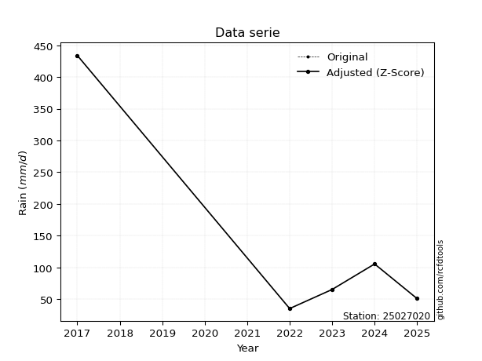</img>

</div>

> If Z-Score is active, values out of range or outliers are replaced with the station mean value.


### 4. Active continuous probability distributions from SciPy (45 of 104 available)

[scipy.stats](https://docs.scipy.org/doc/scipy/reference/stats.html) is a Python´s powerful submodule within the SciPy library for comprehensive statistical analysis, offering over 130 probability distributions (like Normal, Poisson), functions for descriptive stats (mean, variance), hypothesis testing (t-tests, chi-square), random variable generation, and statistical tests, making it essential for data science, modeling, and research. It provides tools to explore, model, and draw conclusions from data efficiently, working seamlessly with NumPy.

<div align="center">

|   id | p_dist             |   n_parameter | fit_method   | label                                                                       | active   | ref                                                                                                        |
|-----:|:-------------------|--------------:|:-------------|:----------------------------------------------------------------------------|:---------|:-----------------------------------------------------------------------------------------------------------|
|    0 | alpha              |             3 | MLE          | Alpha                                                                       | True     | [:mortar_board:](https://docs.scipy.org/doc/scipy/reference/generated/scipy.stats.alpha.html)              |
|    1 | betaprime          |             4 | MLE          | Beta prime                                                                  | True     | [:mortar_board:](https://docs.scipy.org/doc/scipy/reference/generated/scipy.stats.betaprime.html)          |
|    2 | chi2               |             3 | MLE          | Chi²                                                                        | True     | [:mortar_board:](https://docs.scipy.org/doc/scipy/reference/generated/scipy.stats.chi2.html)               |
|    3 | crystalball        |             4 | MLE          | Crystalball                                                                 | True     | [:mortar_board:](https://docs.scipy.org/doc/scipy/reference/generated/scipy.stats.crystalball.html)        |
|    4 | erlang             |             3 | MLE          | Erlang                                                                      | True     | [:mortar_board:](https://docs.scipy.org/doc/scipy/reference/generated/scipy.stats.erlang.html)             |
|    5 | expon              |             2 | MLE          | Exponential                                                                 | True     | [:mortar_board:](https://docs.scipy.org/doc/scipy/reference/generated/scipy.stats.expon.html)              |
|    6 | exponnorm          |             3 | MLE          | Exponentially modified Normal                                               | True     | [:mortar_board:](https://docs.scipy.org/doc/scipy/reference/generated/scipy.stats.exponnorm.html)          |
|    7 | f                  |             4 | MLE          | F                                                                           | True     | [:mortar_board:](https://docs.scipy.org/doc/scipy/reference/generated/scipy.stats.f.html)                  |
|    8 | fatiguelife        |             3 | MLE          | Fatigue-life (Birnbaum-Saunders)                                            | True     | [:mortar_board:](https://docs.scipy.org/doc/scipy/reference/generated/scipy.stats.fatiguelife.html)        |
|    9 | fisk               |             3 | MLE          | Fisk                                                                        | True     | [:mortar_board:](https://docs.scipy.org/doc/scipy/reference/generated/scipy.stats.fisk.html)               |
|   10 | gamma              |             3 | MLE          | Gamma                                                                       | True     | [:mortar_board:](https://docs.scipy.org/doc/scipy/reference/generated/scipy.stats.gamma.html)              |
|   11 | genexpon           |             5 | MLE          | Generalized exponential                                                     | True     | [:mortar_board:](https://docs.scipy.org/doc/scipy/reference/generated/scipy.stats.genexpon.html)           |
|   12 | genlogistic        |             3 | MLE          | Generalized logistic                                                        | True     | [:mortar_board:](https://docs.scipy.org/doc/scipy/reference/generated/scipy.stats.genlogistic.html)        |
|   13 | gibrat             |             2 | MM           | Gibrat                                                                      | True     | [:mortar_board:](https://docs.scipy.org/doc/scipy/reference/generated/scipy.stats.gibrat.html)             |
|   14 | gompertz           |             3 | MLE          | Gompertz (or truncated Gumbel)                                              | True     | [:mortar_board:](https://docs.scipy.org/doc/scipy/reference/generated/scipy.stats.gompertz.html)           |
|   15 | gumbel_l           |             2 | MM           | Gumbel Left Skew                                                            | True     | [:mortar_board:](https://docs.scipy.org/doc/scipy/reference/generated/scipy.stats.gumbel_l.html)           |
|   16 | gumbel_r           |             2 | MM           | Gumbel Right Skew                                                           | True     | [:mortar_board:](https://docs.scipy.org/doc/scipy/reference/generated/scipy.stats.gumbel_r.html)           |
|   17 | halflogistic       |             2 | MM           | Half-logistic                                                               | True     | [:mortar_board:](https://docs.scipy.org/doc/scipy/reference/generated/scipy.stats.halflogistic.html)       |
|   18 | halfnorm           |             2 | MM           | Half Normal                                                                 | True     | [:mortar_board:](https://docs.scipy.org/doc/scipy/reference/generated/scipy.stats.halfnorm.html)           |
|   19 | hypsecant          |             2 | MM           | hyperbolic secant                                                           | True     | [:mortar_board:](https://docs.scipy.org/doc/scipy/reference/generated/scipy.stats.hypsecant.html)          |
|   20 | invgamma           |             3 | MLE          | Inverted gamma                                                              | True     | [:mortar_board:](https://docs.scipy.org/doc/scipy/reference/generated/scipy.stats.invgamma.html)           |
|   21 | invgauss           |             3 | MLE          | Inverse Gaussian                                                            | True     | [:mortar_board:](https://docs.scipy.org/doc/scipy/reference/generated/scipy.stats.invgauss.html)           |
|   22 | invweibull         |             3 | MLE          | Inverted Weibull                                                            | True     | [:mortar_board:](https://docs.scipy.org/doc/scipy/reference/generated/scipy.stats.invweibull.html)         |
|   23 | johnsonsu          |             4 | MLE          | Johnson Su                                                                  | True     | [:mortar_board:](https://docs.scipy.org/doc/scipy/reference/generated/scipy.stats.johnsonsu.html)          |
|   24 | kstwobign          |             2 | MLE          | Limiting distribution of scaled Kolmogorov-Smirnov two-sided test statistic | True     | [:mortar_board:](https://docs.scipy.org/doc/scipy/reference/generated/scipy.stats.kstwobign.html)          |
|   25 | laplace            |             2 | MM           | Laplace                                                                     | True     | [:mortar_board:](https://docs.scipy.org/doc/scipy/reference/generated/scipy.stats.laplace.html)            |
|   26 | laplace_asymmetric |             3 | MLE          | Asymmetric Laplace                                                          | True     | [:mortar_board:](https://docs.scipy.org/doc/scipy/reference/generated/scipy.stats.laplace_asymmetric.html) |
|   27 | loggamma           |             3 | MLE          | Log gamma                                                                   | True     | [:mortar_board:](https://docs.scipy.org/doc/scipy/reference/generated/scipy.stats.loggamma.html)           |
|   28 | logistic           |             2 | MM           | Logistic (or Sech-squared)                                                  | True     | [:mortar_board:](https://docs.scipy.org/doc/scipy/reference/generated/scipy.stats.logistic.html)           |
|   29 | lognorm            |             3 | MLE          | Log Normal                                                                  | True     | [:mortar_board:](https://docs.scipy.org/doc/scipy/reference/generated/scipy.stats.lognorm.html)            |
|   30 | maxwell            |             2 | MM           | Maxwell                                                                     | True     | [:mortar_board:](https://docs.scipy.org/doc/scipy/reference/generated/scipy.stats.maxwell.html)            |
|   31 | mielke             |             4 | MLE          | Mielke Beta-Kappa / Dagum                                                   | True     | [:mortar_board:](https://docs.scipy.org/doc/scipy/reference/generated/scipy.stats.mielke.html)             |
|   32 | moyal              |             2 | MM           | Moyal                                                                       | True     | [:mortar_board:](https://docs.scipy.org/doc/scipy/reference/generated/scipy.stats.moyal.html)              |
|   33 | nakagami           |             3 | MLE          | Nakagami                                                                    | True     | [:mortar_board:](https://docs.scipy.org/doc/scipy/reference/generated/scipy.stats.nakagami.html)           |
|   34 | ncf                |             5 | MLE          | Non-central F distribution                                                  | True     | [:mortar_board:](https://docs.scipy.org/doc/scipy/reference/generated/scipy.stats.ncf.html)                |
|   35 | nct                |             4 | MLE          | Non-central Student’s t                                                     | True     | [:mortar_board:](https://docs.scipy.org/doc/scipy/reference/generated/scipy.stats.nct.html)                |
|   36 | norm               |             2 | MM           | Normal                                                                      | True     | [:mortar_board:](https://docs.scipy.org/doc/scipy/reference/generated/scipy.stats.norm.html)               |
|   37 | pareto             |             3 | MLE          | Pareto                                                                      | True     | [:mortar_board:](https://docs.scipy.org/doc/scipy/reference/generated/scipy.stats.pareto.html)             |
|   38 | pearson3           |             3 | MM           | Pearson type III                                                            | True     | [:mortar_board:](https://docs.scipy.org/doc/scipy/reference/generated/scipy.stats.pearson3.html)           |
|   39 | rayleigh           |             2 | MM           | Rayleigh                                                                    | True     | [:mortar_board:](https://docs.scipy.org/doc/scipy/reference/generated/scipy.stats.rayleigh.html)           |
|   40 | rice               |             3 | MLE          | Rice                                                                        | True     | [:mortar_board:](https://docs.scipy.org/doc/scipy/reference/generated/scipy.stats.rice.html)               |
|   41 | t                  |             3 | MLE          | Student’s t                                                                 | True     | [:mortar_board:](https://docs.scipy.org/doc/scipy/reference/generated/scipy.stats.t.html)                  |
|   42 | truncnorm          |             4 | MLE          | Truncated normal                                                            | True     | [:mortar_board:](https://docs.scipy.org/doc/scipy/reference/generated/scipy.stats.truncnorm.html)          |
|   43 | wald               |             2 | MM           | Wald                                                                        | True     | [:mortar_board:](https://docs.scipy.org/doc/scipy/reference/generated/scipy.stats.wald.html)               |
|   44 | weibull_min        |             3 | MLE          | Weibull minimum                                                             | True     | [:mortar_board:](https://docs.scipy.org/doc/scipy/reference/generated/scipy.stats.weibull_min.html)        |

</div>

> **n_parameter:** # arguments & localization & scale.
>
> **Fit methods:** (MLE) maximum likelihood, (MM) L-moments.
>
>**Inactive:** foldnorm, gennorm, norminvgauss, powernorm, powerlognorm, skewnorm, genextreme, anglit, arcsine, argus, beta, bradford, burr, burr12, cauchy, cosine, halfcauchy, foldcauchy, skewcauchy, wrapcauchy, dgamma, gengamma, exponweib, exponpow, truncexpon, gausshyper, genhalflogistic, genhyperbolic, geninvgauss, halfgennorm, johnsonsb, kappa4, kappa3, ksone, kstwo, loglaplace, levy, levy_l, levy_stable, ncx2, genpareto, truncpareto, lomax, powerlaw, rdist, rel_breitwigner, recipinvgauss, semicircular, studentized_range, trapezoid, triang, truncweibull_min, tukeylambda, uniform, loguniform, vonmises, vonmises_line, weibull_max, dweibull, 


## B. Probability distributions vs. Empirical distributions

A continuous probability distribution (CPD) describes probabilities for variables that can take any value within a range (like rain any time), unlike discrete variables with specific outcomes (like temperature). It uses a Probability Density Function (PDF), a curve where the total area under it equals 1, and the probability of the variable falling within an interval (a to b) is found by calculating the area under the curve between those points. A key feature is that the probability of hitting any single exact value is zero, so probabilities are always expressed for ranges, e.g., $P(a ≤ X ≤ b)$.

<div align="center">

Distributions parameters
|    |   station | p_dist                |   n |              loc |          scale | shape                  | shape1                 | shape2                | shape3   |
|---:|----------:|:----------------------|----:|-----------------:|---------------:|:-----------------------|:-----------------------|:----------------------|:---------|
|  0 |  25027020 | alpha                 |   5 |      19.6862     |   28.5343      | 4.5271653843490393e-10 |                        |                       |          |
|  1 |  25027020 | betaprime             |   5 |      30.2478     |    1.22746     | 10.690202014921201     | 0.7267779496794331     |                       |          |
|  2 |  25027020 | chi2                  |   5 |      35.1        |   98.0348      | 1.0516076785876765     |                        |                       |          |
|  3 |  25027020 | crystalball           |   5 |     137.648      |  150.097       | 12180.431655787543     | 21.61231224915485      |                       |          |
|  4 |  25027020 | erlang                |   5 |      35.1        |  105.274       | 0.1275426519663463     |                        |                       |          |
|  5 |  25027020 | expon                 |   5 |      35.1        |  102.548       |                        |                        |                       |          |
|  6 |  25027020 | exponnorm             |   5 |      34.9538     |    0.0419923   | 2429.1076323111374     |                        |                       |          |
|  7 |  25027020 | f                     |   5 |      29.513      |   18.1521      | 13877.837790305559     | 1.4729124911104088     |                       |          |
|  8 |  25027020 | fatiguelife           |   5 |      35.1        |    4.4303e-05  | 1317.3933146241648     |                        |                       |          |
|  9 |  25027020 | fisk                  |   5 |      35.1        |   98.6775      | 0.5809696703009164     |                        |                       |          |
| 10 |  25027020 | gamma                 |   5 |      35.1        |  106.485       | 0.27324666870765224    |                        |                       |          |
| 11 |  25027020 | genexpon              |   5 |      35.1        |  280.544       | 2.735733805904962      | 2.5957873632436357e-12 | 1.9245573978967832    |          |
| 12 |  25027020 | genlogistic           |   5 |    -567.229      |   80.8541      | 2897.370857826255      |                        |                       |          |
| 13 |  25027020 | gibrat                |   5 |      23.1424     |   69.4512      |                        |                        |                       |          |
| 14 |  25027020 | gompertz              |   5 |      35.1        |    1.73151e+14 | 1752186014219.626      |                        |                       |          |
| 15 |  25027020 | gumbel_l              |   5 |     205.2        |  117.031       |                        |                        |                       |          |
| 16 |  25027020 | gumbel_r              |   5 |      70.096      |  117.031       |                        |                        |                       |          |
| 17 |  25027020 | halflogistic          |   5 |     -40.2527     |  128.328       |                        |                        |                       |          |
| 18 |  25027020 | halfnorm              |   5 |     -61.0225     |  248.997       |                        |                        |                       |          |
| 19 |  25027020 | hypsecant             |   5 |     137.648      |   95.5552      |                        |                        |                       |          |
| 20 |  25027020 | invgamma              |   5 |      29.512      |   13.3678      | 0.7364538471325541     |                        |                       |          |
| 21 |  25027020 | invgauss              |   5 |      30.7312     |   17.6377      | 6.061825416256389      |                        |                       |          |
| 22 |  25027020 | invweibull            |   5 |      35.1        |    6.53209e-12 | 0.23617253410669906    |                        |                       |          |
| 23 |  25027020 | johnsonsu             |   5 |      35.1        |    1.05086e-11 | -0.6224781951836831    | 0.1021951839047279     |                       |          |
| 24 |  25027020 | kstwobign             |   5 |    -237.25       |  437.584       |                        |                        |                       |          |
| 25 |  25027020 | laplace               |   5 |     137.648      |  106.135       |                        |                        |                       |          |
| 26 |  25027020 | laplace_asymmetric    |   5 |      35.1        |    0.00414855  | 4.045506754154819e-05  |                        |                       |          |
| 27 |  25027020 | loggamma              |   5 |  -53074          | 6968.62        | 2071.4993144323544     |                        |                       |          |
| 28 |  25027020 | logistic              |   5 |     137.648      |   82.7532      |                        |                        |                       |          |
| 29 |  25027020 | lognorm               |   5 |      35.1        |    0.0380757   | 14.698111099196726     |                        |                       |          |
| 30 |  25027020 | maxwell               |   5 |    -218.021      |  222.882       |                        |                        |                       |          |
| 31 |  25027020 | mielke                |   5 |       4.18366    |    9.17655     | 26.758580956044057     | 1.5785058715515907     |                       |          |
| 32 |  25027020 | moyal                 |   5 |      51.8125     |   67.5677      |                        |                        |                       |          |
| 33 |  25027020 | nakagami              |   5 |      35.1        |  115.247       | 0.19692544009237256    |                        |                       |          |
| 34 |  25027020 | ncf                   |   5 |      -1.26764    |   67.9147      | 126.13322528097075     | 3.905557418225086      | 5.362477179702102e-08 |          |
| 35 |  25027020 | nct                   |   5 |      -0.168353   |    1.49233     | 1.3915371318176248     | 37.98732492281667      |                       |          |
| 36 |  25027020 | norm                  |   5 |     137.648      |  150.098       |                        |                        |                       |          |
| 37 |  25027020 | pareto                |   5 |      34.4886     |    0.611441    | 0.27352464510029517    |                        |                       |          |
| 38 |  25027020 | pearson3              |   5 |     137.648      |  150.098       | 1.4106493809766882     |                        |                       |          |
| 39 |  25027020 | rayleigh              |   5 |    -149.498      |  229.109       |                        |                        |                       |          |
| 40 |  25027020 | rice                  |   5 |     -77.43       |  185.456       | 0.0005486277026541565  |                        |                       |          |
| 41 |  25027020 | t                     |   5 |      54.1109     |   19.473       | 0.74183114842232       |                        |                       |          |
| 42 |  25027020 | truncnorm             |   5 | -185339          | 5281.15        | 35.10103002733979      | 35.17658240407836      |                       |          |
| 43 |  25027020 | wald                  |   5 |     -12.4497     |  150.098       |                        |                        |                       |          |
| 44 |  25027020 | weibull_min           |   5 |      35.1        |  209.203       | 0.12795056129933224    |                        |                       |          |
| 45 |  25027020 | logalpha              |   5 |       2.43335    |    4.72225     | 2.707648204636069      |                        |                       |          |
| 46 |  25027020 | logbetaprime          |   5 |      -0.817514   |    0.906584    | 275.56718651299855     | 48.38208250593061      |                       |          |
| 47 |  25027020 | logchi2               |   5 |       3.5582     |    1.01645     | 1.0009018709190483     |                        |                       |          |
| 48 |  25027020 | logcrystalball        |   5 |       4.4694     |    0.87982     | 460.22434153569003     | 1.0543894118727732     |                       |          |
| 49 |  25027020 | logerlang             |   5 |       3.5582     |    0.814562    | 0.6908035059146767     |                        |                       |          |
| 50 |  25027020 | logexpon              |   5 |       3.5582     |    0.911204    |                        |                        |                       |          |
| 51 |  25027020 | logexponnorm          |   5 |       3.55698    |    0.000354492 | 2546.2908564113623     |                        |                       |          |
| 52 |  25027020 | logf                  |   5 |       3.5582     |    0.959635    | 0.644201635974629      | 9.693388418723892      |                       |          |
| 53 |  25027020 | logfatiguelife        |   5 |       3.5582     |    1.77942e-06 | 575.4803456408174      |                        |                       |          |
| 54 |  25027020 | logfisk               |   5 |       3.5582     |    0.102592    | 0.5741832048463507     |                        |                       |          |
| 55 |  25027020 | loggamma              |   5 |       3.5582     |    0.683797    | 0.7442962130507268     |                        |                       |          |
| 56 |  25027020 | loggenexpon           |   5 |       3.5582     |    1.67541     | 1.838526493043994      | 3.833231544292578e-06  | 0.7190376194744351    |          |
| 57 |  25027020 | loggenlogistic        |   5 |      -0.117959   |    0.613287    | 939.9876396449531      |                        |                       |          |
| 58 |  25027020 | loggibrat             |   5 |       3.79818    |    0.407114    |                        |                        |                       |          |
| 59 |  25027020 | loggompertz           |   5 |       3.5582     |    1.74559     | 0.9812394640172766     |                        |                       |          |
| 60 |  25027020 | loggumbel_l           |   5 |       4.86537    |    0.685993    |                        |                        |                       |          |
| 61 |  25027020 | loggumbel_r           |   5 |       4.07344    |    0.685993    |                        |                        |                       |          |
| 62 |  25027020 | loghalflogistic       |   5 |       3.42661    |    0.752215    |                        |                        |                       |          |
| 63 |  25027020 | loghalfnorm           |   5 |       3.30487    |    1.45953     |                        |                        |                       |          |
| 64 |  25027020 | loghypsecant          |   5 |       4.4694     |    0.560111    |                        |                        |                       |          |
| 65 |  25027020 | loginvgamma           |   5 |       3.1234     |    2.4267      | 2.6994336026370425     |                        |                       |          |
| 66 |  25027020 | loginvgauss           |   5 |       3.3445     |    1.12883     | 0.9965226446956027     |                        |                       |          |
| 67 |  25027020 | loginvweibull         |   5 |       2.82827    |    1.12697     | 2.339995047952942      |                        |                       |          |
| 68 |  25027020 | logjohnsonsu          |   5 |       3.46043    |    0.00267804  | -5.568042047176554     | 0.9070551895390855     |                       |          |
| 69 |  25027020 | logkstwobign          |   5 |       1.89067    |    2.97255     |                        |                        |                       |          |
| 70 |  25027020 | loglaplace            |   5 |       4.4694     |    0.622127    |                        |                        |                       |          |
| 71 |  25027020 | loglaplace_asymmetric |   5 |       3.88033    |    0.48115     | 0.560311440682999      |                        |                       |          |
| 72 |  25027020 | logloggamma           |   5 |    -324.209      |   42.4276      | 2314.605586182488      |                        |                       |          |
| 73 |  25027020 | loglogistic           |   5 |       4.4694     |    0.48507     |                        |                        |                       |          |
| 74 |  25027020 | loglognorm            |   5 |       3.5582     |    0.000754792 | 14.096931287932883     |                        |                       |          |
| 75 |  25027020 | logmaxwell            |   5 |       2.3846     |    1.30646     |                        |                        |                       |          |
| 76 |  25027020 | logmielke             |   5 |       2.1238     |    0.348052    | 1565.8376318823384     | 3.611093597875872      |                       |          |
| 77 |  25027020 | logmoyal              |   5 |       3.96627    |    0.396058    |                        |                        |                       |          |
| 78 |  25027020 | lognakagami           |   5 |       3.5582     |    1.83623     | 0.27033545264939374    |                        |                       |          |
| 79 |  25027020 | logncf                |   5 |       3.18006    |    0.0538318   | 0.4830484300297275     | 895.013706912715       | 11.27378020868111     |          |
| 80 |  25027020 | lognct                |   5 |       0.00521791 |    0.0670849   | 16.506327912096538     | 63.39569071256619      |                       |          |
| 81 |  25027020 | lognorm               |   5 |       4.4694     |    0.87982     |                        |                        |                       |          |
| 82 |  25027020 | logpareto             |   5 |       3.55048    |    0.00772205  | 0.2644661424610994     |                        |                       |          |
| 83 |  25027020 | logpearson3           |   5 |       4.4694     |    0.879819    | 0.9240738600268338     |                        |                       |          |
| 84 |  25027020 | lograyleigh           |   5 |       2.78626    |    1.34296     |                        |                        |                       |          |
| 85 |  25027020 | logrice               |   5 |       3.06506    |    1.17181     | 0.0003282100472584375  |                        |                       |          |
| 86 |  25027020 | logt                  |   5 |       4.46939    |    0.879819    | 501523287.4690693      |                        |                       |          |
| 87 |  25027020 | logtruncnorm          |   5 |      -9.72948    |    3.73342     | 3.5591132000143197     | 4.2327811123075145     |                       |          |
| 88 |  25027020 | logwald               |   5 |       3.58949    |    0.879896    |                        |                        |                       |          |
| 89 |  25027020 | logweibull_min        |   5 |       3.5582     |    0.824569    | 0.5216723836859039     |                        |                       |          |

</div>

> **loc** (Location parameter): This shifts the distribution along the x-axis. For many common distributions, like the normal (Gaussian) distribution, loc represents the mean $μ$. For others, like the uniform distribution, it might represent the minimum value, or for the beta distribution, the left end of the support interval.
>
> **scale** (Scale parameter): This determines the width or spread of the distribution. For the normal distribution, scale represents the standard deviation $σ$. For a uniform distribution, it defines the length of the interval (from $loc$ to $loc + scale$).
>
> **shape** (Shape parameters): Refers to parameters that define the specific form of a probability distribution, distinct from its location (loc) and scale (scale). These parameters are required arguments for most distribution functions. For example, a normal (Gaussian) distribution is fully defined by its location (mean) and scale (standard deviation), so it has no specific shape parameters beyond loc and scale. However, other distributions have intrinsic properties that need specification, as Gamma distribution that takes a shape parameter, often named $a$ or $alpha$.


### 0. Cumulative distribution values - CDF (90 evaluated)

> Ordered by x ascending and calculating $log(f(x))$ separately. 

|   id |   Station |   date |      x |   count |    mean |     std |    zscore |   Value_initial |   station |   m |     alpha |   alpha_pdf |   betaprime |   betaprime_pdf |        chi2 |         chi2_pdf |   crystalball |   crystalball_pdf |     erlang |   erlang_pdf |    expon |   expon_pdf |   exponnorm |   exponnorm_pdf |         f |       f_pdf |   fatiguelife |   fatiguelife_pdf |       fisk |        fisk_pdf |       gamma |   gamma_pdf |    genexpon |   genexpon_pdf |   genlogistic |   genlogistic_pdf |    gibrat |   gibrat_pdf |    gompertz |   gompertz_pdf |   gumbel_l |   gumbel_l_pdf |   gumbel_r |   gumbel_r_pdf |   halflogistic |   halflogistic_pdf |   halfnorm |   halfnorm_pdf |   hypsecant |   hypsecant_pdf |   invgamma |   invgamma_pdf |   invgauss |   invgauss_pdf |   invweibull |   invweibull_pdf |   johnsonsu |   johnsonsu_pdf |   kstwobign |   kstwobign_pdf |   laplace |   laplace_pdf |   laplace_asymmetric |   laplace_asymmetric_pdf |    loggamma |   loggamma_pdf |   logistic |   logistic_pdf |   lognorm |   lognorm_pdf |   maxwell |   maxwell_pdf |    mielke |   mielke_pdf |    moyal |   moyal_pdf |    nakagami |   nakagami_pdf |      ncf |     ncf_pdf |       nct |     nct_pdf |     norm |    norm_pdf |      pareto |   pareto_pdf |   pearson3 |   pearson3_pdf |   rayleigh |   rayleigh_pdf |     rice |    rice_pdf |        t |       t_pdf |   truncnorm |   truncnorm_pdf |     wald |    wald_pdf |   weibull_min |   weibull_min_pdf |   logalpha |   logalpha_pdf |   logbetaprime |   logbetaprime_pdf |     logchi2 |   logchi2_pdf |   logcrystalball |   logcrystalball_pdf |   logerlang |   logerlang_pdf |   logexpon |   logexpon_pdf |   logexponnorm |   logexponnorm_pdf |        logf |    logf_pdf |   logfatiguelife |   logfatiguelife_pdf |     logfisk |   logfisk_pdf |   loggenexpon |   loggenexpon_pdf |   loggenlogistic |   loggenlogistic_pdf |   loggibrat |   loggibrat_pdf |   loggompertz |   loggompertz_pdf |   loggumbel_l |   loggumbel_l_pdf |   loggumbel_r |   loggumbel_r_pdf |   loghalflogistic |   loghalflogistic_pdf |   loghalfnorm |   loghalfnorm_pdf |   loghypsecant |   loghypsecant_pdf |   loginvgamma |   loginvgamma_pdf |   loginvgauss |   loginvgauss_pdf |   loginvweibull |   loginvweibull_pdf |   logjohnsonsu |   logjohnsonsu_pdf |   logkstwobign |   logkstwobign_pdf |   loglaplace |   loglaplace_pdf |   loglaplace_asymmetric |   loglaplace_asymmetric_pdf |   logloggamma |   logloggamma_pdf |   loglogistic |   loglogistic_pdf |   loglognorm |   loglognorm_pdf |   logmaxwell |   logmaxwell_pdf |   logmielke |   logmielke_pdf |   logmoyal |   logmoyal_pdf |   lognakagami |   lognakagami_pdf |   logncf |   logncf_pdf |   lognct |   lognct_pdf |   logpareto |   logpareto_pdf |   logpearson3 |   logpearson3_pdf |   lograyleigh |   lograyleigh_pdf |   logrice |   logrice_pdf |     logt |   logt_pdf |   logtruncnorm |   logtruncnorm_pdf |   logwald |   logwald_pdf |   logweibull_min |   logweibull_min_pdf |
|-----:|----------:|-------:|-------:|--------:|--------:|--------:|----------:|----------------:|----------:|----:|----------:|------------:|------------:|----------------:|------------:|-----------------:|--------------:|------------------:|-----------:|-------------:|---------:|------------:|------------:|----------------:|----------:|------------:|--------------:|------------------:|-----------:|----------------:|------------:|------------:|------------:|---------------:|--------------:|------------------:|----------:|-------------:|------------:|---------------:|-----------:|---------------:|-----------:|---------------:|---------------:|-------------------:|-----------:|---------------:|------------:|----------------:|-----------:|---------------:|-----------:|---------------:|-------------:|-----------------:|------------:|----------------:|------------:|----------------:|----------:|--------------:|---------------------:|-------------------------:|------------:|---------------:|-----------:|---------------:|----------:|--------------:|----------:|--------------:|----------:|-------------:|---------:|------------:|------------:|---------------:|---------:|------------:|----------:|------------:|---------:|------------:|------------:|-------------:|-----------:|---------------:|-----------:|---------------:|---------:|------------:|---------:|------------:|------------:|----------------:|---------:|------------:|--------------:|------------------:|-----------:|---------------:|---------------:|-------------------:|------------:|--------------:|-----------------:|---------------------:|------------:|----------------:|-----------:|---------------:|---------------:|-------------------:|------------:|------------:|-----------------:|---------------------:|------------:|--------------:|--------------:|------------------:|-----------------:|---------------------:|------------:|----------------:|--------------:|------------------:|--------------:|------------------:|--------------:|------------------:|------------------:|----------------------:|--------------:|------------------:|---------------:|-------------------:|--------------:|------------------:|--------------:|------------------:|----------------:|--------------------:|---------------:|-------------------:|---------------:|-------------------:|-------------:|-----------------:|------------------------:|----------------------------:|--------------:|------------------:|--------------:|------------------:|-------------:|-----------------:|-------------:|-----------------:|------------:|----------------:|-----------:|---------------:|--------------:|------------------:|---------:|-------------:|---------:|-------------:|------------:|----------------:|--------------:|------------------:|--------------:|------------------:|----------:|--------------:|---------:|-----------:|---------------:|-------------------:|----------:|--------------:|-----------------:|---------------------:|
|    0 |  25027020 |   2022 |  35.1  |       5 | 137.648 | 167.814 | -0.61108  |           35.1  |  25027020 |   1 | 0.0641372 | 0.0172711   |   0.0533389 |     0.0254884   | 2.55426e-09 | 189016           |      0.247238 |        0.00210464 | 0.00920527 |  1.65235e+11 | 0        | 0.00975153  |  0.00143209 |      0.00978707 | 0.0538782 | 0.0250035   |     0.0975943 |       7.33999e+09 | 4.1843e-10 | 34212.6         | 4.21581e-05 | 1.62123e+09 | 6.28657e-13 |    0.00975153  |      0.185471 |       0.00386377  | 0.0392671 |  0.00709904  | 4.86781e-14 |    0.0101194   |   0.208447 |    0.00158106  |   0.259615 |    0.00299157  |       0.285439 |        0.00357881  |   0.300533 |    0.00297431  |    0.209739 |     0.00203954  |  0.0538785 |    0.0250036   |  0.0523581 |    0.0286484   |   0.00666701 |      1.11035e+12 |    0.26993  |     3.20136e+09 |    0.166686 |     0.0032863   |  0.190263 |   0.00179265  |          1.64697e-09 |              0.00975161  | 5.41123e-12 |   9069.26      |   0.224575 |    0.00210434  |  0.150178 |      0.265217 |  0.26843  |   0.00242272  | 0.0977856 |  0.010847    | 0.257784 | 0.00352207  | 3.26122e-07 |    1.80768e+07 | 0.121805 | 0.00920329  | 0.0951059 | 0.0108289   | 0.247238 | 0.00210464  | 1.11022e-16 |  0.447344    |   0.276648 |    0.00345848  |   0.277178 |    0.00254199  | 0.168137 | 0.00272169  | 0.27431  | 0.0074695   | 2.03644e-05 |     0.00715364  | 0.183734 | 0.00713546  |    0.00778197 |       1.39587e+11 |  0.0682822 |      0.491986  |       0.131781 |          0.324893  | 1.64083e-08 |   1.84907e+07 |         0.150178 |            0.265217  |  3.1505e-11 |   49007.7       |   0        |       1.09745  |     0.00135069 |          1.10605   | 2.21384e-05 | 8.92064e+08 |        0.0626146 |          4.13058e+10 | 5.65767e-09 |   7.31506e+06 |   1.73821e-08 |         1.09736   |        0.0962639 |             0.366942 |   0         |       0         |   8.62454e-09 |          0.562125 |      0.138212 |         0.186864  |      0.120116 |         0.371085  |         0.0872443 |             0.659644  |      0.137798 |         0.538499  |       0.123554 |          0.215091  |     0.0608024 |         0.582016  |     0.0545338 |          0.758389 |       0.0630976 |           0.558903  |      0.0468694 |          0.908282  |      0.0886279 |          0.363575  |     0.115578 |        0.185779  |               0.0723375 |                   0.26832   |      0.151243 |         0.263934  |      0.132561 |         0.237056  |    0.0228746 |      8.66409e+12 |     0.152198 |         0.329205 |         nan |             nan |  0.0941492 |      0.415379  |   2.80311e-09 |       3.41274e+06 | 0.079344 |    0.350102  | 0.114079 |    0.349617  | 1.11022e-16 |      34.2482    |      0.133566 |         0.380632  |      0.152278 |         0.36284   |  0.084745 |     0.328701  | 0.15018  |   0.26522  |    2.34191e-07 |          1.08719   |  0        |     0         |      1.08321e-08 |          1.27244e+07 |
|    1 |  25027020 |   2025 |  48.44 |       5 | 137.648 | 167.814 | -0.531588 |           48.44 |  25027020 |   2 | 0.321018  | 0.0168296   |   0.362305  |     0.0162071   | 0.267961    |      0.0100992   |      0.276145 |        0.00222758 | 0.805385   |  0.00687915  | 0.12198  | 0.00856204  |  0.123845   |      0.00858943 | 0.359965  | 0.0162243   |     0.661488  |       0.00571081  | 0.2382     |     0.00790279  | 0.612216    | 0.0113586   | 0.12198     |    0.00856204  |      0.23963  |       0.00423312  | 0.156268  |  0.00947014  | 0.126278    |    0.00884155  |   0.230476 |    0.00172264  |   0.30021  |    0.00308667  |       0.332441 |        0.00346566  |   0.339784 |    0.00290925  |    0.238467 |     0.00226862  |  0.359966  |    0.0162243   |  0.372691  |    0.0158958   |   0.998763   |      2.18891e-05 |    0.989176 |     0.000218763 |    0.212463 |     0.00356118  |  0.215744 |   0.00203273  |          0.121981    |              0.00856211  | 0.513909    |      0.8976    |   0.253885 |    0.00228906  |  0.251574 |      0.362386 |  0.301312 |   0.0025039   | 0.257006  |  0.0119684   | 0.305236 | 0.00357889  | 0.337831    |    0.00995217  | 0.25009  | 0.00956165  | 0.252997  | 0.0117668   | 0.276145 | 0.00222758  | 0.57491     |  0.0083341   |   0.32259  |    0.00342188  |   0.311473 |    0.00259636  | 0.205721 | 0.00290679  | 0.415725 | 0.0139596   | 0.0913416   |     0.00654666  | 0.276294 | 0.00665583  |    0.504975   |       0.00333856  |  0.290128  |      0.77359   |       0.258193 |          0.450638  | 0.426155    |   0.595061    |         0.251574 |            0.362386  |  0.497667   |       0.838856  |   0.297785 |       0.770645 |     0.301082   |          0.774305  | 0.519419    | 0.476278    |        0.770148  |          0.348342    | 0.658579    |   0.400797    |   0.297765    |         0.770606  |        0.250324  |             0.564895 |   0.0547344 |       1.34901   |   0.180334    |          0.554132 |      0.211712 |         0.273366  |      0.265769 |         0.513384  |         0.292762  |             0.607732  |      0.306623 |         0.50579   |       0.213958 |          0.35387   |     0.311226  |         0.804949  |     0.343129  |          0.809539 |       0.308932  |           0.807124  |      0.361587  |          0.809375  |      0.238524  |          0.540354  |     0.193975 |        0.311793  |               0.238936  |                   0.886279  |      0.252062 |         0.360215  |      0.22892  |         0.363897  |    0.666262  |      0.0801093   |     0.273413 |         0.415659 |         nan |             nan |  0.265022  |      0.603255  |   0.303069    |       0.505365    | 0.223726 |    0.524992  | 0.253727 |    0.501379  | 0.629518    |       0.297047  |      0.275733 |         0.485188  |      0.282401 |         0.435313  |  0.214962 |     0.466098  | 0.251578 |   0.362389 |    0.301201    |          0.796755  |  0.198417 |     1.2112    |      0.457964    |          0.537593    |
|    2 |  25027020 |   2023 |  65.2  |       5 | 137.648 | 167.814 | -0.431715 |           65.2  |  25027020 |   3 | 0.530699  | 0.00902968  |   0.546764  |     0.00745785  | 0.399455    |      0.00630341  |      0.314665 |        0.00236564 | 0.878811   |  0.00288442  | 0.254366 | 0.00727107  |  0.256599   |      0.00728797 | 0.545318  | 0.00751554  |     0.734237  |       0.00340924  | 0.334077   |     0.00429395  | 0.740967    | 0.00537188  | 0.254366    |    0.00727107  |      0.313095 |       0.00449586  | 0.30798   |  0.00836439  | 0.262577    |    0.00746228  |   0.260899 |    0.00190929  |   0.352494 |    0.00314066  |       0.389212 |        0.00330603  |   0.387792 |    0.00281803  |    0.278933 |     0.00255957  |  0.545319  |    0.00751552  |  0.55329   |    0.00736162  |   0.998979   |      8.00654e-06 |    0.991336 |     7.98212e-05 |    0.27414  |     0.00377498  |  0.25265  |   0.00238046  |          0.254368    |              0.00727111  | 0.712504    |      0.491797  |   0.294117 |    0.00250881  |  0.370011 |      0.429148 |  0.343944 |   0.00257828  | 0.435463  |  0.0091396   | 0.365104 | 0.00354837  | 0.464645    |    0.00601188  | 0.397724 | 0.00791432  | 0.426957  | 0.00884738  | 0.314664 | 0.00236563  | 0.65743     |  0.00305102  |   0.37917  |    0.0033212   |   0.355368 |    0.00263666  | 0.256019 | 0.00308525  | 0.652618 | 0.0111853   | 0.195172    |     0.00585647  | 0.380005 | 0.00570293  |    0.541735   |       0.00152005  |  0.501742  |      0.621421  |       0.40128  |          0.49992   | 0.564578    |   0.370927    |         0.370011 |            0.429148  |  0.685847   |       0.475885  |   0.493183 |       0.556206 |     0.497121   |          0.557121  | 0.625856    | 0.27587     |        0.847341  |          0.195251    | 0.737351    |   0.179568    |   0.493155    |         0.556192  |        0.425958  |             0.592469 |   0.471772  |       1.04921   |   0.341535    |          0.527758 |      0.307088 |         0.370552  |      0.423458 |         0.53044   |         0.461401  |             0.523194  |      0.450065 |         0.457205  |       0.341127 |          0.49897   |     0.519105  |         0.583768  |     0.540326  |          0.532682 |       0.518766  |           0.590496  |      0.552172  |          0.500346  |      0.405205  |          0.561554  |     0.312729 |        0.502678  |               0.461548  |                   0.627041  |      0.369843 |         0.427071  |      0.353918 |         0.471396  |    0.682955  |      0.0408054   |     0.403006 |         0.448549 |         nan |             nan |  0.443697  |      0.575386  |   0.429488    |       0.366004    | 0.388519 |    0.565434  | 0.41079  |    0.538328  | 0.687395    |       0.13186   |      0.423186 |         0.494774  |      0.415249 |         0.451062  |  0.362746 |     0.51625   | 0.370015 |   0.42915  |    0.506493    |          0.594222  |  0.494908 |     0.764409  |      0.577365    |          0.306633    |
|    3 |  25027020 |   2024 | 105.4  |       5 | 137.648 | 167.814 | -0.192165 |          105.4  |  25027020 |   4 | 0.739208  | 0.00293185  |   0.717546  |     0.0024509   | 0.584078    |      0.00343434  |      0.414944 |        0.00259725 | 0.944976   |  0.000939324 | 0.496178 | 0.00491303  |  0.498736   |      0.00491417 | 0.7176    | 0.00247277  |     0.830512  |       0.00171764  | 0.450909   |     0.00204612  | 0.872009    | 0.00198813  | 0.496178    |    0.00491303  |      0.493433 |       0.00431027  | 0.567193  |  0.00478096  | 0.509041    |    0.00496822  |   0.347036 |    0.00237814  |   0.477311 |    0.00301641  |       0.513521 |        0.0028688   |   0.496104 |    0.00256296  |    0.39456  |     0.00315007  |  0.7176    |    0.00247276  |  0.726245  |    0.00256895  |   0.999164   |      2.8063e-06  |    0.993175 |     2.77019e-05 |    0.428051 |     0.00377772  |  0.36899  |   0.0034766   |          0.496181    |              0.00491305  | 0.870564    |      0.210366  |   0.403792 |    0.00290918  |  0.58476  |      0.443163 |  0.449228 |   0.00263036  | 0.68454   |  0.00400126  | 0.501177 | 0.00316742  | 0.642696    |    0.00338628  | 0.633543 | 0.00416975  | 0.667607  | 0.00388445  | 0.414943 | 0.00259724  | 0.727513    |  0.00105106  |   0.505327 |    0.00293002  |   0.461461 |    0.00261516  | 0.384882 | 0.00326982  | 0.852257 | 0.00200372  | 0.401768    |     0.00448297  | 0.566554 | 0.0037097   |    0.580949   |       0.000663368 |  0.723084  |      0.322002  |       0.631779 |          0.435181  | 0.701416    |   0.219846    |         0.58476  |            0.443163  |  0.844097   |       0.220966  |   0.700821 |       0.328334 |     0.704627   |          0.327233  | 0.725787    | 0.158926    |        0.914025  |          0.0974844   | 0.79607     |   0.0847741   |   0.700792    |         0.328339  |        0.677009  |             0.430511 |   0.772575  |       0.351024  |   0.577252    |          0.44615  |      0.522345 |         0.514471  |      0.652692 |         0.405938  |         0.67417   |             0.362592  |      0.646041 |         0.355755  |       0.605081 |          0.537612  |     0.723951  |         0.299216  |     0.727186  |          0.278269 |       0.724824  |           0.298358  |      0.724488  |          0.253009  |      0.648471  |          0.433007  |     0.630613 |        0.593748  |               0.692224  |                   0.358413  |      0.583988 |         0.442938  |      0.595876 |         0.496439  |    0.69732   |      0.0225212   |     0.612581 |         0.406933 |         nan |             nan |  0.67616   |      0.385599  |   0.577807    |       0.263152    | 0.639247 |    0.454238  | 0.648734 |    0.428969  | 0.73105     |       0.0642367 |      0.640924 |         0.396731  |      0.621303 |         0.392969  |  0.602949 |     0.46054   | 0.584765 |   0.443162 |    0.732695    |          0.36495   |  0.741409 |     0.332588  |      0.687139    |          0.172478    |
|    4 |  25027020 |   2017 | 434.1  |       5 | 137.648 | 167.814 |  1.76655  |          434.1  |  25027020 |   5 | 0.945105  | 0.000132254 |   0.911462  |     0.000156162 | 0.952916    |      0.000281982 |      0.97587  |        0.00037798 | 0.999197   |  9.09836e-06 | 0.979572 | 0.000199202 |  0.980021   |      0.00019587 | 0.91263   | 0.000156031 |     0.988637  |       8.50394e-05 | 0.692466   |     0.000310079 | 0.997645    | 2.5696e-05  | 0.979572    |    0.000199202 |      0.987953 |       0.000148101 | 0.962287  |  0.000199872 | 0.982361    |    0.000178496 |   0.99915  |    5.13523e-05 |   0.956393 |    0.000364366 |       0.951576 |        0.000368207 |   0.95324  |    0.000443754 |    0.971409 |     0.000298804 |  0.91263   |    0.000156031 |  0.940313  |    0.000174816 |   0.999445   |      3.28216e-07 |    0.995901 |     3.10175e-06 |    0.981948 |     0.000253164 |  0.969386 |   0.000288442 |          0.979573    |              0.000199197 | 0.986104    |      0.0214818 |   0.972943 |    0.000318119 |  0.965845 |      0.08608  |  0.964259 |   0.000424088 | 0.961713  |  0.000137692 | 0.952891 | 0.000348199 | 0.991983    |    0.000120057 | 0.957622 | 0.000170487 | 0.949896  | 0.000159428 | 0.975869 | 0.000377985 | 0.830195    |  0.000116228 |   0.952024 |    0.000374405 |   0.961002 |    0.000433586 | 0.977717 | 0.000331415 | 0.965756 | 6.67694e-05 | 1           |     0.000502994 | 0.952193 | 0.000268888 |    0.662477   |       0.000117558 |  0.923905  |      0.0527782 |       0.960022 |          0.0747883 | 0.884147    |   0.0724796   |         0.965845 |            0.0860799 |  0.977302   |       0.0300969 |   0.936719 |       0.069448 |     0.938438   |          0.0682024 | 0.861527    | 0.057797    |        0.98058   |          0.0193945   | 0.862592    |   0.0270594   |   0.936705    |         0.0694577 |        0.961942  |             0.060858 |   0.957346  |       0.0399016 |   0.957729    |          0.100372 |      0.997024 |         0.0252366 |      0.947251 |         0.0748293 |         0.942419  |             0.0743451 |      0.942143 |         0.0904651 |       0.963708 |          0.0646543 |     0.921124  |         0.0569381 |     0.922999  |          0.061754 |       0.919261  |           0.0558049 |      0.90389   |          0.0591788 |      0.961863  |          0.0722075 |     0.962039 |        0.0610184 |               0.940797  |                   0.0689434 |      0.96626  |         0.0860935 |      0.96465  |         0.0702997 |    0.71749   |      0.00953544  |     0.9534   |         0.090441 |         nan |             nan |  0.944233  |      0.0702874 |   0.835374    |       0.119398    | 0.962965 |    0.0699124 | 0.955437 |    0.0709457 | 0.783682    |       0.0226767 |      0.947183 |         0.0818377 |      0.949982 |         0.0911606 |  0.962937 |     0.0811955 | 0.965846 |   0.086078 |    0.999999    |          0.0787909 |  0.94558  |     0.0530711 |      0.832906    |          0.0620107   |

An Empirical Distribution Function (EDF) is a step-function estimate of a true cumulative distribution function (CDF) based on observed sample data, representing the proportion of data points less than or equal to a given value. It is calculated by ordering your data and jumping up by $1/n$ (where $n$ is sample size) at each unique data point, allowing analysis without assuming an underlying population distribution, and it gets closer to the true CDF as the sample size grows.


### 1. Empirical - EDF California (1923)

California´s estimates the true probability distribution of water-related data (like rainfall, streamflow) using observed samples, crucial for risk assessment.

<div align="center">


$P=m/n$


</div>


**1.1. Empirical values**

<div align="center">

|                | 0              | 1                  | 2              | 3                 | 4              |
|:---------------|:---------------|:-------------------|:---------------|:------------------|:---------------|
| date           | 2022           | 2025               | 2023           | 2024              | 2017           |
| x              | 35.1           | 48.44              | 65.2           | 105.4             | 434.1          |
| m              | 1              | 2                  | 3              | 4                 | 5              |
| empirical_dist | edf_california | edf_california     | edf_california | edf_california    | edf_california |
| empirical      | 0.2            | 0.4                | 0.6            | 0.8               | 1.0            |
| empirical_tr   | 1.25           | 1.6666666666666667 | 2.5            | 5.000000000000001 | inf            |

</div>


**1.2. Kolmogorov-Smirnov fit test (sorted by Δ)**


<div align="center">

|                | 0                   | 1                  | 2                   | 3                   | 4                   | 5                  | 6                   | 7                   | 8                   | 9                   | 10                  | 11                  | 12                  | 13                  | 14                    | 15                  | 16                 | 17                  | 18                  | 19                  | 20                 | 21                  | 22                  | 23                  | 24                 | 25                  | 26                 | 27                  | 28                  | 29                  | 30                 | 31                  | 32                 | 33                  | 34                  | 35                 | 36                 | 37                  | 38                  | 39                 | 40                  | 41                  | 42                  | 43                  | 44                  | 45                  | 46                  | 47                  | 48                  | 49                  | 50                 | 51                  | 52                 | 53                 | 54                  | 55                 | 56                 | 57                  | 58                 | 59                  | 60                 | 61                 | 62                 | 63                 | 64                  | 65                  | 66                  | 67                 | 68                 | 69                  | 70                  | 71                 | 72                  | 73                  | 74                  | 75                  | 76                 | 77                  | 78                  | 79                 | 80                 | 81                 | 82                 | 83                 | 84                 | 85                  | 86                  | 87                 | 88                 | 89                 |
|:---------------|:--------------------|:-------------------|:--------------------|:--------------------|:--------------------|:-------------------|:--------------------|:--------------------|:--------------------|:--------------------|:--------------------|:--------------------|:--------------------|:--------------------|:----------------------|:--------------------|:-------------------|:--------------------|:--------------------|:--------------------|:-------------------|:--------------------|:--------------------|:--------------------|:-------------------|:--------------------|:-------------------|:--------------------|:--------------------|:--------------------|:-------------------|:--------------------|:-------------------|:--------------------|:--------------------|:-------------------|:-------------------|:--------------------|:--------------------|:-------------------|:--------------------|:--------------------|:--------------------|:--------------------|:--------------------|:--------------------|:--------------------|:--------------------|:--------------------|:--------------------|:-------------------|:--------------------|:-------------------|:-------------------|:--------------------|:-------------------|:-------------------|:--------------------|:-------------------|:--------------------|:-------------------|:-------------------|:-------------------|:-------------------|:--------------------|:--------------------|:--------------------|:-------------------|:-------------------|:--------------------|:--------------------|:-------------------|:--------------------|:--------------------|:--------------------|:--------------------|:-------------------|:--------------------|:--------------------|:-------------------|:-------------------|:-------------------|:-------------------|:-------------------|:-------------------|:--------------------|:--------------------|:-------------------|:-------------------|:-------------------|
| station        | 25027020            | 25027020           | 25027020            | 25027020            | 25027020            | 25027020           | 25027020            | 25027020            | 25027020            | 25027020            | 25027020            | 25027020            | 25027020            | 25027020            | 25027020              | 25027020            | 25027020           | 25027020            | 25027020            | 25027020            | 25027020           | 25027020            | 25027020            | 25027020            | 25027020           | 25027020            | 25027020           | 25027020            | 25027020            | 25027020            | 25027020           | 25027020            | 25027020           | 25027020            | 25027020            | 25027020           | 25027020           | 25027020            | 25027020            | 25027020           | 25027020            | 25027020            | 25027020            | 25027020            | 25027020            | 25027020            | 25027020            | 25027020            | 25027020            | 25027020            | 25027020           | 25027020            | 25027020           | 25027020           | 25027020            | 25027020           | 25027020           | 25027020            | 25027020           | 25027020            | 25027020           | 25027020           | 25027020           | 25027020           | 25027020            | 25027020            | 25027020            | 25027020           | 25027020           | 25027020            | 25027020            | 25027020           | 25027020            | 25027020            | 25027020            | 25027020            | 25027020           | 25027020            | 25027020            | 25027020           | 25027020           | 25027020           | 25027020           | 25027020           | 25027020           | 25027020            | 25027020            | 25027020           | 25027020           | 25027020           |
| empirical_dist | edf_california      | edf_california     | edf_california      | edf_california      | edf_california      | edf_california     | edf_california      | edf_california      | edf_california      | edf_california      | edf_california      | edf_california      | edf_california      | edf_california      | edf_california        | edf_california      | edf_california     | edf_california      | edf_california      | edf_california      | edf_california     | edf_california      | edf_california      | edf_california      | edf_california     | edf_california      | edf_california     | edf_california      | edf_california      | edf_california      | edf_california     | edf_california      | edf_california     | edf_california      | edf_california      | edf_california     | edf_california     | edf_california      | edf_california      | edf_california     | edf_california      | edf_california      | edf_california      | edf_california      | edf_california      | edf_california      | edf_california      | edf_california      | edf_california      | edf_california      | edf_california     | edf_california      | edf_california     | edf_california     | edf_california      | edf_california     | edf_california     | edf_california      | edf_california     | edf_california      | edf_california     | edf_california     | edf_california     | edf_california     | edf_california      | edf_california      | edf_california      | edf_california     | edf_california     | edf_california      | edf_california      | edf_california     | edf_california      | edf_california      | edf_california      | edf_california      | edf_california     | edf_california      | edf_california      | edf_california     | edf_california     | edf_california     | edf_california     | edf_california     | edf_california     | edf_california      | edf_california      | edf_california     | edf_california     | edf_california     |
| p_dist         | t                   | logalpha           | alpha               | loginvweibull       | loghalflogistic     | loginvgamma        | loginvgauss         | invgamma            | f                   | betaprime           | invgauss            | logjohnsonsu        | loghalfnorm         | logmoyal            | loglaplace_asymmetric | mielke              | nct                | loggenlogistic      | loggumbel_r         | logpearson3         | lograyleigh        | lognct              | logkstwobign        | logmaxwell          | logexponnorm       | logbetaprime        | logf               | nakagami            | logtruncnorm        | loggenexpon         | logchi2            | logweibull_min      | logerlang          | loggamma            | loggamma            | pareto             | logexpon           | logwald             | ncf                 | logncf             | gamma               | chi2                | lognakagami         | logpareto           | logt                | lognorm             | lognorm             | logcrystalball      | logloggamma         | wald                | logrice            | loglogistic         | loggompertz        | logfisk            | loghypsecant        | fatiguelife        | loglognorm         | halflogistic        | loglaplace         | gibrat              | loggumbel_l        | pearson3           | moyal              | halfnorm           | genlogistic         | gumbel_r            | gompertz            | weibull_min        | rayleigh           | exponnorm           | loggibrat           | laplace_asymmetric | expon               | genexpon            | fisk                | maxwell             | logfatiguelife     | kstwobign           | crystalball         | norm               | logistic           | truncnorm          | erlang             | hypsecant          | rice               | laplace             | gumbel_l            | johnsonsu          | invweibull         | logmielke          |
| delta          | 0.07431048999285433 | 0.1317177729624943 | 0.13586282703603883 | 0.13690235197428038 | 0.13859879809077752 | 0.1391976448919194 | 0.14546617057636532 | 0.14612148014531248 | 0.14612180267684122 | 0.14666109687777645 | 0.14764185590422027 | 0.15313055992544922 | 0.15395858861918055 | 0.15630338186150106 | 0.16106430623284207   | 0.16453736106502653 | 0.1730428441590781 | 0.17404172348045222 | 0.17654242208752946 | 0.17681420802587278 | 0.1847508194805173 | 0.18920956917428716 | 0.19479499845312492 | 0.19699422074847023 | 0.1986493130919304 | 0.19871969943429046 | 0.1999778615721887 | 0.19999967387787518 | 0.19999976580875276 | 0.19999998261792382 | 0.1999999835917471 | 0.19999998916793763 | 0.199999999968495  | 0.19999999999458878 | 0.19999999999458878 | 0.1999999999999999 | 0.2                | 0.20158263120749156 | 0.20227554146480214 | 0.2114811161407204 | 0.21221599534780577 | 0.21592167636178772 | 0.22219320717243185 | 0.22951819254240202 | 0.22998453208202885 | 0.22998889997203453 | 0.22998889997203453 | 0.22998897899089182 | 0.23015738197637547 | 0.23344573330591845 | 0.23725369657965   | 0.24608220188999697 | 0.2584648217956553 | 0.258579351035794  | 0.25887266417742155 | 0.2614882001917548 | 0.2825104931464265 | 0.28647866447078696 | 0.287270634056908  | 0.29201963250448415 | 0.2929120946406693 | 0.2946729776331771 | 0.2988229288258133 | 0.3038956902725975 | 0.30656724950270675 | 0.32268876031322413 | 0.33742263026026814 | 0.3375234848123687 | 0.3385391252448381 | 0.34340071980594233 | 0.34526560063414247 | 0.3456316512214571 | 0.34563350264892084 | 0.34563352223719895 | 0.34909088819362094 | 0.35077232252828333 | 0.3701476092985948 | 0.37194945551418607 | 0.38505574067973286 | 0.3850565921696216 | 0.3962077984262607 | 0.4048275397763325 | 0.4053853660687289 | 0.4054404436364994 | 0.4151184155757051 | 0.43101022473510314 | 0.45296367507429924 | 0.589176231061568  | 0.5987628487588442 | nan                |
| deltao         | 0.5865427407550001  | 0.5865427407550001 | 0.5865427407550001  | 0.5865427407550001  | 0.5865427407550001  | 0.5865427407550001 | 0.5865427407550001  | 0.5865427407550001  | 0.5865427407550001  | 0.5865427407550001  | 0.5865427407550001  | 0.5865427407550001  | 0.5865427407550001  | 0.5865427407550001  | 0.5865427407550001    | 0.5865427407550001  | 0.5865427407550001 | 0.5865427407550001  | 0.5865427407550001  | 0.5865427407550001  | 0.5865427407550001 | 0.5865427407550001  | 0.5865427407550001  | 0.5865427407550001  | 0.5865427407550001 | 0.5865427407550001  | 0.5865427407550001 | 0.5865427407550001  | 0.5865427407550001  | 0.5865427407550001  | 0.5865427407550001 | 0.5865427407550001  | 0.5865427407550001 | 0.5865427407550001  | 0.5865427407550001  | 0.5865427407550001 | 0.5865427407550001 | 0.5865427407550001  | 0.5865427407550001  | 0.5865427407550001 | 0.5865427407550001  | 0.5865427407550001  | 0.5865427407550001  | 0.5865427407550001  | 0.5865427407550001  | 0.5865427407550001  | 0.5865427407550001  | 0.5865427407550001  | 0.5865427407550001  | 0.5865427407550001  | 0.5865427407550001 | 0.5865427407550001  | 0.5865427407550001 | 0.5865427407550001 | 0.5865427407550001  | 0.5865427407550001 | 0.5865427407550001 | 0.5865427407550001  | 0.5865427407550001 | 0.5865427407550001  | 0.5865427407550001 | 0.5865427407550001 | 0.5865427407550001 | 0.5865427407550001 | 0.5865427407550001  | 0.5865427407550001  | 0.5865427407550001  | 0.5865427407550001 | 0.5865427407550001 | 0.5865427407550001  | 0.5865427407550001  | 0.5865427407550001 | 0.5865427407550001  | 0.5865427407550001  | 0.5865427407550001  | 0.5865427407550001  | 0.5865427407550001 | 0.5865427407550001  | 0.5865427407550001  | 0.5865427407550001 | 0.5865427407550001 | 0.5865427407550001 | 0.5865427407550001 | 0.5865427407550001 | 0.5865427407550001 | 0.5865427407550001  | 0.5865427407550001  | 0.5865427407550001 | 0.5865427407550001 | 0.5865427407550001 |
| eval           | Δo > Δ              | Δo > Δ             | Δo > Δ              | Δo > Δ              | Δo > Δ              | Δo > Δ             | Δo > Δ              | Δo > Δ              | Δo > Δ              | Δo > Δ              | Δo > Δ              | Δo > Δ              | Δo > Δ              | Δo > Δ              | Δo > Δ                | Δo > Δ              | Δo > Δ             | Δo > Δ              | Δo > Δ              | Δo > Δ              | Δo > Δ             | Δo > Δ              | Δo > Δ              | Δo > Δ              | Δo > Δ             | Δo > Δ              | Δo > Δ             | Δo > Δ              | Δo > Δ              | Δo > Δ              | Δo > Δ             | Δo > Δ              | Δo > Δ             | Δo > Δ              | Δo > Δ              | Δo > Δ             | Δo > Δ             | Δo > Δ              | Δo > Δ              | Δo > Δ             | Δo > Δ              | Δo > Δ              | Δo > Δ              | Δo > Δ              | Δo > Δ              | Δo > Δ              | Δo > Δ              | Δo > Δ              | Δo > Δ              | Δo > Δ              | Δo > Δ             | Δo > Δ              | Δo > Δ             | Δo > Δ             | Δo > Δ              | Δo > Δ             | Δo > Δ             | Δo > Δ              | Δo > Δ             | Δo > Δ              | Δo > Δ             | Δo > Δ             | Δo > Δ             | Δo > Δ             | Δo > Δ              | Δo > Δ              | Δo > Δ              | Δo > Δ             | Δo > Δ             | Δo > Δ              | Δo > Δ              | Δo > Δ             | Δo > Δ              | Δo > Δ              | Δo > Δ              | Δo > Δ              | Δo > Δ             | Δo > Δ              | Δo > Δ              | Δo > Δ             | Δo > Δ             | Δo > Δ             | Δo > Δ             | Δo > Δ             | Δo > Δ             | Δo > Δ              | Δo > Δ              | Δo <= Δ            | Δo <= Δ            | Δo <= Δ            |
| fit            | 1                   | 1                  | 1                   | 1                   | 1                   | 1                  | 1                   | 1                   | 1                   | 1                   | 1                   | 1                   | 1                   | 1                   | 1                     | 1                   | 1                  | 1                   | 1                   | 1                   | 1                  | 1                   | 1                   | 1                   | 1                  | 1                   | 1                  | 1                   | 1                   | 1                   | 1                  | 1                   | 1                  | 1                   | 1                   | 1                  | 1                  | 1                   | 1                   | 1                  | 1                   | 1                   | 1                   | 1                   | 1                   | 1                   | 1                   | 1                   | 1                   | 1                   | 1                  | 1                   | 1                  | 1                  | 1                   | 1                  | 1                  | 1                   | 1                  | 1                   | 1                  | 1                  | 1                  | 1                  | 1                   | 1                   | 1                   | 1                  | 1                  | 1                   | 1                   | 1                  | 1                   | 1                   | 1                   | 1                   | 1                  | 1                   | 1                   | 1                  | 1                  | 1                  | 1                  | 1                  | 1                  | 1                   | 1                   | 0                  | 0                  | 0                  |
| n              | 5                   | 5                  | 5                   | 5                   | 5                   | 5                  | 5                   | 5                   | 5                   | 5                   | 5                   | 5                   | 5                   | 5                   | 5                     | 5                   | 5                  | 5                   | 5                   | 5                   | 5                  | 5                   | 5                   | 5                   | 5                  | 5                   | 5                  | 5                   | 5                   | 5                   | 5                  | 5                   | 5                  | 5                   | 5                   | 5                  | 5                  | 5                   | 5                   | 5                  | 5                   | 5                   | 5                   | 5                   | 5                   | 5                   | 5                   | 5                   | 5                   | 5                   | 5                  | 5                   | 5                  | 5                  | 5                   | 5                  | 5                  | 5                   | 5                  | 5                   | 5                  | 5                  | 5                  | 5                  | 5                   | 5                   | 5                   | 5                  | 5                  | 5                   | 5                   | 5                  | 5                   | 5                   | 5                   | 5                   | 5                  | 5                   | 5                   | 5                  | 5                  | 5                  | 5                  | 5                  | 5                  | 5                   | 5                   | 5                  | 5                  | 5                  |
| best_fit       | 1                   | 0                  | 0                   | 0                   | 0                   | 0                  | 0                   | 0                   | 0                   | 0                   | 0                   | 0                   | 0                   | 0                   | 0                     | 0                   | 0                  | 0                   | 0                   | 0                   | 0                  | 0                   | 0                   | 0                   | 0                  | 0                   | 0                  | 0                   | 0                   | 0                   | 0                  | 0                   | 0                  | 0                   | 0                   | 0                  | 0                  | 0                   | 0                   | 0                  | 0                   | 0                   | 0                   | 0                   | 0                   | 0                   | 0                   | 0                   | 0                   | 0                   | 0                  | 0                   | 0                  | 0                  | 0                   | 0                  | 0                  | 0                   | 0                  | 0                   | 0                  | 0                  | 0                  | 0                  | 0                   | 0                   | 0                   | 0                  | 0                  | 0                   | 0                   | 0                  | 0                   | 0                   | 0                   | 0                   | 0                  | 0                   | 0                   | 0                  | 0                  | 0                  | 0                  | 0                  | 0                  | 0                   | 0                   | 0                  | 0                  | 0                  |
| best_fit_sort  | 1                   | 2                  | 3                   | 4                   | 5                   | 6                  | 7                   | 8                   | 9                   | 10                  | 11                  | 12                  | 13                  | 14                  | 15                    | 16                  | 17                 | 18                  | 19                  | 20                  | 21                 | 22                  | 23                  | 24                  | 25                 | 26                  | 27                 | 28                  | 29                  | 30                  | 31                 | 32                  | 33                 | 34                  | 35                  | 36                 | 37                 | 38                  | 39                  | 40                 | 41                  | 42                  | 43                  | 44                  | 45                  | 46                  | 47                  | 48                  | 49                  | 50                  | 51                 | 52                  | 53                 | 54                 | 55                  | 56                 | 57                 | 58                  | 59                 | 60                  | 61                 | 62                 | 63                 | 64                 | 65                  | 66                  | 67                  | 68                 | 69                 | 70                  | 71                  | 72                 | 73                  | 74                  | 75                  | 76                  | 77                 | 78                  | 79                  | 80                 | 81                 | 82                 | 83                 | 84                 | 85                 | 86                  | 87                  | 88                 | 89                 | 90                 |

</div>


<div align="center">

</img>

</div>


**1.3. Best fit**

<div align="center">

|   id |   station | empirical_dist   | p_dist   |     delta |   deltao | eval   |   fit |   n |   best_fit |   best_fit_sort |
|-----:|----------:|:-----------------|:---------|----------:|---------:|:-------|------:|----:|-----------:|----------------:|
|    0 |  25027020 | edf_california   | t        | 0.0743105 | 0.586543 | Δo > Δ |     1 |   5 |          1 |               1 |

</div>


<div align="center">

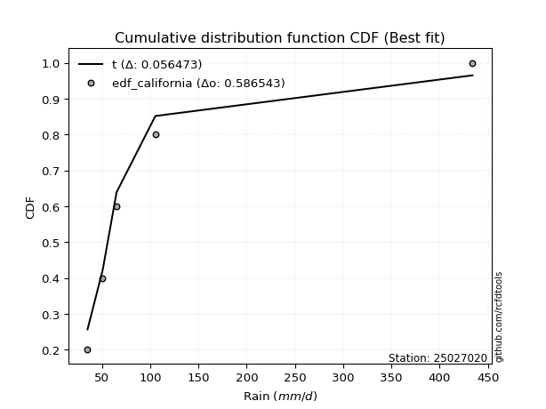</img>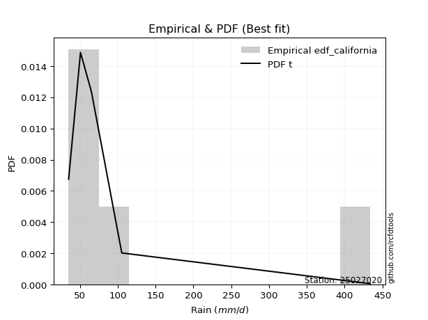</img>

</div>


### 2. Empirical - EDF Hazen (1930)

Hazen method for plotting positions is a formula used to estimate the empirical cumulative probability distribution of flood events or other hydrological data. This formula often results in biased estimations, particularly when extrapolating to extreme events (high return periods).

<div align="center">


$P=(m-0.5)/n$


</div>


**2.1. Empirical values**

<div align="center">

|                | 0                  | 1                  | 2         | 3                 | 4                  |
|:---------------|:-------------------|:-------------------|:----------|:------------------|:-------------------|
| date           | 2022               | 2025               | 2023      | 2024              | 2017               |
| x              | 35.1               | 48.44              | 65.2      | 105.4             | 434.1              |
| m              | 1                  | 2                  | 3         | 4                 | 5                  |
| empirical_dist | edf_hazen          | edf_hazen          | edf_hazen | edf_hazen         | edf_hazen          |
| empirical      | 0.1                | 0.3                | 0.5       | 0.7               | 0.9                |
| empirical_tr   | 1.1111111111111112 | 1.4285714285714286 | 2.0       | 3.333333333333333 | 10.000000000000002 |

</div>


**2.2. Kolmogorov-Smirnov fit test (sorted by Δ)**


<div align="center">

|                | 0                    | 1                   | 2                    | 3                   | 4                   | 5                    | 6                   | 7                   | 8                   | 9                  | 10                    | 11                   | 12                  | 13                  | 14                  | 15                  | 16                  | 17                  | 18                 | 19                  | 20                  | 21                  | 22                  | 23                 | 24                  | 25                  | 26                  | 27                  | 28                 | 29                  | 30                  | 31                  | 32                  | 33                  | 34                  | 35                  | 36                  | 37                  | 38                  | 39                 | 40                  | 41                  | 42                 | 43                  | 44                 | 45                  | 46                  | 47                  | 48                  | 49                  | 50                  | 51                  | 52                 | 53                 | 54                 | 55                  | 56                  | 57                  | 58                  | 59                  | 60                  | 61                  | 62                 | 63                  | 64                  | 65                  | 66                  | 67                  | 68                  | 69                  | 70                 | 71                 | 72                  | 73                  | 74                 | 75                  | 76                 | 77                 | 78                 | 79                  | 80                  | 81                  | 82                 | 83                 | 84                 | 85                  | 86                 | 87                 | 88                 | 89                 |
|:---------------|:---------------------|:--------------------|:---------------------|:--------------------|:--------------------|:---------------------|:--------------------|:--------------------|:--------------------|:-------------------|:----------------------|:---------------------|:--------------------|:--------------------|:--------------------|:--------------------|:--------------------|:--------------------|:-------------------|:--------------------|:--------------------|:--------------------|:--------------------|:-------------------|:--------------------|:--------------------|:--------------------|:--------------------|:-------------------|:--------------------|:--------------------|:--------------------|:--------------------|:--------------------|:--------------------|:--------------------|:--------------------|:--------------------|:--------------------|:-------------------|:--------------------|:--------------------|:-------------------|:--------------------|:-------------------|:--------------------|:--------------------|:--------------------|:--------------------|:--------------------|:--------------------|:--------------------|:-------------------|:-------------------|:-------------------|:--------------------|:--------------------|:--------------------|:--------------------|:--------------------|:--------------------|:--------------------|:-------------------|:--------------------|:--------------------|:--------------------|:--------------------|:--------------------|:--------------------|:--------------------|:-------------------|:-------------------|:--------------------|:--------------------|:-------------------|:--------------------|:-------------------|:-------------------|:-------------------|:--------------------|:--------------------|:--------------------|:-------------------|:-------------------|:-------------------|:--------------------|:-------------------|:-------------------|:-------------------|:-------------------|
| station        | 25027020             | 25027020            | 25027020             | 25027020            | 25027020            | 25027020             | 25027020            | 25027020            | 25027020            | 25027020           | 25027020              | 25027020             | 25027020            | 25027020            | 25027020            | 25027020            | 25027020            | 25027020            | 25027020           | 25027020            | 25027020            | 25027020            | 25027020            | 25027020           | 25027020            | 25027020            | 25027020            | 25027020            | 25027020           | 25027020            | 25027020            | 25027020            | 25027020            | 25027020            | 25027020            | 25027020            | 25027020            | 25027020            | 25027020            | 25027020           | 25027020            | 25027020            | 25027020           | 25027020            | 25027020           | 25027020            | 25027020            | 25027020            | 25027020            | 25027020            | 25027020            | 25027020            | 25027020           | 25027020           | 25027020           | 25027020            | 25027020            | 25027020            | 25027020            | 25027020            | 25027020            | 25027020            | 25027020           | 25027020            | 25027020            | 25027020            | 25027020            | 25027020            | 25027020            | 25027020            | 25027020           | 25027020           | 25027020            | 25027020            | 25027020           | 25027020            | 25027020           | 25027020           | 25027020           | 25027020            | 25027020            | 25027020            | 25027020           | 25027020           | 25027020           | 25027020            | 25027020           | 25027020           | 25027020           | 25027020           |
| empirical_dist | edf_hazen            | edf_hazen           | edf_hazen            | edf_hazen           | edf_hazen           | edf_hazen            | edf_hazen           | edf_hazen           | edf_hazen           | edf_hazen          | edf_hazen             | edf_hazen            | edf_hazen           | edf_hazen           | edf_hazen           | edf_hazen           | edf_hazen           | edf_hazen           | edf_hazen          | edf_hazen           | edf_hazen           | edf_hazen           | edf_hazen           | edf_hazen          | edf_hazen           | edf_hazen           | edf_hazen           | edf_hazen           | edf_hazen          | edf_hazen           | edf_hazen           | edf_hazen           | edf_hazen           | edf_hazen           | edf_hazen           | edf_hazen           | edf_hazen           | edf_hazen           | edf_hazen           | edf_hazen          | edf_hazen           | edf_hazen           | edf_hazen          | edf_hazen           | edf_hazen          | edf_hazen           | edf_hazen           | edf_hazen           | edf_hazen           | edf_hazen           | edf_hazen           | edf_hazen           | edf_hazen          | edf_hazen          | edf_hazen          | edf_hazen           | edf_hazen           | edf_hazen           | edf_hazen           | edf_hazen           | edf_hazen           | edf_hazen           | edf_hazen          | edf_hazen           | edf_hazen           | edf_hazen           | edf_hazen           | edf_hazen           | edf_hazen           | edf_hazen           | edf_hazen          | edf_hazen          | edf_hazen           | edf_hazen           | edf_hazen          | edf_hazen           | edf_hazen          | edf_hazen          | edf_hazen          | edf_hazen           | edf_hazen           | edf_hazen           | edf_hazen          | edf_hazen          | edf_hazen          | edf_hazen           | edf_hazen          | edf_hazen          | edf_hazen          | edf_hazen          |
| p_dist         | logalpha             | loginvweibull       | loginvgamma          | loghalflogistic     | alpha               | loginvgauss          | loghalfnorm         | logmoyal            | f                   | invgamma           | loglaplace_asymmetric | logjohnsonsu         | betaprime           | mielke              | invgauss            | nct                 | loggenlogistic      | loggumbel_r         | logpearson3        | lograyleigh         | lognct              | logkstwobign        | logmaxwell          | logexponnorm       | logbetaprime        | nakagami            | logtruncnorm        | loggenexpon         | logexpon           | logwald             | ncf                 | logncf              | chi2                | lognakagami         | logchi2             | logt                | lognorm             | lognorm             | logcrystalball      | logloggamma        | wald                | logrice             | loglogistic        | logweibull_min      | loggompertz        | loghypsecant        | t                   | halflogistic        | loglaplace          | gibrat              | loggumbel_l         | pearson3            | logerlang          | moyal              | halfnorm           | genlogistic         | loggamma            | loggamma            | logf                | gumbel_r            | gompertz            | weibull_min         | rayleigh           | exponnorm           | loggibrat           | laplace_asymmetric  | expon               | genexpon            | fisk                | maxwell             | kstwobign          | pareto             | crystalball         | norm                | logistic           | truncnorm           | hypsecant          | gamma              | rice               | logpareto           | laplace             | gumbel_l            | logfisk            | fatiguelife        | loglognorm         | logfatiguelife      | erlang             | johnsonsu          | invweibull         | logmielke          |
| delta          | 0.031717772962494284 | 0.03690235197428038 | 0.039197644891919396 | 0.04241869539433685 | 0.04510528187723639 | 0.045466170576365324 | 0.05395858861918046 | 0.05630338186150108 | 0.05996518169495951 | 0.0599662366474612 | 0.061064306232842036  | 0.061586842176003465 | 0.06230456412892926 | 0.06453736106502656 | 0.07269076630643356 | 0.07304284415907814 | 0.07404172348045224 | 0.07654242208752948 | 0.0768142080258728 | 0.08475081948051733 | 0.08920956917428718 | 0.09479499845312495 | 0.09699422074847025 | 0.0986493130919304 | 0.09871969943429049 | 0.09999967387787519 | 0.09999976580875274 | 0.09999998261792382 | 0.1                | 0.10158263120749153 | 0.10227554146480217 | 0.11148111614072043 | 0.11592167636178763 | 0.12219320717243176 | 0.12615507378631596 | 0.12998453208202887 | 0.12998889997203456 | 0.12998889997203456 | 0.12998897899089185 | 0.1301573819763755 | 0.13344573330591836 | 0.13725369657965003 | 0.146082201889997  | 0.15796426824163196 | 0.1584648217956553 | 0.15887266417742157 | 0.17431048999285434 | 0.18647866447078687 | 0.18727063405690803 | 0.19201963250448417 | 0.19291209464066933 | 0.19467297763317704 | 0.197667284883017  | 0.1988229288258132 | 0.2038956902725974 | 0.20656724950270666 | 0.21390899277929593 | 0.21390899277929593 | 0.21941928446633857 | 0.22268876031322404 | 0.23742263026026816 | 0.23752348481236873 | 0.238539125244838  | 0.24340071980594236 | 0.24526560063414246 | 0.24563165122145714 | 0.24563350264892087 | 0.24563352223719898 | 0.24909088819362085 | 0.25077232252828324 | 0.271949455514186  | 0.2749096752735228 | 0.28505574067973277 | 0.28505659216962154 | 0.2962077984262606 | 0.30482753977633253 | 0.3054404436364993 | 0.3122159953478058 | 0.315118415575705  | 0.32951819254240206 | 0.33101022473510305 | 0.35296367507429915 | 0.358579351035794  | 0.3614882001917548 | 0.3662621101833298 | 0.47014760929859484 | 0.5053853660687289 | 0.6891762310615681 | 0.6987628487588442 | nan                |
| deltao         | 0.5865427407550001   | 0.5865427407550001  | 0.5865427407550001   | 0.5865427407550001  | 0.5865427407550001  | 0.5865427407550001   | 0.5865427407550001  | 0.5865427407550001  | 0.5865427407550001  | 0.5865427407550001 | 0.5865427407550001    | 0.5865427407550001   | 0.5865427407550001  | 0.5865427407550001  | 0.5865427407550001  | 0.5865427407550001  | 0.5865427407550001  | 0.5865427407550001  | 0.5865427407550001 | 0.5865427407550001  | 0.5865427407550001  | 0.5865427407550001  | 0.5865427407550001  | 0.5865427407550001 | 0.5865427407550001  | 0.5865427407550001  | 0.5865427407550001  | 0.5865427407550001  | 0.5865427407550001 | 0.5865427407550001  | 0.5865427407550001  | 0.5865427407550001  | 0.5865427407550001  | 0.5865427407550001  | 0.5865427407550001  | 0.5865427407550001  | 0.5865427407550001  | 0.5865427407550001  | 0.5865427407550001  | 0.5865427407550001 | 0.5865427407550001  | 0.5865427407550001  | 0.5865427407550001 | 0.5865427407550001  | 0.5865427407550001 | 0.5865427407550001  | 0.5865427407550001  | 0.5865427407550001  | 0.5865427407550001  | 0.5865427407550001  | 0.5865427407550001  | 0.5865427407550001  | 0.5865427407550001 | 0.5865427407550001 | 0.5865427407550001 | 0.5865427407550001  | 0.5865427407550001  | 0.5865427407550001  | 0.5865427407550001  | 0.5865427407550001  | 0.5865427407550001  | 0.5865427407550001  | 0.5865427407550001 | 0.5865427407550001  | 0.5865427407550001  | 0.5865427407550001  | 0.5865427407550001  | 0.5865427407550001  | 0.5865427407550001  | 0.5865427407550001  | 0.5865427407550001 | 0.5865427407550001 | 0.5865427407550001  | 0.5865427407550001  | 0.5865427407550001 | 0.5865427407550001  | 0.5865427407550001 | 0.5865427407550001 | 0.5865427407550001 | 0.5865427407550001  | 0.5865427407550001  | 0.5865427407550001  | 0.5865427407550001 | 0.5865427407550001 | 0.5865427407550001 | 0.5865427407550001  | 0.5865427407550001 | 0.5865427407550001 | 0.5865427407550001 | 0.5865427407550001 |
| eval           | Δo > Δ               | Δo > Δ              | Δo > Δ               | Δo > Δ              | Δo > Δ              | Δo > Δ               | Δo > Δ              | Δo > Δ              | Δo > Δ              | Δo > Δ             | Δo > Δ                | Δo > Δ               | Δo > Δ              | Δo > Δ              | Δo > Δ              | Δo > Δ              | Δo > Δ              | Δo > Δ              | Δo > Δ             | Δo > Δ              | Δo > Δ              | Δo > Δ              | Δo > Δ              | Δo > Δ             | Δo > Δ              | Δo > Δ              | Δo > Δ              | Δo > Δ              | Δo > Δ             | Δo > Δ              | Δo > Δ              | Δo > Δ              | Δo > Δ              | Δo > Δ              | Δo > Δ              | Δo > Δ              | Δo > Δ              | Δo > Δ              | Δo > Δ              | Δo > Δ             | Δo > Δ              | Δo > Δ              | Δo > Δ             | Δo > Δ              | Δo > Δ             | Δo > Δ              | Δo > Δ              | Δo > Δ              | Δo > Δ              | Δo > Δ              | Δo > Δ              | Δo > Δ              | Δo > Δ             | Δo > Δ             | Δo > Δ             | Δo > Δ              | Δo > Δ              | Δo > Δ              | Δo > Δ              | Δo > Δ              | Δo > Δ              | Δo > Δ              | Δo > Δ             | Δo > Δ              | Δo > Δ              | Δo > Δ              | Δo > Δ              | Δo > Δ              | Δo > Δ              | Δo > Δ              | Δo > Δ             | Δo > Δ             | Δo > Δ              | Δo > Δ              | Δo > Δ             | Δo > Δ              | Δo > Δ             | Δo > Δ             | Δo > Δ             | Δo > Δ              | Δo > Δ              | Δo > Δ              | Δo > Δ             | Δo > Δ             | Δo > Δ             | Δo > Δ              | Δo > Δ             | Δo <= Δ            | Δo <= Δ            | Δo <= Δ            |
| fit            | 1                    | 1                   | 1                    | 1                   | 1                   | 1                    | 1                   | 1                   | 1                   | 1                  | 1                     | 1                    | 1                   | 1                   | 1                   | 1                   | 1                   | 1                   | 1                  | 1                   | 1                   | 1                   | 1                   | 1                  | 1                   | 1                   | 1                   | 1                   | 1                  | 1                   | 1                   | 1                   | 1                   | 1                   | 1                   | 1                   | 1                   | 1                   | 1                   | 1                  | 1                   | 1                   | 1                  | 1                   | 1                  | 1                   | 1                   | 1                   | 1                   | 1                   | 1                   | 1                   | 1                  | 1                  | 1                  | 1                   | 1                   | 1                   | 1                   | 1                   | 1                   | 1                   | 1                  | 1                   | 1                   | 1                   | 1                   | 1                   | 1                   | 1                   | 1                  | 1                  | 1                   | 1                   | 1                  | 1                   | 1                  | 1                  | 1                  | 1                   | 1                   | 1                   | 1                  | 1                  | 1                  | 1                   | 1                  | 0                  | 0                  | 0                  |
| n              | 5                    | 5                   | 5                    | 5                   | 5                   | 5                    | 5                   | 5                   | 5                   | 5                  | 5                     | 5                    | 5                   | 5                   | 5                   | 5                   | 5                   | 5                   | 5                  | 5                   | 5                   | 5                   | 5                   | 5                  | 5                   | 5                   | 5                   | 5                   | 5                  | 5                   | 5                   | 5                   | 5                   | 5                   | 5                   | 5                   | 5                   | 5                   | 5                   | 5                  | 5                   | 5                   | 5                  | 5                   | 5                  | 5                   | 5                   | 5                   | 5                   | 5                   | 5                   | 5                   | 5                  | 5                  | 5                  | 5                   | 5                   | 5                   | 5                   | 5                   | 5                   | 5                   | 5                  | 5                   | 5                   | 5                   | 5                   | 5                   | 5                   | 5                   | 5                  | 5                  | 5                   | 5                   | 5                  | 5                   | 5                  | 5                  | 5                  | 5                   | 5                   | 5                   | 5                  | 5                  | 5                  | 5                   | 5                  | 5                  | 5                  | 5                  |
| best_fit       | 1                    | 0                   | 0                    | 0                   | 0                   | 0                    | 0                   | 0                   | 0                   | 0                  | 0                     | 0                    | 0                   | 0                   | 0                   | 0                   | 0                   | 0                   | 0                  | 0                   | 0                   | 0                   | 0                   | 0                  | 0                   | 0                   | 0                   | 0                   | 0                  | 0                   | 0                   | 0                   | 0                   | 0                   | 0                   | 0                   | 0                   | 0                   | 0                   | 0                  | 0                   | 0                   | 0                  | 0                   | 0                  | 0                   | 0                   | 0                   | 0                   | 0                   | 0                   | 0                   | 0                  | 0                  | 0                  | 0                   | 0                   | 0                   | 0                   | 0                   | 0                   | 0                   | 0                  | 0                   | 0                   | 0                   | 0                   | 0                   | 0                   | 0                   | 0                  | 0                  | 0                   | 0                   | 0                  | 0                   | 0                  | 0                  | 0                  | 0                   | 0                   | 0                   | 0                  | 0                  | 0                  | 0                   | 0                  | 0                  | 0                  | 0                  |
| best_fit_sort  | 1                    | 2                   | 3                    | 4                   | 5                   | 6                    | 7                   | 8                   | 9                   | 10                 | 11                    | 12                   | 13                  | 14                  | 15                  | 16                  | 17                  | 18                  | 19                 | 20                  | 21                  | 22                  | 23                  | 24                 | 25                  | 26                  | 27                  | 28                  | 29                 | 30                  | 31                  | 32                  | 33                  | 34                  | 35                  | 36                  | 37                  | 38                  | 39                  | 40                 | 41                  | 42                  | 43                 | 44                  | 45                 | 46                  | 47                  | 48                  | 49                  | 50                  | 51                  | 52                  | 53                 | 54                 | 55                 | 56                  | 57                  | 58                  | 59                  | 60                  | 61                  | 62                  | 63                 | 64                  | 65                  | 66                  | 67                  | 68                  | 69                  | 70                  | 71                 | 72                 | 73                  | 74                  | 75                 | 76                  | 77                 | 78                 | 79                 | 80                  | 81                  | 82                  | 83                 | 84                 | 85                 | 86                  | 87                 | 88                 | 89                 | 90                 |

</div>


<div align="center">

</img>

</div>


**2.3. Best fit**

<div align="center">

|   id |   station | empirical_dist   | p_dist   |     delta |   deltao | eval   |   fit |   n |   best_fit |   best_fit_sort |
|-----:|----------:|:-----------------|:---------|----------:|---------:|:-------|------:|----:|-----------:|----------------:|
|    0 |  25027020 | edf_hazen        | logalpha | 0.0317178 | 0.586543 | Δo > Δ |     1 |   5 |          1 |               1 |

</div>


<div align="center">

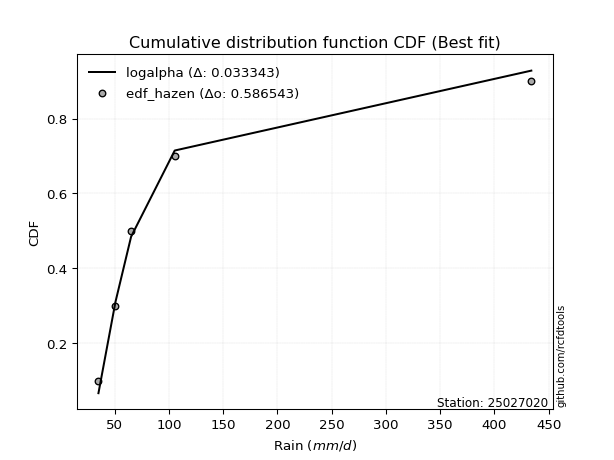</img></img>

</div>


### 3. Empirical - EDF Weibull (1939)

Weibull plotting position formula is an empirical method used to estimate the non-exceedance probability or plotting position for a set of observed data, is often recommended or widely used in practice, particularly in flood frequency analysis.

<div align="center">


$P=m/(n+1)$


</div>


**3.1. Empirical values**

<div align="center">

|                | 0                   | 1                  | 2           | 3                  | 4                  |
|:---------------|:--------------------|:-------------------|:------------|:-------------------|:-------------------|
| date           | 2022                | 2025               | 2023        | 2024               | 2017               |
| x              | 35.1                | 48.44              | 65.2        | 105.4              | 434.1              |
| m              | 1                   | 2                  | 3           | 4                  | 5                  |
| empirical_dist | edf_weibull         | edf_weibull        | edf_weibull | edf_weibull        | edf_weibull        |
| empirical      | 0.16666666666666666 | 0.3333333333333333 | 0.5         | 0.6666666666666666 | 0.8333333333333334 |
| empirical_tr   | 1.2                 | 1.4999999999999998 | 2.0         | 2.9999999999999996 | 6.000000000000002  |

</div>


**3.2. Kolmogorov-Smirnov fit test (sorted by Δ)**


<div align="center">

|                | 0                   | 1                   | 2                   | 3                     | 4                   | 5                  | 6                   | 7                   | 8                   | 9                   | 10                  | 11                  | 12                  | 13                  | 14                  | 15                  | 16                  | 17                  | 18                  | 19                  | 20                  | 21                  | 22                  | 23                  | 24                  | 25                  | 26                 | 27                 | 28                 | 29                  | 30                  | 31                  | 32                  | 33                 | 34                  | 35                  | 36                 | 37                  | 38                  | 39                  | 40                 | 41                  | 42                  | 43                  | 44                  | 45                  | 46                  | 47                  | 48                  | 49                  | 50                  | 51                 | 52                 | 53                  | 54                 | 55                  | 56                  | 57                  | 58                  | 59                  | 60                  | 61                  | 62                  | 63                  | 64                  | 65                  | 66                  | 67                  | 68                  | 69                  | 70                  | 71                  | 72                 | 73                 | 74                 | 75                 | 76                 | 77                 | 78                  | 79                 | 80                  | 81                  | 82                 | 83                 | 84                 | 85                 | 86                 | 87                 | 88                 | 89                 |
|:---------------|:--------------------|:--------------------|:--------------------|:----------------------|:--------------------|:-------------------|:--------------------|:--------------------|:--------------------|:--------------------|:--------------------|:--------------------|:--------------------|:--------------------|:--------------------|:--------------------|:--------------------|:--------------------|:--------------------|:--------------------|:--------------------|:--------------------|:--------------------|:--------------------|:--------------------|:--------------------|:-------------------|:-------------------|:-------------------|:--------------------|:--------------------|:--------------------|:--------------------|:-------------------|:--------------------|:--------------------|:-------------------|:--------------------|:--------------------|:--------------------|:-------------------|:--------------------|:--------------------|:--------------------|:--------------------|:--------------------|:--------------------|:--------------------|:--------------------|:--------------------|:--------------------|:-------------------|:-------------------|:--------------------|:-------------------|:--------------------|:--------------------|:--------------------|:--------------------|:--------------------|:--------------------|:--------------------|:--------------------|:--------------------|:--------------------|:--------------------|:--------------------|:--------------------|:--------------------|:--------------------|:--------------------|:--------------------|:-------------------|:-------------------|:-------------------|:-------------------|:-------------------|:-------------------|:--------------------|:-------------------|:--------------------|:--------------------|:-------------------|:-------------------|:-------------------|:-------------------|:-------------------|:-------------------|:-------------------|:-------------------|
| station        | 25027020            | 25027020            | 25027020            | 25027020              | 25027020            | 25027020           | 25027020            | 25027020            | 25027020            | 25027020            | 25027020            | 25027020            | 25027020            | 25027020            | 25027020            | 25027020            | 25027020            | 25027020            | 25027020            | 25027020            | 25027020            | 25027020            | 25027020            | 25027020            | 25027020            | 25027020            | 25027020           | 25027020           | 25027020           | 25027020            | 25027020            | 25027020            | 25027020            | 25027020           | 25027020            | 25027020            | 25027020           | 25027020            | 25027020            | 25027020            | 25027020           | 25027020            | 25027020            | 25027020            | 25027020            | 25027020            | 25027020            | 25027020            | 25027020            | 25027020            | 25027020            | 25027020           | 25027020           | 25027020            | 25027020           | 25027020            | 25027020            | 25027020            | 25027020            | 25027020            | 25027020            | 25027020            | 25027020            | 25027020            | 25027020            | 25027020            | 25027020            | 25027020            | 25027020            | 25027020            | 25027020            | 25027020            | 25027020           | 25027020           | 25027020           | 25027020           | 25027020           | 25027020           | 25027020            | 25027020           | 25027020            | 25027020            | 25027020           | 25027020           | 25027020           | 25027020           | 25027020           | 25027020           | 25027020           | 25027020           |
| empirical_dist | edf_weibull         | edf_weibull         | edf_weibull         | edf_weibull           | edf_weibull         | edf_weibull        | edf_weibull         | edf_weibull         | edf_weibull         | edf_weibull         | edf_weibull         | edf_weibull         | edf_weibull         | edf_weibull         | edf_weibull         | edf_weibull         | edf_weibull         | edf_weibull         | edf_weibull         | edf_weibull         | edf_weibull         | edf_weibull         | edf_weibull         | edf_weibull         | edf_weibull         | edf_weibull         | edf_weibull        | edf_weibull        | edf_weibull        | edf_weibull         | edf_weibull         | edf_weibull         | edf_weibull         | edf_weibull        | edf_weibull         | edf_weibull         | edf_weibull        | edf_weibull         | edf_weibull         | edf_weibull         | edf_weibull        | edf_weibull         | edf_weibull         | edf_weibull         | edf_weibull         | edf_weibull         | edf_weibull         | edf_weibull         | edf_weibull         | edf_weibull         | edf_weibull         | edf_weibull        | edf_weibull        | edf_weibull         | edf_weibull        | edf_weibull         | edf_weibull         | edf_weibull         | edf_weibull         | edf_weibull         | edf_weibull         | edf_weibull         | edf_weibull         | edf_weibull         | edf_weibull         | edf_weibull         | edf_weibull         | edf_weibull         | edf_weibull         | edf_weibull         | edf_weibull         | edf_weibull         | edf_weibull        | edf_weibull        | edf_weibull        | edf_weibull        | edf_weibull        | edf_weibull        | edf_weibull         | edf_weibull        | edf_weibull         | edf_weibull         | edf_weibull        | edf_weibull        | edf_weibull        | edf_weibull        | edf_weibull        | edf_weibull        | edf_weibull        | edf_weibull        |
| p_dist         | logalpha            | loginvweibull       | loginvgamma         | loglaplace_asymmetric | loghalfnorm         | loghalflogistic    | logmoyal            | alpha               | loginvgauss         | invgamma            | f                   | betaprime           | logpearson3         | loggumbel_r         | invgauss            | nct                 | lograyleigh         | logjohnsonsu        | wald                | logmaxwell          | lognct              | ncf                 | logbetaprime        | mielke              | logkstwobign        | loggenlogistic      | logncf             | lognorm            | lognorm            | logcrystalball      | logt                | logloggamma         | logrice             | loglogistic        | halflogistic        | loghypsecant        | pearson3           | logexponnorm        | moyal               | nakagami            | logtruncnorm       | loggenexpon         | logchi2             | logweibull_min      | loggompertz         | lognakagami         | chi2                | logwald             | logexpon            | halfnorm            | weibull_min         | t                  | logerlang          | logf                | genlogistic        | loglaplace          | gumbel_r            | gibrat              | loggumbel_l         | rayleigh            | loggamma            | loggamma            | fisk                | maxwell             | gompertz            | kstwobign           | pareto              | exponnorm           | laplace_asymmetric  | expon               | genexpon            | crystalball         | norm               | logistic           | hypsecant          | loggibrat          | gamma              | rice               | logpareto           | laplace            | truncnorm           | gumbel_l            | logfisk            | fatiguelife        | loglognorm         | logfatiguelife     | erlang             | johnsonsu          | invweibull         | logmielke          |
| delta          | 0.09838443962916094 | 0.10356901864094703 | 0.10586431155858606 | 0.10746366805404906   | 0.10880956557665877 | 0.1090853620610035 | 0.11090001328094168 | 0.11177194854390304 | 0.11213283724303197 | 0.11278814681197913 | 0.11278846934350788 | 0.11332776354444309 | 0.11384964156495125 | 0.11391796951873312 | 0.11430852257088692 | 0.11656230382784094 | 0.11664828500226843 | 0.11979722659211586 | 0.11999477212698512 | 0.12006617373420791 | 0.12210410996415744 | 0.12428852142054914 | 0.12668839364579743 | 0.12837977672984024 | 0.12852991976532402 | 0.12860889303189071 | 0.1296314524761638 | 0.1325113770344586 | 0.1325113770344586 | 0.13251141516957243 | 0.13251237992398435 | 0.13292713191142913 | 0.13725369657965003 | 0.146082201889997  | 0.15314533113745354 | 0.15887266417742157 | 0.1613396442998437 | 0.16531597975859705 | 0.16548959549247988 | 0.16666634054454182 | 0.1666664324754194 | 0.16666664928459046 | 0.16666665025841373 | 0.16666665583460427 | 0.16666665804212347 | 0.16666666386355525 | 0.16666666411240363 | 0.16666666666666666 | 0.16666666666666666 | 0.17056235693926408 | 0.17164176888683474 | 0.1855903583276013 | 0.185846508628575  | 0.18608595113300525 | 0.186904942511951  | 0.18727063405690803 | 0.18935542697989072 | 0.19201963250448417 | 0.19291209464066933 | 0.20520579191150468 | 0.21250374077184053 | 0.21250374077184053 | 0.21575755486028753 | 0.21743898919494992 | 0.23742263026026816 | 0.23861612218085265 | 0.24157634194018945 | 0.24340071980594236 | 0.24563165122145714 | 0.24563350264892087 | 0.24563352223719898 | 0.25172240734639945 | 0.2517232588362882 | 0.2628744650929273 | 0.272107110303166  | 0.2785989339674758 | 0.2788826620144725 | 0.2817850822423717 | 0.29618485920906873 | 0.2976768914017697 | 0.30482753977633253 | 0.31963034174096583 | 0.3252460177024607 | 0.3281548668584215 | 0.3329287768499965 | 0.4368142759652615 | 0.4720520327353956 | 0.6558428977282347 | 0.665429515425511  | nan                |
| deltao         | 0.5865427407550001  | 0.5865427407550001  | 0.5865427407550001  | 0.5865427407550001    | 0.5865427407550001  | 0.5865427407550001 | 0.5865427407550001  | 0.5865427407550001  | 0.5865427407550001  | 0.5865427407550001  | 0.5865427407550001  | 0.5865427407550001  | 0.5865427407550001  | 0.5865427407550001  | 0.5865427407550001  | 0.5865427407550001  | 0.5865427407550001  | 0.5865427407550001  | 0.5865427407550001  | 0.5865427407550001  | 0.5865427407550001  | 0.5865427407550001  | 0.5865427407550001  | 0.5865427407550001  | 0.5865427407550001  | 0.5865427407550001  | 0.5865427407550001 | 0.5865427407550001 | 0.5865427407550001 | 0.5865427407550001  | 0.5865427407550001  | 0.5865427407550001  | 0.5865427407550001  | 0.5865427407550001 | 0.5865427407550001  | 0.5865427407550001  | 0.5865427407550001 | 0.5865427407550001  | 0.5865427407550001  | 0.5865427407550001  | 0.5865427407550001 | 0.5865427407550001  | 0.5865427407550001  | 0.5865427407550001  | 0.5865427407550001  | 0.5865427407550001  | 0.5865427407550001  | 0.5865427407550001  | 0.5865427407550001  | 0.5865427407550001  | 0.5865427407550001  | 0.5865427407550001 | 0.5865427407550001 | 0.5865427407550001  | 0.5865427407550001 | 0.5865427407550001  | 0.5865427407550001  | 0.5865427407550001  | 0.5865427407550001  | 0.5865427407550001  | 0.5865427407550001  | 0.5865427407550001  | 0.5865427407550001  | 0.5865427407550001  | 0.5865427407550001  | 0.5865427407550001  | 0.5865427407550001  | 0.5865427407550001  | 0.5865427407550001  | 0.5865427407550001  | 0.5865427407550001  | 0.5865427407550001  | 0.5865427407550001 | 0.5865427407550001 | 0.5865427407550001 | 0.5865427407550001 | 0.5865427407550001 | 0.5865427407550001 | 0.5865427407550001  | 0.5865427407550001 | 0.5865427407550001  | 0.5865427407550001  | 0.5865427407550001 | 0.5865427407550001 | 0.5865427407550001 | 0.5865427407550001 | 0.5865427407550001 | 0.5865427407550001 | 0.5865427407550001 | 0.5865427407550001 |
| eval           | Δo > Δ              | Δo > Δ              | Δo > Δ              | Δo > Δ                | Δo > Δ              | Δo > Δ             | Δo > Δ              | Δo > Δ              | Δo > Δ              | Δo > Δ              | Δo > Δ              | Δo > Δ              | Δo > Δ              | Δo > Δ              | Δo > Δ              | Δo > Δ              | Δo > Δ              | Δo > Δ              | Δo > Δ              | Δo > Δ              | Δo > Δ              | Δo > Δ              | Δo > Δ              | Δo > Δ              | Δo > Δ              | Δo > Δ              | Δo > Δ             | Δo > Δ             | Δo > Δ             | Δo > Δ              | Δo > Δ              | Δo > Δ              | Δo > Δ              | Δo > Δ             | Δo > Δ              | Δo > Δ              | Δo > Δ             | Δo > Δ              | Δo > Δ              | Δo > Δ              | Δo > Δ             | Δo > Δ              | Δo > Δ              | Δo > Δ              | Δo > Δ              | Δo > Δ              | Δo > Δ              | Δo > Δ              | Δo > Δ              | Δo > Δ              | Δo > Δ              | Δo > Δ             | Δo > Δ             | Δo > Δ              | Δo > Δ             | Δo > Δ              | Δo > Δ              | Δo > Δ              | Δo > Δ              | Δo > Δ              | Δo > Δ              | Δo > Δ              | Δo > Δ              | Δo > Δ              | Δo > Δ              | Δo > Δ              | Δo > Δ              | Δo > Δ              | Δo > Δ              | Δo > Δ              | Δo > Δ              | Δo > Δ              | Δo > Δ             | Δo > Δ             | Δo > Δ             | Δo > Δ             | Δo > Δ             | Δo > Δ             | Δo > Δ              | Δo > Δ             | Δo > Δ              | Δo > Δ              | Δo > Δ             | Δo > Δ             | Δo > Δ             | Δo > Δ             | Δo > Δ             | Δo <= Δ            | Δo <= Δ            | Δo <= Δ            |
| fit            | 1                   | 1                   | 1                   | 1                     | 1                   | 1                  | 1                   | 1                   | 1                   | 1                   | 1                   | 1                   | 1                   | 1                   | 1                   | 1                   | 1                   | 1                   | 1                   | 1                   | 1                   | 1                   | 1                   | 1                   | 1                   | 1                   | 1                  | 1                  | 1                  | 1                   | 1                   | 1                   | 1                   | 1                  | 1                   | 1                   | 1                  | 1                   | 1                   | 1                   | 1                  | 1                   | 1                   | 1                   | 1                   | 1                   | 1                   | 1                   | 1                   | 1                   | 1                   | 1                  | 1                  | 1                   | 1                  | 1                   | 1                   | 1                   | 1                   | 1                   | 1                   | 1                   | 1                   | 1                   | 1                   | 1                   | 1                   | 1                   | 1                   | 1                   | 1                   | 1                   | 1                  | 1                  | 1                  | 1                  | 1                  | 1                  | 1                   | 1                  | 1                   | 1                   | 1                  | 1                  | 1                  | 1                  | 1                  | 0                  | 0                  | 0                  |
| n              | 5                   | 5                   | 5                   | 5                     | 5                   | 5                  | 5                   | 5                   | 5                   | 5                   | 5                   | 5                   | 5                   | 5                   | 5                   | 5                   | 5                   | 5                   | 5                   | 5                   | 5                   | 5                   | 5                   | 5                   | 5                   | 5                   | 5                  | 5                  | 5                  | 5                   | 5                   | 5                   | 5                   | 5                  | 5                   | 5                   | 5                  | 5                   | 5                   | 5                   | 5                  | 5                   | 5                   | 5                   | 5                   | 5                   | 5                   | 5                   | 5                   | 5                   | 5                   | 5                  | 5                  | 5                   | 5                  | 5                   | 5                   | 5                   | 5                   | 5                   | 5                   | 5                   | 5                   | 5                   | 5                   | 5                   | 5                   | 5                   | 5                   | 5                   | 5                   | 5                   | 5                  | 5                  | 5                  | 5                  | 5                  | 5                  | 5                   | 5                  | 5                   | 5                   | 5                  | 5                  | 5                  | 5                  | 5                  | 5                  | 5                  | 5                  |
| best_fit       | 1                   | 0                   | 0                   | 0                     | 0                   | 0                  | 0                   | 0                   | 0                   | 0                   | 0                   | 0                   | 0                   | 0                   | 0                   | 0                   | 0                   | 0                   | 0                   | 0                   | 0                   | 0                   | 0                   | 0                   | 0                   | 0                   | 0                  | 0                  | 0                  | 0                   | 0                   | 0                   | 0                   | 0                  | 0                   | 0                   | 0                  | 0                   | 0                   | 0                   | 0                  | 0                   | 0                   | 0                   | 0                   | 0                   | 0                   | 0                   | 0                   | 0                   | 0                   | 0                  | 0                  | 0                   | 0                  | 0                   | 0                   | 0                   | 0                   | 0                   | 0                   | 0                   | 0                   | 0                   | 0                   | 0                   | 0                   | 0                   | 0                   | 0                   | 0                   | 0                   | 0                  | 0                  | 0                  | 0                  | 0                  | 0                  | 0                   | 0                  | 0                   | 0                   | 0                  | 0                  | 0                  | 0                  | 0                  | 0                  | 0                  | 0                  |
| best_fit_sort  | 1                   | 2                   | 3                   | 4                     | 5                   | 6                  | 7                   | 8                   | 9                   | 10                  | 11                  | 12                  | 13                  | 14                  | 15                  | 16                  | 17                  | 18                  | 19                  | 20                  | 21                  | 22                  | 23                  | 24                  | 25                  | 26                  | 27                 | 28                 | 29                 | 30                  | 31                  | 32                  | 33                  | 34                 | 35                  | 36                  | 37                 | 38                  | 39                  | 40                  | 41                 | 42                  | 43                  | 44                  | 45                  | 46                  | 47                  | 48                  | 49                  | 50                  | 51                  | 52                 | 53                 | 54                  | 55                 | 56                  | 57                  | 58                  | 59                  | 60                  | 61                  | 62                  | 63                  | 64                  | 65                  | 66                  | 67                  | 68                  | 69                  | 70                  | 71                  | 72                  | 73                 | 74                 | 75                 | 76                 | 77                 | 78                 | 79                  | 80                 | 81                  | 82                  | 83                 | 84                 | 85                 | 86                 | 87                 | 88                 | 89                 | 90                 |

</div>


<div align="center">

</img>

</div>


**3.3. Best fit**

<div align="center">

|   id |   station | empirical_dist   | p_dist   |     delta |   deltao | eval   |   fit |   n |   best_fit |   best_fit_sort |
|-----:|----------:|:-----------------|:---------|----------:|---------:|:-------|------:|----:|-----------:|----------------:|
|    0 |  25027020 | edf_weibull      | logalpha | 0.0983844 | 0.586543 | Δo > Δ |     1 |   5 |          1 |               1 |

</div>


<div align="center">

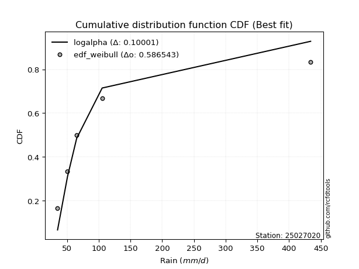</img></img>

</div>


### 4. Empirical - EDF Beard (1943)

The Beard formula (or Beard´s plotting position formula) in hydrology is used to estimate the empirical non-exceedance probability _(P)_ of a flood event (or other extreme hydrological data point) within a given dataset.

<div align="center">


$P=(m-0.31)/(n+0.38)$


</div>


**4.1. Empirical values**

<div align="center">

|                | 0                   | 1                  | 2         | 3                  | 4                  |
|:---------------|:--------------------|:-------------------|:----------|:-------------------|:-------------------|
| date           | 2022                | 2025               | 2023      | 2024               | 2017               |
| x              | 35.1                | 48.44              | 65.2      | 105.4              | 434.1              |
| m              | 1                   | 2                  | 3         | 4                  | 5                  |
| empirical_dist | edf_beard           | edf_beard          | edf_beard | edf_beard          | edf_beard          |
| empirical      | 0.12825278810408922 | 0.3141263940520446 | 0.5       | 0.6858736059479554 | 0.8717472118959109 |
| empirical_tr   | 1.1471215351812367  | 1.4579945799457996 | 2.0       | 3.183431952662722  | 7.797101449275368  |

</div>


**4.2. Kolmogorov-Smirnov fit test (sorted by Δ)**


<div align="center">

|                | 0                    | 1                   | 2                   | 3                   | 4                  | 5                   | 6                   | 7                   | 8                   | 9                   | 10                  | 11                    | 12                  | 13                  | 14                 | 15                  | 16                  | 17                  | 18                  | 19                  | 20                  | 21                  | 22                  | 23                  | 24                  | 25                  | 26                  | 27                 | 28                  | 29                  | 30                  | 31                 | 32                 | 33                 | 34                  | 35                  | 36                  | 37                  | 38                  | 39                  | 40                 | 41                  | 42                  | 43                 | 44                 | 45                  | 46                 | 47                  | 48                 | 49                  | 50                 | 51                  | 52                  | 53                  | 54                  | 55                  | 56                  | 57                  | 58                  | 59                  | 60                  | 61                  | 62                  | 63                  | 64                  | 65                  | 66                  | 67                  | 68                  | 69                  | 70                 | 71                  | 72                  | 73                 | 74                 | 75                 | 76                 | 77                 | 78                  | 79                 | 80                  | 81                  | 82                 | 83                 | 84                 | 85                 | 86                 | 87                 | 88                 | 89                 |
|:---------------|:---------------------|:--------------------|:--------------------|:--------------------|:-------------------|:--------------------|:--------------------|:--------------------|:--------------------|:--------------------|:--------------------|:----------------------|:--------------------|:--------------------|:-------------------|:--------------------|:--------------------|:--------------------|:--------------------|:--------------------|:--------------------|:--------------------|:--------------------|:--------------------|:--------------------|:--------------------|:--------------------|:-------------------|:--------------------|:--------------------|:--------------------|:-------------------|:-------------------|:-------------------|:--------------------|:--------------------|:--------------------|:--------------------|:--------------------|:--------------------|:-------------------|:--------------------|:--------------------|:-------------------|:-------------------|:--------------------|:-------------------|:--------------------|:-------------------|:--------------------|:-------------------|:--------------------|:--------------------|:--------------------|:--------------------|:--------------------|:--------------------|:--------------------|:--------------------|:--------------------|:--------------------|:--------------------|:--------------------|:--------------------|:--------------------|:--------------------|:--------------------|:--------------------|:--------------------|:--------------------|:-------------------|:--------------------|:--------------------|:-------------------|:-------------------|:-------------------|:-------------------|:-------------------|:--------------------|:-------------------|:--------------------|:--------------------|:-------------------|:-------------------|:-------------------|:-------------------|:-------------------|:-------------------|:-------------------|:-------------------|
| station        | 25027020             | 25027020            | 25027020            | 25027020            | 25027020           | 25027020            | 25027020            | 25027020            | 25027020            | 25027020            | 25027020            | 25027020              | 25027020            | 25027020            | 25027020           | 25027020            | 25027020            | 25027020            | 25027020            | 25027020            | 25027020            | 25027020            | 25027020            | 25027020            | 25027020            | 25027020            | 25027020            | 25027020           | 25027020            | 25027020            | 25027020            | 25027020           | 25027020           | 25027020           | 25027020            | 25027020            | 25027020            | 25027020            | 25027020            | 25027020            | 25027020           | 25027020            | 25027020            | 25027020           | 25027020           | 25027020            | 25027020           | 25027020            | 25027020           | 25027020            | 25027020           | 25027020            | 25027020            | 25027020            | 25027020            | 25027020            | 25027020            | 25027020            | 25027020            | 25027020            | 25027020            | 25027020            | 25027020            | 25027020            | 25027020            | 25027020            | 25027020            | 25027020            | 25027020            | 25027020            | 25027020           | 25027020            | 25027020            | 25027020           | 25027020           | 25027020           | 25027020           | 25027020           | 25027020            | 25027020           | 25027020            | 25027020            | 25027020           | 25027020           | 25027020           | 25027020           | 25027020           | 25027020           | 25027020           | 25027020           |
| empirical_dist | edf_beard            | edf_beard           | edf_beard           | edf_beard           | edf_beard          | edf_beard           | edf_beard           | edf_beard           | edf_beard           | edf_beard           | edf_beard           | edf_beard             | edf_beard           | edf_beard           | edf_beard          | edf_beard           | edf_beard           | edf_beard           | edf_beard           | edf_beard           | edf_beard           | edf_beard           | edf_beard           | edf_beard           | edf_beard           | edf_beard           | edf_beard           | edf_beard          | edf_beard           | edf_beard           | edf_beard           | edf_beard          | edf_beard          | edf_beard          | edf_beard           | edf_beard           | edf_beard           | edf_beard           | edf_beard           | edf_beard           | edf_beard          | edf_beard           | edf_beard           | edf_beard          | edf_beard          | edf_beard           | edf_beard          | edf_beard           | edf_beard          | edf_beard           | edf_beard          | edf_beard           | edf_beard           | edf_beard           | edf_beard           | edf_beard           | edf_beard           | edf_beard           | edf_beard           | edf_beard           | edf_beard           | edf_beard           | edf_beard           | edf_beard           | edf_beard           | edf_beard           | edf_beard           | edf_beard           | edf_beard           | edf_beard           | edf_beard          | edf_beard           | edf_beard           | edf_beard          | edf_beard          | edf_beard          | edf_beard          | edf_beard          | edf_beard           | edf_beard          | edf_beard           | edf_beard           | edf_beard          | edf_beard          | edf_beard          | edf_beard          | edf_beard          | edf_beard          | edf_beard          | edf_beard          |
| p_dist         | logalpha             | loginvweibull       | loginvgamma         | loghalfnorm         | loghalflogistic    | logmoyal            | alpha               | loginvgauss         | invgamma            | f                   | betaprime           | loglaplace_asymmetric | invgauss            | loggumbel_r         | logpearson3        | nct                 | logjohnsonsu        | lograyleigh         | lognct              | mielke              | loggenlogistic      | logkstwobign        | logmaxwell          | logbetaprime        | ncf                 | logncf              | wald                | logexponnorm       | nakagami            | logtruncnorm        | loggenexpon         | logchi2            | lognakagami        | chi2               | logexpon            | logwald             | logt                | lognorm             | lognorm             | logcrystalball      | logloggamma        | logrice             | logweibull_min      | loglogistic        | loggompertz        | loghypsecant        | t                  | halflogistic        | pearson3           | moyal               | logerlang          | loglaplace          | halfnorm            | gibrat              | genlogistic         | loggumbel_l         | logf                | gumbel_r            | weibull_min         | loggamma            | loggamma            | rayleigh            | fisk                | maxwell             | gompertz            | exponnorm           | laplace_asymmetric  | expon               | genexpon            | kstwobign           | loggibrat          | pareto              | crystalball         | norm               | logistic           | hypsecant          | gamma              | rice               | truncnorm           | logpareto          | laplace             | gumbel_l            | logfisk            | fatiguelife        | loglognorm         | logfatiguelife     | erlang             | johnsonsu          | invweibull         | logmielke          |
| delta          | 0.059970561066583494 | 0.06515514007836959 | 0.06745043299600861 | 0.07039568701408128 | 0.070671483498426  | 0.07248613471836418 | 0.07335806998132555 | 0.07371895868045453 | 0.07437426824940169 | 0.07437459078093044 | 0.07491388498186564 | 0.07519070028488667   | 0.07589464400830948 | 0.07654242208752948 | 0.0768142080258728 | 0.07814842526526344 | 0.08138334802953842 | 0.08475081948051733 | 0.08920956917428718 | 0.08996589816726275 | 0.09019501446931322 | 0.09479499845312495 | 0.09699422074847025 | 0.09871969943429049 | 0.10227554146480217 | 0.11148111614072043 | 0.11999477212698512 | 0.1269021011960196 | 0.12825246198196438 | 0.12825255391284196 | 0.12825277072201302 | 0.1282527716958363 | 0.1282527853009778 | 0.1282527855498262 | 0.12825278810408922 | 0.12825278810408922 | 0.12998453208202887 | 0.12998889997203456 | 0.12998889997203456 | 0.12998897899089185 | 0.1301573819763755 | 0.13725369657965003 | 0.14383787418958732 | 0.146082201889997  | 0.1584648217956553 | 0.15887266417742157 | 0.1663834190463125 | 0.17235227041874235 | 0.1805465835811325 | 0.18469653477376868 | 0.185846508628575  | 0.18727063405690803 | 0.18976929622055289 | 0.19201963250448417 | 0.19244085545066214 | 0.19291209464066933 | 0.20529289041429394 | 0.20856236626117952 | 0.20927069670827958 | 0.21250374077184053 | 0.21250374077184053 | 0.22441273119279348 | 0.23496449414157633 | 0.23664592847623872 | 0.23742263026026816 | 0.24340071980594236 | 0.24563165122145714 | 0.24563350264892087 | 0.24563352223719898 | 0.25782306146214146 | 0.2593919946861871 | 0.26078328122147815 | 0.27092934662768825 | 0.270930198117577  | 0.2820814043742161 | 0.2913140495844548 | 0.2980896012957612 | 0.3009920215236605 | 0.30482753977633253 | 0.3153917984903574 | 0.31688383068305853 | 0.33883728102225463 | 0.3444529569837494 | 0.3473618061397102 | 0.3521357161312852 | 0.4560212152465502 | 0.4912589720166843 | 0.6750498370095235 | 0.6846364547067996 | nan                |
| deltao         | 0.5865427407550001   | 0.5865427407550001  | 0.5865427407550001  | 0.5865427407550001  | 0.5865427407550001 | 0.5865427407550001  | 0.5865427407550001  | 0.5865427407550001  | 0.5865427407550001  | 0.5865427407550001  | 0.5865427407550001  | 0.5865427407550001    | 0.5865427407550001  | 0.5865427407550001  | 0.5865427407550001 | 0.5865427407550001  | 0.5865427407550001  | 0.5865427407550001  | 0.5865427407550001  | 0.5865427407550001  | 0.5865427407550001  | 0.5865427407550001  | 0.5865427407550001  | 0.5865427407550001  | 0.5865427407550001  | 0.5865427407550001  | 0.5865427407550001  | 0.5865427407550001 | 0.5865427407550001  | 0.5865427407550001  | 0.5865427407550001  | 0.5865427407550001 | 0.5865427407550001 | 0.5865427407550001 | 0.5865427407550001  | 0.5865427407550001  | 0.5865427407550001  | 0.5865427407550001  | 0.5865427407550001  | 0.5865427407550001  | 0.5865427407550001 | 0.5865427407550001  | 0.5865427407550001  | 0.5865427407550001 | 0.5865427407550001 | 0.5865427407550001  | 0.5865427407550001 | 0.5865427407550001  | 0.5865427407550001 | 0.5865427407550001  | 0.5865427407550001 | 0.5865427407550001  | 0.5865427407550001  | 0.5865427407550001  | 0.5865427407550001  | 0.5865427407550001  | 0.5865427407550001  | 0.5865427407550001  | 0.5865427407550001  | 0.5865427407550001  | 0.5865427407550001  | 0.5865427407550001  | 0.5865427407550001  | 0.5865427407550001  | 0.5865427407550001  | 0.5865427407550001  | 0.5865427407550001  | 0.5865427407550001  | 0.5865427407550001  | 0.5865427407550001  | 0.5865427407550001 | 0.5865427407550001  | 0.5865427407550001  | 0.5865427407550001 | 0.5865427407550001 | 0.5865427407550001 | 0.5865427407550001 | 0.5865427407550001 | 0.5865427407550001  | 0.5865427407550001 | 0.5865427407550001  | 0.5865427407550001  | 0.5865427407550001 | 0.5865427407550001 | 0.5865427407550001 | 0.5865427407550001 | 0.5865427407550001 | 0.5865427407550001 | 0.5865427407550001 | 0.5865427407550001 |
| eval           | Δo > Δ               | Δo > Δ              | Δo > Δ              | Δo > Δ              | Δo > Δ             | Δo > Δ              | Δo > Δ              | Δo > Δ              | Δo > Δ              | Δo > Δ              | Δo > Δ              | Δo > Δ                | Δo > Δ              | Δo > Δ              | Δo > Δ             | Δo > Δ              | Δo > Δ              | Δo > Δ              | Δo > Δ              | Δo > Δ              | Δo > Δ              | Δo > Δ              | Δo > Δ              | Δo > Δ              | Δo > Δ              | Δo > Δ              | Δo > Δ              | Δo > Δ             | Δo > Δ              | Δo > Δ              | Δo > Δ              | Δo > Δ             | Δo > Δ             | Δo > Δ             | Δo > Δ              | Δo > Δ              | Δo > Δ              | Δo > Δ              | Δo > Δ              | Δo > Δ              | Δo > Δ             | Δo > Δ              | Δo > Δ              | Δo > Δ             | Δo > Δ             | Δo > Δ              | Δo > Δ             | Δo > Δ              | Δo > Δ             | Δo > Δ              | Δo > Δ             | Δo > Δ              | Δo > Δ              | Δo > Δ              | Δo > Δ              | Δo > Δ              | Δo > Δ              | Δo > Δ              | Δo > Δ              | Δo > Δ              | Δo > Δ              | Δo > Δ              | Δo > Δ              | Δo > Δ              | Δo > Δ              | Δo > Δ              | Δo > Δ              | Δo > Δ              | Δo > Δ              | Δo > Δ              | Δo > Δ             | Δo > Δ              | Δo > Δ              | Δo > Δ             | Δo > Δ             | Δo > Δ             | Δo > Δ             | Δo > Δ             | Δo > Δ              | Δo > Δ             | Δo > Δ              | Δo > Δ              | Δo > Δ             | Δo > Δ             | Δo > Δ             | Δo > Δ             | Δo > Δ             | Δo <= Δ            | Δo <= Δ            | Δo <= Δ            |
| fit            | 1                    | 1                   | 1                   | 1                   | 1                  | 1                   | 1                   | 1                   | 1                   | 1                   | 1                   | 1                     | 1                   | 1                   | 1                  | 1                   | 1                   | 1                   | 1                   | 1                   | 1                   | 1                   | 1                   | 1                   | 1                   | 1                   | 1                   | 1                  | 1                   | 1                   | 1                   | 1                  | 1                  | 1                  | 1                   | 1                   | 1                   | 1                   | 1                   | 1                   | 1                  | 1                   | 1                   | 1                  | 1                  | 1                   | 1                  | 1                   | 1                  | 1                   | 1                  | 1                   | 1                   | 1                   | 1                   | 1                   | 1                   | 1                   | 1                   | 1                   | 1                   | 1                   | 1                   | 1                   | 1                   | 1                   | 1                   | 1                   | 1                   | 1                   | 1                  | 1                   | 1                   | 1                  | 1                  | 1                  | 1                  | 1                  | 1                   | 1                  | 1                   | 1                   | 1                  | 1                  | 1                  | 1                  | 1                  | 0                  | 0                  | 0                  |
| n              | 5                    | 5                   | 5                   | 5                   | 5                  | 5                   | 5                   | 5                   | 5                   | 5                   | 5                   | 5                     | 5                   | 5                   | 5                  | 5                   | 5                   | 5                   | 5                   | 5                   | 5                   | 5                   | 5                   | 5                   | 5                   | 5                   | 5                   | 5                  | 5                   | 5                   | 5                   | 5                  | 5                  | 5                  | 5                   | 5                   | 5                   | 5                   | 5                   | 5                   | 5                  | 5                   | 5                   | 5                  | 5                  | 5                   | 5                  | 5                   | 5                  | 5                   | 5                  | 5                   | 5                   | 5                   | 5                   | 5                   | 5                   | 5                   | 5                   | 5                   | 5                   | 5                   | 5                   | 5                   | 5                   | 5                   | 5                   | 5                   | 5                   | 5                   | 5                  | 5                   | 5                   | 5                  | 5                  | 5                  | 5                  | 5                  | 5                   | 5                  | 5                   | 5                   | 5                  | 5                  | 5                  | 5                  | 5                  | 5                  | 5                  | 5                  |
| best_fit       | 1                    | 0                   | 0                   | 0                   | 0                  | 0                   | 0                   | 0                   | 0                   | 0                   | 0                   | 0                     | 0                   | 0                   | 0                  | 0                   | 0                   | 0                   | 0                   | 0                   | 0                   | 0                   | 0                   | 0                   | 0                   | 0                   | 0                   | 0                  | 0                   | 0                   | 0                   | 0                  | 0                  | 0                  | 0                   | 0                   | 0                   | 0                   | 0                   | 0                   | 0                  | 0                   | 0                   | 0                  | 0                  | 0                   | 0                  | 0                   | 0                  | 0                   | 0                  | 0                   | 0                   | 0                   | 0                   | 0                   | 0                   | 0                   | 0                   | 0                   | 0                   | 0                   | 0                   | 0                   | 0                   | 0                   | 0                   | 0                   | 0                   | 0                   | 0                  | 0                   | 0                   | 0                  | 0                  | 0                  | 0                  | 0                  | 0                   | 0                  | 0                   | 0                   | 0                  | 0                  | 0                  | 0                  | 0                  | 0                  | 0                  | 0                  |
| best_fit_sort  | 1                    | 2                   | 3                   | 4                   | 5                  | 6                   | 7                   | 8                   | 9                   | 10                  | 11                  | 12                    | 13                  | 14                  | 15                 | 16                  | 17                  | 18                  | 19                  | 20                  | 21                  | 22                  | 23                  | 24                  | 25                  | 26                  | 27                  | 28                 | 29                  | 30                  | 31                  | 32                 | 33                 | 34                 | 35                  | 36                  | 37                  | 38                  | 39                  | 40                  | 41                 | 42                  | 43                  | 44                 | 45                 | 46                  | 47                 | 48                  | 49                 | 50                  | 51                 | 52                  | 53                  | 54                  | 55                  | 56                  | 57                  | 58                  | 59                  | 60                  | 61                  | 62                  | 63                  | 64                  | 65                  | 66                  | 67                  | 68                  | 69                  | 70                  | 71                 | 72                  | 73                  | 74                 | 75                 | 76                 | 77                 | 78                 | 79                  | 80                 | 81                  | 82                  | 83                 | 84                 | 85                 | 86                 | 87                 | 88                 | 89                 | 90                 |

</div>


<div align="center">

</img>

</div>


**4.3. Best fit**

<div align="center">

|   id |   station | empirical_dist   | p_dist   |     delta |   deltao | eval   |   fit |   n |   best_fit |   best_fit_sort |
|-----:|----------:|:-----------------|:---------|----------:|---------:|:-------|------:|----:|-----------:|----------------:|
|    0 |  25027020 | edf_beard        | logalpha | 0.0599706 | 0.586543 | Δo > Δ |     1 |   5 |          1 |               1 |

</div>


<div align="center">

</img>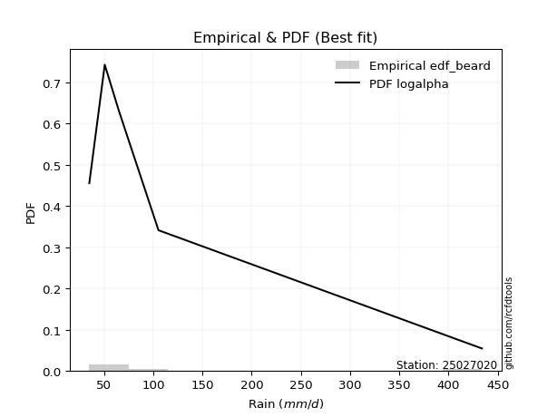</img>

</div>


### 5. Empirical - EDF Chegodayev (1955)

The Chegodayev formula is an empirical plotting position formula used in hydrological frequency analysis to estimate the exceedance probability or return period of a specific event from a set of observed data. It is primarily used for plotting observed data points on probability paper to fit a theoretical distribution, particularly for analyzing extreme events like maximum flood flows or rainfall intensities. The constant _b_ value in the generalized plotting position formula is 0.3.

<div align="center">


$P=(m-b)/(n+1-2b)$


</div>


**5.1. Empirical values**

<div align="center">

|                | 0                   | 1                   | 2              | 3                  | 4                  |
|:---------------|:--------------------|:--------------------|:---------------|:-------------------|:-------------------|
| date           | 2022                | 2025                | 2023           | 2024               | 2017               |
| x              | 35.1                | 48.44               | 65.2           | 105.4              | 434.1              |
| m              | 1                   | 2                   | 3              | 4                  | 5                  |
| empirical_dist | edf_chegodayev      | edf_chegodayev      | edf_chegodayev | edf_chegodayev     | edf_chegodayev     |
| empirical      | 0.12962962962962962 | 0.31481481481481477 | 0.5            | 0.6851851851851851 | 0.8703703703703703 |
| empirical_tr   | 1.148936170212766   | 1.4594594594594594  | 2.0            | 3.1764705882352935 | 7.714285714285713  |

</div>


**5.2. Kolmogorov-Smirnov fit test (sorted by Δ)**


<div align="center">

|                | 0                  | 1                  | 2                   | 3                  | 4                   | 5                  | 6                   | 7                   | 8                  | 9                   | 10                    | 11                  | 12                 | 13                  | 14                  | 15                  | 16                  | 17                  | 18                  | 19                  | 20                  | 21                  | 22                  | 23                  | 24                  | 25                  | 26                  | 27                 | 28                 | 29                  | 30                  | 31                 | 32                 | 33                 | 34                  | 35                  | 36                  | 37                  | 38                  | 39                  | 40                 | 41                  | 42                  | 43                 | 44                 | 45                  | 46                 | 47                  | 48                 | 49                  | 50                 | 51                  | 52                  | 53                  | 54                  | 55                  | 56                 | 57                 | 58                  | 59                  | 60                  | 61                  | 62                  | 63                 | 64                  | 65                  | 66                  | 67                  | 68                  | 69                  | 70                 | 71                 | 72                  | 73                 | 74                  | 75                  | 76                 | 77                 | 78                  | 79                 | 80                 | 81                 | 82                  | 83                  | 84                  | 85                  | 86                  | 87                 | 88                 | 89                 |
|:---------------|:-------------------|:-------------------|:--------------------|:-------------------|:--------------------|:-------------------|:--------------------|:--------------------|:-------------------|:--------------------|:----------------------|:--------------------|:-------------------|:--------------------|:--------------------|:--------------------|:--------------------|:--------------------|:--------------------|:--------------------|:--------------------|:--------------------|:--------------------|:--------------------|:--------------------|:--------------------|:--------------------|:-------------------|:-------------------|:--------------------|:--------------------|:-------------------|:-------------------|:-------------------|:--------------------|:--------------------|:--------------------|:--------------------|:--------------------|:--------------------|:-------------------|:--------------------|:--------------------|:-------------------|:-------------------|:--------------------|:-------------------|:--------------------|:-------------------|:--------------------|:-------------------|:--------------------|:--------------------|:--------------------|:--------------------|:--------------------|:-------------------|:-------------------|:--------------------|:--------------------|:--------------------|:--------------------|:--------------------|:-------------------|:--------------------|:--------------------|:--------------------|:--------------------|:--------------------|:--------------------|:-------------------|:-------------------|:--------------------|:-------------------|:--------------------|:--------------------|:-------------------|:-------------------|:--------------------|:-------------------|:-------------------|:-------------------|:--------------------|:--------------------|:--------------------|:--------------------|:--------------------|:-------------------|:-------------------|:-------------------|
| station        | 25027020           | 25027020           | 25027020            | 25027020           | 25027020            | 25027020           | 25027020            | 25027020            | 25027020           | 25027020            | 25027020              | 25027020            | 25027020           | 25027020            | 25027020            | 25027020            | 25027020            | 25027020            | 25027020            | 25027020            | 25027020            | 25027020            | 25027020            | 25027020            | 25027020            | 25027020            | 25027020            | 25027020           | 25027020           | 25027020            | 25027020            | 25027020           | 25027020           | 25027020           | 25027020            | 25027020            | 25027020            | 25027020            | 25027020            | 25027020            | 25027020           | 25027020            | 25027020            | 25027020           | 25027020           | 25027020            | 25027020           | 25027020            | 25027020           | 25027020            | 25027020           | 25027020            | 25027020            | 25027020            | 25027020            | 25027020            | 25027020           | 25027020           | 25027020            | 25027020            | 25027020            | 25027020            | 25027020            | 25027020           | 25027020            | 25027020            | 25027020            | 25027020            | 25027020            | 25027020            | 25027020           | 25027020           | 25027020            | 25027020           | 25027020            | 25027020            | 25027020           | 25027020           | 25027020            | 25027020           | 25027020           | 25027020           | 25027020            | 25027020            | 25027020            | 25027020            | 25027020            | 25027020           | 25027020           | 25027020           |
| empirical_dist | edf_chegodayev     | edf_chegodayev     | edf_chegodayev      | edf_chegodayev     | edf_chegodayev      | edf_chegodayev     | edf_chegodayev      | edf_chegodayev      | edf_chegodayev     | edf_chegodayev      | edf_chegodayev        | edf_chegodayev      | edf_chegodayev     | edf_chegodayev      | edf_chegodayev      | edf_chegodayev      | edf_chegodayev      | edf_chegodayev      | edf_chegodayev      | edf_chegodayev      | edf_chegodayev      | edf_chegodayev      | edf_chegodayev      | edf_chegodayev      | edf_chegodayev      | edf_chegodayev      | edf_chegodayev      | edf_chegodayev     | edf_chegodayev     | edf_chegodayev      | edf_chegodayev      | edf_chegodayev     | edf_chegodayev     | edf_chegodayev     | edf_chegodayev      | edf_chegodayev      | edf_chegodayev      | edf_chegodayev      | edf_chegodayev      | edf_chegodayev      | edf_chegodayev     | edf_chegodayev      | edf_chegodayev      | edf_chegodayev     | edf_chegodayev     | edf_chegodayev      | edf_chegodayev     | edf_chegodayev      | edf_chegodayev     | edf_chegodayev      | edf_chegodayev     | edf_chegodayev      | edf_chegodayev      | edf_chegodayev      | edf_chegodayev      | edf_chegodayev      | edf_chegodayev     | edf_chegodayev     | edf_chegodayev      | edf_chegodayev      | edf_chegodayev      | edf_chegodayev      | edf_chegodayev      | edf_chegodayev     | edf_chegodayev      | edf_chegodayev      | edf_chegodayev      | edf_chegodayev      | edf_chegodayev      | edf_chegodayev      | edf_chegodayev     | edf_chegodayev     | edf_chegodayev      | edf_chegodayev     | edf_chegodayev      | edf_chegodayev      | edf_chegodayev     | edf_chegodayev     | edf_chegodayev      | edf_chegodayev     | edf_chegodayev     | edf_chegodayev     | edf_chegodayev      | edf_chegodayev      | edf_chegodayev      | edf_chegodayev      | edf_chegodayev      | edf_chegodayev     | edf_chegodayev     | edf_chegodayev     |
| p_dist         | logalpha           | loginvweibull      | loginvgamma         | loghalfnorm        | loghalflogistic     | logmoyal           | alpha               | loginvgauss         | invgamma           | f                   | loglaplace_asymmetric | betaprime           | logpearson3        | loggumbel_r         | invgauss            | nct                 | logjohnsonsu        | lograyleigh         | lognct              | mielke              | loggenlogistic      | logkstwobign        | logmaxwell          | logbetaprime        | ncf                 | logncf              | wald                | logexponnorm       | nakagami           | logtruncnorm        | loggenexpon         | logchi2            | lognakagami        | chi2               | logexpon            | logwald             | logt                | lognorm             | lognorm             | logcrystalball      | logloggamma        | logrice             | logweibull_min      | loglogistic        | loggompertz        | loghypsecant        | t                  | halflogistic        | pearson3           | moyal               | logerlang          | loglaplace          | halfnorm            | genlogistic         | gibrat              | loggumbel_l         | logf               | gumbel_r           | weibull_min         | loggamma            | loggamma            | rayleigh            | fisk                | maxwell            | gompertz            | exponnorm           | laplace_asymmetric  | expon               | genexpon            | kstwobign           | loggibrat          | pareto             | crystalball         | norm               | logistic            | hypsecant           | gamma              | rice               | truncnorm           | logpareto          | laplace            | gumbel_l           | logfisk             | fatiguelife         | loglognorm          | logfatiguelife      | erlang              | johnsonsu          | invweibull         | logmielke          |
| delta          | 0.0613474025921239 | 0.06653198160391   | 0.06882727452154902 | 0.0717725285396218 | 0.07204832502396652 | 0.0738629762439047 | 0.07473491150686606 | 0.07509580020599493 | 0.0757511097749421 | 0.07575143230647084 | 0.07587912104765682   | 0.07629072650740605 | 0.0768142080258728 | 0.07688093248169614 | 0.07727148553384988 | 0.07952526679080396 | 0.08276018955507883 | 0.08475081948051733 | 0.08920956917428718 | 0.09134273969280327 | 0.09157185599485373 | 0.09479499845312495 | 0.09699422074847025 | 0.09871969943429049 | 0.10227554146480217 | 0.11148111614072043 | 0.11999477212698512 | 0.12827894272156   | 0.1296293035075048 | 0.12962939543838237 | 0.12962961224755343 | 0.1296296132213767 | 0.1296296268265182 | 0.1296296270753666 | 0.12962962962962962 | 0.12962962962962962 | 0.12998453208202887 | 0.12998889997203456 | 0.12998889997203456 | 0.12998897899089185 | 0.1301573819763755 | 0.13725369657965003 | 0.14314945342681717 | 0.146082201889997  | 0.1584648217956553 | 0.15887266417742157 | 0.1670718398090828 | 0.17166384965597203 | 0.1798581628183622 | 0.18400811401099837 | 0.185846508628575  | 0.18727063405690803 | 0.18908087545778257 | 0.19175243468789183 | 0.19201963250448417 | 0.19291209464066933 | 0.2046044696515238 | 0.2078739454984092 | 0.20789385518273906 | 0.21250374077184053 | 0.21250374077184053 | 0.22372431043002317 | 0.23427607337880602 | 0.2359575077134684 | 0.23742263026026816 | 0.24340071980594236 | 0.24563165122145714 | 0.24563350264892087 | 0.24563352223719898 | 0.25713464069937114 | 0.2600804154489572 | 0.260094860458708  | 0.27024092586491794 | 0.2702417773548067 | 0.28139298361144577 | 0.29062562882168447 | 0.297401180532991  | 0.3003036007608902 | 0.30482753977633253 | 0.3147033777275873 | 0.3161954099202882 | 0.3381488602594843 | 0.34376453622097924 | 0.34667338537694004 | 0.35144729536851504 | 0.45533279448378006 | 0.49057055125391413 | 0.6743614162467533 | 0.6839480339440295 | nan                |
| deltao         | 0.5865427407550001 | 0.5865427407550001 | 0.5865427407550001  | 0.5865427407550001 | 0.5865427407550001  | 0.5865427407550001 | 0.5865427407550001  | 0.5865427407550001  | 0.5865427407550001 | 0.5865427407550001  | 0.5865427407550001    | 0.5865427407550001  | 0.5865427407550001 | 0.5865427407550001  | 0.5865427407550001  | 0.5865427407550001  | 0.5865427407550001  | 0.5865427407550001  | 0.5865427407550001  | 0.5865427407550001  | 0.5865427407550001  | 0.5865427407550001  | 0.5865427407550001  | 0.5865427407550001  | 0.5865427407550001  | 0.5865427407550001  | 0.5865427407550001  | 0.5865427407550001 | 0.5865427407550001 | 0.5865427407550001  | 0.5865427407550001  | 0.5865427407550001 | 0.5865427407550001 | 0.5865427407550001 | 0.5865427407550001  | 0.5865427407550001  | 0.5865427407550001  | 0.5865427407550001  | 0.5865427407550001  | 0.5865427407550001  | 0.5865427407550001 | 0.5865427407550001  | 0.5865427407550001  | 0.5865427407550001 | 0.5865427407550001 | 0.5865427407550001  | 0.5865427407550001 | 0.5865427407550001  | 0.5865427407550001 | 0.5865427407550001  | 0.5865427407550001 | 0.5865427407550001  | 0.5865427407550001  | 0.5865427407550001  | 0.5865427407550001  | 0.5865427407550001  | 0.5865427407550001 | 0.5865427407550001 | 0.5865427407550001  | 0.5865427407550001  | 0.5865427407550001  | 0.5865427407550001  | 0.5865427407550001  | 0.5865427407550001 | 0.5865427407550001  | 0.5865427407550001  | 0.5865427407550001  | 0.5865427407550001  | 0.5865427407550001  | 0.5865427407550001  | 0.5865427407550001 | 0.5865427407550001 | 0.5865427407550001  | 0.5865427407550001 | 0.5865427407550001  | 0.5865427407550001  | 0.5865427407550001 | 0.5865427407550001 | 0.5865427407550001  | 0.5865427407550001 | 0.5865427407550001 | 0.5865427407550001 | 0.5865427407550001  | 0.5865427407550001  | 0.5865427407550001  | 0.5865427407550001  | 0.5865427407550001  | 0.5865427407550001 | 0.5865427407550001 | 0.5865427407550001 |
| eval           | Δo > Δ             | Δo > Δ             | Δo > Δ              | Δo > Δ             | Δo > Δ              | Δo > Δ             | Δo > Δ              | Δo > Δ              | Δo > Δ             | Δo > Δ              | Δo > Δ                | Δo > Δ              | Δo > Δ             | Δo > Δ              | Δo > Δ              | Δo > Δ              | Δo > Δ              | Δo > Δ              | Δo > Δ              | Δo > Δ              | Δo > Δ              | Δo > Δ              | Δo > Δ              | Δo > Δ              | Δo > Δ              | Δo > Δ              | Δo > Δ              | Δo > Δ             | Δo > Δ             | Δo > Δ              | Δo > Δ              | Δo > Δ             | Δo > Δ             | Δo > Δ             | Δo > Δ              | Δo > Δ              | Δo > Δ              | Δo > Δ              | Δo > Δ              | Δo > Δ              | Δo > Δ             | Δo > Δ              | Δo > Δ              | Δo > Δ             | Δo > Δ             | Δo > Δ              | Δo > Δ             | Δo > Δ              | Δo > Δ             | Δo > Δ              | Δo > Δ             | Δo > Δ              | Δo > Δ              | Δo > Δ              | Δo > Δ              | Δo > Δ              | Δo > Δ             | Δo > Δ             | Δo > Δ              | Δo > Δ              | Δo > Δ              | Δo > Δ              | Δo > Δ              | Δo > Δ             | Δo > Δ              | Δo > Δ              | Δo > Δ              | Δo > Δ              | Δo > Δ              | Δo > Δ              | Δo > Δ             | Δo > Δ             | Δo > Δ              | Δo > Δ             | Δo > Δ              | Δo > Δ              | Δo > Δ             | Δo > Δ             | Δo > Δ              | Δo > Δ             | Δo > Δ             | Δo > Δ             | Δo > Δ              | Δo > Δ              | Δo > Δ              | Δo > Δ              | Δo > Δ              | Δo <= Δ            | Δo <= Δ            | Δo <= Δ            |
| fit            | 1                  | 1                  | 1                   | 1                  | 1                   | 1                  | 1                   | 1                   | 1                  | 1                   | 1                     | 1                   | 1                  | 1                   | 1                   | 1                   | 1                   | 1                   | 1                   | 1                   | 1                   | 1                   | 1                   | 1                   | 1                   | 1                   | 1                   | 1                  | 1                  | 1                   | 1                   | 1                  | 1                  | 1                  | 1                   | 1                   | 1                   | 1                   | 1                   | 1                   | 1                  | 1                   | 1                   | 1                  | 1                  | 1                   | 1                  | 1                   | 1                  | 1                   | 1                  | 1                   | 1                   | 1                   | 1                   | 1                   | 1                  | 1                  | 1                   | 1                   | 1                   | 1                   | 1                   | 1                  | 1                   | 1                   | 1                   | 1                   | 1                   | 1                   | 1                  | 1                  | 1                   | 1                  | 1                   | 1                   | 1                  | 1                  | 1                   | 1                  | 1                  | 1                  | 1                   | 1                   | 1                   | 1                   | 1                   | 0                  | 0                  | 0                  |
| n              | 5                  | 5                  | 5                   | 5                  | 5                   | 5                  | 5                   | 5                   | 5                  | 5                   | 5                     | 5                   | 5                  | 5                   | 5                   | 5                   | 5                   | 5                   | 5                   | 5                   | 5                   | 5                   | 5                   | 5                   | 5                   | 5                   | 5                   | 5                  | 5                  | 5                   | 5                   | 5                  | 5                  | 5                  | 5                   | 5                   | 5                   | 5                   | 5                   | 5                   | 5                  | 5                   | 5                   | 5                  | 5                  | 5                   | 5                  | 5                   | 5                  | 5                   | 5                  | 5                   | 5                   | 5                   | 5                   | 5                   | 5                  | 5                  | 5                   | 5                   | 5                   | 5                   | 5                   | 5                  | 5                   | 5                   | 5                   | 5                   | 5                   | 5                   | 5                  | 5                  | 5                   | 5                  | 5                   | 5                   | 5                  | 5                  | 5                   | 5                  | 5                  | 5                  | 5                   | 5                   | 5                   | 5                   | 5                   | 5                  | 5                  | 5                  |
| best_fit       | 1                  | 0                  | 0                   | 0                  | 0                   | 0                  | 0                   | 0                   | 0                  | 0                   | 0                     | 0                   | 0                  | 0                   | 0                   | 0                   | 0                   | 0                   | 0                   | 0                   | 0                   | 0                   | 0                   | 0                   | 0                   | 0                   | 0                   | 0                  | 0                  | 0                   | 0                   | 0                  | 0                  | 0                  | 0                   | 0                   | 0                   | 0                   | 0                   | 0                   | 0                  | 0                   | 0                   | 0                  | 0                  | 0                   | 0                  | 0                   | 0                  | 0                   | 0                  | 0                   | 0                   | 0                   | 0                   | 0                   | 0                  | 0                  | 0                   | 0                   | 0                   | 0                   | 0                   | 0                  | 0                   | 0                   | 0                   | 0                   | 0                   | 0                   | 0                  | 0                  | 0                   | 0                  | 0                   | 0                   | 0                  | 0                  | 0                   | 0                  | 0                  | 0                  | 0                   | 0                   | 0                   | 0                   | 0                   | 0                  | 0                  | 0                  |
| best_fit_sort  | 1                  | 2                  | 3                   | 4                  | 5                   | 6                  | 7                   | 8                   | 9                  | 10                  | 11                    | 12                  | 13                 | 14                  | 15                  | 16                  | 17                  | 18                  | 19                  | 20                  | 21                  | 22                  | 23                  | 24                  | 25                  | 26                  | 27                  | 28                 | 29                 | 30                  | 31                  | 32                 | 33                 | 34                 | 35                  | 36                  | 37                  | 38                  | 39                  | 40                  | 41                 | 42                  | 43                  | 44                 | 45                 | 46                  | 47                 | 48                  | 49                 | 50                  | 51                 | 52                  | 53                  | 54                  | 55                  | 56                  | 57                 | 58                 | 59                  | 60                  | 61                  | 62                  | 63                  | 64                 | 65                  | 66                  | 67                  | 68                  | 69                  | 70                  | 71                 | 72                 | 73                  | 74                 | 75                  | 76                  | 77                 | 78                 | 79                  | 80                 | 81                 | 82                 | 83                  | 84                  | 85                  | 86                  | 87                  | 88                 | 89                 | 90                 |

</div>


<div align="center">

</img>

</div>


**5.3. Best fit**

<div align="center">

|   id |   station | empirical_dist   | p_dist   |     delta |   deltao | eval   |   fit |   n |   best_fit |   best_fit_sort |
|-----:|----------:|:-----------------|:---------|----------:|---------:|:-------|------:|----:|-----------:|----------------:|
|    0 |  25027020 | edf_chegodayev   | logalpha | 0.0613474 | 0.586543 | Δo > Δ |     1 |   5 |          1 |               1 |

</div>


<div align="center">

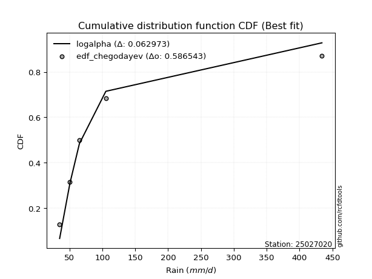</img>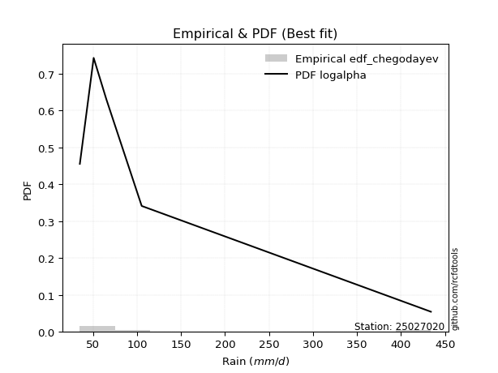</img>

</div>


### 6. Empirical - EDF Blom (1958)

The Blom formula is a specific "plotting position" formula used in hydrology and statistical analysis to estimate the empirical cumulative probability (or non-exceedance probability) of a data series. It is particularly recommended for data that are approximately normally distributed. The constant _a_ is set to 0.375 (or 3/8).

<div align="center">


$P=(m-a)/(n+1-2a)$


</div>


**6.1. Empirical values**

<div align="center">

|                | 0                   | 1                   | 2        | 3                  | 4                  |
|:---------------|:--------------------|:--------------------|:---------|:-------------------|:-------------------|
| date           | 2022                | 2025                | 2023     | 2024               | 2017               |
| x              | 35.1                | 48.44               | 65.2     | 105.4              | 434.1              |
| m              | 1                   | 2                   | 3        | 4                  | 5                  |
| empirical_dist | edf_blom            | edf_blom            | edf_blom | edf_blom           | edf_blom           |
| empirical      | 0.11904761904761904 | 0.30952380952380953 | 0.5      | 0.6904761904761905 | 0.8809523809523809 |
| empirical_tr   | 1.135135135135135   | 1.4482758620689655  | 2.0      | 3.230769230769231  | 8.399999999999999  |

</div>


**6.2. Kolmogorov-Smirnov fit test (sorted by Δ)**


<div align="center">

|                | 0                   | 1                    | 2                   | 3                   | 4                   | 5                   | 6                   | 7                   | 8                   | 9                   | 10                  | 11                 | 12                    | 13                  | 14                  | 15                  | 16                 | 17                  | 18                  | 19                  | 20                  | 21                  | 22                  | 23                  | 24                  | 25                  | 26                  | 27                  | 28                  | 29                  | 30                  | 31                  | 32                  | 33                  | 34                  | 35                  | 36                  | 37                  | 38                  | 39                  | 40                 | 41                  | 42                 | 43                 | 44                 | 45                  | 46                  | 47                  | 48                  | 49                  | 50                  | 51                  | 52                  | 53                  | 54                  | 55                  | 56                  | 57                  | 58                  | 59                  | 60                  | 61                 | 62                  | 63                  | 64                  | 65                  | 66                  | 67                  | 68                  | 69                 | 70                 | 71                  | 72                 | 73                  | 74                 | 75                 | 76                  | 77                  | 78                  | 79                 | 80                  | 81                  | 82                 | 83                  | 84                 | 85                 | 86                  | 87                 | 88                 | 89                 |
|:---------------|:--------------------|:---------------------|:--------------------|:--------------------|:--------------------|:--------------------|:--------------------|:--------------------|:--------------------|:--------------------|:--------------------|:-------------------|:----------------------|:--------------------|:--------------------|:--------------------|:-------------------|:--------------------|:--------------------|:--------------------|:--------------------|:--------------------|:--------------------|:--------------------|:--------------------|:--------------------|:--------------------|:--------------------|:--------------------|:--------------------|:--------------------|:--------------------|:--------------------|:--------------------|:--------------------|:--------------------|:--------------------|:--------------------|:--------------------|:--------------------|:-------------------|:--------------------|:-------------------|:-------------------|:-------------------|:--------------------|:--------------------|:--------------------|:--------------------|:--------------------|:--------------------|:--------------------|:--------------------|:--------------------|:--------------------|:--------------------|:--------------------|:--------------------|:--------------------|:--------------------|:--------------------|:-------------------|:--------------------|:--------------------|:--------------------|:--------------------|:--------------------|:--------------------|:--------------------|:-------------------|:-------------------|:--------------------|:-------------------|:--------------------|:-------------------|:-------------------|:--------------------|:--------------------|:--------------------|:-------------------|:--------------------|:--------------------|:-------------------|:--------------------|:-------------------|:-------------------|:--------------------|:-------------------|:-------------------|:-------------------|
| station        | 25027020            | 25027020             | 25027020            | 25027020            | 25027020            | 25027020            | 25027020            | 25027020            | 25027020            | 25027020            | 25027020            | 25027020           | 25027020              | 25027020            | 25027020            | 25027020            | 25027020           | 25027020            | 25027020            | 25027020            | 25027020            | 25027020            | 25027020            | 25027020            | 25027020            | 25027020            | 25027020            | 25027020            | 25027020            | 25027020            | 25027020            | 25027020            | 25027020            | 25027020            | 25027020            | 25027020            | 25027020            | 25027020            | 25027020            | 25027020            | 25027020           | 25027020            | 25027020           | 25027020           | 25027020           | 25027020            | 25027020            | 25027020            | 25027020            | 25027020            | 25027020            | 25027020            | 25027020            | 25027020            | 25027020            | 25027020            | 25027020            | 25027020            | 25027020            | 25027020            | 25027020            | 25027020           | 25027020            | 25027020            | 25027020            | 25027020            | 25027020            | 25027020            | 25027020            | 25027020           | 25027020           | 25027020            | 25027020           | 25027020            | 25027020           | 25027020           | 25027020            | 25027020            | 25027020            | 25027020           | 25027020            | 25027020            | 25027020           | 25027020            | 25027020           | 25027020           | 25027020            | 25027020           | 25027020           | 25027020           |
| empirical_dist | edf_blom            | edf_blom             | edf_blom            | edf_blom            | edf_blom            | edf_blom            | edf_blom            | edf_blom            | edf_blom            | edf_blom            | edf_blom            | edf_blom           | edf_blom              | edf_blom            | edf_blom            | edf_blom            | edf_blom           | edf_blom            | edf_blom            | edf_blom            | edf_blom            | edf_blom            | edf_blom            | edf_blom            | edf_blom            | edf_blom            | edf_blom            | edf_blom            | edf_blom            | edf_blom            | edf_blom            | edf_blom            | edf_blom            | edf_blom            | edf_blom            | edf_blom            | edf_blom            | edf_blom            | edf_blom            | edf_blom            | edf_blom           | edf_blom            | edf_blom           | edf_blom           | edf_blom           | edf_blom            | edf_blom            | edf_blom            | edf_blom            | edf_blom            | edf_blom            | edf_blom            | edf_blom            | edf_blom            | edf_blom            | edf_blom            | edf_blom            | edf_blom            | edf_blom            | edf_blom            | edf_blom            | edf_blom           | edf_blom            | edf_blom            | edf_blom            | edf_blom            | edf_blom            | edf_blom            | edf_blom            | edf_blom           | edf_blom           | edf_blom            | edf_blom           | edf_blom            | edf_blom           | edf_blom           | edf_blom            | edf_blom            | edf_blom            | edf_blom           | edf_blom            | edf_blom            | edf_blom           | edf_blom            | edf_blom           | edf_blom           | edf_blom            | edf_blom           | edf_blom           | edf_blom           |
| p_dist         | logalpha            | loginvweibull        | loginvgamma         | loghalfnorm         | loghalflogistic     | logmoyal            | alpha               | loginvgauss         | invgamma            | f                   | betaprime           | invgauss           | loglaplace_asymmetric | logjohnsonsu        | nct                 | loggumbel_r         | logpearson3        | mielke              | loggenlogistic      | lograyleigh         | lognct              | logkstwobign        | logmaxwell          | logbetaprime        | ncf                 | logncf              | logexponnorm        | nakagami            | logtruncnorm        | loggenexpon         | logchi2             | lognakagami         | chi2                | logwald             | logexpon            | wald                | logt                | lognorm             | lognorm             | logcrystalball      | logloggamma        | logrice             | loglogistic        | logweibull_min     | loggompertz        | loghypsecant        | t                   | halflogistic        | pearson3            | loglaplace          | logerlang           | moyal               | gibrat              | loggumbel_l         | halfnorm            | genlogistic         | logf                | loggamma            | loggamma            | gumbel_r            | weibull_min         | rayleigh           | gompertz            | fisk                | maxwell             | exponnorm           | laplace_asymmetric  | expon               | genexpon            | loggibrat          | kstwobign          | pareto              | crystalball        | norm                | logistic           | hypsecant          | gamma               | truncnorm           | rice                | logpareto          | laplace             | gumbel_l            | logfisk            | fatiguelife         | loglognorm         | logfatiguelife     | erlang              | johnsonsu          | invweibull         | logmielke          |
| delta          | 0.05076539201011332 | 0.055949971021899414 | 0.05824526393953843 | 0.06119051795761121 | 0.06146631444195594 | 0.06328096566189412 | 0.06415290092485548 | 0.06451378962398435 | 0.06516909919293151 | 0.06516942172446026 | 0.06570871592539547 | 0.0666894749518393 | 0.07058811575665158   | 0.07217817897306825 | 0.07304284415907814 | 0.07654242208752948 | 0.0768142080258728 | 0.08076072911079268 | 0.08098984541284315 | 0.08475081948051733 | 0.08920956917428718 | 0.09479499845312495 | 0.09699422074847025 | 0.09871969943429049 | 0.10227554146480217 | 0.11148111614072043 | 0.11769693213954943 | 0.11904729292549422 | 0.11904738485637177 | 0.11904760166554286 | 0.11904760263936613 | 0.11904761624450763 | 0.11904761649335602 | 0.11904761904761904 | 0.11904761904761904 | 0.12392192378210887 | 0.12998453208202887 | 0.12998889997203456 | 0.12998889997203456 | 0.12998897899089185 | 0.1301573819763755 | 0.13725369657965003 | 0.146082201889997  | 0.1484404587178224 | 0.1584648217956553 | 0.15887266417742157 | 0.16178083451807745 | 0.17695485494697738 | 0.18514916810936755 | 0.18727063405690803 | 0.18814347535920745 | 0.18929911930200372 | 0.19201963250448417 | 0.19291209464066933 | 0.19437188074878792 | 0.19704343997889717 | 0.20989547494252903 | 0.21250374077184053 | 0.21250374077184053 | 0.21316495078941455 | 0.21847586576474964 | 0.2290153157210285 | 0.23742263026026816 | 0.23956707866981136 | 0.24124851300447375 | 0.24340071980594236 | 0.24563165122145714 | 0.24563350264892087 | 0.24563352223719898 | 0.254789410157952  | 0.2624256459903765 | 0.26538586574971323 | 0.2755319311559233 | 0.27553278264581205 | 0.2866839889024511 | 0.2959166341126898 | 0.30269218582399626 | 0.30482753977633253 | 0.30559460605189553 | 0.3199943830185925 | 0.32148641521129356 | 0.34343986555048966 | 0.3490555415119845 | 0.35196439066794527 | 0.3567383006595203 | 0.4606237997747853 | 0.49586155654491937 | 0.6796524215377585 | 0.6892390392350347 | nan                |
| deltao         | 0.5865427407550001  | 0.5865427407550001   | 0.5865427407550001  | 0.5865427407550001  | 0.5865427407550001  | 0.5865427407550001  | 0.5865427407550001  | 0.5865427407550001  | 0.5865427407550001  | 0.5865427407550001  | 0.5865427407550001  | 0.5865427407550001 | 0.5865427407550001    | 0.5865427407550001  | 0.5865427407550001  | 0.5865427407550001  | 0.5865427407550001 | 0.5865427407550001  | 0.5865427407550001  | 0.5865427407550001  | 0.5865427407550001  | 0.5865427407550001  | 0.5865427407550001  | 0.5865427407550001  | 0.5865427407550001  | 0.5865427407550001  | 0.5865427407550001  | 0.5865427407550001  | 0.5865427407550001  | 0.5865427407550001  | 0.5865427407550001  | 0.5865427407550001  | 0.5865427407550001  | 0.5865427407550001  | 0.5865427407550001  | 0.5865427407550001  | 0.5865427407550001  | 0.5865427407550001  | 0.5865427407550001  | 0.5865427407550001  | 0.5865427407550001 | 0.5865427407550001  | 0.5865427407550001 | 0.5865427407550001 | 0.5865427407550001 | 0.5865427407550001  | 0.5865427407550001  | 0.5865427407550001  | 0.5865427407550001  | 0.5865427407550001  | 0.5865427407550001  | 0.5865427407550001  | 0.5865427407550001  | 0.5865427407550001  | 0.5865427407550001  | 0.5865427407550001  | 0.5865427407550001  | 0.5865427407550001  | 0.5865427407550001  | 0.5865427407550001  | 0.5865427407550001  | 0.5865427407550001 | 0.5865427407550001  | 0.5865427407550001  | 0.5865427407550001  | 0.5865427407550001  | 0.5865427407550001  | 0.5865427407550001  | 0.5865427407550001  | 0.5865427407550001 | 0.5865427407550001 | 0.5865427407550001  | 0.5865427407550001 | 0.5865427407550001  | 0.5865427407550001 | 0.5865427407550001 | 0.5865427407550001  | 0.5865427407550001  | 0.5865427407550001  | 0.5865427407550001 | 0.5865427407550001  | 0.5865427407550001  | 0.5865427407550001 | 0.5865427407550001  | 0.5865427407550001 | 0.5865427407550001 | 0.5865427407550001  | 0.5865427407550001 | 0.5865427407550001 | 0.5865427407550001 |
| eval           | Δo > Δ              | Δo > Δ               | Δo > Δ              | Δo > Δ              | Δo > Δ              | Δo > Δ              | Δo > Δ              | Δo > Δ              | Δo > Δ              | Δo > Δ              | Δo > Δ              | Δo > Δ             | Δo > Δ                | Δo > Δ              | Δo > Δ              | Δo > Δ              | Δo > Δ             | Δo > Δ              | Δo > Δ              | Δo > Δ              | Δo > Δ              | Δo > Δ              | Δo > Δ              | Δo > Δ              | Δo > Δ              | Δo > Δ              | Δo > Δ              | Δo > Δ              | Δo > Δ              | Δo > Δ              | Δo > Δ              | Δo > Δ              | Δo > Δ              | Δo > Δ              | Δo > Δ              | Δo > Δ              | Δo > Δ              | Δo > Δ              | Δo > Δ              | Δo > Δ              | Δo > Δ             | Δo > Δ              | Δo > Δ             | Δo > Δ             | Δo > Δ             | Δo > Δ              | Δo > Δ              | Δo > Δ              | Δo > Δ              | Δo > Δ              | Δo > Δ              | Δo > Δ              | Δo > Δ              | Δo > Δ              | Δo > Δ              | Δo > Δ              | Δo > Δ              | Δo > Δ              | Δo > Δ              | Δo > Δ              | Δo > Δ              | Δo > Δ             | Δo > Δ              | Δo > Δ              | Δo > Δ              | Δo > Δ              | Δo > Δ              | Δo > Δ              | Δo > Δ              | Δo > Δ             | Δo > Δ             | Δo > Δ              | Δo > Δ             | Δo > Δ              | Δo > Δ             | Δo > Δ             | Δo > Δ              | Δo > Δ              | Δo > Δ              | Δo > Δ             | Δo > Δ              | Δo > Δ              | Δo > Δ             | Δo > Δ              | Δo > Δ             | Δo > Δ             | Δo > Δ              | Δo <= Δ            | Δo <= Δ            | Δo <= Δ            |
| fit            | 1                   | 1                    | 1                   | 1                   | 1                   | 1                   | 1                   | 1                   | 1                   | 1                   | 1                   | 1                  | 1                     | 1                   | 1                   | 1                   | 1                  | 1                   | 1                   | 1                   | 1                   | 1                   | 1                   | 1                   | 1                   | 1                   | 1                   | 1                   | 1                   | 1                   | 1                   | 1                   | 1                   | 1                   | 1                   | 1                   | 1                   | 1                   | 1                   | 1                   | 1                  | 1                   | 1                  | 1                  | 1                  | 1                   | 1                   | 1                   | 1                   | 1                   | 1                   | 1                   | 1                   | 1                   | 1                   | 1                   | 1                   | 1                   | 1                   | 1                   | 1                   | 1                  | 1                   | 1                   | 1                   | 1                   | 1                   | 1                   | 1                   | 1                  | 1                  | 1                   | 1                  | 1                   | 1                  | 1                  | 1                   | 1                   | 1                   | 1                  | 1                   | 1                   | 1                  | 1                   | 1                  | 1                  | 1                   | 0                  | 0                  | 0                  |
| n              | 5                   | 5                    | 5                   | 5                   | 5                   | 5                   | 5                   | 5                   | 5                   | 5                   | 5                   | 5                  | 5                     | 5                   | 5                   | 5                   | 5                  | 5                   | 5                   | 5                   | 5                   | 5                   | 5                   | 5                   | 5                   | 5                   | 5                   | 5                   | 5                   | 5                   | 5                   | 5                   | 5                   | 5                   | 5                   | 5                   | 5                   | 5                   | 5                   | 5                   | 5                  | 5                   | 5                  | 5                  | 5                  | 5                   | 5                   | 5                   | 5                   | 5                   | 5                   | 5                   | 5                   | 5                   | 5                   | 5                   | 5                   | 5                   | 5                   | 5                   | 5                   | 5                  | 5                   | 5                   | 5                   | 5                   | 5                   | 5                   | 5                   | 5                  | 5                  | 5                   | 5                  | 5                   | 5                  | 5                  | 5                   | 5                   | 5                   | 5                  | 5                   | 5                   | 5                  | 5                   | 5                  | 5                  | 5                   | 5                  | 5                  | 5                  |
| best_fit       | 1                   | 0                    | 0                   | 0                   | 0                   | 0                   | 0                   | 0                   | 0                   | 0                   | 0                   | 0                  | 0                     | 0                   | 0                   | 0                   | 0                  | 0                   | 0                   | 0                   | 0                   | 0                   | 0                   | 0                   | 0                   | 0                   | 0                   | 0                   | 0                   | 0                   | 0                   | 0                   | 0                   | 0                   | 0                   | 0                   | 0                   | 0                   | 0                   | 0                   | 0                  | 0                   | 0                  | 0                  | 0                  | 0                   | 0                   | 0                   | 0                   | 0                   | 0                   | 0                   | 0                   | 0                   | 0                   | 0                   | 0                   | 0                   | 0                   | 0                   | 0                   | 0                  | 0                   | 0                   | 0                   | 0                   | 0                   | 0                   | 0                   | 0                  | 0                  | 0                   | 0                  | 0                   | 0                  | 0                  | 0                   | 0                   | 0                   | 0                  | 0                   | 0                   | 0                  | 0                   | 0                  | 0                  | 0                   | 0                  | 0                  | 0                  |
| best_fit_sort  | 1                   | 2                    | 3                   | 4                   | 5                   | 6                   | 7                   | 8                   | 9                   | 10                  | 11                  | 12                 | 13                    | 14                  | 15                  | 16                  | 17                 | 18                  | 19                  | 20                  | 21                  | 22                  | 23                  | 24                  | 25                  | 26                  | 27                  | 28                  | 29                  | 30                  | 31                  | 32                  | 33                  | 34                  | 35                  | 36                  | 37                  | 38                  | 39                  | 40                  | 41                 | 42                  | 43                 | 44                 | 45                 | 46                  | 47                  | 48                  | 49                  | 50                  | 51                  | 52                  | 53                  | 54                  | 55                  | 56                  | 57                  | 58                  | 59                  | 60                  | 61                  | 62                 | 63                  | 64                  | 65                  | 66                  | 67                  | 68                  | 69                  | 70                 | 71                 | 72                  | 73                 | 74                  | 75                 | 76                 | 77                  | 78                  | 79                  | 80                 | 81                  | 82                  | 83                 | 84                  | 85                 | 86                 | 87                  | 88                 | 89                 | 90                 |

</div>


<div align="center">

</img>

</div>


**6.3. Best fit**

<div align="center">

|   id |   station | empirical_dist   | p_dist   |     delta |   deltao | eval   |   fit |   n |   best_fit |   best_fit_sort |
|-----:|----------:|:-----------------|:---------|----------:|---------:|:-------|------:|----:|-----------:|----------------:|
|    0 |  25027020 | edf_blom         | logalpha | 0.0507654 | 0.586543 | Δo > Δ |     1 |   5 |          1 |               1 |

</div>


<div align="center">

</img></img>

</div>


### 7. Empirical - EDF Tukey (1962)

In hydrology, the Tukey formula is used as a plotting position formula to estimate the empirical probability or frequency of a flood event (or other hydrological data). The formula parameter is given as _c=0.333_ (or 1/3).

<div align="center">


$P=(m-c)/(n+1-2c)$


</div>


**7.1. Empirical values**

<div align="center">

|                | 0                  | 1                  | 2         | 3         | 4         |
|:---------------|:-------------------|:-------------------|:----------|:----------|:----------|
| date           | 2022               | 2025               | 2023      | 2024      | 2017      |
| x              | 35.1               | 48.44              | 65.2      | 105.4     | 434.1     |
| m              | 1                  | 2                  | 3         | 4         | 5         |
| empirical_dist | edf_tukey          | edf_tukey          | edf_tukey | edf_tukey | edf_tukey |
| empirical      | 0.125              | 0.3125             | 0.5       | 0.6875    | 0.875     |
| empirical_tr   | 1.1428571428571428 | 1.4545454545454546 | 2.0       | 3.2       | 8.0       |

</div>


**7.2. Kolmogorov-Smirnov fit test (sorted by Δ)**


<div align="center">

|                | 0                   | 1                   | 2                  | 3                   | 4                   | 5                   | 6                   | 7                   | 8                   | 9                   | 10                  | 11                  | 12                    | 13                  | 14                  | 15                 | 16                 | 17                  | 18                  | 19                  | 20                  | 21                  | 22                  | 23                  | 24                  | 25                  | 26                 | 27                  | 28                  | 29                  | 30                  | 31                  | 32                  | 33                  | 34                 | 35                 | 36                  | 37                  | 38                  | 39                  | 40                 | 41                  | 42                  | 43                 | 44                 | 45                  | 46                  | 47                  | 48                  | 49                 | 50                  | 51                  | 52                  | 53                  | 54                  | 55                 | 56                  | 57                 | 58                  | 59                  | 60                 | 61                  | 62                 | 63                  | 64                 | 65                  | 66                  | 67                  | 68                  | 69                  | 70                 | 71                  | 72                 | 73                 | 74                  | 75                  | 76                 | 77                  | 78                  | 79                  | 80                 | 81                 | 82                 | 83                 | 84                 | 85                 | 86                 | 87                 | 88                 | 89                 |
|:---------------|:--------------------|:--------------------|:-------------------|:--------------------|:--------------------|:--------------------|:--------------------|:--------------------|:--------------------|:--------------------|:--------------------|:--------------------|:----------------------|:--------------------|:--------------------|:-------------------|:-------------------|:--------------------|:--------------------|:--------------------|:--------------------|:--------------------|:--------------------|:--------------------|:--------------------|:--------------------|:-------------------|:--------------------|:--------------------|:--------------------|:--------------------|:--------------------|:--------------------|:--------------------|:-------------------|:-------------------|:--------------------|:--------------------|:--------------------|:--------------------|:-------------------|:--------------------|:--------------------|:-------------------|:-------------------|:--------------------|:--------------------|:--------------------|:--------------------|:-------------------|:--------------------|:--------------------|:--------------------|:--------------------|:--------------------|:-------------------|:--------------------|:-------------------|:--------------------|:--------------------|:-------------------|:--------------------|:-------------------|:--------------------|:-------------------|:--------------------|:--------------------|:--------------------|:--------------------|:--------------------|:-------------------|:--------------------|:-------------------|:-------------------|:--------------------|:--------------------|:-------------------|:--------------------|:--------------------|:--------------------|:-------------------|:-------------------|:-------------------|:-------------------|:-------------------|:-------------------|:-------------------|:-------------------|:-------------------|:-------------------|
| station        | 25027020            | 25027020            | 25027020           | 25027020            | 25027020            | 25027020            | 25027020            | 25027020            | 25027020            | 25027020            | 25027020            | 25027020            | 25027020              | 25027020            | 25027020            | 25027020           | 25027020           | 25027020            | 25027020            | 25027020            | 25027020            | 25027020            | 25027020            | 25027020            | 25027020            | 25027020            | 25027020           | 25027020            | 25027020            | 25027020            | 25027020            | 25027020            | 25027020            | 25027020            | 25027020           | 25027020           | 25027020            | 25027020            | 25027020            | 25027020            | 25027020           | 25027020            | 25027020            | 25027020           | 25027020           | 25027020            | 25027020            | 25027020            | 25027020            | 25027020           | 25027020            | 25027020            | 25027020            | 25027020            | 25027020            | 25027020           | 25027020            | 25027020           | 25027020            | 25027020            | 25027020           | 25027020            | 25027020           | 25027020            | 25027020           | 25027020            | 25027020            | 25027020            | 25027020            | 25027020            | 25027020           | 25027020            | 25027020           | 25027020           | 25027020            | 25027020            | 25027020           | 25027020            | 25027020            | 25027020            | 25027020           | 25027020           | 25027020           | 25027020           | 25027020           | 25027020           | 25027020           | 25027020           | 25027020           | 25027020           |
| empirical_dist | edf_tukey           | edf_tukey           | edf_tukey          | edf_tukey           | edf_tukey           | edf_tukey           | edf_tukey           | edf_tukey           | edf_tukey           | edf_tukey           | edf_tukey           | edf_tukey           | edf_tukey             | edf_tukey           | edf_tukey           | edf_tukey          | edf_tukey          | edf_tukey           | edf_tukey           | edf_tukey           | edf_tukey           | edf_tukey           | edf_tukey           | edf_tukey           | edf_tukey           | edf_tukey           | edf_tukey          | edf_tukey           | edf_tukey           | edf_tukey           | edf_tukey           | edf_tukey           | edf_tukey           | edf_tukey           | edf_tukey          | edf_tukey          | edf_tukey           | edf_tukey           | edf_tukey           | edf_tukey           | edf_tukey          | edf_tukey           | edf_tukey           | edf_tukey          | edf_tukey          | edf_tukey           | edf_tukey           | edf_tukey           | edf_tukey           | edf_tukey          | edf_tukey           | edf_tukey           | edf_tukey           | edf_tukey           | edf_tukey           | edf_tukey          | edf_tukey           | edf_tukey          | edf_tukey           | edf_tukey           | edf_tukey          | edf_tukey           | edf_tukey          | edf_tukey           | edf_tukey          | edf_tukey           | edf_tukey           | edf_tukey           | edf_tukey           | edf_tukey           | edf_tukey          | edf_tukey           | edf_tukey          | edf_tukey          | edf_tukey           | edf_tukey           | edf_tukey          | edf_tukey           | edf_tukey           | edf_tukey           | edf_tukey          | edf_tukey          | edf_tukey          | edf_tukey          | edf_tukey          | edf_tukey          | edf_tukey          | edf_tukey          | edf_tukey          | edf_tukey          |
| p_dist         | logalpha            | loginvweibull       | loginvgamma        | loghalfnorm         | loghalflogistic     | logmoyal            | alpha               | loginvgauss         | invgamma            | f                   | betaprime           | invgauss            | loglaplace_asymmetric | nct                 | loggumbel_r         | logpearson3        | logjohnsonsu       | lograyleigh         | mielke              | loggenlogistic      | lognct              | logkstwobign        | logmaxwell          | logbetaprime        | ncf                 | logncf              | wald               | logexponnorm        | nakagami            | logtruncnorm        | loggenexpon         | logchi2             | lognakagami         | chi2                | logexpon           | logwald            | logt                | lognorm             | lognorm             | logcrystalball      | logloggamma        | logrice             | logweibull_min      | loglogistic        | loggompertz        | loghypsecant        | t                   | halflogistic        | pearson3            | logerlang          | moyal               | loglaplace          | halfnorm            | gibrat              | loggumbel_l         | genlogistic        | logf                | gumbel_r           | loggamma            | loggamma            | weibull_min        | rayleigh            | fisk               | gompertz            | maxwell            | exponnorm           | laplace_asymmetric  | expon               | genexpon            | loggibrat           | kstwobign          | pareto              | crystalball        | norm               | logistic            | hypsecant           | gamma              | rice                | truncnorm           | logpareto           | laplace            | gumbel_l           | logfisk            | fatiguelife        | loglognorm         | logfatiguelife     | erlang             | johnsonsu          | invweibull         | logmielke          |
| delta          | 0.05671777296249428 | 0.06190235197428037 | 0.0641976448919194 | 0.06714289890999214 | 0.06741869539433687 | 0.06923334661427505 | 0.07010528187723641 | 0.07046617057636531 | 0.07112148014531247 | 0.07112180267684122 | 0.07166109687777643 | 0.07264185590422026 | 0.07356430623284205   | 0.07489563716117431 | 0.07654242208752948 | 0.0768142080258728 | 0.0781305599254492 | 0.08475081948051733 | 0.08671311006317362 | 0.08694222636522408 | 0.08920956917428718 | 0.09479499845312495 | 0.09699422074847025 | 0.09871969943429049 | 0.10227554146480217 | 0.11148111614072043 | 0.1209457333059184 | 0.12364931309193039 | 0.12499967387787518 | 0.12499976580875273 | 0.12499998261792382 | 0.12499998359174709 | 0.12499999719688859 | 0.12499999744573698 | 0.125              | 0.125              | 0.12998453208202887 | 0.12998889997203456 | 0.12998889997203456 | 0.12998897899089185 | 0.1301573819763755 | 0.13725369657965003 | 0.14546426824163194 | 0.146082201889997  | 0.1584648217956553 | 0.15887266417742157 | 0.16475702499426792 | 0.17397866447078691 | 0.18217297763317708 | 0.185846508628575  | 0.18632292882581325 | 0.18727063405690803 | 0.19139569027259745 | 0.19201963250448417 | 0.19291209464066933 | 0.1940672495027067 | 0.20691928446633856 | 0.2101887603132241 | 0.21250374077184053 | 0.21250374077184053 | 0.2125234848123687 | 0.22603912524483805 | 0.2365908881936209 | 0.23742263026026816 | 0.2382723225282833 | 0.24340071980594236 | 0.24563165122145714 | 0.24563350264892087 | 0.24563352223719898 | 0.25776560063414244 | 0.259449455514186  | 0.26240967527352277 | 0.2725557406797328 | 0.2725565921696216 | 0.28370779842626065 | 0.29294044363649935 | 0.2997159953478058 | 0.30261841557570507 | 0.30482753977633253 | 0.31701819254240204 | 0.3185102247351031 | 0.3404636750742992 | 0.346079351035794  | 0.3489882001917548 | 0.3537621101833298 | 0.4576476092985948 | 0.4928853660687289 | 0.676676231061568  | 0.6862628487588442 | nan                |
| deltao         | 0.5865427407550001  | 0.5865427407550001  | 0.5865427407550001 | 0.5865427407550001  | 0.5865427407550001  | 0.5865427407550001  | 0.5865427407550001  | 0.5865427407550001  | 0.5865427407550001  | 0.5865427407550001  | 0.5865427407550001  | 0.5865427407550001  | 0.5865427407550001    | 0.5865427407550001  | 0.5865427407550001  | 0.5865427407550001 | 0.5865427407550001 | 0.5865427407550001  | 0.5865427407550001  | 0.5865427407550001  | 0.5865427407550001  | 0.5865427407550001  | 0.5865427407550001  | 0.5865427407550001  | 0.5865427407550001  | 0.5865427407550001  | 0.5865427407550001 | 0.5865427407550001  | 0.5865427407550001  | 0.5865427407550001  | 0.5865427407550001  | 0.5865427407550001  | 0.5865427407550001  | 0.5865427407550001  | 0.5865427407550001 | 0.5865427407550001 | 0.5865427407550001  | 0.5865427407550001  | 0.5865427407550001  | 0.5865427407550001  | 0.5865427407550001 | 0.5865427407550001  | 0.5865427407550001  | 0.5865427407550001 | 0.5865427407550001 | 0.5865427407550001  | 0.5865427407550001  | 0.5865427407550001  | 0.5865427407550001  | 0.5865427407550001 | 0.5865427407550001  | 0.5865427407550001  | 0.5865427407550001  | 0.5865427407550001  | 0.5865427407550001  | 0.5865427407550001 | 0.5865427407550001  | 0.5865427407550001 | 0.5865427407550001  | 0.5865427407550001  | 0.5865427407550001 | 0.5865427407550001  | 0.5865427407550001 | 0.5865427407550001  | 0.5865427407550001 | 0.5865427407550001  | 0.5865427407550001  | 0.5865427407550001  | 0.5865427407550001  | 0.5865427407550001  | 0.5865427407550001 | 0.5865427407550001  | 0.5865427407550001 | 0.5865427407550001 | 0.5865427407550001  | 0.5865427407550001  | 0.5865427407550001 | 0.5865427407550001  | 0.5865427407550001  | 0.5865427407550001  | 0.5865427407550001 | 0.5865427407550001 | 0.5865427407550001 | 0.5865427407550001 | 0.5865427407550001 | 0.5865427407550001 | 0.5865427407550001 | 0.5865427407550001 | 0.5865427407550001 | 0.5865427407550001 |
| eval           | Δo > Δ              | Δo > Δ              | Δo > Δ             | Δo > Δ              | Δo > Δ              | Δo > Δ              | Δo > Δ              | Δo > Δ              | Δo > Δ              | Δo > Δ              | Δo > Δ              | Δo > Δ              | Δo > Δ                | Δo > Δ              | Δo > Δ              | Δo > Δ             | Δo > Δ             | Δo > Δ              | Δo > Δ              | Δo > Δ              | Δo > Δ              | Δo > Δ              | Δo > Δ              | Δo > Δ              | Δo > Δ              | Δo > Δ              | Δo > Δ             | Δo > Δ              | Δo > Δ              | Δo > Δ              | Δo > Δ              | Δo > Δ              | Δo > Δ              | Δo > Δ              | Δo > Δ             | Δo > Δ             | Δo > Δ              | Δo > Δ              | Δo > Δ              | Δo > Δ              | Δo > Δ             | Δo > Δ              | Δo > Δ              | Δo > Δ             | Δo > Δ             | Δo > Δ              | Δo > Δ              | Δo > Δ              | Δo > Δ              | Δo > Δ             | Δo > Δ              | Δo > Δ              | Δo > Δ              | Δo > Δ              | Δo > Δ              | Δo > Δ             | Δo > Δ              | Δo > Δ             | Δo > Δ              | Δo > Δ              | Δo > Δ             | Δo > Δ              | Δo > Δ             | Δo > Δ              | Δo > Δ             | Δo > Δ              | Δo > Δ              | Δo > Δ              | Δo > Δ              | Δo > Δ              | Δo > Δ             | Δo > Δ              | Δo > Δ             | Δo > Δ             | Δo > Δ              | Δo > Δ              | Δo > Δ             | Δo > Δ              | Δo > Δ              | Δo > Δ              | Δo > Δ             | Δo > Δ             | Δo > Δ             | Δo > Δ             | Δo > Δ             | Δo > Δ             | Δo > Δ             | Δo <= Δ            | Δo <= Δ            | Δo <= Δ            |
| fit            | 1                   | 1                   | 1                  | 1                   | 1                   | 1                   | 1                   | 1                   | 1                   | 1                   | 1                   | 1                   | 1                     | 1                   | 1                   | 1                  | 1                  | 1                   | 1                   | 1                   | 1                   | 1                   | 1                   | 1                   | 1                   | 1                   | 1                  | 1                   | 1                   | 1                   | 1                   | 1                   | 1                   | 1                   | 1                  | 1                  | 1                   | 1                   | 1                   | 1                   | 1                  | 1                   | 1                   | 1                  | 1                  | 1                   | 1                   | 1                   | 1                   | 1                  | 1                   | 1                   | 1                   | 1                   | 1                   | 1                  | 1                   | 1                  | 1                   | 1                   | 1                  | 1                   | 1                  | 1                   | 1                  | 1                   | 1                   | 1                   | 1                   | 1                   | 1                  | 1                   | 1                  | 1                  | 1                   | 1                   | 1                  | 1                   | 1                   | 1                   | 1                  | 1                  | 1                  | 1                  | 1                  | 1                  | 1                  | 0                  | 0                  | 0                  |
| n              | 5                   | 5                   | 5                  | 5                   | 5                   | 5                   | 5                   | 5                   | 5                   | 5                   | 5                   | 5                   | 5                     | 5                   | 5                   | 5                  | 5                  | 5                   | 5                   | 5                   | 5                   | 5                   | 5                   | 5                   | 5                   | 5                   | 5                  | 5                   | 5                   | 5                   | 5                   | 5                   | 5                   | 5                   | 5                  | 5                  | 5                   | 5                   | 5                   | 5                   | 5                  | 5                   | 5                   | 5                  | 5                  | 5                   | 5                   | 5                   | 5                   | 5                  | 5                   | 5                   | 5                   | 5                   | 5                   | 5                  | 5                   | 5                  | 5                   | 5                   | 5                  | 5                   | 5                  | 5                   | 5                  | 5                   | 5                   | 5                   | 5                   | 5                   | 5                  | 5                   | 5                  | 5                  | 5                   | 5                   | 5                  | 5                   | 5                   | 5                   | 5                  | 5                  | 5                  | 5                  | 5                  | 5                  | 5                  | 5                  | 5                  | 5                  |
| best_fit       | 1                   | 0                   | 0                  | 0                   | 0                   | 0                   | 0                   | 0                   | 0                   | 0                   | 0                   | 0                   | 0                     | 0                   | 0                   | 0                  | 0                  | 0                   | 0                   | 0                   | 0                   | 0                   | 0                   | 0                   | 0                   | 0                   | 0                  | 0                   | 0                   | 0                   | 0                   | 0                   | 0                   | 0                   | 0                  | 0                  | 0                   | 0                   | 0                   | 0                   | 0                  | 0                   | 0                   | 0                  | 0                  | 0                   | 0                   | 0                   | 0                   | 0                  | 0                   | 0                   | 0                   | 0                   | 0                   | 0                  | 0                   | 0                  | 0                   | 0                   | 0                  | 0                   | 0                  | 0                   | 0                  | 0                   | 0                   | 0                   | 0                   | 0                   | 0                  | 0                   | 0                  | 0                  | 0                   | 0                   | 0                  | 0                   | 0                   | 0                   | 0                  | 0                  | 0                  | 0                  | 0                  | 0                  | 0                  | 0                  | 0                  | 0                  |
| best_fit_sort  | 1                   | 2                   | 3                  | 4                   | 5                   | 6                   | 7                   | 8                   | 9                   | 10                  | 11                  | 12                  | 13                    | 14                  | 15                  | 16                 | 17                 | 18                  | 19                  | 20                  | 21                  | 22                  | 23                  | 24                  | 25                  | 26                  | 27                 | 28                  | 29                  | 30                  | 31                  | 32                  | 33                  | 34                  | 35                 | 36                 | 37                  | 38                  | 39                  | 40                  | 41                 | 42                  | 43                  | 44                 | 45                 | 46                  | 47                  | 48                  | 49                  | 50                 | 51                  | 52                  | 53                  | 54                  | 55                  | 56                 | 57                  | 58                 | 59                  | 60                  | 61                 | 62                  | 63                 | 64                  | 65                 | 66                  | 67                  | 68                  | 69                  | 70                  | 71                 | 72                  | 73                 | 74                 | 75                  | 76                  | 77                 | 78                  | 79                  | 80                  | 81                 | 82                 | 83                 | 84                 | 85                 | 86                 | 87                 | 88                 | 89                 | 90                 |

</div>


<div align="center">

</img>

</div>


**7.3. Best fit**

<div align="center">

|   id |   station | empirical_dist   | p_dist   |     delta |   deltao | eval   |   fit |   n |   best_fit |   best_fit_sort |
|-----:|----------:|:-----------------|:---------|----------:|---------:|:-------|------:|----:|-----------:|----------------:|
|    0 |  25027020 | edf_tukey        | logalpha | 0.0567178 | 0.586543 | Δo > Δ |     1 |   5 |          1 |               1 |

</div>


<div align="center">

</img></img>

</div>


### 8. Empirical - EDF Gringorten (1963)

Gringorten plotting position formula is essential for estimating the probability and return periods of extreme events like floods and heavy rainfall. The constant _a=0.44_.

<div align="center">


$P=(m-a)/(n+1-2a)$


</div>


**8.1. Empirical values**

<div align="center">

|                | 0                   | 1                  | 2              | 3                 | 4                  |
|:---------------|:--------------------|:-------------------|:---------------|:------------------|:-------------------|
| date           | 2022                | 2025               | 2023           | 2024              | 2017               |
| x              | 35.1                | 48.44              | 65.2           | 105.4             | 434.1              |
| m              | 1                   | 2                  | 3              | 4                 | 5                  |
| empirical_dist | edf_gringorten      | edf_gringorten     | edf_gringorten | edf_gringorten    | edf_gringorten     |
| empirical      | 0.10937500000000001 | 0.3046875          | 0.5            | 0.6953125         | 0.8906249999999999 |
| empirical_tr   | 1.1228070175438596  | 1.4382022471910112 | 2.0            | 3.282051282051282 | 9.142857142857133  |

</div>


**8.2. Kolmogorov-Smirnov fit test (sorted by Δ)**


<div align="center">

|                | 0                   | 1                   | 2                    | 3                    | 4                   | 5                    | 6                   | 7                   | 8                    | 9                   | 10                  | 11                  | 12                    | 13                  | 14                  | 15                  | 16                  | 17                  | 18                 | 19                  | 20                  | 21                  | 22                  | 23                  | 24                  | 25                 | 26                 | 27                  | 28                  | 29                  | 30                  | 31                  | 32                  | 33                 | 34                  | 35                 | 36                  | 37                  | 38                  | 39                  | 40                 | 41                  | 42                 | 43                  | 44                 | 45                  | 46                  | 47                  | 48                  | 49                  | 50                  | 51                  | 52                  | 53                  | 54                  | 55                 | 56                  | 57                  | 58                  | 59                 | 60                 | 61                  | 62                  | 63                  | 64                 | 65                  | 66                  | 67                  | 68                 | 69                  | 70                 | 71                  | 72                 | 73                 | 74                  | 75                  | 76                  | 77                 | 78                  | 79                  | 80                 | 81                 | 82                 | 83                 | 84                 | 85                 | 86                 | 87                 | 88                 | 89                 |
|:---------------|:--------------------|:--------------------|:---------------------|:---------------------|:--------------------|:---------------------|:--------------------|:--------------------|:---------------------|:--------------------|:--------------------|:--------------------|:----------------------|:--------------------|:--------------------|:--------------------|:--------------------|:--------------------|:-------------------|:--------------------|:--------------------|:--------------------|:--------------------|:--------------------|:--------------------|:-------------------|:-------------------|:--------------------|:--------------------|:--------------------|:--------------------|:--------------------|:--------------------|:-------------------|:--------------------|:-------------------|:--------------------|:--------------------|:--------------------|:--------------------|:-------------------|:--------------------|:-------------------|:--------------------|:-------------------|:--------------------|:--------------------|:--------------------|:--------------------|:--------------------|:--------------------|:--------------------|:--------------------|:--------------------|:--------------------|:-------------------|:--------------------|:--------------------|:--------------------|:-------------------|:-------------------|:--------------------|:--------------------|:--------------------|:-------------------|:--------------------|:--------------------|:--------------------|:-------------------|:--------------------|:-------------------|:--------------------|:-------------------|:-------------------|:--------------------|:--------------------|:--------------------|:-------------------|:--------------------|:--------------------|:-------------------|:-------------------|:-------------------|:-------------------|:-------------------|:-------------------|:-------------------|:-------------------|:-------------------|:-------------------|
| station        | 25027020            | 25027020            | 25027020             | 25027020             | 25027020            | 25027020             | 25027020            | 25027020            | 25027020             | 25027020            | 25027020            | 25027020            | 25027020              | 25027020            | 25027020            | 25027020            | 25027020            | 25027020            | 25027020           | 25027020            | 25027020            | 25027020            | 25027020            | 25027020            | 25027020            | 25027020           | 25027020           | 25027020            | 25027020            | 25027020            | 25027020            | 25027020            | 25027020            | 25027020           | 25027020            | 25027020           | 25027020            | 25027020            | 25027020            | 25027020            | 25027020           | 25027020            | 25027020           | 25027020            | 25027020           | 25027020            | 25027020            | 25027020            | 25027020            | 25027020            | 25027020            | 25027020            | 25027020            | 25027020            | 25027020            | 25027020           | 25027020            | 25027020            | 25027020            | 25027020           | 25027020           | 25027020            | 25027020            | 25027020            | 25027020           | 25027020            | 25027020            | 25027020            | 25027020           | 25027020            | 25027020           | 25027020            | 25027020           | 25027020           | 25027020            | 25027020            | 25027020            | 25027020           | 25027020            | 25027020            | 25027020           | 25027020           | 25027020           | 25027020           | 25027020           | 25027020           | 25027020           | 25027020           | 25027020           | 25027020           |
| empirical_dist | edf_gringorten      | edf_gringorten      | edf_gringorten       | edf_gringorten       | edf_gringorten      | edf_gringorten       | edf_gringorten      | edf_gringorten      | edf_gringorten       | edf_gringorten      | edf_gringorten      | edf_gringorten      | edf_gringorten        | edf_gringorten      | edf_gringorten      | edf_gringorten      | edf_gringorten      | edf_gringorten      | edf_gringorten     | edf_gringorten      | edf_gringorten      | edf_gringorten      | edf_gringorten      | edf_gringorten      | edf_gringorten      | edf_gringorten     | edf_gringorten     | edf_gringorten      | edf_gringorten      | edf_gringorten      | edf_gringorten      | edf_gringorten      | edf_gringorten      | edf_gringorten     | edf_gringorten      | edf_gringorten     | edf_gringorten      | edf_gringorten      | edf_gringorten      | edf_gringorten      | edf_gringorten     | edf_gringorten      | edf_gringorten     | edf_gringorten      | edf_gringorten     | edf_gringorten      | edf_gringorten      | edf_gringorten      | edf_gringorten      | edf_gringorten      | edf_gringorten      | edf_gringorten      | edf_gringorten      | edf_gringorten      | edf_gringorten      | edf_gringorten     | edf_gringorten      | edf_gringorten      | edf_gringorten      | edf_gringorten     | edf_gringorten     | edf_gringorten      | edf_gringorten      | edf_gringorten      | edf_gringorten     | edf_gringorten      | edf_gringorten      | edf_gringorten      | edf_gringorten     | edf_gringorten      | edf_gringorten     | edf_gringorten      | edf_gringorten     | edf_gringorten     | edf_gringorten      | edf_gringorten      | edf_gringorten      | edf_gringorten     | edf_gringorten      | edf_gringorten      | edf_gringorten     | edf_gringorten     | edf_gringorten     | edf_gringorten     | edf_gringorten     | edf_gringorten     | edf_gringorten     | edf_gringorten     | edf_gringorten     | edf_gringorten     |
| p_dist         | logalpha            | loginvweibull       | loginvgamma          | loghalfnorm          | loghalflogistic     | alpha                | loginvgauss         | invgamma            | f                    | logmoyal            | betaprime           | logjohnsonsu        | loglaplace_asymmetric | invgauss            | mielke              | nct                 | loggenlogistic      | loggumbel_r         | logpearson3        | lograyleigh         | lognct              | logkstwobign        | logmaxwell          | logbetaprime        | ncf                 | logexponnorm       | nakagami           | logtruncnorm        | loggenexpon         | logexpon            | logwald             | chi2                | logncf              | lognakagami        | logchi2             | wald               | logt                | lognorm             | lognorm             | logcrystalball      | logloggamma        | logrice             | loglogistic        | logweibull_min      | loggompertz        | loghypsecant        | t                   | halflogistic        | loglaplace          | pearson3            | gibrat              | loggumbel_l         | logerlang           | moyal               | halfnorm            | genlogistic        | loggamma            | loggamma            | logf                | gumbel_r           | weibull_min        | rayleigh            | gompertz            | exponnorm           | fisk               | laplace_asymmetric  | expon               | genexpon            | maxwell            | loggibrat           | kstwobign          | pareto              | crystalball        | norm               | logistic            | hypsecant           | truncnorm           | gamma              | rice                | logpareto           | laplace            | gumbel_l           | logfisk            | fatiguelife        | loglognorm         | logfatiguelife     | erlang             | johnsonsu          | invweibull         | logmielke          |
| delta          | 0.04109277296249429 | 0.04627735197428039 | 0.048572644891919405 | 0.051517898909992255 | 0.05179369539433698 | 0.054480281877236525 | 0.05484117057636533 | 0.05549648014531248 | 0.055496802676841234 | 0.05630338186150108 | 0.05761706412892925 | 0.06250555992544923 | 0.06575180623284205   | 0.06800326630643355 | 0.07108811006317373 | 0.07304284415907814 | 0.07404172348045224 | 0.07654242208752948 | 0.0768142080258728 | 0.08475081948051733 | 0.08920956917428718 | 0.09479499845312495 | 0.09699422074847025 | 0.09871969943429049 | 0.10227554146480217 | 0.1080243130919304 | 0.1093746738778752 | 0.10937476580875274 | 0.10937498261792383 | 0.10937500000000001 | 0.10937500000000001 | 0.11123417636178767 | 0.11148111614072043 | 0.1175057071724318 | 0.12146757378631595 | 0.1287582333059184 | 0.12998453208202887 | 0.12998889997203456 | 0.12998889997203456 | 0.12998897899089185 | 0.1301573819763755 | 0.13725369657965003 | 0.146082201889997  | 0.15327676824163194 | 0.1584648217956553 | 0.15887266417742157 | 0.16493548999285434 | 0.18179116447078691 | 0.18727063405690803 | 0.18998547763317708 | 0.19201963250448417 | 0.19291209464066933 | 0.19297978488301698 | 0.19413542882581325 | 0.19920819027259745 | 0.2018797495027067 | 0.21250374077184053 | 0.21250374077184053 | 0.21473178446633856 | 0.2180012603132241 | 0.2281484848123686 | 0.23385162524483805 | 0.23742263026026816 | 0.24340071980594236 | 0.2444033881936209 | 0.24563165122145714 | 0.24563350264892087 | 0.24563352223719898 | 0.2460848225282833 | 0.24995310063414247 | 0.267261955514186  | 0.27022217527352277 | 0.2803682406797328 | 0.2803690921696216 | 0.29152029842626065 | 0.30075294363649935 | 0.30482753977633253 | 0.3075284953478058 | 0.31043091557570507 | 0.32483069254240204 | 0.3263227247351031 | 0.3482761750742992 | 0.353891851035794  | 0.3568007001917548 | 0.3615746101833298 | 0.4654601092985948 | 0.5006978660687289 | 0.684488731061568  | 0.6940753487588442 | nan                |
| deltao         | 0.5865427407550001  | 0.5865427407550001  | 0.5865427407550001   | 0.5865427407550001   | 0.5865427407550001  | 0.5865427407550001   | 0.5865427407550001  | 0.5865427407550001  | 0.5865427407550001   | 0.5865427407550001  | 0.5865427407550001  | 0.5865427407550001  | 0.5865427407550001    | 0.5865427407550001  | 0.5865427407550001  | 0.5865427407550001  | 0.5865427407550001  | 0.5865427407550001  | 0.5865427407550001 | 0.5865427407550001  | 0.5865427407550001  | 0.5865427407550001  | 0.5865427407550001  | 0.5865427407550001  | 0.5865427407550001  | 0.5865427407550001 | 0.5865427407550001 | 0.5865427407550001  | 0.5865427407550001  | 0.5865427407550001  | 0.5865427407550001  | 0.5865427407550001  | 0.5865427407550001  | 0.5865427407550001 | 0.5865427407550001  | 0.5865427407550001 | 0.5865427407550001  | 0.5865427407550001  | 0.5865427407550001  | 0.5865427407550001  | 0.5865427407550001 | 0.5865427407550001  | 0.5865427407550001 | 0.5865427407550001  | 0.5865427407550001 | 0.5865427407550001  | 0.5865427407550001  | 0.5865427407550001  | 0.5865427407550001  | 0.5865427407550001  | 0.5865427407550001  | 0.5865427407550001  | 0.5865427407550001  | 0.5865427407550001  | 0.5865427407550001  | 0.5865427407550001 | 0.5865427407550001  | 0.5865427407550001  | 0.5865427407550001  | 0.5865427407550001 | 0.5865427407550001 | 0.5865427407550001  | 0.5865427407550001  | 0.5865427407550001  | 0.5865427407550001 | 0.5865427407550001  | 0.5865427407550001  | 0.5865427407550001  | 0.5865427407550001 | 0.5865427407550001  | 0.5865427407550001 | 0.5865427407550001  | 0.5865427407550001 | 0.5865427407550001 | 0.5865427407550001  | 0.5865427407550001  | 0.5865427407550001  | 0.5865427407550001 | 0.5865427407550001  | 0.5865427407550001  | 0.5865427407550001 | 0.5865427407550001 | 0.5865427407550001 | 0.5865427407550001 | 0.5865427407550001 | 0.5865427407550001 | 0.5865427407550001 | 0.5865427407550001 | 0.5865427407550001 | 0.5865427407550001 |
| eval           | Δo > Δ              | Δo > Δ              | Δo > Δ               | Δo > Δ               | Δo > Δ              | Δo > Δ               | Δo > Δ              | Δo > Δ              | Δo > Δ               | Δo > Δ              | Δo > Δ              | Δo > Δ              | Δo > Δ                | Δo > Δ              | Δo > Δ              | Δo > Δ              | Δo > Δ              | Δo > Δ              | Δo > Δ             | Δo > Δ              | Δo > Δ              | Δo > Δ              | Δo > Δ              | Δo > Δ              | Δo > Δ              | Δo > Δ             | Δo > Δ             | Δo > Δ              | Δo > Δ              | Δo > Δ              | Δo > Δ              | Δo > Δ              | Δo > Δ              | Δo > Δ             | Δo > Δ              | Δo > Δ             | Δo > Δ              | Δo > Δ              | Δo > Δ              | Δo > Δ              | Δo > Δ             | Δo > Δ              | Δo > Δ             | Δo > Δ              | Δo > Δ             | Δo > Δ              | Δo > Δ              | Δo > Δ              | Δo > Δ              | Δo > Δ              | Δo > Δ              | Δo > Δ              | Δo > Δ              | Δo > Δ              | Δo > Δ              | Δo > Δ             | Δo > Δ              | Δo > Δ              | Δo > Δ              | Δo > Δ             | Δo > Δ             | Δo > Δ              | Δo > Δ              | Δo > Δ              | Δo > Δ             | Δo > Δ              | Δo > Δ              | Δo > Δ              | Δo > Δ             | Δo > Δ              | Δo > Δ             | Δo > Δ              | Δo > Δ             | Δo > Δ             | Δo > Δ              | Δo > Δ              | Δo > Δ              | Δo > Δ             | Δo > Δ              | Δo > Δ              | Δo > Δ             | Δo > Δ             | Δo > Δ             | Δo > Δ             | Δo > Δ             | Δo > Δ             | Δo > Δ             | Δo <= Δ            | Δo <= Δ            | Δo <= Δ            |
| fit            | 1                   | 1                   | 1                    | 1                    | 1                   | 1                    | 1                   | 1                   | 1                    | 1                   | 1                   | 1                   | 1                     | 1                   | 1                   | 1                   | 1                   | 1                   | 1                  | 1                   | 1                   | 1                   | 1                   | 1                   | 1                   | 1                  | 1                  | 1                   | 1                   | 1                   | 1                   | 1                   | 1                   | 1                  | 1                   | 1                  | 1                   | 1                   | 1                   | 1                   | 1                  | 1                   | 1                  | 1                   | 1                  | 1                   | 1                   | 1                   | 1                   | 1                   | 1                   | 1                   | 1                   | 1                   | 1                   | 1                  | 1                   | 1                   | 1                   | 1                  | 1                  | 1                   | 1                   | 1                   | 1                  | 1                   | 1                   | 1                   | 1                  | 1                   | 1                  | 1                   | 1                  | 1                  | 1                   | 1                   | 1                   | 1                  | 1                   | 1                   | 1                  | 1                  | 1                  | 1                  | 1                  | 1                  | 1                  | 0                  | 0                  | 0                  |
| n              | 5                   | 5                   | 5                    | 5                    | 5                   | 5                    | 5                   | 5                   | 5                    | 5                   | 5                   | 5                   | 5                     | 5                   | 5                   | 5                   | 5                   | 5                   | 5                  | 5                   | 5                   | 5                   | 5                   | 5                   | 5                   | 5                  | 5                  | 5                   | 5                   | 5                   | 5                   | 5                   | 5                   | 5                  | 5                   | 5                  | 5                   | 5                   | 5                   | 5                   | 5                  | 5                   | 5                  | 5                   | 5                  | 5                   | 5                   | 5                   | 5                   | 5                   | 5                   | 5                   | 5                   | 5                   | 5                   | 5                  | 5                   | 5                   | 5                   | 5                  | 5                  | 5                   | 5                   | 5                   | 5                  | 5                   | 5                   | 5                   | 5                  | 5                   | 5                  | 5                   | 5                  | 5                  | 5                   | 5                   | 5                   | 5                  | 5                   | 5                   | 5                  | 5                  | 5                  | 5                  | 5                  | 5                  | 5                  | 5                  | 5                  | 5                  |
| best_fit       | 1                   | 0                   | 0                    | 0                    | 0                   | 0                    | 0                   | 0                   | 0                    | 0                   | 0                   | 0                   | 0                     | 0                   | 0                   | 0                   | 0                   | 0                   | 0                  | 0                   | 0                   | 0                   | 0                   | 0                   | 0                   | 0                  | 0                  | 0                   | 0                   | 0                   | 0                   | 0                   | 0                   | 0                  | 0                   | 0                  | 0                   | 0                   | 0                   | 0                   | 0                  | 0                   | 0                  | 0                   | 0                  | 0                   | 0                   | 0                   | 0                   | 0                   | 0                   | 0                   | 0                   | 0                   | 0                   | 0                  | 0                   | 0                   | 0                   | 0                  | 0                  | 0                   | 0                   | 0                   | 0                  | 0                   | 0                   | 0                   | 0                  | 0                   | 0                  | 0                   | 0                  | 0                  | 0                   | 0                   | 0                   | 0                  | 0                   | 0                   | 0                  | 0                  | 0                  | 0                  | 0                  | 0                  | 0                  | 0                  | 0                  | 0                  |
| best_fit_sort  | 1                   | 2                   | 3                    | 4                    | 5                   | 6                    | 7                   | 8                   | 9                    | 10                  | 11                  | 12                  | 13                    | 14                  | 15                  | 16                  | 17                  | 18                  | 19                 | 20                  | 21                  | 22                  | 23                  | 24                  | 25                  | 26                 | 27                 | 28                  | 29                  | 30                  | 31                  | 32                  | 33                  | 34                 | 35                  | 36                 | 37                  | 38                  | 39                  | 40                  | 41                 | 42                  | 43                 | 44                  | 45                 | 46                  | 47                  | 48                  | 49                  | 50                  | 51                  | 52                  | 53                  | 54                  | 55                  | 56                 | 57                  | 58                  | 59                  | 60                 | 61                 | 62                  | 63                  | 64                  | 65                 | 66                  | 67                  | 68                  | 69                 | 70                  | 71                 | 72                  | 73                 | 74                 | 75                  | 76                  | 77                  | 78                 | 79                  | 80                  | 81                 | 82                 | 83                 | 84                 | 85                 | 86                 | 87                 | 88                 | 89                 | 90                 |

</div>


<div align="center">

</img>

</div>


**8.3. Best fit**

<div align="center">

|   id |   station | empirical_dist   | p_dist   |     delta |   deltao | eval   |   fit |   n |   best_fit |   best_fit_sort |
|-----:|----------:|:-----------------|:---------|----------:|---------:|:-------|------:|----:|-----------:|----------------:|
|    0 |  25027020 | edf_gringorten   | logalpha | 0.0410928 | 0.586543 | Δo > Δ |     1 |   5 |          1 |               1 |

</div>


<div align="center">

</img>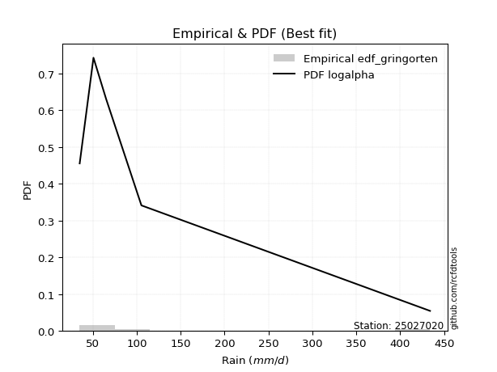</img>

</div>


### 9. Empirical - EDF Filliben (1975)

The specific values of the constants (0.3175) (often denoted as $alpha$) and (0.365) are derived from a method proposed by James J. Filliben in a 1975 paper. This particular formula is the mean value of the $i$-th order statistic of the normal distribution and is considered a robust and effective plotting position formula for the normal probability plot correlation coefficient test for normality.

<div align="center">


$P=(m-0.3175)/(n+0.365)$


</div>


**9.1. Empirical values**

<div align="center">

|                | 0                   | 1                  | 2            | 3                  | 4                  |
|:---------------|:--------------------|:-------------------|:-------------|:-------------------|:-------------------|
| date           | 2022                | 2025               | 2023         | 2024               | 2017               |
| x              | 35.1                | 48.44              | 65.2         | 105.4              | 434.1              |
| m              | 1                   | 2                  | 3            | 4                  | 5                  |
| empirical_dist | edf_filliben        | edf_filliben       | edf_filliben | edf_filliben       | edf_filliben       |
| empirical      | 0.12721342031686858 | 0.3136067101584343 | 0.5          | 0.6863932898415657 | 0.8727865796831314 |
| empirical_tr   | 1.1457554725040042  | 1.456890699253225  | 2.0          | 3.188707280832095  | 7.860805860805863  |

</div>


**9.2. Kolmogorov-Smirnov fit test (sorted by Δ)**


<div align="center">

|                | 0                   | 1                   | 2                   | 3                  | 4                   | 5                  | 6                   | 7                   | 8                   | 9                  | 10                  | 11                    | 12                  | 13                  | 14                 | 15                  | 16                  | 17                  | 18                  | 19                  | 20                  | 21                  | 22                  | 23                  | 24                  | 25                  | 26                  | 27                  | 28                  | 29                  | 30                  | 31                  | 32                  | 33                  | 34                  | 35                  | 36                  | 37                  | 38                  | 39                  | 40                 | 41                  | 42                  | 43                 | 44                 | 45                  | 46                  | 47                  | 48                  | 49                  | 50                 | 51                  | 52                  | 53                  | 54                  | 55                  | 56                  | 57                  | 58                  | 59                  | 60                  | 61                  | 62                  | 63                  | 64                  | 65                  | 66                  | 67                  | 68                  | 69                 | 70                 | 71                 | 72                 | 73                  | 74                 | 75                 | 76                 | 77                  | 78                  | 79                  | 80                  | 81                  | 82                  | 83                  | 84                  | 85                  | 86                 | 87                 | 88                 | 89                 |
|:---------------|:--------------------|:--------------------|:--------------------|:-------------------|:--------------------|:-------------------|:--------------------|:--------------------|:--------------------|:-------------------|:--------------------|:----------------------|:--------------------|:--------------------|:-------------------|:--------------------|:--------------------|:--------------------|:--------------------|:--------------------|:--------------------|:--------------------|:--------------------|:--------------------|:--------------------|:--------------------|:--------------------|:--------------------|:--------------------|:--------------------|:--------------------|:--------------------|:--------------------|:--------------------|:--------------------|:--------------------|:--------------------|:--------------------|:--------------------|:--------------------|:-------------------|:--------------------|:--------------------|:-------------------|:-------------------|:--------------------|:--------------------|:--------------------|:--------------------|:--------------------|:-------------------|:--------------------|:--------------------|:--------------------|:--------------------|:--------------------|:--------------------|:--------------------|:--------------------|:--------------------|:--------------------|:--------------------|:--------------------|:--------------------|:--------------------|:--------------------|:--------------------|:--------------------|:--------------------|:-------------------|:-------------------|:-------------------|:-------------------|:--------------------|:-------------------|:-------------------|:-------------------|:--------------------|:--------------------|:--------------------|:--------------------|:--------------------|:--------------------|:--------------------|:--------------------|:--------------------|:-------------------|:-------------------|:-------------------|:-------------------|
| station        | 25027020            | 25027020            | 25027020            | 25027020           | 25027020            | 25027020           | 25027020            | 25027020            | 25027020            | 25027020           | 25027020            | 25027020              | 25027020            | 25027020            | 25027020           | 25027020            | 25027020            | 25027020            | 25027020            | 25027020            | 25027020            | 25027020            | 25027020            | 25027020            | 25027020            | 25027020            | 25027020            | 25027020            | 25027020            | 25027020            | 25027020            | 25027020            | 25027020            | 25027020            | 25027020            | 25027020            | 25027020            | 25027020            | 25027020            | 25027020            | 25027020           | 25027020            | 25027020            | 25027020           | 25027020           | 25027020            | 25027020            | 25027020            | 25027020            | 25027020            | 25027020           | 25027020            | 25027020            | 25027020            | 25027020            | 25027020            | 25027020            | 25027020            | 25027020            | 25027020            | 25027020            | 25027020            | 25027020            | 25027020            | 25027020            | 25027020            | 25027020            | 25027020            | 25027020            | 25027020           | 25027020           | 25027020           | 25027020           | 25027020            | 25027020           | 25027020           | 25027020           | 25027020            | 25027020            | 25027020            | 25027020            | 25027020            | 25027020            | 25027020            | 25027020            | 25027020            | 25027020           | 25027020           | 25027020           | 25027020           |
| empirical_dist | edf_filliben        | edf_filliben        | edf_filliben        | edf_filliben       | edf_filliben        | edf_filliben       | edf_filliben        | edf_filliben        | edf_filliben        | edf_filliben       | edf_filliben        | edf_filliben          | edf_filliben        | edf_filliben        | edf_filliben       | edf_filliben        | edf_filliben        | edf_filliben        | edf_filliben        | edf_filliben        | edf_filliben        | edf_filliben        | edf_filliben        | edf_filliben        | edf_filliben        | edf_filliben        | edf_filliben        | edf_filliben        | edf_filliben        | edf_filliben        | edf_filliben        | edf_filliben        | edf_filliben        | edf_filliben        | edf_filliben        | edf_filliben        | edf_filliben        | edf_filliben        | edf_filliben        | edf_filliben        | edf_filliben       | edf_filliben        | edf_filliben        | edf_filliben       | edf_filliben       | edf_filliben        | edf_filliben        | edf_filliben        | edf_filliben        | edf_filliben        | edf_filliben       | edf_filliben        | edf_filliben        | edf_filliben        | edf_filliben        | edf_filliben        | edf_filliben        | edf_filliben        | edf_filliben        | edf_filliben        | edf_filliben        | edf_filliben        | edf_filliben        | edf_filliben        | edf_filliben        | edf_filliben        | edf_filliben        | edf_filliben        | edf_filliben        | edf_filliben       | edf_filliben       | edf_filliben       | edf_filliben       | edf_filliben        | edf_filliben       | edf_filliben       | edf_filliben       | edf_filliben        | edf_filliben        | edf_filliben        | edf_filliben        | edf_filliben        | edf_filliben        | edf_filliben        | edf_filliben        | edf_filliben        | edf_filliben       | edf_filliben       | edf_filliben       | edf_filliben       |
| p_dist         | logalpha            | loginvweibull       | loginvgamma         | loghalfnorm        | loghalflogistic     | logmoyal           | alpha               | loginvgauss         | invgamma            | f                  | betaprime           | loglaplace_asymmetric | invgauss            | loggumbel_r         | logpearson3        | nct                 | logjohnsonsu        | lograyleigh         | mielke              | loggenlogistic      | lognct              | logkstwobign        | logmaxwell          | logbetaprime        | ncf                 | logncf              | wald                | logexponnorm        | nakagami            | logtruncnorm        | loggenexpon         | logchi2             | lognakagami         | chi2                | logexpon            | logwald             | logt                | lognorm             | lognorm             | logcrystalball      | logloggamma        | logrice             | logweibull_min      | loglogistic        | loggompertz        | loghypsecant        | t                   | halflogistic        | pearson3            | moyal               | logerlang          | loglaplace          | halfnorm            | gibrat              | loggumbel_l         | genlogistic         | logf                | gumbel_r            | weibull_min         | loggamma            | loggamma            | rayleigh            | fisk                | maxwell             | gompertz            | exponnorm           | laplace_asymmetric  | expon               | genexpon            | kstwobign          | loggibrat          | pareto             | crystalball        | norm                | logistic           | hypsecant          | gamma              | rice                | truncnorm           | logpareto           | laplace             | gumbel_l            | logfisk             | fatiguelife         | loglognorm          | logfatiguelife      | erlang             | johnsonsu          | invweibull         | logmielke          |
| delta          | 0.05893119327936286 | 0.06411577229114895 | 0.06641106520878798 | 0.0693563192268607 | 0.06963211571120542 | 0.0714467669311436 | 0.07231870219410497 | 0.07267959089323389 | 0.07333490046218105 | 0.0733352229937098 | 0.07387451719464501 | 0.07467101639127632   | 0.07485527622108884 | 0.07654242208752948 | 0.0768142080258728 | 0.07710905747804286 | 0.08034398024231779 | 0.08475081948051733 | 0.08892653038004217 | 0.08915564668209264 | 0.08920956917428718 | 0.09479499845312495 | 0.09699422074847025 | 0.09871969943429049 | 0.10227554146480217 | 0.11148111614072043 | 0.11999477212698512 | 0.12586273340879897 | 0.12721309419474375 | 0.12721318612562132 | 0.12721340293479239 | 0.12721340390861566 | 0.12721341751375717 | 0.12721341776260556 | 0.12721342031686858 | 0.12721342031686858 | 0.12998453208202887 | 0.12998889997203456 | 0.12998889997203456 | 0.12998897899089185 | 0.1301573819763755 | 0.13725369657965003 | 0.14435755808319767 | 0.146082201889997  | 0.1584648217956553 | 0.15887266417742157 | 0.16586373515270225 | 0.17287195431235258 | 0.18106626747474275 | 0.18521621866737892 | 0.185846508628575  | 0.18727063405690803 | 0.19028898011416312 | 0.19201963250448417 | 0.19291209464066933 | 0.19296053934427237 | 0.20581257430790428 | 0.20908205015478976 | 0.21031006449550016 | 0.21250374077184053 | 0.21250374077184053 | 0.22493241508640371 | 0.23548417803518656 | 0.23716561236984895 | 0.23742263026026816 | 0.24340071980594236 | 0.24563165122145714 | 0.24563350264892087 | 0.24563352223719898 | 0.2583427453557517 | 0.2588723107925768 | 0.2613029651150885 | 0.2714490305212985 | 0.27144988201118725 | 0.2826010882678263 | 0.291833733478065  | 0.2986092851893715 | 0.30151170541727074 | 0.30482753977633253 | 0.31591148238396777 | 0.31740351457666877 | 0.33935696491586487 | 0.34497264087735974 | 0.34788149003332053 | 0.35265540002489554 | 0.45654089914016055 | 0.4917786559102946 | 0.6755695209031338 | 0.6851561386004099 | nan                |
| deltao         | 0.5865427407550001  | 0.5865427407550001  | 0.5865427407550001  | 0.5865427407550001 | 0.5865427407550001  | 0.5865427407550001 | 0.5865427407550001  | 0.5865427407550001  | 0.5865427407550001  | 0.5865427407550001 | 0.5865427407550001  | 0.5865427407550001    | 0.5865427407550001  | 0.5865427407550001  | 0.5865427407550001 | 0.5865427407550001  | 0.5865427407550001  | 0.5865427407550001  | 0.5865427407550001  | 0.5865427407550001  | 0.5865427407550001  | 0.5865427407550001  | 0.5865427407550001  | 0.5865427407550001  | 0.5865427407550001  | 0.5865427407550001  | 0.5865427407550001  | 0.5865427407550001  | 0.5865427407550001  | 0.5865427407550001  | 0.5865427407550001  | 0.5865427407550001  | 0.5865427407550001  | 0.5865427407550001  | 0.5865427407550001  | 0.5865427407550001  | 0.5865427407550001  | 0.5865427407550001  | 0.5865427407550001  | 0.5865427407550001  | 0.5865427407550001 | 0.5865427407550001  | 0.5865427407550001  | 0.5865427407550001 | 0.5865427407550001 | 0.5865427407550001  | 0.5865427407550001  | 0.5865427407550001  | 0.5865427407550001  | 0.5865427407550001  | 0.5865427407550001 | 0.5865427407550001  | 0.5865427407550001  | 0.5865427407550001  | 0.5865427407550001  | 0.5865427407550001  | 0.5865427407550001  | 0.5865427407550001  | 0.5865427407550001  | 0.5865427407550001  | 0.5865427407550001  | 0.5865427407550001  | 0.5865427407550001  | 0.5865427407550001  | 0.5865427407550001  | 0.5865427407550001  | 0.5865427407550001  | 0.5865427407550001  | 0.5865427407550001  | 0.5865427407550001 | 0.5865427407550001 | 0.5865427407550001 | 0.5865427407550001 | 0.5865427407550001  | 0.5865427407550001 | 0.5865427407550001 | 0.5865427407550001 | 0.5865427407550001  | 0.5865427407550001  | 0.5865427407550001  | 0.5865427407550001  | 0.5865427407550001  | 0.5865427407550001  | 0.5865427407550001  | 0.5865427407550001  | 0.5865427407550001  | 0.5865427407550001 | 0.5865427407550001 | 0.5865427407550001 | 0.5865427407550001 |
| eval           | Δo > Δ              | Δo > Δ              | Δo > Δ              | Δo > Δ             | Δo > Δ              | Δo > Δ             | Δo > Δ              | Δo > Δ              | Δo > Δ              | Δo > Δ             | Δo > Δ              | Δo > Δ                | Δo > Δ              | Δo > Δ              | Δo > Δ             | Δo > Δ              | Δo > Δ              | Δo > Δ              | Δo > Δ              | Δo > Δ              | Δo > Δ              | Δo > Δ              | Δo > Δ              | Δo > Δ              | Δo > Δ              | Δo > Δ              | Δo > Δ              | Δo > Δ              | Δo > Δ              | Δo > Δ              | Δo > Δ              | Δo > Δ              | Δo > Δ              | Δo > Δ              | Δo > Δ              | Δo > Δ              | Δo > Δ              | Δo > Δ              | Δo > Δ              | Δo > Δ              | Δo > Δ             | Δo > Δ              | Δo > Δ              | Δo > Δ             | Δo > Δ             | Δo > Δ              | Δo > Δ              | Δo > Δ              | Δo > Δ              | Δo > Δ              | Δo > Δ             | Δo > Δ              | Δo > Δ              | Δo > Δ              | Δo > Δ              | Δo > Δ              | Δo > Δ              | Δo > Δ              | Δo > Δ              | Δo > Δ              | Δo > Δ              | Δo > Δ              | Δo > Δ              | Δo > Δ              | Δo > Δ              | Δo > Δ              | Δo > Δ              | Δo > Δ              | Δo > Δ              | Δo > Δ             | Δo > Δ             | Δo > Δ             | Δo > Δ             | Δo > Δ              | Δo > Δ             | Δo > Δ             | Δo > Δ             | Δo > Δ              | Δo > Δ              | Δo > Δ              | Δo > Δ              | Δo > Δ              | Δo > Δ              | Δo > Δ              | Δo > Δ              | Δo > Δ              | Δo > Δ             | Δo <= Δ            | Δo <= Δ            | Δo <= Δ            |
| fit            | 1                   | 1                   | 1                   | 1                  | 1                   | 1                  | 1                   | 1                   | 1                   | 1                  | 1                   | 1                     | 1                   | 1                   | 1                  | 1                   | 1                   | 1                   | 1                   | 1                   | 1                   | 1                   | 1                   | 1                   | 1                   | 1                   | 1                   | 1                   | 1                   | 1                   | 1                   | 1                   | 1                   | 1                   | 1                   | 1                   | 1                   | 1                   | 1                   | 1                   | 1                  | 1                   | 1                   | 1                  | 1                  | 1                   | 1                   | 1                   | 1                   | 1                   | 1                  | 1                   | 1                   | 1                   | 1                   | 1                   | 1                   | 1                   | 1                   | 1                   | 1                   | 1                   | 1                   | 1                   | 1                   | 1                   | 1                   | 1                   | 1                   | 1                  | 1                  | 1                  | 1                  | 1                   | 1                  | 1                  | 1                  | 1                   | 1                   | 1                   | 1                   | 1                   | 1                   | 1                   | 1                   | 1                   | 1                  | 0                  | 0                  | 0                  |
| n              | 5                   | 5                   | 5                   | 5                  | 5                   | 5                  | 5                   | 5                   | 5                   | 5                  | 5                   | 5                     | 5                   | 5                   | 5                  | 5                   | 5                   | 5                   | 5                   | 5                   | 5                   | 5                   | 5                   | 5                   | 5                   | 5                   | 5                   | 5                   | 5                   | 5                   | 5                   | 5                   | 5                   | 5                   | 5                   | 5                   | 5                   | 5                   | 5                   | 5                   | 5                  | 5                   | 5                   | 5                  | 5                  | 5                   | 5                   | 5                   | 5                   | 5                   | 5                  | 5                   | 5                   | 5                   | 5                   | 5                   | 5                   | 5                   | 5                   | 5                   | 5                   | 5                   | 5                   | 5                   | 5                   | 5                   | 5                   | 5                   | 5                   | 5                  | 5                  | 5                  | 5                  | 5                   | 5                  | 5                  | 5                  | 5                   | 5                   | 5                   | 5                   | 5                   | 5                   | 5                   | 5                   | 5                   | 5                  | 5                  | 5                  | 5                  |
| best_fit       | 1                   | 0                   | 0                   | 0                  | 0                   | 0                  | 0                   | 0                   | 0                   | 0                  | 0                   | 0                     | 0                   | 0                   | 0                  | 0                   | 0                   | 0                   | 0                   | 0                   | 0                   | 0                   | 0                   | 0                   | 0                   | 0                   | 0                   | 0                   | 0                   | 0                   | 0                   | 0                   | 0                   | 0                   | 0                   | 0                   | 0                   | 0                   | 0                   | 0                   | 0                  | 0                   | 0                   | 0                  | 0                  | 0                   | 0                   | 0                   | 0                   | 0                   | 0                  | 0                   | 0                   | 0                   | 0                   | 0                   | 0                   | 0                   | 0                   | 0                   | 0                   | 0                   | 0                   | 0                   | 0                   | 0                   | 0                   | 0                   | 0                   | 0                  | 0                  | 0                  | 0                  | 0                   | 0                  | 0                  | 0                  | 0                   | 0                   | 0                   | 0                   | 0                   | 0                   | 0                   | 0                   | 0                   | 0                  | 0                  | 0                  | 0                  |
| best_fit_sort  | 1                   | 2                   | 3                   | 4                  | 5                   | 6                  | 7                   | 8                   | 9                   | 10                 | 11                  | 12                    | 13                  | 14                  | 15                 | 16                  | 17                  | 18                  | 19                  | 20                  | 21                  | 22                  | 23                  | 24                  | 25                  | 26                  | 27                  | 28                  | 29                  | 30                  | 31                  | 32                  | 33                  | 34                  | 35                  | 36                  | 37                  | 38                  | 39                  | 40                  | 41                 | 42                  | 43                  | 44                 | 45                 | 46                  | 47                  | 48                  | 49                  | 50                  | 51                 | 52                  | 53                  | 54                  | 55                  | 56                  | 57                  | 58                  | 59                  | 60                  | 61                  | 62                  | 63                  | 64                  | 65                  | 66                  | 67                  | 68                  | 69                  | 70                 | 71                 | 72                 | 73                 | 74                  | 75                 | 76                 | 77                 | 78                  | 79                  | 80                  | 81                  | 82                  | 83                  | 84                  | 85                  | 86                  | 87                 | 88                 | 89                 | 90                 |

</div>


<div align="center">

</img>

</div>


**9.3. Best fit**

<div align="center">

|   id |   station | empirical_dist   | p_dist   |     delta |   deltao | eval   |   fit |   n |   best_fit |   best_fit_sort |
|-----:|----------:|:-----------------|:---------|----------:|---------:|:-------|------:|----:|-----------:|----------------:|
|    0 |  25027020 | edf_filliben     | logalpha | 0.0589312 | 0.586543 | Δo > Δ |     1 |   5 |          1 |               1 |

</div>


<div align="center">

</img></img>

</div>


### 10. Empirical - EDF Jenkinson (1977)

The Jenkinson formula in hydrology is an empirical plotting position formula used to estimate the non-exceedance probability _(P)_ or return period _(T)_ of a given ordered observation within a sample. It is a widely used method in the frequency analysis of extreme events such as floods and rainfall, as it provides a distribution-free way to plot data. _a≈0.31_ and _b≈0.38_ are constants derived to approximate the median of the probability distribution for the given rank.

<div align="center">


$P=(m-a)/(n+b)$


</div>


**10.1. Empirical values**

<div align="center">

|                | 0                   | 1                  | 2             | 3                  | 4                  |
|:---------------|:--------------------|:-------------------|:--------------|:-------------------|:-------------------|
| date           | 2022                | 2025               | 2023          | 2024               | 2017               |
| x              | 35.1                | 48.44              | 65.2          | 105.4              | 434.1              |
| m              | 1                   | 2                  | 3             | 4                  | 5                  |
| empirical_dist | edf_jenkinson       | edf_jenkinson      | edf_jenkinson | edf_jenkinson      | edf_jenkinson      |
| empirical      | 0.12825278810408922 | 0.3141263940520446 | 0.5           | 0.6858736059479554 | 0.8717472118959109 |
| empirical_tr   | 1.1471215351812367  | 1.4579945799457996 | 2.0           | 3.183431952662722  | 7.797101449275368  |

</div>


**10.2. Kolmogorov-Smirnov fit test (sorted by Δ)**


<div align="center">

|                | 0                    | 1                   | 2                   | 3                   | 4                  | 5                   | 6                   | 7                   | 8                   | 9                   | 10                  | 11                    | 12                  | 13                  | 14                 | 15                  | 16                  | 17                  | 18                  | 19                  | 20                  | 21                  | 22                  | 23                  | 24                  | 25                  | 26                  | 27                 | 28                  | 29                  | 30                  | 31                 | 32                 | 33                 | 34                  | 35                  | 36                  | 37                  | 38                  | 39                  | 40                 | 41                  | 42                  | 43                 | 44                 | 45                  | 46                 | 47                  | 48                 | 49                  | 50                 | 51                  | 52                  | 53                  | 54                  | 55                  | 56                  | 57                  | 58                  | 59                  | 60                  | 61                  | 62                  | 63                  | 64                  | 65                  | 66                  | 67                  | 68                  | 69                  | 70                 | 71                  | 72                  | 73                 | 74                 | 75                 | 76                 | 77                 | 78                  | 79                 | 80                  | 81                  | 82                 | 83                 | 84                 | 85                 | 86                 | 87                 | 88                 | 89                 |
|:---------------|:---------------------|:--------------------|:--------------------|:--------------------|:-------------------|:--------------------|:--------------------|:--------------------|:--------------------|:--------------------|:--------------------|:----------------------|:--------------------|:--------------------|:-------------------|:--------------------|:--------------------|:--------------------|:--------------------|:--------------------|:--------------------|:--------------------|:--------------------|:--------------------|:--------------------|:--------------------|:--------------------|:-------------------|:--------------------|:--------------------|:--------------------|:-------------------|:-------------------|:-------------------|:--------------------|:--------------------|:--------------------|:--------------------|:--------------------|:--------------------|:-------------------|:--------------------|:--------------------|:-------------------|:-------------------|:--------------------|:-------------------|:--------------------|:-------------------|:--------------------|:-------------------|:--------------------|:--------------------|:--------------------|:--------------------|:--------------------|:--------------------|:--------------------|:--------------------|:--------------------|:--------------------|:--------------------|:--------------------|:--------------------|:--------------------|:--------------------|:--------------------|:--------------------|:--------------------|:--------------------|:-------------------|:--------------------|:--------------------|:-------------------|:-------------------|:-------------------|:-------------------|:-------------------|:--------------------|:-------------------|:--------------------|:--------------------|:-------------------|:-------------------|:-------------------|:-------------------|:-------------------|:-------------------|:-------------------|:-------------------|
| station        | 25027020             | 25027020            | 25027020            | 25027020            | 25027020           | 25027020            | 25027020            | 25027020            | 25027020            | 25027020            | 25027020            | 25027020              | 25027020            | 25027020            | 25027020           | 25027020            | 25027020            | 25027020            | 25027020            | 25027020            | 25027020            | 25027020            | 25027020            | 25027020            | 25027020            | 25027020            | 25027020            | 25027020           | 25027020            | 25027020            | 25027020            | 25027020           | 25027020           | 25027020           | 25027020            | 25027020            | 25027020            | 25027020            | 25027020            | 25027020            | 25027020           | 25027020            | 25027020            | 25027020           | 25027020           | 25027020            | 25027020           | 25027020            | 25027020           | 25027020            | 25027020           | 25027020            | 25027020            | 25027020            | 25027020            | 25027020            | 25027020            | 25027020            | 25027020            | 25027020            | 25027020            | 25027020            | 25027020            | 25027020            | 25027020            | 25027020            | 25027020            | 25027020            | 25027020            | 25027020            | 25027020           | 25027020            | 25027020            | 25027020           | 25027020           | 25027020           | 25027020           | 25027020           | 25027020            | 25027020           | 25027020            | 25027020            | 25027020           | 25027020           | 25027020           | 25027020           | 25027020           | 25027020           | 25027020           | 25027020           |
| empirical_dist | edf_jenkinson        | edf_jenkinson       | edf_jenkinson       | edf_jenkinson       | edf_jenkinson      | edf_jenkinson       | edf_jenkinson       | edf_jenkinson       | edf_jenkinson       | edf_jenkinson       | edf_jenkinson       | edf_jenkinson         | edf_jenkinson       | edf_jenkinson       | edf_jenkinson      | edf_jenkinson       | edf_jenkinson       | edf_jenkinson       | edf_jenkinson       | edf_jenkinson       | edf_jenkinson       | edf_jenkinson       | edf_jenkinson       | edf_jenkinson       | edf_jenkinson       | edf_jenkinson       | edf_jenkinson       | edf_jenkinson      | edf_jenkinson       | edf_jenkinson       | edf_jenkinson       | edf_jenkinson      | edf_jenkinson      | edf_jenkinson      | edf_jenkinson       | edf_jenkinson       | edf_jenkinson       | edf_jenkinson       | edf_jenkinson       | edf_jenkinson       | edf_jenkinson      | edf_jenkinson       | edf_jenkinson       | edf_jenkinson      | edf_jenkinson      | edf_jenkinson       | edf_jenkinson      | edf_jenkinson       | edf_jenkinson      | edf_jenkinson       | edf_jenkinson      | edf_jenkinson       | edf_jenkinson       | edf_jenkinson       | edf_jenkinson       | edf_jenkinson       | edf_jenkinson       | edf_jenkinson       | edf_jenkinson       | edf_jenkinson       | edf_jenkinson       | edf_jenkinson       | edf_jenkinson       | edf_jenkinson       | edf_jenkinson       | edf_jenkinson       | edf_jenkinson       | edf_jenkinson       | edf_jenkinson       | edf_jenkinson       | edf_jenkinson      | edf_jenkinson       | edf_jenkinson       | edf_jenkinson      | edf_jenkinson      | edf_jenkinson      | edf_jenkinson      | edf_jenkinson      | edf_jenkinson       | edf_jenkinson      | edf_jenkinson       | edf_jenkinson       | edf_jenkinson      | edf_jenkinson      | edf_jenkinson      | edf_jenkinson      | edf_jenkinson      | edf_jenkinson      | edf_jenkinson      | edf_jenkinson      |
| p_dist         | logalpha             | loginvweibull       | loginvgamma         | loghalfnorm         | loghalflogistic    | logmoyal            | alpha               | loginvgauss         | invgamma            | f                   | betaprime           | loglaplace_asymmetric | invgauss            | loggumbel_r         | logpearson3        | nct                 | logjohnsonsu        | lograyleigh         | lognct              | mielke              | loggenlogistic      | logkstwobign        | logmaxwell          | logbetaprime        | ncf                 | logncf              | wald                | logexponnorm       | nakagami            | logtruncnorm        | loggenexpon         | logchi2            | lognakagami        | chi2               | logexpon            | logwald             | logt                | lognorm             | lognorm             | logcrystalball      | logloggamma        | logrice             | logweibull_min      | loglogistic        | loggompertz        | loghypsecant        | t                  | halflogistic        | pearson3           | moyal               | logerlang          | loglaplace          | halfnorm            | gibrat              | genlogistic         | loggumbel_l         | logf                | gumbel_r            | weibull_min         | loggamma            | loggamma            | rayleigh            | fisk                | maxwell             | gompertz            | exponnorm           | laplace_asymmetric  | expon               | genexpon            | kstwobign           | loggibrat          | pareto              | crystalball         | norm               | logistic           | hypsecant          | gamma              | rice               | truncnorm           | logpareto          | laplace             | gumbel_l            | logfisk            | fatiguelife        | loglognorm         | logfatiguelife     | erlang             | johnsonsu          | invweibull         | logmielke          |
| delta          | 0.059970561066583494 | 0.06515514007836959 | 0.06745043299600861 | 0.07039568701408128 | 0.070671483498426  | 0.07248613471836418 | 0.07335806998132555 | 0.07371895868045453 | 0.07437426824940169 | 0.07437459078093044 | 0.07491388498186564 | 0.07519070028488667   | 0.07589464400830948 | 0.07654242208752948 | 0.0768142080258728 | 0.07814842526526344 | 0.08138334802953842 | 0.08475081948051733 | 0.08920956917428718 | 0.08996589816726275 | 0.09019501446931322 | 0.09479499845312495 | 0.09699422074847025 | 0.09871969943429049 | 0.10227554146480217 | 0.11148111614072043 | 0.11999477212698512 | 0.1269021011960196 | 0.12825246198196438 | 0.12825255391284196 | 0.12825277072201302 | 0.1282527716958363 | 0.1282527853009778 | 0.1282527855498262 | 0.12825278810408922 | 0.12825278810408922 | 0.12998453208202887 | 0.12998889997203456 | 0.12998889997203456 | 0.12998897899089185 | 0.1301573819763755 | 0.13725369657965003 | 0.14383787418958732 | 0.146082201889997  | 0.1584648217956553 | 0.15887266417742157 | 0.1663834190463125 | 0.17235227041874235 | 0.1805465835811325 | 0.18469653477376868 | 0.185846508628575  | 0.18727063405690803 | 0.18976929622055289 | 0.19201963250448417 | 0.19244085545066214 | 0.19291209464066933 | 0.20529289041429394 | 0.20856236626117952 | 0.20927069670827958 | 0.21250374077184053 | 0.21250374077184053 | 0.22441273119279348 | 0.23496449414157633 | 0.23664592847623872 | 0.23742263026026816 | 0.24340071980594236 | 0.24563165122145714 | 0.24563350264892087 | 0.24563352223719898 | 0.25782306146214146 | 0.2593919946861871 | 0.26078328122147815 | 0.27092934662768825 | 0.270930198117577  | 0.2820814043742161 | 0.2913140495844548 | 0.2980896012957612 | 0.3009920215236605 | 0.30482753977633253 | 0.3153917984903574 | 0.31688383068305853 | 0.33883728102225463 | 0.3444529569837494 | 0.3473618061397102 | 0.3521357161312852 | 0.4560212152465502 | 0.4912589720166843 | 0.6750498370095235 | 0.6846364547067996 | nan                |
| deltao         | 0.5865427407550001   | 0.5865427407550001  | 0.5865427407550001  | 0.5865427407550001  | 0.5865427407550001 | 0.5865427407550001  | 0.5865427407550001  | 0.5865427407550001  | 0.5865427407550001  | 0.5865427407550001  | 0.5865427407550001  | 0.5865427407550001    | 0.5865427407550001  | 0.5865427407550001  | 0.5865427407550001 | 0.5865427407550001  | 0.5865427407550001  | 0.5865427407550001  | 0.5865427407550001  | 0.5865427407550001  | 0.5865427407550001  | 0.5865427407550001  | 0.5865427407550001  | 0.5865427407550001  | 0.5865427407550001  | 0.5865427407550001  | 0.5865427407550001  | 0.5865427407550001 | 0.5865427407550001  | 0.5865427407550001  | 0.5865427407550001  | 0.5865427407550001 | 0.5865427407550001 | 0.5865427407550001 | 0.5865427407550001  | 0.5865427407550001  | 0.5865427407550001  | 0.5865427407550001  | 0.5865427407550001  | 0.5865427407550001  | 0.5865427407550001 | 0.5865427407550001  | 0.5865427407550001  | 0.5865427407550001 | 0.5865427407550001 | 0.5865427407550001  | 0.5865427407550001 | 0.5865427407550001  | 0.5865427407550001 | 0.5865427407550001  | 0.5865427407550001 | 0.5865427407550001  | 0.5865427407550001  | 0.5865427407550001  | 0.5865427407550001  | 0.5865427407550001  | 0.5865427407550001  | 0.5865427407550001  | 0.5865427407550001  | 0.5865427407550001  | 0.5865427407550001  | 0.5865427407550001  | 0.5865427407550001  | 0.5865427407550001  | 0.5865427407550001  | 0.5865427407550001  | 0.5865427407550001  | 0.5865427407550001  | 0.5865427407550001  | 0.5865427407550001  | 0.5865427407550001 | 0.5865427407550001  | 0.5865427407550001  | 0.5865427407550001 | 0.5865427407550001 | 0.5865427407550001 | 0.5865427407550001 | 0.5865427407550001 | 0.5865427407550001  | 0.5865427407550001 | 0.5865427407550001  | 0.5865427407550001  | 0.5865427407550001 | 0.5865427407550001 | 0.5865427407550001 | 0.5865427407550001 | 0.5865427407550001 | 0.5865427407550001 | 0.5865427407550001 | 0.5865427407550001 |
| eval           | Δo > Δ               | Δo > Δ              | Δo > Δ              | Δo > Δ              | Δo > Δ             | Δo > Δ              | Δo > Δ              | Δo > Δ              | Δo > Δ              | Δo > Δ              | Δo > Δ              | Δo > Δ                | Δo > Δ              | Δo > Δ              | Δo > Δ             | Δo > Δ              | Δo > Δ              | Δo > Δ              | Δo > Δ              | Δo > Δ              | Δo > Δ              | Δo > Δ              | Δo > Δ              | Δo > Δ              | Δo > Δ              | Δo > Δ              | Δo > Δ              | Δo > Δ             | Δo > Δ              | Δo > Δ              | Δo > Δ              | Δo > Δ             | Δo > Δ             | Δo > Δ             | Δo > Δ              | Δo > Δ              | Δo > Δ              | Δo > Δ              | Δo > Δ              | Δo > Δ              | Δo > Δ             | Δo > Δ              | Δo > Δ              | Δo > Δ             | Δo > Δ             | Δo > Δ              | Δo > Δ             | Δo > Δ              | Δo > Δ             | Δo > Δ              | Δo > Δ             | Δo > Δ              | Δo > Δ              | Δo > Δ              | Δo > Δ              | Δo > Δ              | Δo > Δ              | Δo > Δ              | Δo > Δ              | Δo > Δ              | Δo > Δ              | Δo > Δ              | Δo > Δ              | Δo > Δ              | Δo > Δ              | Δo > Δ              | Δo > Δ              | Δo > Δ              | Δo > Δ              | Δo > Δ              | Δo > Δ             | Δo > Δ              | Δo > Δ              | Δo > Δ             | Δo > Δ             | Δo > Δ             | Δo > Δ             | Δo > Δ             | Δo > Δ              | Δo > Δ             | Δo > Δ              | Δo > Δ              | Δo > Δ             | Δo > Δ             | Δo > Δ             | Δo > Δ             | Δo > Δ             | Δo <= Δ            | Δo <= Δ            | Δo <= Δ            |
| fit            | 1                    | 1                   | 1                   | 1                   | 1                  | 1                   | 1                   | 1                   | 1                   | 1                   | 1                   | 1                     | 1                   | 1                   | 1                  | 1                   | 1                   | 1                   | 1                   | 1                   | 1                   | 1                   | 1                   | 1                   | 1                   | 1                   | 1                   | 1                  | 1                   | 1                   | 1                   | 1                  | 1                  | 1                  | 1                   | 1                   | 1                   | 1                   | 1                   | 1                   | 1                  | 1                   | 1                   | 1                  | 1                  | 1                   | 1                  | 1                   | 1                  | 1                   | 1                  | 1                   | 1                   | 1                   | 1                   | 1                   | 1                   | 1                   | 1                   | 1                   | 1                   | 1                   | 1                   | 1                   | 1                   | 1                   | 1                   | 1                   | 1                   | 1                   | 1                  | 1                   | 1                   | 1                  | 1                  | 1                  | 1                  | 1                  | 1                   | 1                  | 1                   | 1                   | 1                  | 1                  | 1                  | 1                  | 1                  | 0                  | 0                  | 0                  |
| n              | 5                    | 5                   | 5                   | 5                   | 5                  | 5                   | 5                   | 5                   | 5                   | 5                   | 5                   | 5                     | 5                   | 5                   | 5                  | 5                   | 5                   | 5                   | 5                   | 5                   | 5                   | 5                   | 5                   | 5                   | 5                   | 5                   | 5                   | 5                  | 5                   | 5                   | 5                   | 5                  | 5                  | 5                  | 5                   | 5                   | 5                   | 5                   | 5                   | 5                   | 5                  | 5                   | 5                   | 5                  | 5                  | 5                   | 5                  | 5                   | 5                  | 5                   | 5                  | 5                   | 5                   | 5                   | 5                   | 5                   | 5                   | 5                   | 5                   | 5                   | 5                   | 5                   | 5                   | 5                   | 5                   | 5                   | 5                   | 5                   | 5                   | 5                   | 5                  | 5                   | 5                   | 5                  | 5                  | 5                  | 5                  | 5                  | 5                   | 5                  | 5                   | 5                   | 5                  | 5                  | 5                  | 5                  | 5                  | 5                  | 5                  | 5                  |
| best_fit       | 1                    | 0                   | 0                   | 0                   | 0                  | 0                   | 0                   | 0                   | 0                   | 0                   | 0                   | 0                     | 0                   | 0                   | 0                  | 0                   | 0                   | 0                   | 0                   | 0                   | 0                   | 0                   | 0                   | 0                   | 0                   | 0                   | 0                   | 0                  | 0                   | 0                   | 0                   | 0                  | 0                  | 0                  | 0                   | 0                   | 0                   | 0                   | 0                   | 0                   | 0                  | 0                   | 0                   | 0                  | 0                  | 0                   | 0                  | 0                   | 0                  | 0                   | 0                  | 0                   | 0                   | 0                   | 0                   | 0                   | 0                   | 0                   | 0                   | 0                   | 0                   | 0                   | 0                   | 0                   | 0                   | 0                   | 0                   | 0                   | 0                   | 0                   | 0                  | 0                   | 0                   | 0                  | 0                  | 0                  | 0                  | 0                  | 0                   | 0                  | 0                   | 0                   | 0                  | 0                  | 0                  | 0                  | 0                  | 0                  | 0                  | 0                  |
| best_fit_sort  | 1                    | 2                   | 3                   | 4                   | 5                  | 6                   | 7                   | 8                   | 9                   | 10                  | 11                  | 12                    | 13                  | 14                  | 15                 | 16                  | 17                  | 18                  | 19                  | 20                  | 21                  | 22                  | 23                  | 24                  | 25                  | 26                  | 27                  | 28                 | 29                  | 30                  | 31                  | 32                 | 33                 | 34                 | 35                  | 36                  | 37                  | 38                  | 39                  | 40                  | 41                 | 42                  | 43                  | 44                 | 45                 | 46                  | 47                 | 48                  | 49                 | 50                  | 51                 | 52                  | 53                  | 54                  | 55                  | 56                  | 57                  | 58                  | 59                  | 60                  | 61                  | 62                  | 63                  | 64                  | 65                  | 66                  | 67                  | 68                  | 69                  | 70                  | 71                 | 72                  | 73                  | 74                 | 75                 | 76                 | 77                 | 78                 | 79                  | 80                 | 81                  | 82                  | 83                 | 84                 | 85                 | 86                 | 87                 | 88                 | 89                 | 90                 |

</div>


<div align="center">

</img>

</div>


**10.3. Best fit**

<div align="center">

|   id |   station | empirical_dist   | p_dist   |     delta |   deltao | eval   |   fit |   n |   best_fit |   best_fit_sort |
|-----:|----------:|:-----------------|:---------|----------:|---------:|:-------|------:|----:|-----------:|----------------:|
|    0 |  25027020 | edf_jenkinson    | logalpha | 0.0599706 | 0.586543 | Δo > Δ |     1 |   5 |          1 |               1 |

</div>


<div align="center">

</img></img>

</div>


### 11. Empirical - EDF Cunnane (1978)

Cunnane´s work in statistical hydrology has focused on the performance and evaluation of different probability distributions (such as GEV, Gumbel, Lognormal) for flood frequency estimation. _b_ is a constant, typically set to 0.4.

<div align="center">


$P=(m-b)/(n+1-2b)$


</div>


**11.1. Empirical values**

<div align="center">

|                | 0                   | 1                  | 2           | 3                  | 4                  |
|:---------------|:--------------------|:-------------------|:------------|:-------------------|:-------------------|
| date           | 2022                | 2025               | 2023        | 2024               | 2017               |
| x              | 35.1                | 48.44              | 65.2        | 105.4              | 434.1              |
| m              | 1                   | 2                  | 3           | 4                  | 5                  |
| empirical_dist | edf_cunnane         | edf_cunnane        | edf_cunnane | edf_cunnane        | edf_cunnane        |
| empirical      | 0.11538461538461538 | 0.3076923076923077 | 0.5         | 0.6923076923076923 | 0.8846153846153845 |
| empirical_tr   | 1.1304347826086958  | 1.4444444444444444 | 2.0         | 3.25               | 8.666666666666655  |

</div>


**11.2. Kolmogorov-Smirnov fit test (sorted by Δ)**


<div align="center">

|                | 0                    | 1                   | 2                   | 3                   | 4                  | 5                   | 6                    | 7                    | 8                   | 9                  | 10                   | 11                  | 12                 | 13                    | 14                  | 15                  | 16                 | 17                  | 18                  | 19                  | 20                  | 21                  | 22                  | 23                  | 24                  | 25                  | 26                  | 27                  | 28                  | 29                 | 30                  | 31                  | 32                  | 33                  | 34                  | 35                 | 36                  | 37                  | 38                  | 39                  | 40                 | 41                  | 42                 | 43                  | 44                 | 45                  | 46                  | 47                 | 48                  | 49                  | 50                  | 51                  | 52                  | 53                  | 54                  | 55                 | 56                  | 57                  | 58                  | 59                  | 60                  | 61                  | 62                  | 63                 | 64                  | 65                  | 66                  | 67                  | 68                  | 69                  | 70                 | 71                  | 72                 | 73                  | 74                  | 75                  | 76                 | 77                  | 78                  | 79                  | 80                 | 81                 | 82                 | 83                 | 84                 | 85                 | 86                 | 87                 | 88                 | 89                 |
|:---------------|:---------------------|:--------------------|:--------------------|:--------------------|:-------------------|:--------------------|:---------------------|:---------------------|:--------------------|:-------------------|:---------------------|:--------------------|:-------------------|:----------------------|:--------------------|:--------------------|:-------------------|:--------------------|:--------------------|:--------------------|:--------------------|:--------------------|:--------------------|:--------------------|:--------------------|:--------------------|:--------------------|:--------------------|:--------------------|:-------------------|:--------------------|:--------------------|:--------------------|:--------------------|:--------------------|:-------------------|:--------------------|:--------------------|:--------------------|:--------------------|:-------------------|:--------------------|:-------------------|:--------------------|:-------------------|:--------------------|:--------------------|:-------------------|:--------------------|:--------------------|:--------------------|:--------------------|:--------------------|:--------------------|:--------------------|:-------------------|:--------------------|:--------------------|:--------------------|:--------------------|:--------------------|:--------------------|:--------------------|:-------------------|:--------------------|:--------------------|:--------------------|:--------------------|:--------------------|:--------------------|:-------------------|:--------------------|:-------------------|:--------------------|:--------------------|:--------------------|:-------------------|:--------------------|:--------------------|:--------------------|:-------------------|:-------------------|:-------------------|:-------------------|:-------------------|:-------------------|:-------------------|:-------------------|:-------------------|:-------------------|
| station        | 25027020             | 25027020            | 25027020            | 25027020            | 25027020           | 25027020            | 25027020             | 25027020             | 25027020            | 25027020           | 25027020             | 25027020            | 25027020           | 25027020              | 25027020            | 25027020            | 25027020           | 25027020            | 25027020            | 25027020            | 25027020            | 25027020            | 25027020            | 25027020            | 25027020            | 25027020            | 25027020            | 25027020            | 25027020            | 25027020           | 25027020            | 25027020            | 25027020            | 25027020            | 25027020            | 25027020           | 25027020            | 25027020            | 25027020            | 25027020            | 25027020           | 25027020            | 25027020           | 25027020            | 25027020           | 25027020            | 25027020            | 25027020           | 25027020            | 25027020            | 25027020            | 25027020            | 25027020            | 25027020            | 25027020            | 25027020           | 25027020            | 25027020            | 25027020            | 25027020            | 25027020            | 25027020            | 25027020            | 25027020           | 25027020            | 25027020            | 25027020            | 25027020            | 25027020            | 25027020            | 25027020           | 25027020            | 25027020           | 25027020            | 25027020            | 25027020            | 25027020           | 25027020            | 25027020            | 25027020            | 25027020           | 25027020           | 25027020           | 25027020           | 25027020           | 25027020           | 25027020           | 25027020           | 25027020           | 25027020           |
| empirical_dist | edf_cunnane          | edf_cunnane         | edf_cunnane         | edf_cunnane         | edf_cunnane        | edf_cunnane         | edf_cunnane          | edf_cunnane          | edf_cunnane         | edf_cunnane        | edf_cunnane          | edf_cunnane         | edf_cunnane        | edf_cunnane           | edf_cunnane         | edf_cunnane         | edf_cunnane        | edf_cunnane         | edf_cunnane         | edf_cunnane         | edf_cunnane         | edf_cunnane         | edf_cunnane         | edf_cunnane         | edf_cunnane         | edf_cunnane         | edf_cunnane         | edf_cunnane         | edf_cunnane         | edf_cunnane        | edf_cunnane         | edf_cunnane         | edf_cunnane         | edf_cunnane         | edf_cunnane         | edf_cunnane        | edf_cunnane         | edf_cunnane         | edf_cunnane         | edf_cunnane         | edf_cunnane        | edf_cunnane         | edf_cunnane        | edf_cunnane         | edf_cunnane        | edf_cunnane         | edf_cunnane         | edf_cunnane        | edf_cunnane         | edf_cunnane         | edf_cunnane         | edf_cunnane         | edf_cunnane         | edf_cunnane         | edf_cunnane         | edf_cunnane        | edf_cunnane         | edf_cunnane         | edf_cunnane         | edf_cunnane         | edf_cunnane         | edf_cunnane         | edf_cunnane         | edf_cunnane        | edf_cunnane         | edf_cunnane         | edf_cunnane         | edf_cunnane         | edf_cunnane         | edf_cunnane         | edf_cunnane        | edf_cunnane         | edf_cunnane        | edf_cunnane         | edf_cunnane         | edf_cunnane         | edf_cunnane        | edf_cunnane         | edf_cunnane         | edf_cunnane         | edf_cunnane        | edf_cunnane        | edf_cunnane        | edf_cunnane        | edf_cunnane        | edf_cunnane        | edf_cunnane        | edf_cunnane        | edf_cunnane        | edf_cunnane        |
| p_dist         | logalpha             | loginvweibull       | loginvgamma         | loghalfnorm         | loghalflogistic    | logmoyal            | alpha                | loginvgauss          | invgamma            | f                  | betaprime            | invgauss            | logjohnsonsu       | loglaplace_asymmetric | nct                 | loggumbel_r         | logpearson3        | mielke              | loggenlogistic      | lograyleigh         | lognct              | logkstwobign        | logmaxwell          | logbetaprime        | ncf                 | logncf              | logexponnorm        | nakagami            | logtruncnorm        | loggenexpon        | lognakagami         | chi2                | logexpon            | logwald             | logchi2             | wald               | logt                | lognorm             | lognorm             | logcrystalball      | logloggamma        | logrice             | loglogistic        | logweibull_min      | loggompertz        | loghypsecant        | t                   | halflogistic       | pearson3            | loglaplace          | logerlang           | moyal               | gibrat              | loggumbel_l         | halfnorm            | genlogistic        | logf                | loggamma            | loggamma            | gumbel_r            | weibull_min         | rayleigh            | gompertz            | fisk               | maxwell             | exponnorm           | laplace_asymmetric  | expon               | genexpon            | loggibrat           | kstwobign          | pareto              | crystalball        | norm                | logistic            | hypsecant           | gamma              | truncnorm           | rice                | logpareto           | laplace            | gumbel_l           | logfisk            | fatiguelife        | loglognorm         | logfatiguelife     | erlang             | johnsonsu          | invweibull         | logmielke          |
| delta          | 0.047102388347109655 | 0.05228696735889575 | 0.05458226027653477 | 0.05752751429460767 | 0.0578033107789524 | 0.05961796199889058 | 0.060489897261851944 | 0.060850785960980695 | 0.06150609552992784 | 0.0615064180614566 | 0.062045712262391806 | 0.06499845861412584 | 0.0685151753100646 | 0.06875661392514976   | 0.07304284415907814 | 0.07654242208752948 | 0.0768142080258728 | 0.07709772544778914 | 0.07732684174983961 | 0.08475081948051733 | 0.08920956917428718 | 0.09479499845312495 | 0.09699422074847025 | 0.09871969943429049 | 0.10227554146480217 | 0.11148111614072043 | 0.11403392847654577 | 0.11538428926249056 | 0.11538438119336811 | 0.1153845980025392 | 0.11538461258150397 | 0.11538461283035235 | 0.11538461538461538 | 0.11538461538461538 | 0.11846276609400824 | 0.1257534256136107 | 0.12998453208202887 | 0.12998889997203456 | 0.12998889997203456 | 0.12998897899089185 | 0.1301573819763755 | 0.13725369657965003 | 0.146082201889997  | 0.15027196054932423 | 0.1584648217956553 | 0.15887266417742157 | 0.15994933268657563 | 0.1787863567784792 | 0.18698066994086937 | 0.18727063405690803 | 0.18997497719070927 | 0.19113062113350554 | 0.19201963250448417 | 0.19291209464066933 | 0.19620338258028974 | 0.198874941810399  | 0.21172697677403085 | 0.21250374077184053 | 0.21250374077184053 | 0.21499645262091638 | 0.22213886942775318 | 0.23084681755253034 | 0.23742263026026816 | 0.2413985805013132 | 0.24308001483597558 | 0.24340071980594236 | 0.24563165122145714 | 0.24563350264892087 | 0.24563352223719898 | 0.25295790832645015 | 0.2642571478218783 | 0.26721736758121506 | 0.2773634329874251 | 0.27736428447731387 | 0.28851549073395294 | 0.29774813594419164 | 0.3045236876554981 | 0.30482753977633253 | 0.30742610788339736 | 0.32182588485009433 | 0.3233179170427954 | 0.3452713673819915 | 0.3508870433434863 | 0.3537958924994471 | 0.3585698024910221 | 0.4624553016062871 | 0.4976930583764212 | 0.6814839233692603 | 0.6910705410665365 | nan                |
| deltao         | 0.5865427407550001   | 0.5865427407550001  | 0.5865427407550001  | 0.5865427407550001  | 0.5865427407550001 | 0.5865427407550001  | 0.5865427407550001   | 0.5865427407550001   | 0.5865427407550001  | 0.5865427407550001 | 0.5865427407550001   | 0.5865427407550001  | 0.5865427407550001 | 0.5865427407550001    | 0.5865427407550001  | 0.5865427407550001  | 0.5865427407550001 | 0.5865427407550001  | 0.5865427407550001  | 0.5865427407550001  | 0.5865427407550001  | 0.5865427407550001  | 0.5865427407550001  | 0.5865427407550001  | 0.5865427407550001  | 0.5865427407550001  | 0.5865427407550001  | 0.5865427407550001  | 0.5865427407550001  | 0.5865427407550001 | 0.5865427407550001  | 0.5865427407550001  | 0.5865427407550001  | 0.5865427407550001  | 0.5865427407550001  | 0.5865427407550001 | 0.5865427407550001  | 0.5865427407550001  | 0.5865427407550001  | 0.5865427407550001  | 0.5865427407550001 | 0.5865427407550001  | 0.5865427407550001 | 0.5865427407550001  | 0.5865427407550001 | 0.5865427407550001  | 0.5865427407550001  | 0.5865427407550001 | 0.5865427407550001  | 0.5865427407550001  | 0.5865427407550001  | 0.5865427407550001  | 0.5865427407550001  | 0.5865427407550001  | 0.5865427407550001  | 0.5865427407550001 | 0.5865427407550001  | 0.5865427407550001  | 0.5865427407550001  | 0.5865427407550001  | 0.5865427407550001  | 0.5865427407550001  | 0.5865427407550001  | 0.5865427407550001 | 0.5865427407550001  | 0.5865427407550001  | 0.5865427407550001  | 0.5865427407550001  | 0.5865427407550001  | 0.5865427407550001  | 0.5865427407550001 | 0.5865427407550001  | 0.5865427407550001 | 0.5865427407550001  | 0.5865427407550001  | 0.5865427407550001  | 0.5865427407550001 | 0.5865427407550001  | 0.5865427407550001  | 0.5865427407550001  | 0.5865427407550001 | 0.5865427407550001 | 0.5865427407550001 | 0.5865427407550001 | 0.5865427407550001 | 0.5865427407550001 | 0.5865427407550001 | 0.5865427407550001 | 0.5865427407550001 | 0.5865427407550001 |
| eval           | Δo > Δ               | Δo > Δ              | Δo > Δ              | Δo > Δ              | Δo > Δ             | Δo > Δ              | Δo > Δ               | Δo > Δ               | Δo > Δ              | Δo > Δ             | Δo > Δ               | Δo > Δ              | Δo > Δ             | Δo > Δ                | Δo > Δ              | Δo > Δ              | Δo > Δ             | Δo > Δ              | Δo > Δ              | Δo > Δ              | Δo > Δ              | Δo > Δ              | Δo > Δ              | Δo > Δ              | Δo > Δ              | Δo > Δ              | Δo > Δ              | Δo > Δ              | Δo > Δ              | Δo > Δ             | Δo > Δ              | Δo > Δ              | Δo > Δ              | Δo > Δ              | Δo > Δ              | Δo > Δ             | Δo > Δ              | Δo > Δ              | Δo > Δ              | Δo > Δ              | Δo > Δ             | Δo > Δ              | Δo > Δ             | Δo > Δ              | Δo > Δ             | Δo > Δ              | Δo > Δ              | Δo > Δ             | Δo > Δ              | Δo > Δ              | Δo > Δ              | Δo > Δ              | Δo > Δ              | Δo > Δ              | Δo > Δ              | Δo > Δ             | Δo > Δ              | Δo > Δ              | Δo > Δ              | Δo > Δ              | Δo > Δ              | Δo > Δ              | Δo > Δ              | Δo > Δ             | Δo > Δ              | Δo > Δ              | Δo > Δ              | Δo > Δ              | Δo > Δ              | Δo > Δ              | Δo > Δ             | Δo > Δ              | Δo > Δ             | Δo > Δ              | Δo > Δ              | Δo > Δ              | Δo > Δ             | Δo > Δ              | Δo > Δ              | Δo > Δ              | Δo > Δ             | Δo > Δ             | Δo > Δ             | Δo > Δ             | Δo > Δ             | Δo > Δ             | Δo > Δ             | Δo <= Δ            | Δo <= Δ            | Δo <= Δ            |
| fit            | 1                    | 1                   | 1                   | 1                   | 1                  | 1                   | 1                    | 1                    | 1                   | 1                  | 1                    | 1                   | 1                  | 1                     | 1                   | 1                   | 1                  | 1                   | 1                   | 1                   | 1                   | 1                   | 1                   | 1                   | 1                   | 1                   | 1                   | 1                   | 1                   | 1                  | 1                   | 1                   | 1                   | 1                   | 1                   | 1                  | 1                   | 1                   | 1                   | 1                   | 1                  | 1                   | 1                  | 1                   | 1                  | 1                   | 1                   | 1                  | 1                   | 1                   | 1                   | 1                   | 1                   | 1                   | 1                   | 1                  | 1                   | 1                   | 1                   | 1                   | 1                   | 1                   | 1                   | 1                  | 1                   | 1                   | 1                   | 1                   | 1                   | 1                   | 1                  | 1                   | 1                  | 1                   | 1                   | 1                   | 1                  | 1                   | 1                   | 1                   | 1                  | 1                  | 1                  | 1                  | 1                  | 1                  | 1                  | 0                  | 0                  | 0                  |
| n              | 5                    | 5                   | 5                   | 5                   | 5                  | 5                   | 5                    | 5                    | 5                   | 5                  | 5                    | 5                   | 5                  | 5                     | 5                   | 5                   | 5                  | 5                   | 5                   | 5                   | 5                   | 5                   | 5                   | 5                   | 5                   | 5                   | 5                   | 5                   | 5                   | 5                  | 5                   | 5                   | 5                   | 5                   | 5                   | 5                  | 5                   | 5                   | 5                   | 5                   | 5                  | 5                   | 5                  | 5                   | 5                  | 5                   | 5                   | 5                  | 5                   | 5                   | 5                   | 5                   | 5                   | 5                   | 5                   | 5                  | 5                   | 5                   | 5                   | 5                   | 5                   | 5                   | 5                   | 5                  | 5                   | 5                   | 5                   | 5                   | 5                   | 5                   | 5                  | 5                   | 5                  | 5                   | 5                   | 5                   | 5                  | 5                   | 5                   | 5                   | 5                  | 5                  | 5                  | 5                  | 5                  | 5                  | 5                  | 5                  | 5                  | 5                  |
| best_fit       | 1                    | 0                   | 0                   | 0                   | 0                  | 0                   | 0                    | 0                    | 0                   | 0                  | 0                    | 0                   | 0                  | 0                     | 0                   | 0                   | 0                  | 0                   | 0                   | 0                   | 0                   | 0                   | 0                   | 0                   | 0                   | 0                   | 0                   | 0                   | 0                   | 0                  | 0                   | 0                   | 0                   | 0                   | 0                   | 0                  | 0                   | 0                   | 0                   | 0                   | 0                  | 0                   | 0                  | 0                   | 0                  | 0                   | 0                   | 0                  | 0                   | 0                   | 0                   | 0                   | 0                   | 0                   | 0                   | 0                  | 0                   | 0                   | 0                   | 0                   | 0                   | 0                   | 0                   | 0                  | 0                   | 0                   | 0                   | 0                   | 0                   | 0                   | 0                  | 0                   | 0                  | 0                   | 0                   | 0                   | 0                  | 0                   | 0                   | 0                   | 0                  | 0                  | 0                  | 0                  | 0                  | 0                  | 0                  | 0                  | 0                  | 0                  |
| best_fit_sort  | 1                    | 2                   | 3                   | 4                   | 5                  | 6                   | 7                    | 8                    | 9                   | 10                 | 11                   | 12                  | 13                 | 14                    | 15                  | 16                  | 17                 | 18                  | 19                  | 20                  | 21                  | 22                  | 23                  | 24                  | 25                  | 26                  | 27                  | 28                  | 29                  | 30                 | 31                  | 32                  | 33                  | 34                  | 35                  | 36                 | 37                  | 38                  | 39                  | 40                  | 41                 | 42                  | 43                 | 44                  | 45                 | 46                  | 47                  | 48                 | 49                  | 50                  | 51                  | 52                  | 53                  | 54                  | 55                  | 56                 | 57                  | 58                  | 59                  | 60                  | 61                  | 62                  | 63                  | 64                 | 65                  | 66                  | 67                  | 68                  | 69                  | 70                  | 71                 | 72                  | 73                 | 74                  | 75                  | 76                  | 77                 | 78                  | 79                  | 80                  | 81                 | 82                 | 83                 | 84                 | 85                 | 86                 | 87                 | 88                 | 89                 | 90                 |

</div>


<div align="center">

</img>

</div>


**11.3. Best fit**

<div align="center">

|   id |   station | empirical_dist   | p_dist   |     delta |   deltao | eval   |   fit |   n |   best_fit |   best_fit_sort |
|-----:|----------:|:-----------------|:---------|----------:|---------:|:-------|------:|----:|-----------:|----------------:|
|    0 |  25027020 | edf_cunnane      | logalpha | 0.0471024 | 0.586543 | Δo > Δ |     1 |   5 |          1 |               1 |

</div>


<div align="center">

</img>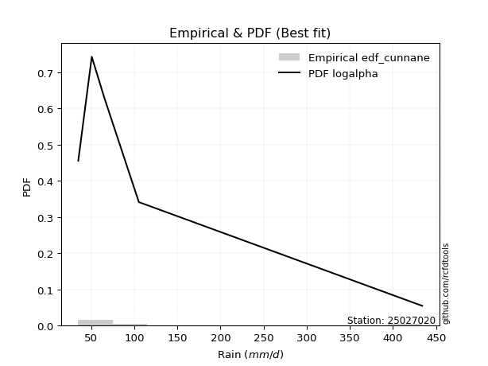</img>

</div>


### 12. Empirical - EDF Adamowski (1981)

The Adamowski formula in hydrology refers to a specific plotting position formula used for estimating the non-parametric empirical distribution of hydrological events (like flood peaks) to calculate their return periods. This formula provides an alternative to traditional parametric methods (like the Gumbel or Log Pearson Type III distributions). 

<div align="center">


$P=(m-0.25)/(n+0.5)$


</div>


**12.1. Empirical values**

<div align="center">

|                | 0                   | 1                  | 2             | 3                  | 4                  |
|:---------------|:--------------------|:-------------------|:--------------|:-------------------|:-------------------|
| date           | 2022                | 2025               | 2023          | 2024               | 2017               |
| x              | 35.1                | 48.44              | 65.2          | 105.4              | 434.1              |
| m              | 1                   | 2                  | 3             | 4                  | 5                  |
| empirical_dist | edf_adamowski       | edf_adamowski      | edf_adamowski | edf_adamowski      | edf_adamowski      |
| empirical      | 0.13636363636363635 | 0.3181818181818182 | 0.5           | 0.6818181818181818 | 0.8636363636363636 |
| empirical_tr   | 1.1578947368421053  | 1.4666666666666666 | 2.0           | 3.1428571428571423 | 7.333333333333334  |

</div>


**12.2. Kolmogorov-Smirnov fit test (sorted by Δ)**


<div align="center">

|                | 0                   | 1                   | 2                   | 3                  | 4                   | 5                     | 6                  | 7                   | 8                   | 9                   | 10                  | 11                  | 12                  | 13                  | 14                  | 15                  | 16                  | 17                  | 18                  | 19                  | 20                  | 21                  | 22                  | 23                  | 24                  | 25                  | 26                  | 27                  | 28                  | 29                  | 30                  | 31                 | 32                  | 33                  | 34                 | 35                  | 36                  | 37                  | 38                  | 39                  | 40                  | 41                  | 42                  | 43                 | 44                 | 45                  | 46                  | 47                  | 48                  | 49                  | 50                  | 51                 | 52                  | 53                  | 54                  | 55                  | 56                  | 57                  | 58                  | 59                  | 60                  | 61                 | 62                  | 63                  | 64                  | 65                  | 66                  | 67                  | 68                  | 69                 | 70                 | 71                 | 72                 | 73                  | 74                 | 75                 | 76                 | 77                  | 78                  | 79                  | 80                  | 81                  | 82                  | 83                  | 84                  | 85                  | 86                 | 87                 | 88                 | 89                 |
|:---------------|:--------------------|:--------------------|:--------------------|:-------------------|:--------------------|:----------------------|:-------------------|:--------------------|:--------------------|:--------------------|:--------------------|:--------------------|:--------------------|:--------------------|:--------------------|:--------------------|:--------------------|:--------------------|:--------------------|:--------------------|:--------------------|:--------------------|:--------------------|:--------------------|:--------------------|:--------------------|:--------------------|:--------------------|:--------------------|:--------------------|:--------------------|:-------------------|:--------------------|:--------------------|:-------------------|:--------------------|:--------------------|:--------------------|:--------------------|:--------------------|:--------------------|:--------------------|:--------------------|:-------------------|:-------------------|:--------------------|:--------------------|:--------------------|:--------------------|:--------------------|:--------------------|:-------------------|:--------------------|:--------------------|:--------------------|:--------------------|:--------------------|:--------------------|:--------------------|:--------------------|:--------------------|:-------------------|:--------------------|:--------------------|:--------------------|:--------------------|:--------------------|:--------------------|:--------------------|:-------------------|:-------------------|:-------------------|:-------------------|:--------------------|:-------------------|:-------------------|:-------------------|:--------------------|:--------------------|:--------------------|:--------------------|:--------------------|:--------------------|:--------------------|:--------------------|:--------------------|:-------------------|:-------------------|:-------------------|:-------------------|
| station        | 25027020            | 25027020            | 25027020            | 25027020           | 25027020            | 25027020              | 25027020           | 25027020            | 25027020            | 25027020            | 25027020            | 25027020            | 25027020            | 25027020            | 25027020            | 25027020            | 25027020            | 25027020            | 25027020            | 25027020            | 25027020            | 25027020            | 25027020            | 25027020            | 25027020            | 25027020            | 25027020            | 25027020            | 25027020            | 25027020            | 25027020            | 25027020           | 25027020            | 25027020            | 25027020           | 25027020            | 25027020            | 25027020            | 25027020            | 25027020            | 25027020            | 25027020            | 25027020            | 25027020           | 25027020           | 25027020            | 25027020            | 25027020            | 25027020            | 25027020            | 25027020            | 25027020           | 25027020            | 25027020            | 25027020            | 25027020            | 25027020            | 25027020            | 25027020            | 25027020            | 25027020            | 25027020           | 25027020            | 25027020            | 25027020            | 25027020            | 25027020            | 25027020            | 25027020            | 25027020           | 25027020           | 25027020           | 25027020           | 25027020            | 25027020           | 25027020           | 25027020           | 25027020            | 25027020            | 25027020            | 25027020            | 25027020            | 25027020            | 25027020            | 25027020            | 25027020            | 25027020           | 25027020           | 25027020           | 25027020           |
| empirical_dist | edf_adamowski       | edf_adamowski       | edf_adamowski       | edf_adamowski      | edf_adamowski       | edf_adamowski         | edf_adamowski      | edf_adamowski       | edf_adamowski       | edf_adamowski       | edf_adamowski       | edf_adamowski       | edf_adamowski       | edf_adamowski       | edf_adamowski       | edf_adamowski       | edf_adamowski       | edf_adamowski       | edf_adamowski       | edf_adamowski       | edf_adamowski       | edf_adamowski       | edf_adamowski       | edf_adamowski       | edf_adamowski       | edf_adamowski       | edf_adamowski       | edf_adamowski       | edf_adamowski       | edf_adamowski       | edf_adamowski       | edf_adamowski      | edf_adamowski       | edf_adamowski       | edf_adamowski      | edf_adamowski       | edf_adamowski       | edf_adamowski       | edf_adamowski       | edf_adamowski       | edf_adamowski       | edf_adamowski       | edf_adamowski       | edf_adamowski      | edf_adamowski      | edf_adamowski       | edf_adamowski       | edf_adamowski       | edf_adamowski       | edf_adamowski       | edf_adamowski       | edf_adamowski      | edf_adamowski       | edf_adamowski       | edf_adamowski       | edf_adamowski       | edf_adamowski       | edf_adamowski       | edf_adamowski       | edf_adamowski       | edf_adamowski       | edf_adamowski      | edf_adamowski       | edf_adamowski       | edf_adamowski       | edf_adamowski       | edf_adamowski       | edf_adamowski       | edf_adamowski       | edf_adamowski      | edf_adamowski      | edf_adamowski      | edf_adamowski      | edf_adamowski       | edf_adamowski      | edf_adamowski      | edf_adamowski      | edf_adamowski       | edf_adamowski       | edf_adamowski       | edf_adamowski       | edf_adamowski       | edf_adamowski       | edf_adamowski       | edf_adamowski       | edf_adamowski       | edf_adamowski      | edf_adamowski      | edf_adamowski      | edf_adamowski      |
| p_dist         | logalpha            | loginvweibull       | loginvgamma         | loghalfnorm        | loghalflogistic     | loglaplace_asymmetric | logmoyal           | alpha               | loginvgauss         | invgamma            | f                   | betaprime           | logpearson3         | loggumbel_r         | invgauss            | nct                 | lograyleigh         | logjohnsonsu        | lognct              | logmaxwell          | mielke              | logkstwobign        | loggenlogistic      | logbetaprime        | ncf                 | logncf              | wald                | logt                | lognorm             | lognorm             | logcrystalball      | logloggamma        | logexponnorm        | nakagami            | logtruncnorm       | loggenexpon         | logchi2             | lognakagami         | chi2                | logexpon            | logwald             | logrice             | logweibull_min      | loglogistic        | loggompertz        | loghypsecant        | halflogistic        | t                   | pearson3            | moyal               | halfnorm            | logerlang          | loglaplace          | genlogistic         | gibrat              | loggumbel_l         | weibull_min         | logf                | gumbel_r            | loggamma            | loggamma            | rayleigh           | fisk                | maxwell             | gompertz            | exponnorm           | laplace_asymmetric  | expon               | genexpon            | kstwobign          | pareto             | loggibrat          | crystalball        | norm                | logistic           | hypsecant          | gamma              | rice                | truncnorm           | logpareto           | laplace             | gumbel_l            | logfisk             | fatiguelife         | loglognorm          | logfatiguelife      | erlang             | johnsonsu          | invweibull         | logmielke          |
| delta          | 0.06808140932613063 | 0.07326598833791673 | 0.07556128125555575 | 0.0785065352736285 | 0.07878233175797322 | 0.07924612441466022   | 0.0805969829779114 | 0.08146891824087277 | 0.08182980694000166 | 0.08248511650894882 | 0.08248543904047757 | 0.08302473324141278 | 0.08354661126192098 | 0.08361493921570284 | 0.08400549226785661 | 0.08625927352481066 | 0.08634525469923815 | 0.08949419628908556 | 0.09180107966112716 | 0.09699422074847025 | 0.09807674642680997 | 0.09822688946229374 | 0.09830586272886044 | 0.09871969943429049 | 0.10227554146480217 | 0.11148111614072043 | 0.11999477212698512 | 0.12998453208202887 | 0.12998889997203456 | 0.12998889997203456 | 0.12998897899089185 | 0.1301573819763755 | 0.13501294945556674 | 0.13636331024151152 | 0.1363634021723891 | 0.13636361898156016 | 0.13636361995538343 | 0.13636363356052494 | 0.13636363380937333 | 0.13636363636363635 | 0.13636363636363635 | 0.13725369657965003 | 0.13978245005981377 | 0.146082201889997  | 0.1584648217956553 | 0.15887266417742157 | 0.16829684628896868 | 0.17043884317608615 | 0.17649115945135885 | 0.18064111064399502 | 0.18571387209077922 | 0.185846508628575  | 0.18727063405690803 | 0.18838543132088847 | 0.19201963250448417 | 0.19291209464066933 | 0.20115984844873236 | 0.20123746628452038 | 0.20450694213140586 | 0.21250374077184053 | 0.21250374077184053 | 0.2203573070630198 | 0.23090907001180266 | 0.23259050434646505 | 0.23742263026026816 | 0.24340071980594236 | 0.24563165122145714 | 0.24563350264892087 | 0.24563352223719898 | 0.2537676373323678 | 0.2567278570917046 | 0.2634474188159607 | 0.2668739224979146 | 0.26687477398780335 | 0.2780259802444424 | 0.2872586254546811 | 0.2940341771659876 | 0.29693659739388684 | 0.30482753977633253 | 0.31133637436058387 | 0.31282840655328487 | 0.33478185689248097 | 0.34039753285397584 | 0.34330638200993663 | 0.34808029200151164 | 0.45196579111677665 | 0.4872035478869107 | 0.6709944128797498 | 0.6805810305770261 | nan                |
| deltao         | 0.5865427407550001  | 0.5865427407550001  | 0.5865427407550001  | 0.5865427407550001 | 0.5865427407550001  | 0.5865427407550001    | 0.5865427407550001 | 0.5865427407550001  | 0.5865427407550001  | 0.5865427407550001  | 0.5865427407550001  | 0.5865427407550001  | 0.5865427407550001  | 0.5865427407550001  | 0.5865427407550001  | 0.5865427407550001  | 0.5865427407550001  | 0.5865427407550001  | 0.5865427407550001  | 0.5865427407550001  | 0.5865427407550001  | 0.5865427407550001  | 0.5865427407550001  | 0.5865427407550001  | 0.5865427407550001  | 0.5865427407550001  | 0.5865427407550001  | 0.5865427407550001  | 0.5865427407550001  | 0.5865427407550001  | 0.5865427407550001  | 0.5865427407550001 | 0.5865427407550001  | 0.5865427407550001  | 0.5865427407550001 | 0.5865427407550001  | 0.5865427407550001  | 0.5865427407550001  | 0.5865427407550001  | 0.5865427407550001  | 0.5865427407550001  | 0.5865427407550001  | 0.5865427407550001  | 0.5865427407550001 | 0.5865427407550001 | 0.5865427407550001  | 0.5865427407550001  | 0.5865427407550001  | 0.5865427407550001  | 0.5865427407550001  | 0.5865427407550001  | 0.5865427407550001 | 0.5865427407550001  | 0.5865427407550001  | 0.5865427407550001  | 0.5865427407550001  | 0.5865427407550001  | 0.5865427407550001  | 0.5865427407550001  | 0.5865427407550001  | 0.5865427407550001  | 0.5865427407550001 | 0.5865427407550001  | 0.5865427407550001  | 0.5865427407550001  | 0.5865427407550001  | 0.5865427407550001  | 0.5865427407550001  | 0.5865427407550001  | 0.5865427407550001 | 0.5865427407550001 | 0.5865427407550001 | 0.5865427407550001 | 0.5865427407550001  | 0.5865427407550001 | 0.5865427407550001 | 0.5865427407550001 | 0.5865427407550001  | 0.5865427407550001  | 0.5865427407550001  | 0.5865427407550001  | 0.5865427407550001  | 0.5865427407550001  | 0.5865427407550001  | 0.5865427407550001  | 0.5865427407550001  | 0.5865427407550001 | 0.5865427407550001 | 0.5865427407550001 | 0.5865427407550001 |
| eval           | Δo > Δ              | Δo > Δ              | Δo > Δ              | Δo > Δ             | Δo > Δ              | Δo > Δ                | Δo > Δ             | Δo > Δ              | Δo > Δ              | Δo > Δ              | Δo > Δ              | Δo > Δ              | Δo > Δ              | Δo > Δ              | Δo > Δ              | Δo > Δ              | Δo > Δ              | Δo > Δ              | Δo > Δ              | Δo > Δ              | Δo > Δ              | Δo > Δ              | Δo > Δ              | Δo > Δ              | Δo > Δ              | Δo > Δ              | Δo > Δ              | Δo > Δ              | Δo > Δ              | Δo > Δ              | Δo > Δ              | Δo > Δ             | Δo > Δ              | Δo > Δ              | Δo > Δ             | Δo > Δ              | Δo > Δ              | Δo > Δ              | Δo > Δ              | Δo > Δ              | Δo > Δ              | Δo > Δ              | Δo > Δ              | Δo > Δ             | Δo > Δ             | Δo > Δ              | Δo > Δ              | Δo > Δ              | Δo > Δ              | Δo > Δ              | Δo > Δ              | Δo > Δ             | Δo > Δ              | Δo > Δ              | Δo > Δ              | Δo > Δ              | Δo > Δ              | Δo > Δ              | Δo > Δ              | Δo > Δ              | Δo > Δ              | Δo > Δ             | Δo > Δ              | Δo > Δ              | Δo > Δ              | Δo > Δ              | Δo > Δ              | Δo > Δ              | Δo > Δ              | Δo > Δ             | Δo > Δ             | Δo > Δ             | Δo > Δ             | Δo > Δ              | Δo > Δ             | Δo > Δ             | Δo > Δ             | Δo > Δ              | Δo > Δ              | Δo > Δ              | Δo > Δ              | Δo > Δ              | Δo > Δ              | Δo > Δ              | Δo > Δ              | Δo > Δ              | Δo > Δ             | Δo <= Δ            | Δo <= Δ            | Δo <= Δ            |
| fit            | 1                   | 1                   | 1                   | 1                  | 1                   | 1                     | 1                  | 1                   | 1                   | 1                   | 1                   | 1                   | 1                   | 1                   | 1                   | 1                   | 1                   | 1                   | 1                   | 1                   | 1                   | 1                   | 1                   | 1                   | 1                   | 1                   | 1                   | 1                   | 1                   | 1                   | 1                   | 1                  | 1                   | 1                   | 1                  | 1                   | 1                   | 1                   | 1                   | 1                   | 1                   | 1                   | 1                   | 1                  | 1                  | 1                   | 1                   | 1                   | 1                   | 1                   | 1                   | 1                  | 1                   | 1                   | 1                   | 1                   | 1                   | 1                   | 1                   | 1                   | 1                   | 1                  | 1                   | 1                   | 1                   | 1                   | 1                   | 1                   | 1                   | 1                  | 1                  | 1                  | 1                  | 1                   | 1                  | 1                  | 1                  | 1                   | 1                   | 1                   | 1                   | 1                   | 1                   | 1                   | 1                   | 1                   | 1                  | 0                  | 0                  | 0                  |
| n              | 5                   | 5                   | 5                   | 5                  | 5                   | 5                     | 5                  | 5                   | 5                   | 5                   | 5                   | 5                   | 5                   | 5                   | 5                   | 5                   | 5                   | 5                   | 5                   | 5                   | 5                   | 5                   | 5                   | 5                   | 5                   | 5                   | 5                   | 5                   | 5                   | 5                   | 5                   | 5                  | 5                   | 5                   | 5                  | 5                   | 5                   | 5                   | 5                   | 5                   | 5                   | 5                   | 5                   | 5                  | 5                  | 5                   | 5                   | 5                   | 5                   | 5                   | 5                   | 5                  | 5                   | 5                   | 5                   | 5                   | 5                   | 5                   | 5                   | 5                   | 5                   | 5                  | 5                   | 5                   | 5                   | 5                   | 5                   | 5                   | 5                   | 5                  | 5                  | 5                  | 5                  | 5                   | 5                  | 5                  | 5                  | 5                   | 5                   | 5                   | 5                   | 5                   | 5                   | 5                   | 5                   | 5                   | 5                  | 5                  | 5                  | 5                  |
| best_fit       | 1                   | 0                   | 0                   | 0                  | 0                   | 0                     | 0                  | 0                   | 0                   | 0                   | 0                   | 0                   | 0                   | 0                   | 0                   | 0                   | 0                   | 0                   | 0                   | 0                   | 0                   | 0                   | 0                   | 0                   | 0                   | 0                   | 0                   | 0                   | 0                   | 0                   | 0                   | 0                  | 0                   | 0                   | 0                  | 0                   | 0                   | 0                   | 0                   | 0                   | 0                   | 0                   | 0                   | 0                  | 0                  | 0                   | 0                   | 0                   | 0                   | 0                   | 0                   | 0                  | 0                   | 0                   | 0                   | 0                   | 0                   | 0                   | 0                   | 0                   | 0                   | 0                  | 0                   | 0                   | 0                   | 0                   | 0                   | 0                   | 0                   | 0                  | 0                  | 0                  | 0                  | 0                   | 0                  | 0                  | 0                  | 0                   | 0                   | 0                   | 0                   | 0                   | 0                   | 0                   | 0                   | 0                   | 0                  | 0                  | 0                  | 0                  |
| best_fit_sort  | 1                   | 2                   | 3                   | 4                  | 5                   | 6                     | 7                  | 8                   | 9                   | 10                  | 11                  | 12                  | 13                  | 14                  | 15                  | 16                  | 17                  | 18                  | 19                  | 20                  | 21                  | 22                  | 23                  | 24                  | 25                  | 26                  | 27                  | 28                  | 29                  | 30                  | 31                  | 32                 | 33                  | 34                  | 35                 | 36                  | 37                  | 38                  | 39                  | 40                  | 41                  | 42                  | 43                  | 44                 | 45                 | 46                  | 47                  | 48                  | 49                  | 50                  | 51                  | 52                 | 53                  | 54                  | 55                  | 56                  | 57                  | 58                  | 59                  | 60                  | 61                  | 62                 | 63                  | 64                  | 65                  | 66                  | 67                  | 68                  | 69                  | 70                 | 71                 | 72                 | 73                 | 74                  | 75                 | 76                 | 77                 | 78                  | 79                  | 80                  | 81                  | 82                  | 83                  | 84                  | 85                  | 86                  | 87                 | 88                 | 89                 | 90                 |

</div>


<div align="center">

</img>

</div>


**12.3. Best fit**

<div align="center">

|   id |   station | empirical_dist   | p_dist   |     delta |   deltao | eval   |   fit |   n |   best_fit |   best_fit_sort |
|-----:|----------:|:-----------------|:---------|----------:|---------:|:-------|------:|----:|-----------:|----------------:|
|    0 |  25027020 | edf_adamowski    | logalpha | 0.0680814 | 0.586543 | Δo > Δ |     1 |   5 |          1 |               1 |

</div>


<div align="center">

</img>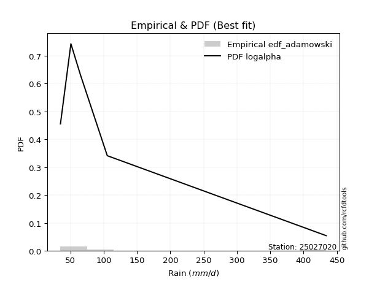</img>

</div>


## C. Best fit & Estimate extreme values for specific return periods - Tr


### 1. Best fit (ordered by delta Δ)

<div align="center">

|   id |   station | empirical_dist   | p_dist   |     delta |   deltao | eval   |   fit |   n |   best_fit |   best_fit_sort |
|-----:|----------:|:-----------------|:---------|----------:|---------:|:-------|------:|----:|-----------:|----------------:|
|    0 |  25027020 | edf_hazen        | logalpha | 0.0317178 | 0.586543 | Δo > Δ |     1 |   5 |          1 |               1 |
|    1 |  25027020 | edf_gringorten   | logalpha | 0.0410928 | 0.586543 | Δo > Δ |     1 |   5 |          1 |               2 |
|    2 |  25027020 | edf_cunnane      | logalpha | 0.0471024 | 0.586543 | Δo > Δ |     1 |   5 |          1 |               3 |
|    3 |  25027020 | edf_blom         | logalpha | 0.0507654 | 0.586543 | Δo > Δ |     1 |   5 |          1 |               4 |
|    4 |  25027020 | edf_tukey        | logalpha | 0.0567178 | 0.586543 | Δo > Δ |     1 |   5 |          1 |               5 |
|    5 |  25027020 | edf_filliben     | logalpha | 0.0589312 | 0.586543 | Δo > Δ |     1 |   5 |          1 |               6 |
|    6 |  25027020 | edf_beard        | logalpha | 0.0599706 | 0.586543 | Δo > Δ |     1 |   5 |          1 |               7 |
|    7 |  25027020 | edf_jenkinson    | logalpha | 0.0599706 | 0.586543 | Δo > Δ |     1 |   5 |          1 |               8 |
|    8 |  25027020 | edf_chegodayev   | logalpha | 0.0613474 | 0.586543 | Δo > Δ |     1 |   5 |          1 |               9 |
|    9 |  25027020 | edf_adamowski    | logalpha | 0.0680814 | 0.586543 | Δo > Δ |     1 |   5 |          1 |              10 |
|   10 |  25027020 | edf_california   | t        | 0.0743105 | 0.586543 | Δo > Δ |     1 |   5 |          1 |              11 |
|   11 |  25027020 | edf_weibull      | logalpha | 0.0983844 | 0.586543 | Δo > Δ |     1 |   5 |          1 |              12 |

</div>

:file_folder:Tables: [bestfit_25027020.csv](table/bestfit_25027020.csv) | [extreme_25027020.csv](table/extreme_25027020.csv)


### 2. Extreme values

In hydrology, a return period (or recurrence interval $Tr$) is the statistical average time between extreme events like floods or droughts of a specific magnitude, indicating how rare an event is, with a 100-year flood, for example, having a 1% chance of occurring in any given year, not that it happens exactly every century. It is a key tool for infrastructure design (like bridges or dams) and risk assessment, calculated from historical data to determine the probability of future events, although it is important to remember it is statistical average, and events can cluster or be missed.

> risk_rate: assuming the return period as the project useful life.

|   id |      tr |   prob_l |     prob_g |      alpha |   betaprime |      chi2 |   crystalball |   erlang |   expon |   exponnorm |           f |   fatiguelife |             fisk |    gamma |   genexpon |   genlogistic |    gibrat |   gompertz |   gumbel_l |   gumbel_r |   halflogistic |   halfnorm |   hypsecant |    invgamma |   invgauss |   invweibull |   johnsonsu |   kstwobign |   laplace |   laplace_asymmetric |   loggamma |   logistic |   lognorm |   maxwell |    mielke |   moyal |   nakagami |       ncf |       nct |    norm |           pareto |   pearson3 |   rayleigh |    rice |          t |   truncnorm |      wald |      weibull_min |         logalpha |   logbetaprime |          logchi2 |   logcrystalball |   logerlang |   logexpon |   logexponnorm |             logf |   logfatiguelife |           logfisk |   loggenexpon |   loggenlogistic |   loggibrat |   loggompertz |   loggumbel_l |   loggumbel_r |   loghalflogistic |   loghalfnorm |   loghypsecant |      loginvgamma |   loginvgauss |    loginvweibull |     logjohnsonsu |   logkstwobign |   loglaplace |   loglaplace_asymmetric |   logloggamma |   loglogistic |    loglognorm |   logmaxwell |        logmielke |   logmoyal |   lognakagami |    logncf |    lognct |       logpareto |   logpearson3 |   lograyleigh |   logrice |      logt |   logtruncnorm |    logwald |   logweibull_min |   station |   n |   risk_rate |
|-----:|--------:|---------:|-----------:|-----------:|------------:|----------:|--------------:|---------:|--------:|------------:|------------:|--------------:|-----------------:|---------:|-----------:|--------------:|----------:|-----------:|-----------:|-----------:|---------------:|-----------:|------------:|------------:|-----------:|-------------:|------------:|------------:|----------:|---------------------:|-----------:|-----------:|----------:|----------:|----------:|--------:|-----------:|----------:|----------:|--------:|-----------------:|-----------:|-----------:|--------:|-----------:|------------:|----------:|-----------------:|-----------------:|---------------:|-----------------:|-----------------:|------------:|-----------:|---------------:|-----------------:|-----------------:|------------------:|--------------:|-----------------:|------------:|--------------:|--------------:|--------------:|------------------:|--------------:|---------------:|-----------------:|--------------:|-----------------:|-----------------:|---------------:|-------------:|------------------------:|--------------:|--------------:|--------------:|-------------:|-----------------:|-----------:|--------------:|----------:|----------:|----------------:|--------------:|--------------:|----------:|----------:|---------------:|-----------:|-----------------:|----------:|----:|------------:|
|    0 |    2    | 0.5      | 0.5        |    61.9913 |     59.6036 |   84.0778 |       137.648 |  35.3854 | 106.181 |     105.657 |     59.7934 |       35.1    |    133.777       |  41.1348 |    106.181 |       106.928 |   92.5935 |    103.597 |    162.307 |    112.989 |        100.73  |    106.923 |     137.648 |     59.7933 |    58.8202 |      35.1    |     35.1    |     124.883 |   137.648 |              106.18  |    47.7079 |    137.648 |   87.3047 |   124.811 |   72.8266 | 105.029 |    71.4532 |   79.5868 |   74.2632 | 137.648 |     42.1961      |    103.588 |    120.258 | 140.928 |    54.1109 |     129.083 |   88.9925 |     47.0272      |     65.0178      |        79.4839 |     55.7797      |          87.3048 |     48.5753 |    66.0095 |        65.5388 |     46.5969      |          35.1001 |     38.8922       |       66.0129 |          74.0749 |     67.0402 |       89.2123 |       100.881 |       75.5553 |           70.3165 |       72.9159 |        87.3047 |     63.1439      |       60.679  |     63.2017      |     59.2006      |        77.531  |      87.3047 |                 69.483  |       87.4299 |       87.3047 |  35.1265      |      80.9763 |     66.2542      |    72.1106 |       80.3388 |   79.7228 |   77.1552 |   38.7312       |       76.3823 |       78.8438 |   85.1793 |   87.3038 |        64.4952 |    65.6385 |     52.8056      |  25027020 |   5 |    0.75     |
|    1 |    2.33 | 0.570815 | 0.429185   |    70.0246 |     68.637  |  101.625  |       164.433 |  35.9097 | 121.842 |     121.236 |     68.8271 |       37.5486 |    196.313       |  45.1889 |    121.842 |       124.077 |  106.162  |    118.689 |    185.61  |    137.809 |        126.248 |    135.831 |     159.084 |     68.827  |    67.6895 |      35.1    |     35.1    |     145.326 |   153.857 |              121.841 |    51.8637 |    161.247 |  102.147  |   152.638 |   82.8929 | 128.523 |    86.3963 |   91.9255 |   85.1043 | 164.433 |     47.9596      |    128.836 |    148.497 | 163.787 |    58.8314 |     148.813 |  106.556  |     91.646       |     73.4656      |        92.1009 |     66.318       |         102.147  |     53.339  |    75.8653 |        75.2258 |     54.8052      |          35.765  |     41.5453       |       75.8699 |          84.3676 |     72.5901 |      103.896  |       115.647 |       87.387  |           81.6617 |       86.3799 |        98.9936 |     71.6495      |       69.2119 |     71.6196      |     67.7513      |        89.0818 |      96.0066 |                 79.2198 |      102.322  |      100.257  |  35.4294      |      95.3233 |     75.0971      |    82.7579 |      102.658  |   91.3497 |   88.8684 |   42.0819       |       89.1643 |       93.0371 |   98.4149 |  102.146  |        73.1146 |    72.7567 |     63.8437      |  25027020 |   5 |    0.729209 |
|    2 |    5    | 0.8      | 0.2        |   132.316  |    156.259  |  204.732  |       263.973 |  47.6796 | 200.145 |     199.123 |    155.593  |       89.5626 |   1107.9         |  78.6025 |    200.145 |       198.577 |  184.278  |    194.145 |    260.893 |    245.635 |        241.713 |    258.079 |     245.069 |    155.593  |   144.766  |      35.1    |     35.1    |     232.168 |   234.899 |              200.143 |    80.8709 |    252.368 |  183.072  |   262.167 |  146.177  | 237.353 |   166.851  |  166.235  |  156.771  | 263.973 |    254.16        |    243.256 |    261.552 | 255.301 |    86.7684 |     239.75  |  204.875  |   8661.61        |    141.314       |       166.96   |    186.638       |         183.072  |     88.5479 |   152.129  |       149.863  |    191.485       |          53.2834 |    110.55         |      152.146  |         148.465  |    114.748  |      191.123  |       179.796 |      164.414  |          160.677  |      176.855  |       163.869  |    143.925       |      144.493  |    143.695       |    152.893       |       160.69   |     154.386  |                152.615  |      183.265  |      171.033  |   1.33513e+48 |     181.143  |    142.175       |   156.623  |      330.238  |  161.545  |  161.551  | 1037.15         |      171.335  |      180.492  |  175.463  |  183.07   |       129.341  |   129.474  |    273.491       |  25027020 |   5 |    0.67232  |
|    3 |   10    | 0.9      | 0.1        |   246.76   |    370.55   |  311.094  |       330.005 |  73.7372 | 271.225 |     269.826 |    365.02   |      161.381  |   4367.39        | 121.788  |    271.226 |       259.253 |  273.321  |    262.642 |    302.807 |    333.458 |        337.602 |    348.54  |     313.73  |    365.021  |   281.139  |      35.1    |     35.1006 |     298.286 |   308.466 |              271.223 |   123.636  |    319.475 |  269.6    |   339.247 |  233.107  | 332.106 |   235.514  |  260.957  |  262.529  | 330.006 |   2803.55        |    338.23  |    342.163 | 320.552 |   142.783  |     307.47  |  309.215  | 141768           |    300.436       |       259.303  |    550.169       |         269.6    |    144.76   |   286.095  |       280.167  |    992.477       |          92.394  |   3898.12         |      286.143  |         235.242  |    193.387  |      289.102  |       229.869 |      275.111  |          281.875  |      300.54   |       245.069  |    316.653       |      315.384  |    322.653       |    407.193       |       251.797  |     237.622  |                276.756  |      269.37   |      253.462  | inf           |     284.606  |    273.586       |   272.939  |      836.539  |  249.428  |  258.857  |    6.39264e+21  |      283.661  |      289.512  |  264.997  |  269.597  |       196.787  |   238.684  |   2074.11        |  25027020 |   5 |    0.651322 |
|    4 |   15    | 0.933333 | 0.0666667  |   360.795  |    630.875  |  376.571  |       362.957 |  94.4737 | 312.805 |     311.185 |    617.077  |      208.351  |   9303.46        | 150.591  |    312.805 |       293.486 |  334.739  |    302.71  |    321.789 |    383.007 |        391.866 |    395.616 |     352.915 |    617.079  |   397.413  |      35.1    |     35.1056 |     333.387 |   351.5   |              312.803 |   159.327  |    356.038 |  327.043  |   378.796 |  303.735  | 387.096 |   272.416  |  333.466  |  352.89   | 362.958 |  12227.7         |    391.618 |    383.697 | 354.173 |   208.423  |     339.097 |  376.217  | 503542           |    528.882       |       327.936  |   1073.77        |         327.042  |    194.513  |   413.967  |       403.983  |   3163.36        |         132.431  | 914104            |      414.048  |         304.991  |    277.194  |      354.253  |       256.923 |      367.827  |          387.433  |      396.043  |       308.346  |    551.855       |      520.53   |    579.018       |    818.313       |       319.599  |     305.8    |                392.022  |      326.309  |      314.044  | inf           |     358.858  |    422.221       |   376.75   |     1367.98   |  315.091  |  336.418  |    2.61977e+95  |      372.908  |      369.318  |  327.718  |  327.039  |       239.344  |   353.512  |   9180.4         |  25027020 |   5 |    0.644736 |
|    5 |   20    | 0.95     | 0.05       |   474.73   |    926.516  |  424.081  |       384.536 | 111.083  | 342.306 |     340.53  |    901.586  |      243.127  |  15712.9         | 172.184  |    342.306 |       317.455 |  382.917  |    331.138 |    333.605 |    417.7   |        429.886 |    427.002 |     380.558 |    901.591  |   497.314  |      35.1    |     35.1227 |     357.032 |   382.033 |              342.304 |   191.067  |    381.31  |  371.14   |   405.043 |  365.739  | 426.041 |   297.23   |  394.666  |  434.756  | 384.537 |  34939.8         |    428.799 |    411.303 | 376.519 |   281.985  |     357.817 |  426.147  |      1.10841e+06 |    856.522       |       384.686  |   1746.08        |         371.14   |    240.484  |   538.035  |       523.766  |   7848.82        |         172.879  |      1.15129e+09  |      538.151  |         365.802  |    367.65   |      403.865  |       275.348 |      450.777  |          484.152  |      476.037  |       362.584  |    861.395       |      756.095  |    933.097       |   1429.23        |       375.287  |     365.733  |                501.877  |      369.913  |      364.186  | inf           |     418.543  |    590.566       |   473.364  |     1901.63   |  369.459  |  403.761  |    1.37345e+280 |      449.692  |      434.188  |  377.417  |  371.136  |       268.824  |   473.719  |  30135.3         |  25027020 |   5 |    0.641514 |
|    6 |   25    | 0.96     | 0.04       |   588.625  |   1251.55   |  461.432  |       400.421 | 124.875  | 365.189 |     363.291 |   1212.96   |      270.757  |  23473.1         | 189.482  |    365.189 |       335.917 |  423.081  |    353.189 |    342.013 |    444.423 |        459.178 |    450.354 |     401.951 |   1212.97   |   584.772  |      35.1    |     35.1639 |     374.743 |   405.716 |              365.186 |   220.159  |    400.642 |  407.358  |   424.529 |  422.094  | 456.228 |   315.756  |  448.668  |  510.894  | 400.422 |  78955.4         |    457.307 |    431.815 | 393.122 |   362.194  |     370.283 |  466.14   |      1.94334e+06 |   1321.34        |       433.974  |   2560.18        |         407.358  |    283.844  |   659.349  |       640.638  |  16695           |         213.655  |      6.83775e+12  |      659.501  |         420.79   |    465.245  |      444.245  |       289.258 |      527.216  |          574.844  |      545.868  |       411.027  |   1257.57        |     1019.59   |   1407.49        |   2288.64        |       423.268  |     420.199  |                607.877  |      405.661  |      407.884  | inf           |     469.186  |    779.762       |   564.989  |     2430.82   |  416.688  |  464.524  |  inf            |      518.285  |      489.657  |  419.162  |  407.354  |       290.5    |   598.879  |  81705.3         |  25027020 |   5 |    0.639603 |
|    7 |   50    | 0.98     | 0.02       |  1157.92   |   3212.95   |  579.709  |       445.91  | 171.789  | 436.27  |     433.995 |   3074.8    |      359.409  |  80108           | 245.676  |    436.27  |       392.791 |  564.659  |    421.686 |    364.836 |    526.743 |        549.431 |    518.23  |     468.279 |   3074.83   |   910.088  |      35.1001 |     36.3404 |     426.751 |   479.284 |              436.267 |   343.183  |    459.709 |  531.835  |   481.042 |  656.98   | 549.939 |   369.745  |  661.399  |  842.189  | 445.911 | 994870           |    544.357 |    491.355 | 441.318 |   838.997  |     398.826 |  596.717  |      8.92266e+06 |   8179.56        |       622.204  |   8618.91        |         531.835  |    477.619  |  1239.98   |      1197.66   | 232220           |         421.5    |      4.77422e+40  |     1240.33   |         647.765  |   1066.86   |      579.989  |       330.664 |      854.179  |          975.676  |      812.604  |       606.346  |   5052.32        |     2705.89   |   6634.09        |  12478.3         |       602.63   |     646.746  |               1102.34   |      528.113  |      576.636  | inf           |     653.444  |   2068.01        |   978.586  |     4967.11   |  596.766  |  715.046  |  inf            |      793.688  |      694.165  |  568.376  |  531.829  |       347.26   |  1287.58   |      2.74477e+06 |  25027020 |   5 |    0.63583  |
|    8 |   75    | 0.986667 | 0.0133333  |  1727.14   |   5596.46   |  650.172  |       470.318 | 201.504  | 477.85  |     475.354 |   5316.39   |      412.799  | 162834           | 279.93   |    477.85  |       425.848 |  660.281  |    461.754 |    376.378 |    574.59  |        601.895 |    555.179 |     507.041 |   5316.45   |  1135.53   |      35.1006 |     41.19   |     455.366 |   522.318 |              477.846 |   445.869  |    493.823 |  613.638  |   511.767 |  850.083  | 604.739 |   399.147  |  825.501  | 1127.6    | 470.319 |      4.38067e+06 |    594.418 |    523.747 | 467.539 |  1409.99   |     409.689 |  677.068  |      1.92855e+07 |  39241.7         |       762.221  |  17782.9         |         613.638  |    649.576  |  1794.2    |      1726.95   |      1.34086e+06 |         634.616  |      6.01742e+81  |     1794.75   |         832.365  |   1868.71   |      666.454  |       353.808 |     1130.72   |         1326.97   |     1009.11   |       761.019  |  13627.9         |     4932.98   |  20744.9         |  40304.9         |       731.931  |     832.309  |               1561.45   |      608.275  |      704.282  | inf           |     782.392  |   4003.58        |  1349.28   |     7329.53   |  730.175  |  919.368  |  inf            |     1009.79   |      839.311  |  670.791  |  613.631  |       371.83   |  2062.25   |      2.86254e+07 |  25027020 |   5 |    0.634587 |
|    9 |  100    | 0.99     | 0.01       |  2296.34   |   8303.47   |  700.629  |       486.826 | 223.395  | 507.351 |     504.699 |   7846.73   |      451.215  | 268709           | 304.731  |    507.351 |       449.244 |  734.355  |    490.183 |    383.927 |    608.455 |        639.028 |    580.35  |     534.537 |   7846.83   |  1309.8    |      35.1019 |     52.9655 |     474.972 |   552.851 |              507.347 |   537.275  |    517.909 |  675.986  |   532.694 | 1020.34   | 643.618 |   419.16   |  964.359  | 1386.84   | 486.827 |      1.25404e+07 |    629.621 |    545.815 | 485.402 |  2052.38   |     415.43  |  735.651  |      3.19285e+07 | 168294           |       877.896  |  29882.4         |         675.985  |    808.862  |  2331.92   |      2239.01   |      5.15327e+06 |         851.887  |      5.56151e+134 |     2332.69   |         993.998  |   2884.82   |      730.888  |       369.816 |     1378.99   |         1649.65   |     1169.54   |       894.109  |  30302           |     7642.62   |  52901.9         | 101231           |       836.201  |     995.434  |               1999.01   |      669.223  |      811.075  | inf           |     884.505  |   6699.67        |  1694.64   |     9552.83   |  839.948  | 1099.13   |  inf            |     1194.21   |      955.215  |  750.941  |  675.978  |       385.557  |  2907.29   |      1.71723e+08 |  25027020 |   5 |    0.633968 |
|   10 |  200    | 0.995    | 0.005      |  4573.08   |  21515.2    |  823.513  |       524.273 | 278.377  | 578.432 |     575.402 |  20077.4    |      545.251  | 893634           | 365.886  |    578.432 |       505.491 |  935.884  |    558.68  |    400.336 |    689.869 |        728.3   |    637.919 |     600.777 |  20077.7    |  1773.35   |      35.1358 |    240.323  |     520.128 |   626.418 |              578.427 |   843.868  |    575.686 |  841.908  |   580.575 | 1583.24   | 737.289 |   464.853  | 1396.14   | 2282.82   | 524.274 |      1.58077e+08 |    713.535 |    596.309 | 526.275 |  5141.03   |     424.475 |  881.577  |      9.55174e+07 |      3.63593e+07 |      1224.84   | 105895           |         841.908  |   1376.42   |  4385.45   |      4185.78   |      1.92575e+08 |        1751.4    |    inf            |     4387.11   |        1522.91   |   9400.84   |      896.438  |       407.152 |     2222.37   |         2783.88   |     1638.96   |      1318.3    | 305681           |    22740.4    | 858085           |      1.30065e+06 |      1136.4    |    1532.11   |               3625.06   |      830.854  |     1138      | inf           |    1171.08   |  27730.6         |  2934.5    |    17498.7    | 1166.59   | 1694.65   |  inf            |     1772.95   |     1284.23   |  972.223  |  841.898  |       408.301  |  6839.11   |      1.98411e+10 |  25027020 |   5 |    0.633042 |
|   11 |  250    | 0.996    | 0.004      |  5711.44   |  29239.5    |  863.413  |       535.716 | 296.646  | 601.315 |     598.164 |  27175.2    |      575.897  |      1.31435e+06 | 385.933  |    601.315 |       523.574 | 1008.19   |    580.731 |    405.164 |    716.042 |        757     |    655.63  |     622.1   |  27175.7    |  1934.41   |      35.1922 |    467.836  |     534.103 |   650.102 |              601.31  |   976.433  |    594.235 |  900.319  |   595.313 | 1823.62   | 767.444 |   478.883  | 1571.04   | 2680      | 535.718 |      3.57413e+08 |    740.313 |    611.852 | 538.857 |  6926.24   |     426.351 |  929.853  |      1.31858e+08 |      4.74314e+08 |      1360.96   | 159737           |         900.318  |   1634.71   |  5374.26   |      5119.78   |      6.97804e+08 |        2215.11   |    inf            |     5376.39   |        1746.79   |  14363.2    |      952.778  |       418.839 |     2590.87   |         3293.9    |     1818.26   |      1493.82   | 736129           |    32617.7    |      2.54346e+06 |      3.29996e+06 |      1249.57   |    1760.28   |               4390.7    |      887.574  |     1268.71   | inf           |    1276.76   |  46547.4         |  3501.86   |    21075.7    | 1293.67   | 1950.42   |  inf            |     2008.72   |     1406.73   | 1052.67   |  900.308  |       413.198  |  9076.24   |      1.0418e+11  |  25027020 |   5 |    0.632858 |
|   12 |  500    | 0.998    | 0.002      | 11403.2    |  75851.7    |  988.232  |       569.652 | 354.826  | 672.396 |     668.868 |  69617      |      672.034  |      4.34865e+06 | 449.122  |    672.396 |       579.699 | 1258.09   |    649.228 |    419.004 |    797.279 |        846.079 |    708.435 |     688.335 |  69618.4    |  2466.54   |      36.8425 |   3989.09   |     575.982 |   723.669 |              672.39  |  1538.56   |    651.761 | 1098.47   |   639.295 | 2828.64   | 861.114 |   520.623  | 2261.11   | 4410.61   | 569.653 |      4.50535e+09 |    822.871 |    658.229 | 576.397 | 17548      |     430.176 | 1083.36   |      3.32283e+08 |      1.23503e+14 |      1879.69   | 578367           |        1098.46   |   2795      | 10106.9    |      9571.34   |      5.78337e+10 |        4628.03   |    inf            |    10111.4    |        2673.79   |  62149.4    |     1137.04   |       454.234 |     4171.08   |         5552.35   |     2477.87   |      2202.47   |      1.88193e+07 |   102692      |      1.56058e+08 |      8.67591e+07 |      1660.78   |    2709.32   |               7962.22   |     1079.36   |     1777.49   | inf           |    1652.23   | 289567           |  6063.88   |    36670.5    | 1772.56   | 3033.45   |  inf            |     2942.15   |     1846.16   | 1334.46   | 1098.45   |       423.377  | 22320.7    |      2.67932e+13 |  25027020 |   5 |    0.632489 |
|   13 |  750    | 0.998667 | 0.00133333 | 17095      | 132496      | 1061.78   |       588.504 | 389.715  | 713.975 |     710.227 | 120716      |      728.836  |      8.74885e+06 | 486.642  |    713.975 |       612.509 | 1423.36   |    689.296 |    426.4   |    844.77  |        898.154 |    737.935 |     727.079 | 120718      |  2797.62   |      44.8138 |  13549      |     599.509 |   766.703 |              713.97  |  2009.17   |    685.37  | 1226.81   |   663.893 | 3656.67   | 915.906 |   543.88   | 2794.01   | 5902.75   | 588.505 |      1.98388e+10 |    870.781 |    684.162 | 597.389 | 30271.7    |     431.473 | 1175.39   |      5.44549e+08 |      2.58477e+19 |      2264.76   |      1.235e+06   |        1226.81   |   3830.17   | 14624.2    |     13801.3    |      1.05463e+12 |        7152.63   |    inf            |    14631.2    |        3429.34   | 163746      |     1251.22   |       474.362 |     5509.91   |         7534.33   |     2945.62   |      2764.02   |      1.91251e+08 |   204249      |      3.2524e+09  |      7.83531e+08 |      1948.6    |    3486.67   |              11278.4    |     1203.11   |     2164.53   | inf           |    1908.5    |      1.00377e+06 |  8360.57   |    49944.3    | 2122.91   | 3944.06   |  inf            |     3663.98   |     2149.26   | 1523.74   | 1226.79   |       426.89   | 38284.6    |      9.0893e+14  |  25027020 |   5 |    0.632366 |
|   14 | 1000    | 0.999    | 0.001      | 22786.8    | 196827      | 1114.18   |       601.483 | 414.797  | 743.476 |     739.571 | 178397      |      769.354  |      1.43632e+07 | 513.478  |    743.477 |       635.783 | 1549.83   |    717.725 |    431.379 |    878.457 |        935.093 |    758.307 |     754.569 | 178401      |  3040.34   |      67.9632 |  31531.6    |     615.808 |   797.236 |              743.47  |  2428.87   |    709.204 | 1323.79   |   680.895 | 4387.34   | 954.782 |   559.916  | 3245.12   | 7258.45   | 601.485 |      5.67921e+10 |    904.624 |    702.083 | 611.896 | 44586.8    |     432.125 | 1241.6    |      7.59315e+08 |      5.0391e+24  |      2582.58   |      2.12046e+06 |        1323.79   |   4792.14   | 19007.2    |     17893.5    |      9.67536e+12 |        9757.39   |    inf            |    19016.6    |        4091.46   | 343667      |     1335.04   |       488.408 |     6712.77   |         9355.77   |     3319.24   |      3247.29   |      1.24002e+09 |   334935      |      3.94963e+10 |      4.29906e+09 |      2176.75   |    4170.03   |              14438.9    |     1296.4    |     2489.07   | inf           |    2108.49   |      2.64906e+06 | 10500.3    |    61809.4    | 2409.02   | 4761.65   |  inf            |     4274.67   |     2387.31   | 1670      | 1323.77   |       428.67   | 56438.4    |      1.25344e+16 |  25027020 |   5 |    0.632305 |

<div align="center">

</img>

</div>


<div align="center">

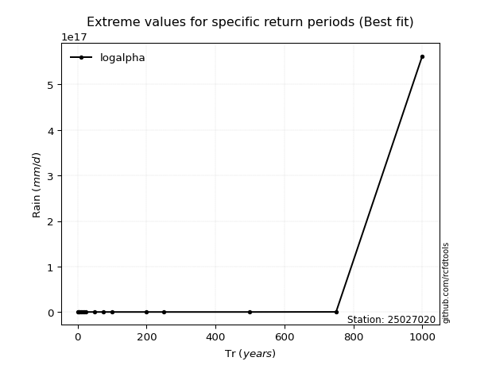</img>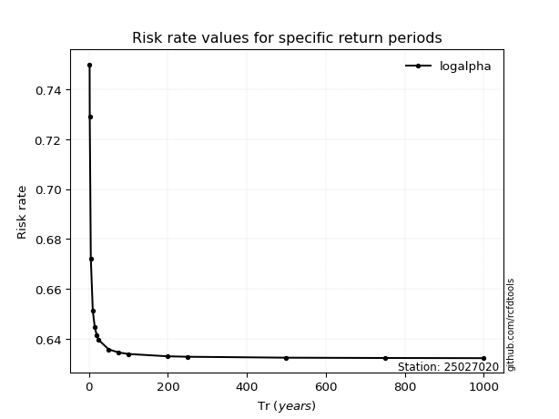</img>

</div>


<sub>**APP DISCLAIMER**: NO WARRANTY - This software is provided by [github.com/rcfdtools](https://github.com/rcfdtools) "as is", without any express or implied warranty, including warranties of merchantability, fitness for a particular purpose, or non-infringement. There is no guarantee that the software will be error-free or operate without interruption. LIMITATION OF LIABILITY - Neither the authors nor copyright holders will be liable for claims or damages arising from the software or its use. You are responsible for determining if the software is appropriate for your use and assume all associated risks, including errors, legal compliance, and data loss. NO PROFESSIONAL ADVICE - The software provides general information and does not offer professional advice. It should not replace consultation with professional advisors.</sub>