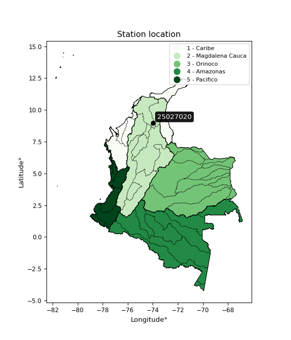

<div align="center">


</div>

# PMP Station (Rain, Pmax24h): 25027020

Probable Maximum Precipitation (PMP) is the greatest amount of rainfall for a specific duration that is meteorologically possible for a given location, acting as a "worst-case" scenario for extreme storms, crucial for designing safety-critical infrastructure like bridges, river deviations, dams, spillways, and nuclear plants to prevent catastrophic failure. PMP is calculated by hydrologists using meteorological data to determine the upper limit of extreme rainfall, often leading to the Probable Maximum Flood (PMF) for flood control design, and is increasingly being studied for climate change impacts. Probable Maximum Precipitation (PMP) is the theoretical upper limit of rainfall, a deterministic estimate for extreme events, while probability distributions (like GEV, Gumbel) describe the likelihood and frequency of various precipitation amounts, including rare ones, showing how often events occur, with PMP representing the extreme end of these distributions, used for critical infrastructure design to ensure safety against the worst conceivable weather, unlike standard statistical forecasts which cover typical probabilities.

The most common probability distributions in hydrology, used for analyzing floods, rainfall, and streamflow, include the Normal, Log-Normal, Gumbel, Gamma (including Log-Pearson Type III), and Generalized Extreme Value (GEV) distributions, often chosen based on the data´s skewness and whether modeling extremes or general conditions, with Gumbel and GEV popular for extreme events like floods, while the Normal distribution serves as a baseline, though often requiring transformations for skewed hydrological data. These distributions help in designing water infrastructure, managing water resources, and forecasting hydrologic events.

> Hydrological data often isn´t perfectly normal (it´s skewed), so different distributions are needed for different applications, such as: **Flood Frequency Analysis**: Using Gumbel, GEV, or Log-Pearson Type III for predicting extreme flood magnitudes and their return periods, **Rainfall Analysis**: Normal for annual totals, but Log-Normal, Weibull, or GEV for intensity or extreme daily rainfall, **Streamflow Modeling**: Gamma and Log-Normal for maximum flows, GEV for minimum flows, and Kappa for daily flows.

<div align="center">

</img>

</div>


## A. General information


### 1. General running parameters

• app_version: _v20260113_. • runtime: _2026-01-13 16:28:34.738620_. • Python version: _3.14.0_. • SciPy version: _1.16.3_. • Pandas version: _2.3.3_. • NumPy version: _2.3.5_. • Stations dataset (station_dataset_file): _dataset/pmax24h_in/automatic_colombia_2003_2025.csv_. • Stations catalog (station_catalog_file): _dataset/CNE.xls_. • Minimum year to eval til year_max (date_min): _1900_. • Maximum year to eval since year_min (date_max): _2025_. • Creates, save and include plots into reports (create_plot): _False_. • Plot only fit distributions with Δo > Δ (plot_only_fit): _True_. • Plot only simple graphs avoiding multiple CDFs and multiple Extreme values plots (plot_only_simple): _True_. • Eval low extreme values, if False, evaluates high extreme values (low_extreme): _False_. • Eval every SciPy distribution as logarithmic (pdist_logarithmic_on): _True_. • Standard deviation normalized (ddof): _1.0_. • Return periods to eval in years (Tr): _[2, 2.33, 5, 10, 15, 20, 25, 50, 75, 100, 200, 250, 500, 750, 1000]_. • Minimum data sample per station, 0 means any (minimum_sample): _5_. • Z-Score maximum threshold to adjust a value, 0 means disable (zscore_max): _3.5_. • Z-Score minimum threshold to adjust a value, 0 means disable (zscore_min): _-2.5_. • Avoid zeros, e.g. rain = 0 (avoid_zeros): _True_. • Avoid null values (avoid_nans): _True_. 

:file_folder:Table: [dataset.csv](../../dataset/pmax24h_in/automatic_colombia_2003_2025.csv)

> Delta Degrees of Freedom (DDOF): is a parameter used in the formulas for calculating variance and standard deviation. When ddof=0, the divisor is $N$ (the total number of observations) and this is used when your data set is the entire population. When ddof=1, the divisor is $N-1$ and this is used when your data set is a sample drawn from a larger population. Using $N-1$ provides an unbiased estimate of the population variance (known as Bessel´s correction).


### 2. Station info and location

|   id |   CODIGO | NOMBRE                    | CATEGORIA    | TECNOLOGIA                              | ESTADO   | FECHA_INSTALACION   |   FECHA_SUSPENSION |   ALTITUD |   LATITUD |   LONGITUD | DEPARTAMENTO   | MUNICIPIO   | AREA_OPERATIVA                              | ENTIDAD                                                     | AREA_HIDROGRAFICA   | ZONA_HIDROGRAFICA   | SUBZONA_HIDROGRAFICA   | CORRIENTE   | Catalogo   |   Version |
|-----:|---------:|:--------------------------|:-------------|:----------------------------------------|:---------|:--------------------|-------------------:|----------:|----------:|-----------:|:---------------|:------------|:--------------------------------------------|:------------------------------------------------------------|:--------------------|:--------------------|:-----------------------|:------------|:-----------|----------:|
|    0 | 25027020 | EL BANCO - AUT [25027020] | Limnigráfica | Automática con Telemetría, Convencional | Activa   | 15/01/1934          |                nan |        29 |   8.99253 |   -73.9694 | Magdalena      | El Banco    | Area Operativa 02 - Atlántico-Bolivar-Sucre | INSTITUTO DE HIDROLOGIA METEOROLOGIA Y ESTUDIOS AMBIENTALES | Magdalena Cauca     | Cesar               | Bajo Cesar             | Magdalena   | CNE_IDEAM  |  20251226 |

<div align="center">

Dynamic map: [:earth_americas:Google](http://maps.google.com/maps?q=8.992527778,-73.96944444) [:earth_americas:OSM](https://www.openstreetmap.org/#map=18/8.992527778/-73.96944444&layers=P) [:earth_americas:Bing](https://www.bing.com/maps?cp=8.992527778~-73.96944444&lvl=18) [:earth_americas:Apple](https://maps.apple.com/frame?center=8.992527778%2C-73.96944444&span=0.003%2C0.006)

</div>


<div align="center">

```geojson
{
  "type": "Feature",
  "geometry": {
    "type": "Point", 
    "coordinates": [-73.96944444, 8.992527778]
  }, 
  "properties": {
    "Name": "25027020"
  }
}
```

</div>


### 3. Discrete values table and plot

<div align="center">

|               |          0 |           1 |           2 |           3 |           4 |
|:--------------|-----------:|------------:|------------:|------------:|------------:|
| Date          | 2017       | 2022        | 2023        | 2024        | 2025        |
| Value         |  434.1     |   35.1      |   65.2      |  105.4      |   50.8      |
| Value_initial |  434.1     |   35.1      |   65.2      |  105.4      |   50.8      |
| count         |    5       |    5        |    5        |    5        |    5        |
| mean          |  138.12    |  138.12     |  138.12     |  138.12     |  138.12     |
| std           |  167.504   |  167.504    |  167.504    |  167.504    |  167.504    |
| zscore        |    1.76701 |   -0.615031 |   -0.435334 |   -0.195339 |   -0.521302 |


</div>


> The initial value (value_initial) correspond to the initial obtained or null completed value, and value (value) is adjusted only when the initial value is outside the valid range (outlier) definite through the Z-Score value. If Z-Score is active, values out of range or outliers are replaced with the station mean value. A Z-Score (or standard score) measures how many standard deviations a data point is from the mean of a dataset, indicating its relative position; positive scores mean above the mean, negative mean below, and a score of zero is exactly at the mean, allowing for comparison of values from different distributions. It´s calculated using the formula $z=(x–μ)/σ$, where $x$ is the data point, $μ$ is the mean, and $σ$ is the standard deviation, helping identify outliers and understand probability.
>
> <sub>**Note**: In this study, "completing" (filling gaps in) and "extending" (forecasting or lengthening the historical record) rainfall data series are avoided for certain critical analyses because they introduce artificial bias and uncertainty, which can distort the statistics of rare events (extremes), alter day-to-day variability, and compromise the integrity and homogeneity of the original data. Some reasons against Completing/Extending rainfall data are: **Distortion of Extremes and Variability**: The primary issue is that most gap-filling or extension methods rely on averaging or regression with nearby stations, which inherently smooths the data. Rainfall is highly variable in space and time, with a large percentage of zero values and occasional large storms. Infilling methods often underestimate the highest values and overestimate the lowest (zero) values, which severely distorts analyses focused on flood frequency, drought severity, and intensity-duration-frequency (IDF) curves, **Loss of Data Homogeneity**: Infilled or extended data are synthetic estimates, not actual measurements. Combining these estimates with observed data can violate the assumption of data homogeneity, which requires that the data properties do not change over time. Inhomogeneity can lead to incorrect conclusions about long-term trends or changes in climate patterns, **Propagation of Errors**: Errors and biases from the original data (e.g., wind-induced undercatch, instrument errors, site changes) or the data used for imputation can propagate through the analysis, leading to unreliable hydrological models and inaccurate predictions, **Compromised Statistical Integrity**: For statistical analyses, especially those involving the frequency of events, using artificial data can introduce time bias or autocorrelation that doesn´t exist in reality, making it difficult to assess the true probability of events, **Difficulty in Validation**: It is difficult to accurately validate the quality of filled or extended data, especially for past periods where ground-truth measurements are unavailable. The reliability of imputation techniques heavily depends on the density of the surrounding station network and the complexity of the local topography.</sub>


### 4. Active continuous probability distributions from SciPy (45 of 104 available)

A Probability Density Function (PDF) describes the relative likelihood of a continuous random variable falling within a specific range, where the total area under its curve equals 1, and the area over any interval gives the actual probability for that range. Unlike discrete probabilities (like rolling a die), a PDF shows density, not direct probability for a single point (which is zero), with higher points indicating higher likelihood, often visualized as a bell curve for normal distributions.

A log of a probability density function (log-PDF) is simply the logarithm of the PDF´s value, denoted as $log(f(x))$, useful for converting multiplication of probabilities into addition, improving numerical stability with tiny numbers, and connecting to information theory concepts like entropy. Instead of dealing with very small probabilities (e.g., 0.000001), log-PDFs use negative numbers (e.g., $log(0.00001) ≈ -11.51$ that are easier for computers to handle, preventing underflow errors and simplifying complex calculations. In this study, each active probability distribution from SciPy is also evaluated in the $log$ form.

[scipy.stats](https://docs.scipy.org/doc/scipy/reference/stats.html) is a Python´s powerful submodule within the SciPy library for comprehensive statistical analysis, offering over 130 probability distributions (like Normal, Poisson), functions for descriptive stats (mean, variance), hypothesis testing (t-tests, chi-square), random variable generation, and statistical tests, making it essential for data science, modeling, and research. It provides tools to explore, model, and draw conclusions from data efficiently, working seamlessly with NumPy.

<div align="center">

|   id | p_dist             |   n_parameter | fit_method   | label                                                                       | active   | ref                                                                                                        |
|-----:|:-------------------|--------------:|:-------------|:----------------------------------------------------------------------------|:---------|:-----------------------------------------------------------------------------------------------------------|
|    0 | alpha              |             3 | MLE          | Alpha                                                                       | True     | [:mortar_board:](https://docs.scipy.org/doc/scipy/reference/generated/scipy.stats.alpha.html)              |
|    1 | betaprime          |             4 | MLE          | Beta prime                                                                  | True     | [:mortar_board:](https://docs.scipy.org/doc/scipy/reference/generated/scipy.stats.betaprime.html)          |
|    2 | chi2               |             3 | MLE          | Chi²                                                                        | True     | [:mortar_board:](https://docs.scipy.org/doc/scipy/reference/generated/scipy.stats.chi2.html)               |
|    3 | crystalball        |             4 | MLE          | Crystalball                                                                 | True     | [:mortar_board:](https://docs.scipy.org/doc/scipy/reference/generated/scipy.stats.crystalball.html)        |
|    4 | dweibull           |             3 | MLE          | Double Weibull                                                              | True     | [:mortar_board:](https://docs.scipy.org/doc/scipy/reference/generated/scipy.stats.dweibull.html)           |
|    5 | erlang             |             3 | MLE          | Erlang                                                                      | True     | [:mortar_board:](https://docs.scipy.org/doc/scipy/reference/generated/scipy.stats.erlang.html)             |
|    6 | expon              |             2 | MLE          | Exponential                                                                 | True     | [:mortar_board:](https://docs.scipy.org/doc/scipy/reference/generated/scipy.stats.expon.html)              |
|    7 | exponnorm          |             3 | MLE          | Exponentially modified Normal                                               | True     | [:mortar_board:](https://docs.scipy.org/doc/scipy/reference/generated/scipy.stats.exponnorm.html)          |
|    8 | f                  |             4 | MLE          | F                                                                           | True     | [:mortar_board:](https://docs.scipy.org/doc/scipy/reference/generated/scipy.stats.f.html)                  |
|    9 | fatiguelife        |             3 | MLE          | Fatigue-life (Birnbaum-Saunders)                                            | True     | [:mortar_board:](https://docs.scipy.org/doc/scipy/reference/generated/scipy.stats.fatiguelife.html)        |
|   10 | fisk               |             3 | MLE          | Fisk                                                                        | True     | [:mortar_board:](https://docs.scipy.org/doc/scipy/reference/generated/scipy.stats.fisk.html)               |
|   11 | gamma              |             3 | MLE          | Gamma                                                                       | True     | [:mortar_board:](https://docs.scipy.org/doc/scipy/reference/generated/scipy.stats.gamma.html)              |
|   12 | genexpon           |             5 | MLE          | Generalized exponential                                                     | True     | [:mortar_board:](https://docs.scipy.org/doc/scipy/reference/generated/scipy.stats.genexpon.html)           |
|   13 | genlogistic        |             3 | MLE          | Generalized logistic                                                        | True     | [:mortar_board:](https://docs.scipy.org/doc/scipy/reference/generated/scipy.stats.genlogistic.html)        |
|   14 | gibrat             |             2 | MM           | Gibrat                                                                      | True     | [:mortar_board:](https://docs.scipy.org/doc/scipy/reference/generated/scipy.stats.gibrat.html)             |
|   15 | gompertz           |             3 | MLE          | Gompertz (or truncated Gumbel)                                              | True     | [:mortar_board:](https://docs.scipy.org/doc/scipy/reference/generated/scipy.stats.gompertz.html)           |
|   16 | gumbel_l           |             2 | MM           | Gumbel Left Skew                                                            | True     | [:mortar_board:](https://docs.scipy.org/doc/scipy/reference/generated/scipy.stats.gumbel_l.html)           |
|   17 | gumbel_r           |             2 | MM           | Gumbel Right Skew                                                           | True     | [:mortar_board:](https://docs.scipy.org/doc/scipy/reference/generated/scipy.stats.gumbel_r.html)           |
|   18 | halflogistic       |             2 | MM           | Half-logistic                                                               | True     | [:mortar_board:](https://docs.scipy.org/doc/scipy/reference/generated/scipy.stats.halflogistic.html)       |
|   19 | halfnorm           |             2 | MM           | Half Normal                                                                 | True     | [:mortar_board:](https://docs.scipy.org/doc/scipy/reference/generated/scipy.stats.halfnorm.html)           |
|   20 | hypsecant          |             2 | MM           | hyperbolic secant                                                           | True     | [:mortar_board:](https://docs.scipy.org/doc/scipy/reference/generated/scipy.stats.hypsecant.html)          |
|   21 | invgamma           |             3 | MLE          | Inverted gamma                                                              | True     | [:mortar_board:](https://docs.scipy.org/doc/scipy/reference/generated/scipy.stats.invgamma.html)           |
|   22 | invgauss           |             3 | MLE          | Inverse Gaussian                                                            | True     | [:mortar_board:](https://docs.scipy.org/doc/scipy/reference/generated/scipy.stats.invgauss.html)           |
|   23 | invweibull         |             3 | MLE          | Inverted Weibull                                                            | True     | [:mortar_board:](https://docs.scipy.org/doc/scipy/reference/generated/scipy.stats.invweibull.html)         |
|   24 | kappa4             |             4 | MLE          | Kappa 4                                                                     | True     | [:mortar_board:](https://docs.scipy.org/doc/scipy/reference/generated/scipy.stats.kappa4.html)             |
|   25 | kstwobign          |             2 | MLE          | Limiting distribution of scaled Kolmogorov-Smirnov two-sided test statistic | True     | [:mortar_board:](https://docs.scipy.org/doc/scipy/reference/generated/scipy.stats.kstwobign.html)          |
|   26 | laplace            |             2 | MM           | Laplace                                                                     | True     | [:mortar_board:](https://docs.scipy.org/doc/scipy/reference/generated/scipy.stats.laplace.html)            |
|   27 | laplace_asymmetric |             3 | MLE          | Asymmetric Laplace                                                          | True     | [:mortar_board:](https://docs.scipy.org/doc/scipy/reference/generated/scipy.stats.laplace_asymmetric.html) |
|   28 | loggamma           |             3 | MLE          | Log gamma                                                                   | True     | [:mortar_board:](https://docs.scipy.org/doc/scipy/reference/generated/scipy.stats.loggamma.html)           |
|   29 | logistic           |             2 | MM           | Logistic (or Sech-squared)                                                  | True     | [:mortar_board:](https://docs.scipy.org/doc/scipy/reference/generated/scipy.stats.logistic.html)           |
|   30 | lognorm            |             3 | MLE          | Log Normal                                                                  | True     | [:mortar_board:](https://docs.scipy.org/doc/scipy/reference/generated/scipy.stats.lognorm.html)            |
|   31 | maxwell            |             2 | MM           | Maxwell                                                                     | True     | [:mortar_board:](https://docs.scipy.org/doc/scipy/reference/generated/scipy.stats.maxwell.html)            |
|   32 | mielke             |             4 | MLE          | Mielke Beta-Kappa / Dagum                                                   | True     | [:mortar_board:](https://docs.scipy.org/doc/scipy/reference/generated/scipy.stats.mielke.html)             |
|   33 | moyal              |             2 | MM           | Moyal                                                                       | True     | [:mortar_board:](https://docs.scipy.org/doc/scipy/reference/generated/scipy.stats.moyal.html)              |
|   34 | nakagami           |             3 | MLE          | Nakagami                                                                    | True     | [:mortar_board:](https://docs.scipy.org/doc/scipy/reference/generated/scipy.stats.nakagami.html)           |
|   35 | ncf                |             5 | MLE          | Non-central F distribution                                                  | True     | [:mortar_board:](https://docs.scipy.org/doc/scipy/reference/generated/scipy.stats.ncf.html)                |
|   36 | nct                |             4 | MLE          | Non-central Student’s t                                                     | True     | [:mortar_board:](https://docs.scipy.org/doc/scipy/reference/generated/scipy.stats.nct.html)                |
|   37 | norm               |             2 | MM           | Normal                                                                      | True     | [:mortar_board:](https://docs.scipy.org/doc/scipy/reference/generated/scipy.stats.norm.html)               |
|   38 | pearson3           |             3 | MM           | Pearson type III                                                            | True     | [:mortar_board:](https://docs.scipy.org/doc/scipy/reference/generated/scipy.stats.pearson3.html)           |
|   39 | rayleigh           |             2 | MM           | Rayleigh                                                                    | True     | [:mortar_board:](https://docs.scipy.org/doc/scipy/reference/generated/scipy.stats.rayleigh.html)           |
|   40 | rice               |             3 | MLE          | Rice                                                                        | True     | [:mortar_board:](https://docs.scipy.org/doc/scipy/reference/generated/scipy.stats.rice.html)               |
|   41 | t                  |             3 | MLE          | Student’s t                                                                 | True     | [:mortar_board:](https://docs.scipy.org/doc/scipy/reference/generated/scipy.stats.t.html)                  |
|   42 | truncnorm          |             4 | MLE          | Truncated normal                                                            | True     | [:mortar_board:](https://docs.scipy.org/doc/scipy/reference/generated/scipy.stats.truncnorm.html)          |
|   43 | wald               |             2 | MM           | Wald                                                                        | True     | [:mortar_board:](https://docs.scipy.org/doc/scipy/reference/generated/scipy.stats.wald.html)               |
|   44 | weibull_min        |             3 | MLE          | Weibull minimum                                                             | True     | [:mortar_board:](https://docs.scipy.org/doc/scipy/reference/generated/scipy.stats.weibull_min.html)        |

</div>

> **n_parameter:** # arguments & localization & scale.
>
> **Fit methods:** (MLE) maximum likelihood, (MM) L-moments.
>
>**Inactive** (With the only purpose of prevent loops, zero divisions, infinite values, over high estimated values or horizontal trending for recurrence intervals estimations, the follow distributions were disabled.)**:** foldnorm, gennorm, norminvgauss, powernorm, powerlognorm, skewnorm, genextreme, anglit, arcsine, argus, beta, bradford, burr, burr12, cauchy, cosine, halfcauchy, foldcauchy, skewcauchy, wrapcauchy, dgamma, gengamma, exponweib, exponpow, truncexpon, gausshyper, genhalflogistic, genhyperbolic, geninvgauss, halfgennorm, johnsonsb, johnsonsu, kappa3, ksone, kstwo, loglaplace, levy, levy_l, levy_stable, ncx2, pareto, genpareto, truncpareto, lomax, powerlaw, rdist, rel_breitwigner, recipinvgauss, semicircular, studentized_range, trapezoid, triang, truncweibull_min, tukeylambda, uniform, loguniform, vonmises, vonmises_line, weibull_max, 


## B. Probability (PDF) vs. Empirical (EDF) distributions functions

A continuous probability distribution (CPD) describes probabilities for variables that can take any value within a range (like rain any time), unlike discrete variables with specific outcomes (like temperature). It uses a Probability Density Function (PDF), a curve where the total area under it equals 1, and the probability of the variable falling within an interval (a to b) is found by calculating the area under the curve between those points. A key feature is that the probability of hitting any single exact value is zero, so probabilities are always expressed for ranges, e.g., $P(a ≤ X ≤ b)$.

<div align="center">

Distributions parameters from station values
|    |   station | p_dist                |   n |             loc |          scale | shape                  | shape1                 | shape2              | shape3   |
|---:|----------:|:----------------------|----:|----------------:|---------------:|:-----------------------|:-----------------------|:--------------------|:---------|
|  0 |  25027020 | alpha                 |   5 |      19.3939    |   30.0633      | 6.247182293952324e-11  |                        |                     |          |
|  1 |  25027020 | betaprime             |   5 |      28.4192    |    0.0579689   | 292.2733268593213      | 0.8003768009906317     |                     |          |
|  2 |  25027020 | chi2                  |   5 |      35.1       |   99.5692      | 1.054913736417873      |                        |                     |          |
|  3 |  25027020 | crystalball           |   5 |     138.12      |  149.82        | 10127.487302280173     | 8384.814373795538      |                     |          |
|  4 |  25027020 | dweibull              |   5 |      50.8       |  146.622       | 0.6482942506546165     |                        |                     |          |
|  5 |  25027020 | erlang                |   5 |      35.1       |   83.0156      | 0.8452974486595031     |                        |                     |          |
|  6 |  25027020 | expon                 |   5 |      35.1       |  103.02        |                        |                        |                     |          |
|  7 |  25027020 | exponnorm             |   5 |      34.9807    |    0.0341767   | 3005.083115909185      |                        |                     |          |
|  8 |  25027020 | f                     |   5 |      28.3922    |   21.1623      | 8204.912329340335      | 1.6007198294864586     |                     |          |
|  9 |  25027020 | fatiguelife           |   5 |      35.1       |    1.38923e-05 | 2339.4884302004457     |                        |                     |          |
| 10 |  25027020 | fisk                  |   5 |      35.1       |   18.8608      | 0.8978625300614338     |                        |                     |          |
| 11 |  25027020 | gamma                 |   5 |      35.1       |   91.1157      | 0.5232270535085548     |                        |                     |          |
| 12 |  25027020 | genexpon              |   5 |      35.1       |  230.061       | 2.2331660714375174     | 1.2054539113301644e-12 | 3.02402140264717    |          |
| 13 |  25027020 | genlogistic           |   5 |    -548.726     |   80.5412      | 2391.4087642326476     |                        |                     |          |
| 14 |  25027020 | gibrat                |   5 |      23.8263    |   69.3226      |                        |                        |                     |          |
| 15 |  25027020 | gompertz              |   5 |      35.1       |    2.18026e+13 | 205124405339.9076      |                        |                     |          |
| 16 |  25027020 | gumbel_l              |   5 |     205.547     |  116.814       |                        |                        |                     |          |
| 17 |  25027020 | gumbel_r              |   5 |      70.6931    |  116.814       |                        |                        |                     |          |
| 18 |  25027020 | halflogistic          |   5 |     -39.4514    |  128.091       |                        |                        |                     |          |
| 19 |  25027020 | halfnorm              |   5 |     -60.1828    |  248.536       |                        |                        |                     |          |
| 20 |  25027020 | hypsecant             |   5 |     138.12      |   95.3783      |                        |                        |                     |          |
| 21 |  25027020 | invgamma              |   5 |      28.3901    |   16.9372      | 0.800365031099338      |                        |                     |          |
| 22 |  25027020 | invgauss              |   5 |      30.2322    |   19.8345      | 5.439387425264614      |                        |                     |          |
| 23 |  25027020 | invweibull            |   5 |      35.1       |   11.156       | 0.041475940572236455   |                        |                     |          |
| 24 |  25027020 | kappa4                |   5 |      -4.75038   |  440.484       | 1.0994016128232906     | 0.986913881480733      |                     |          |
| 25 |  25027020 | kstwobign             |   5 |    -235.921     |  436.609       |                        |                        |                     |          |
| 26 |  25027020 | laplace               |   5 |     138.12      |  105.939       |                        |                        |                     |          |
| 27 |  25027020 | laplace_asymmetric    |   5 |      35.1       |    0.104083    | 0.001010319206895037   |                        |                     |          |
| 28 |  25027020 | loggamma              |   5 |  -58585         | 7546           | 2397.519757564207      |                        |                     |          |
| 29 |  25027020 | logistic              |   5 |     138.12      |   82.6         |                        |                        |                     |          |
| 30 |  25027020 | lognorm               |   5 |      35.1       |    0.0393366   | 14.711236162717645     |                        |                     |          |
| 31 |  25027020 | maxwell               |   5 |    -216.89      |  222.47        |                        |                        |                     |          |
| 32 |  25027020 | mielke                |   5 |      28.638     |    0.00187457  | 2791.3847090242875     | 0.8636940124825601     |                     |          |
| 33 |  25027020 | moyal                 |   5 |      52.4434    |   67.4426      |                        |                        |                     |          |
| 34 |  25027020 | nakagami              |   5 |      35.1       |  120.509       | 0.22340305113790473    |                        |                     |          |
| 35 |  25027020 | ncf                   |   5 |      28.5395    |    1.72918     | 18.07933368733557      | 1.6000316107299553     | 203.54072273496828  |          |
| 36 |  25027020 | nct                   |   5 |      -0.143388  |    1.44167     | 1.4076506352865126     | 39.555661488982764     |                     |          |
| 37 |  25027020 | norm                  |   5 |     138.12      |  149.82        |                        |                        |                     |          |
| 38 |  25027020 | pearson3              |   5 |     138.12      |  149.82        | 1.4123222358458816     |                        |                     |          |
| 39 |  25027020 | rayleigh              |   5 |    -148.494     |  228.685       |                        |                        |                     |          |
| 40 |  25027020 | rice                  |   5 |     -76.5077    |  185.082       | 0.00024121642429665758 |                        |                     |          |
| 41 |  25027020 | t                     |   5 |      55.7709    |   18.3815      | 0.7217321419773671     |                        |                     |          |
| 42 |  25027020 | truncnorm             |   5 | -185005         | 5271.86        | 35.09952373569698      | 35.175209517400944     |                     |          |
| 43 |  25027020 | wald                  |   5 |     -11.6999    |  149.82        |                        |                        |                     |          |
| 44 |  25027020 | weibull_min           |   5 |      35.1       |  204.276       | 0.6505663107539676     |                        |                     |          |
| 45 |  25027020 | logalpha              |   5 |       2.30254   |    5.55405     | 2.9211364189001223     |                        |                     |          |
| 46 |  25027020 | logbetaprime          |   5 |      -0.72518   |    0.65307     | 352.2748170134047      | 45.21500503085953      |                     |          |
| 47 |  25027020 | logchi2               |   5 |       3.5582    |    1.01645     | 1.0009018709190483     |                        |                     |          |
| 48 |  25027020 | logcrystalball        |   5 |       4.47892   |    0.873628    | 54.327873747885974     | 17.361657012959874     |                     |          |
| 49 |  25027020 | logdweibull           |   5 |       4.17746   |    0.664801    | 0.9631631005406489     |                        |                     |          |
| 50 |  25027020 | logerlang             |   5 |       3.5582    |    0.817847    | 0.2003118641374942     |                        |                     |          |
| 51 |  25027020 | logexpon              |   5 |       3.5582    |    0.920718    |                        |                        |                     |          |
| 52 |  25027020 | logexponnorm          |   5 |       3.557     |    0.000361577 | 2555.629169216152      |                        |                     |          |
| 53 |  25027020 | logf                  |   5 |       3.08865   |    0.981311    | 90.22958049739876      | 6.202716804203146      |                     |          |
| 54 |  25027020 | logfatiguelife        |   5 |       3.46703   |    0.549456    | 1.254831056070056      |                        |                     |          |
| 55 |  25027020 | logfisk               |   5 |       3.5582    |    0.695284    | 0.30985128963208675    |                        |                     |          |
| 56 |  25027020 | loggamma              |   5 |       3.5582    |    0.89913     | 0.5173136182238294     |                        |                     |          |
| 57 |  25027020 | loggenexpon           |   5 |       3.5582    |    3.42452     | 3.516380520142963      | 28.702459220186796     | 0.02685284568155835 |          |
| 58 |  25027020 | loggenlogistic        |   5 |      -0.0954664 |    0.609006    | 964.3339897452393      |                        |                     |          |
| 59 |  25027020 | loggibrat             |   5 |       3.8124    |    0.404255    |                        |                        |                     |          |
| 60 |  25027020 | loggompertz           |   5 |       3.5582    |   11.1035      | 11.11446575056609      |                        |                     |          |
| 61 |  25027020 | loggumbel_l           |   5 |       4.8721    |    0.68117     |                        |                        |                     |          |
| 62 |  25027020 | loggumbel_r           |   5 |       4.08574   |    0.68117     |                        |                        |                     |          |
| 63 |  25027020 | loghalflogistic       |   5 |       3.44346   |    0.746926    |                        |                        |                     |          |
| 64 |  25027020 | loghalfnorm           |   5 |       3.32257   |    1.44927     |                        |                        |                     |          |
| 65 |  25027020 | loghypsecant          |   5 |       4.47892   |    0.556173    |                        |                        |                     |          |
| 66 |  25027020 | loginvgamma           |   5 |       3.05684   |    3.09931     | 3.0937887783072497     |                        |                     |          |
| 67 |  25027020 | loginvgauss           |   5 |       3.30957   |    1.38154     | 0.8464136061799656     |                        |                     |          |
| 68 |  25027020 | loginvweibull         |   5 |       2.62476   |    1.35808     | 2.7207946533894973     |                        |                     |          |
| 69 |  25027020 | logkappa4             |   5 |       3.30885   |    2.93007     | 1.0928009942279382     | 1.0599185863240415     |                     |          |
| 70 |  25027020 | logkstwobign          |   5 |       1.90628   |    2.96586     |                        |                        |                     |          |
| 71 |  25027020 | loglaplace            |   5 |       4.47892   |    0.617752    |                        |                        |                     |          |
| 72 |  25027020 | loglaplace_asymmetric |   5 |       3.9279    |    0.492612    | 0.5864919388936268     |                        |                     |          |
| 73 |  25027020 | logloggamma           |   5 |    -237.608     |   33.454       | 1389.4225729257764     |                        |                     |          |
| 74 |  25027020 | loglogistic           |   5 |       4.47892   |    0.48166     |                        |                        |                     |          |
| 75 |  25027020 | loglognorm            |   5 |       3.5582    |    0.000775874 | 14.108868927430873     |                        |                     |          |
| 76 |  25027020 | logmaxwell            |   5 |       2.40877   |    1.29727     |                        |                        |                     |          |
| 77 |  25027020 | logmielke             |   5 |       2.64326   |    0.287579    | 172.10791677181368     | 2.696811787407041      |                     |          |
| 78 |  25027020 | logmoyal              |   5 |       3.97932   |    0.393273    |                        |                        |                     |          |
| 79 |  25027020 | lognakagami           |   5 |       3.5582    |    1.75595     | 0.37236356989501984    |                        |                     |          |
| 80 |  25027020 | logncf                |   5 |       2.02707   |    0.142037    | 2.309188682653042      | 429.7424299387549      | 37.27692011442775   |          |
| 81 |  25027020 | lognct                |   5 |       1.96766   |    0.324918    | 7.422431620253224      | 6.85171442705119       |                     |          |
| 82 |  25027020 | lognorm               |   5 |       4.47892   |    0.873634    |                        |                        |                     |          |
| 83 |  25027020 | logpearson3           |   5 |       4.47892   |    0.873635    | 0.9247951559844172     |                        |                     |          |
| 84 |  25027020 | lograyleigh           |   5 |       2.80761   |    1.33351     |                        |                        |                     |          |
| 85 |  25027020 | logrice               |   5 |       3.07873   |    1.167       | 0.0007643906256324428  |                        |                     |          |
| 86 |  25027020 | logt                  |   5 |       4.47892   |    0.873634    | 27592828257.399483     |                        |                     |          |
| 87 |  25027020 | logtruncnorm          |   5 |      -0.218623  |    1.96803     | 2.1069419611341456     | 6.310419797792513      |                     |          |
| 88 |  25027020 | logwald               |   5 |       3.60526   |    0.873652    |                        |                        |                     |          |
| 89 |  25027020 | logweibull_min        |   5 |       3.5582    |    1.06675     | 0.32215134229985665    |                        |                     |          |

</div>

> **loc** (Location parameter): This shifts the distribution along the x-axis. For many common distributions, like the normal (Gaussian) distribution, loc represents the mean $μ$. For others, like the uniform distribution, it might represent the minimum value, or for the beta distribution, the left end of the support interval.
>
> **scale** (Scale parameter): This determines the width or spread of the distribution. For the normal distribution, scale represents the standard deviation $σ$. For a uniform distribution, it defines the length of the interval (from $loc$ to $loc + scale$).
>
> **shape** (Shape parameters): Refers to parameters that define the specific form of a probability distribution, distinct from its location (loc) and scale (scale). These parameters are required arguments for most distribution functions. For example, a normal (Gaussian) distribution is fully defined by its location (mean) and scale (standard deviation), so it has no specific shape parameters beyond loc and scale. However, other distributions have intrinsic properties that need specification, as Gamma distribution that takes a shape parameter, often named $a$ or $alpha$.


### 0. Cumulative distribution values - CDF (90 evaluated)

Cumulative Distribution Function (CDF), denoted as $F$<sub>$X$</sub>$(x)$, is a function that gives the probability that a random variable $X$ will take a value less than or equal to a specific value, $x$ (i.e., $(P(X≥x)$. It essentially "accumulates" probabilities from a given point up to the far right (positive infinity), providing a complete picture of the distribution´s probabilities for both discrete (like rain) and continuous (like temperature) variables, helping to find probabilities over ranges or above certain values. Each station is evaluated separately ordering the $x$ values ascending, calculating the CDF and PDF values for the activated distributions and their logarithmic forms.

<div align="center">

CDF ordered by x ascending and calculating $log(f(x))$ separately
|   id |   Station |   date |     x |   count |   mean |     std |    zscore |   Value_initial |   station |   m |     alpha |   alpha_pdf |   betaprime |   betaprime_pdf |        chi2 |         chi2_pdf |   crystalball |   crystalball_pdf |   dweibull |   dweibull_pdf |      erlang |   erlang_pdf |    expon |   expon_pdf |   exponnorm |   exponnorm_pdf |         f |      f_pdf |   fatiguelife |   fatiguelife_pdf |        fisk |    fisk_pdf |       gamma |        gamma_pdf |    genexpon |   genexpon_pdf |   genlogistic |   genlogistic_pdf |    gibrat |   gibrat_pdf |   gompertz |   gompertz_pdf |   gumbel_l |   gumbel_l_pdf |   gumbel_r |   gumbel_r_pdf |   halflogistic |   halflogistic_pdf |   halfnorm |   halfnorm_pdf |   hypsecant |   hypsecant_pdf |   invgamma |   invgamma_pdf |   invgauss |   invgauss_pdf |   invweibull |   invweibull_pdf |      kappa4 |   kappa4_pdf |   kstwobign |   kstwobign_pdf |   laplace |   laplace_pdf |   laplace_asymmetric |   laplace_asymmetric_pdf |    loggamma |   loggamma_pdf |   logistic |   logistic_pdf |   lognorm |   lognorm_pdf |   maxwell |   maxwell_pdf |   mielke |   mielke_pdf |    moyal |   moyal_pdf |    nakagami |   nakagami_pdf |       ncf |     ncf_pdf |       nct |     nct_pdf |     norm |    norm_pdf |   pearson3 |   pearson3_pdf |   rayleigh |   rayleigh_pdf |     rice |   rice_pdf |        t |       t_pdf |   truncnorm |   truncnorm_pdf |     wald |    wald_pdf |   weibull_min |   weibull_min_pdf |   logalpha |   logalpha_pdf |   logbetaprime |   logbetaprime_pdf |     logchi2 |   logchi2_pdf |   logcrystalball |   logcrystalball_pdf |   logdweibull |   logdweibull_pdf |   logerlang |   logerlang_pdf |   logexpon |   logexpon_pdf |   logexponnorm |   logexponnorm_pdf |      logf |   logf_pdf |   logfatiguelife |   logfatiguelife_pdf |     logfisk |   logfisk_pdf |   loggenexpon |   loggenexpon_pdf |   loggenlogistic |   loggenlogistic_pdf |   loggibrat |   loggibrat_pdf |   loggompertz |   loggompertz_pdf |   loggumbel_l |   loggumbel_l_pdf |   loggumbel_r |   loggumbel_r_pdf |   loghalflogistic |   loghalflogistic_pdf |   loghalfnorm |   loghalfnorm_pdf |   loghypsecant |   loghypsecant_pdf |   loginvgamma |   loginvgamma_pdf |   loginvgauss |   loginvgauss_pdf |   loginvweibull |   loginvweibull_pdf |   logkappa4 |   logkappa4_pdf |   logkstwobign |   logkstwobign_pdf |   loglaplace |   loglaplace_pdf |   loglaplace_asymmetric |   loglaplace_asymmetric_pdf |   logloggamma |   logloggamma_pdf |   loglogistic |   loglogistic_pdf |   loglognorm |   loglognorm_pdf |   logmaxwell |   logmaxwell_pdf |   logmielke |   logmielke_pdf |   logmoyal |   logmoyal_pdf |   lognakagami |   lognakagami_pdf |   logncf |   logncf_pdf |   lognct |   lognct_pdf |   logpearson3 |   logpearson3_pdf |   lograyleigh |   lograyleigh_pdf |   logrice |   logrice_pdf |     logt |   logt_pdf |   logtruncnorm |   logtruncnorm_pdf |   logwald |   logwald_pdf |   logweibull_min |   logweibull_min_pdf |
|-----:|----------:|-------:|------:|--------:|-------:|--------:|----------:|----------------:|----------:|----:|----------:|------------:|------------:|----------------:|------------:|-----------------:|--------------:|------------------:|-----------:|---------------:|------------:|-------------:|---------:|------------:|------------:|----------------:|----------:|-----------:|--------------:|------------------:|------------:|------------:|------------:|-----------------:|------------:|---------------:|--------------:|------------------:|----------:|-------------:|-----------:|---------------:|-----------:|---------------:|-----------:|---------------:|---------------:|-------------------:|-----------:|---------------:|------------:|----------------:|-----------:|---------------:|-----------:|---------------:|-------------:|-----------------:|------------:|-------------:|------------:|----------------:|----------:|--------------:|---------------------:|-------------------------:|------------:|---------------:|-----------:|---------------:|----------:|--------------:|----------:|--------------:|---------:|-------------:|---------:|------------:|------------:|---------------:|----------:|------------:|----------:|------------:|---------:|------------:|-----------:|---------------:|-----------:|---------------:|---------:|-----------:|---------:|------------:|------------:|----------------:|---------:|------------:|--------------:|------------------:|-----------:|---------------:|---------------:|-------------------:|------------:|--------------:|-----------------:|---------------------:|--------------:|------------------:|------------:|----------------:|-----------:|---------------:|---------------:|-------------------:|----------:|-----------:|-----------------:|---------------------:|------------:|--------------:|--------------:|------------------:|-----------------:|---------------------:|------------:|----------------:|--------------:|------------------:|--------------:|------------------:|--------------:|------------------:|------------------:|----------------------:|--------------:|------------------:|---------------:|-------------------:|--------------:|------------------:|--------------:|------------------:|----------------:|--------------------:|------------:|----------------:|---------------:|-------------------:|-------------:|-----------------:|------------------------:|----------------------------:|--------------:|------------------:|--------------:|------------------:|-------------:|-----------------:|-------------:|-----------------:|------------:|----------------:|-----------:|---------------:|--------------:|------------------:|---------:|-------------:|---------:|-------------:|--------------:|------------------:|--------------:|------------------:|----------:|--------------:|---------:|-----------:|---------------:|-------------------:|----------:|--------------:|-----------------:|---------------------:|
|    0 |  25027020 |   2022 |  35.1 |       5 | 138.12 | 167.504 | -0.615031 |            35.1 |  25027020 |   1 | 0.0556054 | 0.0155685   |   0.0539483 |     0.0215283   | 2.37951e-09 | 176638           |      0.245844 |       0.00210217  |   0.395308 |    0.00383503  | 2.77373e-14 |  3.29977     | 0        | 0.00970685  |  0.00116091 |     0.0097231   | 0.0539474 | 0.0215276  |     0.0538183 |       8.97095e+10 | 3.80002e-14 | 1.6006      | 4.20567e-09 | 309696           | 4.54521e-14 |    0.00970685  |      0.182725 |       0.00385493  | 0.0346622 |  0.00679966  |  1.048e-12 |    0.00940826  |   0.207401 |    0.00157712  |   0.257634 |    0.00299114  |       0.283064 |        0.00359072  |   0.29856  |    0.00298288  |    0.208391 |     0.00203212  |  0.0539476 |     0.0215275  |  0.0521546 |     0.0258146  |    0.0140042 |      3.48922e+11 | 3.07562e-15 |   0.0628136  |    0.164312 |      0.00327601 |  0.189078 |   0.00178479  |          1.02134e-06 |              0.00970683  | 1.36124e-08 |    1.58569e+07 |   0.223183 |    0.00209894  |  0.145966 |      0.262058 |  0.266826 |   0.00242268  |      nan |          nan | 0.25545  | 0.00352364  | 4.39584e-08 |    2.76421e+06 | 0.0539275 | 0.0215272   | 0.0920165 | 0.0106966   | 0.245844 | 0.00210217  |   0.274364 |    0.0034682   |   0.275493 |    0.00254347  | 0.166244 | 0.00271646 | 0.256473 | 0.0067541   | 2.11554e-06 |     0.00716358  | 0.179001 | 0.0071555   |   1.96142e-11 |    1795.86        |  0.0666565 |      0.455622  |       0.124288 |          0.316314  | 1.64083e-08 |   1.84907e+07 |         0.145965 |            0.262058  |      0.196502 |         0.285438  | 0.000953489 |     4.30083e+11 |   0        |      1.08611   |     0.00129463 |          1.08028   | 0.0599437 |  0.528313  |        0.0513592 |            1.31812   | 1.95838e-05 |   1.36638e+10 |   2.36126e-06 |         1.02682   |        0.0917372 |             0.359394 |    0        |       0         |   1.15489e-08 |         1.00099   |      0.135246 |          0.184473 |      0.114245 |         0.363851  |         0.0766584 |             0.665477  |      0.129156 |         0.543314  |       0.120151 |          0.210938  |     0.0600217 |         0.528828  |     0.0543356 |         0.675646  |       0.0624371 |           0.50477   | 0.000852993 |        0.661081 |      0.0843624 |           0.355116 |     0.112638 |        0.182335  |                0.071188 |                   0.2464    |      0.153735 |         0.261639  |      0.128807 |          0.232977 |    0.0228604 |      8.65223e+12 |     0.146962 |        0.32609   |   0.0636436 |       0.505722  |  0.0876117 |      0.402868  |   1.88687e-12 |       3164.24     | 0.111171 |    0.309724  | 0.09546  |    0.382258  |      0.127494 |          0.375666 |      0.146501 |         0.360257  | 0.0809388 |     0.323569  | 0.145966 |  0.262058  |     0          |          0         |  0        |     0         |      1.10948e-05 |          8.04835e+09 |
|    1 |  25027020 |   2025 |  50.8 |       5 | 138.12 | 167.504 | -0.521302 |            50.8 |  25027020 |   2 | 0.338445  | 0.0153806   |   0.371505  |     0.014392    | 0.28724     |      0.00916212  |      0.280003 |       0.00224686  |   0.5      | 1209.16        | 0.238024    |  0.011549    | 0.141353 | 0.00833476  |  0.142752   |     0.0083468   | 0.371496  | 0.0143918  |     0.675231  |       0.00520698  | 0.458921    | 0.0142007   | 0.423895    |      0.0125994   | 0.141353    |    0.00833476  |      0.246889 |       0.00428664  | 0.172608  |  0.00947325  |  0.137318  |    0.00811633  |   0.233465 |    0.00174467  |   0.305545 |    0.00310127  |       0.338409 |        0.00345645  |   0.344798 |    0.0029057   |    0.242409 |     0.00230291  |  0.371496  |     0.0143918  |  0.388362  |     0.0138888  |    0.373093  |      0.000971759 | 0.0524487   |   0.00303784 |    0.218436 |      0.00359701 |  0.219282 |   0.00206989  |          0.141354    |              0.00833474  | 0.623389    |    0.660373    |   0.257856 |    0.00231678  |  0.26411  |      0.37428  |  0.305642 |   0.00251765  |      nan |          nan | 0.311415 | 0.00358726  | 0.315263    |    0.00894429  | 0.371454  | 0.0143897   | 0.277034  | 0.0115033   | 0.280003 | 0.00224686  |   0.328537 |    0.00342246  |   0.315959 |    0.00260676  | 0.210665 | 0.0029335  | 0.421949 | 0.0148589   | 0.106792    |     0.00645256  | 0.287705 | 0.00657742  |   0.17171     |       0.00646602  |  0.310493  |      0.742952  |       0.270113 |          0.459875  | 0.453175    |   0.542645    |         0.26411  |            0.374282  |      0.338802 |         0.508896  | 0.866792    |     0.320324    |   0.330704 |      0.726928  |     0.3306     |          0.724414  | 0.329564  |  0.759535  |        0.44421   |            0.685734  | 0.451227    |   0.207538    |   0.318938    |         0.715856  |        0.271839  |             0.581019 |    0.105133 |       1.57587   |   0.313597    |         0.710343  |      0.221227 |          0.285863 |      0.283437 |         0.524609  |         0.313378  |             0.60367   |      0.323817 |         0.504556  |       0.226334 |          0.373514  |     0.32983   |         0.759767  |     0.359056  |         0.752541  |       0.326637  |           0.763069  | 0.165084    |        0.409208 |      0.258438  |           0.551058 |     0.204922 |        0.331722  |                0.255937 |                   0.885863  |      0.270379 |         0.366619  |      0.241585 |          0.380397 |    0.668967  |      0.0695175   |     0.287718 |        0.424879  |   0.327172  |       0.760694  |  0.285718  |      0.612531  |   0.24289     |          0.483431 | 0.257582 |    0.469922  | 0.283567 |    0.594222  |      0.292415 |          0.493872 |      0.297343 |         0.442668  | 0.232593  |     0.478497  | 0.26411  |  0.37428   |     1.5083e-08 |          1.25418   |  0.239229 |     1.18744   |      0.508743    |          0.304274    |
|    2 |  25027020 |   2023 |  65.2 |       5 | 138.12 | 167.504 | -0.435334 |            65.2 |  25027020 |   3 | 0.511621  | 0.00921708  |   0.525572  |     0.00791587  | 0.395198    |      0.00626642  |      0.313229 |       0.00236537  |   0.599598 |    0.00400434  | 0.382692    |  0.00877977  | 0.253363 | 0.00724749  |  0.254901   |     0.00725484  | 0.525562  | 0.00791584 |     0.735385  |       0.0034208   | 0.603411    | 0.00713834  | 0.566351    |      0.00788764  | 0.253363    |    0.00724749  |      0.310411 |       0.0045076   | 0.302883  |  0.00843997  |  0.246622  |    0.00708797  |   0.259742 |    0.00190591  |   0.350587 |    0.00314574  |       0.387203 |        0.00331825  |   0.38608  |    0.00282674  |    0.277382 |     0.00255388  |  0.525562  |     0.00791586 |  0.535487  |     0.00754834 |    0.38302   |      0.000506492 | 0.0947869   |   0.00286287 |    0.271662 |      0.00377767 |  0.251209 |   0.00237127  |          0.253363    |              0.00724748  | 0.750152    |    0.390042    |   0.292596 |    0.00250585  |  0.365023 |      0.430254 |  0.34238  |   0.00258091  |      nan |          nan | 0.362949 | 0.00355777  | 0.420889    |    0.00617689  | 0.525496  | 0.00791464  | 0.424698  | 0.00892955  | 0.313229 | 0.00236537  |   0.377225 |    0.00333342  |   0.353768 |    0.00264062  | 0.254058 | 0.0030858  | 0.638924 | 0.0123553   | 0.195393    |     0.00586259  | 0.376532 | 0.00574893  |   0.250021    |       0.00466369  |  0.484434  |      0.630876  |       0.391014 |          0.500001  | 0.564578    |   0.370927    |         0.365023 |            0.430257  |      0.5      |         2.55798   | 0.922836    |     0.156284    |   0.489611 |      0.554338  |     0.489031   |          0.552962  | 0.500189  |  0.598425  |        0.581339  |            0.441801  | 0.491031    |   0.125049    |   0.477146    |         0.558107  |        0.42113   |             0.597754 |    0.459381 |       1.08715   |   0.471378    |         0.559494  |      0.302795 |          0.369166 |      0.417272 |         0.535407  |         0.455285  |             0.530652  |      0.444727 |         0.46263   |       0.335344 |          0.497443  |     0.50046   |         0.598277  |     0.520891  |         0.550073  |       0.499264  |           0.607695  | 0.265149    |        0.394352 |      0.39931   |           0.563957 |     0.306928 |        0.496847  |                0.447197 |                   0.658154  |      0.368887 |         0.418981  |      0.348446 |          0.471352 |    0.682116  |      0.0408165   |     0.397783 |        0.451346  |   0.499325  |       0.606266  |  0.436974  |      0.582918  |   0.353811    |          0.411341 | 0.382236 |    0.519368  | 0.433675 |    0.591241  |      0.417459 |          0.4993   |      0.409993 |         0.454502  | 0.358029  |     0.517924  | 0.365023 |  0.430254  |     0.273987   |          0.952435  |  0.48588  |     0.786662  |      0.567982    |          0.188626    |
|    3 |  25027020 |   2024 | 105.4 |       5 | 138.12 | 167.504 | -0.195339 |           105.4 |  25027020 |   4 | 0.726678  | 0.0030506   |   0.709686  |     0.00266466  | 0.579134    |      0.0034298   |      0.41356  |       0.00260006  |   0.704837 |    0.00184722  | 0.643832    |  0.00474446  | 0.494593 | 0.00490591  |  0.49624    |     0.00490499  | 0.709676  | 0.00266469 |     0.831861  |       0.00171841  | 0.765183    | 0.00229483  | 0.774336    |      0.0033861   | 0.494593    |    0.00490591  |      0.491523 |       0.00433381  | 0.564637  |  0.00482624  |  0.483872  |    0.00485587  |   0.345771 |    0.00237632  |   0.475704 |    0.00302557  |       0.511992 |        0.00288024  |   0.494738 |    0.00257138  |    0.392883 |     0.00315015  |  0.709677  |     0.0026647  |  0.715018  |     0.00269342 |    0.39594   |      0.000216427 | 0.204902    |   0.00264771 |    0.425906 |      0.0037901  |  0.367143 |   0.00346561  |          0.494593    |              0.0049059   | 0.876786    |    0.173285    |   0.402244 |    0.00291094  |  0.581102 |      0.447178 |  0.447826 |   0.00263568  |      nan |          nan | 0.499488 | 0.00318013  | 0.608027    |    0.00363091  | 0.709589  | 0.00266453  | 0.667716  | 0.00391986  | 0.41356  | 0.00260006  |   0.503874 |    0.00294181  |   0.460068 |    0.0026213   | 0.383066 | 0.00327611 | 0.851609 | 0.00203319  | 0.402159    |     0.0044856   | 0.564573 | 0.00373774  |   0.393223    |       0.00280532  |  0.714513  |      0.341504  |       0.622818 |          0.439836  | 0.701416    |   0.219846    |         0.581103 |            0.447181  |      0.75933  |         0.352883  | 0.968372    |     0.0548861   |   0.697067 |      0.329018  |     0.696151   |          0.328821  | 0.714739  |  0.318749  |        0.736243  |            0.235247  | 0.535445    |   0.0700948   |   0.689222    |         0.341477  |        0.674954  |             0.435591 |    0.769656 |       0.359494  |   0.685569    |         0.347506  |      0.518108 |          0.516462 |      0.649333 |         0.411628  |         0.671169  |             0.367863  |      0.6431   |         0.36015   |       0.600637 |          0.543956  |     0.714889  |         0.318481  |     0.717139  |         0.295977  |       0.716312  |           0.319843  | 0.450983    |        0.381637 |      0.644384  |           0.43727  |     0.625684 |        0.605932  |                0.68795  |                   0.371519  |      0.579253 |         0.436444  |      0.591775 |          0.501552 |    0.696485  |      0.0225298   |     0.609218 |        0.411331  |   0.715968  |       0.319406  |  0.672966  |      0.391675  |   0.528519    |          0.321552 | 0.624925 |    0.462265  | 0.678876 |    0.412361  |      0.637685 |          0.401801 |      0.618055 |         0.397387  | 0.599645  |     0.464191  | 0.581102 |  0.447178  |     0.623622   |          0.535974  |  0.738647 |     0.339386  |      0.635711    |          0.107777    |
|    4 |  25027020 |   2017 | 434.1 |       5 | 138.12 | 167.504 |  1.76701  |           434.1 |  25027020 |   5 | 0.94221   | 0.000139109 |   0.917058  |     0.000159864 | 0.950917    |      0.000289809 |      0.975898 |       0.000378303 |   0.922512 |    0.000244358 | 0.99441     |  6.91754e-05 | 0.979205 | 0.000201856 |  0.979475   |     0.000199844 | 0.917053  | 0.00015987 |     0.989011  |       8.306e-05   | 0.939356    | 0.000128191 | 0.996652    |      4.01315e-05 | 0.979205    |    0.000201856 |      0.988075 |       0.000147172 | 0.962302  |  0.000200139 |  0.976574  |    0.000220401 |   0.999154 |    5.12428e-05 |   0.956421 |    0.000364813 |       0.951605 |        0.000368679 |   0.953274 |    0.000444304 |    0.971432 |     0.000299119 |  0.917054  |     0.00015987 |  0.940123  |     0.00018197 |    0.422265  |      3.78423e-05 | 0.984125    |   0.00215383 |    0.98199  |      0.0002532  |  0.969408 |   0.000288768 |          0.979205    |              0.000201856 | 0.980955    |    0.0240769   |   0.972967 |    0.000318429 |  0.965997 |      0.086371 |  0.964292 |   0.000424546 |      nan |          nan | 0.952918 | 0.000348647 | 0.991552    |    0.000129513 | 0.916987  | 0.000159931 | 0.950939  | 0.000157903 | 0.975898 | 0.000378303 |   0.95204  |    0.000374795 |   0.961035 |    0.000434076 | 0.977752 | 0.00033162 | 0.965005 | 6.66869e-05 | 0.999998    |     0.000501398 | 0.952214 | 0.000269256 |   0.786861    |       0.000537203 |  0.927838  |      0.0547022 |       0.957717 |          0.0777805 | 0.884147    |   0.0724796   |         0.965998 |            0.0863693 |      0.967835 |         0.0448364 | 0.996613    |     0.00501697  |   0.934888 |      0.0707189 |     0.934327   |          0.0710702 | 0.92451   |  0.0591041 |        0.914612  |            0.0629518 | 0.5983      |   0.029609    |   0.93852     |         0.0731916 |        0.962257  |             0.060789 |    0.957416 |       0.0400991 |   0.940721    |         0.0744227 |      0.997068 |          0.0251   |      0.947384 |         0.0751749 |         0.942551  |             0.0747052 |      0.942303 |         0.0908956 |       0.963822 |          0.0649074 |     0.924469  |         0.0590653 |     0.92491   |         0.0641299 |       0.92383   |           0.0577468 | 1           |        2.72305  |      0.961412  |           0.073117 |     0.962147 |        0.0612754 |                0.942148 |                   0.0688772 |      0.963359 |         0.0908188 |      0.964775 |          0.070557 |    0.716664  |      0.00954072  |     0.95356  |        0.0908199 |   0.923393  |       0.0578268 |  0.944358  |      0.0706273 |   0.845855    |          0.140337 | 0.966953 |    0.0703993 | 0.952309 |    0.0628897 |      0.947319 |          0.082203 |      0.950143 |         0.0915589 | 0.96283   |     0.0817312 | 0.965997 |  0.0863709 |     0.960471   |          0.0696339 |  0.945678 |     0.0533407 |      0.732397    |          0.0451854   |


</div>

An Empirical Distribution Function (EDF) is a step-function estimate of a true cumulative distribution function (CDF) based on observed sample data, representing the proportion of data points less than or equal to a given value. It is calculated by ordering your data and jumping up by $1/n$ (where $n$ is sample size) at each unique data point, allowing analysis without assuming an underlying population distribution, and it gets closer to the true CDF as the sample size grows. For the empirical probability calculations, the parameter $m$ correspond to the order number which means the position of the $x$ values in an ascending order list.

The Kolmogorov-Smirnov (K-S) test is a non-parametric statistical test used to determine if a sample data set comes from a specific theoretical distribution (one-sample) or if two different samples come from the same underlying distribution (two-sample), by comparing their cumulative distribution functions (CDFs). It calculates the maximum vertical difference (D statistic) between these functions, with a small p-value indicating a significant difference and rejection of the null hypothesis (that the data/samples match).


### 1. EDF California (1923)

California´s estimates the true probability distribution of water-related data (like rainfall, streamflow) using observed samples, crucial for risk assessment.

<div align="center">


$P=m/n$


</div>


**1.1. Empirical values**

<div align="center">

|                | 0              | 1                  | 2              | 3                 | 4              |
|:---------------|:---------------|:-------------------|:---------------|:------------------|:---------------|
| date           | 2022           | 2025               | 2023           | 2024              | 2017           |
| x              | 35.1           | 50.8               | 65.2           | 105.4             | 434.1          |
| m              | 1              | 2                  | 3              | 4                 | 5              |
| empirical_dist | edf_california | edf_california     | edf_california | edf_california    | edf_california |
| empirical      | 0.2            | 0.4                | 0.6            | 0.8               | 1.0            |
| empirical_tr   | 1.25           | 1.6666666666666667 | 2.5            | 5.000000000000001 | inf            |

</div>


**1.2. Kolmogorov-Smirnov fit test (sorted by Δ)**


<div align="center">

|                | 0                   | 1                   | 2                   | 3                   | 4                   | 5                  | 6                   | 7                  | 8                   | 9                   | 10                  | 11                  | 12                  | 13                  | 14                  | 15                 | 16                    | 17                 | 18                 | 19                  | 20                  | 21                  | 22                  | 23                  | 24                  | 25                  | 26                  | 27                  | 28                  | 29                 | 30                 | 31                  | 32                 | 33                 | 34                 | 35                  | 36                  | 37                  | 38                 | 39                  | 40                  | 41                  | 42                  | 43                  | 44                  | 45                 | 46                 | 47                 | 48                 | 49                 | 50                  | 51                 | 52                 | 53                 | 54                 | 55                 | 56                  | 57                  | 58                 | 59                 | 60                  | 61                  | 62                 | 63                 | 64                 | 65                  | 66                 | 67                  | 68                 | 69                 | 70                 | 71                  | 72                 | 73                 | 74                  | 75                 | 76                 | 77                  | 78                  | 79                 | 80                 | 81                 | 82                  | 83                 | 84                 | 85                  | 86                  | 87                 | 88                 | 89                 |
|:---------------|:--------------------|:--------------------|:--------------------|:--------------------|:--------------------|:-------------------|:--------------------|:-------------------|:--------------------|:--------------------|:--------------------|:--------------------|:--------------------|:--------------------|:--------------------|:-------------------|:----------------------|:-------------------|:-------------------|:--------------------|:--------------------|:--------------------|:--------------------|:--------------------|:--------------------|:--------------------|:--------------------|:--------------------|:--------------------|:-------------------|:-------------------|:--------------------|:-------------------|:-------------------|:-------------------|:--------------------|:--------------------|:--------------------|:-------------------|:--------------------|:--------------------|:--------------------|:--------------------|:--------------------|:--------------------|:-------------------|:-------------------|:-------------------|:-------------------|:-------------------|:--------------------|:-------------------|:-------------------|:-------------------|:-------------------|:-------------------|:--------------------|:--------------------|:-------------------|:-------------------|:--------------------|:--------------------|:-------------------|:-------------------|:-------------------|:--------------------|:-------------------|:--------------------|:-------------------|:-------------------|:-------------------|:--------------------|:-------------------|:-------------------|:--------------------|:-------------------|:-------------------|:--------------------|:--------------------|:-------------------|:-------------------|:-------------------|:--------------------|:-------------------|:-------------------|:--------------------|:--------------------|:-------------------|:-------------------|:-------------------|
| station        | 25027020            | 25027020            | 25027020            | 25027020            | 25027020            | 25027020           | 25027020            | 25027020           | 25027020            | 25027020            | 25027020            | 25027020            | 25027020            | 25027020            | 25027020            | 25027020           | 25027020              | 25027020           | 25027020           | 25027020            | 25027020            | 25027020            | 25027020            | 25027020            | 25027020            | 25027020            | 25027020            | 25027020            | 25027020            | 25027020           | 25027020           | 25027020            | 25027020           | 25027020           | 25027020           | 25027020            | 25027020            | 25027020            | 25027020           | 25027020            | 25027020            | 25027020            | 25027020            | 25027020            | 25027020            | 25027020           | 25027020           | 25027020           | 25027020           | 25027020           | 25027020            | 25027020           | 25027020           | 25027020           | 25027020           | 25027020           | 25027020            | 25027020            | 25027020           | 25027020           | 25027020            | 25027020            | 25027020           | 25027020           | 25027020           | 25027020            | 25027020           | 25027020            | 25027020           | 25027020           | 25027020           | 25027020            | 25027020           | 25027020           | 25027020            | 25027020           | 25027020           | 25027020            | 25027020            | 25027020           | 25027020           | 25027020           | 25027020            | 25027020           | 25027020           | 25027020            | 25027020            | 25027020           | 25027020           | 25027020           |
| empirical_dist | edf_california      | edf_california      | edf_california      | edf_california      | edf_california      | edf_california     | edf_california      | edf_california     | edf_california      | edf_california      | edf_california      | edf_california      | edf_california      | edf_california      | edf_california      | edf_california     | edf_california        | edf_california     | edf_california     | edf_california      | edf_california      | edf_california      | edf_california      | edf_california      | edf_california      | edf_california      | edf_california      | edf_california      | edf_california      | edf_california     | edf_california     | edf_california      | edf_california     | edf_california     | edf_california     | edf_california      | edf_california      | edf_california      | edf_california     | edf_california      | edf_california      | edf_california      | edf_california      | edf_california      | edf_california      | edf_california     | edf_california     | edf_california     | edf_california     | edf_california     | edf_california      | edf_california     | edf_california     | edf_california     | edf_california     | edf_california     | edf_california      | edf_california      | edf_california     | edf_california     | edf_california      | edf_california      | edf_california     | edf_california     | edf_california     | edf_california      | edf_california     | edf_california      | edf_california     | edf_california     | edf_california     | edf_california      | edf_california     | edf_california     | edf_california      | edf_california     | edf_california     | edf_california      | edf_california      | edf_california     | edf_california     | edf_california     | edf_california      | edf_california     | edf_california     | edf_california      | edf_california      | edf_california     | edf_california     | edf_california     |
| p_dist         | t                   | logdweibull         | logalpha            | logmielke           | loginvweibull       | loginvgamma        | logf                | alpha              | loghalflogistic     | loginvgauss         | betaprime           | invgamma            | f                   | ncf                 | invgauss            | logfatiguelife     | loglaplace_asymmetric | loghalfnorm        | logmoyal           | lognct              | nct                 | loggenlogistic      | logpearson3         | loggumbel_r         | lograyleigh         | dweibull            | logexponnorm        | loggenexpon         | nakagami            | logchi2            | loggompertz        | gamma               | fisk               | logexpon           | logwald            | logkstwobign        | logmaxwell          | logbetaprime        | erlang             | logncf              | chi2                | loggamma            | loggamma            | logloggamma         | logcrystalball      | logt               | lognorm            | lognorm            | wald               | logrice            | loglogistic         | loghypsecant       | logweibull_min     | lognakagami        | fatiguelife        | loglognorm         | halflogistic        | loglaplace          | loggibrat          | pearson3           | gibrat              | loggumbel_l         | moyal              | halfnorm           | genlogistic        | gumbel_r            | rayleigh           | exponnorm           | laplace_asymmetric | expon              | genexpon           | logkappa4           | maxwell            | gompertz           | kstwobign           | crystalball        | norm               | logistic            | logtruncnorm        | logfisk            | truncnorm          | weibull_min        | hypsecant           | rice               | laplace            | gumbel_l            | logerlang           | invweibull         | kappa4             | mielke             |
| delta          | 0.05647291688638045 | 0.10000000000000231 | 0.13334347307802422 | 0.13635642927216673 | 0.13756294140972453 | 0.1399782943102716 | 0.14005633715218554 | 0.1443946206459791 | 0.14471505075270163 | 0.14566436706074698 | 0.14605173321976028 | 0.14605243484360406 | 0.14605264678931248 | 0.14607249230908767 | 0.14784541552354757 | 0.1486408105494031 | 0.15280279151767584   | 0.1569004364148009 | 0.1630259959990238 | 0.16632494236581685 | 0.17530184364543833 | 0.17886977534428672 | 0.18254096986594165 | 0.18272847781047274 | 0.19000658490908218 | 0.19530845167483785 | 0.19870536986892146 | 0.19999763874480356 | 0.19999995604160015 | 0.1999999835917471 | 0.1999999884510916 | 0.19999999579432828 | 0.199999999999962  | 0.2                | 0.2                | 0.20068978471864318 | 0.20221710208819094 | 0.20898645916604996 | 0.2173082013187802 | 0.21776399465842766 | 0.22086647081762378 | 0.22338892920227904 | 0.22338892920227904 | 0.23111281335684897 | 0.23497656854348892 | 0.234976658612424  | 0.2349767947779544 | 0.2349767947779544 | 0.2354274092980918 | 0.2419708316474829 | 0.25155388266314865 | 0.2646558536069667 | 0.2676032062859115 | 0.2714807693107677 | 0.2752308757100138 | 0.2833357703983349 | 0.28800842577422625 | 0.29307169121510723 | 0.2948672074955845 | 0.2961256936461646 | 0.29711685765822726 | 0.29720534587476827 | 0.3005119487316802 | 0.3052618872125669 | 0.3084765988650227 | 0.32429647163981024 | 0.3399324956892764 | 0.34509942350215383 | 0.3466365021768919 | 0.3466369098676192 | 0.3466369419025273 | 0.34901697149675937 | 0.3521735633227192 | 0.3533777106981826 | 0.37409379344303817 | 0.3864395255790745 | 0.3864395443405031 | 0.39775647720131585 | 0.39999998491701805 | 0.4016998402867563 | 0.4046070506253293 | 0.4067768614954691 | 0.40711687343139324 | 0.4169336155361101 | 0.4328574797249512 | 0.45422879127611665 | 0.46679176577147763 | 0.5777348444798911 | 0.5950977188570196 | nan                |
| deltao         | 0.5865427407550001  | 0.5865427407550001  | 0.5865427407550001  | 0.5865427407550001  | 0.5865427407550001  | 0.5865427407550001 | 0.5865427407550001  | 0.5865427407550001 | 0.5865427407550001  | 0.5865427407550001  | 0.5865427407550001  | 0.5865427407550001  | 0.5865427407550001  | 0.5865427407550001  | 0.5865427407550001  | 0.5865427407550001 | 0.5865427407550001    | 0.5865427407550001 | 0.5865427407550001 | 0.5865427407550001  | 0.5865427407550001  | 0.5865427407550001  | 0.5865427407550001  | 0.5865427407550001  | 0.5865427407550001  | 0.5865427407550001  | 0.5865427407550001  | 0.5865427407550001  | 0.5865427407550001  | 0.5865427407550001 | 0.5865427407550001 | 0.5865427407550001  | 0.5865427407550001 | 0.5865427407550001 | 0.5865427407550001 | 0.5865427407550001  | 0.5865427407550001  | 0.5865427407550001  | 0.5865427407550001 | 0.5865427407550001  | 0.5865427407550001  | 0.5865427407550001  | 0.5865427407550001  | 0.5865427407550001  | 0.5865427407550001  | 0.5865427407550001 | 0.5865427407550001 | 0.5865427407550001 | 0.5865427407550001 | 0.5865427407550001 | 0.5865427407550001  | 0.5865427407550001 | 0.5865427407550001 | 0.5865427407550001 | 0.5865427407550001 | 0.5865427407550001 | 0.5865427407550001  | 0.5865427407550001  | 0.5865427407550001 | 0.5865427407550001 | 0.5865427407550001  | 0.5865427407550001  | 0.5865427407550001 | 0.5865427407550001 | 0.5865427407550001 | 0.5865427407550001  | 0.5865427407550001 | 0.5865427407550001  | 0.5865427407550001 | 0.5865427407550001 | 0.5865427407550001 | 0.5865427407550001  | 0.5865427407550001 | 0.5865427407550001 | 0.5865427407550001  | 0.5865427407550001 | 0.5865427407550001 | 0.5865427407550001  | 0.5865427407550001  | 0.5865427407550001 | 0.5865427407550001 | 0.5865427407550001 | 0.5865427407550001  | 0.5865427407550001 | 0.5865427407550001 | 0.5865427407550001  | 0.5865427407550001  | 0.5865427407550001 | 0.5865427407550001 | 0.5865427407550001 |
| eval           | Δo > Δ              | Δo > Δ              | Δo > Δ              | Δo > Δ              | Δo > Δ              | Δo > Δ             | Δo > Δ              | Δo > Δ             | Δo > Δ              | Δo > Δ              | Δo > Δ              | Δo > Δ              | Δo > Δ              | Δo > Δ              | Δo > Δ              | Δo > Δ             | Δo > Δ                | Δo > Δ             | Δo > Δ             | Δo > Δ              | Δo > Δ              | Δo > Δ              | Δo > Δ              | Δo > Δ              | Δo > Δ              | Δo > Δ              | Δo > Δ              | Δo > Δ              | Δo > Δ              | Δo > Δ             | Δo > Δ             | Δo > Δ              | Δo > Δ             | Δo > Δ             | Δo > Δ             | Δo > Δ              | Δo > Δ              | Δo > Δ              | Δo > Δ             | Δo > Δ              | Δo > Δ              | Δo > Δ              | Δo > Δ              | Δo > Δ              | Δo > Δ              | Δo > Δ             | Δo > Δ             | Δo > Δ             | Δo > Δ             | Δo > Δ             | Δo > Δ              | Δo > Δ             | Δo > Δ             | Δo > Δ             | Δo > Δ             | Δo > Δ             | Δo > Δ              | Δo > Δ              | Δo > Δ             | Δo > Δ             | Δo > Δ              | Δo > Δ              | Δo > Δ             | Δo > Δ             | Δo > Δ             | Δo > Δ              | Δo > Δ             | Δo > Δ              | Δo > Δ             | Δo > Δ             | Δo > Δ             | Δo > Δ              | Δo > Δ             | Δo > Δ             | Δo > Δ              | Δo > Δ             | Δo > Δ             | Δo > Δ              | Δo > Δ              | Δo > Δ             | Δo > Δ             | Δo > Δ             | Δo > Δ              | Δo > Δ             | Δo > Δ             | Δo > Δ              | Δo > Δ              | Δo > Δ             | Δo <= Δ            | Δo <= Δ            |
| fit            | 1                   | 1                   | 1                   | 1                   | 1                   | 1                  | 1                   | 1                  | 1                   | 1                   | 1                   | 1                   | 1                   | 1                   | 1                   | 1                  | 1                     | 1                  | 1                  | 1                   | 1                   | 1                   | 1                   | 1                   | 1                   | 1                   | 1                   | 1                   | 1                   | 1                  | 1                  | 1                   | 1                  | 1                  | 1                  | 1                   | 1                   | 1                   | 1                  | 1                   | 1                   | 1                   | 1                   | 1                   | 1                   | 1                  | 1                  | 1                  | 1                  | 1                  | 1                   | 1                  | 1                  | 1                  | 1                  | 1                  | 1                   | 1                   | 1                  | 1                  | 1                   | 1                   | 1                  | 1                  | 1                  | 1                   | 1                  | 1                   | 1                  | 1                  | 1                  | 1                   | 1                  | 1                  | 1                   | 1                  | 1                  | 1                   | 1                   | 1                  | 1                  | 1                  | 1                   | 1                  | 1                  | 1                   | 1                   | 1                  | 0                  | 0                  |
| n              | 5                   | 5                   | 5                   | 5                   | 5                   | 5                  | 5                   | 5                  | 5                   | 5                   | 5                   | 5                   | 5                   | 5                   | 5                   | 5                  | 5                     | 5                  | 5                  | 5                   | 5                   | 5                   | 5                   | 5                   | 5                   | 5                   | 5                   | 5                   | 5                   | 5                  | 5                  | 5                   | 5                  | 5                  | 5                  | 5                   | 5                   | 5                   | 5                  | 5                   | 5                   | 5                   | 5                   | 5                   | 5                   | 5                  | 5                  | 5                  | 5                  | 5                  | 5                   | 5                  | 5                  | 5                  | 5                  | 5                  | 5                   | 5                   | 5                  | 5                  | 5                   | 5                   | 5                  | 5                  | 5                  | 5                   | 5                  | 5                   | 5                  | 5                  | 5                  | 5                   | 5                  | 5                  | 5                   | 5                  | 5                  | 5                   | 5                   | 5                  | 5                  | 5                  | 5                   | 5                  | 5                  | 5                   | 5                   | 5                  | 5                  | 5                  |
| best_fit       | 1                   | 0                   | 0                   | 0                   | 0                   | 0                  | 0                   | 0                  | 0                   | 0                   | 0                   | 0                   | 0                   | 0                   | 0                   | 0                  | 0                     | 0                  | 0                  | 0                   | 0                   | 0                   | 0                   | 0                   | 0                   | 0                   | 0                   | 0                   | 0                   | 0                  | 0                  | 0                   | 0                  | 0                  | 0                  | 0                   | 0                   | 0                   | 0                  | 0                   | 0                   | 0                   | 0                   | 0                   | 0                   | 0                  | 0                  | 0                  | 0                  | 0                  | 0                   | 0                  | 0                  | 0                  | 0                  | 0                  | 0                   | 0                   | 0                  | 0                  | 0                   | 0                   | 0                  | 0                  | 0                  | 0                   | 0                  | 0                   | 0                  | 0                  | 0                  | 0                   | 0                  | 0                  | 0                   | 0                  | 0                  | 0                   | 0                   | 0                  | 0                  | 0                  | 0                   | 0                  | 0                  | 0                   | 0                   | 0                  | 0                  | 0                  |
| best_fit_sort  | 1                   | 2                   | 3                   | 4                   | 5                   | 6                  | 7                   | 8                  | 9                   | 10                  | 11                  | 12                  | 13                  | 14                  | 15                  | 16                 | 17                    | 18                 | 19                 | 20                  | 21                  | 22                  | 23                  | 24                  | 25                  | 26                  | 27                  | 28                  | 29                  | 30                 | 31                 | 32                  | 33                 | 34                 | 35                 | 36                  | 37                  | 38                  | 39                 | 40                  | 41                  | 42                  | 43                  | 44                  | 45                  | 46                 | 47                 | 48                 | 49                 | 50                 | 51                  | 52                 | 53                 | 54                 | 55                 | 56                 | 57                  | 58                  | 59                 | 60                 | 61                  | 62                  | 63                 | 64                 | 65                 | 66                  | 67                 | 68                  | 69                 | 70                 | 71                 | 72                  | 73                 | 74                 | 75                  | 76                 | 77                 | 78                  | 79                  | 80                 | 81                 | 82                 | 83                  | 84                 | 85                 | 86                  | 87                  | 88                 | 89                 | 90                 |

</div>


**1.3. Best fit**

<div align="center">

|   id |   station | empirical_dist   | p_dist   |     delta |   deltao | eval   |   fit |   n |   best_fit |   best_fit_sort |
|-----:|----------:|:-----------------|:---------|----------:|---------:|:-------|------:|----:|-----------:|----------------:|
|    0 |  25027020 | edf_california   | t        | 0.0564729 | 0.586543 | Δo > Δ |     1 |   5 |          1 |               1 |

</div>


### 2. EDF Hazen (1930)

Hazen method for plotting positions is a formula used to estimate the empirical cumulative probability distribution of flood events or other hydrological data. This formula often results in biased estimations, particularly when extrapolating to extreme events (high return periods).

<div align="center">


$P=(m-0.5)/n$


</div>


**2.1. Empirical values**

<div align="center">

|                | 0                  | 1                  | 2         | 3                 | 4                  |
|:---------------|:-------------------|:-------------------|:----------|:------------------|:-------------------|
| date           | 2022               | 2025               | 2023      | 2024              | 2017               |
| x              | 35.1               | 50.8               | 65.2      | 105.4             | 434.1              |
| m              | 1                  | 2                  | 3         | 4                 | 5                  |
| empirical_dist | edf_hazen          | edf_hazen          | edf_hazen | edf_hazen         | edf_hazen          |
| empirical      | 0.1                | 0.3                | 0.5       | 0.7               | 0.9                |
| empirical_tr   | 1.1111111111111112 | 1.4285714285714286 | 2.0       | 3.333333333333333 | 10.000000000000002 |

</div>


**2.2. Kolmogorov-Smirnov fit test (sorted by Δ)**


<div align="center">

|                | 0                   | 1                    | 2                   | 3                    | 4                   | 5                    | 6                   | 7                     | 8                    | 9                   | 10                  | 11                  | 12                  | 13                  | 14                  | 15                  | 16                  | 17                  | 18                  | 19                  | 20                  | 21                 | 22                  | 23                  | 24                  | 25                  | 26                  | 27                 | 28                 | 29                 | 30                  | 31                  | 32                  | 33                  | 34                 | 35                  | 36                 | 37                  | 38                  | 39                  | 40                  | 41                  | 42                  | 43                 | 44                  | 45                  | 46                  | 47                  | 48                  | 49                 | 50                  | 51                  | 52                  | 53                 | 54                  | 55                 | 56                 | 57                  | 58                  | 59                 | 60                  | 61                  | 62                  | 63                  | 64                  | 65                  | 66                  | 67                 | 68                 | 69                 | 70                 | 71                 | 72                 | 73                  | 74                 | 75                  | 76                  | 77                 | 78                  | 79                 | 80                 | 81                 | 82                 | 83                  | 84                 | 85                  | 86                 | 87                 | 88                 | 89                 |
|:---------------|:--------------------|:---------------------|:--------------------|:---------------------|:--------------------|:---------------------|:--------------------|:----------------------|:---------------------|:--------------------|:--------------------|:--------------------|:--------------------|:--------------------|:--------------------|:--------------------|:--------------------|:--------------------|:--------------------|:--------------------|:--------------------|:-------------------|:--------------------|:--------------------|:--------------------|:--------------------|:--------------------|:-------------------|:-------------------|:-------------------|:--------------------|:--------------------|:--------------------|:--------------------|:-------------------|:--------------------|:-------------------|:--------------------|:--------------------|:--------------------|:--------------------|:--------------------|:--------------------|:-------------------|:--------------------|:--------------------|:--------------------|:--------------------|:--------------------|:-------------------|:--------------------|:--------------------|:--------------------|:-------------------|:--------------------|:-------------------|:-------------------|:--------------------|:--------------------|:-------------------|:--------------------|:--------------------|:--------------------|:--------------------|:--------------------|:--------------------|:--------------------|:-------------------|:-------------------|:-------------------|:-------------------|:-------------------|:-------------------|:--------------------|:-------------------|:--------------------|:--------------------|:-------------------|:--------------------|:-------------------|:-------------------|:-------------------|:-------------------|:--------------------|:-------------------|:--------------------|:-------------------|:-------------------|:-------------------|:-------------------|
| station        | 25027020            | 25027020             | 25027020            | 25027020             | 25027020            | 25027020             | 25027020            | 25027020              | 25027020             | 25027020            | 25027020            | 25027020            | 25027020            | 25027020            | 25027020            | 25027020            | 25027020            | 25027020            | 25027020            | 25027020            | 25027020            | 25027020           | 25027020            | 25027020            | 25027020            | 25027020            | 25027020            | 25027020           | 25027020           | 25027020           | 25027020            | 25027020            | 25027020            | 25027020            | 25027020           | 25027020            | 25027020           | 25027020            | 25027020            | 25027020            | 25027020            | 25027020            | 25027020            | 25027020           | 25027020            | 25027020            | 25027020            | 25027020            | 25027020            | 25027020           | 25027020            | 25027020            | 25027020            | 25027020           | 25027020            | 25027020           | 25027020           | 25027020            | 25027020            | 25027020           | 25027020            | 25027020            | 25027020            | 25027020            | 25027020            | 25027020            | 25027020            | 25027020           | 25027020           | 25027020           | 25027020           | 25027020           | 25027020           | 25027020            | 25027020           | 25027020            | 25027020            | 25027020           | 25027020            | 25027020           | 25027020           | 25027020           | 25027020           | 25027020            | 25027020           | 25027020            | 25027020           | 25027020           | 25027020           | 25027020           |
| empirical_dist | edf_hazen           | edf_hazen            | edf_hazen           | edf_hazen            | edf_hazen           | edf_hazen            | edf_hazen           | edf_hazen             | edf_hazen            | edf_hazen           | edf_hazen           | edf_hazen           | edf_hazen           | edf_hazen           | edf_hazen           | edf_hazen           | edf_hazen           | edf_hazen           | edf_hazen           | edf_hazen           | edf_hazen           | edf_hazen          | edf_hazen           | edf_hazen           | edf_hazen           | edf_hazen           | edf_hazen           | edf_hazen          | edf_hazen          | edf_hazen          | edf_hazen           | edf_hazen           | edf_hazen           | edf_hazen           | edf_hazen          | edf_hazen           | edf_hazen          | edf_hazen           | edf_hazen           | edf_hazen           | edf_hazen           | edf_hazen           | edf_hazen           | edf_hazen          | edf_hazen           | edf_hazen           | edf_hazen           | edf_hazen           | edf_hazen           | edf_hazen          | edf_hazen           | edf_hazen           | edf_hazen           | edf_hazen          | edf_hazen           | edf_hazen          | edf_hazen          | edf_hazen           | edf_hazen           | edf_hazen          | edf_hazen           | edf_hazen           | edf_hazen           | edf_hazen           | edf_hazen           | edf_hazen           | edf_hazen           | edf_hazen          | edf_hazen          | edf_hazen          | edf_hazen          | edf_hazen          | edf_hazen          | edf_hazen           | edf_hazen          | edf_hazen           | edf_hazen           | edf_hazen          | edf_hazen           | edf_hazen          | edf_hazen          | edf_hazen          | edf_hazen          | edf_hazen           | edf_hazen          | edf_hazen           | edf_hazen          | edf_hazen          | edf_hazen          | edf_hazen          |
| p_dist         | logalpha            | logmielke            | loginvweibull       | loginvgamma          | logf                | alpha                | loghalflogistic     | loglaplace_asymmetric | loghalfnorm          | loginvgauss         | logmoyal            | lognct              | ncf                 | invgamma            | f                   | betaprime           | nct                 | loggenlogistic      | logpearson3         | loggumbel_r         | invgauss            | lograyleigh        | logdweibull         | logexponnorm        | loggenexpon         | nakagami            | loggompertz         | logexpon           | logwald            | logkstwobign       | logmaxwell          | logbetaprime        | erlang              | logncf              | chi2               | gamma               | logloggamma        | logcrystalball      | logt                | lognorm             | lognorm             | wald                | logrice             | logfatiguelife     | loglogistic         | logchi2             | t                   | fisk                | loghypsecant        | lognakagami        | halflogistic        | loglaplace          | loggibrat           | pearson3           | gibrat              | loggumbel_l        | moyal              | halfnorm            | genlogistic         | logweibull_min     | gumbel_r            | rayleigh            | exponnorm           | laplace_asymmetric  | expon               | genexpon            | logkappa4           | maxwell            | gompertz           | kstwobign          | crystalball        | norm               | dweibull           | logistic            | logtruncnorm       | logfisk             | truncnorm           | weibull_min        | hypsecant           | rice               | loggamma           | loggamma           | laplace            | gumbel_l            | loglognorm         | fatiguelife         | invweibull         | kappa4             | logerlang          | mielke             |
| delta          | 0.03334347307802421 | 0.036356429272166715 | 0.03756294140972451 | 0.039978294310271584 | 0.04005633715218553 | 0.044394620645979106 | 0.04471505075270166 | 0.05280279151767586   | 0.056900436414800803 | 0.05905571590044634 | 0.06302599599902381 | 0.06632494236581687 | 0.07145424073466061 | 0.07149583690935962 | 0.07149636775421603 | 0.07150519406058858 | 0.07530184364543835 | 0.07886977534428674 | 0.08254096986594167 | 0.08272847781047277 | 0.08836196004733826 | 0.0900065849090822 | 0.09650245111149891 | 0.09870536986892145 | 0.09999763874480357 | 0.09999995604160014 | 0.09999998845109159 | 0.1                | 0.1                | 0.1006897847186432 | 0.10221710208819096 | 0.10898645916604999 | 0.11730820131878023 | 0.11776399465842768 | 0.1208664708176237 | 0.12389516444776577 | 0.131112813356849  | 0.13497656854348894 | 0.13497665861242403 | 0.13497679477795443 | 0.13497679477795443 | 0.13542740929809172 | 0.14197083164748292 | 0.1442100375687333 | 0.15155388266314868 | 0.15317516662034086 | 0.15647291688638046 | 0.15892066194059074 | 0.16465585360696672 | 0.1714807693107676 | 0.18800842577422616 | 0.19307169121510726 | 0.19486720749558445 | 0.1961256936461645 | 0.19711685765822728 | 0.1972053458747683 | 0.2005119487316801 | 0.20526188721256683 | 0.20847659886502262 | 0.2087430976127596 | 0.22429647163981015 | 0.23993249568927633 | 0.24509942350215386 | 0.24663650217689193 | 0.24663690986761921 | 0.24663694190252733 | 0.24901697149675928 | 0.2521735633227191 | 0.2533777106981826 | 0.2740937934430381 | 0.2864395255790744 | 0.286439544340503  | 0.2953084516748379 | 0.29775647720131576 | 0.299999984917018  | 0.30169984028675634 | 0.30460705062532933 | 0.306776861495469  | 0.30711687343139316 | 0.31693361553611   | 0.3233889292022791 | 0.3233889292022791 | 0.3328574797249511 | 0.35422879127611656 | 0.3689666413626081 | 0.37523087571001384 | 0.4777348444798911 | 0.4950977188570195 | 0.5667917657714776 | nan                |
| deltao         | 0.5865427407550001  | 0.5865427407550001   | 0.5865427407550001  | 0.5865427407550001   | 0.5865427407550001  | 0.5865427407550001   | 0.5865427407550001  | 0.5865427407550001    | 0.5865427407550001   | 0.5865427407550001  | 0.5865427407550001  | 0.5865427407550001  | 0.5865427407550001  | 0.5865427407550001  | 0.5865427407550001  | 0.5865427407550001  | 0.5865427407550001  | 0.5865427407550001  | 0.5865427407550001  | 0.5865427407550001  | 0.5865427407550001  | 0.5865427407550001 | 0.5865427407550001  | 0.5865427407550001  | 0.5865427407550001  | 0.5865427407550001  | 0.5865427407550001  | 0.5865427407550001 | 0.5865427407550001 | 0.5865427407550001 | 0.5865427407550001  | 0.5865427407550001  | 0.5865427407550001  | 0.5865427407550001  | 0.5865427407550001 | 0.5865427407550001  | 0.5865427407550001 | 0.5865427407550001  | 0.5865427407550001  | 0.5865427407550001  | 0.5865427407550001  | 0.5865427407550001  | 0.5865427407550001  | 0.5865427407550001 | 0.5865427407550001  | 0.5865427407550001  | 0.5865427407550001  | 0.5865427407550001  | 0.5865427407550001  | 0.5865427407550001 | 0.5865427407550001  | 0.5865427407550001  | 0.5865427407550001  | 0.5865427407550001 | 0.5865427407550001  | 0.5865427407550001 | 0.5865427407550001 | 0.5865427407550001  | 0.5865427407550001  | 0.5865427407550001 | 0.5865427407550001  | 0.5865427407550001  | 0.5865427407550001  | 0.5865427407550001  | 0.5865427407550001  | 0.5865427407550001  | 0.5865427407550001  | 0.5865427407550001 | 0.5865427407550001 | 0.5865427407550001 | 0.5865427407550001 | 0.5865427407550001 | 0.5865427407550001 | 0.5865427407550001  | 0.5865427407550001 | 0.5865427407550001  | 0.5865427407550001  | 0.5865427407550001 | 0.5865427407550001  | 0.5865427407550001 | 0.5865427407550001 | 0.5865427407550001 | 0.5865427407550001 | 0.5865427407550001  | 0.5865427407550001 | 0.5865427407550001  | 0.5865427407550001 | 0.5865427407550001 | 0.5865427407550001 | 0.5865427407550001 |
| eval           | Δo > Δ              | Δo > Δ               | Δo > Δ              | Δo > Δ               | Δo > Δ              | Δo > Δ               | Δo > Δ              | Δo > Δ                | Δo > Δ               | Δo > Δ              | Δo > Δ              | Δo > Δ              | Δo > Δ              | Δo > Δ              | Δo > Δ              | Δo > Δ              | Δo > Δ              | Δo > Δ              | Δo > Δ              | Δo > Δ              | Δo > Δ              | Δo > Δ             | Δo > Δ              | Δo > Δ              | Δo > Δ              | Δo > Δ              | Δo > Δ              | Δo > Δ             | Δo > Δ             | Δo > Δ             | Δo > Δ              | Δo > Δ              | Δo > Δ              | Δo > Δ              | Δo > Δ             | Δo > Δ              | Δo > Δ             | Δo > Δ              | Δo > Δ              | Δo > Δ              | Δo > Δ              | Δo > Δ              | Δo > Δ              | Δo > Δ             | Δo > Δ              | Δo > Δ              | Δo > Δ              | Δo > Δ              | Δo > Δ              | Δo > Δ             | Δo > Δ              | Δo > Δ              | Δo > Δ              | Δo > Δ             | Δo > Δ              | Δo > Δ             | Δo > Δ             | Δo > Δ              | Δo > Δ              | Δo > Δ             | Δo > Δ              | Δo > Δ              | Δo > Δ              | Δo > Δ              | Δo > Δ              | Δo > Δ              | Δo > Δ              | Δo > Δ             | Δo > Δ             | Δo > Δ             | Δo > Δ             | Δo > Δ             | Δo > Δ             | Δo > Δ              | Δo > Δ             | Δo > Δ              | Δo > Δ              | Δo > Δ             | Δo > Δ              | Δo > Δ             | Δo > Δ             | Δo > Δ             | Δo > Δ             | Δo > Δ              | Δo > Δ             | Δo > Δ              | Δo > Δ             | Δo > Δ             | Δo > Δ             | Δo <= Δ            |
| fit            | 1                   | 1                    | 1                   | 1                    | 1                   | 1                    | 1                   | 1                     | 1                    | 1                   | 1                   | 1                   | 1                   | 1                   | 1                   | 1                   | 1                   | 1                   | 1                   | 1                   | 1                   | 1                  | 1                   | 1                   | 1                   | 1                   | 1                   | 1                  | 1                  | 1                  | 1                   | 1                   | 1                   | 1                   | 1                  | 1                   | 1                  | 1                   | 1                   | 1                   | 1                   | 1                   | 1                   | 1                  | 1                   | 1                   | 1                   | 1                   | 1                   | 1                  | 1                   | 1                   | 1                   | 1                  | 1                   | 1                  | 1                  | 1                   | 1                   | 1                  | 1                   | 1                   | 1                   | 1                   | 1                   | 1                   | 1                   | 1                  | 1                  | 1                  | 1                  | 1                  | 1                  | 1                   | 1                  | 1                   | 1                   | 1                  | 1                   | 1                  | 1                  | 1                  | 1                  | 1                   | 1                  | 1                   | 1                  | 1                  | 1                  | 0                  |
| n              | 5                   | 5                    | 5                   | 5                    | 5                   | 5                    | 5                   | 5                     | 5                    | 5                   | 5                   | 5                   | 5                   | 5                   | 5                   | 5                   | 5                   | 5                   | 5                   | 5                   | 5                   | 5                  | 5                   | 5                   | 5                   | 5                   | 5                   | 5                  | 5                  | 5                  | 5                   | 5                   | 5                   | 5                   | 5                  | 5                   | 5                  | 5                   | 5                   | 5                   | 5                   | 5                   | 5                   | 5                  | 5                   | 5                   | 5                   | 5                   | 5                   | 5                  | 5                   | 5                   | 5                   | 5                  | 5                   | 5                  | 5                  | 5                   | 5                   | 5                  | 5                   | 5                   | 5                   | 5                   | 5                   | 5                   | 5                   | 5                  | 5                  | 5                  | 5                  | 5                  | 5                  | 5                   | 5                  | 5                   | 5                   | 5                  | 5                   | 5                  | 5                  | 5                  | 5                  | 5                   | 5                  | 5                   | 5                  | 5                  | 5                  | 5                  |
| best_fit       | 1                   | 0                    | 0                   | 0                    | 0                   | 0                    | 0                   | 0                     | 0                    | 0                   | 0                   | 0                   | 0                   | 0                   | 0                   | 0                   | 0                   | 0                   | 0                   | 0                   | 0                   | 0                  | 0                   | 0                   | 0                   | 0                   | 0                   | 0                  | 0                  | 0                  | 0                   | 0                   | 0                   | 0                   | 0                  | 0                   | 0                  | 0                   | 0                   | 0                   | 0                   | 0                   | 0                   | 0                  | 0                   | 0                   | 0                   | 0                   | 0                   | 0                  | 0                   | 0                   | 0                   | 0                  | 0                   | 0                  | 0                  | 0                   | 0                   | 0                  | 0                   | 0                   | 0                   | 0                   | 0                   | 0                   | 0                   | 0                  | 0                  | 0                  | 0                  | 0                  | 0                  | 0                   | 0                  | 0                   | 0                   | 0                  | 0                   | 0                  | 0                  | 0                  | 0                  | 0                   | 0                  | 0                   | 0                  | 0                  | 0                  | 0                  |
| best_fit_sort  | 1                   | 2                    | 3                   | 4                    | 5                   | 6                    | 7                   | 8                     | 9                    | 10                  | 11                  | 12                  | 13                  | 14                  | 15                  | 16                  | 17                  | 18                  | 19                  | 20                  | 21                  | 22                 | 23                  | 24                  | 25                  | 26                  | 27                  | 28                 | 29                 | 30                 | 31                  | 32                  | 33                  | 34                  | 35                 | 36                  | 37                 | 38                  | 39                  | 40                  | 41                  | 42                  | 43                  | 44                 | 45                  | 46                  | 47                  | 48                  | 49                  | 50                 | 51                  | 52                  | 53                  | 54                 | 55                  | 56                 | 57                 | 58                  | 59                  | 60                 | 61                  | 62                  | 63                  | 64                  | 65                  | 66                  | 67                  | 68                 | 69                 | 70                 | 71                 | 72                 | 73                 | 74                  | 75                 | 76                  | 77                  | 78                 | 79                  | 80                 | 81                 | 82                 | 83                 | 84                  | 85                 | 86                  | 87                 | 88                 | 89                 | 90                 |

</div>


**2.3. Best fit**

<div align="center">

|   id |   station | empirical_dist   | p_dist   |     delta |   deltao | eval   |   fit |   n |   best_fit |   best_fit_sort |
|-----:|----------:|:-----------------|:---------|----------:|---------:|:-------|------:|----:|-----------:|----------------:|
|    0 |  25027020 | edf_hazen        | logalpha | 0.0333435 | 0.586543 | Δo > Δ |     1 |   5 |          1 |               1 |

</div>


### 3. EDF Weibull (1939)

Weibull plotting position formula is an empirical method used to estimate the non-exceedance probability or plotting position for a set of observed data, is often recommended or widely used in practice, particularly in flood frequency analysis.

<div align="center">


$P=m/(n+1)$


</div>


**3.1. Empirical values**

<div align="center">

|                | 0                   | 1                  | 2           | 3                  | 4                  |
|:---------------|:--------------------|:-------------------|:------------|:-------------------|:-------------------|
| date           | 2022                | 2025               | 2023        | 2024               | 2017               |
| x              | 35.1                | 50.8               | 65.2        | 105.4              | 434.1              |
| m              | 1                   | 2                  | 3           | 4                  | 5                  |
| empirical_dist | edf_weibull         | edf_weibull        | edf_weibull | edf_weibull        | edf_weibull        |
| empirical      | 0.16666666666666666 | 0.3333333333333333 | 0.5         | 0.6666666666666666 | 0.8333333333333334 |
| empirical_tr   | 1.2                 | 1.4999999999999998 | 2.0         | 2.9999999999999996 | 6.000000000000002  |

</div>


**3.2. Kolmogorov-Smirnov fit test (sorted by Δ)**


<div align="center">

|                | 0                   | 1                   | 2                   | 3                   | 4                   | 5                     | 6                   | 7                  | 8                   | 9                   | 10                  | 11                  | 12                 | 13                  | 14                  | 15                  | 16                  | 17                  | 18                  | 19                  | 20                 | 21                  | 22                  | 23                  | 24                 | 25                 | 26                 | 27                 | 28                  | 29                 | 30                  | 31                  | 32                  | 33                  | 34                  | 35                  | 36                  | 37                  | 38                  | 39                 | 40                 | 41                 | 42                  | 43                  | 44                  | 45                 | 46                  | 47                  | 48                  | 49                  | 50                  | 51                  | 52                 | 53                  | 54                  | 55                  | 56                  | 57                  | 58                  | 59                 | 60                 | 61                 | 62                  | 63                 | 64                 | 65                  | 66                  | 67                  | 68                  | 69                  | 70                  | 71                 | 72                 | 73                 | 74                  | 75                 | 76                  | 77                  | 78                  | 79                  | 80                 | 81                  | 82                  | 83                  | 84                  | 85                 | 86                  | 87                  | 88                 | 89                 |
|:---------------|:--------------------|:--------------------|:--------------------|:--------------------|:--------------------|:----------------------|:--------------------|:-------------------|:--------------------|:--------------------|:--------------------|:--------------------|:-------------------|:--------------------|:--------------------|:--------------------|:--------------------|:--------------------|:--------------------|:--------------------|:-------------------|:--------------------|:--------------------|:--------------------|:-------------------|:-------------------|:-------------------|:-------------------|:--------------------|:-------------------|:--------------------|:--------------------|:--------------------|:--------------------|:--------------------|:--------------------|:--------------------|:--------------------|:--------------------|:-------------------|:-------------------|:-------------------|:--------------------|:--------------------|:--------------------|:-------------------|:--------------------|:--------------------|:--------------------|:--------------------|:--------------------|:--------------------|:-------------------|:--------------------|:--------------------|:--------------------|:--------------------|:--------------------|:--------------------|:-------------------|:-------------------|:-------------------|:--------------------|:-------------------|:-------------------|:--------------------|:--------------------|:--------------------|:--------------------|:--------------------|:--------------------|:-------------------|:-------------------|:-------------------|:--------------------|:-------------------|:--------------------|:--------------------|:--------------------|:--------------------|:-------------------|:--------------------|:--------------------|:--------------------|:--------------------|:-------------------|:--------------------|:--------------------|:-------------------|:-------------------|
| station        | 25027020            | 25027020            | 25027020            | 25027020            | 25027020            | 25027020              | 25027020            | 25027020           | 25027020            | 25027020            | 25027020            | 25027020            | 25027020           | 25027020            | 25027020            | 25027020            | 25027020            | 25027020            | 25027020            | 25027020            | 25027020           | 25027020            | 25027020            | 25027020            | 25027020           | 25027020           | 25027020           | 25027020           | 25027020            | 25027020           | 25027020            | 25027020            | 25027020            | 25027020            | 25027020            | 25027020            | 25027020            | 25027020            | 25027020            | 25027020           | 25027020           | 25027020           | 25027020            | 25027020            | 25027020            | 25027020           | 25027020            | 25027020            | 25027020            | 25027020            | 25027020            | 25027020            | 25027020           | 25027020            | 25027020            | 25027020            | 25027020            | 25027020            | 25027020            | 25027020           | 25027020           | 25027020           | 25027020            | 25027020           | 25027020           | 25027020            | 25027020            | 25027020            | 25027020            | 25027020            | 25027020            | 25027020           | 25027020           | 25027020           | 25027020            | 25027020           | 25027020            | 25027020            | 25027020            | 25027020            | 25027020           | 25027020            | 25027020            | 25027020            | 25027020            | 25027020           | 25027020            | 25027020            | 25027020           | 25027020           |
| empirical_dist | edf_weibull         | edf_weibull         | edf_weibull         | edf_weibull         | edf_weibull         | edf_weibull           | edf_weibull         | edf_weibull        | edf_weibull         | edf_weibull         | edf_weibull         | edf_weibull         | edf_weibull        | edf_weibull         | edf_weibull         | edf_weibull         | edf_weibull         | edf_weibull         | edf_weibull         | edf_weibull         | edf_weibull        | edf_weibull         | edf_weibull         | edf_weibull         | edf_weibull        | edf_weibull        | edf_weibull        | edf_weibull        | edf_weibull         | edf_weibull        | edf_weibull         | edf_weibull         | edf_weibull         | edf_weibull         | edf_weibull         | edf_weibull         | edf_weibull         | edf_weibull         | edf_weibull         | edf_weibull        | edf_weibull        | edf_weibull        | edf_weibull         | edf_weibull         | edf_weibull         | edf_weibull        | edf_weibull         | edf_weibull         | edf_weibull         | edf_weibull         | edf_weibull         | edf_weibull         | edf_weibull        | edf_weibull         | edf_weibull         | edf_weibull         | edf_weibull         | edf_weibull         | edf_weibull         | edf_weibull        | edf_weibull        | edf_weibull        | edf_weibull         | edf_weibull        | edf_weibull        | edf_weibull         | edf_weibull         | edf_weibull         | edf_weibull         | edf_weibull         | edf_weibull         | edf_weibull        | edf_weibull        | edf_weibull        | edf_weibull         | edf_weibull        | edf_weibull         | edf_weibull         | edf_weibull         | edf_weibull         | edf_weibull        | edf_weibull         | edf_weibull         | edf_weibull         | edf_weibull         | edf_weibull        | edf_weibull         | edf_weibull         | edf_weibull        | edf_weibull        |
| p_dist         | logalpha            | logmielke           | loginvweibull       | loginvgamma         | logf                | loglaplace_asymmetric | loghalfnorm         | loghalflogistic    | logmoyal            | alpha               | loginvgauss         | betaprime           | invgamma           | f                   | ncf                 | logpearson3         | loggumbel_r         | invgauss            | logfatiguelife      | lograyleigh         | nct                | lognct              | logmaxwell          | wald                | logbetaprime       | logkstwobign       | loggenlogistic     | logloggamma        | logncf              | logdweibull        | logcrystalball      | logt                | lognorm             | lognorm             | logrice             | loglogistic         | halflogistic        | pearson3            | loghypsecant        | logexponnorm       | loggenexpon        | nakagami           | logchi2             | loggompertz         | gamma               | chi2               | lognakagami         | fisk                | erlang              | logwald             | logexpon            | moyal               | halfnorm           | logweibull_min      | t                   | genlogistic         | gumbel_r            | loglaplace          | gibrat              | loggumbel_l        | rayleigh           | maxwell            | loggibrat           | dweibull           | logkappa4          | logfisk             | kstwobign           | exponnorm           | laplace_asymmetric  | expon               | genexpon            | crystalball        | norm               | gompertz           | logistic            | weibull_min        | hypsecant           | rice                | loggamma            | loggamma            | laplace            | truncnorm           | gumbel_l            | logtruncnorm        | loglognorm          | fatiguelife        | invweibull          | kappa4              | logerlang          | mielke             |
| delta          | 0.10001013974469086 | 0.10302309593883337 | 0.10422960807639116 | 0.10664496097693824 | 0.10672300381885219 | 0.10881464836953803   | 0.10896998706562122 | 0.1092172035962331 | 0.11102465851090881 | 0.11106128731264575 | 0.11233103372741363 | 0.11271839988642693 | 0.1127191015102707 | 0.11271931345597913 | 0.11273915897575432 | 0.11398552155494779 | 0.11405065484093169 | 0.11451208219021422 | 0.11530747721606974 | 0.11680990858550533 | 0.1176061425175775 | 0.11897553612201772 | 0.12022650709439031 | 0.12346841695158345 | 0.1243839532707276 | 0.1280791274059233 | 0.1289236915522527 | 0.131112813356849  | 0.13361964416255656 | 0.1345014272866517 | 0.13497656854348894 | 0.13497665861242403 | 0.13497679477795443 | 0.13497679477795443 | 0.14197083164748292 | 0.15155388266314868 | 0.15467509244089284 | 0.16279236031283117 | 0.16465585360696672 | 0.1653720365355881 | 0.1666643054114702 | 0.1666666227082668 | 0.16666665025841373 | 0.16666665511775824 | 0.16666666246099493 | 0.1666666642871591 | 0.16666666666477978 | 0.16666666666662866 | 0.16666666666663893 | 0.16666666666666666 | 0.16666666666666666 | 0.16717861539834677 | 0.1719285538792335 | 0.17540976427942628 | 0.18494273415269435 | 0.18958918033364913 | 0.19096313830647682 | 0.19307169121510726 | 0.19711685765822728 | 0.1972053458747683 | 0.206599162355943  | 0.2188402299893858 | 0.22820054082891778 | 0.2286417850081712 | 0.2348514935448744 | 0.23503317362008969 | 0.24076046010970475 | 0.24509942350215386 | 0.24663650217689193 | 0.24663690986761921 | 0.24663694190252733 | 0.2531061922457411 | 0.2531062110071697 | 0.2533777106981826 | 0.26442314386798244 | 0.2734435281621357 | 0.27378354009805983 | 0.28360028220277667 | 0.29005559586894575 | 0.29005559586894575 | 0.2995241463916178 | 0.30460705062532933 | 0.32089545794278324 | 0.33333331825035134 | 0.33563330802927477 | 0.3418975423766805 | 0.41106817781322447 | 0.46176438552368615 | 0.5334584324381444 | nan                |
| deltao         | 0.5865427407550001  | 0.5865427407550001  | 0.5865427407550001  | 0.5865427407550001  | 0.5865427407550001  | 0.5865427407550001    | 0.5865427407550001  | 0.5865427407550001 | 0.5865427407550001  | 0.5865427407550001  | 0.5865427407550001  | 0.5865427407550001  | 0.5865427407550001 | 0.5865427407550001  | 0.5865427407550001  | 0.5865427407550001  | 0.5865427407550001  | 0.5865427407550001  | 0.5865427407550001  | 0.5865427407550001  | 0.5865427407550001 | 0.5865427407550001  | 0.5865427407550001  | 0.5865427407550001  | 0.5865427407550001 | 0.5865427407550001 | 0.5865427407550001 | 0.5865427407550001 | 0.5865427407550001  | 0.5865427407550001 | 0.5865427407550001  | 0.5865427407550001  | 0.5865427407550001  | 0.5865427407550001  | 0.5865427407550001  | 0.5865427407550001  | 0.5865427407550001  | 0.5865427407550001  | 0.5865427407550001  | 0.5865427407550001 | 0.5865427407550001 | 0.5865427407550001 | 0.5865427407550001  | 0.5865427407550001  | 0.5865427407550001  | 0.5865427407550001 | 0.5865427407550001  | 0.5865427407550001  | 0.5865427407550001  | 0.5865427407550001  | 0.5865427407550001  | 0.5865427407550001  | 0.5865427407550001 | 0.5865427407550001  | 0.5865427407550001  | 0.5865427407550001  | 0.5865427407550001  | 0.5865427407550001  | 0.5865427407550001  | 0.5865427407550001 | 0.5865427407550001 | 0.5865427407550001 | 0.5865427407550001  | 0.5865427407550001 | 0.5865427407550001 | 0.5865427407550001  | 0.5865427407550001  | 0.5865427407550001  | 0.5865427407550001  | 0.5865427407550001  | 0.5865427407550001  | 0.5865427407550001 | 0.5865427407550001 | 0.5865427407550001 | 0.5865427407550001  | 0.5865427407550001 | 0.5865427407550001  | 0.5865427407550001  | 0.5865427407550001  | 0.5865427407550001  | 0.5865427407550001 | 0.5865427407550001  | 0.5865427407550001  | 0.5865427407550001  | 0.5865427407550001  | 0.5865427407550001 | 0.5865427407550001  | 0.5865427407550001  | 0.5865427407550001 | 0.5865427407550001 |
| eval           | Δo > Δ              | Δo > Δ              | Δo > Δ              | Δo > Δ              | Δo > Δ              | Δo > Δ                | Δo > Δ              | Δo > Δ             | Δo > Δ              | Δo > Δ              | Δo > Δ              | Δo > Δ              | Δo > Δ             | Δo > Δ              | Δo > Δ              | Δo > Δ              | Δo > Δ              | Δo > Δ              | Δo > Δ              | Δo > Δ              | Δo > Δ             | Δo > Δ              | Δo > Δ              | Δo > Δ              | Δo > Δ             | Δo > Δ             | Δo > Δ             | Δo > Δ             | Δo > Δ              | Δo > Δ             | Δo > Δ              | Δo > Δ              | Δo > Δ              | Δo > Δ              | Δo > Δ              | Δo > Δ              | Δo > Δ              | Δo > Δ              | Δo > Δ              | Δo > Δ             | Δo > Δ             | Δo > Δ             | Δo > Δ              | Δo > Δ              | Δo > Δ              | Δo > Δ             | Δo > Δ              | Δo > Δ              | Δo > Δ              | Δo > Δ              | Δo > Δ              | Δo > Δ              | Δo > Δ             | Δo > Δ              | Δo > Δ              | Δo > Δ              | Δo > Δ              | Δo > Δ              | Δo > Δ              | Δo > Δ             | Δo > Δ             | Δo > Δ             | Δo > Δ              | Δo > Δ             | Δo > Δ             | Δo > Δ              | Δo > Δ              | Δo > Δ              | Δo > Δ              | Δo > Δ              | Δo > Δ              | Δo > Δ             | Δo > Δ             | Δo > Δ             | Δo > Δ              | Δo > Δ             | Δo > Δ              | Δo > Δ              | Δo > Δ              | Δo > Δ              | Δo > Δ             | Δo > Δ              | Δo > Δ              | Δo > Δ              | Δo > Δ              | Δo > Δ             | Δo > Δ              | Δo > Δ              | Δo > Δ             | Δo <= Δ            |
| fit            | 1                   | 1                   | 1                   | 1                   | 1                   | 1                     | 1                   | 1                  | 1                   | 1                   | 1                   | 1                   | 1                  | 1                   | 1                   | 1                   | 1                   | 1                   | 1                   | 1                   | 1                  | 1                   | 1                   | 1                   | 1                  | 1                  | 1                  | 1                  | 1                   | 1                  | 1                   | 1                   | 1                   | 1                   | 1                   | 1                   | 1                   | 1                   | 1                   | 1                  | 1                  | 1                  | 1                   | 1                   | 1                   | 1                  | 1                   | 1                   | 1                   | 1                   | 1                   | 1                   | 1                  | 1                   | 1                   | 1                   | 1                   | 1                   | 1                   | 1                  | 1                  | 1                  | 1                   | 1                  | 1                  | 1                   | 1                   | 1                   | 1                   | 1                   | 1                   | 1                  | 1                  | 1                  | 1                   | 1                  | 1                   | 1                   | 1                   | 1                   | 1                  | 1                   | 1                   | 1                   | 1                   | 1                  | 1                   | 1                   | 1                  | 0                  |
| n              | 5                   | 5                   | 5                   | 5                   | 5                   | 5                     | 5                   | 5                  | 5                   | 5                   | 5                   | 5                   | 5                  | 5                   | 5                   | 5                   | 5                   | 5                   | 5                   | 5                   | 5                  | 5                   | 5                   | 5                   | 5                  | 5                  | 5                  | 5                  | 5                   | 5                  | 5                   | 5                   | 5                   | 5                   | 5                   | 5                   | 5                   | 5                   | 5                   | 5                  | 5                  | 5                  | 5                   | 5                   | 5                   | 5                  | 5                   | 5                   | 5                   | 5                   | 5                   | 5                   | 5                  | 5                   | 5                   | 5                   | 5                   | 5                   | 5                   | 5                  | 5                  | 5                  | 5                   | 5                  | 5                  | 5                   | 5                   | 5                   | 5                   | 5                   | 5                   | 5                  | 5                  | 5                  | 5                   | 5                  | 5                   | 5                   | 5                   | 5                   | 5                  | 5                   | 5                   | 5                   | 5                   | 5                  | 5                   | 5                   | 5                  | 5                  |
| best_fit       | 1                   | 0                   | 0                   | 0                   | 0                   | 0                     | 0                   | 0                  | 0                   | 0                   | 0                   | 0                   | 0                  | 0                   | 0                   | 0                   | 0                   | 0                   | 0                   | 0                   | 0                  | 0                   | 0                   | 0                   | 0                  | 0                  | 0                  | 0                  | 0                   | 0                  | 0                   | 0                   | 0                   | 0                   | 0                   | 0                   | 0                   | 0                   | 0                   | 0                  | 0                  | 0                  | 0                   | 0                   | 0                   | 0                  | 0                   | 0                   | 0                   | 0                   | 0                   | 0                   | 0                  | 0                   | 0                   | 0                   | 0                   | 0                   | 0                   | 0                  | 0                  | 0                  | 0                   | 0                  | 0                  | 0                   | 0                   | 0                   | 0                   | 0                   | 0                   | 0                  | 0                  | 0                  | 0                   | 0                  | 0                   | 0                   | 0                   | 0                   | 0                  | 0                   | 0                   | 0                   | 0                   | 0                  | 0                   | 0                   | 0                  | 0                  |
| best_fit_sort  | 1                   | 2                   | 3                   | 4                   | 5                   | 6                     | 7                   | 8                  | 9                   | 10                  | 11                  | 12                  | 13                 | 14                  | 15                  | 16                  | 17                  | 18                  | 19                  | 20                  | 21                 | 22                  | 23                  | 24                  | 25                 | 26                 | 27                 | 28                 | 29                  | 30                 | 31                  | 32                  | 33                  | 34                  | 35                  | 36                  | 37                  | 38                  | 39                  | 40                 | 41                 | 42                 | 43                  | 44                  | 45                  | 46                 | 47                  | 48                  | 49                  | 50                  | 51                  | 52                  | 53                 | 54                  | 55                  | 56                  | 57                  | 58                  | 59                  | 60                 | 61                 | 62                 | 63                  | 64                 | 65                 | 66                  | 67                  | 68                  | 69                  | 70                  | 71                  | 72                 | 73                 | 74                 | 75                  | 76                 | 77                  | 78                  | 79                  | 80                  | 81                 | 82                  | 83                  | 84                  | 85                  | 86                 | 87                  | 88                  | 89                 | 90                 |

</div>


**3.3. Best fit**

<div align="center">

|   id |   station | empirical_dist   | p_dist   |   delta |   deltao | eval   |   fit |   n |   best_fit |   best_fit_sort |
|-----:|----------:|:-----------------|:---------|--------:|---------:|:-------|------:|----:|-----------:|----------------:|
|    0 |  25027020 | edf_weibull      | logalpha | 0.10001 | 0.586543 | Δo > Δ |     1 |   5 |          1 |               1 |

</div>


### 4. EDF Beard (1943)

The Beard formula (or Beard´s plotting position formula) in hydrology is used to estimate the empirical non-exceedance probability _(P)_ of a flood event (or other extreme hydrological data point) within a given dataset.

<div align="center">


$P=(m-0.31)/(n+0.38)$


</div>


**4.1. Empirical values**

<div align="center">

|                | 0                   | 1                  | 2         | 3                  | 4                  |
|:---------------|:--------------------|:-------------------|:----------|:-------------------|:-------------------|
| date           | 2022                | 2025               | 2023      | 2024               | 2017               |
| x              | 35.1                | 50.8               | 65.2      | 105.4              | 434.1              |
| m              | 1                   | 2                  | 3         | 4                  | 5                  |
| empirical_dist | edf_beard           | edf_beard          | edf_beard | edf_beard          | edf_beard          |
| empirical      | 0.12825278810408922 | 0.3141263940520446 | 0.5       | 0.6858736059479554 | 0.8717472118959109 |
| empirical_tr   | 1.1471215351812367  | 1.4579945799457996 | 2.0       | 3.183431952662722  | 7.797101449275368  |

</div>


**4.2. Kolmogorov-Smirnov fit test (sorted by Δ)**


<div align="center">

|                | 0                   | 1                   | 2                   | 3                  | 4                   | 5                     | 6                   | 7                  | 8                   | 9                   | 10                  | 11                  | 12                  | 13                  | 14                  | 15                  | 16                  | 17                  | 18                  | 19                  | 20                 | 21                 | 22                  | 23                 | 24                  | 25                  | 26                  | 27                  | 28                  | 29                  | 30                  | 31                 | 32                 | 33                  | 34                 | 35                  | 36                  | 37                  | 38                 | 39                  | 40                  | 41                  | 42                  | 43                  | 44                  | 45                 | 46                  | 47                 | 48                  | 49                  | 50                  | 51                  | 52                  | 53                 | 54                  | 55                 | 56                  | 57                  | 58                 | 59                  | 60                  | 61                 | 62                  | 63                 | 64                  | 65                  | 66                  | 67                  | 68                 | 69                  | 70                 | 71                 | 72                 | 73                 | 74                  | 75                 | 76                  | 77                  | 78                  | 79                  | 80                  | 81                  | 82                 | 83                  | 84                  | 85                 | 86                  | 87                  | 88                 | 89                 |
|:---------------|:--------------------|:--------------------|:--------------------|:-------------------|:--------------------|:----------------------|:--------------------|:-------------------|:--------------------|:--------------------|:--------------------|:--------------------|:--------------------|:--------------------|:--------------------|:--------------------|:--------------------|:--------------------|:--------------------|:--------------------|:-------------------|:-------------------|:--------------------|:-------------------|:--------------------|:--------------------|:--------------------|:--------------------|:--------------------|:--------------------|:--------------------|:-------------------|:-------------------|:--------------------|:-------------------|:--------------------|:--------------------|:--------------------|:-------------------|:--------------------|:--------------------|:--------------------|:--------------------|:--------------------|:--------------------|:-------------------|:--------------------|:-------------------|:--------------------|:--------------------|:--------------------|:--------------------|:--------------------|:-------------------|:--------------------|:-------------------|:--------------------|:--------------------|:-------------------|:--------------------|:--------------------|:-------------------|:--------------------|:-------------------|:--------------------|:--------------------|:--------------------|:--------------------|:-------------------|:--------------------|:-------------------|:-------------------|:-------------------|:-------------------|:--------------------|:-------------------|:--------------------|:--------------------|:--------------------|:--------------------|:--------------------|:--------------------|:-------------------|:--------------------|:--------------------|:-------------------|:--------------------|:--------------------|:-------------------|:-------------------|
| station        | 25027020            | 25027020            | 25027020            | 25027020           | 25027020            | 25027020              | 25027020            | 25027020           | 25027020            | 25027020            | 25027020            | 25027020            | 25027020            | 25027020            | 25027020            | 25027020            | 25027020            | 25027020            | 25027020            | 25027020            | 25027020           | 25027020           | 25027020            | 25027020           | 25027020            | 25027020            | 25027020            | 25027020            | 25027020            | 25027020            | 25027020            | 25027020           | 25027020           | 25027020            | 25027020           | 25027020            | 25027020            | 25027020            | 25027020           | 25027020            | 25027020            | 25027020            | 25027020            | 25027020            | 25027020            | 25027020           | 25027020            | 25027020           | 25027020            | 25027020            | 25027020            | 25027020            | 25027020            | 25027020           | 25027020            | 25027020           | 25027020            | 25027020            | 25027020           | 25027020            | 25027020            | 25027020           | 25027020            | 25027020           | 25027020            | 25027020            | 25027020            | 25027020            | 25027020           | 25027020            | 25027020           | 25027020           | 25027020           | 25027020           | 25027020            | 25027020           | 25027020            | 25027020            | 25027020            | 25027020            | 25027020            | 25027020            | 25027020           | 25027020            | 25027020            | 25027020           | 25027020            | 25027020            | 25027020           | 25027020           |
| empirical_dist | edf_beard           | edf_beard           | edf_beard           | edf_beard          | edf_beard           | edf_beard             | edf_beard           | edf_beard          | edf_beard           | edf_beard           | edf_beard           | edf_beard           | edf_beard           | edf_beard           | edf_beard           | edf_beard           | edf_beard           | edf_beard           | edf_beard           | edf_beard           | edf_beard          | edf_beard          | edf_beard           | edf_beard          | edf_beard           | edf_beard           | edf_beard           | edf_beard           | edf_beard           | edf_beard           | edf_beard           | edf_beard          | edf_beard          | edf_beard           | edf_beard          | edf_beard           | edf_beard           | edf_beard           | edf_beard          | edf_beard           | edf_beard           | edf_beard           | edf_beard           | edf_beard           | edf_beard           | edf_beard          | edf_beard           | edf_beard          | edf_beard           | edf_beard           | edf_beard           | edf_beard           | edf_beard           | edf_beard          | edf_beard           | edf_beard          | edf_beard           | edf_beard           | edf_beard          | edf_beard           | edf_beard           | edf_beard          | edf_beard           | edf_beard          | edf_beard           | edf_beard           | edf_beard           | edf_beard           | edf_beard          | edf_beard           | edf_beard          | edf_beard          | edf_beard          | edf_beard          | edf_beard           | edf_beard          | edf_beard           | edf_beard           | edf_beard           | edf_beard           | edf_beard           | edf_beard           | edf_beard          | edf_beard           | edf_beard           | edf_beard          | edf_beard           | edf_beard           | edf_beard          | edf_beard          |
| p_dist         | logalpha            | logmielke           | loginvweibull       | loginvgamma        | logf                | loglaplace_asymmetric | loghalfnorm         | loghalflogistic    | logmoyal            | alpha               | loginvgauss         | betaprime           | invgamma            | f                   | ncf                 | invgauss            | nct                 | lognct              | logpearson3         | loggumbel_r         | lograyleigh        | loggenlogistic     | logdweibull         | logkstwobign       | logmaxwell          | logbetaprime        | logncf              | wald                | logexponnorm        | loggenexpon         | nakagami            | loggompertz        | gamma              | chi2                | erlang             | logwald             | logexpon            | logfatiguelife      | logloggamma        | logcrystalball      | logt                | lognorm             | lognorm             | logchi2             | logrice             | fisk               | loglogistic         | lognakagami        | loghypsecant        | t                   | halflogistic        | pearson3            | moyal               | halfnorm           | loglaplace          | genlogistic        | logweibull_min      | gibrat              | loggumbel_l        | loggibrat           | gumbel_r            | rayleigh           | logkappa4           | maxwell            | exponnorm           | laplace_asymmetric  | expon               | genexpon            | gompertz           | kstwobign           | dweibull           | crystalball        | norm               | logfisk            | logistic            | weibull_min        | hypsecant           | rice                | truncnorm           | loggamma            | loggamma            | logtruncnorm        | laplace            | gumbel_l            | loglognorm          | fatiguelife        | invweibull          | kappa4              | logerlang          | mielke             |
| delta          | 0.06159626118211342 | 0.06460921737625593 | 0.06581572951381372 | 0.0682310824143608 | 0.06830912525627475 | 0.07040076980696053   | 0.07055610850304372 | 0.0708033250336556 | 0.07261077994833132 | 0.07264740875006831 | 0.07391715516483618 | 0.07430452132384949 | 0.07430522294769326 | 0.07430543489340169 | 0.07432528041317688 | 0.07609820362763678 | 0.07919226395500001 | 0.08056165755944023 | 0.08254096986594167 | 0.08272847781047277 | 0.0900065849090822 | 0.0905098129896752 | 0.09608754872407421 | 0.1006897847186432 | 0.10221710208819096 | 0.10898645916604999 | 0.11776399465842768 | 0.12346841695158345 | 0.12695815797301066 | 0.12825042684889276 | 0.12825274414568935 | 0.1282527765551808 | 0.1282527838984175 | 0.12825278572458165 | 0.1282527881040615 | 0.12825278810408922 | 0.12825278810408922 | 0.13008364351668866 | 0.131112813356849  | 0.13497656854348894 | 0.13497665861242403 | 0.13497679477795443 | 0.13497679477795443 | 0.13904877256829623 | 0.14197083164748292 | 0.1447942678885461 | 0.15155388266314868 | 0.1573543752587231 | 0.16465585360696672 | 0.16573579487140555 | 0.17388203172218164 | 0.18199929959411998 | 0.18638555467963558 | 0.1911354931605223 | 0.19307169121510726 | 0.1943502048129781 | 0.19461670356071498 | 0.19711685765822728 | 0.1972053458747683 | 0.20899360154762908 | 0.21017007758776562 | 0.2258061016372318 | 0.23489057744471475 | 0.2380471692706746 | 0.24509942350215386 | 0.24663650217689193 | 0.24663690986761921 | 0.24663694190252733 | 0.2533777106981826 | 0.25996739939099356 | 0.2670556635707486 | 0.2723131315270299 | 0.2723131502884585 | 0.2734470521826672 | 0.28363008314927124 | 0.2926504674434245 | 0.29299047937934863 | 0.30280722148406547 | 0.30460705062532933 | 0.30926253515023444 | 0.30926253515023444 | 0.31412637896906265 | 0.3187310856729066 | 0.34010239722407204 | 0.35484024731056346 | 0.3611044816579692 | 0.44948205637580196 | 0.48097132480497495 | 0.552665371719433  | nan                |
| deltao         | 0.5865427407550001  | 0.5865427407550001  | 0.5865427407550001  | 0.5865427407550001 | 0.5865427407550001  | 0.5865427407550001    | 0.5865427407550001  | 0.5865427407550001 | 0.5865427407550001  | 0.5865427407550001  | 0.5865427407550001  | 0.5865427407550001  | 0.5865427407550001  | 0.5865427407550001  | 0.5865427407550001  | 0.5865427407550001  | 0.5865427407550001  | 0.5865427407550001  | 0.5865427407550001  | 0.5865427407550001  | 0.5865427407550001 | 0.5865427407550001 | 0.5865427407550001  | 0.5865427407550001 | 0.5865427407550001  | 0.5865427407550001  | 0.5865427407550001  | 0.5865427407550001  | 0.5865427407550001  | 0.5865427407550001  | 0.5865427407550001  | 0.5865427407550001 | 0.5865427407550001 | 0.5865427407550001  | 0.5865427407550001 | 0.5865427407550001  | 0.5865427407550001  | 0.5865427407550001  | 0.5865427407550001 | 0.5865427407550001  | 0.5865427407550001  | 0.5865427407550001  | 0.5865427407550001  | 0.5865427407550001  | 0.5865427407550001  | 0.5865427407550001 | 0.5865427407550001  | 0.5865427407550001 | 0.5865427407550001  | 0.5865427407550001  | 0.5865427407550001  | 0.5865427407550001  | 0.5865427407550001  | 0.5865427407550001 | 0.5865427407550001  | 0.5865427407550001 | 0.5865427407550001  | 0.5865427407550001  | 0.5865427407550001 | 0.5865427407550001  | 0.5865427407550001  | 0.5865427407550001 | 0.5865427407550001  | 0.5865427407550001 | 0.5865427407550001  | 0.5865427407550001  | 0.5865427407550001  | 0.5865427407550001  | 0.5865427407550001 | 0.5865427407550001  | 0.5865427407550001 | 0.5865427407550001 | 0.5865427407550001 | 0.5865427407550001 | 0.5865427407550001  | 0.5865427407550001 | 0.5865427407550001  | 0.5865427407550001  | 0.5865427407550001  | 0.5865427407550001  | 0.5865427407550001  | 0.5865427407550001  | 0.5865427407550001 | 0.5865427407550001  | 0.5865427407550001  | 0.5865427407550001 | 0.5865427407550001  | 0.5865427407550001  | 0.5865427407550001 | 0.5865427407550001 |
| eval           | Δo > Δ              | Δo > Δ              | Δo > Δ              | Δo > Δ             | Δo > Δ              | Δo > Δ                | Δo > Δ              | Δo > Δ             | Δo > Δ              | Δo > Δ              | Δo > Δ              | Δo > Δ              | Δo > Δ              | Δo > Δ              | Δo > Δ              | Δo > Δ              | Δo > Δ              | Δo > Δ              | Δo > Δ              | Δo > Δ              | Δo > Δ             | Δo > Δ             | Δo > Δ              | Δo > Δ             | Δo > Δ              | Δo > Δ              | Δo > Δ              | Δo > Δ              | Δo > Δ              | Δo > Δ              | Δo > Δ              | Δo > Δ             | Δo > Δ             | Δo > Δ              | Δo > Δ             | Δo > Δ              | Δo > Δ              | Δo > Δ              | Δo > Δ             | Δo > Δ              | Δo > Δ              | Δo > Δ              | Δo > Δ              | Δo > Δ              | Δo > Δ              | Δo > Δ             | Δo > Δ              | Δo > Δ             | Δo > Δ              | Δo > Δ              | Δo > Δ              | Δo > Δ              | Δo > Δ              | Δo > Δ             | Δo > Δ              | Δo > Δ             | Δo > Δ              | Δo > Δ              | Δo > Δ             | Δo > Δ              | Δo > Δ              | Δo > Δ             | Δo > Δ              | Δo > Δ             | Δo > Δ              | Δo > Δ              | Δo > Δ              | Δo > Δ              | Δo > Δ             | Δo > Δ              | Δo > Δ             | Δo > Δ             | Δo > Δ             | Δo > Δ             | Δo > Δ              | Δo > Δ             | Δo > Δ              | Δo > Δ              | Δo > Δ              | Δo > Δ              | Δo > Δ              | Δo > Δ              | Δo > Δ             | Δo > Δ              | Δo > Δ              | Δo > Δ             | Δo > Δ              | Δo > Δ              | Δo > Δ             | Δo <= Δ            |
| fit            | 1                   | 1                   | 1                   | 1                  | 1                   | 1                     | 1                   | 1                  | 1                   | 1                   | 1                   | 1                   | 1                   | 1                   | 1                   | 1                   | 1                   | 1                   | 1                   | 1                   | 1                  | 1                  | 1                   | 1                  | 1                   | 1                   | 1                   | 1                   | 1                   | 1                   | 1                   | 1                  | 1                  | 1                   | 1                  | 1                   | 1                   | 1                   | 1                  | 1                   | 1                   | 1                   | 1                   | 1                   | 1                   | 1                  | 1                   | 1                  | 1                   | 1                   | 1                   | 1                   | 1                   | 1                  | 1                   | 1                  | 1                   | 1                   | 1                  | 1                   | 1                   | 1                  | 1                   | 1                  | 1                   | 1                   | 1                   | 1                   | 1                  | 1                   | 1                  | 1                  | 1                  | 1                  | 1                   | 1                  | 1                   | 1                   | 1                   | 1                   | 1                   | 1                   | 1                  | 1                   | 1                   | 1                  | 1                   | 1                   | 1                  | 0                  |
| n              | 5                   | 5                   | 5                   | 5                  | 5                   | 5                     | 5                   | 5                  | 5                   | 5                   | 5                   | 5                   | 5                   | 5                   | 5                   | 5                   | 5                   | 5                   | 5                   | 5                   | 5                  | 5                  | 5                   | 5                  | 5                   | 5                   | 5                   | 5                   | 5                   | 5                   | 5                   | 5                  | 5                  | 5                   | 5                  | 5                   | 5                   | 5                   | 5                  | 5                   | 5                   | 5                   | 5                   | 5                   | 5                   | 5                  | 5                   | 5                  | 5                   | 5                   | 5                   | 5                   | 5                   | 5                  | 5                   | 5                  | 5                   | 5                   | 5                  | 5                   | 5                   | 5                  | 5                   | 5                  | 5                   | 5                   | 5                   | 5                   | 5                  | 5                   | 5                  | 5                  | 5                  | 5                  | 5                   | 5                  | 5                   | 5                   | 5                   | 5                   | 5                   | 5                   | 5                  | 5                   | 5                   | 5                  | 5                   | 5                   | 5                  | 5                  |
| best_fit       | 1                   | 0                   | 0                   | 0                  | 0                   | 0                     | 0                   | 0                  | 0                   | 0                   | 0                   | 0                   | 0                   | 0                   | 0                   | 0                   | 0                   | 0                   | 0                   | 0                   | 0                  | 0                  | 0                   | 0                  | 0                   | 0                   | 0                   | 0                   | 0                   | 0                   | 0                   | 0                  | 0                  | 0                   | 0                  | 0                   | 0                   | 0                   | 0                  | 0                   | 0                   | 0                   | 0                   | 0                   | 0                   | 0                  | 0                   | 0                  | 0                   | 0                   | 0                   | 0                   | 0                   | 0                  | 0                   | 0                  | 0                   | 0                   | 0                  | 0                   | 0                   | 0                  | 0                   | 0                  | 0                   | 0                   | 0                   | 0                   | 0                  | 0                   | 0                  | 0                  | 0                  | 0                  | 0                   | 0                  | 0                   | 0                   | 0                   | 0                   | 0                   | 0                   | 0                  | 0                   | 0                   | 0                  | 0                   | 0                   | 0                  | 0                  |
| best_fit_sort  | 1                   | 2                   | 3                   | 4                  | 5                   | 6                     | 7                   | 8                  | 9                   | 10                  | 11                  | 12                  | 13                  | 14                  | 15                  | 16                  | 17                  | 18                  | 19                  | 20                  | 21                 | 22                 | 23                  | 24                 | 25                  | 26                  | 27                  | 28                  | 29                  | 30                  | 31                  | 32                 | 33                 | 34                  | 35                 | 36                  | 37                  | 38                  | 39                 | 40                  | 41                  | 42                  | 43                  | 44                  | 45                  | 46                 | 47                  | 48                 | 49                  | 50                  | 51                  | 52                  | 53                  | 54                 | 55                  | 56                 | 57                  | 58                  | 59                 | 60                  | 61                  | 62                 | 63                  | 64                 | 65                  | 66                  | 67                  | 68                  | 69                 | 70                  | 71                 | 72                 | 73                 | 74                 | 75                  | 76                 | 77                  | 78                  | 79                  | 80                  | 81                  | 82                  | 83                 | 84                  | 85                  | 86                 | 87                  | 88                  | 89                 | 90                 |

</div>


**4.3. Best fit**

<div align="center">

|   id |   station | empirical_dist   | p_dist   |     delta |   deltao | eval   |   fit |   n |   best_fit |   best_fit_sort |
|-----:|----------:|:-----------------|:---------|----------:|---------:|:-------|------:|----:|-----------:|----------------:|
|    0 |  25027020 | edf_beard        | logalpha | 0.0615963 | 0.586543 | Δo > Δ |     1 |   5 |          1 |               1 |

</div>


### 5. EDF Chegodayev (1955)

The Chegodayev formula is an empirical plotting position formula used in hydrological frequency analysis to estimate the exceedance probability or return period of a specific event from a set of observed data. It is primarily used for plotting observed data points on probability paper to fit a theoretical distribution, particularly for analyzing extreme events like maximum flood flows or rainfall intensities. The constant _b_ value in the generalized plotting position formula is 0.3.

<div align="center">


$P=(m-b)/(n+1-2b)$


</div>


**5.1. Empirical values**

<div align="center">

|                | 0                   | 1                   | 2              | 3                  | 4                  |
|:---------------|:--------------------|:--------------------|:---------------|:-------------------|:-------------------|
| date           | 2022                | 2025                | 2023           | 2024               | 2017               |
| x              | 35.1                | 50.8                | 65.2           | 105.4              | 434.1              |
| m              | 1                   | 2                   | 3              | 4                  | 5                  |
| empirical_dist | edf_chegodayev      | edf_chegodayev      | edf_chegodayev | edf_chegodayev     | edf_chegodayev     |
| empirical      | 0.12962962962962962 | 0.31481481481481477 | 0.5            | 0.6851851851851851 | 0.8703703703703703 |
| empirical_tr   | 1.148936170212766   | 1.4594594594594594  | 2.0            | 3.1764705882352935 | 7.714285714285713  |

</div>


**5.2. Kolmogorov-Smirnov fit test (sorted by Δ)**


<div align="center">

|                | 0                   | 1                   | 2                   | 3                  | 4                   | 5                     | 6                   | 7                   | 8                   | 9                   | 10                  | 11                 | 12                  | 13                 | 14                  | 15                  | 16                  | 17                  | 18                  | 19                  | 20                 | 21                  | 22                  | 23                 | 24                  | 25                  | 26                  | 27                  | 28                  | 29                  | 30                  | 31                  | 32                 | 33                 | 34                  | 35                 | 36                  | 37                  | 38                 | 39                  | 40                  | 41                  | 42                  | 43                  | 44                  | 45                  | 46                  | 47                  | 48                  | 49                  | 50                  | 51                  | 52                  | 53                 | 54                  | 55                  | 56                  | 57                  | 58                 | 59                 | 60                  | 61                 | 62                 | 63                  | 64                  | 65                  | 66                  | 67                  | 68                 | 69                  | 70                 | 71                 | 72                  | 73                  | 74                 | 75                 | 76                 | 77                  | 78                  | 79                 | 80                 | 81                 | 82                 | 83                 | 84                 | 85                  | 86                  | 87                  | 88                 | 89                 |
|:---------------|:--------------------|:--------------------|:--------------------|:-------------------|:--------------------|:----------------------|:--------------------|:--------------------|:--------------------|:--------------------|:--------------------|:-------------------|:--------------------|:-------------------|:--------------------|:--------------------|:--------------------|:--------------------|:--------------------|:--------------------|:-------------------|:--------------------|:--------------------|:-------------------|:--------------------|:--------------------|:--------------------|:--------------------|:--------------------|:--------------------|:--------------------|:--------------------|:-------------------|:-------------------|:--------------------|:-------------------|:--------------------|:--------------------|:-------------------|:--------------------|:--------------------|:--------------------|:--------------------|:--------------------|:--------------------|:--------------------|:--------------------|:--------------------|:--------------------|:--------------------|:--------------------|:--------------------|:--------------------|:-------------------|:--------------------|:--------------------|:--------------------|:--------------------|:-------------------|:-------------------|:--------------------|:-------------------|:-------------------|:--------------------|:--------------------|:--------------------|:--------------------|:--------------------|:-------------------|:--------------------|:-------------------|:-------------------|:--------------------|:--------------------|:-------------------|:-------------------|:-------------------|:--------------------|:--------------------|:-------------------|:-------------------|:-------------------|:-------------------|:-------------------|:-------------------|:--------------------|:--------------------|:--------------------|:-------------------|:-------------------|
| station        | 25027020            | 25027020            | 25027020            | 25027020           | 25027020            | 25027020              | 25027020            | 25027020            | 25027020            | 25027020            | 25027020            | 25027020           | 25027020            | 25027020           | 25027020            | 25027020            | 25027020            | 25027020            | 25027020            | 25027020            | 25027020           | 25027020            | 25027020            | 25027020           | 25027020            | 25027020            | 25027020            | 25027020            | 25027020            | 25027020            | 25027020            | 25027020            | 25027020           | 25027020           | 25027020            | 25027020           | 25027020            | 25027020            | 25027020           | 25027020            | 25027020            | 25027020            | 25027020            | 25027020            | 25027020            | 25027020            | 25027020            | 25027020            | 25027020            | 25027020            | 25027020            | 25027020            | 25027020            | 25027020           | 25027020            | 25027020            | 25027020            | 25027020            | 25027020           | 25027020           | 25027020            | 25027020           | 25027020           | 25027020            | 25027020            | 25027020            | 25027020            | 25027020            | 25027020           | 25027020            | 25027020           | 25027020           | 25027020            | 25027020            | 25027020           | 25027020           | 25027020           | 25027020            | 25027020            | 25027020           | 25027020           | 25027020           | 25027020           | 25027020           | 25027020           | 25027020            | 25027020            | 25027020            | 25027020           | 25027020           |
| empirical_dist | edf_chegodayev      | edf_chegodayev      | edf_chegodayev      | edf_chegodayev     | edf_chegodayev      | edf_chegodayev        | edf_chegodayev      | edf_chegodayev      | edf_chegodayev      | edf_chegodayev      | edf_chegodayev      | edf_chegodayev     | edf_chegodayev      | edf_chegodayev     | edf_chegodayev      | edf_chegodayev      | edf_chegodayev      | edf_chegodayev      | edf_chegodayev      | edf_chegodayev      | edf_chegodayev     | edf_chegodayev      | edf_chegodayev      | edf_chegodayev     | edf_chegodayev      | edf_chegodayev      | edf_chegodayev      | edf_chegodayev      | edf_chegodayev      | edf_chegodayev      | edf_chegodayev      | edf_chegodayev      | edf_chegodayev     | edf_chegodayev     | edf_chegodayev      | edf_chegodayev     | edf_chegodayev      | edf_chegodayev      | edf_chegodayev     | edf_chegodayev      | edf_chegodayev      | edf_chegodayev      | edf_chegodayev      | edf_chegodayev      | edf_chegodayev      | edf_chegodayev      | edf_chegodayev      | edf_chegodayev      | edf_chegodayev      | edf_chegodayev      | edf_chegodayev      | edf_chegodayev      | edf_chegodayev      | edf_chegodayev     | edf_chegodayev      | edf_chegodayev      | edf_chegodayev      | edf_chegodayev      | edf_chegodayev     | edf_chegodayev     | edf_chegodayev      | edf_chegodayev     | edf_chegodayev     | edf_chegodayev      | edf_chegodayev      | edf_chegodayev      | edf_chegodayev      | edf_chegodayev      | edf_chegodayev     | edf_chegodayev      | edf_chegodayev     | edf_chegodayev     | edf_chegodayev      | edf_chegodayev      | edf_chegodayev     | edf_chegodayev     | edf_chegodayev     | edf_chegodayev      | edf_chegodayev      | edf_chegodayev     | edf_chegodayev     | edf_chegodayev     | edf_chegodayev     | edf_chegodayev     | edf_chegodayev     | edf_chegodayev      | edf_chegodayev      | edf_chegodayev      | edf_chegodayev     | edf_chegodayev     |
| p_dist         | logalpha            | logmielke           | loginvweibull       | loginvgamma        | logf                | loglaplace_asymmetric | loghalfnorm         | loghalflogistic     | logmoyal            | alpha               | loginvgauss         | betaprime          | invgamma            | f                  | ncf                 | invgauss            | nct                 | lognct              | logpearson3         | loggumbel_r         | lograyleigh        | loggenlogistic      | logdweibull         | logkstwobign       | logmaxwell          | logbetaprime        | logncf              | wald                | logexponnorm        | logfatiguelife      | loggenexpon         | nakagami            | loggompertz        | gamma              | chi2                | erlang             | logexpon            | logwald             | logloggamma        | logcrystalball      | logt                | lognorm             | lognorm             | logchi2             | logrice             | fisk                | loglogistic         | lognakagami         | loghypsecant        | t                   | halflogistic        | pearson3            | moyal               | halfnorm           | loglaplace          | genlogistic         | logweibull_min      | gibrat              | loggumbel_l        | gumbel_r           | loggibrat           | rayleigh           | logkappa4          | maxwell             | exponnorm           | laplace_asymmetric  | expon               | genexpon            | gompertz           | kstwobign           | dweibull           | crystalball        | norm                | logfisk             | logistic           | weibull_min        | hypsecant          | rice                | truncnorm           | loggamma           | loggamma           | logtruncnorm       | laplace            | gumbel_l           | loglognorm         | fatiguelife         | invweibull          | kappa4              | logerlang          | mielke             |
| delta          | 0.06297310270765383 | 0.06598605890179633 | 0.06719257103935412 | 0.0696079239399012 | 0.06968596678181516 | 0.07177761133250105   | 0.07193295002858424 | 0.07218016655919612 | 0.07398762147387183 | 0.07402425027560872 | 0.07529399669037659 | 0.0756813628493899 | 0.07568206447323367 | 0.0756822764189421 | 0.07570212193871728 | 0.07747504515317719 | 0.08056910548054053 | 0.08193849908498074 | 0.08254096986594167 | 0.08272847781047277 | 0.0900065849090822 | 0.09188665451521572 | 0.09746439024961473 | 0.1006897847186432 | 0.10221710208819096 | 0.10898645916604999 | 0.11776399465842768 | 0.12346841695158345 | 0.12833499949855107 | 0.12939522275391852 | 0.12962726837443317 | 0.12962958567122976 | 0.1296296180807212 | 0.1296296254239579 | 0.12962962725012206 | 0.1296296296296019 | 0.12962962962962962 | 0.12962962962962962 | 0.131112813356849  | 0.13497656854348894 | 0.13497665861242403 | 0.13497679477795443 | 0.13497679477795443 | 0.13836035180552608 | 0.14197083164748292 | 0.14410584712577595 | 0.15155388266314868 | 0.15666595449595278 | 0.16465585360696672 | 0.16642421563417586 | 0.17319361095941133 | 0.18131087883134966 | 0.18569713391686526 | 0.190447072397752  | 0.19307169121510726 | 0.19366178405020779 | 0.19392828279794483 | 0.19711685765822728 | 0.1972053458747683 | 0.2094816568249953 | 0.20968202231039923 | 0.2251176808744615 | 0.2348514935448744 | 0.23735874850790428 | 0.24509942350215386 | 0.24663650217689193 | 0.24663690986761921 | 0.24663694190252733 | 0.2533777106981826 | 0.25927897862822324 | 0.2656788220452082 | 0.2716247107642596 | 0.27162472952568817 | 0.27207021065712667 | 0.2829416623865009 | 0.2919620466806542 | 0.2923020586165783 | 0.30211880072129516 | 0.30460705062532933 | 0.3085741143874643 | 0.3085741143874643 | 0.3148147997318328 | 0.3180426649101363 | 0.3394139764613017 | 0.3541518265477933 | 0.36041606089519906 | 0.44810521485026145 | 0.48028290404220464 | 0.5519769509566629 | nan                |
| deltao         | 0.5865427407550001  | 0.5865427407550001  | 0.5865427407550001  | 0.5865427407550001 | 0.5865427407550001  | 0.5865427407550001    | 0.5865427407550001  | 0.5865427407550001  | 0.5865427407550001  | 0.5865427407550001  | 0.5865427407550001  | 0.5865427407550001 | 0.5865427407550001  | 0.5865427407550001 | 0.5865427407550001  | 0.5865427407550001  | 0.5865427407550001  | 0.5865427407550001  | 0.5865427407550001  | 0.5865427407550001  | 0.5865427407550001 | 0.5865427407550001  | 0.5865427407550001  | 0.5865427407550001 | 0.5865427407550001  | 0.5865427407550001  | 0.5865427407550001  | 0.5865427407550001  | 0.5865427407550001  | 0.5865427407550001  | 0.5865427407550001  | 0.5865427407550001  | 0.5865427407550001 | 0.5865427407550001 | 0.5865427407550001  | 0.5865427407550001 | 0.5865427407550001  | 0.5865427407550001  | 0.5865427407550001 | 0.5865427407550001  | 0.5865427407550001  | 0.5865427407550001  | 0.5865427407550001  | 0.5865427407550001  | 0.5865427407550001  | 0.5865427407550001  | 0.5865427407550001  | 0.5865427407550001  | 0.5865427407550001  | 0.5865427407550001  | 0.5865427407550001  | 0.5865427407550001  | 0.5865427407550001  | 0.5865427407550001 | 0.5865427407550001  | 0.5865427407550001  | 0.5865427407550001  | 0.5865427407550001  | 0.5865427407550001 | 0.5865427407550001 | 0.5865427407550001  | 0.5865427407550001 | 0.5865427407550001 | 0.5865427407550001  | 0.5865427407550001  | 0.5865427407550001  | 0.5865427407550001  | 0.5865427407550001  | 0.5865427407550001 | 0.5865427407550001  | 0.5865427407550001 | 0.5865427407550001 | 0.5865427407550001  | 0.5865427407550001  | 0.5865427407550001 | 0.5865427407550001 | 0.5865427407550001 | 0.5865427407550001  | 0.5865427407550001  | 0.5865427407550001 | 0.5865427407550001 | 0.5865427407550001 | 0.5865427407550001 | 0.5865427407550001 | 0.5865427407550001 | 0.5865427407550001  | 0.5865427407550001  | 0.5865427407550001  | 0.5865427407550001 | 0.5865427407550001 |
| eval           | Δo > Δ              | Δo > Δ              | Δo > Δ              | Δo > Δ             | Δo > Δ              | Δo > Δ                | Δo > Δ              | Δo > Δ              | Δo > Δ              | Δo > Δ              | Δo > Δ              | Δo > Δ             | Δo > Δ              | Δo > Δ             | Δo > Δ              | Δo > Δ              | Δo > Δ              | Δo > Δ              | Δo > Δ              | Δo > Δ              | Δo > Δ             | Δo > Δ              | Δo > Δ              | Δo > Δ             | Δo > Δ              | Δo > Δ              | Δo > Δ              | Δo > Δ              | Δo > Δ              | Δo > Δ              | Δo > Δ              | Δo > Δ              | Δo > Δ             | Δo > Δ             | Δo > Δ              | Δo > Δ             | Δo > Δ              | Δo > Δ              | Δo > Δ             | Δo > Δ              | Δo > Δ              | Δo > Δ              | Δo > Δ              | Δo > Δ              | Δo > Δ              | Δo > Δ              | Δo > Δ              | Δo > Δ              | Δo > Δ              | Δo > Δ              | Δo > Δ              | Δo > Δ              | Δo > Δ              | Δo > Δ             | Δo > Δ              | Δo > Δ              | Δo > Δ              | Δo > Δ              | Δo > Δ             | Δo > Δ             | Δo > Δ              | Δo > Δ             | Δo > Δ             | Δo > Δ              | Δo > Δ              | Δo > Δ              | Δo > Δ              | Δo > Δ              | Δo > Δ             | Δo > Δ              | Δo > Δ             | Δo > Δ             | Δo > Δ              | Δo > Δ              | Δo > Δ             | Δo > Δ             | Δo > Δ             | Δo > Δ              | Δo > Δ              | Δo > Δ             | Δo > Δ             | Δo > Δ             | Δo > Δ             | Δo > Δ             | Δo > Δ             | Δo > Δ              | Δo > Δ              | Δo > Δ              | Δo > Δ             | Δo <= Δ            |
| fit            | 1                   | 1                   | 1                   | 1                  | 1                   | 1                     | 1                   | 1                   | 1                   | 1                   | 1                   | 1                  | 1                   | 1                  | 1                   | 1                   | 1                   | 1                   | 1                   | 1                   | 1                  | 1                   | 1                   | 1                  | 1                   | 1                   | 1                   | 1                   | 1                   | 1                   | 1                   | 1                   | 1                  | 1                  | 1                   | 1                  | 1                   | 1                   | 1                  | 1                   | 1                   | 1                   | 1                   | 1                   | 1                   | 1                   | 1                   | 1                   | 1                   | 1                   | 1                   | 1                   | 1                   | 1                  | 1                   | 1                   | 1                   | 1                   | 1                  | 1                  | 1                   | 1                  | 1                  | 1                   | 1                   | 1                   | 1                   | 1                   | 1                  | 1                   | 1                  | 1                  | 1                   | 1                   | 1                  | 1                  | 1                  | 1                   | 1                   | 1                  | 1                  | 1                  | 1                  | 1                  | 1                  | 1                   | 1                   | 1                   | 1                  | 0                  |
| n              | 5                   | 5                   | 5                   | 5                  | 5                   | 5                     | 5                   | 5                   | 5                   | 5                   | 5                   | 5                  | 5                   | 5                  | 5                   | 5                   | 5                   | 5                   | 5                   | 5                   | 5                  | 5                   | 5                   | 5                  | 5                   | 5                   | 5                   | 5                   | 5                   | 5                   | 5                   | 5                   | 5                  | 5                  | 5                   | 5                  | 5                   | 5                   | 5                  | 5                   | 5                   | 5                   | 5                   | 5                   | 5                   | 5                   | 5                   | 5                   | 5                   | 5                   | 5                   | 5                   | 5                   | 5                  | 5                   | 5                   | 5                   | 5                   | 5                  | 5                  | 5                   | 5                  | 5                  | 5                   | 5                   | 5                   | 5                   | 5                   | 5                  | 5                   | 5                  | 5                  | 5                   | 5                   | 5                  | 5                  | 5                  | 5                   | 5                   | 5                  | 5                  | 5                  | 5                  | 5                  | 5                  | 5                   | 5                   | 5                   | 5                  | 5                  |
| best_fit       | 1                   | 0                   | 0                   | 0                  | 0                   | 0                     | 0                   | 0                   | 0                   | 0                   | 0                   | 0                  | 0                   | 0                  | 0                   | 0                   | 0                   | 0                   | 0                   | 0                   | 0                  | 0                   | 0                   | 0                  | 0                   | 0                   | 0                   | 0                   | 0                   | 0                   | 0                   | 0                   | 0                  | 0                  | 0                   | 0                  | 0                   | 0                   | 0                  | 0                   | 0                   | 0                   | 0                   | 0                   | 0                   | 0                   | 0                   | 0                   | 0                   | 0                   | 0                   | 0                   | 0                   | 0                  | 0                   | 0                   | 0                   | 0                   | 0                  | 0                  | 0                   | 0                  | 0                  | 0                   | 0                   | 0                   | 0                   | 0                   | 0                  | 0                   | 0                  | 0                  | 0                   | 0                   | 0                  | 0                  | 0                  | 0                   | 0                   | 0                  | 0                  | 0                  | 0                  | 0                  | 0                  | 0                   | 0                   | 0                   | 0                  | 0                  |
| best_fit_sort  | 1                   | 2                   | 3                   | 4                  | 5                   | 6                     | 7                   | 8                   | 9                   | 10                  | 11                  | 12                 | 13                  | 14                 | 15                  | 16                  | 17                  | 18                  | 19                  | 20                  | 21                 | 22                  | 23                  | 24                 | 25                  | 26                  | 27                  | 28                  | 29                  | 30                  | 31                  | 32                  | 33                 | 34                 | 35                  | 36                 | 37                  | 38                  | 39                 | 40                  | 41                  | 42                  | 43                  | 44                  | 45                  | 46                  | 47                  | 48                  | 49                  | 50                  | 51                  | 52                  | 53                  | 54                 | 55                  | 56                  | 57                  | 58                  | 59                 | 60                 | 61                  | 62                 | 63                 | 64                  | 65                  | 66                  | 67                  | 68                  | 69                 | 70                  | 71                 | 72                 | 73                  | 74                  | 75                 | 76                 | 77                 | 78                  | 79                  | 80                 | 81                 | 82                 | 83                 | 84                 | 85                 | 86                  | 87                  | 88                  | 89                 | 90                 |

</div>


**5.3. Best fit**

<div align="center">

|   id |   station | empirical_dist   | p_dist   |     delta |   deltao | eval   |   fit |   n |   best_fit |   best_fit_sort |
|-----:|----------:|:-----------------|:---------|----------:|---------:|:-------|------:|----:|-----------:|----------------:|
|    0 |  25027020 | edf_chegodayev   | logalpha | 0.0629731 | 0.586543 | Δo > Δ |     1 |   5 |          1 |               1 |

</div>


### 6. EDF Blom (1958)

The Blom formula is a specific "plotting position" formula used in hydrology and statistical analysis to estimate the empirical cumulative probability (or non-exceedance probability) of a data series. It is particularly recommended for data that are approximately normally distributed. The constant _a_ is set to 0.375 (or 3/8).

<div align="center">


$P=(m-a)/(n+1-2a)$


</div>


**6.1. Empirical values**

<div align="center">

|                | 0                   | 1                   | 2        | 3                  | 4                  |
|:---------------|:--------------------|:--------------------|:---------|:-------------------|:-------------------|
| date           | 2022                | 2025                | 2023     | 2024               | 2017               |
| x              | 35.1                | 50.8                | 65.2     | 105.4              | 434.1              |
| m              | 1                   | 2                   | 3        | 4                  | 5                  |
| empirical_dist | edf_blom            | edf_blom            | edf_blom | edf_blom           | edf_blom           |
| empirical      | 0.11904761904761904 | 0.30952380952380953 | 0.5      | 0.6904761904761905 | 0.8809523809523809 |
| empirical_tr   | 1.135135135135135   | 1.4482758620689655  | 2.0      | 3.230769230769231  | 8.399999999999999  |

</div>


**6.2. Kolmogorov-Smirnov fit test (sorted by Δ)**


<div align="center">

|                | 0                    | 1                   | 2                   | 3                   | 4                   | 5                     | 6                   | 7                   | 8                   | 9                   | 10                  | 11                  | 12                  | 13                  | 14                 | 15                  | 16                  | 17                  | 18                  | 19                  | 20                  | 21                  | 22                 | 23                 | 24                  | 25                  | 26                  | 27                  | 28                 | 29                  | 30                  | 31                  | 32                  | 33                 | 34                  | 35                  | 36                  | 37                 | 38                  | 39                  | 40                  | 41                  | 42                  | 43                  | 44                  | 45                 | 46                  | 47                  | 48                  | 49                  | 50                  | 51                 | 52                 | 53                  | 54                  | 55                  | 56                 | 57                  | 58                  | 59                 | 60                  | 61                  | 62                 | 63                  | 64                  | 65                  | 66                  | 67                  | 68                 | 69                 | 70                 | 71                  | 72                 | 73                  | 74                  | 75                 | 76                  | 77                  | 78                 | 79                  | 80                  | 81                  | 82                 | 83                  | 84                  | 85                 | 86                 | 87                 | 88                 | 89                 |
|:---------------|:---------------------|:--------------------|:--------------------|:--------------------|:--------------------|:----------------------|:--------------------|:--------------------|:--------------------|:--------------------|:--------------------|:--------------------|:--------------------|:--------------------|:-------------------|:--------------------|:--------------------|:--------------------|:--------------------|:--------------------|:--------------------|:--------------------|:-------------------|:-------------------|:--------------------|:--------------------|:--------------------|:--------------------|:-------------------|:--------------------|:--------------------|:--------------------|:--------------------|:-------------------|:--------------------|:--------------------|:--------------------|:-------------------|:--------------------|:--------------------|:--------------------|:--------------------|:--------------------|:--------------------|:--------------------|:-------------------|:--------------------|:--------------------|:--------------------|:--------------------|:--------------------|:-------------------|:-------------------|:--------------------|:--------------------|:--------------------|:-------------------|:--------------------|:--------------------|:-------------------|:--------------------|:--------------------|:-------------------|:--------------------|:--------------------|:--------------------|:--------------------|:--------------------|:-------------------|:-------------------|:-------------------|:--------------------|:-------------------|:--------------------|:--------------------|:-------------------|:--------------------|:--------------------|:-------------------|:--------------------|:--------------------|:--------------------|:-------------------|:--------------------|:--------------------|:-------------------|:-------------------|:-------------------|:-------------------|:-------------------|
| station        | 25027020             | 25027020            | 25027020            | 25027020            | 25027020            | 25027020              | 25027020            | 25027020            | 25027020            | 25027020            | 25027020            | 25027020            | 25027020            | 25027020            | 25027020           | 25027020            | 25027020            | 25027020            | 25027020            | 25027020            | 25027020            | 25027020            | 25027020           | 25027020           | 25027020            | 25027020            | 25027020            | 25027020            | 25027020           | 25027020            | 25027020            | 25027020            | 25027020            | 25027020           | 25027020            | 25027020            | 25027020            | 25027020           | 25027020            | 25027020            | 25027020            | 25027020            | 25027020            | 25027020            | 25027020            | 25027020           | 25027020            | 25027020            | 25027020            | 25027020            | 25027020            | 25027020           | 25027020           | 25027020            | 25027020            | 25027020            | 25027020           | 25027020            | 25027020            | 25027020           | 25027020            | 25027020            | 25027020           | 25027020            | 25027020            | 25027020            | 25027020            | 25027020            | 25027020           | 25027020           | 25027020           | 25027020            | 25027020           | 25027020            | 25027020            | 25027020           | 25027020            | 25027020            | 25027020           | 25027020            | 25027020            | 25027020            | 25027020           | 25027020            | 25027020            | 25027020           | 25027020           | 25027020           | 25027020           | 25027020           |
| empirical_dist | edf_blom             | edf_blom            | edf_blom            | edf_blom            | edf_blom            | edf_blom              | edf_blom            | edf_blom            | edf_blom            | edf_blom            | edf_blom            | edf_blom            | edf_blom            | edf_blom            | edf_blom           | edf_blom            | edf_blom            | edf_blom            | edf_blom            | edf_blom            | edf_blom            | edf_blom            | edf_blom           | edf_blom           | edf_blom            | edf_blom            | edf_blom            | edf_blom            | edf_blom           | edf_blom            | edf_blom            | edf_blom            | edf_blom            | edf_blom           | edf_blom            | edf_blom            | edf_blom            | edf_blom           | edf_blom            | edf_blom            | edf_blom            | edf_blom            | edf_blom            | edf_blom            | edf_blom            | edf_blom           | edf_blom            | edf_blom            | edf_blom            | edf_blom            | edf_blom            | edf_blom           | edf_blom           | edf_blom            | edf_blom            | edf_blom            | edf_blom           | edf_blom            | edf_blom            | edf_blom           | edf_blom            | edf_blom            | edf_blom           | edf_blom            | edf_blom            | edf_blom            | edf_blom            | edf_blom            | edf_blom           | edf_blom           | edf_blom           | edf_blom            | edf_blom           | edf_blom            | edf_blom            | edf_blom           | edf_blom            | edf_blom            | edf_blom           | edf_blom            | edf_blom            | edf_blom            | edf_blom           | edf_blom            | edf_blom            | edf_blom           | edf_blom           | edf_blom           | edf_blom           | edf_blom           |
| p_dist         | logalpha             | logmielke           | loginvweibull       | loginvgamma         | logf                | loglaplace_asymmetric | loghalfnorm         | loghalflogistic     | logmoyal            | alpha               | loginvgauss         | betaprime           | invgamma            | f                   | ncf                | lognct              | nct                 | invgauss            | loggenlogistic      | logpearson3         | loggumbel_r         | logdweibull         | lograyleigh        | logkstwobign       | logmaxwell          | logbetaprime        | logexponnorm        | logncf              | loggenexpon        | nakagami            | loggompertz         | gamma               | chi2                | erlang             | logexpon            | logwald             | wald                | logloggamma        | logfatiguelife      | logcrystalball      | logt                | lognorm             | lognorm             | logrice             | logchi2             | fisk               | loglogistic         | t                   | lognakagami         | loghypsecant        | halflogistic        | pearson3           | moyal              | loglaplace          | halfnorm            | gibrat              | loggumbel_l        | genlogistic         | logweibull_min      | loggibrat          | gumbel_r            | rayleigh            | logkappa4          | maxwell             | exponnorm           | laplace_asymmetric  | expon               | genexpon            | gompertz           | kstwobign          | dweibull           | crystalball         | norm               | logfisk             | logistic            | weibull_min        | hypsecant           | truncnorm           | rice               | logtruncnorm        | loggamma            | loggamma            | laplace            | gumbel_l            | loglognorm          | fatiguelife        | invweibull         | kappa4             | logerlang          | mielke             |
| delta          | 0.052391092125643246 | 0.05540404831978575 | 0.05661056045734354 | 0.05902591335789062 | 0.05910395619980457 | 0.061195600750490464  | 0.06135093944657366 | 0.06159815597718554 | 0.06340561089186125 | 0.06344223969359813 | 0.06471198610836601 | 0.06509935226737931 | 0.06510005389122309 | 0.06510026583693151 | 0.0651201113567067 | 0.07135648850297016 | 0.07530184364543835 | 0.07883815052352872 | 0.08130464393320513 | 0.08254096986594167 | 0.08272847781047277 | 0.08688237966760415 | 0.0900065849090822 | 0.1006897847186432 | 0.10221710208819096 | 0.10898645916604999 | 0.11775298891654049 | 0.11776399465842768 | 0.1190452577924226 | 0.11904757508921918 | 0.11904760749871063 | 0.11904761484194731 | 0.11904761666811149 | 0.1190476190475913 | 0.11904761904761904 | 0.11904761904761904 | 0.12590359977428223 | 0.131112813356849  | 0.13468622804492375 | 0.13497656854348894 | 0.13497665861242403 | 0.13497679477795443 | 0.13497679477795443 | 0.14197083164748292 | 0.14365135709653132 | 0.1493968524167812 | 0.15155388266314868 | 0.16113321034317052 | 0.16195695978695812 | 0.16465585360696672 | 0.17848461625041667 | 0.186601884122355  | 0.1909881392078706 | 0.19307169121510726 | 0.19573807768875734 | 0.19711685765822728 | 0.1972053458747683 | 0.19895278934121313 | 0.19921928808895006 | 0.204391017019394  | 0.21477266211600066 | 0.23040868616546684 | 0.2394931619729498 | 0.24264975379890963 | 0.24509942350215386 | 0.24663650217689193 | 0.24663690986761921 | 0.24663694190252733 | 0.2533777106981826 | 0.2645699839192286 | 0.2762608326272188 | 0.27691571605526494 | 0.2769157348166935 | 0.28265222123913725 | 0.28823266767750627 | 0.2972530519716595 | 0.29759306390758367 | 0.30460705062532933 | 0.3074098060123005 | 0.30952379444082756 | 0.31386511967846953 | 0.31386511967846953 | 0.3233336702011416 | 0.34470498175230707 | 0.35944283183879855 | 0.3657070661862043 | 0.458687225432272  | 0.48557390933321   | 0.5572679562476681 | nan                |
| deltao         | 0.5865427407550001   | 0.5865427407550001  | 0.5865427407550001  | 0.5865427407550001  | 0.5865427407550001  | 0.5865427407550001    | 0.5865427407550001  | 0.5865427407550001  | 0.5865427407550001  | 0.5865427407550001  | 0.5865427407550001  | 0.5865427407550001  | 0.5865427407550001  | 0.5865427407550001  | 0.5865427407550001 | 0.5865427407550001  | 0.5865427407550001  | 0.5865427407550001  | 0.5865427407550001  | 0.5865427407550001  | 0.5865427407550001  | 0.5865427407550001  | 0.5865427407550001 | 0.5865427407550001 | 0.5865427407550001  | 0.5865427407550001  | 0.5865427407550001  | 0.5865427407550001  | 0.5865427407550001 | 0.5865427407550001  | 0.5865427407550001  | 0.5865427407550001  | 0.5865427407550001  | 0.5865427407550001 | 0.5865427407550001  | 0.5865427407550001  | 0.5865427407550001  | 0.5865427407550001 | 0.5865427407550001  | 0.5865427407550001  | 0.5865427407550001  | 0.5865427407550001  | 0.5865427407550001  | 0.5865427407550001  | 0.5865427407550001  | 0.5865427407550001 | 0.5865427407550001  | 0.5865427407550001  | 0.5865427407550001  | 0.5865427407550001  | 0.5865427407550001  | 0.5865427407550001 | 0.5865427407550001 | 0.5865427407550001  | 0.5865427407550001  | 0.5865427407550001  | 0.5865427407550001 | 0.5865427407550001  | 0.5865427407550001  | 0.5865427407550001 | 0.5865427407550001  | 0.5865427407550001  | 0.5865427407550001 | 0.5865427407550001  | 0.5865427407550001  | 0.5865427407550001  | 0.5865427407550001  | 0.5865427407550001  | 0.5865427407550001 | 0.5865427407550001 | 0.5865427407550001 | 0.5865427407550001  | 0.5865427407550001 | 0.5865427407550001  | 0.5865427407550001  | 0.5865427407550001 | 0.5865427407550001  | 0.5865427407550001  | 0.5865427407550001 | 0.5865427407550001  | 0.5865427407550001  | 0.5865427407550001  | 0.5865427407550001 | 0.5865427407550001  | 0.5865427407550001  | 0.5865427407550001 | 0.5865427407550001 | 0.5865427407550001 | 0.5865427407550001 | 0.5865427407550001 |
| eval           | Δo > Δ               | Δo > Δ              | Δo > Δ              | Δo > Δ              | Δo > Δ              | Δo > Δ                | Δo > Δ              | Δo > Δ              | Δo > Δ              | Δo > Δ              | Δo > Δ              | Δo > Δ              | Δo > Δ              | Δo > Δ              | Δo > Δ             | Δo > Δ              | Δo > Δ              | Δo > Δ              | Δo > Δ              | Δo > Δ              | Δo > Δ              | Δo > Δ              | Δo > Δ             | Δo > Δ             | Δo > Δ              | Δo > Δ              | Δo > Δ              | Δo > Δ              | Δo > Δ             | Δo > Δ              | Δo > Δ              | Δo > Δ              | Δo > Δ              | Δo > Δ             | Δo > Δ              | Δo > Δ              | Δo > Δ              | Δo > Δ             | Δo > Δ              | Δo > Δ              | Δo > Δ              | Δo > Δ              | Δo > Δ              | Δo > Δ              | Δo > Δ              | Δo > Δ             | Δo > Δ              | Δo > Δ              | Δo > Δ              | Δo > Δ              | Δo > Δ              | Δo > Δ             | Δo > Δ             | Δo > Δ              | Δo > Δ              | Δo > Δ              | Δo > Δ             | Δo > Δ              | Δo > Δ              | Δo > Δ             | Δo > Δ              | Δo > Δ              | Δo > Δ             | Δo > Δ              | Δo > Δ              | Δo > Δ              | Δo > Δ              | Δo > Δ              | Δo > Δ             | Δo > Δ             | Δo > Δ             | Δo > Δ              | Δo > Δ             | Δo > Δ              | Δo > Δ              | Δo > Δ             | Δo > Δ              | Δo > Δ              | Δo > Δ             | Δo > Δ              | Δo > Δ              | Δo > Δ              | Δo > Δ             | Δo > Δ              | Δo > Δ              | Δo > Δ             | Δo > Δ             | Δo > Δ             | Δo > Δ             | Δo <= Δ            |
| fit            | 1                    | 1                   | 1                   | 1                   | 1                   | 1                     | 1                   | 1                   | 1                   | 1                   | 1                   | 1                   | 1                   | 1                   | 1                  | 1                   | 1                   | 1                   | 1                   | 1                   | 1                   | 1                   | 1                  | 1                  | 1                   | 1                   | 1                   | 1                   | 1                  | 1                   | 1                   | 1                   | 1                   | 1                  | 1                   | 1                   | 1                   | 1                  | 1                   | 1                   | 1                   | 1                   | 1                   | 1                   | 1                   | 1                  | 1                   | 1                   | 1                   | 1                   | 1                   | 1                  | 1                  | 1                   | 1                   | 1                   | 1                  | 1                   | 1                   | 1                  | 1                   | 1                   | 1                  | 1                   | 1                   | 1                   | 1                   | 1                   | 1                  | 1                  | 1                  | 1                   | 1                  | 1                   | 1                   | 1                  | 1                   | 1                   | 1                  | 1                   | 1                   | 1                   | 1                  | 1                   | 1                   | 1                  | 1                  | 1                  | 1                  | 0                  |
| n              | 5                    | 5                   | 5                   | 5                   | 5                   | 5                     | 5                   | 5                   | 5                   | 5                   | 5                   | 5                   | 5                   | 5                   | 5                  | 5                   | 5                   | 5                   | 5                   | 5                   | 5                   | 5                   | 5                  | 5                  | 5                   | 5                   | 5                   | 5                   | 5                  | 5                   | 5                   | 5                   | 5                   | 5                  | 5                   | 5                   | 5                   | 5                  | 5                   | 5                   | 5                   | 5                   | 5                   | 5                   | 5                   | 5                  | 5                   | 5                   | 5                   | 5                   | 5                   | 5                  | 5                  | 5                   | 5                   | 5                   | 5                  | 5                   | 5                   | 5                  | 5                   | 5                   | 5                  | 5                   | 5                   | 5                   | 5                   | 5                   | 5                  | 5                  | 5                  | 5                   | 5                  | 5                   | 5                   | 5                  | 5                   | 5                   | 5                  | 5                   | 5                   | 5                   | 5                  | 5                   | 5                   | 5                  | 5                  | 5                  | 5                  | 5                  |
| best_fit       | 1                    | 0                   | 0                   | 0                   | 0                   | 0                     | 0                   | 0                   | 0                   | 0                   | 0                   | 0                   | 0                   | 0                   | 0                  | 0                   | 0                   | 0                   | 0                   | 0                   | 0                   | 0                   | 0                  | 0                  | 0                   | 0                   | 0                   | 0                   | 0                  | 0                   | 0                   | 0                   | 0                   | 0                  | 0                   | 0                   | 0                   | 0                  | 0                   | 0                   | 0                   | 0                   | 0                   | 0                   | 0                   | 0                  | 0                   | 0                   | 0                   | 0                   | 0                   | 0                  | 0                  | 0                   | 0                   | 0                   | 0                  | 0                   | 0                   | 0                  | 0                   | 0                   | 0                  | 0                   | 0                   | 0                   | 0                   | 0                   | 0                  | 0                  | 0                  | 0                   | 0                  | 0                   | 0                   | 0                  | 0                   | 0                   | 0                  | 0                   | 0                   | 0                   | 0                  | 0                   | 0                   | 0                  | 0                  | 0                  | 0                  | 0                  |
| best_fit_sort  | 1                    | 2                   | 3                   | 4                   | 5                   | 6                     | 7                   | 8                   | 9                   | 10                  | 11                  | 12                  | 13                  | 14                  | 15                 | 16                  | 17                  | 18                  | 19                  | 20                  | 21                  | 22                  | 23                 | 24                 | 25                  | 26                  | 27                  | 28                  | 29                 | 30                  | 31                  | 32                  | 33                  | 34                 | 35                  | 36                  | 37                  | 38                 | 39                  | 40                  | 41                  | 42                  | 43                  | 44                  | 45                  | 46                 | 47                  | 48                  | 49                  | 50                  | 51                  | 52                 | 53                 | 54                  | 55                  | 56                  | 57                 | 58                  | 59                  | 60                 | 61                  | 62                  | 63                 | 64                  | 65                  | 66                  | 67                  | 68                  | 69                 | 70                 | 71                 | 72                  | 73                 | 74                  | 75                  | 76                 | 77                  | 78                  | 79                 | 80                  | 81                  | 82                  | 83                 | 84                  | 85                  | 86                 | 87                 | 88                 | 89                 | 90                 |

</div>


**6.3. Best fit**

<div align="center">

|   id |   station | empirical_dist   | p_dist   |     delta |   deltao | eval   |   fit |   n |   best_fit |   best_fit_sort |
|-----:|----------:|:-----------------|:---------|----------:|---------:|:-------|------:|----:|-----------:|----------------:|
|    0 |  25027020 | edf_blom         | logalpha | 0.0523911 | 0.586543 | Δo > Δ |     1 |   5 |          1 |               1 |

</div>


### 7. EDF Tukey (1962)

In hydrology, the Tukey formula is used as a plotting position formula to estimate the empirical probability or frequency of a flood event (or other hydrological data). The formula parameter is given as _c=0.333_ (or 1/3).

<div align="center">


$P=(m-c)/(n+1-2c)$


</div>


**7.1. Empirical values**

<div align="center">

|                | 0                  | 1                  | 2         | 3         | 4         |
|:---------------|:-------------------|:-------------------|:----------|:----------|:----------|
| date           | 2022               | 2025               | 2023      | 2024      | 2017      |
| x              | 35.1               | 50.8               | 65.2      | 105.4     | 434.1     |
| m              | 1                  | 2                  | 3         | 4         | 5         |
| empirical_dist | edf_tukey          | edf_tukey          | edf_tukey | edf_tukey | edf_tukey |
| empirical      | 0.125              | 0.3125             | 0.5       | 0.6875    | 0.875     |
| empirical_tr   | 1.1428571428571428 | 1.4545454545454546 | 2.0       | 3.2       | 8.0       |

</div>


**7.2. Kolmogorov-Smirnov fit test (sorted by Δ)**


<div align="center">

|                | 0                    | 1                   | 2                  | 3                   | 4                   | 5                     | 6                   | 7                   | 8                   | 9                  | 10                  | 11                  | 12                  | 13                  | 14                  | 15                  | 16                  | 17                  | 18                  | 19                  | 20                  | 21                 | 22                  | 23                 | 24                  | 25                  | 26                  | 27                  | 28                  | 29                  | 30                  | 31                  | 32                  | 33                  | 34                  | 35                 | 36                 | 37                 | 38                  | 39                  | 40                  | 41                  | 42                  | 43                  | 44                  | 45                  | 46                  | 47                  | 48                  | 49                  | 50                 | 51                  | 52                  | 53                  | 54                  | 55                  | 56                 | 57                  | 58                 | 59                  | 60                 | 61                  | 62                  | 63                  | 64                  | 65                  | 66                  | 67                  | 68                 | 69                 | 70                  | 71                  | 72                  | 73                 | 74                 | 75                  | 76                 | 77                  | 78                  | 79                  | 80                  | 81                 | 82                  | 83                 | 84                 | 85                  | 86                 | 87                 | 88                 | 89                 |
|:---------------|:---------------------|:--------------------|:-------------------|:--------------------|:--------------------|:----------------------|:--------------------|:--------------------|:--------------------|:-------------------|:--------------------|:--------------------|:--------------------|:--------------------|:--------------------|:--------------------|:--------------------|:--------------------|:--------------------|:--------------------|:--------------------|:-------------------|:--------------------|:-------------------|:--------------------|:--------------------|:--------------------|:--------------------|:--------------------|:--------------------|:--------------------|:--------------------|:--------------------|:--------------------|:--------------------|:-------------------|:-------------------|:-------------------|:--------------------|:--------------------|:--------------------|:--------------------|:--------------------|:--------------------|:--------------------|:--------------------|:--------------------|:--------------------|:--------------------|:--------------------|:-------------------|:--------------------|:--------------------|:--------------------|:--------------------|:--------------------|:-------------------|:--------------------|:-------------------|:--------------------|:-------------------|:--------------------|:--------------------|:--------------------|:--------------------|:--------------------|:--------------------|:--------------------|:-------------------|:-------------------|:--------------------|:--------------------|:--------------------|:-------------------|:-------------------|:--------------------|:-------------------|:--------------------|:--------------------|:--------------------|:--------------------|:-------------------|:--------------------|:-------------------|:-------------------|:--------------------|:-------------------|:-------------------|:-------------------|:-------------------|
| station        | 25027020             | 25027020            | 25027020           | 25027020            | 25027020            | 25027020              | 25027020            | 25027020            | 25027020            | 25027020           | 25027020            | 25027020            | 25027020            | 25027020            | 25027020            | 25027020            | 25027020            | 25027020            | 25027020            | 25027020            | 25027020            | 25027020           | 25027020            | 25027020           | 25027020            | 25027020            | 25027020            | 25027020            | 25027020            | 25027020            | 25027020            | 25027020            | 25027020            | 25027020            | 25027020            | 25027020           | 25027020           | 25027020           | 25027020            | 25027020            | 25027020            | 25027020            | 25027020            | 25027020            | 25027020            | 25027020            | 25027020            | 25027020            | 25027020            | 25027020            | 25027020           | 25027020            | 25027020            | 25027020            | 25027020            | 25027020            | 25027020           | 25027020            | 25027020           | 25027020            | 25027020           | 25027020            | 25027020            | 25027020            | 25027020            | 25027020            | 25027020            | 25027020            | 25027020           | 25027020           | 25027020            | 25027020            | 25027020            | 25027020           | 25027020           | 25027020            | 25027020           | 25027020            | 25027020            | 25027020            | 25027020            | 25027020           | 25027020            | 25027020           | 25027020           | 25027020            | 25027020           | 25027020           | 25027020           | 25027020           |
| empirical_dist | edf_tukey            | edf_tukey           | edf_tukey          | edf_tukey           | edf_tukey           | edf_tukey             | edf_tukey           | edf_tukey           | edf_tukey           | edf_tukey          | edf_tukey           | edf_tukey           | edf_tukey           | edf_tukey           | edf_tukey           | edf_tukey           | edf_tukey           | edf_tukey           | edf_tukey           | edf_tukey           | edf_tukey           | edf_tukey          | edf_tukey           | edf_tukey          | edf_tukey           | edf_tukey           | edf_tukey           | edf_tukey           | edf_tukey           | edf_tukey           | edf_tukey           | edf_tukey           | edf_tukey           | edf_tukey           | edf_tukey           | edf_tukey          | edf_tukey          | edf_tukey          | edf_tukey           | edf_tukey           | edf_tukey           | edf_tukey           | edf_tukey           | edf_tukey           | edf_tukey           | edf_tukey           | edf_tukey           | edf_tukey           | edf_tukey           | edf_tukey           | edf_tukey          | edf_tukey           | edf_tukey           | edf_tukey           | edf_tukey           | edf_tukey           | edf_tukey          | edf_tukey           | edf_tukey          | edf_tukey           | edf_tukey          | edf_tukey           | edf_tukey           | edf_tukey           | edf_tukey           | edf_tukey           | edf_tukey           | edf_tukey           | edf_tukey          | edf_tukey          | edf_tukey           | edf_tukey           | edf_tukey           | edf_tukey          | edf_tukey          | edf_tukey           | edf_tukey          | edf_tukey           | edf_tukey           | edf_tukey           | edf_tukey           | edf_tukey          | edf_tukey           | edf_tukey          | edf_tukey          | edf_tukey           | edf_tukey          | edf_tukey          | edf_tukey          | edf_tukey          |
| p_dist         | logalpha             | logmielke           | loginvweibull      | loginvgamma         | logf                | loglaplace_asymmetric | loghalfnorm         | loghalflogistic     | logmoyal            | alpha              | loginvgauss         | betaprime           | invgamma            | f                   | ncf                 | invgauss            | nct                 | lognct              | logpearson3         | loggumbel_r         | loggenlogistic      | lograyleigh        | logdweibull         | logkstwobign       | logmaxwell          | logbetaprime        | logncf              | wald                | logexponnorm        | loggenexpon         | nakagami            | loggompertz         | gamma               | chi2                | erlang              | logwald            | logexpon           | logloggamma        | logfatiguelife      | logcrystalball      | logt                | lognorm             | lognorm             | logchi2             | logrice             | fisk                | loglogistic         | lognakagami         | t                   | loghypsecant        | halflogistic       | pearson3            | moyal               | halfnorm            | loglaplace          | genlogistic         | logweibull_min     | gibrat              | loggumbel_l        | loggibrat           | gumbel_r           | rayleigh            | logkappa4           | maxwell             | exponnorm           | laplace_asymmetric  | expon               | genexpon            | gompertz           | kstwobign          | dweibull            | crystalball         | norm                | logfisk            | logistic           | weibull_min         | hypsecant          | rice                | truncnorm           | loggamma            | loggamma            | logtruncnorm       | laplace             | gumbel_l           | loglognorm         | fatiguelife         | invweibull         | kappa4             | logerlang          | mielke             |
| delta          | 0.058343473078024205 | 0.06135642927216671 | 0.0625629414097245 | 0.06497829431027158 | 0.06505633715218553 | 0.0671479817028714    | 0.06730332039895459 | 0.06755053692956647 | 0.06935799184424218 | 0.0693946206459791 | 0.07066436706074697 | 0.07105173321976027 | 0.07105243484360405 | 0.07105264678931247 | 0.07107249230908766 | 0.07586196004733825 | 0.07593947585091088 | 0.07730886945535109 | 0.08254096986594167 | 0.08272847781047277 | 0.08725702488558607 | 0.0900065849090822 | 0.09283476061998508 | 0.1006897847186432 | 0.10221710208819096 | 0.10898645916604999 | 0.11776399465842768 | 0.12346841695158345 | 0.12370536986892144 | 0.12499763874480356 | 0.12499995604160014 | 0.12499998845109159 | 0.12499999579432827 | 0.12499999762049245 | 0.12499999999997226 | 0.125              | 0.125              | 0.131112813356849  | 0.13171003756873328 | 0.13497656854348894 | 0.13497665861242403 | 0.13497679477795443 | 0.13497679477795443 | 0.14067516662034085 | 0.14197083164748292 | 0.14642066194059072 | 0.15155388266314868 | 0.15898076931076766 | 0.16410940081936098 | 0.16465585360696672 | 0.1755084257742262 | 0.18362569364616455 | 0.18801194873168015 | 0.19276188721256687 | 0.19307169121510726 | 0.19597659886502267 | 0.1962430976127596 | 0.19711685765822728 | 0.1972053458747683 | 0.20736720749558446 | 0.2117964716398102 | 0.22743249568927637 | 0.23651697149675932 | 0.23967356332271916 | 0.24509942350215386 | 0.24663650217689193 | 0.24663690986761921 | 0.24663694190252733 | 0.2533777106981826 | 0.2615937934430381 | 0.27030845167483786 | 0.27393952557907447 | 0.27393954434050305 | 0.2766998402867563 | 0.2852564772013158 | 0.29427686149546906 | 0.2946168734313932 | 0.30443361553611004 | 0.30460705062532933 | 0.31088892920227906 | 0.31088892920227906 | 0.312499984917018  | 0.32035747972495116 | 0.3417287912761166 | 0.3564666413626081 | 0.36273087571001383 | 0.4527348444798911 | 0.4825977188570195 | 0.5542917657714777 | nan                |
| deltao         | 0.5865427407550001   | 0.5865427407550001  | 0.5865427407550001 | 0.5865427407550001  | 0.5865427407550001  | 0.5865427407550001    | 0.5865427407550001  | 0.5865427407550001  | 0.5865427407550001  | 0.5865427407550001 | 0.5865427407550001  | 0.5865427407550001  | 0.5865427407550001  | 0.5865427407550001  | 0.5865427407550001  | 0.5865427407550001  | 0.5865427407550001  | 0.5865427407550001  | 0.5865427407550001  | 0.5865427407550001  | 0.5865427407550001  | 0.5865427407550001 | 0.5865427407550001  | 0.5865427407550001 | 0.5865427407550001  | 0.5865427407550001  | 0.5865427407550001  | 0.5865427407550001  | 0.5865427407550001  | 0.5865427407550001  | 0.5865427407550001  | 0.5865427407550001  | 0.5865427407550001  | 0.5865427407550001  | 0.5865427407550001  | 0.5865427407550001 | 0.5865427407550001 | 0.5865427407550001 | 0.5865427407550001  | 0.5865427407550001  | 0.5865427407550001  | 0.5865427407550001  | 0.5865427407550001  | 0.5865427407550001  | 0.5865427407550001  | 0.5865427407550001  | 0.5865427407550001  | 0.5865427407550001  | 0.5865427407550001  | 0.5865427407550001  | 0.5865427407550001 | 0.5865427407550001  | 0.5865427407550001  | 0.5865427407550001  | 0.5865427407550001  | 0.5865427407550001  | 0.5865427407550001 | 0.5865427407550001  | 0.5865427407550001 | 0.5865427407550001  | 0.5865427407550001 | 0.5865427407550001  | 0.5865427407550001  | 0.5865427407550001  | 0.5865427407550001  | 0.5865427407550001  | 0.5865427407550001  | 0.5865427407550001  | 0.5865427407550001 | 0.5865427407550001 | 0.5865427407550001  | 0.5865427407550001  | 0.5865427407550001  | 0.5865427407550001 | 0.5865427407550001 | 0.5865427407550001  | 0.5865427407550001 | 0.5865427407550001  | 0.5865427407550001  | 0.5865427407550001  | 0.5865427407550001  | 0.5865427407550001 | 0.5865427407550001  | 0.5865427407550001 | 0.5865427407550001 | 0.5865427407550001  | 0.5865427407550001 | 0.5865427407550001 | 0.5865427407550001 | 0.5865427407550001 |
| eval           | Δo > Δ               | Δo > Δ              | Δo > Δ             | Δo > Δ              | Δo > Δ              | Δo > Δ                | Δo > Δ              | Δo > Δ              | Δo > Δ              | Δo > Δ             | Δo > Δ              | Δo > Δ              | Δo > Δ              | Δo > Δ              | Δo > Δ              | Δo > Δ              | Δo > Δ              | Δo > Δ              | Δo > Δ              | Δo > Δ              | Δo > Δ              | Δo > Δ             | Δo > Δ              | Δo > Δ             | Δo > Δ              | Δo > Δ              | Δo > Δ              | Δo > Δ              | Δo > Δ              | Δo > Δ              | Δo > Δ              | Δo > Δ              | Δo > Δ              | Δo > Δ              | Δo > Δ              | Δo > Δ             | Δo > Δ             | Δo > Δ             | Δo > Δ              | Δo > Δ              | Δo > Δ              | Δo > Δ              | Δo > Δ              | Δo > Δ              | Δo > Δ              | Δo > Δ              | Δo > Δ              | Δo > Δ              | Δo > Δ              | Δo > Δ              | Δo > Δ             | Δo > Δ              | Δo > Δ              | Δo > Δ              | Δo > Δ              | Δo > Δ              | Δo > Δ             | Δo > Δ              | Δo > Δ             | Δo > Δ              | Δo > Δ             | Δo > Δ              | Δo > Δ              | Δo > Δ              | Δo > Δ              | Δo > Δ              | Δo > Δ              | Δo > Δ              | Δo > Δ             | Δo > Δ             | Δo > Δ              | Δo > Δ              | Δo > Δ              | Δo > Δ             | Δo > Δ             | Δo > Δ              | Δo > Δ             | Δo > Δ              | Δo > Δ              | Δo > Δ              | Δo > Δ              | Δo > Δ             | Δo > Δ              | Δo > Δ             | Δo > Δ             | Δo > Δ              | Δo > Δ             | Δo > Δ             | Δo > Δ             | Δo <= Δ            |
| fit            | 1                    | 1                   | 1                  | 1                   | 1                   | 1                     | 1                   | 1                   | 1                   | 1                  | 1                   | 1                   | 1                   | 1                   | 1                   | 1                   | 1                   | 1                   | 1                   | 1                   | 1                   | 1                  | 1                   | 1                  | 1                   | 1                   | 1                   | 1                   | 1                   | 1                   | 1                   | 1                   | 1                   | 1                   | 1                   | 1                  | 1                  | 1                  | 1                   | 1                   | 1                   | 1                   | 1                   | 1                   | 1                   | 1                   | 1                   | 1                   | 1                   | 1                   | 1                  | 1                   | 1                   | 1                   | 1                   | 1                   | 1                  | 1                   | 1                  | 1                   | 1                  | 1                   | 1                   | 1                   | 1                   | 1                   | 1                   | 1                   | 1                  | 1                  | 1                   | 1                   | 1                   | 1                  | 1                  | 1                   | 1                  | 1                   | 1                   | 1                   | 1                   | 1                  | 1                   | 1                  | 1                  | 1                   | 1                  | 1                  | 1                  | 0                  |
| n              | 5                    | 5                   | 5                  | 5                   | 5                   | 5                     | 5                   | 5                   | 5                   | 5                  | 5                   | 5                   | 5                   | 5                   | 5                   | 5                   | 5                   | 5                   | 5                   | 5                   | 5                   | 5                  | 5                   | 5                  | 5                   | 5                   | 5                   | 5                   | 5                   | 5                   | 5                   | 5                   | 5                   | 5                   | 5                   | 5                  | 5                  | 5                  | 5                   | 5                   | 5                   | 5                   | 5                   | 5                   | 5                   | 5                   | 5                   | 5                   | 5                   | 5                   | 5                  | 5                   | 5                   | 5                   | 5                   | 5                   | 5                  | 5                   | 5                  | 5                   | 5                  | 5                   | 5                   | 5                   | 5                   | 5                   | 5                   | 5                   | 5                  | 5                  | 5                   | 5                   | 5                   | 5                  | 5                  | 5                   | 5                  | 5                   | 5                   | 5                   | 5                   | 5                  | 5                   | 5                  | 5                  | 5                   | 5                  | 5                  | 5                  | 5                  |
| best_fit       | 1                    | 0                   | 0                  | 0                   | 0                   | 0                     | 0                   | 0                   | 0                   | 0                  | 0                   | 0                   | 0                   | 0                   | 0                   | 0                   | 0                   | 0                   | 0                   | 0                   | 0                   | 0                  | 0                   | 0                  | 0                   | 0                   | 0                   | 0                   | 0                   | 0                   | 0                   | 0                   | 0                   | 0                   | 0                   | 0                  | 0                  | 0                  | 0                   | 0                   | 0                   | 0                   | 0                   | 0                   | 0                   | 0                   | 0                   | 0                   | 0                   | 0                   | 0                  | 0                   | 0                   | 0                   | 0                   | 0                   | 0                  | 0                   | 0                  | 0                   | 0                  | 0                   | 0                   | 0                   | 0                   | 0                   | 0                   | 0                   | 0                  | 0                  | 0                   | 0                   | 0                   | 0                  | 0                  | 0                   | 0                  | 0                   | 0                   | 0                   | 0                   | 0                  | 0                   | 0                  | 0                  | 0                   | 0                  | 0                  | 0                  | 0                  |
| best_fit_sort  | 1                    | 2                   | 3                  | 4                   | 5                   | 6                     | 7                   | 8                   | 9                   | 10                 | 11                  | 12                  | 13                  | 14                  | 15                  | 16                  | 17                  | 18                  | 19                  | 20                  | 21                  | 22                 | 23                  | 24                 | 25                  | 26                  | 27                  | 28                  | 29                  | 30                  | 31                  | 32                  | 33                  | 34                  | 35                  | 36                 | 37                 | 38                 | 39                  | 40                  | 41                  | 42                  | 43                  | 44                  | 45                  | 46                  | 47                  | 48                  | 49                  | 50                  | 51                 | 52                  | 53                  | 54                  | 55                  | 56                  | 57                 | 58                  | 59                 | 60                  | 61                 | 62                  | 63                  | 64                  | 65                  | 66                  | 67                  | 68                  | 69                 | 70                 | 71                  | 72                  | 73                  | 74                 | 75                 | 76                  | 77                 | 78                  | 79                  | 80                  | 81                  | 82                 | 83                  | 84                 | 85                 | 86                  | 87                 | 88                 | 89                 | 90                 |

</div>


**7.3. Best fit**

<div align="center">

|   id |   station | empirical_dist   | p_dist   |     delta |   deltao | eval   |   fit |   n |   best_fit |   best_fit_sort |
|-----:|----------:|:-----------------|:---------|----------:|---------:|:-------|------:|----:|-----------:|----------------:|
|    0 |  25027020 | edf_tukey        | logalpha | 0.0583435 | 0.586543 | Δo > Δ |     1 |   5 |          1 |               1 |

</div>


### 8. EDF Gringorten (1963)

Gringorten plotting position formula is essential for estimating the probability and return periods of extreme events like floods and heavy rainfall. The constant _a=0.44_.

<div align="center">


$P=(m-a)/(n+1-2a)$


</div>


**8.1. Empirical values**

<div align="center">

|                | 0                   | 1                  | 2              | 3                 | 4                  |
|:---------------|:--------------------|:-------------------|:---------------|:------------------|:-------------------|
| date           | 2022                | 2025               | 2023           | 2024              | 2017               |
| x              | 35.1                | 50.8               | 65.2           | 105.4             | 434.1              |
| m              | 1                   | 2                  | 3              | 4                 | 5                  |
| empirical_dist | edf_gringorten      | edf_gringorten     | edf_gringorten | edf_gringorten    | edf_gringorten     |
| empirical      | 0.10937500000000001 | 0.3046875          | 0.5            | 0.6953125         | 0.8906249999999999 |
| empirical_tr   | 1.1228070175438596  | 1.4382022471910112 | 2.0            | 3.282051282051282 | 9.142857142857133  |

</div>


**8.2. Kolmogorov-Smirnov fit test (sorted by Δ)**


<div align="center">

|                | 0                   | 1                    | 2                    | 3                   | 4                   | 5                    | 6                     | 7                    | 8                   | 9                   | 10                  | 11                  | 12                 | 13                  | 14                  | 15                  | 16                  | 17                  | 18                  | 19                  | 20                  | 21                 | 22                 | 23                 | 24                  | 25                  | 26                  | 27                  | 28                  | 29                 | 30                  | 31                  | 32                  | 33                  | 34                  | 35                  | 36                  | 37                 | 38                  | 39                  | 40                  | 41                  | 42                  | 43                  | 44                  | 45                  | 46                  | 47                  | 48                  | 49                  | 50                 | 51                  | 52                  | 53                  | 54                  | 55                 | 56                  | 57                  | 58                  | 59                 | 60                 | 61                  | 62                  | 63                  | 64                  | 65                  | 66                  | 67                  | 68                 | 69                 | 70                  | 71                  | 72                  | 73                 | 74                 | 75                  | 76                 | 77                  | 78                 | 79                  | 80                  | 81                  | 82                  | 83                 | 84                 | 85                  | 86                 | 87                 | 88                 | 89                 |
|:---------------|:--------------------|:---------------------|:---------------------|:--------------------|:--------------------|:---------------------|:----------------------|:---------------------|:--------------------|:--------------------|:--------------------|:--------------------|:-------------------|:--------------------|:--------------------|:--------------------|:--------------------|:--------------------|:--------------------|:--------------------|:--------------------|:-------------------|:-------------------|:-------------------|:--------------------|:--------------------|:--------------------|:--------------------|:--------------------|:-------------------|:--------------------|:--------------------|:--------------------|:--------------------|:--------------------|:--------------------|:--------------------|:-------------------|:--------------------|:--------------------|:--------------------|:--------------------|:--------------------|:--------------------|:--------------------|:--------------------|:--------------------|:--------------------|:--------------------|:--------------------|:-------------------|:--------------------|:--------------------|:--------------------|:--------------------|:-------------------|:--------------------|:--------------------|:--------------------|:-------------------|:-------------------|:--------------------|:--------------------|:--------------------|:--------------------|:--------------------|:--------------------|:--------------------|:-------------------|:-------------------|:--------------------|:--------------------|:--------------------|:-------------------|:-------------------|:--------------------|:-------------------|:--------------------|:-------------------|:--------------------|:--------------------|:--------------------|:--------------------|:-------------------|:-------------------|:--------------------|:-------------------|:-------------------|:-------------------|:-------------------|
| station        | 25027020            | 25027020             | 25027020             | 25027020            | 25027020            | 25027020             | 25027020              | 25027020             | 25027020            | 25027020            | 25027020            | 25027020            | 25027020           | 25027020            | 25027020            | 25027020            | 25027020            | 25027020            | 25027020            | 25027020            | 25027020            | 25027020           | 25027020           | 25027020           | 25027020            | 25027020            | 25027020            | 25027020            | 25027020            | 25027020           | 25027020            | 25027020            | 25027020            | 25027020            | 25027020            | 25027020            | 25027020            | 25027020           | 25027020            | 25027020            | 25027020            | 25027020            | 25027020            | 25027020            | 25027020            | 25027020            | 25027020            | 25027020            | 25027020            | 25027020            | 25027020           | 25027020            | 25027020            | 25027020            | 25027020            | 25027020           | 25027020            | 25027020            | 25027020            | 25027020           | 25027020           | 25027020            | 25027020            | 25027020            | 25027020            | 25027020            | 25027020            | 25027020            | 25027020           | 25027020           | 25027020            | 25027020            | 25027020            | 25027020           | 25027020           | 25027020            | 25027020           | 25027020            | 25027020           | 25027020            | 25027020            | 25027020            | 25027020            | 25027020           | 25027020           | 25027020            | 25027020           | 25027020           | 25027020           | 25027020           |
| empirical_dist | edf_gringorten      | edf_gringorten       | edf_gringorten       | edf_gringorten      | edf_gringorten      | edf_gringorten       | edf_gringorten        | edf_gringorten       | edf_gringorten      | edf_gringorten      | edf_gringorten      | edf_gringorten      | edf_gringorten     | edf_gringorten      | edf_gringorten      | edf_gringorten      | edf_gringorten      | edf_gringorten      | edf_gringorten      | edf_gringorten      | edf_gringorten      | edf_gringorten     | edf_gringorten     | edf_gringorten     | edf_gringorten      | edf_gringorten      | edf_gringorten      | edf_gringorten      | edf_gringorten      | edf_gringorten     | edf_gringorten      | edf_gringorten      | edf_gringorten      | edf_gringorten      | edf_gringorten      | edf_gringorten      | edf_gringorten      | edf_gringorten     | edf_gringorten      | edf_gringorten      | edf_gringorten      | edf_gringorten      | edf_gringorten      | edf_gringorten      | edf_gringorten      | edf_gringorten      | edf_gringorten      | edf_gringorten      | edf_gringorten      | edf_gringorten      | edf_gringorten     | edf_gringorten      | edf_gringorten      | edf_gringorten      | edf_gringorten      | edf_gringorten     | edf_gringorten      | edf_gringorten      | edf_gringorten      | edf_gringorten     | edf_gringorten     | edf_gringorten      | edf_gringorten      | edf_gringorten      | edf_gringorten      | edf_gringorten      | edf_gringorten      | edf_gringorten      | edf_gringorten     | edf_gringorten     | edf_gringorten      | edf_gringorten      | edf_gringorten      | edf_gringorten     | edf_gringorten     | edf_gringorten      | edf_gringorten     | edf_gringorten      | edf_gringorten     | edf_gringorten      | edf_gringorten      | edf_gringorten      | edf_gringorten      | edf_gringorten     | edf_gringorten     | edf_gringorten      | edf_gringorten     | edf_gringorten     | edf_gringorten     | edf_gringorten     |
| p_dist         | logalpha            | logmielke            | loginvweibull        | loginvgamma         | logf                | loghalflogistic      | loglaplace_asymmetric | alpha                | loginvgauss         | loghalfnorm         | logmoyal            | lognct              | ncf                | invgamma            | f                   | betaprime           | nct                 | loggenlogistic      | logpearson3         | loggumbel_r         | invgauss            | logdweibull        | lograyleigh        | logkstwobign       | logmaxwell          | logexponnorm        | logbetaprime        | loggenexpon         | nakagami            | loggompertz        | logwald             | logexpon            | chi2                | erlang              | logncf              | gamma               | wald                | logloggamma        | logcrystalball      | logt                | lognorm             | lognorm             | logfatiguelife      | logrice             | logchi2             | loglogistic         | fisk                | t                   | loghypsecant        | lognakagami         | halflogistic       | pearson3            | loglaplace          | moyal               | gibrat              | loggumbel_l        | loggibrat           | halfnorm            | genlogistic         | logweibull_min     | gumbel_r           | rayleigh            | logkappa4           | exponnorm           | laplace_asymmetric  | expon               | genexpon            | maxwell             | gompertz           | kstwobign          | crystalball         | norm                | dweibull            | logfisk            | logistic           | weibull_min         | hypsecant          | truncnorm           | logtruncnorm       | rice                | loggamma            | loggamma            | laplace             | gumbel_l           | loglognorm         | fatiguelife         | invweibull         | kappa4             | logerlang          | mielke             |
| delta          | 0.04271847307802422 | 0.045731429272166724 | 0.046937941409724515 | 0.04935329431027159 | 0.04943133715218554 | 0.051925536929566585 | 0.05280279151767586   | 0.053769620645979115 | 0.05503936706074699 | 0.05527341053427448 | 0.06302599599902381 | 0.06632494236581687 | 0.0667667407346606 | 0.06680833690935961 | 0.06680886775421602 | 0.06681769406058857 | 0.07530184364543835 | 0.07886977534428674 | 0.08254096986594167 | 0.08272847781047277 | 0.08367446004733825 | 0.0871274511114989 | 0.0900065849090822 | 0.1006897847186432 | 0.10221710208819096 | 0.10808036986892146 | 0.10898645916604999 | 0.10937263874480357 | 0.10937495604160015 | 0.1093749884510916 | 0.10937500000000001 | 0.10937500000000001 | 0.11617897081762374 | 0.11730820131878023 | 0.11776399465842768 | 0.11920766444776576 | 0.13073990929809176 | 0.131112813356849  | 0.13497656854348894 | 0.13497665861242403 | 0.13497679477795443 | 0.13497679477795443 | 0.13952253756873328 | 0.14197083164748292 | 0.14848766662034085 | 0.15155388266314868 | 0.15423316194059072 | 0.15629690081936098 | 0.16465585360696672 | 0.16679326931076766 | 0.1833209257742262 | 0.19143819364616455 | 0.19307169121510726 | 0.19582444873168015 | 0.19711685765822728 | 0.1972053458747683 | 0.19955470749558446 | 0.20057438721256687 | 0.20378909886502267 | 0.2040555976127596 | 0.2196089716398102 | 0.23524499568927637 | 0.24432947149675932 | 0.24509942350215386 | 0.24663650217689193 | 0.24663690986761921 | 0.24663694190252733 | 0.24748606332271916 | 0.2533777106981826 | 0.2694062934430381 | 0.28175202557907447 | 0.28175204434050305 | 0.28593345167483786 | 0.2923248402867562 | 0.2930689772013158 | 0.30208936149546906 | 0.3024293734313932 | 0.30460705062532933 | 0.304687484917018  | 0.31224611553611004 | 0.31870142920227906 | 0.31870142920227906 | 0.32816997972495116 | 0.3495412912761166 | 0.3642791413626081 | 0.37054337571001383 | 0.468359844479891  | 0.4904102188570195 | 0.5621042657714777 | nan                |
| deltao         | 0.5865427407550001  | 0.5865427407550001   | 0.5865427407550001   | 0.5865427407550001  | 0.5865427407550001  | 0.5865427407550001   | 0.5865427407550001    | 0.5865427407550001   | 0.5865427407550001  | 0.5865427407550001  | 0.5865427407550001  | 0.5865427407550001  | 0.5865427407550001 | 0.5865427407550001  | 0.5865427407550001  | 0.5865427407550001  | 0.5865427407550001  | 0.5865427407550001  | 0.5865427407550001  | 0.5865427407550001  | 0.5865427407550001  | 0.5865427407550001 | 0.5865427407550001 | 0.5865427407550001 | 0.5865427407550001  | 0.5865427407550001  | 0.5865427407550001  | 0.5865427407550001  | 0.5865427407550001  | 0.5865427407550001 | 0.5865427407550001  | 0.5865427407550001  | 0.5865427407550001  | 0.5865427407550001  | 0.5865427407550001  | 0.5865427407550001  | 0.5865427407550001  | 0.5865427407550001 | 0.5865427407550001  | 0.5865427407550001  | 0.5865427407550001  | 0.5865427407550001  | 0.5865427407550001  | 0.5865427407550001  | 0.5865427407550001  | 0.5865427407550001  | 0.5865427407550001  | 0.5865427407550001  | 0.5865427407550001  | 0.5865427407550001  | 0.5865427407550001 | 0.5865427407550001  | 0.5865427407550001  | 0.5865427407550001  | 0.5865427407550001  | 0.5865427407550001 | 0.5865427407550001  | 0.5865427407550001  | 0.5865427407550001  | 0.5865427407550001 | 0.5865427407550001 | 0.5865427407550001  | 0.5865427407550001  | 0.5865427407550001  | 0.5865427407550001  | 0.5865427407550001  | 0.5865427407550001  | 0.5865427407550001  | 0.5865427407550001 | 0.5865427407550001 | 0.5865427407550001  | 0.5865427407550001  | 0.5865427407550001  | 0.5865427407550001 | 0.5865427407550001 | 0.5865427407550001  | 0.5865427407550001 | 0.5865427407550001  | 0.5865427407550001 | 0.5865427407550001  | 0.5865427407550001  | 0.5865427407550001  | 0.5865427407550001  | 0.5865427407550001 | 0.5865427407550001 | 0.5865427407550001  | 0.5865427407550001 | 0.5865427407550001 | 0.5865427407550001 | 0.5865427407550001 |
| eval           | Δo > Δ              | Δo > Δ               | Δo > Δ               | Δo > Δ              | Δo > Δ              | Δo > Δ               | Δo > Δ                | Δo > Δ               | Δo > Δ              | Δo > Δ              | Δo > Δ              | Δo > Δ              | Δo > Δ             | Δo > Δ              | Δo > Δ              | Δo > Δ              | Δo > Δ              | Δo > Δ              | Δo > Δ              | Δo > Δ              | Δo > Δ              | Δo > Δ             | Δo > Δ             | Δo > Δ             | Δo > Δ              | Δo > Δ              | Δo > Δ              | Δo > Δ              | Δo > Δ              | Δo > Δ             | Δo > Δ              | Δo > Δ              | Δo > Δ              | Δo > Δ              | Δo > Δ              | Δo > Δ              | Δo > Δ              | Δo > Δ             | Δo > Δ              | Δo > Δ              | Δo > Δ              | Δo > Δ              | Δo > Δ              | Δo > Δ              | Δo > Δ              | Δo > Δ              | Δo > Δ              | Δo > Δ              | Δo > Δ              | Δo > Δ              | Δo > Δ             | Δo > Δ              | Δo > Δ              | Δo > Δ              | Δo > Δ              | Δo > Δ             | Δo > Δ              | Δo > Δ              | Δo > Δ              | Δo > Δ             | Δo > Δ             | Δo > Δ              | Δo > Δ              | Δo > Δ              | Δo > Δ              | Δo > Δ              | Δo > Δ              | Δo > Δ              | Δo > Δ             | Δo > Δ             | Δo > Δ              | Δo > Δ              | Δo > Δ              | Δo > Δ             | Δo > Δ             | Δo > Δ              | Δo > Δ             | Δo > Δ              | Δo > Δ             | Δo > Δ              | Δo > Δ              | Δo > Δ              | Δo > Δ              | Δo > Δ             | Δo > Δ             | Δo > Δ              | Δo > Δ             | Δo > Δ             | Δo > Δ             | Δo <= Δ            |
| fit            | 1                   | 1                    | 1                    | 1                   | 1                   | 1                    | 1                     | 1                    | 1                   | 1                   | 1                   | 1                   | 1                  | 1                   | 1                   | 1                   | 1                   | 1                   | 1                   | 1                   | 1                   | 1                  | 1                  | 1                  | 1                   | 1                   | 1                   | 1                   | 1                   | 1                  | 1                   | 1                   | 1                   | 1                   | 1                   | 1                   | 1                   | 1                  | 1                   | 1                   | 1                   | 1                   | 1                   | 1                   | 1                   | 1                   | 1                   | 1                   | 1                   | 1                   | 1                  | 1                   | 1                   | 1                   | 1                   | 1                  | 1                   | 1                   | 1                   | 1                  | 1                  | 1                   | 1                   | 1                   | 1                   | 1                   | 1                   | 1                   | 1                  | 1                  | 1                   | 1                   | 1                   | 1                  | 1                  | 1                   | 1                  | 1                   | 1                  | 1                   | 1                   | 1                   | 1                   | 1                  | 1                  | 1                   | 1                  | 1                  | 1                  | 0                  |
| n              | 5                   | 5                    | 5                    | 5                   | 5                   | 5                    | 5                     | 5                    | 5                   | 5                   | 5                   | 5                   | 5                  | 5                   | 5                   | 5                   | 5                   | 5                   | 5                   | 5                   | 5                   | 5                  | 5                  | 5                  | 5                   | 5                   | 5                   | 5                   | 5                   | 5                  | 5                   | 5                   | 5                   | 5                   | 5                   | 5                   | 5                   | 5                  | 5                   | 5                   | 5                   | 5                   | 5                   | 5                   | 5                   | 5                   | 5                   | 5                   | 5                   | 5                   | 5                  | 5                   | 5                   | 5                   | 5                   | 5                  | 5                   | 5                   | 5                   | 5                  | 5                  | 5                   | 5                   | 5                   | 5                   | 5                   | 5                   | 5                   | 5                  | 5                  | 5                   | 5                   | 5                   | 5                  | 5                  | 5                   | 5                  | 5                   | 5                  | 5                   | 5                   | 5                   | 5                   | 5                  | 5                  | 5                   | 5                  | 5                  | 5                  | 5                  |
| best_fit       | 1                   | 0                    | 0                    | 0                   | 0                   | 0                    | 0                     | 0                    | 0                   | 0                   | 0                   | 0                   | 0                  | 0                   | 0                   | 0                   | 0                   | 0                   | 0                   | 0                   | 0                   | 0                  | 0                  | 0                  | 0                   | 0                   | 0                   | 0                   | 0                   | 0                  | 0                   | 0                   | 0                   | 0                   | 0                   | 0                   | 0                   | 0                  | 0                   | 0                   | 0                   | 0                   | 0                   | 0                   | 0                   | 0                   | 0                   | 0                   | 0                   | 0                   | 0                  | 0                   | 0                   | 0                   | 0                   | 0                  | 0                   | 0                   | 0                   | 0                  | 0                  | 0                   | 0                   | 0                   | 0                   | 0                   | 0                   | 0                   | 0                  | 0                  | 0                   | 0                   | 0                   | 0                  | 0                  | 0                   | 0                  | 0                   | 0                  | 0                   | 0                   | 0                   | 0                   | 0                  | 0                  | 0                   | 0                  | 0                  | 0                  | 0                  |
| best_fit_sort  | 1                   | 2                    | 3                    | 4                   | 5                   | 6                    | 7                     | 8                    | 9                   | 10                  | 11                  | 12                  | 13                 | 14                  | 15                  | 16                  | 17                  | 18                  | 19                  | 20                  | 21                  | 22                 | 23                 | 24                 | 25                  | 26                  | 27                  | 28                  | 29                  | 30                 | 31                  | 32                  | 33                  | 34                  | 35                  | 36                  | 37                  | 38                 | 39                  | 40                  | 41                  | 42                  | 43                  | 44                  | 45                  | 46                  | 47                  | 48                  | 49                  | 50                  | 51                 | 52                  | 53                  | 54                  | 55                  | 56                 | 57                  | 58                  | 59                  | 60                 | 61                 | 62                  | 63                  | 64                  | 65                  | 66                  | 67                  | 68                  | 69                 | 70                 | 71                  | 72                  | 73                  | 74                 | 75                 | 76                  | 77                 | 78                  | 79                 | 80                  | 81                  | 82                  | 83                  | 84                 | 85                 | 86                  | 87                 | 88                 | 89                 | 90                 |

</div>


**8.3. Best fit**

<div align="center">

|   id |   station | empirical_dist   | p_dist   |     delta |   deltao | eval   |   fit |   n |   best_fit |   best_fit_sort |
|-----:|----------:|:-----------------|:---------|----------:|---------:|:-------|------:|----:|-----------:|----------------:|
|    0 |  25027020 | edf_gringorten   | logalpha | 0.0427185 | 0.586543 | Δo > Δ |     1 |   5 |          1 |               1 |

</div>


### 9. EDF Filliben (1975)

The specific values of the constants (0.3175) (often denoted as $alpha$) and (0.365) are derived from a method proposed by James J. Filliben in a 1975 paper. This particular formula is the mean value of the $i$-th order statistic of the normal distribution and is considered a robust and effective plotting position formula for the normal probability plot correlation coefficient test for normality.

<div align="center">


$P=(m-0.3175)/(n+0.365)$


</div>


**9.1. Empirical values**

<div align="center">

|                | 0                   | 1                  | 2            | 3                  | 4                  |
|:---------------|:--------------------|:-------------------|:-------------|:-------------------|:-------------------|
| date           | 2022                | 2025               | 2023         | 2024               | 2017               |
| x              | 35.1                | 50.8               | 65.2         | 105.4              | 434.1              |
| m              | 1                   | 2                  | 3            | 4                  | 5                  |
| empirical_dist | edf_filliben        | edf_filliben       | edf_filliben | edf_filliben       | edf_filliben       |
| empirical      | 0.12721342031686858 | 0.3136067101584343 | 0.5          | 0.6863932898415657 | 0.8727865796831314 |
| empirical_tr   | 1.1457554725040042  | 1.456890699253225  | 2.0          | 3.188707280832095  | 7.860805860805863  |

</div>


**9.2. Kolmogorov-Smirnov fit test (sorted by Δ)**


<div align="center">

|                | 0                    | 1                   | 2                   | 3                   | 4                   | 5                     | 6                   | 7                   | 8                   | 9                   | 10                  | 11                  | 12                  | 13                  | 14                  | 15                  | 16                  | 17                  | 18                  | 19                  | 20                  | 21                 | 22                  | 23                 | 24                  | 25                  | 26                  | 27                  | 28                  | 29                  | 30                  | 31                  | 32                  | 33                  | 34                  | 35                  | 36                  | 37                 | 38                 | 39                  | 40                  | 41                  | 42                  | 43                  | 44                  | 45                  | 46                  | 47                  | 48                  | 49                  | 50                  | 51                 | 52                 | 53                  | 54                  | 55                  | 56                  | 57                  | 58                 | 59                  | 60                  | 61                  | 62                 | 63                  | 64                  | 65                  | 66                  | 67                  | 68                 | 69                 | 70                 | 71                  | 72                 | 73                  | 74                 | 75                 | 76                  | 77                 | 78                  | 79                 | 80                 | 81                 | 82                 | 83                 | 84                 | 85                  | 86                  | 87                 | 88                 | 89                 |
|:---------------|:---------------------|:--------------------|:--------------------|:--------------------|:--------------------|:----------------------|:--------------------|:--------------------|:--------------------|:--------------------|:--------------------|:--------------------|:--------------------|:--------------------|:--------------------|:--------------------|:--------------------|:--------------------|:--------------------|:--------------------|:--------------------|:-------------------|:--------------------|:-------------------|:--------------------|:--------------------|:--------------------|:--------------------|:--------------------|:--------------------|:--------------------|:--------------------|:--------------------|:--------------------|:--------------------|:--------------------|:--------------------|:-------------------|:-------------------|:--------------------|:--------------------|:--------------------|:--------------------|:--------------------|:--------------------|:--------------------|:--------------------|:--------------------|:--------------------|:--------------------|:--------------------|:-------------------|:-------------------|:--------------------|:--------------------|:--------------------|:--------------------|:--------------------|:-------------------|:--------------------|:--------------------|:--------------------|:-------------------|:--------------------|:--------------------|:--------------------|:--------------------|:--------------------|:-------------------|:-------------------|:-------------------|:--------------------|:-------------------|:--------------------|:-------------------|:-------------------|:--------------------|:-------------------|:--------------------|:-------------------|:-------------------|:-------------------|:-------------------|:-------------------|:-------------------|:--------------------|:--------------------|:-------------------|:-------------------|:-------------------|
| station        | 25027020             | 25027020            | 25027020            | 25027020            | 25027020            | 25027020              | 25027020            | 25027020            | 25027020            | 25027020            | 25027020            | 25027020            | 25027020            | 25027020            | 25027020            | 25027020            | 25027020            | 25027020            | 25027020            | 25027020            | 25027020            | 25027020           | 25027020            | 25027020           | 25027020            | 25027020            | 25027020            | 25027020            | 25027020            | 25027020            | 25027020            | 25027020            | 25027020            | 25027020            | 25027020            | 25027020            | 25027020            | 25027020           | 25027020           | 25027020            | 25027020            | 25027020            | 25027020            | 25027020            | 25027020            | 25027020            | 25027020            | 25027020            | 25027020            | 25027020            | 25027020            | 25027020           | 25027020           | 25027020            | 25027020            | 25027020            | 25027020            | 25027020            | 25027020           | 25027020            | 25027020            | 25027020            | 25027020           | 25027020            | 25027020            | 25027020            | 25027020            | 25027020            | 25027020           | 25027020           | 25027020           | 25027020            | 25027020           | 25027020            | 25027020           | 25027020           | 25027020            | 25027020           | 25027020            | 25027020           | 25027020           | 25027020           | 25027020           | 25027020           | 25027020           | 25027020            | 25027020            | 25027020           | 25027020           | 25027020           |
| empirical_dist | edf_filliben         | edf_filliben        | edf_filliben        | edf_filliben        | edf_filliben        | edf_filliben          | edf_filliben        | edf_filliben        | edf_filliben        | edf_filliben        | edf_filliben        | edf_filliben        | edf_filliben        | edf_filliben        | edf_filliben        | edf_filliben        | edf_filliben        | edf_filliben        | edf_filliben        | edf_filliben        | edf_filliben        | edf_filliben       | edf_filliben        | edf_filliben       | edf_filliben        | edf_filliben        | edf_filliben        | edf_filliben        | edf_filliben        | edf_filliben        | edf_filliben        | edf_filliben        | edf_filliben        | edf_filliben        | edf_filliben        | edf_filliben        | edf_filliben        | edf_filliben       | edf_filliben       | edf_filliben        | edf_filliben        | edf_filliben        | edf_filliben        | edf_filliben        | edf_filliben        | edf_filliben        | edf_filliben        | edf_filliben        | edf_filliben        | edf_filliben        | edf_filliben        | edf_filliben       | edf_filliben       | edf_filliben        | edf_filliben        | edf_filliben        | edf_filliben        | edf_filliben        | edf_filliben       | edf_filliben        | edf_filliben        | edf_filliben        | edf_filliben       | edf_filliben        | edf_filliben        | edf_filliben        | edf_filliben        | edf_filliben        | edf_filliben       | edf_filliben       | edf_filliben       | edf_filliben        | edf_filliben       | edf_filliben        | edf_filliben       | edf_filliben       | edf_filliben        | edf_filliben       | edf_filliben        | edf_filliben       | edf_filliben       | edf_filliben       | edf_filliben       | edf_filliben       | edf_filliben       | edf_filliben        | edf_filliben        | edf_filliben       | edf_filliben       | edf_filliben       |
| p_dist         | logalpha             | logmielke           | loginvweibull       | loginvgamma         | logf                | loglaplace_asymmetric | loghalfnorm         | loghalflogistic     | logmoyal            | alpha               | loginvgauss         | betaprime           | invgamma            | f                   | ncf                 | invgauss            | nct                 | lognct              | logpearson3         | loggumbel_r         | loggenlogistic      | lograyleigh        | logdweibull         | logkstwobign       | logmaxwell          | logbetaprime        | logncf              | wald                | logexponnorm        | loggenexpon         | nakagami            | loggompertz         | gamma               | chi2                | erlang              | logwald             | logexpon            | logfatiguelife     | logloggamma        | logcrystalball      | logt                | lognorm             | lognorm             | logchi2             | logrice             | fisk                | loglogistic         | lognakagami         | loghypsecant        | t                   | halflogistic        | pearson3           | moyal              | halfnorm            | loglaplace          | genlogistic         | logweibull_min      | gibrat              | loggumbel_l        | loggibrat           | gumbel_r            | rayleigh            | logkappa4          | maxwell             | exponnorm           | laplace_asymmetric  | expon               | genexpon            | gompertz           | kstwobign          | dweibull           | crystalball         | norm               | logfisk             | logistic           | weibull_min        | hypsecant           | rice               | truncnorm           | loggamma           | loggamma           | logtruncnorm       | laplace            | gumbel_l           | loglognorm         | fatiguelife         | invweibull          | kappa4             | logerlang          | mielke             |
| delta          | 0.060556893394892786 | 0.06356984958903529 | 0.06477636172659308 | 0.06719171462714016 | 0.06726975746905411 | 0.06936140201973995   | 0.06951674071582314 | 0.06976395724643503 | 0.07157141216111074 | 0.07160804096284767 | 0.07287778737761555 | 0.07326515353662885 | 0.07326585516047263 | 0.07326606710618105 | 0.07328591262595624 | 0.07505883584041614 | 0.07815289616777943 | 0.07952228977221965 | 0.08254096986594167 | 0.08272847781047277 | 0.08947044520245462 | 0.0900065849090822 | 0.09504818093685363 | 0.1006897847186432 | 0.10221710208819096 | 0.10898645916604999 | 0.11776399465842768 | 0.12346841695158345 | 0.12591879018579002 | 0.12721105906167213 | 0.12721337635846872 | 0.12721340876796017 | 0.12721341611119685 | 0.12721341793736102 | 0.12721342031684085 | 0.12721342031686858 | 0.12721342031686858 | 0.130603327410299  | 0.131112813356849  | 0.13497656854348894 | 0.13497665861242403 | 0.13497679477795443 | 0.13497679477795443 | 0.13956845646190658 | 0.14197083164748292 | 0.14531395178215645 | 0.15155388266314868 | 0.15787405915233332 | 0.16465585360696672 | 0.16521611097779532 | 0.17440171561579187 | 0.1825189834877302 | 0.1869052385732458 | 0.19165517705413254 | 0.19307169121510726 | 0.19486988870658833 | 0.19513638745432532 | 0.19711685765822728 | 0.1972053458747683 | 0.20847391765401874 | 0.21068976148137586 | 0.22632578553084204 | 0.235410261338325  | 0.23856685316428483 | 0.24509942350215386 | 0.24663650217689193 | 0.24663690986761921 | 0.24663694190252733 | 0.2533777106981826 | 0.2604870832846038 | 0.2680950313579693 | 0.27283281542064014 | 0.2728328341820687 | 0.27448641996988776 | 0.2841497670428815 | 0.2931701513370347 | 0.29351016327295887 | 0.3033269053776757 | 0.30460705062532933 | 0.3097822190438448 | 0.3097822190438448 | 0.3136066950754523 | 0.3192507695665168 | 0.3406220811176823 | 0.3553599312041738 | 0.36162416555157956 | 0.45052142416302254 | 0.4814910086985852 | 0.5531850556130433 | nan                |
| deltao         | 0.5865427407550001   | 0.5865427407550001  | 0.5865427407550001  | 0.5865427407550001  | 0.5865427407550001  | 0.5865427407550001    | 0.5865427407550001  | 0.5865427407550001  | 0.5865427407550001  | 0.5865427407550001  | 0.5865427407550001  | 0.5865427407550001  | 0.5865427407550001  | 0.5865427407550001  | 0.5865427407550001  | 0.5865427407550001  | 0.5865427407550001  | 0.5865427407550001  | 0.5865427407550001  | 0.5865427407550001  | 0.5865427407550001  | 0.5865427407550001 | 0.5865427407550001  | 0.5865427407550001 | 0.5865427407550001  | 0.5865427407550001  | 0.5865427407550001  | 0.5865427407550001  | 0.5865427407550001  | 0.5865427407550001  | 0.5865427407550001  | 0.5865427407550001  | 0.5865427407550001  | 0.5865427407550001  | 0.5865427407550001  | 0.5865427407550001  | 0.5865427407550001  | 0.5865427407550001 | 0.5865427407550001 | 0.5865427407550001  | 0.5865427407550001  | 0.5865427407550001  | 0.5865427407550001  | 0.5865427407550001  | 0.5865427407550001  | 0.5865427407550001  | 0.5865427407550001  | 0.5865427407550001  | 0.5865427407550001  | 0.5865427407550001  | 0.5865427407550001  | 0.5865427407550001 | 0.5865427407550001 | 0.5865427407550001  | 0.5865427407550001  | 0.5865427407550001  | 0.5865427407550001  | 0.5865427407550001  | 0.5865427407550001 | 0.5865427407550001  | 0.5865427407550001  | 0.5865427407550001  | 0.5865427407550001 | 0.5865427407550001  | 0.5865427407550001  | 0.5865427407550001  | 0.5865427407550001  | 0.5865427407550001  | 0.5865427407550001 | 0.5865427407550001 | 0.5865427407550001 | 0.5865427407550001  | 0.5865427407550001 | 0.5865427407550001  | 0.5865427407550001 | 0.5865427407550001 | 0.5865427407550001  | 0.5865427407550001 | 0.5865427407550001  | 0.5865427407550001 | 0.5865427407550001 | 0.5865427407550001 | 0.5865427407550001 | 0.5865427407550001 | 0.5865427407550001 | 0.5865427407550001  | 0.5865427407550001  | 0.5865427407550001 | 0.5865427407550001 | 0.5865427407550001 |
| eval           | Δo > Δ               | Δo > Δ              | Δo > Δ              | Δo > Δ              | Δo > Δ              | Δo > Δ                | Δo > Δ              | Δo > Δ              | Δo > Δ              | Δo > Δ              | Δo > Δ              | Δo > Δ              | Δo > Δ              | Δo > Δ              | Δo > Δ              | Δo > Δ              | Δo > Δ              | Δo > Δ              | Δo > Δ              | Δo > Δ              | Δo > Δ              | Δo > Δ             | Δo > Δ              | Δo > Δ             | Δo > Δ              | Δo > Δ              | Δo > Δ              | Δo > Δ              | Δo > Δ              | Δo > Δ              | Δo > Δ              | Δo > Δ              | Δo > Δ              | Δo > Δ              | Δo > Δ              | Δo > Δ              | Δo > Δ              | Δo > Δ             | Δo > Δ             | Δo > Δ              | Δo > Δ              | Δo > Δ              | Δo > Δ              | Δo > Δ              | Δo > Δ              | Δo > Δ              | Δo > Δ              | Δo > Δ              | Δo > Δ              | Δo > Δ              | Δo > Δ              | Δo > Δ             | Δo > Δ             | Δo > Δ              | Δo > Δ              | Δo > Δ              | Δo > Δ              | Δo > Δ              | Δo > Δ             | Δo > Δ              | Δo > Δ              | Δo > Δ              | Δo > Δ             | Δo > Δ              | Δo > Δ              | Δo > Δ              | Δo > Δ              | Δo > Δ              | Δo > Δ             | Δo > Δ             | Δo > Δ             | Δo > Δ              | Δo > Δ             | Δo > Δ              | Δo > Δ             | Δo > Δ             | Δo > Δ              | Δo > Δ             | Δo > Δ              | Δo > Δ             | Δo > Δ             | Δo > Δ             | Δo > Δ             | Δo > Δ             | Δo > Δ             | Δo > Δ              | Δo > Δ              | Δo > Δ             | Δo > Δ             | Δo <= Δ            |
| fit            | 1                    | 1                   | 1                   | 1                   | 1                   | 1                     | 1                   | 1                   | 1                   | 1                   | 1                   | 1                   | 1                   | 1                   | 1                   | 1                   | 1                   | 1                   | 1                   | 1                   | 1                   | 1                  | 1                   | 1                  | 1                   | 1                   | 1                   | 1                   | 1                   | 1                   | 1                   | 1                   | 1                   | 1                   | 1                   | 1                   | 1                   | 1                  | 1                  | 1                   | 1                   | 1                   | 1                   | 1                   | 1                   | 1                   | 1                   | 1                   | 1                   | 1                   | 1                   | 1                  | 1                  | 1                   | 1                   | 1                   | 1                   | 1                   | 1                  | 1                   | 1                   | 1                   | 1                  | 1                   | 1                   | 1                   | 1                   | 1                   | 1                  | 1                  | 1                  | 1                   | 1                  | 1                   | 1                  | 1                  | 1                   | 1                  | 1                   | 1                  | 1                  | 1                  | 1                  | 1                  | 1                  | 1                   | 1                   | 1                  | 1                  | 0                  |
| n              | 5                    | 5                   | 5                   | 5                   | 5                   | 5                     | 5                   | 5                   | 5                   | 5                   | 5                   | 5                   | 5                   | 5                   | 5                   | 5                   | 5                   | 5                   | 5                   | 5                   | 5                   | 5                  | 5                   | 5                  | 5                   | 5                   | 5                   | 5                   | 5                   | 5                   | 5                   | 5                   | 5                   | 5                   | 5                   | 5                   | 5                   | 5                  | 5                  | 5                   | 5                   | 5                   | 5                   | 5                   | 5                   | 5                   | 5                   | 5                   | 5                   | 5                   | 5                   | 5                  | 5                  | 5                   | 5                   | 5                   | 5                   | 5                   | 5                  | 5                   | 5                   | 5                   | 5                  | 5                   | 5                   | 5                   | 5                   | 5                   | 5                  | 5                  | 5                  | 5                   | 5                  | 5                   | 5                  | 5                  | 5                   | 5                  | 5                   | 5                  | 5                  | 5                  | 5                  | 5                  | 5                  | 5                   | 5                   | 5                  | 5                  | 5                  |
| best_fit       | 1                    | 0                   | 0                   | 0                   | 0                   | 0                     | 0                   | 0                   | 0                   | 0                   | 0                   | 0                   | 0                   | 0                   | 0                   | 0                   | 0                   | 0                   | 0                   | 0                   | 0                   | 0                  | 0                   | 0                  | 0                   | 0                   | 0                   | 0                   | 0                   | 0                   | 0                   | 0                   | 0                   | 0                   | 0                   | 0                   | 0                   | 0                  | 0                  | 0                   | 0                   | 0                   | 0                   | 0                   | 0                   | 0                   | 0                   | 0                   | 0                   | 0                   | 0                   | 0                  | 0                  | 0                   | 0                   | 0                   | 0                   | 0                   | 0                  | 0                   | 0                   | 0                   | 0                  | 0                   | 0                   | 0                   | 0                   | 0                   | 0                  | 0                  | 0                  | 0                   | 0                  | 0                   | 0                  | 0                  | 0                   | 0                  | 0                   | 0                  | 0                  | 0                  | 0                  | 0                  | 0                  | 0                   | 0                   | 0                  | 0                  | 0                  |
| best_fit_sort  | 1                    | 2                   | 3                   | 4                   | 5                   | 6                     | 7                   | 8                   | 9                   | 10                  | 11                  | 12                  | 13                  | 14                  | 15                  | 16                  | 17                  | 18                  | 19                  | 20                  | 21                  | 22                 | 23                  | 24                 | 25                  | 26                  | 27                  | 28                  | 29                  | 30                  | 31                  | 32                  | 33                  | 34                  | 35                  | 36                  | 37                  | 38                 | 39                 | 40                  | 41                  | 42                  | 43                  | 44                  | 45                  | 46                  | 47                  | 48                  | 49                  | 50                  | 51                  | 52                 | 53                 | 54                  | 55                  | 56                  | 57                  | 58                  | 59                 | 60                  | 61                  | 62                  | 63                 | 64                  | 65                  | 66                  | 67                  | 68                  | 69                 | 70                 | 71                 | 72                  | 73                 | 74                  | 75                 | 76                 | 77                  | 78                 | 79                  | 80                 | 81                 | 82                 | 83                 | 84                 | 85                 | 86                  | 87                  | 88                 | 89                 | 90                 |

</div>


**9.3. Best fit**

<div align="center">

|   id |   station | empirical_dist   | p_dist   |     delta |   deltao | eval   |   fit |   n |   best_fit |   best_fit_sort |
|-----:|----------:|:-----------------|:---------|----------:|---------:|:-------|------:|----:|-----------:|----------------:|
|    0 |  25027020 | edf_filliben     | logalpha | 0.0605569 | 0.586543 | Δo > Δ |     1 |   5 |          1 |               1 |

</div>


### 10. EDF Jenkinson (1977)

The Jenkinson formula in hydrology is an empirical plotting position formula used to estimate the non-exceedance probability _(P)_ or return period _(T)_ of a given ordered observation within a sample. It is a widely used method in the frequency analysis of extreme events such as floods and rainfall, as it provides a distribution-free way to plot data. _a≈0.31_ and _b≈0.38_ are constants derived to approximate the median of the probability distribution for the given rank.

<div align="center">


$P=(m-a)/(n+b)$


</div>


**10.1. Empirical values**

<div align="center">

|                | 0                   | 1                  | 2             | 3                  | 4                  |
|:---------------|:--------------------|:-------------------|:--------------|:-------------------|:-------------------|
| date           | 2022                | 2025               | 2023          | 2024               | 2017               |
| x              | 35.1                | 50.8               | 65.2          | 105.4              | 434.1              |
| m              | 1                   | 2                  | 3             | 4                  | 5                  |
| empirical_dist | edf_jenkinson       | edf_jenkinson      | edf_jenkinson | edf_jenkinson      | edf_jenkinson      |
| empirical      | 0.12825278810408922 | 0.3141263940520446 | 0.5           | 0.6858736059479554 | 0.8717472118959109 |
| empirical_tr   | 1.1471215351812367  | 1.4579945799457996 | 2.0           | 3.183431952662722  | 7.797101449275368  |

</div>


**10.2. Kolmogorov-Smirnov fit test (sorted by Δ)**


<div align="center">

|                | 0                   | 1                   | 2                   | 3                  | 4                   | 5                     | 6                   | 7                  | 8                   | 9                   | 10                  | 11                  | 12                  | 13                  | 14                  | 15                  | 16                  | 17                  | 18                  | 19                  | 20                 | 21                 | 22                  | 23                 | 24                  | 25                  | 26                  | 27                  | 28                  | 29                  | 30                  | 31                 | 32                 | 33                  | 34                 | 35                  | 36                  | 37                  | 38                 | 39                  | 40                  | 41                  | 42                  | 43                  | 44                  | 45                 | 46                  | 47                 | 48                  | 49                  | 50                  | 51                  | 52                  | 53                 | 54                  | 55                 | 56                  | 57                  | 58                 | 59                  | 60                  | 61                 | 62                  | 63                 | 64                  | 65                  | 66                  | 67                  | 68                 | 69                  | 70                 | 71                 | 72                 | 73                 | 74                  | 75                 | 76                  | 77                  | 78                  | 79                  | 80                  | 81                  | 82                 | 83                  | 84                  | 85                 | 86                  | 87                  | 88                 | 89                 |
|:---------------|:--------------------|:--------------------|:--------------------|:-------------------|:--------------------|:----------------------|:--------------------|:-------------------|:--------------------|:--------------------|:--------------------|:--------------------|:--------------------|:--------------------|:--------------------|:--------------------|:--------------------|:--------------------|:--------------------|:--------------------|:-------------------|:-------------------|:--------------------|:-------------------|:--------------------|:--------------------|:--------------------|:--------------------|:--------------------|:--------------------|:--------------------|:-------------------|:-------------------|:--------------------|:-------------------|:--------------------|:--------------------|:--------------------|:-------------------|:--------------------|:--------------------|:--------------------|:--------------------|:--------------------|:--------------------|:-------------------|:--------------------|:-------------------|:--------------------|:--------------------|:--------------------|:--------------------|:--------------------|:-------------------|:--------------------|:-------------------|:--------------------|:--------------------|:-------------------|:--------------------|:--------------------|:-------------------|:--------------------|:-------------------|:--------------------|:--------------------|:--------------------|:--------------------|:-------------------|:--------------------|:-------------------|:-------------------|:-------------------|:-------------------|:--------------------|:-------------------|:--------------------|:--------------------|:--------------------|:--------------------|:--------------------|:--------------------|:-------------------|:--------------------|:--------------------|:-------------------|:--------------------|:--------------------|:-------------------|:-------------------|
| station        | 25027020            | 25027020            | 25027020            | 25027020           | 25027020            | 25027020              | 25027020            | 25027020           | 25027020            | 25027020            | 25027020            | 25027020            | 25027020            | 25027020            | 25027020            | 25027020            | 25027020            | 25027020            | 25027020            | 25027020            | 25027020           | 25027020           | 25027020            | 25027020           | 25027020            | 25027020            | 25027020            | 25027020            | 25027020            | 25027020            | 25027020            | 25027020           | 25027020           | 25027020            | 25027020           | 25027020            | 25027020            | 25027020            | 25027020           | 25027020            | 25027020            | 25027020            | 25027020            | 25027020            | 25027020            | 25027020           | 25027020            | 25027020           | 25027020            | 25027020            | 25027020            | 25027020            | 25027020            | 25027020           | 25027020            | 25027020           | 25027020            | 25027020            | 25027020           | 25027020            | 25027020            | 25027020           | 25027020            | 25027020           | 25027020            | 25027020            | 25027020            | 25027020            | 25027020           | 25027020            | 25027020           | 25027020           | 25027020           | 25027020           | 25027020            | 25027020           | 25027020            | 25027020            | 25027020            | 25027020            | 25027020            | 25027020            | 25027020           | 25027020            | 25027020            | 25027020           | 25027020            | 25027020            | 25027020           | 25027020           |
| empirical_dist | edf_jenkinson       | edf_jenkinson       | edf_jenkinson       | edf_jenkinson      | edf_jenkinson       | edf_jenkinson         | edf_jenkinson       | edf_jenkinson      | edf_jenkinson       | edf_jenkinson       | edf_jenkinson       | edf_jenkinson       | edf_jenkinson       | edf_jenkinson       | edf_jenkinson       | edf_jenkinson       | edf_jenkinson       | edf_jenkinson       | edf_jenkinson       | edf_jenkinson       | edf_jenkinson      | edf_jenkinson      | edf_jenkinson       | edf_jenkinson      | edf_jenkinson       | edf_jenkinson       | edf_jenkinson       | edf_jenkinson       | edf_jenkinson       | edf_jenkinson       | edf_jenkinson       | edf_jenkinson      | edf_jenkinson      | edf_jenkinson       | edf_jenkinson      | edf_jenkinson       | edf_jenkinson       | edf_jenkinson       | edf_jenkinson      | edf_jenkinson       | edf_jenkinson       | edf_jenkinson       | edf_jenkinson       | edf_jenkinson       | edf_jenkinson       | edf_jenkinson      | edf_jenkinson       | edf_jenkinson      | edf_jenkinson       | edf_jenkinson       | edf_jenkinson       | edf_jenkinson       | edf_jenkinson       | edf_jenkinson      | edf_jenkinson       | edf_jenkinson      | edf_jenkinson       | edf_jenkinson       | edf_jenkinson      | edf_jenkinson       | edf_jenkinson       | edf_jenkinson      | edf_jenkinson       | edf_jenkinson      | edf_jenkinson       | edf_jenkinson       | edf_jenkinson       | edf_jenkinson       | edf_jenkinson      | edf_jenkinson       | edf_jenkinson      | edf_jenkinson      | edf_jenkinson      | edf_jenkinson      | edf_jenkinson       | edf_jenkinson      | edf_jenkinson       | edf_jenkinson       | edf_jenkinson       | edf_jenkinson       | edf_jenkinson       | edf_jenkinson       | edf_jenkinson      | edf_jenkinson       | edf_jenkinson       | edf_jenkinson      | edf_jenkinson       | edf_jenkinson       | edf_jenkinson      | edf_jenkinson      |
| p_dist         | logalpha            | logmielke           | loginvweibull       | loginvgamma        | logf                | loglaplace_asymmetric | loghalfnorm         | loghalflogistic    | logmoyal            | alpha               | loginvgauss         | betaprime           | invgamma            | f                   | ncf                 | invgauss            | nct                 | lognct              | logpearson3         | loggumbel_r         | lograyleigh        | loggenlogistic     | logdweibull         | logkstwobign       | logmaxwell          | logbetaprime        | logncf              | wald                | logexponnorm        | loggenexpon         | nakagami            | loggompertz        | gamma              | chi2                | erlang             | logwald             | logexpon            | logfatiguelife      | logloggamma        | logcrystalball      | logt                | lognorm             | lognorm             | logchi2             | logrice             | fisk               | loglogistic         | lognakagami        | loghypsecant        | t                   | halflogistic        | pearson3            | moyal               | halfnorm           | loglaplace          | genlogistic        | logweibull_min      | gibrat              | loggumbel_l        | loggibrat           | gumbel_r            | rayleigh           | logkappa4           | maxwell            | exponnorm           | laplace_asymmetric  | expon               | genexpon            | gompertz           | kstwobign           | dweibull           | crystalball        | norm               | logfisk            | logistic            | weibull_min        | hypsecant           | rice                | truncnorm           | loggamma            | loggamma            | logtruncnorm        | laplace            | gumbel_l            | loglognorm          | fatiguelife        | invweibull          | kappa4              | logerlang          | mielke             |
| delta          | 0.06159626118211342 | 0.06460921737625593 | 0.06581572951381372 | 0.0682310824143608 | 0.06830912525627475 | 0.07040076980696053   | 0.07055610850304372 | 0.0708033250336556 | 0.07261077994833132 | 0.07264740875006831 | 0.07391715516483618 | 0.07430452132384949 | 0.07430522294769326 | 0.07430543489340169 | 0.07432528041317688 | 0.07609820362763678 | 0.07919226395500001 | 0.08056165755944023 | 0.08254096986594167 | 0.08272847781047277 | 0.0900065849090822 | 0.0905098129896752 | 0.09608754872407421 | 0.1006897847186432 | 0.10221710208819096 | 0.10898645916604999 | 0.11776399465842768 | 0.12346841695158345 | 0.12695815797301066 | 0.12825042684889276 | 0.12825274414568935 | 0.1282527765551808 | 0.1282527838984175 | 0.12825278572458165 | 0.1282527881040615 | 0.12825278810408922 | 0.12825278810408922 | 0.13008364351668866 | 0.131112813356849  | 0.13497656854348894 | 0.13497665861242403 | 0.13497679477795443 | 0.13497679477795443 | 0.13904877256829623 | 0.14197083164748292 | 0.1447942678885461 | 0.15155388266314868 | 0.1573543752587231 | 0.16465585360696672 | 0.16573579487140555 | 0.17388203172218164 | 0.18199929959411998 | 0.18638555467963558 | 0.1911354931605223 | 0.19307169121510726 | 0.1943502048129781 | 0.19461670356071498 | 0.19711685765822728 | 0.1972053458747683 | 0.20899360154762908 | 0.21017007758776562 | 0.2258061016372318 | 0.23489057744471475 | 0.2380471692706746 | 0.24509942350215386 | 0.24663650217689193 | 0.24663690986761921 | 0.24663694190252733 | 0.2533777106981826 | 0.25996739939099356 | 0.2670556635707486 | 0.2723131315270299 | 0.2723131502884585 | 0.2734470521826672 | 0.28363008314927124 | 0.2926504674434245 | 0.29299047937934863 | 0.30280722148406547 | 0.30460705062532933 | 0.30926253515023444 | 0.30926253515023444 | 0.31412637896906265 | 0.3187310856729066 | 0.34010239722407204 | 0.35484024731056346 | 0.3611044816579692 | 0.44948205637580196 | 0.48097132480497495 | 0.552665371719433  | nan                |
| deltao         | 0.5865427407550001  | 0.5865427407550001  | 0.5865427407550001  | 0.5865427407550001 | 0.5865427407550001  | 0.5865427407550001    | 0.5865427407550001  | 0.5865427407550001 | 0.5865427407550001  | 0.5865427407550001  | 0.5865427407550001  | 0.5865427407550001  | 0.5865427407550001  | 0.5865427407550001  | 0.5865427407550001  | 0.5865427407550001  | 0.5865427407550001  | 0.5865427407550001  | 0.5865427407550001  | 0.5865427407550001  | 0.5865427407550001 | 0.5865427407550001 | 0.5865427407550001  | 0.5865427407550001 | 0.5865427407550001  | 0.5865427407550001  | 0.5865427407550001  | 0.5865427407550001  | 0.5865427407550001  | 0.5865427407550001  | 0.5865427407550001  | 0.5865427407550001 | 0.5865427407550001 | 0.5865427407550001  | 0.5865427407550001 | 0.5865427407550001  | 0.5865427407550001  | 0.5865427407550001  | 0.5865427407550001 | 0.5865427407550001  | 0.5865427407550001  | 0.5865427407550001  | 0.5865427407550001  | 0.5865427407550001  | 0.5865427407550001  | 0.5865427407550001 | 0.5865427407550001  | 0.5865427407550001 | 0.5865427407550001  | 0.5865427407550001  | 0.5865427407550001  | 0.5865427407550001  | 0.5865427407550001  | 0.5865427407550001 | 0.5865427407550001  | 0.5865427407550001 | 0.5865427407550001  | 0.5865427407550001  | 0.5865427407550001 | 0.5865427407550001  | 0.5865427407550001  | 0.5865427407550001 | 0.5865427407550001  | 0.5865427407550001 | 0.5865427407550001  | 0.5865427407550001  | 0.5865427407550001  | 0.5865427407550001  | 0.5865427407550001 | 0.5865427407550001  | 0.5865427407550001 | 0.5865427407550001 | 0.5865427407550001 | 0.5865427407550001 | 0.5865427407550001  | 0.5865427407550001 | 0.5865427407550001  | 0.5865427407550001  | 0.5865427407550001  | 0.5865427407550001  | 0.5865427407550001  | 0.5865427407550001  | 0.5865427407550001 | 0.5865427407550001  | 0.5865427407550001  | 0.5865427407550001 | 0.5865427407550001  | 0.5865427407550001  | 0.5865427407550001 | 0.5865427407550001 |
| eval           | Δo > Δ              | Δo > Δ              | Δo > Δ              | Δo > Δ             | Δo > Δ              | Δo > Δ                | Δo > Δ              | Δo > Δ             | Δo > Δ              | Δo > Δ              | Δo > Δ              | Δo > Δ              | Δo > Δ              | Δo > Δ              | Δo > Δ              | Δo > Δ              | Δo > Δ              | Δo > Δ              | Δo > Δ              | Δo > Δ              | Δo > Δ             | Δo > Δ             | Δo > Δ              | Δo > Δ             | Δo > Δ              | Δo > Δ              | Δo > Δ              | Δo > Δ              | Δo > Δ              | Δo > Δ              | Δo > Δ              | Δo > Δ             | Δo > Δ             | Δo > Δ              | Δo > Δ             | Δo > Δ              | Δo > Δ              | Δo > Δ              | Δo > Δ             | Δo > Δ              | Δo > Δ              | Δo > Δ              | Δo > Δ              | Δo > Δ              | Δo > Δ              | Δo > Δ             | Δo > Δ              | Δo > Δ             | Δo > Δ              | Δo > Δ              | Δo > Δ              | Δo > Δ              | Δo > Δ              | Δo > Δ             | Δo > Δ              | Δo > Δ             | Δo > Δ              | Δo > Δ              | Δo > Δ             | Δo > Δ              | Δo > Δ              | Δo > Δ             | Δo > Δ              | Δo > Δ             | Δo > Δ              | Δo > Δ              | Δo > Δ              | Δo > Δ              | Δo > Δ             | Δo > Δ              | Δo > Δ             | Δo > Δ             | Δo > Δ             | Δo > Δ             | Δo > Δ              | Δo > Δ             | Δo > Δ              | Δo > Δ              | Δo > Δ              | Δo > Δ              | Δo > Δ              | Δo > Δ              | Δo > Δ             | Δo > Δ              | Δo > Δ              | Δo > Δ             | Δo > Δ              | Δo > Δ              | Δo > Δ             | Δo <= Δ            |
| fit            | 1                   | 1                   | 1                   | 1                  | 1                   | 1                     | 1                   | 1                  | 1                   | 1                   | 1                   | 1                   | 1                   | 1                   | 1                   | 1                   | 1                   | 1                   | 1                   | 1                   | 1                  | 1                  | 1                   | 1                  | 1                   | 1                   | 1                   | 1                   | 1                   | 1                   | 1                   | 1                  | 1                  | 1                   | 1                  | 1                   | 1                   | 1                   | 1                  | 1                   | 1                   | 1                   | 1                   | 1                   | 1                   | 1                  | 1                   | 1                  | 1                   | 1                   | 1                   | 1                   | 1                   | 1                  | 1                   | 1                  | 1                   | 1                   | 1                  | 1                   | 1                   | 1                  | 1                   | 1                  | 1                   | 1                   | 1                   | 1                   | 1                  | 1                   | 1                  | 1                  | 1                  | 1                  | 1                   | 1                  | 1                   | 1                   | 1                   | 1                   | 1                   | 1                   | 1                  | 1                   | 1                   | 1                  | 1                   | 1                   | 1                  | 0                  |
| n              | 5                   | 5                   | 5                   | 5                  | 5                   | 5                     | 5                   | 5                  | 5                   | 5                   | 5                   | 5                   | 5                   | 5                   | 5                   | 5                   | 5                   | 5                   | 5                   | 5                   | 5                  | 5                  | 5                   | 5                  | 5                   | 5                   | 5                   | 5                   | 5                   | 5                   | 5                   | 5                  | 5                  | 5                   | 5                  | 5                   | 5                   | 5                   | 5                  | 5                   | 5                   | 5                   | 5                   | 5                   | 5                   | 5                  | 5                   | 5                  | 5                   | 5                   | 5                   | 5                   | 5                   | 5                  | 5                   | 5                  | 5                   | 5                   | 5                  | 5                   | 5                   | 5                  | 5                   | 5                  | 5                   | 5                   | 5                   | 5                   | 5                  | 5                   | 5                  | 5                  | 5                  | 5                  | 5                   | 5                  | 5                   | 5                   | 5                   | 5                   | 5                   | 5                   | 5                  | 5                   | 5                   | 5                  | 5                   | 5                   | 5                  | 5                  |
| best_fit       | 1                   | 0                   | 0                   | 0                  | 0                   | 0                     | 0                   | 0                  | 0                   | 0                   | 0                   | 0                   | 0                   | 0                   | 0                   | 0                   | 0                   | 0                   | 0                   | 0                   | 0                  | 0                  | 0                   | 0                  | 0                   | 0                   | 0                   | 0                   | 0                   | 0                   | 0                   | 0                  | 0                  | 0                   | 0                  | 0                   | 0                   | 0                   | 0                  | 0                   | 0                   | 0                   | 0                   | 0                   | 0                   | 0                  | 0                   | 0                  | 0                   | 0                   | 0                   | 0                   | 0                   | 0                  | 0                   | 0                  | 0                   | 0                   | 0                  | 0                   | 0                   | 0                  | 0                   | 0                  | 0                   | 0                   | 0                   | 0                   | 0                  | 0                   | 0                  | 0                  | 0                  | 0                  | 0                   | 0                  | 0                   | 0                   | 0                   | 0                   | 0                   | 0                   | 0                  | 0                   | 0                   | 0                  | 0                   | 0                   | 0                  | 0                  |
| best_fit_sort  | 1                   | 2                   | 3                   | 4                  | 5                   | 6                     | 7                   | 8                  | 9                   | 10                  | 11                  | 12                  | 13                  | 14                  | 15                  | 16                  | 17                  | 18                  | 19                  | 20                  | 21                 | 22                 | 23                  | 24                 | 25                  | 26                  | 27                  | 28                  | 29                  | 30                  | 31                  | 32                 | 33                 | 34                  | 35                 | 36                  | 37                  | 38                  | 39                 | 40                  | 41                  | 42                  | 43                  | 44                  | 45                  | 46                 | 47                  | 48                 | 49                  | 50                  | 51                  | 52                  | 53                  | 54                 | 55                  | 56                 | 57                  | 58                  | 59                 | 60                  | 61                  | 62                 | 63                  | 64                 | 65                  | 66                  | 67                  | 68                  | 69                 | 70                  | 71                 | 72                 | 73                 | 74                 | 75                  | 76                 | 77                  | 78                  | 79                  | 80                  | 81                  | 82                  | 83                 | 84                  | 85                  | 86                 | 87                  | 88                  | 89                 | 90                 |

</div>


**10.3. Best fit**

<div align="center">

|   id |   station | empirical_dist   | p_dist   |     delta |   deltao | eval   |   fit |   n |   best_fit |   best_fit_sort |
|-----:|----------:|:-----------------|:---------|----------:|---------:|:-------|------:|----:|-----------:|----------------:|
|    0 |  25027020 | edf_jenkinson    | logalpha | 0.0615963 | 0.586543 | Δo > Δ |     1 |   5 |          1 |               1 |

</div>


### 11. EDF Cunnane (1978)

Cunnane´s work in statistical hydrology has focused on the performance and evaluation of different probability distributions (such as GEV, Gumbel, Lognormal) for flood frequency estimation. _b_ is a constant, typically set to 0.4.

<div align="center">


$P=(m-b)/(n+1-2b)$


</div>


**11.1. Empirical values**

<div align="center">

|                | 0                   | 1                  | 2           | 3                  | 4                  |
|:---------------|:--------------------|:-------------------|:------------|:-------------------|:-------------------|
| date           | 2022                | 2025               | 2023        | 2024               | 2017               |
| x              | 35.1                | 50.8               | 65.2        | 105.4              | 434.1              |
| m              | 1                   | 2                  | 3           | 4                  | 5                  |
| empirical_dist | edf_cunnane         | edf_cunnane        | edf_cunnane | edf_cunnane        | edf_cunnane        |
| empirical      | 0.11538461538461538 | 0.3076923076923077 | 0.5         | 0.6923076923076923 | 0.8846153846153845 |
| empirical_tr   | 1.1304347826086958  | 1.4444444444444444 | 2.0         | 3.25               | 8.666666666666655  |

</div>


**11.2. Kolmogorov-Smirnov fit test (sorted by Δ)**


<div align="center">

|                | 0                   | 1                   | 2                   | 3                    | 4                    | 5                     | 6                   | 7                    | 8                   | 9                   | 10                  | 11                  | 12                 | 13                  | 14                  | 15                  | 16                  | 17                  | 18                  | 19                  | 20                  | 21                  | 22                 | 23                 | 24                  | 25                  | 26                  | 27                  | 28                  | 29                  | 30                  | 31                  | 32                  | 33                  | 34                  | 35                  | 36                  | 37                 | 38                  | 39                  | 40                  | 41                  | 42                  | 43                  | 44                  | 45                  | 46                  | 47                 | 48                  | 49                  | 50                 | 51                  | 52                  | 53                  | 54                  | 55                 | 56                  | 57                  | 58                 | 59                  | 60                  | 61                  | 62                 | 63                  | 64                  | 65                  | 66                  | 67                  | 68                 | 69                 | 70                  | 71                  | 72                 | 73                 | 74                 | 75                  | 76                 | 77                  | 78                  | 79                 | 80                  | 81                  | 82                  | 83                 | 84                 | 85                 | 86                  | 87                 | 88                 | 89                 |
|:---------------|:--------------------|:--------------------|:--------------------|:---------------------|:---------------------|:----------------------|:--------------------|:---------------------|:--------------------|:--------------------|:--------------------|:--------------------|:-------------------|:--------------------|:--------------------|:--------------------|:--------------------|:--------------------|:--------------------|:--------------------|:--------------------|:--------------------|:-------------------|:-------------------|:--------------------|:--------------------|:--------------------|:--------------------|:--------------------|:--------------------|:--------------------|:--------------------|:--------------------|:--------------------|:--------------------|:--------------------|:--------------------|:-------------------|:--------------------|:--------------------|:--------------------|:--------------------|:--------------------|:--------------------|:--------------------|:--------------------|:--------------------|:-------------------|:--------------------|:--------------------|:-------------------|:--------------------|:--------------------|:--------------------|:--------------------|:-------------------|:--------------------|:--------------------|:-------------------|:--------------------|:--------------------|:--------------------|:-------------------|:--------------------|:--------------------|:--------------------|:--------------------|:--------------------|:-------------------|:-------------------|:--------------------|:--------------------|:-------------------|:-------------------|:-------------------|:--------------------|:-------------------|:--------------------|:--------------------|:-------------------|:--------------------|:--------------------|:--------------------|:-------------------|:-------------------|:-------------------|:--------------------|:-------------------|:-------------------|:-------------------|
| station        | 25027020            | 25027020            | 25027020            | 25027020             | 25027020             | 25027020              | 25027020            | 25027020             | 25027020            | 25027020            | 25027020            | 25027020            | 25027020           | 25027020            | 25027020            | 25027020            | 25027020            | 25027020            | 25027020            | 25027020            | 25027020            | 25027020            | 25027020           | 25027020           | 25027020            | 25027020            | 25027020            | 25027020            | 25027020            | 25027020            | 25027020            | 25027020            | 25027020            | 25027020            | 25027020            | 25027020            | 25027020            | 25027020           | 25027020            | 25027020            | 25027020            | 25027020            | 25027020            | 25027020            | 25027020            | 25027020            | 25027020            | 25027020           | 25027020            | 25027020            | 25027020           | 25027020            | 25027020            | 25027020            | 25027020            | 25027020           | 25027020            | 25027020            | 25027020           | 25027020            | 25027020            | 25027020            | 25027020           | 25027020            | 25027020            | 25027020            | 25027020            | 25027020            | 25027020           | 25027020           | 25027020            | 25027020            | 25027020           | 25027020           | 25027020           | 25027020            | 25027020           | 25027020            | 25027020            | 25027020           | 25027020            | 25027020            | 25027020            | 25027020           | 25027020           | 25027020           | 25027020            | 25027020           | 25027020           | 25027020           |
| empirical_dist | edf_cunnane         | edf_cunnane         | edf_cunnane         | edf_cunnane          | edf_cunnane          | edf_cunnane           | edf_cunnane         | edf_cunnane          | edf_cunnane         | edf_cunnane         | edf_cunnane         | edf_cunnane         | edf_cunnane        | edf_cunnane         | edf_cunnane         | edf_cunnane         | edf_cunnane         | edf_cunnane         | edf_cunnane         | edf_cunnane         | edf_cunnane         | edf_cunnane         | edf_cunnane        | edf_cunnane        | edf_cunnane         | edf_cunnane         | edf_cunnane         | edf_cunnane         | edf_cunnane         | edf_cunnane         | edf_cunnane         | edf_cunnane         | edf_cunnane         | edf_cunnane         | edf_cunnane         | edf_cunnane         | edf_cunnane         | edf_cunnane        | edf_cunnane         | edf_cunnane         | edf_cunnane         | edf_cunnane         | edf_cunnane         | edf_cunnane         | edf_cunnane         | edf_cunnane         | edf_cunnane         | edf_cunnane        | edf_cunnane         | edf_cunnane         | edf_cunnane        | edf_cunnane         | edf_cunnane         | edf_cunnane         | edf_cunnane         | edf_cunnane        | edf_cunnane         | edf_cunnane         | edf_cunnane        | edf_cunnane         | edf_cunnane         | edf_cunnane         | edf_cunnane        | edf_cunnane         | edf_cunnane         | edf_cunnane         | edf_cunnane         | edf_cunnane         | edf_cunnane        | edf_cunnane        | edf_cunnane         | edf_cunnane         | edf_cunnane        | edf_cunnane        | edf_cunnane        | edf_cunnane         | edf_cunnane        | edf_cunnane         | edf_cunnane         | edf_cunnane        | edf_cunnane         | edf_cunnane         | edf_cunnane         | edf_cunnane        | edf_cunnane        | edf_cunnane        | edf_cunnane         | edf_cunnane        | edf_cunnane        | edf_cunnane        |
| p_dist         | logalpha            | logmielke           | loginvweibull       | loginvgamma          | logf                 | loglaplace_asymmetric | loghalfnorm         | loghalflogistic      | alpha               | loginvgauss         | logmoyal            | ncf                 | invgamma           | f                   | betaprime           | lognct              | nct                 | loggenlogistic      | invgauss            | logpearson3         | loggumbel_r         | logdweibull         | lograyleigh        | logkstwobign       | logmaxwell          | logbetaprime        | logexponnorm        | loggenexpon         | nakagami            | loggompertz         | chi2                | logexpon            | logwald             | gamma               | erlang              | logncf              | wald                | logloggamma        | logcrystalball      | logt                | lognorm             | lognorm             | logfatiguelife      | logrice             | logchi2             | fisk                | loglogistic         | t                  | lognakagami         | loghypsecant        | halflogistic       | pearson3            | moyal               | loglaplace          | gibrat              | loggumbel_l        | halfnorm            | genlogistic         | logweibull_min     | loggibrat           | gumbel_r            | rayleigh            | logkappa4          | maxwell             | exponnorm           | laplace_asymmetric  | expon               | genexpon            | gompertz           | kstwobign          | crystalball         | norm                | dweibull           | logfisk            | logistic           | weibull_min         | hypsecant          | truncnorm           | logtruncnorm        | rice               | loggamma            | loggamma            | laplace             | gumbel_l           | loglognorm         | fatiguelife        | invweibull          | kappa4             | logerlang          | mielke             |
| delta          | 0.04872808846263958 | 0.05174104465678209 | 0.05294755679433988 | 0.055362909694886955 | 0.055440952536800904 | 0.057532597087486925  | 0.05768793578357012 | 0.057935152314182004 | 0.05977923603059448 | 0.06104898244536235 | 0.06302599599902381 | 0.06376193304235289 | 0.0638035292170519 | 0.06380406006190831 | 0.06381288636828086 | 0.06769348483996662 | 0.07530184364543835 | 0.07886977534428674 | 0.08066965235503054 | 0.08254096986594167 | 0.08272847781047277 | 0.08321937600460061 | 0.0900065849090822 | 0.1006897847186432 | 0.10221710208819096 | 0.10898645916604999 | 0.11408998525353682 | 0.11538225412941894 | 0.11538457142621551 | 0.11538460383570696 | 0.11538461300510783 | 0.11538461538461538 | 0.11538461538461538 | 0.11620285675545805 | 0.11730820131878023 | 0.11776399465842768 | 0.12773510160578405 | 0.131112813356849  | 0.13497656854348894 | 0.13497665861242403 | 0.13497679477795443 | 0.13497679477795443 | 0.13651772987642558 | 0.14197083164748292 | 0.14548285892803314 | 0.15122835424828301 | 0.15155388266314868 | 0.1593017085116687 | 0.16378846161845995 | 0.16465585360696672 | 0.1803161180819185 | 0.18843338595385684 | 0.19281964103937244 | 0.19307169121510726 | 0.19711685765822728 | 0.1972053458747683 | 0.19756957952025916 | 0.20078429117271496 | 0.2010507899204519 | 0.20255951518789217 | 0.21660416394750248 | 0.23224018799696866 | 0.2413246638044516 | 0.24448125563041145 | 0.24509942350215386 | 0.24663650217689193 | 0.24663690986761921 | 0.24663694190252733 | 0.2533777106981826 | 0.2664014857507304 | 0.27874721788676676 | 0.27874723664819534 | 0.2799238362902225 | 0.2863152249021408 | 0.2900641695090081 | 0.29908455380316135 | 0.2994245657390855 | 0.30460705062532933 | 0.30769229260932573 | 0.3092413078438023 | 0.31569662150997135 | 0.31569662150997135 | 0.32516517203264345 | 0.3465364835838089 | 0.3612743336703004 | 0.3675385680177061 | 0.46235022909527557 | 0.4874054111647118 | 0.5590994580791699 | nan                |
| deltao         | 0.5865427407550001  | 0.5865427407550001  | 0.5865427407550001  | 0.5865427407550001   | 0.5865427407550001   | 0.5865427407550001    | 0.5865427407550001  | 0.5865427407550001   | 0.5865427407550001  | 0.5865427407550001  | 0.5865427407550001  | 0.5865427407550001  | 0.5865427407550001 | 0.5865427407550001  | 0.5865427407550001  | 0.5865427407550001  | 0.5865427407550001  | 0.5865427407550001  | 0.5865427407550001  | 0.5865427407550001  | 0.5865427407550001  | 0.5865427407550001  | 0.5865427407550001 | 0.5865427407550001 | 0.5865427407550001  | 0.5865427407550001  | 0.5865427407550001  | 0.5865427407550001  | 0.5865427407550001  | 0.5865427407550001  | 0.5865427407550001  | 0.5865427407550001  | 0.5865427407550001  | 0.5865427407550001  | 0.5865427407550001  | 0.5865427407550001  | 0.5865427407550001  | 0.5865427407550001 | 0.5865427407550001  | 0.5865427407550001  | 0.5865427407550001  | 0.5865427407550001  | 0.5865427407550001  | 0.5865427407550001  | 0.5865427407550001  | 0.5865427407550001  | 0.5865427407550001  | 0.5865427407550001 | 0.5865427407550001  | 0.5865427407550001  | 0.5865427407550001 | 0.5865427407550001  | 0.5865427407550001  | 0.5865427407550001  | 0.5865427407550001  | 0.5865427407550001 | 0.5865427407550001  | 0.5865427407550001  | 0.5865427407550001 | 0.5865427407550001  | 0.5865427407550001  | 0.5865427407550001  | 0.5865427407550001 | 0.5865427407550001  | 0.5865427407550001  | 0.5865427407550001  | 0.5865427407550001  | 0.5865427407550001  | 0.5865427407550001 | 0.5865427407550001 | 0.5865427407550001  | 0.5865427407550001  | 0.5865427407550001 | 0.5865427407550001 | 0.5865427407550001 | 0.5865427407550001  | 0.5865427407550001 | 0.5865427407550001  | 0.5865427407550001  | 0.5865427407550001 | 0.5865427407550001  | 0.5865427407550001  | 0.5865427407550001  | 0.5865427407550001 | 0.5865427407550001 | 0.5865427407550001 | 0.5865427407550001  | 0.5865427407550001 | 0.5865427407550001 | 0.5865427407550001 |
| eval           | Δo > Δ              | Δo > Δ              | Δo > Δ              | Δo > Δ               | Δo > Δ               | Δo > Δ                | Δo > Δ              | Δo > Δ               | Δo > Δ              | Δo > Δ              | Δo > Δ              | Δo > Δ              | Δo > Δ             | Δo > Δ              | Δo > Δ              | Δo > Δ              | Δo > Δ              | Δo > Δ              | Δo > Δ              | Δo > Δ              | Δo > Δ              | Δo > Δ              | Δo > Δ             | Δo > Δ             | Δo > Δ              | Δo > Δ              | Δo > Δ              | Δo > Δ              | Δo > Δ              | Δo > Δ              | Δo > Δ              | Δo > Δ              | Δo > Δ              | Δo > Δ              | Δo > Δ              | Δo > Δ              | Δo > Δ              | Δo > Δ             | Δo > Δ              | Δo > Δ              | Δo > Δ              | Δo > Δ              | Δo > Δ              | Δo > Δ              | Δo > Δ              | Δo > Δ              | Δo > Δ              | Δo > Δ             | Δo > Δ              | Δo > Δ              | Δo > Δ             | Δo > Δ              | Δo > Δ              | Δo > Δ              | Δo > Δ              | Δo > Δ             | Δo > Δ              | Δo > Δ              | Δo > Δ             | Δo > Δ              | Δo > Δ              | Δo > Δ              | Δo > Δ             | Δo > Δ              | Δo > Δ              | Δo > Δ              | Δo > Δ              | Δo > Δ              | Δo > Δ             | Δo > Δ             | Δo > Δ              | Δo > Δ              | Δo > Δ             | Δo > Δ             | Δo > Δ             | Δo > Δ              | Δo > Δ             | Δo > Δ              | Δo > Δ              | Δo > Δ             | Δo > Δ              | Δo > Δ              | Δo > Δ              | Δo > Δ             | Δo > Δ             | Δo > Δ             | Δo > Δ              | Δo > Δ             | Δo > Δ             | Δo <= Δ            |
| fit            | 1                   | 1                   | 1                   | 1                    | 1                    | 1                     | 1                   | 1                    | 1                   | 1                   | 1                   | 1                   | 1                  | 1                   | 1                   | 1                   | 1                   | 1                   | 1                   | 1                   | 1                   | 1                   | 1                  | 1                  | 1                   | 1                   | 1                   | 1                   | 1                   | 1                   | 1                   | 1                   | 1                   | 1                   | 1                   | 1                   | 1                   | 1                  | 1                   | 1                   | 1                   | 1                   | 1                   | 1                   | 1                   | 1                   | 1                   | 1                  | 1                   | 1                   | 1                  | 1                   | 1                   | 1                   | 1                   | 1                  | 1                   | 1                   | 1                  | 1                   | 1                   | 1                   | 1                  | 1                   | 1                   | 1                   | 1                   | 1                   | 1                  | 1                  | 1                   | 1                   | 1                  | 1                  | 1                  | 1                   | 1                  | 1                   | 1                   | 1                  | 1                   | 1                   | 1                   | 1                  | 1                  | 1                  | 1                   | 1                  | 1                  | 0                  |
| n              | 5                   | 5                   | 5                   | 5                    | 5                    | 5                     | 5                   | 5                    | 5                   | 5                   | 5                   | 5                   | 5                  | 5                   | 5                   | 5                   | 5                   | 5                   | 5                   | 5                   | 5                   | 5                   | 5                  | 5                  | 5                   | 5                   | 5                   | 5                   | 5                   | 5                   | 5                   | 5                   | 5                   | 5                   | 5                   | 5                   | 5                   | 5                  | 5                   | 5                   | 5                   | 5                   | 5                   | 5                   | 5                   | 5                   | 5                   | 5                  | 5                   | 5                   | 5                  | 5                   | 5                   | 5                   | 5                   | 5                  | 5                   | 5                   | 5                  | 5                   | 5                   | 5                   | 5                  | 5                   | 5                   | 5                   | 5                   | 5                   | 5                  | 5                  | 5                   | 5                   | 5                  | 5                  | 5                  | 5                   | 5                  | 5                   | 5                   | 5                  | 5                   | 5                   | 5                   | 5                  | 5                  | 5                  | 5                   | 5                  | 5                  | 5                  |
| best_fit       | 1                   | 0                   | 0                   | 0                    | 0                    | 0                     | 0                   | 0                    | 0                   | 0                   | 0                   | 0                   | 0                  | 0                   | 0                   | 0                   | 0                   | 0                   | 0                   | 0                   | 0                   | 0                   | 0                  | 0                  | 0                   | 0                   | 0                   | 0                   | 0                   | 0                   | 0                   | 0                   | 0                   | 0                   | 0                   | 0                   | 0                   | 0                  | 0                   | 0                   | 0                   | 0                   | 0                   | 0                   | 0                   | 0                   | 0                   | 0                  | 0                   | 0                   | 0                  | 0                   | 0                   | 0                   | 0                   | 0                  | 0                   | 0                   | 0                  | 0                   | 0                   | 0                   | 0                  | 0                   | 0                   | 0                   | 0                   | 0                   | 0                  | 0                  | 0                   | 0                   | 0                  | 0                  | 0                  | 0                   | 0                  | 0                   | 0                   | 0                  | 0                   | 0                   | 0                   | 0                  | 0                  | 0                  | 0                   | 0                  | 0                  | 0                  |
| best_fit_sort  | 1                   | 2                   | 3                   | 4                    | 5                    | 6                     | 7                   | 8                    | 9                   | 10                  | 11                  | 12                  | 13                 | 14                  | 15                  | 16                  | 17                  | 18                  | 19                  | 20                  | 21                  | 22                  | 23                 | 24                 | 25                  | 26                  | 27                  | 28                  | 29                  | 30                  | 31                  | 32                  | 33                  | 34                  | 35                  | 36                  | 37                  | 38                 | 39                  | 40                  | 41                  | 42                  | 43                  | 44                  | 45                  | 46                  | 47                  | 48                 | 49                  | 50                  | 51                 | 52                  | 53                  | 54                  | 55                  | 56                 | 57                  | 58                  | 59                 | 60                  | 61                  | 62                  | 63                 | 64                  | 65                  | 66                  | 67                  | 68                  | 69                 | 70                 | 71                  | 72                  | 73                 | 74                 | 75                 | 76                  | 77                 | 78                  | 79                  | 80                 | 81                  | 82                  | 83                  | 84                 | 85                 | 86                 | 87                  | 88                 | 89                 | 90                 |

</div>


**11.3. Best fit**

<div align="center">

|   id |   station | empirical_dist   | p_dist   |     delta |   deltao | eval   |   fit |   n |   best_fit |   best_fit_sort |
|-----:|----------:|:-----------------|:---------|----------:|---------:|:-------|------:|----:|-----------:|----------------:|
|    0 |  25027020 | edf_cunnane      | logalpha | 0.0487281 | 0.586543 | Δo > Δ |     1 |   5 |          1 |               1 |

</div>


### 12. EDF Adamowski (1981)

The Adamowski formula in hydrology refers to a specific plotting position formula used for estimating the non-parametric empirical distribution of hydrological events (like flood peaks) to calculate their return periods. This formula provides an alternative to traditional parametric methods (like the Gumbel or Log Pearson Type III distributions). 

<div align="center">


$P=(m-0.25)/(n+0.5)$


</div>


**12.1. Empirical values**

<div align="center">

|                | 0                   | 1                  | 2             | 3                  | 4                  |
|:---------------|:--------------------|:-------------------|:--------------|:-------------------|:-------------------|
| date           | 2022                | 2025               | 2023          | 2024               | 2017               |
| x              | 35.1                | 50.8               | 65.2          | 105.4              | 434.1              |
| m              | 1                   | 2                  | 3             | 4                  | 5                  |
| empirical_dist | edf_adamowski       | edf_adamowski      | edf_adamowski | edf_adamowski      | edf_adamowski      |
| empirical      | 0.13636363636363635 | 0.3181818181818182 | 0.5           | 0.6818181818181818 | 0.8636363636363636 |
| empirical_tr   | 1.1578947368421053  | 1.4666666666666666 | 2.0           | 3.1428571428571423 | 7.333333333333334  |

</div>


**12.2. Kolmogorov-Smirnov fit test (sorted by Δ)**


<div align="center">

|                | 0                   | 1                   | 2                   | 3                   | 4                   | 5                     | 6                   | 7                   | 8                   | 9                   | 10                  | 11                  | 12                 | 13                  | 14                  | 15                  | 16                  | 17                  | 18                  | 19                  | 20                 | 21                  | 22                 | 23                  | 24                  | 25                  | 26                  | 27                  | 28                 | 29                 | 30                  | 31                  | 32                  | 33                  | 34                 | 35                 | 36                 | 37                  | 38                  | 39                  | 40                 | 41                  | 42                  | 43                  | 44                  | 45                  | 46                  | 47                  | 48                  | 49                  | 50                  | 51                 | 52                 | 53                  | 54                  | 55                  | 56                  | 57                  | 58                 | 59                  | 60                  | 61                  | 62                  | 63                 | 64                  | 65                  | 66                  | 67                  | 68                 | 69                 | 70                 | 71                  | 72                  | 73                 | 74                 | 75                 | 76                  | 77                 | 78                  | 79                 | 80                 | 81                 | 82                 | 83                 | 84                 | 85                  | 86                  | 87                 | 88                 | 89                 |
|:---------------|:--------------------|:--------------------|:--------------------|:--------------------|:--------------------|:----------------------|:--------------------|:--------------------|:--------------------|:--------------------|:--------------------|:--------------------|:-------------------|:--------------------|:--------------------|:--------------------|:--------------------|:--------------------|:--------------------|:--------------------|:-------------------|:--------------------|:-------------------|:--------------------|:--------------------|:--------------------|:--------------------|:--------------------|:-------------------|:-------------------|:--------------------|:--------------------|:--------------------|:--------------------|:-------------------|:-------------------|:-------------------|:--------------------|:--------------------|:--------------------|:-------------------|:--------------------|:--------------------|:--------------------|:--------------------|:--------------------|:--------------------|:--------------------|:--------------------|:--------------------|:--------------------|:-------------------|:-------------------|:--------------------|:--------------------|:--------------------|:--------------------|:--------------------|:-------------------|:--------------------|:--------------------|:--------------------|:--------------------|:-------------------|:--------------------|:--------------------|:--------------------|:--------------------|:-------------------|:-------------------|:-------------------|:--------------------|:--------------------|:-------------------|:-------------------|:-------------------|:--------------------|:-------------------|:--------------------|:-------------------|:-------------------|:-------------------|:-------------------|:-------------------|:-------------------|:--------------------|:--------------------|:-------------------|:-------------------|:-------------------|
| station        | 25027020            | 25027020            | 25027020            | 25027020            | 25027020            | 25027020              | 25027020            | 25027020            | 25027020            | 25027020            | 25027020            | 25027020            | 25027020           | 25027020            | 25027020            | 25027020            | 25027020            | 25027020            | 25027020            | 25027020            | 25027020           | 25027020            | 25027020           | 25027020            | 25027020            | 25027020            | 25027020            | 25027020            | 25027020           | 25027020           | 25027020            | 25027020            | 25027020            | 25027020            | 25027020           | 25027020           | 25027020           | 25027020            | 25027020            | 25027020            | 25027020           | 25027020            | 25027020            | 25027020            | 25027020            | 25027020            | 25027020            | 25027020            | 25027020            | 25027020            | 25027020            | 25027020           | 25027020           | 25027020            | 25027020            | 25027020            | 25027020            | 25027020            | 25027020           | 25027020            | 25027020            | 25027020            | 25027020            | 25027020           | 25027020            | 25027020            | 25027020            | 25027020            | 25027020           | 25027020           | 25027020           | 25027020            | 25027020            | 25027020           | 25027020           | 25027020           | 25027020            | 25027020           | 25027020            | 25027020           | 25027020           | 25027020           | 25027020           | 25027020           | 25027020           | 25027020            | 25027020            | 25027020           | 25027020           | 25027020           |
| empirical_dist | edf_adamowski       | edf_adamowski       | edf_adamowski       | edf_adamowski       | edf_adamowski       | edf_adamowski         | edf_adamowski       | edf_adamowski       | edf_adamowski       | edf_adamowski       | edf_adamowski       | edf_adamowski       | edf_adamowski      | edf_adamowski       | edf_adamowski       | edf_adamowski       | edf_adamowski       | edf_adamowski       | edf_adamowski       | edf_adamowski       | edf_adamowski      | edf_adamowski       | edf_adamowski      | edf_adamowski       | edf_adamowski       | edf_adamowski       | edf_adamowski       | edf_adamowski       | edf_adamowski      | edf_adamowski      | edf_adamowski       | edf_adamowski       | edf_adamowski       | edf_adamowski       | edf_adamowski      | edf_adamowski      | edf_adamowski      | edf_adamowski       | edf_adamowski       | edf_adamowski       | edf_adamowski      | edf_adamowski       | edf_adamowski       | edf_adamowski       | edf_adamowski       | edf_adamowski       | edf_adamowski       | edf_adamowski       | edf_adamowski       | edf_adamowski       | edf_adamowski       | edf_adamowski      | edf_adamowski      | edf_adamowski       | edf_adamowski       | edf_adamowski       | edf_adamowski       | edf_adamowski       | edf_adamowski      | edf_adamowski       | edf_adamowski       | edf_adamowski       | edf_adamowski       | edf_adamowski      | edf_adamowski       | edf_adamowski       | edf_adamowski       | edf_adamowski       | edf_adamowski      | edf_adamowski      | edf_adamowski      | edf_adamowski       | edf_adamowski       | edf_adamowski      | edf_adamowski      | edf_adamowski      | edf_adamowski       | edf_adamowski      | edf_adamowski       | edf_adamowski      | edf_adamowski      | edf_adamowski      | edf_adamowski      | edf_adamowski      | edf_adamowski      | edf_adamowski       | edf_adamowski       | edf_adamowski      | edf_adamowski      | edf_adamowski      |
| p_dist         | logalpha            | logmielke           | loginvweibull       | loginvgamma         | logf                | loglaplace_asymmetric | loghalfnorm         | loghalflogistic     | logmoyal            | alpha               | loginvgauss         | betaprime           | invgamma           | f                   | ncf                 | logpearson3         | loggumbel_r         | invgauss            | nct                 | lognct              | lograyleigh        | loggenlogistic      | logkstwobign       | logmaxwell          | logdweibull         | logbetaprime        | logncf              | wald                | logfatiguelife     | logloggamma        | logcrystalball      | logt                | lognorm             | lognorm             | logexponnorm       | loggenexpon        | nakagami           | logchi2             | loggompertz         | gamma               | chi2               | erlang              | logwald             | logexpon            | fisk                | logrice             | loglogistic         | lognakagami         | loghypsecant        | t                   | halflogistic        | pearson3           | moyal              | halfnorm            | genlogistic         | logweibull_min      | loglaplace          | gibrat              | loggumbel_l        | gumbel_r            | loggibrat           | rayleigh            | maxwell             | logkappa4          | exponnorm           | laplace_asymmetric  | expon               | genexpon            | gompertz           | kstwobign          | dweibull           | logfisk             | crystalball         | norm               | logistic           | weibull_min        | hypsecant           | rice               | truncnorm           | loggamma           | loggamma           | laplace            | logtruncnorm       | gumbel_l           | loglognorm         | fatiguelife         | invweibull          | kappa4             | logerlang          | mielke             |
| delta          | 0.06970710944166056 | 0.07272006563580306 | 0.07392657777336085 | 0.07634193067390793 | 0.07641997351582189 | 0.07851161806650775   | 0.07866695676259094 | 0.07891417329320283 | 0.08072162820787854 | 0.08075825700961545 | 0.08202800342438332 | 0.08241536958339662 | 0.0824160712072404 | 0.08241628315294883 | 0.08243612867272401 | 0.08368249125191751 | 0.08374762453790141 | 0.08420905188718392 | 0.08730311221454723 | 0.08867250581898745 | 0.0900065849090822 | 0.09862066124922242 | 0.1006897847186432 | 0.10221710208819096 | 0.10419839698362143 | 0.10898645916604999 | 0.11776399465842768 | 0.12346841695158345 | 0.1260282193869151 | 0.131112813356849  | 0.13497656854348894 | 0.13497665861242403 | 0.13497679477795443 | 0.13497679477795443 | 0.1350690062325578 | 0.1363612751084399 | 0.1363635924052365 | 0.13636361995538343 | 0.13636362481472794 | 0.13636363215796463 | 0.1363636339841288 | 0.13636363636360863 | 0.13636363636363635 | 0.13636363636363635 | 0.14073884375877255 | 0.14197083164748292 | 0.15155388266314868 | 0.15329895112894942 | 0.16465585360696672 | 0.16979121900117922 | 0.16982660759240797 | 0.1779438754643463 | 0.1823301305498619 | 0.18708006903074864 | 0.19029478068320443 | 0.19056127943094142 | 0.19307169121510726 | 0.19711685765822728 | 0.1972053458747683 | 0.20611465345799196 | 0.21304902567740264 | 0.22175067750745814 | 0.23399174514090093 | 0.2348514935448744 | 0.24509942350215386 | 0.24663650217689193 | 0.24663690986761921 | 0.24663694190252733 | 0.2533777106981826 | 0.2559119752612199 | 0.2589448153112015 | 0.26533620392311996 | 0.26825770739725624 | 0.2682577261586848 | 0.2795746590194976 | 0.2885950433136508 | 0.28893505524957497 | 0.2987517973542918 | 0.30460705062532933 | 0.3052071110204609 | 0.3052071110204609 | 0.3146756615431329 | 0.3181818030988362 | 0.3360469730942984 | 0.3507848231807899 | 0.35704905752819566 | 0.44137120811625474 | 0.4769159006752013 | 0.5486099475896595 | nan                |
| deltao         | 0.5865427407550001  | 0.5865427407550001  | 0.5865427407550001  | 0.5865427407550001  | 0.5865427407550001  | 0.5865427407550001    | 0.5865427407550001  | 0.5865427407550001  | 0.5865427407550001  | 0.5865427407550001  | 0.5865427407550001  | 0.5865427407550001  | 0.5865427407550001 | 0.5865427407550001  | 0.5865427407550001  | 0.5865427407550001  | 0.5865427407550001  | 0.5865427407550001  | 0.5865427407550001  | 0.5865427407550001  | 0.5865427407550001 | 0.5865427407550001  | 0.5865427407550001 | 0.5865427407550001  | 0.5865427407550001  | 0.5865427407550001  | 0.5865427407550001  | 0.5865427407550001  | 0.5865427407550001 | 0.5865427407550001 | 0.5865427407550001  | 0.5865427407550001  | 0.5865427407550001  | 0.5865427407550001  | 0.5865427407550001 | 0.5865427407550001 | 0.5865427407550001 | 0.5865427407550001  | 0.5865427407550001  | 0.5865427407550001  | 0.5865427407550001 | 0.5865427407550001  | 0.5865427407550001  | 0.5865427407550001  | 0.5865427407550001  | 0.5865427407550001  | 0.5865427407550001  | 0.5865427407550001  | 0.5865427407550001  | 0.5865427407550001  | 0.5865427407550001  | 0.5865427407550001 | 0.5865427407550001 | 0.5865427407550001  | 0.5865427407550001  | 0.5865427407550001  | 0.5865427407550001  | 0.5865427407550001  | 0.5865427407550001 | 0.5865427407550001  | 0.5865427407550001  | 0.5865427407550001  | 0.5865427407550001  | 0.5865427407550001 | 0.5865427407550001  | 0.5865427407550001  | 0.5865427407550001  | 0.5865427407550001  | 0.5865427407550001 | 0.5865427407550001 | 0.5865427407550001 | 0.5865427407550001  | 0.5865427407550001  | 0.5865427407550001 | 0.5865427407550001 | 0.5865427407550001 | 0.5865427407550001  | 0.5865427407550001 | 0.5865427407550001  | 0.5865427407550001 | 0.5865427407550001 | 0.5865427407550001 | 0.5865427407550001 | 0.5865427407550001 | 0.5865427407550001 | 0.5865427407550001  | 0.5865427407550001  | 0.5865427407550001 | 0.5865427407550001 | 0.5865427407550001 |
| eval           | Δo > Δ              | Δo > Δ              | Δo > Δ              | Δo > Δ              | Δo > Δ              | Δo > Δ                | Δo > Δ              | Δo > Δ              | Δo > Δ              | Δo > Δ              | Δo > Δ              | Δo > Δ              | Δo > Δ             | Δo > Δ              | Δo > Δ              | Δo > Δ              | Δo > Δ              | Δo > Δ              | Δo > Δ              | Δo > Δ              | Δo > Δ             | Δo > Δ              | Δo > Δ             | Δo > Δ              | Δo > Δ              | Δo > Δ              | Δo > Δ              | Δo > Δ              | Δo > Δ             | Δo > Δ             | Δo > Δ              | Δo > Δ              | Δo > Δ              | Δo > Δ              | Δo > Δ             | Δo > Δ             | Δo > Δ             | Δo > Δ              | Δo > Δ              | Δo > Δ              | Δo > Δ             | Δo > Δ              | Δo > Δ              | Δo > Δ              | Δo > Δ              | Δo > Δ              | Δo > Δ              | Δo > Δ              | Δo > Δ              | Δo > Δ              | Δo > Δ              | Δo > Δ             | Δo > Δ             | Δo > Δ              | Δo > Δ              | Δo > Δ              | Δo > Δ              | Δo > Δ              | Δo > Δ             | Δo > Δ              | Δo > Δ              | Δo > Δ              | Δo > Δ              | Δo > Δ             | Δo > Δ              | Δo > Δ              | Δo > Δ              | Δo > Δ              | Δo > Δ             | Δo > Δ             | Δo > Δ             | Δo > Δ              | Δo > Δ              | Δo > Δ             | Δo > Δ             | Δo > Δ             | Δo > Δ              | Δo > Δ             | Δo > Δ              | Δo > Δ             | Δo > Δ             | Δo > Δ             | Δo > Δ             | Δo > Δ             | Δo > Δ             | Δo > Δ              | Δo > Δ              | Δo > Δ             | Δo > Δ             | Δo <= Δ            |
| fit            | 1                   | 1                   | 1                   | 1                   | 1                   | 1                     | 1                   | 1                   | 1                   | 1                   | 1                   | 1                   | 1                  | 1                   | 1                   | 1                   | 1                   | 1                   | 1                   | 1                   | 1                  | 1                   | 1                  | 1                   | 1                   | 1                   | 1                   | 1                   | 1                  | 1                  | 1                   | 1                   | 1                   | 1                   | 1                  | 1                  | 1                  | 1                   | 1                   | 1                   | 1                  | 1                   | 1                   | 1                   | 1                   | 1                   | 1                   | 1                   | 1                   | 1                   | 1                   | 1                  | 1                  | 1                   | 1                   | 1                   | 1                   | 1                   | 1                  | 1                   | 1                   | 1                   | 1                   | 1                  | 1                   | 1                   | 1                   | 1                   | 1                  | 1                  | 1                  | 1                   | 1                   | 1                  | 1                  | 1                  | 1                   | 1                  | 1                   | 1                  | 1                  | 1                  | 1                  | 1                  | 1                  | 1                   | 1                   | 1                  | 1                  | 0                  |
| n              | 5                   | 5                   | 5                   | 5                   | 5                   | 5                     | 5                   | 5                   | 5                   | 5                   | 5                   | 5                   | 5                  | 5                   | 5                   | 5                   | 5                   | 5                   | 5                   | 5                   | 5                  | 5                   | 5                  | 5                   | 5                   | 5                   | 5                   | 5                   | 5                  | 5                  | 5                   | 5                   | 5                   | 5                   | 5                  | 5                  | 5                  | 5                   | 5                   | 5                   | 5                  | 5                   | 5                   | 5                   | 5                   | 5                   | 5                   | 5                   | 5                   | 5                   | 5                   | 5                  | 5                  | 5                   | 5                   | 5                   | 5                   | 5                   | 5                  | 5                   | 5                   | 5                   | 5                   | 5                  | 5                   | 5                   | 5                   | 5                   | 5                  | 5                  | 5                  | 5                   | 5                   | 5                  | 5                  | 5                  | 5                   | 5                  | 5                   | 5                  | 5                  | 5                  | 5                  | 5                  | 5                  | 5                   | 5                   | 5                  | 5                  | 5                  |
| best_fit       | 1                   | 0                   | 0                   | 0                   | 0                   | 0                     | 0                   | 0                   | 0                   | 0                   | 0                   | 0                   | 0                  | 0                   | 0                   | 0                   | 0                   | 0                   | 0                   | 0                   | 0                  | 0                   | 0                  | 0                   | 0                   | 0                   | 0                   | 0                   | 0                  | 0                  | 0                   | 0                   | 0                   | 0                   | 0                  | 0                  | 0                  | 0                   | 0                   | 0                   | 0                  | 0                   | 0                   | 0                   | 0                   | 0                   | 0                   | 0                   | 0                   | 0                   | 0                   | 0                  | 0                  | 0                   | 0                   | 0                   | 0                   | 0                   | 0                  | 0                   | 0                   | 0                   | 0                   | 0                  | 0                   | 0                   | 0                   | 0                   | 0                  | 0                  | 0                  | 0                   | 0                   | 0                  | 0                  | 0                  | 0                   | 0                  | 0                   | 0                  | 0                  | 0                  | 0                  | 0                  | 0                  | 0                   | 0                   | 0                  | 0                  | 0                  |
| best_fit_sort  | 1                   | 2                   | 3                   | 4                   | 5                   | 6                     | 7                   | 8                   | 9                   | 10                  | 11                  | 12                  | 13                 | 14                  | 15                  | 16                  | 17                  | 18                  | 19                  | 20                  | 21                 | 22                  | 23                 | 24                  | 25                  | 26                  | 27                  | 28                  | 29                 | 30                 | 31                  | 32                  | 33                  | 34                  | 35                 | 36                 | 37                 | 38                  | 39                  | 40                  | 41                 | 42                  | 43                  | 44                  | 45                  | 46                  | 47                  | 48                  | 49                  | 50                  | 51                  | 52                 | 53                 | 54                  | 55                  | 56                  | 57                  | 58                  | 59                 | 60                  | 61                  | 62                  | 63                  | 64                 | 65                  | 66                  | 67                  | 68                  | 69                 | 70                 | 71                 | 72                  | 73                  | 74                 | 75                 | 76                 | 77                  | 78                 | 79                  | 80                 | 81                 | 82                 | 83                 | 84                 | 85                 | 86                  | 87                  | 88                 | 89                 | 90                 |

</div>


**12.3. Best fit**

<div align="center">

|   id |   station | empirical_dist   | p_dist   |     delta |   deltao | eval   |   fit |   n |   best_fit |   best_fit_sort |
|-----:|----------:|:-----------------|:---------|----------:|---------:|:-------|------:|----:|-----------:|----------------:|
|    0 |  25027020 | edf_adamowski    | logalpha | 0.0697071 | 0.586543 | Δo > Δ |     1 |   5 |          1 |               1 |

</div>


## C. Best fit & Estimate extreme values for specific return periods - Tr

Best fit in probability distribution analysis means finding the theoretical distribution (like Normal, Poisson, Exponential) that most accurately mirrors your real-world data´s patterns (shape, center, spread) for better predictions, using methods like visual checks (Q-Q plots), goodness-of-fit tests (Kolmogorov-Smirnov, Chi-Squared), and information criteria (AIC) to score and select the simplest, most representative model.


### 1. Best fit (ordered by delta Δ)

:file_folder:Table: [bestfit_25027020.csv](table/bestfit_25027020.csv)

<div align="center">

|   id |   station | empirical_dist   | p_dist   |     delta |   deltao | eval   |   fit |   n |   best_fit |   best_fit_sort |
|-----:|----------:|:-----------------|:---------|----------:|---------:|:-------|------:|----:|-----------:|----------------:|
|    0 |  25027020 | edf_hazen        | logalpha | 0.0333435 | 0.586543 | Δo > Δ |     1 |   5 |          1 |               1 |
|    1 |  25027020 | edf_gringorten   | logalpha | 0.0427185 | 0.586543 | Δo > Δ |     1 |   5 |          1 |               2 |
|    2 |  25027020 | edf_cunnane      | logalpha | 0.0487281 | 0.586543 | Δo > Δ |     1 |   5 |          1 |               3 |
|    3 |  25027020 | edf_blom         | logalpha | 0.0523911 | 0.586543 | Δo > Δ |     1 |   5 |          1 |               4 |
|    4 |  25027020 | edf_california   | t        | 0.0564729 | 0.586543 | Δo > Δ |     1 |   5 |          1 |               5 |
|    5 |  25027020 | edf_tukey        | logalpha | 0.0583435 | 0.586543 | Δo > Δ |     1 |   5 |          1 |               6 |
|    6 |  25027020 | edf_filliben     | logalpha | 0.0605569 | 0.586543 | Δo > Δ |     1 |   5 |          1 |               7 |
|    7 |  25027020 | edf_jenkinson    | logalpha | 0.0615963 | 0.586543 | Δo > Δ |     1 |   5 |          1 |               8 |
|    8 |  25027020 | edf_beard        | logalpha | 0.0615963 | 0.586543 | Δo > Δ |     1 |   5 |          1 |               9 |
|    9 |  25027020 | edf_chegodayev   | logalpha | 0.0629731 | 0.586543 | Δo > Δ |     1 |   5 |          1 |              10 |
|   10 |  25027020 | edf_adamowski    | logalpha | 0.0697071 | 0.586543 | Δo > Δ |     1 |   5 |          1 |              11 |
|   11 |  25027020 | edf_weibull      | logalpha | 0.10001   | 0.586543 | Δo > Δ |     1 |   5 |          1 |              12 |

</div>


### 2. Extreme values and % difference analysis

In hydrology, a return period (or recurrence interval $Tr$) is the statistical average time between extreme events like floods or droughts of a specific magnitude, indicating how rare an event is, with a 100-year flood, for example, having a 1% chance of occurring in any given year, not that it happens exactly every century. It is a key tool for infrastructure design (like bridges or dams) and risk assessment, calculated from historical data to determine the probability of future events, although it is important to remember it is statistical average, and events can cluster or be missed.

The extreme value porcentage difference is evaluated as $pdiff = 1 - (ETrBf / ETr) * 100$, where _ETrBf_ correspond to the bestfit extreme value for a specific recurrence interval and _ETr_ correspond to the extreme value for one of the most used PDFsused in hydrology.

> risk_rate: assuming the return period as the project useful life.

:file_folder:Table: [extreme_25027020.csv](table/extreme_25027020.csv), all PDFs.  
:file_folder:Table: [extremepdiff_25027020.csv](table/extremepdiff_25027020.csv), % difference between bestfit and most used PDFs in Hydrology.

<div align="center">

Extreme values table for only best fit PDFs
|   id |      tr |   prob_l |     prob_g |      alpha |   betaprime |      chi2 |   crystalball |   dweibull |   erlang |   expon |   exponnorm |           f |   fatiguelife |       fisk |    gamma |   genexpon |   genlogistic |    gibrat |   gompertz |   gumbel_l |   gumbel_r |   halflogistic |   halfnorm |   hypsecant |    invgamma |   invgauss |      invweibull |   kappa4 |   kstwobign |   laplace |   laplace_asymmetric |   loggamma |   logistic |   lognorm |   maxwell |     mielke |   moyal |   nakagami |         ncf |       nct |    norm |   pearson3 |   rayleigh |    rice |          t |   truncnorm |      wald |   weibull_min |        logalpha |   logbetaprime |          logchi2 |   logcrystalball |   logdweibull |   logerlang |   logexpon |   logexponnorm |             logf |   logfatiguelife |      logfisk |   loggenexpon |   loggenlogistic |   loggibrat |   loggompertz |   loggumbel_l |   loggumbel_r |   loghalflogistic |   loghalfnorm |   loghypsecant |      loginvgamma |   loginvgauss |    loginvweibull |   logkappa4 |   logkstwobign |   loglaplace |   loglaplace_asymmetric |   logloggamma |   loglogistic |    loglognorm |   logmaxwell |        logmielke |   logmoyal |   lognakagami |    logncf |     lognct |   logpearson3 |   lograyleigh |   logrice |      logt |   logtruncnorm |    logwald |   logweibull_min |   station |   n |   risk_rate |
|-----:|--------:|---------:|-----------:|-----------:|------------:|----------:|--------------:|-----------:|---------:|--------:|------------:|------------:|--------------:|-----------:|---------:|-----------:|--------------:|----------:|-----------:|-----------:|-----------:|---------------:|-----------:|------------:|------------:|-----------:|----------------:|---------:|------------:|----------:|---------------------:|-----------:|-----------:|----------:|----------:|-----------:|--------:|-----------:|------------:|----------:|--------:|-----------:|-----------:|--------:|-----------:|------------:|----------:|--------------:|----------------:|---------------:|-----------------:|-----------------:|--------------:|------------:|-----------:|---------------:|-----------------:|-----------------:|-------------:|--------------:|-----------------:|------------:|--------------:|--------------:|--------------:|------------------:|--------------:|---------------:|-----------------:|--------------:|-----------------:|------------:|---------------:|-------------:|------------------------:|--------------:|--------------:|--------------:|-------------:|-----------------:|-----------:|--------------:|----------:|-----------:|--------------:|--------------:|----------:|----------:|---------------:|-----------:|-----------------:|----------:|----:|------------:|
|    0 |    2    | 0.5      | 0.5        |    63.9658 |     62.1488 |   85.1315 |       138.12  |     50.8   |  80.2947 | 106.508 |     106.169 |     62.15   |       35.1    |    53.9608 |  57.6559 |    106.508 |       107.363 |   93.1489 |    108.774 |    162.733 |    113.507 |        101.271 |    107.452 |     138.12  |     62.15   |    60.8639 | 76818.2         |  223.015 |     125.405 |   138.12  |              106.508 |    43.6482 |    138.12  |   88.1393 |   125.306 |    61.7859 | 105.561 |    79.6558 |     62.1569 |   74.4734 | 138.12  |    104.086 |    120.762 | 141.41  |    55.7709 |     128.969 |   89.5546 |       151.391 |    66.8498      |        81.113  |     55.7797      |          88.1391 |       65.2    |     35.7041 |    66.4463 |        66.5206 |     65.1794      |          55.506  |  70.3501     |       67.9843 |          74.6096 |     67.8065 |       68.7123 |       101.742 |       76.3551 |           71.0968 |       73.7062 |        88.1393 |     65.1499      |       62.8278 |     65.2791      |     119.879 |        78.3159 |      88.1393 |                 70.9363 |       88.0956 |       88.1393 |  35.1272      |      81.7937 |     65.2726      |    72.8979 |       96.6378 |   81.7499 |    73.1426 |       77.1772 |       79.6546 |   85.864  |   88.1393 |        86.0502 |    66.4012 |    49.4099       |  25027020 |   5 |    0.75     |
|    1 |    2.33 | 0.570815 | 0.429185   |    72.4295 |     71.5795 |  103.009  |       164.855 |     58.879 |  91.5001 | 122.241 |     121.855 |     71.5811 |       37.5213 |    61.0119 |  65.7703 |    122.241 |       124.446 |  106.692  |    125.007 |    185.993 |    138.28  |        126.742 |    136.307 |     159.516 |     71.5811 |    70.3034 |     1.27617e+07 |  252.635 |     145.804 |   154.299 |              122.241 |    47.2441 |    161.676 |  103.009  |   153.083 |    71.0125 | 129.012 |    95.6583 |     71.5925 |   85.2461 | 164.855 |    129.282 |    148.949 | 164.223 |    60.2585 |     148.679 |  107.085  |       193.033 |    75.6191      |        93.9917 |     66.318       |         103.009  |       71.6611 |     36.2999 |    76.4783 |        76.6029 |     74.0639      |          63.6928 | 201.044      |       78.3643 |          84.8993 |     73.3788 |       79.2511 |       116.522 |       88.2218 |           82.481  |       87.2122 |        99.8517 |     74.0283      |       71.8173 |     74.0425      |     144.487 |        89.9556 |      96.8596 |                 80.6451 |      103.386  |      101.117  |  35.4393      |      96.1751 |     74.0561      |    83.5804 |      120.762  |   94.095  |    83.4505 |       89.9937 |       93.8845 |   99.1472 |  103.009  |        96.0485 |    73.5483 |    66.1983       |  25027020 |   5 |    0.729209 |
|    2 |    5    | 0.8      | 0.2        |   138.058  |    157.007  |  207.944  |       264.212 |    178.925 | 149.412  | 200.904 |     200.276 |    157.014  |       88.9578 |   123.43   | 113.532  |    200.904 |       198.658 |  184.663  |    206.167 |    261.137 |    245.907 |        241.993 |    258.329 |     245.342 |    157.014  |   150.082  |     5.66732e+16 |  351.363 |     232.451 |   235.191 |              200.904 |    75.4246 |    252.628 |  183.862  |   262.408 |   151.783  | 237.64  |   177.147  |    157.091  |  156.125  | 264.212 |    243.496 |    261.795 | 255.553 |    87.2866 |     239.552 |  205.223  |       459.623 |   143.596       |       170.697  |    186.638       |         183.861  |      119.651  |     43.5649 |   154.476  |       155.123  |    146.718       |         145.345  |   1.0734e+28 |      156.686  |         148.812  |    115.622  |      157.556  |       180.595 |      165.249  |          161.519  |      177.662  |       164.705  |    146.667       |      148.346  |    145.719       |     264.141 |       162.051  |     155.238  |                153.148  |      186.982  |      171.853  |   8.12906e+49 |     181.939  |    146.029       |   157.471  |      323.3    |  165.101  |   150.679  |      172.143  |      181.289  |  176.349  |  183.862  |       161.83   |   130.349  |  3756.75         |  25027020 |   5 |    0.67232  |
|    3 |   10    | 0.9      | 0.1        |   258.634  |    347.564  |  316.107  |       330.122 |    356.29  | 203.47   | 272.312 |     271.465 |    347.587  |      159.978  |   253.048  | 162.862  |    272.312 |       259.101 |  273.542  |    279.841 |    302.974 |    333.568 |        337.704 |    348.622 |     313.876 |    347.584  |   286.206  |     4.08414e+24 |  395.809 |     298.422 |   308.622 |              272.313 |   122.451  |    319.611 |  270.028  |   339.346 |   322.245  | 332.218 |   244.508  |    347.883  |  260.036  | 330.122 |    338.323 |    342.256 | 320.673 |   143.264  |     307.271 |  309.369  |       771.285 |   290.539       |       265.907  |    550.169       |         270.025  |      193.847  |     57.6099 |   292.432  |       294.337  |    307.578       |         350.992  | inf          |      287.156  |         235.035  |    194.148  |      283.937  |       230.492 |      275.509  |          282.234  |      300.788  |       245.622  |    307.658       |      312.243  |    308.043       |     341.614 |       253.673  |     238.21   |                274.128  |      276.487  |      253.974  | inf           |     284.95   |    309.759       |   273.348  |      683.661  |  248.374  |   250.308  |      284.014  |      289.827  |  265.886  |  270.028  |       251.119  |   239.255  |     5.17913e+07  |  25027020 |   5 |    0.651322 |
|    4 |   15    | 0.933333 | 0.0666667  |   378.78   |    564.4    |  382.672  |       363.013 |    482.83  | 235.463  | 314.083 |     313.108 |    564.444  |      206.427  |   391.606  | 193.244  |    314.083 |       293.201 |  334.846  |    322.938 |    321.92  |    383.025 |        391.868 |    395.61  |     352.988 |    564.438  |   399.674  |     1.10755e+29 |  410.849 |     333.445 |   351.576 |              314.084 |   165.089  |    356.106 |  327.117  |   378.821 |   507.998  | 387.106 |   280.455  |    565.05   |  348.411  | 363.013 |    391.634 |    383.713 | 354.226 |   210.253  |     338.917 |  376.248  |       979.734 |   482.826       |       337.017  |   1073.77        |         327.114  |      258.099  |     70.1682 |   424.771  |       428.118  |    510.316       |         609.674  | inf          |      405.496  |         304.171  |    277.582  |      395.176  |       257.418 |      367.607  |          387.06   |      395.6    |       308.545  |    510.783       |      499.486  |    519.627       |     371.336 |       321.808  |     306.014  |                385.353  |      335.891  |      314.205  | inf           |     358.706  |    524.2         |   376.461  |     1012.03   |  307.849  |   337.577  |      372.677  |      369.086  |  328.529  |  327.117  |       320.631  |   353.373  |     5.64458e+11  |  25027020 |   5 |    0.644736 |
|    5 |   20    | 0.95     | 0.05       |   498.82   |    800.341  |  430.966  |       384.552 |    581.587 | 258.282  | 343.72  |     342.654 |    800.411  |      240.817  |   536.032  | 215.294  |    343.72  |       317.078 |  382.935  |    353.515 |    333.714 |    417.654 |        429.817 |    426.938 |     380.58  |    800.4    |   495.992  |     1.4074e+32  |  418.424 |     357.037 |   382.053 |              343.721 |   205.083  |    381.331 |  370.895  |   405.02  |   704.293  | 425.979 |   304.583  |    801.398  |  428.246  | 384.552 |    428.765 |    411.269 | 376.527 |   286.317  |     357.658 |  426.085  |      1138.32  |   735.743       |       396.005  |   1746.08        |         370.891  |      316.662  |     81.6127 |   553.59   |       558.488  |    760.218       |         912.857  | inf          |      515.984  |         364.355  |    367.435  |      496.733  |       275.744 |      449.863  |          482.929  |      474.89   |       362.404  |    761.393       |      706.824  |    789.01        |     386.856 |       377.744  |     365.529  |                490.68   |      381.47   |      363.994  | inf           |     417.913  |    798.342       |   472.242  |     1315.15   |  355.739  |   418.835  |      448.843  |      433.422  |  378.132  |  370.895  |       379.418  |   472.55   |     3.22222e+15  |  25027020 |   5 |    0.641514 |
|    6 |   25    | 0.96     | 0.04       |   618.818  |   1051.6    |  468.931  |       400.408 |    662.988 | 276.039  | 366.709 |     365.571 |   1051.7    |      268.141  |   684.898  | 232.631  |    366.709 |       335.468 |  423.024  |    377.233 |    342.106 |    444.327 |        459.055 |    450.247 |     401.934 |   1051.68   |   579.668  |     3.46222e+34 |  422.99  |     374.709 |   405.692 |              366.709 |   243.237  |    400.627 |  406.823  |   424.47  |   908.759  | 456.11  |   322.584  |   1053.12   |  502.336  | 400.408 |    457.235 |    431.742 | 393.097 |   370.055  |     370.141 |  466.004  |      1267.13  |  1065.88        |       447.363  |   2560.18        |         406.818  |      371.345  |     92.2488 |   679.853  |       686.379  |   1061.97        |        1255.54   | inf          |      620.71   |         418.716  |    464.205  |      591.27   |       289.574 |      525.569  |          572.7    |      544.03   |       410.46   |   1064.25        |      932.107  |   1124.38        |     396.341 |       425.923  |     419.555  |                591.828  |      418.886  |      407.344  | inf           |     468.104  |   1140.9         |   562.95   |     1598.43   |  396.502  |   496.421  |      516.81   |      488.381  |  419.776  |  406.823  |       431.191  |   596.407  |     9.92119e+18  |  25027020 |   5 |    0.639603 |
|    7 |   50    | 0.98     | 0.02       |  1218.62   |   2474.03   |  589.137  |       445.812 |    940.694 | 331.452  | 438.117 |     436.76  |   2474.31   |      355.808  |  1473.98   | 287.54   |    438.117 |       392.122 |  564.34   |    450.907 |    364.888 |    526.494 |        549.141 |    517.998 |     468.14  |   2474.26   |   887.36   |     8.02972e+41 |  432.188 |     426.602 |   479.123 |              438.117 |   417.633  |    459.584 |  530.141  |   480.878 |  2015.83   | 549.648 |   375.013  |   2478.61   |  823.419  | 445.812 |    544.172 |    491.172 | 441.196 |   877.455  |     398.737 |  596.339  |      1697.79  |  4739.33        |       644.431  |   8618.91        |         530.134  |      611.074  |    138.213  |  1287      |      1302.37   |   3524.35        |        3465.77   | inf          |     1089.72   |         642.635  |   1058.29   |      998.893  |       330.714 |      848.626  |          968.428  |      807.605  |       603.857  |   3541.18        |     2284.53   |   4118.17        |     415.542 |       605.929  |     643.8    |               1059.35   |      547.331  |      574.472  | inf           |     650.42   |   4230.32        |   971.295  |     2818.92   |  546.25   |   857.495  |      789.16   |      690.659  |  568.497  |  530.141  |       632.876  |  1275.32   |     3.27306e+33  |  25027020 |   5 |    0.63583  |
|    8 |   75    | 0.986667 | 0.0133333  |  1818.34   |   4093.45   |  660.742  |       470.175 |   1119.4   | 364.012  | 479.888 |     478.403 |   4093.96   |      408.605  |  2312.44   | 320.256  |    479.888 |       425.051 |  659.785  |    494.004 |    376.408 |    574.253 |        601.507 |    554.878 |     506.83  |   4093.86   |  1098.41   |     1.53363e+46 |  435.282 |     455.153 |   522.078 |              479.888 |   576.402  |    493.636 |  611.068  |   511.546 |  3218.86   | 604.347 |   403.561  |   4101.98   | 1098.82   | 470.175 |    594.171 |    523.504 | 467.363 |  1496.97   |     409.624 |  676.542  |      1969.94  | 16053.2         |       791.842  |  17782.9         |         611.059  |      819.386  |    177.435  |  1869.43   |      1894.31   |   8107.15        |        6366.84   | inf          |     1503.43   |         824.328  |   1846.41   |     1342.5    |       353.693 |     1121.15   |         1314.27   |     1001.38   |       756.686  |   8163.7         |     3950.43   |  10374.7         |     421.929 |       735.616  |     827.049  |               1489.17   |      631.606  |      700.653  | inf           |     777.786  |  10768.2         |  1336.21   |     3839.01   |  652.644  |  1199.21   |     1002.41   |      833.958  |  670.477  |  611.068  |       785.288  |  2035.8    |     9.22626e+44  |  25027020 |   5 |    0.634587 |
|    9 |  100    | 0.99     | 0.01       |  2418.03   |   5855.74   |  712.015  |       486.653 |   1253.02  | 387.168  | 509.525 |     507.949 |   5856.51   |      446.595  |  3184.37   | 343.686  |    509.525 |       448.357 |  733.723  |    524.582 |    383.943 |    608.055 |        638.572 |    580.003 |     534.274 |   5856.35   |  1260.73   |     1.64309e+49 |  436.836 |     474.714 |   552.554 |              509.525 |   726.026  |    517.677 |  672.697  |   532.435 |  4488.53   | 643.154 |   422.997  |   5868.9    | 1348.26   | 486.653 |    629.332 |    545.532 | 485.191 |  2202.81   |     415.38  |  735.017  |      2171.62  | 48048.1         |       914.075  |  29882.4         |         672.687  |     1009.75   |    212.856  |  2436.37   |      2471.17   |  15678.1         |        9852.43   | inf          |     1883.2    |         983.182  |   2841.72   |     1648.09   |       369.581 |     1365.42   |         1631.36   |     1159.38   |       888.012  |  15817.8         |     5880.62   |  21812.9         |     425.093 |       840.159  |     987.899  |               1896.2    |      695.764  |      806.096  | inf           |     878.54   |  22848.5         |  1675.53   |     4737.85   |  737.911  |  1533.76   |     1184.15   |      948.26   |  750.243  |  672.697  |       911.971  |  2863.02   |     3.89686e+54  |  25027020 |   5 |    0.633968 |
|   10 |  200    | 0.995    | 0.005      |  4816.76   |  13895.6    |  836.878  |       524.03  |   1596.99  | 443.11   | 580.933 |     579.138 |  13897.6    |      539.586  |  6888.74   | 400.751  |    580.933 |       504.386 |  934.879  |    598.256 |    400.321 |    689.319 |        727.679 |    637.465 |     600.391 |  13897.2    |  1690.09   |     3.16189e+56 |  439.183 |     519.77  |   625.986 |              580.933 |  1273.85   |    575.347 |  836.52   |   580.227 | 10008.6    | 736.652 |   467.383  |  13932.3    | 2206.71   | 524.03  |    713.147 |    595.932 | 525.982 |  5665.49   |     424.45  |  880.672  |      2685.47  |     2.28902e+06 |      1282.75   | 105895           |         836.506  |     1674.25   |    334.446  |  4612.18   |      4688.9    | 100824           |       28619.8    | inf          |     3207.73   |        1501.86   |   9183.9    |     2661.07   |       406.619 |     2193.13   |         2742.9    |     1620.87   |      1305.74   | 102351           |    15775.2    | 186494           |     429.755 |      1140.99   |    1515.91   |               3394.12   |      866.197  |     1128.33   | inf           |    1160.89   | 201297           |  2890.24   |     7663.85   |  982.122  |  2862.03   |     1753.39   |     1272.23   |  970.29   |  836.52   |      1293.23   |  6694.21   |     3.29069e+83  |  25027020 |   5 |    0.633042 |
|   11 |  250    | 0.996    | 0.004      |  6016.12   |  18357.4    |  877.419  |       535.453 |   1714.06  | 461.159  | 603.921 |     602.055 |  18360.3    |      569.892  |  8832.23   | 419.281  |    603.921 |       522.399 | 1007.05   |    621.974 |    405.14  |    715.443 |        756.326 |    655.143 |     621.675 |  18359.7    |  1838.67   |     6.94604e+58 |  439.656 |     533.714 |   649.625 |              603.922 |  1529.02   |    593.862 |  894.135  |   594.938 | 12958.2    | 766.751 |   481.015  |  18408.3    | 2585.89   | 535.453 |    739.894 |    611.447 | 538.538 |  7697.92   |     426.332 |  928.858  |      2858.97  |     1.36284e+07 |      1428.14   | 159737           |         894.12   |     1971.51   |    388.133  |  5664.13   |      5762.64   | 201499           |       40491.7    | inf          |     3796.72   |        1721      |  13990      |     3091.55   |       418.207 |     2554.02   |         3241.58   |     1796.87   |      1478.29   | 205071           |    21841.5    | 421260           |     430.666 |      1254.35   |    1739.97   |               4093.78   |      926.091  |     1256.96   | inf           |    1264.88   | 460457           |  3444.75   |     8885.29   | 1074      |  3534.26   |     1984.91   |     1392.69   | 1050.23   |  894.135  |      1442.67   |  8866.11   |     5.19948e+94  |  25027020 |   5 |    0.632858 |
|   12 |  500    | 0.998    | 0.002      | 12012.9    |  43617.6    | 1004.24   |       569.326 |   2096.42  | 517.327  | 675.329 |     673.244 |  43625.2    |      664.962  | 19115.4    | 477.252  |    675.329 |       578.307 | 1256.49   |    695.648 |    418.955 |    796.53  |        845.239 |    707.85  |     687.787 |  43623.5    |  2328.03   |     1.28878e+66 |  440.606 |     575.5   |   723.056 |              675.33  |  2707.21   |    651.281 | 1089.4    |   638.838 | 28910.5    | 860.246 |   521.59   |  43755.6    | 4231.56   | 569.326 |    822.36  |    657.737 | 576.002 | 20022.6    |     430.168 | 1082.08   |      3421.91  |     6.11115e+10 |      1985.3    | 578367           |        1089.38   |     3281.36   |    621.695  | 10722.5    |     10934.3    |      2.44436e+06 |      120114      | inf          |     6355.68   |        2626.49   |  59915.2    |     4864.33   |       453.29  |     4098.01   |         5444.13   |     2443.4    |      2173.63   |      2.51296e+06 |    61291.6    |      8.47037e+06 |     432.449 |      1666.07   |    2669.95   |               7327.72   |     1128.88   |     1756.85   | inf           |    1633.89   |      9.74328e+06 |  5942.01   |    13805.7    | 1408.28   |  7048.76   |     2899.92   |     1824.25   | 1330.07   | 1089.4    |      2008.57   | 21665.2    |     1.09755e+136 |  25027020 |   5 |    0.632489 |
|   13 |  750    | 0.998667 | 0.00133333 | 18009.6    |  72376.5    | 1078.96   |       588.143 |   2332.7   | 550.246  | 717.1   |     714.887 |  72389.9    |      721.133  | 30028.9    | 511.414  |    717.1   |       610.99  | 1421.45   |    738.745 |    426.338 |    843.933 |        897.219 |    737.295 |     726.46  |  72386.8    |  2631.6    |     2.28716e+70 |  440.926 |     598.975 |   766.011 |              717.101 |  3790.97   |    684.828 | 1215.74   |   663.391 | 46232.2    | 914.938 |   544.208  |  72622      | 5644.26   | 588.143 |    870.218 |    683.622 | 596.952 | 35074      |     431.469 | 1173.94   |      3767.46  |     1.96866e+14 |      2401.64   |      1.235e+06   |        1215.71   |     4425.7    |    823.24   | 15575      |     15904.1    |      1.39154e+07 |      228206      | inf          |     8542.91   |        3362.82   | 156789      |     6288.58   |       473.231 |     5402.81   |         7371.64   |     2901.11   |      2723.47   |      1.44179e+07 |   113596      |      7.22544e+07 |     433.025 |      1954.1    |    3429.92   |              10300.9    |     1259.93   |     2136.44   | inf           |    1885.4    |      8.65299e+07 |  8174.06   |    17656.6    | 1643.25   | 10840      |     3606.14   |     2121.48   | 1517.9    | 1215.73   |      2423.66   | 37018.2    |     1.56235e+165 |  25027020 |   5 |    0.632366 |
|   14 | 1000    | 0.999    | 0.001      | 24006.4    | 103672      | 1132.19   |       601.098 |   2505.78  | 573.627  | 746.737 |     744.433 | 103692      |      761.201  | 41372.6    | 535.75   |    746.737 |       634.174 | 1547.69   |    769.323 |    431.307 |    877.558 |        934.089 |    757.631 |     753.899 | 103688      |  2853.83   |     2.36245e+73 |  441.086 |     615.238 |   796.487 |              746.738 |  4818.65   |    708.618 | 1311.14   |   680.362 | 64507.2    | 953.742 |   559.807  | 104041      | 6924.19   | 601.098 |    904.024 |    701.51  | 611.43  | 52223.7    |     432.123 | 1240.03   |      4019.66  |     5.62542e+17 |      2746.78   |      2.12046e+06 |        1311.11   |     5474.9    |   1006.75   | 20298.3    |     20747.2    |      5.5255e+07  |      360624      | inf          |    10512.3    |        4007.16   | 327358      |     7518.79   |       487.144 |     6573.15   |         9139.83   |     3266.34   |      3196.03   |      5.7627e+07  |   176945      |      4.0613e+08  |     433.307 |      2182.35   |    4096.99   |              13116.3    |     1358.79   |     2454.37   | inf           |    2081.52   |      5.03407e+08 | 10249.6    |    20925.1    | 1830.34   | 14901.7    |     4202.9    |     2354.72   | 1662.98   | 1311.14   |      2762.63   | 54421.4    |     1.969e+188   |  25027020 |   5 |    0.632305 |


</div>


<sub>**APP DISCLAIMER**: NO WARRANTY - This software is provided by [github.com/rcfdtools](https://github.com/rcfdtools) "as is", without any express or implied warranty, including warranties of merchantability, fitness for a particular purpose, or non-infringement. There is no guarantee that the software will be error-free or operate without interruption. LIMITATION OF LIABILITY - Neither the authors nor copyright holders will be liable for claims or damages arising from the software or its use. You are responsible for determining if the software is appropriate for your use and assume all associated risks, including errors, legal compliance, and data loss. NO PROFESSIONAL ADVICE - The software provides general information and does not offer professional advice. It should not replace consultation with professional advisors.</sub>