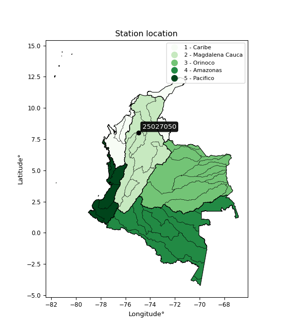

<div align="center">


</div>

# PMP Station (Rain, Pmax24h): 25027050

Probable Maximum Precipitation (PMP) is the greatest amount of rainfall for a specific duration that is meteorologically possible for a given location, acting as a "worst-case" scenario for extreme storms, crucial for designing safety-critical infrastructure like bridges, river deviations, dams, spillways, and nuclear plants to prevent catastrophic failure. PMP is calculated by hydrologists using meteorological data to determine the upper limit of extreme rainfall, often leading to the Probable Maximum Flood (PMF) for flood control design, and is increasingly being studied for climate change impacts. Probable Maximum Precipitation (PMP) is the theoretical upper limit of rainfall, a deterministic estimate for extreme events, while probability distributions (like GEV, Gumbel) describe the likelihood and frequency of various precipitation amounts, including rare ones, showing how often events occur, with PMP representing the extreme end of these distributions, used for critical infrastructure design to ensure safety against the worst conceivable weather, unlike standard statistical forecasts which cover typical probabilities.

The most common probability distributions in hydrology, used for analyzing floods, rainfall, and streamflow, include the Normal, Log-Normal, Gumbel, Gamma (including Log-Pearson Type III), and Generalized Extreme Value (GEV) distributions, often chosen based on the data´s skewness and whether modeling extremes or general conditions, with Gumbel and GEV popular for extreme events like floods, while the Normal distribution serves as a baseline, though often requiring transformations for skewed hydrological data. These distributions help in designing water infrastructure, managing water resources, and forecasting hydrologic events.

> Hydrological data often isn´t perfectly normal (it´s skewed), so different distributions are needed for different applications, such as: **Flood Frequency Analysis**: Using Gumbel, GEV, or Log-Pearson Type III for predicting extreme flood magnitudes and their return periods, **Rainfall Analysis**: Normal for annual totals, but Log-Normal, Weibull, or GEV for intensity or extreme daily rainfall, **Streamflow Modeling**: Gamma and Log-Normal for maximum flows, GEV for minimum flows, and Kappa for daily flows.

<div align="center">

</img>

</div>


## A. General information


### 1. General running parameters

• app_version: _v20260108_. • runtime: _2026-01-08 13:24:42.400241_. • Python version: _3.14.0_. • SciPy version: _1.16.3_. • Pandas version: _2.3.3_. • NumPy version: _2.3.5_. • Stations dataset (station_dataset_file): _dataset/pmax24h_in/automatic_colombia_2003_2024.csv_. • Stations catalog (station_catalog_file): _dataset/CNE.xls_. • Minimum year to eval til year_max (date_min): _1900_. • Maximum year to eval since year_min (date_max): _2024_. • Creates, save and include plots into reports (create_plot): _False_. • Plot only fit distributions with Δo > Δ (plot_only_fit): _True_. • Plot only simple graphs avoiding multiple CDFs and multiple Extreme values plots (plot_only_simple): _True_. • Eval low extreme values, if False, evaluates high extreme values (low_extreme): _False_. • Eval every SciPy distribution as logarithmic (pdist_logarithmic_on): _True_. • Standard deviation normalized (ddof): _1.0_. • Return periods to eval in years (Tr): _[2, 2.33, 5, 10, 15, 20, 25, 50, 75, 100, 200, 250, 500, 750, 1000]_. • Minimum data sample per station, 0 means any (minimum_sample): _5_. • Z-Score maximum threshold to adjust a value, 0 means disable (zscore_max): _3.5_. • Z-Score minimum threshold to adjust a value, 0 means disable (zscore_min): _-2.5_. • Avoid zeros, e.g. rain = 0 (avoid_zeros): _True_. • Avoid null values (avoid_nans): _True_. 

:file_folder:Table: [dataset.csv](../../dataset/pmax24h_in/automatic_colombia_2003_2024.csv)

> Delta Degrees of Freedom (DDOF): is a parameter used in the formulas for calculating variance and standard deviation. When ddof=0, the divisor is $N$ (the total number of observations) and this is used when your data set is the entire population. When ddof=1, the divisor is $N-1$ and this is used when your data set is a sample drawn from a larger population. Using $N-1$ provides an unbiased estimate of the population variance (known as Bessel´s correction).


### 2. Station info and location

|   id |   CODIGO | NOMBRE              | CATEGORIA    | TECNOLOGIA                | ESTADO   | FECHA_INSTALACION   |   FECHA_SUSPENSION |   ALTITUD |   LATITUD |   LONGITUD | DEPARTAMENTO   | MUNICIPIO   | AREA_OPERATIVA                      | ENTIDAD                                                     | AREA_HIDROGRAFICA   | ZONA_HIDROGRAFICA                | SUBZONA_HIDROGRAFICA       | CORRIENTE   | Catalogo   |   Version |
|-----:|---------:|:--------------------|:-------------|:--------------------------|:---------|:--------------------|-------------------:|----------:|----------:|-----------:|:---------------|:------------|:------------------------------------|:------------------------------------------------------------|:--------------------|:---------------------------------|:---------------------------|:------------|:-----------|----------:|
|    0 | 25027050 | MARGENTO [25027050] | Limnigráfica | Automática con Telemetría | Activa   | 15/07/1966          |                nan |        23 |   8.03667 |   -74.9527 | Antioquia      | Caucasia    | Area Operativa 01 - Antioquia-Chocó | INSTITUTO DE HIDROLOGIA METEOROLOGIA Y ESTUDIOS AMBIENTALES | Magdalena Cauca     | Bajo Magdalena- Cauca -San Jorge | Bajo San Jorge - La Mojana | Cauca       | CNE_IDEAM  |  20251226 |

<div align="center">

Dynamic map: [:earth_americas:Google](http://maps.google.com/maps?q=8.036666944,-74.952719444) [:earth_americas:OSM](https://www.openstreetmap.org/#map=18/8.036666944/-74.952719444&layers=P) [:earth_americas:Bing](https://www.bing.com/maps?cp=8.036666944~-74.952719444&lvl=18) [:earth_americas:Apple](https://maps.apple.com/frame?center=8.036666944%2C-74.952719444&span=0.003%2C0.006)

</div>


<div align="center">

```geojson
{
  "type": "Feature",
  "geometry": {
    "type": "Point", 
    "coordinates": [-74.952719444, 8.036666944]
  }, 
  "properties": {
    "Name": "25027050"
  }
}
```

</div>


### 3. Discrete values table and plot

<div align="center">

|               |          0 |          1 |           2 |           3 |          4 |           5 |
|:--------------|-----------:|-----------:|------------:|------------:|-----------:|------------:|
| Date          | 2019       | 2020       | 2021        | 2022        | 2023       | 2024        |
| Value         |  126.2     |   27.2     |   91.2      |   54.6      |    1.2     |   83.2      |
| Value_initial |  126.2     |   27.2     |   91.2      |   54.6      |    1.2     |   83.2      |
| count         |    6       |    6       |    6        |    6        |    6       |    6        |
| mean          |   63.9333  |   63.9333  |   63.9333   |   63.9333   |   63.9333  |   63.9333   |
| std           |   45.5274  |   45.5274  |   45.5274   |   45.5274   |   45.5274  |   45.5274   |
| zscore        |    1.36767 |   -0.80684 |    0.598906 |   -0.205005 |   -1.37792 |    0.423188 |


</div>


> The initial value (value_initial) correspond to the initial obtained or null completed value, and value (value) is adjusted only when the initial value is outside the valid range (outlier) definite through the Z-Score value. If Z-Score is active, values out of range or outliers are replaced with the station mean value. A Z-Score (or standard score) measures how many standard deviations a data point is from the mean of a dataset, indicating its relative position; positive scores mean above the mean, negative mean below, and a score of zero is exactly at the mean, allowing for comparison of values from different distributions. It´s calculated using the formula $z=(x–μ)/σ$, where $x$ is the data point, $μ$ is the mean, and $σ$ is the standard deviation, helping identify outliers and understand probability.
>
> <sub>**Note**: In this study, "completing" (filling gaps in) and "extending" (forecasting or lengthening the historical record) rainfall data series are avoided for certain critical analyses because they introduce artificial bias and uncertainty, which can distort the statistics of rare events (extremes), alter day-to-day variability, and compromise the integrity and homogeneity of the original data. Some reasons against Completing/Extending rainfall data are: **Distortion of Extremes and Variability**: The primary issue is that most gap-filling or extension methods rely on averaging or regression with nearby stations, which inherently smooths the data. Rainfall is highly variable in space and time, with a large percentage of zero values and occasional large storms. Infilling methods often underestimate the highest values and overestimate the lowest (zero) values, which severely distorts analyses focused on flood frequency, drought severity, and intensity-duration-frequency (IDF) curves, **Loss of Data Homogeneity**: Infilled or extended data are synthetic estimates, not actual measurements. Combining these estimates with observed data can violate the assumption of data homogeneity, which requires that the data properties do not change over time. Inhomogeneity can lead to incorrect conclusions about long-term trends or changes in climate patterns, **Propagation of Errors**: Errors and biases from the original data (e.g., wind-induced undercatch, instrument errors, site changes) or the data used for imputation can propagate through the analysis, leading to unreliable hydrological models and inaccurate predictions, **Compromised Statistical Integrity**: For statistical analyses, especially those involving the frequency of events, using artificial data can introduce time bias or autocorrelation that doesn´t exist in reality, making it difficult to assess the true probability of events, **Difficulty in Validation**: It is difficult to accurately validate the quality of filled or extended data, especially for past periods where ground-truth measurements are unavailable. The reliability of imputation techniques heavily depends on the density of the surrounding station network and the complexity of the local topography.</sub>


### 4. Active continuous probability distributions from SciPy (43 of 104 available)

A Probability Density Function (PDF) describes the relative likelihood of a continuous random variable falling within a specific range, where the total area under its curve equals 1, and the area over any interval gives the actual probability for that range. Unlike discrete probabilities (like rolling a die), a PDF shows density, not direct probability for a single point (which is zero), with higher points indicating higher likelihood, often visualized as a bell curve for normal distributions.

A log of a probability density function (log-PDF) is simply the logarithm of the PDF´s value, denoted as $log(f(x))$, useful for converting multiplication of probabilities into addition, improving numerical stability with tiny numbers, and connecting to information theory concepts like entropy. Instead of dealing with very small probabilities (e.g., 0.000001), log-PDFs use negative numbers (e.g., $log(0.00001) ≈ -11.51$ that are easier for computers to handle, preventing underflow errors and simplifying complex calculations. In this study, each active probability distribution from SciPy is also evaluated in the $log$ form.

[scipy.stats](https://docs.scipy.org/doc/scipy/reference/stats.html) is a Python´s powerful submodule within the SciPy library for comprehensive statistical analysis, offering over 130 probability distributions (like Normal, Poisson), functions for descriptive stats (mean, variance), hypothesis testing (t-tests, chi-square), random variable generation, and statistical tests, making it essential for data science, modeling, and research. It provides tools to explore, model, and draw conclusions from data efficiently, working seamlessly with NumPy.

<div align="center">

|   id | p_dist             |   n_parameter | fit_method   | label                                                                       | active   | ref                                                                                                        |
|-----:|:-------------------|--------------:|:-------------|:----------------------------------------------------------------------------|:---------|:-----------------------------------------------------------------------------------------------------------|
|    0 | alpha              |             3 | MLE          | Alpha                                                                       | True     | [:mortar_board:](https://docs.scipy.org/doc/scipy/reference/generated/scipy.stats.alpha.html)              |
|    1 | betaprime          |             4 | MLE          | Beta prime                                                                  | True     | [:mortar_board:](https://docs.scipy.org/doc/scipy/reference/generated/scipy.stats.betaprime.html)          |
|    2 | chi2               |             3 | MLE          | Chi²                                                                        | True     | [:mortar_board:](https://docs.scipy.org/doc/scipy/reference/generated/scipy.stats.chi2.html)               |
|    3 | crystalball        |             4 | MLE          | Crystalball                                                                 | True     | [:mortar_board:](https://docs.scipy.org/doc/scipy/reference/generated/scipy.stats.crystalball.html)        |
|    4 | erlang             |             3 | MLE          | Erlang                                                                      | True     | [:mortar_board:](https://docs.scipy.org/doc/scipy/reference/generated/scipy.stats.erlang.html)             |
|    5 | expon              |             2 | MLE          | Exponential                                                                 | True     | [:mortar_board:](https://docs.scipy.org/doc/scipy/reference/generated/scipy.stats.expon.html)              |
|    6 | exponnorm          |             3 | MLE          | Exponentially modified Normal                                               | True     | [:mortar_board:](https://docs.scipy.org/doc/scipy/reference/generated/scipy.stats.exponnorm.html)          |
|    7 | f                  |             4 | MLE          | F                                                                           | True     | [:mortar_board:](https://docs.scipy.org/doc/scipy/reference/generated/scipy.stats.f.html)                  |
|    8 | fatiguelife        |             3 | MLE          | Fatigue-life (Birnbaum-Saunders)                                            | True     | [:mortar_board:](https://docs.scipy.org/doc/scipy/reference/generated/scipy.stats.fatiguelife.html)        |
|    9 | fisk               |             3 | MLE          | Fisk                                                                        | True     | [:mortar_board:](https://docs.scipy.org/doc/scipy/reference/generated/scipy.stats.fisk.html)               |
|   10 | gamma              |             3 | MLE          | Gamma                                                                       | True     | [:mortar_board:](https://docs.scipy.org/doc/scipy/reference/generated/scipy.stats.gamma.html)              |
|   11 | genexpon           |             5 | MLE          | Generalized exponential                                                     | True     | [:mortar_board:](https://docs.scipy.org/doc/scipy/reference/generated/scipy.stats.genexpon.html)           |
|   12 | genlogistic        |             3 | MLE          | Generalized logistic                                                        | True     | [:mortar_board:](https://docs.scipy.org/doc/scipy/reference/generated/scipy.stats.genlogistic.html)        |
|   13 | gibrat             |             2 | MM           | Gibrat                                                                      | True     | [:mortar_board:](https://docs.scipy.org/doc/scipy/reference/generated/scipy.stats.gibrat.html)             |
|   14 | gompertz           |             3 | MLE          | Gompertz (or truncated Gumbel)                                              | True     | [:mortar_board:](https://docs.scipy.org/doc/scipy/reference/generated/scipy.stats.gompertz.html)           |
|   15 | gumbel_l           |             2 | MM           | Gumbel Left Skew                                                            | True     | [:mortar_board:](https://docs.scipy.org/doc/scipy/reference/generated/scipy.stats.gumbel_l.html)           |
|   16 | gumbel_r           |             2 | MM           | Gumbel Right Skew                                                           | True     | [:mortar_board:](https://docs.scipy.org/doc/scipy/reference/generated/scipy.stats.gumbel_r.html)           |
|   17 | halflogistic       |             2 | MM           | Half-logistic                                                               | True     | [:mortar_board:](https://docs.scipy.org/doc/scipy/reference/generated/scipy.stats.halflogistic.html)       |
|   18 | halfnorm           |             2 | MM           | Half Normal                                                                 | True     | [:mortar_board:](https://docs.scipy.org/doc/scipy/reference/generated/scipy.stats.halfnorm.html)           |
|   19 | hypsecant          |             2 | MM           | hyperbolic secant                                                           | True     | [:mortar_board:](https://docs.scipy.org/doc/scipy/reference/generated/scipy.stats.hypsecant.html)          |
|   20 | invgamma           |             3 | MLE          | Inverted gamma                                                              | True     | [:mortar_board:](https://docs.scipy.org/doc/scipy/reference/generated/scipy.stats.invgamma.html)           |
|   21 | invgauss           |             3 | MLE          | Inverse Gaussian                                                            | True     | [:mortar_board:](https://docs.scipy.org/doc/scipy/reference/generated/scipy.stats.invgauss.html)           |
|   22 | invweibull         |             3 | MLE          | Inverted Weibull                                                            | True     | [:mortar_board:](https://docs.scipy.org/doc/scipy/reference/generated/scipy.stats.invweibull.html)         |
|   23 | kstwobign          |             2 | MLE          | Limiting distribution of scaled Kolmogorov-Smirnov two-sided test statistic | True     | [:mortar_board:](https://docs.scipy.org/doc/scipy/reference/generated/scipy.stats.kstwobign.html)          |
|   24 | laplace            |             2 | MM           | Laplace                                                                     | True     | [:mortar_board:](https://docs.scipy.org/doc/scipy/reference/generated/scipy.stats.laplace.html)            |
|   25 | laplace_asymmetric |             3 | MLE          | Asymmetric Laplace                                                          | True     | [:mortar_board:](https://docs.scipy.org/doc/scipy/reference/generated/scipy.stats.laplace_asymmetric.html) |
|   26 | loggamma           |             3 | MLE          | Log gamma                                                                   | True     | [:mortar_board:](https://docs.scipy.org/doc/scipy/reference/generated/scipy.stats.loggamma.html)           |
|   27 | logistic           |             2 | MM           | Logistic (or Sech-squared)                                                  | True     | [:mortar_board:](https://docs.scipy.org/doc/scipy/reference/generated/scipy.stats.logistic.html)           |
|   28 | lognorm            |             3 | MLE          | Log Normal                                                                  | True     | [:mortar_board:](https://docs.scipy.org/doc/scipy/reference/generated/scipy.stats.lognorm.html)            |
|   29 | maxwell            |             2 | MM           | Maxwell                                                                     | True     | [:mortar_board:](https://docs.scipy.org/doc/scipy/reference/generated/scipy.stats.maxwell.html)            |
|   30 | mielke             |             4 | MLE          | Mielke Beta-Kappa / Dagum                                                   | True     | [:mortar_board:](https://docs.scipy.org/doc/scipy/reference/generated/scipy.stats.mielke.html)             |
|   31 | moyal              |             2 | MM           | Moyal                                                                       | True     | [:mortar_board:](https://docs.scipy.org/doc/scipy/reference/generated/scipy.stats.moyal.html)              |
|   32 | nakagami           |             3 | MLE          | Nakagami                                                                    | True     | [:mortar_board:](https://docs.scipy.org/doc/scipy/reference/generated/scipy.stats.nakagami.html)           |
|   33 | ncf                |             5 | MLE          | Non-central F distribution                                                  | True     | [:mortar_board:](https://docs.scipy.org/doc/scipy/reference/generated/scipy.stats.ncf.html)                |
|   34 | nct                |             4 | MLE          | Non-central Student’s t                                                     | True     | [:mortar_board:](https://docs.scipy.org/doc/scipy/reference/generated/scipy.stats.nct.html)                |
|   35 | norm               |             2 | MM           | Normal                                                                      | True     | [:mortar_board:](https://docs.scipy.org/doc/scipy/reference/generated/scipy.stats.norm.html)               |
|   36 | pearson3           |             3 | MM           | Pearson type III                                                            | True     | [:mortar_board:](https://docs.scipy.org/doc/scipy/reference/generated/scipy.stats.pearson3.html)           |
|   37 | rayleigh           |             2 | MM           | Rayleigh                                                                    | True     | [:mortar_board:](https://docs.scipy.org/doc/scipy/reference/generated/scipy.stats.rayleigh.html)           |
|   38 | rice               |             3 | MLE          | Rice                                                                        | True     | [:mortar_board:](https://docs.scipy.org/doc/scipy/reference/generated/scipy.stats.rice.html)               |
|   39 | t                  |             3 | MLE          | Student’s t                                                                 | True     | [:mortar_board:](https://docs.scipy.org/doc/scipy/reference/generated/scipy.stats.t.html)                  |
|   40 | truncnorm          |             4 | MLE          | Truncated normal                                                            | True     | [:mortar_board:](https://docs.scipy.org/doc/scipy/reference/generated/scipy.stats.truncnorm.html)          |
|   41 | wald               |             2 | MM           | Wald                                                                        | True     | [:mortar_board:](https://docs.scipy.org/doc/scipy/reference/generated/scipy.stats.wald.html)               |
|   42 | weibull_min        |             3 | MLE          | Weibull minimum                                                             | True     | [:mortar_board:](https://docs.scipy.org/doc/scipy/reference/generated/scipy.stats.weibull_min.html)        |

</div>

> **n_parameter:** # arguments & localization & scale.
>
> **Fit methods:** (MLE) maximum likelihood, (MM) L-moments.
>
>**Inactive** (With the only purpose of prevent loops, zero divisions, infinite values, over high estimated values or horizontal trending for recurrence intervals estimations, the follow distributions were disabled.)**:** foldnorm, gennorm, norminvgauss, powernorm, powerlognorm, skewnorm, genextreme, anglit, arcsine, argus, beta, bradford, burr, burr12, cauchy, cosine, halfcauchy, foldcauchy, skewcauchy, wrapcauchy, dgamma, gengamma, exponweib, exponpow, truncexpon, gausshyper, genhalflogistic, genhyperbolic, geninvgauss, halfgennorm, johnsonsb, johnsonsu, kappa4, kappa3, ksone, kstwo, loglaplace, levy, levy_l, levy_stable, ncx2, pareto, genpareto, truncpareto, lomax, powerlaw, rdist, rel_breitwigner, recipinvgauss, semicircular, studentized_range, trapezoid, triang, truncweibull_min, tukeylambda, uniform, loguniform, vonmises, vonmises_line, weibull_max, dweibull, 


## B. Probability (PDF) vs. Empirical (EDF) distributions functions

A continuous probability distribution (CPD) describes probabilities for variables that can take any value within a range (like rain any time), unlike discrete variables with specific outcomes (like temperature). It uses a Probability Density Function (PDF), a curve where the total area under it equals 1, and the probability of the variable falling within an interval (a to b) is found by calculating the area under the curve between those points. A key feature is that the probability of hitting any single exact value is zero, so probabilities are always expressed for ranges, e.g., $P(a ≤ X ≤ b)$.

<div align="center">

Distributions parameters from station values
|    |   station | p_dist                |   n |             loc |            scale | shape                  | shape1                 | shape2                | shape3   |
|---:|----------:|:----------------------|----:|----------------:|-----------------:|:-----------------------|:-----------------------|:----------------------|:---------|
|  0 |  25027050 | alpha                 |   6 |  -246.308       |   2129.05        | 7.035653397963731      |                        |                       |          |
|  1 |  25027050 | betaprime             |   6 | -1127.15        | 130068           | 822.9877444132685      | 89868.24264788715      |                       |          |
|  2 |  25027050 | chi2                  |   6 |  -216.931       |      3.14421     | 89.25154169257826      |                        |                       |          |
|  3 |  25027050 | crystalball           |   6 |    63.9333      |     41.5607      | 4041.7097313828713     | 5404.579345969093      |                       |          |
|  4 |  25027050 | erlang                |   6 | -1446.65        |      1.14553     | 1318.6433953816259     |                        |                       |          |
|  5 |  25027050 | expon                 |   6 |     1.2         |     62.7333      |                        |                        |                       |          |
|  6 |  25027050 | exponnorm             |   6 |    63.8812      |     41.5607      | 0.0012504010524908736  |                        |                       |          |
|  7 |  25027050 | f                     |   6 |     1.2         |     65.5296      | 0.9875603839571729     | 749.8743921042428      |                       |          |
|  8 |  25027050 | fatiguelife           |   6 |     1.2         |      0.00118587  | 178.87662290694118     |                        |                       |          |
|  9 |  25027050 | fisk                  |   6 |    -1.69744e+07 |      1.69745e+07 | 675196.4940607792      |                        |                       |          |
| 10 |  25027050 | gamma                 |   6 | -1427.27        |      1.16213     | 1283.1879308317223     |                        |                       |          |
| 11 |  25027050 | genexpon              |   6 |     1.19995     |      2.39922     | 0.03824776243529818    | 1.9782367362668764e-07 | 2.4016743871881294    |          |
| 12 |  25027050 | genlogistic           |   6 |    17.7546      |     32.5207      | 2.8884760070303095     |                        |                       |          |
| 13 |  25027050 | gibrat                |   6 |    32.2278      |     19.2304      |                        |                        |                       |          |
| 14 |  25027050 | gompertz              |   6 |    26.9013      |      6.13722     | 4.675644218395792e-07  |                        |                       |          |
| 15 |  25027050 | gumbel_l              |   6 |    82.6378      |     32.4047      |                        |                        |                       |          |
| 16 |  25027050 | gumbel_r              |   6 |    45.2288      |     32.4047      |                        |                        |                       |          |
| 17 |  25027050 | halflogistic          |   6 |    14.6743      |     35.5329      |                        |                        |                       |          |
| 18 |  25027050 | halfnorm              |   6 |     8.92329     |     68.9449      |                        |                        |                       |          |
| 19 |  25027050 | hypsecant             |   6 |    63.9333      |     26.4583      |                        |                        |                       |          |
| 20 |  25027050 | invgamma              |   6 |  -362.31        |  42460.7         | 100.6984735276987      |                        |                       |          |
| 21 |  25027050 | invgauss              |   6 |  -155.678       |   5450.15        | 0.040167501161076063   |                        |                       |          |
| 22 |  25027050 | invweibull            |   6 |     1.2         |      2.46063     | 0.042359097905985146   |                        |                       |          |
| 23 |  25027050 | kstwobign             |   6 |   -89.1291      |    174.692       |                        |                        |                       |          |
| 24 |  25027050 | laplace               |   6 |    63.9333      |     29.3878      |                        |                        |                       |          |
| 25 |  25027050 | laplace_asymmetric    |   6 |    54.6         |     35.3492      | 0.8766570854801505     |                        |                       |          |
| 26 |  25027050 | loggamma              |   6 |  -918.182       |    265.155       | 41.105734118789684     |                        |                       |          |
| 27 |  25027050 | logistic              |   6 |    63.9333      |     22.9136      |                        |                        |                       |          |
| 28 |  25027050 | lognorm               |   6 |     1.2         |      0.0810937   | 15.003876127442485     |                        |                       |          |
| 29 |  25027050 | maxwell               |   6 |   -34.548       |     61.714       |                        |                        |                       |          |
| 30 |  25027050 | mielke                |   6 |     1.17821     |    126.454       | 0.6533796096787814     | 685.3803097666014      |                       |          |
| 31 |  25027050 | moyal                 |   6 |    40.1663      |     18.7089      |                        |                        |                       |          |
| 32 |  25027050 | nakagami              |   6 |     1.2         |     70.8323      | 0.31428864172865634    |                        |                       |          |
| 33 |  25027050 | ncf                   |   6 |    -0.0381458   |      0.000120136 | 1.6019659543786207e-05 | 9.030525525804572      | 7.606021034420131     |          |
| 34 |  25027050 | nct                   |   6 |    -0.217332    |      0.0633187   | 0.3257825752627498     | 54.736180471521266     |                       |          |
| 35 |  25027050 | norm                  |   6 |    63.9333      |     41.5607      |                        |                        |                       |          |
| 36 |  25027050 | pearson3              |   6 |    63.9333      |     41.5606      | -0.06599075281616845   |                        |                       |          |
| 37 |  25027050 | rayleigh              |   6 |   -15.5746      |     63.4382      |                        |                        |                       |          |
| 38 |  25027050 | rice                  |   6 |   -20.2689      |     49.2234      | 1.2802722134540756     |                        |                       |          |
| 39 |  25027050 | t                     |   6 |    63.9336      |     41.5616      | 3807345.0036178916     |                        |                       |          |
| 40 |  25027050 | truncnorm             |   6 |    -9.2673      |      4.16524     | -0.29297277465005955   | 32.52330674621369      |                       |          |
| 41 |  25027050 | wald                  |   6 |    22.3727      |     41.5606      |                        |                        |                       |          |
| 42 |  25027050 | weibull_min           |   6 |   -28.3707      |    104.288       | 2.4183589264993115     |                        |                       |          |
| 43 |  25027050 | logalpha              |   6 |     0.00219434  |      0.439633    | 4.447680694581301e-06  |                        |                       |          |
| 44 |  25027050 | logbetaprime          |   6 |     0.182322    |    221.788       | 0.9259669746725815     | 70.90285347207691      |                       |          |
| 45 |  25027050 | logchi2               |   6 |     0.182322    |      1.66306     | 1.8651538097084912     |                        |                       |          |
| 46 |  25027050 | logcrystalball        |   6 |     3.54296     |      1.57848     | 27540.064591047143     | 122.711315838491       |                       |          |
| 47 |  25027050 | logerlang             |   6 |     0.182322    |      4.98891     | 0.15055387828941208    |                        |                       |          |
| 48 |  25027050 | logexpon              |   6 |     0.182322    |      3.36064     |                        |                        |                       |          |
| 49 |  25027050 | logexponnorm          |   6 |     3.54197     |      1.57848     | 0.0006213031050462897  |                        |                       |          |
| 50 |  25027050 | logf                  |   6 | -3638.57        |   3642.11        | 31608488.121552236     | 16038008.780282399     |                       |          |
| 51 |  25027050 | logfatiguelife        |   6 | -1074.1         |   1077.65        | 0.0014678067020832998  |                        |                       |          |
| 52 |  25027050 | logfisk               |   6 |    -1.22043e+08 |      1.22043e+08 | 153385675.93904805     |                        |                       |          |
| 53 |  25027050 | loggamma              |   6 |   -24.0474      |      0.101535    | 271.26000291093874     |                        |                       |          |
| 54 |  25027050 | loggenexpon           |   6 |    -0.602394    |      0.0110758   | 8.687877612983369e-08  | 1.1470015607390032     | 1.086303250555885e-05 |          |
| 55 |  25027050 | loggenlogistic        |   6 |     4.83795     |      4.10952e-06 | 3.1843182517706606e-06 |                        |                       |          |
| 56 |  25027050 | loggibrat             |   6 |     2.33879     |      0.730371    |                        |                        |                       |          |
| 57 |  25027050 | loggompertz           |   6 |     0.182321    |      0.985417    | 0.018224219703106705   |                        |                       |          |
| 58 |  25027050 | loggumbel_l           |   6 |     4.25336     |      1.23073     |                        |                        |                       |          |
| 59 |  25027050 | loggumbel_r           |   6 |     2.83256     |      1.23073     |                        |                        |                       |          |
| 60 |  25027050 | loghalflogistic       |   6 |     1.67212     |      1.34953     |                        |                        |                       |          |
| 61 |  25027050 | loghalfnorm           |   6 |     1.45368     |      2.61852     |                        |                        |                       |          |
| 62 |  25027050 | loghypsecant          |   6 |     3.54296     |      1.00489     |                        |                        |                       |          |
| 63 |  25027050 | loginvgamma           |   6 |   -32.1765      |  17176.9         | 481.7835376264404      |                        |                       |          |
| 64 |  25027050 | loginvgauss           |   6 |   -12.2238      |   1239.41        | 0.012685092725646795   |                        |                       |          |
| 65 |  25027050 | loginvweibull         |   6 |    -1.29012e+08 |      1.29012e+08 | 68392046.28348055      |                        |                       |          |
| 66 |  25027050 | logkstwobign          |   6 |    -4.05        |      8.67065     |                        |                        |                       |          |
| 67 |  25027050 | loglaplace            |   6 |     3.54296     |      1.11615     |                        |                        |                       |          |
| 68 |  25027050 | loglaplace_asymmetric |   6 |     4.83787     |      0.0214666   | 60.24001530039334      |                        |                       |          |
| 69 |  25027050 | logloggamma           |   6 |     4.83868     |      9.96737e-05 | 7.580027807814555e-05  |                        |                       |          |
| 70 |  25027050 | loglogistic           |   6 |     3.54296     |      0.87026     |                        |                        |                       |          |
| 71 |  25027050 | loglognorm            |   6 |     0.182322    |      0.00551912  | 14.724409032969819     |                        |                       |          |
| 72 |  25027050 | logmaxwell            |   6 |    -0.197371    |      2.3439      |                        |                        |                       |          |
| 73 |  25027050 | logmielke             |   6 |    -1.21973e+08 |      1.21973e+08 | 95171899.66342422      | 62274849954.85179      |                       |          |
| 74 |  25027050 | logmoyal              |   6 |     2.64028     |      0.710564    |                        |                        |                       |          |
| 75 |  25027050 | lognakagami           |   6 | -1861.48        |   1865.03        | 347932.3988292123      |                        |                       |          |
| 76 |  25027050 | logncf                |   6 |   -54.2231      |     57.7206      | 4175.4636418678365     | 6317.864346610606      | 2.6126917972039543    |          |
| 77 |  25027050 | lognct                |   6 |  -114.639       |      1.55288     | 77297.34421359273      | 76.10418638306479      |                       |          |
| 78 |  25027050 | lognorm               |   6 |     3.54296     |      1.57848     |                        |                        |                       |          |
| 79 |  25027050 | logpearson3           |   6 |     3.54296     |      1.57847     | -1.4455117657750811    |                        |                       |          |
| 80 |  25027050 | lograyleigh           |   6 |     0.523217    |      2.4094      |                        |                        |                       |          |
| 81 |  25027050 | logrice               |   6 |  -493.899       |      1.57853     | 315.12892185234557     |                        |                       |          |
| 82 |  25027050 | logt                  |   6 |     3.98583     |      0.931015    | 2.1259950469018456     |                        |                       |          |
| 83 |  25027050 | logtruncnorm          |   6 |     0.901335    |      3.41955     | -0.21028791573367267   | 41.08959016963621      |                       |          |
| 84 |  25027050 | logwald               |   6 |     1.96448     |      1.57848     |                        |                        |                       |          |
| 85 |  25027050 | logweibull_min        |   6 |    -1.24054e+08 |      1.24054e+08 | 136785754.61078012     |                        |                       |          |

</div>

> **loc** (Location parameter): This shifts the distribution along the x-axis. For many common distributions, like the normal (Gaussian) distribution, loc represents the mean $μ$. For others, like the uniform distribution, it might represent the minimum value, or for the beta distribution, the left end of the support interval.
>
> **scale** (Scale parameter): This determines the width or spread of the distribution. For the normal distribution, scale represents the standard deviation $σ$. For a uniform distribution, it defines the length of the interval (from $loc$ to $loc + scale$).
>
> **shape** (Shape parameters): Refers to parameters that define the specific form of a probability distribution, distinct from its location (loc) and scale (scale). These parameters are required arguments for most distribution functions. For example, a normal (Gaussian) distribution is fully defined by its location (mean) and scale (standard deviation), so it has no specific shape parameters beyond loc and scale. However, other distributions have intrinsic properties that need specification, as Gamma distribution that takes a shape parameter, often named $a$ or $alpha$.


### 0. Cumulative distribution values - CDF (86 evaluated)

Cumulative Distribution Function (CDF), denoted as $F$<sub>$X$</sub>$(x)$, is a function that gives the probability that a random variable $X$ will take a value less than or equal to a specific value, $x$ (i.e., $(P(X≥x)$. It essentially "accumulates" probabilities from a given point up to the far right (positive infinity), providing a complete picture of the distribution´s probabilities for both discrete (like rain) and continuous (like temperature) variables, helping to find probabilities over ranges or above certain values. Each station is evaluated separately ordering the $x$ values ascending, calculating the CDF and PDF values for the activated distributions and their logarithmic forms.

<div align="center">

CDF ordered by x ascending and calculating $log(f(x))$ separately
|   id |   Station |   date |     x |   count |    mean |     std |    zscore |   Value_initial |   station |   m |     alpha |   alpha_pdf |   betaprime |   betaprime_pdf |      chi2 |   chi2_pdf |   crystalball |   crystalball_pdf |    erlang |   erlang_pdf |    expon |   expon_pdf |   exponnorm |   exponnorm_pdf |           f |           f_pdf |   fatiguelife |   fatiguelife_pdf |      fisk |   fisk_pdf |     gamma |   gamma_pdf |    genexpon |   genexpon_pdf |   genlogistic |   genlogistic_pdf |   gibrat |   gibrat_pdf |    gompertz |   gompertz_pdf |   gumbel_l |   gumbel_l_pdf |   gumbel_r |   gumbel_r_pdf |   halflogistic |   halflogistic_pdf |   halfnorm |   halfnorm_pdf |   hypsecant |   hypsecant_pdf |   invgamma |   invgamma_pdf |   invgauss |   invgauss_pdf |   invweibull |   invweibull_pdf |   kstwobign |   kstwobign_pdf |   laplace |   laplace_pdf |   laplace_asymmetric |   laplace_asymmetric_pdf |   loggamma |   loggamma_pdf |   logistic |   logistic_pdf |   lognorm |   lognorm_pdf |   maxwell |   maxwell_pdf |     mielke |   mielke_pdf |      moyal |   moyal_pdf |    nakagami |   nakagami_pdf |       ncf |    ncf_pdf |       nct |     nct_pdf |      norm |   norm_pdf |   pearson3 |   pearson3_pdf |   rayleigh |   rayleigh_pdf |      rice |   rice_pdf |         t |      t_pdf |   truncnorm |   truncnorm_pdf |       wald |   wald_pdf |   weibull_min |   weibull_min_pdf |   logalpha |   logalpha_pdf |   logbetaprime |   logbetaprime_pdf |     logchi2 |   logchi2_pdf |   logcrystalball |   logcrystalball_pdf |   logerlang |   logerlang_pdf |   logexpon |   logexpon_pdf |   logexponnorm |   logexponnorm_pdf |      logf |   logf_pdf |   logfatiguelife |   logfatiguelife_pdf |    logfisk |   logfisk_pdf |   loggenexpon |   loggenexpon_pdf |   loggenlogistic |   loggenlogistic_pdf |   loggibrat |   loggibrat_pdf |   loggompertz |   loggompertz_pdf |   loggumbel_l |   loggumbel_l_pdf |   loggumbel_r |   loggumbel_r_pdf |   loghalflogistic |   loghalflogistic_pdf |   loghalfnorm |   loghalfnorm_pdf |   loghypsecant |   loghypsecant_pdf |   loginvgamma |   loginvgamma_pdf |   loginvgauss |   loginvgauss_pdf |   loginvweibull |   loginvweibull_pdf |   logkstwobign |   logkstwobign_pdf |   loglaplace |   loglaplace_pdf |   loglaplace_asymmetric |   loglaplace_asymmetric_pdf |   logloggamma |   logloggamma_pdf |   loglogistic |   loglogistic_pdf |   loglognorm |   loglognorm_pdf |   logmaxwell |   logmaxwell_pdf |   logmielke |   logmielke_pdf |    logmoyal |   logmoyal_pdf |   lognakagami |   lognakagami_pdf |    logncf |   logncf_pdf |    lognct |   lognct_pdf |   logpearson3 |   logpearson3_pdf |   lograyleigh |   lograyleigh_pdf |   logrice |   logrice_pdf |      logt |   logt_pdf |   logtruncnorm |   logtruncnorm_pdf |   logwald |   logwald_pdf |   logweibull_min |   logweibull_min_pdf |
|-----:|----------:|-------:|------:|--------:|--------:|--------:|----------:|----------------:|----------:|----:|----------:|------------:|------------:|----------------:|----------:|-----------:|--------------:|------------------:|----------:|-------------:|---------:|------------:|------------:|----------------:|------------:|----------------:|--------------:|------------------:|----------:|-----------:|----------:|------------:|------------:|---------------:|--------------:|------------------:|---------:|-------------:|------------:|---------------:|-----------:|---------------:|-----------:|---------------:|---------------:|-------------------:|-----------:|---------------:|------------:|----------------:|-----------:|---------------:|-----------:|---------------:|-------------:|-----------------:|------------:|----------------:|----------:|--------------:|---------------------:|-------------------------:|-----------:|---------------:|-----------:|---------------:|----------:|--------------:|----------:|--------------:|-----------:|-------------:|-----------:|------------:|------------:|---------------:|----------:|-----------:|----------:|------------:|----------:|-----------:|-----------:|---------------:|-----------:|---------------:|----------:|-----------:|----------:|-----------:|------------:|----------------:|-----------:|-----------:|--------------:|------------------:|-----------:|---------------:|---------------:|-------------------:|------------:|--------------:|-----------------:|---------------------:|------------:|----------------:|-----------:|---------------:|---------------:|-------------------:|----------:|-----------:|-----------------:|---------------------:|-----------:|--------------:|--------------:|------------------:|-----------------:|---------------------:|------------:|----------------:|--------------:|------------------:|--------------:|------------------:|--------------:|------------------:|------------------:|----------------------:|--------------:|------------------:|---------------:|-------------------:|--------------:|------------------:|--------------:|------------------:|----------------:|--------------------:|---------------:|-------------------:|-------------:|-----------------:|------------------------:|----------------------------:|--------------:|------------------:|--------------:|------------------:|-------------:|-----------------:|-------------:|-----------------:|------------:|----------------:|------------:|---------------:|--------------:|------------------:|----------:|-------------:|----------:|-------------:|--------------:|------------------:|--------------:|------------------:|----------:|--------------:|----------:|-----------:|---------------:|-------------------:|----------:|--------------:|-----------------:|---------------------:|
|    0 |  25027050 |   2023 |   1.2 |       6 | 63.9333 | 45.5274 | -1.37792  |             1.2 |  25027050 |   1 | 0.0586413 |  0.00406634 |   0.0641283 |      0.00311987 | 0.0588835 | 0.00330911 |     0.0655932 |        0.0030724  | 0.0643311 |   0.00311047 | 0        |  0.0159405  |   0.0655943 |      0.00307243 | 1.50112e-08 | 498234          |     0.0548788 |       6.1284e+06  | 0.0742891 | 0.00273549 | 0.0642767 |  0.00310732 | 7.27558e-07 |     0.0159418  |     0.0590192 |        0.0032741  | 0        |   0          | 0           |    0           |  0.0778181 |     0.00230548 |  0.0204209 |     0.00245217 |       0        |         0          |   0        |     0          |   0.0592789 |      0.00222753 |  0.0594169 |     0.00343    |  0.0570987 |     0.00371436 |   0.00837688 |      7.64229e+12 |   0.0480391 |      0.0043761  | 0.0591418 |    0.00201246 |            0.0775672 |               0.00250304 |  0.0203797 |       0.032054 |  0.0607781 |     0.00249128 | 0.0166256 |     0.0262052 | 0.0467872 |    0.00366802 | 0.00347448 |   0.104184   | 0.00460935 |  0.00109184 | 7.71809e-12 | 21848.8        | 0.0296176 | 0.00615565 | 0.0432153 | 0.0930344   | 0.0655932 | 0.0030724  |  0.0673217 |     0.00303505 |  0.0343562 |     0.00402503 | 0.0415324 | 0.00383222 | 0.0655968 | 0.00307246 |    0.990272 |    0.00662059   | 0          | 0          |     0.0463436 |        0.00370087 |  0.0146598 |      0.54998   |    1.67142e-16 |          5.57611   | 1.21517e-16 |     4.08293   |        0.0166256 |            0.0262052 |  0.00270663 |     1.46815e+13 |   0        |      0.297563  |      0.0166261 |          0.0262057 | 0.0166053 |  0.0261944 |        0.0164731 |            0.0260262 | 0.00953473 |     0.0118691 |     0.0307867 |          0.077228 |         0        |            0.0210144 |    0        |        0        |   9.83488e-09 |         0.0184939 |     0.0359347 |         0.0286667 |   0.000181561 |        0.00127075 |          0        |              0        |      0        |          0        |      0.0224541 |          0.0223264 |      0.01471  |         0.0260955 |     0.0199232 |         0.0348393 |       0.0243256 |           0.0479226 |      0.0289614 |          0.0640212 |    0.0246234 |        0.0220609 |               0.0273119 |                   0.0211204 |      0.028983 |         0.0220411 |     0.0206001 |         0.0231836 |    0.0126764 |      8.01431e+13 |   0.00112171 |       0.00881633 |   0.0262592 |       0.0204892 | 1.71733e-08 |    3.95586e-07 |     0.0166656 |         0.0262345 | 0.0173084 |    0.0277789 | 0.0167461 |    0.0263665 |     0.0403319 |         0.0298245 |      0        |          0        | 0.0166276 |     0.0262071 | 0.0247862 |  0.0126572 |    1.49539e-05 |           0.195643 |  0        |     0         |        0.0120529 |            0.0132095 |
|    1 |  25027050 |   2020 |  27.2 |       6 | 63.9333 | 45.5274 | -0.80684  |            27.2 |  25027050 |   2 | 0.227058  |  0.00857977 |   0.18957   |      0.00663538 | 0.195152  | 0.00720487 |     0.188389  |        0.00649523 | 0.189361  |   0.00661763 | 0.339298 |  0.0105319  |   0.188391  |      0.00649525 | 0.473601    |      0.00787452 |     0.796091  |       0.0045088   | 0.184164  | 0.00597642 | 0.189169  |  0.00661009 | 0.339322    |     0.0105324  |     0.199285  |        0.00757391 | 0        |   0          | 2.33206e-08 |    7.99849e-08 |  0.165333  |     0.00465496 |  0.174764  |     0.0094074  |       0.174452 |         0.0136432  |   0.209061 |     0.0111732  |   0.155651  |      0.00565122 |  0.200579  |     0.00741794 |  0.210723  |     0.00795194 |   0.40456    |      0.000596463 |   0.233027  |      0.00914303 | 0.143259  |    0.00487479 |            0.179495  |               0.0057922  |  0.462286  |       0.238581 |  0.167545  |     0.00608695 | 0.439641  |     0.24984   | 0.199015  |    0.00784599 | 0.355953   |   0.00893759 | 0.157318   |  0.0110944  | 0.409294    |     0.00958069 | 0.26674   | 0.010223   | 0.591811  | 0.0048394   | 0.188389  | 0.00649523 |  0.187708  |     0.00635768 |  0.203336  |     0.0084676  | 0.194475  | 0.0076943  | 0.188393  | 0.00649516 |    1        |    3.52617e-18  | 0.00865554 | 0.00839925 |     0.196032  |        0.00763413 |  0.894051  |      0.0319066 |    0.660706    |          0.111712  | 0.638804    |     0.1132    |        0.439641  |            0.24984   |  0.929058   |     0.0257778   |   0.604918 |      0.117562  |      0.439641  |          0.249839  | 0.439479  |  0.249755  |        0.437858  |            0.249201  | 0.327205   |     0.276677  |     0.538702  |          0.182648 |         0        |            0.235916  |    0.609489 |        0.397977 |   0.339253    |         0.290075  |     0.37003   |         0.236524  |   0.5055      |        0.280203   |          0.540116 |              0.262415 |      0.520017 |          0.237438 |      0.42477   |          0.307955  |      0.451418 |         0.245357  |     0.478132  |         0.228148  |       0.491383  |           0.185088  |      0.531726  |          0.175774  |    0.403355  |        0.36138   |               0.305127  |                   0.235956  |      0.311096 |         0.236583  |     0.431562  |         0.281888  |    0.666554  |      0.00791342  |   0.474035   |       0.248918   |   0.299812  |       0.233934  | 0.530526    |    0.289263    |     0.439071  |         0.249411  | 0.444425  |    0.243404  | 0.440033  |    0.249404  |     0.349073  |         0.215787  |      0.486057 |          0.246117 | 0.439636  |     0.249833  | 0.267887  |  0.268795  |    0.586449    |           0.156291 |  0.599915 |     0.319212  |        0.315201  |            0.285897  |
|    2 |  25027050 |   2022 |  54.6 |       6 | 63.9333 | 45.5274 | -0.205005 |            54.6 |  25027050 |   3 | 0.484144  |  0.00937314 |   0.415327  |      0.0093979  | 0.432969  | 0.00956465 |     0.411156  |        0.00936001 | 0.414965  |   0.00941023 | 0.573107 |  0.00680488 |   0.411158  |      0.00935999 | 0.634449    |      0.00444921 |     0.882245  |       0.00219261  | 0.401674  | 0.00955973 | 0.414533  |  0.00940161 | 0.573138    |     0.00680496 |     0.446435  |        0.00965971 | 0.560141 |   0.017629   | 4.21811e-05 |    6.94904e-06 |  0.343578  |     0.0085272  |  0.472901  |     0.0109287  |       0.509322 |         0.0104212  |   0.492356 |     0.0092924  |   0.389973  |      0.011319   |  0.441518  |     0.00953237 |  0.459158  |     0.00946576 |   0.415703   |      0.000289452 |   0.492401  |      0.00906151 | 0.36395   |    0.0123844  |            0.434558  |               0.0140229  |  0.625672  |       0.223876 |  0.399553  |     0.0104702  | 0.613927  |     0.242362  | 0.445387  |    0.00950376 | 0.569503   |   0.00696535 | 0.49654    |  0.0115065  | 0.623532    |     0.00639906 | 0.518653  | 0.00779059 | 0.674197  | 0.00193518  | 0.411156  | 0.00936001 |  0.4071    |     0.00929148 |  0.457641  |     0.00945726 | 0.43595   | 0.00941152 | 0.411156  | 0.0093598  |    1        |    1.374e-52    | 0.561097   | 0.0136079  |     0.437417  |        0.00943222 |  0.912435  |      0.0218148 |    0.729986    |          0.0881293 | 0.709489    |     0.0905654 |        0.613927  |            0.242362  |  0.944452   |     0.0188903   |   0.678902 |      0.0955468 |      0.613927  |          0.242361  | 0.613789  |  0.242259  |        0.611826  |            0.242135  | 0.538651   |     0.312325  |     0.658419  |          0.159322 |         0        |            0.404808  |    0.794397 |        0.17133  |   0.576488    |         0.377087  |     0.556905  |         0.29305   |   0.678899    |        0.213633   |          0.697538 |              0.190229 |      0.669169 |          0.189907 |      0.640035  |          0.286599  |      0.619479 |         0.229981  |     0.631399  |         0.206723  |       0.611962  |           0.159315  |      0.6453    |          0.149321  |    0.668013  |        0.297439  |               0.522998  |                   0.404437  |      0.528487 |         0.401906  |     0.628367  |         0.268336  |    0.671517  |      0.00643045  |   0.639185   |       0.219643   |   0.516389  |       0.402922  | 0.700893    |    0.200323    |     0.61311   |         0.242117  | 0.613002  |    0.233233  | 0.613952  |    0.241795  |     0.526049  |         0.29153   |      0.646954 |          0.211444 | 0.613918  |     0.242356  | 0.505432  |  0.382264  |    0.687247    |           0.132665 |  0.762382 |     0.167065  |        0.557976  |            0.397901  |
|    3 |  25027050 |   2024 |  83.2 |       6 | 63.9333 | 45.5274 |  0.423188 |            83.2 |  25027050 |   4 | 0.717138  |  0.00663329 |   0.680793  |      0.00847281 | 0.692737  | 0.00799517 |     0.678525  |        0.00862107 | 0.681261  |   0.00851015 | 0.729402 |  0.00431347 |   0.678526  |      0.00862104 | 0.736947    |      0.00288668 |     0.929224  |       0.00121381  | 0.676806  | 0.00870083 | 0.680679  |  0.00850952 | 0.729432    |     0.00431335 |     0.696022  |        0.00728891 | 0.835167 |   0.00486676 | 0.00449514  |    0.000730867 |  0.638502  |     0.0113509  |  0.733583  |     0.00701364 |       0.74617  |         0.0062369  |   0.718669 |     0.00647748 |   0.713662  |      0.00942059 |  0.69627   |     0.00773061 |  0.704367  |     0.00725553 |   0.422325   |      0.000188052 |   0.715218  |      0.00637623 | 0.740435  |    0.0088324  |            0.721803  |               0.00689927 |  0.714983  |       0.19858  |  0.698642  |     0.00918849 | 0.711037  |     0.216493  | 0.696986  |    0.00762448 | 0.753637   |   0.00600342 | 0.751541   |  0.00642123 | 0.774665    |     0.00428134 | 0.697891  | 0.00488638 | 0.715832  | 0.00110953  | 0.678525  | 0.00862107 |  0.675428  |     0.0087445  |  0.702446  |     0.00730315 | 0.690365  | 0.00788097 | 0.678519  | 0.00862095 |    1        |    1.49845e-108 | 0.803319   | 0.00503754 |     0.691896  |        0.00786252 |  0.920753  |      0.017874  |    0.764594    |          0.0764835 | 0.745194    |     0.0792318 |        0.711037  |            0.216493  |  0.951752   |     0.0158841   |   0.716728 |      0.0842913 |      0.711037  |          0.216492  | 0.710859  |  0.216413  |        0.708912  |            0.216608  | 0.664698   |     0.280112  |     0.721852  |          0.141579 |         0        |            0.561042  |    0.852624 |        0.11065  |   0.734761    |         0.36212   |     0.682144  |         0.296013  |   0.759543    |        0.169739   |          0.769275 |              0.151244 |      0.742912 |          0.16032  |      0.74834   |          0.225149  |      0.711056 |         0.203159  |     0.713468  |         0.181913  |       0.675158  |           0.140592  |      0.704528  |          0.131869  |    0.772371  |        0.203941  |               0.724372  |                   0.56016   |      0.728032 |         0.553656  |     0.732869  |         0.224958  |    0.674082  |      0.00577307  |   0.725599   |       0.189673   |   0.717318  |       0.559702  | 0.775194    |    0.153935    |     0.710156  |         0.216434  | 0.706403  |    0.208338  | 0.710836  |    0.216005  |     0.656867  |         0.326589  |      0.729831 |          0.181411 | 0.711026  |     0.21649   | 0.658201  |  0.328068  |    0.739991    |           0.117756 |  0.821644 |     0.117839  |        0.727191  |            0.390745  |
|    4 |  25027050 |   2021 |  91.2 |       6 | 63.9333 | 45.5274 |  0.598906 |            91.2 |  25027050 |   5 | 0.766545  |  0.00572264 |   0.745128  |      0.00758029 | 0.753026  | 0.00705881 |     0.74411   |        0.00774037 | 0.745883  |   0.00761381 | 0.7618   |  0.00379703 |   0.744111  |      0.00774033 | 0.758836    |      0.00259277 |     0.938229  |       0.00104269  | 0.742184  | 0.00761123 | 0.745308  |  0.00761609 | 0.761829    |     0.00379688 |     0.750411  |        0.00630691 | 0.868766 |   0.00361072 | 0.0164539   |    0.0026589   |  0.728127  |     0.0109272  |  0.785026  |     0.00586355 |       0.79202  |         0.00524449 |   0.767275 |     0.00567796 |   0.781812  |      0.00761571 |  0.754433  |     0.00679676 |  0.758777  |     0.00634161 |   0.42376    |      0.000171241 |   0.762997  |      0.00557372 | 0.802293  |    0.00672751 |            0.771866  |               0.00565769 |  0.732912  |       0.191933 |  0.766737  |     0.00780547 | 0.730583  |     0.209244  | 0.754466  |    0.00673353 | 0.800886   |   0.00581284 | 0.79821    |  0.00527641 | 0.806941    |     0.00379428 | 0.73438   | 0.0042495  | 0.724184  | 0.000982725 | 0.74411   | 0.00774037 |  0.742104  |     0.00788598 |  0.757429  |     0.00643584 | 0.750056  | 0.00702305 | 0.744103  | 0.0077403  |    1        |    7.19579e-128 | 0.839077   | 0.00395523 |     0.751411  |        0.00699847 |  0.922361  |      0.0171572 |    0.771509    |          0.074167  | 0.752363    |     0.0769634 |        0.730583  |            0.209244  |  0.953184   |     0.0153132   |   0.724361 |      0.0820198 |      0.730583  |          0.209244  | 0.730399  |  0.209173  |        0.728473  |            0.209435  | 0.689907   |     0.268877  |     0.734664  |          0.13752  |         0        |            0.602407  |    0.862341 |        0.1012   |   0.767412    |         0.348548  |     0.709144  |         0.291847  |   0.774709    |        0.160683   |          0.782801 |              0.143466 |      0.757339 |          0.15398  |      0.768347  |          0.210709  |      0.729388 |         0.196143  |     0.72989   |         0.175797  |       0.687875  |           0.136436  |      0.71646   |          0.128064  |    0.790345  |        0.187837  |               0.777668  |                   0.601375  |      0.780678 |         0.593693  |     0.753008  |         0.213714  |    0.674606  |      0.00564697  |   0.742684   |       0.182495   |   0.770588  |       0.601267  | 0.788913    |    0.14502     |     0.729699  |         0.209229  | 0.725222  |    0.201547  | 0.730339  |    0.208788  |     0.68707   |         0.331131  |      0.746167 |          0.174456 | 0.730572  |     0.209242  | 0.687364  |  0.306952  |    0.750653    |           0.114505 |  0.832079 |     0.109594  |        0.762447  |            0.376494  |
|    5 |  25027050 |   2019 | 126.2 |       6 | 63.9333 | 45.5274 |  1.36767  |           126.2 |  25027050 |   6 | 0.906618  |  0.00256062 |   0.930275  |      0.00310136 | 0.92492   | 0.00295078 |     0.932961  |        0.00312472 | 0.931462  |   0.00309136 | 0.863654 |  0.00217342 |   0.932961  |      0.00312471 | 0.832263    |      0.00168695 |     0.965238  |       0.000557853 | 0.920528  | 0.00290993 | 0.931118  |  0.0031     | 0.863678    |     0.00217323 |     0.903828  |        0.00276164 | 0.943688 |   0.00120601 | 0.993078    |    0.00560908  |  0.978411  |     0.0025554  |  0.921099  |     0.00233618 |       0.916919 |         0.00224101 |   0.911061 |     0.0027235  |   0.939673  |      0.00226647 |  0.920396  |     0.00289775 |  0.914647  |     0.00279747 |   0.428818   |      0.000123041 |   0.904217  |      0.00270247 | 0.939912  |    0.00204467 |            0.904231  |               0.00237505 |  0.791176  |       0.1664   |  0.938049  |     0.00253619 | 0.793993  |     0.180524  | 0.92091   |    0.00295002 | 0.992584   |   0.00518526 | 0.920081   |  0.0021287  | 0.908046    |     0.00209615 | 0.845507  | 0.00230405 | 0.751822  | 0.000639498 | 0.932961  | 0.00312472 |  0.934808  |     0.00316305 |  0.917691  |     0.00289965 | 0.924381  | 0.003054   | 0.932956  | 0.00312484 |    1        |    3.17233e-231 | 0.927717   | 0.00155123 |     0.92497   |        0.00304023 |  0.927561  |      0.0149389 |    0.794338    |          0.0665437 | 0.776122    |     0.0694633 |        0.793993  |            0.180524  |  0.957854   |     0.013493    |   0.749756 |      0.0744634 |      0.793992  |          0.180524  | 0.793791  |  0.180488  |        0.791986  |            0.180967  | 0.76993    |     0.222629  |     0.776967  |          0.122915 |         0.999933 |            0.774811  |    0.890675 |        0.07491  |   0.869327    |         0.272279  |     0.799692  |         0.261693  |   0.821967    |        0.130939   |          0.825202 |              0.118205 |      0.803783 |          0.132185 |      0.828766  |          0.1623    |      0.78881  |         0.169339  |     0.783337  |         0.153096  |       0.729814  |           0.121857  |      0.755892  |          0.1148    |    0.843281  |        0.14041   |               0.999725  |                   0.773092  |      0.999423 |         0.759835  |     0.815772  |         0.172694  |    0.676373  |      0.00524126  |   0.797731   |       0.156333   |   0.992852  |       0.767602  | 0.831311    |    0.116916    |     0.793127  |         0.180653  | 0.786458  |    0.174959  | 0.793622  |    0.180205  |     0.795422  |         0.331125  |      0.79879  |          0.149547 | 0.793982  |     0.180525  | 0.774127  |  0.227498  |    0.785989    |           0.103109 |  0.863573 |     0.0855382 |        0.872088  |            0.290037  |


</div>

An Empirical Distribution Function (EDF) is a step-function estimate of a true cumulative distribution function (CDF) based on observed sample data, representing the proportion of data points less than or equal to a given value. It is calculated by ordering your data and jumping up by $1/n$ (where $n$ is sample size) at each unique data point, allowing analysis without assuming an underlying population distribution, and it gets closer to the true CDF as the sample size grows. For the empirical probability calculations, the parameter $m$ correspond to the order number which means the position of the $x$ values in an ascending order list.

The Kolmogorov-Smirnov (K-S) test is a non-parametric statistical test used to determine if a sample data set comes from a specific theoretical distribution (one-sample) or if two different samples come from the same underlying distribution (two-sample), by comparing their cumulative distribution functions (CDFs). It calculates the maximum vertical difference (D statistic) between these functions, with a small p-value indicating a significant difference and rejection of the null hypothesis (that the data/samples match).


### 1. EDF California (1923)

California´s estimates the true probability distribution of water-related data (like rainfall, streamflow) using observed samples, crucial for risk assessment.

<div align="center">


$P=m/n$


</div>


**1.1. Empirical values**

<div align="center">

|                | 0                   | 1                  | 2              | 3                  | 4                  | 5              |
|:---------------|:--------------------|:-------------------|:---------------|:-------------------|:-------------------|:---------------|
| date           | 2023                | 2020               | 2022           | 2024               | 2021               | 2019           |
| x              | 1.2                 | 27.2               | 54.6           | 83.2               | 91.2               | 126.2          |
| m              | 1                   | 2                  | 3              | 4                  | 5                  | 6              |
| empirical_dist | edf_california      | edf_california     | edf_california | edf_california     | edf_california     | edf_california |
| empirical      | 0.16666666666666666 | 0.3333333333333333 | 0.5            | 0.6666666666666666 | 0.8333333333333334 | 1.0            |
| empirical_tr   | 1.2                 | 1.4999999999999998 | 2.0            | 2.9999999999999996 | 6.000000000000002  | inf            |

</div>


**1.2. Kolmogorov-Smirnov fit test (sorted by Δ)**


<div align="center">

|                | 0                   | 1                  | 2                   | 3                   | 4                   | 5                   | 6                   | 7                  | 8                  | 9                 | 10                  | 11                    | 12                  | 13                  | 14                 | 15                 | 16                  | 17                 | 18                  | 19                 | 20                 | 21                 | 22                  | 23                  | 24                  | 25                  | 26                  | 27                  | 28                  | 29                  | 30                  | 31                  | 32                  | 33                  | 34                  | 35                  | 36                  | 37                  | 38                  | 39                  | 40                  | 41                 | 42                  | 43                  | 44                  | 45                  | 46                  | 47                | 48                  | 49                  | 50                  | 51                  | 52                  | 53                  | 54                  | 55                 | 56               | 57                  | 58                 | 59                  | 60                  | 61                 | 62                  | 63                  | 64                  | 65                  | 66                  | 67                  | 68                  | 69                 | 70                  | 71                  | 72                 | 73                 | 74                 | 75                  | 76                | 77                  | 78                 | 79                 | 80                 | 81                | 82                 | 83                 | 84               | 85                 |
|:---------------|:--------------------|:-------------------|:--------------------|:--------------------|:--------------------|:--------------------|:--------------------|:-------------------|:-------------------|:------------------|:--------------------|:----------------------|:--------------------|:--------------------|:-------------------|:-------------------|:--------------------|:-------------------|:--------------------|:-------------------|:-------------------|:-------------------|:--------------------|:--------------------|:--------------------|:--------------------|:--------------------|:--------------------|:--------------------|:--------------------|:--------------------|:--------------------|:--------------------|:--------------------|:--------------------|:--------------------|:--------------------|:--------------------|:--------------------|:--------------------|:--------------------|:-------------------|:--------------------|:--------------------|:--------------------|:--------------------|:--------------------|:------------------|:--------------------|:--------------------|:--------------------|:--------------------|:--------------------|:--------------------|:--------------------|:-------------------|:-----------------|:--------------------|:-------------------|:--------------------|:--------------------|:-------------------|:--------------------|:--------------------|:--------------------|:--------------------|:--------------------|:--------------------|:--------------------|:-------------------|:--------------------|:--------------------|:-------------------|:-------------------|:-------------------|:--------------------|:------------------|:--------------------|:-------------------|:-------------------|:-------------------|:------------------|:-------------------|:-------------------|:-----------------|:-------------------|
| station        | 25027050            | 25027050           | 25027050            | 25027050            | 25027050            | 25027050            | 25027050            | 25027050           | 25027050           | 25027050          | 25027050            | 25027050              | 25027050            | 25027050            | 25027050           | 25027050           | 25027050            | 25027050           | 25027050            | 25027050           | 25027050           | 25027050           | 25027050            | 25027050            | 25027050            | 25027050            | 25027050            | 25027050            | 25027050            | 25027050            | 25027050            | 25027050            | 25027050            | 25027050            | 25027050            | 25027050            | 25027050            | 25027050            | 25027050            | 25027050            | 25027050            | 25027050           | 25027050            | 25027050            | 25027050            | 25027050            | 25027050            | 25027050          | 25027050            | 25027050            | 25027050            | 25027050            | 25027050            | 25027050            | 25027050            | 25027050           | 25027050         | 25027050            | 25027050           | 25027050            | 25027050            | 25027050           | 25027050            | 25027050            | 25027050            | 25027050            | 25027050            | 25027050            | 25027050            | 25027050           | 25027050            | 25027050            | 25027050           | 25027050           | 25027050           | 25027050            | 25027050          | 25027050            | 25027050           | 25027050           | 25027050           | 25027050          | 25027050           | 25027050           | 25027050         | 25027050           |
| empirical_dist | edf_california      | edf_california     | edf_california      | edf_california      | edf_california      | edf_california      | edf_california      | edf_california     | edf_california     | edf_california    | edf_california      | edf_california        | edf_california      | edf_california      | edf_california     | edf_california     | edf_california      | edf_california     | edf_california      | edf_california     | edf_california     | edf_california     | edf_california      | edf_california      | edf_california      | edf_california      | edf_california      | edf_california      | edf_california      | edf_california      | edf_california      | edf_california      | edf_california      | edf_california      | edf_california      | edf_california      | edf_california      | edf_california      | edf_california      | edf_california      | edf_california      | edf_california     | edf_california      | edf_california      | edf_california      | edf_california      | edf_california      | edf_california    | edf_california      | edf_california      | edf_california      | edf_california      | edf_california      | edf_california      | edf_california      | edf_california     | edf_california   | edf_california      | edf_california     | edf_california      | edf_california      | edf_california     | edf_california      | edf_california      | edf_california      | edf_california      | edf_california      | edf_california      | edf_california      | edf_california     | edf_california      | edf_california      | edf_california     | edf_california     | edf_california     | edf_california      | edf_california    | edf_california      | edf_california     | edf_california     | edf_california     | edf_california    | edf_california     | edf_california     | edf_california   | edf_california     |
| p_dist         | alpha               | kstwobign          | invgauss            | rayleigh            | invgamma            | genlogistic         | maxwell             | weibull_min        | logloggamma        | chi2              | rice                | loglaplace_asymmetric | logmielke           | betaprime           | erlang             | gamma              | t                   | exponnorm          | norm                | crystalball        | pearson3           | fisk               | laplace_asymmetric  | ncf                 | logweibull_min      | gumbel_r            | mielke              | logistic            | genexpon            | loggompertz         | nakagami            | halfnorm            | expon               | halflogistic        | f                   | gumbel_l            | loglaplace          | loghypsecant        | moyal               | hypsecant           | loggumbel_r         | loglogistic        | laplace             | loghalfnorm         | loggumbel_l         | logmoyal            | lograyleigh         | logmaxwell        | logpearson3         | logcrystalball      | lognorm             | lognorm             | logexponnorm        | logrice             | logf                | lognct             | loghalflogistic  | lognakagami         | logfatiguelife     | loggamma            | loggamma            | loginvgamma        | logncf              | loginvgauss         | loggenexpon         | logt                | logfisk             | logkstwobign        | logtruncnorm        | nct                | logwald             | loginvweibull       | logexpon           | loggibrat          | logchi2            | wald                | logbetaprime      | loglognorm          | gibrat             | fatiguelife        | logalpha           | invweibull        | logerlang          | gompertz           | truncnorm        | loggenlogistic     |
| delta          | 0.10802534057247418 | 0.1186276148747899 | 0.12261013541068888 | 0.13231041794097376 | 0.13275402362740135 | 0.13404876471317703 | 0.13431880602629956 | 0.1373016634125324 | 0.1376836730084906 | 0.138181178168777 | 0.13885804382398292 | 0.13935476194402371   | 0.14040748805795367 | 0.14376301477880268 | 0.1439722263427919 | 0.1441646431164044 | 0.14494067328007382 | 0.1449425245664548 | 0.14494434429483277 | 0.1449443482766747 | 0.1456249941011247 | 0.1491696945509625 | 0.15383816352467192 | 0.15449349942578383 | 0.15461380235964073 | 0.15856934368947184 | 0.16319218260965168 | 0.16578787727365707 | 0.16666593910896702 | 0.16666665683178944 | 0.16666666665894855 | 0.16666666666666666 | 0.16666666666666666 | 0.16666666666666666 | 0.16773698659809666 | 0.16800071586206566 | 0.16801265035996948 | 0.17123409928765676 | 0.17601498498903329 | 0.17768212203828848 | 0.17889938251103377 | 0.1842283650157167 | 0.19007385748365158 | 0.19621678625649241 | 0.20030756215163226 | 0.20089250305180983 | 0.20120989415815216 | 0.202268900292351 | 0.20457812770266104 | 0.20600703872400394 | 0.20600704112629464 | 0.20600704112629464 | 0.20600759345601527 | 0.20601817981734405 | 0.20620914972140458 | 0.2063784130565356 | 0.20678279906893 | 0.20687264672632566 | 0.2080138507884124 | 0.20882365039118633 | 0.20882365039118633 | 0.2111895543008584 | 0.21354151603537797 | 0.21666261877981996 | 0.22303296173886245 | 0.22587323376085477 | 0.23007049819201442 | 0.24410760819805966 | 0.25311530680538735 | 0.2584775040969422 | 0.26658136254188053 | 0.27018603931649987 | 0.2715847947840339 | 0.2943967982926683 | 0.3054706360939327 | 0.32467779817169834 | 0.327372436524853 | 0.33322100109866165 | 0.3333333333333333 | 0.4627578134139834 | 0.5607174348159734 | 0.571181932452796 | 0.5957243723407402 | 0.8168794264948545 | 0.82360486932112 | 0.8333333333333334 |
| deltao         | 0.530385761606      | 0.530385761606     | 0.530385761606      | 0.530385761606      | 0.530385761606      | 0.530385761606      | 0.530385761606      | 0.530385761606     | 0.530385761606     | 0.530385761606    | 0.530385761606      | 0.530385761606        | 0.530385761606      | 0.530385761606      | 0.530385761606     | 0.530385761606     | 0.530385761606      | 0.530385761606     | 0.530385761606      | 0.530385761606     | 0.530385761606     | 0.530385761606     | 0.530385761606      | 0.530385761606      | 0.530385761606      | 0.530385761606      | 0.530385761606      | 0.530385761606      | 0.530385761606      | 0.530385761606      | 0.530385761606      | 0.530385761606      | 0.530385761606      | 0.530385761606      | 0.530385761606      | 0.530385761606      | 0.530385761606      | 0.530385761606      | 0.530385761606      | 0.530385761606      | 0.530385761606      | 0.530385761606     | 0.530385761606      | 0.530385761606      | 0.530385761606      | 0.530385761606      | 0.530385761606      | 0.530385761606    | 0.530385761606      | 0.530385761606      | 0.530385761606      | 0.530385761606      | 0.530385761606      | 0.530385761606      | 0.530385761606      | 0.530385761606     | 0.530385761606   | 0.530385761606      | 0.530385761606     | 0.530385761606      | 0.530385761606      | 0.530385761606     | 0.530385761606      | 0.530385761606      | 0.530385761606      | 0.530385761606      | 0.530385761606      | 0.530385761606      | 0.530385761606      | 0.530385761606     | 0.530385761606      | 0.530385761606      | 0.530385761606     | 0.530385761606     | 0.530385761606     | 0.530385761606      | 0.530385761606    | 0.530385761606      | 0.530385761606     | 0.530385761606     | 0.530385761606     | 0.530385761606    | 0.530385761606     | 0.530385761606     | 0.530385761606   | 0.530385761606     |
| eval           | Δo > Δ              | Δo > Δ             | Δo > Δ              | Δo > Δ              | Δo > Δ              | Δo > Δ              | Δo > Δ              | Δo > Δ             | Δo > Δ             | Δo > Δ            | Δo > Δ              | Δo > Δ                | Δo > Δ              | Δo > Δ              | Δo > Δ             | Δo > Δ             | Δo > Δ              | Δo > Δ             | Δo > Δ              | Δo > Δ             | Δo > Δ             | Δo > Δ             | Δo > Δ              | Δo > Δ              | Δo > Δ              | Δo > Δ              | Δo > Δ              | Δo > Δ              | Δo > Δ              | Δo > Δ              | Δo > Δ              | Δo > Δ              | Δo > Δ              | Δo > Δ              | Δo > Δ              | Δo > Δ              | Δo > Δ              | Δo > Δ              | Δo > Δ              | Δo > Δ              | Δo > Δ              | Δo > Δ             | Δo > Δ              | Δo > Δ              | Δo > Δ              | Δo > Δ              | Δo > Δ              | Δo > Δ            | Δo > Δ              | Δo > Δ              | Δo > Δ              | Δo > Δ              | Δo > Δ              | Δo > Δ              | Δo > Δ              | Δo > Δ             | Δo > Δ           | Δo > Δ              | Δo > Δ             | Δo > Δ              | Δo > Δ              | Δo > Δ             | Δo > Δ              | Δo > Δ              | Δo > Δ              | Δo > Δ              | Δo > Δ              | Δo > Δ              | Δo > Δ              | Δo > Δ             | Δo > Δ              | Δo > Δ              | Δo > Δ             | Δo > Δ             | Δo > Δ             | Δo > Δ              | Δo > Δ            | Δo > Δ              | Δo > Δ             | Δo > Δ             | Δo <= Δ            | Δo <= Δ           | Δo <= Δ            | Δo <= Δ            | Δo <= Δ          | Δo <= Δ            |
| fit            | 1                   | 1                  | 1                   | 1                   | 1                   | 1                   | 1                   | 1                  | 1                  | 1                 | 1                   | 1                     | 1                   | 1                   | 1                  | 1                  | 1                   | 1                  | 1                   | 1                  | 1                  | 1                  | 1                   | 1                   | 1                   | 1                   | 1                   | 1                   | 1                   | 1                   | 1                   | 1                   | 1                   | 1                   | 1                   | 1                   | 1                   | 1                   | 1                   | 1                   | 1                   | 1                  | 1                   | 1                   | 1                   | 1                   | 1                   | 1                 | 1                   | 1                   | 1                   | 1                   | 1                   | 1                   | 1                   | 1                  | 1                | 1                   | 1                  | 1                   | 1                   | 1                  | 1                   | 1                   | 1                   | 1                   | 1                   | 1                   | 1                   | 1                  | 1                   | 1                   | 1                  | 1                  | 1                  | 1                   | 1                 | 1                   | 1                  | 1                  | 0                  | 0                 | 0                  | 0                  | 0                | 0                  |
| n              | 6                   | 6                  | 6                   | 6                   | 6                   | 6                   | 6                   | 6                  | 6                  | 6                 | 6                   | 6                     | 6                   | 6                   | 6                  | 6                  | 6                   | 6                  | 6                   | 6                  | 6                  | 6                  | 6                   | 6                   | 6                   | 6                   | 6                   | 6                   | 6                   | 6                   | 6                   | 6                   | 6                   | 6                   | 6                   | 6                   | 6                   | 6                   | 6                   | 6                   | 6                   | 6                  | 6                   | 6                   | 6                   | 6                   | 6                   | 6                 | 6                   | 6                   | 6                   | 6                   | 6                   | 6                   | 6                   | 6                  | 6                | 6                   | 6                  | 6                   | 6                   | 6                  | 6                   | 6                   | 6                   | 6                   | 6                   | 6                   | 6                   | 6                  | 6                   | 6                   | 6                  | 6                  | 6                  | 6                   | 6                 | 6                   | 6                  | 6                  | 6                  | 6                 | 6                  | 6                  | 6                | 6                  |
| best_fit       | 1                   | 0                  | 0                   | 0                   | 0                   | 0                   | 0                   | 0                  | 0                  | 0                 | 0                   | 0                     | 0                   | 0                   | 0                  | 0                  | 0                   | 0                  | 0                   | 0                  | 0                  | 0                  | 0                   | 0                   | 0                   | 0                   | 0                   | 0                   | 0                   | 0                   | 0                   | 0                   | 0                   | 0                   | 0                   | 0                   | 0                   | 0                   | 0                   | 0                   | 0                   | 0                  | 0                   | 0                   | 0                   | 0                   | 0                   | 0                 | 0                   | 0                   | 0                   | 0                   | 0                   | 0                   | 0                   | 0                  | 0                | 0                   | 0                  | 0                   | 0                   | 0                  | 0                   | 0                   | 0                   | 0                   | 0                   | 0                   | 0                   | 0                  | 0                   | 0                   | 0                  | 0                  | 0                  | 0                   | 0                 | 0                   | 0                  | 0                  | 0                  | 0                 | 0                  | 0                  | 0                | 0                  |
| best_fit_sort  | 1                   | 2                  | 3                   | 4                   | 5                   | 6                   | 7                   | 8                  | 9                  | 10                | 11                  | 12                    | 13                  | 14                  | 15                 | 16                 | 17                  | 18                 | 19                  | 20                 | 21                 | 22                 | 23                  | 24                  | 25                  | 26                  | 27                  | 28                  | 29                  | 30                  | 31                  | 32                  | 33                  | 34                  | 35                  | 36                  | 37                  | 38                  | 39                  | 40                  | 41                  | 42                 | 43                  | 44                  | 45                  | 46                  | 47                  | 48                | 49                  | 50                  | 51                  | 52                  | 53                  | 54                  | 55                  | 56                 | 57               | 58                  | 59                 | 60                  | 61                  | 62                 | 63                  | 64                  | 65                  | 66                  | 67                  | 68                  | 69                  | 70                 | 71                  | 72                  | 73                 | 74                 | 75                 | 76                  | 77                | 78                  | 79                 | 80                 | 81                 | 82                | 83                 | 84                 | 85               | 86                 |

</div>


<div align="center">

</img>

</div>


**1.3. Best fit**

<div align="center">

|   id |   station | empirical_dist   | p_dist   |    delta |   deltao | eval   |   fit |   n |   best_fit |   best_fit_sort |
|-----:|----------:|:-----------------|:---------|---------:|---------:|:-------|------:|----:|-----------:|----------------:|
|    0 |  25027050 | edf_california   | alpha    | 0.108025 | 0.530386 | Δo > Δ |     1 |   6 |          1 |               1 |

</div>


### 2. EDF Hazen (1930)

Hazen method for plotting positions is a formula used to estimate the empirical cumulative probability distribution of flood events or other hydrological data. This formula often results in biased estimations, particularly when extrapolating to extreme events (high return periods).

<div align="center">


$P=(m-0.5)/n$


</div>


**2.1. Empirical values**

<div align="center">

|                | 0                   | 1                  | 2                  | 3                  | 4         | 5                  |
|:---------------|:--------------------|:-------------------|:-------------------|:-------------------|:----------|:-------------------|
| date           | 2023                | 2020               | 2022               | 2024               | 2021      | 2019               |
| x              | 1.2                 | 27.2               | 54.6               | 83.2               | 91.2      | 126.2              |
| m              | 1                   | 2                  | 3                  | 4                  | 5         | 6                  |
| empirical_dist | edf_hazen           | edf_hazen          | edf_hazen          | edf_hazen          | edf_hazen | edf_hazen          |
| empirical      | 0.08333333333333333 | 0.25               | 0.4166666666666667 | 0.5833333333333334 | 0.75      | 0.9166666666666666 |
| empirical_tr   | 1.090909090909091   | 1.3333333333333333 | 1.7142857142857144 | 2.4000000000000004 | 4.0       | 11.999999999999995 |

</div>


**2.2. Kolmogorov-Smirnov fit test (sorted by Δ)**


<div align="center">

|                | 0                   | 1                   | 2                   | 3                   | 4                   | 5                   | 6                   | 7                  | 8                  | 9                   | 10                  | 11                  | 12                  | 13                  | 14                  | 15                  | 16                  | 17                  | 18                  | 19                  | 20                  | 21                 | 22                  | 23                  | 24                  | 25                  | 26                 | 27                  | 28                    | 29                 | 30                  | 31                 | 32                  | 33                  | 34                 | 35                  | 36                  | 37                  | 38                  | 39                 | 40                  | 41                  | 42                  | 43                  | 44                 | 45                  | 46                  | 47                  | 48                  | 49                  | 50                  | 51                  | 52                  | 53                  | 54                  | 55                  | 56                  | 57                  | 58                  | 59                  | 60                  | 61                  | 62                  | 63                 | 64                  | 65                 | 66                  | 67                 | 68                  | 69                  | 70                 | 71                  | 72                 | 73                  | 74                 | 75                 | 76                | 77                 | 78                  | 79                 | 80                 | 81                 | 82                 | 83                 | 84             | 85                 |
|:---------------|:--------------------|:--------------------|:--------------------|:--------------------|:--------------------|:--------------------|:--------------------|:-------------------|:-------------------|:--------------------|:--------------------|:--------------------|:--------------------|:--------------------|:--------------------|:--------------------|:--------------------|:--------------------|:--------------------|:--------------------|:--------------------|:-------------------|:--------------------|:--------------------|:--------------------|:--------------------|:-------------------|:--------------------|:----------------------|:-------------------|:--------------------|:-------------------|:--------------------|:--------------------|:-------------------|:--------------------|:--------------------|:--------------------|:--------------------|:-------------------|:--------------------|:--------------------|:--------------------|:--------------------|:-------------------|:--------------------|:--------------------|:--------------------|:--------------------|:--------------------|:--------------------|:--------------------|:--------------------|:--------------------|:--------------------|:--------------------|:--------------------|:--------------------|:--------------------|:--------------------|:--------------------|:--------------------|:--------------------|:-------------------|:--------------------|:-------------------|:--------------------|:-------------------|:--------------------|:--------------------|:-------------------|:--------------------|:-------------------|:--------------------|:-------------------|:-------------------|:------------------|:-------------------|:--------------------|:-------------------|:-------------------|:-------------------|:-------------------|:-------------------|:---------------|:-------------------|
| station        | 25027050            | 25027050            | 25027050            | 25027050            | 25027050            | 25027050            | 25027050            | 25027050           | 25027050           | 25027050            | 25027050            | 25027050            | 25027050            | 25027050            | 25027050            | 25027050            | 25027050            | 25027050            | 25027050            | 25027050            | 25027050            | 25027050           | 25027050            | 25027050            | 25027050            | 25027050            | 25027050           | 25027050            | 25027050              | 25027050           | 25027050            | 25027050           | 25027050            | 25027050            | 25027050           | 25027050            | 25027050            | 25027050            | 25027050            | 25027050           | 25027050            | 25027050            | 25027050            | 25027050            | 25027050           | 25027050            | 25027050            | 25027050            | 25027050            | 25027050            | 25027050            | 25027050            | 25027050            | 25027050            | 25027050            | 25027050            | 25027050            | 25027050            | 25027050            | 25027050            | 25027050            | 25027050            | 25027050            | 25027050           | 25027050            | 25027050           | 25027050            | 25027050           | 25027050            | 25027050            | 25027050           | 25027050            | 25027050           | 25027050            | 25027050           | 25027050           | 25027050          | 25027050           | 25027050            | 25027050           | 25027050           | 25027050           | 25027050           | 25027050           | 25027050       | 25027050           |
| empirical_dist | edf_hazen           | edf_hazen           | edf_hazen           | edf_hazen           | edf_hazen           | edf_hazen           | edf_hazen           | edf_hazen          | edf_hazen          | edf_hazen           | edf_hazen           | edf_hazen           | edf_hazen           | edf_hazen           | edf_hazen           | edf_hazen           | edf_hazen           | edf_hazen           | edf_hazen           | edf_hazen           | edf_hazen           | edf_hazen          | edf_hazen           | edf_hazen           | edf_hazen           | edf_hazen           | edf_hazen          | edf_hazen           | edf_hazen             | edf_hazen          | edf_hazen           | edf_hazen          | edf_hazen           | edf_hazen           | edf_hazen          | edf_hazen           | edf_hazen           | edf_hazen           | edf_hazen           | edf_hazen          | edf_hazen           | edf_hazen           | edf_hazen           | edf_hazen           | edf_hazen          | edf_hazen           | edf_hazen           | edf_hazen           | edf_hazen           | edf_hazen           | edf_hazen           | edf_hazen           | edf_hazen           | edf_hazen           | edf_hazen           | edf_hazen           | edf_hazen           | edf_hazen           | edf_hazen           | edf_hazen           | edf_hazen           | edf_hazen           | edf_hazen           | edf_hazen          | edf_hazen           | edf_hazen          | edf_hazen           | edf_hazen          | edf_hazen           | edf_hazen           | edf_hazen          | edf_hazen           | edf_hazen          | edf_hazen           | edf_hazen          | edf_hazen          | edf_hazen         | edf_hazen          | edf_hazen           | edf_hazen          | edf_hazen          | edf_hazen          | edf_hazen          | edf_hazen          | edf_hazen      | edf_hazen          |
| p_dist         | gumbel_l            | pearson3            | fisk                | t                   | crystalball         | norm                | exponnorm           | gamma              | betaprime          | erlang              | rice                | weibull_min         | chi2                | genlogistic         | invgamma            | maxwell             | ncf                 | logistic            | rayleigh            | invgauss            | logpearson3         | hypsecant          | kstwobign           | alpha               | logmielke           | halfnorm            | laplace_asymmetric | loggumbel_l         | loglaplace_asymmetric | logt               | logweibull_min      | logloggamma        | logfisk             | gumbel_r            | expon              | genexpon            | laplace             | loggompertz         | halflogistic        | moyal              | mielke              | logfatiguelife      | logncf              | lognakagami         | logf               | logrice             | lognorm             | lognorm             | logcrystalball      | logexponnorm        | lognct              | loginvgamma         | nakagami            | loglogistic         | loggamma            | loggamma            | loghypsecant        | f                   | logmaxwell          | loginvgauss         | lograyleigh         | wald                | loginvweibull       | loglaplace         | gibrat              | loggumbel_r        | loghalfnorm         | logkstwobign       | logmoyal            | loggenexpon         | loghalflogistic    | logtruncnorm        | nct                | logwald             | logexpon           | loggibrat          | logchi2           | logbetaprime       | loglognorm          | invweibull         | fatiguelife        | logalpha           | logerlang          | gompertz           | loggenlogistic | truncnorm          |
| delta          | 0.08466738252873235 | 0.09209462313885974 | 0.09347267193149245 | 0.09518600133637178 | 0.09519208768861753 | 0.09519209519743077 | 0.09519316131386935 | 0.0973459461365146 | 0.0974594109471899 | 0.09792764240689023 | 0.10703184296286372 | 0.10856238625639736 | 0.10940339229008078 | 0.11268850917287676 | 0.11293623915562034 | 0.11365257958424158 | 0.11455807972800014 | 0.11530875702219445 | 0.11911235418341348 | 0.12103389367541983 | 0.12124479436932767 | 0.1303284064098571 | 0.13188432388567561 | 0.13380508238197886 | 0.13398507770599466 | 0.13533606294706657 | 0.1384693645118582 | 0.14023846986075234 | 0.1410385954172173    | 0.1425399004275214 | 0.14385773548485348 | 0.1446983377026786 | 0.14673716485868105 | 0.15024917854943798 | 0.1564404278940213 | 0.15647175656566753 | 0.15710147883510805 | 0.15982152521353937 | 0.16283664336752424 | 0.1682071954854657 | 0.17030345923861645 | 0.19515972944269938 | 0.19633530461348153 | 0.19644368890821112 | 0.1971219751977636 | 0.19725107878725795 | 0.19726002305682305 | 0.19726002305682305 | 0.19726002313237073 | 0.19726014251853724 | 0.19728489594393867 | 0.20281272835435687 | 0.20686537226643814 | 0.21170056235926776 | 0.21228644807973518 | 0.21228644807973518 | 0.22336865088071106 | 0.22360084440970712 | 0.22403465180988463 | 0.22813236930901043 | 0.23605748798255477 | 0.24134446483836502 | 0.24138289151459197 | 0.2513459836933028 | 0.25183416051234475 | 0.2622327158443671 | 0.27001665801772556 | 0.2817263038889737 | 0.28422583638514315 | 0.28870162729363313 | 0.2901161324022633 | 0.33644864013872067 | 0.3418108374302755 | 0.34991469587521384 | 0.3549181281173672 | 0.3777301316260016 | 0.388803969427266 | 0.4107057698581863 | 0.41655433443199497 | 0.4878485991194627 | 0.5460911467473167 | 0.6440507681493067 | 0.6790577056740734 | 0.7335460931615211 | 0.75           | 0.9069382026544532 |
| deltao         | 0.530385761606      | 0.530385761606      | 0.530385761606      | 0.530385761606      | 0.530385761606      | 0.530385761606      | 0.530385761606      | 0.530385761606     | 0.530385761606     | 0.530385761606      | 0.530385761606      | 0.530385761606      | 0.530385761606      | 0.530385761606      | 0.530385761606      | 0.530385761606      | 0.530385761606      | 0.530385761606      | 0.530385761606      | 0.530385761606      | 0.530385761606      | 0.530385761606     | 0.530385761606      | 0.530385761606      | 0.530385761606      | 0.530385761606      | 0.530385761606     | 0.530385761606      | 0.530385761606        | 0.530385761606     | 0.530385761606      | 0.530385761606     | 0.530385761606      | 0.530385761606      | 0.530385761606     | 0.530385761606      | 0.530385761606      | 0.530385761606      | 0.530385761606      | 0.530385761606     | 0.530385761606      | 0.530385761606      | 0.530385761606      | 0.530385761606      | 0.530385761606     | 0.530385761606      | 0.530385761606      | 0.530385761606      | 0.530385761606      | 0.530385761606      | 0.530385761606      | 0.530385761606      | 0.530385761606      | 0.530385761606      | 0.530385761606      | 0.530385761606      | 0.530385761606      | 0.530385761606      | 0.530385761606      | 0.530385761606      | 0.530385761606      | 0.530385761606      | 0.530385761606      | 0.530385761606     | 0.530385761606      | 0.530385761606     | 0.530385761606      | 0.530385761606     | 0.530385761606      | 0.530385761606      | 0.530385761606     | 0.530385761606      | 0.530385761606     | 0.530385761606      | 0.530385761606     | 0.530385761606     | 0.530385761606    | 0.530385761606     | 0.530385761606      | 0.530385761606     | 0.530385761606     | 0.530385761606     | 0.530385761606     | 0.530385761606     | 0.530385761606 | 0.530385761606     |
| eval           | Δo > Δ              | Δo > Δ              | Δo > Δ              | Δo > Δ              | Δo > Δ              | Δo > Δ              | Δo > Δ              | Δo > Δ             | Δo > Δ             | Δo > Δ              | Δo > Δ              | Δo > Δ              | Δo > Δ              | Δo > Δ              | Δo > Δ              | Δo > Δ              | Δo > Δ              | Δo > Δ              | Δo > Δ              | Δo > Δ              | Δo > Δ              | Δo > Δ             | Δo > Δ              | Δo > Δ              | Δo > Δ              | Δo > Δ              | Δo > Δ             | Δo > Δ              | Δo > Δ                | Δo > Δ             | Δo > Δ              | Δo > Δ             | Δo > Δ              | Δo > Δ              | Δo > Δ             | Δo > Δ              | Δo > Δ              | Δo > Δ              | Δo > Δ              | Δo > Δ             | Δo > Δ              | Δo > Δ              | Δo > Δ              | Δo > Δ              | Δo > Δ             | Δo > Δ              | Δo > Δ              | Δo > Δ              | Δo > Δ              | Δo > Δ              | Δo > Δ              | Δo > Δ              | Δo > Δ              | Δo > Δ              | Δo > Δ              | Δo > Δ              | Δo > Δ              | Δo > Δ              | Δo > Δ              | Δo > Δ              | Δo > Δ              | Δo > Δ              | Δo > Δ              | Δo > Δ             | Δo > Δ              | Δo > Δ             | Δo > Δ              | Δo > Δ             | Δo > Δ              | Δo > Δ              | Δo > Δ             | Δo > Δ              | Δo > Δ             | Δo > Δ              | Δo > Δ             | Δo > Δ             | Δo > Δ            | Δo > Δ             | Δo > Δ              | Δo > Δ             | Δo <= Δ            | Δo <= Δ            | Δo <= Δ            | Δo <= Δ            | Δo <= Δ        | Δo <= Δ            |
| fit            | 1                   | 1                   | 1                   | 1                   | 1                   | 1                   | 1                   | 1                  | 1                  | 1                   | 1                   | 1                   | 1                   | 1                   | 1                   | 1                   | 1                   | 1                   | 1                   | 1                   | 1                   | 1                  | 1                   | 1                   | 1                   | 1                   | 1                  | 1                   | 1                     | 1                  | 1                   | 1                  | 1                   | 1                   | 1                  | 1                   | 1                   | 1                   | 1                   | 1                  | 1                   | 1                   | 1                   | 1                   | 1                  | 1                   | 1                   | 1                   | 1                   | 1                   | 1                   | 1                   | 1                   | 1                   | 1                   | 1                   | 1                   | 1                   | 1                   | 1                   | 1                   | 1                   | 1                   | 1                  | 1                   | 1                  | 1                   | 1                  | 1                   | 1                   | 1                  | 1                   | 1                  | 1                   | 1                  | 1                  | 1                 | 1                  | 1                   | 1                  | 0                  | 0                  | 0                  | 0                  | 0              | 0                  |
| n              | 6                   | 6                   | 6                   | 6                   | 6                   | 6                   | 6                   | 6                  | 6                  | 6                   | 6                   | 6                   | 6                   | 6                   | 6                   | 6                   | 6                   | 6                   | 6                   | 6                   | 6                   | 6                  | 6                   | 6                   | 6                   | 6                   | 6                  | 6                   | 6                     | 6                  | 6                   | 6                  | 6                   | 6                   | 6                  | 6                   | 6                   | 6                   | 6                   | 6                  | 6                   | 6                   | 6                   | 6                   | 6                  | 6                   | 6                   | 6                   | 6                   | 6                   | 6                   | 6                   | 6                   | 6                   | 6                   | 6                   | 6                   | 6                   | 6                   | 6                   | 6                   | 6                   | 6                   | 6                  | 6                   | 6                  | 6                   | 6                  | 6                   | 6                   | 6                  | 6                   | 6                  | 6                   | 6                  | 6                  | 6                 | 6                  | 6                   | 6                  | 6                  | 6                  | 6                  | 6                  | 6              | 6                  |
| best_fit       | 1                   | 0                   | 0                   | 0                   | 0                   | 0                   | 0                   | 0                  | 0                  | 0                   | 0                   | 0                   | 0                   | 0                   | 0                   | 0                   | 0                   | 0                   | 0                   | 0                   | 0                   | 0                  | 0                   | 0                   | 0                   | 0                   | 0                  | 0                   | 0                     | 0                  | 0                   | 0                  | 0                   | 0                   | 0                  | 0                   | 0                   | 0                   | 0                   | 0                  | 0                   | 0                   | 0                   | 0                   | 0                  | 0                   | 0                   | 0                   | 0                   | 0                   | 0                   | 0                   | 0                   | 0                   | 0                   | 0                   | 0                   | 0                   | 0                   | 0                   | 0                   | 0                   | 0                   | 0                  | 0                   | 0                  | 0                   | 0                  | 0                   | 0                   | 0                  | 0                   | 0                  | 0                   | 0                  | 0                  | 0                 | 0                  | 0                   | 0                  | 0                  | 0                  | 0                  | 0                  | 0              | 0                  |
| best_fit_sort  | 1                   | 2                   | 3                   | 4                   | 5                   | 6                   | 7                   | 8                  | 9                  | 10                  | 11                  | 12                  | 13                  | 14                  | 15                  | 16                  | 17                  | 18                  | 19                  | 20                  | 21                  | 22                 | 23                  | 24                  | 25                  | 26                  | 27                 | 28                  | 29                    | 30                 | 31                  | 32                 | 33                  | 34                  | 35                 | 36                  | 37                  | 38                  | 39                  | 40                 | 41                  | 42                  | 43                  | 44                  | 45                 | 46                  | 47                  | 48                  | 49                  | 50                  | 51                  | 52                  | 53                  | 54                  | 55                  | 56                  | 57                  | 58                  | 59                  | 60                  | 61                  | 62                  | 63                  | 64                 | 65                  | 66                 | 67                  | 68                 | 69                  | 70                  | 71                 | 72                  | 73                 | 74                  | 75                 | 76                 | 77                | 78                 | 79                  | 80                 | 81                 | 82                 | 83                 | 84                 | 85             | 86                 |

</div>


<div align="center">

</img>

</div>


**2.3. Best fit**

<div align="center">

|   id |   station | empirical_dist   | p_dist   |     delta |   deltao | eval   |   fit |   n |   best_fit |   best_fit_sort |
|-----:|----------:|:-----------------|:---------|----------:|---------:|:-------|------:|----:|-----------:|----------------:|
|    0 |  25027050 | edf_hazen        | gumbel_l | 0.0846674 | 0.530386 | Δo > Δ |     1 |   6 |          1 |               1 |

</div>


### 3. EDF Weibull (1939)

Weibull plotting position formula is an empirical method used to estimate the non-exceedance probability or plotting position for a set of observed data, is often recommended or widely used in practice, particularly in flood frequency analysis.

<div align="center">


$P=m/(n+1)$


</div>


**3.1. Empirical values**

<div align="center">

|                | 0                   | 1                  | 2                   | 3                  | 4                  | 5                  |
|:---------------|:--------------------|:-------------------|:--------------------|:-------------------|:-------------------|:-------------------|
| date           | 2023                | 2020               | 2022                | 2024               | 2021               | 2019               |
| x              | 1.2                 | 27.2               | 54.6                | 83.2               | 91.2               | 126.2              |
| m              | 1                   | 2                  | 3                   | 4                  | 5                  | 6                  |
| empirical_dist | edf_weibull         | edf_weibull        | edf_weibull         | edf_weibull        | edf_weibull        | edf_weibull        |
| empirical      | 0.14285714285714285 | 0.2857142857142857 | 0.42857142857142855 | 0.5714285714285714 | 0.7142857142857143 | 0.8571428571428571 |
| empirical_tr   | 1.1666666666666665  | 1.4                | 1.75                | 2.333333333333333  | 3.5                | 6.999999999999997  |

</div>


**3.2. Kolmogorov-Smirnov fit test (sorted by Δ)**


<div align="center">

|                | 0                  | 1                   | 2                   | 3                   | 4                  | 5                   | 6                   | 7                   | 8                   | 9                  | 10                  | 11                 | 12                  | 13                  | 14                  | 15                  | 16                  | 17                  | 18                 | 19                  | 20                  | 21                  | 22                 | 23                  | 24                  | 25                 | 26                  | 27                  | 28                  | 29                  | 30                    | 31                  | 32                  | 33                  | 34                  | 35                  | 36                  | 37                  | 38                 | 39                  | 40                  | 41                  | 42                  | 43                  | 44                  | 45                 | 46                 | 47                 | 48                  | 49                  | 50                 | 51                | 52                  | 53                  | 54                 | 55                  | 56                  | 57                  | 58                | 59                  | 60                 | 61                  | 62                  | 63                  | 64                  | 65                 | 66                  | 67                  | 68                 | 69                 | 70                 | 71                  | 72                 | 73                  | 74                  | 75                  | 76                  | 77                 | 78                  | 79                 | 80                | 81                | 82                 | 83                 | 84                 | 85                 |
|:---------------|:-------------------|:--------------------|:--------------------|:--------------------|:-------------------|:--------------------|:--------------------|:--------------------|:--------------------|:-------------------|:--------------------|:-------------------|:--------------------|:--------------------|:--------------------|:--------------------|:--------------------|:--------------------|:-------------------|:--------------------|:--------------------|:--------------------|:-------------------|:--------------------|:--------------------|:-------------------|:--------------------|:--------------------|:--------------------|:--------------------|:----------------------|:--------------------|:--------------------|:--------------------|:--------------------|:--------------------|:--------------------|:--------------------|:-------------------|:--------------------|:--------------------|:--------------------|:--------------------|:--------------------|:--------------------|:-------------------|:-------------------|:-------------------|:--------------------|:--------------------|:-------------------|:------------------|:--------------------|:--------------------|:-------------------|:--------------------|:--------------------|:--------------------|:------------------|:--------------------|:-------------------|:--------------------|:--------------------|:--------------------|:--------------------|:-------------------|:--------------------|:--------------------|:-------------------|:-------------------|:-------------------|:--------------------|:-------------------|:--------------------|:--------------------|:--------------------|:--------------------|:-------------------|:--------------------|:-------------------|:------------------|:------------------|:-------------------|:-------------------|:-------------------|:-------------------|
| station        | 25027050           | 25027050            | 25027050            | 25027050            | 25027050           | 25027050            | 25027050            | 25027050            | 25027050            | 25027050           | 25027050            | 25027050           | 25027050            | 25027050            | 25027050            | 25027050            | 25027050            | 25027050            | 25027050           | 25027050            | 25027050            | 25027050            | 25027050           | 25027050            | 25027050            | 25027050           | 25027050            | 25027050            | 25027050            | 25027050            | 25027050              | 25027050            | 25027050            | 25027050            | 25027050            | 25027050            | 25027050            | 25027050            | 25027050           | 25027050            | 25027050            | 25027050            | 25027050            | 25027050            | 25027050            | 25027050           | 25027050           | 25027050           | 25027050            | 25027050            | 25027050           | 25027050          | 25027050            | 25027050            | 25027050           | 25027050            | 25027050            | 25027050            | 25027050          | 25027050            | 25027050           | 25027050            | 25027050            | 25027050            | 25027050            | 25027050           | 25027050            | 25027050            | 25027050           | 25027050           | 25027050           | 25027050            | 25027050           | 25027050            | 25027050            | 25027050            | 25027050            | 25027050           | 25027050            | 25027050           | 25027050          | 25027050          | 25027050           | 25027050           | 25027050           | 25027050           |
| empirical_dist | edf_weibull        | edf_weibull         | edf_weibull         | edf_weibull         | edf_weibull        | edf_weibull         | edf_weibull         | edf_weibull         | edf_weibull         | edf_weibull        | edf_weibull         | edf_weibull        | edf_weibull         | edf_weibull         | edf_weibull         | edf_weibull         | edf_weibull         | edf_weibull         | edf_weibull        | edf_weibull         | edf_weibull         | edf_weibull         | edf_weibull        | edf_weibull         | edf_weibull         | edf_weibull        | edf_weibull         | edf_weibull         | edf_weibull         | edf_weibull         | edf_weibull           | edf_weibull         | edf_weibull         | edf_weibull         | edf_weibull         | edf_weibull         | edf_weibull         | edf_weibull         | edf_weibull        | edf_weibull         | edf_weibull         | edf_weibull         | edf_weibull         | edf_weibull         | edf_weibull         | edf_weibull        | edf_weibull        | edf_weibull        | edf_weibull         | edf_weibull         | edf_weibull        | edf_weibull       | edf_weibull         | edf_weibull         | edf_weibull        | edf_weibull         | edf_weibull         | edf_weibull         | edf_weibull       | edf_weibull         | edf_weibull        | edf_weibull         | edf_weibull         | edf_weibull         | edf_weibull         | edf_weibull        | edf_weibull         | edf_weibull         | edf_weibull        | edf_weibull        | edf_weibull        | edf_weibull         | edf_weibull        | edf_weibull         | edf_weibull         | edf_weibull         | edf_weibull         | edf_weibull        | edf_weibull         | edf_weibull        | edf_weibull       | edf_weibull       | edf_weibull        | edf_weibull        | edf_weibull        | edf_weibull        |
| p_dist         | logpearson3        | pearson3            | fisk                | t                   | crystalball        | norm                | exponnorm           | gamma               | betaprime           | erlang             | logt                | rice               | weibull_min         | gumbel_l            | chi2                | genlogistic         | invgamma            | maxwell             | ncf                | logistic            | loggumbel_l         | rayleigh            | invgauss           | logfisk             | hypsecant           | kstwobign          | alpha               | logmielke           | halfnorm            | laplace_asymmetric  | loglaplace_asymmetric | logweibull_min      | logloggamma         | expon               | genexpon            | gumbel_r            | loggompertz         | laplace             | halflogistic       | moyal               | mielke              | logfatiguelife      | logncf              | lognakagami         | logf                | logrice            | lognorm            | lognorm            | logcrystalball      | logexponnorm        | lognct             | loginvgamma       | loggamma            | loggamma            | loglogistic        | loginvgauss         | nakagami            | loginvweibull       | f                 | logmaxwell          | loghypsecant       | lograyleigh         | loglaplace          | loghalfnorm         | logkstwobign        | loggumbel_r        | loggenexpon         | loghalflogistic     | logmoyal           | wald               | gibrat             | logtruncnorm        | nct                | logexpon            | logwald             | logchi2             | loggibrat           | logbetaprime       | loglognorm          | invweibull         | fatiguelife       | logalpha          | logerlang          | gompertz           | loggenlogistic     | truncnorm          |
| delta          | 0.1025252461020579 | 0.10399938504362172 | 0.10537743383625442 | 0.10709076324113376 | 0.1070968495933795 | 0.10709685710219274 | 0.10709792321863132 | 0.10925070804127657 | 0.10936417285195188 | 0.1098324043116522 | 0.11807091564168756 | 0.1189366048676257 | 0.12046714816115933 | 0.12126788098917318 | 0.12130815419484275 | 0.12459327107763873 | 0.12484100106038232 | 0.12555734148900355 | 0.1264628416327621 | 0.12721351892695643 | 0.12833370795599047 | 0.13101711608817546 | 0.1329386555801818 | 0.13332240902632814 | 0.14223316831461907 | 0.1437890857904376 | 0.14570984428674083 | 0.14588983961075663 | 0.14724082485182854 | 0.15037412641662018 | 0.15294335732197928   | 0.15576249738961545 | 0.15660309960744057 | 0.15797319335676874 | 0.15800359369760242 | 0.16215394045419995 | 0.16333224673643232 | 0.16900624073987003 | 0.1747414052722862 | 0.18011195739022767 | 0.18220822114337842 | 0.18325496753793752 | 0.18443054270871967 | 0.18453892700344926 | 0.18521721329300173 | 0.1853463168824961 | 0.1853552611520612 | 0.1853552611520612 | 0.18535526122760887 | 0.18535538061377538 | 0.1853801340391768 | 0.190907966449595 | 0.19710017923517226 | 0.19710017923517226 | 0.1997958004545059 | 0.20282726068393092 | 0.20323640169356805 | 0.20566860580030627 | 0.205877719090585 | 0.21061337238082128 | 0.2114638889759492 | 0.21838239855728142 | 0.23944122178854094 | 0.24059711072567053 | 0.24601201817468799 | 0.2503279539396052 | 0.25298734157934744 | 0.26896670885020274 | 0.2723210744803813 | 0.2770587505526507 | 0.2857142857142857 | 0.30073435442443497 | 0.3060965517159898 | 0.31920384240308153 | 0.33381035629972605 | 0.35308968371298033 | 0.36582536972123975 | 0.3749914841439006 | 0.38084004871770927 | 0.4283247895956532 | 0.510376861033031 | 0.608336482435021 | 0.6433434199597877 | 0.6978318074472354 | 0.7142857142857143 | 0.8474143931306437 |
| deltao         | 0.530385761606     | 0.530385761606      | 0.530385761606      | 0.530385761606      | 0.530385761606     | 0.530385761606      | 0.530385761606      | 0.530385761606      | 0.530385761606      | 0.530385761606     | 0.530385761606      | 0.530385761606     | 0.530385761606      | 0.530385761606      | 0.530385761606      | 0.530385761606      | 0.530385761606      | 0.530385761606      | 0.530385761606     | 0.530385761606      | 0.530385761606      | 0.530385761606      | 0.530385761606     | 0.530385761606      | 0.530385761606      | 0.530385761606     | 0.530385761606      | 0.530385761606      | 0.530385761606      | 0.530385761606      | 0.530385761606        | 0.530385761606      | 0.530385761606      | 0.530385761606      | 0.530385761606      | 0.530385761606      | 0.530385761606      | 0.530385761606      | 0.530385761606     | 0.530385761606      | 0.530385761606      | 0.530385761606      | 0.530385761606      | 0.530385761606      | 0.530385761606      | 0.530385761606     | 0.530385761606     | 0.530385761606     | 0.530385761606      | 0.530385761606      | 0.530385761606     | 0.530385761606    | 0.530385761606      | 0.530385761606      | 0.530385761606     | 0.530385761606      | 0.530385761606      | 0.530385761606      | 0.530385761606    | 0.530385761606      | 0.530385761606     | 0.530385761606      | 0.530385761606      | 0.530385761606      | 0.530385761606      | 0.530385761606     | 0.530385761606      | 0.530385761606      | 0.530385761606     | 0.530385761606     | 0.530385761606     | 0.530385761606      | 0.530385761606     | 0.530385761606      | 0.530385761606      | 0.530385761606      | 0.530385761606      | 0.530385761606     | 0.530385761606      | 0.530385761606     | 0.530385761606    | 0.530385761606    | 0.530385761606     | 0.530385761606     | 0.530385761606     | 0.530385761606     |
| eval           | Δo > Δ             | Δo > Δ              | Δo > Δ              | Δo > Δ              | Δo > Δ             | Δo > Δ              | Δo > Δ              | Δo > Δ              | Δo > Δ              | Δo > Δ             | Δo > Δ              | Δo > Δ             | Δo > Δ              | Δo > Δ              | Δo > Δ              | Δo > Δ              | Δo > Δ              | Δo > Δ              | Δo > Δ             | Δo > Δ              | Δo > Δ              | Δo > Δ              | Δo > Δ             | Δo > Δ              | Δo > Δ              | Δo > Δ             | Δo > Δ              | Δo > Δ              | Δo > Δ              | Δo > Δ              | Δo > Δ                | Δo > Δ              | Δo > Δ              | Δo > Δ              | Δo > Δ              | Δo > Δ              | Δo > Δ              | Δo > Δ              | Δo > Δ             | Δo > Δ              | Δo > Δ              | Δo > Δ              | Δo > Δ              | Δo > Δ              | Δo > Δ              | Δo > Δ             | Δo > Δ             | Δo > Δ             | Δo > Δ              | Δo > Δ              | Δo > Δ             | Δo > Δ            | Δo > Δ              | Δo > Δ              | Δo > Δ             | Δo > Δ              | Δo > Δ              | Δo > Δ              | Δo > Δ            | Δo > Δ              | Δo > Δ             | Δo > Δ              | Δo > Δ              | Δo > Δ              | Δo > Δ              | Δo > Δ             | Δo > Δ              | Δo > Δ              | Δo > Δ             | Δo > Δ             | Δo > Δ             | Δo > Δ              | Δo > Δ             | Δo > Δ              | Δo > Δ              | Δo > Δ              | Δo > Δ              | Δo > Δ             | Δo > Δ              | Δo > Δ             | Δo > Δ            | Δo <= Δ           | Δo <= Δ            | Δo <= Δ            | Δo <= Δ            | Δo <= Δ            |
| fit            | 1                  | 1                   | 1                   | 1                   | 1                  | 1                   | 1                   | 1                   | 1                   | 1                  | 1                   | 1                  | 1                   | 1                   | 1                   | 1                   | 1                   | 1                   | 1                  | 1                   | 1                   | 1                   | 1                  | 1                   | 1                   | 1                  | 1                   | 1                   | 1                   | 1                   | 1                     | 1                   | 1                   | 1                   | 1                   | 1                   | 1                   | 1                   | 1                  | 1                   | 1                   | 1                   | 1                   | 1                   | 1                   | 1                  | 1                  | 1                  | 1                   | 1                   | 1                  | 1                 | 1                   | 1                   | 1                  | 1                   | 1                   | 1                   | 1                 | 1                   | 1                  | 1                   | 1                   | 1                   | 1                   | 1                  | 1                   | 1                   | 1                  | 1                  | 1                  | 1                   | 1                  | 1                   | 1                   | 1                   | 1                   | 1                  | 1                   | 1                  | 1                 | 0                 | 0                  | 0                  | 0                  | 0                  |
| n              | 6                  | 6                   | 6                   | 6                   | 6                  | 6                   | 6                   | 6                   | 6                   | 6                  | 6                   | 6                  | 6                   | 6                   | 6                   | 6                   | 6                   | 6                   | 6                  | 6                   | 6                   | 6                   | 6                  | 6                   | 6                   | 6                  | 6                   | 6                   | 6                   | 6                   | 6                     | 6                   | 6                   | 6                   | 6                   | 6                   | 6                   | 6                   | 6                  | 6                   | 6                   | 6                   | 6                   | 6                   | 6                   | 6                  | 6                  | 6                  | 6                   | 6                   | 6                  | 6                 | 6                   | 6                   | 6                  | 6                   | 6                   | 6                   | 6                 | 6                   | 6                  | 6                   | 6                   | 6                   | 6                   | 6                  | 6                   | 6                   | 6                  | 6                  | 6                  | 6                   | 6                  | 6                   | 6                   | 6                   | 6                   | 6                  | 6                   | 6                  | 6                 | 6                 | 6                  | 6                  | 6                  | 6                  |
| best_fit       | 1                  | 0                   | 0                   | 0                   | 0                  | 0                   | 0                   | 0                   | 0                   | 0                  | 0                   | 0                  | 0                   | 0                   | 0                   | 0                   | 0                   | 0                   | 0                  | 0                   | 0                   | 0                   | 0                  | 0                   | 0                   | 0                  | 0                   | 0                   | 0                   | 0                   | 0                     | 0                   | 0                   | 0                   | 0                   | 0                   | 0                   | 0                   | 0                  | 0                   | 0                   | 0                   | 0                   | 0                   | 0                   | 0                  | 0                  | 0                  | 0                   | 0                   | 0                  | 0                 | 0                   | 0                   | 0                  | 0                   | 0                   | 0                   | 0                 | 0                   | 0                  | 0                   | 0                   | 0                   | 0                   | 0                  | 0                   | 0                   | 0                  | 0                  | 0                  | 0                   | 0                  | 0                   | 0                   | 0                   | 0                   | 0                  | 0                   | 0                  | 0                 | 0                 | 0                  | 0                  | 0                  | 0                  |
| best_fit_sort  | 1                  | 2                   | 3                   | 4                   | 5                  | 6                   | 7                   | 8                   | 9                   | 10                 | 11                  | 12                 | 13                  | 14                  | 15                  | 16                  | 17                  | 18                  | 19                 | 20                  | 21                  | 22                  | 23                 | 24                  | 25                  | 26                 | 27                  | 28                  | 29                  | 30                  | 31                    | 32                  | 33                  | 34                  | 35                  | 36                  | 37                  | 38                  | 39                 | 40                  | 41                  | 42                  | 43                  | 44                  | 45                  | 46                 | 47                 | 48                 | 49                  | 50                  | 51                 | 52                | 53                  | 54                  | 55                 | 56                  | 57                  | 58                  | 59                | 60                  | 61                 | 62                  | 63                  | 64                  | 65                  | 66                 | 67                  | 68                  | 69                 | 70                 | 71                 | 72                  | 73                 | 74                  | 75                  | 76                  | 77                  | 78                 | 79                  | 80                 | 81                | 82                | 83                 | 84                 | 85                 | 86                 |

</div>


<div align="center">

</img>

</div>


**3.3. Best fit**

<div align="center">

|   id |   station | empirical_dist   | p_dist      |    delta |   deltao | eval   |   fit |   n |   best_fit |   best_fit_sort |
|-----:|----------:|:-----------------|:------------|---------:|---------:|:-------|------:|----:|-----------:|----------------:|
|    0 |  25027050 | edf_weibull      | logpearson3 | 0.102525 | 0.530386 | Δo > Δ |     1 |   6 |          1 |               1 |

</div>


### 4. EDF Beard (1943)

The Beard formula (or Beard´s plotting position formula) in hydrology is used to estimate the empirical non-exceedance probability _(P)_ of a flood event (or other extreme hydrological data point) within a given dataset.

<div align="center">


$P=(m-0.31)/(n+0.38)$


</div>


**4.1. Empirical values**

<div align="center">

|                | 0                   | 1                   | 2                  | 3                  | 4                  | 5                  |
|:---------------|:--------------------|:--------------------|:-------------------|:-------------------|:-------------------|:-------------------|
| date           | 2023                | 2020                | 2022               | 2024               | 2021               | 2019               |
| x              | 1.2                 | 27.2                | 54.6               | 83.2               | 91.2               | 126.2              |
| m              | 1                   | 2                   | 3                  | 4                  | 5                  | 6                  |
| empirical_dist | edf_beard           | edf_beard           | edf_beard          | edf_beard          | edf_beard          | edf_beard          |
| empirical      | 0.10815047021943573 | 0.26489028213166144 | 0.4216300940438871 | 0.5783699059561128 | 0.7351097178683387 | 0.8918495297805643 |
| empirical_tr   | 1.1212653778558874  | 1.3603411513859276  | 1.7289972899728996 | 2.3717472118959106 | 3.7751479289940844 | 9.246376811594207  |

</div>


**4.2. Kolmogorov-Smirnov fit test (sorted by Δ)**


<div align="center">

|                | 0                  | 1                 | 2                   | 3                   | 4                   | 5                   | 6                  | 7                   | 8                   | 9                   | 10                  | 11                  | 12                  | 13                  | 14                  | 15                  | 16                 | 17                  | 18                  | 19                | 20                  | 21                  | 22                 | 23                 | 24                  | 25                  | 26                 | 27                 | 28                  | 29                  | 30                    | 31                  | 32                  | 33                  | 34                 | 35                  | 36                 | 37                 | 38                 | 39                  | 40                | 41                  | 42                 | 43                  | 44                  | 45                 | 46                 | 47                 | 48                 | 49                 | 50                  | 51                  | 52                 | 53                  | 54                  | 55                  | 56                  | 57                | 58                 | 59                  | 60                  | 61                  | 62                  | 63                 | 64                  | 65                  | 66                  | 67                  | 68                 | 69                  | 70                 | 71                  | 72                 | 73                 | 74                 | 75                  | 76                 | 77                  | 78                  | 79                 | 80                 | 81                 | 82                | 83                 | 84                 | 85                 |
|:---------------|:-------------------|:------------------|:--------------------|:--------------------|:--------------------|:--------------------|:-------------------|:--------------------|:--------------------|:--------------------|:--------------------|:--------------------|:--------------------|:--------------------|:--------------------|:--------------------|:-------------------|:--------------------|:--------------------|:------------------|:--------------------|:--------------------|:-------------------|:-------------------|:--------------------|:--------------------|:-------------------|:-------------------|:--------------------|:--------------------|:----------------------|:--------------------|:--------------------|:--------------------|:-------------------|:--------------------|:-------------------|:-------------------|:-------------------|:--------------------|:------------------|:--------------------|:-------------------|:--------------------|:--------------------|:-------------------|:-------------------|:-------------------|:-------------------|:-------------------|:--------------------|:--------------------|:-------------------|:--------------------|:--------------------|:--------------------|:--------------------|:------------------|:-------------------|:--------------------|:--------------------|:--------------------|:--------------------|:-------------------|:--------------------|:--------------------|:--------------------|:--------------------|:-------------------|:--------------------|:-------------------|:--------------------|:-------------------|:-------------------|:-------------------|:--------------------|:-------------------|:--------------------|:--------------------|:-------------------|:-------------------|:-------------------|:------------------|:-------------------|:-------------------|:-------------------|
| station        | 25027050           | 25027050          | 25027050            | 25027050            | 25027050            | 25027050            | 25027050           | 25027050            | 25027050            | 25027050            | 25027050            | 25027050            | 25027050            | 25027050            | 25027050            | 25027050            | 25027050           | 25027050            | 25027050            | 25027050          | 25027050            | 25027050            | 25027050           | 25027050           | 25027050            | 25027050            | 25027050           | 25027050           | 25027050            | 25027050            | 25027050              | 25027050            | 25027050            | 25027050            | 25027050           | 25027050            | 25027050           | 25027050           | 25027050           | 25027050            | 25027050          | 25027050            | 25027050           | 25027050            | 25027050            | 25027050           | 25027050           | 25027050           | 25027050           | 25027050           | 25027050            | 25027050            | 25027050           | 25027050            | 25027050            | 25027050            | 25027050            | 25027050          | 25027050           | 25027050            | 25027050            | 25027050            | 25027050            | 25027050           | 25027050            | 25027050            | 25027050            | 25027050            | 25027050           | 25027050            | 25027050           | 25027050            | 25027050           | 25027050           | 25027050           | 25027050            | 25027050           | 25027050            | 25027050            | 25027050           | 25027050           | 25027050           | 25027050          | 25027050           | 25027050           | 25027050           |
| empirical_dist | edf_beard          | edf_beard         | edf_beard           | edf_beard           | edf_beard           | edf_beard           | edf_beard          | edf_beard           | edf_beard           | edf_beard           | edf_beard           | edf_beard           | edf_beard           | edf_beard           | edf_beard           | edf_beard           | edf_beard          | edf_beard           | edf_beard           | edf_beard         | edf_beard           | edf_beard           | edf_beard          | edf_beard          | edf_beard           | edf_beard           | edf_beard          | edf_beard          | edf_beard           | edf_beard           | edf_beard             | edf_beard           | edf_beard           | edf_beard           | edf_beard          | edf_beard           | edf_beard          | edf_beard          | edf_beard          | edf_beard           | edf_beard         | edf_beard           | edf_beard          | edf_beard           | edf_beard           | edf_beard          | edf_beard          | edf_beard          | edf_beard          | edf_beard          | edf_beard           | edf_beard           | edf_beard          | edf_beard           | edf_beard           | edf_beard           | edf_beard           | edf_beard         | edf_beard          | edf_beard           | edf_beard           | edf_beard           | edf_beard           | edf_beard          | edf_beard           | edf_beard           | edf_beard           | edf_beard           | edf_beard          | edf_beard           | edf_beard          | edf_beard           | edf_beard          | edf_beard          | edf_beard          | edf_beard           | edf_beard          | edf_beard           | edf_beard           | edf_beard          | edf_beard          | edf_beard          | edf_beard         | edf_beard          | edf_beard          | edf_beard          |
| p_dist         | pearson3           | fisk              | gumbel_l            | t                   | crystalball         | norm                | exponnorm          | gamma               | betaprime           | erlang              | logpearson3         | rice                | weibull_min         | chi2                | genlogistic         | logt                | invgamma           | maxwell             | ncf                 | logistic          | logfisk             | rayleigh            | invgauss           | loggumbel_l        | hypsecant           | kstwobign           | alpha              | logmielke          | halfnorm            | laplace_asymmetric  | loglaplace_asymmetric | logweibull_min      | logloggamma         | expon               | genexpon           | gumbel_r            | loggompertz        | laplace            | halflogistic       | moyal               | mielke            | logfatiguelife      | logncf             | lognakagami         | logf                | logrice            | lognorm            | lognorm            | logcrystalball     | logexponnorm       | lognct              | loginvgamma         | nakagami           | loggamma            | loggamma            | loglogistic         | f                   | loginvgauss       | logmaxwell         | loghypsecant        | lograyleigh         | loginvweibull       | loglaplace          | loghalfnorm        | wald                | loggumbel_r         | gibrat              | logkstwobign        | loggenexpon        | loghalflogistic     | logmoyal           | logtruncnorm        | nct                | logexpon           | logwald            | loggibrat           | logchi2            | logbetaprime        | loglognorm          | invweibull         | fatiguelife        | logalpha           | logerlang         | gompertz           | loggenlogistic     | truncnorm          |
| delta          | 0.0970580505160803 | 0.098436099308713 | 0.09955766466039379 | 0.10014942871359234 | 0.10015551506583809 | 0.10015552257465132 | 0.1001565886910899 | 0.10230937351373515 | 0.10242283832441046 | 0.10289106978411078 | 0.10441927686583413 | 0.11199527034008427 | 0.11352581363361791 | 0.11436681966730133 | 0.11765193655009731 | 0.11772276354141908 | 0.1178996665328409 | 0.11861600696146213 | 0.11952150710522069 | 0.120272184399415 | 0.12192002797257873 | 0.12407578156063404 | 0.1259973210526404 | 0.1352750424835319 | 0.13529183378707765 | 0.13684775126289617 | 0.1387685097591994 | 0.1389485050832152 | 0.14029949032428712 | 0.14343279188907876 | 0.14600202279443786   | 0.14882116286207403 | 0.14966176507989915 | 0.15147700051680085 | 0.1515083291884471 | 0.15521260592665853 | 0.1563909122088909 | 0.1620649062123286 | 0.1678000707447448 | 0.17317062286268625 | 0.175266886615837 | 0.19019630206547894 | 0.1913718772362611 | 0.19148026153099068 | 0.19215854782054315 | 0.1922876514100375 | 0.1922965956796026 | 0.1922965956796026 | 0.1922965957551503 | 0.1922967151413168 | 0.19232146856671822 | 0.19784930097713643 | 0.2019019448892177 | 0.20404151376271368 | 0.20404151376271368 | 0.20673713498204732 | 0.21281905361812642 | 0.213242087177349 | 0.2175547069083627 | 0.21840522350349062 | 0.22532373308482284 | 0.22649260938293053 | 0.24638255631608236 | 0.2551263758860641 | 0.25623474697002646 | 0.25726928846714664 | 0.26489028213166144 | 0.26683602175731225 | 0.2738113451619717 | 0.27590804337774416 | 0.2792624090079227 | 0.32155835800705923 | 0.3269205552986141 | 0.3400278459857058 | 0.3407516908272675 | 0.37276670424878117 | 0.3739136872956046 | 0.39581548772652486 | 0.40166405230033353 | 0.4630314622333604 | 0.5312008646156553 | 0.6291604860176453 | 0.664167423542412 | 0.7186558110298598 | 0.7351097178683387 | 0.8821210657683509 |
| deltao         | 0.530385761606     | 0.530385761606    | 0.530385761606      | 0.530385761606      | 0.530385761606      | 0.530385761606      | 0.530385761606     | 0.530385761606      | 0.530385761606      | 0.530385761606      | 0.530385761606      | 0.530385761606      | 0.530385761606      | 0.530385761606      | 0.530385761606      | 0.530385761606      | 0.530385761606     | 0.530385761606      | 0.530385761606      | 0.530385761606    | 0.530385761606      | 0.530385761606      | 0.530385761606     | 0.530385761606     | 0.530385761606      | 0.530385761606      | 0.530385761606     | 0.530385761606     | 0.530385761606      | 0.530385761606      | 0.530385761606        | 0.530385761606      | 0.530385761606      | 0.530385761606      | 0.530385761606     | 0.530385761606      | 0.530385761606     | 0.530385761606     | 0.530385761606     | 0.530385761606      | 0.530385761606    | 0.530385761606      | 0.530385761606     | 0.530385761606      | 0.530385761606      | 0.530385761606     | 0.530385761606     | 0.530385761606     | 0.530385761606     | 0.530385761606     | 0.530385761606      | 0.530385761606      | 0.530385761606     | 0.530385761606      | 0.530385761606      | 0.530385761606      | 0.530385761606      | 0.530385761606    | 0.530385761606     | 0.530385761606      | 0.530385761606      | 0.530385761606      | 0.530385761606      | 0.530385761606     | 0.530385761606      | 0.530385761606      | 0.530385761606      | 0.530385761606      | 0.530385761606     | 0.530385761606      | 0.530385761606     | 0.530385761606      | 0.530385761606     | 0.530385761606     | 0.530385761606     | 0.530385761606      | 0.530385761606     | 0.530385761606      | 0.530385761606      | 0.530385761606     | 0.530385761606     | 0.530385761606     | 0.530385761606    | 0.530385761606     | 0.530385761606     | 0.530385761606     |
| eval           | Δo > Δ             | Δo > Δ            | Δo > Δ              | Δo > Δ              | Δo > Δ              | Δo > Δ              | Δo > Δ             | Δo > Δ              | Δo > Δ              | Δo > Δ              | Δo > Δ              | Δo > Δ              | Δo > Δ              | Δo > Δ              | Δo > Δ              | Δo > Δ              | Δo > Δ             | Δo > Δ              | Δo > Δ              | Δo > Δ            | Δo > Δ              | Δo > Δ              | Δo > Δ             | Δo > Δ             | Δo > Δ              | Δo > Δ              | Δo > Δ             | Δo > Δ             | Δo > Δ              | Δo > Δ              | Δo > Δ                | Δo > Δ              | Δo > Δ              | Δo > Δ              | Δo > Δ             | Δo > Δ              | Δo > Δ             | Δo > Δ             | Δo > Δ             | Δo > Δ              | Δo > Δ            | Δo > Δ              | Δo > Δ             | Δo > Δ              | Δo > Δ              | Δo > Δ             | Δo > Δ             | Δo > Δ             | Δo > Δ             | Δo > Δ             | Δo > Δ              | Δo > Δ              | Δo > Δ             | Δo > Δ              | Δo > Δ              | Δo > Δ              | Δo > Δ              | Δo > Δ            | Δo > Δ             | Δo > Δ              | Δo > Δ              | Δo > Δ              | Δo > Δ              | Δo > Δ             | Δo > Δ              | Δo > Δ              | Δo > Δ              | Δo > Δ              | Δo > Δ             | Δo > Δ              | Δo > Δ             | Δo > Δ              | Δo > Δ             | Δo > Δ             | Δo > Δ             | Δo > Δ              | Δo > Δ             | Δo > Δ              | Δo > Δ              | Δo > Δ             | Δo <= Δ            | Δo <= Δ            | Δo <= Δ           | Δo <= Δ            | Δo <= Δ            | Δo <= Δ            |
| fit            | 1                  | 1                 | 1                   | 1                   | 1                   | 1                   | 1                  | 1                   | 1                   | 1                   | 1                   | 1                   | 1                   | 1                   | 1                   | 1                   | 1                  | 1                   | 1                   | 1                 | 1                   | 1                   | 1                  | 1                  | 1                   | 1                   | 1                  | 1                  | 1                   | 1                   | 1                     | 1                   | 1                   | 1                   | 1                  | 1                   | 1                  | 1                  | 1                  | 1                   | 1                 | 1                   | 1                  | 1                   | 1                   | 1                  | 1                  | 1                  | 1                  | 1                  | 1                   | 1                   | 1                  | 1                   | 1                   | 1                   | 1                   | 1                 | 1                  | 1                   | 1                   | 1                   | 1                   | 1                  | 1                   | 1                   | 1                   | 1                   | 1                  | 1                   | 1                  | 1                   | 1                  | 1                  | 1                  | 1                   | 1                  | 1                   | 1                   | 1                  | 0                  | 0                  | 0                 | 0                  | 0                  | 0                  |
| n              | 6                  | 6                 | 6                   | 6                   | 6                   | 6                   | 6                  | 6                   | 6                   | 6                   | 6                   | 6                   | 6                   | 6                   | 6                   | 6                   | 6                  | 6                   | 6                   | 6                 | 6                   | 6                   | 6                  | 6                  | 6                   | 6                   | 6                  | 6                  | 6                   | 6                   | 6                     | 6                   | 6                   | 6                   | 6                  | 6                   | 6                  | 6                  | 6                  | 6                   | 6                 | 6                   | 6                  | 6                   | 6                   | 6                  | 6                  | 6                  | 6                  | 6                  | 6                   | 6                   | 6                  | 6                   | 6                   | 6                   | 6                   | 6                 | 6                  | 6                   | 6                   | 6                   | 6                   | 6                  | 6                   | 6                   | 6                   | 6                   | 6                  | 6                   | 6                  | 6                   | 6                  | 6                  | 6                  | 6                   | 6                  | 6                   | 6                   | 6                  | 6                  | 6                  | 6                 | 6                  | 6                  | 6                  |
| best_fit       | 1                  | 0                 | 0                   | 0                   | 0                   | 0                   | 0                  | 0                   | 0                   | 0                   | 0                   | 0                   | 0                   | 0                   | 0                   | 0                   | 0                  | 0                   | 0                   | 0                 | 0                   | 0                   | 0                  | 0                  | 0                   | 0                   | 0                  | 0                  | 0                   | 0                   | 0                     | 0                   | 0                   | 0                   | 0                  | 0                   | 0                  | 0                  | 0                  | 0                   | 0                 | 0                   | 0                  | 0                   | 0                   | 0                  | 0                  | 0                  | 0                  | 0                  | 0                   | 0                   | 0                  | 0                   | 0                   | 0                   | 0                   | 0                 | 0                  | 0                   | 0                   | 0                   | 0                   | 0                  | 0                   | 0                   | 0                   | 0                   | 0                  | 0                   | 0                  | 0                   | 0                  | 0                  | 0                  | 0                   | 0                  | 0                   | 0                   | 0                  | 0                  | 0                  | 0                 | 0                  | 0                  | 0                  |
| best_fit_sort  | 1                  | 2                 | 3                   | 4                   | 5                   | 6                   | 7                  | 8                   | 9                   | 10                  | 11                  | 12                  | 13                  | 14                  | 15                  | 16                  | 17                 | 18                  | 19                  | 20                | 21                  | 22                  | 23                 | 24                 | 25                  | 26                  | 27                 | 28                 | 29                  | 30                  | 31                    | 32                  | 33                  | 34                  | 35                 | 36                  | 37                 | 38                 | 39                 | 40                  | 41                | 42                  | 43                 | 44                  | 45                  | 46                 | 47                 | 48                 | 49                 | 50                 | 51                  | 52                  | 53                 | 54                  | 55                  | 56                  | 57                  | 58                | 59                 | 60                  | 61                  | 62                  | 63                  | 64                 | 65                  | 66                  | 67                  | 68                  | 69                 | 70                  | 71                 | 72                  | 73                 | 74                 | 75                 | 76                  | 77                 | 78                  | 79                  | 80                 | 81                 | 82                 | 83                | 84                 | 85                 | 86                 |

</div>


<div align="center">

</img>

</div>


**4.3. Best fit**

<div align="center">

|   id |   station | empirical_dist   | p_dist   |     delta |   deltao | eval   |   fit |   n |   best_fit |   best_fit_sort |
|-----:|----------:|:-----------------|:---------|----------:|---------:|:-------|------:|----:|-----------:|----------------:|
|    0 |  25027050 | edf_beard        | pearson3 | 0.0970581 | 0.530386 | Δo > Δ |     1 |   6 |          1 |               1 |

</div>


### 5. EDF Chegodayev (1955)

The Chegodayev formula is an empirical plotting position formula used in hydrological frequency analysis to estimate the exceedance probability or return period of a specific event from a set of observed data. It is primarily used for plotting observed data points on probability paper to fit a theoretical distribution, particularly for analyzing extreme events like maximum flood flows or rainfall intensities. The constant _b_ value in the generalized plotting position formula is 0.3.

<div align="center">


$P=(m-b)/(n+1-2b)$


</div>


**5.1. Empirical values**

<div align="center">

|                | 0                   | 1                  | 2                  | 3                  | 4                 | 5                 |
|:---------------|:--------------------|:-------------------|:-------------------|:-------------------|:------------------|:------------------|
| date           | 2023                | 2020               | 2022               | 2024               | 2021              | 2019              |
| x              | 1.2                 | 27.2               | 54.6               | 83.2               | 91.2              | 126.2             |
| m              | 1                   | 2                  | 3                  | 4                  | 5                 | 6                 |
| empirical_dist | edf_chegodayev      | edf_chegodayev     | edf_chegodayev     | edf_chegodayev     | edf_chegodayev    | edf_chegodayev    |
| empirical      | 0.10937499999999999 | 0.265625           | 0.421875           | 0.578125           | 0.734375          | 0.890625          |
| empirical_tr   | 1.1228070175438596  | 1.3617021276595744 | 1.7297297297297298 | 2.3703703703703702 | 3.764705882352941 | 9.142857142857142 |

</div>


**5.2. Kolmogorov-Smirnov fit test (sorted by Δ)**


<div align="center">

|                | 0                   | 1                   | 2                   | 3                   | 4                  | 5                   | 6                   | 7                   | 8                   | 9                  | 10                  | 11                  | 12                  | 13                  | 14                  | 15                  | 16                  | 17                  | 18                  | 19                  | 20                  | 21                  | 22                 | 23                  | 24                  | 25                  | 26                  | 27                  | 28                  | 29                  | 30                    | 31                  | 32                  | 33                  | 34                  | 35                  | 36                  | 37                  | 38                 | 39                  | 40                  | 41                  | 42                  | 43                 | 44                  | 45                  | 46                  | 47                  | 48                  | 49                  | 50                  | 51                  | 52                  | 53                 | 54                 | 55                  | 56                  | 57                  | 58                  | 59                  | 60                  | 61                  | 62                  | 63                  | 64                | 65                  | 66             | 67                 | 68                  | 69                 | 70                  | 71                  | 72                 | 73                 | 74                 | 75                 | 76                | 77                 | 78                  | 79                 | 80                 | 81                 | 82                 | 83                 | 84             | 85                 |
|:---------------|:--------------------|:--------------------|:--------------------|:--------------------|:-------------------|:--------------------|:--------------------|:--------------------|:--------------------|:-------------------|:--------------------|:--------------------|:--------------------|:--------------------|:--------------------|:--------------------|:--------------------|:--------------------|:--------------------|:--------------------|:--------------------|:--------------------|:-------------------|:--------------------|:--------------------|:--------------------|:--------------------|:--------------------|:--------------------|:--------------------|:----------------------|:--------------------|:--------------------|:--------------------|:--------------------|:--------------------|:--------------------|:--------------------|:-------------------|:--------------------|:--------------------|:--------------------|:--------------------|:-------------------|:--------------------|:--------------------|:--------------------|:--------------------|:--------------------|:--------------------|:--------------------|:--------------------|:--------------------|:-------------------|:-------------------|:--------------------|:--------------------|:--------------------|:--------------------|:--------------------|:--------------------|:--------------------|:--------------------|:--------------------|:------------------|:--------------------|:---------------|:-------------------|:--------------------|:-------------------|:--------------------|:--------------------|:-------------------|:-------------------|:-------------------|:-------------------|:------------------|:-------------------|:--------------------|:-------------------|:-------------------|:-------------------|:-------------------|:-------------------|:---------------|:-------------------|
| station        | 25027050            | 25027050            | 25027050            | 25027050            | 25027050           | 25027050            | 25027050            | 25027050            | 25027050            | 25027050           | 25027050            | 25027050            | 25027050            | 25027050            | 25027050            | 25027050            | 25027050            | 25027050            | 25027050            | 25027050            | 25027050            | 25027050            | 25027050           | 25027050            | 25027050            | 25027050            | 25027050            | 25027050            | 25027050            | 25027050            | 25027050              | 25027050            | 25027050            | 25027050            | 25027050            | 25027050            | 25027050            | 25027050            | 25027050           | 25027050            | 25027050            | 25027050            | 25027050            | 25027050           | 25027050            | 25027050            | 25027050            | 25027050            | 25027050            | 25027050            | 25027050            | 25027050            | 25027050            | 25027050           | 25027050           | 25027050            | 25027050            | 25027050            | 25027050            | 25027050            | 25027050            | 25027050            | 25027050            | 25027050            | 25027050          | 25027050            | 25027050       | 25027050           | 25027050            | 25027050           | 25027050            | 25027050            | 25027050           | 25027050           | 25027050           | 25027050           | 25027050          | 25027050           | 25027050            | 25027050           | 25027050           | 25027050           | 25027050           | 25027050           | 25027050       | 25027050           |
| empirical_dist | edf_chegodayev      | edf_chegodayev      | edf_chegodayev      | edf_chegodayev      | edf_chegodayev     | edf_chegodayev      | edf_chegodayev      | edf_chegodayev      | edf_chegodayev      | edf_chegodayev     | edf_chegodayev      | edf_chegodayev      | edf_chegodayev      | edf_chegodayev      | edf_chegodayev      | edf_chegodayev      | edf_chegodayev      | edf_chegodayev      | edf_chegodayev      | edf_chegodayev      | edf_chegodayev      | edf_chegodayev      | edf_chegodayev     | edf_chegodayev      | edf_chegodayev      | edf_chegodayev      | edf_chegodayev      | edf_chegodayev      | edf_chegodayev      | edf_chegodayev      | edf_chegodayev        | edf_chegodayev      | edf_chegodayev      | edf_chegodayev      | edf_chegodayev      | edf_chegodayev      | edf_chegodayev      | edf_chegodayev      | edf_chegodayev     | edf_chegodayev      | edf_chegodayev      | edf_chegodayev      | edf_chegodayev      | edf_chegodayev     | edf_chegodayev      | edf_chegodayev      | edf_chegodayev      | edf_chegodayev      | edf_chegodayev      | edf_chegodayev      | edf_chegodayev      | edf_chegodayev      | edf_chegodayev      | edf_chegodayev     | edf_chegodayev     | edf_chegodayev      | edf_chegodayev      | edf_chegodayev      | edf_chegodayev      | edf_chegodayev      | edf_chegodayev      | edf_chegodayev      | edf_chegodayev      | edf_chegodayev      | edf_chegodayev    | edf_chegodayev      | edf_chegodayev | edf_chegodayev     | edf_chegodayev      | edf_chegodayev     | edf_chegodayev      | edf_chegodayev      | edf_chegodayev     | edf_chegodayev     | edf_chegodayev     | edf_chegodayev     | edf_chegodayev    | edf_chegodayev     | edf_chegodayev      | edf_chegodayev     | edf_chegodayev     | edf_chegodayev     | edf_chegodayev     | edf_chegodayev     | edf_chegodayev | edf_chegodayev     |
| p_dist         | pearson3            | fisk                | gumbel_l            | t                   | crystalball        | norm                | exponnorm           | gamma               | betaprime           | erlang             | logpearson3         | rice                | weibull_min         | chi2                | logt                | genlogistic         | invgamma            | maxwell             | ncf                 | logistic            | logfisk             | rayleigh            | invgauss           | loggumbel_l         | hypsecant           | kstwobign           | alpha               | logmielke           | halfnorm            | laplace_asymmetric  | loglaplace_asymmetric | logweibull_min      | logloggamma         | expon               | genexpon            | gumbel_r            | loggompertz         | laplace             | halflogistic       | moyal               | mielke              | logfatiguelife      | logncf              | lognakagami        | logf                | logrice             | lognorm             | lognorm             | logcrystalball      | logexponnorm        | lognct              | loginvgamma         | nakagami            | loggamma           | loggamma           | loglogistic         | loginvgauss         | f                   | logmaxwell          | loghypsecant        | lograyleigh         | loginvweibull       | loglaplace          | loghalfnorm         | wald              | loggumbel_r         | gibrat         | logkstwobign       | loggenexpon         | loghalflogistic    | logmoyal            | logtruncnorm        | nct                | logexpon           | logwald            | loggibrat          | logchi2           | logbetaprime       | loglognorm          | invweibull         | fatiguelife        | logalpha           | logerlang          | gompertz           | loggenlogistic | truncnorm          |
| delta          | 0.09730295647219311 | 0.09868100526482582 | 0.10029238252873235 | 0.10039433466970515 | 0.1004004210219509 | 0.10040042853076414 | 0.10040149464720272 | 0.10255427946984796 | 0.10266774428052328 | 0.1031359757402236 | 0.10417437090972126 | 0.11224017629619709 | 0.11377071958973073 | 0.11461172562341415 | 0.11649823376085477 | 0.11789684250621013 | 0.11814457248895371 | 0.11886091291757495 | 0.11976641306133351 | 0.12051709035552782 | 0.12069549819201442 | 0.12432068751674685 | 0.1262422270087532 | 0.13503013652741902 | 0.13553673974319047 | 0.13709265721900898 | 0.13901341571531223 | 0.13919341103932803 | 0.14054439628039994 | 0.14367769784519158 | 0.14624692875055068   | 0.14906606881818685 | 0.14990667103601196 | 0.15127676478534013 | 0.15130716512617381 | 0.15545751188277135 | 0.15663581816500372 | 0.16230981216844143 | 0.1680449767008576 | 0.17341552881879907 | 0.17551179257194982 | 0.18995139610936607 | 0.19112697128014822 | 0.1912353555748778 | 0.19191364186443027 | 0.19204274545392463 | 0.19205168972348974 | 0.19205168972348974 | 0.19205168979903742 | 0.19205180918520393 | 0.19207656261060535 | 0.19760439502102356 | 0.20165703893310483 | 0.2037966078066008 | 0.2037966078066008 | 0.20649222902593445 | 0.21250736930901043 | 0.21257414766201355 | 0.21730980095224983 | 0.21816031754737775 | 0.22507882712870997 | 0.22575789151459197 | 0.24613765035996948 | 0.25439165801772556 | 0.256969464838365 | 0.25702438251103377 | 0.265625       | 0.2661013038889737 | 0.27307662729363313 | 0.2756631374216313 | 0.27901750305180983 | 0.32082364013872067 | 0.3261858374302755 | 0.3392931281173672 | 0.3405067848711546 | 0.3725217982926683 | 0.373178969427266 | 0.3950807698581863 | 0.40092933443199497 | 0.4618069324527961 | 0.5304661467473167 | 0.6284257681493067 | 0.6634327056740734 | 0.7179210931615211 | 0.734375       | 0.8808965359877866 |
| deltao         | 0.530385761606      | 0.530385761606      | 0.530385761606      | 0.530385761606      | 0.530385761606     | 0.530385761606      | 0.530385761606      | 0.530385761606      | 0.530385761606      | 0.530385761606     | 0.530385761606      | 0.530385761606      | 0.530385761606      | 0.530385761606      | 0.530385761606      | 0.530385761606      | 0.530385761606      | 0.530385761606      | 0.530385761606      | 0.530385761606      | 0.530385761606      | 0.530385761606      | 0.530385761606     | 0.530385761606      | 0.530385761606      | 0.530385761606      | 0.530385761606      | 0.530385761606      | 0.530385761606      | 0.530385761606      | 0.530385761606        | 0.530385761606      | 0.530385761606      | 0.530385761606      | 0.530385761606      | 0.530385761606      | 0.530385761606      | 0.530385761606      | 0.530385761606     | 0.530385761606      | 0.530385761606      | 0.530385761606      | 0.530385761606      | 0.530385761606     | 0.530385761606      | 0.530385761606      | 0.530385761606      | 0.530385761606      | 0.530385761606      | 0.530385761606      | 0.530385761606      | 0.530385761606      | 0.530385761606      | 0.530385761606     | 0.530385761606     | 0.530385761606      | 0.530385761606      | 0.530385761606      | 0.530385761606      | 0.530385761606      | 0.530385761606      | 0.530385761606      | 0.530385761606      | 0.530385761606      | 0.530385761606    | 0.530385761606      | 0.530385761606 | 0.530385761606     | 0.530385761606      | 0.530385761606     | 0.530385761606      | 0.530385761606      | 0.530385761606     | 0.530385761606     | 0.530385761606     | 0.530385761606     | 0.530385761606    | 0.530385761606     | 0.530385761606      | 0.530385761606     | 0.530385761606     | 0.530385761606     | 0.530385761606     | 0.530385761606     | 0.530385761606 | 0.530385761606     |
| eval           | Δo > Δ              | Δo > Δ              | Δo > Δ              | Δo > Δ              | Δo > Δ             | Δo > Δ              | Δo > Δ              | Δo > Δ              | Δo > Δ              | Δo > Δ             | Δo > Δ              | Δo > Δ              | Δo > Δ              | Δo > Δ              | Δo > Δ              | Δo > Δ              | Δo > Δ              | Δo > Δ              | Δo > Δ              | Δo > Δ              | Δo > Δ              | Δo > Δ              | Δo > Δ             | Δo > Δ              | Δo > Δ              | Δo > Δ              | Δo > Δ              | Δo > Δ              | Δo > Δ              | Δo > Δ              | Δo > Δ                | Δo > Δ              | Δo > Δ              | Δo > Δ              | Δo > Δ              | Δo > Δ              | Δo > Δ              | Δo > Δ              | Δo > Δ             | Δo > Δ              | Δo > Δ              | Δo > Δ              | Δo > Δ              | Δo > Δ             | Δo > Δ              | Δo > Δ              | Δo > Δ              | Δo > Δ              | Δo > Δ              | Δo > Δ              | Δo > Δ              | Δo > Δ              | Δo > Δ              | Δo > Δ             | Δo > Δ             | Δo > Δ              | Δo > Δ              | Δo > Δ              | Δo > Δ              | Δo > Δ              | Δo > Δ              | Δo > Δ              | Δo > Δ              | Δo > Δ              | Δo > Δ            | Δo > Δ              | Δo > Δ         | Δo > Δ             | Δo > Δ              | Δo > Δ             | Δo > Δ              | Δo > Δ              | Δo > Δ             | Δo > Δ             | Δo > Δ             | Δo > Δ             | Δo > Δ            | Δo > Δ             | Δo > Δ              | Δo > Δ             | Δo <= Δ            | Δo <= Δ            | Δo <= Δ            | Δo <= Δ            | Δo <= Δ        | Δo <= Δ            |
| fit            | 1                   | 1                   | 1                   | 1                   | 1                  | 1                   | 1                   | 1                   | 1                   | 1                  | 1                   | 1                   | 1                   | 1                   | 1                   | 1                   | 1                   | 1                   | 1                   | 1                   | 1                   | 1                   | 1                  | 1                   | 1                   | 1                   | 1                   | 1                   | 1                   | 1                   | 1                     | 1                   | 1                   | 1                   | 1                   | 1                   | 1                   | 1                   | 1                  | 1                   | 1                   | 1                   | 1                   | 1                  | 1                   | 1                   | 1                   | 1                   | 1                   | 1                   | 1                   | 1                   | 1                   | 1                  | 1                  | 1                   | 1                   | 1                   | 1                   | 1                   | 1                   | 1                   | 1                   | 1                   | 1                 | 1                   | 1              | 1                  | 1                   | 1                  | 1                   | 1                   | 1                  | 1                  | 1                  | 1                  | 1                 | 1                  | 1                   | 1                  | 0                  | 0                  | 0                  | 0                  | 0              | 0                  |
| n              | 6                   | 6                   | 6                   | 6                   | 6                  | 6                   | 6                   | 6                   | 6                   | 6                  | 6                   | 6                   | 6                   | 6                   | 6                   | 6                   | 6                   | 6                   | 6                   | 6                   | 6                   | 6                   | 6                  | 6                   | 6                   | 6                   | 6                   | 6                   | 6                   | 6                   | 6                     | 6                   | 6                   | 6                   | 6                   | 6                   | 6                   | 6                   | 6                  | 6                   | 6                   | 6                   | 6                   | 6                  | 6                   | 6                   | 6                   | 6                   | 6                   | 6                   | 6                   | 6                   | 6                   | 6                  | 6                  | 6                   | 6                   | 6                   | 6                   | 6                   | 6                   | 6                   | 6                   | 6                   | 6                 | 6                   | 6              | 6                  | 6                   | 6                  | 6                   | 6                   | 6                  | 6                  | 6                  | 6                  | 6                 | 6                  | 6                   | 6                  | 6                  | 6                  | 6                  | 6                  | 6              | 6                  |
| best_fit       | 1                   | 0                   | 0                   | 0                   | 0                  | 0                   | 0                   | 0                   | 0                   | 0                  | 0                   | 0                   | 0                   | 0                   | 0                   | 0                   | 0                   | 0                   | 0                   | 0                   | 0                   | 0                   | 0                  | 0                   | 0                   | 0                   | 0                   | 0                   | 0                   | 0                   | 0                     | 0                   | 0                   | 0                   | 0                   | 0                   | 0                   | 0                   | 0                  | 0                   | 0                   | 0                   | 0                   | 0                  | 0                   | 0                   | 0                   | 0                   | 0                   | 0                   | 0                   | 0                   | 0                   | 0                  | 0                  | 0                   | 0                   | 0                   | 0                   | 0                   | 0                   | 0                   | 0                   | 0                   | 0                 | 0                   | 0              | 0                  | 0                   | 0                  | 0                   | 0                   | 0                  | 0                  | 0                  | 0                  | 0                 | 0                  | 0                   | 0                  | 0                  | 0                  | 0                  | 0                  | 0              | 0                  |
| best_fit_sort  | 1                   | 2                   | 3                   | 4                   | 5                  | 6                   | 7                   | 8                   | 9                   | 10                 | 11                  | 12                  | 13                  | 14                  | 15                  | 16                  | 17                  | 18                  | 19                  | 20                  | 21                  | 22                  | 23                 | 24                  | 25                  | 26                  | 27                  | 28                  | 29                  | 30                  | 31                    | 32                  | 33                  | 34                  | 35                  | 36                  | 37                  | 38                  | 39                 | 40                  | 41                  | 42                  | 43                  | 44                 | 45                  | 46                  | 47                  | 48                  | 49                  | 50                  | 51                  | 52                  | 53                  | 54                 | 55                 | 56                  | 57                  | 58                  | 59                  | 60                  | 61                  | 62                  | 63                  | 64                  | 65                | 66                  | 67             | 68                 | 69                  | 70                 | 71                  | 72                  | 73                 | 74                 | 75                 | 76                 | 77                | 78                 | 79                  | 80                 | 81                 | 82                 | 83                 | 84                 | 85             | 86                 |

</div>


<div align="center">

</img>

</div>


**5.3. Best fit**

<div align="center">

|   id |   station | empirical_dist   | p_dist   |    delta |   deltao | eval   |   fit |   n |   best_fit |   best_fit_sort |
|-----:|----------:|:-----------------|:---------|---------:|---------:|:-------|------:|----:|-----------:|----------------:|
|    0 |  25027050 | edf_chegodayev   | pearson3 | 0.097303 | 0.530386 | Δo > Δ |     1 |   6 |          1 |               1 |

</div>


### 6. EDF Blom (1958)

The Blom formula is a specific "plotting position" formula used in hydrology and statistical analysis to estimate the empirical cumulative probability (or non-exceedance probability) of a data series. It is particularly recommended for data that are approximately normally distributed. The constant _a_ is set to 0.375 (or 3/8).

<div align="center">


$P=(m-a)/(n+1-2a)$


</div>


**6.1. Empirical values**

<div align="center">

|                | 0                  | 1                  | 2                  | 3                 | 4                 | 5                  |
|:---------------|:-------------------|:-------------------|:-------------------|:------------------|:------------------|:-------------------|
| date           | 2023               | 2020               | 2022               | 2024              | 2021              | 2019               |
| x              | 1.2                | 27.2               | 54.6               | 83.2              | 91.2              | 126.2              |
| m              | 1                  | 2                  | 3                  | 4                 | 5                 | 6                  |
| empirical_dist | edf_blom           | edf_blom           | edf_blom           | edf_blom          | edf_blom          | edf_blom           |
| empirical      | 0.1                | 0.26               | 0.42               | 0.58              | 0.74              | 0.9                |
| empirical_tr   | 1.1111111111111112 | 1.3513513513513513 | 1.7241379310344827 | 2.380952380952381 | 3.846153846153846 | 10.000000000000002 |

</div>


**6.2. Kolmogorov-Smirnov fit test (sorted by Δ)**


<div align="center">

|                | 0                   | 1                   | 2                   | 3                  | 4                   | 5                   | 6                   | 7                 | 8                   | 9                   | 10                  | 11                  | 12                  | 13                  | 14                  | 15                  | 16                  | 17                  | 18                  | 19                  | 20                  | 21                 | 22                  | 23                 | 24                  | 25                  | 26                  | 27                  | 28                  | 29                  | 30                    | 31                 | 32                | 33                | 34                  | 35                 | 36                  | 37                  | 38                  | 39                 | 40                  | 41                  | 42                  | 43                  | 44                 | 45                  | 46                  | 47                  | 48                  | 49                  | 50                  | 51                  | 52                  | 53                  | 54                  | 55                  | 56                  | 57                  | 58                  | 59                  | 60                  | 61                  | 62                 | 63                  | 64                 | 65             | 66                  | 67                 | 68                 | 69                 | 70                  | 71                  | 72                 | 73                 | 74                 | 75                 | 76                | 77                 | 78                  | 79                 | 80                 | 81                 | 82                 | 83                 | 84             | 85                 |
|:---------------|:--------------------|:--------------------|:--------------------|:-------------------|:--------------------|:--------------------|:--------------------|:------------------|:--------------------|:--------------------|:--------------------|:--------------------|:--------------------|:--------------------|:--------------------|:--------------------|:--------------------|:--------------------|:--------------------|:--------------------|:--------------------|:-------------------|:--------------------|:-------------------|:--------------------|:--------------------|:--------------------|:--------------------|:--------------------|:--------------------|:----------------------|:-------------------|:------------------|:------------------|:--------------------|:-------------------|:--------------------|:--------------------|:--------------------|:-------------------|:--------------------|:--------------------|:--------------------|:--------------------|:-------------------|:--------------------|:--------------------|:--------------------|:--------------------|:--------------------|:--------------------|:--------------------|:--------------------|:--------------------|:--------------------|:--------------------|:--------------------|:--------------------|:--------------------|:--------------------|:--------------------|:--------------------|:-------------------|:--------------------|:-------------------|:---------------|:--------------------|:-------------------|:-------------------|:-------------------|:--------------------|:--------------------|:-------------------|:-------------------|:-------------------|:-------------------|:------------------|:-------------------|:--------------------|:-------------------|:-------------------|:-------------------|:-------------------|:-------------------|:---------------|:-------------------|
| station        | 25027050            | 25027050            | 25027050            | 25027050           | 25027050            | 25027050            | 25027050            | 25027050          | 25027050            | 25027050            | 25027050            | 25027050            | 25027050            | 25027050            | 25027050            | 25027050            | 25027050            | 25027050            | 25027050            | 25027050            | 25027050            | 25027050           | 25027050            | 25027050           | 25027050            | 25027050            | 25027050            | 25027050            | 25027050            | 25027050            | 25027050              | 25027050           | 25027050          | 25027050          | 25027050            | 25027050           | 25027050            | 25027050            | 25027050            | 25027050           | 25027050            | 25027050            | 25027050            | 25027050            | 25027050           | 25027050            | 25027050            | 25027050            | 25027050            | 25027050            | 25027050            | 25027050            | 25027050            | 25027050            | 25027050            | 25027050            | 25027050            | 25027050            | 25027050            | 25027050            | 25027050            | 25027050            | 25027050           | 25027050            | 25027050           | 25027050       | 25027050            | 25027050           | 25027050           | 25027050           | 25027050            | 25027050            | 25027050           | 25027050           | 25027050           | 25027050           | 25027050          | 25027050           | 25027050            | 25027050           | 25027050           | 25027050           | 25027050           | 25027050           | 25027050       | 25027050           |
| empirical_dist | edf_blom            | edf_blom            | edf_blom            | edf_blom           | edf_blom            | edf_blom            | edf_blom            | edf_blom          | edf_blom            | edf_blom            | edf_blom            | edf_blom            | edf_blom            | edf_blom            | edf_blom            | edf_blom            | edf_blom            | edf_blom            | edf_blom            | edf_blom            | edf_blom            | edf_blom           | edf_blom            | edf_blom           | edf_blom            | edf_blom            | edf_blom            | edf_blom            | edf_blom            | edf_blom            | edf_blom              | edf_blom           | edf_blom          | edf_blom          | edf_blom            | edf_blom           | edf_blom            | edf_blom            | edf_blom            | edf_blom           | edf_blom            | edf_blom            | edf_blom            | edf_blom            | edf_blom           | edf_blom            | edf_blom            | edf_blom            | edf_blom            | edf_blom            | edf_blom            | edf_blom            | edf_blom            | edf_blom            | edf_blom            | edf_blom            | edf_blom            | edf_blom            | edf_blom            | edf_blom            | edf_blom            | edf_blom            | edf_blom           | edf_blom            | edf_blom           | edf_blom       | edf_blom            | edf_blom           | edf_blom           | edf_blom           | edf_blom            | edf_blom            | edf_blom           | edf_blom           | edf_blom           | edf_blom           | edf_blom          | edf_blom           | edf_blom            | edf_blom           | edf_blom           | edf_blom           | edf_blom           | edf_blom           | edf_blom       | edf_blom           |
| p_dist         | gumbel_l            | pearson3            | fisk                | t                  | crystalball         | norm                | exponnorm           | gamma             | betaprime           | erlang              | logpearson3         | rice                | weibull_min         | chi2                | genlogistic         | invgamma            | maxwell             | ncf                 | logistic            | rayleigh            | invgauss            | logt               | logfisk             | hypsecant          | kstwobign           | loggumbel_l         | alpha               | logmielke           | halfnorm            | laplace_asymmetric  | loglaplace_asymmetric | logweibull_min     | logloggamma       | expon             | genexpon            | gumbel_r           | loggompertz         | laplace             | halflogistic        | moyal              | mielke              | logfatiguelife      | logncf              | lognakagami         | logf               | logrice             | lognorm             | lognorm             | logcrystalball      | logexponnorm        | lognct              | loginvgamma         | nakagami            | loggamma            | loggamma            | loglogistic         | f                   | loginvgauss         | logmaxwell          | loghypsecant        | lograyleigh         | loginvweibull       | loglaplace         | wald                | loggumbel_r        | gibrat         | loghalfnorm         | logkstwobign       | loggenexpon        | loghalflogistic    | logmoyal            | logtruncnorm        | nct                | logwald            | logexpon           | loggibrat          | logchi2           | logbetaprime       | loglognorm          | invweibull         | fatiguelife        | logalpha           | logerlang          | gompertz           | loggenlogistic | truncnorm          |
| delta          | 0.09466738252873236 | 0.09542795647219315 | 0.09680600526482586 | 0.0985193346697052 | 0.09852542102195094 | 0.09852542853076418 | 0.09852649464720276 | 0.100679279469848 | 0.10079274428052332 | 0.10126097574022364 | 0.10604937090972127 | 0.11036517629619713 | 0.11189571958973077 | 0.11273672562341419 | 0.11602184250621017 | 0.11626957248895375 | 0.11698591291757499 | 0.11789141306133355 | 0.11864209035552786 | 0.12244568751674689 | 0.12436722700875324 | 0.1258732337608548 | 0.13007049819201444 | 0.1336617397431905 | 0.13521765721900902 | 0.13690513652741904 | 0.13713841571531227 | 0.13731841103932807 | 0.13866939628039998 | 0.14180269784519162 | 0.14437192875055072   | 0.1471910688181869 | 0.148031671036012 | 0.153107094560688 | 0.15313842323233423 | 0.1535825118827714 | 0.15648819188020607 | 0.16043481216844147 | 0.16616997670085765 | 0.1715405288187991 | 0.17363679257194986 | 0.19182639610936608 | 0.19300197128014823 | 0.19311035557487782 | 0.1937886418644303 | 0.19391774545392465 | 0.19392668972348975 | 0.19392668972348975 | 0.19392668979903743 | 0.19392680918520394 | 0.19395156261060537 | 0.19947939502102358 | 0.20353203893310484 | 0.20567160780660082 | 0.20567160780660082 | 0.20836722902593446 | 0.21444914766201356 | 0.21813236930901042 | 0.21918480095224985 | 0.22003531754737776 | 0.22695382712870998 | 0.23138289151459196 | 0.2480126503599695 | 0.25134446483836503 | 0.2588993825110338 | 0.26           | 0.26001665801772555 | 0.2717263038889737 | 0.2787016272936331 | 0.2801161324022633 | 0.28089250305180985 | 0.32644864013872066 | 0.3318108374302755 | 0.3423817848711546 | 0.3449181281173672 | 0.3743967982926683 | 0.378803969427266 | 0.4007057698581863 | 0.40655433443199496 | 0.4711819324527961 | 0.5360911467473167 | 0.6340507681493067 | 0.6690577056740734 | 0.7235460931615211 | 0.74           | 0.8902715359877866 |
| deltao         | 0.530385761606      | 0.530385761606      | 0.530385761606      | 0.530385761606     | 0.530385761606      | 0.530385761606      | 0.530385761606      | 0.530385761606    | 0.530385761606      | 0.530385761606      | 0.530385761606      | 0.530385761606      | 0.530385761606      | 0.530385761606      | 0.530385761606      | 0.530385761606      | 0.530385761606      | 0.530385761606      | 0.530385761606      | 0.530385761606      | 0.530385761606      | 0.530385761606     | 0.530385761606      | 0.530385761606     | 0.530385761606      | 0.530385761606      | 0.530385761606      | 0.530385761606      | 0.530385761606      | 0.530385761606      | 0.530385761606        | 0.530385761606     | 0.530385761606    | 0.530385761606    | 0.530385761606      | 0.530385761606     | 0.530385761606      | 0.530385761606      | 0.530385761606      | 0.530385761606     | 0.530385761606      | 0.530385761606      | 0.530385761606      | 0.530385761606      | 0.530385761606     | 0.530385761606      | 0.530385761606      | 0.530385761606      | 0.530385761606      | 0.530385761606      | 0.530385761606      | 0.530385761606      | 0.530385761606      | 0.530385761606      | 0.530385761606      | 0.530385761606      | 0.530385761606      | 0.530385761606      | 0.530385761606      | 0.530385761606      | 0.530385761606      | 0.530385761606      | 0.530385761606     | 0.530385761606      | 0.530385761606     | 0.530385761606 | 0.530385761606      | 0.530385761606     | 0.530385761606     | 0.530385761606     | 0.530385761606      | 0.530385761606      | 0.530385761606     | 0.530385761606     | 0.530385761606     | 0.530385761606     | 0.530385761606    | 0.530385761606     | 0.530385761606      | 0.530385761606     | 0.530385761606     | 0.530385761606     | 0.530385761606     | 0.530385761606     | 0.530385761606 | 0.530385761606     |
| eval           | Δo > Δ              | Δo > Δ              | Δo > Δ              | Δo > Δ             | Δo > Δ              | Δo > Δ              | Δo > Δ              | Δo > Δ            | Δo > Δ              | Δo > Δ              | Δo > Δ              | Δo > Δ              | Δo > Δ              | Δo > Δ              | Δo > Δ              | Δo > Δ              | Δo > Δ              | Δo > Δ              | Δo > Δ              | Δo > Δ              | Δo > Δ              | Δo > Δ             | Δo > Δ              | Δo > Δ             | Δo > Δ              | Δo > Δ              | Δo > Δ              | Δo > Δ              | Δo > Δ              | Δo > Δ              | Δo > Δ                | Δo > Δ             | Δo > Δ            | Δo > Δ            | Δo > Δ              | Δo > Δ             | Δo > Δ              | Δo > Δ              | Δo > Δ              | Δo > Δ             | Δo > Δ              | Δo > Δ              | Δo > Δ              | Δo > Δ              | Δo > Δ             | Δo > Δ              | Δo > Δ              | Δo > Δ              | Δo > Δ              | Δo > Δ              | Δo > Δ              | Δo > Δ              | Δo > Δ              | Δo > Δ              | Δo > Δ              | Δo > Δ              | Δo > Δ              | Δo > Δ              | Δo > Δ              | Δo > Δ              | Δo > Δ              | Δo > Δ              | Δo > Δ             | Δo > Δ              | Δo > Δ             | Δo > Δ         | Δo > Δ              | Δo > Δ             | Δo > Δ             | Δo > Δ             | Δo > Δ              | Δo > Δ              | Δo > Δ             | Δo > Δ             | Δo > Δ             | Δo > Δ             | Δo > Δ            | Δo > Δ             | Δo > Δ              | Δo > Δ             | Δo <= Δ            | Δo <= Δ            | Δo <= Δ            | Δo <= Δ            | Δo <= Δ        | Δo <= Δ            |
| fit            | 1                   | 1                   | 1                   | 1                  | 1                   | 1                   | 1                   | 1                 | 1                   | 1                   | 1                   | 1                   | 1                   | 1                   | 1                   | 1                   | 1                   | 1                   | 1                   | 1                   | 1                   | 1                  | 1                   | 1                  | 1                   | 1                   | 1                   | 1                   | 1                   | 1                   | 1                     | 1                  | 1                 | 1                 | 1                   | 1                  | 1                   | 1                   | 1                   | 1                  | 1                   | 1                   | 1                   | 1                   | 1                  | 1                   | 1                   | 1                   | 1                   | 1                   | 1                   | 1                   | 1                   | 1                   | 1                   | 1                   | 1                   | 1                   | 1                   | 1                   | 1                   | 1                   | 1                  | 1                   | 1                  | 1              | 1                   | 1                  | 1                  | 1                  | 1                   | 1                   | 1                  | 1                  | 1                  | 1                  | 1                 | 1                  | 1                   | 1                  | 0                  | 0                  | 0                  | 0                  | 0              | 0                  |
| n              | 6                   | 6                   | 6                   | 6                  | 6                   | 6                   | 6                   | 6                 | 6                   | 6                   | 6                   | 6                   | 6                   | 6                   | 6                   | 6                   | 6                   | 6                   | 6                   | 6                   | 6                   | 6                  | 6                   | 6                  | 6                   | 6                   | 6                   | 6                   | 6                   | 6                   | 6                     | 6                  | 6                 | 6                 | 6                   | 6                  | 6                   | 6                   | 6                   | 6                  | 6                   | 6                   | 6                   | 6                   | 6                  | 6                   | 6                   | 6                   | 6                   | 6                   | 6                   | 6                   | 6                   | 6                   | 6                   | 6                   | 6                   | 6                   | 6                   | 6                   | 6                   | 6                   | 6                  | 6                   | 6                  | 6              | 6                   | 6                  | 6                  | 6                  | 6                   | 6                   | 6                  | 6                  | 6                  | 6                  | 6                 | 6                  | 6                   | 6                  | 6                  | 6                  | 6                  | 6                  | 6              | 6                  |
| best_fit       | 1                   | 0                   | 0                   | 0                  | 0                   | 0                   | 0                   | 0                 | 0                   | 0                   | 0                   | 0                   | 0                   | 0                   | 0                   | 0                   | 0                   | 0                   | 0                   | 0                   | 0                   | 0                  | 0                   | 0                  | 0                   | 0                   | 0                   | 0                   | 0                   | 0                   | 0                     | 0                  | 0                 | 0                 | 0                   | 0                  | 0                   | 0                   | 0                   | 0                  | 0                   | 0                   | 0                   | 0                   | 0                  | 0                   | 0                   | 0                   | 0                   | 0                   | 0                   | 0                   | 0                   | 0                   | 0                   | 0                   | 0                   | 0                   | 0                   | 0                   | 0                   | 0                   | 0                  | 0                   | 0                  | 0              | 0                   | 0                  | 0                  | 0                  | 0                   | 0                   | 0                  | 0                  | 0                  | 0                  | 0                 | 0                  | 0                   | 0                  | 0                  | 0                  | 0                  | 0                  | 0              | 0                  |
| best_fit_sort  | 1                   | 2                   | 3                   | 4                  | 5                   | 6                   | 7                   | 8                 | 9                   | 10                  | 11                  | 12                  | 13                  | 14                  | 15                  | 16                  | 17                  | 18                  | 19                  | 20                  | 21                  | 22                 | 23                  | 24                 | 25                  | 26                  | 27                  | 28                  | 29                  | 30                  | 31                    | 32                 | 33                | 34                | 35                  | 36                 | 37                  | 38                  | 39                  | 40                 | 41                  | 42                  | 43                  | 44                  | 45                 | 46                  | 47                  | 48                  | 49                  | 50                  | 51                  | 52                  | 53                  | 54                  | 55                  | 56                  | 57                  | 58                  | 59                  | 60                  | 61                  | 62                  | 63                 | 64                  | 65                 | 66             | 67                  | 68                 | 69                 | 70                 | 71                  | 72                  | 73                 | 74                 | 75                 | 76                 | 77                | 78                 | 79                  | 80                 | 81                 | 82                 | 83                 | 84                 | 85             | 86                 |

</div>


<div align="center">

</img>

</div>


**6.3. Best fit**

<div align="center">

|   id |   station | empirical_dist   | p_dist   |     delta |   deltao | eval   |   fit |   n |   best_fit |   best_fit_sort |
|-----:|----------:|:-----------------|:---------|----------:|---------:|:-------|------:|----:|-----------:|----------------:|
|    0 |  25027050 | edf_blom         | gumbel_l | 0.0946674 | 0.530386 | Δo > Δ |     1 |   6 |          1 |               1 |

</div>


### 7. EDF Tukey (1962)

In hydrology, the Tukey formula is used as a plotting position formula to estimate the empirical probability or frequency of a flood event (or other hydrological data). The formula parameter is given as _c=0.333_ (or 1/3).

<div align="center">


$P=(m-c)/(n+1-2c)$


</div>


**7.1. Empirical values**

<div align="center">

|                | 0                   | 1                  | 2                   | 3                  | 4                  | 5                  |
|:---------------|:--------------------|:-------------------|:--------------------|:-------------------|:-------------------|:-------------------|
| date           | 2023                | 2020               | 2022                | 2024               | 2021               | 2019               |
| x              | 1.2                 | 27.2               | 54.6                | 83.2               | 91.2               | 126.2              |
| m              | 1                   | 2                  | 3                   | 4                  | 5                  | 6                  |
| empirical_dist | edf_tukey           | edf_tukey          | edf_tukey           | edf_tukey          | edf_tukey          | edf_tukey          |
| empirical      | 0.10526315789473684 | 0.2631578947368421 | 0.42105263157894735 | 0.5789473684210527 | 0.7368421052631579 | 0.8947368421052632 |
| empirical_tr   | 1.1176470588235294  | 1.357142857142857  | 1.7272727272727273  | 2.375              | 3.7999999999999994 | 9.5                |

</div>


**7.2. Kolmogorov-Smirnov fit test (sorted by Δ)**


<div align="center">

|                | 0                   | 1                   | 2                   | 3                  | 4                   | 5                   | 6                   | 7                   | 8                   | 9                   | 10                  | 11                  | 12                  | 13                 | 14                  | 15                  | 16                  | 17                  | 18                  | 19                  | 20                 | 21                  | 22                  | 23                  | 24                  | 25                  | 26                  | 27                  | 28                 | 29                  | 30                    | 31                 | 32                 | 33                  | 34                  | 35                 | 36                  | 37                  | 38                  | 39                  | 40                  | 41                  | 42                  | 43                  | 44                  | 45                 | 46                 | 47                 | 48                  | 49                  | 50                | 51                  | 52                  | 53                  | 54                  | 55                 | 56                 | 57                  | 58                 | 59                 | 60                  | 61                  | 62                  | 63                 | 64                 | 65                 | 66                 | 67                 | 68                  | 69                 | 70                 | 71                 | 72                 | 73                  | 74                  | 75                  | 76                  | 77                 | 78                 | 79                  | 80                 | 81                 | 82                 | 83                 | 84                 | 85                 |
|:---------------|:--------------------|:--------------------|:--------------------|:-------------------|:--------------------|:--------------------|:--------------------|:--------------------|:--------------------|:--------------------|:--------------------|:--------------------|:--------------------|:-------------------|:--------------------|:--------------------|:--------------------|:--------------------|:--------------------|:--------------------|:-------------------|:--------------------|:--------------------|:--------------------|:--------------------|:--------------------|:--------------------|:--------------------|:-------------------|:--------------------|:----------------------|:-------------------|:-------------------|:--------------------|:--------------------|:-------------------|:--------------------|:--------------------|:--------------------|:--------------------|:--------------------|:--------------------|:--------------------|:--------------------|:--------------------|:-------------------|:-------------------|:-------------------|:--------------------|:--------------------|:------------------|:--------------------|:--------------------|:--------------------|:--------------------|:-------------------|:-------------------|:--------------------|:-------------------|:-------------------|:--------------------|:--------------------|:--------------------|:-------------------|:-------------------|:-------------------|:-------------------|:-------------------|:--------------------|:-------------------|:-------------------|:-------------------|:-------------------|:--------------------|:--------------------|:--------------------|:--------------------|:-------------------|:-------------------|:--------------------|:-------------------|:-------------------|:-------------------|:-------------------|:-------------------|:-------------------|
| station        | 25027050            | 25027050            | 25027050            | 25027050           | 25027050            | 25027050            | 25027050            | 25027050            | 25027050            | 25027050            | 25027050            | 25027050            | 25027050            | 25027050           | 25027050            | 25027050            | 25027050            | 25027050            | 25027050            | 25027050            | 25027050           | 25027050            | 25027050            | 25027050            | 25027050            | 25027050            | 25027050            | 25027050            | 25027050           | 25027050            | 25027050              | 25027050           | 25027050           | 25027050            | 25027050            | 25027050           | 25027050            | 25027050            | 25027050            | 25027050            | 25027050            | 25027050            | 25027050            | 25027050            | 25027050            | 25027050           | 25027050           | 25027050           | 25027050            | 25027050            | 25027050          | 25027050            | 25027050            | 25027050            | 25027050            | 25027050           | 25027050           | 25027050            | 25027050           | 25027050           | 25027050            | 25027050            | 25027050            | 25027050           | 25027050           | 25027050           | 25027050           | 25027050           | 25027050            | 25027050           | 25027050           | 25027050           | 25027050           | 25027050            | 25027050            | 25027050            | 25027050            | 25027050           | 25027050           | 25027050            | 25027050           | 25027050           | 25027050           | 25027050           | 25027050           | 25027050           |
| empirical_dist | edf_tukey           | edf_tukey           | edf_tukey           | edf_tukey          | edf_tukey           | edf_tukey           | edf_tukey           | edf_tukey           | edf_tukey           | edf_tukey           | edf_tukey           | edf_tukey           | edf_tukey           | edf_tukey          | edf_tukey           | edf_tukey           | edf_tukey           | edf_tukey           | edf_tukey           | edf_tukey           | edf_tukey          | edf_tukey           | edf_tukey           | edf_tukey           | edf_tukey           | edf_tukey           | edf_tukey           | edf_tukey           | edf_tukey          | edf_tukey           | edf_tukey             | edf_tukey          | edf_tukey          | edf_tukey           | edf_tukey           | edf_tukey          | edf_tukey           | edf_tukey           | edf_tukey           | edf_tukey           | edf_tukey           | edf_tukey           | edf_tukey           | edf_tukey           | edf_tukey           | edf_tukey          | edf_tukey          | edf_tukey          | edf_tukey           | edf_tukey           | edf_tukey         | edf_tukey           | edf_tukey           | edf_tukey           | edf_tukey           | edf_tukey          | edf_tukey          | edf_tukey           | edf_tukey          | edf_tukey          | edf_tukey           | edf_tukey           | edf_tukey           | edf_tukey          | edf_tukey          | edf_tukey          | edf_tukey          | edf_tukey          | edf_tukey           | edf_tukey          | edf_tukey          | edf_tukey          | edf_tukey          | edf_tukey           | edf_tukey           | edf_tukey           | edf_tukey           | edf_tukey          | edf_tukey          | edf_tukey           | edf_tukey          | edf_tukey          | edf_tukey          | edf_tukey          | edf_tukey          | edf_tukey          |
| p_dist         | pearson3            | gumbel_l            | fisk                | t                  | crystalball         | norm                | exponnorm           | gamma               | betaprime           | erlang              | logpearson3         | rice                | weibull_min         | chi2               | genlogistic         | invgamma            | maxwell             | ncf                 | logistic            | logt                | rayleigh           | logfisk             | invgauss            | hypsecant           | loggumbel_l         | kstwobign           | alpha               | logmielke           | halfnorm           | laplace_asymmetric  | loglaplace_asymmetric | logweibull_min     | logloggamma        | expon               | genexpon            | gumbel_r           | loggompertz         | laplace             | halflogistic        | moyal               | mielke              | logfatiguelife      | logncf              | lognakagami         | logf                | logrice            | lognorm            | lognorm            | logcrystalball      | logexponnorm        | lognct            | loginvgamma         | nakagami            | loggamma            | loggamma            | loglogistic        | f                  | loginvgauss         | logmaxwell         | loghypsecant       | lograyleigh         | loginvweibull       | loglaplace          | wald               | loghalfnorm        | loggumbel_r        | gibrat             | logkstwobign       | loggenexpon         | loghalflogistic    | logmoyal           | logtruncnorm       | nct                | logwald             | logexpon            | loggibrat           | logchi2             | logbetaprime       | loglognorm         | invweibull          | fatiguelife        | logalpha           | logerlang          | gompertz           | loggenlogistic     | truncnorm          |
| delta          | 0.09648058805114046 | 0.09782527726557444 | 0.09785863684377316 | 0.0995719662486525 | 0.09957805260089825 | 0.09957806010971149 | 0.09957912622615006 | 0.10173191104879531 | 0.10184537585947062 | 0.10231360731917094 | 0.10499673933077391 | 0.11141780787514444 | 0.11294835116867807 | 0.1137893572023615 | 0.11707447408515748 | 0.11732220406790106 | 0.11803854449652229 | 0.11894404464028085 | 0.11969472193447517 | 0.12061007586611794 | 0.1234983190956942 | 0.12480734029727758 | 0.12541985858770055 | 0.13471437132213782 | 0.13585250494847168 | 0.13627028879795633 | 0.13819104729425957 | 0.13837104261827537 | 0.1397220278593473 | 0.14285532942413892 | 0.14542456032949802   | 0.1482437003971342 | 0.1490843026149593 | 0.15205446298174063 | 0.15208579165338687 | 0.1546351434617187 | 0.15581344974395106 | 0.16148744374738877 | 0.16722260827980495 | 0.17259316039774641 | 0.17468942415089717 | 0.19077376453041872 | 0.19194933970120087 | 0.19205772399593046 | 0.19273601028548293 | 0.1928651138749773 | 0.1928740581445424 | 0.1928740581445424 | 0.19287405822009007 | 0.19287417760625658 | 0.192898931031658 | 0.19842676344207621 | 0.20247940735415748 | 0.20461897622765346 | 0.20461897622765346 | 0.2073145974469871 | 0.2133965160830662 | 0.21497447457216834 | 0.2181321693733025 | 0.2189826859684304 | 0.22590119554976262 | 0.22822499677774988 | 0.24696001878102214 | 0.2545023595752071 | 0.2568587632808835 | 0.2578467509320864 | 0.2631578947368421 | 0.2685684091521316 | 0.27554373255679104 | 0.2769582376654212 | 0.2798398714728625 | 0.3232907454018786 | 0.3286529426934334 | 0.34132915329220725 | 0.34176023338052514 | 0.37334416671372095 | 0.37564607469042394 | 0.3975478751213442 | 0.4033964396951529 | 0.46591877455805925 | 0.5329332520104746 | 0.6308928734124646 | 0.6658998109372314 | 0.7203881984246789 | 0.7368421052631579 | 0.8850083780930498 |
| deltao         | 0.530385761606      | 0.530385761606      | 0.530385761606      | 0.530385761606     | 0.530385761606      | 0.530385761606      | 0.530385761606      | 0.530385761606      | 0.530385761606      | 0.530385761606      | 0.530385761606      | 0.530385761606      | 0.530385761606      | 0.530385761606     | 0.530385761606      | 0.530385761606      | 0.530385761606      | 0.530385761606      | 0.530385761606      | 0.530385761606      | 0.530385761606     | 0.530385761606      | 0.530385761606      | 0.530385761606      | 0.530385761606      | 0.530385761606      | 0.530385761606      | 0.530385761606      | 0.530385761606     | 0.530385761606      | 0.530385761606        | 0.530385761606     | 0.530385761606     | 0.530385761606      | 0.530385761606      | 0.530385761606     | 0.530385761606      | 0.530385761606      | 0.530385761606      | 0.530385761606      | 0.530385761606      | 0.530385761606      | 0.530385761606      | 0.530385761606      | 0.530385761606      | 0.530385761606     | 0.530385761606     | 0.530385761606     | 0.530385761606      | 0.530385761606      | 0.530385761606    | 0.530385761606      | 0.530385761606      | 0.530385761606      | 0.530385761606      | 0.530385761606     | 0.530385761606     | 0.530385761606      | 0.530385761606     | 0.530385761606     | 0.530385761606      | 0.530385761606      | 0.530385761606      | 0.530385761606     | 0.530385761606     | 0.530385761606     | 0.530385761606     | 0.530385761606     | 0.530385761606      | 0.530385761606     | 0.530385761606     | 0.530385761606     | 0.530385761606     | 0.530385761606      | 0.530385761606      | 0.530385761606      | 0.530385761606      | 0.530385761606     | 0.530385761606     | 0.530385761606      | 0.530385761606     | 0.530385761606     | 0.530385761606     | 0.530385761606     | 0.530385761606     | 0.530385761606     |
| eval           | Δo > Δ              | Δo > Δ              | Δo > Δ              | Δo > Δ             | Δo > Δ              | Δo > Δ              | Δo > Δ              | Δo > Δ              | Δo > Δ              | Δo > Δ              | Δo > Δ              | Δo > Δ              | Δo > Δ              | Δo > Δ             | Δo > Δ              | Δo > Δ              | Δo > Δ              | Δo > Δ              | Δo > Δ              | Δo > Δ              | Δo > Δ             | Δo > Δ              | Δo > Δ              | Δo > Δ              | Δo > Δ              | Δo > Δ              | Δo > Δ              | Δo > Δ              | Δo > Δ             | Δo > Δ              | Δo > Δ                | Δo > Δ             | Δo > Δ             | Δo > Δ              | Δo > Δ              | Δo > Δ             | Δo > Δ              | Δo > Δ              | Δo > Δ              | Δo > Δ              | Δo > Δ              | Δo > Δ              | Δo > Δ              | Δo > Δ              | Δo > Δ              | Δo > Δ             | Δo > Δ             | Δo > Δ             | Δo > Δ              | Δo > Δ              | Δo > Δ            | Δo > Δ              | Δo > Δ              | Δo > Δ              | Δo > Δ              | Δo > Δ             | Δo > Δ             | Δo > Δ              | Δo > Δ             | Δo > Δ             | Δo > Δ              | Δo > Δ              | Δo > Δ              | Δo > Δ             | Δo > Δ             | Δo > Δ             | Δo > Δ             | Δo > Δ             | Δo > Δ              | Δo > Δ             | Δo > Δ             | Δo > Δ             | Δo > Δ             | Δo > Δ              | Δo > Δ              | Δo > Δ              | Δo > Δ              | Δo > Δ             | Δo > Δ             | Δo > Δ              | Δo <= Δ            | Δo <= Δ            | Δo <= Δ            | Δo <= Δ            | Δo <= Δ            | Δo <= Δ            |
| fit            | 1                   | 1                   | 1                   | 1                  | 1                   | 1                   | 1                   | 1                   | 1                   | 1                   | 1                   | 1                   | 1                   | 1                  | 1                   | 1                   | 1                   | 1                   | 1                   | 1                   | 1                  | 1                   | 1                   | 1                   | 1                   | 1                   | 1                   | 1                   | 1                  | 1                   | 1                     | 1                  | 1                  | 1                   | 1                   | 1                  | 1                   | 1                   | 1                   | 1                   | 1                   | 1                   | 1                   | 1                   | 1                   | 1                  | 1                  | 1                  | 1                   | 1                   | 1                 | 1                   | 1                   | 1                   | 1                   | 1                  | 1                  | 1                   | 1                  | 1                  | 1                   | 1                   | 1                   | 1                  | 1                  | 1                  | 1                  | 1                  | 1                   | 1                  | 1                  | 1                  | 1                  | 1                   | 1                   | 1                   | 1                   | 1                  | 1                  | 1                   | 0                  | 0                  | 0                  | 0                  | 0                  | 0                  |
| n              | 6                   | 6                   | 6                   | 6                  | 6                   | 6                   | 6                   | 6                   | 6                   | 6                   | 6                   | 6                   | 6                   | 6                  | 6                   | 6                   | 6                   | 6                   | 6                   | 6                   | 6                  | 6                   | 6                   | 6                   | 6                   | 6                   | 6                   | 6                   | 6                  | 6                   | 6                     | 6                  | 6                  | 6                   | 6                   | 6                  | 6                   | 6                   | 6                   | 6                   | 6                   | 6                   | 6                   | 6                   | 6                   | 6                  | 6                  | 6                  | 6                   | 6                   | 6                 | 6                   | 6                   | 6                   | 6                   | 6                  | 6                  | 6                   | 6                  | 6                  | 6                   | 6                   | 6                   | 6                  | 6                  | 6                  | 6                  | 6                  | 6                   | 6                  | 6                  | 6                  | 6                  | 6                   | 6                   | 6                   | 6                   | 6                  | 6                  | 6                   | 6                  | 6                  | 6                  | 6                  | 6                  | 6                  |
| best_fit       | 1                   | 0                   | 0                   | 0                  | 0                   | 0                   | 0                   | 0                   | 0                   | 0                   | 0                   | 0                   | 0                   | 0                  | 0                   | 0                   | 0                   | 0                   | 0                   | 0                   | 0                  | 0                   | 0                   | 0                   | 0                   | 0                   | 0                   | 0                   | 0                  | 0                   | 0                     | 0                  | 0                  | 0                   | 0                   | 0                  | 0                   | 0                   | 0                   | 0                   | 0                   | 0                   | 0                   | 0                   | 0                   | 0                  | 0                  | 0                  | 0                   | 0                   | 0                 | 0                   | 0                   | 0                   | 0                   | 0                  | 0                  | 0                   | 0                  | 0                  | 0                   | 0                   | 0                   | 0                  | 0                  | 0                  | 0                  | 0                  | 0                   | 0                  | 0                  | 0                  | 0                  | 0                   | 0                   | 0                   | 0                   | 0                  | 0                  | 0                   | 0                  | 0                  | 0                  | 0                  | 0                  | 0                  |
| best_fit_sort  | 1                   | 2                   | 3                   | 4                  | 5                   | 6                   | 7                   | 8                   | 9                   | 10                  | 11                  | 12                  | 13                  | 14                 | 15                  | 16                  | 17                  | 18                  | 19                  | 20                  | 21                 | 22                  | 23                  | 24                  | 25                  | 26                  | 27                  | 28                  | 29                 | 30                  | 31                    | 32                 | 33                 | 34                  | 35                  | 36                 | 37                  | 38                  | 39                  | 40                  | 41                  | 42                  | 43                  | 44                  | 45                  | 46                 | 47                 | 48                 | 49                  | 50                  | 51                | 52                  | 53                  | 54                  | 55                  | 56                 | 57                 | 58                  | 59                 | 60                 | 61                  | 62                  | 63                  | 64                 | 65                 | 66                 | 67                 | 68                 | 69                  | 70                 | 71                 | 72                 | 73                 | 74                  | 75                  | 76                  | 77                  | 78                 | 79                 | 80                  | 81                 | 82                 | 83                 | 84                 | 85                 | 86                 |

</div>


<div align="center">

</img>

</div>


**7.3. Best fit**

<div align="center">

|   id |   station | empirical_dist   | p_dist   |     delta |   deltao | eval   |   fit |   n |   best_fit |   best_fit_sort |
|-----:|----------:|:-----------------|:---------|----------:|---------:|:-------|------:|----:|-----------:|----------------:|
|    0 |  25027050 | edf_tukey        | pearson3 | 0.0964806 | 0.530386 | Δo > Δ |     1 |   6 |          1 |               1 |

</div>


### 8. EDF Gringorten (1963)

Gringorten plotting position formula is essential for estimating the probability and return periods of extreme events like floods and heavy rainfall. The constant _a=0.44_.

<div align="center">


$P=(m-a)/(n+1-2a)$


</div>


**8.1. Empirical values**

<div align="center">

|                | 0                   | 1                  | 2                   | 3                  | 4                  | 5                  |
|:---------------|:--------------------|:-------------------|:--------------------|:-------------------|:-------------------|:-------------------|
| date           | 2023                | 2020               | 2022                | 2024               | 2021               | 2019               |
| x              | 1.2                 | 27.2               | 54.6                | 83.2               | 91.2               | 126.2              |
| m              | 1                   | 2                  | 3                   | 4                  | 5                  | 6                  |
| empirical_dist | edf_gringorten      | edf_gringorten     | edf_gringorten      | edf_gringorten     | edf_gringorten     | edf_gringorten     |
| empirical      | 0.09150326797385622 | 0.2549019607843137 | 0.41830065359477125 | 0.5816993464052288 | 0.7450980392156862 | 0.9084967320261437 |
| empirical_tr   | 1.1007194244604317  | 1.3421052631578947 | 1.7191011235955058  | 2.3906250000000004 | 3.9230769230769216 | 10.928571428571415 |

</div>


**8.2. Kolmogorov-Smirnov fit test (sorted by Δ)**


<div align="center">

|                | 0                   | 1                   | 2                   | 3                   | 4                  | 5                   | 6                   | 7                   | 8                   | 9                  | 10                  | 11                  | 12                  | 13                  | 14                  | 15                  | 16                  | 17                  | 18                  | 19                  | 20                 | 21                  | 22                  | 23                  | 24                  | 25                  | 26                  | 27                 | 28                  | 29                  | 30                    | 31                  | 32                  | 33                  | 34                  | 35                  | 36                 | 37                  | 38                 | 39                  | 40                  | 41                 | 42                  | 43                  | 44                  | 45                  | 46                  | 47                  | 48                  | 49                  | 50                 | 51                 | 52                  | 53                  | 54                  | 55                 | 56                  | 57                  | 58                 | 59                  | 60                  | 61                  | 62                  | 63                  | 64                 | 65                 | 66                  | 67               | 68                 | 69                 | 70                 | 71                  | 72                 | 73                  | 74                 | 75                  | 76                 | 77                 | 78                  | 79                  | 80                | 81                | 82                 | 83                 | 84                 | 85                 |
|:---------------|:--------------------|:--------------------|:--------------------|:--------------------|:-------------------|:--------------------|:--------------------|:--------------------|:--------------------|:-------------------|:--------------------|:--------------------|:--------------------|:--------------------|:--------------------|:--------------------|:--------------------|:--------------------|:--------------------|:--------------------|:-------------------|:--------------------|:--------------------|:--------------------|:--------------------|:--------------------|:--------------------|:-------------------|:--------------------|:--------------------|:----------------------|:--------------------|:--------------------|:--------------------|:--------------------|:--------------------|:-------------------|:--------------------|:-------------------|:--------------------|:--------------------|:-------------------|:--------------------|:--------------------|:--------------------|:--------------------|:--------------------|:--------------------|:--------------------|:--------------------|:-------------------|:-------------------|:--------------------|:--------------------|:--------------------|:-------------------|:--------------------|:--------------------|:-------------------|:--------------------|:--------------------|:--------------------|:--------------------|:--------------------|:-------------------|:-------------------|:--------------------|:-----------------|:-------------------|:-------------------|:-------------------|:--------------------|:-------------------|:--------------------|:-------------------|:--------------------|:-------------------|:-------------------|:--------------------|:--------------------|:------------------|:------------------|:-------------------|:-------------------|:-------------------|:-------------------|
| station        | 25027050            | 25027050            | 25027050            | 25027050            | 25027050           | 25027050            | 25027050            | 25027050            | 25027050            | 25027050           | 25027050            | 25027050            | 25027050            | 25027050            | 25027050            | 25027050            | 25027050            | 25027050            | 25027050            | 25027050            | 25027050           | 25027050            | 25027050            | 25027050            | 25027050            | 25027050            | 25027050            | 25027050           | 25027050            | 25027050            | 25027050              | 25027050            | 25027050            | 25027050            | 25027050            | 25027050            | 25027050           | 25027050            | 25027050           | 25027050            | 25027050            | 25027050           | 25027050            | 25027050            | 25027050            | 25027050            | 25027050            | 25027050            | 25027050            | 25027050            | 25027050           | 25027050           | 25027050            | 25027050            | 25027050            | 25027050           | 25027050            | 25027050            | 25027050           | 25027050            | 25027050            | 25027050            | 25027050            | 25027050            | 25027050           | 25027050           | 25027050            | 25027050         | 25027050           | 25027050           | 25027050           | 25027050            | 25027050           | 25027050            | 25027050           | 25027050            | 25027050           | 25027050           | 25027050            | 25027050            | 25027050          | 25027050          | 25027050           | 25027050           | 25027050           | 25027050           |
| empirical_dist | edf_gringorten      | edf_gringorten      | edf_gringorten      | edf_gringorten      | edf_gringorten     | edf_gringorten      | edf_gringorten      | edf_gringorten      | edf_gringorten      | edf_gringorten     | edf_gringorten      | edf_gringorten      | edf_gringorten      | edf_gringorten      | edf_gringorten      | edf_gringorten      | edf_gringorten      | edf_gringorten      | edf_gringorten      | edf_gringorten      | edf_gringorten     | edf_gringorten      | edf_gringorten      | edf_gringorten      | edf_gringorten      | edf_gringorten      | edf_gringorten      | edf_gringorten     | edf_gringorten      | edf_gringorten      | edf_gringorten        | edf_gringorten      | edf_gringorten      | edf_gringorten      | edf_gringorten      | edf_gringorten      | edf_gringorten     | edf_gringorten      | edf_gringorten     | edf_gringorten      | edf_gringorten      | edf_gringorten     | edf_gringorten      | edf_gringorten      | edf_gringorten      | edf_gringorten      | edf_gringorten      | edf_gringorten      | edf_gringorten      | edf_gringorten      | edf_gringorten     | edf_gringorten     | edf_gringorten      | edf_gringorten      | edf_gringorten      | edf_gringorten     | edf_gringorten      | edf_gringorten      | edf_gringorten     | edf_gringorten      | edf_gringorten      | edf_gringorten      | edf_gringorten      | edf_gringorten      | edf_gringorten     | edf_gringorten     | edf_gringorten      | edf_gringorten   | edf_gringorten     | edf_gringorten     | edf_gringorten     | edf_gringorten      | edf_gringorten     | edf_gringorten      | edf_gringorten     | edf_gringorten      | edf_gringorten     | edf_gringorten     | edf_gringorten      | edf_gringorten      | edf_gringorten    | edf_gringorten    | edf_gringorten     | edf_gringorten     | edf_gringorten     | edf_gringorten     |
| p_dist         | gumbel_l            | pearson3            | fisk                | t                   | crystalball        | norm                | exponnorm           | gamma               | betaprime           | erlang             | rice                | weibull_min         | chi2                | logpearson3         | genlogistic         | invgamma            | maxwell             | ncf                 | logistic            | rayleigh            | invgauss           | hypsecant           | kstwobign           | logt                | alpha               | logmielke           | halfnorm            | logfisk            | loggumbel_l         | laplace_asymmetric  | loglaplace_asymmetric | logweibull_min      | logloggamma         | gumbel_r            | expon               | genexpon            | loggompertz        | laplace             | halflogistic       | moyal               | mielke              | logfatiguelife     | logncf              | lognakagami         | logf                | logrice             | lognorm             | lognorm             | logcrystalball      | logexponnorm        | lognct             | loginvgamma        | nakagami            | loggamma            | loggamma            | loglogistic        | f                   | logmaxwell          | loghypsecant       | loginvgauss         | lograyleigh         | loginvweibull       | wald                | loglaplace          | gibrat             | loggumbel_r        | loghalfnorm         | logkstwobign     | logmoyal           | loggenexpon        | loghalflogistic    | logtruncnorm        | nct                | logwald             | logexpon           | loggibrat           | logchi2            | logbetaprime       | loglognorm          | invweibull          | fatiguelife       | logalpha          | logerlang          | gompertz           | loggenlogistic     | truncnorm          |
| delta          | 0.08956934331304606 | 0.09372861006696431 | 0.09510665885959702 | 0.09681998826447635 | 0.0968260746167221 | 0.09682608212553534 | 0.09682714824197391 | 0.09897993306461916 | 0.09909339787529448 | 0.0995616293349948 | 0.10866582989096829 | 0.11019637318450193 | 0.11103737921818535 | 0.11307485972880471 | 0.11432249610098133 | 0.11457022608372491 | 0.11528656651234614 | 0.11619206665610471 | 0.11694274395029902 | 0.12074634111151805 | 0.1226678806035244 | 0.13196239333796167 | 0.13351831081378018 | 0.13436996578699845 | 0.13543906931008343 | 0.13561906463409923 | 0.13697004987517114 | 0.1385672302181581 | 0.13860448293264777 | 0.14010335143996278 | 0.14267258234532187   | 0.14549172241295805 | 0.14633232463078316 | 0.15188316547754255 | 0.15480644096591673 | 0.15483776963756296 | 0.1581875382854348 | 0.15873546576321262 | 0.1644706302956288 | 0.16984118241357027 | 0.17193744616672102 | 0.1935257425145948 | 0.19470131768537696 | 0.19480970198010655 | 0.19548798826965902 | 0.19561709185915338 | 0.19562603612871848 | 0.19562603612871848 | 0.19562603620426616 | 0.19562615559043267 | 0.1956509090158341 | 0.2011787414262523 | 0.20523138533833357 | 0.20738448729542147 | 0.20738448729542147 | 0.2100665754311632 | 0.21869888362539341 | 0.22088414735747858 | 0.2217346639526065 | 0.22323040852469672 | 0.23115552719824106 | 0.23648093073027826 | 0.24624642562267873 | 0.24971199676519823 | 0.2549019607843137 | 0.2605987289162625 | 0.26511469723341186 | 0.27682434310466 | 0.2825918494570386 | 0.2837996665093194 | 0.2852141716179496 | 0.33154667935440696 | 0.3369088766459618 | 0.34501273509090014 | 0.3500161673330535 | 0.37609614469789704 | 0.3839020086429523 | 0.4058038090738726 | 0.41165237364768126 | 0.47967866447893975 | 0.541189185963003 | 0.639148807364993 | 0.6741557448897597 | 0.7286441323772073 | 0.7450980392156862 | 0.8987682680139304 |
| deltao         | 0.530385761606      | 0.530385761606      | 0.530385761606      | 0.530385761606      | 0.530385761606     | 0.530385761606      | 0.530385761606      | 0.530385761606      | 0.530385761606      | 0.530385761606     | 0.530385761606      | 0.530385761606      | 0.530385761606      | 0.530385761606      | 0.530385761606      | 0.530385761606      | 0.530385761606      | 0.530385761606      | 0.530385761606      | 0.530385761606      | 0.530385761606     | 0.530385761606      | 0.530385761606      | 0.530385761606      | 0.530385761606      | 0.530385761606      | 0.530385761606      | 0.530385761606     | 0.530385761606      | 0.530385761606      | 0.530385761606        | 0.530385761606      | 0.530385761606      | 0.530385761606      | 0.530385761606      | 0.530385761606      | 0.530385761606     | 0.530385761606      | 0.530385761606     | 0.530385761606      | 0.530385761606      | 0.530385761606     | 0.530385761606      | 0.530385761606      | 0.530385761606      | 0.530385761606      | 0.530385761606      | 0.530385761606      | 0.530385761606      | 0.530385761606      | 0.530385761606     | 0.530385761606     | 0.530385761606      | 0.530385761606      | 0.530385761606      | 0.530385761606     | 0.530385761606      | 0.530385761606      | 0.530385761606     | 0.530385761606      | 0.530385761606      | 0.530385761606      | 0.530385761606      | 0.530385761606      | 0.530385761606     | 0.530385761606     | 0.530385761606      | 0.530385761606   | 0.530385761606     | 0.530385761606     | 0.530385761606     | 0.530385761606      | 0.530385761606     | 0.530385761606      | 0.530385761606     | 0.530385761606      | 0.530385761606     | 0.530385761606     | 0.530385761606      | 0.530385761606      | 0.530385761606    | 0.530385761606    | 0.530385761606     | 0.530385761606     | 0.530385761606     | 0.530385761606     |
| eval           | Δo > Δ              | Δo > Δ              | Δo > Δ              | Δo > Δ              | Δo > Δ             | Δo > Δ              | Δo > Δ              | Δo > Δ              | Δo > Δ              | Δo > Δ             | Δo > Δ              | Δo > Δ              | Δo > Δ              | Δo > Δ              | Δo > Δ              | Δo > Δ              | Δo > Δ              | Δo > Δ              | Δo > Δ              | Δo > Δ              | Δo > Δ             | Δo > Δ              | Δo > Δ              | Δo > Δ              | Δo > Δ              | Δo > Δ              | Δo > Δ              | Δo > Δ             | Δo > Δ              | Δo > Δ              | Δo > Δ                | Δo > Δ              | Δo > Δ              | Δo > Δ              | Δo > Δ              | Δo > Δ              | Δo > Δ             | Δo > Δ              | Δo > Δ             | Δo > Δ              | Δo > Δ              | Δo > Δ             | Δo > Δ              | Δo > Δ              | Δo > Δ              | Δo > Δ              | Δo > Δ              | Δo > Δ              | Δo > Δ              | Δo > Δ              | Δo > Δ             | Δo > Δ             | Δo > Δ              | Δo > Δ              | Δo > Δ              | Δo > Δ             | Δo > Δ              | Δo > Δ              | Δo > Δ             | Δo > Δ              | Δo > Δ              | Δo > Δ              | Δo > Δ              | Δo > Δ              | Δo > Δ             | Δo > Δ             | Δo > Δ              | Δo > Δ           | Δo > Δ             | Δo > Δ             | Δo > Δ             | Δo > Δ              | Δo > Δ             | Δo > Δ              | Δo > Δ             | Δo > Δ              | Δo > Δ             | Δo > Δ             | Δo > Δ              | Δo > Δ              | Δo <= Δ           | Δo <= Δ           | Δo <= Δ            | Δo <= Δ            | Δo <= Δ            | Δo <= Δ            |
| fit            | 1                   | 1                   | 1                   | 1                   | 1                  | 1                   | 1                   | 1                   | 1                   | 1                  | 1                   | 1                   | 1                   | 1                   | 1                   | 1                   | 1                   | 1                   | 1                   | 1                   | 1                  | 1                   | 1                   | 1                   | 1                   | 1                   | 1                   | 1                  | 1                   | 1                   | 1                     | 1                   | 1                   | 1                   | 1                   | 1                   | 1                  | 1                   | 1                  | 1                   | 1                   | 1                  | 1                   | 1                   | 1                   | 1                   | 1                   | 1                   | 1                   | 1                   | 1                  | 1                  | 1                   | 1                   | 1                   | 1                  | 1                   | 1                   | 1                  | 1                   | 1                   | 1                   | 1                   | 1                   | 1                  | 1                  | 1                   | 1                | 1                  | 1                  | 1                  | 1                   | 1                  | 1                   | 1                  | 1                   | 1                  | 1                  | 1                   | 1                   | 0                 | 0                 | 0                  | 0                  | 0                  | 0                  |
| n              | 6                   | 6                   | 6                   | 6                   | 6                  | 6                   | 6                   | 6                   | 6                   | 6                  | 6                   | 6                   | 6                   | 6                   | 6                   | 6                   | 6                   | 6                   | 6                   | 6                   | 6                  | 6                   | 6                   | 6                   | 6                   | 6                   | 6                   | 6                  | 6                   | 6                   | 6                     | 6                   | 6                   | 6                   | 6                   | 6                   | 6                  | 6                   | 6                  | 6                   | 6                   | 6                  | 6                   | 6                   | 6                   | 6                   | 6                   | 6                   | 6                   | 6                   | 6                  | 6                  | 6                   | 6                   | 6                   | 6                  | 6                   | 6                   | 6                  | 6                   | 6                   | 6                   | 6                   | 6                   | 6                  | 6                  | 6                   | 6                | 6                  | 6                  | 6                  | 6                   | 6                  | 6                   | 6                  | 6                   | 6                  | 6                  | 6                   | 6                   | 6                 | 6                 | 6                  | 6                  | 6                  | 6                  |
| best_fit       | 1                   | 0                   | 0                   | 0                   | 0                  | 0                   | 0                   | 0                   | 0                   | 0                  | 0                   | 0                   | 0                   | 0                   | 0                   | 0                   | 0                   | 0                   | 0                   | 0                   | 0                  | 0                   | 0                   | 0                   | 0                   | 0                   | 0                   | 0                  | 0                   | 0                   | 0                     | 0                   | 0                   | 0                   | 0                   | 0                   | 0                  | 0                   | 0                  | 0                   | 0                   | 0                  | 0                   | 0                   | 0                   | 0                   | 0                   | 0                   | 0                   | 0                   | 0                  | 0                  | 0                   | 0                   | 0                   | 0                  | 0                   | 0                   | 0                  | 0                   | 0                   | 0                   | 0                   | 0                   | 0                  | 0                  | 0                   | 0                | 0                  | 0                  | 0                  | 0                   | 0                  | 0                   | 0                  | 0                   | 0                  | 0                  | 0                   | 0                   | 0                 | 0                 | 0                  | 0                  | 0                  | 0                  |
| best_fit_sort  | 1                   | 2                   | 3                   | 4                   | 5                  | 6                   | 7                   | 8                   | 9                   | 10                 | 11                  | 12                  | 13                  | 14                  | 15                  | 16                  | 17                  | 18                  | 19                  | 20                  | 21                 | 22                  | 23                  | 24                  | 25                  | 26                  | 27                  | 28                 | 29                  | 30                  | 31                    | 32                  | 33                  | 34                  | 35                  | 36                  | 37                 | 38                  | 39                 | 40                  | 41                  | 42                 | 43                  | 44                  | 45                  | 46                  | 47                  | 48                  | 49                  | 50                  | 51                 | 52                 | 53                  | 54                  | 55                  | 56                 | 57                  | 58                  | 59                 | 60                  | 61                  | 62                  | 63                  | 64                  | 65                 | 66                 | 67                  | 68               | 69                 | 70                 | 71                 | 72                  | 73                 | 74                  | 75                 | 76                  | 77                 | 78                 | 79                  | 80                  | 81                | 82                | 83                 | 84                 | 85                 | 86                 |

</div>


<div align="center">

</img>

</div>


**8.3. Best fit**

<div align="center">

|   id |   station | empirical_dist   | p_dist   |     delta |   deltao | eval   |   fit |   n |   best_fit |   best_fit_sort |
|-----:|----------:|:-----------------|:---------|----------:|---------:|:-------|------:|----:|-----------:|----------------:|
|    0 |  25027050 | edf_gringorten   | gumbel_l | 0.0895693 | 0.530386 | Δo > Δ |     1 |   6 |          1 |               1 |

</div>


### 9. EDF Filliben (1975)

The specific values of the constants (0.3175) (often denoted as $alpha$) and (0.365) are derived from a method proposed by James J. Filliben in a 1975 paper. This particular formula is the mean value of the $i$-th order statistic of the normal distribution and is considered a robust and effective plotting position formula for the normal probability plot correlation coefficient test for normality.

<div align="center">


$P=(m-0.3175)/(n+0.365)$


</div>


**9.1. Empirical values**

<div align="center">

|                | 0                   | 1                   | 2                  | 3                  | 4                  | 5                  |
|:---------------|:--------------------|:--------------------|:-------------------|:-------------------|:-------------------|:-------------------|
| date           | 2023                | 2020                | 2022               | 2024               | 2021               | 2019               |
| x              | 1.2                 | 27.2                | 54.6               | 83.2               | 91.2               | 126.2              |
| m              | 1                   | 2                   | 3                  | 4                  | 5                  | 6                  |
| empirical_dist | edf_filliben        | edf_filliben        | edf_filliben       | edf_filliben       | edf_filliben       | edf_filliben       |
| empirical      | 0.10722702278083267 | 0.26433621366849963 | 0.4214454045561665 | 0.5785545954438335 | 0.7356637863315004 | 0.8927729772191673 |
| empirical_tr   | 1.1201055873295205  | 1.3593166043780034  | 1.7284453496266123 | 2.3727865796831313 | 3.783060921248143  | 9.326007326007321  |

</div>


**9.2. Kolmogorov-Smirnov fit test (sorted by Δ)**


<div align="center">

|                | 0                   | 1                   | 2                   | 3                   | 4                   | 5                   | 6                   | 7                   | 8                  | 9                   | 10                  | 11                  | 12                  | 13                  | 14                  | 15                  | 16                  | 17                  | 18                  | 19                  | 20                  | 21                  | 22                  | 23                | 24                 | 25                 | 26                  | 27                  | 28                  | 29                 | 30                    | 31                  | 32                 | 33                  | 34                 | 35                  | 36                  | 37                  | 38                  | 39                 | 40                  | 41                  | 42                 | 43                  | 44                  | 45                 | 46                 | 47                 | 48                 | 49                 | 50                  | 51                  | 52                 | 53                  | 54                  | 55                  | 56                  | 57                 | 58                 | 59                  | 60                  | 61                  | 62                  | 63                  | 64                  | 65                  | 66                  | 67                  | 68                 | 69                  | 70                 | 71                  | 72                 | 73                 | 74                 | 75                  | 76                 | 77                  | 78                  | 79                  | 80                 | 81                 | 82                 | 83                 | 84                 | 85                |
|:---------------|:--------------------|:--------------------|:--------------------|:--------------------|:--------------------|:--------------------|:--------------------|:--------------------|:-------------------|:--------------------|:--------------------|:--------------------|:--------------------|:--------------------|:--------------------|:--------------------|:--------------------|:--------------------|:--------------------|:--------------------|:--------------------|:--------------------|:--------------------|:------------------|:-------------------|:-------------------|:--------------------|:--------------------|:--------------------|:-------------------|:----------------------|:--------------------|:-------------------|:--------------------|:-------------------|:--------------------|:--------------------|:--------------------|:--------------------|:-------------------|:--------------------|:--------------------|:-------------------|:--------------------|:--------------------|:-------------------|:-------------------|:-------------------|:-------------------|:-------------------|:--------------------|:--------------------|:-------------------|:--------------------|:--------------------|:--------------------|:--------------------|:-------------------|:-------------------|:--------------------|:--------------------|:--------------------|:--------------------|:--------------------|:--------------------|:--------------------|:--------------------|:--------------------|:-------------------|:--------------------|:-------------------|:--------------------|:-------------------|:-------------------|:-------------------|:--------------------|:-------------------|:--------------------|:--------------------|:--------------------|:-------------------|:-------------------|:-------------------|:-------------------|:-------------------|:------------------|
| station        | 25027050            | 25027050            | 25027050            | 25027050            | 25027050            | 25027050            | 25027050            | 25027050            | 25027050           | 25027050            | 25027050            | 25027050            | 25027050            | 25027050            | 25027050            | 25027050            | 25027050            | 25027050            | 25027050            | 25027050            | 25027050            | 25027050            | 25027050            | 25027050          | 25027050           | 25027050           | 25027050            | 25027050            | 25027050            | 25027050           | 25027050              | 25027050            | 25027050           | 25027050            | 25027050           | 25027050            | 25027050            | 25027050            | 25027050            | 25027050           | 25027050            | 25027050            | 25027050           | 25027050            | 25027050            | 25027050           | 25027050           | 25027050           | 25027050           | 25027050           | 25027050            | 25027050            | 25027050           | 25027050            | 25027050            | 25027050            | 25027050            | 25027050           | 25027050           | 25027050            | 25027050            | 25027050            | 25027050            | 25027050            | 25027050            | 25027050            | 25027050            | 25027050            | 25027050           | 25027050            | 25027050           | 25027050            | 25027050           | 25027050           | 25027050           | 25027050            | 25027050           | 25027050            | 25027050            | 25027050            | 25027050           | 25027050           | 25027050           | 25027050           | 25027050           | 25027050          |
| empirical_dist | edf_filliben        | edf_filliben        | edf_filliben        | edf_filliben        | edf_filliben        | edf_filliben        | edf_filliben        | edf_filliben        | edf_filliben       | edf_filliben        | edf_filliben        | edf_filliben        | edf_filliben        | edf_filliben        | edf_filliben        | edf_filliben        | edf_filliben        | edf_filliben        | edf_filliben        | edf_filliben        | edf_filliben        | edf_filliben        | edf_filliben        | edf_filliben      | edf_filliben       | edf_filliben       | edf_filliben        | edf_filliben        | edf_filliben        | edf_filliben       | edf_filliben          | edf_filliben        | edf_filliben       | edf_filliben        | edf_filliben       | edf_filliben        | edf_filliben        | edf_filliben        | edf_filliben        | edf_filliben       | edf_filliben        | edf_filliben        | edf_filliben       | edf_filliben        | edf_filliben        | edf_filliben       | edf_filliben       | edf_filliben       | edf_filliben       | edf_filliben       | edf_filliben        | edf_filliben        | edf_filliben       | edf_filliben        | edf_filliben        | edf_filliben        | edf_filliben        | edf_filliben       | edf_filliben       | edf_filliben        | edf_filliben        | edf_filliben        | edf_filliben        | edf_filliben        | edf_filliben        | edf_filliben        | edf_filliben        | edf_filliben        | edf_filliben       | edf_filliben        | edf_filliben       | edf_filliben        | edf_filliben       | edf_filliben       | edf_filliben       | edf_filliben        | edf_filliben       | edf_filliben        | edf_filliben        | edf_filliben        | edf_filliben       | edf_filliben       | edf_filliben       | edf_filliben       | edf_filliben       | edf_filliben      |
| p_dist         | pearson3            | fisk                | gumbel_l            | t                   | crystalball         | norm                | exponnorm           | gamma               | betaprime          | erlang              | logpearson3         | rice                | weibull_min         | chi2                | genlogistic         | invgamma            | maxwell             | logt                | ncf                 | logistic            | logfisk             | rayleigh            | invgauss            | hypsecant         | loggumbel_l        | kstwobign          | alpha               | logmielke           | halfnorm            | laplace_asymmetric | loglaplace_asymmetric | logweibull_min      | logloggamma        | expon               | genexpon           | gumbel_r            | loggompertz         | laplace             | halflogistic        | moyal              | mielke              | logfatiguelife      | logncf             | lognakagami         | logf                | logrice            | lognorm            | lognorm            | logcrystalball     | logexponnorm       | lognct              | loginvgamma         | nakagami           | loggamma            | loggamma            | loglogistic         | f                   | loginvgauss        | logmaxwell         | loghypsecant        | lograyleigh         | loginvweibull       | loglaplace          | loghalfnorm         | wald                | loggumbel_r         | gibrat              | logkstwobign        | loggenexpon        | loghalflogistic     | logmoyal           | logtruncnorm        | nct                | logexpon           | logwald            | loggibrat           | logchi2            | logbetaprime        | loglognorm          | invweibull          | fatiguelife        | logalpha           | logerlang          | gompertz           | loggenlogistic     | truncnorm         |
| delta          | 0.09687336102835964 | 0.09825140982099234 | 0.09900359619723198 | 0.09996473922587168 | 0.09997082557811743 | 0.09997083308693067 | 0.09997189920336924 | 0.10212468402601449 | 0.1022381488366898 | 0.10270638029639012 | 0.10460396635355473 | 0.11181058085236362 | 0.11334112414589725 | 0.11418213017958068 | 0.11746724706237666 | 0.11771497704512024 | 0.11843131747374147 | 0.11864621098002204 | 0.11933681761750004 | 0.12008749491169435 | 0.12284347541118168 | 0.12389109207291338 | 0.12581263156491973 | 0.135107144299357 | 0.1354597319712525 | 0.1366630617751755 | 0.13858382027147875 | 0.13876381559549456 | 0.14011480083656647 | 0.1432481024013581 | 0.1458173333067172    | 0.14863647337435337 | 0.1494770755921785 | 0.15166169000452145 | 0.1516930186761677 | 0.15502791643893787 | 0.15620622272117024 | 0.16188021672460795 | 0.16761538125702413 | 0.1729859333749656 | 0.17508219712811635 | 0.19038099155319954 | 0.1915565667239817 | 0.19166495101871128 | 0.19234323730826375 | 0.1924723408977581 | 0.1924812851673232 | 0.1924812851673232 | 0.1924812852428709 | 0.1924814046290374 | 0.19250615805443883 | 0.19803399046485703 | 0.2020866343769383 | 0.20422620325043428 | 0.20422620325043428 | 0.20692182446976792 | 0.21300374310584702 | 0.2137961556405108 | 0.2177393963960833 | 0.21858991299121122 | 0.22550842257254344 | 0.22704667784609234 | 0.24656724580380296 | 0.25568044434922593 | 0.25568067850686466 | 0.25745397795486724 | 0.26433621366849963 | 0.26739009022047405 | 0.2743654136251335 | 0.27609273286546476 | 0.2794470984956433 | 0.32211242647022104 | 0.3274746237617759 | 0.3405819144488676 | 0.3409363803149881 | 0.37295139373650177 | 0.3744677557587664 | 0.39636955618968667 | 0.40221812076349533 | 0.46395490967196334 | 0.5317549330788172 | 0.6297145544808072 | 0.6647214920055737 | 0.7192098794930215 | 0.7356637863315004 | 0.883044513206954 |
| deltao         | 0.530385761606      | 0.530385761606      | 0.530385761606      | 0.530385761606      | 0.530385761606      | 0.530385761606      | 0.530385761606      | 0.530385761606      | 0.530385761606     | 0.530385761606      | 0.530385761606      | 0.530385761606      | 0.530385761606      | 0.530385761606      | 0.530385761606      | 0.530385761606      | 0.530385761606      | 0.530385761606      | 0.530385761606      | 0.530385761606      | 0.530385761606      | 0.530385761606      | 0.530385761606      | 0.530385761606    | 0.530385761606     | 0.530385761606     | 0.530385761606      | 0.530385761606      | 0.530385761606      | 0.530385761606     | 0.530385761606        | 0.530385761606      | 0.530385761606     | 0.530385761606      | 0.530385761606     | 0.530385761606      | 0.530385761606      | 0.530385761606      | 0.530385761606      | 0.530385761606     | 0.530385761606      | 0.530385761606      | 0.530385761606     | 0.530385761606      | 0.530385761606      | 0.530385761606     | 0.530385761606     | 0.530385761606     | 0.530385761606     | 0.530385761606     | 0.530385761606      | 0.530385761606      | 0.530385761606     | 0.530385761606      | 0.530385761606      | 0.530385761606      | 0.530385761606      | 0.530385761606     | 0.530385761606     | 0.530385761606      | 0.530385761606      | 0.530385761606      | 0.530385761606      | 0.530385761606      | 0.530385761606      | 0.530385761606      | 0.530385761606      | 0.530385761606      | 0.530385761606     | 0.530385761606      | 0.530385761606     | 0.530385761606      | 0.530385761606     | 0.530385761606     | 0.530385761606     | 0.530385761606      | 0.530385761606     | 0.530385761606      | 0.530385761606      | 0.530385761606      | 0.530385761606     | 0.530385761606     | 0.530385761606     | 0.530385761606     | 0.530385761606     | 0.530385761606    |
| eval           | Δo > Δ              | Δo > Δ              | Δo > Δ              | Δo > Δ              | Δo > Δ              | Δo > Δ              | Δo > Δ              | Δo > Δ              | Δo > Δ             | Δo > Δ              | Δo > Δ              | Δo > Δ              | Δo > Δ              | Δo > Δ              | Δo > Δ              | Δo > Δ              | Δo > Δ              | Δo > Δ              | Δo > Δ              | Δo > Δ              | Δo > Δ              | Δo > Δ              | Δo > Δ              | Δo > Δ            | Δo > Δ             | Δo > Δ             | Δo > Δ              | Δo > Δ              | Δo > Δ              | Δo > Δ             | Δo > Δ                | Δo > Δ              | Δo > Δ             | Δo > Δ              | Δo > Δ             | Δo > Δ              | Δo > Δ              | Δo > Δ              | Δo > Δ              | Δo > Δ             | Δo > Δ              | Δo > Δ              | Δo > Δ             | Δo > Δ              | Δo > Δ              | Δo > Δ             | Δo > Δ             | Δo > Δ             | Δo > Δ             | Δo > Δ             | Δo > Δ              | Δo > Δ              | Δo > Δ             | Δo > Δ              | Δo > Δ              | Δo > Δ              | Δo > Δ              | Δo > Δ             | Δo > Δ             | Δo > Δ              | Δo > Δ              | Δo > Δ              | Δo > Δ              | Δo > Δ              | Δo > Δ              | Δo > Δ              | Δo > Δ              | Δo > Δ              | Δo > Δ             | Δo > Δ              | Δo > Δ             | Δo > Δ              | Δo > Δ             | Δo > Δ             | Δo > Δ             | Δo > Δ              | Δo > Δ             | Δo > Δ              | Δo > Δ              | Δo > Δ              | Δo <= Δ            | Δo <= Δ            | Δo <= Δ            | Δo <= Δ            | Δo <= Δ            | Δo <= Δ           |
| fit            | 1                   | 1                   | 1                   | 1                   | 1                   | 1                   | 1                   | 1                   | 1                  | 1                   | 1                   | 1                   | 1                   | 1                   | 1                   | 1                   | 1                   | 1                   | 1                   | 1                   | 1                   | 1                   | 1                   | 1                 | 1                  | 1                  | 1                   | 1                   | 1                   | 1                  | 1                     | 1                   | 1                  | 1                   | 1                  | 1                   | 1                   | 1                   | 1                   | 1                  | 1                   | 1                   | 1                  | 1                   | 1                   | 1                  | 1                  | 1                  | 1                  | 1                  | 1                   | 1                   | 1                  | 1                   | 1                   | 1                   | 1                   | 1                  | 1                  | 1                   | 1                   | 1                   | 1                   | 1                   | 1                   | 1                   | 1                   | 1                   | 1                  | 1                   | 1                  | 1                   | 1                  | 1                  | 1                  | 1                   | 1                  | 1                   | 1                   | 1                   | 0                  | 0                  | 0                  | 0                  | 0                  | 0                 |
| n              | 6                   | 6                   | 6                   | 6                   | 6                   | 6                   | 6                   | 6                   | 6                  | 6                   | 6                   | 6                   | 6                   | 6                   | 6                   | 6                   | 6                   | 6                   | 6                   | 6                   | 6                   | 6                   | 6                   | 6                 | 6                  | 6                  | 6                   | 6                   | 6                   | 6                  | 6                     | 6                   | 6                  | 6                   | 6                  | 6                   | 6                   | 6                   | 6                   | 6                  | 6                   | 6                   | 6                  | 6                   | 6                   | 6                  | 6                  | 6                  | 6                  | 6                  | 6                   | 6                   | 6                  | 6                   | 6                   | 6                   | 6                   | 6                  | 6                  | 6                   | 6                   | 6                   | 6                   | 6                   | 6                   | 6                   | 6                   | 6                   | 6                  | 6                   | 6                  | 6                   | 6                  | 6                  | 6                  | 6                   | 6                  | 6                   | 6                   | 6                   | 6                  | 6                  | 6                  | 6                  | 6                  | 6                 |
| best_fit       | 1                   | 0                   | 0                   | 0                   | 0                   | 0                   | 0                   | 0                   | 0                  | 0                   | 0                   | 0                   | 0                   | 0                   | 0                   | 0                   | 0                   | 0                   | 0                   | 0                   | 0                   | 0                   | 0                   | 0                 | 0                  | 0                  | 0                   | 0                   | 0                   | 0                  | 0                     | 0                   | 0                  | 0                   | 0                  | 0                   | 0                   | 0                   | 0                   | 0                  | 0                   | 0                   | 0                  | 0                   | 0                   | 0                  | 0                  | 0                  | 0                  | 0                  | 0                   | 0                   | 0                  | 0                   | 0                   | 0                   | 0                   | 0                  | 0                  | 0                   | 0                   | 0                   | 0                   | 0                   | 0                   | 0                   | 0                   | 0                   | 0                  | 0                   | 0                  | 0                   | 0                  | 0                  | 0                  | 0                   | 0                  | 0                   | 0                   | 0                   | 0                  | 0                  | 0                  | 0                  | 0                  | 0                 |
| best_fit_sort  | 1                   | 2                   | 3                   | 4                   | 5                   | 6                   | 7                   | 8                   | 9                  | 10                  | 11                  | 12                  | 13                  | 14                  | 15                  | 16                  | 17                  | 18                  | 19                  | 20                  | 21                  | 22                  | 23                  | 24                | 25                 | 26                 | 27                  | 28                  | 29                  | 30                 | 31                    | 32                  | 33                 | 34                  | 35                 | 36                  | 37                  | 38                  | 39                  | 40                 | 41                  | 42                  | 43                 | 44                  | 45                  | 46                 | 47                 | 48                 | 49                 | 50                 | 51                  | 52                  | 53                 | 54                  | 55                  | 56                  | 57                  | 58                 | 59                 | 60                  | 61                  | 62                  | 63                  | 64                  | 65                  | 66                  | 67                  | 68                  | 69                 | 70                  | 71                 | 72                  | 73                 | 74                 | 75                 | 76                  | 77                 | 78                  | 79                  | 80                  | 81                 | 82                 | 83                 | 84                 | 85                 | 86                |

</div>


<div align="center">

</img>

</div>


**9.3. Best fit**

<div align="center">

|   id |   station | empirical_dist   | p_dist   |     delta |   deltao | eval   |   fit |   n |   best_fit |   best_fit_sort |
|-----:|----------:|:-----------------|:---------|----------:|---------:|:-------|------:|----:|-----------:|----------------:|
|    0 |  25027050 | edf_filliben     | pearson3 | 0.0968734 | 0.530386 | Δo > Δ |     1 |   6 |          1 |               1 |

</div>


### 10. EDF Jenkinson (1977)

The Jenkinson formula in hydrology is an empirical plotting position formula used to estimate the non-exceedance probability _(P)_ or return period _(T)_ of a given ordered observation within a sample. It is a widely used method in the frequency analysis of extreme events such as floods and rainfall, as it provides a distribution-free way to plot data. _a≈0.31_ and _b≈0.38_ are constants derived to approximate the median of the probability distribution for the given rank.

<div align="center">


$P=(m-a)/(n+b)$


</div>


**10.1. Empirical values**

<div align="center">

|                | 0                   | 1                   | 2                  | 3                  | 4                  | 5                  |
|:---------------|:--------------------|:--------------------|:-------------------|:-------------------|:-------------------|:-------------------|
| date           | 2023                | 2020                | 2022               | 2024               | 2021               | 2019               |
| x              | 1.2                 | 27.2                | 54.6               | 83.2               | 91.2               | 126.2              |
| m              | 1                   | 2                   | 3                  | 4                  | 5                  | 6                  |
| empirical_dist | edf_jenkinson       | edf_jenkinson       | edf_jenkinson      | edf_jenkinson      | edf_jenkinson      | edf_jenkinson      |
| empirical      | 0.10815047021943573 | 0.26489028213166144 | 0.4216300940438871 | 0.5783699059561128 | 0.7351097178683387 | 0.8918495297805643 |
| empirical_tr   | 1.1212653778558874  | 1.3603411513859276  | 1.7289972899728996 | 2.3717472118959106 | 3.7751479289940844 | 9.246376811594207  |

</div>


**10.2. Kolmogorov-Smirnov fit test (sorted by Δ)**


<div align="center">

|                | 0                  | 1                 | 2                   | 3                   | 4                   | 5                   | 6                  | 7                   | 8                   | 9                   | 10                  | 11                  | 12                  | 13                  | 14                  | 15                  | 16                 | 17                  | 18                  | 19                | 20                  | 21                  | 22                 | 23                 | 24                  | 25                  | 26                 | 27                 | 28                  | 29                  | 30                    | 31                  | 32                  | 33                  | 34                 | 35                  | 36                 | 37                 | 38                 | 39                  | 40                | 41                  | 42                 | 43                  | 44                  | 45                 | 46                 | 47                 | 48                 | 49                 | 50                  | 51                  | 52                 | 53                  | 54                  | 55                  | 56                  | 57                | 58                 | 59                  | 60                  | 61                  | 62                  | 63                 | 64                  | 65                  | 66                  | 67                  | 68                 | 69                  | 70                 | 71                  | 72                 | 73                 | 74                 | 75                  | 76                 | 77                  | 78                  | 79                 | 80                 | 81                 | 82                | 83                 | 84                 | 85                 |
|:---------------|:-------------------|:------------------|:--------------------|:--------------------|:--------------------|:--------------------|:-------------------|:--------------------|:--------------------|:--------------------|:--------------------|:--------------------|:--------------------|:--------------------|:--------------------|:--------------------|:-------------------|:--------------------|:--------------------|:------------------|:--------------------|:--------------------|:-------------------|:-------------------|:--------------------|:--------------------|:-------------------|:-------------------|:--------------------|:--------------------|:----------------------|:--------------------|:--------------------|:--------------------|:-------------------|:--------------------|:-------------------|:-------------------|:-------------------|:--------------------|:------------------|:--------------------|:-------------------|:--------------------|:--------------------|:-------------------|:-------------------|:-------------------|:-------------------|:-------------------|:--------------------|:--------------------|:-------------------|:--------------------|:--------------------|:--------------------|:--------------------|:------------------|:-------------------|:--------------------|:--------------------|:--------------------|:--------------------|:-------------------|:--------------------|:--------------------|:--------------------|:--------------------|:-------------------|:--------------------|:-------------------|:--------------------|:-------------------|:-------------------|:-------------------|:--------------------|:-------------------|:--------------------|:--------------------|:-------------------|:-------------------|:-------------------|:------------------|:-------------------|:-------------------|:-------------------|
| station        | 25027050           | 25027050          | 25027050            | 25027050            | 25027050            | 25027050            | 25027050           | 25027050            | 25027050            | 25027050            | 25027050            | 25027050            | 25027050            | 25027050            | 25027050            | 25027050            | 25027050           | 25027050            | 25027050            | 25027050          | 25027050            | 25027050            | 25027050           | 25027050           | 25027050            | 25027050            | 25027050           | 25027050           | 25027050            | 25027050            | 25027050              | 25027050            | 25027050            | 25027050            | 25027050           | 25027050            | 25027050           | 25027050           | 25027050           | 25027050            | 25027050          | 25027050            | 25027050           | 25027050            | 25027050            | 25027050           | 25027050           | 25027050           | 25027050           | 25027050           | 25027050            | 25027050            | 25027050           | 25027050            | 25027050            | 25027050            | 25027050            | 25027050          | 25027050           | 25027050            | 25027050            | 25027050            | 25027050            | 25027050           | 25027050            | 25027050            | 25027050            | 25027050            | 25027050           | 25027050            | 25027050           | 25027050            | 25027050           | 25027050           | 25027050           | 25027050            | 25027050           | 25027050            | 25027050            | 25027050           | 25027050           | 25027050           | 25027050          | 25027050           | 25027050           | 25027050           |
| empirical_dist | edf_jenkinson      | edf_jenkinson     | edf_jenkinson       | edf_jenkinson       | edf_jenkinson       | edf_jenkinson       | edf_jenkinson      | edf_jenkinson       | edf_jenkinson       | edf_jenkinson       | edf_jenkinson       | edf_jenkinson       | edf_jenkinson       | edf_jenkinson       | edf_jenkinson       | edf_jenkinson       | edf_jenkinson      | edf_jenkinson       | edf_jenkinson       | edf_jenkinson     | edf_jenkinson       | edf_jenkinson       | edf_jenkinson      | edf_jenkinson      | edf_jenkinson       | edf_jenkinson       | edf_jenkinson      | edf_jenkinson      | edf_jenkinson       | edf_jenkinson       | edf_jenkinson         | edf_jenkinson       | edf_jenkinson       | edf_jenkinson       | edf_jenkinson      | edf_jenkinson       | edf_jenkinson      | edf_jenkinson      | edf_jenkinson      | edf_jenkinson       | edf_jenkinson     | edf_jenkinson       | edf_jenkinson      | edf_jenkinson       | edf_jenkinson       | edf_jenkinson      | edf_jenkinson      | edf_jenkinson      | edf_jenkinson      | edf_jenkinson      | edf_jenkinson       | edf_jenkinson       | edf_jenkinson      | edf_jenkinson       | edf_jenkinson       | edf_jenkinson       | edf_jenkinson       | edf_jenkinson     | edf_jenkinson      | edf_jenkinson       | edf_jenkinson       | edf_jenkinson       | edf_jenkinson       | edf_jenkinson      | edf_jenkinson       | edf_jenkinson       | edf_jenkinson       | edf_jenkinson       | edf_jenkinson      | edf_jenkinson       | edf_jenkinson      | edf_jenkinson       | edf_jenkinson      | edf_jenkinson      | edf_jenkinson      | edf_jenkinson       | edf_jenkinson      | edf_jenkinson       | edf_jenkinson       | edf_jenkinson      | edf_jenkinson      | edf_jenkinson      | edf_jenkinson     | edf_jenkinson      | edf_jenkinson      | edf_jenkinson      |
| p_dist         | pearson3           | fisk              | gumbel_l            | t                   | crystalball         | norm                | exponnorm          | gamma               | betaprime           | erlang              | logpearson3         | rice                | weibull_min         | chi2                | genlogistic         | logt                | invgamma           | maxwell             | ncf                 | logistic          | logfisk             | rayleigh            | invgauss           | loggumbel_l        | hypsecant           | kstwobign           | alpha              | logmielke          | halfnorm            | laplace_asymmetric  | loglaplace_asymmetric | logweibull_min      | logloggamma         | expon               | genexpon           | gumbel_r            | loggompertz        | laplace            | halflogistic       | moyal               | mielke            | logfatiguelife      | logncf             | lognakagami         | logf                | logrice            | lognorm            | lognorm            | logcrystalball     | logexponnorm       | lognct              | loginvgamma         | nakagami           | loggamma            | loggamma            | loglogistic         | f                   | loginvgauss       | logmaxwell         | loghypsecant        | lograyleigh         | loginvweibull       | loglaplace          | loghalfnorm        | wald                | loggumbel_r         | gibrat              | logkstwobign        | loggenexpon        | loghalflogistic     | logmoyal           | logtruncnorm        | nct                | logexpon           | logwald            | loggibrat           | logchi2            | logbetaprime        | loglognorm          | invweibull         | fatiguelife        | logalpha           | logerlang         | gompertz           | loggenlogistic     | truncnorm          |
| delta          | 0.0970580505160803 | 0.098436099308713 | 0.09955766466039379 | 0.10014942871359234 | 0.10015551506583809 | 0.10015552257465132 | 0.1001565886910899 | 0.10230937351373515 | 0.10242283832441046 | 0.10289106978411078 | 0.10441927686583413 | 0.11199527034008427 | 0.11352581363361791 | 0.11436681966730133 | 0.11765193655009731 | 0.11772276354141908 | 0.1178996665328409 | 0.11861600696146213 | 0.11952150710522069 | 0.120272184399415 | 0.12192002797257873 | 0.12407578156063404 | 0.1259973210526404 | 0.1352750424835319 | 0.13529183378707765 | 0.13684775126289617 | 0.1387685097591994 | 0.1389485050832152 | 0.14029949032428712 | 0.14343279188907876 | 0.14600202279443786   | 0.14882116286207403 | 0.14966176507989915 | 0.15147700051680085 | 0.1515083291884471 | 0.15521260592665853 | 0.1563909122088909 | 0.1620649062123286 | 0.1678000707447448 | 0.17317062286268625 | 0.175266886615837 | 0.19019630206547894 | 0.1913718772362611 | 0.19148026153099068 | 0.19215854782054315 | 0.1922876514100375 | 0.1922965956796026 | 0.1922965956796026 | 0.1922965957551503 | 0.1922967151413168 | 0.19232146856671822 | 0.19784930097713643 | 0.2019019448892177 | 0.20404151376271368 | 0.20404151376271368 | 0.20673713498204732 | 0.21281905361812642 | 0.213242087177349 | 0.2175547069083627 | 0.21840522350349062 | 0.22532373308482284 | 0.22649260938293053 | 0.24638255631608236 | 0.2551263758860641 | 0.25623474697002646 | 0.25726928846714664 | 0.26489028213166144 | 0.26683602175731225 | 0.2738113451619717 | 0.27590804337774416 | 0.2792624090079227 | 0.32155835800705923 | 0.3269205552986141 | 0.3400278459857058 | 0.3407516908272675 | 0.37276670424878117 | 0.3739136872956046 | 0.39581548772652486 | 0.40166405230033353 | 0.4630314622333604 | 0.5312008646156553 | 0.6291604860176453 | 0.664167423542412 | 0.7186558110298598 | 0.7351097178683387 | 0.8821210657683509 |
| deltao         | 0.530385761606     | 0.530385761606    | 0.530385761606      | 0.530385761606      | 0.530385761606      | 0.530385761606      | 0.530385761606     | 0.530385761606      | 0.530385761606      | 0.530385761606      | 0.530385761606      | 0.530385761606      | 0.530385761606      | 0.530385761606      | 0.530385761606      | 0.530385761606      | 0.530385761606     | 0.530385761606      | 0.530385761606      | 0.530385761606    | 0.530385761606      | 0.530385761606      | 0.530385761606     | 0.530385761606     | 0.530385761606      | 0.530385761606      | 0.530385761606     | 0.530385761606     | 0.530385761606      | 0.530385761606      | 0.530385761606        | 0.530385761606      | 0.530385761606      | 0.530385761606      | 0.530385761606     | 0.530385761606      | 0.530385761606     | 0.530385761606     | 0.530385761606     | 0.530385761606      | 0.530385761606    | 0.530385761606      | 0.530385761606     | 0.530385761606      | 0.530385761606      | 0.530385761606     | 0.530385761606     | 0.530385761606     | 0.530385761606     | 0.530385761606     | 0.530385761606      | 0.530385761606      | 0.530385761606     | 0.530385761606      | 0.530385761606      | 0.530385761606      | 0.530385761606      | 0.530385761606    | 0.530385761606     | 0.530385761606      | 0.530385761606      | 0.530385761606      | 0.530385761606      | 0.530385761606     | 0.530385761606      | 0.530385761606      | 0.530385761606      | 0.530385761606      | 0.530385761606     | 0.530385761606      | 0.530385761606     | 0.530385761606      | 0.530385761606     | 0.530385761606     | 0.530385761606     | 0.530385761606      | 0.530385761606     | 0.530385761606      | 0.530385761606      | 0.530385761606     | 0.530385761606     | 0.530385761606     | 0.530385761606    | 0.530385761606     | 0.530385761606     | 0.530385761606     |
| eval           | Δo > Δ             | Δo > Δ            | Δo > Δ              | Δo > Δ              | Δo > Δ              | Δo > Δ              | Δo > Δ             | Δo > Δ              | Δo > Δ              | Δo > Δ              | Δo > Δ              | Δo > Δ              | Δo > Δ              | Δo > Δ              | Δo > Δ              | Δo > Δ              | Δo > Δ             | Δo > Δ              | Δo > Δ              | Δo > Δ            | Δo > Δ              | Δo > Δ              | Δo > Δ             | Δo > Δ             | Δo > Δ              | Δo > Δ              | Δo > Δ             | Δo > Δ             | Δo > Δ              | Δo > Δ              | Δo > Δ                | Δo > Δ              | Δo > Δ              | Δo > Δ              | Δo > Δ             | Δo > Δ              | Δo > Δ             | Δo > Δ             | Δo > Δ             | Δo > Δ              | Δo > Δ            | Δo > Δ              | Δo > Δ             | Δo > Δ              | Δo > Δ              | Δo > Δ             | Δo > Δ             | Δo > Δ             | Δo > Δ             | Δo > Δ             | Δo > Δ              | Δo > Δ              | Δo > Δ             | Δo > Δ              | Δo > Δ              | Δo > Δ              | Δo > Δ              | Δo > Δ            | Δo > Δ             | Δo > Δ              | Δo > Δ              | Δo > Δ              | Δo > Δ              | Δo > Δ             | Δo > Δ              | Δo > Δ              | Δo > Δ              | Δo > Δ              | Δo > Δ             | Δo > Δ              | Δo > Δ             | Δo > Δ              | Δo > Δ             | Δo > Δ             | Δo > Δ             | Δo > Δ              | Δo > Δ             | Δo > Δ              | Δo > Δ              | Δo > Δ             | Δo <= Δ            | Δo <= Δ            | Δo <= Δ           | Δo <= Δ            | Δo <= Δ            | Δo <= Δ            |
| fit            | 1                  | 1                 | 1                   | 1                   | 1                   | 1                   | 1                  | 1                   | 1                   | 1                   | 1                   | 1                   | 1                   | 1                   | 1                   | 1                   | 1                  | 1                   | 1                   | 1                 | 1                   | 1                   | 1                  | 1                  | 1                   | 1                   | 1                  | 1                  | 1                   | 1                   | 1                     | 1                   | 1                   | 1                   | 1                  | 1                   | 1                  | 1                  | 1                  | 1                   | 1                 | 1                   | 1                  | 1                   | 1                   | 1                  | 1                  | 1                  | 1                  | 1                  | 1                   | 1                   | 1                  | 1                   | 1                   | 1                   | 1                   | 1                 | 1                  | 1                   | 1                   | 1                   | 1                   | 1                  | 1                   | 1                   | 1                   | 1                   | 1                  | 1                   | 1                  | 1                   | 1                  | 1                  | 1                  | 1                   | 1                  | 1                   | 1                   | 1                  | 0                  | 0                  | 0                 | 0                  | 0                  | 0                  |
| n              | 6                  | 6                 | 6                   | 6                   | 6                   | 6                   | 6                  | 6                   | 6                   | 6                   | 6                   | 6                   | 6                   | 6                   | 6                   | 6                   | 6                  | 6                   | 6                   | 6                 | 6                   | 6                   | 6                  | 6                  | 6                   | 6                   | 6                  | 6                  | 6                   | 6                   | 6                     | 6                   | 6                   | 6                   | 6                  | 6                   | 6                  | 6                  | 6                  | 6                   | 6                 | 6                   | 6                  | 6                   | 6                   | 6                  | 6                  | 6                  | 6                  | 6                  | 6                   | 6                   | 6                  | 6                   | 6                   | 6                   | 6                   | 6                 | 6                  | 6                   | 6                   | 6                   | 6                   | 6                  | 6                   | 6                   | 6                   | 6                   | 6                  | 6                   | 6                  | 6                   | 6                  | 6                  | 6                  | 6                   | 6                  | 6                   | 6                   | 6                  | 6                  | 6                  | 6                 | 6                  | 6                  | 6                  |
| best_fit       | 1                  | 0                 | 0                   | 0                   | 0                   | 0                   | 0                  | 0                   | 0                   | 0                   | 0                   | 0                   | 0                   | 0                   | 0                   | 0                   | 0                  | 0                   | 0                   | 0                 | 0                   | 0                   | 0                  | 0                  | 0                   | 0                   | 0                  | 0                  | 0                   | 0                   | 0                     | 0                   | 0                   | 0                   | 0                  | 0                   | 0                  | 0                  | 0                  | 0                   | 0                 | 0                   | 0                  | 0                   | 0                   | 0                  | 0                  | 0                  | 0                  | 0                  | 0                   | 0                   | 0                  | 0                   | 0                   | 0                   | 0                   | 0                 | 0                  | 0                   | 0                   | 0                   | 0                   | 0                  | 0                   | 0                   | 0                   | 0                   | 0                  | 0                   | 0                  | 0                   | 0                  | 0                  | 0                  | 0                   | 0                  | 0                   | 0                   | 0                  | 0                  | 0                  | 0                 | 0                  | 0                  | 0                  |
| best_fit_sort  | 1                  | 2                 | 3                   | 4                   | 5                   | 6                   | 7                  | 8                   | 9                   | 10                  | 11                  | 12                  | 13                  | 14                  | 15                  | 16                  | 17                 | 18                  | 19                  | 20                | 21                  | 22                  | 23                 | 24                 | 25                  | 26                  | 27                 | 28                 | 29                  | 30                  | 31                    | 32                  | 33                  | 34                  | 35                 | 36                  | 37                 | 38                 | 39                 | 40                  | 41                | 42                  | 43                 | 44                  | 45                  | 46                 | 47                 | 48                 | 49                 | 50                 | 51                  | 52                  | 53                 | 54                  | 55                  | 56                  | 57                  | 58                | 59                 | 60                  | 61                  | 62                  | 63                  | 64                 | 65                  | 66                  | 67                  | 68                  | 69                 | 70                  | 71                 | 72                  | 73                 | 74                 | 75                 | 76                  | 77                 | 78                  | 79                  | 80                 | 81                 | 82                 | 83                | 84                 | 85                 | 86                 |

</div>


<div align="center">

</img>

</div>


**10.3. Best fit**

<div align="center">

|   id |   station | empirical_dist   | p_dist   |     delta |   deltao | eval   |   fit |   n |   best_fit |   best_fit_sort |
|-----:|----------:|:-----------------|:---------|----------:|---------:|:-------|------:|----:|-----------:|----------------:|
|    0 |  25027050 | edf_jenkinson    | pearson3 | 0.0970581 | 0.530386 | Δo > Δ |     1 |   6 |          1 |               1 |

</div>


### 11. EDF Cunnane (1978)

Cunnane´s work in statistical hydrology has focused on the performance and evaluation of different probability distributions (such as GEV, Gumbel, Lognormal) for flood frequency estimation. _b_ is a constant, typically set to 0.4.

<div align="center">


$P=(m-b)/(n+1-2b)$


</div>


**11.1. Empirical values**

<div align="center">

|                | 0                  | 1                   | 2                   | 3                  | 4                  | 5                  |
|:---------------|:-------------------|:--------------------|:--------------------|:-------------------|:-------------------|:-------------------|
| date           | 2023               | 2020                | 2022                | 2024               | 2021               | 2019               |
| x              | 1.2                | 27.2                | 54.6                | 83.2               | 91.2               | 126.2              |
| m              | 1                  | 2                   | 3                   | 4                  | 5                  | 6                  |
| empirical_dist | edf_cunnane        | edf_cunnane         | edf_cunnane         | edf_cunnane        | edf_cunnane        | edf_cunnane        |
| empirical      | 0.0967741935483871 | 0.25806451612903225 | 0.41935483870967744 | 0.5806451612903226 | 0.7419354838709676 | 0.9032258064516128 |
| empirical_tr   | 1.1071428571428572 | 1.3478260869565217  | 1.7222222222222225  | 2.384615384615385  | 3.8749999999999982 | 10.333333333333318 |

</div>


**11.2. Kolmogorov-Smirnov fit test (sorted by Δ)**


<div align="center">

|                | 0                  | 1                  | 2                  | 3                   | 4                   | 5                   | 6                  | 7                   | 8                   | 9                   | 10                 | 11                  | 12                  | 13                  | 14                  | 15                 | 16                  | 17                  | 18                 | 19                  | 20                  | 21                  | 22                  | 23                  | 24                  | 25                 | 26                 | 27                  | 28                  | 29                  | 30                    | 31                  | 32                  | 33                  | 34                  | 35                  | 36                  | 37                 | 38                | 39                  | 40                 | 41                  | 42                  | 43                  | 44                  | 45                 | 46                 | 47                 | 48                  | 49                 | 50                  | 51                  | 52                 | 53                  | 54                  | 55                | 56                  | 57                 | 58                  | 59                 | 60                  | 61                  | 62                  | 63                  | 64                  | 65                  | 66                 | 67                  | 68                 | 69                 | 70                  | 71                 | 72                  | 73                  | 74                | 75                  | 76                 | 77                  | 78                 | 79                  | 80                 | 81                 | 82                 | 83                 | 84                 | 85                 |
|:---------------|:-------------------|:-------------------|:-------------------|:--------------------|:--------------------|:--------------------|:-------------------|:--------------------|:--------------------|:--------------------|:-------------------|:--------------------|:--------------------|:--------------------|:--------------------|:-------------------|:--------------------|:--------------------|:-------------------|:--------------------|:--------------------|:--------------------|:--------------------|:--------------------|:--------------------|:-------------------|:-------------------|:--------------------|:--------------------|:--------------------|:----------------------|:--------------------|:--------------------|:--------------------|:--------------------|:--------------------|:--------------------|:-------------------|:------------------|:--------------------|:-------------------|:--------------------|:--------------------|:--------------------|:--------------------|:-------------------|:-------------------|:-------------------|:--------------------|:-------------------|:--------------------|:--------------------|:-------------------|:--------------------|:--------------------|:------------------|:--------------------|:-------------------|:--------------------|:-------------------|:--------------------|:--------------------|:--------------------|:--------------------|:--------------------|:--------------------|:-------------------|:--------------------|:-------------------|:-------------------|:--------------------|:-------------------|:--------------------|:--------------------|:------------------|:--------------------|:-------------------|:--------------------|:-------------------|:--------------------|:-------------------|:-------------------|:-------------------|:-------------------|:-------------------|:-------------------|
| station        | 25027050           | 25027050           | 25027050           | 25027050            | 25027050            | 25027050            | 25027050           | 25027050            | 25027050            | 25027050            | 25027050           | 25027050            | 25027050            | 25027050            | 25027050            | 25027050           | 25027050            | 25027050            | 25027050           | 25027050            | 25027050            | 25027050            | 25027050            | 25027050            | 25027050            | 25027050           | 25027050           | 25027050            | 25027050            | 25027050            | 25027050              | 25027050            | 25027050            | 25027050            | 25027050            | 25027050            | 25027050            | 25027050           | 25027050          | 25027050            | 25027050           | 25027050            | 25027050            | 25027050            | 25027050            | 25027050           | 25027050           | 25027050           | 25027050            | 25027050           | 25027050            | 25027050            | 25027050           | 25027050            | 25027050            | 25027050          | 25027050            | 25027050           | 25027050            | 25027050           | 25027050            | 25027050            | 25027050            | 25027050            | 25027050            | 25027050            | 25027050           | 25027050            | 25027050           | 25027050           | 25027050            | 25027050           | 25027050            | 25027050            | 25027050          | 25027050            | 25027050           | 25027050            | 25027050           | 25027050            | 25027050           | 25027050           | 25027050           | 25027050           | 25027050           | 25027050           |
| empirical_dist | edf_cunnane        | edf_cunnane        | edf_cunnane        | edf_cunnane         | edf_cunnane         | edf_cunnane         | edf_cunnane        | edf_cunnane         | edf_cunnane         | edf_cunnane         | edf_cunnane        | edf_cunnane         | edf_cunnane         | edf_cunnane         | edf_cunnane         | edf_cunnane        | edf_cunnane         | edf_cunnane         | edf_cunnane        | edf_cunnane         | edf_cunnane         | edf_cunnane         | edf_cunnane         | edf_cunnane         | edf_cunnane         | edf_cunnane        | edf_cunnane        | edf_cunnane         | edf_cunnane         | edf_cunnane         | edf_cunnane           | edf_cunnane         | edf_cunnane         | edf_cunnane         | edf_cunnane         | edf_cunnane         | edf_cunnane         | edf_cunnane        | edf_cunnane       | edf_cunnane         | edf_cunnane        | edf_cunnane         | edf_cunnane         | edf_cunnane         | edf_cunnane         | edf_cunnane        | edf_cunnane        | edf_cunnane        | edf_cunnane         | edf_cunnane        | edf_cunnane         | edf_cunnane         | edf_cunnane        | edf_cunnane         | edf_cunnane         | edf_cunnane       | edf_cunnane         | edf_cunnane        | edf_cunnane         | edf_cunnane        | edf_cunnane         | edf_cunnane         | edf_cunnane         | edf_cunnane         | edf_cunnane         | edf_cunnane         | edf_cunnane        | edf_cunnane         | edf_cunnane        | edf_cunnane        | edf_cunnane         | edf_cunnane        | edf_cunnane         | edf_cunnane         | edf_cunnane       | edf_cunnane         | edf_cunnane        | edf_cunnane         | edf_cunnane        | edf_cunnane         | edf_cunnane        | edf_cunnane        | edf_cunnane        | edf_cunnane        | edf_cunnane        | edf_cunnane        |
| p_dist         | gumbel_l           | pearson3           | fisk               | t                   | crystalball         | norm                | exponnorm          | gamma               | betaprime           | erlang              | logpearson3        | rice                | weibull_min         | chi2                | genlogistic         | invgamma           | maxwell             | ncf                 | logistic           | rayleigh            | invgauss            | logt                | hypsecant           | logfisk             | kstwobign           | alpha              | logmielke          | loggumbel_l         | halfnorm            | laplace_asymmetric  | loglaplace_asymmetric | logweibull_min      | logloggamma         | gumbel_r            | expon               | genexpon            | loggompertz         | laplace            | halflogistic      | moyal               | mielke             | logfatiguelife      | logncf              | lognakagami         | logf                | logrice            | lognorm            | lognorm            | logcrystalball      | logexponnorm       | lognct              | loginvgamma         | nakagami           | loggamma            | loggamma            | loglogistic       | f                   | logmaxwell         | loginvgauss         | loghypsecant       | lograyleigh         | loginvweibull       | loglaplace          | wald                | gibrat              | loggumbel_r         | loghalfnorm        | logkstwobign        | loggenexpon        | logmoyal           | loghalflogistic     | logtruncnorm       | nct                 | logwald             | logexpon          | loggibrat           | logchi2            | logbetaprime        | loglognorm         | invweibull          | fatiguelife        | logalpha           | logerlang          | gompertz           | loggenlogistic     | truncnorm          |
| delta          | 0.0927318986577646 | 0.0947827951818705 | 0.0961608439745032 | 0.09787417337938253 | 0.09788025973162828 | 0.09788026724044152 | 0.0978813333568801 | 0.10003411817952534 | 0.10014758299020066 | 0.10061581444990098 | 0.1078039341542738 | 0.10972001500587447 | 0.11125055829940811 | 0.11209156433309153 | 0.11537668121588751 | 0.1156244111986311 | 0.11634075162725233 | 0.11724625177101089 | 0.1179969290652052 | 0.12180052622642423 | 0.12372206571843058 | 0.12909904021246754 | 0.13301657845286785 | 0.13329630464362718 | 0.13457249592868636 | 0.1364932544249896 | 0.1366732497490054 | 0.13755029781774158 | 0.13802423499007732 | 0.14115753655486896 | 0.14372676746022806   | 0.14654590752786423 | 0.14738650974568934 | 0.15293735059244873 | 0.15375225585101054 | 0.15378358452265678 | 0.15713335317052862 | 0.1597896508781188 | 0.165524815410535 | 0.17089536752847645 | 0.1729916312816272 | 0.19247155739968863 | 0.19364713257047078 | 0.19375551686520037 | 0.19443380315475284 | 0.1945629067442472 | 0.1945718510138123 | 0.1945718510138123 | 0.19457185108935998 | 0.1945719704755265 | 0.19459672390092791 | 0.20012455631134612 | 0.2041772002234274 | 0.20631676909692337 | 0.20631676909692337 | 0.209012390316257 | 0.21553632828067487 | 0.2198299622425724 | 0.22006785317997818 | 0.2206804788377003 | 0.22799297185352252 | 0.23331837538555972 | 0.24865781165029205 | 0.24940898096739728 | 0.25806451612903225 | 0.25954454380135633 | 0.2619521418886933 | 0.27366178775994143 | 0.2806371111646009 | 0.2815376643421324 | 0.28205161627323105 | 0.3283841240096884 | 0.33374632130124327 | 0.34302694616147716 | 0.346853611988335 | 0.37504195958299086 | 0.3807394532982338 | 0.40264125372915405 | 0.4084898183029627 | 0.47440773890440885 | 0.5380266306182845 | 0.6359862520202745 | 0.6709931895450412 | 0.7254815770324887 | 0.7419354838709676 | 0.8934973424393995 |
| deltao         | 0.530385761606     | 0.530385761606     | 0.530385761606     | 0.530385761606      | 0.530385761606      | 0.530385761606      | 0.530385761606     | 0.530385761606      | 0.530385761606      | 0.530385761606      | 0.530385761606     | 0.530385761606      | 0.530385761606      | 0.530385761606      | 0.530385761606      | 0.530385761606     | 0.530385761606      | 0.530385761606      | 0.530385761606     | 0.530385761606      | 0.530385761606      | 0.530385761606      | 0.530385761606      | 0.530385761606      | 0.530385761606      | 0.530385761606     | 0.530385761606     | 0.530385761606      | 0.530385761606      | 0.530385761606      | 0.530385761606        | 0.530385761606      | 0.530385761606      | 0.530385761606      | 0.530385761606      | 0.530385761606      | 0.530385761606      | 0.530385761606     | 0.530385761606    | 0.530385761606      | 0.530385761606     | 0.530385761606      | 0.530385761606      | 0.530385761606      | 0.530385761606      | 0.530385761606     | 0.530385761606     | 0.530385761606     | 0.530385761606      | 0.530385761606     | 0.530385761606      | 0.530385761606      | 0.530385761606     | 0.530385761606      | 0.530385761606      | 0.530385761606    | 0.530385761606      | 0.530385761606     | 0.530385761606      | 0.530385761606     | 0.530385761606      | 0.530385761606      | 0.530385761606      | 0.530385761606      | 0.530385761606      | 0.530385761606      | 0.530385761606     | 0.530385761606      | 0.530385761606     | 0.530385761606     | 0.530385761606      | 0.530385761606     | 0.530385761606      | 0.530385761606      | 0.530385761606    | 0.530385761606      | 0.530385761606     | 0.530385761606      | 0.530385761606     | 0.530385761606      | 0.530385761606     | 0.530385761606     | 0.530385761606     | 0.530385761606     | 0.530385761606     | 0.530385761606     |
| eval           | Δo > Δ             | Δo > Δ             | Δo > Δ             | Δo > Δ              | Δo > Δ              | Δo > Δ              | Δo > Δ             | Δo > Δ              | Δo > Δ              | Δo > Δ              | Δo > Δ             | Δo > Δ              | Δo > Δ              | Δo > Δ              | Δo > Δ              | Δo > Δ             | Δo > Δ              | Δo > Δ              | Δo > Δ             | Δo > Δ              | Δo > Δ              | Δo > Δ              | Δo > Δ              | Δo > Δ              | Δo > Δ              | Δo > Δ             | Δo > Δ             | Δo > Δ              | Δo > Δ              | Δo > Δ              | Δo > Δ                | Δo > Δ              | Δo > Δ              | Δo > Δ              | Δo > Δ              | Δo > Δ              | Δo > Δ              | Δo > Δ             | Δo > Δ            | Δo > Δ              | Δo > Δ             | Δo > Δ              | Δo > Δ              | Δo > Δ              | Δo > Δ              | Δo > Δ             | Δo > Δ             | Δo > Δ             | Δo > Δ              | Δo > Δ             | Δo > Δ              | Δo > Δ              | Δo > Δ             | Δo > Δ              | Δo > Δ              | Δo > Δ            | Δo > Δ              | Δo > Δ             | Δo > Δ              | Δo > Δ             | Δo > Δ              | Δo > Δ              | Δo > Δ              | Δo > Δ              | Δo > Δ              | Δo > Δ              | Δo > Δ             | Δo > Δ              | Δo > Δ             | Δo > Δ             | Δo > Δ              | Δo > Δ             | Δo > Δ              | Δo > Δ              | Δo > Δ            | Δo > Δ              | Δo > Δ             | Δo > Δ              | Δo > Δ             | Δo > Δ              | Δo <= Δ            | Δo <= Δ            | Δo <= Δ            | Δo <= Δ            | Δo <= Δ            | Δo <= Δ            |
| fit            | 1                  | 1                  | 1                  | 1                   | 1                   | 1                   | 1                  | 1                   | 1                   | 1                   | 1                  | 1                   | 1                   | 1                   | 1                   | 1                  | 1                   | 1                   | 1                  | 1                   | 1                   | 1                   | 1                   | 1                   | 1                   | 1                  | 1                  | 1                   | 1                   | 1                   | 1                     | 1                   | 1                   | 1                   | 1                   | 1                   | 1                   | 1                  | 1                 | 1                   | 1                  | 1                   | 1                   | 1                   | 1                   | 1                  | 1                  | 1                  | 1                   | 1                  | 1                   | 1                   | 1                  | 1                   | 1                   | 1                 | 1                   | 1                  | 1                   | 1                  | 1                   | 1                   | 1                   | 1                   | 1                   | 1                   | 1                  | 1                   | 1                  | 1                  | 1                   | 1                  | 1                   | 1                   | 1                 | 1                   | 1                  | 1                   | 1                  | 1                   | 0                  | 0                  | 0                  | 0                  | 0                  | 0                  |
| n              | 6                  | 6                  | 6                  | 6                   | 6                   | 6                   | 6                  | 6                   | 6                   | 6                   | 6                  | 6                   | 6                   | 6                   | 6                   | 6                  | 6                   | 6                   | 6                  | 6                   | 6                   | 6                   | 6                   | 6                   | 6                   | 6                  | 6                  | 6                   | 6                   | 6                   | 6                     | 6                   | 6                   | 6                   | 6                   | 6                   | 6                   | 6                  | 6                 | 6                   | 6                  | 6                   | 6                   | 6                   | 6                   | 6                  | 6                  | 6                  | 6                   | 6                  | 6                   | 6                   | 6                  | 6                   | 6                   | 6                 | 6                   | 6                  | 6                   | 6                  | 6                   | 6                   | 6                   | 6                   | 6                   | 6                   | 6                  | 6                   | 6                  | 6                  | 6                   | 6                  | 6                   | 6                   | 6                 | 6                   | 6                  | 6                   | 6                  | 6                   | 6                  | 6                  | 6                  | 6                  | 6                  | 6                  |
| best_fit       | 1                  | 0                  | 0                  | 0                   | 0                   | 0                   | 0                  | 0                   | 0                   | 0                   | 0                  | 0                   | 0                   | 0                   | 0                   | 0                  | 0                   | 0                   | 0                  | 0                   | 0                   | 0                   | 0                   | 0                   | 0                   | 0                  | 0                  | 0                   | 0                   | 0                   | 0                     | 0                   | 0                   | 0                   | 0                   | 0                   | 0                   | 0                  | 0                 | 0                   | 0                  | 0                   | 0                   | 0                   | 0                   | 0                  | 0                  | 0                  | 0                   | 0                  | 0                   | 0                   | 0                  | 0                   | 0                   | 0                 | 0                   | 0                  | 0                   | 0                  | 0                   | 0                   | 0                   | 0                   | 0                   | 0                   | 0                  | 0                   | 0                  | 0                  | 0                   | 0                  | 0                   | 0                   | 0                 | 0                   | 0                  | 0                   | 0                  | 0                   | 0                  | 0                  | 0                  | 0                  | 0                  | 0                  |
| best_fit_sort  | 1                  | 2                  | 3                  | 4                   | 5                   | 6                   | 7                  | 8                   | 9                   | 10                  | 11                 | 12                  | 13                  | 14                  | 15                  | 16                 | 17                  | 18                  | 19                 | 20                  | 21                  | 22                  | 23                  | 24                  | 25                  | 26                 | 27                 | 28                  | 29                  | 30                  | 31                    | 32                  | 33                  | 34                  | 35                  | 36                  | 37                  | 38                 | 39                | 40                  | 41                 | 42                  | 43                  | 44                  | 45                  | 46                 | 47                 | 48                 | 49                  | 50                 | 51                  | 52                  | 53                 | 54                  | 55                  | 56                | 57                  | 58                 | 59                  | 60                 | 61                  | 62                  | 63                  | 64                  | 65                  | 66                  | 67                 | 68                  | 69                 | 70                 | 71                  | 72                 | 73                  | 74                  | 75                | 76                  | 77                 | 78                  | 79                 | 80                  | 81                 | 82                 | 83                 | 84                 | 85                 | 86                 |

</div>


<div align="center">

</img>

</div>


**11.3. Best fit**

<div align="center">

|   id |   station | empirical_dist   | p_dist   |     delta |   deltao | eval   |   fit |   n |   best_fit |   best_fit_sort |
|-----:|----------:|:-----------------|:---------|----------:|---------:|:-------|------:|----:|-----------:|----------------:|
|    0 |  25027050 | edf_cunnane      | gumbel_l | 0.0927319 | 0.530386 | Δo > Δ |     1 |   6 |          1 |               1 |

</div>


### 12. EDF Adamowski (1981)

The Adamowski formula in hydrology refers to a specific plotting position formula used for estimating the non-parametric empirical distribution of hydrological events (like flood peaks) to calculate their return periods. This formula provides an alternative to traditional parametric methods (like the Gumbel or Log Pearson Type III distributions). 

<div align="center">


$P=(m-0.25)/(n+0.5)$


</div>


**12.1. Empirical values**

<div align="center">

|                | 0                   | 1                  | 2                  | 3                  | 4                  | 5                  |
|:---------------|:--------------------|:-------------------|:-------------------|:-------------------|:-------------------|:-------------------|
| date           | 2023                | 2020               | 2022               | 2024               | 2021               | 2019               |
| x              | 1.2                 | 27.2               | 54.6               | 83.2               | 91.2               | 126.2              |
| m              | 1                   | 2                  | 3                  | 4                  | 5                  | 6                  |
| empirical_dist | edf_adamowski       | edf_adamowski      | edf_adamowski      | edf_adamowski      | edf_adamowski      | edf_adamowski      |
| empirical      | 0.11538461538461539 | 0.2692307692307692 | 0.4230769230769231 | 0.5769230769230769 | 0.7307692307692307 | 0.8846153846153846 |
| empirical_tr   | 1.1304347826086958  | 1.3684210526315788 | 1.7333333333333334 | 2.3636363636363633 | 3.7142857142857135 | 8.666666666666664  |

</div>


**12.2. Kolmogorov-Smirnov fit test (sorted by Δ)**


<div align="center">

|                | 0                   | 1                   | 2                   | 3                   | 4                   | 5                   | 6                   | 7                   | 8                  | 9                   | 10                  | 11                  | 12                  | 13                  | 14                  | 15                  | 16                  | 17                  | 18                  | 19                  | 20                  | 21                  | 22                  | 23                  | 24                 | 25                 | 26                  | 27                  | 28                  | 29                 | 30                    | 31                  | 32                 | 33                  | 34                  | 35                  | 36                  | 37                  | 38                  | 39                 | 40                  | 41                | 42                  | 43                  | 44                 | 45                  | 46                  | 47                  | 48                  | 49                  | 50                  | 51                 | 52                  | 53                  | 54                  | 55                  | 56                 | 57                  | 58                  | 59                  | 60                  | 61                 | 62                 | 63                  | 64                 | 65                  | 66                  | 67                 | 68                 | 69                 | 70                  | 71                  | 72                 | 73                | 74                 | 75                 | 76                 | 77                 | 78                  | 79                  | 80                 | 81                 | 82                 | 83                 | 84                 | 85                 |
|:---------------|:--------------------|:--------------------|:--------------------|:--------------------|:--------------------|:--------------------|:--------------------|:--------------------|:-------------------|:--------------------|:--------------------|:--------------------|:--------------------|:--------------------|:--------------------|:--------------------|:--------------------|:--------------------|:--------------------|:--------------------|:--------------------|:--------------------|:--------------------|:--------------------|:-------------------|:-------------------|:--------------------|:--------------------|:--------------------|:-------------------|:----------------------|:--------------------|:-------------------|:--------------------|:--------------------|:--------------------|:--------------------|:--------------------|:--------------------|:-------------------|:--------------------|:------------------|:--------------------|:--------------------|:-------------------|:--------------------|:--------------------|:--------------------|:--------------------|:--------------------|:--------------------|:-------------------|:--------------------|:--------------------|:--------------------|:--------------------|:-------------------|:--------------------|:--------------------|:--------------------|:--------------------|:-------------------|:-------------------|:--------------------|:-------------------|:--------------------|:--------------------|:-------------------|:-------------------|:-------------------|:--------------------|:--------------------|:-------------------|:------------------|:-------------------|:-------------------|:-------------------|:-------------------|:--------------------|:--------------------|:-------------------|:-------------------|:-------------------|:-------------------|:-------------------|:-------------------|
| station        | 25027050            | 25027050            | 25027050            | 25027050            | 25027050            | 25027050            | 25027050            | 25027050            | 25027050           | 25027050            | 25027050            | 25027050            | 25027050            | 25027050            | 25027050            | 25027050            | 25027050            | 25027050            | 25027050            | 25027050            | 25027050            | 25027050            | 25027050            | 25027050            | 25027050           | 25027050           | 25027050            | 25027050            | 25027050            | 25027050           | 25027050              | 25027050            | 25027050           | 25027050            | 25027050            | 25027050            | 25027050            | 25027050            | 25027050            | 25027050           | 25027050            | 25027050          | 25027050            | 25027050            | 25027050           | 25027050            | 25027050            | 25027050            | 25027050            | 25027050            | 25027050            | 25027050           | 25027050            | 25027050            | 25027050            | 25027050            | 25027050           | 25027050            | 25027050            | 25027050            | 25027050            | 25027050           | 25027050           | 25027050            | 25027050           | 25027050            | 25027050            | 25027050           | 25027050           | 25027050           | 25027050            | 25027050            | 25027050           | 25027050          | 25027050           | 25027050           | 25027050           | 25027050           | 25027050            | 25027050            | 25027050           | 25027050           | 25027050           | 25027050           | 25027050           | 25027050           |
| empirical_dist | edf_adamowski       | edf_adamowski       | edf_adamowski       | edf_adamowski       | edf_adamowski       | edf_adamowski       | edf_adamowski       | edf_adamowski       | edf_adamowski      | edf_adamowski       | edf_adamowski       | edf_adamowski       | edf_adamowski       | edf_adamowski       | edf_adamowski       | edf_adamowski       | edf_adamowski       | edf_adamowski       | edf_adamowski       | edf_adamowski       | edf_adamowski       | edf_adamowski       | edf_adamowski       | edf_adamowski       | edf_adamowski      | edf_adamowski      | edf_adamowski       | edf_adamowski       | edf_adamowski       | edf_adamowski      | edf_adamowski         | edf_adamowski       | edf_adamowski      | edf_adamowski       | edf_adamowski       | edf_adamowski       | edf_adamowski       | edf_adamowski       | edf_adamowski       | edf_adamowski      | edf_adamowski       | edf_adamowski     | edf_adamowski       | edf_adamowski       | edf_adamowski      | edf_adamowski       | edf_adamowski       | edf_adamowski       | edf_adamowski       | edf_adamowski       | edf_adamowski       | edf_adamowski      | edf_adamowski       | edf_adamowski       | edf_adamowski       | edf_adamowski       | edf_adamowski      | edf_adamowski       | edf_adamowski       | edf_adamowski       | edf_adamowski       | edf_adamowski      | edf_adamowski      | edf_adamowski       | edf_adamowski      | edf_adamowski       | edf_adamowski       | edf_adamowski      | edf_adamowski      | edf_adamowski      | edf_adamowski       | edf_adamowski       | edf_adamowski      | edf_adamowski     | edf_adamowski      | edf_adamowski      | edf_adamowski      | edf_adamowski      | edf_adamowski       | edf_adamowski       | edf_adamowski      | edf_adamowski      | edf_adamowski      | edf_adamowski      | edf_adamowski      | edf_adamowski      |
| p_dist         | pearson3            | fisk                | t                   | crystalball         | norm                | exponnorm           | logpearson3         | gamma               | betaprime          | gumbel_l            | erlang              | logt                | rice                | weibull_min         | logfisk             | chi2                | genlogistic         | invgamma            | maxwell             | ncf                 | logistic            | rayleigh            | invgauss            | loggumbel_l         | hypsecant          | kstwobign          | alpha               | logmielke           | halfnorm            | laplace_asymmetric | loglaplace_asymmetric | logweibull_min      | logloggamma        | expon               | genexpon            | gumbel_r            | loggompertz         | laplace             | halflogistic        | moyal              | mielke              | logfatiguelife    | logncf              | lognakagami         | logf               | logrice             | lognorm             | lognorm             | logcrystalball      | logexponnorm        | lognct              | loginvgamma        | nakagami            | loggamma            | loggamma            | loglogistic         | loginvgauss        | f                   | logmaxwell          | loghypsecant        | loginvweibull       | lograyleigh        | loglaplace         | loghalfnorm         | loggumbel_r        | wald                | logkstwobign        | gibrat             | loggenexpon        | loghalflogistic    | logmoyal            | logtruncnorm        | nct                | logexpon          | logwald            | logchi2            | loggibrat          | logbetaprime       | loglognorm          | invweibull          | fatiguelife        | logalpha           | logerlang          | gompertz           | loggenlogistic     | truncnorm          |
| delta          | 0.09850487954911624 | 0.09988292834174894 | 0.10159625774662828 | 0.10160234409887403 | 0.10160235160768727 | 0.10160341772412584 | 0.10297244783279819 | 0.10375620254677109 | 0.1038696673574464 | 0.10389815175950157 | 0.10433789881714672 | 0.11048861837623936 | 0.11344209937312022 | 0.11497264266665386 | 0.11557413142549372 | 0.11581364870033728 | 0.11909876558313326 | 0.11934649556587684 | 0.12006283599449807 | 0.12096833613825664 | 0.12171901343245095 | 0.12552261059366998 | 0.12744415008567633 | 0.13382821345049595 | 0.1367386628201136 | 0.1382945802959321 | 0.14021533879223536 | 0.14039533411625116 | 0.14174631935732307 | 0.1448796209221147 | 0.1474488518274738    | 0.15026799189510998 | 0.1511085941129351 | 0.15247868786226326 | 0.15250908820309694 | 0.15665943495969448 | 0.15783774124192684 | 0.16351173524536455 | 0.16924689977778073 | 0.1746174518957222 | 0.17671371564887295 | 0.188749473032443 | 0.18992504820322514 | 0.19003343249795474 | 0.1907117187875072 | 0.19084082237700156 | 0.19084976664656667 | 0.19084976664656667 | 0.19084976672211434 | 0.19084988610828085 | 0.19087463953368228 | 0.1964024719441005 | 0.20045511585618175 | 0.20259468472967773 | 0.20259468472967773 | 0.20529030594901138 | 0.2089016000782412 | 0.21137222458509047 | 0.21610787787532676 | 0.21695839447045467 | 0.22215212228382275 | 0.2238769040517869 | 0.2449357272830464 | 0.25078588878695635 | 0.2558224594341107 | 0.26057523406913424 | 0.26249553465820447 | 0.2692307692307692 | 0.2694708580628639 | 0.2744612143447082 | 0.27781557997488676 | 0.31721787090795145 | 0.3225800681995063 | 0.335687358886598 | 0.3393048617942315 | 0.3695732001964968 | 0.3713198752157452 | 0.3914750006274171 | 0.39732356520122575 | 0.45579731706818066 | 0.5268603775165475 | 0.6248199989185375 | 0.6598269364433043 | 0.7143153239307518 | 0.7307692307692307 | 0.8748869206031712 |
| deltao         | 0.530385761606      | 0.530385761606      | 0.530385761606      | 0.530385761606      | 0.530385761606      | 0.530385761606      | 0.530385761606      | 0.530385761606      | 0.530385761606     | 0.530385761606      | 0.530385761606      | 0.530385761606      | 0.530385761606      | 0.530385761606      | 0.530385761606      | 0.530385761606      | 0.530385761606      | 0.530385761606      | 0.530385761606      | 0.530385761606      | 0.530385761606      | 0.530385761606      | 0.530385761606      | 0.530385761606      | 0.530385761606     | 0.530385761606     | 0.530385761606      | 0.530385761606      | 0.530385761606      | 0.530385761606     | 0.530385761606        | 0.530385761606      | 0.530385761606     | 0.530385761606      | 0.530385761606      | 0.530385761606      | 0.530385761606      | 0.530385761606      | 0.530385761606      | 0.530385761606     | 0.530385761606      | 0.530385761606    | 0.530385761606      | 0.530385761606      | 0.530385761606     | 0.530385761606      | 0.530385761606      | 0.530385761606      | 0.530385761606      | 0.530385761606      | 0.530385761606      | 0.530385761606     | 0.530385761606      | 0.530385761606      | 0.530385761606      | 0.530385761606      | 0.530385761606     | 0.530385761606      | 0.530385761606      | 0.530385761606      | 0.530385761606      | 0.530385761606     | 0.530385761606     | 0.530385761606      | 0.530385761606     | 0.530385761606      | 0.530385761606      | 0.530385761606     | 0.530385761606     | 0.530385761606     | 0.530385761606      | 0.530385761606      | 0.530385761606     | 0.530385761606    | 0.530385761606     | 0.530385761606     | 0.530385761606     | 0.530385761606     | 0.530385761606      | 0.530385761606      | 0.530385761606     | 0.530385761606     | 0.530385761606     | 0.530385761606     | 0.530385761606     | 0.530385761606     |
| eval           | Δo > Δ              | Δo > Δ              | Δo > Δ              | Δo > Δ              | Δo > Δ              | Δo > Δ              | Δo > Δ              | Δo > Δ              | Δo > Δ             | Δo > Δ              | Δo > Δ              | Δo > Δ              | Δo > Δ              | Δo > Δ              | Δo > Δ              | Δo > Δ              | Δo > Δ              | Δo > Δ              | Δo > Δ              | Δo > Δ              | Δo > Δ              | Δo > Δ              | Δo > Δ              | Δo > Δ              | Δo > Δ             | Δo > Δ             | Δo > Δ              | Δo > Δ              | Δo > Δ              | Δo > Δ             | Δo > Δ                | Δo > Δ              | Δo > Δ             | Δo > Δ              | Δo > Δ              | Δo > Δ              | Δo > Δ              | Δo > Δ              | Δo > Δ              | Δo > Δ             | Δo > Δ              | Δo > Δ            | Δo > Δ              | Δo > Δ              | Δo > Δ             | Δo > Δ              | Δo > Δ              | Δo > Δ              | Δo > Δ              | Δo > Δ              | Δo > Δ              | Δo > Δ             | Δo > Δ              | Δo > Δ              | Δo > Δ              | Δo > Δ              | Δo > Δ             | Δo > Δ              | Δo > Δ              | Δo > Δ              | Δo > Δ              | Δo > Δ             | Δo > Δ             | Δo > Δ              | Δo > Δ             | Δo > Δ              | Δo > Δ              | Δo > Δ             | Δo > Δ             | Δo > Δ             | Δo > Δ              | Δo > Δ              | Δo > Δ             | Δo > Δ            | Δo > Δ             | Δo > Δ             | Δo > Δ             | Δo > Δ             | Δo > Δ              | Δo > Δ              | Δo > Δ             | Δo <= Δ            | Δo <= Δ            | Δo <= Δ            | Δo <= Δ            | Δo <= Δ            |
| fit            | 1                   | 1                   | 1                   | 1                   | 1                   | 1                   | 1                   | 1                   | 1                  | 1                   | 1                   | 1                   | 1                   | 1                   | 1                   | 1                   | 1                   | 1                   | 1                   | 1                   | 1                   | 1                   | 1                   | 1                   | 1                  | 1                  | 1                   | 1                   | 1                   | 1                  | 1                     | 1                   | 1                  | 1                   | 1                   | 1                   | 1                   | 1                   | 1                   | 1                  | 1                   | 1                 | 1                   | 1                   | 1                  | 1                   | 1                   | 1                   | 1                   | 1                   | 1                   | 1                  | 1                   | 1                   | 1                   | 1                   | 1                  | 1                   | 1                   | 1                   | 1                   | 1                  | 1                  | 1                   | 1                  | 1                   | 1                   | 1                  | 1                  | 1                  | 1                   | 1                   | 1                  | 1                 | 1                  | 1                  | 1                  | 1                  | 1                   | 1                   | 1                  | 0                  | 0                  | 0                  | 0                  | 0                  |
| n              | 6                   | 6                   | 6                   | 6                   | 6                   | 6                   | 6                   | 6                   | 6                  | 6                   | 6                   | 6                   | 6                   | 6                   | 6                   | 6                   | 6                   | 6                   | 6                   | 6                   | 6                   | 6                   | 6                   | 6                   | 6                  | 6                  | 6                   | 6                   | 6                   | 6                  | 6                     | 6                   | 6                  | 6                   | 6                   | 6                   | 6                   | 6                   | 6                   | 6                  | 6                   | 6                 | 6                   | 6                   | 6                  | 6                   | 6                   | 6                   | 6                   | 6                   | 6                   | 6                  | 6                   | 6                   | 6                   | 6                   | 6                  | 6                   | 6                   | 6                   | 6                   | 6                  | 6                  | 6                   | 6                  | 6                   | 6                   | 6                  | 6                  | 6                  | 6                   | 6                   | 6                  | 6                 | 6                  | 6                  | 6                  | 6                  | 6                   | 6                   | 6                  | 6                  | 6                  | 6                  | 6                  | 6                  |
| best_fit       | 1                   | 0                   | 0                   | 0                   | 0                   | 0                   | 0                   | 0                   | 0                  | 0                   | 0                   | 0                   | 0                   | 0                   | 0                   | 0                   | 0                   | 0                   | 0                   | 0                   | 0                   | 0                   | 0                   | 0                   | 0                  | 0                  | 0                   | 0                   | 0                   | 0                  | 0                     | 0                   | 0                  | 0                   | 0                   | 0                   | 0                   | 0                   | 0                   | 0                  | 0                   | 0                 | 0                   | 0                   | 0                  | 0                   | 0                   | 0                   | 0                   | 0                   | 0                   | 0                  | 0                   | 0                   | 0                   | 0                   | 0                  | 0                   | 0                   | 0                   | 0                   | 0                  | 0                  | 0                   | 0                  | 0                   | 0                   | 0                  | 0                  | 0                  | 0                   | 0                   | 0                  | 0                 | 0                  | 0                  | 0                  | 0                  | 0                   | 0                   | 0                  | 0                  | 0                  | 0                  | 0                  | 0                  |
| best_fit_sort  | 1                   | 2                   | 3                   | 4                   | 5                   | 6                   | 7                   | 8                   | 9                  | 10                  | 11                  | 12                  | 13                  | 14                  | 15                  | 16                  | 17                  | 18                  | 19                  | 20                  | 21                  | 22                  | 23                  | 24                  | 25                 | 26                 | 27                  | 28                  | 29                  | 30                 | 31                    | 32                  | 33                 | 34                  | 35                  | 36                  | 37                  | 38                  | 39                  | 40                 | 41                  | 42                | 43                  | 44                  | 45                 | 46                  | 47                  | 48                  | 49                  | 50                  | 51                  | 52                 | 53                  | 54                  | 55                  | 56                  | 57                 | 58                  | 59                  | 60                  | 61                  | 62                 | 63                 | 64                  | 65                 | 66                  | 67                  | 68                 | 69                 | 70                 | 71                  | 72                  | 73                 | 74                | 75                 | 76                 | 77                 | 78                 | 79                  | 80                  | 81                 | 82                 | 83                 | 84                 | 85                 | 86                 |

</div>


<div align="center">

</img>

</div>


**12.3. Best fit**

<div align="center">

|   id |   station | empirical_dist   | p_dist   |     delta |   deltao | eval   |   fit |   n |   best_fit |   best_fit_sort |
|-----:|----------:|:-----------------|:---------|----------:|---------:|:-------|------:|----:|-----------:|----------------:|
|    0 |  25027050 | edf_adamowski    | pearson3 | 0.0985049 | 0.530386 | Δo > Δ |     1 |   6 |          1 |               1 |

</div>


## C. Best fit & Estimate extreme values for specific return periods - Tr

Best fit in probability distribution analysis means finding the theoretical distribution (like Normal, Poisson, Exponential) that most accurately mirrors your real-world data´s patterns (shape, center, spread) for better predictions, using methods like visual checks (Q-Q plots), goodness-of-fit tests (Kolmogorov-Smirnov, Chi-Squared), and information criteria (AIC) to score and select the simplest, most representative model.


### 1. Best fit (ordered by delta Δ)

:file_folder:Table: [bestfit_25027050.csv](table/bestfit_25027050.csv)

<div align="center">

|   id |   station | empirical_dist   | p_dist      |     delta |   deltao | eval   |   fit |   n |   best_fit |   best_fit_sort |
|-----:|----------:|:-----------------|:------------|----------:|---------:|:-------|------:|----:|-----------:|----------------:|
|    0 |  25027050 | edf_hazen        | gumbel_l    | 0.0846674 | 0.530386 | Δo > Δ |     1 |   6 |          1 |               1 |
|    1 |  25027050 | edf_gringorten   | gumbel_l    | 0.0895693 | 0.530386 | Δo > Δ |     1 |   6 |          1 |               2 |
|    2 |  25027050 | edf_cunnane      | gumbel_l    | 0.0927319 | 0.530386 | Δo > Δ |     1 |   6 |          1 |               3 |
|    3 |  25027050 | edf_blom         | gumbel_l    | 0.0946674 | 0.530386 | Δo > Δ |     1 |   6 |          1 |               4 |
|    4 |  25027050 | edf_tukey        | pearson3    | 0.0964806 | 0.530386 | Δo > Δ |     1 |   6 |          1 |               5 |
|    5 |  25027050 | edf_filliben     | pearson3    | 0.0968734 | 0.530386 | Δo > Δ |     1 |   6 |          1 |               6 |
|    6 |  25027050 | edf_beard        | pearson3    | 0.0970581 | 0.530386 | Δo > Δ |     1 |   6 |          1 |               7 |
|    7 |  25027050 | edf_jenkinson    | pearson3    | 0.0970581 | 0.530386 | Δo > Δ |     1 |   6 |          1 |               8 |
|    8 |  25027050 | edf_chegodayev   | pearson3    | 0.097303  | 0.530386 | Δo > Δ |     1 |   6 |          1 |               9 |
|    9 |  25027050 | edf_adamowski    | pearson3    | 0.0985049 | 0.530386 | Δo > Δ |     1 |   6 |          1 |              10 |
|   10 |  25027050 | edf_weibull      | logpearson3 | 0.102525  | 0.530386 | Δo > Δ |     1 |   6 |          1 |              11 |
|   11 |  25027050 | edf_california   | alpha       | 0.108025  | 0.530386 | Δo > Δ |     1 |   6 |          1 |              12 |

</div>


### 2. Extreme values and % difference analysis

In hydrology, a return period (or recurrence interval $Tr$) is the statistical average time between extreme events like floods or droughts of a specific magnitude, indicating how rare an event is, with a 100-year flood, for example, having a 1% chance of occurring in any given year, not that it happens exactly every century. It is a key tool for infrastructure design (like bridges or dams) and risk assessment, calculated from historical data to determine the probability of future events, although it is important to remember it is statistical average, and events can cluster or be missed.

> risk_rate: assuming the return period as the project useful life.

:file_folder:Table: [extreme_25027050.csv](table/extreme_25027050.csv), all PDFs.  
:file_folder:Table: [extremepdiff_25027050.csv](table/extremepdiff_25027050.csv), % difference between bestfit and most used PDFs in Hydrology.

<div align="center">

Extreme values table for only best fit PDFs
|   id |      tr |   prob_l |     prob_g |    alpha |   betaprime |     chi2 |   crystalball |   erlang |    expon |   exponnorm |        f |   fatiguelife |     fisk |    gamma |   genexpon |   genlogistic |   gibrat |   gompertz |   gumbel_l |   gumbel_r |   halflogistic |   halfnorm |   hypsecant |   invgamma |   invgauss |      invweibull |   kstwobign |   laplace |   laplace_asymmetric |   loggamma |   logistic |   lognorm |   maxwell |   mielke |    moyal |   nakagami |      ncf |              nct |     norm |   pearson3 |   rayleigh |     rice |        t |   truncnorm |     wald |   weibull_min |        logalpha |     logbetaprime |          logchi2 |   logcrystalball |        logerlang |         logexpon |   logexponnorm |      logf |   logfatiguelife |    logfisk |   loggenexpon |   loggenlogistic |        loggibrat |   loggompertz |   loggumbel_l |   loggumbel_r |   loghalflogistic |   loghalfnorm |   loghypsecant |   loginvgamma |   loginvgauss |    loginvweibull |   logkstwobign |   loglaplace |   loglaplace_asymmetric |   logloggamma |   loglogistic |   loglognorm |   logmaxwell |   logmielke |    logmoyal |   lognakagami |    logncf |    lognct |   logpearson3 |   lograyleigh |   logrice |             logt |   logtruncnorm |          logwald |   logweibull_min |   station |   n |   risk_rate |
|-----:|--------:|---------:|-----------:|---------:|------------:|---------:|--------------:|---------:|---------:|------------:|---------:|--------------:|---------:|---------:|-----------:|--------------:|---------:|-----------:|-----------:|-----------:|---------------:|-----------:|------------:|-----------:|-----------:|----------------:|------------:|----------:|---------------------:|-----------:|-----------:|----------:|----------:|---------:|---------:|-----------:|---------:|-----------------:|---------:|-----------:|-----------:|---------:|---------:|------------:|---------:|--------------:|----------------:|-----------------:|-----------------:|-----------------:|-----------------:|-----------------:|---------------:|----------:|-----------------:|-----------:|--------------:|-----------------:|-----------------:|--------------:|--------------:|--------------:|------------------:|--------------:|---------------:|--------------:|--------------:|-----------------:|---------------:|-------------:|------------------------:|--------------:|--------------:|-------------:|-------------:|------------:|------------:|--------------:|----------:|----------:|--------------:|--------------:|----------:|-----------------:|---------------:|-----------------:|-----------------:|----------:|----:|------------:|
|    0 |    2    | 0.5      | 0.5        |  56.3004 |     63.4957 |  61.6013 |       63.9333 |  63.516  |  44.6834 |     63.9332 |  30.7089 |       1.20119 |  64.6182 |  63.5684 |    44.6797 |       60.1895 |  51.4582 |    114.106 |    70.7611 |    57.1056 |        53.7112 |    55.4259 |     63.9333 |    60.7508 |    58.9443 | 14087.2         |     55.4414 |   63.9333 |              59.5597 |    31.8527 |    63.9333 |   34.569  |   60.3788 |  44.9511 |  54.9013 |    37.4891 |  52.2459 |     14.4504      |  63.9333 |    64.3904 |    59.1181 |  61.4216 |  63.9336 |  -7.17375   |  50.4611 |       61.2516 |    1.92321      |      8.47042     |      9.69201     |          34.569  |      1.23859     |     12.3263      |        34.5689 |   34.5789 |          34.8336 |    48.2683 |       22.0687 |          inf     |     21.5237      |       44.4039 |       44.803  |       26.6726 |           23.4468 |       25.0242 |        34.569  |       33.1477 |       29.9421 |     28.5011      |        22.7736 |      34.569  |                 51.5154 |       50.7632 |       34.569  |      1.20664 |      30.2034 |     52.3892 |     24.5306 |       34.6607 |   34.1403 |   34.5309 |       49.8604 |       28.7912 |   34.5698 |     53.8297      |        16.0757 |     20.7238      |           47.069 |  25027050 |   6 |    0.75     |
|    1 |    2.33 | 0.570815 | 0.429185   |  64.1754 |     70.9528 |  69.1319 |       71.3499 |  70.9502 |  54.2641 |     71.3497 |  41.8655 |       2.41069 |  71.7876 |  71.0083 |    54.2596 |       67.8589 |  55.2151 |    115.328 |    77.2136 |    63.9778 |        60.7769 |    63.4303 |     69.8688 |    68.3748 |    66.7198 |     2.10441e+06 |     63.603  |   68.4215 |              65.7178 |    42.9659 |    70.4678 |   45.8162 |   68.0841 |  54.7886 |  61.4068 |    46.794  |  61.6546 |     23.2783      |  71.3499 |    71.7908 |    66.9374 |  69.1268 |  71.3503 |  -6.63937   |  55.3242 |       68.9432 |    2.1766       |     13.3728      |     15.7113      |          45.8162 |      1.29592     |     20.5935      |        45.8161 |   45.8358 |          46.1959 |    60.5628 |       32.5053 |          inf     |     24.8248      |       53.784  |       57.2451 |       34.6274 |           30.664  |       33.9147 |        43.3101 |       44.3759 |       41.0971 |     42.5209      |        34.1476 |      40.9936 |                 61.1401 |       60.4217 |       44.3067 |      1.29525 |      40.4717 |     62.0822 |     31.406  |       45.958  |   45.6894 |   45.7932 |       63.4223 |       38.7467 |   45.8176 |     64.9015      |        24.6356 |     24.9278      |           56.385 |  25027050 |   6 |    0.729209 |
|    2 |    5    | 0.8      | 0.2        |  97.4176 |     98.9404 |  98.3014 |       98.9117 |  98.7914 | 102.165  |     98.9116 | 108.952  |      28.0793  |  99.4697 |  98.8741 |   102.157  |       99.7651 |  76.8447 |    119.276 |    98.0588 |    93.834  |        92.748  |    97.2797 |     93.6772 |    98.3651 |    98.1378 |     5.88109e+15 |     98.2716 |   90.8611 |              96.507  |   133.168  |    95.6983 |  130.508  |   98.4114 |  91.0476 |  91.5406 |    89.3958 | 109.216  |    244.995       |  98.9117 |    99.0383 |    98.2412 |  98.7875 |  98.9127 |  -4.43606   |  82.5479 |       98.5978 |    5.68304      |    137.577       |    181.576       |         130.508  |      2.72487     |    268.018       |       130.509  |  130.658  |         131.983  |   145.445  |      153.269  |          inf     |     56.449       |      100.38   |      126.348  |      107.618  |          103.27   |      122.664  |       106.979  |      134.975  |      141.121  |    241.773       |       190.84   |      96.1276 |                 94.6008 |       94.1797 |      115.514  |    inf       |     128.052  |     95.6849 |     98.6408 |      131.144  |  136.566  |  130.79   |      127.959  |      127.227  |  130.517  |    142.456       |       145.038  |     70.1015      |          101.049 |  25027050 |   6 |    0.67232  |
|    3 |   10    | 0.9      | 0.1        | 123.697  |    117.747  | 118.697  |      117.195  | 117.447  | 145.649  |    117.195  | 179.39   |      63.521   | 119.857  | 117.548  |   145.636  |      124.839  | 101.5    |    121.474 |   109.664  |   118.151  |       119.299  |   122.327  |    112.689  |   119.806  |   121.309  |     2.90638e+23 |    124.667  |  111.231  |             124.457  |   286.756  |   114.28   |  261.349  |  119.754  | 108.8    | 117.777  |   122.492  | 156.428  |   2058.37        | 117.195  |   116.893  |   120.562  | 119.051  | 117.197  |  -2.84403   | 111.439  |      118.865  |   33.1398       |   1197.38        |   1716.94        |         261.349  |     11.1418      |   2753.07        |       261.351  |  261.812  |         264.974  |   277.28   |      463.321  |          inf     |    143.99        |      142.389  |      196.336  |      271.011  |          283.081  |      317.59   |       220.236  |      289.574  |      336.695  |    995.832       |       707.373  |     208.374  |                110.165  |      109.956  |      233.952  |    inf       |     288.022  |    111.276  |    267.184  |      262.958  |  285.37   |  262.474  |      175.95   |      296.992  |  261.371  |    297.806       |       526.626  |    210.024       |          139.828 |  25027050 |   6 |    0.651322 |
|    4 |   15    | 0.933333 | 0.0666667  | 138.374  |    127.204  | 129.191  |      126.319  | 126.812  | 171.085  |    126.319  | 223.069  |      86.7006  | 130.964  | 126.924  |   171.07   |      138.813  | 118.506  |    122.47  |   114.92   |   131.871  |       134.324  |   135.362  |    123.539  |   131.002  |   133.607  |     6.37064e+27 |    138.68   |  123.147  |             140.806  |   422.579  |   124.404  |  369.587  |  130.705  | 114.96   | 133.003  |   139.911  | 186.772  |   7146.19        | 126.319  |   125.738  |   132.062  | 129.277  | 126.321  |  -2.02385   | 129.991  |      129.079  |  192.037        |   4314.89        |   6429.84        |         369.587  |     32.3259      |  10754.6         |       369.59   |  370.378  |         375.251  |   394.089  |      819.385  |          inf     |    274.688       |      166.873  |      239.714  |      456.339  |          500.892  |      521.036  |       332.545  |      427.155  |      527.898  |   2213.29        |      1418.1    |     327.633  |                115.469  |      115.342  |      343.65   |    inf       |     436.569  |    116.585  |    476.389  |      372.112  |  413.542  |  371.617  |      198.751  |      459.664  |  369.622  |    491.206       |      1025.19   |    424.896       |          161.987 |  25027050 |   6 |    0.644736 |
|    5 |   20    | 0.95     | 0.05       | 148.633  |    133.423  | 136.178  |      132.295  | 132.965  | 189.132  |    132.295  | 254.869  |     103.862   | 138.642  | 133.084  |   189.116  |      148.554  | 131.846  |    123.089 |   118.192  |   141.477  |       144.851  |   144.053  |    131.193  |   138.521  |   141.936  |     6.97463e+30 |    148.12   |  131.601  |             152.406  |   545.722  |   131.401  |  463.739  |  137.973  | 118.085  | 143.787  |   151.561  | 209.758  |  17281.7         | 132.295  |   131.506  |   139.706  | 136.007  | 132.296  |  -1.47948   | 143.816  |      135.791  | 1111.09         |  10784.8         |  16441.4         |         463.739  |     74.6895      |  28279.3         |       463.743  |  464.852  |         471.317  |   502.482  |     1196.99   |          inf     |    455.907       |      184.212  |      271.43   |      657.259  |          747.109  |      724.79   |       444.735  |      552.583  |      712.823  |   3871.65        |      2265.61   |     451.688  |                118.143  |      118.058  |      448.265  |    inf       |     575.346  |    119.26   |    717.515  |      467.118  |  527.878  |  466.665  |      212.74   |      614.505  |  463.785  |    733.353       |      1596.09   |    718.328       |          177.519 |  25027050 |   6 |    0.641514 |
|    6 |   25    | 0.96     | 0.04       | 156.542  |    138.014  | 141.381  |      136.693  | 137.505  | 203.131  |    136.693  | 279.922  |     117.498   | 144.515  | 137.629  |   203.114  |      156.039  | 142.967  |    123.53  |   120.52   |   148.876  |       152.962  |   150.519  |    137.116  |   144.154  |   148.209  |     1.52971e+33 |    155.191  |  138.159  |             161.404  |   659.367  |   136.754  |  548.055  |  143.368  | 119.973  | 152.145  |   160.24   | 228.503  |  34281.3         | 136.693  |   135.741  |   145.385  | 140.976  | 136.695  |  -1.07554   | 154.89   |      140.741  | 6424.62         |  22026.3         |  34089.2         |         548.055  |    148.7         |  59861.6         |       548.06   |  549.481  |         557.439  |   605.127  |     1586.35   |          inf     |    695.523       |      197.644  |      296.523  |      870.53   |         1016.63   |      926.543  |       556.94   |      668.877  |      891.845  |   5956.07        |      3218.09   |     579.435  |                119.753  |      119.695  |      549.325  |    inf       |     706.195  |    120.871  |    985.595  |      552.235  |  632.166  |  551.854  |      222.442  |      762.437  |  548.112  |   1033.13        |      2217.25   |   1093.9         |          189.47  |  25027050 |   6 |    0.639603 |
|    7 |   50    | 0.98     | 0.02       | 181.048  |    151.223  | 156.554  |      149.289  | 150.553  | 246.614  |    149.289  | 359.506  |     161.247   | 162.459  | 150.693  |   246.593  |      179.03   | 182.169  |    124.727 |   126.84   |   171.67   |       177.952  |   169.313  |    155.482  |   160.753  |   166.849  |     2.49111e+40 |    175.953  |  158.529  |             189.354  |  1138.3    |   153.109  |  884.262  |  159.016  | 123.782  | 178.093  |   185.491  | 292.444  | 287793           | 149.289  |   147.811  |   161.871  | 155.264  | 149.291  |   0.0940024 | 191.045  |      154.943  |    4.14129e+07  | 206284           | 329750           |         884.262  |   1503.38        | 614894           |       884.272  |  887.116  |         901.512  |  1067.8    |     3593.39   |          inf     |   3082.64        |      239.287  |      376.962  |     2068.97   |         2626.42   |     1891.76   |      1118.77   |     1163.92   |     1718.24   |  22449.9         |      9018.92   |    1256.03   |                122.99   |      122.985  |     1022.34   |    inf       |    1279.47   |    124.108  |   2640.55   |      891.894  | 1062.33   |  892.061  |      246.996  |     1426.06   |  884.367  |   3749.97        |      5748.88   |   4318.66        |          226.128 |  25027050 |   6 |    0.63583  |
|    8 |   75    | 0.986667 | 0.0133333  | 195.468  |    158.349  | 164.865  |      156.047  | 157.583  | 272.05   |    156.047  | 407.071  |     187.594   | 172.823  | 157.733  |   272.027  |      192.364  | 208.646  |    125.332 |   130.035  |   184.919  |       192.479  |   179.544  |    166.215  |   169.956  |   177.273  |     3.87397e+44 |    187.377  |  170.445  |             205.703  |  1529.82   |   162.555  | 1143.03   |  167.523  | 125.061  | 193.267  |   199.238  | 334.343  | 999076           | 156.047  |   154.253  |   170.841  | 162.963  | 156.049  |   0.728245  | 213.294  |      162.573  |    2.6662e+11   | 773183           |      1.24672e+06 |        1143.03   |   6414.38        |      2.40203e+06 |      1143.04   | 1147.13   |        1166.89   |  1482.32   |     5607.07   |          inf     |   8426.49        |      263.595  |      425.608  |     3422.02   |         4560.11   |     2790.1    |      1681.8    |     1573.62   |     2464.34   |  48546.3         |     15900      |    1974.9    |                124.073  |      124.086  |     1463.54   |    inf       |    1767.48   |    125.191  |   4698.72   |     1153.53   | 1405.92   | 1154.34   |      258.053  |     2004.84   | 1143.17   |   9731.05        |      9642.66   |  10053.8         |          247.285 |  25027050 |   6 |    0.634587 |
|    9 |  100    | 0.99     | 0.01       | 205.786  |    163.183  | 170.554  |      160.618  | 162.35   | 290.098  |    160.618  | 441.192  |     206.553   | 180.14   | 162.506  |   290.073  |      201.794  | 229.156  |    125.728 |   132.126  |   194.295  |       202.761  |   186.513  |    173.828  |   176.303  |   184.495  |     3.58861e+47 |    195.204  |  178.899  |             217.303  |  1870.37   |   169.224  | 1359.73   |  173.318  | 125.702  | 204.032  |   208.6    | 366.326  |      2.41603e+06 | 160.618  |   158.597  |   176.951  | 168.181  | 160.62   |   1.15948   | 229.515  |      167.735  |    1.71599e+15  |      1.98521e+06 |      3.20598e+06 |        1359.73   |  18590.5         |      6.31615e+06 |      1359.75   | 1364.97   |        1389.44   |  1868.6    |     7592.7    |          inf     |  18363.6         |      280.822  |      460.774  |     4885.94   |         6738.55   |     3635.63   |      2245.7    |     1933.05   |     3156.15   |  83794.4         |     23448.4    |    2722.67   |                124.615  |      124.638  |     1885.42   |    inf       |    2202.61   |    125.734  |   7072.06   |     1372.75   | 1700.48   | 1374.21   |      264.682  |     2528.53   | 1359.91   |  21421.7         |     13708.7    |  18616.2         |          262.183 |  25027050 |   6 |    0.633968 |
|   10 |  200    | 0.995    | 0.005      | 231.076  |    174.194  | 183.662  |      170.987  | 173.197  | 333.581  |    170.987  | 524.482  |     252.958   | 197.693  | 173.368  |   333.553  |      224.446  | 284.958  |    126.589 |   136.669  |   216.838  |       227.479  |   202.454  |    192.169  |   191.073  |   201.397  |     4.86786e+54 |    213.231  |  199.269  |             245.253  |  2959.97   |   185.222  | 2015.95   |  186.576  | 126.667  | 229.969  |   229.996  | 451.976  |      2.02826e+07 | 170.987  |   168.41   |   190.932  | 180.047  | 170.989  |   2.14359   | 269.92   |      179.441  |    2.94222e+30  |      1.96116e+07 |      3.12891e+07 |        2015.95   | 265913           |      6.4879e+07  |      2015.98   | 2024.96   |        2064.62   |  3256.69   |    15194.9    |          inf     | 152890           |      322.267  |      547.558  |    11502.2    |        17230.1    |     6660.5    |      4506.93   |     3098.88   |     5591.48   | 311263           |     57372.7    |    5901.88   |                125.429  |      125.466  |     3461.68   |    inf       |    3644.31   |    126.557  |  18939.1    |     2037.03   | 2623.31   | 2040.99   |      277.28   |     4300.16   | 2016.24   | 232402           |     30612.2    |  86369.8         |          297.735 |  25027050 |   6 |    0.633042 |
|   11 |  250    | 0.996    | 0.004      | 239.378  |    177.572  | 187.724  |      174.155  | 176.522  | 347.58   |    174.155  | 551.579  |     268.082   | 203.328  | 176.697  |   347.55   |      231.724  | 304.979  |    126.842 |   138.006  |   224.085  |       235.426  |   207.358  |    198.074  |   195.693  |   206.708  |     9.55663e+56 |    218.81   |  205.827  |             254.25   |  3408.7    |   190.358  | 2273.76   |  190.657  | 126.862  | 238.318  |   236.573  | 482.386  |      4.02338e+07 | 174.155  |   171.398  |   195.236  | 183.681  | 174.158  |   2.44579   | 283.287  |      183.016  |    1.21814e+38  |      4.12201e+07 |      6.5194e+07  |        2273.76   | 641791           |      1.37336e+08 |      2273.79   | 2284.38   |        2330.32   |  3892.53   |    18813      |          inf     | 327061           |      335.591  |      576.076  |    15146.7    |        23300.4    |     8024.06   |      5639.85   |     3584.95   |     6679.13   | 474621           |     75677.2    |    7571.07   |                125.592  |      125.632  |     4207.3    |    inf       |    4255.3    |    126.729  |  26006.6    |     2298.17   | 2996.64   | 2303.29   |      280.493  |     5063.77   | 2274.09   | 597193           |     39182      | 143499           |          309.085 |  25027050 |   6 |    0.632858 |
|   12 |  500    | 0.998    | 0.002      | 265.791  |    187.622  | 199.926  |      183.552  | 186.407  | 391.063  |    183.552  | 636.501  |     315.525   | 220.804  | 186.596  |   391.03   |      254.31   | 374.174  |    127.568 |   141.838  |   246.579  |       260.091  |   221.979  |    216.413  |   209.697  |   222.869  |     1.25084e+64 |    235.529  |  226.197  |             282.2    |  5193.06   |   206.286  | 3248.89   |  202.835  | 127.27   | 264.254  |   256.165  | 586.816  |      3.37763e+08 | 183.552  |   180.227  |   208.077  | 194.476  | 183.555  |   3.34548   | 325.791  |      193.61   |    1.48142e+76  |      4.21164e+08 |      6.38687e+08 |        3248.89   |      1.05444e+07 |      1.4107e+09  |      3248.95   | 3266.07   |        3337.06   |  6767.73   |    35585.1    |          125.885 |      4.52856e+06 |      376.933  |      666.331  |    35591.2    |        59456.6    |    13981.8    |     11318.1    |     5545.43   |    11408.8    |      1.758e+06   |    173524      |   16411.7    |                125.919  |      125.964  |     7704.35   |    inf       |    6757.71   |    127.115  |  69644.7    |     3286.5    | 4453.31   | 3296.71   |      288.451  |     8246.78   | 3249.41   |      2.27433e+07 |     81721.5    | 720986           |          344.078 |  25027050 |   6 |    0.632489 |
|   13 |  750    | 0.998667 | 0.00133333 | 281.743  |    193.228  | 206.806  |      188.772  | 191.916  | 416.499  |    188.772  | 686.644  |     343.557   | 231.015  | 192.113  |   416.464  |      267.51   | 419.935  |    127.956 |   143.886  |   259.729  |       274.51   |   230.147  |    227.141  |   217.676  |   232.115  |     1.81022e+68 |    244.922  |  238.113  |             298.55   |  6571.53   |   215.592  | 3961.28   |  209.646  | 127.427  | 279.426  |   267.098  | 655.635  |      1.17255e+09 | 188.772  |   185.113  |   215.258  | 200.483  | 188.775  |   3.84732   | 351.275  |      199.488  |    1.80139e+114 |      1.65937e+09 |      2.42937e+09 |        3961.28   |      5.62761e+07 |      5.5108e+09  |      3961.35   | 3983.64   |        4073.96   |  9349.4    |    50825.7    |          125.994 |      2.57493e+07 |      401.085  |      720.232  |    58646.6    |       102810      |    19067.5    |     17010.9    |     7085.19   |    15443.9    |      3.77977e+06 |    276579      |   25804.6    |                126.027  |      126.074  |    10970.7    |    inf       |    8752.79   |    127.28   | 123919      |     4009.02   | 5555.24   | 4023.54   |      291.96   |    10832.5    | 3961.93   |      3.53104e+08 |    123164      |      1.89791e+06 |          364.377 |  25027050 |   6 |    0.632366 |
|   14 | 1000    | 0.999    | 0.001      | 293.317  |    197.096  | 211.585  |      192.365  | 195.716  | 434.547  |    192.366  | 722.409  |     363.552   | 238.255  | 195.919  |   434.509  |      276.873  | 454.954  |    128.217 |   145.265  |   269.056  |       284.739  |   235.788  |    234.753  |   223.255  |   238.594  |     1.61791e+71 |    251.429  |  246.567  |             310.15   |  7732.9    |   222.192  | 4540.62   |  214.353  | 127.518  | 290.19   |   274.643  | 708.302  |      2.83553e+09 | 192.365  |   188.468  |   220.22   | 204.624  | 192.369  |   4.1936    | 369.606  |      203.531  |    2.19039e+152 |      4.41271e+09 |      6.271e+09   |        4540.62   |      1.87308e+08 |      1.44907e+10 |      4540.7    | 4567.41   |        4673.98   | 11757.3    |    65024.7    |          126.048 |      9.73604e+07 |      418.208  |      758.943  |    83579.2    |       151615      |    23623.2    |     22713.1    |     8396.78   |    19067.4    |      6.50552e+06 |    382015      |   35575.2    |                126.082  |      126.13   |    14095.8    |    inf       |   10466.4    |    127.383  | 186505      |     4596.85   | 6471.39   | 4615.18   |      294.044  |    13079.1    | 4541.38   |      3.47454e+09 |    163469      |      3.80755e+06 |          378.709 |  25027050 |   6 |    0.632305 |


</div>


<div align="center">

</img>

</div>


<sub>**APP DISCLAIMER**: NO WARRANTY - This software is provided by [github.com/rcfdtools](https://github.com/rcfdtools) "as is", without any express or implied warranty, including warranties of merchantability, fitness for a particular purpose, or non-infringement. There is no guarantee that the software will be error-free or operate without interruption. LIMITATION OF LIABILITY - Neither the authors nor copyright holders will be liable for claims or damages arising from the software or its use. You are responsible for determining if the software is appropriate for your use and assume all associated risks, including errors, legal compliance, and data loss. NO PROFESSIONAL ADVICE - The software provides general information and does not offer professional advice. It should not replace consultation with professional advisors.</sub>