<div align="center">


</div>

# Station (rain, Pmax24h): 25027050

Probable Maximum Precipitation (PMP) is the greatest amount of rainfall for a specific duration that is meteorologically possible for a given location, acting as a "worst-case" scenario for extreme storms, crucial for designing safety-critical infrastructure like bridges, river deviations, dams, spillways, and nuclear plants to prevent catastrophic failure. PMP is calculated by hydrologists using meteorological data to determine the upper limit of extreme rainfall, often leading to the Probable Maximum Flood (PMF) for flood control design, and is increasingly being studied for climate change impacts.

<div align="center">

</img>

</div>


## A. General information


### 1. General running parameters

• app_version: _v20251225_. • runtime: _2025-12-26 14:29:50.888910_. • Python version: _3.14.0_. • SciPy version: _1.16.3_. • Pandas version: _2.3.3_. • NumPy version: _2.3.5_. • Stations dataset (station_dataset_file): _dataset/pmax24h_in/automatic_colombia.csv_. • Stations catalog (station_catalog_file): _dataset/CNE_IDEAM.xls_. • Plot only fit distributions with Δo > Δ (plot_only_fit): _True_. • Eval low extreme values, if False, evaluates high extreme values (low_extreme): _False_. • Eval every SciPy distribution as logarithmic (pdist_logarithmic_on): _True_. • Standard deviation normalized (ddof): _1.0_. • Return periods to eval in years (Tr): _[2, 2.33, 5, 10, 15, 20, 25, 50, 75, 100, 200, 250, 500, 750, 1000]_. • Minimum data sample per station, 0 means any (minimum_sample): _5_. • Z-Score threshold to adjust a value, 0 means disable (zscore): _3.5_. • Avoid zeros, e.g. rain = 0 (avoid_zeros): _True_. • Avoid null values (avoid_nans): _True_. [:file_folder:Dataset file.](../../dataset/pmax24h_in/automatic_colombia.csv)


### 2. Station info and location

|   id |   CODIGO | NOMBRE              | CATEGORIA    | TECNOLOGIA                | ESTADO   | FECHA_INSTALACION   |   FECHA_SUSPENSION |   ALTITUD |   LATITUD |   LONGITUD | DEPARTAMENTO   | MUNICIPIO   | AREA_OPERATIVA                      | ENTIDAD                                                     | AREA_HIDROGRAFICA   | ZONA_HIDROGRAFICA                | SUBZONA_HIDROGRAFICA       | CORRIENTE   | OBSERVACION                                                                                                                                                                                                                                                                                                                                    | SUBRED                                                        | Catalogo   |
|-----:|---------:|:--------------------|:-------------|:--------------------------|:---------|:--------------------|-------------------:|----------:|----------:|-----------:|:---------------|:------------|:------------------------------------|:------------------------------------------------------------|:--------------------|:---------------------------------|:---------------------------|:------------|:-----------------------------------------------------------------------------------------------------------------------------------------------------------------------------------------------------------------------------------------------------------------------------------------------------------------------------------------------|:--------------------------------------------------------------|:-----------|
|    0 | 25027050 | MARGENTO [25027050] | Limnigráfica | Automática con Telemetría | Activa   | 15/07/1966          |                nan |        23 |   8.03667 |   -74.9527 | Antioquia      | Caucasia    | Area Operativa 01 - Antioquia-Chocó | INSTITUTO DE HIDROLOGIA METEOROLOGIA Y ESTUDIOS AMBIENTALES | Magdalena Cauca     | Bajo Magdalena- Cauca -San Jorge | Bajo San Jorge - La Mojana | Cauca       | ESTACION ACTIVADA NUEVAMENTE EN SU COMPONENTE CONVENCIONAL POR SOLICITUD DEL AO. (10012023) ESTACION YA CUENTA CON OBSERVADOR Y PERTENECE A LA RED DE ALERTAS.|06/06/2025$mvelez$La estación fue actualizada en su estado luego de la reunión con el grupo de automatización 24/04/2025 se realiza el cambio bajo el memorando 20253080087083. | Córdoba, Sucre, Sur de Bolívar, Urabá y Bajo Cauca Antioqueño | CNE_IDEAM  |

<div align="center">

Map location in: [:earth_americas:Google](http://maps.google.com/maps?q=8.036666944,-74.952719444) [:earth_americas:OSM](https://www.openstreetmap.org/#map=18/8.036666944/-74.952719444&layers=P) [:earth_americas:Bing](https://www.bing.com/maps?cp=8.036666944~-74.952719444&lvl=18) [:earth_americas:Apple](https://maps.apple.com/frame?center=8.036666944%2C-74.952719444&span=0.003%2C0.006)

</div>


<div align="center">

```geojson
{
  "type": "Feature",
  "geometry": {
    "type": "Point", 
    "coordinates": [-74.952719444, 8.036666944]
  }, 
  "properties": {
    "Name": "25027050"
  }
}
```

</div>


### 3. Discrete values table and plot

|               |          0 |           1 |           2 |           3 |          4 |           5 |           6 |
|:--------------|-----------:|------------:|------------:|------------:|-----------:|------------:|------------:|
| Date          | 2019       | 2020        | 2021        | 2022        | 2023       | 2024        | 2025        |
| Value         |  126.2     |   27.2      |   91.2      |   54.6      |    1.2     |   83.2      |  104.8      |
| Value_initial |  126.2     |   27.2      |   91.2      |   54.6      |    1.2     |   83.2      |  104.8      |
| count         |    7       |    7        |    7        |    7        |    7       |    7        |    7        |
| mean          |   69.7714  |   69.7714   |   69.7714   |   69.7714   |   69.7714  |   69.7714   |   69.7714   |
| std           |   44.3382  |   44.3382   |   44.3382   |   44.3382   |   44.3382  |   44.3382   |   44.3382   |
| zscore        |    1.27269 |   -0.960153 |    0.483299 |   -0.342175 |   -1.54656 |    0.302867 |    0.790032 |

<div align="center">

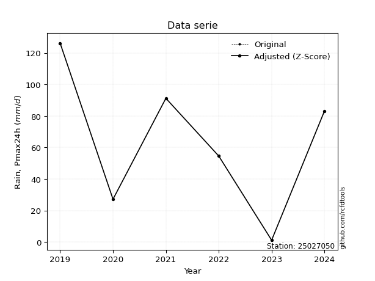</img>

</div>

> If Z-Score is active, values out of range or outliers are replaced with the station mean value.


### 4. Active continuous probability distributions from SciPy (45 of 104 available)

[scipy.stats](https://docs.scipy.org/doc/scipy/reference/stats.html) is a Python´s powerful submodule within the SciPy library for comprehensive statistical analysis, offering over 130 probability distributions (like Normal, Poisson), functions for descriptive stats (mean, variance), hypothesis testing (t-tests, chi-square), random variable generation, and statistical tests, making it essential for data science, modeling, and research. It provides tools to explore, model, and draw conclusions from data efficiently, working seamlessly with NumPy.

<div align="center">

|   id | p_dist             |   n_parameter | fit_method   | label                                                                       | active   | ref                                                                                                        |
|-----:|:-------------------|--------------:|:-------------|:----------------------------------------------------------------------------|:---------|:-----------------------------------------------------------------------------------------------------------|
|    0 | alpha              |             3 | MLE          | Alpha                                                                       | True     | [:mortar_board:](https://docs.scipy.org/doc/scipy/reference/generated/scipy.stats.alpha.html)              |
|    1 | betaprime          |             4 | MLE          | Beta prime                                                                  | True     | [:mortar_board:](https://docs.scipy.org/doc/scipy/reference/generated/scipy.stats.betaprime.html)          |
|    2 | chi2               |             3 | MLE          | Chi²                                                                        | True     | [:mortar_board:](https://docs.scipy.org/doc/scipy/reference/generated/scipy.stats.chi2.html)               |
|    3 | crystalball        |             4 | MLE          | Crystalball                                                                 | True     | [:mortar_board:](https://docs.scipy.org/doc/scipy/reference/generated/scipy.stats.crystalball.html)        |
|    4 | erlang             |             3 | MLE          | Erlang                                                                      | True     | [:mortar_board:](https://docs.scipy.org/doc/scipy/reference/generated/scipy.stats.erlang.html)             |
|    5 | expon              |             2 | MLE          | Exponential                                                                 | True     | [:mortar_board:](https://docs.scipy.org/doc/scipy/reference/generated/scipy.stats.expon.html)              |
|    6 | exponnorm          |             3 | MLE          | Exponentially modified Normal                                               | True     | [:mortar_board:](https://docs.scipy.org/doc/scipy/reference/generated/scipy.stats.exponnorm.html)          |
|    7 | f                  |             4 | MLE          | F                                                                           | True     | [:mortar_board:](https://docs.scipy.org/doc/scipy/reference/generated/scipy.stats.f.html)                  |
|    8 | fatiguelife        |             3 | MLE          | Fatigue-life (Birnbaum-Saunders)                                            | True     | [:mortar_board:](https://docs.scipy.org/doc/scipy/reference/generated/scipy.stats.fatiguelife.html)        |
|    9 | fisk               |             3 | MLE          | Fisk                                                                        | True     | [:mortar_board:](https://docs.scipy.org/doc/scipy/reference/generated/scipy.stats.fisk.html)               |
|   10 | gamma              |             3 | MLE          | Gamma                                                                       | True     | [:mortar_board:](https://docs.scipy.org/doc/scipy/reference/generated/scipy.stats.gamma.html)              |
|   11 | genexpon           |             5 | MLE          | Generalized exponential                                                     | True     | [:mortar_board:](https://docs.scipy.org/doc/scipy/reference/generated/scipy.stats.genexpon.html)           |
|   12 | genlogistic        |             3 | MLE          | Generalized logistic                                                        | True     | [:mortar_board:](https://docs.scipy.org/doc/scipy/reference/generated/scipy.stats.genlogistic.html)        |
|   13 | gibrat             |             2 | MM           | Gibrat                                                                      | True     | [:mortar_board:](https://docs.scipy.org/doc/scipy/reference/generated/scipy.stats.gibrat.html)             |
|   14 | gompertz           |             3 | MLE          | Gompertz (or truncated Gumbel)                                              | True     | [:mortar_board:](https://docs.scipy.org/doc/scipy/reference/generated/scipy.stats.gompertz.html)           |
|   15 | gumbel_l           |             2 | MM           | Gumbel Left Skew                                                            | True     | [:mortar_board:](https://docs.scipy.org/doc/scipy/reference/generated/scipy.stats.gumbel_l.html)           |
|   16 | gumbel_r           |             2 | MM           | Gumbel Right Skew                                                           | True     | [:mortar_board:](https://docs.scipy.org/doc/scipy/reference/generated/scipy.stats.gumbel_r.html)           |
|   17 | halflogistic       |             2 | MM           | Half-logistic                                                               | True     | [:mortar_board:](https://docs.scipy.org/doc/scipy/reference/generated/scipy.stats.halflogistic.html)       |
|   18 | halfnorm           |             2 | MM           | Half Normal                                                                 | True     | [:mortar_board:](https://docs.scipy.org/doc/scipy/reference/generated/scipy.stats.halfnorm.html)           |
|   19 | hypsecant          |             2 | MM           | hyperbolic secant                                                           | True     | [:mortar_board:](https://docs.scipy.org/doc/scipy/reference/generated/scipy.stats.hypsecant.html)          |
|   20 | invgamma           |             3 | MLE          | Inverted gamma                                                              | True     | [:mortar_board:](https://docs.scipy.org/doc/scipy/reference/generated/scipy.stats.invgamma.html)           |
|   21 | invgauss           |             3 | MLE          | Inverse Gaussian                                                            | True     | [:mortar_board:](https://docs.scipy.org/doc/scipy/reference/generated/scipy.stats.invgauss.html)           |
|   22 | invweibull         |             3 | MLE          | Inverted Weibull                                                            | True     | [:mortar_board:](https://docs.scipy.org/doc/scipy/reference/generated/scipy.stats.invweibull.html)         |
|   23 | johnsonsu          |             4 | MLE          | Johnson Su                                                                  | True     | [:mortar_board:](https://docs.scipy.org/doc/scipy/reference/generated/scipy.stats.johnsonsu.html)          |
|   24 | kstwobign          |             2 | MLE          | Limiting distribution of scaled Kolmogorov-Smirnov two-sided test statistic | True     | [:mortar_board:](https://docs.scipy.org/doc/scipy/reference/generated/scipy.stats.kstwobign.html)          |
|   25 | laplace            |             2 | MM           | Laplace                                                                     | True     | [:mortar_board:](https://docs.scipy.org/doc/scipy/reference/generated/scipy.stats.laplace.html)            |
|   26 | laplace_asymmetric |             3 | MLE          | Asymmetric Laplace                                                          | True     | [:mortar_board:](https://docs.scipy.org/doc/scipy/reference/generated/scipy.stats.laplace_asymmetric.html) |
|   27 | loggamma           |             3 | MLE          | Log gamma                                                                   | True     | [:mortar_board:](https://docs.scipy.org/doc/scipy/reference/generated/scipy.stats.loggamma.html)           |
|   28 | logistic           |             2 | MM           | Logistic (or Sech-squared)                                                  | True     | [:mortar_board:](https://docs.scipy.org/doc/scipy/reference/generated/scipy.stats.logistic.html)           |
|   29 | lognorm            |             3 | MLE          | Log Normal                                                                  | True     | [:mortar_board:](https://docs.scipy.org/doc/scipy/reference/generated/scipy.stats.lognorm.html)            |
|   30 | maxwell            |             2 | MM           | Maxwell                                                                     | True     | [:mortar_board:](https://docs.scipy.org/doc/scipy/reference/generated/scipy.stats.maxwell.html)            |
|   31 | mielke             |             4 | MLE          | Mielke Beta-Kappa / Dagum                                                   | True     | [:mortar_board:](https://docs.scipy.org/doc/scipy/reference/generated/scipy.stats.mielke.html)             |
|   32 | moyal              |             2 | MM           | Moyal                                                                       | True     | [:mortar_board:](https://docs.scipy.org/doc/scipy/reference/generated/scipy.stats.moyal.html)              |
|   33 | nakagami           |             3 | MLE          | Nakagami                                                                    | True     | [:mortar_board:](https://docs.scipy.org/doc/scipy/reference/generated/scipy.stats.nakagami.html)           |
|   34 | ncf                |             5 | MLE          | Non-central F distribution                                                  | True     | [:mortar_board:](https://docs.scipy.org/doc/scipy/reference/generated/scipy.stats.ncf.html)                |
|   35 | nct                |             4 | MLE          | Non-central Student’s t                                                     | True     | [:mortar_board:](https://docs.scipy.org/doc/scipy/reference/generated/scipy.stats.nct.html)                |
|   36 | norm               |             2 | MM           | Normal                                                                      | True     | [:mortar_board:](https://docs.scipy.org/doc/scipy/reference/generated/scipy.stats.norm.html)               |
|   37 | pareto             |             3 | MLE          | Pareto                                                                      | True     | [:mortar_board:](https://docs.scipy.org/doc/scipy/reference/generated/scipy.stats.pareto.html)             |
|   38 | pearson3           |             3 | MM           | Pearson type III                                                            | True     | [:mortar_board:](https://docs.scipy.org/doc/scipy/reference/generated/scipy.stats.pearson3.html)           |
|   39 | rayleigh           |             2 | MM           | Rayleigh                                                                    | True     | [:mortar_board:](https://docs.scipy.org/doc/scipy/reference/generated/scipy.stats.rayleigh.html)           |
|   40 | rice               |             3 | MLE          | Rice                                                                        | True     | [:mortar_board:](https://docs.scipy.org/doc/scipy/reference/generated/scipy.stats.rice.html)               |
|   41 | t                  |             3 | MLE          | Student’s t                                                                 | True     | [:mortar_board:](https://docs.scipy.org/doc/scipy/reference/generated/scipy.stats.t.html)                  |
|   42 | truncnorm          |             4 | MLE          | Truncated normal                                                            | True     | [:mortar_board:](https://docs.scipy.org/doc/scipy/reference/generated/scipy.stats.truncnorm.html)          |
|   43 | wald               |             2 | MM           | Wald                                                                        | True     | [:mortar_board:](https://docs.scipy.org/doc/scipy/reference/generated/scipy.stats.wald.html)               |
|   44 | weibull_min        |             3 | MLE          | Weibull minimum                                                             | True     | [:mortar_board:](https://docs.scipy.org/doc/scipy/reference/generated/scipy.stats.weibull_min.html)        |

</div>

> **n_parameter:** # arguments & localization & scale.
>
> **Fit methods:** (MLE) maximum likelihood, (MM) L-moments.
>
>**Inactive:** foldnorm, gennorm, norminvgauss, powernorm, powerlognorm, skewnorm, genextreme, anglit, arcsine, argus, beta, bradford, burr, burr12, cauchy, cosine, halfcauchy, foldcauchy, skewcauchy, wrapcauchy, dgamma, gengamma, exponweib, exponpow, truncexpon, gausshyper, genhalflogistic, genhyperbolic, geninvgauss, halfgennorm, johnsonsb, kappa4, kappa3, ksone, kstwo, loglaplace, levy, levy_l, levy_stable, ncx2, genpareto, truncpareto, lomax, powerlaw, rdist, rel_breitwigner, recipinvgauss, semicircular, studentized_range, trapezoid, triang, truncweibull_min, tukeylambda, uniform, loguniform, vonmises, vonmises_line, weibull_max, dweibull, 


## B. Probability distributions vs. Empirical distributions

A continuous probability distribution (CPD) describes probabilities for variables that can take any value within a range (like rain any time), unlike discrete variables with specific outcomes (like temperature). It uses a Probability Density Function (PDF), a curve where the total area under it equals 1, and the probability of the variable falling within an interval (a to b) is found by calculating the area under the curve between those points. A key feature is that the probability of hitting any single exact value is zero, so probabilities are always expressed for ranges, e.g., $P(a ≤ X ≤ b)$.

<div align="center">

Distributions parameters
|    |   station | p_dist                |   n |             loc |            scale | shape                 | shape1                | shape2                | shape3   |
|---:|----------:|:----------------------|----:|----------------:|-----------------:|:----------------------|:----------------------|:----------------------|:---------|
|  0 |  25027050 | alpha                 |   7 |  -359.02        |   4287.84        | 10.086726421133488    |                       |                       |          |
|  1 |  25027050 | betaprime             |   7 | -1427.42        | 169481           | 1330.1936940781602    | 150585.4481567646     |                       |          |
|  2 |  25027050 | chi2                  |   7 |  -306.019       |      2.36816     | 158.56745314424654    |                       |                       |          |
|  3 |  25027050 | crystalball           |   7 |    69.7783      |     41.0463      | 5262.85512064855      | 2437.971234282945     |                       |          |
|  4 |  25027050 | erlang                |   7 |  -623.612       |      2.5188      | 275.2223371173634     |                       |                       |          |
|  5 |  25027050 | expon                 |   7 |     1.2         |     68.5714      |                       |                       |                       |          |
|  6 |  25027050 | exponnorm             |   7 |    69.7458      |     41.049       | 0.0006236711165211349 |                       |                       |          |
|  7 |  25027050 | f                     |   7 | -8984.41        |   9054.25        | 104623.31195069017    | 1233130.2750950593    |                       |          |
|  8 |  25027050 | fatiguelife           |   7 |     1.2         |      0.00101471  | 291.6651451778718     |                       |                       |          |
|  9 |  25027050 | fisk                  |   7 |    -3.02648e+09 |      3.02648e+09 | 121112826.30661315    |                       |                       |          |
| 10 |  25027050 | gamma                 |   7 |  -635.773       |      2.46894     | 285.71641491888727    |                       |                       |          |
| 11 |  25027050 | genexpon              |   7 |     1.2         |      2.3126      | 0.03433665869294944   | 2.176692023604078e-08 | 2.3782449901179388    |          |
| 12 |  25027050 | genlogistic           |   7 |   112.201       |     10.4487      | 0.22884332014182684   |                       |                       |          |
| 13 |  25027050 | gibrat                |   7 |    38.4561      |     18.9937      |                       |                       |                       |          |
| 14 |  25027050 | gompertz              |   7 |    27.2         |      6.18527     | 6.484312363696653e-07 |                       |                       |          |
| 15 |  25027050 | gumbel_l              |   7 |    88.2457      |     32.0059      |                       |                       |                       |          |
| 16 |  25027050 | gumbel_r              |   7 |    51.2971      |     32.0059      |                       |                       |                       |          |
| 17 |  25027050 | halflogistic          |   7 |    21.1187      |     35.0955      |                       |                       |                       |          |
| 18 |  25027050 | halfnorm              |   7 |    15.4384      |     68.0964      |                       |                       |                       |          |
| 19 |  25027050 | hypsecant             |   7 |    69.7714      |     26.1327      |                       |                       |                       |          |
| 20 |  25027050 | invgamma              |   7 |  -348.244       |  38990.9         | 94.33611158117023     |                       |                       |          |
| 21 |  25027050 | invgauss              |   7 |  -146.935       |   5303.24        | 0.04084034920363942   |                       |                       |          |
| 22 |  25027050 | invweibull            |   7 |     1.2         |      3.38484     | 0.044157648904207605  |                       |                       |          |
| 23 |  25027050 | johnsonsu             |   7 |   181.798       |      4.77826     | 9.97626210202396      | 2.6402376591063934    |                       |          |
| 24 |  25027050 | kstwobign             |   7 |   -90.4895      |    182.782       |                       |                       |                       |          |
| 25 |  25027050 | laplace               |   7 |    69.7714      |     29.0261      |                       |                       |                       |          |
| 26 |  25027050 | laplace_asymmetric    |   7 |    91.2         |     29.826       | 1.4217910720873699    |                       |                       |          |
| 27 |  25027050 | loggamma              |   7 |    96.1064      |     30.507       | 0.8462090553999368    |                       |                       |          |
| 28 |  25027050 | logistic              |   7 |    69.7714      |     22.6316      |                       |                       |                       |          |
| 29 |  25027050 | lognorm               |   7 |     1.2         |      0.225296    | 14.114582282300086    |                       |                       |          |
| 30 |  25027050 | maxwell               |   7 |   -27.4978      |     60.9545      |                       |                       |                       |          |
| 31 |  25027050 | mielke                |   7 |     1.2         |    125.693       | 0.5893866282641       | 1396.5486753457922    |                       |          |
| 32 |  25027050 | moyal                 |   7 |    46.2969      |     18.4786      |                       |                       |                       |          |
| 33 |  25027050 | nakagami              |   7 |     1.2         |     74.6082      | 0.07186297080866128   |                       |                       |          |
| 34 |  25027050 | ncf                   |   7 |     1.2         |      3.09085     | 0.13434023803316453   | 28.94694366079281     | 3.1896191994363017    |          |
| 35 |  25027050 | nct                   |   7 | -2443.15        |     40.9958      | 705770.1856081153     | 61.29720327676989     |                       |          |
| 36 |  25027050 | norm                  |   7 |    69.7714      |     41.0492      |                       |                       |                       |          |
| 37 |  25027050 | pareto                |   7 |     1.13113     |      0.0688666   | 0.16798032244626532   |                       |                       |          |
| 38 |  25027050 | pearson3              |   7 |    69.7714      |     41.0491      | -0.3472825359767334   |                       |                       |          |
| 39 |  25027050 | rayleigh              |   7 |    -8.75801     |     62.6574      |                       |                       |                       |          |
| 40 |  25027050 | rice                  |   7 |   -21.0398      |     46.4688      | 1.612267674969281     |                       |                       |          |
| 41 |  25027050 | t                     |   7 |    69.7737      |     41.0512      | 21197683.011547837    |                       |                       |          |
| 42 |  25027050 | truncnorm             |   7 |    -9.2673      |      4.16524     | -0.29297277465005955  | 32.52330674621369     |                       |          |
| 43 |  25027050 | wald                  |   7 |    28.7223      |     41.0491      |                       |                       |                       |          |
| 44 |  25027050 | weibull_min           |   7 |  -287.34        |    375.043       | 10.61100982715303     |                       |                       |          |
| 45 |  25027050 | logalpha              |   7 |     0.00299905  |      0.472273    | 9.124381535858312e-08 |                       |                       |          |
| 46 |  25027050 | logbetaprime          |   7 |   -45.0671      |    369.097       | 1074.3802038049917    | 8129.370573943419     |                       |          |
| 47 |  25027050 | logchi2               |   7 |     0.182322    |      5.18241     | 0.31341651522522007   |                       |                       |          |
| 48 |  25027050 | logcrystalball        |   7 |     3.7014      |      1.51204     | 143.79172440776574    | 26.089727971112197    |                       |          |
| 49 |  25027050 | logerlang             |   7 |   -18.0774      |      0.11639     | 186.8552477321282     |                       |                       |          |
| 50 |  25027050 | logexpon              |   7 |     0.182322    |      3.51908     |                       |                       |                       |          |
| 51 |  25027050 | logexponnorm          |   7 |     3.70073     |      1.51203     | 0.0004478982798987686 |                       |                       |          |
| 52 |  25027050 | logf                  |   7 | -4037.99        |   4041.69        | 43755317.367369354    | 21136557.387214303    |                       |          |
| 53 |  25027050 | logfatiguelife        |   7 | -1245.54        |   1249.27        | 0.0012149855856685562 |                       |                       |          |
| 54 |  25027050 | logfisk               |   7 |    -1.24004e+08 |      1.24004e+08 | 171923395.19436562    |                       |                       |          |
| 55 |  25027050 | loggamma              |   7 |   -23.3824      |      0.095204    | 284.18781257425485    |                       |                       |          |
| 56 |  25027050 | loggenexpon           |   7 |     0.176559    |      0.0436974   | 0.0036805308861942547 | 4.199468026464654     | 4.368261163299267e-05 |          |
| 57 |  25027050 | loggenlogistic        |   7 |     4.83793     |      4.55458e-06 | 4.00977327174059e-06  |                       |                       |          |
| 58 |  25027050 | loggibrat             |   7 |     2.54794     |      0.699617    |                       |                       |                       |          |
| 59 |  25027050 | loggompertz           |   7 |     0.18232     |      0.838916    | 0.007576320806740994  |                       |                       |          |
| 60 |  25027050 | loggumbel_l           |   7 |     4.3819      |      1.17893     |                       |                       |                       |          |
| 61 |  25027050 | loggumbel_r           |   7 |     3.0209      |      1.17893     |                       |                       |                       |          |
| 62 |  25027050 | loghalflogistic       |   7 |     1.90923     |      1.29277     |                       |                       |                       |          |
| 63 |  25027050 | loghalfnorm           |   7 |     1.70003     |      2.50834     |                       |                       |                       |          |
| 64 |  25027050 | loghypsecant          |   7 |     3.7014      |      0.962596    |                       |                       |                       |          |
| 65 |  25027050 | loginvgamma           |   7 |   -28.1769      |  12802.2         | 403.2587880532129     |                       |                       |          |
| 66 |  25027050 | loginvgauss           |   7 |   -12.6667      |   1432.28        | 0.011442748101823684  |                       |                       |          |
| 67 |  25027050 | loginvweibull         |   7 |    -1.16093e+08 |      1.16093e+08 | 61633427.867484726    |                       |                       |          |
| 68 |  25027050 | logjohnsonsu          |   7 |     4.85921     |      0.000532068 | 4.726411179167851     | 0.6344201831718275    |                       |          |
| 69 |  25027050 | logkstwobign          |   7 |    -3.95013     |      8.75332     |                       |                       |                       |          |
| 70 |  25027050 | loglaplace            |   7 |     3.7014      |      1.06918     |                       |                       |                       |          |
| 71 |  25027050 | loglaplace_asymmetric |   7 |     4.8379      |      0.00801932  | 141.66923644008386    |                       |                       |          |
| 72 |  25027050 | logloggamma           |   7 |     4.83797     |      5.84394e-06 | 5.125347747602648e-06 |                       |                       |          |
| 73 |  25027050 | loglogistic           |   7 |     3.7014      |      0.833633    |                       |                       |                       |          |
| 74 |  25027050 | loglognorm            |   7 |     0.182322    |      0.0143667   | 13.83210793252481     |                       |                       |          |
| 75 |  25027050 | logmaxwell            |   7 |     0.118493    |      2.24525     |                       |                       |                       |          |
| 76 |  25027050 | logmielke             |   7 |    -1.04642e+08 |      1.04642e+08 | 88290742.68570064     | 10496979816.471432    |                       |          |
| 77 |  25027050 | logmoyal              |   7 |     2.83672     |      0.680658    |                       |                       |                       |          |
| 78 |  25027050 | lognakagami           |   7 |     0.182322    |      4.40179     | 0.22419634631889152   |                       |                       |          |
| 79 |  25027050 | logncf                |   7 |   -68.5161      |     71.8809      | 7196.629633397075     | 10435.633436089785    | 32.384010637282984    |          |
| 80 |  25027050 | lognct                |   7 |   -96.9806      |      1.47101     | 36761.14647065452     | 68.44042089096052     |                       |          |
| 81 |  25027050 | lognorm               |   7 |     3.7014      |      1.51204     |                       |                       |                       |          |
| 82 |  25027050 | logpareto             |   7 |     0.178427    |      0.00389458  | 0.16779324946468127   |                       |                       |          |
| 83 |  25027050 | logpearson3           |   7 |     3.7014      |      1.51204     | -1.668793212969186    |                       |                       |          |
| 84 |  25027050 | lograyleigh           |   7 |     0.808752    |      2.308       |                       |                       |                       |          |
| 85 |  25027050 | logrice               |   7 |  -539.406       |      1.51212     | 359.16867342669207    |                       |                       |          |
| 86 |  25027050 | logt                  |   7 |     4.50834     |      0.25317     | 0.796576129384594     |                       |                       |          |
| 87 |  25027050 | logtruncnorm          |   7 |     0.377651    |      5.75332     | -0.0698335682341531   | 0.7752419463607023    |                       |          |
| 88 |  25027050 | logwald               |   7 |     2.18935     |      1.51204     |                       |                       |                       |          |
| 89 |  25027050 | logweibull_min        |   7 |    -1.16569e+08 |      1.16569e+08 | 146002612.4398703     |                       |                       |          |

</div>

> **loc** (Location parameter): This shifts the distribution along the x-axis. For many common distributions, like the normal (Gaussian) distribution, loc represents the mean $μ$. For others, like the uniform distribution, it might represent the minimum value, or for the beta distribution, the left end of the support interval.
>
> **scale** (Scale parameter): This determines the width or spread of the distribution. For the normal distribution, scale represents the standard deviation $σ$. For a uniform distribution, it defines the length of the interval (from $loc$ to $loc + scale$).
>
> **shape** (Shape parameters): Refers to parameters that define the specific form of a probability distribution, distinct from its location (loc) and scale (scale). These parameters are required arguments for most distribution functions. For example, a normal (Gaussian) distribution is fully defined by its location (mean) and scale (standard deviation), so it has no specific shape parameters beyond loc and scale. However, other distributions have intrinsic properties that need specification, as Gamma distribution that takes a shape parameter, often named $a$ or $alpha$.


### 0. Cumulative distribution values - CDF (90 evaluated)

> Ordered by x ascending and calculating $log(f(x))$ separately. 

|   id |   Station |   date |     x |   count |    mean |     std |    zscore |   Value_initial |   station |   m |     alpha |   alpha_pdf |   betaprime |   betaprime_pdf |      chi2 |   chi2_pdf |   crystalball |   crystalball_pdf |    erlang |   erlang_pdf |    expon |   expon_pdf |   exponnorm |   exponnorm_pdf |         f |      f_pdf |   fatiguelife |   fatiguelife_pdf |      fisk |   fisk_pdf |    gamma |   gamma_pdf |    genexpon |   genexpon_pdf |   genlogistic |   genlogistic_pdf |   gibrat |   gibrat_pdf |    gompertz |   gompertz_pdf |   gumbel_l |   gumbel_l_pdf |   gumbel_r |   gumbel_r_pdf |   halflogistic |   halflogistic_pdf |   halfnorm |   halfnorm_pdf |   hypsecant |   hypsecant_pdf |   invgamma |   invgamma_pdf |   invgauss |   invgauss_pdf |   invweibull |   invweibull_pdf |   johnsonsu |   johnsonsu_pdf |   kstwobign |   kstwobign_pdf |   laplace |   laplace_pdf |   laplace_asymmetric |   laplace_asymmetric_pdf |   loggamma |   loggamma_pdf |   logistic |   logistic_pdf |    lognorm |   lognorm_pdf |   maxwell |   maxwell_pdf |      mielke |     mielke_pdf |       moyal |   moyal_pdf |   nakagami |   nakagami_pdf |       ncf |        ncf_pdf |       nct |    nct_pdf |      norm |   norm_pdf |   pareto |   pareto_pdf |   pearson3 |   pearson3_pdf |   rayleigh |   rayleigh_pdf |      rice |   rice_pdf |         t |      t_pdf |   truncnorm |   truncnorm_pdf |     wald |   wald_pdf |   weibull_min |   weibull_min_pdf |   logalpha |   logalpha_pdf |   logbetaprime |   logbetaprime_pdf |    logchi2 |   logchi2_pdf |   logcrystalball |   logcrystalball_pdf |   logerlang |   logerlang_pdf |   logexpon |   logexpon_pdf |   logexponnorm |   logexponnorm_pdf |       logf |   logf_pdf |   logfatiguelife |   logfatiguelife_pdf |    logfisk |   logfisk_pdf |   loggenexpon |   loggenexpon_pdf |   loggenlogistic |   loggenlogistic_pdf |   loggibrat |   loggibrat_pdf |   loggompertz |   loggompertz_pdf |   loggumbel_l |   loggumbel_l_pdf |   loggumbel_r |   loggumbel_r_pdf |   loghalflogistic |   loghalflogistic_pdf |   loghalfnorm |   loghalfnorm_pdf |   loghypsecant |   loghypsecant_pdf |   loginvgamma |   loginvgamma_pdf |   loginvgauss |   loginvgauss_pdf |   loginvweibull |   loginvweibull_pdf |   logjohnsonsu |   logjohnsonsu_pdf |   logkstwobign |   logkstwobign_pdf |   loglaplace |   loglaplace_pdf |   loglaplace_asymmetric |   loglaplace_asymmetric_pdf |   logloggamma |   logloggamma_pdf |   loglogistic |   loglogistic_pdf |   loglognorm |   loglognorm_pdf |   logmaxwell |   logmaxwell_pdf |   logmielke |   logmielke_pdf |    logmoyal |   logmoyal_pdf |   lognakagami |   lognakagami_pdf |    logncf |   logncf_pdf |    lognct |   lognct_pdf |   logpareto |   logpareto_pdf |   logpearson3 |   logpearson3_pdf |   lograyleigh |   lograyleigh_pdf |    logrice |   logrice_pdf |      logt |   logt_pdf |   logtruncnorm |   logtruncnorm_pdf |   logwald |   logwald_pdf |   logweibull_min |   logweibull_min_pdf |
|-----:|----------:|-------:|------:|--------:|--------:|--------:|----------:|----------------:|----------:|----:|----------:|------------:|------------:|----------------:|----------:|-----------:|--------------:|------------------:|----------:|-------------:|---------:|------------:|------------:|----------------:|----------:|-----------:|--------------:|------------------:|----------:|-----------:|---------:|------------:|------------:|---------------:|--------------:|------------------:|---------:|-------------:|------------:|---------------:|-----------:|---------------:|-----------:|---------------:|---------------:|-------------------:|-----------:|---------------:|------------:|----------------:|-----------:|---------------:|-----------:|---------------:|-------------:|-----------------:|------------:|----------------:|------------:|----------------:|----------:|--------------:|---------------------:|-------------------------:|-----------:|---------------:|-----------:|---------------:|-----------:|--------------:|----------:|--------------:|------------:|---------------:|------------:|------------:|-----------:|---------------:|----------:|---------------:|----------:|-----------:|----------:|-----------:|---------:|-------------:|-----------:|---------------:|-----------:|---------------:|----------:|-----------:|----------:|-----------:|------------:|----------------:|---------:|-----------:|--------------:|------------------:|-----------:|---------------:|---------------:|-------------------:|-----------:|--------------:|-----------------:|---------------------:|------------:|----------------:|-----------:|---------------:|---------------:|-------------------:|-----------:|-----------:|-----------------:|---------------------:|-----------:|--------------:|--------------:|------------------:|-----------------:|---------------------:|------------:|----------------:|--------------:|------------------:|--------------:|------------------:|--------------:|------------------:|------------------:|----------------------:|--------------:|------------------:|---------------:|-------------------:|--------------:|------------------:|--------------:|------------------:|----------------:|--------------------:|---------------:|-------------------:|---------------:|-------------------:|-------------:|-----------------:|------------------------:|----------------------------:|--------------:|------------------:|--------------:|------------------:|-------------:|-----------------:|-------------:|-----------------:|------------:|----------------:|------------:|---------------:|--------------:|------------------:|----------:|-------------:|----------:|-------------:|------------:|----------------:|--------------:|------------------:|--------------:|------------------:|-----------:|--------------:|----------:|-----------:|---------------:|-------------------:|----------:|--------------:|-----------------:|---------------------:|
|    0 |  25027050 |   2023 |   1.2 |       7 | 69.7714 | 44.3382 | -1.54656  |             1.2 |  25027050 |   1 | 0.0346322 |  0.00253133 |   0.0466223 |      0.00244115 | 0.0453758 | 0.00258868 |      0.047385 |        0.00240705 | 0.0470433 |   0.00251987 | 0        |  0.0145833  |   0.0474126 |      0.00240802 | 0.0476774 | 0.00242125 |      0.108955 |       1.46425e+07 | 0.0550937 | 0.00208326 | 0.046827 |  0.00251068 | 5.63569e-08 |     0.0148476  |     0.0879398 |        0.00192597 | 0        |   0          | 0           |    0           |  0.0637717 |     0.00192757 |  0.0083637 |     0.0012501  |      0         |         0          |   0        |     0          |   0.0460835 |      0.00175729 |  0.0435144 |     0.00271313 |  0.0358714 |     0.00269579 |   0.00560938 |      5.78214e+12 |   0.0743505 |      0.00205505 |   0.0371096 |      0.00356382 | 0.0470968 |    0.00162257 |            0.0801191 |               0.00188932 |  0.0120191 |      0.0213773 |  0.0460933 |     0.0019428  | 0.00997287 |     0.0175848 | 0.0259809 |    0.0025971  | 3.44108e-11 | 91338.7        | 0.000703994 | 0.000235302 | 0.00260056 |    1.6833e+12  | 0.0556884 | 30512.5        | 0.0474065 | 0.00240804 | 0.0474131 | 0.00240803 | 0        |  2.43921     |  0.0560979 |     0.00232494 |  0.0125496 |     0.00250463 | 0.0317073 | 0.0028907  | 0.0474158 | 0.00240802 |    0.990272 |    0.00662059   | 0        | 0          |     0.0600208 |        0.00213965 | 0.00844717 |      0.365344  |      0.0111898 |          0.0196289 | 0.00189412 |   1.06942e+13 |       0.00997283 |            0.0175848 |   0.0107965 |       0.0201373 |   0        |      0.284165  |     0.00997213 |          0.0175839 | 0.00994462 |  0.0175351 |       0.00972379 |            0.0171837 | 0.00475192 |    0.00655691 |   0.000486841 |         0.0847401 |         0        |             0.014609 |    0        |       0         |   1.78567e-08 |         0.0090311 |     0.0279781 |         0.0233965 |   1.49781e-05 |       0.000141137 |          0        |              0        |      0        |          0        |      0.0164468 |          0.0170783 |     0.0100137 |         0.0196248 |     0.0128541 |         0.0243338 |       0.0165152 |           0.0359786 |      0.0701409 |          0.0182416 |      0.0209467 |          0.0510459 |     0.018601 |        0.0173975 |               0.0166068 |                   0.0146175 |      0.016854 |         0.0147816 |     0.0144661 |          0.017102 |   0.00715488 |      5.17478e+13 |  6.10882e-06 |      0.000287075 |   0.0192261 |        0.016222 | 2.09821e-12 |    7.76095e-11 |   1.52016e-08 |       2.45582e+08 | 0.0109522 |    0.0193182 | 0.0101361 |    0.0178477 |    0        |      43.0837    |     0.0338146 |         0.0245258 |      0        |          0        | 0.00997666 |     0.0175898 | 0.0323685 | 0.00594978 |      0.0463019 |           0.224466 |  0        |     0         |       0.00576907 |            0.0072049 |
|    1 |  25027050 |   2020 |  27.2 |       7 | 69.7714 | 44.3382 | -0.960153 |            27.2 |  25027050 |   2 | 0.154967  |  0.00684873 |   0.151115  |      0.00579425 | 0.157354  | 0.00618017 |      0.149792 |        0.00567514 | 0.154729  |   0.00594087 | 0.315568 |  0.00998129 |   0.149848  |      0.00567616 | 0.150468  | 0.00568577 |      0.708429 |       0.00362205  | 0.141658  | 0.00486579 | 0.154252 |  0.00593207 | 0.320256    |     0.0100926  |     0.155405  |        0.00340261 | 0        |   0          | 8.94341e-13 |    1.04835e-07 |  0.13798   |     0.00399895 |  0.119655  |     0.00793744 |      0.0864226 |         0.0141404  |   0.137129 |     0.0115435  |   0.123287  |      0.00460065 |  0.162871  |     0.00657489 |  0.161806  |     0.00704353 |   0.400955   |      0.000622343 |   0.150594  |      0.0039905  |   0.198575  |      0.00835462 | 0.115348  |    0.00397392 |            0.147914  |               0.00348802 |  0.416086  |      0.245273  |  0.132267  |     0.00507133 | 0.396144   |     0.254852  | 0.151788  |    0.00704704 | 0.395057    |     0.00895544 | 0.0936334   | 0.00887774  | 0.73791    |    0.00404603  | 0.352453  |     0.00616095 | 0.149846  | 0.00567644 | 0.149848  | 0.00567616 | 0.631084 |  0.00237719  |  0.149693  |     0.005079   |  0.151827  |     0.00776846 | 0.154042  | 0.00651264 | 0.149847  | 0.00567585 |    1        |    3.52617e-18  | 0        | 0          |     0.14326   |        0.00446886 | 0.886208   |      0.0342453 |      0.400836  |          0.24564   | 0.856513   |   0.033073    |       0.396144   |            0.254852  |   0.417659  |       0.248158  |   0.588049 |      0.117062  |     0.396141   |          0.254854  | 0.395106   |  0.254361  |       0.390725   |            0.252998  | 0.265509   |    0.270374   |   0.519274    |         0.184666  |         0        |             0.227971 |    0.53051  |       0.526661  |   0.262953    |         0.274712  |     0.330036  |         0.227614  |   0.455187    |       0.303879    |          0.492342 |              0.293014 |      0.47727  |          0.259327 |      0.371932  |          0.304273  |     0.426133  |         0.250799  |     0.424937  |         0.229732  |       0.457181  |           0.189968  |      0.218712  |          0.120318  |      0.501676  |          0.179374  |     0.344532 |        0.322241  |               0.259009  |                   0.227982  |      0.260272 |         0.228268  |     0.382808  |          0.283417 |   0.651369   |      0.00856802  |  0.430066    |      0.261458    |   0.267605  |        0.22579  | 0.477789    |    0.323395    |   0.658597    |       0.086265    | 0.403074  |    0.248653  | 0.397611  |    0.254362  |    0.674412 |       0.0174832 |     0.300476  |         0.198192  |      0.442368 |          0.261129 | 0.396161   |     0.254843  | 0.0888629 | 0.0574494  |      0.71998   |           0.197357 |  0.538476 |     0.398109  |       0.250535   |            0.270719  |
|    2 |  25027050 |   2022 |  54.6 |       7 | 69.7714 | 44.3382 | -0.342175 |            54.6 |  25027050 |   3 | 0.389773  |  0.00961465 |   0.360042  |      0.0091363  | 0.374345  | 0.00922946 |      0.355771 |        0.00907701 | 0.366227  |   0.00913692 | 0.541021 |  0.00669345 |   0.355843  |      0.00907706 | 0.356299  | 0.00905175 |      0.784217 |       0.00215642  | 0.330682  | 0.00885717 | 0.365677 |  0.00914199 | 0.547453    |     0.00671925 |     0.282953  |        0.00617221 | 0.43543  |   0.0243873  | 5.37675e-05 |    8.79742e-06 |  0.294963  |     0.00769903 |  0.405778  |     0.0114351  |      0.443839  |         0.0114403  |   0.43477  |     0.00993114 |   0.324788  |      0.0103813  |  0.387956  |     0.00931351 |  0.398165  |     0.00952927 |   0.412583   |      0.000302047 |   0.301837  |      0.00723182 |   0.445715  |      0.00895769 | 0.296464  |    0.0102137  |            0.282241  |               0.00665563 |  0.588021  |      0.240542  |  0.338415  |     0.00989282 | 0.578283   |     0.258747  | 0.38812   |    0.00958668 | 0.603786    |     0.00666411 | 0.424417    | 0.0125348   | 0.816804   |    0.00212416  | 0.504318  |     0.00494954 | 0.355847  | 0.00907711 | 0.355843  | 0.00907703 | 0.67302  |  0.00102726  |  0.337393  |     0.00853199 |  0.400251  |     0.0096789  | 0.374629  | 0.00919335 | 0.355829  | 0.00907646 |    1        |    1.374e-52    | 0.468675 | 0.017423   |     0.312793  |        0.00799954 | 0.905944   |      0.0234221 |      0.575057  |          0.246376  | 0.876971   |   0.0260897   |       0.578283   |            0.258747  |   0.591071  |       0.241718  |   0.662051 |      0.0960333 |     0.578283   |          0.25875   | 0.577011   |  0.258549  |       0.572083   |            0.258476  | 0.487143   |    0.346379   |   0.640621    |         0.162027  |         0        |             0.421021 |    0.767375 |       0.210438  |   0.508327    |         0.420524  |     0.51486   |         0.29765   |   0.646734    |       0.23908     |          0.668847 |              0.213745 |      0.640828 |          0.20892  |      0.597205  |          0.315379  |     0.599877  |         0.240037  |     0.58338   |         0.219178  |       0.582367  |           0.167158  |      0.344662  |          0.271956  |      0.618554  |          0.154928  |     0.621848 |        0.353685  |               0.478285  |                   0.420992  |      0.479556 |         0.420588  |     0.588613  |          0.290473 |   0.656743   |      0.00696384  |  0.606624    |      0.238326    |   0.48176   |        0.406482 | 0.670492    |    0.227795    |   0.713903    |       0.0729893   | 0.579325  |    0.248905  | 0.579173  |    0.257666  |    0.685226 |       0.0138206 |     0.47      |         0.291868  |      0.615549 |          0.230322 | 0.578293   |     0.258734  | 0.170178  | 0.237663   |      0.853032  |           0.184213 |  0.736501 |     0.198087  |       0.498565   |            0.43353   |
|    3 |  25027050 |   2024 |  83.2 |       7 | 69.7714 | 44.3382 |  0.302867 |            83.2 |  25027050 |   4 | 0.651931  |  0.00810501 |   0.631406  |      0.00909115 | 0.640003  | 0.00865882 |      0.628162 |        0.00921337 | 0.634212  |   0.00888518 | 0.697548 |  0.00441076 |   0.628217  |      0.00921231 | 0.627528  | 0.0091671  |      0.835131 |       0.00147451  | 0.608117  | 0.00953665 | 0.633996 |  0.00890054 | 0.704033    |     0.00439442 |     0.522567  |        0.0107737  | 0.804235 |   0.0061766  | 0.00552858  |    0.000891459 |  0.574355  |     0.0113593  |  0.69138   |     0.00797242 |      0.708647  |         0.00709234 |   0.680305 |     0.00714165 |   0.65681   |      0.0107321  |  0.64782   |     0.00823649 |  0.656154  |     0.00795478 |   0.419493   |      0.000196241 |   0.560687  |      0.0105466  |   0.67283   |      0.00671273 | 0.685189  |    0.0108458  |            0.554013  |               0.0130644  |  0.684909  |      0.217364  |  0.644135  |     0.0101286  | 0.68299    |     0.235575  | 0.652096  |    0.00829894 | 0.777445    |     0.005588   | 0.712561    | 0.00743204  | 0.865913   |    0.00139951  | 0.629513  |     0.00383317 | 0.628214  | 0.00921179 | 0.628217  | 0.00921229 | 0.695727 |  0.000622793 |  0.608473  |     0.00972199 |  0.659374  |     0.00797851 | 0.638768  | 0.00865532 | 0.628189  | 0.00921205 |    1        |    1.49845e-108 | 0.772041 | 0.00610554 |     0.585095  |        0.0104522  | 0.914875   |      0.0191934 |      0.674816  |          0.224906  | 0.887274   |   0.0229345   |       0.68299    |            0.235576  |   0.68819   |       0.217307  |   0.700175 |      0.0851999 |     0.68299    |          0.235578  | 0.681671   |  0.235629  |       0.676912   |            0.236416  | 0.630077   |    0.32315    |   0.705292    |         0.144747  |         0        |             0.610032 |    0.83767  |       0.131114  |   0.692072    |         0.435131  |     0.644397  |         0.311868  |   0.737205    |       0.190652    |          0.749391 |              0.169564 |      0.72202  |          0.176598 |      0.718525  |          0.255766  |     0.695833  |         0.213615  |     0.67156   |         0.198065  |       0.649003  |           0.148956  |      0.511058  |          0.57767   |      0.680268  |          0.137992  |     0.744982 |        0.238518  |               0.692955  |                   0.609947  |      0.693867 |         0.608546  |     0.703393  |          0.250268 |   0.659521   |      0.00625255  |  0.700932    |      0.208048    |   0.687349  |        0.579947 | 0.754855    |    0.174303    |   0.743198    |       0.0662421   | 0.679949  |    0.226413  | 0.683405  |    0.234449  |    0.6907   |       0.0122321 |     0.606028  |         0.35349   |      0.706224 |          0.199229 | 0.682994   |     0.235563  | 0.399846  | 1.05888    |      0.928797  |           0.175443 |  0.805915 |     0.136251  |       0.689601   |            0.454827  |
|    4 |  25027050 |   2021 |  91.2 |       7 | 69.7714 | 44.3382 |  0.483299 |            91.2 |  25027050 |   5 | 0.713225  |  0.00720299 |   0.701285  |      0.00833625 | 0.706219  | 0.00786349 |      0.699127 |        0.00848187 | 0.702393  |   0.00812215 | 0.730854 |  0.00392505 |   0.699173  |      0.00848072 | 0.698144  | 0.00844171 |      0.846392 |       0.00134372  | 0.681255  | 0.00868971 | 0.702298 |  0.00813679 | 0.73718     |     0.00390225 |     0.613403  |        0.011847   | 0.846453 |   0.00448976 | 0.0200072   |    0.00320219  |  0.666028  |     0.0114437  |  0.75018   |     0.00673729 |      0.760937  |         0.00599757 |   0.734105 |     0.00631003 |   0.735884  |      0.00898628 |  0.710477  |     0.00740555 |  0.716352  |     0.00708077 |   0.420991   |      0.0001787   |   0.646482  |      0.0108183  |   0.72354   |      0.00596575 | 0.761025  |    0.00823308 |            0.669037  |               0.0157768  |  0.704565  |      0.210775  |  0.72048   |     0.00889856 | 0.704295   |     0.228442  | 0.715188  |    0.00745375 | 0.821293    |     0.00537843 | 0.766688    | 0.00612992  | 0.876576   |    0.00126953  | 0.659047  |     0.00355305 | 0.699166  | 0.00848017 | 0.699173  | 0.0084807  | 0.700444 |  0.000558678 |  0.684498  |     0.00922081 |  0.719871  |     0.0071323  | 0.705154  | 0.00790869 | 0.699144  | 0.00848064 |    1        |    7.19579e-128 | 0.815107 | 0.00473256 |     0.668292  |        0.0102606  | 0.916601   |      0.0184242 |      0.695173  |          0.218477  | 0.889351   |   0.0223252   |       0.704295   |            0.228442  |   0.70783   |       0.210477  |   0.707896 |      0.0830059 |     0.704296   |          0.228444  | 0.702984   |  0.228551  |       0.698304   |            0.229509  | 0.659222   |    0.31146    |   0.7184      |         0.140783  |         0        |             0.661386 |    0.849145 |       0.119099  |   0.731522    |         0.423259  |     0.67296   |         0.310046  |   0.754238    |       0.180443    |          0.764549 |              0.160688 |      0.737912 |          0.169609 |      0.741291  |          0.240134  |     0.715119  |         0.206478  |     0.689487  |         0.192433  |       0.662489  |           0.144818  |      0.570232  |          0.719799  |      0.692765  |          0.134246  |     0.765966 |        0.218892  |               0.751277  |                   0.661283  |      0.752047 |         0.659572  |     0.725844  |          0.238708 |   0.660089   |      0.0061161   |  0.719687    |      0.200496    |   0.742709  |        0.626657 | 0.770378    |    0.163941    |   0.749216    |       0.0648705   | 0.700432  |    0.219715  | 0.704608  |    0.227341  |    0.691809 |       0.01193   |     0.639055  |         0.365884  |      0.724176 |          0.191809 | 0.704298   |     0.22843   | 0.50565   | 1.19872    |      0.944813  |           0.173465 |  0.817951 |     0.126097  |       0.730843   |            0.442457  |
|    5 |  25027050 |   2025 | 104.8 |       7 | 69.7714 | 44.3382 |  0.790032 |           104.8 |  25027050 |   6 | 0.800131  |  0.00557788 |   0.803401  |      0.00661644 | 0.802187  | 0.00621036 |      0.803232 |        0.00675391 | 0.801824  |   0.00644642 | 0.779274 |  0.00321892 |   0.803263  |      0.00675281 | 0.801829  | 0.00673371 |      0.863355 |       0.00115754  | 0.786471  | 0.00672034 | 0.801904 |  0.00645687 | 0.785236    |     0.00318874 |     0.775901  |        0.0113861  | 0.894486 |   0.0027505  | 0.166547    |    0.0245482   |  0.813135  |     0.00979325 |  0.828668  |     0.00486586 |      0.831258  |         0.00440242 |   0.810575 |     0.00495302 |   0.837028  |      0.0059674  |  0.800475  |     0.00581254 |  0.801979  |     0.00551178 |   0.423253   |      0.000155109 |   0.789468  |      0.00987803 |   0.796279  |      0.00474816 | 0.850423  |    0.0051532  |            0.826929  |               0.0082502  |  0.733125  |      0.200008  |  0.824592  |     0.00639107 | 0.735234   |     0.216526  | 0.805759  |    0.00584914 | 0.892318    |     0.00507645 | 0.837292    | 0.00434107  | 0.892558   |    0.00108779  | 0.70432   |     0.00311219 | 0.803249  | 0.0067524  | 0.803262  | 0.00675281 | 0.707437 |  0.000474055 |  0.799792  |     0.00759367 |  0.806471  |     0.00559781 | 0.802169  | 0.00631073 | 0.803235  | 0.00675304 |    1        |    2.18142e-164 | 0.867942 | 0.00316489 |     0.799079  |        0.00872516 | 0.919086   |      0.0173446 |      0.724812  |          0.207808  | 0.892393   |   0.0214487   |       0.735235   |            0.216526  |   0.736325  |       0.199376  |   0.719209 |      0.0797912 |     0.735235   |          0.216528  | 0.733944   |  0.216716  |       0.729415   |            0.217913  | 0.7011     |    0.290539   |   0.737546    |         0.1347    |         0        |             0.747482 |    0.864577 |       0.103409  |   0.788455    |         0.393602  |     0.715645  |         0.303312  |   0.778272    |       0.165485    |          0.785983 |              0.147835 |      0.760758 |          0.159145 |      0.773012  |          0.216325  |     0.743031  |         0.195012  |     0.715613  |         0.183393  |       0.68218   |           0.138515  |      0.692406  |          1.07674   |      0.711031  |          0.128582  |     0.794497 |        0.192207  |               0.849054  |                   0.747347  |      0.849549 |         0.745085  |     0.757749  |          0.2202   |   0.660925   |      0.0059203   |  0.746739    |      0.188668    |   0.835127  |        0.704634 | 0.792127    |    0.149197    |   0.758092    |       0.0628539   | 0.730213  |    0.208623  | 0.735398  |    0.215484  |    0.693437 |       0.0114983 |     0.691114  |         0.382689  |      0.750043 |          0.180343 | 0.735236   |     0.216515  | 0.655241  | 0.883825   |      0.968714  |           0.170429 |  0.834506 |     0.112427  |       0.790295   |            0.410283  |
|    6 |  25027050 |   2019 | 126.2 |       7 | 69.7714 | 44.3382 |  1.27269  |           126.2 |  25027050 |   7 | 0.894316  |  0.00332723 |   0.913475  |      0.00373072 | 0.906471  | 0.00360802 |      0.91537  |        0.00377867 | 0.909697  |   0.00369764 | 0.838446 |  0.00235599 |   0.915382  |      0.00377802 | 0.913922  | 0.00379277 |      0.885582 |       0.000930951 | 0.896615  | 0.00370951 | 0.909905 |  0.00369934 | 0.843696    |     0.00232074 |     0.948158  |        0.00430993 | 0.937031 |   0.00140982 | 0.996959    |    0.00284979  |  0.962125  |     0.00387371 |  0.908191  |     0.00273259 |      0.904618  |         0.00258816 |   0.896166 |     0.00312121 |   0.926855  |      0.00277443 |  0.89881   |     0.00346187 |  0.895479  |     0.00332055 |   0.426269   |      0.000128401 |   0.951744  |      0.00474331 |   0.879721  |      0.00311845 | 0.928439  |    0.00246539 |            0.9376    |               0.0029746  |  0.768861  |      0.184455  |  0.923675  |     0.00311511 | 0.773858   |     0.198919  | 0.904568  |    0.00346437 | 0.996745    |     0.00469767 | 0.908374    | 0.00246832  | 0.913382   |    0.000869536 | 0.764269  |     0.00250856 | 0.915364  | 0.00377806 | 0.915381  | 0.00377803 | 0.716516 |  0.000380748 |  0.925517  |     0.00411944 |  0.901692  |     0.00337943 | 0.908572  | 0.00368566 | 0.915362  | 0.00377849 |    1        |    3.17233e-231 | 0.919223 | 0.00178404 |     0.940412  |        0.00431212 | 0.922186   |      0.0160432 |      0.76199   |          0.19213   | 0.896276   |   0.0203563   |       0.773858   |            0.198919  |   0.771907  |       0.183444  |   0.73365  |      0.0756874 |     0.773859   |          0.19892   | 0.772612   |  0.199209  |       0.768332   |            0.200683  | 0.752159   |    0.258453   |   0.761813    |         0.126478  |         0.999941 |             0.88033  |    0.882138 |       0.0862545 |   0.856343    |         0.333562  |     0.770582  |         0.286489  |   0.807247    |       0.146617    |          0.811941 |              0.131791 |      0.789052 |          0.145458 |      0.810323  |          0.185592  |     0.777772  |         0.178787  |     0.74851   |         0.170573  |       0.707135  |           0.130094  |      0.974077  |          1.79011   |      0.734223  |          0.121067  |     0.82728  |        0.161545  |               0.999923  |                   0.880144  |      0.999916 |         0.876963  |     0.796291  |          0.194584 |   0.662002   |      0.00567704  |  0.780289    |      0.172397    |   0.976386  |        0.775744 | 0.818152    |    0.131245    |   0.769529    |       0.0602634   | 0.76749   |    0.192369  | 0.773837  |    0.197989  |    0.695524 |       0.0109646 |     0.763867  |         0.398813  |      0.782111 |          0.164807 | 0.773857   |     0.19891   | 0.772433  | 0.43067    |      1         |           0.166301 |  0.853906 |     0.0968622 |       0.860735   |            0.343867  |

An Empirical Distribution Function (EDF) is a step-function estimate of a true cumulative distribution function (CDF) based on observed sample data, representing the proportion of data points less than or equal to a given value. It is calculated by ordering your data and jumping up by $1/n$ (where $n$ is sample size) at each unique data point, allowing analysis without assuming an underlying population distribution, and it gets closer to the true CDF as the sample size grows.


### 1. Empirical - EDF California (1923)

California´s estimates the true probability distribution of water-related data (like rainfall, streamflow) using observed samples, crucial for risk assessment.

<div align="center">


$P=m/n$


</div>


**1.1. Empirical values**

<div align="center">

|                | 0                   | 1                  | 2                   | 3                  | 4                  | 5                  | 6              |
|:---------------|:--------------------|:-------------------|:--------------------|:-------------------|:-------------------|:-------------------|:---------------|
| date           | 2023                | 2020               | 2022                | 2024               | 2021               | 2025               | 2019           |
| x              | 1.2                 | 27.2               | 54.6                | 83.2               | 91.2               | 104.8              | 126.2          |
| m              | 1                   | 2                  | 3                   | 4                  | 5                  | 6                  | 7              |
| empirical_dist | edf_california      | edf_california     | edf_california      | edf_california     | edf_california     | edf_california     | edf_california |
| empirical      | 0.14285714285714285 | 0.2857142857142857 | 0.42857142857142855 | 0.5714285714285714 | 0.7142857142857143 | 0.8571428571428571 | 1.0            |
| empirical_tr   | 1.1666666666666665  | 1.4                | 1.75                | 2.333333333333333  | 3.5                | 6.999999999999997  | inf            |

</div>


**1.2. Kolmogorov-Smirnov fit test (sorted by Δ)**


<div align="center">

|                | 0                   | 1                   | 2                   | 3                   | 4                   | 5                     | 6                   | 7                   | 8                   | 9                   | 10                  | 11                  | 12                  | 13                  | 14                  | 15                  | 16                  | 17                  | 18                  | 19                  | 20                  | 21                  | 22                  | 23                  | 24                  | 25                  | 26                  | 27                  | 28                  | 29                  | 30                  | 31                  | 32                  | 33                  | 34                  | 35                  | 36                  | 37                  | 38                  | 39                  | 40                  | 41                  | 42                  | 43                  | 44                  | 45                  | 46                  | 47                  | 48                  | 49                  | 50                  | 51                  | 52                  | 53                  | 54                  | 55                  | 56                  | 57                  | 58                  | 59                  | 60                  | 61                  | 62                  | 63                  | 64                  | 65                  | 66                  | 67                  | 68                  | 69                  | 70                  | 71                  | 72                  | 73                  | 74                  | 75                  | 76                  | 77                  | 78                  | 79                  | 80                  | 81                  | 82                  | 83                  | 84                  | 85                  | 86                  | 87                  | 88                  | 89                  |
|:---------------|:--------------------|:--------------------|:--------------------|:--------------------|:--------------------|:----------------------|:--------------------|:--------------------|:--------------------|:--------------------|:--------------------|:--------------------|:--------------------|:--------------------|:--------------------|:--------------------|:--------------------|:--------------------|:--------------------|:--------------------|:--------------------|:--------------------|:--------------------|:--------------------|:--------------------|:--------------------|:--------------------|:--------------------|:--------------------|:--------------------|:--------------------|:--------------------|:--------------------|:--------------------|:--------------------|:--------------------|:--------------------|:--------------------|:--------------------|:--------------------|:--------------------|:--------------------|:--------------------|:--------------------|:--------------------|:--------------------|:--------------------|:--------------------|:--------------------|:--------------------|:--------------------|:--------------------|:--------------------|:--------------------|:--------------------|:--------------------|:--------------------|:--------------------|:--------------------|:--------------------|:--------------------|:--------------------|:--------------------|:--------------------|:--------------------|:--------------------|:--------------------|:--------------------|:--------------------|:--------------------|:--------------------|:--------------------|:--------------------|:--------------------|:--------------------|:--------------------|:--------------------|:--------------------|:--------------------|:--------------------|:--------------------|:--------------------|:--------------------|:--------------------|:--------------------|:--------------------|:--------------------|:--------------------|:--------------------|:--------------------|
| station        | 25027050            | 25027050            | 25027050            | 25027050            | 25027050            | 25027050              | 25027050            | 25027050            | 25027050            | 25027050            | 25027050            | 25027050            | 25027050            | 25027050            | 25027050            | 25027050            | 25027050            | 25027050            | 25027050            | 25027050            | 25027050            | 25027050            | 25027050            | 25027050            | 25027050            | 25027050            | 25027050            | 25027050            | 25027050            | 25027050            | 25027050            | 25027050            | 25027050            | 25027050            | 25027050            | 25027050            | 25027050            | 25027050            | 25027050            | 25027050            | 25027050            | 25027050            | 25027050            | 25027050            | 25027050            | 25027050            | 25027050            | 25027050            | 25027050            | 25027050            | 25027050            | 25027050            | 25027050            | 25027050            | 25027050            | 25027050            | 25027050            | 25027050            | 25027050            | 25027050            | 25027050            | 25027050            | 25027050            | 25027050            | 25027050            | 25027050            | 25027050            | 25027050            | 25027050            | 25027050            | 25027050            | 25027050            | 25027050            | 25027050            | 25027050            | 25027050            | 25027050            | 25027050            | 25027050            | 25027050            | 25027050            | 25027050            | 25027050            | 25027050            | 25027050            | 25027050            | 25027050            | 25027050            | 25027050            | 25027050            |
| empirical_dist | edf_california      | edf_california      | edf_california      | edf_california      | edf_california      | edf_california        | edf_california      | edf_california      | edf_california      | edf_california      | edf_california      | edf_california      | edf_california      | edf_california      | edf_california      | edf_california      | edf_california      | edf_california      | edf_california      | edf_california      | edf_california      | edf_california      | edf_california      | edf_california      | edf_california      | edf_california      | edf_california      | edf_california      | edf_california      | edf_california      | edf_california      | edf_california      | edf_california      | edf_california      | edf_california      | edf_california      | edf_california      | edf_california      | edf_california      | edf_california      | edf_california      | edf_california      | edf_california      | edf_california      | edf_california      | edf_california      | edf_california      | edf_california      | edf_california      | edf_california      | edf_california      | edf_california      | edf_california      | edf_california      | edf_california      | edf_california      | edf_california      | edf_california      | edf_california      | edf_california      | edf_california      | edf_california      | edf_california      | edf_california      | edf_california      | edf_california      | edf_california      | edf_california      | edf_california      | edf_california      | edf_california      | edf_california      | edf_california      | edf_california      | edf_california      | edf_california      | edf_california      | edf_california      | edf_california      | edf_california      | edf_california      | edf_california      | edf_california      | edf_california      | edf_california      | edf_california      | edf_california      | edf_california      | edf_california      | edf_california      |
| p_dist         | kstwobign           | invgamma            | logmielke           | invgauss            | logloggamma         | loglaplace_asymmetric | chi2                | alpha               | erlang              | gamma               | rice                | rayleigh            | maxwell             | betaprime           | johnsonsu           | f                   | norm                | exponnorm           | t                   | nct                 | crystalball         | pearson3            | logweibull_min      | weibull_min         | loggompertz         | fisk                | genlogistic         | laplace_asymmetric  | gumbel_l            | halfnorm            | logistic            | genexpon            | expon               | hypsecant           | logjohnsonsu        | gumbel_r            | laplace             | loghypsecant        | moyal               | loglaplace          | halflogistic        | loglogistic         | mielke              | loghalfnorm         | lograyleigh         | loggumbel_r         | logmaxwell          | loginvgamma         | logexponnorm        | logcrystalball      | lognorm             | lognorm             | logrice             | lognct              | logf                | logerlang           | loggumbel_l         | loggamma            | loggamma            | logfatiguelife      | logncf              | ncf                 | logpearson3         | logbetaprime        | loggenexpon         | loghalflogistic     | logmoyal            | logfisk             | loginvgauss         | logt                | logkstwobign        | gibrat              | wald                | loginvweibull       | logexpon            | logwald             | loggibrat           | pareto              | loglognorm          | lognakagami         | logpareto           | fatiguelife         | logtruncnorm        | nakagami            | logchi2             | invweibull          | logalpha            | gompertz            | truncnorm           | loggenlogistic      |
| delta          | 0.12027914282608565 | 0.12284376198307215 | 0.1236310019878351  | 0.12390809418664644 | 0.12600314275004978 | 0.12625033705612798   | 0.12836038056858742 | 0.13074771266271612 | 0.13098510192798793 | 0.1314621779410898  | 0.1316720027782094  | 0.1338872939873596  | 0.13392586552127497 | 0.13459926389995605 | 0.1351206530677294  | 0.1352463724355999  | 0.1358659435845337  | 0.13586663378387037 | 0.1358670421297884  | 0.13586851548999485 | 0.1359219893350399  | 0.13602126186535152 | 0.13926481575545946 | 0.14245472566998382 | 0.14365739343596917 | 0.14405655734191966 | 0.1456184820734266  | 0.14633059080489763 | 0.14773443040994352 | 0.1485856326405911  | 0.15344739451042785 | 0.1563037036110505  | 0.16155386432948105 | 0.1624275296140119  | 0.16473704802481626 | 0.1660590142611093  | 0.17036673411312675 | 0.1896774860239302  | 0.19208089829329575 | 0.1932769120525249  | 0.1992917072122537  | 0.20370899118642205 | 0.206016885929031   | 0.2122563813697253  | 0.2178888532370714  | 0.21816223691776365 | 0.2197105105365229  | 0.2222277780139058  | 0.22614124354248932 | 0.2261422737273806  | 0.22614239832358596 | 0.22614239832358596 | 0.2261431301703566  | 0.22616256536238444 | 0.22738818160919516 | 0.22809277835522923 | 0.2294183459833975  | 0.23113881582004103 | 0.23113881582004103 | 0.23166836881697184 | 0.23251008900335968 | 0.23573145675413087 | 0.23613295585846272 | 0.23800956118801198 | 0.2381872459981147  | 0.24027526420374362 | 0.2419202761589026  | 0.2478405651607064  | 0.2514897660367392  | 0.25839336439556904 | 0.26577653292561776 | 0.2857142857142857  | 0.2857142857142857  | 0.292864718815533   | 0.3023344919413936  | 0.30792930067993546 | 0.33880364932939183 | 0.3453695977592802  | 0.36565489456506095 | 0.3728831428772933  | 0.38869797633373937 | 0.4227143052126532  | 0.4342658871999986  | 0.45219583156239784 | 0.5707987358313635  | 0.5737310604511334  | 0.6004940174159713  | 0.6942784815521882  | 0.8474143931306437  | 0.8571428571428571  |
| deltao         | 0.48442053926100004 | 0.48442053926100004 | 0.48442053926100004 | 0.48442053926100004 | 0.48442053926100004 | 0.48442053926100004   | 0.48442053926100004 | 0.48442053926100004 | 0.48442053926100004 | 0.48442053926100004 | 0.48442053926100004 | 0.48442053926100004 | 0.48442053926100004 | 0.48442053926100004 | 0.48442053926100004 | 0.48442053926100004 | 0.48442053926100004 | 0.48442053926100004 | 0.48442053926100004 | 0.48442053926100004 | 0.48442053926100004 | 0.48442053926100004 | 0.48442053926100004 | 0.48442053926100004 | 0.48442053926100004 | 0.48442053926100004 | 0.48442053926100004 | 0.48442053926100004 | 0.48442053926100004 | 0.48442053926100004 | 0.48442053926100004 | 0.48442053926100004 | 0.48442053926100004 | 0.48442053926100004 | 0.48442053926100004 | 0.48442053926100004 | 0.48442053926100004 | 0.48442053926100004 | 0.48442053926100004 | 0.48442053926100004 | 0.48442053926100004 | 0.48442053926100004 | 0.48442053926100004 | 0.48442053926100004 | 0.48442053926100004 | 0.48442053926100004 | 0.48442053926100004 | 0.48442053926100004 | 0.48442053926100004 | 0.48442053926100004 | 0.48442053926100004 | 0.48442053926100004 | 0.48442053926100004 | 0.48442053926100004 | 0.48442053926100004 | 0.48442053926100004 | 0.48442053926100004 | 0.48442053926100004 | 0.48442053926100004 | 0.48442053926100004 | 0.48442053926100004 | 0.48442053926100004 | 0.48442053926100004 | 0.48442053926100004 | 0.48442053926100004 | 0.48442053926100004 | 0.48442053926100004 | 0.48442053926100004 | 0.48442053926100004 | 0.48442053926100004 | 0.48442053926100004 | 0.48442053926100004 | 0.48442053926100004 | 0.48442053926100004 | 0.48442053926100004 | 0.48442053926100004 | 0.48442053926100004 | 0.48442053926100004 | 0.48442053926100004 | 0.48442053926100004 | 0.48442053926100004 | 0.48442053926100004 | 0.48442053926100004 | 0.48442053926100004 | 0.48442053926100004 | 0.48442053926100004 | 0.48442053926100004 | 0.48442053926100004 | 0.48442053926100004 | 0.48442053926100004 |
| eval           | Δo > Δ              | Δo > Δ              | Δo > Δ              | Δo > Δ              | Δo > Δ              | Δo > Δ                | Δo > Δ              | Δo > Δ              | Δo > Δ              | Δo > Δ              | Δo > Δ              | Δo > Δ              | Δo > Δ              | Δo > Δ              | Δo > Δ              | Δo > Δ              | Δo > Δ              | Δo > Δ              | Δo > Δ              | Δo > Δ              | Δo > Δ              | Δo > Δ              | Δo > Δ              | Δo > Δ              | Δo > Δ              | Δo > Δ              | Δo > Δ              | Δo > Δ              | Δo > Δ              | Δo > Δ              | Δo > Δ              | Δo > Δ              | Δo > Δ              | Δo > Δ              | Δo > Δ              | Δo > Δ              | Δo > Δ              | Δo > Δ              | Δo > Δ              | Δo > Δ              | Δo > Δ              | Δo > Δ              | Δo > Δ              | Δo > Δ              | Δo > Δ              | Δo > Δ              | Δo > Δ              | Δo > Δ              | Δo > Δ              | Δo > Δ              | Δo > Δ              | Δo > Δ              | Δo > Δ              | Δo > Δ              | Δo > Δ              | Δo > Δ              | Δo > Δ              | Δo > Δ              | Δo > Δ              | Δo > Δ              | Δo > Δ              | Δo > Δ              | Δo > Δ              | Δo > Δ              | Δo > Δ              | Δo > Δ              | Δo > Δ              | Δo > Δ              | Δo > Δ              | Δo > Δ              | Δo > Δ              | Δo > Δ              | Δo > Δ              | Δo > Δ              | Δo > Δ              | Δo > Δ              | Δo > Δ              | Δo > Δ              | Δo > Δ              | Δo > Δ              | Δo > Δ              | Δo > Δ              | Δo > Δ              | Δo > Δ              | Δo <= Δ             | Δo <= Δ             | Δo <= Δ             | Δo <= Δ             | Δo <= Δ             | Δo <= Δ             |
| fit            | 1                   | 1                   | 1                   | 1                   | 1                   | 1                     | 1                   | 1                   | 1                   | 1                   | 1                   | 1                   | 1                   | 1                   | 1                   | 1                   | 1                   | 1                   | 1                   | 1                   | 1                   | 1                   | 1                   | 1                   | 1                   | 1                   | 1                   | 1                   | 1                   | 1                   | 1                   | 1                   | 1                   | 1                   | 1                   | 1                   | 1                   | 1                   | 1                   | 1                   | 1                   | 1                   | 1                   | 1                   | 1                   | 1                   | 1                   | 1                   | 1                   | 1                   | 1                   | 1                   | 1                   | 1                   | 1                   | 1                   | 1                   | 1                   | 1                   | 1                   | 1                   | 1                   | 1                   | 1                   | 1                   | 1                   | 1                   | 1                   | 1                   | 1                   | 1                   | 1                   | 1                   | 1                   | 1                   | 1                   | 1                   | 1                   | 1                   | 1                   | 1                   | 1                   | 1                   | 1                   | 0                   | 0                   | 0                   | 0                   | 0                   | 0                   |
| n              | 7                   | 7                   | 7                   | 7                   | 7                   | 7                     | 7                   | 7                   | 7                   | 7                   | 7                   | 7                   | 7                   | 7                   | 7                   | 7                   | 7                   | 7                   | 7                   | 7                   | 7                   | 7                   | 7                   | 7                   | 7                   | 7                   | 7                   | 7                   | 7                   | 7                   | 7                   | 7                   | 7                   | 7                   | 7                   | 7                   | 7                   | 7                   | 7                   | 7                   | 7                   | 7                   | 7                   | 7                   | 7                   | 7                   | 7                   | 7                   | 7                   | 7                   | 7                   | 7                   | 7                   | 7                   | 7                   | 7                   | 7                   | 7                   | 7                   | 7                   | 7                   | 7                   | 7                   | 7                   | 7                   | 7                   | 7                   | 7                   | 7                   | 7                   | 7                   | 7                   | 7                   | 7                   | 7                   | 7                   | 7                   | 7                   | 7                   | 7                   | 7                   | 7                   | 7                   | 7                   | 7                   | 7                   | 7                   | 7                   | 7                   | 7                   |
| best_fit       | 1                   | 0                   | 0                   | 0                   | 0                   | 0                     | 0                   | 0                   | 0                   | 0                   | 0                   | 0                   | 0                   | 0                   | 0                   | 0                   | 0                   | 0                   | 0                   | 0                   | 0                   | 0                   | 0                   | 0                   | 0                   | 0                   | 0                   | 0                   | 0                   | 0                   | 0                   | 0                   | 0                   | 0                   | 0                   | 0                   | 0                   | 0                   | 0                   | 0                   | 0                   | 0                   | 0                   | 0                   | 0                   | 0                   | 0                   | 0                   | 0                   | 0                   | 0                   | 0                   | 0                   | 0                   | 0                   | 0                   | 0                   | 0                   | 0                   | 0                   | 0                   | 0                   | 0                   | 0                   | 0                   | 0                   | 0                   | 0                   | 0                   | 0                   | 0                   | 0                   | 0                   | 0                   | 0                   | 0                   | 0                   | 0                   | 0                   | 0                   | 0                   | 0                   | 0                   | 0                   | 0                   | 0                   | 0                   | 0                   | 0                   | 0                   |
| best_fit_sort  | 1                   | 2                   | 3                   | 4                   | 5                   | 6                     | 7                   | 8                   | 9                   | 10                  | 11                  | 12                  | 13                  | 14                  | 15                  | 16                  | 17                  | 18                  | 19                  | 20                  | 21                  | 22                  | 23                  | 24                  | 25                  | 26                  | 27                  | 28                  | 29                  | 30                  | 31                  | 32                  | 33                  | 34                  | 35                  | 36                  | 37                  | 38                  | 39                  | 40                  | 41                  | 42                  | 43                  | 44                  | 45                  | 46                  | 47                  | 48                  | 49                  | 50                  | 51                  | 52                  | 53                  | 54                  | 55                  | 56                  | 57                  | 58                  | 59                  | 60                  | 61                  | 62                  | 63                  | 64                  | 65                  | 66                  | 67                  | 68                  | 69                  | 70                  | 71                  | 72                  | 73                  | 74                  | 75                  | 76                  | 77                  | 78                  | 79                  | 80                  | 81                  | 82                  | 83                  | 84                  | 85                  | 86                  | 87                  | 88                  | 89                  | 90                  |

</div>


<div align="center">

</img>

</div>


**1.3. Best fit**

<div align="center">

|   id |   station | empirical_dist   | p_dist    |    delta |   deltao | eval   |   fit |   n |   best_fit |   best_fit_sort |
|-----:|----------:|:-----------------|:----------|---------:|---------:|:-------|------:|----:|-----------:|----------------:|
|    0 |  25027050 | edf_california   | kstwobign | 0.120279 | 0.484421 | Δo > Δ |     1 |   7 |          1 |               1 |

</div>


<div align="center">

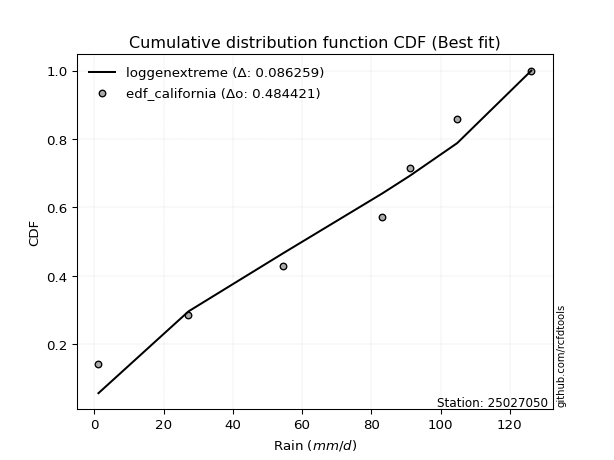</img>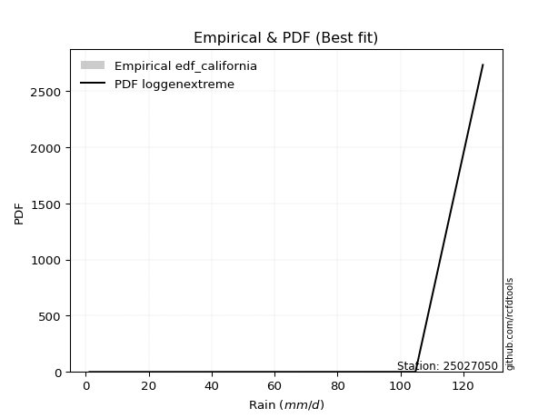</img>

</div>


### 2. Empirical - EDF Hazen (1930)

Hazen method for plotting positions is a formula used to estimate the empirical cumulative probability distribution of flood events or other hydrological data. This formula often results in biased estimations, particularly when extrapolating to extreme events (high return periods).

<div align="center">


$P=(m-0.5)/n$


</div>


**2.1. Empirical values**

<div align="center">

|                | 0                   | 1                   | 2                   | 3         | 4                  | 5                  | 6                  |
|:---------------|:--------------------|:--------------------|:--------------------|:----------|:-------------------|:-------------------|:-------------------|
| date           | 2023                | 2020                | 2022                | 2024      | 2021               | 2025               | 2019               |
| x              | 1.2                 | 27.2                | 54.6                | 83.2      | 91.2               | 104.8              | 126.2              |
| m              | 1                   | 2                   | 3                   | 4         | 5                  | 6                  | 7                  |
| empirical_dist | edf_hazen           | edf_hazen           | edf_hazen           | edf_hazen | edf_hazen          | edf_hazen          | edf_hazen          |
| empirical      | 0.07142857142857142 | 0.21428571428571427 | 0.35714285714285715 | 0.5       | 0.6428571428571429 | 0.7857142857142857 | 0.9285714285714286 |
| empirical_tr   | 1.0769230769230769  | 1.2727272727272727  | 1.5555555555555558  | 2.0       | 2.8000000000000003 | 4.666666666666666  | 14.000000000000007 |

</div>


**2.2. Kolmogorov-Smirnov fit test (sorted by Δ)**


<div align="center">

|                | 0                   | 1                   | 2                   | 3                   | 4                   | 5                   | 6                   | 7                   | 8                   | 9                   | 10                  | 11                  | 12                  | 13                  | 14                  | 15                  | 16                  | 17                  | 18                  | 19                  | 20                  | 21                  | 22                  | 23                  | 24                  | 25                  | 26                  | 27                  | 28                  | 29                  | 30                  | 31                  | 32                  | 33                  | 34                  | 35                  | 36                  | 37                  | 38                    | 39                  | 40                  | 41                  | 42                  | 43                  | 44                  | 45                  | 46                  | 47                  | 48                  | 49                  | 50                  | 51                  | 52                  | 53                  | 54                  | 55                  | 56                  | 57                  | 58                  | 59                  | 60                  | 61                  | 62                  | 63                  | 64                  | 65                  | 66                  | 67                  | 68                  | 69                  | 70                  | 71                  | 72                  | 73                  | 74                  | 75                  | 76                  | 77                  | 78                  | 79                  | 80                  | 81                  | 82                  | 83                  | 84                  | 85                  | 86                  | 87                  | 88                  | 89                  |
|:---------------|:--------------------|:--------------------|:--------------------|:--------------------|:--------------------|:--------------------|:--------------------|:--------------------|:--------------------|:--------------------|:--------------------|:--------------------|:--------------------|:--------------------|:--------------------|:--------------------|:--------------------|:--------------------|:--------------------|:--------------------|:--------------------|:--------------------|:--------------------|:--------------------|:--------------------|:--------------------|:--------------------|:--------------------|:--------------------|:--------------------|:--------------------|:--------------------|:--------------------|:--------------------|:--------------------|:--------------------|:--------------------|:--------------------|:----------------------|:--------------------|:--------------------|:--------------------|:--------------------|:--------------------|:--------------------|:--------------------|:--------------------|:--------------------|:--------------------|:--------------------|:--------------------|:--------------------|:--------------------|:--------------------|:--------------------|:--------------------|:--------------------|:--------------------|:--------------------|:--------------------|:--------------------|:--------------------|:--------------------|:--------------------|:--------------------|:--------------------|:--------------------|:--------------------|:--------------------|:--------------------|:--------------------|:--------------------|:--------------------|:--------------------|:--------------------|:--------------------|:--------------------|:--------------------|:--------------------|:--------------------|:--------------------|:--------------------|:--------------------|:--------------------|:--------------------|:--------------------|:--------------------|:--------------------|:--------------------|:--------------------|
| station        | 25027050            | 25027050            | 25027050            | 25027050            | 25027050            | 25027050            | 25027050            | 25027050            | 25027050            | 25027050            | 25027050            | 25027050            | 25027050            | 25027050            | 25027050            | 25027050            | 25027050            | 25027050            | 25027050            | 25027050            | 25027050            | 25027050            | 25027050            | 25027050            | 25027050            | 25027050            | 25027050            | 25027050            | 25027050            | 25027050            | 25027050            | 25027050            | 25027050            | 25027050            | 25027050            | 25027050            | 25027050            | 25027050            | 25027050              | 25027050            | 25027050            | 25027050            | 25027050            | 25027050            | 25027050            | 25027050            | 25027050            | 25027050            | 25027050            | 25027050            | 25027050            | 25027050            | 25027050            | 25027050            | 25027050            | 25027050            | 25027050            | 25027050            | 25027050            | 25027050            | 25027050            | 25027050            | 25027050            | 25027050            | 25027050            | 25027050            | 25027050            | 25027050            | 25027050            | 25027050            | 25027050            | 25027050            | 25027050            | 25027050            | 25027050            | 25027050            | 25027050            | 25027050            | 25027050            | 25027050            | 25027050            | 25027050            | 25027050            | 25027050            | 25027050            | 25027050            | 25027050            | 25027050            | 25027050            | 25027050            |
| empirical_dist | edf_hazen           | edf_hazen           | edf_hazen           | edf_hazen           | edf_hazen           | edf_hazen           | edf_hazen           | edf_hazen           | edf_hazen           | edf_hazen           | edf_hazen           | edf_hazen           | edf_hazen           | edf_hazen           | edf_hazen           | edf_hazen           | edf_hazen           | edf_hazen           | edf_hazen           | edf_hazen           | edf_hazen           | edf_hazen           | edf_hazen           | edf_hazen           | edf_hazen           | edf_hazen           | edf_hazen           | edf_hazen           | edf_hazen           | edf_hazen           | edf_hazen           | edf_hazen           | edf_hazen           | edf_hazen           | edf_hazen           | edf_hazen           | edf_hazen           | edf_hazen           | edf_hazen             | edf_hazen           | edf_hazen           | edf_hazen           | edf_hazen           | edf_hazen           | edf_hazen           | edf_hazen           | edf_hazen           | edf_hazen           | edf_hazen           | edf_hazen           | edf_hazen           | edf_hazen           | edf_hazen           | edf_hazen           | edf_hazen           | edf_hazen           | edf_hazen           | edf_hazen           | edf_hazen           | edf_hazen           | edf_hazen           | edf_hazen           | edf_hazen           | edf_hazen           | edf_hazen           | edf_hazen           | edf_hazen           | edf_hazen           | edf_hazen           | edf_hazen           | edf_hazen           | edf_hazen           | edf_hazen           | edf_hazen           | edf_hazen           | edf_hazen           | edf_hazen           | edf_hazen           | edf_hazen           | edf_hazen           | edf_hazen           | edf_hazen           | edf_hazen           | edf_hazen           | edf_hazen           | edf_hazen           | edf_hazen           | edf_hazen           | edf_hazen           | edf_hazen           |
| p_dist         | johnsonsu           | genlogistic         | laplace_asymmetric  | gumbel_l            | weibull_min         | logjohnsonsu        | fisk                | pearson3            | f                   | crystalball         | t                   | nct                 | norm                | exponnorm           | betaprime           | gamma               | erlang              | rice                | chi2                | logistic            | invgamma            | alpha               | maxwell             | invgauss            | hypsecant           | loggumbel_l         | rayleigh            | ncf                 | logpearson3         | kstwobign           | logfisk             | halfnorm            | laplace             | logt                | logmielke           | logweibull_min      | gumbel_r            | loggompertz         | loglaplace_asymmetric | logloggamma         | expon               | genexpon            | halflogistic        | moyal               | logfatiguelife      | logbetaprime        | logf                | logexponnorm        | lognorm             | lognorm             | logcrystalball      | logrice             | lognct              | logncf              | loginvgauss         | loggamma            | loggamma            | loglogistic         | logerlang           | loghypsecant        | loginvgamma         | loginvweibull       | logmaxwell          | lograyleigh         | loglaplace          | wald                | mielke              | loghalfnorm         | logkstwobign        | loggumbel_r         | gibrat              | loggenexpon         | loghalflogistic     | logmoyal            | logexpon            | logwald             | loggibrat           | pareto              | loglognorm          | lognakagami         | logpareto           | fatiguelife         | invweibull          | logtruncnorm        | nakagami            | gompertz            | logchi2             | logalpha            | loggenlogistic      | truncnorm           |
| delta          | 0.06369208163915799 | 0.0741899106448552  | 0.07490201937632623 | 0.0763058589813721  | 0.08509539400818555 | 0.09330847659624486 | 0.1081166775640382  | 0.10847333706261797 | 0.12752840368915752 | 0.12816160403912868 | 0.12818930538448714 | 0.12821399542240686 | 0.12821669269979763 | 0.1282171814342311  | 0.13140551047297855 | 0.13399645929323512 | 0.13421186769272586 | 0.13876813676373545 | 0.14000253326829482 | 0.14413462616880746 | 0.14782024055285503 | 0.15193080518236546 | 0.15209629685361958 | 0.15615414811238704 | 0.15681009469017593 | 0.1579897745548261  | 0.15937429442978202 | 0.16430288532555948 | 0.16470438442989133 | 0.1728298682691276  | 0.176411993732135   | 0.18030470224412343 | 0.18518948946190394 | 0.18696479296699764 | 0.1873492315777452  | 0.189600591459256   | 0.1913801351955987  | 0.19207155046852376 | 0.19295456854982618   | 0.1938667064758246  | 0.19754819403665913 | 0.2040326300576688  | 0.20864727910883807 | 0.2125612234390113  | 0.21494022031078402 | 0.21791365844582083 | 0.21986782105367259 | 0.22113981463457782 | 0.2211405484293693  | 0.2211405484293693  | 0.2211405514151082  | 0.22114979250440064 | 0.22202998214042485 | 0.22218164755459452 | 0.22623671553994146 | 0.2308784891032017  | 0.2308784891032017  | 0.23146965821900772 | 0.23392852569978423 | 0.24006208958036174 | 0.24273437657342406 | 0.24289522078119088 | 0.24948131159067705 | 0.25840624251393735 | 0.2647054834810963  | 0.27204081958999016 | 0.2774454573576024  | 0.2836849527982967  | 0.28739008001068256 | 0.28959080834633505 | 0.30423544679018955 | 0.3049879333692449  | 0.311703835632315   | 0.313348847587474   | 0.373763063369965   | 0.37935787210850686 | 0.41023222075796323 | 0.4167981691878516  | 0.43708346599363235 | 0.4443117143058647  | 0.46012654776231077 | 0.4941428766412246  | 0.502302489022562   | 0.50569445862857    | 0.5236244029909692  | 0.6228499101236168  | 0.6422273072599349  | 0.6719225888445427  | 0.7857142857142857  | 0.9188429645592152  |
| deltao         | 0.48442053926100004 | 0.48442053926100004 | 0.48442053926100004 | 0.48442053926100004 | 0.48442053926100004 | 0.48442053926100004 | 0.48442053926100004 | 0.48442053926100004 | 0.48442053926100004 | 0.48442053926100004 | 0.48442053926100004 | 0.48442053926100004 | 0.48442053926100004 | 0.48442053926100004 | 0.48442053926100004 | 0.48442053926100004 | 0.48442053926100004 | 0.48442053926100004 | 0.48442053926100004 | 0.48442053926100004 | 0.48442053926100004 | 0.48442053926100004 | 0.48442053926100004 | 0.48442053926100004 | 0.48442053926100004 | 0.48442053926100004 | 0.48442053926100004 | 0.48442053926100004 | 0.48442053926100004 | 0.48442053926100004 | 0.48442053926100004 | 0.48442053926100004 | 0.48442053926100004 | 0.48442053926100004 | 0.48442053926100004 | 0.48442053926100004 | 0.48442053926100004 | 0.48442053926100004 | 0.48442053926100004   | 0.48442053926100004 | 0.48442053926100004 | 0.48442053926100004 | 0.48442053926100004 | 0.48442053926100004 | 0.48442053926100004 | 0.48442053926100004 | 0.48442053926100004 | 0.48442053926100004 | 0.48442053926100004 | 0.48442053926100004 | 0.48442053926100004 | 0.48442053926100004 | 0.48442053926100004 | 0.48442053926100004 | 0.48442053926100004 | 0.48442053926100004 | 0.48442053926100004 | 0.48442053926100004 | 0.48442053926100004 | 0.48442053926100004 | 0.48442053926100004 | 0.48442053926100004 | 0.48442053926100004 | 0.48442053926100004 | 0.48442053926100004 | 0.48442053926100004 | 0.48442053926100004 | 0.48442053926100004 | 0.48442053926100004 | 0.48442053926100004 | 0.48442053926100004 | 0.48442053926100004 | 0.48442053926100004 | 0.48442053926100004 | 0.48442053926100004 | 0.48442053926100004 | 0.48442053926100004 | 0.48442053926100004 | 0.48442053926100004 | 0.48442053926100004 | 0.48442053926100004 | 0.48442053926100004 | 0.48442053926100004 | 0.48442053926100004 | 0.48442053926100004 | 0.48442053926100004 | 0.48442053926100004 | 0.48442053926100004 | 0.48442053926100004 | 0.48442053926100004 |
| eval           | Δo > Δ              | Δo > Δ              | Δo > Δ              | Δo > Δ              | Δo > Δ              | Δo > Δ              | Δo > Δ              | Δo > Δ              | Δo > Δ              | Δo > Δ              | Δo > Δ              | Δo > Δ              | Δo > Δ              | Δo > Δ              | Δo > Δ              | Δo > Δ              | Δo > Δ              | Δo > Δ              | Δo > Δ              | Δo > Δ              | Δo > Δ              | Δo > Δ              | Δo > Δ              | Δo > Δ              | Δo > Δ              | Δo > Δ              | Δo > Δ              | Δo > Δ              | Δo > Δ              | Δo > Δ              | Δo > Δ              | Δo > Δ              | Δo > Δ              | Δo > Δ              | Δo > Δ              | Δo > Δ              | Δo > Δ              | Δo > Δ              | Δo > Δ                | Δo > Δ              | Δo > Δ              | Δo > Δ              | Δo > Δ              | Δo > Δ              | Δo > Δ              | Δo > Δ              | Δo > Δ              | Δo > Δ              | Δo > Δ              | Δo > Δ              | Δo > Δ              | Δo > Δ              | Δo > Δ              | Δo > Δ              | Δo > Δ              | Δo > Δ              | Δo > Δ              | Δo > Δ              | Δo > Δ              | Δo > Δ              | Δo > Δ              | Δo > Δ              | Δo > Δ              | Δo > Δ              | Δo > Δ              | Δo > Δ              | Δo > Δ              | Δo > Δ              | Δo > Δ              | Δo > Δ              | Δo > Δ              | Δo > Δ              | Δo > Δ              | Δo > Δ              | Δo > Δ              | Δo > Δ              | Δo > Δ              | Δo > Δ              | Δo > Δ              | Δo > Δ              | Δo > Δ              | Δo <= Δ             | Δo <= Δ             | Δo <= Δ             | Δo <= Δ             | Δo <= Δ             | Δo <= Δ             | Δo <= Δ             | Δo <= Δ             | Δo <= Δ             |
| fit            | 1                   | 1                   | 1                   | 1                   | 1                   | 1                   | 1                   | 1                   | 1                   | 1                   | 1                   | 1                   | 1                   | 1                   | 1                   | 1                   | 1                   | 1                   | 1                   | 1                   | 1                   | 1                   | 1                   | 1                   | 1                   | 1                   | 1                   | 1                   | 1                   | 1                   | 1                   | 1                   | 1                   | 1                   | 1                   | 1                   | 1                   | 1                   | 1                     | 1                   | 1                   | 1                   | 1                   | 1                   | 1                   | 1                   | 1                   | 1                   | 1                   | 1                   | 1                   | 1                   | 1                   | 1                   | 1                   | 1                   | 1                   | 1                   | 1                   | 1                   | 1                   | 1                   | 1                   | 1                   | 1                   | 1                   | 1                   | 1                   | 1                   | 1                   | 1                   | 1                   | 1                   | 1                   | 1                   | 1                   | 1                   | 1                   | 1                   | 1                   | 1                   | 0                   | 0                   | 0                   | 0                   | 0                   | 0                   | 0                   | 0                   | 0                   |
| n              | 7                   | 7                   | 7                   | 7                   | 7                   | 7                   | 7                   | 7                   | 7                   | 7                   | 7                   | 7                   | 7                   | 7                   | 7                   | 7                   | 7                   | 7                   | 7                   | 7                   | 7                   | 7                   | 7                   | 7                   | 7                   | 7                   | 7                   | 7                   | 7                   | 7                   | 7                   | 7                   | 7                   | 7                   | 7                   | 7                   | 7                   | 7                   | 7                     | 7                   | 7                   | 7                   | 7                   | 7                   | 7                   | 7                   | 7                   | 7                   | 7                   | 7                   | 7                   | 7                   | 7                   | 7                   | 7                   | 7                   | 7                   | 7                   | 7                   | 7                   | 7                   | 7                   | 7                   | 7                   | 7                   | 7                   | 7                   | 7                   | 7                   | 7                   | 7                   | 7                   | 7                   | 7                   | 7                   | 7                   | 7                   | 7                   | 7                   | 7                   | 7                   | 7                   | 7                   | 7                   | 7                   | 7                   | 7                   | 7                   | 7                   | 7                   |
| best_fit       | 1                   | 0                   | 0                   | 0                   | 0                   | 0                   | 0                   | 0                   | 0                   | 0                   | 0                   | 0                   | 0                   | 0                   | 0                   | 0                   | 0                   | 0                   | 0                   | 0                   | 0                   | 0                   | 0                   | 0                   | 0                   | 0                   | 0                   | 0                   | 0                   | 0                   | 0                   | 0                   | 0                   | 0                   | 0                   | 0                   | 0                   | 0                   | 0                     | 0                   | 0                   | 0                   | 0                   | 0                   | 0                   | 0                   | 0                   | 0                   | 0                   | 0                   | 0                   | 0                   | 0                   | 0                   | 0                   | 0                   | 0                   | 0                   | 0                   | 0                   | 0                   | 0                   | 0                   | 0                   | 0                   | 0                   | 0                   | 0                   | 0                   | 0                   | 0                   | 0                   | 0                   | 0                   | 0                   | 0                   | 0                   | 0                   | 0                   | 0                   | 0                   | 0                   | 0                   | 0                   | 0                   | 0                   | 0                   | 0                   | 0                   | 0                   |
| best_fit_sort  | 1                   | 2                   | 3                   | 4                   | 5                   | 6                   | 7                   | 8                   | 9                   | 10                  | 11                  | 12                  | 13                  | 14                  | 15                  | 16                  | 17                  | 18                  | 19                  | 20                  | 21                  | 22                  | 23                  | 24                  | 25                  | 26                  | 27                  | 28                  | 29                  | 30                  | 31                  | 32                  | 33                  | 34                  | 35                  | 36                  | 37                  | 38                  | 39                    | 40                  | 41                  | 42                  | 43                  | 44                  | 45                  | 46                  | 47                  | 48                  | 49                  | 50                  | 51                  | 52                  | 53                  | 54                  | 55                  | 56                  | 57                  | 58                  | 59                  | 60                  | 61                  | 62                  | 63                  | 64                  | 65                  | 66                  | 67                  | 68                  | 69                  | 70                  | 71                  | 72                  | 73                  | 74                  | 75                  | 76                  | 77                  | 78                  | 79                  | 80                  | 81                  | 82                  | 83                  | 84                  | 85                  | 86                  | 87                  | 88                  | 89                  | 90                  |

</div>


<div align="center">

</img>

</div>


**2.3. Best fit**

<div align="center">

|   id |   station | empirical_dist   | p_dist    |     delta |   deltao | eval   |   fit |   n |   best_fit |   best_fit_sort |
|-----:|----------:|:-----------------|:----------|----------:|---------:|:-------|------:|----:|-----------:|----------------:|
|    0 |  25027050 | edf_hazen        | johnsonsu | 0.0636921 | 0.484421 | Δo > Δ |     1 |   7 |          1 |               1 |

</div>


<div align="center">

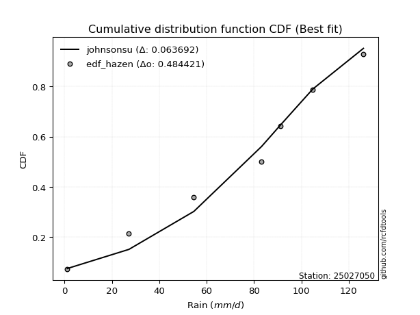</img>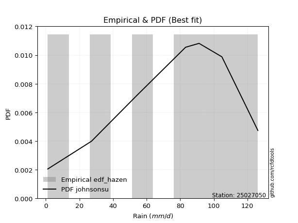</img>

</div>


### 3. Empirical - EDF Weibull (1939)

Weibull plotting position formula is an empirical method used to estimate the non-exceedance probability or plotting position for a set of observed data, is often recommended or widely used in practice, particularly in flood frequency analysis.

<div align="center">


$P=m/(n+1)$


</div>


**3.1. Empirical values**

<div align="center">

|                | 0                  | 1                  | 2           | 3           | 4                  | 5           | 6           |
|:---------------|:-------------------|:-------------------|:------------|:------------|:-------------------|:------------|:------------|
| date           | 2023               | 2020               | 2022        | 2024        | 2021               | 2025        | 2019        |
| x              | 1.2                | 27.2               | 54.6        | 83.2        | 91.2               | 104.8       | 126.2       |
| m              | 1                  | 2                  | 3           | 4           | 5                  | 6           | 7           |
| empirical_dist | edf_weibull        | edf_weibull        | edf_weibull | edf_weibull | edf_weibull        | edf_weibull | edf_weibull |
| empirical      | 0.125              | 0.25               | 0.375       | 0.5         | 0.625              | 0.75        | 0.875       |
| empirical_tr   | 1.1428571428571428 | 1.3333333333333333 | 1.6         | 2.0         | 2.6666666666666665 | 4.0         | 8.0         |

</div>


**3.2. Kolmogorov-Smirnov fit test (sorted by Δ)**


<div align="center">

|                | 0                   | 1                   | 2                   | 3                   | 4                   | 5                   | 6                   | 7                   | 8                   | 9                   | 10                  | 11                  | 12                  | 13                  | 14                  | 15                  | 16                  | 17                  | 18                  | 19                  | 20                  | 21                  | 22                  | 23                  | 24                  | 25                  | 26                  | 27                  | 28                  | 29                  | 30                  | 31                  | 32                  | 33                  | 34                  | 35                  | 36                  | 37                    | 38                  | 39                  | 40                  | 41                  | 42                  | 43                  | 44                  | 45                  | 46                  | 47                  | 48                  | 49                  | 50                  | 51                  | 52                  | 53                  | 54                  | 55                  | 56                  | 57                  | 58                  | 59                  | 60                  | 61                  | 62                  | 63                  | 64                  | 65                  | 66                  | 67                  | 68                  | 69                  | 70                  | 71                  | 72                  | 73                  | 74                  | 75                  | 76                  | 77                  | 78                  | 79                  | 80                  | 81                  | 82                  | 83                  | 84                  | 85                  | 86                  | 87                  | 88                  | 89                  |
|:---------------|:--------------------|:--------------------|:--------------------|:--------------------|:--------------------|:--------------------|:--------------------|:--------------------|:--------------------|:--------------------|:--------------------|:--------------------|:--------------------|:--------------------|:--------------------|:--------------------|:--------------------|:--------------------|:--------------------|:--------------------|:--------------------|:--------------------|:--------------------|:--------------------|:--------------------|:--------------------|:--------------------|:--------------------|:--------------------|:--------------------|:--------------------|:--------------------|:--------------------|:--------------------|:--------------------|:--------------------|:--------------------|:----------------------|:--------------------|:--------------------|:--------------------|:--------------------|:--------------------|:--------------------|:--------------------|:--------------------|:--------------------|:--------------------|:--------------------|:--------------------|:--------------------|:--------------------|:--------------------|:--------------------|:--------------------|:--------------------|:--------------------|:--------------------|:--------------------|:--------------------|:--------------------|:--------------------|:--------------------|:--------------------|:--------------------|:--------------------|:--------------------|:--------------------|:--------------------|:--------------------|:--------------------|:--------------------|:--------------------|:--------------------|:--------------------|:--------------------|:--------------------|:--------------------|:--------------------|:--------------------|:--------------------|:--------------------|:--------------------|:--------------------|:--------------------|:--------------------|:--------------------|:--------------------|:--------------------|:--------------------|
| station        | 25027050            | 25027050            | 25027050            | 25027050            | 25027050            | 25027050            | 25027050            | 25027050            | 25027050            | 25027050            | 25027050            | 25027050            | 25027050            | 25027050            | 25027050            | 25027050            | 25027050            | 25027050            | 25027050            | 25027050            | 25027050            | 25027050            | 25027050            | 25027050            | 25027050            | 25027050            | 25027050            | 25027050            | 25027050            | 25027050            | 25027050            | 25027050            | 25027050            | 25027050            | 25027050            | 25027050            | 25027050            | 25027050              | 25027050            | 25027050            | 25027050            | 25027050            | 25027050            | 25027050            | 25027050            | 25027050            | 25027050            | 25027050            | 25027050            | 25027050            | 25027050            | 25027050            | 25027050            | 25027050            | 25027050            | 25027050            | 25027050            | 25027050            | 25027050            | 25027050            | 25027050            | 25027050            | 25027050            | 25027050            | 25027050            | 25027050            | 25027050            | 25027050            | 25027050            | 25027050            | 25027050            | 25027050            | 25027050            | 25027050            | 25027050            | 25027050            | 25027050            | 25027050            | 25027050            | 25027050            | 25027050            | 25027050            | 25027050            | 25027050            | 25027050            | 25027050            | 25027050            | 25027050            | 25027050            | 25027050            |
| empirical_dist | edf_weibull         | edf_weibull         | edf_weibull         | edf_weibull         | edf_weibull         | edf_weibull         | edf_weibull         | edf_weibull         | edf_weibull         | edf_weibull         | edf_weibull         | edf_weibull         | edf_weibull         | edf_weibull         | edf_weibull         | edf_weibull         | edf_weibull         | edf_weibull         | edf_weibull         | edf_weibull         | edf_weibull         | edf_weibull         | edf_weibull         | edf_weibull         | edf_weibull         | edf_weibull         | edf_weibull         | edf_weibull         | edf_weibull         | edf_weibull         | edf_weibull         | edf_weibull         | edf_weibull         | edf_weibull         | edf_weibull         | edf_weibull         | edf_weibull         | edf_weibull           | edf_weibull         | edf_weibull         | edf_weibull         | edf_weibull         | edf_weibull         | edf_weibull         | edf_weibull         | edf_weibull         | edf_weibull         | edf_weibull         | edf_weibull         | edf_weibull         | edf_weibull         | edf_weibull         | edf_weibull         | edf_weibull         | edf_weibull         | edf_weibull         | edf_weibull         | edf_weibull         | edf_weibull         | edf_weibull         | edf_weibull         | edf_weibull         | edf_weibull         | edf_weibull         | edf_weibull         | edf_weibull         | edf_weibull         | edf_weibull         | edf_weibull         | edf_weibull         | edf_weibull         | edf_weibull         | edf_weibull         | edf_weibull         | edf_weibull         | edf_weibull         | edf_weibull         | edf_weibull         | edf_weibull         | edf_weibull         | edf_weibull         | edf_weibull         | edf_weibull         | edf_weibull         | edf_weibull         | edf_weibull         | edf_weibull         | edf_weibull         | edf_weibull         | edf_weibull         |
| p_dist         | genlogistic         | logjohnsonsu        | johnsonsu           | laplace_asymmetric  | weibull_min         | fisk                | pearson3            | logpearson3         | gumbel_l            | f                   | crystalball         | t                   | nct                 | norm                | exponnorm           | ncf                 | logfisk             | betaprime           | gamma               | erlang              | rice                | chi2                | logistic            | loggumbel_l         | invgamma            | alpha               | maxwell             | invgauss            | hypsecant           | rayleigh            | kstwobign           | halfnorm            | laplace             | logmielke           | logweibull_min      | gumbel_r            | loggompertz         | loglaplace_asymmetric | logloggamma         | logfatiguelife      | expon               | logbetaprime        | logf                | logexponnorm        | lognorm             | lognorm             | logcrystalball      | logrice             | genexpon            | lognct              | logncf              | logt                | loginvweibull       | loginvgauss         | halflogistic        | moyal               | loggamma            | loggamma            | loglogistic         | logerlang           | loghypsecant        | loginvgamma         | logmaxwell          | lograyleigh         | loglaplace          | logkstwobign        | loghalfnorm         | loggenexpon         | loggumbel_r         | wald                | mielke              | loghalflogistic     | logmoyal            | gibrat              | logexpon            | logwald             | pareto              | loggibrat           | loglognorm          | lognakagami         | logpareto           | invweibull          | fatiguelife         | logtruncnorm        | nakagami            | gompertz            | logchi2             | logalpha            | loggenlogistic      | truncnorm           |
| delta          | 0.09459545652173407 | 0.09907667515923213 | 0.09940636735344371 | 0.1020861005837756  | 0.10674043995569812 | 0.10834227162763396 | 0.10847333706261797 | 0.11113295585846272 | 0.11202014469565783 | 0.12752840368915752 | 0.12816160403912868 | 0.12818930538448714 | 0.12821399542240686 | 0.12821669269979763 | 0.1282171814342311  | 0.12951252454869666 | 0.13007668704803754 | 0.13140551047297855 | 0.13399645929323512 | 0.13421186769272586 | 0.13876813676373545 | 0.14000253326829482 | 0.14413462616880746 | 0.14439663301889016 | 0.14782024055285503 | 0.15193080518236546 | 0.15209629685361958 | 0.15615414811238704 | 0.15681009469017593 | 0.15937429442978202 | 0.1728298682691276  | 0.18030470224412343 | 0.18518948946190394 | 0.1873492315777452  | 0.189600591459256   | 0.1913801351955987  | 0.19207155046852376 | 0.19295456854982618   | 0.1938667064758246  | 0.19708307745364118 | 0.19754819403665913 | 0.20005651558867799 | 0.20201067819652974 | 0.20328267177743498 | 0.20328340557222646 | 0.20328340557222646 | 0.20328340855796534 | 0.2032926496472578  | 0.2040326300576688  | 0.204172839283282   | 0.20432450469745167 | 0.2048219358241405  | 0.20736660626023584 | 0.2083795726827986  | 0.20864727910883807 | 0.2125612234390113  | 0.21302134624605884 | 0.21302134624605884 | 0.21361251536186487 | 0.21607138284264138 | 0.2222049467232189  | 0.2248772337162812  | 0.2316241687335342  | 0.2405490996567945  | 0.24684834062395344 | 0.25167579429639686 | 0.26582780994115385 | 0.2692736476549592  | 0.2717336654891922  | 0.27204081958999016 | 0.2774454573576024  | 0.29384669277517217 | 0.29549170473033115 | 0.30423544679018955 | 0.3380487776556793  | 0.361500729251364   | 0.3810838834735659  | 0.3923750779008204  | 0.40136918027934665 | 0.408597428591579   | 0.42441226204802507 | 0.4487310604511335  | 0.4584285909269389  | 0.47803219732510727 | 0.48791011727668354 | 0.6049927672664739  | 0.6065130215456492  | 0.636208303130257   | 0.75                | 0.8652715359877866  |
| deltao         | 0.48442053926100004 | 0.48442053926100004 | 0.48442053926100004 | 0.48442053926100004 | 0.48442053926100004 | 0.48442053926100004 | 0.48442053926100004 | 0.48442053926100004 | 0.48442053926100004 | 0.48442053926100004 | 0.48442053926100004 | 0.48442053926100004 | 0.48442053926100004 | 0.48442053926100004 | 0.48442053926100004 | 0.48442053926100004 | 0.48442053926100004 | 0.48442053926100004 | 0.48442053926100004 | 0.48442053926100004 | 0.48442053926100004 | 0.48442053926100004 | 0.48442053926100004 | 0.48442053926100004 | 0.48442053926100004 | 0.48442053926100004 | 0.48442053926100004 | 0.48442053926100004 | 0.48442053926100004 | 0.48442053926100004 | 0.48442053926100004 | 0.48442053926100004 | 0.48442053926100004 | 0.48442053926100004 | 0.48442053926100004 | 0.48442053926100004 | 0.48442053926100004 | 0.48442053926100004   | 0.48442053926100004 | 0.48442053926100004 | 0.48442053926100004 | 0.48442053926100004 | 0.48442053926100004 | 0.48442053926100004 | 0.48442053926100004 | 0.48442053926100004 | 0.48442053926100004 | 0.48442053926100004 | 0.48442053926100004 | 0.48442053926100004 | 0.48442053926100004 | 0.48442053926100004 | 0.48442053926100004 | 0.48442053926100004 | 0.48442053926100004 | 0.48442053926100004 | 0.48442053926100004 | 0.48442053926100004 | 0.48442053926100004 | 0.48442053926100004 | 0.48442053926100004 | 0.48442053926100004 | 0.48442053926100004 | 0.48442053926100004 | 0.48442053926100004 | 0.48442053926100004 | 0.48442053926100004 | 0.48442053926100004 | 0.48442053926100004 | 0.48442053926100004 | 0.48442053926100004 | 0.48442053926100004 | 0.48442053926100004 | 0.48442053926100004 | 0.48442053926100004 | 0.48442053926100004 | 0.48442053926100004 | 0.48442053926100004 | 0.48442053926100004 | 0.48442053926100004 | 0.48442053926100004 | 0.48442053926100004 | 0.48442053926100004 | 0.48442053926100004 | 0.48442053926100004 | 0.48442053926100004 | 0.48442053926100004 | 0.48442053926100004 | 0.48442053926100004 | 0.48442053926100004 |
| eval           | Δo > Δ              | Δo > Δ              | Δo > Δ              | Δo > Δ              | Δo > Δ              | Δo > Δ              | Δo > Δ              | Δo > Δ              | Δo > Δ              | Δo > Δ              | Δo > Δ              | Δo > Δ              | Δo > Δ              | Δo > Δ              | Δo > Δ              | Δo > Δ              | Δo > Δ              | Δo > Δ              | Δo > Δ              | Δo > Δ              | Δo > Δ              | Δo > Δ              | Δo > Δ              | Δo > Δ              | Δo > Δ              | Δo > Δ              | Δo > Δ              | Δo > Δ              | Δo > Δ              | Δo > Δ              | Δo > Δ              | Δo > Δ              | Δo > Δ              | Δo > Δ              | Δo > Δ              | Δo > Δ              | Δo > Δ              | Δo > Δ                | Δo > Δ              | Δo > Δ              | Δo > Δ              | Δo > Δ              | Δo > Δ              | Δo > Δ              | Δo > Δ              | Δo > Δ              | Δo > Δ              | Δo > Δ              | Δo > Δ              | Δo > Δ              | Δo > Δ              | Δo > Δ              | Δo > Δ              | Δo > Δ              | Δo > Δ              | Δo > Δ              | Δo > Δ              | Δo > Δ              | Δo > Δ              | Δo > Δ              | Δo > Δ              | Δo > Δ              | Δo > Δ              | Δo > Δ              | Δo > Δ              | Δo > Δ              | Δo > Δ              | Δo > Δ              | Δo > Δ              | Δo > Δ              | Δo > Δ              | Δo > Δ              | Δo > Δ              | Δo > Δ              | Δo > Δ              | Δo > Δ              | Δo > Δ              | Δo > Δ              | Δo > Δ              | Δo > Δ              | Δo > Δ              | Δo > Δ              | Δo > Δ              | Δo > Δ              | Δo <= Δ             | Δo <= Δ             | Δo <= Δ             | Δo <= Δ             | Δo <= Δ             | Δo <= Δ             |
| fit            | 1                   | 1                   | 1                   | 1                   | 1                   | 1                   | 1                   | 1                   | 1                   | 1                   | 1                   | 1                   | 1                   | 1                   | 1                   | 1                   | 1                   | 1                   | 1                   | 1                   | 1                   | 1                   | 1                   | 1                   | 1                   | 1                   | 1                   | 1                   | 1                   | 1                   | 1                   | 1                   | 1                   | 1                   | 1                   | 1                   | 1                   | 1                     | 1                   | 1                   | 1                   | 1                   | 1                   | 1                   | 1                   | 1                   | 1                   | 1                   | 1                   | 1                   | 1                   | 1                   | 1                   | 1                   | 1                   | 1                   | 1                   | 1                   | 1                   | 1                   | 1                   | 1                   | 1                   | 1                   | 1                   | 1                   | 1                   | 1                   | 1                   | 1                   | 1                   | 1                   | 1                   | 1                   | 1                   | 1                   | 1                   | 1                   | 1                   | 1                   | 1                   | 1                   | 1                   | 1                   | 0                   | 0                   | 0                   | 0                   | 0                   | 0                   |
| n              | 7                   | 7                   | 7                   | 7                   | 7                   | 7                   | 7                   | 7                   | 7                   | 7                   | 7                   | 7                   | 7                   | 7                   | 7                   | 7                   | 7                   | 7                   | 7                   | 7                   | 7                   | 7                   | 7                   | 7                   | 7                   | 7                   | 7                   | 7                   | 7                   | 7                   | 7                   | 7                   | 7                   | 7                   | 7                   | 7                   | 7                   | 7                     | 7                   | 7                   | 7                   | 7                   | 7                   | 7                   | 7                   | 7                   | 7                   | 7                   | 7                   | 7                   | 7                   | 7                   | 7                   | 7                   | 7                   | 7                   | 7                   | 7                   | 7                   | 7                   | 7                   | 7                   | 7                   | 7                   | 7                   | 7                   | 7                   | 7                   | 7                   | 7                   | 7                   | 7                   | 7                   | 7                   | 7                   | 7                   | 7                   | 7                   | 7                   | 7                   | 7                   | 7                   | 7                   | 7                   | 7                   | 7                   | 7                   | 7                   | 7                   | 7                   |
| best_fit       | 1                   | 0                   | 0                   | 0                   | 0                   | 0                   | 0                   | 0                   | 0                   | 0                   | 0                   | 0                   | 0                   | 0                   | 0                   | 0                   | 0                   | 0                   | 0                   | 0                   | 0                   | 0                   | 0                   | 0                   | 0                   | 0                   | 0                   | 0                   | 0                   | 0                   | 0                   | 0                   | 0                   | 0                   | 0                   | 0                   | 0                   | 0                     | 0                   | 0                   | 0                   | 0                   | 0                   | 0                   | 0                   | 0                   | 0                   | 0                   | 0                   | 0                   | 0                   | 0                   | 0                   | 0                   | 0                   | 0                   | 0                   | 0                   | 0                   | 0                   | 0                   | 0                   | 0                   | 0                   | 0                   | 0                   | 0                   | 0                   | 0                   | 0                   | 0                   | 0                   | 0                   | 0                   | 0                   | 0                   | 0                   | 0                   | 0                   | 0                   | 0                   | 0                   | 0                   | 0                   | 0                   | 0                   | 0                   | 0                   | 0                   | 0                   |
| best_fit_sort  | 1                   | 2                   | 3                   | 4                   | 5                   | 6                   | 7                   | 8                   | 9                   | 10                  | 11                  | 12                  | 13                  | 14                  | 15                  | 16                  | 17                  | 18                  | 19                  | 20                  | 21                  | 22                  | 23                  | 24                  | 25                  | 26                  | 27                  | 28                  | 29                  | 30                  | 31                  | 32                  | 33                  | 34                  | 35                  | 36                  | 37                  | 38                    | 39                  | 40                  | 41                  | 42                  | 43                  | 44                  | 45                  | 46                  | 47                  | 48                  | 49                  | 50                  | 51                  | 52                  | 53                  | 54                  | 55                  | 56                  | 57                  | 58                  | 59                  | 60                  | 61                  | 62                  | 63                  | 64                  | 65                  | 66                  | 67                  | 68                  | 69                  | 70                  | 71                  | 72                  | 73                  | 74                  | 75                  | 76                  | 77                  | 78                  | 79                  | 80                  | 81                  | 82                  | 83                  | 84                  | 85                  | 86                  | 87                  | 88                  | 89                  | 90                  |

</div>


<div align="center">

</img>

</div>


**3.3. Best fit**

<div align="center">

|   id |   station | empirical_dist   | p_dist      |     delta |   deltao | eval   |   fit |   n |   best_fit |   best_fit_sort |
|-----:|----------:|:-----------------|:------------|----------:|---------:|:-------|------:|----:|-----------:|----------------:|
|    0 |  25027050 | edf_weibull      | genlogistic | 0.0945955 | 0.484421 | Δo > Δ |     1 |   7 |          1 |               1 |

</div>


<div align="center">

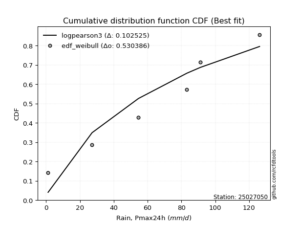</img>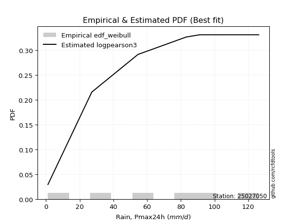</img>

</div>


### 4. Empirical - EDF Beard (1943)

The Beard formula (or Beard´s plotting position formula) in hydrology is used to estimate the empirical non-exceedance probability _(P)_ of a flood event (or other extreme hydrological data point) within a given dataset.

<div align="center">


$P=(m-0.31)/(n+0.38)$


</div>


**4.1. Empirical values**

<div align="center">

|                | 0                   | 1                   | 2                   | 3         | 4                  | 5                  | 6                  |
|:---------------|:--------------------|:--------------------|:--------------------|:----------|:-------------------|:-------------------|:-------------------|
| date           | 2023                | 2020                | 2022                | 2024      | 2021               | 2025               | 2019               |
| x              | 1.2                 | 27.2                | 54.6                | 83.2      | 91.2               | 104.8              | 126.2              |
| m              | 1                   | 2                   | 3                   | 4         | 5                  | 6                  | 7                  |
| empirical_dist | edf_beard           | edf_beard           | edf_beard           | edf_beard | edf_beard          | edf_beard          | edf_beard          |
| empirical      | 0.09349593495934959 | 0.22899728997289973 | 0.36449864498644985 | 0.5       | 0.6355013550135502 | 0.7710027100271003 | 0.9065040650406505 |
| empirical_tr   | 1.1031390134529149  | 1.29701230228471    | 1.5735607675906182  | 2.0       | 2.743494423791822  | 4.366863905325444  | 10.695652173913055 |

</div>


**4.2. Kolmogorov-Smirnov fit test (sorted by Δ)**


<div align="center">

|                | 0                   | 1                   | 2                   | 3                   | 4                   | 5                   | 6                   | 7                   | 8                   | 9                   | 10                  | 11                  | 12                  | 13                  | 14                  | 15                  | 16                  | 17                  | 18                  | 19                  | 20                  | 21                  | 22                  | 23                  | 24                  | 25                  | 26                  | 27                  | 28                  | 29                  | 30                  | 31                  | 32                  | 33                  | 34                  | 35                  | 36                  | 37                    | 38                  | 39                  | 40                  | 41                  | 42                  | 43                  | 44                  | 45                  | 46                  | 47                  | 48                  | 49                  | 50                  | 51                  | 52                  | 53                  | 54                  | 55                  | 56                  | 57                  | 58                  | 59                  | 60                  | 61                  | 62                  | 63                  | 64                  | 65                  | 66                  | 67                  | 68                  | 69                  | 70                  | 71                  | 72                  | 73                  | 74                  | 75                  | 76                  | 77                  | 78                  | 79                  | 80                  | 81                  | 82                  | 83                  | 84                  | 85                  | 86                  | 87                  | 88                  | 89                  |
|:---------------|:--------------------|:--------------------|:--------------------|:--------------------|:--------------------|:--------------------|:--------------------|:--------------------|:--------------------|:--------------------|:--------------------|:--------------------|:--------------------|:--------------------|:--------------------|:--------------------|:--------------------|:--------------------|:--------------------|:--------------------|:--------------------|:--------------------|:--------------------|:--------------------|:--------------------|:--------------------|:--------------------|:--------------------|:--------------------|:--------------------|:--------------------|:--------------------|:--------------------|:--------------------|:--------------------|:--------------------|:--------------------|:----------------------|:--------------------|:--------------------|:--------------------|:--------------------|:--------------------|:--------------------|:--------------------|:--------------------|:--------------------|:--------------------|:--------------------|:--------------------|:--------------------|:--------------------|:--------------------|:--------------------|:--------------------|:--------------------|:--------------------|:--------------------|:--------------------|:--------------------|:--------------------|:--------------------|:--------------------|:--------------------|:--------------------|:--------------------|:--------------------|:--------------------|:--------------------|:--------------------|:--------------------|:--------------------|:--------------------|:--------------------|:--------------------|:--------------------|:--------------------|:--------------------|:--------------------|:--------------------|:--------------------|:--------------------|:--------------------|:--------------------|:--------------------|:--------------------|:--------------------|:--------------------|:--------------------|:--------------------|
| station        | 25027050            | 25027050            | 25027050            | 25027050            | 25027050            | 25027050            | 25027050            | 25027050            | 25027050            | 25027050            | 25027050            | 25027050            | 25027050            | 25027050            | 25027050            | 25027050            | 25027050            | 25027050            | 25027050            | 25027050            | 25027050            | 25027050            | 25027050            | 25027050            | 25027050            | 25027050            | 25027050            | 25027050            | 25027050            | 25027050            | 25027050            | 25027050            | 25027050            | 25027050            | 25027050            | 25027050            | 25027050            | 25027050              | 25027050            | 25027050            | 25027050            | 25027050            | 25027050            | 25027050            | 25027050            | 25027050            | 25027050            | 25027050            | 25027050            | 25027050            | 25027050            | 25027050            | 25027050            | 25027050            | 25027050            | 25027050            | 25027050            | 25027050            | 25027050            | 25027050            | 25027050            | 25027050            | 25027050            | 25027050            | 25027050            | 25027050            | 25027050            | 25027050            | 25027050            | 25027050            | 25027050            | 25027050            | 25027050            | 25027050            | 25027050            | 25027050            | 25027050            | 25027050            | 25027050            | 25027050            | 25027050            | 25027050            | 25027050            | 25027050            | 25027050            | 25027050            | 25027050            | 25027050            | 25027050            | 25027050            |
| empirical_dist | edf_beard           | edf_beard           | edf_beard           | edf_beard           | edf_beard           | edf_beard           | edf_beard           | edf_beard           | edf_beard           | edf_beard           | edf_beard           | edf_beard           | edf_beard           | edf_beard           | edf_beard           | edf_beard           | edf_beard           | edf_beard           | edf_beard           | edf_beard           | edf_beard           | edf_beard           | edf_beard           | edf_beard           | edf_beard           | edf_beard           | edf_beard           | edf_beard           | edf_beard           | edf_beard           | edf_beard           | edf_beard           | edf_beard           | edf_beard           | edf_beard           | edf_beard           | edf_beard           | edf_beard             | edf_beard           | edf_beard           | edf_beard           | edf_beard           | edf_beard           | edf_beard           | edf_beard           | edf_beard           | edf_beard           | edf_beard           | edf_beard           | edf_beard           | edf_beard           | edf_beard           | edf_beard           | edf_beard           | edf_beard           | edf_beard           | edf_beard           | edf_beard           | edf_beard           | edf_beard           | edf_beard           | edf_beard           | edf_beard           | edf_beard           | edf_beard           | edf_beard           | edf_beard           | edf_beard           | edf_beard           | edf_beard           | edf_beard           | edf_beard           | edf_beard           | edf_beard           | edf_beard           | edf_beard           | edf_beard           | edf_beard           | edf_beard           | edf_beard           | edf_beard           | edf_beard           | edf_beard           | edf_beard           | edf_beard           | edf_beard           | edf_beard           | edf_beard           | edf_beard           | edf_beard           |
| p_dist         | johnsonsu           | logjohnsonsu        | genlogistic         | laplace_asymmetric  | weibull_min         | gumbel_l            | fisk                | pearson3            | f                   | crystalball         | t                   | nct                 | norm                | exponnorm           | betaprime           | gamma               | erlang              | rice                | chi2                | ncf                 | logpearson3         | logistic            | invgamma            | loggumbel_l         | alpha               | maxwell             | logfisk             | invgauss            | hypsecant           | rayleigh            | kstwobign           | halfnorm            | laplace             | logmielke           | logweibull_min      | gumbel_r            | loggompertz         | loglaplace_asymmetric | logloggamma         | logt                | expon               | genexpon            | logfatiguelife      | halflogistic        | logbetaprime        | logf                | moyal               | logexponnorm        | lognorm             | lognorm             | logcrystalball      | logrice             | lognct              | logncf              | loginvgauss         | loggamma            | loggamma            | loglogistic         | logerlang           | loginvweibull       | loghypsecant        | loginvgamma         | logmaxwell          | lograyleigh         | loglaplace          | wald                | logkstwobign        | loghalfnorm         | mielke              | loggumbel_r         | loggenexpon         | gibrat              | loghalflogistic     | logmoyal            | logexpon            | logwald             | pareto              | loggibrat           | loglognorm          | lognakagami         | logpareto           | fatiguelife         | invweibull          | logtruncnorm        | nakagami            | gompertz            | logchi2             | logalpha            | loggenlogistic      | truncnorm           |
| delta          | 0.07840365732634344 | 0.07859690090905946 | 0.08154569848844789 | 0.08225780721991893 | 0.08573772992859785 | 0.09101743466855755 | 0.1081166775640382  | 0.10847333706261797 | 0.12752840368915752 | 0.12816160403912868 | 0.12818930538448714 | 0.12821399542240686 | 0.12821669269979763 | 0.1282171814342311  | 0.13140551047297855 | 0.13399645929323512 | 0.13421186769272586 | 0.13876813676373545 | 0.14000253326829482 | 0.14223552179478138 | 0.14263702089911323 | 0.14413462616880746 | 0.14782024055285503 | 0.15036122630137577 | 0.15193080518236546 | 0.15209629685361958 | 0.1543446302013569  | 0.15615414811238704 | 0.15681009469017593 | 0.15937429442978202 | 0.1728298682691276  | 0.18030470224412343 | 0.18518948946190394 | 0.1873492315777452  | 0.189600591459256   | 0.1913801351955987  | 0.19207155046852376 | 0.19295456854982618   | 0.1938667064758246  | 0.19432058081059034 | 0.19754819403665913 | 0.2040326300576688  | 0.20758443246719133 | 0.20864727910883807 | 0.21055787060222814 | 0.2125120332100799  | 0.2125612234390113  | 0.21378402679098513 | 0.2137847605857766  | 0.2137847605857766  | 0.2137847635715155  | 0.21379400466080795 | 0.21467419429683215 | 0.21482585971100182 | 0.21888092769634876 | 0.223522701259609   | 0.223522701259609   | 0.22411387037541503 | 0.22657273785619153 | 0.22818364509400543 | 0.23270630173676904 | 0.23537858872983136 | 0.24212552374708435 | 0.25105045467034465 | 0.2573496956375036  | 0.27204081958999016 | 0.27267850432349716 | 0.276329164954704   | 0.2774454573576024  | 0.28223502050274235 | 0.2902763576820595  | 0.30423544679018955 | 0.3043480477887223  | 0.3059930597438813  | 0.3590514876827796  | 0.37200208426491416 | 0.4020865935006662  | 0.40287643291437053 | 0.42237189030644695 | 0.4296001386186793  | 0.44541497207512537 | 0.4794313009540392  | 0.480235125491784   | 0.4909828829413846  | 0.5089128273037838  | 0.6154941222800241  | 0.6275157315727495  | 0.6572110131573573  | 0.7710027100271003  | 0.896775601028437   |
| deltao         | 0.48442053926100004 | 0.48442053926100004 | 0.48442053926100004 | 0.48442053926100004 | 0.48442053926100004 | 0.48442053926100004 | 0.48442053926100004 | 0.48442053926100004 | 0.48442053926100004 | 0.48442053926100004 | 0.48442053926100004 | 0.48442053926100004 | 0.48442053926100004 | 0.48442053926100004 | 0.48442053926100004 | 0.48442053926100004 | 0.48442053926100004 | 0.48442053926100004 | 0.48442053926100004 | 0.48442053926100004 | 0.48442053926100004 | 0.48442053926100004 | 0.48442053926100004 | 0.48442053926100004 | 0.48442053926100004 | 0.48442053926100004 | 0.48442053926100004 | 0.48442053926100004 | 0.48442053926100004 | 0.48442053926100004 | 0.48442053926100004 | 0.48442053926100004 | 0.48442053926100004 | 0.48442053926100004 | 0.48442053926100004 | 0.48442053926100004 | 0.48442053926100004 | 0.48442053926100004   | 0.48442053926100004 | 0.48442053926100004 | 0.48442053926100004 | 0.48442053926100004 | 0.48442053926100004 | 0.48442053926100004 | 0.48442053926100004 | 0.48442053926100004 | 0.48442053926100004 | 0.48442053926100004 | 0.48442053926100004 | 0.48442053926100004 | 0.48442053926100004 | 0.48442053926100004 | 0.48442053926100004 | 0.48442053926100004 | 0.48442053926100004 | 0.48442053926100004 | 0.48442053926100004 | 0.48442053926100004 | 0.48442053926100004 | 0.48442053926100004 | 0.48442053926100004 | 0.48442053926100004 | 0.48442053926100004 | 0.48442053926100004 | 0.48442053926100004 | 0.48442053926100004 | 0.48442053926100004 | 0.48442053926100004 | 0.48442053926100004 | 0.48442053926100004 | 0.48442053926100004 | 0.48442053926100004 | 0.48442053926100004 | 0.48442053926100004 | 0.48442053926100004 | 0.48442053926100004 | 0.48442053926100004 | 0.48442053926100004 | 0.48442053926100004 | 0.48442053926100004 | 0.48442053926100004 | 0.48442053926100004 | 0.48442053926100004 | 0.48442053926100004 | 0.48442053926100004 | 0.48442053926100004 | 0.48442053926100004 | 0.48442053926100004 | 0.48442053926100004 | 0.48442053926100004 |
| eval           | Δo > Δ              | Δo > Δ              | Δo > Δ              | Δo > Δ              | Δo > Δ              | Δo > Δ              | Δo > Δ              | Δo > Δ              | Δo > Δ              | Δo > Δ              | Δo > Δ              | Δo > Δ              | Δo > Δ              | Δo > Δ              | Δo > Δ              | Δo > Δ              | Δo > Δ              | Δo > Δ              | Δo > Δ              | Δo > Δ              | Δo > Δ              | Δo > Δ              | Δo > Δ              | Δo > Δ              | Δo > Δ              | Δo > Δ              | Δo > Δ              | Δo > Δ              | Δo > Δ              | Δo > Δ              | Δo > Δ              | Δo > Δ              | Δo > Δ              | Δo > Δ              | Δo > Δ              | Δo > Δ              | Δo > Δ              | Δo > Δ                | Δo > Δ              | Δo > Δ              | Δo > Δ              | Δo > Δ              | Δo > Δ              | Δo > Δ              | Δo > Δ              | Δo > Δ              | Δo > Δ              | Δo > Δ              | Δo > Δ              | Δo > Δ              | Δo > Δ              | Δo > Δ              | Δo > Δ              | Δo > Δ              | Δo > Δ              | Δo > Δ              | Δo > Δ              | Δo > Δ              | Δo > Δ              | Δo > Δ              | Δo > Δ              | Δo > Δ              | Δo > Δ              | Δo > Δ              | Δo > Δ              | Δo > Δ              | Δo > Δ              | Δo > Δ              | Δo > Δ              | Δo > Δ              | Δo > Δ              | Δo > Δ              | Δo > Δ              | Δo > Δ              | Δo > Δ              | Δo > Δ              | Δo > Δ              | Δo > Δ              | Δo > Δ              | Δo > Δ              | Δo > Δ              | Δo > Δ              | Δo > Δ              | Δo <= Δ             | Δo <= Δ             | Δo <= Δ             | Δo <= Δ             | Δo <= Δ             | Δo <= Δ             | Δo <= Δ             |
| fit            | 1                   | 1                   | 1                   | 1                   | 1                   | 1                   | 1                   | 1                   | 1                   | 1                   | 1                   | 1                   | 1                   | 1                   | 1                   | 1                   | 1                   | 1                   | 1                   | 1                   | 1                   | 1                   | 1                   | 1                   | 1                   | 1                   | 1                   | 1                   | 1                   | 1                   | 1                   | 1                   | 1                   | 1                   | 1                   | 1                   | 1                   | 1                     | 1                   | 1                   | 1                   | 1                   | 1                   | 1                   | 1                   | 1                   | 1                   | 1                   | 1                   | 1                   | 1                   | 1                   | 1                   | 1                   | 1                   | 1                   | 1                   | 1                   | 1                   | 1                   | 1                   | 1                   | 1                   | 1                   | 1                   | 1                   | 1                   | 1                   | 1                   | 1                   | 1                   | 1                   | 1                   | 1                   | 1                   | 1                   | 1                   | 1                   | 1                   | 1                   | 1                   | 1                   | 1                   | 0                   | 0                   | 0                   | 0                   | 0                   | 0                   | 0                   |
| n              | 7                   | 7                   | 7                   | 7                   | 7                   | 7                   | 7                   | 7                   | 7                   | 7                   | 7                   | 7                   | 7                   | 7                   | 7                   | 7                   | 7                   | 7                   | 7                   | 7                   | 7                   | 7                   | 7                   | 7                   | 7                   | 7                   | 7                   | 7                   | 7                   | 7                   | 7                   | 7                   | 7                   | 7                   | 7                   | 7                   | 7                   | 7                     | 7                   | 7                   | 7                   | 7                   | 7                   | 7                   | 7                   | 7                   | 7                   | 7                   | 7                   | 7                   | 7                   | 7                   | 7                   | 7                   | 7                   | 7                   | 7                   | 7                   | 7                   | 7                   | 7                   | 7                   | 7                   | 7                   | 7                   | 7                   | 7                   | 7                   | 7                   | 7                   | 7                   | 7                   | 7                   | 7                   | 7                   | 7                   | 7                   | 7                   | 7                   | 7                   | 7                   | 7                   | 7                   | 7                   | 7                   | 7                   | 7                   | 7                   | 7                   | 7                   |
| best_fit       | 1                   | 0                   | 0                   | 0                   | 0                   | 0                   | 0                   | 0                   | 0                   | 0                   | 0                   | 0                   | 0                   | 0                   | 0                   | 0                   | 0                   | 0                   | 0                   | 0                   | 0                   | 0                   | 0                   | 0                   | 0                   | 0                   | 0                   | 0                   | 0                   | 0                   | 0                   | 0                   | 0                   | 0                   | 0                   | 0                   | 0                   | 0                     | 0                   | 0                   | 0                   | 0                   | 0                   | 0                   | 0                   | 0                   | 0                   | 0                   | 0                   | 0                   | 0                   | 0                   | 0                   | 0                   | 0                   | 0                   | 0                   | 0                   | 0                   | 0                   | 0                   | 0                   | 0                   | 0                   | 0                   | 0                   | 0                   | 0                   | 0                   | 0                   | 0                   | 0                   | 0                   | 0                   | 0                   | 0                   | 0                   | 0                   | 0                   | 0                   | 0                   | 0                   | 0                   | 0                   | 0                   | 0                   | 0                   | 0                   | 0                   | 0                   |
| best_fit_sort  | 1                   | 2                   | 3                   | 4                   | 5                   | 6                   | 7                   | 8                   | 9                   | 10                  | 11                  | 12                  | 13                  | 14                  | 15                  | 16                  | 17                  | 18                  | 19                  | 20                  | 21                  | 22                  | 23                  | 24                  | 25                  | 26                  | 27                  | 28                  | 29                  | 30                  | 31                  | 32                  | 33                  | 34                  | 35                  | 36                  | 37                  | 38                    | 39                  | 40                  | 41                  | 42                  | 43                  | 44                  | 45                  | 46                  | 47                  | 48                  | 49                  | 50                  | 51                  | 52                  | 53                  | 54                  | 55                  | 56                  | 57                  | 58                  | 59                  | 60                  | 61                  | 62                  | 63                  | 64                  | 65                  | 66                  | 67                  | 68                  | 69                  | 70                  | 71                  | 72                  | 73                  | 74                  | 75                  | 76                  | 77                  | 78                  | 79                  | 80                  | 81                  | 82                  | 83                  | 84                  | 85                  | 86                  | 87                  | 88                  | 89                  | 90                  |

</div>


<div align="center">

</img>

</div>


**4.3. Best fit**

<div align="center">

|   id |   station | empirical_dist   | p_dist    |     delta |   deltao | eval   |   fit |   n |   best_fit |   best_fit_sort |
|-----:|----------:|:-----------------|:----------|----------:|---------:|:-------|------:|----:|-----------:|----------------:|
|    0 |  25027050 | edf_beard        | johnsonsu | 0.0784037 | 0.484421 | Δo > Δ |     1 |   7 |          1 |               1 |

</div>


<div align="center">

</img>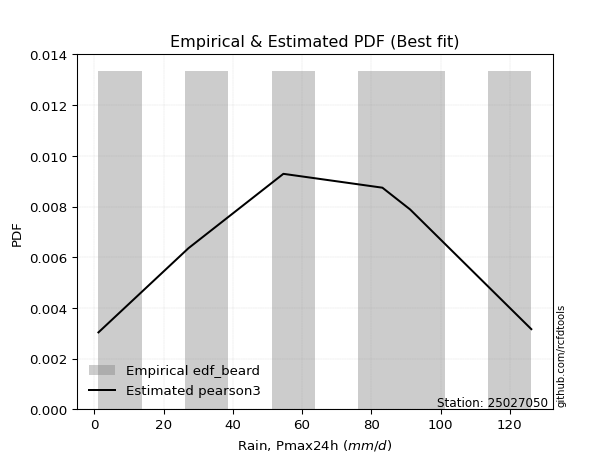</img>

</div>


### 5. Empirical - EDF Chegodayev (1955)

The Chegodayev formula is an empirical plotting position formula used in hydrological frequency analysis to estimate the exceedance probability or return period of a specific event from a set of observed data. It is primarily used for plotting observed data points on probability paper to fit a theoretical distribution, particularly for analyzing extreme events like maximum flood flows or rainfall intensities. The constant _b_ value in the generalized plotting position formula is 0.3.

<div align="center">


$P=(m-b)/(n+1-2b)$


</div>


**5.1. Empirical values**

<div align="center">

|                | 0                   | 1                   | 2                   | 3              | 4                  | 5                  | 6                  |
|:---------------|:--------------------|:--------------------|:--------------------|:---------------|:-------------------|:-------------------|:-------------------|
| date           | 2023                | 2020                | 2022                | 2024           | 2021               | 2025               | 2019               |
| x              | 1.2                 | 27.2                | 54.6                | 83.2           | 91.2               | 104.8              | 126.2              |
| m              | 1                   | 2                   | 3                   | 4              | 5                  | 6                  | 7                  |
| empirical_dist | edf_chegodayev      | edf_chegodayev      | edf_chegodayev      | edf_chegodayev | edf_chegodayev     | edf_chegodayev     | edf_chegodayev     |
| empirical      | 0.09459459459459459 | 0.22972972972972971 | 0.36486486486486486 | 0.5            | 0.6351351351351351 | 0.7702702702702703 | 0.9054054054054054 |
| empirical_tr   | 1.1044776119402986  | 1.2982456140350878  | 1.574468085106383   | 2.0            | 2.7407407407407405 | 4.352941176470589  | 10.571428571428568 |

</div>


**5.2. Kolmogorov-Smirnov fit test (sorted by Δ)**


<div align="center">

|                | 0                   | 1                   | 2                   | 3                   | 4                   | 5                   | 6                   | 7                   | 8                   | 9                   | 10                  | 11                  | 12                  | 13                  | 14                  | 15                  | 16                  | 17                  | 18                  | 19                  | 20                  | 21                  | 22                  | 23                  | 24                  | 25                  | 26                  | 27                  | 28                  | 29                  | 30                  | 31                  | 32                  | 33                  | 34                  | 35                  | 36                  | 37                    | 38                  | 39                  | 40                  | 41                  | 42                  | 43                  | 44                  | 45                  | 46                  | 47                  | 48                  | 49                  | 50                  | 51                  | 52                  | 53                  | 54                  | 55                  | 56                  | 57                  | 58                  | 59                  | 60                  | 61                  | 62                  | 63                  | 64                  | 65                  | 66                  | 67                  | 68                  | 69                  | 70                  | 71                  | 72                  | 73                  | 74                  | 75                  | 76                  | 77                  | 78                  | 79                  | 80                  | 81                  | 82                  | 83                  | 84                  | 85                  | 86                  | 87                  | 88                  | 89                  |
|:---------------|:--------------------|:--------------------|:--------------------|:--------------------|:--------------------|:--------------------|:--------------------|:--------------------|:--------------------|:--------------------|:--------------------|:--------------------|:--------------------|:--------------------|:--------------------|:--------------------|:--------------------|:--------------------|:--------------------|:--------------------|:--------------------|:--------------------|:--------------------|:--------------------|:--------------------|:--------------------|:--------------------|:--------------------|:--------------------|:--------------------|:--------------------|:--------------------|:--------------------|:--------------------|:--------------------|:--------------------|:--------------------|:----------------------|:--------------------|:--------------------|:--------------------|:--------------------|:--------------------|:--------------------|:--------------------|:--------------------|:--------------------|:--------------------|:--------------------|:--------------------|:--------------------|:--------------------|:--------------------|:--------------------|:--------------------|:--------------------|:--------------------|:--------------------|:--------------------|:--------------------|:--------------------|:--------------------|:--------------------|:--------------------|:--------------------|:--------------------|:--------------------|:--------------------|:--------------------|:--------------------|:--------------------|:--------------------|:--------------------|:--------------------|:--------------------|:--------------------|:--------------------|:--------------------|:--------------------|:--------------------|:--------------------|:--------------------|:--------------------|:--------------------|:--------------------|:--------------------|:--------------------|:--------------------|:--------------------|:--------------------|
| station        | 25027050            | 25027050            | 25027050            | 25027050            | 25027050            | 25027050            | 25027050            | 25027050            | 25027050            | 25027050            | 25027050            | 25027050            | 25027050            | 25027050            | 25027050            | 25027050            | 25027050            | 25027050            | 25027050            | 25027050            | 25027050            | 25027050            | 25027050            | 25027050            | 25027050            | 25027050            | 25027050            | 25027050            | 25027050            | 25027050            | 25027050            | 25027050            | 25027050            | 25027050            | 25027050            | 25027050            | 25027050            | 25027050              | 25027050            | 25027050            | 25027050            | 25027050            | 25027050            | 25027050            | 25027050            | 25027050            | 25027050            | 25027050            | 25027050            | 25027050            | 25027050            | 25027050            | 25027050            | 25027050            | 25027050            | 25027050            | 25027050            | 25027050            | 25027050            | 25027050            | 25027050            | 25027050            | 25027050            | 25027050            | 25027050            | 25027050            | 25027050            | 25027050            | 25027050            | 25027050            | 25027050            | 25027050            | 25027050            | 25027050            | 25027050            | 25027050            | 25027050            | 25027050            | 25027050            | 25027050            | 25027050            | 25027050            | 25027050            | 25027050            | 25027050            | 25027050            | 25027050            | 25027050            | 25027050            | 25027050            |
| empirical_dist | edf_chegodayev      | edf_chegodayev      | edf_chegodayev      | edf_chegodayev      | edf_chegodayev      | edf_chegodayev      | edf_chegodayev      | edf_chegodayev      | edf_chegodayev      | edf_chegodayev      | edf_chegodayev      | edf_chegodayev      | edf_chegodayev      | edf_chegodayev      | edf_chegodayev      | edf_chegodayev      | edf_chegodayev      | edf_chegodayev      | edf_chegodayev      | edf_chegodayev      | edf_chegodayev      | edf_chegodayev      | edf_chegodayev      | edf_chegodayev      | edf_chegodayev      | edf_chegodayev      | edf_chegodayev      | edf_chegodayev      | edf_chegodayev      | edf_chegodayev      | edf_chegodayev      | edf_chegodayev      | edf_chegodayev      | edf_chegodayev      | edf_chegodayev      | edf_chegodayev      | edf_chegodayev      | edf_chegodayev        | edf_chegodayev      | edf_chegodayev      | edf_chegodayev      | edf_chegodayev      | edf_chegodayev      | edf_chegodayev      | edf_chegodayev      | edf_chegodayev      | edf_chegodayev      | edf_chegodayev      | edf_chegodayev      | edf_chegodayev      | edf_chegodayev      | edf_chegodayev      | edf_chegodayev      | edf_chegodayev      | edf_chegodayev      | edf_chegodayev      | edf_chegodayev      | edf_chegodayev      | edf_chegodayev      | edf_chegodayev      | edf_chegodayev      | edf_chegodayev      | edf_chegodayev      | edf_chegodayev      | edf_chegodayev      | edf_chegodayev      | edf_chegodayev      | edf_chegodayev      | edf_chegodayev      | edf_chegodayev      | edf_chegodayev      | edf_chegodayev      | edf_chegodayev      | edf_chegodayev      | edf_chegodayev      | edf_chegodayev      | edf_chegodayev      | edf_chegodayev      | edf_chegodayev      | edf_chegodayev      | edf_chegodayev      | edf_chegodayev      | edf_chegodayev      | edf_chegodayev      | edf_chegodayev      | edf_chegodayev      | edf_chegodayev      | edf_chegodayev      | edf_chegodayev      | edf_chegodayev      |
| p_dist         | logjohnsonsu        | johnsonsu           | genlogistic         | laplace_asymmetric  | weibull_min         | gumbel_l            | fisk                | pearson3            | f                   | crystalball         | t                   | nct                 | norm                | exponnorm           | betaprime           | gamma               | erlang              | rice                | chi2                | ncf                 | logpearson3         | logistic            | invgamma            | loggumbel_l         | alpha               | maxwell             | logfisk             | invgauss            | hypsecant           | rayleigh            | kstwobign           | halfnorm            | laplace             | logmielke           | logweibull_min      | gumbel_r            | loggompertz         | loglaplace_asymmetric | logloggamma         | logt                | expon               | genexpon            | logfatiguelife      | halflogistic        | logbetaprime        | logf                | moyal               | logexponnorm        | lognorm             | lognorm             | logcrystalball      | logrice             | lognct              | logncf              | loginvgauss         | loggamma            | loggamma            | loglogistic         | logerlang           | loginvweibull       | loghypsecant        | loginvgamma         | logmaxwell          | lograyleigh         | loglaplace          | logkstwobign        | wald                | loghalfnorm         | mielke              | loggumbel_r         | loggenexpon         | loghalflogistic     | gibrat              | logmoyal            | logexpon            | logwald             | pareto              | loggibrat           | loglognorm          | lognakagami         | logpareto           | fatiguelife         | invweibull          | logtruncnorm        | nakagami            | gompertz            | logchi2             | logalpha            | loggenlogistic      | truncnorm           |
| delta          | 0.07786446115222945 | 0.07913609708317343 | 0.0819119183668629  | 0.08262402709833394 | 0.08647016968542784 | 0.09174987442538754 | 0.1081166775640382  | 0.10847333706261797 | 0.12752840368915752 | 0.12816160403912868 | 0.12818930538448714 | 0.12821399542240686 | 0.12821669269979763 | 0.1282171814342311  | 0.13140551047297855 | 0.13399645929323512 | 0.13421186769272586 | 0.13876813676373545 | 0.14000253326829482 | 0.14113686215953625 | 0.1415383612638681  | 0.14413462616880746 | 0.14782024055285503 | 0.14999500642296076 | 0.15193080518236546 | 0.15209629685361958 | 0.15324597056611178 | 0.15615414811238704 | 0.15681009469017593 | 0.15937429442978202 | 0.1728298682691276  | 0.18030470224412343 | 0.18518948946190394 | 0.1873492315777452  | 0.189600591459256   | 0.1913801351955987  | 0.19207155046852376 | 0.19295456854982618   | 0.1938667064758246  | 0.19468680068900535 | 0.19754819403665913 | 0.2040326300576688  | 0.20721821258877632 | 0.20864727910883807 | 0.21019165072381313 | 0.21214581333166488 | 0.2125612234390113  | 0.21341780691257012 | 0.2134185407073616  | 0.2134185407073616  | 0.21341854369310048 | 0.21342778478239294 | 0.21430797441841715 | 0.2144596398325868  | 0.21851470781793375 | 0.22315648138119398 | 0.22315648138119398 | 0.22374765049700002 | 0.22620651797777652 | 0.22745120533717544 | 0.23234008185835403 | 0.23501236885141635 | 0.24175930386866934 | 0.25068423479192964 | 0.2569834757590886  | 0.27194606456666715 | 0.27204081958999016 | 0.275962945076289   | 0.2774454573576024  | 0.28186880062432734 | 0.2895439179252295  | 0.3039818279103073  | 0.30423544679018955 | 0.3056268398654663  | 0.3583190479259496  | 0.37163586438649915 | 0.4013541537438362  | 0.4025102130359555  | 0.42163945054961693 | 0.4288676988618493  | 0.44468253231829535 | 0.47869886119720917 | 0.47913646585653885 | 0.4902504431845546  | 0.5081803875469538  | 0.615127902401609   | 0.6267832918159195  | 0.6564785734005273  | 0.7702702702702703  | 0.895676941393192   |
| deltao         | 0.48442053926100004 | 0.48442053926100004 | 0.48442053926100004 | 0.48442053926100004 | 0.48442053926100004 | 0.48442053926100004 | 0.48442053926100004 | 0.48442053926100004 | 0.48442053926100004 | 0.48442053926100004 | 0.48442053926100004 | 0.48442053926100004 | 0.48442053926100004 | 0.48442053926100004 | 0.48442053926100004 | 0.48442053926100004 | 0.48442053926100004 | 0.48442053926100004 | 0.48442053926100004 | 0.48442053926100004 | 0.48442053926100004 | 0.48442053926100004 | 0.48442053926100004 | 0.48442053926100004 | 0.48442053926100004 | 0.48442053926100004 | 0.48442053926100004 | 0.48442053926100004 | 0.48442053926100004 | 0.48442053926100004 | 0.48442053926100004 | 0.48442053926100004 | 0.48442053926100004 | 0.48442053926100004 | 0.48442053926100004 | 0.48442053926100004 | 0.48442053926100004 | 0.48442053926100004   | 0.48442053926100004 | 0.48442053926100004 | 0.48442053926100004 | 0.48442053926100004 | 0.48442053926100004 | 0.48442053926100004 | 0.48442053926100004 | 0.48442053926100004 | 0.48442053926100004 | 0.48442053926100004 | 0.48442053926100004 | 0.48442053926100004 | 0.48442053926100004 | 0.48442053926100004 | 0.48442053926100004 | 0.48442053926100004 | 0.48442053926100004 | 0.48442053926100004 | 0.48442053926100004 | 0.48442053926100004 | 0.48442053926100004 | 0.48442053926100004 | 0.48442053926100004 | 0.48442053926100004 | 0.48442053926100004 | 0.48442053926100004 | 0.48442053926100004 | 0.48442053926100004 | 0.48442053926100004 | 0.48442053926100004 | 0.48442053926100004 | 0.48442053926100004 | 0.48442053926100004 | 0.48442053926100004 | 0.48442053926100004 | 0.48442053926100004 | 0.48442053926100004 | 0.48442053926100004 | 0.48442053926100004 | 0.48442053926100004 | 0.48442053926100004 | 0.48442053926100004 | 0.48442053926100004 | 0.48442053926100004 | 0.48442053926100004 | 0.48442053926100004 | 0.48442053926100004 | 0.48442053926100004 | 0.48442053926100004 | 0.48442053926100004 | 0.48442053926100004 | 0.48442053926100004 |
| eval           | Δo > Δ              | Δo > Δ              | Δo > Δ              | Δo > Δ              | Δo > Δ              | Δo > Δ              | Δo > Δ              | Δo > Δ              | Δo > Δ              | Δo > Δ              | Δo > Δ              | Δo > Δ              | Δo > Δ              | Δo > Δ              | Δo > Δ              | Δo > Δ              | Δo > Δ              | Δo > Δ              | Δo > Δ              | Δo > Δ              | Δo > Δ              | Δo > Δ              | Δo > Δ              | Δo > Δ              | Δo > Δ              | Δo > Δ              | Δo > Δ              | Δo > Δ              | Δo > Δ              | Δo > Δ              | Δo > Δ              | Δo > Δ              | Δo > Δ              | Δo > Δ              | Δo > Δ              | Δo > Δ              | Δo > Δ              | Δo > Δ                | Δo > Δ              | Δo > Δ              | Δo > Δ              | Δo > Δ              | Δo > Δ              | Δo > Δ              | Δo > Δ              | Δo > Δ              | Δo > Δ              | Δo > Δ              | Δo > Δ              | Δo > Δ              | Δo > Δ              | Δo > Δ              | Δo > Δ              | Δo > Δ              | Δo > Δ              | Δo > Δ              | Δo > Δ              | Δo > Δ              | Δo > Δ              | Δo > Δ              | Δo > Δ              | Δo > Δ              | Δo > Δ              | Δo > Δ              | Δo > Δ              | Δo > Δ              | Δo > Δ              | Δo > Δ              | Δo > Δ              | Δo > Δ              | Δo > Δ              | Δo > Δ              | Δo > Δ              | Δo > Δ              | Δo > Δ              | Δo > Δ              | Δo > Δ              | Δo > Δ              | Δo > Δ              | Δo > Δ              | Δo > Δ              | Δo > Δ              | Δo > Δ              | Δo <= Δ             | Δo <= Δ             | Δo <= Δ             | Δo <= Δ             | Δo <= Δ             | Δo <= Δ             | Δo <= Δ             |
| fit            | 1                   | 1                   | 1                   | 1                   | 1                   | 1                   | 1                   | 1                   | 1                   | 1                   | 1                   | 1                   | 1                   | 1                   | 1                   | 1                   | 1                   | 1                   | 1                   | 1                   | 1                   | 1                   | 1                   | 1                   | 1                   | 1                   | 1                   | 1                   | 1                   | 1                   | 1                   | 1                   | 1                   | 1                   | 1                   | 1                   | 1                   | 1                     | 1                   | 1                   | 1                   | 1                   | 1                   | 1                   | 1                   | 1                   | 1                   | 1                   | 1                   | 1                   | 1                   | 1                   | 1                   | 1                   | 1                   | 1                   | 1                   | 1                   | 1                   | 1                   | 1                   | 1                   | 1                   | 1                   | 1                   | 1                   | 1                   | 1                   | 1                   | 1                   | 1                   | 1                   | 1                   | 1                   | 1                   | 1                   | 1                   | 1                   | 1                   | 1                   | 1                   | 1                   | 1                   | 0                   | 0                   | 0                   | 0                   | 0                   | 0                   | 0                   |
| n              | 7                   | 7                   | 7                   | 7                   | 7                   | 7                   | 7                   | 7                   | 7                   | 7                   | 7                   | 7                   | 7                   | 7                   | 7                   | 7                   | 7                   | 7                   | 7                   | 7                   | 7                   | 7                   | 7                   | 7                   | 7                   | 7                   | 7                   | 7                   | 7                   | 7                   | 7                   | 7                   | 7                   | 7                   | 7                   | 7                   | 7                   | 7                     | 7                   | 7                   | 7                   | 7                   | 7                   | 7                   | 7                   | 7                   | 7                   | 7                   | 7                   | 7                   | 7                   | 7                   | 7                   | 7                   | 7                   | 7                   | 7                   | 7                   | 7                   | 7                   | 7                   | 7                   | 7                   | 7                   | 7                   | 7                   | 7                   | 7                   | 7                   | 7                   | 7                   | 7                   | 7                   | 7                   | 7                   | 7                   | 7                   | 7                   | 7                   | 7                   | 7                   | 7                   | 7                   | 7                   | 7                   | 7                   | 7                   | 7                   | 7                   | 7                   |
| best_fit       | 1                   | 0                   | 0                   | 0                   | 0                   | 0                   | 0                   | 0                   | 0                   | 0                   | 0                   | 0                   | 0                   | 0                   | 0                   | 0                   | 0                   | 0                   | 0                   | 0                   | 0                   | 0                   | 0                   | 0                   | 0                   | 0                   | 0                   | 0                   | 0                   | 0                   | 0                   | 0                   | 0                   | 0                   | 0                   | 0                   | 0                   | 0                     | 0                   | 0                   | 0                   | 0                   | 0                   | 0                   | 0                   | 0                   | 0                   | 0                   | 0                   | 0                   | 0                   | 0                   | 0                   | 0                   | 0                   | 0                   | 0                   | 0                   | 0                   | 0                   | 0                   | 0                   | 0                   | 0                   | 0                   | 0                   | 0                   | 0                   | 0                   | 0                   | 0                   | 0                   | 0                   | 0                   | 0                   | 0                   | 0                   | 0                   | 0                   | 0                   | 0                   | 0                   | 0                   | 0                   | 0                   | 0                   | 0                   | 0                   | 0                   | 0                   |
| best_fit_sort  | 1                   | 2                   | 3                   | 4                   | 5                   | 6                   | 7                   | 8                   | 9                   | 10                  | 11                  | 12                  | 13                  | 14                  | 15                  | 16                  | 17                  | 18                  | 19                  | 20                  | 21                  | 22                  | 23                  | 24                  | 25                  | 26                  | 27                  | 28                  | 29                  | 30                  | 31                  | 32                  | 33                  | 34                  | 35                  | 36                  | 37                  | 38                    | 39                  | 40                  | 41                  | 42                  | 43                  | 44                  | 45                  | 46                  | 47                  | 48                  | 49                  | 50                  | 51                  | 52                  | 53                  | 54                  | 55                  | 56                  | 57                  | 58                  | 59                  | 60                  | 61                  | 62                  | 63                  | 64                  | 65                  | 66                  | 67                  | 68                  | 69                  | 70                  | 71                  | 72                  | 73                  | 74                  | 75                  | 76                  | 77                  | 78                  | 79                  | 80                  | 81                  | 82                  | 83                  | 84                  | 85                  | 86                  | 87                  | 88                  | 89                  | 90                  |

</div>


<div align="center">

</img>

</div>


**5.3. Best fit**

<div align="center">

|   id |   station | empirical_dist   | p_dist       |     delta |   deltao | eval   |   fit |   n |   best_fit |   best_fit_sort |
|-----:|----------:|:-----------------|:-------------|----------:|---------:|:-------|------:|----:|-----------:|----------------:|
|    0 |  25027050 | edf_chegodayev   | logjohnsonsu | 0.0778645 | 0.484421 | Δo > Δ |     1 |   7 |          1 |               1 |

</div>


<div align="center">

</img></img>

</div>


### 6. Empirical - EDF Blom (1958)

The Blom formula is a specific "plotting position" formula used in hydrology and statistical analysis to estimate the empirical cumulative probability (or non-exceedance probability) of a data series. It is particularly recommended for data that are approximately normally distributed. The constant _a_ is set to 0.375 (or 3/8).

<div align="center">


$P=(m-a)/(n+1-2a)$


</div>


**6.1. Empirical values**

<div align="center">

|                | 0                   | 1                   | 2                  | 3        | 4                  | 5                  | 6                  |
|:---------------|:--------------------|:--------------------|:-------------------|:---------|:-------------------|:-------------------|:-------------------|
| date           | 2023                | 2020                | 2022               | 2024     | 2021               | 2025               | 2019               |
| x              | 1.2                 | 27.2                | 54.6               | 83.2     | 91.2               | 104.8              | 126.2              |
| m              | 1                   | 2                   | 3                  | 4        | 5                  | 6                  | 7                  |
| empirical_dist | edf_blom            | edf_blom            | edf_blom           | edf_blom | edf_blom           | edf_blom           | edf_blom           |
| empirical      | 0.08620689655172414 | 0.22413793103448276 | 0.3620689655172414 | 0.5      | 0.6379310344827587 | 0.7758620689655172 | 0.9137931034482759 |
| empirical_tr   | 1.0943396226415094  | 1.288888888888889   | 1.5675675675675675 | 2.0      | 2.7619047619047623 | 4.461538461538462  | 11.600000000000007 |

</div>


**6.2. Kolmogorov-Smirnov fit test (sorted by Δ)**


<div align="center">

|                | 0                   | 1                   | 2                   | 3                   | 4                   | 5                   | 6                   | 7                   | 8                   | 9                   | 10                  | 11                  | 12                  | 13                  | 14                  | 15                  | 16                  | 17                  | 18                  | 19                  | 20                  | 21                  | 22                  | 23                  | 24                  | 25                  | 26                  | 27                  | 28                  | 29                  | 30                  | 31                  | 32                  | 33                  | 34                  | 35                  | 36                  | 37                  | 38                    | 39                  | 40                  | 41                  | 42                  | 43                  | 44                  | 45                  | 46                  | 47                  | 48                  | 49                  | 50                  | 51                  | 52                  | 53                  | 54                  | 55                  | 56                  | 57                  | 58                  | 59                  | 60                  | 61                  | 62                  | 63                  | 64                  | 65                  | 66                  | 67                  | 68                  | 69                  | 70                  | 71                  | 72                  | 73                  | 74                  | 75                  | 76                  | 77                  | 78                  | 79                  | 80                  | 81                  | 82                  | 83                  | 84                  | 85                  | 86                  | 87                  | 88                  | 89                  |
|:---------------|:--------------------|:--------------------|:--------------------|:--------------------|:--------------------|:--------------------|:--------------------|:--------------------|:--------------------|:--------------------|:--------------------|:--------------------|:--------------------|:--------------------|:--------------------|:--------------------|:--------------------|:--------------------|:--------------------|:--------------------|:--------------------|:--------------------|:--------------------|:--------------------|:--------------------|:--------------------|:--------------------|:--------------------|:--------------------|:--------------------|:--------------------|:--------------------|:--------------------|:--------------------|:--------------------|:--------------------|:--------------------|:--------------------|:----------------------|:--------------------|:--------------------|:--------------------|:--------------------|:--------------------|:--------------------|:--------------------|:--------------------|:--------------------|:--------------------|:--------------------|:--------------------|:--------------------|:--------------------|:--------------------|:--------------------|:--------------------|:--------------------|:--------------------|:--------------------|:--------------------|:--------------------|:--------------------|:--------------------|:--------------------|:--------------------|:--------------------|:--------------------|:--------------------|:--------------------|:--------------------|:--------------------|:--------------------|:--------------------|:--------------------|:--------------------|:--------------------|:--------------------|:--------------------|:--------------------|:--------------------|:--------------------|:--------------------|:--------------------|:--------------------|:--------------------|:--------------------|:--------------------|:--------------------|:--------------------|:--------------------|
| station        | 25027050            | 25027050            | 25027050            | 25027050            | 25027050            | 25027050            | 25027050            | 25027050            | 25027050            | 25027050            | 25027050            | 25027050            | 25027050            | 25027050            | 25027050            | 25027050            | 25027050            | 25027050            | 25027050            | 25027050            | 25027050            | 25027050            | 25027050            | 25027050            | 25027050            | 25027050            | 25027050            | 25027050            | 25027050            | 25027050            | 25027050            | 25027050            | 25027050            | 25027050            | 25027050            | 25027050            | 25027050            | 25027050            | 25027050              | 25027050            | 25027050            | 25027050            | 25027050            | 25027050            | 25027050            | 25027050            | 25027050            | 25027050            | 25027050            | 25027050            | 25027050            | 25027050            | 25027050            | 25027050            | 25027050            | 25027050            | 25027050            | 25027050            | 25027050            | 25027050            | 25027050            | 25027050            | 25027050            | 25027050            | 25027050            | 25027050            | 25027050            | 25027050            | 25027050            | 25027050            | 25027050            | 25027050            | 25027050            | 25027050            | 25027050            | 25027050            | 25027050            | 25027050            | 25027050            | 25027050            | 25027050            | 25027050            | 25027050            | 25027050            | 25027050            | 25027050            | 25027050            | 25027050            | 25027050            | 25027050            |
| empirical_dist | edf_blom            | edf_blom            | edf_blom            | edf_blom            | edf_blom            | edf_blom            | edf_blom            | edf_blom            | edf_blom            | edf_blom            | edf_blom            | edf_blom            | edf_blom            | edf_blom            | edf_blom            | edf_blom            | edf_blom            | edf_blom            | edf_blom            | edf_blom            | edf_blom            | edf_blom            | edf_blom            | edf_blom            | edf_blom            | edf_blom            | edf_blom            | edf_blom            | edf_blom            | edf_blom            | edf_blom            | edf_blom            | edf_blom            | edf_blom            | edf_blom            | edf_blom            | edf_blom            | edf_blom            | edf_blom              | edf_blom            | edf_blom            | edf_blom            | edf_blom            | edf_blom            | edf_blom            | edf_blom            | edf_blom            | edf_blom            | edf_blom            | edf_blom            | edf_blom            | edf_blom            | edf_blom            | edf_blom            | edf_blom            | edf_blom            | edf_blom            | edf_blom            | edf_blom            | edf_blom            | edf_blom            | edf_blom            | edf_blom            | edf_blom            | edf_blom            | edf_blom            | edf_blom            | edf_blom            | edf_blom            | edf_blom            | edf_blom            | edf_blom            | edf_blom            | edf_blom            | edf_blom            | edf_blom            | edf_blom            | edf_blom            | edf_blom            | edf_blom            | edf_blom            | edf_blom            | edf_blom            | edf_blom            | edf_blom            | edf_blom            | edf_blom            | edf_blom            | edf_blom            | edf_blom            |
| p_dist         | johnsonsu           | genlogistic         | laplace_asymmetric  | logjohnsonsu        | weibull_min         | gumbel_l            | fisk                | pearson3            | f                   | crystalball         | t                   | nct                 | norm                | exponnorm           | betaprime           | gamma               | erlang              | rice                | chi2                | logistic            | invgamma            | ncf                 | logpearson3         | alpha               | maxwell             | loggumbel_l         | invgauss            | hypsecant           | rayleigh            | logfisk             | kstwobign           | halfnorm            | laplace             | logmielke           | logweibull_min      | gumbel_r            | logt                | loggompertz         | loglaplace_asymmetric | logloggamma         | expon               | genexpon            | halflogistic        | logfatiguelife      | moyal               | logbetaprime        | logf                | logexponnorm        | lognorm             | lognorm             | logcrystalball      | logrice             | lognct              | logncf              | loginvgauss         | loggamma            | loggamma            | loglogistic         | logerlang           | loginvweibull       | loghypsecant        | loginvgamma         | logmaxwell          | lograyleigh         | loglaplace          | wald                | mielke              | logkstwobign        | loghalfnorm         | loggumbel_r         | loggenexpon         | gibrat              | loghalflogistic     | logmoyal            | logexpon            | logwald             | loggibrat           | pareto              | loglognorm          | lognakagami         | logpareto           | fatiguelife         | invweibull          | logtruncnorm        | nakagami            | gompertz            | logchi2             | logalpha            | loggenlogistic      | truncnorm           |
| delta          | 0.07354429838792648 | 0.07911601901923943 | 0.07982812775071046 | 0.0834562598474764  | 0.08509539400818555 | 0.08615807573014059 | 0.1081166775640382  | 0.10847333706261797 | 0.12752840368915752 | 0.12816160403912868 | 0.12818930538448714 | 0.12821399542240686 | 0.12821669269979763 | 0.1282171814342311  | 0.13140551047297855 | 0.13399645929323512 | 0.13421186769272586 | 0.13876813676373545 | 0.14000253326829482 | 0.14413462616880746 | 0.14782024055285503 | 0.1495245602024068  | 0.14992605930673863 | 0.15193080518236546 | 0.15209629685361958 | 0.15279090577058424 | 0.15615414811238704 | 0.15681009469017593 | 0.15937429442978202 | 0.16163366860898232 | 0.1728298682691276  | 0.18030470224412343 | 0.18518948946190394 | 0.1873492315777452  | 0.189600591459256   | 0.1913801351955987  | 0.19189090134138187 | 0.19207155046852376 | 0.19295456854982618   | 0.1938667064758246  | 0.19754819403665913 | 0.2040326300576688  | 0.20864727910883807 | 0.2100141119363998  | 0.2125612234390113  | 0.2129875500714366  | 0.21494171267928835 | 0.2162137062601936  | 0.21621444005498508 | 0.21621444005498508 | 0.21621444304072396 | 0.2162236841300164  | 0.21710387376604062 | 0.2172555391802103  | 0.22131060716555723 | 0.22595238072881746 | 0.22595238072881746 | 0.2265435498446235  | 0.2290024173254     | 0.2330430040324224  | 0.2351359812059775  | 0.23780826819903983 | 0.24455520321629282 | 0.2534801341395531  | 0.25977937510671206 | 0.27204081958999016 | 0.2774454573576024  | 0.2775378632619141  | 0.27875884442391247 | 0.2846646999719508  | 0.29513571662047644 | 0.30423544679018955 | 0.3067777272579308  | 0.30842273921308977 | 0.36391084662119655 | 0.3744317637341226  | 0.405306112383579   | 0.40694595243908316 | 0.4272312492448639  | 0.43445949755709623 | 0.4502743310135423  | 0.4842906598924561  | 0.4875241638994094  | 0.4958422418798015  | 0.5137721862422008  | 0.6179238017492326  | 0.6323750905111665  | 0.6620703720957742  | 0.7758620689655172  | 0.9040646394360625  |
| deltao         | 0.48442053926100004 | 0.48442053926100004 | 0.48442053926100004 | 0.48442053926100004 | 0.48442053926100004 | 0.48442053926100004 | 0.48442053926100004 | 0.48442053926100004 | 0.48442053926100004 | 0.48442053926100004 | 0.48442053926100004 | 0.48442053926100004 | 0.48442053926100004 | 0.48442053926100004 | 0.48442053926100004 | 0.48442053926100004 | 0.48442053926100004 | 0.48442053926100004 | 0.48442053926100004 | 0.48442053926100004 | 0.48442053926100004 | 0.48442053926100004 | 0.48442053926100004 | 0.48442053926100004 | 0.48442053926100004 | 0.48442053926100004 | 0.48442053926100004 | 0.48442053926100004 | 0.48442053926100004 | 0.48442053926100004 | 0.48442053926100004 | 0.48442053926100004 | 0.48442053926100004 | 0.48442053926100004 | 0.48442053926100004 | 0.48442053926100004 | 0.48442053926100004 | 0.48442053926100004 | 0.48442053926100004   | 0.48442053926100004 | 0.48442053926100004 | 0.48442053926100004 | 0.48442053926100004 | 0.48442053926100004 | 0.48442053926100004 | 0.48442053926100004 | 0.48442053926100004 | 0.48442053926100004 | 0.48442053926100004 | 0.48442053926100004 | 0.48442053926100004 | 0.48442053926100004 | 0.48442053926100004 | 0.48442053926100004 | 0.48442053926100004 | 0.48442053926100004 | 0.48442053926100004 | 0.48442053926100004 | 0.48442053926100004 | 0.48442053926100004 | 0.48442053926100004 | 0.48442053926100004 | 0.48442053926100004 | 0.48442053926100004 | 0.48442053926100004 | 0.48442053926100004 | 0.48442053926100004 | 0.48442053926100004 | 0.48442053926100004 | 0.48442053926100004 | 0.48442053926100004 | 0.48442053926100004 | 0.48442053926100004 | 0.48442053926100004 | 0.48442053926100004 | 0.48442053926100004 | 0.48442053926100004 | 0.48442053926100004 | 0.48442053926100004 | 0.48442053926100004 | 0.48442053926100004 | 0.48442053926100004 | 0.48442053926100004 | 0.48442053926100004 | 0.48442053926100004 | 0.48442053926100004 | 0.48442053926100004 | 0.48442053926100004 | 0.48442053926100004 | 0.48442053926100004 |
| eval           | Δo > Δ              | Δo > Δ              | Δo > Δ              | Δo > Δ              | Δo > Δ              | Δo > Δ              | Δo > Δ              | Δo > Δ              | Δo > Δ              | Δo > Δ              | Δo > Δ              | Δo > Δ              | Δo > Δ              | Δo > Δ              | Δo > Δ              | Δo > Δ              | Δo > Δ              | Δo > Δ              | Δo > Δ              | Δo > Δ              | Δo > Δ              | Δo > Δ              | Δo > Δ              | Δo > Δ              | Δo > Δ              | Δo > Δ              | Δo > Δ              | Δo > Δ              | Δo > Δ              | Δo > Δ              | Δo > Δ              | Δo > Δ              | Δo > Δ              | Δo > Δ              | Δo > Δ              | Δo > Δ              | Δo > Δ              | Δo > Δ              | Δo > Δ                | Δo > Δ              | Δo > Δ              | Δo > Δ              | Δo > Δ              | Δo > Δ              | Δo > Δ              | Δo > Δ              | Δo > Δ              | Δo > Δ              | Δo > Δ              | Δo > Δ              | Δo > Δ              | Δo > Δ              | Δo > Δ              | Δo > Δ              | Δo > Δ              | Δo > Δ              | Δo > Δ              | Δo > Δ              | Δo > Δ              | Δo > Δ              | Δo > Δ              | Δo > Δ              | Δo > Δ              | Δo > Δ              | Δo > Δ              | Δo > Δ              | Δo > Δ              | Δo > Δ              | Δo > Δ              | Δo > Δ              | Δo > Δ              | Δo > Δ              | Δo > Δ              | Δo > Δ              | Δo > Δ              | Δo > Δ              | Δo > Δ              | Δo > Δ              | Δo > Δ              | Δo > Δ              | Δo > Δ              | Δo > Δ              | Δo <= Δ             | Δo <= Δ             | Δo <= Δ             | Δo <= Δ             | Δo <= Δ             | Δo <= Δ             | Δo <= Δ             | Δo <= Δ             |
| fit            | 1                   | 1                   | 1                   | 1                   | 1                   | 1                   | 1                   | 1                   | 1                   | 1                   | 1                   | 1                   | 1                   | 1                   | 1                   | 1                   | 1                   | 1                   | 1                   | 1                   | 1                   | 1                   | 1                   | 1                   | 1                   | 1                   | 1                   | 1                   | 1                   | 1                   | 1                   | 1                   | 1                   | 1                   | 1                   | 1                   | 1                   | 1                   | 1                     | 1                   | 1                   | 1                   | 1                   | 1                   | 1                   | 1                   | 1                   | 1                   | 1                   | 1                   | 1                   | 1                   | 1                   | 1                   | 1                   | 1                   | 1                   | 1                   | 1                   | 1                   | 1                   | 1                   | 1                   | 1                   | 1                   | 1                   | 1                   | 1                   | 1                   | 1                   | 1                   | 1                   | 1                   | 1                   | 1                   | 1                   | 1                   | 1                   | 1                   | 1                   | 1                   | 1                   | 0                   | 0                   | 0                   | 0                   | 0                   | 0                   | 0                   | 0                   |
| n              | 7                   | 7                   | 7                   | 7                   | 7                   | 7                   | 7                   | 7                   | 7                   | 7                   | 7                   | 7                   | 7                   | 7                   | 7                   | 7                   | 7                   | 7                   | 7                   | 7                   | 7                   | 7                   | 7                   | 7                   | 7                   | 7                   | 7                   | 7                   | 7                   | 7                   | 7                   | 7                   | 7                   | 7                   | 7                   | 7                   | 7                   | 7                   | 7                     | 7                   | 7                   | 7                   | 7                   | 7                   | 7                   | 7                   | 7                   | 7                   | 7                   | 7                   | 7                   | 7                   | 7                   | 7                   | 7                   | 7                   | 7                   | 7                   | 7                   | 7                   | 7                   | 7                   | 7                   | 7                   | 7                   | 7                   | 7                   | 7                   | 7                   | 7                   | 7                   | 7                   | 7                   | 7                   | 7                   | 7                   | 7                   | 7                   | 7                   | 7                   | 7                   | 7                   | 7                   | 7                   | 7                   | 7                   | 7                   | 7                   | 7                   | 7                   |
| best_fit       | 1                   | 0                   | 0                   | 0                   | 0                   | 0                   | 0                   | 0                   | 0                   | 0                   | 0                   | 0                   | 0                   | 0                   | 0                   | 0                   | 0                   | 0                   | 0                   | 0                   | 0                   | 0                   | 0                   | 0                   | 0                   | 0                   | 0                   | 0                   | 0                   | 0                   | 0                   | 0                   | 0                   | 0                   | 0                   | 0                   | 0                   | 0                   | 0                     | 0                   | 0                   | 0                   | 0                   | 0                   | 0                   | 0                   | 0                   | 0                   | 0                   | 0                   | 0                   | 0                   | 0                   | 0                   | 0                   | 0                   | 0                   | 0                   | 0                   | 0                   | 0                   | 0                   | 0                   | 0                   | 0                   | 0                   | 0                   | 0                   | 0                   | 0                   | 0                   | 0                   | 0                   | 0                   | 0                   | 0                   | 0                   | 0                   | 0                   | 0                   | 0                   | 0                   | 0                   | 0                   | 0                   | 0                   | 0                   | 0                   | 0                   | 0                   |
| best_fit_sort  | 1                   | 2                   | 3                   | 4                   | 5                   | 6                   | 7                   | 8                   | 9                   | 10                  | 11                  | 12                  | 13                  | 14                  | 15                  | 16                  | 17                  | 18                  | 19                  | 20                  | 21                  | 22                  | 23                  | 24                  | 25                  | 26                  | 27                  | 28                  | 29                  | 30                  | 31                  | 32                  | 33                  | 34                  | 35                  | 36                  | 37                  | 38                  | 39                    | 40                  | 41                  | 42                  | 43                  | 44                  | 45                  | 46                  | 47                  | 48                  | 49                  | 50                  | 51                  | 52                  | 53                  | 54                  | 55                  | 56                  | 57                  | 58                  | 59                  | 60                  | 61                  | 62                  | 63                  | 64                  | 65                  | 66                  | 67                  | 68                  | 69                  | 70                  | 71                  | 72                  | 73                  | 74                  | 75                  | 76                  | 77                  | 78                  | 79                  | 80                  | 81                  | 82                  | 83                  | 84                  | 85                  | 86                  | 87                  | 88                  | 89                  | 90                  |

</div>


<div align="center">

</img>

</div>


**6.3. Best fit**

<div align="center">

|   id |   station | empirical_dist   | p_dist    |     delta |   deltao | eval   |   fit |   n |   best_fit |   best_fit_sort |
|-----:|----------:|:-----------------|:----------|----------:|---------:|:-------|------:|----:|-----------:|----------------:|
|    0 |  25027050 | edf_blom         | johnsonsu | 0.0735443 | 0.484421 | Δo > Δ |     1 |   7 |          1 |               1 |

</div>


<div align="center">

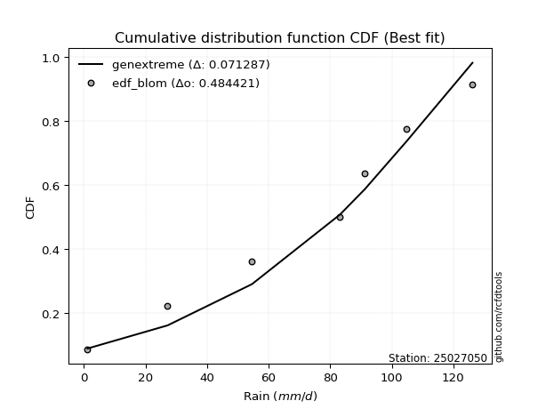</img>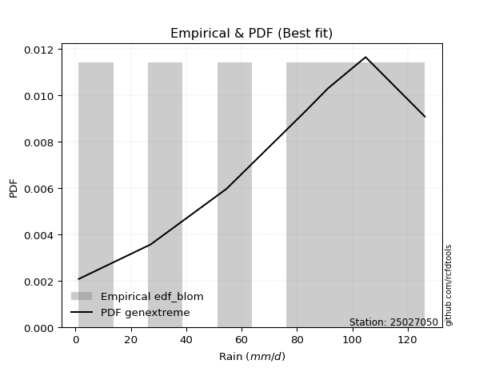</img>

</div>


### 7. Empirical - EDF Tukey (1962)

In hydrology, the Tukey formula is used as a plotting position formula to estimate the empirical probability or frequency of a flood event (or other hydrological data). The formula parameter is given as _c=0.333_ (or 1/3).

<div align="center">


$P=(m-c)/(n+1-2c)$


</div>


**7.1. Empirical values**

<div align="center">

|                | 0                   | 1                   | 2                   | 3         | 4                  | 5                  | 6                  |
|:---------------|:--------------------|:--------------------|:--------------------|:----------|:-------------------|:-------------------|:-------------------|
| date           | 2023                | 2020                | 2022                | 2024      | 2021               | 2025               | 2019               |
| x              | 1.2                 | 27.2                | 54.6                | 83.2      | 91.2               | 104.8              | 126.2              |
| m              | 1                   | 2                   | 3                   | 4         | 5                  | 6                  | 7                  |
| empirical_dist | edf_tukey           | edf_tukey           | edf_tukey           | edf_tukey | edf_tukey          | edf_tukey          | edf_tukey          |
| empirical      | 0.09090909090909091 | 0.22727272727272727 | 0.36363636363636365 | 0.5       | 0.6363636363636364 | 0.7727272727272727 | 0.9090909090909091 |
| empirical_tr   | 1.1                 | 1.2941176470588236  | 1.5714285714285714  | 2.0       | 2.75               | 4.3999999999999995 | 10.999999999999996 |

</div>


**7.2. Kolmogorov-Smirnov fit test (sorted by Δ)**


<div align="center">

|                | 0                   | 1                   | 2                   | 3                   | 4                   | 5                   | 6                   | 7                   | 8                   | 9                   | 10                  | 11                  | 12                  | 13                  | 14                  | 15                  | 16                  | 17                  | 18                  | 19                  | 20                  | 21                  | 22                  | 23                  | 24                  | 25                  | 26                  | 27                  | 28                  | 29                  | 30                  | 31                  | 32                  | 33                  | 34                  | 35                  | 36                  | 37                    | 38                  | 39                  | 40                  | 41                  | 42                  | 43                  | 44                  | 45                  | 46                  | 47                  | 48                  | 49                  | 50                  | 51                  | 52                  | 53                  | 54                  | 55                  | 56                  | 57                  | 58                  | 59                  | 60                  | 61                  | 62                  | 63                  | 64                  | 65                  | 66                  | 67                  | 68                  | 69                  | 70                  | 71                  | 72                  | 73                  | 74                  | 75                  | 76                  | 77                  | 78                  | 79                  | 80                  | 81                  | 82                  | 83                  | 84                  | 85                  | 86                  | 87                  | 88                  | 89                  |
|:---------------|:--------------------|:--------------------|:--------------------|:--------------------|:--------------------|:--------------------|:--------------------|:--------------------|:--------------------|:--------------------|:--------------------|:--------------------|:--------------------|:--------------------|:--------------------|:--------------------|:--------------------|:--------------------|:--------------------|:--------------------|:--------------------|:--------------------|:--------------------|:--------------------|:--------------------|:--------------------|:--------------------|:--------------------|:--------------------|:--------------------|:--------------------|:--------------------|:--------------------|:--------------------|:--------------------|:--------------------|:--------------------|:----------------------|:--------------------|:--------------------|:--------------------|:--------------------|:--------------------|:--------------------|:--------------------|:--------------------|:--------------------|:--------------------|:--------------------|:--------------------|:--------------------|:--------------------|:--------------------|:--------------------|:--------------------|:--------------------|:--------------------|:--------------------|:--------------------|:--------------------|:--------------------|:--------------------|:--------------------|:--------------------|:--------------------|:--------------------|:--------------------|:--------------------|:--------------------|:--------------------|:--------------------|:--------------------|:--------------------|:--------------------|:--------------------|:--------------------|:--------------------|:--------------------|:--------------------|:--------------------|:--------------------|:--------------------|:--------------------|:--------------------|:--------------------|:--------------------|:--------------------|:--------------------|:--------------------|:--------------------|
| station        | 25027050            | 25027050            | 25027050            | 25027050            | 25027050            | 25027050            | 25027050            | 25027050            | 25027050            | 25027050            | 25027050            | 25027050            | 25027050            | 25027050            | 25027050            | 25027050            | 25027050            | 25027050            | 25027050            | 25027050            | 25027050            | 25027050            | 25027050            | 25027050            | 25027050            | 25027050            | 25027050            | 25027050            | 25027050            | 25027050            | 25027050            | 25027050            | 25027050            | 25027050            | 25027050            | 25027050            | 25027050            | 25027050              | 25027050            | 25027050            | 25027050            | 25027050            | 25027050            | 25027050            | 25027050            | 25027050            | 25027050            | 25027050            | 25027050            | 25027050            | 25027050            | 25027050            | 25027050            | 25027050            | 25027050            | 25027050            | 25027050            | 25027050            | 25027050            | 25027050            | 25027050            | 25027050            | 25027050            | 25027050            | 25027050            | 25027050            | 25027050            | 25027050            | 25027050            | 25027050            | 25027050            | 25027050            | 25027050            | 25027050            | 25027050            | 25027050            | 25027050            | 25027050            | 25027050            | 25027050            | 25027050            | 25027050            | 25027050            | 25027050            | 25027050            | 25027050            | 25027050            | 25027050            | 25027050            | 25027050            |
| empirical_dist | edf_tukey           | edf_tukey           | edf_tukey           | edf_tukey           | edf_tukey           | edf_tukey           | edf_tukey           | edf_tukey           | edf_tukey           | edf_tukey           | edf_tukey           | edf_tukey           | edf_tukey           | edf_tukey           | edf_tukey           | edf_tukey           | edf_tukey           | edf_tukey           | edf_tukey           | edf_tukey           | edf_tukey           | edf_tukey           | edf_tukey           | edf_tukey           | edf_tukey           | edf_tukey           | edf_tukey           | edf_tukey           | edf_tukey           | edf_tukey           | edf_tukey           | edf_tukey           | edf_tukey           | edf_tukey           | edf_tukey           | edf_tukey           | edf_tukey           | edf_tukey             | edf_tukey           | edf_tukey           | edf_tukey           | edf_tukey           | edf_tukey           | edf_tukey           | edf_tukey           | edf_tukey           | edf_tukey           | edf_tukey           | edf_tukey           | edf_tukey           | edf_tukey           | edf_tukey           | edf_tukey           | edf_tukey           | edf_tukey           | edf_tukey           | edf_tukey           | edf_tukey           | edf_tukey           | edf_tukey           | edf_tukey           | edf_tukey           | edf_tukey           | edf_tukey           | edf_tukey           | edf_tukey           | edf_tukey           | edf_tukey           | edf_tukey           | edf_tukey           | edf_tukey           | edf_tukey           | edf_tukey           | edf_tukey           | edf_tukey           | edf_tukey           | edf_tukey           | edf_tukey           | edf_tukey           | edf_tukey           | edf_tukey           | edf_tukey           | edf_tukey           | edf_tukey           | edf_tukey           | edf_tukey           | edf_tukey           | edf_tukey           | edf_tukey           | edf_tukey           |
| p_dist         | johnsonsu           | logjohnsonsu        | genlogistic         | laplace_asymmetric  | weibull_min         | gumbel_l            | fisk                | pearson3            | f                   | crystalball         | t                   | nct                 | norm                | exponnorm           | betaprime           | gamma               | erlang              | rice                | chi2                | logistic            | ncf                 | logpearson3         | invgamma            | loggumbel_l         | alpha               | maxwell             | invgauss            | hypsecant           | logfisk             | rayleigh            | kstwobign           | halfnorm            | laplace             | logmielke           | logweibull_min      | gumbel_r            | loggompertz         | loglaplace_asymmetric | logt                | logloggamma         | expon               | genexpon            | logfatiguelife      | halflogistic        | logbetaprime        | moyal               | logf                | logexponnorm        | lognorm             | lognorm             | logcrystalball      | logrice             | lognct              | logncf              | loginvgauss         | loggamma            | loggamma            | loglogistic         | logerlang           | loginvweibull       | loghypsecant        | loginvgamma         | logmaxwell          | lograyleigh         | loglaplace          | wald                | logkstwobign        | loghalfnorm         | mielke              | loggumbel_r         | loggenexpon         | gibrat              | loghalflogistic     | logmoyal            | logexpon            | logwald             | loggibrat           | pareto              | loglognorm          | lognakagami         | logpareto           | fatiguelife         | invweibull          | logtruncnorm        | nakagami            | gompertz            | logchi2             | logalpha            | loggenlogistic      | truncnorm           |
| delta          | 0.07667909462617098 | 0.08032146360923187 | 0.08068341713836169 | 0.08139552586983273 | 0.08509539400818555 | 0.08929287196838509 | 0.1081166775640382  | 0.10847333706261797 | 0.12752840368915752 | 0.12816160403912868 | 0.12818930538448714 | 0.12821399542240686 | 0.12821669269979763 | 0.1282171814342311  | 0.13140551047297855 | 0.13399645929323512 | 0.13421186769272586 | 0.13876813676373545 | 0.14000253326829482 | 0.14413462616880746 | 0.14482236584503994 | 0.14522386494937178 | 0.14782024055285503 | 0.15122350765146197 | 0.15193080518236546 | 0.15209629685361958 | 0.15615414811238704 | 0.15681009469017593 | 0.15693147425161547 | 0.15937429442978202 | 0.1728298682691276  | 0.18030470224412343 | 0.18518948946190394 | 0.1873492315777452  | 0.189600591459256   | 0.1913801351955987  | 0.19207155046852376 | 0.19295456854982618   | 0.19345829946050414 | 0.1938667064758246  | 0.19754819403665913 | 0.2040326300576688  | 0.20844671381727753 | 0.20864727910883807 | 0.21142015195231434 | 0.2125612234390113  | 0.2133743145601661  | 0.21464630814107133 | 0.21464704193586281 | 0.21464704193586281 | 0.2146470449216017  | 0.21465628601089415 | 0.21553647564691836 | 0.21568814106108802 | 0.21974320904643496 | 0.2243849826096952  | 0.2243849826096952  | 0.22497615172550123 | 0.22743501920627773 | 0.2299082077941779  | 0.23356858308685524 | 0.23624087007991756 | 0.24298780509717055 | 0.25191273602043085 | 0.2582119769875898  | 0.27204081958999016 | 0.27440306702366957 | 0.2771914463047902  | 0.2774454573576024  | 0.28309730185282855 | 0.2920009203822319  | 0.30423544679018955 | 0.3052103291388085  | 0.3068553410939675  | 0.360776050382952   | 0.37286436561500036 | 0.40373871426445673 | 0.40381115620083863 | 0.42409645300661936 | 0.4313247013188517  | 0.4471395347752978  | 0.4811558636542116  | 0.48282196954204254 | 0.492707445641557   | 0.5106373900039562  | 0.6163564036301102  | 0.6292402942729219  | 0.6589355758575297  | 0.7727272727272727  | 0.8993624450786957  |
| deltao         | 0.48442053926100004 | 0.48442053926100004 | 0.48442053926100004 | 0.48442053926100004 | 0.48442053926100004 | 0.48442053926100004 | 0.48442053926100004 | 0.48442053926100004 | 0.48442053926100004 | 0.48442053926100004 | 0.48442053926100004 | 0.48442053926100004 | 0.48442053926100004 | 0.48442053926100004 | 0.48442053926100004 | 0.48442053926100004 | 0.48442053926100004 | 0.48442053926100004 | 0.48442053926100004 | 0.48442053926100004 | 0.48442053926100004 | 0.48442053926100004 | 0.48442053926100004 | 0.48442053926100004 | 0.48442053926100004 | 0.48442053926100004 | 0.48442053926100004 | 0.48442053926100004 | 0.48442053926100004 | 0.48442053926100004 | 0.48442053926100004 | 0.48442053926100004 | 0.48442053926100004 | 0.48442053926100004 | 0.48442053926100004 | 0.48442053926100004 | 0.48442053926100004 | 0.48442053926100004   | 0.48442053926100004 | 0.48442053926100004 | 0.48442053926100004 | 0.48442053926100004 | 0.48442053926100004 | 0.48442053926100004 | 0.48442053926100004 | 0.48442053926100004 | 0.48442053926100004 | 0.48442053926100004 | 0.48442053926100004 | 0.48442053926100004 | 0.48442053926100004 | 0.48442053926100004 | 0.48442053926100004 | 0.48442053926100004 | 0.48442053926100004 | 0.48442053926100004 | 0.48442053926100004 | 0.48442053926100004 | 0.48442053926100004 | 0.48442053926100004 | 0.48442053926100004 | 0.48442053926100004 | 0.48442053926100004 | 0.48442053926100004 | 0.48442053926100004 | 0.48442053926100004 | 0.48442053926100004 | 0.48442053926100004 | 0.48442053926100004 | 0.48442053926100004 | 0.48442053926100004 | 0.48442053926100004 | 0.48442053926100004 | 0.48442053926100004 | 0.48442053926100004 | 0.48442053926100004 | 0.48442053926100004 | 0.48442053926100004 | 0.48442053926100004 | 0.48442053926100004 | 0.48442053926100004 | 0.48442053926100004 | 0.48442053926100004 | 0.48442053926100004 | 0.48442053926100004 | 0.48442053926100004 | 0.48442053926100004 | 0.48442053926100004 | 0.48442053926100004 | 0.48442053926100004 |
| eval           | Δo > Δ              | Δo > Δ              | Δo > Δ              | Δo > Δ              | Δo > Δ              | Δo > Δ              | Δo > Δ              | Δo > Δ              | Δo > Δ              | Δo > Δ              | Δo > Δ              | Δo > Δ              | Δo > Δ              | Δo > Δ              | Δo > Δ              | Δo > Δ              | Δo > Δ              | Δo > Δ              | Δo > Δ              | Δo > Δ              | Δo > Δ              | Δo > Δ              | Δo > Δ              | Δo > Δ              | Δo > Δ              | Δo > Δ              | Δo > Δ              | Δo > Δ              | Δo > Δ              | Δo > Δ              | Δo > Δ              | Δo > Δ              | Δo > Δ              | Δo > Δ              | Δo > Δ              | Δo > Δ              | Δo > Δ              | Δo > Δ                | Δo > Δ              | Δo > Δ              | Δo > Δ              | Δo > Δ              | Δo > Δ              | Δo > Δ              | Δo > Δ              | Δo > Δ              | Δo > Δ              | Δo > Δ              | Δo > Δ              | Δo > Δ              | Δo > Δ              | Δo > Δ              | Δo > Δ              | Δo > Δ              | Δo > Δ              | Δo > Δ              | Δo > Δ              | Δo > Δ              | Δo > Δ              | Δo > Δ              | Δo > Δ              | Δo > Δ              | Δo > Δ              | Δo > Δ              | Δo > Δ              | Δo > Δ              | Δo > Δ              | Δo > Δ              | Δo > Δ              | Δo > Δ              | Δo > Δ              | Δo > Δ              | Δo > Δ              | Δo > Δ              | Δo > Δ              | Δo > Δ              | Δo > Δ              | Δo > Δ              | Δo > Δ              | Δo > Δ              | Δo > Δ              | Δo > Δ              | Δo > Δ              | Δo <= Δ             | Δo <= Δ             | Δo <= Δ             | Δo <= Δ             | Δo <= Δ             | Δo <= Δ             | Δo <= Δ             |
| fit            | 1                   | 1                   | 1                   | 1                   | 1                   | 1                   | 1                   | 1                   | 1                   | 1                   | 1                   | 1                   | 1                   | 1                   | 1                   | 1                   | 1                   | 1                   | 1                   | 1                   | 1                   | 1                   | 1                   | 1                   | 1                   | 1                   | 1                   | 1                   | 1                   | 1                   | 1                   | 1                   | 1                   | 1                   | 1                   | 1                   | 1                   | 1                     | 1                   | 1                   | 1                   | 1                   | 1                   | 1                   | 1                   | 1                   | 1                   | 1                   | 1                   | 1                   | 1                   | 1                   | 1                   | 1                   | 1                   | 1                   | 1                   | 1                   | 1                   | 1                   | 1                   | 1                   | 1                   | 1                   | 1                   | 1                   | 1                   | 1                   | 1                   | 1                   | 1                   | 1                   | 1                   | 1                   | 1                   | 1                   | 1                   | 1                   | 1                   | 1                   | 1                   | 1                   | 1                   | 0                   | 0                   | 0                   | 0                   | 0                   | 0                   | 0                   |
| n              | 7                   | 7                   | 7                   | 7                   | 7                   | 7                   | 7                   | 7                   | 7                   | 7                   | 7                   | 7                   | 7                   | 7                   | 7                   | 7                   | 7                   | 7                   | 7                   | 7                   | 7                   | 7                   | 7                   | 7                   | 7                   | 7                   | 7                   | 7                   | 7                   | 7                   | 7                   | 7                   | 7                   | 7                   | 7                   | 7                   | 7                   | 7                     | 7                   | 7                   | 7                   | 7                   | 7                   | 7                   | 7                   | 7                   | 7                   | 7                   | 7                   | 7                   | 7                   | 7                   | 7                   | 7                   | 7                   | 7                   | 7                   | 7                   | 7                   | 7                   | 7                   | 7                   | 7                   | 7                   | 7                   | 7                   | 7                   | 7                   | 7                   | 7                   | 7                   | 7                   | 7                   | 7                   | 7                   | 7                   | 7                   | 7                   | 7                   | 7                   | 7                   | 7                   | 7                   | 7                   | 7                   | 7                   | 7                   | 7                   | 7                   | 7                   |
| best_fit       | 1                   | 0                   | 0                   | 0                   | 0                   | 0                   | 0                   | 0                   | 0                   | 0                   | 0                   | 0                   | 0                   | 0                   | 0                   | 0                   | 0                   | 0                   | 0                   | 0                   | 0                   | 0                   | 0                   | 0                   | 0                   | 0                   | 0                   | 0                   | 0                   | 0                   | 0                   | 0                   | 0                   | 0                   | 0                   | 0                   | 0                   | 0                     | 0                   | 0                   | 0                   | 0                   | 0                   | 0                   | 0                   | 0                   | 0                   | 0                   | 0                   | 0                   | 0                   | 0                   | 0                   | 0                   | 0                   | 0                   | 0                   | 0                   | 0                   | 0                   | 0                   | 0                   | 0                   | 0                   | 0                   | 0                   | 0                   | 0                   | 0                   | 0                   | 0                   | 0                   | 0                   | 0                   | 0                   | 0                   | 0                   | 0                   | 0                   | 0                   | 0                   | 0                   | 0                   | 0                   | 0                   | 0                   | 0                   | 0                   | 0                   | 0                   |
| best_fit_sort  | 1                   | 2                   | 3                   | 4                   | 5                   | 6                   | 7                   | 8                   | 9                   | 10                  | 11                  | 12                  | 13                  | 14                  | 15                  | 16                  | 17                  | 18                  | 19                  | 20                  | 21                  | 22                  | 23                  | 24                  | 25                  | 26                  | 27                  | 28                  | 29                  | 30                  | 31                  | 32                  | 33                  | 34                  | 35                  | 36                  | 37                  | 38                    | 39                  | 40                  | 41                  | 42                  | 43                  | 44                  | 45                  | 46                  | 47                  | 48                  | 49                  | 50                  | 51                  | 52                  | 53                  | 54                  | 55                  | 56                  | 57                  | 58                  | 59                  | 60                  | 61                  | 62                  | 63                  | 64                  | 65                  | 66                  | 67                  | 68                  | 69                  | 70                  | 71                  | 72                  | 73                  | 74                  | 75                  | 76                  | 77                  | 78                  | 79                  | 80                  | 81                  | 82                  | 83                  | 84                  | 85                  | 86                  | 87                  | 88                  | 89                  | 90                  |

</div>


<div align="center">

</img>

</div>


**7.3. Best fit**

<div align="center">

|   id |   station | empirical_dist   | p_dist    |     delta |   deltao | eval   |   fit |   n |   best_fit |   best_fit_sort |
|-----:|----------:|:-----------------|:----------|----------:|---------:|:-------|------:|----:|-----------:|----------------:|
|    0 |  25027050 | edf_tukey        | johnsonsu | 0.0766791 | 0.484421 | Δo > Δ |     1 |   7 |          1 |               1 |

</div>


<div align="center">

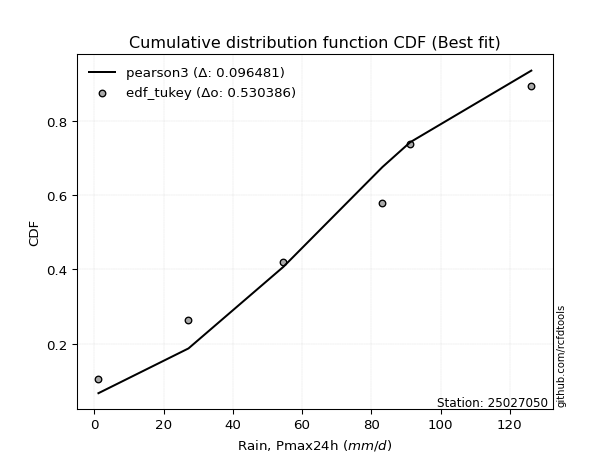</img></img>

</div>


### 8. Empirical - EDF Gringorten (1963)

Gringorten plotting position formula is essential for estimating the probability and return periods of extreme events like floods and heavy rainfall. The constant _a=0.44_.

<div align="center">


$P=(m-a)/(n+1-2a)$


</div>


**8.1. Empirical values**

<div align="center">

|                | 0                   | 1                   | 2                  | 3              | 4                  | 5                  | 6                  |
|:---------------|:--------------------|:--------------------|:-------------------|:---------------|:-------------------|:-------------------|:-------------------|
| date           | 2023                | 2020                | 2022               | 2024           | 2021               | 2025               | 2019               |
| x              | 1.2                 | 27.2                | 54.6               | 83.2           | 91.2               | 104.8              | 126.2              |
| m              | 1                   | 2                   | 3                  | 4              | 5                  | 6                  | 7                  |
| empirical_dist | edf_gringorten      | edf_gringorten      | edf_gringorten     | edf_gringorten | edf_gringorten     | edf_gringorten     | edf_gringorten     |
| empirical      | 0.07865168539325844 | 0.21910112359550563 | 0.3595505617977528 | 0.5            | 0.6404494382022471 | 0.7808988764044943 | 0.9213483146067415 |
| empirical_tr   | 1.0853658536585364  | 1.2805755395683454  | 1.5614035087719298 | 2.0            | 2.781249999999999  | 4.564102564102562  | 12.714285714285701 |

</div>


**8.2. Kolmogorov-Smirnov fit test (sorted by Δ)**


<div align="center">

|                | 0                   | 1                   | 2                   | 3                   | 4                   | 5                   | 6                   | 7                   | 8                   | 9                   | 10                  | 11                  | 12                  | 13                  | 14                  | 15                  | 16                  | 17                  | 18                  | 19                  | 20                  | 21                  | 22                  | 23                  | 24                  | 25                  | 26                  | 27                  | 28                  | 29                  | 30                  | 31                  | 32                  | 33                  | 34                  | 35                  | 36                  | 37                  | 38                    | 39                  | 40                  | 41                  | 42                  | 43                  | 44                  | 45                  | 46                  | 47                  | 48                  | 49                  | 50                  | 51                  | 52                  | 53                  | 54                  | 55                  | 56                  | 57                  | 58                  | 59                  | 60                  | 61                  | 62                  | 63                  | 64                  | 65                  | 66                  | 67                  | 68                  | 69                  | 70                  | 71                  | 72                  | 73                  | 74                  | 75                  | 76                  | 77                  | 78                  | 79                  | 80                  | 81                  | 82                  | 83                  | 84                  | 85                  | 86                  | 87                  | 88                  | 89                  |
|:---------------|:--------------------|:--------------------|:--------------------|:--------------------|:--------------------|:--------------------|:--------------------|:--------------------|:--------------------|:--------------------|:--------------------|:--------------------|:--------------------|:--------------------|:--------------------|:--------------------|:--------------------|:--------------------|:--------------------|:--------------------|:--------------------|:--------------------|:--------------------|:--------------------|:--------------------|:--------------------|:--------------------|:--------------------|:--------------------|:--------------------|:--------------------|:--------------------|:--------------------|:--------------------|:--------------------|:--------------------|:--------------------|:--------------------|:----------------------|:--------------------|:--------------------|:--------------------|:--------------------|:--------------------|:--------------------|:--------------------|:--------------------|:--------------------|:--------------------|:--------------------|:--------------------|:--------------------|:--------------------|:--------------------|:--------------------|:--------------------|:--------------------|:--------------------|:--------------------|:--------------------|:--------------------|:--------------------|:--------------------|:--------------------|:--------------------|:--------------------|:--------------------|:--------------------|:--------------------|:--------------------|:--------------------|:--------------------|:--------------------|:--------------------|:--------------------|:--------------------|:--------------------|:--------------------|:--------------------|:--------------------|:--------------------|:--------------------|:--------------------|:--------------------|:--------------------|:--------------------|:--------------------|:--------------------|:--------------------|:--------------------|
| station        | 25027050            | 25027050            | 25027050            | 25027050            | 25027050            | 25027050            | 25027050            | 25027050            | 25027050            | 25027050            | 25027050            | 25027050            | 25027050            | 25027050            | 25027050            | 25027050            | 25027050            | 25027050            | 25027050            | 25027050            | 25027050            | 25027050            | 25027050            | 25027050            | 25027050            | 25027050            | 25027050            | 25027050            | 25027050            | 25027050            | 25027050            | 25027050            | 25027050            | 25027050            | 25027050            | 25027050            | 25027050            | 25027050            | 25027050              | 25027050            | 25027050            | 25027050            | 25027050            | 25027050            | 25027050            | 25027050            | 25027050            | 25027050            | 25027050            | 25027050            | 25027050            | 25027050            | 25027050            | 25027050            | 25027050            | 25027050            | 25027050            | 25027050            | 25027050            | 25027050            | 25027050            | 25027050            | 25027050            | 25027050            | 25027050            | 25027050            | 25027050            | 25027050            | 25027050            | 25027050            | 25027050            | 25027050            | 25027050            | 25027050            | 25027050            | 25027050            | 25027050            | 25027050            | 25027050            | 25027050            | 25027050            | 25027050            | 25027050            | 25027050            | 25027050            | 25027050            | 25027050            | 25027050            | 25027050            | 25027050            |
| empirical_dist | edf_gringorten      | edf_gringorten      | edf_gringorten      | edf_gringorten      | edf_gringorten      | edf_gringorten      | edf_gringorten      | edf_gringorten      | edf_gringorten      | edf_gringorten      | edf_gringorten      | edf_gringorten      | edf_gringorten      | edf_gringorten      | edf_gringorten      | edf_gringorten      | edf_gringorten      | edf_gringorten      | edf_gringorten      | edf_gringorten      | edf_gringorten      | edf_gringorten      | edf_gringorten      | edf_gringorten      | edf_gringorten      | edf_gringorten      | edf_gringorten      | edf_gringorten      | edf_gringorten      | edf_gringorten      | edf_gringorten      | edf_gringorten      | edf_gringorten      | edf_gringorten      | edf_gringorten      | edf_gringorten      | edf_gringorten      | edf_gringorten      | edf_gringorten        | edf_gringorten      | edf_gringorten      | edf_gringorten      | edf_gringorten      | edf_gringorten      | edf_gringorten      | edf_gringorten      | edf_gringorten      | edf_gringorten      | edf_gringorten      | edf_gringorten      | edf_gringorten      | edf_gringorten      | edf_gringorten      | edf_gringorten      | edf_gringorten      | edf_gringorten      | edf_gringorten      | edf_gringorten      | edf_gringorten      | edf_gringorten      | edf_gringorten      | edf_gringorten      | edf_gringorten      | edf_gringorten      | edf_gringorten      | edf_gringorten      | edf_gringorten      | edf_gringorten      | edf_gringorten      | edf_gringorten      | edf_gringorten      | edf_gringorten      | edf_gringorten      | edf_gringorten      | edf_gringorten      | edf_gringorten      | edf_gringorten      | edf_gringorten      | edf_gringorten      | edf_gringorten      | edf_gringorten      | edf_gringorten      | edf_gringorten      | edf_gringorten      | edf_gringorten      | edf_gringorten      | edf_gringorten      | edf_gringorten      | edf_gringorten      | edf_gringorten      |
| p_dist         | johnsonsu           | genlogistic         | laplace_asymmetric  | gumbel_l            | weibull_min         | logjohnsonsu        | fisk                | pearson3            | f                   | crystalball         | t                   | nct                 | norm                | exponnorm           | betaprime           | gamma               | erlang              | rice                | chi2                | logistic            | invgamma            | alpha               | maxwell             | loggumbel_l         | invgauss            | hypsecant           | ncf                 | logpearson3         | rayleigh            | logfisk             | kstwobign           | halfnorm            | laplace             | logmielke           | logt                | logweibull_min      | gumbel_r            | loggompertz         | loglaplace_asymmetric | logloggamma         | expon               | genexpon            | halflogistic        | logfatiguelife      | moyal               | logbetaprime        | logf                | logexponnorm        | lognorm             | lognorm             | logcrystalball      | logrice             | lognct              | logncf              | loginvgauss         | loggamma            | loggamma            | loglogistic         | logerlang           | loghypsecant        | loginvweibull       | loginvgamma         | logmaxwell          | lograyleigh         | loglaplace          | wald                | mielke              | loghalfnorm         | logkstwobign        | loggumbel_r         | loggenexpon         | gibrat              | loghalflogistic     | logmoyal            | logexpon            | logwald             | loggibrat           | pareto              | loglognorm          | lognakagami         | logpareto           | fatiguelife         | invweibull          | logtruncnorm        | nakagami            | gompertz            | logchi2             | logalpha            | loggenlogistic      | truncnorm           |
| delta          | 0.06850749094894934 | 0.07659761529975084 | 0.07730972403122188 | 0.08112126829116345 | 0.08509539400818555 | 0.08849306728645345 | 0.1081166775640382  | 0.10847333706261797 | 0.12752840368915752 | 0.12816160403912868 | 0.12818930538448714 | 0.12821399542240686 | 0.12821669269979763 | 0.1282171814342311  | 0.13140551047297855 | 0.13399645929323512 | 0.13421186769272586 | 0.13876813676373545 | 0.14000253326829482 | 0.14413462616880746 | 0.14782024055285503 | 0.15193080518236546 | 0.15209629685361958 | 0.15530930949007282 | 0.15615414811238704 | 0.15681009469017593 | 0.15707977136087237 | 0.15748127046520422 | 0.15937429442978202 | 0.1691888797674479  | 0.1728298682691276  | 0.18030470224412343 | 0.18518948946190394 | 0.1873492315777452  | 0.1893724976218933  | 0.189600591459256   | 0.1913801351955987  | 0.19207155046852376 | 0.19295456854982618   | 0.1938667064758246  | 0.19754819403665913 | 0.2040326300576688  | 0.20864727910883807 | 0.21253251565588838 | 0.2125612234390113  | 0.2155059537909252  | 0.21746011639877694 | 0.21873210997968218 | 0.21873284377447366 | 0.21873284377447366 | 0.21873284676021254 | 0.218742087849505   | 0.2196222774855292  | 0.21977394289969887 | 0.2238290108850458  | 0.22847078444830604 | 0.22847078444830604 | 0.22906195356411208 | 0.23152082104488858 | 0.2376543849254661  | 0.23807981147139953 | 0.2403266719185284  | 0.2470736069357814  | 0.2559985378590417  | 0.26229777882620064 | 0.27204081958999016 | 0.2774454573576024  | 0.28127724814340105 | 0.28257467070089126 | 0.2871831036914394  | 0.3001725240594536  | 0.30423544679018955 | 0.30929613097741937 | 0.31094114293257835 | 0.3689476540601737  | 0.3769501674536112  | 0.4078245161030676  | 0.4119827598780603  | 0.43226805668384105 | 0.4394963049960734  | 0.45531113845251947 | 0.4893274673314333  | 0.49507937505787497 | 0.5008790493187787  | 0.5188089936811779  | 0.620442205468721   | 0.6374118979501436  | 0.6671071795347514  | 0.7808988764044943  | 0.9116198505945282  |
| deltao         | 0.48442053926100004 | 0.48442053926100004 | 0.48442053926100004 | 0.48442053926100004 | 0.48442053926100004 | 0.48442053926100004 | 0.48442053926100004 | 0.48442053926100004 | 0.48442053926100004 | 0.48442053926100004 | 0.48442053926100004 | 0.48442053926100004 | 0.48442053926100004 | 0.48442053926100004 | 0.48442053926100004 | 0.48442053926100004 | 0.48442053926100004 | 0.48442053926100004 | 0.48442053926100004 | 0.48442053926100004 | 0.48442053926100004 | 0.48442053926100004 | 0.48442053926100004 | 0.48442053926100004 | 0.48442053926100004 | 0.48442053926100004 | 0.48442053926100004 | 0.48442053926100004 | 0.48442053926100004 | 0.48442053926100004 | 0.48442053926100004 | 0.48442053926100004 | 0.48442053926100004 | 0.48442053926100004 | 0.48442053926100004 | 0.48442053926100004 | 0.48442053926100004 | 0.48442053926100004 | 0.48442053926100004   | 0.48442053926100004 | 0.48442053926100004 | 0.48442053926100004 | 0.48442053926100004 | 0.48442053926100004 | 0.48442053926100004 | 0.48442053926100004 | 0.48442053926100004 | 0.48442053926100004 | 0.48442053926100004 | 0.48442053926100004 | 0.48442053926100004 | 0.48442053926100004 | 0.48442053926100004 | 0.48442053926100004 | 0.48442053926100004 | 0.48442053926100004 | 0.48442053926100004 | 0.48442053926100004 | 0.48442053926100004 | 0.48442053926100004 | 0.48442053926100004 | 0.48442053926100004 | 0.48442053926100004 | 0.48442053926100004 | 0.48442053926100004 | 0.48442053926100004 | 0.48442053926100004 | 0.48442053926100004 | 0.48442053926100004 | 0.48442053926100004 | 0.48442053926100004 | 0.48442053926100004 | 0.48442053926100004 | 0.48442053926100004 | 0.48442053926100004 | 0.48442053926100004 | 0.48442053926100004 | 0.48442053926100004 | 0.48442053926100004 | 0.48442053926100004 | 0.48442053926100004 | 0.48442053926100004 | 0.48442053926100004 | 0.48442053926100004 | 0.48442053926100004 | 0.48442053926100004 | 0.48442053926100004 | 0.48442053926100004 | 0.48442053926100004 | 0.48442053926100004 |
| eval           | Δo > Δ              | Δo > Δ              | Δo > Δ              | Δo > Δ              | Δo > Δ              | Δo > Δ              | Δo > Δ              | Δo > Δ              | Δo > Δ              | Δo > Δ              | Δo > Δ              | Δo > Δ              | Δo > Δ              | Δo > Δ              | Δo > Δ              | Δo > Δ              | Δo > Δ              | Δo > Δ              | Δo > Δ              | Δo > Δ              | Δo > Δ              | Δo > Δ              | Δo > Δ              | Δo > Δ              | Δo > Δ              | Δo > Δ              | Δo > Δ              | Δo > Δ              | Δo > Δ              | Δo > Δ              | Δo > Δ              | Δo > Δ              | Δo > Δ              | Δo > Δ              | Δo > Δ              | Δo > Δ              | Δo > Δ              | Δo > Δ              | Δo > Δ                | Δo > Δ              | Δo > Δ              | Δo > Δ              | Δo > Δ              | Δo > Δ              | Δo > Δ              | Δo > Δ              | Δo > Δ              | Δo > Δ              | Δo > Δ              | Δo > Δ              | Δo > Δ              | Δo > Δ              | Δo > Δ              | Δo > Δ              | Δo > Δ              | Δo > Δ              | Δo > Δ              | Δo > Δ              | Δo > Δ              | Δo > Δ              | Δo > Δ              | Δo > Δ              | Δo > Δ              | Δo > Δ              | Δo > Δ              | Δo > Δ              | Δo > Δ              | Δo > Δ              | Δo > Δ              | Δo > Δ              | Δo > Δ              | Δo > Δ              | Δo > Δ              | Δo > Δ              | Δo > Δ              | Δo > Δ              | Δo > Δ              | Δo > Δ              | Δo > Δ              | Δo > Δ              | Δo > Δ              | Δo <= Δ             | Δo <= Δ             | Δo <= Δ             | Δo <= Δ             | Δo <= Δ             | Δo <= Δ             | Δo <= Δ             | Δo <= Δ             | Δo <= Δ             |
| fit            | 1                   | 1                   | 1                   | 1                   | 1                   | 1                   | 1                   | 1                   | 1                   | 1                   | 1                   | 1                   | 1                   | 1                   | 1                   | 1                   | 1                   | 1                   | 1                   | 1                   | 1                   | 1                   | 1                   | 1                   | 1                   | 1                   | 1                   | 1                   | 1                   | 1                   | 1                   | 1                   | 1                   | 1                   | 1                   | 1                   | 1                   | 1                   | 1                     | 1                   | 1                   | 1                   | 1                   | 1                   | 1                   | 1                   | 1                   | 1                   | 1                   | 1                   | 1                   | 1                   | 1                   | 1                   | 1                   | 1                   | 1                   | 1                   | 1                   | 1                   | 1                   | 1                   | 1                   | 1                   | 1                   | 1                   | 1                   | 1                   | 1                   | 1                   | 1                   | 1                   | 1                   | 1                   | 1                   | 1                   | 1                   | 1                   | 1                   | 1                   | 1                   | 0                   | 0                   | 0                   | 0                   | 0                   | 0                   | 0                   | 0                   | 0                   |
| n              | 7                   | 7                   | 7                   | 7                   | 7                   | 7                   | 7                   | 7                   | 7                   | 7                   | 7                   | 7                   | 7                   | 7                   | 7                   | 7                   | 7                   | 7                   | 7                   | 7                   | 7                   | 7                   | 7                   | 7                   | 7                   | 7                   | 7                   | 7                   | 7                   | 7                   | 7                   | 7                   | 7                   | 7                   | 7                   | 7                   | 7                   | 7                   | 7                     | 7                   | 7                   | 7                   | 7                   | 7                   | 7                   | 7                   | 7                   | 7                   | 7                   | 7                   | 7                   | 7                   | 7                   | 7                   | 7                   | 7                   | 7                   | 7                   | 7                   | 7                   | 7                   | 7                   | 7                   | 7                   | 7                   | 7                   | 7                   | 7                   | 7                   | 7                   | 7                   | 7                   | 7                   | 7                   | 7                   | 7                   | 7                   | 7                   | 7                   | 7                   | 7                   | 7                   | 7                   | 7                   | 7                   | 7                   | 7                   | 7                   | 7                   | 7                   |
| best_fit       | 1                   | 0                   | 0                   | 0                   | 0                   | 0                   | 0                   | 0                   | 0                   | 0                   | 0                   | 0                   | 0                   | 0                   | 0                   | 0                   | 0                   | 0                   | 0                   | 0                   | 0                   | 0                   | 0                   | 0                   | 0                   | 0                   | 0                   | 0                   | 0                   | 0                   | 0                   | 0                   | 0                   | 0                   | 0                   | 0                   | 0                   | 0                   | 0                     | 0                   | 0                   | 0                   | 0                   | 0                   | 0                   | 0                   | 0                   | 0                   | 0                   | 0                   | 0                   | 0                   | 0                   | 0                   | 0                   | 0                   | 0                   | 0                   | 0                   | 0                   | 0                   | 0                   | 0                   | 0                   | 0                   | 0                   | 0                   | 0                   | 0                   | 0                   | 0                   | 0                   | 0                   | 0                   | 0                   | 0                   | 0                   | 0                   | 0                   | 0                   | 0                   | 0                   | 0                   | 0                   | 0                   | 0                   | 0                   | 0                   | 0                   | 0                   |
| best_fit_sort  | 1                   | 2                   | 3                   | 4                   | 5                   | 6                   | 7                   | 8                   | 9                   | 10                  | 11                  | 12                  | 13                  | 14                  | 15                  | 16                  | 17                  | 18                  | 19                  | 20                  | 21                  | 22                  | 23                  | 24                  | 25                  | 26                  | 27                  | 28                  | 29                  | 30                  | 31                  | 32                  | 33                  | 34                  | 35                  | 36                  | 37                  | 38                  | 39                    | 40                  | 41                  | 42                  | 43                  | 44                  | 45                  | 46                  | 47                  | 48                  | 49                  | 50                  | 51                  | 52                  | 53                  | 54                  | 55                  | 56                  | 57                  | 58                  | 59                  | 60                  | 61                  | 62                  | 63                  | 64                  | 65                  | 66                  | 67                  | 68                  | 69                  | 70                  | 71                  | 72                  | 73                  | 74                  | 75                  | 76                  | 77                  | 78                  | 79                  | 80                  | 81                  | 82                  | 83                  | 84                  | 85                  | 86                  | 87                  | 88                  | 89                  | 90                  |

</div>


<div align="center">

</img>

</div>


**8.3. Best fit**

<div align="center">

|   id |   station | empirical_dist   | p_dist    |     delta |   deltao | eval   |   fit |   n |   best_fit |   best_fit_sort |
|-----:|----------:|:-----------------|:----------|----------:|---------:|:-------|------:|----:|-----------:|----------------:|
|    0 |  25027050 | edf_gringorten   | johnsonsu | 0.0685075 | 0.484421 | Δo > Δ |     1 |   7 |          1 |               1 |

</div>


<div align="center">

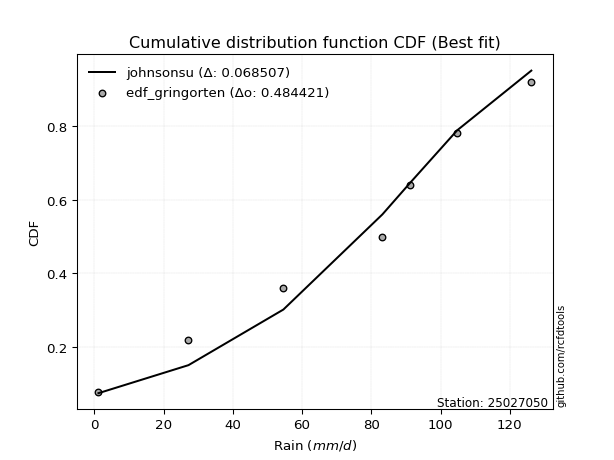</img>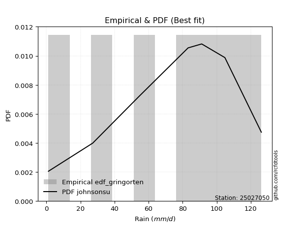</img>

</div>


### 9. Empirical - EDF Filliben (1975)

The specific values of the constants (0.3175) (often denoted as $alpha$) and (0.365) are derived from a method proposed by James J. Filliben in a 1975 paper. This particular formula is the mean value of the $i$-th order statistic of the normal distribution and is considered a robust and effective plotting position formula for the normal probability plot correlation coefficient test for normality.

<div align="center">


$P=(m-0.3175)/(n+0.365)$


</div>


**9.1. Empirical values**

<div align="center">

|                | 0                   | 1                   | 2                   | 3            | 4                  | 5                  | 6                  |
|:---------------|:--------------------|:--------------------|:--------------------|:-------------|:-------------------|:-------------------|:-------------------|
| date           | 2023                | 2020                | 2022                | 2024         | 2021               | 2025               | 2019               |
| x              | 1.2                 | 27.2                | 54.6                | 83.2         | 91.2               | 104.8              | 126.2              |
| m              | 1                   | 2                   | 3                   | 4            | 5                  | 6                  | 7                  |
| empirical_dist | edf_filliben        | edf_filliben        | edf_filliben        | edf_filliben | edf_filliben       | edf_filliben       | edf_filliben       |
| empirical      | 0.09266802443991853 | 0.22844534962661237 | 0.36422267481330617 | 0.5          | 0.6357773251866938 | 0.7715546503733877 | 0.9073319755600815 |
| empirical_tr   | 1.1021324354657687  | 1.2960844698636163  | 1.5728777362520021  | 2.0          | 2.7455731593662627 | 4.377414561664191  | 10.791208791208794 |

</div>


**9.2. Kolmogorov-Smirnov fit test (sorted by Δ)**


<div align="center">

|                | 0                   | 1                   | 2                   | 3                   | 4                   | 5                   | 6                   | 7                   | 8                   | 9                   | 10                  | 11                  | 12                  | 13                  | 14                  | 15                  | 16                  | 17                  | 18                  | 19                  | 20                  | 21                  | 22                  | 23                  | 24                  | 25                  | 26                  | 27                  | 28                  | 29                  | 30                  | 31                  | 32                  | 33                  | 34                  | 35                  | 36                  | 37                    | 38                  | 39                  | 40                  | 41                  | 42                  | 43                  | 44                  | 45                  | 46                  | 47                  | 48                  | 49                  | 50                  | 51                  | 52                  | 53                  | 54                  | 55                  | 56                  | 57                  | 58                  | 59                  | 60                  | 61                  | 62                  | 63                  | 64                  | 65                  | 66                  | 67                  | 68                  | 69                  | 70                  | 71                  | 72                  | 73                  | 74                  | 75                  | 76                  | 77                  | 78                  | 79                  | 80                  | 81                  | 82                  | 83                  | 84                  | 85                  | 86                  | 87                  | 88                  | 89                  |
|:---------------|:--------------------|:--------------------|:--------------------|:--------------------|:--------------------|:--------------------|:--------------------|:--------------------|:--------------------|:--------------------|:--------------------|:--------------------|:--------------------|:--------------------|:--------------------|:--------------------|:--------------------|:--------------------|:--------------------|:--------------------|:--------------------|:--------------------|:--------------------|:--------------------|:--------------------|:--------------------|:--------------------|:--------------------|:--------------------|:--------------------|:--------------------|:--------------------|:--------------------|:--------------------|:--------------------|:--------------------|:--------------------|:----------------------|:--------------------|:--------------------|:--------------------|:--------------------|:--------------------|:--------------------|:--------------------|:--------------------|:--------------------|:--------------------|:--------------------|:--------------------|:--------------------|:--------------------|:--------------------|:--------------------|:--------------------|:--------------------|:--------------------|:--------------------|:--------------------|:--------------------|:--------------------|:--------------------|:--------------------|:--------------------|:--------------------|:--------------------|:--------------------|:--------------------|:--------------------|:--------------------|:--------------------|:--------------------|:--------------------|:--------------------|:--------------------|:--------------------|:--------------------|:--------------------|:--------------------|:--------------------|:--------------------|:--------------------|:--------------------|:--------------------|:--------------------|:--------------------|:--------------------|:--------------------|:--------------------|:--------------------|
| station        | 25027050            | 25027050            | 25027050            | 25027050            | 25027050            | 25027050            | 25027050            | 25027050            | 25027050            | 25027050            | 25027050            | 25027050            | 25027050            | 25027050            | 25027050            | 25027050            | 25027050            | 25027050            | 25027050            | 25027050            | 25027050            | 25027050            | 25027050            | 25027050            | 25027050            | 25027050            | 25027050            | 25027050            | 25027050            | 25027050            | 25027050            | 25027050            | 25027050            | 25027050            | 25027050            | 25027050            | 25027050            | 25027050              | 25027050            | 25027050            | 25027050            | 25027050            | 25027050            | 25027050            | 25027050            | 25027050            | 25027050            | 25027050            | 25027050            | 25027050            | 25027050            | 25027050            | 25027050            | 25027050            | 25027050            | 25027050            | 25027050            | 25027050            | 25027050            | 25027050            | 25027050            | 25027050            | 25027050            | 25027050            | 25027050            | 25027050            | 25027050            | 25027050            | 25027050            | 25027050            | 25027050            | 25027050            | 25027050            | 25027050            | 25027050            | 25027050            | 25027050            | 25027050            | 25027050            | 25027050            | 25027050            | 25027050            | 25027050            | 25027050            | 25027050            | 25027050            | 25027050            | 25027050            | 25027050            | 25027050            |
| empirical_dist | edf_filliben        | edf_filliben        | edf_filliben        | edf_filliben        | edf_filliben        | edf_filliben        | edf_filliben        | edf_filliben        | edf_filliben        | edf_filliben        | edf_filliben        | edf_filliben        | edf_filliben        | edf_filliben        | edf_filliben        | edf_filliben        | edf_filliben        | edf_filliben        | edf_filliben        | edf_filliben        | edf_filliben        | edf_filliben        | edf_filliben        | edf_filliben        | edf_filliben        | edf_filliben        | edf_filliben        | edf_filliben        | edf_filliben        | edf_filliben        | edf_filliben        | edf_filliben        | edf_filliben        | edf_filliben        | edf_filliben        | edf_filliben        | edf_filliben        | edf_filliben          | edf_filliben        | edf_filliben        | edf_filliben        | edf_filliben        | edf_filliben        | edf_filliben        | edf_filliben        | edf_filliben        | edf_filliben        | edf_filliben        | edf_filliben        | edf_filliben        | edf_filliben        | edf_filliben        | edf_filliben        | edf_filliben        | edf_filliben        | edf_filliben        | edf_filliben        | edf_filliben        | edf_filliben        | edf_filliben        | edf_filliben        | edf_filliben        | edf_filliben        | edf_filliben        | edf_filliben        | edf_filliben        | edf_filliben        | edf_filliben        | edf_filliben        | edf_filliben        | edf_filliben        | edf_filliben        | edf_filliben        | edf_filliben        | edf_filliben        | edf_filliben        | edf_filliben        | edf_filliben        | edf_filliben        | edf_filliben        | edf_filliben        | edf_filliben        | edf_filliben        | edf_filliben        | edf_filliben        | edf_filliben        | edf_filliben        | edf_filliben        | edf_filliben        | edf_filliben        |
| p_dist         | johnsonsu           | logjohnsonsu        | genlogistic         | laplace_asymmetric  | weibull_min         | gumbel_l            | fisk                | pearson3            | f                   | crystalball         | t                   | nct                 | norm                | exponnorm           | betaprime           | gamma               | erlang              | rice                | chi2                | ncf                 | logpearson3         | logistic            | invgamma            | loggumbel_l         | alpha               | maxwell             | logfisk             | invgauss            | hypsecant           | rayleigh            | kstwobign           | halfnorm            | laplace             | logmielke           | logweibull_min      | gumbel_r            | loggompertz         | loglaplace_asymmetric | logloggamma         | logt                | expon               | genexpon            | logfatiguelife      | halflogistic        | logbetaprime        | moyal               | logf                | logexponnorm        | lognorm             | lognorm             | logcrystalball      | logrice             | lognct              | logncf              | loginvgauss         | loggamma            | loggamma            | loglogistic         | logerlang           | loginvweibull       | loghypsecant        | loginvgamma         | logmaxwell          | lograyleigh         | loglaplace          | wald                | logkstwobign        | loghalfnorm         | mielke              | loggumbel_r         | loggenexpon         | gibrat              | loghalflogistic     | logmoyal            | logexpon            | logwald             | pareto              | loggibrat           | loglognorm          | lognakagami         | logpareto           | fatiguelife         | invweibull          | logtruncnorm        | nakagami            | gompertz            | logchi2             | logalpha            | loggenlogistic      | truncnorm           |
| delta          | 0.07785171698005608 | 0.07914884125534682 | 0.08126972831530421 | 0.08198183704677525 | 0.08518578958231049 | 0.09046549432227019 | 0.1081166775640382  | 0.10847333706261797 | 0.12752840368915752 | 0.12816160403912868 | 0.12818930538448714 | 0.12821399542240686 | 0.12821669269979763 | 0.1282171814342311  | 0.13140551047297855 | 0.13399645929323512 | 0.13421186769272586 | 0.13876813676373545 | 0.14000253326829482 | 0.14306343231421237 | 0.14346493141854422 | 0.14413462616880746 | 0.14782024055285503 | 0.15063719647451945 | 0.15193080518236546 | 0.15209629685361958 | 0.1551725407207879  | 0.15615414811238704 | 0.15681009469017593 | 0.15937429442978202 | 0.1728298682691276  | 0.18030470224412343 | 0.18518948946190394 | 0.1873492315777452  | 0.189600591459256   | 0.1913801351955987  | 0.19207155046852376 | 0.19295456854982618   | 0.1938667064758246  | 0.19404461063744666 | 0.19754819403665913 | 0.2040326300576688  | 0.207860402640335   | 0.20864727910883807 | 0.21083384077537182 | 0.2125612234390113  | 0.21278800338322357 | 0.2140599969641288  | 0.2140607307589203  | 0.2140607307589203  | 0.21406073374465917 | 0.21406997483395163 | 0.21495016446997584 | 0.2151018298841455  | 0.21915689786949244 | 0.22379867143275267 | 0.22379867143275267 | 0.2243898405485587  | 0.2268487080293352  | 0.2287355854402928  | 0.23298227190991272 | 0.23565455890297504 | 0.24240149392022803 | 0.2513264248434883  | 0.2576256658106473  | 0.27204081958999016 | 0.2732304446697845  | 0.2766051351278477  | 0.2774454573576024  | 0.28251099067588603 | 0.29082829802834687 | 0.30423544679018955 | 0.304624017961866   | 0.306269029917025   | 0.359603428029067   | 0.37227805443805784 | 0.4026385338469536  | 0.4031524030875142  | 0.4229238306527343  | 0.43015207896496666 | 0.44596691242141273 | 0.47998324130032655 | 0.481063036011215   | 0.49153482328767195 | 0.5094647676500712  | 0.6157700924531677  | 0.6280676719190369  | 0.6577629535036447  | 0.7715546503733877  | 0.8976035115478681  |
| deltao         | 0.48442053926100004 | 0.48442053926100004 | 0.48442053926100004 | 0.48442053926100004 | 0.48442053926100004 | 0.48442053926100004 | 0.48442053926100004 | 0.48442053926100004 | 0.48442053926100004 | 0.48442053926100004 | 0.48442053926100004 | 0.48442053926100004 | 0.48442053926100004 | 0.48442053926100004 | 0.48442053926100004 | 0.48442053926100004 | 0.48442053926100004 | 0.48442053926100004 | 0.48442053926100004 | 0.48442053926100004 | 0.48442053926100004 | 0.48442053926100004 | 0.48442053926100004 | 0.48442053926100004 | 0.48442053926100004 | 0.48442053926100004 | 0.48442053926100004 | 0.48442053926100004 | 0.48442053926100004 | 0.48442053926100004 | 0.48442053926100004 | 0.48442053926100004 | 0.48442053926100004 | 0.48442053926100004 | 0.48442053926100004 | 0.48442053926100004 | 0.48442053926100004 | 0.48442053926100004   | 0.48442053926100004 | 0.48442053926100004 | 0.48442053926100004 | 0.48442053926100004 | 0.48442053926100004 | 0.48442053926100004 | 0.48442053926100004 | 0.48442053926100004 | 0.48442053926100004 | 0.48442053926100004 | 0.48442053926100004 | 0.48442053926100004 | 0.48442053926100004 | 0.48442053926100004 | 0.48442053926100004 | 0.48442053926100004 | 0.48442053926100004 | 0.48442053926100004 | 0.48442053926100004 | 0.48442053926100004 | 0.48442053926100004 | 0.48442053926100004 | 0.48442053926100004 | 0.48442053926100004 | 0.48442053926100004 | 0.48442053926100004 | 0.48442053926100004 | 0.48442053926100004 | 0.48442053926100004 | 0.48442053926100004 | 0.48442053926100004 | 0.48442053926100004 | 0.48442053926100004 | 0.48442053926100004 | 0.48442053926100004 | 0.48442053926100004 | 0.48442053926100004 | 0.48442053926100004 | 0.48442053926100004 | 0.48442053926100004 | 0.48442053926100004 | 0.48442053926100004 | 0.48442053926100004 | 0.48442053926100004 | 0.48442053926100004 | 0.48442053926100004 | 0.48442053926100004 | 0.48442053926100004 | 0.48442053926100004 | 0.48442053926100004 | 0.48442053926100004 | 0.48442053926100004 |
| eval           | Δo > Δ              | Δo > Δ              | Δo > Δ              | Δo > Δ              | Δo > Δ              | Δo > Δ              | Δo > Δ              | Δo > Δ              | Δo > Δ              | Δo > Δ              | Δo > Δ              | Δo > Δ              | Δo > Δ              | Δo > Δ              | Δo > Δ              | Δo > Δ              | Δo > Δ              | Δo > Δ              | Δo > Δ              | Δo > Δ              | Δo > Δ              | Δo > Δ              | Δo > Δ              | Δo > Δ              | Δo > Δ              | Δo > Δ              | Δo > Δ              | Δo > Δ              | Δo > Δ              | Δo > Δ              | Δo > Δ              | Δo > Δ              | Δo > Δ              | Δo > Δ              | Δo > Δ              | Δo > Δ              | Δo > Δ              | Δo > Δ                | Δo > Δ              | Δo > Δ              | Δo > Δ              | Δo > Δ              | Δo > Δ              | Δo > Δ              | Δo > Δ              | Δo > Δ              | Δo > Δ              | Δo > Δ              | Δo > Δ              | Δo > Δ              | Δo > Δ              | Δo > Δ              | Δo > Δ              | Δo > Δ              | Δo > Δ              | Δo > Δ              | Δo > Δ              | Δo > Δ              | Δo > Δ              | Δo > Δ              | Δo > Δ              | Δo > Δ              | Δo > Δ              | Δo > Δ              | Δo > Δ              | Δo > Δ              | Δo > Δ              | Δo > Δ              | Δo > Δ              | Δo > Δ              | Δo > Δ              | Δo > Δ              | Δo > Δ              | Δo > Δ              | Δo > Δ              | Δo > Δ              | Δo > Δ              | Δo > Δ              | Δo > Δ              | Δo > Δ              | Δo > Δ              | Δo > Δ              | Δo > Δ              | Δo <= Δ             | Δo <= Δ             | Δo <= Δ             | Δo <= Δ             | Δo <= Δ             | Δo <= Δ             | Δo <= Δ             |
| fit            | 1                   | 1                   | 1                   | 1                   | 1                   | 1                   | 1                   | 1                   | 1                   | 1                   | 1                   | 1                   | 1                   | 1                   | 1                   | 1                   | 1                   | 1                   | 1                   | 1                   | 1                   | 1                   | 1                   | 1                   | 1                   | 1                   | 1                   | 1                   | 1                   | 1                   | 1                   | 1                   | 1                   | 1                   | 1                   | 1                   | 1                   | 1                     | 1                   | 1                   | 1                   | 1                   | 1                   | 1                   | 1                   | 1                   | 1                   | 1                   | 1                   | 1                   | 1                   | 1                   | 1                   | 1                   | 1                   | 1                   | 1                   | 1                   | 1                   | 1                   | 1                   | 1                   | 1                   | 1                   | 1                   | 1                   | 1                   | 1                   | 1                   | 1                   | 1                   | 1                   | 1                   | 1                   | 1                   | 1                   | 1                   | 1                   | 1                   | 1                   | 1                   | 1                   | 1                   | 0                   | 0                   | 0                   | 0                   | 0                   | 0                   | 0                   |
| n              | 7                   | 7                   | 7                   | 7                   | 7                   | 7                   | 7                   | 7                   | 7                   | 7                   | 7                   | 7                   | 7                   | 7                   | 7                   | 7                   | 7                   | 7                   | 7                   | 7                   | 7                   | 7                   | 7                   | 7                   | 7                   | 7                   | 7                   | 7                   | 7                   | 7                   | 7                   | 7                   | 7                   | 7                   | 7                   | 7                   | 7                   | 7                     | 7                   | 7                   | 7                   | 7                   | 7                   | 7                   | 7                   | 7                   | 7                   | 7                   | 7                   | 7                   | 7                   | 7                   | 7                   | 7                   | 7                   | 7                   | 7                   | 7                   | 7                   | 7                   | 7                   | 7                   | 7                   | 7                   | 7                   | 7                   | 7                   | 7                   | 7                   | 7                   | 7                   | 7                   | 7                   | 7                   | 7                   | 7                   | 7                   | 7                   | 7                   | 7                   | 7                   | 7                   | 7                   | 7                   | 7                   | 7                   | 7                   | 7                   | 7                   | 7                   |
| best_fit       | 1                   | 0                   | 0                   | 0                   | 0                   | 0                   | 0                   | 0                   | 0                   | 0                   | 0                   | 0                   | 0                   | 0                   | 0                   | 0                   | 0                   | 0                   | 0                   | 0                   | 0                   | 0                   | 0                   | 0                   | 0                   | 0                   | 0                   | 0                   | 0                   | 0                   | 0                   | 0                   | 0                   | 0                   | 0                   | 0                   | 0                   | 0                     | 0                   | 0                   | 0                   | 0                   | 0                   | 0                   | 0                   | 0                   | 0                   | 0                   | 0                   | 0                   | 0                   | 0                   | 0                   | 0                   | 0                   | 0                   | 0                   | 0                   | 0                   | 0                   | 0                   | 0                   | 0                   | 0                   | 0                   | 0                   | 0                   | 0                   | 0                   | 0                   | 0                   | 0                   | 0                   | 0                   | 0                   | 0                   | 0                   | 0                   | 0                   | 0                   | 0                   | 0                   | 0                   | 0                   | 0                   | 0                   | 0                   | 0                   | 0                   | 0                   |
| best_fit_sort  | 1                   | 2                   | 3                   | 4                   | 5                   | 6                   | 7                   | 8                   | 9                   | 10                  | 11                  | 12                  | 13                  | 14                  | 15                  | 16                  | 17                  | 18                  | 19                  | 20                  | 21                  | 22                  | 23                  | 24                  | 25                  | 26                  | 27                  | 28                  | 29                  | 30                  | 31                  | 32                  | 33                  | 34                  | 35                  | 36                  | 37                  | 38                    | 39                  | 40                  | 41                  | 42                  | 43                  | 44                  | 45                  | 46                  | 47                  | 48                  | 49                  | 50                  | 51                  | 52                  | 53                  | 54                  | 55                  | 56                  | 57                  | 58                  | 59                  | 60                  | 61                  | 62                  | 63                  | 64                  | 65                  | 66                  | 67                  | 68                  | 69                  | 70                  | 71                  | 72                  | 73                  | 74                  | 75                  | 76                  | 77                  | 78                  | 79                  | 80                  | 81                  | 82                  | 83                  | 84                  | 85                  | 86                  | 87                  | 88                  | 89                  | 90                  |

</div>


<div align="center">

</img>

</div>


**9.3. Best fit**

<div align="center">

|   id |   station | empirical_dist   | p_dist    |     delta |   deltao | eval   |   fit |   n |   best_fit |   best_fit_sort |
|-----:|----------:|:-----------------|:----------|----------:|---------:|:-------|------:|----:|-----------:|----------------:|
|    0 |  25027050 | edf_filliben     | johnsonsu | 0.0778517 | 0.484421 | Δo > Δ |     1 |   7 |          1 |               1 |

</div>


<div align="center">

</img>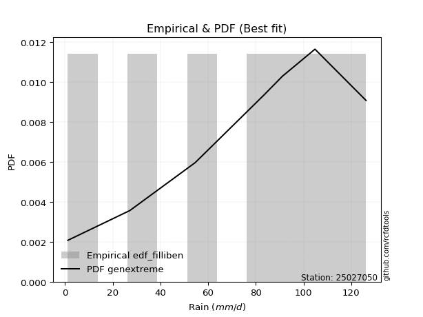</img>

</div>


### 10. Empirical - EDF Jenkinson (1977)

The Jenkinson formula in hydrology is an empirical plotting position formula used to estimate the non-exceedance probability _(P)_ or return period _(T)_ of a given ordered observation within a sample. It is a widely used method in the frequency analysis of extreme events such as floods and rainfall, as it provides a distribution-free way to plot data. _a≈0.31_ and _b≈0.38_ are constants derived to approximate the median of the probability distribution for the given rank.

<div align="center">


$P=(m-a)/(n+b)$


</div>


**10.1. Empirical values**

<div align="center">

|                | 0                   | 1                   | 2                   | 3             | 4                  | 5                  | 6                  |
|:---------------|:--------------------|:--------------------|:--------------------|:--------------|:-------------------|:-------------------|:-------------------|
| date           | 2023                | 2020                | 2022                | 2024          | 2021               | 2025               | 2019               |
| x              | 1.2                 | 27.2                | 54.6                | 83.2          | 91.2               | 104.8              | 126.2              |
| m              | 1                   | 2                   | 3                   | 4             | 5                  | 6                  | 7                  |
| empirical_dist | edf_jenkinson       | edf_jenkinson       | edf_jenkinson       | edf_jenkinson | edf_jenkinson      | edf_jenkinson      | edf_jenkinson      |
| empirical      | 0.09349593495934959 | 0.22899728997289973 | 0.36449864498644985 | 0.5           | 0.6355013550135502 | 0.7710027100271003 | 0.9065040650406505 |
| empirical_tr   | 1.1031390134529149  | 1.29701230228471    | 1.5735607675906182  | 2.0           | 2.743494423791822  | 4.366863905325444  | 10.695652173913055 |

</div>


**10.2. Kolmogorov-Smirnov fit test (sorted by Δ)**


<div align="center">

|                | 0                   | 1                   | 2                   | 3                   | 4                   | 5                   | 6                   | 7                   | 8                   | 9                   | 10                  | 11                  | 12                  | 13                  | 14                  | 15                  | 16                  | 17                  | 18                  | 19                  | 20                  | 21                  | 22                  | 23                  | 24                  | 25                  | 26                  | 27                  | 28                  | 29                  | 30                  | 31                  | 32                  | 33                  | 34                  | 35                  | 36                  | 37                    | 38                  | 39                  | 40                  | 41                  | 42                  | 43                  | 44                  | 45                  | 46                  | 47                  | 48                  | 49                  | 50                  | 51                  | 52                  | 53                  | 54                  | 55                  | 56                  | 57                  | 58                  | 59                  | 60                  | 61                  | 62                  | 63                  | 64                  | 65                  | 66                  | 67                  | 68                  | 69                  | 70                  | 71                  | 72                  | 73                  | 74                  | 75                  | 76                  | 77                  | 78                  | 79                  | 80                  | 81                  | 82                  | 83                  | 84                  | 85                  | 86                  | 87                  | 88                  | 89                  |
|:---------------|:--------------------|:--------------------|:--------------------|:--------------------|:--------------------|:--------------------|:--------------------|:--------------------|:--------------------|:--------------------|:--------------------|:--------------------|:--------------------|:--------------------|:--------------------|:--------------------|:--------------------|:--------------------|:--------------------|:--------------------|:--------------------|:--------------------|:--------------------|:--------------------|:--------------------|:--------------------|:--------------------|:--------------------|:--------------------|:--------------------|:--------------------|:--------------------|:--------------------|:--------------------|:--------------------|:--------------------|:--------------------|:----------------------|:--------------------|:--------------------|:--------------------|:--------------------|:--------------------|:--------------------|:--------------------|:--------------------|:--------------------|:--------------------|:--------------------|:--------------------|:--------------------|:--------------------|:--------------------|:--------------------|:--------------------|:--------------------|:--------------------|:--------------------|:--------------------|:--------------------|:--------------------|:--------------------|:--------------------|:--------------------|:--------------------|:--------------------|:--------------------|:--------------------|:--------------------|:--------------------|:--------------------|:--------------------|:--------------------|:--------------------|:--------------------|:--------------------|:--------------------|:--------------------|:--------------------|:--------------------|:--------------------|:--------------------|:--------------------|:--------------------|:--------------------|:--------------------|:--------------------|:--------------------|:--------------------|:--------------------|
| station        | 25027050            | 25027050            | 25027050            | 25027050            | 25027050            | 25027050            | 25027050            | 25027050            | 25027050            | 25027050            | 25027050            | 25027050            | 25027050            | 25027050            | 25027050            | 25027050            | 25027050            | 25027050            | 25027050            | 25027050            | 25027050            | 25027050            | 25027050            | 25027050            | 25027050            | 25027050            | 25027050            | 25027050            | 25027050            | 25027050            | 25027050            | 25027050            | 25027050            | 25027050            | 25027050            | 25027050            | 25027050            | 25027050              | 25027050            | 25027050            | 25027050            | 25027050            | 25027050            | 25027050            | 25027050            | 25027050            | 25027050            | 25027050            | 25027050            | 25027050            | 25027050            | 25027050            | 25027050            | 25027050            | 25027050            | 25027050            | 25027050            | 25027050            | 25027050            | 25027050            | 25027050            | 25027050            | 25027050            | 25027050            | 25027050            | 25027050            | 25027050            | 25027050            | 25027050            | 25027050            | 25027050            | 25027050            | 25027050            | 25027050            | 25027050            | 25027050            | 25027050            | 25027050            | 25027050            | 25027050            | 25027050            | 25027050            | 25027050            | 25027050            | 25027050            | 25027050            | 25027050            | 25027050            | 25027050            | 25027050            |
| empirical_dist | edf_jenkinson       | edf_jenkinson       | edf_jenkinson       | edf_jenkinson       | edf_jenkinson       | edf_jenkinson       | edf_jenkinson       | edf_jenkinson       | edf_jenkinson       | edf_jenkinson       | edf_jenkinson       | edf_jenkinson       | edf_jenkinson       | edf_jenkinson       | edf_jenkinson       | edf_jenkinson       | edf_jenkinson       | edf_jenkinson       | edf_jenkinson       | edf_jenkinson       | edf_jenkinson       | edf_jenkinson       | edf_jenkinson       | edf_jenkinson       | edf_jenkinson       | edf_jenkinson       | edf_jenkinson       | edf_jenkinson       | edf_jenkinson       | edf_jenkinson       | edf_jenkinson       | edf_jenkinson       | edf_jenkinson       | edf_jenkinson       | edf_jenkinson       | edf_jenkinson       | edf_jenkinson       | edf_jenkinson         | edf_jenkinson       | edf_jenkinson       | edf_jenkinson       | edf_jenkinson       | edf_jenkinson       | edf_jenkinson       | edf_jenkinson       | edf_jenkinson       | edf_jenkinson       | edf_jenkinson       | edf_jenkinson       | edf_jenkinson       | edf_jenkinson       | edf_jenkinson       | edf_jenkinson       | edf_jenkinson       | edf_jenkinson       | edf_jenkinson       | edf_jenkinson       | edf_jenkinson       | edf_jenkinson       | edf_jenkinson       | edf_jenkinson       | edf_jenkinson       | edf_jenkinson       | edf_jenkinson       | edf_jenkinson       | edf_jenkinson       | edf_jenkinson       | edf_jenkinson       | edf_jenkinson       | edf_jenkinson       | edf_jenkinson       | edf_jenkinson       | edf_jenkinson       | edf_jenkinson       | edf_jenkinson       | edf_jenkinson       | edf_jenkinson       | edf_jenkinson       | edf_jenkinson       | edf_jenkinson       | edf_jenkinson       | edf_jenkinson       | edf_jenkinson       | edf_jenkinson       | edf_jenkinson       | edf_jenkinson       | edf_jenkinson       | edf_jenkinson       | edf_jenkinson       | edf_jenkinson       |
| p_dist         | johnsonsu           | logjohnsonsu        | genlogistic         | laplace_asymmetric  | weibull_min         | gumbel_l            | fisk                | pearson3            | f                   | crystalball         | t                   | nct                 | norm                | exponnorm           | betaprime           | gamma               | erlang              | rice                | chi2                | ncf                 | logpearson3         | logistic            | invgamma            | loggumbel_l         | alpha               | maxwell             | logfisk             | invgauss            | hypsecant           | rayleigh            | kstwobign           | halfnorm            | laplace             | logmielke           | logweibull_min      | gumbel_r            | loggompertz         | loglaplace_asymmetric | logloggamma         | logt                | expon               | genexpon            | logfatiguelife      | halflogistic        | logbetaprime        | logf                | moyal               | logexponnorm        | lognorm             | lognorm             | logcrystalball      | logrice             | lognct              | logncf              | loginvgauss         | loggamma            | loggamma            | loglogistic         | logerlang           | loginvweibull       | loghypsecant        | loginvgamma         | logmaxwell          | lograyleigh         | loglaplace          | wald                | logkstwobign        | loghalfnorm         | mielke              | loggumbel_r         | loggenexpon         | gibrat              | loghalflogistic     | logmoyal            | logexpon            | logwald             | pareto              | loggibrat           | loglognorm          | lognakagami         | logpareto           | fatiguelife         | invweibull          | logtruncnorm        | nakagami            | gompertz            | logchi2             | logalpha            | loggenlogistic      | truncnorm           |
| delta          | 0.07840365732634344 | 0.07859690090905946 | 0.08154569848844789 | 0.08225780721991893 | 0.08573772992859785 | 0.09101743466855755 | 0.1081166775640382  | 0.10847333706261797 | 0.12752840368915752 | 0.12816160403912868 | 0.12818930538448714 | 0.12821399542240686 | 0.12821669269979763 | 0.1282171814342311  | 0.13140551047297855 | 0.13399645929323512 | 0.13421186769272586 | 0.13876813676373545 | 0.14000253326829482 | 0.14223552179478138 | 0.14263702089911323 | 0.14413462616880746 | 0.14782024055285503 | 0.15036122630137577 | 0.15193080518236546 | 0.15209629685361958 | 0.1543446302013569  | 0.15615414811238704 | 0.15681009469017593 | 0.15937429442978202 | 0.1728298682691276  | 0.18030470224412343 | 0.18518948946190394 | 0.1873492315777452  | 0.189600591459256   | 0.1913801351955987  | 0.19207155046852376 | 0.19295456854982618   | 0.1938667064758246  | 0.19432058081059034 | 0.19754819403665913 | 0.2040326300576688  | 0.20758443246719133 | 0.20864727910883807 | 0.21055787060222814 | 0.2125120332100799  | 0.2125612234390113  | 0.21378402679098513 | 0.2137847605857766  | 0.2137847605857766  | 0.2137847635715155  | 0.21379400466080795 | 0.21467419429683215 | 0.21482585971100182 | 0.21888092769634876 | 0.223522701259609   | 0.223522701259609   | 0.22411387037541503 | 0.22657273785619153 | 0.22818364509400543 | 0.23270630173676904 | 0.23537858872983136 | 0.24212552374708435 | 0.25105045467034465 | 0.2573496956375036  | 0.27204081958999016 | 0.27267850432349716 | 0.276329164954704   | 0.2774454573576024  | 0.28223502050274235 | 0.2902763576820595  | 0.30423544679018955 | 0.3043480477887223  | 0.3059930597438813  | 0.3590514876827796  | 0.37200208426491416 | 0.4020865935006662  | 0.40287643291437053 | 0.42237189030644695 | 0.4296001386186793  | 0.44541497207512537 | 0.4794313009540392  | 0.480235125491784   | 0.4909828829413846  | 0.5089128273037838  | 0.6154941222800241  | 0.6275157315727495  | 0.6572110131573573  | 0.7710027100271003  | 0.896775601028437   |
| deltao         | 0.48442053926100004 | 0.48442053926100004 | 0.48442053926100004 | 0.48442053926100004 | 0.48442053926100004 | 0.48442053926100004 | 0.48442053926100004 | 0.48442053926100004 | 0.48442053926100004 | 0.48442053926100004 | 0.48442053926100004 | 0.48442053926100004 | 0.48442053926100004 | 0.48442053926100004 | 0.48442053926100004 | 0.48442053926100004 | 0.48442053926100004 | 0.48442053926100004 | 0.48442053926100004 | 0.48442053926100004 | 0.48442053926100004 | 0.48442053926100004 | 0.48442053926100004 | 0.48442053926100004 | 0.48442053926100004 | 0.48442053926100004 | 0.48442053926100004 | 0.48442053926100004 | 0.48442053926100004 | 0.48442053926100004 | 0.48442053926100004 | 0.48442053926100004 | 0.48442053926100004 | 0.48442053926100004 | 0.48442053926100004 | 0.48442053926100004 | 0.48442053926100004 | 0.48442053926100004   | 0.48442053926100004 | 0.48442053926100004 | 0.48442053926100004 | 0.48442053926100004 | 0.48442053926100004 | 0.48442053926100004 | 0.48442053926100004 | 0.48442053926100004 | 0.48442053926100004 | 0.48442053926100004 | 0.48442053926100004 | 0.48442053926100004 | 0.48442053926100004 | 0.48442053926100004 | 0.48442053926100004 | 0.48442053926100004 | 0.48442053926100004 | 0.48442053926100004 | 0.48442053926100004 | 0.48442053926100004 | 0.48442053926100004 | 0.48442053926100004 | 0.48442053926100004 | 0.48442053926100004 | 0.48442053926100004 | 0.48442053926100004 | 0.48442053926100004 | 0.48442053926100004 | 0.48442053926100004 | 0.48442053926100004 | 0.48442053926100004 | 0.48442053926100004 | 0.48442053926100004 | 0.48442053926100004 | 0.48442053926100004 | 0.48442053926100004 | 0.48442053926100004 | 0.48442053926100004 | 0.48442053926100004 | 0.48442053926100004 | 0.48442053926100004 | 0.48442053926100004 | 0.48442053926100004 | 0.48442053926100004 | 0.48442053926100004 | 0.48442053926100004 | 0.48442053926100004 | 0.48442053926100004 | 0.48442053926100004 | 0.48442053926100004 | 0.48442053926100004 | 0.48442053926100004 |
| eval           | Δo > Δ              | Δo > Δ              | Δo > Δ              | Δo > Δ              | Δo > Δ              | Δo > Δ              | Δo > Δ              | Δo > Δ              | Δo > Δ              | Δo > Δ              | Δo > Δ              | Δo > Δ              | Δo > Δ              | Δo > Δ              | Δo > Δ              | Δo > Δ              | Δo > Δ              | Δo > Δ              | Δo > Δ              | Δo > Δ              | Δo > Δ              | Δo > Δ              | Δo > Δ              | Δo > Δ              | Δo > Δ              | Δo > Δ              | Δo > Δ              | Δo > Δ              | Δo > Δ              | Δo > Δ              | Δo > Δ              | Δo > Δ              | Δo > Δ              | Δo > Δ              | Δo > Δ              | Δo > Δ              | Δo > Δ              | Δo > Δ                | Δo > Δ              | Δo > Δ              | Δo > Δ              | Δo > Δ              | Δo > Δ              | Δo > Δ              | Δo > Δ              | Δo > Δ              | Δo > Δ              | Δo > Δ              | Δo > Δ              | Δo > Δ              | Δo > Δ              | Δo > Δ              | Δo > Δ              | Δo > Δ              | Δo > Δ              | Δo > Δ              | Δo > Δ              | Δo > Δ              | Δo > Δ              | Δo > Δ              | Δo > Δ              | Δo > Δ              | Δo > Δ              | Δo > Δ              | Δo > Δ              | Δo > Δ              | Δo > Δ              | Δo > Δ              | Δo > Δ              | Δo > Δ              | Δo > Δ              | Δo > Δ              | Δo > Δ              | Δo > Δ              | Δo > Δ              | Δo > Δ              | Δo > Δ              | Δo > Δ              | Δo > Δ              | Δo > Δ              | Δo > Δ              | Δo > Δ              | Δo > Δ              | Δo <= Δ             | Δo <= Δ             | Δo <= Δ             | Δo <= Δ             | Δo <= Δ             | Δo <= Δ             | Δo <= Δ             |
| fit            | 1                   | 1                   | 1                   | 1                   | 1                   | 1                   | 1                   | 1                   | 1                   | 1                   | 1                   | 1                   | 1                   | 1                   | 1                   | 1                   | 1                   | 1                   | 1                   | 1                   | 1                   | 1                   | 1                   | 1                   | 1                   | 1                   | 1                   | 1                   | 1                   | 1                   | 1                   | 1                   | 1                   | 1                   | 1                   | 1                   | 1                   | 1                     | 1                   | 1                   | 1                   | 1                   | 1                   | 1                   | 1                   | 1                   | 1                   | 1                   | 1                   | 1                   | 1                   | 1                   | 1                   | 1                   | 1                   | 1                   | 1                   | 1                   | 1                   | 1                   | 1                   | 1                   | 1                   | 1                   | 1                   | 1                   | 1                   | 1                   | 1                   | 1                   | 1                   | 1                   | 1                   | 1                   | 1                   | 1                   | 1                   | 1                   | 1                   | 1                   | 1                   | 1                   | 1                   | 0                   | 0                   | 0                   | 0                   | 0                   | 0                   | 0                   |
| n              | 7                   | 7                   | 7                   | 7                   | 7                   | 7                   | 7                   | 7                   | 7                   | 7                   | 7                   | 7                   | 7                   | 7                   | 7                   | 7                   | 7                   | 7                   | 7                   | 7                   | 7                   | 7                   | 7                   | 7                   | 7                   | 7                   | 7                   | 7                   | 7                   | 7                   | 7                   | 7                   | 7                   | 7                   | 7                   | 7                   | 7                   | 7                     | 7                   | 7                   | 7                   | 7                   | 7                   | 7                   | 7                   | 7                   | 7                   | 7                   | 7                   | 7                   | 7                   | 7                   | 7                   | 7                   | 7                   | 7                   | 7                   | 7                   | 7                   | 7                   | 7                   | 7                   | 7                   | 7                   | 7                   | 7                   | 7                   | 7                   | 7                   | 7                   | 7                   | 7                   | 7                   | 7                   | 7                   | 7                   | 7                   | 7                   | 7                   | 7                   | 7                   | 7                   | 7                   | 7                   | 7                   | 7                   | 7                   | 7                   | 7                   | 7                   |
| best_fit       | 1                   | 0                   | 0                   | 0                   | 0                   | 0                   | 0                   | 0                   | 0                   | 0                   | 0                   | 0                   | 0                   | 0                   | 0                   | 0                   | 0                   | 0                   | 0                   | 0                   | 0                   | 0                   | 0                   | 0                   | 0                   | 0                   | 0                   | 0                   | 0                   | 0                   | 0                   | 0                   | 0                   | 0                   | 0                   | 0                   | 0                   | 0                     | 0                   | 0                   | 0                   | 0                   | 0                   | 0                   | 0                   | 0                   | 0                   | 0                   | 0                   | 0                   | 0                   | 0                   | 0                   | 0                   | 0                   | 0                   | 0                   | 0                   | 0                   | 0                   | 0                   | 0                   | 0                   | 0                   | 0                   | 0                   | 0                   | 0                   | 0                   | 0                   | 0                   | 0                   | 0                   | 0                   | 0                   | 0                   | 0                   | 0                   | 0                   | 0                   | 0                   | 0                   | 0                   | 0                   | 0                   | 0                   | 0                   | 0                   | 0                   | 0                   |
| best_fit_sort  | 1                   | 2                   | 3                   | 4                   | 5                   | 6                   | 7                   | 8                   | 9                   | 10                  | 11                  | 12                  | 13                  | 14                  | 15                  | 16                  | 17                  | 18                  | 19                  | 20                  | 21                  | 22                  | 23                  | 24                  | 25                  | 26                  | 27                  | 28                  | 29                  | 30                  | 31                  | 32                  | 33                  | 34                  | 35                  | 36                  | 37                  | 38                    | 39                  | 40                  | 41                  | 42                  | 43                  | 44                  | 45                  | 46                  | 47                  | 48                  | 49                  | 50                  | 51                  | 52                  | 53                  | 54                  | 55                  | 56                  | 57                  | 58                  | 59                  | 60                  | 61                  | 62                  | 63                  | 64                  | 65                  | 66                  | 67                  | 68                  | 69                  | 70                  | 71                  | 72                  | 73                  | 74                  | 75                  | 76                  | 77                  | 78                  | 79                  | 80                  | 81                  | 82                  | 83                  | 84                  | 85                  | 86                  | 87                  | 88                  | 89                  | 90                  |

</div>


<div align="center">

</img>

</div>


**10.3. Best fit**

<div align="center">

|   id |   station | empirical_dist   | p_dist    |     delta |   deltao | eval   |   fit |   n |   best_fit |   best_fit_sort |
|-----:|----------:|:-----------------|:----------|----------:|---------:|:-------|------:|----:|-----------:|----------------:|
|    0 |  25027050 | edf_jenkinson    | johnsonsu | 0.0784037 | 0.484421 | Δo > Δ |     1 |   7 |          1 |               1 |

</div>


<div align="center">

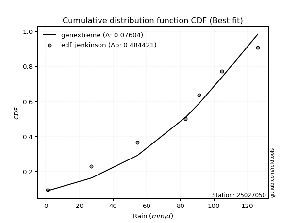</img></img>

</div>


### 11. Empirical - EDF Cunnane (1978)

Cunnane´s work in statistical hydrology has focused on the performance and evaluation of different probability distributions (such as GEV, Gumbel, Lognormal) for flood frequency estimation. _b_ is a constant, typically set to 0.4.

<div align="center">


$P=(m-b)/(n+1-2b)$


</div>


**11.1. Empirical values**

<div align="center">

|                | 0                   | 1                   | 2                  | 3           | 4                  | 5                  | 6                  |
|:---------------|:--------------------|:--------------------|:-------------------|:------------|:-------------------|:-------------------|:-------------------|
| date           | 2023                | 2020                | 2022               | 2024        | 2021               | 2025               | 2019               |
| x              | 1.2                 | 27.2                | 54.6               | 83.2        | 91.2               | 104.8              | 126.2              |
| m              | 1                   | 2                   | 3                  | 4           | 5                  | 6                  | 7                  |
| empirical_dist | edf_cunnane         | edf_cunnane         | edf_cunnane        | edf_cunnane | edf_cunnane        | edf_cunnane        | edf_cunnane        |
| empirical      | 0.08333333333333333 | 0.22222222222222224 | 0.3611111111111111 | 0.5         | 0.6388888888888888 | 0.7777777777777777 | 0.9166666666666666 |
| empirical_tr   | 1.090909090909091   | 1.2857142857142856  | 1.565217391304348  | 2.0         | 2.7692307692307687 | 4.499999999999998  | 11.999999999999995 |

</div>


**11.2. Kolmogorov-Smirnov fit test (sorted by Δ)**


<div align="center">

|                | 0                   | 1                   | 2                   | 3                   | 4                   | 5                   | 6                   | 7                   | 8                   | 9                   | 10                  | 11                  | 12                  | 13                  | 14                  | 15                  | 16                  | 17                  | 18                  | 19                  | 20                  | 21                  | 22                  | 23                  | 24                  | 25                  | 26                  | 27                  | 28                  | 29                  | 30                  | 31                  | 32                  | 33                  | 34                  | 35                  | 36                  | 37                  | 38                    | 39                  | 40                  | 41                  | 42                  | 43                  | 44                  | 45                  | 46                  | 47                  | 48                  | 49                  | 50                  | 51                  | 52                  | 53                  | 54                  | 55                  | 56                  | 57                  | 58                  | 59                  | 60                  | 61                  | 62                  | 63                  | 64                  | 65                  | 66                  | 67                  | 68                  | 69                  | 70                  | 71                  | 72                  | 73                  | 74                  | 75                  | 76                  | 77                  | 78                  | 79                  | 80                  | 81                  | 82                  | 83                  | 84                  | 85                  | 86                  | 87                  | 88                  | 89                  |
|:---------------|:--------------------|:--------------------|:--------------------|:--------------------|:--------------------|:--------------------|:--------------------|:--------------------|:--------------------|:--------------------|:--------------------|:--------------------|:--------------------|:--------------------|:--------------------|:--------------------|:--------------------|:--------------------|:--------------------|:--------------------|:--------------------|:--------------------|:--------------------|:--------------------|:--------------------|:--------------------|:--------------------|:--------------------|:--------------------|:--------------------|:--------------------|:--------------------|:--------------------|:--------------------|:--------------------|:--------------------|:--------------------|:--------------------|:----------------------|:--------------------|:--------------------|:--------------------|:--------------------|:--------------------|:--------------------|:--------------------|:--------------------|:--------------------|:--------------------|:--------------------|:--------------------|:--------------------|:--------------------|:--------------------|:--------------------|:--------------------|:--------------------|:--------------------|:--------------------|:--------------------|:--------------------|:--------------------|:--------------------|:--------------------|:--------------------|:--------------------|:--------------------|:--------------------|:--------------------|:--------------------|:--------------------|:--------------------|:--------------------|:--------------------|:--------------------|:--------------------|:--------------------|:--------------------|:--------------------|:--------------------|:--------------------|:--------------------|:--------------------|:--------------------|:--------------------|:--------------------|:--------------------|:--------------------|:--------------------|:--------------------|
| station        | 25027050            | 25027050            | 25027050            | 25027050            | 25027050            | 25027050            | 25027050            | 25027050            | 25027050            | 25027050            | 25027050            | 25027050            | 25027050            | 25027050            | 25027050            | 25027050            | 25027050            | 25027050            | 25027050            | 25027050            | 25027050            | 25027050            | 25027050            | 25027050            | 25027050            | 25027050            | 25027050            | 25027050            | 25027050            | 25027050            | 25027050            | 25027050            | 25027050            | 25027050            | 25027050            | 25027050            | 25027050            | 25027050            | 25027050              | 25027050            | 25027050            | 25027050            | 25027050            | 25027050            | 25027050            | 25027050            | 25027050            | 25027050            | 25027050            | 25027050            | 25027050            | 25027050            | 25027050            | 25027050            | 25027050            | 25027050            | 25027050            | 25027050            | 25027050            | 25027050            | 25027050            | 25027050            | 25027050            | 25027050            | 25027050            | 25027050            | 25027050            | 25027050            | 25027050            | 25027050            | 25027050            | 25027050            | 25027050            | 25027050            | 25027050            | 25027050            | 25027050            | 25027050            | 25027050            | 25027050            | 25027050            | 25027050            | 25027050            | 25027050            | 25027050            | 25027050            | 25027050            | 25027050            | 25027050            | 25027050            |
| empirical_dist | edf_cunnane         | edf_cunnane         | edf_cunnane         | edf_cunnane         | edf_cunnane         | edf_cunnane         | edf_cunnane         | edf_cunnane         | edf_cunnane         | edf_cunnane         | edf_cunnane         | edf_cunnane         | edf_cunnane         | edf_cunnane         | edf_cunnane         | edf_cunnane         | edf_cunnane         | edf_cunnane         | edf_cunnane         | edf_cunnane         | edf_cunnane         | edf_cunnane         | edf_cunnane         | edf_cunnane         | edf_cunnane         | edf_cunnane         | edf_cunnane         | edf_cunnane         | edf_cunnane         | edf_cunnane         | edf_cunnane         | edf_cunnane         | edf_cunnane         | edf_cunnane         | edf_cunnane         | edf_cunnane         | edf_cunnane         | edf_cunnane         | edf_cunnane           | edf_cunnane         | edf_cunnane         | edf_cunnane         | edf_cunnane         | edf_cunnane         | edf_cunnane         | edf_cunnane         | edf_cunnane         | edf_cunnane         | edf_cunnane         | edf_cunnane         | edf_cunnane         | edf_cunnane         | edf_cunnane         | edf_cunnane         | edf_cunnane         | edf_cunnane         | edf_cunnane         | edf_cunnane         | edf_cunnane         | edf_cunnane         | edf_cunnane         | edf_cunnane         | edf_cunnane         | edf_cunnane         | edf_cunnane         | edf_cunnane         | edf_cunnane         | edf_cunnane         | edf_cunnane         | edf_cunnane         | edf_cunnane         | edf_cunnane         | edf_cunnane         | edf_cunnane         | edf_cunnane         | edf_cunnane         | edf_cunnane         | edf_cunnane         | edf_cunnane         | edf_cunnane         | edf_cunnane         | edf_cunnane         | edf_cunnane         | edf_cunnane         | edf_cunnane         | edf_cunnane         | edf_cunnane         | edf_cunnane         | edf_cunnane         | edf_cunnane         |
| p_dist         | johnsonsu           | genlogistic         | laplace_asymmetric  | gumbel_l            | weibull_min         | logjohnsonsu        | fisk                | pearson3            | f                   | crystalball         | t                   | nct                 | norm                | exponnorm           | betaprime           | gamma               | erlang              | rice                | chi2                | logistic            | invgamma            | alpha               | maxwell             | ncf                 | logpearson3         | loggumbel_l         | invgauss            | hypsecant           | rayleigh            | logfisk             | kstwobign           | halfnorm            | laplace             | logmielke           | logweibull_min      | logt                | gumbel_r            | loggompertz         | loglaplace_asymmetric | logloggamma         | expon               | genexpon            | halflogistic        | logfatiguelife      | moyal               | logbetaprime        | logf                | logexponnorm        | lognorm             | lognorm             | logcrystalball      | logrice             | lognct              | logncf              | loginvgauss         | loggamma            | loggamma            | loglogistic         | logerlang           | loginvweibull       | loghypsecant        | loginvgamma         | logmaxwell          | lograyleigh         | loglaplace          | wald                | mielke              | logkstwobign        | loghalfnorm         | loggumbel_r         | loggenexpon         | gibrat              | loghalflogistic     | logmoyal            | logexpon            | logwald             | loggibrat           | pareto              | loglognorm          | lognakagami         | logpareto           | fatiguelife         | invweibull          | logtruncnorm        | nakagami            | gompertz            | logchi2             | logalpha            | loggenlogistic      | truncnorm           |
| delta          | 0.07162858957566595 | 0.07815816461310915 | 0.07887027334458019 | 0.08424236691788006 | 0.08509539400818555 | 0.08537196865973684 | 0.1081166775640382  | 0.10847333706261797 | 0.12752840368915752 | 0.12816160403912868 | 0.12818930538448714 | 0.12821399542240686 | 0.12821669269979763 | 0.1282171814342311  | 0.13140551047297855 | 0.13399645929323512 | 0.13421186769272586 | 0.13876813676373545 | 0.14000253326829482 | 0.14413462616880746 | 0.14782024055285503 | 0.15193080518236546 | 0.15209629685361958 | 0.1523981234207975  | 0.15279962252512935 | 0.15374876017671452 | 0.15615414811238704 | 0.15681009469017593 | 0.15937429442978202 | 0.16450723182737303 | 0.1728298682691276  | 0.18030470224412343 | 0.18518948946190394 | 0.1873492315777452  | 0.189600591459256   | 0.1909330469352516  | 0.1913801351955987  | 0.19207155046852376 | 0.19295456854982618   | 0.1938667064758246  | 0.19754819403665913 | 0.2040326300576688  | 0.20864727910883807 | 0.21097196634253007 | 0.2125612234390113  | 0.21394540447756688 | 0.21589956708541863 | 0.21717156066632387 | 0.21717229446111536 | 0.21717229446111536 | 0.21717229744685423 | 0.2171815385361467  | 0.2180617281721709  | 0.21821339358634056 | 0.2222684615716875  | 0.22691023513494774 | 0.22691023513494774 | 0.22750140425075377 | 0.22996027173153027 | 0.23495871284468292 | 0.23609383561210778 | 0.2387661226051701  | 0.2455130576224231  | 0.2544379885456834  | 0.26073722951284234 | 0.27204081958999016 | 0.2774454573576024  | 0.27945357207417465 | 0.27971669883004274 | 0.2856225543780811  | 0.297051425432737   | 0.30423544679018955 | 0.30773558166406106 | 0.30938059361922005 | 0.3658265554334571  | 0.3753896181402529  | 0.4062639667897093  | 0.4088616612513437  | 0.42914695805712444 | 0.4363752063693568  | 0.45219003982580286 | 0.4862063687047167  | 0.4903977271178001  | 0.4977579506920621  | 0.5156878950544613  | 0.6188816561553627  | 0.634290799323427   | 0.6639860809080348  | 0.7777777777777777  | 0.9069382026544532  |
| deltao         | 0.48442053926100004 | 0.48442053926100004 | 0.48442053926100004 | 0.48442053926100004 | 0.48442053926100004 | 0.48442053926100004 | 0.48442053926100004 | 0.48442053926100004 | 0.48442053926100004 | 0.48442053926100004 | 0.48442053926100004 | 0.48442053926100004 | 0.48442053926100004 | 0.48442053926100004 | 0.48442053926100004 | 0.48442053926100004 | 0.48442053926100004 | 0.48442053926100004 | 0.48442053926100004 | 0.48442053926100004 | 0.48442053926100004 | 0.48442053926100004 | 0.48442053926100004 | 0.48442053926100004 | 0.48442053926100004 | 0.48442053926100004 | 0.48442053926100004 | 0.48442053926100004 | 0.48442053926100004 | 0.48442053926100004 | 0.48442053926100004 | 0.48442053926100004 | 0.48442053926100004 | 0.48442053926100004 | 0.48442053926100004 | 0.48442053926100004 | 0.48442053926100004 | 0.48442053926100004 | 0.48442053926100004   | 0.48442053926100004 | 0.48442053926100004 | 0.48442053926100004 | 0.48442053926100004 | 0.48442053926100004 | 0.48442053926100004 | 0.48442053926100004 | 0.48442053926100004 | 0.48442053926100004 | 0.48442053926100004 | 0.48442053926100004 | 0.48442053926100004 | 0.48442053926100004 | 0.48442053926100004 | 0.48442053926100004 | 0.48442053926100004 | 0.48442053926100004 | 0.48442053926100004 | 0.48442053926100004 | 0.48442053926100004 | 0.48442053926100004 | 0.48442053926100004 | 0.48442053926100004 | 0.48442053926100004 | 0.48442053926100004 | 0.48442053926100004 | 0.48442053926100004 | 0.48442053926100004 | 0.48442053926100004 | 0.48442053926100004 | 0.48442053926100004 | 0.48442053926100004 | 0.48442053926100004 | 0.48442053926100004 | 0.48442053926100004 | 0.48442053926100004 | 0.48442053926100004 | 0.48442053926100004 | 0.48442053926100004 | 0.48442053926100004 | 0.48442053926100004 | 0.48442053926100004 | 0.48442053926100004 | 0.48442053926100004 | 0.48442053926100004 | 0.48442053926100004 | 0.48442053926100004 | 0.48442053926100004 | 0.48442053926100004 | 0.48442053926100004 | 0.48442053926100004 |
| eval           | Δo > Δ              | Δo > Δ              | Δo > Δ              | Δo > Δ              | Δo > Δ              | Δo > Δ              | Δo > Δ              | Δo > Δ              | Δo > Δ              | Δo > Δ              | Δo > Δ              | Δo > Δ              | Δo > Δ              | Δo > Δ              | Δo > Δ              | Δo > Δ              | Δo > Δ              | Δo > Δ              | Δo > Δ              | Δo > Δ              | Δo > Δ              | Δo > Δ              | Δo > Δ              | Δo > Δ              | Δo > Δ              | Δo > Δ              | Δo > Δ              | Δo > Δ              | Δo > Δ              | Δo > Δ              | Δo > Δ              | Δo > Δ              | Δo > Δ              | Δo > Δ              | Δo > Δ              | Δo > Δ              | Δo > Δ              | Δo > Δ              | Δo > Δ                | Δo > Δ              | Δo > Δ              | Δo > Δ              | Δo > Δ              | Δo > Δ              | Δo > Δ              | Δo > Δ              | Δo > Δ              | Δo > Δ              | Δo > Δ              | Δo > Δ              | Δo > Δ              | Δo > Δ              | Δo > Δ              | Δo > Δ              | Δo > Δ              | Δo > Δ              | Δo > Δ              | Δo > Δ              | Δo > Δ              | Δo > Δ              | Δo > Δ              | Δo > Δ              | Δo > Δ              | Δo > Δ              | Δo > Δ              | Δo > Δ              | Δo > Δ              | Δo > Δ              | Δo > Δ              | Δo > Δ              | Δo > Δ              | Δo > Δ              | Δo > Δ              | Δo > Δ              | Δo > Δ              | Δo > Δ              | Δo > Δ              | Δo > Δ              | Δo > Δ              | Δo > Δ              | Δo > Δ              | Δo <= Δ             | Δo <= Δ             | Δo <= Δ             | Δo <= Δ             | Δo <= Δ             | Δo <= Δ             | Δo <= Δ             | Δo <= Δ             | Δo <= Δ             |
| fit            | 1                   | 1                   | 1                   | 1                   | 1                   | 1                   | 1                   | 1                   | 1                   | 1                   | 1                   | 1                   | 1                   | 1                   | 1                   | 1                   | 1                   | 1                   | 1                   | 1                   | 1                   | 1                   | 1                   | 1                   | 1                   | 1                   | 1                   | 1                   | 1                   | 1                   | 1                   | 1                   | 1                   | 1                   | 1                   | 1                   | 1                   | 1                   | 1                     | 1                   | 1                   | 1                   | 1                   | 1                   | 1                   | 1                   | 1                   | 1                   | 1                   | 1                   | 1                   | 1                   | 1                   | 1                   | 1                   | 1                   | 1                   | 1                   | 1                   | 1                   | 1                   | 1                   | 1                   | 1                   | 1                   | 1                   | 1                   | 1                   | 1                   | 1                   | 1                   | 1                   | 1                   | 1                   | 1                   | 1                   | 1                   | 1                   | 1                   | 1                   | 1                   | 0                   | 0                   | 0                   | 0                   | 0                   | 0                   | 0                   | 0                   | 0                   |
| n              | 7                   | 7                   | 7                   | 7                   | 7                   | 7                   | 7                   | 7                   | 7                   | 7                   | 7                   | 7                   | 7                   | 7                   | 7                   | 7                   | 7                   | 7                   | 7                   | 7                   | 7                   | 7                   | 7                   | 7                   | 7                   | 7                   | 7                   | 7                   | 7                   | 7                   | 7                   | 7                   | 7                   | 7                   | 7                   | 7                   | 7                   | 7                   | 7                     | 7                   | 7                   | 7                   | 7                   | 7                   | 7                   | 7                   | 7                   | 7                   | 7                   | 7                   | 7                   | 7                   | 7                   | 7                   | 7                   | 7                   | 7                   | 7                   | 7                   | 7                   | 7                   | 7                   | 7                   | 7                   | 7                   | 7                   | 7                   | 7                   | 7                   | 7                   | 7                   | 7                   | 7                   | 7                   | 7                   | 7                   | 7                   | 7                   | 7                   | 7                   | 7                   | 7                   | 7                   | 7                   | 7                   | 7                   | 7                   | 7                   | 7                   | 7                   |
| best_fit       | 1                   | 0                   | 0                   | 0                   | 0                   | 0                   | 0                   | 0                   | 0                   | 0                   | 0                   | 0                   | 0                   | 0                   | 0                   | 0                   | 0                   | 0                   | 0                   | 0                   | 0                   | 0                   | 0                   | 0                   | 0                   | 0                   | 0                   | 0                   | 0                   | 0                   | 0                   | 0                   | 0                   | 0                   | 0                   | 0                   | 0                   | 0                   | 0                     | 0                   | 0                   | 0                   | 0                   | 0                   | 0                   | 0                   | 0                   | 0                   | 0                   | 0                   | 0                   | 0                   | 0                   | 0                   | 0                   | 0                   | 0                   | 0                   | 0                   | 0                   | 0                   | 0                   | 0                   | 0                   | 0                   | 0                   | 0                   | 0                   | 0                   | 0                   | 0                   | 0                   | 0                   | 0                   | 0                   | 0                   | 0                   | 0                   | 0                   | 0                   | 0                   | 0                   | 0                   | 0                   | 0                   | 0                   | 0                   | 0                   | 0                   | 0                   |
| best_fit_sort  | 1                   | 2                   | 3                   | 4                   | 5                   | 6                   | 7                   | 8                   | 9                   | 10                  | 11                  | 12                  | 13                  | 14                  | 15                  | 16                  | 17                  | 18                  | 19                  | 20                  | 21                  | 22                  | 23                  | 24                  | 25                  | 26                  | 27                  | 28                  | 29                  | 30                  | 31                  | 32                  | 33                  | 34                  | 35                  | 36                  | 37                  | 38                  | 39                    | 40                  | 41                  | 42                  | 43                  | 44                  | 45                  | 46                  | 47                  | 48                  | 49                  | 50                  | 51                  | 52                  | 53                  | 54                  | 55                  | 56                  | 57                  | 58                  | 59                  | 60                  | 61                  | 62                  | 63                  | 64                  | 65                  | 66                  | 67                  | 68                  | 69                  | 70                  | 71                  | 72                  | 73                  | 74                  | 75                  | 76                  | 77                  | 78                  | 79                  | 80                  | 81                  | 82                  | 83                  | 84                  | 85                  | 86                  | 87                  | 88                  | 89                  | 90                  |

</div>


<div align="center">

</img>

</div>


**11.3. Best fit**

<div align="center">

|   id |   station | empirical_dist   | p_dist    |     delta |   deltao | eval   |   fit |   n |   best_fit |   best_fit_sort |
|-----:|----------:|:-----------------|:----------|----------:|---------:|:-------|------:|----:|-----------:|----------------:|
|    0 |  25027050 | edf_cunnane      | johnsonsu | 0.0716286 | 0.484421 | Δo > Δ |     1 |   7 |          1 |               1 |

</div>


<div align="center">

</img></img>

</div>


### 12. Empirical - EDF Adamowski (1981)

The Adamowski formula in hydrology refers to a specific plotting position formula used for estimating the non-parametric empirical distribution of hydrological events (like flood peaks) to calculate their return periods. This formula provides an alternative to traditional parametric methods (like the Gumbel or Log Pearson Type III distributions). 

<div align="center">


$P=(m-0.25)/(n+0.5)$


</div>


**12.1. Empirical values**

<div align="center">

|                | 0                  | 1                   | 2                   | 3             | 4                  | 5                  | 6                  |
|:---------------|:-------------------|:--------------------|:--------------------|:--------------|:-------------------|:-------------------|:-------------------|
| date           | 2023               | 2020                | 2022                | 2024          | 2021               | 2025               | 2019               |
| x              | 1.2                | 27.2                | 54.6                | 83.2          | 91.2               | 104.8              | 126.2              |
| m              | 1                  | 2                   | 3                   | 4             | 5                  | 6                  | 7                  |
| empirical_dist | edf_adamowski      | edf_adamowski       | edf_adamowski       | edf_adamowski | edf_adamowski      | edf_adamowski      | edf_adamowski      |
| empirical      | 0.1                | 0.23333333333333334 | 0.36666666666666664 | 0.5           | 0.6333333333333333 | 0.7666666666666667 | 0.9                |
| empirical_tr   | 1.1111111111111112 | 1.3043478260869565  | 1.5789473684210527  | 2.0           | 2.727272727272727  | 4.2857142857142865 | 10.000000000000002 |

</div>


**12.2. Kolmogorov-Smirnov fit test (sorted by Δ)**


<div align="center">

|                | 0                   | 1                   | 2                   | 3                   | 4                   | 5                   | 6                   | 7                   | 8                   | 9                   | 10                  | 11                  | 12                  | 13                  | 14                  | 15                  | 16                  | 17                  | 18                  | 19                  | 20                  | 21                  | 22                  | 23                  | 24                  | 25                  | 26                  | 27                  | 28                  | 29                  | 30                  | 31                  | 32                  | 33                  | 34                  | 35                  | 36                  | 37                    | 38                  | 39                  | 40                  | 41                  | 42                  | 43                  | 44                  | 45                  | 46                  | 47                  | 48                  | 49                  | 50                  | 51                  | 52                  | 53                  | 54                  | 55                  | 56                  | 57                  | 58                  | 59                  | 60                  | 61                  | 62                  | 63                  | 64                  | 65                  | 66                  | 67                  | 68                  | 69                  | 70                  | 71                  | 72                  | 73                  | 74                  | 75                  | 76                  | 77                  | 78                  | 79                  | 80                  | 81                  | 82                  | 83                  | 84                  | 85                  | 86                  | 87                  | 88                  | 89                  |
|:---------------|:--------------------|:--------------------|:--------------------|:--------------------|:--------------------|:--------------------|:--------------------|:--------------------|:--------------------|:--------------------|:--------------------|:--------------------|:--------------------|:--------------------|:--------------------|:--------------------|:--------------------|:--------------------|:--------------------|:--------------------|:--------------------|:--------------------|:--------------------|:--------------------|:--------------------|:--------------------|:--------------------|:--------------------|:--------------------|:--------------------|:--------------------|:--------------------|:--------------------|:--------------------|:--------------------|:--------------------|:--------------------|:----------------------|:--------------------|:--------------------|:--------------------|:--------------------|:--------------------|:--------------------|:--------------------|:--------------------|:--------------------|:--------------------|:--------------------|:--------------------|:--------------------|:--------------------|:--------------------|:--------------------|:--------------------|:--------------------|:--------------------|:--------------------|:--------------------|:--------------------|:--------------------|:--------------------|:--------------------|:--------------------|:--------------------|:--------------------|:--------------------|:--------------------|:--------------------|:--------------------|:--------------------|:--------------------|:--------------------|:--------------------|:--------------------|:--------------------|:--------------------|:--------------------|:--------------------|:--------------------|:--------------------|:--------------------|:--------------------|:--------------------|:--------------------|:--------------------|:--------------------|:--------------------|:--------------------|:--------------------|
| station        | 25027050            | 25027050            | 25027050            | 25027050            | 25027050            | 25027050            | 25027050            | 25027050            | 25027050            | 25027050            | 25027050            | 25027050            | 25027050            | 25027050            | 25027050            | 25027050            | 25027050            | 25027050            | 25027050            | 25027050            | 25027050            | 25027050            | 25027050            | 25027050            | 25027050            | 25027050            | 25027050            | 25027050            | 25027050            | 25027050            | 25027050            | 25027050            | 25027050            | 25027050            | 25027050            | 25027050            | 25027050            | 25027050              | 25027050            | 25027050            | 25027050            | 25027050            | 25027050            | 25027050            | 25027050            | 25027050            | 25027050            | 25027050            | 25027050            | 25027050            | 25027050            | 25027050            | 25027050            | 25027050            | 25027050            | 25027050            | 25027050            | 25027050            | 25027050            | 25027050            | 25027050            | 25027050            | 25027050            | 25027050            | 25027050            | 25027050            | 25027050            | 25027050            | 25027050            | 25027050            | 25027050            | 25027050            | 25027050            | 25027050            | 25027050            | 25027050            | 25027050            | 25027050            | 25027050            | 25027050            | 25027050            | 25027050            | 25027050            | 25027050            | 25027050            | 25027050            | 25027050            | 25027050            | 25027050            | 25027050            |
| empirical_dist | edf_adamowski       | edf_adamowski       | edf_adamowski       | edf_adamowski       | edf_adamowski       | edf_adamowski       | edf_adamowski       | edf_adamowski       | edf_adamowski       | edf_adamowski       | edf_adamowski       | edf_adamowski       | edf_adamowski       | edf_adamowski       | edf_adamowski       | edf_adamowski       | edf_adamowski       | edf_adamowski       | edf_adamowski       | edf_adamowski       | edf_adamowski       | edf_adamowski       | edf_adamowski       | edf_adamowski       | edf_adamowski       | edf_adamowski       | edf_adamowski       | edf_adamowski       | edf_adamowski       | edf_adamowski       | edf_adamowski       | edf_adamowski       | edf_adamowski       | edf_adamowski       | edf_adamowski       | edf_adamowski       | edf_adamowski       | edf_adamowski         | edf_adamowski       | edf_adamowski       | edf_adamowski       | edf_adamowski       | edf_adamowski       | edf_adamowski       | edf_adamowski       | edf_adamowski       | edf_adamowski       | edf_adamowski       | edf_adamowski       | edf_adamowski       | edf_adamowski       | edf_adamowski       | edf_adamowski       | edf_adamowski       | edf_adamowski       | edf_adamowski       | edf_adamowski       | edf_adamowski       | edf_adamowski       | edf_adamowski       | edf_adamowski       | edf_adamowski       | edf_adamowski       | edf_adamowski       | edf_adamowski       | edf_adamowski       | edf_adamowski       | edf_adamowski       | edf_adamowski       | edf_adamowski       | edf_adamowski       | edf_adamowski       | edf_adamowski       | edf_adamowski       | edf_adamowski       | edf_adamowski       | edf_adamowski       | edf_adamowski       | edf_adamowski       | edf_adamowski       | edf_adamowski       | edf_adamowski       | edf_adamowski       | edf_adamowski       | edf_adamowski       | edf_adamowski       | edf_adamowski       | edf_adamowski       | edf_adamowski       | edf_adamowski       |
| p_dist         | logjohnsonsu        | johnsonsu           | genlogistic         | laplace_asymmetric  | weibull_min         | gumbel_l            | fisk                | pearson3            | f                   | crystalball         | t                   | nct                 | norm                | exponnorm           | betaprime           | gamma               | erlang              | logpearson3         | ncf                 | rice                | chi2                | logistic            | invgamma            | logfisk             | loggumbel_l         | alpha               | maxwell             | invgauss            | hypsecant           | rayleigh            | kstwobign           | halfnorm            | laplace             | logmielke           | logweibull_min      | gumbel_r            | loggompertz         | loglaplace_asymmetric | logloggamma         | logt                | expon               | genexpon            | logfatiguelife      | logbetaprime        | halflogistic        | logf                | logexponnorm        | lognorm             | lognorm             | logcrystalball      | logrice             | lognct              | moyal               | logncf              | loginvgauss         | loggamma            | loggamma            | loglogistic         | loginvweibull       | logerlang           | loghypsecant        | loginvgamma         | logmaxwell          | lograyleigh         | loglaplace          | logkstwobign        | wald                | loghalfnorm         | mielke              | loggumbel_r         | loggenexpon         | loghalflogistic     | logmoyal            | gibrat              | logexpon            | logwald             | pareto              | loggibrat           | loglognorm          | lognakagami         | logpareto           | invweibull          | fatiguelife         | logtruncnorm        | nakagami            | gompertz            | logchi2             | logalpha            | loggenlogistic      | truncnorm           |
| delta          | 0.07426085754862588 | 0.08273970068677705 | 0.08371372016866468 | 0.08541943391710893 | 0.09007377328903146 | 0.09535347802899116 | 0.1081166775640382  | 0.10847333706261797 | 0.12752840368915752 | 0.12816160403912868 | 0.12818930538448714 | 0.12821399542240686 | 0.12821669269979763 | 0.1282171814342311  | 0.13140551047297855 | 0.13399645929323512 | 0.13421186769272586 | 0.13613295585846275 | 0.13765176192101564 | 0.13876813676373545 | 0.14000253326829482 | 0.14413462616880746 | 0.14782024055285503 | 0.14784056516070643 | 0.14819320462115898 | 0.15193080518236546 | 0.15209629685361958 | 0.15615414811238704 | 0.15681009469017593 | 0.15937429442978202 | 0.1728298682691276  | 0.18030470224412343 | 0.18518948946190394 | 0.1873492315777452  | 0.189600591459256   | 0.1913801351955987  | 0.19207155046852376 | 0.19295456854982618   | 0.1938667064758246  | 0.19648860249080713 | 0.19754819403665913 | 0.2040326300576688  | 0.20541641078697453 | 0.20838984892201134 | 0.20864727910883807 | 0.2103440115298631  | 0.21161600511076833 | 0.21161673890555982 | 0.21161673890555982 | 0.2116167418912987  | 0.21162598298059115 | 0.21250617261661536 | 0.2125612234390113  | 0.21265783803078503 | 0.21671290601613197 | 0.2213546795793922  | 0.2213546795793922  | 0.22194584869519823 | 0.22384760173357182 | 0.22440471617597474 | 0.23053828005655225 | 0.23321056704961457 | 0.23995750206686756 | 0.24888243299012786 | 0.2551816739572868  | 0.2683424609630635  | 0.27204081958999016 | 0.2741611432744872  | 0.2774454573576024  | 0.28006699882252556 | 0.28594031432162587 | 0.30218002610850553 | 0.3038250380636645  | 0.30423544679018955 | 0.354715444322346   | 0.36983406258469737 | 0.3977505501402326  | 0.40070841123415374 | 0.4180358469460133  | 0.42526409525824566 | 0.44107892871469173 | 0.4737310604511335  | 0.47509525759360555 | 0.48664683958095095 | 0.5045767839433501  | 0.6133261005998072  | 0.623179688212316   | 0.6528749697969236  | 0.7666666666666667  | 0.8902715359877866  |
| deltao         | 0.48442053926100004 | 0.48442053926100004 | 0.48442053926100004 | 0.48442053926100004 | 0.48442053926100004 | 0.48442053926100004 | 0.48442053926100004 | 0.48442053926100004 | 0.48442053926100004 | 0.48442053926100004 | 0.48442053926100004 | 0.48442053926100004 | 0.48442053926100004 | 0.48442053926100004 | 0.48442053926100004 | 0.48442053926100004 | 0.48442053926100004 | 0.48442053926100004 | 0.48442053926100004 | 0.48442053926100004 | 0.48442053926100004 | 0.48442053926100004 | 0.48442053926100004 | 0.48442053926100004 | 0.48442053926100004 | 0.48442053926100004 | 0.48442053926100004 | 0.48442053926100004 | 0.48442053926100004 | 0.48442053926100004 | 0.48442053926100004 | 0.48442053926100004 | 0.48442053926100004 | 0.48442053926100004 | 0.48442053926100004 | 0.48442053926100004 | 0.48442053926100004 | 0.48442053926100004   | 0.48442053926100004 | 0.48442053926100004 | 0.48442053926100004 | 0.48442053926100004 | 0.48442053926100004 | 0.48442053926100004 | 0.48442053926100004 | 0.48442053926100004 | 0.48442053926100004 | 0.48442053926100004 | 0.48442053926100004 | 0.48442053926100004 | 0.48442053926100004 | 0.48442053926100004 | 0.48442053926100004 | 0.48442053926100004 | 0.48442053926100004 | 0.48442053926100004 | 0.48442053926100004 | 0.48442053926100004 | 0.48442053926100004 | 0.48442053926100004 | 0.48442053926100004 | 0.48442053926100004 | 0.48442053926100004 | 0.48442053926100004 | 0.48442053926100004 | 0.48442053926100004 | 0.48442053926100004 | 0.48442053926100004 | 0.48442053926100004 | 0.48442053926100004 | 0.48442053926100004 | 0.48442053926100004 | 0.48442053926100004 | 0.48442053926100004 | 0.48442053926100004 | 0.48442053926100004 | 0.48442053926100004 | 0.48442053926100004 | 0.48442053926100004 | 0.48442053926100004 | 0.48442053926100004 | 0.48442053926100004 | 0.48442053926100004 | 0.48442053926100004 | 0.48442053926100004 | 0.48442053926100004 | 0.48442053926100004 | 0.48442053926100004 | 0.48442053926100004 | 0.48442053926100004 |
| eval           | Δo > Δ              | Δo > Δ              | Δo > Δ              | Δo > Δ              | Δo > Δ              | Δo > Δ              | Δo > Δ              | Δo > Δ              | Δo > Δ              | Δo > Δ              | Δo > Δ              | Δo > Δ              | Δo > Δ              | Δo > Δ              | Δo > Δ              | Δo > Δ              | Δo > Δ              | Δo > Δ              | Δo > Δ              | Δo > Δ              | Δo > Δ              | Δo > Δ              | Δo > Δ              | Δo > Δ              | Δo > Δ              | Δo > Δ              | Δo > Δ              | Δo > Δ              | Δo > Δ              | Δo > Δ              | Δo > Δ              | Δo > Δ              | Δo > Δ              | Δo > Δ              | Δo > Δ              | Δo > Δ              | Δo > Δ              | Δo > Δ                | Δo > Δ              | Δo > Δ              | Δo > Δ              | Δo > Δ              | Δo > Δ              | Δo > Δ              | Δo > Δ              | Δo > Δ              | Δo > Δ              | Δo > Δ              | Δo > Δ              | Δo > Δ              | Δo > Δ              | Δo > Δ              | Δo > Δ              | Δo > Δ              | Δo > Δ              | Δo > Δ              | Δo > Δ              | Δo > Δ              | Δo > Δ              | Δo > Δ              | Δo > Δ              | Δo > Δ              | Δo > Δ              | Δo > Δ              | Δo > Δ              | Δo > Δ              | Δo > Δ              | Δo > Δ              | Δo > Δ              | Δo > Δ              | Δo > Δ              | Δo > Δ              | Δo > Δ              | Δo > Δ              | Δo > Δ              | Δo > Δ              | Δo > Δ              | Δo > Δ              | Δo > Δ              | Δo > Δ              | Δo > Δ              | Δo > Δ              | Δo > Δ              | Δo <= Δ             | Δo <= Δ             | Δo <= Δ             | Δo <= Δ             | Δo <= Δ             | Δo <= Δ             | Δo <= Δ             |
| fit            | 1                   | 1                   | 1                   | 1                   | 1                   | 1                   | 1                   | 1                   | 1                   | 1                   | 1                   | 1                   | 1                   | 1                   | 1                   | 1                   | 1                   | 1                   | 1                   | 1                   | 1                   | 1                   | 1                   | 1                   | 1                   | 1                   | 1                   | 1                   | 1                   | 1                   | 1                   | 1                   | 1                   | 1                   | 1                   | 1                   | 1                   | 1                     | 1                   | 1                   | 1                   | 1                   | 1                   | 1                   | 1                   | 1                   | 1                   | 1                   | 1                   | 1                   | 1                   | 1                   | 1                   | 1                   | 1                   | 1                   | 1                   | 1                   | 1                   | 1                   | 1                   | 1                   | 1                   | 1                   | 1                   | 1                   | 1                   | 1                   | 1                   | 1                   | 1                   | 1                   | 1                   | 1                   | 1                   | 1                   | 1                   | 1                   | 1                   | 1                   | 1                   | 1                   | 1                   | 0                   | 0                   | 0                   | 0                   | 0                   | 0                   | 0                   |
| n              | 7                   | 7                   | 7                   | 7                   | 7                   | 7                   | 7                   | 7                   | 7                   | 7                   | 7                   | 7                   | 7                   | 7                   | 7                   | 7                   | 7                   | 7                   | 7                   | 7                   | 7                   | 7                   | 7                   | 7                   | 7                   | 7                   | 7                   | 7                   | 7                   | 7                   | 7                   | 7                   | 7                   | 7                   | 7                   | 7                   | 7                   | 7                     | 7                   | 7                   | 7                   | 7                   | 7                   | 7                   | 7                   | 7                   | 7                   | 7                   | 7                   | 7                   | 7                   | 7                   | 7                   | 7                   | 7                   | 7                   | 7                   | 7                   | 7                   | 7                   | 7                   | 7                   | 7                   | 7                   | 7                   | 7                   | 7                   | 7                   | 7                   | 7                   | 7                   | 7                   | 7                   | 7                   | 7                   | 7                   | 7                   | 7                   | 7                   | 7                   | 7                   | 7                   | 7                   | 7                   | 7                   | 7                   | 7                   | 7                   | 7                   | 7                   |
| best_fit       | 1                   | 0                   | 0                   | 0                   | 0                   | 0                   | 0                   | 0                   | 0                   | 0                   | 0                   | 0                   | 0                   | 0                   | 0                   | 0                   | 0                   | 0                   | 0                   | 0                   | 0                   | 0                   | 0                   | 0                   | 0                   | 0                   | 0                   | 0                   | 0                   | 0                   | 0                   | 0                   | 0                   | 0                   | 0                   | 0                   | 0                   | 0                     | 0                   | 0                   | 0                   | 0                   | 0                   | 0                   | 0                   | 0                   | 0                   | 0                   | 0                   | 0                   | 0                   | 0                   | 0                   | 0                   | 0                   | 0                   | 0                   | 0                   | 0                   | 0                   | 0                   | 0                   | 0                   | 0                   | 0                   | 0                   | 0                   | 0                   | 0                   | 0                   | 0                   | 0                   | 0                   | 0                   | 0                   | 0                   | 0                   | 0                   | 0                   | 0                   | 0                   | 0                   | 0                   | 0                   | 0                   | 0                   | 0                   | 0                   | 0                   | 0                   |
| best_fit_sort  | 1                   | 2                   | 3                   | 4                   | 5                   | 6                   | 7                   | 8                   | 9                   | 10                  | 11                  | 12                  | 13                  | 14                  | 15                  | 16                  | 17                  | 18                  | 19                  | 20                  | 21                  | 22                  | 23                  | 24                  | 25                  | 26                  | 27                  | 28                  | 29                  | 30                  | 31                  | 32                  | 33                  | 34                  | 35                  | 36                  | 37                  | 38                    | 39                  | 40                  | 41                  | 42                  | 43                  | 44                  | 45                  | 46                  | 47                  | 48                  | 49                  | 50                  | 51                  | 52                  | 53                  | 54                  | 55                  | 56                  | 57                  | 58                  | 59                  | 60                  | 61                  | 62                  | 63                  | 64                  | 65                  | 66                  | 67                  | 68                  | 69                  | 70                  | 71                  | 72                  | 73                  | 74                  | 75                  | 76                  | 77                  | 78                  | 79                  | 80                  | 81                  | 82                  | 83                  | 84                  | 85                  | 86                  | 87                  | 88                  | 89                  | 90                  |

</div>


<div align="center">

</img>

</div>


**12.3. Best fit**

<div align="center">

|   id |   station | empirical_dist   | p_dist       |     delta |   deltao | eval   |   fit |   n |   best_fit |   best_fit_sort |
|-----:|----------:|:-----------------|:-------------|----------:|---------:|:-------|------:|----:|-----------:|----------------:|
|    0 |  25027050 | edf_adamowski    | logjohnsonsu | 0.0742609 | 0.484421 | Δo > Δ |     1 |   7 |          1 |               1 |

</div>


<div align="center">

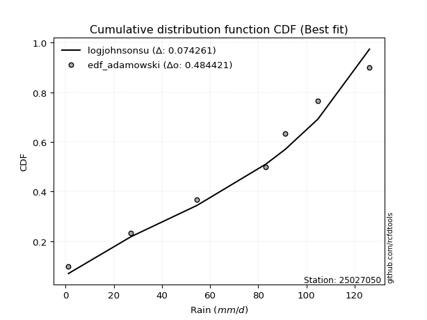</img>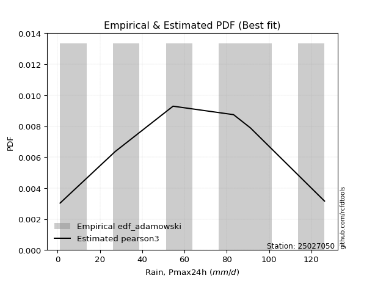</img>

</div>


## C. Best fit & Estimate extreme values for specific return periods - Tr


### 1. Best fit (ordered by delta Δ)

<div align="center">

|   id |   station | empirical_dist   | p_dist       |     delta |   deltao | eval   |   fit |   n |   best_fit |   best_fit_sort |
|-----:|----------:|:-----------------|:-------------|----------:|---------:|:-------|------:|----:|-----------:|----------------:|
|    0 |  25027050 | edf_hazen        | johnsonsu    | 0.0636921 | 0.484421 | Δo > Δ |     1 |   7 |          1 |               1 |
|    1 |  25027050 | edf_gringorten   | johnsonsu    | 0.0685075 | 0.484421 | Δo > Δ |     1 |   7 |          1 |               2 |
|    2 |  25027050 | edf_cunnane      | johnsonsu    | 0.0716286 | 0.484421 | Δo > Δ |     1 |   7 |          1 |               3 |
|    3 |  25027050 | edf_blom         | johnsonsu    | 0.0735443 | 0.484421 | Δo > Δ |     1 |   7 |          1 |               4 |
|    4 |  25027050 | edf_adamowski    | logjohnsonsu | 0.0742609 | 0.484421 | Δo > Δ |     1 |   7 |          1 |               5 |
|    5 |  25027050 | edf_tukey        | johnsonsu    | 0.0766791 | 0.484421 | Δo > Δ |     1 |   7 |          1 |               6 |
|    6 |  25027050 | edf_filliben     | johnsonsu    | 0.0778517 | 0.484421 | Δo > Δ |     1 |   7 |          1 |               7 |
|    7 |  25027050 | edf_chegodayev   | logjohnsonsu | 0.0778645 | 0.484421 | Δo > Δ |     1 |   7 |          1 |               8 |
|    8 |  25027050 | edf_jenkinson    | johnsonsu    | 0.0784037 | 0.484421 | Δo > Δ |     1 |   7 |          1 |               9 |
|    9 |  25027050 | edf_beard        | johnsonsu    | 0.0784037 | 0.484421 | Δo > Δ |     1 |   7 |          1 |              10 |
|   10 |  25027050 | edf_weibull      | genlogistic  | 0.0945955 | 0.484421 | Δo > Δ |     1 |   7 |          1 |              11 |
|   11 |  25027050 | edf_california   | kstwobign    | 0.120279  | 0.484421 | Δo > Δ |     1 |   7 |          1 |              12 |

</div>

:file_folder:Tables: [bestfit_25027050.csv](table/bestfit_25027050.csv) | [extreme_25027050.csv](table/extreme_25027050.csv)


### 2. Extreme values

In hydrology, a return period (or recurrence interval $Tr$) is the statistical average time between extreme events like floods or droughts of a specific magnitude, indicating how rare an event is, with a 100-year flood, for example, having a 1% chance of occurring in any given year, not that it happens exactly every century. It is a key tool for infrastructure design (like bridges or dams) and risk assessment, calculated from historical data to determine the probability of future events, although it is important to remember it is statistical average, and events can cluster or be missed.

> risk_rate: assuming the return period as the project useful life.

|   id |      tr |   prob_l |     prob_g |    alpha |   betaprime |     chi2 |   crystalball |   erlang |    expon |   exponnorm |        f |   fatiguelife |     fisk |    gamma |   genexpon |   genlogistic |   gibrat |   gompertz |   gumbel_l |   gumbel_r |   halflogistic |   halfnorm |   hypsecant |   invgamma |   invgauss |      invweibull |   johnsonsu |   kstwobign |   laplace |   laplace_asymmetric |   loggamma |   logistic |   lognorm |   maxwell |   mielke |    moyal |   nakagami |      ncf |      nct |     norm |           pareto |   pearson3 |   rayleigh |     rice |        t |   truncnorm |     wald |   weibull_min |         logalpha |   logbetaprime |         logchi2 |   logcrystalball |   logerlang |        logexpon |   logexponnorm |      logf |   logfatiguelife |   logfisk |   loggenexpon |   loggenlogistic |        loggibrat |   loggompertz |   loggumbel_l |   loggumbel_r |   loghalflogistic |   loghalfnorm |   loghypsecant |   loginvgamma |   loginvgauss |    loginvweibull |   logjohnsonsu |   logkstwobign |   loglaplace |   loglaplace_asymmetric |   logloggamma |   loglogistic |   loglognorm |   logmaxwell |   logmielke |    logmoyal |      lognakagami |    logncf |    lognct |     logpareto |   logpearson3 |   lograyleigh |   logrice |              logt |   logtruncnorm |          logwald |   logweibull_min |   station |   n |   risk_rate |
|-----:|--------:|---------:|-----------:|---------:|------------:|---------:|--------------:|---------:|---------:|------------:|---------:|--------------:|---------:|---------:|-----------:|--------------:|---------:|-----------:|-----------:|-----------:|---------------:|-----------:|------------:|-----------:|-----------:|----------------:|------------:|------------:|----------:|---------------------:|-----------:|-----------:|----------:|----------:|---------:|---------:|-----------:|---------:|---------:|---------:|-----------------:|-----------:|-----------:|---------:|---------:|------------:|---------:|--------------:|-----------------:|---------------:|----------------:|-----------------:|------------:|----------------:|---------------:|----------:|-----------------:|----------:|--------------:|-----------------:|-----------------:|--------------:|--------------:|--------------:|------------------:|--------------:|---------------:|--------------:|--------------:|-----------------:|---------------:|---------------:|-------------:|------------------------:|--------------:|--------------:|-------------:|-------------:|------------:|------------:|-----------------:|----------:|----------:|--------------:|--------------:|--------------:|----------:|------------------:|---------------:|-----------------:|-----------------:|----------:|----:|------------:|
|    0 |    2    | 0.5      | 0.5        |  66.0781 |     69.3233 |  67.9161 |       69.7783 |  68.7772 |  48.7301 |     69.7714 |  69.7795 |       1.20101 |  72.2198 |  68.8213 |    47.884  |       81.0707 |  57.4498 |    113.065 |    76.5152 |    63.0277 |        59.6751 |    61.3687 |     69.7714 |    66.5395 |    65.3314 | 13622.7         |     77.3223 |     60.7757 |   69.7714 |              78.8499 |    38.1557 |    69.7714 |   40.5039 |   66.2606 |   1.2    |  60.8506 |    2.92637 |  53.7307 |  69.7712 |  69.7714 |      5.39755     |    72.1431 |    65.0155 |  67.9763 |  69.7737 |  -7.17375   |  56.465  |       74.9697 |     2.02019      |        40.4351 |     1.29894     |          40.504  |     37.7862 |    13.7572      |        40.5042 |   40.6869 |          41.4398 |   56.6638 |       24.5214 |          inf     |     25.7274      |       53.5259 |       51.9252 |       31.5949 |           27.9239 |       29.7217 |        40.5039 |       36.4579 |       37.6894 |     34.1933      |        81.5883 |        26.9473 |      40.5039 |                 57.4248 |       57.2619 |       40.5039 |      1.21736 |      35.5905 |     57.0586 |     29.1601 |      6.1504      |   39.8935 |   40.3215 |   1.52321     |       60.3571 |       33.9949 |   40.5019 |     90.7712       |        9.33855 |     24.8101      |          54.7809 |  25027050 |   7 |    0.75     |
|    1 |    2.33 | 0.570815 | 0.429185   |  73.7342 |     76.6918 |  75.4738 |       77.1031 |  76.2555 |  59.2024 |     77.0966 |  77.1395 |       3.95086 |  79.3461 |  76.2898 |    58.1699 |       87.5435 |  61.1605 |    114.297 |    82.8882 |    69.8154 |        66.6539 |    69.2745 |     75.6338 |    74.2661 |    73.0862 |     1.65961e+06 |     84.1577 |     69.3153 |   74.2043 |              84.467  |    50.8506 |    76.2255 |   53.0494 |   73.8711 |   1.2    |  67.276  |    5.53932 |  68.8782 |  77.0967 |  77.0967 |     11.7214      |    79.3499 |    72.7385 |  75.5864 |  77.0993 |  -6.63937   |  61.2683 |       81.8328 |     2.30747      |        53.6692 |     1.44551     |          53.0494 |     50.2395 |    23.547       |        53.0496 |   53.3069 |          54.333  |   69.6044 |       36.1732 |          inf     |     29.4954      |       63.1537 |       65.6643 |       40.5695 |           36.1093 |       39.7691 |        50.2666 |       48.4381 |       51.5726 |     50.9833      |        91.2738 |        40.5621 |      47.6883 |                 66.7505 |       66.5973 |       51.3741 |      1.42175 |      47.1064 |     66.7575 |     36.9468 |     11.0372      |   52.7692 |   52.861  |   2.18301     |       75.1563 |       45.1815 |   53.0475 |     96.412        |       13.061   |     29.612       |          64.2204 |  25027050 |   7 |    0.729209 |
|    2 |    5    | 0.8      | 0.2        | 104.777  |    104.289  | 104.449  |      104.324  | 104.518  | 111.561  |    104.319  | 104.529  |      62.3448  | 106.862  | 104.506  |   109.597  |      106.96   |  82.5239 |    118.276 |   103.477  |    99.304  |        98.2315 |   102.707  |     99.1492 |   104.718  |   104.442  |     1.91242e+15 |    105.875  |    105.589  |   96.3678 |             101.766  |   150.516  |   101.145  |  144.599  |  103.825  |  87.2769 |  97.039  |   47.2079  | 141.605  | 104.321  | 104.319  |    998.904       |   104.827  |   103.657  | 104.457  | 104.323  |  -4.43606   |  88.1569 |      104.906  |     6.46973      |       155.37   |     7.4855      |         144.599  |    147.996  |   345.869       |       144.598  |  145.541  |         148.761  |  154.013  |      173.77   |          inf     |     64.7891      |      107.952  |      140.181  |      120.209  |          115.553  |      136.264  |       119.525  |      143.501  |      174.491  |    289.155       |       114.182  |       230.438  |     107.886  |                 97.9487 |       97.8597 |      128.645  |    inf       |     141.991  |     99.5961 |    110.586  |    215.897       |  150.561  |  144.709  |   7.02171e+24 |      138.103  |      141.116  |  144.601  |    135.728        |       41.1192  |     79.7278      |         107.331  |  25027050 |   7 |    0.67232  |
|    3 |   10    | 0.9      | 0.1        | 127.949  |    122.782  | 124.453  |      122.381  | 123.678  | 159.092  |    122.378  | 122.731  |     142.972   | 127.126  | 123.628  |   156.281  |      117.808  | 106.876  |    120.491 |   114.94   |   123.322  |       124.455  |   127.447  |    117.927  |   126.545  |   127.587  |     4.59309e+22 |    117.553  |    133.207  |  116.487  |             116.307  |   314.039  |   119.498  |  281.226  |  124.905  | 106.318  | 122.952  |  111.908   | 206.192  | 122.382  | 122.378  |  61815.1         |   120.617  |   125.703  | 123.952  | 122.383  |  -2.84403   | 116.692  |      118.371  |    43.0043       |       317.463  |   152.262       |         281.226  |    308.886  |  3965.15        |       281.222  |  283.392  |         290.31   |  276.425  |      535.965  |          inf     |    158.875       |      145.614  |      213.827  |      291.178  |          303.599  |      338.959  |       238.699  |      303.069  |      410.939  |   1188.53        |       121.331  |       864.885  |     226.37   |                111.973  |      111.925  |      252.921  |    inf       |     308.663  |    114.516  |    287.238  |   2516.9         |  304.213  |  282.436  | inf           |      177.562  |      317.867  |  281.238  |    255.55         |       70.7188  |    228.083       |         142.859  |  25027050 |   7 |    0.651322 |
|    4 |   15    | 0.933333 | 0.0666667  | 140.401  |    132.067  | 134.671  |      131.392  | 133.364  | 186.895  |    131.39   | 131.825  |     195.703   | 138.167  | 133.291  |   183.589  |      123.115  | 123.672  |    121.494 |   120.131  |   136.873  |       139.296  |   140.321  |    128.643  |   137.96   |   139.878  |     6.70089e+26 |    122.694  |    147.869  |  128.256  |             124.813  |   455.41   |   129.497  |  391.939  |  135.721  | 113.008  | 137.991  |  152.218   | 244.114  | 131.395  | 131.39   | 690832           |   128.171  |   137.062  | 133.749  | 131.395  |  -2.02385   | 135.016  |      124.62   |   283.924        |       454.757  |  1450           |         391.938  |    448.488  | 16517.3         |       391.932  |  395.207  |         405.342  |  380.171  |      958.938  |          inf     |    294.952       |      166.77   |      258.886  |      479.661  |          524.457  |      544.63   |       354.227  |      443.827  |      639.501  |   2638.5         |       123.504  |      1745.41   |     349.214  |                116.696  |      116.664  |      365.55   |    inf       |     459.737  |    119.561  |    499.831  |   9332.08        |  433.15   |  394.399  | inf           |      194.131  |      483.011  |  391.961  |    516.454        |       85.3828  |    447.945       |         162.61   |  25027050 |   7 |    0.644736 |
|    5 |   20    | 0.95     | 0.05       | 148.906  |    138.167  | 141.448  |      137.294  | 139.751  | 206.622  |    137.291  | 137.783  |     234.745   | 145.798  | 139.663  |   202.965  |      126.634  | 136.848  |    122.118 |   123.362  |   146.361  |       149.693  |   148.905  |    136.203  |   145.633  |   148.203  |     5.51668e+29 |    125.836  |    157.746  |  136.607  |             130.848  |   581.898  |   136.409  |  487.109  |  142.899  | 116.417  | 148.642  |  180.397   | 271.226  | 137.298  | 137.291  |      3.8295e+06  |   133.003  |   144.612  | 140.185  | 137.297  |  -1.47948   | 148.671  |      128.558  |  1871.42         |       576.026  |  8468.44        |         487.108  |    573.737  | 45457.7         |       487.1    |  491.383  |         504.398  |  473.848  |     1412.21   |          inf     |    479.206       |      181.469  |      291.609  |      680.322  |          769.211  |      747.161  |       467.971  |      571.549  |      858.979  |   4611.69        |       124.584  |      2801.01   |     474.977  |                119.066  |      119.042  |      471.529  |    inf       |     598.881  |    122.098  |    739.956  |  22487.6         |  546.398  |  490.834  | inf           |      203.57   |      637.875  |  487.142  |   1107.86         |       93.9734  |    740.741       |         176.261  |  25027050 |   7 |    0.641514 |
|    6 |   25    | 0.96     | 0.04       | 155.355  |    142.668  | 146.481  |      141.638  | 144.476  | 221.923  |    141.635  | 142.171  |     265.764   | 151.636  | 144.376  |   217.994  |      129.267  | 147.832  |    122.563 |   125.662  |   153.669  |       157.704  |   155.291  |    142.054  |   151.384  |   154.474  |     9.71432e+31 |    128.043  |    165.144  |  143.084  |             135.529  |   697.552  |   141.696  |  571.641  |  148.228  | 118.482  | 156.897  |  201.779   | 292.413  | 141.643  | 141.636  |      1.44562e+07 |   136.502  |   150.221  | 144.932  | 141.641  |  -1.07554   | 159.608  |      131.384  | 12326.9          |       685.868  | 36026.7         |         571.64   |    688.508  | 99687.6         |       571.629  |  576.846  |         592.49   |  560.812  |     1883.14   |          inf     |    718.179       |      192.715  |      317.384  |      890.482  |         1033.24   |      945.322  |       580.516  |      689.604  |     1070.34   |   7090.07        |       125.241  |      3991.91   |     602.958  |                120.491  |      120.472  |      572.91   |    inf       |     728.769  |    123.629  |   1002.93   |  43342.3         |  648.564  |  576.61   | inf           |      209.778  |      784.28   |  571.684  |   2496.76         |       99.5928  |   1108.24        |         186.667  |  25027050 |   7 |    0.639603 |
|    7 |   50    | 0.98     | 0.02       | 174.761  |    155.604  | 161.097  |      154.077  | 158.112  | 269.453  |    154.076  | 154.745  |     365.29    | 169.472  | 157.977  |   264.678  |      137.098  | 186.551  |    123.769 |   131.904  |   176.182  |       182.387  |   173.854  |    160.193  |   168.351  |   173.115  |     8.04375e+38 |    133.897  |    186.868  |  163.203  |             150.069  |  1177.01   |   157.85   |  903.933  |  163.684  | 122.658  | 182.526  |  264.953   | 359.326  | 154.086  | 154.076  |      8.95591e+08 |   146.254  |   166.504  | 158.564  | 154.083  |   0.0940024 | 195.319  |      139.151  |     1.52398e+08  |      1133.34   |     4.60834e+06 |         903.931  |   1166.41   |     1.14285e+06 |       903.91   |  913.052  |         939.549  |  938.43   |     4345.31   |          inf     |   2989.63        |      226.891  |      399.427  |     2040.67   |         2564.84   |     1873      |      1132.39   |     1189.59   |     2036.32   |  26672.5         |       126.627  |     11298.1    |    1265.15   |                123.347  |      123.338  |     1038.72   |    inf       |    1287.75   |    126.798  |   2577.83   | 293009           | 1061.75   |  914.666  | inf           |      224.156  |     1428.76   |  904.02   | 250324            |      112.007   |   4129.54        |         218.117  |  25027050 |   7 |    0.63583  |
|    8 |   75    | 0.986667 | 0.0133333  | 185.789  |    162.575  | 169.066  |      160.752  | 165.495  | 297.256  |    160.751  | 161.497  |     425.229   | 179.774  | 165.339  |   291.986  |      141.526  | 212.702  |    124.379 |   135.06   |   189.268  |       196.735  |   183.959  |    170.794  |   177.769  |   183.544  |     8.44288e+42 |    136.773  |    198.821  |  174.972  |             158.575  |  1562.3    |   167.179  | 1155.9    |  172.086  | 124.063  | 197.513  |  299.568   | 399.38   | 160.762  | 160.751  |      1.00091e+10 |   151.323  |   175.363  | 165.899  | 160.758  |   0.728245  | 217.293  |      143.133  |     1.88162e+12  |      1486.1    |     9.5905e+07  |        1155.9    |   1552.44   |     4.76067e+06 |      1155.87   | 1168.2    |        1203.35   | 1263.39   |     6851.15   |          inf     |   7833.43        |      246.423  |      448.674  |     3304.48   |         4351.04   |     2717.62   |      1673.32   |     1601.39   |     2899.21   |  57612.4         |       127.143  |     20026      |    1951.7    |                124.301  |      124.295  |     1464.71   |    inf       |    1754.9    |    127.989  |   4477.18   | 829488           | 1384.94   | 1171.73   | inf           |      229.949  |     1980.04   | 1156.02   |      4.8168e+07   |      116.527   |   9277.57        |         235.985  |  25027050 |   7 |    0.634587 |
|    9 |  100    | 0.99     | 0.01       | 193.511  |    167.301  | 174.505  |      165.266  | 170.514  | 316.983  |    165.266  | 166.065  |     468.357   | 187.047  | 170.344  |   311.362  |      144.627  | 232.961  |    124.778 |   137.124  |   198.529  |       206.89   |   190.843  |    178.314  |   184.268  |   190.769  |     5.92138e+45 |    138.621  |    207.01   |  183.322  |             164.61   |  1893.97   |   173.766  | 1365.04   |  177.81   | 124.768  | 208.146  |  323.133   | 428.262  | 165.278  | 165.266  |      5.54836e+10 |   154.689  |   181.398  | 170.867  | 165.273  |   1.15948   | 233.315  |      145.758  |     2.32242e+16  |      1786.09   |     8.86707e+08 |        1365.03   |   1885.9    |     1.3102e+07  |      1365      | 1380.08   |        1422.63   | 1558.5    |     9344.27   |          inf     |  16520.3         |      260.102  |      484.126  |     4647.92   |         6324.86   |     3501.97   |      2207.35   |     1961.69   |     3693.87   |  99363.8         |       127.425  |     29642.8    |    2654.57   |                124.778  |      124.774  |     1866.91   |    inf       |    2166.76   |    128.673  |   6623.65   |      1.68454e+06 | 1658.47   | 1385.47   | inf           |      233.195  |     2472.99   | 1365.19   |      1.49043e+10  |      118.864   |  16739.2         |         248.457  |  25027050 |   7 |    0.633968 |
|   10 |  200    | 0.995    | 0.005      | 211.864  |    178.057  | 186.995  |      175.507  | 181.977  | 364.513  |    175.507  | 176.435  |     573.926   | 204.494  | 181.773  |   358.046  |      152.012  | 288.075  |    125.645 |   141.612  |   220.794  |       231.304  |   206.587  |    196.429  |   199.407  |   207.684  |     4.11463e+52 |    142.539  |    225.872  |  203.442  |             179.151  |  2939.67   |   189.567  | 1990.54   |  190.904  | 125.829  | 233.763  |  376.82    | 499.593  | 175.522  | 175.507  |      3.43732e+12 |   162.134  |   195.207  | 182.157  | 175.515  |   2.14359   | 273.223  |      151.519  |     5.38544e+32  |      2715.31   |     2.29255e+11 |        1990.54   |   2942.89   |     1.50205e+08 |      1990.48   | 2014.28   |        2079.88   | 2578.76   |    19015.8    |          inf     | 125800           |      292.515  |      571.145  |    10554.6    |        15546.1    |     6254.26   |      4301.97   |     3126.36   |     6462.88   | 368391           |       127.911  |     73150.2    |    5569.92   |                125.494  |      125.493  |     3341.16   |    inf       |    3509.82   |    130.013  |  17017.9    |      8.49441e+06 | 2499.85   | 2026.37   | inf           |      238.835  |     4112.76   | 1990.81   |      3.72506e+21  |      122.47    |  72803.4         |         277.886  |  25027050 |   7 |    0.633042 |
|   11 |  250    | 0.996    | 0.004      | 217.718  |    181.353  | 190.853  |      178.636  | 185.501  | 379.814  |    178.636  | 179.605  |     608.332   | 210.095  | 185.287  |   373.075  |      154.372  | 307.851  |    125.9   |   142.932  |   227.952  |       239.153  |   211.431  |    202.261  |   204.146  |   213      |     6.51484e+54 |    143.664  |    231.71   |  209.919  |             183.832  |  3365.12   |   194.64   | 2233.76   |  194.935  | 126.041  | 242.01   |  393.254   | 523.118  | 178.652  | 178.637  |      1.29758e+13 |   164.358  |   199.458  | 185.612  | 178.644  |   2.44579   | 286.426  |      153.228  |     8.19969e+40  |      3087.65   |     1.44105e+12 |        2233.76   |   3374.96   |     3.29397e+08 |      2233.68   | 2261.03   |        2335.91   | 3031.27   |    23667.1    |          inf     | 260631           |      302.801  |      599.609  |    13738.8    |        20758      |     7475.84   |      5332.8    |     3610.7    |     7689.09   | 561384           |       128.025  |     96743.5    |    7070.7    |                125.638  |      125.637  |     4027.61   |    inf       |    4071.61   |    130.388  |  23058.6    |      1.39619e+07 | 2835      | 2276.12   | inf           |      240.15   |     4809.88   | 2234.07   |      8.1688e+27   |      123.206   | 118402           |         287.192  |  25027050 |   7 |    0.632858 |
|   12 |  500    | 0.998    | 0.002      | 235.807  |    191.156  | 202.411  |      187.916  | 196.013  | 427.345  |    187.917  | 189.012  |     716.261   | 227.466  | 195.765  |   419.759  |      161.671  | 376.194  |    126.632 |   146.717  |   250.169  |       263.515  |   225.872  |    220.375  |   218.522  |   229.179  |     4.3745e+61  |    146.82   |    249.203  |  230.038  |             198.372  |  5035.66   |   210.373  | 3144.16   |  206.963  | 126.468  | 267.627  |  441.979   | 598.08   | 187.936  | 187.918  |      8.03874e+14 |   170.811  |   212.141  | 195.87   | 187.926  |   3.34548   | 328.406  |      158.166  |     6.70732e+81  |      4526.07   |     4.93739e+14 |        3144.15   |   5080.49   |     3.7763e+09  |      3144.04   | 3185.25   |        3296.06   | 5004.7    |    45478      |          125.922 |      3.23072e+06 |      334.34   |      689.315  |    31142.8    |        50922.4    |    12725.7    |     10392.7    |     5559.56   |    12971.2    |      2.0754e+06  |       128.294  |    223590      |   14836      |                125.924  |      125.924  |     7189.89   |    inf       |    6341.35   |    131.458  |  59242.3    |      6.12733e+07 | 4121.85   | 3213.11   | inf           |      243.155  |     7674.15   | 3144.65   |      8.28637e+63  |      124.693   | 555809           |         315.629  |  25027050 |   7 |    0.632489 |
|   13 |  750    | 0.998667 | 0.00133333 | 246.354  |    196.619  | 208.906  |      193.072  | 201.891  | 455.148  |    193.073  | 194.241  |     780.03    | 237.615  | 201.624  |   447.067  |      165.926  | 421.392  |    127.023 |   148.74   |   263.157  |       277.757  |   233.94   |    230.971  |   226.721  |   238.437  |     4.28546e+65 |    148.46   |    259.03   |  241.807  |             206.878  |  6308.63   |   219.564  | 3801.73   |  213.691  | 126.613  | 282.612  |  469.012   | 643.331  | 193.093  | 193.073  |      8.98407e+15 |   174.306  |   219.234  | 201.576  | 193.082  |   3.84732   | 353.576  |      160.827  |     5.48585e+122 |      5602.39   |     1.61895e+16 |        3801.72   |   6388.02   |     1.57306e+10 |      3801.57   | 3853.28   |        3991.01   | 6708.07   |    65537.5    |          126.017 |      1.70735e+07 |      352.524  |      742.64   |    50249.1    |        86048.2    |    17129.4    |     15354.5    |     7086.73   |    17431.2    |      4.45721e+06 |       128.408  |    357966      |   22887      |                126.02   |      126.02   |    10086.9    |    inf       |    8124.58   |    132.045  | 102884      |      1.39746e+08 | 5078.19   | 3891.62   | inf           |      244.35   |     9965.25   | 3802.35   |      1.0915e+105  |      125.193   |      1.40469e+06 |         331.965  |  25027050 |   7 |    0.632366 |
|   14 | 1000    | 0.999    | 0.001      | 253.837  |    200.387  | 213.409  |      196.621  | 205.954  | 474.875  |    196.622  | 197.842  |     825.518   | 244.812  | 205.673  |   466.443  |      168.941  | 455.979  |    127.286 |   150.102  |   272.37   |       287.859  |   239.511  |    238.489  |   232.457  |   244.925  |     2.90414e+68 |    149.545  |    265.839  |  250.158  |             212.913  |  7372.05   |   226.082  | 4332.77   |  218.34   | 126.689  | 293.244  |  487.601   | 676.099  | 196.644  | 196.623  |      4.98016e+16 |   176.676  |   224.135  | 205.508  | 196.631  |   4.1936    | 371.682  |      162.628  |     4.48667e+163 |      6491.19   |     1.98287e+17 |        4332.76   |   7484.63   |     4.32927e+10 |      4332.59   | 4393.02   |        4552.99   | 8256.9    |    84368.2    |          126.065 |      6.10403e+07 |      365.317  |      780.833  |    70551.9    |       124839      |    21031.6    |     20253.6    |     8385.97   |    21409.9    |      7.6654e+06  |       128.474  |    495953      |   31129.4    |                126.068  |      126.068  |    12824.3    |    inf       |    9642.35   |    132.451  | 152205      |      2.46771e+08 | 5864.54   | 4440.46   | inf           |      245.016  |    11936.9    | 4333.51   |      7.50624e+149 |      125.444   |      2.73667e+06 |         343.433  |  25027050 |   7 |    0.632305 |

<div align="center">

</img>

</div>


<div align="center">

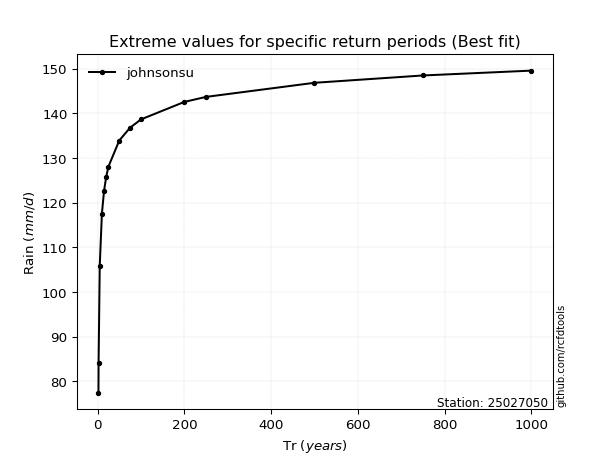</img>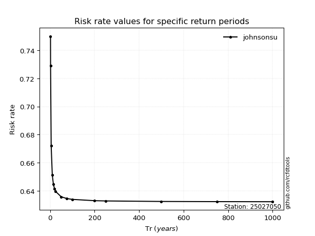</img>

</div>


<sub>**APP DISCLAIMER**: NO WARRANTY - This software is provided by [github.com/rcfdtools](https://github.com/rcfdtools) "as is", without any express or implied warranty, including warranties of merchantability, fitness for a particular purpose, or non-infringement. There is no guarantee that the software will be error-free or operate without interruption. LIMITATION OF LIABILITY - Neither the authors nor copyright holders will be liable for claims or damages arising from the software or its use. You are responsible for determining if the software is appropriate for your use and assume all associated risks, including errors, legal compliance, and data loss. NO PROFESSIONAL ADVICE - The software provides general information and does not offer professional advice. It should not replace consultation with professional advisors.</sub>