<div align="center">


</div>

# Station (rain, Pmax24h): 25027180

Probable Maximum Precipitation (PMP) is the greatest amount of rainfall for a specific duration that is meteorologically possible for a given location, acting as a "worst-case" scenario for extreme storms, crucial for designing safety-critical infrastructure like bridges, river deviations, dams, spillways, and nuclear plants to prevent catastrophic failure. PMP is calculated by hydrologists using meteorological data to determine the upper limit of extreme rainfall, often leading to the Probable Maximum Flood (PMF) for flood control design, and is increasingly being studied for climate change impacts.

<div align="center">

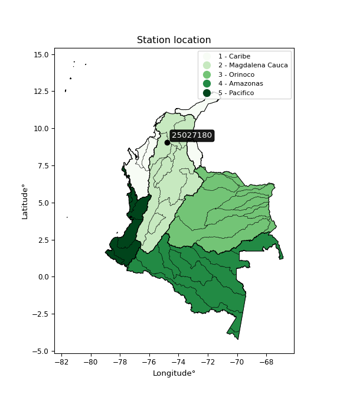</img>

</div>


## A. General information


### 1. General running parameters

• app_version: _v20251225_. • runtime: _2025-12-26 14:29:50.888910_. • Python version: _3.14.0_. • SciPy version: _1.16.3_. • Pandas version: _2.3.3_. • NumPy version: _2.3.5_. • Stations dataset (station_dataset_file): _dataset/pmax24h_in/automatic_colombia.csv_. • Stations catalog (station_catalog_file): _dataset/CNE_IDEAM.xls_. • Plot only fit distributions with Δo > Δ (plot_only_fit): _True_. • Eval low extreme values, if False, evaluates high extreme values (low_extreme): _False_. • Eval every SciPy distribution as logarithmic (pdist_logarithmic_on): _True_. • Standard deviation normalized (ddof): _1.0_. • Return periods to eval in years (Tr): _[2, 2.33, 5, 10, 15, 20, 25, 50, 75, 100, 200, 250, 500, 750, 1000]_. • Minimum data sample per station, 0 means any (minimum_sample): _5_. • Z-Score threshold to adjust a value, 0 means disable (zscore): _3.5_. • Avoid zeros, e.g. rain = 0 (avoid_zeros): _True_. • Avoid null values (avoid_nans): _True_. [:file_folder:Dataset file.](../../dataset/pmax24h_in/automatic_colombia.csv)


### 2. Station info and location

|   id |   CODIGO | NOMBRE                 | CATEGORIA    | TECNOLOGIA                              | ESTADO   | FECHA_INSTALACION   |   FECHA_SUSPENSION |   ALTITUD |   LATITUD |   LONGITUD | DEPARTAMENTO   | MUNICIPIO   | AREA_OPERATIVA                              | ENTIDAD                                                     | AREA_HIDROGRAFICA   | ZONA_HIDROGRAFICA                | SUBZONA_HIDROGRAFICA       | CORRIENTE   | OBSERVACION                                                                                                                                                                                                                                                                                                                                                                                                                                                                                                             | SUBRED                                                                  | Catalogo   |
|-----:|---------:|:-----------------------|:-------------|:----------------------------------------|:---------|:--------------------|-------------------:|----------:|----------:|-----------:|:---------------|:------------|:--------------------------------------------|:------------------------------------------------------------|:--------------------|:---------------------------------|:---------------------------|:------------|:------------------------------------------------------------------------------------------------------------------------------------------------------------------------------------------------------------------------------------------------------------------------------------------------------------------------------------------------------------------------------------------------------------------------------------------------------------------------------------------------------------------------|:------------------------------------------------------------------------|:-----------|
|    0 | 25027180 | SAN ANTONIO [25027180] | Limnigráfica | Automática con Telemetría, Convencional | Activa   | 15/04/1967          |                nan |        15 |   9.03907 |   -74.7677 | Bolivar        | Magangué    | Area Operativa 02 - Atlántico-Bolivar-Sucre | INSTITUTO DE HIDROLOGIA METEOROLOGIA Y ESTUDIOS AMBIENTALES | Magdalena Cauca     | Bajo Magdalena- Cauca -San Jorge | Bajo San Jorge - La Mojana | San Jorge   | SE CAMBIA CATEGORIA DE ESTACION A LM POR SOLICITUD DEL COORDINADOR DEL AO 02. REQ 2023-000225. (20012023)|25/03/2025$mvelez$Se realiza el cambio de coordenadas y elevación a solicitud de la coordinadora mediante memorando 20253090042123 del 03/03/2025 |02/05/2025$mvelez$Cambio de categoría de la estación a limnigráfica y cambio de tecnología a automática con telemetría la estación cuenta con instrumentos automáticos y se encuentra trasmitiendo en Polaris. solicitud mediante memorando 20253090068963 | RED ALERTAS - AREA OPERATIVA 02,Atlántico, Magdalena y Norte de Bolívar | CNE_IDEAM  |

<div align="center">

Map location in: [:earth_americas:Google](http://maps.google.com/maps?q=9.039073,-74.767704) [:earth_americas:OSM](https://www.openstreetmap.org/#map=18/9.039073/-74.767704&layers=P) [:earth_americas:Bing](https://www.bing.com/maps?cp=9.039073~-74.767704&lvl=18) [:earth_americas:Apple](https://maps.apple.com/frame?center=9.039073%2C-74.767704&span=0.003%2C0.006)

</div>


<div align="center">

```geojson
{
  "type": "Feature",
  "geometry": {
    "type": "Point", 
    "coordinates": [-74.767704, 9.039073]
  }, 
  "properties": {
    "Name": "25027180"
  }
}
```

</div>


### 3. Discrete values table and plot

|               |          0 |           1 |           2 |          3 |          4 |
|:--------------|-----------:|------------:|------------:|-----------:|-----------:|
| Date          | 2021       | 2022        | 2023        | 2024       | 2025       |
| Value         |   68.8     |  200        |   80.3      |  225.4     |   88.5     |
| Value_initial |   68.8     |  200        |   80.3      |  225.4     |   88.5     |
| count         |    5       |    5        |    5        |    5       |    5       |
| mean          |  132.6     |  132.6      |  132.6      |  132.6     |  132.6     |
| std           |   74.0019  |   74.0019   |   74.0019   |   74.0019  |   74.0019  |
| zscore        |   -0.86214 |    0.910787 |   -0.706738 |    1.25402 |   -0.59593 |

<div align="center">

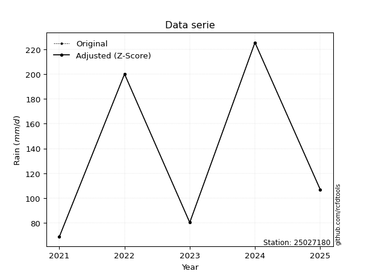</img>

</div>

> If Z-Score is active, values out of range or outliers are replaced with the station mean value.


### 4. Active continuous probability distributions from SciPy (45 of 104 available)

[scipy.stats](https://docs.scipy.org/doc/scipy/reference/stats.html) is a Python´s powerful submodule within the SciPy library for comprehensive statistical analysis, offering over 130 probability distributions (like Normal, Poisson), functions for descriptive stats (mean, variance), hypothesis testing (t-tests, chi-square), random variable generation, and statistical tests, making it essential for data science, modeling, and research. It provides tools to explore, model, and draw conclusions from data efficiently, working seamlessly with NumPy.

<div align="center">

|   id | p_dist             |   n_parameter | fit_method   | label                                                                       | active   | ref                                                                                                        |
|-----:|:-------------------|--------------:|:-------------|:----------------------------------------------------------------------------|:---------|:-----------------------------------------------------------------------------------------------------------|
|    0 | alpha              |             3 | MLE          | Alpha                                                                       | True     | [:mortar_board:](https://docs.scipy.org/doc/scipy/reference/generated/scipy.stats.alpha.html)              |
|    1 | betaprime          |             4 | MLE          | Beta prime                                                                  | True     | [:mortar_board:](https://docs.scipy.org/doc/scipy/reference/generated/scipy.stats.betaprime.html)          |
|    2 | chi2               |             3 | MLE          | Chi²                                                                        | True     | [:mortar_board:](https://docs.scipy.org/doc/scipy/reference/generated/scipy.stats.chi2.html)               |
|    3 | crystalball        |             4 | MLE          | Crystalball                                                                 | True     | [:mortar_board:](https://docs.scipy.org/doc/scipy/reference/generated/scipy.stats.crystalball.html)        |
|    4 | erlang             |             3 | MLE          | Erlang                                                                      | True     | [:mortar_board:](https://docs.scipy.org/doc/scipy/reference/generated/scipy.stats.erlang.html)             |
|    5 | expon              |             2 | MLE          | Exponential                                                                 | True     | [:mortar_board:](https://docs.scipy.org/doc/scipy/reference/generated/scipy.stats.expon.html)              |
|    6 | exponnorm          |             3 | MLE          | Exponentially modified Normal                                               | True     | [:mortar_board:](https://docs.scipy.org/doc/scipy/reference/generated/scipy.stats.exponnorm.html)          |
|    7 | f                  |             4 | MLE          | F                                                                           | True     | [:mortar_board:](https://docs.scipy.org/doc/scipy/reference/generated/scipy.stats.f.html)                  |
|    8 | fatiguelife        |             3 | MLE          | Fatigue-life (Birnbaum-Saunders)                                            | True     | [:mortar_board:](https://docs.scipy.org/doc/scipy/reference/generated/scipy.stats.fatiguelife.html)        |
|    9 | fisk               |             3 | MLE          | Fisk                                                                        | True     | [:mortar_board:](https://docs.scipy.org/doc/scipy/reference/generated/scipy.stats.fisk.html)               |
|   10 | gamma              |             3 | MLE          | Gamma                                                                       | True     | [:mortar_board:](https://docs.scipy.org/doc/scipy/reference/generated/scipy.stats.gamma.html)              |
|   11 | genexpon           |             5 | MLE          | Generalized exponential                                                     | True     | [:mortar_board:](https://docs.scipy.org/doc/scipy/reference/generated/scipy.stats.genexpon.html)           |
|   12 | genlogistic        |             3 | MLE          | Generalized logistic                                                        | True     | [:mortar_board:](https://docs.scipy.org/doc/scipy/reference/generated/scipy.stats.genlogistic.html)        |
|   13 | gibrat             |             2 | MM           | Gibrat                                                                      | True     | [:mortar_board:](https://docs.scipy.org/doc/scipy/reference/generated/scipy.stats.gibrat.html)             |
|   14 | gompertz           |             3 | MLE          | Gompertz (or truncated Gumbel)                                              | True     | [:mortar_board:](https://docs.scipy.org/doc/scipy/reference/generated/scipy.stats.gompertz.html)           |
|   15 | gumbel_l           |             2 | MM           | Gumbel Left Skew                                                            | True     | [:mortar_board:](https://docs.scipy.org/doc/scipy/reference/generated/scipy.stats.gumbel_l.html)           |
|   16 | gumbel_r           |             2 | MM           | Gumbel Right Skew                                                           | True     | [:mortar_board:](https://docs.scipy.org/doc/scipy/reference/generated/scipy.stats.gumbel_r.html)           |
|   17 | halflogistic       |             2 | MM           | Half-logistic                                                               | True     | [:mortar_board:](https://docs.scipy.org/doc/scipy/reference/generated/scipy.stats.halflogistic.html)       |
|   18 | halfnorm           |             2 | MM           | Half Normal                                                                 | True     | [:mortar_board:](https://docs.scipy.org/doc/scipy/reference/generated/scipy.stats.halfnorm.html)           |
|   19 | hypsecant          |             2 | MM           | hyperbolic secant                                                           | True     | [:mortar_board:](https://docs.scipy.org/doc/scipy/reference/generated/scipy.stats.hypsecant.html)          |
|   20 | invgamma           |             3 | MLE          | Inverted gamma                                                              | True     | [:mortar_board:](https://docs.scipy.org/doc/scipy/reference/generated/scipy.stats.invgamma.html)           |
|   21 | invgauss           |             3 | MLE          | Inverse Gaussian                                                            | True     | [:mortar_board:](https://docs.scipy.org/doc/scipy/reference/generated/scipy.stats.invgauss.html)           |
|   22 | invweibull         |             3 | MLE          | Inverted Weibull                                                            | True     | [:mortar_board:](https://docs.scipy.org/doc/scipy/reference/generated/scipy.stats.invweibull.html)         |
|   23 | johnsonsu          |             4 | MLE          | Johnson Su                                                                  | True     | [:mortar_board:](https://docs.scipy.org/doc/scipy/reference/generated/scipy.stats.johnsonsu.html)          |
|   24 | kstwobign          |             2 | MLE          | Limiting distribution of scaled Kolmogorov-Smirnov two-sided test statistic | True     | [:mortar_board:](https://docs.scipy.org/doc/scipy/reference/generated/scipy.stats.kstwobign.html)          |
|   25 | laplace            |             2 | MM           | Laplace                                                                     | True     | [:mortar_board:](https://docs.scipy.org/doc/scipy/reference/generated/scipy.stats.laplace.html)            |
|   26 | laplace_asymmetric |             3 | MLE          | Asymmetric Laplace                                                          | True     | [:mortar_board:](https://docs.scipy.org/doc/scipy/reference/generated/scipy.stats.laplace_asymmetric.html) |
|   27 | loggamma           |             3 | MLE          | Log gamma                                                                   | True     | [:mortar_board:](https://docs.scipy.org/doc/scipy/reference/generated/scipy.stats.loggamma.html)           |
|   28 | logistic           |             2 | MM           | Logistic (or Sech-squared)                                                  | True     | [:mortar_board:](https://docs.scipy.org/doc/scipy/reference/generated/scipy.stats.logistic.html)           |
|   29 | lognorm            |             3 | MLE          | Log Normal                                                                  | True     | [:mortar_board:](https://docs.scipy.org/doc/scipy/reference/generated/scipy.stats.lognorm.html)            |
|   30 | maxwell            |             2 | MM           | Maxwell                                                                     | True     | [:mortar_board:](https://docs.scipy.org/doc/scipy/reference/generated/scipy.stats.maxwell.html)            |
|   31 | mielke             |             4 | MLE          | Mielke Beta-Kappa / Dagum                                                   | True     | [:mortar_board:](https://docs.scipy.org/doc/scipy/reference/generated/scipy.stats.mielke.html)             |
|   32 | moyal              |             2 | MM           | Moyal                                                                       | True     | [:mortar_board:](https://docs.scipy.org/doc/scipy/reference/generated/scipy.stats.moyal.html)              |
|   33 | nakagami           |             3 | MLE          | Nakagami                                                                    | True     | [:mortar_board:](https://docs.scipy.org/doc/scipy/reference/generated/scipy.stats.nakagami.html)           |
|   34 | ncf                |             5 | MLE          | Non-central F distribution                                                  | True     | [:mortar_board:](https://docs.scipy.org/doc/scipy/reference/generated/scipy.stats.ncf.html)                |
|   35 | nct                |             4 | MLE          | Non-central Student’s t                                                     | True     | [:mortar_board:](https://docs.scipy.org/doc/scipy/reference/generated/scipy.stats.nct.html)                |
|   36 | norm               |             2 | MM           | Normal                                                                      | True     | [:mortar_board:](https://docs.scipy.org/doc/scipy/reference/generated/scipy.stats.norm.html)               |
|   37 | pareto             |             3 | MLE          | Pareto                                                                      | True     | [:mortar_board:](https://docs.scipy.org/doc/scipy/reference/generated/scipy.stats.pareto.html)             |
|   38 | pearson3           |             3 | MM           | Pearson type III                                                            | True     | [:mortar_board:](https://docs.scipy.org/doc/scipy/reference/generated/scipy.stats.pearson3.html)           |
|   39 | rayleigh           |             2 | MM           | Rayleigh                                                                    | True     | [:mortar_board:](https://docs.scipy.org/doc/scipy/reference/generated/scipy.stats.rayleigh.html)           |
|   40 | rice               |             3 | MLE          | Rice                                                                        | True     | [:mortar_board:](https://docs.scipy.org/doc/scipy/reference/generated/scipy.stats.rice.html)               |
|   41 | t                  |             3 | MLE          | Student’s t                                                                 | True     | [:mortar_board:](https://docs.scipy.org/doc/scipy/reference/generated/scipy.stats.t.html)                  |
|   42 | truncnorm          |             4 | MLE          | Truncated normal                                                            | True     | [:mortar_board:](https://docs.scipy.org/doc/scipy/reference/generated/scipy.stats.truncnorm.html)          |
|   43 | wald               |             2 | MM           | Wald                                                                        | True     | [:mortar_board:](https://docs.scipy.org/doc/scipy/reference/generated/scipy.stats.wald.html)               |
|   44 | weibull_min        |             3 | MLE          | Weibull minimum                                                             | True     | [:mortar_board:](https://docs.scipy.org/doc/scipy/reference/generated/scipy.stats.weibull_min.html)        |

</div>

> **n_parameter:** # arguments & localization & scale.
>
> **Fit methods:** (MLE) maximum likelihood, (MM) L-moments.
>
>**Inactive:** foldnorm, gennorm, norminvgauss, powernorm, powerlognorm, skewnorm, genextreme, anglit, arcsine, argus, beta, bradford, burr, burr12, cauchy, cosine, halfcauchy, foldcauchy, skewcauchy, wrapcauchy, dgamma, gengamma, exponweib, exponpow, truncexpon, gausshyper, genhalflogistic, genhyperbolic, geninvgauss, halfgennorm, johnsonsb, kappa4, kappa3, ksone, kstwo, loglaplace, levy, levy_l, levy_stable, ncx2, genpareto, truncpareto, lomax, powerlaw, rdist, rel_breitwigner, recipinvgauss, semicircular, studentized_range, trapezoid, triang, truncweibull_min, tukeylambda, uniform, loguniform, vonmises, vonmises_line, weibull_max, dweibull, 


## B. Probability distributions vs. Empirical distributions

A continuous probability distribution (CPD) describes probabilities for variables that can take any value within a range (like rain any time), unlike discrete variables with specific outcomes (like temperature). It uses a Probability Density Function (PDF), a curve where the total area under it equals 1, and the probability of the variable falling within an interval (a to b) is found by calculating the area under the curve between those points. A key feature is that the probability of hitting any single exact value is zero, so probabilities are always expressed for ranges, e.g., $P(a ≤ X ≤ b)$.

<div align="center">

Distributions parameters
|    |   station | p_dist                |   n |               loc |          scale | shape                  | shape1              | shape2                | shape3   |
|---:|----------:|:----------------------|----:|------------------:|---------------:|:-----------------------|:--------------------|:----------------------|:---------|
|  0 |  25027180 | alpha                 |   5 |      55.9353      |   23.9006      | 1.9437949122925298e-08 |                     |                       |          |
|  1 |  25027180 | betaprime             |   5 |      -0.880185    |    1.76873     | 285.3790016995499      | 4.756896594892334   |                       |          |
|  2 |  25027180 | chi2                  |   5 |      68.8         |    2.05835     | 0.1227076526570258     |                     |                       |          |
|  3 |  25027180 | crystalball           |   5 |     132.6         |   66.1893      | 11978.034916429871     | 2153.9932370291453  |                       |          |
|  4 |  25027180 | erlang                |   5 |      68.8         |   62.4552      | 0.13343738174999714    |                     |                       |          |
|  5 |  25027180 | expon                 |   5 |      68.8         |   63.8         |                        |                     |                       |          |
|  6 |  25027180 | exponnorm             |   5 |      68.7377      |    0.0189747   | 3360.920651003271      |                     |                       |          |
|  7 |  25027180 | f                     |   5 |      65.179       |   11.5294      | 71.13379375561038      | 1.373492696690445   |                       |          |
|  8 |  25027180 | fatiguelife           |   5 |      68.8         |    1.33434e-05 | 2203.161936349954      |                     |                       |          |
|  9 |  25027180 | fisk                  |   5 |      68.8         |   50.3324      | 0.948632997019266      |                     |                       |          |
| 10 |  25027180 | gamma                 |   5 |      68.8         |   63.0942      | 0.13593286259646448    |                     |                       |          |
| 11 |  25027180 | genexpon              |   5 |      68.8         |   93.1473      | 1.4599912663593873     | 1.9401874149792353  | 6.581625840673224e-11 |          |
| 12 |  25027180 | genlogistic           |   5 |    -261.858       |   49.1871      | 1612.3719791374087     |                     |                       |          |
| 13 |  25027180 | gibrat                |   5 |      82.1058      |   30.6262      |                        |                     |                       |          |
| 14 |  25027180 | gompertz              |   5 |      68.8         |    4.90442e+13 | 745514032221.87        |                     |                       |          |
| 15 |  25027180 | gumbel_l              |   5 |     162.389       |   51.6076      |                        |                     |                       |          |
| 16 |  25027180 | gumbel_r              |   5 |     102.811       |   51.6076      |                        |                     |                       |          |
| 17 |  25027180 | halflogistic          |   5 |      54.1503      |   56.5895      |                        |                     |                       |          |
| 18 |  25027180 | halfnorm              |   5 |      44.9913      |  109.801       |                        |                     |                       |          |
| 19 |  25027180 | hypsecant             |   5 |     132.6         |   42.1374      |                        |                     |                       |          |
| 20 |  25027180 | invgamma              |   5 |      63.4179      |   13.6233      | 0.8130376182003245     |                     |                       |          |
| 21 |  25027180 | invgauss              |   5 |      64.394       |   18.4099      | 3.704846185242367      |                     |                       |          |
| 22 |  25027180 | invweibull            |   5 |      68.8         |    1.35026     | 0.0456090822499403     |                     |                       |          |
| 23 |  25027180 | johnsonsu             |   5 |       1.33741e+09 |    7.74538e+07 | 81714608.26397046      | 23065028.066035617  |                       |          |
| 24 |  25027180 | kstwobign             |   5 |     -65.4959      |  226.351       |                        |                     |                       |          |
| 25 |  25027180 | laplace               |   5 |     132.6         |   46.8029      |                        |                     |                       |          |
| 26 |  25027180 | laplace_asymmetric    |   5 |      68.8         |    0.000256858 | 4.025971338039648e-06  |                     |                       |          |
| 27 |  25027180 | loggamma              |   5 |  -16018.4         | 2285.02        | 1174.4753403066325     |                     |                       |          |
| 28 |  25027180 | logistic              |   5 |     132.6         |   36.4921      |                        |                     |                       |          |
| 29 |  25027180 | lognorm               |   5 |      68.8         |    0.0366524   | 14.325869117528695     |                     |                       |          |
| 30 |  25027180 | maxwell               |   5 |     -24.2409      |   98.2855      |                        |                     |                       |          |
| 31 |  25027180 | mielke                |   5 |       0.289311    |   11.0041      | 586.5266852785719      | 2.5514105603655404  |                       |          |
| 32 |  25027180 | moyal                 |   5 |      94.7487      |   29.7957      |                        |                     |                       |          |
| 33 |  25027180 | nakagami              |   5 |      68.8         |   90.9632      | 0.05537125223707774    |                     |                       |          |
| 34 |  25027180 | ncf                   |   5 |      -0.102061    |    5.87873e-06 | 1.0520696997102853e-06 | 3.560594225714113   | 19.545042733401544    |          |
| 35 |  25027180 | nct                   |   5 |      -0.366591    |    1.71887     | 2.8621039785150177     | 56.317870035084695  |                       |          |
| 36 |  25027180 | norm                  |   5 |     132.6         |   66.1893      |                        |                     |                       |          |
| 37 |  25027180 | pareto                |   5 |      68.3183      |    0.481685    | 0.2725215882194892     |                     |                       |          |
| 38 |  25027180 | pearson3              |   5 |     132.6         |   66.1893      | 0.42544497533400893    |                     |                       |          |
| 39 |  25027180 | rayleigh              |   5 |       5.97594     |  101.031       |                        |                     |                       |          |
| 40 |  25027180 | rice                  |   5 |      25.0654      |   89.288       | 0.0015364361955223136  |                     |                       |          |
| 41 |  25027180 | t                     |   5 |     132.629       |   66.2216      | 133851.5109533382      |                     |                       |          |
| 42 |  25027180 | truncnorm             |   5 | -313435           | 4556.74        | 68.79995537514378      | 231.33777665824095  |                       |          |
| 43 |  25027180 | wald                  |   5 |      66.4107      |   66.1893      |                        |                     |                       |          |
| 44 |  25027180 | weibull_min           |   5 |      68.8         |  144.188       | 0.4591675249123972     |                     |                       |          |
| 45 |  25027180 | logalpha              |   5 |       3.94534     |    0.813755    | 1.3257002029104692     |                     |                       |          |
| 46 |  25027180 | logbetaprime          |   5 |      -4.30046     |    8.15277     | 561.4058942090719      | 505.8003363831035   |                       |          |
| 47 |  25027180 | logchi2               |   5 |       4.2312      |    0.976922    | 1.0705771076412534     |                     |                       |          |
| 48 |  25027180 | logcrystalball        |   5 |       4.76323     |    0.493748    | 33.139879575224825     | 3236.4347275692735  |                       |          |
| 49 |  25027180 | logerlang             |   5 |       4.2312      |    0.482108    | 0.730818714758342      |                     |                       |          |
| 50 |  25027180 | logexpon              |   5 |       4.2312      |    0.53203     |                        |                     |                       |          |
| 51 |  25027180 | logexponnorm          |   5 |       4.23056     |    0.000202399 | 2603.3229400865675     |                     |                       |          |
| 52 |  25027180 | logf                  |   5 |       4.08434     |    0.352291    | 1786.93299126574       | 3.2989610309136683  |                       |          |
| 53 |  25027180 | logfatiguelife        |   5 |       4.2312      |    1.44262e-07 | 1787.9862861741472     |                     |                       |          |
| 54 |  25027180 | logfisk               |   5 |       4.2312      |    0.552497    | 0.16627560067001365    |                     |                       |          |
| 55 |  25027180 | loggamma              |   5 |       4.2312      |    0.319162    | 0.8772852813435843     |                     |                       |          |
| 56 |  25027180 | loggenexpon           |   5 |       4.2312      |    1.02989     | 1.8552069766122896     | 1.1835023829130011  | 0.1481364066603464    |          |
| 57 |  25027180 | loggenlogistic        |   5 |       1.94439     |    0.379276    | 906.8310694090715      |                     |                       |          |
| 58 |  25027180 | loggibrat             |   5 |       4.38652     |    0.228483    |                        |                     |                       |          |
| 59 |  25027180 | loggompertz           |   5 |       4.2312      |    0.986237    | 1.015892531183638      |                     |                       |          |
| 60 |  25027180 | loggumbel_l           |   5 |       4.98545     |    0.384974    |                        |                     |                       |          |
| 61 |  25027180 | loggumbel_r           |   5 |       4.54102     |    0.384974    |                        |                     |                       |          |
| 62 |  25027180 | loghalflogistic       |   5 |       4.17803     |    0.422137    |                        |                     |                       |          |
| 63 |  25027180 | loghalfnorm           |   5 |       4.1097      |    0.819077    |                        |                     |                       |          |
| 64 |  25027180 | loghypsecant          |   5 |       4.76323     |    0.31433     |                        |                     |                       |          |
| 65 |  25027180 | loginvgamma           |   5 |       4.08402     |    0.581289    | 1.6494486800428834     |                     |                       |          |
| 66 |  25027180 | loginvgauss           |   5 |       4.14885     |    0.388345    | 1.5820656472633012     |                     |                       |          |
| 67 |  25027180 | loginvweibull         |   5 |       4.07902     |    0.329267    | 1.3409483059455258     |                     |                       |          |
| 68 |  25027180 | logjohnsonsu          |   5 |       5.41788     |    6.58362e-12 | 3.974780875087574      | 0.18866559194415938 |                       |          |
| 69 |  25027180 | logkstwobign          |   5 |       3.23684     |    1.74311     |                        |                     |                       |          |
| 70 |  25027180 | loglaplace            |   5 |       4.76323     |    0.349133    |                        |                     |                       |          |
| 71 |  25027180 | loglaplace_asymmetric |   5 |       4.2312      |    0.000730083 | 0.0013723063368448344  |                     |                       |          |
| 72 |  25027180 | logloggamma           |   5 |     -91.5974      |   14.3483      | 825.7249935188725      |                     |                       |          |
| 73 |  25027180 | loglogistic           |   5 |       4.76323     |    0.272218    |                        |                     |                       |          |
| 74 |  25027180 | loglognorm            |   5 |       4.2312      |    0.000534862 | 13.585183074598364     |                     |                       |          |
| 75 |  25027180 | logmaxwell            |   5 |       3.59326     |    0.733174    |                        |                     |                       |          |
| 76 |  25027180 | logmielke             |   5 |       1.71886     |    1.63339     | 680.2679414411521      | 8.314506848517219   |                       |          |
| 77 |  25027180 | logmoyal              |   5 |       4.48088     |    0.222265    |                        |                     |                       |          |
| 78 |  25027180 | lognakagami           |   5 |       4.2312      |    1.20108     | 0.058408876450186775   |                     |                       |          |
| 79 |  25027180 | logncf                |   5 |      -0.357576    |    5.06546     | 385.18782435993376     | 508.74895405357574  | 4.072198390811155     |          |
| 80 |  25027180 | lognct                |   5 |       0.0108268   |    0.088981    | 50.34022231324603      | 52.59225559613343   |                       |          |
| 81 |  25027180 | lognorm               |   5 |       4.76323     |    0.493748    |                        |                     |                       |          |
| 82 |  25027180 | logpareto             |   5 |       4.22681     |    0.00439709  | 0.266662774515311      |                     |                       |          |
| 83 |  25027180 | logpearson3           |   5 |       4.76323     |    0.493748    | 0.34456090862921274    |                     |                       |          |
| 84 |  25027180 | lograyleigh           |   5 |       3.81866     |    0.753657    |                        |                     |                       |          |
| 85 |  25027180 | logrice               |   5 |       3.9399      |    0.664128    | 0.2993987911712743     |                     |                       |          |
| 86 |  25027180 | logt                  |   5 |       4.76323     |    0.49375     | 1871254929.2034001     |                     |                       |          |
| 87 |  25027180 | logtruncnorm          |   5 |      -0.102973    |    1.01152     | 5.3397668455168645     | 5.4579701553468425  |                       |          |
| 88 |  25027180 | logwald               |   5 |       4.26951     |    0.493729    |                        |                     |                       |          |
| 89 |  25027180 | logweibull_min        |   5 |       4.2312      |    0.245912    | 0.14719404781377832    |                     |                       |          |

</div>

> **loc** (Location parameter): This shifts the distribution along the x-axis. For many common distributions, like the normal (Gaussian) distribution, loc represents the mean $μ$. For others, like the uniform distribution, it might represent the minimum value, or for the beta distribution, the left end of the support interval.
>
> **scale** (Scale parameter): This determines the width or spread of the distribution. For the normal distribution, scale represents the standard deviation $σ$. For a uniform distribution, it defines the length of the interval (from $loc$ to $loc + scale$).
>
> **shape** (Shape parameters): Refers to parameters that define the specific form of a probability distribution, distinct from its location (loc) and scale (scale). These parameters are required arguments for most distribution functions. For example, a normal (Gaussian) distribution is fully defined by its location (mean) and scale (standard deviation), so it has no specific shape parameters beyond loc and scale. However, other distributions have intrinsic properties that need specification, as Gamma distribution that takes a shape parameter, often named $a$ or $alpha$.


### 0. Cumulative distribution values - CDF (90 evaluated)

> Ordered by x ascending and calculating $log(f(x))$ separately. 

|   id |   Station |   date |     x |   count |   mean |     std |    zscore |   Value_initial |   station |   m |     alpha |   alpha_pdf |   betaprime |   betaprime_pdf |     chi2 |    chi2_pdf |   crystalball |   crystalball_pdf |     erlang |   erlang_pdf |    expon |   expon_pdf |   exponnorm |   exponnorm_pdf |         f |       f_pdf |   fatiguelife |   fatiguelife_pdf |        fisk |   fisk_pdf |      gamma |   gamma_pdf |    genexpon |   genexpon_pdf |   genlogistic |   genlogistic_pdf |    gibrat |   gibrat_pdf |    gompertz |   gompertz_pdf |   gumbel_l |   gumbel_l_pdf |   gumbel_r |   gumbel_r_pdf |   halflogistic |   halflogistic_pdf |   halfnorm |   halfnorm_pdf |   hypsecant |   hypsecant_pdf |   invgamma |   invgamma_pdf |   invgauss |   invgauss_pdf |   invweibull |   invweibull_pdf |   johnsonsu |   johnsonsu_pdf |   kstwobign |   kstwobign_pdf |   laplace |   laplace_pdf |   laplace_asymmetric |   laplace_asymmetric_pdf |    loggamma |   loggamma_pdf |   logistic |   logistic_pdf |   lognorm |   lognorm_pdf |   maxwell |   maxwell_pdf |   mielke |   mielke_pdf |    moyal |   moyal_pdf |   nakagami |   nakagami_pdf |      ncf |    ncf_pdf |      nct |    nct_pdf |     norm |   norm_pdf |      pareto |   pareto_pdf |   pearson3 |   pearson3_pdf |   rayleigh |   rayleigh_pdf |     rice |   rice_pdf |        t |      t_pdf |   truncnorm |   truncnorm_pdf |        wald |    wald_pdf |   weibull_min |   weibull_min_pdf |   logalpha |   logalpha_pdf |   logbetaprime |   logbetaprime_pdf |     logchi2 |   logchi2_pdf |   logcrystalball |   logcrystalball_pdf |   logerlang |   logerlang_pdf |   logexpon |   logexpon_pdf |   logexponnorm |   logexponnorm_pdf |      logf |   logf_pdf |   logfatiguelife |   logfatiguelife_pdf |    logfisk |   logfisk_pdf |   loggenexpon |   loggenexpon_pdf |   loggenlogistic |   loggenlogistic_pdf |   loggibrat |   loggibrat_pdf |   loggompertz |   loggompertz_pdf |   loggumbel_l |   loggumbel_l_pdf |   loggumbel_r |   loggumbel_r_pdf |   loghalflogistic |   loghalflogistic_pdf |   loghalfnorm |   loghalfnorm_pdf |   loghypsecant |   loghypsecant_pdf |   loginvgamma |   loginvgamma_pdf |   loginvgauss |   loginvgauss_pdf |   loginvweibull |   loginvweibull_pdf |   logjohnsonsu |   logjohnsonsu_pdf |   logkstwobign |   logkstwobign_pdf |   loglaplace |   loglaplace_pdf |   loglaplace_asymmetric |   loglaplace_asymmetric_pdf |   logloggamma |   logloggamma_pdf |   loglogistic |   loglogistic_pdf |   loglognorm |   loglognorm_pdf |   logmaxwell |   logmaxwell_pdf |   logmielke |   logmielke_pdf |   logmoyal |   logmoyal_pdf |   lognakagami |   lognakagami_pdf |   logncf |   logncf_pdf |   lognct |   lognct_pdf |   logpareto |   logpareto_pdf |   logpearson3 |   logpearson3_pdf |   lograyleigh |   lograyleigh_pdf |   logrice |   logrice_pdf |     logt |   logt_pdf |   logtruncnorm |   logtruncnorm_pdf |   logwald |   logwald_pdf |   logweibull_min |   logweibull_min_pdf |
|-----:|----------:|-------:|------:|--------:|-------:|--------:|----------:|----------------:|----------:|----:|----------:|------------:|------------:|----------------:|---------:|------------:|--------------:|------------------:|-----------:|-------------:|---------:|------------:|------------:|----------------:|----------:|------------:|--------------:|------------------:|------------:|-----------:|-----------:|------------:|------------:|---------------:|--------------:|------------------:|----------:|-------------:|------------:|---------------:|-----------:|---------------:|-----------:|---------------:|---------------:|-------------------:|-----------:|---------------:|------------:|----------------:|-----------:|---------------:|-----------:|---------------:|-------------:|-----------------:|------------:|----------------:|------------:|----------------:|----------:|--------------:|---------------------:|-------------------------:|------------:|---------------:|-----------:|---------------:|----------:|--------------:|----------:|--------------:|---------:|-------------:|---------:|------------:|-----------:|---------------:|---------:|-----------:|---------:|-----------:|---------:|-----------:|------------:|-------------:|-----------:|---------------:|-----------:|---------------:|---------:|-----------:|---------:|-----------:|------------:|----------------:|------------:|------------:|--------------:|------------------:|-----------:|---------------:|---------------:|-------------------:|------------:|--------------:|-----------------:|---------------------:|------------:|----------------:|-----------:|---------------:|---------------:|-------------------:|----------:|-----------:|-----------------:|---------------------:|-----------:|--------------:|--------------:|------------------:|-----------------:|---------------------:|------------:|----------------:|--------------:|------------------:|--------------:|------------------:|--------------:|------------------:|------------------:|----------------------:|--------------:|------------------:|---------------:|-------------------:|--------------:|------------------:|--------------:|------------------:|----------------:|--------------------:|---------------:|-------------------:|---------------:|-------------------:|-------------:|-----------------:|------------------------:|----------------------------:|--------------:|------------------:|--------------:|------------------:|-------------:|-----------------:|-------------:|-----------------:|------------:|----------------:|-----------:|---------------:|--------------:|------------------:|---------:|-------------:|---------:|-------------:|------------:|----------------:|--------------:|------------------:|--------------:|------------------:|----------:|--------------:|---------:|-----------:|---------------:|-------------------:|----------:|--------------:|-----------------:|---------------------:|
|    0 |  25027180 |   2021 |  68.8 |       5 |  132.6 | 74.0019 | -0.86214  |            68.8 |  25027180 |   1 | 0.0631917 | 0.0205139   |    0.131542 |      0.00756169 | 0.1339   | 5.78097e+11 |      0.167548 |        0.00378764 | 0.00871196 |  8.18037e+10 | 0        |  0.015674   | 0.000975749 |      0.0156574  | 0.0652653 | 0.0410573   |     0.0679631 |       7.9147e+10  | 9.12957e-12 | 0.0746492  | 0.00795948 | 7.61358e+10 | 1.14816e-11 |     0.015674   |      0.143781 |        0.00566593 | 0         |  0           | 4.53636e-15 |     0.0152009  |   0.150483 |     0.0026846  |   0.144724 |     0.00542053 |       0.128721 |         0.00868916 |   0.171663 |     0.00709779 |    0.137865 |      0.00317045 |  0.0550394 |    0.0273537   |  0.0532792 |    0.0297499   |    0.0130333 |      1.81552e+11 |    0.135994 |      0.00375701 |    0.126982 |      0.00568209 |  0.127925 |    0.00273327 |          1.92492e-11 |               0.0156739  | 1.78251e-13 |    176.065     |   0.148259 |     0.00346042 |  0.140621 |      0.452147 |  0.173638 |    0.0046476  |      nan |          nan | 0.122189 |  0.00626753 |  0.0155885 |    1.21478e+11 | 0.257062 | 0.00532334 | 0.121175 | 0.00864673 | 0.167548 | 0.00378764 | 1.11022e-16 |  0.565768    |   0.166841 |     0.00440279 |   0.175794 |     0.00507282 | 0.113043 | 0.00486565 | 0.167557 | 0.00378591 |    0        |      0.0151017  | 3.78223e-07 | 2.26429e-06 |   4.47119e-08 |       1.44469e+06 |  0.0706747 |       1.37692  |       0.168116 |           0.480642 | 6.90304e-09 |   4.16033e+06 |         0.140621 |             0.452147 | 1.86338e-11 |    15332.4      |   0        |       1.87959  |     0.00122538 |           1.89419  | 0.0602323 |   1.40158  |         0.149237 |          2.89374e+12 | 0.00345655 |   6.44864e+11 |   2.82111e-09 |          1.80136  |         0.113038 |             0.648949 |    0        |        0        |   1.91194e-08 |          1.03007  |      0.131485 |          0.318034 |      0.106865 |          0.620743 |         0.0629012 |              1.17976  |      0.117923 |          0.963468 |       0.115869 |           0.360535 |     0.0602296 |          1.40157  |     0.0544455 |          1.79537  |       0.0599073 |            1.48595  |       0.147838 |        0.0367114   |      0.0991758 |           0.656499 |     0.108934 |         0.312014 |             1.97424e-06 |                    1.87966  |      0.144621 |          0.449998 |      0.124071 |          0.39923  |    0.0229356 |      4.50533e+12 |     0.140302 |         0.564267 |    0.105423 |        0.774239 |  0.0795031 |       0.676441 |     0.0149221 |       1.96263e+12 | 0.127848 |     0.474094 | 0.132374 |     0.53298  | 1.11022e-16 |      60.6453    |      0.136953 |          0.509421 |      0.139132 |          0.62525  | 0.0878811 |      0.576065 | 0.140623 |   0.452149 |    0           |            0       | 0         |      0        |        0.0074569 |          1.23118e+12 |
|    1 |  25027180 |   2023 |  80.3 |       5 |  132.6 | 74.0019 | -0.706738 |            80.3 |  25027180 |   2 | 0.326617  | 0.0198551   |    0.226233 |      0.00869671 | 0.998836 | 0.000359244 |      0.214718 |        0.00441109 | 0.832423   |  0.00820395  | 0.164939 |  0.0130887  | 0.165819    |      0.0130806  | 0.424641  | 0.0188631   |     0.663259  |       0.006688    | 0.197742    | 0.0130862  | 0.828429   | 0.00833396  | 0.16494     |     0.0130887  |      0.215388 |        0.00671987 | 0         |  0           | 0.160383    |     0.0127629  |   0.184372 |     0.00322089 |   0.212924 |     0.00638191 |       0.227022 |         0.00838018 |   0.252221 |     0.00690046 |    0.179129 |      0.00403022 |  0.356536  |    0.0193074   |  0.363063  |    0.0192008   |    0.403764  |      0.00145229  |    0.183928 |      0.00457919 |    0.198931 |      0.00675024 |  0.163556 |    0.00349457 |          0.164939    |               0.0130887  | 0.446887    |      1.94007   |   0.192603 |     0.00426138 |  0.222288 |      0.603246 |  0.230486 |    0.00521647 |      nan |          nan | 0.202527 |  0.00757527 |  0.697818  |    0.00671421  | 0.316401 | 0.00497843 | 0.230573 | 0.0100215  | 0.214718 | 0.00441109 | 0.583489    |  0.00947348  |   0.221444 |     0.00507484 |   0.237073 |     0.0055552  | 0.174148 | 0.00572172 | 0.214704 | 0.00440875 |    0.159428 |      0.0126945  | 0.0728037   | 0.0141644   |   0.268847    |       0.00914134  |  0.331516  |       1.60928  |       0.251867 |           0.59933  | 0.281851    |   0.92682     |         0.222288 |             0.603246 | 0.41763     |        1.63331  |   0.252126 |       1.4057   |     0.255148   |           1.41362  | 0.321456  |   1.58178  |         0.718677 |          0.631841    | 0.447245   |   0.265946    |   0.24451     |          1.38     |         0.23435  |             0.895801 |    0        |        0        |   0.158331    |          1.01408  |      0.189917 |          0.443194 |      0.223863 |          0.870346 |         0.241211  |              1.11553  |      0.263916 |          0.920339 |       0.186094 |           0.558881 |     0.321454  |          1.58178  |     0.350409  |          1.58219  |       0.332983  |            1.60072  |       0.154002 |        0.0433725   |      0.222258  |           0.905217 |     0.169603 |         0.485783 |             0.252135    |                    1.40573  |      0.225565 |          0.596143 |      0.199947 |          0.587648 |    0.661697  |      0.174162    |     0.239411 |         0.708945 |    0.252381 |        1.07427  |  0.215508  |       1.03239  |     0.687644  |       0.519233    | 0.214287 |     0.640845 | 0.229113 |     0.710992 | 0.615847    |       0.644423  |      0.228811 |          0.673565 |      0.24656  |          0.752254 | 0.19387   |      0.779366 | 0.222291 |   0.603248 |    0           |            0       | 0.0978262 |      2.04409  |        0.606995  |          0.349535    |
|    2 |  25027180 |   2025 |  88.5 |       5 |  132.6 | 74.0019 | -0.59593  |            88.5 |  25027180 |   3 | 0.462984  | 0.0137367   |    0.298383 |      0.00882074 | 0.999896 | 2.95733e-05 |      0.252619 |        0.00482755 | 0.882016   |  0.00451261  | 0.265656 |  0.0115101  | 0.26647     |      0.0115023  | 0.54232   | 0.0109333   |     0.709358  |       0.00479645  | 0.291142    | 0.00993793 | 0.878872   | 0.00459639  | 0.265656    |     0.0115101  |      0.272626 |        0.0072006  | 0.0586189 |  0.0182929   | 0.25878     |     0.0112672  |   0.212501 |     0.00364535 |   0.267249 |     0.00683339 |       0.294512 |         0.00806919 |   0.308079 |     0.00671796 |    0.214979 |      0.00472275 |  0.482999  |    0.0122622   |  0.489252  |    0.0123288   |    0.412743  |      0.000845617 |    0.223832 |      0.00514842 |    0.256335 |      0.00720877 |  0.194875 |    0.00416374 |          0.265655    |               0.0115101  | 0.604582    |      1.34741   |   0.22997  |     0.00485266 |  0.285167 |      0.687791 |  0.274611 |    0.00553244 |      nan |          nan | 0.26676  |  0.00802569 |  0.740613  |    0.00415309  | 0.356045 | 0.0046874  | 0.312761 | 0.00990971 | 0.252619 | 0.00482755 | 0.638659    |  0.00487933  |   0.264746 |     0.0054735  |   0.283656 |     0.00579148 | 0.223042 | 0.00618211 | 0.252584 | 0.00482483 |    0.257337 |      0.0112162  | 0.201823    | 0.0160764   |   0.330302    |       0.00625822  |  0.468875  |       1.21579  |       0.313132 |           0.658185 | 0.35986     |   0.702897    |         0.285167 |             0.687791 | 0.551983    |        1.17065  |   0.377044 |       1.1709   |     0.380662   |           1.17542  | 0.456831  |   1.2068   |         0.770016 |          0.445509    | 0.467381   |   0.164385    |   0.367931    |          1.16442  |         0.325294 |             0.962591 |    0.19431  |        2.85151  |   0.255832    |          0.989507 |      0.237486 |          0.537034 |      0.312654 |          0.944245 |         0.346295  |              1.04241  |      0.351433 |          0.878034 |       0.247724 |           0.710923 |     0.45683   |          1.20681  |     0.48146   |          1.14049  |       0.467588  |            1.17985  |       0.158473 |        0.048795    |      0.313704  |           0.963567 |     0.22407  |         0.64179  |             0.377056    |                    1.17092  |      0.287631 |          0.678347 |      0.263193 |          0.71238  |    0.674733  |      0.105251    |     0.311417 |         0.767459 |    0.358983 |        1.09936  |  0.319624  |       1.08863  |     0.72792   |       0.336888    | 0.280954 |     0.726857 | 0.302351 |     0.790017 | 0.661755    |       0.352064  |      0.298319 |          0.751877 |      0.321932 |          0.793075 | 0.273684  |      0.855425 | 0.285169 |   0.687791 |    0           |            0       | 0.302585  |      1.95792  |        0.633402  |          0.21505     |
|    3 |  25027180 |   2022 | 200   |       5 |  132.6 | 74.0019 |  0.910787 |           200   |  25027180 |   4 | 0.868234  | 0.000906269 |    0.863055 |      0.00192913 | 1        | 8.6135e-18  |      0.84573  |        0.00358888 | 0.993058   |  0.000146387 | 0.87209  |  0.00200486 | 0.872328    |      0.00200199 | 0.846727  | 0.000753423 |     0.922671  |       0.000785885 | 0.712767    | 0.00148029 | 0.992702   | 0.000152546 | 0.87209     |     0.00200486 |      0.873942 |        0.00239395 | 0.91116   |  0.00136421  | 0.863898    |     0.00206886 |   0.874139 |     0.00505461 |   0.858903 |     0.00253138 |       0.858776 |         0.00231936 |   0.841968 |     0.00268267 |    0.873115 |      0.0029321  |  0.842945  |    0.000884478 |  0.874495  |    0.00101445  |    0.444139  |      0.000125311 |    0.877057 |      0.0035033  |    0.872377 |      0.00264326 |  0.881546 |    0.00253092 |          0.872089    |               0.00200487 | 0.972806    |      0.0877225 |   0.863772 |     0.00322454 |  0.860755 |      0.449136 |  0.842638 |    0.0031302  |      nan |          nan | 0.864241 |  0.00225606 |  0.908421  |    0.00068738  | 0.688172 | 0.00174526 | 0.864497 | 0.00167995 | 0.84573  | 0.00358888 | 0.783265    |  0.000448544 |   0.846761 |     0.00313457 |   0.841822 |     0.0030067  | 0.853285 | 0.00321931 | 0.845508 | 0.00359052 |    0.862173 |      0.00208229 | 0.887464    | 0.00162587  |   0.616181    |       0.0012863   |  0.843545  |       0.150335 |       0.831509 |           0.426946 | 0.682256    |   0.236711    |         0.860755 |             0.449136 | 0.935386    |        0.146269 |   0.865439 |       0.25292  |     0.868198   |           0.250141 | 0.850545  |   0.168193 |         0.935886 |          0.0894117   | 0.527336   |   0.0388381   |   0.866243    |          0.262816 |         0.877279 |             0.302825 |    0.916813 |        0.167921 |   0.86215     |          0.418969 |      0.895021 |          0.614644 |      0.869483 |          0.315873 |         0.868496  |              0.291036 |      0.853265 |          0.339885 |       0.885227 |           0.357275 |     0.850543  |          0.168193 |     0.862115  |          0.17747  |       0.84129   |            0.159897 |       0.270023 |        0.521784    |      0.878078  |           0.330656 |     0.892014 |         0.309298 |             0.865449    |                    0.25291  |      0.859283 |          0.452835 |      0.877143 |          0.395872 |    0.712028  |      0.0235343   |     0.855776 |         0.393903 |    0.886831 |        0.247223 |  0.873674  |       0.281794 |     0.859636  |       0.0900913   | 0.853191 |     0.426897 | 0.862876 |     0.379186 | 0.769048    |       0.057476  |      0.859797 |          0.402563 |      0.854455 |          0.37915  | 0.864958  |      0.398457 | 0.860755 |   0.449134 |    9.75454e-06 |           11.3011  | 0.894258  |      0.202654 |        0.71095   |          0.0494856   |
|    4 |  25027180 |   2024 | 225.4 |       5 |  132.6 | 74.0019 |  1.25402  |           225.4 |  25027180 |   5 | 0.887842  | 0.000657463 |    0.903373 |      0.00129177 | 1        | 1.52562e-20 |      0.919548 |        0.00225566 | 0.995899   |  8.36137e-05 | 0.914098 |  0.00134643 | 0.914273    |      0.00134427 | 0.863339  | 0.000568476 |     0.940021  |       0.00059125  | 0.745877    | 0.0011482  | 0.995668   | 8.75296e-05 | 0.914098    |     0.00134643 |      0.92275  |        0.00150822 | 0.93859   |  0.000846562 | 0.907492    |     0.00140621 |   0.966307 |     0.00221352 |   0.911214 |     0.00164166 |       0.907485 |         0.00155921 |   0.899627 |     0.00188417 |    0.929908 |      0.00165    |  0.862336  |    0.00065945  |  0.896712  |    0.000753717 |    0.447047  |      0.000104823 |    0.944947 |      0.00191673 |    0.926475 |      0.00166955 |  0.931157 |    0.00147091 |          0.914097    |               0.00134644 | 0.981499    |      0.0595337 |   0.927103 |     0.00185199 |  0.907558 |      0.335489 |  0.9084   |    0.00208067 |      nan |          nan | 0.911107 |  0.00148552 |  0.924172  |    0.000559249 | 0.728201 | 0.00142082 | 0.899746 | 0.00113754 | 0.919548 | 0.00225566 | 0.793436    |  0.000358368 |   0.911839 |     0.00203141 |   0.905433 |     0.00203288 | 0.919304 | 0.00202778 | 0.91938  | 0.00225809 |    0.906099 |      0.00141877 | 0.9212      | 0.00107535  |   0.646066    |       0.00107788  |  0.859764  |       0.122357 |       0.877329 |           0.340388 | 0.709037    |   0.211939    |         0.907558 |             0.335489 | 0.95066     |        0.110927 |   0.892521 |       0.202016 |     0.894955   |           0.199361 | 0.868696  |   0.136894 |         0.945651 |          0.0744803   | 0.531735   |   0.0348887   |   0.894353    |          0.209358 |         0.90889  |             0.228918 |    0.934116 |        0.124234 |   0.906324    |          0.321405 |      0.953805 |          0.368969 |      0.90256  |          0.240354 |         0.899298  |              0.226541 |      0.889763 |          0.272089 |       0.921085 |           0.248494 |     0.868694  |          0.136895 |     0.881383  |          0.146173 |       0.858605  |            0.131096 |       0.999937 |        5.68628e+06 |      0.912674  |           0.250674 |     0.923327 |         0.219611 |             0.89253     |                    0.202007 |      0.906557 |          0.339477 |      0.917196 |          0.278994 |    0.714689  |      0.0210702   |     0.89743  |         0.304635 |    0.912646 |        0.18741  |  0.903295  |       0.216475 |     0.869856  |       0.0811357   | 0.897968 |     0.324169 | 0.902555 |     0.287087 | 0.775472    |       0.0502684 |      0.901993 |          0.305463 |      0.894738 |          0.296366 | 0.906568  |      0.300044 | 0.907558 |   0.335488 |    0.99997     |            5.97014 | 0.915561  |      0.1561   |        0.716547  |          0.0443257   |

An Empirical Distribution Function (EDF) is a step-function estimate of a true cumulative distribution function (CDF) based on observed sample data, representing the proportion of data points less than or equal to a given value. It is calculated by ordering your data and jumping up by $1/n$ (where $n$ is sample size) at each unique data point, allowing analysis without assuming an underlying population distribution, and it gets closer to the true CDF as the sample size grows.


### 1. Empirical - EDF California (1923)

California´s estimates the true probability distribution of water-related data (like rainfall, streamflow) using observed samples, crucial for risk assessment.

<div align="center">


$P=m/n$


</div>


**1.1. Empirical values**

<div align="center">

|                | 0              | 1                  | 2              | 3                 | 4              |
|:---------------|:---------------|:-------------------|:---------------|:------------------|:---------------|
| date           | 2021           | 2023               | 2025           | 2022              | 2024           |
| x              | 68.8           | 80.3               | 88.5           | 200.0             | 225.4          |
| m              | 1              | 2                  | 3              | 4                 | 5              |
| empirical_dist | edf_california | edf_california     | edf_california | edf_california    | edf_california |
| empirical      | 0.2            | 0.4                | 0.6            | 0.8               | 1.0            |
| empirical_tr   | 1.25           | 1.6666666666666667 | 2.5            | 5.000000000000001 | inf            |

</div>


**1.2. Kolmogorov-Smirnov fit test (sorted by Δ)**


<div align="center">

|                | 0                   | 1                   | 2                   | 3                  | 4                   | 5                   | 6                   | 7                   | 8                   | 9                   | 10                  | 11                  | 12                  | 13                 | 14                    | 15                 | 16                 | 17                  | 18                  | 19                  | 20                  | 21                 | 22                  | 23                 | 24                 | 25                  | 26                 | 27                  | 28                 | 29                 | 30                  | 31                  | 32                 | 33                 | 34                 | 35                  | 36                 | 37                  | 38                  | 39                 | 40                 | 41                 | 42                 | 43                  | 44                 | 45                  | 46                  | 47                  | 48                 | 49                 | 50                  | 51                  | 52                 | 53                  | 54                  | 55                 | 56                 | 57                 | 58                 | 59                  | 60                 | 61                  | 62                  | 63                 | 64                  | 65                 | 66                 | 67                 | 68                 | 69                 | 70                  | 71                  | 72                  | 73                 | 74                  | 75                  | 76                 | 77                 | 78                  | 79                 | 80                  | 81                  | 82                 | 83                  | 84                 | 85                 | 86                 | 87                 | 88                 | 89                 |
|:---------------|:--------------------|:--------------------|:--------------------|:-------------------|:--------------------|:--------------------|:--------------------|:--------------------|:--------------------|:--------------------|:--------------------|:--------------------|:--------------------|:-------------------|:----------------------|:-------------------|:-------------------|:--------------------|:--------------------|:--------------------|:--------------------|:-------------------|:--------------------|:-------------------|:-------------------|:--------------------|:-------------------|:--------------------|:-------------------|:-------------------|:--------------------|:--------------------|:-------------------|:-------------------|:-------------------|:--------------------|:-------------------|:--------------------|:--------------------|:-------------------|:-------------------|:-------------------|:-------------------|:--------------------|:-------------------|:--------------------|:--------------------|:--------------------|:-------------------|:-------------------|:--------------------|:--------------------|:-------------------|:--------------------|:--------------------|:-------------------|:-------------------|:-------------------|:-------------------|:--------------------|:-------------------|:--------------------|:--------------------|:-------------------|:--------------------|:-------------------|:-------------------|:-------------------|:-------------------|:-------------------|:--------------------|:--------------------|:--------------------|:-------------------|:--------------------|:--------------------|:-------------------|:-------------------|:--------------------|:-------------------|:--------------------|:--------------------|:-------------------|:--------------------|:-------------------|:-------------------|:-------------------|:-------------------|:-------------------|:-------------------|
| station        | 25027180            | 25027180            | 25027180            | 25027180           | 25027180            | 25027180            | 25027180            | 25027180            | 25027180            | 25027180            | 25027180            | 25027180            | 25027180            | 25027180           | 25027180              | 25027180           | 25027180           | 25027180            | 25027180            | 25027180            | 25027180            | 25027180           | 25027180            | 25027180           | 25027180           | 25027180            | 25027180           | 25027180            | 25027180           | 25027180           | 25027180            | 25027180            | 25027180           | 25027180           | 25027180           | 25027180            | 25027180           | 25027180            | 25027180            | 25027180           | 25027180           | 25027180           | 25027180           | 25027180            | 25027180           | 25027180            | 25027180            | 25027180            | 25027180           | 25027180           | 25027180            | 25027180            | 25027180           | 25027180            | 25027180            | 25027180           | 25027180           | 25027180           | 25027180           | 25027180            | 25027180           | 25027180            | 25027180            | 25027180           | 25027180            | 25027180           | 25027180           | 25027180           | 25027180           | 25027180           | 25027180            | 25027180            | 25027180            | 25027180           | 25027180            | 25027180            | 25027180           | 25027180           | 25027180            | 25027180           | 25027180            | 25027180            | 25027180           | 25027180            | 25027180           | 25027180           | 25027180           | 25027180           | 25027180           | 25027180           |
| empirical_dist | edf_california      | edf_california      | edf_california      | edf_california     | edf_california      | edf_california      | edf_california      | edf_california      | edf_california      | edf_california      | edf_california      | edf_california      | edf_california      | edf_california     | edf_california        | edf_california     | edf_california     | edf_california      | edf_california      | edf_california      | edf_california      | edf_california     | edf_california      | edf_california     | edf_california     | edf_california      | edf_california     | edf_california      | edf_california     | edf_california     | edf_california      | edf_california      | edf_california     | edf_california     | edf_california     | edf_california      | edf_california     | edf_california      | edf_california      | edf_california     | edf_california     | edf_california     | edf_california     | edf_california      | edf_california     | edf_california      | edf_california      | edf_california      | edf_california     | edf_california     | edf_california      | edf_california      | edf_california     | edf_california      | edf_california      | edf_california     | edf_california     | edf_california     | edf_california     | edf_california      | edf_california     | edf_california      | edf_california      | edf_california     | edf_california      | edf_california     | edf_california     | edf_california     | edf_california     | edf_california     | edf_california      | edf_california      | edf_california      | edf_california     | edf_california      | edf_california      | edf_california     | edf_california     | edf_california      | edf_california     | edf_california      | edf_california      | edf_california     | edf_california      | edf_california     | edf_california     | edf_california     | edf_california     | edf_california     | edf_california     |
| p_dist         | f                   | alpha               | logalpha            | loginvweibull      | logf                | loginvgamma         | invgamma            | loginvgauss         | invgauss            | logerlang           | loggamma            | loggamma            | pareto              | logexponnorm       | loglaplace_asymmetric | logexpon           | logpareto          | loggenexpon         | logmielke           | loghalfnorm         | loghalflogistic     | fatiguelife        | ncf                 | loggenlogistic     | lograyleigh        | logmoyal            | logweibull_min     | loglognorm          | logkstwobign       | logbetaprime       | nct                 | loggumbel_r         | lognakagami        | logmaxwell         | logchi2            | halfnorm            | lognct             | nakagami            | betaprime           | logpearson3        | logwald            | halflogistic       | fisk               | logloggamma         | logt               | lognorm             | lognorm             | logcrystalball      | rayleigh           | logfatiguelife     | logncf              | maxwell             | logrice            | genlogistic         | gumbel_r            | moyal              | exponnorm          | genexpon           | expon              | laplace_asymmetric  | pearson3           | loglogistic         | gompertz            | truncnorm          | kstwobign           | loggompertz        | crystalball        | norm               | t                  | loghypsecant       | weibull_min         | loggumbel_l         | logistic            | loglaplace         | johnsonsu           | rice                | hypsecant          | gumbel_l           | wald                | laplace            | loggibrat           | gamma               | erlang             | logfisk             | logjohnsonsu       | gibrat             | invweibull         | chi2               | logtruncnorm       | mielke             |
| delta          | 0.13666050206138736 | 0.13701571984554117 | 0.14023556423152994 | 0.1413945762349701 | 0.14316892280210036 | 0.14317023814134977 | 0.14496064568432954 | 0.14555449970950596 | 0.14672078916976794 | 0.19999999998136622 | 0.19999999999982176 | 0.19999999999982176 | 0.20656389043763923 | 0.2193378089743785 | 0.2229444485184876    | 0.2229561592675629 | 0.2245278920965179 | 0.23206893762923447 | 0.24101746247356715 | 0.24856694199448037 | 0.25370539207578274 | 0.2632594404699625 | 0.27179871739041195 | 0.2747064191171247 | 0.2780676678279014 | 0.28037557869460983 | 0.2834531135761924 | 0.28531067637700247 | 0.2862955528333877 | 0.2868681976494401 | 0.28723874461281756 | 0.28734551752506127 | 0.2876439611506906 | 0.2885832976203972 | 0.2909629769811052 | 0.29192070742295706 | 0.2976491732573957 | 0.29781848591388815 | 0.30161680153821435 | 0.3016813361451865 | 0.3021738184633658 | 0.3054884958611233 | 0.3088583886323076 | 0.31236881697645463 | 0.3148306714542459 | 0.31483290943739606 | 0.31483290943739606 | 0.31483291708056815 | 0.3163443621881787 | 0.3186772672491248 | 0.31904607519099143 | 0.32538851907636523 | 0.3263161012682923 | 0.32737375965331916 | 0.33275104180747633 | 0.3332396421074405 | 0.3335296006317289 | 0.334343747384522  | 0.3343441952176457 | 0.33434514468506304 | 0.3352541398477987 | 0.33680709678386583 | 0.34122048598325294 | 0.3426631524017554 | 0.34366455352112674 | 0.3441684244674064 | 0.3473808862444211 | 0.3473808863400374 | 0.34741602390111   | 0.3522756027266015 | 0.35393375897581447 | 0.36251364345882636 | 0.37003006602466226 | 0.3759301360843718 | 0.37616831849274085 | 0.37695828149945243 | 0.3850208245567882 | 0.387499372875302  | 0.39817738788516194 | 0.4051248022479541 | 0.40568973832990285 | 0.42842936661313213 | 0.4324232274940232 | 0.46826494173663225 | 0.529977088627254  | 0.5413810617743431 | 0.5529533706943142 | 0.5988361903180999 | 0.7999902454570629 | nan                |
| deltao         | 0.5865427407550001  | 0.5865427407550001  | 0.5865427407550001  | 0.5865427407550001 | 0.5865427407550001  | 0.5865427407550001  | 0.5865427407550001  | 0.5865427407550001  | 0.5865427407550001  | 0.5865427407550001  | 0.5865427407550001  | 0.5865427407550001  | 0.5865427407550001  | 0.5865427407550001 | 0.5865427407550001    | 0.5865427407550001 | 0.5865427407550001 | 0.5865427407550001  | 0.5865427407550001  | 0.5865427407550001  | 0.5865427407550001  | 0.5865427407550001 | 0.5865427407550001  | 0.5865427407550001 | 0.5865427407550001 | 0.5865427407550001  | 0.5865427407550001 | 0.5865427407550001  | 0.5865427407550001 | 0.5865427407550001 | 0.5865427407550001  | 0.5865427407550001  | 0.5865427407550001 | 0.5865427407550001 | 0.5865427407550001 | 0.5865427407550001  | 0.5865427407550001 | 0.5865427407550001  | 0.5865427407550001  | 0.5865427407550001 | 0.5865427407550001 | 0.5865427407550001 | 0.5865427407550001 | 0.5865427407550001  | 0.5865427407550001 | 0.5865427407550001  | 0.5865427407550001  | 0.5865427407550001  | 0.5865427407550001 | 0.5865427407550001 | 0.5865427407550001  | 0.5865427407550001  | 0.5865427407550001 | 0.5865427407550001  | 0.5865427407550001  | 0.5865427407550001 | 0.5865427407550001 | 0.5865427407550001 | 0.5865427407550001 | 0.5865427407550001  | 0.5865427407550001 | 0.5865427407550001  | 0.5865427407550001  | 0.5865427407550001 | 0.5865427407550001  | 0.5865427407550001 | 0.5865427407550001 | 0.5865427407550001 | 0.5865427407550001 | 0.5865427407550001 | 0.5865427407550001  | 0.5865427407550001  | 0.5865427407550001  | 0.5865427407550001 | 0.5865427407550001  | 0.5865427407550001  | 0.5865427407550001 | 0.5865427407550001 | 0.5865427407550001  | 0.5865427407550001 | 0.5865427407550001  | 0.5865427407550001  | 0.5865427407550001 | 0.5865427407550001  | 0.5865427407550001 | 0.5865427407550001 | 0.5865427407550001 | 0.5865427407550001 | 0.5865427407550001 | 0.5865427407550001 |
| eval           | Δo > Δ              | Δo > Δ              | Δo > Δ              | Δo > Δ             | Δo > Δ              | Δo > Δ              | Δo > Δ              | Δo > Δ              | Δo > Δ              | Δo > Δ              | Δo > Δ              | Δo > Δ              | Δo > Δ              | Δo > Δ             | Δo > Δ                | Δo > Δ             | Δo > Δ             | Δo > Δ              | Δo > Δ              | Δo > Δ              | Δo > Δ              | Δo > Δ             | Δo > Δ              | Δo > Δ             | Δo > Δ             | Δo > Δ              | Δo > Δ             | Δo > Δ              | Δo > Δ             | Δo > Δ             | Δo > Δ              | Δo > Δ              | Δo > Δ             | Δo > Δ             | Δo > Δ             | Δo > Δ              | Δo > Δ             | Δo > Δ              | Δo > Δ              | Δo > Δ             | Δo > Δ             | Δo > Δ             | Δo > Δ             | Δo > Δ              | Δo > Δ             | Δo > Δ              | Δo > Δ              | Δo > Δ              | Δo > Δ             | Δo > Δ             | Δo > Δ              | Δo > Δ              | Δo > Δ             | Δo > Δ              | Δo > Δ              | Δo > Δ             | Δo > Δ             | Δo > Δ             | Δo > Δ             | Δo > Δ              | Δo > Δ             | Δo > Δ              | Δo > Δ              | Δo > Δ             | Δo > Δ              | Δo > Δ             | Δo > Δ             | Δo > Δ             | Δo > Δ             | Δo > Δ             | Δo > Δ              | Δo > Δ              | Δo > Δ              | Δo > Δ             | Δo > Δ              | Δo > Δ              | Δo > Δ             | Δo > Δ             | Δo > Δ              | Δo > Δ             | Δo > Δ              | Δo > Δ              | Δo > Δ             | Δo > Δ              | Δo > Δ             | Δo > Δ             | Δo > Δ             | Δo <= Δ            | Δo <= Δ            | Δo <= Δ            |
| fit            | 1                   | 1                   | 1                   | 1                  | 1                   | 1                   | 1                   | 1                   | 1                   | 1                   | 1                   | 1                   | 1                   | 1                  | 1                     | 1                  | 1                  | 1                   | 1                   | 1                   | 1                   | 1                  | 1                   | 1                  | 1                  | 1                   | 1                  | 1                   | 1                  | 1                  | 1                   | 1                   | 1                  | 1                  | 1                  | 1                   | 1                  | 1                   | 1                   | 1                  | 1                  | 1                  | 1                  | 1                   | 1                  | 1                   | 1                   | 1                   | 1                  | 1                  | 1                   | 1                   | 1                  | 1                   | 1                   | 1                  | 1                  | 1                  | 1                  | 1                   | 1                  | 1                   | 1                   | 1                  | 1                   | 1                  | 1                  | 1                  | 1                  | 1                  | 1                   | 1                   | 1                   | 1                  | 1                   | 1                   | 1                  | 1                  | 1                   | 1                  | 1                   | 1                   | 1                  | 1                   | 1                  | 1                  | 1                  | 0                  | 0                  | 0                  |
| n              | 5                   | 5                   | 5                   | 5                  | 5                   | 5                   | 5                   | 5                   | 5                   | 5                   | 5                   | 5                   | 5                   | 5                  | 5                     | 5                  | 5                  | 5                   | 5                   | 5                   | 5                   | 5                  | 5                   | 5                  | 5                  | 5                   | 5                  | 5                   | 5                  | 5                  | 5                   | 5                   | 5                  | 5                  | 5                  | 5                   | 5                  | 5                   | 5                   | 5                  | 5                  | 5                  | 5                  | 5                   | 5                  | 5                   | 5                   | 5                   | 5                  | 5                  | 5                   | 5                   | 5                  | 5                   | 5                   | 5                  | 5                  | 5                  | 5                  | 5                   | 5                  | 5                   | 5                   | 5                  | 5                   | 5                  | 5                  | 5                  | 5                  | 5                  | 5                   | 5                   | 5                   | 5                  | 5                   | 5                   | 5                  | 5                  | 5                   | 5                  | 5                   | 5                   | 5                  | 5                   | 5                  | 5                  | 5                  | 5                  | 5                  | 5                  |
| best_fit       | 1                   | 0                   | 0                   | 0                  | 0                   | 0                   | 0                   | 0                   | 0                   | 0                   | 0                   | 0                   | 0                   | 0                  | 0                     | 0                  | 0                  | 0                   | 0                   | 0                   | 0                   | 0                  | 0                   | 0                  | 0                  | 0                   | 0                  | 0                   | 0                  | 0                  | 0                   | 0                   | 0                  | 0                  | 0                  | 0                   | 0                  | 0                   | 0                   | 0                  | 0                  | 0                  | 0                  | 0                   | 0                  | 0                   | 0                   | 0                   | 0                  | 0                  | 0                   | 0                   | 0                  | 0                   | 0                   | 0                  | 0                  | 0                  | 0                  | 0                   | 0                  | 0                   | 0                   | 0                  | 0                   | 0                  | 0                  | 0                  | 0                  | 0                  | 0                   | 0                   | 0                   | 0                  | 0                   | 0                   | 0                  | 0                  | 0                   | 0                  | 0                   | 0                   | 0                  | 0                   | 0                  | 0                  | 0                  | 0                  | 0                  | 0                  |
| best_fit_sort  | 1                   | 2                   | 3                   | 4                  | 5                   | 6                   | 7                   | 8                   | 9                   | 10                  | 11                  | 12                  | 13                  | 14                 | 15                    | 16                 | 17                 | 18                  | 19                  | 20                  | 21                  | 22                 | 23                  | 24                 | 25                 | 26                  | 27                 | 28                  | 29                 | 30                 | 31                  | 32                  | 33                 | 34                 | 35                 | 36                  | 37                 | 38                  | 39                  | 40                 | 41                 | 42                 | 43                 | 44                  | 45                 | 46                  | 47                  | 48                  | 49                 | 50                 | 51                  | 52                  | 53                 | 54                  | 55                  | 56                 | 57                 | 58                 | 59                 | 60                  | 61                 | 62                  | 63                  | 64                 | 65                  | 66                 | 67                 | 68                 | 69                 | 70                 | 71                  | 72                  | 73                  | 74                 | 75                  | 76                  | 77                 | 78                 | 79                  | 80                 | 81                  | 82                  | 83                 | 84                  | 85                 | 86                 | 87                 | 88                 | 89                 | 90                 |

</div>


<div align="center">

</img>

</div>


**1.3. Best fit**

<div align="center">

|   id |   station | empirical_dist   | p_dist   |    delta |   deltao | eval   |   fit |   n |   best_fit |   best_fit_sort |
|-----:|----------:|:-----------------|:---------|---------:|---------:|:-------|------:|----:|-----------:|----------------:|
|    0 |  25027180 | edf_california   | f        | 0.136661 | 0.586543 | Δo > Δ |     1 |   5 |          1 |               1 |

</div>


<div align="center">

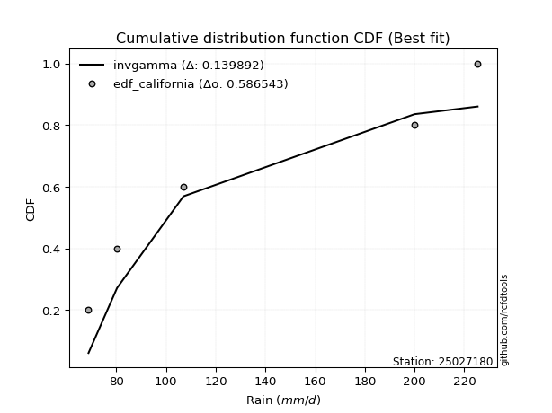</img>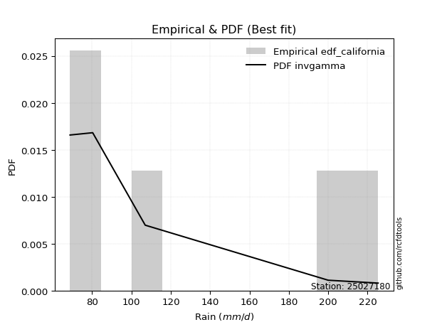</img>

</div>


### 2. Empirical - EDF Hazen (1930)

Hazen method for plotting positions is a formula used to estimate the empirical cumulative probability distribution of flood events or other hydrological data. This formula often results in biased estimations, particularly when extrapolating to extreme events (high return periods).

<div align="center">


$P=(m-0.5)/n$


</div>


**2.1. Empirical values**

<div align="center">

|                | 0                  | 1                  | 2         | 3                 | 4                  |
|:---------------|:-------------------|:-------------------|:----------|:------------------|:-------------------|
| date           | 2021               | 2023               | 2025      | 2022              | 2024               |
| x              | 68.8               | 80.3               | 88.5      | 200.0             | 225.4              |
| m              | 1                  | 2                  | 3         | 4                 | 5                  |
| empirical_dist | edf_hazen          | edf_hazen          | edf_hazen | edf_hazen         | edf_hazen          |
| empirical      | 0.1                | 0.3                | 0.5       | 0.7               | 0.9                |
| empirical_tr   | 1.1111111111111112 | 1.4285714285714286 | 2.0       | 3.333333333333333 | 10.000000000000002 |

</div>


**2.2. Kolmogorov-Smirnov fit test (sorted by Δ)**


<div align="center">

|                | 0                   | 1                   | 2                  | 3                   | 4                   | 5                  | 6                  | 7                  | 8                   | 9                     | 10                 | 11                  | 12                  | 13                  | 14                  | 15                  | 16                  | 17                 | 18                  | 19                  | 20                  | 21                  | 22                 | 23                 | 24                  | 25                 | 26                  | 27                  | 28                  | 29                  | 30                  | 31                  | 32                 | 33                  | 34                  | 35                  | 36                  | 37                  | 38                 | 39                  | 40                  | 41                  | 42                  | 43                  | 44                  | 45                 | 46                  | 47                 | 48                  | 49                  | 50                  | 51                  | 52                  | 53                 | 54                  | 55                  | 56                  | 57                 | 58                 | 59                  | 60                 | 61                 | 62                 | 63                 | 64                 | 65                  | 66                  | 67                  | 68                  | 69                  | 70                  | 71                  | 72                  | 73                  | 74                 | 75                 | 76                 | 77                  | 78                  | 79                 | 80                 | 81                  | 82                 | 83                 | 84                  | 85                 | 86                 | 87                 | 88                 | 89                 |
|:---------------|:--------------------|:--------------------|:-------------------|:--------------------|:--------------------|:-------------------|:-------------------|:-------------------|:--------------------|:----------------------|:-------------------|:--------------------|:--------------------|:--------------------|:--------------------|:--------------------|:--------------------|:-------------------|:--------------------|:--------------------|:--------------------|:--------------------|:-------------------|:-------------------|:--------------------|:-------------------|:--------------------|:--------------------|:--------------------|:--------------------|:--------------------|:--------------------|:-------------------|:--------------------|:--------------------|:--------------------|:--------------------|:--------------------|:-------------------|:--------------------|:--------------------|:--------------------|:--------------------|:--------------------|:--------------------|:-------------------|:--------------------|:-------------------|:--------------------|:--------------------|:--------------------|:--------------------|:--------------------|:-------------------|:--------------------|:--------------------|:--------------------|:-------------------|:-------------------|:--------------------|:-------------------|:-------------------|:-------------------|:-------------------|:-------------------|:--------------------|:--------------------|:--------------------|:--------------------|:--------------------|:--------------------|:--------------------|:--------------------|:--------------------|:-------------------|:-------------------|:-------------------|:--------------------|:--------------------|:-------------------|:-------------------|:--------------------|:-------------------|:-------------------|:--------------------|:-------------------|:-------------------|:-------------------|:-------------------|:-------------------|
| station        | 25027180            | 25027180            | 25027180           | 25027180            | 25027180            | 25027180           | 25027180           | 25027180           | 25027180            | 25027180              | 25027180           | 25027180            | 25027180            | 25027180            | 25027180            | 25027180            | 25027180            | 25027180           | 25027180            | 25027180            | 25027180            | 25027180            | 25027180           | 25027180           | 25027180            | 25027180           | 25027180            | 25027180            | 25027180            | 25027180            | 25027180            | 25027180            | 25027180           | 25027180            | 25027180            | 25027180            | 25027180            | 25027180            | 25027180           | 25027180            | 25027180            | 25027180            | 25027180            | 25027180            | 25027180            | 25027180           | 25027180            | 25027180           | 25027180            | 25027180            | 25027180            | 25027180            | 25027180            | 25027180           | 25027180            | 25027180            | 25027180            | 25027180           | 25027180           | 25027180            | 25027180           | 25027180           | 25027180           | 25027180           | 25027180           | 25027180            | 25027180            | 25027180            | 25027180            | 25027180            | 25027180            | 25027180            | 25027180            | 25027180            | 25027180           | 25027180           | 25027180           | 25027180            | 25027180            | 25027180           | 25027180           | 25027180            | 25027180           | 25027180           | 25027180            | 25027180           | 25027180           | 25027180           | 25027180           | 25027180           |
| empirical_dist | edf_hazen           | edf_hazen           | edf_hazen          | edf_hazen           | edf_hazen           | edf_hazen          | edf_hazen          | edf_hazen          | edf_hazen           | edf_hazen             | edf_hazen          | edf_hazen           | edf_hazen           | edf_hazen           | edf_hazen           | edf_hazen           | edf_hazen           | edf_hazen          | edf_hazen           | edf_hazen           | edf_hazen           | edf_hazen           | edf_hazen          | edf_hazen          | edf_hazen           | edf_hazen          | edf_hazen           | edf_hazen           | edf_hazen           | edf_hazen           | edf_hazen           | edf_hazen           | edf_hazen          | edf_hazen           | edf_hazen           | edf_hazen           | edf_hazen           | edf_hazen           | edf_hazen          | edf_hazen           | edf_hazen           | edf_hazen           | edf_hazen           | edf_hazen           | edf_hazen           | edf_hazen          | edf_hazen           | edf_hazen          | edf_hazen           | edf_hazen           | edf_hazen           | edf_hazen           | edf_hazen           | edf_hazen          | edf_hazen           | edf_hazen           | edf_hazen           | edf_hazen          | edf_hazen          | edf_hazen           | edf_hazen          | edf_hazen          | edf_hazen          | edf_hazen          | edf_hazen          | edf_hazen           | edf_hazen           | edf_hazen           | edf_hazen           | edf_hazen           | edf_hazen           | edf_hazen           | edf_hazen           | edf_hazen           | edf_hazen          | edf_hazen          | edf_hazen          | edf_hazen           | edf_hazen           | edf_hazen          | edf_hazen          | edf_hazen           | edf_hazen          | edf_hazen          | edf_hazen           | edf_hazen          | edf_hazen          | edf_hazen          | edf_hazen          | edf_hazen          |
| p_dist         | loginvweibull       | invgamma            | logalpha           | f                   | loginvgamma         | logf               | loghalfnorm        | loginvgauss        | logexpon            | loglaplace_asymmetric | loggenexpon        | logexponnorm        | alpha               | loghalflogistic     | ncf                 | invgauss            | loggenlogistic      | lograyleigh        | logmoyal            | logkstwobign        | logmielke           | logbetaprime        | nct                | loggumbel_r        | logmaxwell          | logchi2            | halfnorm            | lognct              | betaprime           | logpearson3         | logwald             | halflogistic        | fisk               | logloggamma         | logt                | lognorm             | lognorm             | logcrystalball      | rayleigh           | logncf              | maxwell             | logrice             | genlogistic         | gumbel_r            | moyal               | exponnorm          | genexpon            | expon              | laplace_asymmetric  | pearson3            | logerlang           | loglogistic         | gompertz            | truncnorm          | kstwobign           | loggompertz         | crystalball         | norm               | t                  | loghypsecant        | weibull_min        | loggumbel_l        | logistic           | loggamma           | loggamma           | loglaplace          | johnsonsu           | rice                | pareto              | hypsecant           | gumbel_l            | wald                | laplace             | loggibrat           | logweibull_min     | logpareto          | loglognorm         | fatiguelife         | logfisk             | lognakagami        | nakagami           | logfatiguelife      | logjohnsonsu       | gibrat             | invweibull          | gamma              | erlang             | chi2               | logtruncnorm       | mielke             |
| delta          | 0.14129007993353737 | 0.14294481391730884 | 0.143544911729927  | 0.14672663182261836 | 0.15054328477698442 | 0.1505451046619135 | 0.153264801381374  | 0.1621150620644296 | 0.16543913991169357 | 0.16544899966808724   | 0.1662425740779636 | 0.16819821277039015 | 0.16823416130893454 | 0.16849608749762468 | 0.17179871739041197 | 0.17449505081608285 | 0.17727863011540768 | 0.1780676678279014 | 0.18037557869460985 | 0.18629555283338772 | 0.18683095008382045 | 0.18686819764944013 | 0.1872387446128176 | 0.1873455175250613 | 0.18858329762039722 | 0.1909629769811052 | 0.19192070742295708 | 0.19764917325739573 | 0.20161680153821437 | 0.20168133614518652 | 0.20217381846336574 | 0.20548849586112333 | 0.2088583886323076 | 0.21236881697645466 | 0.21483067145424595 | 0.21483290943739608 | 0.21483290943739608 | 0.21483291708056818 | 0.2163443621881787 | 0.21904607519099145 | 0.22538851907636526 | 0.22631610126829232 | 0.22737375965331919 | 0.23275104180747636 | 0.23323964210744053 | 0.2335296006317289 | 0.23434374738452202 | 0.2343441952176457 | 0.23434514468506307 | 0.23525413984779875 | 0.23538592099390465 | 0.23680709678386586 | 0.24122048598325296 | 0.2426631524017554 | 0.24366455352112676 | 0.24416842446740644 | 0.24738088624442112 | 0.2473808863400374 | 0.24741602390111   | 0.25227560272660154 | 0.2539337589758145 | 0.2625136434588264 | 0.2700300660246623 | 0.2728058749774077 | 0.2728058749774077 | 0.27593013608437184 | 0.27616831849274087 | 0.27695828149945245 | 0.28348886142260016 | 0.28502082455678823 | 0.28749937287530203 | 0.29817738788516196 | 0.30512480224795413 | 0.30568973832990287 | 0.306995231007622  | 0.3158466921194775 | 0.3616970128896125 | 0.36325944046996256 | 0.36826494173663227 | 0.3876439611506906 | 0.3978184859138882 | 0.41867726724912485 | 0.4299770886272539 | 0.4413810617743431 | 0.45295337069431424 | 0.5284293666131321 | 0.5324232274940233 | 0.6988361903181    | 0.6999902454570628 | nan                |
| deltao         | 0.5865427407550001  | 0.5865427407550001  | 0.5865427407550001 | 0.5865427407550001  | 0.5865427407550001  | 0.5865427407550001 | 0.5865427407550001 | 0.5865427407550001 | 0.5865427407550001  | 0.5865427407550001    | 0.5865427407550001 | 0.5865427407550001  | 0.5865427407550001  | 0.5865427407550001  | 0.5865427407550001  | 0.5865427407550001  | 0.5865427407550001  | 0.5865427407550001 | 0.5865427407550001  | 0.5865427407550001  | 0.5865427407550001  | 0.5865427407550001  | 0.5865427407550001 | 0.5865427407550001 | 0.5865427407550001  | 0.5865427407550001 | 0.5865427407550001  | 0.5865427407550001  | 0.5865427407550001  | 0.5865427407550001  | 0.5865427407550001  | 0.5865427407550001  | 0.5865427407550001 | 0.5865427407550001  | 0.5865427407550001  | 0.5865427407550001  | 0.5865427407550001  | 0.5865427407550001  | 0.5865427407550001 | 0.5865427407550001  | 0.5865427407550001  | 0.5865427407550001  | 0.5865427407550001  | 0.5865427407550001  | 0.5865427407550001  | 0.5865427407550001 | 0.5865427407550001  | 0.5865427407550001 | 0.5865427407550001  | 0.5865427407550001  | 0.5865427407550001  | 0.5865427407550001  | 0.5865427407550001  | 0.5865427407550001 | 0.5865427407550001  | 0.5865427407550001  | 0.5865427407550001  | 0.5865427407550001 | 0.5865427407550001 | 0.5865427407550001  | 0.5865427407550001 | 0.5865427407550001 | 0.5865427407550001 | 0.5865427407550001 | 0.5865427407550001 | 0.5865427407550001  | 0.5865427407550001  | 0.5865427407550001  | 0.5865427407550001  | 0.5865427407550001  | 0.5865427407550001  | 0.5865427407550001  | 0.5865427407550001  | 0.5865427407550001  | 0.5865427407550001 | 0.5865427407550001 | 0.5865427407550001 | 0.5865427407550001  | 0.5865427407550001  | 0.5865427407550001 | 0.5865427407550001 | 0.5865427407550001  | 0.5865427407550001 | 0.5865427407550001 | 0.5865427407550001  | 0.5865427407550001 | 0.5865427407550001 | 0.5865427407550001 | 0.5865427407550001 | 0.5865427407550001 |
| eval           | Δo > Δ              | Δo > Δ              | Δo > Δ             | Δo > Δ              | Δo > Δ              | Δo > Δ             | Δo > Δ             | Δo > Δ             | Δo > Δ              | Δo > Δ                | Δo > Δ             | Δo > Δ              | Δo > Δ              | Δo > Δ              | Δo > Δ              | Δo > Δ              | Δo > Δ              | Δo > Δ             | Δo > Δ              | Δo > Δ              | Δo > Δ              | Δo > Δ              | Δo > Δ             | Δo > Δ             | Δo > Δ              | Δo > Δ             | Δo > Δ              | Δo > Δ              | Δo > Δ              | Δo > Δ              | Δo > Δ              | Δo > Δ              | Δo > Δ             | Δo > Δ              | Δo > Δ              | Δo > Δ              | Δo > Δ              | Δo > Δ              | Δo > Δ             | Δo > Δ              | Δo > Δ              | Δo > Δ              | Δo > Δ              | Δo > Δ              | Δo > Δ              | Δo > Δ             | Δo > Δ              | Δo > Δ             | Δo > Δ              | Δo > Δ              | Δo > Δ              | Δo > Δ              | Δo > Δ              | Δo > Δ             | Δo > Δ              | Δo > Δ              | Δo > Δ              | Δo > Δ             | Δo > Δ             | Δo > Δ              | Δo > Δ             | Δo > Δ             | Δo > Δ             | Δo > Δ             | Δo > Δ             | Δo > Δ              | Δo > Δ              | Δo > Δ              | Δo > Δ              | Δo > Δ              | Δo > Δ              | Δo > Δ              | Δo > Δ              | Δo > Δ              | Δo > Δ             | Δo > Δ             | Δo > Δ             | Δo > Δ              | Δo > Δ              | Δo > Δ             | Δo > Δ             | Δo > Δ              | Δo > Δ             | Δo > Δ             | Δo > Δ              | Δo > Δ             | Δo > Δ             | Δo <= Δ            | Δo <= Δ            | Δo <= Δ            |
| fit            | 1                   | 1                   | 1                  | 1                   | 1                   | 1                  | 1                  | 1                  | 1                   | 1                     | 1                  | 1                   | 1                   | 1                   | 1                   | 1                   | 1                   | 1                  | 1                   | 1                   | 1                   | 1                   | 1                  | 1                  | 1                   | 1                  | 1                   | 1                   | 1                   | 1                   | 1                   | 1                   | 1                  | 1                   | 1                   | 1                   | 1                   | 1                   | 1                  | 1                   | 1                   | 1                   | 1                   | 1                   | 1                   | 1                  | 1                   | 1                  | 1                   | 1                   | 1                   | 1                   | 1                   | 1                  | 1                   | 1                   | 1                   | 1                  | 1                  | 1                   | 1                  | 1                  | 1                  | 1                  | 1                  | 1                   | 1                   | 1                   | 1                   | 1                   | 1                   | 1                   | 1                   | 1                   | 1                  | 1                  | 1                  | 1                   | 1                   | 1                  | 1                  | 1                   | 1                  | 1                  | 1                   | 1                  | 1                  | 0                  | 0                  | 0                  |
| n              | 5                   | 5                   | 5                  | 5                   | 5                   | 5                  | 5                  | 5                  | 5                   | 5                     | 5                  | 5                   | 5                   | 5                   | 5                   | 5                   | 5                   | 5                  | 5                   | 5                   | 5                   | 5                   | 5                  | 5                  | 5                   | 5                  | 5                   | 5                   | 5                   | 5                   | 5                   | 5                   | 5                  | 5                   | 5                   | 5                   | 5                   | 5                   | 5                  | 5                   | 5                   | 5                   | 5                   | 5                   | 5                   | 5                  | 5                   | 5                  | 5                   | 5                   | 5                   | 5                   | 5                   | 5                  | 5                   | 5                   | 5                   | 5                  | 5                  | 5                   | 5                  | 5                  | 5                  | 5                  | 5                  | 5                   | 5                   | 5                   | 5                   | 5                   | 5                   | 5                   | 5                   | 5                   | 5                  | 5                  | 5                  | 5                   | 5                   | 5                  | 5                  | 5                   | 5                  | 5                  | 5                   | 5                  | 5                  | 5                  | 5                  | 5                  |
| best_fit       | 1                   | 0                   | 0                  | 0                   | 0                   | 0                  | 0                  | 0                  | 0                   | 0                     | 0                  | 0                   | 0                   | 0                   | 0                   | 0                   | 0                   | 0                  | 0                   | 0                   | 0                   | 0                   | 0                  | 0                  | 0                   | 0                  | 0                   | 0                   | 0                   | 0                   | 0                   | 0                   | 0                  | 0                   | 0                   | 0                   | 0                   | 0                   | 0                  | 0                   | 0                   | 0                   | 0                   | 0                   | 0                   | 0                  | 0                   | 0                  | 0                   | 0                   | 0                   | 0                   | 0                   | 0                  | 0                   | 0                   | 0                   | 0                  | 0                  | 0                   | 0                  | 0                  | 0                  | 0                  | 0                  | 0                   | 0                   | 0                   | 0                   | 0                   | 0                   | 0                   | 0                   | 0                   | 0                  | 0                  | 0                  | 0                   | 0                   | 0                  | 0                  | 0                   | 0                  | 0                  | 0                   | 0                  | 0                  | 0                  | 0                  | 0                  |
| best_fit_sort  | 1                   | 2                   | 3                  | 4                   | 5                   | 6                  | 7                  | 8                  | 9                   | 10                    | 11                 | 12                  | 13                  | 14                  | 15                  | 16                  | 17                  | 18                 | 19                  | 20                  | 21                  | 22                  | 23                 | 24                 | 25                  | 26                 | 27                  | 28                  | 29                  | 30                  | 31                  | 32                  | 33                 | 34                  | 35                  | 36                  | 37                  | 38                  | 39                 | 40                  | 41                  | 42                  | 43                  | 44                  | 45                  | 46                 | 47                  | 48                 | 49                  | 50                  | 51                  | 52                  | 53                  | 54                 | 55                  | 56                  | 57                  | 58                 | 59                 | 60                  | 61                 | 62                 | 63                 | 64                 | 65                 | 66                  | 67                  | 68                  | 69                  | 70                  | 71                  | 72                  | 73                  | 74                  | 75                 | 76                 | 77                 | 78                  | 79                  | 80                 | 81                 | 82                  | 83                 | 84                 | 85                  | 86                 | 87                 | 88                 | 89                 | 90                 |

</div>


<div align="center">

</img>

</div>


**2.3. Best fit**

<div align="center">

|   id |   station | empirical_dist   | p_dist        |   delta |   deltao | eval   |   fit |   n |   best_fit |   best_fit_sort |
|-----:|----------:|:-----------------|:--------------|--------:|---------:|:-------|------:|----:|-----------:|----------------:|
|    0 |  25027180 | edf_hazen        | loginvweibull | 0.14129 | 0.586543 | Δo > Δ |     1 |   5 |          1 |               1 |

</div>


<div align="center">

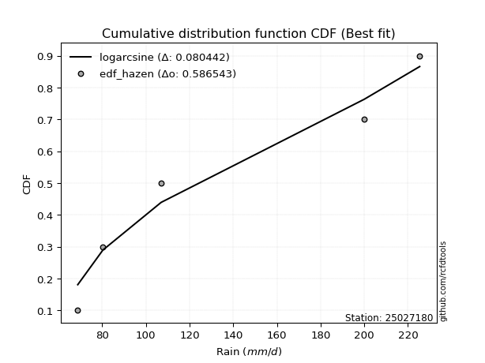</img></img>

</div>


### 3. Empirical - EDF Weibull (1939)

Weibull plotting position formula is an empirical method used to estimate the non-exceedance probability or plotting position for a set of observed data, is often recommended or widely used in practice, particularly in flood frequency analysis.

<div align="center">


$P=m/(n+1)$


</div>


**3.1. Empirical values**

<div align="center">

|                | 0                   | 1                  | 2           | 3                  | 4                  |
|:---------------|:--------------------|:-------------------|:------------|:-------------------|:-------------------|
| date           | 2021                | 2023               | 2025        | 2022               | 2024               |
| x              | 68.8                | 80.3               | 88.5        | 200.0              | 225.4              |
| m              | 1                   | 2                  | 3           | 4                  | 5                  |
| empirical_dist | edf_weibull         | edf_weibull        | edf_weibull | edf_weibull        | edf_weibull        |
| empirical      | 0.16666666666666666 | 0.3333333333333333 | 0.5         | 0.6666666666666666 | 0.8333333333333334 |
| empirical_tr   | 1.2                 | 1.4999999999999998 | 2.0         | 2.9999999999999996 | 6.000000000000002  |

</div>


**3.2. Kolmogorov-Smirnov fit test (sorted by Δ)**


<div align="center">

|                | 0                   | 1                   | 2                  | 3                   | 4                   | 5                   | 6                   | 7                   | 8                   | 9                   | 10                  | 11                  | 12                 | 13                  | 14                  | 15                  | 16                 | 17                 | 18                    | 19                  | 20                  | 21                  | 22                  | 23                  | 24                 | 25                 | 26                  | 27                  | 28                  | 29                 | 30                 | 31                 | 32                  | 33                  | 34                  | 35                  | 36                  | 37                 | 38                  | 39                  | 40                  | 41                  | 42                  | 43                  | 44                  | 45                 | 46                  | 47                 | 48                  | 49                  | 50                  | 51                  | 52                  | 53                 | 54                  | 55                  | 56                  | 57                 | 58                 | 59                  | 60                  | 61                 | 62                 | 63                 | 64                  | 65                  | 66                  | 67                  | 68                 | 69                  | 70                  | 71                  | 72                 | 73                  | 74                  | 75                  | 76                  | 77                  | 78                 | 79                 | 80                  | 81                 | 82                 | 83                 | 84                 | 85                  | 86                 | 87                 | 88                 | 89                 |
|:---------------|:--------------------|:--------------------|:-------------------|:--------------------|:--------------------|:--------------------|:--------------------|:--------------------|:--------------------|:--------------------|:--------------------|:--------------------|:-------------------|:--------------------|:--------------------|:--------------------|:-------------------|:-------------------|:----------------------|:--------------------|:--------------------|:--------------------|:--------------------|:--------------------|:-------------------|:-------------------|:--------------------|:--------------------|:--------------------|:-------------------|:-------------------|:-------------------|:--------------------|:--------------------|:--------------------|:--------------------|:--------------------|:-------------------|:--------------------|:--------------------|:--------------------|:--------------------|:--------------------|:--------------------|:--------------------|:-------------------|:--------------------|:-------------------|:--------------------|:--------------------|:--------------------|:--------------------|:--------------------|:-------------------|:--------------------|:--------------------|:--------------------|:-------------------|:-------------------|:--------------------|:--------------------|:-------------------|:-------------------|:-------------------|:--------------------|:--------------------|:--------------------|:--------------------|:-------------------|:--------------------|:--------------------|:--------------------|:-------------------|:--------------------|:--------------------|:--------------------|:--------------------|:--------------------|:-------------------|:-------------------|:--------------------|:-------------------|:-------------------|:-------------------|:-------------------|:--------------------|:-------------------|:-------------------|:-------------------|:-------------------|
| station        | 25027180            | 25027180            | 25027180           | 25027180            | 25027180            | 25027180            | 25027180            | 25027180            | 25027180            | 25027180            | 25027180            | 25027180            | 25027180           | 25027180            | 25027180            | 25027180            | 25027180           | 25027180           | 25027180              | 25027180            | 25027180            | 25027180            | 25027180            | 25027180            | 25027180           | 25027180           | 25027180            | 25027180            | 25027180            | 25027180           | 25027180           | 25027180           | 25027180            | 25027180            | 25027180            | 25027180            | 25027180            | 25027180           | 25027180            | 25027180            | 25027180            | 25027180            | 25027180            | 25027180            | 25027180            | 25027180           | 25027180            | 25027180           | 25027180            | 25027180            | 25027180            | 25027180            | 25027180            | 25027180           | 25027180            | 25027180            | 25027180            | 25027180           | 25027180           | 25027180            | 25027180            | 25027180           | 25027180           | 25027180           | 25027180            | 25027180            | 25027180            | 25027180            | 25027180           | 25027180            | 25027180            | 25027180            | 25027180           | 25027180            | 25027180            | 25027180            | 25027180            | 25027180            | 25027180           | 25027180           | 25027180            | 25027180           | 25027180           | 25027180           | 25027180           | 25027180            | 25027180           | 25027180           | 25027180           | 25027180           |
| empirical_dist | edf_weibull         | edf_weibull         | edf_weibull        | edf_weibull         | edf_weibull         | edf_weibull         | edf_weibull         | edf_weibull         | edf_weibull         | edf_weibull         | edf_weibull         | edf_weibull         | edf_weibull        | edf_weibull         | edf_weibull         | edf_weibull         | edf_weibull        | edf_weibull        | edf_weibull           | edf_weibull         | edf_weibull         | edf_weibull         | edf_weibull         | edf_weibull         | edf_weibull        | edf_weibull        | edf_weibull         | edf_weibull         | edf_weibull         | edf_weibull        | edf_weibull        | edf_weibull        | edf_weibull         | edf_weibull         | edf_weibull         | edf_weibull         | edf_weibull         | edf_weibull        | edf_weibull         | edf_weibull         | edf_weibull         | edf_weibull         | edf_weibull         | edf_weibull         | edf_weibull         | edf_weibull        | edf_weibull         | edf_weibull        | edf_weibull         | edf_weibull         | edf_weibull         | edf_weibull         | edf_weibull         | edf_weibull        | edf_weibull         | edf_weibull         | edf_weibull         | edf_weibull        | edf_weibull        | edf_weibull         | edf_weibull         | edf_weibull        | edf_weibull        | edf_weibull        | edf_weibull         | edf_weibull         | edf_weibull         | edf_weibull         | edf_weibull        | edf_weibull         | edf_weibull         | edf_weibull         | edf_weibull        | edf_weibull         | edf_weibull         | edf_weibull         | edf_weibull         | edf_weibull         | edf_weibull        | edf_weibull        | edf_weibull         | edf_weibull        | edf_weibull        | edf_weibull        | edf_weibull        | edf_weibull         | edf_weibull        | edf_weibull        | edf_weibull        | edf_weibull        |
| p_dist         | ncf                 | logchi2             | loginvweibull      | invgamma            | logalpha            | f                   | loginvgamma         | logf                | loghalfnorm         | logbetaprime        | weibull_min         | lograyleigh         | logmaxwell         | halfnorm            | loginvgauss         | lognct              | nct                | logexpon           | loglaplace_asymmetric | loggenexpon         | logexponnorm        | alpha               | betaprime           | logpearson3         | loghalflogistic    | loggumbel_r        | halflogistic        | logmoyal            | invgauss            | fisk               | loggenlogistic     | logkstwobign       | logloggamma         | logt                | lognorm             | lognorm             | logcrystalball      | rayleigh           | logncf              | logmielke           | maxwell             | logrice             | genlogistic         | gumbel_r            | moyal               | exponnorm          | genexpon            | expon              | laplace_asymmetric  | pearson3            | logwald             | loglogistic         | gompertz            | truncnorm          | kstwobign           | loggompertz         | crystalball         | norm               | t                  | pareto              | loghypsecant        | loggumbel_l        | logerlang          | logistic           | logweibull_min      | loglaplace          | johnsonsu           | rice                | logpareto          | hypsecant           | gumbel_l            | wald                | logfisk            | laplace             | loggamma            | loggamma            | loglognorm          | fatiguelife         | loggibrat          | lognakagami        | nakagami            | logfatiguelife     | invweibull         | logjohnsonsu       | gibrat             | gamma               | erlang             | chi2               | logtruncnorm       | mielke             |
| delta          | 0.14395484649533974 | 0.16666665976363135 | 0.1746234132668707 | 0.17627814725064217 | 0.17687824506326033 | 0.18005996515595168 | 0.18387661811031775 | 0.18387843799524684 | 0.18659813471470732 | 0.18686819764944013 | 0.18726709230914784 | 0.18778789181829236 | 0.1891094634254883 | 0.19192070742295708 | 0.19544839539776293 | 0.19764917325739573 | 0.1978307512151255 | 0.1987724732450269 | 0.19878233300142056   | 0.19957590741129694 | 0.20153154610372348 | 0.20156749464226786 | 0.20161680153821437 | 0.20168133614518652 | 0.201829420830958  | 0.2028161554616199 | 0.20548849586112333 | 0.20700690233926744 | 0.20782838414941618 | 0.2088583886323076 | 0.210611963448741  | 0.2114112390834011 | 0.21236881697645466 | 0.21483067145424595 | 0.21483290943739608 | 0.21483290943739608 | 0.21483291708056818 | 0.2163443621881787 | 0.21904607519099145 | 0.22016428341715377 | 0.22538851907636526 | 0.22631610126829232 | 0.22737375965331919 | 0.23275104180747636 | 0.23323964210744053 | 0.2335296006317289 | 0.23434374738452202 | 0.2343441952176457 | 0.23434514468506307 | 0.23525413984779875 | 0.23550715179669907 | 0.23680709678386586 | 0.24122048598325296 | 0.2426631524017554 | 0.24366455352112676 | 0.24416842446740644 | 0.24738088624442112 | 0.2473808863400374 | 0.24741602390111   | 0.25015552808926683 | 0.25227560272660154 | 0.2625136434588264 | 0.268719254327238  | 0.2700300660246623 | 0.27366189767428867 | 0.27593013608437184 | 0.27616831849274087 | 0.27695828149945245 | 0.2825133587861442 | 0.28502082455678823 | 0.28749937287530203 | 0.29817738788516196 | 0.3015982750699656 | 0.30512480224795413 | 0.30613920831074104 | 0.30613920831074104 | 0.32836367955627915 | 0.32992610713662923 | 0.3333333333333333 | 0.3543106278173573 | 0.36448515258055486 | 0.3853439339157915 | 0.3862867040276476 | 0.3966437552939206 | 0.4413810617743431 | 0.49509603327979884 | 0.4990898941606899 | 0.6655028569847665 | 0.6666569121237295 | nan                |
| deltao         | 0.5865427407550001  | 0.5865427407550001  | 0.5865427407550001 | 0.5865427407550001  | 0.5865427407550001  | 0.5865427407550001  | 0.5865427407550001  | 0.5865427407550001  | 0.5865427407550001  | 0.5865427407550001  | 0.5865427407550001  | 0.5865427407550001  | 0.5865427407550001 | 0.5865427407550001  | 0.5865427407550001  | 0.5865427407550001  | 0.5865427407550001 | 0.5865427407550001 | 0.5865427407550001    | 0.5865427407550001  | 0.5865427407550001  | 0.5865427407550001  | 0.5865427407550001  | 0.5865427407550001  | 0.5865427407550001 | 0.5865427407550001 | 0.5865427407550001  | 0.5865427407550001  | 0.5865427407550001  | 0.5865427407550001 | 0.5865427407550001 | 0.5865427407550001 | 0.5865427407550001  | 0.5865427407550001  | 0.5865427407550001  | 0.5865427407550001  | 0.5865427407550001  | 0.5865427407550001 | 0.5865427407550001  | 0.5865427407550001  | 0.5865427407550001  | 0.5865427407550001  | 0.5865427407550001  | 0.5865427407550001  | 0.5865427407550001  | 0.5865427407550001 | 0.5865427407550001  | 0.5865427407550001 | 0.5865427407550001  | 0.5865427407550001  | 0.5865427407550001  | 0.5865427407550001  | 0.5865427407550001  | 0.5865427407550001 | 0.5865427407550001  | 0.5865427407550001  | 0.5865427407550001  | 0.5865427407550001 | 0.5865427407550001 | 0.5865427407550001  | 0.5865427407550001  | 0.5865427407550001 | 0.5865427407550001 | 0.5865427407550001 | 0.5865427407550001  | 0.5865427407550001  | 0.5865427407550001  | 0.5865427407550001  | 0.5865427407550001 | 0.5865427407550001  | 0.5865427407550001  | 0.5865427407550001  | 0.5865427407550001 | 0.5865427407550001  | 0.5865427407550001  | 0.5865427407550001  | 0.5865427407550001  | 0.5865427407550001  | 0.5865427407550001 | 0.5865427407550001 | 0.5865427407550001  | 0.5865427407550001 | 0.5865427407550001 | 0.5865427407550001 | 0.5865427407550001 | 0.5865427407550001  | 0.5865427407550001 | 0.5865427407550001 | 0.5865427407550001 | 0.5865427407550001 |
| eval           | Δo > Δ              | Δo > Δ              | Δo > Δ             | Δo > Δ              | Δo > Δ              | Δo > Δ              | Δo > Δ              | Δo > Δ              | Δo > Δ              | Δo > Δ              | Δo > Δ              | Δo > Δ              | Δo > Δ             | Δo > Δ              | Δo > Δ              | Δo > Δ              | Δo > Δ             | Δo > Δ             | Δo > Δ                | Δo > Δ              | Δo > Δ              | Δo > Δ              | Δo > Δ              | Δo > Δ              | Δo > Δ             | Δo > Δ             | Δo > Δ              | Δo > Δ              | Δo > Δ              | Δo > Δ             | Δo > Δ             | Δo > Δ             | Δo > Δ              | Δo > Δ              | Δo > Δ              | Δo > Δ              | Δo > Δ              | Δo > Δ             | Δo > Δ              | Δo > Δ              | Δo > Δ              | Δo > Δ              | Δo > Δ              | Δo > Δ              | Δo > Δ              | Δo > Δ             | Δo > Δ              | Δo > Δ             | Δo > Δ              | Δo > Δ              | Δo > Δ              | Δo > Δ              | Δo > Δ              | Δo > Δ             | Δo > Δ              | Δo > Δ              | Δo > Δ              | Δo > Δ             | Δo > Δ             | Δo > Δ              | Δo > Δ              | Δo > Δ             | Δo > Δ             | Δo > Δ             | Δo > Δ              | Δo > Δ              | Δo > Δ              | Δo > Δ              | Δo > Δ             | Δo > Δ              | Δo > Δ              | Δo > Δ              | Δo > Δ             | Δo > Δ              | Δo > Δ              | Δo > Δ              | Δo > Δ              | Δo > Δ              | Δo > Δ             | Δo > Δ             | Δo > Δ              | Δo > Δ             | Δo > Δ             | Δo > Δ             | Δo > Δ             | Δo > Δ              | Δo > Δ             | Δo <= Δ            | Δo <= Δ            | Δo <= Δ            |
| fit            | 1                   | 1                   | 1                  | 1                   | 1                   | 1                   | 1                   | 1                   | 1                   | 1                   | 1                   | 1                   | 1                  | 1                   | 1                   | 1                   | 1                  | 1                  | 1                     | 1                   | 1                   | 1                   | 1                   | 1                   | 1                  | 1                  | 1                   | 1                   | 1                   | 1                  | 1                  | 1                  | 1                   | 1                   | 1                   | 1                   | 1                   | 1                  | 1                   | 1                   | 1                   | 1                   | 1                   | 1                   | 1                   | 1                  | 1                   | 1                  | 1                   | 1                   | 1                   | 1                   | 1                   | 1                  | 1                   | 1                   | 1                   | 1                  | 1                  | 1                   | 1                   | 1                  | 1                  | 1                  | 1                   | 1                   | 1                   | 1                   | 1                  | 1                   | 1                   | 1                   | 1                  | 1                   | 1                   | 1                   | 1                   | 1                   | 1                  | 1                  | 1                   | 1                  | 1                  | 1                  | 1                  | 1                   | 1                  | 0                  | 0                  | 0                  |
| n              | 5                   | 5                   | 5                  | 5                   | 5                   | 5                   | 5                   | 5                   | 5                   | 5                   | 5                   | 5                   | 5                  | 5                   | 5                   | 5                   | 5                  | 5                  | 5                     | 5                   | 5                   | 5                   | 5                   | 5                   | 5                  | 5                  | 5                   | 5                   | 5                   | 5                  | 5                  | 5                  | 5                   | 5                   | 5                   | 5                   | 5                   | 5                  | 5                   | 5                   | 5                   | 5                   | 5                   | 5                   | 5                   | 5                  | 5                   | 5                  | 5                   | 5                   | 5                   | 5                   | 5                   | 5                  | 5                   | 5                   | 5                   | 5                  | 5                  | 5                   | 5                   | 5                  | 5                  | 5                  | 5                   | 5                   | 5                   | 5                   | 5                  | 5                   | 5                   | 5                   | 5                  | 5                   | 5                   | 5                   | 5                   | 5                   | 5                  | 5                  | 5                   | 5                  | 5                  | 5                  | 5                  | 5                   | 5                  | 5                  | 5                  | 5                  |
| best_fit       | 1                   | 0                   | 0                  | 0                   | 0                   | 0                   | 0                   | 0                   | 0                   | 0                   | 0                   | 0                   | 0                  | 0                   | 0                   | 0                   | 0                  | 0                  | 0                     | 0                   | 0                   | 0                   | 0                   | 0                   | 0                  | 0                  | 0                   | 0                   | 0                   | 0                  | 0                  | 0                  | 0                   | 0                   | 0                   | 0                   | 0                   | 0                  | 0                   | 0                   | 0                   | 0                   | 0                   | 0                   | 0                   | 0                  | 0                   | 0                  | 0                   | 0                   | 0                   | 0                   | 0                   | 0                  | 0                   | 0                   | 0                   | 0                  | 0                  | 0                   | 0                   | 0                  | 0                  | 0                  | 0                   | 0                   | 0                   | 0                   | 0                  | 0                   | 0                   | 0                   | 0                  | 0                   | 0                   | 0                   | 0                   | 0                   | 0                  | 0                  | 0                   | 0                  | 0                  | 0                  | 0                  | 0                   | 0                  | 0                  | 0                  | 0                  |
| best_fit_sort  | 1                   | 2                   | 3                  | 4                   | 5                   | 6                   | 7                   | 8                   | 9                   | 10                  | 11                  | 12                  | 13                 | 14                  | 15                  | 16                  | 17                 | 18                 | 19                    | 20                  | 21                  | 22                  | 23                  | 24                  | 25                 | 26                 | 27                  | 28                  | 29                  | 30                 | 31                 | 32                 | 33                  | 34                  | 35                  | 36                  | 37                  | 38                 | 39                  | 40                  | 41                  | 42                  | 43                  | 44                  | 45                  | 46                 | 47                  | 48                 | 49                  | 50                  | 51                  | 52                  | 53                  | 54                 | 55                  | 56                  | 57                  | 58                 | 59                 | 60                  | 61                  | 62                 | 63                 | 64                 | 65                  | 66                  | 67                  | 68                  | 69                 | 70                  | 71                  | 72                  | 73                 | 74                  | 75                  | 76                  | 77                  | 78                  | 79                 | 80                 | 81                  | 82                 | 83                 | 84                 | 85                 | 86                  | 87                 | 88                 | 89                 | 90                 |

</div>


<div align="center">

</img>

</div>


**3.3. Best fit**

<div align="center">

|   id |   station | empirical_dist   | p_dist   |    delta |   deltao | eval   |   fit |   n |   best_fit |   best_fit_sort |
|-----:|----------:|:-----------------|:---------|---------:|---------:|:-------|------:|----:|-----------:|----------------:|
|    0 |  25027180 | edf_weibull      | ncf      | 0.143955 | 0.586543 | Δo > Δ |     1 |   5 |          1 |               1 |

</div>


<div align="center">

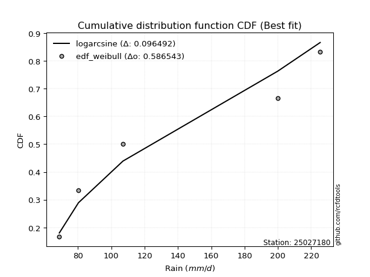</img>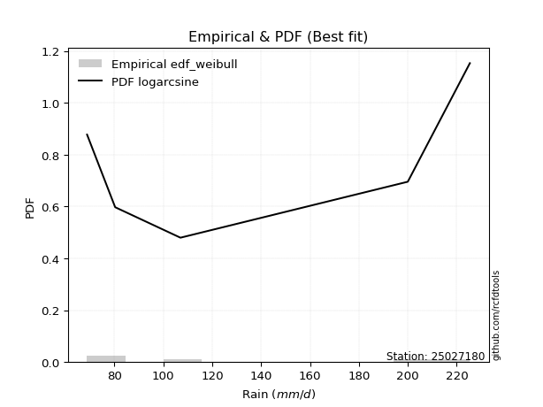</img>

</div>


### 4. Empirical - EDF Beard (1943)

The Beard formula (or Beard´s plotting position formula) in hydrology is used to estimate the empirical non-exceedance probability _(P)_ of a flood event (or other extreme hydrological data point) within a given dataset.

<div align="center">


$P=(m-0.31)/(n+0.38)$


</div>


**4.1. Empirical values**

<div align="center">

|                | 0                   | 1                  | 2         | 3                  | 4                  |
|:---------------|:--------------------|:-------------------|:----------|:-------------------|:-------------------|
| date           | 2021                | 2023               | 2025      | 2022               | 2024               |
| x              | 68.8                | 80.3               | 88.5      | 200.0              | 225.4              |
| m              | 1                   | 2                  | 3         | 4                  | 5                  |
| empirical_dist | edf_beard           | edf_beard          | edf_beard | edf_beard          | edf_beard          |
| empirical      | 0.12825278810408922 | 0.3141263940520446 | 0.5       | 0.6858736059479554 | 0.8717472118959109 |
| empirical_tr   | 1.1471215351812367  | 1.4579945799457996 | 2.0       | 3.183431952662722  | 7.797101449275368  |

</div>


**4.2. Kolmogorov-Smirnov fit test (sorted by Δ)**


<div align="center">

|                | 0                   | 1                  | 2                   | 3                   | 4                   | 5                   | 6                   | 7                   | 8                   | 9                   | 10                 | 11                 | 12                    | 13                  | 14                  | 15                  | 16                 | 17                  | 18                 | 19                 | 20                  | 21                  | 22                  | 23                 | 24                  | 25                 | 26                  | 27                  | 28                  | 29                  | 30                  | 31                 | 32                  | 33                  | 34                  | 35                  | 36                  | 37                  | 38                 | 39                  | 40                  | 41                  | 42                  | 43                  | 44                  | 45                  | 46                 | 47                  | 48                 | 49                  | 50                  | 51                  | 52                  | 53                 | 54                  | 55                  | 56                  | 57                 | 58                 | 59                  | 60                  | 61                 | 62                 | 63                 | 64                  | 65                  | 66                  | 67                  | 68                  | 69                  | 70                  | 71                  | 72                  | 73                 | 74                  | 75                 | 76                 | 77                  | 78                 | 79                 | 80                  | 81                 | 82                 | 83                 | 84                 | 85                 | 86                 | 87                 | 88                 | 89                 |
|:---------------|:--------------------|:-------------------|:--------------------|:--------------------|:--------------------|:--------------------|:--------------------|:--------------------|:--------------------|:--------------------|:-------------------|:-------------------|:----------------------|:--------------------|:--------------------|:--------------------|:-------------------|:--------------------|:-------------------|:-------------------|:--------------------|:--------------------|:--------------------|:-------------------|:--------------------|:-------------------|:--------------------|:--------------------|:--------------------|:--------------------|:--------------------|:-------------------|:--------------------|:--------------------|:--------------------|:--------------------|:--------------------|:--------------------|:-------------------|:--------------------|:--------------------|:--------------------|:--------------------|:--------------------|:--------------------|:--------------------|:-------------------|:--------------------|:-------------------|:--------------------|:--------------------|:--------------------|:--------------------|:-------------------|:--------------------|:--------------------|:--------------------|:-------------------|:-------------------|:--------------------|:--------------------|:-------------------|:-------------------|:-------------------|:--------------------|:--------------------|:--------------------|:--------------------|:--------------------|:--------------------|:--------------------|:--------------------|:--------------------|:-------------------|:--------------------|:-------------------|:-------------------|:--------------------|:-------------------|:-------------------|:--------------------|:-------------------|:-------------------|:-------------------|:-------------------|:-------------------|:-------------------|:-------------------|:-------------------|:-------------------|
| station        | 25027180            | 25027180           | 25027180            | 25027180            | 25027180            | 25027180            | 25027180            | 25027180            | 25027180            | 25027180            | 25027180           | 25027180           | 25027180              | 25027180            | 25027180            | 25027180            | 25027180           | 25027180            | 25027180           | 25027180           | 25027180            | 25027180            | 25027180            | 25027180           | 25027180            | 25027180           | 25027180            | 25027180            | 25027180            | 25027180            | 25027180            | 25027180           | 25027180            | 25027180            | 25027180            | 25027180            | 25027180            | 25027180            | 25027180           | 25027180            | 25027180            | 25027180            | 25027180            | 25027180            | 25027180            | 25027180            | 25027180           | 25027180            | 25027180           | 25027180            | 25027180            | 25027180            | 25027180            | 25027180           | 25027180            | 25027180            | 25027180            | 25027180           | 25027180           | 25027180            | 25027180            | 25027180           | 25027180           | 25027180           | 25027180            | 25027180            | 25027180            | 25027180            | 25027180            | 25027180            | 25027180            | 25027180            | 25027180            | 25027180           | 25027180            | 25027180           | 25027180           | 25027180            | 25027180           | 25027180           | 25027180            | 25027180           | 25027180           | 25027180           | 25027180           | 25027180           | 25027180           | 25027180           | 25027180           | 25027180           |
| empirical_dist | edf_beard           | edf_beard          | edf_beard           | edf_beard           | edf_beard           | edf_beard           | edf_beard           | edf_beard           | edf_beard           | edf_beard           | edf_beard          | edf_beard          | edf_beard             | edf_beard           | edf_beard           | edf_beard           | edf_beard          | edf_beard           | edf_beard          | edf_beard          | edf_beard           | edf_beard           | edf_beard           | edf_beard          | edf_beard           | edf_beard          | edf_beard           | edf_beard           | edf_beard           | edf_beard           | edf_beard           | edf_beard          | edf_beard           | edf_beard           | edf_beard           | edf_beard           | edf_beard           | edf_beard           | edf_beard          | edf_beard           | edf_beard           | edf_beard           | edf_beard           | edf_beard           | edf_beard           | edf_beard           | edf_beard          | edf_beard           | edf_beard          | edf_beard           | edf_beard           | edf_beard           | edf_beard           | edf_beard          | edf_beard           | edf_beard           | edf_beard           | edf_beard          | edf_beard          | edf_beard           | edf_beard           | edf_beard          | edf_beard          | edf_beard          | edf_beard           | edf_beard           | edf_beard           | edf_beard           | edf_beard           | edf_beard           | edf_beard           | edf_beard           | edf_beard           | edf_beard          | edf_beard           | edf_beard          | edf_beard          | edf_beard           | edf_beard          | edf_beard          | edf_beard           | edf_beard          | edf_beard          | edf_beard          | edf_beard          | edf_beard          | edf_beard          | edf_beard          | edf_beard          | edf_beard          |
| p_dist         | ncf                 | loginvweibull      | invgamma            | logalpha            | f                   | logchi2             | loginvgamma         | logf                | loghalfnorm         | loginvgauss         | lograyleigh        | logexpon           | loglaplace_asymmetric | loggenexpon         | logexponnorm        | alpha               | loghalflogistic    | logbetaprime        | nct                | loggumbel_r        | logmoyal            | logmaxwell          | invgauss            | loggenlogistic     | halfnorm            | logkstwobign       | lognct              | logmielke           | betaprime           | logpearson3         | halflogistic        | fisk               | logloggamma         | logt                | lognorm             | lognorm             | logcrystalball      | logwald             | rayleigh           | logncf              | maxwell             | weibull_min         | logrice             | genlogistic         | gumbel_r            | moyal               | exponnorm          | genexpon            | expon              | laplace_asymmetric  | pearson3            | loglogistic         | gompertz            | truncnorm          | kstwobign           | loggompertz         | crystalball         | norm               | t                  | logerlang           | loghypsecant        | loggumbel_l        | pareto             | logistic           | loglaplace          | johnsonsu           | rice                | hypsecant           | loggamma            | loggamma            | gumbel_l            | logweibull_min      | wald                | logpareto          | laplace             | loggibrat          | logfisk            | loglognorm          | fatiguelife        | lognakagami        | nakagami            | logfatiguelife     | logjohnsonsu       | invweibull         | gibrat             | gamma              | erlang             | chi2               | logtruncnorm       | mielke             |
| delta          | 0.14395484649533974 | 0.1554164739855819 | 0.15707120796935337 | 0.15767130578197153 | 0.16085302587466288 | 0.16271018887701605 | 0.16466967882902894 | 0.16467149871395803 | 0.16739119543341852 | 0.17624145611647413 | 0.1780676678279014 | 0.1795655339637381 | 0.17957539372013176   | 0.18036896813000813 | 0.18232460682243468 | 0.18236055536097906 | 0.1826224815496692 | 0.18686819764944013 | 0.1872387446128176 | 0.1873455175250613 | 0.18779996305797864 | 0.18858329762039722 | 0.18862144486812737 | 0.1914050241674522 | 0.19192070742295708 | 0.1922042998021123 | 0.19764917325739573 | 0.20095734413586497 | 0.20161680153821437 | 0.20168133614518652 | 0.20548849586112333 | 0.2088583886323076 | 0.21236881697645466 | 0.21483067145424595 | 0.21483290943739608 | 0.21483290943739608 | 0.21483291708056818 | 0.21630021251541037 | 0.2163443621881787 | 0.21904607519099145 | 0.22538851907636526 | 0.22568097087172534 | 0.22631610126829232 | 0.22737375965331919 | 0.23275104180747636 | 0.23323964210744053 | 0.2335296006317289 | 0.23434374738452202 | 0.2343441952176457 | 0.23434514468506307 | 0.23525413984779875 | 0.23680709678386586 | 0.24122048598325296 | 0.2426631524017554 | 0.24366455352112676 | 0.24416842446740644 | 0.24738088624442112 | 0.2473808863400374 | 0.24741602390111   | 0.24951231504594917 | 0.25227560272660154 | 0.2625136434588264 | 0.2693624673705555 | 0.2700300660246623 | 0.27593013608437184 | 0.27616831849274087 | 0.27695828149945245 | 0.28502082455678823 | 0.28693226902945224 | 0.28693226902945224 | 0.28749937287530203 | 0.29286883695557736 | 0.29817738788516196 | 0.3017202980674329 | 0.30512480224795413 | 0.3141263940520446 | 0.3400121536325431 | 0.34757061883756785 | 0.3491330464179179 | 0.373517567098646  | 0.38369209186184355 | 0.4045508731970802 | 0.4158506945752094 | 0.4247005825902251 | 0.4413810617743431 | 0.5143029725610875 | 0.5182968334419786 | 0.6847097962660553 | 0.6858638514050183 | nan                |
| deltao         | 0.5865427407550001  | 0.5865427407550001 | 0.5865427407550001  | 0.5865427407550001  | 0.5865427407550001  | 0.5865427407550001  | 0.5865427407550001  | 0.5865427407550001  | 0.5865427407550001  | 0.5865427407550001  | 0.5865427407550001 | 0.5865427407550001 | 0.5865427407550001    | 0.5865427407550001  | 0.5865427407550001  | 0.5865427407550001  | 0.5865427407550001 | 0.5865427407550001  | 0.5865427407550001 | 0.5865427407550001 | 0.5865427407550001  | 0.5865427407550001  | 0.5865427407550001  | 0.5865427407550001 | 0.5865427407550001  | 0.5865427407550001 | 0.5865427407550001  | 0.5865427407550001  | 0.5865427407550001  | 0.5865427407550001  | 0.5865427407550001  | 0.5865427407550001 | 0.5865427407550001  | 0.5865427407550001  | 0.5865427407550001  | 0.5865427407550001  | 0.5865427407550001  | 0.5865427407550001  | 0.5865427407550001 | 0.5865427407550001  | 0.5865427407550001  | 0.5865427407550001  | 0.5865427407550001  | 0.5865427407550001  | 0.5865427407550001  | 0.5865427407550001  | 0.5865427407550001 | 0.5865427407550001  | 0.5865427407550001 | 0.5865427407550001  | 0.5865427407550001  | 0.5865427407550001  | 0.5865427407550001  | 0.5865427407550001 | 0.5865427407550001  | 0.5865427407550001  | 0.5865427407550001  | 0.5865427407550001 | 0.5865427407550001 | 0.5865427407550001  | 0.5865427407550001  | 0.5865427407550001 | 0.5865427407550001 | 0.5865427407550001 | 0.5865427407550001  | 0.5865427407550001  | 0.5865427407550001  | 0.5865427407550001  | 0.5865427407550001  | 0.5865427407550001  | 0.5865427407550001  | 0.5865427407550001  | 0.5865427407550001  | 0.5865427407550001 | 0.5865427407550001  | 0.5865427407550001 | 0.5865427407550001 | 0.5865427407550001  | 0.5865427407550001 | 0.5865427407550001 | 0.5865427407550001  | 0.5865427407550001 | 0.5865427407550001 | 0.5865427407550001 | 0.5865427407550001 | 0.5865427407550001 | 0.5865427407550001 | 0.5865427407550001 | 0.5865427407550001 | 0.5865427407550001 |
| eval           | Δo > Δ              | Δo > Δ             | Δo > Δ              | Δo > Δ              | Δo > Δ              | Δo > Δ              | Δo > Δ              | Δo > Δ              | Δo > Δ              | Δo > Δ              | Δo > Δ             | Δo > Δ             | Δo > Δ                | Δo > Δ              | Δo > Δ              | Δo > Δ              | Δo > Δ             | Δo > Δ              | Δo > Δ             | Δo > Δ             | Δo > Δ              | Δo > Δ              | Δo > Δ              | Δo > Δ             | Δo > Δ              | Δo > Δ             | Δo > Δ              | Δo > Δ              | Δo > Δ              | Δo > Δ              | Δo > Δ              | Δo > Δ             | Δo > Δ              | Δo > Δ              | Δo > Δ              | Δo > Δ              | Δo > Δ              | Δo > Δ              | Δo > Δ             | Δo > Δ              | Δo > Δ              | Δo > Δ              | Δo > Δ              | Δo > Δ              | Δo > Δ              | Δo > Δ              | Δo > Δ             | Δo > Δ              | Δo > Δ             | Δo > Δ              | Δo > Δ              | Δo > Δ              | Δo > Δ              | Δo > Δ             | Δo > Δ              | Δo > Δ              | Δo > Δ              | Δo > Δ             | Δo > Δ             | Δo > Δ              | Δo > Δ              | Δo > Δ             | Δo > Δ             | Δo > Δ             | Δo > Δ              | Δo > Δ              | Δo > Δ              | Δo > Δ              | Δo > Δ              | Δo > Δ              | Δo > Δ              | Δo > Δ              | Δo > Δ              | Δo > Δ             | Δo > Δ              | Δo > Δ             | Δo > Δ             | Δo > Δ              | Δo > Δ             | Δo > Δ             | Δo > Δ              | Δo > Δ             | Δo > Δ             | Δo > Δ             | Δo > Δ             | Δo > Δ             | Δo > Δ             | Δo <= Δ            | Δo <= Δ            | Δo <= Δ            |
| fit            | 1                   | 1                  | 1                   | 1                   | 1                   | 1                   | 1                   | 1                   | 1                   | 1                   | 1                  | 1                  | 1                     | 1                   | 1                   | 1                   | 1                  | 1                   | 1                  | 1                  | 1                   | 1                   | 1                   | 1                  | 1                   | 1                  | 1                   | 1                   | 1                   | 1                   | 1                   | 1                  | 1                   | 1                   | 1                   | 1                   | 1                   | 1                   | 1                  | 1                   | 1                   | 1                   | 1                   | 1                   | 1                   | 1                   | 1                  | 1                   | 1                  | 1                   | 1                   | 1                   | 1                   | 1                  | 1                   | 1                   | 1                   | 1                  | 1                  | 1                   | 1                   | 1                  | 1                  | 1                  | 1                   | 1                   | 1                   | 1                   | 1                   | 1                   | 1                   | 1                   | 1                   | 1                  | 1                   | 1                  | 1                  | 1                   | 1                  | 1                  | 1                   | 1                  | 1                  | 1                  | 1                  | 1                  | 1                  | 0                  | 0                  | 0                  |
| n              | 5                   | 5                  | 5                   | 5                   | 5                   | 5                   | 5                   | 5                   | 5                   | 5                   | 5                  | 5                  | 5                     | 5                   | 5                   | 5                   | 5                  | 5                   | 5                  | 5                  | 5                   | 5                   | 5                   | 5                  | 5                   | 5                  | 5                   | 5                   | 5                   | 5                   | 5                   | 5                  | 5                   | 5                   | 5                   | 5                   | 5                   | 5                   | 5                  | 5                   | 5                   | 5                   | 5                   | 5                   | 5                   | 5                   | 5                  | 5                   | 5                  | 5                   | 5                   | 5                   | 5                   | 5                  | 5                   | 5                   | 5                   | 5                  | 5                  | 5                   | 5                   | 5                  | 5                  | 5                  | 5                   | 5                   | 5                   | 5                   | 5                   | 5                   | 5                   | 5                   | 5                   | 5                  | 5                   | 5                  | 5                  | 5                   | 5                  | 5                  | 5                   | 5                  | 5                  | 5                  | 5                  | 5                  | 5                  | 5                  | 5                  | 5                  |
| best_fit       | 1                   | 0                  | 0                   | 0                   | 0                   | 0                   | 0                   | 0                   | 0                   | 0                   | 0                  | 0                  | 0                     | 0                   | 0                   | 0                   | 0                  | 0                   | 0                  | 0                  | 0                   | 0                   | 0                   | 0                  | 0                   | 0                  | 0                   | 0                   | 0                   | 0                   | 0                   | 0                  | 0                   | 0                   | 0                   | 0                   | 0                   | 0                   | 0                  | 0                   | 0                   | 0                   | 0                   | 0                   | 0                   | 0                   | 0                  | 0                   | 0                  | 0                   | 0                   | 0                   | 0                   | 0                  | 0                   | 0                   | 0                   | 0                  | 0                  | 0                   | 0                   | 0                  | 0                  | 0                  | 0                   | 0                   | 0                   | 0                   | 0                   | 0                   | 0                   | 0                   | 0                   | 0                  | 0                   | 0                  | 0                  | 0                   | 0                  | 0                  | 0                   | 0                  | 0                  | 0                  | 0                  | 0                  | 0                  | 0                  | 0                  | 0                  |
| best_fit_sort  | 1                   | 2                  | 3                   | 4                   | 5                   | 6                   | 7                   | 8                   | 9                   | 10                  | 11                 | 12                 | 13                    | 14                  | 15                  | 16                  | 17                 | 18                  | 19                 | 20                 | 21                  | 22                  | 23                  | 24                 | 25                  | 26                 | 27                  | 28                  | 29                  | 30                  | 31                  | 32                 | 33                  | 34                  | 35                  | 36                  | 37                  | 38                  | 39                 | 40                  | 41                  | 42                  | 43                  | 44                  | 45                  | 46                  | 47                 | 48                  | 49                 | 50                  | 51                  | 52                  | 53                  | 54                 | 55                  | 56                  | 57                  | 58                 | 59                 | 60                  | 61                  | 62                 | 63                 | 64                 | 65                  | 66                  | 67                  | 68                  | 69                  | 70                  | 71                  | 72                  | 73                  | 74                 | 75                  | 76                 | 77                 | 78                  | 79                 | 80                 | 81                  | 82                 | 83                 | 84                 | 85                 | 86                 | 87                 | 88                 | 89                 | 90                 |

</div>


<div align="center">

</img>

</div>


**4.3. Best fit**

<div align="center">

|   id |   station | empirical_dist   | p_dist   |    delta |   deltao | eval   |   fit |   n |   best_fit |   best_fit_sort |
|-----:|----------:|:-----------------|:---------|---------:|---------:|:-------|------:|----:|-----------:|----------------:|
|    0 |  25027180 | edf_beard        | ncf      | 0.143955 | 0.586543 | Δo > Δ |     1 |   5 |          1 |               1 |

</div>


<div align="center">

</img></img>

</div>


### 5. Empirical - EDF Chegodayev (1955)

The Chegodayev formula is an empirical plotting position formula used in hydrological frequency analysis to estimate the exceedance probability or return period of a specific event from a set of observed data. It is primarily used for plotting observed data points on probability paper to fit a theoretical distribution, particularly for analyzing extreme events like maximum flood flows or rainfall intensities. The constant _b_ value in the generalized plotting position formula is 0.3.

<div align="center">


$P=(m-b)/(n+1-2b)$


</div>


**5.1. Empirical values**

<div align="center">

|                | 0                   | 1                   | 2              | 3                  | 4                  |
|:---------------|:--------------------|:--------------------|:---------------|:-------------------|:-------------------|
| date           | 2021                | 2023                | 2025           | 2022               | 2024               |
| x              | 68.8                | 80.3                | 88.5           | 200.0              | 225.4              |
| m              | 1                   | 2                   | 3              | 4                  | 5                  |
| empirical_dist | edf_chegodayev      | edf_chegodayev      | edf_chegodayev | edf_chegodayev     | edf_chegodayev     |
| empirical      | 0.12962962962962962 | 0.31481481481481477 | 0.5            | 0.6851851851851851 | 0.8703703703703703 |
| empirical_tr   | 1.148936170212766   | 1.4594594594594594  | 2.0            | 3.1764705882352935 | 7.714285714285713  |

</div>


**5.2. Kolmogorov-Smirnov fit test (sorted by Δ)**


<div align="center">

|                | 0                   | 1                  | 2                   | 3                   | 4                   | 5                  | 6                   | 7                   | 8                   | 9                   | 10                 | 11                 | 12                    | 13                  | 14                 | 15                  | 16                  | 17                  | 18                 | 19                 | 20                  | 21                  | 22                 | 23                  | 24                 | 25                 | 26                  | 27                  | 28                  | 29                  | 30                  | 31                 | 32                  | 33                  | 34                  | 35                  | 36                  | 37                 | 38                  | 39                  | 40                  | 41                  | 42                  | 43                  | 44                  | 45                  | 46                 | 47                  | 48                 | 49                  | 50                  | 51                  | 52                  | 53                 | 54                  | 55                  | 56                  | 57                 | 58                 | 59                 | 60                  | 61                 | 62                 | 63                 | 64                  | 65                  | 66                  | 67                  | 68                  | 69                  | 70                  | 71                 | 72                  | 73                  | 74                  | 75                  | 76                 | 77                 | 78                 | 79                 | 80                 | 81                  | 82                 | 83                  | 84                 | 85                 | 86                 | 87                 | 88                 | 89                 |
|:---------------|:--------------------|:-------------------|:--------------------|:--------------------|:--------------------|:-------------------|:--------------------|:--------------------|:--------------------|:--------------------|:-------------------|:-------------------|:----------------------|:--------------------|:-------------------|:--------------------|:--------------------|:--------------------|:-------------------|:-------------------|:--------------------|:--------------------|:-------------------|:--------------------|:-------------------|:-------------------|:--------------------|:--------------------|:--------------------|:--------------------|:--------------------|:-------------------|:--------------------|:--------------------|:--------------------|:--------------------|:--------------------|:-------------------|:--------------------|:--------------------|:--------------------|:--------------------|:--------------------|:--------------------|:--------------------|:--------------------|:-------------------|:--------------------|:-------------------|:--------------------|:--------------------|:--------------------|:--------------------|:-------------------|:--------------------|:--------------------|:--------------------|:-------------------|:-------------------|:-------------------|:--------------------|:-------------------|:-------------------|:-------------------|:--------------------|:--------------------|:--------------------|:--------------------|:--------------------|:--------------------|:--------------------|:-------------------|:--------------------|:--------------------|:--------------------|:--------------------|:-------------------|:-------------------|:-------------------|:-------------------|:-------------------|:--------------------|:-------------------|:--------------------|:-------------------|:-------------------|:-------------------|:-------------------|:-------------------|:-------------------|
| station        | 25027180            | 25027180           | 25027180            | 25027180            | 25027180            | 25027180           | 25027180            | 25027180            | 25027180            | 25027180            | 25027180           | 25027180           | 25027180              | 25027180            | 25027180           | 25027180            | 25027180            | 25027180            | 25027180           | 25027180           | 25027180            | 25027180            | 25027180           | 25027180            | 25027180           | 25027180           | 25027180            | 25027180            | 25027180            | 25027180            | 25027180            | 25027180           | 25027180            | 25027180            | 25027180            | 25027180            | 25027180            | 25027180           | 25027180            | 25027180            | 25027180            | 25027180            | 25027180            | 25027180            | 25027180            | 25027180            | 25027180           | 25027180            | 25027180           | 25027180            | 25027180            | 25027180            | 25027180            | 25027180           | 25027180            | 25027180            | 25027180            | 25027180           | 25027180           | 25027180           | 25027180            | 25027180           | 25027180           | 25027180           | 25027180            | 25027180            | 25027180            | 25027180            | 25027180            | 25027180            | 25027180            | 25027180           | 25027180            | 25027180            | 25027180            | 25027180            | 25027180           | 25027180           | 25027180           | 25027180           | 25027180           | 25027180            | 25027180           | 25027180            | 25027180           | 25027180           | 25027180           | 25027180           | 25027180           | 25027180           |
| empirical_dist | edf_chegodayev      | edf_chegodayev     | edf_chegodayev      | edf_chegodayev      | edf_chegodayev      | edf_chegodayev     | edf_chegodayev      | edf_chegodayev      | edf_chegodayev      | edf_chegodayev      | edf_chegodayev     | edf_chegodayev     | edf_chegodayev        | edf_chegodayev      | edf_chegodayev     | edf_chegodayev      | edf_chegodayev      | edf_chegodayev      | edf_chegodayev     | edf_chegodayev     | edf_chegodayev      | edf_chegodayev      | edf_chegodayev     | edf_chegodayev      | edf_chegodayev     | edf_chegodayev     | edf_chegodayev      | edf_chegodayev      | edf_chegodayev      | edf_chegodayev      | edf_chegodayev      | edf_chegodayev     | edf_chegodayev      | edf_chegodayev      | edf_chegodayev      | edf_chegodayev      | edf_chegodayev      | edf_chegodayev     | edf_chegodayev      | edf_chegodayev      | edf_chegodayev      | edf_chegodayev      | edf_chegodayev      | edf_chegodayev      | edf_chegodayev      | edf_chegodayev      | edf_chegodayev     | edf_chegodayev      | edf_chegodayev     | edf_chegodayev      | edf_chegodayev      | edf_chegodayev      | edf_chegodayev      | edf_chegodayev     | edf_chegodayev      | edf_chegodayev      | edf_chegodayev      | edf_chegodayev     | edf_chegodayev     | edf_chegodayev     | edf_chegodayev      | edf_chegodayev     | edf_chegodayev     | edf_chegodayev     | edf_chegodayev      | edf_chegodayev      | edf_chegodayev      | edf_chegodayev      | edf_chegodayev      | edf_chegodayev      | edf_chegodayev      | edf_chegodayev     | edf_chegodayev      | edf_chegodayev      | edf_chegodayev      | edf_chegodayev      | edf_chegodayev     | edf_chegodayev     | edf_chegodayev     | edf_chegodayev     | edf_chegodayev     | edf_chegodayev      | edf_chegodayev     | edf_chegodayev      | edf_chegodayev     | edf_chegodayev     | edf_chegodayev     | edf_chegodayev     | edf_chegodayev     | edf_chegodayev     |
| p_dist         | ncf                 | loginvweibull      | invgamma            | logalpha            | logchi2             | f                  | loginvgamma         | logf                | loghalfnorm         | loginvgauss         | lograyleigh        | logexpon           | loglaplace_asymmetric | loggenexpon         | logexponnorm       | alpha               | loghalflogistic     | logbetaprime        | nct                | loggumbel_r        | logmoyal            | logmaxwell          | invgauss           | halfnorm            | loggenlogistic     | logkstwobign       | lognct              | betaprime           | logmielke           | logpearson3         | halflogistic        | fisk               | logloggamma         | logt                | lognorm             | lognorm             | logcrystalball      | rayleigh           | logwald             | logncf              | weibull_min         | maxwell             | logrice             | genlogistic         | gumbel_r            | moyal               | exponnorm          | genexpon            | expon              | laplace_asymmetric  | pearson3            | loglogistic         | gompertz            | truncnorm          | kstwobign           | loggompertz         | crystalball         | norm               | t                  | logerlang          | loghypsecant        | loggumbel_l        | pareto             | logistic           | loglaplace          | johnsonsu           | rice                | hypsecant           | gumbel_l            | loggamma            | loggamma            | logweibull_min     | wald                | logpareto           | laplace             | loggibrat           | logfisk            | loglognorm         | fatiguelife        | lognakagami        | nakagami           | logfatiguelife      | logjohnsonsu       | invweibull          | gibrat             | gamma              | erlang             | chi2               | logtruncnorm       | mielke             |
| delta          | 0.14395484649533974 | 0.1561048947483522 | 0.15775962873212368 | 0.15835972654474184 | 0.16133334735147553 | 0.1615414466374332 | 0.16535809959179926 | 0.16535991947672835 | 0.16807961619618883 | 0.17692987687924444 | 0.1780676678279014 | 0.1802539547265084 | 0.18026381448290207   | 0.18105738889277845 | 0.183013027585205  | 0.18304897612374937 | 0.18331090231243952 | 0.18686819764944013 | 0.1872387446128176 | 0.1873455175250613 | 0.18848838382074895 | 0.18858329762039722 | 0.1893098656308977 | 0.19192070742295708 | 0.1920934449302225 | 0.1928927205648826 | 0.19764917325739573 | 0.20161680153821437 | 0.20164576489863528 | 0.20168133614518652 | 0.20548849586112333 | 0.2088583886323076 | 0.21236881697645466 | 0.21483067145424595 | 0.21483290943739608 | 0.21483290943739608 | 0.21483291708056818 | 0.2163443621881787 | 0.21698863327818052 | 0.21904607519099145 | 0.22430412934618482 | 0.22538851907636526 | 0.22631610126829232 | 0.22737375965331919 | 0.23275104180747636 | 0.23323964210744053 | 0.2335296006317289 | 0.23434374738452202 | 0.2343441952176457 | 0.23434514468506307 | 0.23525413984779875 | 0.23680709678386586 | 0.24122048598325296 | 0.2426631524017554 | 0.24366455352112676 | 0.24416842446740644 | 0.24738088624442112 | 0.2473808863400374 | 0.24741602390111   | 0.2502007358087195 | 0.25227560272660154 | 0.2625136434588264 | 0.2686740466077854 | 0.2700300660246623 | 0.27593013608437184 | 0.27616831849274087 | 0.27695828149945245 | 0.28502082455678823 | 0.28749937287530203 | 0.28762068979222255 | 0.28762068979222255 | 0.2921804161928072 | 0.29817738788516196 | 0.30103187730466274 | 0.30512480224795413 | 0.31481481481481477 | 0.3386353121070026 | 0.3468821980747977 | 0.3484446256551478 | 0.3728291463358758 | 0.3830036710990734 | 0.40386245243431007 | 0.4151622738124391 | 0.42332374106468457 | 0.4413810617743431 | 0.5136145517983174 | 0.5176084126792084 | 0.6840213755032851 | 0.685175430642248  | nan                |
| deltao         | 0.5865427407550001  | 0.5865427407550001 | 0.5865427407550001  | 0.5865427407550001  | 0.5865427407550001  | 0.5865427407550001 | 0.5865427407550001  | 0.5865427407550001  | 0.5865427407550001  | 0.5865427407550001  | 0.5865427407550001 | 0.5865427407550001 | 0.5865427407550001    | 0.5865427407550001  | 0.5865427407550001 | 0.5865427407550001  | 0.5865427407550001  | 0.5865427407550001  | 0.5865427407550001 | 0.5865427407550001 | 0.5865427407550001  | 0.5865427407550001  | 0.5865427407550001 | 0.5865427407550001  | 0.5865427407550001 | 0.5865427407550001 | 0.5865427407550001  | 0.5865427407550001  | 0.5865427407550001  | 0.5865427407550001  | 0.5865427407550001  | 0.5865427407550001 | 0.5865427407550001  | 0.5865427407550001  | 0.5865427407550001  | 0.5865427407550001  | 0.5865427407550001  | 0.5865427407550001 | 0.5865427407550001  | 0.5865427407550001  | 0.5865427407550001  | 0.5865427407550001  | 0.5865427407550001  | 0.5865427407550001  | 0.5865427407550001  | 0.5865427407550001  | 0.5865427407550001 | 0.5865427407550001  | 0.5865427407550001 | 0.5865427407550001  | 0.5865427407550001  | 0.5865427407550001  | 0.5865427407550001  | 0.5865427407550001 | 0.5865427407550001  | 0.5865427407550001  | 0.5865427407550001  | 0.5865427407550001 | 0.5865427407550001 | 0.5865427407550001 | 0.5865427407550001  | 0.5865427407550001 | 0.5865427407550001 | 0.5865427407550001 | 0.5865427407550001  | 0.5865427407550001  | 0.5865427407550001  | 0.5865427407550001  | 0.5865427407550001  | 0.5865427407550001  | 0.5865427407550001  | 0.5865427407550001 | 0.5865427407550001  | 0.5865427407550001  | 0.5865427407550001  | 0.5865427407550001  | 0.5865427407550001 | 0.5865427407550001 | 0.5865427407550001 | 0.5865427407550001 | 0.5865427407550001 | 0.5865427407550001  | 0.5865427407550001 | 0.5865427407550001  | 0.5865427407550001 | 0.5865427407550001 | 0.5865427407550001 | 0.5865427407550001 | 0.5865427407550001 | 0.5865427407550001 |
| eval           | Δo > Δ              | Δo > Δ             | Δo > Δ              | Δo > Δ              | Δo > Δ              | Δo > Δ             | Δo > Δ              | Δo > Δ              | Δo > Δ              | Δo > Δ              | Δo > Δ             | Δo > Δ             | Δo > Δ                | Δo > Δ              | Δo > Δ             | Δo > Δ              | Δo > Δ              | Δo > Δ              | Δo > Δ             | Δo > Δ             | Δo > Δ              | Δo > Δ              | Δo > Δ             | Δo > Δ              | Δo > Δ             | Δo > Δ             | Δo > Δ              | Δo > Δ              | Δo > Δ              | Δo > Δ              | Δo > Δ              | Δo > Δ             | Δo > Δ              | Δo > Δ              | Δo > Δ              | Δo > Δ              | Δo > Δ              | Δo > Δ             | Δo > Δ              | Δo > Δ              | Δo > Δ              | Δo > Δ              | Δo > Δ              | Δo > Δ              | Δo > Δ              | Δo > Δ              | Δo > Δ             | Δo > Δ              | Δo > Δ             | Δo > Δ              | Δo > Δ              | Δo > Δ              | Δo > Δ              | Δo > Δ             | Δo > Δ              | Δo > Δ              | Δo > Δ              | Δo > Δ             | Δo > Δ             | Δo > Δ             | Δo > Δ              | Δo > Δ             | Δo > Δ             | Δo > Δ             | Δo > Δ              | Δo > Δ              | Δo > Δ              | Δo > Δ              | Δo > Δ              | Δo > Δ              | Δo > Δ              | Δo > Δ             | Δo > Δ              | Δo > Δ              | Δo > Δ              | Δo > Δ              | Δo > Δ             | Δo > Δ             | Δo > Δ             | Δo > Δ             | Δo > Δ             | Δo > Δ              | Δo > Δ             | Δo > Δ              | Δo > Δ             | Δo > Δ             | Δo > Δ             | Δo <= Δ            | Δo <= Δ            | Δo <= Δ            |
| fit            | 1                   | 1                  | 1                   | 1                   | 1                   | 1                  | 1                   | 1                   | 1                   | 1                   | 1                  | 1                  | 1                     | 1                   | 1                  | 1                   | 1                   | 1                   | 1                  | 1                  | 1                   | 1                   | 1                  | 1                   | 1                  | 1                  | 1                   | 1                   | 1                   | 1                   | 1                   | 1                  | 1                   | 1                   | 1                   | 1                   | 1                   | 1                  | 1                   | 1                   | 1                   | 1                   | 1                   | 1                   | 1                   | 1                   | 1                  | 1                   | 1                  | 1                   | 1                   | 1                   | 1                   | 1                  | 1                   | 1                   | 1                   | 1                  | 1                  | 1                  | 1                   | 1                  | 1                  | 1                  | 1                   | 1                   | 1                   | 1                   | 1                   | 1                   | 1                   | 1                  | 1                   | 1                   | 1                   | 1                   | 1                  | 1                  | 1                  | 1                  | 1                  | 1                   | 1                  | 1                   | 1                  | 1                  | 1                  | 0                  | 0                  | 0                  |
| n              | 5                   | 5                  | 5                   | 5                   | 5                   | 5                  | 5                   | 5                   | 5                   | 5                   | 5                  | 5                  | 5                     | 5                   | 5                  | 5                   | 5                   | 5                   | 5                  | 5                  | 5                   | 5                   | 5                  | 5                   | 5                  | 5                  | 5                   | 5                   | 5                   | 5                   | 5                   | 5                  | 5                   | 5                   | 5                   | 5                   | 5                   | 5                  | 5                   | 5                   | 5                   | 5                   | 5                   | 5                   | 5                   | 5                   | 5                  | 5                   | 5                  | 5                   | 5                   | 5                   | 5                   | 5                  | 5                   | 5                   | 5                   | 5                  | 5                  | 5                  | 5                   | 5                  | 5                  | 5                  | 5                   | 5                   | 5                   | 5                   | 5                   | 5                   | 5                   | 5                  | 5                   | 5                   | 5                   | 5                   | 5                  | 5                  | 5                  | 5                  | 5                  | 5                   | 5                  | 5                   | 5                  | 5                  | 5                  | 5                  | 5                  | 5                  |
| best_fit       | 1                   | 0                  | 0                   | 0                   | 0                   | 0                  | 0                   | 0                   | 0                   | 0                   | 0                  | 0                  | 0                     | 0                   | 0                  | 0                   | 0                   | 0                   | 0                  | 0                  | 0                   | 0                   | 0                  | 0                   | 0                  | 0                  | 0                   | 0                   | 0                   | 0                   | 0                   | 0                  | 0                   | 0                   | 0                   | 0                   | 0                   | 0                  | 0                   | 0                   | 0                   | 0                   | 0                   | 0                   | 0                   | 0                   | 0                  | 0                   | 0                  | 0                   | 0                   | 0                   | 0                   | 0                  | 0                   | 0                   | 0                   | 0                  | 0                  | 0                  | 0                   | 0                  | 0                  | 0                  | 0                   | 0                   | 0                   | 0                   | 0                   | 0                   | 0                   | 0                  | 0                   | 0                   | 0                   | 0                   | 0                  | 0                  | 0                  | 0                  | 0                  | 0                   | 0                  | 0                   | 0                  | 0                  | 0                  | 0                  | 0                  | 0                  |
| best_fit_sort  | 1                   | 2                  | 3                   | 4                   | 5                   | 6                  | 7                   | 8                   | 9                   | 10                  | 11                 | 12                 | 13                    | 14                  | 15                 | 16                  | 17                  | 18                  | 19                 | 20                 | 21                  | 22                  | 23                 | 24                  | 25                 | 26                 | 27                  | 28                  | 29                  | 30                  | 31                  | 32                 | 33                  | 34                  | 35                  | 36                  | 37                  | 38                 | 39                  | 40                  | 41                  | 42                  | 43                  | 44                  | 45                  | 46                  | 47                 | 48                  | 49                 | 50                  | 51                  | 52                  | 53                  | 54                 | 55                  | 56                  | 57                  | 58                 | 59                 | 60                 | 61                  | 62                 | 63                 | 64                 | 65                  | 66                  | 67                  | 68                  | 69                  | 70                  | 71                  | 72                 | 73                  | 74                  | 75                  | 76                  | 77                 | 78                 | 79                 | 80                 | 81                 | 82                  | 83                 | 84                  | 85                 | 86                 | 87                 | 88                 | 89                 | 90                 |

</div>


<div align="center">

</img>

</div>


**5.3. Best fit**

<div align="center">

|   id |   station | empirical_dist   | p_dist   |    delta |   deltao | eval   |   fit |   n |   best_fit |   best_fit_sort |
|-----:|----------:|:-----------------|:---------|---------:|---------:|:-------|------:|----:|-----------:|----------------:|
|    0 |  25027180 | edf_chegodayev   | ncf      | 0.143955 | 0.586543 | Δo > Δ |     1 |   5 |          1 |               1 |

</div>


<div align="center">

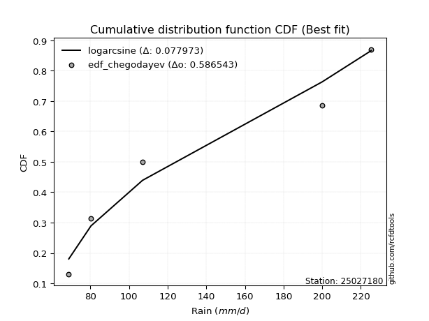</img>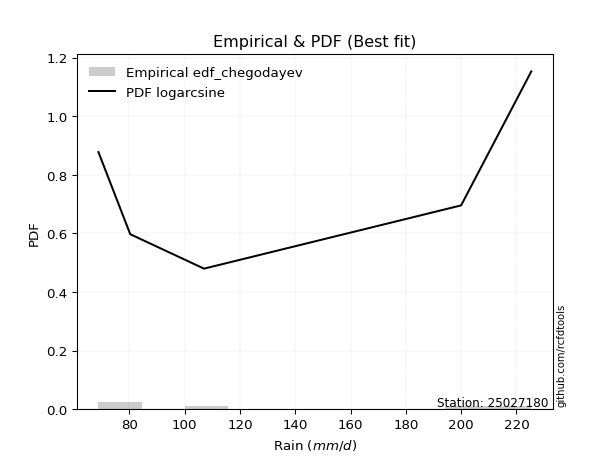</img>

</div>


### 6. Empirical - EDF Blom (1958)

The Blom formula is a specific "plotting position" formula used in hydrology and statistical analysis to estimate the empirical cumulative probability (or non-exceedance probability) of a data series. It is particularly recommended for data that are approximately normally distributed. The constant _a_ is set to 0.375 (or 3/8).

<div align="center">


$P=(m-a)/(n+1-2a)$


</div>


**6.1. Empirical values**

<div align="center">

|                | 0                   | 1                   | 2        | 3                  | 4                  |
|:---------------|:--------------------|:--------------------|:---------|:-------------------|:-------------------|
| date           | 2021                | 2023                | 2025     | 2022               | 2024               |
| x              | 68.8                | 80.3                | 88.5     | 200.0              | 225.4              |
| m              | 1                   | 2                   | 3        | 4                  | 5                  |
| empirical_dist | edf_blom            | edf_blom            | edf_blom | edf_blom           | edf_blom           |
| empirical      | 0.11904761904761904 | 0.30952380952380953 | 0.5      | 0.6904761904761905 | 0.8809523809523809 |
| empirical_tr   | 1.135135135135135   | 1.4482758620689655  | 2.0      | 3.230769230769231  | 8.399999999999999  |

</div>


**6.2. Kolmogorov-Smirnov fit test (sorted by Δ)**


<div align="center">

|                | 0                   | 1                   | 2                   | 3                  | 4                   | 5                  | 6                  | 7                   | 8                  | 9                  | 10                  | 11                    | 12                 | 13                  | 14                  | 15                  | 16                 | 17                 | 18                  | 19                  | 20                  | 21                 | 22                 | 23                  | 24                  | 25                  | 26                  | 27                  | 28                  | 29                  | 30                  | 31                 | 32                  | 33                  | 34                  | 35                  | 36                  | 37                  | 38                 | 39                  | 40                  | 41                  | 42                  | 43                  | 44                  | 45                 | 46                  | 47                 | 48                  | 49                 | 50                  | 51                  | 52                  | 53                 | 54                  | 55                  | 56                  | 57                  | 58                 | 59                 | 60                  | 61                 | 62                 | 63                 | 64                  | 65                  | 66                  | 67                 | 68                 | 69                  | 70                  | 71                  | 72                  | 73                  | 74                 | 75                  | 76                 | 77                  | 78                 | 79                  | 80                  | 81                 | 82                  | 83                  | 84                 | 85                 | 86                 | 87                 | 88                 | 89                 |
|:---------------|:--------------------|:--------------------|:--------------------|:-------------------|:--------------------|:-------------------|:-------------------|:--------------------|:-------------------|:-------------------|:--------------------|:----------------------|:-------------------|:--------------------|:--------------------|:--------------------|:-------------------|:-------------------|:--------------------|:--------------------|:--------------------|:-------------------|:-------------------|:--------------------|:--------------------|:--------------------|:--------------------|:--------------------|:--------------------|:--------------------|:--------------------|:-------------------|:--------------------|:--------------------|:--------------------|:--------------------|:--------------------|:--------------------|:-------------------|:--------------------|:--------------------|:--------------------|:--------------------|:--------------------|:--------------------|:-------------------|:--------------------|:-------------------|:--------------------|:-------------------|:--------------------|:--------------------|:--------------------|:-------------------|:--------------------|:--------------------|:--------------------|:--------------------|:-------------------|:-------------------|:--------------------|:-------------------|:-------------------|:-------------------|:--------------------|:--------------------|:--------------------|:-------------------|:-------------------|:--------------------|:--------------------|:--------------------|:--------------------|:--------------------|:-------------------|:--------------------|:-------------------|:--------------------|:-------------------|:--------------------|:--------------------|:-------------------|:--------------------|:--------------------|:-------------------|:-------------------|:-------------------|:-------------------|:-------------------|:-------------------|
| station        | 25027180            | 25027180            | 25027180            | 25027180           | 25027180            | 25027180           | 25027180           | 25027180            | 25027180           | 25027180           | 25027180            | 25027180              | 25027180           | 25027180            | 25027180            | 25027180            | 25027180           | 25027180           | 25027180            | 25027180            | 25027180            | 25027180           | 25027180           | 25027180            | 25027180            | 25027180            | 25027180            | 25027180            | 25027180            | 25027180            | 25027180            | 25027180           | 25027180            | 25027180            | 25027180            | 25027180            | 25027180            | 25027180            | 25027180           | 25027180            | 25027180            | 25027180            | 25027180            | 25027180            | 25027180            | 25027180           | 25027180            | 25027180           | 25027180            | 25027180           | 25027180            | 25027180            | 25027180            | 25027180           | 25027180            | 25027180            | 25027180            | 25027180            | 25027180           | 25027180           | 25027180            | 25027180           | 25027180           | 25027180           | 25027180            | 25027180            | 25027180            | 25027180           | 25027180           | 25027180            | 25027180            | 25027180            | 25027180            | 25027180            | 25027180           | 25027180            | 25027180           | 25027180            | 25027180           | 25027180            | 25027180            | 25027180           | 25027180            | 25027180            | 25027180           | 25027180           | 25027180           | 25027180           | 25027180           | 25027180           |
| empirical_dist | edf_blom            | edf_blom            | edf_blom            | edf_blom           | edf_blom            | edf_blom           | edf_blom           | edf_blom            | edf_blom           | edf_blom           | edf_blom            | edf_blom              | edf_blom           | edf_blom            | edf_blom            | edf_blom            | edf_blom           | edf_blom           | edf_blom            | edf_blom            | edf_blom            | edf_blom           | edf_blom           | edf_blom            | edf_blom            | edf_blom            | edf_blom            | edf_blom            | edf_blom            | edf_blom            | edf_blom            | edf_blom           | edf_blom            | edf_blom            | edf_blom            | edf_blom            | edf_blom            | edf_blom            | edf_blom           | edf_blom            | edf_blom            | edf_blom            | edf_blom            | edf_blom            | edf_blom            | edf_blom           | edf_blom            | edf_blom           | edf_blom            | edf_blom           | edf_blom            | edf_blom            | edf_blom            | edf_blom           | edf_blom            | edf_blom            | edf_blom            | edf_blom            | edf_blom           | edf_blom           | edf_blom            | edf_blom           | edf_blom           | edf_blom           | edf_blom            | edf_blom            | edf_blom            | edf_blom           | edf_blom           | edf_blom            | edf_blom            | edf_blom            | edf_blom            | edf_blom            | edf_blom           | edf_blom            | edf_blom           | edf_blom            | edf_blom           | edf_blom            | edf_blom            | edf_blom           | edf_blom            | edf_blom            | edf_blom           | edf_blom           | edf_blom           | edf_blom           | edf_blom           | edf_blom           |
| p_dist         | loginvweibull       | invgamma            | ncf                 | logalpha           | f                   | loginvgamma        | logf               | loghalfnorm         | loginvgauss        | logchi2            | logexpon            | loglaplace_asymmetric | loggenexpon        | logexponnorm        | alpha               | loghalflogistic     | lograyleigh        | logmoyal           | invgauss            | loggenlogistic      | logbetaprime        | nct                | loggumbel_r        | logkstwobign        | logmaxwell          | halfnorm            | logmielke           | lognct              | betaprime           | logpearson3         | halflogistic        | fisk               | logwald             | logloggamma         | logt                | lognorm             | lognorm             | logcrystalball      | rayleigh           | logncf              | maxwell             | logrice             | genlogistic         | gumbel_r            | moyal               | exponnorm          | genexpon            | expon              | laplace_asymmetric  | weibull_min        | pearson3            | loglogistic         | gompertz            | truncnorm          | kstwobign           | loggompertz         | logerlang           | crystalball         | norm               | t                  | loghypsecant        | loggumbel_l        | logistic           | pareto             | loglaplace          | johnsonsu           | rice                | loggamma           | loggamma           | hypsecant           | gumbel_l            | logweibull_min      | wald                | laplace             | logpareto          | loggibrat           | logfisk            | loglognorm          | fatiguelife        | lognakagami         | nakagami            | logfatiguelife     | logjohnsonsu        | invweibull          | gibrat             | gamma              | erlang             | chi2               | logtruncnorm       | mielke             |
| delta          | 0.15081388945734686 | 0.15246862344111833 | 0.15275109834279288 | 0.1530687212537365 | 0.15625044134642785 | 0.1600670943007939 | 0.160068914185723  | 0.16278861090518348 | 0.1716388715882391 | 0.1719153579334861 | 0.17496294943550306 | 0.17497280919189673   | 0.1757663836017731 | 0.17772202229419964 | 0.17775797083274403 | 0.17801989702143417 | 0.1780676678279014 | 0.1831973785297436 | 0.18401886033989234 | 0.18680243963921717 | 0.18686819764944013 | 0.1872387446128176 | 0.1873455175250613 | 0.18760171527387726 | 0.18858329762039722 | 0.19192070742295708 | 0.19635475960762994 | 0.19764917325739573 | 0.20161680153821437 | 0.20168133614518652 | 0.20548849586112333 | 0.2088583886323076 | 0.21169762798717529 | 0.21236881697645466 | 0.21483067145424595 | 0.21483290943739608 | 0.21483290943739608 | 0.21483291708056818 | 0.2163443621881787 | 0.21904607519099145 | 0.22538851907636526 | 0.22631610126829232 | 0.22737375965331919 | 0.23275104180747636 | 0.23323964210744053 | 0.2335296006317289 | 0.23434374738452202 | 0.2343441952176457 | 0.23434514468506307 | 0.2348861399281954 | 0.23525413984779875 | 0.23680709678386586 | 0.24122048598325296 | 0.2426631524017554 | 0.24366455352112676 | 0.24416842446740644 | 0.24490973051771414 | 0.24738088624442112 | 0.2473808863400374 | 0.24741602390111   | 0.25227560272660154 | 0.2625136434588264 | 0.2700300660246623 | 0.2739650518987906 | 0.27593013608437184 | 0.27616831849274087 | 0.27695828149945245 | 0.2823296845012172 | 0.2823296845012172 | 0.28502082455678823 | 0.28749937287530203 | 0.29747142148381245 | 0.29817738788516196 | 0.30512480224795413 | 0.306322882595668  | 0.30952380952380953 | 0.3492173226890132 | 0.35217320336580293 | 0.353735630946153  | 0.37812015162688106 | 0.38829467639007864 | 0.4091534577253153 | 0.42045327910344443 | 0.43390575164669515 | 0.4413810617743431 | 0.5189055570893226 | 0.5228994179702137 | 0.6893123807942904 | 0.6904664359332533 | nan                |
| deltao         | 0.5865427407550001  | 0.5865427407550001  | 0.5865427407550001  | 0.5865427407550001 | 0.5865427407550001  | 0.5865427407550001 | 0.5865427407550001 | 0.5865427407550001  | 0.5865427407550001 | 0.5865427407550001 | 0.5865427407550001  | 0.5865427407550001    | 0.5865427407550001 | 0.5865427407550001  | 0.5865427407550001  | 0.5865427407550001  | 0.5865427407550001 | 0.5865427407550001 | 0.5865427407550001  | 0.5865427407550001  | 0.5865427407550001  | 0.5865427407550001 | 0.5865427407550001 | 0.5865427407550001  | 0.5865427407550001  | 0.5865427407550001  | 0.5865427407550001  | 0.5865427407550001  | 0.5865427407550001  | 0.5865427407550001  | 0.5865427407550001  | 0.5865427407550001 | 0.5865427407550001  | 0.5865427407550001  | 0.5865427407550001  | 0.5865427407550001  | 0.5865427407550001  | 0.5865427407550001  | 0.5865427407550001 | 0.5865427407550001  | 0.5865427407550001  | 0.5865427407550001  | 0.5865427407550001  | 0.5865427407550001  | 0.5865427407550001  | 0.5865427407550001 | 0.5865427407550001  | 0.5865427407550001 | 0.5865427407550001  | 0.5865427407550001 | 0.5865427407550001  | 0.5865427407550001  | 0.5865427407550001  | 0.5865427407550001 | 0.5865427407550001  | 0.5865427407550001  | 0.5865427407550001  | 0.5865427407550001  | 0.5865427407550001 | 0.5865427407550001 | 0.5865427407550001  | 0.5865427407550001 | 0.5865427407550001 | 0.5865427407550001 | 0.5865427407550001  | 0.5865427407550001  | 0.5865427407550001  | 0.5865427407550001 | 0.5865427407550001 | 0.5865427407550001  | 0.5865427407550001  | 0.5865427407550001  | 0.5865427407550001  | 0.5865427407550001  | 0.5865427407550001 | 0.5865427407550001  | 0.5865427407550001 | 0.5865427407550001  | 0.5865427407550001 | 0.5865427407550001  | 0.5865427407550001  | 0.5865427407550001 | 0.5865427407550001  | 0.5865427407550001  | 0.5865427407550001 | 0.5865427407550001 | 0.5865427407550001 | 0.5865427407550001 | 0.5865427407550001 | 0.5865427407550001 |
| eval           | Δo > Δ              | Δo > Δ              | Δo > Δ              | Δo > Δ             | Δo > Δ              | Δo > Δ             | Δo > Δ             | Δo > Δ              | Δo > Δ             | Δo > Δ             | Δo > Δ              | Δo > Δ                | Δo > Δ             | Δo > Δ              | Δo > Δ              | Δo > Δ              | Δo > Δ             | Δo > Δ             | Δo > Δ              | Δo > Δ              | Δo > Δ              | Δo > Δ             | Δo > Δ             | Δo > Δ              | Δo > Δ              | Δo > Δ              | Δo > Δ              | Δo > Δ              | Δo > Δ              | Δo > Δ              | Δo > Δ              | Δo > Δ             | Δo > Δ              | Δo > Δ              | Δo > Δ              | Δo > Δ              | Δo > Δ              | Δo > Δ              | Δo > Δ             | Δo > Δ              | Δo > Δ              | Δo > Δ              | Δo > Δ              | Δo > Δ              | Δo > Δ              | Δo > Δ             | Δo > Δ              | Δo > Δ             | Δo > Δ              | Δo > Δ             | Δo > Δ              | Δo > Δ              | Δo > Δ              | Δo > Δ             | Δo > Δ              | Δo > Δ              | Δo > Δ              | Δo > Δ              | Δo > Δ             | Δo > Δ             | Δo > Δ              | Δo > Δ             | Δo > Δ             | Δo > Δ             | Δo > Δ              | Δo > Δ              | Δo > Δ              | Δo > Δ             | Δo > Δ             | Δo > Δ              | Δo > Δ              | Δo > Δ              | Δo > Δ              | Δo > Δ              | Δo > Δ             | Δo > Δ              | Δo > Δ             | Δo > Δ              | Δo > Δ             | Δo > Δ              | Δo > Δ              | Δo > Δ             | Δo > Δ              | Δo > Δ              | Δo > Δ             | Δo > Δ             | Δo > Δ             | Δo <= Δ            | Δo <= Δ            | Δo <= Δ            |
| fit            | 1                   | 1                   | 1                   | 1                  | 1                   | 1                  | 1                  | 1                   | 1                  | 1                  | 1                   | 1                     | 1                  | 1                   | 1                   | 1                   | 1                  | 1                  | 1                   | 1                   | 1                   | 1                  | 1                  | 1                   | 1                   | 1                   | 1                   | 1                   | 1                   | 1                   | 1                   | 1                  | 1                   | 1                   | 1                   | 1                   | 1                   | 1                   | 1                  | 1                   | 1                   | 1                   | 1                   | 1                   | 1                   | 1                  | 1                   | 1                  | 1                   | 1                  | 1                   | 1                   | 1                   | 1                  | 1                   | 1                   | 1                   | 1                   | 1                  | 1                  | 1                   | 1                  | 1                  | 1                  | 1                   | 1                   | 1                   | 1                  | 1                  | 1                   | 1                   | 1                   | 1                   | 1                   | 1                  | 1                   | 1                  | 1                   | 1                  | 1                   | 1                   | 1                  | 1                   | 1                   | 1                  | 1                  | 1                  | 0                  | 0                  | 0                  |
| n              | 5                   | 5                   | 5                   | 5                  | 5                   | 5                  | 5                  | 5                   | 5                  | 5                  | 5                   | 5                     | 5                  | 5                   | 5                   | 5                   | 5                  | 5                  | 5                   | 5                   | 5                   | 5                  | 5                  | 5                   | 5                   | 5                   | 5                   | 5                   | 5                   | 5                   | 5                   | 5                  | 5                   | 5                   | 5                   | 5                   | 5                   | 5                   | 5                  | 5                   | 5                   | 5                   | 5                   | 5                   | 5                   | 5                  | 5                   | 5                  | 5                   | 5                  | 5                   | 5                   | 5                   | 5                  | 5                   | 5                   | 5                   | 5                   | 5                  | 5                  | 5                   | 5                  | 5                  | 5                  | 5                   | 5                   | 5                   | 5                  | 5                  | 5                   | 5                   | 5                   | 5                   | 5                   | 5                  | 5                   | 5                  | 5                   | 5                  | 5                   | 5                   | 5                  | 5                   | 5                   | 5                  | 5                  | 5                  | 5                  | 5                  | 5                  |
| best_fit       | 1                   | 0                   | 0                   | 0                  | 0                   | 0                  | 0                  | 0                   | 0                  | 0                  | 0                   | 0                     | 0                  | 0                   | 0                   | 0                   | 0                  | 0                  | 0                   | 0                   | 0                   | 0                  | 0                  | 0                   | 0                   | 0                   | 0                   | 0                   | 0                   | 0                   | 0                   | 0                  | 0                   | 0                   | 0                   | 0                   | 0                   | 0                   | 0                  | 0                   | 0                   | 0                   | 0                   | 0                   | 0                   | 0                  | 0                   | 0                  | 0                   | 0                  | 0                   | 0                   | 0                   | 0                  | 0                   | 0                   | 0                   | 0                   | 0                  | 0                  | 0                   | 0                  | 0                  | 0                  | 0                   | 0                   | 0                   | 0                  | 0                  | 0                   | 0                   | 0                   | 0                   | 0                   | 0                  | 0                   | 0                  | 0                   | 0                  | 0                   | 0                   | 0                  | 0                   | 0                   | 0                  | 0                  | 0                  | 0                  | 0                  | 0                  |
| best_fit_sort  | 1                   | 2                   | 3                   | 4                  | 5                   | 6                  | 7                  | 8                   | 9                  | 10                 | 11                  | 12                    | 13                 | 14                  | 15                  | 16                  | 17                 | 18                 | 19                  | 20                  | 21                  | 22                 | 23                 | 24                  | 25                  | 26                  | 27                  | 28                  | 29                  | 30                  | 31                  | 32                 | 33                  | 34                  | 35                  | 36                  | 37                  | 38                  | 39                 | 40                  | 41                  | 42                  | 43                  | 44                  | 45                  | 46                 | 47                  | 48                 | 49                  | 50                 | 51                  | 52                  | 53                  | 54                 | 55                  | 56                  | 57                  | 58                  | 59                 | 60                 | 61                  | 62                 | 63                 | 64                 | 65                  | 66                  | 67                  | 68                 | 69                 | 70                  | 71                  | 72                  | 73                  | 74                  | 75                 | 76                  | 77                 | 78                  | 79                 | 80                  | 81                  | 82                 | 83                  | 84                  | 85                 | 86                 | 87                 | 88                 | 89                 | 90                 |

</div>


<div align="center">

</img>

</div>


**6.3. Best fit**

<div align="center">

|   id |   station | empirical_dist   | p_dist        |    delta |   deltao | eval   |   fit |   n |   best_fit |   best_fit_sort |
|-----:|----------:|:-----------------|:--------------|---------:|---------:|:-------|------:|----:|-----------:|----------------:|
|    0 |  25027180 | edf_blom         | loginvweibull | 0.150814 | 0.586543 | Δo > Δ |     1 |   5 |          1 |               1 |

</div>


<div align="center">

</img></img>

</div>


### 7. Empirical - EDF Tukey (1962)

In hydrology, the Tukey formula is used as a plotting position formula to estimate the empirical probability or frequency of a flood event (or other hydrological data). The formula parameter is given as _c=0.333_ (or 1/3).

<div align="center">


$P=(m-c)/(n+1-2c)$


</div>


**7.1. Empirical values**

<div align="center">

|                | 0                  | 1                  | 2         | 3         | 4         |
|:---------------|:-------------------|:-------------------|:----------|:----------|:----------|
| date           | 2021               | 2023               | 2025      | 2022      | 2024      |
| x              | 68.8               | 80.3               | 88.5      | 200.0     | 225.4     |
| m              | 1                  | 2                  | 3         | 4         | 5         |
| empirical_dist | edf_tukey          | edf_tukey          | edf_tukey | edf_tukey | edf_tukey |
| empirical      | 0.125              | 0.3125             | 0.5       | 0.6875    | 0.875     |
| empirical_tr   | 1.1428571428571428 | 1.4545454545454546 | 2.0       | 3.2       | 8.0       |

</div>


**7.2. Kolmogorov-Smirnov fit test (sorted by Δ)**


<div align="center">

|                | 0                   | 1                   | 2                  | 3                   | 4                   | 5                   | 6                   | 7                   | 8                   | 9                   | 10                  | 11                    | 12                 | 13                  | 14                 | 15                 | 16                  | 17                  | 18                  | 19                 | 20                 | 21                 | 22                  | 23                  | 24                  | 25                  | 26                  | 27                 | 28                  | 29                  | 30                  | 31                 | 32                  | 33                  | 34                  | 35                  | 36                  | 37                  | 38                 | 39                  | 40                  | 41                  | 42                  | 43                  | 44                  | 45                  | 46                 | 47                  | 48                 | 49                  | 50                  | 51                  | 52                  | 53                 | 54                  | 55                  | 56                  | 57                 | 58                 | 59                 | 60                  | 61                 | 62                 | 63                  | 64                  | 65                  | 66                  | 67                  | 68                  | 69                  | 70                  | 71                 | 72                  | 73                 | 74                  | 75                 | 76                  | 77                  | 78                  | 79                 | 80                 | 81                  | 82                  | 83                 | 84                 | 85                 | 86                 | 87                 | 88                 | 89                 |
|:---------------|:--------------------|:--------------------|:-------------------|:--------------------|:--------------------|:--------------------|:--------------------|:--------------------|:--------------------|:--------------------|:--------------------|:----------------------|:-------------------|:--------------------|:-------------------|:-------------------|:--------------------|:--------------------|:--------------------|:-------------------|:-------------------|:-------------------|:--------------------|:--------------------|:--------------------|:--------------------|:--------------------|:-------------------|:--------------------|:--------------------|:--------------------|:-------------------|:--------------------|:--------------------|:--------------------|:--------------------|:--------------------|:--------------------|:-------------------|:--------------------|:--------------------|:--------------------|:--------------------|:--------------------|:--------------------|:--------------------|:-------------------|:--------------------|:-------------------|:--------------------|:--------------------|:--------------------|:--------------------|:-------------------|:--------------------|:--------------------|:--------------------|:-------------------|:-------------------|:-------------------|:--------------------|:-------------------|:-------------------|:--------------------|:--------------------|:--------------------|:--------------------|:--------------------|:--------------------|:--------------------|:--------------------|:-------------------|:--------------------|:-------------------|:--------------------|:-------------------|:--------------------|:--------------------|:--------------------|:-------------------|:-------------------|:--------------------|:--------------------|:-------------------|:-------------------|:-------------------|:-------------------|:-------------------|:-------------------|:-------------------|
| station        | 25027180            | 25027180            | 25027180           | 25027180            | 25027180            | 25027180            | 25027180            | 25027180            | 25027180            | 25027180            | 25027180            | 25027180              | 25027180           | 25027180            | 25027180           | 25027180           | 25027180            | 25027180            | 25027180            | 25027180           | 25027180           | 25027180           | 25027180            | 25027180            | 25027180            | 25027180            | 25027180            | 25027180           | 25027180            | 25027180            | 25027180            | 25027180           | 25027180            | 25027180            | 25027180            | 25027180            | 25027180            | 25027180            | 25027180           | 25027180            | 25027180            | 25027180            | 25027180            | 25027180            | 25027180            | 25027180            | 25027180           | 25027180            | 25027180           | 25027180            | 25027180            | 25027180            | 25027180            | 25027180           | 25027180            | 25027180            | 25027180            | 25027180           | 25027180           | 25027180           | 25027180            | 25027180           | 25027180           | 25027180            | 25027180            | 25027180            | 25027180            | 25027180            | 25027180            | 25027180            | 25027180            | 25027180           | 25027180            | 25027180           | 25027180            | 25027180           | 25027180            | 25027180            | 25027180            | 25027180           | 25027180           | 25027180            | 25027180            | 25027180           | 25027180           | 25027180           | 25027180           | 25027180           | 25027180           | 25027180           |
| empirical_dist | edf_tukey           | edf_tukey           | edf_tukey          | edf_tukey           | edf_tukey           | edf_tukey           | edf_tukey           | edf_tukey           | edf_tukey           | edf_tukey           | edf_tukey           | edf_tukey             | edf_tukey          | edf_tukey           | edf_tukey          | edf_tukey          | edf_tukey           | edf_tukey           | edf_tukey           | edf_tukey          | edf_tukey          | edf_tukey          | edf_tukey           | edf_tukey           | edf_tukey           | edf_tukey           | edf_tukey           | edf_tukey          | edf_tukey           | edf_tukey           | edf_tukey           | edf_tukey          | edf_tukey           | edf_tukey           | edf_tukey           | edf_tukey           | edf_tukey           | edf_tukey           | edf_tukey          | edf_tukey           | edf_tukey           | edf_tukey           | edf_tukey           | edf_tukey           | edf_tukey           | edf_tukey           | edf_tukey          | edf_tukey           | edf_tukey          | edf_tukey           | edf_tukey           | edf_tukey           | edf_tukey           | edf_tukey          | edf_tukey           | edf_tukey           | edf_tukey           | edf_tukey          | edf_tukey          | edf_tukey          | edf_tukey           | edf_tukey          | edf_tukey          | edf_tukey           | edf_tukey           | edf_tukey           | edf_tukey           | edf_tukey           | edf_tukey           | edf_tukey           | edf_tukey           | edf_tukey          | edf_tukey           | edf_tukey          | edf_tukey           | edf_tukey          | edf_tukey           | edf_tukey           | edf_tukey           | edf_tukey          | edf_tukey          | edf_tukey           | edf_tukey           | edf_tukey          | edf_tukey          | edf_tukey          | edf_tukey          | edf_tukey          | edf_tukey          | edf_tukey          |
| p_dist         | ncf                 | loginvweibull       | invgamma           | logalpha            | f                   | loginvgamma         | logf                | loghalfnorm         | logchi2             | loginvgauss         | logexpon            | loglaplace_asymmetric | lograyleigh        | loggenexpon         | logexponnorm       | alpha              | loghalflogistic     | logmoyal            | logbetaprime        | invgauss           | nct                | loggumbel_r        | logmaxwell          | loggenlogistic      | logkstwobign        | halfnorm            | lognct              | logmielke          | betaprime           | logpearson3         | halflogistic        | fisk               | logloggamma         | logwald             | logt                | lognorm             | lognorm             | logcrystalball      | rayleigh           | logncf              | maxwell             | logrice             | genlogistic         | weibull_min         | gumbel_r            | moyal               | exponnorm          | genexpon            | expon              | laplace_asymmetric  | pearson3            | loglogistic         | gompertz            | truncnorm          | kstwobign           | loggompertz         | crystalball         | norm               | t                  | logerlang          | loghypsecant        | loggumbel_l        | logistic           | pareto              | loglaplace          | johnsonsu           | rice                | hypsecant           | loggamma            | loggamma            | gumbel_l            | logweibull_min     | wald                | logpareto          | laplace             | loggibrat          | logfisk             | loglognorm          | fatiguelife         | lognakagami        | nakagami           | logfatiguelife      | logjohnsonsu        | invweibull         | gibrat             | gamma              | erlang             | chi2               | logtruncnorm       | mielke             |
| delta          | 0.14679871739041195 | 0.15379007993353733 | 0.1554448139173088 | 0.15604491172992696 | 0.15922663182261831 | 0.16304328477698438 | 0.16304510466191346 | 0.16576480138137395 | 0.16596297698110518 | 0.17461506206442956 | 0.17793913991169352 | 0.1779489996680872    | 0.1780676678279014 | 0.17874257407796357 | 0.1806982127703901 | 0.1807341613089345 | 0.18099608749762464 | 0.18617356900593407 | 0.18686819764944013 | 0.1869950508160828 | 0.1872387446128176 | 0.1873455175250613 | 0.18858329762039722 | 0.18977863011540763 | 0.19057790575006772 | 0.19192070742295708 | 0.19764917325739573 | 0.1993309500838204 | 0.20161680153821437 | 0.20168133614518652 | 0.20548849586112333 | 0.2088583886323076 | 0.21236881697645466 | 0.21467381846336575 | 0.21483067145424595 | 0.21483290943739608 | 0.21483290943739608 | 0.21483291708056818 | 0.2163443621881787 | 0.21904607519099145 | 0.22538851907636526 | 0.22631610126829232 | 0.22737375965331919 | 0.22893375897581447 | 0.23275104180747636 | 0.23323964210744053 | 0.2335296006317289 | 0.23434374738452202 | 0.2343441952176457 | 0.23434514468506307 | 0.23525413984779875 | 0.23680709678386586 | 0.24122048598325296 | 0.2426631524017554 | 0.24366455352112676 | 0.24416842446740644 | 0.24738088624442112 | 0.2473808863400374 | 0.24741602390111   | 0.2478859209939046 | 0.25227560272660154 | 0.2625136434588264 | 0.2700300660246623 | 0.27098886142260015 | 0.27593013608437184 | 0.27616831849274087 | 0.27695828149945245 | 0.28502082455678823 | 0.28530587497740767 | 0.28530587497740767 | 0.28749937287530203 | 0.294495231007622  | 0.29817738788516196 | 0.3033466921194775 | 0.30512480224795413 | 0.3125             | 0.34326494173663225 | 0.34919701288961247 | 0.35075944046996255 | 0.3751439611506906 | 0.3853184859138882 | 0.40617726724912484 | 0.41747708862725397 | 0.4279533706943142 | 0.4413810617743431 | 0.5159293666131322 | 0.5199232274940232 | 0.6863361903180999 | 0.6874902454570628 | nan                |
| deltao         | 0.5865427407550001  | 0.5865427407550001  | 0.5865427407550001 | 0.5865427407550001  | 0.5865427407550001  | 0.5865427407550001  | 0.5865427407550001  | 0.5865427407550001  | 0.5865427407550001  | 0.5865427407550001  | 0.5865427407550001  | 0.5865427407550001    | 0.5865427407550001 | 0.5865427407550001  | 0.5865427407550001 | 0.5865427407550001 | 0.5865427407550001  | 0.5865427407550001  | 0.5865427407550001  | 0.5865427407550001 | 0.5865427407550001 | 0.5865427407550001 | 0.5865427407550001  | 0.5865427407550001  | 0.5865427407550001  | 0.5865427407550001  | 0.5865427407550001  | 0.5865427407550001 | 0.5865427407550001  | 0.5865427407550001  | 0.5865427407550001  | 0.5865427407550001 | 0.5865427407550001  | 0.5865427407550001  | 0.5865427407550001  | 0.5865427407550001  | 0.5865427407550001  | 0.5865427407550001  | 0.5865427407550001 | 0.5865427407550001  | 0.5865427407550001  | 0.5865427407550001  | 0.5865427407550001  | 0.5865427407550001  | 0.5865427407550001  | 0.5865427407550001  | 0.5865427407550001 | 0.5865427407550001  | 0.5865427407550001 | 0.5865427407550001  | 0.5865427407550001  | 0.5865427407550001  | 0.5865427407550001  | 0.5865427407550001 | 0.5865427407550001  | 0.5865427407550001  | 0.5865427407550001  | 0.5865427407550001 | 0.5865427407550001 | 0.5865427407550001 | 0.5865427407550001  | 0.5865427407550001 | 0.5865427407550001 | 0.5865427407550001  | 0.5865427407550001  | 0.5865427407550001  | 0.5865427407550001  | 0.5865427407550001  | 0.5865427407550001  | 0.5865427407550001  | 0.5865427407550001  | 0.5865427407550001 | 0.5865427407550001  | 0.5865427407550001 | 0.5865427407550001  | 0.5865427407550001 | 0.5865427407550001  | 0.5865427407550001  | 0.5865427407550001  | 0.5865427407550001 | 0.5865427407550001 | 0.5865427407550001  | 0.5865427407550001  | 0.5865427407550001 | 0.5865427407550001 | 0.5865427407550001 | 0.5865427407550001 | 0.5865427407550001 | 0.5865427407550001 | 0.5865427407550001 |
| eval           | Δo > Δ              | Δo > Δ              | Δo > Δ             | Δo > Δ              | Δo > Δ              | Δo > Δ              | Δo > Δ              | Δo > Δ              | Δo > Δ              | Δo > Δ              | Δo > Δ              | Δo > Δ                | Δo > Δ             | Δo > Δ              | Δo > Δ             | Δo > Δ             | Δo > Δ              | Δo > Δ              | Δo > Δ              | Δo > Δ             | Δo > Δ             | Δo > Δ             | Δo > Δ              | Δo > Δ              | Δo > Δ              | Δo > Δ              | Δo > Δ              | Δo > Δ             | Δo > Δ              | Δo > Δ              | Δo > Δ              | Δo > Δ             | Δo > Δ              | Δo > Δ              | Δo > Δ              | Δo > Δ              | Δo > Δ              | Δo > Δ              | Δo > Δ             | Δo > Δ              | Δo > Δ              | Δo > Δ              | Δo > Δ              | Δo > Δ              | Δo > Δ              | Δo > Δ              | Δo > Δ             | Δo > Δ              | Δo > Δ             | Δo > Δ              | Δo > Δ              | Δo > Δ              | Δo > Δ              | Δo > Δ             | Δo > Δ              | Δo > Δ              | Δo > Δ              | Δo > Δ             | Δo > Δ             | Δo > Δ             | Δo > Δ              | Δo > Δ             | Δo > Δ             | Δo > Δ              | Δo > Δ              | Δo > Δ              | Δo > Δ              | Δo > Δ              | Δo > Δ              | Δo > Δ              | Δo > Δ              | Δo > Δ             | Δo > Δ              | Δo > Δ             | Δo > Δ              | Δo > Δ             | Δo > Δ              | Δo > Δ              | Δo > Δ              | Δo > Δ             | Δo > Δ             | Δo > Δ              | Δo > Δ              | Δo > Δ             | Δo > Δ             | Δo > Δ             | Δo > Δ             | Δo <= Δ            | Δo <= Δ            | Δo <= Δ            |
| fit            | 1                   | 1                   | 1                  | 1                   | 1                   | 1                   | 1                   | 1                   | 1                   | 1                   | 1                   | 1                     | 1                  | 1                   | 1                  | 1                  | 1                   | 1                   | 1                   | 1                  | 1                  | 1                  | 1                   | 1                   | 1                   | 1                   | 1                   | 1                  | 1                   | 1                   | 1                   | 1                  | 1                   | 1                   | 1                   | 1                   | 1                   | 1                   | 1                  | 1                   | 1                   | 1                   | 1                   | 1                   | 1                   | 1                   | 1                  | 1                   | 1                  | 1                   | 1                   | 1                   | 1                   | 1                  | 1                   | 1                   | 1                   | 1                  | 1                  | 1                  | 1                   | 1                  | 1                  | 1                   | 1                   | 1                   | 1                   | 1                   | 1                   | 1                   | 1                   | 1                  | 1                   | 1                  | 1                   | 1                  | 1                   | 1                   | 1                   | 1                  | 1                  | 1                   | 1                   | 1                  | 1                  | 1                  | 1                  | 0                  | 0                  | 0                  |
| n              | 5                   | 5                   | 5                  | 5                   | 5                   | 5                   | 5                   | 5                   | 5                   | 5                   | 5                   | 5                     | 5                  | 5                   | 5                  | 5                  | 5                   | 5                   | 5                   | 5                  | 5                  | 5                  | 5                   | 5                   | 5                   | 5                   | 5                   | 5                  | 5                   | 5                   | 5                   | 5                  | 5                   | 5                   | 5                   | 5                   | 5                   | 5                   | 5                  | 5                   | 5                   | 5                   | 5                   | 5                   | 5                   | 5                   | 5                  | 5                   | 5                  | 5                   | 5                   | 5                   | 5                   | 5                  | 5                   | 5                   | 5                   | 5                  | 5                  | 5                  | 5                   | 5                  | 5                  | 5                   | 5                   | 5                   | 5                   | 5                   | 5                   | 5                   | 5                   | 5                  | 5                   | 5                  | 5                   | 5                  | 5                   | 5                   | 5                   | 5                  | 5                  | 5                   | 5                   | 5                  | 5                  | 5                  | 5                  | 5                  | 5                  | 5                  |
| best_fit       | 1                   | 0                   | 0                  | 0                   | 0                   | 0                   | 0                   | 0                   | 0                   | 0                   | 0                   | 0                     | 0                  | 0                   | 0                  | 0                  | 0                   | 0                   | 0                   | 0                  | 0                  | 0                  | 0                   | 0                   | 0                   | 0                   | 0                   | 0                  | 0                   | 0                   | 0                   | 0                  | 0                   | 0                   | 0                   | 0                   | 0                   | 0                   | 0                  | 0                   | 0                   | 0                   | 0                   | 0                   | 0                   | 0                   | 0                  | 0                   | 0                  | 0                   | 0                   | 0                   | 0                   | 0                  | 0                   | 0                   | 0                   | 0                  | 0                  | 0                  | 0                   | 0                  | 0                  | 0                   | 0                   | 0                   | 0                   | 0                   | 0                   | 0                   | 0                   | 0                  | 0                   | 0                  | 0                   | 0                  | 0                   | 0                   | 0                   | 0                  | 0                  | 0                   | 0                   | 0                  | 0                  | 0                  | 0                  | 0                  | 0                  | 0                  |
| best_fit_sort  | 1                   | 2                   | 3                  | 4                   | 5                   | 6                   | 7                   | 8                   | 9                   | 10                  | 11                  | 12                    | 13                 | 14                  | 15                 | 16                 | 17                  | 18                  | 19                  | 20                 | 21                 | 22                 | 23                  | 24                  | 25                  | 26                  | 27                  | 28                 | 29                  | 30                  | 31                  | 32                 | 33                  | 34                  | 35                  | 36                  | 37                  | 38                  | 39                 | 40                  | 41                  | 42                  | 43                  | 44                  | 45                  | 46                  | 47                 | 48                  | 49                 | 50                  | 51                  | 52                  | 53                  | 54                 | 55                  | 56                  | 57                  | 58                 | 59                 | 60                 | 61                  | 62                 | 63                 | 64                  | 65                  | 66                  | 67                  | 68                  | 69                  | 70                  | 71                  | 72                 | 73                  | 74                 | 75                  | 76                 | 77                  | 78                  | 79                  | 80                 | 81                 | 82                  | 83                  | 84                 | 85                 | 86                 | 87                 | 88                 | 89                 | 90                 |

</div>


<div align="center">

</img>

</div>


**7.3. Best fit**

<div align="center">

|   id |   station | empirical_dist   | p_dist   |    delta |   deltao | eval   |   fit |   n |   best_fit |   best_fit_sort |
|-----:|----------:|:-----------------|:---------|---------:|---------:|:-------|------:|----:|-----------:|----------------:|
|    0 |  25027180 | edf_tukey        | ncf      | 0.146799 | 0.586543 | Δo > Δ |     1 |   5 |          1 |               1 |

</div>


<div align="center">

</img>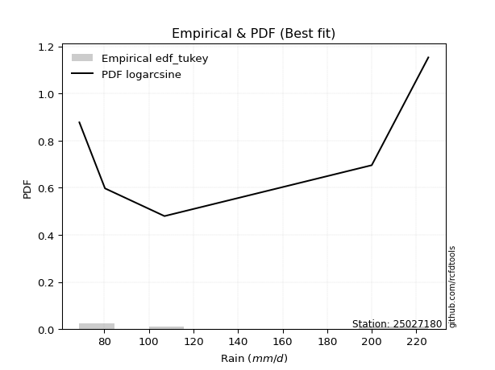</img>

</div>


### 8. Empirical - EDF Gringorten (1963)

Gringorten plotting position formula is essential for estimating the probability and return periods of extreme events like floods and heavy rainfall. The constant _a=0.44_.

<div align="center">


$P=(m-a)/(n+1-2a)$


</div>


**8.1. Empirical values**

<div align="center">

|                | 0                   | 1                  | 2              | 3                 | 4                  |
|:---------------|:--------------------|:-------------------|:---------------|:------------------|:-------------------|
| date           | 2021                | 2023               | 2025           | 2022              | 2024               |
| x              | 68.8                | 80.3               | 88.5           | 200.0             | 225.4              |
| m              | 1                   | 2                  | 3              | 4                 | 5                  |
| empirical_dist | edf_gringorten      | edf_gringorten     | edf_gringorten | edf_gringorten    | edf_gringorten     |
| empirical      | 0.10937500000000001 | 0.3046875          | 0.5            | 0.6953125         | 0.8906249999999999 |
| empirical_tr   | 1.1228070175438596  | 1.4382022471910112 | 2.0            | 3.282051282051282 | 9.142857142857133  |

</div>


**8.2. Kolmogorov-Smirnov fit test (sorted by Δ)**


<div align="center">

|                | 0                   | 1                  | 2                   | 3                   | 4                   | 5                   | 6                   | 7                   | 8                   | 9                   | 10                    | 11                  | 12                 | 13                 | 14                  | 15                 | 16                 | 17                  | 18                  | 19                  | 20                  | 21                  | 22                 | 23                 | 24                  | 25                 | 26                  | 27                  | 28                  | 29                  | 30                  | 31                  | 32                 | 33                  | 34                  | 35                  | 36                  | 37                  | 38                 | 39                  | 40                  | 41                  | 42                  | 43                  | 44                  | 45                 | 46                  | 47                 | 48                  | 49                  | 50                  | 51                 | 52                  | 53                 | 54                  | 55                  | 56                  | 57                  | 58                 | 59                 | 60                  | 61                 | 62                 | 63                  | 64                  | 65                  | 66                  | 67                  | 68                  | 69                  | 70                  | 71                  | 72                 | 73                  | 74                  | 75                 | 76                  | 77                  | 78                  | 79                 | 80                 | 81                  | 82                  | 83                 | 84                 | 85                 | 86                 | 87                 | 88                 | 89                 |
|:---------------|:--------------------|:-------------------|:--------------------|:--------------------|:--------------------|:--------------------|:--------------------|:--------------------|:--------------------|:--------------------|:----------------------|:--------------------|:-------------------|:-------------------|:--------------------|:-------------------|:-------------------|:--------------------|:--------------------|:--------------------|:--------------------|:--------------------|:-------------------|:-------------------|:--------------------|:-------------------|:--------------------|:--------------------|:--------------------|:--------------------|:--------------------|:--------------------|:-------------------|:--------------------|:--------------------|:--------------------|:--------------------|:--------------------|:-------------------|:--------------------|:--------------------|:--------------------|:--------------------|:--------------------|:--------------------|:-------------------|:--------------------|:-------------------|:--------------------|:--------------------|:--------------------|:-------------------|:--------------------|:-------------------|:--------------------|:--------------------|:--------------------|:--------------------|:-------------------|:-------------------|:--------------------|:-------------------|:-------------------|:--------------------|:--------------------|:--------------------|:--------------------|:--------------------|:--------------------|:--------------------|:--------------------|:--------------------|:-------------------|:--------------------|:--------------------|:-------------------|:--------------------|:--------------------|:--------------------|:-------------------|:-------------------|:--------------------|:--------------------|:-------------------|:-------------------|:-------------------|:-------------------|:-------------------|:-------------------|:-------------------|
| station        | 25027180            | 25027180           | 25027180            | 25027180            | 25027180            | 25027180            | 25027180            | 25027180            | 25027180            | 25027180            | 25027180              | 25027180            | 25027180           | 25027180           | 25027180            | 25027180           | 25027180           | 25027180            | 25027180            | 25027180            | 25027180            | 25027180            | 25027180           | 25027180           | 25027180            | 25027180           | 25027180            | 25027180            | 25027180            | 25027180            | 25027180            | 25027180            | 25027180           | 25027180            | 25027180            | 25027180            | 25027180            | 25027180            | 25027180           | 25027180            | 25027180            | 25027180            | 25027180            | 25027180            | 25027180            | 25027180           | 25027180            | 25027180           | 25027180            | 25027180            | 25027180            | 25027180           | 25027180            | 25027180           | 25027180            | 25027180            | 25027180            | 25027180            | 25027180           | 25027180           | 25027180            | 25027180           | 25027180           | 25027180            | 25027180            | 25027180            | 25027180            | 25027180            | 25027180            | 25027180            | 25027180            | 25027180            | 25027180           | 25027180            | 25027180            | 25027180           | 25027180            | 25027180            | 25027180            | 25027180           | 25027180           | 25027180            | 25027180            | 25027180           | 25027180           | 25027180           | 25027180           | 25027180           | 25027180           | 25027180           |
| empirical_dist | edf_gringorten      | edf_gringorten     | edf_gringorten      | edf_gringorten      | edf_gringorten      | edf_gringorten      | edf_gringorten      | edf_gringorten      | edf_gringorten      | edf_gringorten      | edf_gringorten        | edf_gringorten      | edf_gringorten     | edf_gringorten     | edf_gringorten      | edf_gringorten     | edf_gringorten     | edf_gringorten      | edf_gringorten      | edf_gringorten      | edf_gringorten      | edf_gringorten      | edf_gringorten     | edf_gringorten     | edf_gringorten      | edf_gringorten     | edf_gringorten      | edf_gringorten      | edf_gringorten      | edf_gringorten      | edf_gringorten      | edf_gringorten      | edf_gringorten     | edf_gringorten      | edf_gringorten      | edf_gringorten      | edf_gringorten      | edf_gringorten      | edf_gringorten     | edf_gringorten      | edf_gringorten      | edf_gringorten      | edf_gringorten      | edf_gringorten      | edf_gringorten      | edf_gringorten     | edf_gringorten      | edf_gringorten     | edf_gringorten      | edf_gringorten      | edf_gringorten      | edf_gringorten     | edf_gringorten      | edf_gringorten     | edf_gringorten      | edf_gringorten      | edf_gringorten      | edf_gringorten      | edf_gringorten     | edf_gringorten     | edf_gringorten      | edf_gringorten     | edf_gringorten     | edf_gringorten      | edf_gringorten      | edf_gringorten      | edf_gringorten      | edf_gringorten      | edf_gringorten      | edf_gringorten      | edf_gringorten      | edf_gringorten      | edf_gringorten     | edf_gringorten      | edf_gringorten      | edf_gringorten     | edf_gringorten      | edf_gringorten      | edf_gringorten      | edf_gringorten     | edf_gringorten     | edf_gringorten      | edf_gringorten      | edf_gringorten     | edf_gringorten     | edf_gringorten     | edf_gringorten     | edf_gringorten     | edf_gringorten     | edf_gringorten     |
| p_dist         | loginvweibull       | invgamma           | logalpha            | f                   | loginvgamma         | logf                | loghalfnorm         | ncf                 | loginvgauss         | logexpon            | loglaplace_asymmetric | loggenexpon         | logexponnorm       | alpha              | loghalflogistic     | lograyleigh        | invgauss           | logmoyal            | logchi2             | loggenlogistic      | logkstwobign        | logbetaprime        | nct                | loggumbel_r        | logmaxwell          | logmielke          | halfnorm            | lognct              | betaprime           | logpearson3         | halflogistic        | logwald             | fisk               | logloggamma         | logt                | lognorm             | lognorm             | logcrystalball      | rayleigh           | logncf              | maxwell             | logrice             | genlogistic         | gumbel_r            | moyal               | exponnorm          | genexpon            | expon              | laplace_asymmetric  | pearson3            | loglogistic         | logerlang          | gompertz            | truncnorm          | kstwobign           | loggompertz         | weibull_min         | crystalball         | norm               | t                  | loghypsecant        | loggumbel_l        | logistic           | loglaplace          | johnsonsu           | rice                | loggamma            | loggamma            | pareto              | hypsecant           | gumbel_l            | wald                | logweibull_min     | laplace             | loggibrat           | logpareto          | loglognorm          | fatiguelife         | logfisk             | lognakagami        | nakagami           | logfatiguelife      | logjohnsonsu        | gibrat             | invweibull         | gamma              | erlang             | chi2               | logtruncnorm       | mielke             |
| delta          | 0.14597757993353733 | 0.1476323139173088 | 0.14823241172992696 | 0.15141413182261831 | 0.15523078477698438 | 0.15523260466191346 | 0.15795230138137395 | 0.16242371739041184 | 0.16680256206442956 | 0.17012663991169352 | 0.1701364996680872    | 0.17093007407796357 | 0.1728857127703901 | 0.1729216613089345 | 0.17318358749762464 | 0.1780676678279014 | 0.1791825508160828 | 0.18037557869460985 | 0.18158797698110507 | 0.18196613011540763 | 0.18629555283338772 | 0.18686819764944013 | 0.1872387446128176 | 0.1873455175250613 | 0.18858329762039722 | 0.1915184500838204 | 0.19192070742295708 | 0.19764917325739573 | 0.20161680153821437 | 0.20168133614518652 | 0.20548849586112333 | 0.20686131846336575 | 0.2088583886323076 | 0.21236881697645466 | 0.21483067145424595 | 0.21483290943739608 | 0.21483290943739608 | 0.21483291708056818 | 0.2163443621881787 | 0.21904607519099145 | 0.22538851907636526 | 0.22631610126829232 | 0.22737375965331919 | 0.23275104180747636 | 0.23323964210744053 | 0.2335296006317289 | 0.23434374738452202 | 0.2343441952176457 | 0.23434514468506307 | 0.23525413984779875 | 0.23680709678386586 | 0.2400734209939046 | 0.24122048598325296 | 0.2426631524017554 | 0.24366455352112676 | 0.24416842446740644 | 0.24455875897581436 | 0.24738088624442112 | 0.2473808863400374 | 0.24741602390111   | 0.25227560272660154 | 0.2625136434588264 | 0.2700300660246623 | 0.27593013608437184 | 0.27616831849274087 | 0.27695828149945245 | 0.27749337497740767 | 0.27749337497740767 | 0.27880136142260015 | 0.28502082455678823 | 0.28749937287530203 | 0.29817738788516196 | 0.302307731007622  | 0.30512480224795413 | 0.30568973832990287 | 0.3111591921194775 | 0.35700951288961247 | 0.35857194046996255 | 0.35888994173663213 | 0.3829564611506906 | 0.3931309859138882 | 0.41398976724912484 | 0.42528958862725397 | 0.4413810617743431 | 0.4435783706943141 | 0.5237418666131322 | 0.5277357274940232 | 0.6941486903180999 | 0.6953027454570628 | nan                |
| deltao         | 0.5865427407550001  | 0.5865427407550001 | 0.5865427407550001  | 0.5865427407550001  | 0.5865427407550001  | 0.5865427407550001  | 0.5865427407550001  | 0.5865427407550001  | 0.5865427407550001  | 0.5865427407550001  | 0.5865427407550001    | 0.5865427407550001  | 0.5865427407550001 | 0.5865427407550001 | 0.5865427407550001  | 0.5865427407550001 | 0.5865427407550001 | 0.5865427407550001  | 0.5865427407550001  | 0.5865427407550001  | 0.5865427407550001  | 0.5865427407550001  | 0.5865427407550001 | 0.5865427407550001 | 0.5865427407550001  | 0.5865427407550001 | 0.5865427407550001  | 0.5865427407550001  | 0.5865427407550001  | 0.5865427407550001  | 0.5865427407550001  | 0.5865427407550001  | 0.5865427407550001 | 0.5865427407550001  | 0.5865427407550001  | 0.5865427407550001  | 0.5865427407550001  | 0.5865427407550001  | 0.5865427407550001 | 0.5865427407550001  | 0.5865427407550001  | 0.5865427407550001  | 0.5865427407550001  | 0.5865427407550001  | 0.5865427407550001  | 0.5865427407550001 | 0.5865427407550001  | 0.5865427407550001 | 0.5865427407550001  | 0.5865427407550001  | 0.5865427407550001  | 0.5865427407550001 | 0.5865427407550001  | 0.5865427407550001 | 0.5865427407550001  | 0.5865427407550001  | 0.5865427407550001  | 0.5865427407550001  | 0.5865427407550001 | 0.5865427407550001 | 0.5865427407550001  | 0.5865427407550001 | 0.5865427407550001 | 0.5865427407550001  | 0.5865427407550001  | 0.5865427407550001  | 0.5865427407550001  | 0.5865427407550001  | 0.5865427407550001  | 0.5865427407550001  | 0.5865427407550001  | 0.5865427407550001  | 0.5865427407550001 | 0.5865427407550001  | 0.5865427407550001  | 0.5865427407550001 | 0.5865427407550001  | 0.5865427407550001  | 0.5865427407550001  | 0.5865427407550001 | 0.5865427407550001 | 0.5865427407550001  | 0.5865427407550001  | 0.5865427407550001 | 0.5865427407550001 | 0.5865427407550001 | 0.5865427407550001 | 0.5865427407550001 | 0.5865427407550001 | 0.5865427407550001 |
| eval           | Δo > Δ              | Δo > Δ             | Δo > Δ              | Δo > Δ              | Δo > Δ              | Δo > Δ              | Δo > Δ              | Δo > Δ              | Δo > Δ              | Δo > Δ              | Δo > Δ                | Δo > Δ              | Δo > Δ             | Δo > Δ             | Δo > Δ              | Δo > Δ             | Δo > Δ             | Δo > Δ              | Δo > Δ              | Δo > Δ              | Δo > Δ              | Δo > Δ              | Δo > Δ             | Δo > Δ             | Δo > Δ              | Δo > Δ             | Δo > Δ              | Δo > Δ              | Δo > Δ              | Δo > Δ              | Δo > Δ              | Δo > Δ              | Δo > Δ             | Δo > Δ              | Δo > Δ              | Δo > Δ              | Δo > Δ              | Δo > Δ              | Δo > Δ             | Δo > Δ              | Δo > Δ              | Δo > Δ              | Δo > Δ              | Δo > Δ              | Δo > Δ              | Δo > Δ             | Δo > Δ              | Δo > Δ             | Δo > Δ              | Δo > Δ              | Δo > Δ              | Δo > Δ             | Δo > Δ              | Δo > Δ             | Δo > Δ              | Δo > Δ              | Δo > Δ              | Δo > Δ              | Δo > Δ             | Δo > Δ             | Δo > Δ              | Δo > Δ             | Δo > Δ             | Δo > Δ              | Δo > Δ              | Δo > Δ              | Δo > Δ              | Δo > Δ              | Δo > Δ              | Δo > Δ              | Δo > Δ              | Δo > Δ              | Δo > Δ             | Δo > Δ              | Δo > Δ              | Δo > Δ             | Δo > Δ              | Δo > Δ              | Δo > Δ              | Δo > Δ             | Δo > Δ             | Δo > Δ              | Δo > Δ              | Δo > Δ             | Δo > Δ             | Δo > Δ             | Δo > Δ             | Δo <= Δ            | Δo <= Δ            | Δo <= Δ            |
| fit            | 1                   | 1                  | 1                   | 1                   | 1                   | 1                   | 1                   | 1                   | 1                   | 1                   | 1                     | 1                   | 1                  | 1                  | 1                   | 1                  | 1                  | 1                   | 1                   | 1                   | 1                   | 1                   | 1                  | 1                  | 1                   | 1                  | 1                   | 1                   | 1                   | 1                   | 1                   | 1                   | 1                  | 1                   | 1                   | 1                   | 1                   | 1                   | 1                  | 1                   | 1                   | 1                   | 1                   | 1                   | 1                   | 1                  | 1                   | 1                  | 1                   | 1                   | 1                   | 1                  | 1                   | 1                  | 1                   | 1                   | 1                   | 1                   | 1                  | 1                  | 1                   | 1                  | 1                  | 1                   | 1                   | 1                   | 1                   | 1                   | 1                   | 1                   | 1                   | 1                   | 1                  | 1                   | 1                   | 1                  | 1                   | 1                   | 1                   | 1                  | 1                  | 1                   | 1                   | 1                  | 1                  | 1                  | 1                  | 0                  | 0                  | 0                  |
| n              | 5                   | 5                  | 5                   | 5                   | 5                   | 5                   | 5                   | 5                   | 5                   | 5                   | 5                     | 5                   | 5                  | 5                  | 5                   | 5                  | 5                  | 5                   | 5                   | 5                   | 5                   | 5                   | 5                  | 5                  | 5                   | 5                  | 5                   | 5                   | 5                   | 5                   | 5                   | 5                   | 5                  | 5                   | 5                   | 5                   | 5                   | 5                   | 5                  | 5                   | 5                   | 5                   | 5                   | 5                   | 5                   | 5                  | 5                   | 5                  | 5                   | 5                   | 5                   | 5                  | 5                   | 5                  | 5                   | 5                   | 5                   | 5                   | 5                  | 5                  | 5                   | 5                  | 5                  | 5                   | 5                   | 5                   | 5                   | 5                   | 5                   | 5                   | 5                   | 5                   | 5                  | 5                   | 5                   | 5                  | 5                   | 5                   | 5                   | 5                  | 5                  | 5                   | 5                   | 5                  | 5                  | 5                  | 5                  | 5                  | 5                  | 5                  |
| best_fit       | 1                   | 0                  | 0                   | 0                   | 0                   | 0                   | 0                   | 0                   | 0                   | 0                   | 0                     | 0                   | 0                  | 0                  | 0                   | 0                  | 0                  | 0                   | 0                   | 0                   | 0                   | 0                   | 0                  | 0                  | 0                   | 0                  | 0                   | 0                   | 0                   | 0                   | 0                   | 0                   | 0                  | 0                   | 0                   | 0                   | 0                   | 0                   | 0                  | 0                   | 0                   | 0                   | 0                   | 0                   | 0                   | 0                  | 0                   | 0                  | 0                   | 0                   | 0                   | 0                  | 0                   | 0                  | 0                   | 0                   | 0                   | 0                   | 0                  | 0                  | 0                   | 0                  | 0                  | 0                   | 0                   | 0                   | 0                   | 0                   | 0                   | 0                   | 0                   | 0                   | 0                  | 0                   | 0                   | 0                  | 0                   | 0                   | 0                   | 0                  | 0                  | 0                   | 0                   | 0                  | 0                  | 0                  | 0                  | 0                  | 0                  | 0                  |
| best_fit_sort  | 1                   | 2                  | 3                   | 4                   | 5                   | 6                   | 7                   | 8                   | 9                   | 10                  | 11                    | 12                  | 13                 | 14                 | 15                  | 16                 | 17                 | 18                  | 19                  | 20                  | 21                  | 22                  | 23                 | 24                 | 25                  | 26                 | 27                  | 28                  | 29                  | 30                  | 31                  | 32                  | 33                 | 34                  | 35                  | 36                  | 37                  | 38                  | 39                 | 40                  | 41                  | 42                  | 43                  | 44                  | 45                  | 46                 | 47                  | 48                 | 49                  | 50                  | 51                  | 52                 | 53                  | 54                 | 55                  | 56                  | 57                  | 58                  | 59                 | 60                 | 61                  | 62                 | 63                 | 64                  | 65                  | 66                  | 67                  | 68                  | 69                  | 70                  | 71                  | 72                  | 73                 | 74                  | 75                  | 76                 | 77                  | 78                  | 79                  | 80                 | 81                 | 82                  | 83                  | 84                 | 85                 | 86                 | 87                 | 88                 | 89                 | 90                 |

</div>


<div align="center">

</img>

</div>


**8.3. Best fit**

<div align="center">

|   id |   station | empirical_dist   | p_dist        |    delta |   deltao | eval   |   fit |   n |   best_fit |   best_fit_sort |
|-----:|----------:|:-----------------|:--------------|---------:|---------:|:-------|------:|----:|-----------:|----------------:|
|    0 |  25027180 | edf_gringorten   | loginvweibull | 0.145978 | 0.586543 | Δo > Δ |     1 |   5 |          1 |               1 |

</div>


<div align="center">

</img></img>

</div>


### 9. Empirical - EDF Filliben (1975)

The specific values of the constants (0.3175) (often denoted as $alpha$) and (0.365) are derived from a method proposed by James J. Filliben in a 1975 paper. This particular formula is the mean value of the $i$-th order statistic of the normal distribution and is considered a robust and effective plotting position formula for the normal probability plot correlation coefficient test for normality.

<div align="center">


$P=(m-0.3175)/(n+0.365)$


</div>


**9.1. Empirical values**

<div align="center">

|                | 0                   | 1                  | 2            | 3                  | 4                  |
|:---------------|:--------------------|:-------------------|:-------------|:-------------------|:-------------------|
| date           | 2021                | 2023               | 2025         | 2022               | 2024               |
| x              | 68.8                | 80.3               | 88.5         | 200.0              | 225.4              |
| m              | 1                   | 2                  | 3            | 4                  | 5                  |
| empirical_dist | edf_filliben        | edf_filliben       | edf_filliben | edf_filliben       | edf_filliben       |
| empirical      | 0.12721342031686858 | 0.3136067101584343 | 0.5          | 0.6863932898415657 | 0.8727865796831314 |
| empirical_tr   | 1.1457554725040042  | 1.456890699253225  | 2.0          | 3.188707280832095  | 7.860805860805863  |

</div>


**9.2. Kolmogorov-Smirnov fit test (sorted by Δ)**


<div align="center">

|                | 0                  | 1                   | 2                   | 3                  | 4                   | 5                   | 6                  | 7                  | 8                   | 9                  | 10                 | 11                  | 12                    | 13                 | 14                  | 15                  | 16                  | 17                  | 18                 | 19                 | 20                 | 21                  | 22                  | 23                  | 24                  | 25                  | 26                  | 27                  | 28                  | 29                  | 30                  | 31                 | 32                  | 33                  | 34                  | 35                  | 36                  | 37                  | 38                 | 39                  | 40                  | 41                  | 42                  | 43                  | 44                  | 45                  | 46                 | 47                  | 48                 | 49                  | 50                  | 51                  | 52                  | 53                 | 54                  | 55                  | 56                  | 57                 | 58                 | 59                  | 60                  | 61                 | 62                  | 63                 | 64                  | 65                  | 66                  | 67                  | 68                 | 69                 | 70                  | 71                 | 72                  | 73                  | 74                  | 75                 | 76                 | 77                 | 78                  | 79                 | 80                 | 81                  | 82                  | 83                  | 84                 | 85                 | 86                 | 87                 | 88                 | 89                 |
|:---------------|:-------------------|:--------------------|:--------------------|:-------------------|:--------------------|:--------------------|:-------------------|:-------------------|:--------------------|:-------------------|:-------------------|:--------------------|:----------------------|:-------------------|:--------------------|:--------------------|:--------------------|:--------------------|:-------------------|:-------------------|:-------------------|:--------------------|:--------------------|:--------------------|:--------------------|:--------------------|:--------------------|:--------------------|:--------------------|:--------------------|:--------------------|:-------------------|:--------------------|:--------------------|:--------------------|:--------------------|:--------------------|:--------------------|:-------------------|:--------------------|:--------------------|:--------------------|:--------------------|:--------------------|:--------------------|:--------------------|:-------------------|:--------------------|:-------------------|:--------------------|:--------------------|:--------------------|:--------------------|:-------------------|:--------------------|:--------------------|:--------------------|:-------------------|:-------------------|:--------------------|:--------------------|:-------------------|:--------------------|:-------------------|:--------------------|:--------------------|:--------------------|:--------------------|:-------------------|:-------------------|:--------------------|:-------------------|:--------------------|:--------------------|:--------------------|:-------------------|:-------------------|:-------------------|:--------------------|:-------------------|:-------------------|:--------------------|:--------------------|:--------------------|:-------------------|:-------------------|:-------------------|:-------------------|:-------------------|:-------------------|
| station        | 25027180           | 25027180            | 25027180            | 25027180           | 25027180            | 25027180            | 25027180           | 25027180           | 25027180            | 25027180           | 25027180           | 25027180            | 25027180              | 25027180           | 25027180            | 25027180            | 25027180            | 25027180            | 25027180           | 25027180           | 25027180           | 25027180            | 25027180            | 25027180            | 25027180            | 25027180            | 25027180            | 25027180            | 25027180            | 25027180            | 25027180            | 25027180           | 25027180            | 25027180            | 25027180            | 25027180            | 25027180            | 25027180            | 25027180           | 25027180            | 25027180            | 25027180            | 25027180            | 25027180            | 25027180            | 25027180            | 25027180           | 25027180            | 25027180           | 25027180            | 25027180            | 25027180            | 25027180            | 25027180           | 25027180            | 25027180            | 25027180            | 25027180           | 25027180           | 25027180            | 25027180            | 25027180           | 25027180            | 25027180           | 25027180            | 25027180            | 25027180            | 25027180            | 25027180           | 25027180           | 25027180            | 25027180           | 25027180            | 25027180            | 25027180            | 25027180           | 25027180           | 25027180           | 25027180            | 25027180           | 25027180           | 25027180            | 25027180            | 25027180            | 25027180           | 25027180           | 25027180           | 25027180           | 25027180           | 25027180           |
| empirical_dist | edf_filliben       | edf_filliben        | edf_filliben        | edf_filliben       | edf_filliben        | edf_filliben        | edf_filliben       | edf_filliben       | edf_filliben        | edf_filliben       | edf_filliben       | edf_filliben        | edf_filliben          | edf_filliben       | edf_filliben        | edf_filliben        | edf_filliben        | edf_filliben        | edf_filliben       | edf_filliben       | edf_filliben       | edf_filliben        | edf_filliben        | edf_filliben        | edf_filliben        | edf_filliben        | edf_filliben        | edf_filliben        | edf_filliben        | edf_filliben        | edf_filliben        | edf_filliben       | edf_filliben        | edf_filliben        | edf_filliben        | edf_filliben        | edf_filliben        | edf_filliben        | edf_filliben       | edf_filliben        | edf_filliben        | edf_filliben        | edf_filliben        | edf_filliben        | edf_filliben        | edf_filliben        | edf_filliben       | edf_filliben        | edf_filliben       | edf_filliben        | edf_filliben        | edf_filliben        | edf_filliben        | edf_filliben       | edf_filliben        | edf_filliben        | edf_filliben        | edf_filliben       | edf_filliben       | edf_filliben        | edf_filliben        | edf_filliben       | edf_filliben        | edf_filliben       | edf_filliben        | edf_filliben        | edf_filliben        | edf_filliben        | edf_filliben       | edf_filliben       | edf_filliben        | edf_filliben       | edf_filliben        | edf_filliben        | edf_filliben        | edf_filliben       | edf_filliben       | edf_filliben       | edf_filliben        | edf_filliben       | edf_filliben       | edf_filliben        | edf_filliben        | edf_filliben        | edf_filliben       | edf_filliben       | edf_filliben       | edf_filliben       | edf_filliben       | edf_filliben       |
| p_dist         | ncf                | loginvweibull       | invgamma            | logalpha           | f                   | logchi2             | loginvgamma        | logf               | loghalfnorm         | loginvgauss        | lograyleigh        | logexpon            | loglaplace_asymmetric | loggenexpon        | logexponnorm        | alpha               | loghalflogistic     | logbetaprime        | nct                | logmoyal           | loggumbel_r        | invgauss            | logmaxwell          | loggenlogistic      | logkstwobign        | halfnorm            | lognct              | logmielke           | betaprime           | logpearson3         | halflogistic        | fisk               | logloggamma         | logt                | lognorm             | lognorm             | logcrystalball      | logwald             | rayleigh           | logncf              | maxwell             | logrice             | weibull_min         | genlogistic         | gumbel_r            | moyal               | exponnorm          | genexpon            | expon              | laplace_asymmetric  | pearson3            | loglogistic         | gompertz            | truncnorm          | kstwobign           | loggompertz         | crystalball         | norm               | t                  | logerlang           | loghypsecant        | loggumbel_l        | pareto              | logistic           | loglaplace          | johnsonsu           | rice                | hypsecant           | loggamma           | loggamma           | gumbel_l            | logweibull_min     | wald                | logpareto           | laplace             | loggibrat          | logfisk            | loglognorm         | fatiguelife         | lognakagami        | nakagami           | logfatiguelife      | logjohnsonsu        | invweibull          | gibrat             | gamma              | erlang             | chi2               | logtruncnorm       | mielke             |
| delta          | 0.1445852970735434 | 0.15489679009197166 | 0.15655152407574313 | 0.1571516218883613 | 0.16033334198105265 | 0.16374955666423663 | 0.1641499949354187 | 0.1641518148203478 | 0.16687151153980828 | 0.1757217722228639 | 0.1780676678279014 | 0.17904585007012785 | 0.17905570982652153   | 0.1798492842363979 | 0.18180492292882444 | 0.18184087146736883 | 0.18210279765605897 | 0.18686819764944013 | 0.1872387446128176 | 0.1872802791643684 | 0.1873455175250613 | 0.18810176097451714 | 0.18858329762039722 | 0.19088534027384196 | 0.19168461590850205 | 0.19192070742295708 | 0.19764917325739573 | 0.20043766024225473 | 0.20161680153821437 | 0.20168133614518652 | 0.20548849586112333 | 0.2088583886323076 | 0.21236881697645466 | 0.21483067145424595 | 0.21483290943739608 | 0.21483290943739608 | 0.21483291708056818 | 0.21578052862180003 | 0.2163443621881787 | 0.21904607519099145 | 0.22538851907636526 | 0.22631610126829232 | 0.22672033865894592 | 0.22737375965331919 | 0.23275104180747636 | 0.23323964210744053 | 0.2335296006317289 | 0.23434374738452202 | 0.2343441952176457 | 0.23434514468506307 | 0.23525413984779875 | 0.23680709678386586 | 0.24122048598325296 | 0.2426631524017554 | 0.24366455352112676 | 0.24416842446740644 | 0.24738088624442112 | 0.2473808863400374 | 0.24741602390111   | 0.24899263115233894 | 0.25227560272660154 | 0.2625136434588264 | 0.26988215126416587 | 0.2700300660246623 | 0.27593013608437184 | 0.27616831849274087 | 0.27695828149945245 | 0.28502082455678823 | 0.286412585135842  | 0.286412585135842  | 0.28749937287530203 | 0.2933885208491877 | 0.29817738788516196 | 0.30223998196104324 | 0.30512480224795413 | 0.3136067101584343 | 0.3410515214197637 | 0.3480903027311782 | 0.34965273031152827 | 0.3740372509922563 | 0.3842117757554539 | 0.40507055709069056 | 0.41637037846881964 | 0.42573995037744566 | 0.4413810617743431 | 0.5148226564546978 | 0.518816517335589  | 0.6852294801596657 | 0.6863835352986285 | nan                |
| deltao         | 0.5865427407550001 | 0.5865427407550001  | 0.5865427407550001  | 0.5865427407550001 | 0.5865427407550001  | 0.5865427407550001  | 0.5865427407550001 | 0.5865427407550001 | 0.5865427407550001  | 0.5865427407550001 | 0.5865427407550001 | 0.5865427407550001  | 0.5865427407550001    | 0.5865427407550001 | 0.5865427407550001  | 0.5865427407550001  | 0.5865427407550001  | 0.5865427407550001  | 0.5865427407550001 | 0.5865427407550001 | 0.5865427407550001 | 0.5865427407550001  | 0.5865427407550001  | 0.5865427407550001  | 0.5865427407550001  | 0.5865427407550001  | 0.5865427407550001  | 0.5865427407550001  | 0.5865427407550001  | 0.5865427407550001  | 0.5865427407550001  | 0.5865427407550001 | 0.5865427407550001  | 0.5865427407550001  | 0.5865427407550001  | 0.5865427407550001  | 0.5865427407550001  | 0.5865427407550001  | 0.5865427407550001 | 0.5865427407550001  | 0.5865427407550001  | 0.5865427407550001  | 0.5865427407550001  | 0.5865427407550001  | 0.5865427407550001  | 0.5865427407550001  | 0.5865427407550001 | 0.5865427407550001  | 0.5865427407550001 | 0.5865427407550001  | 0.5865427407550001  | 0.5865427407550001  | 0.5865427407550001  | 0.5865427407550001 | 0.5865427407550001  | 0.5865427407550001  | 0.5865427407550001  | 0.5865427407550001 | 0.5865427407550001 | 0.5865427407550001  | 0.5865427407550001  | 0.5865427407550001 | 0.5865427407550001  | 0.5865427407550001 | 0.5865427407550001  | 0.5865427407550001  | 0.5865427407550001  | 0.5865427407550001  | 0.5865427407550001 | 0.5865427407550001 | 0.5865427407550001  | 0.5865427407550001 | 0.5865427407550001  | 0.5865427407550001  | 0.5865427407550001  | 0.5865427407550001 | 0.5865427407550001 | 0.5865427407550001 | 0.5865427407550001  | 0.5865427407550001 | 0.5865427407550001 | 0.5865427407550001  | 0.5865427407550001  | 0.5865427407550001  | 0.5865427407550001 | 0.5865427407550001 | 0.5865427407550001 | 0.5865427407550001 | 0.5865427407550001 | 0.5865427407550001 |
| eval           | Δo > Δ             | Δo > Δ              | Δo > Δ              | Δo > Δ             | Δo > Δ              | Δo > Δ              | Δo > Δ             | Δo > Δ             | Δo > Δ              | Δo > Δ             | Δo > Δ             | Δo > Δ              | Δo > Δ                | Δo > Δ             | Δo > Δ              | Δo > Δ              | Δo > Δ              | Δo > Δ              | Δo > Δ             | Δo > Δ             | Δo > Δ             | Δo > Δ              | Δo > Δ              | Δo > Δ              | Δo > Δ              | Δo > Δ              | Δo > Δ              | Δo > Δ              | Δo > Δ              | Δo > Δ              | Δo > Δ              | Δo > Δ             | Δo > Δ              | Δo > Δ              | Δo > Δ              | Δo > Δ              | Δo > Δ              | Δo > Δ              | Δo > Δ             | Δo > Δ              | Δo > Δ              | Δo > Δ              | Δo > Δ              | Δo > Δ              | Δo > Δ              | Δo > Δ              | Δo > Δ             | Δo > Δ              | Δo > Δ             | Δo > Δ              | Δo > Δ              | Δo > Δ              | Δo > Δ              | Δo > Δ             | Δo > Δ              | Δo > Δ              | Δo > Δ              | Δo > Δ             | Δo > Δ             | Δo > Δ              | Δo > Δ              | Δo > Δ             | Δo > Δ              | Δo > Δ             | Δo > Δ              | Δo > Δ              | Δo > Δ              | Δo > Δ              | Δo > Δ             | Δo > Δ             | Δo > Δ              | Δo > Δ             | Δo > Δ              | Δo > Δ              | Δo > Δ              | Δo > Δ             | Δo > Δ             | Δo > Δ             | Δo > Δ              | Δo > Δ             | Δo > Δ             | Δo > Δ              | Δo > Δ              | Δo > Δ              | Δo > Δ             | Δo > Δ             | Δo > Δ             | Δo <= Δ            | Δo <= Δ            | Δo <= Δ            |
| fit            | 1                  | 1                   | 1                   | 1                  | 1                   | 1                   | 1                  | 1                  | 1                   | 1                  | 1                  | 1                   | 1                     | 1                  | 1                   | 1                   | 1                   | 1                   | 1                  | 1                  | 1                  | 1                   | 1                   | 1                   | 1                   | 1                   | 1                   | 1                   | 1                   | 1                   | 1                   | 1                  | 1                   | 1                   | 1                   | 1                   | 1                   | 1                   | 1                  | 1                   | 1                   | 1                   | 1                   | 1                   | 1                   | 1                   | 1                  | 1                   | 1                  | 1                   | 1                   | 1                   | 1                   | 1                  | 1                   | 1                   | 1                   | 1                  | 1                  | 1                   | 1                   | 1                  | 1                   | 1                  | 1                   | 1                   | 1                   | 1                   | 1                  | 1                  | 1                   | 1                  | 1                   | 1                   | 1                   | 1                  | 1                  | 1                  | 1                   | 1                  | 1                  | 1                   | 1                   | 1                   | 1                  | 1                  | 1                  | 0                  | 0                  | 0                  |
| n              | 5                  | 5                   | 5                   | 5                  | 5                   | 5                   | 5                  | 5                  | 5                   | 5                  | 5                  | 5                   | 5                     | 5                  | 5                   | 5                   | 5                   | 5                   | 5                  | 5                  | 5                  | 5                   | 5                   | 5                   | 5                   | 5                   | 5                   | 5                   | 5                   | 5                   | 5                   | 5                  | 5                   | 5                   | 5                   | 5                   | 5                   | 5                   | 5                  | 5                   | 5                   | 5                   | 5                   | 5                   | 5                   | 5                   | 5                  | 5                   | 5                  | 5                   | 5                   | 5                   | 5                   | 5                  | 5                   | 5                   | 5                   | 5                  | 5                  | 5                   | 5                   | 5                  | 5                   | 5                  | 5                   | 5                   | 5                   | 5                   | 5                  | 5                  | 5                   | 5                  | 5                   | 5                   | 5                   | 5                  | 5                  | 5                  | 5                   | 5                  | 5                  | 5                   | 5                   | 5                   | 5                  | 5                  | 5                  | 5                  | 5                  | 5                  |
| best_fit       | 1                  | 0                   | 0                   | 0                  | 0                   | 0                   | 0                  | 0                  | 0                   | 0                  | 0                  | 0                   | 0                     | 0                  | 0                   | 0                   | 0                   | 0                   | 0                  | 0                  | 0                  | 0                   | 0                   | 0                   | 0                   | 0                   | 0                   | 0                   | 0                   | 0                   | 0                   | 0                  | 0                   | 0                   | 0                   | 0                   | 0                   | 0                   | 0                  | 0                   | 0                   | 0                   | 0                   | 0                   | 0                   | 0                   | 0                  | 0                   | 0                  | 0                   | 0                   | 0                   | 0                   | 0                  | 0                   | 0                   | 0                   | 0                  | 0                  | 0                   | 0                   | 0                  | 0                   | 0                  | 0                   | 0                   | 0                   | 0                   | 0                  | 0                  | 0                   | 0                  | 0                   | 0                   | 0                   | 0                  | 0                  | 0                  | 0                   | 0                  | 0                  | 0                   | 0                   | 0                   | 0                  | 0                  | 0                  | 0                  | 0                  | 0                  |
| best_fit_sort  | 1                  | 2                   | 3                   | 4                  | 5                   | 6                   | 7                  | 8                  | 9                   | 10                 | 11                 | 12                  | 13                    | 14                 | 15                  | 16                  | 17                  | 18                  | 19                 | 20                 | 21                 | 22                  | 23                  | 24                  | 25                  | 26                  | 27                  | 28                  | 29                  | 30                  | 31                  | 32                 | 33                  | 34                  | 35                  | 36                  | 37                  | 38                  | 39                 | 40                  | 41                  | 42                  | 43                  | 44                  | 45                  | 46                  | 47                 | 48                  | 49                 | 50                  | 51                  | 52                  | 53                  | 54                 | 55                  | 56                  | 57                  | 58                 | 59                 | 60                  | 61                  | 62                 | 63                  | 64                 | 65                  | 66                  | 67                  | 68                  | 69                 | 70                 | 71                  | 72                 | 73                  | 74                  | 75                  | 76                 | 77                 | 78                 | 79                  | 80                 | 81                 | 82                  | 83                  | 84                  | 85                 | 86                 | 87                 | 88                 | 89                 | 90                 |

</div>


<div align="center">

</img>

</div>


**9.3. Best fit**

<div align="center">

|   id |   station | empirical_dist   | p_dist   |    delta |   deltao | eval   |   fit |   n |   best_fit |   best_fit_sort |
|-----:|----------:|:-----------------|:---------|---------:|---------:|:-------|------:|----:|-----------:|----------------:|
|    0 |  25027180 | edf_filliben     | ncf      | 0.144585 | 0.586543 | Δo > Δ |     1 |   5 |          1 |               1 |

</div>


<div align="center">

</img></img>

</div>


### 10. Empirical - EDF Jenkinson (1977)

The Jenkinson formula in hydrology is an empirical plotting position formula used to estimate the non-exceedance probability _(P)_ or return period _(T)_ of a given ordered observation within a sample. It is a widely used method in the frequency analysis of extreme events such as floods and rainfall, as it provides a distribution-free way to plot data. _a≈0.31_ and _b≈0.38_ are constants derived to approximate the median of the probability distribution for the given rank.

<div align="center">


$P=(m-a)/(n+b)$


</div>


**10.1. Empirical values**

<div align="center">

|                | 0                   | 1                  | 2             | 3                  | 4                  |
|:---------------|:--------------------|:-------------------|:--------------|:-------------------|:-------------------|
| date           | 2021                | 2023               | 2025          | 2022               | 2024               |
| x              | 68.8                | 80.3               | 88.5          | 200.0              | 225.4              |
| m              | 1                   | 2                  | 3             | 4                  | 5                  |
| empirical_dist | edf_jenkinson       | edf_jenkinson      | edf_jenkinson | edf_jenkinson      | edf_jenkinson      |
| empirical      | 0.12825278810408922 | 0.3141263940520446 | 0.5           | 0.6858736059479554 | 0.8717472118959109 |
| empirical_tr   | 1.1471215351812367  | 1.4579945799457996 | 2.0           | 3.183431952662722  | 7.797101449275368  |

</div>


**10.2. Kolmogorov-Smirnov fit test (sorted by Δ)**


<div align="center">

|                | 0                   | 1                  | 2                   | 3                   | 4                   | 5                   | 6                   | 7                   | 8                   | 9                   | 10                 | 11                 | 12                    | 13                  | 14                  | 15                  | 16                 | 17                  | 18                 | 19                 | 20                  | 21                  | 22                  | 23                 | 24                  | 25                 | 26                  | 27                  | 28                  | 29                  | 30                  | 31                 | 32                  | 33                  | 34                  | 35                  | 36                  | 37                  | 38                 | 39                  | 40                  | 41                  | 42                  | 43                  | 44                  | 45                  | 46                 | 47                  | 48                 | 49                  | 50                  | 51                  | 52                  | 53                 | 54                  | 55                  | 56                  | 57                 | 58                 | 59                  | 60                  | 61                 | 62                 | 63                 | 64                  | 65                  | 66                  | 67                  | 68                  | 69                  | 70                  | 71                  | 72                  | 73                 | 74                  | 75                 | 76                 | 77                  | 78                 | 79                 | 80                  | 81                 | 82                 | 83                 | 84                 | 85                 | 86                 | 87                 | 88                 | 89                 |
|:---------------|:--------------------|:-------------------|:--------------------|:--------------------|:--------------------|:--------------------|:--------------------|:--------------------|:--------------------|:--------------------|:-------------------|:-------------------|:----------------------|:--------------------|:--------------------|:--------------------|:-------------------|:--------------------|:-------------------|:-------------------|:--------------------|:--------------------|:--------------------|:-------------------|:--------------------|:-------------------|:--------------------|:--------------------|:--------------------|:--------------------|:--------------------|:-------------------|:--------------------|:--------------------|:--------------------|:--------------------|:--------------------|:--------------------|:-------------------|:--------------------|:--------------------|:--------------------|:--------------------|:--------------------|:--------------------|:--------------------|:-------------------|:--------------------|:-------------------|:--------------------|:--------------------|:--------------------|:--------------------|:-------------------|:--------------------|:--------------------|:--------------------|:-------------------|:-------------------|:--------------------|:--------------------|:-------------------|:-------------------|:-------------------|:--------------------|:--------------------|:--------------------|:--------------------|:--------------------|:--------------------|:--------------------|:--------------------|:--------------------|:-------------------|:--------------------|:-------------------|:-------------------|:--------------------|:-------------------|:-------------------|:--------------------|:-------------------|:-------------------|:-------------------|:-------------------|:-------------------|:-------------------|:-------------------|:-------------------|:-------------------|
| station        | 25027180            | 25027180           | 25027180            | 25027180            | 25027180            | 25027180            | 25027180            | 25027180            | 25027180            | 25027180            | 25027180           | 25027180           | 25027180              | 25027180            | 25027180            | 25027180            | 25027180           | 25027180            | 25027180           | 25027180           | 25027180            | 25027180            | 25027180            | 25027180           | 25027180            | 25027180           | 25027180            | 25027180            | 25027180            | 25027180            | 25027180            | 25027180           | 25027180            | 25027180            | 25027180            | 25027180            | 25027180            | 25027180            | 25027180           | 25027180            | 25027180            | 25027180            | 25027180            | 25027180            | 25027180            | 25027180            | 25027180           | 25027180            | 25027180           | 25027180            | 25027180            | 25027180            | 25027180            | 25027180           | 25027180            | 25027180            | 25027180            | 25027180           | 25027180           | 25027180            | 25027180            | 25027180           | 25027180           | 25027180           | 25027180            | 25027180            | 25027180            | 25027180            | 25027180            | 25027180            | 25027180            | 25027180            | 25027180            | 25027180           | 25027180            | 25027180           | 25027180           | 25027180            | 25027180           | 25027180           | 25027180            | 25027180           | 25027180           | 25027180           | 25027180           | 25027180           | 25027180           | 25027180           | 25027180           | 25027180           |
| empirical_dist | edf_jenkinson       | edf_jenkinson      | edf_jenkinson       | edf_jenkinson       | edf_jenkinson       | edf_jenkinson       | edf_jenkinson       | edf_jenkinson       | edf_jenkinson       | edf_jenkinson       | edf_jenkinson      | edf_jenkinson      | edf_jenkinson         | edf_jenkinson       | edf_jenkinson       | edf_jenkinson       | edf_jenkinson      | edf_jenkinson       | edf_jenkinson      | edf_jenkinson      | edf_jenkinson       | edf_jenkinson       | edf_jenkinson       | edf_jenkinson      | edf_jenkinson       | edf_jenkinson      | edf_jenkinson       | edf_jenkinson       | edf_jenkinson       | edf_jenkinson       | edf_jenkinson       | edf_jenkinson      | edf_jenkinson       | edf_jenkinson       | edf_jenkinson       | edf_jenkinson       | edf_jenkinson       | edf_jenkinson       | edf_jenkinson      | edf_jenkinson       | edf_jenkinson       | edf_jenkinson       | edf_jenkinson       | edf_jenkinson       | edf_jenkinson       | edf_jenkinson       | edf_jenkinson      | edf_jenkinson       | edf_jenkinson      | edf_jenkinson       | edf_jenkinson       | edf_jenkinson       | edf_jenkinson       | edf_jenkinson      | edf_jenkinson       | edf_jenkinson       | edf_jenkinson       | edf_jenkinson      | edf_jenkinson      | edf_jenkinson       | edf_jenkinson       | edf_jenkinson      | edf_jenkinson      | edf_jenkinson      | edf_jenkinson       | edf_jenkinson       | edf_jenkinson       | edf_jenkinson       | edf_jenkinson       | edf_jenkinson       | edf_jenkinson       | edf_jenkinson       | edf_jenkinson       | edf_jenkinson      | edf_jenkinson       | edf_jenkinson      | edf_jenkinson      | edf_jenkinson       | edf_jenkinson      | edf_jenkinson      | edf_jenkinson       | edf_jenkinson      | edf_jenkinson      | edf_jenkinson      | edf_jenkinson      | edf_jenkinson      | edf_jenkinson      | edf_jenkinson      | edf_jenkinson      | edf_jenkinson      |
| p_dist         | ncf                 | loginvweibull      | invgamma            | logalpha            | f                   | logchi2             | loginvgamma         | logf                | loghalfnorm         | loginvgauss         | lograyleigh        | logexpon           | loglaplace_asymmetric | loggenexpon         | logexponnorm        | alpha               | loghalflogistic    | logbetaprime        | nct                | loggumbel_r        | logmoyal            | logmaxwell          | invgauss            | loggenlogistic     | halfnorm            | logkstwobign       | lognct              | logmielke           | betaprime           | logpearson3         | halflogistic        | fisk               | logloggamma         | logt                | lognorm             | lognorm             | logcrystalball      | logwald             | rayleigh           | logncf              | maxwell             | weibull_min         | logrice             | genlogistic         | gumbel_r            | moyal               | exponnorm          | genexpon            | expon              | laplace_asymmetric  | pearson3            | loglogistic         | gompertz            | truncnorm          | kstwobign           | loggompertz         | crystalball         | norm               | t                  | logerlang           | loghypsecant        | loggumbel_l        | pareto             | logistic           | loglaplace          | johnsonsu           | rice                | hypsecant           | loggamma            | loggamma            | gumbel_l            | logweibull_min      | wald                | logpareto          | laplace             | loggibrat          | logfisk            | loglognorm          | fatiguelife        | lognakagami        | nakagami            | logfatiguelife     | logjohnsonsu       | invweibull         | gibrat             | gamma              | erlang             | chi2               | logtruncnorm       | mielke             |
| delta          | 0.14395484649533974 | 0.1554164739855819 | 0.15707120796935337 | 0.15767130578197153 | 0.16085302587466288 | 0.16271018887701605 | 0.16466967882902894 | 0.16467149871395803 | 0.16739119543341852 | 0.17624145611647413 | 0.1780676678279014 | 0.1795655339637381 | 0.17957539372013176   | 0.18036896813000813 | 0.18232460682243468 | 0.18236055536097906 | 0.1826224815496692 | 0.18686819764944013 | 0.1872387446128176 | 0.1873455175250613 | 0.18779996305797864 | 0.18858329762039722 | 0.18862144486812737 | 0.1914050241674522 | 0.19192070742295708 | 0.1922042998021123 | 0.19764917325739573 | 0.20095734413586497 | 0.20161680153821437 | 0.20168133614518652 | 0.20548849586112333 | 0.2088583886323076 | 0.21236881697645466 | 0.21483067145424595 | 0.21483290943739608 | 0.21483290943739608 | 0.21483291708056818 | 0.21630021251541037 | 0.2163443621881787 | 0.21904607519099145 | 0.22538851907636526 | 0.22568097087172534 | 0.22631610126829232 | 0.22737375965331919 | 0.23275104180747636 | 0.23323964210744053 | 0.2335296006317289 | 0.23434374738452202 | 0.2343441952176457 | 0.23434514468506307 | 0.23525413984779875 | 0.23680709678386586 | 0.24122048598325296 | 0.2426631524017554 | 0.24366455352112676 | 0.24416842446740644 | 0.24738088624442112 | 0.2473808863400374 | 0.24741602390111   | 0.24951231504594917 | 0.25227560272660154 | 0.2625136434588264 | 0.2693624673705555 | 0.2700300660246623 | 0.27593013608437184 | 0.27616831849274087 | 0.27695828149945245 | 0.28502082455678823 | 0.28693226902945224 | 0.28693226902945224 | 0.28749937287530203 | 0.29286883695557736 | 0.29817738788516196 | 0.3017202980674329 | 0.30512480224795413 | 0.3141263940520446 | 0.3400121536325431 | 0.34757061883756785 | 0.3491330464179179 | 0.373517567098646  | 0.38369209186184355 | 0.4045508731970802 | 0.4158506945752094 | 0.4247005825902251 | 0.4413810617743431 | 0.5143029725610875 | 0.5182968334419786 | 0.6847097962660553 | 0.6858638514050183 | nan                |
| deltao         | 0.5865427407550001  | 0.5865427407550001 | 0.5865427407550001  | 0.5865427407550001  | 0.5865427407550001  | 0.5865427407550001  | 0.5865427407550001  | 0.5865427407550001  | 0.5865427407550001  | 0.5865427407550001  | 0.5865427407550001 | 0.5865427407550001 | 0.5865427407550001    | 0.5865427407550001  | 0.5865427407550001  | 0.5865427407550001  | 0.5865427407550001 | 0.5865427407550001  | 0.5865427407550001 | 0.5865427407550001 | 0.5865427407550001  | 0.5865427407550001  | 0.5865427407550001  | 0.5865427407550001 | 0.5865427407550001  | 0.5865427407550001 | 0.5865427407550001  | 0.5865427407550001  | 0.5865427407550001  | 0.5865427407550001  | 0.5865427407550001  | 0.5865427407550001 | 0.5865427407550001  | 0.5865427407550001  | 0.5865427407550001  | 0.5865427407550001  | 0.5865427407550001  | 0.5865427407550001  | 0.5865427407550001 | 0.5865427407550001  | 0.5865427407550001  | 0.5865427407550001  | 0.5865427407550001  | 0.5865427407550001  | 0.5865427407550001  | 0.5865427407550001  | 0.5865427407550001 | 0.5865427407550001  | 0.5865427407550001 | 0.5865427407550001  | 0.5865427407550001  | 0.5865427407550001  | 0.5865427407550001  | 0.5865427407550001 | 0.5865427407550001  | 0.5865427407550001  | 0.5865427407550001  | 0.5865427407550001 | 0.5865427407550001 | 0.5865427407550001  | 0.5865427407550001  | 0.5865427407550001 | 0.5865427407550001 | 0.5865427407550001 | 0.5865427407550001  | 0.5865427407550001  | 0.5865427407550001  | 0.5865427407550001  | 0.5865427407550001  | 0.5865427407550001  | 0.5865427407550001  | 0.5865427407550001  | 0.5865427407550001  | 0.5865427407550001 | 0.5865427407550001  | 0.5865427407550001 | 0.5865427407550001 | 0.5865427407550001  | 0.5865427407550001 | 0.5865427407550001 | 0.5865427407550001  | 0.5865427407550001 | 0.5865427407550001 | 0.5865427407550001 | 0.5865427407550001 | 0.5865427407550001 | 0.5865427407550001 | 0.5865427407550001 | 0.5865427407550001 | 0.5865427407550001 |
| eval           | Δo > Δ              | Δo > Δ             | Δo > Δ              | Δo > Δ              | Δo > Δ              | Δo > Δ              | Δo > Δ              | Δo > Δ              | Δo > Δ              | Δo > Δ              | Δo > Δ             | Δo > Δ             | Δo > Δ                | Δo > Δ              | Δo > Δ              | Δo > Δ              | Δo > Δ             | Δo > Δ              | Δo > Δ             | Δo > Δ             | Δo > Δ              | Δo > Δ              | Δo > Δ              | Δo > Δ             | Δo > Δ              | Δo > Δ             | Δo > Δ              | Δo > Δ              | Δo > Δ              | Δo > Δ              | Δo > Δ              | Δo > Δ             | Δo > Δ              | Δo > Δ              | Δo > Δ              | Δo > Δ              | Δo > Δ              | Δo > Δ              | Δo > Δ             | Δo > Δ              | Δo > Δ              | Δo > Δ              | Δo > Δ              | Δo > Δ              | Δo > Δ              | Δo > Δ              | Δo > Δ             | Δo > Δ              | Δo > Δ             | Δo > Δ              | Δo > Δ              | Δo > Δ              | Δo > Δ              | Δo > Δ             | Δo > Δ              | Δo > Δ              | Δo > Δ              | Δo > Δ             | Δo > Δ             | Δo > Δ              | Δo > Δ              | Δo > Δ             | Δo > Δ             | Δo > Δ             | Δo > Δ              | Δo > Δ              | Δo > Δ              | Δo > Δ              | Δo > Δ              | Δo > Δ              | Δo > Δ              | Δo > Δ              | Δo > Δ              | Δo > Δ             | Δo > Δ              | Δo > Δ             | Δo > Δ             | Δo > Δ              | Δo > Δ             | Δo > Δ             | Δo > Δ              | Δo > Δ             | Δo > Δ             | Δo > Δ             | Δo > Δ             | Δo > Δ             | Δo > Δ             | Δo <= Δ            | Δo <= Δ            | Δo <= Δ            |
| fit            | 1                   | 1                  | 1                   | 1                   | 1                   | 1                   | 1                   | 1                   | 1                   | 1                   | 1                  | 1                  | 1                     | 1                   | 1                   | 1                   | 1                  | 1                   | 1                  | 1                  | 1                   | 1                   | 1                   | 1                  | 1                   | 1                  | 1                   | 1                   | 1                   | 1                   | 1                   | 1                  | 1                   | 1                   | 1                   | 1                   | 1                   | 1                   | 1                  | 1                   | 1                   | 1                   | 1                   | 1                   | 1                   | 1                   | 1                  | 1                   | 1                  | 1                   | 1                   | 1                   | 1                   | 1                  | 1                   | 1                   | 1                   | 1                  | 1                  | 1                   | 1                   | 1                  | 1                  | 1                  | 1                   | 1                   | 1                   | 1                   | 1                   | 1                   | 1                   | 1                   | 1                   | 1                  | 1                   | 1                  | 1                  | 1                   | 1                  | 1                  | 1                   | 1                  | 1                  | 1                  | 1                  | 1                  | 1                  | 0                  | 0                  | 0                  |
| n              | 5                   | 5                  | 5                   | 5                   | 5                   | 5                   | 5                   | 5                   | 5                   | 5                   | 5                  | 5                  | 5                     | 5                   | 5                   | 5                   | 5                  | 5                   | 5                  | 5                  | 5                   | 5                   | 5                   | 5                  | 5                   | 5                  | 5                   | 5                   | 5                   | 5                   | 5                   | 5                  | 5                   | 5                   | 5                   | 5                   | 5                   | 5                   | 5                  | 5                   | 5                   | 5                   | 5                   | 5                   | 5                   | 5                   | 5                  | 5                   | 5                  | 5                   | 5                   | 5                   | 5                   | 5                  | 5                   | 5                   | 5                   | 5                  | 5                  | 5                   | 5                   | 5                  | 5                  | 5                  | 5                   | 5                   | 5                   | 5                   | 5                   | 5                   | 5                   | 5                   | 5                   | 5                  | 5                   | 5                  | 5                  | 5                   | 5                  | 5                  | 5                   | 5                  | 5                  | 5                  | 5                  | 5                  | 5                  | 5                  | 5                  | 5                  |
| best_fit       | 1                   | 0                  | 0                   | 0                   | 0                   | 0                   | 0                   | 0                   | 0                   | 0                   | 0                  | 0                  | 0                     | 0                   | 0                   | 0                   | 0                  | 0                   | 0                  | 0                  | 0                   | 0                   | 0                   | 0                  | 0                   | 0                  | 0                   | 0                   | 0                   | 0                   | 0                   | 0                  | 0                   | 0                   | 0                   | 0                   | 0                   | 0                   | 0                  | 0                   | 0                   | 0                   | 0                   | 0                   | 0                   | 0                   | 0                  | 0                   | 0                  | 0                   | 0                   | 0                   | 0                   | 0                  | 0                   | 0                   | 0                   | 0                  | 0                  | 0                   | 0                   | 0                  | 0                  | 0                  | 0                   | 0                   | 0                   | 0                   | 0                   | 0                   | 0                   | 0                   | 0                   | 0                  | 0                   | 0                  | 0                  | 0                   | 0                  | 0                  | 0                   | 0                  | 0                  | 0                  | 0                  | 0                  | 0                  | 0                  | 0                  | 0                  |
| best_fit_sort  | 1                   | 2                  | 3                   | 4                   | 5                   | 6                   | 7                   | 8                   | 9                   | 10                  | 11                 | 12                 | 13                    | 14                  | 15                  | 16                  | 17                 | 18                  | 19                 | 20                 | 21                  | 22                  | 23                  | 24                 | 25                  | 26                 | 27                  | 28                  | 29                  | 30                  | 31                  | 32                 | 33                  | 34                  | 35                  | 36                  | 37                  | 38                  | 39                 | 40                  | 41                  | 42                  | 43                  | 44                  | 45                  | 46                  | 47                 | 48                  | 49                 | 50                  | 51                  | 52                  | 53                  | 54                 | 55                  | 56                  | 57                  | 58                 | 59                 | 60                  | 61                  | 62                 | 63                 | 64                 | 65                  | 66                  | 67                  | 68                  | 69                  | 70                  | 71                  | 72                  | 73                  | 74                 | 75                  | 76                 | 77                 | 78                  | 79                 | 80                 | 81                  | 82                 | 83                 | 84                 | 85                 | 86                 | 87                 | 88                 | 89                 | 90                 |

</div>


<div align="center">

</img>

</div>


**10.3. Best fit**

<div align="center">

|   id |   station | empirical_dist   | p_dist   |    delta |   deltao | eval   |   fit |   n |   best_fit |   best_fit_sort |
|-----:|----------:|:-----------------|:---------|---------:|---------:|:-------|------:|----:|-----------:|----------------:|
|    0 |  25027180 | edf_jenkinson    | ncf      | 0.143955 | 0.586543 | Δo > Δ |     1 |   5 |          1 |               1 |

</div>


<div align="center">

</img>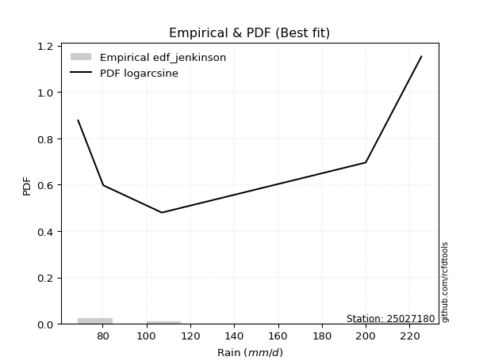</img>

</div>


### 11. Empirical - EDF Cunnane (1978)

Cunnane´s work in statistical hydrology has focused on the performance and evaluation of different probability distributions (such as GEV, Gumbel, Lognormal) for flood frequency estimation. _b_ is a constant, typically set to 0.4.

<div align="center">


$P=(m-b)/(n+1-2b)$


</div>


**11.1. Empirical values**

<div align="center">

|                | 0                   | 1                  | 2           | 3                  | 4                  |
|:---------------|:--------------------|:-------------------|:------------|:-------------------|:-------------------|
| date           | 2021                | 2023               | 2025        | 2022               | 2024               |
| x              | 68.8                | 80.3               | 88.5        | 200.0              | 225.4              |
| m              | 1                   | 2                  | 3           | 4                  | 5                  |
| empirical_dist | edf_cunnane         | edf_cunnane        | edf_cunnane | edf_cunnane        | edf_cunnane        |
| empirical      | 0.11538461538461538 | 0.3076923076923077 | 0.5         | 0.6923076923076923 | 0.8846153846153845 |
| empirical_tr   | 1.1304347826086958  | 1.4444444444444444 | 2.0         | 3.25               | 8.666666666666655  |

</div>


**11.2. Kolmogorov-Smirnov fit test (sorted by Δ)**


<div align="center">

|                | 0                   | 1                  | 2                   | 3                   | 4                   | 5                   | 6                   | 7                   | 8                   | 9                   | 10                    | 11                  | 12                  | 13                  | 14                 | 15                  | 16                 | 17                  | 18                  | 19                  | 20                  | 21                  | 22                 | 23                 | 24                  | 25                  | 26                 | 27                  | 28                  | 29                  | 30                  | 31                 | 32                  | 33                  | 34                  | 35                  | 36                  | 37                  | 38                 | 39                  | 40                  | 41                  | 42                  | 43                  | 44                  | 45                 | 46                  | 47                 | 48                  | 49                  | 50                  | 51                  | 52                  | 53                 | 54                  | 55                  | 56                  | 57                  | 58                 | 59                 | 60                  | 61                 | 62                 | 63                  | 64                  | 65                  | 66                  | 67                 | 68                 | 69                  | 70                  | 71                  | 72                 | 73                  | 74                 | 75                 | 76                 | 77                  | 78                  | 79                 | 80                  | 81                  | 82                  | 83                 | 84                 | 85                 | 86                 | 87                 | 88                 | 89                 |
|:---------------|:--------------------|:-------------------|:--------------------|:--------------------|:--------------------|:--------------------|:--------------------|:--------------------|:--------------------|:--------------------|:----------------------|:--------------------|:--------------------|:--------------------|:-------------------|:--------------------|:-------------------|:--------------------|:--------------------|:--------------------|:--------------------|:--------------------|:-------------------|:-------------------|:--------------------|:--------------------|:-------------------|:--------------------|:--------------------|:--------------------|:--------------------|:-------------------|:--------------------|:--------------------|:--------------------|:--------------------|:--------------------|:--------------------|:-------------------|:--------------------|:--------------------|:--------------------|:--------------------|:--------------------|:--------------------|:-------------------|:--------------------|:-------------------|:--------------------|:--------------------|:--------------------|:--------------------|:--------------------|:-------------------|:--------------------|:--------------------|:--------------------|:--------------------|:-------------------|:-------------------|:--------------------|:-------------------|:-------------------|:--------------------|:--------------------|:--------------------|:--------------------|:-------------------|:-------------------|:--------------------|:--------------------|:--------------------|:-------------------|:--------------------|:-------------------|:-------------------|:-------------------|:--------------------|:--------------------|:-------------------|:--------------------|:--------------------|:--------------------|:-------------------|:-------------------|:-------------------|:-------------------|:-------------------|:-------------------|:-------------------|
| station        | 25027180            | 25027180           | 25027180            | 25027180            | 25027180            | 25027180            | 25027180            | 25027180            | 25027180            | 25027180            | 25027180              | 25027180            | 25027180            | 25027180            | 25027180           | 25027180            | 25027180           | 25027180            | 25027180            | 25027180            | 25027180            | 25027180            | 25027180           | 25027180           | 25027180            | 25027180            | 25027180           | 25027180            | 25027180            | 25027180            | 25027180            | 25027180           | 25027180            | 25027180            | 25027180            | 25027180            | 25027180            | 25027180            | 25027180           | 25027180            | 25027180            | 25027180            | 25027180            | 25027180            | 25027180            | 25027180           | 25027180            | 25027180           | 25027180            | 25027180            | 25027180            | 25027180            | 25027180            | 25027180           | 25027180            | 25027180            | 25027180            | 25027180            | 25027180           | 25027180           | 25027180            | 25027180           | 25027180           | 25027180            | 25027180            | 25027180            | 25027180            | 25027180           | 25027180           | 25027180            | 25027180            | 25027180            | 25027180           | 25027180            | 25027180           | 25027180           | 25027180           | 25027180            | 25027180            | 25027180           | 25027180            | 25027180            | 25027180            | 25027180           | 25027180           | 25027180           | 25027180           | 25027180           | 25027180           | 25027180           |
| empirical_dist | edf_cunnane         | edf_cunnane        | edf_cunnane         | edf_cunnane         | edf_cunnane         | edf_cunnane         | edf_cunnane         | edf_cunnane         | edf_cunnane         | edf_cunnane         | edf_cunnane           | edf_cunnane         | edf_cunnane         | edf_cunnane         | edf_cunnane        | edf_cunnane         | edf_cunnane        | edf_cunnane         | edf_cunnane         | edf_cunnane         | edf_cunnane         | edf_cunnane         | edf_cunnane        | edf_cunnane        | edf_cunnane         | edf_cunnane         | edf_cunnane        | edf_cunnane         | edf_cunnane         | edf_cunnane         | edf_cunnane         | edf_cunnane        | edf_cunnane         | edf_cunnane         | edf_cunnane         | edf_cunnane         | edf_cunnane         | edf_cunnane         | edf_cunnane        | edf_cunnane         | edf_cunnane         | edf_cunnane         | edf_cunnane         | edf_cunnane         | edf_cunnane         | edf_cunnane        | edf_cunnane         | edf_cunnane        | edf_cunnane         | edf_cunnane         | edf_cunnane         | edf_cunnane         | edf_cunnane         | edf_cunnane        | edf_cunnane         | edf_cunnane         | edf_cunnane         | edf_cunnane         | edf_cunnane        | edf_cunnane        | edf_cunnane         | edf_cunnane        | edf_cunnane        | edf_cunnane         | edf_cunnane         | edf_cunnane         | edf_cunnane         | edf_cunnane        | edf_cunnane        | edf_cunnane         | edf_cunnane         | edf_cunnane         | edf_cunnane        | edf_cunnane         | edf_cunnane        | edf_cunnane        | edf_cunnane        | edf_cunnane         | edf_cunnane         | edf_cunnane        | edf_cunnane         | edf_cunnane         | edf_cunnane         | edf_cunnane        | edf_cunnane        | edf_cunnane        | edf_cunnane        | edf_cunnane        | edf_cunnane        | edf_cunnane        |
| p_dist         | loginvweibull       | invgamma           | logalpha            | f                   | ncf                 | loginvgamma         | logf                | loghalfnorm         | loginvgauss         | logexpon            | loglaplace_asymmetric | loggenexpon         | logchi2             | logexponnorm        | alpha              | loghalflogistic     | lograyleigh        | logmoyal            | invgauss            | loggenlogistic      | logkstwobign        | logbetaprime        | nct                | loggumbel_r        | logmaxwell          | halfnorm            | logmielke          | lognct              | betaprime           | logpearson3         | halflogistic        | fisk               | logwald             | logloggamma         | logt                | lognorm             | lognorm             | logcrystalball      | rayleigh           | logncf              | maxwell             | logrice             | genlogistic         | gumbel_r            | moyal               | exponnorm          | genexpon            | expon              | laplace_asymmetric  | pearson3            | loglogistic         | weibull_min         | gompertz            | truncnorm          | logerlang           | kstwobign           | loggompertz         | crystalball         | norm               | t                  | loghypsecant        | loggumbel_l        | logistic           | pareto              | loglaplace          | johnsonsu           | rice                | loggamma           | loggamma           | hypsecant           | gumbel_l            | wald                | logweibull_min     | laplace             | loggibrat          | logpareto          | logfisk            | loglognorm          | fatiguelife         | lognakagami        | nakagami            | logfatiguelife      | logjohnsonsu        | invweibull         | gibrat             | gamma              | erlang             | chi2               | logtruncnorm       | mielke             |
| delta          | 0.14898238762584504 | 0.1506371216096165 | 0.15123721942223467 | 0.15441893951492602 | 0.15641410200579642 | 0.15823559246929209 | 0.15823741235422117 | 0.16095710907368166 | 0.16980736975673727 | 0.17313144760400123 | 0.1731413073603949    | 0.17393488177027128 | 0.17557836159648965 | 0.17589052046269782 | 0.1759264690012422 | 0.17618839518993235 | 0.1780676678279014 | 0.18136587669824178 | 0.18218735850839052 | 0.18497093780771534 | 0.18629555283338772 | 0.18686819764944013 | 0.1872387446128176 | 0.1873455175250613 | 0.18858329762039722 | 0.19192070742295708 | 0.1945232577761281 | 0.19764917325739573 | 0.20161680153821437 | 0.20168133614518652 | 0.20548849586112333 | 0.2088583886323076 | 0.20986612615567346 | 0.21236881697645466 | 0.21483067145424595 | 0.21483290943739608 | 0.21483290943739608 | 0.21483291708056818 | 0.2163443621881787 | 0.21904607519099145 | 0.22538851907636526 | 0.22631610126829232 | 0.22737375965331919 | 0.23275104180747636 | 0.23323964210744053 | 0.2335296006317289 | 0.23434374738452202 | 0.2343441952176457 | 0.23434514468506307 | 0.23525413984779875 | 0.23680709678386586 | 0.23854914359119894 | 0.24122048598325296 | 0.2426631524017554 | 0.24307822868621232 | 0.24366455352112676 | 0.24416842446740644 | 0.24738088624442112 | 0.2473808863400374 | 0.24741602390111   | 0.25227560272660154 | 0.2625136434588264 | 0.2700300660246623 | 0.27579655373029244 | 0.27593013608437184 | 0.27616831849274087 | 0.27695828149945245 | 0.2804981826697154 | 0.2804981826697154 | 0.28502082455678823 | 0.28749937287530203 | 0.29817738788516196 | 0.2993029233153143 | 0.30512480224795413 | 0.3076923076923077 | 0.3081543844271698 | 0.3528803263520167 | 0.35400470519730476 | 0.35556713277765484 | 0.3799516534583829 | 0.39012617822158047 | 0.41098495955681713 | 0.42228478093494626 | 0.4375687553096987 | 0.4413810617743431 | 0.5207370589208244 | 0.5247309198017155 | 0.6911438826257922 | 0.6922979377647551 | nan                |
| deltao         | 0.5865427407550001  | 0.5865427407550001 | 0.5865427407550001  | 0.5865427407550001  | 0.5865427407550001  | 0.5865427407550001  | 0.5865427407550001  | 0.5865427407550001  | 0.5865427407550001  | 0.5865427407550001  | 0.5865427407550001    | 0.5865427407550001  | 0.5865427407550001  | 0.5865427407550001  | 0.5865427407550001 | 0.5865427407550001  | 0.5865427407550001 | 0.5865427407550001  | 0.5865427407550001  | 0.5865427407550001  | 0.5865427407550001  | 0.5865427407550001  | 0.5865427407550001 | 0.5865427407550001 | 0.5865427407550001  | 0.5865427407550001  | 0.5865427407550001 | 0.5865427407550001  | 0.5865427407550001  | 0.5865427407550001  | 0.5865427407550001  | 0.5865427407550001 | 0.5865427407550001  | 0.5865427407550001  | 0.5865427407550001  | 0.5865427407550001  | 0.5865427407550001  | 0.5865427407550001  | 0.5865427407550001 | 0.5865427407550001  | 0.5865427407550001  | 0.5865427407550001  | 0.5865427407550001  | 0.5865427407550001  | 0.5865427407550001  | 0.5865427407550001 | 0.5865427407550001  | 0.5865427407550001 | 0.5865427407550001  | 0.5865427407550001  | 0.5865427407550001  | 0.5865427407550001  | 0.5865427407550001  | 0.5865427407550001 | 0.5865427407550001  | 0.5865427407550001  | 0.5865427407550001  | 0.5865427407550001  | 0.5865427407550001 | 0.5865427407550001 | 0.5865427407550001  | 0.5865427407550001 | 0.5865427407550001 | 0.5865427407550001  | 0.5865427407550001  | 0.5865427407550001  | 0.5865427407550001  | 0.5865427407550001 | 0.5865427407550001 | 0.5865427407550001  | 0.5865427407550001  | 0.5865427407550001  | 0.5865427407550001 | 0.5865427407550001  | 0.5865427407550001 | 0.5865427407550001 | 0.5865427407550001 | 0.5865427407550001  | 0.5865427407550001  | 0.5865427407550001 | 0.5865427407550001  | 0.5865427407550001  | 0.5865427407550001  | 0.5865427407550001 | 0.5865427407550001 | 0.5865427407550001 | 0.5865427407550001 | 0.5865427407550001 | 0.5865427407550001 | 0.5865427407550001 |
| eval           | Δo > Δ              | Δo > Δ             | Δo > Δ              | Δo > Δ              | Δo > Δ              | Δo > Δ              | Δo > Δ              | Δo > Δ              | Δo > Δ              | Δo > Δ              | Δo > Δ                | Δo > Δ              | Δo > Δ              | Δo > Δ              | Δo > Δ             | Δo > Δ              | Δo > Δ             | Δo > Δ              | Δo > Δ              | Δo > Δ              | Δo > Δ              | Δo > Δ              | Δo > Δ             | Δo > Δ             | Δo > Δ              | Δo > Δ              | Δo > Δ             | Δo > Δ              | Δo > Δ              | Δo > Δ              | Δo > Δ              | Δo > Δ             | Δo > Δ              | Δo > Δ              | Δo > Δ              | Δo > Δ              | Δo > Δ              | Δo > Δ              | Δo > Δ             | Δo > Δ              | Δo > Δ              | Δo > Δ              | Δo > Δ              | Δo > Δ              | Δo > Δ              | Δo > Δ             | Δo > Δ              | Δo > Δ             | Δo > Δ              | Δo > Δ              | Δo > Δ              | Δo > Δ              | Δo > Δ              | Δo > Δ             | Δo > Δ              | Δo > Δ              | Δo > Δ              | Δo > Δ              | Δo > Δ             | Δo > Δ             | Δo > Δ              | Δo > Δ             | Δo > Δ             | Δo > Δ              | Δo > Δ              | Δo > Δ              | Δo > Δ              | Δo > Δ             | Δo > Δ             | Δo > Δ              | Δo > Δ              | Δo > Δ              | Δo > Δ             | Δo > Δ              | Δo > Δ             | Δo > Δ             | Δo > Δ             | Δo > Δ              | Δo > Δ              | Δo > Δ             | Δo > Δ              | Δo > Δ              | Δo > Δ              | Δo > Δ             | Δo > Δ             | Δo > Δ             | Δo > Δ             | Δo <= Δ            | Δo <= Δ            | Δo <= Δ            |
| fit            | 1                   | 1                  | 1                   | 1                   | 1                   | 1                   | 1                   | 1                   | 1                   | 1                   | 1                     | 1                   | 1                   | 1                   | 1                  | 1                   | 1                  | 1                   | 1                   | 1                   | 1                   | 1                   | 1                  | 1                  | 1                   | 1                   | 1                  | 1                   | 1                   | 1                   | 1                   | 1                  | 1                   | 1                   | 1                   | 1                   | 1                   | 1                   | 1                  | 1                   | 1                   | 1                   | 1                   | 1                   | 1                   | 1                  | 1                   | 1                  | 1                   | 1                   | 1                   | 1                   | 1                   | 1                  | 1                   | 1                   | 1                   | 1                   | 1                  | 1                  | 1                   | 1                  | 1                  | 1                   | 1                   | 1                   | 1                   | 1                  | 1                  | 1                   | 1                   | 1                   | 1                  | 1                   | 1                  | 1                  | 1                  | 1                   | 1                   | 1                  | 1                   | 1                   | 1                   | 1                  | 1                  | 1                  | 1                  | 0                  | 0                  | 0                  |
| n              | 5                   | 5                  | 5                   | 5                   | 5                   | 5                   | 5                   | 5                   | 5                   | 5                   | 5                     | 5                   | 5                   | 5                   | 5                  | 5                   | 5                  | 5                   | 5                   | 5                   | 5                   | 5                   | 5                  | 5                  | 5                   | 5                   | 5                  | 5                   | 5                   | 5                   | 5                   | 5                  | 5                   | 5                   | 5                   | 5                   | 5                   | 5                   | 5                  | 5                   | 5                   | 5                   | 5                   | 5                   | 5                   | 5                  | 5                   | 5                  | 5                   | 5                   | 5                   | 5                   | 5                   | 5                  | 5                   | 5                   | 5                   | 5                   | 5                  | 5                  | 5                   | 5                  | 5                  | 5                   | 5                   | 5                   | 5                   | 5                  | 5                  | 5                   | 5                   | 5                   | 5                  | 5                   | 5                  | 5                  | 5                  | 5                   | 5                   | 5                  | 5                   | 5                   | 5                   | 5                  | 5                  | 5                  | 5                  | 5                  | 5                  | 5                  |
| best_fit       | 1                   | 0                  | 0                   | 0                   | 0                   | 0                   | 0                   | 0                   | 0                   | 0                   | 0                     | 0                   | 0                   | 0                   | 0                  | 0                   | 0                  | 0                   | 0                   | 0                   | 0                   | 0                   | 0                  | 0                  | 0                   | 0                   | 0                  | 0                   | 0                   | 0                   | 0                   | 0                  | 0                   | 0                   | 0                   | 0                   | 0                   | 0                   | 0                  | 0                   | 0                   | 0                   | 0                   | 0                   | 0                   | 0                  | 0                   | 0                  | 0                   | 0                   | 0                   | 0                   | 0                   | 0                  | 0                   | 0                   | 0                   | 0                   | 0                  | 0                  | 0                   | 0                  | 0                  | 0                   | 0                   | 0                   | 0                   | 0                  | 0                  | 0                   | 0                   | 0                   | 0                  | 0                   | 0                  | 0                  | 0                  | 0                   | 0                   | 0                  | 0                   | 0                   | 0                   | 0                  | 0                  | 0                  | 0                  | 0                  | 0                  | 0                  |
| best_fit_sort  | 1                   | 2                  | 3                   | 4                   | 5                   | 6                   | 7                   | 8                   | 9                   | 10                  | 11                    | 12                  | 13                  | 14                  | 15                 | 16                  | 17                 | 18                  | 19                  | 20                  | 21                  | 22                  | 23                 | 24                 | 25                  | 26                  | 27                 | 28                  | 29                  | 30                  | 31                  | 32                 | 33                  | 34                  | 35                  | 36                  | 37                  | 38                  | 39                 | 40                  | 41                  | 42                  | 43                  | 44                  | 45                  | 46                 | 47                  | 48                 | 49                  | 50                  | 51                  | 52                  | 53                  | 54                 | 55                  | 56                  | 57                  | 58                  | 59                 | 60                 | 61                  | 62                 | 63                 | 64                  | 65                  | 66                  | 67                  | 68                 | 69                 | 70                  | 71                  | 72                  | 73                 | 74                  | 75                 | 76                 | 77                 | 78                  | 79                  | 80                 | 81                  | 82                  | 83                  | 84                 | 85                 | 86                 | 87                 | 88                 | 89                 | 90                 |

</div>


<div align="center">

</img>

</div>


**11.3. Best fit**

<div align="center">

|   id |   station | empirical_dist   | p_dist        |    delta |   deltao | eval   |   fit |   n |   best_fit |   best_fit_sort |
|-----:|----------:|:-----------------|:--------------|---------:|---------:|:-------|------:|----:|-----------:|----------------:|
|    0 |  25027180 | edf_cunnane      | loginvweibull | 0.148982 | 0.586543 | Δo > Δ |     1 |   5 |          1 |               1 |

</div>


<div align="center">

</img></img>

</div>


### 12. Empirical - EDF Adamowski (1981)

The Adamowski formula in hydrology refers to a specific plotting position formula used for estimating the non-parametric empirical distribution of hydrological events (like flood peaks) to calculate their return periods. This formula provides an alternative to traditional parametric methods (like the Gumbel or Log Pearson Type III distributions). 

<div align="center">


$P=(m-0.25)/(n+0.5)$


</div>


**12.1. Empirical values**

<div align="center">

|                | 0                   | 1                  | 2             | 3                  | 4                  |
|:---------------|:--------------------|:-------------------|:--------------|:-------------------|:-------------------|
| date           | 2021                | 2023               | 2025          | 2022               | 2024               |
| x              | 68.8                | 80.3               | 88.5          | 200.0              | 225.4              |
| m              | 1                   | 2                  | 3             | 4                  | 5                  |
| empirical_dist | edf_adamowski       | edf_adamowski      | edf_adamowski | edf_adamowski      | edf_adamowski      |
| empirical      | 0.13636363636363635 | 0.3181818181818182 | 0.5           | 0.6818181818181818 | 0.8636363636363636 |
| empirical_tr   | 1.1578947368421053  | 1.4666666666666666 | 2.0           | 3.1428571428571423 | 7.333333333333334  |

</div>


**12.2. Kolmogorov-Smirnov fit test (sorted by Δ)**


<div align="center">

|                | 0                   | 1                   | 2                   | 3                   | 4                  | 5                   | 6                  | 7                  | 8                   | 9                  | 10                 | 11                  | 12                    | 13                 | 14                  | 15                  | 16                  | 17                  | 18                 | 19                  | 20                  | 21                 | 22                  | 23                  | 24                  | 25                  | 26                  | 27                  | 28                  | 29                  | 30                  | 31                 | 32                  | 33                  | 34                  | 35                  | 36                  | 37                 | 38                  | 39                  | 40                  | 41                  | 42                  | 43                  | 44                  | 45                  | 46                 | 47                  | 48                 | 49                  | 50                  | 51                  | 52                  | 53                 | 54                  | 55                  | 56                  | 57                 | 58                 | 59                  | 60                  | 61                 | 62                  | 63                 | 64                  | 65                  | 66                  | 67                  | 68                  | 69                 | 70                 | 71                 | 72                  | 73                  | 74                  | 75                 | 76                 | 77                 | 78                  | 79                 | 80                 | 81                  | 82                  | 83                  | 84                 | 85                 | 86                 | 87                 | 88                 | 89                 |
|:---------------|:--------------------|:--------------------|:--------------------|:--------------------|:-------------------|:--------------------|:-------------------|:-------------------|:--------------------|:-------------------|:-------------------|:--------------------|:----------------------|:-------------------|:--------------------|:--------------------|:--------------------|:--------------------|:-------------------|:--------------------|:--------------------|:-------------------|:--------------------|:--------------------|:--------------------|:--------------------|:--------------------|:--------------------|:--------------------|:--------------------|:--------------------|:-------------------|:--------------------|:--------------------|:--------------------|:--------------------|:--------------------|:-------------------|:--------------------|:--------------------|:--------------------|:--------------------|:--------------------|:--------------------|:--------------------|:--------------------|:-------------------|:--------------------|:-------------------|:--------------------|:--------------------|:--------------------|:--------------------|:-------------------|:--------------------|:--------------------|:--------------------|:-------------------|:-------------------|:--------------------|:--------------------|:-------------------|:--------------------|:-------------------|:--------------------|:--------------------|:--------------------|:--------------------|:--------------------|:-------------------|:-------------------|:-------------------|:--------------------|:--------------------|:--------------------|:-------------------|:-------------------|:-------------------|:--------------------|:-------------------|:-------------------|:--------------------|:--------------------|:--------------------|:-------------------|:-------------------|:-------------------|:-------------------|:-------------------|:-------------------|
| station        | 25027180            | 25027180            | 25027180            | 25027180            | 25027180           | 25027180            | 25027180           | 25027180           | 25027180            | 25027180           | 25027180           | 25027180            | 25027180              | 25027180           | 25027180            | 25027180            | 25027180            | 25027180            | 25027180           | 25027180            | 25027180            | 25027180           | 25027180            | 25027180            | 25027180            | 25027180            | 25027180            | 25027180            | 25027180            | 25027180            | 25027180            | 25027180           | 25027180            | 25027180            | 25027180            | 25027180            | 25027180            | 25027180           | 25027180            | 25027180            | 25027180            | 25027180            | 25027180            | 25027180            | 25027180            | 25027180            | 25027180           | 25027180            | 25027180           | 25027180            | 25027180            | 25027180            | 25027180            | 25027180           | 25027180            | 25027180            | 25027180            | 25027180           | 25027180           | 25027180            | 25027180            | 25027180           | 25027180            | 25027180           | 25027180            | 25027180            | 25027180            | 25027180            | 25027180            | 25027180           | 25027180           | 25027180           | 25027180            | 25027180            | 25027180            | 25027180           | 25027180           | 25027180           | 25027180            | 25027180           | 25027180           | 25027180            | 25027180            | 25027180            | 25027180           | 25027180           | 25027180           | 25027180           | 25027180           | 25027180           |
| empirical_dist | edf_adamowski       | edf_adamowski       | edf_adamowski       | edf_adamowski       | edf_adamowski      | edf_adamowski       | edf_adamowski      | edf_adamowski      | edf_adamowski       | edf_adamowski      | edf_adamowski      | edf_adamowski       | edf_adamowski         | edf_adamowski      | edf_adamowski       | edf_adamowski       | edf_adamowski       | edf_adamowski       | edf_adamowski      | edf_adamowski       | edf_adamowski       | edf_adamowski      | edf_adamowski       | edf_adamowski       | edf_adamowski       | edf_adamowski       | edf_adamowski       | edf_adamowski       | edf_adamowski       | edf_adamowski       | edf_adamowski       | edf_adamowski      | edf_adamowski       | edf_adamowski       | edf_adamowski       | edf_adamowski       | edf_adamowski       | edf_adamowski      | edf_adamowski       | edf_adamowski       | edf_adamowski       | edf_adamowski       | edf_adamowski       | edf_adamowski       | edf_adamowski       | edf_adamowski       | edf_adamowski      | edf_adamowski       | edf_adamowski      | edf_adamowski       | edf_adamowski       | edf_adamowski       | edf_adamowski       | edf_adamowski      | edf_adamowski       | edf_adamowski       | edf_adamowski       | edf_adamowski      | edf_adamowski      | edf_adamowski       | edf_adamowski       | edf_adamowski      | edf_adamowski       | edf_adamowski      | edf_adamowski       | edf_adamowski       | edf_adamowski       | edf_adamowski       | edf_adamowski       | edf_adamowski      | edf_adamowski      | edf_adamowski      | edf_adamowski       | edf_adamowski       | edf_adamowski       | edf_adamowski      | edf_adamowski      | edf_adamowski      | edf_adamowski       | edf_adamowski      | edf_adamowski      | edf_adamowski       | edf_adamowski       | edf_adamowski       | edf_adamowski      | edf_adamowski      | edf_adamowski      | edf_adamowski      | edf_adamowski      | edf_adamowski      |
| p_dist         | ncf                 | logchi2             | loginvweibull       | invgamma            | logalpha           | f                   | loginvgamma        | logf               | loghalfnorm         | lograyleigh        | loginvgauss        | logexpon            | loglaplace_asymmetric | loggenexpon        | logexponnorm        | alpha               | loghalflogistic     | logbetaprime        | nct                | loggumbel_r         | logmaxwell          | logmoyal           | halfnorm            | invgauss            | loggenlogistic      | logkstwobign        | lognct              | betaprime           | logpearson3         | logmielke           | halflogistic        | fisk               | logloggamma         | logt                | lognorm             | lognorm             | logcrystalball      | rayleigh           | weibull_min         | logncf              | logwald             | maxwell             | logrice             | genlogistic         | gumbel_r            | moyal               | exponnorm          | genexpon            | expon              | laplace_asymmetric  | pearson3            | loglogistic         | gompertz            | truncnorm          | kstwobign           | loggompertz         | crystalball         | norm               | t                  | loghypsecant        | logerlang           | loggumbel_l        | pareto              | logistic           | loglaplace          | johnsonsu           | rice                | hypsecant           | gumbel_l            | logweibull_min     | loggamma           | loggamma           | logpareto           | wald                | laplace             | loggibrat          | logfisk            | loglognorm         | fatiguelife         | lognakagami        | nakagami           | logfatiguelife      | logjohnsonsu        | invweibull          | gibrat             | gamma              | erlang             | chi2               | logtruncnorm       | mielke             |
| delta          | 0.14395484649533974 | 0.15459934061746883 | 0.15947189811535556 | 0.16112663209912703 | 0.1617267299117452 | 0.16490845000443655 | 0.1687251029588026 | 0.1687269228437317 | 0.17144661956319218 | 0.1780676678279014 | 0.1802968802462478 | 0.18362095809351175 | 0.18363081784990543   | 0.1844243922597818 | 0.18638003095220834 | 0.18641597949075273 | 0.18667790567944287 | 0.18686819764944013 | 0.1872387446128176 | 0.18766464031010477 | 0.18858329762039722 | 0.1918553871877523 | 0.19192070742295708 | 0.19267686899790104 | 0.19546044829722586 | 0.19625972393188595 | 0.19764917325739573 | 0.20161680153821437 | 0.20168133614518652 | 0.20501276826563863 | 0.20548849586112333 | 0.2088583886323076 | 0.21236881697645466 | 0.21483067145424595 | 0.21483290943739608 | 0.21483290943739608 | 0.21483291708056818 | 0.2163443621881787 | 0.21757012261217812 | 0.21904607519099145 | 0.22035563664518393 | 0.22538851907636526 | 0.22631610126829232 | 0.22737375965331919 | 0.23275104180747636 | 0.23323964210744053 | 0.2335296006317289 | 0.23434374738452202 | 0.2343441952176457 | 0.23434514468506307 | 0.23525413984779875 | 0.23680709678386586 | 0.24122048598325296 | 0.2426631524017554 | 0.24366455352112676 | 0.24416842446740644 | 0.24738088624442112 | 0.2473808863400374 | 0.24741602390111   | 0.25227560272660154 | 0.25356773917572284 | 0.2625136434588264 | 0.26530704324078197 | 0.2700300660246623 | 0.27593013608437184 | 0.27616831849274087 | 0.27695828149945245 | 0.28502082455678823 | 0.28749937287530203 | 0.2888134128258038 | 0.2909876931592259 | 0.2909876931592259 | 0.29766487393765934 | 0.29817738788516196 | 0.30512480224795413 | 0.3181818181818182 | 0.3319013053729959 | 0.3435151947077943 | 0.34507762228814437 | 0.3694621429688724 | 0.37963666773207   | 0.40049544906730666 | 0.41179527044543573 | 0.41658973433067786 | 0.4413810617743431 | 0.510247548431314  | 0.514241409312205  | 0.6806543721362817 | 0.6818084272752446 | nan                |
| deltao         | 0.5865427407550001  | 0.5865427407550001  | 0.5865427407550001  | 0.5865427407550001  | 0.5865427407550001 | 0.5865427407550001  | 0.5865427407550001 | 0.5865427407550001 | 0.5865427407550001  | 0.5865427407550001 | 0.5865427407550001 | 0.5865427407550001  | 0.5865427407550001    | 0.5865427407550001 | 0.5865427407550001  | 0.5865427407550001  | 0.5865427407550001  | 0.5865427407550001  | 0.5865427407550001 | 0.5865427407550001  | 0.5865427407550001  | 0.5865427407550001 | 0.5865427407550001  | 0.5865427407550001  | 0.5865427407550001  | 0.5865427407550001  | 0.5865427407550001  | 0.5865427407550001  | 0.5865427407550001  | 0.5865427407550001  | 0.5865427407550001  | 0.5865427407550001 | 0.5865427407550001  | 0.5865427407550001  | 0.5865427407550001  | 0.5865427407550001  | 0.5865427407550001  | 0.5865427407550001 | 0.5865427407550001  | 0.5865427407550001  | 0.5865427407550001  | 0.5865427407550001  | 0.5865427407550001  | 0.5865427407550001  | 0.5865427407550001  | 0.5865427407550001  | 0.5865427407550001 | 0.5865427407550001  | 0.5865427407550001 | 0.5865427407550001  | 0.5865427407550001  | 0.5865427407550001  | 0.5865427407550001  | 0.5865427407550001 | 0.5865427407550001  | 0.5865427407550001  | 0.5865427407550001  | 0.5865427407550001 | 0.5865427407550001 | 0.5865427407550001  | 0.5865427407550001  | 0.5865427407550001 | 0.5865427407550001  | 0.5865427407550001 | 0.5865427407550001  | 0.5865427407550001  | 0.5865427407550001  | 0.5865427407550001  | 0.5865427407550001  | 0.5865427407550001 | 0.5865427407550001 | 0.5865427407550001 | 0.5865427407550001  | 0.5865427407550001  | 0.5865427407550001  | 0.5865427407550001 | 0.5865427407550001 | 0.5865427407550001 | 0.5865427407550001  | 0.5865427407550001 | 0.5865427407550001 | 0.5865427407550001  | 0.5865427407550001  | 0.5865427407550001  | 0.5865427407550001 | 0.5865427407550001 | 0.5865427407550001 | 0.5865427407550001 | 0.5865427407550001 | 0.5865427407550001 |
| eval           | Δo > Δ              | Δo > Δ              | Δo > Δ              | Δo > Δ              | Δo > Δ             | Δo > Δ              | Δo > Δ             | Δo > Δ             | Δo > Δ              | Δo > Δ             | Δo > Δ             | Δo > Δ              | Δo > Δ                | Δo > Δ             | Δo > Δ              | Δo > Δ              | Δo > Δ              | Δo > Δ              | Δo > Δ             | Δo > Δ              | Δo > Δ              | Δo > Δ             | Δo > Δ              | Δo > Δ              | Δo > Δ              | Δo > Δ              | Δo > Δ              | Δo > Δ              | Δo > Δ              | Δo > Δ              | Δo > Δ              | Δo > Δ             | Δo > Δ              | Δo > Δ              | Δo > Δ              | Δo > Δ              | Δo > Δ              | Δo > Δ             | Δo > Δ              | Δo > Δ              | Δo > Δ              | Δo > Δ              | Δo > Δ              | Δo > Δ              | Δo > Δ              | Δo > Δ              | Δo > Δ             | Δo > Δ              | Δo > Δ             | Δo > Δ              | Δo > Δ              | Δo > Δ              | Δo > Δ              | Δo > Δ             | Δo > Δ              | Δo > Δ              | Δo > Δ              | Δo > Δ             | Δo > Δ             | Δo > Δ              | Δo > Δ              | Δo > Δ             | Δo > Δ              | Δo > Δ             | Δo > Δ              | Δo > Δ              | Δo > Δ              | Δo > Δ              | Δo > Δ              | Δo > Δ             | Δo > Δ             | Δo > Δ             | Δo > Δ              | Δo > Δ              | Δo > Δ              | Δo > Δ             | Δo > Δ             | Δo > Δ             | Δo > Δ              | Δo > Δ             | Δo > Δ             | Δo > Δ              | Δo > Δ              | Δo > Δ              | Δo > Δ             | Δo > Δ             | Δo > Δ             | Δo <= Δ            | Δo <= Δ            | Δo <= Δ            |
| fit            | 1                   | 1                   | 1                   | 1                   | 1                  | 1                   | 1                  | 1                  | 1                   | 1                  | 1                  | 1                   | 1                     | 1                  | 1                   | 1                   | 1                   | 1                   | 1                  | 1                   | 1                   | 1                  | 1                   | 1                   | 1                   | 1                   | 1                   | 1                   | 1                   | 1                   | 1                   | 1                  | 1                   | 1                   | 1                   | 1                   | 1                   | 1                  | 1                   | 1                   | 1                   | 1                   | 1                   | 1                   | 1                   | 1                   | 1                  | 1                   | 1                  | 1                   | 1                   | 1                   | 1                   | 1                  | 1                   | 1                   | 1                   | 1                  | 1                  | 1                   | 1                   | 1                  | 1                   | 1                  | 1                   | 1                   | 1                   | 1                   | 1                   | 1                  | 1                  | 1                  | 1                   | 1                   | 1                   | 1                  | 1                  | 1                  | 1                   | 1                  | 1                  | 1                   | 1                   | 1                   | 1                  | 1                  | 1                  | 0                  | 0                  | 0                  |
| n              | 5                   | 5                   | 5                   | 5                   | 5                  | 5                   | 5                  | 5                  | 5                   | 5                  | 5                  | 5                   | 5                     | 5                  | 5                   | 5                   | 5                   | 5                   | 5                  | 5                   | 5                   | 5                  | 5                   | 5                   | 5                   | 5                   | 5                   | 5                   | 5                   | 5                   | 5                   | 5                  | 5                   | 5                   | 5                   | 5                   | 5                   | 5                  | 5                   | 5                   | 5                   | 5                   | 5                   | 5                   | 5                   | 5                   | 5                  | 5                   | 5                  | 5                   | 5                   | 5                   | 5                   | 5                  | 5                   | 5                   | 5                   | 5                  | 5                  | 5                   | 5                   | 5                  | 5                   | 5                  | 5                   | 5                   | 5                   | 5                   | 5                   | 5                  | 5                  | 5                  | 5                   | 5                   | 5                   | 5                  | 5                  | 5                  | 5                   | 5                  | 5                  | 5                   | 5                   | 5                   | 5                  | 5                  | 5                  | 5                  | 5                  | 5                  |
| best_fit       | 1                   | 0                   | 0                   | 0                   | 0                  | 0                   | 0                  | 0                  | 0                   | 0                  | 0                  | 0                   | 0                     | 0                  | 0                   | 0                   | 0                   | 0                   | 0                  | 0                   | 0                   | 0                  | 0                   | 0                   | 0                   | 0                   | 0                   | 0                   | 0                   | 0                   | 0                   | 0                  | 0                   | 0                   | 0                   | 0                   | 0                   | 0                  | 0                   | 0                   | 0                   | 0                   | 0                   | 0                   | 0                   | 0                   | 0                  | 0                   | 0                  | 0                   | 0                   | 0                   | 0                   | 0                  | 0                   | 0                   | 0                   | 0                  | 0                  | 0                   | 0                   | 0                  | 0                   | 0                  | 0                   | 0                   | 0                   | 0                   | 0                   | 0                  | 0                  | 0                  | 0                   | 0                   | 0                   | 0                  | 0                  | 0                  | 0                   | 0                  | 0                  | 0                   | 0                   | 0                   | 0                  | 0                  | 0                  | 0                  | 0                  | 0                  |
| best_fit_sort  | 1                   | 2                   | 3                   | 4                   | 5                  | 6                   | 7                  | 8                  | 9                   | 10                 | 11                 | 12                  | 13                    | 14                 | 15                  | 16                  | 17                  | 18                  | 19                 | 20                  | 21                  | 22                 | 23                  | 24                  | 25                  | 26                  | 27                  | 28                  | 29                  | 30                  | 31                  | 32                 | 33                  | 34                  | 35                  | 36                  | 37                  | 38                 | 39                  | 40                  | 41                  | 42                  | 43                  | 44                  | 45                  | 46                  | 47                 | 48                  | 49                 | 50                  | 51                  | 52                  | 53                  | 54                 | 55                  | 56                  | 57                  | 58                 | 59                 | 60                  | 61                  | 62                 | 63                  | 64                 | 65                  | 66                  | 67                  | 68                  | 69                  | 70                 | 71                 | 72                 | 73                  | 74                  | 75                  | 76                 | 77                 | 78                 | 79                  | 80                 | 81                 | 82                  | 83                  | 84                  | 85                 | 86                 | 87                 | 88                 | 89                 | 90                 |

</div>


<div align="center">

</img>

</div>


**12.3. Best fit**

<div align="center">

|   id |   station | empirical_dist   | p_dist   |    delta |   deltao | eval   |   fit |   n |   best_fit |   best_fit_sort |
|-----:|----------:|:-----------------|:---------|---------:|---------:|:-------|------:|----:|-----------:|----------------:|
|    0 |  25027180 | edf_adamowski    | ncf      | 0.143955 | 0.586543 | Δo > Δ |     1 |   5 |          1 |               1 |

</div>


<div align="center">

</img></img>

</div>


## C. Best fit & Estimate extreme values for specific return periods - Tr


### 1. Best fit (ordered by delta Δ)

<div align="center">

|   id |   station | empirical_dist   | p_dist        |    delta |   deltao | eval   |   fit |   n |   best_fit |   best_fit_sort |
|-----:|----------:|:-----------------|:--------------|---------:|---------:|:-------|------:|----:|-----------:|----------------:|
|    0 |  25027180 | edf_california   | f             | 0.136661 | 0.586543 | Δo > Δ |     1 |   5 |          1 |               1 |
|    1 |  25027180 | edf_hazen        | loginvweibull | 0.14129  | 0.586543 | Δo > Δ |     1 |   5 |          1 |               2 |
|    2 |  25027180 | edf_adamowski    | ncf           | 0.143955 | 0.586543 | Δo > Δ |     1 |   5 |          1 |               3 |
|    3 |  25027180 | edf_jenkinson    | ncf           | 0.143955 | 0.586543 | Δo > Δ |     1 |   5 |          1 |               4 |
|    4 |  25027180 | edf_beard        | ncf           | 0.143955 | 0.586543 | Δo > Δ |     1 |   5 |          1 |               5 |
|    5 |  25027180 | edf_weibull      | ncf           | 0.143955 | 0.586543 | Δo > Δ |     1 |   5 |          1 |               6 |
|    6 |  25027180 | edf_chegodayev   | ncf           | 0.143955 | 0.586543 | Δo > Δ |     1 |   5 |          1 |               7 |
|    7 |  25027180 | edf_filliben     | ncf           | 0.144585 | 0.586543 | Δo > Δ |     1 |   5 |          1 |               8 |
|    8 |  25027180 | edf_gringorten   | loginvweibull | 0.145978 | 0.586543 | Δo > Δ |     1 |   5 |          1 |               9 |
|    9 |  25027180 | edf_tukey        | ncf           | 0.146799 | 0.586543 | Δo > Δ |     1 |   5 |          1 |              10 |
|   10 |  25027180 | edf_cunnane      | loginvweibull | 0.148982 | 0.586543 | Δo > Δ |     1 |   5 |          1 |              11 |
|   11 |  25027180 | edf_blom         | loginvweibull | 0.150814 | 0.586543 | Δo > Δ |     1 |   5 |          1 |              12 |

</div>

:file_folder:Tables: [bestfit_25027180.csv](table/bestfit_25027180.csv) | [extreme_25027180.csv](table/extreme_25027180.csv)


### 2. Extreme values

In hydrology, a return period (or recurrence interval $Tr$) is the statistical average time between extreme events like floods or droughts of a specific magnitude, indicating how rare an event is, with a 100-year flood, for example, having a 1% chance of occurring in any given year, not that it happens exactly every century. It is a key tool for infrastructure design (like bridges or dams) and risk assessment, calculated from historical data to determine the probability of future events, although it is important to remember it is statistical average, and events can cluster or be missed.

> risk_rate: assuming the return period as the project useful life.

|   id |      tr |   prob_l |     prob_g |      alpha |   betaprime |    chi2 |   crystalball |   erlang |   expon |   exponnorm |           f |   fatiguelife |      fisk |    gamma |   genexpon |   genlogistic |   gibrat |   gompertz |   gumbel_l |   gumbel_r |   halflogistic |   halfnorm |   hypsecant |   invgamma |   invgauss |       invweibull |   johnsonsu |   kstwobign |   laplace |   laplace_asymmetric |   loggamma |   logistic |   lognorm |   maxwell |   mielke |   moyal |   nakagami |      ncf |      nct |    norm |           pareto |   pearson3 |   rayleigh |    rice |       t |   truncnorm |    wald |   weibull_min |         logalpha |   logbetaprime |          logchi2 |   logcrystalball |   logerlang |   logexpon |   logexponnorm |            logf |   logfatiguelife |   logfisk |   loggenexpon |   loggenlogistic |   loggibrat |   loggompertz |   loggumbel_l |   loggumbel_r |   loghalflogistic |   loghalfnorm |   loghypsecant |     loginvgamma |   loginvgauss |    loginvweibull |   logjohnsonsu |   logkstwobign |   loglaplace |   loglaplace_asymmetric |   logloggamma |   loglogistic |    loglognorm |   logmaxwell |   logmielke |   logmoyal |   lognakagami |   logncf |   lognct |      logpareto |   logpearson3 |   lograyleigh |   logrice |    logt |   logtruncnorm |   logwald |   logweibull_min |   station |   n |   risk_rate |
|-----:|--------:|---------:|-----------:|-----------:|------------:|--------:|--------------:|---------:|--------:|------------:|------------:|--------------:|----------:|---------:|-----------:|--------------:|---------:|-----------:|-----------:|-----------:|---------------:|-----------:|------------:|-----------:|-----------:|-----------------:|------------:|------------:|----------:|---------------------:|-----------:|-----------:|----------:|----------:|---------:|--------:|-----------:|---------:|---------:|--------:|-----------------:|-----------:|-----------:|--------:|--------:|------------:|--------:|--------------:|-----------------:|---------------:|-----------------:|-----------------:|------------:|-----------:|---------------:|----------------:|-----------------:|----------:|--------------:|-----------------:|------------:|--------------:|--------------:|--------------:|------------------:|--------------:|---------------:|----------------:|--------------:|-----------------:|---------------:|---------------:|-------------:|------------------------:|--------------:|--------------:|--------------:|-------------:|------------:|-----------:|--------------:|---------:|---------:|---------------:|--------------:|--------------:|----------:|--------:|---------------:|----------:|-----------------:|----------:|----:|------------:|
|    0 |    2    | 0.5      | 0.5        |    91.3704 |     112.978 | 68.8    |       132.6   |  69.0163 | 113.023 |     112.941 |     85.0189 |       68.8    |   119.132 |  69.0409 |    113.023 |       119.429 |  112.732 |    114.399 |    143.474 |    121.726 |        116.32  |    119.051 |     132.6   |    89.9369 |    89.3905 |   4241.24        |     132.602 |     121.826 |   132.6   |              113.023 |    82.6581 |    132.6   |   117.124 |   126.939 |  107.257 | 118.216 |    69.3665 |  124.103 |  109.296 | 132.6   |     74.4471      |    127.919 |    124.931 | 130.194 | 132.629 |     114.695 | 111.144 |       133.704 |     90.8962      |        115.49  |    113.917       |          117.124 |     84.9012 |    99.4822 |        99.0658 |    91.9133      |          68.8    |   119.546 |       100.439 |          106.283 |     100.988 |       114.917 |       127.021 |       107.999 |           103.73  |       105.865 |        117.124 |    91.9134      |       89.9905 |     91.0845      |        224.355 |        107.704 |      117.124 |                 99.4808 |       117.184 |       117.124 |  68.8368      |      112.281 |     101.159 |    105.207 |       69.4982 |  116.662 |  112.335 |  72.6729       |       113.855 |       110.612 |   114.369 | 117.124 |        210.34  |   99.8023 |    70.2171       |  25027180 |   5 |    0.75     |
|    1 |    2.33 | 0.570815 | 0.429185   |    98.0991 |     123.212 | 68.8003 |       144.412 |  69.3867 | 122.766 |     122.681 |     91.3173 |       70.8625 |   136.784 |  69.4419 |    122.767 |       129.862 |  118.715 |    124.446 |    153.75  |    132.671 |        127.573 |    131.799 |     142.053 |    97.2554 |    96.3668 | 436378           |     142.967 |     132.402 |   139.748 |              122.767 |    86.4027 |    143.007 |   127.912 |   139.21  |  116.542 | 128.576 |    70.6736 |  146.994 |  118.972 | 144.412 |     79.0521      |    139.777 |    137.384 | 141.2   | 144.446 |     124.806 | 118.889 |       168.939 |     97.5966      |        127.583 |    136.108       |          127.912 |     89.9728 |   107.903  |       107.367  |    98.9008      |          69.8179 |  1482.6   |       108.992 |          115.189 |     105.598 |       125.038 |       137.14  |       117.186 |           112.813 |       116.426 |        125.681 |    98.9009      |       96.841  |     98.0954      |        224.994 |        116.843 |      123.539 |                107.901  |       128.095 |       126.579 |  69.2169      |      123.044 |     109.055 |    113.661 |       70.9932 |  127.391 |  122.549 |  76.0739       |       124.392 |       121.38  |   124.349 | 127.912 |        212.108 |  105.738  |    74.4457       |  25027180 |   5 |    0.729209 |
|    2 |    5    | 0.8      | 0.2        |   150.275  |     173.763 | 68.8649 |       188.306 |  76.9704 | 171.482 |     171.375 |    155.113  |      114.677  |   285.824 |  77.3592 |    171.482 |       175.186 |  153.163 |    174.678 |    186.948 |    180.22  |        178.49  |    185.707 |     179.97  |   162.857  |   149.664  |      2.58823e+14 |     181.485 |     177.322 |   175.485 |              171.483 |   108.444  |    183.189 |   177.467 |   187.51  |  167.151 | 176.567 |   108.481  |  288.962 |  170.223 | 188.306 |    245.161       |    186.504 |    187.239 | 185.259 | 188.363 |     175.355 | 162.245 |       475.276 |    158.851       |        186.555 |    384.879       |          177.467 |    122.665  |   161.98   |       160.547  |   157.641       |          95.3808 |   inf     |       162.719 |          163.382 |     136.542 |       175.489 |       175.678 |       167.078 |           164.936 |       174.059 |        166.767 |   157.642       |      152.289  |    161.86        |        225.388 |        165.134 |      161.28  |                161.975  |       178.041 |       170.82  |   1.96993e+23 |      176.415 |     154.635 |    162.587 |      121.394  |  178.946 |  173.434 | 430.432        |       175.631 |       176.059 |   173.806 | 177.467 |        218.565 |  146.112  | 35127.2          |  25027180 |   5 |    0.67232  |
|    3 |   10    | 0.9      | 0.1        |   246.134  |     222.84  | 69.2857 |       217.425 |  93.0212 | 215.705 |     215.579 |    320.459  |      175.173  |   579.024 |  93.8194 |    215.705 |       212.099 |  192.428 |    220.277 |    205.431 |    218.947 |        220.775 |    225.598 |     210.248 |   307.127  |   229.869  |      3.61952e+21 |     207.037 |     211.524 |   207.926 |              215.706 |   133.883  |    212.781 |   220.522 |   221.5   |  224.232 | 218.351 |   188.359  |  477.386 |  225.624 | 217.425 |   2318.39        |    219.866 |    222.786 | 216.675 | 217.496 |     221.235 | 208.257 |       955.509 |    354.662       |        242.174 |   1119.27        |          220.522 |    165.12   |   234.217  |       231.322  |   299.288       |         146.739  |   inf     |       231.729 |          217.181 |     183.015 |       221.108 |       201.649 |       223.041 |           226.102 |       234.385 |        209.026 |   299.294       |      259.739  |    344.651       |        225.399 |        214.893 |      205.437 |                234.207  |       221.193 |       213.014 | inf           |      227.328 |     211.701 |    222.05  |      349.385  |  226.829 |  223.424 |   3.76428e+12  |       223.946 |       229.519 |   220.647 | 220.522 |        221.815 |  205.94   |     4.96125e+32  |  25027180 |   5 |    0.651322 |
|    4 |   15    | 0.933333 | 0.0666667  |   341.651  |     254.027 | 69.7741 |       231.956 | 105.607  | 241.574 |     241.437 |    529.777  |      214.739  |   881.699 | 106.651  |    241.573 |       232.925 |  219.512 |    246.951 |    213.802 |    240.797 |        244.704 |    246.357 |     227.527 |   469.643  |   291.916  |      3.89193e+25 |     219.787 |     229.68  |   226.903 |              241.574 |   151.616  |    228.905 |   245.769 |   238.94  |  264.662 | 242.6   |   242.904  |  625.743 |  263.711 | 231.956 |  10030.4         |    237.234 |    241.101 | 232.861 | 232.034 |     248.07  | 237.803 |      1331.18  |    765.501       |        276.608 |   2157.01        |          245.769 |    197.257  |   290.606  |       286.419  |   502.158       |         194.491  |   inf     |       283.825 |          255.014 |     223.996 |       247.73  |       214.641 |       262.525 |           270.288 |       273.643 |        237.783 |   502.175       |      372.985  |    663.326       |        225.4   |        247.142 |      236.678 |                290.591  |       246.393 |       240.238 | inf           |      258.913 |     256.016 |    266.08  |      708.07   |  256.252 |  255.447 |   9.26309e+50  |       253.911 |       263.121 |   249.503 | 245.769 |        222.97  |  256.719  |     5.23063e+94  |  25027180 |   5 |    0.644736 |
|    5 |   20    | 0.95     | 0.05       |   437.084  |     277.507 | 70.2223 |       241.472 | 115.634  | 259.928 |     259.783 |    774.008  |      244.032  |  1190.41  | 116.852  |    259.927 |       247.506 |  240.758 |    265.876 |    219.012 |    256.096 |        261.469 |    260.198 |     239.717 |   645.316  |   342.586  |      2.58778e+28 |     228.138 |     241.911 |   240.368 |              259.929 |   165.664  |    240.049 |   263.849 |   250.515 |  297.239 | 259.774 |   282.013  |  753.188 |  293.844 | 241.472 |  28697.3         |    248.871 |    253.275 | 243.62  | 241.554 |     267.108 | 259.821 |      1641.63  |   1633.6         |        302.072 |   3470.87        |          263.849 |    224.072  |   338.669  |       333.299  |   788.799       |         239.601  |   inf     |       327.202 |          285.361 |     262.467 |       266.595 |       223.148 |       294.261 |           306.296 |       303.404 |        260.418 |   788.836       |      491.93   |   1206.6         |        225.4   |        271.552 |      261.685 |                338.65   |       264.392 |       261.063 | inf           |      282.261 |     294.175 |    302.447 |     1171.37   |  277.934 |  279.675 |   2.19204e+146 |       276.107 |       288.134 |   270.736 | 263.849 |        223.562 |  302.543  |     1.80883e+186 |  25027180 |   5 |    0.641514 |
|    6 |   25    | 0.96     | 0.04       |   532.484  |     296.574 | 70.6213 |       248.477 | 123.937  | 274.164 |     274.013 |   1047.99   |      267.307  |  1503.61  | 125.29   |    274.164 |       258.738 |  258.469 |    280.556 |    222.72  |    267.88  |        274.387 |    270.496 |     249.151 |   831.479  |   385.545  |      3.86541e+30 |     234.285 |     251.073 |   250.811 |              274.165 |   177.481  |    248.574 |   278.003 |   259.107 |  325.043 | 273.086 |   312.009  |  867.111 |  319.226 | 248.477 |  64993.3         |    257.571 |    262.32  | 251.614 | 248.563 |     281.874 | 277.457 |      1908.02  |   3467.7         |        322.469 |   5044.11        |          278.003 |    247.508  |   381.36   |       374.883  |  1186.64        |         282.791  |   inf     |       365.034 |          311.177 |     299.542 |       281.214 |       229.406 |       321.299 |           337.279 |       327.63  |        279.405 |  1186.71        |      616.259  |   2112.34        |        225.4   |        291.403 |      282.887 |                381.336  |       278.456 |       278.204 | inf           |      300.946 |     328.526 |    334.021 |     1721.62   |  295.263 |  299.423 | inf            |       293.912 |       308.246 |   287.671 | 278.003 |        223.922 |  345.079  |     1.96634e+302 |  25027180 |   5 |    0.639603 |
|    7 |   50    | 0.98     | 0.02       |  1009.33   |     361.16  | 72.0972 |       268.536 | 152.079  | 318.387 |     318.217 |   2770.12   |      341.983  |  3113.64  | 153.848  |    318.387 |       293.336 |  320.901 |    326.155 |    232.784 |    304.181 |        314.186 |    300.427 |     278.4   |  1875.14   |   537.925  |      1.92791e+37 |     251.887 |     277.976 |   283.253 |              318.388 |   220.009  |    274.621 |   322.876 |   284.028 |  428.141 | 314.41  |   401.494  | 1326.84  |  411.141 | 268.536 | 826147           |    283.116 |    288.576 | 274.817 | 268.633 |     327.738 | 335.038 |      2881.3   | 145402           |        389.773 |  16464.9         |          322.876 |    338.048  |   551.432  |       540.147  |  6392.32        |         481.283  |   inf     |       510.385 |          406.324 |     477.243 |       326.561 |       247.293 |       421.224 |           453.864 |       409.593 |        347.53  |  6393.13        |     1309      |  24892.6         |        225.4   |        358.483 |      360.34  |                551.39   |       322.895 |       337.868 | inf           |      362.43  |     470.829 |    454.623 |     5416.17   |  352.266 |  366.753 | inf            |       352.832 |       374.936 |   343.054 | 322.876 |        224.654 |  530.22   |   inf            |  25027180 |   5 |    0.63583  |
|    8 |   75    | 0.986667 | 0.0133333  |  1486.11   |     403.156 | 73.0931 |       279.3   | 169.854  | 344.256 |     344.074 |   4950.75   |      386.956  |  4770.93  | 171.865  |    344.255 |       313.446 |  363.068 |    352.829 |    237.874 |    325.281 |        337.321 |    316.721 |     295.493 |  3051.44   |   639.118  |      1.50715e+41 |     261.332 |     292.777 |   302.23  |              344.257 |   249.575  |    289.664 |   349.869 |   297.577 |  502.503 | 338.576 |   450.777  | 1691.14  |  475.714 | 279.3   |      3.6575e+06  |    297.212 |    302.86  | 287.441 | 279.402 |     354.564 | 370.471 |      3555.14  |      6.01281e+06 |        432.158 |  33301.8         |          349.869 |    406.308  |   684.192  |       668.8    | 25076.7         |         662.948  |   inf     |       619.03  |          474.479 |     653.673 |       353.046 |       256.862 |       493.025 |           539.358 |       462.528 |        394.791 | 25081.4         |     2102.76   | 214623           |        225.4   |        401.765 |      415.138 |                684.135  |       349.521 |       377.993 | inf           |      400.976 |     588.796 |    544.428 |    10173.7    |  388.064 |  410.876 | inf            |       390.077 |       417.094 |   377.528 | 349.869 |        224.901 |  690.625  |   inf            |  25027180 |   5 |    0.634587 |
|    9 |  100    | 0.99     | 0.01       |  1962.88   |     435.064 | 73.8467 |       286.579 | 182.932  | 362.61  |     362.42  |   7495.18   |      419.316  |  6459.42  | 185.115  |    362.609 |       327.68  |  395.733 |    371.754 |    241.203 |    340.214 |        353.696 |    327.821 |     307.618 |  4323.11   |   715.728  |      8.58067e+43 |     267.72  |     302.919 |   315.694 |              362.611 |   272.975  |    300.286 |   369.394 |   306.806 |  562.819 | 355.72  |   484.359  | 2004.74  |  527.241 | 286.579 |      1.05108e+07 |    306.901 |    312.591 | 296.042 | 286.685 |     373.596 | 396.305 |      4080.98  |      2.47688e+08 |        463.689 |  55139.3         |          369.394 |    463.207  |   797.35   |       778.265  | 82824.2         |         834.741  |   inf     |       708.961 |          529.518 |     834.056 |       371.821 |       263.32  |       551.123 |           609.433 |       502.456 |        432.164 | 82845           |     2982.29   |      1.54569e+06 |        225.4   |        434.4   |      458.999 |                797.28   |       368.733 |       409.16  | inf           |      429.553 |     694.435 |    618.705 |    15631.3    |  414.662 |  444.57  | inf            |       417.859 |       448.498 |   402.972 | 369.395 |        225.026 |  837.399  |   inf            |  25027180 |   5 |    0.633968 |
|   10 |  200    | 0.995    | 0.005      |  3869.9    |     519.962 | 75.7906 |       303.092 | 215.738  | 406.833 |     406.624 |  20459.5    |      498.527  | 13409.5   | 218.334  |    406.832 |       361.897 |  484.602 |    417.354 |    248.439 |    376.115 |        393.063 |    353.207 |     336.828 | 10065.1    |   914.845  |      3.61157e+50 |     282.21  |     326.277 |   348.135 |              406.834 |   338.924  |    325.764 |   417.818 |   327.92  |  739.147 | 397.027 |   560.865  | 3004.89  |  674.405 | 303.092 |      1.33734e+08 |    329.346 |    334.858 | 315.72  | 303.207 |     419.447 | 460.654 |      5513.77  |      7.05907e+14 |        545.01  | 188209           |          417.818 |    636.243  |  1152.94   |      1121.36   |     4.08512e+06 |        1467.27   |   inf     |       979.011 |          689.396 |    1618.57  |       417.003 |       277.924 |       720.374 |           817.451 |       607.215 |        537.378 |     4.08703e+06 |     7201.23   |      1.55968e+09 |        225.4   |        520.009 |      584.671 |               1152.82   |       416.213 |       494.806 | inf           |      502.827 |    1057.99  |    841.985 |    41580.8    |  483.176 |  534.891 | inf            |       489.788 |       529.538 |   467.811 | 417.818 |        225.213 | 1353.3    |   inf            |  25027180 |   5 |    0.633042 |
|   11 |  250    | 0.996    | 0.004      |  4823.4    |     549.933 | 76.4486 |       308.139 | 226.629  | 421.069 |     420.854 |  28291.4    |      524.342  | 16965.3   | 229.357  |    421.069 |       372.898 |  516.489 |    432.033 |    250.568 |    387.657 |        405.719 |    361.017 |     346.231 | 13226.1    |   982.866  |      4.86712e+52 |     286.638 |     333.506 |   358.579 |              421.071 |   363.419  |    333.943 |   433.846 |   334.419 |  806.836 | 410.324 |   584.27   | 3418.96  |  729.763 | 308.139 |      3.03281e+08 |    336.335 |    341.712 | 321.778 | 308.256 |     434.206 | 481.942 |      6025.61  |      1.18942e+18 |        572.893 | 280362           |          433.846 |    704.99   |  1298.27   |      1261.26   |     2.11813e+07 |        1763.36   |   inf     |      1084.94  |          750.425 |    2053.26  |       431.533 |       282.373 |       785.145 |           898.386 |       643.641 |        576.424 |     2.11934e+07 |     9667.39   |      3.4675e+10  |        225.4   |        549.778 |      632.042 |               1298.13   |       431.878 |       525.937 | inf           |      527.807 |    1220.64  |    929.788 |    56091      |  506.653 |  566.998 | inf            |       514.545 |       557.317 |   489.791 | 433.846 |        225.25  | 1586.21   |   inf            |  25027180 |   5 |    0.632858 |
|   12 |  500    | 0.998    | 0.002      |  9590.89   |     652.268 | 78.572  |       323.104 | 261.287  | 465.292 |     465.058 |  77518.7    |      605.324  | 35228.6   | 264.429  |    465.291 |       407.041 |  626.688 |    477.632 |    256.671 |    423.481 |        445     |    384.303 |     375.439 | 30947.9    |  1204.69   |      1.9817e+59  |     299.77  |     355.169 |   391.021 |              465.294 |   451.524  |    359.311 |   485.084 |   353.814 | 1059.02  | 451.63  |   653.597  | 5091.96  |  931.697 | 323.104 |      3.85883e+09 |    357.422 |    362.163 | 339.851 | 323.229 |     480.048 | 549.633 |      7775.49  |      1.60891e+34 |        665.211 | 975100           |          485.083 |    970.673  |  1877.25   |      1817.28   |     1.88882e+10 |        3138.89   |   inf     |      1487.83  |          976.441 |    4671.86  |       476.627 |       295.526 |      1025.67  |          1204.27  |       765.741 |        716.748 |     1.89075e+10 |    24842      |      3.06095e+16 |        225.4   |        649.59  |      805.092 |               1877.03   |       481.795 |       635.502 | inf           |      609.968 |    1951.39  |   1265.32  |   136157      |  584.367 |  677.446 | inf            |       596.84  |       649.167 |   561.684 | 485.085 |        225.326 | 2628.14   |   inf            |  25027180 |   5 |    0.632489 |
|   13 |  750    | 0.998667 | 0.00133333 | 14358.4    |     719.264 | 79.861  |       331.417 | 282.057  | 491.161 |     490.916 | 139852      |      653.171  | 54017.1   | 285.442  |    491.16  |       427.001 |  699.567 |    504.306 |    259.933 |    444.423 |        467.964 |    397.311 |     392.524 | 50922.2    |  1341      |      1.4491e+63  |     307.065 |     367.339 |   409.997 |              491.162 |   512.755  |    374.132 |   516.117 |   364.661 | 1241.54  | 475.792 |   692.01   | 6418.74  | 1074.4   | 331.417 |      1.70848e+10 |    369.37  |    373.599 | 349.958 | 331.546 |     506.86  | 590.219 |      8912.78  |      2.17245e+50 |        723.457 |      2.0322e+06  |          516.117 |   1171.14   |  2329.21   |      2250.12   |     4.70178e+12 |        4413.09   |   inf     |      1785.73  |         1138.91  |    8046.69  |       502.977 |       302.805 |      1199.09  |          1429.28  |       843.773 |        814.174 |     4.70847e+12 |    43939      |      4.85208e+21 |        225.4   |        713.413 |      927.523 |               2328.91   |       511.914 |       709.792 | inf           |      661.377 |    2615.65  |   1515.23  |   222588      |  633.41  |  750.406 | inf            |       649.015 |       706.977 |   606.379 | 516.119 |        225.351 | 3557.37   |   inf            |  25027180 |   5 |    0.632366 |
|   14 | 1000    | 0.999    | 0.001      | 19125.9    |     770.325 | 80.7933 |       337.14  | 296.984  | 509.515 |     509.262 | 212586      |      687.302  | 73154.9   | 300.541  |    509.514 |       441.16  |  755.338 |    523.232 |    262.128 |    459.278 |        484.253 |    406.295 |     404.647 | 72516.1    |  1440.32   |      7.98042e+65 |     312.087 |     375.77  |   423.462 |              509.517 |   561.212  |    384.642 |   538.631 |   372.158 | 1389.79  | 492.936 |   718.403  | 7561.17  | 1188.56  | 337.14  |      4.90981e+10 |    377.694 |    381.502 | 356.942 | 337.273 |     525.883 | 619.414 |      9771.26  |      2.93203e+66 |        766.799 |      3.42865e+06 |          538.631 |   1338.36   |  2714.43   |      2618.41   |     5.84995e+14 |        5627.18   |   inf     |      2030.71  |         1270.29  |   12198.7   |       521.66  |       307.804 |      1339.61  |          1613.95  |       902.258 |        891.229 |     5.86045e+14 |    66332.6    |      2.8462e+26  |        225.4   |        761.27  |     1025.52  |               2714.08   |       533.712 |       767.681 | inf           |      699.42  |    3248.43  |   1721.94  |   312028      |  669.92  |  806.344 | inf            |       687.962 |       749.907 |   639.32  | 538.632 |        225.363 | 4422.89   |   inf            |  25027180 |   5 |    0.632305 |

<div align="center">

</img>

</div>


<div align="center">

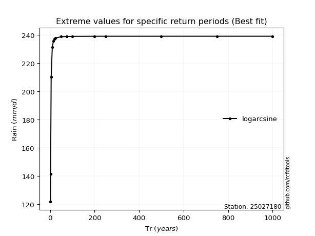</img>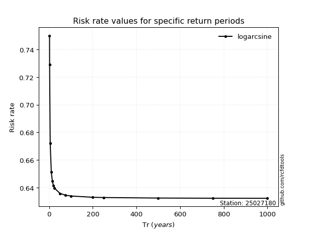</img>

</div>


<sub>**APP DISCLAIMER**: NO WARRANTY - This software is provided by [github.com/rcfdtools](https://github.com/rcfdtools) "as is", without any express or implied warranty, including warranties of merchantability, fitness for a particular purpose, or non-infringement. There is no guarantee that the software will be error-free or operate without interruption. LIMITATION OF LIABILITY - Neither the authors nor copyright holders will be liable for claims or damages arising from the software or its use. You are responsible for determining if the software is appropriate for your use and assume all associated risks, including errors, legal compliance, and data loss. NO PROFESSIONAL ADVICE - The software provides general information and does not offer professional advice. It should not replace consultation with professional advisors.</sub>