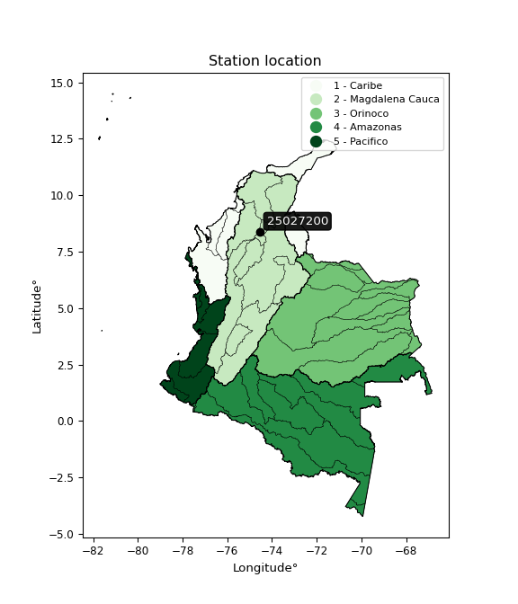

<div align="center">


</div>

# PMP Station (Rain, Pmax24h): 25027200

Probable Maximum Precipitation (PMP) is the greatest amount of rainfall for a specific duration that is meteorologically possible for a given location, acting as a "worst-case" scenario for extreme storms, crucial for designing safety-critical infrastructure like bridges, river deviations, dams, spillways, and nuclear plants to prevent catastrophic failure. PMP is calculated by hydrologists using meteorological data to determine the upper limit of extreme rainfall, often leading to the Probable Maximum Flood (PMF) for flood control design, and is increasingly being studied for climate change impacts. Probable Maximum Precipitation (PMP) is the theoretical upper limit of rainfall, a deterministic estimate for extreme events, while probability distributions (like GEV, Gumbel) describe the likelihood and frequency of various precipitation amounts, including rare ones, showing how often events occur, with PMP representing the extreme end of these distributions, used for critical infrastructure design to ensure safety against the worst conceivable weather, unlike standard statistical forecasts which cover typical probabilities.

The most common probability distributions in hydrology, used for analyzing floods, rainfall, and streamflow, include the Normal, Log-Normal, Gumbel, Gamma (including Log-Pearson Type III), and Generalized Extreme Value (GEV) distributions, often chosen based on the data´s skewness and whether modeling extremes or general conditions, with Gumbel and GEV popular for extreme events like floods, while the Normal distribution serves as a baseline, though often requiring transformations for skewed hydrological data. These distributions help in designing water infrastructure, managing water resources, and forecasting hydrologic events.

> Hydrological data often isn´t perfectly normal (it´s skewed), so different distributions are needed for different applications, such as: **Flood Frequency Analysis**: Using Gumbel, GEV, or Log-Pearson Type III for predicting extreme flood magnitudes and their return periods, **Rainfall Analysis**: Normal for annual totals, but Log-Normal, Weibull, or GEV for intensity or extreme daily rainfall, **Streamflow Modeling**: Gamma and Log-Normal for maximum flows, GEV for minimum flows, and Kappa for daily flows.

<div align="center">

</img>

</div>


## A. General information


### 1. General running parameters

• app_version: _v20260113_. • runtime: _2026-01-17 18:24:04.630693_. • Python version: _3.14.0_. • SciPy version: _1.16.3_. • Pandas version: _2.3.3_. • NumPy version: _2.3.5_. • Stations dataset (station_dataset_file): _dataset/pmax24h_in/automatic_colombia_2003_2025.csv_. • Stations catalog (station_catalog_file): _dataset/CNE.xls_. • Minimum year to eval til year_max (date_min): _1900_. • Maximum year to eval since year_min (date_max): _2025_. • Creates, save and include plots into reports (create_plot): _False_. • Plot only fit distributions with Δo > Δ (plot_only_fit): _True_. • Plot only simple graphs avoiding multiple CDFs and multiple Extreme values plots (plot_only_simple): _True_. • Eval low extreme values, if False, evaluates high extreme values (low_extreme): _False_. • Eval every SciPy distribution as logarithmic (pdist_logarithmic_on): _True_. • Standard deviation normalized (ddof): _1.0_. • Return periods to eval in years (Tr): _[2, 2.33, 5, 10, 15, 20, 25, 50, 75, 100, 200, 250, 500, 750, 1000]_. • Minimum data sample per station, 0 means any (minimum_sample): _5_. • Z-Score maximum threshold to adjust a value, 0 means disable (zscore_max): _3.5_. • Z-Score minimum threshold to adjust a value, 0 means disable (zscore_min): _-2.5_. • Avoid zeros, e.g. rain = 0 (avoid_zeros): _True_. • Avoid null values (avoid_nans): _True_. 

:file_folder:Table: [dataset.csv](../../dataset/pmax24h_in/automatic_colombia_2003_2025.csv)

> Delta Degrees of Freedom (DDOF): is a parameter used in the formulas for calculating variance and standard deviation. When ddof=0, the divisor is $N$ (the total number of observations) and this is used when your data set is the entire population. When ddof=1, the divisor is $N-1$ and this is used when your data set is a sample drawn from a larger population. Using $N-1$ provides an unbiased estimate of the population variance (known as Bessel´s correction).


### 2. Station info and location

|   id |   CODIGO | NOMBRE                        | CATEGORIA    | TECNOLOGIA                | ESTADO           | FECHA_INSTALACION   |   FECHA_SUSPENSION |   ALTITUD |   LATITUD |   LONGITUD | DEPARTAMENTO   | MUNICIPIO             | AREA_OPERATIVA                      | ENTIDAD                                                     | AREA_HIDROGRAFICA   | ZONA_HIDROGRAFICA                | SUBZONA_HIDROGRAFICA       | CORRIENTE   | Catalogo   |   Version |
|-----:|---------:|:------------------------------|:-------------|:--------------------------|:-----------------|:--------------------|-------------------:|----------:|----------:|-----------:|:---------------|:----------------------|:------------------------------------|:------------------------------------------------------------|:--------------------|:---------------------------------|:---------------------------|:------------|:-----------|----------:|
|    0 | 25027200 | LAS VARAS [25027200]LAS VARAS | Limnigráfica | Automática con Telemetría | En Mantenimiento | 15/06/1966          |                nan |        40 |      8.39 |     -74.56 | Bolivar        | San Jacinto Del Cauca | Area Operativa 01 - Antioquia-Chocó | INSTITUTO DE HIDROLOGIA METEOROLOGIA Y ESTUDIOS AMBIENTALES | Magdalena Cauca     | Bajo Magdalena- Cauca -San Jorge | Bajo San Jorge - La Mojana | Cauca       | CNE_IDEAM  |  20251226 |

<div align="center">

Dynamic map: [:earth_americas:Google](http://maps.google.com/maps?q=8.39,-74.56) [:earth_americas:OSM](https://www.openstreetmap.org/#map=18/8.39/-74.56&layers=P) [:earth_americas:Bing](https://www.bing.com/maps?cp=8.39~-74.56&lvl=18) [:earth_americas:Apple](https://maps.apple.com/frame?center=8.39%2C-74.56&span=0.003%2C0.006)

</div>


<div align="center">

```geojson
{
  "type": "Feature",
  "geometry": {
    "type": "Point", 
    "coordinates": [-74.56, 8.39]
  }, 
  "properties": {
    "Name": "25027200"
  }
}
```

</div>


### 3. Discrete values table and plot

<div align="center">

|               |           0 |           1 |           2 |          3 |           4 |
|:--------------|------------:|------------:|------------:|-----------:|------------:|
| Date          | 2017        | 2018        | 2019        | 2020       | 2025        |
| Value         |  103.1      |   82.4      |  202.8      |  717.6     |  174.2      |
| Value_initial |  103.1      |   82.4      |  202.8      |  717.6     |  174.2      |
| count         |    5        |    5        |    5        |    5       |    5        |
| mean          |  256.02     |  256.02     |  256.02     |  256.02    |  256.02     |
| std           |  262.732    |  262.732    |  262.732    |  262.732   |  262.732    |
| zscore        |   -0.582039 |   -0.660827 |   -0.202564 |    1.75685 |   -0.311421 |


</div>


> The initial value (value_initial) correspond to the initial obtained or null completed value, and value (value) is adjusted only when the initial value is outside the valid range (outlier) definite through the Z-Score value. If Z-Score is active, values out of range or outliers are replaced with the station mean value. A Z-Score (or standard score) measures how many standard deviations a data point is from the mean of a dataset, indicating its relative position; positive scores mean above the mean, negative mean below, and a score of zero is exactly at the mean, allowing for comparison of values from different distributions. It´s calculated using the formula $z=(x–μ)/σ$, where $x$ is the data point, $μ$ is the mean, and $σ$ is the standard deviation, helping identify outliers and understand probability.
>
> <sub>**Note**: In this study, "completing" (filling gaps in) and "extending" (forecasting or lengthening the historical record) rainfall data series are avoided for certain critical analyses because they introduce artificial bias and uncertainty, which can distort the statistics of rare events (extremes), alter day-to-day variability, and compromise the integrity and homogeneity of the original data. Some reasons against Completing/Extending rainfall data are: **Distortion of Extremes and Variability**: The primary issue is that most gap-filling or extension methods rely on averaging or regression with nearby stations, which inherently smooths the data. Rainfall is highly variable in space and time, with a large percentage of zero values and occasional large storms. Infilling methods often underestimate the highest values and overestimate the lowest (zero) values, which severely distorts analyses focused on flood frequency, drought severity, and intensity-duration-frequency (IDF) curves, **Loss of Data Homogeneity**: Infilled or extended data are synthetic estimates, not actual measurements. Combining these estimates with observed data can violate the assumption of data homogeneity, which requires that the data properties do not change over time. Inhomogeneity can lead to incorrect conclusions about long-term trends or changes in climate patterns, **Propagation of Errors**: Errors and biases from the original data (e.g., wind-induced undercatch, instrument errors, site changes) or the data used for imputation can propagate through the analysis, leading to unreliable hydrological models and inaccurate predictions, **Compromised Statistical Integrity**: For statistical analyses, especially those involving the frequency of events, using artificial data can introduce time bias or autocorrelation that doesn´t exist in reality, making it difficult to assess the true probability of events, **Difficulty in Validation**: It is difficult to accurately validate the quality of filled or extended data, especially for past periods where ground-truth measurements are unavailable. The reliability of imputation techniques heavily depends on the density of the surrounding station network and the complexity of the local topography.</sub>


### 4. Active continuous probability distributions from SciPy (80 of 104 available)

A Probability Density Function (PDF) describes the relative likelihood of a continuous random variable falling within a specific range, where the total area under its curve equals 1, and the area over any interval gives the actual probability for that range. Unlike discrete probabilities (like rolling a die), a PDF shows density, not direct probability for a single point (which is zero), with higher points indicating higher likelihood, often visualized as a bell curve for normal distributions.

A log of a probability density function (log-PDF) is simply the logarithm of the PDF´s value, denoted as $log(f(x))$, useful for converting multiplication of probabilities into addition, improving numerical stability with tiny numbers, and connecting to information theory concepts like entropy. Instead of dealing with very small probabilities (e.g., 0.000001), log-PDFs use negative numbers (e.g., $log(0.00001) ≈ -11.51$ that are easier for computers to handle, preventing underflow errors and simplifying complex calculations. In this study, each active probability distribution from SciPy is also evaluated in the $log$ form.

[scipy.stats](https://docs.scipy.org/doc/scipy/reference/stats.html) is a Python´s powerful submodule within the SciPy library for comprehensive statistical analysis, offering over 130 probability distributions (like Normal, Poisson), functions for descriptive stats (mean, variance), hypothesis testing (t-tests, chi-square), random variable generation, and statistical tests, making it essential for data science, modeling, and research. It provides tools to explore, model, and draw conclusions from data efficiently, working seamlessly with NumPy.

<div align="center">

|   id | p_dist           |   n_parameter | fit_method   | label                                                                       | active   | ref                                                                                                      |
|-----:|:-----------------|--------------:|:-------------|:----------------------------------------------------------------------------|:---------|:---------------------------------------------------------------------------------------------------------|
|    0 | alpha            |             3 | MLE          | Alpha                                                                       | True     | [:mortar_board:](https://docs.scipy.org/doc/scipy/reference/generated/scipy.stats.alpha.html)            |
|    1 | anglit           |             2 | MM           | Anglit                                                                      | True     | [:mortar_board:](https://docs.scipy.org/doc/scipy/reference/generated/scipy.stats.anglit.html)           |
|    2 | arcsine          |             2 | MM           | Arcsine                                                                     | True     | [:mortar_board:](https://docs.scipy.org/doc/scipy/reference/generated/scipy.stats.arcsine.html)          |
|    3 | argus            |             3 | MLE          | Argus                                                                       | True     | [:mortar_board:](https://docs.scipy.org/doc/scipy/reference/generated/scipy.stats.argus.html)            |
|    4 | beta             |             4 | MLE          | Beta                                                                        | True     | [:mortar_board:](https://docs.scipy.org/doc/scipy/reference/generated/scipy.stats.beta.html)             |
|    5 | betaprime        |             4 | MLE          | Beta prime                                                                  | True     | [:mortar_board:](https://docs.scipy.org/doc/scipy/reference/generated/scipy.stats.betaprime.html)        |
|    6 | bradford         |             3 | MLE          | Bradford                                                                    | True     | [:mortar_board:](https://docs.scipy.org/doc/scipy/reference/generated/scipy.stats.bradford.html)         |
|    7 | burr             |             4 | MLE          | Burr (Type III)                                                             | True     | [:mortar_board:](https://docs.scipy.org/doc/scipy/reference/generated/scipy.stats.burr.html)             |
|    8 | burr12           |             4 | MLE          | Burr (Type III) 12                                                          | True     | [:mortar_board:](https://docs.scipy.org/doc/scipy/reference/generated/scipy.stats.burr12.html)           |
|    9 | cosine           |             2 | MLE          | Cosine                                                                      | True     | [:mortar_board:](https://docs.scipy.org/doc/scipy/reference/generated/scipy.stats.cosine.html)           |
|   10 | crystalball      |             4 | MLE          | Crystalball                                                                 | True     | [:mortar_board:](https://docs.scipy.org/doc/scipy/reference/generated/scipy.stats.crystalball.html)      |
|   11 | dgamma           |             3 | MLE          | Double gamma                                                                | True     | [:mortar_board:](https://docs.scipy.org/doc/scipy/reference/generated/scipy.stats.dgamma.html)           |
|   12 | dweibull         |             3 | MLE          | Double Weibull                                                              | True     | [:mortar_board:](https://docs.scipy.org/doc/scipy/reference/generated/scipy.stats.dweibull.html)         |
|   13 | erlang           |             3 | MLE          | Erlang                                                                      | True     | [:mortar_board:](https://docs.scipy.org/doc/scipy/reference/generated/scipy.stats.erlang.html)           |
|   14 | exponnorm        |             3 | MLE          | Exponentially modified Normal                                               | True     | [:mortar_board:](https://docs.scipy.org/doc/scipy/reference/generated/scipy.stats.exponnorm.html)        |
|   15 | exponpow         |             3 | MLE          | Exponential power                                                           | True     | [:mortar_board:](https://docs.scipy.org/doc/scipy/reference/generated/scipy.stats.exponpow.html)         |
|   16 | exponweib        |             4 | MLE          | Exponentiated Weibull                                                       | True     | [:mortar_board:](https://docs.scipy.org/doc/scipy/reference/generated/scipy.stats.exponweib.html)        |
|   17 | f                |             4 | MLE          | F                                                                           | True     | [:mortar_board:](https://docs.scipy.org/doc/scipy/reference/generated/scipy.stats.f.html)                |
|   18 | fatiguelife      |             3 | MLE          | Fatigue-life (Birnbaum-Saunders)                                            | True     | [:mortar_board:](https://docs.scipy.org/doc/scipy/reference/generated/scipy.stats.fatiguelife.html)      |
|   19 | foldnorm         |             3 | MM           | Fold Normal                                                                 | True     | [:mortar_board:](https://docs.scipy.org/doc/scipy/reference/generated/scipy.stats.foldnorm.html)         |
|   20 | gamma            |             3 | MLE          | Gamma                                                                       | True     | [:mortar_board:](https://docs.scipy.org/doc/scipy/reference/generated/scipy.stats.gamma.html)            |
|   21 | gausshyper       |             6 | MLE          | Gauss hypergeometric                                                        | True     | [:mortar_board:](https://docs.scipy.org/doc/scipy/reference/generated/scipy.stats.gausshyper.html)       |
|   22 | genexpon         |             5 | MLE          | Generalized exponential                                                     | True     | [:mortar_board:](https://docs.scipy.org/doc/scipy/reference/generated/scipy.stats.genexpon.html)         |
|   23 | genextreme       |             3 | MLE          | Generalized exponential                                                     | True     | [:mortar_board:](https://docs.scipy.org/doc/scipy/reference/generated/scipy.stats.genextreme.html)       |
|   24 | gengamma         |             4 | MLE          | Generalized gamma                                                           | True     | [:mortar_board:](https://docs.scipy.org/doc/scipy/reference/generated/scipy.stats.gengamma.html)         |
|   25 | genhalflogistic  |             3 | MLE          | Generalized half-logistic                                                   | True     | [:mortar_board:](https://docs.scipy.org/doc/scipy/reference/generated/scipy.stats.genhalflogistic.html)  |
|   26 | genlogistic      |             3 | MLE          | Generalized logistic                                                        | True     | [:mortar_board:](https://docs.scipy.org/doc/scipy/reference/generated/scipy.stats.genlogistic.html)      |
|   27 | gennorm          |             3 | MLE          | Generalized Normal                                                          | True     | [:mortar_board:](https://docs.scipy.org/doc/scipy/reference/generated/scipy.stats.gennorm.html)          |
|   28 | genpareto        |             3 | MLE          | Generalized Pareto                                                          | True     | [:mortar_board:](https://docs.scipy.org/doc/scipy/reference/generated/scipy.stats.genpareto.html)        |
|   29 | gompertz         |             3 | MLE          | Gompertz (or truncated Gumbel)                                              | True     | [:mortar_board:](https://docs.scipy.org/doc/scipy/reference/generated/scipy.stats.gompertz.html)         |
|   30 | gumbel_l         |             2 | MM           | Gumbel Left Skew                                                            | True     | [:mortar_board:](https://docs.scipy.org/doc/scipy/reference/generated/scipy.stats.gumbel_l.html)         |
|   31 | gumbel_r         |             2 | MM           | Gumbel Right Skew                                                           | True     | [:mortar_board:](https://docs.scipy.org/doc/scipy/reference/generated/scipy.stats.gumbel_r.html)         |
|   32 | halfgennorm      |             3 | MLE          | Upper half of a generalized normal                                          | True     | [:mortar_board:](https://docs.scipy.org/doc/scipy/reference/generated/scipy.stats.halfgennorm.html)      |
|   33 | halflogistic     |             2 | MM           | Half-logistic                                                               | True     | [:mortar_board:](https://docs.scipy.org/doc/scipy/reference/generated/scipy.stats.halflogistic.html)     |
|   34 | halfnorm         |             2 | MM           | Half Normal                                                                 | True     | [:mortar_board:](https://docs.scipy.org/doc/scipy/reference/generated/scipy.stats.halfnorm.html)         |
|   35 | hypsecant        |             2 | MM           | hyperbolic secant                                                           | True     | [:mortar_board:](https://docs.scipy.org/doc/scipy/reference/generated/scipy.stats.hypsecant.html)        |
|   36 | invgamma         |             3 | MLE          | Inverted gamma                                                              | True     | [:mortar_board:](https://docs.scipy.org/doc/scipy/reference/generated/scipy.stats.invgamma.html)         |
|   37 | invgauss         |             3 | MLE          | Inverse Gaussian                                                            | True     | [:mortar_board:](https://docs.scipy.org/doc/scipy/reference/generated/scipy.stats.invgauss.html)         |
|   38 | invweibull       |             3 | MLE          | Inverted Weibull                                                            | True     | [:mortar_board:](https://docs.scipy.org/doc/scipy/reference/generated/scipy.stats.invweibull.html)       |
|   39 | johnsonsb        |             4 | MLE          | Johnson SB                                                                  | True     | [:mortar_board:](https://docs.scipy.org/doc/scipy/reference/generated/scipy.stats.johnsonsb.html)        |
|   40 | johnsonsu        |             4 | MLE          | Johnson Su                                                                  | True     | [:mortar_board:](https://docs.scipy.org/doc/scipy/reference/generated/scipy.stats.johnsonsu.html)        |
|   41 | kappa3           |             3 | MLE          | Kappa 3                                                                     | True     | [:mortar_board:](https://docs.scipy.org/doc/scipy/reference/generated/scipy.stats.kappa3.html)           |
|   42 | kappa4           |             4 | MLE          | Kappa 4                                                                     | True     | [:mortar_board:](https://docs.scipy.org/doc/scipy/reference/generated/scipy.stats.kappa4.html)           |
|   43 | ksone            |             3 | MLE          | Kolmogorov-Smirnov one-sided test statistic distribution                    | True     | [:mortar_board:](https://docs.scipy.org/doc/scipy/reference/generated/scipy.stats.ksone.html)            |
|   44 | kstwobign        |             2 | MLE          | Limiting distribution of scaled Kolmogorov-Smirnov two-sided test statistic | True     | [:mortar_board:](https://docs.scipy.org/doc/scipy/reference/generated/scipy.stats.kstwobign.html)        |
|   45 | laplace          |             2 | MM           | Laplace                                                                     | True     | [:mortar_board:](https://docs.scipy.org/doc/scipy/reference/generated/scipy.stats.laplace.html)          |
|   46 | levy_l           |             2 | MLE          | Left-skewed Levy                                                            | True     | [:mortar_board:](https://docs.scipy.org/doc/scipy/reference/generated/scipy.stats.levy_l.html)           |
|   47 | loggamma         |             3 | MLE          | Log gamma                                                                   | True     | [:mortar_board:](https://docs.scipy.org/doc/scipy/reference/generated/scipy.stats.loggamma.html)         |
|   48 | logistic         |             2 | MM           | Logistic (or Sech-squared)                                                  | True     | [:mortar_board:](https://docs.scipy.org/doc/scipy/reference/generated/scipy.stats.logistic.html)         |
|   49 | loglaplace       |             3 | MLE          | Log-Laplace                                                                 | True     | [:mortar_board:](https://docs.scipy.org/doc/scipy/reference/generated/scipy.stats.loglaplace.html)       |
|   50 | lomax            |             3 | MLE          | Lomax (Pareto of the second kind)                                           | True     | [:mortar_board:](https://docs.scipy.org/doc/scipy/reference/generated/scipy.stats.lomax.html)            |
|   51 | maxwell          |             2 | MM           | Maxwell                                                                     | True     | [:mortar_board:](https://docs.scipy.org/doc/scipy/reference/generated/scipy.stats.maxwell.html)          |
|   52 | mielke           |             4 | MLE          | Mielke Beta-Kappa / Dagum                                                   | True     | [:mortar_board:](https://docs.scipy.org/doc/scipy/reference/generated/scipy.stats.mielke.html)           |
|   53 | moyal            |             2 | MM           | Moyal                                                                       | True     | [:mortar_board:](https://docs.scipy.org/doc/scipy/reference/generated/scipy.stats.moyal.html)            |
|   54 | nakagami         |             3 | MLE          | Nakagami                                                                    | True     | [:mortar_board:](https://docs.scipy.org/doc/scipy/reference/generated/scipy.stats.nakagami.html)         |
|   55 | ncf              |             5 | MLE          | Non-central F distribution                                                  | True     | [:mortar_board:](https://docs.scipy.org/doc/scipy/reference/generated/scipy.stats.ncf.html)              |
|   56 | nct              |             4 | MLE          | Non-central Student’s t                                                     | True     | [:mortar_board:](https://docs.scipy.org/doc/scipy/reference/generated/scipy.stats.nct.html)              |
|   57 | norm             |             2 | MM           | Normal                                                                      | True     | [:mortar_board:](https://docs.scipy.org/doc/scipy/reference/generated/scipy.stats.norm.html)             |
|   58 | pearson3         |             3 | MM           | Pearson type III                                                            | True     | [:mortar_board:](https://docs.scipy.org/doc/scipy/reference/generated/scipy.stats.pearson3.html)         |
|   59 | powerlaw         |             3 | MLE          | Power-function                                                              | True     | [:mortar_board:](https://docs.scipy.org/doc/scipy/reference/generated/scipy.stats.powerlaw.html)         |
|   60 | rayleigh         |             2 | MM           | Rayleigh                                                                    | True     | [:mortar_board:](https://docs.scipy.org/doc/scipy/reference/generated/scipy.stats.rayleigh.html)         |
|   61 | rdist            |             3 | MLE          | R-distributed (symmetric beta)                                              | True     | [:mortar_board:](https://docs.scipy.org/doc/scipy/reference/generated/scipy.stats.rdist.html)            |
|   62 | rice             |             3 | MLE          | Rice                                                                        | True     | [:mortar_board:](https://docs.scipy.org/doc/scipy/reference/generated/scipy.stats.rice.html)             |
|   63 | semicircular     |             2 | MM           | Semicircular                                                                | True     | [:mortar_board:](https://docs.scipy.org/doc/scipy/reference/generated/scipy.stats.semicircular.html)     |
|   64 | skewnorm         |             3 | MLE          | Skew normal                                                                 | True     | [:mortar_board:](https://docs.scipy.org/doc/scipy/reference/generated/scipy.stats.skewnorm.html)         |
|   65 | t                |             3 | MLE          | Student’s t                                                                 | True     | [:mortar_board:](https://docs.scipy.org/doc/scipy/reference/generated/scipy.stats.t.html)                |
|   66 | trapezoid        |             4 | MLE          | Trapezoid                                                                   | True     | [:mortar_board:](https://docs.scipy.org/doc/scipy/reference/generated/scipy.stats.trapezoid.html)        |
|   67 | triang           |             3 | MLE          | Triangular                                                                  | True     | [:mortar_board:](https://docs.scipy.org/doc/scipy/reference/generated/scipy.stats.triang.html)           |
|   68 | truncexpon       |             3 | MLE          | Truncated exponential                                                       | True     | [:mortar_board:](https://docs.scipy.org/doc/scipy/reference/generated/scipy.stats.truncexpon.html)       |
|   69 | truncnorm        |             4 | MLE          | Truncated normal                                                            | True     | [:mortar_board:](https://docs.scipy.org/doc/scipy/reference/generated/scipy.stats.truncnorm.html)        |
|   70 | truncpareto      |             4 | MLE          | Upper truncated Pareto                                                      | True     | [:mortar_board:](https://docs.scipy.org/doc/scipy/reference/generated/scipy.stats.truncpareto.html)      |
|   71 | truncweibull_min |             5 | MLE          | Doubly truncated Weibull minimum                                            | True     | [:mortar_board:](https://docs.scipy.org/doc/scipy/reference/generated/scipy.stats.truncweibull_min.html) |
|   72 | tukeylambda      |             3 | MLE          | Tukey-Lamdba                                                                | True     | [:mortar_board:](https://docs.scipy.org/doc/scipy/reference/generated/scipy.stats.tukeylambda.html)      |
|   73 | uniform          |             2 | MLE          | Uniform                                                                     | True     | [:mortar_board:](https://docs.scipy.org/doc/scipy/reference/generated/scipy.stats.uniform.html)          |
|   74 | vonmises         |             3 | MLE          | Von Mises                                                                   | True     | [:mortar_board:](https://docs.scipy.org/doc/scipy/reference/generated/scipy.stats.vonmises.html)         |
|   75 | vonmises_line    |             3 | MLE          | Von Mises line                                                              | True     | [:mortar_board:](https://docs.scipy.org/doc/scipy/reference/generated/scipy.stats.vonmises_line.html)    |
|   76 | wald             |             2 | MM           | Wald                                                                        | True     | [:mortar_board:](https://docs.scipy.org/doc/scipy/reference/generated/scipy.stats.wald.html)             |
|   77 | weibull_max      |             3 | MLE          | Weibull maximum                                                             | True     | [:mortar_board:](https://docs.scipy.org/doc/scipy/reference/generated/scipy.stats.weibull_max.html)      |
|   78 | weibull_min      |             3 | MLE          | Weibull minimum                                                             | True     | [:mortar_board:](https://docs.scipy.org/doc/scipy/reference/generated/scipy.stats.weibull_min.html)      |
|   79 | wrapcauchy       |             3 | MLE          | Wrapped  Cauchy                                                             | True     | [:mortar_board:](https://docs.scipy.org/doc/scipy/reference/generated/scipy.stats.wrapcauchy.html)       |

</div>

> **n_parameter:** # arguments & localization & scale.
>
> **Fit methods:** (MLE) maximum likelihood, (MM) L-moments.
>
>**Inactive** (With the only purpose of prevent loops, zero divisions, infinite values, over high estimated values or horizontal trending for recurrence intervals estimations, the follow distributions were disabled.)**:** lognorm, norminvgauss, powernorm, powerlognorm, cauchy, halfcauchy, foldcauchy, skewcauchy, chi2, expon, fisk, genhyperbolic, geninvgauss, gibrat, kstwo, laplace_asymmetric, levy, levy_stable, ncx2, pareto, rel_breitwigner, recipinvgauss, studentized_range, loguniform, 


## B. Probability (PDF) vs. Empirical (EDF) distributions functions

A continuous probability distribution (CPD) describes probabilities for variables that can take any value within a range (like rain any time), unlike discrete variables with specific outcomes (like temperature). It uses a Probability Density Function (PDF), a curve where the total area under it equals 1, and the probability of the variable falling within an interval (a to b) is found by calculating the area under the curve between those points. A key feature is that the probability of hitting any single exact value is zero, so probabilities are always expressed for ranges, e.g., $P(a ≤ X ≤ b)$.

<div align="center">

Distributions parameters from station values
|     |   station | p_dist              |   n |              loc |           scale | shape                  | shape1                | shape2                 | shape3             |
|----:|----------:|:--------------------|----:|-----------------:|----------------:|:-----------------------|:----------------------|:-----------------------|:-------------------|
|   0 |  25027200 | alpha               |   5 |     50.9997      |    57.8395      | 1.076539039211885e-06  |                       |                        |                    |
|   1 |  25027200 | anglit              |   5 |    256.02        |   687.452       |                        |                       |                        |                    |
|   2 |  25027200 | arcsine             |   5 |    -76.312       |   664.664       |                        |                       |                        |                    |
|   3 |  25027200 | argus               |   5 |   -253.183       |  1021.75        | 9.208326170354513e-08  |                       |                        |                    |
|   4 |  25027200 | beta                |   5 |     18.5383      |   699.062       | 0.05150999535123332    | 0.18306195860668267   |                        |                    |
|   5 |  25027200 | betaprime           |   5 |     -0.668346    |     1.3297      | 267.88016716282516     | 2.3943367740591377    |                        |                    |
|   6 |  25027200 | bradford            |   5 |     24.5984      |   693.002       | 0.9001941640510593     |                       |                        |                    |
|   7 |  25027200 | burr                |   5 |      2.76065     |     3.90645     | 1.7975333333266565     | 526.1859936563085     |                        |                    |
|   8 |  25027200 | burr12              |   5 |     -1.82894     |    83.2222      | 329.04799192034693     | 0.0037518605827657307 |                        |                    |
|   9 |  25027200 | cosine              |   5 |    299.559       |   201.388       |                        |                       |                        |                    |
|  10 |  25027200 | crystalball         |   5 |     -0.0659862   |   351.373       | 4.4998906064775        | 1.291755664348449     |                        |                    |
|  11 |  25027200 | dgamma              |   5 |    174.2         |   175.885       | 0.6217072007021245     |                       |                        |                    |
|  12 |  25027200 | dweibull            |   5 |    174.2         |   178.949       | 0.6699205228866799     |                       |                        |                    |
|  13 |  25027200 | erlang              |   5 |     82.4         |   170.82        | 0.47874442345113044    |                       |                        |                    |
|  14 |  25027200 | exponnorm           |   5 |     82.1866      |     0.0634063   | 2716.582114031652      |                       |                        |                    |
|  15 |  25027200 | exponpow            |   5 |     82.4         |   619.236       | 0.6667663205091638     |                       |                        |                    |
|  16 |  25027200 | exponweib           |   5 |     82.4         |     0.412161    | 4.199986909558717      | 0.20301197329798631   |                        |                    |
|  17 |  25027200 | f                   |   5 |     70.5283      |    37.4464      | 1642.4385405234661     | 1.5501833053649476    |                        |                    |
|  18 |  25027200 | fatiguelife         |   5 |     82.4         |     3.44897e-05 | 2202.8233077611835     |                       |                        |                    |
|  19 |  25027200 | foldnorm            |   5 |    -68.8273      |   404.186       | 0.005745338719187122   |                       |                        |                    |
|  20 |  25027200 | gamma               |   5 |     82.4         |   162.277       | 0.5075004778683562     |                       |                        |                    |
|  21 |  25027200 | gausshyper          |   5 |     18.2         |   699.4         | 0.9515904027100812     | 0.7762293063623444    | 1.2902346278362624     | 1.0592430589615667 |
|  22 |  25027200 | genexpon            |   5 |     82.4         |   881.388       | 5.076531727317629      | 1.9247978227163234    | 1.2873152231704218e-13 |                    |
|  23 |  25027200 | genextreme          |   5 |     88.0153      |    45.4991      | -8.102760102750032     |                       |                        |                    |
|  24 |  25027200 | gengamma            |   5 |     82.4         |     6.52597     | 2.2395809051919233     | 0.3783057019277366    |                        |                    |
|  25 |  25027200 | genhalflogistic     |   5 |     17.6594      |   761.902       | 1.0885237516525925     |                       |                        |                    |
|  26 |  25027200 | genlogistic         |   5 |   -897.881       |   131.67        | 3099.2775379176874     |                       |                        |                    |
|  27 |  25027200 | gennorm             |   5 |    174.191       |     1.56831e-06 | 0.12405527272290273    |                       |                        |                    |
|  28 |  25027200 | genpareto           |   5 |     82.4         |    57.3854      | 0.957257166610888      |                       |                        |                    |
|  29 |  25027200 | gompertz            |   5 |     82.3936      | 89634.5         | 396.58821372745956     |                       |                        |                    |
|  30 |  25027200 | gumbel_l            |   5 |    361.78        |   183.224       |                        |                       |                        |                    |
|  31 |  25027200 | gumbel_r            |   5 |    150.26        |   183.224       |                        |                       |                        |                    |
|  32 |  25027200 | halfgennorm         |   5 |     82.3988      |     1.5942e-10  | 0.092284475009005      |                       |                        |                    |
|  33 |  25027200 | halflogistic        |   5 |    -22.5028      |   200.912       |                        |                       |                        |                    |
|  34 |  25027200 | halfnorm            |   5 |    -55.0202      |   389.831       |                        |                       |                        |                    |
|  35 |  25027200 | hypsecant           |   5 |    256.02        |   149.602       |                        |                       |                        |                    |
|  36 |  25027200 | invgamma            |   5 |     70.5107      |    29.0203      | 0.7750894376022144     |                       |                        |                    |
|  37 |  25027200 | invgauss            |   5 |     73.263       |    37.0973      | 4.926416803509316      |                       |                        |                    |
|  38 |  25027200 | invweibull          |   5 |     82.4         |     9.94816e-12 | 0.2404175971245115     |                       |                        |                    |
|  39 |  25027200 | johnsonsb           |   5 |     82.4         |   641.76        | 0.522983697862142      | 0.1287571233934143    |                        |                    |
|  40 |  25027200 | johnsonsu           |   5 |     82.4         |     2.12389e-11 | -1.4167650475665803    | 0.08635456713224116   |                        |                    |
|  41 |  25027200 | kappa3              |   5 |     82.4         |    35.0509      | 0.09445963962542561    |                       |                        |                    |
|  42 |  25027200 | kappa4              |   5 |     18.7484      |   696.024       | 1.1006285079678504     | 0.9948976234223432    |                        |                    |
|  43 |  25027200 | ksone               |   5 |     18.88        |   762.24        | 1.0                    |                       |                        |                    |
|  44 |  25027200 | kstwobign           |   5 |   -343.457       |   698.621       |                        |                       |                        |                    |
|  45 |  25027200 | laplace             |   5 |    256.02        |   166.166       |                        |                       |                        |                    |
|  46 |  25027200 | levy_l              |   5 |    765.089       |   181.794       |                        |                       |                        |                    |
|  47 |  25027200 | loggamma            |   5 | -77498           | 10386           | 1784.0403327185827     |                       |                        |                    |
|  48 |  25027200 | logistic            |   5 |    256.02        |   129.559       |                        |                       |                        |                    |
|  49 |  25027200 | loglaplace          |   5 |     -0.469057    |   174.669       | 1.7659627497259531     |                       |                        |                    |
|  50 |  25027200 | lomax               |   5 |     82.4         |  1848.6         | 11.660616026819788     |                       |                        |                    |
|  51 |  25027200 | maxwell             |   5 |   -300.818       |   348.946       |                        |                       |                        |                    |
|  52 |  25027200 | mielke              |   5 |     10.901       |     9.50115     | 123.57746436081618     | 1.705461855717659     |                        |                    |
|  53 |  25027200 | moyal               |   5 |    121.635       |   105.785       |                        |                       |                        |                    |
|  54 |  25027200 | nakagami            |   5 |     82.4         |   291.006       | 0.08863233806442755    |                       |                        |                    |
|  55 |  25027200 | ncf                 |   5 |     -0.340064    |     2.772e-07   | 1.0679619405419766e-07 | 5.275085470411567     | 59.81311459900081      |                    |
|  56 |  25027200 | nct                 |   5 |     -0.303858    |     2.47478     | 1.6493507635529117     | 52.290347675862975    |                        |                    |
|  57 |  25027200 | norm                |   5 |    256.02        |   234.994       |                        |                       |                        |                    |
|  58 |  25027200 | pearson3            |   5 |    256.02        |   234.994       | 1.3691164964888678     |                       |                        |                    |
|  59 |  25027200 | powerlaw            |   5 |     82.4         |   635.2         | 0.11022936337176198    |                       |                        |                    |
|  60 |  25027200 | rayleigh            |   5 |   -193.538       |   358.695       |                        |                       |                        |                    |
|  61 |  25027200 | rdist               |   5 |     23.8594      |   178.941       | 1.2450026480232785     |                       |                        |                    |
|  62 |  25027200 | rice                |   5 |    -84.8058      |   292.732       | 0.0004492878920894423  |                       |                        |                    |
|  63 |  25027200 | semicircular        |   5 |    256.02        |   469.988       |                        |                       |                        |                    |
|  64 |  25027200 | skewnorm            |   5 |     82.4         |   292.134       | 40888775.13744821      |                       |                        |                    |
|  65 |  25027200 | t                   |   5 |    146.929       |    61.7115      | 1.108190894291251      |                       |                        |                    |
|  66 |  25027200 | trapezoid           |   5 |     18.88        |   762.24        | 1.0                    | 1.0                   |                        |                    |
|  67 |  25027200 | triang              |   5 |   -264.403       |  1168.21        | 0.31458692147855627    |                       |                        |                    |
|  68 |  25027200 | truncexpon          |   5 |     82.4         |   531.75        | 1.19454693625442       |                       |                        |                    |
|  69 |  25027200 | truncnorm           |   5 |     -1.59631e+06 | 19369.1         | 82.41915582213767      | 274569.081919445      |                        |                    |
|  70 |  25027200 | truncpareto         |   5 |     81.2071      |     1.19293     | 0.2751857313973739     | 533.4724185981296     |                        |                    |
|  71 |  25027200 | truncweibull_min    |   5 |     82.4         |   531.421       | 0.35559457751947293    | 5.940767769831532e-17 | 1.1953774830859951     |                    |
|  72 |  25027200 | tukeylambda         |   5 |     22.0299      |   230.077       | 1.272762062310546      |                       |                        |                    |
|  73 |  25027200 | uniform             |   5 |     82.4         |   635.2         |                        |                       |                        |                    |
|  74 |  25027200 | vonmises            |   5 |      1.64488     |     1           | 0.9668287601252508     |                       |                        |                    |
|  75 |  25027200 | vonmises_line       |   5 |    187.365       |   168.779       | 1.279427118095546      |                       |                        |                    |
|  76 |  25027200 | wald                |   5 |     21.0258      |   234.994       |                        |                       |                        |                    |
|  77 |  25027200 | weibull_max         |   5 |    717.6         |     1.6679      | 0.1655816906904461     |                       |                        |                    |
|  78 |  25027200 | weibull_min         |   5 |     82.4         |   123.768       | 0.3604609619218151     |                       |                        |                    |
|  79 |  25027200 | wrapcauchy          |   5 |     82.4         |   101.493       | 0.8224643794865218     |                       |                        |                    |
|  80 |  25027200 | logalpha            |   5 |      3.10669     |     6.00794     | 3.18045709722909       |                       |                        |                    |
|  81 |  25027200 | loganglit           |   5 |      5.21912     |     2.20689     |                        |                       |                        |                    |
|  82 |  25027200 | logarcsine          |   5 |      4.15229     |     2.13368     |                        |                       |                        |                    |
|  83 |  25027200 | logargus            |   5 |      3.5756      |     3.16208     | 5.045914768785607e-05  |                       |                        |                    |
|  84 |  25027200 | logbeta             |   5 |      4.41159     |     2.51514     | 0.4216904806226539     | 1.0001882580198929    |                        |                    |
|  85 |  25027200 | logbetaprime        |   5 |     -0.948706    |     1.83144     | 312.1501298895547      | 93.69647299036967     |                        |                    |
|  86 |  25027200 | logbradford         |   5 |      4.41155     |     2.16439     | 1.0463149077810607     |                       |                        |                    |
|  87 |  25027200 | logburr             |   5 |      0.244881    |     2.01603     | 9.029007592726696      | 1711.468526760419     |                        |                    |
|  88 |  25027200 | logburr12           |   5 |     -3.51197     |     7.91273     | 2922.579544355228      | 0.003607602088199165  |                        |                    |
|  89 |  25027200 | logcosine           |   5 |      5.3089      |     0.632607    |                        |                       |                        |                    |
|  90 |  25027200 | logcrystalball      |   5 |      5.21912     |     0.754389    | 272.17178450770905     | 2648.4459191944325    |                        |                    |
|  91 |  25027200 | logdgamma           |   5 |      5.1602      |     0.663663    | 0.6822575694016175     |                       |                        |                    |
|  92 |  25027200 | logdweibull         |   5 |      5.1602      |     0.569087    | 0.9601174441025355     |                       |                        |                    |
|  93 |  25027200 | logerlang           |   5 |      4.41159     |     0.683011    | 0.8353084203511582     |                       |                        |                    |
|  94 |  25027200 | logexponnorm        |   5 |      4.41082     |     0.000225352 | 3564.6871685875176     |                       |                        |                    |
|  95 |  25027200 | logexponpow         |   5 |      4.41159     |     1.93758     | 0.8070197738651198     |                       |                        |                    |
|  96 |  25027200 | logexponweib        |   5 |      4.41159     |     0.995342    | 0.969840401678825      | 0.9883723814725632    |                        |                    |
|  97 |  25027200 | logf                |   5 |      4.41159     |     0.728629    | 1.305686027275367      | 371.4517951331722     |                        |                    |
|  98 |  25027200 | logfatiguelife      |   5 |      4.41159     |     3.29839e-07 | 1490.7554429634579     |                       |                        |                    |
|  99 |  25027200 | logfoldnorm         |   5 |      4.17024     |     1.01441     | 0.7887741058313014     |                       |                        |                    |
| 100 |  25027200 | loggamma            |   5 |      4.41159     |     0.987854    | 0.14158235581747458    |                       |                        |                    |
| 101 |  25027200 | loggausshyper       |   5 |      4.41159     |     2.20339     | 0.9446396298922028     | 0.9575340565843775    | 1.2545083794803744     | 1.038212185096155  |
| 102 |  25027200 | loggenexpon         |   5 |      4.41159     |     1.65061     | 1.942577739930723      | 1.5387682191592105    | 0.15114322083661014    |                    |
| 103 |  25027200 | loggenextreme       |   5 |      4.77698     |     0.446891    | -0.3808833904381559    |                       |                        |                    |
| 104 |  25027200 | loggengamma         |   5 |      4.41159     |     1.57452     | 0.5978052704528977     | 0.23412294568462808   |                        |                    |
| 105 |  25027200 | loggenhalflogistic  |   5 |      4.09249     |     2.60511     | 1.0489998967002883     |                       |                        |                    |
| 106 |  25027200 | loggenlogistic      |   5 |      0.946218    |     0.548057    | 1307.0033267152594     |                       |                        |                    |
| 107 |  25027200 | loggennorm          |   5 |      5.1602      |     0.00256228  | 0.2790690040291176     |                       |                        |                    |
| 108 |  25027200 | loggenpareto        |   5 |     -0.0227757   |    11.1131      | -1.684131246303361     |                       |                        |                    |
| 109 |  25027200 | loggompertz         |   5 |      4.41159     |     7.24505     | 8.054267331951106      |                       |                        |                    |
| 110 |  25027200 | loggumbel_l         |   5 |      5.55864     |     0.588195    |                        |                       |                        |                    |
| 111 |  25027200 | loggumbel_r         |   5 |      4.87961     |     0.588195    |                        |                       |                        |                    |
| 112 |  25027200 | loghalfgennorm      |   5 |      4.41159     |     0.136632    | 0.4993618213049339     |                       |                        |                    |
| 113 |  25027200 | loghalflogistic     |   5 |      4.325       |     0.644976    |                        |                       |                        |                    |
| 114 |  25027200 | loghalfnorm         |   5 |      4.22061     |     1.25145     |                        |                       |                        |                    |
| 115 |  25027200 | loghypsecant        |   5 |      5.21912     |     0.480259    |                        |                       |                        |                    |
| 116 |  25027200 | loginvgamma         |   5 |      3.97264     |     2.56498     | 2.9543641633352307     |                       |                        |                    |
| 117 |  25027200 | loginvgauss         |   5 |      4.22313     |     0.976503    | 1.019960918199586      |                       |                        |                    |
| 118 |  25027200 | loginvweibull       |   5 |      3.60371     |     1.17326     | 2.6254508063076143     |                       |                        |                    |
| 119 |  25027200 | logjohnsonsb        |   5 |      4.41159     |     2.16433     | -0.17147090064160647   | 0.16184890181647954   |                        |                    |
| 120 |  25027200 | logjohnsonsu        |   5 |      4.38911     |     0.00022749  | -5.220334693096779     | 0.6420062695630322    |                        |                    |
| 121 |  25027200 | logkappa3           |   5 |      4.41159     |     2.14379     | 159.7478481036498      |                       |                        |                    |
| 122 |  25027200 | logkappa4           |   5 |      4.28169     |     2.42407     | 1.0532986791632126     | 1.0565973719410566    |                        |                    |
| 123 |  25027200 | logksone            |   5 |      4.19515     |     2.59719     | 1.0                    |                       |                        |                    |
| 124 |  25027200 | logkstwobign        |   5 |      2.94083     |     2.62151     |                        |                       |                        |                    |
| 125 |  25027200 | loglaplace          |   5 |      5.21912     |     0.533434    |                        |                       |                        |                    |
| 126 |  25027200 | loglevy_l           |   5 |      6.71061     |     0.51541     |                        |                       |                        |                    |
| 127 |  25027200 | logloggamma         |   5 |   -185.692       |    26.8925      | 1211.3979445754612     |                       |                        |                    |
| 128 |  25027200 | loglogistic         |   5 |      5.21912     |     0.415917    |                        |                       |                        |                    |
| 129 |  25027200 | logloglaplace       |   5 |      0.0137576   |     5.14645     | 9.315560777355842      |                       |                        |                    |
| 130 |  25027200 | loglomax            |   5 |      4.41159     |    57.4426      | 71.98546770698101      |                       |                        |                    |
| 131 |  25027200 | logmaxwell          |   5 |      3.43154     |     1.1202      |                        |                       |                        |                    |
| 132 |  25027200 | logmielke           |   5 |      3.61431     |     0.12109     | 947.1047073987908      | 2.6062750527929603    |                        |                    |
| 133 |  25027200 | logmoyal            |   5 |      4.78772     |     0.339594    |                        |                       |                        |                    |
| 134 |  25027200 | lognakagami         |   5 |      4.41159     |     0.773796    | 0.21812749649514473    |                       |                        |                    |
| 135 |  25027200 | logncf              |   5 |     -0.921601    |     5.35246     | 269.7085101920453      | 290.5286927110078     | 37.374184738487685     |                    |
| 136 |  25027200 | lognct              |   5 |      1.10455     |     0.0414179   | 17.98276254476341      | 94.99840320268464     |                        |                    |
| 137 |  25027200 | lognorm             |   5 |      5.21912     |     0.754389    |                        |                       |                        |                    |
| 138 |  25027200 | logpearson3         |   5 |      5.21912     |     0.754389    | 0.8260023957341679     |                       |                        |                    |
| 139 |  25027200 | logpowerlaw         |   5 |      4.41159     |     2.16433     | 0.12614928859663532    |                       |                        |                    |
| 140 |  25027200 | lograyleigh         |   5 |      3.77593     |     1.1515      |                        |                       |                        |                    |
| 141 |  25027200 | logrdist            |   5 |      5.49375     |     1.08216     | 1.060710173297103      |                       |                        |                    |
| 142 |  25027200 | logrice             |   5 |      3.98882     |     1.02048     | 0.00038740193266053913 |                       |                        |                    |
| 143 |  25027200 | logsemicircular     |   5 |      5.21912     |     1.50878     |                        |                       |                        |                    |
| 144 |  25027200 | logskewnorm         |   5 |      4.41159     |     1.10504     | 53317765.557640076     |                       |                        |                    |
| 145 |  25027200 | logt                |   5 |      5.2191      |     0.754332    | 1694974.6247019838     |                       |                        |                    |
| 146 |  25027200 | logtrapezoid        |   5 |      4.19515     |     2.59719     | 1.0                    | 1.0                   |                        |                    |
| 147 |  25027200 | logtriang           |   5 |      3.35683     |     3.21908     | 0.999999995473958      |                       |                        |                    |
| 148 |  25027200 | logtruncexpon       |   5 |      4.41149     |     2.3384      | 0.92560003488945       |                       |                        |                    |
| 149 |  25027200 | logtruncnorm        |   5 |     -0.237336    |     1.46442     | 3.685790374605384      | 4.6525581180931574    |                        |                    |
| 150 |  25027200 | logtruncpareto      |   5 |      4.40463     |     0.00695637  | 0.26588051816142994    | 312.1289178306013     |                        |                    |
| 151 |  25027200 | logtruncweibull_min |   5 |      4.41159     |     2.67706     | 0.6775669301619205     | 3.145436163492036e-16 | 0.8895961572848119     |                    |
| 152 |  25027200 | logtukeylambda      |   5 |      5.49375     |     1.22292     | 1.1300674812703053     |                       |                        |                    |
| 153 |  25027200 | loguniform          |   5 |      4.41159     |     2.16433     |                        |                       |                        |                    |
| 154 |  25027200 | logvonmises         |   5 |     -1.1342      |     1           | 2.3551173422226523     |                       |                        |                    |
| 155 |  25027200 | logvonmises_line    |   5 |      5.5091      |     0.349354    | 8.665914629282776e-05  |                       |                        |                    |
| 156 |  25027200 | logwald             |   5 |      4.4647      |     0.754415    |                        |                       |                        |                    |
| 157 |  25027200 | logweibull_max      |   5 |      6.57591     |     1.89111     | 0.6102718601311021     |                       |                        |                    |
| 158 |  25027200 | logweibull_min      |   5 |      4.41159     |     0.908009    | 0.14407452806424476    |                       |                        |                    |
| 159 |  25027200 | logwrapcauchy       |   5 |      4.41159     |     0.344463    | 0.5207473278045653     |                       |                        |                    |

</div>

> **loc** (Location parameter): This shifts the distribution along the x-axis. For many common distributions, like the normal (Gaussian) distribution, loc represents the mean $μ$. For others, like the uniform distribution, it might represent the minimum value, or for the beta distribution, the left end of the support interval.
>
> **scale** (Scale parameter): This determines the width or spread of the distribution. For the normal distribution, scale represents the standard deviation $σ$. For a uniform distribution, it defines the length of the interval (from $loc$ to $loc + scale$).
>
> **shape** (Shape parameters): Refers to parameters that define the specific form of a probability distribution, distinct from its location (loc) and scale (scale). These parameters are required arguments for most distribution functions. For example, a normal (Gaussian) distribution is fully defined by its location (mean) and scale (standard deviation), so it has no specific shape parameters beyond loc and scale. However, other distributions have intrinsic properties that need specification, as Gamma distribution that takes a shape parameter, often named $a$ or $alpha$.


### 0. Cumulative distribution values - CDF (160 evaluated)

Cumulative Distribution Function (CDF), denoted as $F$<sub>$X$</sub>$(x)$, is a function that gives the probability that a random variable $X$ will take a value less than or equal to a specific value, $x$ (i.e., $(P(X≥x)$. It essentially "accumulates" probabilities from a given point up to the far right (positive infinity), providing a complete picture of the distribution´s probabilities for both discrete (like rain) and continuous (like temperature) variables, helping to find probabilities over ranges or above certain values. Each station is evaluated separately ordering the $x$ values ascending, calculating the CDF and PDF values for the activated distributions and their logarithmic forms.

<div align="center">

CDF ordered by x ascending and calculating $log(f(x))$ separately
|   id |   Station |   date |     x |   count |   mean |     std |    zscore |   Value_initial |   station |   m |     alpha |   alpha_pdf |   anglit |   anglit_pdf |   arcsine |   arcsine_pdf |    argus |   argus_pdf |     beta |    beta_pdf |   betaprime |   betaprime_pdf |   bradford |   bradford_pdf |      burr |   burr_pdf |    burr12 |   burr12_pdf |   cosine |   cosine_pdf |   crystalball |   crystalball_pdf |   dgamma |     dgamma_pdf |   dweibull |   dweibull_pdf |      erlang |      erlang_pdf |   exponnorm |   exponnorm_pdf |    exponpow |   exponpow_pdf |   exponweib |   exponweib_pdf |         f |      f_pdf |   fatiguelife |   fatiguelife_pdf |   foldnorm |   foldnorm_pdf |       gamma |        gamma_pdf |   gausshyper |   gausshyper_pdf |    genexpon |   genexpon_pdf |   genextreme |   genextreme_pdf |    gengamma |   gengamma_pdf |   genhalflogistic |   genhalflogistic_pdf |   genlogistic |   genlogistic_pdf |   gennorm |   gennorm_pdf |   genpareto |   genpareto_pdf |    gompertz |   gompertz_pdf |   gumbel_l |   gumbel_l_pdf |   gumbel_r |   gumbel_r_pdf |   halfgennorm |   halfgennorm_pdf |   halflogistic |   halflogistic_pdf |   halfnorm |   halfnorm_pdf |   hypsecant |   hypsecant_pdf |   invgamma |   invgamma_pdf |   invgauss |   invgauss_pdf |   invweibull |   invweibull_pdf |   johnsonsb |   johnsonsb_pdf |   johnsonsu |   johnsonsu_pdf |      kappa3 |   kappa3_pdf |      kappa4 |   kappa4_pdf |     ksone |   ksone_pdf |   kstwobign |   kstwobign_pdf |   laplace |   laplace_pdf |   levy_l |   levy_l_pdf |   loggamma |   loggamma_pdf |   logistic |   logistic_pdf |   loglaplace |   loglaplace_pdf |       lomax |   lomax_pdf |   maxwell |   maxwell_pdf |   mielke |   mielke_pdf |    moyal |   moyal_pdf |   nakagami |   nakagami_pdf |      ncf |     ncf_pdf |       nct |     nct_pdf |     norm |    norm_pdf |   pearson3 |   pearson3_pdf |   powerlaw |   powerlaw_pdf |   rayleigh |   rayleigh_pdf |    rdist |    rdist_pdf |     rice |    rice_pdf |   semicircular |   semicircular_pdf |   skewnorm |   skewnorm_pdf |        t |       t_pdf |   trapezoid |   trapezoid_pdf |   triang |   triang_pdf |   truncexpon |   truncexpon_pdf |   truncnorm |   truncnorm_pdf |   truncpareto |   truncpareto_pdf |   truncweibull_min |   truncweibull_min_pdf |   tukeylambda |   tukeylambda_pdf |   uniform |   uniform_pdf |   vonmises |   vonmises_pdf |   vonmises_line |   vonmises_line_pdf |     wald |    wald_pdf |   weibull_max |   weibull_max_pdf |   weibull_min |   weibull_min_pdf |   wrapcauchy |   wrapcauchy_pdf |   logalpha |   logalpha_pdf |   loganglit |   loganglit_pdf |   logarcsine |   logarcsine_pdf |   logargus |   logargus_pdf |     logbeta |   logbeta_pdf |   logbetaprime |   logbetaprime_pdf |   logbradford |   logbradford_pdf |   logburr |   logburr_pdf |   logburr12 |   logburr12_pdf |   logcosine |   logcosine_pdf |   logcrystalball |   logcrystalball_pdf |   logdgamma |   logdgamma_pdf |   logdweibull |   logdweibull_pdf |   logerlang |   logerlang_pdf |   logexponnorm |   logexponnorm_pdf |   logexponpow |   logexponpow_pdf |   logexponweib |   logexponweib_pdf |        logf |      logf_pdf |   logfatiguelife |   logfatiguelife_pdf |   logfoldnorm |   logfoldnorm_pdf |   loggausshyper |   loggausshyper_pdf |   loggenexpon |   loggenexpon_pdf |   loggenextreme |   loggenextreme_pdf |   loggengamma |   loggengamma_pdf |   loggenhalflogistic |   loggenhalflogistic_pdf |   loggenlogistic |   loggenlogistic_pdf |   loggennorm |   loggennorm_pdf |   loggenpareto |   loggenpareto_pdf |   loggompertz |   loggompertz_pdf |   loggumbel_l |   loggumbel_l_pdf |   loggumbel_r |   loggumbel_r_pdf |   loghalfgennorm |   loghalfgennorm_pdf |   loghalflogistic |   loghalflogistic_pdf |   loghalfnorm |   loghalfnorm_pdf |   loghypsecant |   loghypsecant_pdf |   loginvgamma |   loginvgamma_pdf |   loginvgauss |   loginvgauss_pdf |   loginvweibull |   loginvweibull_pdf |   logjohnsonsb |   logjohnsonsb_pdf |   logjohnsonsu |   logjohnsonsu_pdf |   logkappa3 |   logkappa3_pdf |   logkappa4 |   logkappa4_pdf |   logksone |   logksone_pdf |   logkstwobign |   logkstwobign_pdf |   loglevy_l |   loglevy_l_pdf |   logloggamma |   logloggamma_pdf |   loglogistic |   loglogistic_pdf |   logloglaplace |   logloglaplace_pdf |    loglomax |   loglomax_pdf |   logmaxwell |   logmaxwell_pdf |   logmielke |   logmielke_pdf |   logmoyal |   logmoyal_pdf |   lognakagami |   lognakagami_pdf |   logncf |   logncf_pdf |   lognct |   lognct_pdf |   lognorm |   lognorm_pdf |   logpearson3 |   logpearson3_pdf |   logpowerlaw |   logpowerlaw_pdf |   lograyleigh |   lograyleigh_pdf |   logrdist |    logrdist_pdf |   logrice |   logrice_pdf |   logsemicircular |   logsemicircular_pdf |   logskewnorm |   logskewnorm_pdf |     logt |   logt_pdf |   logtrapezoid |   logtrapezoid_pdf |   logtriang |   logtriang_pdf |   logtruncexpon |   logtruncexpon_pdf |   logtruncnorm |   logtruncnorm_pdf |   logtruncpareto |   logtruncpareto_pdf |   logtruncweibull_min |   logtruncweibull_min_pdf |   logtukeylambda |   logtukeylambda_pdf |   loguniform |   loguniform_pdf |   logvonmises |   logvonmises_pdf |   logvonmises_line |   logvonmises_line_pdf |   logwald |   logwald_pdf |   logweibull_max |   logweibull_max_pdf |   logweibull_min |   logweibull_min_pdf |   logwrapcauchy |   logwrapcauchy_pdf |
|-----:|----------:|-------:|------:|--------:|-------:|--------:|----------:|----------------:|----------:|----:|----------:|------------:|---------:|-------------:|----------:|--------------:|---------:|------------:|---------:|------------:|------------:|----------------:|-----------:|---------------:|----------:|-----------:|----------:|-------------:|---------:|-------------:|--------------:|------------------:|---------:|---------------:|-----------:|---------------:|------------:|----------------:|------------:|----------------:|------------:|---------------:|------------:|----------------:|----------:|-----------:|--------------:|------------------:|-----------:|---------------:|------------:|-----------------:|-------------:|-----------------:|------------:|---------------:|-------------:|-----------------:|------------:|---------------:|------------------:|----------------------:|--------------:|------------------:|----------:|--------------:|------------:|----------------:|------------:|---------------:|-----------:|---------------:|-----------:|---------------:|--------------:|------------------:|---------------:|-------------------:|-----------:|---------------:|------------:|----------------:|-----------:|---------------:|-----------:|---------------:|-------------:|-----------------:|------------:|----------------:|------------:|----------------:|------------:|-------------:|------------:|-------------:|----------:|------------:|------------:|----------------:|----------:|--------------:|---------:|-------------:|-----------:|---------------:|-----------:|---------------:|-------------:|-----------------:|------------:|------------:|----------:|--------------:|---------:|-------------:|---------:|------------:|-----------:|---------------:|---------:|------------:|----------:|------------:|---------:|------------:|-----------:|---------------:|-----------:|---------------:|-----------:|---------------:|---------:|-------------:|---------:|------------:|---------------:|-------------------:|-----------:|---------------:|---------:|------------:|------------:|----------------:|---------:|-------------:|-------------:|-----------------:|------------:|----------------:|--------------:|------------------:|-------------------:|-----------------------:|--------------:|------------------:|----------:|--------------:|-----------:|---------------:|----------------:|--------------------:|---------:|------------:|--------------:|------------------:|--------------:|------------------:|-------------:|-----------------:|-----------:|---------------:|------------:|----------------:|-------------:|-----------------:|-----------:|---------------:|------------:|--------------:|---------------:|-------------------:|--------------:|------------------:|----------:|--------------:|------------:|----------------:|------------:|----------------:|-----------------:|---------------------:|------------:|----------------:|--------------:|------------------:|------------:|----------------:|---------------:|-------------------:|--------------:|------------------:|---------------:|-------------------:|------------:|--------------:|-----------------:|---------------------:|--------------:|------------------:|----------------:|--------------------:|--------------:|------------------:|----------------:|--------------------:|--------------:|------------------:|---------------------:|-------------------------:|-----------------:|---------------------:|-------------:|-----------------:|---------------:|-------------------:|--------------:|------------------:|--------------:|------------------:|--------------:|------------------:|-----------------:|---------------------:|------------------:|----------------------:|--------------:|------------------:|---------------:|-------------------:|--------------:|------------------:|--------------:|------------------:|----------------:|--------------------:|---------------:|-------------------:|---------------:|-------------------:|------------:|----------------:|------------:|----------------:|-----------:|---------------:|---------------:|-------------------:|------------:|----------------:|--------------:|------------------:|--------------:|------------------:|----------------:|--------------------:|------------:|---------------:|-------------:|-----------------:|------------:|----------------:|-----------:|---------------:|--------------:|------------------:|---------:|-------------:|---------:|-------------:|----------:|--------------:|--------------:|------------------:|--------------:|------------------:|--------------:|------------------:|-----------:|----------------:|----------:|--------------:|------------------:|----------------------:|--------------:|------------------:|---------:|-----------:|---------------:|-------------------:|------------:|----------------:|----------------:|--------------------:|---------------:|-------------------:|-----------------:|---------------------:|----------------------:|--------------------------:|-----------------:|---------------------:|-------------:|-----------------:|--------------:|------------------:|-------------------:|-----------------------:|----------:|--------------:|-----------------:|---------------------:|-----------------:|---------------------:|----------------:|--------------------:|
|    0 |  25027200 |   2018 |  82.4 |       5 | 256.02 | 262.732 | -0.660827 |            82.4 |  25027200 |   1 | 0.0654741 | 0.00858064  | 0.258047 |  0.00127299  |  0.325026 |   0.00112329  | 0.157363 | 0.000910846 | 0.701798 | 0.000609812 |    0.116152 |     0.00437008  |   0.112777 |     0.00188215 | 0.0976974 | 0.00511753 | 0.0148047 |  0.0141689   | 0.188141 |   0.00116395 |      0.592783 |       0.00110453  | 0.191442 |    0.00149659  |   0.263794 |    0.00123096  | 2.26219e-08 | 762100          |  0.00123812 |     0.00579617  | 8.04485e-12 |   377.46       | 3.30819e-12 |   198.307       | 0.0557751 | 0.0122567  |     0.0330068 |       3.21796e+10 |   0.291705 |    0.00184058  | 7.99956e-09 | 285682           |     0.130008 |       0.00183372 | 2.12811e-15 |    0.0057597   |  9.81048e-05 |   1316.62        | 1.49911e-13 |    8.93764     |         0.0445518 |           0.000721703 |      0.16356  |       0.00224843  |  0.154489 |   0.000704145 | 5.08258e-09 |     0.017426    | 2.81897e-05 |    0.00442438  |   0.195605 |    0.000955598 |   0.234978 |    0.00185734  |     0.0058083 |       3.1427      |       0.255293 |        0.00232646  |   0.275546 |     0.00192344 |    0.193295 |      0.0012141  |  0.0557751 |     0.0122567  |  0.0535853 |    0.0140827   |   0.00798027 |      6.522e+11   | 5.05701e-06 |     2.11794e+08 |   0.0737136 |     5.31296e+08 | 3.73409e-05 |  7.66322e+06 | 3.19235e-15 |   0.0412917  | 0.0833333 |  0.00131192 |    0.148633 |     0.00196864  |  0.175871 |   0.0010584   | 0.394169 |  0.000263962 | 0.00791604 |    1.26188e+12 |   0.207496 |    0.00126924  |     0.110031 |        0.206268  | 1.79279e-16 | 0.00630782  |  0.248452 |   0.0015089   | 0.102055 |  0.00546912  | 0.228683 |  0.00219975 | 0.00108352 |    1.35157e+10 | 0.126106 | 0.00417204  | 0.0972754 | 0.00503841  | 0.230006 | 0.00129217  |   0.248031 |    0.00216109  |   0.01461  |    1.13325e+11 |   0.256136 |    0.00159534  | 0.622553 |   0.00215448 | 0.150518 | 0.00165754  |       0.270288 |        0.00125873  |  0         |    0.00273123  | 0.235995 | 0.0025501   |  0.00694444 |     0.000218654 | 0.280146 |  0.00161559  |  2.89894e-08 |      0.0026975   | 6.48875e-06 |     0.00425578  |   1.35004e-16 |       0.280511    |        2.92131e-07 |            2.40509e+07 |      0.659045 |        0.00265321 | 0         |    0.00157431 |    13.226  |      0.228023  |        0.273598 |         0.00183583  | 0.124356 | 0.00447313  |     0.0689069 |       4.80494e-05 |   1.79579e-06 |       4.55506e+07 |  1.35433e-09 |      0.0160975   |  0.0773222 |      0.511281  |    0.165882 |        0.337103 |     0.22669  |         0.456584 |   0.102989 |       0.241902 | 3.04829e-07 |   1.44727e+08 |       0.12874  |          0.340128  |   2.61345e-05 |          0.675121 |  0.087716 |     0.462249  |   0.0143706 |       1.2878    |    0.116936 |        0.289768 |         0.142208 |             0.298189 |   0.0993335 |       0.176857  |      0.136107 |         0.227131  | 3.90807e-13 |     367.544     |    0.000952007 |          1.24324   |   4.18136e-13 |        379.929    |    3.75082e-15 |           4.04805  | 4.40696e-10 | 64785.5       |        0.0503241 |          1.54534e+12 |      0.138583 |          0.570079 |     4.36324e-15 |            4.64078  |   1.13528e-11 |         1.17688   |       0.0697046 |           0.603334  |    0.00821814 |        1.2948e+12 |            0.0654586 |                 0.219284 |        0.0960045 |            0.410125  |     0.107793 |        0.113854  |        0.48414 |           0.141525 |   8.67908e-13 |         1.11169   |      0.132601 |         0.209782  |      0.109047 |         0.410825  |      1.97538e-11 |             3.65081  |         0.0670241 |             0.77174   |      0.121289 |          0.630185 |       0.117136 |          0.238433  |     0.0661069 |         0.633723  |     0.0565961 |         0.877565  |       0.0697041 |           0.603352  |    1.75585e-09 |        1.94104e+06 |      0.0338836 |          2.14914   | 4.51521e-13 |        0.451882 |  0.00431733 |        0.55316  |  0.0833333 |       0.385031 |      0.0886924 |          0.412417  |    0.364131 |       0.0734496 |      0.147541 |          0.295428 |      0.125473 |         0.263827  |        0.115612 |           0.244892  | 6.43338e-13 |      1.25317   |     0.142281 |         0.371821 |         nan |             nan |  0.0818869 |       0.449929 |   2.38404e-07 |       1.17099e+08 | 0.132139 |    0.335543  | 0.112946 |     0.389056 |  0.142208 |      0.298189 |      0.126316 |         0.407733  |     0.0114542 |       1.62685e+12 |      0.141324 |          0.411643 | 2.2522e-09 |     4.97096e+06 | 0.0822359 |     0.372583  |          0.176315 |              0.356419 |      0        |          0.722042 | 0.142198 |   0.298198 |     0.00694444 |          0.0641719 |    0.107359 |        0.203572 |     6.68157e-05 |            0.708334 |     0          |          0         |      1.41822e-16 |           48.8245    |           1.91264e-12 |              41112.8      |       3.8969e-06 |             0.682628 |     0        |         0.462037 |       1.15358 |          0.308584 |        6.80837e-06 |               0.45553  | 0         |     0         |         0.337619 |             0.103369 |         0.006855 |          1.10815e+12 |        0        |            1.46612  |
|    1 |  25027200 |   2017 | 103.1 |       5 | 256.02 | 262.732 | -0.582039 |           103.1 |  25027200 |   2 | 0.266931  | 0.00918041  | 0.284821 |  0.00131305  |  0.347798 |   0.0010788   | 0.176724 | 0.000959566 | 0.712954 | 0.000480063 |    0.21273  |     0.00480822  |   0.151258 |     0.00183623 | 0.215125  | 0.00591297 | 0.248834  |  0.00883785  | 0.212962 |   0.00123343 |      0.615476 |       0.00108747  | 0.225921 |    0.00185436  |   0.291714 |    0.00148104  | 0.395493    |      0.00842177 |  0.114333   |     0.0051418   | 0.103545    |     0.00332287 | 0.615309    |     0.00688026  | 0.306887  | 0.00964617 |     0.637465  |       0.00318576  |   0.329426 |    0.00180328  | 0.380308    |      0.00856133  |     0.167156 |       0.00175749 | 0.112393    |    0.00511236  |  0.426868    |      0.00216652  | 0.385723    |    0.00918032  |         0.0597284 |           0.000744832 |      0.212833 |       0.00250037  |  0.171281 |   0.000938179 | 0.266452    |     0.00950184  | 0.0875537   |    0.00403806  |   0.216277 |    0.0010424   |   0.274295 |    0.00193651  |     0.512614  |       0.00579529  |       0.302784 |        0.0022605   |   0.314972 |     0.00188512 |    0.21988  |      0.00135564 |  0.306887  |     0.00964616 |  0.321433  |    0.00964766  |   0.998908   |      1.26766e-05 | 0.533886    |     0.00255493  |   0.847775  |     0.000982249 | 0.367126    |  0.00160173  | 0.0447232   |   0.00196284 | 0.11049   |  0.00131192 |    0.191464 |     0.00216053  |  0.199203 |   0.00119882  | 0.399749 |  0.00027529  | 0.84314    |    0.436098    |   0.234996 |    0.00138758  |     0.167485 |        0.313975  | 0.12177     | 0.00547838  |  0.280316 |   0.00156782  | 0.225961 |  0.00615354  | 0.275026 |  0.00226884 | 0.528136   |    0.00452084  | 0.217591 | 0.00454674  | 0.212268  | 0.00576688  | 0.257607 | 0.00137372  |   0.292863 |    0.00216511  |   0.685639 |    0.00365109  |   0.289621 |    0.00163782  | 0.667986 |   0.00224167 | 0.186183 | 0.00178454  |       0.296578 |        0.00128084  |  0.0564892 |    0.00272438  | 0.298599 | 0.00354061  |  0.0122081  |     0.000289909 | 0.314587 |  0.00171202  |  0.0547653   |      0.00259451  | 0.0843328   |     0.00389695  |   0.670017    |       0.00686294  |        0.412647    |            0.00602962  |      0.714207 |        0.00267816 | 0.0325882 |    0.00157431 |    16.7735 |      0.2284    |        0.313283 |         0.00199546  | 0.218276 | 0.00448588  |     0.0699228 |       5.01245e-05 |   0.408368    |       0.00540744  |  0.257835    |      0.00773283  |  0.22714   |      0.775112  |    0.247781 |        0.391251 |     0.315818 |         0.356381 |   0.163762 |       0.299662 | 0.360767    |   0.678808    |       0.218224 |          0.454721  |   0.143682    |          0.609128 |  0.219404 |     0.684048  |   0.265443  |       0.950555  |    0.191468 |        0.373662 |         0.219651 |             0.392137 |   0.149243  |       0.277571  |      0.198333 |         0.335701  | 0.362429    |       1.12441   |    0.244172    |          0.940895  |   0.174449    |          0.621325 |    0.214783    |           0.817436 | 0.35998     |     0.926657  |        0.709847  |          0.422375    |      0.264642 |          0.553031 |     0.165459    |            0.655506 |   0.233473    |         0.916627  |       0.246466  |           0.87815   |    0.684188   |        0.282429   |            0.117115  |                 0.242297 |        0.210702  |            0.598356  |     0.13989  |        0.180511  |        0.51656 |           0.147951 |   0.223563    |         0.890277  |      0.187981 |         0.287469  |      0.220055 |         0.566371  |      0.365409    |             1.01474  |         0.236311  |             0.731932  |      0.259874 |          0.603442 |       0.183656 |          0.361544  |     0.249536  |         0.893889  |     0.288815  |         0.991163  |       0.246472  |           0.878177  |    0.301251    |        0.280625    |      0.386385  |          0.996255  | 0.101273    |        0.451882 |  0.113634   |        0.467406 |  0.169624  |       0.385031 |      0.202627  |          0.58616   |    0.381797 |       0.0846345 |      0.223771 |          0.384099 |      0.197381 |         0.380898  |        0.183693 |           0.370234  | 0.244448    |      0.943157  |     0.236308 |         0.461851 |         nan |             nan |  0.21099   |       0.672049 |   0.455854    |       0.874115    | 0.220106 |    0.446262  | 0.21752  |     0.534579 |  0.219651 |      0.392137 |      0.231657 |         0.522138  |     0.75121   |       0.422841    |      0.243265 |          0.490678 | 0.199293   |     0.487838    | 0.182017  |     0.508113  |          0.260108 |              0.389121 |      0.160717 |          0.707344 | 0.219644 |   0.39216  |     0.0287724  |          0.130621  |    0.15783  |        0.246827 |     0.151444    |            0.643599 |     0          |          0         |      0.774113    |            0.57913   |           0.28184     |                  0.775196 |       0.110594   |             0.471077 |     0.103549 |         0.462037 |       1.23523 |          0.420026 |        0.102098    |               0.455538 | 0.0890207 |     1.31004   |         0.362125 |             0.115698 |         0.558441 |          0.232041    |        0.260802 |            0.761087 |
|    2 |  25027200 |   2025 | 174.2 |       5 | 256.02 | 262.732 | -0.311421 |           174.2 |  25027200 |   3 | 0.63873   | 0.00272321  | 0.382102 |  0.00141363  |  0.420818 |   0.000988225 | 0.250605 | 0.00111554  | 0.739272 | 0.000297555 |    0.510177 |     0.00329646  |   0.276631 |     0.00169423 | 0.555903  | 0.00342043 | 0.603404  |  0.00278144  | 0.308136 |   0.00143235 |      0.690042 |       0.00100398  | 0.5      | 1856.91        |   0.5      |  244.26        | 0.713433    |      0.00255536 |  0.413856   |     0.0034029   | 0.276172    |     0.0019482  | 0.806346    |     0.00118013  | 0.64221   | 0.00227653 |     0.770539  |       0.00122328  |   0.452337 |    0.00164759  | 0.707968    |      0.00265262  |     0.284622 |       0.0015595  | 0.410653    |    0.00339446  |  0.492463    |      0.000468962 | 0.698785    |    0.0022668   |         0.11576   |           0.000833976 |      0.405855 |       0.00277915  |  0.505001 |   0.366015    | 0.620999    |     0.00260909  | 0.33396     |    0.00294992  |   0.301791 |    0.00136894  |   0.415814 |    0.00199146  |     0.688008  |       0.00121424  |       0.45384  |        0.00197607  |   0.443467 |     0.00172181 |    0.333992 |      0.00184485 |  0.64221   |     0.00227653 |  0.653171  |    0.00230945  |   0.999237   |      1.99873e-06 | 0.61504     |     0.000625611 |   0.876069  |     0.000192483 | 0.416521    |  0.000360258 | 0.173038    |   0.00171191 | 0.203768  |  0.00131192 |    0.357614 |     0.00241382  |  0.305579 |   0.001839    | 0.420882 |  0.000321095 | 0.947396   |    0.0910672   |   0.347164 |    0.00174933  |     0.447713 |        0.839305  | 0.431719    | 0.00341503  |  0.396555 |   0.00167759  | 0.568541 |  0.0033399   | 0.435387 |  0.00217006 | 0.687255   |    0.00131637  | 0.504535 | 0.00326181  | 0.543591  | 0.00333356  | 0.363853 | 0.00159782  |   0.442065 |    0.00199444  |   0.807979 |    0.000970185 |   0.408756 |    0.00168987  | 0.852373 |   0.00327657 | 0.323907 | 0.0020435   |       0.389734 |        0.00133386  |  0.246661  |    0.00259965  | 0.635363 | 0.00443105  |  0.0415213  |     0.000534655 | 0.430907 |  0.00156     |  0.227434    |      0.00226979  | 0.323417    |     0.00287957  |   0.849294    |       0.00108519  |        0.632649    |            0.00185267  |      0.910824 |        0.00291301 | 0.144521  |    0.00157431 |    27.9886 |      0.0497871 |        0.46933  |         0.00232369  | 0.483727 | 0.0029395   |     0.0737743 |       5.85998e-05 |   0.592573    |       0.00143645  |  0.437011    |      0.000769041 |  0.60099   |      0.550639  |    0.473314 |        0.452481 |     0.482411 |         0.298823 |   0.351946 |       0.411434 | 0.599928    |   0.337918    |       0.495705 |          0.553825  |   0.431392    |          0.495723 |  0.57825  |     0.581722  |   0.619501  |       0.462605  |    0.425523 |        0.496254 |         0.468873 |             0.527218 |   0.5       |   30203.5       |      0.5      |         3.28582   | 0.733041    |       0.427712  |    0.606578    |          0.489752  |   0.44608     |          0.44093  |    0.540058    |           0.463107 | 0.668716    |     0.380843  |        0.843892  |          0.161594    |      0.535409 |          0.469335 |     0.458243    |            0.482328 |   0.595223    |         0.501375  |       0.62118   |           0.498883  |    0.759464   |        0.081406   |            0.261649  |                 0.313633 |        0.549757  |            0.599998  |     0.5      |       14.921     |        0.59907 |           0.168159 |   0.583867    |         0.51297   |      0.398268 |         0.519633  |      0.537614 |         0.567246  |      0.677184    |             0.352308 |         0.569965  |             0.523384  |      0.547229 |          0.48097  |       0.461046 |          0.657831  |     0.622451  |         0.492519  |     0.644901  |         0.433803  |       0.62119   |           0.49888   |    0.391814    |        0.12698     |      0.671186  |          0.301086  | 0.338287    |        0.451882 |  0.352062   |        0.447559 |  0.371575  |       0.385031 |      0.529505  |          0.582757  |    0.435771 |       0.125641  |      0.466726 |          0.514057 |      0.464643 |         0.598076  |        0.5      |           0.905048  | 0.606269    |      0.487065  |     0.502889 |         0.515658 |         nan |             nan |  0.563361  |       0.57446  |   0.747234    |       0.367759    | 0.493632 |    0.550087  | 0.527052 |     0.574026 |  0.468873 |      0.527218 |      0.52376  |         0.537074  |     0.874656  |       0.147388    |      0.514501 |          0.506853 | 0.396235   |     0.321042    | 0.482534  |     0.582068  |          0.475145 |              0.421622 |      0.501886 |          0.573988 | 0.468886 |   0.527259 |     0.138068   |          0.286136  |    0.313839 |        0.348058 |     0.453835    |            0.514283 |     4.0563e-06 |          2.72072   |      0.910114    |            0.129252  |           0.57064     |                  0.415205 |       0.350505   |             0.449802 |     0.34589  |         0.462037 |       1.50638 |          0.568872 |        0.341043    |               0.455591 | 0.635033  |     0.595431  |         0.43256  |             0.156264 |         0.621891 |          0.0707727   |        0.447721 |            0.180909 |
|    3 |  25027200 |   2019 | 202.8 |       5 | 256.02 | 262.732 | -0.202564 |           202.8 |  25027200 |   4 | 0.703186  | 0.00186249  | 0.422893 |  0.00143725  |  0.448805 |   0.00097033  | 0.283334 | 0.00117261  | 0.747288 | 0.000265014 |    0.59457  |     0.00262619  |   0.324347 |     0.00164312 | 0.640816  | 0.00256144 | 0.670671  |  0.00198687  | 0.349974 |   0.0014911  |      0.718153 |       0.000961067 | 0.669665 |    0.00333236  |   0.626896 |    0.00255851  | 0.776109    |      0.00187648 |  0.503529   |     0.0028823   | 0.328828    |     0.00174458 | 0.834495    |     0.000823666 | 0.696241  | 0.00156951 |     0.801832  |       0.000980673 |   0.498432 |    0.00157501  | 0.77301     |      0.00194593  |     0.32832  |       0.00149763 | 0.500161    |    0.00287893  |  0.50408     |      0.000353951 | 0.753591    |    0.00162123  |         0.140187  |           0.000874729 |      0.483975 |       0.0026672   |  0.766192 |   0.00242885  | 0.683551    |     0.00183301  | 0.413215    |    0.00259972  |   0.342904 |    0.00150597  |   0.472037 |    0.00193401  |     0.717702  |       0.000891976 |       0.508497 |        0.00184517  |   0.491621 |     0.00164469 |    0.389079 |      0.00199983 |  0.696241  |     0.00156951 |  0.708575  |    0.00162823  |   0.999285   |      1.42782e-06 | 0.630914    |     0.000496622 |   0.880797  |     0.000142802 | 0.42548     |  0.000274044 | 0.221363    |   0.00166954 | 0.241289  |  0.00131192 |    0.426159 |     0.00236837  |  0.362972 |   0.00218439  | 0.430375 |  0.000343206 | 0.959256   |    0.0666208   |   0.398726 |    0.00185046  |     0.580071 |        0.787219  | 0.520856    | 0.00283755  |  0.444636 |   0.00168094  | 0.651019 |  0.00247602  | 0.49563  |  0.00203733 | 0.720731   |    0.00104644  | 0.588682 | 0.00263827  | 0.62657   | 0.00251129  | 0.410417 | 0.00165469  |   0.497483 |    0.00187815  |   0.832498 |    0.000762174 |   0.456893 |    0.00167301  | 1        | 992.444      | 0.382848 | 0.00207132  |       0.428066 |        0.00134583  |  0.319763  |    0.00250884  | 0.740303 | 0.00293318  |  0.0582203  |     0.000633105 | 0.474649 |  0.00149885  |  0.290635    |      0.00215093  | 0.400959    |     0.0025496   |   0.87538     |       0.000770905 |        0.679783    |            0.0014735   |      1        |        0.00434576 | 0.189547  |    0.00157431 |    32.5312 |      0.334023  |        0.535943 |         0.00232031  | 0.56002  | 0.00241403  |     0.0755083 |       6.2745e-05  |   0.628462    |       0.00110133  |  0.454318    |      0.000478911 |  0.676453  |      0.444319  |    0.542134 |        0.451515 |     0.527812 |         0.29951  |   0.416373 |       0.435437 | 0.648566    |   0.30365     |       0.578178 |          0.527655  |   0.504787    |          0.470343 |  0.659636 |     0.488962  |   0.683202  |       0.378524  |    0.501669 |        0.503168 |         0.549107 |             0.524817 |   0.684552  |       0.721153  |      0.622698 |         0.670963  | 0.79046     |       0.3321    |    0.674408    |          0.405314  |   0.510365    |          0.405265 |    0.605201    |           0.395829 | 0.721128    |     0.311708  |        0.866167  |          0.132815    |      0.604158 |          0.434482 |     0.529013    |            0.449595 |   0.665002    |         0.418975  |       0.688801  |           0.394598  |    0.770669   |        0.0669059  |            0.311333  |                 0.340624 |        0.635474  |            0.52561   |     0.735203 |        0.655912  |        0.62522 |           0.1761   |   0.655658    |         0.433472  |      0.481981 |         0.57927   |      0.619235 |         0.504563  |      0.725033    |             0.281005 |         0.644198  |             0.453512  |      0.616942 |          0.435819 |       0.56132  |          0.650527  |     0.689306  |         0.39085   |     0.703821  |         0.3455    |       0.688811  |           0.394593  |    0.410489    |        0.119683    |      0.711821  |          0.237362  | 0.406981    |        0.451882 |  0.419972   |        0.446077 |  0.430106  |       0.385031 |      0.613576  |          0.521485  |    0.456217 |       0.144049  |      0.545083 |          0.513522 |      0.555726 |         0.593616  |        0.61876  |           0.670283  | 0.673686    |      0.402616  |     0.579557 |         0.490483 |         nan |             nan |  0.644101  |       0.487778 |   0.798003    |       0.302437    | 0.575786 |    0.527166  | 0.610463 |     0.520554 |  0.549107 |      0.524817 |      0.602179 |         0.492448  |     0.895294  |       0.125401    |      0.589342 |          0.475801 | 0.444143   |     0.310473    | 0.568678  |     0.548131  |          0.539256 |              0.42114  |      0.584943 |          0.517987 | 0.549126 |   0.524854 |     0.184991   |          0.331208  |    0.36898  |        0.377398 |     0.529527    |            0.481914 |     0.343112   |          1.84578   |      0.927587    |            0.102484  |           0.630166    |                  0.369771 |       0.418739   |             0.448108 |     0.416127 |         0.462037 |       1.59191 |          0.551419 |        0.410301    |               0.455603 | 0.713102  |     0.441111  |         0.457532 |             0.172766 |         0.631688 |          0.0588496   |        0.473004 |            0.155083 |
|    4 |  25027200 |   2020 | 717.6 |       5 | 256.02 | 262.732 |  1.75685  |           717.6 |  25027200 |   5 | 0.930856  | 0.000103466 | 0.987069 |  0.000328686 |  1        |   0           | 0.96966  | 0.000870079 | 0.999733 | 6.30052e+08 |    0.955219 |     0.000128068 |   1        |     0.00106488 | 0.955886  | 0.00010844 | 0.93025   |  0.000119691 | 0.969662 |   0.00040794 |      0.979447 |       0.000141017 | 0.990615 |    5.85954e-05 |   0.939051 |    0.000158137 | 0.994073    |      3.8727e-05 |  0.975001   |     0.000145131 | 0.828849    |     0.00050529 | 0.95128     |     6.77921e-05 | 0.904421  | 0.00011162 |     0.974304  |       9.17131e-05 |   0.948306 |    0.000297377 | 0.99472     |      3.59474e-05 |     1        |       2.63739    | 0.974231    |    0.000148425 |  0.572405    |      6.20473e-05 | 0.967241    |    8.98186e-05 |         1         |           0.0520753   |      0.985557 |       0.000108898 |  0.940176 |   7.27558e-05 | 0.922701    |     0.000116163 | 0.940421    |    0.000265481 |   0.999063 |    3.56647e-05 |   0.955796 |    0.000235843 |     0.868372  |       0.000112556 |       0.950973 |        0.000238039 |   0.952514 |     0.00028714 |    0.970919 |      0.00019412 |  0.90442   |     0.00011162 |  0.935993  |    0.000123641 |   0.99952    |      1.81486e-07 | 0.866886    |     0.0042644   |   0.907016  |     2.26171e-05 | 0.479741    |  5.06245e-05 | 0.998976    |   0.00138729 | 0.916667  |  0.00131192 |    0.980164 |     0.000172488 |  0.968913 |   0.000187083 | 0.9496   |  0.00242406  | 0.993379   |    0.00873341  |   0.97242  |    0.000207004 |     0.960705 |        0.0736652 | 0.968066    | 0.000149918 |  0.963563 |   0.000275339 | 0.954482 |  0.000107273 | 0.952321 |  0.00022509 | 0.939071   |    0.000177279 | 0.957922 | 0.000128055 | 0.946763  | 0.000120521 | 0.975248 | 0.000246641 |   0.951743 |    0.000243508 |   1        |    0.000173535 |   0.960291 |    0.000281207 | 1        |   0          | 0.976641 | 0.000218726 |       0.998568 |        0.000255077 |  0.970321  |    0.000256883 | 0.972397 | 5.31358e-05 |  0.840278   |     0.00240519  | 0.962933 |  0.000398134 |  1           |      0.000816913 | 0.933052    |     0.000285033 |   1           |       9.34062e-05 |        0.999985    |            0.000313559 |      1        |        0          | 1         |    0.00157431 |   114.392  |      0.318575  |        1        |         0.000180539 | 0.951753 | 0.000173522 |     0.993417  |       9.55672e+09 |   0.835224    |       0.000168608 |  0.960026    |      0.0158474   |  0.926967  |      0.0697871 |    0.971176 |        0.151626 |     1        |         0        |   0.96852  |       0.284243 | 0.938646    |   0.182828    |       0.957597 |          0.0979505 |   0.999993    |          0.329928 |  0.945787 |     0.0751806 |   0.922743  |       0.0807468 |    0.963292 |        0.14624  |         0.963953 |             0.104932 |   0.968432  |       0.0528641 |      0.95459  |         0.0738767 | 0.970366    |       0.0451894 |    0.932473    |          0.0840617 |   0.862547    |          0.167252 |    0.887377    |           0.111039 | 0.925797    |     0.0744251 |        0.957131  |          0.0361833   |      0.942469 |          0.115061 |     0.986999    |            0.320723 |   0.935074    |         0.0872912 |       0.916558  |           0.0705423 |    0.821686   |        0.0257725  |            1         |                 4.27031  |        0.955805  |            0.0788293 |     0.939523 |        0.0440801 |        1       |      272441        |   0.939437    |         0.0907668 |      0.996439 |         0.0341308 |      0.945619 |         0.0898933 |      0.906137    |             0.068697 |         0.940799  |             0.0890707 |      0.940171 |          0.108483 |       0.962292 |          0.0783335 |     0.917513  |         0.0715551 |     0.917586  |         0.0743237 |       0.916562  |           0.0705394 |    0.999927    |   987818           |      0.867019  |          0.0630856 | 0.977847    |        0.43919  |  1          |        2.95171  |  0.916667  |       0.385031 |      0.95725   |          0.0904466 |    0.949549 |       0.855167  |      0.961073 |          0.110927 |      0.963108 |         0.0854287 |        0.948023 |           0.0737866 | 0.930221    |      0.0842696 |     0.951422 |         0.109194 |         nan |             nan |  0.942702  |       0.084217 |   0.97867     |       0.0449978   | 0.959054 |    0.0982225 | 0.95186  |     0.088795 |  0.963953 |      0.104932 |      0.946652 |         0.0997699 |     1         |       0.0582857   |      0.94799  |          0.109828 | 1          | 60170.8         | 0.959787  |     0.0999018 |          0.981102 |              0.184562 |      0.94984  |          0.106063 | 0.963967 |   0.104908 |     0.840278   |          0.70589   |    1        |        0.621295 |     1           |            0.28072  |     0.999998   |          0.0483356 |      1           |            0.0339711 |           0.960715    |                  0.189116 |       1          |             0.80607  |     1        |         0.462037 |       1.96574 |          0.075667 |        0.986009    |               0.45553  | 0.94443   |     0.0633777 |         1        |        303839        |         0.678035 |          0.0242897   |        1        |            1.46612  |


</div>

An Empirical Distribution Function (EDF) is a step-function estimate of a true cumulative distribution function (CDF) based on observed sample data, representing the proportion of data points less than or equal to a given value. It is calculated by ordering your data and jumping up by $1/n$ (where $n$ is sample size) at each unique data point, allowing analysis without assuming an underlying population distribution, and it gets closer to the true CDF as the sample size grows. For the empirical probability calculations, the parameter $m$ correspond to the order number which means the position of the $x$ values in an ascending order list.

The Kolmogorov-Smirnov (K-S) test is a non-parametric statistical test used to determine if a sample data set comes from a specific theoretical distribution (one-sample) or if two different samples come from the same underlying distribution (two-sample), by comparing their cumulative distribution functions (CDFs). It calculates the maximum vertical difference (D statistic) between these functions, with a small p-value indicating a significant difference and rejection of the null hypothesis (that the data/samples match).


### 1. EDF California (1923)

California´s estimates the true probability distribution of water-related data (like rainfall, streamflow) using observed samples, crucial for risk assessment.

<div align="center">


$P=m/n$


</div>


**1.1. Empirical values**

<div align="center">

|                | 0              | 1                  | 2              | 3                 | 4              |
|:---------------|:---------------|:-------------------|:---------------|:------------------|:---------------|
| date           | 2018           | 2017               | 2025           | 2019              | 2020           |
| x              | 82.4           | 103.1              | 174.2          | 202.8             | 717.6          |
| m              | 1              | 2                  | 3              | 4                 | 5              |
| empirical_dist | edf_california | edf_california     | edf_california | edf_california    | edf_california |
| empirical      | 0.2            | 0.4                | 0.6            | 0.8               | 1.0            |
| empirical_tr   | 1.25           | 1.6666666666666667 | 2.5            | 5.000000000000001 | inf            |

</div>


**1.2. Kolmogorov-Smirnov fit test (sorted by Δ)**


<div align="center">

|                | 0                  | 1                   | 2                   | 3                  | 4                   | 5                   | 6                  | 7                   | 8                   | 9                   | 10                  | 11                  | 12                  | 13                  | 14                  | 15                  | 16                  | 17                  | 18                  | 19                 | 20                  | 21                 | 22                  | 23                  | 24                  | 25                  | 26                 | 27                 | 28                  | 29                  | 30                  | 31                 | 32                  | 33                  | 34                  | 35                  | 36                  | 37                  | 38                  | 39                  | 40                  | 41                 | 42                  | 43                 | 44                  | 45                 | 46                 | 47                  | 48                  | 49                  | 50                 | 51                  | 52                  | 53                  | 54                 | 55                  | 56                  | 57                  | 58                 | 59                  | 60                  | 61                 | 62                 | 63                  | 64                  | 65                  | 66                 | 67                  | 68                 | 69                  | 70                  | 71                 | 72                 | 73                  | 74                 | 75                 | 76                  | 77                 | 78                 | 79                  | 80                 | 81                 | 82                  | 83                  | 84                  | 85                 | 86                  | 87                 | 88                  | 89                 | 90                 | 91                 | 92                  | 93                  | 94                  | 95                 | 96                 | 97                  | 98                 | 99                 | 100                | 101                | 102                | 103                | 104                | 105                 | 106                 | 107                | 108                | 109                | 110                 | 111                 | 112                | 113                | 114                 | 115                | 116                | 117                | 118                 | 119                | 120                | 121                 | 122                | 123                | 124                 | 125                | 126                | 127                 | 128                | 129                 | 130                 | 131                 | 132                | 133                 | 134                 | 135                | 136                | 137                | 138                 | 139                | 140                | 141                 | 142                 | 143                | 144                | 145                | 146                | 147                | 148                | 149                | 150                | 151                | 152                | 153                | 154                | 155                | 156                | 157                | 158                | 159                |
|:---------------|:-------------------|:--------------------|:--------------------|:-------------------|:--------------------|:--------------------|:-------------------|:--------------------|:--------------------|:--------------------|:--------------------|:--------------------|:--------------------|:--------------------|:--------------------|:--------------------|:--------------------|:--------------------|:--------------------|:-------------------|:--------------------|:-------------------|:--------------------|:--------------------|:--------------------|:--------------------|:-------------------|:-------------------|:--------------------|:--------------------|:--------------------|:-------------------|:--------------------|:--------------------|:--------------------|:--------------------|:--------------------|:--------------------|:--------------------|:--------------------|:--------------------|:-------------------|:--------------------|:-------------------|:--------------------|:-------------------|:-------------------|:--------------------|:--------------------|:--------------------|:-------------------|:--------------------|:--------------------|:--------------------|:-------------------|:--------------------|:--------------------|:--------------------|:-------------------|:--------------------|:--------------------|:-------------------|:-------------------|:--------------------|:--------------------|:--------------------|:-------------------|:--------------------|:-------------------|:--------------------|:--------------------|:-------------------|:-------------------|:--------------------|:-------------------|:-------------------|:--------------------|:-------------------|:-------------------|:--------------------|:-------------------|:-------------------|:--------------------|:--------------------|:--------------------|:-------------------|:--------------------|:-------------------|:--------------------|:-------------------|:-------------------|:-------------------|:--------------------|:--------------------|:--------------------|:-------------------|:-------------------|:--------------------|:-------------------|:-------------------|:-------------------|:-------------------|:-------------------|:-------------------|:-------------------|:--------------------|:--------------------|:-------------------|:-------------------|:-------------------|:--------------------|:--------------------|:-------------------|:-------------------|:--------------------|:-------------------|:-------------------|:-------------------|:--------------------|:-------------------|:-------------------|:--------------------|:-------------------|:-------------------|:--------------------|:-------------------|:-------------------|:--------------------|:-------------------|:--------------------|:--------------------|:--------------------|:-------------------|:--------------------|:--------------------|:-------------------|:-------------------|:-------------------|:--------------------|:-------------------|:-------------------|:--------------------|:--------------------|:-------------------|:-------------------|:-------------------|:-------------------|:-------------------|:-------------------|:-------------------|:-------------------|:-------------------|:-------------------|:-------------------|:-------------------|:-------------------|:-------------------|:-------------------|:-------------------|:-------------------|
| station        | 25027200           | 25027200            | 25027200            | 25027200           | 25027200            | 25027200            | 25027200           | 25027200            | 25027200            | 25027200            | 25027200            | 25027200            | 25027200            | 25027200            | 25027200            | 25027200            | 25027200            | 25027200            | 25027200            | 25027200           | 25027200            | 25027200           | 25027200            | 25027200            | 25027200            | 25027200            | 25027200           | 25027200           | 25027200            | 25027200            | 25027200            | 25027200           | 25027200            | 25027200            | 25027200            | 25027200            | 25027200            | 25027200            | 25027200            | 25027200            | 25027200            | 25027200           | 25027200            | 25027200           | 25027200            | 25027200           | 25027200           | 25027200            | 25027200            | 25027200            | 25027200           | 25027200            | 25027200            | 25027200            | 25027200           | 25027200            | 25027200            | 25027200            | 25027200           | 25027200            | 25027200            | 25027200           | 25027200           | 25027200            | 25027200            | 25027200            | 25027200           | 25027200            | 25027200           | 25027200            | 25027200            | 25027200           | 25027200           | 25027200            | 25027200           | 25027200           | 25027200            | 25027200           | 25027200           | 25027200            | 25027200           | 25027200           | 25027200            | 25027200            | 25027200            | 25027200           | 25027200            | 25027200           | 25027200            | 25027200           | 25027200           | 25027200           | 25027200            | 25027200            | 25027200            | 25027200           | 25027200           | 25027200            | 25027200           | 25027200           | 25027200           | 25027200           | 25027200           | 25027200           | 25027200           | 25027200            | 25027200            | 25027200           | 25027200           | 25027200           | 25027200            | 25027200            | 25027200           | 25027200           | 25027200            | 25027200           | 25027200           | 25027200           | 25027200            | 25027200           | 25027200           | 25027200            | 25027200           | 25027200           | 25027200            | 25027200           | 25027200           | 25027200            | 25027200           | 25027200            | 25027200            | 25027200            | 25027200           | 25027200            | 25027200            | 25027200           | 25027200           | 25027200           | 25027200            | 25027200           | 25027200           | 25027200            | 25027200            | 25027200           | 25027200           | 25027200           | 25027200           | 25027200           | 25027200           | 25027200           | 25027200           | 25027200           | 25027200           | 25027200           | 25027200           | 25027200           | 25027200           | 25027200           | 25027200           | 25027200           |
| empirical_dist | edf_california     | edf_california      | edf_california      | edf_california     | edf_california      | edf_california      | edf_california     | edf_california      | edf_california      | edf_california      | edf_california      | edf_california      | edf_california      | edf_california      | edf_california      | edf_california      | edf_california      | edf_california      | edf_california      | edf_california     | edf_california      | edf_california     | edf_california      | edf_california      | edf_california      | edf_california      | edf_california     | edf_california     | edf_california      | edf_california      | edf_california      | edf_california     | edf_california      | edf_california      | edf_california      | edf_california      | edf_california      | edf_california      | edf_california      | edf_california      | edf_california      | edf_california     | edf_california      | edf_california     | edf_california      | edf_california     | edf_california     | edf_california      | edf_california      | edf_california      | edf_california     | edf_california      | edf_california      | edf_california      | edf_california     | edf_california      | edf_california      | edf_california      | edf_california     | edf_california      | edf_california      | edf_california     | edf_california     | edf_california      | edf_california      | edf_california      | edf_california     | edf_california      | edf_california     | edf_california      | edf_california      | edf_california     | edf_california     | edf_california      | edf_california     | edf_california     | edf_california      | edf_california     | edf_california     | edf_california      | edf_california     | edf_california     | edf_california      | edf_california      | edf_california      | edf_california     | edf_california      | edf_california     | edf_california      | edf_california     | edf_california     | edf_california     | edf_california      | edf_california      | edf_california      | edf_california     | edf_california     | edf_california      | edf_california     | edf_california     | edf_california     | edf_california     | edf_california     | edf_california     | edf_california     | edf_california      | edf_california      | edf_california     | edf_california     | edf_california     | edf_california      | edf_california      | edf_california     | edf_california     | edf_california      | edf_california     | edf_california     | edf_california     | edf_california      | edf_california     | edf_california     | edf_california      | edf_california     | edf_california     | edf_california      | edf_california     | edf_california     | edf_california      | edf_california     | edf_california      | edf_california      | edf_california      | edf_california     | edf_california      | edf_california      | edf_california     | edf_california     | edf_california     | edf_california      | edf_california     | edf_california     | edf_california      | edf_california      | edf_california     | edf_california     | edf_california     | edf_california     | edf_california     | edf_california     | edf_california     | edf_california     | edf_california     | edf_california     | edf_california     | edf_california     | edf_california     | edf_california     | edf_california     | edf_california     | edf_california     |
| p_dist         | t                  | alpha               | loginvgauss         | invgamma           | f                   | invgauss            | loginvgamma        | loginvweibull       | loggenextreme       | loghalflogistic     | logjohnsonsu        | logalpha            | dweibull            | mielke              | dgamma              | logburr             | loggumbel_r         | loghalfnorm         | burr                | burr12             | logburr12           | nct                | logmoyal            | loggenlogistic      | lognct              | halfgennorm         | logfoldnorm        | logkstwobign       | logpearson3         | nakagami            | logexponnorm        | johnsonsb          | weibull_min         | logbeta             | truncweibull_min    | lognakagami         | erlang              | gamma               | genpareto           | logf                | loghalfgennorm      | loggenexpon        | logtruncweibull_min | loggompertz        | loglomax            | logerlang          | gengamma           | logexponweib        | logdweibull         | betaprime           | lograyleigh        | ncf                 | exponweib           | logloglaplace       | logmaxwell         | logbetaprime        | logncf              | gennorm             | logrice            | loglaplace          | loglaplace          | fatiguelife        | loghypsecant       | logskewnorm         | wald                | loglogistic         | logdgamma          | logt                | logcrystalball     | lognorm             | logloggamma         | loganglit          | loggennorm         | logsemicircular     | vonmises_line      | truncpareto        | logtruncexpon       | loggausshyper      | logarcsine         | lomax               | loggenpareto       | loggengamma        | powerlaw            | logexponpow         | halflogistic        | logbradford        | exponnorm           | logcosine          | genexpon            | foldnorm           | pearson3           | moyal              | halfnorm            | logfatiguelife      | logwald             | genlogistic        | loggumbel_l        | logweibull_min      | triang             | logwrapcauchy      | gumbel_r           | logweibull_max     | rayleigh           | loglevy_l          | wrapcauchy         | arcsine             | logpowerlaw         | maxwell            | logrdist           | levy_l             | logksone            | semicircular        | kstwobign          | logtruncpareto     | anglit              | logkappa4          | logtukeylambda     | logargus           | loguniform          | gompertz           | logjohnsonsb       | norm                | logvonmises_line   | crystalball        | logkappa3           | truncnorm          | logistic           | hypsecant           | rice               | rdist               | genextreme          | logtriang           | laplace            | loggamma            | loggamma            | johnsonsu          | cosine             | gumbel_l           | tukeylambda         | exponpow           | gausshyper         | bradford            | skewnorm            | loggenhalflogistic | beta               | truncexpon         | argus              | kappa3             | ksone              | kappa4             | invweibull         | logtruncnorm       | uniform            | logtrapezoid       | genhalflogistic    | weibull_max        | trapezoid          | logvonmises        | vonmises           | logmielke          |
| delta          | 0.1014009569025145 | 0.13452588473350893 | 0.14340388658654754 | 0.1442249061951893 | 0.14422492945844848 | 0.14641472021733076 | 0.1504638377382994 | 0.15352806219723897 | 0.15353359107140285 | 0.16368929774560867 | 0.16611641003130262 | 0.17286027599579823 | 0.17310361172007016 | 0.17403928039720748 | 0.17407856526554594 | 0.18059581799213506 | 0.18076516787806518 | 0.18305847189625613 | 0.18487469797141548 | 0.1851953344138058 | 0.18562937586096856 | 0.1877324502910816 | 0.18900969177669702 | 0.18929847533645272 | 0.18953691957571595 | 0.19419170009787104 | 0.1958419490084805 | 0.1973732337857109 | 0.19782131170970996 | 0.19891648407620238 | 0.19904799275703394 | 0.199994942986548  | 0.19999820420688988 | 0.19999969517100544 | 0.19999970786865864 | 0.19999976159630325 | 0.19999997737812425 | 0.19999999200043847 | 0.19999999491741544 | 0.19999999955930373 | 0.19999999998024623 | 0.1999999999886472 | 0.19999999999808737 | 0.1999999999991321 | 0.19999999999935666 | 0.1999999999996092 | 0.1999999999998501 | 0.19999999999999626 | 0.20166749448458696 | 0.20543006676662345 | 0.2106583111634539 | 0.21131848780312668 | 0.21530853333928668 | 0.21630734379672892 | 0.2204434471444966 | 0.22182169929458306 | 0.22421358644626277 | 0.22871906387906082 | 0.2313215824372582 | 0.23251524079439717 | 0.23251524079439717 | 0.2374646979334758 | 0.2386799560399565 | 0.23928266769199735 | 0.23998042482023307 | 0.24427414748860388 | 0.2507571329396099 | 0.25087428686827595 | 0.2508928663505159 | 0.25089289993459307 | 0.25491745198188753 | 0.2578657817533121 | 0.2601100426603072 | 0.26074366791322556 | 0.2640574076872455 | 0.2700167047133535 | 0.27047257051276363 | 0.2709866789795825 | 0.2721884572627564 | 0.27914409202201385 | 0.284140463364535  | 0.2841879073926682 | 0.28563903430690607 | 0.28963549091117424 | 0.29150268719499994 | 0.2952130262803818 | 0.29647118665492156 | 0.2983305966504134 | 0.29983939333172493 | 0.3015679005530627 | 0.3025169084898481 | 0.3043700856623234 | 0.30837896342531546 | 0.30984695948186014 | 0.31097934440791475 | 0.3160251760285847 | 0.3180194010510786 | 0.32196504762847333 | 0.325351083608319  | 0.3269962650401192 | 0.3279630181203871 | 0.3424677820145021 | 0.3431066759269312 | 0.3437828767002735 | 0.3456815870419585 | 0.35119491063849756 | 0.35121002382927513 | 0.3553639742173234 | 0.3558573666143616 | 0.369624784993682  | 0.36989417214346754 | 0.37193444624602173 | 0.3738410891468226 | 0.374113202889068  | 0.37710737940646144 | 0.3800279892146887 | 0.3812609991353455 | 0.383627110563881  | 0.38387300657216106 | 0.3867851139853915 | 0.3895112820759759 | 0.38958347800365584 | 0.3896988495826041 | 0.3927829106137602 | 0.39301919771411786 | 0.3990412006457682 | 0.4012743609881283 | 0.41092129921075427 | 0.4171516224546273 | 0.42255284804303855 | 0.42759489508721726 | 0.43102008109016676 | 0.4370278977062656 | 0.44313991314686585 | 0.44313991314686585 | 0.447774942361843  | 0.4500263207231868 | 0.4570961727186577 | 0.45904459330266006 | 0.4711720156828367 | 0.4716801698853726 | 0.47565265002489054 | 0.48023722615902087 | 0.488666620605676  | 0.5017981873855155 | 0.5093650773807508 | 0.5166655703559045 | 0.5202587597344877 | 0.5587111670864819 | 0.5786365567192775 | 0.5989079459756085 | 0.5999959436970697 | 0.6104534005037784 | 0.6150089768438469 | 0.6598129729265054 | 0.7244916715844626 | 0.7417796991112324 | 0.9657436289527344 | 113.39184587985966 | nan                |
| deltao         | 0.5865427407550001 | 0.5865427407550001  | 0.5865427407550001  | 0.5865427407550001 | 0.5865427407550001  | 0.5865427407550001  | 0.5865427407550001 | 0.5865427407550001  | 0.5865427407550001  | 0.5865427407550001  | 0.5865427407550001  | 0.5865427407550001  | 0.5865427407550001  | 0.5865427407550001  | 0.5865427407550001  | 0.5865427407550001  | 0.5865427407550001  | 0.5865427407550001  | 0.5865427407550001  | 0.5865427407550001 | 0.5865427407550001  | 0.5865427407550001 | 0.5865427407550001  | 0.5865427407550001  | 0.5865427407550001  | 0.5865427407550001  | 0.5865427407550001 | 0.5865427407550001 | 0.5865427407550001  | 0.5865427407550001  | 0.5865427407550001  | 0.5865427407550001 | 0.5865427407550001  | 0.5865427407550001  | 0.5865427407550001  | 0.5865427407550001  | 0.5865427407550001  | 0.5865427407550001  | 0.5865427407550001  | 0.5865427407550001  | 0.5865427407550001  | 0.5865427407550001 | 0.5865427407550001  | 0.5865427407550001 | 0.5865427407550001  | 0.5865427407550001 | 0.5865427407550001 | 0.5865427407550001  | 0.5865427407550001  | 0.5865427407550001  | 0.5865427407550001 | 0.5865427407550001  | 0.5865427407550001  | 0.5865427407550001  | 0.5865427407550001 | 0.5865427407550001  | 0.5865427407550001  | 0.5865427407550001  | 0.5865427407550001 | 0.5865427407550001  | 0.5865427407550001  | 0.5865427407550001 | 0.5865427407550001 | 0.5865427407550001  | 0.5865427407550001  | 0.5865427407550001  | 0.5865427407550001 | 0.5865427407550001  | 0.5865427407550001 | 0.5865427407550001  | 0.5865427407550001  | 0.5865427407550001 | 0.5865427407550001 | 0.5865427407550001  | 0.5865427407550001 | 0.5865427407550001 | 0.5865427407550001  | 0.5865427407550001 | 0.5865427407550001 | 0.5865427407550001  | 0.5865427407550001 | 0.5865427407550001 | 0.5865427407550001  | 0.5865427407550001  | 0.5865427407550001  | 0.5865427407550001 | 0.5865427407550001  | 0.5865427407550001 | 0.5865427407550001  | 0.5865427407550001 | 0.5865427407550001 | 0.5865427407550001 | 0.5865427407550001  | 0.5865427407550001  | 0.5865427407550001  | 0.5865427407550001 | 0.5865427407550001 | 0.5865427407550001  | 0.5865427407550001 | 0.5865427407550001 | 0.5865427407550001 | 0.5865427407550001 | 0.5865427407550001 | 0.5865427407550001 | 0.5865427407550001 | 0.5865427407550001  | 0.5865427407550001  | 0.5865427407550001 | 0.5865427407550001 | 0.5865427407550001 | 0.5865427407550001  | 0.5865427407550001  | 0.5865427407550001 | 0.5865427407550001 | 0.5865427407550001  | 0.5865427407550001 | 0.5865427407550001 | 0.5865427407550001 | 0.5865427407550001  | 0.5865427407550001 | 0.5865427407550001 | 0.5865427407550001  | 0.5865427407550001 | 0.5865427407550001 | 0.5865427407550001  | 0.5865427407550001 | 0.5865427407550001 | 0.5865427407550001  | 0.5865427407550001 | 0.5865427407550001  | 0.5865427407550001  | 0.5865427407550001  | 0.5865427407550001 | 0.5865427407550001  | 0.5865427407550001  | 0.5865427407550001 | 0.5865427407550001 | 0.5865427407550001 | 0.5865427407550001  | 0.5865427407550001 | 0.5865427407550001 | 0.5865427407550001  | 0.5865427407550001  | 0.5865427407550001 | 0.5865427407550001 | 0.5865427407550001 | 0.5865427407550001 | 0.5865427407550001 | 0.5865427407550001 | 0.5865427407550001 | 0.5865427407550001 | 0.5865427407550001 | 0.5865427407550001 | 0.5865427407550001 | 0.5865427407550001 | 0.5865427407550001 | 0.5865427407550001 | 0.5865427407550001 | 0.5865427407550001 | 0.5865427407550001 |
| eval           | Δo > Δ             | Δo > Δ              | Δo > Δ              | Δo > Δ             | Δo > Δ              | Δo > Δ              | Δo > Δ             | Δo > Δ              | Δo > Δ              | Δo > Δ              | Δo > Δ              | Δo > Δ              | Δo > Δ              | Δo > Δ              | Δo > Δ              | Δo > Δ              | Δo > Δ              | Δo > Δ              | Δo > Δ              | Δo > Δ             | Δo > Δ              | Δo > Δ             | Δo > Δ              | Δo > Δ              | Δo > Δ              | Δo > Δ              | Δo > Δ             | Δo > Δ             | Δo > Δ              | Δo > Δ              | Δo > Δ              | Δo > Δ             | Δo > Δ              | Δo > Δ              | Δo > Δ              | Δo > Δ              | Δo > Δ              | Δo > Δ              | Δo > Δ              | Δo > Δ              | Δo > Δ              | Δo > Δ             | Δo > Δ              | Δo > Δ             | Δo > Δ              | Δo > Δ             | Δo > Δ             | Δo > Δ              | Δo > Δ              | Δo > Δ              | Δo > Δ             | Δo > Δ              | Δo > Δ              | Δo > Δ              | Δo > Δ             | Δo > Δ              | Δo > Δ              | Δo > Δ              | Δo > Δ             | Δo > Δ              | Δo > Δ              | Δo > Δ             | Δo > Δ             | Δo > Δ              | Δo > Δ              | Δo > Δ              | Δo > Δ             | Δo > Δ              | Δo > Δ             | Δo > Δ              | Δo > Δ              | Δo > Δ             | Δo > Δ             | Δo > Δ              | Δo > Δ             | Δo > Δ             | Δo > Δ              | Δo > Δ             | Δo > Δ             | Δo > Δ              | Δo > Δ             | Δo > Δ             | Δo > Δ              | Δo > Δ              | Δo > Δ              | Δo > Δ             | Δo > Δ              | Δo > Δ             | Δo > Δ              | Δo > Δ             | Δo > Δ             | Δo > Δ             | Δo > Δ              | Δo > Δ              | Δo > Δ              | Δo > Δ             | Δo > Δ             | Δo > Δ              | Δo > Δ             | Δo > Δ             | Δo > Δ             | Δo > Δ             | Δo > Δ             | Δo > Δ             | Δo > Δ             | Δo > Δ              | Δo > Δ              | Δo > Δ             | Δo > Δ             | Δo > Δ             | Δo > Δ              | Δo > Δ              | Δo > Δ             | Δo > Δ             | Δo > Δ              | Δo > Δ             | Δo > Δ             | Δo > Δ             | Δo > Δ              | Δo > Δ             | Δo > Δ             | Δo > Δ              | Δo > Δ             | Δo > Δ             | Δo > Δ              | Δo > Δ             | Δo > Δ             | Δo > Δ              | Δo > Δ             | Δo > Δ              | Δo > Δ              | Δo > Δ              | Δo > Δ             | Δo > Δ              | Δo > Δ              | Δo > Δ             | Δo > Δ             | Δo > Δ             | Δo > Δ              | Δo > Δ             | Δo > Δ             | Δo > Δ              | Δo > Δ              | Δo > Δ             | Δo > Δ             | Δo > Δ             | Δo > Δ             | Δo > Δ             | Δo > Δ             | Δo > Δ             | Δo <= Δ            | Δo <= Δ            | Δo <= Δ            | Δo <= Δ            | Δo <= Δ            | Δo <= Δ            | Δo <= Δ            | Δo <= Δ            | Δo <= Δ            | Δo <= Δ            |
| fit            | 1                  | 1                   | 1                   | 1                  | 1                   | 1                   | 1                  | 1                   | 1                   | 1                   | 1                   | 1                   | 1                   | 1                   | 1                   | 1                   | 1                   | 1                   | 1                   | 1                  | 1                   | 1                  | 1                   | 1                   | 1                   | 1                   | 1                  | 1                  | 1                   | 1                   | 1                   | 1                  | 1                   | 1                   | 1                   | 1                   | 1                   | 1                   | 1                   | 1                   | 1                   | 1                  | 1                   | 1                  | 1                   | 1                  | 1                  | 1                   | 1                   | 1                   | 1                  | 1                   | 1                   | 1                   | 1                  | 1                   | 1                   | 1                   | 1                  | 1                   | 1                   | 1                  | 1                  | 1                   | 1                   | 1                   | 1                  | 1                   | 1                  | 1                   | 1                   | 1                  | 1                  | 1                   | 1                  | 1                  | 1                   | 1                  | 1                  | 1                   | 1                  | 1                  | 1                   | 1                   | 1                   | 1                  | 1                   | 1                  | 1                   | 1                  | 1                  | 1                  | 1                   | 1                   | 1                   | 1                  | 1                  | 1                   | 1                  | 1                  | 1                  | 1                  | 1                  | 1                  | 1                  | 1                   | 1                   | 1                  | 1                  | 1                  | 1                   | 1                   | 1                  | 1                  | 1                   | 1                  | 1                  | 1                  | 1                   | 1                  | 1                  | 1                   | 1                  | 1                  | 1                   | 1                  | 1                  | 1                   | 1                  | 1                   | 1                   | 1                   | 1                  | 1                   | 1                   | 1                  | 1                  | 1                  | 1                   | 1                  | 1                  | 1                   | 1                   | 1                  | 1                  | 1                  | 1                  | 1                  | 1                  | 1                  | 0                  | 0                  | 0                  | 0                  | 0                  | 0                  | 0                  | 0                  | 0                  | 0                  |
| n              | 5                  | 5                   | 5                   | 5                  | 5                   | 5                   | 5                  | 5                   | 5                   | 5                   | 5                   | 5                   | 5                   | 5                   | 5                   | 5                   | 5                   | 5                   | 5                   | 5                  | 5                   | 5                  | 5                   | 5                   | 5                   | 5                   | 5                  | 5                  | 5                   | 5                   | 5                   | 5                  | 5                   | 5                   | 5                   | 5                   | 5                   | 5                   | 5                   | 5                   | 5                   | 5                  | 5                   | 5                  | 5                   | 5                  | 5                  | 5                   | 5                   | 5                   | 5                  | 5                   | 5                   | 5                   | 5                  | 5                   | 5                   | 5                   | 5                  | 5                   | 5                   | 5                  | 5                  | 5                   | 5                   | 5                   | 5                  | 5                   | 5                  | 5                   | 5                   | 5                  | 5                  | 5                   | 5                  | 5                  | 5                   | 5                  | 5                  | 5                   | 5                  | 5                  | 5                   | 5                   | 5                   | 5                  | 5                   | 5                  | 5                   | 5                  | 5                  | 5                  | 5                   | 5                   | 5                   | 5                  | 5                  | 5                   | 5                  | 5                  | 5                  | 5                  | 5                  | 5                  | 5                  | 5                   | 5                   | 5                  | 5                  | 5                  | 5                   | 5                   | 5                  | 5                  | 5                   | 5                  | 5                  | 5                  | 5                   | 5                  | 5                  | 5                   | 5                  | 5                  | 5                   | 5                  | 5                  | 5                   | 5                  | 5                   | 5                   | 5                   | 5                  | 5                   | 5                   | 5                  | 5                  | 5                  | 5                   | 5                  | 5                  | 5                   | 5                   | 5                  | 5                  | 5                  | 5                  | 5                  | 5                  | 5                  | 5                  | 5                  | 5                  | 5                  | 5                  | 5                  | 5                  | 5                  | 5                  | 5                  |
| best_fit       | 1                  | 0                   | 0                   | 0                  | 0                   | 0                   | 0                  | 0                   | 0                   | 0                   | 0                   | 0                   | 0                   | 0                   | 0                   | 0                   | 0                   | 0                   | 0                   | 0                  | 0                   | 0                  | 0                   | 0                   | 0                   | 0                   | 0                  | 0                  | 0                   | 0                   | 0                   | 0                  | 0                   | 0                   | 0                   | 0                   | 0                   | 0                   | 0                   | 0                   | 0                   | 0                  | 0                   | 0                  | 0                   | 0                  | 0                  | 0                   | 0                   | 0                   | 0                  | 0                   | 0                   | 0                   | 0                  | 0                   | 0                   | 0                   | 0                  | 0                   | 0                   | 0                  | 0                  | 0                   | 0                   | 0                   | 0                  | 0                   | 0                  | 0                   | 0                   | 0                  | 0                  | 0                   | 0                  | 0                  | 0                   | 0                  | 0                  | 0                   | 0                  | 0                  | 0                   | 0                   | 0                   | 0                  | 0                   | 0                  | 0                   | 0                  | 0                  | 0                  | 0                   | 0                   | 0                   | 0                  | 0                  | 0                   | 0                  | 0                  | 0                  | 0                  | 0                  | 0                  | 0                  | 0                   | 0                   | 0                  | 0                  | 0                  | 0                   | 0                   | 0                  | 0                  | 0                   | 0                  | 0                  | 0                  | 0                   | 0                  | 0                  | 0                   | 0                  | 0                  | 0                   | 0                  | 0                  | 0                   | 0                  | 0                   | 0                   | 0                   | 0                  | 0                   | 0                   | 0                  | 0                  | 0                  | 0                   | 0                  | 0                  | 0                   | 0                   | 0                  | 0                  | 0                  | 0                  | 0                  | 0                  | 0                  | 0                  | 0                  | 0                  | 0                  | 0                  | 0                  | 0                  | 0                  | 0                  | 0                  |
| best_fit_sort  | 1                  | 2                   | 3                   | 4                  | 5                   | 6                   | 7                  | 8                   | 9                   | 10                  | 11                  | 12                  | 13                  | 14                  | 15                  | 16                  | 17                  | 18                  | 19                  | 20                 | 21                  | 22                 | 23                  | 24                  | 25                  | 26                  | 27                 | 28                 | 29                  | 30                  | 31                  | 32                 | 33                  | 34                  | 35                  | 36                  | 37                  | 38                  | 39                  | 40                  | 41                  | 42                 | 43                  | 44                 | 45                  | 46                 | 47                 | 48                  | 49                  | 50                  | 51                 | 52                  | 53                  | 54                  | 55                 | 56                  | 57                  | 58                  | 59                 | 60                  | 61                  | 62                 | 63                 | 64                  | 65                  | 66                  | 67                 | 68                  | 69                 | 70                  | 71                  | 72                 | 73                 | 74                  | 75                 | 76                 | 77                  | 78                 | 79                 | 80                  | 81                 | 82                 | 83                  | 84                  | 85                  | 86                 | 87                  | 88                 | 89                  | 90                 | 91                 | 92                 | 93                  | 94                  | 95                  | 96                 | 97                 | 98                  | 99                 | 100                | 101                | 102                | 103                | 104                | 105                | 106                 | 107                 | 108                | 109                | 110                | 111                 | 112                 | 113                | 114                | 115                 | 116                | 117                | 118                | 119                 | 120                | 121                | 122                 | 123                | 124                | 125                 | 126                | 127                | 128                 | 129                | 130                 | 131                 | 132                 | 133                | 134                 | 135                 | 136                | 137                | 138                | 139                 | 140                | 141                | 142                 | 143                 | 144                | 145                | 146                | 147                | 148                | 149                | 150                | 151                | 152                | 153                | 154                | 155                | 156                | 157                | 158                | 159                | 160                |

</div>


**1.3. Best fit**

<div align="center">

|   id |   station | empirical_dist   | p_dist   |    delta |   deltao | eval   |   fit |   n |   best_fit |   best_fit_sort |
|-----:|----------:|:-----------------|:---------|---------:|---------:|:-------|------:|----:|-----------:|----------------:|
|    0 |  25027200 | edf_california   | t        | 0.101401 | 0.586543 | Δo > Δ |     1 |   5 |          1 |               1 |

</div>


### 2. EDF Hazen (1930)

Hazen method for plotting positions is a formula used to estimate the empirical cumulative probability distribution of flood events or other hydrological data. This formula often results in biased estimations, particularly when extrapolating to extreme events (high return periods).

<div align="center">


$P=(m-0.5)/n$


</div>


**2.1. Empirical values**

<div align="center">

|                | 0                  | 1                  | 2         | 3                 | 4                  |
|:---------------|:-------------------|:-------------------|:----------|:------------------|:-------------------|
| date           | 2018               | 2017               | 2025      | 2019              | 2020               |
| x              | 82.4               | 103.1              | 174.2     | 202.8             | 717.6              |
| m              | 1                  | 2                  | 3         | 4                 | 5                  |
| empirical_dist | edf_hazen          | edf_hazen          | edf_hazen | edf_hazen         | edf_hazen          |
| empirical      | 0.1                | 0.3                | 0.5       | 0.7               | 0.9                |
| empirical_tr   | 1.1111111111111112 | 1.4285714285714286 | 2.0       | 3.333333333333333 | 10.000000000000002 |

</div>


**2.2. Kolmogorov-Smirnov fit test (sorted by Δ)**


<div align="center">

|                | 0                  | 1                   | 2                   | 3                   | 4                   | 5                   | 6                   | 7                   | 8                   | 9                   | 10                  | 11                  | 12                  | 13                  | 14                  | 15                  | 16                  | 17                 | 18                  | 19                  | 20                  | 21                  | 22                  | 23                  | 24                  | 25                  | 26                  | 27                  | 28                  | 29                  | 30                  | 31                  | 32                  | 33                  | 34                  | 35                  | 36                  | 37                 | 38                 | 39                  | 40                  | 41                  | 42                  | 43                  | 44                 | 45                  | 46                  | 47                  | 48                  | 49                 | 50                  | 51                  | 52                  | 53                 | 54                  | 55                  | 56                  | 57                 | 58                  | 59                  | 60                  | 61                 | 62                  | 63                  | 64                 | 65                  | 66                  | 67                  | 68                  | 69                  | 70                  | 71                  | 72                  | 73                 | 74                 | 75                  | 76                  | 77                 | 78                 | 79                 | 80                  | 81                 | 82                  | 83                  | 84                  | 85                  | 86                 | 87                 | 88                 | 89                  | 90                 | 91                  | 92                  | 93                  | 94                  | 95                  | 96                  | 97                 | 98                  | 99                 | 100                | 101                 | 102                 | 103                 | 104                 | 105                 | 106                | 107                | 108                 | 109                | 110                | 111                 | 112                | 113                | 114                | 115                | 116                | 117                | 118                | 119                | 120                | 121                | 122                | 123                 | 124                 | 125                | 126                | 127                | 128                | 129                 | 130                | 131                | 132                | 133                | 134                | 135                | 136                | 137                 | 138                 | 139                 | 140                 | 141                 | 142                | 143                | 144                | 145                | 146                | 147                | 148                | 149                | 150                | 151                | 152                | 153                | 154                | 155                | 156                | 157                | 158                | 159                |
|:---------------|:-------------------|:--------------------|:--------------------|:--------------------|:--------------------|:--------------------|:--------------------|:--------------------|:--------------------|:--------------------|:--------------------|:--------------------|:--------------------|:--------------------|:--------------------|:--------------------|:--------------------|:-------------------|:--------------------|:--------------------|:--------------------|:--------------------|:--------------------|:--------------------|:--------------------|:--------------------|:--------------------|:--------------------|:--------------------|:--------------------|:--------------------|:--------------------|:--------------------|:--------------------|:--------------------|:--------------------|:--------------------|:-------------------|:-------------------|:--------------------|:--------------------|:--------------------|:--------------------|:--------------------|:-------------------|:--------------------|:--------------------|:--------------------|:--------------------|:-------------------|:--------------------|:--------------------|:--------------------|:-------------------|:--------------------|:--------------------|:--------------------|:-------------------|:--------------------|:--------------------|:--------------------|:-------------------|:--------------------|:--------------------|:-------------------|:--------------------|:--------------------|:--------------------|:--------------------|:--------------------|:--------------------|:--------------------|:--------------------|:-------------------|:-------------------|:--------------------|:--------------------|:-------------------|:-------------------|:-------------------|:--------------------|:-------------------|:--------------------|:--------------------|:--------------------|:--------------------|:-------------------|:-------------------|:-------------------|:--------------------|:-------------------|:--------------------|:--------------------|:--------------------|:--------------------|:--------------------|:--------------------|:-------------------|:--------------------|:-------------------|:-------------------|:--------------------|:--------------------|:--------------------|:--------------------|:--------------------|:-------------------|:-------------------|:--------------------|:-------------------|:-------------------|:--------------------|:-------------------|:-------------------|:-------------------|:-------------------|:-------------------|:-------------------|:-------------------|:-------------------|:-------------------|:-------------------|:-------------------|:--------------------|:--------------------|:-------------------|:-------------------|:-------------------|:-------------------|:--------------------|:-------------------|:-------------------|:-------------------|:-------------------|:-------------------|:-------------------|:-------------------|:--------------------|:--------------------|:--------------------|:--------------------|:--------------------|:-------------------|:-------------------|:-------------------|:-------------------|:-------------------|:-------------------|:-------------------|:-------------------|:-------------------|:-------------------|:-------------------|:-------------------|:-------------------|:-------------------|:-------------------|:-------------------|:-------------------|:-------------------|
| station        | 25027200           | 25027200            | 25027200            | 25027200            | 25027200            | 25027200            | 25027200            | 25027200            | 25027200            | 25027200            | 25027200            | 25027200            | 25027200            | 25027200            | 25027200            | 25027200            | 25027200            | 25027200           | 25027200            | 25027200            | 25027200            | 25027200            | 25027200            | 25027200            | 25027200            | 25027200            | 25027200            | 25027200            | 25027200            | 25027200            | 25027200            | 25027200            | 25027200            | 25027200            | 25027200            | 25027200            | 25027200            | 25027200           | 25027200           | 25027200            | 25027200            | 25027200            | 25027200            | 25027200            | 25027200           | 25027200            | 25027200            | 25027200            | 25027200            | 25027200           | 25027200            | 25027200            | 25027200            | 25027200           | 25027200            | 25027200            | 25027200            | 25027200           | 25027200            | 25027200            | 25027200            | 25027200           | 25027200            | 25027200            | 25027200           | 25027200            | 25027200            | 25027200            | 25027200            | 25027200            | 25027200            | 25027200            | 25027200            | 25027200           | 25027200           | 25027200            | 25027200            | 25027200           | 25027200           | 25027200           | 25027200            | 25027200           | 25027200            | 25027200            | 25027200            | 25027200            | 25027200           | 25027200           | 25027200           | 25027200            | 25027200           | 25027200            | 25027200            | 25027200            | 25027200            | 25027200            | 25027200            | 25027200           | 25027200            | 25027200           | 25027200           | 25027200            | 25027200            | 25027200            | 25027200            | 25027200            | 25027200           | 25027200           | 25027200            | 25027200           | 25027200           | 25027200            | 25027200           | 25027200           | 25027200           | 25027200           | 25027200           | 25027200           | 25027200           | 25027200           | 25027200           | 25027200           | 25027200           | 25027200            | 25027200            | 25027200           | 25027200           | 25027200           | 25027200           | 25027200            | 25027200           | 25027200           | 25027200           | 25027200           | 25027200           | 25027200           | 25027200           | 25027200            | 25027200            | 25027200            | 25027200            | 25027200            | 25027200           | 25027200           | 25027200           | 25027200           | 25027200           | 25027200           | 25027200           | 25027200           | 25027200           | 25027200           | 25027200           | 25027200           | 25027200           | 25027200           | 25027200           | 25027200           | 25027200           | 25027200           |
| empirical_dist | edf_hazen          | edf_hazen           | edf_hazen           | edf_hazen           | edf_hazen           | edf_hazen           | edf_hazen           | edf_hazen           | edf_hazen           | edf_hazen           | edf_hazen           | edf_hazen           | edf_hazen           | edf_hazen           | edf_hazen           | edf_hazen           | edf_hazen           | edf_hazen          | edf_hazen           | edf_hazen           | edf_hazen           | edf_hazen           | edf_hazen           | edf_hazen           | edf_hazen           | edf_hazen           | edf_hazen           | edf_hazen           | edf_hazen           | edf_hazen           | edf_hazen           | edf_hazen           | edf_hazen           | edf_hazen           | edf_hazen           | edf_hazen           | edf_hazen           | edf_hazen          | edf_hazen          | edf_hazen           | edf_hazen           | edf_hazen           | edf_hazen           | edf_hazen           | edf_hazen          | edf_hazen           | edf_hazen           | edf_hazen           | edf_hazen           | edf_hazen          | edf_hazen           | edf_hazen           | edf_hazen           | edf_hazen          | edf_hazen           | edf_hazen           | edf_hazen           | edf_hazen          | edf_hazen           | edf_hazen           | edf_hazen           | edf_hazen          | edf_hazen           | edf_hazen           | edf_hazen          | edf_hazen           | edf_hazen           | edf_hazen           | edf_hazen           | edf_hazen           | edf_hazen           | edf_hazen           | edf_hazen           | edf_hazen          | edf_hazen          | edf_hazen           | edf_hazen           | edf_hazen          | edf_hazen          | edf_hazen          | edf_hazen           | edf_hazen          | edf_hazen           | edf_hazen           | edf_hazen           | edf_hazen           | edf_hazen          | edf_hazen          | edf_hazen          | edf_hazen           | edf_hazen          | edf_hazen           | edf_hazen           | edf_hazen           | edf_hazen           | edf_hazen           | edf_hazen           | edf_hazen          | edf_hazen           | edf_hazen          | edf_hazen          | edf_hazen           | edf_hazen           | edf_hazen           | edf_hazen           | edf_hazen           | edf_hazen          | edf_hazen          | edf_hazen           | edf_hazen          | edf_hazen          | edf_hazen           | edf_hazen          | edf_hazen          | edf_hazen          | edf_hazen          | edf_hazen          | edf_hazen          | edf_hazen          | edf_hazen          | edf_hazen          | edf_hazen          | edf_hazen          | edf_hazen           | edf_hazen           | edf_hazen          | edf_hazen          | edf_hazen          | edf_hazen          | edf_hazen           | edf_hazen          | edf_hazen          | edf_hazen          | edf_hazen          | edf_hazen          | edf_hazen          | edf_hazen          | edf_hazen           | edf_hazen           | edf_hazen           | edf_hazen           | edf_hazen           | edf_hazen          | edf_hazen          | edf_hazen          | edf_hazen          | edf_hazen          | edf_hazen          | edf_hazen          | edf_hazen          | edf_hazen          | edf_hazen          | edf_hazen          | edf_hazen          | edf_hazen          | edf_hazen          | edf_hazen          | edf_hazen          | edf_hazen          | edf_hazen          |
| p_dist         | loghalflogistic    | mielke              | logburr             | loggumbel_r         | loghalfnorm         | burr                | nct                 | logmoyal            | loggenlogistic      | lognct              | dgamma              | logfoldnorm         | logkstwobign        | logpearson3         | logbeta             | loggenexpon         | logtruncweibull_min | loggompertz        | logexponweib        | logalpha            | logdweibull         | burr12              | betaprime           | loglomax            | logexponnorm        | weibull_min         | lograyleigh         | ncf                 | logloglaplace       | logburr12           | logmaxwell          | genpareto           | loggenextreme       | loginvweibull       | logbetaprime        | loginvgamma         | logncf              | gennorm            | logrice            | loglaplace          | loglaplace          | truncweibull_min    | t                   | loghypsecant        | alpha              | logskewnorm         | wald                | invgamma            | f                   | loglogistic        | loginvgauss         | logdgamma           | logt                | logcrystalball     | lognorm             | invgauss            | logloggamma         | loganglit          | loggennorm          | logsemicircular     | dweibull            | logf               | logtruncexpon       | loggausshyper       | logjohnsonsu       | logarcsine          | vonmises_line       | loghalfgennorm      | lomax               | logexponpow         | halflogistic        | logbradford         | exponnorm           | logcosine          | gengamma           | genexpon            | foldnorm            | pearson3           | moyal              | gamma              | halfnorm            | logwald            | halfgennorm         | erlang              | genlogistic         | loggumbel_l         | triang             | logwrapcauchy      | gumbel_r           | nakagami            | logerlang          | johnsonsb           | logweibull_max      | rayleigh            | wrapcauchy          | lognakagami         | arcsine             | maxwell            | logrdist            | logweibull_min     | loglevy_l          | logksone            | semicircular        | kstwobign           | anglit              | logkappa4           | logtukeylambda     | logargus           | loguniform          | gompertz           | logjohnsonsb       | norm                | logvonmises_line   | logkappa3          | levy_l             | truncnorm          | logistic           | hypsecant          | exponweib          | rice               | genextreme         | logtriang          | laplace            | fatiguelife         | cosine              | gumbel_l           | truncpareto        | exponpow           | gausshyper         | bradford            | skewnorm           | loggenpareto       | loggengamma        | powerlaw           | loggenhalflogistic | truncexpon         | logfatiguelife     | argus               | kappa3              | logpowerlaw         | ksone               | logtruncpareto      | kappa4             | crystalball        | logtruncnorm       | uniform            | logtrapezoid       | rdist              | loggamma           | loggamma           | johnsonsu          | tukeylambda        | genhalflogistic    | beta               | weibull_max        | trapezoid          | invweibull         | logvonmises        | vonmises           | logmielke          |
| delta          | 0.069964919550077  | 0.07403928039720745 | 0.08059581799213503 | 0.08076516787806509 | 0.08305847189625604 | 0.08487469797141545 | 0.08773245029108157 | 0.08900969177669699 | 0.08929847533645269 | 0.08953691957571586 | 0.09144231000253392 | 0.09584194900848042 | 0.09737323378571086 | 0.09782131170970987 | 0.09999969517100543 | 0.09999999998864721 | 0.09999999999808737 | 0.0999999999991321 | 0.09999999999999626 | 0.10098966159674327 | 0.10166749448458692 | 0.10340413653800629 | 0.10543006676662336 | 0.10626913497677615 | 0.10657804430502271 | 0.10836824326475786 | 0.11065831116345382 | 0.11131848780312659 | 0.11630734379672888 | 0.11950095829038454 | 0.12044344714449651 | 0.12099875004914173 | 0.12117950746175543 | 0.12118997238199547 | 0.12182169929458297 | 0.12245110111070612 | 0.12421358644626268 | 0.1287190638790608 | 0.1313215824372581 | 0.13251524079439714 | 0.13251524079439714 | 0.13264927550684447 | 0.13599485092616873 | 0.13867995603995642 | 0.1387299299632414 | 0.13928266769199732 | 0.13998042482023298 | 0.14220998023025788 | 0.14221036290169042 | 0.1442741474886038 | 0.14490103160347345 | 0.15075713293960988 | 0.15087428686827586 | 0.1508928663505158 | 0.15089289993459298 | 0.15317053712030027 | 0.15491745198188744 | 0.157865781753312  | 0.16011004266030715 | 0.16074366791322547 | 0.16379425272599055 | 0.168715703002843  | 0.17047257051276354 | 0.17098667897958242 | 0.1711860130599574 | 0.17218845726275633 | 0.17359791806871525 | 0.17718362226125717 | 0.17914409202201376 | 0.18963549091117415 | 0.19150268719499985 | 0.19521302628038173 | 0.19647118665492147 | 0.1983305966504133 | 0.1987846957650644 | 0.19983939333172485 | 0.20156790055306262 | 0.202516908489848  | 0.2043700856623233 | 0.2079680668202264 | 0.20837896342531537 | 0.2109793444079147 | 0.21261366147980637 | 0.21343308633054525 | 0.21602517602858462 | 0.21801940105107853 | 0.2253510836083189 | 0.2269962650401191 | 0.227963018120387  | 0.22813602866373311 | 0.2330410358801055 | 0.23388638322140015 | 0.24246778201450203 | 0.24310667592693114 | 0.24568158704195842 | 0.24723434112513787 | 0.25119491063849747 | 0.2553639742173233 | 0.25585736661436154 | 0.2584405124860622 | 0.2641313693417374 | 0.26989417214346745 | 0.27193444624602164 | 0.27384108914682254 | 0.27710737940646135 | 0.28002798921468863 | 0.2812609991353454 | 0.2836271105638809 | 0.28387300657216097 | 0.2867851139853914 | 0.2895112820759758 | 0.28958347800365575 | 0.289698849582604  | 0.2930191977141178 | 0.2941694090372945 | 0.2990412006457681 | 0.3012743609881282 | 0.3109212992107542 | 0.3153085333392867 | 0.3171516224546272 | 0.3275948950872173 | 0.3310200810901667 | 0.3370278977062655 | 0.33746469793347583 | 0.35002632072318673 | 0.3570961727186576 | 0.3700167047133535 | 0.3711720156828366 | 0.3716801698853725 | 0.37565265002489046 | 0.3802372261590208 | 0.384140463364535  | 0.3841879073926682 | 0.3856390343069061 | 0.3886666206056759 | 0.4093650773807506 | 0.4098469594818602 | 0.41666557035590446 | 0.42025875973448773 | 0.45121002382927516 | 0.45871116708648185 | 0.47411320288906805 | 0.4786365567192774 | 0.4927829106137602 | 0.4999959436970697 | 0.5104534005037783 | 0.5150089768438468 | 0.5225528480430386 | 0.5431399131468659 | 0.5431399131468659 | 0.547774942361843  | 0.5590445933026601 | 0.5598129729265053 | 0.6017981873855155 | 0.6244916715844625 | 0.6417796991112323 | 0.6989079459756085 | 1.0657436289527342 | 113.49184587985965 | nan                |
| deltao         | 0.5865427407550001 | 0.5865427407550001  | 0.5865427407550001  | 0.5865427407550001  | 0.5865427407550001  | 0.5865427407550001  | 0.5865427407550001  | 0.5865427407550001  | 0.5865427407550001  | 0.5865427407550001  | 0.5865427407550001  | 0.5865427407550001  | 0.5865427407550001  | 0.5865427407550001  | 0.5865427407550001  | 0.5865427407550001  | 0.5865427407550001  | 0.5865427407550001 | 0.5865427407550001  | 0.5865427407550001  | 0.5865427407550001  | 0.5865427407550001  | 0.5865427407550001  | 0.5865427407550001  | 0.5865427407550001  | 0.5865427407550001  | 0.5865427407550001  | 0.5865427407550001  | 0.5865427407550001  | 0.5865427407550001  | 0.5865427407550001  | 0.5865427407550001  | 0.5865427407550001  | 0.5865427407550001  | 0.5865427407550001  | 0.5865427407550001  | 0.5865427407550001  | 0.5865427407550001 | 0.5865427407550001 | 0.5865427407550001  | 0.5865427407550001  | 0.5865427407550001  | 0.5865427407550001  | 0.5865427407550001  | 0.5865427407550001 | 0.5865427407550001  | 0.5865427407550001  | 0.5865427407550001  | 0.5865427407550001  | 0.5865427407550001 | 0.5865427407550001  | 0.5865427407550001  | 0.5865427407550001  | 0.5865427407550001 | 0.5865427407550001  | 0.5865427407550001  | 0.5865427407550001  | 0.5865427407550001 | 0.5865427407550001  | 0.5865427407550001  | 0.5865427407550001  | 0.5865427407550001 | 0.5865427407550001  | 0.5865427407550001  | 0.5865427407550001 | 0.5865427407550001  | 0.5865427407550001  | 0.5865427407550001  | 0.5865427407550001  | 0.5865427407550001  | 0.5865427407550001  | 0.5865427407550001  | 0.5865427407550001  | 0.5865427407550001 | 0.5865427407550001 | 0.5865427407550001  | 0.5865427407550001  | 0.5865427407550001 | 0.5865427407550001 | 0.5865427407550001 | 0.5865427407550001  | 0.5865427407550001 | 0.5865427407550001  | 0.5865427407550001  | 0.5865427407550001  | 0.5865427407550001  | 0.5865427407550001 | 0.5865427407550001 | 0.5865427407550001 | 0.5865427407550001  | 0.5865427407550001 | 0.5865427407550001  | 0.5865427407550001  | 0.5865427407550001  | 0.5865427407550001  | 0.5865427407550001  | 0.5865427407550001  | 0.5865427407550001 | 0.5865427407550001  | 0.5865427407550001 | 0.5865427407550001 | 0.5865427407550001  | 0.5865427407550001  | 0.5865427407550001  | 0.5865427407550001  | 0.5865427407550001  | 0.5865427407550001 | 0.5865427407550001 | 0.5865427407550001  | 0.5865427407550001 | 0.5865427407550001 | 0.5865427407550001  | 0.5865427407550001 | 0.5865427407550001 | 0.5865427407550001 | 0.5865427407550001 | 0.5865427407550001 | 0.5865427407550001 | 0.5865427407550001 | 0.5865427407550001 | 0.5865427407550001 | 0.5865427407550001 | 0.5865427407550001 | 0.5865427407550001  | 0.5865427407550001  | 0.5865427407550001 | 0.5865427407550001 | 0.5865427407550001 | 0.5865427407550001 | 0.5865427407550001  | 0.5865427407550001 | 0.5865427407550001 | 0.5865427407550001 | 0.5865427407550001 | 0.5865427407550001 | 0.5865427407550001 | 0.5865427407550001 | 0.5865427407550001  | 0.5865427407550001  | 0.5865427407550001  | 0.5865427407550001  | 0.5865427407550001  | 0.5865427407550001 | 0.5865427407550001 | 0.5865427407550001 | 0.5865427407550001 | 0.5865427407550001 | 0.5865427407550001 | 0.5865427407550001 | 0.5865427407550001 | 0.5865427407550001 | 0.5865427407550001 | 0.5865427407550001 | 0.5865427407550001 | 0.5865427407550001 | 0.5865427407550001 | 0.5865427407550001 | 0.5865427407550001 | 0.5865427407550001 | 0.5865427407550001 |
| eval           | Δo > Δ             | Δo > Δ              | Δo > Δ              | Δo > Δ              | Δo > Δ              | Δo > Δ              | Δo > Δ              | Δo > Δ              | Δo > Δ              | Δo > Δ              | Δo > Δ              | Δo > Δ              | Δo > Δ              | Δo > Δ              | Δo > Δ              | Δo > Δ              | Δo > Δ              | Δo > Δ             | Δo > Δ              | Δo > Δ              | Δo > Δ              | Δo > Δ              | Δo > Δ              | Δo > Δ              | Δo > Δ              | Δo > Δ              | Δo > Δ              | Δo > Δ              | Δo > Δ              | Δo > Δ              | Δo > Δ              | Δo > Δ              | Δo > Δ              | Δo > Δ              | Δo > Δ              | Δo > Δ              | Δo > Δ              | Δo > Δ             | Δo > Δ             | Δo > Δ              | Δo > Δ              | Δo > Δ              | Δo > Δ              | Δo > Δ              | Δo > Δ             | Δo > Δ              | Δo > Δ              | Δo > Δ              | Δo > Δ              | Δo > Δ             | Δo > Δ              | Δo > Δ              | Δo > Δ              | Δo > Δ             | Δo > Δ              | Δo > Δ              | Δo > Δ              | Δo > Δ             | Δo > Δ              | Δo > Δ              | Δo > Δ              | Δo > Δ             | Δo > Δ              | Δo > Δ              | Δo > Δ             | Δo > Δ              | Δo > Δ              | Δo > Δ              | Δo > Δ              | Δo > Δ              | Δo > Δ              | Δo > Δ              | Δo > Δ              | Δo > Δ             | Δo > Δ             | Δo > Δ              | Δo > Δ              | Δo > Δ             | Δo > Δ             | Δo > Δ             | Δo > Δ              | Δo > Δ             | Δo > Δ              | Δo > Δ              | Δo > Δ              | Δo > Δ              | Δo > Δ             | Δo > Δ             | Δo > Δ             | Δo > Δ              | Δo > Δ             | Δo > Δ              | Δo > Δ              | Δo > Δ              | Δo > Δ              | Δo > Δ              | Δo > Δ              | Δo > Δ             | Δo > Δ              | Δo > Δ             | Δo > Δ             | Δo > Δ              | Δo > Δ              | Δo > Δ              | Δo > Δ              | Δo > Δ              | Δo > Δ             | Δo > Δ             | Δo > Δ              | Δo > Δ             | Δo > Δ             | Δo > Δ              | Δo > Δ             | Δo > Δ             | Δo > Δ             | Δo > Δ             | Δo > Δ             | Δo > Δ             | Δo > Δ             | Δo > Δ             | Δo > Δ             | Δo > Δ             | Δo > Δ             | Δo > Δ              | Δo > Δ              | Δo > Δ             | Δo > Δ             | Δo > Δ             | Δo > Δ             | Δo > Δ              | Δo > Δ             | Δo > Δ             | Δo > Δ             | Δo > Δ             | Δo > Δ             | Δo > Δ             | Δo > Δ             | Δo > Δ              | Δo > Δ              | Δo > Δ              | Δo > Δ              | Δo > Δ              | Δo > Δ             | Δo > Δ             | Δo > Δ             | Δo > Δ             | Δo > Δ             | Δo > Δ             | Δo > Δ             | Δo > Δ             | Δo > Δ             | Δo > Δ             | Δo > Δ             | Δo <= Δ            | Δo <= Δ            | Δo <= Δ            | Δo <= Δ            | Δo <= Δ            | Δo <= Δ            | Δo <= Δ            |
| fit            | 1                  | 1                   | 1                   | 1                   | 1                   | 1                   | 1                   | 1                   | 1                   | 1                   | 1                   | 1                   | 1                   | 1                   | 1                   | 1                   | 1                   | 1                  | 1                   | 1                   | 1                   | 1                   | 1                   | 1                   | 1                   | 1                   | 1                   | 1                   | 1                   | 1                   | 1                   | 1                   | 1                   | 1                   | 1                   | 1                   | 1                   | 1                  | 1                  | 1                   | 1                   | 1                   | 1                   | 1                   | 1                  | 1                   | 1                   | 1                   | 1                   | 1                  | 1                   | 1                   | 1                   | 1                  | 1                   | 1                   | 1                   | 1                  | 1                   | 1                   | 1                   | 1                  | 1                   | 1                   | 1                  | 1                   | 1                   | 1                   | 1                   | 1                   | 1                   | 1                   | 1                   | 1                  | 1                  | 1                   | 1                   | 1                  | 1                  | 1                  | 1                   | 1                  | 1                   | 1                   | 1                   | 1                   | 1                  | 1                  | 1                  | 1                   | 1                  | 1                   | 1                   | 1                   | 1                   | 1                   | 1                   | 1                  | 1                   | 1                  | 1                  | 1                   | 1                   | 1                   | 1                   | 1                   | 1                  | 1                  | 1                   | 1                  | 1                  | 1                   | 1                  | 1                  | 1                  | 1                  | 1                  | 1                  | 1                  | 1                  | 1                  | 1                  | 1                  | 1                   | 1                   | 1                  | 1                  | 1                  | 1                  | 1                   | 1                  | 1                  | 1                  | 1                  | 1                  | 1                  | 1                  | 1                   | 1                   | 1                   | 1                   | 1                   | 1                  | 1                  | 1                  | 1                  | 1                  | 1                  | 1                  | 1                  | 1                  | 1                  | 1                  | 0                  | 0                  | 0                  | 0                  | 0                  | 0                  | 0                  |
| n              | 5                  | 5                   | 5                   | 5                   | 5                   | 5                   | 5                   | 5                   | 5                   | 5                   | 5                   | 5                   | 5                   | 5                   | 5                   | 5                   | 5                   | 5                  | 5                   | 5                   | 5                   | 5                   | 5                   | 5                   | 5                   | 5                   | 5                   | 5                   | 5                   | 5                   | 5                   | 5                   | 5                   | 5                   | 5                   | 5                   | 5                   | 5                  | 5                  | 5                   | 5                   | 5                   | 5                   | 5                   | 5                  | 5                   | 5                   | 5                   | 5                   | 5                  | 5                   | 5                   | 5                   | 5                  | 5                   | 5                   | 5                   | 5                  | 5                   | 5                   | 5                   | 5                  | 5                   | 5                   | 5                  | 5                   | 5                   | 5                   | 5                   | 5                   | 5                   | 5                   | 5                   | 5                  | 5                  | 5                   | 5                   | 5                  | 5                  | 5                  | 5                   | 5                  | 5                   | 5                   | 5                   | 5                   | 5                  | 5                  | 5                  | 5                   | 5                  | 5                   | 5                   | 5                   | 5                   | 5                   | 5                   | 5                  | 5                   | 5                  | 5                  | 5                   | 5                   | 5                   | 5                   | 5                   | 5                  | 5                  | 5                   | 5                  | 5                  | 5                   | 5                  | 5                  | 5                  | 5                  | 5                  | 5                  | 5                  | 5                  | 5                  | 5                  | 5                  | 5                   | 5                   | 5                  | 5                  | 5                  | 5                  | 5                   | 5                  | 5                  | 5                  | 5                  | 5                  | 5                  | 5                  | 5                   | 5                   | 5                   | 5                   | 5                   | 5                  | 5                  | 5                  | 5                  | 5                  | 5                  | 5                  | 5                  | 5                  | 5                  | 5                  | 5                  | 5                  | 5                  | 5                  | 5                  | 5                  | 5                  |
| best_fit       | 1                  | 0                   | 0                   | 0                   | 0                   | 0                   | 0                   | 0                   | 0                   | 0                   | 0                   | 0                   | 0                   | 0                   | 0                   | 0                   | 0                   | 0                  | 0                   | 0                   | 0                   | 0                   | 0                   | 0                   | 0                   | 0                   | 0                   | 0                   | 0                   | 0                   | 0                   | 0                   | 0                   | 0                   | 0                   | 0                   | 0                   | 0                  | 0                  | 0                   | 0                   | 0                   | 0                   | 0                   | 0                  | 0                   | 0                   | 0                   | 0                   | 0                  | 0                   | 0                   | 0                   | 0                  | 0                   | 0                   | 0                   | 0                  | 0                   | 0                   | 0                   | 0                  | 0                   | 0                   | 0                  | 0                   | 0                   | 0                   | 0                   | 0                   | 0                   | 0                   | 0                   | 0                  | 0                  | 0                   | 0                   | 0                  | 0                  | 0                  | 0                   | 0                  | 0                   | 0                   | 0                   | 0                   | 0                  | 0                  | 0                  | 0                   | 0                  | 0                   | 0                   | 0                   | 0                   | 0                   | 0                   | 0                  | 0                   | 0                  | 0                  | 0                   | 0                   | 0                   | 0                   | 0                   | 0                  | 0                  | 0                   | 0                  | 0                  | 0                   | 0                  | 0                  | 0                  | 0                  | 0                  | 0                  | 0                  | 0                  | 0                  | 0                  | 0                  | 0                   | 0                   | 0                  | 0                  | 0                  | 0                  | 0                   | 0                  | 0                  | 0                  | 0                  | 0                  | 0                  | 0                  | 0                   | 0                   | 0                   | 0                   | 0                   | 0                  | 0                  | 0                  | 0                  | 0                  | 0                  | 0                  | 0                  | 0                  | 0                  | 0                  | 0                  | 0                  | 0                  | 0                  | 0                  | 0                  | 0                  |
| best_fit_sort  | 1                  | 2                   | 3                   | 4                   | 5                   | 6                   | 7                   | 8                   | 9                   | 10                  | 11                  | 12                  | 13                  | 14                  | 15                  | 16                  | 17                  | 18                 | 19                  | 20                  | 21                  | 22                  | 23                  | 24                  | 25                  | 26                  | 27                  | 28                  | 29                  | 30                  | 31                  | 32                  | 33                  | 34                  | 35                  | 36                  | 37                  | 38                 | 39                 | 40                  | 41                  | 42                  | 43                  | 44                  | 45                 | 46                  | 47                  | 48                  | 49                  | 50                 | 51                  | 52                  | 53                  | 54                 | 55                  | 56                  | 57                  | 58                 | 59                  | 60                  | 61                  | 62                 | 63                  | 64                  | 65                 | 66                  | 67                  | 68                  | 69                  | 70                  | 71                  | 72                  | 73                  | 74                 | 75                 | 76                  | 77                  | 78                 | 79                 | 80                 | 81                  | 82                 | 83                  | 84                  | 85                  | 86                  | 87                 | 88                 | 89                 | 90                  | 91                 | 92                  | 93                  | 94                  | 95                  | 96                  | 97                  | 98                 | 99                  | 100                | 101                | 102                 | 103                 | 104                 | 105                 | 106                 | 107                | 108                | 109                 | 110                | 111                | 112                 | 113                | 114                | 115                | 116                | 117                | 118                | 119                | 120                | 121                | 122                | 123                | 124                 | 125                 | 126                | 127                | 128                | 129                | 130                 | 131                | 132                | 133                | 134                | 135                | 136                | 137                | 138                 | 139                 | 140                 | 141                 | 142                 | 143                | 144                | 145                | 146                | 147                | 148                | 149                | 150                | 151                | 152                | 153                | 154                | 155                | 156                | 157                | 158                | 159                | 160                |

</div>


**2.3. Best fit**

<div align="center">

|   id |   station | empirical_dist   | p_dist          |     delta |   deltao | eval   |   fit |   n |   best_fit |   best_fit_sort |
|-----:|----------:|:-----------------|:----------------|----------:|---------:|:-------|------:|----:|-----------:|----------------:|
|    0 |  25027200 | edf_hazen        | loghalflogistic | 0.0699649 | 0.586543 | Δo > Δ |     1 |   5 |          1 |               1 |

</div>


### 3. EDF Weibull (1939)

Weibull plotting position formula is an empirical method used to estimate the non-exceedance probability or plotting position for a set of observed data, is often recommended or widely used in practice, particularly in flood frequency analysis.

<div align="center">


$P=m/(n+1)$


</div>


**3.1. Empirical values**

<div align="center">

|                | 0                   | 1                  | 2           | 3                  | 4                  |
|:---------------|:--------------------|:-------------------|:------------|:-------------------|:-------------------|
| date           | 2018                | 2017               | 2025        | 2019               | 2020               |
| x              | 82.4                | 103.1              | 174.2       | 202.8              | 717.6              |
| m              | 1                   | 2                  | 3           | 4                  | 5                  |
| empirical_dist | edf_weibull         | edf_weibull        | edf_weibull | edf_weibull        | edf_weibull        |
| empirical      | 0.16666666666666666 | 0.3333333333333333 | 0.5         | 0.6666666666666666 | 0.8333333333333334 |
| empirical_tr   | 1.2                 | 1.4999999999999998 | 2.0         | 2.9999999999999996 | 6.000000000000002  |

</div>


**3.2. Kolmogorov-Smirnov fit test (sorted by Δ)**


<div align="center">

|                | 0                   | 1                   | 2                   | 3                   | 4                   | 5                   | 6                   | 7                   | 8                   | 9                  | 10                  | 11                  | 12                  | 13                 | 14                  | 15                  | 16                  | 17                  | 18                  | 19                  | 20                  | 21                 | 22                  | 23                  | 24                 | 25                  | 26                  | 27                  | 28                 | 29                  | 30                  | 31                  | 32                 | 33                  | 34                  | 35                  | 36                  | 37                  | 38                 | 39                  | 40                  | 41                  | 42                 | 43                  | 44                  | 45                  | 46                  | 47                  | 48                 | 49                  | 50                  | 51                  | 52                  | 53                 | 54                  | 55                  | 56                  | 57                  | 58                 | 59                  | 60                 | 61                 | 62                  | 63                  | 64                 | 65                 | 66                  | 67                  | 68                 | 69                  | 70                  | 71                  | 72                 | 73                 | 74                 | 75                 | 76                  | 77                  | 78                  | 79                  | 80                  | 81                  | 82                 | 83                 | 84                  | 85                 | 86                 | 87                 | 88                 | 89                  | 90                 | 91                  | 92                  | 93                 | 94                  | 95                 | 96                 | 97                  | 98                 | 99                 | 100                 | 101                 | 102                | 103                 | 104                | 105                | 106                 | 107                | 108                | 109                 | 110                | 111                | 112                | 113                | 114                 | 115                 | 116                | 117                | 118                 | 119                 | 120                 | 121                | 122                | 123                 | 124                | 125                 | 126                | 127                 | 128                | 129                 | 130                 | 131                 | 132                | 133                | 134                | 135                | 136                | 137                 | 138                 | 139                 | 140                | 141                | 142                | 143                | 144                 | 145                | 146                 | 147                 | 148                | 149                | 150                | 151                | 152                | 153                | 154                | 155                | 156                | 157                | 158                | 159                |
|:---------------|:--------------------|:--------------------|:--------------------|:--------------------|:--------------------|:--------------------|:--------------------|:--------------------|:--------------------|:-------------------|:--------------------|:--------------------|:--------------------|:-------------------|:--------------------|:--------------------|:--------------------|:--------------------|:--------------------|:--------------------|:--------------------|:-------------------|:--------------------|:--------------------|:-------------------|:--------------------|:--------------------|:--------------------|:-------------------|:--------------------|:--------------------|:--------------------|:-------------------|:--------------------|:--------------------|:--------------------|:--------------------|:--------------------|:-------------------|:--------------------|:--------------------|:--------------------|:-------------------|:--------------------|:--------------------|:--------------------|:--------------------|:--------------------|:-------------------|:--------------------|:--------------------|:--------------------|:--------------------|:-------------------|:--------------------|:--------------------|:--------------------|:--------------------|:-------------------|:--------------------|:-------------------|:-------------------|:--------------------|:--------------------|:-------------------|:-------------------|:--------------------|:--------------------|:-------------------|:--------------------|:--------------------|:--------------------|:-------------------|:-------------------|:-------------------|:-------------------|:--------------------|:--------------------|:--------------------|:--------------------|:--------------------|:--------------------|:-------------------|:-------------------|:--------------------|:-------------------|:-------------------|:-------------------|:-------------------|:--------------------|:-------------------|:--------------------|:--------------------|:-------------------|:--------------------|:-------------------|:-------------------|:--------------------|:-------------------|:-------------------|:--------------------|:--------------------|:-------------------|:--------------------|:-------------------|:-------------------|:--------------------|:-------------------|:-------------------|:--------------------|:-------------------|:-------------------|:-------------------|:-------------------|:--------------------|:--------------------|:-------------------|:-------------------|:--------------------|:--------------------|:--------------------|:-------------------|:-------------------|:--------------------|:-------------------|:--------------------|:-------------------|:--------------------|:-------------------|:--------------------|:--------------------|:--------------------|:-------------------|:-------------------|:-------------------|:-------------------|:-------------------|:--------------------|:--------------------|:--------------------|:-------------------|:-------------------|:-------------------|:-------------------|:--------------------|:-------------------|:--------------------|:--------------------|:-------------------|:-------------------|:-------------------|:-------------------|:-------------------|:-------------------|:-------------------|:-------------------|:-------------------|:-------------------|:-------------------|:-------------------|
| station        | 25027200            | 25027200            | 25027200            | 25027200            | 25027200            | 25027200            | 25027200            | 25027200            | 25027200            | 25027200           | 25027200            | 25027200            | 25027200            | 25027200           | 25027200            | 25027200            | 25027200            | 25027200            | 25027200            | 25027200            | 25027200            | 25027200           | 25027200            | 25027200            | 25027200           | 25027200            | 25027200            | 25027200            | 25027200           | 25027200            | 25027200            | 25027200            | 25027200           | 25027200            | 25027200            | 25027200            | 25027200            | 25027200            | 25027200           | 25027200            | 25027200            | 25027200            | 25027200           | 25027200            | 25027200            | 25027200            | 25027200            | 25027200            | 25027200           | 25027200            | 25027200            | 25027200            | 25027200            | 25027200           | 25027200            | 25027200            | 25027200            | 25027200            | 25027200           | 25027200            | 25027200           | 25027200           | 25027200            | 25027200            | 25027200           | 25027200           | 25027200            | 25027200            | 25027200           | 25027200            | 25027200            | 25027200            | 25027200           | 25027200           | 25027200           | 25027200           | 25027200            | 25027200            | 25027200            | 25027200            | 25027200            | 25027200            | 25027200           | 25027200           | 25027200            | 25027200           | 25027200           | 25027200           | 25027200           | 25027200            | 25027200           | 25027200            | 25027200            | 25027200           | 25027200            | 25027200           | 25027200           | 25027200            | 25027200           | 25027200           | 25027200            | 25027200            | 25027200           | 25027200            | 25027200           | 25027200           | 25027200            | 25027200           | 25027200           | 25027200            | 25027200           | 25027200           | 25027200           | 25027200           | 25027200            | 25027200            | 25027200           | 25027200           | 25027200            | 25027200            | 25027200            | 25027200           | 25027200           | 25027200            | 25027200           | 25027200            | 25027200           | 25027200            | 25027200           | 25027200            | 25027200            | 25027200            | 25027200           | 25027200           | 25027200           | 25027200           | 25027200           | 25027200            | 25027200            | 25027200            | 25027200           | 25027200           | 25027200           | 25027200           | 25027200            | 25027200           | 25027200            | 25027200            | 25027200           | 25027200           | 25027200           | 25027200           | 25027200           | 25027200           | 25027200           | 25027200           | 25027200           | 25027200           | 25027200           | 25027200           |
| empirical_dist | edf_weibull         | edf_weibull         | edf_weibull         | edf_weibull         | edf_weibull         | edf_weibull         | edf_weibull         | edf_weibull         | edf_weibull         | edf_weibull        | edf_weibull         | edf_weibull         | edf_weibull         | edf_weibull        | edf_weibull         | edf_weibull         | edf_weibull         | edf_weibull         | edf_weibull         | edf_weibull         | edf_weibull         | edf_weibull        | edf_weibull         | edf_weibull         | edf_weibull        | edf_weibull         | edf_weibull         | edf_weibull         | edf_weibull        | edf_weibull         | edf_weibull         | edf_weibull         | edf_weibull        | edf_weibull         | edf_weibull         | edf_weibull         | edf_weibull         | edf_weibull         | edf_weibull        | edf_weibull         | edf_weibull         | edf_weibull         | edf_weibull        | edf_weibull         | edf_weibull         | edf_weibull         | edf_weibull         | edf_weibull         | edf_weibull        | edf_weibull         | edf_weibull         | edf_weibull         | edf_weibull         | edf_weibull        | edf_weibull         | edf_weibull         | edf_weibull         | edf_weibull         | edf_weibull        | edf_weibull         | edf_weibull        | edf_weibull        | edf_weibull         | edf_weibull         | edf_weibull        | edf_weibull        | edf_weibull         | edf_weibull         | edf_weibull        | edf_weibull         | edf_weibull         | edf_weibull         | edf_weibull        | edf_weibull        | edf_weibull        | edf_weibull        | edf_weibull         | edf_weibull         | edf_weibull         | edf_weibull         | edf_weibull         | edf_weibull         | edf_weibull        | edf_weibull        | edf_weibull         | edf_weibull        | edf_weibull        | edf_weibull        | edf_weibull        | edf_weibull         | edf_weibull        | edf_weibull         | edf_weibull         | edf_weibull        | edf_weibull         | edf_weibull        | edf_weibull        | edf_weibull         | edf_weibull        | edf_weibull        | edf_weibull         | edf_weibull         | edf_weibull        | edf_weibull         | edf_weibull        | edf_weibull        | edf_weibull         | edf_weibull        | edf_weibull        | edf_weibull         | edf_weibull        | edf_weibull        | edf_weibull        | edf_weibull        | edf_weibull         | edf_weibull         | edf_weibull        | edf_weibull        | edf_weibull         | edf_weibull         | edf_weibull         | edf_weibull        | edf_weibull        | edf_weibull         | edf_weibull        | edf_weibull         | edf_weibull        | edf_weibull         | edf_weibull        | edf_weibull         | edf_weibull         | edf_weibull         | edf_weibull        | edf_weibull        | edf_weibull        | edf_weibull        | edf_weibull        | edf_weibull         | edf_weibull         | edf_weibull         | edf_weibull        | edf_weibull        | edf_weibull        | edf_weibull        | edf_weibull         | edf_weibull        | edf_weibull         | edf_weibull         | edf_weibull        | edf_weibull        | edf_weibull        | edf_weibull        | edf_weibull        | edf_weibull        | edf_weibull        | edf_weibull        | edf_weibull        | edf_weibull        | edf_weibull        | edf_weibull        |
| p_dist         | dweibull            | logalpha            | loghalfnorm         | loghalflogistic     | logfoldnorm         | loggumbel_r         | logpearson3         | logburr             | lograyleigh         | logmaxwell         | wald                | lognct              | nct                 | mielke             | loggenextreme       | loginvweibull       | betaprime           | logmoyal            | loginvgamma         | burr                | loggenlogistic      | logbetaprime       | ncf                 | logncf              | logloggamma        | lognorm             | logcrystalball      | logt                | logkstwobign       | logdweibull         | loglogistic         | loganglit           | alpha              | t                   | invgamma            | f                   | loginvgauss         | logsemicircular     | logloglaplace      | loghypsecant        | logrice             | burr12              | logburr12          | invgauss            | dgamma              | halflogistic        | gennorm             | logcosine           | logexponnorm       | loglaplace          | loglaplace          | weibull_min         | logbeta             | truncweibull_min   | genpareto           | loggenexpon         | logtruncweibull_min | loggompertz         | loglomax           | logexponpow         | vonmises_line      | logexponweib       | logarcsine          | loggausshyper       | foldnorm           | logf               | pearson3            | moyal               | logjohnsonsu       | logskewnorm         | halfnorm            | loghalfgennorm      | logtruncexpon      | genlogistic        | logdgamma          | loggumbel_l        | halfgennorm         | logbradford         | triang              | loggennorm          | logwrapcauchy       | gumbel_r            | nakagami           | gengamma           | johnsonsb           | gamma              | logweibull_max     | rayleigh           | loglevy_l          | lomax               | wrapcauchy         | erlang              | arcsine             | exponnorm          | genexpon            | maxwell            | logrdist           | logweibull_min      | logerlang          | levy_l             | logksone            | semicircular        | kstwobign          | anglit              | logwald            | logkappa4          | lognakagami         | logtukeylambda     | logargus           | loguniform          | gompertz           | logjohnsonsb       | norm               | logvonmises_line   | logkappa3           | genextreme          | truncnorm          | logistic           | hypsecant           | rice                | logtriang           | laplace            | fatiguelife        | exponweib           | cosine             | loggenpareto        | gumbel_l           | exponpow            | gausshyper         | bradford            | skewnorm            | truncpareto         | loggengamma        | powerlaw           | kappa3             | loggenhalflogistic | truncexpon         | logfatiguelife      | argus               | logpowerlaw         | ksone              | crystalball        | logtruncpareto     | kappa4             | rdist               | uniform            | logtrapezoid        | tukeylambda         | logtruncnorm       | loggamma           | loggamma           | johnsonsu          | genhalflogistic    | beta               | weibull_max        | trapezoid          | invweibull         | logvonmises        | vonmises           | logmielke          |
| delta          | 0.10571753383270277 | 0.10619360932913152 | 0.10683797762949321 | 0.10746586121226698 | 0.10913566589672208 | 0.11327845942165021 | 0.11331899370943099 | 0.11392915132546835 | 0.11465686615056925 | 0.1180883398004966 | 0.11841999869952702 | 0.11852685064379787 | 0.12106578362441489 | 0.1211490165676753 | 0.12117950746175543 | 0.12118997238199547 | 0.12188534652463323 | 0.12234302511003031 | 0.12245110111070612 | 0.12255287202129828 | 0.12263180866978601 | 0.1242632163815569 | 0.12458873336731846 | 0.12572053524626525 | 0.1277396081195774 | 0.13061974838469237 | 0.13061974915226338 | 0.13063352590407118 | 0.1307065671190442 | 0.13500082781792025 | 0.13595244082193483 | 0.13784300339673616 | 0.1387299299632414 | 0.13906408041469165 | 0.14220998023025788 | 0.14221036290169042 | 0.14490103160347345 | 0.14776863189153622 | 0.1496406771300622 | 0.14967693257763157 | 0.15131625870229964 | 0.15186200108047246 | 0.1522960425276352 | 0.15317053712030027 | 0.15728212857491097 | 0.15816935386166653 | 0.16205239721239412 | 0.16499726331707998 | 0.1657146594237006 | 0.16584857412773046 | 0.16584857412773046 | 0.16666487087355653 | 0.16666636183767208 | 0.1666663745353253 | 0.16666666158408208 | 0.16666666665531385 | 0.16666666666475402 | 0.16666666666579874 | 0.1666666666660233 | 0.16666666666624852 | 0.1666666666666371 | 0.1666666666666629 | 0.16666666666666663 | 0.16787483060516206 | 0.1682345672197293 | 0.168715703002843  | 0.16918357515651467 | 0.17103675232898996 | 0.1711860130599574 | 0.17261600102533065 | 0.17504563009198204 | 0.17718362226125717 | 0.1818888578005986 | 0.1826918426952513 | 0.1840904662729432 | 0.1846860677177452 | 0.18800787295006138 | 0.18965160665950312 | 0.19201775027498558 | 0.19344337599364048 | 0.19366293170678578 | 0.19462968478705367 | 0.1948026953303998 | 0.1987846957650644 | 0.20055304988806683 | 0.2079680668202264 | 0.2091344486811687 | 0.2097733425935978 | 0.2104495433669401 | 0.21156372870695728 | 0.2123482537086251 | 0.21343308633054525 | 0.21786157730516414 | 0.2190003678126738 | 0.22094061230416434 | 0.22203064088399   | 0.2225240332810282 | 0.22510717915272888 | 0.2330410358801055 | 0.2362914516603486 | 0.23656083881013412 | 0.23860111291268832 | 0.2405077558134892 | 0.24377404607312803 | 0.244312677741248  | 0.2466946558813553 | 0.24723434112513787 | 0.2479276658020121 | 0.2502937772305476 | 0.25053967323882764 | 0.2534517806520581 | 0.2561779487426425 | 0.2562501446703224 | 0.2563655162492707 | 0.25968586438078445 | 0.26092822842055063 | 0.2657078673124348 | 0.2679410276547949 | 0.27758796587742085 | 0.28381828912129387 | 0.29768674775683335 | 0.3036945643729322 | 0.3041313646001425 | 0.30634564781757845 | 0.3166929873898534 | 0.31747379669786835 | 0.3237628393853243 | 0.33783868234950326 | 0.3383468365520392 | 0.34231931669155713 | 0.34690389282568745 | 0.34929368579127384 | 0.3508545740593349 | 0.3523057009735728 | 0.3535920930678211 | 0.3553332872723426 | 0.3760317440474173 | 0.37651362614852685 | 0.38333223702257113 | 0.41787669049594184 | 0.4253778337531485 | 0.4261162439470936 | 0.4407798695557347 | 0.4453032233859441 | 0.45588618137637194 | 0.477120067170445  | 0.48167564351051345 | 0.49237792663599345 | 0.4999959436970697 | 0.5098065798135325 | 0.5098065798135325 | 0.5144416090285098 | 0.526479639593172  | 0.5351315207188488 | 0.5911583382511292 | 0.608446365777899  | 0.6655746126422752 | 1.132410295619401  | 113.55851254652633 | nan                |
| deltao         | 0.5865427407550001  | 0.5865427407550001  | 0.5865427407550001  | 0.5865427407550001  | 0.5865427407550001  | 0.5865427407550001  | 0.5865427407550001  | 0.5865427407550001  | 0.5865427407550001  | 0.5865427407550001 | 0.5865427407550001  | 0.5865427407550001  | 0.5865427407550001  | 0.5865427407550001 | 0.5865427407550001  | 0.5865427407550001  | 0.5865427407550001  | 0.5865427407550001  | 0.5865427407550001  | 0.5865427407550001  | 0.5865427407550001  | 0.5865427407550001 | 0.5865427407550001  | 0.5865427407550001  | 0.5865427407550001 | 0.5865427407550001  | 0.5865427407550001  | 0.5865427407550001  | 0.5865427407550001 | 0.5865427407550001  | 0.5865427407550001  | 0.5865427407550001  | 0.5865427407550001 | 0.5865427407550001  | 0.5865427407550001  | 0.5865427407550001  | 0.5865427407550001  | 0.5865427407550001  | 0.5865427407550001 | 0.5865427407550001  | 0.5865427407550001  | 0.5865427407550001  | 0.5865427407550001 | 0.5865427407550001  | 0.5865427407550001  | 0.5865427407550001  | 0.5865427407550001  | 0.5865427407550001  | 0.5865427407550001 | 0.5865427407550001  | 0.5865427407550001  | 0.5865427407550001  | 0.5865427407550001  | 0.5865427407550001 | 0.5865427407550001  | 0.5865427407550001  | 0.5865427407550001  | 0.5865427407550001  | 0.5865427407550001 | 0.5865427407550001  | 0.5865427407550001 | 0.5865427407550001 | 0.5865427407550001  | 0.5865427407550001  | 0.5865427407550001 | 0.5865427407550001 | 0.5865427407550001  | 0.5865427407550001  | 0.5865427407550001 | 0.5865427407550001  | 0.5865427407550001  | 0.5865427407550001  | 0.5865427407550001 | 0.5865427407550001 | 0.5865427407550001 | 0.5865427407550001 | 0.5865427407550001  | 0.5865427407550001  | 0.5865427407550001  | 0.5865427407550001  | 0.5865427407550001  | 0.5865427407550001  | 0.5865427407550001 | 0.5865427407550001 | 0.5865427407550001  | 0.5865427407550001 | 0.5865427407550001 | 0.5865427407550001 | 0.5865427407550001 | 0.5865427407550001  | 0.5865427407550001 | 0.5865427407550001  | 0.5865427407550001  | 0.5865427407550001 | 0.5865427407550001  | 0.5865427407550001 | 0.5865427407550001 | 0.5865427407550001  | 0.5865427407550001 | 0.5865427407550001 | 0.5865427407550001  | 0.5865427407550001  | 0.5865427407550001 | 0.5865427407550001  | 0.5865427407550001 | 0.5865427407550001 | 0.5865427407550001  | 0.5865427407550001 | 0.5865427407550001 | 0.5865427407550001  | 0.5865427407550001 | 0.5865427407550001 | 0.5865427407550001 | 0.5865427407550001 | 0.5865427407550001  | 0.5865427407550001  | 0.5865427407550001 | 0.5865427407550001 | 0.5865427407550001  | 0.5865427407550001  | 0.5865427407550001  | 0.5865427407550001 | 0.5865427407550001 | 0.5865427407550001  | 0.5865427407550001 | 0.5865427407550001  | 0.5865427407550001 | 0.5865427407550001  | 0.5865427407550001 | 0.5865427407550001  | 0.5865427407550001  | 0.5865427407550001  | 0.5865427407550001 | 0.5865427407550001 | 0.5865427407550001 | 0.5865427407550001 | 0.5865427407550001 | 0.5865427407550001  | 0.5865427407550001  | 0.5865427407550001  | 0.5865427407550001 | 0.5865427407550001 | 0.5865427407550001 | 0.5865427407550001 | 0.5865427407550001  | 0.5865427407550001 | 0.5865427407550001  | 0.5865427407550001  | 0.5865427407550001 | 0.5865427407550001 | 0.5865427407550001 | 0.5865427407550001 | 0.5865427407550001 | 0.5865427407550001 | 0.5865427407550001 | 0.5865427407550001 | 0.5865427407550001 | 0.5865427407550001 | 0.5865427407550001 | 0.5865427407550001 |
| eval           | Δo > Δ              | Δo > Δ              | Δo > Δ              | Δo > Δ              | Δo > Δ              | Δo > Δ              | Δo > Δ              | Δo > Δ              | Δo > Δ              | Δo > Δ             | Δo > Δ              | Δo > Δ              | Δo > Δ              | Δo > Δ             | Δo > Δ              | Δo > Δ              | Δo > Δ              | Δo > Δ              | Δo > Δ              | Δo > Δ              | Δo > Δ              | Δo > Δ             | Δo > Δ              | Δo > Δ              | Δo > Δ             | Δo > Δ              | Δo > Δ              | Δo > Δ              | Δo > Δ             | Δo > Δ              | Δo > Δ              | Δo > Δ              | Δo > Δ             | Δo > Δ              | Δo > Δ              | Δo > Δ              | Δo > Δ              | Δo > Δ              | Δo > Δ             | Δo > Δ              | Δo > Δ              | Δo > Δ              | Δo > Δ             | Δo > Δ              | Δo > Δ              | Δo > Δ              | Δo > Δ              | Δo > Δ              | Δo > Δ             | Δo > Δ              | Δo > Δ              | Δo > Δ              | Δo > Δ              | Δo > Δ             | Δo > Δ              | Δo > Δ              | Δo > Δ              | Δo > Δ              | Δo > Δ             | Δo > Δ              | Δo > Δ             | Δo > Δ             | Δo > Δ              | Δo > Δ              | Δo > Δ             | Δo > Δ             | Δo > Δ              | Δo > Δ              | Δo > Δ             | Δo > Δ              | Δo > Δ              | Δo > Δ              | Δo > Δ             | Δo > Δ             | Δo > Δ             | Δo > Δ             | Δo > Δ              | Δo > Δ              | Δo > Δ              | Δo > Δ              | Δo > Δ              | Δo > Δ              | Δo > Δ             | Δo > Δ             | Δo > Δ              | Δo > Δ             | Δo > Δ             | Δo > Δ             | Δo > Δ             | Δo > Δ              | Δo > Δ             | Δo > Δ              | Δo > Δ              | Δo > Δ             | Δo > Δ              | Δo > Δ             | Δo > Δ             | Δo > Δ              | Δo > Δ             | Δo > Δ             | Δo > Δ              | Δo > Δ              | Δo > Δ             | Δo > Δ              | Δo > Δ             | Δo > Δ             | Δo > Δ              | Δo > Δ             | Δo > Δ             | Δo > Δ              | Δo > Δ             | Δo > Δ             | Δo > Δ             | Δo > Δ             | Δo > Δ              | Δo > Δ              | Δo > Δ             | Δo > Δ             | Δo > Δ              | Δo > Δ              | Δo > Δ              | Δo > Δ             | Δo > Δ             | Δo > Δ              | Δo > Δ             | Δo > Δ              | Δo > Δ             | Δo > Δ              | Δo > Δ             | Δo > Δ              | Δo > Δ              | Δo > Δ              | Δo > Δ             | Δo > Δ             | Δo > Δ             | Δo > Δ             | Δo > Δ             | Δo > Δ              | Δo > Δ              | Δo > Δ              | Δo > Δ             | Δo > Δ             | Δo > Δ             | Δo > Δ             | Δo > Δ              | Δo > Δ             | Δo > Δ              | Δo > Δ              | Δo > Δ             | Δo > Δ             | Δo > Δ             | Δo > Δ             | Δo > Δ             | Δo > Δ             | Δo <= Δ            | Δo <= Δ            | Δo <= Δ            | Δo <= Δ            | Δo <= Δ            | Δo <= Δ            |
| fit            | 1                   | 1                   | 1                   | 1                   | 1                   | 1                   | 1                   | 1                   | 1                   | 1                  | 1                   | 1                   | 1                   | 1                  | 1                   | 1                   | 1                   | 1                   | 1                   | 1                   | 1                   | 1                  | 1                   | 1                   | 1                  | 1                   | 1                   | 1                   | 1                  | 1                   | 1                   | 1                   | 1                  | 1                   | 1                   | 1                   | 1                   | 1                   | 1                  | 1                   | 1                   | 1                   | 1                  | 1                   | 1                   | 1                   | 1                   | 1                   | 1                  | 1                   | 1                   | 1                   | 1                   | 1                  | 1                   | 1                   | 1                   | 1                   | 1                  | 1                   | 1                  | 1                  | 1                   | 1                   | 1                  | 1                  | 1                   | 1                   | 1                  | 1                   | 1                   | 1                   | 1                  | 1                  | 1                  | 1                  | 1                   | 1                   | 1                   | 1                   | 1                   | 1                   | 1                  | 1                  | 1                   | 1                  | 1                  | 1                  | 1                  | 1                   | 1                  | 1                   | 1                   | 1                  | 1                   | 1                  | 1                  | 1                   | 1                  | 1                  | 1                   | 1                   | 1                  | 1                   | 1                  | 1                  | 1                   | 1                  | 1                  | 1                   | 1                  | 1                  | 1                  | 1                  | 1                   | 1                   | 1                  | 1                  | 1                   | 1                   | 1                   | 1                  | 1                  | 1                   | 1                  | 1                   | 1                  | 1                   | 1                  | 1                   | 1                   | 1                   | 1                  | 1                  | 1                  | 1                  | 1                  | 1                   | 1                   | 1                   | 1                  | 1                  | 1                  | 1                  | 1                   | 1                  | 1                   | 1                   | 1                  | 1                  | 1                  | 1                  | 1                  | 1                  | 0                  | 0                  | 0                  | 0                  | 0                  | 0                  |
| n              | 5                   | 5                   | 5                   | 5                   | 5                   | 5                   | 5                   | 5                   | 5                   | 5                  | 5                   | 5                   | 5                   | 5                  | 5                   | 5                   | 5                   | 5                   | 5                   | 5                   | 5                   | 5                  | 5                   | 5                   | 5                  | 5                   | 5                   | 5                   | 5                  | 5                   | 5                   | 5                   | 5                  | 5                   | 5                   | 5                   | 5                   | 5                   | 5                  | 5                   | 5                   | 5                   | 5                  | 5                   | 5                   | 5                   | 5                   | 5                   | 5                  | 5                   | 5                   | 5                   | 5                   | 5                  | 5                   | 5                   | 5                   | 5                   | 5                  | 5                   | 5                  | 5                  | 5                   | 5                   | 5                  | 5                  | 5                   | 5                   | 5                  | 5                   | 5                   | 5                   | 5                  | 5                  | 5                  | 5                  | 5                   | 5                   | 5                   | 5                   | 5                   | 5                   | 5                  | 5                  | 5                   | 5                  | 5                  | 5                  | 5                  | 5                   | 5                  | 5                   | 5                   | 5                  | 5                   | 5                  | 5                  | 5                   | 5                  | 5                  | 5                   | 5                   | 5                  | 5                   | 5                  | 5                  | 5                   | 5                  | 5                  | 5                   | 5                  | 5                  | 5                  | 5                  | 5                   | 5                   | 5                  | 5                  | 5                   | 5                   | 5                   | 5                  | 5                  | 5                   | 5                  | 5                   | 5                  | 5                   | 5                  | 5                   | 5                   | 5                   | 5                  | 5                  | 5                  | 5                  | 5                  | 5                   | 5                   | 5                   | 5                  | 5                  | 5                  | 5                  | 5                   | 5                  | 5                   | 5                   | 5                  | 5                  | 5                  | 5                  | 5                  | 5                  | 5                  | 5                  | 5                  | 5                  | 5                  | 5                  |
| best_fit       | 1                   | 0                   | 0                   | 0                   | 0                   | 0                   | 0                   | 0                   | 0                   | 0                  | 0                   | 0                   | 0                   | 0                  | 0                   | 0                   | 0                   | 0                   | 0                   | 0                   | 0                   | 0                  | 0                   | 0                   | 0                  | 0                   | 0                   | 0                   | 0                  | 0                   | 0                   | 0                   | 0                  | 0                   | 0                   | 0                   | 0                   | 0                   | 0                  | 0                   | 0                   | 0                   | 0                  | 0                   | 0                   | 0                   | 0                   | 0                   | 0                  | 0                   | 0                   | 0                   | 0                   | 0                  | 0                   | 0                   | 0                   | 0                   | 0                  | 0                   | 0                  | 0                  | 0                   | 0                   | 0                  | 0                  | 0                   | 0                   | 0                  | 0                   | 0                   | 0                   | 0                  | 0                  | 0                  | 0                  | 0                   | 0                   | 0                   | 0                   | 0                   | 0                   | 0                  | 0                  | 0                   | 0                  | 0                  | 0                  | 0                  | 0                   | 0                  | 0                   | 0                   | 0                  | 0                   | 0                  | 0                  | 0                   | 0                  | 0                  | 0                   | 0                   | 0                  | 0                   | 0                  | 0                  | 0                   | 0                  | 0                  | 0                   | 0                  | 0                  | 0                  | 0                  | 0                   | 0                   | 0                  | 0                  | 0                   | 0                   | 0                   | 0                  | 0                  | 0                   | 0                  | 0                   | 0                  | 0                   | 0                  | 0                   | 0                   | 0                   | 0                  | 0                  | 0                  | 0                  | 0                  | 0                   | 0                   | 0                   | 0                  | 0                  | 0                  | 0                  | 0                   | 0                  | 0                   | 0                   | 0                  | 0                  | 0                  | 0                  | 0                  | 0                  | 0                  | 0                  | 0                  | 0                  | 0                  | 0                  |
| best_fit_sort  | 1                   | 2                   | 3                   | 4                   | 5                   | 6                   | 7                   | 8                   | 9                   | 10                 | 11                  | 12                  | 13                  | 14                 | 15                  | 16                  | 17                  | 18                  | 19                  | 20                  | 21                  | 22                 | 23                  | 24                  | 25                 | 26                  | 27                  | 28                  | 29                 | 30                  | 31                  | 32                  | 33                 | 34                  | 35                  | 36                  | 37                  | 38                  | 39                 | 40                  | 41                  | 42                  | 43                 | 44                  | 45                  | 46                  | 47                  | 48                  | 49                 | 50                  | 51                  | 52                  | 53                  | 54                 | 55                  | 56                  | 57                  | 58                  | 59                 | 60                  | 61                 | 62                 | 63                  | 64                  | 65                 | 66                 | 67                  | 68                  | 69                 | 70                  | 71                  | 72                  | 73                 | 74                 | 75                 | 76                 | 77                  | 78                  | 79                  | 80                  | 81                  | 82                  | 83                 | 84                 | 85                  | 86                 | 87                 | 88                 | 89                 | 90                  | 91                 | 92                  | 93                  | 94                 | 95                  | 96                 | 97                 | 98                  | 99                 | 100                | 101                 | 102                 | 103                | 104                 | 105                | 106                | 107                 | 108                | 109                | 110                 | 111                | 112                | 113                | 114                | 115                 | 116                 | 117                | 118                | 119                 | 120                 | 121                 | 122                | 123                | 124                 | 125                | 126                 | 127                | 128                 | 129                | 130                 | 131                 | 132                 | 133                | 134                | 135                | 136                | 137                | 138                 | 139                 | 140                 | 141                | 142                | 143                | 144                | 145                 | 146                | 147                 | 148                 | 149                | 150                | 151                | 152                | 153                | 154                | 155                | 156                | 157                | 158                | 159                | 160                |

</div>


**3.3. Best fit**

<div align="center">

|   id |   station | empirical_dist   | p_dist   |    delta |   deltao | eval   |   fit |   n |   best_fit |   best_fit_sort |
|-----:|----------:|:-----------------|:---------|---------:|---------:|:-------|------:|----:|-----------:|----------------:|
|    0 |  25027200 | edf_weibull      | dweibull | 0.105718 | 0.586543 | Δo > Δ |     1 |   5 |          1 |               1 |

</div>


### 4. EDF Beard (1943)

The Beard formula (or Beard´s plotting position formula) in hydrology is used to estimate the empirical non-exceedance probability _(P)_ of a flood event (or other extreme hydrological data point) within a given dataset.

<div align="center">


$P=(m-0.31)/(n+0.38)$


</div>


**4.1. Empirical values**

<div align="center">

|                | 0                   | 1                  | 2         | 3                  | 4                  |
|:---------------|:--------------------|:-------------------|:----------|:-------------------|:-------------------|
| date           | 2018                | 2017               | 2025      | 2019               | 2020               |
| x              | 82.4                | 103.1              | 174.2     | 202.8              | 717.6              |
| m              | 1                   | 2                  | 3         | 4                  | 5                  |
| empirical_dist | edf_beard           | edf_beard          | edf_beard | edf_beard          | edf_beard          |
| empirical      | 0.12825278810408922 | 0.3141263940520446 | 0.5       | 0.6858736059479554 | 0.8717472118959109 |
| empirical_tr   | 1.1471215351812367  | 1.4579945799457996 | 2.0       | 3.183431952662722  | 7.797101449275368  |

</div>


**4.2. Kolmogorov-Smirnov fit test (sorted by Δ)**


<div align="center">

|                | 0                   | 1                   | 2                  | 3                   | 4                   | 5                   | 6                   | 7                  | 8                   | 9                   | 10                  | 11                  | 12                  | 13                 | 14                  | 15                  | 16                  | 17                  | 18                  | 19                 | 20                  | 21                  | 22                  | 23                  | 24                  | 25                  | 26                  | 27                  | 28                  | 29                  | 30                  | 31                  | 32                 | 33                  | 34                 | 35                  | 36                  | 37                  | 38                  | 39                  | 40                  | 41                  | 42                  | 43                  | 44                  | 45                  | 46                  | 47                 | 48                  | 49                  | 50                  | 51                  | 52                  | 53                  | 54                  | 55                  | 56                  | 57                 | 58                  | 59                  | 60                 | 61                 | 62                 | 63                 | 64                 | 65                 | 66                  | 67                  | 68                  | 69                  | 70                 | 71                  | 72                 | 73                  | 74                  | 75                  | 76                  | 77                  | 78                 | 79                 | 80                  | 81                 | 82                 | 83                 | 84                  | 85                  | 86                  | 87                  | 88                  | 89                  | 90                  | 91                 | 92                  | 93                 | 94                 | 95                  | 96                  | 97                 | 98                  | 99                  | 100                 | 101                | 102                | 103                | 104                 | 105                | 106                | 107                | 108                | 109                 | 110                | 111                | 112                | 113                | 114                 | 115                | 116                | 117                 | 118                 | 119                 | 120                 | 121                 | 122                | 123                | 124                | 125                | 126                 | 127                | 128                 | 129                | 130                 | 131                 | 132                | 133                 | 134                | 135                | 136                | 137                 | 138                 | 139                 | 140                 | 141                | 142                | 143                 | 144                | 145                | 146                | 147                | 148                | 149                | 150                | 151                | 152                | 153                | 154                | 155                | 156                | 157                | 158                | 159                |
|:---------------|:--------------------|:--------------------|:-------------------|:--------------------|:--------------------|:--------------------|:--------------------|:-------------------|:--------------------|:--------------------|:--------------------|:--------------------|:--------------------|:-------------------|:--------------------|:--------------------|:--------------------|:--------------------|:--------------------|:-------------------|:--------------------|:--------------------|:--------------------|:--------------------|:--------------------|:--------------------|:--------------------|:--------------------|:--------------------|:--------------------|:--------------------|:--------------------|:-------------------|:--------------------|:-------------------|:--------------------|:--------------------|:--------------------|:--------------------|:--------------------|:--------------------|:--------------------|:--------------------|:--------------------|:--------------------|:--------------------|:--------------------|:-------------------|:--------------------|:--------------------|:--------------------|:--------------------|:--------------------|:--------------------|:--------------------|:--------------------|:--------------------|:-------------------|:--------------------|:--------------------|:-------------------|:-------------------|:-------------------|:-------------------|:-------------------|:-------------------|:--------------------|:--------------------|:--------------------|:--------------------|:-------------------|:--------------------|:-------------------|:--------------------|:--------------------|:--------------------|:--------------------|:--------------------|:-------------------|:-------------------|:--------------------|:-------------------|:-------------------|:-------------------|:--------------------|:--------------------|:--------------------|:--------------------|:--------------------|:--------------------|:--------------------|:-------------------|:--------------------|:-------------------|:-------------------|:--------------------|:--------------------|:-------------------|:--------------------|:--------------------|:--------------------|:-------------------|:-------------------|:-------------------|:--------------------|:-------------------|:-------------------|:-------------------|:-------------------|:--------------------|:-------------------|:-------------------|:-------------------|:-------------------|:--------------------|:-------------------|:-------------------|:--------------------|:--------------------|:--------------------|:--------------------|:--------------------|:-------------------|:-------------------|:-------------------|:-------------------|:--------------------|:-------------------|:--------------------|:-------------------|:--------------------|:--------------------|:-------------------|:--------------------|:-------------------|:-------------------|:-------------------|:--------------------|:--------------------|:--------------------|:--------------------|:-------------------|:-------------------|:--------------------|:-------------------|:-------------------|:-------------------|:-------------------|:-------------------|:-------------------|:-------------------|:-------------------|:-------------------|:-------------------|:-------------------|:-------------------|:-------------------|:-------------------|:-------------------|:-------------------|
| station        | 25027200            | 25027200            | 25027200           | 25027200            | 25027200            | 25027200            | 25027200            | 25027200           | 25027200            | 25027200            | 25027200            | 25027200            | 25027200            | 25027200           | 25027200            | 25027200            | 25027200            | 25027200            | 25027200            | 25027200           | 25027200            | 25027200            | 25027200            | 25027200            | 25027200            | 25027200            | 25027200            | 25027200            | 25027200            | 25027200            | 25027200            | 25027200            | 25027200           | 25027200            | 25027200           | 25027200            | 25027200            | 25027200            | 25027200            | 25027200            | 25027200            | 25027200            | 25027200            | 25027200            | 25027200            | 25027200            | 25027200            | 25027200           | 25027200            | 25027200            | 25027200            | 25027200            | 25027200            | 25027200            | 25027200            | 25027200            | 25027200            | 25027200           | 25027200            | 25027200            | 25027200           | 25027200           | 25027200           | 25027200           | 25027200           | 25027200           | 25027200            | 25027200            | 25027200            | 25027200            | 25027200           | 25027200            | 25027200           | 25027200            | 25027200            | 25027200            | 25027200            | 25027200            | 25027200           | 25027200           | 25027200            | 25027200           | 25027200           | 25027200           | 25027200            | 25027200            | 25027200            | 25027200            | 25027200            | 25027200            | 25027200            | 25027200           | 25027200            | 25027200           | 25027200           | 25027200            | 25027200            | 25027200           | 25027200            | 25027200            | 25027200            | 25027200           | 25027200           | 25027200           | 25027200            | 25027200           | 25027200           | 25027200           | 25027200           | 25027200            | 25027200           | 25027200           | 25027200           | 25027200           | 25027200            | 25027200           | 25027200           | 25027200            | 25027200            | 25027200            | 25027200            | 25027200            | 25027200           | 25027200           | 25027200           | 25027200           | 25027200            | 25027200           | 25027200            | 25027200           | 25027200            | 25027200            | 25027200           | 25027200            | 25027200           | 25027200           | 25027200           | 25027200            | 25027200            | 25027200            | 25027200            | 25027200           | 25027200           | 25027200            | 25027200           | 25027200           | 25027200           | 25027200           | 25027200           | 25027200           | 25027200           | 25027200           | 25027200           | 25027200           | 25027200           | 25027200           | 25027200           | 25027200           | 25027200           | 25027200           |
| empirical_dist | edf_beard           | edf_beard           | edf_beard          | edf_beard           | edf_beard           | edf_beard           | edf_beard           | edf_beard          | edf_beard           | edf_beard           | edf_beard           | edf_beard           | edf_beard           | edf_beard          | edf_beard           | edf_beard           | edf_beard           | edf_beard           | edf_beard           | edf_beard          | edf_beard           | edf_beard           | edf_beard           | edf_beard           | edf_beard           | edf_beard           | edf_beard           | edf_beard           | edf_beard           | edf_beard           | edf_beard           | edf_beard           | edf_beard          | edf_beard           | edf_beard          | edf_beard           | edf_beard           | edf_beard           | edf_beard           | edf_beard           | edf_beard           | edf_beard           | edf_beard           | edf_beard           | edf_beard           | edf_beard           | edf_beard           | edf_beard          | edf_beard           | edf_beard           | edf_beard           | edf_beard           | edf_beard           | edf_beard           | edf_beard           | edf_beard           | edf_beard           | edf_beard          | edf_beard           | edf_beard           | edf_beard          | edf_beard          | edf_beard          | edf_beard          | edf_beard          | edf_beard          | edf_beard           | edf_beard           | edf_beard           | edf_beard           | edf_beard          | edf_beard           | edf_beard          | edf_beard           | edf_beard           | edf_beard           | edf_beard           | edf_beard           | edf_beard          | edf_beard          | edf_beard           | edf_beard          | edf_beard          | edf_beard          | edf_beard           | edf_beard           | edf_beard           | edf_beard           | edf_beard           | edf_beard           | edf_beard           | edf_beard          | edf_beard           | edf_beard          | edf_beard          | edf_beard           | edf_beard           | edf_beard          | edf_beard           | edf_beard           | edf_beard           | edf_beard          | edf_beard          | edf_beard          | edf_beard           | edf_beard          | edf_beard          | edf_beard          | edf_beard          | edf_beard           | edf_beard          | edf_beard          | edf_beard          | edf_beard          | edf_beard           | edf_beard          | edf_beard          | edf_beard           | edf_beard           | edf_beard           | edf_beard           | edf_beard           | edf_beard          | edf_beard          | edf_beard          | edf_beard          | edf_beard           | edf_beard          | edf_beard           | edf_beard          | edf_beard           | edf_beard           | edf_beard          | edf_beard           | edf_beard          | edf_beard          | edf_beard          | edf_beard           | edf_beard           | edf_beard           | edf_beard           | edf_beard          | edf_beard          | edf_beard           | edf_beard          | edf_beard          | edf_beard          | edf_beard          | edf_beard          | edf_beard          | edf_beard          | edf_beard          | edf_beard          | edf_beard          | edf_beard          | edf_beard          | edf_beard          | edf_beard          | edf_beard          | edf_beard          |
| p_dist         | loghalfnorm         | loghalflogistic     | logfoldnorm        | logpearson3         | mielke              | loggumbel_r         | logburr             | lograyleigh        | lognct              | ncf                 | burr                | logalpha            | betaprime           | nct                | logmoyal            | loggenlogistic      | logmaxwell          | logbetaprime        | logncf              | logkstwobign       | burr12              | logdweibull         | dgamma              | logburr12           | loggenextreme       | loginvweibull       | loginvgamma         | wald                | logexponnorm        | weibull_min         | logbeta             | genpareto           | loggenexpon        | logtruncweibull_min | loggompertz        | loglomax            | logexponweib        | loglogistic         | logloglaplace       | loghypsecant        | logrice             | truncweibull_min    | t                   | dweibull            | logt                | logcrystalball      | lognorm             | alpha              | logloggamma         | invgamma            | f                   | gennorm             | loganglit           | loginvgauss         | logsemicircular     | loglaplace          | loglaplace          | vonmises_line      | invgauss            | logskewnorm         | loggausshyper      | logarcsine         | logtruncexpon      | logdgamma          | logf               | logjohnsonsu       | loggennorm          | logexponpow         | loghalfgennorm      | halflogistic        | logbradford        | logcosine           | foldnorm           | pearson3            | moyal               | lomax               | halfnorm            | halfgennorm         | gengamma           | exponnorm          | genexpon            | genlogistic        | loggumbel_l        | gamma              | triang              | logwrapcauchy       | erlang              | gumbel_r            | nakagami            | johnsonsb           | logwald             | logweibull_max     | rayleigh            | wrapcauchy         | logerlang          | loglevy_l           | arcsine             | maxwell            | logrdist            | logweibull_min      | lognakagami         | logksone           | semicircular       | kstwobign          | anglit              | logkappa4          | levy_l             | logtukeylambda     | logargus           | loguniform          | gompertz           | logjohnsonsb       | norm               | logvonmises_line   | logkappa3           | truncnorm          | logistic           | hypsecant           | genextreme          | rice                | exponweib           | logtriang           | laplace            | fatiguelife        | cosine             | gumbel_l           | loggenpareto        | truncpareto        | exponpow            | gausshyper         | bradford            | skewnorm            | loggengamma        | powerlaw            | loggenhalflogistic | kappa3             | truncexpon         | logfatiguelife      | argus               | logpowerlaw         | ksone               | logtruncpareto     | kappa4             | crystalball         | rdist              | uniform            | logtruncnorm       | logtrapezoid       | loggamma           | loggamma           | tukeylambda        | johnsonsu          | genhalflogistic    | beta               | weibull_max        | trapezoid          | invweibull         | logvonmises        | vonmises           | logmielke          |
| delta          | 0.06893207784421151 | 0.07781569179765327 | 0.0817155549564359 | 0.08369491765766535 | 0.08816567444925208 | 0.09407152014036152 | 0.09472221204417966 | 0.0965319171114093 | 0.09660673916324622 | 0.09719209375108206 | 0.09900109202346008 | 0.10098966159674327 | 0.10139626739098895 | 0.1018588443431262 | 0.10313608582874162 | 0.10342486938849732 | 0.10631705309245199 | 0.10769530524253845 | 0.11008719239421816 | 0.1114996278377555 | 0.11344812251789502 | 0.11579388853663156 | 0.11886825001233348 | 0.11950095829038454 | 0.12117950746175543 | 0.12118997238199547 | 0.12245110111070612 | 0.12585403076818846 | 0.12730078086112315 | 0.12825099231097908 | 0.12825248327509464 | 0.12825278302150464 | 0.1282527880927364 | 0.12825278810217658 | 0.1282527881032213 | 0.12825278810344587 | 0.12825278810408547 | 0.13014775343655927 | 0.13043373784877352 | 0.13046999329634287 | 0.13210931942101095 | 0.13264927550684447 | 0.13536307536811143 | 0.13554146462190134 | 0.13674789281623134 | 0.13676647229847128 | 0.13676650588254846 | 0.1387299299632414 | 0.14079105792984292 | 0.14220998023025788 | 0.14221036290169042 | 0.14284545793110542 | 0.14373938770126748 | 0.14490103160347345 | 0.14661727386118095 | 0.14664163484644177 | 0.14664163484644177 | 0.1499310136352009 | 0.15317053712030027 | 0.15340906174404195 | 0.1568602849275379 | 0.1580620632107118 | 0.1626819185193099 | 0.1648835269916545 | 0.168715703002843  | 0.1711860130599574 | 0.17423643671235178 | 0.17550909685912963 | 0.17718362226125717 | 0.17737629314295533 | 0.1810866322283372 | 0.18420420259836878 | 0.1874415065010181 | 0.18839051443780347 | 0.19024369161027876 | 0.19235678942566858 | 0.19425256937327084 | 0.19848726742776174 | 0.1987846957650644 | 0.1997934285313851 | 0.20173367302287565 | 0.2018987819765401 | 0.203893006999034  | 0.2079680668202264 | 0.21122468955627438 | 0.21286987098807458 | 0.21343308633054525 | 0.21383662406834247 | 0.21400963461168848 | 0.21975998916935552 | 0.22510573845995932 | 0.2283413879624575 | 0.22898028187488662 | 0.2315551929899139 | 0.2330410358801055 | 0.23587858123764818 | 0.23706851658645295 | 0.2412375801652788 | 0.24173097256231701 | 0.24431411843401757 | 0.24723434112513787 | 0.2557677780914229 | 0.2578080521939771 | 0.259714695094778  | 0.26298098535441683 | 0.2659015951626441 | 0.2659166209332052 | 0.2671346050833009 | 0.2695007165118364 | 0.26974661252011645 | 0.2726587199333469 | 0.2753848880239313 | 0.2754570839516112 | 0.2755724555305595 | 0.27889280366207325 | 0.2849148065937236 | 0.2871479669360837 | 0.29679490515870965 | 0.29934210698312813 | 0.30302522840258267 | 0.30634564781757845 | 0.31689368703812215 | 0.322901503654221  | 0.3233383038814312 | 0.3358999266711422 | 0.3429697786666131 | 0.35588767526044585 | 0.3558903106613089 | 0.35704562163079206 | 0.357553775833328  | 0.36152625597284593 | 0.36611083210697626 | 0.3700615133406236 | 0.37151264025486147 | 0.3745402265536314 | 0.3920059716303986 | 0.3952386833287061 | 0.39572056542981554 | 0.40253917630385994 | 0.43708362977723053 | 0.44458477303443733 | 0.4599868088370234 | 0.4645101626672329 | 0.46453012250967096 | 0.4943000599389493 | 0.4963270064517338 | 0.4999959436970697 | 0.5008825827918022 | 0.5290135190948213 | 0.5290135190948213 | 0.5307918051985708 | 0.5336485483097984 | 0.5456865788744608 | 0.5735453992814262 | 0.610365277532418  | 0.6276533050591878 | 0.6847815519235638 | 1.0939964170568235 | 113.52009866796375 | nan                |
| deltao         | 0.5865427407550001  | 0.5865427407550001  | 0.5865427407550001 | 0.5865427407550001  | 0.5865427407550001  | 0.5865427407550001  | 0.5865427407550001  | 0.5865427407550001 | 0.5865427407550001  | 0.5865427407550001  | 0.5865427407550001  | 0.5865427407550001  | 0.5865427407550001  | 0.5865427407550001 | 0.5865427407550001  | 0.5865427407550001  | 0.5865427407550001  | 0.5865427407550001  | 0.5865427407550001  | 0.5865427407550001 | 0.5865427407550001  | 0.5865427407550001  | 0.5865427407550001  | 0.5865427407550001  | 0.5865427407550001  | 0.5865427407550001  | 0.5865427407550001  | 0.5865427407550001  | 0.5865427407550001  | 0.5865427407550001  | 0.5865427407550001  | 0.5865427407550001  | 0.5865427407550001 | 0.5865427407550001  | 0.5865427407550001 | 0.5865427407550001  | 0.5865427407550001  | 0.5865427407550001  | 0.5865427407550001  | 0.5865427407550001  | 0.5865427407550001  | 0.5865427407550001  | 0.5865427407550001  | 0.5865427407550001  | 0.5865427407550001  | 0.5865427407550001  | 0.5865427407550001  | 0.5865427407550001 | 0.5865427407550001  | 0.5865427407550001  | 0.5865427407550001  | 0.5865427407550001  | 0.5865427407550001  | 0.5865427407550001  | 0.5865427407550001  | 0.5865427407550001  | 0.5865427407550001  | 0.5865427407550001 | 0.5865427407550001  | 0.5865427407550001  | 0.5865427407550001 | 0.5865427407550001 | 0.5865427407550001 | 0.5865427407550001 | 0.5865427407550001 | 0.5865427407550001 | 0.5865427407550001  | 0.5865427407550001  | 0.5865427407550001  | 0.5865427407550001  | 0.5865427407550001 | 0.5865427407550001  | 0.5865427407550001 | 0.5865427407550001  | 0.5865427407550001  | 0.5865427407550001  | 0.5865427407550001  | 0.5865427407550001  | 0.5865427407550001 | 0.5865427407550001 | 0.5865427407550001  | 0.5865427407550001 | 0.5865427407550001 | 0.5865427407550001 | 0.5865427407550001  | 0.5865427407550001  | 0.5865427407550001  | 0.5865427407550001  | 0.5865427407550001  | 0.5865427407550001  | 0.5865427407550001  | 0.5865427407550001 | 0.5865427407550001  | 0.5865427407550001 | 0.5865427407550001 | 0.5865427407550001  | 0.5865427407550001  | 0.5865427407550001 | 0.5865427407550001  | 0.5865427407550001  | 0.5865427407550001  | 0.5865427407550001 | 0.5865427407550001 | 0.5865427407550001 | 0.5865427407550001  | 0.5865427407550001 | 0.5865427407550001 | 0.5865427407550001 | 0.5865427407550001 | 0.5865427407550001  | 0.5865427407550001 | 0.5865427407550001 | 0.5865427407550001 | 0.5865427407550001 | 0.5865427407550001  | 0.5865427407550001 | 0.5865427407550001 | 0.5865427407550001  | 0.5865427407550001  | 0.5865427407550001  | 0.5865427407550001  | 0.5865427407550001  | 0.5865427407550001 | 0.5865427407550001 | 0.5865427407550001 | 0.5865427407550001 | 0.5865427407550001  | 0.5865427407550001 | 0.5865427407550001  | 0.5865427407550001 | 0.5865427407550001  | 0.5865427407550001  | 0.5865427407550001 | 0.5865427407550001  | 0.5865427407550001 | 0.5865427407550001 | 0.5865427407550001 | 0.5865427407550001  | 0.5865427407550001  | 0.5865427407550001  | 0.5865427407550001  | 0.5865427407550001 | 0.5865427407550001 | 0.5865427407550001  | 0.5865427407550001 | 0.5865427407550001 | 0.5865427407550001 | 0.5865427407550001 | 0.5865427407550001 | 0.5865427407550001 | 0.5865427407550001 | 0.5865427407550001 | 0.5865427407550001 | 0.5865427407550001 | 0.5865427407550001 | 0.5865427407550001 | 0.5865427407550001 | 0.5865427407550001 | 0.5865427407550001 | 0.5865427407550001 |
| eval           | Δo > Δ              | Δo > Δ              | Δo > Δ             | Δo > Δ              | Δo > Δ              | Δo > Δ              | Δo > Δ              | Δo > Δ             | Δo > Δ              | Δo > Δ              | Δo > Δ              | Δo > Δ              | Δo > Δ              | Δo > Δ             | Δo > Δ              | Δo > Δ              | Δo > Δ              | Δo > Δ              | Δo > Δ              | Δo > Δ             | Δo > Δ              | Δo > Δ              | Δo > Δ              | Δo > Δ              | Δo > Δ              | Δo > Δ              | Δo > Δ              | Δo > Δ              | Δo > Δ              | Δo > Δ              | Δo > Δ              | Δo > Δ              | Δo > Δ             | Δo > Δ              | Δo > Δ             | Δo > Δ              | Δo > Δ              | Δo > Δ              | Δo > Δ              | Δo > Δ              | Δo > Δ              | Δo > Δ              | Δo > Δ              | Δo > Δ              | Δo > Δ              | Δo > Δ              | Δo > Δ              | Δo > Δ             | Δo > Δ              | Δo > Δ              | Δo > Δ              | Δo > Δ              | Δo > Δ              | Δo > Δ              | Δo > Δ              | Δo > Δ              | Δo > Δ              | Δo > Δ             | Δo > Δ              | Δo > Δ              | Δo > Δ             | Δo > Δ             | Δo > Δ             | Δo > Δ             | Δo > Δ             | Δo > Δ             | Δo > Δ              | Δo > Δ              | Δo > Δ              | Δo > Δ              | Δo > Δ             | Δo > Δ              | Δo > Δ             | Δo > Δ              | Δo > Δ              | Δo > Δ              | Δo > Δ              | Δo > Δ              | Δo > Δ             | Δo > Δ             | Δo > Δ              | Δo > Δ             | Δo > Δ             | Δo > Δ             | Δo > Δ              | Δo > Δ              | Δo > Δ              | Δo > Δ              | Δo > Δ              | Δo > Δ              | Δo > Δ              | Δo > Δ             | Δo > Δ              | Δo > Δ             | Δo > Δ             | Δo > Δ              | Δo > Δ              | Δo > Δ             | Δo > Δ              | Δo > Δ              | Δo > Δ              | Δo > Δ             | Δo > Δ             | Δo > Δ             | Δo > Δ              | Δo > Δ             | Δo > Δ             | Δo > Δ             | Δo > Δ             | Δo > Δ              | Δo > Δ             | Δo > Δ             | Δo > Δ             | Δo > Δ             | Δo > Δ              | Δo > Δ             | Δo > Δ             | Δo > Δ              | Δo > Δ              | Δo > Δ              | Δo > Δ              | Δo > Δ              | Δo > Δ             | Δo > Δ             | Δo > Δ             | Δo > Δ             | Δo > Δ              | Δo > Δ             | Δo > Δ              | Δo > Δ             | Δo > Δ              | Δo > Δ              | Δo > Δ             | Δo > Δ              | Δo > Δ             | Δo > Δ             | Δo > Δ             | Δo > Δ              | Δo > Δ              | Δo > Δ              | Δo > Δ              | Δo > Δ             | Δo > Δ             | Δo > Δ              | Δo > Δ             | Δo > Δ             | Δo > Δ             | Δo > Δ             | Δo > Δ             | Δo > Δ             | Δo > Δ             | Δo > Δ             | Δo > Δ             | Δo > Δ             | Δo <= Δ            | Δo <= Δ            | Δo <= Δ            | Δo <= Δ            | Δo <= Δ            | Δo <= Δ            |
| fit            | 1                   | 1                   | 1                  | 1                   | 1                   | 1                   | 1                   | 1                  | 1                   | 1                   | 1                   | 1                   | 1                   | 1                  | 1                   | 1                   | 1                   | 1                   | 1                   | 1                  | 1                   | 1                   | 1                   | 1                   | 1                   | 1                   | 1                   | 1                   | 1                   | 1                   | 1                   | 1                   | 1                  | 1                   | 1                  | 1                   | 1                   | 1                   | 1                   | 1                   | 1                   | 1                   | 1                   | 1                   | 1                   | 1                   | 1                   | 1                  | 1                   | 1                   | 1                   | 1                   | 1                   | 1                   | 1                   | 1                   | 1                   | 1                  | 1                   | 1                   | 1                  | 1                  | 1                  | 1                  | 1                  | 1                  | 1                   | 1                   | 1                   | 1                   | 1                  | 1                   | 1                  | 1                   | 1                   | 1                   | 1                   | 1                   | 1                  | 1                  | 1                   | 1                  | 1                  | 1                  | 1                   | 1                   | 1                   | 1                   | 1                   | 1                   | 1                   | 1                  | 1                   | 1                  | 1                  | 1                   | 1                   | 1                  | 1                   | 1                   | 1                   | 1                  | 1                  | 1                  | 1                   | 1                  | 1                  | 1                  | 1                  | 1                   | 1                  | 1                  | 1                  | 1                  | 1                   | 1                  | 1                  | 1                   | 1                   | 1                   | 1                   | 1                   | 1                  | 1                  | 1                  | 1                  | 1                   | 1                  | 1                   | 1                  | 1                   | 1                   | 1                  | 1                   | 1                  | 1                  | 1                  | 1                   | 1                   | 1                   | 1                   | 1                  | 1                  | 1                   | 1                  | 1                  | 1                  | 1                  | 1                  | 1                  | 1                  | 1                  | 1                  | 1                  | 0                  | 0                  | 0                  | 0                  | 0                  | 0                  |
| n              | 5                   | 5                   | 5                  | 5                   | 5                   | 5                   | 5                   | 5                  | 5                   | 5                   | 5                   | 5                   | 5                   | 5                  | 5                   | 5                   | 5                   | 5                   | 5                   | 5                  | 5                   | 5                   | 5                   | 5                   | 5                   | 5                   | 5                   | 5                   | 5                   | 5                   | 5                   | 5                   | 5                  | 5                   | 5                  | 5                   | 5                   | 5                   | 5                   | 5                   | 5                   | 5                   | 5                   | 5                   | 5                   | 5                   | 5                   | 5                  | 5                   | 5                   | 5                   | 5                   | 5                   | 5                   | 5                   | 5                   | 5                   | 5                  | 5                   | 5                   | 5                  | 5                  | 5                  | 5                  | 5                  | 5                  | 5                   | 5                   | 5                   | 5                   | 5                  | 5                   | 5                  | 5                   | 5                   | 5                   | 5                   | 5                   | 5                  | 5                  | 5                   | 5                  | 5                  | 5                  | 5                   | 5                   | 5                   | 5                   | 5                   | 5                   | 5                   | 5                  | 5                   | 5                  | 5                  | 5                   | 5                   | 5                  | 5                   | 5                   | 5                   | 5                  | 5                  | 5                  | 5                   | 5                  | 5                  | 5                  | 5                  | 5                   | 5                  | 5                  | 5                  | 5                  | 5                   | 5                  | 5                  | 5                   | 5                   | 5                   | 5                   | 5                   | 5                  | 5                  | 5                  | 5                  | 5                   | 5                  | 5                   | 5                  | 5                   | 5                   | 5                  | 5                   | 5                  | 5                  | 5                  | 5                   | 5                   | 5                   | 5                   | 5                  | 5                  | 5                   | 5                  | 5                  | 5                  | 5                  | 5                  | 5                  | 5                  | 5                  | 5                  | 5                  | 5                  | 5                  | 5                  | 5                  | 5                  | 5                  |
| best_fit       | 1                   | 0                   | 0                  | 0                   | 0                   | 0                   | 0                   | 0                  | 0                   | 0                   | 0                   | 0                   | 0                   | 0                  | 0                   | 0                   | 0                   | 0                   | 0                   | 0                  | 0                   | 0                   | 0                   | 0                   | 0                   | 0                   | 0                   | 0                   | 0                   | 0                   | 0                   | 0                   | 0                  | 0                   | 0                  | 0                   | 0                   | 0                   | 0                   | 0                   | 0                   | 0                   | 0                   | 0                   | 0                   | 0                   | 0                   | 0                  | 0                   | 0                   | 0                   | 0                   | 0                   | 0                   | 0                   | 0                   | 0                   | 0                  | 0                   | 0                   | 0                  | 0                  | 0                  | 0                  | 0                  | 0                  | 0                   | 0                   | 0                   | 0                   | 0                  | 0                   | 0                  | 0                   | 0                   | 0                   | 0                   | 0                   | 0                  | 0                  | 0                   | 0                  | 0                  | 0                  | 0                   | 0                   | 0                   | 0                   | 0                   | 0                   | 0                   | 0                  | 0                   | 0                  | 0                  | 0                   | 0                   | 0                  | 0                   | 0                   | 0                   | 0                  | 0                  | 0                  | 0                   | 0                  | 0                  | 0                  | 0                  | 0                   | 0                  | 0                  | 0                  | 0                  | 0                   | 0                  | 0                  | 0                   | 0                   | 0                   | 0                   | 0                   | 0                  | 0                  | 0                  | 0                  | 0                   | 0                  | 0                   | 0                  | 0                   | 0                   | 0                  | 0                   | 0                  | 0                  | 0                  | 0                   | 0                   | 0                   | 0                   | 0                  | 0                  | 0                   | 0                  | 0                  | 0                  | 0                  | 0                  | 0                  | 0                  | 0                  | 0                  | 0                  | 0                  | 0                  | 0                  | 0                  | 0                  | 0                  |
| best_fit_sort  | 1                   | 2                   | 3                  | 4                   | 5                   | 6                   | 7                   | 8                  | 9                   | 10                  | 11                  | 12                  | 13                  | 14                 | 15                  | 16                  | 17                  | 18                  | 19                  | 20                 | 21                  | 22                  | 23                  | 24                  | 25                  | 26                  | 27                  | 28                  | 29                  | 30                  | 31                  | 32                  | 33                 | 34                  | 35                 | 36                  | 37                  | 38                  | 39                  | 40                  | 41                  | 42                  | 43                  | 44                  | 45                  | 46                  | 47                  | 48                 | 49                  | 50                  | 51                  | 52                  | 53                  | 54                  | 55                  | 56                  | 57                  | 58                 | 59                  | 60                  | 61                 | 62                 | 63                 | 64                 | 65                 | 66                 | 67                  | 68                  | 69                  | 70                  | 71                 | 72                  | 73                 | 74                  | 75                  | 76                  | 77                  | 78                  | 79                 | 80                 | 81                  | 82                 | 83                 | 84                 | 85                  | 86                  | 87                  | 88                  | 89                  | 90                  | 91                  | 92                 | 93                  | 94                 | 95                 | 96                  | 97                  | 98                 | 99                  | 100                 | 101                 | 102                | 103                | 104                | 105                 | 106                | 107                | 108                | 109                | 110                 | 111                | 112                | 113                | 114                | 115                 | 116                | 117                | 118                 | 119                 | 120                 | 121                 | 122                 | 123                | 124                | 125                | 126                | 127                 | 128                | 129                 | 130                | 131                 | 132                 | 133                | 134                 | 135                | 136                | 137                | 138                 | 139                 | 140                 | 141                 | 142                | 143                | 144                 | 145                | 146                | 147                | 148                | 149                | 150                | 151                | 152                | 153                | 154                | 155                | 156                | 157                | 158                | 159                | 160                |

</div>


**4.3. Best fit**

<div align="center">

|   id |   station | empirical_dist   | p_dist      |     delta |   deltao | eval   |   fit |   n |   best_fit |   best_fit_sort |
|-----:|----------:|:-----------------|:------------|----------:|---------:|:-------|------:|----:|-----------:|----------------:|
|    0 |  25027200 | edf_beard        | loghalfnorm | 0.0689321 | 0.586543 | Δo > Δ |     1 |   5 |          1 |               1 |

</div>


### 5. EDF Chegodayev (1955)

The Chegodayev formula is an empirical plotting position formula used in hydrological frequency analysis to estimate the exceedance probability or return period of a specific event from a set of observed data. It is primarily used for plotting observed data points on probability paper to fit a theoretical distribution, particularly for analyzing extreme events like maximum flood flows or rainfall intensities. The constant _b_ value in the generalized plotting position formula is 0.3.

<div align="center">


$P=(m-b)/(n+1-2b)$


</div>


**5.1. Empirical values**

<div align="center">

|                | 0                   | 1                   | 2              | 3                  | 4                  |
|:---------------|:--------------------|:--------------------|:---------------|:-------------------|:-------------------|
| date           | 2018                | 2017                | 2025           | 2019               | 2020               |
| x              | 82.4                | 103.1               | 174.2          | 202.8              | 717.6              |
| m              | 1                   | 2                   | 3              | 4                  | 5                  |
| empirical_dist | edf_chegodayev      | edf_chegodayev      | edf_chegodayev | edf_chegodayev     | edf_chegodayev     |
| empirical      | 0.12962962962962962 | 0.31481481481481477 | 0.5            | 0.6851851851851851 | 0.8703703703703703 |
| empirical_tr   | 1.148936170212766   | 1.4594594594594594  | 2.0            | 3.1764705882352935 | 7.714285714285713  |

</div>


**5.2. Kolmogorov-Smirnov fit test (sorted by Δ)**


<div align="center">

|                | 0                   | 1                   | 2                   | 3                   | 4                   | 5                   | 6                   | 7                   | 8                   | 9                   | 10                  | 11                  | 12                 | 13                  | 14                  | 15                  | 16                  | 17                  | 18                  | 19                  | 20                  | 21                 | 22                  | 23                 | 24                  | 25                  | 26                  | 27                  | 28                  | 29                  | 30                 | 31                  | 32                  | 33                  | 34                  | 35                 | 36                  | 37                  | 38                  | 39                  | 40                  | 41                 | 42                  | 43                  | 44                  | 45                  | 46                  | 47                 | 48                 | 49                  | 50                  | 51                  | 52                  | 53                  | 54                  | 55                  | 56                  | 57                  | 58                  | 59                 | 60                  | 61                 | 62                  | 63                  | 64                 | 65                 | 66                  | 67                  | 68                  | 69                  | 70                 | 71                  | 72                  | 73                  | 74                  | 75                  | 76                  | 77                 | 78                 | 79                  | 80                  | 81                 | 82                 | 83                 | 84                  | 85                  | 86                  | 87                  | 88                  | 89                  | 90                  | 91                 | 92                 | 93                  | 94                 | 95                  | 96                  | 97                  | 98                 | 99                  | 100                 | 101                | 102                | 103                | 104                | 105                | 106                | 107                | 108                 | 109                 | 110                | 111                | 112                | 113                 | 114                 | 115                | 116                | 117                 | 118                | 119                 | 120                 | 121                 | 122                | 123                 | 124                | 125                | 126                 | 127                 | 128                 | 129                 | 130                | 131                 | 132                 | 133                | 134                | 135                 | 136                | 137                | 138                | 139                | 140                | 141                 | 142                 | 143                 | 144                | 145                 | 146                | 147                | 148                | 149                | 150                | 151                | 152                | 153                | 154                | 155                | 156                | 157                | 158                | 159                |
|:---------------|:--------------------|:--------------------|:--------------------|:--------------------|:--------------------|:--------------------|:--------------------|:--------------------|:--------------------|:--------------------|:--------------------|:--------------------|:-------------------|:--------------------|:--------------------|:--------------------|:--------------------|:--------------------|:--------------------|:--------------------|:--------------------|:-------------------|:--------------------|:-------------------|:--------------------|:--------------------|:--------------------|:--------------------|:--------------------|:--------------------|:-------------------|:--------------------|:--------------------|:--------------------|:--------------------|:-------------------|:--------------------|:--------------------|:--------------------|:--------------------|:--------------------|:-------------------|:--------------------|:--------------------|:--------------------|:--------------------|:--------------------|:-------------------|:-------------------|:--------------------|:--------------------|:--------------------|:--------------------|:--------------------|:--------------------|:--------------------|:--------------------|:--------------------|:--------------------|:-------------------|:--------------------|:-------------------|:--------------------|:--------------------|:-------------------|:-------------------|:--------------------|:--------------------|:--------------------|:--------------------|:-------------------|:--------------------|:--------------------|:--------------------|:--------------------|:--------------------|:--------------------|:-------------------|:-------------------|:--------------------|:--------------------|:-------------------|:-------------------|:-------------------|:--------------------|:--------------------|:--------------------|:--------------------|:--------------------|:--------------------|:--------------------|:-------------------|:-------------------|:--------------------|:-------------------|:--------------------|:--------------------|:--------------------|:-------------------|:--------------------|:--------------------|:-------------------|:-------------------|:-------------------|:-------------------|:-------------------|:-------------------|:-------------------|:--------------------|:--------------------|:-------------------|:-------------------|:-------------------|:--------------------|:--------------------|:-------------------|:-------------------|:--------------------|:-------------------|:--------------------|:--------------------|:--------------------|:-------------------|:--------------------|:-------------------|:-------------------|:--------------------|:--------------------|:--------------------|:--------------------|:-------------------|:--------------------|:--------------------|:-------------------|:-------------------|:--------------------|:-------------------|:-------------------|:-------------------|:-------------------|:-------------------|:--------------------|:--------------------|:--------------------|:-------------------|:--------------------|:-------------------|:-------------------|:-------------------|:-------------------|:-------------------|:-------------------|:-------------------|:-------------------|:-------------------|:-------------------|:-------------------|:-------------------|:-------------------|:-------------------|
| station        | 25027200            | 25027200            | 25027200            | 25027200            | 25027200            | 25027200            | 25027200            | 25027200            | 25027200            | 25027200            | 25027200            | 25027200            | 25027200           | 25027200            | 25027200            | 25027200            | 25027200            | 25027200            | 25027200            | 25027200            | 25027200            | 25027200           | 25027200            | 25027200           | 25027200            | 25027200            | 25027200            | 25027200            | 25027200            | 25027200            | 25027200           | 25027200            | 25027200            | 25027200            | 25027200            | 25027200           | 25027200            | 25027200            | 25027200            | 25027200            | 25027200            | 25027200           | 25027200            | 25027200            | 25027200            | 25027200            | 25027200            | 25027200           | 25027200           | 25027200            | 25027200            | 25027200            | 25027200            | 25027200            | 25027200            | 25027200            | 25027200            | 25027200            | 25027200            | 25027200           | 25027200            | 25027200           | 25027200            | 25027200            | 25027200           | 25027200           | 25027200            | 25027200            | 25027200            | 25027200            | 25027200           | 25027200            | 25027200            | 25027200            | 25027200            | 25027200            | 25027200            | 25027200           | 25027200           | 25027200            | 25027200            | 25027200           | 25027200           | 25027200           | 25027200            | 25027200            | 25027200            | 25027200            | 25027200            | 25027200            | 25027200            | 25027200           | 25027200           | 25027200            | 25027200           | 25027200            | 25027200            | 25027200            | 25027200           | 25027200            | 25027200            | 25027200           | 25027200           | 25027200           | 25027200           | 25027200           | 25027200           | 25027200           | 25027200            | 25027200            | 25027200           | 25027200           | 25027200           | 25027200            | 25027200            | 25027200           | 25027200           | 25027200            | 25027200           | 25027200            | 25027200            | 25027200            | 25027200           | 25027200            | 25027200           | 25027200           | 25027200            | 25027200            | 25027200            | 25027200            | 25027200           | 25027200            | 25027200            | 25027200           | 25027200           | 25027200            | 25027200           | 25027200           | 25027200           | 25027200           | 25027200           | 25027200            | 25027200            | 25027200            | 25027200           | 25027200            | 25027200           | 25027200           | 25027200           | 25027200           | 25027200           | 25027200           | 25027200           | 25027200           | 25027200           | 25027200           | 25027200           | 25027200           | 25027200           | 25027200           |
| empirical_dist | edf_chegodayev      | edf_chegodayev      | edf_chegodayev      | edf_chegodayev      | edf_chegodayev      | edf_chegodayev      | edf_chegodayev      | edf_chegodayev      | edf_chegodayev      | edf_chegodayev      | edf_chegodayev      | edf_chegodayev      | edf_chegodayev     | edf_chegodayev      | edf_chegodayev      | edf_chegodayev      | edf_chegodayev      | edf_chegodayev      | edf_chegodayev      | edf_chegodayev      | edf_chegodayev      | edf_chegodayev     | edf_chegodayev      | edf_chegodayev     | edf_chegodayev      | edf_chegodayev      | edf_chegodayev      | edf_chegodayev      | edf_chegodayev      | edf_chegodayev      | edf_chegodayev     | edf_chegodayev      | edf_chegodayev      | edf_chegodayev      | edf_chegodayev      | edf_chegodayev     | edf_chegodayev      | edf_chegodayev      | edf_chegodayev      | edf_chegodayev      | edf_chegodayev      | edf_chegodayev     | edf_chegodayev      | edf_chegodayev      | edf_chegodayev      | edf_chegodayev      | edf_chegodayev      | edf_chegodayev     | edf_chegodayev     | edf_chegodayev      | edf_chegodayev      | edf_chegodayev      | edf_chegodayev      | edf_chegodayev      | edf_chegodayev      | edf_chegodayev      | edf_chegodayev      | edf_chegodayev      | edf_chegodayev      | edf_chegodayev     | edf_chegodayev      | edf_chegodayev     | edf_chegodayev      | edf_chegodayev      | edf_chegodayev     | edf_chegodayev     | edf_chegodayev      | edf_chegodayev      | edf_chegodayev      | edf_chegodayev      | edf_chegodayev     | edf_chegodayev      | edf_chegodayev      | edf_chegodayev      | edf_chegodayev      | edf_chegodayev      | edf_chegodayev      | edf_chegodayev     | edf_chegodayev     | edf_chegodayev      | edf_chegodayev      | edf_chegodayev     | edf_chegodayev     | edf_chegodayev     | edf_chegodayev      | edf_chegodayev      | edf_chegodayev      | edf_chegodayev      | edf_chegodayev      | edf_chegodayev      | edf_chegodayev      | edf_chegodayev     | edf_chegodayev     | edf_chegodayev      | edf_chegodayev     | edf_chegodayev      | edf_chegodayev      | edf_chegodayev      | edf_chegodayev     | edf_chegodayev      | edf_chegodayev      | edf_chegodayev     | edf_chegodayev     | edf_chegodayev     | edf_chegodayev     | edf_chegodayev     | edf_chegodayev     | edf_chegodayev     | edf_chegodayev      | edf_chegodayev      | edf_chegodayev     | edf_chegodayev     | edf_chegodayev     | edf_chegodayev      | edf_chegodayev      | edf_chegodayev     | edf_chegodayev     | edf_chegodayev      | edf_chegodayev     | edf_chegodayev      | edf_chegodayev      | edf_chegodayev      | edf_chegodayev     | edf_chegodayev      | edf_chegodayev     | edf_chegodayev     | edf_chegodayev      | edf_chegodayev      | edf_chegodayev      | edf_chegodayev      | edf_chegodayev     | edf_chegodayev      | edf_chegodayev      | edf_chegodayev     | edf_chegodayev     | edf_chegodayev      | edf_chegodayev     | edf_chegodayev     | edf_chegodayev     | edf_chegodayev     | edf_chegodayev     | edf_chegodayev      | edf_chegodayev      | edf_chegodayev      | edf_chegodayev     | edf_chegodayev      | edf_chegodayev     | edf_chegodayev     | edf_chegodayev     | edf_chegodayev     | edf_chegodayev     | edf_chegodayev     | edf_chegodayev     | edf_chegodayev     | edf_chegodayev     | edf_chegodayev     | edf_chegodayev     | edf_chegodayev     | edf_chegodayev     | edf_chegodayev     |
| p_dist         | loghalfnorm         | loghalflogistic     | logfoldnorm         | logpearson3         | mielke              | loggumbel_r         | logburr             | lograyleigh         | ncf                 | lognct              | burr                | logalpha            | betaprime          | nct                 | logmoyal            | loggenlogistic      | logmaxwell          | logbetaprime        | logncf              | logkstwobign        | burr12              | logdweibull        | logburr12           | dgamma             | loggenextreme       | loginvweibull       | loginvgamma         | wald                | logexponnorm        | loglogistic         | weibull_min        | logbeta             | genpareto           | loggenexpon         | logtruncweibull_min | loggompertz        | loglomax            | logexponweib        | logloglaplace       | loghypsecant        | truncweibull_min    | logrice            | dweibull            | t                   | logt                | logcrystalball      | lognorm             | alpha              | logloggamma        | invgamma            | f                   | loganglit           | gennorm             | loginvgauss         | logsemicircular     | loglaplace          | loglaplace          | vonmises_line       | invgauss            | logskewnorm        | loggausshyper       | logarcsine         | logtruncexpon       | logdgamma           | logf               | logjohnsonsu       | logexponpow         | loggennorm          | halflogistic        | loghalfgennorm      | logbradford        | logcosine           | foldnorm            | pearson3            | moyal               | lomax               | halfnorm            | halfgennorm        | gengamma           | exponnorm           | genlogistic         | genexpon           | loggumbel_l        | gamma              | triang              | logwrapcauchy       | gumbel_r            | nakagami            | erlang              | johnsonsb           | logwald             | logweibull_max     | rayleigh           | wrapcauchy          | logerlang          | loglevy_l           | arcsine             | maxwell             | logrdist           | logweibull_min      | lognakagami         | logksone           | semicircular       | kstwobign          | anglit             | levy_l             | logkappa4          | logtukeylambda     | logargus            | loguniform          | gompertz           | logjohnsonsb       | norm               | logvonmises_line    | logkappa3           | truncnorm          | logistic           | hypsecant           | genextreme         | rice                | exponweib           | logtriang           | laplace            | fatiguelife         | cosine             | gumbel_l           | loggenpareto        | truncpareto         | exponpow            | gausshyper          | bradford           | skewnorm            | loggengamma         | powerlaw           | loggenhalflogistic | kappa3              | truncexpon         | logfatiguelife     | argus              | logpowerlaw        | ksone              | logtruncpareto      | crystalball         | kappa4              | rdist              | uniform             | logtruncnorm       | logtrapezoid       | loggamma           | loggamma           | tukeylambda        | johnsonsu          | genhalflogistic    | beta               | weibull_max        | trapezoid          | invweibull         | logvonmises        | vonmises           | logmielke          |
| delta          | 0.06980094059245623 | 0.07850411256042342 | 0.08102713419366558 | 0.08315747760300995 | 0.08885409521202223 | 0.09475994090313167 | 0.09541063280694981 | 0.09584349634863898 | 0.09722383819926902 | 0.09729515992601637 | 0.09968951278623023 | 0.10098966159674327 | 0.1020846881537591 | 0.10254726510589635 | 0.10382450659151177 | 0.10411329015126747 | 0.10562863232968167 | 0.10700688447976814 | 0.10939877163144784 | 0.11218804860052564 | 0.11482496404343542 | 0.1164823092994017 | 0.11950095829038454 | 0.120245091537874  | 0.12117950746175543 | 0.12118997238199547 | 0.12245110111070612 | 0.12516561000541815 | 0.12867762238666355 | 0.12945933267378895 | 0.1296278338365195 | 0.12962932480063505 | 0.12962962454704505 | 0.12962962961827681 | 0.12962962962771699 | 0.1296296296287617 | 0.12962962962898628 | 0.12962962962962588 | 0.13112215861154367 | 0.13115841405911302 | 0.13264927550684447 | 0.1327977401837811 | 0.13416462309636093 | 0.13536307536811143 | 0.13605947205346103 | 0.13607805153570096 | 0.13607808511977815 | 0.1387299299632414 | 0.1401026371670726 | 0.14220998023025788 | 0.14221036290169042 | 0.14305096693849717 | 0.14353387869387557 | 0.14490103160347345 | 0.14592885309841064 | 0.14733005560921192 | 0.14733005560921192 | 0.14924259287243058 | 0.15317053712030027 | 0.1540974825068121 | 0.15617186416476758 | 0.1573736424479415 | 0.16337033928208006 | 0.16557194775442466 | 0.168715703002843  | 0.1711860130599574 | 0.17482067609635932 | 0.17492485747512193 | 0.17668787238018502 | 0.17718362226125717 | 0.1803982114655669 | 0.18351578183559847 | 0.18675308573824778 | 0.18770209367503315 | 0.18955527084750845 | 0.19304521018843873 | 0.19356414861050053 | 0.1977988466649916 | 0.1987846957650644 | 0.20048184929415525 | 0.20121036121376978 | 0.2024220937856458 | 0.2032045862362637 | 0.2079680668202264 | 0.21053626879350407 | 0.21218145022530427 | 0.21314820330557216 | 0.21332121384891833 | 0.21343308633054525 | 0.21907156840658537 | 0.22579415922272947 | 0.2276529671996872 | 0.2282918611121163 | 0.23086677222714358 | 0.2330410358801055 | 0.23450173971210778 | 0.23638009582368263 | 0.24054915940250848 | 0.2410425517995467 | 0.24362569767124742 | 0.24723434112513787 | 0.2550793573286526 | 0.2571196314312068 | 0.2590262743320077 | 0.2622925645916465 | 0.2645397794076648 | 0.2652131743998738 | 0.2664461843205306 | 0.26881229574906607 | 0.26905819175734613 | 0.2719702991705766 | 0.274696467261161  | 0.2747686631888409 | 0.27488403476778916 | 0.27820438289930294 | 0.2842263858309533 | 0.2864595461733134 | 0.29610648439593934 | 0.2979652654575876 | 0.30233680763981235 | 0.30634564781757845 | 0.31620526627535184 | 0.3222130828914507 | 0.32264988311866105 | 0.3352115059083719 | 0.3422813579038428 | 0.35451083373490544 | 0.35520188989853874 | 0.35635720086802175 | 0.35686535507055767 | 0.3608378352100756 | 0.36542241134420594 | 0.36937309257785345 | 0.3708242194920913 | 0.3738518057908611 | 0.39062913010485806 | 0.3945502625659358 | 0.3950321446670454 | 0.4018507555410896 | 0.4363952090144604 | 0.443896352271667  | 0.45929838807425327 | 0.46315328098413056 | 0.46382174190446257 | 0.4929232184134089 | 0.49563858568896346 | 0.4999959436970697 | 0.500194162029032  | 0.5283250983320511 | 0.5283250983320511 | 0.5294149636730304 | 0.5329601275470283 | 0.5449981581116905 | 0.5721685577558858 | 0.6096768567696477 | 0.6269648842964175 | 0.6840931311607937 | 1.095373258582364  | 113.52147550948929 | nan                |
| deltao         | 0.5865427407550001  | 0.5865427407550001  | 0.5865427407550001  | 0.5865427407550001  | 0.5865427407550001  | 0.5865427407550001  | 0.5865427407550001  | 0.5865427407550001  | 0.5865427407550001  | 0.5865427407550001  | 0.5865427407550001  | 0.5865427407550001  | 0.5865427407550001 | 0.5865427407550001  | 0.5865427407550001  | 0.5865427407550001  | 0.5865427407550001  | 0.5865427407550001  | 0.5865427407550001  | 0.5865427407550001  | 0.5865427407550001  | 0.5865427407550001 | 0.5865427407550001  | 0.5865427407550001 | 0.5865427407550001  | 0.5865427407550001  | 0.5865427407550001  | 0.5865427407550001  | 0.5865427407550001  | 0.5865427407550001  | 0.5865427407550001 | 0.5865427407550001  | 0.5865427407550001  | 0.5865427407550001  | 0.5865427407550001  | 0.5865427407550001 | 0.5865427407550001  | 0.5865427407550001  | 0.5865427407550001  | 0.5865427407550001  | 0.5865427407550001  | 0.5865427407550001 | 0.5865427407550001  | 0.5865427407550001  | 0.5865427407550001  | 0.5865427407550001  | 0.5865427407550001  | 0.5865427407550001 | 0.5865427407550001 | 0.5865427407550001  | 0.5865427407550001  | 0.5865427407550001  | 0.5865427407550001  | 0.5865427407550001  | 0.5865427407550001  | 0.5865427407550001  | 0.5865427407550001  | 0.5865427407550001  | 0.5865427407550001  | 0.5865427407550001 | 0.5865427407550001  | 0.5865427407550001 | 0.5865427407550001  | 0.5865427407550001  | 0.5865427407550001 | 0.5865427407550001 | 0.5865427407550001  | 0.5865427407550001  | 0.5865427407550001  | 0.5865427407550001  | 0.5865427407550001 | 0.5865427407550001  | 0.5865427407550001  | 0.5865427407550001  | 0.5865427407550001  | 0.5865427407550001  | 0.5865427407550001  | 0.5865427407550001 | 0.5865427407550001 | 0.5865427407550001  | 0.5865427407550001  | 0.5865427407550001 | 0.5865427407550001 | 0.5865427407550001 | 0.5865427407550001  | 0.5865427407550001  | 0.5865427407550001  | 0.5865427407550001  | 0.5865427407550001  | 0.5865427407550001  | 0.5865427407550001  | 0.5865427407550001 | 0.5865427407550001 | 0.5865427407550001  | 0.5865427407550001 | 0.5865427407550001  | 0.5865427407550001  | 0.5865427407550001  | 0.5865427407550001 | 0.5865427407550001  | 0.5865427407550001  | 0.5865427407550001 | 0.5865427407550001 | 0.5865427407550001 | 0.5865427407550001 | 0.5865427407550001 | 0.5865427407550001 | 0.5865427407550001 | 0.5865427407550001  | 0.5865427407550001  | 0.5865427407550001 | 0.5865427407550001 | 0.5865427407550001 | 0.5865427407550001  | 0.5865427407550001  | 0.5865427407550001 | 0.5865427407550001 | 0.5865427407550001  | 0.5865427407550001 | 0.5865427407550001  | 0.5865427407550001  | 0.5865427407550001  | 0.5865427407550001 | 0.5865427407550001  | 0.5865427407550001 | 0.5865427407550001 | 0.5865427407550001  | 0.5865427407550001  | 0.5865427407550001  | 0.5865427407550001  | 0.5865427407550001 | 0.5865427407550001  | 0.5865427407550001  | 0.5865427407550001 | 0.5865427407550001 | 0.5865427407550001  | 0.5865427407550001 | 0.5865427407550001 | 0.5865427407550001 | 0.5865427407550001 | 0.5865427407550001 | 0.5865427407550001  | 0.5865427407550001  | 0.5865427407550001  | 0.5865427407550001 | 0.5865427407550001  | 0.5865427407550001 | 0.5865427407550001 | 0.5865427407550001 | 0.5865427407550001 | 0.5865427407550001 | 0.5865427407550001 | 0.5865427407550001 | 0.5865427407550001 | 0.5865427407550001 | 0.5865427407550001 | 0.5865427407550001 | 0.5865427407550001 | 0.5865427407550001 | 0.5865427407550001 |
| eval           | Δo > Δ              | Δo > Δ              | Δo > Δ              | Δo > Δ              | Δo > Δ              | Δo > Δ              | Δo > Δ              | Δo > Δ              | Δo > Δ              | Δo > Δ              | Δo > Δ              | Δo > Δ              | Δo > Δ             | Δo > Δ              | Δo > Δ              | Δo > Δ              | Δo > Δ              | Δo > Δ              | Δo > Δ              | Δo > Δ              | Δo > Δ              | Δo > Δ             | Δo > Δ              | Δo > Δ             | Δo > Δ              | Δo > Δ              | Δo > Δ              | Δo > Δ              | Δo > Δ              | Δo > Δ              | Δo > Δ             | Δo > Δ              | Δo > Δ              | Δo > Δ              | Δo > Δ              | Δo > Δ             | Δo > Δ              | Δo > Δ              | Δo > Δ              | Δo > Δ              | Δo > Δ              | Δo > Δ             | Δo > Δ              | Δo > Δ              | Δo > Δ              | Δo > Δ              | Δo > Δ              | Δo > Δ             | Δo > Δ             | Δo > Δ              | Δo > Δ              | Δo > Δ              | Δo > Δ              | Δo > Δ              | Δo > Δ              | Δo > Δ              | Δo > Δ              | Δo > Δ              | Δo > Δ              | Δo > Δ             | Δo > Δ              | Δo > Δ             | Δo > Δ              | Δo > Δ              | Δo > Δ             | Δo > Δ             | Δo > Δ              | Δo > Δ              | Δo > Δ              | Δo > Δ              | Δo > Δ             | Δo > Δ              | Δo > Δ              | Δo > Δ              | Δo > Δ              | Δo > Δ              | Δo > Δ              | Δo > Δ             | Δo > Δ             | Δo > Δ              | Δo > Δ              | Δo > Δ             | Δo > Δ             | Δo > Δ             | Δo > Δ              | Δo > Δ              | Δo > Δ              | Δo > Δ              | Δo > Δ              | Δo > Δ              | Δo > Δ              | Δo > Δ             | Δo > Δ             | Δo > Δ              | Δo > Δ             | Δo > Δ              | Δo > Δ              | Δo > Δ              | Δo > Δ             | Δo > Δ              | Δo > Δ              | Δo > Δ             | Δo > Δ             | Δo > Δ             | Δo > Δ             | Δo > Δ             | Δo > Δ             | Δo > Δ             | Δo > Δ              | Δo > Δ              | Δo > Δ             | Δo > Δ             | Δo > Δ             | Δo > Δ              | Δo > Δ              | Δo > Δ             | Δo > Δ             | Δo > Δ              | Δo > Δ             | Δo > Δ              | Δo > Δ              | Δo > Δ              | Δo > Δ             | Δo > Δ              | Δo > Δ             | Δo > Δ             | Δo > Δ              | Δo > Δ              | Δo > Δ              | Δo > Δ              | Δo > Δ             | Δo > Δ              | Δo > Δ              | Δo > Δ             | Δo > Δ             | Δo > Δ              | Δo > Δ             | Δo > Δ             | Δo > Δ             | Δo > Δ             | Δo > Δ             | Δo > Δ              | Δo > Δ              | Δo > Δ              | Δo > Δ             | Δo > Δ              | Δo > Δ             | Δo > Δ             | Δo > Δ             | Δo > Δ             | Δo > Δ             | Δo > Δ             | Δo > Δ             | Δo > Δ             | Δo <= Δ            | Δo <= Δ            | Δo <= Δ            | Δo <= Δ            | Δo <= Δ            | Δo <= Δ            |
| fit            | 1                   | 1                   | 1                   | 1                   | 1                   | 1                   | 1                   | 1                   | 1                   | 1                   | 1                   | 1                   | 1                  | 1                   | 1                   | 1                   | 1                   | 1                   | 1                   | 1                   | 1                   | 1                  | 1                   | 1                  | 1                   | 1                   | 1                   | 1                   | 1                   | 1                   | 1                  | 1                   | 1                   | 1                   | 1                   | 1                  | 1                   | 1                   | 1                   | 1                   | 1                   | 1                  | 1                   | 1                   | 1                   | 1                   | 1                   | 1                  | 1                  | 1                   | 1                   | 1                   | 1                   | 1                   | 1                   | 1                   | 1                   | 1                   | 1                   | 1                  | 1                   | 1                  | 1                   | 1                   | 1                  | 1                  | 1                   | 1                   | 1                   | 1                   | 1                  | 1                   | 1                   | 1                   | 1                   | 1                   | 1                   | 1                  | 1                  | 1                   | 1                   | 1                  | 1                  | 1                  | 1                   | 1                   | 1                   | 1                   | 1                   | 1                   | 1                   | 1                  | 1                  | 1                   | 1                  | 1                   | 1                   | 1                   | 1                  | 1                   | 1                   | 1                  | 1                  | 1                  | 1                  | 1                  | 1                  | 1                  | 1                   | 1                   | 1                  | 1                  | 1                  | 1                   | 1                   | 1                  | 1                  | 1                   | 1                  | 1                   | 1                   | 1                   | 1                  | 1                   | 1                  | 1                  | 1                   | 1                   | 1                   | 1                   | 1                  | 1                   | 1                   | 1                  | 1                  | 1                   | 1                  | 1                  | 1                  | 1                  | 1                  | 1                   | 1                   | 1                   | 1                  | 1                   | 1                  | 1                  | 1                  | 1                  | 1                  | 1                  | 1                  | 1                  | 0                  | 0                  | 0                  | 0                  | 0                  | 0                  |
| n              | 5                   | 5                   | 5                   | 5                   | 5                   | 5                   | 5                   | 5                   | 5                   | 5                   | 5                   | 5                   | 5                  | 5                   | 5                   | 5                   | 5                   | 5                   | 5                   | 5                   | 5                   | 5                  | 5                   | 5                  | 5                   | 5                   | 5                   | 5                   | 5                   | 5                   | 5                  | 5                   | 5                   | 5                   | 5                   | 5                  | 5                   | 5                   | 5                   | 5                   | 5                   | 5                  | 5                   | 5                   | 5                   | 5                   | 5                   | 5                  | 5                  | 5                   | 5                   | 5                   | 5                   | 5                   | 5                   | 5                   | 5                   | 5                   | 5                   | 5                  | 5                   | 5                  | 5                   | 5                   | 5                  | 5                  | 5                   | 5                   | 5                   | 5                   | 5                  | 5                   | 5                   | 5                   | 5                   | 5                   | 5                   | 5                  | 5                  | 5                   | 5                   | 5                  | 5                  | 5                  | 5                   | 5                   | 5                   | 5                   | 5                   | 5                   | 5                   | 5                  | 5                  | 5                   | 5                  | 5                   | 5                   | 5                   | 5                  | 5                   | 5                   | 5                  | 5                  | 5                  | 5                  | 5                  | 5                  | 5                  | 5                   | 5                   | 5                  | 5                  | 5                  | 5                   | 5                   | 5                  | 5                  | 5                   | 5                  | 5                   | 5                   | 5                   | 5                  | 5                   | 5                  | 5                  | 5                   | 5                   | 5                   | 5                   | 5                  | 5                   | 5                   | 5                  | 5                  | 5                   | 5                  | 5                  | 5                  | 5                  | 5                  | 5                   | 5                   | 5                   | 5                  | 5                   | 5                  | 5                  | 5                  | 5                  | 5                  | 5                  | 5                  | 5                  | 5                  | 5                  | 5                  | 5                  | 5                  | 5                  |
| best_fit       | 1                   | 0                   | 0                   | 0                   | 0                   | 0                   | 0                   | 0                   | 0                   | 0                   | 0                   | 0                   | 0                  | 0                   | 0                   | 0                   | 0                   | 0                   | 0                   | 0                   | 0                   | 0                  | 0                   | 0                  | 0                   | 0                   | 0                   | 0                   | 0                   | 0                   | 0                  | 0                   | 0                   | 0                   | 0                   | 0                  | 0                   | 0                   | 0                   | 0                   | 0                   | 0                  | 0                   | 0                   | 0                   | 0                   | 0                   | 0                  | 0                  | 0                   | 0                   | 0                   | 0                   | 0                   | 0                   | 0                   | 0                   | 0                   | 0                   | 0                  | 0                   | 0                  | 0                   | 0                   | 0                  | 0                  | 0                   | 0                   | 0                   | 0                   | 0                  | 0                   | 0                   | 0                   | 0                   | 0                   | 0                   | 0                  | 0                  | 0                   | 0                   | 0                  | 0                  | 0                  | 0                   | 0                   | 0                   | 0                   | 0                   | 0                   | 0                   | 0                  | 0                  | 0                   | 0                  | 0                   | 0                   | 0                   | 0                  | 0                   | 0                   | 0                  | 0                  | 0                  | 0                  | 0                  | 0                  | 0                  | 0                   | 0                   | 0                  | 0                  | 0                  | 0                   | 0                   | 0                  | 0                  | 0                   | 0                  | 0                   | 0                   | 0                   | 0                  | 0                   | 0                  | 0                  | 0                   | 0                   | 0                   | 0                   | 0                  | 0                   | 0                   | 0                  | 0                  | 0                   | 0                  | 0                  | 0                  | 0                  | 0                  | 0                   | 0                   | 0                   | 0                  | 0                   | 0                  | 0                  | 0                  | 0                  | 0                  | 0                  | 0                  | 0                  | 0                  | 0                  | 0                  | 0                  | 0                  | 0                  |
| best_fit_sort  | 1                   | 2                   | 3                   | 4                   | 5                   | 6                   | 7                   | 8                   | 9                   | 10                  | 11                  | 12                  | 13                 | 14                  | 15                  | 16                  | 17                  | 18                  | 19                  | 20                  | 21                  | 22                 | 23                  | 24                 | 25                  | 26                  | 27                  | 28                  | 29                  | 30                  | 31                 | 32                  | 33                  | 34                  | 35                  | 36                 | 37                  | 38                  | 39                  | 40                  | 41                  | 42                 | 43                  | 44                  | 45                  | 46                  | 47                  | 48                 | 49                 | 50                  | 51                  | 52                  | 53                  | 54                  | 55                  | 56                  | 57                  | 58                  | 59                  | 60                 | 61                  | 62                 | 63                  | 64                  | 65                 | 66                 | 67                  | 68                  | 69                  | 70                  | 71                 | 72                  | 73                  | 74                  | 75                  | 76                  | 77                  | 78                 | 79                 | 80                  | 81                  | 82                 | 83                 | 84                 | 85                  | 86                  | 87                  | 88                  | 89                  | 90                  | 91                  | 92                 | 93                 | 94                  | 95                 | 96                  | 97                  | 98                  | 99                 | 100                 | 101                 | 102                | 103                | 104                | 105                | 106                | 107                | 108                | 109                 | 110                 | 111                | 112                | 113                | 114                 | 115                 | 116                | 117                | 118                 | 119                | 120                 | 121                 | 122                 | 123                | 124                 | 125                | 126                | 127                 | 128                 | 129                 | 130                 | 131                | 132                 | 133                 | 134                | 135                | 136                 | 137                | 138                | 139                | 140                | 141                | 142                 | 143                 | 144                 | 145                | 146                 | 147                | 148                | 149                | 150                | 151                | 152                | 153                | 154                | 155                | 156                | 157                | 158                | 159                | 160                |

</div>


**5.3. Best fit**

<div align="center">

|   id |   station | empirical_dist   | p_dist      |     delta |   deltao | eval   |   fit |   n |   best_fit |   best_fit_sort |
|-----:|----------:|:-----------------|:------------|----------:|---------:|:-------|------:|----:|-----------:|----------------:|
|    0 |  25027200 | edf_chegodayev   | loghalfnorm | 0.0698009 | 0.586543 | Δo > Δ |     1 |   5 |          1 |               1 |

</div>


### 6. EDF Blom (1958)

The Blom formula is a specific "plotting position" formula used in hydrology and statistical analysis to estimate the empirical cumulative probability (or non-exceedance probability) of a data series. It is particularly recommended for data that are approximately normally distributed. The constant _a_ is set to 0.375 (or 3/8).

<div align="center">


$P=(m-a)/(n+1-2a)$


</div>


**6.1. Empirical values**

<div align="center">

|                | 0                   | 1                   | 2        | 3                  | 4                  |
|:---------------|:--------------------|:--------------------|:---------|:-------------------|:-------------------|
| date           | 2018                | 2017                | 2025     | 2019               | 2020               |
| x              | 82.4                | 103.1               | 174.2    | 202.8              | 717.6              |
| m              | 1                   | 2                   | 3        | 4                  | 5                  |
| empirical_dist | edf_blom            | edf_blom            | edf_blom | edf_blom           | edf_blom           |
| empirical      | 0.11904761904761904 | 0.30952380952380953 | 0.5      | 0.6904761904761905 | 0.8809523809523809 |
| empirical_tr   | 1.135135135135135   | 1.4482758620689655  | 2.0      | 3.230769230769231  | 8.399999999999999  |

</div>


**6.2. Kolmogorov-Smirnov fit test (sorted by Δ)**


<div align="center">

|                | 0                   | 1                   | 2                   | 3                   | 4                   | 5                   | 6                   | 7                   | 8                   | 9                   | 10                  | 11                  | 12                  | 13                  | 14                  | 15                 | 16                  | 17                 | 18                  | 19                  | 20                  | 21                  | 22                  | 23                  | 24                 | 25                  | 26                  | 27                  | 28                  | 29                  | 30                 | 31                  | 32                  | 33                  | 34                  | 35                  | 36                  | 37                  | 38                  | 39                 | 40                  | 41                 | 42                  | 43                  | 44                 | 45                  | 46                 | 47                 | 48                  | 49                  | 50                  | 51                  | 52                 | 53                  | 54                  | 55                  | 56                  | 57                  | 58                  | 59                 | 60                  | 61                  | 62                  | 63                  | 64                 | 65                 | 66                 | 67                  | 68                  | 69                  | 70                  | 71                 | 72                  | 73                  | 74                 | 75                 | 76                 | 77                  | 78                 | 79                  | 80                  | 81                  | 82                 | 83                  | 84                  | 85                 | 86                  | 87                 | 88                  | 89                  | 90                 | 91                  | 92                 | 93                  | 94                  | 95                  | 96                  | 97                  | 98                  | 99                  | 100                 | 101                 | 102                 | 103                 | 104                 | 105                 | 106                | 107                | 108                | 109                | 110                | 111                | 112                 | 113                | 114                | 115                | 116                | 117                | 118                 | 119                | 120                | 121                | 122                | 123                | 124                 | 125                 | 126                 | 127                | 128                | 129                | 130                 | 131                | 132                | 133                 | 134                | 135                 | 136                 | 137                 | 138                 | 139                | 140                 | 141                | 142                | 143                 | 144                | 145                | 146                | 147                | 148                | 149                | 150                | 151                | 152                | 153                | 154                | 155                | 156                | 157                | 158                | 159                |
|:---------------|:--------------------|:--------------------|:--------------------|:--------------------|:--------------------|:--------------------|:--------------------|:--------------------|:--------------------|:--------------------|:--------------------|:--------------------|:--------------------|:--------------------|:--------------------|:-------------------|:--------------------|:-------------------|:--------------------|:--------------------|:--------------------|:--------------------|:--------------------|:--------------------|:-------------------|:--------------------|:--------------------|:--------------------|:--------------------|:--------------------|:-------------------|:--------------------|:--------------------|:--------------------|:--------------------|:--------------------|:--------------------|:--------------------|:--------------------|:-------------------|:--------------------|:-------------------|:--------------------|:--------------------|:-------------------|:--------------------|:-------------------|:-------------------|:--------------------|:--------------------|:--------------------|:--------------------|:-------------------|:--------------------|:--------------------|:--------------------|:--------------------|:--------------------|:--------------------|:-------------------|:--------------------|:--------------------|:--------------------|:--------------------|:-------------------|:-------------------|:-------------------|:--------------------|:--------------------|:--------------------|:--------------------|:-------------------|:--------------------|:--------------------|:-------------------|:-------------------|:-------------------|:--------------------|:-------------------|:--------------------|:--------------------|:--------------------|:-------------------|:--------------------|:--------------------|:-------------------|:--------------------|:-------------------|:--------------------|:--------------------|:-------------------|:--------------------|:-------------------|:--------------------|:--------------------|:--------------------|:--------------------|:--------------------|:--------------------|:--------------------|:--------------------|:--------------------|:--------------------|:--------------------|:--------------------|:--------------------|:-------------------|:-------------------|:-------------------|:-------------------|:-------------------|:-------------------|:--------------------|:-------------------|:-------------------|:-------------------|:-------------------|:-------------------|:--------------------|:-------------------|:-------------------|:-------------------|:-------------------|:-------------------|:--------------------|:--------------------|:--------------------|:-------------------|:-------------------|:-------------------|:--------------------|:-------------------|:-------------------|:--------------------|:-------------------|:--------------------|:--------------------|:--------------------|:--------------------|:-------------------|:--------------------|:-------------------|:-------------------|:--------------------|:-------------------|:-------------------|:-------------------|:-------------------|:-------------------|:-------------------|:-------------------|:-------------------|:-------------------|:-------------------|:-------------------|:-------------------|:-------------------|:-------------------|:-------------------|:-------------------|
| station        | 25027200            | 25027200            | 25027200            | 25027200            | 25027200            | 25027200            | 25027200            | 25027200            | 25027200            | 25027200            | 25027200            | 25027200            | 25027200            | 25027200            | 25027200            | 25027200           | 25027200            | 25027200           | 25027200            | 25027200            | 25027200            | 25027200            | 25027200            | 25027200            | 25027200           | 25027200            | 25027200            | 25027200            | 25027200            | 25027200            | 25027200           | 25027200            | 25027200            | 25027200            | 25027200            | 25027200            | 25027200            | 25027200            | 25027200            | 25027200           | 25027200            | 25027200           | 25027200            | 25027200            | 25027200           | 25027200            | 25027200           | 25027200           | 25027200            | 25027200            | 25027200            | 25027200            | 25027200           | 25027200            | 25027200            | 25027200            | 25027200            | 25027200            | 25027200            | 25027200           | 25027200            | 25027200            | 25027200            | 25027200            | 25027200           | 25027200           | 25027200           | 25027200            | 25027200            | 25027200            | 25027200            | 25027200           | 25027200            | 25027200            | 25027200           | 25027200           | 25027200           | 25027200            | 25027200           | 25027200            | 25027200            | 25027200            | 25027200           | 25027200            | 25027200            | 25027200           | 25027200            | 25027200           | 25027200            | 25027200            | 25027200           | 25027200            | 25027200           | 25027200            | 25027200            | 25027200            | 25027200            | 25027200            | 25027200            | 25027200            | 25027200            | 25027200            | 25027200            | 25027200            | 25027200            | 25027200            | 25027200           | 25027200           | 25027200           | 25027200           | 25027200           | 25027200           | 25027200            | 25027200           | 25027200           | 25027200           | 25027200           | 25027200           | 25027200            | 25027200           | 25027200           | 25027200           | 25027200           | 25027200           | 25027200            | 25027200            | 25027200            | 25027200           | 25027200           | 25027200           | 25027200            | 25027200           | 25027200           | 25027200            | 25027200           | 25027200            | 25027200            | 25027200            | 25027200            | 25027200           | 25027200            | 25027200           | 25027200           | 25027200            | 25027200           | 25027200           | 25027200           | 25027200           | 25027200           | 25027200           | 25027200           | 25027200           | 25027200           | 25027200           | 25027200           | 25027200           | 25027200           | 25027200           | 25027200           | 25027200           |
| empirical_dist | edf_blom            | edf_blom            | edf_blom            | edf_blom            | edf_blom            | edf_blom            | edf_blom            | edf_blom            | edf_blom            | edf_blom            | edf_blom            | edf_blom            | edf_blom            | edf_blom            | edf_blom            | edf_blom           | edf_blom            | edf_blom           | edf_blom            | edf_blom            | edf_blom            | edf_blom            | edf_blom            | edf_blom            | edf_blom           | edf_blom            | edf_blom            | edf_blom            | edf_blom            | edf_blom            | edf_blom           | edf_blom            | edf_blom            | edf_blom            | edf_blom            | edf_blom            | edf_blom            | edf_blom            | edf_blom            | edf_blom           | edf_blom            | edf_blom           | edf_blom            | edf_blom            | edf_blom           | edf_blom            | edf_blom           | edf_blom           | edf_blom            | edf_blom            | edf_blom            | edf_blom            | edf_blom           | edf_blom            | edf_blom            | edf_blom            | edf_blom            | edf_blom            | edf_blom            | edf_blom           | edf_blom            | edf_blom            | edf_blom            | edf_blom            | edf_blom           | edf_blom           | edf_blom           | edf_blom            | edf_blom            | edf_blom            | edf_blom            | edf_blom           | edf_blom            | edf_blom            | edf_blom           | edf_blom           | edf_blom           | edf_blom            | edf_blom           | edf_blom            | edf_blom            | edf_blom            | edf_blom           | edf_blom            | edf_blom            | edf_blom           | edf_blom            | edf_blom           | edf_blom            | edf_blom            | edf_blom           | edf_blom            | edf_blom           | edf_blom            | edf_blom            | edf_blom            | edf_blom            | edf_blom            | edf_blom            | edf_blom            | edf_blom            | edf_blom            | edf_blom            | edf_blom            | edf_blom            | edf_blom            | edf_blom           | edf_blom           | edf_blom           | edf_blom           | edf_blom           | edf_blom           | edf_blom            | edf_blom           | edf_blom           | edf_blom           | edf_blom           | edf_blom           | edf_blom            | edf_blom           | edf_blom           | edf_blom           | edf_blom           | edf_blom           | edf_blom            | edf_blom            | edf_blom            | edf_blom           | edf_blom           | edf_blom           | edf_blom            | edf_blom           | edf_blom           | edf_blom            | edf_blom           | edf_blom            | edf_blom            | edf_blom            | edf_blom            | edf_blom           | edf_blom            | edf_blom           | edf_blom           | edf_blom            | edf_blom           | edf_blom           | edf_blom           | edf_blom           | edf_blom           | edf_blom           | edf_blom           | edf_blom           | edf_blom           | edf_blom           | edf_blom           | edf_blom           | edf_blom           | edf_blom           | edf_blom           | edf_blom           |
| p_dist         | loghalflogistic     | loghalfnorm         | mielke              | logfoldnorm         | logpearson3         | loggumbel_r         | logburr             | lognct              | burr                | betaprime           | nct                 | logmoyal            | loggenlogistic      | logalpha            | lograyleigh         | ncf                | burr12              | logkstwobign       | dgamma              | logmaxwell          | logdweibull         | logbetaprime        | logncf              | logexponnorm        | weibull_min        | logbeta             | loggenexpon         | logtruncweibull_min | loggompertz         | loglomax            | logexponweib       | logburr12           | genpareto           | loggenextreme       | loginvweibull       | loginvgamma         | logloglaplace       | logrice             | loghypsecant        | wald               | truncweibull_min    | loglogistic        | t                   | gennorm             | alpha              | logt                | logcrystalball     | lognorm            | loglaplace          | loglaplace          | invgamma            | f                   | dweibull           | loginvgauss         | logloggamma         | loganglit           | logskewnorm         | logsemicircular     | invgauss            | vonmises_line      | logdgamma           | logtruncexpon       | loggausshyper       | logarcsine          | logf               | loggennorm         | logjohnsonsu       | loghalfgennorm      | logexponpow         | halflogistic        | logbradford         | lomax              | logcosine           | foldnorm            | pearson3           | moyal              | exponnorm          | genexpon            | gengamma           | halfnorm            | halfgennorm         | genlogistic         | gamma              | loggumbel_l         | erlang              | triang             | logwrapcauchy       | gumbel_r           | nakagami            | logwald             | johnsonsb          | logweibull_max      | logerlang          | rayleigh            | wrapcauchy          | arcsine             | loglevy_l           | maxwell             | logrdist            | lognakagami         | logweibull_min      | logksone            | semicircular        | kstwobign           | anglit              | logkappa4           | logtukeylambda     | logargus           | loguniform         | levy_l             | gompertz           | logjohnsonsb       | norm                | logvonmises_line   | logkappa3          | truncnorm          | logistic           | hypsecant          | exponweib           | rice               | genextreme         | logtriang          | laplace            | fatiguelife        | cosine              | gumbel_l            | truncpareto         | exponpow           | gausshyper         | loggenpareto       | bradford            | skewnorm           | loggengamma        | powerlaw            | loggenhalflogistic | truncexpon          | logfatiguelife      | kappa3              | argus               | logpowerlaw        | ksone               | logtruncpareto     | kappa4             | crystalball         | logtruncnorm       | uniform            | rdist              | logtrapezoid       | loggamma           | loggamma           | johnsonsu          | tukeylambda        | genhalflogistic    | beta               | weibull_max        | trapezoid          | invweibull         | logvonmises        | vonmises           | logmielke          |
| delta          | 0.07321310726941818 | 0.07353466237244655 | 0.08356308992101699 | 0.08631813948467093 | 0.08829750218590038 | 0.08946893561212643 | 0.09011962751594457 | 0.09200415463501113 | 0.09439850749522499 | 0.09679368286275386 | 0.09725625981489111 | 0.09853350130050653 | 0.09882228486026223 | 0.10098966159674327 | 0.10113450163964433 | 0.1017946782793171 | 0.10424295346142484 | 0.1068970433095204 | 0.10966308095586341 | 0.11091963762068702 | 0.11119130400839647 | 0.11229788977077348 | 0.11468977692245319 | 0.11809561180465297 | 0.1190458232545089 | 0.11904731421862447 | 0.11904761903626625 | 0.1190476190457064  | 0.11904761904675114 | 0.11904761904697571 | 0.1190476190476153 | 0.11950095829038454 | 0.12099875004914173 | 0.12117950746175543 | 0.12118997238199547 | 0.12245110111070612 | 0.12583115332053843 | 0.12750673489277586 | 0.12915614651614693 | 0.1304566152964235 | 0.13264927550684447 | 0.1347503379647943 | 0.13536307536811143 | 0.13824287340287034 | 0.1387299299632414 | 0.14135047734446637 | 0.1413690568267063 | 0.1413690904107835 | 0.14203905031820668 | 0.14203905031820668 | 0.14220998023025788 | 0.14221036290169042 | 0.1447466336783715 | 0.14490103160347345 | 0.14539364245807795 | 0.14834197222950252 | 0.14880647721580686 | 0.15121985838941598 | 0.15317053712030027 | 0.1545502990210962 | 0.16028094246341942 | 0.16094876098895405 | 0.16146286945577293 | 0.16266464773894684 | 0.168715703002843  | 0.1696338521841167 | 0.1711860130599574 | 0.17718362226125717 | 0.18011168138736466 | 0.18197887767119036 | 0.18568921675657224 | 0.1877542048974335 | 0.18880678712660381 | 0.19204409102925313 | 0.1929930989660385 | 0.1948462761385138 | 0.19519084400315   | 0.19713108849464056 | 0.1987846957650644 | 0.19885515390150588 | 0.20308985195599683 | 0.20650136650477513 | 0.2079680668202264 | 0.20849559152726904 | 0.21343308633054525 | 0.2158272740845094 | 0.21747245551630962 | 0.2184392085965775 | 0.21861221913992357 | 0.22050315393172423 | 0.2243625736975906 | 0.23294397249069254 | 0.2330410358801055 | 0.23358286640312165 | 0.23615777751814893 | 0.24167110111468798 | 0.24508375029411836 | 0.24584016469351383 | 0.24633355709055205 | 0.24723434112513787 | 0.24891670296225266 | 0.26037036261965796 | 0.26241063672221215 | 0.26431727962301305 | 0.26758356988265186 | 0.27050417969087914 | 0.2717371896115359 | 0.2741033010400714 | 0.2743491970483515 | 0.2751217899896754 | 0.2772613044615819 | 0.2799874725521663 | 0.28005966847984626 | 0.2801750400587945 | 0.2834953881903083 | 0.2895173911219586 | 0.2917505514643187 | 0.3013974896869447 | 0.30634564781757845 | 0.3076278129308177 | 0.3085472760395982 | 0.3214962715663572 | 0.327504088182456  | 0.3279408884096663 | 0.34050251119937724 | 0.34757236319484813 | 0.36049289518954397 | 0.3616482061590271 | 0.362156360361563  | 0.365092844316916  | 0.36612884050108097 | 0.3707134166352113 | 0.3746640978688587 | 0.37611522478309656 | 0.3791428110818664 | 0.39984126785694113 | 0.40032314995805063 | 0.40121114068686864 | 0.40714176083209497 | 0.4416862143054656 | 0.44918735756267236 | 0.4645893933652585 | 0.4691127471954679 | 0.47373529156614114 | 0.4999959436970697 | 0.5009295909799688 | 0.5035052289954195 | 0.5054851673200373 | 0.5336161036230563 | 0.5336161036230563 | 0.5382511328380335 | 0.539996974255041  | 0.5502891634026958 | 0.5827505683378964 | 0.614967862060653  | 0.6322558895874228 | 0.689384136451799  | 1.0847912480003534 | 113.51089349890728 | nan                |
| deltao         | 0.5865427407550001  | 0.5865427407550001  | 0.5865427407550001  | 0.5865427407550001  | 0.5865427407550001  | 0.5865427407550001  | 0.5865427407550001  | 0.5865427407550001  | 0.5865427407550001  | 0.5865427407550001  | 0.5865427407550001  | 0.5865427407550001  | 0.5865427407550001  | 0.5865427407550001  | 0.5865427407550001  | 0.5865427407550001 | 0.5865427407550001  | 0.5865427407550001 | 0.5865427407550001  | 0.5865427407550001  | 0.5865427407550001  | 0.5865427407550001  | 0.5865427407550001  | 0.5865427407550001  | 0.5865427407550001 | 0.5865427407550001  | 0.5865427407550001  | 0.5865427407550001  | 0.5865427407550001  | 0.5865427407550001  | 0.5865427407550001 | 0.5865427407550001  | 0.5865427407550001  | 0.5865427407550001  | 0.5865427407550001  | 0.5865427407550001  | 0.5865427407550001  | 0.5865427407550001  | 0.5865427407550001  | 0.5865427407550001 | 0.5865427407550001  | 0.5865427407550001 | 0.5865427407550001  | 0.5865427407550001  | 0.5865427407550001 | 0.5865427407550001  | 0.5865427407550001 | 0.5865427407550001 | 0.5865427407550001  | 0.5865427407550001  | 0.5865427407550001  | 0.5865427407550001  | 0.5865427407550001 | 0.5865427407550001  | 0.5865427407550001  | 0.5865427407550001  | 0.5865427407550001  | 0.5865427407550001  | 0.5865427407550001  | 0.5865427407550001 | 0.5865427407550001  | 0.5865427407550001  | 0.5865427407550001  | 0.5865427407550001  | 0.5865427407550001 | 0.5865427407550001 | 0.5865427407550001 | 0.5865427407550001  | 0.5865427407550001  | 0.5865427407550001  | 0.5865427407550001  | 0.5865427407550001 | 0.5865427407550001  | 0.5865427407550001  | 0.5865427407550001 | 0.5865427407550001 | 0.5865427407550001 | 0.5865427407550001  | 0.5865427407550001 | 0.5865427407550001  | 0.5865427407550001  | 0.5865427407550001  | 0.5865427407550001 | 0.5865427407550001  | 0.5865427407550001  | 0.5865427407550001 | 0.5865427407550001  | 0.5865427407550001 | 0.5865427407550001  | 0.5865427407550001  | 0.5865427407550001 | 0.5865427407550001  | 0.5865427407550001 | 0.5865427407550001  | 0.5865427407550001  | 0.5865427407550001  | 0.5865427407550001  | 0.5865427407550001  | 0.5865427407550001  | 0.5865427407550001  | 0.5865427407550001  | 0.5865427407550001  | 0.5865427407550001  | 0.5865427407550001  | 0.5865427407550001  | 0.5865427407550001  | 0.5865427407550001 | 0.5865427407550001 | 0.5865427407550001 | 0.5865427407550001 | 0.5865427407550001 | 0.5865427407550001 | 0.5865427407550001  | 0.5865427407550001 | 0.5865427407550001 | 0.5865427407550001 | 0.5865427407550001 | 0.5865427407550001 | 0.5865427407550001  | 0.5865427407550001 | 0.5865427407550001 | 0.5865427407550001 | 0.5865427407550001 | 0.5865427407550001 | 0.5865427407550001  | 0.5865427407550001  | 0.5865427407550001  | 0.5865427407550001 | 0.5865427407550001 | 0.5865427407550001 | 0.5865427407550001  | 0.5865427407550001 | 0.5865427407550001 | 0.5865427407550001  | 0.5865427407550001 | 0.5865427407550001  | 0.5865427407550001  | 0.5865427407550001  | 0.5865427407550001  | 0.5865427407550001 | 0.5865427407550001  | 0.5865427407550001 | 0.5865427407550001 | 0.5865427407550001  | 0.5865427407550001 | 0.5865427407550001 | 0.5865427407550001 | 0.5865427407550001 | 0.5865427407550001 | 0.5865427407550001 | 0.5865427407550001 | 0.5865427407550001 | 0.5865427407550001 | 0.5865427407550001 | 0.5865427407550001 | 0.5865427407550001 | 0.5865427407550001 | 0.5865427407550001 | 0.5865427407550001 | 0.5865427407550001 |
| eval           | Δo > Δ              | Δo > Δ              | Δo > Δ              | Δo > Δ              | Δo > Δ              | Δo > Δ              | Δo > Δ              | Δo > Δ              | Δo > Δ              | Δo > Δ              | Δo > Δ              | Δo > Δ              | Δo > Δ              | Δo > Δ              | Δo > Δ              | Δo > Δ             | Δo > Δ              | Δo > Δ             | Δo > Δ              | Δo > Δ              | Δo > Δ              | Δo > Δ              | Δo > Δ              | Δo > Δ              | Δo > Δ             | Δo > Δ              | Δo > Δ              | Δo > Δ              | Δo > Δ              | Δo > Δ              | Δo > Δ             | Δo > Δ              | Δo > Δ              | Δo > Δ              | Δo > Δ              | Δo > Δ              | Δo > Δ              | Δo > Δ              | Δo > Δ              | Δo > Δ             | Δo > Δ              | Δo > Δ             | Δo > Δ              | Δo > Δ              | Δo > Δ             | Δo > Δ              | Δo > Δ             | Δo > Δ             | Δo > Δ              | Δo > Δ              | Δo > Δ              | Δo > Δ              | Δo > Δ             | Δo > Δ              | Δo > Δ              | Δo > Δ              | Δo > Δ              | Δo > Δ              | Δo > Δ              | Δo > Δ             | Δo > Δ              | Δo > Δ              | Δo > Δ              | Δo > Δ              | Δo > Δ             | Δo > Δ             | Δo > Δ             | Δo > Δ              | Δo > Δ              | Δo > Δ              | Δo > Δ              | Δo > Δ             | Δo > Δ              | Δo > Δ              | Δo > Δ             | Δo > Δ             | Δo > Δ             | Δo > Δ              | Δo > Δ             | Δo > Δ              | Δo > Δ              | Δo > Δ              | Δo > Δ             | Δo > Δ              | Δo > Δ              | Δo > Δ             | Δo > Δ              | Δo > Δ             | Δo > Δ              | Δo > Δ              | Δo > Δ             | Δo > Δ              | Δo > Δ             | Δo > Δ              | Δo > Δ              | Δo > Δ              | Δo > Δ              | Δo > Δ              | Δo > Δ              | Δo > Δ              | Δo > Δ              | Δo > Δ              | Δo > Δ              | Δo > Δ              | Δo > Δ              | Δo > Δ              | Δo > Δ             | Δo > Δ             | Δo > Δ             | Δo > Δ             | Δo > Δ             | Δo > Δ             | Δo > Δ              | Δo > Δ             | Δo > Δ             | Δo > Δ             | Δo > Δ             | Δo > Δ             | Δo > Δ              | Δo > Δ             | Δo > Δ             | Δo > Δ             | Δo > Δ             | Δo > Δ             | Δo > Δ              | Δo > Δ              | Δo > Δ              | Δo > Δ             | Δo > Δ             | Δo > Δ             | Δo > Δ              | Δo > Δ             | Δo > Δ             | Δo > Δ              | Δo > Δ             | Δo > Δ              | Δo > Δ              | Δo > Δ              | Δo > Δ              | Δo > Δ             | Δo > Δ              | Δo > Δ             | Δo > Δ             | Δo > Δ              | Δo > Δ             | Δo > Δ             | Δo > Δ             | Δo > Δ             | Δo > Δ             | Δo > Δ             | Δo > Δ             | Δo > Δ             | Δo > Δ             | Δo > Δ             | Δo <= Δ            | Δo <= Δ            | Δo <= Δ            | Δo <= Δ            | Δo <= Δ            | Δo <= Δ            |
| fit            | 1                   | 1                   | 1                   | 1                   | 1                   | 1                   | 1                   | 1                   | 1                   | 1                   | 1                   | 1                   | 1                   | 1                   | 1                   | 1                  | 1                   | 1                  | 1                   | 1                   | 1                   | 1                   | 1                   | 1                   | 1                  | 1                   | 1                   | 1                   | 1                   | 1                   | 1                  | 1                   | 1                   | 1                   | 1                   | 1                   | 1                   | 1                   | 1                   | 1                  | 1                   | 1                  | 1                   | 1                   | 1                  | 1                   | 1                  | 1                  | 1                   | 1                   | 1                   | 1                   | 1                  | 1                   | 1                   | 1                   | 1                   | 1                   | 1                   | 1                  | 1                   | 1                   | 1                   | 1                   | 1                  | 1                  | 1                  | 1                   | 1                   | 1                   | 1                   | 1                  | 1                   | 1                   | 1                  | 1                  | 1                  | 1                   | 1                  | 1                   | 1                   | 1                   | 1                  | 1                   | 1                   | 1                  | 1                   | 1                  | 1                   | 1                   | 1                  | 1                   | 1                  | 1                   | 1                   | 1                   | 1                   | 1                   | 1                   | 1                   | 1                   | 1                   | 1                   | 1                   | 1                   | 1                   | 1                  | 1                  | 1                  | 1                  | 1                  | 1                  | 1                   | 1                  | 1                  | 1                  | 1                  | 1                  | 1                   | 1                  | 1                  | 1                  | 1                  | 1                  | 1                   | 1                   | 1                   | 1                  | 1                  | 1                  | 1                   | 1                  | 1                  | 1                   | 1                  | 1                   | 1                   | 1                   | 1                   | 1                  | 1                   | 1                  | 1                  | 1                   | 1                  | 1                  | 1                  | 1                  | 1                  | 1                  | 1                  | 1                  | 1                  | 1                  | 0                  | 0                  | 0                  | 0                  | 0                  | 0                  |
| n              | 5                   | 5                   | 5                   | 5                   | 5                   | 5                   | 5                   | 5                   | 5                   | 5                   | 5                   | 5                   | 5                   | 5                   | 5                   | 5                  | 5                   | 5                  | 5                   | 5                   | 5                   | 5                   | 5                   | 5                   | 5                  | 5                   | 5                   | 5                   | 5                   | 5                   | 5                  | 5                   | 5                   | 5                   | 5                   | 5                   | 5                   | 5                   | 5                   | 5                  | 5                   | 5                  | 5                   | 5                   | 5                  | 5                   | 5                  | 5                  | 5                   | 5                   | 5                   | 5                   | 5                  | 5                   | 5                   | 5                   | 5                   | 5                   | 5                   | 5                  | 5                   | 5                   | 5                   | 5                   | 5                  | 5                  | 5                  | 5                   | 5                   | 5                   | 5                   | 5                  | 5                   | 5                   | 5                  | 5                  | 5                  | 5                   | 5                  | 5                   | 5                   | 5                   | 5                  | 5                   | 5                   | 5                  | 5                   | 5                  | 5                   | 5                   | 5                  | 5                   | 5                  | 5                   | 5                   | 5                   | 5                   | 5                   | 5                   | 5                   | 5                   | 5                   | 5                   | 5                   | 5                   | 5                   | 5                  | 5                  | 5                  | 5                  | 5                  | 5                  | 5                   | 5                  | 5                  | 5                  | 5                  | 5                  | 5                   | 5                  | 5                  | 5                  | 5                  | 5                  | 5                   | 5                   | 5                   | 5                  | 5                  | 5                  | 5                   | 5                  | 5                  | 5                   | 5                  | 5                   | 5                   | 5                   | 5                   | 5                  | 5                   | 5                  | 5                  | 5                   | 5                  | 5                  | 5                  | 5                  | 5                  | 5                  | 5                  | 5                  | 5                  | 5                  | 5                  | 5                  | 5                  | 5                  | 5                  | 5                  |
| best_fit       | 1                   | 0                   | 0                   | 0                   | 0                   | 0                   | 0                   | 0                   | 0                   | 0                   | 0                   | 0                   | 0                   | 0                   | 0                   | 0                  | 0                   | 0                  | 0                   | 0                   | 0                   | 0                   | 0                   | 0                   | 0                  | 0                   | 0                   | 0                   | 0                   | 0                   | 0                  | 0                   | 0                   | 0                   | 0                   | 0                   | 0                   | 0                   | 0                   | 0                  | 0                   | 0                  | 0                   | 0                   | 0                  | 0                   | 0                  | 0                  | 0                   | 0                   | 0                   | 0                   | 0                  | 0                   | 0                   | 0                   | 0                   | 0                   | 0                   | 0                  | 0                   | 0                   | 0                   | 0                   | 0                  | 0                  | 0                  | 0                   | 0                   | 0                   | 0                   | 0                  | 0                   | 0                   | 0                  | 0                  | 0                  | 0                   | 0                  | 0                   | 0                   | 0                   | 0                  | 0                   | 0                   | 0                  | 0                   | 0                  | 0                   | 0                   | 0                  | 0                   | 0                  | 0                   | 0                   | 0                   | 0                   | 0                   | 0                   | 0                   | 0                   | 0                   | 0                   | 0                   | 0                   | 0                   | 0                  | 0                  | 0                  | 0                  | 0                  | 0                  | 0                   | 0                  | 0                  | 0                  | 0                  | 0                  | 0                   | 0                  | 0                  | 0                  | 0                  | 0                  | 0                   | 0                   | 0                   | 0                  | 0                  | 0                  | 0                   | 0                  | 0                  | 0                   | 0                  | 0                   | 0                   | 0                   | 0                   | 0                  | 0                   | 0                  | 0                  | 0                   | 0                  | 0                  | 0                  | 0                  | 0                  | 0                  | 0                  | 0                  | 0                  | 0                  | 0                  | 0                  | 0                  | 0                  | 0                  | 0                  |
| best_fit_sort  | 1                   | 2                   | 3                   | 4                   | 5                   | 6                   | 7                   | 8                   | 9                   | 10                  | 11                  | 12                  | 13                  | 14                  | 15                  | 16                 | 17                  | 18                 | 19                  | 20                  | 21                  | 22                  | 23                  | 24                  | 25                 | 26                  | 27                  | 28                  | 29                  | 30                  | 31                 | 32                  | 33                  | 34                  | 35                  | 36                  | 37                  | 38                  | 39                  | 40                 | 41                  | 42                 | 43                  | 44                  | 45                 | 46                  | 47                 | 48                 | 49                  | 50                  | 51                  | 52                  | 53                 | 54                  | 55                  | 56                  | 57                  | 58                  | 59                  | 60                 | 61                  | 62                  | 63                  | 64                  | 65                 | 66                 | 67                 | 68                  | 69                  | 70                  | 71                  | 72                 | 73                  | 74                  | 75                 | 76                 | 77                 | 78                  | 79                 | 80                  | 81                  | 82                  | 83                 | 84                  | 85                  | 86                 | 87                  | 88                 | 89                  | 90                  | 91                 | 92                  | 93                 | 94                  | 95                  | 96                  | 97                  | 98                  | 99                  | 100                 | 101                 | 102                 | 103                 | 104                 | 105                 | 106                 | 107                | 108                | 109                | 110                | 111                | 112                | 113                 | 114                | 115                | 116                | 117                | 118                | 119                 | 120                | 121                | 122                | 123                | 124                | 125                 | 126                 | 127                 | 128                | 129                | 130                | 131                 | 132                | 133                | 134                 | 135                | 136                 | 137                 | 138                 | 139                 | 140                | 141                 | 142                | 143                | 144                 | 145                | 146                | 147                | 148                | 149                | 150                | 151                | 152                | 153                | 154                | 155                | 156                | 157                | 158                | 159                | 160                |

</div>


**6.3. Best fit**

<div align="center">

|   id |   station | empirical_dist   | p_dist          |     delta |   deltao | eval   |   fit |   n |   best_fit |   best_fit_sort |
|-----:|----------:|:-----------------|:----------------|----------:|---------:|:-------|------:|----:|-----------:|----------------:|
|    0 |  25027200 | edf_blom         | loghalflogistic | 0.0732131 | 0.586543 | Δo > Δ |     1 |   5 |          1 |               1 |

</div>


### 7. EDF Tukey (1962)

In hydrology, the Tukey formula is used as a plotting position formula to estimate the empirical probability or frequency of a flood event (or other hydrological data). The formula parameter is given as _c=0.333_ (or 1/3).

<div align="center">


$P=(m-c)/(n+1-2c)$


</div>


**7.1. Empirical values**

<div align="center">

|                | 0                  | 1                  | 2         | 3         | 4         |
|:---------------|:-------------------|:-------------------|:----------|:----------|:----------|
| date           | 2018               | 2017               | 2025      | 2019      | 2020      |
| x              | 82.4               | 103.1              | 174.2     | 202.8     | 717.6     |
| m              | 1                  | 2                  | 3         | 4         | 5         |
| empirical_dist | edf_tukey          | edf_tukey          | edf_tukey | edf_tukey | edf_tukey |
| empirical      | 0.125              | 0.3125             | 0.5       | 0.6875    | 0.875     |
| empirical_tr   | 1.1428571428571428 | 1.4545454545454546 | 2.0       | 3.2       | 8.0       |

</div>


**7.2. Kolmogorov-Smirnov fit test (sorted by Δ)**


<div align="center">

|                | 0                   | 1                   | 2                   | 3                   | 4                   | 5                  | 6                   | 7                  | 8                   | 9                   | 10                  | 11                  | 12                  | 13                  | 14                 | 15                 | 16                  | 17                  | 18                  | 19                 | 20                  | 21                  | 22                  | 23                  | 24                  | 25                  | 26                  | 27                  | 28                  | 29                  | 30                  | 31                 | 32                  | 33                 | 34                  | 35                  | 36                  | 37                 | 38                  | 39                  | 40                  | 41                  | 42                  | 43                 | 44                  | 45                  | 46                 | 47                  | 48                 | 49                  | 50                  | 51                 | 52                  | 53                  | 54                  | 55                  | 56                  | 57                  | 58                  | 59                  | 60                  | 61                  | 62                 | 63                 | 64                 | 65                 | 66                  | 67                 | 68                  | 69                 | 70                  | 71                  | 72                  | 73                  | 74                  | 75                  | 76                 | 77                  | 78                 | 79                  | 80                  | 81                  | 82                  | 83                 | 84                  | 85                  | 86                  | 87                  | 88                 | 89                  | 90                 | 91                  | 92                  | 93                 | 94                  | 95                  | 96                 | 97                  | 98                  | 99                 | 100                 | 101                | 102                | 103                | 104                | 105                | 106                 | 107                 | 108                 | 109                | 110                 | 111                 | 112                | 113                 | 114                | 115                 | 116                 | 117                | 118                 | 119                 | 120                 | 121                | 122                 | 123                | 124                | 125                 | 126                | 127                 | 128                 | 129                 | 130                | 131                | 132                | 133                | 134                 | 135                | 136                 | 137                 | 138                | 139                 | 140                | 141                 | 142                 | 143                | 144                 | 145                 | 146                | 147                | 148                | 149                | 150                | 151                | 152                | 153                | 154                | 155                | 156                | 157                | 158                | 159                |
|:---------------|:--------------------|:--------------------|:--------------------|:--------------------|:--------------------|:-------------------|:--------------------|:-------------------|:--------------------|:--------------------|:--------------------|:--------------------|:--------------------|:--------------------|:-------------------|:-------------------|:--------------------|:--------------------|:--------------------|:-------------------|:--------------------|:--------------------|:--------------------|:--------------------|:--------------------|:--------------------|:--------------------|:--------------------|:--------------------|:--------------------|:--------------------|:-------------------|:--------------------|:-------------------|:--------------------|:--------------------|:--------------------|:-------------------|:--------------------|:--------------------|:--------------------|:--------------------|:--------------------|:-------------------|:--------------------|:--------------------|:-------------------|:--------------------|:-------------------|:--------------------|:--------------------|:-------------------|:--------------------|:--------------------|:--------------------|:--------------------|:--------------------|:--------------------|:--------------------|:--------------------|:--------------------|:--------------------|:-------------------|:-------------------|:-------------------|:-------------------|:--------------------|:-------------------|:--------------------|:-------------------|:--------------------|:--------------------|:--------------------|:--------------------|:--------------------|:--------------------|:-------------------|:--------------------|:-------------------|:--------------------|:--------------------|:--------------------|:--------------------|:-------------------|:--------------------|:--------------------|:--------------------|:--------------------|:-------------------|:--------------------|:-------------------|:--------------------|:--------------------|:-------------------|:--------------------|:--------------------|:-------------------|:--------------------|:--------------------|:-------------------|:--------------------|:-------------------|:-------------------|:-------------------|:-------------------|:-------------------|:--------------------|:--------------------|:--------------------|:-------------------|:--------------------|:--------------------|:-------------------|:--------------------|:-------------------|:--------------------|:--------------------|:-------------------|:--------------------|:--------------------|:--------------------|:-------------------|:--------------------|:-------------------|:-------------------|:--------------------|:-------------------|:--------------------|:--------------------|:--------------------|:-------------------|:-------------------|:-------------------|:-------------------|:--------------------|:-------------------|:--------------------|:--------------------|:-------------------|:--------------------|:-------------------|:--------------------|:--------------------|:-------------------|:--------------------|:--------------------|:-------------------|:-------------------|:-------------------|:-------------------|:-------------------|:-------------------|:-------------------|:-------------------|:-------------------|:-------------------|:-------------------|:-------------------|:-------------------|:-------------------|
| station        | 25027200            | 25027200            | 25027200            | 25027200            | 25027200            | 25027200           | 25027200            | 25027200           | 25027200            | 25027200            | 25027200            | 25027200            | 25027200            | 25027200            | 25027200           | 25027200           | 25027200            | 25027200            | 25027200            | 25027200           | 25027200            | 25027200            | 25027200            | 25027200            | 25027200            | 25027200            | 25027200            | 25027200            | 25027200            | 25027200            | 25027200            | 25027200           | 25027200            | 25027200           | 25027200            | 25027200            | 25027200            | 25027200           | 25027200            | 25027200            | 25027200            | 25027200            | 25027200            | 25027200           | 25027200            | 25027200            | 25027200           | 25027200            | 25027200           | 25027200            | 25027200            | 25027200           | 25027200            | 25027200            | 25027200            | 25027200            | 25027200            | 25027200            | 25027200            | 25027200            | 25027200            | 25027200            | 25027200           | 25027200           | 25027200           | 25027200           | 25027200            | 25027200           | 25027200            | 25027200           | 25027200            | 25027200            | 25027200            | 25027200            | 25027200            | 25027200            | 25027200           | 25027200            | 25027200           | 25027200            | 25027200            | 25027200            | 25027200            | 25027200           | 25027200            | 25027200            | 25027200            | 25027200            | 25027200           | 25027200            | 25027200           | 25027200            | 25027200            | 25027200           | 25027200            | 25027200            | 25027200           | 25027200            | 25027200            | 25027200           | 25027200            | 25027200           | 25027200           | 25027200           | 25027200           | 25027200           | 25027200            | 25027200            | 25027200            | 25027200           | 25027200            | 25027200            | 25027200           | 25027200            | 25027200           | 25027200            | 25027200            | 25027200           | 25027200            | 25027200            | 25027200            | 25027200           | 25027200            | 25027200           | 25027200           | 25027200            | 25027200           | 25027200            | 25027200            | 25027200            | 25027200           | 25027200           | 25027200           | 25027200           | 25027200            | 25027200           | 25027200            | 25027200            | 25027200           | 25027200            | 25027200           | 25027200            | 25027200            | 25027200           | 25027200            | 25027200            | 25027200           | 25027200           | 25027200           | 25027200           | 25027200           | 25027200           | 25027200           | 25027200           | 25027200           | 25027200           | 25027200           | 25027200           | 25027200           | 25027200           |
| empirical_dist | edf_tukey           | edf_tukey           | edf_tukey           | edf_tukey           | edf_tukey           | edf_tukey          | edf_tukey           | edf_tukey          | edf_tukey           | edf_tukey           | edf_tukey           | edf_tukey           | edf_tukey           | edf_tukey           | edf_tukey          | edf_tukey          | edf_tukey           | edf_tukey           | edf_tukey           | edf_tukey          | edf_tukey           | edf_tukey           | edf_tukey           | edf_tukey           | edf_tukey           | edf_tukey           | edf_tukey           | edf_tukey           | edf_tukey           | edf_tukey           | edf_tukey           | edf_tukey          | edf_tukey           | edf_tukey          | edf_tukey           | edf_tukey           | edf_tukey           | edf_tukey          | edf_tukey           | edf_tukey           | edf_tukey           | edf_tukey           | edf_tukey           | edf_tukey          | edf_tukey           | edf_tukey           | edf_tukey          | edf_tukey           | edf_tukey          | edf_tukey           | edf_tukey           | edf_tukey          | edf_tukey           | edf_tukey           | edf_tukey           | edf_tukey           | edf_tukey           | edf_tukey           | edf_tukey           | edf_tukey           | edf_tukey           | edf_tukey           | edf_tukey          | edf_tukey          | edf_tukey          | edf_tukey          | edf_tukey           | edf_tukey          | edf_tukey           | edf_tukey          | edf_tukey           | edf_tukey           | edf_tukey           | edf_tukey           | edf_tukey           | edf_tukey           | edf_tukey          | edf_tukey           | edf_tukey          | edf_tukey           | edf_tukey           | edf_tukey           | edf_tukey           | edf_tukey          | edf_tukey           | edf_tukey           | edf_tukey           | edf_tukey           | edf_tukey          | edf_tukey           | edf_tukey          | edf_tukey           | edf_tukey           | edf_tukey          | edf_tukey           | edf_tukey           | edf_tukey          | edf_tukey           | edf_tukey           | edf_tukey          | edf_tukey           | edf_tukey          | edf_tukey          | edf_tukey          | edf_tukey          | edf_tukey          | edf_tukey           | edf_tukey           | edf_tukey           | edf_tukey          | edf_tukey           | edf_tukey           | edf_tukey          | edf_tukey           | edf_tukey          | edf_tukey           | edf_tukey           | edf_tukey          | edf_tukey           | edf_tukey           | edf_tukey           | edf_tukey          | edf_tukey           | edf_tukey          | edf_tukey          | edf_tukey           | edf_tukey          | edf_tukey           | edf_tukey           | edf_tukey           | edf_tukey          | edf_tukey          | edf_tukey          | edf_tukey          | edf_tukey           | edf_tukey          | edf_tukey           | edf_tukey           | edf_tukey          | edf_tukey           | edf_tukey          | edf_tukey           | edf_tukey           | edf_tukey          | edf_tukey           | edf_tukey           | edf_tukey          | edf_tukey          | edf_tukey          | edf_tukey          | edf_tukey          | edf_tukey          | edf_tukey          | edf_tukey          | edf_tukey          | edf_tukey          | edf_tukey          | edf_tukey          | edf_tukey          | edf_tukey          |
| p_dist         | loghalfnorm         | loghalflogistic     | logfoldnorm         | logpearson3         | mielke              | loggumbel_r        | logburr             | lognct             | burr                | lograyleigh         | ncf                 | betaprime           | nct                 | logalpha            | logmoyal           | loggenlogistic     | logmaxwell          | logbetaprime        | logkstwobign        | burr12             | logncf              | logdweibull         | dgamma              | logburr12           | loggenextreme       | loginvweibull       | loginvgamma         | logexponnorm        | weibull_min         | logbeta             | genpareto           | loggenexpon        | logtruncweibull_min | loggompertz        | loglomax            | logexponweib        | wald                | logloglaplace      | loghypsecant        | logrice             | loglogistic         | truncweibull_min    | t                   | logt               | logcrystalball      | lognorm             | alpha              | dweibull            | gennorm            | invgamma            | f                   | logloggamma        | loginvgauss         | loglaplace          | loglaplace          | loganglit           | logsemicircular     | vonmises_line       | logskewnorm         | invgauss            | loggausshyper       | logarcsine          | logtruncexpon      | logdgamma          | logf               | logjohnsonsu       | loggennorm          | logexponpow        | loghalfgennorm      | halflogistic       | logbradford         | logcosine           | foldnorm            | pearson3            | lomax               | moyal               | halfnorm           | exponnorm           | gengamma           | genexpon            | halfgennorm         | genlogistic         | loggumbel_l         | gamma              | triang              | erlang              | logwrapcauchy       | gumbel_r            | nakagami           | johnsonsb           | logwald            | logweibull_max      | rayleigh            | logerlang          | wrapcauchy          | arcsine             | loglevy_l          | maxwell             | logrdist            | logweibull_min     | lognakagami         | logksone           | semicircular       | kstwobign          | anglit             | logkappa4          | logtukeylambda      | levy_l              | logargus            | loguniform         | gompertz            | logjohnsonsb        | norm               | logvonmises_line    | logkappa3          | truncnorm           | logistic            | hypsecant          | genextreme          | rice                | exponweib           | logtriang          | laplace             | fatiguelife        | cosine             | gumbel_l            | truncpareto        | exponpow            | loggenpareto        | gausshyper          | bradford           | skewnorm           | loggengamma        | powerlaw           | loggenhalflogistic  | kappa3             | truncexpon          | logfatiguelife      | argus              | logpowerlaw         | ksone              | logtruncpareto      | kappa4              | crystalball        | rdist               | uniform             | logtruncnorm       | logtrapezoid       | loggamma           | loggamma           | tukeylambda        | johnsonsu          | genhalflogistic    | beta               | weibull_max        | trapezoid          | invweibull         | logvonmises        | vonmises           | logmielke          |
| delta          | 0.07055847189625608 | 0.07618929774560865 | 0.08334194900848046 | 0.08532131170970991 | 0.08653928039720746 | 0.0924451260883169 | 0.09309581799213504 | 0.0949803451112016 | 0.09737469797141546 | 0.09815831116345386 | 0.09881848780312663 | 0.09976987333894433 | 0.10023245029108158 | 0.10098966159674327 | 0.101509691776697  | 0.1017984753364527 | 0.10794344714449655 | 0.10932169929458302 | 0.10987323378571087 | 0.1101953344138058 | 0.11171358644626272 | 0.11416749448458693 | 0.11561546190824434 | 0.11950095829038454 | 0.12117950746175543 | 0.12118997238199547 | 0.12245110111070612 | 0.12404799275703393 | 0.12499820420688985 | 0.12499969517100543 | 0.12499999491741542 | 0.1249999999886472 | 0.12499999999808736 | 0.1249999999991321 | 0.12499999999935667 | 0.12499999999999625 | 0.12748042482023303 | 0.1288073437967289 | 0.12884359924429825 | 0.13048292536896633 | 0.13177414748860383 | 0.13264927550684447 | 0.13536307536811143 | 0.1383742868682759 | 0.13839286635051584 | 0.13839289993459303 | 0.1387299299632414 | 0.13879425272599055 | 0.1412190638790608 | 0.14220998023025788 | 0.14221036290169042 | 0.1424174519818875 | 0.14490103160347345 | 0.14501524079439715 | 0.14501524079439715 | 0.14536578175331205 | 0.14824366791322552 | 0.15155740768724546 | 0.15178266769199733 | 0.15317053712030027 | 0.15848667897958246 | 0.15968845726275638 | 0.1610555244672653 | 0.1632571329396099 | 0.168715703002843  | 0.1711860130599574 | 0.17261004266030716 | 0.1771354909111742 | 0.17718362226125717 | 0.1790026871949999 | 0.18271302628038177 | 0.18583059665041335 | 0.18906790055306266 | 0.19001690848984804 | 0.19073039537362396 | 0.19187008566232333 | 0.1958789634253154 | 0.19816703447934048 | 0.1987846957650644 | 0.20010727897083103 | 0.20011366147980636 | 0.20352517602858466 | 0.20551940105107858 | 0.2079680668202264 | 0.21285108360831895 | 0.21343308633054525 | 0.21449626504011915 | 0.21546301812038704 | 0.2156360286637331 | 0.22138638322140014 | 0.2234793444079147 | 0.22996778201450208 | 0.23060667592693118 | 0.2330410358801055 | 0.23318158704195846 | 0.23869491063849751 | 0.2391313693417374 | 0.24286397421732336 | 0.24335736661436158 | 0.2459405124860622 | 0.24723434112513787 | 0.2573941721434675 | 0.2594344462460217 | 0.2613410891468226 | 0.2646073794064614 | 0.2675279892146887 | 0.26876099913534546 | 0.26916940903729447 | 0.27112711056388095 | 0.271373006572161  | 0.27428511398539146 | 0.27701128207597586 | 0.2770834780036558 | 0.27719884958260405 | 0.2805191977141178 | 0.28654120064576816 | 0.28877436098812825 | 0.2984212992107542 | 0.30259489508721726 | 0.30465162245462724 | 0.30634564781757845 | 0.3185200810901667 | 0.32452789770626556 | 0.3249646979334758 | 0.3375263207231868 | 0.34459617271865767 | 0.3575167047133535 | 0.35867201568283663 | 0.35914046336453503 | 0.35918016988537255 | 0.3631526500248905 | 0.3677372261590208 | 0.3716879073926682 | 0.3731390343069061 | 0.37616662060567596 | 0.3952587597344877 | 0.39686507738075066 | 0.39734695948186016 | 0.4041655703559045 | 0.43871002382927515 | 0.4462111670864819 | 0.46161320288906804 | 0.46613655671927745 | 0.4677829106137602 | 0.49755284804303856 | 0.49795340050377834 | 0.4999959436970697 | 0.5025089768438469 | 0.5306399131468659 | 0.5306399131468659 | 0.5340445933026601 | 0.535274942361843  | 0.5473129729265054 | 0.5767981873855155 | 0.6119916715844625 | 0.6292796991112324 | 0.6864079459756085 | 1.0907436289527344 | 113.51684587985966 | nan                |
| deltao         | 0.5865427407550001  | 0.5865427407550001  | 0.5865427407550001  | 0.5865427407550001  | 0.5865427407550001  | 0.5865427407550001 | 0.5865427407550001  | 0.5865427407550001 | 0.5865427407550001  | 0.5865427407550001  | 0.5865427407550001  | 0.5865427407550001  | 0.5865427407550001  | 0.5865427407550001  | 0.5865427407550001 | 0.5865427407550001 | 0.5865427407550001  | 0.5865427407550001  | 0.5865427407550001  | 0.5865427407550001 | 0.5865427407550001  | 0.5865427407550001  | 0.5865427407550001  | 0.5865427407550001  | 0.5865427407550001  | 0.5865427407550001  | 0.5865427407550001  | 0.5865427407550001  | 0.5865427407550001  | 0.5865427407550001  | 0.5865427407550001  | 0.5865427407550001 | 0.5865427407550001  | 0.5865427407550001 | 0.5865427407550001  | 0.5865427407550001  | 0.5865427407550001  | 0.5865427407550001 | 0.5865427407550001  | 0.5865427407550001  | 0.5865427407550001  | 0.5865427407550001  | 0.5865427407550001  | 0.5865427407550001 | 0.5865427407550001  | 0.5865427407550001  | 0.5865427407550001 | 0.5865427407550001  | 0.5865427407550001 | 0.5865427407550001  | 0.5865427407550001  | 0.5865427407550001 | 0.5865427407550001  | 0.5865427407550001  | 0.5865427407550001  | 0.5865427407550001  | 0.5865427407550001  | 0.5865427407550001  | 0.5865427407550001  | 0.5865427407550001  | 0.5865427407550001  | 0.5865427407550001  | 0.5865427407550001 | 0.5865427407550001 | 0.5865427407550001 | 0.5865427407550001 | 0.5865427407550001  | 0.5865427407550001 | 0.5865427407550001  | 0.5865427407550001 | 0.5865427407550001  | 0.5865427407550001  | 0.5865427407550001  | 0.5865427407550001  | 0.5865427407550001  | 0.5865427407550001  | 0.5865427407550001 | 0.5865427407550001  | 0.5865427407550001 | 0.5865427407550001  | 0.5865427407550001  | 0.5865427407550001  | 0.5865427407550001  | 0.5865427407550001 | 0.5865427407550001  | 0.5865427407550001  | 0.5865427407550001  | 0.5865427407550001  | 0.5865427407550001 | 0.5865427407550001  | 0.5865427407550001 | 0.5865427407550001  | 0.5865427407550001  | 0.5865427407550001 | 0.5865427407550001  | 0.5865427407550001  | 0.5865427407550001 | 0.5865427407550001  | 0.5865427407550001  | 0.5865427407550001 | 0.5865427407550001  | 0.5865427407550001 | 0.5865427407550001 | 0.5865427407550001 | 0.5865427407550001 | 0.5865427407550001 | 0.5865427407550001  | 0.5865427407550001  | 0.5865427407550001  | 0.5865427407550001 | 0.5865427407550001  | 0.5865427407550001  | 0.5865427407550001 | 0.5865427407550001  | 0.5865427407550001 | 0.5865427407550001  | 0.5865427407550001  | 0.5865427407550001 | 0.5865427407550001  | 0.5865427407550001  | 0.5865427407550001  | 0.5865427407550001 | 0.5865427407550001  | 0.5865427407550001 | 0.5865427407550001 | 0.5865427407550001  | 0.5865427407550001 | 0.5865427407550001  | 0.5865427407550001  | 0.5865427407550001  | 0.5865427407550001 | 0.5865427407550001 | 0.5865427407550001 | 0.5865427407550001 | 0.5865427407550001  | 0.5865427407550001 | 0.5865427407550001  | 0.5865427407550001  | 0.5865427407550001 | 0.5865427407550001  | 0.5865427407550001 | 0.5865427407550001  | 0.5865427407550001  | 0.5865427407550001 | 0.5865427407550001  | 0.5865427407550001  | 0.5865427407550001 | 0.5865427407550001 | 0.5865427407550001 | 0.5865427407550001 | 0.5865427407550001 | 0.5865427407550001 | 0.5865427407550001 | 0.5865427407550001 | 0.5865427407550001 | 0.5865427407550001 | 0.5865427407550001 | 0.5865427407550001 | 0.5865427407550001 | 0.5865427407550001 |
| eval           | Δo > Δ              | Δo > Δ              | Δo > Δ              | Δo > Δ              | Δo > Δ              | Δo > Δ             | Δo > Δ              | Δo > Δ             | Δo > Δ              | Δo > Δ              | Δo > Δ              | Δo > Δ              | Δo > Δ              | Δo > Δ              | Δo > Δ             | Δo > Δ             | Δo > Δ              | Δo > Δ              | Δo > Δ              | Δo > Δ             | Δo > Δ              | Δo > Δ              | Δo > Δ              | Δo > Δ              | Δo > Δ              | Δo > Δ              | Δo > Δ              | Δo > Δ              | Δo > Δ              | Δo > Δ              | Δo > Δ              | Δo > Δ             | Δo > Δ              | Δo > Δ             | Δo > Δ              | Δo > Δ              | Δo > Δ              | Δo > Δ             | Δo > Δ              | Δo > Δ              | Δo > Δ              | Δo > Δ              | Δo > Δ              | Δo > Δ             | Δo > Δ              | Δo > Δ              | Δo > Δ             | Δo > Δ              | Δo > Δ             | Δo > Δ              | Δo > Δ              | Δo > Δ             | Δo > Δ              | Δo > Δ              | Δo > Δ              | Δo > Δ              | Δo > Δ              | Δo > Δ              | Δo > Δ              | Δo > Δ              | Δo > Δ              | Δo > Δ              | Δo > Δ             | Δo > Δ             | Δo > Δ             | Δo > Δ             | Δo > Δ              | Δo > Δ             | Δo > Δ              | Δo > Δ             | Δo > Δ              | Δo > Δ              | Δo > Δ              | Δo > Δ              | Δo > Δ              | Δo > Δ              | Δo > Δ             | Δo > Δ              | Δo > Δ             | Δo > Δ              | Δo > Δ              | Δo > Δ              | Δo > Δ              | Δo > Δ             | Δo > Δ              | Δo > Δ              | Δo > Δ              | Δo > Δ              | Δo > Δ             | Δo > Δ              | Δo > Δ             | Δo > Δ              | Δo > Δ              | Δo > Δ             | Δo > Δ              | Δo > Δ              | Δo > Δ             | Δo > Δ              | Δo > Δ              | Δo > Δ             | Δo > Δ              | Δo > Δ             | Δo > Δ             | Δo > Δ             | Δo > Δ             | Δo > Δ             | Δo > Δ              | Δo > Δ              | Δo > Δ              | Δo > Δ             | Δo > Δ              | Δo > Δ              | Δo > Δ             | Δo > Δ              | Δo > Δ             | Δo > Δ              | Δo > Δ              | Δo > Δ             | Δo > Δ              | Δo > Δ              | Δo > Δ              | Δo > Δ             | Δo > Δ              | Δo > Δ             | Δo > Δ             | Δo > Δ              | Δo > Δ             | Δo > Δ              | Δo > Δ              | Δo > Δ              | Δo > Δ             | Δo > Δ             | Δo > Δ             | Δo > Δ             | Δo > Δ              | Δo > Δ             | Δo > Δ              | Δo > Δ              | Δo > Δ             | Δo > Δ              | Δo > Δ             | Δo > Δ              | Δo > Δ              | Δo > Δ             | Δo > Δ              | Δo > Δ              | Δo > Δ             | Δo > Δ             | Δo > Δ             | Δo > Δ             | Δo > Δ             | Δo > Δ             | Δo > Δ             | Δo > Δ             | Δo <= Δ            | Δo <= Δ            | Δo <= Δ            | Δo <= Δ            | Δo <= Δ            | Δo <= Δ            |
| fit            | 1                   | 1                   | 1                   | 1                   | 1                   | 1                  | 1                   | 1                  | 1                   | 1                   | 1                   | 1                   | 1                   | 1                   | 1                  | 1                  | 1                   | 1                   | 1                   | 1                  | 1                   | 1                   | 1                   | 1                   | 1                   | 1                   | 1                   | 1                   | 1                   | 1                   | 1                   | 1                  | 1                   | 1                  | 1                   | 1                   | 1                   | 1                  | 1                   | 1                   | 1                   | 1                   | 1                   | 1                  | 1                   | 1                   | 1                  | 1                   | 1                  | 1                   | 1                   | 1                  | 1                   | 1                   | 1                   | 1                   | 1                   | 1                   | 1                   | 1                   | 1                   | 1                   | 1                  | 1                  | 1                  | 1                  | 1                   | 1                  | 1                   | 1                  | 1                   | 1                   | 1                   | 1                   | 1                   | 1                   | 1                  | 1                   | 1                  | 1                   | 1                   | 1                   | 1                   | 1                  | 1                   | 1                   | 1                   | 1                   | 1                  | 1                   | 1                  | 1                   | 1                   | 1                  | 1                   | 1                   | 1                  | 1                   | 1                   | 1                  | 1                   | 1                  | 1                  | 1                  | 1                  | 1                  | 1                   | 1                   | 1                   | 1                  | 1                   | 1                   | 1                  | 1                   | 1                  | 1                   | 1                   | 1                  | 1                   | 1                   | 1                   | 1                  | 1                   | 1                  | 1                  | 1                   | 1                  | 1                   | 1                   | 1                   | 1                  | 1                  | 1                  | 1                  | 1                   | 1                  | 1                   | 1                   | 1                  | 1                   | 1                  | 1                   | 1                   | 1                  | 1                   | 1                   | 1                  | 1                  | 1                  | 1                  | 1                  | 1                  | 1                  | 1                  | 0                  | 0                  | 0                  | 0                  | 0                  | 0                  |
| n              | 5                   | 5                   | 5                   | 5                   | 5                   | 5                  | 5                   | 5                  | 5                   | 5                   | 5                   | 5                   | 5                   | 5                   | 5                  | 5                  | 5                   | 5                   | 5                   | 5                  | 5                   | 5                   | 5                   | 5                   | 5                   | 5                   | 5                   | 5                   | 5                   | 5                   | 5                   | 5                  | 5                   | 5                  | 5                   | 5                   | 5                   | 5                  | 5                   | 5                   | 5                   | 5                   | 5                   | 5                  | 5                   | 5                   | 5                  | 5                   | 5                  | 5                   | 5                   | 5                  | 5                   | 5                   | 5                   | 5                   | 5                   | 5                   | 5                   | 5                   | 5                   | 5                   | 5                  | 5                  | 5                  | 5                  | 5                   | 5                  | 5                   | 5                  | 5                   | 5                   | 5                   | 5                   | 5                   | 5                   | 5                  | 5                   | 5                  | 5                   | 5                   | 5                   | 5                   | 5                  | 5                   | 5                   | 5                   | 5                   | 5                  | 5                   | 5                  | 5                   | 5                   | 5                  | 5                   | 5                   | 5                  | 5                   | 5                   | 5                  | 5                   | 5                  | 5                  | 5                  | 5                  | 5                  | 5                   | 5                   | 5                   | 5                  | 5                   | 5                   | 5                  | 5                   | 5                  | 5                   | 5                   | 5                  | 5                   | 5                   | 5                   | 5                  | 5                   | 5                  | 5                  | 5                   | 5                  | 5                   | 5                   | 5                   | 5                  | 5                  | 5                  | 5                  | 5                   | 5                  | 5                   | 5                   | 5                  | 5                   | 5                  | 5                   | 5                   | 5                  | 5                   | 5                   | 5                  | 5                  | 5                  | 5                  | 5                  | 5                  | 5                  | 5                  | 5                  | 5                  | 5                  | 5                  | 5                  | 5                  |
| best_fit       | 1                   | 0                   | 0                   | 0                   | 0                   | 0                  | 0                   | 0                  | 0                   | 0                   | 0                   | 0                   | 0                   | 0                   | 0                  | 0                  | 0                   | 0                   | 0                   | 0                  | 0                   | 0                   | 0                   | 0                   | 0                   | 0                   | 0                   | 0                   | 0                   | 0                   | 0                   | 0                  | 0                   | 0                  | 0                   | 0                   | 0                   | 0                  | 0                   | 0                   | 0                   | 0                   | 0                   | 0                  | 0                   | 0                   | 0                  | 0                   | 0                  | 0                   | 0                   | 0                  | 0                   | 0                   | 0                   | 0                   | 0                   | 0                   | 0                   | 0                   | 0                   | 0                   | 0                  | 0                  | 0                  | 0                  | 0                   | 0                  | 0                   | 0                  | 0                   | 0                   | 0                   | 0                   | 0                   | 0                   | 0                  | 0                   | 0                  | 0                   | 0                   | 0                   | 0                   | 0                  | 0                   | 0                   | 0                   | 0                   | 0                  | 0                   | 0                  | 0                   | 0                   | 0                  | 0                   | 0                   | 0                  | 0                   | 0                   | 0                  | 0                   | 0                  | 0                  | 0                  | 0                  | 0                  | 0                   | 0                   | 0                   | 0                  | 0                   | 0                   | 0                  | 0                   | 0                  | 0                   | 0                   | 0                  | 0                   | 0                   | 0                   | 0                  | 0                   | 0                  | 0                  | 0                   | 0                  | 0                   | 0                   | 0                   | 0                  | 0                  | 0                  | 0                  | 0                   | 0                  | 0                   | 0                   | 0                  | 0                   | 0                  | 0                   | 0                   | 0                  | 0                   | 0                   | 0                  | 0                  | 0                  | 0                  | 0                  | 0                  | 0                  | 0                  | 0                  | 0                  | 0                  | 0                  | 0                  | 0                  |
| best_fit_sort  | 1                   | 2                   | 3                   | 4                   | 5                   | 6                  | 7                   | 8                  | 9                   | 10                  | 11                  | 12                  | 13                  | 14                  | 15                 | 16                 | 17                  | 18                  | 19                  | 20                 | 21                  | 22                  | 23                  | 24                  | 25                  | 26                  | 27                  | 28                  | 29                  | 30                  | 31                  | 32                 | 33                  | 34                 | 35                  | 36                  | 37                  | 38                 | 39                  | 40                  | 41                  | 42                  | 43                  | 44                 | 45                  | 46                  | 47                 | 48                  | 49                 | 50                  | 51                  | 52                 | 53                  | 54                  | 55                  | 56                  | 57                  | 58                  | 59                  | 60                  | 61                  | 62                  | 63                 | 64                 | 65                 | 66                 | 67                  | 68                 | 69                  | 70                 | 71                  | 72                  | 73                  | 74                  | 75                  | 76                  | 77                 | 78                  | 79                 | 80                  | 81                  | 82                  | 83                  | 84                 | 85                  | 86                  | 87                  | 88                  | 89                 | 90                  | 91                 | 92                  | 93                  | 94                 | 95                  | 96                  | 97                 | 98                  | 99                  | 100                | 101                 | 102                | 103                | 104                | 105                | 106                | 107                 | 108                 | 109                 | 110                | 111                 | 112                 | 113                | 114                 | 115                | 116                 | 117                 | 118                | 119                 | 120                 | 121                 | 122                | 123                 | 124                | 125                | 126                 | 127                | 128                 | 129                 | 130                 | 131                | 132                | 133                | 134                | 135                 | 136                | 137                 | 138                 | 139                | 140                 | 141                | 142                 | 143                 | 144                | 145                 | 146                 | 147                | 148                | 149                | 150                | 151                | 152                | 153                | 154                | 155                | 156                | 157                | 158                | 159                | 160                |

</div>


**7.3. Best fit**

<div align="center">

|   id |   station | empirical_dist   | p_dist      |     delta |   deltao | eval   |   fit |   n |   best_fit |   best_fit_sort |
|-----:|----------:|:-----------------|:------------|----------:|---------:|:-------|------:|----:|-----------:|----------------:|
|    0 |  25027200 | edf_tukey        | loghalfnorm | 0.0705585 | 0.586543 | Δo > Δ |     1 |   5 |          1 |               1 |

</div>


### 8. EDF Gringorten (1963)

Gringorten plotting position formula is essential for estimating the probability and return periods of extreme events like floods and heavy rainfall. The constant _a=0.44_.

<div align="center">


$P=(m-a)/(n+1-2a)$


</div>


**8.1. Empirical values**

<div align="center">

|                | 0                   | 1                  | 2              | 3                 | 4                  |
|:---------------|:--------------------|:-------------------|:---------------|:------------------|:-------------------|
| date           | 2018                | 2017               | 2025           | 2019              | 2020               |
| x              | 82.4                | 103.1              | 174.2          | 202.8             | 717.6              |
| m              | 1                   | 2                  | 3              | 4                 | 5                  |
| empirical_dist | edf_gringorten      | edf_gringorten     | edf_gringorten | edf_gringorten    | edf_gringorten     |
| empirical      | 0.10937500000000001 | 0.3046875          | 0.5            | 0.6953125         | 0.8906249999999999 |
| empirical_tr   | 1.1228070175438596  | 1.4382022471910112 | 2.0            | 3.282051282051282 | 9.142857142857133  |

</div>


**8.2. Kolmogorov-Smirnov fit test (sorted by Δ)**


<div align="center">

|                | 0                  | 1                   | 2                   | 3                  | 4                   | 5                  | 6                   | 7                   | 8                   | 9                   | 10                 | 11                 | 12                  | 13                  | 14                  | 15                  | 16                  | 17                  | 18                  | 19                  | 20                  | 21                  | 22                  | 23                  | 24                  | 25                  | 26                  | 27                  | 28                  | 29                  | 30                  | 31                  | 32                 | 33                  | 34                  | 35                  | 36                  | 37                  | 38                  | 39                 | 40                  | 41                  | 42                  | 43                  | 44                  | 45                 | 46                  | 47                  | 48                  | 49                  | 50                  | 51                 | 52                  | 53                  | 54                 | 55                  | 56                  | 57                  | 58                 | 59                  | 60                  | 61                  | 62                 | 63                  | 64                  | 65                 | 66                 | 67                  | 68                  | 69                 | 70                 | 71                  | 72                  | 73                  | 74                 | 75                  | 76                  | 77                 | 78                  | 79                 | 80                  | 81                 | 82                  | 83                  | 84                  | 85                 | 86                  | 87                  | 88                  | 89                 | 90                  | 91                 | 92                  | 93                  | 94                  | 95                  | 96                  | 97                  | 98                 | 99                 | 100                | 101                | 102                | 103                | 104                | 105                | 106                 | 107                 | 108                | 109                 | 110                 | 111                 | 112                | 113                 | 114                | 115                 | 116                 | 117                | 118                | 119                 | 120                 | 121                | 122                 | 123                | 124                | 125                 | 126                | 127                 | 128                 | 129                | 130                 | 131                | 132                | 133                | 134                 | 135                 | 136                 | 137                | 138                | 139                 | 140                | 141                 | 142                 | 143                | 144                | 145                | 146                | 147                | 148                | 149                | 150                | 151                | 152                | 153                | 154                | 155                | 156                | 157                | 158                | 159                |
|:---------------|:-------------------|:--------------------|:--------------------|:-------------------|:--------------------|:-------------------|:--------------------|:--------------------|:--------------------|:--------------------|:-------------------|:-------------------|:--------------------|:--------------------|:--------------------|:--------------------|:--------------------|:--------------------|:--------------------|:--------------------|:--------------------|:--------------------|:--------------------|:--------------------|:--------------------|:--------------------|:--------------------|:--------------------|:--------------------|:--------------------|:--------------------|:--------------------|:-------------------|:--------------------|:--------------------|:--------------------|:--------------------|:--------------------|:--------------------|:-------------------|:--------------------|:--------------------|:--------------------|:--------------------|:--------------------|:-------------------|:--------------------|:--------------------|:--------------------|:--------------------|:--------------------|:-------------------|:--------------------|:--------------------|:-------------------|:--------------------|:--------------------|:--------------------|:-------------------|:--------------------|:--------------------|:--------------------|:-------------------|:--------------------|:--------------------|:-------------------|:-------------------|:--------------------|:--------------------|:-------------------|:-------------------|:--------------------|:--------------------|:--------------------|:-------------------|:--------------------|:--------------------|:-------------------|:--------------------|:-------------------|:--------------------|:-------------------|:--------------------|:--------------------|:--------------------|:-------------------|:--------------------|:--------------------|:--------------------|:-------------------|:--------------------|:-------------------|:--------------------|:--------------------|:--------------------|:--------------------|:--------------------|:--------------------|:-------------------|:-------------------|:-------------------|:-------------------|:-------------------|:-------------------|:-------------------|:-------------------|:--------------------|:--------------------|:-------------------|:--------------------|:--------------------|:--------------------|:-------------------|:--------------------|:-------------------|:--------------------|:--------------------|:-------------------|:-------------------|:--------------------|:--------------------|:-------------------|:--------------------|:-------------------|:-------------------|:--------------------|:-------------------|:--------------------|:--------------------|:-------------------|:--------------------|:-------------------|:-------------------|:-------------------|:--------------------|:--------------------|:--------------------|:-------------------|:-------------------|:--------------------|:-------------------|:--------------------|:--------------------|:-------------------|:-------------------|:-------------------|:-------------------|:-------------------|:-------------------|:-------------------|:-------------------|:-------------------|:-------------------|:-------------------|:-------------------|:-------------------|:-------------------|:-------------------|:-------------------|:-------------------|
| station        | 25027200           | 25027200            | 25027200            | 25027200           | 25027200            | 25027200           | 25027200            | 25027200            | 25027200            | 25027200            | 25027200           | 25027200           | 25027200            | 25027200            | 25027200            | 25027200            | 25027200            | 25027200            | 25027200            | 25027200            | 25027200            | 25027200            | 25027200            | 25027200            | 25027200            | 25027200            | 25027200            | 25027200            | 25027200            | 25027200            | 25027200            | 25027200            | 25027200           | 25027200            | 25027200            | 25027200            | 25027200            | 25027200            | 25027200            | 25027200           | 25027200            | 25027200            | 25027200            | 25027200            | 25027200            | 25027200           | 25027200            | 25027200            | 25027200            | 25027200            | 25027200            | 25027200           | 25027200            | 25027200            | 25027200           | 25027200            | 25027200            | 25027200            | 25027200           | 25027200            | 25027200            | 25027200            | 25027200           | 25027200            | 25027200            | 25027200           | 25027200           | 25027200            | 25027200            | 25027200           | 25027200           | 25027200            | 25027200            | 25027200            | 25027200           | 25027200            | 25027200            | 25027200           | 25027200            | 25027200           | 25027200            | 25027200           | 25027200            | 25027200            | 25027200            | 25027200           | 25027200            | 25027200            | 25027200            | 25027200           | 25027200            | 25027200           | 25027200            | 25027200            | 25027200            | 25027200            | 25027200            | 25027200            | 25027200           | 25027200           | 25027200           | 25027200           | 25027200           | 25027200           | 25027200           | 25027200           | 25027200            | 25027200            | 25027200           | 25027200            | 25027200            | 25027200            | 25027200           | 25027200            | 25027200           | 25027200            | 25027200            | 25027200           | 25027200           | 25027200            | 25027200            | 25027200           | 25027200            | 25027200           | 25027200           | 25027200            | 25027200           | 25027200            | 25027200            | 25027200           | 25027200            | 25027200           | 25027200           | 25027200           | 25027200            | 25027200            | 25027200            | 25027200           | 25027200           | 25027200            | 25027200           | 25027200            | 25027200            | 25027200           | 25027200           | 25027200           | 25027200           | 25027200           | 25027200           | 25027200           | 25027200           | 25027200           | 25027200           | 25027200           | 25027200           | 25027200           | 25027200           | 25027200           | 25027200           | 25027200           |
| empirical_dist | edf_gringorten     | edf_gringorten      | edf_gringorten      | edf_gringorten     | edf_gringorten      | edf_gringorten     | edf_gringorten      | edf_gringorten      | edf_gringorten      | edf_gringorten      | edf_gringorten     | edf_gringorten     | edf_gringorten      | edf_gringorten      | edf_gringorten      | edf_gringorten      | edf_gringorten      | edf_gringorten      | edf_gringorten      | edf_gringorten      | edf_gringorten      | edf_gringorten      | edf_gringorten      | edf_gringorten      | edf_gringorten      | edf_gringorten      | edf_gringorten      | edf_gringorten      | edf_gringorten      | edf_gringorten      | edf_gringorten      | edf_gringorten      | edf_gringorten     | edf_gringorten      | edf_gringorten      | edf_gringorten      | edf_gringorten      | edf_gringorten      | edf_gringorten      | edf_gringorten     | edf_gringorten      | edf_gringorten      | edf_gringorten      | edf_gringorten      | edf_gringorten      | edf_gringorten     | edf_gringorten      | edf_gringorten      | edf_gringorten      | edf_gringorten      | edf_gringorten      | edf_gringorten     | edf_gringorten      | edf_gringorten      | edf_gringorten     | edf_gringorten      | edf_gringorten      | edf_gringorten      | edf_gringorten     | edf_gringorten      | edf_gringorten      | edf_gringorten      | edf_gringorten     | edf_gringorten      | edf_gringorten      | edf_gringorten     | edf_gringorten     | edf_gringorten      | edf_gringorten      | edf_gringorten     | edf_gringorten     | edf_gringorten      | edf_gringorten      | edf_gringorten      | edf_gringorten     | edf_gringorten      | edf_gringorten      | edf_gringorten     | edf_gringorten      | edf_gringorten     | edf_gringorten      | edf_gringorten     | edf_gringorten      | edf_gringorten      | edf_gringorten      | edf_gringorten     | edf_gringorten      | edf_gringorten      | edf_gringorten      | edf_gringorten     | edf_gringorten      | edf_gringorten     | edf_gringorten      | edf_gringorten      | edf_gringorten      | edf_gringorten      | edf_gringorten      | edf_gringorten      | edf_gringorten     | edf_gringorten     | edf_gringorten     | edf_gringorten     | edf_gringorten     | edf_gringorten     | edf_gringorten     | edf_gringorten     | edf_gringorten      | edf_gringorten      | edf_gringorten     | edf_gringorten      | edf_gringorten      | edf_gringorten      | edf_gringorten     | edf_gringorten      | edf_gringorten     | edf_gringorten      | edf_gringorten      | edf_gringorten     | edf_gringorten     | edf_gringorten      | edf_gringorten      | edf_gringorten     | edf_gringorten      | edf_gringorten     | edf_gringorten     | edf_gringorten      | edf_gringorten     | edf_gringorten      | edf_gringorten      | edf_gringorten     | edf_gringorten      | edf_gringorten     | edf_gringorten     | edf_gringorten     | edf_gringorten      | edf_gringorten      | edf_gringorten      | edf_gringorten     | edf_gringorten     | edf_gringorten      | edf_gringorten     | edf_gringorten      | edf_gringorten      | edf_gringorten     | edf_gringorten     | edf_gringorten     | edf_gringorten     | edf_gringorten     | edf_gringorten     | edf_gringorten     | edf_gringorten     | edf_gringorten     | edf_gringorten     | edf_gringorten     | edf_gringorten     | edf_gringorten     | edf_gringorten     | edf_gringorten     | edf_gringorten     | edf_gringorten     |
| p_dist         | loghalflogistic    | loghalfnorm         | mielke              | loggumbel_r        | logburr             | lognct             | burr                | logfoldnorm         | nct                 | logpearson3         | logmoyal           | loggenlogistic     | dgamma              | betaprime           | logalpha            | logkstwobign        | burr12              | lograyleigh         | logdweibull         | ncf                 | logexponnorm        | weibull_min         | logbeta             | loggenexpon         | logtruncweibull_min | loggompertz         | loglomax            | logexponweib        | logmaxwell          | logbetaprime        | logburr12           | logncf              | logloglaplace      | genpareto           | loggenextreme       | loginvweibull       | loginvgamma         | logrice             | truncweibull_min    | gennorm            | loghypsecant        | wald                | t                   | loglaplace          | loglaplace          | alpha              | loglogistic         | invgamma            | f                   | logskewnorm         | loginvgauss         | logt               | logcrystalball      | lognorm             | logloggamma        | invgauss            | loganglit           | dweibull            | logdgamma          | logsemicircular     | vonmises_line       | loggennorm          | logtruncexpon      | loggausshyper       | logarcsine          | logf               | logjohnsonsu       | loghalfgennorm      | lomax               | logexponpow        | halflogistic       | logbradford         | exponnorm           | logcosine           | genexpon           | foldnorm            | pearson3            | gengamma           | moyal               | halfnorm           | halfgennorm         | gamma              | genlogistic         | loggumbel_l         | erlang              | logwald            | triang              | logwrapcauchy       | gumbel_r            | nakagami           | johnsonsb           | logerlang          | logweibull_max      | rayleigh            | wrapcauchy          | arcsine             | lognakagami         | maxwell             | logrdist           | logweibull_min     | loglevy_l          | logksone           | semicircular       | kstwobign          | anglit             | logkappa4          | logtukeylambda      | logargus            | loguniform         | gompertz            | levy_l              | logjohnsonsb        | norm               | logvonmises_line    | logkappa3          | truncnorm           | logistic            | hypsecant          | exponweib          | rice                | genextreme          | logtriang          | laplace             | fatiguelife        | cosine             | gumbel_l            | truncpareto        | exponpow            | gausshyper          | bradford           | loggenpareto        | skewnorm           | loggengamma        | powerlaw           | loggenhalflogistic  | truncexpon          | logfatiguelife      | kappa3             | argus              | logpowerlaw         | ksone              | logtruncpareto      | kappa4              | crystalball        | logtruncnorm       | uniform            | logtrapezoid       | rdist              | loggamma           | loggamma           | johnsonsu          | tukeylambda        | genhalflogistic    | beta               | weibull_max        | trapezoid          | invweibull         | logvonmises        | vonmises           | logmielke          |
| delta          | 0.069964919550077  | 0.07837097189625608 | 0.07872678039720746 | 0.0846326260883169 | 0.08528331799213504 | 0.0871678451112016 | 0.08956219797141546 | 0.09115444900848046 | 0.09241995029108158 | 0.09313381170970991 | 0.093697191776697  | 0.0939859753364527 | 0.09999046190824445 | 0.10074256676662341 | 0.10098966159674327 | 0.10206073378571087 | 0.10340413653800629 | 0.10597081116345386 | 0.10635499448458693 | 0.10663098780312663 | 0.10842299275703395 | 0.10937320420688987 | 0.10937469517100544 | 0.10937499998864722 | 0.10937499999808738 | 0.10937499999913211 | 0.10937499999935668 | 0.10937499999999627 | 0.11575594714449655 | 0.11713419929458302 | 0.11950095829038454 | 0.11952608644626272 | 0.1209948437967289 | 0.12099875004914173 | 0.12117950746175543 | 0.12118997238199547 | 0.12245110111070612 | 0.12663408243725816 | 0.13264927550684447 | 0.1334065638790608 | 0.13399245603995646 | 0.13529292482023303 | 0.13536307536811143 | 0.13720274079439715 | 0.13720274079439715 | 0.1387299299632414 | 0.13958664748860383 | 0.14220998023025788 | 0.14221036290169042 | 0.14397016769199733 | 0.14490103160347345 | 0.1461867868682759 | 0.14620536635051584 | 0.14620539993459303 | 0.1502299519818875 | 0.15317053712030027 | 0.15317828175331205 | 0.15441925272599055 | 0.1554446329396099 | 0.15605616791322552 | 0.16422291806871525 | 0.16479754266030716 | 0.1657850705127636 | 0.16629917897958246 | 0.16750095726275638 | 0.168715703002843  | 0.1711860130599574 | 0.17718362226125717 | 0.18291789537362396 | 0.1849479909111742 | 0.1868151871949999 | 0.19052552628038177 | 0.19178368665492151 | 0.19364309665041335 | 0.1951518933317249 | 0.19688040055306266 | 0.19782940848984804 | 0.1987846957650644 | 0.19968258566232333 | 0.2036914634253154 | 0.20792616147980636 | 0.2079680668202264 | 0.21133767602858466 | 0.21333190105107858 | 0.21343308633054525 | 0.2156668444079147 | 0.22066358360831895 | 0.22230876504011915 | 0.22327551812038704 | 0.2234485286637331 | 0.22919888322140014 | 0.2330410358801055 | 0.23778028201450208 | 0.23841917592693118 | 0.24099408704195846 | 0.24650741063849751 | 0.24723434112513787 | 0.25067647421732336 | 0.2511698666143616 | 0.2537530124860622 | 0.2547563693417374 | 0.2652066721434675 | 0.2672469462460217 | 0.2691535891468226 | 0.2724198794064614 | 0.2753404892146887 | 0.27657349913534546 | 0.27893961056388095 | 0.279185506572161  | 0.28209761398539146 | 0.28479440903729447 | 0.28482378207597586 | 0.2848959780036558 | 0.28501134958260405 | 0.2883316977141178 | 0.29435370064576816 | 0.29658686098812825 | 0.3062337992107542 | 0.3106210333392867 | 0.31246412245462724 | 0.31821989508721715 | 0.3263325810901667 | 0.33234039770626556 | 0.3327771979334758 | 0.3453388207231868 | 0.35240867271865767 | 0.3653292047133535 | 0.36648451568283663 | 0.36699266988537255 | 0.3709651500248905 | 0.37476546336453503 | 0.3755497261590208 | 0.3795004073926682 | 0.3809515343069061 | 0.38397912060567596 | 0.40467757738075066 | 0.40515945948186016 | 0.4108837597344876 | 0.4119780703559045 | 0.44652252382927515 | 0.4540236670864819 | 0.46942570288906804 | 0.47394905671927745 | 0.4834079106137602 | 0.4999959436970697 | 0.5057659005037783 | 0.5103214768438469 | 0.5131778480430386 | 0.5384524131468659 | 0.5384524131468659 | 0.543087442361843  | 0.5496695933026601 | 0.5551254729265054 | 0.5924231873855155 | 0.6198041715844625 | 0.6370921991112324 | 0.6942204459756085 | 1.0751186289527346 | 113.50122087985966 | nan                |
| deltao         | 0.5865427407550001 | 0.5865427407550001  | 0.5865427407550001  | 0.5865427407550001 | 0.5865427407550001  | 0.5865427407550001 | 0.5865427407550001  | 0.5865427407550001  | 0.5865427407550001  | 0.5865427407550001  | 0.5865427407550001 | 0.5865427407550001 | 0.5865427407550001  | 0.5865427407550001  | 0.5865427407550001  | 0.5865427407550001  | 0.5865427407550001  | 0.5865427407550001  | 0.5865427407550001  | 0.5865427407550001  | 0.5865427407550001  | 0.5865427407550001  | 0.5865427407550001  | 0.5865427407550001  | 0.5865427407550001  | 0.5865427407550001  | 0.5865427407550001  | 0.5865427407550001  | 0.5865427407550001  | 0.5865427407550001  | 0.5865427407550001  | 0.5865427407550001  | 0.5865427407550001 | 0.5865427407550001  | 0.5865427407550001  | 0.5865427407550001  | 0.5865427407550001  | 0.5865427407550001  | 0.5865427407550001  | 0.5865427407550001 | 0.5865427407550001  | 0.5865427407550001  | 0.5865427407550001  | 0.5865427407550001  | 0.5865427407550001  | 0.5865427407550001 | 0.5865427407550001  | 0.5865427407550001  | 0.5865427407550001  | 0.5865427407550001  | 0.5865427407550001  | 0.5865427407550001 | 0.5865427407550001  | 0.5865427407550001  | 0.5865427407550001 | 0.5865427407550001  | 0.5865427407550001  | 0.5865427407550001  | 0.5865427407550001 | 0.5865427407550001  | 0.5865427407550001  | 0.5865427407550001  | 0.5865427407550001 | 0.5865427407550001  | 0.5865427407550001  | 0.5865427407550001 | 0.5865427407550001 | 0.5865427407550001  | 0.5865427407550001  | 0.5865427407550001 | 0.5865427407550001 | 0.5865427407550001  | 0.5865427407550001  | 0.5865427407550001  | 0.5865427407550001 | 0.5865427407550001  | 0.5865427407550001  | 0.5865427407550001 | 0.5865427407550001  | 0.5865427407550001 | 0.5865427407550001  | 0.5865427407550001 | 0.5865427407550001  | 0.5865427407550001  | 0.5865427407550001  | 0.5865427407550001 | 0.5865427407550001  | 0.5865427407550001  | 0.5865427407550001  | 0.5865427407550001 | 0.5865427407550001  | 0.5865427407550001 | 0.5865427407550001  | 0.5865427407550001  | 0.5865427407550001  | 0.5865427407550001  | 0.5865427407550001  | 0.5865427407550001  | 0.5865427407550001 | 0.5865427407550001 | 0.5865427407550001 | 0.5865427407550001 | 0.5865427407550001 | 0.5865427407550001 | 0.5865427407550001 | 0.5865427407550001 | 0.5865427407550001  | 0.5865427407550001  | 0.5865427407550001 | 0.5865427407550001  | 0.5865427407550001  | 0.5865427407550001  | 0.5865427407550001 | 0.5865427407550001  | 0.5865427407550001 | 0.5865427407550001  | 0.5865427407550001  | 0.5865427407550001 | 0.5865427407550001 | 0.5865427407550001  | 0.5865427407550001  | 0.5865427407550001 | 0.5865427407550001  | 0.5865427407550001 | 0.5865427407550001 | 0.5865427407550001  | 0.5865427407550001 | 0.5865427407550001  | 0.5865427407550001  | 0.5865427407550001 | 0.5865427407550001  | 0.5865427407550001 | 0.5865427407550001 | 0.5865427407550001 | 0.5865427407550001  | 0.5865427407550001  | 0.5865427407550001  | 0.5865427407550001 | 0.5865427407550001 | 0.5865427407550001  | 0.5865427407550001 | 0.5865427407550001  | 0.5865427407550001  | 0.5865427407550001 | 0.5865427407550001 | 0.5865427407550001 | 0.5865427407550001 | 0.5865427407550001 | 0.5865427407550001 | 0.5865427407550001 | 0.5865427407550001 | 0.5865427407550001 | 0.5865427407550001 | 0.5865427407550001 | 0.5865427407550001 | 0.5865427407550001 | 0.5865427407550001 | 0.5865427407550001 | 0.5865427407550001 | 0.5865427407550001 |
| eval           | Δo > Δ             | Δo > Δ              | Δo > Δ              | Δo > Δ             | Δo > Δ              | Δo > Δ             | Δo > Δ              | Δo > Δ              | Δo > Δ              | Δo > Δ              | Δo > Δ             | Δo > Δ             | Δo > Δ              | Δo > Δ              | Δo > Δ              | Δo > Δ              | Δo > Δ              | Δo > Δ              | Δo > Δ              | Δo > Δ              | Δo > Δ              | Δo > Δ              | Δo > Δ              | Δo > Δ              | Δo > Δ              | Δo > Δ              | Δo > Δ              | Δo > Δ              | Δo > Δ              | Δo > Δ              | Δo > Δ              | Δo > Δ              | Δo > Δ             | Δo > Δ              | Δo > Δ              | Δo > Δ              | Δo > Δ              | Δo > Δ              | Δo > Δ              | Δo > Δ             | Δo > Δ              | Δo > Δ              | Δo > Δ              | Δo > Δ              | Δo > Δ              | Δo > Δ             | Δo > Δ              | Δo > Δ              | Δo > Δ              | Δo > Δ              | Δo > Δ              | Δo > Δ             | Δo > Δ              | Δo > Δ              | Δo > Δ             | Δo > Δ              | Δo > Δ              | Δo > Δ              | Δo > Δ             | Δo > Δ              | Δo > Δ              | Δo > Δ              | Δo > Δ             | Δo > Δ              | Δo > Δ              | Δo > Δ             | Δo > Δ             | Δo > Δ              | Δo > Δ              | Δo > Δ             | Δo > Δ             | Δo > Δ              | Δo > Δ              | Δo > Δ              | Δo > Δ             | Δo > Δ              | Δo > Δ              | Δo > Δ             | Δo > Δ              | Δo > Δ             | Δo > Δ              | Δo > Δ             | Δo > Δ              | Δo > Δ              | Δo > Δ              | Δo > Δ             | Δo > Δ              | Δo > Δ              | Δo > Δ              | Δo > Δ             | Δo > Δ              | Δo > Δ             | Δo > Δ              | Δo > Δ              | Δo > Δ              | Δo > Δ              | Δo > Δ              | Δo > Δ              | Δo > Δ             | Δo > Δ             | Δo > Δ             | Δo > Δ             | Δo > Δ             | Δo > Δ             | Δo > Δ             | Δo > Δ             | Δo > Δ              | Δo > Δ              | Δo > Δ             | Δo > Δ              | Δo > Δ              | Δo > Δ              | Δo > Δ             | Δo > Δ              | Δo > Δ             | Δo > Δ              | Δo > Δ              | Δo > Δ             | Δo > Δ             | Δo > Δ              | Δo > Δ              | Δo > Δ             | Δo > Δ              | Δo > Δ             | Δo > Δ             | Δo > Δ              | Δo > Δ             | Δo > Δ              | Δo > Δ              | Δo > Δ             | Δo > Δ              | Δo > Δ             | Δo > Δ             | Δo > Δ             | Δo > Δ              | Δo > Δ              | Δo > Δ              | Δo > Δ             | Δo > Δ             | Δo > Δ              | Δo > Δ             | Δo > Δ              | Δo > Δ              | Δo > Δ             | Δo > Δ             | Δo > Δ             | Δo > Δ             | Δo > Δ             | Δo > Δ             | Δo > Δ             | Δo > Δ             | Δo > Δ             | Δo > Δ             | Δo <= Δ            | Δo <= Δ            | Δo <= Δ            | Δo <= Δ            | Δo <= Δ            | Δo <= Δ            | Δo <= Δ            |
| fit            | 1                  | 1                   | 1                   | 1                  | 1                   | 1                  | 1                   | 1                   | 1                   | 1                   | 1                  | 1                  | 1                   | 1                   | 1                   | 1                   | 1                   | 1                   | 1                   | 1                   | 1                   | 1                   | 1                   | 1                   | 1                   | 1                   | 1                   | 1                   | 1                   | 1                   | 1                   | 1                   | 1                  | 1                   | 1                   | 1                   | 1                   | 1                   | 1                   | 1                  | 1                   | 1                   | 1                   | 1                   | 1                   | 1                  | 1                   | 1                   | 1                   | 1                   | 1                   | 1                  | 1                   | 1                   | 1                  | 1                   | 1                   | 1                   | 1                  | 1                   | 1                   | 1                   | 1                  | 1                   | 1                   | 1                  | 1                  | 1                   | 1                   | 1                  | 1                  | 1                   | 1                   | 1                   | 1                  | 1                   | 1                   | 1                  | 1                   | 1                  | 1                   | 1                  | 1                   | 1                   | 1                   | 1                  | 1                   | 1                   | 1                   | 1                  | 1                   | 1                  | 1                   | 1                   | 1                   | 1                   | 1                   | 1                   | 1                  | 1                  | 1                  | 1                  | 1                  | 1                  | 1                  | 1                  | 1                   | 1                   | 1                  | 1                   | 1                   | 1                   | 1                  | 1                   | 1                  | 1                   | 1                   | 1                  | 1                  | 1                   | 1                   | 1                  | 1                   | 1                  | 1                  | 1                   | 1                  | 1                   | 1                   | 1                  | 1                   | 1                  | 1                  | 1                  | 1                   | 1                   | 1                   | 1                  | 1                  | 1                   | 1                  | 1                   | 1                   | 1                  | 1                  | 1                  | 1                  | 1                  | 1                  | 1                  | 1                  | 1                  | 1                  | 0                  | 0                  | 0                  | 0                  | 0                  | 0                  | 0                  |
| n              | 5                  | 5                   | 5                   | 5                  | 5                   | 5                  | 5                   | 5                   | 5                   | 5                   | 5                  | 5                  | 5                   | 5                   | 5                   | 5                   | 5                   | 5                   | 5                   | 5                   | 5                   | 5                   | 5                   | 5                   | 5                   | 5                   | 5                   | 5                   | 5                   | 5                   | 5                   | 5                   | 5                  | 5                   | 5                   | 5                   | 5                   | 5                   | 5                   | 5                  | 5                   | 5                   | 5                   | 5                   | 5                   | 5                  | 5                   | 5                   | 5                   | 5                   | 5                   | 5                  | 5                   | 5                   | 5                  | 5                   | 5                   | 5                   | 5                  | 5                   | 5                   | 5                   | 5                  | 5                   | 5                   | 5                  | 5                  | 5                   | 5                   | 5                  | 5                  | 5                   | 5                   | 5                   | 5                  | 5                   | 5                   | 5                  | 5                   | 5                  | 5                   | 5                  | 5                   | 5                   | 5                   | 5                  | 5                   | 5                   | 5                   | 5                  | 5                   | 5                  | 5                   | 5                   | 5                   | 5                   | 5                   | 5                   | 5                  | 5                  | 5                  | 5                  | 5                  | 5                  | 5                  | 5                  | 5                   | 5                   | 5                  | 5                   | 5                   | 5                   | 5                  | 5                   | 5                  | 5                   | 5                   | 5                  | 5                  | 5                   | 5                   | 5                  | 5                   | 5                  | 5                  | 5                   | 5                  | 5                   | 5                   | 5                  | 5                   | 5                  | 5                  | 5                  | 5                   | 5                   | 5                   | 5                  | 5                  | 5                   | 5                  | 5                   | 5                   | 5                  | 5                  | 5                  | 5                  | 5                  | 5                  | 5                  | 5                  | 5                  | 5                  | 5                  | 5                  | 5                  | 5                  | 5                  | 5                  | 5                  |
| best_fit       | 1                  | 0                   | 0                   | 0                  | 0                   | 0                  | 0                   | 0                   | 0                   | 0                   | 0                  | 0                  | 0                   | 0                   | 0                   | 0                   | 0                   | 0                   | 0                   | 0                   | 0                   | 0                   | 0                   | 0                   | 0                   | 0                   | 0                   | 0                   | 0                   | 0                   | 0                   | 0                   | 0                  | 0                   | 0                   | 0                   | 0                   | 0                   | 0                   | 0                  | 0                   | 0                   | 0                   | 0                   | 0                   | 0                  | 0                   | 0                   | 0                   | 0                   | 0                   | 0                  | 0                   | 0                   | 0                  | 0                   | 0                   | 0                   | 0                  | 0                   | 0                   | 0                   | 0                  | 0                   | 0                   | 0                  | 0                  | 0                   | 0                   | 0                  | 0                  | 0                   | 0                   | 0                   | 0                  | 0                   | 0                   | 0                  | 0                   | 0                  | 0                   | 0                  | 0                   | 0                   | 0                   | 0                  | 0                   | 0                   | 0                   | 0                  | 0                   | 0                  | 0                   | 0                   | 0                   | 0                   | 0                   | 0                   | 0                  | 0                  | 0                  | 0                  | 0                  | 0                  | 0                  | 0                  | 0                   | 0                   | 0                  | 0                   | 0                   | 0                   | 0                  | 0                   | 0                  | 0                   | 0                   | 0                  | 0                  | 0                   | 0                   | 0                  | 0                   | 0                  | 0                  | 0                   | 0                  | 0                   | 0                   | 0                  | 0                   | 0                  | 0                  | 0                  | 0                   | 0                   | 0                   | 0                  | 0                  | 0                   | 0                  | 0                   | 0                   | 0                  | 0                  | 0                  | 0                  | 0                  | 0                  | 0                  | 0                  | 0                  | 0                  | 0                  | 0                  | 0                  | 0                  | 0                  | 0                  | 0                  |
| best_fit_sort  | 1                  | 2                   | 3                   | 4                  | 5                   | 6                  | 7                   | 8                   | 9                   | 10                  | 11                 | 12                 | 13                  | 14                  | 15                  | 16                  | 17                  | 18                  | 19                  | 20                  | 21                  | 22                  | 23                  | 24                  | 25                  | 26                  | 27                  | 28                  | 29                  | 30                  | 31                  | 32                  | 33                 | 34                  | 35                  | 36                  | 37                  | 38                  | 39                  | 40                 | 41                  | 42                  | 43                  | 44                  | 45                  | 46                 | 47                  | 48                  | 49                  | 50                  | 51                  | 52                 | 53                  | 54                  | 55                 | 56                  | 57                  | 58                  | 59                 | 60                  | 61                  | 62                  | 63                 | 64                  | 65                  | 66                 | 67                 | 68                  | 69                  | 70                 | 71                 | 72                  | 73                  | 74                  | 75                 | 76                  | 77                  | 78                 | 79                  | 80                 | 81                  | 82                 | 83                  | 84                  | 85                  | 86                 | 87                  | 88                  | 89                  | 90                 | 91                  | 92                 | 93                  | 94                  | 95                  | 96                  | 97                  | 98                  | 99                 | 100                | 101                | 102                | 103                | 104                | 105                | 106                | 107                 | 108                 | 109                | 110                 | 111                 | 112                 | 113                | 114                 | 115                | 116                 | 117                 | 118                | 119                | 120                 | 121                 | 122                | 123                 | 124                | 125                | 126                 | 127                | 128                 | 129                 | 130                | 131                 | 132                | 133                | 134                | 135                 | 136                 | 137                 | 138                | 139                | 140                 | 141                | 142                 | 143                 | 144                | 145                | 146                | 147                | 148                | 149                | 150                | 151                | 152                | 153                | 154                | 155                | 156                | 157                | 158                | 159                | 160                |

</div>


**8.3. Best fit**

<div align="center">

|   id |   station | empirical_dist   | p_dist          |     delta |   deltao | eval   |   fit |   n |   best_fit |   best_fit_sort |
|-----:|----------:|:-----------------|:----------------|----------:|---------:|:-------|------:|----:|-----------:|----------------:|
|    0 |  25027200 | edf_gringorten   | loghalflogistic | 0.0699649 | 0.586543 | Δo > Δ |     1 |   5 |          1 |               1 |

</div>


### 9. EDF Filliben (1975)

The specific values of the constants (0.3175) (often denoted as $alpha$) and (0.365) are derived from a method proposed by James J. Filliben in a 1975 paper. This particular formula is the mean value of the $i$-th order statistic of the normal distribution and is considered a robust and effective plotting position formula for the normal probability plot correlation coefficient test for normality.

<div align="center">


$P=(m-0.3175)/(n+0.365)$


</div>


**9.1. Empirical values**

<div align="center">

|                | 0                   | 1                  | 2            | 3                  | 4                  |
|:---------------|:--------------------|:-------------------|:-------------|:-------------------|:-------------------|
| date           | 2018                | 2017               | 2025         | 2019               | 2020               |
| x              | 82.4                | 103.1              | 174.2        | 202.8              | 717.6              |
| m              | 1                   | 2                  | 3            | 4                  | 5                  |
| empirical_dist | edf_filliben        | edf_filliben       | edf_filliben | edf_filliben       | edf_filliben       |
| empirical      | 0.12721342031686858 | 0.3136067101584343 | 0.5          | 0.6863932898415657 | 0.8727865796831314 |
| empirical_tr   | 1.1457554725040042  | 1.456890699253225  | 2.0          | 3.188707280832095  | 7.860805860805863  |

</div>


**9.2. Kolmogorov-Smirnov fit test (sorted by Δ)**


<div align="center">

|                | 0                   | 1                   | 2                   | 3                   | 4                   | 5                   | 6                   | 7                   | 8                   | 9                  | 10                  | 11                 | 12                  | 13                  | 14                  | 15                  | 16                  | 17                  | 18                  | 19                  | 20                  | 21                  | 22                 | 23                  | 24                  | 25                  | 26                  | 27                 | 28                 | 29                  | 30                 | 31                 | 32                  | 33                  | 34                  | 35                  | 36                  | 37                  | 38                  | 39                 | 40                 | 41                  | 42                  | 43                  | 44                  | 45                 | 46                 | 47                 | 48                  | 49                  | 50                  | 51                  | 52                  | 53                  | 54                  | 55                  | 56                 | 57                  | 58                 | 59                  | 60                  | 61                  | 62                  | 63                  | 64                 | 65                 | 66                  | 67                  | 68                  | 69                  | 70                  | 71                  | 72                  | 73                 | 74                 | 75                  | 76                  | 77                 | 78                  | 79                  | 80                 | 81                  | 82                  | 83                 | 84                  | 85                  | 86                  | 87                 | 88                  | 89                  | 90                  | 91                  | 92                  | 93                  | 94                 | 95                  | 96                  | 97                  | 98                  | 99                  | 100                 | 101                 | 102                 | 103                 | 104                 | 105                 | 106                | 107                | 108                | 109                | 110                 | 111                 | 112                 | 113                | 114                | 115                | 116                | 117                | 118                | 119                | 120                 | 121                | 122                | 123                 | 124                 | 125                 | 126                 | 127                | 128                | 129                | 130                 | 131                | 132                 | 133                | 134                 | 135                 | 136                 | 137                | 138                 | 139                | 140                 | 141                 | 142                | 143                 | 144                | 145                | 146                | 147                | 148                | 149                | 150                | 151                | 152                | 153                | 154                | 155                | 156                | 157                | 158                | 159                |
|:---------------|:--------------------|:--------------------|:--------------------|:--------------------|:--------------------|:--------------------|:--------------------|:--------------------|:--------------------|:-------------------|:--------------------|:-------------------|:--------------------|:--------------------|:--------------------|:--------------------|:--------------------|:--------------------|:--------------------|:--------------------|:--------------------|:--------------------|:-------------------|:--------------------|:--------------------|:--------------------|:--------------------|:-------------------|:-------------------|:--------------------|:-------------------|:-------------------|:--------------------|:--------------------|:--------------------|:--------------------|:--------------------|:--------------------|:--------------------|:-------------------|:-------------------|:--------------------|:--------------------|:--------------------|:--------------------|:-------------------|:-------------------|:-------------------|:--------------------|:--------------------|:--------------------|:--------------------|:--------------------|:--------------------|:--------------------|:--------------------|:-------------------|:--------------------|:-------------------|:--------------------|:--------------------|:--------------------|:--------------------|:--------------------|:-------------------|:-------------------|:--------------------|:--------------------|:--------------------|:--------------------|:--------------------|:--------------------|:--------------------|:-------------------|:-------------------|:--------------------|:--------------------|:-------------------|:--------------------|:--------------------|:-------------------|:--------------------|:--------------------|:-------------------|:--------------------|:--------------------|:--------------------|:-------------------|:--------------------|:--------------------|:--------------------|:--------------------|:--------------------|:--------------------|:-------------------|:--------------------|:--------------------|:--------------------|:--------------------|:--------------------|:--------------------|:--------------------|:--------------------|:--------------------|:--------------------|:--------------------|:-------------------|:-------------------|:-------------------|:-------------------|:--------------------|:--------------------|:--------------------|:-------------------|:-------------------|:-------------------|:-------------------|:-------------------|:-------------------|:-------------------|:--------------------|:-------------------|:-------------------|:--------------------|:--------------------|:--------------------|:--------------------|:-------------------|:-------------------|:-------------------|:--------------------|:-------------------|:--------------------|:-------------------|:--------------------|:--------------------|:--------------------|:-------------------|:--------------------|:-------------------|:--------------------|:--------------------|:-------------------|:--------------------|:-------------------|:-------------------|:-------------------|:-------------------|:-------------------|:-------------------|:-------------------|:-------------------|:-------------------|:-------------------|:-------------------|:-------------------|:-------------------|:-------------------|:-------------------|:-------------------|
| station        | 25027200            | 25027200            | 25027200            | 25027200            | 25027200            | 25027200            | 25027200            | 25027200            | 25027200            | 25027200           | 25027200            | 25027200           | 25027200            | 25027200            | 25027200            | 25027200            | 25027200            | 25027200            | 25027200            | 25027200            | 25027200            | 25027200            | 25027200           | 25027200            | 25027200            | 25027200            | 25027200            | 25027200           | 25027200           | 25027200            | 25027200           | 25027200           | 25027200            | 25027200            | 25027200            | 25027200            | 25027200            | 25027200            | 25027200            | 25027200           | 25027200           | 25027200            | 25027200            | 25027200            | 25027200            | 25027200           | 25027200           | 25027200           | 25027200            | 25027200            | 25027200            | 25027200            | 25027200            | 25027200            | 25027200            | 25027200            | 25027200           | 25027200            | 25027200           | 25027200            | 25027200            | 25027200            | 25027200            | 25027200            | 25027200           | 25027200           | 25027200            | 25027200            | 25027200            | 25027200            | 25027200            | 25027200            | 25027200            | 25027200           | 25027200           | 25027200            | 25027200            | 25027200           | 25027200            | 25027200            | 25027200           | 25027200            | 25027200            | 25027200           | 25027200            | 25027200            | 25027200            | 25027200           | 25027200            | 25027200            | 25027200            | 25027200            | 25027200            | 25027200            | 25027200           | 25027200            | 25027200            | 25027200            | 25027200            | 25027200            | 25027200            | 25027200            | 25027200            | 25027200            | 25027200            | 25027200            | 25027200           | 25027200           | 25027200           | 25027200           | 25027200            | 25027200            | 25027200            | 25027200           | 25027200           | 25027200           | 25027200           | 25027200           | 25027200           | 25027200           | 25027200            | 25027200           | 25027200           | 25027200            | 25027200            | 25027200            | 25027200            | 25027200           | 25027200           | 25027200           | 25027200            | 25027200           | 25027200            | 25027200           | 25027200            | 25027200            | 25027200            | 25027200           | 25027200            | 25027200           | 25027200            | 25027200            | 25027200           | 25027200            | 25027200           | 25027200           | 25027200           | 25027200           | 25027200           | 25027200           | 25027200           | 25027200           | 25027200           | 25027200           | 25027200           | 25027200           | 25027200           | 25027200           | 25027200           | 25027200           |
| empirical_dist | edf_filliben        | edf_filliben        | edf_filliben        | edf_filliben        | edf_filliben        | edf_filliben        | edf_filliben        | edf_filliben        | edf_filliben        | edf_filliben       | edf_filliben        | edf_filliben       | edf_filliben        | edf_filliben        | edf_filliben        | edf_filliben        | edf_filliben        | edf_filliben        | edf_filliben        | edf_filliben        | edf_filliben        | edf_filliben        | edf_filliben       | edf_filliben        | edf_filliben        | edf_filliben        | edf_filliben        | edf_filliben       | edf_filliben       | edf_filliben        | edf_filliben       | edf_filliben       | edf_filliben        | edf_filliben        | edf_filliben        | edf_filliben        | edf_filliben        | edf_filliben        | edf_filliben        | edf_filliben       | edf_filliben       | edf_filliben        | edf_filliben        | edf_filliben        | edf_filliben        | edf_filliben       | edf_filliben       | edf_filliben       | edf_filliben        | edf_filliben        | edf_filliben        | edf_filliben        | edf_filliben        | edf_filliben        | edf_filliben        | edf_filliben        | edf_filliben       | edf_filliben        | edf_filliben       | edf_filliben        | edf_filliben        | edf_filliben        | edf_filliben        | edf_filliben        | edf_filliben       | edf_filliben       | edf_filliben        | edf_filliben        | edf_filliben        | edf_filliben        | edf_filliben        | edf_filliben        | edf_filliben        | edf_filliben       | edf_filliben       | edf_filliben        | edf_filliben        | edf_filliben       | edf_filliben        | edf_filliben        | edf_filliben       | edf_filliben        | edf_filliben        | edf_filliben       | edf_filliben        | edf_filliben        | edf_filliben        | edf_filliben       | edf_filliben        | edf_filliben        | edf_filliben        | edf_filliben        | edf_filliben        | edf_filliben        | edf_filliben       | edf_filliben        | edf_filliben        | edf_filliben        | edf_filliben        | edf_filliben        | edf_filliben        | edf_filliben        | edf_filliben        | edf_filliben        | edf_filliben        | edf_filliben        | edf_filliben       | edf_filliben       | edf_filliben       | edf_filliben       | edf_filliben        | edf_filliben        | edf_filliben        | edf_filliben       | edf_filliben       | edf_filliben       | edf_filliben       | edf_filliben       | edf_filliben       | edf_filliben       | edf_filliben        | edf_filliben       | edf_filliben       | edf_filliben        | edf_filliben        | edf_filliben        | edf_filliben        | edf_filliben       | edf_filliben       | edf_filliben       | edf_filliben        | edf_filliben       | edf_filliben        | edf_filliben       | edf_filliben        | edf_filliben        | edf_filliben        | edf_filliben       | edf_filliben        | edf_filliben       | edf_filliben        | edf_filliben        | edf_filliben       | edf_filliben        | edf_filliben       | edf_filliben       | edf_filliben       | edf_filliben       | edf_filliben       | edf_filliben       | edf_filliben       | edf_filliben       | edf_filliben       | edf_filliben       | edf_filliben       | edf_filliben       | edf_filliben       | edf_filliben       | edf_filliben       | edf_filliben       |
| p_dist         | loghalfnorm         | loghalflogistic     | logfoldnorm         | logpearson3         | mielke              | loggumbel_r         | logburr             | lognct              | lograyleigh         | ncf                | burr                | betaprime          | logalpha            | nct                 | logmoyal            | loggenlogistic      | logmaxwell          | logbetaprime        | logncf              | logkstwobign        | burr12              | logdweibull         | dgamma             | logburr12           | loggenextreme       | loginvweibull       | loginvgamma         | logexponnorm       | wald               | weibull_min         | logbeta            | genpareto          | loggenexpon         | logtruncweibull_min | loggompertz         | loglomax            | logexponweib        | logloglaplace       | loghypsecant        | loglogistic        | logrice            | truncweibull_min    | t                   | dweibull            | logt                | logcrystalball     | lognorm            | alpha              | logloggamma         | invgamma            | f                   | gennorm             | loganglit           | loginvgauss         | loglaplace          | loglaplace          | logsemicircular    | vonmises_line       | logskewnorm        | invgauss            | loggausshyper       | logarcsine          | logtruncexpon       | logdgamma           | logf               | logjohnsonsu       | loggennorm          | logexponpow         | loghalfgennorm      | halflogistic        | logbradford         | logcosine           | foldnorm            | pearson3           | moyal              | lomax               | halfnorm            | gengamma           | halfgennorm         | exponnorm           | genexpon           | genlogistic         | loggumbel_l         | gamma              | triang              | logwrapcauchy       | erlang              | gumbel_r           | nakagami            | johnsonsb           | logwald             | logweibull_max      | rayleigh            | wrapcauchy          | logerlang          | loglevy_l           | arcsine             | maxwell             | logrdist            | logweibull_min      | lognakagami         | logksone            | semicircular        | kstwobign           | anglit              | logkappa4           | levy_l             | logtukeylambda     | logargus           | loguniform         | gompertz            | logjohnsonsb        | norm                | logvonmises_line   | logkappa3          | truncnorm          | logistic           | hypsecant          | genextreme         | rice               | exponweib           | logtriang          | laplace            | fatiguelife         | cosine              | gumbel_l            | truncpareto         | loggenpareto       | exponpow           | gausshyper         | bradford            | skewnorm           | loggengamma         | powerlaw           | loggenhalflogistic  | kappa3              | truncexpon          | logfatiguelife     | argus               | logpowerlaw        | ksone               | logtruncpareto      | kappa4             | crystalball         | rdist              | uniform            | logtruncnorm       | logtrapezoid       | loggamma           | loggamma           | tukeylambda        | johnsonsu          | genhalflogistic    | beta               | weibull_max        | trapezoid          | invweibull         | logvonmises        | vonmises           | logmielke          |
| delta          | 0.06945176173782175 | 0.07729600790404292 | 0.08223523885004613 | 0.08421460155127558 | 0.08764599055564173 | 0.09355183624675117 | 0.09420252815056931 | 0.09608705526963587 | 0.09705160100501953 | 0.0977117776446923 | 0.09848140812984973 | 0.1008765834973786 | 0.10098966159674327 | 0.10133916044951585 | 0.10261640193513127 | 0.10290518549488697 | 0.10683673698606222 | 0.10821498913614869 | 0.11060687628782839 | 0.11097994394414515 | 0.11240875473067438 | 0.11527420464302121 | 0.1178288822251129 | 0.11950095829038454 | 0.12117950746175543 | 0.12118997238199547 | 0.12245110111070612 | 0.1262614130739025 | 0.1263737146617987 | 0.12721162452375845 | 0.127213115487874  | 0.127213415234284  | 0.12721342030551577 | 0.12721342031495594 | 0.12721342031600066 | 0.12721342031622523 | 0.12721342031686483 | 0.12991405395516317 | 0.12995030940273253 | 0.1306674373301695 | 0.1315896355274006 | 0.13264927550684447 | 0.13536307536811143 | 0.13658083240912197 | 0.13726757670984158 | 0.1372861561920815 | 0.1372861897761587 | 0.1387299299632414 | 0.14131074182345316 | 0.14220998023025788 | 0.14221036290169042 | 0.14232577403749508 | 0.14425907159487772 | 0.14490103160347345 | 0.14612195095283143 | 0.14612195095283143 | 0.1471369577547912 | 0.15045069752881113 | 0.1528893778504316 | 0.15317053712030027 | 0.15737996882114813 | 0.15858174710432205 | 0.16216223462569956 | 0.16436384309804417 | 0.168715703002843  | 0.1711860130599574 | 0.17371675281874144 | 0.17602878075273987 | 0.17718362226125717 | 0.17789597703656557 | 0.18160631612194744 | 0.18472388649197902 | 0.18796119039462833 | 0.1889101983314137 | 0.190763375503889  | 0.19183710553205824 | 0.19477225326688108 | 0.1987846957650644 | 0.19900695132137208 | 0.19927374463777475 | 0.2012139891292653 | 0.20241846587015033 | 0.20441269089264424 | 0.2079680668202264 | 0.21174437344988462 | 0.21338955488168482 | 0.21343308633054525 | 0.2143563079619527 | 0.21452931850529883 | 0.22027967306296586 | 0.22458605456634897 | 0.22886107185606774 | 0.22949996576849685 | 0.23207487688352413 | 0.2330410358801055 | 0.23691794902486882 | 0.23758820048006318 | 0.24175726405888903 | 0.24225065645592725 | 0.24483380232762791 | 0.24723434112513787 | 0.25628746198503316 | 0.25832773608758736 | 0.26023437898838825 | 0.26350066924802706 | 0.26642127905625435 | 0.2669559887204259 | 0.2676542889769111 | 0.2700204004054466 | 0.2702662964137267 | 0.27317840382695713 | 0.27590457191754153 | 0.27597676784522146 | 0.2760921394241697 | 0.2794124875556835 | 0.2854344904873338 | 0.2876676508296939 | 0.2973145890523199 | 0.3003814747703487 | 0.3035449122961929 | 0.30634564781757845 | 0.3174133709317324 | 0.3234211875478312 | 0.32385798777504154 | 0.33641961056475245 | 0.34348946256022334 | 0.35640999455491923 | 0.3569270430476664 | 0.3575653055244023 | 0.3580734597269382 | 0.36204593986645617 | 0.3666305160005865 | 0.37058119723423394 | 0.3720323241484718 | 0.37505991044724163 | 0.39304533941761916 | 0.39575836722231633 | 0.3962402493234259 | 0.40305886019747017 | 0.4376033136708409 | 0.44510445692804756 | 0.46050649273063377 | 0.4650298465608431 | 0.46556949029689165 | 0.49533942772617   | 0.496846690345344  | 0.4999959436970697 | 0.5014022666854125 | 0.5295332029884317 | 0.5295332029884317 | 0.5318311729857915 | 0.5341682322034087 | 0.546206262768071  | 0.5745847670686469 | 0.6108849614260282 | 0.628172988952798  | 0.6853012358171742 | 1.0929570492696028 | 113.51905930017652 | nan                |
| deltao         | 0.5865427407550001  | 0.5865427407550001  | 0.5865427407550001  | 0.5865427407550001  | 0.5865427407550001  | 0.5865427407550001  | 0.5865427407550001  | 0.5865427407550001  | 0.5865427407550001  | 0.5865427407550001 | 0.5865427407550001  | 0.5865427407550001 | 0.5865427407550001  | 0.5865427407550001  | 0.5865427407550001  | 0.5865427407550001  | 0.5865427407550001  | 0.5865427407550001  | 0.5865427407550001  | 0.5865427407550001  | 0.5865427407550001  | 0.5865427407550001  | 0.5865427407550001 | 0.5865427407550001  | 0.5865427407550001  | 0.5865427407550001  | 0.5865427407550001  | 0.5865427407550001 | 0.5865427407550001 | 0.5865427407550001  | 0.5865427407550001 | 0.5865427407550001 | 0.5865427407550001  | 0.5865427407550001  | 0.5865427407550001  | 0.5865427407550001  | 0.5865427407550001  | 0.5865427407550001  | 0.5865427407550001  | 0.5865427407550001 | 0.5865427407550001 | 0.5865427407550001  | 0.5865427407550001  | 0.5865427407550001  | 0.5865427407550001  | 0.5865427407550001 | 0.5865427407550001 | 0.5865427407550001 | 0.5865427407550001  | 0.5865427407550001  | 0.5865427407550001  | 0.5865427407550001  | 0.5865427407550001  | 0.5865427407550001  | 0.5865427407550001  | 0.5865427407550001  | 0.5865427407550001 | 0.5865427407550001  | 0.5865427407550001 | 0.5865427407550001  | 0.5865427407550001  | 0.5865427407550001  | 0.5865427407550001  | 0.5865427407550001  | 0.5865427407550001 | 0.5865427407550001 | 0.5865427407550001  | 0.5865427407550001  | 0.5865427407550001  | 0.5865427407550001  | 0.5865427407550001  | 0.5865427407550001  | 0.5865427407550001  | 0.5865427407550001 | 0.5865427407550001 | 0.5865427407550001  | 0.5865427407550001  | 0.5865427407550001 | 0.5865427407550001  | 0.5865427407550001  | 0.5865427407550001 | 0.5865427407550001  | 0.5865427407550001  | 0.5865427407550001 | 0.5865427407550001  | 0.5865427407550001  | 0.5865427407550001  | 0.5865427407550001 | 0.5865427407550001  | 0.5865427407550001  | 0.5865427407550001  | 0.5865427407550001  | 0.5865427407550001  | 0.5865427407550001  | 0.5865427407550001 | 0.5865427407550001  | 0.5865427407550001  | 0.5865427407550001  | 0.5865427407550001  | 0.5865427407550001  | 0.5865427407550001  | 0.5865427407550001  | 0.5865427407550001  | 0.5865427407550001  | 0.5865427407550001  | 0.5865427407550001  | 0.5865427407550001 | 0.5865427407550001 | 0.5865427407550001 | 0.5865427407550001 | 0.5865427407550001  | 0.5865427407550001  | 0.5865427407550001  | 0.5865427407550001 | 0.5865427407550001 | 0.5865427407550001 | 0.5865427407550001 | 0.5865427407550001 | 0.5865427407550001 | 0.5865427407550001 | 0.5865427407550001  | 0.5865427407550001 | 0.5865427407550001 | 0.5865427407550001  | 0.5865427407550001  | 0.5865427407550001  | 0.5865427407550001  | 0.5865427407550001 | 0.5865427407550001 | 0.5865427407550001 | 0.5865427407550001  | 0.5865427407550001 | 0.5865427407550001  | 0.5865427407550001 | 0.5865427407550001  | 0.5865427407550001  | 0.5865427407550001  | 0.5865427407550001 | 0.5865427407550001  | 0.5865427407550001 | 0.5865427407550001  | 0.5865427407550001  | 0.5865427407550001 | 0.5865427407550001  | 0.5865427407550001 | 0.5865427407550001 | 0.5865427407550001 | 0.5865427407550001 | 0.5865427407550001 | 0.5865427407550001 | 0.5865427407550001 | 0.5865427407550001 | 0.5865427407550001 | 0.5865427407550001 | 0.5865427407550001 | 0.5865427407550001 | 0.5865427407550001 | 0.5865427407550001 | 0.5865427407550001 | 0.5865427407550001 |
| eval           | Δo > Δ              | Δo > Δ              | Δo > Δ              | Δo > Δ              | Δo > Δ              | Δo > Δ              | Δo > Δ              | Δo > Δ              | Δo > Δ              | Δo > Δ             | Δo > Δ              | Δo > Δ             | Δo > Δ              | Δo > Δ              | Δo > Δ              | Δo > Δ              | Δo > Δ              | Δo > Δ              | Δo > Δ              | Δo > Δ              | Δo > Δ              | Δo > Δ              | Δo > Δ             | Δo > Δ              | Δo > Δ              | Δo > Δ              | Δo > Δ              | Δo > Δ             | Δo > Δ             | Δo > Δ              | Δo > Δ             | Δo > Δ             | Δo > Δ              | Δo > Δ              | Δo > Δ              | Δo > Δ              | Δo > Δ              | Δo > Δ              | Δo > Δ              | Δo > Δ             | Δo > Δ             | Δo > Δ              | Δo > Δ              | Δo > Δ              | Δo > Δ              | Δo > Δ             | Δo > Δ             | Δo > Δ             | Δo > Δ              | Δo > Δ              | Δo > Δ              | Δo > Δ              | Δo > Δ              | Δo > Δ              | Δo > Δ              | Δo > Δ              | Δo > Δ             | Δo > Δ              | Δo > Δ             | Δo > Δ              | Δo > Δ              | Δo > Δ              | Δo > Δ              | Δo > Δ              | Δo > Δ             | Δo > Δ             | Δo > Δ              | Δo > Δ              | Δo > Δ              | Δo > Δ              | Δo > Δ              | Δo > Δ              | Δo > Δ              | Δo > Δ             | Δo > Δ             | Δo > Δ              | Δo > Δ              | Δo > Δ             | Δo > Δ              | Δo > Δ              | Δo > Δ             | Δo > Δ              | Δo > Δ              | Δo > Δ             | Δo > Δ              | Δo > Δ              | Δo > Δ              | Δo > Δ             | Δo > Δ              | Δo > Δ              | Δo > Δ              | Δo > Δ              | Δo > Δ              | Δo > Δ              | Δo > Δ             | Δo > Δ              | Δo > Δ              | Δo > Δ              | Δo > Δ              | Δo > Δ              | Δo > Δ              | Δo > Δ              | Δo > Δ              | Δo > Δ              | Δo > Δ              | Δo > Δ              | Δo > Δ             | Δo > Δ             | Δo > Δ             | Δo > Δ             | Δo > Δ              | Δo > Δ              | Δo > Δ              | Δo > Δ             | Δo > Δ             | Δo > Δ             | Δo > Δ             | Δo > Δ             | Δo > Δ             | Δo > Δ             | Δo > Δ              | Δo > Δ             | Δo > Δ             | Δo > Δ              | Δo > Δ              | Δo > Δ              | Δo > Δ              | Δo > Δ             | Δo > Δ             | Δo > Δ             | Δo > Δ              | Δo > Δ             | Δo > Δ              | Δo > Δ             | Δo > Δ              | Δo > Δ              | Δo > Δ              | Δo > Δ             | Δo > Δ              | Δo > Δ             | Δo > Δ              | Δo > Δ              | Δo > Δ             | Δo > Δ              | Δo > Δ             | Δo > Δ             | Δo > Δ             | Δo > Δ             | Δo > Δ             | Δo > Δ             | Δo > Δ             | Δo > Δ             | Δo > Δ             | Δo > Δ             | Δo <= Δ            | Δo <= Δ            | Δo <= Δ            | Δo <= Δ            | Δo <= Δ            | Δo <= Δ            |
| fit            | 1                   | 1                   | 1                   | 1                   | 1                   | 1                   | 1                   | 1                   | 1                   | 1                  | 1                   | 1                  | 1                   | 1                   | 1                   | 1                   | 1                   | 1                   | 1                   | 1                   | 1                   | 1                   | 1                  | 1                   | 1                   | 1                   | 1                   | 1                  | 1                  | 1                   | 1                  | 1                  | 1                   | 1                   | 1                   | 1                   | 1                   | 1                   | 1                   | 1                  | 1                  | 1                   | 1                   | 1                   | 1                   | 1                  | 1                  | 1                  | 1                   | 1                   | 1                   | 1                   | 1                   | 1                   | 1                   | 1                   | 1                  | 1                   | 1                  | 1                   | 1                   | 1                   | 1                   | 1                   | 1                  | 1                  | 1                   | 1                   | 1                   | 1                   | 1                   | 1                   | 1                   | 1                  | 1                  | 1                   | 1                   | 1                  | 1                   | 1                   | 1                  | 1                   | 1                   | 1                  | 1                   | 1                   | 1                   | 1                  | 1                   | 1                   | 1                   | 1                   | 1                   | 1                   | 1                  | 1                   | 1                   | 1                   | 1                   | 1                   | 1                   | 1                   | 1                   | 1                   | 1                   | 1                   | 1                  | 1                  | 1                  | 1                  | 1                   | 1                   | 1                   | 1                  | 1                  | 1                  | 1                  | 1                  | 1                  | 1                  | 1                   | 1                  | 1                  | 1                   | 1                   | 1                   | 1                   | 1                  | 1                  | 1                  | 1                   | 1                  | 1                   | 1                  | 1                   | 1                   | 1                   | 1                  | 1                   | 1                  | 1                   | 1                   | 1                  | 1                   | 1                  | 1                  | 1                  | 1                  | 1                  | 1                  | 1                  | 1                  | 1                  | 1                  | 0                  | 0                  | 0                  | 0                  | 0                  | 0                  |
| n              | 5                   | 5                   | 5                   | 5                   | 5                   | 5                   | 5                   | 5                   | 5                   | 5                  | 5                   | 5                  | 5                   | 5                   | 5                   | 5                   | 5                   | 5                   | 5                   | 5                   | 5                   | 5                   | 5                  | 5                   | 5                   | 5                   | 5                   | 5                  | 5                  | 5                   | 5                  | 5                  | 5                   | 5                   | 5                   | 5                   | 5                   | 5                   | 5                   | 5                  | 5                  | 5                   | 5                   | 5                   | 5                   | 5                  | 5                  | 5                  | 5                   | 5                   | 5                   | 5                   | 5                   | 5                   | 5                   | 5                   | 5                  | 5                   | 5                  | 5                   | 5                   | 5                   | 5                   | 5                   | 5                  | 5                  | 5                   | 5                   | 5                   | 5                   | 5                   | 5                   | 5                   | 5                  | 5                  | 5                   | 5                   | 5                  | 5                   | 5                   | 5                  | 5                   | 5                   | 5                  | 5                   | 5                   | 5                   | 5                  | 5                   | 5                   | 5                   | 5                   | 5                   | 5                   | 5                  | 5                   | 5                   | 5                   | 5                   | 5                   | 5                   | 5                   | 5                   | 5                   | 5                   | 5                   | 5                  | 5                  | 5                  | 5                  | 5                   | 5                   | 5                   | 5                  | 5                  | 5                  | 5                  | 5                  | 5                  | 5                  | 5                   | 5                  | 5                  | 5                   | 5                   | 5                   | 5                   | 5                  | 5                  | 5                  | 5                   | 5                  | 5                   | 5                  | 5                   | 5                   | 5                   | 5                  | 5                   | 5                  | 5                   | 5                   | 5                  | 5                   | 5                  | 5                  | 5                  | 5                  | 5                  | 5                  | 5                  | 5                  | 5                  | 5                  | 5                  | 5                  | 5                  | 5                  | 5                  | 5                  |
| best_fit       | 1                   | 0                   | 0                   | 0                   | 0                   | 0                   | 0                   | 0                   | 0                   | 0                  | 0                   | 0                  | 0                   | 0                   | 0                   | 0                   | 0                   | 0                   | 0                   | 0                   | 0                   | 0                   | 0                  | 0                   | 0                   | 0                   | 0                   | 0                  | 0                  | 0                   | 0                  | 0                  | 0                   | 0                   | 0                   | 0                   | 0                   | 0                   | 0                   | 0                  | 0                  | 0                   | 0                   | 0                   | 0                   | 0                  | 0                  | 0                  | 0                   | 0                   | 0                   | 0                   | 0                   | 0                   | 0                   | 0                   | 0                  | 0                   | 0                  | 0                   | 0                   | 0                   | 0                   | 0                   | 0                  | 0                  | 0                   | 0                   | 0                   | 0                   | 0                   | 0                   | 0                   | 0                  | 0                  | 0                   | 0                   | 0                  | 0                   | 0                   | 0                  | 0                   | 0                   | 0                  | 0                   | 0                   | 0                   | 0                  | 0                   | 0                   | 0                   | 0                   | 0                   | 0                   | 0                  | 0                   | 0                   | 0                   | 0                   | 0                   | 0                   | 0                   | 0                   | 0                   | 0                   | 0                   | 0                  | 0                  | 0                  | 0                  | 0                   | 0                   | 0                   | 0                  | 0                  | 0                  | 0                  | 0                  | 0                  | 0                  | 0                   | 0                  | 0                  | 0                   | 0                   | 0                   | 0                   | 0                  | 0                  | 0                  | 0                   | 0                  | 0                   | 0                  | 0                   | 0                   | 0                   | 0                  | 0                   | 0                  | 0                   | 0                   | 0                  | 0                   | 0                  | 0                  | 0                  | 0                  | 0                  | 0                  | 0                  | 0                  | 0                  | 0                  | 0                  | 0                  | 0                  | 0                  | 0                  | 0                  |
| best_fit_sort  | 1                   | 2                   | 3                   | 4                   | 5                   | 6                   | 7                   | 8                   | 9                   | 10                 | 11                  | 12                 | 13                  | 14                  | 15                  | 16                  | 17                  | 18                  | 19                  | 20                  | 21                  | 22                  | 23                 | 24                  | 25                  | 26                  | 27                  | 28                 | 29                 | 30                  | 31                 | 32                 | 33                  | 34                  | 35                  | 36                  | 37                  | 38                  | 39                  | 40                 | 41                 | 42                  | 43                  | 44                  | 45                  | 46                 | 47                 | 48                 | 49                  | 50                  | 51                  | 52                  | 53                  | 54                  | 55                  | 56                  | 57                 | 58                  | 59                 | 60                  | 61                  | 62                  | 63                  | 64                  | 65                 | 66                 | 67                  | 68                  | 69                  | 70                  | 71                  | 72                  | 73                  | 74                 | 75                 | 76                  | 77                  | 78                 | 79                  | 80                  | 81                 | 82                  | 83                  | 84                 | 85                  | 86                  | 87                  | 88                 | 89                  | 90                  | 91                  | 92                  | 93                  | 94                  | 95                 | 96                  | 97                  | 98                  | 99                  | 100                 | 101                 | 102                 | 103                 | 104                 | 105                 | 106                 | 107                | 108                | 109                | 110                | 111                 | 112                 | 113                 | 114                | 115                | 116                | 117                | 118                | 119                | 120                | 121                 | 122                | 123                | 124                 | 125                 | 126                 | 127                 | 128                | 129                | 130                | 131                 | 132                | 133                 | 134                | 135                 | 136                 | 137                 | 138                | 139                 | 140                | 141                 | 142                 | 143                | 144                 | 145                | 146                | 147                | 148                | 149                | 150                | 151                | 152                | 153                | 154                | 155                | 156                | 157                | 158                | 159                | 160                |

</div>


**9.3. Best fit**

<div align="center">

|   id |   station | empirical_dist   | p_dist      |     delta |   deltao | eval   |   fit |   n |   best_fit |   best_fit_sort |
|-----:|----------:|:-----------------|:------------|----------:|---------:|:-------|------:|----:|-----------:|----------------:|
|    0 |  25027200 | edf_filliben     | loghalfnorm | 0.0694518 | 0.586543 | Δo > Δ |     1 |   5 |          1 |               1 |

</div>


### 10. EDF Jenkinson (1977)

The Jenkinson formula in hydrology is an empirical plotting position formula used to estimate the non-exceedance probability _(P)_ or return period _(T)_ of a given ordered observation within a sample. It is a widely used method in the frequency analysis of extreme events such as floods and rainfall, as it provides a distribution-free way to plot data. _a≈0.31_ and _b≈0.38_ are constants derived to approximate the median of the probability distribution for the given rank.

<div align="center">


$P=(m-a)/(n+b)$


</div>


**10.1. Empirical values**

<div align="center">

|                | 0                   | 1                  | 2             | 3                  | 4                  |
|:---------------|:--------------------|:-------------------|:--------------|:-------------------|:-------------------|
| date           | 2018                | 2017               | 2025          | 2019               | 2020               |
| x              | 82.4                | 103.1              | 174.2         | 202.8              | 717.6              |
| m              | 1                   | 2                  | 3             | 4                  | 5                  |
| empirical_dist | edf_jenkinson       | edf_jenkinson      | edf_jenkinson | edf_jenkinson      | edf_jenkinson      |
| empirical      | 0.12825278810408922 | 0.3141263940520446 | 0.5           | 0.6858736059479554 | 0.8717472118959109 |
| empirical_tr   | 1.1471215351812367  | 1.4579945799457996 | 2.0           | 3.183431952662722  | 7.797101449275368  |

</div>


**10.2. Kolmogorov-Smirnov fit test (sorted by Δ)**


<div align="center">

|                | 0                   | 1                   | 2                  | 3                   | 4                   | 5                   | 6                   | 7                  | 8                   | 9                   | 10                  | 11                  | 12                  | 13                 | 14                  | 15                  | 16                  | 17                  | 18                  | 19                 | 20                  | 21                  | 22                  | 23                  | 24                  | 25                  | 26                  | 27                  | 28                  | 29                  | 30                  | 31                  | 32                 | 33                  | 34                 | 35                  | 36                  | 37                  | 38                  | 39                  | 40                  | 41                  | 42                  | 43                  | 44                  | 45                  | 46                  | 47                 | 48                  | 49                  | 50                  | 51                  | 52                  | 53                  | 54                  | 55                  | 56                  | 57                 | 58                  | 59                  | 60                 | 61                 | 62                 | 63                 | 64                 | 65                 | 66                  | 67                  | 68                  | 69                  | 70                 | 71                  | 72                 | 73                  | 74                  | 75                  | 76                  | 77                  | 78                 | 79                 | 80                  | 81                 | 82                 | 83                 | 84                  | 85                  | 86                  | 87                  | 88                  | 89                  | 90                  | 91                 | 92                  | 93                 | 94                 | 95                  | 96                  | 97                 | 98                  | 99                  | 100                 | 101                | 102                | 103                | 104                 | 105                | 106                | 107                | 108                | 109                 | 110                | 111                | 112                | 113                | 114                 | 115                | 116                | 117                 | 118                 | 119                 | 120                 | 121                 | 122                | 123                | 124                | 125                | 126                 | 127                | 128                 | 129                | 130                 | 131                 | 132                | 133                 | 134                | 135                | 136                | 137                 | 138                 | 139                 | 140                 | 141                | 142                | 143                 | 144                | 145                | 146                | 147                | 148                | 149                | 150                | 151                | 152                | 153                | 154                | 155                | 156                | 157                | 158                | 159                |
|:---------------|:--------------------|:--------------------|:-------------------|:--------------------|:--------------------|:--------------------|:--------------------|:-------------------|:--------------------|:--------------------|:--------------------|:--------------------|:--------------------|:-------------------|:--------------------|:--------------------|:--------------------|:--------------------|:--------------------|:-------------------|:--------------------|:--------------------|:--------------------|:--------------------|:--------------------|:--------------------|:--------------------|:--------------------|:--------------------|:--------------------|:--------------------|:--------------------|:-------------------|:--------------------|:-------------------|:--------------------|:--------------------|:--------------------|:--------------------|:--------------------|:--------------------|:--------------------|:--------------------|:--------------------|:--------------------|:--------------------|:--------------------|:-------------------|:--------------------|:--------------------|:--------------------|:--------------------|:--------------------|:--------------------|:--------------------|:--------------------|:--------------------|:-------------------|:--------------------|:--------------------|:-------------------|:-------------------|:-------------------|:-------------------|:-------------------|:-------------------|:--------------------|:--------------------|:--------------------|:--------------------|:-------------------|:--------------------|:-------------------|:--------------------|:--------------------|:--------------------|:--------------------|:--------------------|:-------------------|:-------------------|:--------------------|:-------------------|:-------------------|:-------------------|:--------------------|:--------------------|:--------------------|:--------------------|:--------------------|:--------------------|:--------------------|:-------------------|:--------------------|:-------------------|:-------------------|:--------------------|:--------------------|:-------------------|:--------------------|:--------------------|:--------------------|:-------------------|:-------------------|:-------------------|:--------------------|:-------------------|:-------------------|:-------------------|:-------------------|:--------------------|:-------------------|:-------------------|:-------------------|:-------------------|:--------------------|:-------------------|:-------------------|:--------------------|:--------------------|:--------------------|:--------------------|:--------------------|:-------------------|:-------------------|:-------------------|:-------------------|:--------------------|:-------------------|:--------------------|:-------------------|:--------------------|:--------------------|:-------------------|:--------------------|:-------------------|:-------------------|:-------------------|:--------------------|:--------------------|:--------------------|:--------------------|:-------------------|:-------------------|:--------------------|:-------------------|:-------------------|:-------------------|:-------------------|:-------------------|:-------------------|:-------------------|:-------------------|:-------------------|:-------------------|:-------------------|:-------------------|:-------------------|:-------------------|:-------------------|:-------------------|
| station        | 25027200            | 25027200            | 25027200           | 25027200            | 25027200            | 25027200            | 25027200            | 25027200           | 25027200            | 25027200            | 25027200            | 25027200            | 25027200            | 25027200           | 25027200            | 25027200            | 25027200            | 25027200            | 25027200            | 25027200           | 25027200            | 25027200            | 25027200            | 25027200            | 25027200            | 25027200            | 25027200            | 25027200            | 25027200            | 25027200            | 25027200            | 25027200            | 25027200           | 25027200            | 25027200           | 25027200            | 25027200            | 25027200            | 25027200            | 25027200            | 25027200            | 25027200            | 25027200            | 25027200            | 25027200            | 25027200            | 25027200            | 25027200           | 25027200            | 25027200            | 25027200            | 25027200            | 25027200            | 25027200            | 25027200            | 25027200            | 25027200            | 25027200           | 25027200            | 25027200            | 25027200           | 25027200           | 25027200           | 25027200           | 25027200           | 25027200           | 25027200            | 25027200            | 25027200            | 25027200            | 25027200           | 25027200            | 25027200           | 25027200            | 25027200            | 25027200            | 25027200            | 25027200            | 25027200           | 25027200           | 25027200            | 25027200           | 25027200           | 25027200           | 25027200            | 25027200            | 25027200            | 25027200            | 25027200            | 25027200            | 25027200            | 25027200           | 25027200            | 25027200           | 25027200           | 25027200            | 25027200            | 25027200           | 25027200            | 25027200            | 25027200            | 25027200           | 25027200           | 25027200           | 25027200            | 25027200           | 25027200           | 25027200           | 25027200           | 25027200            | 25027200           | 25027200           | 25027200           | 25027200           | 25027200            | 25027200           | 25027200           | 25027200            | 25027200            | 25027200            | 25027200            | 25027200            | 25027200           | 25027200           | 25027200           | 25027200           | 25027200            | 25027200           | 25027200            | 25027200           | 25027200            | 25027200            | 25027200           | 25027200            | 25027200           | 25027200           | 25027200           | 25027200            | 25027200            | 25027200            | 25027200            | 25027200           | 25027200           | 25027200            | 25027200           | 25027200           | 25027200           | 25027200           | 25027200           | 25027200           | 25027200           | 25027200           | 25027200           | 25027200           | 25027200           | 25027200           | 25027200           | 25027200           | 25027200           | 25027200           |
| empirical_dist | edf_jenkinson       | edf_jenkinson       | edf_jenkinson      | edf_jenkinson       | edf_jenkinson       | edf_jenkinson       | edf_jenkinson       | edf_jenkinson      | edf_jenkinson       | edf_jenkinson       | edf_jenkinson       | edf_jenkinson       | edf_jenkinson       | edf_jenkinson      | edf_jenkinson       | edf_jenkinson       | edf_jenkinson       | edf_jenkinson       | edf_jenkinson       | edf_jenkinson      | edf_jenkinson       | edf_jenkinson       | edf_jenkinson       | edf_jenkinson       | edf_jenkinson       | edf_jenkinson       | edf_jenkinson       | edf_jenkinson       | edf_jenkinson       | edf_jenkinson       | edf_jenkinson       | edf_jenkinson       | edf_jenkinson      | edf_jenkinson       | edf_jenkinson      | edf_jenkinson       | edf_jenkinson       | edf_jenkinson       | edf_jenkinson       | edf_jenkinson       | edf_jenkinson       | edf_jenkinson       | edf_jenkinson       | edf_jenkinson       | edf_jenkinson       | edf_jenkinson       | edf_jenkinson       | edf_jenkinson      | edf_jenkinson       | edf_jenkinson       | edf_jenkinson       | edf_jenkinson       | edf_jenkinson       | edf_jenkinson       | edf_jenkinson       | edf_jenkinson       | edf_jenkinson       | edf_jenkinson      | edf_jenkinson       | edf_jenkinson       | edf_jenkinson      | edf_jenkinson      | edf_jenkinson      | edf_jenkinson      | edf_jenkinson      | edf_jenkinson      | edf_jenkinson       | edf_jenkinson       | edf_jenkinson       | edf_jenkinson       | edf_jenkinson      | edf_jenkinson       | edf_jenkinson      | edf_jenkinson       | edf_jenkinson       | edf_jenkinson       | edf_jenkinson       | edf_jenkinson       | edf_jenkinson      | edf_jenkinson      | edf_jenkinson       | edf_jenkinson      | edf_jenkinson      | edf_jenkinson      | edf_jenkinson       | edf_jenkinson       | edf_jenkinson       | edf_jenkinson       | edf_jenkinson       | edf_jenkinson       | edf_jenkinson       | edf_jenkinson      | edf_jenkinson       | edf_jenkinson      | edf_jenkinson      | edf_jenkinson       | edf_jenkinson       | edf_jenkinson      | edf_jenkinson       | edf_jenkinson       | edf_jenkinson       | edf_jenkinson      | edf_jenkinson      | edf_jenkinson      | edf_jenkinson       | edf_jenkinson      | edf_jenkinson      | edf_jenkinson      | edf_jenkinson      | edf_jenkinson       | edf_jenkinson      | edf_jenkinson      | edf_jenkinson      | edf_jenkinson      | edf_jenkinson       | edf_jenkinson      | edf_jenkinson      | edf_jenkinson       | edf_jenkinson       | edf_jenkinson       | edf_jenkinson       | edf_jenkinson       | edf_jenkinson      | edf_jenkinson      | edf_jenkinson      | edf_jenkinson      | edf_jenkinson       | edf_jenkinson      | edf_jenkinson       | edf_jenkinson      | edf_jenkinson       | edf_jenkinson       | edf_jenkinson      | edf_jenkinson       | edf_jenkinson      | edf_jenkinson      | edf_jenkinson      | edf_jenkinson       | edf_jenkinson       | edf_jenkinson       | edf_jenkinson       | edf_jenkinson      | edf_jenkinson      | edf_jenkinson       | edf_jenkinson      | edf_jenkinson      | edf_jenkinson      | edf_jenkinson      | edf_jenkinson      | edf_jenkinson      | edf_jenkinson      | edf_jenkinson      | edf_jenkinson      | edf_jenkinson      | edf_jenkinson      | edf_jenkinson      | edf_jenkinson      | edf_jenkinson      | edf_jenkinson      | edf_jenkinson      |
| p_dist         | loghalfnorm         | loghalflogistic     | logfoldnorm        | logpearson3         | mielke              | loggumbel_r         | logburr             | lograyleigh        | lognct              | ncf                 | burr                | logalpha            | betaprime           | nct                | logmoyal            | loggenlogistic      | logmaxwell          | logbetaprime        | logncf              | logkstwobign       | burr12              | logdweibull         | dgamma              | logburr12           | loggenextreme       | loginvweibull       | loginvgamma         | wald                | logexponnorm        | weibull_min         | logbeta             | genpareto           | loggenexpon        | logtruncweibull_min | loggompertz        | loglomax            | logexponweib        | loglogistic         | logloglaplace       | loghypsecant        | logrice             | truncweibull_min    | t                   | dweibull            | logt                | logcrystalball      | lognorm             | alpha              | logloggamma         | invgamma            | f                   | gennorm             | loganglit           | loginvgauss         | logsemicircular     | loglaplace          | loglaplace          | vonmises_line      | invgauss            | logskewnorm         | loggausshyper      | logarcsine         | logtruncexpon      | logdgamma          | logf               | logjohnsonsu       | loggennorm          | logexponpow         | loghalfgennorm      | halflogistic        | logbradford        | logcosine           | foldnorm           | pearson3            | moyal               | lomax               | halfnorm            | halfgennorm         | gengamma           | exponnorm          | genexpon            | genlogistic        | loggumbel_l        | gamma              | triang              | logwrapcauchy       | erlang              | gumbel_r            | nakagami            | johnsonsb           | logwald             | logweibull_max     | rayleigh            | wrapcauchy         | logerlang          | loglevy_l           | arcsine             | maxwell            | logrdist            | logweibull_min      | lognakagami         | logksone           | semicircular       | kstwobign          | anglit              | logkappa4          | levy_l             | logtukeylambda     | logargus           | loguniform          | gompertz           | logjohnsonsb       | norm               | logvonmises_line   | logkappa3           | truncnorm          | logistic           | hypsecant           | genextreme          | rice                | exponweib           | logtriang           | laplace            | fatiguelife        | cosine             | gumbel_l           | loggenpareto        | truncpareto        | exponpow            | gausshyper         | bradford            | skewnorm            | loggengamma        | powerlaw            | loggenhalflogistic | kappa3             | truncexpon         | logfatiguelife      | argus               | logpowerlaw         | ksone               | logtruncpareto     | kappa4             | crystalball         | rdist              | uniform            | logtruncnorm       | logtrapezoid       | loggamma           | loggamma           | tukeylambda        | johnsonsu          | genhalflogistic    | beta               | weibull_max        | trapezoid          | invweibull         | logvonmises        | vonmises           | logmielke          |
| delta          | 0.06893207784421151 | 0.07781569179765327 | 0.0817155549564359 | 0.08369491765766535 | 0.08816567444925208 | 0.09407152014036152 | 0.09472221204417966 | 0.0965319171114093 | 0.09660673916324622 | 0.09719209375108206 | 0.09900109202346008 | 0.10098966159674327 | 0.10139626739098895 | 0.1018588443431262 | 0.10313608582874162 | 0.10342486938849732 | 0.10631705309245199 | 0.10769530524253845 | 0.11008719239421816 | 0.1114996278377555 | 0.11344812251789502 | 0.11579388853663156 | 0.11886825001233348 | 0.11950095829038454 | 0.12117950746175543 | 0.12118997238199547 | 0.12245110111070612 | 0.12585403076818846 | 0.12730078086112315 | 0.12825099231097908 | 0.12825248327509464 | 0.12825278302150464 | 0.1282527880927364 | 0.12825278810217658 | 0.1282527881032213 | 0.12825278810344587 | 0.12825278810408547 | 0.13014775343655927 | 0.13043373784877352 | 0.13046999329634287 | 0.13210931942101095 | 0.13264927550684447 | 0.13536307536811143 | 0.13554146462190134 | 0.13674789281623134 | 0.13676647229847128 | 0.13676650588254846 | 0.1387299299632414 | 0.14079105792984292 | 0.14220998023025788 | 0.14221036290169042 | 0.14284545793110542 | 0.14373938770126748 | 0.14490103160347345 | 0.14661727386118095 | 0.14664163484644177 | 0.14664163484644177 | 0.1499310136352009 | 0.15317053712030027 | 0.15340906174404195 | 0.1568602849275379 | 0.1580620632107118 | 0.1626819185193099 | 0.1648835269916545 | 0.168715703002843  | 0.1711860130599574 | 0.17423643671235178 | 0.17550909685912963 | 0.17718362226125717 | 0.17737629314295533 | 0.1810866322283372 | 0.18420420259836878 | 0.1874415065010181 | 0.18839051443780347 | 0.19024369161027876 | 0.19235678942566858 | 0.19425256937327084 | 0.19848726742776174 | 0.1987846957650644 | 0.1997934285313851 | 0.20173367302287565 | 0.2018987819765401 | 0.203893006999034  | 0.2079680668202264 | 0.21122468955627438 | 0.21286987098807458 | 0.21343308633054525 | 0.21383662406834247 | 0.21400963461168848 | 0.21975998916935552 | 0.22510573845995932 | 0.2283413879624575 | 0.22898028187488662 | 0.2315551929899139 | 0.2330410358801055 | 0.23587858123764818 | 0.23706851658645295 | 0.2412375801652788 | 0.24173097256231701 | 0.24431411843401757 | 0.24723434112513787 | 0.2557677780914229 | 0.2578080521939771 | 0.259714695094778  | 0.26298098535441683 | 0.2659015951626441 | 0.2659166209332052 | 0.2671346050833009 | 0.2695007165118364 | 0.26974661252011645 | 0.2726587199333469 | 0.2753848880239313 | 0.2754570839516112 | 0.2755724555305595 | 0.27889280366207325 | 0.2849148065937236 | 0.2871479669360837 | 0.29679490515870965 | 0.29934210698312813 | 0.30302522840258267 | 0.30634564781757845 | 0.31689368703812215 | 0.322901503654221  | 0.3233383038814312 | 0.3358999266711422 | 0.3429697786666131 | 0.35588767526044585 | 0.3558903106613089 | 0.35704562163079206 | 0.357553775833328  | 0.36152625597284593 | 0.36611083210697626 | 0.3700615133406236 | 0.37151264025486147 | 0.3745402265536314 | 0.3920059716303986 | 0.3952386833287061 | 0.39572056542981554 | 0.40253917630385994 | 0.43708362977723053 | 0.44458477303443733 | 0.4599868088370234 | 0.4645101626672329 | 0.46453012250967096 | 0.4943000599389493 | 0.4963270064517338 | 0.4999959436970697 | 0.5008825827918022 | 0.5290135190948213 | 0.5290135190948213 | 0.5307918051985708 | 0.5336485483097984 | 0.5456865788744608 | 0.5735453992814262 | 0.610365277532418  | 0.6276533050591878 | 0.6847815519235638 | 1.0939964170568235 | 113.52009866796375 | nan                |
| deltao         | 0.5865427407550001  | 0.5865427407550001  | 0.5865427407550001 | 0.5865427407550001  | 0.5865427407550001  | 0.5865427407550001  | 0.5865427407550001  | 0.5865427407550001 | 0.5865427407550001  | 0.5865427407550001  | 0.5865427407550001  | 0.5865427407550001  | 0.5865427407550001  | 0.5865427407550001 | 0.5865427407550001  | 0.5865427407550001  | 0.5865427407550001  | 0.5865427407550001  | 0.5865427407550001  | 0.5865427407550001 | 0.5865427407550001  | 0.5865427407550001  | 0.5865427407550001  | 0.5865427407550001  | 0.5865427407550001  | 0.5865427407550001  | 0.5865427407550001  | 0.5865427407550001  | 0.5865427407550001  | 0.5865427407550001  | 0.5865427407550001  | 0.5865427407550001  | 0.5865427407550001 | 0.5865427407550001  | 0.5865427407550001 | 0.5865427407550001  | 0.5865427407550001  | 0.5865427407550001  | 0.5865427407550001  | 0.5865427407550001  | 0.5865427407550001  | 0.5865427407550001  | 0.5865427407550001  | 0.5865427407550001  | 0.5865427407550001  | 0.5865427407550001  | 0.5865427407550001  | 0.5865427407550001 | 0.5865427407550001  | 0.5865427407550001  | 0.5865427407550001  | 0.5865427407550001  | 0.5865427407550001  | 0.5865427407550001  | 0.5865427407550001  | 0.5865427407550001  | 0.5865427407550001  | 0.5865427407550001 | 0.5865427407550001  | 0.5865427407550001  | 0.5865427407550001 | 0.5865427407550001 | 0.5865427407550001 | 0.5865427407550001 | 0.5865427407550001 | 0.5865427407550001 | 0.5865427407550001  | 0.5865427407550001  | 0.5865427407550001  | 0.5865427407550001  | 0.5865427407550001 | 0.5865427407550001  | 0.5865427407550001 | 0.5865427407550001  | 0.5865427407550001  | 0.5865427407550001  | 0.5865427407550001  | 0.5865427407550001  | 0.5865427407550001 | 0.5865427407550001 | 0.5865427407550001  | 0.5865427407550001 | 0.5865427407550001 | 0.5865427407550001 | 0.5865427407550001  | 0.5865427407550001  | 0.5865427407550001  | 0.5865427407550001  | 0.5865427407550001  | 0.5865427407550001  | 0.5865427407550001  | 0.5865427407550001 | 0.5865427407550001  | 0.5865427407550001 | 0.5865427407550001 | 0.5865427407550001  | 0.5865427407550001  | 0.5865427407550001 | 0.5865427407550001  | 0.5865427407550001  | 0.5865427407550001  | 0.5865427407550001 | 0.5865427407550001 | 0.5865427407550001 | 0.5865427407550001  | 0.5865427407550001 | 0.5865427407550001 | 0.5865427407550001 | 0.5865427407550001 | 0.5865427407550001  | 0.5865427407550001 | 0.5865427407550001 | 0.5865427407550001 | 0.5865427407550001 | 0.5865427407550001  | 0.5865427407550001 | 0.5865427407550001 | 0.5865427407550001  | 0.5865427407550001  | 0.5865427407550001  | 0.5865427407550001  | 0.5865427407550001  | 0.5865427407550001 | 0.5865427407550001 | 0.5865427407550001 | 0.5865427407550001 | 0.5865427407550001  | 0.5865427407550001 | 0.5865427407550001  | 0.5865427407550001 | 0.5865427407550001  | 0.5865427407550001  | 0.5865427407550001 | 0.5865427407550001  | 0.5865427407550001 | 0.5865427407550001 | 0.5865427407550001 | 0.5865427407550001  | 0.5865427407550001  | 0.5865427407550001  | 0.5865427407550001  | 0.5865427407550001 | 0.5865427407550001 | 0.5865427407550001  | 0.5865427407550001 | 0.5865427407550001 | 0.5865427407550001 | 0.5865427407550001 | 0.5865427407550001 | 0.5865427407550001 | 0.5865427407550001 | 0.5865427407550001 | 0.5865427407550001 | 0.5865427407550001 | 0.5865427407550001 | 0.5865427407550001 | 0.5865427407550001 | 0.5865427407550001 | 0.5865427407550001 | 0.5865427407550001 |
| eval           | Δo > Δ              | Δo > Δ              | Δo > Δ             | Δo > Δ              | Δo > Δ              | Δo > Δ              | Δo > Δ              | Δo > Δ             | Δo > Δ              | Δo > Δ              | Δo > Δ              | Δo > Δ              | Δo > Δ              | Δo > Δ             | Δo > Δ              | Δo > Δ              | Δo > Δ              | Δo > Δ              | Δo > Δ              | Δo > Δ             | Δo > Δ              | Δo > Δ              | Δo > Δ              | Δo > Δ              | Δo > Δ              | Δo > Δ              | Δo > Δ              | Δo > Δ              | Δo > Δ              | Δo > Δ              | Δo > Δ              | Δo > Δ              | Δo > Δ             | Δo > Δ              | Δo > Δ             | Δo > Δ              | Δo > Δ              | Δo > Δ              | Δo > Δ              | Δo > Δ              | Δo > Δ              | Δo > Δ              | Δo > Δ              | Δo > Δ              | Δo > Δ              | Δo > Δ              | Δo > Δ              | Δo > Δ             | Δo > Δ              | Δo > Δ              | Δo > Δ              | Δo > Δ              | Δo > Δ              | Δo > Δ              | Δo > Δ              | Δo > Δ              | Δo > Δ              | Δo > Δ             | Δo > Δ              | Δo > Δ              | Δo > Δ             | Δo > Δ             | Δo > Δ             | Δo > Δ             | Δo > Δ             | Δo > Δ             | Δo > Δ              | Δo > Δ              | Δo > Δ              | Δo > Δ              | Δo > Δ             | Δo > Δ              | Δo > Δ             | Δo > Δ              | Δo > Δ              | Δo > Δ              | Δo > Δ              | Δo > Δ              | Δo > Δ             | Δo > Δ             | Δo > Δ              | Δo > Δ             | Δo > Δ             | Δo > Δ             | Δo > Δ              | Δo > Δ              | Δo > Δ              | Δo > Δ              | Δo > Δ              | Δo > Δ              | Δo > Δ              | Δo > Δ             | Δo > Δ              | Δo > Δ             | Δo > Δ             | Δo > Δ              | Δo > Δ              | Δo > Δ             | Δo > Δ              | Δo > Δ              | Δo > Δ              | Δo > Δ             | Δo > Δ             | Δo > Δ             | Δo > Δ              | Δo > Δ             | Δo > Δ             | Δo > Δ             | Δo > Δ             | Δo > Δ              | Δo > Δ             | Δo > Δ             | Δo > Δ             | Δo > Δ             | Δo > Δ              | Δo > Δ             | Δo > Δ             | Δo > Δ              | Δo > Δ              | Δo > Δ              | Δo > Δ              | Δo > Δ              | Δo > Δ             | Δo > Δ             | Δo > Δ             | Δo > Δ             | Δo > Δ              | Δo > Δ             | Δo > Δ              | Δo > Δ             | Δo > Δ              | Δo > Δ              | Δo > Δ             | Δo > Δ              | Δo > Δ             | Δo > Δ             | Δo > Δ             | Δo > Δ              | Δo > Δ              | Δo > Δ              | Δo > Δ              | Δo > Δ             | Δo > Δ             | Δo > Δ              | Δo > Δ             | Δo > Δ             | Δo > Δ             | Δo > Δ             | Δo > Δ             | Δo > Δ             | Δo > Δ             | Δo > Δ             | Δo > Δ             | Δo > Δ             | Δo <= Δ            | Δo <= Δ            | Δo <= Δ            | Δo <= Δ            | Δo <= Δ            | Δo <= Δ            |
| fit            | 1                   | 1                   | 1                  | 1                   | 1                   | 1                   | 1                   | 1                  | 1                   | 1                   | 1                   | 1                   | 1                   | 1                  | 1                   | 1                   | 1                   | 1                   | 1                   | 1                  | 1                   | 1                   | 1                   | 1                   | 1                   | 1                   | 1                   | 1                   | 1                   | 1                   | 1                   | 1                   | 1                  | 1                   | 1                  | 1                   | 1                   | 1                   | 1                   | 1                   | 1                   | 1                   | 1                   | 1                   | 1                   | 1                   | 1                   | 1                  | 1                   | 1                   | 1                   | 1                   | 1                   | 1                   | 1                   | 1                   | 1                   | 1                  | 1                   | 1                   | 1                  | 1                  | 1                  | 1                  | 1                  | 1                  | 1                   | 1                   | 1                   | 1                   | 1                  | 1                   | 1                  | 1                   | 1                   | 1                   | 1                   | 1                   | 1                  | 1                  | 1                   | 1                  | 1                  | 1                  | 1                   | 1                   | 1                   | 1                   | 1                   | 1                   | 1                   | 1                  | 1                   | 1                  | 1                  | 1                   | 1                   | 1                  | 1                   | 1                   | 1                   | 1                  | 1                  | 1                  | 1                   | 1                  | 1                  | 1                  | 1                  | 1                   | 1                  | 1                  | 1                  | 1                  | 1                   | 1                  | 1                  | 1                   | 1                   | 1                   | 1                   | 1                   | 1                  | 1                  | 1                  | 1                  | 1                   | 1                  | 1                   | 1                  | 1                   | 1                   | 1                  | 1                   | 1                  | 1                  | 1                  | 1                   | 1                   | 1                   | 1                   | 1                  | 1                  | 1                   | 1                  | 1                  | 1                  | 1                  | 1                  | 1                  | 1                  | 1                  | 1                  | 1                  | 0                  | 0                  | 0                  | 0                  | 0                  | 0                  |
| n              | 5                   | 5                   | 5                  | 5                   | 5                   | 5                   | 5                   | 5                  | 5                   | 5                   | 5                   | 5                   | 5                   | 5                  | 5                   | 5                   | 5                   | 5                   | 5                   | 5                  | 5                   | 5                   | 5                   | 5                   | 5                   | 5                   | 5                   | 5                   | 5                   | 5                   | 5                   | 5                   | 5                  | 5                   | 5                  | 5                   | 5                   | 5                   | 5                   | 5                   | 5                   | 5                   | 5                   | 5                   | 5                   | 5                   | 5                   | 5                  | 5                   | 5                   | 5                   | 5                   | 5                   | 5                   | 5                   | 5                   | 5                   | 5                  | 5                   | 5                   | 5                  | 5                  | 5                  | 5                  | 5                  | 5                  | 5                   | 5                   | 5                   | 5                   | 5                  | 5                   | 5                  | 5                   | 5                   | 5                   | 5                   | 5                   | 5                  | 5                  | 5                   | 5                  | 5                  | 5                  | 5                   | 5                   | 5                   | 5                   | 5                   | 5                   | 5                   | 5                  | 5                   | 5                  | 5                  | 5                   | 5                   | 5                  | 5                   | 5                   | 5                   | 5                  | 5                  | 5                  | 5                   | 5                  | 5                  | 5                  | 5                  | 5                   | 5                  | 5                  | 5                  | 5                  | 5                   | 5                  | 5                  | 5                   | 5                   | 5                   | 5                   | 5                   | 5                  | 5                  | 5                  | 5                  | 5                   | 5                  | 5                   | 5                  | 5                   | 5                   | 5                  | 5                   | 5                  | 5                  | 5                  | 5                   | 5                   | 5                   | 5                   | 5                  | 5                  | 5                   | 5                  | 5                  | 5                  | 5                  | 5                  | 5                  | 5                  | 5                  | 5                  | 5                  | 5                  | 5                  | 5                  | 5                  | 5                  | 5                  |
| best_fit       | 1                   | 0                   | 0                  | 0                   | 0                   | 0                   | 0                   | 0                  | 0                   | 0                   | 0                   | 0                   | 0                   | 0                  | 0                   | 0                   | 0                   | 0                   | 0                   | 0                  | 0                   | 0                   | 0                   | 0                   | 0                   | 0                   | 0                   | 0                   | 0                   | 0                   | 0                   | 0                   | 0                  | 0                   | 0                  | 0                   | 0                   | 0                   | 0                   | 0                   | 0                   | 0                   | 0                   | 0                   | 0                   | 0                   | 0                   | 0                  | 0                   | 0                   | 0                   | 0                   | 0                   | 0                   | 0                   | 0                   | 0                   | 0                  | 0                   | 0                   | 0                  | 0                  | 0                  | 0                  | 0                  | 0                  | 0                   | 0                   | 0                   | 0                   | 0                  | 0                   | 0                  | 0                   | 0                   | 0                   | 0                   | 0                   | 0                  | 0                  | 0                   | 0                  | 0                  | 0                  | 0                   | 0                   | 0                   | 0                   | 0                   | 0                   | 0                   | 0                  | 0                   | 0                  | 0                  | 0                   | 0                   | 0                  | 0                   | 0                   | 0                   | 0                  | 0                  | 0                  | 0                   | 0                  | 0                  | 0                  | 0                  | 0                   | 0                  | 0                  | 0                  | 0                  | 0                   | 0                  | 0                  | 0                   | 0                   | 0                   | 0                   | 0                   | 0                  | 0                  | 0                  | 0                  | 0                   | 0                  | 0                   | 0                  | 0                   | 0                   | 0                  | 0                   | 0                  | 0                  | 0                  | 0                   | 0                   | 0                   | 0                   | 0                  | 0                  | 0                   | 0                  | 0                  | 0                  | 0                  | 0                  | 0                  | 0                  | 0                  | 0                  | 0                  | 0                  | 0                  | 0                  | 0                  | 0                  | 0                  |
| best_fit_sort  | 1                   | 2                   | 3                  | 4                   | 5                   | 6                   | 7                   | 8                  | 9                   | 10                  | 11                  | 12                  | 13                  | 14                 | 15                  | 16                  | 17                  | 18                  | 19                  | 20                 | 21                  | 22                  | 23                  | 24                  | 25                  | 26                  | 27                  | 28                  | 29                  | 30                  | 31                  | 32                  | 33                 | 34                  | 35                 | 36                  | 37                  | 38                  | 39                  | 40                  | 41                  | 42                  | 43                  | 44                  | 45                  | 46                  | 47                  | 48                 | 49                  | 50                  | 51                  | 52                  | 53                  | 54                  | 55                  | 56                  | 57                  | 58                 | 59                  | 60                  | 61                 | 62                 | 63                 | 64                 | 65                 | 66                 | 67                  | 68                  | 69                  | 70                  | 71                 | 72                  | 73                 | 74                  | 75                  | 76                  | 77                  | 78                  | 79                 | 80                 | 81                  | 82                 | 83                 | 84                 | 85                  | 86                  | 87                  | 88                  | 89                  | 90                  | 91                  | 92                 | 93                  | 94                 | 95                 | 96                  | 97                  | 98                 | 99                  | 100                 | 101                 | 102                | 103                | 104                | 105                 | 106                | 107                | 108                | 109                | 110                 | 111                | 112                | 113                | 114                | 115                 | 116                | 117                | 118                 | 119                 | 120                 | 121                 | 122                 | 123                | 124                | 125                | 126                | 127                 | 128                | 129                 | 130                | 131                 | 132                 | 133                | 134                 | 135                | 136                | 137                | 138                 | 139                 | 140                 | 141                 | 142                | 143                | 144                 | 145                | 146                | 147                | 148                | 149                | 150                | 151                | 152                | 153                | 154                | 155                | 156                | 157                | 158                | 159                | 160                |

</div>


**10.3. Best fit**

<div align="center">

|   id |   station | empirical_dist   | p_dist      |     delta |   deltao | eval   |   fit |   n |   best_fit |   best_fit_sort |
|-----:|----------:|:-----------------|:------------|----------:|---------:|:-------|------:|----:|-----------:|----------------:|
|    0 |  25027200 | edf_jenkinson    | loghalfnorm | 0.0689321 | 0.586543 | Δo > Δ |     1 |   5 |          1 |               1 |

</div>


### 11. EDF Cunnane (1978)

Cunnane´s work in statistical hydrology has focused on the performance and evaluation of different probability distributions (such as GEV, Gumbel, Lognormal) for flood frequency estimation. _b_ is a constant, typically set to 0.4.

<div align="center">


$P=(m-b)/(n+1-2b)$


</div>


**11.1. Empirical values**

<div align="center">

|                | 0                   | 1                  | 2           | 3                  | 4                  |
|:---------------|:--------------------|:-------------------|:------------|:-------------------|:-------------------|
| date           | 2018                | 2017               | 2025        | 2019               | 2020               |
| x              | 82.4                | 103.1              | 174.2       | 202.8              | 717.6              |
| m              | 1                   | 2                  | 3           | 4                  | 5                  |
| empirical_dist | edf_cunnane         | edf_cunnane        | edf_cunnane | edf_cunnane        | edf_cunnane        |
| empirical      | 0.11538461538461538 | 0.3076923076923077 | 0.5         | 0.6923076923076923 | 0.8846153846153845 |
| empirical_tr   | 1.1304347826086958  | 1.4444444444444444 | 2.0         | 3.25               | 8.666666666666655  |

</div>


**11.2. Kolmogorov-Smirnov fit test (sorted by Δ)**


<div align="center">

|                | 0                   | 1                   | 2                   | 3                   | 4                   | 5                   | 6                  | 7                  | 8                   | 9                   | 10                 | 11                  | 12                 | 13                  | 14                  | 15                  | 16                  | 17                  | 18                  | 19                  | 20                  | 21                  | 22                  | 23                  | 24                 | 25                  | 26                  | 27                  | 28                  | 29                  | 30                  | 31                  | 32                  | 33                  | 34                  | 35                  | 36                 | 37                  | 38                  | 39                  | 40                  | 41                  | 42                 | 43                  | 44                 | 45                  | 46                  | 47                  | 48                  | 49                 | 50                  | 51                  | 52                  | 53                  | 54                  | 55                 | 56                  | 57                 | 58                  | 59                 | 60                 | 61                  | 62                  | 63                  | 64                  | 65                 | 66                 | 67                  | 68                 | 69                 | 70                  | 71                  | 72                  | 73                  | 74                  | 75                  | 76                  | 77                  | 78                 | 79                 | 80                  | 81                 | 82                  | 83                  | 84                  | 85                  | 86                 | 87                  | 88                  | 89                 | 90                  | 91                 | 92                  | 93                  | 94                  | 95                 | 96                  | 97                  | 98                  | 99                  | 100                | 101                | 102                | 103                 | 104                | 105                 | 106                 | 107                 | 108                | 109                | 110                 | 111                 | 112                | 113                 | 114                | 115                 | 116                 | 117                | 118                | 119                | 120                 | 121                | 122                 | 123                | 124                 | 125                 | 126                | 127                | 128                 | 129                | 130                 | 131                | 132                | 133                | 134                 | 135                 | 136                 | 137                | 138                | 139                 | 140                | 141                 | 142                 | 143                 | 144                | 145                | 146                | 147                | 148                | 149                | 150                | 151                | 152                | 153                | 154                | 155                | 156                | 157                | 158                | 159                |
|:---------------|:--------------------|:--------------------|:--------------------|:--------------------|:--------------------|:--------------------|:-------------------|:-------------------|:--------------------|:--------------------|:-------------------|:--------------------|:-------------------|:--------------------|:--------------------|:--------------------|:--------------------|:--------------------|:--------------------|:--------------------|:--------------------|:--------------------|:--------------------|:--------------------|:-------------------|:--------------------|:--------------------|:--------------------|:--------------------|:--------------------|:--------------------|:--------------------|:--------------------|:--------------------|:--------------------|:--------------------|:-------------------|:--------------------|:--------------------|:--------------------|:--------------------|:--------------------|:-------------------|:--------------------|:-------------------|:--------------------|:--------------------|:--------------------|:--------------------|:-------------------|:--------------------|:--------------------|:--------------------|:--------------------|:--------------------|:-------------------|:--------------------|:-------------------|:--------------------|:-------------------|:-------------------|:--------------------|:--------------------|:--------------------|:--------------------|:-------------------|:-------------------|:--------------------|:-------------------|:-------------------|:--------------------|:--------------------|:--------------------|:--------------------|:--------------------|:--------------------|:--------------------|:--------------------|:-------------------|:-------------------|:--------------------|:-------------------|:--------------------|:--------------------|:--------------------|:--------------------|:-------------------|:--------------------|:--------------------|:-------------------|:--------------------|:-------------------|:--------------------|:--------------------|:--------------------|:-------------------|:--------------------|:--------------------|:--------------------|:--------------------|:-------------------|:-------------------|:-------------------|:--------------------|:-------------------|:--------------------|:--------------------|:--------------------|:-------------------|:-------------------|:--------------------|:--------------------|:-------------------|:--------------------|:-------------------|:--------------------|:--------------------|:-------------------|:-------------------|:-------------------|:--------------------|:-------------------|:--------------------|:-------------------|:--------------------|:--------------------|:-------------------|:-------------------|:--------------------|:-------------------|:--------------------|:-------------------|:-------------------|:-------------------|:--------------------|:--------------------|:--------------------|:-------------------|:-------------------|:--------------------|:-------------------|:--------------------|:--------------------|:--------------------|:-------------------|:-------------------|:-------------------|:-------------------|:-------------------|:-------------------|:-------------------|:-------------------|:-------------------|:-------------------|:-------------------|:-------------------|:-------------------|:-------------------|:-------------------|:-------------------|
| station        | 25027200            | 25027200            | 25027200            | 25027200            | 25027200            | 25027200            | 25027200           | 25027200           | 25027200            | 25027200            | 25027200           | 25027200            | 25027200           | 25027200            | 25027200            | 25027200            | 25027200            | 25027200            | 25027200            | 25027200            | 25027200            | 25027200            | 25027200            | 25027200            | 25027200           | 25027200            | 25027200            | 25027200            | 25027200            | 25027200            | 25027200            | 25027200            | 25027200            | 25027200            | 25027200            | 25027200            | 25027200           | 25027200            | 25027200            | 25027200            | 25027200            | 25027200            | 25027200           | 25027200            | 25027200           | 25027200            | 25027200            | 25027200            | 25027200            | 25027200           | 25027200            | 25027200            | 25027200            | 25027200            | 25027200            | 25027200           | 25027200            | 25027200           | 25027200            | 25027200           | 25027200           | 25027200            | 25027200            | 25027200            | 25027200            | 25027200           | 25027200           | 25027200            | 25027200           | 25027200           | 25027200            | 25027200            | 25027200            | 25027200            | 25027200            | 25027200            | 25027200            | 25027200            | 25027200           | 25027200           | 25027200            | 25027200           | 25027200            | 25027200            | 25027200            | 25027200            | 25027200           | 25027200            | 25027200            | 25027200           | 25027200            | 25027200           | 25027200            | 25027200            | 25027200            | 25027200           | 25027200            | 25027200            | 25027200            | 25027200            | 25027200           | 25027200           | 25027200           | 25027200            | 25027200           | 25027200            | 25027200            | 25027200            | 25027200           | 25027200           | 25027200            | 25027200            | 25027200           | 25027200            | 25027200           | 25027200            | 25027200            | 25027200           | 25027200           | 25027200           | 25027200            | 25027200           | 25027200            | 25027200           | 25027200            | 25027200            | 25027200           | 25027200           | 25027200            | 25027200           | 25027200            | 25027200           | 25027200           | 25027200           | 25027200            | 25027200            | 25027200            | 25027200           | 25027200           | 25027200            | 25027200           | 25027200            | 25027200            | 25027200            | 25027200           | 25027200           | 25027200           | 25027200           | 25027200           | 25027200           | 25027200           | 25027200           | 25027200           | 25027200           | 25027200           | 25027200           | 25027200           | 25027200           | 25027200           | 25027200           |
| empirical_dist | edf_cunnane         | edf_cunnane         | edf_cunnane         | edf_cunnane         | edf_cunnane         | edf_cunnane         | edf_cunnane        | edf_cunnane        | edf_cunnane         | edf_cunnane         | edf_cunnane        | edf_cunnane         | edf_cunnane        | edf_cunnane         | edf_cunnane         | edf_cunnane         | edf_cunnane         | edf_cunnane         | edf_cunnane         | edf_cunnane         | edf_cunnane         | edf_cunnane         | edf_cunnane         | edf_cunnane         | edf_cunnane        | edf_cunnane         | edf_cunnane         | edf_cunnane         | edf_cunnane         | edf_cunnane         | edf_cunnane         | edf_cunnane         | edf_cunnane         | edf_cunnane         | edf_cunnane         | edf_cunnane         | edf_cunnane        | edf_cunnane         | edf_cunnane         | edf_cunnane         | edf_cunnane         | edf_cunnane         | edf_cunnane        | edf_cunnane         | edf_cunnane        | edf_cunnane         | edf_cunnane         | edf_cunnane         | edf_cunnane         | edf_cunnane        | edf_cunnane         | edf_cunnane         | edf_cunnane         | edf_cunnane         | edf_cunnane         | edf_cunnane        | edf_cunnane         | edf_cunnane        | edf_cunnane         | edf_cunnane        | edf_cunnane        | edf_cunnane         | edf_cunnane         | edf_cunnane         | edf_cunnane         | edf_cunnane        | edf_cunnane        | edf_cunnane         | edf_cunnane        | edf_cunnane        | edf_cunnane         | edf_cunnane         | edf_cunnane         | edf_cunnane         | edf_cunnane         | edf_cunnane         | edf_cunnane         | edf_cunnane         | edf_cunnane        | edf_cunnane        | edf_cunnane         | edf_cunnane        | edf_cunnane         | edf_cunnane         | edf_cunnane         | edf_cunnane         | edf_cunnane        | edf_cunnane         | edf_cunnane         | edf_cunnane        | edf_cunnane         | edf_cunnane        | edf_cunnane         | edf_cunnane         | edf_cunnane         | edf_cunnane        | edf_cunnane         | edf_cunnane         | edf_cunnane         | edf_cunnane         | edf_cunnane        | edf_cunnane        | edf_cunnane        | edf_cunnane         | edf_cunnane        | edf_cunnane         | edf_cunnane         | edf_cunnane         | edf_cunnane        | edf_cunnane        | edf_cunnane         | edf_cunnane         | edf_cunnane        | edf_cunnane         | edf_cunnane        | edf_cunnane         | edf_cunnane         | edf_cunnane        | edf_cunnane        | edf_cunnane        | edf_cunnane         | edf_cunnane        | edf_cunnane         | edf_cunnane        | edf_cunnane         | edf_cunnane         | edf_cunnane        | edf_cunnane        | edf_cunnane         | edf_cunnane        | edf_cunnane         | edf_cunnane        | edf_cunnane        | edf_cunnane        | edf_cunnane         | edf_cunnane         | edf_cunnane         | edf_cunnane        | edf_cunnane        | edf_cunnane         | edf_cunnane        | edf_cunnane         | edf_cunnane         | edf_cunnane         | edf_cunnane        | edf_cunnane        | edf_cunnane        | edf_cunnane        | edf_cunnane        | edf_cunnane        | edf_cunnane        | edf_cunnane        | edf_cunnane        | edf_cunnane        | edf_cunnane        | edf_cunnane        | edf_cunnane        | edf_cunnane        | edf_cunnane        | edf_cunnane        |
| p_dist         | loghalflogistic     | loghalfnorm         | mielke              | loggumbel_r         | logfoldnorm         | logburr             | logpearson3        | lognct             | burr                | nct                 | logmoyal           | loggenlogistic      | betaprime          | logalpha            | lograyleigh         | burr12              | ncf                 | logkstwobign        | dgamma              | logdweibull         | logmaxwell          | logbetaprime        | logexponnorm        | weibull_min         | logbeta            | loggenexpon         | logtruncweibull_min | loggompertz         | loglomax            | logexponweib        | logncf              | logburr12           | genpareto           | loggenextreme       | loginvweibull       | loginvgamma         | logloglaplace      | logrice             | loghypsecant        | wald                | truncweibull_min    | t                   | gennorm            | loglogistic         | alpha              | loglaplace          | loglaplace          | invgamma            | f                   | logt               | logcrystalball      | lognorm             | loginvgauss         | logskewnorm         | logloggamma         | dweibull           | loganglit           | logsemicircular    | invgauss            | vonmises_line      | logdgamma          | logtruncexpon       | loggausshyper       | logarcsine          | loggennorm          | logf               | logjohnsonsu       | loghalfgennorm      | logexponpow        | halflogistic       | lomax               | logbradford         | logcosine           | exponnorm           | foldnorm            | pearson3            | genexpon            | moyal               | gengamma           | halfnorm           | halfgennorm         | gamma              | genlogistic         | loggumbel_l         | erlang              | triang              | logwald            | logwrapcauchy       | gumbel_r            | nakagami           | johnsonsb           | logerlang          | logweibull_max      | rayleigh            | wrapcauchy          | arcsine            | lognakagami         | maxwell             | logrdist            | loglevy_l           | logweibull_min     | logksone           | semicircular       | kstwobign           | anglit             | logkappa4           | logtukeylambda      | logargus            | loguniform         | levy_l             | gompertz            | logjohnsonsb        | norm               | logvonmises_line    | logkappa3          | truncnorm           | logistic            | hypsecant          | exponweib          | rice               | genextreme          | logtriang          | laplace             | fatiguelife        | cosine              | gumbel_l            | truncpareto        | exponpow           | gausshyper          | bradford           | loggenpareto        | skewnorm           | loggengamma        | powerlaw           | loggenhalflogistic  | truncexpon          | logfatiguelife      | kappa3             | argus              | logpowerlaw         | ksone              | logtruncpareto      | kappa4              | crystalball         | logtruncnorm       | uniform            | rdist              | logtrapezoid       | loggamma           | loggamma           | johnsonsu          | tukeylambda        | genhalflogistic    | beta               | weibull_max        | trapezoid          | invweibull         | logvonmises        | vonmises           | logmielke          |
| delta          | 0.07138160543791636 | 0.07536616420394837 | 0.08173158808951517 | 0.08763743378062461 | 0.08814964131617276 | 0.08828812568444275 | 0.0901290040174022 | 0.0901726528035093 | 0.09256700566372317 | 0.09542475798338929 | 0.0967019994690047 | 0.09699078302876041 | 0.0977377590743157 | 0.10098966159674327 | 0.10296600347114615 | 0.10340413653800629 | 0.10362618011081892 | 0.10506554147801858 | 0.10600007729285987 | 0.10935980217689464 | 0.11275113945218884 | 0.11412939160227531 | 0.11443260814164931 | 0.11538281959150523 | 0.1153843105556208 | 0.11538461537326258 | 0.11538461538270274 | 0.11538461538374747 | 0.11538461538397204 | 0.11538461538461163 | 0.11652127875395502 | 0.11950095829038454 | 0.12099875004914173 | 0.12117950746175543 | 0.12118997238199547 | 0.12245110111070612 | 0.1239996514890366 | 0.12567523306127404 | 0.13098764834764876 | 0.13228811712792532 | 0.13264927550684447 | 0.13536307536811143 | 0.1364113715713685 | 0.13658183979629612 | 0.1387299299632414 | 0.14020754848670486 | 0.14020754848670486 | 0.14220998023025788 | 0.14221036290169042 | 0.1431819791759682 | 0.14320055865820813 | 0.14320059224228532 | 0.14490103160347345 | 0.14697497538430504 | 0.14722514428957978 | 0.1484096373413752 | 0.15017347406100434 | 0.1530513602209178 | 0.15317053712030027 | 0.1582133026840999 | 0.1584494406319176 | 0.16278026282045588 | 0.16329437128727475 | 0.16449614957044867 | 0.16780235035261487 | 0.168715703002843  | 0.1711860130599574 | 0.17718362226125717 | 0.1819431832188665 | 0.1838103795026922 | 0.18592270306593167 | 0.18752071858807406 | 0.19063828895810564 | 0.19335934217164819 | 0.19387559286075495 | 0.19482460079754033 | 0.19529958666313874 | 0.19667777797001562 | 0.1987846957650644 | 0.2006866557330077 | 0.20492135378749865 | 0.2079680668202264 | 0.20833286833627696 | 0.21032709335877087 | 0.21343308633054525 | 0.21765877591601124 | 0.2186716521002224 | 0.21930395734781144 | 0.22027071042807933 | 0.2204437209714254 | 0.22619407552909243 | 0.2330410358801055 | 0.23477547432219437 | 0.23541436823462347 | 0.23798927934965075 | 0.2435026029461898 | 0.24723434112513787 | 0.24767166652501565 | 0.24816505892205387 | 0.24874675395712204 | 0.2507482047937545 | 0.2622018644511598 | 0.264242138553714  | 0.26614878145451487 | 0.2694150717141537 | 0.27233568152238097 | 0.27356869144303775 | 0.27593480287157324 | 0.2761806988798533 | 0.2787847936526791 | 0.27909280629308375 | 0.28181897438366815 | 0.2818911703113481 | 0.28200654189029634 | 0.2853268900218101 | 0.29134889295346045 | 0.29358205329582054 | 0.3032289915184465 | 0.307616225646979  | 0.3094593147623195 | 0.31221027970260173 | 0.323327773397859  | 0.32933559001395785 | 0.3297723902411681 | 0.34233401303087907 | 0.34940386502634996 | 0.3623243970210458 | 0.3634797079905289 | 0.36398786219306484 | 0.3679603423325828 | 0.36875584797991967 | 0.3725449184667131 | 0.3764955997003605 | 0.3779467266145984 | 0.38097431291336825 | 0.40167276968844295 | 0.40215465178955245 | 0.4048741443498722 | 0.4089732626635968 | 0.44351771613696744 | 0.4510188593941742 | 0.46642089519676033 | 0.47094424902696974 | 0.47739829522914484 | 0.4999959436970697 | 0.5027610928114706 | 0.5071682326584231 | 0.5073166691515392 | 0.5354476054545582 | 0.5354476054545582 | 0.5400826346695353 | 0.5436599779180447 | 0.5521206652341977 | 0.5864135720009    | 0.6167993638921548 | 0.6340873914189247 | 0.6912156382833008 | 1.08112824433735   | 113.50723049524427 | nan                |
| deltao         | 0.5865427407550001  | 0.5865427407550001  | 0.5865427407550001  | 0.5865427407550001  | 0.5865427407550001  | 0.5865427407550001  | 0.5865427407550001 | 0.5865427407550001 | 0.5865427407550001  | 0.5865427407550001  | 0.5865427407550001 | 0.5865427407550001  | 0.5865427407550001 | 0.5865427407550001  | 0.5865427407550001  | 0.5865427407550001  | 0.5865427407550001  | 0.5865427407550001  | 0.5865427407550001  | 0.5865427407550001  | 0.5865427407550001  | 0.5865427407550001  | 0.5865427407550001  | 0.5865427407550001  | 0.5865427407550001 | 0.5865427407550001  | 0.5865427407550001  | 0.5865427407550001  | 0.5865427407550001  | 0.5865427407550001  | 0.5865427407550001  | 0.5865427407550001  | 0.5865427407550001  | 0.5865427407550001  | 0.5865427407550001  | 0.5865427407550001  | 0.5865427407550001 | 0.5865427407550001  | 0.5865427407550001  | 0.5865427407550001  | 0.5865427407550001  | 0.5865427407550001  | 0.5865427407550001 | 0.5865427407550001  | 0.5865427407550001 | 0.5865427407550001  | 0.5865427407550001  | 0.5865427407550001  | 0.5865427407550001  | 0.5865427407550001 | 0.5865427407550001  | 0.5865427407550001  | 0.5865427407550001  | 0.5865427407550001  | 0.5865427407550001  | 0.5865427407550001 | 0.5865427407550001  | 0.5865427407550001 | 0.5865427407550001  | 0.5865427407550001 | 0.5865427407550001 | 0.5865427407550001  | 0.5865427407550001  | 0.5865427407550001  | 0.5865427407550001  | 0.5865427407550001 | 0.5865427407550001 | 0.5865427407550001  | 0.5865427407550001 | 0.5865427407550001 | 0.5865427407550001  | 0.5865427407550001  | 0.5865427407550001  | 0.5865427407550001  | 0.5865427407550001  | 0.5865427407550001  | 0.5865427407550001  | 0.5865427407550001  | 0.5865427407550001 | 0.5865427407550001 | 0.5865427407550001  | 0.5865427407550001 | 0.5865427407550001  | 0.5865427407550001  | 0.5865427407550001  | 0.5865427407550001  | 0.5865427407550001 | 0.5865427407550001  | 0.5865427407550001  | 0.5865427407550001 | 0.5865427407550001  | 0.5865427407550001 | 0.5865427407550001  | 0.5865427407550001  | 0.5865427407550001  | 0.5865427407550001 | 0.5865427407550001  | 0.5865427407550001  | 0.5865427407550001  | 0.5865427407550001  | 0.5865427407550001 | 0.5865427407550001 | 0.5865427407550001 | 0.5865427407550001  | 0.5865427407550001 | 0.5865427407550001  | 0.5865427407550001  | 0.5865427407550001  | 0.5865427407550001 | 0.5865427407550001 | 0.5865427407550001  | 0.5865427407550001  | 0.5865427407550001 | 0.5865427407550001  | 0.5865427407550001 | 0.5865427407550001  | 0.5865427407550001  | 0.5865427407550001 | 0.5865427407550001 | 0.5865427407550001 | 0.5865427407550001  | 0.5865427407550001 | 0.5865427407550001  | 0.5865427407550001 | 0.5865427407550001  | 0.5865427407550001  | 0.5865427407550001 | 0.5865427407550001 | 0.5865427407550001  | 0.5865427407550001 | 0.5865427407550001  | 0.5865427407550001 | 0.5865427407550001 | 0.5865427407550001 | 0.5865427407550001  | 0.5865427407550001  | 0.5865427407550001  | 0.5865427407550001 | 0.5865427407550001 | 0.5865427407550001  | 0.5865427407550001 | 0.5865427407550001  | 0.5865427407550001  | 0.5865427407550001  | 0.5865427407550001 | 0.5865427407550001 | 0.5865427407550001 | 0.5865427407550001 | 0.5865427407550001 | 0.5865427407550001 | 0.5865427407550001 | 0.5865427407550001 | 0.5865427407550001 | 0.5865427407550001 | 0.5865427407550001 | 0.5865427407550001 | 0.5865427407550001 | 0.5865427407550001 | 0.5865427407550001 | 0.5865427407550001 |
| eval           | Δo > Δ              | Δo > Δ              | Δo > Δ              | Δo > Δ              | Δo > Δ              | Δo > Δ              | Δo > Δ             | Δo > Δ             | Δo > Δ              | Δo > Δ              | Δo > Δ             | Δo > Δ              | Δo > Δ             | Δo > Δ              | Δo > Δ              | Δo > Δ              | Δo > Δ              | Δo > Δ              | Δo > Δ              | Δo > Δ              | Δo > Δ              | Δo > Δ              | Δo > Δ              | Δo > Δ              | Δo > Δ             | Δo > Δ              | Δo > Δ              | Δo > Δ              | Δo > Δ              | Δo > Δ              | Δo > Δ              | Δo > Δ              | Δo > Δ              | Δo > Δ              | Δo > Δ              | Δo > Δ              | Δo > Δ             | Δo > Δ              | Δo > Δ              | Δo > Δ              | Δo > Δ              | Δo > Δ              | Δo > Δ             | Δo > Δ              | Δo > Δ             | Δo > Δ              | Δo > Δ              | Δo > Δ              | Δo > Δ              | Δo > Δ             | Δo > Δ              | Δo > Δ              | Δo > Δ              | Δo > Δ              | Δo > Δ              | Δo > Δ             | Δo > Δ              | Δo > Δ             | Δo > Δ              | Δo > Δ             | Δo > Δ             | Δo > Δ              | Δo > Δ              | Δo > Δ              | Δo > Δ              | Δo > Δ             | Δo > Δ             | Δo > Δ              | Δo > Δ             | Δo > Δ             | Δo > Δ              | Δo > Δ              | Δo > Δ              | Δo > Δ              | Δo > Δ              | Δo > Δ              | Δo > Δ              | Δo > Δ              | Δo > Δ             | Δo > Δ             | Δo > Δ              | Δo > Δ             | Δo > Δ              | Δo > Δ              | Δo > Δ              | Δo > Δ              | Δo > Δ             | Δo > Δ              | Δo > Δ              | Δo > Δ             | Δo > Δ              | Δo > Δ             | Δo > Δ              | Δo > Δ              | Δo > Δ              | Δo > Δ             | Δo > Δ              | Δo > Δ              | Δo > Δ              | Δo > Δ              | Δo > Δ             | Δo > Δ             | Δo > Δ             | Δo > Δ              | Δo > Δ             | Δo > Δ              | Δo > Δ              | Δo > Δ              | Δo > Δ             | Δo > Δ             | Δo > Δ              | Δo > Δ              | Δo > Δ             | Δo > Δ              | Δo > Δ             | Δo > Δ              | Δo > Δ              | Δo > Δ             | Δo > Δ             | Δo > Δ             | Δo > Δ              | Δo > Δ             | Δo > Δ              | Δo > Δ             | Δo > Δ              | Δo > Δ              | Δo > Δ             | Δo > Δ             | Δo > Δ              | Δo > Δ             | Δo > Δ              | Δo > Δ             | Δo > Δ             | Δo > Δ             | Δo > Δ              | Δo > Δ              | Δo > Δ              | Δo > Δ             | Δo > Δ             | Δo > Δ              | Δo > Δ             | Δo > Δ              | Δo > Δ              | Δo > Δ              | Δo > Δ             | Δo > Δ             | Δo > Δ             | Δo > Δ             | Δo > Δ             | Δo > Δ             | Δo > Δ             | Δo > Δ             | Δo > Δ             | Δo > Δ             | Δo <= Δ            | Δo <= Δ            | Δo <= Δ            | Δo <= Δ            | Δo <= Δ            | Δo <= Δ            |
| fit            | 1                   | 1                   | 1                   | 1                   | 1                   | 1                   | 1                  | 1                  | 1                   | 1                   | 1                  | 1                   | 1                  | 1                   | 1                   | 1                   | 1                   | 1                   | 1                   | 1                   | 1                   | 1                   | 1                   | 1                   | 1                  | 1                   | 1                   | 1                   | 1                   | 1                   | 1                   | 1                   | 1                   | 1                   | 1                   | 1                   | 1                  | 1                   | 1                   | 1                   | 1                   | 1                   | 1                  | 1                   | 1                  | 1                   | 1                   | 1                   | 1                   | 1                  | 1                   | 1                   | 1                   | 1                   | 1                   | 1                  | 1                   | 1                  | 1                   | 1                  | 1                  | 1                   | 1                   | 1                   | 1                   | 1                  | 1                  | 1                   | 1                  | 1                  | 1                   | 1                   | 1                   | 1                   | 1                   | 1                   | 1                   | 1                   | 1                  | 1                  | 1                   | 1                  | 1                   | 1                   | 1                   | 1                   | 1                  | 1                   | 1                   | 1                  | 1                   | 1                  | 1                   | 1                   | 1                   | 1                  | 1                   | 1                   | 1                   | 1                   | 1                  | 1                  | 1                  | 1                   | 1                  | 1                   | 1                   | 1                   | 1                  | 1                  | 1                   | 1                   | 1                  | 1                   | 1                  | 1                   | 1                   | 1                  | 1                  | 1                  | 1                   | 1                  | 1                   | 1                  | 1                   | 1                   | 1                  | 1                  | 1                   | 1                  | 1                   | 1                  | 1                  | 1                  | 1                   | 1                   | 1                   | 1                  | 1                  | 1                   | 1                  | 1                   | 1                   | 1                   | 1                  | 1                  | 1                  | 1                  | 1                  | 1                  | 1                  | 1                  | 1                  | 1                  | 0                  | 0                  | 0                  | 0                  | 0                  | 0                  |
| n              | 5                   | 5                   | 5                   | 5                   | 5                   | 5                   | 5                  | 5                  | 5                   | 5                   | 5                  | 5                   | 5                  | 5                   | 5                   | 5                   | 5                   | 5                   | 5                   | 5                   | 5                   | 5                   | 5                   | 5                   | 5                  | 5                   | 5                   | 5                   | 5                   | 5                   | 5                   | 5                   | 5                   | 5                   | 5                   | 5                   | 5                  | 5                   | 5                   | 5                   | 5                   | 5                   | 5                  | 5                   | 5                  | 5                   | 5                   | 5                   | 5                   | 5                  | 5                   | 5                   | 5                   | 5                   | 5                   | 5                  | 5                   | 5                  | 5                   | 5                  | 5                  | 5                   | 5                   | 5                   | 5                   | 5                  | 5                  | 5                   | 5                  | 5                  | 5                   | 5                   | 5                   | 5                   | 5                   | 5                   | 5                   | 5                   | 5                  | 5                  | 5                   | 5                  | 5                   | 5                   | 5                   | 5                   | 5                  | 5                   | 5                   | 5                  | 5                   | 5                  | 5                   | 5                   | 5                   | 5                  | 5                   | 5                   | 5                   | 5                   | 5                  | 5                  | 5                  | 5                   | 5                  | 5                   | 5                   | 5                   | 5                  | 5                  | 5                   | 5                   | 5                  | 5                   | 5                  | 5                   | 5                   | 5                  | 5                  | 5                  | 5                   | 5                  | 5                   | 5                  | 5                   | 5                   | 5                  | 5                  | 5                   | 5                  | 5                   | 5                  | 5                  | 5                  | 5                   | 5                   | 5                   | 5                  | 5                  | 5                   | 5                  | 5                   | 5                   | 5                   | 5                  | 5                  | 5                  | 5                  | 5                  | 5                  | 5                  | 5                  | 5                  | 5                  | 5                  | 5                  | 5                  | 5                  | 5                  | 5                  |
| best_fit       | 1                   | 0                   | 0                   | 0                   | 0                   | 0                   | 0                  | 0                  | 0                   | 0                   | 0                  | 0                   | 0                  | 0                   | 0                   | 0                   | 0                   | 0                   | 0                   | 0                   | 0                   | 0                   | 0                   | 0                   | 0                  | 0                   | 0                   | 0                   | 0                   | 0                   | 0                   | 0                   | 0                   | 0                   | 0                   | 0                   | 0                  | 0                   | 0                   | 0                   | 0                   | 0                   | 0                  | 0                   | 0                  | 0                   | 0                   | 0                   | 0                   | 0                  | 0                   | 0                   | 0                   | 0                   | 0                   | 0                  | 0                   | 0                  | 0                   | 0                  | 0                  | 0                   | 0                   | 0                   | 0                   | 0                  | 0                  | 0                   | 0                  | 0                  | 0                   | 0                   | 0                   | 0                   | 0                   | 0                   | 0                   | 0                   | 0                  | 0                  | 0                   | 0                  | 0                   | 0                   | 0                   | 0                   | 0                  | 0                   | 0                   | 0                  | 0                   | 0                  | 0                   | 0                   | 0                   | 0                  | 0                   | 0                   | 0                   | 0                   | 0                  | 0                  | 0                  | 0                   | 0                  | 0                   | 0                   | 0                   | 0                  | 0                  | 0                   | 0                   | 0                  | 0                   | 0                  | 0                   | 0                   | 0                  | 0                  | 0                  | 0                   | 0                  | 0                   | 0                  | 0                   | 0                   | 0                  | 0                  | 0                   | 0                  | 0                   | 0                  | 0                  | 0                  | 0                   | 0                   | 0                   | 0                  | 0                  | 0                   | 0                  | 0                   | 0                   | 0                   | 0                  | 0                  | 0                  | 0                  | 0                  | 0                  | 0                  | 0                  | 0                  | 0                  | 0                  | 0                  | 0                  | 0                  | 0                  | 0                  |
| best_fit_sort  | 1                   | 2                   | 3                   | 4                   | 5                   | 6                   | 7                  | 8                  | 9                   | 10                  | 11                 | 12                  | 13                 | 14                  | 15                  | 16                  | 17                  | 18                  | 19                  | 20                  | 21                  | 22                  | 23                  | 24                  | 25                 | 26                  | 27                  | 28                  | 29                  | 30                  | 31                  | 32                  | 33                  | 34                  | 35                  | 36                  | 37                 | 38                  | 39                  | 40                  | 41                  | 42                  | 43                 | 44                  | 45                 | 46                  | 47                  | 48                  | 49                  | 50                 | 51                  | 52                  | 53                  | 54                  | 55                  | 56                 | 57                  | 58                 | 59                  | 60                 | 61                 | 62                  | 63                  | 64                  | 65                  | 66                 | 67                 | 68                  | 69                 | 70                 | 71                  | 72                  | 73                  | 74                  | 75                  | 76                  | 77                  | 78                  | 79                 | 80                 | 81                  | 82                 | 83                  | 84                  | 85                  | 86                  | 87                 | 88                  | 89                  | 90                 | 91                  | 92                 | 93                  | 94                  | 95                  | 96                 | 97                  | 98                  | 99                  | 100                 | 101                | 102                | 103                | 104                 | 105                | 106                 | 107                 | 108                 | 109                | 110                | 111                 | 112                 | 113                | 114                 | 115                | 116                 | 117                 | 118                | 119                | 120                | 121                 | 122                | 123                 | 124                | 125                 | 126                 | 127                | 128                | 129                 | 130                | 131                 | 132                | 133                | 134                | 135                 | 136                 | 137                 | 138                | 139                | 140                 | 141                | 142                 | 143                 | 144                 | 145                | 146                | 147                | 148                | 149                | 150                | 151                | 152                | 153                | 154                | 155                | 156                | 157                | 158                | 159                | 160                |

</div>


**11.3. Best fit**

<div align="center">

|   id |   station | empirical_dist   | p_dist          |     delta |   deltao | eval   |   fit |   n |   best_fit |   best_fit_sort |
|-----:|----------:|:-----------------|:----------------|----------:|---------:|:-------|------:|----:|-----------:|----------------:|
|    0 |  25027200 | edf_cunnane      | loghalflogistic | 0.0713816 | 0.586543 | Δo > Δ |     1 |   5 |          1 |               1 |

</div>


### 12. EDF Adamowski (1981)

The Adamowski formula in hydrology refers to a specific plotting position formula used for estimating the non-parametric empirical distribution of hydrological events (like flood peaks) to calculate their return periods. This formula provides an alternative to traditional parametric methods (like the Gumbel or Log Pearson Type III distributions). 

<div align="center">


$P=(m-0.25)/(n+0.5)$


</div>


**12.1. Empirical values**

<div align="center">

|                | 0                   | 1                  | 2             | 3                  | 4                  |
|:---------------|:--------------------|:-------------------|:--------------|:-------------------|:-------------------|
| date           | 2018                | 2017               | 2025          | 2019               | 2020               |
| x              | 82.4                | 103.1              | 174.2         | 202.8              | 717.6              |
| m              | 1                   | 2                  | 3             | 4                  | 5                  |
| empirical_dist | edf_adamowski       | edf_adamowski      | edf_adamowski | edf_adamowski      | edf_adamowski      |
| empirical      | 0.13636363636363635 | 0.3181818181818182 | 0.5           | 0.6818181818181818 | 0.8636363636363636 |
| empirical_tr   | 1.1578947368421053  | 1.4666666666666666 | 2.0           | 3.1428571428571423 | 7.333333333333334  |

</div>


**12.2. Kolmogorov-Smirnov fit test (sorted by Δ)**


<div align="center">

|                | 0                   | 1                  | 2                   | 3                   | 4                   | 5                   | 6                   | 7                   | 8                   | 9                   | 10                  | 11                  | 12                  | 13                  | 14                 | 15                  | 16                  | 17                  | 18                  | 19                  | 20                  | 21                  | 22                  | 23                  | 24                 | 25                  | 26                  | 27                 | 28                 | 29                 | 30                  | 31                 | 32                 | 33                  | 34                  | 35                  | 36                  | 37                 | 38                  | 39                  | 40                 | 41                  | 42                  | 43                  | 44                  | 45                 | 46                 | 47                  | 48                 | 49                  | 50                  | 51                  | 52                 | 53                  | 54                  | 55                  | 56                  | 57                  | 58                  | 59                  | 60                  | 61                 | 62                  | 63                 | 64                  | 65                 | 66                  | 67                  | 68                  | 69                  | 70                  | 71                  | 72                  | 73                 | 74                 | 75                  | 76                  | 77                  | 78                  | 79                 | 80                  | 81                  | 82                 | 83                  | 84                 | 85                  | 86                 | 87                  | 88                  | 89                  | 90                  | 91                  | 92                  | 93                  | 94                  | 95                  | 96                 | 97                  | 98                  | 99                 | 100                 | 101                 | 102                 | 103                 | 104                | 105                 | 106                 | 107                | 108                | 109                | 110                | 111                 | 112                 | 113                | 114                | 115                | 116                | 117                | 118                | 119                | 120                 | 121                | 122                | 123                 | 124                 | 125                 | 126                | 127                 | 128                | 129                | 130                 | 131                | 132                 | 133                | 134                 | 135                 | 136                 | 137                | 138                 | 139                | 140                 | 141                 | 142                 | 143                | 144                | 145                | 146                | 147                | 148                | 149                | 150                | 151                | 152                | 153                | 154                | 155                | 156                | 157                | 158                | 159                |
|:---------------|:--------------------|:-------------------|:--------------------|:--------------------|:--------------------|:--------------------|:--------------------|:--------------------|:--------------------|:--------------------|:--------------------|:--------------------|:--------------------|:--------------------|:-------------------|:--------------------|:--------------------|:--------------------|:--------------------|:--------------------|:--------------------|:--------------------|:--------------------|:--------------------|:-------------------|:--------------------|:--------------------|:-------------------|:-------------------|:-------------------|:--------------------|:-------------------|:-------------------|:--------------------|:--------------------|:--------------------|:--------------------|:-------------------|:--------------------|:--------------------|:-------------------|:--------------------|:--------------------|:--------------------|:--------------------|:-------------------|:-------------------|:--------------------|:-------------------|:--------------------|:--------------------|:--------------------|:-------------------|:--------------------|:--------------------|:--------------------|:--------------------|:--------------------|:--------------------|:--------------------|:--------------------|:-------------------|:--------------------|:-------------------|:--------------------|:-------------------|:--------------------|:--------------------|:--------------------|:--------------------|:--------------------|:--------------------|:--------------------|:-------------------|:-------------------|:--------------------|:--------------------|:--------------------|:--------------------|:-------------------|:--------------------|:--------------------|:-------------------|:--------------------|:-------------------|:--------------------|:-------------------|:--------------------|:--------------------|:--------------------|:--------------------|:--------------------|:--------------------|:--------------------|:--------------------|:--------------------|:-------------------|:--------------------|:--------------------|:-------------------|:--------------------|:--------------------|:--------------------|:--------------------|:-------------------|:--------------------|:--------------------|:-------------------|:-------------------|:-------------------|:-------------------|:--------------------|:--------------------|:-------------------|:-------------------|:-------------------|:-------------------|:-------------------|:-------------------|:-------------------|:--------------------|:-------------------|:-------------------|:--------------------|:--------------------|:--------------------|:-------------------|:--------------------|:-------------------|:-------------------|:--------------------|:-------------------|:--------------------|:-------------------|:--------------------|:--------------------|:--------------------|:-------------------|:--------------------|:-------------------|:--------------------|:--------------------|:--------------------|:-------------------|:-------------------|:-------------------|:-------------------|:-------------------|:-------------------|:-------------------|:-------------------|:-------------------|:-------------------|:-------------------|:-------------------|:-------------------|:-------------------|:-------------------|:-------------------|:-------------------|
| station        | 25027200            | 25027200           | 25027200            | 25027200            | 25027200            | 25027200            | 25027200            | 25027200            | 25027200            | 25027200            | 25027200            | 25027200            | 25027200            | 25027200            | 25027200           | 25027200            | 25027200            | 25027200            | 25027200            | 25027200            | 25027200            | 25027200            | 25027200            | 25027200            | 25027200           | 25027200            | 25027200            | 25027200           | 25027200           | 25027200           | 25027200            | 25027200           | 25027200           | 25027200            | 25027200            | 25027200            | 25027200            | 25027200           | 25027200            | 25027200            | 25027200           | 25027200            | 25027200            | 25027200            | 25027200            | 25027200           | 25027200           | 25027200            | 25027200           | 25027200            | 25027200            | 25027200            | 25027200           | 25027200            | 25027200            | 25027200            | 25027200            | 25027200            | 25027200            | 25027200            | 25027200            | 25027200           | 25027200            | 25027200           | 25027200            | 25027200           | 25027200            | 25027200            | 25027200            | 25027200            | 25027200            | 25027200            | 25027200            | 25027200           | 25027200           | 25027200            | 25027200            | 25027200            | 25027200            | 25027200           | 25027200            | 25027200            | 25027200           | 25027200            | 25027200           | 25027200            | 25027200           | 25027200            | 25027200            | 25027200            | 25027200            | 25027200            | 25027200            | 25027200            | 25027200            | 25027200            | 25027200           | 25027200            | 25027200            | 25027200           | 25027200            | 25027200            | 25027200            | 25027200            | 25027200           | 25027200            | 25027200            | 25027200           | 25027200           | 25027200           | 25027200           | 25027200            | 25027200            | 25027200           | 25027200           | 25027200           | 25027200           | 25027200           | 25027200           | 25027200           | 25027200            | 25027200           | 25027200           | 25027200            | 25027200            | 25027200            | 25027200           | 25027200            | 25027200           | 25027200           | 25027200            | 25027200           | 25027200            | 25027200           | 25027200            | 25027200            | 25027200            | 25027200           | 25027200            | 25027200           | 25027200            | 25027200            | 25027200            | 25027200           | 25027200           | 25027200           | 25027200           | 25027200           | 25027200           | 25027200           | 25027200           | 25027200           | 25027200           | 25027200           | 25027200           | 25027200           | 25027200           | 25027200           | 25027200           | 25027200           |
| empirical_dist | edf_adamowski       | edf_adamowski      | edf_adamowski       | edf_adamowski       | edf_adamowski       | edf_adamowski       | edf_adamowski       | edf_adamowski       | edf_adamowski       | edf_adamowski       | edf_adamowski       | edf_adamowski       | edf_adamowski       | edf_adamowski       | edf_adamowski      | edf_adamowski       | edf_adamowski       | edf_adamowski       | edf_adamowski       | edf_adamowski       | edf_adamowski       | edf_adamowski       | edf_adamowski       | edf_adamowski       | edf_adamowski      | edf_adamowski       | edf_adamowski       | edf_adamowski      | edf_adamowski      | edf_adamowski      | edf_adamowski       | edf_adamowski      | edf_adamowski      | edf_adamowski       | edf_adamowski       | edf_adamowski       | edf_adamowski       | edf_adamowski      | edf_adamowski       | edf_adamowski       | edf_adamowski      | edf_adamowski       | edf_adamowski       | edf_adamowski       | edf_adamowski       | edf_adamowski      | edf_adamowski      | edf_adamowski       | edf_adamowski      | edf_adamowski       | edf_adamowski       | edf_adamowski       | edf_adamowski      | edf_adamowski       | edf_adamowski       | edf_adamowski       | edf_adamowski       | edf_adamowski       | edf_adamowski       | edf_adamowski       | edf_adamowski       | edf_adamowski      | edf_adamowski       | edf_adamowski      | edf_adamowski       | edf_adamowski      | edf_adamowski       | edf_adamowski       | edf_adamowski       | edf_adamowski       | edf_adamowski       | edf_adamowski       | edf_adamowski       | edf_adamowski      | edf_adamowski      | edf_adamowski       | edf_adamowski       | edf_adamowski       | edf_adamowski       | edf_adamowski      | edf_adamowski       | edf_adamowski       | edf_adamowski      | edf_adamowski       | edf_adamowski      | edf_adamowski       | edf_adamowski      | edf_adamowski       | edf_adamowski       | edf_adamowski       | edf_adamowski       | edf_adamowski       | edf_adamowski       | edf_adamowski       | edf_adamowski       | edf_adamowski       | edf_adamowski      | edf_adamowski       | edf_adamowski       | edf_adamowski      | edf_adamowski       | edf_adamowski       | edf_adamowski       | edf_adamowski       | edf_adamowski      | edf_adamowski       | edf_adamowski       | edf_adamowski      | edf_adamowski      | edf_adamowski      | edf_adamowski      | edf_adamowski       | edf_adamowski       | edf_adamowski      | edf_adamowski      | edf_adamowski      | edf_adamowski      | edf_adamowski      | edf_adamowski      | edf_adamowski      | edf_adamowski       | edf_adamowski      | edf_adamowski      | edf_adamowski       | edf_adamowski       | edf_adamowski       | edf_adamowski      | edf_adamowski       | edf_adamowski      | edf_adamowski      | edf_adamowski       | edf_adamowski      | edf_adamowski       | edf_adamowski      | edf_adamowski       | edf_adamowski       | edf_adamowski       | edf_adamowski      | edf_adamowski       | edf_adamowski      | edf_adamowski       | edf_adamowski       | edf_adamowski       | edf_adamowski      | edf_adamowski      | edf_adamowski      | edf_adamowski      | edf_adamowski      | edf_adamowski      | edf_adamowski      | edf_adamowski      | edf_adamowski      | edf_adamowski      | edf_adamowski      | edf_adamowski      | edf_adamowski      | edf_adamowski      | edf_adamowski      | edf_adamowski      | edf_adamowski      |
| p_dist         | loghalfnorm         | logfoldnorm        | loghalflogistic     | logpearson3         | mielke              | lograyleigh         | loggumbel_r         | logburr             | ncf                 | lognct              | logalpha            | logmaxwell          | burr                | logbetaprime        | betaprime          | nct                 | logncf              | logmoyal            | loggenlogistic      | logkstwobign        | logdweibull         | loggenextreme       | loginvweibull       | burr12              | wald               | logburr12           | loginvgamma         | loglogistic        | dgamma             | dweibull           | logt                | logcrystalball     | lognorm            | logloglaplace       | loghypsecant        | t                   | logexponnorm        | logrice            | weibull_min         | logbeta             | truncweibull_min   | genpareto           | loggenexpon         | logtruncweibull_min | loggompertz         | loglomax           | logexponweib       | logloggamma         | alpha              | loganglit           | invgamma            | f                   | logsemicircular    | loginvgauss         | vonmises_line       | gennorm             | loglaplace          | loglaplace          | loggausshyper       | invgauss            | logarcsine          | logskewnorm        | logtruncexpon       | logf               | logdgamma           | logjohnsonsu       | logexponpow         | halflogistic        | logbradford         | loghalfgennorm      | loggennorm          | logcosine           | foldnorm            | pearson3           | moyal              | halfnorm            | halfgennorm         | lomax               | genlogistic         | gengamma           | loggumbel_l         | exponnorm           | genexpon           | triang              | gamma              | logwrapcauchy       | gumbel_r           | nakagami            | erlang              | johnsonsb           | logweibull_max      | rayleigh            | wrapcauchy          | loglevy_l           | logwald             | arcsine             | logerlang          | maxwell             | logrdist            | logweibull_min     | lognakagami         | logksone            | semicircular        | kstwobign           | levy_l             | anglit              | logkappa4           | logtukeylambda     | logargus           | loguniform         | gompertz           | logjohnsonsb        | norm                | logvonmises_line   | logkappa3          | truncnorm          | logistic           | genextreme         | hypsecant          | rice               | exponweib           | logtriang          | laplace            | fatiguelife         | cosine              | gumbel_l            | loggenpareto       | truncpareto         | exponpow           | gausshyper         | bradford            | skewnorm           | loggengamma         | powerlaw           | loggenhalflogistic  | kappa3              | truncexpon          | logfatiguelife     | argus               | logpowerlaw        | ksone               | logtruncpareto      | crystalball         | kappa4             | rdist              | uniform            | logtrapezoid       | logtruncnorm       | tukeylambda        | loggamma           | loggamma           | johnsonsu          | genhalflogistic    | beta               | weibull_max        | trapezoid          | invweibull         | logvonmises        | vonmises           | logmielke          |
| delta          | 0.07653494732646293 | 0.0788326355936918 | 0.08187111592742682 | 0.08652448097001336 | 0.09222109857902563 | 0.09247649298163563 | 0.09812694427013507 | 0.09877763617395321 | 0.10059084156627243 | 0.10066216329301977 | 0.10098966159674327 | 0.10226162896267832 | 0.10305651615323363 | 0.10363988111276479 | 0.1054516915207625 | 0.10591426847289975 | 0.10603176826444449 | 0.10719150995851517 | 0.10748029351827088 | 0.11555505196752905 | 0.11984931266640511 | 0.12117950746175543 | 0.12118997238199547 | 0.12155897077744215 | 0.1217986066384148 | 0.12199301222460489 | 0.12245110111070612 | 0.1260923293067856 | 0.1269790982718807 | 0.1274306163623542 | 0.13269246868645768 | 0.1327110481686976 | 0.1327110817527748 | 0.13448916197854707 | 0.13452541742611643 | 0.13536307536811143 | 0.13541162912067028 | 0.1361647435507845 | 0.13636184057052622 | 0.13636333153464178 | 0.136363344232295  | 0.13636363128105178 | 0.13636363635228355 | 0.13636363636172372 | 0.13636363636276844 | 0.136363636362993  | 0.1363636363636326 | 0.13673563380006926 | 0.1387299299632414 | 0.13968396357149382 | 0.14220998023025788 | 0.14221036290169042 | 0.1425618497314073 | 0.14490103160347345 | 0.14587558950542723 | 0.14690088206087898 | 0.15069705897621533 | 0.15069705897621533 | 0.15280486079776423 | 0.15317053712030027 | 0.15400663908093815 | 0.1574644858738155 | 0.16673734264908346 | 0.168715703002843  | 0.16893895112142807 | 0.1711860130599574 | 0.17145367272935597 | 0.17332086901318167 | 0.17703120809856354 | 0.17718362226125717 | 0.17829186084212534 | 0.18014877846859512 | 0.18338608237124443 | 0.1843350903080298 | 0.1861882674805051 | 0.19019714524349718 | 0.19443184329798818 | 0.19641221355544214 | 0.19784335784676643 | 0.1987846957650644 | 0.19983758286926034 | 0.20384885266115865 | 0.2057890971526492 | 0.20716926542650071 | 0.2079680668202264 | 0.20881444685830092 | 0.2097811999385688 | 0.20995421048191493 | 0.21343308633054525 | 0.21570456503958196 | 0.22428596383268384 | 0.22492485774511295 | 0.22749976886014023 | 0.22776773297810105 | 0.22916116258973288 | 0.23301309245667928 | 0.2330410358801055 | 0.23718215603550513 | 0.23767554843254335 | 0.240258694304244  | 0.24723434112513787 | 0.25171235396164926 | 0.25375262806420346 | 0.25565927096500435 | 0.2578057726736581 | 0.25892556122464316 | 0.26184617103287045 | 0.2630791809535272 | 0.2654452923820627 | 0.2656911883903428 | 0.2686032958035732 | 0.27132946389415763 | 0.27140165982183756 | 0.2715170314007858 | 0.2748373795322996 | 0.2808593824639499 | 0.28309254280631   | 0.2912312587235809 | 0.292739481028936  | 0.298969804272809  | 0.30634564781757845 | 0.3128382629083485 | 0.3188460795244473 | 0.31928287975165764 | 0.33184450254136855 | 0.33891435453683944 | 0.3477768270008987 | 0.35183488653153533 | 0.3529901975010184 | 0.3534983517035543 | 0.35747083184307227 | 0.3620554079772026 | 0.36600608921085004 | 0.3674572161250879 | 0.37048480242385773 | 0.38389512337085135 | 0.39118325919893243 | 0.391665141300042  | 0.39848375217408627 | 0.433028205647457  | 0.44052934890466366 | 0.45593138470724986 | 0.45641927425012385 | 0.4604547385374592 | 0.4861892116794022 | 0.4922715823219601 | 0.4968271586620286 | 0.4999959436970697 | 0.5226809569390237 | 0.5249580949650476 | 0.5249580949650476 | 0.5295931241800249 | 0.5416311547446871 | 0.5654345510218791 | 0.6063098534026443 | 0.6235978809294142 | 0.6807261277937904 | 1.1021072653163708 | 113.5282095162233  | nan                |
| deltao         | 0.5865427407550001  | 0.5865427407550001 | 0.5865427407550001  | 0.5865427407550001  | 0.5865427407550001  | 0.5865427407550001  | 0.5865427407550001  | 0.5865427407550001  | 0.5865427407550001  | 0.5865427407550001  | 0.5865427407550001  | 0.5865427407550001  | 0.5865427407550001  | 0.5865427407550001  | 0.5865427407550001 | 0.5865427407550001  | 0.5865427407550001  | 0.5865427407550001  | 0.5865427407550001  | 0.5865427407550001  | 0.5865427407550001  | 0.5865427407550001  | 0.5865427407550001  | 0.5865427407550001  | 0.5865427407550001 | 0.5865427407550001  | 0.5865427407550001  | 0.5865427407550001 | 0.5865427407550001 | 0.5865427407550001 | 0.5865427407550001  | 0.5865427407550001 | 0.5865427407550001 | 0.5865427407550001  | 0.5865427407550001  | 0.5865427407550001  | 0.5865427407550001  | 0.5865427407550001 | 0.5865427407550001  | 0.5865427407550001  | 0.5865427407550001 | 0.5865427407550001  | 0.5865427407550001  | 0.5865427407550001  | 0.5865427407550001  | 0.5865427407550001 | 0.5865427407550001 | 0.5865427407550001  | 0.5865427407550001 | 0.5865427407550001  | 0.5865427407550001  | 0.5865427407550001  | 0.5865427407550001 | 0.5865427407550001  | 0.5865427407550001  | 0.5865427407550001  | 0.5865427407550001  | 0.5865427407550001  | 0.5865427407550001  | 0.5865427407550001  | 0.5865427407550001  | 0.5865427407550001 | 0.5865427407550001  | 0.5865427407550001 | 0.5865427407550001  | 0.5865427407550001 | 0.5865427407550001  | 0.5865427407550001  | 0.5865427407550001  | 0.5865427407550001  | 0.5865427407550001  | 0.5865427407550001  | 0.5865427407550001  | 0.5865427407550001 | 0.5865427407550001 | 0.5865427407550001  | 0.5865427407550001  | 0.5865427407550001  | 0.5865427407550001  | 0.5865427407550001 | 0.5865427407550001  | 0.5865427407550001  | 0.5865427407550001 | 0.5865427407550001  | 0.5865427407550001 | 0.5865427407550001  | 0.5865427407550001 | 0.5865427407550001  | 0.5865427407550001  | 0.5865427407550001  | 0.5865427407550001  | 0.5865427407550001  | 0.5865427407550001  | 0.5865427407550001  | 0.5865427407550001  | 0.5865427407550001  | 0.5865427407550001 | 0.5865427407550001  | 0.5865427407550001  | 0.5865427407550001 | 0.5865427407550001  | 0.5865427407550001  | 0.5865427407550001  | 0.5865427407550001  | 0.5865427407550001 | 0.5865427407550001  | 0.5865427407550001  | 0.5865427407550001 | 0.5865427407550001 | 0.5865427407550001 | 0.5865427407550001 | 0.5865427407550001  | 0.5865427407550001  | 0.5865427407550001 | 0.5865427407550001 | 0.5865427407550001 | 0.5865427407550001 | 0.5865427407550001 | 0.5865427407550001 | 0.5865427407550001 | 0.5865427407550001  | 0.5865427407550001 | 0.5865427407550001 | 0.5865427407550001  | 0.5865427407550001  | 0.5865427407550001  | 0.5865427407550001 | 0.5865427407550001  | 0.5865427407550001 | 0.5865427407550001 | 0.5865427407550001  | 0.5865427407550001 | 0.5865427407550001  | 0.5865427407550001 | 0.5865427407550001  | 0.5865427407550001  | 0.5865427407550001  | 0.5865427407550001 | 0.5865427407550001  | 0.5865427407550001 | 0.5865427407550001  | 0.5865427407550001  | 0.5865427407550001  | 0.5865427407550001 | 0.5865427407550001 | 0.5865427407550001 | 0.5865427407550001 | 0.5865427407550001 | 0.5865427407550001 | 0.5865427407550001 | 0.5865427407550001 | 0.5865427407550001 | 0.5865427407550001 | 0.5865427407550001 | 0.5865427407550001 | 0.5865427407550001 | 0.5865427407550001 | 0.5865427407550001 | 0.5865427407550001 | 0.5865427407550001 |
| eval           | Δo > Δ              | Δo > Δ             | Δo > Δ              | Δo > Δ              | Δo > Δ              | Δo > Δ              | Δo > Δ              | Δo > Δ              | Δo > Δ              | Δo > Δ              | Δo > Δ              | Δo > Δ              | Δo > Δ              | Δo > Δ              | Δo > Δ             | Δo > Δ              | Δo > Δ              | Δo > Δ              | Δo > Δ              | Δo > Δ              | Δo > Δ              | Δo > Δ              | Δo > Δ              | Δo > Δ              | Δo > Δ             | Δo > Δ              | Δo > Δ              | Δo > Δ             | Δo > Δ             | Δo > Δ             | Δo > Δ              | Δo > Δ             | Δo > Δ             | Δo > Δ              | Δo > Δ              | Δo > Δ              | Δo > Δ              | Δo > Δ             | Δo > Δ              | Δo > Δ              | Δo > Δ             | Δo > Δ              | Δo > Δ              | Δo > Δ              | Δo > Δ              | Δo > Δ             | Δo > Δ             | Δo > Δ              | Δo > Δ             | Δo > Δ              | Δo > Δ              | Δo > Δ              | Δo > Δ             | Δo > Δ              | Δo > Δ              | Δo > Δ              | Δo > Δ              | Δo > Δ              | Δo > Δ              | Δo > Δ              | Δo > Δ              | Δo > Δ             | Δo > Δ              | Δo > Δ             | Δo > Δ              | Δo > Δ             | Δo > Δ              | Δo > Δ              | Δo > Δ              | Δo > Δ              | Δo > Δ              | Δo > Δ              | Δo > Δ              | Δo > Δ             | Δo > Δ             | Δo > Δ              | Δo > Δ              | Δo > Δ              | Δo > Δ              | Δo > Δ             | Δo > Δ              | Δo > Δ              | Δo > Δ             | Δo > Δ              | Δo > Δ             | Δo > Δ              | Δo > Δ             | Δo > Δ              | Δo > Δ              | Δo > Δ              | Δo > Δ              | Δo > Δ              | Δo > Δ              | Δo > Δ              | Δo > Δ              | Δo > Δ              | Δo > Δ             | Δo > Δ              | Δo > Δ              | Δo > Δ             | Δo > Δ              | Δo > Δ              | Δo > Δ              | Δo > Δ              | Δo > Δ             | Δo > Δ              | Δo > Δ              | Δo > Δ             | Δo > Δ             | Δo > Δ             | Δo > Δ             | Δo > Δ              | Δo > Δ              | Δo > Δ             | Δo > Δ             | Δo > Δ             | Δo > Δ             | Δo > Δ             | Δo > Δ             | Δo > Δ             | Δo > Δ              | Δo > Δ             | Δo > Δ             | Δo > Δ              | Δo > Δ              | Δo > Δ              | Δo > Δ             | Δo > Δ              | Δo > Δ             | Δo > Δ             | Δo > Δ              | Δo > Δ             | Δo > Δ              | Δo > Δ             | Δo > Δ              | Δo > Δ              | Δo > Δ              | Δo > Δ             | Δo > Δ              | Δo > Δ             | Δo > Δ              | Δo > Δ              | Δo > Δ              | Δo > Δ             | Δo > Δ             | Δo > Δ             | Δo > Δ             | Δo > Δ             | Δo > Δ             | Δo > Δ             | Δo > Δ             | Δo > Δ             | Δo > Δ             | Δo > Δ             | Δo <= Δ            | Δo <= Δ            | Δo <= Δ            | Δo <= Δ            | Δo <= Δ            | Δo <= Δ            |
| fit            | 1                   | 1                  | 1                   | 1                   | 1                   | 1                   | 1                   | 1                   | 1                   | 1                   | 1                   | 1                   | 1                   | 1                   | 1                  | 1                   | 1                   | 1                   | 1                   | 1                   | 1                   | 1                   | 1                   | 1                   | 1                  | 1                   | 1                   | 1                  | 1                  | 1                  | 1                   | 1                  | 1                  | 1                   | 1                   | 1                   | 1                   | 1                  | 1                   | 1                   | 1                  | 1                   | 1                   | 1                   | 1                   | 1                  | 1                  | 1                   | 1                  | 1                   | 1                   | 1                   | 1                  | 1                   | 1                   | 1                   | 1                   | 1                   | 1                   | 1                   | 1                   | 1                  | 1                   | 1                  | 1                   | 1                  | 1                   | 1                   | 1                   | 1                   | 1                   | 1                   | 1                   | 1                  | 1                  | 1                   | 1                   | 1                   | 1                   | 1                  | 1                   | 1                   | 1                  | 1                   | 1                  | 1                   | 1                  | 1                   | 1                   | 1                   | 1                   | 1                   | 1                   | 1                   | 1                   | 1                   | 1                  | 1                   | 1                   | 1                  | 1                   | 1                   | 1                   | 1                   | 1                  | 1                   | 1                   | 1                  | 1                  | 1                  | 1                  | 1                   | 1                   | 1                  | 1                  | 1                  | 1                  | 1                  | 1                  | 1                  | 1                   | 1                  | 1                  | 1                   | 1                   | 1                   | 1                  | 1                   | 1                  | 1                  | 1                   | 1                  | 1                   | 1                  | 1                   | 1                   | 1                   | 1                  | 1                   | 1                  | 1                   | 1                   | 1                   | 1                  | 1                  | 1                  | 1                  | 1                  | 1                  | 1                  | 1                  | 1                  | 1                  | 1                  | 0                  | 0                  | 0                  | 0                  | 0                  | 0                  |
| n              | 5                   | 5                  | 5                   | 5                   | 5                   | 5                   | 5                   | 5                   | 5                   | 5                   | 5                   | 5                   | 5                   | 5                   | 5                  | 5                   | 5                   | 5                   | 5                   | 5                   | 5                   | 5                   | 5                   | 5                   | 5                  | 5                   | 5                   | 5                  | 5                  | 5                  | 5                   | 5                  | 5                  | 5                   | 5                   | 5                   | 5                   | 5                  | 5                   | 5                   | 5                  | 5                   | 5                   | 5                   | 5                   | 5                  | 5                  | 5                   | 5                  | 5                   | 5                   | 5                   | 5                  | 5                   | 5                   | 5                   | 5                   | 5                   | 5                   | 5                   | 5                   | 5                  | 5                   | 5                  | 5                   | 5                  | 5                   | 5                   | 5                   | 5                   | 5                   | 5                   | 5                   | 5                  | 5                  | 5                   | 5                   | 5                   | 5                   | 5                  | 5                   | 5                   | 5                  | 5                   | 5                  | 5                   | 5                  | 5                   | 5                   | 5                   | 5                   | 5                   | 5                   | 5                   | 5                   | 5                   | 5                  | 5                   | 5                   | 5                  | 5                   | 5                   | 5                   | 5                   | 5                  | 5                   | 5                   | 5                  | 5                  | 5                  | 5                  | 5                   | 5                   | 5                  | 5                  | 5                  | 5                  | 5                  | 5                  | 5                  | 5                   | 5                  | 5                  | 5                   | 5                   | 5                   | 5                  | 5                   | 5                  | 5                  | 5                   | 5                  | 5                   | 5                  | 5                   | 5                   | 5                   | 5                  | 5                   | 5                  | 5                   | 5                   | 5                   | 5                  | 5                  | 5                  | 5                  | 5                  | 5                  | 5                  | 5                  | 5                  | 5                  | 5                  | 5                  | 5                  | 5                  | 5                  | 5                  | 5                  |
| best_fit       | 1                   | 0                  | 0                   | 0                   | 0                   | 0                   | 0                   | 0                   | 0                   | 0                   | 0                   | 0                   | 0                   | 0                   | 0                  | 0                   | 0                   | 0                   | 0                   | 0                   | 0                   | 0                   | 0                   | 0                   | 0                  | 0                   | 0                   | 0                  | 0                  | 0                  | 0                   | 0                  | 0                  | 0                   | 0                   | 0                   | 0                   | 0                  | 0                   | 0                   | 0                  | 0                   | 0                   | 0                   | 0                   | 0                  | 0                  | 0                   | 0                  | 0                   | 0                   | 0                   | 0                  | 0                   | 0                   | 0                   | 0                   | 0                   | 0                   | 0                   | 0                   | 0                  | 0                   | 0                  | 0                   | 0                  | 0                   | 0                   | 0                   | 0                   | 0                   | 0                   | 0                   | 0                  | 0                  | 0                   | 0                   | 0                   | 0                   | 0                  | 0                   | 0                   | 0                  | 0                   | 0                  | 0                   | 0                  | 0                   | 0                   | 0                   | 0                   | 0                   | 0                   | 0                   | 0                   | 0                   | 0                  | 0                   | 0                   | 0                  | 0                   | 0                   | 0                   | 0                   | 0                  | 0                   | 0                   | 0                  | 0                  | 0                  | 0                  | 0                   | 0                   | 0                  | 0                  | 0                  | 0                  | 0                  | 0                  | 0                  | 0                   | 0                  | 0                  | 0                   | 0                   | 0                   | 0                  | 0                   | 0                  | 0                  | 0                   | 0                  | 0                   | 0                  | 0                   | 0                   | 0                   | 0                  | 0                   | 0                  | 0                   | 0                   | 0                   | 0                  | 0                  | 0                  | 0                  | 0                  | 0                  | 0                  | 0                  | 0                  | 0                  | 0                  | 0                  | 0                  | 0                  | 0                  | 0                  | 0                  |
| best_fit_sort  | 1                   | 2                  | 3                   | 4                   | 5                   | 6                   | 7                   | 8                   | 9                   | 10                  | 11                  | 12                  | 13                  | 14                  | 15                 | 16                  | 17                  | 18                  | 19                  | 20                  | 21                  | 22                  | 23                  | 24                  | 25                 | 26                  | 27                  | 28                 | 29                 | 30                 | 31                  | 32                 | 33                 | 34                  | 35                  | 36                  | 37                  | 38                 | 39                  | 40                  | 41                 | 42                  | 43                  | 44                  | 45                  | 46                 | 47                 | 48                  | 49                 | 50                  | 51                  | 52                  | 53                 | 54                  | 55                  | 56                  | 57                  | 58                  | 59                  | 60                  | 61                  | 62                 | 63                  | 64                 | 65                  | 66                 | 67                  | 68                  | 69                  | 70                  | 71                  | 72                  | 73                  | 74                 | 75                 | 76                  | 77                  | 78                  | 79                  | 80                 | 81                  | 82                  | 83                 | 84                  | 85                 | 86                  | 87                 | 88                  | 89                  | 90                  | 91                  | 92                  | 93                  | 94                  | 95                  | 96                  | 97                 | 98                  | 99                  | 100                | 101                 | 102                 | 103                 | 104                 | 105                | 106                 | 107                 | 108                | 109                | 110                | 111                | 112                 | 113                 | 114                | 115                | 116                | 117                | 118                | 119                | 120                | 121                 | 122                | 123                | 124                 | 125                 | 126                 | 127                | 128                 | 129                | 130                | 131                 | 132                | 133                 | 134                | 135                 | 136                 | 137                 | 138                | 139                 | 140                | 141                 | 142                 | 143                 | 144                | 145                | 146                | 147                | 148                | 149                | 150                | 151                | 152                | 153                | 154                | 155                | 156                | 157                | 158                | 159                | 160                |

</div>


**12.3. Best fit**

<div align="center">

|   id |   station | empirical_dist   | p_dist      |     delta |   deltao | eval   |   fit |   n |   best_fit |   best_fit_sort |
|-----:|----------:|:-----------------|:------------|----------:|---------:|:-------|------:|----:|-----------:|----------------:|
|    0 |  25027200 | edf_adamowski    | loghalfnorm | 0.0765349 | 0.586543 | Δo > Δ |     1 |   5 |          1 |               1 |

</div>


## C. Best fit & Estimate extreme values for specific return periods - Tr

Best fit in probability distribution analysis means finding the theoretical distribution (like Normal, Poisson, Exponential) that most accurately mirrors your real-world data´s patterns (shape, center, spread) for better predictions, using methods like visual checks (Q-Q plots), goodness-of-fit tests (Kolmogorov-Smirnov, Chi-Squared), and information criteria (AIC) to score and select the simplest, most representative model.


### 1. Best fit (ordered by delta Δ)

:file_folder:Table: [bestfit_25027200.csv](table/bestfit_25027200.csv)

<div align="center">

|   id |   station | empirical_dist   | p_dist          |     delta |   deltao | eval   |   fit |   n |   best_fit |   best_fit_sort |
|-----:|----------:|:-----------------|:----------------|----------:|---------:|:-------|------:|----:|-----------:|----------------:|
|    0 |  25027200 | edf_jenkinson    | loghalfnorm     | 0.0689321 | 0.586543 | Δo > Δ |     1 |   5 |          1 |               1 |
|    1 |  25027200 | edf_beard        | loghalfnorm     | 0.0689321 | 0.586543 | Δo > Δ |     1 |   5 |          1 |               2 |
|    2 |  25027200 | edf_filliben     | loghalfnorm     | 0.0694518 | 0.586543 | Δo > Δ |     1 |   5 |          1 |               3 |
|    3 |  25027200 | edf_chegodayev   | loghalfnorm     | 0.0698009 | 0.586543 | Δo > Δ |     1 |   5 |          1 |               4 |
|    4 |  25027200 | edf_hazen        | loghalflogistic | 0.0699649 | 0.586543 | Δo > Δ |     1 |   5 |          1 |               5 |
|    5 |  25027200 | edf_gringorten   | loghalflogistic | 0.0699649 | 0.586543 | Δo > Δ |     1 |   5 |          1 |               6 |
|    6 |  25027200 | edf_tukey        | loghalfnorm     | 0.0705585 | 0.586543 | Δo > Δ |     1 |   5 |          1 |               7 |
|    7 |  25027200 | edf_cunnane      | loghalflogistic | 0.0713816 | 0.586543 | Δo > Δ |     1 |   5 |          1 |               8 |
|    8 |  25027200 | edf_blom         | loghalflogistic | 0.0732131 | 0.586543 | Δo > Δ |     1 |   5 |          1 |               9 |
|    9 |  25027200 | edf_adamowski    | loghalfnorm     | 0.0765349 | 0.586543 | Δo > Δ |     1 |   5 |          1 |              10 |
|   10 |  25027200 | edf_california   | t               | 0.101401  | 0.586543 | Δo > Δ |     1 |   5 |          1 |              11 |
|   11 |  25027200 | edf_weibull      | dweibull        | 0.105718  | 0.586543 | Δo > Δ |     1 |   5 |          1 |              12 |

</div>


### 2. Extreme values and % difference analysis

In hydrology, a return period (or recurrence interval $Tr$) is the statistical average time between extreme events like floods or droughts of a specific magnitude, indicating how rare an event is, with a 100-year flood, for example, having a 1% chance of occurring in any given year, not that it happens exactly every century. It is a key tool for infrastructure design (like bridges or dams) and risk assessment, calculated from historical data to determine the probability of future events, although it is important to remember it is statistical average, and events can cluster or be missed.

The extreme value porcentage difference is evaluated as $pdiff = 1 - (ETrBf / ETr) * 100$, where _ETrBf_ correspond to the bestfit extreme value for a specific recurrence interval and _ETr_ correspond to the extreme value for one of the most used PDFsused in hydrology.

> risk_rate: assuming the return period as the project useful life.

:file_folder:Table: [extreme_25027200.csv](table/extreme_25027200.csv), all PDFs.  
:file_folder:Table: [extremepdiff_25027200.csv](table/extremepdiff_25027200.csv), % difference between bestfit and most used PDFs in Hydrology.

<div align="center">

Extreme values table for only best fit PDFs
|   id |      tr |   prob_l |     prob_g |     alpha |   anglit |   arcsine |   argus |     beta |   betaprime |   bradford |     burr |   burr12 |   cosine |   crystalball |   dgamma |   dweibull |   erlang |   exponnorm |   exponpow |   exponweib |          f |   fatiguelife |   foldnorm |   gamma |   gausshyper |   genexpon |    genextreme |   gengamma |   genhalflogistic |   genlogistic |   gennorm |   genpareto |   gompertz |   gumbel_l |   gumbel_r |   halfgennorm |   halflogistic |   halfnorm |   hypsecant |   invgamma |   invgauss |   invweibull |   johnsonsb |       johnsonsu |          kappa3 |   kappa4 |   ksone |   kstwobign |   laplace |   levy_l |   loggamma |   logistic |   loglaplace |    lomax |   maxwell |   mielke |    moyal |   nakagami |      ncf |      nct |    norm |   pearson3 |   powerlaw |   rayleigh |    rdist |     rice |   semicircular |   skewnorm |         t |   trapezoid |   triang |   truncexpon |   truncnorm |   truncpareto |   truncweibull_min |   tukeylambda |   uniform |   vonmises |   vonmises_line |     wald |   weibull_max |   weibull_min |   wrapcauchy |         logalpha |   loganglit |   logarcsine |   logargus |   logbeta |   logbetaprime |   logbradford |   logburr |   logburr12 |   logcosine |   logcrystalball |   logdgamma |   logdweibull |   logerlang |   logexponnorm |   logexponpow |   logexponweib |      logf |   logfatiguelife |   logfoldnorm |   loggausshyper |   loggenexpon |    loggenextreme |    loggengamma |   loggenhalflogistic |   loggenlogistic |       loggennorm |   loggenpareto |   loggompertz |   loggumbel_l |   loggumbel_r |   loghalfgennorm |   loghalflogistic |   loghalfnorm |   loghypsecant |      loginvgamma |   loginvgauss |    loginvweibull |   logjohnsonsb |    logjohnsonsu |   logkappa3 |   logkappa4 |   logksone |   logkstwobign |   loglevy_l |   logloggamma |   loglogistic |   logloglaplace |   loglomax |   logmaxwell |        logmielke |   logmoyal |   lognakagami |   logncf |   lognct |   lognorm |   logpearson3 |   logpowerlaw |   lograyleigh |   logrdist |   logrice |   logsemicircular |   logskewnorm |     logt |   logtrapezoid |   logtriang |   logtruncexpon |   logtruncnorm |   logtruncpareto |   logtruncweibull_min |   logtukeylambda |   loguniform |   logvonmises |   logvonmises_line |   logwald |   logweibull_max |   logweibull_min |   logwrapcauchy |   station |   n |   risk_rate |
|-----:|--------:|---------:|-----------:|----------:|---------:|----------:|--------:|---------:|------------:|-----------:|---------:|---------:|---------:|--------------:|---------:|-----------:|---------:|------------:|-----------:|------------:|-----------:|--------------:|-----------:|--------:|-------------:|-----------:|--------------:|-----------:|------------------:|--------------:|----------:|------------:|-----------:|-----------:|-----------:|--------------:|---------------:|-----------:|------------:|-----------:|-----------:|-------------:|------------:|----------------:|----------------:|---------:|--------:|------------:|----------:|---------:|-----------:|-----------:|-------------:|---------:|----------:|---------:|---------:|-----------:|---------:|---------:|--------:|-----------:|-----------:|-----------:|---------:|---------:|---------------:|-----------:|----------:|------------:|---------:|-------------:|------------:|--------------:|-------------------:|--------------:|----------:|-----------:|----------------:|---------:|--------------:|--------------:|-------------:|-----------------:|------------:|-------------:|-----------:|----------:|---------------:|--------------:|----------:|------------:|------------:|-----------------:|------------:|--------------:|------------:|---------------:|--------------:|---------------:|----------:|-----------------:|--------------:|----------------:|--------------:|-----------------:|---------------:|---------------------:|-----------------:|-----------------:|---------------:|--------------:|--------------:|--------------:|-----------------:|------------------:|--------------:|---------------:|-----------------:|--------------:|-----------------:|---------------:|----------------:|------------:|------------:|-----------:|---------------:|------------:|--------------:|--------------:|----------------:|-----------:|-------------:|-----------------:|-----------:|--------------:|---------:|---------:|----------:|--------------:|--------------:|--------------:|-----------:|----------:|------------------:|--------------:|---------:|---------------:|------------:|----------------:|---------------:|-----------------:|----------------------:|-----------------:|-------------:|--------------:|-------------------:|----------:|-----------------:|-----------------:|----------------:|----------:|----:|------------:|
|    0 |    2    | 0.5      | 0.5        |   136.753 |  256.02  |   256.02  | 368.357 |  18.6336 |     171.149 |    315.962 |  159.073 |  144.079 |  299.559 |    -0.0714183 |  174.2   |    174.2   |  118.162 |     201.58  |    319.061 |     91.709  |    131.249 |       82.4    |    203.796 | 120.36  |      326.151 |    202.502 | 191.827       |    118.827 |           505.909 |       208.848 |   174.191 |     138.848 |    238.918 |    294.626 |    217.414 |       101.031 |        198.221 |    207.917 |     256.02  |    131.249 |    128.852 |      82.4    |     93.2629 |    82.4001      |  1280.44        |  377.859 | 400     |     234.704 |   256.02  |  365.486 |    82.7837 |    256.02  |      184.772 |  195.619 |   235.922 |  155.631 |  204.951 |    97.5986 |  172.817 |  161.907 | 256.02  |    204.142 |    83.5802 |    228.794 |  23.8594 |  259.86  |        256.02  |    279.442 |   146.929 |     557.865 |  219.923 |      310.308 |     245.261 |       89.3819 |            121.976 |       22.0299 |   400     |    1.64488 |         187.365 |  179.845 |       717.418 |       127.174 |      401.248 |    147.697       |     184.772 |      184.773 |    244.477 |   133.961 |        175.557 |       200.75  |   153.496 |     139.552 |     202.128 |          184.772 |     174.2   |       174.2   |     118.738 |        143.686 |       197.715 |        160.354 |   123.771 |          82.4    |       161.741 |         190.301 |       146.743 |    141.564       |  83.3228       |              327.5   |          160.697 |    174.2         |        92.0622 |       149.861 |       209.151 |       163.235 |    121.284       |           153.481 |       158.333 |        184.772 |    140.957       |       133.224 |    141.562       |        411.078 |   118.599       |     249.153 |     242.685 |    243.167 |        165.723 |     264.458 |       185.816 |       184.772 |         174.2   |    143.649 |      173.227 |    141.483       |    156.833 |       108.821 |  176.23  |  166.268 |   184.772 |       166.732 |       83.136  |       169.308 |    243.167 |   179.53  |           184.772 |       173.629 |  184.767 |        416.399 |     279.518 |         190.898 |        223.249 |          85.5983 |               148.618 |          243.166 |      243.167 |      0.321679 |            246.928 |   144.686 |          254.332 |    88.4925       |         243.167 |  25027200 |   5 |    0.75     |
|    1 |    2.33 | 0.570815 | 0.429185   |   153.036 |  304.866 |   329.347 | 417.619 |  19.783  |     194.069 |    365.318 |  178.659 |  163.293 |  344.549 |    62.632     |  180.703 |    185.027 |  132.044 |     227.886 |    379.595 |     97.5864 |    148.648 |       87.7295 |    250.722 | 134.374 |      381.809 |    228.726 | 692.517       |    133.012 |           547.11  |       236.774 |   175.018 |     157.171 |    273.368 |    331.11  |    256.272 |       116.001 |        238.173 |    253.176 |     289.58  |    148.648 |    145.582 |      82.4    |    123.738  |    82.4011      | 12176.4         |  424.33  | 453.978 |     267.343 |   281.397 |  474.232 |    83.3877 |    292.968 |      200.455 |  221.482 |   279.489 |  174.884 |  241.734 |   114.499  |  196.196 |  182.719 | 297.955 |    243.865 |    86.325  |    273.006 |  58.0045 |  295.942 |        308.409 |    313.358 |   160.605 |     594.77  |  270.2   |      352.217 |     281.142 |       93.1424 |            145.46  |       48.9845 |   444.982 |    1.85754 |         217.934 |  207.342 |       717.549 |       160.191 |      637.557 |    165.222       |     216.142 |      233.812 |    284.74  |   160.276 |        199.998 |       234.153 |   172.002 |     157.864 |     232.811 |          211.399 |     180.169 |       188.781 |     130.097 |        162.441 |       236.996 |        186.609 |   139.904 |          84.3461 |       188.11  |         222.992 |       166.145 |    158.578       |  85.4841       |              379.622 |          180.508 |    177.191       |       146.667  |       169.883 |       235.14  |       184.922 |    136.387       |           174.484 |       183.093 |        205.791 |    158.038       |       149.73  |    158.575       |        573.941 |   134.241       |     291.424 |     284.464 |    292.268 |        187.316 |     359.96  |       213.265 |       208.041 |         189.667 |    162.479 |      199.231 |    158.491       |    176.49  |       120.559 |  200.9   |  188.312 |   211.399 |       190.53  |       84.5208 |       195.127 |    305.903 |   203.593 |           218.613 |       197.397 |  211.39  |        472.195 |     326.661 |         221.297 |        235.357 |          87.2808 |               174.274 |          284.848 |      283.445 |      0.364594 |            288.452 |   158.039 |          344.86  |   109.477        |         373.407 |  25027200 |   5 |    0.729209 |
|    2 |    5    | 0.8      | 0.2        |   279.301 |  477.208 |   524.882 | 575.636 | 450.18   |     324.407 |    541.342 |  296.488 |  304.661 |  506.677 |   295.654     |  260.438 |    331.257 |  216.421 |     359.41  |    664.074 |    169.021  |    309.765 |      200.945  |    449.166 | 217.743 |      574.104 |    361.751 |   1.06578e+06 |    236.619 |           653.576 |       358.096 |   220.769 |     302.265 |    445.413 |    448.974 |    425.085 |       357.121 |        418.945 |    444.568 |     424.199 |    309.766 |    283.375 |      82.4    |    674.327  |    84.8209      |     2.46827e+08 |  578.776 | 628.672 |     405.989 |   408.276 |  654.399 |    95.2487 |    435.627 |      301.239 |  355.997 |   450.967 |  292.748 |  412.119 |   302.837  |  325.967 |  311.628 | 453.796 |    422.753 |   166.296  |    450.005 | 156.787  |  440.392 |        487.189 |    456.785 |   227.48  |     700.648 |  471.28  |      516.216 |     460.528 |      140.011  |            312.964 |      134.798  |   590.56  |    2.69088 |         336.987 |  361.271 |       717.6   |       545.814 |      705.754 |    290.953       |     375.851 |      437.999 |    464.332 |   362.505 |        334.413 |       407.95  |   291.274 |     300.571 |     387.42  |          348.638 |     252.36  |       292.88  |     208.857 |        299.974 |       518.809 |        401.373 |   274.813 |         138.491  |       347.459 |         403.884 |       304.751 |    293.269       | 361.445        |              560.115 |          299.106 |    232.058       |       462.7    |       308.417 |       343.282 |       317.941 |    282.26        |           311.735 |       338.462 |        317.038 |    293.293       |       288.65  |    293.259       |        714.642 |   338.114       |     483.939 |     473.211 |    530.016 |        315.15  |     599.917 |       355.138 |       328.885 |         296.53  |    301.974 |      345.486 |    293.401       |    304.978 |       204.15  |  335.191 |  317.86  |   348.638 |       332.076 |      119.182  |       344.421 |    572.692 |   336.865 |           388.089 |       339.593 |  348.611 |        677.326 |     510.844 |         385.293 |        303.136 |         108.469  |               349.573 |          473.03  |      465.47  |      0.587165 |            477.033 |   259.047 |          610.326 |     4.36768e+12  |         614.522 |  25027200 |   5 |    0.67232  |
|    3 |   10    | 0.9      | 0.1        |   511.28  |  574.755 |   572.087 | 651.835 | 708.84   |     477.924 |    626.643 |  448.703 |  535.52  |  604.629 |   450.234     |  354.404 |    538.312 |  305.634 |     478.803 |    890.993 |    341.071  |    679.989 |      357.266  |    596.01  | 304.528 |      655.802 |    482.232 |   4.6599e+08  |    380.004 |           689.214 |       456.907 |   403.674 |     565.74  |    601.305 |    514.595 |    562.582 |      1111.15  |        569.069 |    586.195 |     531.696 |    679.992 |    510.868 |      82.4    |    722.391  |   477.292       |     7.38335e+11 |  647.922 | 704.896 |     511.55  |   523.454 |  697.896 |   124.292  |    540.69  |      436.005 |  485.972 |   571.645 |  448.741 |  560.464 |   543.922  |  473.799 |  485.339 | 557.177 |    570.323 |   326.63   |    576.21  | 187.365  |  543.388 |        578.925 |    562.918 |   318.271 |     742.004 |  597.964 |      607.431 |     623.352 |      240.908  |            466.982 |      170.468  |   654.08  |    3.32624 |         428.133 |  524.626 |       717.6   |      1334.03  |      713.673 |    525.492       |     514.062 |      509.664 |    587.819 |   584.339 |        483.545 |       535.625 |   466.296 |     562.298 |     527     |          485.856 |     366.892 |       443.368 |     325.2   |        523.483 |       922.439 |        809.599 |   534.135 |         274.645  |       535.032 |         545.054 |       518.994 |    583.138       |   2.72897e+06  |              640.831 |          451.286 |    396.156       |       626.001  |       509.447 |       423.779 |       494.36  |    658.571       |           504.764 |       533.291 |        447.695 |    578.548       |       580.972 |    583.109       |        717.404 |  1387.24        |     603.807 |     587.049 |    687.2   |        468.322 |     678.653 |       497.219 |       460.81  |         459.794 |    533.091 |      508.954 |    584.919       |    491.011 |       316.3   |  481.683 |  478.842 |   485.856 |       506.665 |      210.701  |       516.468 |    674.089 |   482.38  |           520.989 |       507.355 |  485.807 |        779.822 |     608.331 |         515.091 |        374.322 |         161.875  |               531.263 |          586.534 |      577.946 |      0.825967 |            594.132 |   437.658 |          684.418 |     5.35888e+130 |         668.886 |  25027200 |   5 |    0.651322 |
|    4 |   15    | 0.933333 | 0.0666667  |   742.432 |  616.41  |   581.09  | 680.803 | 716.635  |     589.169 |    656.316 |  567.15  |  inf     |  649.248 |   527.372     |  413.35  |    683.407 |  361.063 |     548.644 |   1011.34  |    521.334  |   1110.26  |      459.503  |    672.427 | 358.136 |      680.406 |    552.545 |   1.43966e+10 |    486.925 |           699.685 |       512.655 |   633.943 |     823.383 |    692.371 |    544.313 |    640.156 |      2030.18  |        654.026 |    659.897 |     593.044 |   1110.27  |    696.723 |      82.4    |    723.837  |  5100.75        |     6.64884e+13 |  671.215 | 730.304 |     567.59  |   590.828 |  711.036 |   152.559  |    597.934 |      541.283 |  565.662 |   633.563 |  572.2   |  646.558 |   686.536  |  578.491 |  624.61  | 608.767 |    653.037 |   422.091  |    641.236 | 194.714  |  596.456 |        614.699 |    618.149 |   400.02  |     755.274 |  654.087 |      641.679 |     718.591 |      320.664  |            537.167 |      181.846  |   675.253 |    3.66587 |         479.735 |  629.526 |       717.6   |      2045.29  |      715.894 |    790.734       |     587.611 |      524.609 |    642.951 |   697.127 |        586.455 |       589.112 |   618.981 |     inf     |     606.289 |          573.368 |     462.279 |       567.204 |     422.724 |        725.034 |      1236.96  |       1222.53  |   798.672 |         429.778  |       665.87  |         605.225 |       703.607 |    945.987       |   3.98804e+12  |              667.342 |          569.152 |    630.139       |       669.764  |       672.872 |       466.201 |       634.157 |   1168.45        |           663.032 |       675.645 |        545.146 |    925.035       |       911.263 |    945.931       |        717.55  |  4426.39        |     650.032 |     629.515 |    749.345 |        577.923 |     704.412 |       587.83  |       553.771 |         603.596 |    745.237 |      620.875 |    951.334       |    647.324 |       399.671 |  581.44  |  600.648 |   573.368 |       636.093 |      288.343  |       636.359 |    696.907 |   580.407 |           584.392 |       625.237 |  573.302 |        815.889 |     643.395 |         572.337 |        419.035 |         214.982  |               623.537 |          628.929 |      621.182 |      0.99378  |            639.238 |   612.901 |          700.823 |   inf            |         685.284 |  25027200 |   5 |    0.644736 |
|    5 |   20    | 0.95     | 0.05       |   973.38  |  640.914 |   584.26  | 696.704 | 717.399  |     679.911 |    671.392 |  668.349 |  inf     |  676.687 |   577.889     |  456.323 |    795.661 |  401.44  |     598.196 |   1091.9   |    699.168  |   1584.95  |      535.196  |    723.375 | 397.091 |      691.753 |    602.714 |   1.59016e+11 |    573.545 |           704.624 |       551.688 |   881.116 |    1077.31  |    756.927 |    562.811 |    694.472 |      3020.06  |        713.55  |    709.035 |     636.322 |   1584.96  |    852.826 |      82.4    |    724.054  | 26603.8         |     1.54718e+15 |  682.914 | 743.008 |     605.34  |   638.631 |  717.765 |   179.417  |    637.499 |      631.06  |  623.908 |   674.656 |  678.806 |  707.531 |   784.857  |  662.684 |  745.838 | 642.551 |    710.563 |   481.259  |    684.457 | 197.696  |  631.729 |        634.541 |    654.973 |   477.965 |     761.82  |  687.543 |      659.668 |     786.16  |      379.837  |            576.809 |      187.383  |   685.84  |    3.88355 |         515.64  |  707.697 |       717.6   |      2679.78  |      716.965 |   1098.87        |     635.701 |      529.976 |    675.382 |   763.972 |        667.693 |       618.357 |   760.866 |     inf     |     660.865 |          639.051 |     546.56  |       676.39  |     509.721 |        913.529 |      1499.79  |       1638.72  |  1067.34  |         598.724  |       769.003 |         638.136 |       870.646 |   1394.84        |   1.09841e+20  |              680.412 |          669.558 |    945.217       |       687.743  |       814.582 |       494.724 |       754.958 |   1815.39        |           802.641 |       791.091 |        626.398 |   1341.49        |      1274.88  |   1394.74        |        717.579 | 12098.8         |     674.456 |     651.469 |    782.493 |        665.871 |     717.979 |       655.815 |       628.77  |         737.519 |    946.284 |      708.428 |   1406.17        |    787.28  |       467.648 |  659.507 |  702.989 |   639.051 |       742.82  |      348.216  |       731.073 |    705.476 |   656.349 |           622.828 |       718.683 |  638.973 |        834.291 |     661.429 |         604.412 |        451.369 |         262.137  |               678.525 |          650.877 |      643.998 |      1.13062  |            663.059 |   787.733 |          707.231 |   inf            |         693.363 |  25027200 |   5 |    0.641514 |
|    6 |   25    | 0.96     | 0.04       |  1204.25  |  657.52  |   585.731 | 706.958 | 717.541  |     758.009 |    680.515 |  758.507 |  inf     |  695.93  |   615.075     |  490.174 |    887.674 |  433.257 |     636.632 |   1151.87  |    872.184  |   2095.68  |      595.338  |    761.282 | 427.744 |      698.139 |    641.101 |   1.01149e+12 |    647.049 |           707.479 |       581.754 |  1134.36  |    1328.51  |    806.968 |    575.975 |    736.309 |      4043.79  |        759.409 |    745.595 |     669.815 |   2095.7   |    987.532 |      82.4    |    724.113  | 90416.1         |     1.7444e+16  |  689.953 | 750.63  |     633.617 |   675.71  |  721.988 |   205.104  |    667.766 |      710.83  |  670.086 |   705.163 |  774.524 |  754.791 |   859.029  |  734.398 |  855.321 | 667.421 |    754.631 |   521.007  |    716.57  | 199.23   |  657.936 |        647.413 |    682.37  |   553.545 |     765.72  |  710.374 |      670.76  |     838.569 |      424.453  |            602.216 |      190.642  |   692.192 |    4.03418 |         542.594 |  770.31  |       717.6   |      3252.65  |      717.598 |   1458.2         |     670.509 |      532.484 |    697.158 |   807.984 |        735.892 |       636.774 |   896.151 |     inf     |     702.043 |          692.164 |     623.365 |       775.853 |     589.646 |       1092.88  |      1728.1   |       2057.43  |  1339.5   |         779.161  |       855.235 |         658.794 |      1025.45  |   1941.07        |   1.70326e+28  |              688.166 |          758.819 |   1356.59        |       696.96   |       941.547 |       516.078 |       863.48  |   2604.16        |           929.948 |       889.608 |        697.505 |   1834.76        |      1668.58  |   1940.93        |        717.589 | 29703.7         |     689.559 |     664.819 |    803.082 |        740.408 |     726.628 |       710.768 |       692.93  |         865.271 |   1139.63  |      781.319 |   1961.41        |    916.261 |       525.8   |  724.617 |  793.114 |   692.164 |       835.279 |      394.477  |       810.46  |    709.61  |   719.137 |           649.104 |       797.161 |  692.075 |        845.452 |     672.414 |         624.902 |        476.398 |         302.756  |               714.895 |          664.241 |      658.088 |      1.24959  |            677.775 |   963.112 |          710.451 |   inf            |         698.196 |  25027200 |   5 |    0.639603 |
|    7 |   50    | 0.98     | 0.02       |  2358.22  |  698.396 |   587.696 | 730.206 | 717.599  |    1051.79  |    698.939 | 1120.47  |  inf     |  746.317 |   721.564     |  597.556 |   1198.88  |  534.33  |     756.026 |   1325.76  |   1662.09   |   5046.92  |      788.3    |    871.465 | 524.922 |      709.579 |    761.583 |   3.02155e+14 |    911.769 |           712.893 |       674.371 |  2387.78  |    2558.31  |    962.233 |    611.708 |    865.19  |      9259.43  |        900.711 |    851.863 |     773.659 |   5046.97  |   1477.96  |      82.4001 |    724.155  |     3.02013e+06 |     3.02098e+19 |  704.083 | 765.875 |     716.65  |   790.888 |  731.498 |   322.156  |    760.241 |     1028.83  |  819.298 |   793.64  | 1164.45  |  901.506 |  1077.05   |  999.105 | 1306.1   | 738.639 |    889.013 |   611.227  |    809.786 | 201.626  |  734.011 |        676.82  |    762.006 |   911.616 |     773.459 |  767.029 |      693.665 |    1001.35  |      542.501  |            657.012 |      196.967  |   704.896 |    4.38478 |         615.269 |  974.742 |       717.6   |      5528.22  |      718.852 |   4317.81        |     764.529 |      535.854 |    749.165 |   905.96  |        980.515 |       675.699 |  1523.94  |     inf     |     822.438 |          869.963 |     944.233 |      1191.75  |     929.122 |       1907.18  |      2586.73  |       4177.04  |  2740.5   |        1814.16   |      1160.56  |         702.007 |      1691.01  |   6567.56        |   2.51905e+73  |              703.371 |         1115.74  |   5542.81        |       711.112  |      1450.75  |       578.807 |      1305.98  |   8866.81        |          1463.72  |      1251.28  |        973.477 |   5695.16        |      4020.8   |   6566.95        |        717.598 |     1.05011e+06 |     721.146 |     691.707 |    845.9   |       1011.08  |     746.484 |       894.556 |       932.433 |        1457.38  |   2037.87  |     1037.96  |   6704.69        |   1467.47  |       739.752 |  955.301 | 1148.01  |   869.963 |      1186.26  |      520.936  |      1093.18  |    715.426 |   937.532 |           713.367 |      1077.38  |  869.836 |        868.044 |     694.755 |         668.964 |        550.37  |         435.18   |               796.411 |          691.231 |      687.2   |      1.71845  |            708.196 |  1856.54  |          715.335 |   inf            |         707.866 |  25027200 |   5 |    0.63583  |
|    8 |   75    | 0.986667 | 0.0133333  |  3512.03  |  716.386 |   588.06  | 739.426 | 717.6    |    1266.99  |    705.132 | 1405.92  |  inf     |  770.379 |   778.702     |  661.582 |   1397.4   |  594.721 |     825.867 |   1419.83  |   2352.83   |   8478.36  |      904.51   |    931.444 | 582.879 |      712.834 |    831.896 |   8.29756e+15 |   1093.06  |           714.584 |       728.204 |  3565.13  |    3760.88  |   1052.93  |    629.777 |    940.1   |     14349.3   |        982.849 |    909.71  |     834.345 |   8478.47  |   1811.35  |      82.4006 |    724.158  |     1.98533e+07 |     2.29804e+21 |  708.813 | 770.957 |     762.335 |   858.262 |  735.405 |   428.032  |    813.651 |     1277.26  |  910.783 |   841.743 | 1476.99  |  987.302 |  1196.21   | 1188.9   | 1671.62  | 776.852 |    966.189 |   644.774  |    860.5   | 202.188  |  775.398 |        688.567 |    805.356 |  1250.84  |     776.021 |  792.128 |      701.524 |    1096.57  |      593.124  |            676.542 |      198.996  |   709.131 |    4.51486 |         646.505 | 1100.54  |       717.6   |      7241.9   |      719.267 |   9969.41        |     809.982 |      536.48  |    770.85  |   941.874 |       1149.91  |       689.326 |  2115.85  |     inf     |     887.012 |          983.507 |    1208.3   |      1534.71  |    1213.81  |       2641.47  |      3204.2   |       6325.79  |  4191.18  |        3018.06   |      1367.68  |         716.856 |      2253.77  |  15737.2         |   3.97527e+119 |              708.301 |         1395.97  |  15719.8         |       714.315  |      1846.9   |       613.375 |      1661.03  |  19515           |          1905.35  |      1506.63  |       1182.86  |  12596.5         |      6911.38  |  15735.6         |        717.599 |     1.61225e+07 |     732.71  |     700.618 |    860.674 |       1200.15  |     754.8   |      1011.77  |      1106.83  |        2013.93  |   2870.52  |     1211.29  |  16205.9         |   1932.79  |       890.882 | 1112.73  | 1422.81  |   983.507 |      1445.15  |      576.771  |      1286.46  |    716.587 |  1083.04  |           740.783 |      1269.36  |  983.355 |        875.655 |     702.313 |         684.639 |        588.349 |         504.969  |               826.502 |          700.218 |      697.188 |      2.09221  |            718.636 |  2780.33  |          716.44  |   inf            |         711.1   |  25027200 |   5 |    0.634587 |
|    9 |  100    | 0.99     | 0.01       |  4665.8   |  727.083 |   588.188 | 744.573 | 717.6    |    1443.2   |    708.239 | 1651     |  inf     |  785.461 |   817.348     |  707.434 |   1545.13  |  638.029 |     875.419 |   1483.57  |   2973.39   |  12264.3   |      988.128  |    972.303 | 624.403 |      714.307 |    882.065 |   8.65409e+16 |   1233.94  |           715.399 |       766.305 |  4665.41  |    4946.1   |   1117.23  |    641.596 |    993.119 |     19240.1   |       1040.98  |    949.118 |     877.393 |  12264.5   |   2066.66  |      82.402  |    724.159  |     7.09528e+07 |     4.92602e+22 |  711.184 | 773.498 |     793.636 |   906.065 |  737.689 |   527.392  |    851.36  |     1489.1   |  977.649 |   874.508 | 1748.12  | 1048.17  |  1277.3    | 1342.21  | 1991.02  | 802.698 |   1020.42  |   662.246  |    895.05  | 202.414  |  803.594 |        695.146 |    834.888 |  1578.73  |     777.299 |  807.09  |      705.498 |    1164.12  |      621.097  |            686.558 |      199.988  |   711.248 |    4.58172 |         663.418 | 1192.26  |       717.6   |      8644.91  |      719.475 |  20523.5         |     838.281 |      536.7   |    783.227 |   960.493 |       1283.6   |       696.267 |  2693.54  |     inf     |     930.046 |         1068.59  |    1441.2   |      1837.71  |    1467.95  |       3328.21  |      3698.84  |       8494.42  |  5678.83  |        4352.94   |      1528.52  |         724.318 |      2757.21  |  31885.1         |   3.80707e+164 |              710.724 |         1635.88  |  36659.6         |       715.575  |      2181.58  |       637.095 |      1969.22  |  35261.4         |          2296.3   |      1709.81  |       1358.16  |  23700.1         |     10260.3   |  31881.4         |        717.6   |     1.57779e+08 |     739.148 |     705.029 |    868.157 |       1349.73  |     759.704 |      1099.52  |      1249.27  |        2555.54  |   3664.65  |     1345.64  |  33088.6         |   2349.89  |      1011.07  | 1235.81  | 1656.55  |  1068.59  |      1657.66  |      607.997  |      1437.37  |    717.011 |  1194.91  |           756.593 |      1419.38  | 1068.42  |        879.476 |     706.114 |         692.673 |        611.95  |         547.387  |               842.149 |          704.682 |      702.236 |      2.41953  |            723.914 |  3732.29  |          716.878 |   inf            |         712.721 |  25027200 |   5 |    0.633968 |
|   10 |  200    | 0.995    | 0.005      |  9280.78  |  747.293 |   588.311 | 753.519 | 717.6    |    1965.32  |    712.912 | 2429.92  |  inf     |  816.127 |   905.009     |  819.082 |   1923.1   |  743.679 |     994.813 |   1628.09  |   5027.69   |  29915     |     1192.81   |   1065.75  | 725.597 |      716.25  |   1002.55  |   2.428e+19   |   1616.57  |           716.568 |       857.903 |  8502.29  |    9582.29  |   1271.96  |    667.286 |   1120.58  |     37070.8   |       1180.75  |   1039.25  |     981.098 |  29915.4   |   2738.71  |      82.4367 |    724.159  |     1.27544e+09 |     7.79867e+25 |  714.749 | 777.309 |     865.73  |  1021.24  |  742.017 |   889.555  |    941.816 |     2155.28  | 1145.7   |   949.47  | 2623.14  | 1194.82  |  1462.09   | 1787.65  | 3032.83  | 861.325 |   1149.58  |   689.362  |    974.104 | 202.673  |  868.111 |        706.614 |    902.431 |  2824.48  |     779.212 |  835.417 |      711.514 |    1326.88  |      666.821  |            701.904 |      201.437  |   714.424 |    4.68358 |         690.062 | 1420.72  |       717.6   |     12716.1   |      719.786 | 223794           |     894.469 |      536.912 |    805.213 |   989.284 |       1658.54  |       706.842 |  4972.25  |     inf     |    1024.09  |         1289.88  |    2211.66  |      2842.92  |    2323.89  |       5808.05  |      5100.87  |      17297.6   | 11888.9   |       10668.9    |      1967.43  |         735.475 |      4450.4   | 248370           | inf            |              714.277 |         2395.14  | 419369           |       716.969  |      3209.97  |       691.864 |      2964.84  | 163334           |          3596.56  |      2283.54  |       1894.68  | 143150           |     27467.1   | 248337           |        717.6   |     1.53505e+11 |     751.234 |     711.528 |    879.505 |       1769.03  |     769.083 |      1327.39  |      1670.2   |        4679.88  |   6627.55  |     1711.75  | 264360           |   3762.79  |      1349.88  | 1576.14  | 2392.21  |  1289.88  |      2288.03  |      659.577  |      1852.61  |    717.44  |  1496.27  |           784.968 |      1832.55  | 1289.65  |        885.227 |     711.841 |         704.979 |        656.19  |         623.177  |               866.41  |          711.292 |      709.876 |      3.46292  |            731.904 |  7771.51  |          717.369 |   inf            |         715.157 |  25027200 |   5 |    0.633042 |
|   11 |  250    | 0.996    | 0.004      | 11588.3   |  752.436 |   588.326 | 755.612 | 717.6    |    2168.11  |    713.849 | 2751.5   |  inf     |  824.533 |   931.798     |  855.322 |   2051.1   |  778.027 |    1033.25  |   1672.16  |   5891.04   |  39877     |     1259.51   |   1094.5   | 758.47  |      716.587 |   1040.93  |   1.4868e+20  |   1753.09  |           716.791 |       887.35  | 10181.1   |   11858.8   |   1321.71  |    674.845 |   1161.56  |     45176.6   |       1225.68  |   1066.98  |    1014.48  |  39877.6   |   2970.45  |      82.4929 |    724.159  |     3.08383e+09 |     8.32697e+26 |  715.464 | 778.071 |     888.041 |  1058.32  |  743.143 |  1057.92   |    970.856 |     2427.72  | 1201.96  |   972.545 | 2989.18  | 1242.03  |  1518.69   | 1957.69  | 3472.58  | 879.241 |   1190.77  |   694.919  |    998.438 | 202.711  |  887.97  |        709.305 |    923.21  |  3421.96  |     779.594 |  842.637 |      712.726 |    1379.27  |      676.552  |            705.021 |      201.72   |   715.059 |    4.70411 |         695.525 | 1496.3   |       717.6   |     14247.9   |      719.848 | 637420           |     909.361 |      536.938 |    810.447 |   995.17  |       1797.12  |       708.981 |  6117.75  |     inf     |    1051.5   |         1366.24  |    2540.91  |      3273.63  |    2695.21  |       6948.3   |      5620.06  |      21753.2   | 15110     |       14289.2    |      2125.32  |         737.685 |      5181.74  | 544067           | inf            |              714.971 |         2707.47  |      1.04423e+06 |       717.167  |      3619.5   |       708.857 |      3381.67  | 276278           |          4154.63  |      2496.13  |       2109.01  | 280868           |     38049.3   | 543989           |        717.6   |     2.27119e+12 |     754.502 |     712.799 |    881.792 |       1923.51  |     771.543 |      1405.9   |      1833.39  |        5742.06  |   8030.09  |     1843.36  | 585304           |   4378.55  |      1475.17  | 1700.31  | 2694.34  |  1366.24  |      2532.68  |      670.637  |      2003.14  |    717.495 |  1603.53  |           791.777 |      1982.4   | 1365.99  |        886.38  |     712.99  |         707.478 |        666.77  |         640.403  |               871.38  |          712.593 |      711.414 |      3.86656  |            733.512 |  9905.67  |          717.44  |   inf            |         715.645 |  25027200 |   5 |    0.632858 |
|   12 |  500    | 0.998    | 0.002      | 23125.6   |  765.189 |   588.345 | 760.426 | 717.6    |    2933.01  |    715.723 | 4047.07  |  inf     |  846.905 |  1011.24      |  968.646 |   2467.2   |  885.591 |    1152.64  |   1802.31  |   9361.85   |  97443.6   |     1468.77   |   1180.22  | 861.347 |      717.185 |   1161.42  |   4.12054e+22 |   2220.1   |           717.22  |       978.749 | 17207.8   |   23004.1   |   1476.09  |    696.513 |   1288.74  |     80608.3   |       1365.15  |   1149.65  |    1118.18  |  97445.5   |   3731.62  |      84.0677 |    724.16   |     4.22816e+10 |     1.29538e+30 |  716.898 | 779.596 |     954.904 |  1173.5   |  746.052 |  1835.75   |   1060.92  |     3513.82  | 1383.74  |  1041.4   | 4485.29  | 1388.68  |  1686.64   | 2587.39  | 5287.58  | 932.371 |   1317.67  |   706.168  |   1071.05  | 202.771  |  947.225 |        715.5   |    985.163 |  6269     |     780.357 |  860.553 |      715.157 |    1542     |      696.64   |            711.302 |      202.274  |   716.33  |    4.74526 |         706.532 | 1736.63  |       717.6   |     19748.4   |      719.972 |      6.82844e+07 |     947.364 |      536.971 |    822.61  |  1007.07  |       2292.49  |       713.282 | 12041.7   |     inf     |    1128.05  |         1620.32  |    3919.33  |      5082.31  |    4275.2   |      12125.5   |      7463.23  |      44362.7   | 31986.4   |       35731.2    |      2672.3   |         742.047 |      8265.17  |      9.95006e+06 | inf            |              716.329 |         3960.8   |      2.736e+07   |       717.465  |      5192     |       759.921 |      5086.89  |      1.56069e+06 |          6500.85  |      3254.82  |       2942.07  |      3.24852e+06 |    107282     |      9.94841e+06 |        717.6   |     5.85707e+16 |     763.651 |     715.288 |    886.384 |       2472.05  |     777.931 |      1666.71  |      2448.06  |       11193.8   |  14633.1   |     2299.38  |      1.11796e+07 |   7011.13  |      1921.16  | 2138.12  | 3910.59  |  1620.32  |      3452.56  |      693.558  |      2528.94  |    717.572 |  1971.45  |           807.681 |      2505.92  | 1620.01  |        888.688 |     715.293 |         712.513 |        690.262 |         677.246  |               881.439 |          715.157 |      714.5   |      5.1429   |            736.74  | 21426.7   |          717.549 |   inf            |         716.622 |  25027200 |   5 |    0.632489 |
|   13 |  750    | 0.998667 | 0.00133333 | 34662.9   |  770.836 |   588.349 | 762.36  | 717.6    |    3494.4   |    716.348 | 5071.36  |  inf     |  857.746 |  1055.37      | 1035.39  |   2723.04  |  949.043 |    1222.48  |   1874.17  |  12052.2    | 164378     |     1592.41   |   1228.11  | 921.992 |      717.354 |   1231.73  |   1.10396e+24 |   2524.22  |           717.356 |      1032.18  | 22889.2   |   33902.7   |   1566.27  |    708.093 |   1363.1   |    110664     |       1446.67  |   1195.83  |    1178.84  | 164381     |   4202.61  |      91.4189 |    724.16   |     1.81052e+11 |     9.51199e+31 |  717.377 | 780.104 |     992.466 |  1240.87  |  747.432 |  2553.55   |   1113.54  |     4362.27  | 1495.2   |  1079.91  | 5687.27  | 1474.47  |  1779.91   | 3040     | 6761.6   | 961.886 |   1391.26  |   709.958  |   1111.65  | 202.785  |  980.36  |        717.993 |   1019.77  |  8973.8   |     780.612 |  868.49  |      715.97  |    1637.18  |      703.527  |            713.41  |      202.454  |   716.753 |    4.75899 |         710.218 | 1880.72  |       717.6   |     23517.5   |      720.013 |      4.90796e+09 |     964.692 |      536.978 |    827.549 |  1011.08  |       2634.04  |       714.723 | 18339.5   |     inf     |    1167.12  |         1781.35  |    5057.27  |      6580.81  |    5602.77  |      16794     |      8714.56  |      67337.5   | 49768.2   |       61408.2    |      3035.01  |         743.472 |     10820.2   |      8.05184e+07 | inf            |              716.77  |         4947.33  |      2.55467e+08 |       717.532  |      6360.61  |       788.704 |      6458.23  |      4.60343e+06 |          8445.75  |      3775.01  |       3574.56  |      1.81601e+07 |    199771     |      8.05041e+07 |        717.6   |     9.52683e+19 |     768.586 |     716.092 |    887.92  |       2846.23  |     780.981 |      1831.68  |      2898.56  |       16937.1   |  20842.8   |     2601.98  |      9.36417e+07 |   9233.94  |      2225.92  | 2435.1   | 4875.97  |  1781.35  |      4124.01  |      701.445  |      2881.01  |    717.587 |  2212.85  |           814.172 |      2856.43  | 1781     |        889.459 |     716.061 |         714.203 |        698.9   |         690.288  |               884.828 |          715.994 |      715.532 |      5.77549  |            737.819 | 34029.4   |          717.574 |   inf            |         716.948 |  25027200 |   5 |    0.632366 |
|   14 | 1000    | 0.999    | 0.001      | 46200.2   |  774.201 |   588.35  | 763.446 | 717.6    |    3954.42  |    716.661 | 5951.62  |  inf     |  864.584 |  1085.76      | 1082.92  |   2909.91  |  994.268 |    1272.04  |   1923.43  |  14312      | 238227     |     1680.6    |   1261.18  | 965.203 |      717.43  |   1281.52  |   1.13734e+25 |   2754.21  |           717.421 |      1070.08  | 27785.7   |   44644     |   1630.2   |    715.887 |   1415.84  |    137376     |       1504.51  |   1227.73  |    1221.88  | 238232     |   4546.94  |     112.263  |    724.16   |     4.9283e+11  |     2.00345e+33 |  717.618 | 780.358 |    1018.49  |  1288.68  |  748.299 |  3236.72   |   1150.85  |     5085.79  | 1576.66  |  1106.53  | 6730.94  | 1535.33  |  1844.08   | 3405.98  | 8050.33  | 982.207 |   1443.22  |   711.861  |   1139.7   | 202.79   | 1003.26  |        719.394 |   1043.68  | 11590.2   |     780.739 |  873.221 |      716.377 |    1704.71  |      707.008  |            714.467 |      202.542  |   716.965 |    4.76586 |         712.062 | 1984.37  |       717.6   |     26452.9   |      720.034 |      2.9925e+11  |     975.17  |      536.98  |    830.335 |  1013.09  |       2902.84  |       715.445 | 25006.3   |     inf     |    1192.46  |         1901.43  |    6063.09  |      7908.51  |    6789.32  |      21160.1   |      9685.41  |      90558.4   | 68198.2   |       90361.8    |      3313.01  |         744.175 |     13078.2   |      4.37145e+08 | inf            |              716.986 |         5792.74  |      1.45513e+09 |       717.558  |      7321.28  |       808.687 |      7649.7   |      1.02255e+07 |         10168.8   |      4182.03  |       4104.17  |      7.16219e+07 |    312455     |      4.37064e+08 |        717.6   |     3.84391e+22 |     771.985 |     716.487 |    888.689 |       3138.17  |     782.903 |      1954.52  |      3267.43  |       22976.4   |  26821.1   |     2834.09  |      5.23644e+08 |  11226.5   |      2463.82  | 2666.37  | 5710.42  |  1901.43  |      4671.66  |      705.435  |      3152.55  |    717.592 |  2396.73  |           817.842 |      3126.73  | 1901.05  |        889.844 |     716.446 |         715.05  |        703.392 |         696.959  |               886.53  |          716.407 |      716.049 |      6.14099  |            738.359 | 47464.4   |          717.584 |   inf            |         717.111 |  25027200 |   5 |    0.632305 |


</div>


<sub>**APP DISCLAIMER**: NO WARRANTY - This software is provided by [github.com/rcfdtools](https://github.com/rcfdtools) "as is", without any express or implied warranty, including warranties of merchantability, fitness for a particular purpose, or non-infringement. There is no guarantee that the software will be error-free or operate without interruption. LIMITATION OF LIABILITY - Neither the authors nor copyright holders will be liable for claims or damages arising from the software or its use. You are responsible for determining if the software is appropriate for your use and assume all associated risks, including errors, legal compliance, and data loss. NO PROFESSIONAL ADVICE - The software provides general information and does not offer professional advice. It should not replace consultation with professional advisors.</sub>