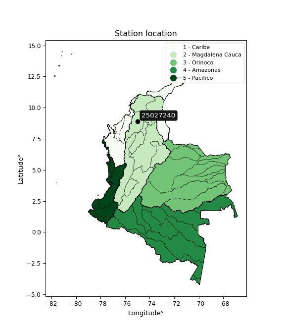

<div align="center">


</div>

# PMP Station (Rain, Pmax24h): 25027240

Probable Maximum Precipitation (PMP) is the greatest amount of rainfall for a specific duration that is meteorologically possible for a given location, acting as a "worst-case" scenario for extreme storms, crucial for designing safety-critical infrastructure like bridges, river deviations, dams, spillways, and nuclear plants to prevent catastrophic failure. PMP is calculated by hydrologists using meteorological data to determine the upper limit of extreme rainfall, often leading to the Probable Maximum Flood (PMF) for flood control design, and is increasingly being studied for climate change impacts. Probable Maximum Precipitation (PMP) is the theoretical upper limit of rainfall, a deterministic estimate for extreme events, while probability distributions (like GEV, Gumbel) describe the likelihood and frequency of various precipitation amounts, including rare ones, showing how often events occur, with PMP representing the extreme end of these distributions, used for critical infrastructure design to ensure safety against the worst conceivable weather, unlike standard statistical forecasts which cover typical probabilities.

The most common probability distributions in hydrology, used for analyzing floods, rainfall, and streamflow, include the Normal, Log-Normal, Gumbel, Gamma (including Log-Pearson Type III), and Generalized Extreme Value (GEV) distributions, often chosen based on the data´s skewness and whether modeling extremes or general conditions, with Gumbel and GEV popular for extreme events like floods, while the Normal distribution serves as a baseline, though often requiring transformations for skewed hydrological data. These distributions help in designing water infrastructure, managing water resources, and forecasting hydrologic events.

> Hydrological data often isn´t perfectly normal (it´s skewed), so different distributions are needed for different applications, such as: **Flood Frequency Analysis**: Using Gumbel, GEV, or Log-Pearson Type III for predicting extreme flood magnitudes and their return periods, **Rainfall Analysis**: Normal for annual totals, but Log-Normal, Weibull, or GEV for intensity or extreme daily rainfall, **Streamflow Modeling**: Gamma and Log-Normal for maximum flows, GEV for minimum flows, and Kappa for daily flows.

<div align="center">

</img>

</div>


## A. General information


### 1. General running parameters

• app_version: _v20260113_. • runtime: _2026-01-17 18:24:04.630693_. • Python version: _3.14.0_. • SciPy version: _1.16.3_. • Pandas version: _2.3.3_. • NumPy version: _2.3.5_. • Stations dataset (station_dataset_file): _dataset/pmax24h_in/automatic_colombia_2003_2025.csv_. • Stations catalog (station_catalog_file): _dataset/CNE.xls_. • Minimum year to eval til year_max (date_min): _1900_. • Maximum year to eval since year_min (date_max): _2025_. • Creates, save and include plots into reports (create_plot): _False_. • Plot only fit distributions with Δo > Δ (plot_only_fit): _True_. • Plot only simple graphs avoiding multiple CDFs and multiple Extreme values plots (plot_only_simple): _True_. • Eval low extreme values, if False, evaluates high extreme values (low_extreme): _False_. • Eval every SciPy distribution as logarithmic (pdist_logarithmic_on): _True_. • Standard deviation normalized (ddof): _1.0_. • Return periods to eval in years (Tr): _[2, 2.33, 5, 10, 15, 20, 25, 50, 75, 100, 200, 250, 500, 750, 1000]_. • Minimum data sample per station, 0 means any (minimum_sample): _5_. • Z-Score maximum threshold to adjust a value, 0 means disable (zscore_max): _3.5_. • Z-Score minimum threshold to adjust a value, 0 means disable (zscore_min): _-2.5_. • Avoid zeros, e.g. rain = 0 (avoid_zeros): _True_. • Avoid null values (avoid_nans): _True_. 

:file_folder:Table: [dataset.csv](../../dataset/pmax24h_in/automatic_colombia_2003_2025.csv)

> Delta Degrees of Freedom (DDOF): is a parameter used in the formulas for calculating variance and standard deviation. When ddof=0, the divisor is $N$ (the total number of observations) and this is used when your data set is the entire population. When ddof=1, the divisor is $N-1$ and this is used when your data set is a sample drawn from a larger population. Using $N-1$ provides an unbiased estimate of the population variance (known as Bessel´s correction).


### 2. Station info and location

|   id |   CODIGO | NOMBRE           | CATEGORIA    | TECNOLOGIA                              | ESTADO   | FECHA_INSTALACION   |   FECHA_SUSPENSION |   ALTITUD |   LATITUD |   LONGITUD | DEPARTAMENTO   | MUNICIPIO       | AREA_OPERATIVA                              | ENTIDAD                                                     | AREA_HIDROGRAFICA   | ZONA_HIDROGRAFICA                | SUBZONA_HIDROGRAFICA       | CORRIENTE   | Catalogo   |   Version |
|-----:|---------:|:-----------------|:-------------|:----------------------------------------|:---------|:--------------------|-------------------:|----------:|----------:|-----------:|:---------------|:----------------|:--------------------------------------------|:------------------------------------------------------------|:--------------------|:---------------------------------|:---------------------------|:------------|:-----------|----------:|
|    0 | 25027240 | JEGUA [25027240] | Limnigráfica | Automática con Telemetría, Convencional | Activa   | 15/03/1968          |                nan |        20 |   8.90631 |   -74.9659 | Sucre          | San Benito Abad | Area Operativa 02 - Atlántico-Bolivar-Sucre | INSTITUTO DE HIDROLOGIA METEOROLOGIA Y ESTUDIOS AMBIENTALES | Magdalena Cauca     | Bajo Magdalena- Cauca -San Jorge | Bajo San Jorge - La Mojana | San Jorge   | CNE_IDEAM  |  20251226 |

<div align="center">

Dynamic map: [:earth_americas:Google](http://maps.google.com/maps?q=8.906305556,-74.96594444) [:earth_americas:OSM](https://www.openstreetmap.org/#map=18/8.906305556/-74.96594444&layers=P) [:earth_americas:Bing](https://www.bing.com/maps?cp=8.906305556~-74.96594444&lvl=18) [:earth_americas:Apple](https://maps.apple.com/frame?center=8.906305556%2C-74.96594444&span=0.003%2C0.006)

</div>


<div align="center">

```geojson
{
  "type": "Feature",
  "geometry": {
    "type": "Point", 
    "coordinates": [-74.96594444, 8.906305556]
  }, 
  "properties": {
    "Name": "25027240"
  }
}
```

</div>


### 3. Discrete values table and plot

<div align="center">

|               |           0 |          1 |           2 |           3 |          4 |
|:--------------|------------:|-----------:|------------:|------------:|-----------:|
| Date          | 2021        | 2022       | 2023        | 2024        | 2025       |
| Value         |   95.2      |  138.6     |   97.5      |  117.5      |   64.5     |
| Value_initial |   95.2      |  138.6     |   97.5      |  117.5      |   64.5     |
| count         |    5        |    5       |    5        |    5        |    5       |
| mean          |  102.66     |  102.66    |  102.66     |  102.66     |  102.66    |
| std           |   27.6151   |   27.6151  |   27.6151   |   27.6151   |   27.6151  |
| zscore        |   -0.270142 |    1.30146 |   -0.186854 |    0.537387 |   -1.38185 |


</div>


> The initial value (value_initial) correspond to the initial obtained or null completed value, and value (value) is adjusted only when the initial value is outside the valid range (outlier) definite through the Z-Score value. If Z-Score is active, values out of range or outliers are replaced with the station mean value. A Z-Score (or standard score) measures how many standard deviations a data point is from the mean of a dataset, indicating its relative position; positive scores mean above the mean, negative mean below, and a score of zero is exactly at the mean, allowing for comparison of values from different distributions. It´s calculated using the formula $z=(x–μ)/σ$, where $x$ is the data point, $μ$ is the mean, and $σ$ is the standard deviation, helping identify outliers and understand probability.
>
> <sub>**Note**: In this study, "completing" (filling gaps in) and "extending" (forecasting or lengthening the historical record) rainfall data series are avoided for certain critical analyses because they introduce artificial bias and uncertainty, which can distort the statistics of rare events (extremes), alter day-to-day variability, and compromise the integrity and homogeneity of the original data. Some reasons against Completing/Extending rainfall data are: **Distortion of Extremes and Variability**: The primary issue is that most gap-filling or extension methods rely on averaging or regression with nearby stations, which inherently smooths the data. Rainfall is highly variable in space and time, with a large percentage of zero values and occasional large storms. Infilling methods often underestimate the highest values and overestimate the lowest (zero) values, which severely distorts analyses focused on flood frequency, drought severity, and intensity-duration-frequency (IDF) curves, **Loss of Data Homogeneity**: Infilled or extended data are synthetic estimates, not actual measurements. Combining these estimates with observed data can violate the assumption of data homogeneity, which requires that the data properties do not change over time. Inhomogeneity can lead to incorrect conclusions about long-term trends or changes in climate patterns, **Propagation of Errors**: Errors and biases from the original data (e.g., wind-induced undercatch, instrument errors, site changes) or the data used for imputation can propagate through the analysis, leading to unreliable hydrological models and inaccurate predictions, **Compromised Statistical Integrity**: For statistical analyses, especially those involving the frequency of events, using artificial data can introduce time bias or autocorrelation that doesn´t exist in reality, making it difficult to assess the true probability of events, **Difficulty in Validation**: It is difficult to accurately validate the quality of filled or extended data, especially for past periods where ground-truth measurements are unavailable. The reliability of imputation techniques heavily depends on the density of the surrounding station network and the complexity of the local topography.</sub>


### 4. Active continuous probability distributions from SciPy (80 of 104 available)

A Probability Density Function (PDF) describes the relative likelihood of a continuous random variable falling within a specific range, where the total area under its curve equals 1, and the area over any interval gives the actual probability for that range. Unlike discrete probabilities (like rolling a die), a PDF shows density, not direct probability for a single point (which is zero), with higher points indicating higher likelihood, often visualized as a bell curve for normal distributions.

A log of a probability density function (log-PDF) is simply the logarithm of the PDF´s value, denoted as $log(f(x))$, useful for converting multiplication of probabilities into addition, improving numerical stability with tiny numbers, and connecting to information theory concepts like entropy. Instead of dealing with very small probabilities (e.g., 0.000001), log-PDFs use negative numbers (e.g., $log(0.00001) ≈ -11.51$ that are easier for computers to handle, preventing underflow errors and simplifying complex calculations. In this study, each active probability distribution from SciPy is also evaluated in the $log$ form.

[scipy.stats](https://docs.scipy.org/doc/scipy/reference/stats.html) is a Python´s powerful submodule within the SciPy library for comprehensive statistical analysis, offering over 130 probability distributions (like Normal, Poisson), functions for descriptive stats (mean, variance), hypothesis testing (t-tests, chi-square), random variable generation, and statistical tests, making it essential for data science, modeling, and research. It provides tools to explore, model, and draw conclusions from data efficiently, working seamlessly with NumPy.

<div align="center">

|   id | p_dist           |   n_parameter | fit_method   | label                                                                       | active   | ref                                                                                                      |
|-----:|:-----------------|--------------:|:-------------|:----------------------------------------------------------------------------|:---------|:---------------------------------------------------------------------------------------------------------|
|    0 | alpha            |             3 | MLE          | Alpha                                                                       | True     | [:mortar_board:](https://docs.scipy.org/doc/scipy/reference/generated/scipy.stats.alpha.html)            |
|    1 | anglit           |             2 | MM           | Anglit                                                                      | True     | [:mortar_board:](https://docs.scipy.org/doc/scipy/reference/generated/scipy.stats.anglit.html)           |
|    2 | arcsine          |             2 | MM           | Arcsine                                                                     | True     | [:mortar_board:](https://docs.scipy.org/doc/scipy/reference/generated/scipy.stats.arcsine.html)          |
|    3 | argus            |             3 | MLE          | Argus                                                                       | True     | [:mortar_board:](https://docs.scipy.org/doc/scipy/reference/generated/scipy.stats.argus.html)            |
|    4 | beta             |             4 | MLE          | Beta                                                                        | True     | [:mortar_board:](https://docs.scipy.org/doc/scipy/reference/generated/scipy.stats.beta.html)             |
|    5 | betaprime        |             4 | MLE          | Beta prime                                                                  | True     | [:mortar_board:](https://docs.scipy.org/doc/scipy/reference/generated/scipy.stats.betaprime.html)        |
|    6 | bradford         |             3 | MLE          | Bradford                                                                    | True     | [:mortar_board:](https://docs.scipy.org/doc/scipy/reference/generated/scipy.stats.bradford.html)         |
|    7 | burr             |             4 | MLE          | Burr (Type III)                                                             | True     | [:mortar_board:](https://docs.scipy.org/doc/scipy/reference/generated/scipy.stats.burr.html)             |
|    8 | burr12           |             4 | MLE          | Burr (Type III) 12                                                          | True     | [:mortar_board:](https://docs.scipy.org/doc/scipy/reference/generated/scipy.stats.burr12.html)           |
|    9 | cosine           |             2 | MLE          | Cosine                                                                      | True     | [:mortar_board:](https://docs.scipy.org/doc/scipy/reference/generated/scipy.stats.cosine.html)           |
|   10 | crystalball      |             4 | MLE          | Crystalball                                                                 | True     | [:mortar_board:](https://docs.scipy.org/doc/scipy/reference/generated/scipy.stats.crystalball.html)      |
|   11 | dgamma           |             3 | MLE          | Double gamma                                                                | True     | [:mortar_board:](https://docs.scipy.org/doc/scipy/reference/generated/scipy.stats.dgamma.html)           |
|   12 | dweibull         |             3 | MLE          | Double Weibull                                                              | True     | [:mortar_board:](https://docs.scipy.org/doc/scipy/reference/generated/scipy.stats.dweibull.html)         |
|   13 | erlang           |             3 | MLE          | Erlang                                                                      | True     | [:mortar_board:](https://docs.scipy.org/doc/scipy/reference/generated/scipy.stats.erlang.html)           |
|   14 | exponnorm        |             3 | MLE          | Exponentially modified Normal                                               | True     | [:mortar_board:](https://docs.scipy.org/doc/scipy/reference/generated/scipy.stats.exponnorm.html)        |
|   15 | exponpow         |             3 | MLE          | Exponential power                                                           | True     | [:mortar_board:](https://docs.scipy.org/doc/scipy/reference/generated/scipy.stats.exponpow.html)         |
|   16 | exponweib        |             4 | MLE          | Exponentiated Weibull                                                       | True     | [:mortar_board:](https://docs.scipy.org/doc/scipy/reference/generated/scipy.stats.exponweib.html)        |
|   17 | f                |             4 | MLE          | F                                                                           | True     | [:mortar_board:](https://docs.scipy.org/doc/scipy/reference/generated/scipy.stats.f.html)                |
|   18 | fatiguelife      |             3 | MLE          | Fatigue-life (Birnbaum-Saunders)                                            | True     | [:mortar_board:](https://docs.scipy.org/doc/scipy/reference/generated/scipy.stats.fatiguelife.html)      |
|   19 | foldnorm         |             3 | MM           | Fold Normal                                                                 | True     | [:mortar_board:](https://docs.scipy.org/doc/scipy/reference/generated/scipy.stats.foldnorm.html)         |
|   20 | gamma            |             3 | MLE          | Gamma                                                                       | True     | [:mortar_board:](https://docs.scipy.org/doc/scipy/reference/generated/scipy.stats.gamma.html)            |
|   21 | gausshyper       |             6 | MLE          | Gauss hypergeometric                                                        | True     | [:mortar_board:](https://docs.scipy.org/doc/scipy/reference/generated/scipy.stats.gausshyper.html)       |
|   22 | genexpon         |             5 | MLE          | Generalized exponential                                                     | True     | [:mortar_board:](https://docs.scipy.org/doc/scipy/reference/generated/scipy.stats.genexpon.html)         |
|   23 | genextreme       |             3 | MLE          | Generalized exponential                                                     | True     | [:mortar_board:](https://docs.scipy.org/doc/scipy/reference/generated/scipy.stats.genextreme.html)       |
|   24 | gengamma         |             4 | MLE          | Generalized gamma                                                           | True     | [:mortar_board:](https://docs.scipy.org/doc/scipy/reference/generated/scipy.stats.gengamma.html)         |
|   25 | genhalflogistic  |             3 | MLE          | Generalized half-logistic                                                   | True     | [:mortar_board:](https://docs.scipy.org/doc/scipy/reference/generated/scipy.stats.genhalflogistic.html)  |
|   26 | genlogistic      |             3 | MLE          | Generalized logistic                                                        | True     | [:mortar_board:](https://docs.scipy.org/doc/scipy/reference/generated/scipy.stats.genlogistic.html)      |
|   27 | gennorm          |             3 | MLE          | Generalized Normal                                                          | True     | [:mortar_board:](https://docs.scipy.org/doc/scipy/reference/generated/scipy.stats.gennorm.html)          |
|   28 | genpareto        |             3 | MLE          | Generalized Pareto                                                          | True     | [:mortar_board:](https://docs.scipy.org/doc/scipy/reference/generated/scipy.stats.genpareto.html)        |
|   29 | gompertz         |             3 | MLE          | Gompertz (or truncated Gumbel)                                              | True     | [:mortar_board:](https://docs.scipy.org/doc/scipy/reference/generated/scipy.stats.gompertz.html)         |
|   30 | gumbel_l         |             2 | MM           | Gumbel Left Skew                                                            | True     | [:mortar_board:](https://docs.scipy.org/doc/scipy/reference/generated/scipy.stats.gumbel_l.html)         |
|   31 | gumbel_r         |             2 | MM           | Gumbel Right Skew                                                           | True     | [:mortar_board:](https://docs.scipy.org/doc/scipy/reference/generated/scipy.stats.gumbel_r.html)         |
|   32 | halfgennorm      |             3 | MLE          | Upper half of a generalized normal                                          | True     | [:mortar_board:](https://docs.scipy.org/doc/scipy/reference/generated/scipy.stats.halfgennorm.html)      |
|   33 | halflogistic     |             2 | MM           | Half-logistic                                                               | True     | [:mortar_board:](https://docs.scipy.org/doc/scipy/reference/generated/scipy.stats.halflogistic.html)     |
|   34 | halfnorm         |             2 | MM           | Half Normal                                                                 | True     | [:mortar_board:](https://docs.scipy.org/doc/scipy/reference/generated/scipy.stats.halfnorm.html)         |
|   35 | hypsecant        |             2 | MM           | hyperbolic secant                                                           | True     | [:mortar_board:](https://docs.scipy.org/doc/scipy/reference/generated/scipy.stats.hypsecant.html)        |
|   36 | invgamma         |             3 | MLE          | Inverted gamma                                                              | True     | [:mortar_board:](https://docs.scipy.org/doc/scipy/reference/generated/scipy.stats.invgamma.html)         |
|   37 | invgauss         |             3 | MLE          | Inverse Gaussian                                                            | True     | [:mortar_board:](https://docs.scipy.org/doc/scipy/reference/generated/scipy.stats.invgauss.html)         |
|   38 | invweibull       |             3 | MLE          | Inverted Weibull                                                            | True     | [:mortar_board:](https://docs.scipy.org/doc/scipy/reference/generated/scipy.stats.invweibull.html)       |
|   39 | johnsonsb        |             4 | MLE          | Johnson SB                                                                  | True     | [:mortar_board:](https://docs.scipy.org/doc/scipy/reference/generated/scipy.stats.johnsonsb.html)        |
|   40 | johnsonsu        |             4 | MLE          | Johnson Su                                                                  | True     | [:mortar_board:](https://docs.scipy.org/doc/scipy/reference/generated/scipy.stats.johnsonsu.html)        |
|   41 | kappa3           |             3 | MLE          | Kappa 3                                                                     | True     | [:mortar_board:](https://docs.scipy.org/doc/scipy/reference/generated/scipy.stats.kappa3.html)           |
|   42 | kappa4           |             4 | MLE          | Kappa 4                                                                     | True     | [:mortar_board:](https://docs.scipy.org/doc/scipy/reference/generated/scipy.stats.kappa4.html)           |
|   43 | ksone            |             3 | MLE          | Kolmogorov-Smirnov one-sided test statistic distribution                    | True     | [:mortar_board:](https://docs.scipy.org/doc/scipy/reference/generated/scipy.stats.ksone.html)            |
|   44 | kstwobign        |             2 | MLE          | Limiting distribution of scaled Kolmogorov-Smirnov two-sided test statistic | True     | [:mortar_board:](https://docs.scipy.org/doc/scipy/reference/generated/scipy.stats.kstwobign.html)        |
|   45 | laplace          |             2 | MM           | Laplace                                                                     | True     | [:mortar_board:](https://docs.scipy.org/doc/scipy/reference/generated/scipy.stats.laplace.html)          |
|   46 | levy_l           |             2 | MLE          | Left-skewed Levy                                                            | True     | [:mortar_board:](https://docs.scipy.org/doc/scipy/reference/generated/scipy.stats.levy_l.html)           |
|   47 | loggamma         |             3 | MLE          | Log gamma                                                                   | True     | [:mortar_board:](https://docs.scipy.org/doc/scipy/reference/generated/scipy.stats.loggamma.html)         |
|   48 | logistic         |             2 | MM           | Logistic (or Sech-squared)                                                  | True     | [:mortar_board:](https://docs.scipy.org/doc/scipy/reference/generated/scipy.stats.logistic.html)         |
|   49 | loglaplace       |             3 | MLE          | Log-Laplace                                                                 | True     | [:mortar_board:](https://docs.scipy.org/doc/scipy/reference/generated/scipy.stats.loglaplace.html)       |
|   50 | lomax            |             3 | MLE          | Lomax (Pareto of the second kind)                                           | True     | [:mortar_board:](https://docs.scipy.org/doc/scipy/reference/generated/scipy.stats.lomax.html)            |
|   51 | maxwell          |             2 | MM           | Maxwell                                                                     | True     | [:mortar_board:](https://docs.scipy.org/doc/scipy/reference/generated/scipy.stats.maxwell.html)          |
|   52 | mielke           |             4 | MLE          | Mielke Beta-Kappa / Dagum                                                   | True     | [:mortar_board:](https://docs.scipy.org/doc/scipy/reference/generated/scipy.stats.mielke.html)           |
|   53 | moyal            |             2 | MM           | Moyal                                                                       | True     | [:mortar_board:](https://docs.scipy.org/doc/scipy/reference/generated/scipy.stats.moyal.html)            |
|   54 | nakagami         |             3 | MLE          | Nakagami                                                                    | True     | [:mortar_board:](https://docs.scipy.org/doc/scipy/reference/generated/scipy.stats.nakagami.html)         |
|   55 | ncf              |             5 | MLE          | Non-central F distribution                                                  | True     | [:mortar_board:](https://docs.scipy.org/doc/scipy/reference/generated/scipy.stats.ncf.html)              |
|   56 | nct              |             4 | MLE          | Non-central Student’s t                                                     | True     | [:mortar_board:](https://docs.scipy.org/doc/scipy/reference/generated/scipy.stats.nct.html)              |
|   57 | norm             |             2 | MM           | Normal                                                                      | True     | [:mortar_board:](https://docs.scipy.org/doc/scipy/reference/generated/scipy.stats.norm.html)             |
|   58 | pearson3         |             3 | MM           | Pearson type III                                                            | True     | [:mortar_board:](https://docs.scipy.org/doc/scipy/reference/generated/scipy.stats.pearson3.html)         |
|   59 | powerlaw         |             3 | MLE          | Power-function                                                              | True     | [:mortar_board:](https://docs.scipy.org/doc/scipy/reference/generated/scipy.stats.powerlaw.html)         |
|   60 | rayleigh         |             2 | MM           | Rayleigh                                                                    | True     | [:mortar_board:](https://docs.scipy.org/doc/scipy/reference/generated/scipy.stats.rayleigh.html)         |
|   61 | rdist            |             3 | MLE          | R-distributed (symmetric beta)                                              | True     | [:mortar_board:](https://docs.scipy.org/doc/scipy/reference/generated/scipy.stats.rdist.html)            |
|   62 | rice             |             3 | MLE          | Rice                                                                        | True     | [:mortar_board:](https://docs.scipy.org/doc/scipy/reference/generated/scipy.stats.rice.html)             |
|   63 | semicircular     |             2 | MM           | Semicircular                                                                | True     | [:mortar_board:](https://docs.scipy.org/doc/scipy/reference/generated/scipy.stats.semicircular.html)     |
|   64 | skewnorm         |             3 | MLE          | Skew normal                                                                 | True     | [:mortar_board:](https://docs.scipy.org/doc/scipy/reference/generated/scipy.stats.skewnorm.html)         |
|   65 | t                |             3 | MLE          | Student’s t                                                                 | True     | [:mortar_board:](https://docs.scipy.org/doc/scipy/reference/generated/scipy.stats.t.html)                |
|   66 | trapezoid        |             4 | MLE          | Trapezoid                                                                   | True     | [:mortar_board:](https://docs.scipy.org/doc/scipy/reference/generated/scipy.stats.trapezoid.html)        |
|   67 | triang           |             3 | MLE          | Triangular                                                                  | True     | [:mortar_board:](https://docs.scipy.org/doc/scipy/reference/generated/scipy.stats.triang.html)           |
|   68 | truncexpon       |             3 | MLE          | Truncated exponential                                                       | True     | [:mortar_board:](https://docs.scipy.org/doc/scipy/reference/generated/scipy.stats.truncexpon.html)       |
|   69 | truncnorm        |             4 | MLE          | Truncated normal                                                            | True     | [:mortar_board:](https://docs.scipy.org/doc/scipy/reference/generated/scipy.stats.truncnorm.html)        |
|   70 | truncpareto      |             4 | MLE          | Upper truncated Pareto                                                      | True     | [:mortar_board:](https://docs.scipy.org/doc/scipy/reference/generated/scipy.stats.truncpareto.html)      |
|   71 | truncweibull_min |             5 | MLE          | Doubly truncated Weibull minimum                                            | True     | [:mortar_board:](https://docs.scipy.org/doc/scipy/reference/generated/scipy.stats.truncweibull_min.html) |
|   72 | tukeylambda      |             3 | MLE          | Tukey-Lamdba                                                                | True     | [:mortar_board:](https://docs.scipy.org/doc/scipy/reference/generated/scipy.stats.tukeylambda.html)      |
|   73 | uniform          |             2 | MLE          | Uniform                                                                     | True     | [:mortar_board:](https://docs.scipy.org/doc/scipy/reference/generated/scipy.stats.uniform.html)          |
|   74 | vonmises         |             3 | MLE          | Von Mises                                                                   | True     | [:mortar_board:](https://docs.scipy.org/doc/scipy/reference/generated/scipy.stats.vonmises.html)         |
|   75 | vonmises_line    |             3 | MLE          | Von Mises line                                                              | True     | [:mortar_board:](https://docs.scipy.org/doc/scipy/reference/generated/scipy.stats.vonmises_line.html)    |
|   76 | wald             |             2 | MM           | Wald                                                                        | True     | [:mortar_board:](https://docs.scipy.org/doc/scipy/reference/generated/scipy.stats.wald.html)             |
|   77 | weibull_max      |             3 | MLE          | Weibull maximum                                                             | True     | [:mortar_board:](https://docs.scipy.org/doc/scipy/reference/generated/scipy.stats.weibull_max.html)      |
|   78 | weibull_min      |             3 | MLE          | Weibull minimum                                                             | True     | [:mortar_board:](https://docs.scipy.org/doc/scipy/reference/generated/scipy.stats.weibull_min.html)      |
|   79 | wrapcauchy       |             3 | MLE          | Wrapped  Cauchy                                                             | True     | [:mortar_board:](https://docs.scipy.org/doc/scipy/reference/generated/scipy.stats.wrapcauchy.html)       |

</div>

> **n_parameter:** # arguments & localization & scale.
>
> **Fit methods:** (MLE) maximum likelihood, (MM) L-moments.
>
>**Inactive** (With the only purpose of prevent loops, zero divisions, infinite values, over high estimated values or horizontal trending for recurrence intervals estimations, the follow distributions were disabled.)**:** lognorm, norminvgauss, powernorm, powerlognorm, cauchy, halfcauchy, foldcauchy, skewcauchy, chi2, expon, fisk, genhyperbolic, geninvgauss, gibrat, kstwo, laplace_asymmetric, levy, levy_stable, ncx2, pareto, rel_breitwigner, recipinvgauss, studentized_range, loguniform, 


## B. Probability (PDF) vs. Empirical (EDF) distributions functions

A continuous probability distribution (CPD) describes probabilities for variables that can take any value within a range (like rain any time), unlike discrete variables with specific outcomes (like temperature). It uses a Probability Density Function (PDF), a curve where the total area under it equals 1, and the probability of the variable falling within an interval (a to b) is found by calculating the area under the curve between those points. A key feature is that the probability of hitting any single exact value is zero, so probabilities are always expressed for ranges, e.g., $P(a ≤ X ≤ b)$.

<div align="center">

Distributions parameters from station values
|     |   station | p_dist              |   n |             loc |           scale | shape                  | shape1                 | shape2                | shape3            |
|----:|----------:|:--------------------|----:|----------------:|----------------:|:-----------------------|:-----------------------|:----------------------|:------------------|
|   0 |  25027240 | alpha               |   5 |  -308.915       |  6716.1         | 16.390711753498472     |                        |                       |                   |
|   1 |  25027240 | anglit              |   5 |   102.66        |    72.2564      |                        |                        |                       |                   |
|   2 |  25027240 | arcsine             |   5 |    67.7293      |    69.8613      |                        |                        |                       |                   |
|   3 |  25027240 | argus               |   5 |    46.3763      |    97.7316      | 2.1823227584179906e-05 |                        |                       |                   |
|   4 |  25027240 | beta                |   5 |    16.0333      |   122.567       | 2.1968149090052163     | 0.5293443084552055     |                       |                   |
|   5 |  25027240 | betaprime           |   5 |    -1.47836     |   114.215       | 32.02939475075682      | 36.206467066343606     |                       |                   |
|   6 |  25027240 | bradford            |   5 |    64.4999      |    74.1001      | 1.0618455225965495     |                        |                       |                   |
|   7 |  25027240 | burr                |   5 |   -73.7692      |    36.3968      | 6.769962137517043      | 24595.329829959075     |                       |                   |
|   8 |  25027240 | burr12              |   5 |    -0.512008    |    63.8532      | 132.80293358782086     | 0.016771768926430522   |                       |                   |
|   9 |  25027240 | cosine              |   5 |   102.301       |    20.4609      |                        |                        |                       |                   |
|  10 |  25027240 | crystalball         |   5 |   102.66        |    24.6997      | 7208.605584384067      | 8857.881367450827      |                       |                   |
|  11 |  25027240 | dgamma              |   5 |    97.5         |    21.0607      | 0.8982361635300089     |                        |                       |                   |
|  12 |  25027240 | dweibull            |   5 |   106.996       |    23.9418      | 1.6927630576581265     |                        |                       |                   |
|  13 |  25027240 | erlang              |   5 |  -637.73        |     0.82693     | 895.3033956037389      |                        |                       |                   |
|  14 |  25027240 | exponnorm           |   5 |   102.626       |    24.6996      | 0.0013586611641342146  |                        |                       |                   |
|  15 |  25027240 | exponpow            |   5 |    64.5         |     1.63648     | 0.12218012647694358    |                        |                       |                   |
|  16 |  25027240 | exponweib           |   5 |    64.5         |     1.19633     | 1.382139626746263      | 0.2319662350614524     |                       |                   |
|  17 |  25027240 | f                   |   5 | -2203.34        |  2305.91        | 17545.304559457763     | 1388779.600503853      |                       |                   |
|  18 |  25027240 | fatiguelife         |   5 |    64.5         |     0.000678424 | 213.32499435659918     |                        |                       |                   |
|  19 |  25027240 | foldnorm            |   5 |   105.609       |     1.73353     | 7.349245166161635e-07  |                        |                       |                   |
|  20 |  25027240 | gamma               |   5 |  -657.564       |     0.810219    | 938.2952159321228      |                        |                       |                   |
|  21 |  25027240 | gausshyper          |   5 |    64.5         |    74.2939      | 0.97689204672384       | 0.9595128464085598     | 1.0045385212070315    | 1.046491698526895 |
|  22 |  25027240 | genexpon            |   5 |    64.4999      |     2.02168     | 0.05297201423051678    | 1.5338577969615506e-07 | 1.4794663290800534    |                   |
|  23 |  25027240 | genextreme          |   5 |    96.685       |    26.8557      | 0.5043201578591086     |                        |                       |                   |
|  24 |  25027240 | gengamma            |   5 |    64.5         |     1.14482     | 1.3897719396063435     | 0.25436870424169894    |                       |                   |
|  25 |  25027240 | genhalflogistic     |   5 |    63.5987      |    77.778       | 1.0370214347942674     |                        |                       |                   |
|  26 |  25027240 | genlogistic         |   5 |   100.497       |    15.1132      | 1.1087616508301719     |                        |                       |                   |
|  27 |  25027240 | gennorm             |   5 |    97.5         |     0.439664    | 0.3419487721356326     |                        |                       |                   |
|  28 |  25027240 | genpareto           |   5 |    -0.920725    |   212.406       | -1.522399799475826     |                        |                       |                   |
|  29 |  25027240 | gompertz            |   5 |   107.516       |     1.80064     | 6.302464889134608e-08  |                        |                       |                   |
|  30 |  25027240 | gumbel_l            |   5 |   113.776       |    19.2583      |                        |                        |                       |                   |
|  31 |  25027240 | gumbel_r            |   5 |    91.5438      |    19.2583      |                        |                        |                       |                   |
|  32 |  25027240 | halfgennorm         |   5 |    64.5         |     1.40346     | 0.35236528985540017    |                        |                       |                   |
|  33 |  25027240 | halflogistic        |   5 |    73.3852      |    21.1173      |                        |                        |                       |                   |
|  34 |  25027240 | halfnorm            |   5 |    69.9673      |    40.9742      |                        |                        |                       |                   |
|  35 |  25027240 | hypsecant           |   5 |   102.66        |    15.7243      |                        |                        |                       |                   |
|  36 |  25027240 | invgamma            |   5 |  -218.883       | 52621.1         | 164.8514356726307      |                        |                       |                   |
|  37 |  25027240 | invgauss            |   5 |   -50.2224      |  5342.49        | 0.0285412389896713     |                        |                       |                   |
|  38 |  25027240 | invweibull          |   5 |    64.5         |     0.912764    | 0.07083378428052436    |                        |                       |                   |
|  39 |  25027240 | johnsonsb           |   5 |    64.5         |    74.1118      | 2.4469159288706424     | 0.16769733037684928    |                       |                   |
|  40 |  25027240 | johnsonsu           |   5 |   467.032       |     6.00198     | 70.71456745237788      | 14.7414072398213       |                       |                   |
|  41 |  25027240 | kappa3              |   5 |    64.5         |    80.8931      | 249.2281222603924      |                        |                       |                   |
|  42 |  25027240 | kappa4              |   5 |    58.8869      |    82.8279      | 1.0727999475998968     | 1.0390093567329999     |                       |                   |
|  43 |  25027240 | ksone               |   5 |    59.8789      |    85.5622      | 1.0                    |                        |                       |                   |
|  44 |  25027240 | kstwobign           |   5 |     8.99241     |   107.032       |                        |                        |                       |                   |
|  45 |  25027240 | laplace             |   5 |   102.66        |    17.4653      |                        |                        |                       |                   |
|  46 |  25027240 | levy_l              |   5 |   141.744       |    12.0094      |                        |                        |                       |                   |
|  47 |  25027240 | loggamma            |   5 |  -446.33        |   151.453       | 38.01714758788657      |                        |                       |                   |
|  48 |  25027240 | logistic            |   5 |   102.66        |    13.6176      |                        |                        |                       |                   |
|  49 |  25027240 | loglaplace          |   5 |    -0.311244    |    97.8112      | 5.142675203234006      |                        |                       |                   |
|  50 |  25027240 | lomax               |   5 |    64.345       |  2259.79        | 59.41705374964731      |                        |                       |                   |
|  51 |  25027240 | maxwell             |   5 |    44.1321      |    36.6769      |                        |                        |                       |                   |
|  52 |  25027240 | mielke              |   5 |    -0.400366    |   121.543       | 4.17346938331322       | 10.886315631647129     |                       |                   |
|  53 |  25027240 | moyal               |   5 |    88.5351      |    11.1188      |                        |                        |                       |                   |
|  54 |  25027240 | nakagami            |   5 |    95.2         |    26.9202      | 0.04771576318989887    |                        |                       |                   |
|  55 |  25027240 | ncf                 |   5 |  -136.452       |     7.38024e-05 | 0.00870400130556074    | 167.00364627582036     | 27896.660642083298    |                   |
|  56 |  25027240 | nct                 |   5 | -1050.89        |    24.6766      | 417145.35646917194     | 46.74645148490724      |                       |                   |
|  57 |  25027240 | norm                |   5 |   102.66        |    24.6997      |                        |                        |                       |                   |
|  58 |  25027240 | pearson3            |   5 |   102.66        |    24.6997      | -0.0853474373133491    |                        |                       |                   |
|  59 |  25027240 | powerlaw            |   5 |    64.5         |    74.1         | 0.13083740809125458    |                        |                       |                   |
|  60 |  25027240 | rayleigh            |   5 |    55.4081      |    37.7016      |                        |                        |                       |                   |
|  61 |  25027240 | rdist               |   5 |    64.5404      |    32.9596      | 1.193305167327245      |                        |                       |                   |
|  62 |  25027240 | rice                |   5 |    50.3493      |    28.4544      | 1.4605526540879303     |                        |                       |                   |
|  63 |  25027240 | semicircular        |   5 |   102.66        |    49.3994      |                        |                        |                       |                   |
|  64 |  25027240 | skewnorm            |   5 |   114.064       |    27.2054      | -0.6170636687405244    |                        |                       |                   |
|  65 |  25027240 | t                   |   5 |   102.658       |    24.7004      | 8843909.301288335      |                        |                       |                   |
|  66 |  25027240 | trapezoid           |   5 |    57.09        |    88.92        | 1.0                    | 1.0                    |                       |                   |
|  67 |  25027240 | triang              |   5 |    41.2539      |    97.3506      | 0.999953543403111      |                        |                       |                   |
|  68 |  25027240 | truncexpon          |   5 |    64.4927      |    89.2332      | 0.8304899906747101     |                        |                       |                   |
|  69 |  25027240 | truncnorm           |   5 | -1546.67        |    96.9808      | 16.929468814609045     | 29021.923117340593     |                       |                   |
|  70 |  25027240 | truncpareto         |   5 |    64.1239      |     0.376104    | 0.26118278556188335    | 198.02007863449046     |                       |                   |
|  71 |  25027240 | truncweibull_min    |   5 |    64.3951      |    96.8391      | 0.6806328509154262     | 0.0010829319642536384  | 0.7662698442854814    |                   |
|  72 |  25027240 | tukeylambda         |   5 |   101.524       |    40.4633      | 1.091374721688799      |                        |                       |                   |
|  73 |  25027240 | uniform             |   5 |    64.5         |    74.1         |                        |                        |                       |                   |
|  74 |  25027240 | vonmises            |   5 |     1.46624     |     1           | 0.4574781044679319     |                        |                       |                   |
|  75 |  25027240 | vonmises_line       |   5 |   101.55        |    11.7934      | 0.022129704341437587   |                        |                       |                   |
|  76 |  25027240 | wald                |   5 |    77.9603      |    24.6997      |                        |                        |                       |                   |
|  77 |  25027240 | weibull_max         |   5 |   138.6         |     1.44507     | 0.19285100589403625    |                        |                       |                   |
|  78 |  25027240 | weibull_min         |   5 |    37.0176      |    73.7042      | 2.975535767113155      |                        |                       |                   |
|  79 |  25027240 | wrapcauchy          |   5 |    64.5         |    11.7934      | 0.5                    |                        |                       |                   |
|  80 |  25027240 | logalpha            |   5 |    -4.33564     |   307.426       | 34.43434429487721      |                        |                       |                   |
|  81 |  25027240 | loganglit           |   5 |     4.60011     |     0.749014    |                        |                        |                       |                   |
|  82 |  25027240 | logarcsine          |   5 |     4.23802     |     0.72418     |                        |                        |                       |                   |
|  83 |  25027240 | logargus            |   5 |     3.94576     |     1.02787     | 1.3796553200950243     |                        |                       |                   |
|  84 |  25027240 | logbeta             |   5 |     4.00274     |     0.928847    | 1.9287902992886974     | 0.7366631172284208     |                       |                   |
|  85 |  25027240 | logbetaprime        |   5 |   -11.2634      |     5.25974     | 15221.163936812343     | 5048.740230775298      |                       |                   |
|  86 |  25027240 | logbradford         |   5 |     4.16667     |     0.76494     | 1.0151465878608867     |                        |                       |                   |
|  87 |  25027240 | logburr             |   5 |    -0.443964    |     5.27834     | 64.84176515148434      | 0.29372227165548165    |                       |                   |
|  88 |  25027240 | logburr12           |   5 |    -1.5578      |     7.70787     | 29.567215445524596     | 437.532677991951       |                       |                   |
|  89 |  25027240 | logcosine           |   5 |     4.58185     |     0.213634    |                        |                        |                       |                   |
|  90 |  25027240 | logcrystalball      |   5 |     4.60011     |     0.256038    | 213.4266085137212      | 404.3055503899817      |                       |                   |
|  91 |  25027240 | logdgamma           |   5 |     4.57985     |     0.21005     | 0.8632940533688416     |                        |                       |                   |
|  92 |  25027240 | logdweibull         |   5 |     4.57985     |     0.225184    | 0.25765552744256626    |                        |                       |                   |
|  93 |  25027240 | logerlang           |   5 |     0.415486    |     0.0164183   | 254.6465173123949      |                        |                       |                   |
|  94 |  25027240 | logexponnorm        |   5 |     4.59992     |     0.256039    | 0.0007320541178135575  |                        |                       |                   |
|  95 |  25027240 | logexponpow         |   5 |     3.84781     |     0.984135    | 2.7175396671117307     |                        |                       |                   |
|  96 |  25027240 | logexponweib        |   5 |     4.16667     |     0.540749    | 0.08617851526374243    | 1.6048606468900053     |                       |                   |
|  97 |  25027240 | logf                |   5 |   -54.9133      |    59.5123      | 191993.06166522147     | 238691.23236605525     |                       |                   |
|  98 |  25027240 | logfatiguelife      |   5 |   -73.0837      |    77.6837      | 0.003284625694056951   |                        |                       |                   |
|  99 |  25027240 | logfoldnorm         |   5 |     4.14752     |     0.274764    | 1.601226698437078      |                        |                       |                   |
| 100 |  25027240 | loggamma            |   5 |     0.306464    |     0.0161211   | 266.2126061522759      |                        |                       |                   |
| 101 |  25027240 | loggausshyper       |   5 |     4.14326     |     0.788332    | 1.1649741705468513     | 0.940664413455748      | 0.9179372487203794    | 1.090517851763276 |
| 102 |  25027240 | loggenexpon         |   5 |     4.1583      |     0.0043513   | 0.004293348736297945   | 1.8903756994978202     | 4.313672741989032e-05 |                   |
| 103 |  25027240 | loggenextreme       |   5 |     4.59435     |     0.380749    | 1.1290161021411684     |                        |                       |                   |
| 104 |  25027240 | loggengamma         |   5 |     4.16667     |     0.442541    | 0.5707160672364695     | 1.5711519754689092     |                       |                   |
| 105 |  25027240 | loggenhalflogistic  |   5 |     4.10807     |     0.903898    | 1.0975939313380576     |                        |                       |                   |
| 106 |  25027240 | loggenlogistic      |   5 |     4.79771     |     0.0919427   | 0.3814018567548029     |                        |                       |                   |
| 107 |  25027240 | loggennorm          |   5 |     4.57985     |     0.00800779  | 0.3807657792649002     |                        |                       |                   |
| 108 |  25027240 | loggenpareto        |   5 |    -0.0104692   |    11.8706      | -2.4019468160041684    |                        |                       |                   |
| 109 |  25027240 | loggompertz         |   5 |     4.16667     |     0.789608    | 1.2862099882917857     |                        |                       |                   |
| 110 |  25027240 | loggumbel_l         |   5 |     4.71534     |     0.199632    |                        |                        |                       |                   |
| 111 |  25027240 | loggumbel_r         |   5 |     4.48487     |     0.199632    |                        |                        |                       |                   |
| 112 |  25027240 | loghalfgennorm      |   5 |     4.16666     |     0.76493     | 3297294.4992146688     |                        |                       |                   |
| 113 |  25027240 | loghalflogistic     |   5 |     4.29668     |     0.218876    |                        |                        |                       |                   |
| 114 |  25027240 | loghalfnorm         |   5 |     4.26124     |     0.424707    |                        |                        |                       |                   |
| 115 |  25027240 | loghypsecant        |   5 |     4.60011     |     0.162999    |                        |                        |                       |                   |
| 116 |  25027240 | loginvgamma         |   5 |    -3.36216     |  7539.62        | 948.0183481154422      |                        |                       |                   |
| 117 |  25027240 | loginvgauss         |   5 |     2.28734     |   166.557       | 0.013870344076220627   |                        |                       |                   |
| 118 |  25027240 | loginvweibull       |   5 |    -7.19734e+06 |     7.19735e+06 | 27588184.86201694      |                        |                       |                   |
| 119 |  25027240 | logjohnsonsb        |   5 |     4.16667     |     0.824875    | 0.7402923150202958     | 0.07765967956278924    |                       |                   |
| 120 |  25027240 | logjohnsonsu        |   5 |     5.27779     |     0.0304477   | 9.608219361992788      | 2.5805350667841207     |                       |                   |
| 121 |  25027240 | logkappa3           |   5 |     4.16667     |     0.764671    | 4810.933662102923      |                        |                       |                   |
| 122 |  25027240 | logkappa4           |   5 |     4.10691     |     0.840733    | 1.0765662882106457     | 1.0194192925629362     |                       |                   |
| 123 |  25027240 | logksone            |   5 |     4.15663     |     0.886942    | 1.0                    |                        |                       |                   |
| 124 |  25027240 | logkstwobign        |   5 |     3.55441     |     1.19343     |                        |                        |                       |                   |
| 125 |  25027240 | loglaplace          |   5 |     4.60011     |     0.181046    |                        |                        |                       |                   |
| 126 |  25027240 | loglevy_l           |   5 |     4.95834     |     0.102078    |                        |                        |                       |                   |
| 127 |  25027240 | logloggamma         |   5 |     4.73797     |     0.201299    | 0.9375670693885927     |                        |                       |                   |
| 128 |  25027240 | loglogistic         |   5 |     4.60011     |     0.141161    |                        |                        |                       |                   |
| 129 |  25027240 | logloglaplace       |   5 |     0.00211618  |     4.57774     | 23.39258935751917      |                        |                       |                   |
| 130 |  25027240 | loglomax            |   5 |     4.16667     |     1.31487e+11 | 40685545647.519516     |                        |                       |                   |
| 131 |  25027240 | logmaxwell          |   5 |     3.9934      |     0.380195    |                        |                        |                       |                   |
| 132 |  25027240 | logmielke           |   5 |     4.1665      |     0.846924    | 0.8043409311801801     | 14.137632571001069     |                       |                   |
| 133 |  25027240 | logmoyal            |   5 |     4.45369     |     0.115258    |                        |                        |                       |                   |
| 134 |  25027240 | lognakagami         |   5 |     4.55598     |     0.209701    | 0.123403571358145      |                        |                       |                   |
| 135 |  25027240 | logncf              |   5 |   -15.1114      |    19.7102      | 18898.589900591585     | 30605.38259802983      | 0.004580001002861607  |                   |
| 136 |  25027240 | lognct              |   5 |    -0.0715464   |     0.114051    | 197.27180412671396     | 40.79714175749493      |                       |                   |
| 137 |  25027240 | lognorm             |   5 |     4.60011     |     0.256038    |                        |                        |                       |                   |
| 138 |  25027240 | logpearson3         |   5 |     4.60011     |     0.256038    | -0.4825921302247939    |                        |                       |                   |
| 139 |  25027240 | logpowerlaw         |   5 |     4.16667     |     0.764927    | 0.13918316653183954    |                        |                       |                   |
| 140 |  25027240 | lograyleigh         |   5 |     4.11029     |     0.390817    |                        |                        |                       |                   |
| 141 |  25027240 | logrdist            |   5 |     4.62392     |     0.45725     | 1.0988674002888263     |                        |                       |                   |
| 142 |  25027240 | logrice             |   5 |     4.00063     |     0.283312    | 1.814970164953003      |                        |                       |                   |
| 143 |  25027240 | logsemicircular     |   5 |     4.60011     |     0.512076    |                        |                        |                       |                   |
| 144 |  25027240 | logskewnorm         |   5 |     4.93159     |     0.418836    | -5999535.036431162     |                        |                       |                   |
| 145 |  25027240 | logt                |   5 |     4.60011     |     0.256034    | 36135.19587054007      |                        |                       |                   |
| 146 |  25027240 | logtrapezoid        |   5 |     3.87592     |     1.08628     | 1.0                    | 1.0                    |                       |                   |
| 147 |  25027240 | logtriang           |   5 |     3.88583     |     1.04577     | 0.9999961000131918     |                        |                       |                   |
| 148 |  25027240 | logtruncexpon       |   5 |     4.16666     |     0.896304    | 0.8534489576214719     |                        |                       |                   |
| 149 |  25027240 | logtruncnorm        |   5 |    -0.0547406   |     1.45772     | 2.8959044926029343     | 5.70786241503469       |                       |                   |
| 150 |  25027240 | logtruncpareto      |   5 |     4.1623      |     0.004361    | 0.2608462599795739     | 176.40152654499616     |                       |                   |
| 151 |  25027240 | logtruncweibull_min |   5 |     4.16508     |     0.970897    | 1.0147795827426953     | 5.391326880398364e-08  | 0.7894861315343429    |                   |
| 152 |  25027240 | logtukeylambda      |   5 |     4.54916     |     0.421985    | 1.1032557895851804     |                        |                       |                   |
| 153 |  25027240 | loguniform          |   5 |     4.16667     |     0.764927    |                        |                        |                       |                   |
| 154 |  25027240 | logvonmises         |   5 |    -1.6817      |     1           | 15.705896233907637     |                        |                       |                   |
| 155 |  25027240 | logvonmises_line    |   5 |     4.66158     |     0.157538    | 1.0742805199511987     |                        |                       |                   |
| 156 |  25027240 | logwald             |   5 |     4.34406     |     0.256046    |                        |                        |                       |                   |
| 157 |  25027240 | logweibull_max      |   5 |     4.93159     |     0.309955    | 0.9461654275193582     |                        |                       |                   |
| 158 |  25027240 | logweibull_min      |   5 |     0.980385    |     3.73442     | 17.409564618791602     |                        |                       |                   |
| 159 |  25027240 | logwrapcauchy       |   5 |     4.16667     |     0.121742    | 0.5                    |                        |                       |                   |

</div>

> **loc** (Location parameter): This shifts the distribution along the x-axis. For many common distributions, like the normal (Gaussian) distribution, loc represents the mean $μ$. For others, like the uniform distribution, it might represent the minimum value, or for the beta distribution, the left end of the support interval.
>
> **scale** (Scale parameter): This determines the width or spread of the distribution. For the normal distribution, scale represents the standard deviation $σ$. For a uniform distribution, it defines the length of the interval (from $loc$ to $loc + scale$).
>
> **shape** (Shape parameters): Refers to parameters that define the specific form of a probability distribution, distinct from its location (loc) and scale (scale). These parameters are required arguments for most distribution functions. For example, a normal (Gaussian) distribution is fully defined by its location (mean) and scale (standard deviation), so it has no specific shape parameters beyond loc and scale. However, other distributions have intrinsic properties that need specification, as Gamma distribution that takes a shape parameter, often named $a$ or $alpha$.


### 0. Cumulative distribution values - CDF (160 evaluated)

Cumulative Distribution Function (CDF), denoted as $F$<sub>$X$</sub>$(x)$, is a function that gives the probability that a random variable $X$ will take a value less than or equal to a specific value, $x$ (i.e., $(P(X≥x)$. It essentially "accumulates" probabilities from a given point up to the far right (positive infinity), providing a complete picture of the distribution´s probabilities for both discrete (like rain) and continuous (like temperature) variables, helping to find probabilities over ranges or above certain values. Each station is evaluated separately ordering the $x$ values ascending, calculating the CDF and PDF values for the activated distributions and their logarithmic forms.

<div align="center">

CDF ordered by x ascending and calculating $log(f(x))$ separately
|   id |   Station |   date |     x |   count |   mean |     std |    zscore |   Value_initial |   station |   m |     alpha |   alpha_pdf |    anglit |   anglit_pdf |   arcsine |   arcsine_pdf |     argus |   argus_pdf |      beta |        beta_pdf |   betaprime |   betaprime_pdf |    bradford |   bradford_pdf |     burr |   burr_pdf |   burr12 |   burr12_pdf |    cosine |   cosine_pdf |   crystalball |   crystalball_pdf |    dgamma |   dgamma_pdf |   dweibull |   dweibull_pdf |    erlang |   erlang_pdf |   exponnorm |   exponnorm_pdf |   exponpow |   exponpow_pdf |   exponweib |   exponweib_pdf |         f |      f_pdf |   fatiguelife |   fatiguelife_pdf |   foldnorm |   foldnorm_pdf |     gamma |   gamma_pdf |   gausshyper |   gausshyper_pdf |    genexpon |   genexpon_pdf |   genextreme |   genextreme_pdf |    gengamma |   gengamma_pdf |   genhalflogistic |   genhalflogistic_pdf |   genlogistic |   genlogistic_pdf |   gennorm |   gennorm_pdf |   genpareto |   genpareto_pdf |    gompertz |   gompertz_pdf |   gumbel_l |   gumbel_l_pdf |   gumbel_r |   gumbel_r_pdf |   halfgennorm |   halfgennorm_pdf |   halflogistic |   halflogistic_pdf |   halfnorm |   halfnorm_pdf |   hypsecant |   hypsecant_pdf |   invgamma |   invgamma_pdf |   invgauss |   invgauss_pdf |   invweibull |   invweibull_pdf |   johnsonsb |   johnsonsb_pdf |   johnsonsu |   johnsonsu_pdf |      kappa3 |   kappa3_pdf |      kappa4 |   kappa4_pdf |     ksone |   ksone_pdf |   kstwobign |   kstwobign_pdf |   laplace |   laplace_pdf |   levy_l |   levy_l_pdf |   loggamma |   loggamma_pdf |   logistic |   logistic_pdf |   loglaplace |   loglaplace_pdf |      lomax |   lomax_pdf |   maxwell |   maxwell_pdf |   mielke |   mielke_pdf |      moyal |   moyal_pdf |   nakagami |   nakagami_pdf |       ncf |    ncf_pdf |       nct |    nct_pdf |      norm |   norm_pdf |   pearson3 |   pearson3_pdf |   powerlaw |   powerlaw_pdf |   rayleigh |   rayleigh_pdf |    rdist |     rdist_pdf |      rice |   rice_pdf |   semicircular |   semicircular_pdf |   skewnorm |   skewnorm_pdf |        t |      t_pdf |   trapezoid |   trapezoid_pdf |    triang |   triang_pdf |   truncexpon |   truncexpon_pdf |   truncnorm |   truncnorm_pdf |   truncpareto |   truncpareto_pdf |   truncweibull_min |   truncweibull_min_pdf |   tukeylambda |   tukeylambda_pdf |   uniform |   uniform_pdf |   vonmises |   vonmises_pdf |   vonmises_line |   vonmises_line_pdf |     wald |   wald_pdf |   weibull_max |   weibull_max_pdf |   weibull_min |   weibull_min_pdf |   wrapcauchy |   wrapcauchy_pdf |   logalpha |   logalpha_pdf |   loganglit |   loganglit_pdf |   logarcsine |   logarcsine_pdf |   logargus |   logargus_pdf |   logbeta |   logbeta_pdf |   logbetaprime |   logbetaprime_pdf |   logbradford |   logbradford_pdf |   logburr |   logburr_pdf |   logburr12 |   logburr12_pdf |   logcosine |   logcosine_pdf |   logcrystalball |   logcrystalball_pdf |   logdgamma |   logdgamma_pdf |   logdweibull |   logdweibull_pdf |   logerlang |   logerlang_pdf |   logexponnorm |   logexponnorm_pdf |   logexponpow |   logexponpow_pdf |   logexponweib |   logexponweib_pdf |     logf |   logf_pdf |   logfatiguelife |   logfatiguelife_pdf |   logfoldnorm |   logfoldnorm_pdf |   loggausshyper |   loggausshyper_pdf |   loggenexpon |   loggenexpon_pdf |   loggenextreme |   loggenextreme_pdf |   loggengamma |   loggengamma_pdf |   loggenhalflogistic |   loggenhalflogistic_pdf |   loggenlogistic |   loggenlogistic_pdf |   loggennorm |   loggennorm_pdf |   loggenpareto |   loggenpareto_pdf |   loggompertz |   loggompertz_pdf |   loggumbel_l |   loggumbel_l_pdf |   loggumbel_r |   loggumbel_r_pdf |   loghalfgennorm |   loghalfgennorm_pdf |   loghalflogistic |   loghalflogistic_pdf |   loghalfnorm |   loghalfnorm_pdf |   loghypsecant |   loghypsecant_pdf |   loginvgamma |   loginvgamma_pdf |   loginvgauss |   loginvgauss_pdf |   loginvweibull |   loginvweibull_pdf |   logjohnsonsb |   logjohnsonsb_pdf |   logjohnsonsu |   logjohnsonsu_pdf |   logkappa3 |   logkappa3_pdf |   logkappa4 |   logkappa4_pdf |   logksone |   logksone_pdf |   logkstwobign |   logkstwobign_pdf |   loglevy_l |   loglevy_l_pdf |   logloggamma |   logloggamma_pdf |   loglogistic |   loglogistic_pdf |   logloglaplace |   logloglaplace_pdf |    loglomax |   loglomax_pdf |   logmaxwell |   logmaxwell_pdf |   logmielke |   logmielke_pdf |    logmoyal |   logmoyal_pdf |   lognakagami |   lognakagami_pdf |    logncf |   logncf_pdf |    lognct |   lognct_pdf |   lognorm |   lognorm_pdf |   logpearson3 |   logpearson3_pdf |   logpowerlaw |   logpowerlaw_pdf |   lograyleigh |   lograyleigh_pdf |    logrdist |   logrdist_pdf |   logrice |   logrice_pdf |   logsemicircular |   logsemicircular_pdf |   logskewnorm |   logskewnorm_pdf |     logt |   logt_pdf |   logtrapezoid |   logtrapezoid_pdf |   logtriang |   logtriang_pdf |   logtruncexpon |   logtruncexpon_pdf |   logtruncnorm |   logtruncnorm_pdf |   logtruncpareto |   logtruncpareto_pdf |   logtruncweibull_min |   logtruncweibull_min_pdf |   logtukeylambda |   logtukeylambda_pdf |   loguniform |   loguniform_pdf |   logvonmises |   logvonmises_pdf |   logvonmises_line |   logvonmises_line_pdf |   logwald |   logwald_pdf |   logweibull_max |   logweibull_max_pdf |   logweibull_min |   logweibull_min_pdf |   logwrapcauchy |   logwrapcauchy_pdf |
|-----:|----------:|-------:|------:|--------:|-------:|--------:|----------:|----------------:|----------:|----:|----------:|------------:|----------:|-------------:|----------:|--------------:|----------:|------------:|----------:|----------------:|------------:|----------------:|------------:|---------------:|---------:|-----------:|---------:|-------------:|----------:|-------------:|--------------:|------------------:|----------:|-------------:|-----------:|---------------:|----------:|-------------:|------------:|----------------:|-----------:|---------------:|------------:|----------------:|----------:|-----------:|--------------:|------------------:|-----------:|---------------:|----------:|------------:|-------------:|-----------------:|------------:|---------------:|-------------:|-----------------:|------------:|---------------:|------------------:|----------------------:|--------------:|------------------:|----------:|--------------:|------------:|----------------:|------------:|---------------:|-----------:|---------------:|-----------:|---------------:|--------------:|------------------:|---------------:|-------------------:|-----------:|---------------:|------------:|----------------:|-----------:|---------------:|-----------:|---------------:|-------------:|-----------------:|------------:|----------------:|------------:|----------------:|------------:|-------------:|------------:|-------------:|----------:|------------:|------------:|----------------:|----------:|--------------:|---------:|-------------:|-----------:|---------------:|-----------:|---------------:|-------------:|-----------------:|-----------:|------------:|----------:|--------------:|---------:|-------------:|-----------:|------------:|-----------:|---------------:|----------:|-----------:|----------:|-----------:|----------:|-----------:|-----------:|---------------:|-----------:|---------------:|-----------:|---------------:|---------:|--------------:|----------:|-----------:|---------------:|-------------------:|-----------:|---------------:|---------:|-----------:|------------:|----------------:|----------:|-------------:|-------------:|-----------------:|------------:|----------------:|--------------:|------------------:|-------------------:|-----------------------:|--------------:|------------------:|----------:|--------------:|-----------:|---------------:|----------------:|--------------------:|---------:|-----------:|--------------:|------------------:|--------------:|------------------:|-------------:|-----------------:|-----------:|---------------:|------------:|----------------:|-------------:|-----------------:|-----------:|---------------:|----------:|--------------:|---------------:|-------------------:|--------------:|------------------:|----------:|--------------:|------------:|----------------:|------------:|----------------:|-----------------:|---------------------:|------------:|----------------:|--------------:|------------------:|------------:|----------------:|---------------:|-------------------:|--------------:|------------------:|---------------:|-------------------:|---------:|-----------:|-----------------:|---------------------:|--------------:|------------------:|----------------:|--------------------:|--------------:|------------------:|----------------:|--------------------:|--------------:|------------------:|---------------------:|-------------------------:|-----------------:|---------------------:|-------------:|-----------------:|---------------:|-------------------:|--------------:|------------------:|--------------:|------------------:|--------------:|------------------:|-----------------:|---------------------:|------------------:|----------------------:|--------------:|------------------:|---------------:|-------------------:|--------------:|------------------:|--------------:|------------------:|----------------:|--------------------:|---------------:|-------------------:|---------------:|-------------------:|------------:|----------------:|------------:|----------------:|-----------:|---------------:|---------------:|-------------------:|------------:|----------------:|--------------:|------------------:|--------------:|------------------:|----------------:|--------------------:|------------:|---------------:|-------------:|-----------------:|------------:|----------------:|------------:|---------------:|--------------:|------------------:|----------:|-------------:|----------:|-------------:|----------:|--------------:|--------------:|------------------:|--------------:|------------------:|--------------:|------------------:|------------:|---------------:|----------:|--------------:|------------------:|----------------------:|--------------:|------------------:|---------:|-----------:|---------------:|-------------------:|------------:|----------------:|----------------:|--------------------:|---------------:|-------------------:|-----------------:|---------------------:|----------------------:|--------------------------:|-----------------:|---------------------:|-------------:|-----------------:|--------------:|------------------:|-------------------:|-----------------------:|----------:|--------------:|-----------------:|---------------------:|-----------------:|---------------------:|----------------:|--------------------:|
|    0 |  25027240 |   2025 |  64.5 |       5 | 102.66 | 27.6151 | -1.38185  |            64.5 |  25027240 |   1 | 0.0553661 |  0.00538615 | 0.0647449 |   0.00681116 |  0        |    0          | 0.0511378 |  0.0055937  | 0.0591826 |      0.00291354 |   0.0416783 |      0.00543858 | 2.01638e-06 |     0.0198035  | 0.053518 | 0.00767127 | 0.04068  |   0.0301039  | 0.0528631 |   0.0056537  |     0.0611781 |        0.00489678 | 0.0891812 |   0.00442331 |  0.0356334 |     0.00374911 | 0.0597531 |   0.00497125 |   0.0611777 |      0.00489676 |  0.0191409 |    1.64547e+11 | 3.42972e-05 |     7.73549e+08 | 0.0615203 | 0.00495876 |     0.0270079 |       1.49563e+07 |          0 |    0           | 0.0601913 |  0.00498007 |  6.21797e-16 |        0.0427445 | 2.47092e-06 |     0.0262019  |    0.0778219 |       0.00461169 | 9.83152e-06 |    2.44543e+08 |        0.00582913 |            0.00650653 |     0.0646441 |        0.00434145 | 0.0881923 |    0.00261325 |    0.340094 |      0.00584972 | 0           |    0           |  0.0744851 |     0.00371994 |  0.0170338 |     0.00360214 |   1.12507e-12 |        0.144995   |       0        |         0          |   0        |     0          |   0.0560792 |      0.00354798 |  0.0564971 |     0.00535762 |  0.0534743 |     0.00569145 |   7.4312e-05 |      3.52155e+09 | 0.000146106 |     6.66678e+09 |    0.066556 |      0.00472882 | 1.82993e-08 |    0.0120913 | 1.34303e-15 |    0.14645   | 0.0540087 |   0.0116874 |   0.0492175 |      0.00724782 | 0.0562444 |    0.00322035 | 0.306641 |   0.00188414 |  0.0466622 |       0.398258 |  0.0572029 |     0.00396036 |     0.045628 |         0.252024 | 0.00406608 |  0.0261844  | 0.0415579 |    0.00575025 | 0.072883 |   0.00468174 | 0.00320724 |  0.00137464 |  0         |    0           | 0.0597729 | 0.00566279 | 0.0612638 | 0.00490113 | 0.0611781 | 0.00489678 |  0.0634549 |     0.00482867 | 0.00878218 |    8.08564e+10 |  0.0286592 |     0.00621311 | 0.49956  |     0.0108944 | 0.0426766 | 0.00604016 |      0.0628677 |         0.00818389 |  0.0622868 |     0.00485092 | 0.061191 | 0.00489744 |  0.00694444 |      0.00187434 | 0.0570221 |   0.00490595 |  0.000144232 |       0.0198624  |  0          |     0           |   1.48281e-16 |        0.927494   |        1.94275e-12 |             0.110781   |    0.00085345 |         0.0162139 |  0        |     0.0134953 |    10.5481 |      0.236609  |     3.08302e-07 |           0.0131983 | 0        | 0          |      0.118033 |       0.000656402 |     0.0517234 |        0.00545273 |     0        |       0.0404858  |  0.0423844 |       0.384088 |   0.0421266 |        0.53638  |     0        |         0        |  0.0463417 |       0.423793 | 0.0234807 |       0.28137 |      0.0456713 |           0.384511 |   9.25577e-09 |          1.89397  | 0.0760865 |      0.314247 |   0.0640632 |        0.320033 |   0.0424592 |        0.473749 |        0.0452395 |             0.371791 |   0.0551661 |        0.275898 |      0.155295 |       0.113232    |   0.0466016 |        0.400084 |       0.04524  |           0.371793 |     0.0467411 |          0.398074 |     0.00902065 |        1.40467e+12 | 0.046355 |   0.378891 |        0.0442612 |             0.368615 |     0.0154506 |          0.808864 |       0.0227924 |             1.12022 |    0.00837251 |          1.01416  |        0.126748 |            0.30315  |   7.43709e-14 |         75.0829   |            0.0336134 |                 0.594864 |        0.0729373 |             0.302247 |    0.0624196 |         0.183176 |       0.54011  |        0.250305    |   2.24295e-08 |          1.62892  |     0.0620227 |          0.300845 |    0.00727506 |          0.179417 |         0        |              1.30731 |          0        |              0        |      0        |          0        |      0.0444952 |           0.27209  |     0.0432579 |          0.38244  |     0.0445439 |          0.427796 |       0.0425487 |            0.514904 |      0.0264194 |        5.35203e+12 |      0.0716741 |           0.317427 | 6.07502e-08 |         1.30545 | 1.51396e-15 |        16.2431  |  0.0113093 |        1.12747 |      0.0450023 |           0.615566 |    0.280465 |        0.169651 |     0.0696718 |          0.3148   |     0.0443392 |          0.300176 |       0.0546937 |            0.307219 | 1.12374e-11 |       0.309426 |    0.0236602 |         0.392857 |  0.00101417 |        5.08008  | 0.000513942 |      0.0288566 |   0           |       0           | 0.0453274 |      0.37733 | 0.0421848 |     0.392765 | 0.0452397 |      0.371792 |     0.0566579 |          0.354546 |    0.00834224 |       1.30728e+12 |     0.0103502 |          0.365281 | 7.75256e-10 |    8.39066e+06 |  0.034768 |      0.437416 |         0.0352751 |              0.661997 |     0.0678028 |          0.359432 | 0.04524  |   0.371775 |      0.0716378 |           0.492788 |   0.0721167 |        0.513586 |     8.17694e-06 |            1.94351  |    2.00897e-08 |           2.18598  |      1.49913e-16 |            80.7659   |            0.00271653 |                  1.74266  |      7.10543e-15 |              2.2905  |     0        |          1.30731 |       1.04501 |          0.363627 |        2.93458e-10 |               0.263395 |  0        |      0        |        0.0953006 |             0.277105 |        0.0611178 |             0.323523 |        0        |            3.92194  |
|    1 |  25027240 |   2021 |  95.2 |       5 | 102.66 | 27.6151 | -0.270142 |            95.2 |  25027240 |   2 | 0.409602  |  0.0159835  | 0.397489  |   0.0135456  |  0.431492 |    0.00932783 | 0.349921  |  0.0132843  | 0.200986  |      0.0067423  |   0.430097  |      0.0166713  | 0.50386     |     0.0137531  | 0.470777 | 0.0142101  | 0.594052 |   0.00944693 | 0.390633  |   0.0150933  |     0.381315  |        0.0154316  | 0.432379  |   0.0249191  |  0.369773  |     0.0160104  | 0.385956  |   0.0155638  |   0.381315  |      0.0154316  |  0.95849   |    0.000988422 | 0.838444    |     0.00252738  | 0.384137  | 0.0154523  |     0.840658  |       0.00394103  |          0 |    0           | 0.385641  |  0.0155107  |  0.498883    |        0.0134624 | 0.552646    |     0.0117216  |    0.347825  |       0.0133066  | 0.82312     |    0.00296718  |        0.257807   |            0.0103711  |     0.37539   |        0.0161588  | 0.362316  |    0.0357966  |    0.535618 |      0.00702841 | 0           |    0           |  0.316919  |     0.0135189  |  0.437323  |     0.0187817  |   0.607708    |        0.00747054 |       0.475006 |         0.0183349  |   0.461986 |     0.0161094  |   0.354352  |      0.0181608  |  0.407454  |     0.0159508  |  0.421676  |     0.015986   |   0.458605   |      0.000824885 | 0.991549    |     0.000214507 |    0.369714 |      0.0149631  | 0.371203    |    0.0120913 | 0.428036    |    0.013139  | 0.412812  |   0.0116874 |   0.464676  |      0.0151112  | 0.326189  |    0.0186764  | 0.388517 |   0.00382688 |  0.444224  |       1.51161  |  0.366371  |     0.0170472  |     0.391851 |         2.16437  | 0.553263   |  0.0115879  | 0.414773  |    0.0159983  | 0.357325 |   0.0145343  | 0.458674   |  0.0202045  |  0.0309148 |    2.07605e+11 | 0.410577  | 0.0153476  | 0.381456  | 0.015428   | 0.381315  | 0.0154316  |  0.3764    |     0.0152388  | 0.89111    |    0.00379774  |  0.427064  |     0.0160392  | 0.906572 |     0.0244556 | 0.402431  | 0.0156016  |      0.404228  |         0.0127394  |  0.378643  |     0.01535    | 0.381342 | 0.0154314  |  0.183687   |      0.00963984 | 0.307088  |   0.011385   |  0.516089    |       0.0140805  |  0.00637906 |     0.174057    |   0.91394     |        0.00354384 |        0.644096    |             0.0115153  |    0.416708   |         0.0131802 |  0.414305 |     0.0134953 |    15.3796 |      0.22511   |     0.41249     |           0.0137524 | 0.514441 | 0.0259467  |      0.145536 |       0.0012464   |     0.390294  |        0.0154278  |     0.470806 |       0.00480029 |  0.444131  |       1.53604  |   0.441225  |        1.32583  |     0.461112 |         0.885691 |  0.374447  |       1.29099  | 0.272994  |       1.05021 |      0.440261  |           1.53594  |   0.594424    |          1.24878  | 0.353246  |      1.30663  |   0.370613  |        1.40857  |   0.461499  |        1.48452  |        0.431585  |             1.53517  |   0.42354   |        2.59993  |      0.28535  |       1.72743     |   0.446843  |        1.51879  |       0.431584 |           1.53516  |     0.396587  |          1.42511  |     0.932742   |        0.243138    | 0.433866 |   1.52598  |        0.431412  |             1.5412   |     0.453364  |          1.45479  |       0.529444  |             1.27611 |    0.519297   |          1.296    |        0.33282  |            0.863422 |   0.765377    |          1.01784  |            0.343114  |                 1.07002  |        0.357241  |             1.38222  |    0.363036  |         3.58068  |       0.657975 |        0.379101    |   0.559436    |          1.175    |     0.362446  |          1.43751  |    0.496414   |          1.74151  |         0        |              1.30731 |          0.531579 |              1.63888  |      0.512309 |          1.47662  |      0.414864  |           1.8834   |     0.441838  |          1.53699  |     0.461881  |          1.48896  |       0.491692  |            1.33796  |      0.767786  |        0.115326    |      0.362817  |           1.33989  | 0.508231    |         1.30545 | 0.527444    |         1.268   |  0.45025   |        1.12747 |      0.51819   |           1.29512  |    0.385516 |        0.439908 |     0.363673  |          1.36489  |     0.422483  |          1.72846  |       0.442437  |            2.27274  | 0.113491    |       0.274308 |    0.465988  |         1.53757  |  0.535357   |        1.1056   | 0.52112     |      1.80769   |   0.000232424 |       6.45859e+10 | 0.434356  |      1.52908 | 0.449618  |     1.52996  | 0.431585  |      1.53517  |     0.401187  |          1.46733  |    0.91028    |       0.325432    |     0.478093  |          1.52293  | 0.449374    |    0.750235    |  0.446356 |      1.51158  |         0.44521   |              1.23859  |     0.369826  |          1.27425  | 0.431579 |   1.53518  |      0.391933  |           1.15264  |   0.410653  |        1.22556  |     0.613739    |            1.25878  |    0.58694     |           0.973346 |      0.933111    |             0.276425 |            0.601877   |                  1.27265  |      0.508685    |              1.2728  |     0.508957 |          1.30731 |       1.42903 |          1.54279  |        0.279062    |               1.78961  |  0.589443 |      2.03243  |        0.301388  |             0.910546 |        0.374518  |             1.42904  |        0.502986 |            0.436078 |
|    2 |  25027240 |   2023 |  97.5 |       5 | 102.66 | 27.6151 | -0.186854 |            97.5 |  25027240 |   3 | 0.446497  |  0.0160753  | 0.42883   |   0.0136987  |  0.452806 |    0.00921371 | 0.380943  |  0.0136852  | 0.216967  |      0.00715853 |   0.468267  |      0.0164955  | 0.535135    |     0.0134454  | 0.502843 | 0.0136644  | 0.614965 |   0.00874999 | 0.425653  |   0.0153439  |     0.417259  |        0.0158031  | 0.5       |   0.723271   |  0.405696  |     0.0151152  | 0.422151  |   0.0158883  |   0.417259  |      0.0158031  |  0.960648  |    0.000890686 | 0.844001    |     0.00231093  | 0.420105  | 0.0158024  |     0.849396  |       0.00366222  |          0 |    0           | 0.421714  |  0.0158353  |  0.529508    |        0.0131702 | 0.578809    |     0.0110361  |    0.379127  |       0.0139048  | 0.829645    |    0.00271309  |        0.282146   |            0.0107973  |     0.413159  |        0.0166533  | 0.5       |    0.20815    |    0.551934 |      0.00716096 | 0           |    0           |  0.34916   |     0.0145148  |  0.479997  |     0.0182938  |   0.624245    |        0.00692057 |       0.516073 |         0.0173712  |   0.498386 |     0.0155376  |   0.397371  |      0.0192001  |  0.444313  |     0.0160767  |  0.458438  |     0.0159574  |   0.460434   |      0.00076652  | 0.992025    |     0.000200249 |    0.404717 |      0.0154565  | 0.399013    |    0.0120913 | 0.458211    |    0.0131008 | 0.439693  |   0.0116874 |   0.49898   |      0.0147051  | 0.372101  |    0.0213051  | 0.397629 |   0.00410154 |  0.480423  |       1.51903  |  0.406387  |     0.017715   |     0.447081 |         2.46943  | 0.579123   |  0.0109062  | 0.451571  |    0.0159795  | 0.391588 |   0.0152464  | 0.503995   |  0.0191784  |  0.701708  |    0.0291056   | 0.445958  | 0.015397   | 0.417391  | 0.0157986  | 0.417259  | 0.0158031  |  0.41196   |     0.0156631  | 0.899573   |    0.0035666   |  0.46379   |     0.0158787  | 1        | 16967.1       | 0.438476  | 0.0157231  |      0.433623  |         0.0128167  |  0.414433  |     0.015751   | 0.417286 | 0.0158028  |  0.206528   |      0.0102216  | 0.333832  |   0.0118704  |  0.54806     |       0.0137222  |  0.336071   |     0.116465    |   0.92173     |        0.00323866 |        0.669976    |             0.0109972  |    0.447011   |         0.013171  |  0.445344 |     0.0134953 |    15.8517 |      0.137077  |     0.444152    |           0.0137777 | 0.569844 | 0.0223306  |      0.148495 |       0.00132889  |     0.426088  |        0.0156781  |     0.481621 |       0.00461827 |  0.480888  |       1.54121  |   0.472973  |        1.33314  |     0.482186 |         0.880469 |  0.405944  |       1.34763  | 0.298788  |       1.11128 |      0.477099  |           1.5481   |   0.623929    |          1.22323  | 0.385608  |      1.40485  |   0.405195  |        1.48775  |   0.497021  |        1.48995  |        0.468475  |             1.55327  |   0.5       |      181.571    |      0.499903 |       2.81932e+10 |   0.483202  |        1.5252   |       0.468475 |           1.55326  |     0.431249  |          1.47784  |     0.938303   |        0.223062    | 0.470518 |   1.54247  |        0.468444  |             1.559    |     0.488185  |          1.46079  |       0.559818  |             1.26858 |    0.549812   |          1.25983  |        0.354165 |            0.925717 |   0.788661    |          0.933693 |            0.36923   |                 1.11855  |        0.391469  |             1.48503  |    0.5       |        16.2953   |       0.667199 |        0.393913    |   0.587014    |          1.13526  |     0.397876  |          1.53008  |    0.537186   |          1.67214  |         0        |              1.30731 |          0.569564 |              1.54333  |      0.546862 |          1.41789  |      0.46055   |           1.93786  |     0.478653  |          1.54509  |     0.497344  |          1.48013  |       0.523182  |            1.29916  |      0.770524  |        0.114205    |      0.395802  |           1.42309  | 0.539395    |         1.30545 | 0.557668    |         1.26418 |  0.477165  |        1.12747 |      0.548613  |           1.253    |    0.396466 |        0.478335 |     0.397274  |          1.44958  |     0.464192  |          1.76194  |       0.5       |            2.55504  | 0.120016    |       0.272291 |    0.502501  |         1.51958  |  0.561596   |        1.09278  | 0.562928    |      1.69384   |   0.479375    |       4.949       | 0.471067  |      1.54431 | 0.486171  |     1.5303   | 0.468476  |      1.55327  |     0.436827  |          1.51686  |    0.917851   |       0.309181    |     0.514119  |          1.49375  | 0.467227    |    0.745856    |  0.482519 |      1.51615  |         0.474828  |              1.24224  |     0.401019  |          1.3389   | 0.46847  |   1.55328  |      0.419933  |           1.19311  |   0.440431  |        1.26921  |     0.643393    |            1.22569  |    0.609584    |           0.924088 |      0.939468    |             0.256649 |            0.6319     |                  1.24278  |      0.539073    |              1.27315 |     0.540166 |          1.30731 |       1.46613 |          1.56232  |        0.323867    |               1.9603   |  0.634581 |      1.7571   |        0.323968  |             0.982233 |        0.409548  |             1.50465  |        0.513452 |            0.441994 |
|    3 |  25027240 |   2024 | 117.5 |       5 | 102.66 | 27.6151 |  0.537387 |           117.5 |  25027240 |   4 | 0.739096  |  0.0120023  | 0.699653  |   0.0126884  |  0.63967  |    0.0100662  | 0.677386  |  0.0153212  | 0.408194  |      0.0127413  |   0.750807  |      0.0109699  | 0.780846    |     0.0112553  | 0.722175 | 0.00831985 | 0.745392 |   0.00480543 | 0.725875  |   0.0135078  |     0.726019  |        0.0134844  | 0.829175  |   0.00862885 |  0.609794  |     0.0155907  | 0.728534  |   0.0132225  |   0.726019  |      0.0134845  |  0.973101  |    0.000437759 | 0.877966    |     0.00126353  | 0.727243  | 0.0133557  |     0.904937  |       0.00209021  |          1 |    2.79571e-11 | 0.727393  |  0.0132149  |  0.771733    |        0.0112136 | 0.750603    |     0.0065347  |    0.687846  |       0.0157342  | 0.869471    |    0.00147792  |        0.545167   |            0.0160593  |     0.732185  |        0.0131647  | 0.863821  |    0.00520502 |    0.710837 |      0.00900184 | 1.60654e-05 |    8.95701e-06 |  0.702792  |     0.0187249  |  0.771196  |     0.0104042  |   0.729088    |        0.00398183 |       0.779666 |         0.00928435 |   0.753977 |     0.00993583 |   0.763733  |      0.0136834  |  0.739297  |     0.0121821  |  0.742176  |     0.0114496  |   0.472372   |      0.000473482 | 0.995356    |     0.000150372 |    0.718697 |      0.0142268  | 0.640838    |    0.0120913 | 0.718533    |    0.013     | 0.673441  |   0.0116874 |   0.744484  |      0.00961968 | 0.786225  |    0.01224    | 0.518451 |   0.00904061 |  0.742837  |       1.19506  |  0.748337  |     0.0138298  |     0.800487 |         1.102    | 0.74878    |  0.00645356 | 0.738701  |    0.011772   | 0.715729 |   0.0147467  | 0.785741   |  0.00940001 |  0.870305  |    0.00360978  | 0.726343  | 0.0116316  | 0.726024  | 0.0134783  | 0.726019  | 0.0134844  |  0.722999  |     0.0137937  | 0.957101   |    0.00236273  |  0.74236   |     0.0112546  | 1        |     0         | 0.731636  | 0.0124372  |      0.688329  |         0.012292   |  0.724671  |     0.013644   | 0.726034 | 0.0134837  |  0.46155    |      0.0152806  | 0.613448  |   0.0160913  |  0.793922    |       0.0109669  |  0.980535   |     0.00345579  |   0.969494    |        0.00179142 |        0.855457    |             0.00787722 |    0.710862   |         0.0132719 |  0.71525  |     0.0134953 |    18.9803 |      0.0965771 |     0.718692    |           0.0135584 | 0.829678 | 0.00712426 |      0.186918 |       0.00286514  |     0.727263  |        0.0131009  |     0.583194 |       0.00690125 |  0.745032  |       1.19148  |   0.71484   |        1.20556  |     0.651924 |         0.989691 |  0.694461  |       1.70391  | 0.560258  |       1.75908 |      0.746291  |           1.22791  |   0.835655    |          1.05458  | 0.70319   |      1.79529  |   0.715865  |        1.66913  |   0.758548  |        1.22877  |        0.742038  |             1.26172  |   0.825717  |        0.904615 |      0.807153 |       0.253708    |   0.74584   |        1.19133  |       0.742036 |           1.26172  |     0.725188  |          1.54499  |     0.968889   |        0.116883    | 0.741615 |   1.24974  |        0.742598  |             1.26192  |     0.742528  |          1.1753   |       0.791964  |             1.2269  |    0.752131   |          0.891824 |        0.587811 |            1.67506  |   0.912452    |          0.439716 |            0.624243  |                 1.68344  |        0.715532  |             1.73412  |    0.862295  |         0.591594 |       0.757065 |        0.612405    |   0.76844     |          0.806207 |     0.725204  |          1.77808  |    0.783454   |          0.957743 |         0        |              1.30731 |          0.790632 |              0.856425 |      0.765766 |          0.925965 |      0.779769  |           1.24587  |     0.745056  |          1.20734  |     0.745048  |          1.10223  |       0.728442  |            0.884698 |      0.792864  |        0.135643    |      0.704523  |           1.73945  | 0.782973    |         1.30545 | 0.791687    |         1.24857 |  0.687535  |        1.12747 |      0.746335  |           0.858128 |    0.534201 |        1.16211  |     0.708753  |          1.7234   |     0.764645  |          1.27488  |       0.803619  |            0.964223 | 0.169382    |       0.257015 |    0.752663  |         1.09799  |  0.757476   |        1.00786  | 0.796796    |      0.86221   |   0.809603    |       0.849691    | 0.741653  |      1.24393 | 0.746003  |     1.16385  | 0.742038  |      1.26172  |     0.727555  |          1.45223  |    0.966713   |       0.224335    |     0.755706  |          1.04947  | 0.60747     |    0.77773     |  0.743967 |      1.19249  |         0.703091  |              1.1758   |     0.693347  |          1.76251  | 0.742035 |   1.26173  |      0.672053  |           1.50935  |   0.709082  |        1.61044  |     0.849855    |            0.995346 |    0.750887    |           0.610124 |      0.977207    |             0.161089 |            0.843381   |                  1.03014  |      0.778012    |              1.29461 |     0.784092 |          1.30731 |       1.74139 |          1.267    |        0.719594    |               1.79528  |  0.838013 |      0.647088 |        0.576258  |             1.81972  |        0.719178  |             1.64002  |        0.624845 |            0.945113 |
|    4 |  25027240 |   2022 | 138.6 |       5 | 102.66 | 27.6151 |  1.30146  |           138.6 |  25027240 |   5 | 0.916693  |  0.00514015 | 0.919322  |   0.00753814 |  1        |    0          | 0.963746  |  0.00958689 | 1         | 225376          |   0.911229  |      0.00471332 | 1           |     0.00960477 | 0.85191  | 0.00435263 | 0.823496 |   0.00282603 | 0.938231  |   0.00620818 |     0.927176  |        0.00560354 | 0.940241  |   0.00294453 |  0.899054  |     0.00865104 | 0.925377  |   0.00552178 |   0.927177  |      0.00560354 |  0.980166  |    0.000256397 | 0.899242    |     0.00080926  | 0.926456  | 0.00557031 |     0.939335  |       0.00125606  |          1 |    1.042e-79   | 0.924604  |  0.00555314 |  0.997679    |        0.0114932 | 0.856522    |     0.00375942 |    0.954529  |       0.00776974 | 0.894278    |    0.000939835 |        1          |            0.095444   |     0.917862  |        0.00500917 | 0.929668  |    0.00185769 |    1        |   1404.52       | 0.861949    |    0.151813    |  0.973461  |     0.00500116 |  0.916803  |     0.00413516 |   0.796177    |        0.00253738 |       0.912808 |         0.00394893 |   0.90607  |     0.00478829 |   0.935472  |      0.00407569 |  0.919402  |     0.0051717  |  0.912452  |     0.00503168 |   0.480756   |      0.000336583 | 0.999954    |     0.00267621  |    0.932765 |      0.00584106 | 0.895965    |    0.0120913 | 0.999908    |    0.0173521 | 0.920045  |   0.0116874 |   0.893506  |      0.00481715 | 0.936132  |    0.00365684 | 0.949347 |   0.0367279  |  0.895567  |       0.655121 |  0.933344  |     0.00456858 |     0.919869 |         0.442598 | 0.85354    |  0.00372837 | 0.915479  |    0.005233   | 0.923133 |   0.00521923 | 0.916173   |  0.0037557  |  0.923693  |    0.00180407  | 0.903385  | 0.00538185 | 0.92712   | 0.0056038  | 0.927176  | 0.00560354 |  0.929494  |     0.00570522 | 1          |    0.00176569  |  0.91236   |     0.00512937 | 1        |     0         | 0.919659  | 0.00548809 |      0.918217  |         0.00884147 |  0.928322  |     0.00564238 | 0.927179 | 0.00560322 |  0.840278   |      0.0206178  | 0.999954  |   0.0205443  |  1           |       0.00865747 |  0.999551   |     8.06971e-05 |   1           |        0.0011769  |        1           |             0.00597289 |    1          |         0.0235155 |  1        |     0.0134953 |    22.2592 |      0.186278  |     0.999999    |           0.0131983 | 0.924874 | 0.00272805 |      0.997729 |       1.5393e+10  |     0.925547  |        0.00566499 |     1        |       0.0404858  |  0.89632   |       0.64497  |   0.886998  |        0.845366 |     0.868188 |         2.18481  |  0.962848  |       1.2589   | 1         |   21289.8     |      0.901874  |           0.655738 |   0.999987    |          0.939878 | 0.924533  |      0.767925 |   0.932266  |        0.828284 |   0.919358  |        0.695628 |        0.902284  |             0.673948 |   0.924917  |        0.377881 |      0.837148 |       0.133818    |   0.897542  |        0.647669 |       0.902283 |           0.673951 |     0.930611  |          0.829445 |     0.98359    |        0.0656771   | 0.900752 |   0.672825 |        0.902609  |             0.671748 |     0.894786  |          0.662816 |       1         |             9.24511 |    0.870933   |          0.555556 |        1        |          174.8      |   0.963384    |          0.202469 |            1         |                58.014    |        0.923181  |             0.724043 |    0.924708  |         0.239215 |       1        |        1.72886e+08 |   0.877846    |          0.524235 |     0.947886  |          0.771223 |    0.898792   |          0.480405 |         0.999996 |              1.30731 |          0.89577  |              0.451387 |      0.885523 |          0.540592 |      0.917166  |           0.502469 |     0.898273  |          0.650561 |     0.886526  |          0.619803 |       0.845154  |            0.545011 |      0.825887  |        0.358946    |      0.938378  |           0.903171 | 0.998573    |         1.30409 | 0.999942    |         1.43752 |  0.873741  |        1.12747 |      0.860612  |           0.538568 |    0.949239 |        4.32266  |     0.93505   |          0.859726 |     0.912798  |          0.563881 |       0.911509  |            0.419929 | 0.210763    |       0.24421  |    0.892656  |         0.608448 |  0.9104     |        0.773286 | 0.899904    |      0.43194   |   0.90933     |       0.418614    | 0.899987  |      0.67018 | 0.893933  |     0.634428 | 0.902284  |      0.673948 |     0.915935  |          0.775526 |    1          |       0.181956    |     0.890097  |          0.590971 | 0.748302    |    0.974547    |  0.896805 |      0.657217 |         0.881173  |              0.94758  |     0.999999  |          1.905    | 0.902281 |   0.673944 |      0.944443  |           1.78927  |   0.999993  |        1.91247  |     0.999984    |            0.827848 |    0.834762    |           0.416769 |      1           |             0.118777 |            0.999998   |                  0.870713 |      0.999903    |              1.71103 |     1        |          1.30731 |       1.90173 |          0.67155  |        0.914164    |               0.661622 |  0.913111 |      0.311105 |        1         |            18.5171   |        0.930803  |             0.814302 |        1        |            3.92194  |


</div>

An Empirical Distribution Function (EDF) is a step-function estimate of a true cumulative distribution function (CDF) based on observed sample data, representing the proportion of data points less than or equal to a given value. It is calculated by ordering your data and jumping up by $1/n$ (where $n$ is sample size) at each unique data point, allowing analysis without assuming an underlying population distribution, and it gets closer to the true CDF as the sample size grows. For the empirical probability calculations, the parameter $m$ correspond to the order number which means the position of the $x$ values in an ascending order list.

The Kolmogorov-Smirnov (K-S) test is a non-parametric statistical test used to determine if a sample data set comes from a specific theoretical distribution (one-sample) or if two different samples come from the same underlying distribution (two-sample), by comparing their cumulative distribution functions (CDFs). It calculates the maximum vertical difference (D statistic) between these functions, with a small p-value indicating a significant difference and rejection of the null hypothesis (that the data/samples match).


### 1. EDF California (1923)

California´s estimates the true probability distribution of water-related data (like rainfall, streamflow) using observed samples, crucial for risk assessment.

<div align="center">


$P=m/n$


</div>


**1.1. Empirical values**

<div align="center">

|                | 0              | 1                  | 2              | 3                 | 4              |
|:---------------|:---------------|:-------------------|:---------------|:------------------|:---------------|
| date           | 2025           | 2021               | 2023           | 2024              | 2022           |
| x              | 64.5           | 95.2               | 97.5           | 117.5             | 138.6          |
| m              | 1              | 2                  | 3              | 4                 | 5              |
| empirical_dist | edf_california | edf_california     | edf_california | edf_california    | edf_california |
| empirical      | 0.2            | 0.4                | 0.6            | 0.8               | 1.0            |
| empirical_tr   | 1.25           | 1.6666666666666667 | 2.5            | 5.000000000000001 | inf            |

</div>


**1.2. Kolmogorov-Smirnov fit test (sorted by Δ)**


<div align="center">

|                | 0                   | 1                   | 2                  | 3                   | 4                   | 5                   | 6                   | 7                   | 8                   | 9                   | 10                  | 11                  | 12                  | 13                  | 14                 | 15                  | 16                  | 17                  | 18                 | 19                 | 20                  | 21                  | 22                  | 23                  | 24                  | 25                 | 26                 | 27                  | 28                  | 29                  | 30                  | 31                  | 32                  | 33                  | 34                  | 35                 | 36                  | 37                  | 38                  | 39                  | 40                 | 41                  | 42                 | 43                  | 44                  | 45                 | 46                  | 47                  | 48                  | 49                 | 50                 | 51                  | 52                  | 53                  | 54                  | 55                  | 56                  | 57                  | 58                 | 59                  | 60                 | 61                 | 62                  | 63                  | 64                 | 65                  | 66                  | 67                  | 68                  | 69                  | 70                 | 71                  | 72                  | 73                 | 74                  | 75                 | 76                 | 77                  | 78                  | 79                  | 80                  | 81                  | 82                  | 83                 | 84                  | 85                  | 86                  | 87                  | 88                  | 89                  | 90                  | 91                 | 92                  | 93                  | 94                 | 95                 | 96                 | 97                 | 98                 | 99                 | 100                | 101                | 102                | 103                | 104                | 105                | 106                 | 107                 | 108                | 109                | 110                 | 111                | 112                 | 113                 | 114                 | 115                 | 116                 | 117                | 118                 | 119                | 120                 | 121                 | 122                 | 123                 | 124                | 125                | 126                 | 127                | 128                 | 129                | 130                | 131                 | 132                 | 133                 | 134                 | 135                 | 136                | 137                | 138                 | 139                | 140                 | 141                | 142                 | 143                | 144                | 145                | 146                | 147                | 148                | 149                | 150                | 151                | 152                | 153                | 154                | 155                | 156                | 157                | 158                | 159                |
|:---------------|:--------------------|:--------------------|:-------------------|:--------------------|:--------------------|:--------------------|:--------------------|:--------------------|:--------------------|:--------------------|:--------------------|:--------------------|:--------------------|:--------------------|:-------------------|:--------------------|:--------------------|:--------------------|:-------------------|:-------------------|:--------------------|:--------------------|:--------------------|:--------------------|:--------------------|:-------------------|:-------------------|:--------------------|:--------------------|:--------------------|:--------------------|:--------------------|:--------------------|:--------------------|:--------------------|:-------------------|:--------------------|:--------------------|:--------------------|:--------------------|:-------------------|:--------------------|:-------------------|:--------------------|:--------------------|:-------------------|:--------------------|:--------------------|:--------------------|:-------------------|:-------------------|:--------------------|:--------------------|:--------------------|:--------------------|:--------------------|:--------------------|:--------------------|:-------------------|:--------------------|:-------------------|:-------------------|:--------------------|:--------------------|:-------------------|:--------------------|:--------------------|:--------------------|:--------------------|:--------------------|:-------------------|:--------------------|:--------------------|:-------------------|:--------------------|:-------------------|:-------------------|:--------------------|:--------------------|:--------------------|:--------------------|:--------------------|:--------------------|:-------------------|:--------------------|:--------------------|:--------------------|:--------------------|:--------------------|:--------------------|:--------------------|:-------------------|:--------------------|:--------------------|:-------------------|:-------------------|:-------------------|:-------------------|:-------------------|:-------------------|:-------------------|:-------------------|:-------------------|:-------------------|:-------------------|:-------------------|:--------------------|:--------------------|:-------------------|:-------------------|:--------------------|:-------------------|:--------------------|:--------------------|:--------------------|:--------------------|:--------------------|:-------------------|:--------------------|:-------------------|:--------------------|:--------------------|:--------------------|:--------------------|:-------------------|:-------------------|:--------------------|:-------------------|:--------------------|:-------------------|:-------------------|:--------------------|:--------------------|:--------------------|:--------------------|:--------------------|:-------------------|:-------------------|:--------------------|:-------------------|:--------------------|:-------------------|:--------------------|:-------------------|:-------------------|:-------------------|:-------------------|:-------------------|:-------------------|:-------------------|:-------------------|:-------------------|:-------------------|:-------------------|:-------------------|:-------------------|:-------------------|:-------------------|:-------------------|:-------------------|
| station        | 25027240            | 25027240            | 25027240           | 25027240            | 25027240            | 25027240            | 25027240            | 25027240            | 25027240            | 25027240            | 25027240            | 25027240            | 25027240            | 25027240            | 25027240           | 25027240            | 25027240            | 25027240            | 25027240           | 25027240           | 25027240            | 25027240            | 25027240            | 25027240            | 25027240            | 25027240           | 25027240           | 25027240            | 25027240            | 25027240            | 25027240            | 25027240            | 25027240            | 25027240            | 25027240            | 25027240           | 25027240            | 25027240            | 25027240            | 25027240            | 25027240           | 25027240            | 25027240           | 25027240            | 25027240            | 25027240           | 25027240            | 25027240            | 25027240            | 25027240           | 25027240           | 25027240            | 25027240            | 25027240            | 25027240            | 25027240            | 25027240            | 25027240            | 25027240           | 25027240            | 25027240           | 25027240           | 25027240            | 25027240            | 25027240           | 25027240            | 25027240            | 25027240            | 25027240            | 25027240            | 25027240           | 25027240            | 25027240            | 25027240           | 25027240            | 25027240           | 25027240           | 25027240            | 25027240            | 25027240            | 25027240            | 25027240            | 25027240            | 25027240           | 25027240            | 25027240            | 25027240            | 25027240            | 25027240            | 25027240            | 25027240            | 25027240           | 25027240            | 25027240            | 25027240           | 25027240           | 25027240           | 25027240           | 25027240           | 25027240           | 25027240           | 25027240           | 25027240           | 25027240           | 25027240           | 25027240           | 25027240            | 25027240            | 25027240           | 25027240           | 25027240            | 25027240           | 25027240            | 25027240            | 25027240            | 25027240            | 25027240            | 25027240           | 25027240            | 25027240           | 25027240            | 25027240            | 25027240            | 25027240            | 25027240           | 25027240           | 25027240            | 25027240           | 25027240            | 25027240           | 25027240           | 25027240            | 25027240            | 25027240            | 25027240            | 25027240            | 25027240           | 25027240           | 25027240            | 25027240           | 25027240            | 25027240           | 25027240            | 25027240           | 25027240           | 25027240           | 25027240           | 25027240           | 25027240           | 25027240           | 25027240           | 25027240           | 25027240           | 25027240           | 25027240           | 25027240           | 25027240           | 25027240           | 25027240           | 25027240           |
| empirical_dist | edf_california      | edf_california      | edf_california     | edf_california      | edf_california      | edf_california      | edf_california      | edf_california      | edf_california      | edf_california      | edf_california      | edf_california      | edf_california      | edf_california      | edf_california     | edf_california      | edf_california      | edf_california      | edf_california     | edf_california     | edf_california      | edf_california      | edf_california      | edf_california      | edf_california      | edf_california     | edf_california     | edf_california      | edf_california      | edf_california      | edf_california      | edf_california      | edf_california      | edf_california      | edf_california      | edf_california     | edf_california      | edf_california      | edf_california      | edf_california      | edf_california     | edf_california      | edf_california     | edf_california      | edf_california      | edf_california     | edf_california      | edf_california      | edf_california      | edf_california     | edf_california     | edf_california      | edf_california      | edf_california      | edf_california      | edf_california      | edf_california      | edf_california      | edf_california     | edf_california      | edf_california     | edf_california     | edf_california      | edf_california      | edf_california     | edf_california      | edf_california      | edf_california      | edf_california      | edf_california      | edf_california     | edf_california      | edf_california      | edf_california     | edf_california      | edf_california     | edf_california     | edf_california      | edf_california      | edf_california      | edf_california      | edf_california      | edf_california      | edf_california     | edf_california      | edf_california      | edf_california      | edf_california      | edf_california      | edf_california      | edf_california      | edf_california     | edf_california      | edf_california      | edf_california     | edf_california     | edf_california     | edf_california     | edf_california     | edf_california     | edf_california     | edf_california     | edf_california     | edf_california     | edf_california     | edf_california     | edf_california      | edf_california      | edf_california     | edf_california     | edf_california      | edf_california     | edf_california      | edf_california      | edf_california      | edf_california      | edf_california      | edf_california     | edf_california      | edf_california     | edf_california      | edf_california      | edf_california      | edf_california      | edf_california     | edf_california     | edf_california      | edf_california     | edf_california      | edf_california     | edf_california     | edf_california      | edf_california      | edf_california      | edf_california      | edf_california      | edf_california     | edf_california     | edf_california      | edf_california     | edf_california      | edf_california     | edf_california      | edf_california     | edf_california     | edf_california     | edf_california     | edf_california     | edf_california     | edf_california     | edf_california     | edf_california     | edf_california     | edf_california     | edf_california     | edf_california     | edf_california     | edf_california     | edf_california     | edf_california     |
| p_dist         | dgamma              | gennorm             | loggennorm         | genpareto           | logdgamma           | logloglaplace       | invgauss            | burr                | kstwobign           | loggamma            | loggamma            | logerlang           | alpha               | logf                | ncf                | logbetaprime        | loglaplace          | loglaplace          | logncf             | logexponnorm       | logt                | lognorm             | logcrystalball      | logkstwobign        | loginvgauss         | loghypsecant       | loglogistic        | invgamma            | logfatiguelife      | loginvgamma         | loginvweibull       | logcosine           | logalpha            | lognct              | loganglit           | betaprime          | maxwell             | logtriang           | ksone               | rice                | logdweibull        | logpearson3         | logsemicircular    | logrice             | semicircular        | logexponpow        | anglit              | rayleigh            | weibull_min         | cosine             | logmaxwell         | loggausshyper       | erlang              | gamma               | f                   | logtrapezoid        | nct                 | t                   | crystalball        | norm                | exponnorm          | gumbel_r           | logfoldnorm         | skewnorm            | genlogistic        | pearson3            | logksone            | lograyleigh         | logweibull_min      | loggenexpon         | loggumbel_r        | logistic            | burr12              | logargus           | dweibull            | logburr12          | johnsonsu          | lomax               | moyal               | logskewnorm         | logmielke           | tukeylambda         | logmoyal            | truncexpon         | genexpon            | bradford            | vonmises_line       | logkappa3           | loggompertz         | logtruncnorm        | logbradford         | logtukeylambda     | logkappa4           | kappa4              | gausshyper         | logarcsine         | halflogistic       | wald               | arcsine            | halfnorm           | logwald            | uniform            | loghalfnorm        | loghalflogistic    | loguniform         | logwrapcauchy      | kappa3              | logtruncweibull_min | loggumbel_l        | hypsecant          | logloggamma         | logjohnsonsu       | halfgennorm         | mielke              | loggenlogistic      | logtruncexpon       | logburr             | wrapcauchy         | argus               | genextreme         | laplace             | loggenhalflogistic  | truncweibull_min    | loggenextreme       | gumbel_l           | logrdist           | loglevy_l           | triang             | logweibull_max      | logvonmises_line   | levy_l             | logbeta             | genhalflogistic     | loggenpareto        | loggengamma         | logjohnsonsb        | nakagami           | beta               | trapezoid           | truncnorm          | lognakagami         | gengamma           | exponweib           | fatiguelife        | powerlaw           | rdist              | logpowerlaw        | truncpareto        | invweibull         | logexponweib       | logtruncpareto     | exponpow           | johnsonsb          | foldnorm           | weibull_max        | loglomax           | gompertz           | loghalfgennorm     | logvonmises        | vonmises           |
| delta          | 0.11081880420993309 | 0.11180772981237312 | 0.1375803671776575 | 0.14009406583591572 | 0.14483391784719266 | 0.14530629308144838 | 0.14652570408232707 | 0.14809026390396107 | 0.15078249013990622 | 0.15333775118777734 | 0.15333775118777734 | 0.15339838439089507 | 0.15350308296669363 | 0.15364500581617824 | 0.1540424482045556 | 0.15432870512981525 | 0.15437195333367887 | 0.15437195333367887 | 0.1546726488990636 | 0.1547599572914948 | 0.15476003175246061 | 0.15476028294668429 | 0.15476049976569528 | 0.15499773888655066 | 0.15545610758373665 | 0.1555047716639378 | 0.1556608038433089 | 0.15568749841379426 | 0.15573877336182937 | 0.15674213399768389 | 0.15745127455258462 | 0.15754081046233967 | 0.15761563847856142 | 0.15781518075268092 | 0.15787339548425958 | 0.1583217007916999 | 0.15844210353167204 | 0.15956858445613997 | 0.16030699347954275 | 0.16152357189832994 | 0.1628515200185291 | 0.16317337853041153 | 0.1647249206221208 | 0.16523202758819952 | 0.16637685316261697 | 0.1687508330183365 | 0.17116978354087048 | 0.17134076074556714 | 0.17391231723024414 | 0.1743466680927404 | 0.1763398493695007 | 0.17720764122302168 | 0.17784926950171098 | 0.17828633897149765 | 0.17989539216530775 | 0.18006739826053397 | 0.18260906358230977 | 0.18271432833087536 | 0.182740573326169  | 0.18274057695723273 | 0.1827411270909507 | 0.1829662372187836 | 0.18454940217168314 | 0.18556731504698798 | 0.1868409850095295 | 0.18803997146128582 | 0.18869065885138434 | 0.18964979906782056 | 0.19045173289269657 | 0.19162748747539346 | 0.1927249412263789 | 0.19361259738366338 | 0.19405201544234874 | 0.1940564139996065 | 0.19430382197045026 | 0.194805374953952  | 0.1952828143661406 | 0.19593392128410128 | 0.19679276289910755 | 0.19898110649659417 | 0.19898582890565927 | 0.19914655043327373 | 0.19948605791600635 | 0.1998557678741407 | 0.19999752908255142 | 0.19999798361544147 | 0.19999969169773835 | 0.19999993924978324 | 0.19999997757054344 | 0.19999997991032858 | 0.19999999074423497 | 0.1999999999999929 | 0.19999999999999848 | 0.19999999999999868 | 0.1999999999999994 | 0.2                | 0.2                | 0.2                | 0.2                | 0.2                | 0.2                | 0.2                | 0.2                | 0.2                | 0.2                | 0.2                | 0.20098745904226933 | 0.201876788865338   | 0.2021238756024787 | 0.2026290123800975 | 0.20272624095818476 | 0.2041978392034718 | 0.20770812087771062 | 0.20841151419275278 | 0.20853077945437165 | 0.21373913417613166 | 0.21439204951946028 | 0.2168060627013514 | 0.21905727330892832 | 0.2208725047282996 | 0.22789898075078613 | 0.23076979868896508 | 0.24409603455576645 | 0.24583485473405015 | 0.2508397528079644 | 0.2516982335645509 | 0.26579884288274447 | 0.2661682263420208 | 0.27603150076829136 | 0.2761328873758107 | 0.2815490103768725 | 0.30121179002959897 | 0.31785410287470145 | 0.34011043470381347 | 0.36537712894091035 | 0.36778613423662654 | 0.3690851804065649 | 0.3918057099069643 | 0.39347206969463516 | 0.3936209448937693 | 0.39976757629712667 | 0.4231197923804181 | 0.43844370092521723 | 0.4406579598957939 | 0.4911096824884611 | 0.5065722768825855 | 0.5102798309669946 | 0.5139397455260573 | 0.5192440906276627 | 0.5327423907915643 | 0.5331107829502544 | 0.5584901440733852 | 0.5915485693258018 | 0.6                | 0.6130816079698704 | 0.7892370086085119 | 0.7999839345700956 | 0.8                | 1.0290348141966223 | 21.259155387080323 |
| deltao         | 0.5865427407550001  | 0.5865427407550001  | 0.5865427407550001 | 0.5865427407550001  | 0.5865427407550001  | 0.5865427407550001  | 0.5865427407550001  | 0.5865427407550001  | 0.5865427407550001  | 0.5865427407550001  | 0.5865427407550001  | 0.5865427407550001  | 0.5865427407550001  | 0.5865427407550001  | 0.5865427407550001 | 0.5865427407550001  | 0.5865427407550001  | 0.5865427407550001  | 0.5865427407550001 | 0.5865427407550001 | 0.5865427407550001  | 0.5865427407550001  | 0.5865427407550001  | 0.5865427407550001  | 0.5865427407550001  | 0.5865427407550001 | 0.5865427407550001 | 0.5865427407550001  | 0.5865427407550001  | 0.5865427407550001  | 0.5865427407550001  | 0.5865427407550001  | 0.5865427407550001  | 0.5865427407550001  | 0.5865427407550001  | 0.5865427407550001 | 0.5865427407550001  | 0.5865427407550001  | 0.5865427407550001  | 0.5865427407550001  | 0.5865427407550001 | 0.5865427407550001  | 0.5865427407550001 | 0.5865427407550001  | 0.5865427407550001  | 0.5865427407550001 | 0.5865427407550001  | 0.5865427407550001  | 0.5865427407550001  | 0.5865427407550001 | 0.5865427407550001 | 0.5865427407550001  | 0.5865427407550001  | 0.5865427407550001  | 0.5865427407550001  | 0.5865427407550001  | 0.5865427407550001  | 0.5865427407550001  | 0.5865427407550001 | 0.5865427407550001  | 0.5865427407550001 | 0.5865427407550001 | 0.5865427407550001  | 0.5865427407550001  | 0.5865427407550001 | 0.5865427407550001  | 0.5865427407550001  | 0.5865427407550001  | 0.5865427407550001  | 0.5865427407550001  | 0.5865427407550001 | 0.5865427407550001  | 0.5865427407550001  | 0.5865427407550001 | 0.5865427407550001  | 0.5865427407550001 | 0.5865427407550001 | 0.5865427407550001  | 0.5865427407550001  | 0.5865427407550001  | 0.5865427407550001  | 0.5865427407550001  | 0.5865427407550001  | 0.5865427407550001 | 0.5865427407550001  | 0.5865427407550001  | 0.5865427407550001  | 0.5865427407550001  | 0.5865427407550001  | 0.5865427407550001  | 0.5865427407550001  | 0.5865427407550001 | 0.5865427407550001  | 0.5865427407550001  | 0.5865427407550001 | 0.5865427407550001 | 0.5865427407550001 | 0.5865427407550001 | 0.5865427407550001 | 0.5865427407550001 | 0.5865427407550001 | 0.5865427407550001 | 0.5865427407550001 | 0.5865427407550001 | 0.5865427407550001 | 0.5865427407550001 | 0.5865427407550001  | 0.5865427407550001  | 0.5865427407550001 | 0.5865427407550001 | 0.5865427407550001  | 0.5865427407550001 | 0.5865427407550001  | 0.5865427407550001  | 0.5865427407550001  | 0.5865427407550001  | 0.5865427407550001  | 0.5865427407550001 | 0.5865427407550001  | 0.5865427407550001 | 0.5865427407550001  | 0.5865427407550001  | 0.5865427407550001  | 0.5865427407550001  | 0.5865427407550001 | 0.5865427407550001 | 0.5865427407550001  | 0.5865427407550001 | 0.5865427407550001  | 0.5865427407550001 | 0.5865427407550001 | 0.5865427407550001  | 0.5865427407550001  | 0.5865427407550001  | 0.5865427407550001  | 0.5865427407550001  | 0.5865427407550001 | 0.5865427407550001 | 0.5865427407550001  | 0.5865427407550001 | 0.5865427407550001  | 0.5865427407550001 | 0.5865427407550001  | 0.5865427407550001 | 0.5865427407550001 | 0.5865427407550001 | 0.5865427407550001 | 0.5865427407550001 | 0.5865427407550001 | 0.5865427407550001 | 0.5865427407550001 | 0.5865427407550001 | 0.5865427407550001 | 0.5865427407550001 | 0.5865427407550001 | 0.5865427407550001 | 0.5865427407550001 | 0.5865427407550001 | 0.5865427407550001 | 0.5865427407550001 |
| eval           | Δo > Δ              | Δo > Δ              | Δo > Δ             | Δo > Δ              | Δo > Δ              | Δo > Δ              | Δo > Δ              | Δo > Δ              | Δo > Δ              | Δo > Δ              | Δo > Δ              | Δo > Δ              | Δo > Δ              | Δo > Δ              | Δo > Δ             | Δo > Δ              | Δo > Δ              | Δo > Δ              | Δo > Δ             | Δo > Δ             | Δo > Δ              | Δo > Δ              | Δo > Δ              | Δo > Δ              | Δo > Δ              | Δo > Δ             | Δo > Δ             | Δo > Δ              | Δo > Δ              | Δo > Δ              | Δo > Δ              | Δo > Δ              | Δo > Δ              | Δo > Δ              | Δo > Δ              | Δo > Δ             | Δo > Δ              | Δo > Δ              | Δo > Δ              | Δo > Δ              | Δo > Δ             | Δo > Δ              | Δo > Δ             | Δo > Δ              | Δo > Δ              | Δo > Δ             | Δo > Δ              | Δo > Δ              | Δo > Δ              | Δo > Δ             | Δo > Δ             | Δo > Δ              | Δo > Δ              | Δo > Δ              | Δo > Δ              | Δo > Δ              | Δo > Δ              | Δo > Δ              | Δo > Δ             | Δo > Δ              | Δo > Δ             | Δo > Δ             | Δo > Δ              | Δo > Δ              | Δo > Δ             | Δo > Δ              | Δo > Δ              | Δo > Δ              | Δo > Δ              | Δo > Δ              | Δo > Δ             | Δo > Δ              | Δo > Δ              | Δo > Δ             | Δo > Δ              | Δo > Δ             | Δo > Δ             | Δo > Δ              | Δo > Δ              | Δo > Δ              | Δo > Δ              | Δo > Δ              | Δo > Δ              | Δo > Δ             | Δo > Δ              | Δo > Δ              | Δo > Δ              | Δo > Δ              | Δo > Δ              | Δo > Δ              | Δo > Δ              | Δo > Δ             | Δo > Δ              | Δo > Δ              | Δo > Δ             | Δo > Δ             | Δo > Δ             | Δo > Δ             | Δo > Δ             | Δo > Δ             | Δo > Δ             | Δo > Δ             | Δo > Δ             | Δo > Δ             | Δo > Δ             | Δo > Δ             | Δo > Δ              | Δo > Δ              | Δo > Δ             | Δo > Δ             | Δo > Δ              | Δo > Δ             | Δo > Δ              | Δo > Δ              | Δo > Δ              | Δo > Δ              | Δo > Δ              | Δo > Δ             | Δo > Δ              | Δo > Δ             | Δo > Δ              | Δo > Δ              | Δo > Δ              | Δo > Δ              | Δo > Δ             | Δo > Δ             | Δo > Δ              | Δo > Δ             | Δo > Δ              | Δo > Δ             | Δo > Δ             | Δo > Δ              | Δo > Δ              | Δo > Δ              | Δo > Δ              | Δo > Δ              | Δo > Δ             | Δo > Δ             | Δo > Δ              | Δo > Δ             | Δo > Δ              | Δo > Δ             | Δo > Δ              | Δo > Δ             | Δo > Δ             | Δo > Δ             | Δo > Δ             | Δo > Δ             | Δo > Δ             | Δo > Δ             | Δo > Δ             | Δo > Δ             | Δo <= Δ            | Δo <= Δ            | Δo <= Δ            | Δo <= Δ            | Δo <= Δ            | Δo <= Δ            | Δo <= Δ            | Δo <= Δ            |
| fit            | 1                   | 1                   | 1                  | 1                   | 1                   | 1                   | 1                   | 1                   | 1                   | 1                   | 1                   | 1                   | 1                   | 1                   | 1                  | 1                   | 1                   | 1                   | 1                  | 1                  | 1                   | 1                   | 1                   | 1                   | 1                   | 1                  | 1                  | 1                   | 1                   | 1                   | 1                   | 1                   | 1                   | 1                   | 1                   | 1                  | 1                   | 1                   | 1                   | 1                   | 1                  | 1                   | 1                  | 1                   | 1                   | 1                  | 1                   | 1                   | 1                   | 1                  | 1                  | 1                   | 1                   | 1                   | 1                   | 1                   | 1                   | 1                   | 1                  | 1                   | 1                  | 1                  | 1                   | 1                   | 1                  | 1                   | 1                   | 1                   | 1                   | 1                   | 1                  | 1                   | 1                   | 1                  | 1                   | 1                  | 1                  | 1                   | 1                   | 1                   | 1                   | 1                   | 1                   | 1                  | 1                   | 1                   | 1                   | 1                   | 1                   | 1                   | 1                   | 1                  | 1                   | 1                   | 1                  | 1                  | 1                  | 1                  | 1                  | 1                  | 1                  | 1                  | 1                  | 1                  | 1                  | 1                  | 1                   | 1                   | 1                  | 1                  | 1                   | 1                  | 1                   | 1                   | 1                   | 1                   | 1                   | 1                  | 1                   | 1                  | 1                   | 1                   | 1                   | 1                   | 1                  | 1                  | 1                   | 1                  | 1                   | 1                  | 1                  | 1                   | 1                   | 1                   | 1                   | 1                   | 1                  | 1                  | 1                   | 1                  | 1                   | 1                  | 1                   | 1                  | 1                  | 1                  | 1                  | 1                  | 1                  | 1                  | 1                  | 1                  | 0                  | 0                  | 0                  | 0                  | 0                  | 0                  | 0                  | 0                  |
| n              | 5                   | 5                   | 5                  | 5                   | 5                   | 5                   | 5                   | 5                   | 5                   | 5                   | 5                   | 5                   | 5                   | 5                   | 5                  | 5                   | 5                   | 5                   | 5                  | 5                  | 5                   | 5                   | 5                   | 5                   | 5                   | 5                  | 5                  | 5                   | 5                   | 5                   | 5                   | 5                   | 5                   | 5                   | 5                   | 5                  | 5                   | 5                   | 5                   | 5                   | 5                  | 5                   | 5                  | 5                   | 5                   | 5                  | 5                   | 5                   | 5                   | 5                  | 5                  | 5                   | 5                   | 5                   | 5                   | 5                   | 5                   | 5                   | 5                  | 5                   | 5                  | 5                  | 5                   | 5                   | 5                  | 5                   | 5                   | 5                   | 5                   | 5                   | 5                  | 5                   | 5                   | 5                  | 5                   | 5                  | 5                  | 5                   | 5                   | 5                   | 5                   | 5                   | 5                   | 5                  | 5                   | 5                   | 5                   | 5                   | 5                   | 5                   | 5                   | 5                  | 5                   | 5                   | 5                  | 5                  | 5                  | 5                  | 5                  | 5                  | 5                  | 5                  | 5                  | 5                  | 5                  | 5                  | 5                   | 5                   | 5                  | 5                  | 5                   | 5                  | 5                   | 5                   | 5                   | 5                   | 5                   | 5                  | 5                   | 5                  | 5                   | 5                   | 5                   | 5                   | 5                  | 5                  | 5                   | 5                  | 5                   | 5                  | 5                  | 5                   | 5                   | 5                   | 5                   | 5                   | 5                  | 5                  | 5                   | 5                  | 5                   | 5                  | 5                   | 5                  | 5                  | 5                  | 5                  | 5                  | 5                  | 5                  | 5                  | 5                  | 5                  | 5                  | 5                  | 5                  | 5                  | 5                  | 5                  | 5                  |
| best_fit       | 1                   | 0                   | 0                  | 0                   | 0                   | 0                   | 0                   | 0                   | 0                   | 0                   | 0                   | 0                   | 0                   | 0                   | 0                  | 0                   | 0                   | 0                   | 0                  | 0                  | 0                   | 0                   | 0                   | 0                   | 0                   | 0                  | 0                  | 0                   | 0                   | 0                   | 0                   | 0                   | 0                   | 0                   | 0                   | 0                  | 0                   | 0                   | 0                   | 0                   | 0                  | 0                   | 0                  | 0                   | 0                   | 0                  | 0                   | 0                   | 0                   | 0                  | 0                  | 0                   | 0                   | 0                   | 0                   | 0                   | 0                   | 0                   | 0                  | 0                   | 0                  | 0                  | 0                   | 0                   | 0                  | 0                   | 0                   | 0                   | 0                   | 0                   | 0                  | 0                   | 0                   | 0                  | 0                   | 0                  | 0                  | 0                   | 0                   | 0                   | 0                   | 0                   | 0                   | 0                  | 0                   | 0                   | 0                   | 0                   | 0                   | 0                   | 0                   | 0                  | 0                   | 0                   | 0                  | 0                  | 0                  | 0                  | 0                  | 0                  | 0                  | 0                  | 0                  | 0                  | 0                  | 0                  | 0                   | 0                   | 0                  | 0                  | 0                   | 0                  | 0                   | 0                   | 0                   | 0                   | 0                   | 0                  | 0                   | 0                  | 0                   | 0                   | 0                   | 0                   | 0                  | 0                  | 0                   | 0                  | 0                   | 0                  | 0                  | 0                   | 0                   | 0                   | 0                   | 0                   | 0                  | 0                  | 0                   | 0                  | 0                   | 0                  | 0                   | 0                  | 0                  | 0                  | 0                  | 0                  | 0                  | 0                  | 0                  | 0                  | 0                  | 0                  | 0                  | 0                  | 0                  | 0                  | 0                  | 0                  |
| best_fit_sort  | 1                   | 2                   | 3                  | 4                   | 5                   | 6                   | 7                   | 8                   | 9                   | 10                  | 11                  | 12                  | 13                  | 14                  | 15                 | 16                  | 17                  | 18                  | 19                 | 20                 | 21                  | 22                  | 23                  | 24                  | 25                  | 26                 | 27                 | 28                  | 29                  | 30                  | 31                  | 32                  | 33                  | 34                  | 35                  | 36                 | 37                  | 38                  | 39                  | 40                  | 41                 | 42                  | 43                 | 44                  | 45                  | 46                 | 47                  | 48                  | 49                  | 50                 | 51                 | 52                  | 53                  | 54                  | 55                  | 56                  | 57                  | 58                  | 59                 | 60                  | 61                 | 62                 | 63                  | 64                  | 65                 | 66                  | 67                  | 68                  | 69                  | 70                  | 71                 | 72                  | 73                  | 74                 | 75                  | 76                 | 77                 | 78                  | 79                  | 80                  | 81                  | 82                  | 83                  | 84                 | 85                  | 86                  | 87                  | 88                  | 89                  | 90                  | 91                  | 92                 | 93                  | 94                  | 95                 | 96                 | 97                 | 98                 | 99                 | 100                | 101                | 102                | 103                | 104                | 105                | 106                | 107                 | 108                 | 109                | 110                | 111                 | 112                | 113                 | 114                 | 115                 | 116                 | 117                 | 118                | 119                 | 120                | 121                 | 122                 | 123                 | 124                 | 125                | 126                | 127                 | 128                | 129                 | 130                | 131                | 132                 | 133                 | 134                 | 135                 | 136                 | 137                | 138                | 139                 | 140                | 141                 | 142                | 143                 | 144                | 145                | 146                | 147                | 148                | 149                | 150                | 151                | 152                | 153                | 154                | 155                | 156                | 157                | 158                | 159                | 160                |

</div>


**1.3. Best fit**

<div align="center">

|   id |   station | empirical_dist   | p_dist   |    delta |   deltao | eval   |   fit |   n |   best_fit |   best_fit_sort |
|-----:|----------:|:-----------------|:---------|---------:|---------:|:-------|------:|----:|-----------:|----------------:|
|    0 |  25027240 | edf_california   | dgamma   | 0.110819 | 0.586543 | Δo > Δ |     1 |   5 |          1 |               1 |

</div>


### 2. EDF Hazen (1930)

Hazen method for plotting positions is a formula used to estimate the empirical cumulative probability distribution of flood events or other hydrological data. This formula often results in biased estimations, particularly when extrapolating to extreme events (high return periods).

<div align="center">


$P=(m-0.5)/n$


</div>


**2.1. Empirical values**

<div align="center">

|                | 0                  | 1                  | 2         | 3                 | 4                  |
|:---------------|:-------------------|:-------------------|:----------|:------------------|:-------------------|
| date           | 2025               | 2021               | 2023      | 2024              | 2022               |
| x              | 64.5               | 95.2               | 97.5      | 117.5             | 138.6              |
| m              | 1                  | 2                  | 3         | 4                 | 5                  |
| empirical_dist | edf_hazen          | edf_hazen          | edf_hazen | edf_hazen         | edf_hazen          |
| empirical      | 0.1                | 0.3                | 0.5       | 0.7               | 0.9                |
| empirical_tr   | 1.1111111111111112 | 1.4285714285714286 | 2.0       | 3.333333333333333 | 10.000000000000002 |

</div>


**2.2. Kolmogorov-Smirnov fit test (sorted by Δ)**


<div align="center">

|                | 0                  | 1                   | 2                   | 3                   | 4                   | 5                   | 6                  | 7                   | 8                   | 9                   | 10                  | 11                  | 12                  | 13                  | 14                  | 15                 | 16                  | 17                  | 18                  | 19                  | 20                  | 21                  | 22                  | 23                  | 24                  | 25                  | 26                  | 27                  | 28                  | 29                  | 30                  | 31                  | 32                  | 33                  | 34                  | 35                 | 36                  | 37                  | 38                  | 39                  | 40                  | 41                  | 42                  | 43                 | 44                  | 45                  | 46                  | 47                  | 48                  | 49                  | 50                  | 51                  | 52                  | 53                  | 54                 | 55                  | 56                 | 57                  | 58                  | 59                 | 60                  | 61                  | 62                  | 63                  | 64                  | 65                  | 66                 | 67                  | 68                  | 69                  | 70                  | 71                  | 72                  | 73                  | 74                 | 75                  | 76                 | 77                  | 78                  | 79                 | 80                 | 81                  | 82                 | 83                  | 84                  | 85                  | 86                  | 87                  | 88                  | 89                  | 90                  | 91                 | 92                  | 93                 | 94                  | 95                 | 96                  | 97                  | 98                 | 99                 | 100                 | 101                 | 102                 | 103                | 104                 | 105                 | 106                 | 107                | 108                 | 109                | 110                 | 111                 | 112                 | 113                 | 114                 | 115                 | 116                | 117                 | 118                 | 119                 | 120                | 121                 | 122                | 123                | 124                 | 125                | 126                 | 127                 | 128                | 129                | 130                | 131                 | 132                | 133                 | 134                 | 135                 | 136                | 137                | 138                 | 139                | 140                | 141                 | 142                | 143                | 144                | 145                | 146                | 147                | 148                | 149                | 150                | 151                | 152                | 153                | 154                | 155                | 156                | 157                | 158                | 159                |
|:---------------|:-------------------|:--------------------|:--------------------|:--------------------|:--------------------|:--------------------|:-------------------|:--------------------|:--------------------|:--------------------|:--------------------|:--------------------|:--------------------|:--------------------|:--------------------|:-------------------|:--------------------|:--------------------|:--------------------|:--------------------|:--------------------|:--------------------|:--------------------|:--------------------|:--------------------|:--------------------|:--------------------|:--------------------|:--------------------|:--------------------|:--------------------|:--------------------|:--------------------|:--------------------|:--------------------|:-------------------|:--------------------|:--------------------|:--------------------|:--------------------|:--------------------|:--------------------|:--------------------|:-------------------|:--------------------|:--------------------|:--------------------|:--------------------|:--------------------|:--------------------|:--------------------|:--------------------|:--------------------|:--------------------|:-------------------|:--------------------|:-------------------|:--------------------|:--------------------|:-------------------|:--------------------|:--------------------|:--------------------|:--------------------|:--------------------|:--------------------|:-------------------|:--------------------|:--------------------|:--------------------|:--------------------|:--------------------|:--------------------|:--------------------|:-------------------|:--------------------|:-------------------|:--------------------|:--------------------|:-------------------|:-------------------|:--------------------|:-------------------|:--------------------|:--------------------|:--------------------|:--------------------|:--------------------|:--------------------|:--------------------|:--------------------|:-------------------|:--------------------|:-------------------|:--------------------|:-------------------|:--------------------|:--------------------|:-------------------|:-------------------|:--------------------|:--------------------|:--------------------|:-------------------|:--------------------|:--------------------|:--------------------|:-------------------|:--------------------|:-------------------|:--------------------|:--------------------|:--------------------|:--------------------|:--------------------|:--------------------|:-------------------|:--------------------|:--------------------|:--------------------|:-------------------|:--------------------|:-------------------|:-------------------|:--------------------|:-------------------|:--------------------|:--------------------|:-------------------|:-------------------|:-------------------|:--------------------|:-------------------|:--------------------|:--------------------|:--------------------|:-------------------|:-------------------|:--------------------|:-------------------|:-------------------|:--------------------|:-------------------|:-------------------|:-------------------|:-------------------|:-------------------|:-------------------|:-------------------|:-------------------|:-------------------|:-------------------|:-------------------|:-------------------|:-------------------|:-------------------|:-------------------|:-------------------|:-------------------|:-------------------|
| station        | 25027240           | 25027240            | 25027240            | 25027240            | 25027240            | 25027240            | 25027240           | 25027240            | 25027240            | 25027240            | 25027240            | 25027240            | 25027240            | 25027240            | 25027240            | 25027240           | 25027240            | 25027240            | 25027240            | 25027240            | 25027240            | 25027240            | 25027240            | 25027240            | 25027240            | 25027240            | 25027240            | 25027240            | 25027240            | 25027240            | 25027240            | 25027240            | 25027240            | 25027240            | 25027240            | 25027240           | 25027240            | 25027240            | 25027240            | 25027240            | 25027240            | 25027240            | 25027240            | 25027240           | 25027240            | 25027240            | 25027240            | 25027240            | 25027240            | 25027240            | 25027240            | 25027240            | 25027240            | 25027240            | 25027240           | 25027240            | 25027240           | 25027240            | 25027240            | 25027240           | 25027240            | 25027240            | 25027240            | 25027240            | 25027240            | 25027240            | 25027240           | 25027240            | 25027240            | 25027240            | 25027240            | 25027240            | 25027240            | 25027240            | 25027240           | 25027240            | 25027240           | 25027240            | 25027240            | 25027240           | 25027240           | 25027240            | 25027240           | 25027240            | 25027240            | 25027240            | 25027240            | 25027240            | 25027240            | 25027240            | 25027240            | 25027240           | 25027240            | 25027240           | 25027240            | 25027240           | 25027240            | 25027240            | 25027240           | 25027240           | 25027240            | 25027240            | 25027240            | 25027240           | 25027240            | 25027240            | 25027240            | 25027240           | 25027240            | 25027240           | 25027240            | 25027240            | 25027240            | 25027240            | 25027240            | 25027240            | 25027240           | 25027240            | 25027240            | 25027240            | 25027240           | 25027240            | 25027240           | 25027240           | 25027240            | 25027240           | 25027240            | 25027240            | 25027240           | 25027240           | 25027240           | 25027240            | 25027240           | 25027240            | 25027240            | 25027240            | 25027240           | 25027240           | 25027240            | 25027240           | 25027240           | 25027240            | 25027240           | 25027240           | 25027240           | 25027240           | 25027240           | 25027240           | 25027240           | 25027240           | 25027240           | 25027240           | 25027240           | 25027240           | 25027240           | 25027240           | 25027240           | 25027240           | 25027240           | 25027240           |
| empirical_dist | edf_hazen          | edf_hazen           | edf_hazen           | edf_hazen           | edf_hazen           | edf_hazen           | edf_hazen          | edf_hazen           | edf_hazen           | edf_hazen           | edf_hazen           | edf_hazen           | edf_hazen           | edf_hazen           | edf_hazen           | edf_hazen          | edf_hazen           | edf_hazen           | edf_hazen           | edf_hazen           | edf_hazen           | edf_hazen           | edf_hazen           | edf_hazen           | edf_hazen           | edf_hazen           | edf_hazen           | edf_hazen           | edf_hazen           | edf_hazen           | edf_hazen           | edf_hazen           | edf_hazen           | edf_hazen           | edf_hazen           | edf_hazen          | edf_hazen           | edf_hazen           | edf_hazen           | edf_hazen           | edf_hazen           | edf_hazen           | edf_hazen           | edf_hazen          | edf_hazen           | edf_hazen           | edf_hazen           | edf_hazen           | edf_hazen           | edf_hazen           | edf_hazen           | edf_hazen           | edf_hazen           | edf_hazen           | edf_hazen          | edf_hazen           | edf_hazen          | edf_hazen           | edf_hazen           | edf_hazen          | edf_hazen           | edf_hazen           | edf_hazen           | edf_hazen           | edf_hazen           | edf_hazen           | edf_hazen          | edf_hazen           | edf_hazen           | edf_hazen           | edf_hazen           | edf_hazen           | edf_hazen           | edf_hazen           | edf_hazen          | edf_hazen           | edf_hazen          | edf_hazen           | edf_hazen           | edf_hazen          | edf_hazen          | edf_hazen           | edf_hazen          | edf_hazen           | edf_hazen           | edf_hazen           | edf_hazen           | edf_hazen           | edf_hazen           | edf_hazen           | edf_hazen           | edf_hazen          | edf_hazen           | edf_hazen          | edf_hazen           | edf_hazen          | edf_hazen           | edf_hazen           | edf_hazen          | edf_hazen          | edf_hazen           | edf_hazen           | edf_hazen           | edf_hazen          | edf_hazen           | edf_hazen           | edf_hazen           | edf_hazen          | edf_hazen           | edf_hazen          | edf_hazen           | edf_hazen           | edf_hazen           | edf_hazen           | edf_hazen           | edf_hazen           | edf_hazen          | edf_hazen           | edf_hazen           | edf_hazen           | edf_hazen          | edf_hazen           | edf_hazen          | edf_hazen          | edf_hazen           | edf_hazen          | edf_hazen           | edf_hazen           | edf_hazen          | edf_hazen          | edf_hazen          | edf_hazen           | edf_hazen          | edf_hazen           | edf_hazen           | edf_hazen           | edf_hazen          | edf_hazen          | edf_hazen           | edf_hazen          | edf_hazen          | edf_hazen           | edf_hazen          | edf_hazen          | edf_hazen          | edf_hazen          | edf_hazen          | edf_hazen          | edf_hazen          | edf_hazen          | edf_hazen          | edf_hazen          | edf_hazen          | edf_hazen          | edf_hazen          | edf_hazen          | edf_hazen          | edf_hazen          | edf_hazen          | edf_hazen          |
| p_dist         | nct                | t                   | crystalball         | norm                | exponnorm           | f                   | skewnorm           | gamma               | erlang              | genlogistic         | pearson3            | weibull_min         | logweibull_min      | cosine              | logtrapezoid        | logistic           | logargus            | dweibull            | logburr12           | johnsonsu           | logexponpow         | anglit              | logskewnorm         | loglaplace          | loglaplace          | kappa3              | logpearson3         | loggumbel_l         | rice                | hypsecant           | logloggamma         | logjohnsonsu        | semicircular        | logdweibull         | invgamma            | mielke             | loggenlogistic      | alpha               | ncf                 | logtriang           | vonmises_line       | ksone               | uniform             | logburr            | maxwell             | loghypsecant        | tukeylambda         | argus               | genextreme          | invgauss            | loglogistic         | logdgamma           | rayleigh            | laplace             | kappa4             | betaprime           | loggenhalflogistic | logfatiguelife      | arcsine             | logt               | logexponnorm        | logcrystalball      | lognorm             | dgamma              | logf                | logncf              | gumbel_r           | logbetaprime        | loganglit           | loginvgamma         | logloglaplace       | logalpha            | loggamma            | loggamma            | logsemicircular    | loggenextreme       | logrice            | logerlang           | lognct              | logksone           | gumbel_l           | logrdist            | logfoldnorm        | moyal               | logarcsine          | logcosine           | loginvgauss         | halfnorm            | loggennorm          | gennorm             | kstwobign           | logmaxwell         | triang              | burr               | wrapcauchy          | halflogistic       | logweibull_max      | logvonmises_line    | lograyleigh        | loglevy_l          | loginvweibull       | loggumbel_r         | gausshyper          | logbeta            | logwrapcauchy       | bradford            | levy_l              | logkappa3          | logtukeylambda      | loguniform         | loghalfnorm         | wald                | truncexpon          | genhalflogistic     | logkstwobign        | loggenexpon         | logmoyal           | logkappa4           | loggausshyper       | loghalflogistic     | logmielke          | genpareto           | genexpon           | lomax              | loggompertz         | nakagami           | logtruncnorm        | logwald             | beta               | trapezoid          | truncnorm          | burr12              | logbradford        | lognakagami         | logtruncweibull_min | halfgennorm         | logtruncexpon      | truncweibull_min   | invweibull          | loggenpareto       | loggengamma        | logjohnsonsb        | foldnorm           | weibull_max        | gengamma           | exponweib          | fatiguelife        | powerlaw           | rdist              | logpowerlaw        | truncpareto        | logexponweib       | logtruncpareto     | exponpow           | loglomax           | johnsonsb          | gompertz           | loghalfgennorm     | logvonmises        | vonmises           |
| delta          | 0.0826090635823098 | 0.08271432833087539 | 0.08274057332616902 | 0.08274057695723275 | 0.08274112709095072 | 0.08413719318312113 | 0.085567315046988  | 0.08564083384183757 | 0.08595559270491177 | 0.08684098500952953 | 0.08803997146128584 | 0.09029399683831624 | 0.09045173289269659 | 0.09063257972370986 | 0.09193322759558442 | 0.0936125973836634 | 0.09405641399960651 | 0.09430382197045029 | 0.09480537495395203 | 0.09528281436614061 | 0.09658731418873906 | 0.09748869933869914 | 0.09999930076188923 | 0.10048732115153003 | 0.10048732115153003 | 0.10098745904226936 | 0.10118706765649454 | 0.10212387560247871 | 0.10243121375578912 | 0.10262901238009753 | 0.10272624095818478 | 0.10419783920347181 | 0.10422812391735226 | 0.10715251541931115 | 0.10745364648602984 | 0.1084115141927528 | 0.10853077945437167 | 0.10960178046744229 | 0.11057706528981914 | 0.11065332157719654 | 0.11249028771846137 | 0.11281198229507966 | 0.11430499325236176 | 0.1143920495194603 | 0.11477288636853156 | 0.11486354042637997 | 0.11670766973140162 | 0.11905727330892835 | 0.12087250472829963 | 0.12167630022712933 | 0.12248257117750999 | 0.12571670466685214 | 0.12706416764766043 | 0.12789898075078615 | 0.1280360637733488 | 0.13009671609346546 | 0.1307697986889651 | 0.13141236984034294 | 0.13149220682697454 | 0.1315790523561603 | 0.13158448114823956 | 0.13158478374790994 | 0.13158506656896463 | 0.13237949895144174 | 0.13386632989452457 | 0.13435604612465435 | 0.1373228394813738 | 0.14026076760037254 | 0.14122454551012126 | 0.14183780061112905 | 0.14243733907446127 | 0.14413085064001147 | 0.14422359435446358 | 0.14422359435446358 | 0.1452103958421483 | 0.14583485473405017 | 0.1463557651929751 | 0.14684318060210821 | 0.14961765272307181 | 0.1502496883122202 | 0.1508397528079644 | 0.15169823356455092 | 0.1533639674390776 | 0.15867449678300832 | 0.16111248265909578 | 0.16149898978719662 | 0.16188114980041096 | 0.16198593335501732 | 0.16229472000651812 | 0.16382057228540725 | 0.16467622883411404 | 0.1659878227239973 | 0.16616822634202083 | 0.1707771139362551 | 0.17080639742843767 | 0.1750057593821292 | 0.17603150076829138 | 0.17613288737581073 | 0.1780925611627004 | 0.1804651467777497 | 0.19169230745350363 | 0.19641354058271243 | 0.19888327844789844 | 0.201211790029599  | 0.20298629607414947 | 0.20385971177714474 | 0.20664097803564072 | 0.2082306951189699 | 0.20868524806218575 | 0.2089567863940563 | 0.21230856162509965 | 0.21444060586603914 | 0.21608871414567826 | 0.21785410287470147 | 0.21818965097031046 | 0.21929718188574404 | 0.2211201982835312 | 0.22744443375339013 | 0.22944437149094582 | 0.23157869200322828 | 0.2353570893089449 | 0.24009406583591572 | 0.2526458832999728 | 0.2532631573209427 | 0.25943634661869414 | 0.2690851804065649 | 0.28694037003012945 | 0.28944340041599376 | 0.2918057099069642 | 0.2934720696946352 | 0.2936209448937693 | 0.29405201544234877 | 0.2944243361511311 | 0.29976757629712664 | 0.30187678886533803 | 0.30770812087771066 | 0.3137391341761317 | 0.3440960345557665 | 0.41924409062766277 | 0.4401104347038135 | 0.4653771289409104 | 0.46778613423662657 | 0.5                | 0.5130816079698703 | 0.5231197923804181 | 0.5384437009252172 | 0.5406579598957939 | 0.5911096824884612 | 0.6065722768825856 | 0.6102798309669946 | 0.6139397455260573 | 0.6327423907915644 | 0.6331107829502545 | 0.6584901440733852 | 0.6892370086085119 | 0.6915485693258019 | 0.6999839345700956 | 0.7                | 1.1290348141966222 | 21.359155387080325 |
| deltao         | 0.5865427407550001 | 0.5865427407550001  | 0.5865427407550001  | 0.5865427407550001  | 0.5865427407550001  | 0.5865427407550001  | 0.5865427407550001 | 0.5865427407550001  | 0.5865427407550001  | 0.5865427407550001  | 0.5865427407550001  | 0.5865427407550001  | 0.5865427407550001  | 0.5865427407550001  | 0.5865427407550001  | 0.5865427407550001 | 0.5865427407550001  | 0.5865427407550001  | 0.5865427407550001  | 0.5865427407550001  | 0.5865427407550001  | 0.5865427407550001  | 0.5865427407550001  | 0.5865427407550001  | 0.5865427407550001  | 0.5865427407550001  | 0.5865427407550001  | 0.5865427407550001  | 0.5865427407550001  | 0.5865427407550001  | 0.5865427407550001  | 0.5865427407550001  | 0.5865427407550001  | 0.5865427407550001  | 0.5865427407550001  | 0.5865427407550001 | 0.5865427407550001  | 0.5865427407550001  | 0.5865427407550001  | 0.5865427407550001  | 0.5865427407550001  | 0.5865427407550001  | 0.5865427407550001  | 0.5865427407550001 | 0.5865427407550001  | 0.5865427407550001  | 0.5865427407550001  | 0.5865427407550001  | 0.5865427407550001  | 0.5865427407550001  | 0.5865427407550001  | 0.5865427407550001  | 0.5865427407550001  | 0.5865427407550001  | 0.5865427407550001 | 0.5865427407550001  | 0.5865427407550001 | 0.5865427407550001  | 0.5865427407550001  | 0.5865427407550001 | 0.5865427407550001  | 0.5865427407550001  | 0.5865427407550001  | 0.5865427407550001  | 0.5865427407550001  | 0.5865427407550001  | 0.5865427407550001 | 0.5865427407550001  | 0.5865427407550001  | 0.5865427407550001  | 0.5865427407550001  | 0.5865427407550001  | 0.5865427407550001  | 0.5865427407550001  | 0.5865427407550001 | 0.5865427407550001  | 0.5865427407550001 | 0.5865427407550001  | 0.5865427407550001  | 0.5865427407550001 | 0.5865427407550001 | 0.5865427407550001  | 0.5865427407550001 | 0.5865427407550001  | 0.5865427407550001  | 0.5865427407550001  | 0.5865427407550001  | 0.5865427407550001  | 0.5865427407550001  | 0.5865427407550001  | 0.5865427407550001  | 0.5865427407550001 | 0.5865427407550001  | 0.5865427407550001 | 0.5865427407550001  | 0.5865427407550001 | 0.5865427407550001  | 0.5865427407550001  | 0.5865427407550001 | 0.5865427407550001 | 0.5865427407550001  | 0.5865427407550001  | 0.5865427407550001  | 0.5865427407550001 | 0.5865427407550001  | 0.5865427407550001  | 0.5865427407550001  | 0.5865427407550001 | 0.5865427407550001  | 0.5865427407550001 | 0.5865427407550001  | 0.5865427407550001  | 0.5865427407550001  | 0.5865427407550001  | 0.5865427407550001  | 0.5865427407550001  | 0.5865427407550001 | 0.5865427407550001  | 0.5865427407550001  | 0.5865427407550001  | 0.5865427407550001 | 0.5865427407550001  | 0.5865427407550001 | 0.5865427407550001 | 0.5865427407550001  | 0.5865427407550001 | 0.5865427407550001  | 0.5865427407550001  | 0.5865427407550001 | 0.5865427407550001 | 0.5865427407550001 | 0.5865427407550001  | 0.5865427407550001 | 0.5865427407550001  | 0.5865427407550001  | 0.5865427407550001  | 0.5865427407550001 | 0.5865427407550001 | 0.5865427407550001  | 0.5865427407550001 | 0.5865427407550001 | 0.5865427407550001  | 0.5865427407550001 | 0.5865427407550001 | 0.5865427407550001 | 0.5865427407550001 | 0.5865427407550001 | 0.5865427407550001 | 0.5865427407550001 | 0.5865427407550001 | 0.5865427407550001 | 0.5865427407550001 | 0.5865427407550001 | 0.5865427407550001 | 0.5865427407550001 | 0.5865427407550001 | 0.5865427407550001 | 0.5865427407550001 | 0.5865427407550001 | 0.5865427407550001 |
| eval           | Δo > Δ             | Δo > Δ              | Δo > Δ              | Δo > Δ              | Δo > Δ              | Δo > Δ              | Δo > Δ             | Δo > Δ              | Δo > Δ              | Δo > Δ              | Δo > Δ              | Δo > Δ              | Δo > Δ              | Δo > Δ              | Δo > Δ              | Δo > Δ             | Δo > Δ              | Δo > Δ              | Δo > Δ              | Δo > Δ              | Δo > Δ              | Δo > Δ              | Δo > Δ              | Δo > Δ              | Δo > Δ              | Δo > Δ              | Δo > Δ              | Δo > Δ              | Δo > Δ              | Δo > Δ              | Δo > Δ              | Δo > Δ              | Δo > Δ              | Δo > Δ              | Δo > Δ              | Δo > Δ             | Δo > Δ              | Δo > Δ              | Δo > Δ              | Δo > Δ              | Δo > Δ              | Δo > Δ              | Δo > Δ              | Δo > Δ             | Δo > Δ              | Δo > Δ              | Δo > Δ              | Δo > Δ              | Δo > Δ              | Δo > Δ              | Δo > Δ              | Δo > Δ              | Δo > Δ              | Δo > Δ              | Δo > Δ             | Δo > Δ              | Δo > Δ             | Δo > Δ              | Δo > Δ              | Δo > Δ             | Δo > Δ              | Δo > Δ              | Δo > Δ              | Δo > Δ              | Δo > Δ              | Δo > Δ              | Δo > Δ             | Δo > Δ              | Δo > Δ              | Δo > Δ              | Δo > Δ              | Δo > Δ              | Δo > Δ              | Δo > Δ              | Δo > Δ             | Δo > Δ              | Δo > Δ             | Δo > Δ              | Δo > Δ              | Δo > Δ             | Δo > Δ             | Δo > Δ              | Δo > Δ             | Δo > Δ              | Δo > Δ              | Δo > Δ              | Δo > Δ              | Δo > Δ              | Δo > Δ              | Δo > Δ              | Δo > Δ              | Δo > Δ             | Δo > Δ              | Δo > Δ             | Δo > Δ              | Δo > Δ             | Δo > Δ              | Δo > Δ              | Δo > Δ             | Δo > Δ             | Δo > Δ              | Δo > Δ              | Δo > Δ              | Δo > Δ             | Δo > Δ              | Δo > Δ              | Δo > Δ              | Δo > Δ             | Δo > Δ              | Δo > Δ             | Δo > Δ              | Δo > Δ              | Δo > Δ              | Δo > Δ              | Δo > Δ              | Δo > Δ              | Δo > Δ             | Δo > Δ              | Δo > Δ              | Δo > Δ              | Δo > Δ             | Δo > Δ              | Δo > Δ             | Δo > Δ             | Δo > Δ              | Δo > Δ             | Δo > Δ              | Δo > Δ              | Δo > Δ             | Δo > Δ             | Δo > Δ             | Δo > Δ              | Δo > Δ             | Δo > Δ              | Δo > Δ              | Δo > Δ              | Δo > Δ             | Δo > Δ             | Δo > Δ              | Δo > Δ             | Δo > Δ             | Δo > Δ              | Δo > Δ             | Δo > Δ             | Δo > Δ             | Δo > Δ             | Δo > Δ             | Δo <= Δ            | Δo <= Δ            | Δo <= Δ            | Δo <= Δ            | Δo <= Δ            | Δo <= Δ            | Δo <= Δ            | Δo <= Δ            | Δo <= Δ            | Δo <= Δ            | Δo <= Δ            | Δo <= Δ            | Δo <= Δ            |
| fit            | 1                  | 1                   | 1                   | 1                   | 1                   | 1                   | 1                  | 1                   | 1                   | 1                   | 1                   | 1                   | 1                   | 1                   | 1                   | 1                  | 1                   | 1                   | 1                   | 1                   | 1                   | 1                   | 1                   | 1                   | 1                   | 1                   | 1                   | 1                   | 1                   | 1                   | 1                   | 1                   | 1                   | 1                   | 1                   | 1                  | 1                   | 1                   | 1                   | 1                   | 1                   | 1                   | 1                   | 1                  | 1                   | 1                   | 1                   | 1                   | 1                   | 1                   | 1                   | 1                   | 1                   | 1                   | 1                  | 1                   | 1                  | 1                   | 1                   | 1                  | 1                   | 1                   | 1                   | 1                   | 1                   | 1                   | 1                  | 1                   | 1                   | 1                   | 1                   | 1                   | 1                   | 1                   | 1                  | 1                   | 1                  | 1                   | 1                   | 1                  | 1                  | 1                   | 1                  | 1                   | 1                   | 1                   | 1                   | 1                   | 1                   | 1                   | 1                   | 1                  | 1                   | 1                  | 1                   | 1                  | 1                   | 1                   | 1                  | 1                  | 1                   | 1                   | 1                   | 1                  | 1                   | 1                   | 1                   | 1                  | 1                   | 1                  | 1                   | 1                   | 1                   | 1                   | 1                   | 1                   | 1                  | 1                   | 1                   | 1                   | 1                  | 1                   | 1                  | 1                  | 1                   | 1                  | 1                   | 1                   | 1                  | 1                  | 1                  | 1                   | 1                  | 1                   | 1                   | 1                   | 1                  | 1                  | 1                   | 1                  | 1                  | 1                   | 1                  | 1                  | 1                  | 1                  | 1                  | 0                  | 0                  | 0                  | 0                  | 0                  | 0                  | 0                  | 0                  | 0                  | 0                  | 0                  | 0                  | 0                  |
| n              | 5                  | 5                   | 5                   | 5                   | 5                   | 5                   | 5                  | 5                   | 5                   | 5                   | 5                   | 5                   | 5                   | 5                   | 5                   | 5                  | 5                   | 5                   | 5                   | 5                   | 5                   | 5                   | 5                   | 5                   | 5                   | 5                   | 5                   | 5                   | 5                   | 5                   | 5                   | 5                   | 5                   | 5                   | 5                   | 5                  | 5                   | 5                   | 5                   | 5                   | 5                   | 5                   | 5                   | 5                  | 5                   | 5                   | 5                   | 5                   | 5                   | 5                   | 5                   | 5                   | 5                   | 5                   | 5                  | 5                   | 5                  | 5                   | 5                   | 5                  | 5                   | 5                   | 5                   | 5                   | 5                   | 5                   | 5                  | 5                   | 5                   | 5                   | 5                   | 5                   | 5                   | 5                   | 5                  | 5                   | 5                  | 5                   | 5                   | 5                  | 5                  | 5                   | 5                  | 5                   | 5                   | 5                   | 5                   | 5                   | 5                   | 5                   | 5                   | 5                  | 5                   | 5                  | 5                   | 5                  | 5                   | 5                   | 5                  | 5                  | 5                   | 5                   | 5                   | 5                  | 5                   | 5                   | 5                   | 5                  | 5                   | 5                  | 5                   | 5                   | 5                   | 5                   | 5                   | 5                   | 5                  | 5                   | 5                   | 5                   | 5                  | 5                   | 5                  | 5                  | 5                   | 5                  | 5                   | 5                   | 5                  | 5                  | 5                  | 5                   | 5                  | 5                   | 5                   | 5                   | 5                  | 5                  | 5                   | 5                  | 5                  | 5                   | 5                  | 5                  | 5                  | 5                  | 5                  | 5                  | 5                  | 5                  | 5                  | 5                  | 5                  | 5                  | 5                  | 5                  | 5                  | 5                  | 5                  | 5                  |
| best_fit       | 1                  | 0                   | 0                   | 0                   | 0                   | 0                   | 0                  | 0                   | 0                   | 0                   | 0                   | 0                   | 0                   | 0                   | 0                   | 0                  | 0                   | 0                   | 0                   | 0                   | 0                   | 0                   | 0                   | 0                   | 0                   | 0                   | 0                   | 0                   | 0                   | 0                   | 0                   | 0                   | 0                   | 0                   | 0                   | 0                  | 0                   | 0                   | 0                   | 0                   | 0                   | 0                   | 0                   | 0                  | 0                   | 0                   | 0                   | 0                   | 0                   | 0                   | 0                   | 0                   | 0                   | 0                   | 0                  | 0                   | 0                  | 0                   | 0                   | 0                  | 0                   | 0                   | 0                   | 0                   | 0                   | 0                   | 0                  | 0                   | 0                   | 0                   | 0                   | 0                   | 0                   | 0                   | 0                  | 0                   | 0                  | 0                   | 0                   | 0                  | 0                  | 0                   | 0                  | 0                   | 0                   | 0                   | 0                   | 0                   | 0                   | 0                   | 0                   | 0                  | 0                   | 0                  | 0                   | 0                  | 0                   | 0                   | 0                  | 0                  | 0                   | 0                   | 0                   | 0                  | 0                   | 0                   | 0                   | 0                  | 0                   | 0                  | 0                   | 0                   | 0                   | 0                   | 0                   | 0                   | 0                  | 0                   | 0                   | 0                   | 0                  | 0                   | 0                  | 0                  | 0                   | 0                  | 0                   | 0                   | 0                  | 0                  | 0                  | 0                   | 0                  | 0                   | 0                   | 0                   | 0                  | 0                  | 0                   | 0                  | 0                  | 0                   | 0                  | 0                  | 0                  | 0                  | 0                  | 0                  | 0                  | 0                  | 0                  | 0                  | 0                  | 0                  | 0                  | 0                  | 0                  | 0                  | 0                  | 0                  |
| best_fit_sort  | 1                  | 2                   | 3                   | 4                   | 5                   | 6                   | 7                  | 8                   | 9                   | 10                  | 11                  | 12                  | 13                  | 14                  | 15                  | 16                 | 17                  | 18                  | 19                  | 20                  | 21                  | 22                  | 23                  | 24                  | 25                  | 26                  | 27                  | 28                  | 29                  | 30                  | 31                  | 32                  | 33                  | 34                  | 35                  | 36                 | 37                  | 38                  | 39                  | 40                  | 41                  | 42                  | 43                  | 44                 | 45                  | 46                  | 47                  | 48                  | 49                  | 50                  | 51                  | 52                  | 53                  | 54                  | 55                 | 56                  | 57                 | 58                  | 59                  | 60                 | 61                  | 62                  | 63                  | 64                  | 65                  | 66                  | 67                 | 68                  | 69                  | 70                  | 71                  | 72                  | 73                  | 74                  | 75                 | 76                  | 77                 | 78                  | 79                  | 80                 | 81                 | 82                  | 83                 | 84                  | 85                  | 86                  | 87                  | 88                  | 89                  | 90                  | 91                  | 92                 | 93                  | 94                 | 95                  | 96                 | 97                  | 98                  | 99                 | 100                | 101                 | 102                 | 103                 | 104                | 105                 | 106                 | 107                 | 108                | 109                 | 110                | 111                 | 112                 | 113                 | 114                 | 115                 | 116                 | 117                | 118                 | 119                 | 120                 | 121                | 122                 | 123                | 124                | 125                 | 126                | 127                 | 128                 | 129                | 130                | 131                | 132                 | 133                | 134                 | 135                 | 136                 | 137                | 138                | 139                 | 140                | 141                | 142                 | 143                | 144                | 145                | 146                | 147                | 148                | 149                | 150                | 151                | 152                | 153                | 154                | 155                | 156                | 157                | 158                | 159                | 160                |

</div>


**2.3. Best fit**

<div align="center">

|   id |   station | empirical_dist   | p_dist   |     delta |   deltao | eval   |   fit |   n |   best_fit |   best_fit_sort |
|-----:|----------:|:-----------------|:---------|----------:|---------:|:-------|------:|----:|-----------:|----------------:|
|    0 |  25027240 | edf_hazen        | nct      | 0.0826091 | 0.586543 | Δo > Δ |     1 |   5 |          1 |               1 |

</div>


### 3. EDF Weibull (1939)

Weibull plotting position formula is an empirical method used to estimate the non-exceedance probability or plotting position for a set of observed data, is often recommended or widely used in practice, particularly in flood frequency analysis.

<div align="center">


$P=m/(n+1)$


</div>


**3.1. Empirical values**

<div align="center">

|                | 0                   | 1                  | 2           | 3                  | 4                  |
|:---------------|:--------------------|:-------------------|:------------|:-------------------|:-------------------|
| date           | 2025                | 2021               | 2023        | 2024               | 2022               |
| x              | 64.5                | 95.2               | 97.5        | 117.5              | 138.6              |
| m              | 1                   | 2                  | 3           | 4                  | 5                  |
| empirical_dist | edf_weibull         | edf_weibull        | edf_weibull | edf_weibull        | edf_weibull        |
| empirical      | 0.16666666666666666 | 0.3333333333333333 | 0.5         | 0.6666666666666666 | 0.8333333333333334 |
| empirical_tr   | 1.2                 | 1.4999999999999998 | 2.0         | 2.9999999999999996 | 6.000000000000002  |

</div>


**3.2. Kolmogorov-Smirnov fit test (sorted by Δ)**


<div align="center">

|                | 0                   | 1                  | 2                   | 3                   | 4                   | 5                  | 6                   | 7                   | 8                   | 9                   | 10                  | 11                  | 12                  | 13                  | 14                  | 15                  | 16                  | 17                  | 18                  | 19                 | 20                  | 21                 | 22                 | 23                  | 24                  | 25                  | 26                  | 27                  | 28                  | 29                  | 30                 | 31                  | 32                  | 33                  | 34                  | 35                  | 36                  | 37                  | 38                 | 39                  | 40                  | 41                  | 42                  | 43                  | 44                  | 45                  | 46                  | 47                  | 48                  | 49                  | 50                  | 51                  | 52                  | 53                  | 54                  | 55                  | 56                 | 57                  | 58                 | 59                  | 60                  | 61                 | 62                  | 63                  | 64                  | 65                  | 66                  | 67                 | 68                  | 69                 | 70                  | 71                  | 72                 | 73                  | 74                 | 75                 | 76                  | 77                 | 78                 | 79                  | 80                  | 81                 | 82                 | 83                  | 84                  | 85                  | 86                 | 87                  | 88                  | 89                 | 90                  | 91                  | 92                  | 93                  | 94                  | 95                  | 96                  | 97                  | 98                  | 99                  | 100                 | 101                | 102                 | 103                 | 104                 | 105                 | 106                 | 107                 | 108                | 109                 | 110                 | 111                 | 112                 | 113                | 114                 | 115                | 116                 | 117                 | 118                | 119                 | 120                 | 121                 | 122                 | 123                 | 124                | 125                 | 126                 | 127                 | 128                | 129                 | 130                 | 131                 | 132                | 133                | 134                | 135                 | 136                | 137                 | 138                | 139                 | 140                 | 141                 | 142                 | 143                | 144                | 145                | 146                | 147                | 148                | 149                | 150                | 151                | 152                | 153                | 154                | 155                | 156                | 157                | 158                | 159                |
|:---------------|:--------------------|:-------------------|:--------------------|:--------------------|:--------------------|:-------------------|:--------------------|:--------------------|:--------------------|:--------------------|:--------------------|:--------------------|:--------------------|:--------------------|:--------------------|:--------------------|:--------------------|:--------------------|:--------------------|:-------------------|:--------------------|:-------------------|:-------------------|:--------------------|:--------------------|:--------------------|:--------------------|:--------------------|:--------------------|:--------------------|:-------------------|:--------------------|:--------------------|:--------------------|:--------------------|:--------------------|:--------------------|:--------------------|:-------------------|:--------------------|:--------------------|:--------------------|:--------------------|:--------------------|:--------------------|:--------------------|:--------------------|:--------------------|:--------------------|:--------------------|:--------------------|:--------------------|:--------------------|:--------------------|:--------------------|:--------------------|:-------------------|:--------------------|:-------------------|:--------------------|:--------------------|:-------------------|:--------------------|:--------------------|:--------------------|:--------------------|:--------------------|:-------------------|:--------------------|:-------------------|:--------------------|:--------------------|:-------------------|:--------------------|:-------------------|:-------------------|:--------------------|:-------------------|:-------------------|:--------------------|:--------------------|:-------------------|:-------------------|:--------------------|:--------------------|:--------------------|:-------------------|:--------------------|:--------------------|:-------------------|:--------------------|:--------------------|:--------------------|:--------------------|:--------------------|:--------------------|:--------------------|:--------------------|:--------------------|:--------------------|:--------------------|:-------------------|:--------------------|:--------------------|:--------------------|:--------------------|:--------------------|:--------------------|:-------------------|:--------------------|:--------------------|:--------------------|:--------------------|:-------------------|:--------------------|:-------------------|:--------------------|:--------------------|:-------------------|:--------------------|:--------------------|:--------------------|:--------------------|:--------------------|:-------------------|:--------------------|:--------------------|:--------------------|:-------------------|:--------------------|:--------------------|:--------------------|:-------------------|:-------------------|:-------------------|:--------------------|:-------------------|:--------------------|:-------------------|:--------------------|:--------------------|:--------------------|:--------------------|:-------------------|:-------------------|:-------------------|:-------------------|:-------------------|:-------------------|:-------------------|:-------------------|:-------------------|:-------------------|:-------------------|:-------------------|:-------------------|:-------------------|:-------------------|:-------------------|:-------------------|
| station        | 25027240            | 25027240           | 25027240            | 25027240            | 25027240            | 25027240           | 25027240            | 25027240            | 25027240            | 25027240            | 25027240            | 25027240            | 25027240            | 25027240            | 25027240            | 25027240            | 25027240            | 25027240            | 25027240            | 25027240           | 25027240            | 25027240           | 25027240           | 25027240            | 25027240            | 25027240            | 25027240            | 25027240            | 25027240            | 25027240            | 25027240           | 25027240            | 25027240            | 25027240            | 25027240            | 25027240            | 25027240            | 25027240            | 25027240           | 25027240            | 25027240            | 25027240            | 25027240            | 25027240            | 25027240            | 25027240            | 25027240            | 25027240            | 25027240            | 25027240            | 25027240            | 25027240            | 25027240            | 25027240            | 25027240            | 25027240            | 25027240           | 25027240            | 25027240           | 25027240            | 25027240            | 25027240           | 25027240            | 25027240            | 25027240            | 25027240            | 25027240            | 25027240           | 25027240            | 25027240           | 25027240            | 25027240            | 25027240           | 25027240            | 25027240           | 25027240           | 25027240            | 25027240           | 25027240           | 25027240            | 25027240            | 25027240           | 25027240           | 25027240            | 25027240            | 25027240            | 25027240           | 25027240            | 25027240            | 25027240           | 25027240            | 25027240            | 25027240            | 25027240            | 25027240            | 25027240            | 25027240            | 25027240            | 25027240            | 25027240            | 25027240            | 25027240           | 25027240            | 25027240            | 25027240            | 25027240            | 25027240            | 25027240            | 25027240           | 25027240            | 25027240            | 25027240            | 25027240            | 25027240           | 25027240            | 25027240           | 25027240            | 25027240            | 25027240           | 25027240            | 25027240            | 25027240            | 25027240            | 25027240            | 25027240           | 25027240            | 25027240            | 25027240            | 25027240           | 25027240            | 25027240            | 25027240            | 25027240           | 25027240           | 25027240           | 25027240            | 25027240           | 25027240            | 25027240           | 25027240            | 25027240            | 25027240            | 25027240            | 25027240           | 25027240           | 25027240           | 25027240           | 25027240           | 25027240           | 25027240           | 25027240           | 25027240           | 25027240           | 25027240           | 25027240           | 25027240           | 25027240           | 25027240           | 25027240           | 25027240           |
| empirical_dist | edf_weibull         | edf_weibull        | edf_weibull         | edf_weibull         | edf_weibull         | edf_weibull        | edf_weibull         | edf_weibull         | edf_weibull         | edf_weibull         | edf_weibull         | edf_weibull         | edf_weibull         | edf_weibull         | edf_weibull         | edf_weibull         | edf_weibull         | edf_weibull         | edf_weibull         | edf_weibull        | edf_weibull         | edf_weibull        | edf_weibull        | edf_weibull         | edf_weibull         | edf_weibull         | edf_weibull         | edf_weibull         | edf_weibull         | edf_weibull         | edf_weibull        | edf_weibull         | edf_weibull         | edf_weibull         | edf_weibull         | edf_weibull         | edf_weibull         | edf_weibull         | edf_weibull        | edf_weibull         | edf_weibull         | edf_weibull         | edf_weibull         | edf_weibull         | edf_weibull         | edf_weibull         | edf_weibull         | edf_weibull         | edf_weibull         | edf_weibull         | edf_weibull         | edf_weibull         | edf_weibull         | edf_weibull         | edf_weibull         | edf_weibull         | edf_weibull        | edf_weibull         | edf_weibull        | edf_weibull         | edf_weibull         | edf_weibull        | edf_weibull         | edf_weibull         | edf_weibull         | edf_weibull         | edf_weibull         | edf_weibull        | edf_weibull         | edf_weibull        | edf_weibull         | edf_weibull         | edf_weibull        | edf_weibull         | edf_weibull        | edf_weibull        | edf_weibull         | edf_weibull        | edf_weibull        | edf_weibull         | edf_weibull         | edf_weibull        | edf_weibull        | edf_weibull         | edf_weibull         | edf_weibull         | edf_weibull        | edf_weibull         | edf_weibull         | edf_weibull        | edf_weibull         | edf_weibull         | edf_weibull         | edf_weibull         | edf_weibull         | edf_weibull         | edf_weibull         | edf_weibull         | edf_weibull         | edf_weibull         | edf_weibull         | edf_weibull        | edf_weibull         | edf_weibull         | edf_weibull         | edf_weibull         | edf_weibull         | edf_weibull         | edf_weibull        | edf_weibull         | edf_weibull         | edf_weibull         | edf_weibull         | edf_weibull        | edf_weibull         | edf_weibull        | edf_weibull         | edf_weibull         | edf_weibull        | edf_weibull         | edf_weibull         | edf_weibull         | edf_weibull         | edf_weibull         | edf_weibull        | edf_weibull         | edf_weibull         | edf_weibull         | edf_weibull        | edf_weibull         | edf_weibull         | edf_weibull         | edf_weibull        | edf_weibull        | edf_weibull        | edf_weibull         | edf_weibull        | edf_weibull         | edf_weibull        | edf_weibull         | edf_weibull         | edf_weibull         | edf_weibull         | edf_weibull        | edf_weibull        | edf_weibull        | edf_weibull        | edf_weibull        | edf_weibull        | edf_weibull        | edf_weibull        | edf_weibull        | edf_weibull        | edf_weibull        | edf_weibull        | edf_weibull        | edf_weibull        | edf_weibull        | edf_weibull        | edf_weibull        |
| p_dist         | johnsonsu           | anglit             | genlogistic         | logburr12           | logloggamma         | pearson3           | semicircular        | skewnorm            | logjohnsonsu        | f                   | nct                 | t                   | crystalball         | norm                | exponnorm           | logweibull_min      | gamma               | ncf                 | erlang              | mielke             | loggenlogistic      | logistic           | logpearson3        | invgamma            | hypsecant           | logtrapezoid        | alpha               | ksone               | invgauss            | cosine              | logburr            | loggumbel_l         | weibull_min         | logexponpow         | loggamma            | loggamma            | logerlang           | logf                | logbetaprime       | genextreme          | logncf              | logexponnorm        | logt                | lognorm             | logcrystalball      | loghypsecant        | loglogistic         | logfatiguelife      | loginvgamma         | rice                | logalpha            | lognct              | loganglit           | betaprime           | maxwell             | laplace             | logcosine          | loginvgauss         | logargus           | argus               | dweibull            | kstwobign          | logsemicircular     | logrice             | loglevy_l           | loglaplace          | loglaplace          | logloglaplace      | burr                | rayleigh           | logdweibull         | logmaxwell          | levy_l             | gumbel_r            | gumbel_l           | logfoldnorm        | logksone            | lograyleigh        | loginvweibull      | logdgamma           | dgamma              | loggumbel_r        | moyal              | triang              | logtriang           | logskewnorm         | vonmises_line      | kappa3              | logrdist            | loggenextreme      | tukeylambda         | loggenhalflogistic  | kappa4              | gausshyper          | logarcsine          | uniform             | halflogistic        | halfnorm            | arcsine             | wrapcauchy          | logwrapcauchy       | bradford           | logkappa3           | logtukeylambda      | loguniform          | logweibull_max      | logvonmises_line    | loghalfnorm         | wald               | truncexpon          | logkstwobign        | loggenexpon         | logmoyal            | logkappa4          | loggennorm          | loggausshyper      | gennorm             | loghalflogistic     | logbeta            | logmielke           | genpareto           | genhalflogistic     | genexpon            | lomax               | loggompertz        | logtruncnorm        | logwald             | burr12              | logbradford        | logtruncweibull_min | halfgennorm         | logtruncexpon       | beta               | trapezoid          | nakagami           | truncweibull_min    | truncnorm          | lognakagami         | invweibull         | loggenpareto        | loggengamma         | logjohnsonsb        | weibull_max         | gengamma           | foldnorm           | exponweib          | fatiguelife        | powerlaw           | rdist              | logpowerlaw        | truncpareto        | logexponweib       | logtruncpareto     | loglomax           | exponpow           | johnsonsb          | gompertz           | loghalfgennorm     | logvonmises        | vonmises           |
| delta          | 0.10011062397477397 | 0.1019217805643715 | 0.10202256790052144 | 0.10260348984242273 | 0.10272624095818478 | 0.1032117597221922 | 0.10379895295555822 | 0.10437985667003431 | 0.10504505147725907 | 0.10514634592231174 | 0.10540285280069271 | 0.10547569317936087 | 0.10548857319278875 | 0.10548857910219245 | 0.10548901139315467 | 0.10554882051746149 | 0.10647541095446231 | 0.10689381089000581 | 0.10691357432168944 | 0.1084115141927528 | 0.10853077945437167 | 0.1094637233175736 | 0.1100087692960669 | 0.11016952577116282 | 0.11058744512455611 | 0.11111002584891183 | 0.11130053007227489 | 0.11265792077119258 | 0.11319237074899371 | 0.11380359332935067 | 0.1143920495194603 | 0.11455296273587412 | 0.11494326307045621 | 0.11992551897258048 | 0.12000441785444399 | 0.12000441785444399 | 0.12006505105756171 | 0.12031167248284487 | 0.1209953717964819 | 0.12119607545312572 | 0.12133931556573024 | 0.12142662395816145 | 0.12142669841912725 | 0.12142694961335093 | 0.12142716643236191 | 0.12217143833060445 | 0.12232747050997556 | 0.12240544002849602 | 0.12340880066435053 | 0.12399007373133934 | 0.12428230514522806 | 0.12448184741934756 | 0.12454006215092622 | 0.12498836745836656 | 0.12510877019833871 | 0.12789898075078615 | 0.1281656564538633 | 0.12854781646707764 | 0.1295149664422135 | 0.13041306143712394 | 0.13103323169994668 | 0.1313428955007807 | 0.13139158728878744 | 0.13189869425486617 | 0.13246550954941105 | 0.13382065448486336 | 0.13382065448486336 | 0.1369519913034144 | 0.13744378060292178 | 0.1380074274122338 | 0.14048584875264447 | 0.14300651603616735 | 0.1482156770435391 | 0.14963290388545025 | 0.1508397528079644 | 0.1512160688383498 | 0.15535732551805098 | 0.1563164657344872 | 0.1583589741201703 | 0.15905003800018547 | 0.16250883149651496 | 0.1630802072493791 | 0.1634594295657742 | 0.16662021001625893 | 0.16665938910490596 | 0.16666596742855588 | 0.166666358364405  | 0.16666664836738362 | 0.16666666589141105 | 0.1666666666666592 | 0.16666666666665952 | 0.16666666666666086 | 0.16666666666666533 | 0.16666666666666605 | 0.16666666666666666 | 0.16666666666666666 | 0.16666666666666666 | 0.16666666666666666 | 0.16666666666666666 | 0.16666666666666666 | 0.16965296274081615 | 0.1705263784438114 | 0.17489736178563658 | 0.17535191472885242 | 0.17562345306072297 | 0.17603150076829138 | 0.17613288737581073 | 0.17897522829176632 | 0.1811072725327058 | 0.18275538081234494 | 0.18485631763697713 | 0.18596384855241072 | 0.18778686495019786 | 0.1941111004200568 | 0.19562805333985145 | 0.1961110381576125 | 0.19715390561874058 | 0.19824535866989496 | 0.201211790029599  | 0.20202375597561156 | 0.20228476203542173 | 0.21785410287470147 | 0.21931254996663946 | 0.21992982398760935 | 0.2261030132853608 | 0.25360703669679613 | 0.25611006708266043 | 0.26071868210901544 | 0.2610910028177978 | 0.2685434555320047  | 0.27437478754437733 | 0.28040580084279837 | 0.2830329002771723 | 0.2934720696946352 | 0.3024185137398982 | 0.31076270122243316 | 0.3269542782271026 | 0.33310090963045996 | 0.3525774239609961 | 0.37344376803714685 | 0.43204379560757705 | 0.43445280090329325 | 0.47974827463653696 | 0.4897864590470848 | 0.5                | 0.505110367591884  | 0.5073246265624607 | 0.5577763491551277 | 0.5732389435492522 | 0.5769464976336613 | 0.5806064121927239 | 0.5994090574582309 | 0.599777449616921  | 0.6225703419418452 | 0.6251568107400518 | 0.6582152359924685 | 0.6666506012367622 | 0.6666666666666666 | 1.095701480863289  | 21.42582205374699  |
| deltao         | 0.5865427407550001  | 0.5865427407550001 | 0.5865427407550001  | 0.5865427407550001  | 0.5865427407550001  | 0.5865427407550001 | 0.5865427407550001  | 0.5865427407550001  | 0.5865427407550001  | 0.5865427407550001  | 0.5865427407550001  | 0.5865427407550001  | 0.5865427407550001  | 0.5865427407550001  | 0.5865427407550001  | 0.5865427407550001  | 0.5865427407550001  | 0.5865427407550001  | 0.5865427407550001  | 0.5865427407550001 | 0.5865427407550001  | 0.5865427407550001 | 0.5865427407550001 | 0.5865427407550001  | 0.5865427407550001  | 0.5865427407550001  | 0.5865427407550001  | 0.5865427407550001  | 0.5865427407550001  | 0.5865427407550001  | 0.5865427407550001 | 0.5865427407550001  | 0.5865427407550001  | 0.5865427407550001  | 0.5865427407550001  | 0.5865427407550001  | 0.5865427407550001  | 0.5865427407550001  | 0.5865427407550001 | 0.5865427407550001  | 0.5865427407550001  | 0.5865427407550001  | 0.5865427407550001  | 0.5865427407550001  | 0.5865427407550001  | 0.5865427407550001  | 0.5865427407550001  | 0.5865427407550001  | 0.5865427407550001  | 0.5865427407550001  | 0.5865427407550001  | 0.5865427407550001  | 0.5865427407550001  | 0.5865427407550001  | 0.5865427407550001  | 0.5865427407550001  | 0.5865427407550001 | 0.5865427407550001  | 0.5865427407550001 | 0.5865427407550001  | 0.5865427407550001  | 0.5865427407550001 | 0.5865427407550001  | 0.5865427407550001  | 0.5865427407550001  | 0.5865427407550001  | 0.5865427407550001  | 0.5865427407550001 | 0.5865427407550001  | 0.5865427407550001 | 0.5865427407550001  | 0.5865427407550001  | 0.5865427407550001 | 0.5865427407550001  | 0.5865427407550001 | 0.5865427407550001 | 0.5865427407550001  | 0.5865427407550001 | 0.5865427407550001 | 0.5865427407550001  | 0.5865427407550001  | 0.5865427407550001 | 0.5865427407550001 | 0.5865427407550001  | 0.5865427407550001  | 0.5865427407550001  | 0.5865427407550001 | 0.5865427407550001  | 0.5865427407550001  | 0.5865427407550001 | 0.5865427407550001  | 0.5865427407550001  | 0.5865427407550001  | 0.5865427407550001  | 0.5865427407550001  | 0.5865427407550001  | 0.5865427407550001  | 0.5865427407550001  | 0.5865427407550001  | 0.5865427407550001  | 0.5865427407550001  | 0.5865427407550001 | 0.5865427407550001  | 0.5865427407550001  | 0.5865427407550001  | 0.5865427407550001  | 0.5865427407550001  | 0.5865427407550001  | 0.5865427407550001 | 0.5865427407550001  | 0.5865427407550001  | 0.5865427407550001  | 0.5865427407550001  | 0.5865427407550001 | 0.5865427407550001  | 0.5865427407550001 | 0.5865427407550001  | 0.5865427407550001  | 0.5865427407550001 | 0.5865427407550001  | 0.5865427407550001  | 0.5865427407550001  | 0.5865427407550001  | 0.5865427407550001  | 0.5865427407550001 | 0.5865427407550001  | 0.5865427407550001  | 0.5865427407550001  | 0.5865427407550001 | 0.5865427407550001  | 0.5865427407550001  | 0.5865427407550001  | 0.5865427407550001 | 0.5865427407550001 | 0.5865427407550001 | 0.5865427407550001  | 0.5865427407550001 | 0.5865427407550001  | 0.5865427407550001 | 0.5865427407550001  | 0.5865427407550001  | 0.5865427407550001  | 0.5865427407550001  | 0.5865427407550001 | 0.5865427407550001 | 0.5865427407550001 | 0.5865427407550001 | 0.5865427407550001 | 0.5865427407550001 | 0.5865427407550001 | 0.5865427407550001 | 0.5865427407550001 | 0.5865427407550001 | 0.5865427407550001 | 0.5865427407550001 | 0.5865427407550001 | 0.5865427407550001 | 0.5865427407550001 | 0.5865427407550001 | 0.5865427407550001 |
| eval           | Δo > Δ              | Δo > Δ             | Δo > Δ              | Δo > Δ              | Δo > Δ              | Δo > Δ             | Δo > Δ              | Δo > Δ              | Δo > Δ              | Δo > Δ              | Δo > Δ              | Δo > Δ              | Δo > Δ              | Δo > Δ              | Δo > Δ              | Δo > Δ              | Δo > Δ              | Δo > Δ              | Δo > Δ              | Δo > Δ             | Δo > Δ              | Δo > Δ             | Δo > Δ             | Δo > Δ              | Δo > Δ              | Δo > Δ              | Δo > Δ              | Δo > Δ              | Δo > Δ              | Δo > Δ              | Δo > Δ             | Δo > Δ              | Δo > Δ              | Δo > Δ              | Δo > Δ              | Δo > Δ              | Δo > Δ              | Δo > Δ              | Δo > Δ             | Δo > Δ              | Δo > Δ              | Δo > Δ              | Δo > Δ              | Δo > Δ              | Δo > Δ              | Δo > Δ              | Δo > Δ              | Δo > Δ              | Δo > Δ              | Δo > Δ              | Δo > Δ              | Δo > Δ              | Δo > Δ              | Δo > Δ              | Δo > Δ              | Δo > Δ              | Δo > Δ             | Δo > Δ              | Δo > Δ             | Δo > Δ              | Δo > Δ              | Δo > Δ             | Δo > Δ              | Δo > Δ              | Δo > Δ              | Δo > Δ              | Δo > Δ              | Δo > Δ             | Δo > Δ              | Δo > Δ             | Δo > Δ              | Δo > Δ              | Δo > Δ             | Δo > Δ              | Δo > Δ             | Δo > Δ             | Δo > Δ              | Δo > Δ             | Δo > Δ             | Δo > Δ              | Δo > Δ              | Δo > Δ             | Δo > Δ             | Δo > Δ              | Δo > Δ              | Δo > Δ              | Δo > Δ             | Δo > Δ              | Δo > Δ              | Δo > Δ             | Δo > Δ              | Δo > Δ              | Δo > Δ              | Δo > Δ              | Δo > Δ              | Δo > Δ              | Δo > Δ              | Δo > Δ              | Δo > Δ              | Δo > Δ              | Δo > Δ              | Δo > Δ             | Δo > Δ              | Δo > Δ              | Δo > Δ              | Δo > Δ              | Δo > Δ              | Δo > Δ              | Δo > Δ             | Δo > Δ              | Δo > Δ              | Δo > Δ              | Δo > Δ              | Δo > Δ             | Δo > Δ              | Δo > Δ             | Δo > Δ              | Δo > Δ              | Δo > Δ             | Δo > Δ              | Δo > Δ              | Δo > Δ              | Δo > Δ              | Δo > Δ              | Δo > Δ             | Δo > Δ              | Δo > Δ              | Δo > Δ              | Δo > Δ             | Δo > Δ              | Δo > Δ              | Δo > Δ              | Δo > Δ             | Δo > Δ             | Δo > Δ             | Δo > Δ              | Δo > Δ             | Δo > Δ              | Δo > Δ             | Δo > Δ              | Δo > Δ              | Δo > Δ              | Δo > Δ              | Δo > Δ             | Δo > Δ             | Δo > Δ             | Δo > Δ             | Δo > Δ             | Δo > Δ             | Δo > Δ             | Δo > Δ             | Δo <= Δ            | Δo <= Δ            | Δo <= Δ            | Δo <= Δ            | Δo <= Δ            | Δo <= Δ            | Δo <= Δ            | Δo <= Δ            | Δo <= Δ            |
| fit            | 1                   | 1                  | 1                   | 1                   | 1                   | 1                  | 1                   | 1                   | 1                   | 1                   | 1                   | 1                   | 1                   | 1                   | 1                   | 1                   | 1                   | 1                   | 1                   | 1                  | 1                   | 1                  | 1                  | 1                   | 1                   | 1                   | 1                   | 1                   | 1                   | 1                   | 1                  | 1                   | 1                   | 1                   | 1                   | 1                   | 1                   | 1                   | 1                  | 1                   | 1                   | 1                   | 1                   | 1                   | 1                   | 1                   | 1                   | 1                   | 1                   | 1                   | 1                   | 1                   | 1                   | 1                   | 1                   | 1                   | 1                  | 1                   | 1                  | 1                   | 1                   | 1                  | 1                   | 1                   | 1                   | 1                   | 1                   | 1                  | 1                   | 1                  | 1                   | 1                   | 1                  | 1                   | 1                  | 1                  | 1                   | 1                  | 1                  | 1                   | 1                   | 1                  | 1                  | 1                   | 1                   | 1                   | 1                  | 1                   | 1                   | 1                  | 1                   | 1                   | 1                   | 1                   | 1                   | 1                   | 1                   | 1                   | 1                   | 1                   | 1                   | 1                  | 1                   | 1                   | 1                   | 1                   | 1                   | 1                   | 1                  | 1                   | 1                   | 1                   | 1                   | 1                  | 1                   | 1                  | 1                   | 1                   | 1                  | 1                   | 1                   | 1                   | 1                   | 1                   | 1                  | 1                   | 1                   | 1                   | 1                  | 1                   | 1                   | 1                   | 1                  | 1                  | 1                  | 1                   | 1                  | 1                   | 1                  | 1                   | 1                   | 1                   | 1                   | 1                  | 1                  | 1                  | 1                  | 1                  | 1                  | 1                  | 1                  | 0                  | 0                  | 0                  | 0                  | 0                  | 0                  | 0                  | 0                  | 0                  |
| n              | 5                   | 5                  | 5                   | 5                   | 5                   | 5                  | 5                   | 5                   | 5                   | 5                   | 5                   | 5                   | 5                   | 5                   | 5                   | 5                   | 5                   | 5                   | 5                   | 5                  | 5                   | 5                  | 5                  | 5                   | 5                   | 5                   | 5                   | 5                   | 5                   | 5                   | 5                  | 5                   | 5                   | 5                   | 5                   | 5                   | 5                   | 5                   | 5                  | 5                   | 5                   | 5                   | 5                   | 5                   | 5                   | 5                   | 5                   | 5                   | 5                   | 5                   | 5                   | 5                   | 5                   | 5                   | 5                   | 5                   | 5                  | 5                   | 5                  | 5                   | 5                   | 5                  | 5                   | 5                   | 5                   | 5                   | 5                   | 5                  | 5                   | 5                  | 5                   | 5                   | 5                  | 5                   | 5                  | 5                  | 5                   | 5                  | 5                  | 5                   | 5                   | 5                  | 5                  | 5                   | 5                   | 5                   | 5                  | 5                   | 5                   | 5                  | 5                   | 5                   | 5                   | 5                   | 5                   | 5                   | 5                   | 5                   | 5                   | 5                   | 5                   | 5                  | 5                   | 5                   | 5                   | 5                   | 5                   | 5                   | 5                  | 5                   | 5                   | 5                   | 5                   | 5                  | 5                   | 5                  | 5                   | 5                   | 5                  | 5                   | 5                   | 5                   | 5                   | 5                   | 5                  | 5                   | 5                   | 5                   | 5                  | 5                   | 5                   | 5                   | 5                  | 5                  | 5                  | 5                   | 5                  | 5                   | 5                  | 5                   | 5                   | 5                   | 5                   | 5                  | 5                  | 5                  | 5                  | 5                  | 5                  | 5                  | 5                  | 5                  | 5                  | 5                  | 5                  | 5                  | 5                  | 5                  | 5                  | 5                  |
| best_fit       | 1                   | 0                  | 0                   | 0                   | 0                   | 0                  | 0                   | 0                   | 0                   | 0                   | 0                   | 0                   | 0                   | 0                   | 0                   | 0                   | 0                   | 0                   | 0                   | 0                  | 0                   | 0                  | 0                  | 0                   | 0                   | 0                   | 0                   | 0                   | 0                   | 0                   | 0                  | 0                   | 0                   | 0                   | 0                   | 0                   | 0                   | 0                   | 0                  | 0                   | 0                   | 0                   | 0                   | 0                   | 0                   | 0                   | 0                   | 0                   | 0                   | 0                   | 0                   | 0                   | 0                   | 0                   | 0                   | 0                   | 0                  | 0                   | 0                  | 0                   | 0                   | 0                  | 0                   | 0                   | 0                   | 0                   | 0                   | 0                  | 0                   | 0                  | 0                   | 0                   | 0                  | 0                   | 0                  | 0                  | 0                   | 0                  | 0                  | 0                   | 0                   | 0                  | 0                  | 0                   | 0                   | 0                   | 0                  | 0                   | 0                   | 0                  | 0                   | 0                   | 0                   | 0                   | 0                   | 0                   | 0                   | 0                   | 0                   | 0                   | 0                   | 0                  | 0                   | 0                   | 0                   | 0                   | 0                   | 0                   | 0                  | 0                   | 0                   | 0                   | 0                   | 0                  | 0                   | 0                  | 0                   | 0                   | 0                  | 0                   | 0                   | 0                   | 0                   | 0                   | 0                  | 0                   | 0                   | 0                   | 0                  | 0                   | 0                   | 0                   | 0                  | 0                  | 0                  | 0                   | 0                  | 0                   | 0                  | 0                   | 0                   | 0                   | 0                   | 0                  | 0                  | 0                  | 0                  | 0                  | 0                  | 0                  | 0                  | 0                  | 0                  | 0                  | 0                  | 0                  | 0                  | 0                  | 0                  | 0                  |
| best_fit_sort  | 1                   | 2                  | 3                   | 4                   | 5                   | 6                  | 7                   | 8                   | 9                   | 10                  | 11                  | 12                  | 13                  | 14                  | 15                  | 16                  | 17                  | 18                  | 19                  | 20                 | 21                  | 22                 | 23                 | 24                  | 25                  | 26                  | 27                  | 28                  | 29                  | 30                  | 31                 | 32                  | 33                  | 34                  | 35                  | 36                  | 37                  | 38                  | 39                 | 40                  | 41                  | 42                  | 43                  | 44                  | 45                  | 46                  | 47                  | 48                  | 49                  | 50                  | 51                  | 52                  | 53                  | 54                  | 55                  | 56                  | 57                 | 58                  | 59                 | 60                  | 61                  | 62                 | 63                  | 64                  | 65                  | 66                  | 67                  | 68                 | 69                  | 70                 | 71                  | 72                  | 73                 | 74                  | 75                 | 76                 | 77                  | 78                 | 79                 | 80                  | 81                  | 82                 | 83                 | 84                  | 85                  | 86                  | 87                 | 88                  | 89                  | 90                 | 91                  | 92                  | 93                  | 94                  | 95                  | 96                  | 97                  | 98                  | 99                  | 100                 | 101                 | 102                | 103                 | 104                 | 105                 | 106                 | 107                 | 108                 | 109                | 110                 | 111                 | 112                 | 113                 | 114                | 115                 | 116                | 117                 | 118                 | 119                | 120                 | 121                 | 122                 | 123                 | 124                 | 125                | 126                 | 127                 | 128                 | 129                | 130                 | 131                 | 132                 | 133                | 134                | 135                | 136                 | 137                | 138                 | 139                | 140                 | 141                 | 142                 | 143                 | 144                | 145                | 146                | 147                | 148                | 149                | 150                | 151                | 152                | 153                | 154                | 155                | 156                | 157                | 158                | 159                | 160                |

</div>


**3.3. Best fit**

<div align="center">

|   id |   station | empirical_dist   | p_dist    |    delta |   deltao | eval   |   fit |   n |   best_fit |   best_fit_sort |
|-----:|----------:|:-----------------|:----------|---------:|---------:|:-------|------:|----:|-----------:|----------------:|
|    0 |  25027240 | edf_weibull      | johnsonsu | 0.100111 | 0.586543 | Δo > Δ |     1 |   5 |          1 |               1 |

</div>


### 4. EDF Beard (1943)

The Beard formula (or Beard´s plotting position formula) in hydrology is used to estimate the empirical non-exceedance probability _(P)_ of a flood event (or other extreme hydrological data point) within a given dataset.

<div align="center">


$P=(m-0.31)/(n+0.38)$


</div>


**4.1. Empirical values**

<div align="center">

|                | 0                   | 1                  | 2         | 3                  | 4                  |
|:---------------|:--------------------|:-------------------|:----------|:-------------------|:-------------------|
| date           | 2025                | 2021               | 2023      | 2024               | 2022               |
| x              | 64.5                | 95.2               | 97.5      | 117.5              | 138.6              |
| m              | 1                   | 2                  | 3         | 4                  | 5                  |
| empirical_dist | edf_beard           | edf_beard          | edf_beard | edf_beard          | edf_beard          |
| empirical      | 0.12825278810408922 | 0.3141263940520446 | 0.5       | 0.6858736059479554 | 0.8717472118959109 |
| empirical_tr   | 1.1471215351812367  | 1.4579945799457996 | 2.0       | 3.183431952662722  | 7.797101449275368  |

</div>


**4.2. Kolmogorov-Smirnov fit test (sorted by Δ)**


<div align="center">

|                | 0                   | 1                   | 2                  | 3                   | 4                   | 5                  | 6                   | 7                  | 8                   | 9                   | 10                  | 11                  | 12                 | 13                 | 14                  | 15                  | 16                  | 17                  | 18                  | 19                  | 20                  | 21                 | 22                  | 23                  | 24                  | 25                  | 26                  | 27                  | 28                  | 29                  | 30                  | 31                  | 32                  | 33                  | 34                  | 35                 | 36                  | 37                 | 38                  | 39                 | 40                 | 41                  | 42                  | 43                  | 44                 | 45                  | 46                  | 47                 | 48                  | 49                  | 50                  | 51                  | 52                  | 53                  | 54                  | 55                 | 56                  | 57                  | 58                  | 59                  | 60                 | 61                  | 62                  | 63                  | 64                  | 65                  | 66                  | 67                  | 68                  | 69                  | 70                  | 71                 | 72                  | 73                  | 74                  | 75                  | 76                  | 77                  | 78                  | 79                  | 80                  | 81                 | 82                  | 83                  | 84                 | 85                  | 86                 | 87                 | 88                 | 89                  | 90                  | 91                  | 92                  | 93                  | 94                  | 95                  | 96                  | 97                  | 98                  | 99                 | 100                 | 101                | 102                | 103                | 104                 | 105                | 106                 | 107                | 108                 | 109                | 110                | 111                | 112                 | 113                 | 114                | 115                 | 116                | 117                | 118                 | 119                 | 120                 | 121                 | 122                 | 123                 | 124                | 125                | 126                | 127                 | 128                | 129                | 130                | 131                 | 132                | 133                | 134                 | 135                | 136                 | 137                 | 138                | 139                 | 140                 | 141                 | 142                 | 143                | 144                | 145                | 146                | 147                | 148                | 149                | 150                | 151                | 152                | 153                | 154                | 155                | 156                | 157                | 158                | 159                |
|:---------------|:--------------------|:--------------------|:-------------------|:--------------------|:--------------------|:-------------------|:--------------------|:-------------------|:--------------------|:--------------------|:--------------------|:--------------------|:-------------------|:-------------------|:--------------------|:--------------------|:--------------------|:--------------------|:--------------------|:--------------------|:--------------------|:-------------------|:--------------------|:--------------------|:--------------------|:--------------------|:--------------------|:--------------------|:--------------------|:--------------------|:--------------------|:--------------------|:--------------------|:--------------------|:--------------------|:-------------------|:--------------------|:-------------------|:--------------------|:-------------------|:-------------------|:--------------------|:--------------------|:--------------------|:-------------------|:--------------------|:--------------------|:-------------------|:--------------------|:--------------------|:--------------------|:--------------------|:--------------------|:--------------------|:--------------------|:-------------------|:--------------------|:--------------------|:--------------------|:--------------------|:-------------------|:--------------------|:--------------------|:--------------------|:--------------------|:--------------------|:--------------------|:--------------------|:--------------------|:--------------------|:--------------------|:-------------------|:--------------------|:--------------------|:--------------------|:--------------------|:--------------------|:--------------------|:--------------------|:--------------------|:--------------------|:-------------------|:--------------------|:--------------------|:-------------------|:--------------------|:-------------------|:-------------------|:-------------------|:--------------------|:--------------------|:--------------------|:--------------------|:--------------------|:--------------------|:--------------------|:--------------------|:--------------------|:--------------------|:-------------------|:--------------------|:-------------------|:-------------------|:-------------------|:--------------------|:-------------------|:--------------------|:-------------------|:--------------------|:-------------------|:-------------------|:-------------------|:--------------------|:--------------------|:-------------------|:--------------------|:-------------------|:-------------------|:--------------------|:--------------------|:--------------------|:--------------------|:--------------------|:--------------------|:-------------------|:-------------------|:-------------------|:--------------------|:-------------------|:-------------------|:-------------------|:--------------------|:-------------------|:-------------------|:--------------------|:-------------------|:--------------------|:--------------------|:-------------------|:--------------------|:--------------------|:--------------------|:--------------------|:-------------------|:-------------------|:-------------------|:-------------------|:-------------------|:-------------------|:-------------------|:-------------------|:-------------------|:-------------------|:-------------------|:-------------------|:-------------------|:-------------------|:-------------------|:-------------------|:-------------------|
| station        | 25027240            | 25027240            | 25027240           | 25027240            | 25027240            | 25027240           | 25027240            | 25027240           | 25027240            | 25027240            | 25027240            | 25027240            | 25027240           | 25027240           | 25027240            | 25027240            | 25027240            | 25027240            | 25027240            | 25027240            | 25027240            | 25027240           | 25027240            | 25027240            | 25027240            | 25027240            | 25027240            | 25027240            | 25027240            | 25027240            | 25027240            | 25027240            | 25027240            | 25027240            | 25027240            | 25027240           | 25027240            | 25027240           | 25027240            | 25027240           | 25027240           | 25027240            | 25027240            | 25027240            | 25027240           | 25027240            | 25027240            | 25027240           | 25027240            | 25027240            | 25027240            | 25027240            | 25027240            | 25027240            | 25027240            | 25027240           | 25027240            | 25027240            | 25027240            | 25027240            | 25027240           | 25027240            | 25027240            | 25027240            | 25027240            | 25027240            | 25027240            | 25027240            | 25027240            | 25027240            | 25027240            | 25027240           | 25027240            | 25027240            | 25027240            | 25027240            | 25027240            | 25027240            | 25027240            | 25027240            | 25027240            | 25027240           | 25027240            | 25027240            | 25027240           | 25027240            | 25027240           | 25027240           | 25027240           | 25027240            | 25027240            | 25027240            | 25027240            | 25027240            | 25027240            | 25027240            | 25027240            | 25027240            | 25027240            | 25027240           | 25027240            | 25027240           | 25027240           | 25027240           | 25027240            | 25027240           | 25027240            | 25027240           | 25027240            | 25027240           | 25027240           | 25027240           | 25027240            | 25027240            | 25027240           | 25027240            | 25027240           | 25027240           | 25027240            | 25027240            | 25027240            | 25027240            | 25027240            | 25027240            | 25027240           | 25027240           | 25027240           | 25027240            | 25027240           | 25027240           | 25027240           | 25027240            | 25027240           | 25027240           | 25027240            | 25027240           | 25027240            | 25027240            | 25027240           | 25027240            | 25027240            | 25027240            | 25027240            | 25027240           | 25027240           | 25027240           | 25027240           | 25027240           | 25027240           | 25027240           | 25027240           | 25027240           | 25027240           | 25027240           | 25027240           | 25027240           | 25027240           | 25027240           | 25027240           | 25027240           |
| empirical_dist | edf_beard           | edf_beard           | edf_beard          | edf_beard           | edf_beard           | edf_beard          | edf_beard           | edf_beard          | edf_beard           | edf_beard           | edf_beard           | edf_beard           | edf_beard          | edf_beard          | edf_beard           | edf_beard           | edf_beard           | edf_beard           | edf_beard           | edf_beard           | edf_beard           | edf_beard          | edf_beard           | edf_beard           | edf_beard           | edf_beard           | edf_beard           | edf_beard           | edf_beard           | edf_beard           | edf_beard           | edf_beard           | edf_beard           | edf_beard           | edf_beard           | edf_beard          | edf_beard           | edf_beard          | edf_beard           | edf_beard          | edf_beard          | edf_beard           | edf_beard           | edf_beard           | edf_beard          | edf_beard           | edf_beard           | edf_beard          | edf_beard           | edf_beard           | edf_beard           | edf_beard           | edf_beard           | edf_beard           | edf_beard           | edf_beard          | edf_beard           | edf_beard           | edf_beard           | edf_beard           | edf_beard          | edf_beard           | edf_beard           | edf_beard           | edf_beard           | edf_beard           | edf_beard           | edf_beard           | edf_beard           | edf_beard           | edf_beard           | edf_beard          | edf_beard           | edf_beard           | edf_beard           | edf_beard           | edf_beard           | edf_beard           | edf_beard           | edf_beard           | edf_beard           | edf_beard          | edf_beard           | edf_beard           | edf_beard          | edf_beard           | edf_beard          | edf_beard          | edf_beard          | edf_beard           | edf_beard           | edf_beard           | edf_beard           | edf_beard           | edf_beard           | edf_beard           | edf_beard           | edf_beard           | edf_beard           | edf_beard          | edf_beard           | edf_beard          | edf_beard          | edf_beard          | edf_beard           | edf_beard          | edf_beard           | edf_beard          | edf_beard           | edf_beard          | edf_beard          | edf_beard          | edf_beard           | edf_beard           | edf_beard          | edf_beard           | edf_beard          | edf_beard          | edf_beard           | edf_beard           | edf_beard           | edf_beard           | edf_beard           | edf_beard           | edf_beard          | edf_beard          | edf_beard          | edf_beard           | edf_beard          | edf_beard          | edf_beard          | edf_beard           | edf_beard          | edf_beard          | edf_beard           | edf_beard          | edf_beard           | edf_beard           | edf_beard          | edf_beard           | edf_beard           | edf_beard           | edf_beard           | edf_beard          | edf_beard          | edf_beard          | edf_beard          | edf_beard          | edf_beard          | edf_beard          | edf_beard          | edf_beard          | edf_beard          | edf_beard          | edf_beard          | edf_beard          | edf_beard          | edf_beard          | edf_beard          | edf_beard          |
| p_dist         | cosine              | weibull_min         | erlang             | gamma               | f                   | logtrapezoid       | logexponpow         | nct                | t                   | crystalball         | norm                | exponnorm           | anglit             | skewnorm           | genlogistic         | logpearson3         | pearson3            | rice                | semicircular        | logweibull_min      | invgamma            | logistic           | logargus            | dweibull            | logburr12           | johnsonsu           | alpha               | ncf                 | ksone               | maxwell             | loghypsecant        | loggumbel_l         | hypsecant           | logloggamma         | logjohnsonsu        | invgauss           | loglogistic         | mielke             | loggenlogistic      | rayleigh           | logburr            | loglaplace          | loglaplace          | betaprime           | logfatiguelife     | logt                | logexponnorm        | logcrystalball     | lognorm             | argus               | logf                | logncf              | genextreme          | logdweibull         | gumbel_r            | logbetaprime       | loganglit           | loginvgamma         | laplace             | logtriang           | logskewnorm        | vonmises_line       | kappa3              | tukeylambda         | kappa4              | uniform             | arcsine             | logloglaplace       | logalpha            | loggamma            | loggamma            | loggenhalflogistic | logsemicircular     | logrice             | logerlang           | logrdist            | lognct              | logksone            | logfoldnorm         | logdgamma           | dgamma              | moyal              | loggenextreme       | logarcsine          | logcosine          | loginvgauss         | halfnorm           | kstwobign          | gumbel_l           | logmaxwell          | loglevy_l           | burr                | wrapcauchy          | halflogistic        | lograyleigh         | triang              | logweibull_max      | logvonmises_line    | loggennorm          | loginvweibull      | gennorm             | levy_l             | loggumbel_r        | gausshyper         | logwrapcauchy       | bradford           | logkappa3           | logtukeylambda     | loguniform          | loghalfnorm        | wald               | logbeta            | truncexpon          | logkstwobign        | loggenexpon        | logmoyal            | logkappa4          | loggausshyper      | loghalflogistic     | genhalflogistic     | logmielke           | genpareto           | genexpon            | lomax               | loggompertz        | logtruncnorm       | logwald            | burr12              | logbradford        | beta               | nakagami           | logtruncweibull_min | trapezoid          | halfgennorm        | logtruncexpon       | truncnorm          | lognakagami         | truncweibull_min    | invweibull         | loggenpareto        | loggengamma         | logjohnsonsb        | weibull_max         | foldnorm           | gengamma           | exponweib          | fatiguelife        | powerlaw           | rdist              | logpowerlaw        | truncpareto        | logexponweib       | logtruncpareto     | exponpow           | loglomax           | johnsonsb          | gompertz           | loghalfgennorm     | logvonmises        | vonmises           |
| delta          | 0.07650618567166523 | 0.07652938450787877 | 0.077849269501711  | 0.07828633897149767 | 0.07989539216530778 | 0.080067398260534  | 0.08246092013669443 | 0.0826090635823098 | 0.08271432833087539 | 0.08274057332616902 | 0.08274057695723275 | 0.08274112709095072 | 0.0833623052866545 | 0.085567315046988  | 0.08684098500952953 | 0.08706067360444991 | 0.08803997146128584 | 0.08830481970374449 | 0.09010172986530762 | 0.09045173289269659 | 0.09332725243398521 | 0.0936125973836634 | 0.09405641399960651 | 0.09430382197045029 | 0.09480537495395203 | 0.09528281436614061 | 0.09547538641539766 | 0.09645067123777451 | 0.09868558824303503 | 0.10064649231648692 | 0.10073714637433534 | 0.10212387560247871 | 0.10262901238009753 | 0.10272624095818478 | 0.10419783920347181 | 0.1075499061750847 | 0.10835617712546536 | 0.1084115141927528 | 0.10853077945437167 | 0.1129377735956158 | 0.1143920495194603 | 0.11461371520357455 | 0.11461371520357455 | 0.11597032204142083 | 0.1172859757882983 | 0.11745265830411566 | 0.11745808709619493 | 0.1174583896958653 | 0.11745867251691999 | 0.11905727330892835 | 0.11973993584247994 | 0.12022965207260972 | 0.12087250472829963 | 0.12127890947135567 | 0.12319644542932917 | 0.1261343735483279 | 0.12709815145807662 | 0.12771140655908442 | 0.12789898075078615 | 0.12824551054232847 | 0.1282520888659784 | 0.12825247980182755 | 0.12825276980480618 | 0.12825278810408203 | 0.12825278810408788 | 0.12825278810408922 | 0.12825278810408922 | 0.12831094502241663 | 0.13000445658796683 | 0.13009720030241895 | 0.13009720030241895 | 0.1307697986889651 | 0.13108400179010365 | 0.13222937114093047 | 0.13271678655006358 | 0.13524716484061072 | 0.13549125867102718 | 0.13612329426017555 | 0.13923757338703296 | 0.13984309871889666 | 0.14330189221522616 | 0.1445481027309637 | 0.14583485473405017 | 0.14698608860705115 | 0.147372595735152  | 0.14775475574836633 | 0.1478595393029727 | 0.1505498347820694 | 0.1508397528079644 | 0.15186142867195268 | 0.15221235867366048 | 0.15665071988421048 | 0.15668000337639304 | 0.16087936533008457 | 0.16396616711065576 | 0.16616822634202083 | 0.17603150076829138 | 0.17613288737581073 | 0.17642111405856264 | 0.177565913401459  | 0.17794696633745177 | 0.1783881899315515 | 0.1822871465306678 | 0.1847568843958538 | 0.18885990202210484 | 0.1897333177251001 | 0.19410430106692528 | 0.1945588540101411 | 0.19483039234201166 | 0.198182167573055  | 0.2003142118139945 | 0.201211790029599  | 0.20196232009363363 | 0.20406325691826582 | 0.2051707878336994 | 0.20699380423148656 | 0.2133180397013455 | 0.2153179774389012 | 0.21745229795118365 | 0.21785410287470147 | 0.22123069525690026 | 0.22149170131671042 | 0.23851948924792815 | 0.23913676326889804 | 0.2453099525666495 | 0.2728139759780848 | 0.2753170063639491 | 0.27992562139030414 | 0.2802979420990865 | 0.2830329002771723 | 0.2832115744586095 | 0.2877503948132934  | 0.2934720696946352 | 0.293581726825666  | 0.29961274012408706 | 0.3077473389458139 | 0.31389397034917127 | 0.32996964050372185 | 0.3909913025235736 | 0.41185764659972424 | 0.45125073488886575 | 0.45365974018458194 | 0.49895521391782577 | 0.5                | 0.5089933983283734 | 0.5243173068731726 | 0.5265315658437493 | 0.5769832884364166 | 0.592445882830541  | 0.5961534369149499 | 0.5998133514740127 | 0.6186159967395197 | 0.6189843888982098 | 0.6443637500213406 | 0.6609842205044227 | 0.6774221752737573 | 0.685857540518051  | 0.6858736059479554 | 1.1149084201445776 | 21.38740817518441  |
| deltao         | 0.5865427407550001  | 0.5865427407550001  | 0.5865427407550001 | 0.5865427407550001  | 0.5865427407550001  | 0.5865427407550001 | 0.5865427407550001  | 0.5865427407550001 | 0.5865427407550001  | 0.5865427407550001  | 0.5865427407550001  | 0.5865427407550001  | 0.5865427407550001 | 0.5865427407550001 | 0.5865427407550001  | 0.5865427407550001  | 0.5865427407550001  | 0.5865427407550001  | 0.5865427407550001  | 0.5865427407550001  | 0.5865427407550001  | 0.5865427407550001 | 0.5865427407550001  | 0.5865427407550001  | 0.5865427407550001  | 0.5865427407550001  | 0.5865427407550001  | 0.5865427407550001  | 0.5865427407550001  | 0.5865427407550001  | 0.5865427407550001  | 0.5865427407550001  | 0.5865427407550001  | 0.5865427407550001  | 0.5865427407550001  | 0.5865427407550001 | 0.5865427407550001  | 0.5865427407550001 | 0.5865427407550001  | 0.5865427407550001 | 0.5865427407550001 | 0.5865427407550001  | 0.5865427407550001  | 0.5865427407550001  | 0.5865427407550001 | 0.5865427407550001  | 0.5865427407550001  | 0.5865427407550001 | 0.5865427407550001  | 0.5865427407550001  | 0.5865427407550001  | 0.5865427407550001  | 0.5865427407550001  | 0.5865427407550001  | 0.5865427407550001  | 0.5865427407550001 | 0.5865427407550001  | 0.5865427407550001  | 0.5865427407550001  | 0.5865427407550001  | 0.5865427407550001 | 0.5865427407550001  | 0.5865427407550001  | 0.5865427407550001  | 0.5865427407550001  | 0.5865427407550001  | 0.5865427407550001  | 0.5865427407550001  | 0.5865427407550001  | 0.5865427407550001  | 0.5865427407550001  | 0.5865427407550001 | 0.5865427407550001  | 0.5865427407550001  | 0.5865427407550001  | 0.5865427407550001  | 0.5865427407550001  | 0.5865427407550001  | 0.5865427407550001  | 0.5865427407550001  | 0.5865427407550001  | 0.5865427407550001 | 0.5865427407550001  | 0.5865427407550001  | 0.5865427407550001 | 0.5865427407550001  | 0.5865427407550001 | 0.5865427407550001 | 0.5865427407550001 | 0.5865427407550001  | 0.5865427407550001  | 0.5865427407550001  | 0.5865427407550001  | 0.5865427407550001  | 0.5865427407550001  | 0.5865427407550001  | 0.5865427407550001  | 0.5865427407550001  | 0.5865427407550001  | 0.5865427407550001 | 0.5865427407550001  | 0.5865427407550001 | 0.5865427407550001 | 0.5865427407550001 | 0.5865427407550001  | 0.5865427407550001 | 0.5865427407550001  | 0.5865427407550001 | 0.5865427407550001  | 0.5865427407550001 | 0.5865427407550001 | 0.5865427407550001 | 0.5865427407550001  | 0.5865427407550001  | 0.5865427407550001 | 0.5865427407550001  | 0.5865427407550001 | 0.5865427407550001 | 0.5865427407550001  | 0.5865427407550001  | 0.5865427407550001  | 0.5865427407550001  | 0.5865427407550001  | 0.5865427407550001  | 0.5865427407550001 | 0.5865427407550001 | 0.5865427407550001 | 0.5865427407550001  | 0.5865427407550001 | 0.5865427407550001 | 0.5865427407550001 | 0.5865427407550001  | 0.5865427407550001 | 0.5865427407550001 | 0.5865427407550001  | 0.5865427407550001 | 0.5865427407550001  | 0.5865427407550001  | 0.5865427407550001 | 0.5865427407550001  | 0.5865427407550001  | 0.5865427407550001  | 0.5865427407550001  | 0.5865427407550001 | 0.5865427407550001 | 0.5865427407550001 | 0.5865427407550001 | 0.5865427407550001 | 0.5865427407550001 | 0.5865427407550001 | 0.5865427407550001 | 0.5865427407550001 | 0.5865427407550001 | 0.5865427407550001 | 0.5865427407550001 | 0.5865427407550001 | 0.5865427407550001 | 0.5865427407550001 | 0.5865427407550001 | 0.5865427407550001 |
| eval           | Δo > Δ              | Δo > Δ              | Δo > Δ             | Δo > Δ              | Δo > Δ              | Δo > Δ             | Δo > Δ              | Δo > Δ             | Δo > Δ              | Δo > Δ              | Δo > Δ              | Δo > Δ              | Δo > Δ             | Δo > Δ             | Δo > Δ              | Δo > Δ              | Δo > Δ              | Δo > Δ              | Δo > Δ              | Δo > Δ              | Δo > Δ              | Δo > Δ             | Δo > Δ              | Δo > Δ              | Δo > Δ              | Δo > Δ              | Δo > Δ              | Δo > Δ              | Δo > Δ              | Δo > Δ              | Δo > Δ              | Δo > Δ              | Δo > Δ              | Δo > Δ              | Δo > Δ              | Δo > Δ             | Δo > Δ              | Δo > Δ             | Δo > Δ              | Δo > Δ             | Δo > Δ             | Δo > Δ              | Δo > Δ              | Δo > Δ              | Δo > Δ             | Δo > Δ              | Δo > Δ              | Δo > Δ             | Δo > Δ              | Δo > Δ              | Δo > Δ              | Δo > Δ              | Δo > Δ              | Δo > Δ              | Δo > Δ              | Δo > Δ             | Δo > Δ              | Δo > Δ              | Δo > Δ              | Δo > Δ              | Δo > Δ             | Δo > Δ              | Δo > Δ              | Δo > Δ              | Δo > Δ              | Δo > Δ              | Δo > Δ              | Δo > Δ              | Δo > Δ              | Δo > Δ              | Δo > Δ              | Δo > Δ             | Δo > Δ              | Δo > Δ              | Δo > Δ              | Δo > Δ              | Δo > Δ              | Δo > Δ              | Δo > Δ              | Δo > Δ              | Δo > Δ              | Δo > Δ             | Δo > Δ              | Δo > Δ              | Δo > Δ             | Δo > Δ              | Δo > Δ             | Δo > Δ             | Δo > Δ             | Δo > Δ              | Δo > Δ              | Δo > Δ              | Δo > Δ              | Δo > Δ              | Δo > Δ              | Δo > Δ              | Δo > Δ              | Δo > Δ              | Δo > Δ              | Δo > Δ             | Δo > Δ              | Δo > Δ             | Δo > Δ             | Δo > Δ             | Δo > Δ              | Δo > Δ             | Δo > Δ              | Δo > Δ             | Δo > Δ              | Δo > Δ             | Δo > Δ             | Δo > Δ             | Δo > Δ              | Δo > Δ              | Δo > Δ             | Δo > Δ              | Δo > Δ             | Δo > Δ             | Δo > Δ              | Δo > Δ              | Δo > Δ              | Δo > Δ              | Δo > Δ              | Δo > Δ              | Δo > Δ             | Δo > Δ             | Δo > Δ             | Δo > Δ              | Δo > Δ             | Δo > Δ             | Δo > Δ             | Δo > Δ              | Δo > Δ             | Δo > Δ             | Δo > Δ              | Δo > Δ             | Δo > Δ              | Δo > Δ              | Δo > Δ             | Δo > Δ              | Δo > Δ              | Δo > Δ              | Δo > Δ              | Δo > Δ             | Δo > Δ             | Δo > Δ             | Δo > Δ             | Δo > Δ             | Δo <= Δ            | Δo <= Δ            | Δo <= Δ            | Δo <= Δ            | Δo <= Δ            | Δo <= Δ            | Δo <= Δ            | Δo <= Δ            | Δo <= Δ            | Δo <= Δ            | Δo <= Δ            | Δo <= Δ            |
| fit            | 1                   | 1                   | 1                  | 1                   | 1                   | 1                  | 1                   | 1                  | 1                   | 1                   | 1                   | 1                   | 1                  | 1                  | 1                   | 1                   | 1                   | 1                   | 1                   | 1                   | 1                   | 1                  | 1                   | 1                   | 1                   | 1                   | 1                   | 1                   | 1                   | 1                   | 1                   | 1                   | 1                   | 1                   | 1                   | 1                  | 1                   | 1                  | 1                   | 1                  | 1                  | 1                   | 1                   | 1                   | 1                  | 1                   | 1                   | 1                  | 1                   | 1                   | 1                   | 1                   | 1                   | 1                   | 1                   | 1                  | 1                   | 1                   | 1                   | 1                   | 1                  | 1                   | 1                   | 1                   | 1                   | 1                   | 1                   | 1                   | 1                   | 1                   | 1                   | 1                  | 1                   | 1                   | 1                   | 1                   | 1                   | 1                   | 1                   | 1                   | 1                   | 1                  | 1                   | 1                   | 1                  | 1                   | 1                  | 1                  | 1                  | 1                   | 1                   | 1                   | 1                   | 1                   | 1                   | 1                   | 1                   | 1                   | 1                   | 1                  | 1                   | 1                  | 1                  | 1                  | 1                   | 1                  | 1                   | 1                  | 1                   | 1                  | 1                  | 1                  | 1                   | 1                   | 1                  | 1                   | 1                  | 1                  | 1                   | 1                   | 1                   | 1                   | 1                   | 1                   | 1                  | 1                  | 1                  | 1                   | 1                  | 1                  | 1                  | 1                   | 1                  | 1                  | 1                   | 1                  | 1                   | 1                   | 1                  | 1                   | 1                   | 1                   | 1                   | 1                  | 1                  | 1                  | 1                  | 1                  | 0                  | 0                  | 0                  | 0                  | 0                  | 0                  | 0                  | 0                  | 0                  | 0                  | 0                  | 0                  |
| n              | 5                   | 5                   | 5                  | 5                   | 5                   | 5                  | 5                   | 5                  | 5                   | 5                   | 5                   | 5                   | 5                  | 5                  | 5                   | 5                   | 5                   | 5                   | 5                   | 5                   | 5                   | 5                  | 5                   | 5                   | 5                   | 5                   | 5                   | 5                   | 5                   | 5                   | 5                   | 5                   | 5                   | 5                   | 5                   | 5                  | 5                   | 5                  | 5                   | 5                  | 5                  | 5                   | 5                   | 5                   | 5                  | 5                   | 5                   | 5                  | 5                   | 5                   | 5                   | 5                   | 5                   | 5                   | 5                   | 5                  | 5                   | 5                   | 5                   | 5                   | 5                  | 5                   | 5                   | 5                   | 5                   | 5                   | 5                   | 5                   | 5                   | 5                   | 5                   | 5                  | 5                   | 5                   | 5                   | 5                   | 5                   | 5                   | 5                   | 5                   | 5                   | 5                  | 5                   | 5                   | 5                  | 5                   | 5                  | 5                  | 5                  | 5                   | 5                   | 5                   | 5                   | 5                   | 5                   | 5                   | 5                   | 5                   | 5                   | 5                  | 5                   | 5                  | 5                  | 5                  | 5                   | 5                  | 5                   | 5                  | 5                   | 5                  | 5                  | 5                  | 5                   | 5                   | 5                  | 5                   | 5                  | 5                  | 5                   | 5                   | 5                   | 5                   | 5                   | 5                   | 5                  | 5                  | 5                  | 5                   | 5                  | 5                  | 5                  | 5                   | 5                  | 5                  | 5                   | 5                  | 5                   | 5                   | 5                  | 5                   | 5                   | 5                   | 5                   | 5                  | 5                  | 5                  | 5                  | 5                  | 5                  | 5                  | 5                  | 5                  | 5                  | 5                  | 5                  | 5                  | 5                  | 5                  | 5                  | 5                  |
| best_fit       | 1                   | 0                   | 0                  | 0                   | 0                   | 0                  | 0                   | 0                  | 0                   | 0                   | 0                   | 0                   | 0                  | 0                  | 0                   | 0                   | 0                   | 0                   | 0                   | 0                   | 0                   | 0                  | 0                   | 0                   | 0                   | 0                   | 0                   | 0                   | 0                   | 0                   | 0                   | 0                   | 0                   | 0                   | 0                   | 0                  | 0                   | 0                  | 0                   | 0                  | 0                  | 0                   | 0                   | 0                   | 0                  | 0                   | 0                   | 0                  | 0                   | 0                   | 0                   | 0                   | 0                   | 0                   | 0                   | 0                  | 0                   | 0                   | 0                   | 0                   | 0                  | 0                   | 0                   | 0                   | 0                   | 0                   | 0                   | 0                   | 0                   | 0                   | 0                   | 0                  | 0                   | 0                   | 0                   | 0                   | 0                   | 0                   | 0                   | 0                   | 0                   | 0                  | 0                   | 0                   | 0                  | 0                   | 0                  | 0                  | 0                  | 0                   | 0                   | 0                   | 0                   | 0                   | 0                   | 0                   | 0                   | 0                   | 0                   | 0                  | 0                   | 0                  | 0                  | 0                  | 0                   | 0                  | 0                   | 0                  | 0                   | 0                  | 0                  | 0                  | 0                   | 0                   | 0                  | 0                   | 0                  | 0                  | 0                   | 0                   | 0                   | 0                   | 0                   | 0                   | 0                  | 0                  | 0                  | 0                   | 0                  | 0                  | 0                  | 0                   | 0                  | 0                  | 0                   | 0                  | 0                   | 0                   | 0                  | 0                   | 0                   | 0                   | 0                   | 0                  | 0                  | 0                  | 0                  | 0                  | 0                  | 0                  | 0                  | 0                  | 0                  | 0                  | 0                  | 0                  | 0                  | 0                  | 0                  | 0                  |
| best_fit_sort  | 1                   | 2                   | 3                  | 4                   | 5                   | 6                  | 7                   | 8                  | 9                   | 10                  | 11                  | 12                  | 13                 | 14                 | 15                  | 16                  | 17                  | 18                  | 19                  | 20                  | 21                  | 22                 | 23                  | 24                  | 25                  | 26                  | 27                  | 28                  | 29                  | 30                  | 31                  | 32                  | 33                  | 34                  | 35                  | 36                 | 37                  | 38                 | 39                  | 40                 | 41                 | 42                  | 43                  | 44                  | 45                 | 46                  | 47                  | 48                 | 49                  | 50                  | 51                  | 52                  | 53                  | 54                  | 55                  | 56                 | 57                  | 58                  | 59                  | 60                  | 61                 | 62                  | 63                  | 64                  | 65                  | 66                  | 67                  | 68                  | 69                  | 70                  | 71                  | 72                 | 73                  | 74                  | 75                  | 76                  | 77                  | 78                  | 79                  | 80                  | 81                  | 82                 | 83                  | 84                  | 85                 | 86                  | 87                 | 88                 | 89                 | 90                  | 91                  | 92                  | 93                  | 94                  | 95                  | 96                  | 97                  | 98                  | 99                  | 100                | 101                 | 102                | 103                | 104                | 105                 | 106                | 107                 | 108                | 109                 | 110                | 111                | 112                | 113                 | 114                 | 115                | 116                 | 117                | 118                | 119                 | 120                 | 121                 | 122                 | 123                 | 124                 | 125                | 126                | 127                | 128                 | 129                | 130                | 131                | 132                 | 133                | 134                | 135                 | 136                | 137                 | 138                 | 139                | 140                 | 141                 | 142                 | 143                 | 144                | 145                | 146                | 147                | 148                | 149                | 150                | 151                | 152                | 153                | 154                | 155                | 156                | 157                | 158                | 159                | 160                |

</div>


**4.3. Best fit**

<div align="center">

|   id |   station | empirical_dist   | p_dist   |     delta |   deltao | eval   |   fit |   n |   best_fit |   best_fit_sort |
|-----:|----------:|:-----------------|:---------|----------:|---------:|:-------|------:|----:|-----------:|----------------:|
|    0 |  25027240 | edf_beard        | cosine   | 0.0765062 | 0.586543 | Δo > Δ |     1 |   5 |          1 |               1 |

</div>


### 5. EDF Chegodayev (1955)

The Chegodayev formula is an empirical plotting position formula used in hydrological frequency analysis to estimate the exceedance probability or return period of a specific event from a set of observed data. It is primarily used for plotting observed data points on probability paper to fit a theoretical distribution, particularly for analyzing extreme events like maximum flood flows or rainfall intensities. The constant _b_ value in the generalized plotting position formula is 0.3.

<div align="center">


$P=(m-b)/(n+1-2b)$


</div>


**5.1. Empirical values**

<div align="center">

|                | 0                   | 1                   | 2              | 3                  | 4                  |
|:---------------|:--------------------|:--------------------|:---------------|:-------------------|:-------------------|
| date           | 2025                | 2021                | 2023           | 2024               | 2022               |
| x              | 64.5                | 95.2                | 97.5           | 117.5              | 138.6              |
| m              | 1                   | 2                   | 3              | 4                  | 5                  |
| empirical_dist | edf_chegodayev      | edf_chegodayev      | edf_chegodayev | edf_chegodayev     | edf_chegodayev     |
| empirical      | 0.12962962962962962 | 0.31481481481481477 | 0.5            | 0.6851851851851851 | 0.8703703703703703 |
| empirical_tr   | 1.148936170212766   | 1.4594594594594594  | 2.0            | 3.1764705882352935 | 7.714285714285713  |

</div>


**5.2. Kolmogorov-Smirnov fit test (sorted by Δ)**


<div align="center">

|                | 0                   | 1                  | 2                   | 3                   | 4                   | 5                  | 6                  | 7                   | 8                   | 9                   | 10                  | 11                  | 12                  | 13                 | 14                  | 15                  | 16                  | 17                  | 18                  | 19                  | 20                  | 21                 | 22                  | 23                  | 24                  | 25                  | 26                  | 27                  | 28                  | 29                  | 30                  | 31                  | 32                  | 33                  | 34                  | 35                  | 36                  | 37                 | 38                  | 39                  | 40                 | 41                  | 42                  | 43                  | 44                  | 45                  | 46                  | 47                  | 48                  | 49                  | 50                  | 51                  | 52                  | 53                  | 54                  | 55                  | 56                  | 57                  | 58                  | 59                  | 60                  | 61                 | 62                 | 63                  | 64                 | 65                  | 66                 | 67                  | 68                 | 69                  | 70                  | 71                 | 72                 | 73                  | 74                  | 75                  | 76                  | 77                 | 78                  | 79                  | 80                  | 81                  | 82                  | 83                 | 84                  | 85                  | 86                  | 87                  | 88                 | 89                  | 90                  | 91                  | 92                 | 93                  | 94                 | 95                  | 96                  | 97                  | 98                  | 99                 | 100                 | 101                | 102                 | 103                 | 104                | 105                 | 106                 | 107                 | 108                | 109                 | 110                 | 111                | 112                 | 113                 | 114                 | 115                | 116                 | 117                 | 118                | 119                 | 120                | 121                 | 122                | 123                | 124                 | 125                | 126                | 127                | 128                 | 129                | 130                 | 131                 | 132                | 133                | 134                | 135                 | 136                | 137                | 138                | 139                 | 140                | 141                | 142                 | 143                | 144                | 145                | 146                | 147                | 148                | 149                | 150                | 151                | 152                | 153                | 154                | 155                | 156                | 157                | 158                | 159                |
|:---------------|:--------------------|:-------------------|:--------------------|:--------------------|:--------------------|:-------------------|:-------------------|:--------------------|:--------------------|:--------------------|:--------------------|:--------------------|:--------------------|:-------------------|:--------------------|:--------------------|:--------------------|:--------------------|:--------------------|:--------------------|:--------------------|:-------------------|:--------------------|:--------------------|:--------------------|:--------------------|:--------------------|:--------------------|:--------------------|:--------------------|:--------------------|:--------------------|:--------------------|:--------------------|:--------------------|:--------------------|:--------------------|:-------------------|:--------------------|:--------------------|:-------------------|:--------------------|:--------------------|:--------------------|:--------------------|:--------------------|:--------------------|:--------------------|:--------------------|:--------------------|:--------------------|:--------------------|:--------------------|:--------------------|:--------------------|:--------------------|:--------------------|:--------------------|:--------------------|:--------------------|:--------------------|:-------------------|:-------------------|:--------------------|:-------------------|:--------------------|:-------------------|:--------------------|:-------------------|:--------------------|:--------------------|:-------------------|:-------------------|:--------------------|:--------------------|:--------------------|:--------------------|:-------------------|:--------------------|:--------------------|:--------------------|:--------------------|:--------------------|:-------------------|:--------------------|:--------------------|:--------------------|:--------------------|:-------------------|:--------------------|:--------------------|:--------------------|:-------------------|:--------------------|:-------------------|:--------------------|:--------------------|:--------------------|:--------------------|:-------------------|:--------------------|:-------------------|:--------------------|:--------------------|:-------------------|:--------------------|:--------------------|:--------------------|:-------------------|:--------------------|:--------------------|:-------------------|:--------------------|:--------------------|:--------------------|:-------------------|:--------------------|:--------------------|:-------------------|:--------------------|:-------------------|:--------------------|:-------------------|:-------------------|:--------------------|:-------------------|:-------------------|:-------------------|:--------------------|:-------------------|:--------------------|:--------------------|:-------------------|:-------------------|:-------------------|:--------------------|:-------------------|:-------------------|:-------------------|:--------------------|:-------------------|:-------------------|:--------------------|:-------------------|:-------------------|:-------------------|:-------------------|:-------------------|:-------------------|:-------------------|:-------------------|:-------------------|:-------------------|:-------------------|:-------------------|:-------------------|:-------------------|:-------------------|:-------------------|:-------------------|
| station        | 25027240            | 25027240           | 25027240            | 25027240            | 25027240            | 25027240           | 25027240           | 25027240            | 25027240            | 25027240            | 25027240            | 25027240            | 25027240            | 25027240           | 25027240            | 25027240            | 25027240            | 25027240            | 25027240            | 25027240            | 25027240            | 25027240           | 25027240            | 25027240            | 25027240            | 25027240            | 25027240            | 25027240            | 25027240            | 25027240            | 25027240            | 25027240            | 25027240            | 25027240            | 25027240            | 25027240            | 25027240            | 25027240           | 25027240            | 25027240            | 25027240           | 25027240            | 25027240            | 25027240            | 25027240            | 25027240            | 25027240            | 25027240            | 25027240            | 25027240            | 25027240            | 25027240            | 25027240            | 25027240            | 25027240            | 25027240            | 25027240            | 25027240            | 25027240            | 25027240            | 25027240            | 25027240           | 25027240           | 25027240            | 25027240           | 25027240            | 25027240           | 25027240            | 25027240           | 25027240            | 25027240            | 25027240           | 25027240           | 25027240            | 25027240            | 25027240            | 25027240            | 25027240           | 25027240            | 25027240            | 25027240            | 25027240            | 25027240            | 25027240           | 25027240            | 25027240            | 25027240            | 25027240            | 25027240           | 25027240            | 25027240            | 25027240            | 25027240           | 25027240            | 25027240           | 25027240            | 25027240            | 25027240            | 25027240            | 25027240           | 25027240            | 25027240           | 25027240            | 25027240            | 25027240           | 25027240            | 25027240            | 25027240            | 25027240           | 25027240            | 25027240            | 25027240           | 25027240            | 25027240            | 25027240            | 25027240           | 25027240            | 25027240            | 25027240           | 25027240            | 25027240           | 25027240            | 25027240           | 25027240           | 25027240            | 25027240           | 25027240           | 25027240           | 25027240            | 25027240           | 25027240            | 25027240            | 25027240           | 25027240           | 25027240           | 25027240            | 25027240           | 25027240           | 25027240           | 25027240            | 25027240           | 25027240           | 25027240            | 25027240           | 25027240           | 25027240           | 25027240           | 25027240           | 25027240           | 25027240           | 25027240           | 25027240           | 25027240           | 25027240           | 25027240           | 25027240           | 25027240           | 25027240           | 25027240           | 25027240           |
| empirical_dist | edf_chegodayev      | edf_chegodayev     | edf_chegodayev      | edf_chegodayev      | edf_chegodayev      | edf_chegodayev     | edf_chegodayev     | edf_chegodayev      | edf_chegodayev      | edf_chegodayev      | edf_chegodayev      | edf_chegodayev      | edf_chegodayev      | edf_chegodayev     | edf_chegodayev      | edf_chegodayev      | edf_chegodayev      | edf_chegodayev      | edf_chegodayev      | edf_chegodayev      | edf_chegodayev      | edf_chegodayev     | edf_chegodayev      | edf_chegodayev      | edf_chegodayev      | edf_chegodayev      | edf_chegodayev      | edf_chegodayev      | edf_chegodayev      | edf_chegodayev      | edf_chegodayev      | edf_chegodayev      | edf_chegodayev      | edf_chegodayev      | edf_chegodayev      | edf_chegodayev      | edf_chegodayev      | edf_chegodayev     | edf_chegodayev      | edf_chegodayev      | edf_chegodayev     | edf_chegodayev      | edf_chegodayev      | edf_chegodayev      | edf_chegodayev      | edf_chegodayev      | edf_chegodayev      | edf_chegodayev      | edf_chegodayev      | edf_chegodayev      | edf_chegodayev      | edf_chegodayev      | edf_chegodayev      | edf_chegodayev      | edf_chegodayev      | edf_chegodayev      | edf_chegodayev      | edf_chegodayev      | edf_chegodayev      | edf_chegodayev      | edf_chegodayev      | edf_chegodayev     | edf_chegodayev     | edf_chegodayev      | edf_chegodayev     | edf_chegodayev      | edf_chegodayev     | edf_chegodayev      | edf_chegodayev     | edf_chegodayev      | edf_chegodayev      | edf_chegodayev     | edf_chegodayev     | edf_chegodayev      | edf_chegodayev      | edf_chegodayev      | edf_chegodayev      | edf_chegodayev     | edf_chegodayev      | edf_chegodayev      | edf_chegodayev      | edf_chegodayev      | edf_chegodayev      | edf_chegodayev     | edf_chegodayev      | edf_chegodayev      | edf_chegodayev      | edf_chegodayev      | edf_chegodayev     | edf_chegodayev      | edf_chegodayev      | edf_chegodayev      | edf_chegodayev     | edf_chegodayev      | edf_chegodayev     | edf_chegodayev      | edf_chegodayev      | edf_chegodayev      | edf_chegodayev      | edf_chegodayev     | edf_chegodayev      | edf_chegodayev     | edf_chegodayev      | edf_chegodayev      | edf_chegodayev     | edf_chegodayev      | edf_chegodayev      | edf_chegodayev      | edf_chegodayev     | edf_chegodayev      | edf_chegodayev      | edf_chegodayev     | edf_chegodayev      | edf_chegodayev      | edf_chegodayev      | edf_chegodayev     | edf_chegodayev      | edf_chegodayev      | edf_chegodayev     | edf_chegodayev      | edf_chegodayev     | edf_chegodayev      | edf_chegodayev     | edf_chegodayev     | edf_chegodayev      | edf_chegodayev     | edf_chegodayev     | edf_chegodayev     | edf_chegodayev      | edf_chegodayev     | edf_chegodayev      | edf_chegodayev      | edf_chegodayev     | edf_chegodayev     | edf_chegodayev     | edf_chegodayev      | edf_chegodayev     | edf_chegodayev     | edf_chegodayev     | edf_chegodayev      | edf_chegodayev     | edf_chegodayev     | edf_chegodayev      | edf_chegodayev     | edf_chegodayev     | edf_chegodayev     | edf_chegodayev     | edf_chegodayev     | edf_chegodayev     | edf_chegodayev     | edf_chegodayev     | edf_chegodayev     | edf_chegodayev     | edf_chegodayev     | edf_chegodayev     | edf_chegodayev     | edf_chegodayev     | edf_chegodayev     | edf_chegodayev     | edf_chegodayev     |
| p_dist         | cosine              | erlang             | weibull_min         | gamma               | f                   | logtrapezoid       | nct                | anglit              | t                   | crystalball         | norm                | exponnorm           | logexponpow         | skewnorm           | logpearson3         | genlogistic         | rice                | pearson3            | semicircular        | logweibull_min      | invgamma            | logistic           | logargus            | dweibull            | alpha               | logburr12           | johnsonsu           | ncf                 | ksone               | maxwell             | loghypsecant        | loggumbel_l         | hypsecant           | logloggamma         | logjohnsonsu        | invgauss            | loglogistic         | mielke             | loggenlogistic      | rayleigh            | logburr            | betaprime           | loglaplace          | loglaplace          | logfatiguelife      | logt                | logexponnorm        | logcrystalball      | lognorm             | logf                | argus               | logncf              | genextreme          | logdweibull         | gumbel_r            | logbetaprime        | loganglit           | loginvgamma         | logloglaplace       | laplace             | logalpha            | loggamma           | loggamma           | logtriang           | logskewnorm        | vonmises_line       | kappa3             | tukeylambda         | kappa4             | arcsine             | uniform             | logsemicircular    | loggenhalflogistic | logrice             | logerlang           | logrdist            | lognct              | logksone           | logfoldnorm         | logdgamma           | moyal               | dgamma              | loggenextreme       | logarcsine         | logcosine           | loginvgauss         | halfnorm            | kstwobign           | gumbel_l           | loglevy_l           | logmaxwell          | burr                | wrapcauchy         | halflogistic        | lograyleigh        | triang              | logweibull_max      | logvonmises_line    | loginvweibull       | levy_l             | loggennorm          | gennorm            | loggumbel_r         | gausshyper          | logwrapcauchy      | bradford            | logkappa3           | logtukeylambda      | loguniform         | loghalfnorm         | wald                | logbeta            | truncexpon          | logkstwobign        | loggenexpon         | logmoyal           | logkappa4           | loggausshyper       | loghalflogistic    | genhalflogistic     | logmielke          | genpareto           | genexpon           | lomax              | loggompertz         | logtruncnorm       | logwald            | burr12             | logbradford         | beta               | nakagami            | logtruncweibull_min | halfgennorm        | trapezoid          | logtruncexpon      | truncnorm           | lognakagami        | truncweibull_min   | invweibull         | loggenpareto        | loggengamma        | logjohnsonsb       | weibull_max         | foldnorm           | gengamma           | exponweib          | fatiguelife        | powerlaw           | rdist              | logpowerlaw        | truncpareto        | logexponweib       | logtruncpareto     | exponpow           | loglomax           | johnsonsb          | gompertz           | loghalfgennorm     | logvonmises        | vonmises           |
| delta          | 0.07676655629231363 | 0.077849269501711  | 0.07790622603341918 | 0.07828633897149767 | 0.07989539216530778 | 0.080067398260534  | 0.0826090635823098 | 0.08267388452388436 | 0.08271432833087539 | 0.08274057332616902 | 0.08274057695723275 | 0.08274112709095072 | 0.08288848193554345 | 0.085567315046988  | 0.08637225284167976 | 0.08684098500952953 | 0.08761639894097434 | 0.08803997146128584 | 0.08941330910253747 | 0.09045173289269659 | 0.09263883167121506 | 0.0936125973836634 | 0.09405641399960651 | 0.09430382197045029 | 0.09478696565262751 | 0.09480537495395203 | 0.09528281436614061 | 0.09576225047500436 | 0.09799716748026488 | 0.09995807155371678 | 0.10004872561156519 | 0.10212387560247871 | 0.10262901238009753 | 0.10272624095818478 | 0.10419783920347181 | 0.10686148541231455 | 0.10766775636269521 | 0.1084115141927528 | 0.10853077945437167 | 0.11224935283284565 | 0.1143920495194603 | 0.11528190127865068 | 0.11530213596634487 | 0.11530213596634487 | 0.11659755502552815 | 0.11676423754134552 | 0.11676966633342478 | 0.11676996893309516 | 0.11677025175414985 | 0.11905151507970979 | 0.11905727330892835 | 0.11954123130983957 | 0.12087250472829963 | 0.12196733023412598 | 0.12250802466655902 | 0.12544595278555776 | 0.12640973069530648 | 0.12702298579631427 | 0.12762252425964649 | 0.12789898075078615 | 0.12931603582519668 | 0.1294087795396488 | 0.1294087795396488 | 0.12962235206786898 | 0.1296289303915189 | 0.12962932132736796 | 0.1296296113303466 | 0.12962962962962254 | 0.1296296296296283 | 0.12962962962962965 | 0.12962962962962965 | 0.1303955810273335 | 0.1307697986889651 | 0.13154095037816033 | 0.13202836578729343 | 0.13455874407784058 | 0.13480283790825703 | 0.1354348734974054 | 0.13854915262426282 | 0.14053151948166698 | 0.14385968196819354 | 0.14399031297799647 | 0.14583485473405017 | 0.146297667844281  | 0.14668417497238184 | 0.14706633498559618 | 0.14717111854020254 | 0.14986141401929925 | 0.1508397528079644 | 0.15098402806792954 | 0.15117300790918253 | 0.15596229912144033 | 0.1559915826136229 | 0.16019094456731442 | 0.1632777463478856 | 0.16616822634202083 | 0.17603150076829138 | 0.17613288737581073 | 0.17687749263868885 | 0.1770113484060111 | 0.17710953482133296 | 0.1786353871002221 | 0.18159872576789765 | 0.18406846363308366 | 0.1881714812593347 | 0.18904489696232996 | 0.19341588030415513 | 0.19387043324737097 | 0.1941419715792415 | 0.19749374681028486 | 0.19962579105122435 | 0.201211790029599  | 0.20127389933086348 | 0.20337483615549568 | 0.20448236707092926 | 0.2063053834687164 | 0.21262961893857535 | 0.21462955667613104 | 0.2167638771884135 | 0.21785410287470147 | 0.2205422744941301 | 0.22080328055394027 | 0.237831068485158  | 0.2384483425061279 | 0.24462153180387936 | 0.2721255552153147 | 0.274628585601179  | 0.279237200627534  | 0.27960952133631634 | 0.2830329002771723 | 0.28389999522137965 | 0.28706197405052325 | 0.2928933060628959 | 0.2934720696946352 | 0.2989243193613169 | 0.30843575970858406 | 0.3145823911119414 | 0.3292812197409517 | 0.3896144609980331 | 0.41048080507418383 | 0.4505623141260956 | 0.4529713194218118 | 0.49826679315505545 | 0.5                | 0.5083049775656033 | 0.5236288861104025 | 0.5258431450809792 | 0.5762948676736463 | 0.5917574620677708 | 0.5954650161521798 | 0.5991249307112425 | 0.6179275759767495 | 0.6182959681354396 | 0.6436753292585704 | 0.6596073789788822 | 0.676733754510987  | 0.6851691197552807 | 0.6851851851851851 | 1.1142199993818074 | 21.388785016709953 |
| deltao         | 0.5865427407550001  | 0.5865427407550001 | 0.5865427407550001  | 0.5865427407550001  | 0.5865427407550001  | 0.5865427407550001 | 0.5865427407550001 | 0.5865427407550001  | 0.5865427407550001  | 0.5865427407550001  | 0.5865427407550001  | 0.5865427407550001  | 0.5865427407550001  | 0.5865427407550001 | 0.5865427407550001  | 0.5865427407550001  | 0.5865427407550001  | 0.5865427407550001  | 0.5865427407550001  | 0.5865427407550001  | 0.5865427407550001  | 0.5865427407550001 | 0.5865427407550001  | 0.5865427407550001  | 0.5865427407550001  | 0.5865427407550001  | 0.5865427407550001  | 0.5865427407550001  | 0.5865427407550001  | 0.5865427407550001  | 0.5865427407550001  | 0.5865427407550001  | 0.5865427407550001  | 0.5865427407550001  | 0.5865427407550001  | 0.5865427407550001  | 0.5865427407550001  | 0.5865427407550001 | 0.5865427407550001  | 0.5865427407550001  | 0.5865427407550001 | 0.5865427407550001  | 0.5865427407550001  | 0.5865427407550001  | 0.5865427407550001  | 0.5865427407550001  | 0.5865427407550001  | 0.5865427407550001  | 0.5865427407550001  | 0.5865427407550001  | 0.5865427407550001  | 0.5865427407550001  | 0.5865427407550001  | 0.5865427407550001  | 0.5865427407550001  | 0.5865427407550001  | 0.5865427407550001  | 0.5865427407550001  | 0.5865427407550001  | 0.5865427407550001  | 0.5865427407550001  | 0.5865427407550001 | 0.5865427407550001 | 0.5865427407550001  | 0.5865427407550001 | 0.5865427407550001  | 0.5865427407550001 | 0.5865427407550001  | 0.5865427407550001 | 0.5865427407550001  | 0.5865427407550001  | 0.5865427407550001 | 0.5865427407550001 | 0.5865427407550001  | 0.5865427407550001  | 0.5865427407550001  | 0.5865427407550001  | 0.5865427407550001 | 0.5865427407550001  | 0.5865427407550001  | 0.5865427407550001  | 0.5865427407550001  | 0.5865427407550001  | 0.5865427407550001 | 0.5865427407550001  | 0.5865427407550001  | 0.5865427407550001  | 0.5865427407550001  | 0.5865427407550001 | 0.5865427407550001  | 0.5865427407550001  | 0.5865427407550001  | 0.5865427407550001 | 0.5865427407550001  | 0.5865427407550001 | 0.5865427407550001  | 0.5865427407550001  | 0.5865427407550001  | 0.5865427407550001  | 0.5865427407550001 | 0.5865427407550001  | 0.5865427407550001 | 0.5865427407550001  | 0.5865427407550001  | 0.5865427407550001 | 0.5865427407550001  | 0.5865427407550001  | 0.5865427407550001  | 0.5865427407550001 | 0.5865427407550001  | 0.5865427407550001  | 0.5865427407550001 | 0.5865427407550001  | 0.5865427407550001  | 0.5865427407550001  | 0.5865427407550001 | 0.5865427407550001  | 0.5865427407550001  | 0.5865427407550001 | 0.5865427407550001  | 0.5865427407550001 | 0.5865427407550001  | 0.5865427407550001 | 0.5865427407550001 | 0.5865427407550001  | 0.5865427407550001 | 0.5865427407550001 | 0.5865427407550001 | 0.5865427407550001  | 0.5865427407550001 | 0.5865427407550001  | 0.5865427407550001  | 0.5865427407550001 | 0.5865427407550001 | 0.5865427407550001 | 0.5865427407550001  | 0.5865427407550001 | 0.5865427407550001 | 0.5865427407550001 | 0.5865427407550001  | 0.5865427407550001 | 0.5865427407550001 | 0.5865427407550001  | 0.5865427407550001 | 0.5865427407550001 | 0.5865427407550001 | 0.5865427407550001 | 0.5865427407550001 | 0.5865427407550001 | 0.5865427407550001 | 0.5865427407550001 | 0.5865427407550001 | 0.5865427407550001 | 0.5865427407550001 | 0.5865427407550001 | 0.5865427407550001 | 0.5865427407550001 | 0.5865427407550001 | 0.5865427407550001 | 0.5865427407550001 |
| eval           | Δo > Δ              | Δo > Δ             | Δo > Δ              | Δo > Δ              | Δo > Δ              | Δo > Δ             | Δo > Δ             | Δo > Δ              | Δo > Δ              | Δo > Δ              | Δo > Δ              | Δo > Δ              | Δo > Δ              | Δo > Δ             | Δo > Δ              | Δo > Δ              | Δo > Δ              | Δo > Δ              | Δo > Δ              | Δo > Δ              | Δo > Δ              | Δo > Δ             | Δo > Δ              | Δo > Δ              | Δo > Δ              | Δo > Δ              | Δo > Δ              | Δo > Δ              | Δo > Δ              | Δo > Δ              | Δo > Δ              | Δo > Δ              | Δo > Δ              | Δo > Δ              | Δo > Δ              | Δo > Δ              | Δo > Δ              | Δo > Δ             | Δo > Δ              | Δo > Δ              | Δo > Δ             | Δo > Δ              | Δo > Δ              | Δo > Δ              | Δo > Δ              | Δo > Δ              | Δo > Δ              | Δo > Δ              | Δo > Δ              | Δo > Δ              | Δo > Δ              | Δo > Δ              | Δo > Δ              | Δo > Δ              | Δo > Δ              | Δo > Δ              | Δo > Δ              | Δo > Δ              | Δo > Δ              | Δo > Δ              | Δo > Δ              | Δo > Δ             | Δo > Δ             | Δo > Δ              | Δo > Δ             | Δo > Δ              | Δo > Δ             | Δo > Δ              | Δo > Δ             | Δo > Δ              | Δo > Δ              | Δo > Δ             | Δo > Δ             | Δo > Δ              | Δo > Δ              | Δo > Δ              | Δo > Δ              | Δo > Δ             | Δo > Δ              | Δo > Δ              | Δo > Δ              | Δo > Δ              | Δo > Δ              | Δo > Δ             | Δo > Δ              | Δo > Δ              | Δo > Δ              | Δo > Δ              | Δo > Δ             | Δo > Δ              | Δo > Δ              | Δo > Δ              | Δo > Δ             | Δo > Δ              | Δo > Δ             | Δo > Δ              | Δo > Δ              | Δo > Δ              | Δo > Δ              | Δo > Δ             | Δo > Δ              | Δo > Δ             | Δo > Δ              | Δo > Δ              | Δo > Δ             | Δo > Δ              | Δo > Δ              | Δo > Δ              | Δo > Δ             | Δo > Δ              | Δo > Δ              | Δo > Δ             | Δo > Δ              | Δo > Δ              | Δo > Δ              | Δo > Δ             | Δo > Δ              | Δo > Δ              | Δo > Δ             | Δo > Δ              | Δo > Δ             | Δo > Δ              | Δo > Δ             | Δo > Δ             | Δo > Δ              | Δo > Δ             | Δo > Δ             | Δo > Δ             | Δo > Δ              | Δo > Δ             | Δo > Δ              | Δo > Δ              | Δo > Δ             | Δo > Δ             | Δo > Δ             | Δo > Δ              | Δo > Δ             | Δo > Δ             | Δo > Δ             | Δo > Δ              | Δo > Δ             | Δo > Δ             | Δo > Δ              | Δo > Δ             | Δo > Δ             | Δo > Δ             | Δo > Δ             | Δo > Δ             | Δo <= Δ            | Δo <= Δ            | Δo <= Δ            | Δo <= Δ            | Δo <= Δ            | Δo <= Δ            | Δo <= Δ            | Δo <= Δ            | Δo <= Δ            | Δo <= Δ            | Δo <= Δ            | Δo <= Δ            |
| fit            | 1                   | 1                  | 1                   | 1                   | 1                   | 1                  | 1                  | 1                   | 1                   | 1                   | 1                   | 1                   | 1                   | 1                  | 1                   | 1                   | 1                   | 1                   | 1                   | 1                   | 1                   | 1                  | 1                   | 1                   | 1                   | 1                   | 1                   | 1                   | 1                   | 1                   | 1                   | 1                   | 1                   | 1                   | 1                   | 1                   | 1                   | 1                  | 1                   | 1                   | 1                  | 1                   | 1                   | 1                   | 1                   | 1                   | 1                   | 1                   | 1                   | 1                   | 1                   | 1                   | 1                   | 1                   | 1                   | 1                   | 1                   | 1                   | 1                   | 1                   | 1                   | 1                  | 1                  | 1                   | 1                  | 1                   | 1                  | 1                   | 1                  | 1                   | 1                   | 1                  | 1                  | 1                   | 1                   | 1                   | 1                   | 1                  | 1                   | 1                   | 1                   | 1                   | 1                   | 1                  | 1                   | 1                   | 1                   | 1                   | 1                  | 1                   | 1                   | 1                   | 1                  | 1                   | 1                  | 1                   | 1                   | 1                   | 1                   | 1                  | 1                   | 1                  | 1                   | 1                   | 1                  | 1                   | 1                   | 1                   | 1                  | 1                   | 1                   | 1                  | 1                   | 1                   | 1                   | 1                  | 1                   | 1                   | 1                  | 1                   | 1                  | 1                   | 1                  | 1                  | 1                   | 1                  | 1                  | 1                  | 1                   | 1                  | 1                   | 1                   | 1                  | 1                  | 1                  | 1                   | 1                  | 1                  | 1                  | 1                   | 1                  | 1                  | 1                   | 1                  | 1                  | 1                  | 1                  | 1                  | 0                  | 0                  | 0                  | 0                  | 0                  | 0                  | 0                  | 0                  | 0                  | 0                  | 0                  | 0                  |
| n              | 5                   | 5                  | 5                   | 5                   | 5                   | 5                  | 5                  | 5                   | 5                   | 5                   | 5                   | 5                   | 5                   | 5                  | 5                   | 5                   | 5                   | 5                   | 5                   | 5                   | 5                   | 5                  | 5                   | 5                   | 5                   | 5                   | 5                   | 5                   | 5                   | 5                   | 5                   | 5                   | 5                   | 5                   | 5                   | 5                   | 5                   | 5                  | 5                   | 5                   | 5                  | 5                   | 5                   | 5                   | 5                   | 5                   | 5                   | 5                   | 5                   | 5                   | 5                   | 5                   | 5                   | 5                   | 5                   | 5                   | 5                   | 5                   | 5                   | 5                   | 5                   | 5                  | 5                  | 5                   | 5                  | 5                   | 5                  | 5                   | 5                  | 5                   | 5                   | 5                  | 5                  | 5                   | 5                   | 5                   | 5                   | 5                  | 5                   | 5                   | 5                   | 5                   | 5                   | 5                  | 5                   | 5                   | 5                   | 5                   | 5                  | 5                   | 5                   | 5                   | 5                  | 5                   | 5                  | 5                   | 5                   | 5                   | 5                   | 5                  | 5                   | 5                  | 5                   | 5                   | 5                  | 5                   | 5                   | 5                   | 5                  | 5                   | 5                   | 5                  | 5                   | 5                   | 5                   | 5                  | 5                   | 5                   | 5                  | 5                   | 5                  | 5                   | 5                  | 5                  | 5                   | 5                  | 5                  | 5                  | 5                   | 5                  | 5                   | 5                   | 5                  | 5                  | 5                  | 5                   | 5                  | 5                  | 5                  | 5                   | 5                  | 5                  | 5                   | 5                  | 5                  | 5                  | 5                  | 5                  | 5                  | 5                  | 5                  | 5                  | 5                  | 5                  | 5                  | 5                  | 5                  | 5                  | 5                  | 5                  |
| best_fit       | 1                   | 0                  | 0                   | 0                   | 0                   | 0                  | 0                  | 0                   | 0                   | 0                   | 0                   | 0                   | 0                   | 0                  | 0                   | 0                   | 0                   | 0                   | 0                   | 0                   | 0                   | 0                  | 0                   | 0                   | 0                   | 0                   | 0                   | 0                   | 0                   | 0                   | 0                   | 0                   | 0                   | 0                   | 0                   | 0                   | 0                   | 0                  | 0                   | 0                   | 0                  | 0                   | 0                   | 0                   | 0                   | 0                   | 0                   | 0                   | 0                   | 0                   | 0                   | 0                   | 0                   | 0                   | 0                   | 0                   | 0                   | 0                   | 0                   | 0                   | 0                   | 0                  | 0                  | 0                   | 0                  | 0                   | 0                  | 0                   | 0                  | 0                   | 0                   | 0                  | 0                  | 0                   | 0                   | 0                   | 0                   | 0                  | 0                   | 0                   | 0                   | 0                   | 0                   | 0                  | 0                   | 0                   | 0                   | 0                   | 0                  | 0                   | 0                   | 0                   | 0                  | 0                   | 0                  | 0                   | 0                   | 0                   | 0                   | 0                  | 0                   | 0                  | 0                   | 0                   | 0                  | 0                   | 0                   | 0                   | 0                  | 0                   | 0                   | 0                  | 0                   | 0                   | 0                   | 0                  | 0                   | 0                   | 0                  | 0                   | 0                  | 0                   | 0                  | 0                  | 0                   | 0                  | 0                  | 0                  | 0                   | 0                  | 0                   | 0                   | 0                  | 0                  | 0                  | 0                   | 0                  | 0                  | 0                  | 0                   | 0                  | 0                  | 0                   | 0                  | 0                  | 0                  | 0                  | 0                  | 0                  | 0                  | 0                  | 0                  | 0                  | 0                  | 0                  | 0                  | 0                  | 0                  | 0                  | 0                  |
| best_fit_sort  | 1                   | 2                  | 3                   | 4                   | 5                   | 6                  | 7                  | 8                   | 9                   | 10                  | 11                  | 12                  | 13                  | 14                 | 15                  | 16                  | 17                  | 18                  | 19                  | 20                  | 21                  | 22                 | 23                  | 24                  | 25                  | 26                  | 27                  | 28                  | 29                  | 30                  | 31                  | 32                  | 33                  | 34                  | 35                  | 36                  | 37                  | 38                 | 39                  | 40                  | 41                 | 42                  | 43                  | 44                  | 45                  | 46                  | 47                  | 48                  | 49                  | 50                  | 51                  | 52                  | 53                  | 54                  | 55                  | 56                  | 57                  | 58                  | 59                  | 60                  | 61                  | 62                 | 63                 | 64                  | 65                 | 66                  | 67                 | 68                  | 69                 | 70                  | 71                  | 72                 | 73                 | 74                  | 75                  | 76                  | 77                  | 78                 | 79                  | 80                  | 81                  | 82                  | 83                  | 84                 | 85                  | 86                  | 87                  | 88                  | 89                 | 90                  | 91                  | 92                  | 93                 | 94                  | 95                 | 96                  | 97                  | 98                  | 99                  | 100                | 101                 | 102                | 103                 | 104                 | 105                | 106                 | 107                 | 108                 | 109                | 110                 | 111                 | 112                | 113                 | 114                 | 115                 | 116                | 117                 | 118                 | 119                | 120                 | 121                | 122                 | 123                | 124                | 125                 | 126                | 127                | 128                | 129                 | 130                | 131                 | 132                 | 133                | 134                | 135                | 136                 | 137                | 138                | 139                | 140                 | 141                | 142                | 143                 | 144                | 145                | 146                | 147                | 148                | 149                | 150                | 151                | 152                | 153                | 154                | 155                | 156                | 157                | 158                | 159                | 160                |

</div>


**5.3. Best fit**

<div align="center">

|   id |   station | empirical_dist   | p_dist   |     delta |   deltao | eval   |   fit |   n |   best_fit |   best_fit_sort |
|-----:|----------:|:-----------------|:---------|----------:|---------:|:-------|------:|----:|-----------:|----------------:|
|    0 |  25027240 | edf_chegodayev   | cosine   | 0.0767666 | 0.586543 | Δo > Δ |     1 |   5 |          1 |               1 |

</div>


### 6. EDF Blom (1958)

The Blom formula is a specific "plotting position" formula used in hydrology and statistical analysis to estimate the empirical cumulative probability (or non-exceedance probability) of a data series. It is particularly recommended for data that are approximately normally distributed. The constant _a_ is set to 0.375 (or 3/8).

<div align="center">


$P=(m-a)/(n+1-2a)$


</div>


**6.1. Empirical values**

<div align="center">

|                | 0                   | 1                   | 2        | 3                  | 4                  |
|:---------------|:--------------------|:--------------------|:---------|:-------------------|:-------------------|
| date           | 2025                | 2021                | 2023     | 2024               | 2022               |
| x              | 64.5                | 95.2                | 97.5     | 117.5              | 138.6              |
| m              | 1                   | 2                   | 3        | 4                  | 5                  |
| empirical_dist | edf_blom            | edf_blom            | edf_blom | edf_blom           | edf_blom           |
| empirical      | 0.11904761904761904 | 0.30952380952380953 | 0.5      | 0.6904761904761905 | 0.8809523809523809 |
| empirical_tr   | 1.135135135135135   | 1.4482758620689655  | 2.0      | 3.230769230769231  | 8.399999999999999  |

</div>


**6.2. Kolmogorov-Smirnov fit test (sorted by Δ)**


<div align="center">

|                | 0                  | 1                   | 2                   | 3                   | 4                   | 5                   | 6                  | 7                   | 8                   | 9                   | 10                  | 11                 | 12                  | 13                  | 14                  | 15                  | 16                  | 17                 | 18                  | 19                 | 20                  | 21                  | 22                  | 23                  | 24                  | 25                 | 26                  | 27                 | 28                  | 29                  | 30                  | 31                  | 32                  | 33                  | 34                  | 35                 | 36                  | 37                  | 38                  | 39                  | 40                  | 41                 | 42                  | 43                  | 44                 | 45                  | 46                  | 47                  | 48                  | 49                 | 50                  | 51                  | 52                  | 53                  | 54                  | 55                 | 56                  | 57                  | 58                 | 59                  | 60                  | 61                 | 62                  | 63                  | 64                 | 65                 | 66                 | 67                 | 68                  | 69                  | 70                  | 71                  | 72                  | 73                  | 74                  | 75                  | 76                  | 77                 | 78                  | 79                  | 80                  | 81                  | 82                  | 83                 | 84                  | 85                  | 86                  | 87                  | 88                 | 89                  | 90                  | 91                  | 92                  | 93                  | 94                  | 95                  | 96                 | 97                  | 98                  | 99                  | 100                 | 101                 | 102                 | 103                | 104                 | 105                | 106                 | 107                | 108                 | 109                | 110                | 111                | 112                 | 113                | 114                | 115                 | 116                 | 117                 | 118                 | 119                 | 120                 | 121                | 122                 | 123                 | 124                | 125                | 126                | 127                | 128                | 129                | 130                 | 131                 | 132                | 133                | 134                | 135                 | 136                | 137                 | 138                | 139                | 140                 | 141                | 142                | 143                | 144                | 145                | 146                | 147                | 148                | 149                | 150                | 151                | 152                | 153                | 154                | 155                | 156                | 157                | 158                | 159                |
|:---------------|:-------------------|:--------------------|:--------------------|:--------------------|:--------------------|:--------------------|:-------------------|:--------------------|:--------------------|:--------------------|:--------------------|:-------------------|:--------------------|:--------------------|:--------------------|:--------------------|:--------------------|:-------------------|:--------------------|:-------------------|:--------------------|:--------------------|:--------------------|:--------------------|:--------------------|:-------------------|:--------------------|:-------------------|:--------------------|:--------------------|:--------------------|:--------------------|:--------------------|:--------------------|:--------------------|:-------------------|:--------------------|:--------------------|:--------------------|:--------------------|:--------------------|:-------------------|:--------------------|:--------------------|:-------------------|:--------------------|:--------------------|:--------------------|:--------------------|:-------------------|:--------------------|:--------------------|:--------------------|:--------------------|:--------------------|:-------------------|:--------------------|:--------------------|:-------------------|:--------------------|:--------------------|:-------------------|:--------------------|:--------------------|:-------------------|:-------------------|:-------------------|:-------------------|:--------------------|:--------------------|:--------------------|:--------------------|:--------------------|:--------------------|:--------------------|:--------------------|:--------------------|:-------------------|:--------------------|:--------------------|:--------------------|:--------------------|:--------------------|:-------------------|:--------------------|:--------------------|:--------------------|:--------------------|:-------------------|:--------------------|:--------------------|:--------------------|:--------------------|:--------------------|:--------------------|:--------------------|:-------------------|:--------------------|:--------------------|:--------------------|:--------------------|:--------------------|:--------------------|:-------------------|:--------------------|:-------------------|:--------------------|:-------------------|:--------------------|:-------------------|:-------------------|:-------------------|:--------------------|:-------------------|:-------------------|:--------------------|:--------------------|:--------------------|:--------------------|:--------------------|:--------------------|:-------------------|:--------------------|:--------------------|:-------------------|:-------------------|:-------------------|:-------------------|:-------------------|:-------------------|:--------------------|:--------------------|:-------------------|:-------------------|:-------------------|:--------------------|:-------------------|:--------------------|:-------------------|:-------------------|:--------------------|:-------------------|:-------------------|:-------------------|:-------------------|:-------------------|:-------------------|:-------------------|:-------------------|:-------------------|:-------------------|:-------------------|:-------------------|:-------------------|:-------------------|:-------------------|:-------------------|:-------------------|:-------------------|:-------------------|
| station        | 25027240           | 25027240            | 25027240            | 25027240            | 25027240            | 25027240            | 25027240           | 25027240            | 25027240            | 25027240            | 25027240            | 25027240           | 25027240            | 25027240            | 25027240            | 25027240            | 25027240            | 25027240           | 25027240            | 25027240           | 25027240            | 25027240            | 25027240            | 25027240            | 25027240            | 25027240           | 25027240            | 25027240           | 25027240            | 25027240            | 25027240            | 25027240            | 25027240            | 25027240            | 25027240            | 25027240           | 25027240            | 25027240            | 25027240            | 25027240            | 25027240            | 25027240           | 25027240            | 25027240            | 25027240           | 25027240            | 25027240            | 25027240            | 25027240            | 25027240           | 25027240            | 25027240            | 25027240            | 25027240            | 25027240            | 25027240           | 25027240            | 25027240            | 25027240           | 25027240            | 25027240            | 25027240           | 25027240            | 25027240            | 25027240           | 25027240           | 25027240           | 25027240           | 25027240            | 25027240            | 25027240            | 25027240            | 25027240            | 25027240            | 25027240            | 25027240            | 25027240            | 25027240           | 25027240            | 25027240            | 25027240            | 25027240            | 25027240            | 25027240           | 25027240            | 25027240            | 25027240            | 25027240            | 25027240           | 25027240            | 25027240            | 25027240            | 25027240            | 25027240            | 25027240            | 25027240            | 25027240           | 25027240            | 25027240            | 25027240            | 25027240            | 25027240            | 25027240            | 25027240           | 25027240            | 25027240           | 25027240            | 25027240           | 25027240            | 25027240           | 25027240           | 25027240           | 25027240            | 25027240           | 25027240           | 25027240            | 25027240            | 25027240            | 25027240            | 25027240            | 25027240            | 25027240           | 25027240            | 25027240            | 25027240           | 25027240           | 25027240           | 25027240           | 25027240           | 25027240           | 25027240            | 25027240            | 25027240           | 25027240           | 25027240           | 25027240            | 25027240           | 25027240            | 25027240           | 25027240           | 25027240            | 25027240           | 25027240           | 25027240           | 25027240           | 25027240           | 25027240           | 25027240           | 25027240           | 25027240           | 25027240           | 25027240           | 25027240           | 25027240           | 25027240           | 25027240           | 25027240           | 25027240           | 25027240           | 25027240           |
| empirical_dist | edf_blom           | edf_blom            | edf_blom            | edf_blom            | edf_blom            | edf_blom            | edf_blom           | edf_blom            | edf_blom            | edf_blom            | edf_blom            | edf_blom           | edf_blom            | edf_blom            | edf_blom            | edf_blom            | edf_blom            | edf_blom           | edf_blom            | edf_blom           | edf_blom            | edf_blom            | edf_blom            | edf_blom            | edf_blom            | edf_blom           | edf_blom            | edf_blom           | edf_blom            | edf_blom            | edf_blom            | edf_blom            | edf_blom            | edf_blom            | edf_blom            | edf_blom           | edf_blom            | edf_blom            | edf_blom            | edf_blom            | edf_blom            | edf_blom           | edf_blom            | edf_blom            | edf_blom           | edf_blom            | edf_blom            | edf_blom            | edf_blom            | edf_blom           | edf_blom            | edf_blom            | edf_blom            | edf_blom            | edf_blom            | edf_blom           | edf_blom            | edf_blom            | edf_blom           | edf_blom            | edf_blom            | edf_blom           | edf_blom            | edf_blom            | edf_blom           | edf_blom           | edf_blom           | edf_blom           | edf_blom            | edf_blom            | edf_blom            | edf_blom            | edf_blom            | edf_blom            | edf_blom            | edf_blom            | edf_blom            | edf_blom           | edf_blom            | edf_blom            | edf_blom            | edf_blom            | edf_blom            | edf_blom           | edf_blom            | edf_blom            | edf_blom            | edf_blom            | edf_blom           | edf_blom            | edf_blom            | edf_blom            | edf_blom            | edf_blom            | edf_blom            | edf_blom            | edf_blom           | edf_blom            | edf_blom            | edf_blom            | edf_blom            | edf_blom            | edf_blom            | edf_blom           | edf_blom            | edf_blom           | edf_blom            | edf_blom           | edf_blom            | edf_blom           | edf_blom           | edf_blom           | edf_blom            | edf_blom           | edf_blom           | edf_blom            | edf_blom            | edf_blom            | edf_blom            | edf_blom            | edf_blom            | edf_blom           | edf_blom            | edf_blom            | edf_blom           | edf_blom           | edf_blom           | edf_blom           | edf_blom           | edf_blom           | edf_blom            | edf_blom            | edf_blom           | edf_blom           | edf_blom           | edf_blom            | edf_blom           | edf_blom            | edf_blom           | edf_blom           | edf_blom            | edf_blom           | edf_blom           | edf_blom           | edf_blom           | edf_blom           | edf_blom           | edf_blom           | edf_blom           | edf_blom           | edf_blom           | edf_blom           | edf_blom           | edf_blom           | edf_blom           | edf_blom           | edf_blom           | edf_blom           | edf_blom           | edf_blom           |
| p_dist         | erlang             | gamma               | f                   | weibull_min         | cosine              | logtrapezoid        | nct                | t                   | crystalball         | norm                | exponnorm           | skewnorm           | genlogistic         | logexponpow         | anglit              | pearson3            | logweibull_min      | logpearson3        | rice                | logistic           | logargus            | dweibull            | semicircular        | logburr12           | johnsonsu           | invgamma           | alpha               | ncf                | loggumbel_l         | hypsecant           | logloggamma         | ksone               | logjohnsonsu        | maxwell             | loghypsecant        | mielke             | loggenlogistic      | loglaplace          | loglaplace          | invgauss            | loglogistic         | logburr            | logdweibull         | rayleigh            | logtriang          | logskewnorm         | vonmises_line       | kappa3              | tukeylambda         | kappa4             | uniform             | argus               | betaprime           | genextreme          | logfatiguelife      | arcsine            | logt                | logexponnorm        | logcrystalball     | lognorm             | logf                | logncf             | gumbel_r            | laplace             | logbetaprime       | loggenhalflogistic | loganglit          | loginvgamma        | logloglaplace       | logalpha            | loggamma            | loggamma            | logdgamma           | logsemicircular     | logrice             | logerlang           | dgamma              | logrdist           | lognct              | logksone            | logfoldnorm         | loggenextreme       | moyal               | gumbel_l           | logarcsine          | logcosine           | loginvgauss         | halfnorm            | kstwobign          | logmaxwell          | burr                | wrapcauchy          | loglevy_l           | halflogistic        | triang              | lograyleigh         | loggennorm         | gennorm             | logweibull_max      | logvonmises_line    | loginvweibull       | loggumbel_r         | levy_l              | gausshyper         | logwrapcauchy       | bradford           | logkappa3           | logtukeylambda     | loguniform          | logbeta            | loghalfnorm        | wald               | truncexpon          | logkstwobign       | loggenexpon        | logmoyal            | genhalflogistic     | logkappa4           | loggausshyper       | loghalflogistic     | logmielke           | genpareto          | genexpon            | lomax               | loggompertz        | logtruncnorm       | nakagami           | logwald            | beta               | burr12             | logbradford         | logtruncweibull_min | trapezoid          | halfgennorm        | truncnorm          | logtruncexpon       | lognakagami        | truncweibull_min    | invweibull         | loggenpareto       | loggengamma         | logjohnsonsb       | foldnorm           | weibull_max        | gengamma           | exponweib          | fatiguelife        | powerlaw           | rdist              | logpowerlaw        | truncpareto        | logexponweib       | logtruncpareto     | exponpow           | loglomax           | johnsonsb          | gompertz           | loghalfgennorm     | logvonmises        | vonmises           |
| delta          | 0.077849269501711  | 0.07828633897149767 | 0.07989539216530778 | 0.08077018731450669 | 0.08110877019990032 | 0.08240941807177488 | 0.0826090635823098 | 0.08271432833087539 | 0.08274057332616902 | 0.08274057695723275 | 0.08274112709095072 | 0.085567315046988  | 0.08684098500952953 | 0.08706350466492951 | 0.08796488981488959 | 0.08803997146128584 | 0.09045173289269659 | 0.091663258132685  | 0.09290740423197957 | 0.0936125973836634 | 0.09405641399960651 | 0.09430382197045029 | 0.09470431439354271 | 0.09480537495395203 | 0.09528281436614061 | 0.0979298369622203 | 0.10007797094363274 | 0.1010532557660096 | 0.10212387560247871 | 0.10262901238009753 | 0.10272624095818478 | 0.10328817277127011 | 0.10419783920347181 | 0.10524907684472201 | 0.10533973090257043 | 0.1084115141927528 | 0.10853077945437167 | 0.11001113067533952 | 0.11001113067533952 | 0.11215249070331978 | 0.11295876165370045 | 0.1143920495194603 | 0.11667632494312064 | 0.11754035812385089 | 0.1190403414858584 | 0.11904691980950832 | 0.11904731074535739 | 0.11904760074833601 | 0.11904761904761196 | 0.1190476190476177 | 0.11904761904761907 | 0.11905727330892835 | 0.12057290656965591 | 0.12087250472829963 | 0.12188856031653339 | 0.121968397303165  | 0.12205524283235075 | 0.12206067162443002 | 0.1220609742241004 | 0.12206125704515508 | 0.12434252037071503 | 0.1248322366008448 | 0.12779902995756426 | 0.12789898075078615 | 0.130736958076563  | 0.1307697986889651 | 0.1317007359863117 | 0.1323139910873195 | 0.13291352955065172 | 0.13460704111620192 | 0.13469978483065403 | 0.13469978483065403 | 0.13524051419066163 | 0.13568658631833874 | 0.13683195566916556 | 0.13731937107829867 | 0.13869930768699112 | 0.1398497493688458 | 0.14009384319926227 | 0.14072587878841064 | 0.14384015791526805 | 0.14583485473405017 | 0.14915068725919878 | 0.1508397528079644 | 0.15158867313528623 | 0.15197518026338708 | 0.15235734027660142 | 0.15246212383120777 | 0.1551524193103045 | 0.15646401320018777 | 0.16125330441244556 | 0.16128258790462813 | 0.16141752773013066 | 0.16548194985831965 | 0.16616822634202083 | 0.16856875163889085 | 0.1718185295303276 | 0.17334438180921674 | 0.17603150076829138 | 0.17613288737581073 | 0.18216849792969408 | 0.18688973105890289 | 0.18759335898802168 | 0.1893594689240889 | 0.19346248655033993 | 0.1943359022533352 | 0.19870688559516037 | 0.1991614385383762 | 0.19943297687024675 | 0.201211790029599  | 0.2027847521012901 | 0.2049167963422296 | 0.20656490462186872 | 0.2086658414465009 | 0.2097733723619345 | 0.21159638875972164 | 0.21785410287470147 | 0.21792062422958058 | 0.21992056196713627 | 0.22205488247941874 | 0.22583327978513534 | 0.2260942858449455 | 0.24312207377616324 | 0.24373934779713313 | 0.2499125370948846 | 0.2774165605063199 | 0.2786089899303744 | 0.2799195908921842 | 0.2830329002771723 | 0.2845282059185392 | 0.28490052662732157 | 0.2923529793415285  | 0.2934720696946352 | 0.2981843113539011 | 0.3031447544175788 | 0.30421532465232215 | 0.3092913858209362 | 0.33457222503195694 | 0.4001964715800437 | 0.4210628156561944 | 0.45585331941710083 | 0.458262324712817  | 0.5                | 0.5035577984460609 | 0.5135959828566086 | 0.5289198914014077 | 0.5311341503719844 | 0.5815858729646516 | 0.597048467358776  | 0.6007560214431851 | 0.6044159360022477 | 0.6232185812677548 | 0.6235869734264449 | 0.6489663345495756 | 0.6701893895608928 | 0.6820247598019923 | 0.6904601250462861 | 0.6904761904761905 | 1.1195110046728127 | 21.378203006127944 |
| deltao         | 0.5865427407550001 | 0.5865427407550001  | 0.5865427407550001  | 0.5865427407550001  | 0.5865427407550001  | 0.5865427407550001  | 0.5865427407550001 | 0.5865427407550001  | 0.5865427407550001  | 0.5865427407550001  | 0.5865427407550001  | 0.5865427407550001 | 0.5865427407550001  | 0.5865427407550001  | 0.5865427407550001  | 0.5865427407550001  | 0.5865427407550001  | 0.5865427407550001 | 0.5865427407550001  | 0.5865427407550001 | 0.5865427407550001  | 0.5865427407550001  | 0.5865427407550001  | 0.5865427407550001  | 0.5865427407550001  | 0.5865427407550001 | 0.5865427407550001  | 0.5865427407550001 | 0.5865427407550001  | 0.5865427407550001  | 0.5865427407550001  | 0.5865427407550001  | 0.5865427407550001  | 0.5865427407550001  | 0.5865427407550001  | 0.5865427407550001 | 0.5865427407550001  | 0.5865427407550001  | 0.5865427407550001  | 0.5865427407550001  | 0.5865427407550001  | 0.5865427407550001 | 0.5865427407550001  | 0.5865427407550001  | 0.5865427407550001 | 0.5865427407550001  | 0.5865427407550001  | 0.5865427407550001  | 0.5865427407550001  | 0.5865427407550001 | 0.5865427407550001  | 0.5865427407550001  | 0.5865427407550001  | 0.5865427407550001  | 0.5865427407550001  | 0.5865427407550001 | 0.5865427407550001  | 0.5865427407550001  | 0.5865427407550001 | 0.5865427407550001  | 0.5865427407550001  | 0.5865427407550001 | 0.5865427407550001  | 0.5865427407550001  | 0.5865427407550001 | 0.5865427407550001 | 0.5865427407550001 | 0.5865427407550001 | 0.5865427407550001  | 0.5865427407550001  | 0.5865427407550001  | 0.5865427407550001  | 0.5865427407550001  | 0.5865427407550001  | 0.5865427407550001  | 0.5865427407550001  | 0.5865427407550001  | 0.5865427407550001 | 0.5865427407550001  | 0.5865427407550001  | 0.5865427407550001  | 0.5865427407550001  | 0.5865427407550001  | 0.5865427407550001 | 0.5865427407550001  | 0.5865427407550001  | 0.5865427407550001  | 0.5865427407550001  | 0.5865427407550001 | 0.5865427407550001  | 0.5865427407550001  | 0.5865427407550001  | 0.5865427407550001  | 0.5865427407550001  | 0.5865427407550001  | 0.5865427407550001  | 0.5865427407550001 | 0.5865427407550001  | 0.5865427407550001  | 0.5865427407550001  | 0.5865427407550001  | 0.5865427407550001  | 0.5865427407550001  | 0.5865427407550001 | 0.5865427407550001  | 0.5865427407550001 | 0.5865427407550001  | 0.5865427407550001 | 0.5865427407550001  | 0.5865427407550001 | 0.5865427407550001 | 0.5865427407550001 | 0.5865427407550001  | 0.5865427407550001 | 0.5865427407550001 | 0.5865427407550001  | 0.5865427407550001  | 0.5865427407550001  | 0.5865427407550001  | 0.5865427407550001  | 0.5865427407550001  | 0.5865427407550001 | 0.5865427407550001  | 0.5865427407550001  | 0.5865427407550001 | 0.5865427407550001 | 0.5865427407550001 | 0.5865427407550001 | 0.5865427407550001 | 0.5865427407550001 | 0.5865427407550001  | 0.5865427407550001  | 0.5865427407550001 | 0.5865427407550001 | 0.5865427407550001 | 0.5865427407550001  | 0.5865427407550001 | 0.5865427407550001  | 0.5865427407550001 | 0.5865427407550001 | 0.5865427407550001  | 0.5865427407550001 | 0.5865427407550001 | 0.5865427407550001 | 0.5865427407550001 | 0.5865427407550001 | 0.5865427407550001 | 0.5865427407550001 | 0.5865427407550001 | 0.5865427407550001 | 0.5865427407550001 | 0.5865427407550001 | 0.5865427407550001 | 0.5865427407550001 | 0.5865427407550001 | 0.5865427407550001 | 0.5865427407550001 | 0.5865427407550001 | 0.5865427407550001 | 0.5865427407550001 |
| eval           | Δo > Δ             | Δo > Δ              | Δo > Δ              | Δo > Δ              | Δo > Δ              | Δo > Δ              | Δo > Δ             | Δo > Δ              | Δo > Δ              | Δo > Δ              | Δo > Δ              | Δo > Δ             | Δo > Δ              | Δo > Δ              | Δo > Δ              | Δo > Δ              | Δo > Δ              | Δo > Δ             | Δo > Δ              | Δo > Δ             | Δo > Δ              | Δo > Δ              | Δo > Δ              | Δo > Δ              | Δo > Δ              | Δo > Δ             | Δo > Δ              | Δo > Δ             | Δo > Δ              | Δo > Δ              | Δo > Δ              | Δo > Δ              | Δo > Δ              | Δo > Δ              | Δo > Δ              | Δo > Δ             | Δo > Δ              | Δo > Δ              | Δo > Δ              | Δo > Δ              | Δo > Δ              | Δo > Δ             | Δo > Δ              | Δo > Δ              | Δo > Δ             | Δo > Δ              | Δo > Δ              | Δo > Δ              | Δo > Δ              | Δo > Δ             | Δo > Δ              | Δo > Δ              | Δo > Δ              | Δo > Δ              | Δo > Δ              | Δo > Δ             | Δo > Δ              | Δo > Δ              | Δo > Δ             | Δo > Δ              | Δo > Δ              | Δo > Δ             | Δo > Δ              | Δo > Δ              | Δo > Δ             | Δo > Δ             | Δo > Δ             | Δo > Δ             | Δo > Δ              | Δo > Δ              | Δo > Δ              | Δo > Δ              | Δo > Δ              | Δo > Δ              | Δo > Δ              | Δo > Δ              | Δo > Δ              | Δo > Δ             | Δo > Δ              | Δo > Δ              | Δo > Δ              | Δo > Δ              | Δo > Δ              | Δo > Δ             | Δo > Δ              | Δo > Δ              | Δo > Δ              | Δo > Δ              | Δo > Δ             | Δo > Δ              | Δo > Δ              | Δo > Δ              | Δo > Δ              | Δo > Δ              | Δo > Δ              | Δo > Δ              | Δo > Δ             | Δo > Δ              | Δo > Δ              | Δo > Δ              | Δo > Δ              | Δo > Δ              | Δo > Δ              | Δo > Δ             | Δo > Δ              | Δo > Δ             | Δo > Δ              | Δo > Δ             | Δo > Δ              | Δo > Δ             | Δo > Δ             | Δo > Δ             | Δo > Δ              | Δo > Δ             | Δo > Δ             | Δo > Δ              | Δo > Δ              | Δo > Δ              | Δo > Δ              | Δo > Δ              | Δo > Δ              | Δo > Δ             | Δo > Δ              | Δo > Δ              | Δo > Δ             | Δo > Δ             | Δo > Δ             | Δo > Δ             | Δo > Δ             | Δo > Δ             | Δo > Δ              | Δo > Δ              | Δo > Δ             | Δo > Δ             | Δo > Δ             | Δo > Δ              | Δo > Δ             | Δo > Δ              | Δo > Δ             | Δo > Δ             | Δo > Δ              | Δo > Δ             | Δo > Δ             | Δo > Δ             | Δo > Δ             | Δo > Δ             | Δo > Δ             | Δo > Δ             | Δo <= Δ            | Δo <= Δ            | Δo <= Δ            | Δo <= Δ            | Δo <= Δ            | Δo <= Δ            | Δo <= Δ            | Δo <= Δ            | Δo <= Δ            | Δo <= Δ            | Δo <= Δ            | Δo <= Δ            |
| fit            | 1                  | 1                   | 1                   | 1                   | 1                   | 1                   | 1                  | 1                   | 1                   | 1                   | 1                   | 1                  | 1                   | 1                   | 1                   | 1                   | 1                   | 1                  | 1                   | 1                  | 1                   | 1                   | 1                   | 1                   | 1                   | 1                  | 1                   | 1                  | 1                   | 1                   | 1                   | 1                   | 1                   | 1                   | 1                   | 1                  | 1                   | 1                   | 1                   | 1                   | 1                   | 1                  | 1                   | 1                   | 1                  | 1                   | 1                   | 1                   | 1                   | 1                  | 1                   | 1                   | 1                   | 1                   | 1                   | 1                  | 1                   | 1                   | 1                  | 1                   | 1                   | 1                  | 1                   | 1                   | 1                  | 1                  | 1                  | 1                  | 1                   | 1                   | 1                   | 1                   | 1                   | 1                   | 1                   | 1                   | 1                   | 1                  | 1                   | 1                   | 1                   | 1                   | 1                   | 1                  | 1                   | 1                   | 1                   | 1                   | 1                  | 1                   | 1                   | 1                   | 1                   | 1                   | 1                   | 1                   | 1                  | 1                   | 1                   | 1                   | 1                   | 1                   | 1                   | 1                  | 1                   | 1                  | 1                   | 1                  | 1                   | 1                  | 1                  | 1                  | 1                   | 1                  | 1                  | 1                   | 1                   | 1                   | 1                   | 1                   | 1                   | 1                  | 1                   | 1                   | 1                  | 1                  | 1                  | 1                  | 1                  | 1                  | 1                   | 1                   | 1                  | 1                  | 1                  | 1                   | 1                  | 1                   | 1                  | 1                  | 1                   | 1                  | 1                  | 1                  | 1                  | 1                  | 1                  | 1                  | 0                  | 0                  | 0                  | 0                  | 0                  | 0                  | 0                  | 0                  | 0                  | 0                  | 0                  | 0                  |
| n              | 5                  | 5                   | 5                   | 5                   | 5                   | 5                   | 5                  | 5                   | 5                   | 5                   | 5                   | 5                  | 5                   | 5                   | 5                   | 5                   | 5                   | 5                  | 5                   | 5                  | 5                   | 5                   | 5                   | 5                   | 5                   | 5                  | 5                   | 5                  | 5                   | 5                   | 5                   | 5                   | 5                   | 5                   | 5                   | 5                  | 5                   | 5                   | 5                   | 5                   | 5                   | 5                  | 5                   | 5                   | 5                  | 5                   | 5                   | 5                   | 5                   | 5                  | 5                   | 5                   | 5                   | 5                   | 5                   | 5                  | 5                   | 5                   | 5                  | 5                   | 5                   | 5                  | 5                   | 5                   | 5                  | 5                  | 5                  | 5                  | 5                   | 5                   | 5                   | 5                   | 5                   | 5                   | 5                   | 5                   | 5                   | 5                  | 5                   | 5                   | 5                   | 5                   | 5                   | 5                  | 5                   | 5                   | 5                   | 5                   | 5                  | 5                   | 5                   | 5                   | 5                   | 5                   | 5                   | 5                   | 5                  | 5                   | 5                   | 5                   | 5                   | 5                   | 5                   | 5                  | 5                   | 5                  | 5                   | 5                  | 5                   | 5                  | 5                  | 5                  | 5                   | 5                  | 5                  | 5                   | 5                   | 5                   | 5                   | 5                   | 5                   | 5                  | 5                   | 5                   | 5                  | 5                  | 5                  | 5                  | 5                  | 5                  | 5                   | 5                   | 5                  | 5                  | 5                  | 5                   | 5                  | 5                   | 5                  | 5                  | 5                   | 5                  | 5                  | 5                  | 5                  | 5                  | 5                  | 5                  | 5                  | 5                  | 5                  | 5                  | 5                  | 5                  | 5                  | 5                  | 5                  | 5                  | 5                  | 5                  |
| best_fit       | 1                  | 0                   | 0                   | 0                   | 0                   | 0                   | 0                  | 0                   | 0                   | 0                   | 0                   | 0                  | 0                   | 0                   | 0                   | 0                   | 0                   | 0                  | 0                   | 0                  | 0                   | 0                   | 0                   | 0                   | 0                   | 0                  | 0                   | 0                  | 0                   | 0                   | 0                   | 0                   | 0                   | 0                   | 0                   | 0                  | 0                   | 0                   | 0                   | 0                   | 0                   | 0                  | 0                   | 0                   | 0                  | 0                   | 0                   | 0                   | 0                   | 0                  | 0                   | 0                   | 0                   | 0                   | 0                   | 0                  | 0                   | 0                   | 0                  | 0                   | 0                   | 0                  | 0                   | 0                   | 0                  | 0                  | 0                  | 0                  | 0                   | 0                   | 0                   | 0                   | 0                   | 0                   | 0                   | 0                   | 0                   | 0                  | 0                   | 0                   | 0                   | 0                   | 0                   | 0                  | 0                   | 0                   | 0                   | 0                   | 0                  | 0                   | 0                   | 0                   | 0                   | 0                   | 0                   | 0                   | 0                  | 0                   | 0                   | 0                   | 0                   | 0                   | 0                   | 0                  | 0                   | 0                  | 0                   | 0                  | 0                   | 0                  | 0                  | 0                  | 0                   | 0                  | 0                  | 0                   | 0                   | 0                   | 0                   | 0                   | 0                   | 0                  | 0                   | 0                   | 0                  | 0                  | 0                  | 0                  | 0                  | 0                  | 0                   | 0                   | 0                  | 0                  | 0                  | 0                   | 0                  | 0                   | 0                  | 0                  | 0                   | 0                  | 0                  | 0                  | 0                  | 0                  | 0                  | 0                  | 0                  | 0                  | 0                  | 0                  | 0                  | 0                  | 0                  | 0                  | 0                  | 0                  | 0                  | 0                  |
| best_fit_sort  | 1                  | 2                   | 3                   | 4                   | 5                   | 6                   | 7                  | 8                   | 9                   | 10                  | 11                  | 12                 | 13                  | 14                  | 15                  | 16                  | 17                  | 18                 | 19                  | 20                 | 21                  | 22                  | 23                  | 24                  | 25                  | 26                 | 27                  | 28                 | 29                  | 30                  | 31                  | 32                  | 33                  | 34                  | 35                  | 36                 | 37                  | 38                  | 39                  | 40                  | 41                  | 42                 | 43                  | 44                  | 45                 | 46                  | 47                  | 48                  | 49                  | 50                 | 51                  | 52                  | 53                  | 54                  | 55                  | 56                 | 57                  | 58                  | 59                 | 60                  | 61                  | 62                 | 63                  | 64                  | 65                 | 66                 | 67                 | 68                 | 69                  | 70                  | 71                  | 72                  | 73                  | 74                  | 75                  | 76                  | 77                  | 78                 | 79                  | 80                  | 81                  | 82                  | 83                  | 84                 | 85                  | 86                  | 87                  | 88                  | 89                 | 90                  | 91                  | 92                  | 93                  | 94                  | 95                  | 96                  | 97                 | 98                  | 99                  | 100                 | 101                 | 102                 | 103                 | 104                | 105                 | 106                | 107                 | 108                | 109                 | 110                | 111                | 112                | 113                 | 114                | 115                | 116                 | 117                 | 118                 | 119                 | 120                 | 121                 | 122                | 123                 | 124                 | 125                | 126                | 127                | 128                | 129                | 130                | 131                 | 132                 | 133                | 134                | 135                | 136                 | 137                | 138                 | 139                | 140                | 141                 | 142                | 143                | 144                | 145                | 146                | 147                | 148                | 149                | 150                | 151                | 152                | 153                | 154                | 155                | 156                | 157                | 158                | 159                | 160                |

</div>


**6.3. Best fit**

<div align="center">

|   id |   station | empirical_dist   | p_dist   |     delta |   deltao | eval   |   fit |   n |   best_fit |   best_fit_sort |
|-----:|----------:|:-----------------|:---------|----------:|---------:|:-------|------:|----:|-----------:|----------------:|
|    0 |  25027240 | edf_blom         | erlang   | 0.0778493 | 0.586543 | Δo > Δ |     1 |   5 |          1 |               1 |

</div>


### 7. EDF Tukey (1962)

In hydrology, the Tukey formula is used as a plotting position formula to estimate the empirical probability or frequency of a flood event (or other hydrological data). The formula parameter is given as _c=0.333_ (or 1/3).

<div align="center">


$P=(m-c)/(n+1-2c)$


</div>


**7.1. Empirical values**

<div align="center">

|                | 0                  | 1                  | 2         | 3         | 4         |
|:---------------|:-------------------|:-------------------|:----------|:----------|:----------|
| date           | 2025               | 2021               | 2023      | 2024      | 2022      |
| x              | 64.5               | 95.2               | 97.5      | 117.5     | 138.6     |
| m              | 1                  | 2                  | 3         | 4         | 5         |
| empirical_dist | edf_tukey          | edf_tukey          | edf_tukey | edf_tukey | edf_tukey |
| empirical      | 0.125              | 0.3125             | 0.5       | 0.6875    | 0.875     |
| empirical_tr   | 1.1428571428571428 | 1.4545454545454546 | 2.0       | 3.2       | 8.0       |

</div>


**7.2. Kolmogorov-Smirnov fit test (sorted by Δ)**


<div align="center">

|                | 0                   | 1                  | 2                   | 3                   | 4                   | 5                  | 6                  | 7                   | 8                   | 9                   | 10                  | 11                  | 12                  | 13                 | 14                  | 15                  | 16                  | 17                  | 18                  | 19                  | 20                 | 21                  | 22                  | 23                  | 24                  | 25                  | 26                  | 27                  | 28                  | 29                  | 30                  | 31                  | 32                  | 33                  | 34                  | 35                 | 36                  | 37                  | 38                  | 39                  | 40                  | 41                 | 42                  | 43                  | 44                  | 45                  | 46                  | 47                  | 48                  | 49                  | 50                 | 51                  | 52                  | 53                  | 54                  | 55                  | 56                  | 57                  | 58                  | 59                 | 60                  | 61                 | 62                 | 63                  | 64                  | 65                  | 66                  | 67                  | 68                 | 69                  | 70                  | 71                  | 72                  | 73                 | 74                 | 75                  | 76                 | 77                  | 78                 | 79                 | 80                 | 81                  | 82                 | 83                  | 84                 | 85                  | 86                 | 87                 | 88                  | 89                 | 90                 | 91                 | 92                  | 93                 | 94                  | 95                  | 96                  | 97                  | 98                  | 99                 | 100                 | 101                 | 102                 | 103                 | 104                 | 105                 | 106                | 107                 | 108                 | 109                 | 110                | 111                 | 112                 | 113                 | 114                 | 115                 | 116                 | 117                | 118                 | 119                 | 120                 | 121                 | 122                 | 123                 | 124                 | 125                 | 126                 | 127                 | 128                | 129                | 130                | 131                 | 132                | 133                 | 134                | 135                | 136                 | 137                | 138                 | 139                | 140                 | 141                 | 142                | 143                | 144                | 145                | 146                | 147                | 148                | 149                | 150                | 151                | 152                | 153                | 154                | 155                | 156                | 157                | 158                | 159                |
|:---------------|:--------------------|:-------------------|:--------------------|:--------------------|:--------------------|:-------------------|:-------------------|:--------------------|:--------------------|:--------------------|:--------------------|:--------------------|:--------------------|:-------------------|:--------------------|:--------------------|:--------------------|:--------------------|:--------------------|:--------------------|:-------------------|:--------------------|:--------------------|:--------------------|:--------------------|:--------------------|:--------------------|:--------------------|:--------------------|:--------------------|:--------------------|:--------------------|:--------------------|:--------------------|:--------------------|:-------------------|:--------------------|:--------------------|:--------------------|:--------------------|:--------------------|:-------------------|:--------------------|:--------------------|:--------------------|:--------------------|:--------------------|:--------------------|:--------------------|:--------------------|:-------------------|:--------------------|:--------------------|:--------------------|:--------------------|:--------------------|:--------------------|:--------------------|:--------------------|:-------------------|:--------------------|:-------------------|:-------------------|:--------------------|:--------------------|:--------------------|:--------------------|:--------------------|:-------------------|:--------------------|:--------------------|:--------------------|:--------------------|:-------------------|:-------------------|:--------------------|:-------------------|:--------------------|:-------------------|:-------------------|:-------------------|:--------------------|:-------------------|:--------------------|:-------------------|:--------------------|:-------------------|:-------------------|:--------------------|:-------------------|:-------------------|:-------------------|:--------------------|:-------------------|:--------------------|:--------------------|:--------------------|:--------------------|:--------------------|:-------------------|:--------------------|:--------------------|:--------------------|:--------------------|:--------------------|:--------------------|:-------------------|:--------------------|:--------------------|:--------------------|:-------------------|:--------------------|:--------------------|:--------------------|:--------------------|:--------------------|:--------------------|:-------------------|:--------------------|:--------------------|:--------------------|:--------------------|:--------------------|:--------------------|:--------------------|:--------------------|:--------------------|:--------------------|:-------------------|:-------------------|:-------------------|:--------------------|:-------------------|:--------------------|:-------------------|:-------------------|:--------------------|:-------------------|:--------------------|:-------------------|:--------------------|:--------------------|:-------------------|:-------------------|:-------------------|:-------------------|:-------------------|:-------------------|:-------------------|:-------------------|:-------------------|:-------------------|:-------------------|:-------------------|:-------------------|:-------------------|:-------------------|:-------------------|:-------------------|:-------------------|
| station        | 25027240            | 25027240           | 25027240            | 25027240            | 25027240            | 25027240           | 25027240           | 25027240            | 25027240            | 25027240            | 25027240            | 25027240            | 25027240            | 25027240           | 25027240            | 25027240            | 25027240            | 25027240            | 25027240            | 25027240            | 25027240           | 25027240            | 25027240            | 25027240            | 25027240            | 25027240            | 25027240            | 25027240            | 25027240            | 25027240            | 25027240            | 25027240            | 25027240            | 25027240            | 25027240            | 25027240           | 25027240            | 25027240            | 25027240            | 25027240            | 25027240            | 25027240           | 25027240            | 25027240            | 25027240            | 25027240            | 25027240            | 25027240            | 25027240            | 25027240            | 25027240           | 25027240            | 25027240            | 25027240            | 25027240            | 25027240            | 25027240            | 25027240            | 25027240            | 25027240           | 25027240            | 25027240           | 25027240           | 25027240            | 25027240            | 25027240            | 25027240            | 25027240            | 25027240           | 25027240            | 25027240            | 25027240            | 25027240            | 25027240           | 25027240           | 25027240            | 25027240           | 25027240            | 25027240           | 25027240           | 25027240           | 25027240            | 25027240           | 25027240            | 25027240           | 25027240            | 25027240           | 25027240           | 25027240            | 25027240           | 25027240           | 25027240           | 25027240            | 25027240           | 25027240            | 25027240            | 25027240            | 25027240            | 25027240            | 25027240           | 25027240            | 25027240            | 25027240            | 25027240            | 25027240            | 25027240            | 25027240           | 25027240            | 25027240            | 25027240            | 25027240           | 25027240            | 25027240            | 25027240            | 25027240            | 25027240            | 25027240            | 25027240           | 25027240            | 25027240            | 25027240            | 25027240            | 25027240            | 25027240            | 25027240            | 25027240            | 25027240            | 25027240            | 25027240           | 25027240           | 25027240           | 25027240            | 25027240           | 25027240            | 25027240           | 25027240           | 25027240            | 25027240           | 25027240            | 25027240           | 25027240            | 25027240            | 25027240           | 25027240           | 25027240           | 25027240           | 25027240           | 25027240           | 25027240           | 25027240           | 25027240           | 25027240           | 25027240           | 25027240           | 25027240           | 25027240           | 25027240           | 25027240           | 25027240           | 25027240           |
| empirical_dist | edf_tukey           | edf_tukey          | edf_tukey           | edf_tukey           | edf_tukey           | edf_tukey          | edf_tukey          | edf_tukey           | edf_tukey           | edf_tukey           | edf_tukey           | edf_tukey           | edf_tukey           | edf_tukey          | edf_tukey           | edf_tukey           | edf_tukey           | edf_tukey           | edf_tukey           | edf_tukey           | edf_tukey          | edf_tukey           | edf_tukey           | edf_tukey           | edf_tukey           | edf_tukey           | edf_tukey           | edf_tukey           | edf_tukey           | edf_tukey           | edf_tukey           | edf_tukey           | edf_tukey           | edf_tukey           | edf_tukey           | edf_tukey          | edf_tukey           | edf_tukey           | edf_tukey           | edf_tukey           | edf_tukey           | edf_tukey          | edf_tukey           | edf_tukey           | edf_tukey           | edf_tukey           | edf_tukey           | edf_tukey           | edf_tukey           | edf_tukey           | edf_tukey          | edf_tukey           | edf_tukey           | edf_tukey           | edf_tukey           | edf_tukey           | edf_tukey           | edf_tukey           | edf_tukey           | edf_tukey          | edf_tukey           | edf_tukey          | edf_tukey          | edf_tukey           | edf_tukey           | edf_tukey           | edf_tukey           | edf_tukey           | edf_tukey          | edf_tukey           | edf_tukey           | edf_tukey           | edf_tukey           | edf_tukey          | edf_tukey          | edf_tukey           | edf_tukey          | edf_tukey           | edf_tukey          | edf_tukey          | edf_tukey          | edf_tukey           | edf_tukey          | edf_tukey           | edf_tukey          | edf_tukey           | edf_tukey          | edf_tukey          | edf_tukey           | edf_tukey          | edf_tukey          | edf_tukey          | edf_tukey           | edf_tukey          | edf_tukey           | edf_tukey           | edf_tukey           | edf_tukey           | edf_tukey           | edf_tukey          | edf_tukey           | edf_tukey           | edf_tukey           | edf_tukey           | edf_tukey           | edf_tukey           | edf_tukey          | edf_tukey           | edf_tukey           | edf_tukey           | edf_tukey          | edf_tukey           | edf_tukey           | edf_tukey           | edf_tukey           | edf_tukey           | edf_tukey           | edf_tukey          | edf_tukey           | edf_tukey           | edf_tukey           | edf_tukey           | edf_tukey           | edf_tukey           | edf_tukey           | edf_tukey           | edf_tukey           | edf_tukey           | edf_tukey          | edf_tukey          | edf_tukey          | edf_tukey           | edf_tukey          | edf_tukey           | edf_tukey          | edf_tukey          | edf_tukey           | edf_tukey          | edf_tukey           | edf_tukey          | edf_tukey           | edf_tukey           | edf_tukey          | edf_tukey          | edf_tukey          | edf_tukey          | edf_tukey          | edf_tukey          | edf_tukey          | edf_tukey          | edf_tukey          | edf_tukey          | edf_tukey          | edf_tukey          | edf_tukey          | edf_tukey          | edf_tukey          | edf_tukey          | edf_tukey          | edf_tukey          |
| p_dist         | weibull_min         | erlang             | cosine              | gamma               | f                   | logtrapezoid       | nct                | t                   | crystalball         | norm                | exponnorm           | logexponpow         | anglit              | skewnorm           | genlogistic         | pearson3            | logpearson3         | rice                | logweibull_min      | semicircular        | logistic           | logargus            | dweibull            | logburr12           | invgamma            | johnsonsu           | alpha               | ncf                 | ksone               | loggumbel_l         | maxwell             | loghypsecant        | hypsecant           | logloggamma         | logjohnsonsu        | mielke             | loggenlogistic      | invgauss            | loglogistic         | loglaplace          | loglaplace          | logburr            | rayleigh            | betaprime           | logfatiguelife      | argus               | logt                | logexponnorm        | logcrystalball      | lognorm             | logdweibull        | genextreme          | logf                | logncf              | gumbel_r            | logtriang           | logskewnorm         | vonmises_line       | kappa3              | tukeylambda        | kappa4              | arcsine            | uniform            | logbetaprime        | laplace             | loganglit           | loginvgamma         | logloglaplace       | loggenhalflogistic | logalpha            | loggamma            | loggamma            | logsemicircular     | logrice            | logerlang          | logrdist            | lognct             | logksone            | logdgamma          | logfoldnorm        | dgamma             | loggenextreme       | moyal              | logarcsine          | logcosine          | loginvgauss         | halfnorm           | gumbel_l           | kstwobign           | logmaxwell         | loglevy_l          | burr               | wrapcauchy          | halflogistic       | lograyleigh         | triang              | loggennorm          | logweibull_max      | logvonmises_line    | gennorm            | loginvweibull       | levy_l              | loggumbel_r         | gausshyper          | logwrapcauchy       | bradford            | logkappa3          | logtukeylambda      | loguniform          | loghalfnorm         | logbeta            | wald                | truncexpon          | logkstwobign        | loggenexpon         | logmoyal            | logkappa4           | loggausshyper      | genhalflogistic     | loghalflogistic     | logmielke           | genpareto           | genexpon            | lomax               | loggompertz         | logtruncnorm        | logwald             | burr12              | nakagami           | logbradford        | beta               | logtruncweibull_min | trapezoid          | halfgennorm         | logtruncexpon      | truncnorm          | lognakagami         | truncweibull_min   | invweibull          | loggenpareto       | loggengamma         | logjohnsonsb        | foldnorm           | weibull_max        | gengamma           | exponweib          | fatiguelife        | powerlaw           | rdist              | logpowerlaw        | truncpareto        | logexponweib       | logtruncpareto     | exponpow           | loglomax           | johnsonsb          | gompertz           | loghalfgennorm     | logvonmises        | vonmises           |
| delta          | 0.07779399683831623 | 0.077849269501711  | 0.07813257972370985 | 0.07828633897149767 | 0.07989539216530778 | 0.080067398260534  | 0.0826090635823098 | 0.08271432833087539 | 0.08274057332616902 | 0.08274057695723275 | 0.08274112709095072 | 0.08408731418873905 | 0.08498869933869913 | 0.085567315046988  | 0.08684098500952953 | 0.08803997146128584 | 0.08868706765649453 | 0.08993121375578911 | 0.09045173289269659 | 0.09172812391735224 | 0.0936125973836634 | 0.09405641399960651 | 0.09430382197045029 | 0.09480537495395203 | 0.09495364648602983 | 0.09528281436614061 | 0.09710178046744228 | 0.09807706528981913 | 0.10031198229507965 | 0.10212387560247871 | 0.10227288636853155 | 0.10236354042637996 | 0.10262901238009753 | 0.10272624095818478 | 0.10419783920347181 | 0.1084115141927528 | 0.10853077945437167 | 0.10917630022712932 | 0.10998257117750998 | 0.11298732115152998 | 0.11298732115152998 | 0.1143920495194603 | 0.11456416764766042 | 0.11759671609346545 | 0.11891236984034292 | 0.11905727330892835 | 0.11907905235616029 | 0.11908448114823955 | 0.11908478374790993 | 0.11908506656896461 | 0.1196525154193111 | 0.12087250472829963 | 0.12136632989452456 | 0.12185604612465434 | 0.12482283948137379 | 0.12499272243823933 | 0.12499930076188925 | 0.12499969169773835 | 0.12499998170071697 | 0.1249999999999929 | 0.12499999999999865 | 0.125              | 0.125              | 0.12776076760037253 | 0.12789898075078615 | 0.12872454551012125 | 0.12933780061112904 | 0.12993733907446126 | 0.1307697986889651 | 0.13163085064001145 | 0.13172359435446357 | 0.13172359435446357 | 0.13271039584214828 | 0.1338557651929751 | 0.1343431806021082 | 0.13687355889265534 | 0.1371176527230718 | 0.13774968831222018 | 0.1382167046668521 | 0.1408639674390776 | 0.1416754981631816 | 0.14583485473405017 | 0.1461744967830083 | 0.14861248265909577 | 0.1489989897871966 | 0.14938114980041095 | 0.1494859333550173 | 0.1508397528079644 | 0.15217622883411402 | 0.1534878227239973 | 0.1554651467777497 | 0.1582771139362551 | 0.15830639742843766 | 0.1625057593821292 | 0.16559256116270038 | 0.16616822634202083 | 0.17479472000651808 | 0.17603150076829138 | 0.17613288737581073 | 0.1763205722854072 | 0.17919230745350362 | 0.18164097803564072 | 0.18391354058271242 | 0.18638327844789843 | 0.19048629607414946 | 0.19135971177714473 | 0.1957306951189699 | 0.19618524806218574 | 0.19645678639405628 | 0.19980856162509963 | 0.201211790029599  | 0.20194060586603912 | 0.20358871414567825 | 0.20568965097031044 | 0.20679718188574403 | 0.20862019828353118 | 0.21494443375339012 | 0.2169443714909458 | 0.21785410287470147 | 0.21907869200322827 | 0.22285708930894488 | 0.22311809536875504 | 0.24014588329997277 | 0.24076315732094267 | 0.24693634661869412 | 0.27444037003012944 | 0.27694340041599375 | 0.28155201544234876 | 0.2815851804065649 | 0.2819243361511311 | 0.2830329002771723 | 0.289376788865338   | 0.2934720696946352 | 0.29520812087771064 | 0.3012391341761317 | 0.3061209448937693 | 0.31226757629712665 | 0.3315960345557665 | 0.39424409062766275 | 0.4151104347038135 | 0.45287712894091037 | 0.45528613423662656 | 0.5                | 0.5005816079698704 | 0.5106197923804181 | 0.5259437009252173 | 0.528157959895794  | 0.5786096824884611 | 0.5940722768825856 | 0.5977798309669946 | 0.6014397455260573 | 0.6202423907915643 | 0.6206107829502544 | 0.6459901440733852 | 0.6642370086085119 | 0.6790485693258018 | 0.6874839345700956 | 0.6875             | 1.1165348141966223 | 21.384155387080323 |
| deltao         | 0.5865427407550001  | 0.5865427407550001 | 0.5865427407550001  | 0.5865427407550001  | 0.5865427407550001  | 0.5865427407550001 | 0.5865427407550001 | 0.5865427407550001  | 0.5865427407550001  | 0.5865427407550001  | 0.5865427407550001  | 0.5865427407550001  | 0.5865427407550001  | 0.5865427407550001 | 0.5865427407550001  | 0.5865427407550001  | 0.5865427407550001  | 0.5865427407550001  | 0.5865427407550001  | 0.5865427407550001  | 0.5865427407550001 | 0.5865427407550001  | 0.5865427407550001  | 0.5865427407550001  | 0.5865427407550001  | 0.5865427407550001  | 0.5865427407550001  | 0.5865427407550001  | 0.5865427407550001  | 0.5865427407550001  | 0.5865427407550001  | 0.5865427407550001  | 0.5865427407550001  | 0.5865427407550001  | 0.5865427407550001  | 0.5865427407550001 | 0.5865427407550001  | 0.5865427407550001  | 0.5865427407550001  | 0.5865427407550001  | 0.5865427407550001  | 0.5865427407550001 | 0.5865427407550001  | 0.5865427407550001  | 0.5865427407550001  | 0.5865427407550001  | 0.5865427407550001  | 0.5865427407550001  | 0.5865427407550001  | 0.5865427407550001  | 0.5865427407550001 | 0.5865427407550001  | 0.5865427407550001  | 0.5865427407550001  | 0.5865427407550001  | 0.5865427407550001  | 0.5865427407550001  | 0.5865427407550001  | 0.5865427407550001  | 0.5865427407550001 | 0.5865427407550001  | 0.5865427407550001 | 0.5865427407550001 | 0.5865427407550001  | 0.5865427407550001  | 0.5865427407550001  | 0.5865427407550001  | 0.5865427407550001  | 0.5865427407550001 | 0.5865427407550001  | 0.5865427407550001  | 0.5865427407550001  | 0.5865427407550001  | 0.5865427407550001 | 0.5865427407550001 | 0.5865427407550001  | 0.5865427407550001 | 0.5865427407550001  | 0.5865427407550001 | 0.5865427407550001 | 0.5865427407550001 | 0.5865427407550001  | 0.5865427407550001 | 0.5865427407550001  | 0.5865427407550001 | 0.5865427407550001  | 0.5865427407550001 | 0.5865427407550001 | 0.5865427407550001  | 0.5865427407550001 | 0.5865427407550001 | 0.5865427407550001 | 0.5865427407550001  | 0.5865427407550001 | 0.5865427407550001  | 0.5865427407550001  | 0.5865427407550001  | 0.5865427407550001  | 0.5865427407550001  | 0.5865427407550001 | 0.5865427407550001  | 0.5865427407550001  | 0.5865427407550001  | 0.5865427407550001  | 0.5865427407550001  | 0.5865427407550001  | 0.5865427407550001 | 0.5865427407550001  | 0.5865427407550001  | 0.5865427407550001  | 0.5865427407550001 | 0.5865427407550001  | 0.5865427407550001  | 0.5865427407550001  | 0.5865427407550001  | 0.5865427407550001  | 0.5865427407550001  | 0.5865427407550001 | 0.5865427407550001  | 0.5865427407550001  | 0.5865427407550001  | 0.5865427407550001  | 0.5865427407550001  | 0.5865427407550001  | 0.5865427407550001  | 0.5865427407550001  | 0.5865427407550001  | 0.5865427407550001  | 0.5865427407550001 | 0.5865427407550001 | 0.5865427407550001 | 0.5865427407550001  | 0.5865427407550001 | 0.5865427407550001  | 0.5865427407550001 | 0.5865427407550001 | 0.5865427407550001  | 0.5865427407550001 | 0.5865427407550001  | 0.5865427407550001 | 0.5865427407550001  | 0.5865427407550001  | 0.5865427407550001 | 0.5865427407550001 | 0.5865427407550001 | 0.5865427407550001 | 0.5865427407550001 | 0.5865427407550001 | 0.5865427407550001 | 0.5865427407550001 | 0.5865427407550001 | 0.5865427407550001 | 0.5865427407550001 | 0.5865427407550001 | 0.5865427407550001 | 0.5865427407550001 | 0.5865427407550001 | 0.5865427407550001 | 0.5865427407550001 | 0.5865427407550001 |
| eval           | Δo > Δ              | Δo > Δ             | Δo > Δ              | Δo > Δ              | Δo > Δ              | Δo > Δ             | Δo > Δ             | Δo > Δ              | Δo > Δ              | Δo > Δ              | Δo > Δ              | Δo > Δ              | Δo > Δ              | Δo > Δ             | Δo > Δ              | Δo > Δ              | Δo > Δ              | Δo > Δ              | Δo > Δ              | Δo > Δ              | Δo > Δ             | Δo > Δ              | Δo > Δ              | Δo > Δ              | Δo > Δ              | Δo > Δ              | Δo > Δ              | Δo > Δ              | Δo > Δ              | Δo > Δ              | Δo > Δ              | Δo > Δ              | Δo > Δ              | Δo > Δ              | Δo > Δ              | Δo > Δ             | Δo > Δ              | Δo > Δ              | Δo > Δ              | Δo > Δ              | Δo > Δ              | Δo > Δ             | Δo > Δ              | Δo > Δ              | Δo > Δ              | Δo > Δ              | Δo > Δ              | Δo > Δ              | Δo > Δ              | Δo > Δ              | Δo > Δ             | Δo > Δ              | Δo > Δ              | Δo > Δ              | Δo > Δ              | Δo > Δ              | Δo > Δ              | Δo > Δ              | Δo > Δ              | Δo > Δ             | Δo > Δ              | Δo > Δ             | Δo > Δ             | Δo > Δ              | Δo > Δ              | Δo > Δ              | Δo > Δ              | Δo > Δ              | Δo > Δ             | Δo > Δ              | Δo > Δ              | Δo > Δ              | Δo > Δ              | Δo > Δ             | Δo > Δ             | Δo > Δ              | Δo > Δ             | Δo > Δ              | Δo > Δ             | Δo > Δ             | Δo > Δ             | Δo > Δ              | Δo > Δ             | Δo > Δ              | Δo > Δ             | Δo > Δ              | Δo > Δ             | Δo > Δ             | Δo > Δ              | Δo > Δ             | Δo > Δ             | Δo > Δ             | Δo > Δ              | Δo > Δ             | Δo > Δ              | Δo > Δ              | Δo > Δ              | Δo > Δ              | Δo > Δ              | Δo > Δ             | Δo > Δ              | Δo > Δ              | Δo > Δ              | Δo > Δ              | Δo > Δ              | Δo > Δ              | Δo > Δ             | Δo > Δ              | Δo > Δ              | Δo > Δ              | Δo > Δ             | Δo > Δ              | Δo > Δ              | Δo > Δ              | Δo > Δ              | Δo > Δ              | Δo > Δ              | Δo > Δ             | Δo > Δ              | Δo > Δ              | Δo > Δ              | Δo > Δ              | Δo > Δ              | Δo > Δ              | Δo > Δ              | Δo > Δ              | Δo > Δ              | Δo > Δ              | Δo > Δ             | Δo > Δ             | Δo > Δ             | Δo > Δ              | Δo > Δ             | Δo > Δ              | Δo > Δ             | Δo > Δ             | Δo > Δ              | Δo > Δ             | Δo > Δ              | Δo > Δ             | Δo > Δ              | Δo > Δ              | Δo > Δ             | Δo > Δ             | Δo > Δ             | Δo > Δ             | Δo > Δ             | Δo > Δ             | Δo <= Δ            | Δo <= Δ            | Δo <= Δ            | Δo <= Δ            | Δo <= Δ            | Δo <= Δ            | Δo <= Δ            | Δo <= Δ            | Δo <= Δ            | Δo <= Δ            | Δo <= Δ            | Δo <= Δ            |
| fit            | 1                   | 1                  | 1                   | 1                   | 1                   | 1                  | 1                  | 1                   | 1                   | 1                   | 1                   | 1                   | 1                   | 1                  | 1                   | 1                   | 1                   | 1                   | 1                   | 1                   | 1                  | 1                   | 1                   | 1                   | 1                   | 1                   | 1                   | 1                   | 1                   | 1                   | 1                   | 1                   | 1                   | 1                   | 1                   | 1                  | 1                   | 1                   | 1                   | 1                   | 1                   | 1                  | 1                   | 1                   | 1                   | 1                   | 1                   | 1                   | 1                   | 1                   | 1                  | 1                   | 1                   | 1                   | 1                   | 1                   | 1                   | 1                   | 1                   | 1                  | 1                   | 1                  | 1                  | 1                   | 1                   | 1                   | 1                   | 1                   | 1                  | 1                   | 1                   | 1                   | 1                   | 1                  | 1                  | 1                   | 1                  | 1                   | 1                  | 1                  | 1                  | 1                   | 1                  | 1                   | 1                  | 1                   | 1                  | 1                  | 1                   | 1                  | 1                  | 1                  | 1                   | 1                  | 1                   | 1                   | 1                   | 1                   | 1                   | 1                  | 1                   | 1                   | 1                   | 1                   | 1                   | 1                   | 1                  | 1                   | 1                   | 1                   | 1                  | 1                   | 1                   | 1                   | 1                   | 1                   | 1                   | 1                  | 1                   | 1                   | 1                   | 1                   | 1                   | 1                   | 1                   | 1                   | 1                   | 1                   | 1                  | 1                  | 1                  | 1                   | 1                  | 1                   | 1                  | 1                  | 1                   | 1                  | 1                   | 1                  | 1                   | 1                   | 1                  | 1                  | 1                  | 1                  | 1                  | 1                  | 0                  | 0                  | 0                  | 0                  | 0                  | 0                  | 0                  | 0                  | 0                  | 0                  | 0                  | 0                  |
| n              | 5                   | 5                  | 5                   | 5                   | 5                   | 5                  | 5                  | 5                   | 5                   | 5                   | 5                   | 5                   | 5                   | 5                  | 5                   | 5                   | 5                   | 5                   | 5                   | 5                   | 5                  | 5                   | 5                   | 5                   | 5                   | 5                   | 5                   | 5                   | 5                   | 5                   | 5                   | 5                   | 5                   | 5                   | 5                   | 5                  | 5                   | 5                   | 5                   | 5                   | 5                   | 5                  | 5                   | 5                   | 5                   | 5                   | 5                   | 5                   | 5                   | 5                   | 5                  | 5                   | 5                   | 5                   | 5                   | 5                   | 5                   | 5                   | 5                   | 5                  | 5                   | 5                  | 5                  | 5                   | 5                   | 5                   | 5                   | 5                   | 5                  | 5                   | 5                   | 5                   | 5                   | 5                  | 5                  | 5                   | 5                  | 5                   | 5                  | 5                  | 5                  | 5                   | 5                  | 5                   | 5                  | 5                   | 5                  | 5                  | 5                   | 5                  | 5                  | 5                  | 5                   | 5                  | 5                   | 5                   | 5                   | 5                   | 5                   | 5                  | 5                   | 5                   | 5                   | 5                   | 5                   | 5                   | 5                  | 5                   | 5                   | 5                   | 5                  | 5                   | 5                   | 5                   | 5                   | 5                   | 5                   | 5                  | 5                   | 5                   | 5                   | 5                   | 5                   | 5                   | 5                   | 5                   | 5                   | 5                   | 5                  | 5                  | 5                  | 5                   | 5                  | 5                   | 5                  | 5                  | 5                   | 5                  | 5                   | 5                  | 5                   | 5                   | 5                  | 5                  | 5                  | 5                  | 5                  | 5                  | 5                  | 5                  | 5                  | 5                  | 5                  | 5                  | 5                  | 5                  | 5                  | 5                  | 5                  | 5                  |
| best_fit       | 1                   | 0                  | 0                   | 0                   | 0                   | 0                  | 0                  | 0                   | 0                   | 0                   | 0                   | 0                   | 0                   | 0                  | 0                   | 0                   | 0                   | 0                   | 0                   | 0                   | 0                  | 0                   | 0                   | 0                   | 0                   | 0                   | 0                   | 0                   | 0                   | 0                   | 0                   | 0                   | 0                   | 0                   | 0                   | 0                  | 0                   | 0                   | 0                   | 0                   | 0                   | 0                  | 0                   | 0                   | 0                   | 0                   | 0                   | 0                   | 0                   | 0                   | 0                  | 0                   | 0                   | 0                   | 0                   | 0                   | 0                   | 0                   | 0                   | 0                  | 0                   | 0                  | 0                  | 0                   | 0                   | 0                   | 0                   | 0                   | 0                  | 0                   | 0                   | 0                   | 0                   | 0                  | 0                  | 0                   | 0                  | 0                   | 0                  | 0                  | 0                  | 0                   | 0                  | 0                   | 0                  | 0                   | 0                  | 0                  | 0                   | 0                  | 0                  | 0                  | 0                   | 0                  | 0                   | 0                   | 0                   | 0                   | 0                   | 0                  | 0                   | 0                   | 0                   | 0                   | 0                   | 0                   | 0                  | 0                   | 0                   | 0                   | 0                  | 0                   | 0                   | 0                   | 0                   | 0                   | 0                   | 0                  | 0                   | 0                   | 0                   | 0                   | 0                   | 0                   | 0                   | 0                   | 0                   | 0                   | 0                  | 0                  | 0                  | 0                   | 0                  | 0                   | 0                  | 0                  | 0                   | 0                  | 0                   | 0                  | 0                   | 0                   | 0                  | 0                  | 0                  | 0                  | 0                  | 0                  | 0                  | 0                  | 0                  | 0                  | 0                  | 0                  | 0                  | 0                  | 0                  | 0                  | 0                  | 0                  |
| best_fit_sort  | 1                   | 2                  | 3                   | 4                   | 5                   | 6                  | 7                  | 8                   | 9                   | 10                  | 11                  | 12                  | 13                  | 14                 | 15                  | 16                  | 17                  | 18                  | 19                  | 20                  | 21                 | 22                  | 23                  | 24                  | 25                  | 26                  | 27                  | 28                  | 29                  | 30                  | 31                  | 32                  | 33                  | 34                  | 35                  | 36                 | 37                  | 38                  | 39                  | 40                  | 41                  | 42                 | 43                  | 44                  | 45                  | 46                  | 47                  | 48                  | 49                  | 50                  | 51                 | 52                  | 53                  | 54                  | 55                  | 56                  | 57                  | 58                  | 59                  | 60                 | 61                  | 62                 | 63                 | 64                  | 65                  | 66                  | 67                  | 68                  | 69                 | 70                  | 71                  | 72                  | 73                  | 74                 | 75                 | 76                  | 77                 | 78                  | 79                 | 80                 | 81                 | 82                  | 83                 | 84                  | 85                 | 86                  | 87                 | 88                 | 89                  | 90                 | 91                 | 92                 | 93                  | 94                 | 95                  | 96                  | 97                  | 98                  | 99                  | 100                | 101                 | 102                 | 103                 | 104                 | 105                 | 106                 | 107                | 108                 | 109                 | 110                 | 111                | 112                 | 113                 | 114                 | 115                 | 116                 | 117                 | 118                | 119                 | 120                 | 121                 | 122                 | 123                 | 124                 | 125                 | 126                 | 127                 | 128                 | 129                | 130                | 131                | 132                 | 133                | 134                 | 135                | 136                | 137                 | 138                | 139                 | 140                | 141                 | 142                 | 143                | 144                | 145                | 146                | 147                | 148                | 149                | 150                | 151                | 152                | 153                | 154                | 155                | 156                | 157                | 158                | 159                | 160                |

</div>


**7.3. Best fit**

<div align="center">

|   id |   station | empirical_dist   | p_dist      |    delta |   deltao | eval   |   fit |   n |   best_fit |   best_fit_sort |
|-----:|----------:|:-----------------|:------------|---------:|---------:|:-------|------:|----:|-----------:|----------------:|
|    0 |  25027240 | edf_tukey        | weibull_min | 0.077794 | 0.586543 | Δo > Δ |     1 |   5 |          1 |               1 |

</div>


### 8. EDF Gringorten (1963)

Gringorten plotting position formula is essential for estimating the probability and return periods of extreme events like floods and heavy rainfall. The constant _a=0.44_.

<div align="center">


$P=(m-a)/(n+1-2a)$


</div>


**8.1. Empirical values**

<div align="center">

|                | 0                   | 1                  | 2              | 3                 | 4                  |
|:---------------|:--------------------|:-------------------|:---------------|:------------------|:-------------------|
| date           | 2025                | 2021               | 2023           | 2024              | 2022               |
| x              | 64.5                | 95.2               | 97.5           | 117.5             | 138.6              |
| m              | 1                   | 2                  | 3              | 4                 | 5                  |
| empirical_dist | edf_gringorten      | edf_gringorten     | edf_gringorten | edf_gringorten    | edf_gringorten     |
| empirical      | 0.10937500000000001 | 0.3046875          | 0.5            | 0.6953125         | 0.8906249999999999 |
| empirical_tr   | 1.1228070175438596  | 1.4382022471910112 | 2.0            | 3.282051282051282 | 9.142857142857133  |

</div>


**8.2. Kolmogorov-Smirnov fit test (sorted by Δ)**


<div align="center">

|                | 0                   | 1                   | 2                   | 3                  | 4                   | 5                   | 6                   | 7                   | 8                  | 9                   | 10                  | 11                  | 12                  | 13                  | 14                  | 15                  | 16                  | 17                 | 18                  | 19                  | 20                  | 21                  | 22                  | 23                  | 24                  | 25                  | 26                  | 27                  | 28                  | 29                  | 30                  | 31                  | 32                  | 33                  | 34                  | 35                 | 36                  | 37                  | 38                  | 39                  | 40                  | 41                  | 42                  | 43                  | 44                 | 45                  | 46                 | 47                  | 48                  | 49                  | 50                  | 51                  | 52                 | 53                  | 54                  | 55                  | 56                 | 57                  | 58                  | 59                  | 60                  | 61                  | 62                  | 63                 | 64                 | 65                 | 66                 | 67                  | 68                  | 69                  | 70                  | 71                  | 72                  | 73                  | 74                  | 75                 | 76                 | 77                  | 78                 | 79                  | 80                  | 81                 | 82                 | 83                 | 84                  | 85                 | 86                  | 87                 | 88                  | 89                 | 90                 | 91                  | 92                  | 93                  | 94                 | 95                 | 96                 | 97                  | 98                  | 99                  | 100                 | 101                 | 102                 | 103                 | 104                 | 105                 | 106                | 107                | 108                 | 109                 | 110                 | 111                 | 112                 | 113                 | 114                 | 115                 | 116                 | 117                 | 118                | 119                 | 120                 | 121                 | 122                 | 123                 | 124                | 125                | 126                 | 127                 | 128                 | 129                 | 130                | 131                | 132                 | 133                | 134                 | 135                 | 136                | 137                | 138                 | 139                | 140                 | 141                 | 142                | 143                | 144                | 145                | 146                | 147                | 148                | 149                | 150                | 151                | 152                | 153                | 154                | 155                | 156                | 157                | 158                | 159                |
|:---------------|:--------------------|:--------------------|:--------------------|:-------------------|:--------------------|:--------------------|:--------------------|:--------------------|:-------------------|:--------------------|:--------------------|:--------------------|:--------------------|:--------------------|:--------------------|:--------------------|:--------------------|:-------------------|:--------------------|:--------------------|:--------------------|:--------------------|:--------------------|:--------------------|:--------------------|:--------------------|:--------------------|:--------------------|:--------------------|:--------------------|:--------------------|:--------------------|:--------------------|:--------------------|:--------------------|:-------------------|:--------------------|:--------------------|:--------------------|:--------------------|:--------------------|:--------------------|:--------------------|:--------------------|:-------------------|:--------------------|:-------------------|:--------------------|:--------------------|:--------------------|:--------------------|:--------------------|:-------------------|:--------------------|:--------------------|:--------------------|:-------------------|:--------------------|:--------------------|:--------------------|:--------------------|:--------------------|:--------------------|:-------------------|:-------------------|:-------------------|:-------------------|:--------------------|:--------------------|:--------------------|:--------------------|:--------------------|:--------------------|:--------------------|:--------------------|:-------------------|:-------------------|:--------------------|:-------------------|:--------------------|:--------------------|:-------------------|:-------------------|:-------------------|:--------------------|:-------------------|:--------------------|:-------------------|:--------------------|:-------------------|:-------------------|:--------------------|:--------------------|:--------------------|:-------------------|:-------------------|:-------------------|:--------------------|:--------------------|:--------------------|:--------------------|:--------------------|:--------------------|:--------------------|:--------------------|:--------------------|:-------------------|:-------------------|:--------------------|:--------------------|:--------------------|:--------------------|:--------------------|:--------------------|:--------------------|:--------------------|:--------------------|:--------------------|:-------------------|:--------------------|:--------------------|:--------------------|:--------------------|:--------------------|:-------------------|:-------------------|:--------------------|:--------------------|:--------------------|:--------------------|:-------------------|:-------------------|:--------------------|:-------------------|:--------------------|:--------------------|:-------------------|:-------------------|:--------------------|:-------------------|:--------------------|:--------------------|:-------------------|:-------------------|:-------------------|:-------------------|:-------------------|:-------------------|:-------------------|:-------------------|:-------------------|:-------------------|:-------------------|:-------------------|:-------------------|:-------------------|:-------------------|:-------------------|:-------------------|:-------------------|
| station        | 25027240            | 25027240            | 25027240            | 25027240           | 25027240            | 25027240            | 25027240            | 25027240            | 25027240           | 25027240            | 25027240            | 25027240            | 25027240            | 25027240            | 25027240            | 25027240            | 25027240            | 25027240           | 25027240            | 25027240            | 25027240            | 25027240            | 25027240            | 25027240            | 25027240            | 25027240            | 25027240            | 25027240            | 25027240            | 25027240            | 25027240            | 25027240            | 25027240            | 25027240            | 25027240            | 25027240           | 25027240            | 25027240            | 25027240            | 25027240            | 25027240            | 25027240            | 25027240            | 25027240            | 25027240           | 25027240            | 25027240           | 25027240            | 25027240            | 25027240            | 25027240            | 25027240            | 25027240           | 25027240            | 25027240            | 25027240            | 25027240           | 25027240            | 25027240            | 25027240            | 25027240            | 25027240            | 25027240            | 25027240           | 25027240           | 25027240           | 25027240           | 25027240            | 25027240            | 25027240            | 25027240            | 25027240            | 25027240            | 25027240            | 25027240            | 25027240           | 25027240           | 25027240            | 25027240           | 25027240            | 25027240            | 25027240           | 25027240           | 25027240           | 25027240            | 25027240           | 25027240            | 25027240           | 25027240            | 25027240           | 25027240           | 25027240            | 25027240            | 25027240            | 25027240           | 25027240           | 25027240           | 25027240            | 25027240            | 25027240            | 25027240            | 25027240            | 25027240            | 25027240            | 25027240            | 25027240            | 25027240           | 25027240           | 25027240            | 25027240            | 25027240            | 25027240            | 25027240            | 25027240            | 25027240            | 25027240            | 25027240            | 25027240            | 25027240           | 25027240            | 25027240            | 25027240            | 25027240            | 25027240            | 25027240           | 25027240           | 25027240            | 25027240            | 25027240            | 25027240            | 25027240           | 25027240           | 25027240            | 25027240           | 25027240            | 25027240            | 25027240           | 25027240           | 25027240            | 25027240           | 25027240            | 25027240            | 25027240           | 25027240           | 25027240           | 25027240           | 25027240           | 25027240           | 25027240           | 25027240           | 25027240           | 25027240           | 25027240           | 25027240           | 25027240           | 25027240           | 25027240           | 25027240           | 25027240           | 25027240           |
| empirical_dist | edf_gringorten      | edf_gringorten      | edf_gringorten      | edf_gringorten     | edf_gringorten      | edf_gringorten      | edf_gringorten      | edf_gringorten      | edf_gringorten     | edf_gringorten      | edf_gringorten      | edf_gringorten      | edf_gringorten      | edf_gringorten      | edf_gringorten      | edf_gringorten      | edf_gringorten      | edf_gringorten     | edf_gringorten      | edf_gringorten      | edf_gringorten      | edf_gringorten      | edf_gringorten      | edf_gringorten      | edf_gringorten      | edf_gringorten      | edf_gringorten      | edf_gringorten      | edf_gringorten      | edf_gringorten      | edf_gringorten      | edf_gringorten      | edf_gringorten      | edf_gringorten      | edf_gringorten      | edf_gringorten     | edf_gringorten      | edf_gringorten      | edf_gringorten      | edf_gringorten      | edf_gringorten      | edf_gringorten      | edf_gringorten      | edf_gringorten      | edf_gringorten     | edf_gringorten      | edf_gringorten     | edf_gringorten      | edf_gringorten      | edf_gringorten      | edf_gringorten      | edf_gringorten      | edf_gringorten     | edf_gringorten      | edf_gringorten      | edf_gringorten      | edf_gringorten     | edf_gringorten      | edf_gringorten      | edf_gringorten      | edf_gringorten      | edf_gringorten      | edf_gringorten      | edf_gringorten     | edf_gringorten     | edf_gringorten     | edf_gringorten     | edf_gringorten      | edf_gringorten      | edf_gringorten      | edf_gringorten      | edf_gringorten      | edf_gringorten      | edf_gringorten      | edf_gringorten      | edf_gringorten     | edf_gringorten     | edf_gringorten      | edf_gringorten     | edf_gringorten      | edf_gringorten      | edf_gringorten     | edf_gringorten     | edf_gringorten     | edf_gringorten      | edf_gringorten     | edf_gringorten      | edf_gringorten     | edf_gringorten      | edf_gringorten     | edf_gringorten     | edf_gringorten      | edf_gringorten      | edf_gringorten      | edf_gringorten     | edf_gringorten     | edf_gringorten     | edf_gringorten      | edf_gringorten      | edf_gringorten      | edf_gringorten      | edf_gringorten      | edf_gringorten      | edf_gringorten      | edf_gringorten      | edf_gringorten      | edf_gringorten     | edf_gringorten     | edf_gringorten      | edf_gringorten      | edf_gringorten      | edf_gringorten      | edf_gringorten      | edf_gringorten      | edf_gringorten      | edf_gringorten      | edf_gringorten      | edf_gringorten      | edf_gringorten     | edf_gringorten      | edf_gringorten      | edf_gringorten      | edf_gringorten      | edf_gringorten      | edf_gringorten     | edf_gringorten     | edf_gringorten      | edf_gringorten      | edf_gringorten      | edf_gringorten      | edf_gringorten     | edf_gringorten     | edf_gringorten      | edf_gringorten     | edf_gringorten      | edf_gringorten      | edf_gringorten     | edf_gringorten     | edf_gringorten      | edf_gringorten     | edf_gringorten      | edf_gringorten      | edf_gringorten     | edf_gringorten     | edf_gringorten     | edf_gringorten     | edf_gringorten     | edf_gringorten     | edf_gringorten     | edf_gringorten     | edf_gringorten     | edf_gringorten     | edf_gringorten     | edf_gringorten     | edf_gringorten     | edf_gringorten     | edf_gringorten     | edf_gringorten     | edf_gringorten     | edf_gringorten     |
| p_dist         | f                   | gamma               | erlang              | nct                | t                   | crystalball         | norm                | exponnorm           | skewnorm           | weibull_min         | cosine              | genlogistic         | logtrapezoid        | pearson3            | logweibull_min      | logexponpow         | anglit              | logistic           | logargus            | dweibull            | logburr12           | johnsonsu           | logpearson3         | rice                | semicircular        | loggumbel_l         | hypsecant           | logloggamma         | invgamma            | logjohnsonsu        | alpha               | loglaplace          | loglaplace          | ncf                 | ksone               | mielke             | loggenlogistic      | logtriang           | logskewnorm         | vonmises_line       | kappa3              | uniform             | maxwell             | loghypsecant        | logdweibull        | tukeylambda         | logburr            | invgauss            | loglogistic         | argus               | genextreme          | rayleigh            | kappa4             | betaprime           | logfatiguelife      | arcsine             | logt               | logexponnorm        | logcrystalball      | lognorm             | laplace             | logf                | logncf              | logdgamma          | loggenhalflogistic | gumbel_r           | dgamma             | logbetaprime        | loganglit           | loginvgamma         | logloglaplace       | logalpha            | loggamma            | loggamma            | logsemicircular     | logrice            | logerlang          | logrdist            | lognct             | logksone            | loggenextreme       | logfoldnorm        | gumbel_l           | moyal              | logarcsine          | logcosine          | loginvgauss         | halfnorm           | kstwobign           | logmaxwell         | burr               | wrapcauchy          | triang              | loggennorm          | gennorm            | halflogistic       | loglevy_l          | lograyleigh         | logweibull_max      | logvonmises_line    | loginvweibull       | loggumbel_r         | gausshyper          | levy_l              | logwrapcauchy       | bradford            | logbeta            | logkappa3          | logtukeylambda      | loguniform          | loghalfnorm         | wald                | truncexpon          | logkstwobign        | loggenexpon         | logmoyal            | genhalflogistic     | logkappa4           | loggausshyper      | loghalflogistic     | logmielke           | genpareto           | genexpon            | lomax               | loggompertz        | nakagami           | logtruncnorm        | logwald             | beta                | burr12              | logbradford        | trapezoid          | logtruncweibull_min | truncnorm          | halfgennorm         | lognakagami         | logtruncexpon      | truncweibull_min   | invweibull          | loggenpareto       | loggengamma         | logjohnsonsb        | foldnorm           | weibull_max        | gengamma           | exponweib          | fatiguelife        | powerlaw           | rdist              | logpowerlaw        | truncpareto        | logexponweib       | logtruncpareto     | exponpow           | loglomax           | johnsonsb          | gompertz           | loghalfgennorm     | logvonmises        | vonmises           |
| delta          | 0.07989539216530778 | 0.08095333384183756 | 0.08126809270491175 | 0.0826090635823098 | 0.08271432833087539 | 0.08274057332616902 | 0.08274057695723275 | 0.08274112709095072 | 0.085567315046988  | 0.08560649683831623 | 0.08594507972370985 | 0.08684098500952953 | 0.08724572759558441 | 0.08803997146128584 | 0.09045173289269659 | 0.09189981418873905 | 0.09280119933869913 | 0.0936125973836634 | 0.09405641399960651 | 0.09430382197045029 | 0.09480537495395203 | 0.09528281436614061 | 0.09649956765649453 | 0.09774371375578911 | 0.09954062391735224 | 0.10212387560247871 | 0.10262901238009753 | 0.10272624095818478 | 0.10276614648602983 | 0.10419783920347181 | 0.10491428046744228 | 0.10517482115152998 | 0.10517482115152998 | 0.10588956528981913 | 0.10812448229507965 | 0.1084115141927528 | 0.10853077945437167 | 0.10936772243823945 | 0.10937430076188936 | 0.10937469169773836 | 0.10937498170071698 | 0.10961749325236175 | 0.11008538636853155 | 0.11017604042637996 | 0.1118400154193111 | 0.11202016973140161 | 0.1143920495194603 | 0.11698880022712932 | 0.11779507117750998 | 0.11905727330892835 | 0.12087250472829963 | 0.12237666764766042 | 0.1233485637733488 | 0.12540921609346545 | 0.12672486984034292 | 0.12680470682697453 | 0.1268915523561603 | 0.12689698114823955 | 0.12689728374790993 | 0.12689756656896461 | 0.12789898075078615 | 0.12917882989452456 | 0.12966854612465434 | 0.1304042046668521 | 0.1307697986889651 | 0.1326353394813738 | 0.1338629981631816 | 0.13557326760037253 | 0.13653704551012125 | 0.13715030061112904 | 0.13774983907446126 | 0.13944335064001145 | 0.13953609435446357 | 0.13953609435446357 | 0.14052289584214828 | 0.1416682651929751 | 0.1421556806021082 | 0.14468605889265534 | 0.1449301527230718 | 0.14556218831222018 | 0.14583485473405017 | 0.1486764674390776 | 0.1508397528079644 | 0.1539869967830083 | 0.15642498265909577 | 0.1568114897871966 | 0.15719364980041095 | 0.1572984333550173 | 0.15998872883411402 | 0.1613003227239973 | 0.1660896139362551 | 0.16611889742843766 | 0.16616822634202083 | 0.16698222000651808 | 0.1685080722854072 | 0.1703182593821292 | 0.1710901467777497 | 0.17340506116270038 | 0.17603150076829138 | 0.17613288737581073 | 0.18700480745350362 | 0.19172604058271242 | 0.19419577844789843 | 0.19726597803564072 | 0.19829879607414946 | 0.19917221177714473 | 0.201211790029599  | 0.2035431951189699 | 0.20399774806218574 | 0.20426928639405628 | 0.20762106162509963 | 0.20975310586603912 | 0.21140121414567825 | 0.21350215097031044 | 0.21460968188574403 | 0.21643269828353118 | 0.21785410287470147 | 0.22275693375339012 | 0.2247568714909458 | 0.22689119200322827 | 0.23066958930894488 | 0.23093059536875504 | 0.24795838329997277 | 0.24857565732094267 | 0.2547488466186941 | 0.2737726804065649 | 0.28225287003012944 | 0.28475590041599375 | 0.28711820990696424 | 0.28936451544234876 | 0.2897368361511311 | 0.2934720696946352 | 0.297189288865338   | 0.2983084448937693 | 0.30302062087771064 | 0.30445507629712665 | 0.3090516341761317 | 0.3394085345557665 | 0.40986909062766264 | 0.4307354347038135 | 0.46068962894091037 | 0.46309863423662656 | 0.5                | 0.5083941079698704 | 0.5184322923804181 | 0.5337562009252173 | 0.535970459895794  | 0.5864221824884611 | 0.6018847768825856 | 0.6055923309669946 | 0.6092522455260573 | 0.6280548907915643 | 0.6284232829502544 | 0.6538026440733852 | 0.6798620086085118 | 0.6868610693258018 | 0.6952964345700956 | 0.6953125          | 1.1243473141966223 | 21.368530387080323 |
| deltao         | 0.5865427407550001  | 0.5865427407550001  | 0.5865427407550001  | 0.5865427407550001 | 0.5865427407550001  | 0.5865427407550001  | 0.5865427407550001  | 0.5865427407550001  | 0.5865427407550001 | 0.5865427407550001  | 0.5865427407550001  | 0.5865427407550001  | 0.5865427407550001  | 0.5865427407550001  | 0.5865427407550001  | 0.5865427407550001  | 0.5865427407550001  | 0.5865427407550001 | 0.5865427407550001  | 0.5865427407550001  | 0.5865427407550001  | 0.5865427407550001  | 0.5865427407550001  | 0.5865427407550001  | 0.5865427407550001  | 0.5865427407550001  | 0.5865427407550001  | 0.5865427407550001  | 0.5865427407550001  | 0.5865427407550001  | 0.5865427407550001  | 0.5865427407550001  | 0.5865427407550001  | 0.5865427407550001  | 0.5865427407550001  | 0.5865427407550001 | 0.5865427407550001  | 0.5865427407550001  | 0.5865427407550001  | 0.5865427407550001  | 0.5865427407550001  | 0.5865427407550001  | 0.5865427407550001  | 0.5865427407550001  | 0.5865427407550001 | 0.5865427407550001  | 0.5865427407550001 | 0.5865427407550001  | 0.5865427407550001  | 0.5865427407550001  | 0.5865427407550001  | 0.5865427407550001  | 0.5865427407550001 | 0.5865427407550001  | 0.5865427407550001  | 0.5865427407550001  | 0.5865427407550001 | 0.5865427407550001  | 0.5865427407550001  | 0.5865427407550001  | 0.5865427407550001  | 0.5865427407550001  | 0.5865427407550001  | 0.5865427407550001 | 0.5865427407550001 | 0.5865427407550001 | 0.5865427407550001 | 0.5865427407550001  | 0.5865427407550001  | 0.5865427407550001  | 0.5865427407550001  | 0.5865427407550001  | 0.5865427407550001  | 0.5865427407550001  | 0.5865427407550001  | 0.5865427407550001 | 0.5865427407550001 | 0.5865427407550001  | 0.5865427407550001 | 0.5865427407550001  | 0.5865427407550001  | 0.5865427407550001 | 0.5865427407550001 | 0.5865427407550001 | 0.5865427407550001  | 0.5865427407550001 | 0.5865427407550001  | 0.5865427407550001 | 0.5865427407550001  | 0.5865427407550001 | 0.5865427407550001 | 0.5865427407550001  | 0.5865427407550001  | 0.5865427407550001  | 0.5865427407550001 | 0.5865427407550001 | 0.5865427407550001 | 0.5865427407550001  | 0.5865427407550001  | 0.5865427407550001  | 0.5865427407550001  | 0.5865427407550001  | 0.5865427407550001  | 0.5865427407550001  | 0.5865427407550001  | 0.5865427407550001  | 0.5865427407550001 | 0.5865427407550001 | 0.5865427407550001  | 0.5865427407550001  | 0.5865427407550001  | 0.5865427407550001  | 0.5865427407550001  | 0.5865427407550001  | 0.5865427407550001  | 0.5865427407550001  | 0.5865427407550001  | 0.5865427407550001  | 0.5865427407550001 | 0.5865427407550001  | 0.5865427407550001  | 0.5865427407550001  | 0.5865427407550001  | 0.5865427407550001  | 0.5865427407550001 | 0.5865427407550001 | 0.5865427407550001  | 0.5865427407550001  | 0.5865427407550001  | 0.5865427407550001  | 0.5865427407550001 | 0.5865427407550001 | 0.5865427407550001  | 0.5865427407550001 | 0.5865427407550001  | 0.5865427407550001  | 0.5865427407550001 | 0.5865427407550001 | 0.5865427407550001  | 0.5865427407550001 | 0.5865427407550001  | 0.5865427407550001  | 0.5865427407550001 | 0.5865427407550001 | 0.5865427407550001 | 0.5865427407550001 | 0.5865427407550001 | 0.5865427407550001 | 0.5865427407550001 | 0.5865427407550001 | 0.5865427407550001 | 0.5865427407550001 | 0.5865427407550001 | 0.5865427407550001 | 0.5865427407550001 | 0.5865427407550001 | 0.5865427407550001 | 0.5865427407550001 | 0.5865427407550001 | 0.5865427407550001 |
| eval           | Δo > Δ              | Δo > Δ              | Δo > Δ              | Δo > Δ             | Δo > Δ              | Δo > Δ              | Δo > Δ              | Δo > Δ              | Δo > Δ             | Δo > Δ              | Δo > Δ              | Δo > Δ              | Δo > Δ              | Δo > Δ              | Δo > Δ              | Δo > Δ              | Δo > Δ              | Δo > Δ             | Δo > Δ              | Δo > Δ              | Δo > Δ              | Δo > Δ              | Δo > Δ              | Δo > Δ              | Δo > Δ              | Δo > Δ              | Δo > Δ              | Δo > Δ              | Δo > Δ              | Δo > Δ              | Δo > Δ              | Δo > Δ              | Δo > Δ              | Δo > Δ              | Δo > Δ              | Δo > Δ             | Δo > Δ              | Δo > Δ              | Δo > Δ              | Δo > Δ              | Δo > Δ              | Δo > Δ              | Δo > Δ              | Δo > Δ              | Δo > Δ             | Δo > Δ              | Δo > Δ             | Δo > Δ              | Δo > Δ              | Δo > Δ              | Δo > Δ              | Δo > Δ              | Δo > Δ             | Δo > Δ              | Δo > Δ              | Δo > Δ              | Δo > Δ             | Δo > Δ              | Δo > Δ              | Δo > Δ              | Δo > Δ              | Δo > Δ              | Δo > Δ              | Δo > Δ             | Δo > Δ             | Δo > Δ             | Δo > Δ             | Δo > Δ              | Δo > Δ              | Δo > Δ              | Δo > Δ              | Δo > Δ              | Δo > Δ              | Δo > Δ              | Δo > Δ              | Δo > Δ             | Δo > Δ             | Δo > Δ              | Δo > Δ             | Δo > Δ              | Δo > Δ              | Δo > Δ             | Δo > Δ             | Δo > Δ             | Δo > Δ              | Δo > Δ             | Δo > Δ              | Δo > Δ             | Δo > Δ              | Δo > Δ             | Δo > Δ             | Δo > Δ              | Δo > Δ              | Δo > Δ              | Δo > Δ             | Δo > Δ             | Δo > Δ             | Δo > Δ              | Δo > Δ              | Δo > Δ              | Δo > Δ              | Δo > Δ              | Δo > Δ              | Δo > Δ              | Δo > Δ              | Δo > Δ              | Δo > Δ             | Δo > Δ             | Δo > Δ              | Δo > Δ              | Δo > Δ              | Δo > Δ              | Δo > Δ              | Δo > Δ              | Δo > Δ              | Δo > Δ              | Δo > Δ              | Δo > Δ              | Δo > Δ             | Δo > Δ              | Δo > Δ              | Δo > Δ              | Δo > Δ              | Δo > Δ              | Δo > Δ             | Δo > Δ             | Δo > Δ              | Δo > Δ              | Δo > Δ              | Δo > Δ              | Δo > Δ             | Δo > Δ             | Δo > Δ              | Δo > Δ             | Δo > Δ              | Δo > Δ              | Δo > Δ             | Δo > Δ             | Δo > Δ              | Δo > Δ             | Δo > Δ              | Δo > Δ              | Δo > Δ             | Δo > Δ             | Δo > Δ             | Δo > Δ             | Δo > Δ             | Δo > Δ             | Δo <= Δ            | Δo <= Δ            | Δo <= Δ            | Δo <= Δ            | Δo <= Δ            | Δo <= Δ            | Δo <= Δ            | Δo <= Δ            | Δo <= Δ            | Δo <= Δ            | Δo <= Δ            | Δo <= Δ            |
| fit            | 1                   | 1                   | 1                   | 1                  | 1                   | 1                   | 1                   | 1                   | 1                  | 1                   | 1                   | 1                   | 1                   | 1                   | 1                   | 1                   | 1                   | 1                  | 1                   | 1                   | 1                   | 1                   | 1                   | 1                   | 1                   | 1                   | 1                   | 1                   | 1                   | 1                   | 1                   | 1                   | 1                   | 1                   | 1                   | 1                  | 1                   | 1                   | 1                   | 1                   | 1                   | 1                   | 1                   | 1                   | 1                  | 1                   | 1                  | 1                   | 1                   | 1                   | 1                   | 1                   | 1                  | 1                   | 1                   | 1                   | 1                  | 1                   | 1                   | 1                   | 1                   | 1                   | 1                   | 1                  | 1                  | 1                  | 1                  | 1                   | 1                   | 1                   | 1                   | 1                   | 1                   | 1                   | 1                   | 1                  | 1                  | 1                   | 1                  | 1                   | 1                   | 1                  | 1                  | 1                  | 1                   | 1                  | 1                   | 1                  | 1                   | 1                  | 1                  | 1                   | 1                   | 1                   | 1                  | 1                  | 1                  | 1                   | 1                   | 1                   | 1                   | 1                   | 1                   | 1                   | 1                   | 1                   | 1                  | 1                  | 1                   | 1                   | 1                   | 1                   | 1                   | 1                   | 1                   | 1                   | 1                   | 1                   | 1                  | 1                   | 1                   | 1                   | 1                   | 1                   | 1                  | 1                  | 1                   | 1                   | 1                   | 1                   | 1                  | 1                  | 1                   | 1                  | 1                   | 1                   | 1                  | 1                  | 1                   | 1                  | 1                   | 1                   | 1                  | 1                  | 1                  | 1                  | 1                  | 1                  | 0                  | 0                  | 0                  | 0                  | 0                  | 0                  | 0                  | 0                  | 0                  | 0                  | 0                  | 0                  |
| n              | 5                   | 5                   | 5                   | 5                  | 5                   | 5                   | 5                   | 5                   | 5                  | 5                   | 5                   | 5                   | 5                   | 5                   | 5                   | 5                   | 5                   | 5                  | 5                   | 5                   | 5                   | 5                   | 5                   | 5                   | 5                   | 5                   | 5                   | 5                   | 5                   | 5                   | 5                   | 5                   | 5                   | 5                   | 5                   | 5                  | 5                   | 5                   | 5                   | 5                   | 5                   | 5                   | 5                   | 5                   | 5                  | 5                   | 5                  | 5                   | 5                   | 5                   | 5                   | 5                   | 5                  | 5                   | 5                   | 5                   | 5                  | 5                   | 5                   | 5                   | 5                   | 5                   | 5                   | 5                  | 5                  | 5                  | 5                  | 5                   | 5                   | 5                   | 5                   | 5                   | 5                   | 5                   | 5                   | 5                  | 5                  | 5                   | 5                  | 5                   | 5                   | 5                  | 5                  | 5                  | 5                   | 5                  | 5                   | 5                  | 5                   | 5                  | 5                  | 5                   | 5                   | 5                   | 5                  | 5                  | 5                  | 5                   | 5                   | 5                   | 5                   | 5                   | 5                   | 5                   | 5                   | 5                   | 5                  | 5                  | 5                   | 5                   | 5                   | 5                   | 5                   | 5                   | 5                   | 5                   | 5                   | 5                   | 5                  | 5                   | 5                   | 5                   | 5                   | 5                   | 5                  | 5                  | 5                   | 5                   | 5                   | 5                   | 5                  | 5                  | 5                   | 5                  | 5                   | 5                   | 5                  | 5                  | 5                   | 5                  | 5                   | 5                   | 5                  | 5                  | 5                  | 5                  | 5                  | 5                  | 5                  | 5                  | 5                  | 5                  | 5                  | 5                  | 5                  | 5                  | 5                  | 5                  | 5                  | 5                  |
| best_fit       | 1                   | 0                   | 0                   | 0                  | 0                   | 0                   | 0                   | 0                   | 0                  | 0                   | 0                   | 0                   | 0                   | 0                   | 0                   | 0                   | 0                   | 0                  | 0                   | 0                   | 0                   | 0                   | 0                   | 0                   | 0                   | 0                   | 0                   | 0                   | 0                   | 0                   | 0                   | 0                   | 0                   | 0                   | 0                   | 0                  | 0                   | 0                   | 0                   | 0                   | 0                   | 0                   | 0                   | 0                   | 0                  | 0                   | 0                  | 0                   | 0                   | 0                   | 0                   | 0                   | 0                  | 0                   | 0                   | 0                   | 0                  | 0                   | 0                   | 0                   | 0                   | 0                   | 0                   | 0                  | 0                  | 0                  | 0                  | 0                   | 0                   | 0                   | 0                   | 0                   | 0                   | 0                   | 0                   | 0                  | 0                  | 0                   | 0                  | 0                   | 0                   | 0                  | 0                  | 0                  | 0                   | 0                  | 0                   | 0                  | 0                   | 0                  | 0                  | 0                   | 0                   | 0                   | 0                  | 0                  | 0                  | 0                   | 0                   | 0                   | 0                   | 0                   | 0                   | 0                   | 0                   | 0                   | 0                  | 0                  | 0                   | 0                   | 0                   | 0                   | 0                   | 0                   | 0                   | 0                   | 0                   | 0                   | 0                  | 0                   | 0                   | 0                   | 0                   | 0                   | 0                  | 0                  | 0                   | 0                   | 0                   | 0                   | 0                  | 0                  | 0                   | 0                  | 0                   | 0                   | 0                  | 0                  | 0                   | 0                  | 0                   | 0                   | 0                  | 0                  | 0                  | 0                  | 0                  | 0                  | 0                  | 0                  | 0                  | 0                  | 0                  | 0                  | 0                  | 0                  | 0                  | 0                  | 0                  | 0                  |
| best_fit_sort  | 1                   | 2                   | 3                   | 4                  | 5                   | 6                   | 7                   | 8                   | 9                  | 10                  | 11                  | 12                  | 13                  | 14                  | 15                  | 16                  | 17                  | 18                 | 19                  | 20                  | 21                  | 22                  | 23                  | 24                  | 25                  | 26                  | 27                  | 28                  | 29                  | 30                  | 31                  | 32                  | 33                  | 34                  | 35                  | 36                 | 37                  | 38                  | 39                  | 40                  | 41                  | 42                  | 43                  | 44                  | 45                 | 46                  | 47                 | 48                  | 49                  | 50                  | 51                  | 52                  | 53                 | 54                  | 55                  | 56                  | 57                 | 58                  | 59                  | 60                  | 61                  | 62                  | 63                  | 64                 | 65                 | 66                 | 67                 | 68                  | 69                  | 70                  | 71                  | 72                  | 73                  | 74                  | 75                  | 76                 | 77                 | 78                  | 79                 | 80                  | 81                  | 82                 | 83                 | 84                 | 85                  | 86                 | 87                  | 88                 | 89                  | 90                 | 91                 | 92                  | 93                  | 94                  | 95                 | 96                 | 97                 | 98                  | 99                  | 100                 | 101                 | 102                 | 103                 | 104                 | 105                 | 106                 | 107                | 108                | 109                 | 110                 | 111                 | 112                 | 113                 | 114                 | 115                 | 116                 | 117                 | 118                 | 119                | 120                 | 121                 | 122                 | 123                 | 124                 | 125                | 126                | 127                 | 128                 | 129                 | 130                 | 131                | 132                | 133                 | 134                | 135                 | 136                 | 137                | 138                | 139                 | 140                | 141                 | 142                 | 143                | 144                | 145                | 146                | 147                | 148                | 149                | 150                | 151                | 152                | 153                | 154                | 155                | 156                | 157                | 158                | 159                | 160                |

</div>


**8.3. Best fit**

<div align="center">

|   id |   station | empirical_dist   | p_dist   |     delta |   deltao | eval   |   fit |   n |   best_fit |   best_fit_sort |
|-----:|----------:|:-----------------|:---------|----------:|---------:|:-------|------:|----:|-----------:|----------------:|
|    0 |  25027240 | edf_gringorten   | f        | 0.0798954 | 0.586543 | Δo > Δ |     1 |   5 |          1 |               1 |

</div>


### 9. EDF Filliben (1975)

The specific values of the constants (0.3175) (often denoted as $alpha$) and (0.365) are derived from a method proposed by James J. Filliben in a 1975 paper. This particular formula is the mean value of the $i$-th order statistic of the normal distribution and is considered a robust and effective plotting position formula for the normal probability plot correlation coefficient test for normality.

<div align="center">


$P=(m-0.3175)/(n+0.365)$


</div>


**9.1. Empirical values**

<div align="center">

|                | 0                   | 1                  | 2            | 3                  | 4                  |
|:---------------|:--------------------|:-------------------|:-------------|:-------------------|:-------------------|
| date           | 2025                | 2021               | 2023         | 2024               | 2022               |
| x              | 64.5                | 95.2               | 97.5         | 117.5              | 138.6              |
| m              | 1                   | 2                  | 3            | 4                  | 5                  |
| empirical_dist | edf_filliben        | edf_filliben       | edf_filliben | edf_filliben       | edf_filliben       |
| empirical      | 0.12721342031686858 | 0.3136067101584343 | 0.5          | 0.6863932898415657 | 0.8727865796831314 |
| empirical_tr   | 1.1457554725040042  | 1.456890699253225  | 2.0          | 3.188707280832095  | 7.860805860805863  |

</div>


**9.2. Kolmogorov-Smirnov fit test (sorted by Δ)**


<div align="center">

|                | 0                   | 1                   | 2                  | 3                   | 4                   | 5                  | 6                  | 7                   | 8                   | 9                   | 10                  | 11                  | 12                  | 13                 | 14                  | 15                  | 16                  | 17                  | 18                  | 19                  | 20                 | 21                  | 22                  | 23                  | 24                  | 25                  | 26                 | 27                  | 28                  | 29                  | 30                  | 31                  | 32                  | 33                  | 34                  | 35                  | 36                 | 37                  | 38                 | 39                  | 40                  | 41                  | 42                 | 43                  | 44                  | 45                  | 46                  | 47                  | 48                  | 49                  | 50                  | 51                  | 52                  | 53                  | 54                  | 55                  | 56                 | 57                 | 58                  | 59                  | 60                  | 61                  | 62                  | 63                  | 64                  | 65                  | 66                  | 67                  | 68                  | 69                 | 70                 | 71                 | 72                 | 73                  | 74                  | 75                  | 76                  | 77                 | 78                  | 79                 | 80                  | 81                  | 82                  | 83                 | 84                  | 85                  | 86                  | 87                 | 88                  | 89                  | 90                  | 91                  | 92                  | 93                 | 94                 | 95                  | 96                 | 97                  | 98                  | 99                  | 100                 | 101                 | 102                 | 103                 | 104                | 105                 | 106                 | 107                 | 108                | 109                 | 110                 | 111                | 112                 | 113                 | 114                 | 115                | 116                 | 117                 | 118                 | 119                | 120                | 121                 | 122                | 123                | 124                 | 125                 | 126                 | 127                | 128                 | 129                 | 130                | 131                 | 132                | 133                 | 134                | 135                 | 136                | 137                | 138                | 139                | 140                | 141                | 142                | 143                | 144                | 145                | 146                | 147                | 148                | 149                | 150                | 151                | 152                | 153                | 154                | 155                | 156                | 157                | 158                | 159                |
|:---------------|:--------------------|:--------------------|:-------------------|:--------------------|:--------------------|:-------------------|:-------------------|:--------------------|:--------------------|:--------------------|:--------------------|:--------------------|:--------------------|:-------------------|:--------------------|:--------------------|:--------------------|:--------------------|:--------------------|:--------------------|:-------------------|:--------------------|:--------------------|:--------------------|:--------------------|:--------------------|:-------------------|:--------------------|:--------------------|:--------------------|:--------------------|:--------------------|:--------------------|:--------------------|:--------------------|:--------------------|:-------------------|:--------------------|:-------------------|:--------------------|:--------------------|:--------------------|:-------------------|:--------------------|:--------------------|:--------------------|:--------------------|:--------------------|:--------------------|:--------------------|:--------------------|:--------------------|:--------------------|:--------------------|:--------------------|:--------------------|:-------------------|:-------------------|:--------------------|:--------------------|:--------------------|:--------------------|:--------------------|:--------------------|:--------------------|:--------------------|:--------------------|:--------------------|:--------------------|:-------------------|:-------------------|:-------------------|:-------------------|:--------------------|:--------------------|:--------------------|:--------------------|:-------------------|:--------------------|:-------------------|:--------------------|:--------------------|:--------------------|:-------------------|:--------------------|:--------------------|:--------------------|:-------------------|:--------------------|:--------------------|:--------------------|:--------------------|:--------------------|:-------------------|:-------------------|:--------------------|:-------------------|:--------------------|:--------------------|:--------------------|:--------------------|:--------------------|:--------------------|:--------------------|:-------------------|:--------------------|:--------------------|:--------------------|:-------------------|:--------------------|:--------------------|:-------------------|:--------------------|:--------------------|:--------------------|:-------------------|:--------------------|:--------------------|:--------------------|:-------------------|:-------------------|:--------------------|:-------------------|:-------------------|:--------------------|:--------------------|:--------------------|:-------------------|:--------------------|:--------------------|:-------------------|:--------------------|:-------------------|:--------------------|:-------------------|:--------------------|:-------------------|:-------------------|:-------------------|:-------------------|:-------------------|:-------------------|:-------------------|:-------------------|:-------------------|:-------------------|:-------------------|:-------------------|:-------------------|:-------------------|:-------------------|:-------------------|:-------------------|:-------------------|:-------------------|:-------------------|:-------------------|:-------------------|:-------------------|:-------------------|
| station        | 25027240            | 25027240            | 25027240           | 25027240            | 25027240            | 25027240           | 25027240           | 25027240            | 25027240            | 25027240            | 25027240            | 25027240            | 25027240            | 25027240           | 25027240            | 25027240            | 25027240            | 25027240            | 25027240            | 25027240            | 25027240           | 25027240            | 25027240            | 25027240            | 25027240            | 25027240            | 25027240           | 25027240            | 25027240            | 25027240            | 25027240            | 25027240            | 25027240            | 25027240            | 25027240            | 25027240            | 25027240           | 25027240            | 25027240           | 25027240            | 25027240            | 25027240            | 25027240           | 25027240            | 25027240            | 25027240            | 25027240            | 25027240            | 25027240            | 25027240            | 25027240            | 25027240            | 25027240            | 25027240            | 25027240            | 25027240            | 25027240           | 25027240           | 25027240            | 25027240            | 25027240            | 25027240            | 25027240            | 25027240            | 25027240            | 25027240            | 25027240            | 25027240            | 25027240            | 25027240           | 25027240           | 25027240           | 25027240           | 25027240            | 25027240            | 25027240            | 25027240            | 25027240           | 25027240            | 25027240           | 25027240            | 25027240            | 25027240            | 25027240           | 25027240            | 25027240            | 25027240            | 25027240           | 25027240            | 25027240            | 25027240            | 25027240            | 25027240            | 25027240           | 25027240           | 25027240            | 25027240           | 25027240            | 25027240            | 25027240            | 25027240            | 25027240            | 25027240            | 25027240            | 25027240           | 25027240            | 25027240            | 25027240            | 25027240           | 25027240            | 25027240            | 25027240           | 25027240            | 25027240            | 25027240            | 25027240           | 25027240            | 25027240            | 25027240            | 25027240           | 25027240           | 25027240            | 25027240           | 25027240           | 25027240            | 25027240            | 25027240            | 25027240           | 25027240            | 25027240            | 25027240           | 25027240            | 25027240           | 25027240            | 25027240           | 25027240            | 25027240           | 25027240           | 25027240           | 25027240           | 25027240           | 25027240           | 25027240           | 25027240           | 25027240           | 25027240           | 25027240           | 25027240           | 25027240           | 25027240           | 25027240           | 25027240           | 25027240           | 25027240           | 25027240           | 25027240           | 25027240           | 25027240           | 25027240           | 25027240           |
| empirical_dist | edf_filliben        | edf_filliben        | edf_filliben       | edf_filliben        | edf_filliben        | edf_filliben       | edf_filliben       | edf_filliben        | edf_filliben        | edf_filliben        | edf_filliben        | edf_filliben        | edf_filliben        | edf_filliben       | edf_filliben        | edf_filliben        | edf_filliben        | edf_filliben        | edf_filliben        | edf_filliben        | edf_filliben       | edf_filliben        | edf_filliben        | edf_filliben        | edf_filliben        | edf_filliben        | edf_filliben       | edf_filliben        | edf_filliben        | edf_filliben        | edf_filliben        | edf_filliben        | edf_filliben        | edf_filliben        | edf_filliben        | edf_filliben        | edf_filliben       | edf_filliben        | edf_filliben       | edf_filliben        | edf_filliben        | edf_filliben        | edf_filliben       | edf_filliben        | edf_filliben        | edf_filliben        | edf_filliben        | edf_filliben        | edf_filliben        | edf_filliben        | edf_filliben        | edf_filliben        | edf_filliben        | edf_filliben        | edf_filliben        | edf_filliben        | edf_filliben       | edf_filliben       | edf_filliben        | edf_filliben        | edf_filliben        | edf_filliben        | edf_filliben        | edf_filliben        | edf_filliben        | edf_filliben        | edf_filliben        | edf_filliben        | edf_filliben        | edf_filliben       | edf_filliben       | edf_filliben       | edf_filliben       | edf_filliben        | edf_filliben        | edf_filliben        | edf_filliben        | edf_filliben       | edf_filliben        | edf_filliben       | edf_filliben        | edf_filliben        | edf_filliben        | edf_filliben       | edf_filliben        | edf_filliben        | edf_filliben        | edf_filliben       | edf_filliben        | edf_filliben        | edf_filliben        | edf_filliben        | edf_filliben        | edf_filliben       | edf_filliben       | edf_filliben        | edf_filliben       | edf_filliben        | edf_filliben        | edf_filliben        | edf_filliben        | edf_filliben        | edf_filliben        | edf_filliben        | edf_filliben       | edf_filliben        | edf_filliben        | edf_filliben        | edf_filliben       | edf_filliben        | edf_filliben        | edf_filliben       | edf_filliben        | edf_filliben        | edf_filliben        | edf_filliben       | edf_filliben        | edf_filliben        | edf_filliben        | edf_filliben       | edf_filliben       | edf_filliben        | edf_filliben       | edf_filliben       | edf_filliben        | edf_filliben        | edf_filliben        | edf_filliben       | edf_filliben        | edf_filliben        | edf_filliben       | edf_filliben        | edf_filliben       | edf_filliben        | edf_filliben       | edf_filliben        | edf_filliben       | edf_filliben       | edf_filliben       | edf_filliben       | edf_filliben       | edf_filliben       | edf_filliben       | edf_filliben       | edf_filliben       | edf_filliben       | edf_filliben       | edf_filliben       | edf_filliben       | edf_filliben       | edf_filliben       | edf_filliben       | edf_filliben       | edf_filliben       | edf_filliben       | edf_filliben       | edf_filliben       | edf_filliben       | edf_filliben       | edf_filliben       |
| p_dist         | weibull_min         | cosine              | erlang             | gamma               | f                   | logtrapezoid       | nct                | t                   | crystalball         | norm                | exponnorm           | logexponpow         | anglit              | skewnorm           | genlogistic         | logpearson3         | pearson3            | rice                | logweibull_min      | semicircular        | logistic           | invgamma            | logargus            | dweibull            | logburr12           | johnsonsu           | alpha              | ncf                 | ksone               | maxwell             | loghypsecant        | loggumbel_l         | hypsecant           | logloggamma         | logjohnsonsu        | invgauss            | mielke             | loggenlogistic      | loglogistic        | rayleigh            | loglaplace          | loglaplace          | logburr            | betaprime           | logfatiguelife      | logt                | logexponnorm        | logcrystalball      | lognorm             | argus               | logf                | logncf              | logdweibull         | genextreme          | gumbel_r            | logbetaprime        | logtriang          | logskewnorm        | vonmises_line       | kappa3              | tukeylambda         | kappa4              | uniform             | arcsine             | loganglit           | laplace             | loginvgamma         | logloglaplace       | logalpha            | loggamma           | loggamma           | loggenhalflogistic | logsemicircular    | logrice             | logerlang           | logrdist            | lognct              | logksone           | logdgamma           | logfoldnorm        | dgamma              | moyal               | loggenextreme       | logarcsine         | logcosine           | loginvgauss         | halfnorm            | gumbel_l           | kstwobign           | logmaxwell          | loglevy_l           | burr                | wrapcauchy          | halflogistic       | lograyleigh        | triang              | loggennorm         | logweibull_max      | logvonmises_line    | gennorm             | loginvweibull       | levy_l              | loggumbel_r         | gausshyper          | logwrapcauchy      | bradford            | logkappa3           | logtukeylambda      | loguniform         | loghalfnorm         | wald                | logbeta            | truncexpon          | logkstwobign        | loggenexpon         | logmoyal           | logkappa4           | loggausshyper       | genhalflogistic     | loghalflogistic    | logmielke          | genpareto           | genexpon           | lomax              | loggompertz         | logtruncnorm        | logwald             | burr12             | logbradford         | nakagami            | beta               | logtruncweibull_min | trapezoid          | halfgennorm         | logtruncexpon      | truncnorm           | lognakagami        | truncweibull_min   | invweibull         | loggenpareto       | loggengamma        | logjohnsonsb       | weibull_max        | foldnorm           | gengamma           | exponweib          | fatiguelife        | powerlaw           | rdist              | logpowerlaw        | truncpareto        | logexponweib       | logtruncpareto     | exponpow           | loglomax           | johnsonsb          | gompertz           | loghalfgennorm     | logvonmises        | vonmises           |
| delta          | 0.07668728667988195 | 0.07702586956527557 | 0.077849269501711  | 0.07828633897149767 | 0.07989539216530778 | 0.080067398260534  | 0.0826090635823098 | 0.08271432833087539 | 0.08274057332616902 | 0.08274057695723275 | 0.08274112709095072 | 0.08298060403030477 | 0.08388198918026485 | 0.085567315046988  | 0.08684098500952953 | 0.08758035749806026 | 0.08803997146128584 | 0.08882450359735483 | 0.09045173289269659 | 0.09062141375891797 | 0.0936125973836634 | 0.09384693632759555 | 0.09405641399960651 | 0.09430382197045029 | 0.09480537495395203 | 0.09528281436614061 | 0.095995070309008  | 0.09697035513138486 | 0.09920527213664537 | 0.10116617621009727 | 0.10125683026794569 | 0.10212387560247871 | 0.10262901238009753 | 0.10272624095818478 | 0.10419783920347181 | 0.10806959006869504 | 0.1084115141927528 | 0.10853077945437167 | 0.1088758610190757 | 0.11345745748922614 | 0.11409403130996432 | 0.11409403130996432 | 0.1143920495194603 | 0.11649000593503117 | 0.11780565968190865 | 0.11797234219772601 | 0.11797777098980528 | 0.11797807358947565 | 0.11797835641053034 | 0.11905727330892835 | 0.12025961973609028 | 0.12074933596622006 | 0.12075922557774543 | 0.12087250472829963 | 0.12371612932293952 | 0.12665405744193825 | 0.1272061427551079 | 0.1272127210787578 | 0.12721311201460692 | 0.12721340201758555 | 0.12721342031686145 | 0.12721342031686725 | 0.12721342031686858 | 0.12721342031686858 | 0.12761783535168697 | 0.12789898075078615 | 0.12823109045269476 | 0.12883062891602698 | 0.13052414048157718 | 0.1306168841960293 | 0.1306168841960293 | 0.1307697986889651 | 0.131603685683714  | 0.13274905503454082 | 0.13323647044367393 | 0.13576684873422107 | 0.13601094256463753 | 0.1366429781537859 | 0.13932341482528643 | 0.1397572572806433 | 0.14278220832161592 | 0.14506778662457404 | 0.14583485473405017 | 0.1475057725006615 | 0.14789227962876234 | 0.14827443964197667 | 0.14837922319658303 | 0.1508397528079644 | 0.15106951867567975 | 0.15238111256556303 | 0.15325172646088112 | 0.15717040377782082 | 0.15719968727000339 | 0.1613990492236949 | 0.1644858510042661 | 0.16616822634202083 | 0.1759014301649524 | 0.17603150076829138 | 0.17613288737581073 | 0.17742728244384154 | 0.17808559729506934 | 0.17942755771877214 | 0.18280683042427814 | 0.18527656828946415 | 0.1893795859157152 | 0.19025300161871045 | 0.19462398496053562 | 0.19507853790375146 | 0.195350076235622  | 0.19870185146666536 | 0.20083389570760485 | 0.201211790029599  | 0.20248200398724397 | 0.20458294081187617 | 0.20569047172730975 | 0.2075134881250969 | 0.21383772359495584 | 0.21583766133251153 | 0.21785410287470147 | 0.217971981844794  | 0.2217503791505106 | 0.22201138521032077 | 0.2390391731415385 | 0.2396564471625084 | 0.24582963646025985 | 0.27333365987169517 | 0.27583669025755947 | 0.2804453052839145 | 0.28081762599269683 | 0.28269189056499916 | 0.2830329002771723 | 0.28827007870690374 | 0.2934720696946352 | 0.29410141071927637 | 0.3001324240176974 | 0.30722765505220356 | 0.3133742864555609 | 0.3304893243973322 | 0.3920306703107942 | 0.4128970143869449 | 0.4517704187824761 | 0.4541794240781923 | 0.499474897811436  | 0.5                | 0.5095130822219838 | 0.5248369907667829 | 0.5270512497373596 | 0.5775029723300269 | 0.5929655667241513 | 0.5966731208085603 | 0.6003330353676231 | 0.6191356806331301 | 0.6195040727918202 | 0.644883433914951  | 0.6620235882916433 | 0.6779418591673676 | 0.6863772244116613 | 0.6863932898415657 | 1.115428104038188  | 21.38636880739719  |
| deltao         | 0.5865427407550001  | 0.5865427407550001  | 0.5865427407550001 | 0.5865427407550001  | 0.5865427407550001  | 0.5865427407550001 | 0.5865427407550001 | 0.5865427407550001  | 0.5865427407550001  | 0.5865427407550001  | 0.5865427407550001  | 0.5865427407550001  | 0.5865427407550001  | 0.5865427407550001 | 0.5865427407550001  | 0.5865427407550001  | 0.5865427407550001  | 0.5865427407550001  | 0.5865427407550001  | 0.5865427407550001  | 0.5865427407550001 | 0.5865427407550001  | 0.5865427407550001  | 0.5865427407550001  | 0.5865427407550001  | 0.5865427407550001  | 0.5865427407550001 | 0.5865427407550001  | 0.5865427407550001  | 0.5865427407550001  | 0.5865427407550001  | 0.5865427407550001  | 0.5865427407550001  | 0.5865427407550001  | 0.5865427407550001  | 0.5865427407550001  | 0.5865427407550001 | 0.5865427407550001  | 0.5865427407550001 | 0.5865427407550001  | 0.5865427407550001  | 0.5865427407550001  | 0.5865427407550001 | 0.5865427407550001  | 0.5865427407550001  | 0.5865427407550001  | 0.5865427407550001  | 0.5865427407550001  | 0.5865427407550001  | 0.5865427407550001  | 0.5865427407550001  | 0.5865427407550001  | 0.5865427407550001  | 0.5865427407550001  | 0.5865427407550001  | 0.5865427407550001  | 0.5865427407550001 | 0.5865427407550001 | 0.5865427407550001  | 0.5865427407550001  | 0.5865427407550001  | 0.5865427407550001  | 0.5865427407550001  | 0.5865427407550001  | 0.5865427407550001  | 0.5865427407550001  | 0.5865427407550001  | 0.5865427407550001  | 0.5865427407550001  | 0.5865427407550001 | 0.5865427407550001 | 0.5865427407550001 | 0.5865427407550001 | 0.5865427407550001  | 0.5865427407550001  | 0.5865427407550001  | 0.5865427407550001  | 0.5865427407550001 | 0.5865427407550001  | 0.5865427407550001 | 0.5865427407550001  | 0.5865427407550001  | 0.5865427407550001  | 0.5865427407550001 | 0.5865427407550001  | 0.5865427407550001  | 0.5865427407550001  | 0.5865427407550001 | 0.5865427407550001  | 0.5865427407550001  | 0.5865427407550001  | 0.5865427407550001  | 0.5865427407550001  | 0.5865427407550001 | 0.5865427407550001 | 0.5865427407550001  | 0.5865427407550001 | 0.5865427407550001  | 0.5865427407550001  | 0.5865427407550001  | 0.5865427407550001  | 0.5865427407550001  | 0.5865427407550001  | 0.5865427407550001  | 0.5865427407550001 | 0.5865427407550001  | 0.5865427407550001  | 0.5865427407550001  | 0.5865427407550001 | 0.5865427407550001  | 0.5865427407550001  | 0.5865427407550001 | 0.5865427407550001  | 0.5865427407550001  | 0.5865427407550001  | 0.5865427407550001 | 0.5865427407550001  | 0.5865427407550001  | 0.5865427407550001  | 0.5865427407550001 | 0.5865427407550001 | 0.5865427407550001  | 0.5865427407550001 | 0.5865427407550001 | 0.5865427407550001  | 0.5865427407550001  | 0.5865427407550001  | 0.5865427407550001 | 0.5865427407550001  | 0.5865427407550001  | 0.5865427407550001 | 0.5865427407550001  | 0.5865427407550001 | 0.5865427407550001  | 0.5865427407550001 | 0.5865427407550001  | 0.5865427407550001 | 0.5865427407550001 | 0.5865427407550001 | 0.5865427407550001 | 0.5865427407550001 | 0.5865427407550001 | 0.5865427407550001 | 0.5865427407550001 | 0.5865427407550001 | 0.5865427407550001 | 0.5865427407550001 | 0.5865427407550001 | 0.5865427407550001 | 0.5865427407550001 | 0.5865427407550001 | 0.5865427407550001 | 0.5865427407550001 | 0.5865427407550001 | 0.5865427407550001 | 0.5865427407550001 | 0.5865427407550001 | 0.5865427407550001 | 0.5865427407550001 | 0.5865427407550001 |
| eval           | Δo > Δ              | Δo > Δ              | Δo > Δ             | Δo > Δ              | Δo > Δ              | Δo > Δ             | Δo > Δ             | Δo > Δ              | Δo > Δ              | Δo > Δ              | Δo > Δ              | Δo > Δ              | Δo > Δ              | Δo > Δ             | Δo > Δ              | Δo > Δ              | Δo > Δ              | Δo > Δ              | Δo > Δ              | Δo > Δ              | Δo > Δ             | Δo > Δ              | Δo > Δ              | Δo > Δ              | Δo > Δ              | Δo > Δ              | Δo > Δ             | Δo > Δ              | Δo > Δ              | Δo > Δ              | Δo > Δ              | Δo > Δ              | Δo > Δ              | Δo > Δ              | Δo > Δ              | Δo > Δ              | Δo > Δ             | Δo > Δ              | Δo > Δ             | Δo > Δ              | Δo > Δ              | Δo > Δ              | Δo > Δ             | Δo > Δ              | Δo > Δ              | Δo > Δ              | Δo > Δ              | Δo > Δ              | Δo > Δ              | Δo > Δ              | Δo > Δ              | Δo > Δ              | Δo > Δ              | Δo > Δ              | Δo > Δ              | Δo > Δ              | Δo > Δ             | Δo > Δ             | Δo > Δ              | Δo > Δ              | Δo > Δ              | Δo > Δ              | Δo > Δ              | Δo > Δ              | Δo > Δ              | Δo > Δ              | Δo > Δ              | Δo > Δ              | Δo > Δ              | Δo > Δ             | Δo > Δ             | Δo > Δ             | Δo > Δ             | Δo > Δ              | Δo > Δ              | Δo > Δ              | Δo > Δ              | Δo > Δ             | Δo > Δ              | Δo > Δ             | Δo > Δ              | Δo > Δ              | Δo > Δ              | Δo > Δ             | Δo > Δ              | Δo > Δ              | Δo > Δ              | Δo > Δ             | Δo > Δ              | Δo > Δ              | Δo > Δ              | Δo > Δ              | Δo > Δ              | Δo > Δ             | Δo > Δ             | Δo > Δ              | Δo > Δ             | Δo > Δ              | Δo > Δ              | Δo > Δ              | Δo > Δ              | Δo > Δ              | Δo > Δ              | Δo > Δ              | Δo > Δ             | Δo > Δ              | Δo > Δ              | Δo > Δ              | Δo > Δ             | Δo > Δ              | Δo > Δ              | Δo > Δ             | Δo > Δ              | Δo > Δ              | Δo > Δ              | Δo > Δ             | Δo > Δ              | Δo > Δ              | Δo > Δ              | Δo > Δ             | Δo > Δ             | Δo > Δ              | Δo > Δ             | Δo > Δ             | Δo > Δ              | Δo > Δ              | Δo > Δ              | Δo > Δ             | Δo > Δ              | Δo > Δ              | Δo > Δ             | Δo > Δ              | Δo > Δ             | Δo > Δ              | Δo > Δ             | Δo > Δ              | Δo > Δ             | Δo > Δ             | Δo > Δ             | Δo > Δ             | Δo > Δ             | Δo > Δ             | Δo > Δ             | Δo > Δ             | Δo > Δ             | Δo > Δ             | Δo > Δ             | Δo > Δ             | Δo <= Δ            | Δo <= Δ            | Δo <= Δ            | Δo <= Δ            | Δo <= Δ            | Δo <= Δ            | Δo <= Δ            | Δo <= Δ            | Δo <= Δ            | Δo <= Δ            | Δo <= Δ            | Δo <= Δ            |
| fit            | 1                   | 1                   | 1                  | 1                   | 1                   | 1                  | 1                  | 1                   | 1                   | 1                   | 1                   | 1                   | 1                   | 1                  | 1                   | 1                   | 1                   | 1                   | 1                   | 1                   | 1                  | 1                   | 1                   | 1                   | 1                   | 1                   | 1                  | 1                   | 1                   | 1                   | 1                   | 1                   | 1                   | 1                   | 1                   | 1                   | 1                  | 1                   | 1                  | 1                   | 1                   | 1                   | 1                  | 1                   | 1                   | 1                   | 1                   | 1                   | 1                   | 1                   | 1                   | 1                   | 1                   | 1                   | 1                   | 1                   | 1                  | 1                  | 1                   | 1                   | 1                   | 1                   | 1                   | 1                   | 1                   | 1                   | 1                   | 1                   | 1                   | 1                  | 1                  | 1                  | 1                  | 1                   | 1                   | 1                   | 1                   | 1                  | 1                   | 1                  | 1                   | 1                   | 1                   | 1                  | 1                   | 1                   | 1                   | 1                  | 1                   | 1                   | 1                   | 1                   | 1                   | 1                  | 1                  | 1                   | 1                  | 1                   | 1                   | 1                   | 1                   | 1                   | 1                   | 1                   | 1                  | 1                   | 1                   | 1                   | 1                  | 1                   | 1                   | 1                  | 1                   | 1                   | 1                   | 1                  | 1                   | 1                   | 1                   | 1                  | 1                  | 1                   | 1                  | 1                  | 1                   | 1                   | 1                   | 1                  | 1                   | 1                   | 1                  | 1                   | 1                  | 1                   | 1                  | 1                   | 1                  | 1                  | 1                  | 1                  | 1                  | 1                  | 1                  | 1                  | 1                  | 1                  | 1                  | 1                  | 0                  | 0                  | 0                  | 0                  | 0                  | 0                  | 0                  | 0                  | 0                  | 0                  | 0                  | 0                  |
| n              | 5                   | 5                   | 5                  | 5                   | 5                   | 5                  | 5                  | 5                   | 5                   | 5                   | 5                   | 5                   | 5                   | 5                  | 5                   | 5                   | 5                   | 5                   | 5                   | 5                   | 5                  | 5                   | 5                   | 5                   | 5                   | 5                   | 5                  | 5                   | 5                   | 5                   | 5                   | 5                   | 5                   | 5                   | 5                   | 5                   | 5                  | 5                   | 5                  | 5                   | 5                   | 5                   | 5                  | 5                   | 5                   | 5                   | 5                   | 5                   | 5                   | 5                   | 5                   | 5                   | 5                   | 5                   | 5                   | 5                   | 5                  | 5                  | 5                   | 5                   | 5                   | 5                   | 5                   | 5                   | 5                   | 5                   | 5                   | 5                   | 5                   | 5                  | 5                  | 5                  | 5                  | 5                   | 5                   | 5                   | 5                   | 5                  | 5                   | 5                  | 5                   | 5                   | 5                   | 5                  | 5                   | 5                   | 5                   | 5                  | 5                   | 5                   | 5                   | 5                   | 5                   | 5                  | 5                  | 5                   | 5                  | 5                   | 5                   | 5                   | 5                   | 5                   | 5                   | 5                   | 5                  | 5                   | 5                   | 5                   | 5                  | 5                   | 5                   | 5                  | 5                   | 5                   | 5                   | 5                  | 5                   | 5                   | 5                   | 5                  | 5                  | 5                   | 5                  | 5                  | 5                   | 5                   | 5                   | 5                  | 5                   | 5                   | 5                  | 5                   | 5                  | 5                   | 5                  | 5                   | 5                  | 5                  | 5                  | 5                  | 5                  | 5                  | 5                  | 5                  | 5                  | 5                  | 5                  | 5                  | 5                  | 5                  | 5                  | 5                  | 5                  | 5                  | 5                  | 5                  | 5                  | 5                  | 5                  | 5                  |
| best_fit       | 1                   | 0                   | 0                  | 0                   | 0                   | 0                  | 0                  | 0                   | 0                   | 0                   | 0                   | 0                   | 0                   | 0                  | 0                   | 0                   | 0                   | 0                   | 0                   | 0                   | 0                  | 0                   | 0                   | 0                   | 0                   | 0                   | 0                  | 0                   | 0                   | 0                   | 0                   | 0                   | 0                   | 0                   | 0                   | 0                   | 0                  | 0                   | 0                  | 0                   | 0                   | 0                   | 0                  | 0                   | 0                   | 0                   | 0                   | 0                   | 0                   | 0                   | 0                   | 0                   | 0                   | 0                   | 0                   | 0                   | 0                  | 0                  | 0                   | 0                   | 0                   | 0                   | 0                   | 0                   | 0                   | 0                   | 0                   | 0                   | 0                   | 0                  | 0                  | 0                  | 0                  | 0                   | 0                   | 0                   | 0                   | 0                  | 0                   | 0                  | 0                   | 0                   | 0                   | 0                  | 0                   | 0                   | 0                   | 0                  | 0                   | 0                   | 0                   | 0                   | 0                   | 0                  | 0                  | 0                   | 0                  | 0                   | 0                   | 0                   | 0                   | 0                   | 0                   | 0                   | 0                  | 0                   | 0                   | 0                   | 0                  | 0                   | 0                   | 0                  | 0                   | 0                   | 0                   | 0                  | 0                   | 0                   | 0                   | 0                  | 0                  | 0                   | 0                  | 0                  | 0                   | 0                   | 0                   | 0                  | 0                   | 0                   | 0                  | 0                   | 0                  | 0                   | 0                  | 0                   | 0                  | 0                  | 0                  | 0                  | 0                  | 0                  | 0                  | 0                  | 0                  | 0                  | 0                  | 0                  | 0                  | 0                  | 0                  | 0                  | 0                  | 0                  | 0                  | 0                  | 0                  | 0                  | 0                  | 0                  |
| best_fit_sort  | 1                   | 2                   | 3                  | 4                   | 5                   | 6                  | 7                  | 8                   | 9                   | 10                  | 11                  | 12                  | 13                  | 14                 | 15                  | 16                  | 17                  | 18                  | 19                  | 20                  | 21                 | 22                  | 23                  | 24                  | 25                  | 26                  | 27                 | 28                  | 29                  | 30                  | 31                  | 32                  | 33                  | 34                  | 35                  | 36                  | 37                 | 38                  | 39                 | 40                  | 41                  | 42                  | 43                 | 44                  | 45                  | 46                  | 47                  | 48                  | 49                  | 50                  | 51                  | 52                  | 53                  | 54                  | 55                  | 56                  | 57                 | 58                 | 59                  | 60                  | 61                  | 62                  | 63                  | 64                  | 65                  | 66                  | 67                  | 68                  | 69                  | 70                 | 71                 | 72                 | 73                 | 74                  | 75                  | 76                  | 77                  | 78                 | 79                  | 80                 | 81                  | 82                  | 83                  | 84                 | 85                  | 86                  | 87                  | 88                 | 89                  | 90                  | 91                  | 92                  | 93                  | 94                 | 95                 | 96                  | 97                 | 98                  | 99                  | 100                 | 101                 | 102                 | 103                 | 104                 | 105                | 106                 | 107                 | 108                 | 109                | 110                 | 111                 | 112                | 113                 | 114                 | 115                 | 116                | 117                 | 118                 | 119                 | 120                | 121                | 122                 | 123                | 124                | 125                 | 126                 | 127                 | 128                | 129                 | 130                 | 131                | 132                 | 133                | 134                 | 135                | 136                 | 137                | 138                | 139                | 140                | 141                | 142                | 143                | 144                | 145                | 146                | 147                | 148                | 149                | 150                | 151                | 152                | 153                | 154                | 155                | 156                | 157                | 158                | 159                | 160                |

</div>


**9.3. Best fit**

<div align="center">

|   id |   station | empirical_dist   | p_dist      |     delta |   deltao | eval   |   fit |   n |   best_fit |   best_fit_sort |
|-----:|----------:|:-----------------|:------------|----------:|---------:|:-------|------:|----:|-----------:|----------------:|
|    0 |  25027240 | edf_filliben     | weibull_min | 0.0766873 | 0.586543 | Δo > Δ |     1 |   5 |          1 |               1 |

</div>


### 10. EDF Jenkinson (1977)

The Jenkinson formula in hydrology is an empirical plotting position formula used to estimate the non-exceedance probability _(P)_ or return period _(T)_ of a given ordered observation within a sample. It is a widely used method in the frequency analysis of extreme events such as floods and rainfall, as it provides a distribution-free way to plot data. _a≈0.31_ and _b≈0.38_ are constants derived to approximate the median of the probability distribution for the given rank.

<div align="center">


$P=(m-a)/(n+b)$


</div>


**10.1. Empirical values**

<div align="center">

|                | 0                   | 1                  | 2             | 3                  | 4                  |
|:---------------|:--------------------|:-------------------|:--------------|:-------------------|:-------------------|
| date           | 2025                | 2021               | 2023          | 2024               | 2022               |
| x              | 64.5                | 95.2               | 97.5          | 117.5              | 138.6              |
| m              | 1                   | 2                  | 3             | 4                  | 5                  |
| empirical_dist | edf_jenkinson       | edf_jenkinson      | edf_jenkinson | edf_jenkinson      | edf_jenkinson      |
| empirical      | 0.12825278810408922 | 0.3141263940520446 | 0.5           | 0.6858736059479554 | 0.8717472118959109 |
| empirical_tr   | 1.1471215351812367  | 1.4579945799457996 | 2.0           | 3.183431952662722  | 7.797101449275368  |

</div>


**10.2. Kolmogorov-Smirnov fit test (sorted by Δ)**


<div align="center">

|                | 0                   | 1                   | 2                  | 3                   | 4                   | 5                  | 6                   | 7                  | 8                   | 9                   | 10                  | 11                  | 12                 | 13                 | 14                  | 15                  | 16                  | 17                  | 18                  | 19                  | 20                  | 21                 | 22                  | 23                  | 24                  | 25                  | 26                  | 27                  | 28                  | 29                  | 30                  | 31                  | 32                  | 33                  | 34                  | 35                 | 36                  | 37                 | 38                  | 39                 | 40                 | 41                  | 42                  | 43                  | 44                 | 45                  | 46                  | 47                 | 48                  | 49                  | 50                  | 51                  | 52                  | 53                  | 54                  | 55                 | 56                  | 57                  | 58                  | 59                  | 60                 | 61                  | 62                  | 63                  | 64                  | 65                  | 66                  | 67                  | 68                  | 69                  | 70                  | 71                 | 72                  | 73                  | 74                  | 75                  | 76                  | 77                  | 78                  | 79                  | 80                  | 81                 | 82                  | 83                  | 84                 | 85                  | 86                 | 87                 | 88                 | 89                  | 90                  | 91                  | 92                  | 93                  | 94                  | 95                  | 96                  | 97                  | 98                  | 99                 | 100                 | 101                | 102                | 103                | 104                 | 105                | 106                 | 107                | 108                 | 109                | 110                | 111                | 112                 | 113                 | 114                | 115                 | 116                | 117                | 118                 | 119                 | 120                 | 121                 | 122                 | 123                 | 124                | 125                | 126                | 127                 | 128                | 129                | 130                | 131                 | 132                | 133                | 134                 | 135                | 136                 | 137                 | 138                | 139                 | 140                 | 141                 | 142                 | 143                | 144                | 145                | 146                | 147                | 148                | 149                | 150                | 151                | 152                | 153                | 154                | 155                | 156                | 157                | 158                | 159                |
|:---------------|:--------------------|:--------------------|:-------------------|:--------------------|:--------------------|:-------------------|:--------------------|:-------------------|:--------------------|:--------------------|:--------------------|:--------------------|:-------------------|:-------------------|:--------------------|:--------------------|:--------------------|:--------------------|:--------------------|:--------------------|:--------------------|:-------------------|:--------------------|:--------------------|:--------------------|:--------------------|:--------------------|:--------------------|:--------------------|:--------------------|:--------------------|:--------------------|:--------------------|:--------------------|:--------------------|:-------------------|:--------------------|:-------------------|:--------------------|:-------------------|:-------------------|:--------------------|:--------------------|:--------------------|:-------------------|:--------------------|:--------------------|:-------------------|:--------------------|:--------------------|:--------------------|:--------------------|:--------------------|:--------------------|:--------------------|:-------------------|:--------------------|:--------------------|:--------------------|:--------------------|:-------------------|:--------------------|:--------------------|:--------------------|:--------------------|:--------------------|:--------------------|:--------------------|:--------------------|:--------------------|:--------------------|:-------------------|:--------------------|:--------------------|:--------------------|:--------------------|:--------------------|:--------------------|:--------------------|:--------------------|:--------------------|:-------------------|:--------------------|:--------------------|:-------------------|:--------------------|:-------------------|:-------------------|:-------------------|:--------------------|:--------------------|:--------------------|:--------------------|:--------------------|:--------------------|:--------------------|:--------------------|:--------------------|:--------------------|:-------------------|:--------------------|:-------------------|:-------------------|:-------------------|:--------------------|:-------------------|:--------------------|:-------------------|:--------------------|:-------------------|:-------------------|:-------------------|:--------------------|:--------------------|:-------------------|:--------------------|:-------------------|:-------------------|:--------------------|:--------------------|:--------------------|:--------------------|:--------------------|:--------------------|:-------------------|:-------------------|:-------------------|:--------------------|:-------------------|:-------------------|:-------------------|:--------------------|:-------------------|:-------------------|:--------------------|:-------------------|:--------------------|:--------------------|:-------------------|:--------------------|:--------------------|:--------------------|:--------------------|:-------------------|:-------------------|:-------------------|:-------------------|:-------------------|:-------------------|:-------------------|:-------------------|:-------------------|:-------------------|:-------------------|:-------------------|:-------------------|:-------------------|:-------------------|:-------------------|:-------------------|
| station        | 25027240            | 25027240            | 25027240           | 25027240            | 25027240            | 25027240           | 25027240            | 25027240           | 25027240            | 25027240            | 25027240            | 25027240            | 25027240           | 25027240           | 25027240            | 25027240            | 25027240            | 25027240            | 25027240            | 25027240            | 25027240            | 25027240           | 25027240            | 25027240            | 25027240            | 25027240            | 25027240            | 25027240            | 25027240            | 25027240            | 25027240            | 25027240            | 25027240            | 25027240            | 25027240            | 25027240           | 25027240            | 25027240           | 25027240            | 25027240           | 25027240           | 25027240            | 25027240            | 25027240            | 25027240           | 25027240            | 25027240            | 25027240           | 25027240            | 25027240            | 25027240            | 25027240            | 25027240            | 25027240            | 25027240            | 25027240           | 25027240            | 25027240            | 25027240            | 25027240            | 25027240           | 25027240            | 25027240            | 25027240            | 25027240            | 25027240            | 25027240            | 25027240            | 25027240            | 25027240            | 25027240            | 25027240           | 25027240            | 25027240            | 25027240            | 25027240            | 25027240            | 25027240            | 25027240            | 25027240            | 25027240            | 25027240           | 25027240            | 25027240            | 25027240           | 25027240            | 25027240           | 25027240           | 25027240           | 25027240            | 25027240            | 25027240            | 25027240            | 25027240            | 25027240            | 25027240            | 25027240            | 25027240            | 25027240            | 25027240           | 25027240            | 25027240           | 25027240           | 25027240           | 25027240            | 25027240           | 25027240            | 25027240           | 25027240            | 25027240           | 25027240           | 25027240           | 25027240            | 25027240            | 25027240           | 25027240            | 25027240           | 25027240           | 25027240            | 25027240            | 25027240            | 25027240            | 25027240            | 25027240            | 25027240           | 25027240           | 25027240           | 25027240            | 25027240           | 25027240           | 25027240           | 25027240            | 25027240           | 25027240           | 25027240            | 25027240           | 25027240            | 25027240            | 25027240           | 25027240            | 25027240            | 25027240            | 25027240            | 25027240           | 25027240           | 25027240           | 25027240           | 25027240           | 25027240           | 25027240           | 25027240           | 25027240           | 25027240           | 25027240           | 25027240           | 25027240           | 25027240           | 25027240           | 25027240           | 25027240           |
| empirical_dist | edf_jenkinson       | edf_jenkinson       | edf_jenkinson      | edf_jenkinson       | edf_jenkinson       | edf_jenkinson      | edf_jenkinson       | edf_jenkinson      | edf_jenkinson       | edf_jenkinson       | edf_jenkinson       | edf_jenkinson       | edf_jenkinson      | edf_jenkinson      | edf_jenkinson       | edf_jenkinson       | edf_jenkinson       | edf_jenkinson       | edf_jenkinson       | edf_jenkinson       | edf_jenkinson       | edf_jenkinson      | edf_jenkinson       | edf_jenkinson       | edf_jenkinson       | edf_jenkinson       | edf_jenkinson       | edf_jenkinson       | edf_jenkinson       | edf_jenkinson       | edf_jenkinson       | edf_jenkinson       | edf_jenkinson       | edf_jenkinson       | edf_jenkinson       | edf_jenkinson      | edf_jenkinson       | edf_jenkinson      | edf_jenkinson       | edf_jenkinson      | edf_jenkinson      | edf_jenkinson       | edf_jenkinson       | edf_jenkinson       | edf_jenkinson      | edf_jenkinson       | edf_jenkinson       | edf_jenkinson      | edf_jenkinson       | edf_jenkinson       | edf_jenkinson       | edf_jenkinson       | edf_jenkinson       | edf_jenkinson       | edf_jenkinson       | edf_jenkinson      | edf_jenkinson       | edf_jenkinson       | edf_jenkinson       | edf_jenkinson       | edf_jenkinson      | edf_jenkinson       | edf_jenkinson       | edf_jenkinson       | edf_jenkinson       | edf_jenkinson       | edf_jenkinson       | edf_jenkinson       | edf_jenkinson       | edf_jenkinson       | edf_jenkinson       | edf_jenkinson      | edf_jenkinson       | edf_jenkinson       | edf_jenkinson       | edf_jenkinson       | edf_jenkinson       | edf_jenkinson       | edf_jenkinson       | edf_jenkinson       | edf_jenkinson       | edf_jenkinson      | edf_jenkinson       | edf_jenkinson       | edf_jenkinson      | edf_jenkinson       | edf_jenkinson      | edf_jenkinson      | edf_jenkinson      | edf_jenkinson       | edf_jenkinson       | edf_jenkinson       | edf_jenkinson       | edf_jenkinson       | edf_jenkinson       | edf_jenkinson       | edf_jenkinson       | edf_jenkinson       | edf_jenkinson       | edf_jenkinson      | edf_jenkinson       | edf_jenkinson      | edf_jenkinson      | edf_jenkinson      | edf_jenkinson       | edf_jenkinson      | edf_jenkinson       | edf_jenkinson      | edf_jenkinson       | edf_jenkinson      | edf_jenkinson      | edf_jenkinson      | edf_jenkinson       | edf_jenkinson       | edf_jenkinson      | edf_jenkinson       | edf_jenkinson      | edf_jenkinson      | edf_jenkinson       | edf_jenkinson       | edf_jenkinson       | edf_jenkinson       | edf_jenkinson       | edf_jenkinson       | edf_jenkinson      | edf_jenkinson      | edf_jenkinson      | edf_jenkinson       | edf_jenkinson      | edf_jenkinson      | edf_jenkinson      | edf_jenkinson       | edf_jenkinson      | edf_jenkinson      | edf_jenkinson       | edf_jenkinson      | edf_jenkinson       | edf_jenkinson       | edf_jenkinson      | edf_jenkinson       | edf_jenkinson       | edf_jenkinson       | edf_jenkinson       | edf_jenkinson      | edf_jenkinson      | edf_jenkinson      | edf_jenkinson      | edf_jenkinson      | edf_jenkinson      | edf_jenkinson      | edf_jenkinson      | edf_jenkinson      | edf_jenkinson      | edf_jenkinson      | edf_jenkinson      | edf_jenkinson      | edf_jenkinson      | edf_jenkinson      | edf_jenkinson      | edf_jenkinson      |
| p_dist         | cosine              | weibull_min         | erlang             | gamma               | f                   | logtrapezoid       | logexponpow         | nct                | t                   | crystalball         | norm                | exponnorm           | anglit             | skewnorm           | genlogistic         | logpearson3         | pearson3            | rice                | semicircular        | logweibull_min      | invgamma            | logistic           | logargus            | dweibull            | logburr12           | johnsonsu           | alpha               | ncf                 | ksone               | maxwell             | loghypsecant        | loggumbel_l         | hypsecant           | logloggamma         | logjohnsonsu        | invgauss           | loglogistic         | mielke             | loggenlogistic      | rayleigh           | logburr            | loglaplace          | loglaplace          | betaprime           | logfatiguelife     | logt                | logexponnorm        | logcrystalball     | lognorm             | argus               | logf                | logncf              | genextreme          | logdweibull         | gumbel_r            | logbetaprime       | loganglit           | loginvgamma         | laplace             | logtriang           | logskewnorm        | vonmises_line       | kappa3              | tukeylambda         | kappa4              | uniform             | arcsine             | logloglaplace       | logalpha            | loggamma            | loggamma            | loggenhalflogistic | logsemicircular     | logrice             | logerlang           | logrdist            | lognct              | logksone            | logfoldnorm         | logdgamma           | dgamma              | moyal              | loggenextreme       | logarcsine          | logcosine          | loginvgauss         | halfnorm           | kstwobign          | gumbel_l           | logmaxwell          | loglevy_l           | burr                | wrapcauchy          | halflogistic        | lograyleigh         | triang              | logweibull_max      | logvonmises_line    | loggennorm          | loginvweibull      | gennorm             | levy_l             | loggumbel_r        | gausshyper         | logwrapcauchy       | bradford           | logkappa3           | logtukeylambda     | loguniform          | loghalfnorm        | wald               | logbeta            | truncexpon          | logkstwobign        | loggenexpon        | logmoyal            | logkappa4          | loggausshyper      | loghalflogistic     | genhalflogistic     | logmielke           | genpareto           | genexpon            | lomax               | loggompertz        | logtruncnorm       | logwald            | burr12              | logbradford        | beta               | nakagami           | logtruncweibull_min | trapezoid          | halfgennorm        | logtruncexpon       | truncnorm          | lognakagami         | truncweibull_min    | invweibull         | loggenpareto        | loggengamma         | logjohnsonsb        | weibull_max         | foldnorm           | gengamma           | exponweib          | fatiguelife        | powerlaw           | rdist              | logpowerlaw        | truncpareto        | logexponweib       | logtruncpareto     | exponpow           | loglomax           | johnsonsb          | gompertz           | loghalfgennorm     | logvonmises        | vonmises           |
| delta          | 0.07650618567166523 | 0.07652938450787877 | 0.077849269501711  | 0.07828633897149767 | 0.07989539216530778 | 0.080067398260534  | 0.08246092013669443 | 0.0826090635823098 | 0.08271432833087539 | 0.08274057332616902 | 0.08274057695723275 | 0.08274112709095072 | 0.0833623052866545 | 0.085567315046988  | 0.08684098500952953 | 0.08706067360444991 | 0.08803997146128584 | 0.08830481970374449 | 0.09010172986530762 | 0.09045173289269659 | 0.09332725243398521 | 0.0936125973836634 | 0.09405641399960651 | 0.09430382197045029 | 0.09480537495395203 | 0.09528281436614061 | 0.09547538641539766 | 0.09645067123777451 | 0.09868558824303503 | 0.10064649231648692 | 0.10073714637433534 | 0.10212387560247871 | 0.10262901238009753 | 0.10272624095818478 | 0.10419783920347181 | 0.1075499061750847 | 0.10835617712546536 | 0.1084115141927528 | 0.10853077945437167 | 0.1129377735956158 | 0.1143920495194603 | 0.11461371520357455 | 0.11461371520357455 | 0.11597032204142083 | 0.1172859757882983 | 0.11745265830411566 | 0.11745808709619493 | 0.1174583896958653 | 0.11745867251691999 | 0.11905727330892835 | 0.11973993584247994 | 0.12022965207260972 | 0.12087250472829963 | 0.12127890947135567 | 0.12319644542932917 | 0.1261343735483279 | 0.12709815145807662 | 0.12771140655908442 | 0.12789898075078615 | 0.12824551054232847 | 0.1282520888659784 | 0.12825247980182755 | 0.12825276980480618 | 0.12825278810408203 | 0.12825278810408788 | 0.12825278810408922 | 0.12825278810408922 | 0.12831094502241663 | 0.13000445658796683 | 0.13009720030241895 | 0.13009720030241895 | 0.1307697986889651 | 0.13108400179010365 | 0.13222937114093047 | 0.13271678655006358 | 0.13524716484061072 | 0.13549125867102718 | 0.13612329426017555 | 0.13923757338703296 | 0.13984309871889666 | 0.14330189221522616 | 0.1445481027309637 | 0.14583485473405017 | 0.14698608860705115 | 0.147372595735152  | 0.14775475574836633 | 0.1478595393029727 | 0.1505498347820694 | 0.1508397528079644 | 0.15186142867195268 | 0.15221235867366048 | 0.15665071988421048 | 0.15668000337639304 | 0.16087936533008457 | 0.16396616711065576 | 0.16616822634202083 | 0.17603150076829138 | 0.17613288737581073 | 0.17642111405856264 | 0.177565913401459  | 0.17794696633745177 | 0.1783881899315515 | 0.1822871465306678 | 0.1847568843958538 | 0.18885990202210484 | 0.1897333177251001 | 0.19410430106692528 | 0.1945588540101411 | 0.19483039234201166 | 0.198182167573055  | 0.2003142118139945 | 0.201211790029599  | 0.20196232009363363 | 0.20406325691826582 | 0.2051707878336994 | 0.20699380423148656 | 0.2133180397013455 | 0.2153179774389012 | 0.21745229795118365 | 0.21785410287470147 | 0.22123069525690026 | 0.22149170131671042 | 0.23851948924792815 | 0.23913676326889804 | 0.2453099525666495 | 0.2728139759780848 | 0.2753170063639491 | 0.27992562139030414 | 0.2802979420990865 | 0.2830329002771723 | 0.2832115744586095 | 0.2877503948132934  | 0.2934720696946352 | 0.293581726825666  | 0.29961274012408706 | 0.3077473389458139 | 0.31389397034917127 | 0.32996964050372185 | 0.3909913025235736 | 0.41185764659972424 | 0.45125073488886575 | 0.45365974018458194 | 0.49895521391782577 | 0.5                | 0.5089933983283734 | 0.5243173068731726 | 0.5265315658437493 | 0.5769832884364166 | 0.592445882830541  | 0.5961534369149499 | 0.5998133514740127 | 0.6186159967395197 | 0.6189843888982098 | 0.6443637500213406 | 0.6609842205044227 | 0.6774221752737573 | 0.685857540518051  | 0.6858736059479554 | 1.1149084201445776 | 21.38740817518441  |
| deltao         | 0.5865427407550001  | 0.5865427407550001  | 0.5865427407550001 | 0.5865427407550001  | 0.5865427407550001  | 0.5865427407550001 | 0.5865427407550001  | 0.5865427407550001 | 0.5865427407550001  | 0.5865427407550001  | 0.5865427407550001  | 0.5865427407550001  | 0.5865427407550001 | 0.5865427407550001 | 0.5865427407550001  | 0.5865427407550001  | 0.5865427407550001  | 0.5865427407550001  | 0.5865427407550001  | 0.5865427407550001  | 0.5865427407550001  | 0.5865427407550001 | 0.5865427407550001  | 0.5865427407550001  | 0.5865427407550001  | 0.5865427407550001  | 0.5865427407550001  | 0.5865427407550001  | 0.5865427407550001  | 0.5865427407550001  | 0.5865427407550001  | 0.5865427407550001  | 0.5865427407550001  | 0.5865427407550001  | 0.5865427407550001  | 0.5865427407550001 | 0.5865427407550001  | 0.5865427407550001 | 0.5865427407550001  | 0.5865427407550001 | 0.5865427407550001 | 0.5865427407550001  | 0.5865427407550001  | 0.5865427407550001  | 0.5865427407550001 | 0.5865427407550001  | 0.5865427407550001  | 0.5865427407550001 | 0.5865427407550001  | 0.5865427407550001  | 0.5865427407550001  | 0.5865427407550001  | 0.5865427407550001  | 0.5865427407550001  | 0.5865427407550001  | 0.5865427407550001 | 0.5865427407550001  | 0.5865427407550001  | 0.5865427407550001  | 0.5865427407550001  | 0.5865427407550001 | 0.5865427407550001  | 0.5865427407550001  | 0.5865427407550001  | 0.5865427407550001  | 0.5865427407550001  | 0.5865427407550001  | 0.5865427407550001  | 0.5865427407550001  | 0.5865427407550001  | 0.5865427407550001  | 0.5865427407550001 | 0.5865427407550001  | 0.5865427407550001  | 0.5865427407550001  | 0.5865427407550001  | 0.5865427407550001  | 0.5865427407550001  | 0.5865427407550001  | 0.5865427407550001  | 0.5865427407550001  | 0.5865427407550001 | 0.5865427407550001  | 0.5865427407550001  | 0.5865427407550001 | 0.5865427407550001  | 0.5865427407550001 | 0.5865427407550001 | 0.5865427407550001 | 0.5865427407550001  | 0.5865427407550001  | 0.5865427407550001  | 0.5865427407550001  | 0.5865427407550001  | 0.5865427407550001  | 0.5865427407550001  | 0.5865427407550001  | 0.5865427407550001  | 0.5865427407550001  | 0.5865427407550001 | 0.5865427407550001  | 0.5865427407550001 | 0.5865427407550001 | 0.5865427407550001 | 0.5865427407550001  | 0.5865427407550001 | 0.5865427407550001  | 0.5865427407550001 | 0.5865427407550001  | 0.5865427407550001 | 0.5865427407550001 | 0.5865427407550001 | 0.5865427407550001  | 0.5865427407550001  | 0.5865427407550001 | 0.5865427407550001  | 0.5865427407550001 | 0.5865427407550001 | 0.5865427407550001  | 0.5865427407550001  | 0.5865427407550001  | 0.5865427407550001  | 0.5865427407550001  | 0.5865427407550001  | 0.5865427407550001 | 0.5865427407550001 | 0.5865427407550001 | 0.5865427407550001  | 0.5865427407550001 | 0.5865427407550001 | 0.5865427407550001 | 0.5865427407550001  | 0.5865427407550001 | 0.5865427407550001 | 0.5865427407550001  | 0.5865427407550001 | 0.5865427407550001  | 0.5865427407550001  | 0.5865427407550001 | 0.5865427407550001  | 0.5865427407550001  | 0.5865427407550001  | 0.5865427407550001  | 0.5865427407550001 | 0.5865427407550001 | 0.5865427407550001 | 0.5865427407550001 | 0.5865427407550001 | 0.5865427407550001 | 0.5865427407550001 | 0.5865427407550001 | 0.5865427407550001 | 0.5865427407550001 | 0.5865427407550001 | 0.5865427407550001 | 0.5865427407550001 | 0.5865427407550001 | 0.5865427407550001 | 0.5865427407550001 | 0.5865427407550001 |
| eval           | Δo > Δ              | Δo > Δ              | Δo > Δ             | Δo > Δ              | Δo > Δ              | Δo > Δ             | Δo > Δ              | Δo > Δ             | Δo > Δ              | Δo > Δ              | Δo > Δ              | Δo > Δ              | Δo > Δ             | Δo > Δ             | Δo > Δ              | Δo > Δ              | Δo > Δ              | Δo > Δ              | Δo > Δ              | Δo > Δ              | Δo > Δ              | Δo > Δ             | Δo > Δ              | Δo > Δ              | Δo > Δ              | Δo > Δ              | Δo > Δ              | Δo > Δ              | Δo > Δ              | Δo > Δ              | Δo > Δ              | Δo > Δ              | Δo > Δ              | Δo > Δ              | Δo > Δ              | Δo > Δ             | Δo > Δ              | Δo > Δ             | Δo > Δ              | Δo > Δ             | Δo > Δ             | Δo > Δ              | Δo > Δ              | Δo > Δ              | Δo > Δ             | Δo > Δ              | Δo > Δ              | Δo > Δ             | Δo > Δ              | Δo > Δ              | Δo > Δ              | Δo > Δ              | Δo > Δ              | Δo > Δ              | Δo > Δ              | Δo > Δ             | Δo > Δ              | Δo > Δ              | Δo > Δ              | Δo > Δ              | Δo > Δ             | Δo > Δ              | Δo > Δ              | Δo > Δ              | Δo > Δ              | Δo > Δ              | Δo > Δ              | Δo > Δ              | Δo > Δ              | Δo > Δ              | Δo > Δ              | Δo > Δ             | Δo > Δ              | Δo > Δ              | Δo > Δ              | Δo > Δ              | Δo > Δ              | Δo > Δ              | Δo > Δ              | Δo > Δ              | Δo > Δ              | Δo > Δ             | Δo > Δ              | Δo > Δ              | Δo > Δ             | Δo > Δ              | Δo > Δ             | Δo > Δ             | Δo > Δ             | Δo > Δ              | Δo > Δ              | Δo > Δ              | Δo > Δ              | Δo > Δ              | Δo > Δ              | Δo > Δ              | Δo > Δ              | Δo > Δ              | Δo > Δ              | Δo > Δ             | Δo > Δ              | Δo > Δ             | Δo > Δ             | Δo > Δ             | Δo > Δ              | Δo > Δ             | Δo > Δ              | Δo > Δ             | Δo > Δ              | Δo > Δ             | Δo > Δ             | Δo > Δ             | Δo > Δ              | Δo > Δ              | Δo > Δ             | Δo > Δ              | Δo > Δ             | Δo > Δ             | Δo > Δ              | Δo > Δ              | Δo > Δ              | Δo > Δ              | Δo > Δ              | Δo > Δ              | Δo > Δ             | Δo > Δ             | Δo > Δ             | Δo > Δ              | Δo > Δ             | Δo > Δ             | Δo > Δ             | Δo > Δ              | Δo > Δ             | Δo > Δ             | Δo > Δ              | Δo > Δ             | Δo > Δ              | Δo > Δ              | Δo > Δ             | Δo > Δ              | Δo > Δ              | Δo > Δ              | Δo > Δ              | Δo > Δ             | Δo > Δ             | Δo > Δ             | Δo > Δ             | Δo > Δ             | Δo <= Δ            | Δo <= Δ            | Δo <= Δ            | Δo <= Δ            | Δo <= Δ            | Δo <= Δ            | Δo <= Δ            | Δo <= Δ            | Δo <= Δ            | Δo <= Δ            | Δo <= Δ            | Δo <= Δ            |
| fit            | 1                   | 1                   | 1                  | 1                   | 1                   | 1                  | 1                   | 1                  | 1                   | 1                   | 1                   | 1                   | 1                  | 1                  | 1                   | 1                   | 1                   | 1                   | 1                   | 1                   | 1                   | 1                  | 1                   | 1                   | 1                   | 1                   | 1                   | 1                   | 1                   | 1                   | 1                   | 1                   | 1                   | 1                   | 1                   | 1                  | 1                   | 1                  | 1                   | 1                  | 1                  | 1                   | 1                   | 1                   | 1                  | 1                   | 1                   | 1                  | 1                   | 1                   | 1                   | 1                   | 1                   | 1                   | 1                   | 1                  | 1                   | 1                   | 1                   | 1                   | 1                  | 1                   | 1                   | 1                   | 1                   | 1                   | 1                   | 1                   | 1                   | 1                   | 1                   | 1                  | 1                   | 1                   | 1                   | 1                   | 1                   | 1                   | 1                   | 1                   | 1                   | 1                  | 1                   | 1                   | 1                  | 1                   | 1                  | 1                  | 1                  | 1                   | 1                   | 1                   | 1                   | 1                   | 1                   | 1                   | 1                   | 1                   | 1                   | 1                  | 1                   | 1                  | 1                  | 1                  | 1                   | 1                  | 1                   | 1                  | 1                   | 1                  | 1                  | 1                  | 1                   | 1                   | 1                  | 1                   | 1                  | 1                  | 1                   | 1                   | 1                   | 1                   | 1                   | 1                   | 1                  | 1                  | 1                  | 1                   | 1                  | 1                  | 1                  | 1                   | 1                  | 1                  | 1                   | 1                  | 1                   | 1                   | 1                  | 1                   | 1                   | 1                   | 1                   | 1                  | 1                  | 1                  | 1                  | 1                  | 0                  | 0                  | 0                  | 0                  | 0                  | 0                  | 0                  | 0                  | 0                  | 0                  | 0                  | 0                  |
| n              | 5                   | 5                   | 5                  | 5                   | 5                   | 5                  | 5                   | 5                  | 5                   | 5                   | 5                   | 5                   | 5                  | 5                  | 5                   | 5                   | 5                   | 5                   | 5                   | 5                   | 5                   | 5                  | 5                   | 5                   | 5                   | 5                   | 5                   | 5                   | 5                   | 5                   | 5                   | 5                   | 5                   | 5                   | 5                   | 5                  | 5                   | 5                  | 5                   | 5                  | 5                  | 5                   | 5                   | 5                   | 5                  | 5                   | 5                   | 5                  | 5                   | 5                   | 5                   | 5                   | 5                   | 5                   | 5                   | 5                  | 5                   | 5                   | 5                   | 5                   | 5                  | 5                   | 5                   | 5                   | 5                   | 5                   | 5                   | 5                   | 5                   | 5                   | 5                   | 5                  | 5                   | 5                   | 5                   | 5                   | 5                   | 5                   | 5                   | 5                   | 5                   | 5                  | 5                   | 5                   | 5                  | 5                   | 5                  | 5                  | 5                  | 5                   | 5                   | 5                   | 5                   | 5                   | 5                   | 5                   | 5                   | 5                   | 5                   | 5                  | 5                   | 5                  | 5                  | 5                  | 5                   | 5                  | 5                   | 5                  | 5                   | 5                  | 5                  | 5                  | 5                   | 5                   | 5                  | 5                   | 5                  | 5                  | 5                   | 5                   | 5                   | 5                   | 5                   | 5                   | 5                  | 5                  | 5                  | 5                   | 5                  | 5                  | 5                  | 5                   | 5                  | 5                  | 5                   | 5                  | 5                   | 5                   | 5                  | 5                   | 5                   | 5                   | 5                   | 5                  | 5                  | 5                  | 5                  | 5                  | 5                  | 5                  | 5                  | 5                  | 5                  | 5                  | 5                  | 5                  | 5                  | 5                  | 5                  | 5                  |
| best_fit       | 1                   | 0                   | 0                  | 0                   | 0                   | 0                  | 0                   | 0                  | 0                   | 0                   | 0                   | 0                   | 0                  | 0                  | 0                   | 0                   | 0                   | 0                   | 0                   | 0                   | 0                   | 0                  | 0                   | 0                   | 0                   | 0                   | 0                   | 0                   | 0                   | 0                   | 0                   | 0                   | 0                   | 0                   | 0                   | 0                  | 0                   | 0                  | 0                   | 0                  | 0                  | 0                   | 0                   | 0                   | 0                  | 0                   | 0                   | 0                  | 0                   | 0                   | 0                   | 0                   | 0                   | 0                   | 0                   | 0                  | 0                   | 0                   | 0                   | 0                   | 0                  | 0                   | 0                   | 0                   | 0                   | 0                   | 0                   | 0                   | 0                   | 0                   | 0                   | 0                  | 0                   | 0                   | 0                   | 0                   | 0                   | 0                   | 0                   | 0                   | 0                   | 0                  | 0                   | 0                   | 0                  | 0                   | 0                  | 0                  | 0                  | 0                   | 0                   | 0                   | 0                   | 0                   | 0                   | 0                   | 0                   | 0                   | 0                   | 0                  | 0                   | 0                  | 0                  | 0                  | 0                   | 0                  | 0                   | 0                  | 0                   | 0                  | 0                  | 0                  | 0                   | 0                   | 0                  | 0                   | 0                  | 0                  | 0                   | 0                   | 0                   | 0                   | 0                   | 0                   | 0                  | 0                  | 0                  | 0                   | 0                  | 0                  | 0                  | 0                   | 0                  | 0                  | 0                   | 0                  | 0                   | 0                   | 0                  | 0                   | 0                   | 0                   | 0                   | 0                  | 0                  | 0                  | 0                  | 0                  | 0                  | 0                  | 0                  | 0                  | 0                  | 0                  | 0                  | 0                  | 0                  | 0                  | 0                  | 0                  |
| best_fit_sort  | 1                   | 2                   | 3                  | 4                   | 5                   | 6                  | 7                   | 8                  | 9                   | 10                  | 11                  | 12                  | 13                 | 14                 | 15                  | 16                  | 17                  | 18                  | 19                  | 20                  | 21                  | 22                 | 23                  | 24                  | 25                  | 26                  | 27                  | 28                  | 29                  | 30                  | 31                  | 32                  | 33                  | 34                  | 35                  | 36                 | 37                  | 38                 | 39                  | 40                 | 41                 | 42                  | 43                  | 44                  | 45                 | 46                  | 47                  | 48                 | 49                  | 50                  | 51                  | 52                  | 53                  | 54                  | 55                  | 56                 | 57                  | 58                  | 59                  | 60                  | 61                 | 62                  | 63                  | 64                  | 65                  | 66                  | 67                  | 68                  | 69                  | 70                  | 71                  | 72                 | 73                  | 74                  | 75                  | 76                  | 77                  | 78                  | 79                  | 80                  | 81                  | 82                 | 83                  | 84                  | 85                 | 86                  | 87                 | 88                 | 89                 | 90                  | 91                  | 92                  | 93                  | 94                  | 95                  | 96                  | 97                  | 98                  | 99                  | 100                | 101                 | 102                | 103                | 104                | 105                 | 106                | 107                 | 108                | 109                 | 110                | 111                | 112                | 113                 | 114                 | 115                | 116                 | 117                | 118                | 119                 | 120                 | 121                 | 122                 | 123                 | 124                 | 125                | 126                | 127                | 128                 | 129                | 130                | 131                | 132                 | 133                | 134                | 135                 | 136                | 137                 | 138                 | 139                | 140                 | 141                 | 142                 | 143                 | 144                | 145                | 146                | 147                | 148                | 149                | 150                | 151                | 152                | 153                | 154                | 155                | 156                | 157                | 158                | 159                | 160                |

</div>


**10.3. Best fit**

<div align="center">

|   id |   station | empirical_dist   | p_dist   |     delta |   deltao | eval   |   fit |   n |   best_fit |   best_fit_sort |
|-----:|----------:|:-----------------|:---------|----------:|---------:|:-------|------:|----:|-----------:|----------------:|
|    0 |  25027240 | edf_jenkinson    | cosine   | 0.0765062 | 0.586543 | Δo > Δ |     1 |   5 |          1 |               1 |

</div>


### 11. EDF Cunnane (1978)

Cunnane´s work in statistical hydrology has focused on the performance and evaluation of different probability distributions (such as GEV, Gumbel, Lognormal) for flood frequency estimation. _b_ is a constant, typically set to 0.4.

<div align="center">


$P=(m-b)/(n+1-2b)$


</div>


**11.1. Empirical values**

<div align="center">

|                | 0                   | 1                  | 2           | 3                  | 4                  |
|:---------------|:--------------------|:-------------------|:------------|:-------------------|:-------------------|
| date           | 2025                | 2021               | 2023        | 2024               | 2022               |
| x              | 64.5                | 95.2               | 97.5        | 117.5              | 138.6              |
| m              | 1                   | 2                  | 3           | 4                  | 5                  |
| empirical_dist | edf_cunnane         | edf_cunnane        | edf_cunnane | edf_cunnane        | edf_cunnane        |
| empirical      | 0.11538461538461538 | 0.3076923076923077 | 0.5         | 0.6923076923076923 | 0.8846153846153845 |
| empirical_tr   | 1.1304347826086958  | 1.4444444444444444 | 2.0         | 3.25               | 8.666666666666655  |

</div>


**11.2. Kolmogorov-Smirnov fit test (sorted by Δ)**


<div align="center">

|                | 0                   | 1                   | 2                   | 3                   | 4                  | 5                   | 6                   | 7                   | 8                   | 9                   | 10                 | 11                 | 12                  | 13                  | 14                  | 15                  | 16                  | 17                  | 18                 | 19                  | 20                  | 21                 | 22                  | 23                  | 24                  | 25                  | 26                  | 27                  | 28                  | 29                  | 30                  | 31                  | 32                  | 33                  | 34                  | 35                 | 36                 | 37                 | 38                  | 39                  | 40                 | 41                  | 42                  | 43                  | 44                  | 45                  | 46                  | 47                  | 48                  | 49                  | 50                  | 51                  | 52                  | 53                  | 54                  | 55                  | 56                  | 57                  | 58                  | 59                 | 60                  | 61                  | 62                  | 63                  | 64                 | 65                  | 66                 | 67                  | 68                  | 69                  | 70                  | 71                  | 72                  | 73                 | 74                  | 75                 | 76                 | 77                  | 78                 | 79                  | 80                  | 81                  | 82                 | 83                 | 84                  | 85                 | 86                  | 87                 | 88                  | 89                 | 90                 | 91                  | 92                  | 93                  | 94                  | 95                 | 96                  | 97                  | 98                  | 99                  | 100                | 101                | 102                 | 103                 | 104                 | 105                 | 106                | 107                 | 108                | 109                 | 110                 | 111                 | 112                 | 113                 | 114                 | 115                 | 116                 | 117                | 118                | 119                 | 120                 | 121                 | 122                 | 123                 | 124                | 125                | 126                 | 127                 | 128                 | 129                 | 130                | 131                | 132                 | 133                 | 134                | 135                | 136                 | 137                 | 138                | 139                | 140                 | 141                 | 142                | 143                | 144                | 145                | 146                | 147                | 148                | 149                | 150                | 151                | 152                | 153                | 154                | 155                | 156                | 157                | 158                | 159                |
|:---------------|:--------------------|:--------------------|:--------------------|:--------------------|:-------------------|:--------------------|:--------------------|:--------------------|:--------------------|:--------------------|:-------------------|:-------------------|:--------------------|:--------------------|:--------------------|:--------------------|:--------------------|:--------------------|:-------------------|:--------------------|:--------------------|:-------------------|:--------------------|:--------------------|:--------------------|:--------------------|:--------------------|:--------------------|:--------------------|:--------------------|:--------------------|:--------------------|:--------------------|:--------------------|:--------------------|:-------------------|:-------------------|:-------------------|:--------------------|:--------------------|:-------------------|:--------------------|:--------------------|:--------------------|:--------------------|:--------------------|:--------------------|:--------------------|:--------------------|:--------------------|:--------------------|:--------------------|:--------------------|:--------------------|:--------------------|:--------------------|:--------------------|:--------------------|:--------------------|:-------------------|:--------------------|:--------------------|:--------------------|:--------------------|:-------------------|:--------------------|:-------------------|:--------------------|:--------------------|:--------------------|:--------------------|:--------------------|:--------------------|:-------------------|:--------------------|:-------------------|:-------------------|:--------------------|:-------------------|:--------------------|:--------------------|:--------------------|:-------------------|:-------------------|:--------------------|:-------------------|:--------------------|:-------------------|:--------------------|:-------------------|:-------------------|:--------------------|:--------------------|:--------------------|:--------------------|:-------------------|:--------------------|:--------------------|:--------------------|:--------------------|:-------------------|:-------------------|:--------------------|:--------------------|:--------------------|:--------------------|:-------------------|:--------------------|:-------------------|:--------------------|:--------------------|:--------------------|:--------------------|:--------------------|:--------------------|:--------------------|:--------------------|:-------------------|:-------------------|:--------------------|:--------------------|:--------------------|:--------------------|:--------------------|:-------------------|:-------------------|:--------------------|:--------------------|:--------------------|:--------------------|:-------------------|:-------------------|:--------------------|:--------------------|:-------------------|:-------------------|:--------------------|:--------------------|:-------------------|:-------------------|:--------------------|:--------------------|:-------------------|:-------------------|:-------------------|:-------------------|:-------------------|:-------------------|:-------------------|:-------------------|:-------------------|:-------------------|:-------------------|:-------------------|:-------------------|:-------------------|:-------------------|:-------------------|:-------------------|:-------------------|
| station        | 25027240            | 25027240            | 25027240            | 25027240            | 25027240           | 25027240            | 25027240            | 25027240            | 25027240            | 25027240            | 25027240           | 25027240           | 25027240            | 25027240            | 25027240            | 25027240            | 25027240            | 25027240            | 25027240           | 25027240            | 25027240            | 25027240           | 25027240            | 25027240            | 25027240            | 25027240            | 25027240            | 25027240            | 25027240            | 25027240            | 25027240            | 25027240            | 25027240            | 25027240            | 25027240            | 25027240           | 25027240           | 25027240           | 25027240            | 25027240            | 25027240           | 25027240            | 25027240            | 25027240            | 25027240            | 25027240            | 25027240            | 25027240            | 25027240            | 25027240            | 25027240            | 25027240            | 25027240            | 25027240            | 25027240            | 25027240            | 25027240            | 25027240            | 25027240            | 25027240           | 25027240            | 25027240            | 25027240            | 25027240            | 25027240           | 25027240            | 25027240           | 25027240            | 25027240            | 25027240            | 25027240            | 25027240            | 25027240            | 25027240           | 25027240            | 25027240           | 25027240           | 25027240            | 25027240           | 25027240            | 25027240            | 25027240            | 25027240           | 25027240           | 25027240            | 25027240           | 25027240            | 25027240           | 25027240            | 25027240           | 25027240           | 25027240            | 25027240            | 25027240            | 25027240            | 25027240           | 25027240            | 25027240            | 25027240            | 25027240            | 25027240           | 25027240           | 25027240            | 25027240            | 25027240            | 25027240            | 25027240           | 25027240            | 25027240           | 25027240            | 25027240            | 25027240            | 25027240            | 25027240            | 25027240            | 25027240            | 25027240            | 25027240           | 25027240           | 25027240            | 25027240            | 25027240            | 25027240            | 25027240            | 25027240           | 25027240           | 25027240            | 25027240            | 25027240            | 25027240            | 25027240           | 25027240           | 25027240            | 25027240            | 25027240           | 25027240           | 25027240            | 25027240            | 25027240           | 25027240           | 25027240            | 25027240            | 25027240           | 25027240           | 25027240           | 25027240           | 25027240           | 25027240           | 25027240           | 25027240           | 25027240           | 25027240           | 25027240           | 25027240           | 25027240           | 25027240           | 25027240           | 25027240           | 25027240           | 25027240           |
| empirical_dist | edf_cunnane         | edf_cunnane         | edf_cunnane         | edf_cunnane         | edf_cunnane        | edf_cunnane         | edf_cunnane         | edf_cunnane         | edf_cunnane         | edf_cunnane         | edf_cunnane        | edf_cunnane        | edf_cunnane         | edf_cunnane         | edf_cunnane         | edf_cunnane         | edf_cunnane         | edf_cunnane         | edf_cunnane        | edf_cunnane         | edf_cunnane         | edf_cunnane        | edf_cunnane         | edf_cunnane         | edf_cunnane         | edf_cunnane         | edf_cunnane         | edf_cunnane         | edf_cunnane         | edf_cunnane         | edf_cunnane         | edf_cunnane         | edf_cunnane         | edf_cunnane         | edf_cunnane         | edf_cunnane        | edf_cunnane        | edf_cunnane        | edf_cunnane         | edf_cunnane         | edf_cunnane        | edf_cunnane         | edf_cunnane         | edf_cunnane         | edf_cunnane         | edf_cunnane         | edf_cunnane         | edf_cunnane         | edf_cunnane         | edf_cunnane         | edf_cunnane         | edf_cunnane         | edf_cunnane         | edf_cunnane         | edf_cunnane         | edf_cunnane         | edf_cunnane         | edf_cunnane         | edf_cunnane         | edf_cunnane        | edf_cunnane         | edf_cunnane         | edf_cunnane         | edf_cunnane         | edf_cunnane        | edf_cunnane         | edf_cunnane        | edf_cunnane         | edf_cunnane         | edf_cunnane         | edf_cunnane         | edf_cunnane         | edf_cunnane         | edf_cunnane        | edf_cunnane         | edf_cunnane        | edf_cunnane        | edf_cunnane         | edf_cunnane        | edf_cunnane         | edf_cunnane         | edf_cunnane         | edf_cunnane        | edf_cunnane        | edf_cunnane         | edf_cunnane        | edf_cunnane         | edf_cunnane        | edf_cunnane         | edf_cunnane        | edf_cunnane        | edf_cunnane         | edf_cunnane         | edf_cunnane         | edf_cunnane         | edf_cunnane        | edf_cunnane         | edf_cunnane         | edf_cunnane         | edf_cunnane         | edf_cunnane        | edf_cunnane        | edf_cunnane         | edf_cunnane         | edf_cunnane         | edf_cunnane         | edf_cunnane        | edf_cunnane         | edf_cunnane        | edf_cunnane         | edf_cunnane         | edf_cunnane         | edf_cunnane         | edf_cunnane         | edf_cunnane         | edf_cunnane         | edf_cunnane         | edf_cunnane        | edf_cunnane        | edf_cunnane         | edf_cunnane         | edf_cunnane         | edf_cunnane         | edf_cunnane         | edf_cunnane        | edf_cunnane        | edf_cunnane         | edf_cunnane         | edf_cunnane         | edf_cunnane         | edf_cunnane        | edf_cunnane        | edf_cunnane         | edf_cunnane         | edf_cunnane        | edf_cunnane        | edf_cunnane         | edf_cunnane         | edf_cunnane        | edf_cunnane        | edf_cunnane         | edf_cunnane         | edf_cunnane        | edf_cunnane        | edf_cunnane        | edf_cunnane        | edf_cunnane        | edf_cunnane        | edf_cunnane        | edf_cunnane        | edf_cunnane        | edf_cunnane        | edf_cunnane        | edf_cunnane        | edf_cunnane        | edf_cunnane        | edf_cunnane        | edf_cunnane        | edf_cunnane        | edf_cunnane        |
| p_dist         | erlang              | gamma               | f                   | weibull_min         | nct                | t                   | crystalball         | norm                | exponnorm           | cosine              | logtrapezoid       | skewnorm           | genlogistic         | pearson3            | logexponpow         | anglit              | logweibull_min      | logpearson3         | logistic           | logargus            | dweibull            | rice               | logburr12           | johnsonsu           | semicircular        | invgamma            | alpha               | loggumbel_l         | hypsecant           | logloggamma         | ncf                 | logjohnsonsu        | ksone               | maxwell             | loghypsecant        | loglaplace         | loglaplace         | mielke             | loggenlogistic      | invgauss            | logburr            | loglogistic         | logdweibull         | logtriang           | logskewnorm         | vonmises_line       | kappa3              | tukeylambda         | uniform             | argus               | rayleigh            | kappa4              | genextreme          | betaprime           | logfatiguelife      | arcsine             | logt                | logexponnorm        | logcrystalball      | lognorm            | logf                | logncf              | laplace             | gumbel_r            | loggenhalflogistic | logbetaprime        | logdgamma          | loganglit           | loginvgamma         | logloglaplace       | logalpha            | loggamma            | loggamma            | dgamma             | logsemicircular     | logrice            | logerlang          | logrdist            | lognct             | logksone            | logfoldnorm         | loggenextreme       | gumbel_l           | moyal              | logarcsine          | logcosine          | loginvgauss         | halfnorm           | kstwobign           | logmaxwell         | burr               | wrapcauchy          | loglevy_l           | triang              | halflogistic        | loggennorm         | lograyleigh         | gennorm             | logweibull_max      | logvonmises_line    | loginvweibull      | loggumbel_r        | gausshyper          | levy_l              | logwrapcauchy       | bradford            | logkappa3          | logtukeylambda      | logbeta            | loguniform          | loghalfnorm         | wald                | truncexpon          | logkstwobign        | loggenexpon         | logmoyal            | genhalflogistic     | logkappa4          | loggausshyper      | loghalflogistic     | logmielke           | genpareto           | genexpon            | lomax               | loggompertz        | nakagami           | logtruncnorm        | logwald             | beta                | burr12              | logbradford        | trapezoid          | logtruncweibull_min | halfgennorm         | truncnorm          | logtruncexpon      | lognakagami         | truncweibull_min    | invweibull         | loggenpareto       | loggengamma         | logjohnsonsb        | foldnorm           | weibull_max        | gengamma           | exponweib          | fatiguelife        | powerlaw           | rdist              | logpowerlaw        | truncpareto        | logexponweib       | logtruncpareto     | exponpow           | loglomax           | johnsonsb          | gompertz           | loghalfgennorm     | logvonmises        | vonmises           |
| delta          | 0.07826328501260404 | 0.07828633897149767 | 0.07989539216530778 | 0.08260168914600852 | 0.0826090635823098 | 0.08271432833087539 | 0.08274057332616902 | 0.08274057695723275 | 0.08274112709095072 | 0.08294027203140214 | 0.0842409199032767 | 0.085567315046988  | 0.08684098500952953 | 0.08803997146128584 | 0.08889500649643134 | 0.08979639164639142 | 0.09045173289269659 | 0.09349475996418682 | 0.0936125973836634 | 0.09405641399960651 | 0.09430382197045029 | 0.0947389060634814 | 0.09480537495395203 | 0.09528281436614061 | 0.09653581622504454 | 0.09976133879372212 | 0.10190947277513457 | 0.10212387560247871 | 0.10262901238009753 | 0.10272624095818478 | 0.10288475759751142 | 0.10419783920347181 | 0.10511967460277194 | 0.10708057867622384 | 0.10717123273407225 | 0.1081796288438377 | 0.1081796288438377 | 0.1084115141927528 | 0.10853077945437167 | 0.11398399253482161 | 0.1143920495194603 | 0.11479026348520227 | 0.11484482311161881 | 0.11537733782285486 | 0.11538391614650478 | 0.11538430708235373 | 0.11538459708533234 | 0.11538461538460842 | 0.11538461538461553 | 0.11905727330892835 | 0.11937185995535271 | 0.12034375608104109 | 0.12087250472829963 | 0.12240440840115774 | 0.12372006214803521 | 0.12379989913466682 | 0.12388674466385258 | 0.12389217345593184 | 0.12389247605560222 | 0.1238927588766569 | 0.12617402220221685 | 0.12666373843234663 | 0.12789898075078615 | 0.12963053178906608 | 0.1307697986889651 | 0.13256845990806482 | 0.1334090123591598 | 0.13353223781781354 | 0.13414549291882133 | 0.13474503138215355 | 0.13643854294770374 | 0.13653128666215586 | 0.13653128666215586 | 0.1368678058554893 | 0.13751808814984057 | 0.1386634575006674 | 0.1391508729098005 | 0.14168125120034764 | 0.1419253450307641 | 0.14255738061991247 | 0.14567165974676988 | 0.14583485473405017 | 0.1508397528079644 | 0.1509821890907006 | 0.15342017496678806 | 0.1538066820948889 | 0.15418884210810324 | 0.1542936256627096 | 0.15698392114180632 | 0.1582955150316896 | 0.1630848062439474 | 0.16311408973612995 | 0.16508053139313433 | 0.16616822634202083 | 0.16731345168982148 | 0.1699870276988258 | 0.17040025347039267 | 0.17151287997771492 | 0.17603150076829138 | 0.17613288737581073 | 0.1839999997611959 | 0.1887212328904047 | 0.19119097075559072 | 0.19125636265102536 | 0.19529398838184175 | 0.19616740408483702 | 0.2005383874266622 | 0.20099294036987803 | 0.201211790029599  | 0.20126447870174857 | 0.20461625393279192 | 0.20674829817373142 | 0.20839640645337054 | 0.21049734327800274 | 0.21160487419343632 | 0.21342789059122347 | 0.21785410287470147 | 0.2197521260610824 | 0.2217520637986381 | 0.22388638431092056 | 0.22766478161663717 | 0.22792578767644733 | 0.24495357560766506 | 0.24557084962863496 | 0.2517440389263864 | 0.2767774880988726 | 0.27924806233782173 | 0.28175109272368604 | 0.28411340221465653 | 0.28635970775004105 | 0.2867320284588234 | 0.2934720696946352 | 0.2941844811730303  | 0.30001581318540294 | 0.301313252586077  | 0.306046826483824  | 0.30745988398943436 | 0.33640372686345876 | 0.4038594752430472 | 0.4247258193191981 | 0.45768482124860266 | 0.46009382654431885 | 0.5                | 0.5053893002775627 | 0.5154274846881104 | 0.5307513932329095 | 0.5329656522034862 | 0.5834173747961534 | 0.5988799691902779 | 0.6025875232746869 | 0.6062474378337496 | 0.6250500830992566 | 0.6254184752579467 | 0.6507978363810775 | 0.6738523932238963 | 0.6838562616334941 | 0.6922916268777879 | 0.6923076923076923 | 1.1213425065043146 | 21.37454000246494  |
| deltao         | 0.5865427407550001  | 0.5865427407550001  | 0.5865427407550001  | 0.5865427407550001  | 0.5865427407550001 | 0.5865427407550001  | 0.5865427407550001  | 0.5865427407550001  | 0.5865427407550001  | 0.5865427407550001  | 0.5865427407550001 | 0.5865427407550001 | 0.5865427407550001  | 0.5865427407550001  | 0.5865427407550001  | 0.5865427407550001  | 0.5865427407550001  | 0.5865427407550001  | 0.5865427407550001 | 0.5865427407550001  | 0.5865427407550001  | 0.5865427407550001 | 0.5865427407550001  | 0.5865427407550001  | 0.5865427407550001  | 0.5865427407550001  | 0.5865427407550001  | 0.5865427407550001  | 0.5865427407550001  | 0.5865427407550001  | 0.5865427407550001  | 0.5865427407550001  | 0.5865427407550001  | 0.5865427407550001  | 0.5865427407550001  | 0.5865427407550001 | 0.5865427407550001 | 0.5865427407550001 | 0.5865427407550001  | 0.5865427407550001  | 0.5865427407550001 | 0.5865427407550001  | 0.5865427407550001  | 0.5865427407550001  | 0.5865427407550001  | 0.5865427407550001  | 0.5865427407550001  | 0.5865427407550001  | 0.5865427407550001  | 0.5865427407550001  | 0.5865427407550001  | 0.5865427407550001  | 0.5865427407550001  | 0.5865427407550001  | 0.5865427407550001  | 0.5865427407550001  | 0.5865427407550001  | 0.5865427407550001  | 0.5865427407550001  | 0.5865427407550001 | 0.5865427407550001  | 0.5865427407550001  | 0.5865427407550001  | 0.5865427407550001  | 0.5865427407550001 | 0.5865427407550001  | 0.5865427407550001 | 0.5865427407550001  | 0.5865427407550001  | 0.5865427407550001  | 0.5865427407550001  | 0.5865427407550001  | 0.5865427407550001  | 0.5865427407550001 | 0.5865427407550001  | 0.5865427407550001 | 0.5865427407550001 | 0.5865427407550001  | 0.5865427407550001 | 0.5865427407550001  | 0.5865427407550001  | 0.5865427407550001  | 0.5865427407550001 | 0.5865427407550001 | 0.5865427407550001  | 0.5865427407550001 | 0.5865427407550001  | 0.5865427407550001 | 0.5865427407550001  | 0.5865427407550001 | 0.5865427407550001 | 0.5865427407550001  | 0.5865427407550001  | 0.5865427407550001  | 0.5865427407550001  | 0.5865427407550001 | 0.5865427407550001  | 0.5865427407550001  | 0.5865427407550001  | 0.5865427407550001  | 0.5865427407550001 | 0.5865427407550001 | 0.5865427407550001  | 0.5865427407550001  | 0.5865427407550001  | 0.5865427407550001  | 0.5865427407550001 | 0.5865427407550001  | 0.5865427407550001 | 0.5865427407550001  | 0.5865427407550001  | 0.5865427407550001  | 0.5865427407550001  | 0.5865427407550001  | 0.5865427407550001  | 0.5865427407550001  | 0.5865427407550001  | 0.5865427407550001 | 0.5865427407550001 | 0.5865427407550001  | 0.5865427407550001  | 0.5865427407550001  | 0.5865427407550001  | 0.5865427407550001  | 0.5865427407550001 | 0.5865427407550001 | 0.5865427407550001  | 0.5865427407550001  | 0.5865427407550001  | 0.5865427407550001  | 0.5865427407550001 | 0.5865427407550001 | 0.5865427407550001  | 0.5865427407550001  | 0.5865427407550001 | 0.5865427407550001 | 0.5865427407550001  | 0.5865427407550001  | 0.5865427407550001 | 0.5865427407550001 | 0.5865427407550001  | 0.5865427407550001  | 0.5865427407550001 | 0.5865427407550001 | 0.5865427407550001 | 0.5865427407550001 | 0.5865427407550001 | 0.5865427407550001 | 0.5865427407550001 | 0.5865427407550001 | 0.5865427407550001 | 0.5865427407550001 | 0.5865427407550001 | 0.5865427407550001 | 0.5865427407550001 | 0.5865427407550001 | 0.5865427407550001 | 0.5865427407550001 | 0.5865427407550001 | 0.5865427407550001 |
| eval           | Δo > Δ              | Δo > Δ              | Δo > Δ              | Δo > Δ              | Δo > Δ             | Δo > Δ              | Δo > Δ              | Δo > Δ              | Δo > Δ              | Δo > Δ              | Δo > Δ             | Δo > Δ             | Δo > Δ              | Δo > Δ              | Δo > Δ              | Δo > Δ              | Δo > Δ              | Δo > Δ              | Δo > Δ             | Δo > Δ              | Δo > Δ              | Δo > Δ             | Δo > Δ              | Δo > Δ              | Δo > Δ              | Δo > Δ              | Δo > Δ              | Δo > Δ              | Δo > Δ              | Δo > Δ              | Δo > Δ              | Δo > Δ              | Δo > Δ              | Δo > Δ              | Δo > Δ              | Δo > Δ             | Δo > Δ             | Δo > Δ             | Δo > Δ              | Δo > Δ              | Δo > Δ             | Δo > Δ              | Δo > Δ              | Δo > Δ              | Δo > Δ              | Δo > Δ              | Δo > Δ              | Δo > Δ              | Δo > Δ              | Δo > Δ              | Δo > Δ              | Δo > Δ              | Δo > Δ              | Δo > Δ              | Δo > Δ              | Δo > Δ              | Δo > Δ              | Δo > Δ              | Δo > Δ              | Δo > Δ             | Δo > Δ              | Δo > Δ              | Δo > Δ              | Δo > Δ              | Δo > Δ             | Δo > Δ              | Δo > Δ             | Δo > Δ              | Δo > Δ              | Δo > Δ              | Δo > Δ              | Δo > Δ              | Δo > Δ              | Δo > Δ             | Δo > Δ              | Δo > Δ             | Δo > Δ             | Δo > Δ              | Δo > Δ             | Δo > Δ              | Δo > Δ              | Δo > Δ              | Δo > Δ             | Δo > Δ             | Δo > Δ              | Δo > Δ             | Δo > Δ              | Δo > Δ             | Δo > Δ              | Δo > Δ             | Δo > Δ             | Δo > Δ              | Δo > Δ              | Δo > Δ              | Δo > Δ              | Δo > Δ             | Δo > Δ              | Δo > Δ              | Δo > Δ              | Δo > Δ              | Δo > Δ             | Δo > Δ             | Δo > Δ              | Δo > Δ              | Δo > Δ              | Δo > Δ              | Δo > Δ             | Δo > Δ              | Δo > Δ             | Δo > Δ              | Δo > Δ              | Δo > Δ              | Δo > Δ              | Δo > Δ              | Δo > Δ              | Δo > Δ              | Δo > Δ              | Δo > Δ             | Δo > Δ             | Δo > Δ              | Δo > Δ              | Δo > Δ              | Δo > Δ              | Δo > Δ              | Δo > Δ             | Δo > Δ             | Δo > Δ              | Δo > Δ              | Δo > Δ              | Δo > Δ              | Δo > Δ             | Δo > Δ             | Δo > Δ              | Δo > Δ              | Δo > Δ             | Δo > Δ             | Δo > Δ              | Δo > Δ              | Δo > Δ             | Δo > Δ             | Δo > Δ              | Δo > Δ              | Δo > Δ             | Δo > Δ             | Δo > Δ             | Δo > Δ             | Δo > Δ             | Δo > Δ             | Δo <= Δ            | Δo <= Δ            | Δo <= Δ            | Δo <= Δ            | Δo <= Δ            | Δo <= Δ            | Δo <= Δ            | Δo <= Δ            | Δo <= Δ            | Δo <= Δ            | Δo <= Δ            | Δo <= Δ            |
| fit            | 1                   | 1                   | 1                   | 1                   | 1                  | 1                   | 1                   | 1                   | 1                   | 1                   | 1                  | 1                  | 1                   | 1                   | 1                   | 1                   | 1                   | 1                   | 1                  | 1                   | 1                   | 1                  | 1                   | 1                   | 1                   | 1                   | 1                   | 1                   | 1                   | 1                   | 1                   | 1                   | 1                   | 1                   | 1                   | 1                  | 1                  | 1                  | 1                   | 1                   | 1                  | 1                   | 1                   | 1                   | 1                   | 1                   | 1                   | 1                   | 1                   | 1                   | 1                   | 1                   | 1                   | 1                   | 1                   | 1                   | 1                   | 1                   | 1                   | 1                  | 1                   | 1                   | 1                   | 1                   | 1                  | 1                   | 1                  | 1                   | 1                   | 1                   | 1                   | 1                   | 1                   | 1                  | 1                   | 1                  | 1                  | 1                   | 1                  | 1                   | 1                   | 1                   | 1                  | 1                  | 1                   | 1                  | 1                   | 1                  | 1                   | 1                  | 1                  | 1                   | 1                   | 1                   | 1                   | 1                  | 1                   | 1                   | 1                   | 1                   | 1                  | 1                  | 1                   | 1                   | 1                   | 1                   | 1                  | 1                   | 1                  | 1                   | 1                   | 1                   | 1                   | 1                   | 1                   | 1                   | 1                   | 1                  | 1                  | 1                   | 1                   | 1                   | 1                   | 1                   | 1                  | 1                  | 1                   | 1                   | 1                   | 1                   | 1                  | 1                  | 1                   | 1                   | 1                  | 1                  | 1                   | 1                   | 1                  | 1                  | 1                   | 1                   | 1                  | 1                  | 1                  | 1                  | 1                  | 1                  | 0                  | 0                  | 0                  | 0                  | 0                  | 0                  | 0                  | 0                  | 0                  | 0                  | 0                  | 0                  |
| n              | 5                   | 5                   | 5                   | 5                   | 5                  | 5                   | 5                   | 5                   | 5                   | 5                   | 5                  | 5                  | 5                   | 5                   | 5                   | 5                   | 5                   | 5                   | 5                  | 5                   | 5                   | 5                  | 5                   | 5                   | 5                   | 5                   | 5                   | 5                   | 5                   | 5                   | 5                   | 5                   | 5                   | 5                   | 5                   | 5                  | 5                  | 5                  | 5                   | 5                   | 5                  | 5                   | 5                   | 5                   | 5                   | 5                   | 5                   | 5                   | 5                   | 5                   | 5                   | 5                   | 5                   | 5                   | 5                   | 5                   | 5                   | 5                   | 5                   | 5                  | 5                   | 5                   | 5                   | 5                   | 5                  | 5                   | 5                  | 5                   | 5                   | 5                   | 5                   | 5                   | 5                   | 5                  | 5                   | 5                  | 5                  | 5                   | 5                  | 5                   | 5                   | 5                   | 5                  | 5                  | 5                   | 5                  | 5                   | 5                  | 5                   | 5                  | 5                  | 5                   | 5                   | 5                   | 5                   | 5                  | 5                   | 5                   | 5                   | 5                   | 5                  | 5                  | 5                   | 5                   | 5                   | 5                   | 5                  | 5                   | 5                  | 5                   | 5                   | 5                   | 5                   | 5                   | 5                   | 5                   | 5                   | 5                  | 5                  | 5                   | 5                   | 5                   | 5                   | 5                   | 5                  | 5                  | 5                   | 5                   | 5                   | 5                   | 5                  | 5                  | 5                   | 5                   | 5                  | 5                  | 5                   | 5                   | 5                  | 5                  | 5                   | 5                   | 5                  | 5                  | 5                  | 5                  | 5                  | 5                  | 5                  | 5                  | 5                  | 5                  | 5                  | 5                  | 5                  | 5                  | 5                  | 5                  | 5                  | 5                  |
| best_fit       | 1                   | 0                   | 0                   | 0                   | 0                  | 0                   | 0                   | 0                   | 0                   | 0                   | 0                  | 0                  | 0                   | 0                   | 0                   | 0                   | 0                   | 0                   | 0                  | 0                   | 0                   | 0                  | 0                   | 0                   | 0                   | 0                   | 0                   | 0                   | 0                   | 0                   | 0                   | 0                   | 0                   | 0                   | 0                   | 0                  | 0                  | 0                  | 0                   | 0                   | 0                  | 0                   | 0                   | 0                   | 0                   | 0                   | 0                   | 0                   | 0                   | 0                   | 0                   | 0                   | 0                   | 0                   | 0                   | 0                   | 0                   | 0                   | 0                   | 0                  | 0                   | 0                   | 0                   | 0                   | 0                  | 0                   | 0                  | 0                   | 0                   | 0                   | 0                   | 0                   | 0                   | 0                  | 0                   | 0                  | 0                  | 0                   | 0                  | 0                   | 0                   | 0                   | 0                  | 0                  | 0                   | 0                  | 0                   | 0                  | 0                   | 0                  | 0                  | 0                   | 0                   | 0                   | 0                   | 0                  | 0                   | 0                   | 0                   | 0                   | 0                  | 0                  | 0                   | 0                   | 0                   | 0                   | 0                  | 0                   | 0                  | 0                   | 0                   | 0                   | 0                   | 0                   | 0                   | 0                   | 0                   | 0                  | 0                  | 0                   | 0                   | 0                   | 0                   | 0                   | 0                  | 0                  | 0                   | 0                   | 0                   | 0                   | 0                  | 0                  | 0                   | 0                   | 0                  | 0                  | 0                   | 0                   | 0                  | 0                  | 0                   | 0                   | 0                  | 0                  | 0                  | 0                  | 0                  | 0                  | 0                  | 0                  | 0                  | 0                  | 0                  | 0                  | 0                  | 0                  | 0                  | 0                  | 0                  | 0                  |
| best_fit_sort  | 1                   | 2                   | 3                   | 4                   | 5                  | 6                   | 7                   | 8                   | 9                   | 10                  | 11                 | 12                 | 13                  | 14                  | 15                  | 16                  | 17                  | 18                  | 19                 | 20                  | 21                  | 22                 | 23                  | 24                  | 25                  | 26                  | 27                  | 28                  | 29                  | 30                  | 31                  | 32                  | 33                  | 34                  | 35                  | 36                 | 37                 | 38                 | 39                  | 40                  | 41                 | 42                  | 43                  | 44                  | 45                  | 46                  | 47                  | 48                  | 49                  | 50                  | 51                  | 52                  | 53                  | 54                  | 55                  | 56                  | 57                  | 58                  | 59                  | 60                 | 61                  | 62                  | 63                  | 64                  | 65                 | 66                  | 67                 | 68                  | 69                  | 70                  | 71                  | 72                  | 73                  | 74                 | 75                  | 76                 | 77                 | 78                  | 79                 | 80                  | 81                  | 82                  | 83                 | 84                 | 85                  | 86                 | 87                  | 88                 | 89                  | 90                 | 91                 | 92                  | 93                  | 94                  | 95                  | 96                 | 97                  | 98                  | 99                  | 100                 | 101                | 102                | 103                 | 104                 | 105                 | 106                 | 107                | 108                 | 109                | 110                 | 111                 | 112                 | 113                 | 114                 | 115                 | 116                 | 117                 | 118                | 119                | 120                 | 121                 | 122                 | 123                 | 124                 | 125                | 126                | 127                 | 128                 | 129                 | 130                 | 131                | 132                | 133                 | 134                 | 135                | 136                | 137                 | 138                 | 139                | 140                | 141                 | 142                 | 143                | 144                | 145                | 146                | 147                | 148                | 149                | 150                | 151                | 152                | 153                | 154                | 155                | 156                | 157                | 158                | 159                | 160                |

</div>


**11.3. Best fit**

<div align="center">

|   id |   station | empirical_dist   | p_dist   |     delta |   deltao | eval   |   fit |   n |   best_fit |   best_fit_sort |
|-----:|----------:|:-----------------|:---------|----------:|---------:|:-------|------:|----:|-----------:|----------------:|
|    0 |  25027240 | edf_cunnane      | erlang   | 0.0782633 | 0.586543 | Δo > Δ |     1 |   5 |          1 |               1 |

</div>


### 12. EDF Adamowski (1981)

The Adamowski formula in hydrology refers to a specific plotting position formula used for estimating the non-parametric empirical distribution of hydrological events (like flood peaks) to calculate their return periods. This formula provides an alternative to traditional parametric methods (like the Gumbel or Log Pearson Type III distributions). 

<div align="center">


$P=(m-0.25)/(n+0.5)$


</div>


**12.1. Empirical values**

<div align="center">

|                | 0                   | 1                  | 2             | 3                  | 4                  |
|:---------------|:--------------------|:-------------------|:--------------|:-------------------|:-------------------|
| date           | 2025                | 2021               | 2023          | 2024               | 2022               |
| x              | 64.5                | 95.2               | 97.5          | 117.5              | 138.6              |
| m              | 1                   | 2                  | 3             | 4                  | 5                  |
| empirical_dist | edf_adamowski       | edf_adamowski      | edf_adamowski | edf_adamowski      | edf_adamowski      |
| empirical      | 0.13636363636363635 | 0.3181818181818182 | 0.5           | 0.6818181818181818 | 0.8636363636363636 |
| empirical_tr   | 1.1578947368421053  | 1.4666666666666666 | 2.0           | 3.1428571428571423 | 7.333333333333334  |

</div>


**12.2. Kolmogorov-Smirnov fit test (sorted by Δ)**


<div align="center">

|                | 0                  | 1                   | 2                   | 3                   | 4                   | 5                  | 6                   | 7                   | 8                   | 9                   | 10                  | 11                  | 12                  | 13                 | 14                  | 15                  | 16                  | 17                  | 18                  | 19                  | 20                 | 21                  | 22                 | 23                  | 24                  | 25                  | 26                  | 27                  | 28                  | 29                  | 30                  | 31                  | 32                  | 33                  | 34                  | 35                  | 36                 | 37                 | 38                  | 39                  | 40                  | 41                  | 42                  | 43                  | 44                  | 45                  | 46                 | 47                  | 48                  | 49                  | 50                  | 51                  | 52                  | 53                  | 54                  | 55                  | 56                  | 57                  | 58                  | 59                  | 60                 | 61                 | 62                 | 63                  | 64                  | 65                  | 66                  | 67                 | 68                 | 69                 | 70                 | 71                 | 72                  | 73                  | 74                  | 75                  | 76                  | 77                  | 78                  | 79                  | 80                 | 81                  | 82                  | 83                  | 84                  | 85                  | 86                  | 87                  | 88                 | 89                  | 90                 | 91                  | 92                  | 93                 | 94                 | 95                  | 96                  | 97                  | 98                  | 99                  | 100                 | 101                | 102                 | 103                 | 104                | 105                 | 106                 | 107                 | 108                | 109                 | 110                 | 111                 | 112                 | 113                 | 114                | 115                | 116                 | 117                 | 118                | 119                | 120                 | 121                 | 122                | 123                | 124                 | 125                 | 126                 | 127                | 128                 | 129                | 130                 | 131                 | 132                 | 133                | 134                | 135                 | 136                | 137                | 138                | 139                | 140                | 141                | 142                | 143                | 144                | 145                | 146                | 147                | 148                | 149                | 150                | 151                | 152                | 153                | 154                | 155                | 156                | 157                | 158                | 159                |
|:---------------|:-------------------|:--------------------|:--------------------|:--------------------|:--------------------|:-------------------|:--------------------|:--------------------|:--------------------|:--------------------|:--------------------|:--------------------|:--------------------|:-------------------|:--------------------|:--------------------|:--------------------|:--------------------|:--------------------|:--------------------|:-------------------|:--------------------|:-------------------|:--------------------|:--------------------|:--------------------|:--------------------|:--------------------|:--------------------|:--------------------|:--------------------|:--------------------|:--------------------|:--------------------|:--------------------|:--------------------|:-------------------|:-------------------|:--------------------|:--------------------|:--------------------|:--------------------|:--------------------|:--------------------|:--------------------|:--------------------|:-------------------|:--------------------|:--------------------|:--------------------|:--------------------|:--------------------|:--------------------|:--------------------|:--------------------|:--------------------|:--------------------|:--------------------|:--------------------|:--------------------|:-------------------|:-------------------|:-------------------|:--------------------|:--------------------|:--------------------|:--------------------|:-------------------|:-------------------|:-------------------|:-------------------|:-------------------|:--------------------|:--------------------|:--------------------|:--------------------|:--------------------|:--------------------|:--------------------|:--------------------|:-------------------|:--------------------|:--------------------|:--------------------|:--------------------|:--------------------|:--------------------|:--------------------|:-------------------|:--------------------|:-------------------|:--------------------|:--------------------|:-------------------|:-------------------|:--------------------|:--------------------|:--------------------|:--------------------|:--------------------|:--------------------|:-------------------|:--------------------|:--------------------|:-------------------|:--------------------|:--------------------|:--------------------|:-------------------|:--------------------|:--------------------|:--------------------|:--------------------|:--------------------|:-------------------|:-------------------|:--------------------|:--------------------|:-------------------|:-------------------|:--------------------|:--------------------|:-------------------|:-------------------|:--------------------|:--------------------|:--------------------|:-------------------|:--------------------|:-------------------|:--------------------|:--------------------|:--------------------|:-------------------|:-------------------|:--------------------|:-------------------|:-------------------|:-------------------|:-------------------|:-------------------|:-------------------|:-------------------|:-------------------|:-------------------|:-------------------|:-------------------|:-------------------|:-------------------|:-------------------|:-------------------|:-------------------|:-------------------|:-------------------|:-------------------|:-------------------|:-------------------|:-------------------|:-------------------|:-------------------|
| station        | 25027240           | 25027240            | 25027240            | 25027240            | 25027240            | 25027240           | 25027240            | 25027240            | 25027240            | 25027240            | 25027240            | 25027240            | 25027240            | 25027240           | 25027240            | 25027240            | 25027240            | 25027240            | 25027240            | 25027240            | 25027240           | 25027240            | 25027240           | 25027240            | 25027240            | 25027240            | 25027240            | 25027240            | 25027240            | 25027240            | 25027240            | 25027240            | 25027240            | 25027240            | 25027240            | 25027240            | 25027240           | 25027240           | 25027240            | 25027240            | 25027240            | 25027240            | 25027240            | 25027240            | 25027240            | 25027240            | 25027240           | 25027240            | 25027240            | 25027240            | 25027240            | 25027240            | 25027240            | 25027240            | 25027240            | 25027240            | 25027240            | 25027240            | 25027240            | 25027240            | 25027240           | 25027240           | 25027240           | 25027240            | 25027240            | 25027240            | 25027240            | 25027240           | 25027240           | 25027240           | 25027240           | 25027240           | 25027240            | 25027240            | 25027240            | 25027240            | 25027240            | 25027240            | 25027240            | 25027240            | 25027240           | 25027240            | 25027240            | 25027240            | 25027240            | 25027240            | 25027240            | 25027240            | 25027240           | 25027240            | 25027240           | 25027240            | 25027240            | 25027240           | 25027240           | 25027240            | 25027240            | 25027240            | 25027240            | 25027240            | 25027240            | 25027240           | 25027240            | 25027240            | 25027240           | 25027240            | 25027240            | 25027240            | 25027240           | 25027240            | 25027240            | 25027240            | 25027240            | 25027240            | 25027240           | 25027240           | 25027240            | 25027240            | 25027240           | 25027240           | 25027240            | 25027240            | 25027240           | 25027240           | 25027240            | 25027240            | 25027240            | 25027240           | 25027240            | 25027240           | 25027240            | 25027240            | 25027240            | 25027240           | 25027240           | 25027240            | 25027240           | 25027240           | 25027240           | 25027240           | 25027240           | 25027240           | 25027240           | 25027240           | 25027240           | 25027240           | 25027240           | 25027240           | 25027240           | 25027240           | 25027240           | 25027240           | 25027240           | 25027240           | 25027240           | 25027240           | 25027240           | 25027240           | 25027240           | 25027240           |
| empirical_dist | edf_adamowski      | edf_adamowski       | edf_adamowski       | edf_adamowski       | edf_adamowski       | edf_adamowski      | edf_adamowski       | edf_adamowski       | edf_adamowski       | edf_adamowski       | edf_adamowski       | edf_adamowski       | edf_adamowski       | edf_adamowski      | edf_adamowski       | edf_adamowski       | edf_adamowski       | edf_adamowski       | edf_adamowski       | edf_adamowski       | edf_adamowski      | edf_adamowski       | edf_adamowski      | edf_adamowski       | edf_adamowski       | edf_adamowski       | edf_adamowski       | edf_adamowski       | edf_adamowski       | edf_adamowski       | edf_adamowski       | edf_adamowski       | edf_adamowski       | edf_adamowski       | edf_adamowski       | edf_adamowski       | edf_adamowski      | edf_adamowski      | edf_adamowski       | edf_adamowski       | edf_adamowski       | edf_adamowski       | edf_adamowski       | edf_adamowski       | edf_adamowski       | edf_adamowski       | edf_adamowski      | edf_adamowski       | edf_adamowski       | edf_adamowski       | edf_adamowski       | edf_adamowski       | edf_adamowski       | edf_adamowski       | edf_adamowski       | edf_adamowski       | edf_adamowski       | edf_adamowski       | edf_adamowski       | edf_adamowski       | edf_adamowski      | edf_adamowski      | edf_adamowski      | edf_adamowski       | edf_adamowski       | edf_adamowski       | edf_adamowski       | edf_adamowski      | edf_adamowski      | edf_adamowski      | edf_adamowski      | edf_adamowski      | edf_adamowski       | edf_adamowski       | edf_adamowski       | edf_adamowski       | edf_adamowski       | edf_adamowski       | edf_adamowski       | edf_adamowski       | edf_adamowski      | edf_adamowski       | edf_adamowski       | edf_adamowski       | edf_adamowski       | edf_adamowski       | edf_adamowski       | edf_adamowski       | edf_adamowski      | edf_adamowski       | edf_adamowski      | edf_adamowski       | edf_adamowski       | edf_adamowski      | edf_adamowski      | edf_adamowski       | edf_adamowski       | edf_adamowski       | edf_adamowski       | edf_adamowski       | edf_adamowski       | edf_adamowski      | edf_adamowski       | edf_adamowski       | edf_adamowski      | edf_adamowski       | edf_adamowski       | edf_adamowski       | edf_adamowski      | edf_adamowski       | edf_adamowski       | edf_adamowski       | edf_adamowski       | edf_adamowski       | edf_adamowski      | edf_adamowski      | edf_adamowski       | edf_adamowski       | edf_adamowski      | edf_adamowski      | edf_adamowski       | edf_adamowski       | edf_adamowski      | edf_adamowski      | edf_adamowski       | edf_adamowski       | edf_adamowski       | edf_adamowski      | edf_adamowski       | edf_adamowski      | edf_adamowski       | edf_adamowski       | edf_adamowski       | edf_adamowski      | edf_adamowski      | edf_adamowski       | edf_adamowski      | edf_adamowski      | edf_adamowski      | edf_adamowski      | edf_adamowski      | edf_adamowski      | edf_adamowski      | edf_adamowski      | edf_adamowski      | edf_adamowski      | edf_adamowski      | edf_adamowski      | edf_adamowski      | edf_adamowski      | edf_adamowski      | edf_adamowski      | edf_adamowski      | edf_adamowski      | edf_adamowski      | edf_adamowski      | edf_adamowski      | edf_adamowski      | edf_adamowski      | edf_adamowski      |
| p_dist         | erlang             | gamma               | anglit              | f                   | logtrapezoid        | nct                | t                   | crystalball         | norm                | exponnorm           | logpearson3         | cosine              | weibull_min         | skewnorm           | semicircular        | genlogistic         | pearson3            | invgamma            | logexponpow         | logweibull_min      | alpha              | ncf                 | logistic           | rice                | ksone               | logburr12           | johnsonsu           | maxwell             | loghypsecant        | logargus            | dweibull            | loggumbel_l         | hypsecant           | logloggamma         | invgauss            | logjohnsonsu        | loglogistic        | mielke             | loggenlogistic      | rayleigh            | betaprime           | logfatiguelife      | logt                | logexponnorm        | logcrystalball      | lognorm             | logburr            | logf                | logncf              | loglaplace          | loglaplace          | argus               | gumbel_r            | genextreme          | logbetaprime        | loganglit           | loginvgamma         | logloglaplace       | logdweibull         | logalpha            | loggamma           | loggamma           | logsemicircular    | laplace             | logrice             | logerlang           | lognct              | logksone           | logfoldnorm        | logtriang          | logskewnorm        | vonmises_line      | kappa3              | logrdist            | tukeylambda         | loggenhalflogistic  | kappa4              | arcsine             | uniform             | moyal               | logarcsine         | logcosine           | loginvgauss         | halfnorm            | logdgamma           | loggenextreme       | kstwobign           | dgamma              | loglevy_l          | logmaxwell          | gumbel_l           | burr                | wrapcauchy          | halflogistic       | lograyleigh        | triang              | levy_l              | loginvweibull       | logweibull_max      | logvonmises_line    | loggumbel_r         | loggennorm         | gausshyper          | gennorm             | logwrapcauchy      | bradford            | logkappa3           | logtukeylambda      | loguniform         | loghalfnorm         | wald                | truncexpon          | logkstwobign        | loggenexpon         | logbeta            | logmoyal           | logkappa4           | loggausshyper       | loghalflogistic    | logmielke          | genpareto           | genhalflogistic     | genexpon           | lomax              | loggompertz         | logtruncnorm        | logwald             | burr12             | logbradford         | beta               | logtruncweibull_min | nakagami            | halfgennorm         | trapezoid          | logtruncexpon      | truncnorm           | lognakagami        | truncweibull_min   | invweibull         | loggenpareto       | loggengamma        | logjohnsonsb       | weibull_max        | foldnorm           | gengamma           | exponweib          | fatiguelife        | powerlaw           | rdist              | logpowerlaw        | truncpareto        | logexponweib       | logtruncpareto     | exponpow           | loglomax           | johnsonsb          | gompertz           | loghalfgennorm     | logvonmises        | vonmises           |
| delta          | 0.077849269501711  | 0.07828633897149767 | 0.07930688115688095 | 0.07989539216530778 | 0.08080699554588155 | 0.0826090635823098 | 0.08271432833087539 | 0.08274057332616902 | 0.08274057695723275 | 0.08274112709095072 | 0.08300524947467636 | 0.08350056302632036 | 0.08464023276742591 | 0.085567315046988  | 0.08604630573553407 | 0.08684098500952953 | 0.08803997146128584 | 0.08927182830421165 | 0.08962248866955018 | 0.09045173289269659 | 0.0914199622856241 | 0.09239524710800096 | 0.0936125973836634 | 0.09368704342830904 | 0.09463016411326147 | 0.09480537495395203 | 0.09528281436614061 | 0.09659106818671337 | 0.09795104053523784 | 0.09921193613918322 | 0.10073020139691637 | 0.10212387560247871 | 0.10262901238009753 | 0.10272624095818478 | 0.10349448204531114 | 0.10419783920347181 | 0.1043007529956918 | 0.1084115141927528 | 0.10853077945437167 | 0.10888234946584224 | 0.11191489791164727 | 0.11323055165852475 | 0.11339723417434211 | 0.11340266296642137 | 0.11340296556609175 | 0.11340324838714644 | 0.1143920495194603 | 0.11568451171270638 | 0.11617422794283616 | 0.11866913933334822 | 0.11866913933334822 | 0.11905727330892835 | 0.11932987358241995 | 0.12087250472829963 | 0.12207894941855435 | 0.12304272732830307 | 0.12365598242931086 | 0.12425552089264308 | 0.12533433360112933 | 0.12594903245819328 | 0.1260417761726454 | 0.1260417761726454 | 0.1270285776603301 | 0.12789898075078615 | 0.12817394701115692 | 0.12866136242029003 | 0.13143583454125363 | 0.132067870130402  | 0.1351821492572594 | 0.1363563588018757 | 0.1363629371255256 | 0.1363633280613747 | 0.13636361806435332 | 0.13636363558838074 | 0.13636363636362925 | 0.13636363636363058 | 0.13636363636363502 | 0.13636363636363635 | 0.13636363636363635 | 0.14049267860119014 | 0.1429306644772776 | 0.14331717160537844 | 0.14369933161859277 | 0.14380411517319913 | 0.14389852284867033 | 0.14583485473405017 | 0.14649441065229585 | 0.14735731634499982 | 0.1476170247009262 | 0.14780600454217913 | 0.1508397528079644 | 0.15259529575443692 | 0.15262457924661949 | 0.156823941200311  | 0.1599107429808822 | 0.16616822634202083 | 0.17027734167200437 | 0.17351048927168544 | 0.17603150076829138 | 0.17613288737581073 | 0.17823172240089424 | 0.1804765381883363 | 0.18070146026608025 | 0.18200239046722544 | 0.1848044778923313 | 0.18567789359532655 | 0.19004887693715172 | 0.19050342988036756 | 0.1907749682122381 | 0.19412674344328146 | 0.19625878768422095 | 0.19790689596386007 | 0.20000783278849227 | 0.20111536370392585 | 0.201211790029599  | 0.202938380101713  | 0.20926261557157194 | 0.21126255330912763 | 0.2133968738214101 | 0.2171752711271267 | 0.21743627718693687 | 0.21785410287470147 | 0.2344640651181546 | 0.2350813391391245 | 0.24125452843687595 | 0.26875855184831127 | 0.27126158223417557 | 0.2758701972605306 | 0.27624251796931293 | 0.2830329002771723 | 0.28369497068351984 | 0.28726699858838306 | 0.28952630269589247 | 0.2934720696946352 | 0.2955573159943135 | 0.31180276307558746 | 0.3179493944789448 | 0.3259142163739483 | 0.3828804542640264 | 0.4037467983401771 | 0.4471953107590922 | 0.4496043160548084 | 0.4948997897880521 | 0.5                | 0.5049379741986    | 0.5202618827433991 | 0.5224761417139758 | 0.5729278643066429 | 0.5883904587007673 | 0.5920980127851765 | 0.595757927344239  | 0.6145605726097461 | 0.6149289647684362 | 0.6403083258915669 | 0.6528733722448755 | 0.6733667511439836 | 0.6818021163882774 | 0.6818181818181818 | 1.1108529960148041 | 21.39551902344396  |
| deltao         | 0.5865427407550001 | 0.5865427407550001  | 0.5865427407550001  | 0.5865427407550001  | 0.5865427407550001  | 0.5865427407550001 | 0.5865427407550001  | 0.5865427407550001  | 0.5865427407550001  | 0.5865427407550001  | 0.5865427407550001  | 0.5865427407550001  | 0.5865427407550001  | 0.5865427407550001 | 0.5865427407550001  | 0.5865427407550001  | 0.5865427407550001  | 0.5865427407550001  | 0.5865427407550001  | 0.5865427407550001  | 0.5865427407550001 | 0.5865427407550001  | 0.5865427407550001 | 0.5865427407550001  | 0.5865427407550001  | 0.5865427407550001  | 0.5865427407550001  | 0.5865427407550001  | 0.5865427407550001  | 0.5865427407550001  | 0.5865427407550001  | 0.5865427407550001  | 0.5865427407550001  | 0.5865427407550001  | 0.5865427407550001  | 0.5865427407550001  | 0.5865427407550001 | 0.5865427407550001 | 0.5865427407550001  | 0.5865427407550001  | 0.5865427407550001  | 0.5865427407550001  | 0.5865427407550001  | 0.5865427407550001  | 0.5865427407550001  | 0.5865427407550001  | 0.5865427407550001 | 0.5865427407550001  | 0.5865427407550001  | 0.5865427407550001  | 0.5865427407550001  | 0.5865427407550001  | 0.5865427407550001  | 0.5865427407550001  | 0.5865427407550001  | 0.5865427407550001  | 0.5865427407550001  | 0.5865427407550001  | 0.5865427407550001  | 0.5865427407550001  | 0.5865427407550001 | 0.5865427407550001 | 0.5865427407550001 | 0.5865427407550001  | 0.5865427407550001  | 0.5865427407550001  | 0.5865427407550001  | 0.5865427407550001 | 0.5865427407550001 | 0.5865427407550001 | 0.5865427407550001 | 0.5865427407550001 | 0.5865427407550001  | 0.5865427407550001  | 0.5865427407550001  | 0.5865427407550001  | 0.5865427407550001  | 0.5865427407550001  | 0.5865427407550001  | 0.5865427407550001  | 0.5865427407550001 | 0.5865427407550001  | 0.5865427407550001  | 0.5865427407550001  | 0.5865427407550001  | 0.5865427407550001  | 0.5865427407550001  | 0.5865427407550001  | 0.5865427407550001 | 0.5865427407550001  | 0.5865427407550001 | 0.5865427407550001  | 0.5865427407550001  | 0.5865427407550001 | 0.5865427407550001 | 0.5865427407550001  | 0.5865427407550001  | 0.5865427407550001  | 0.5865427407550001  | 0.5865427407550001  | 0.5865427407550001  | 0.5865427407550001 | 0.5865427407550001  | 0.5865427407550001  | 0.5865427407550001 | 0.5865427407550001  | 0.5865427407550001  | 0.5865427407550001  | 0.5865427407550001 | 0.5865427407550001  | 0.5865427407550001  | 0.5865427407550001  | 0.5865427407550001  | 0.5865427407550001  | 0.5865427407550001 | 0.5865427407550001 | 0.5865427407550001  | 0.5865427407550001  | 0.5865427407550001 | 0.5865427407550001 | 0.5865427407550001  | 0.5865427407550001  | 0.5865427407550001 | 0.5865427407550001 | 0.5865427407550001  | 0.5865427407550001  | 0.5865427407550001  | 0.5865427407550001 | 0.5865427407550001  | 0.5865427407550001 | 0.5865427407550001  | 0.5865427407550001  | 0.5865427407550001  | 0.5865427407550001 | 0.5865427407550001 | 0.5865427407550001  | 0.5865427407550001 | 0.5865427407550001 | 0.5865427407550001 | 0.5865427407550001 | 0.5865427407550001 | 0.5865427407550001 | 0.5865427407550001 | 0.5865427407550001 | 0.5865427407550001 | 0.5865427407550001 | 0.5865427407550001 | 0.5865427407550001 | 0.5865427407550001 | 0.5865427407550001 | 0.5865427407550001 | 0.5865427407550001 | 0.5865427407550001 | 0.5865427407550001 | 0.5865427407550001 | 0.5865427407550001 | 0.5865427407550001 | 0.5865427407550001 | 0.5865427407550001 | 0.5865427407550001 |
| eval           | Δo > Δ             | Δo > Δ              | Δo > Δ              | Δo > Δ              | Δo > Δ              | Δo > Δ             | Δo > Δ              | Δo > Δ              | Δo > Δ              | Δo > Δ              | Δo > Δ              | Δo > Δ              | Δo > Δ              | Δo > Δ             | Δo > Δ              | Δo > Δ              | Δo > Δ              | Δo > Δ              | Δo > Δ              | Δo > Δ              | Δo > Δ             | Δo > Δ              | Δo > Δ             | Δo > Δ              | Δo > Δ              | Δo > Δ              | Δo > Δ              | Δo > Δ              | Δo > Δ              | Δo > Δ              | Δo > Δ              | Δo > Δ              | Δo > Δ              | Δo > Δ              | Δo > Δ              | Δo > Δ              | Δo > Δ             | Δo > Δ             | Δo > Δ              | Δo > Δ              | Δo > Δ              | Δo > Δ              | Δo > Δ              | Δo > Δ              | Δo > Δ              | Δo > Δ              | Δo > Δ             | Δo > Δ              | Δo > Δ              | Δo > Δ              | Δo > Δ              | Δo > Δ              | Δo > Δ              | Δo > Δ              | Δo > Δ              | Δo > Δ              | Δo > Δ              | Δo > Δ              | Δo > Δ              | Δo > Δ              | Δo > Δ             | Δo > Δ             | Δo > Δ             | Δo > Δ              | Δo > Δ              | Δo > Δ              | Δo > Δ              | Δo > Δ             | Δo > Δ             | Δo > Δ             | Δo > Δ             | Δo > Δ             | Δo > Δ              | Δo > Δ              | Δo > Δ              | Δo > Δ              | Δo > Δ              | Δo > Δ              | Δo > Δ              | Δo > Δ              | Δo > Δ             | Δo > Δ              | Δo > Δ              | Δo > Δ              | Δo > Δ              | Δo > Δ              | Δo > Δ              | Δo > Δ              | Δo > Δ             | Δo > Δ              | Δo > Δ             | Δo > Δ              | Δo > Δ              | Δo > Δ             | Δo > Δ             | Δo > Δ              | Δo > Δ              | Δo > Δ              | Δo > Δ              | Δo > Δ              | Δo > Δ              | Δo > Δ             | Δo > Δ              | Δo > Δ              | Δo > Δ             | Δo > Δ              | Δo > Δ              | Δo > Δ              | Δo > Δ             | Δo > Δ              | Δo > Δ              | Δo > Δ              | Δo > Δ              | Δo > Δ              | Δo > Δ             | Δo > Δ             | Δo > Δ              | Δo > Δ              | Δo > Δ             | Δo > Δ             | Δo > Δ              | Δo > Δ              | Δo > Δ             | Δo > Δ             | Δo > Δ              | Δo > Δ              | Δo > Δ              | Δo > Δ             | Δo > Δ              | Δo > Δ             | Δo > Δ              | Δo > Δ              | Δo > Δ              | Δo > Δ             | Δo > Δ             | Δo > Δ              | Δo > Δ             | Δo > Δ             | Δo > Δ             | Δo > Δ             | Δo > Δ             | Δo > Δ             | Δo > Δ             | Δo > Δ             | Δo > Δ             | Δo > Δ             | Δo > Δ             | Δo > Δ             | Δo <= Δ            | Δo <= Δ            | Δo <= Δ            | Δo <= Δ            | Δo <= Δ            | Δo <= Δ            | Δo <= Δ            | Δo <= Δ            | Δo <= Δ            | Δo <= Δ            | Δo <= Δ            | Δo <= Δ            |
| fit            | 1                  | 1                   | 1                   | 1                   | 1                   | 1                  | 1                   | 1                   | 1                   | 1                   | 1                   | 1                   | 1                   | 1                  | 1                   | 1                   | 1                   | 1                   | 1                   | 1                   | 1                  | 1                   | 1                  | 1                   | 1                   | 1                   | 1                   | 1                   | 1                   | 1                   | 1                   | 1                   | 1                   | 1                   | 1                   | 1                   | 1                  | 1                  | 1                   | 1                   | 1                   | 1                   | 1                   | 1                   | 1                   | 1                   | 1                  | 1                   | 1                   | 1                   | 1                   | 1                   | 1                   | 1                   | 1                   | 1                   | 1                   | 1                   | 1                   | 1                   | 1                  | 1                  | 1                  | 1                   | 1                   | 1                   | 1                   | 1                  | 1                  | 1                  | 1                  | 1                  | 1                   | 1                   | 1                   | 1                   | 1                   | 1                   | 1                   | 1                   | 1                  | 1                   | 1                   | 1                   | 1                   | 1                   | 1                   | 1                   | 1                  | 1                   | 1                  | 1                   | 1                   | 1                  | 1                  | 1                   | 1                   | 1                   | 1                   | 1                   | 1                   | 1                  | 1                   | 1                   | 1                  | 1                   | 1                   | 1                   | 1                  | 1                   | 1                   | 1                   | 1                   | 1                   | 1                  | 1                  | 1                   | 1                   | 1                  | 1                  | 1                   | 1                   | 1                  | 1                  | 1                   | 1                   | 1                   | 1                  | 1                   | 1                  | 1                   | 1                   | 1                   | 1                  | 1                  | 1                   | 1                  | 1                  | 1                  | 1                  | 1                  | 1                  | 1                  | 1                  | 1                  | 1                  | 1                  | 1                  | 0                  | 0                  | 0                  | 0                  | 0                  | 0                  | 0                  | 0                  | 0                  | 0                  | 0                  | 0                  |
| n              | 5                  | 5                   | 5                   | 5                   | 5                   | 5                  | 5                   | 5                   | 5                   | 5                   | 5                   | 5                   | 5                   | 5                  | 5                   | 5                   | 5                   | 5                   | 5                   | 5                   | 5                  | 5                   | 5                  | 5                   | 5                   | 5                   | 5                   | 5                   | 5                   | 5                   | 5                   | 5                   | 5                   | 5                   | 5                   | 5                   | 5                  | 5                  | 5                   | 5                   | 5                   | 5                   | 5                   | 5                   | 5                   | 5                   | 5                  | 5                   | 5                   | 5                   | 5                   | 5                   | 5                   | 5                   | 5                   | 5                   | 5                   | 5                   | 5                   | 5                   | 5                  | 5                  | 5                  | 5                   | 5                   | 5                   | 5                   | 5                  | 5                  | 5                  | 5                  | 5                  | 5                   | 5                   | 5                   | 5                   | 5                   | 5                   | 5                   | 5                   | 5                  | 5                   | 5                   | 5                   | 5                   | 5                   | 5                   | 5                   | 5                  | 5                   | 5                  | 5                   | 5                   | 5                  | 5                  | 5                   | 5                   | 5                   | 5                   | 5                   | 5                   | 5                  | 5                   | 5                   | 5                  | 5                   | 5                   | 5                   | 5                  | 5                   | 5                   | 5                   | 5                   | 5                   | 5                  | 5                  | 5                   | 5                   | 5                  | 5                  | 5                   | 5                   | 5                  | 5                  | 5                   | 5                   | 5                   | 5                  | 5                   | 5                  | 5                   | 5                   | 5                   | 5                  | 5                  | 5                   | 5                  | 5                  | 5                  | 5                  | 5                  | 5                  | 5                  | 5                  | 5                  | 5                  | 5                  | 5                  | 5                  | 5                  | 5                  | 5                  | 5                  | 5                  | 5                  | 5                  | 5                  | 5                  | 5                  | 5                  |
| best_fit       | 1                  | 0                   | 0                   | 0                   | 0                   | 0                  | 0                   | 0                   | 0                   | 0                   | 0                   | 0                   | 0                   | 0                  | 0                   | 0                   | 0                   | 0                   | 0                   | 0                   | 0                  | 0                   | 0                  | 0                   | 0                   | 0                   | 0                   | 0                   | 0                   | 0                   | 0                   | 0                   | 0                   | 0                   | 0                   | 0                   | 0                  | 0                  | 0                   | 0                   | 0                   | 0                   | 0                   | 0                   | 0                   | 0                   | 0                  | 0                   | 0                   | 0                   | 0                   | 0                   | 0                   | 0                   | 0                   | 0                   | 0                   | 0                   | 0                   | 0                   | 0                  | 0                  | 0                  | 0                   | 0                   | 0                   | 0                   | 0                  | 0                  | 0                  | 0                  | 0                  | 0                   | 0                   | 0                   | 0                   | 0                   | 0                   | 0                   | 0                   | 0                  | 0                   | 0                   | 0                   | 0                   | 0                   | 0                   | 0                   | 0                  | 0                   | 0                  | 0                   | 0                   | 0                  | 0                  | 0                   | 0                   | 0                   | 0                   | 0                   | 0                   | 0                  | 0                   | 0                   | 0                  | 0                   | 0                   | 0                   | 0                  | 0                   | 0                   | 0                   | 0                   | 0                   | 0                  | 0                  | 0                   | 0                   | 0                  | 0                  | 0                   | 0                   | 0                  | 0                  | 0                   | 0                   | 0                   | 0                  | 0                   | 0                  | 0                   | 0                   | 0                   | 0                  | 0                  | 0                   | 0                  | 0                  | 0                  | 0                  | 0                  | 0                  | 0                  | 0                  | 0                  | 0                  | 0                  | 0                  | 0                  | 0                  | 0                  | 0                  | 0                  | 0                  | 0                  | 0                  | 0                  | 0                  | 0                  | 0                  |
| best_fit_sort  | 1                  | 2                   | 3                   | 4                   | 5                   | 6                  | 7                   | 8                   | 9                   | 10                  | 11                  | 12                  | 13                  | 14                 | 15                  | 16                  | 17                  | 18                  | 19                  | 20                  | 21                 | 22                  | 23                 | 24                  | 25                  | 26                  | 27                  | 28                  | 29                  | 30                  | 31                  | 32                  | 33                  | 34                  | 35                  | 36                  | 37                 | 38                 | 39                  | 40                  | 41                  | 42                  | 43                  | 44                  | 45                  | 46                  | 47                 | 48                  | 49                  | 50                  | 51                  | 52                  | 53                  | 54                  | 55                  | 56                  | 57                  | 58                  | 59                  | 60                  | 61                 | 62                 | 63                 | 64                  | 65                  | 66                  | 67                  | 68                 | 69                 | 70                 | 71                 | 72                 | 73                  | 74                  | 75                  | 76                  | 77                  | 78                  | 79                  | 80                  | 81                 | 82                  | 83                  | 84                  | 85                  | 86                  | 87                  | 88                  | 89                 | 90                  | 91                 | 92                  | 93                  | 94                 | 95                 | 96                  | 97                  | 98                  | 99                  | 100                 | 101                 | 102                | 103                 | 104                 | 105                | 106                 | 107                 | 108                 | 109                | 110                 | 111                 | 112                 | 113                 | 114                 | 115                | 116                | 117                 | 118                 | 119                | 120                | 121                 | 122                 | 123                | 124                | 125                 | 126                 | 127                 | 128                | 129                 | 130                | 131                 | 132                 | 133                 | 134                | 135                | 136                 | 137                | 138                | 139                | 140                | 141                | 142                | 143                | 144                | 145                | 146                | 147                | 148                | 149                | 150                | 151                | 152                | 153                | 154                | 155                | 156                | 157                | 158                | 159                | 160                |

</div>


**12.3. Best fit**

<div align="center">

|   id |   station | empirical_dist   | p_dist   |     delta |   deltao | eval   |   fit |   n |   best_fit |   best_fit_sort |
|-----:|----------:|:-----------------|:---------|----------:|---------:|:-------|------:|----:|-----------:|----------------:|
|    0 |  25027240 | edf_adamowski    | erlang   | 0.0778493 | 0.586543 | Δo > Δ |     1 |   5 |          1 |               1 |

</div>


## C. Best fit & Estimate extreme values for specific return periods - Tr

Best fit in probability distribution analysis means finding the theoretical distribution (like Normal, Poisson, Exponential) that most accurately mirrors your real-world data´s patterns (shape, center, spread) for better predictions, using methods like visual checks (Q-Q plots), goodness-of-fit tests (Kolmogorov-Smirnov, Chi-Squared), and information criteria (AIC) to score and select the simplest, most representative model.


### 1. Best fit (ordered by delta Δ)

:file_folder:Table: [bestfit_25027240.csv](table/bestfit_25027240.csv)

<div align="center">

|   id |   station | empirical_dist   | p_dist      |     delta |   deltao | eval   |   fit |   n |   best_fit |   best_fit_sort |
|-----:|----------:|:-----------------|:------------|----------:|---------:|:-------|------:|----:|-----------:|----------------:|
|    0 |  25027240 | edf_jenkinson    | cosine      | 0.0765062 | 0.586543 | Δo > Δ |     1 |   5 |          1 |               1 |
|    1 |  25027240 | edf_beard        | cosine      | 0.0765062 | 0.586543 | Δo > Δ |     1 |   5 |          1 |               2 |
|    2 |  25027240 | edf_filliben     | weibull_min | 0.0766873 | 0.586543 | Δo > Δ |     1 |   5 |          1 |               3 |
|    3 |  25027240 | edf_chegodayev   | cosine      | 0.0767666 | 0.586543 | Δo > Δ |     1 |   5 |          1 |               4 |
|    4 |  25027240 | edf_tukey        | weibull_min | 0.077794  | 0.586543 | Δo > Δ |     1 |   5 |          1 |               5 |
|    5 |  25027240 | edf_blom         | erlang      | 0.0778493 | 0.586543 | Δo > Δ |     1 |   5 |          1 |               6 |
|    6 |  25027240 | edf_adamowski    | erlang      | 0.0778493 | 0.586543 | Δo > Δ |     1 |   5 |          1 |               7 |
|    7 |  25027240 | edf_cunnane      | erlang      | 0.0782633 | 0.586543 | Δo > Δ |     1 |   5 |          1 |               8 |
|    8 |  25027240 | edf_gringorten   | f           | 0.0798954 | 0.586543 | Δo > Δ |     1 |   5 |          1 |               9 |
|    9 |  25027240 | edf_hazen        | nct         | 0.0826091 | 0.586543 | Δo > Δ |     1 |   5 |          1 |              10 |
|   10 |  25027240 | edf_weibull      | johnsonsu   | 0.100111  | 0.586543 | Δo > Δ |     1 |   5 |          1 |              11 |
|   11 |  25027240 | edf_california   | dgamma      | 0.110819  | 0.586543 | Δo > Δ |     1 |   5 |          1 |              12 |

</div>


### 2. Extreme values and % difference analysis

In hydrology, a return period (or recurrence interval $Tr$) is the statistical average time between extreme events like floods or droughts of a specific magnitude, indicating how rare an event is, with a 100-year flood, for example, having a 1% chance of occurring in any given year, not that it happens exactly every century. It is a key tool for infrastructure design (like bridges or dams) and risk assessment, calculated from historical data to determine the probability of future events, although it is important to remember it is statistical average, and events can cluster or be missed.

The extreme value porcentage difference is evaluated as $pdiff = 1 - (ETrBf / ETr) * 100$, where _ETrBf_ correspond to the bestfit extreme value for a specific recurrence interval and _ETr_ correspond to the extreme value for one of the most used PDFsused in hydrology.

> risk_rate: assuming the return period as the project useful life.

:file_folder:Table: [extreme_25027240.csv](table/extreme_25027240.csv), all PDFs.  
:file_folder:Table: [extremepdiff_25027240.csv](table/extremepdiff_25027240.csv), % difference between bestfit and most used PDFs in Hydrology.

<div align="center">

Extreme values table for only best fit PDFs
|   id |      tr |   prob_l |     prob_g |   alpha |   anglit |   arcsine |   argus |    beta |   betaprime |   bradford |     burr |    burr12 |   cosine |   crystalball |   dgamma |   dweibull |   erlang |   exponnorm |   exponpow |   exponweib |       f |   fatiguelife |   foldnorm |   gamma |   gausshyper |   genexpon |   genextreme |   gengamma |   genhalflogistic |   genlogistic |   gennorm |   genpareto |   gompertz |   gumbel_l |   gumbel_r |   halfgennorm |   halflogistic |   halfnorm |   hypsecant |   invgamma |   invgauss |     invweibull |   johnsonsb |   johnsonsu |   kappa3 |   kappa4 |   ksone |   kstwobign |   laplace |   levy_l |   loggamma |   logistic |   loglaplace |    lomax |   maxwell |   mielke |    moyal |   nakagami |     ncf |     nct |    norm |   pearson3 |   powerlaw |   rayleigh |   rdist |    rice |   semicircular |   skewnorm |       t |   trapezoid |   triang |   truncexpon |   truncnorm |   truncpareto |   truncweibull_min |   tukeylambda |   uniform |   vonmises |   vonmises_line |     wald |   weibull_max |   weibull_min |   wrapcauchy |   logalpha |   loganglit |   logarcsine |   logargus |   logbeta |   logbetaprime |   logbradford |   logburr |   logburr12 |   logcosine |   logcrystalball |   logdgamma |       logdweibull |   logerlang |   logexponnorm |   logexponpow |   logexponweib |     logf |   logfatiguelife |   logfoldnorm |   loggausshyper |   loggenexpon |   loggenextreme |   loggengamma |   loggenhalflogistic |   loggenlogistic |   loggennorm |   loggenpareto |   loggompertz |   loggumbel_l |   loggumbel_r |   loghalfgennorm |   loghalflogistic |   loghalfnorm |   loghypsecant |   loginvgamma |   loginvgauss |   loginvweibull |   logjohnsonsb |   logjohnsonsu |   logkappa3 |   logkappa4 |   logksone |   logkstwobign |   loglevy_l |   logloggamma |   loglogistic |   logloglaplace |         loglomax |   logmaxwell |   logmielke |   logmoyal |   lognakagami |   logncf |   lognct |   lognorm |   logpearson3 |   logpowerlaw |   lograyleigh |   logrdist |   logrice |   logsemicircular |   logskewnorm |     logt |   logtrapezoid |   logtriang |   logtruncexpon |   logtruncnorm |   logtruncpareto |   logtruncweibull_min |   logtukeylambda |   loguniform |   logvonmises |   logvonmises_line |   logwald |   logweibull_max |   logweibull_min |   logwrapcauchy |   station |   n |   risk_rate |
|-----:|--------:|---------:|-----------:|--------:|---------:|----------:|--------:|--------:|------------:|-----------:|---------:|----------:|---------:|--------------:|---------:|-----------:|---------:|------------:|-----------:|------------:|--------:|--------------:|-----------:|--------:|-------------:|-----------:|-------------:|-----------:|------------------:|--------------:|----------:|------------:|-----------:|-----------:|-----------:|--------------:|---------------:|-----------:|------------:|-----------:|-----------:|---------------:|------------:|------------:|---------:|---------:|--------:|------------:|----------:|---------:|-----------:|-----------:|-------------:|---------:|----------:|---------:|---------:|-----------:|--------:|--------:|--------:|-----------:|-----------:|-----------:|--------:|--------:|---------------:|-----------:|--------:|------------:|---------:|-------------:|------------:|--------------:|-------------------:|--------------:|----------:|-----------:|----------------:|---------:|--------------:|--------------:|-------------:|-----------:|------------:|-------------:|-----------:|----------:|---------------:|--------------:|----------:|------------:|------------:|-----------------:|------------:|------------------:|------------:|---------------:|--------------:|---------------:|---------:|-----------------:|--------------:|----------------:|--------------:|----------------:|--------------:|---------------------:|-----------------:|-------------:|---------------:|--------------:|--------------:|--------------:|-----------------:|------------------:|--------------:|---------------:|--------------:|--------------:|----------------:|---------------:|---------------:|------------:|------------:|-----------:|---------------:|------------:|--------------:|--------------:|----------------:|-----------------:|-------------:|------------:|-----------:|--------------:|---------:|---------:|----------:|--------------:|--------------:|--------------:|-----------:|----------:|------------------:|--------------:|---------:|---------------:|------------:|----------------:|---------------:|-----------------:|----------------------:|-----------------:|-------------:|--------------:|-------------------:|----------:|-----------------:|-----------------:|----------------:|----------:|----:|------------:|
|    0 |    2    | 0.5      | 0.5        | 100.835 |  102.66  |   102.66  | 105.827 | 123.895 |      99.438 |    94.9197 |  97.2923 |   86.6516 |  102.301 |       102.66  |   97.5   |    106.996 |  102.348 |     102.66  |    64.5086 |     65.3767 | 102.491 |       64.5007 |    106.779 | 102.39  |       95.283 |    90.9539 |      105.672 |    66.0174 |           114.596 |       102.627 |   97.5    |     90.0319 |    136.71  |    106.718 |    98.6022 |       83.6727 |        96.5849 |     97.604 |     102.66  |    100.966 |    100.118 |  225.755       |     64.5    |     103.497 |  105.852 |  100.695 | 102.66  |     97.5694 |   102.66  |  115.346 |     98.765 |    102.66  |      99.4948 |  90.8617 |   100.548 |  104.251 |  97.2922 |    95.266  | 101.023 | 102.654 | 102.66  |    103.011 |    64.8707 |    99.7983 | 64.5404 | 101.413 |        102.66  |    102.84  | 102.658 |     119.966 |  110.09  |      94.0646 |     99.1157 |       66.3893 |            84.1751 |       101.524 |   101.55  |    1.46624 |         101.55  |  94.6534 |       138.384 |       102.18  |      101.55  |    98.7174 |     99.4948 |      99.4949 |    104.157 |   113.35  |        98.9522 |       88.4833 |   104.954 |     103.549 |     97.6951 |          99.4948 |     97.5    |     97.5          |     98.5801 |        99.4949 |       102.009 |        64.7327 |  99.3783 |          99.4897 |       98.2918 |         93.0348 |       93.804  |         110.9   |       78.8607 |              108.309 |          104.263 |      97.5    |        54.4079 |       90.6534 |       103.769 |       95.3966 |             64.5 |           93.4233 |       94.415  |        99.4948 |       98.8567 |       97.6752 |         95.7951 |        64.5039 |        104.36  |      64.5   |     93.1646 |    99.4948 |        93.8838 |     113.745 |       104.154 |       99.4948 |          97.5   |    605.932       |      97.3398 |     92.2278 |    94.1099 |       97.935  |  99.3415 |  98.3859 |   99.4948 |       101.558 |       64.84   |       96.5867 |    101.892 |   98.6313 |           99.4948 |       104.49  |  99.4952 |        103.963 |     102.033 |         87.3474 |        87.7328 |          65.8899 |               88.1413 |          94.5526 |      94.55   |      0.186057 |            105.804 |   91.5701 |          112.301 |          103.235 |          94.55  |  25027240 |   5 |    0.75     |
|    1 |    2.33 | 0.570815 | 0.429185   | 105.346 |  107.794 |   110.367 | 110.539 | 127.865 |     103.917 |   100.188  | 102.736  |   92.8378 |  106.872 |       107.068 |   99.929 |    114.885 |  106.771 |     107.068 |    64.5298 |     66.2916 | 106.915 |       65.4845 |    106.98  | 106.827 |      100.683 |    96.7825 |      110.162 |    67.3823 |           119.069 |       106.82  |   98.3323 |    100.107  |    137.068 |    110.552 |   102.686  |       90.647  |       100.784  |    102.361 |     106.187 |    105.457 |    104.703 | 3283.98        |     64.5001 |     107.872 |  111.709 |  106.13  | 108.719 |    102.57   |   105.327 |  122.53  |    103.526 |    106.543 |     102.284  |  96.7458 |   105.127 |  108.466 | 101.158  |    95.4643 | 105.758 | 107.063 | 107.068 |    107.406 |    65.5202 |   104.445  | 71.0066 | 105.991 |        108.166 |    107.236 | 107.066 |     124.271 |  114.803 |      99.1739 |     99.9853 |       67.3037 |            89.2352 |       106.902 |   106.797 |    1.76477 |         106.687 |  97.5435 |       138.528 |       106.69  |      115.614 |   103.417  |    104.933  |     107.77   |    109.037 |   118.201 |       103.614  |       93.4316 |   109.283 |     107.981 |    102.471  |         104.146  |     99.6415 |     97.5149       |    103.313  |       104.146  |       106.67  |        65.1084 | 104.063  |         104.126  |      103.209  |         98.3498 |       99.1573 |         116.292 |       82.1248 |              113.675 |          108.481 |      98.3861 |        72.5043 |       96.1329 |       107.977 |       99.5221 |             64.5 |           97.5792 |       99.1871 |       103.2    |      103.541  |      102.544  |        101.245  |        64.5384 |        108.852 |      64.5   |     98.5199 |   105.944  |        99.2671 |     120.907 |       108.593 |      103.582  |         100.468 |    992.602       |     102.072  |     98.3278 |    97.9582 |       99.9347 | 104.025  | 103.115  |  104.146  |       106.181 |       65.3843 |      101.353  |    112.016 |  103.4    |          105.339  |       109.309 | 104.147  |        109.577 |     107.332 |         92.0667 |        93.6631 |          66.5628 |               92.9316 |          99.9607 |      99.8129 |      0.194699 |            109.199 |   94.3551 |          117.147 |          107.67  |         109.323 |  25027240 |   5 |    0.729209 |
|    2 |    5    | 0.8      | 0.2        | 123.014 |  125.909 |   130.919 | 125.654 | 136.196 |     122.356 |   119.214  | 128.469  |  131.009  |  123.344 |       123.448 |  114.389 |    129.733 |  123.363 |     123.448 |    65.6631 |     83.6739 | 123.405 |       86.3698 |    107.831 | 123.465 |      120.042 |   125.924  |      124.944 |    88.4828 |           130.918 |       123.18  |  108.683  |    126.563  |    138.227 |    122.941 |   120.43   |      140.129  |       119.785  |    122.478 |     120.337 |    122.901 |    122.989 |    1.43468e+09 |     64.5052 |     123.673 |  130.663 |  123.753 | 128.329 |    123.811  |   118.663 |  134.432 |    123.69  |    121.538 |     117.448  | 126.393  |   123.15  |  123.807 | 119.067  |   104.307  | 124.488 | 123.45  | 123.448 |    123.544 |    77.9626 |   123.049  | 89.4536 | 123.461 |        126.958 |    123.482 | 123.447 |     136.622 |  128.325 |     118.056  |    104.326  |       76.5604 |           110.806  |       124.185 |   123.78  |    2.90378 |         123.531 | 113.723  |       138.599 |       123.504 |      132.996 |   123.463  |    126.609  |     133.359  |    124.942 |   131.453 |       123.118  |      113.641  |   124.448 |     123.889 |    121.701  |         123.42   |    114.438  |    114.462        |    123.359  |       123.42   |       123.588 |        72.0254 | 123.528  |         123.359  |      123.81   |        118.272  |      124.475  |         130.266 |       98.7189 |              128.734 |          123.816 |     108.729  |       124.97   |      122.418  |       122.773 |      119.619  |             64.5 |          118.819  |      122.183  |       119.503  |      123.371  |      123.99   |        128.754  |       123.414  |        124.387 |      64.5   |    118.285  |   129.825  |       125.796  |     133.779 |       124.188 |      121.001  |         117.064 |  11708           |     123.04   |    122.628  |   117.941  |      116.214  | 123.557  | 123.503  |  123.42   |       123.886 |       75.2339 |      122.911  |    145.62  |  123.562  |          127.993  |       124.646 | 123.42   |        127.424 |     124.113 |        111.911  |       128.43   |          73.5873 |              112.753  |         119.509  |     118.939  |      0.230579 |            123.566 |  111.585  |          130.072 |          123.754 |         130.809 |  25027240 |   5 |    0.67232  |
|    3 |   10    | 0.9      | 0.1        | 135.59  |  136.162 |   135.881 | 132.942 | 137.958 |     136.34  |   128.556  | 152.176  |  179.023  |  133.296 |       134.314 |  128.194 |    138.71  |  134.505 |     134.314 |    71.5188 |    139.544  | 134.388 |      115.207  |    108.461 | 134.635 |      129.34  |   152.378  |      132.819 |   145.052  |           135.06  |       135.344 |  126.4    |    134.41   |    138.872 |    129.838 |   134.882  |      207.183  |       135.564  |    137.364 |     131.636 |    135.167 |    136.26  |    5.72478e+13 |     64.571  |     133.77  |  138.934 |  131.347 | 136.885 |    139.984  |   130.769 |  137.305 |    139.556 |    132.581 |     133.152  | 153.638  |   135.835 |  134.697 | 134.659  |   127.426  | 137.98  | 134.322 | 134.314 |    134.08  |    97.62   |   136.314  | 94.9252 | 135.31  |        136.6   |    134.189 | 134.313 |     141.447 |  133.607 |     127.738  |    108.256  |       91.5614 |           123.395  |       131.569 |   131.19  |    3.63388 |         131.035 | 130.893  |       138.6   |       134.567 |      136.055 |   139.404  |    140.806  |     140.397  |    132.684 |   135.819 |       138.207  |      125.067  |   134.726 |     133.925 |    135.027  |         138.135  |    130.955  |    406.534        |    139.132  |       138.135  |       134.092 |        85.3869 | 138.446  |         138.068  |      139.715  |        128.299  |      146.822  |         134.965 |      114.404  |              134.165 |          134.694 |     127.459  |       135.912  |      145.023  |       131.873 |      138.951  |             64.5 |          139.931  |      142.568  |       134.353  |      138.971  |      141.801  |        156.598  |       147.049  |        133.593 |     128.52  |    128.135  |   141.866  |       150.654  |     137.086 |       133.764 |      135.676  |         135.084 | 109988           |     140.33   |    136.794  |   138.631  |      135.676  | 138.603  | 139.962  |  138.135  |       135.935 |       92.3396 |      141.029  |    156.353 |  139.283  |          141.447  |       131.494 | 138.136  |        135.159 |     131.359 |        123.753  |       168.568  |          86.147  |              124.337  |         128.962  |     128.393  |      0.258165 |            135.857 |  133.323  |          134.674 |          134.03  |         135.007 |  25027240 |   5 |    0.651322 |
|    4 |   15    | 0.933333 | 0.0666667  | 142.144 |  140.54  |   136.827 | 135.713 | 138.302 |     143.909 |   131.824  | 166.757  |  214.869  |  137.829 |       139.736 |  136.382 |    143.211 |  140.105 |     139.736 |    79.4661 |    205.278  | 139.882 |      134.067  |    108.788 | 140.248 |      132.522 |   167.853  |      136.11  |   205.011  |           136.317 |       141.994 |  140.653  |    136.34   |    139.164 |    132.962 |   143.036  |      256.807  |       144.493  |    145.111 |     138.084 |    141.507 |    143.24  |    2.25739e+16 |     64.7624 |     138.698 |  141.691 |  133.836 | 139.737 |    148.569  |   137.851 |  138.173 |    148.337 |    138.598 |     143.294  | 169.723  |   142.343 |  140.692 | 143.709  |   144.352  | 145.058 | 139.747 | 139.736 |    139.287 |   108.233  |   143.149  | 96.1885 | 141.274 |        140.36  |    139.513 | 139.736 |     142.995 |  135.301 |     131.214  |    110.551  |      101.339  |           128.141  |       133.981 |   133.66  |    3.93435 |         133.552 | 141.918  |       138.6   |       140.032 |      136.932 |   148.293  |    147.344  |     141.781  |    135.63  |   136.997 |       146.469  |      129.322  |   140.283 |     138.78  |    141.571  |         146.122  |    141.917  |   2965.74         |    147.861  |       146.122  |       139.061 |        95.4327 | 146.562  |         146.06   |      148.401  |        131.779  |      159.953  |         136.335 |      123.941  |              135.795 |          140.679 |     144.158  |       137.579  |      157.814  |       136.212 |      151.206  |             64.5 |          153.5    |      154.488  |       143.64   |      147.606  |      152.01   |        174.886  |       147.156  |        137.846 |     131.844 |    131.579  |   146.123  |       165.789  |     138.102 |       138.326 |      144.407  |         147.176 | 407788           |     150.123  |    143.088  |   152.264  |      147.972  | 146.816  | 149.233  |  146.122  |       141.99  |      102.783  |      151.384  |    158.731 |  147.91   |          147.069  |       133.828 | 146.123  |        137.74  |     133.772 |        128.316  |       196.514  |          95.2768 |              128.75   |         132.202  |     131.709  |      0.273246 |            143.134 |  149.466  |          136.078 |          139.037 |         136.233 |  25027240 |   5 |    0.644736 |
|    5 |   20    | 0.95     | 0.05       | 146.542 |  143.115 |   137.161 | 137.234 | 138.427 |     149.094 |   133.487  | 177.523  |  244.564  |  140.617 |       143.287 |  142.223 |    146.182 |  143.787 |     143.287 |    88.0618 |    273.492  | 143.484 |      148.031  |    109.007 | 143.938 |      134.118 |   178.832  |      138.03  |   263.644  |           136.921 |       146.596 |  152.605  |    137.141  |    139.346 |    134.906 |   148.745  |      296.894  |       150.75   |    150.275 |     142.633 |    145.741 |    147.944 |    1.48304e+18 |     65.1154 |     141.885 |  143.069 |  135.066 | 141.163 |    154.353  |   142.875 |  138.618 |    154.429 |    142.756 |     150.955  | 181.202  |   146.662 |  144.902 | 150.117  |   156.735  | 149.823 | 143.3   | 143.287 |    142.679 |   114.568  |   147.692  | 96.6887 | 145.195 |        142.445 |    142.993 | 143.287 |     143.758 |  136.137 |     133.004  |    112.178  |      107.884  |           130.63   |       135.172 |   134.895 |    4.09542 |         134.813 | 150.135  |       138.6   |       143.587 |      137.356 |   154.489  |    151.331  |     142.272  |    137.247 |   137.516 |       152.165  |      131.542  |   144.164 |     141.905 |    145.753  |         151.601  |    150.313  |  30105.3          |    153.918  |       151.601  |       142.213 |       103.323  | 152.138  |         151.547  |      154.381  |        133.529  |      169.352  |         136.975 |      130.89   |              136.568 |          144.883 |     159.507  |       138.087  |      166.723  |       138.986 |      160.424  |             64.5 |          163.784  |      162.984  |       150.575  |      153.598  |      159.241  |        188.948  |       147.162  |        140.508 |     133.538 |    133.327  |   148.299  |       176.832  |     138.624 |       141.239 |      150.769  |         156.549 |      1.03326e+06 |     156.998  |    147.072  |   162.723  |      156.96   | 152.47   | 155.733  |  151.601  |       145.959 |      109.487  |      158.683  |    159.634 |  153.863  |          150.283  |       135.007 | 151.602  |        139.03  |     134.979 |        130.733  |       218.599  |         101.856  |              131.078  |         133.83   |     133.399  |      0.283646 |            148.178 |  162.755  |          136.752 |          142.271 |         136.831 |  25027240 |   5 |    0.641514 |
|    6 |   25    | 0.96     | 0.04       | 149.834 |  144.861 |   137.315 | 138.215 | 138.487 |     153.033 |   134.495  | 186.144  |  270.389  |  142.572 |       145.901 |  146.768 |    148.383 |  146.505 |     145.901 |    96.7839 |    341.798  | 146.139 |      159.125  |    109.17  | 146.662 |      135.075 |   187.348  |      139.325 |   320.024  |           137.275 |       150.119 |  162.967  |    137.561  |    139.475 |    136.29  |   153.142  |      330.862  |       155.57   |    154.118 |     146.153 |    148.9   |    151.475 |    3.72511e+19 |     65.6483 |     144.211 |  143.896 |  135.797 | 142.019 |    158.685  |   146.773 |  138.897 |    159.096 |    145.938 |     157.178  | 190.144  |   149.868 |  148.172 | 155.085  |   166.314  | 153.4   | 145.915 | 145.901 |    145.167 |   118.74   |   151.067  | 96.9413 | 148.088 |        143.798 |    145.552 | 145.901 |     144.213 |  136.635 |     134.095  |    113.438  |      112.516  |           132.162  |       135.879 |   135.636 |    4.19504 |         135.57  | 156.716  |       138.6   |       146.191 |      137.607 |   159.251  |    154.094  |     142.5    |    138.29  |   137.799 |       156.509  |      132.905  |   147.17  |     144.18  |    148.758  |         155.765  |    157.196  | 358009            |    158.557  |       155.765  |       144.481 |       109.821  | 156.38   |         155.718  |      158.936  |        134.578  |      176.705  |         137.343 |      136.392  |              137.016 |          148.148 |     173.925  |       138.3    |      173.546  |       140.993 |      167.906  |             64.5 |          172.174  |      169.607  |       156.172  |      158.19   |      164.862  |        200.546  |       147.163  |        142.406 |     134.565 |    134.383  |   149.62   |       185.584  |     138.954 |       143.348 |      155.823  |         164.315 |      2.12521e+06 |     162.304  |    149.987  |   171.321  |      164.057  | 156.777  | 160.751  |  155.765  |       148.88  |      114.108  |      164.333  |    160.075 |  158.404  |          152.406  |       135.719 | 155.766  |        139.805 |     135.703 |        132.231  |       237.124  |         106.755  |              132.516  |         134.805  |     134.423  |      0.291582 |            151.887 |  174.246  |          137.146 |          144.63  |         137.187 |  25027240 |   5 |    0.639603 |
|    7 |   50    | 0.98     | 0.02       | 159.532 |  149.157 |   137.522 | 140.439 | 138.569 |     164.912 |   136.533  | 214.602  |  369.284  |  147.691 |       153.387 |  160.947 |    154.758 |  154.322 |     153.387 |   137.958  |    666.029  | 153.75  |      194.722  |    109.642 | 154.496 |      136.975 |   213.802  |      142.494 |   569.567  |           137.961 |       160.891 |  201.523  |    138.238  |    139.826 |    140.045 |   166.688  |      453.008  |       170.422  |    165.288 |     157.068 |    158.148 |    161.912 |    7.65307e+23 |     70.9851 |     150.781 |  145.552 |  137.237 | 143.73  |    171.406  |   158.879 |  139.525 |    173.374 |    155.657 |     178.194  | 218.137  |   159.168 |  158.486 | 170.505  |   195.114  | 163.972 | 153.405 | 153.387 |    152.249 |   127.998  |   160.865  | 97.3249 | 156.4   |        146.889 |    152.866 | 153.387 |     145.116 |  137.624 |     136.319  |    117.347  |      123.795  |           135.317  |       137.273 |   137.118 |    4.39943 |         137.085 | 178.203  |       138.6   |       153.587 |      138.105 |   173.906  |    161.112  |     142.805  |    140.653 |   138.288 |       169.703  |      135.704  |   156.632 |     150.572 |    156.926  |         168.333  |    180.804  |      1.33633e+11  |    172.752  |       168.333  |       150.735 |       131.847  | 169.204  |         168.319  |      172.737  |        136.654  |      199.967  |         138.03  |      154.15   |              137.866 |          158.444 |     238.285  |       138.543  |      194.308  |       146.591 |      193.22   |             64.5 |          200.827  |      190.425  |       174.88   |      172.243  |      182.496  |        240.941  |       147.163  |        147.556 |     136.642 |    136.504  |   152.298  |       213.866  |     139.697 |       149.223 |      172.342  |         191.551 |      1.99649e+07 |     178.729  |    158.551  |   201.018  |      186.709  | 169.828  | 176.307  |  168.333  |       157.221 |      124.991  |      181.901  |    160.71  |  172.197  |          157.368  |       137.152 | 168.335  |        141.356 |     137.151 |        135.337  |       303.291  |         119.593  |              135.489  |         136.744  |     136.496  |      0.31572  |            161.33  |  217.72   |          137.907 |          151.286 |         137.894 |  25027240 |   5 |    0.63583  |
|    8 |   75    | 0.986667 | 0.0133333  | 164.906 |  151.048 |   137.56  | 141.32  | 138.586 |     171.673 |   137.218  | 232.553  |  443.119  |  150.136 |       157.403 |  169.276 |    158.225 |  158.538 |     157.403 |   173.869  |    957.591  | 157.842 |      216.16   |    109.899 | 158.72  |      137.599 |   229.277  |      143.881 |   779.169  |           138.182 |       167.116 |  228.767  |    138.405  |    140.004 |    141.945 |   174.562  |      536.6    |       179.055  |    171.368 |     163.446 |    163.238 |    167.716 |    2.45776e+26 |     79.4589 |     154.251 |  146.113 |  137.707 | 144.3   |    178.405  |   165.96  |  139.783 |    181.632 |    161.271 |     191.767  | 234.664  |   164.224 |  164.702 | 179.523  |   211.043  | 169.853 | 157.424 | 157.403 |    156.023 |   131.375  |   166.195  | 97.4112 | 160.875 |        148.124 |    156.782 | 157.404 |     145.415 |  137.951 |     137.073  |    119.63   |      128.279  |           136.397  |       137.728 |   137.612 |    4.46864 |         137.59  | 191.425  |       138.6   |       157.515 |      138.27  |   182.443  |    164.301  |     142.862  |    141.59  |   138.42  |       177.269  |      136.659  |   162.337 |     153.931 |    160.983  |         175.489  |    196.315  |      2.9459e+16   |    180.963  |       175.49   |       153.946 |       145.896  | 176.521  |         175.502  |      180.63   |        137.331  |      213.919  |         138.241 |      165.037  |              138.131 |          164.649 |     296.143  |       138.579  |      206.181  |       149.505 |      209.651  |             64.5 |          219.625  |      202.812  |       186.834  |      180.376  |      192.996  |        268.061  |       147.163  |        150.15  |     137.342 |    137.212  |   153.201  |       231.225  |     140.004 |       152.28  |      182.668  |         209.978 |      7.40211e+07 |     188.346  |    163.461  |   220.716  |      200.351  | 177.295  | 185.447  |  175.489  |       161.67  |      129.188  |      192.235  |    160.841 |  180.105  |          159.395  |       137.633 | 175.492  |        141.873 |     137.634 |        136.408  |       348.751  |         125.079  |              136.51   |         137.381  |     137.194  |      0.329604 |            165.137 |  249.705  |          138.15  |          154.797 |         138.129 |  25027240 |   5 |    0.634587 |
|    9 |  100    | 0.99     | 0.01       | 168.611 |  152.172 |   137.573 | 141.813 | 138.592 |     176.409 |   137.563  | 245.93   |  504.283  |  151.668 |       160.12  |  175.197 |    160.59  |  161.397 |     160.12  |   205.508  |   1222.51   | 160.611 |      231.585  |    110.075 | 161.585 |      137.908 |   240.256  |      144.703 |   962.16   |           138.29  |       171.512 |  250.301  |    138.474  |    140.12  |    143.187 |   180.135  |      601.565  |       185.166  |    175.51  |     167.971 |    166.732 |    171.723 |    1.46113e+28 |     88.7806 |     156.577 |  146.405 |  137.939 | 144.585 |    183.201  |   170.985 |  139.934 |    187.47  |    165.235 |     202.019  | 246.458  |   167.668 |  169.218 | 185.921  |   221.907  | 173.917 | 160.143 | 160.12  |    158.566 |   133.121  |   169.827  | 97.4452 | 163.907 |        148.815 |    159.428 | 160.12  |     145.564 |  138.114 |     137.452  |    121.247  |      130.681  |           136.942  |       137.952 |   137.859 |    4.50337 |         137.842 | 201.066  |       138.6   |       160.156 |      138.353 |   188.504  |    166.227  |     142.882  |    142.113 |   138.478 |       182.591  |      137.14   |   166.487 |     156.176 |    163.58   |         180.501  |    208.154  |      2.92412e+21  |    186.768  |       180.502  |       156.063 |       156.354  | 181.651  |         180.534  |      186.172  |        137.664  |      223.99   |         138.341 |      172.999  |              138.258 |          169.157 |     350.855  |       138.589  |      214.494  |       151.443 |      222.119  |             64.5 |          233.985  |      211.709  |       195.806  |      186.129  |      200.552  |        289.08   |       147.163  |        151.838 |     137.693 |    137.565  |   153.655  |       243.925  |     140.184 |       154.312 |      190.33   |         224.335 |      1.87556e+08 |     195.191  |    166.978  |   235.85   |      210.199  | 182.539  | 191.972  |  180.502  |       164.665 |      131.408  |      199.609  |    160.89  |  185.665  |          160.542  |       137.874 | 180.505  |        142.132 |     137.876 |        136.949  |       384.392  |         128.112  |              137.027  |         137.697  |     137.544  |      0.339392 |            167.155 |  275.949  |          138.268 |          157.149 |         138.247 |  25027240 |   5 |    0.633968 |
|   10 |  200    | 0.995    | 0.005      | 177.235 |  154.297 |   137.586 | 142.668 | 138.598 |     187.662 |   138.08   | 280.529  |  688.564  |  154.784 |       166.282 |  189.495 |    166.012 |  167.91  |     166.282 |   305.432  |   2107.94   | 166.902 |      269.343  |    110.475 | 168.109 |      138.363 |   266.71   |      146.251 |  1541.52   |           138.449 |       182.06  |  310.055  |    138.556  |    140.372 |    145.887 |   193.532  |      778.127  |       199.856  |    184.983 |     178.871 |    174.816 |    181.062 |    2.69104e+32 |    115.137  |     161.787 |  146.902 |  138.281 | 145.013 |    194.246  |   183.091 |  140.22  |    201.519 |    174.742 |     229.03   | 275.112  |   175.547 |  180.52  | 201.335  |   246.663  | 183.402 | 166.309 | 166.282 |    164.302 |   135.815  |   178.136  | 97.4828 | 170.799 |        150.021 |    165.422 | 166.283 |     145.787 |  138.359 |     138.024  |    125.138  |      134.5    |           137.767  |       138.283 |   138.229 |    4.55557 |         138.221 | 225.079  |       138.6   |       166.097 |      138.476 |   203.182  |    169.928  |     142.901  |    143.022 |   138.552 |       195.307  |      137.868  |   176.907 |     161.188 |    168.988  |         192.408  |    239.802  |      4.71216e+38  |    200.738  |       192.408  |       160.706 |       183.184  | 193.857  |         192.5    |      199.381  |        138.151  |      248.892  |         138.482 |      193.034  |              138.441 |          180.44  |     556.954  |       138.598  |      234.185  |       155.742 |      255.211  |             64.5 |          272.468  |      233.553  |       219.229  |      199.981  |      219.184  |        346.607  |       147.163  |        155.475 |     138.221 |    138.091  |   154.338  |       275.894  |     140.525 |       158.817 |      210.044  |         263.98  |      1.76196e+09 |     211.803  |    175.748  |   276.713  |      234.508  | 195.045  | 207.887  |  192.408  |       171.402 |      134.9    |      217.564  |    160.941 |  198.941  |          162.561  |       138.237 | 192.413  |        142.52  |     138.238 |        137.771  |       483.181  |         133.075  |              137.809  |         138.163  |     138.071  |      0.362876 |            170.301 |  353.945  |          138.441 |          162.416 |         138.423 |  25027240 |   5 |    0.633042 |
|   11 |  250    | 0.996    | 0.004      | 179.932 |  154.837 |   137.588 | 142.869 | 138.599 |     191.249 |   138.184  | 292.429  |  761.175  |  155.638 |       168.165 |  194.106 |    167.685 |  169.907 |     168.165 |   345.376  |   2481.57   | 168.827 |      281.649  |    110.599 | 170.11  |      138.452 |   275.226  |      146.645 |  1775.68   |           138.481 |       185.447 |  331.751  |    138.569  |    140.447 |    146.682 |   197.839  |      841.185  |       204.579  |    187.898 |     182.38  |    177.331 |    183.986 |    6.32602e+33 |    121.763  |     163.362 |  147.025 |  138.348 | 145.099 |    197.664  |   186.988 |  140.294 |    206.048 |    177.795 |     238.473  | 284.408  |   177.972 |  184.298 | 206.298  |   254.234  | 186.376 | 168.193 | 168.165 |    166.046 |   136.364  |   180.694  | 97.4882 | 172.908 |        150.304 |    167.251 | 168.166 |     145.832 |  138.407 |     138.139  |    126.389  |      135.297  |           137.933  |       138.349 |   138.304 |    4.56602 |         138.297 | 233.023  |       138.6   |       167.899 |      138.501 |   207.94   |    170.883  |     142.903  |    143.235 |   138.565 |       199.38   |      138.014  |   180.402 |     162.699 |    170.502  |         196.2    |    251.009  |      1.17071e+46  |    205.241  |       196.201  |       162.082 |       192.313  | 197.751  |         196.314  |      203.602  |        138.246  |      257.111  |         138.508 |      199.752  |              138.475 |          184.211 |     657.053  |       138.599  |      240.43   |       157.03  |      266.863  |             64.5 |          286.137  |      240.715  |       227.349  |      204.449  |      225.324  |        367.432  |       147.163  |        156.534 |     138.327 |    138.195  |   154.474  |       286.613  |     140.614 |       160.167 |      216.796  |         278.466 |      3.624e+09   |     217.195  |    178.695  |   291.319  |      242.51   | 199.043  | 213.081  |  196.2    |       173.443 |      135.623  |      223.41   |    160.948 |  203.19   |          163.038  |       138.309 | 196.206  |        142.597 |     138.311 |        137.936  |       519.257  |         134.132  |              137.966  |         138.254  |     138.177  |      0.370429 |            170.945 |  384.327  |          138.474 |          164.007 |         138.459 |  25027240 |   5 |    0.632858 |
|   12 |  500    | 0.998    | 0.002      | 188.112 |  156.178 |   137.59  | 143.329 | 138.6   |     202.315 |   138.392  | 331.969  | 1039.24   |  157.911 |       173.75  |  208.452 |    172.69  |  175.848 |     173.75  |   496.033  |   3983.73   | 174.541 |      320.251  |    110.966 | 176.061 |      138.628 |   301.68   |      147.617 |  2677.8    |           138.542 |       195.952 |  407.157  |    138.589  |    140.659 |    148.959 |   211.207  |     1057.17   |       219.237  |    196.587 |     193.28  |    184.915 |    192.851 |    1.14047e+38 |    133.351  |     167.985 |  147.349 |  138.48  | 145.27  |    207.908  |   199.094 |  140.486 |    220.168 |    187.261 |     270.358  | 313.507  |   185.21  |  196.506 | 221.712  |   276.65   | 195.412 | 173.782 | 173.75  |    171.196 |   137.475  |   188.325  | 97.4963 | 179.173 |        150.955 |    172.67  | 173.75  |     145.921 |  138.505 |     138.369  |    130.268  |      136.925  |           138.266  |       138.477 |   138.452 |    4.58692 |         138.449 | 258.283  |       138.6   |       173.205 |      138.551 |   222.862  |    173.274  |     142.906  |    143.723 |   138.586 |       212.002  |      138.307  |   191.748 |     167.123 |    174.597  |         207.893  |    289.358  |      1.51059e+76  |    219.282  |       207.894  |       166.048 |       222.236  | 209.772  |         208.082  |      216.651  |        138.43   |      283.311  |         138.558 |      221.494  |              138.542 |          196.398 |    1157.55   |       138.6    |      259.561  |       160.781 |      306.528  |             64.5 |          333.087  |      263.403  |       254.544  |      218.391  |      244.892  |        440.377  |       147.163  |        159.539 |     138.539 |    138.403  |   154.749  |       321.292  |     140.844 |       164.095 |      239.149  |         329.814 |      3.40449e+10 |     234.117  |    188.353  |   341.791  |      267.928  | 211.411  | 229.481  |  207.893  |       179.436 |      137.094  |      241.802  |    160.958 |  216.344  |          164.142  |       138.455 | 207.901  |        142.752 |     138.456 |        138.269  |       646.347  |         136.317  |              138.283  |         138.435  |     138.388  |      0.393954 |            172.244 |  499.371  |          138.54  |          168.677 |         138.529 |  25027240 |   5 |    0.632489 |
|   13 |  750    | 0.998667 | 0.00133333 | 192.775 |  156.771 |   137.59  | 143.514 | 138.6   |     208.753 |   138.461  | 357.033  | 1246.84   |  159.012 |       176.852 |  216.856 |    175.498 |  179.161 |     176.852 |   604.049  |   5144.66   | 177.719 |      343.059  |    111.172 | 179.379 |      138.685 |   317.155  |      148.046 |  3344.54   |           138.562 |       202.089 |  457.105  |    138.594  |    140.773 |    150.176 |   219.022  |     1198.07   |       227.807  |    201.442 |     199.655 |    189.211 |    197.904 |    3.50841e+40 |    136.027  |     170.523 |  147.513 |  138.523 | 145.327 |    213.662  |   206.176 |  140.578 |    228.482 |    192.792 |     290.951  | 330.686  |   189.258 |  204.001 | 230.728  |   289.061  | 200.574 | 176.886 | 176.852 |    174.042 |   137.848  |   192.593  | 97.4981 | 182.658 |        151.217 |    175.677 | 176.853 |     145.951 |  138.537 |     138.446  |    132.533  |      137.478  |           138.377  |       138.519 |   138.501 |    4.59389 |         138.499 | 273.428  |       138.6   |       176.129 |      138.567 |   231.709  |    174.343  |     142.907  |    143.92  |   138.592 |       219.38   |      138.405  |   198.754 |     169.546 |    176.616  |         214.687  |    314.507  |      4.63038e+99  |    227.551  |       214.688  |       168.181 |       240.872  | 216.768  |         214.925  |      224.258  |        138.49   |      299.125  |         138.573 |      234.854  |              138.563 |          203.881 |    1674.55   |       138.6    |      270.578  |       162.823 |      332.394  |             64.5 |          364.025  |      276.995  |       271.935  |      226.607  |      256.713  |        489.556  |       147.163  |        161.122 |     138.61  |    138.472  |   154.84   |       342.584  |     140.953 |       166.233 |      253.26   |         364.992 |      1.26224e+11 |     244.149  |    194.414  |   375.278  |      283.201  | 218.626  | 239.281  |  214.687  |       182.723 |      137.592  |      252.738  |    160.96  |  224.024  |          164.589  |       138.503 | 214.697  |        142.804 |     138.504 |        138.38   |       732.335  |         137.067  |              138.388  |         138.494  |     138.459  |      0.407796 |            172.68  |  584.262  |          138.561 |          171.241 |         138.553 |  25027240 |   5 |    0.632366 |
|   14 | 1000    | 0.999    | 0.001      | 196.037 |  157.125 |   137.59  | 143.618 | 138.6   |     213.311 |   138.496  | 375.745  | 1418.81   |  159.707 |       178.988 |  222.824 |    177.443 |  181.448 |     178.988 |   690.119  |   6116.45   | 179.909 |      359.328  |    111.314 | 181.669 |      138.713 |   328.134  |      148.301 |  3887.98   |           138.572 |       206.442 |  495.257  |    138.596  |    140.85  |    150.996 |   224.566  |     1304.76   |       233.885  |    204.794 |     204.179 |    192.204 |    201.437 |    2.04156e+42 |    137.047  |     172.257 |  147.624 |  138.544 | 145.356 |    217.649  |   211.2   |  140.635 |    234.413 |    196.714 |     306.506  | 342.947  |   192.055 |  209.486 | 237.125  |   297.584  | 204.19  | 179.024 | 178.988 |    175.995 |   138.036  |   195.542  | 97.4988 | 185.06  |        151.364 |    177.746 | 178.989 |     145.966 |  138.554 |     138.485  |    134.139  |      137.756  |           138.433  |       138.54  |   138.526 |    4.59737 |         138.524 | 284.323  |       138.6   |       178.132 |      138.575 |   238.047  |    174.983  |     142.907  |    144.03  |   138.595 |       224.62   |      138.455  |   203.902 |     171.2   |    177.902  |         219.493  |    333.687  |      2.46904e+119 |    233.449  |       219.494  |       169.622 |       254.621  | 221.722  |         219.769  |      229.65   |        138.519  |      310.574  |         138.581 |      244.631  |              138.573 |          209.357 |    2214.31   |       138.6    |      278.323  |       164.211 |      352.054  |             64.5 |          387.697  |      286.79   |       284.99   |      232.471  |      265.279  |        527.735  |       147.163  |        162.177 |     138.645 |    138.506  |   154.886  |       358.156  |     141.022 |       167.686 |      263.768  |         392.624 |      3.19828e+11 |     251.334  |    198.924  |   401.008  |      294.223  | 223.743  | 246.336  |  219.494  |       184.966 |      137.843  |      260.584  |    160.96  |  229.473  |          164.84   |       138.527 | 219.504  |        142.83  |     138.528 |        138.435  |       799.109  |         137.446  |              138.441  |         138.523  |     138.494  |      0.41767  |            172.899 |  654.117  |          138.571 |          172.994 |         138.565 |  25027240 |   5 |    0.632305 |


</div>


<sub>**APP DISCLAIMER**: NO WARRANTY - This software is provided by [github.com/rcfdtools](https://github.com/rcfdtools) "as is", without any express or implied warranty, including warranties of merchantability, fitness for a particular purpose, or non-infringement. There is no guarantee that the software will be error-free or operate without interruption. LIMITATION OF LIABILITY - Neither the authors nor copyright holders will be liable for claims or damages arising from the software or its use. You are responsible for determining if the software is appropriate for your use and assume all associated risks, including errors, legal compliance, and data loss. NO PROFESSIONAL ADVICE - The software provides general information and does not offer professional advice. It should not replace consultation with professional advisors.</sub>