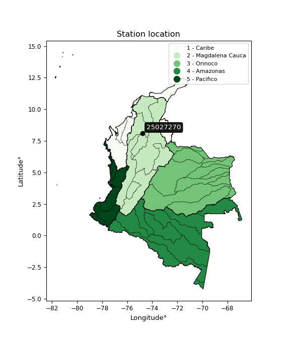

<div align="center">


</div>

# PMP Station (Rain, Pmax24h): 25027270

Probable Maximum Precipitation (PMP) is the greatest amount of rainfall for a specific duration that is meteorologically possible for a given location, acting as a "worst-case" scenario for extreme storms, crucial for designing safety-critical infrastructure like bridges, river deviations, dams, spillways, and nuclear plants to prevent catastrophic failure. PMP is calculated by hydrologists using meteorological data to determine the upper limit of extreme rainfall, often leading to the Probable Maximum Flood (PMF) for flood control design, and is increasingly being studied for climate change impacts. Probable Maximum Precipitation (PMP) is the theoretical upper limit of rainfall, a deterministic estimate for extreme events, while probability distributions (like GEV, Gumbel) describe the likelihood and frequency of various precipitation amounts, including rare ones, showing how often events occur, with PMP representing the extreme end of these distributions, used for critical infrastructure design to ensure safety against the worst conceivable weather, unlike standard statistical forecasts which cover typical probabilities.

The most common probability distributions in hydrology, used for analyzing floods, rainfall, and streamflow, include the Normal, Log-Normal, Gumbel, Gamma (including Log-Pearson Type III), and Generalized Extreme Value (GEV) distributions, often chosen based on the data´s skewness and whether modeling extremes or general conditions, with Gumbel and GEV popular for extreme events like floods, while the Normal distribution serves as a baseline, though often requiring transformations for skewed hydrological data. These distributions help in designing water infrastructure, managing water resources, and forecasting hydrologic events.

> Hydrological data often isn´t perfectly normal (it´s skewed), so different distributions are needed for different applications, such as: **Flood Frequency Analysis**: Using Gumbel, GEV, or Log-Pearson Type III for predicting extreme flood magnitudes and their return periods, **Rainfall Analysis**: Normal for annual totals, but Log-Normal, Weibull, or GEV for intensity or extreme daily rainfall, **Streamflow Modeling**: Gamma and Log-Normal for maximum flows, GEV for minimum flows, and Kappa for daily flows.

<div align="center">

</img>

</div>


## A. General information


### 1. General running parameters

• app_version: _v20260113_. • runtime: _2026-01-17 18:24:04.630693_. • Python version: _3.14.0_. • SciPy version: _1.16.3_. • Pandas version: _2.3.3_. • NumPy version: _2.3.5_. • Stations dataset (station_dataset_file): _dataset/pmax24h_in/automatic_colombia_2003_2025.csv_. • Stations catalog (station_catalog_file): _dataset/CNE.xls_. • Minimum year to eval til year_max (date_min): _1900_. • Maximum year to eval since year_min (date_max): _2025_. • Creates, save and include plots into reports (create_plot): _False_. • Plot only fit distributions with Δo > Δ (plot_only_fit): _True_. • Plot only simple graphs avoiding multiple CDFs and multiple Extreme values plots (plot_only_simple): _True_. • Eval low extreme values, if False, evaluates high extreme values (low_extreme): _False_. • Eval every SciPy distribution as logarithmic (pdist_logarithmic_on): _True_. • Standard deviation normalized (ddof): _1.0_. • Return periods to eval in years (Tr): _[2, 2.33, 5, 10, 15, 20, 25, 50, 75, 100, 200, 250, 500, 750, 1000]_. • Minimum data sample per station, 0 means any (minimum_sample): _5_. • Z-Score maximum threshold to adjust a value, 0 means disable (zscore_max): _3.5_. • Z-Score minimum threshold to adjust a value, 0 means disable (zscore_min): _-2.5_. • Avoid zeros, e.g. rain = 0 (avoid_zeros): _True_. • Avoid null values (avoid_nans): _True_. 

:file_folder:Table: [dataset.csv](../../dataset/pmax24h_in/automatic_colombia_2003_2025.csv)

> Delta Degrees of Freedom (DDOF): is a parameter used in the formulas for calculating variance and standard deviation. When ddof=0, the divisor is $N$ (the total number of observations) and this is used when your data set is the entire population. When ddof=1, the divisor is $N-1$ and this is used when your data set is a sample drawn from a larger population. Using $N-1$ provides an unbiased estimate of the population variance (known as Bessel´s correction).


### 2. Station info and location

|   id |   CODIGO | NOMBRE                | CATEGORIA    | TECNOLOGIA                | ESTADO   | FECHA_INSTALACION   |   FECHA_SUSPENSION |   ALTITUD |   LATITUD |   LONGITUD | DEPARTAMENTO   | MUNICIPIO   | AREA_OPERATIVA                      | ENTIDAD                                                     | AREA_HIDROGRAFICA   | ZONA_HIDROGRAFICA                | SUBZONA_HIDROGRAFICA       | CORRIENTE   | Catalogo   |   Version |
|-----:|---------:|:----------------------|:-------------|:--------------------------|:---------|:--------------------|-------------------:|----------:|----------:|-----------:|:---------------|:------------|:------------------------------------|:------------------------------------------------------------|:--------------------|:---------------------------------|:---------------------------|:------------|:-----------|----------:|
|    0 | 25027270 | LAS FLORES [25027270] | Limnigráfica | Automática con Telemetría | Activa   | 15/06/1968          |                nan |        22 |   8.10124 |   -74.7776 | Antioquia      | Nechí       | Area Operativa 01 - Antioquia-Chocó | INSTITUTO DE HIDROLOGIA METEOROLOGIA Y ESTUDIOS AMBIENTALES | Magdalena Cauca     | Bajo Magdalena- Cauca -San Jorge | Bajo San Jorge - La Mojana | Cauca       | CNE_IDEAM  |  20251226 |

<div align="center">

Dynamic map: [:earth_americas:Google](http://maps.google.com/maps?q=8.101236111,-74.777633333) [:earth_americas:OSM](https://www.openstreetmap.org/#map=18/8.101236111/-74.777633333&layers=P) [:earth_americas:Bing](https://www.bing.com/maps?cp=8.101236111~-74.777633333&lvl=18) [:earth_americas:Apple](https://maps.apple.com/frame?center=8.101236111%2C-74.777633333&span=0.003%2C0.006)

</div>


<div align="center">

```geojson
{
  "type": "Feature",
  "geometry": {
    "type": "Point", 
    "coordinates": [-74.777633333, 8.101236111]
  }, 
  "properties": {
    "Name": "25027270"
  }
}
```

</div>


### 3. Discrete values table and plot

<div align="center">

|               |          0 |           1 |          2 |          3 |           4 |
|:--------------|-----------:|------------:|-----------:|-----------:|------------:|
| Date          | 2021       | 2022        | 2023       | 2024       | 2025        |
| Value         |  142.7     |  220        |   74.6     |  201       |  236.2      |
| Value_initial |  142.7     |  220        |   74.6     |  201       |  236.2      |
| count         |    5       |    5        |    5       |    5       |    5        |
| mean          |  174.9     |  174.9      |  174.9     |  174.9     |  174.9      |
| std           |   66.2756  |   66.2756   |   66.2756  |   66.2756  |   66.2756   |
| zscore        |   -0.48585 |    0.680491 |   -1.51338 |    0.39381 |    0.924925 |


</div>


> The initial value (value_initial) correspond to the initial obtained or null completed value, and value (value) is adjusted only when the initial value is outside the valid range (outlier) definite through the Z-Score value. If Z-Score is active, values out of range or outliers are replaced with the station mean value. A Z-Score (or standard score) measures how many standard deviations a data point is from the mean of a dataset, indicating its relative position; positive scores mean above the mean, negative mean below, and a score of zero is exactly at the mean, allowing for comparison of values from different distributions. It´s calculated using the formula $z=(x–μ)/σ$, where $x$ is the data point, $μ$ is the mean, and $σ$ is the standard deviation, helping identify outliers and understand probability.
>
> <sub>**Note**: In this study, "completing" (filling gaps in) and "extending" (forecasting or lengthening the historical record) rainfall data series are avoided for certain critical analyses because they introduce artificial bias and uncertainty, which can distort the statistics of rare events (extremes), alter day-to-day variability, and compromise the integrity and homogeneity of the original data. Some reasons against Completing/Extending rainfall data are: **Distortion of Extremes and Variability**: The primary issue is that most gap-filling or extension methods rely on averaging or regression with nearby stations, which inherently smooths the data. Rainfall is highly variable in space and time, with a large percentage of zero values and occasional large storms. Infilling methods often underestimate the highest values and overestimate the lowest (zero) values, which severely distorts analyses focused on flood frequency, drought severity, and intensity-duration-frequency (IDF) curves, **Loss of Data Homogeneity**: Infilled or extended data are synthetic estimates, not actual measurements. Combining these estimates with observed data can violate the assumption of data homogeneity, which requires that the data properties do not change over time. Inhomogeneity can lead to incorrect conclusions about long-term trends or changes in climate patterns, **Propagation of Errors**: Errors and biases from the original data (e.g., wind-induced undercatch, instrument errors, site changes) or the data used for imputation can propagate through the analysis, leading to unreliable hydrological models and inaccurate predictions, **Compromised Statistical Integrity**: For statistical analyses, especially those involving the frequency of events, using artificial data can introduce time bias or autocorrelation that doesn´t exist in reality, making it difficult to assess the true probability of events, **Difficulty in Validation**: It is difficult to accurately validate the quality of filled or extended data, especially for past periods where ground-truth measurements are unavailable. The reliability of imputation techniques heavily depends on the density of the surrounding station network and the complexity of the local topography.</sub>


### 4. Active continuous probability distributions from SciPy (80 of 104 available)

A Probability Density Function (PDF) describes the relative likelihood of a continuous random variable falling within a specific range, where the total area under its curve equals 1, and the area over any interval gives the actual probability for that range. Unlike discrete probabilities (like rolling a die), a PDF shows density, not direct probability for a single point (which is zero), with higher points indicating higher likelihood, often visualized as a bell curve for normal distributions.

A log of a probability density function (log-PDF) is simply the logarithm of the PDF´s value, denoted as $log(f(x))$, useful for converting multiplication of probabilities into addition, improving numerical stability with tiny numbers, and connecting to information theory concepts like entropy. Instead of dealing with very small probabilities (e.g., 0.000001), log-PDFs use negative numbers (e.g., $log(0.00001) ≈ -11.51$ that are easier for computers to handle, preventing underflow errors and simplifying complex calculations. In this study, each active probability distribution from SciPy is also evaluated in the $log$ form.

[scipy.stats](https://docs.scipy.org/doc/scipy/reference/stats.html) is a Python´s powerful submodule within the SciPy library for comprehensive statistical analysis, offering over 130 probability distributions (like Normal, Poisson), functions for descriptive stats (mean, variance), hypothesis testing (t-tests, chi-square), random variable generation, and statistical tests, making it essential for data science, modeling, and research. It provides tools to explore, model, and draw conclusions from data efficiently, working seamlessly with NumPy.

<div align="center">

|   id | p_dist           |   n_parameter | fit_method   | label                                                                       | active   | ref                                                                                                      |
|-----:|:-----------------|--------------:|:-------------|:----------------------------------------------------------------------------|:---------|:---------------------------------------------------------------------------------------------------------|
|    0 | alpha            |             3 | MLE          | Alpha                                                                       | True     | [:mortar_board:](https://docs.scipy.org/doc/scipy/reference/generated/scipy.stats.alpha.html)            |
|    1 | anglit           |             2 | MM           | Anglit                                                                      | True     | [:mortar_board:](https://docs.scipy.org/doc/scipy/reference/generated/scipy.stats.anglit.html)           |
|    2 | arcsine          |             2 | MM           | Arcsine                                                                     | True     | [:mortar_board:](https://docs.scipy.org/doc/scipy/reference/generated/scipy.stats.arcsine.html)          |
|    3 | argus            |             3 | MLE          | Argus                                                                       | True     | [:mortar_board:](https://docs.scipy.org/doc/scipy/reference/generated/scipy.stats.argus.html)            |
|    4 | beta             |             4 | MLE          | Beta                                                                        | True     | [:mortar_board:](https://docs.scipy.org/doc/scipy/reference/generated/scipy.stats.beta.html)             |
|    5 | betaprime        |             4 | MLE          | Beta prime                                                                  | True     | [:mortar_board:](https://docs.scipy.org/doc/scipy/reference/generated/scipy.stats.betaprime.html)        |
|    6 | bradford         |             3 | MLE          | Bradford                                                                    | True     | [:mortar_board:](https://docs.scipy.org/doc/scipy/reference/generated/scipy.stats.bradford.html)         |
|    7 | burr             |             4 | MLE          | Burr (Type III)                                                             | True     | [:mortar_board:](https://docs.scipy.org/doc/scipy/reference/generated/scipy.stats.burr.html)             |
|    8 | burr12           |             4 | MLE          | Burr (Type III) 12                                                          | True     | [:mortar_board:](https://docs.scipy.org/doc/scipy/reference/generated/scipy.stats.burr12.html)           |
|    9 | cosine           |             2 | MLE          | Cosine                                                                      | True     | [:mortar_board:](https://docs.scipy.org/doc/scipy/reference/generated/scipy.stats.cosine.html)           |
|   10 | crystalball      |             4 | MLE          | Crystalball                                                                 | True     | [:mortar_board:](https://docs.scipy.org/doc/scipy/reference/generated/scipy.stats.crystalball.html)      |
|   11 | dgamma           |             3 | MLE          | Double gamma                                                                | True     | [:mortar_board:](https://docs.scipy.org/doc/scipy/reference/generated/scipy.stats.dgamma.html)           |
|   12 | dweibull         |             3 | MLE          | Double Weibull                                                              | True     | [:mortar_board:](https://docs.scipy.org/doc/scipy/reference/generated/scipy.stats.dweibull.html)         |
|   13 | erlang           |             3 | MLE          | Erlang                                                                      | True     | [:mortar_board:](https://docs.scipy.org/doc/scipy/reference/generated/scipy.stats.erlang.html)           |
|   14 | exponnorm        |             3 | MLE          | Exponentially modified Normal                                               | True     | [:mortar_board:](https://docs.scipy.org/doc/scipy/reference/generated/scipy.stats.exponnorm.html)        |
|   15 | exponpow         |             3 | MLE          | Exponential power                                                           | True     | [:mortar_board:](https://docs.scipy.org/doc/scipy/reference/generated/scipy.stats.exponpow.html)         |
|   16 | exponweib        |             4 | MLE          | Exponentiated Weibull                                                       | True     | [:mortar_board:](https://docs.scipy.org/doc/scipy/reference/generated/scipy.stats.exponweib.html)        |
|   17 | f                |             4 | MLE          | F                                                                           | True     | [:mortar_board:](https://docs.scipy.org/doc/scipy/reference/generated/scipy.stats.f.html)                |
|   18 | fatiguelife      |             3 | MLE          | Fatigue-life (Birnbaum-Saunders)                                            | True     | [:mortar_board:](https://docs.scipy.org/doc/scipy/reference/generated/scipy.stats.fatiguelife.html)      |
|   19 | foldnorm         |             3 | MM           | Fold Normal                                                                 | True     | [:mortar_board:](https://docs.scipy.org/doc/scipy/reference/generated/scipy.stats.foldnorm.html)         |
|   20 | gamma            |             3 | MLE          | Gamma                                                                       | True     | [:mortar_board:](https://docs.scipy.org/doc/scipy/reference/generated/scipy.stats.gamma.html)            |
|   21 | gausshyper       |             6 | MLE          | Gauss hypergeometric                                                        | True     | [:mortar_board:](https://docs.scipy.org/doc/scipy/reference/generated/scipy.stats.gausshyper.html)       |
|   22 | genexpon         |             5 | MLE          | Generalized exponential                                                     | True     | [:mortar_board:](https://docs.scipy.org/doc/scipy/reference/generated/scipy.stats.genexpon.html)         |
|   23 | genextreme       |             3 | MLE          | Generalized exponential                                                     | True     | [:mortar_board:](https://docs.scipy.org/doc/scipy/reference/generated/scipy.stats.genextreme.html)       |
|   24 | gengamma         |             4 | MLE          | Generalized gamma                                                           | True     | [:mortar_board:](https://docs.scipy.org/doc/scipy/reference/generated/scipy.stats.gengamma.html)         |
|   25 | genhalflogistic  |             3 | MLE          | Generalized half-logistic                                                   | True     | [:mortar_board:](https://docs.scipy.org/doc/scipy/reference/generated/scipy.stats.genhalflogistic.html)  |
|   26 | genlogistic      |             3 | MLE          | Generalized logistic                                                        | True     | [:mortar_board:](https://docs.scipy.org/doc/scipy/reference/generated/scipy.stats.genlogistic.html)      |
|   27 | gennorm          |             3 | MLE          | Generalized Normal                                                          | True     | [:mortar_board:](https://docs.scipy.org/doc/scipy/reference/generated/scipy.stats.gennorm.html)          |
|   28 | genpareto        |             3 | MLE          | Generalized Pareto                                                          | True     | [:mortar_board:](https://docs.scipy.org/doc/scipy/reference/generated/scipy.stats.genpareto.html)        |
|   29 | gompertz         |             3 | MLE          | Gompertz (or truncated Gumbel)                                              | True     | [:mortar_board:](https://docs.scipy.org/doc/scipy/reference/generated/scipy.stats.gompertz.html)         |
|   30 | gumbel_l         |             2 | MM           | Gumbel Left Skew                                                            | True     | [:mortar_board:](https://docs.scipy.org/doc/scipy/reference/generated/scipy.stats.gumbel_l.html)         |
|   31 | gumbel_r         |             2 | MM           | Gumbel Right Skew                                                           | True     | [:mortar_board:](https://docs.scipy.org/doc/scipy/reference/generated/scipy.stats.gumbel_r.html)         |
|   32 | halfgennorm      |             3 | MLE          | Upper half of a generalized normal                                          | True     | [:mortar_board:](https://docs.scipy.org/doc/scipy/reference/generated/scipy.stats.halfgennorm.html)      |
|   33 | halflogistic     |             2 | MM           | Half-logistic                                                               | True     | [:mortar_board:](https://docs.scipy.org/doc/scipy/reference/generated/scipy.stats.halflogistic.html)     |
|   34 | halfnorm         |             2 | MM           | Half Normal                                                                 | True     | [:mortar_board:](https://docs.scipy.org/doc/scipy/reference/generated/scipy.stats.halfnorm.html)         |
|   35 | hypsecant        |             2 | MM           | hyperbolic secant                                                           | True     | [:mortar_board:](https://docs.scipy.org/doc/scipy/reference/generated/scipy.stats.hypsecant.html)        |
|   36 | invgamma         |             3 | MLE          | Inverted gamma                                                              | True     | [:mortar_board:](https://docs.scipy.org/doc/scipy/reference/generated/scipy.stats.invgamma.html)         |
|   37 | invgauss         |             3 | MLE          | Inverse Gaussian                                                            | True     | [:mortar_board:](https://docs.scipy.org/doc/scipy/reference/generated/scipy.stats.invgauss.html)         |
|   38 | invweibull       |             3 | MLE          | Inverted Weibull                                                            | True     | [:mortar_board:](https://docs.scipy.org/doc/scipy/reference/generated/scipy.stats.invweibull.html)       |
|   39 | johnsonsb        |             4 | MLE          | Johnson SB                                                                  | True     | [:mortar_board:](https://docs.scipy.org/doc/scipy/reference/generated/scipy.stats.johnsonsb.html)        |
|   40 | johnsonsu        |             4 | MLE          | Johnson Su                                                                  | True     | [:mortar_board:](https://docs.scipy.org/doc/scipy/reference/generated/scipy.stats.johnsonsu.html)        |
|   41 | kappa3           |             3 | MLE          | Kappa 3                                                                     | True     | [:mortar_board:](https://docs.scipy.org/doc/scipy/reference/generated/scipy.stats.kappa3.html)           |
|   42 | kappa4           |             4 | MLE          | Kappa 4                                                                     | True     | [:mortar_board:](https://docs.scipy.org/doc/scipy/reference/generated/scipy.stats.kappa4.html)           |
|   43 | ksone            |             3 | MLE          | Kolmogorov-Smirnov one-sided test statistic distribution                    | True     | [:mortar_board:](https://docs.scipy.org/doc/scipy/reference/generated/scipy.stats.ksone.html)            |
|   44 | kstwobign        |             2 | MLE          | Limiting distribution of scaled Kolmogorov-Smirnov two-sided test statistic | True     | [:mortar_board:](https://docs.scipy.org/doc/scipy/reference/generated/scipy.stats.kstwobign.html)        |
|   45 | laplace          |             2 | MM           | Laplace                                                                     | True     | [:mortar_board:](https://docs.scipy.org/doc/scipy/reference/generated/scipy.stats.laplace.html)          |
|   46 | levy_l           |             2 | MLE          | Left-skewed Levy                                                            | True     | [:mortar_board:](https://docs.scipy.org/doc/scipy/reference/generated/scipy.stats.levy_l.html)           |
|   47 | loggamma         |             3 | MLE          | Log gamma                                                                   | True     | [:mortar_board:](https://docs.scipy.org/doc/scipy/reference/generated/scipy.stats.loggamma.html)         |
|   48 | logistic         |             2 | MM           | Logistic (or Sech-squared)                                                  | True     | [:mortar_board:](https://docs.scipy.org/doc/scipy/reference/generated/scipy.stats.logistic.html)         |
|   49 | loglaplace       |             3 | MLE          | Log-Laplace                                                                 | True     | [:mortar_board:](https://docs.scipy.org/doc/scipy/reference/generated/scipy.stats.loglaplace.html)       |
|   50 | lomax            |             3 | MLE          | Lomax (Pareto of the second kind)                                           | True     | [:mortar_board:](https://docs.scipy.org/doc/scipy/reference/generated/scipy.stats.lomax.html)            |
|   51 | maxwell          |             2 | MM           | Maxwell                                                                     | True     | [:mortar_board:](https://docs.scipy.org/doc/scipy/reference/generated/scipy.stats.maxwell.html)          |
|   52 | mielke           |             4 | MLE          | Mielke Beta-Kappa / Dagum                                                   | True     | [:mortar_board:](https://docs.scipy.org/doc/scipy/reference/generated/scipy.stats.mielke.html)           |
|   53 | moyal            |             2 | MM           | Moyal                                                                       | True     | [:mortar_board:](https://docs.scipy.org/doc/scipy/reference/generated/scipy.stats.moyal.html)            |
|   54 | nakagami         |             3 | MLE          | Nakagami                                                                    | True     | [:mortar_board:](https://docs.scipy.org/doc/scipy/reference/generated/scipy.stats.nakagami.html)         |
|   55 | ncf              |             5 | MLE          | Non-central F distribution                                                  | True     | [:mortar_board:](https://docs.scipy.org/doc/scipy/reference/generated/scipy.stats.ncf.html)              |
|   56 | nct              |             4 | MLE          | Non-central Student’s t                                                     | True     | [:mortar_board:](https://docs.scipy.org/doc/scipy/reference/generated/scipy.stats.nct.html)              |
|   57 | norm             |             2 | MM           | Normal                                                                      | True     | [:mortar_board:](https://docs.scipy.org/doc/scipy/reference/generated/scipy.stats.norm.html)             |
|   58 | pearson3         |             3 | MM           | Pearson type III                                                            | True     | [:mortar_board:](https://docs.scipy.org/doc/scipy/reference/generated/scipy.stats.pearson3.html)         |
|   59 | powerlaw         |             3 | MLE          | Power-function                                                              | True     | [:mortar_board:](https://docs.scipy.org/doc/scipy/reference/generated/scipy.stats.powerlaw.html)         |
|   60 | rayleigh         |             2 | MM           | Rayleigh                                                                    | True     | [:mortar_board:](https://docs.scipy.org/doc/scipy/reference/generated/scipy.stats.rayleigh.html)         |
|   61 | rdist            |             3 | MLE          | R-distributed (symmetric beta)                                              | True     | [:mortar_board:](https://docs.scipy.org/doc/scipy/reference/generated/scipy.stats.rdist.html)            |
|   62 | rice             |             3 | MLE          | Rice                                                                        | True     | [:mortar_board:](https://docs.scipy.org/doc/scipy/reference/generated/scipy.stats.rice.html)             |
|   63 | semicircular     |             2 | MM           | Semicircular                                                                | True     | [:mortar_board:](https://docs.scipy.org/doc/scipy/reference/generated/scipy.stats.semicircular.html)     |
|   64 | skewnorm         |             3 | MLE          | Skew normal                                                                 | True     | [:mortar_board:](https://docs.scipy.org/doc/scipy/reference/generated/scipy.stats.skewnorm.html)         |
|   65 | t                |             3 | MLE          | Student’s t                                                                 | True     | [:mortar_board:](https://docs.scipy.org/doc/scipy/reference/generated/scipy.stats.t.html)                |
|   66 | trapezoid        |             4 | MLE          | Trapezoid                                                                   | True     | [:mortar_board:](https://docs.scipy.org/doc/scipy/reference/generated/scipy.stats.trapezoid.html)        |
|   67 | triang           |             3 | MLE          | Triangular                                                                  | True     | [:mortar_board:](https://docs.scipy.org/doc/scipy/reference/generated/scipy.stats.triang.html)           |
|   68 | truncexpon       |             3 | MLE          | Truncated exponential                                                       | True     | [:mortar_board:](https://docs.scipy.org/doc/scipy/reference/generated/scipy.stats.truncexpon.html)       |
|   69 | truncnorm        |             4 | MLE          | Truncated normal                                                            | True     | [:mortar_board:](https://docs.scipy.org/doc/scipy/reference/generated/scipy.stats.truncnorm.html)        |
|   70 | truncpareto      |             4 | MLE          | Upper truncated Pareto                                                      | True     | [:mortar_board:](https://docs.scipy.org/doc/scipy/reference/generated/scipy.stats.truncpareto.html)      |
|   71 | truncweibull_min |             5 | MLE          | Doubly truncated Weibull minimum                                            | True     | [:mortar_board:](https://docs.scipy.org/doc/scipy/reference/generated/scipy.stats.truncweibull_min.html) |
|   72 | tukeylambda      |             3 | MLE          | Tukey-Lamdba                                                                | True     | [:mortar_board:](https://docs.scipy.org/doc/scipy/reference/generated/scipy.stats.tukeylambda.html)      |
|   73 | uniform          |             2 | MLE          | Uniform                                                                     | True     | [:mortar_board:](https://docs.scipy.org/doc/scipy/reference/generated/scipy.stats.uniform.html)          |
|   74 | vonmises         |             3 | MLE          | Von Mises                                                                   | True     | [:mortar_board:](https://docs.scipy.org/doc/scipy/reference/generated/scipy.stats.vonmises.html)         |
|   75 | vonmises_line    |             3 | MLE          | Von Mises line                                                              | True     | [:mortar_board:](https://docs.scipy.org/doc/scipy/reference/generated/scipy.stats.vonmises_line.html)    |
|   76 | wald             |             2 | MM           | Wald                                                                        | True     | [:mortar_board:](https://docs.scipy.org/doc/scipy/reference/generated/scipy.stats.wald.html)             |
|   77 | weibull_max      |             3 | MLE          | Weibull maximum                                                             | True     | [:mortar_board:](https://docs.scipy.org/doc/scipy/reference/generated/scipy.stats.weibull_max.html)      |
|   78 | weibull_min      |             3 | MLE          | Weibull minimum                                                             | True     | [:mortar_board:](https://docs.scipy.org/doc/scipy/reference/generated/scipy.stats.weibull_min.html)      |
|   79 | wrapcauchy       |             3 | MLE          | Wrapped  Cauchy                                                             | True     | [:mortar_board:](https://docs.scipy.org/doc/scipy/reference/generated/scipy.stats.wrapcauchy.html)       |

</div>

> **n_parameter:** # arguments & localization & scale.
>
> **Fit methods:** (MLE) maximum likelihood, (MM) L-moments.
>
>**Inactive** (With the only purpose of prevent loops, zero divisions, infinite values, over high estimated values or horizontal trending for recurrence intervals estimations, the follow distributions were disabled.)**:** lognorm, norminvgauss, powernorm, powerlognorm, cauchy, halfcauchy, foldcauchy, skewcauchy, chi2, expon, fisk, genhyperbolic, geninvgauss, gibrat, kstwo, laplace_asymmetric, levy, levy_stable, ncx2, pareto, rel_breitwigner, recipinvgauss, studentized_range, loguniform, 


## B. Probability (PDF) vs. Empirical (EDF) distributions functions

A continuous probability distribution (CPD) describes probabilities for variables that can take any value within a range (like rain any time), unlike discrete variables with specific outcomes (like temperature). It uses a Probability Density Function (PDF), a curve where the total area under it equals 1, and the probability of the variable falling within an interval (a to b) is found by calculating the area under the curve between those points. A key feature is that the probability of hitting any single exact value is zero, so probabilities are always expressed for ranges, e.g., $P(a ≤ X ≤ b)$.

<div align="center">

Distributions parameters from station values
|     |   station | p_dist              |   n |              loc |            scale | shape                  | shape1                 | shape2             | shape3             |
|----:|----------:|:--------------------|----:|-----------------:|-----------------:|:-----------------------|:-----------------------|:-------------------|:-------------------|
|   0 |  25027270 | alpha               |   5 |   -798.746       |  14891.6         | 15.393908137554149     |                        |                    |                    |
|   1 |  25027270 | anglit              |   5 |    174.9         |    173.414       |                        |                        |                    |                    |
|   2 |  25027270 | arcsine             |   5 |     91.0672      |    167.666       |                        |                        |                    |                    |
|   3 |  25027270 | argus               |   5 |      8.21729     |    234.826       | 2.174016207943154      |                        |                    |                    |
|   4 |  25027270 | beta                |   5 |     62.7505      |    173.45        | 0.5741584791203551     | 0.32107118764181714    |                    |                    |
|   5 |  25027270 | betaprime           |   5 |  -1374.47        | 179635           | 650.928781602986       | 75501.93444353028      |                    |                    |
|   6 |  25027270 | bradford            |   5 |     74.6         |    161.6         | 0.942689719473035      |                        |                    |                    |
|   7 |  25027270 | burr                |   5 |     -4.60242     |    244.099       | 298.68069889626275     | 0.008483732879362351   |                    |                    |
|   8 |  25027270 | burr12              |   5 |     -1.14772     |     74.567       | 223.75322454438765     | 0.005707471219915692   |                    |                    |
|   9 |  25027270 | cosine              |   5 |    169.061       |     48.4931      |                        |                        |                    |                    |
|  10 |  25027270 | crystalball         |   5 |     -0.125869    |    184.742       | 4.300384176713933      | 2.402281574153874      |                    |                    |
|  11 |  25027270 | dgamma              |   5 |    171.054       |     11.284       | 4.765067347717798      |                        |                    |                    |
|  12 |  25027270 | dweibull            |   5 |    201           |     50.287       | 0.854765766626666      |                        |                    |                    |
|  13 |  25027270 | erlang              |   5 |   -735.075       |      4.08345     | 222.77584276422186     |                        |                    |                    |
|  14 |  25027270 | exponnorm           |   5 |    174.852       |     59.2789      | 0.0007982164353495128  |                        |                    |                    |
|  15 |  25027270 | exponpow            |   5 |     74.6         |      1.64247     | 0.0831727000018603     |                        |                    |                    |
|  16 |  25027270 | exponweib           |   5 |     74.6         |      1.2738      | 1.244093110750713      | 0.17313908659753907    |                    |                    |
|  17 |  25027270 | f                   |   5 | -13729           |  13903.5         | 110195.95146567523     | 11898333.166957252     |                    |                    |
|  18 |  25027270 | fatiguelife         |   5 |     74.6         |      0.000411504 | 424.97182274585407     |                        |                    |                    |
|  19 |  25027270 | foldnorm            |   5 |    187.179       |      1.16727     | 7.569370740920851e-08  |                        |                    |                    |
|  20 |  25027270 | gamma               |   5 |   -608.34        |      4.8544      | 161.33751913131937     |                        |                    |                    |
|  21 |  25027270 | gausshyper          |   5 |     71.0095      |    165.191       | 1.2250084708786688     | 0.6588636193878826     | 1.1388915778680082 | 1.0183580690022254 |
|  22 |  25027270 | genexpon            |   5 |     74.6         |      3.0033      | 0.02994059909797072    | 1.5397397594458876e-07 | 0.843594878036084  |                    |
|  23 |  25027270 | genextreme          |   5 |    183.302       |     62.8912      | 1.1889113538980804     |                        |                    |                    |
|  24 |  25027270 | gengamma            |   5 |     74.6         |      1.22144     | 1.314858014017073      | 0.17836699330887987    |                    |                    |
|  25 |  25027270 | genhalflogistic     |   5 |     43.936       |    203.309       | 1.057448013733222      |                        |                    |                    |
|  26 |  25027270 | genlogistic         |   5 |    236.2         |      5.56467e-06 | 9.068152258463414e-08  |                        |                    |                    |
|  27 |  25027270 | gennorm             |   5 |    201           |     43.7976      | 0.9430989672762067     |                        |                    |                    |
|  28 |  25027270 | genpareto           |   5 |     -0.231937    |    573.818       | -2.4269921011638402    |                        |                    |                    |
|  29 |  25027270 | gompertz            |   5 |     64.6631      |      4.12412     | 4.217417341017693e-18  |                        |                    |                    |
|  30 |  25027270 | gumbel_l            |   5 |    201.579       |     46.2194      |                        |                        |                    |                    |
|  31 |  25027270 | gumbel_r            |   5 |    148.221       |     46.2194      |                        |                        |                    |                    |
|  32 |  25027270 | halfgennorm         |   5 |     74.6         |      1.31881     | 0.28308674657164623    |                        |                    |                    |
|  33 |  25027270 | halflogistic        |   5 |    104.641       |     50.6812      |                        |                        |                    |                    |
|  34 |  25027270 | halfnorm            |   5 |     96.4382      |     98.3373      |                        |                        |                    |                    |
|  35 |  25027270 | hypsecant           |   5 |    174.9         |     37.738       |                        |                        |                    |                    |
|  36 |  25027270 | invgamma            |   5 |   -719.048       | 180964           | 203.51694980163893     |                        |                    |                    |
|  37 |  25027270 | invgauss            |   5 |   -120.592       |   5703.58        | 0.05196836593643328    |                        |                    |                    |
|  38 |  25027270 | invweibull          |   5 |     74.6         |      1.62765     | 0.05580794615744847    |                        |                    |                    |
|  39 |  25027270 | johnsonsb           |   5 |     74.6         |    161.6         | 0.5630011039081035     | 0.17555796610509852    |                    |                    |
|  40 |  25027270 | johnsonsu           |   5 |    236.2         |      3.96059e-14 | 2.151196892517591      | 0.10361037845343965    |                    |                    |
|  41 |  25027270 | kappa3              |   5 |     74.5842      |    161.614       | 123243.82952304225     |                        |                    |                    |
|  42 |  25027270 | kappa4              |   5 |     68.753       |    196.854       | 1.015667887031801      | 1.1756189866099966     |                    |                    |
|  43 |  25027270 | ksone               |   5 |     72.2262      |    205.348       | 1.0                    |                        |                    |                    |
|  44 |  25027270 | kstwobign           |   5 |    -68.3284      |    277.049       |                        |                        |                    |                    |
|  45 |  25027270 | laplace             |   5 |    174.9         |     41.9164      |                        |                        |                    |                    |
|  46 |  25027270 | levy_l              |   5 |    239.586       |     12.8625      |                        |                        |                    |                    |
|  47 |  25027270 | loggamma            |   5 |    236.2         |      1.84842e-05 | 3.0173490783187106e-07 |                        |                    |                    |
|  48 |  25027270 | logistic            |   5 |    174.9         |     32.6821      |                        |                        |                    |                    |
|  49 |  25027270 | loglaplace          |   5 |     -0.503354    |    201.503       | 3.1655381168967835     |                        |                    |                    |
|  50 |  25027270 | lomax               |   5 |     74.6         |   2245.36        | 23.228766617105485     |                        |                    |                    |
|  51 |  25027270 | maxwell             |   5 |     34.4343      |     88.0238      |                        |                        |                    |                    |
|  52 |  25027270 | mielke              |   5 |     -0.756561    |    240.657       | 3.0145278222480227     | 71.13474838775707      |                    |                    |
|  53 |  25027270 | moyal               |   5 |    141.001       |     26.6848      |                        |                        |                    |                    |
|  54 |  25027270 | nakagami            |   5 |    142.7         |     64.3367      | 0.1518424465671969     |                        |                    |                    |
|  55 |  25027270 | ncf                 |   5 |     -0.0802373   |      2.14574e-05 | 1.2878912286588213e-06 | 12.950630651284685     | 9.527146687630687  |                    |
|  56 |  25027270 | nct                 |   5 |  -2667.05        |     59.2215      | 574546.9265009749      | 47.98834488018812      |                    |                    |
|  57 |  25027270 | norm                |   5 |    174.9         |     59.2787      |                        |                        |                    |                    |
|  58 |  25027270 | pearson3            |   5 |    174.9         |     59.2787      | -0.674537363645508     |                        |                    |                    |
|  59 |  25027270 | powerlaw            |   5 |     74.6         |    161.6         | 0.13094027024578414    |                        |                    |                    |
|  60 |  25027270 | rayleigh            |   5 |     61.4963      |     90.483       |                        |                        |                    |                    |
|  61 |  25027270 | rdist               |   5 |     70.8093      |     71.8907      | 1.104864305065382      |                        |                    |                    |
|  62 |  25027270 | rice                |   5 |     36.0685      |     65.6975      | 1.8110030660781824     |                        |                    |                    |
|  63 |  25027270 | semicircular        |   5 |    174.9         |    118.557       |                        |                        |                    |                    |
|  64 |  25027270 | skewnorm            |   5 |    236.2         |     85.2701      | -9474725.411705002     |                        |                    |                    |
|  65 |  25027270 | t                   |   5 |    174.907       |     59.301       | 304618.3276892606      |                        |                    |                    |
|  66 |  25027270 | trapezoid           |   5 |      7.23443     |    251.498       | 1.0                    | 1.0                    |                    |                    |
|  67 |  25027270 | triang              |   5 |      7.77079     |    228.429       | 0.999999743077089      |                        |                    |                    |
|  68 |  25027270 | truncexpon          |   5 |     74.5998      |    217.149       | 0.7441890034384009     |                        |                    |                    |
|  69 |  25027270 | truncnorm           |   5 |    174.9         |     59.2787      | -7377.468741189925     | 5586.642502978922      |                    |                    |
|  70 |  25027270 | truncpareto         |   5 |     73.5959      |      1.00413     | 0.26117592251002913    | 161.93542767558847     |                    |                    |
|  71 |  25027270 | truncweibull_min    |   5 |     74.1715      |    224.996       | 0.7964037170717999     | 0.0019046055528435736  | 0.7201393004643453 |                    |
|  72 |  25027270 | tukeylambda         |   5 |    155.294       |     91.707       | 1.1334972279226885     |                        |                    |                    |
|  73 |  25027270 | uniform             |   5 |     74.6         |    161.6         |                        |                        |                    |                    |
|  74 |  25027270 | vonmises            |   5 |     -0.939205    |      1           | 1.3163899820555385     |                        |                    |                    |
|  75 |  25027270 | vonmises_line       |   5 |    196.889       |     38.9259      | 1.04007016046303       |                        |                    |                    |
|  76 |  25027270 | wald                |   5 |    115.621       |     59.2788      |                        |                        |                    |                    |
|  77 |  25027270 | weibull_max         |   5 |    236.2         |      1.41512     | 0.29227498528899887    |                        |                    |                    |
|  78 |  25027270 | weibull_min         |   5 |     -2.51815e+09 |      2.51815e+09 | 58400566.95769027      |                        |                    |                    |
|  79 |  25027270 | wrapcauchy          |   5 |     74.5992      |     25.7196      | 0.5801818817291007     |                        |                    |                    |
|  80 |  25027270 | logalpha            |   5 |     -9.30891     |    477.422       | 33.198171203597894     |                        |                    |                    |
|  81 |  25027270 | loganglit           |   5 |      5.0869      |      1.241       |                        |                        |                    |                    |
|  82 |  25027270 | logarcsine          |   5 |      4.48696     |      1.19988     |                        |                        |                    |                    |
|  83 |  25027270 | logargus            |   5 |      3.76446     |      1.74171     | 2.6181691528765407     |                        |                    |                    |
|  84 |  25027270 | logbeta             |   5 |      4.13493     |      1.32975     | 0.502119751216841      | 0.19608223661839058    |                    |                    |
|  85 |  25027270 | logbetaprime        |   5 |     -6.3072      |      4.8001      | 1666.329370233033      | 702.5896972629541      |                    |                    |
|  86 |  25027270 | logbradford         |   5 |      4.31214     |      1.15254     | 1.0920331111032313     |                        |                    |                    |
|  87 |  25027270 | logburr             |   5 |     -1.9509e+07  |      1.9509e+07  | 5063967578.423006      | 0.009897210531897417   |                    |                    |
|  88 |  25027270 | logburr12           |   5 |   -335.956       |    344.547       | 1226.4507589252698     | 141517.37064714858     |                    |                    |
|  89 |  25027270 | logcosine           |   5 |      5.02786     |      0.35459     |                        |                        |                    |                    |
|  90 |  25027270 | logcrystalball      |   5 |      5.0869      |      0.424216    | 7.571010193963243      | 111.07930154174718     |                    |                    |
|  91 |  25027270 | logdgamma           |   5 |      5.3033      |      0.383304    | 0.375477693257818      |                        |                    |                    |
|  92 |  25027270 | logdweibull         |   5 |      5.3033      |      0.340917    | 0.8374004193687499     |                        |                    |                    |
|  93 |  25027270 | logerlang           |   5 |     -1.63788     |      0.0292589   | 229.59276507804282     |                        |                    |                    |
|  94 |  25027270 | logexponnorm        |   5 |      5.0866      |      0.424215    | 0.0007112813863821058  |                        |                    |                    |
|  95 |  25027270 | logexponpow         |   5 |      4.31214     |      0.867543    | 0.8582534902159527     |                        |                    |                    |
|  96 |  25027270 | logexponweib        |   5 |      4.31214     |      0.534661    | 0.7108594564773968     | 1.0879084843925728     |                    |                    |
|  97 |  25027270 | logf                |   5 |   -369.694       |    374.781       | 4324951.090717537      | 2415288.513590634      |                    |                    |
|  98 |  25027270 | logfatiguelife      |   5 |   -219.39        |    224.475       | 0.0018938868073631477  |                        |                    |                    |
|  99 |  25027270 | logfoldnorm         |   5 |      4.46896     |      0.497161    | 1.109803795021219      |                        |                    |                    |
| 100 |  25027270 | loggamma            |   5 |     -1.23972     |      0.0303561   | 208.0236787753255      |                        |                    |                    |
| 101 |  25027270 | loggausshyper       |   5 |      4.24576     |      1.21892     | 1.18418860387912       | 0.5127236234312825     | 1.1618856222950873 | 1.2002795877687324 |
| 102 |  25027270 | loggenexpon         |   5 |      4.31214     |      1.05798     | 1.0207032325076162     | 1.3731210127160123     | 0.605742856143517  |                    |
| 103 |  25027270 | loggenextreme       |   5 |      5.17848     |      0.333703    | 1.1659736186983505     |                        |                    |                    |
| 104 |  25027270 | loggengamma         |   5 |      4.31214     |      1.02299     | 0.9209840084012761     | 0.8681539390423119     |                    |                    |
| 105 |  25027270 | loggenhalflogistic  |   5 |      4.31212     |      1.27134     | 1.090044855831002      |                        |                    |                    |
| 106 |  25027270 | loggenlogistic      |   5 |      5.46469     |      4.17734e-07 | 1.1004213990926356e-06 |                        |                    |                    |
| 107 |  25027270 | loggennorm          |   5 |      5.30331     |      0.310026    | 0.9288999000455564     |                        |                    |                    |
| 108 |  25027270 | loggenpareto        |   5 |     -0.0259054   |     11.8779      | -2.163330078375683     |                        |                    |                    |
| 109 |  25027270 | loggompertz         |   5 |      4.31214     |      1.10178     | 0.9207859053730361     |                        |                    |                    |
| 110 |  25027270 | loggumbel_l         |   5 |      5.27782     |      0.33076     |                        |                        |                    |                    |
| 111 |  25027270 | loggumbel_r         |   5 |      4.89598     |      0.33076     |                        |                        |                    |                    |
| 112 |  25027270 | loghalfgennorm      |   5 |      4.31214     |      0.857855    | 1.169007538344256      |                        |                    |                    |
| 113 |  25027270 | loghalflogistic     |   5 |      4.58408     |      0.362709    |                        |                        |                    |                    |
| 114 |  25027270 | loghalfnorm         |   5 |      4.52543     |      0.703694    |                        |                        |                    |                    |
| 115 |  25027270 | loghypsecant        |   5 |      5.0869      |      0.270064    |                        |                        |                    |                    |
| 116 |  25027270 | loginvgamma         |   5 |     -3.50467     |   3234.97        | 377.8192217550029      |                        |                    |                    |
| 117 |  25027270 | loginvgauss         |   5 |      1.25549     |    251.036       | 0.015265593767865373   |                        |                    |                    |
| 118 |  25027270 | loginvweibull       |   5 |     -5.02434e+07 |      5.02434e+07 | 106219930.32260561     |                        |                    |                    |
| 119 |  25027270 | logjohnsonsb        |   5 |      4.30041     |      1.16427     | -1.3151543836697692    | 0.12076767878373565    |                    |                    |
| 120 |  25027270 | logjohnsonsu        |   5 |      5.46468     |      1.69944e-16 | 2.8293517771915626     | 0.11978909794199133    |                    |                    |
| 121 |  25027270 | logkappa3           |   5 |      4.31214     |      1.1396      | 117.2437999740402      |                        |                    |                    |
| 122 |  25027270 | logkappa4           |   5 |      4.3073      |      1.343       | 0.8880512211453115     | 1.1603731068262821     |                    |                    |
| 123 |  25027270 | logksone            |   5 |      4.19689     |      1.38305     | 1.0                    |                        |                    |                    |
| 124 |  25027270 | logkstwobign        |   5 |      3.23662     |      2.10827     |                        |                        |                    |                    |
| 125 |  25027270 | loglaplace          |   5 |      5.0869      |      0.299966    |                        |                        |                    |                    |
| 126 |  25027270 | loglevy_l           |   5 |      5.48069     |      0.060668    |                        |                        |                    |                    |
| 127 |  25027270 | logloggamma         |   5 |      5.46505     |      4.40598e-05 | 0.00011607944520149847 |                        |                    |                    |
| 128 |  25027270 | loglogistic         |   5 |      5.0869      |      0.233883    |                        |                        |                    |                    |
| 129 |  25027270 | logloglaplace       |   5 |     -0.0776368   |      5.38094     | 15.849506978083788     |                        |                    |                    |
| 130 |  25027270 | loglomax            |   5 |      4.31214     |     60.2089      | 77.98613868508528      |                        |                    |                    |
| 131 |  25027270 | logmaxwell          |   5 |      4.08168     |      0.629925    |                        |                        |                    |                    |
| 132 |  25027270 | logmielke           |   5 |     -2.7558e+07  |      2.7558e+07  | 71168993.60439311      | 10169441499.334631     |                    |                    |
| 133 |  25027270 | logmoyal            |   5 |      4.84431     |      0.190964    |                        |                        |                    |                    |
| 134 |  25027270 | lognakagami         |   5 |      4.96074     |      0.31494     | 0.12982892089861642    |                        |                    |                    |
| 135 |  25027270 | logncf              |   5 |    -19.5843      |     20.5499      | 7590.010051807192      | 40498.21403825855      | 1521.5871525978146 |                    |
| 136 |  25027270 | lognct              |   5 |     -0.649813    |      0.174841    | 101.31917938997805     | 32.51218105900861      |                    |                    |
| 137 |  25027270 | lognorm             |   5 |      5.0869      |      0.424216    |                        |                        |                    |                    |
| 138 |  25027270 | logpearson3         |   5 |      5.0869      |      0.424216    | -0.9801965652209594    |                        |                    |                    |
| 139 |  25027270 | logpowerlaw         |   5 |      4.31214     |      1.15254     | 0.1404940448777774     |                        |                    |                    |
| 140 |  25027270 | lograyleigh         |   5 |      4.27535     |      0.647524    |                        |                        |                    |                    |
| 141 |  25027270 | logrdist            |   5 |      5.21271     |      0.25197     | 1.4934701235720755     |                        |                    |                    |
| 142 |  25027270 | logrice             |   5 |      4.00796     |      0.461349    | 2.0772136970555        |                        |                    |                    |
| 143 |  25027270 | logsemicircular     |   5 |      5.0869      |      0.848433    |                        |                        |                    |                    |
| 144 |  25027270 | logskewnorm         |   5 |      5.46468     |      0.568013    | -15842320.226188526    |                        |                    |                    |
| 145 |  25027270 | logt                |   5 |      5.0869      |      0.424217    | 4733749876.221415      |                        |                    |                    |
| 146 |  25027270 | logtrapezoid        |   5 |      3.88703     |      1.7998      | 1.0                    | 1.0                    |                    |                    |
| 147 |  25027270 | logtriang           |   5 |      4.04483     |      1.41987     | 0.9999889292181923     |                        |                    |                    |
| 148 |  25027270 | logtruncexpon       |   5 |      4.31212     |      1.45084     | 0.7944439960649217     |                        |                    |                    |
| 149 |  25027270 | logtruncnorm        |   5 |     -0.125399    |      1.21918     | 4.171760903711792      | 4.585103990179383      |                    |                    |
| 150 |  25027270 | logtruncpareto      |   5 |      4.30424     |      0.00789573  | 0.2607104169352966     | 146.96990473382542     |                    |                    |
| 151 |  25027270 | logtruncweibull_min |   5 |      4.28709     |      1.5048      | 1.1520568342128539     | 0.0007247663032508014  | 0.7825582860028985 |                    |
| 152 |  25027270 | logtukeylambda      |   5 |      5.20625     |      0.351744    | 1.3610729100261463     |                        |                    |                    |
| 153 |  25027270 | loguniform          |   5 |      4.31214     |      1.15254     |                        |                        |                    |                    |
| 154 |  25027270 | logvonmises         |   5 |     -1.18311     |      1           | 6.061555525565726      |                        |                    |                    |
| 155 |  25027270 | logvonmises_line    |   5 |      5.21543     |      0.287527    | 1.0729409822389817     |                        |                    |                    |
| 156 |  25027270 | logwald             |   5 |      4.66269     |      0.424205    |                        |                        |                    |                    |
| 157 |  25027270 | logweibull_max      |   5 |      5.46468     |      0.443224    | 0.2842971479938087     |                        |                    |                    |
| 158 |  25027270 | logweibull_min      |   5 |     -2.37808e+07 |      2.37808e+07 | 85056647.46633814      |                        |                    |                    |
| 159 |  25027270 | logwrapcauchy       |   5 |      4.31214     |      0.183432    | 0.525                  |                        |                    |                    |

</div>

> **loc** (Location parameter): This shifts the distribution along the x-axis. For many common distributions, like the normal (Gaussian) distribution, loc represents the mean $μ$. For others, like the uniform distribution, it might represent the minimum value, or for the beta distribution, the left end of the support interval.
>
> **scale** (Scale parameter): This determines the width or spread of the distribution. For the normal distribution, scale represents the standard deviation $σ$. For a uniform distribution, it defines the length of the interval (from $loc$ to $loc + scale$).
>
> **shape** (Shape parameters): Refers to parameters that define the specific form of a probability distribution, distinct from its location (loc) and scale (scale). These parameters are required arguments for most distribution functions. For example, a normal (Gaussian) distribution is fully defined by its location (mean) and scale (standard deviation), so it has no specific shape parameters beyond loc and scale. However, other distributions have intrinsic properties that need specification, as Gamma distribution that takes a shape parameter, often named $a$ or $alpha$.


### 0. Cumulative distribution values - CDF (160 evaluated)

Cumulative Distribution Function (CDF), denoted as $F$<sub>$X$</sub>$(x)$, is a function that gives the probability that a random variable $X$ will take a value less than or equal to a specific value, $x$ (i.e., $(P(X≥x)$. It essentially "accumulates" probabilities from a given point up to the far right (positive infinity), providing a complete picture of the distribution´s probabilities for both discrete (like rain) and continuous (like temperature) variables, helping to find probabilities over ranges or above certain values. Each station is evaluated separately ordering the $x$ values ascending, calculating the CDF and PDF values for the activated distributions and their logarithmic forms.

<div align="center">

CDF ordered by x ascending and calculating $log(f(x))$ separately
|   id |   Station |   date |     x |   count |   mean |     std |    zscore |   Value_initial |   station |   m |     alpha |   alpha_pdf |    anglit |   anglit_pdf |   arcsine |   arcsine_pdf |     argus |   argus_pdf |      beta |    beta_pdf |   betaprime |   betaprime_pdf |    bradford |   bradford_pdf |      burr |   burr_pdf |    burr12 |   burr12_pdf |    cosine |   cosine_pdf |   crystalball |   crystalball_pdf |    dgamma |   dgamma_pdf |   dweibull |   dweibull_pdf |    erlang |   erlang_pdf |   exponnorm |   exponnorm_pdf |   exponpow |   exponpow_pdf |   exponweib |   exponweib_pdf |         f |      f_pdf |   fatiguelife |   fatiguelife_pdf |   foldnorm |   foldnorm_pdf |     gamma |   gamma_pdf |   gausshyper |   gausshyper_pdf |    genexpon |   genexpon_pdf |   genextreme |   genextreme_pdf |    gengamma |   gengamma_pdf |   genhalflogistic |   genhalflogistic_pdf |   genlogistic |   genlogistic_pdf |   gennorm |   gennorm_pdf |   genpareto |   genpareto_pdf |    gompertz |   gompertz_pdf |   gumbel_l |   gumbel_l_pdf |   gumbel_r |   gumbel_r_pdf |   halfgennorm |   halfgennorm_pdf |   halflogistic |   halflogistic_pdf |   halfnorm |   halfnorm_pdf |   hypsecant |   hypsecant_pdf |   invgamma |   invgamma_pdf |   invgauss |   invgauss_pdf |   invweibull |   invweibull_pdf |   johnsonsb |   johnsonsb_pdf |   johnsonsu |   johnsonsu_pdf |     kappa3 |   kappa3_pdf |    kappa4 |   kappa4_pdf |     ksone |   ksone_pdf |   kstwobign |   kstwobign_pdf |   laplace |   laplace_pdf |   levy_l |   levy_l_pdf |   loggamma |   loggamma_pdf |   logistic |   logistic_pdf |   loglaplace |   loglaplace_pdf |       lomax |   lomax_pdf |   maxwell |   maxwell_pdf |    mielke |   mielke_pdf |       moyal |   moyal_pdf |    nakagami |   nakagami_pdf |      ncf |    ncf_pdf |       nct |    nct_pdf |      norm |   norm_pdf |   pearson3 |   pearson3_pdf |   powerlaw |   powerlaw_pdf |   rayleigh |   rayleigh_pdf |    rdist |      rdist_pdf |      rice |   rice_pdf |   semicircular |   semicircular_pdf |   skewnorm |   skewnorm_pdf |         t |      t_pdf |   trapezoid |   trapezoid_pdf |    triang |   triang_pdf |   truncexpon |   truncexpon_pdf |   truncnorm |   truncnorm_pdf |   truncpareto |   truncpareto_pdf |   truncweibull_min |   truncweibull_min_pdf |   tukeylambda |   tukeylambda_pdf |   uniform |   uniform_pdf |   vonmises |   vonmises_pdf |   vonmises_line |   vonmises_line_pdf |     wald |   wald_pdf |   weibull_max |   weibull_max_pdf |   weibull_min |   weibull_min_pdf |   wrapcauchy |   wrapcauchy_pdf |   logalpha |   logalpha_pdf |   loganglit |   loganglit_pdf |   logarcsine |   logarcsine_pdf |   logargus |   logargus_pdf |   logbeta |   logbeta_pdf |   logbetaprime |   logbetaprime_pdf |   logbradford |   logbradford_pdf |   logburr |   logburr_pdf |   logburr12 |   logburr12_pdf |   logcosine |   logcosine_pdf |   logcrystalball |   logcrystalball_pdf |   logdgamma |   logdgamma_pdf |   logdweibull |   logdweibull_pdf |   logerlang |   logerlang_pdf |   logexponnorm |   logexponnorm_pdf |   logexponpow |   logexponpow_pdf |   logexponweib |   logexponweib_pdf |      logf |   logf_pdf |   logfatiguelife |   logfatiguelife_pdf |   logfoldnorm |   logfoldnorm_pdf |   loggausshyper |   loggausshyper_pdf |   loggenexpon |   loggenexpon_pdf |   loggenextreme |   loggenextreme_pdf |   loggengamma |   loggengamma_pdf |   loggenhalflogistic |   loggenhalflogistic_pdf |   loggenlogistic |   loggenlogistic_pdf |   loggennorm |   loggennorm_pdf |   loggenpareto |   loggenpareto_pdf |   loggompertz |   loggompertz_pdf |   loggumbel_l |   loggumbel_l_pdf |   loggumbel_r |   loggumbel_r_pdf |   loghalfgennorm |   loghalfgennorm_pdf |   loghalflogistic |   loghalflogistic_pdf |   loghalfnorm |   loghalfnorm_pdf |   loghypsecant |   loghypsecant_pdf |   loginvgamma |   loginvgamma_pdf |   loginvgauss |   loginvgauss_pdf |   loginvweibull |   loginvweibull_pdf |   logjohnsonsb |   logjohnsonsb_pdf |   logjohnsonsu |   logjohnsonsu_pdf |   logkappa3 |   logkappa3_pdf |   logkappa4 |   logkappa4_pdf |   logksone |   logksone_pdf |   logkstwobign |   logkstwobign_pdf |   loglevy_l |   loglevy_l_pdf |   logloggamma |   logloggamma_pdf |   loglogistic |   loglogistic_pdf |   logloglaplace |   logloglaplace_pdf |   loglomax |   loglomax_pdf |   logmaxwell |   logmaxwell_pdf |   logmielke |   logmielke_pdf |    logmoyal |   logmoyal_pdf |   lognakagami |   lognakagami_pdf |    logncf |   logncf_pdf |    lognct |   lognct_pdf |   lognorm |   lognorm_pdf |   logpearson3 |   logpearson3_pdf |   logpowerlaw |   logpowerlaw_pdf |   lograyleigh |   lograyleigh_pdf |    logrdist |   logrdist_pdf |   logrice |   logrice_pdf |   logsemicircular |   logsemicircular_pdf |   logskewnorm |   logskewnorm_pdf |      logt |   logt_pdf |   logtrapezoid |   logtrapezoid_pdf |   logtriang |   logtriang_pdf |   logtruncexpon |   logtruncexpon_pdf |   logtruncnorm |   logtruncnorm_pdf |   logtruncpareto |   logtruncpareto_pdf |   logtruncweibull_min |   logtruncweibull_min_pdf |   logtukeylambda |   logtukeylambda_pdf |   loguniform |   loguniform_pdf |   logvonmises |   logvonmises_pdf |   logvonmises_line |   logvonmises_line_pdf |   logwald |   logwald_pdf |   logweibull_max |   logweibull_max_pdf |   logweibull_min |   logweibull_min_pdf |   logwrapcauchy |   logwrapcauchy_pdf |
|-----:|----------:|-------:|------:|--------:|-------:|--------:|----------:|----------------:|----------:|----:|----------:|------------:|----------:|-------------:|----------:|--------------:|----------:|------------:|----------:|------------:|------------:|----------------:|------------:|---------------:|----------:|-----------:|----------:|-------------:|----------:|-------------:|--------------:|------------------:|----------:|-------------:|-----------:|---------------:|----------:|-------------:|------------:|----------------:|-----------:|---------------:|------------:|----------------:|----------:|-----------:|--------------:|------------------:|-----------:|---------------:|----------:|------------:|-------------:|-----------------:|------------:|---------------:|-------------:|-----------------:|------------:|---------------:|------------------:|----------------------:|--------------:|------------------:|----------:|--------------:|------------:|----------------:|------------:|---------------:|-----------:|---------------:|-----------:|---------------:|--------------:|------------------:|---------------:|-------------------:|-----------:|---------------:|------------:|----------------:|-----------:|---------------:|-----------:|---------------:|-------------:|-----------------:|------------:|----------------:|------------:|----------------:|-----------:|-------------:|----------:|-------------:|----------:|------------:|------------:|----------------:|----------:|--------------:|---------:|-------------:|-----------:|---------------:|-----------:|---------------:|-------------:|-----------------:|------------:|------------:|----------:|--------------:|----------:|-------------:|------------:|------------:|------------:|---------------:|---------:|-----------:|----------:|-----------:|----------:|-----------:|-----------:|---------------:|-----------:|---------------:|-----------:|---------------:|---------:|---------------:|----------:|-----------:|---------------:|-------------------:|-----------:|---------------:|----------:|-----------:|------------:|----------------:|----------:|-------------:|-------------:|-----------------:|------------:|----------------:|--------------:|------------------:|-------------------:|-----------------------:|--------------:|------------------:|----------:|--------------:|-----------:|---------------:|----------------:|--------------------:|---------:|-----------:|--------------:|------------------:|--------------:|------------------:|-------------:|-----------------:|-----------:|---------------:|------------:|----------------:|-------------:|-----------------:|-----------:|---------------:|----------:|--------------:|---------------:|-------------------:|--------------:|------------------:|----------:|--------------:|------------:|----------------:|------------:|----------------:|-----------------:|---------------------:|------------:|----------------:|--------------:|------------------:|------------:|----------------:|---------------:|-------------------:|--------------:|------------------:|---------------:|-------------------:|----------:|-----------:|-----------------:|---------------------:|--------------:|------------------:|----------------:|--------------------:|--------------:|------------------:|----------------:|--------------------:|--------------:|------------------:|---------------------:|-------------------------:|-----------------:|---------------------:|-------------:|-----------------:|---------------:|-------------------:|--------------:|------------------:|--------------:|------------------:|--------------:|------------------:|-----------------:|---------------------:|------------------:|----------------------:|--------------:|------------------:|---------------:|-------------------:|--------------:|------------------:|--------------:|------------------:|----------------:|--------------------:|---------------:|-------------------:|---------------:|-------------------:|------------:|----------------:|------------:|----------------:|-----------:|---------------:|---------------:|-------------------:|------------:|----------------:|--------------:|------------------:|--------------:|------------------:|----------------:|--------------------:|-----------:|---------------:|-------------:|-----------------:|------------:|----------------:|------------:|---------------:|--------------:|------------------:|----------:|-------------:|----------:|-------------:|----------:|--------------:|--------------:|------------------:|--------------:|------------------:|--------------:|------------------:|------------:|---------------:|----------:|--------------:|------------------:|----------------------:|--------------:|------------------:|----------:|-----------:|---------------:|-------------------:|------------:|----------------:|----------------:|--------------------:|---------------:|-------------------:|-----------------:|---------------------:|----------------------:|--------------------------:|-----------------:|---------------------:|-------------:|-----------------:|--------------:|------------------:|-------------------:|-----------------------:|----------:|--------------:|-----------------:|---------------------:|-----------------:|---------------------:|----------------:|--------------------:|
|    0 |  25027270 |   2023 |  74.6 |       5 |  174.9 | 66.2756 | -1.51338  |            74.6 |  25027270 |   1 | 0.0487319 |  0.00197274 | 0.0422458 |   0.00231988 |  0        |    0          | 0.0411714 |  0.00133358 | 0.0941876 | 0.00470585  |   0.0486657 |      0.00173145 | 1.07914e-07 |     0.00878438 | 0.0577224 | 0.00184672 | 0.0200268 |   0.0160446  | 0.0420069 |   0.00207338 |      0.657076 |       0.00198983  | 0.0297933 |   0.00163491 |  0.0554767 |    0.000824833 | 0.0462043 |   0.00171728 |   0.0453232 |      0.00160823 |  0.0676107 |    3.9509e+11  | 0.000985332 |     1.49065e+10 | 0.0463709 | 0.00163973 |     0.0178955 |       8.94277e+07 |          0 |   0            | 0.0470185 |  0.00174528 |   0.00973295 |       0.00329493 | 2.29432e-07 |     0.00996924 |    0.0774428 |       0.00103116 | 0.000457477 |    7.53926e+09 |         0.0819688 |            0.00290631 |      0        |        0.00117057 |  0.036854 |   0.000734373 |    0.145119 |     0.0021797   | 4.27139e-17 |    1.13797e-17 |  0.0620896 |     0.00130077 |   0.007315 |    0.000778329 |      0        |        0.0623047  |       0        |         0          |   0        |     0          |   0.0445557 |      0.00117681 |  0.0468741 |     0.00182898 |  0.0404612 |     0.00201116 |   0.00226594 |      5.41907e+10 | 2.98111e-08 | 114445          |   0.0499965 |     6.61221e-05 | 9.7734e-05 |   0.006187   | 0.0155622 |   0.00545115 | 0.0115598 |  0.00486979 |   0.0471423 |      0.00272795 | 0.0456841 |    0.00108989 | 0.219921 |  0.000649344 |  0.0363464 |       0.198412 |  0.0444059 |     0.00129839 |    0.0377803 |         0.125949 | 5.02791e-13 |  0.0103452  | 0.0237475 |    0.00170074 | 0.0301884 |   0.00120764 | 0.000520386 | 0.000125973 | 0           |    0           | 0.226318 | 0.00390684 | 0.0453244 | 0.00160843 | 0.0453224 | 0.00160821 |  0.0598949 |     0.00148884 | 0.00790035 |    7.27947e+10 |  0.0104315 |     0.00158382 | 0.517981 |     0.00474746 | 0.0350538 | 0.00189949 |      0.0354222 |         0.00286301 |  0.0580718 |     0.00155322 | 0.0453721 | 0.00160901 |   0.0717473 |      0.00213009 | 0.0855912 |   0.00256149 |  1.83015e-06 |       0.00877365 |   0.0453224 |      0.00160821 |   1.51017e-16 |       0.3538      |        2.23592e-11 |             0.0237364  |    0.00168412 |        0.0076463  |  0        |    0.00618812 |    12.5562 |       0.395244 |     1.27941e-10 |          0.00112082 | 0        | 0          |     0.0184274 |       0.000133111 |     0.0506615 |        0.00114465 |  1.97377e-05 |       0.0232918  |  0.0320028 |       0.184707 |   0.0257286 |        0.255156 |     0        |         0        |  0.0288475 |       0.12112  |  0.118213 |   0.361779    |      0.0594239 |           0.249756 |   1.02392e-06 |          1.28364  | 0.0502743 |      0.129156 |   0.0308094 |        0.10932  |   0.0352823 |        0.254566 |        0.0339003 |             0.177432 |  0.00738728 |     0.0229336   |     0.0433988 |         0.0896185 |   0.0375443 |        0.200208 |      0.0338992 |           0.177428 |   1.36446e-13 |        131.848    |    3.71717e-12 |        3236.6      | 0.0342333 |   0.178623 |        0.0342314 |             0.179088 |      0        |          0        |       0.0287281 |         0.501985    |   3.65469e-10 |          0.964763 |       0.0367845 |           0.0904039 |   9.35862e-13 |        842.482    |           9.5077e-06 |                 0.393292 |         0        |             0.126501 |    0.0303809 |        0.0821059 |       0.514028 |        0.19491     |   6.01488e-10 |          0.835726 |     0.0525268 |          0.154561 |    0.00290184 |          0.051257 |      1.75539e-08 |             1.23059  |          0        |              0        |      0        |          0        |      0.0361005 |           0.133387 |     0.0347848 |          0.197096 |     0.0378608 |          0.220025 |       0.0410474 |            0.277087 |      0.0307999 |        0.72315     |      0.052578  |        0.0111568   | 6.49558e-13 |        0.842555 |   0.0876879 |        0.567336 |  0.0833333 |       0.723042 |      0.0429154 |           0.338412 |    0.18024  |       0.0757959 |     0.0479606 |          0.126357 |     0.0351416 |          0.144973 |       0.0198437 |           0.0716467 | 1.3713e-12 |       1.29526  |    0.0125125 |         0.158557 |   0.0498015 |        0.128613 | 5.61659e-05 |      0.0025193 |   0           |       0           | 0.0350762 |     0.183929 | 0.0310624 |     0.194852 | 0.0339003 |      0.177432 |     0.0532468 |          0.167678 |    0.00752821 |       1.19083e+12 |     0.0016129 |         0.0876068 | 0           |        0       | 0.0281003 |      0.203015 |         0.0151568 |              0.305835 |     0.0424512 |          0.179291 | 0.0339005 |   0.177433 |      0.0557889 |           0.26247  |   0.0354443 |        0.265191 |     2.11401e-05 |            1.25737  |    0           |           0        |      1.52557e-16 |           45.3721    |             0.0163455 |                  0.769156 |        0         |              0       |     0        |          0.86765 |       1.03262 |          0.160902 |        8.85707e-09 |               0.1446   |  0        |      0        |         0.269233 |          0.0871442   |        0.0316684 |             0.111456 |        0        |            2.78561  |
|    1 |  25027270 |   2021 | 142.7 |       5 |  174.9 | 66.2756 | -0.48585  |           142.7 |  25027270 |   2 | 0.335831  |  0.00612698 | 0.318556  |   0.00537346 |  0.374513 |    0.00411241 | 0.213471  |  0.00414952 | 0.319473  | 0.00302622  |   0.305811  |      0.00583247 | 0.503729    |     0.00628686 | 0.278077  | 0.00478354 | 0.567903  |   0.00383611 | 0.331162  |   0.00609091 |      0.780273 |       0.0016016   | 0.432411  |   0.00680104 |  0.160757  |    0.00267445  | 0.30588   |   0.00589264 |   0.293499  |      0.00580684 |  0.945442  |    0.000355013 | 0.833134    |     0.0008295   | 0.29701   | 0.0058254  |     0.830778  |       0.00177331  |          0 |   0            | 0.307667  |  0.00586363 |   0.333551   |       0.00526369 | 0.49283     |     0.00505613 |    0.19897   |       0.00288996 | 0.797427    |    0.000968269 |         0.328255  |            0.00451217 |      0        |        0.00355105 |  0.145946 |   0.00300034  |    0.31767  |     0.00300687  | 6.96311e-10 |    1.68839e-10 |  0.24402   |     0.00457553 |   0.32404  |    0.0079005   |      0.465544 |        0.00293791 |       0.358772 |         0.00859572 |   0.361959 |     0.0072638  |   0.256393  |      0.00608282 |  0.318199  |     0.00596748 |  0.340705  |     0.00616054 |   0.444014   |      0.000295425 | 0.694046    |      0.00156285 |   0.0561211 |     0.00012525  | 0.421432   |   0.006187   | 0.387     |   0.00562496 | 0.343193  |  0.00486979 |   0.392493  |      0.00604981 | 0.231925  |    0.00553303 | 0.284413 |  0.00140396  |  0.405337  |       0.896153 |  0.271851  |     0.00605678 |    0.328338  |         1.09458  | 0.500446    |  0.00501589 | 0.320681  |    0.00643607 | 0.210233  |   0.00441773 | 0.332715    | 0.00905874  | 1.75009e-05 |    1.86996e+08 | 0.483813 | 0.00339908 | 0.293526  | 0.00580715 | 0.293497  | 0.00580683 |  0.266221  |     0.00493915 | 0.893015   |    0.00171706  |  0.331491  |     0.00663054 | 1        | 35254.8        | 0.308096  | 0.00596744 |      0.329245  |         0.00516787 |  0.272853  |     0.00512928 | 0.293527  | 0.00580491 |   0.290127  |      0.0042834  | 0.348906  |   0.00517169 |  0.512871    |       0.00641183 |   0.293497  |      0.00580683 |   0.909785    |       0.00170246  |        0.593755    |             0.00576996 |    0.424647   |        0.00598868 |  0.421411 |    0.00618812 |    23.1992 |       0.249867 |     0.129728    |          0.00381518 | 0.325787 | 0.0157818  |     0.0332515 |       0.000353783 |     0.222948  |        0.00454582 |  0.478718    |       0.00174065 |  0.397823  |       0.904525 |   0.399043  |        0.789204 |     0.432563 |         0.542706 |  0.247719  |       0.727068 |  0.312527 |   0.326963    |      0.407187  |           0.766663 |   0.64901     |          0.795042 | 0.266075  |      0.683555 |   0.276343  |        0.842024 |   0.439933  |        0.889669 |        0.383087  |             0.899744 |  0.06432    |     0.241835    |     0.183199  |         0.449643  |   0.402072  |        0.882969 |      0.383083  |           0.899744 |   0.69257     |          0.69077  |    0.783       |           0.473166 | 0.383431  |   0.897072 |        0.384673  |             0.899411 |      0.434089 |          0.885282 |       0.41871   |         0.67435     |   0.534375    |          0.636678 |       0.197004  |           0.544679  |   0.529108    |          0.45067  |           0.356233   |                 0.773596 |         0        |             0.698434 |    0.182623  |        0.520274  |       0.668462 |        0.304114    |   0.521989    |          0.719722 |     0.318473  |          0.790032 |    0.439477   |          1.09241  |      0.585304    |             0.598285 |          0.477116 |              1.06471  |      0.463826 |          0.936395 |      0.356439  |           1.06079  |     0.405733  |          0.893642 |     0.416195  |          0.853892 |       0.444688  |            0.761856 |      0.0998318 |        0.0740636   |      0.0640978 |        0.0298144   | 0.546484    |        0.842555 |   0.527072  |        0.777493 |  0.552301  |       0.723042 |      0.484513  |           0.755779 |    0.267338 |       0.247239  |     0.264856  |          0.697787 |     0.368329  |          0.994784 |       0.176276  |           0.554521  | 0.566394   |       0.555647 |    0.416609  |         0.93161  |   0.265888  |        0.686659 | 0.46099     |      1.17364   |   0.000136086 |       3.97847e+10 | 0.387629  |     0.891636 | 0.415969  |     0.911063 | 0.383087  |      0.899744 |     0.327653  |          0.772746 |    0.922406   |       0.199802    |     0.428904  |         0.933554  | 0.000162755 |       20.6339  | 0.395732  |      0.891996 |         0.40569   |              0.742007 |     0.374978  |          0.947686 | 0.383088  |   0.899744 |      0.355899  |           0.662933 |   0.416123  |        0.908648 |     0.657642    |            0.804098 |    2.43309e-05 |           4.23637  |      0.940104    |            0.172355  |             0.617621  |                  0.861415 |        0.0305536 |              2.23391 |     0.562761 |          0.86765 |       1.3688  |          0.905348 |        0.222977    |               0.833585 |  0.517403 |      1.49944  |         0.354457 |          0.207401    |        0.279215  |             0.844083 |        0.51978  |            0.279953 |
|    2 |  25027270 |   2024 | 201   |       5 |  174.9 | 66.2756 |  0.39381  |           201   |  25027270 |   3 | 0.690949  |  0.00524929 | 0.648244  |   0.00550726 |  0.600776 |    0.00399554 | 0.594643  |  0.00938506 | 0.526287  | 0.00465225  |   0.673492  |      0.00584703 | 0.831778    |     0.00505619 | 0.647328  | 0.00797793 | 0.720182  |   0.00176774 | 0.70223   |   0.00587754 |      0.861855 |       0.00119391  | 0.578787  |   0.00725496 |  0.5       |    1.25934     | 0.674007  |   0.00580041 |   0.670139  |      0.00610821 |  0.959242  |    0.000161656 | 0.866282    |     0.00040021  | 0.672506  | 0.0060595  |     0.903907  |       0.000879305 |          1 |   2.46977e-31  | 0.672041  |  0.005731   |   0.66726    |       0.00651785 | 0.71638     |     0.00282749 |    0.491683  |       0.00834071 | 0.836439    |    0.000474919 |         0.665595  |            0.00748187 |      0        |        0.00918247 |  0.5      |   0.0111157   |    0.543772 |     0.00534036  | 0.000959261 |    0.000232486 |  0.627515  |     0.00795879 |   0.726725 |    0.00501902  |      0.592492 |        0.00163766 |       0.740072 |         0.00446214 |   0.712353 |     0.00461015 |   0.704441  |      0.006754   |  0.677463  |     0.00549975 |  0.681859  |     0.00490024 |   0.456414   |      0.000158059 | 0.784486    |      0.00186569 |   0.0685104 |     0.000388719 | 0.782134   |   0.006187   | 0.734022  |   0.00644382 | 0.627102  |  0.00486979 |   0.698925  |      0.00418192 | 0.731744  |    0.00639978 | 0.436307 |  0.005053    |  0.704777  |       0.769819 |  0.689676  |     0.00654864 |    0.756972  |         0.810183 | 0.719774    |  0.00274451 | 0.689557  |    0.0054171  | 0.587724  |   0.0087814  | 0.745253    | 0.00460765  | 0.769353    |    0.00359495  | 0.653793 | 0.00243344 | 0.670157  | 0.00610764 | 0.670137  | 0.00610823 |  0.636846  |     0.00702943 | 0.968343   |    0.00100313  |  0.695329  |     0.00519138 | 1        |     0          | 0.676     | 0.00577844 |      0.639009  |         0.00523798 |  0.679748  |     0.0085929  | 0.670034  | 0.0061067  |   0.593585  |      0.00612684 | 0.715554  |   0.00740627 |  0.840705    |       0.00490211 |   0.670137  |      0.00610823 |   0.976301    |       0.000787061 |        0.872311    |             0.00398224 |    0.775114   |        0.0061056  |  0.782178 |    0.00618812 |    32.8016 |       0.249055 |     0.536813    |          0.00892102 | 0.798369 | 0.00364005 |     0.0774405 |       0.00164497  |     0.622829  |        0.00852909 |  0.600214    |       0.00371976 |  0.700335  |       0.777045 |   0.670866  |        0.757289 |     0.617467 |         0.56887  |  0.654916  |       1.73725  |  0.464246 |   0.687128    |      0.66658   |           0.694316 |   0.897177    |          0.661966 | 0.641511  |      1.64806  |   0.669941  |        1.31488  |   0.735201  |        0.768937 |        0.69502   |             0.825684 |  0.500002   |     4.93265e+08 |     0.5       |       288.822     |   0.698717  |        0.768736 |      0.695017  |           0.82569  |   0.8736      |          0.376504 |    0.897401    |           0.225418 | 0.694279  |   0.823074 |        0.695808  |             0.822164 |      0.712472 |          0.6992   |       0.690628  |         1.02338     |   0.716624    |          0.43266  |       0.542393  |           1.7635    |   0.656704    |          0.306766 |           0.701229   |                 1.33123  |         0        |             1.72199  |    0.499999  |        1.5585    |       0.804146 |        0.561016    |   0.73896     |          0.536368 |     0.660438  |          1.10884  |    0.746874   |          0.659034 |      0.749822    |             0.376642 |          0.757988 |              0.586495 |      0.731019 |          0.615484 |      0.73147   |           0.880505 |     0.70205   |          0.757687 |     0.693384  |          0.703595 |       0.675165  |            0.560669 |      0.136863  |        0.190409    |      0.0830492 |        0.113513    | 0.83511     |        0.842555 |   0.818904  |        0.956024 |  0.799987  |       0.723042 |      0.708253  |           0.537495 |    0.441331 |       1.10853   |     0.653075  |          1.72058  |     0.716116  |          0.869214 |       0.5       |           1.47274   | 0.720111   |       0.356657 |    0.711536  |         0.72656  |   0.644027  |        1.66321  | 0.763678    |      0.600339  |   0.820009    |       0.542253    | 0.694184  |     0.807797 | 0.710307  |     0.733461 | 0.69502   |      0.825684 |     0.652618  |          1.05064  |    0.979031   |       0.138774    |     0.716377  |         0.695353  | 0.651343    |        1.71049 | 0.697765  |      0.788402 |         0.660601  |              0.725529 |     0.776332  |          1.34913  | 0.69502   |   0.825683 |      0.61922   |           0.874438 |   0.785598  |        1.24849  |     0.90299     |            0.63499  |    0.846601    |           1.26121  |      0.985107    |            0.101514  |             0.888919  |                  0.721318 |        0.678095  |              1.85421 |     0.859984 |          0.86765 |       1.6873  |          0.847514 |        0.606852    |               1.17631  |  0.812782 |      0.464926 |         0.47221  |          0.624205    |        0.67203   |             1.30775  |        0.686099 |            1.03643  |
|    3 |  25027270 |   2022 | 220   |       5 |  174.9 | 66.2756 |  0.680491 |           220   |  25027270 |   4 | 0.781228  |  0.00423488 | 0.748502  |   0.00500391 |  0.680811 |    0.00450432 | 0.789048  |  0.0108439  | 0.635423  | 0.00745874  |   0.775302  |      0.00482042 | 0.924906    |     0.00475297 | 0.809827  | 0.00913634 | 0.750511  |   0.00144073 | 0.80527   |   0.00491382 |      0.883279 |       0.00106181  | 0.740539  |   0.00856549 |  0.676432  |    0.00633501  | 0.774812  |   0.00476561 |   0.776616  |      0.00503868 |  0.962043  |    0.000134651 | 0.873266    |     0.00033811  | 0.778038  | 0.00499024 |     0.919053  |       0.000721466 |          1 |   1.44081e-172 | 0.771762  |  0.00472315 |   0.803698   |       0.00815171 | 0.765321    |     0.00233959 |    0.691009  |       0.0132603  | 0.844742    |    0.000402659 |         0.824186  |            0.00936093 |      0        |        0.0125149  |  0.668532 |   0.00705288  |    0.668628 |     0.00842814  | 0.0916743   |    0.0211773   |  0.774556  |     0.00726621 |   0.809278 |    0.00370523  |      0.62139  |        0.00141357 |       0.813768 |         0.00333241 |   0.791069 |     0.00368456 |   0.812889  |      0.00467751 |  0.772747  |     0.00449915 |  0.766276  |     0.00397941 |   0.459209   |      0.000137171 | 0.828501    |      0.00306503 |   0.0797772 |     0.000948822 | 0.899687   |   0.006187   | 0.862704  |   0.00721756 | 0.719628  |  0.00486979 |   0.771114  |      0.00342362 | 0.829513  |    0.0040673  | 0.582285 |  0.0118867   |  0.769963  |       0.671164 |  0.798985  |     0.00491426 |    0.82016   |         0.599533 | 0.767183    |  0.00226207 | 0.782679  |    0.00436602 | 0.770832  |   0.0105034  | 0.819969    | 0.00331545  | 0.828475    |    0.00268745  | 0.697232 | 0.00214296 | 0.776623  | 0.0050381  | 0.776615  | 0.0050387  |  0.765006  |     0.00631332 | 0.986263   |    0.000888181 |  0.784396  |     0.00417408 | 1        |     0          | 0.776565  | 0.00476222 |      0.7362    |         0.00496602 |  0.849321  |     0.00918979 | 0.776494  | 0.00503835 |   0.715702  |      0.00672761 | 0.863191  |   0.00813452 |  0.929887    |       0.00449142 |   0.776615  |      0.0050387  |   0.989989    |       0.000660498 |        0.944174    |             0.0035928  |    0.892773   |        0.00631321 |  0.899752 |    0.00618812 |    35.8362 |       0.211971 |     0.69556     |          0.00750988 | 0.855246 | 0.00244376 |     0.130146  |       0.00478791  |     0.780181  |        0.00772322 |  0.717766    |       0.0102906  |  0.766106  |       0.676937 |   0.737218  |        0.709338 |     0.670824 |         0.617359 |  0.822076  |       1.91865  |  0.546545 |   1.28039     |      0.726476  |           0.629833 |   0.955685    |          0.633986 | 0.809056  |      2.07849  |   0.784223  |        1.18889  |   0.800742  |        0.679326 |        0.765174  |             0.7241   |  0.807237   |     1.07368     |     0.64011   |         1.09711   |   0.763983  |        0.673927 |      0.765172  |           0.724107 |   0.904407    |          0.306846 |    0.915897    |           0.185404 | 0.764238  |   0.72243  |        0.765648  |             0.720747 |      0.77191  |          0.61543  |       0.799204  |         1.47459     |   0.753545    |          0.385429 |       0.738809  |           2.69965   |   0.683144    |          0.279242 |           0.834362   |                 1.64328  |         0        |             2.18456  |    0.619862  |        1.13394   |       0.865955 |        0.872077    |   0.784865    |          0.47981  |     0.758104  |          1.03794  |    0.800823   |          0.537776 |      0.781774    |             0.331697 |          0.806166 |              0.482613 |      0.78271  |          0.529687 |      0.802157  |           0.686313 |     0.766207  |          0.660807 |     0.753173  |          0.618905 |       0.722875  |            0.495941 |      0.162303  |        0.444567    |      0.0991196 |        0.293976    | 0.911212    |        0.842539 |   0.910188  |        1.08354  |  0.865294  |       0.723042 |      0.75396   |           0.474913 |    0.596151 |       2.69979   |     0.828532  |          2.18284  |     0.787758  |          0.714869 |       0.61595   |           1.11254   | 0.75052    |       0.31744  |    0.772761  |         0.628058 |   0.813219  |        2.10015  | 0.812397    |      0.482045  |   0.862967    |       0.416048    | 0.762852  |     0.709432 | 0.772107  |     0.633577 | 0.765174  |      0.724101 |     0.746218  |          1.00997  |    0.9911     |       0.128752    |     0.774915  |         0.600322  | 0.815381    |        1.9843  | 0.764758  |      0.692143 |         0.725036  |              0.699597 |     0.900454  |          1.39375  | 0.765175  |   0.7241   |      0.70072   |           0.930205 |   0.902411  |        1.3381   |     0.958595    |            0.596664 |    0.943552    |           0.904335 |      0.993786    |            0.0910197 |             0.952396  |                  0.68434  |        0.849555  |              1.96412 |     0.938352 |          0.86765 |       1.75921 |          0.740817 |        0.706305    |               1.01264  |  0.849653 |      0.357266 |         0.551976 |          1.31247     |        0.785612  |             1.18085  |        0.821123 |            2.07144  |
|    4 |  25027270 |   2025 | 236.2 |       5 |  174.9 | 66.2756 |  0.924925 |           236.2 |  25027270 |   5 | 0.842589  |  0.00334675 | 0.82477   |   0.00438447 |  0.761047 |    0.00556621 | 0.957011  |  0.00878782 | 0.999994  | 9.71623e+07 |   0.845213  |      0.0038035  | 1           |     0.00452176 | 0.965988  | 0.00999289 | 0.772048  |   0.00122651 | 0.876751  |   0.00388991 |      0.899592 |       0.000952795 | 0.86015   |   0.00598086 |  0.760774  |    0.00428251  | 0.843908  |   0.00375997 |   0.849455  |      0.00394276 |  0.964077  |    0.000117163 | 0.878402    |     0.000297453 | 0.850161  | 0.00390381 |     0.929839  |       0.000613681 |          1 |   0            | 0.840403  |  0.00374632 |   1          |     780.204      | 0.80032     |     0.00199067 |    1         |       5.45136    | 0.850866    |    0.000355177 |         1         |            0.0723833  |      0.999997 |        0.0162959  |  0.764437 |   0.0049264   |    1        |     4.18797e+06 | 0.992445    |    0.00894952  |  0.87937   |     0.00552011 |   0.861529 |    0.00277822  |      0.643008 |        0.00126011 |       0.861184 |         0.0025489  |   0.844756 |     0.00295526 |   0.876148  |      0.0031997  |  0.838141  |     0.00357478 |  0.824428  |     0.00320835 |   0.461315   |      0.000123257 | 1           |    191.97       |   0.976965  |     6.0129e+10  | 0.999917   |   0.00618678 | 1         |   1.22806    | 0.798518  |  0.00486979 |   0.821647  |      0.00282442 | 0.884164  |    0.00276349 | 0.948723 |  0.0343666   |  0.814661  |       0.586461 |  0.86711   |     0.00352579 |    0.858089  |         0.47309  | 0.800984    |  0.00192064 | 0.845888  |    0.00344296 | 0.942831  |   0.00900439 | 0.866581    | 0.00247647  | 0.867274    |    0.00212677  | 0.730076 | 0.00191505 | 0.849454  | 0.00394232 | 0.849455  | 0.00394278 |  0.857815  |     0.00506126 | 1          |    0.000810274 |  0.844945  |     0.00330868 | 1        |     0          | 0.845699  | 0.00376649 |      0.813844  |         0.00459624 |  1         |     0.00935715 | 0.849336  | 0.00394337 |   0.828839  |      0.00723986 | 1         |   0.00875544 |  1           |       0.00416854 |   0.849455  |      0.00394278 |   1           |       0.000578614 |        1           |             0.00330531 |    1          |        0.0107652  |  1        |    0.00618812 |    38.0742 |       0.100385 |     0.801323    |          0.00551466 | 0.88915  | 0.00178359 |     0.999901  |       1.02039e+09 |     0.889838  |        0.00563552 |  1           |       0.0232918  |  0.81118   |       0.591315 |   0.785954  |        0.661012 |     0.716822 |         0.682988 |  0.952013  |       1.60504  |  0.999317 |   4.53837e+11 |      0.769195  |           0.571854 |   0.999998    |          0.613585 | 0.97059   |      2.37132  |   0.861853  |        0.98229  |   0.846167  |        0.598056 |        0.813411  |             0.632577 |  0.864955   |     0.620822    |     0.707038  |         0.812664  |   0.808969  |        0.591715 |      0.813409  |           0.632583 |   0.92442     |          0.257298 |    0.928106    |           0.158936 | 0.812385  |   0.63174  |        0.81366   |             0.629632 |      0.813146 |          0.544894 |       1         |         1.52505e+07 |   0.779683    |          0.350688 |       1         |         559.421     |   0.702282    |          0.259751 |           0.966518   |                 2.19474  |         0.999978 |             2.63421  |    0.691877  |        0.903465  |       1        |        3.19768e+07 |   0.817349    |          0.434499 |     0.827842  |          0.915724 |    0.835957   |          0.452853 |      0.80419     |             0.299761 |          0.837853 |              0.410801 |      0.818037 |          0.465269 |      0.845912  |           0.548536 |     0.810252  |          0.578563 |     0.794654  |          0.548484 |       0.756345  |            0.446531 |      0.998808  |        1.84732e+12 |      0.997668  |        5.13696e+12 | 0.970816    |        0.816186 |   1         |      119.394    |  0.916667  |       0.723042 |      0.786007  |           0.427491 |    0.948416 |       7.29386   |     0.999091  |          2.63161  |     0.834139  |          0.59154  |       0.686979  |           0.895155  | 0.772073   |       0.28968  |    0.814552  |         0.54831  |   0.976763  |        2.43484  | 0.843791    |      0.403733  |   0.889755    |       0.340754    | 0.810174  |     0.621634 | 0.814222  |     0.551833 | 0.813411  |      0.632577 |     0.815233  |          0.924523 |    1          |       0.1219      |     0.814889  |         0.525077  | 1           |    12768.8     | 0.810953  |      0.607338 |         0.773799  |              0.67186  |     1         |          1.40469  | 0.813411  |   0.632576 |      0.768371  |           0.974074 |   0.999989  |        1.40858  |     0.999968    |            0.568148 |    1           |           0.693456 |      1           |            0.0840507 |             1         |                  0.655735 |        1         |              2.84287 |     1        |          0.86765 |       1.80846 |          0.644579 |        0.772448    |               0.846703 |  0.872676 |      0.293328 |         0.999934 |          2.12133e+10 |        0.862693  |             0.975106 |        1        |            2.78561  |


</div>

An Empirical Distribution Function (EDF) is a step-function estimate of a true cumulative distribution function (CDF) based on observed sample data, representing the proportion of data points less than or equal to a given value. It is calculated by ordering your data and jumping up by $1/n$ (where $n$ is sample size) at each unique data point, allowing analysis without assuming an underlying population distribution, and it gets closer to the true CDF as the sample size grows. For the empirical probability calculations, the parameter $m$ correspond to the order number which means the position of the $x$ values in an ascending order list.

The Kolmogorov-Smirnov (K-S) test is a non-parametric statistical test used to determine if a sample data set comes from a specific theoretical distribution (one-sample) or if two different samples come from the same underlying distribution (two-sample), by comparing their cumulative distribution functions (CDFs). It calculates the maximum vertical difference (D statistic) between these functions, with a small p-value indicating a significant difference and rejection of the null hypothesis (that the data/samples match).


### 1. EDF California (1923)

California´s estimates the true probability distribution of water-related data (like rainfall, streamflow) using observed samples, crucial for risk assessment.

<div align="center">


$P=m/n$


</div>


**1.1. Empirical values**

<div align="center">

|                | 0              | 1                  | 2              | 3                 | 4              |
|:---------------|:---------------|:-------------------|:---------------|:------------------|:---------------|
| date           | 2023           | 2021               | 2024           | 2022              | 2025           |
| x              | 74.6           | 142.7              | 201.0          | 220.0             | 236.2          |
| m              | 1              | 2                  | 3              | 4                 | 5              |
| empirical_dist | edf_california | edf_california     | edf_california | edf_california    | edf_california |
| empirical      | 0.2            | 0.4                | 0.6            | 0.8               | 1.0            |
| empirical_tr   | 1.25           | 1.6666666666666667 | 2.5            | 5.000000000000001 | inf            |

</div>


**1.2. Kolmogorov-Smirnov fit test (sorted by Δ)**


<div align="center">

|                | 0                   | 1                   | 2                   | 3                   | 4                   | 5                  | 6                   | 7                   | 8                   | 9                   | 10                  | 11                  | 12                  | 13                 | 14                  | 15                  | 16                 | 17                 | 18                  | 19                  | 20                  | 21                  | 22                  | 23                  | 24                  | 25                  | 26                  | 27                  | 28                  | 29                  | 30                 | 31                 | 32                 | 33                  | 34                  | 35                  | 36                 | 37                 | 38                  | 39                  | 40                  | 41                 | 42                  | 43                 | 44                 | 45                  | 46                 | 47                  | 48                  | 49                 | 50                  | 51                  | 52                  | 53                 | 54                 | 55                  | 56                  | 57                 | 58                 | 59                  | 60                  | 61                  | 62                  | 63                  | 64                  | 65                 | 66                  | 67                  | 68                  | 69                 | 70                 | 71                 | 72                  | 73                  | 74                 | 75                  | 76                 | 77                  | 78                 | 79                  | 80                 | 81                  | 82                 | 83                 | 84                 | 85                 | 86                 | 87                 | 88                 | 89                 | 90                 | 91                  | 92                  | 93                  | 94                  | 95                 | 96                  | 97                  | 98                 | 99                  | 100                 | 101                | 102                | 103                 | 104                 | 105                 | 106                 | 107                 | 108                | 109                | 110                 | 111                 | 112                 | 113                 | 114                 | 115                | 116                 | 117                 | 118                | 119                 | 120                | 121                 | 122                | 123                | 124                | 125                | 126                 | 127                 | 128                | 129                | 130                 | 131                | 132                | 133                | 134                | 135                | 136                | 137                | 138                 | 139                | 140                | 141                 | 142                 | 143                | 144                | 145                | 146                | 147                | 148                | 149                | 150                | 151                | 152                | 153                | 154                | 155                | 156                | 157                | 158                | 159                |
|:---------------|:--------------------|:--------------------|:--------------------|:--------------------|:--------------------|:-------------------|:--------------------|:--------------------|:--------------------|:--------------------|:--------------------|:--------------------|:--------------------|:-------------------|:--------------------|:--------------------|:-------------------|:-------------------|:--------------------|:--------------------|:--------------------|:--------------------|:--------------------|:--------------------|:--------------------|:--------------------|:--------------------|:--------------------|:--------------------|:--------------------|:-------------------|:-------------------|:-------------------|:--------------------|:--------------------|:--------------------|:-------------------|:-------------------|:--------------------|:--------------------|:--------------------|:-------------------|:--------------------|:-------------------|:-------------------|:--------------------|:-------------------|:--------------------|:--------------------|:-------------------|:--------------------|:--------------------|:--------------------|:-------------------|:-------------------|:--------------------|:--------------------|:-------------------|:-------------------|:--------------------|:--------------------|:--------------------|:--------------------|:--------------------|:--------------------|:-------------------|:--------------------|:--------------------|:--------------------|:-------------------|:-------------------|:-------------------|:--------------------|:--------------------|:-------------------|:--------------------|:-------------------|:--------------------|:-------------------|:--------------------|:-------------------|:--------------------|:-------------------|:-------------------|:-------------------|:-------------------|:-------------------|:-------------------|:-------------------|:-------------------|:-------------------|:--------------------|:--------------------|:--------------------|:--------------------|:-------------------|:--------------------|:--------------------|:-------------------|:--------------------|:--------------------|:-------------------|:-------------------|:--------------------|:--------------------|:--------------------|:--------------------|:--------------------|:-------------------|:-------------------|:--------------------|:--------------------|:--------------------|:--------------------|:--------------------|:-------------------|:--------------------|:--------------------|:-------------------|:--------------------|:-------------------|:--------------------|:-------------------|:-------------------|:-------------------|:-------------------|:--------------------|:--------------------|:-------------------|:-------------------|:--------------------|:-------------------|:-------------------|:-------------------|:-------------------|:-------------------|:-------------------|:-------------------|:--------------------|:-------------------|:-------------------|:--------------------|:--------------------|:-------------------|:-------------------|:-------------------|:-------------------|:-------------------|:-------------------|:-------------------|:-------------------|:-------------------|:-------------------|:-------------------|:-------------------|:-------------------|:-------------------|:-------------------|:-------------------|:-------------------|
| station        | 25027270            | 25027270            | 25027270            | 25027270            | 25027270            | 25027270           | 25027270            | 25027270            | 25027270            | 25027270            | 25027270            | 25027270            | 25027270            | 25027270           | 25027270            | 25027270            | 25027270           | 25027270           | 25027270            | 25027270            | 25027270            | 25027270            | 25027270            | 25027270            | 25027270            | 25027270            | 25027270            | 25027270            | 25027270            | 25027270            | 25027270           | 25027270           | 25027270           | 25027270            | 25027270            | 25027270            | 25027270           | 25027270           | 25027270            | 25027270            | 25027270            | 25027270           | 25027270            | 25027270           | 25027270           | 25027270            | 25027270           | 25027270            | 25027270            | 25027270           | 25027270            | 25027270            | 25027270            | 25027270           | 25027270           | 25027270            | 25027270            | 25027270           | 25027270           | 25027270            | 25027270            | 25027270            | 25027270            | 25027270            | 25027270            | 25027270           | 25027270            | 25027270            | 25027270            | 25027270           | 25027270           | 25027270           | 25027270            | 25027270            | 25027270           | 25027270            | 25027270           | 25027270            | 25027270           | 25027270            | 25027270           | 25027270            | 25027270           | 25027270           | 25027270           | 25027270           | 25027270           | 25027270           | 25027270           | 25027270           | 25027270           | 25027270            | 25027270            | 25027270            | 25027270            | 25027270           | 25027270            | 25027270            | 25027270           | 25027270            | 25027270            | 25027270           | 25027270           | 25027270            | 25027270            | 25027270            | 25027270            | 25027270            | 25027270           | 25027270           | 25027270            | 25027270            | 25027270            | 25027270            | 25027270            | 25027270           | 25027270            | 25027270            | 25027270           | 25027270            | 25027270           | 25027270            | 25027270           | 25027270           | 25027270           | 25027270           | 25027270            | 25027270            | 25027270           | 25027270           | 25027270            | 25027270           | 25027270           | 25027270           | 25027270           | 25027270           | 25027270           | 25027270           | 25027270            | 25027270           | 25027270           | 25027270            | 25027270            | 25027270           | 25027270           | 25027270           | 25027270           | 25027270           | 25027270           | 25027270           | 25027270           | 25027270           | 25027270           | 25027270           | 25027270           | 25027270           | 25027270           | 25027270           | 25027270           | 25027270           |
| empirical_dist | edf_california      | edf_california      | edf_california      | edf_california      | edf_california      | edf_california     | edf_california      | edf_california      | edf_california      | edf_california      | edf_california      | edf_california      | edf_california      | edf_california     | edf_california      | edf_california      | edf_california     | edf_california     | edf_california      | edf_california      | edf_california      | edf_california      | edf_california      | edf_california      | edf_california      | edf_california      | edf_california      | edf_california      | edf_california      | edf_california      | edf_california     | edf_california     | edf_california     | edf_california      | edf_california      | edf_california      | edf_california     | edf_california     | edf_california      | edf_california      | edf_california      | edf_california     | edf_california      | edf_california     | edf_california     | edf_california      | edf_california     | edf_california      | edf_california      | edf_california     | edf_california      | edf_california      | edf_california      | edf_california     | edf_california     | edf_california      | edf_california      | edf_california     | edf_california     | edf_california      | edf_california      | edf_california      | edf_california      | edf_california      | edf_california      | edf_california     | edf_california      | edf_california      | edf_california      | edf_california     | edf_california     | edf_california     | edf_california      | edf_california      | edf_california     | edf_california      | edf_california     | edf_california      | edf_california     | edf_california      | edf_california     | edf_california      | edf_california     | edf_california     | edf_california     | edf_california     | edf_california     | edf_california     | edf_california     | edf_california     | edf_california     | edf_california      | edf_california      | edf_california      | edf_california      | edf_california     | edf_california      | edf_california      | edf_california     | edf_california      | edf_california      | edf_california     | edf_california     | edf_california      | edf_california      | edf_california      | edf_california      | edf_california      | edf_california     | edf_california     | edf_california      | edf_california      | edf_california      | edf_california      | edf_california      | edf_california     | edf_california      | edf_california      | edf_california     | edf_california      | edf_california     | edf_california      | edf_california     | edf_california     | edf_california     | edf_california     | edf_california      | edf_california      | edf_california     | edf_california     | edf_california      | edf_california     | edf_california     | edf_california     | edf_california     | edf_california     | edf_california     | edf_california     | edf_california      | edf_california     | edf_california     | edf_california      | edf_california      | edf_california     | edf_california     | edf_california     | edf_california     | edf_california     | edf_california     | edf_california     | edf_california     | edf_california     | edf_california     | edf_california     | edf_california     | edf_california     | edf_california     | edf_california     | edf_california     | edf_california     |
| p_dist         | triang              | genhalflogistic     | genpareto           | skewnorm            | pearson3            | burr               | logburr             | logmielke           | logloggamma         | f                   | t                   | nct                 | exponnorm           | norm               | truncnorm           | betaprime           | hypsecant          | logistic           | gumbel_l            | erlang              | alpha               | cosine              | gamma               | invgamma            | loglaplace          | loglaplace          | loghypsecant        | beta                | logcosine           | rice                | loglogistic        | laplace            | logweibull_min     | logburr12           | dgamma              | logargus            | trapezoid          | loggausshyper      | loggumbel_l         | anglit              | invgauss            | maxwell            | logskewnorm         | weibull_min        | kstwobign          | kappa4              | logpearson3        | loggamma            | loggamma            | logtriang          | lognct              | semicircular        | logfatiguelife      | argus              | logt               | logcrystalball      | lognorm             | logexponnorm       | logmaxwell         | logf                | logalpha            | logrice             | rayleigh            | loginvgamma         | mielke              | logncf             | gausshyper          | logerlang           | gumbel_r            | loggumbel_r        | tukeylambda        | lograyleigh        | moyal               | kappa3              | logmoyal           | wrapcauchy          | logksone           | loggenhalflogistic  | genexpon           | loghalfgennorm      | loggompertz        | lomax               | halflogistic       | logwrapcauchy      | loghalflogistic    | loghalfnorm        | uniform            | wald               | logfoldnorm        | halfnorm           | genextreme         | ksone               | loggenextreme       | loglevy_l           | loginvgauss         | logwald            | logkstwobign        | loganglit           | levy_l             | logkappa4           | loggenexpon         | logsemicircular    | logvonmises_line   | loglomax            | burr12              | logbetaprime        | logtrapezoid        | bradford            | logkappa3          | arcsine            | dweibull            | truncexpon          | loginvweibull       | logweibull_max      | logbeta             | gennorm            | loguniform          | ncf                 | vonmises_line      | truncweibull_min    | logarcsine         | logtruncweibull_min | logexponpow        | logdweibull        | johnsonsb          | logbradford        | loggengamma         | logtruncexpon       | loggennorm         | logloglaplace      | loggenpareto        | logdgamma          | halfgennorm        | logtukeylambda     | logexponweib       | gengamma           | logrdist           | lognakagami        | logtruncnorm        | nakagami           | foldnorm           | fatiguelife         | exponweib           | crystalball        | powerlaw           | truncpareto        | logpowerlaw        | invweibull         | logtruncpareto     | exponpow           | rdist              | logjohnsonsb       | weibull_max        | logjohnsonsu       | gompertz           | johnsonsu          | genlogistic        | loggenlogistic     | logvonmises        | vonmises           |
| delta          | 0.11555354215176727 | 0.11803116831431051 | 0.13137156534746208 | 0.14192819726742098 | 0.14218464750327997 | 0.1422776050666938 | 0.14972570385064396 | 0.15019848889518844 | 0.15203938849549023 | 0.15362906359659506 | 0.15462789402700944 | 0.15467561328881474 | 0.15467675920220508 | 0.154677634635905  | 0.15467763701713516 | 0.15478738282366777 | 0.1554442902955273 | 0.155594076664403  | 0.15597975842005476 | 0.15609209165453708 | 0.15741108868079456 | 0.15799309487920976 | 0.15959744733174608 | 0.16185869692558685 | 0.16221969568778272 | 0.16221969568778272 | 0.16389945508291948 | 0.16457726777400927 | 0.16471768210473986 | 0.16494621134064394 | 0.1658606354103921 | 0.1680754211456453 | 0.1683315658254905 | 0.16919055162466182 | 0.17020669906129923 | 0.17115253456368612 | 0.1711612197894956 | 0.1712718521521084 | 0.17215794669237094 | 0.17523015212025572 | 0.17557175289781812 | 0.176252482250495  | 0.17633158759350198 | 0.1770522441018632 | 0.1783530186747304 | 0.18443778471052674 | 0.1847671812692483 | 0.18533893638457555 | 0.18533893638457555 | 0.1855976323866454 | 0.18577848848062162 | 0.18615581862438835 | 0.18634030982342376 | 0.1865291458249776 | 0.1865891418676433 | 0.18658922177740744 | 0.18658922562939384 | 0.1865913223837884 | 0.187487512510776  | 0.18761458972877854 | 0.18881976709558357 | 0.18904673375842318 | 0.18956850128216496 | 0.18974826308572446 | 0.18976738808929364 | 0.1898256680317043 | 0.19026705075524672 | 0.19103080279851858 | 0.19268499960224436 | 0.1970981550693698 | 0.1983158819671232 | 0.1983870950016392 | 0.19947961362098807 | 0.19990226604990913 | 0.1999438341120898 | 0.19998026231178256 | 0.1999865368283712 | 0.19999049230323787 | 0.1999997705682887 | 0.19999998244614492 | 0.1999999993985119 | 0.19999999999949722 | 0.2                | 0.2                | 0.2                | 0.2                | 0.2                | 0.2                | 0.2                | 0.2                | 0.201030074606306  | 0.20148170644588448 | 0.20299580333760434 | 0.20384898222198955 | 0.20534629869904952 | 0.212782278957372  | 0.21399295546234487 | 0.21404594551755196 | 0.2177153286202851 | 0.21890384540571928 | 0.22031684661956819 | 0.2262010324448971 | 0.2275517093551055 | 0.22792726499994542 | 0.22795166055341498 | 0.23080519409436095 | 0.23162874967136515 | 0.23177796132323802 | 0.2351101846751964 | 0.2389525101664921 | 0.23924306220285066 | 0.24070527973032152 | 0.24365463093360307 | 0.24802365941128623 | 0.25345493773921024 | 0.2540541067613843 | 0.25998384419404585 | 0.26992392694509537 | 0.2702724198592998 | 0.27231132207469855 | 0.2831779861291879 | 0.2889188545168052  | 0.2925702133228575 | 0.2929623414632162 | 0.2940460701176747 | 0.2971767278277033 | 0.29771788155590007 | 0.30299033247371854 | 0.3081233988795833 | 0.3130211514301948 | 0.31402792103783467 | 0.3356800171605214 | 0.3569922595750007 | 0.3694464114721413 | 0.3830003358922226 | 0.397427303067196  | 0.399837244645132  | 0.3998639136481271 | 0.39997566914823696 | 0.3999824991493061 | 0.4                | 0.43077841734160016 | 0.43313417152724565 | 0.4570756660793573 | 0.4930152393317683 | 0.5097852092389878 | 0.5224058345788389 | 0.5386850341579026 | 0.5401037283917668 | 0.5454421232089887 | 0.5999999989812854 | 0.6376974196272078 | 0.6698535974693073 | 0.7008803851238132 | 0.7083256658595806 | 0.7202227983911788 | 0.8                | 0.8                | 1.087297502353504  | 37.07420907659418  |
| deltao         | 0.5865427407550001  | 0.5865427407550001  | 0.5865427407550001  | 0.5865427407550001  | 0.5865427407550001  | 0.5865427407550001 | 0.5865427407550001  | 0.5865427407550001  | 0.5865427407550001  | 0.5865427407550001  | 0.5865427407550001  | 0.5865427407550001  | 0.5865427407550001  | 0.5865427407550001 | 0.5865427407550001  | 0.5865427407550001  | 0.5865427407550001 | 0.5865427407550001 | 0.5865427407550001  | 0.5865427407550001  | 0.5865427407550001  | 0.5865427407550001  | 0.5865427407550001  | 0.5865427407550001  | 0.5865427407550001  | 0.5865427407550001  | 0.5865427407550001  | 0.5865427407550001  | 0.5865427407550001  | 0.5865427407550001  | 0.5865427407550001 | 0.5865427407550001 | 0.5865427407550001 | 0.5865427407550001  | 0.5865427407550001  | 0.5865427407550001  | 0.5865427407550001 | 0.5865427407550001 | 0.5865427407550001  | 0.5865427407550001  | 0.5865427407550001  | 0.5865427407550001 | 0.5865427407550001  | 0.5865427407550001 | 0.5865427407550001 | 0.5865427407550001  | 0.5865427407550001 | 0.5865427407550001  | 0.5865427407550001  | 0.5865427407550001 | 0.5865427407550001  | 0.5865427407550001  | 0.5865427407550001  | 0.5865427407550001 | 0.5865427407550001 | 0.5865427407550001  | 0.5865427407550001  | 0.5865427407550001 | 0.5865427407550001 | 0.5865427407550001  | 0.5865427407550001  | 0.5865427407550001  | 0.5865427407550001  | 0.5865427407550001  | 0.5865427407550001  | 0.5865427407550001 | 0.5865427407550001  | 0.5865427407550001  | 0.5865427407550001  | 0.5865427407550001 | 0.5865427407550001 | 0.5865427407550001 | 0.5865427407550001  | 0.5865427407550001  | 0.5865427407550001 | 0.5865427407550001  | 0.5865427407550001 | 0.5865427407550001  | 0.5865427407550001 | 0.5865427407550001  | 0.5865427407550001 | 0.5865427407550001  | 0.5865427407550001 | 0.5865427407550001 | 0.5865427407550001 | 0.5865427407550001 | 0.5865427407550001 | 0.5865427407550001 | 0.5865427407550001 | 0.5865427407550001 | 0.5865427407550001 | 0.5865427407550001  | 0.5865427407550001  | 0.5865427407550001  | 0.5865427407550001  | 0.5865427407550001 | 0.5865427407550001  | 0.5865427407550001  | 0.5865427407550001 | 0.5865427407550001  | 0.5865427407550001  | 0.5865427407550001 | 0.5865427407550001 | 0.5865427407550001  | 0.5865427407550001  | 0.5865427407550001  | 0.5865427407550001  | 0.5865427407550001  | 0.5865427407550001 | 0.5865427407550001 | 0.5865427407550001  | 0.5865427407550001  | 0.5865427407550001  | 0.5865427407550001  | 0.5865427407550001  | 0.5865427407550001 | 0.5865427407550001  | 0.5865427407550001  | 0.5865427407550001 | 0.5865427407550001  | 0.5865427407550001 | 0.5865427407550001  | 0.5865427407550001 | 0.5865427407550001 | 0.5865427407550001 | 0.5865427407550001 | 0.5865427407550001  | 0.5865427407550001  | 0.5865427407550001 | 0.5865427407550001 | 0.5865427407550001  | 0.5865427407550001 | 0.5865427407550001 | 0.5865427407550001 | 0.5865427407550001 | 0.5865427407550001 | 0.5865427407550001 | 0.5865427407550001 | 0.5865427407550001  | 0.5865427407550001 | 0.5865427407550001 | 0.5865427407550001  | 0.5865427407550001  | 0.5865427407550001 | 0.5865427407550001 | 0.5865427407550001 | 0.5865427407550001 | 0.5865427407550001 | 0.5865427407550001 | 0.5865427407550001 | 0.5865427407550001 | 0.5865427407550001 | 0.5865427407550001 | 0.5865427407550001 | 0.5865427407550001 | 0.5865427407550001 | 0.5865427407550001 | 0.5865427407550001 | 0.5865427407550001 | 0.5865427407550001 |
| eval           | Δo > Δ              | Δo > Δ              | Δo > Δ              | Δo > Δ              | Δo > Δ              | Δo > Δ             | Δo > Δ              | Δo > Δ              | Δo > Δ              | Δo > Δ              | Δo > Δ              | Δo > Δ              | Δo > Δ              | Δo > Δ             | Δo > Δ              | Δo > Δ              | Δo > Δ             | Δo > Δ             | Δo > Δ              | Δo > Δ              | Δo > Δ              | Δo > Δ              | Δo > Δ              | Δo > Δ              | Δo > Δ              | Δo > Δ              | Δo > Δ              | Δo > Δ              | Δo > Δ              | Δo > Δ              | Δo > Δ             | Δo > Δ             | Δo > Δ             | Δo > Δ              | Δo > Δ              | Δo > Δ              | Δo > Δ             | Δo > Δ             | Δo > Δ              | Δo > Δ              | Δo > Δ              | Δo > Δ             | Δo > Δ              | Δo > Δ             | Δo > Δ             | Δo > Δ              | Δo > Δ             | Δo > Δ              | Δo > Δ              | Δo > Δ             | Δo > Δ              | Δo > Δ              | Δo > Δ              | Δo > Δ             | Δo > Δ             | Δo > Δ              | Δo > Δ              | Δo > Δ             | Δo > Δ             | Δo > Δ              | Δo > Δ              | Δo > Δ              | Δo > Δ              | Δo > Δ              | Δo > Δ              | Δo > Δ             | Δo > Δ              | Δo > Δ              | Δo > Δ              | Δo > Δ             | Δo > Δ             | Δo > Δ             | Δo > Δ              | Δo > Δ              | Δo > Δ             | Δo > Δ              | Δo > Δ             | Δo > Δ              | Δo > Δ             | Δo > Δ              | Δo > Δ             | Δo > Δ              | Δo > Δ             | Δo > Δ             | Δo > Δ             | Δo > Δ             | Δo > Δ             | Δo > Δ             | Δo > Δ             | Δo > Δ             | Δo > Δ             | Δo > Δ              | Δo > Δ              | Δo > Δ              | Δo > Δ              | Δo > Δ             | Δo > Δ              | Δo > Δ              | Δo > Δ             | Δo > Δ              | Δo > Δ              | Δo > Δ             | Δo > Δ             | Δo > Δ              | Δo > Δ              | Δo > Δ              | Δo > Δ              | Δo > Δ              | Δo > Δ             | Δo > Δ             | Δo > Δ              | Δo > Δ              | Δo > Δ              | Δo > Δ              | Δo > Δ              | Δo > Δ             | Δo > Δ              | Δo > Δ              | Δo > Δ             | Δo > Δ              | Δo > Δ             | Δo > Δ              | Δo > Δ             | Δo > Δ             | Δo > Δ             | Δo > Δ             | Δo > Δ              | Δo > Δ              | Δo > Δ             | Δo > Δ             | Δo > Δ              | Δo > Δ             | Δo > Δ             | Δo > Δ             | Δo > Δ             | Δo > Δ             | Δo > Δ             | Δo > Δ             | Δo > Δ              | Δo > Δ             | Δo > Δ             | Δo > Δ              | Δo > Δ              | Δo > Δ             | Δo > Δ             | Δo > Δ             | Δo > Δ             | Δo > Δ             | Δo > Δ             | Δo > Δ             | Δo <= Δ            | Δo <= Δ            | Δo <= Δ            | Δo <= Δ            | Δo <= Δ            | Δo <= Δ            | Δo <= Δ            | Δo <= Δ            | Δo <= Δ            | Δo <= Δ            |
| fit            | 1                   | 1                   | 1                   | 1                   | 1                   | 1                  | 1                   | 1                   | 1                   | 1                   | 1                   | 1                   | 1                   | 1                  | 1                   | 1                   | 1                  | 1                  | 1                   | 1                   | 1                   | 1                   | 1                   | 1                   | 1                   | 1                   | 1                   | 1                   | 1                   | 1                   | 1                  | 1                  | 1                  | 1                   | 1                   | 1                   | 1                  | 1                  | 1                   | 1                   | 1                   | 1                  | 1                   | 1                  | 1                  | 1                   | 1                  | 1                   | 1                   | 1                  | 1                   | 1                   | 1                   | 1                  | 1                  | 1                   | 1                   | 1                  | 1                  | 1                   | 1                   | 1                   | 1                   | 1                   | 1                   | 1                  | 1                   | 1                   | 1                   | 1                  | 1                  | 1                  | 1                   | 1                   | 1                  | 1                   | 1                  | 1                   | 1                  | 1                   | 1                  | 1                   | 1                  | 1                  | 1                  | 1                  | 1                  | 1                  | 1                  | 1                  | 1                  | 1                   | 1                   | 1                   | 1                   | 1                  | 1                   | 1                   | 1                  | 1                   | 1                   | 1                  | 1                  | 1                   | 1                   | 1                   | 1                   | 1                   | 1                  | 1                  | 1                   | 1                   | 1                   | 1                   | 1                   | 1                  | 1                   | 1                   | 1                  | 1                   | 1                  | 1                   | 1                  | 1                  | 1                  | 1                  | 1                   | 1                   | 1                  | 1                  | 1                   | 1                  | 1                  | 1                  | 1                  | 1                  | 1                  | 1                  | 1                   | 1                  | 1                  | 1                   | 1                   | 1                  | 1                  | 1                  | 1                  | 1                  | 1                  | 1                  | 0                  | 0                  | 0                  | 0                  | 0                  | 0                  | 0                  | 0                  | 0                  | 0                  |
| n              | 5                   | 5                   | 5                   | 5                   | 5                   | 5                  | 5                   | 5                   | 5                   | 5                   | 5                   | 5                   | 5                   | 5                  | 5                   | 5                   | 5                  | 5                  | 5                   | 5                   | 5                   | 5                   | 5                   | 5                   | 5                   | 5                   | 5                   | 5                   | 5                   | 5                   | 5                  | 5                  | 5                  | 5                   | 5                   | 5                   | 5                  | 5                  | 5                   | 5                   | 5                   | 5                  | 5                   | 5                  | 5                  | 5                   | 5                  | 5                   | 5                   | 5                  | 5                   | 5                   | 5                   | 5                  | 5                  | 5                   | 5                   | 5                  | 5                  | 5                   | 5                   | 5                   | 5                   | 5                   | 5                   | 5                  | 5                   | 5                   | 5                   | 5                  | 5                  | 5                  | 5                   | 5                   | 5                  | 5                   | 5                  | 5                   | 5                  | 5                   | 5                  | 5                   | 5                  | 5                  | 5                  | 5                  | 5                  | 5                  | 5                  | 5                  | 5                  | 5                   | 5                   | 5                   | 5                   | 5                  | 5                   | 5                   | 5                  | 5                   | 5                   | 5                  | 5                  | 5                   | 5                   | 5                   | 5                   | 5                   | 5                  | 5                  | 5                   | 5                   | 5                   | 5                   | 5                   | 5                  | 5                   | 5                   | 5                  | 5                   | 5                  | 5                   | 5                  | 5                  | 5                  | 5                  | 5                   | 5                   | 5                  | 5                  | 5                   | 5                  | 5                  | 5                  | 5                  | 5                  | 5                  | 5                  | 5                   | 5                  | 5                  | 5                   | 5                   | 5                  | 5                  | 5                  | 5                  | 5                  | 5                  | 5                  | 5                  | 5                  | 5                  | 5                  | 5                  | 5                  | 5                  | 5                  | 5                  | 5                  |
| best_fit       | 1                   | 0                   | 0                   | 0                   | 0                   | 0                  | 0                   | 0                   | 0                   | 0                   | 0                   | 0                   | 0                   | 0                  | 0                   | 0                   | 0                  | 0                  | 0                   | 0                   | 0                   | 0                   | 0                   | 0                   | 0                   | 0                   | 0                   | 0                   | 0                   | 0                   | 0                  | 0                  | 0                  | 0                   | 0                   | 0                   | 0                  | 0                  | 0                   | 0                   | 0                   | 0                  | 0                   | 0                  | 0                  | 0                   | 0                  | 0                   | 0                   | 0                  | 0                   | 0                   | 0                   | 0                  | 0                  | 0                   | 0                   | 0                  | 0                  | 0                   | 0                   | 0                   | 0                   | 0                   | 0                   | 0                  | 0                   | 0                   | 0                   | 0                  | 0                  | 0                  | 0                   | 0                   | 0                  | 0                   | 0                  | 0                   | 0                  | 0                   | 0                  | 0                   | 0                  | 0                  | 0                  | 0                  | 0                  | 0                  | 0                  | 0                  | 0                  | 0                   | 0                   | 0                   | 0                   | 0                  | 0                   | 0                   | 0                  | 0                   | 0                   | 0                  | 0                  | 0                   | 0                   | 0                   | 0                   | 0                   | 0                  | 0                  | 0                   | 0                   | 0                   | 0                   | 0                   | 0                  | 0                   | 0                   | 0                  | 0                   | 0                  | 0                   | 0                  | 0                  | 0                  | 0                  | 0                   | 0                   | 0                  | 0                  | 0                   | 0                  | 0                  | 0                  | 0                  | 0                  | 0                  | 0                  | 0                   | 0                  | 0                  | 0                   | 0                   | 0                  | 0                  | 0                  | 0                  | 0                  | 0                  | 0                  | 0                  | 0                  | 0                  | 0                  | 0                  | 0                  | 0                  | 0                  | 0                  | 0                  |
| best_fit_sort  | 1                   | 2                   | 3                   | 4                   | 5                   | 6                  | 7                   | 8                   | 9                   | 10                  | 11                  | 12                  | 13                  | 14                 | 15                  | 16                  | 17                 | 18                 | 19                  | 20                  | 21                  | 22                  | 23                  | 24                  | 25                  | 26                  | 27                  | 28                  | 29                  | 30                  | 31                 | 32                 | 33                 | 34                  | 35                  | 36                  | 37                 | 38                 | 39                  | 40                  | 41                  | 42                 | 43                  | 44                 | 45                 | 46                  | 47                 | 48                  | 49                  | 50                 | 51                  | 52                  | 53                  | 54                 | 55                 | 56                  | 57                  | 58                 | 59                 | 60                  | 61                  | 62                  | 63                  | 64                  | 65                  | 66                 | 67                  | 68                  | 69                  | 70                 | 71                 | 72                 | 73                  | 74                  | 75                 | 76                  | 77                 | 78                  | 79                 | 80                  | 81                 | 82                  | 83                 | 84                 | 85                 | 86                 | 87                 | 88                 | 89                 | 90                 | 91                 | 92                  | 93                  | 94                  | 95                  | 96                 | 97                  | 98                  | 99                 | 100                 | 101                 | 102                | 103                | 104                 | 105                 | 106                 | 107                 | 108                 | 109                | 110                | 111                 | 112                 | 113                 | 114                 | 115                 | 116                | 117                 | 118                 | 119                | 120                 | 121                | 122                 | 123                | 124                | 125                | 126                | 127                 | 128                 | 129                | 130                | 131                 | 132                | 133                | 134                | 135                | 136                | 137                | 138                | 139                 | 140                | 141                | 142                 | 143                 | 144                | 145                | 146                | 147                | 148                | 149                | 150                | 151                | 152                | 153                | 154                | 155                | 156                | 157                | 158                | 159                | 160                |

</div>


**1.3. Best fit**

<div align="center">

|   id |   station | empirical_dist   | p_dist   |    delta |   deltao | eval   |   fit |   n |   best_fit |   best_fit_sort |
|-----:|----------:|:-----------------|:---------|---------:|---------:|:-------|------:|----:|-----------:|----------------:|
|    0 |  25027270 | edf_california   | triang   | 0.115554 | 0.586543 | Δo > Δ |     1 |   5 |          1 |               1 |

</div>


### 2. EDF Hazen (1930)

Hazen method for plotting positions is a formula used to estimate the empirical cumulative probability distribution of flood events or other hydrological data. This formula often results in biased estimations, particularly when extrapolating to extreme events (high return periods).

<div align="center">


$P=(m-0.5)/n$


</div>


**2.1. Empirical values**

<div align="center">

|                | 0                  | 1                  | 2         | 3                 | 4                  |
|:---------------|:-------------------|:-------------------|:----------|:------------------|:-------------------|
| date           | 2023               | 2021               | 2024      | 2022              | 2025               |
| x              | 74.6               | 142.7              | 201.0     | 220.0             | 236.2              |
| m              | 1                  | 2                  | 3         | 4                 | 5                  |
| empirical_dist | edf_hazen          | edf_hazen          | edf_hazen | edf_hazen         | edf_hazen          |
| empirical      | 0.1                | 0.3                | 0.5       | 0.7               | 0.9                |
| empirical_tr   | 1.1111111111111112 | 1.4285714285714286 | 2.0       | 3.333333333333333 | 10.000000000000002 |

</div>


**2.2. Kolmogorov-Smirnov fit test (sorted by Δ)**


<div align="center">

|                | 0                  | 1                   | 2                   | 3                   | 4                   | 5                   | 6                  | 7                   | 8                  | 9                   | 10                  | 11                 | 12                 | 13                  | 14                  | 15                 | 16                  | 17                 | 18                  | 19                  | 20                  | 21                 | 22                 | 23                  | 24                  | 25                  | 26                  | 27                  | 28                  | 29                  | 30                  | 31                 | 32                  | 33                  | 34                  | 35                  | 36                 | 37                  | 38                  | 39                  | 40                  | 41                 | 42                  | 43                  | 44                  | 45                 | 46                  | 47                 | 48                 | 49                 | 50                  | 51                  | 52                  | 53                 | 54                  | 55                 | 56                  | 57                  | 58                 | 59                  | 60                  | 61                  | 62                  | 63                  | 64                  | 65                  | 66                 | 67                  | 68                  | 69                  | 70                  | 71                 | 72                  | 73                  | 74                  | 75                  | 76                  | 77                  | 78                  | 79                 | 80                  | 81                  | 82                  | 83                  | 84                  | 85                  | 86                  | 87                 | 88                 | 89                  | 90                  | 91                  | 92                  | 93                  | 94                  | 95                  | 96                 | 97                  | 98                  | 99                  | 100                | 101                 | 102                | 103                | 104                | 105                 | 106                 | 107                | 108                | 109                | 110                | 111                | 112                 | 113                 | 114                 | 115                 | 116                | 117                | 118                | 119                 | 120                 | 121                | 122                | 123                | 124                 | 125                | 126                | 127                | 128                | 129                 | 130                 | 131                | 132                 | 133                | 134                 | 135                | 136                | 137                | 138                 | 139                 | 140                | 141                | 142                | 143                | 144                | 145                | 146                | 147                | 148                | 149                | 150                | 151                | 152                | 153                | 154                | 155                | 156                | 157                | 158                | 159                |
|:---------------|:-------------------|:--------------------|:--------------------|:--------------------|:--------------------|:--------------------|:-------------------|:--------------------|:-------------------|:--------------------|:--------------------|:-------------------|:-------------------|:--------------------|:--------------------|:-------------------|:--------------------|:-------------------|:--------------------|:--------------------|:--------------------|:-------------------|:-------------------|:--------------------|:--------------------|:--------------------|:--------------------|:--------------------|:--------------------|:--------------------|:--------------------|:-------------------|:--------------------|:--------------------|:--------------------|:--------------------|:-------------------|:--------------------|:--------------------|:--------------------|:--------------------|:-------------------|:--------------------|:--------------------|:--------------------|:-------------------|:--------------------|:-------------------|:-------------------|:-------------------|:--------------------|:--------------------|:--------------------|:-------------------|:--------------------|:-------------------|:--------------------|:--------------------|:-------------------|:--------------------|:--------------------|:--------------------|:--------------------|:--------------------|:--------------------|:--------------------|:-------------------|:--------------------|:--------------------|:--------------------|:--------------------|:-------------------|:--------------------|:--------------------|:--------------------|:--------------------|:--------------------|:--------------------|:--------------------|:-------------------|:--------------------|:--------------------|:--------------------|:--------------------|:--------------------|:--------------------|:--------------------|:-------------------|:-------------------|:--------------------|:--------------------|:--------------------|:--------------------|:--------------------|:--------------------|:--------------------|:-------------------|:--------------------|:--------------------|:--------------------|:-------------------|:--------------------|:-------------------|:-------------------|:-------------------|:--------------------|:--------------------|:-------------------|:-------------------|:-------------------|:-------------------|:-------------------|:--------------------|:--------------------|:--------------------|:--------------------|:-------------------|:-------------------|:-------------------|:--------------------|:--------------------|:-------------------|:-------------------|:-------------------|:--------------------|:-------------------|:-------------------|:-------------------|:-------------------|:--------------------|:--------------------|:-------------------|:--------------------|:-------------------|:--------------------|:-------------------|:-------------------|:-------------------|:--------------------|:--------------------|:-------------------|:-------------------|:-------------------|:-------------------|:-------------------|:-------------------|:-------------------|:-------------------|:-------------------|:-------------------|:-------------------|:-------------------|:-------------------|:-------------------|:-------------------|:-------------------|:-------------------|:-------------------|:-------------------|:-------------------|
| station        | 25027270           | 25027270            | 25027270            | 25027270            | 25027270            | 25027270            | 25027270           | 25027270            | 25027270           | 25027270            | 25027270            | 25027270           | 25027270           | 25027270            | 25027270            | 25027270           | 25027270            | 25027270           | 25027270            | 25027270            | 25027270            | 25027270           | 25027270           | 25027270            | 25027270            | 25027270            | 25027270            | 25027270            | 25027270            | 25027270            | 25027270            | 25027270           | 25027270            | 25027270            | 25027270            | 25027270            | 25027270           | 25027270            | 25027270            | 25027270            | 25027270            | 25027270           | 25027270            | 25027270            | 25027270            | 25027270           | 25027270            | 25027270           | 25027270           | 25027270           | 25027270            | 25027270            | 25027270            | 25027270           | 25027270            | 25027270           | 25027270            | 25027270            | 25027270           | 25027270            | 25027270            | 25027270            | 25027270            | 25027270            | 25027270            | 25027270            | 25027270           | 25027270            | 25027270            | 25027270            | 25027270            | 25027270           | 25027270            | 25027270            | 25027270            | 25027270            | 25027270            | 25027270            | 25027270            | 25027270           | 25027270            | 25027270            | 25027270            | 25027270            | 25027270            | 25027270            | 25027270            | 25027270           | 25027270           | 25027270            | 25027270            | 25027270            | 25027270            | 25027270            | 25027270            | 25027270            | 25027270           | 25027270            | 25027270            | 25027270            | 25027270           | 25027270            | 25027270           | 25027270           | 25027270           | 25027270            | 25027270            | 25027270           | 25027270           | 25027270           | 25027270           | 25027270           | 25027270            | 25027270            | 25027270            | 25027270            | 25027270           | 25027270           | 25027270           | 25027270            | 25027270            | 25027270           | 25027270           | 25027270           | 25027270            | 25027270           | 25027270           | 25027270           | 25027270           | 25027270            | 25027270            | 25027270           | 25027270            | 25027270           | 25027270            | 25027270           | 25027270           | 25027270           | 25027270            | 25027270            | 25027270           | 25027270           | 25027270           | 25027270           | 25027270           | 25027270           | 25027270           | 25027270           | 25027270           | 25027270           | 25027270           | 25027270           | 25027270           | 25027270           | 25027270           | 25027270           | 25027270           | 25027270           | 25027270           | 25027270           |
| empirical_dist | edf_hazen          | edf_hazen           | edf_hazen           | edf_hazen           | edf_hazen           | edf_hazen           | edf_hazen          | edf_hazen           | edf_hazen          | edf_hazen           | edf_hazen           | edf_hazen          | edf_hazen          | edf_hazen           | edf_hazen           | edf_hazen          | edf_hazen           | edf_hazen          | edf_hazen           | edf_hazen           | edf_hazen           | edf_hazen          | edf_hazen          | edf_hazen           | edf_hazen           | edf_hazen           | edf_hazen           | edf_hazen           | edf_hazen           | edf_hazen           | edf_hazen           | edf_hazen          | edf_hazen           | edf_hazen           | edf_hazen           | edf_hazen           | edf_hazen          | edf_hazen           | edf_hazen           | edf_hazen           | edf_hazen           | edf_hazen          | edf_hazen           | edf_hazen           | edf_hazen           | edf_hazen          | edf_hazen           | edf_hazen          | edf_hazen          | edf_hazen          | edf_hazen           | edf_hazen           | edf_hazen           | edf_hazen          | edf_hazen           | edf_hazen          | edf_hazen           | edf_hazen           | edf_hazen          | edf_hazen           | edf_hazen           | edf_hazen           | edf_hazen           | edf_hazen           | edf_hazen           | edf_hazen           | edf_hazen          | edf_hazen           | edf_hazen           | edf_hazen           | edf_hazen           | edf_hazen          | edf_hazen           | edf_hazen           | edf_hazen           | edf_hazen           | edf_hazen           | edf_hazen           | edf_hazen           | edf_hazen          | edf_hazen           | edf_hazen           | edf_hazen           | edf_hazen           | edf_hazen           | edf_hazen           | edf_hazen           | edf_hazen          | edf_hazen          | edf_hazen           | edf_hazen           | edf_hazen           | edf_hazen           | edf_hazen           | edf_hazen           | edf_hazen           | edf_hazen          | edf_hazen           | edf_hazen           | edf_hazen           | edf_hazen          | edf_hazen           | edf_hazen          | edf_hazen          | edf_hazen          | edf_hazen           | edf_hazen           | edf_hazen          | edf_hazen          | edf_hazen          | edf_hazen          | edf_hazen          | edf_hazen           | edf_hazen           | edf_hazen           | edf_hazen           | edf_hazen          | edf_hazen          | edf_hazen          | edf_hazen           | edf_hazen           | edf_hazen          | edf_hazen          | edf_hazen          | edf_hazen           | edf_hazen          | edf_hazen          | edf_hazen          | edf_hazen          | edf_hazen           | edf_hazen           | edf_hazen          | edf_hazen           | edf_hazen          | edf_hazen           | edf_hazen          | edf_hazen          | edf_hazen          | edf_hazen           | edf_hazen           | edf_hazen          | edf_hazen          | edf_hazen          | edf_hazen          | edf_hazen          | edf_hazen          | edf_hazen          | edf_hazen          | edf_hazen          | edf_hazen          | edf_hazen          | edf_hazen          | edf_hazen          | edf_hazen          | edf_hazen          | edf_hazen          | edf_hazen          | edf_hazen          | edf_hazen          | edf_hazen          |
| p_dist         | mielke             | trapezoid           | argus               | beta                | genpareto           | genextreme          | loggenextreme      | loglevy_l           | levy_l             | weibull_min         | ksone               | gumbel_l           | logvonmises_line   | logtrapezoid        | dgamma              | pearson3           | arcsine             | semicircular       | dweibull            | logburr             | logmielke           | burr               | anglit             | logpearson3         | logloggamma         | logbeta             | gennorm             | logargus            | loggumbel_l         | logsemicircular     | genhalflogistic     | logbetaprime       | gausshyper          | logweibull_max      | logburr12           | t                   | truncnorm          | norm                | exponnorm           | nct                 | vonmises_line       | loganglit          | logweibull_min      | gamma               | f                   | betaprime          | erlang              | loginvweibull      | rice               | invgamma           | wrapcauchy          | skewnorm            | invgauss            | logarcsine         | ncf                 | maxwell            | logistic            | loggausshyper       | alpha              | logdweibull         | loginvgauss         | logncf              | logf                | logexponnorm        | lognorm             | logcrystalball      | logt               | rayleigh            | logfatiguelife      | logrice             | logerlang           | kstwobign          | logalpha            | loggenhalflogistic  | loginvgamma         | cosine              | hypsecant           | loggamma            | loggamma            | loggennorm         | logkstwobign        | lognct              | logmaxwell          | halfnorm            | logfoldnorm         | logloglaplace       | triang              | loglogistic        | lograyleigh        | genexpon            | lomax               | logwrapcauchy       | gumbel_r            | loggengamma         | loghalfnorm         | loghypsecant        | laplace            | kappa4              | loggenexpon         | logcosine           | logdgamma          | loggompertz         | halflogistic       | moyal              | loggumbel_r        | loglaplace          | loglaplace          | halfgennorm        | loghalflogistic    | logmoyal           | loglomax           | burr12             | logtukeylambda      | tukeylambda         | logskewnorm         | kappa3              | uniform            | loghalfgennorm     | logtriang          | wald                | logrdist            | nakagami           | logksone           | logwald            | logkappa4           | lognakagami        | bradford           | logkappa3          | truncexpon         | logtruncnorm        | loguniform          | truncweibull_min   | logtruncweibull_min | logexponpow        | johnsonsb           | logbradford        | logtruncexpon      | loggenpareto       | invweibull          | logexponweib        | gengamma           | foldnorm           | fatiguelife        | exponweib          | logjohnsonsb       | crystalball        | weibull_max        | powerlaw           | logjohnsonsu       | gompertz           | truncpareto        | johnsonsu          | logpowerlaw        | logtruncpareto     | exponpow           | rdist              | genlogistic        | loggenlogistic     | logvonmises        | vonmises           |
| delta          | 0.0897673880892936 | 0.09358500534460301 | 0.09464330989200853 | 0.09999417253412701 | 0.09999973319865674 | 0.10103007460630598 | 0.1029958033376043 | 0.10384898222198946 | 0.1199208685642644 | 0.12282857776855849 | 0.12710158991455822 | 0.1275154977891324 | 0.1275517093551055 | 0.13162874967136518 | 0.13241147807409576 | 0.1368462776836774 | 0.13895251016649213 | 0.1390091378276992 | 0.13924306220285063 | 0.14151123227637152 | 0.14402742807598157 | 0.1473281277644145 | 0.1482443089235681 | 0.15261840073953348 | 0.15307500908685645 | 0.15345493773921015 | 0.15405410676138429 | 0.15491611207548028 | 0.16043784431643537 | 0.16060127477632546 | 0.16559524257233726 | 0.1665798522568377 | 0.16725956398189135 | 0.16923330437163328 | 0.16994077338293267 | 0.17003420531651825 | 0.1701374802269917 | 0.17013748089682268 | 0.17013895543935464 | 0.17015688819934238 | 0.17027241985929975 | 0.1708661434435913 | 0.17203004443203762 | 0.17204104803431097 | 0.17250568077186368 | 0.1734919950022673 | 0.17400695875798367 | 0.1751651728906659 | 0.1760001255380309 | 0.1774634724887486 | 0.17871844398799214 | 0.17974831767291755 | 0.18185870529358994 | 0.1831779861291879 | 0.18381289459890193 | 0.189557412267357  | 0.18967553624305333 | 0.19062768599107272 | 0.1909490227525753 | 0.19296234146321622 | 0.19338387899002352 | 0.19418389737043495 | 0.19427878833553913 | 0.19501684595949487 | 0.19501995480113565 | 0.19501995918465787 | 0.1950201923975441 | 0.19532851225616166 | 0.19580758698176814 | 0.19776459491411746 | 0.19871704442245108 | 0.1989246677314862 | 0.20033499303320923 | 0.20122891576973678 | 0.20204996487083193 | 0.20223028806925436 | 0.20444123335192843 | 0.20477731918245512 | 0.20477731918245512 | 0.2081233988795833 | 0.20825291062978513 | 0.21030677223967598 | 0.21153628526343693 | 0.21235301265805795 | 0.21247243505970137 | 0.21302115143019484 | 0.21555354215176725 | 0.216115549016608  | 0.2163767496610044 | 0.21637954049540453 | 0.21977399100127148 | 0.21978043101853256 | 0.22672456028270527 | 0.22910832781451135 | 0.23101870971303984 | 0.23147005690773337 | 0.2317444645137109 | 0.23402190448300664 | 0.23437537960212135 | 0.23520102197230242 | 0.2356800171605214 | 0.23896033656693627 | 0.2400722010611519 | 0.2452533029076479 | 0.2468735949856502 | 0.25697246949239494 | 0.25697246949239494 | 0.2569922595750007 | 0.2579878413805119 | 0.2636780483421691 | 0.2663936355308915 | 0.2679027162933377 | 0.26944641147214127 | 0.27511392399849655 | 0.27633158759350196 | 0.28213442615893014 | 0.2821782178217822 | 0.2853035274180901 | 0.2855976323866454 | 0.29836917951676567 | 0.29983724464513195 | 0.2999824991493061 | 0.2999865368283712 | 0.312782278957372  | 0.31890384540571926 | 0.3200089219390605 | 0.331777961323238  | 0.3351101846751964 | 0.3407052797303215 | 0.34660110946401157 | 0.35998384419404583 | 0.3723113220746985 | 0.3889188545168052  | 0.3925702133228575 | 0.39404607011767473 | 0.3971767278277033 | 0.4029903324737185 | 0.4140279210378347 | 0.43868503415790266 | 0.48300033589222263 | 0.497427303067196  | 0.5                | 0.5307784173416001 | 0.5331341715272457 | 0.5376974196272077 | 0.5570756660793573 | 0.5698535974693072 | 0.5930152393317683 | 0.6008803851238131 | 0.6083256658595805 | 0.6097852092389879 | 0.6202227983911787 | 0.622405834578839  | 0.6401037283917668 | 0.6454421232089886 | 0.6999999989812855 | 0.7                | 0.7                | 1.1872975023535042 | 37.17420907659418  |
| deltao         | 0.5865427407550001 | 0.5865427407550001  | 0.5865427407550001  | 0.5865427407550001  | 0.5865427407550001  | 0.5865427407550001  | 0.5865427407550001 | 0.5865427407550001  | 0.5865427407550001 | 0.5865427407550001  | 0.5865427407550001  | 0.5865427407550001 | 0.5865427407550001 | 0.5865427407550001  | 0.5865427407550001  | 0.5865427407550001 | 0.5865427407550001  | 0.5865427407550001 | 0.5865427407550001  | 0.5865427407550001  | 0.5865427407550001  | 0.5865427407550001 | 0.5865427407550001 | 0.5865427407550001  | 0.5865427407550001  | 0.5865427407550001  | 0.5865427407550001  | 0.5865427407550001  | 0.5865427407550001  | 0.5865427407550001  | 0.5865427407550001  | 0.5865427407550001 | 0.5865427407550001  | 0.5865427407550001  | 0.5865427407550001  | 0.5865427407550001  | 0.5865427407550001 | 0.5865427407550001  | 0.5865427407550001  | 0.5865427407550001  | 0.5865427407550001  | 0.5865427407550001 | 0.5865427407550001  | 0.5865427407550001  | 0.5865427407550001  | 0.5865427407550001 | 0.5865427407550001  | 0.5865427407550001 | 0.5865427407550001 | 0.5865427407550001 | 0.5865427407550001  | 0.5865427407550001  | 0.5865427407550001  | 0.5865427407550001 | 0.5865427407550001  | 0.5865427407550001 | 0.5865427407550001  | 0.5865427407550001  | 0.5865427407550001 | 0.5865427407550001  | 0.5865427407550001  | 0.5865427407550001  | 0.5865427407550001  | 0.5865427407550001  | 0.5865427407550001  | 0.5865427407550001  | 0.5865427407550001 | 0.5865427407550001  | 0.5865427407550001  | 0.5865427407550001  | 0.5865427407550001  | 0.5865427407550001 | 0.5865427407550001  | 0.5865427407550001  | 0.5865427407550001  | 0.5865427407550001  | 0.5865427407550001  | 0.5865427407550001  | 0.5865427407550001  | 0.5865427407550001 | 0.5865427407550001  | 0.5865427407550001  | 0.5865427407550001  | 0.5865427407550001  | 0.5865427407550001  | 0.5865427407550001  | 0.5865427407550001  | 0.5865427407550001 | 0.5865427407550001 | 0.5865427407550001  | 0.5865427407550001  | 0.5865427407550001  | 0.5865427407550001  | 0.5865427407550001  | 0.5865427407550001  | 0.5865427407550001  | 0.5865427407550001 | 0.5865427407550001  | 0.5865427407550001  | 0.5865427407550001  | 0.5865427407550001 | 0.5865427407550001  | 0.5865427407550001 | 0.5865427407550001 | 0.5865427407550001 | 0.5865427407550001  | 0.5865427407550001  | 0.5865427407550001 | 0.5865427407550001 | 0.5865427407550001 | 0.5865427407550001 | 0.5865427407550001 | 0.5865427407550001  | 0.5865427407550001  | 0.5865427407550001  | 0.5865427407550001  | 0.5865427407550001 | 0.5865427407550001 | 0.5865427407550001 | 0.5865427407550001  | 0.5865427407550001  | 0.5865427407550001 | 0.5865427407550001 | 0.5865427407550001 | 0.5865427407550001  | 0.5865427407550001 | 0.5865427407550001 | 0.5865427407550001 | 0.5865427407550001 | 0.5865427407550001  | 0.5865427407550001  | 0.5865427407550001 | 0.5865427407550001  | 0.5865427407550001 | 0.5865427407550001  | 0.5865427407550001 | 0.5865427407550001 | 0.5865427407550001 | 0.5865427407550001  | 0.5865427407550001  | 0.5865427407550001 | 0.5865427407550001 | 0.5865427407550001 | 0.5865427407550001 | 0.5865427407550001 | 0.5865427407550001 | 0.5865427407550001 | 0.5865427407550001 | 0.5865427407550001 | 0.5865427407550001 | 0.5865427407550001 | 0.5865427407550001 | 0.5865427407550001 | 0.5865427407550001 | 0.5865427407550001 | 0.5865427407550001 | 0.5865427407550001 | 0.5865427407550001 | 0.5865427407550001 | 0.5865427407550001 |
| eval           | Δo > Δ             | Δo > Δ              | Δo > Δ              | Δo > Δ              | Δo > Δ              | Δo > Δ              | Δo > Δ             | Δo > Δ              | Δo > Δ             | Δo > Δ              | Δo > Δ              | Δo > Δ             | Δo > Δ             | Δo > Δ              | Δo > Δ              | Δo > Δ             | Δo > Δ              | Δo > Δ             | Δo > Δ              | Δo > Δ              | Δo > Δ              | Δo > Δ             | Δo > Δ             | Δo > Δ              | Δo > Δ              | Δo > Δ              | Δo > Δ              | Δo > Δ              | Δo > Δ              | Δo > Δ              | Δo > Δ              | Δo > Δ             | Δo > Δ              | Δo > Δ              | Δo > Δ              | Δo > Δ              | Δo > Δ             | Δo > Δ              | Δo > Δ              | Δo > Δ              | Δo > Δ              | Δo > Δ             | Δo > Δ              | Δo > Δ              | Δo > Δ              | Δo > Δ             | Δo > Δ              | Δo > Δ             | Δo > Δ             | Δo > Δ             | Δo > Δ              | Δo > Δ              | Δo > Δ              | Δo > Δ             | Δo > Δ              | Δo > Δ             | Δo > Δ              | Δo > Δ              | Δo > Δ             | Δo > Δ              | Δo > Δ              | Δo > Δ              | Δo > Δ              | Δo > Δ              | Δo > Δ              | Δo > Δ              | Δo > Δ             | Δo > Δ              | Δo > Δ              | Δo > Δ              | Δo > Δ              | Δo > Δ             | Δo > Δ              | Δo > Δ              | Δo > Δ              | Δo > Δ              | Δo > Δ              | Δo > Δ              | Δo > Δ              | Δo > Δ             | Δo > Δ              | Δo > Δ              | Δo > Δ              | Δo > Δ              | Δo > Δ              | Δo > Δ              | Δo > Δ              | Δo > Δ             | Δo > Δ             | Δo > Δ              | Δo > Δ              | Δo > Δ              | Δo > Δ              | Δo > Δ              | Δo > Δ              | Δo > Δ              | Δo > Δ             | Δo > Δ              | Δo > Δ              | Δo > Δ              | Δo > Δ             | Δo > Δ              | Δo > Δ             | Δo > Δ             | Δo > Δ             | Δo > Δ              | Δo > Δ              | Δo > Δ             | Δo > Δ             | Δo > Δ             | Δo > Δ             | Δo > Δ             | Δo > Δ              | Δo > Δ              | Δo > Δ              | Δo > Δ              | Δo > Δ             | Δo > Δ             | Δo > Δ             | Δo > Δ              | Δo > Δ              | Δo > Δ             | Δo > Δ             | Δo > Δ             | Δo > Δ              | Δo > Δ             | Δo > Δ             | Δo > Δ             | Δo > Δ             | Δo > Δ              | Δo > Δ              | Δo > Δ             | Δo > Δ              | Δo > Δ             | Δo > Δ              | Δo > Δ             | Δo > Δ             | Δo > Δ             | Δo > Δ              | Δo > Δ              | Δo > Δ             | Δo > Δ             | Δo > Δ             | Δo > Δ             | Δo > Δ             | Δo > Δ             | Δo > Δ             | Δo <= Δ            | Δo <= Δ            | Δo <= Δ            | Δo <= Δ            | Δo <= Δ            | Δo <= Δ            | Δo <= Δ            | Δo <= Δ            | Δo <= Δ            | Δo <= Δ            | Δo <= Δ            | Δo <= Δ            | Δo <= Δ            |
| fit            | 1                  | 1                   | 1                   | 1                   | 1                   | 1                   | 1                  | 1                   | 1                  | 1                   | 1                   | 1                  | 1                  | 1                   | 1                   | 1                  | 1                   | 1                  | 1                   | 1                   | 1                   | 1                  | 1                  | 1                   | 1                   | 1                   | 1                   | 1                   | 1                   | 1                   | 1                   | 1                  | 1                   | 1                   | 1                   | 1                   | 1                  | 1                   | 1                   | 1                   | 1                   | 1                  | 1                   | 1                   | 1                   | 1                  | 1                   | 1                  | 1                  | 1                  | 1                   | 1                   | 1                   | 1                  | 1                   | 1                  | 1                   | 1                   | 1                  | 1                   | 1                   | 1                   | 1                   | 1                   | 1                   | 1                   | 1                  | 1                   | 1                   | 1                   | 1                   | 1                  | 1                   | 1                   | 1                   | 1                   | 1                   | 1                   | 1                   | 1                  | 1                   | 1                   | 1                   | 1                   | 1                   | 1                   | 1                   | 1                  | 1                  | 1                   | 1                   | 1                   | 1                   | 1                   | 1                   | 1                   | 1                  | 1                   | 1                   | 1                   | 1                  | 1                   | 1                  | 1                  | 1                  | 1                   | 1                   | 1                  | 1                  | 1                  | 1                  | 1                  | 1                   | 1                   | 1                   | 1                   | 1                  | 1                  | 1                  | 1                   | 1                   | 1                  | 1                  | 1                  | 1                   | 1                  | 1                  | 1                  | 1                  | 1                   | 1                   | 1                  | 1                   | 1                  | 1                   | 1                  | 1                  | 1                  | 1                   | 1                   | 1                  | 1                  | 1                  | 1                  | 1                  | 1                  | 1                  | 0                  | 0                  | 0                  | 0                  | 0                  | 0                  | 0                  | 0                  | 0                  | 0                  | 0                  | 0                  | 0                  |
| n              | 5                  | 5                   | 5                   | 5                   | 5                   | 5                   | 5                  | 5                   | 5                  | 5                   | 5                   | 5                  | 5                  | 5                   | 5                   | 5                  | 5                   | 5                  | 5                   | 5                   | 5                   | 5                  | 5                  | 5                   | 5                   | 5                   | 5                   | 5                   | 5                   | 5                   | 5                   | 5                  | 5                   | 5                   | 5                   | 5                   | 5                  | 5                   | 5                   | 5                   | 5                   | 5                  | 5                   | 5                   | 5                   | 5                  | 5                   | 5                  | 5                  | 5                  | 5                   | 5                   | 5                   | 5                  | 5                   | 5                  | 5                   | 5                   | 5                  | 5                   | 5                   | 5                   | 5                   | 5                   | 5                   | 5                   | 5                  | 5                   | 5                   | 5                   | 5                   | 5                  | 5                   | 5                   | 5                   | 5                   | 5                   | 5                   | 5                   | 5                  | 5                   | 5                   | 5                   | 5                   | 5                   | 5                   | 5                   | 5                  | 5                  | 5                   | 5                   | 5                   | 5                   | 5                   | 5                   | 5                   | 5                  | 5                   | 5                   | 5                   | 5                  | 5                   | 5                  | 5                  | 5                  | 5                   | 5                   | 5                  | 5                  | 5                  | 5                  | 5                  | 5                   | 5                   | 5                   | 5                   | 5                  | 5                  | 5                  | 5                   | 5                   | 5                  | 5                  | 5                  | 5                   | 5                  | 5                  | 5                  | 5                  | 5                   | 5                   | 5                  | 5                   | 5                  | 5                   | 5                  | 5                  | 5                  | 5                   | 5                   | 5                  | 5                  | 5                  | 5                  | 5                  | 5                  | 5                  | 5                  | 5                  | 5                  | 5                  | 5                  | 5                  | 5                  | 5                  | 5                  | 5                  | 5                  | 5                  | 5                  |
| best_fit       | 1                  | 0                   | 0                   | 0                   | 0                   | 0                   | 0                  | 0                   | 0                  | 0                   | 0                   | 0                  | 0                  | 0                   | 0                   | 0                  | 0                   | 0                  | 0                   | 0                   | 0                   | 0                  | 0                  | 0                   | 0                   | 0                   | 0                   | 0                   | 0                   | 0                   | 0                   | 0                  | 0                   | 0                   | 0                   | 0                   | 0                  | 0                   | 0                   | 0                   | 0                   | 0                  | 0                   | 0                   | 0                   | 0                  | 0                   | 0                  | 0                  | 0                  | 0                   | 0                   | 0                   | 0                  | 0                   | 0                  | 0                   | 0                   | 0                  | 0                   | 0                   | 0                   | 0                   | 0                   | 0                   | 0                   | 0                  | 0                   | 0                   | 0                   | 0                   | 0                  | 0                   | 0                   | 0                   | 0                   | 0                   | 0                   | 0                   | 0                  | 0                   | 0                   | 0                   | 0                   | 0                   | 0                   | 0                   | 0                  | 0                  | 0                   | 0                   | 0                   | 0                   | 0                   | 0                   | 0                   | 0                  | 0                   | 0                   | 0                   | 0                  | 0                   | 0                  | 0                  | 0                  | 0                   | 0                   | 0                  | 0                  | 0                  | 0                  | 0                  | 0                   | 0                   | 0                   | 0                   | 0                  | 0                  | 0                  | 0                   | 0                   | 0                  | 0                  | 0                  | 0                   | 0                  | 0                  | 0                  | 0                  | 0                   | 0                   | 0                  | 0                   | 0                  | 0                   | 0                  | 0                  | 0                  | 0                   | 0                   | 0                  | 0                  | 0                  | 0                  | 0                  | 0                  | 0                  | 0                  | 0                  | 0                  | 0                  | 0                  | 0                  | 0                  | 0                  | 0                  | 0                  | 0                  | 0                  | 0                  |
| best_fit_sort  | 1                  | 2                   | 3                   | 4                   | 5                   | 6                   | 7                  | 8                   | 9                  | 10                  | 11                  | 12                 | 13                 | 14                  | 15                  | 16                 | 17                  | 18                 | 19                  | 20                  | 21                  | 22                 | 23                 | 24                  | 25                  | 26                  | 27                  | 28                  | 29                  | 30                  | 31                  | 32                 | 33                  | 34                  | 35                  | 36                  | 37                 | 38                  | 39                  | 40                  | 41                  | 42                 | 43                  | 44                  | 45                  | 46                 | 47                  | 48                 | 49                 | 50                 | 51                  | 52                  | 53                  | 54                 | 55                  | 56                 | 57                  | 58                  | 59                 | 60                  | 61                  | 62                  | 63                  | 64                  | 65                  | 66                  | 67                 | 68                  | 69                  | 70                  | 71                  | 72                 | 73                  | 74                  | 75                  | 76                  | 77                  | 78                  | 79                  | 80                 | 81                  | 82                  | 83                  | 84                  | 85                  | 86                  | 87                  | 88                 | 89                 | 90                  | 91                  | 92                  | 93                  | 94                  | 95                  | 96                  | 97                 | 98                  | 99                  | 100                 | 101                | 102                 | 103                | 104                | 105                | 106                 | 107                 | 108                | 109                | 110                | 111                | 112                | 113                 | 114                 | 115                 | 116                 | 117                | 118                | 119                | 120                 | 121                 | 122                | 123                | 124                | 125                 | 126                | 127                | 128                | 129                | 130                 | 131                 | 132                | 133                 | 134                | 135                 | 136                | 137                | 138                | 139                 | 140                 | 141                | 142                | 143                | 144                | 145                | 146                | 147                | 148                | 149                | 150                | 151                | 152                | 153                | 154                | 155                | 156                | 157                | 158                | 159                | 160                |

</div>


**2.3. Best fit**

<div align="center">

|   id |   station | empirical_dist   | p_dist   |     delta |   deltao | eval   |   fit |   n |   best_fit |   best_fit_sort |
|-----:|----------:|:-----------------|:---------|----------:|---------:|:-------|------:|----:|-----------:|----------------:|
|    0 |  25027270 | edf_hazen        | mielke   | 0.0897674 | 0.586543 | Δo > Δ |     1 |   5 |          1 |               1 |

</div>


### 3. EDF Weibull (1939)

Weibull plotting position formula is an empirical method used to estimate the non-exceedance probability or plotting position for a set of observed data, is often recommended or widely used in practice, particularly in flood frequency analysis.

<div align="center">


$P=m/(n+1)$


</div>


**3.1. Empirical values**

<div align="center">

|                | 0                   | 1                  | 2           | 3                  | 4                  |
|:---------------|:--------------------|:-------------------|:------------|:-------------------|:-------------------|
| date           | 2023                | 2021               | 2024        | 2022               | 2025               |
| x              | 74.6                | 142.7              | 201.0       | 220.0              | 236.2              |
| m              | 1                   | 2                  | 3           | 4                  | 5                  |
| empirical_dist | edf_weibull         | edf_weibull        | edf_weibull | edf_weibull        | edf_weibull        |
| empirical      | 0.16666666666666666 | 0.3333333333333333 | 0.5         | 0.6666666666666666 | 0.8333333333333334 |
| empirical_tr   | 1.2                 | 1.4999999999999998 | 2.0         | 2.9999999999999996 | 6.000000000000002  |

</div>


**3.2. Kolmogorov-Smirnov fit test (sorted by Δ)**


<div align="center">

|                | 0                   | 1                   | 2                  | 3                   | 4                   | 5                  | 6                  | 7                   | 8                  | 9                   | 10                 | 11                  | 12                  | 13                 | 14                 | 15                 | 16                  | 17                  | 18                  | 19                 | 20                  | 21                  | 22                  | 23                  | 24                 | 25                  | 26                 | 27                  | 28                  | 29                 | 30                  | 31                  | 32                  | 33                  | 34                  | 35                  | 36                  | 37                  | 38                  | 39                  | 40                 | 41                  | 42                  | 43                  | 44                 | 45                  | 46                  | 47                  | 48                  | 49                 | 50                  | 51                 | 52                 | 53                 | 54                  | 55                  | 56                  | 57                 | 58                 | 59                  | 60                  | 61                  | 62                 | 63                  | 64                  | 65                  | 66                  | 67                  | 68                  | 69                 | 70                  | 71                  | 72                  | 73                  | 74                  | 75                 | 76                  | 77                  | 78                  | 79                  | 80                  | 81                  | 82                  | 83                  | 84                  | 85                  | 86                  | 87                  | 88                  | 89                  | 90                 | 91                 | 92                  | 93                  | 94                  | 95                  | 96                  | 97                  | 98                 | 99                 | 100                 | 101                 | 102                 | 103                 | 104                | 105                | 106                | 107                | 108                 | 109                 | 110                | 111                | 112                | 113                 | 114                 | 115                 | 116                | 117                | 118                 | 119                | 120                | 121                | 122                 | 123                | 124                | 125                | 126                | 127                | 128                | 129                 | 130                 | 131                 | 132                | 133                | 134                | 135                 | 136                 | 137                | 138                | 139                | 140                | 141                 | 142                 | 143                 | 144                | 145                | 146                | 147                | 148                | 149                | 150                | 151                | 152                | 153                | 154                | 155                | 156                | 157                | 158                | 159                |
|:---------------|:--------------------|:--------------------|:-------------------|:--------------------|:--------------------|:-------------------|:-------------------|:--------------------|:-------------------|:--------------------|:-------------------|:--------------------|:--------------------|:-------------------|:-------------------|:-------------------|:--------------------|:--------------------|:--------------------|:-------------------|:--------------------|:--------------------|:--------------------|:--------------------|:-------------------|:--------------------|:-------------------|:--------------------|:--------------------|:-------------------|:--------------------|:--------------------|:--------------------|:--------------------|:--------------------|:--------------------|:--------------------|:--------------------|:--------------------|:--------------------|:-------------------|:--------------------|:--------------------|:--------------------|:-------------------|:--------------------|:--------------------|:--------------------|:--------------------|:-------------------|:--------------------|:-------------------|:-------------------|:-------------------|:--------------------|:--------------------|:--------------------|:-------------------|:-------------------|:--------------------|:--------------------|:--------------------|:-------------------|:--------------------|:--------------------|:--------------------|:--------------------|:--------------------|:--------------------|:-------------------|:--------------------|:--------------------|:--------------------|:--------------------|:--------------------|:-------------------|:--------------------|:--------------------|:--------------------|:--------------------|:--------------------|:--------------------|:--------------------|:--------------------|:--------------------|:--------------------|:--------------------|:--------------------|:--------------------|:--------------------|:-------------------|:-------------------|:--------------------|:--------------------|:--------------------|:--------------------|:--------------------|:--------------------|:-------------------|:-------------------|:--------------------|:--------------------|:--------------------|:--------------------|:-------------------|:-------------------|:-------------------|:-------------------|:--------------------|:--------------------|:-------------------|:-------------------|:-------------------|:--------------------|:--------------------|:--------------------|:-------------------|:-------------------|:--------------------|:-------------------|:-------------------|:-------------------|:--------------------|:-------------------|:-------------------|:-------------------|:-------------------|:-------------------|:-------------------|:--------------------|:--------------------|:--------------------|:-------------------|:-------------------|:-------------------|:--------------------|:--------------------|:-------------------|:-------------------|:-------------------|:-------------------|:--------------------|:--------------------|:--------------------|:-------------------|:-------------------|:-------------------|:-------------------|:-------------------|:-------------------|:-------------------|:-------------------|:-------------------|:-------------------|:-------------------|:-------------------|:-------------------|:-------------------|:-------------------|:-------------------|
| station        | 25027270            | 25027270            | 25027270           | 25027270            | 25027270            | 25027270           | 25027270           | 25027270            | 25027270           | 25027270            | 25027270           | 25027270            | 25027270            | 25027270           | 25027270           | 25027270           | 25027270            | 25027270            | 25027270            | 25027270           | 25027270            | 25027270            | 25027270            | 25027270            | 25027270           | 25027270            | 25027270           | 25027270            | 25027270            | 25027270           | 25027270            | 25027270            | 25027270            | 25027270            | 25027270            | 25027270            | 25027270            | 25027270            | 25027270            | 25027270            | 25027270           | 25027270            | 25027270            | 25027270            | 25027270           | 25027270            | 25027270            | 25027270            | 25027270            | 25027270           | 25027270            | 25027270           | 25027270           | 25027270           | 25027270            | 25027270            | 25027270            | 25027270           | 25027270           | 25027270            | 25027270            | 25027270            | 25027270           | 25027270            | 25027270            | 25027270            | 25027270            | 25027270            | 25027270            | 25027270           | 25027270            | 25027270            | 25027270            | 25027270            | 25027270            | 25027270           | 25027270            | 25027270            | 25027270            | 25027270            | 25027270            | 25027270            | 25027270            | 25027270            | 25027270            | 25027270            | 25027270            | 25027270            | 25027270            | 25027270            | 25027270           | 25027270           | 25027270            | 25027270            | 25027270            | 25027270            | 25027270            | 25027270            | 25027270           | 25027270           | 25027270            | 25027270            | 25027270            | 25027270            | 25027270           | 25027270           | 25027270           | 25027270           | 25027270            | 25027270            | 25027270           | 25027270           | 25027270           | 25027270            | 25027270            | 25027270            | 25027270           | 25027270           | 25027270            | 25027270           | 25027270           | 25027270           | 25027270            | 25027270           | 25027270           | 25027270           | 25027270           | 25027270           | 25027270           | 25027270            | 25027270            | 25027270            | 25027270           | 25027270           | 25027270           | 25027270            | 25027270            | 25027270           | 25027270           | 25027270           | 25027270           | 25027270            | 25027270            | 25027270            | 25027270           | 25027270           | 25027270           | 25027270           | 25027270           | 25027270           | 25027270           | 25027270           | 25027270           | 25027270           | 25027270           | 25027270           | 25027270           | 25027270           | 25027270           | 25027270           |
| empirical_dist | edf_weibull         | edf_weibull         | edf_weibull        | edf_weibull         | edf_weibull         | edf_weibull        | edf_weibull        | edf_weibull         | edf_weibull        | edf_weibull         | edf_weibull        | edf_weibull         | edf_weibull         | edf_weibull        | edf_weibull        | edf_weibull        | edf_weibull         | edf_weibull         | edf_weibull         | edf_weibull        | edf_weibull         | edf_weibull         | edf_weibull         | edf_weibull         | edf_weibull        | edf_weibull         | edf_weibull        | edf_weibull         | edf_weibull         | edf_weibull        | edf_weibull         | edf_weibull         | edf_weibull         | edf_weibull         | edf_weibull         | edf_weibull         | edf_weibull         | edf_weibull         | edf_weibull         | edf_weibull         | edf_weibull        | edf_weibull         | edf_weibull         | edf_weibull         | edf_weibull        | edf_weibull         | edf_weibull         | edf_weibull         | edf_weibull         | edf_weibull        | edf_weibull         | edf_weibull        | edf_weibull        | edf_weibull        | edf_weibull         | edf_weibull         | edf_weibull         | edf_weibull        | edf_weibull        | edf_weibull         | edf_weibull         | edf_weibull         | edf_weibull        | edf_weibull         | edf_weibull         | edf_weibull         | edf_weibull         | edf_weibull         | edf_weibull         | edf_weibull        | edf_weibull         | edf_weibull         | edf_weibull         | edf_weibull         | edf_weibull         | edf_weibull        | edf_weibull         | edf_weibull         | edf_weibull         | edf_weibull         | edf_weibull         | edf_weibull         | edf_weibull         | edf_weibull         | edf_weibull         | edf_weibull         | edf_weibull         | edf_weibull         | edf_weibull         | edf_weibull         | edf_weibull        | edf_weibull        | edf_weibull         | edf_weibull         | edf_weibull         | edf_weibull         | edf_weibull         | edf_weibull         | edf_weibull        | edf_weibull        | edf_weibull         | edf_weibull         | edf_weibull         | edf_weibull         | edf_weibull        | edf_weibull        | edf_weibull        | edf_weibull        | edf_weibull         | edf_weibull         | edf_weibull        | edf_weibull        | edf_weibull        | edf_weibull         | edf_weibull         | edf_weibull         | edf_weibull        | edf_weibull        | edf_weibull         | edf_weibull        | edf_weibull        | edf_weibull        | edf_weibull         | edf_weibull        | edf_weibull        | edf_weibull        | edf_weibull        | edf_weibull        | edf_weibull        | edf_weibull         | edf_weibull         | edf_weibull         | edf_weibull        | edf_weibull        | edf_weibull        | edf_weibull         | edf_weibull         | edf_weibull        | edf_weibull        | edf_weibull        | edf_weibull        | edf_weibull         | edf_weibull         | edf_weibull         | edf_weibull        | edf_weibull        | edf_weibull        | edf_weibull        | edf_weibull        | edf_weibull        | edf_weibull        | edf_weibull        | edf_weibull        | edf_weibull        | edf_weibull        | edf_weibull        | edf_weibull        | edf_weibull        | edf_weibull        | edf_weibull        |
| p_dist         | trapezoid           | loglevy_l           | levy_l             | logtrapezoid        | weibull_min         | argus              | gumbel_l           | mielke              | pearson3           | dgamma              | semicircular       | logburr             | logmielke           | burr               | anglit             | logdweibull        | loggennorm          | logpearson3         | ncf                 | ksone              | logargus            | logloglaplace       | loggumbel_l         | logsemicircular     | logloggamma        | logbeta             | logbetaprime       | logweibull_max      | beta                | genpareto          | logvonmises_line    | wrapcauchy          | genextreme          | loggenextreme       | genhalflogistic     | logarcsine          | arcsine             | gausshyper          | logburr12           | t                   | truncnorm          | norm                | exponnorm           | nct                 | loganglit          | logweibull_min      | gamma               | f                   | dweibull            | betaprime          | erlang              | loginvweibull      | rice               | invgamma           | invgauss            | skewnorm            | logwrapcauchy       | gennorm            | maxwell            | logistic            | halfgennorm         | loggausshyper       | alpha              | loginvgauss         | logncf              | logf                | logexponnorm        | lognorm             | logcrystalball      | logt               | rayleigh            | loggengamma         | logfatiguelife      | logrice             | logerlang           | kstwobign          | logalpha            | loggenhalflogistic  | loginvgamma         | cosine              | vonmises_line       | hypsecant           | loggamma            | loggamma            | logkstwobign        | lognct              | logmaxwell          | halfnorm            | logfoldnorm         | triang              | loglogistic        | lograyleigh        | genexpon            | loggenexpon         | lomax               | gumbel_r            | loghalfnorm         | loghypsecant        | laplace            | loglomax           | kappa4              | burr12              | logcosine           | loggompertz         | halflogistic       | moyal              | loggumbel_r        | loghalfgennorm     | loglaplace          | loglaplace          | loghalflogistic    | logmoyal           | logdgamma          | tukeylambda         | logskewnorm         | kappa3              | uniform            | logtriang          | wald                | logksone           | logtukeylambda     | logwald            | logkappa4           | bradford           | logrdist           | lognakagami        | nakagami           | logkappa3          | truncexpon         | logtruncnorm        | loggenpareto        | loguniform          | johnsonsb          | invweibull         | truncweibull_min   | logexponpow         | logtruncweibull_min | logbradford        | logtruncexpon      | logexponweib       | gengamma           | crystalball         | fatiguelife         | exponweib           | foldnorm           | logjohnsonsb       | weibull_max        | powerlaw           | logjohnsonsu       | gompertz           | truncpareto        | johnsonsu          | logpowerlaw        | logtruncpareto     | exponpow           | rdist              | genlogistic        | loggenlogistic     | logvonmises        | vonmises           |
| delta          | 0.09491934478516328 | 0.11508236787864667 | 0.1153892459989011 | 0.11922036225508725 | 0.12282857776855849 | 0.125495219356524  | 0.1275154977891324 | 0.13647826784778935 | 0.1368462776836774 | 0.13687336572796588 | 0.1390091378276992 | 0.14238955598763903 | 0.14655261619784088 | 0.1473281277644145 | 0.1482443089235681 | 0.1501343455925186 | 0.15071049775670123 | 0.15261840073953348 | 0.15379326272592464 | 0.1551068761850645 | 0.15540959331500293 | 0.15705735217591513 | 0.16043784431643537 | 0.16060127477632546 | 0.1657580962016496 | 0.16598327103681665 | 0.1665798522568377 | 0.16660039145801375 | 0.16666083920079366 | 0.1666663998653234 | 0.16666665780960058 | 0.16666666328326918 | 0.16666666666662855 | 0.16666666666664587 | 0.16666666666666496 | 0.16666666666666666 | 0.16666666666666666 | 0.16725956398189135 | 0.16994077338293267 | 0.17003420531651825 | 0.1701374802269917 | 0.17013748089682268 | 0.17013895543935464 | 0.17015688819934238 | 0.1708661434435913 | 0.17203004443203762 | 0.17204104803431097 | 0.17250568077186368 | 0.17257639553618395 | 0.1734919950022673 | 0.17400695875798367 | 0.1751651728906659 | 0.1760001255380309 | 0.1774634724887486 | 0.18185870529358994 | 0.18265409048633285 | 0.18644709768519924 | 0.1873874400947176 | 0.189557412267357  | 0.18967553624305333 | 0.19032559290833406 | 0.19062768599107272 | 0.1909490227525753 | 0.19338387899002352 | 0.19418389737043495 | 0.19427878833553913 | 0.19501684595949487 | 0.19501995480113565 | 0.19501995918465787 | 0.1950201923975441 | 0.19532851225616166 | 0.19577499448117802 | 0.19580758698176814 | 0.19776459491411746 | 0.19871704442245108 | 0.1989246677314862 | 0.20033499303320923 | 0.20122891576973678 | 0.20204996487083193 | 0.20223028806925436 | 0.20360575319263308 | 0.20444123335192843 | 0.20477731918245512 | 0.20477731918245512 | 0.20825291062978513 | 0.21030677223967598 | 0.21153628526343693 | 0.21235301265805795 | 0.21247243505970137 | 0.21555354215176725 | 0.216115549016608  | 0.2163767496610044 | 0.21637954049540453 | 0.21662420444679809 | 0.21977399100127148 | 0.22672456028270527 | 0.23101870971303984 | 0.23147005690773337 | 0.2317444645137109 | 0.2330603021975582 | 0.23402190448300664 | 0.23456938296000435 | 0.23520102197230242 | 0.23896033656693627 | 0.2400722010611519 | 0.2452533029076479 | 0.2468735949856502 | 0.2519701940847568 | 0.25697246949239494 | 0.25697246949239494 | 0.2579878413805119 | 0.2636780483421691 | 0.2690133504938547 | 0.27511392399849655 | 0.27633158759350196 | 0.28213442615893014 | 0.2821782178217822 | 0.2855976323866454 | 0.29836917951676567 | 0.2999865368283712 | 0.3027797448054746 | 0.312782278957372  | 0.31890384540571926 | 0.331777961323238  | 0.3331705779784653 | 0.3331972469814604 | 0.3333158324826394 | 0.3351101846751964 | 0.3407052797303215 | 0.34660110946401157 | 0.34736125437116805 | 0.35998384419404583 | 0.3607127367843414 | 0.372018367491236  | 0.3723113220746985 | 0.37360004607405084 | 0.3889188545168052  | 0.3971767278277033 | 0.4029903324737185 | 0.4496670025588893 | 0.4640939697338627 | 0.49040899941269067 | 0.49744508400826687 | 0.49980083819391236 | 0.5                | 0.5043640862938744 | 0.5365202641359739 | 0.559681905998435  | 0.5675470517904798 | 0.5749923325262472 | 0.5764518759056545 | 0.5868894650578453 | 0.5890725012455056 | 0.6067703950584336 | 0.6121087898756554 | 0.6666666656479521 | 0.6666666666666666 | 0.6666666666666666 | 1.1872975023535042 | 37.240875743260844 |
| deltao         | 0.5865427407550001  | 0.5865427407550001  | 0.5865427407550001 | 0.5865427407550001  | 0.5865427407550001  | 0.5865427407550001 | 0.5865427407550001 | 0.5865427407550001  | 0.5865427407550001 | 0.5865427407550001  | 0.5865427407550001 | 0.5865427407550001  | 0.5865427407550001  | 0.5865427407550001 | 0.5865427407550001 | 0.5865427407550001 | 0.5865427407550001  | 0.5865427407550001  | 0.5865427407550001  | 0.5865427407550001 | 0.5865427407550001  | 0.5865427407550001  | 0.5865427407550001  | 0.5865427407550001  | 0.5865427407550001 | 0.5865427407550001  | 0.5865427407550001 | 0.5865427407550001  | 0.5865427407550001  | 0.5865427407550001 | 0.5865427407550001  | 0.5865427407550001  | 0.5865427407550001  | 0.5865427407550001  | 0.5865427407550001  | 0.5865427407550001  | 0.5865427407550001  | 0.5865427407550001  | 0.5865427407550001  | 0.5865427407550001  | 0.5865427407550001 | 0.5865427407550001  | 0.5865427407550001  | 0.5865427407550001  | 0.5865427407550001 | 0.5865427407550001  | 0.5865427407550001  | 0.5865427407550001  | 0.5865427407550001  | 0.5865427407550001 | 0.5865427407550001  | 0.5865427407550001 | 0.5865427407550001 | 0.5865427407550001 | 0.5865427407550001  | 0.5865427407550001  | 0.5865427407550001  | 0.5865427407550001 | 0.5865427407550001 | 0.5865427407550001  | 0.5865427407550001  | 0.5865427407550001  | 0.5865427407550001 | 0.5865427407550001  | 0.5865427407550001  | 0.5865427407550001  | 0.5865427407550001  | 0.5865427407550001  | 0.5865427407550001  | 0.5865427407550001 | 0.5865427407550001  | 0.5865427407550001  | 0.5865427407550001  | 0.5865427407550001  | 0.5865427407550001  | 0.5865427407550001 | 0.5865427407550001  | 0.5865427407550001  | 0.5865427407550001  | 0.5865427407550001  | 0.5865427407550001  | 0.5865427407550001  | 0.5865427407550001  | 0.5865427407550001  | 0.5865427407550001  | 0.5865427407550001  | 0.5865427407550001  | 0.5865427407550001  | 0.5865427407550001  | 0.5865427407550001  | 0.5865427407550001 | 0.5865427407550001 | 0.5865427407550001  | 0.5865427407550001  | 0.5865427407550001  | 0.5865427407550001  | 0.5865427407550001  | 0.5865427407550001  | 0.5865427407550001 | 0.5865427407550001 | 0.5865427407550001  | 0.5865427407550001  | 0.5865427407550001  | 0.5865427407550001  | 0.5865427407550001 | 0.5865427407550001 | 0.5865427407550001 | 0.5865427407550001 | 0.5865427407550001  | 0.5865427407550001  | 0.5865427407550001 | 0.5865427407550001 | 0.5865427407550001 | 0.5865427407550001  | 0.5865427407550001  | 0.5865427407550001  | 0.5865427407550001 | 0.5865427407550001 | 0.5865427407550001  | 0.5865427407550001 | 0.5865427407550001 | 0.5865427407550001 | 0.5865427407550001  | 0.5865427407550001 | 0.5865427407550001 | 0.5865427407550001 | 0.5865427407550001 | 0.5865427407550001 | 0.5865427407550001 | 0.5865427407550001  | 0.5865427407550001  | 0.5865427407550001  | 0.5865427407550001 | 0.5865427407550001 | 0.5865427407550001 | 0.5865427407550001  | 0.5865427407550001  | 0.5865427407550001 | 0.5865427407550001 | 0.5865427407550001 | 0.5865427407550001 | 0.5865427407550001  | 0.5865427407550001  | 0.5865427407550001  | 0.5865427407550001 | 0.5865427407550001 | 0.5865427407550001 | 0.5865427407550001 | 0.5865427407550001 | 0.5865427407550001 | 0.5865427407550001 | 0.5865427407550001 | 0.5865427407550001 | 0.5865427407550001 | 0.5865427407550001 | 0.5865427407550001 | 0.5865427407550001 | 0.5865427407550001 | 0.5865427407550001 | 0.5865427407550001 |
| eval           | Δo > Δ              | Δo > Δ              | Δo > Δ             | Δo > Δ              | Δo > Δ              | Δo > Δ             | Δo > Δ             | Δo > Δ              | Δo > Δ             | Δo > Δ              | Δo > Δ             | Δo > Δ              | Δo > Δ              | Δo > Δ             | Δo > Δ             | Δo > Δ             | Δo > Δ              | Δo > Δ              | Δo > Δ              | Δo > Δ             | Δo > Δ              | Δo > Δ              | Δo > Δ              | Δo > Δ              | Δo > Δ             | Δo > Δ              | Δo > Δ             | Δo > Δ              | Δo > Δ              | Δo > Δ             | Δo > Δ              | Δo > Δ              | Δo > Δ              | Δo > Δ              | Δo > Δ              | Δo > Δ              | Δo > Δ              | Δo > Δ              | Δo > Δ              | Δo > Δ              | Δo > Δ             | Δo > Δ              | Δo > Δ              | Δo > Δ              | Δo > Δ             | Δo > Δ              | Δo > Δ              | Δo > Δ              | Δo > Δ              | Δo > Δ             | Δo > Δ              | Δo > Δ             | Δo > Δ             | Δo > Δ             | Δo > Δ              | Δo > Δ              | Δo > Δ              | Δo > Δ             | Δo > Δ             | Δo > Δ              | Δo > Δ              | Δo > Δ              | Δo > Δ             | Δo > Δ              | Δo > Δ              | Δo > Δ              | Δo > Δ              | Δo > Δ              | Δo > Δ              | Δo > Δ             | Δo > Δ              | Δo > Δ              | Δo > Δ              | Δo > Δ              | Δo > Δ              | Δo > Δ             | Δo > Δ              | Δo > Δ              | Δo > Δ              | Δo > Δ              | Δo > Δ              | Δo > Δ              | Δo > Δ              | Δo > Δ              | Δo > Δ              | Δo > Δ              | Δo > Δ              | Δo > Δ              | Δo > Δ              | Δo > Δ              | Δo > Δ             | Δo > Δ             | Δo > Δ              | Δo > Δ              | Δo > Δ              | Δo > Δ              | Δo > Δ              | Δo > Δ              | Δo > Δ             | Δo > Δ             | Δo > Δ              | Δo > Δ              | Δo > Δ              | Δo > Δ              | Δo > Δ             | Δo > Δ             | Δo > Δ             | Δo > Δ             | Δo > Δ              | Δo > Δ              | Δo > Δ             | Δo > Δ             | Δo > Δ             | Δo > Δ              | Δo > Δ              | Δo > Δ              | Δo > Δ             | Δo > Δ             | Δo > Δ              | Δo > Δ             | Δo > Δ             | Δo > Δ             | Δo > Δ              | Δo > Δ             | Δo > Δ             | Δo > Δ             | Δo > Δ             | Δo > Δ             | Δo > Δ             | Δo > Δ              | Δo > Δ              | Δo > Δ              | Δo > Δ             | Δo > Δ             | Δo > Δ             | Δo > Δ              | Δo > Δ              | Δo > Δ             | Δo > Δ             | Δo > Δ             | Δo > Δ             | Δo > Δ              | Δo > Δ              | Δo > Δ              | Δo > Δ             | Δo > Δ             | Δo > Δ             | Δo > Δ             | Δo > Δ             | Δo > Δ             | Δo > Δ             | Δo <= Δ            | Δo <= Δ            | Δo <= Δ            | Δo <= Δ            | Δo <= Δ            | Δo <= Δ            | Δo <= Δ            | Δo <= Δ            | Δo <= Δ            |
| fit            | 1                   | 1                   | 1                  | 1                   | 1                   | 1                  | 1                  | 1                   | 1                  | 1                   | 1                  | 1                   | 1                   | 1                  | 1                  | 1                  | 1                   | 1                   | 1                   | 1                  | 1                   | 1                   | 1                   | 1                   | 1                  | 1                   | 1                  | 1                   | 1                   | 1                  | 1                   | 1                   | 1                   | 1                   | 1                   | 1                   | 1                   | 1                   | 1                   | 1                   | 1                  | 1                   | 1                   | 1                   | 1                  | 1                   | 1                   | 1                   | 1                   | 1                  | 1                   | 1                  | 1                  | 1                  | 1                   | 1                   | 1                   | 1                  | 1                  | 1                   | 1                   | 1                   | 1                  | 1                   | 1                   | 1                   | 1                   | 1                   | 1                   | 1                  | 1                   | 1                   | 1                   | 1                   | 1                   | 1                  | 1                   | 1                   | 1                   | 1                   | 1                   | 1                   | 1                   | 1                   | 1                   | 1                   | 1                   | 1                   | 1                   | 1                   | 1                  | 1                  | 1                   | 1                   | 1                   | 1                   | 1                   | 1                   | 1                  | 1                  | 1                   | 1                   | 1                   | 1                   | 1                  | 1                  | 1                  | 1                  | 1                   | 1                   | 1                  | 1                  | 1                  | 1                   | 1                   | 1                   | 1                  | 1                  | 1                   | 1                  | 1                  | 1                  | 1                   | 1                  | 1                  | 1                  | 1                  | 1                  | 1                  | 1                   | 1                   | 1                   | 1                  | 1                  | 1                  | 1                   | 1                   | 1                  | 1                  | 1                  | 1                  | 1                   | 1                   | 1                   | 1                  | 1                  | 1                  | 1                  | 1                  | 1                  | 1                  | 0                  | 0                  | 0                  | 0                  | 0                  | 0                  | 0                  | 0                  | 0                  |
| n              | 5                   | 5                   | 5                  | 5                   | 5                   | 5                  | 5                  | 5                   | 5                  | 5                   | 5                  | 5                   | 5                   | 5                  | 5                  | 5                  | 5                   | 5                   | 5                   | 5                  | 5                   | 5                   | 5                   | 5                   | 5                  | 5                   | 5                  | 5                   | 5                   | 5                  | 5                   | 5                   | 5                   | 5                   | 5                   | 5                   | 5                   | 5                   | 5                   | 5                   | 5                  | 5                   | 5                   | 5                   | 5                  | 5                   | 5                   | 5                   | 5                   | 5                  | 5                   | 5                  | 5                  | 5                  | 5                   | 5                   | 5                   | 5                  | 5                  | 5                   | 5                   | 5                   | 5                  | 5                   | 5                   | 5                   | 5                   | 5                   | 5                   | 5                  | 5                   | 5                   | 5                   | 5                   | 5                   | 5                  | 5                   | 5                   | 5                   | 5                   | 5                   | 5                   | 5                   | 5                   | 5                   | 5                   | 5                   | 5                   | 5                   | 5                   | 5                  | 5                  | 5                   | 5                   | 5                   | 5                   | 5                   | 5                   | 5                  | 5                  | 5                   | 5                   | 5                   | 5                   | 5                  | 5                  | 5                  | 5                  | 5                   | 5                   | 5                  | 5                  | 5                  | 5                   | 5                   | 5                   | 5                  | 5                  | 5                   | 5                  | 5                  | 5                  | 5                   | 5                  | 5                  | 5                  | 5                  | 5                  | 5                  | 5                   | 5                   | 5                   | 5                  | 5                  | 5                  | 5                   | 5                   | 5                  | 5                  | 5                  | 5                  | 5                   | 5                   | 5                   | 5                  | 5                  | 5                  | 5                  | 5                  | 5                  | 5                  | 5                  | 5                  | 5                  | 5                  | 5                  | 5                  | 5                  | 5                  | 5                  |
| best_fit       | 1                   | 0                   | 0                  | 0                   | 0                   | 0                  | 0                  | 0                   | 0                  | 0                   | 0                  | 0                   | 0                   | 0                  | 0                  | 0                  | 0                   | 0                   | 0                   | 0                  | 0                   | 0                   | 0                   | 0                   | 0                  | 0                   | 0                  | 0                   | 0                   | 0                  | 0                   | 0                   | 0                   | 0                   | 0                   | 0                   | 0                   | 0                   | 0                   | 0                   | 0                  | 0                   | 0                   | 0                   | 0                  | 0                   | 0                   | 0                   | 0                   | 0                  | 0                   | 0                  | 0                  | 0                  | 0                   | 0                   | 0                   | 0                  | 0                  | 0                   | 0                   | 0                   | 0                  | 0                   | 0                   | 0                   | 0                   | 0                   | 0                   | 0                  | 0                   | 0                   | 0                   | 0                   | 0                   | 0                  | 0                   | 0                   | 0                   | 0                   | 0                   | 0                   | 0                   | 0                   | 0                   | 0                   | 0                   | 0                   | 0                   | 0                   | 0                  | 0                  | 0                   | 0                   | 0                   | 0                   | 0                   | 0                   | 0                  | 0                  | 0                   | 0                   | 0                   | 0                   | 0                  | 0                  | 0                  | 0                  | 0                   | 0                   | 0                  | 0                  | 0                  | 0                   | 0                   | 0                   | 0                  | 0                  | 0                   | 0                  | 0                  | 0                  | 0                   | 0                  | 0                  | 0                  | 0                  | 0                  | 0                  | 0                   | 0                   | 0                   | 0                  | 0                  | 0                  | 0                   | 0                   | 0                  | 0                  | 0                  | 0                  | 0                   | 0                   | 0                   | 0                  | 0                  | 0                  | 0                  | 0                  | 0                  | 0                  | 0                  | 0                  | 0                  | 0                  | 0                  | 0                  | 0                  | 0                  | 0                  |
| best_fit_sort  | 1                   | 2                   | 3                  | 4                   | 5                   | 6                  | 7                  | 8                   | 9                  | 10                  | 11                 | 12                  | 13                  | 14                 | 15                 | 16                 | 17                  | 18                  | 19                  | 20                 | 21                  | 22                  | 23                  | 24                  | 25                 | 26                  | 27                 | 28                  | 29                  | 30                 | 31                  | 32                  | 33                  | 34                  | 35                  | 36                  | 37                  | 38                  | 39                  | 40                  | 41                 | 42                  | 43                  | 44                  | 45                 | 46                  | 47                  | 48                  | 49                  | 50                 | 51                  | 52                 | 53                 | 54                 | 55                  | 56                  | 57                  | 58                 | 59                 | 60                  | 61                  | 62                  | 63                 | 64                  | 65                  | 66                  | 67                  | 68                  | 69                  | 70                 | 71                  | 72                  | 73                  | 74                  | 75                  | 76                 | 77                  | 78                  | 79                  | 80                  | 81                  | 82                  | 83                  | 84                  | 85                  | 86                  | 87                  | 88                  | 89                  | 90                  | 91                 | 92                 | 93                  | 94                  | 95                  | 96                  | 97                  | 98                  | 99                 | 100                | 101                 | 102                 | 103                 | 104                 | 105                | 106                | 107                | 108                | 109                 | 110                 | 111                | 112                | 113                | 114                 | 115                 | 116                 | 117                | 118                | 119                 | 120                | 121                | 122                | 123                 | 124                | 125                | 126                | 127                | 128                | 129                | 130                 | 131                 | 132                 | 133                | 134                | 135                | 136                 | 137                 | 138                | 139                | 140                | 141                | 142                 | 143                 | 144                 | 145                | 146                | 147                | 148                | 149                | 150                | 151                | 152                | 153                | 154                | 155                | 156                | 157                | 158                | 159                | 160                |

</div>


**3.3. Best fit**

<div align="center">

|   id |   station | empirical_dist   | p_dist    |     delta |   deltao | eval   |   fit |   n |   best_fit |   best_fit_sort |
|-----:|----------:|:-----------------|:----------|----------:|---------:|:-------|------:|----:|-----------:|----------------:|
|    0 |  25027270 | edf_weibull      | trapezoid | 0.0949193 | 0.586543 | Δo > Δ |     1 |   5 |          1 |               1 |

</div>


### 4. EDF Beard (1943)

The Beard formula (or Beard´s plotting position formula) in hydrology is used to estimate the empirical non-exceedance probability _(P)_ of a flood event (or other extreme hydrological data point) within a given dataset.

<div align="center">


$P=(m-0.31)/(n+0.38)$


</div>


**4.1. Empirical values**

<div align="center">

|                | 0                   | 1                  | 2         | 3                  | 4                  |
|:---------------|:--------------------|:-------------------|:----------|:-------------------|:-------------------|
| date           | 2023                | 2021               | 2024      | 2022               | 2025               |
| x              | 74.6                | 142.7              | 201.0     | 220.0              | 236.2              |
| m              | 1                   | 2                  | 3         | 4                  | 5                  |
| empirical_dist | edf_beard           | edf_beard          | edf_beard | edf_beard          | edf_beard          |
| empirical      | 0.12825278810408922 | 0.3141263940520446 | 0.5       | 0.6858736059479554 | 0.8717472118959109 |
| empirical_tr   | 1.1471215351812367  | 1.4579945799457996 | 2.0       | 3.183431952662722  | 7.797101449275368  |

</div>


**4.2. Kolmogorov-Smirnov fit test (sorted by Δ)**


<div align="center">

|                | 0                   | 1                   | 2                   | 3                   | 4                   | 5                   | 6                   | 7                   | 8                   | 9                  | 10                  | 11                 | 12                  | 13                  | 14                  | 15                  | 16                 | 17                 | 18                  | 19                  | 20                  | 21                  | 22                 | 23                 | 24                  | 25                  | 26                  | 27                  | 28                  | 29                  | 30                  | 31                 | 32                  | 33                  | 34                 | 35                  | 36                  | 37                 | 38                  | 39                  | 40                 | 41                  | 42                  | 43                  | 44                 | 45                  | 46                  | 47                  | 48                 | 49                  | 50                 | 51                 | 52                 | 53                  | 54                  | 55                  | 56                  | 57                 | 58                 | 59                  | 60                  | 61                 | 62                  | 63                  | 64                  | 65                  | 66                  | 67                  | 68                 | 69                  | 70                  | 71                  | 72                  | 73                 | 74                  | 75                  | 76                  | 77                  | 78                  | 79                  | 80                  | 81                  | 82                  | 83                  | 84                  | 85                  | 86                  | 87                  | 88                  | 89                 | 90                 | 91                  | 92                  | 93                  | 94                  | 95                  | 96                  | 97                  | 98                 | 99                  | 100                 | 101                 | 102                | 103                | 104                | 105                 | 106                | 107                 | 108                 | 109                 | 110                | 111                | 112                | 113                 | 114                 | 115                 | 116                | 117                | 118                | 119                 | 120                | 121                | 122                | 123                | 124                 | 125                | 126                | 127                | 128                | 129                 | 130                 | 131                | 132                | 133                | 134                 | 135                 | 136                | 137                | 138                | 139                | 140                | 141                | 142                | 143                | 144                | 145                | 146                | 147                | 148                | 149                | 150                | 151                | 152                | 153                | 154                | 155                | 156                | 157                | 158                | 159                |
|:---------------|:--------------------|:--------------------|:--------------------|:--------------------|:--------------------|:--------------------|:--------------------|:--------------------|:--------------------|:-------------------|:--------------------|:-------------------|:--------------------|:--------------------|:--------------------|:--------------------|:-------------------|:-------------------|:--------------------|:--------------------|:--------------------|:--------------------|:-------------------|:-------------------|:--------------------|:--------------------|:--------------------|:--------------------|:--------------------|:--------------------|:--------------------|:-------------------|:--------------------|:--------------------|:-------------------|:--------------------|:--------------------|:-------------------|:--------------------|:--------------------|:-------------------|:--------------------|:--------------------|:--------------------|:-------------------|:--------------------|:--------------------|:--------------------|:-------------------|:--------------------|:-------------------|:-------------------|:-------------------|:--------------------|:--------------------|:--------------------|:--------------------|:-------------------|:-------------------|:--------------------|:--------------------|:-------------------|:--------------------|:--------------------|:--------------------|:--------------------|:--------------------|:--------------------|:-------------------|:--------------------|:--------------------|:--------------------|:--------------------|:-------------------|:--------------------|:--------------------|:--------------------|:--------------------|:--------------------|:--------------------|:--------------------|:--------------------|:--------------------|:--------------------|:--------------------|:--------------------|:--------------------|:--------------------|:--------------------|:-------------------|:-------------------|:--------------------|:--------------------|:--------------------|:--------------------|:--------------------|:--------------------|:--------------------|:-------------------|:--------------------|:--------------------|:--------------------|:-------------------|:-------------------|:-------------------|:--------------------|:-------------------|:--------------------|:--------------------|:--------------------|:-------------------|:-------------------|:-------------------|:--------------------|:--------------------|:--------------------|:-------------------|:-------------------|:-------------------|:--------------------|:-------------------|:-------------------|:-------------------|:-------------------|:--------------------|:-------------------|:-------------------|:-------------------|:-------------------|:--------------------|:--------------------|:-------------------|:-------------------|:-------------------|:--------------------|:--------------------|:-------------------|:-------------------|:-------------------|:-------------------|:-------------------|:-------------------|:-------------------|:-------------------|:-------------------|:-------------------|:-------------------|:-------------------|:-------------------|:-------------------|:-------------------|:-------------------|:-------------------|:-------------------|:-------------------|:-------------------|:-------------------|:-------------------|:-------------------|:-------------------|
| station        | 25027270            | 25027270            | 25027270            | 25027270            | 25027270            | 25027270            | 25027270            | 25027270            | 25027270            | 25027270           | 25027270            | 25027270           | 25027270            | 25027270            | 25027270            | 25027270            | 25027270           | 25027270           | 25027270            | 25027270            | 25027270            | 25027270            | 25027270           | 25027270           | 25027270            | 25027270            | 25027270            | 25027270            | 25027270            | 25027270            | 25027270            | 25027270           | 25027270            | 25027270            | 25027270           | 25027270            | 25027270            | 25027270           | 25027270            | 25027270            | 25027270           | 25027270            | 25027270            | 25027270            | 25027270           | 25027270            | 25027270            | 25027270            | 25027270           | 25027270            | 25027270           | 25027270           | 25027270           | 25027270            | 25027270            | 25027270            | 25027270            | 25027270           | 25027270           | 25027270            | 25027270            | 25027270           | 25027270            | 25027270            | 25027270            | 25027270            | 25027270            | 25027270            | 25027270           | 25027270            | 25027270            | 25027270            | 25027270            | 25027270           | 25027270            | 25027270            | 25027270            | 25027270            | 25027270            | 25027270            | 25027270            | 25027270            | 25027270            | 25027270            | 25027270            | 25027270            | 25027270            | 25027270            | 25027270            | 25027270           | 25027270           | 25027270            | 25027270            | 25027270            | 25027270            | 25027270            | 25027270            | 25027270            | 25027270           | 25027270            | 25027270            | 25027270            | 25027270           | 25027270           | 25027270           | 25027270            | 25027270           | 25027270            | 25027270            | 25027270            | 25027270           | 25027270           | 25027270           | 25027270            | 25027270            | 25027270            | 25027270           | 25027270           | 25027270           | 25027270            | 25027270           | 25027270           | 25027270           | 25027270           | 25027270            | 25027270           | 25027270           | 25027270           | 25027270           | 25027270            | 25027270            | 25027270           | 25027270           | 25027270           | 25027270            | 25027270            | 25027270           | 25027270           | 25027270           | 25027270           | 25027270           | 25027270           | 25027270           | 25027270           | 25027270           | 25027270           | 25027270           | 25027270           | 25027270           | 25027270           | 25027270           | 25027270           | 25027270           | 25027270           | 25027270           | 25027270           | 25027270           | 25027270           | 25027270           | 25027270           |
| empirical_dist | edf_beard           | edf_beard           | edf_beard           | edf_beard           | edf_beard           | edf_beard           | edf_beard           | edf_beard           | edf_beard           | edf_beard          | edf_beard           | edf_beard          | edf_beard           | edf_beard           | edf_beard           | edf_beard           | edf_beard          | edf_beard          | edf_beard           | edf_beard           | edf_beard           | edf_beard           | edf_beard          | edf_beard          | edf_beard           | edf_beard           | edf_beard           | edf_beard           | edf_beard           | edf_beard           | edf_beard           | edf_beard          | edf_beard           | edf_beard           | edf_beard          | edf_beard           | edf_beard           | edf_beard          | edf_beard           | edf_beard           | edf_beard          | edf_beard           | edf_beard           | edf_beard           | edf_beard          | edf_beard           | edf_beard           | edf_beard           | edf_beard          | edf_beard           | edf_beard          | edf_beard          | edf_beard          | edf_beard           | edf_beard           | edf_beard           | edf_beard           | edf_beard          | edf_beard          | edf_beard           | edf_beard           | edf_beard          | edf_beard           | edf_beard           | edf_beard           | edf_beard           | edf_beard           | edf_beard           | edf_beard          | edf_beard           | edf_beard           | edf_beard           | edf_beard           | edf_beard          | edf_beard           | edf_beard           | edf_beard           | edf_beard           | edf_beard           | edf_beard           | edf_beard           | edf_beard           | edf_beard           | edf_beard           | edf_beard           | edf_beard           | edf_beard           | edf_beard           | edf_beard           | edf_beard          | edf_beard          | edf_beard           | edf_beard           | edf_beard           | edf_beard           | edf_beard           | edf_beard           | edf_beard           | edf_beard          | edf_beard           | edf_beard           | edf_beard           | edf_beard          | edf_beard          | edf_beard          | edf_beard           | edf_beard          | edf_beard           | edf_beard           | edf_beard           | edf_beard          | edf_beard          | edf_beard          | edf_beard           | edf_beard           | edf_beard           | edf_beard          | edf_beard          | edf_beard          | edf_beard           | edf_beard          | edf_beard          | edf_beard          | edf_beard          | edf_beard           | edf_beard          | edf_beard          | edf_beard          | edf_beard          | edf_beard           | edf_beard           | edf_beard          | edf_beard          | edf_beard          | edf_beard           | edf_beard           | edf_beard          | edf_beard          | edf_beard          | edf_beard          | edf_beard          | edf_beard          | edf_beard          | edf_beard          | edf_beard          | edf_beard          | edf_beard          | edf_beard          | edf_beard          | edf_beard          | edf_beard          | edf_beard          | edf_beard          | edf_beard          | edf_beard          | edf_beard          | edf_beard          | edf_beard          | edf_beard          | edf_beard          |
| p_dist         | loglevy_l           | trapezoid           | argus               | levy_l              | mielke              | dgamma              | logtrapezoid        | weibull_min         | ksone               | gumbel_l           | beta                | genpareto          | logvonmises_line    | genextreme          | loggenextreme       | arcsine             | pearson3           | semicircular       | logbeta             | logweibull_max      | logburr             | logmielke           | burr               | anglit             | logpearson3         | logloggamma         | dweibull            | logargus            | logarcsine          | loggumbel_l         | logsemicircular     | wrapcauchy         | logdweibull         | genhalflogistic     | logbetaprime       | gausshyper          | gennorm             | ncf                | logburr12           | t                   | truncnorm          | norm                | exponnorm           | nct                 | loganglit          | logweibull_min      | gamma               | f                   | betaprime          | erlang              | loginvweibull      | rice               | invgamma           | skewnorm            | loggennorm          | invgauss            | vonmises_line       | logloglaplace      | maxwell            | logistic            | loggausshyper       | alpha              | loginvgauss         | logncf              | logf                | logexponnorm        | lognorm             | logcrystalball      | logt               | rayleigh            | logfatiguelife      | logrice             | logerlang           | kstwobign          | logalpha            | loggenhalflogistic  | loginvgamma         | cosine              | hypsecant           | loggamma            | loggamma            | logwrapcauchy       | logkstwobign        | lognct              | logmaxwell          | halfnorm            | logfoldnorm         | loggengamma         | triang              | loglogistic        | lograyleigh        | genexpon            | lomax               | loggenexpon         | gumbel_r            | halfgennorm         | loghalfnorm         | loghypsecant        | laplace            | kappa4              | logcosine           | loggompertz         | halflogistic       | moyal              | loggumbel_r        | logdgamma           | loglomax           | burr12              | loglaplace          | loglaplace          | loghalflogistic    | logmoyal           | loghalfgennorm     | tukeylambda         | logskewnorm         | kappa3              | uniform            | logtukeylambda     | logtriang          | wald                | logksone           | logwald            | logrdist           | nakagami           | logkappa4           | lognakagami        | bradford           | logkappa3          | truncexpon         | logtruncnorm        | loguniform          | truncweibull_min   | logexponpow        | johnsonsb          | loggenpareto        | logtruncweibull_min | logbradford        | logtruncexpon      | invweibull         | logexponweib       | gengamma           | foldnorm           | fatiguelife        | exponweib          | logjohnsonsb       | crystalball        | weibull_max        | powerlaw           | logjohnsonsu       | gompertz           | truncpareto        | johnsonsu          | logpowerlaw        | logtruncpareto     | exponpow           | rdist              | genlogistic        | loggenlogistic     | logvonmises        | vonmises           |
| delta          | 0.08972258816994494 | 0.09358500534460301 | 0.10317390067543974 | 0.10358893456824048 | 0.10389378214133824 | 0.11828508402205112 | 0.11922036225508725 | 0.12282857776855849 | 0.12710158991455822 | 0.1275154977891324 | 0.12824696063821617 | 0.1282525213027459 | 0.12825277924702314 | 0.12825278810405105 | 0.12825278810406837 | 0.12825278810408922 | 0.1368462776836774 | 0.1390091378276992 | 0.13932854368716563 | 0.14098051626754407 | 0.14151123227637152 | 0.14402742807598157 | 0.1473281277644145 | 0.1482443089235681 | 0.15261840073953348 | 0.15307500908685645 | 0.15336945625489526 | 0.15491611207548028 | 0.15492519802509874 | 0.16043784431643537 | 0.16060127477632546 | 0.1645920499359475 | 0.16470955335912707 | 0.16559524257233726 | 0.1665798522568377 | 0.16725956398189135 | 0.16818050081342892 | 0.1696865005468573 | 0.16994077338293267 | 0.17003420531651825 | 0.1701374802269917 | 0.17013748089682268 | 0.17013895543935464 | 0.17015688819934238 | 0.1708661434435913 | 0.17203004443203762 | 0.17204104803431097 | 0.17250568077186368 | 0.1734919950022673 | 0.17400695875798367 | 0.1751651728906659 | 0.1760001255380309 | 0.1774634724887486 | 0.17974831767291755 | 0.17987061077549416 | 0.18185870529358994 | 0.18439881391134438 | 0.1847683633261057 | 0.189557412267357  | 0.18967553624305333 | 0.19062768599107272 | 0.1909490227525753 | 0.19338387899002352 | 0.19418389737043495 | 0.19427878833553913 | 0.19501684595949487 | 0.19501995480113565 | 0.19501995918465787 | 0.1950201923975441 | 0.19532851225616166 | 0.19580758698176814 | 0.19776459491411746 | 0.19871704442245108 | 0.1989246677314862 | 0.20033499303320923 | 0.20122891576973678 | 0.20204996487083193 | 0.20223028806925436 | 0.20444123335192843 | 0.20477731918245512 | 0.20477731918245512 | 0.20565403696648793 | 0.20825291062978513 | 0.21030677223967598 | 0.21153628526343693 | 0.21235301265805795 | 0.21247243505970137 | 0.21498193376246671 | 0.21555354215176725 | 0.216115549016608  | 0.2163767496610044 | 0.21637954049540453 | 0.21977399100127148 | 0.22024898555007671 | 0.22672456028270527 | 0.22873947147091156 | 0.23101870971303984 | 0.23147005690773337 | 0.2317444645137109 | 0.23402190448300664 | 0.23520102197230242 | 0.23896033656693627 | 0.2400722010611519 | 0.2452533029076479 | 0.2468735949856502 | 0.24980641121256603 | 0.2522672414788469 | 0.25377632224129304 | 0.25697246949239494 | 0.25697246949239494 | 0.2579878413805119 | 0.2636780483421691 | 0.2711771333660455 | 0.27511392399849655 | 0.27633158759350196 | 0.28213442615893014 | 0.2821782178217822 | 0.2835728055241859 | 0.2855976323866454 | 0.29836917951676567 | 0.2999865368283712 | 0.312782278957372  | 0.3139636386971766 | 0.3141088932013507 | 0.31890384540571926 | 0.3200089219390605 | 0.331777961323238  | 0.3351101846751964 | 0.3407052797303215 | 0.34660110946401157 | 0.35998384419404583 | 0.3723113220746985 | 0.3784438192708129 | 0.3799196760656301 | 0.38577513293374543 | 0.3889188545168052  | 0.3971767278277033 | 0.4029903324737185 | 0.4104322460538135 | 0.468873941840178  | 0.4833009090151514 | 0.5                | 0.5166520232895555 | 0.5190077774752011 | 0.5235710255751632 | 0.5288228779752681 | 0.5557272034172627 | 0.5788888452797236 | 0.5867539910717686 | 0.594199271807536  | 0.5956588151869433 | 0.6060964043391341 | 0.6082794405267944 | 0.6259773343397221 | 0.631315729156944  | 0.6858736049292409 | 0.6858736059479554 | 0.6858736059479554 | 1.1872975023535042 | 37.20246186469827  |
| deltao         | 0.5865427407550001  | 0.5865427407550001  | 0.5865427407550001  | 0.5865427407550001  | 0.5865427407550001  | 0.5865427407550001  | 0.5865427407550001  | 0.5865427407550001  | 0.5865427407550001  | 0.5865427407550001 | 0.5865427407550001  | 0.5865427407550001 | 0.5865427407550001  | 0.5865427407550001  | 0.5865427407550001  | 0.5865427407550001  | 0.5865427407550001 | 0.5865427407550001 | 0.5865427407550001  | 0.5865427407550001  | 0.5865427407550001  | 0.5865427407550001  | 0.5865427407550001 | 0.5865427407550001 | 0.5865427407550001  | 0.5865427407550001  | 0.5865427407550001  | 0.5865427407550001  | 0.5865427407550001  | 0.5865427407550001  | 0.5865427407550001  | 0.5865427407550001 | 0.5865427407550001  | 0.5865427407550001  | 0.5865427407550001 | 0.5865427407550001  | 0.5865427407550001  | 0.5865427407550001 | 0.5865427407550001  | 0.5865427407550001  | 0.5865427407550001 | 0.5865427407550001  | 0.5865427407550001  | 0.5865427407550001  | 0.5865427407550001 | 0.5865427407550001  | 0.5865427407550001  | 0.5865427407550001  | 0.5865427407550001 | 0.5865427407550001  | 0.5865427407550001 | 0.5865427407550001 | 0.5865427407550001 | 0.5865427407550001  | 0.5865427407550001  | 0.5865427407550001  | 0.5865427407550001  | 0.5865427407550001 | 0.5865427407550001 | 0.5865427407550001  | 0.5865427407550001  | 0.5865427407550001 | 0.5865427407550001  | 0.5865427407550001  | 0.5865427407550001  | 0.5865427407550001  | 0.5865427407550001  | 0.5865427407550001  | 0.5865427407550001 | 0.5865427407550001  | 0.5865427407550001  | 0.5865427407550001  | 0.5865427407550001  | 0.5865427407550001 | 0.5865427407550001  | 0.5865427407550001  | 0.5865427407550001  | 0.5865427407550001  | 0.5865427407550001  | 0.5865427407550001  | 0.5865427407550001  | 0.5865427407550001  | 0.5865427407550001  | 0.5865427407550001  | 0.5865427407550001  | 0.5865427407550001  | 0.5865427407550001  | 0.5865427407550001  | 0.5865427407550001  | 0.5865427407550001 | 0.5865427407550001 | 0.5865427407550001  | 0.5865427407550001  | 0.5865427407550001  | 0.5865427407550001  | 0.5865427407550001  | 0.5865427407550001  | 0.5865427407550001  | 0.5865427407550001 | 0.5865427407550001  | 0.5865427407550001  | 0.5865427407550001  | 0.5865427407550001 | 0.5865427407550001 | 0.5865427407550001 | 0.5865427407550001  | 0.5865427407550001 | 0.5865427407550001  | 0.5865427407550001  | 0.5865427407550001  | 0.5865427407550001 | 0.5865427407550001 | 0.5865427407550001 | 0.5865427407550001  | 0.5865427407550001  | 0.5865427407550001  | 0.5865427407550001 | 0.5865427407550001 | 0.5865427407550001 | 0.5865427407550001  | 0.5865427407550001 | 0.5865427407550001 | 0.5865427407550001 | 0.5865427407550001 | 0.5865427407550001  | 0.5865427407550001 | 0.5865427407550001 | 0.5865427407550001 | 0.5865427407550001 | 0.5865427407550001  | 0.5865427407550001  | 0.5865427407550001 | 0.5865427407550001 | 0.5865427407550001 | 0.5865427407550001  | 0.5865427407550001  | 0.5865427407550001 | 0.5865427407550001 | 0.5865427407550001 | 0.5865427407550001 | 0.5865427407550001 | 0.5865427407550001 | 0.5865427407550001 | 0.5865427407550001 | 0.5865427407550001 | 0.5865427407550001 | 0.5865427407550001 | 0.5865427407550001 | 0.5865427407550001 | 0.5865427407550001 | 0.5865427407550001 | 0.5865427407550001 | 0.5865427407550001 | 0.5865427407550001 | 0.5865427407550001 | 0.5865427407550001 | 0.5865427407550001 | 0.5865427407550001 | 0.5865427407550001 | 0.5865427407550001 |
| eval           | Δo > Δ              | Δo > Δ              | Δo > Δ              | Δo > Δ              | Δo > Δ              | Δo > Δ              | Δo > Δ              | Δo > Δ              | Δo > Δ              | Δo > Δ             | Δo > Δ              | Δo > Δ             | Δo > Δ              | Δo > Δ              | Δo > Δ              | Δo > Δ              | Δo > Δ             | Δo > Δ             | Δo > Δ              | Δo > Δ              | Δo > Δ              | Δo > Δ              | Δo > Δ             | Δo > Δ             | Δo > Δ              | Δo > Δ              | Δo > Δ              | Δo > Δ              | Δo > Δ              | Δo > Δ              | Δo > Δ              | Δo > Δ             | Δo > Δ              | Δo > Δ              | Δo > Δ             | Δo > Δ              | Δo > Δ              | Δo > Δ             | Δo > Δ              | Δo > Δ              | Δo > Δ             | Δo > Δ              | Δo > Δ              | Δo > Δ              | Δo > Δ             | Δo > Δ              | Δo > Δ              | Δo > Δ              | Δo > Δ             | Δo > Δ              | Δo > Δ             | Δo > Δ             | Δo > Δ             | Δo > Δ              | Δo > Δ              | Δo > Δ              | Δo > Δ              | Δo > Δ             | Δo > Δ             | Δo > Δ              | Δo > Δ              | Δo > Δ             | Δo > Δ              | Δo > Δ              | Δo > Δ              | Δo > Δ              | Δo > Δ              | Δo > Δ              | Δo > Δ             | Δo > Δ              | Δo > Δ              | Δo > Δ              | Δo > Δ              | Δo > Δ             | Δo > Δ              | Δo > Δ              | Δo > Δ              | Δo > Δ              | Δo > Δ              | Δo > Δ              | Δo > Δ              | Δo > Δ              | Δo > Δ              | Δo > Δ              | Δo > Δ              | Δo > Δ              | Δo > Δ              | Δo > Δ              | Δo > Δ              | Δo > Δ             | Δo > Δ             | Δo > Δ              | Δo > Δ              | Δo > Δ              | Δo > Δ              | Δo > Δ              | Δo > Δ              | Δo > Δ              | Δo > Δ             | Δo > Δ              | Δo > Δ              | Δo > Δ              | Δo > Δ             | Δo > Δ             | Δo > Δ             | Δo > Δ              | Δo > Δ             | Δo > Δ              | Δo > Δ              | Δo > Δ              | Δo > Δ             | Δo > Δ             | Δo > Δ             | Δo > Δ              | Δo > Δ              | Δo > Δ              | Δo > Δ             | Δo > Δ             | Δo > Δ             | Δo > Δ              | Δo > Δ             | Δo > Δ             | Δo > Δ             | Δo > Δ             | Δo > Δ              | Δo > Δ             | Δo > Δ             | Δo > Δ             | Δo > Δ             | Δo > Δ              | Δo > Δ              | Δo > Δ             | Δo > Δ             | Δo > Δ             | Δo > Δ              | Δo > Δ              | Δo > Δ             | Δo > Δ             | Δo > Δ             | Δo > Δ             | Δo > Δ             | Δo > Δ             | Δo > Δ             | Δo > Δ             | Δo > Δ             | Δo > Δ             | Δo > Δ             | Δo > Δ             | Δo <= Δ            | Δo <= Δ            | Δo <= Δ            | Δo <= Δ            | Δo <= Δ            | Δo <= Δ            | Δo <= Δ            | Δo <= Δ            | Δo <= Δ            | Δo <= Δ            | Δo <= Δ            | Δo <= Δ            |
| fit            | 1                   | 1                   | 1                   | 1                   | 1                   | 1                   | 1                   | 1                   | 1                   | 1                  | 1                   | 1                  | 1                   | 1                   | 1                   | 1                   | 1                  | 1                  | 1                   | 1                   | 1                   | 1                   | 1                  | 1                  | 1                   | 1                   | 1                   | 1                   | 1                   | 1                   | 1                   | 1                  | 1                   | 1                   | 1                  | 1                   | 1                   | 1                  | 1                   | 1                   | 1                  | 1                   | 1                   | 1                   | 1                  | 1                   | 1                   | 1                   | 1                  | 1                   | 1                  | 1                  | 1                  | 1                   | 1                   | 1                   | 1                   | 1                  | 1                  | 1                   | 1                   | 1                  | 1                   | 1                   | 1                   | 1                   | 1                   | 1                   | 1                  | 1                   | 1                   | 1                   | 1                   | 1                  | 1                   | 1                   | 1                   | 1                   | 1                   | 1                   | 1                   | 1                   | 1                   | 1                   | 1                   | 1                   | 1                   | 1                   | 1                   | 1                  | 1                  | 1                   | 1                   | 1                   | 1                   | 1                   | 1                   | 1                   | 1                  | 1                   | 1                   | 1                   | 1                  | 1                  | 1                  | 1                   | 1                  | 1                   | 1                   | 1                   | 1                  | 1                  | 1                  | 1                   | 1                   | 1                   | 1                  | 1                  | 1                  | 1                   | 1                  | 1                  | 1                  | 1                  | 1                   | 1                  | 1                  | 1                  | 1                  | 1                   | 1                   | 1                  | 1                  | 1                  | 1                   | 1                   | 1                  | 1                  | 1                  | 1                  | 1                  | 1                  | 1                  | 1                  | 1                  | 1                  | 1                  | 1                  | 0                  | 0                  | 0                  | 0                  | 0                  | 0                  | 0                  | 0                  | 0                  | 0                  | 0                  | 0                  |
| n              | 5                   | 5                   | 5                   | 5                   | 5                   | 5                   | 5                   | 5                   | 5                   | 5                  | 5                   | 5                  | 5                   | 5                   | 5                   | 5                   | 5                  | 5                  | 5                   | 5                   | 5                   | 5                   | 5                  | 5                  | 5                   | 5                   | 5                   | 5                   | 5                   | 5                   | 5                   | 5                  | 5                   | 5                   | 5                  | 5                   | 5                   | 5                  | 5                   | 5                   | 5                  | 5                   | 5                   | 5                   | 5                  | 5                   | 5                   | 5                   | 5                  | 5                   | 5                  | 5                  | 5                  | 5                   | 5                   | 5                   | 5                   | 5                  | 5                  | 5                   | 5                   | 5                  | 5                   | 5                   | 5                   | 5                   | 5                   | 5                   | 5                  | 5                   | 5                   | 5                   | 5                   | 5                  | 5                   | 5                   | 5                   | 5                   | 5                   | 5                   | 5                   | 5                   | 5                   | 5                   | 5                   | 5                   | 5                   | 5                   | 5                   | 5                  | 5                  | 5                   | 5                   | 5                   | 5                   | 5                   | 5                   | 5                   | 5                  | 5                   | 5                   | 5                   | 5                  | 5                  | 5                  | 5                   | 5                  | 5                   | 5                   | 5                   | 5                  | 5                  | 5                  | 5                   | 5                   | 5                   | 5                  | 5                  | 5                  | 5                   | 5                  | 5                  | 5                  | 5                  | 5                   | 5                  | 5                  | 5                  | 5                  | 5                   | 5                   | 5                  | 5                  | 5                  | 5                   | 5                   | 5                  | 5                  | 5                  | 5                  | 5                  | 5                  | 5                  | 5                  | 5                  | 5                  | 5                  | 5                  | 5                  | 5                  | 5                  | 5                  | 5                  | 5                  | 5                  | 5                  | 5                  | 5                  | 5                  | 5                  |
| best_fit       | 1                   | 0                   | 0                   | 0                   | 0                   | 0                   | 0                   | 0                   | 0                   | 0                  | 0                   | 0                  | 0                   | 0                   | 0                   | 0                   | 0                  | 0                  | 0                   | 0                   | 0                   | 0                   | 0                  | 0                  | 0                   | 0                   | 0                   | 0                   | 0                   | 0                   | 0                   | 0                  | 0                   | 0                   | 0                  | 0                   | 0                   | 0                  | 0                   | 0                   | 0                  | 0                   | 0                   | 0                   | 0                  | 0                   | 0                   | 0                   | 0                  | 0                   | 0                  | 0                  | 0                  | 0                   | 0                   | 0                   | 0                   | 0                  | 0                  | 0                   | 0                   | 0                  | 0                   | 0                   | 0                   | 0                   | 0                   | 0                   | 0                  | 0                   | 0                   | 0                   | 0                   | 0                  | 0                   | 0                   | 0                   | 0                   | 0                   | 0                   | 0                   | 0                   | 0                   | 0                   | 0                   | 0                   | 0                   | 0                   | 0                   | 0                  | 0                  | 0                   | 0                   | 0                   | 0                   | 0                   | 0                   | 0                   | 0                  | 0                   | 0                   | 0                   | 0                  | 0                  | 0                  | 0                   | 0                  | 0                   | 0                   | 0                   | 0                  | 0                  | 0                  | 0                   | 0                   | 0                   | 0                  | 0                  | 0                  | 0                   | 0                  | 0                  | 0                  | 0                  | 0                   | 0                  | 0                  | 0                  | 0                  | 0                   | 0                   | 0                  | 0                  | 0                  | 0                   | 0                   | 0                  | 0                  | 0                  | 0                  | 0                  | 0                  | 0                  | 0                  | 0                  | 0                  | 0                  | 0                  | 0                  | 0                  | 0                  | 0                  | 0                  | 0                  | 0                  | 0                  | 0                  | 0                  | 0                  | 0                  |
| best_fit_sort  | 1                   | 2                   | 3                   | 4                   | 5                   | 6                   | 7                   | 8                   | 9                   | 10                 | 11                  | 12                 | 13                  | 14                  | 15                  | 16                  | 17                 | 18                 | 19                  | 20                  | 21                  | 22                  | 23                 | 24                 | 25                  | 26                  | 27                  | 28                  | 29                  | 30                  | 31                  | 32                 | 33                  | 34                  | 35                 | 36                  | 37                  | 38                 | 39                  | 40                  | 41                 | 42                  | 43                  | 44                  | 45                 | 46                  | 47                  | 48                  | 49                 | 50                  | 51                 | 52                 | 53                 | 54                  | 55                  | 56                  | 57                  | 58                 | 59                 | 60                  | 61                  | 62                 | 63                  | 64                  | 65                  | 66                  | 67                  | 68                  | 69                 | 70                  | 71                  | 72                  | 73                  | 74                 | 75                  | 76                  | 77                  | 78                  | 79                  | 80                  | 81                  | 82                  | 83                  | 84                  | 85                  | 86                  | 87                  | 88                  | 89                  | 90                 | 91                 | 92                  | 93                  | 94                  | 95                  | 96                  | 97                  | 98                  | 99                 | 100                 | 101                 | 102                 | 103                | 104                | 105                | 106                 | 107                | 108                 | 109                 | 110                 | 111                | 112                | 113                | 114                 | 115                 | 116                 | 117                | 118                | 119                | 120                 | 121                | 122                | 123                | 124                | 125                 | 126                | 127                | 128                | 129                | 130                 | 131                 | 132                | 133                | 134                | 135                 | 136                 | 137                | 138                | 139                | 140                | 141                | 142                | 143                | 144                | 145                | 146                | 147                | 148                | 149                | 150                | 151                | 152                | 153                | 154                | 155                | 156                | 157                | 158                | 159                | 160                |

</div>


**4.3. Best fit**

<div align="center">

|   id |   station | empirical_dist   | p_dist    |     delta |   deltao | eval   |   fit |   n |   best_fit |   best_fit_sort |
|-----:|----------:|:-----------------|:----------|----------:|---------:|:-------|------:|----:|-----------:|----------------:|
|    0 |  25027270 | edf_beard        | loglevy_l | 0.0897226 | 0.586543 | Δo > Δ |     1 |   5 |          1 |               1 |

</div>


### 5. EDF Chegodayev (1955)

The Chegodayev formula is an empirical plotting position formula used in hydrological frequency analysis to estimate the exceedance probability or return period of a specific event from a set of observed data. It is primarily used for plotting observed data points on probability paper to fit a theoretical distribution, particularly for analyzing extreme events like maximum flood flows or rainfall intensities. The constant _b_ value in the generalized plotting position formula is 0.3.

<div align="center">


$P=(m-b)/(n+1-2b)$


</div>


**5.1. Empirical values**

<div align="center">

|                | 0                   | 1                   | 2              | 3                  | 4                  |
|:---------------|:--------------------|:--------------------|:---------------|:-------------------|:-------------------|
| date           | 2023                | 2021                | 2024           | 2022               | 2025               |
| x              | 74.6                | 142.7               | 201.0          | 220.0              | 236.2              |
| m              | 1                   | 2                   | 3              | 4                  | 5                  |
| empirical_dist | edf_chegodayev      | edf_chegodayev      | edf_chegodayev | edf_chegodayev     | edf_chegodayev     |
| empirical      | 0.12962962962962962 | 0.31481481481481477 | 0.5            | 0.6851851851851851 | 0.8703703703703703 |
| empirical_tr   | 1.148936170212766   | 1.4594594594594594  | 2.0            | 3.1764705882352935 | 7.714285714285713  |

</div>


**5.2. Kolmogorov-Smirnov fit test (sorted by Δ)**


<div align="center">

|                | 0                   | 1                   | 2                   | 3                   | 4                   | 5                   | 6                   | 7                   | 8                   | 9                  | 10                  | 11                 | 12                  | 13                  | 14                 | 15                  | 16                 | 17                  | 18                 | 19                  | 20                  | 21                  | 22                 | 23                 | 24                  | 25                  | 26                  | 27                 | 28                  | 29                  | 30                  | 31                  | 32                  | 33                  | 34                 | 35                  | 36                  | 37                  | 38                  | 39                  | 40                 | 41                  | 42                  | 43                  | 44                 | 45                  | 46                  | 47                  | 48                 | 49                  | 50                 | 51                 | 52                 | 53                  | 54                  | 55                  | 56                  | 57                  | 58                 | 59                  | 60                  | 61                 | 62                  | 63                  | 64                  | 65                  | 66                  | 67                  | 68                 | 69                  | 70                  | 71                  | 72                  | 73                 | 74                  | 75                  | 76                  | 77                  | 78                  | 79                  | 80                  | 81                  | 82                  | 83                  | 84                  | 85                  | 86                  | 87                  | 88                  | 89                 | 90                 | 91                  | 92                  | 93                  | 94                  | 95                  | 96                  | 97                  | 98                 | 99                  | 100                 | 101                 | 102                | 103                | 104                | 105                | 106                 | 107                | 108                 | 109                 | 110                | 111                | 112                 | 113                 | 114                 | 115                 | 116                | 117                 | 118                | 119                 | 120                | 121                | 122                 | 123                 | 124                 | 125                | 126                | 127                | 128                | 129                 | 130                 | 131                | 132                 | 133                 | 134                 | 135                 | 136                | 137                | 138                | 139                 | 140                 | 141                | 142                | 143                | 144                | 145                | 146                | 147                | 148                | 149                | 150                | 151                | 152                | 153                | 154                | 155                | 156                | 157                | 158                | 159                |
|:---------------|:--------------------|:--------------------|:--------------------|:--------------------|:--------------------|:--------------------|:--------------------|:--------------------|:--------------------|:-------------------|:--------------------|:-------------------|:--------------------|:--------------------|:-------------------|:--------------------|:-------------------|:--------------------|:-------------------|:--------------------|:--------------------|:--------------------|:-------------------|:-------------------|:--------------------|:--------------------|:--------------------|:-------------------|:--------------------|:--------------------|:--------------------|:--------------------|:--------------------|:--------------------|:-------------------|:--------------------|:--------------------|:--------------------|:--------------------|:--------------------|:-------------------|:--------------------|:--------------------|:--------------------|:-------------------|:--------------------|:--------------------|:--------------------|:-------------------|:--------------------|:-------------------|:-------------------|:-------------------|:--------------------|:--------------------|:--------------------|:--------------------|:--------------------|:-------------------|:--------------------|:--------------------|:-------------------|:--------------------|:--------------------|:--------------------|:--------------------|:--------------------|:--------------------|:-------------------|:--------------------|:--------------------|:--------------------|:--------------------|:-------------------|:--------------------|:--------------------|:--------------------|:--------------------|:--------------------|:--------------------|:--------------------|:--------------------|:--------------------|:--------------------|:--------------------|:--------------------|:--------------------|:--------------------|:--------------------|:-------------------|:-------------------|:--------------------|:--------------------|:--------------------|:--------------------|:--------------------|:--------------------|:--------------------|:-------------------|:--------------------|:--------------------|:--------------------|:-------------------|:-------------------|:-------------------|:-------------------|:--------------------|:-------------------|:--------------------|:--------------------|:-------------------|:-------------------|:--------------------|:--------------------|:--------------------|:--------------------|:-------------------|:--------------------|:-------------------|:--------------------|:-------------------|:-------------------|:--------------------|:--------------------|:--------------------|:-------------------|:-------------------|:-------------------|:-------------------|:--------------------|:--------------------|:-------------------|:--------------------|:--------------------|:--------------------|:--------------------|:-------------------|:-------------------|:-------------------|:--------------------|:--------------------|:-------------------|:-------------------|:-------------------|:-------------------|:-------------------|:-------------------|:-------------------|:-------------------|:-------------------|:-------------------|:-------------------|:-------------------|:-------------------|:-------------------|:-------------------|:-------------------|:-------------------|:-------------------|:-------------------|
| station        | 25027270            | 25027270            | 25027270            | 25027270            | 25027270            | 25027270            | 25027270            | 25027270            | 25027270            | 25027270           | 25027270            | 25027270           | 25027270            | 25027270            | 25027270           | 25027270            | 25027270           | 25027270            | 25027270           | 25027270            | 25027270            | 25027270            | 25027270           | 25027270           | 25027270            | 25027270            | 25027270            | 25027270           | 25027270            | 25027270            | 25027270            | 25027270            | 25027270            | 25027270            | 25027270           | 25027270            | 25027270            | 25027270            | 25027270            | 25027270            | 25027270           | 25027270            | 25027270            | 25027270            | 25027270           | 25027270            | 25027270            | 25027270            | 25027270           | 25027270            | 25027270           | 25027270           | 25027270           | 25027270            | 25027270            | 25027270            | 25027270            | 25027270            | 25027270           | 25027270            | 25027270            | 25027270           | 25027270            | 25027270            | 25027270            | 25027270            | 25027270            | 25027270            | 25027270           | 25027270            | 25027270            | 25027270            | 25027270            | 25027270           | 25027270            | 25027270            | 25027270            | 25027270            | 25027270            | 25027270            | 25027270            | 25027270            | 25027270            | 25027270            | 25027270            | 25027270            | 25027270            | 25027270            | 25027270            | 25027270           | 25027270           | 25027270            | 25027270            | 25027270            | 25027270            | 25027270            | 25027270            | 25027270            | 25027270           | 25027270            | 25027270            | 25027270            | 25027270           | 25027270           | 25027270           | 25027270           | 25027270            | 25027270           | 25027270            | 25027270            | 25027270           | 25027270           | 25027270            | 25027270            | 25027270            | 25027270            | 25027270           | 25027270            | 25027270           | 25027270            | 25027270           | 25027270           | 25027270            | 25027270            | 25027270            | 25027270           | 25027270           | 25027270           | 25027270           | 25027270            | 25027270            | 25027270           | 25027270            | 25027270            | 25027270            | 25027270            | 25027270           | 25027270           | 25027270           | 25027270            | 25027270            | 25027270           | 25027270           | 25027270           | 25027270           | 25027270           | 25027270           | 25027270           | 25027270           | 25027270           | 25027270           | 25027270           | 25027270           | 25027270           | 25027270           | 25027270           | 25027270           | 25027270           | 25027270           | 25027270           |
| empirical_dist | edf_chegodayev      | edf_chegodayev      | edf_chegodayev      | edf_chegodayev      | edf_chegodayev      | edf_chegodayev      | edf_chegodayev      | edf_chegodayev      | edf_chegodayev      | edf_chegodayev     | edf_chegodayev      | edf_chegodayev     | edf_chegodayev      | edf_chegodayev      | edf_chegodayev     | edf_chegodayev      | edf_chegodayev     | edf_chegodayev      | edf_chegodayev     | edf_chegodayev      | edf_chegodayev      | edf_chegodayev      | edf_chegodayev     | edf_chegodayev     | edf_chegodayev      | edf_chegodayev      | edf_chegodayev      | edf_chegodayev     | edf_chegodayev      | edf_chegodayev      | edf_chegodayev      | edf_chegodayev      | edf_chegodayev      | edf_chegodayev      | edf_chegodayev     | edf_chegodayev      | edf_chegodayev      | edf_chegodayev      | edf_chegodayev      | edf_chegodayev      | edf_chegodayev     | edf_chegodayev      | edf_chegodayev      | edf_chegodayev      | edf_chegodayev     | edf_chegodayev      | edf_chegodayev      | edf_chegodayev      | edf_chegodayev     | edf_chegodayev      | edf_chegodayev     | edf_chegodayev     | edf_chegodayev     | edf_chegodayev      | edf_chegodayev      | edf_chegodayev      | edf_chegodayev      | edf_chegodayev      | edf_chegodayev     | edf_chegodayev      | edf_chegodayev      | edf_chegodayev     | edf_chegodayev      | edf_chegodayev      | edf_chegodayev      | edf_chegodayev      | edf_chegodayev      | edf_chegodayev      | edf_chegodayev     | edf_chegodayev      | edf_chegodayev      | edf_chegodayev      | edf_chegodayev      | edf_chegodayev     | edf_chegodayev      | edf_chegodayev      | edf_chegodayev      | edf_chegodayev      | edf_chegodayev      | edf_chegodayev      | edf_chegodayev      | edf_chegodayev      | edf_chegodayev      | edf_chegodayev      | edf_chegodayev      | edf_chegodayev      | edf_chegodayev      | edf_chegodayev      | edf_chegodayev      | edf_chegodayev     | edf_chegodayev     | edf_chegodayev      | edf_chegodayev      | edf_chegodayev      | edf_chegodayev      | edf_chegodayev      | edf_chegodayev      | edf_chegodayev      | edf_chegodayev     | edf_chegodayev      | edf_chegodayev      | edf_chegodayev      | edf_chegodayev     | edf_chegodayev     | edf_chegodayev     | edf_chegodayev     | edf_chegodayev      | edf_chegodayev     | edf_chegodayev      | edf_chegodayev      | edf_chegodayev     | edf_chegodayev     | edf_chegodayev      | edf_chegodayev      | edf_chegodayev      | edf_chegodayev      | edf_chegodayev     | edf_chegodayev      | edf_chegodayev     | edf_chegodayev      | edf_chegodayev     | edf_chegodayev     | edf_chegodayev      | edf_chegodayev      | edf_chegodayev      | edf_chegodayev     | edf_chegodayev     | edf_chegodayev     | edf_chegodayev     | edf_chegodayev      | edf_chegodayev      | edf_chegodayev     | edf_chegodayev      | edf_chegodayev      | edf_chegodayev      | edf_chegodayev      | edf_chegodayev     | edf_chegodayev     | edf_chegodayev     | edf_chegodayev      | edf_chegodayev      | edf_chegodayev     | edf_chegodayev     | edf_chegodayev     | edf_chegodayev     | edf_chegodayev     | edf_chegodayev     | edf_chegodayev     | edf_chegodayev     | edf_chegodayev     | edf_chegodayev     | edf_chegodayev     | edf_chegodayev     | edf_chegodayev     | edf_chegodayev     | edf_chegodayev     | edf_chegodayev     | edf_chegodayev     | edf_chegodayev     | edf_chegodayev     |
| p_dist         | loglevy_l           | trapezoid           | levy_l              | argus               | mielke              | dgamma              | logtrapezoid        | weibull_min         | ksone               | gumbel_l           | beta                | genpareto          | logvonmises_line    | genextreme          | loggenextreme      | arcsine             | pearson3           | logbeta             | semicircular       | logweibull_max      | logburr             | logmielke           | burr               | anglit             | logpearson3         | logloggamma         | logarcsine          | dweibull           | logargus            | loggumbel_l         | logsemicircular     | logdweibull         | wrapcauchy          | genhalflogistic     | logbetaprime       | gausshyper          | gennorm             | ncf                 | logburr12           | t                   | truncnorm          | norm                | exponnorm           | nct                 | loganglit          | logweibull_min      | gamma               | f                   | betaprime          | erlang              | loginvweibull      | rice               | invgamma           | loggennorm          | skewnorm            | invgauss            | logloglaplace       | vonmises_line       | maxwell            | logistic            | loggausshyper       | alpha              | loginvgauss         | logncf              | logf                | logexponnorm        | lognorm             | logcrystalball      | logt               | rayleigh            | logfatiguelife      | logrice             | logerlang           | kstwobign          | logalpha            | loggenhalflogistic  | loginvgamma         | cosine              | hypsecant           | loggamma            | loggamma            | logwrapcauchy       | logkstwobign        | lognct              | logmaxwell          | halfnorm            | logfoldnorm         | loggengamma         | triang              | loglogistic        | lograyleigh        | genexpon            | loggenexpon         | lomax               | gumbel_r            | halfgennorm         | loghalfnorm         | loghypsecant        | laplace            | kappa4              | logcosine           | loggompertz         | halflogistic       | moyal              | loggumbel_r        | logdgamma          | loglomax            | burr12             | loglaplace          | loglaplace          | loghalflogistic    | logmoyal           | loghalfgennorm      | tukeylambda         | logskewnorm         | kappa3              | uniform            | logtukeylambda      | logtriang          | wald                | logksone           | logwald            | logrdist            | nakagami            | logkappa4           | lognakagami        | bradford           | logkappa3          | truncexpon         | logtruncnorm        | loguniform          | truncweibull_min   | logexponpow         | johnsonsb           | loggenpareto        | logtruncweibull_min | logbradford        | logtruncexpon      | invweibull         | logexponweib        | gengamma            | foldnorm           | fatiguelife        | exponweib          | logjohnsonsb       | crystalball        | weibull_max        | powerlaw           | logjohnsonsu       | gompertz           | truncpareto        | johnsonsu          | logpowerlaw        | logtruncpareto     | exponpow           | rdist              | genlogistic        | loggenlogistic     | logvonmises        | vonmises           |
| delta          | 0.08903416740717462 | 0.09358500534460301 | 0.10290051380547016 | 0.10386232143821006 | 0.10458220290410838 | 0.11759666325928098 | 0.11922036225508725 | 0.12282857776855849 | 0.12710158991455822 | 0.1275154977891324 | 0.12962380216375669 | 0.1296293628282864 | 0.12962962077256354 | 0.12962962962959157 | 0.1296296296296089 | 0.12962962962962962 | 0.1368462776836774 | 0.13864012292439531 | 0.1390091378276992 | 0.13960367474200366 | 0.14151123227637152 | 0.14402742807598157 | 0.1473281277644145 | 0.1482443089235681 | 0.15261840073953348 | 0.15307500908685645 | 0.15354835649955823 | 0.1540578770176654 | 0.15491611207548028 | 0.16043784431643537 | 0.16060127477632546 | 0.16333271183358655 | 0.16390362917317736 | 0.16559524257233726 | 0.1665798522568377 | 0.16725956398189135 | 0.16886892157619907 | 0.16899807978408715 | 0.16994077338293267 | 0.17003420531651825 | 0.1701374802269917 | 0.17013748089682268 | 0.17013895543935464 | 0.17015688819934238 | 0.1708661434435913 | 0.17203004443203762 | 0.17204104803431097 | 0.17250568077186368 | 0.1734919950022673 | 0.17400695875798367 | 0.1751651728906659 | 0.1760001255380309 | 0.1774634724887486 | 0.17849376924995364 | 0.17974831767291755 | 0.18185870529358994 | 0.18339152180056517 | 0.18508723467411453 | 0.189557412267357  | 0.18967553624305333 | 0.19062768599107272 | 0.1909490227525753 | 0.19338387899002352 | 0.19418389737043495 | 0.19427878833553913 | 0.19501684595949487 | 0.19501995480113565 | 0.19501995918465787 | 0.1950201923975441 | 0.19532851225616166 | 0.19580758698176814 | 0.19776459491411746 | 0.19871704442245108 | 0.1989246677314862 | 0.20033499303320923 | 0.20122891576973678 | 0.20204996487083193 | 0.20223028806925436 | 0.20444123335192843 | 0.20477731918245512 | 0.20477731918245512 | 0.20496561620371778 | 0.20825291062978513 | 0.21030677223967598 | 0.21153628526343693 | 0.21235301265805795 | 0.21247243505970137 | 0.21429351299969657 | 0.21555354215176725 | 0.216115549016608  | 0.2163767496610044 | 0.21637954049540453 | 0.21956056478730657 | 0.21977399100127148 | 0.22672456028270527 | 0.22736262994537104 | 0.23101870971303984 | 0.23147005690773337 | 0.2317444645137109 | 0.23402190448300664 | 0.23520102197230242 | 0.23896033656693627 | 0.2400722010611519 | 0.2452533029076479 | 0.2468735949856502 | 0.2504948319753362 | 0.25157882071607673 | 0.2530879014785229 | 0.25697246949239494 | 0.25697246949239494 | 0.2579878413805119 | 0.2636780483421691 | 0.27048871260327534 | 0.27511392399849655 | 0.27633158759350196 | 0.28213442615893014 | 0.2821782178217822 | 0.28426122628695605 | 0.2855976323866454 | 0.29836917951676567 | 0.2999865368283712 | 0.312782278957372  | 0.31465205945994673 | 0.31479731396412086 | 0.31890384540571926 | 0.3200089219390605 | 0.331777961323238  | 0.3351101846751964 | 0.3407052797303215 | 0.34660110946401157 | 0.35998384419404583 | 0.3723113220746985 | 0.37775539850804274 | 0.37923125530285995 | 0.38439829140820503 | 0.3889188545168052  | 0.3971767278277033 | 0.4029903324737185 | 0.409055404528273  | 0.46818552107740785 | 0.48261248825238123 | 0.5                | 0.5159636025267854 | 0.5183193567124309 | 0.5228826048123929 | 0.5274460364497277 | 0.5550387826544924 | 0.5782004245169535 | 0.5860655703089983 | 0.5935108510447656 | 0.5949703944241731 | 0.6054079835763638 | 0.6075910197640242 | 0.625288913576952  | 0.6306273083941739 | 0.6851851841664707 | 0.6851851851851851 | 0.6851851851851851 | 1.1872975023535042 | 37.203838706223806 |
| deltao         | 0.5865427407550001  | 0.5865427407550001  | 0.5865427407550001  | 0.5865427407550001  | 0.5865427407550001  | 0.5865427407550001  | 0.5865427407550001  | 0.5865427407550001  | 0.5865427407550001  | 0.5865427407550001 | 0.5865427407550001  | 0.5865427407550001 | 0.5865427407550001  | 0.5865427407550001  | 0.5865427407550001 | 0.5865427407550001  | 0.5865427407550001 | 0.5865427407550001  | 0.5865427407550001 | 0.5865427407550001  | 0.5865427407550001  | 0.5865427407550001  | 0.5865427407550001 | 0.5865427407550001 | 0.5865427407550001  | 0.5865427407550001  | 0.5865427407550001  | 0.5865427407550001 | 0.5865427407550001  | 0.5865427407550001  | 0.5865427407550001  | 0.5865427407550001  | 0.5865427407550001  | 0.5865427407550001  | 0.5865427407550001 | 0.5865427407550001  | 0.5865427407550001  | 0.5865427407550001  | 0.5865427407550001  | 0.5865427407550001  | 0.5865427407550001 | 0.5865427407550001  | 0.5865427407550001  | 0.5865427407550001  | 0.5865427407550001 | 0.5865427407550001  | 0.5865427407550001  | 0.5865427407550001  | 0.5865427407550001 | 0.5865427407550001  | 0.5865427407550001 | 0.5865427407550001 | 0.5865427407550001 | 0.5865427407550001  | 0.5865427407550001  | 0.5865427407550001  | 0.5865427407550001  | 0.5865427407550001  | 0.5865427407550001 | 0.5865427407550001  | 0.5865427407550001  | 0.5865427407550001 | 0.5865427407550001  | 0.5865427407550001  | 0.5865427407550001  | 0.5865427407550001  | 0.5865427407550001  | 0.5865427407550001  | 0.5865427407550001 | 0.5865427407550001  | 0.5865427407550001  | 0.5865427407550001  | 0.5865427407550001  | 0.5865427407550001 | 0.5865427407550001  | 0.5865427407550001  | 0.5865427407550001  | 0.5865427407550001  | 0.5865427407550001  | 0.5865427407550001  | 0.5865427407550001  | 0.5865427407550001  | 0.5865427407550001  | 0.5865427407550001  | 0.5865427407550001  | 0.5865427407550001  | 0.5865427407550001  | 0.5865427407550001  | 0.5865427407550001  | 0.5865427407550001 | 0.5865427407550001 | 0.5865427407550001  | 0.5865427407550001  | 0.5865427407550001  | 0.5865427407550001  | 0.5865427407550001  | 0.5865427407550001  | 0.5865427407550001  | 0.5865427407550001 | 0.5865427407550001  | 0.5865427407550001  | 0.5865427407550001  | 0.5865427407550001 | 0.5865427407550001 | 0.5865427407550001 | 0.5865427407550001 | 0.5865427407550001  | 0.5865427407550001 | 0.5865427407550001  | 0.5865427407550001  | 0.5865427407550001 | 0.5865427407550001 | 0.5865427407550001  | 0.5865427407550001  | 0.5865427407550001  | 0.5865427407550001  | 0.5865427407550001 | 0.5865427407550001  | 0.5865427407550001 | 0.5865427407550001  | 0.5865427407550001 | 0.5865427407550001 | 0.5865427407550001  | 0.5865427407550001  | 0.5865427407550001  | 0.5865427407550001 | 0.5865427407550001 | 0.5865427407550001 | 0.5865427407550001 | 0.5865427407550001  | 0.5865427407550001  | 0.5865427407550001 | 0.5865427407550001  | 0.5865427407550001  | 0.5865427407550001  | 0.5865427407550001  | 0.5865427407550001 | 0.5865427407550001 | 0.5865427407550001 | 0.5865427407550001  | 0.5865427407550001  | 0.5865427407550001 | 0.5865427407550001 | 0.5865427407550001 | 0.5865427407550001 | 0.5865427407550001 | 0.5865427407550001 | 0.5865427407550001 | 0.5865427407550001 | 0.5865427407550001 | 0.5865427407550001 | 0.5865427407550001 | 0.5865427407550001 | 0.5865427407550001 | 0.5865427407550001 | 0.5865427407550001 | 0.5865427407550001 | 0.5865427407550001 | 0.5865427407550001 | 0.5865427407550001 |
| eval           | Δo > Δ              | Δo > Δ              | Δo > Δ              | Δo > Δ              | Δo > Δ              | Δo > Δ              | Δo > Δ              | Δo > Δ              | Δo > Δ              | Δo > Δ             | Δo > Δ              | Δo > Δ             | Δo > Δ              | Δo > Δ              | Δo > Δ             | Δo > Δ              | Δo > Δ             | Δo > Δ              | Δo > Δ             | Δo > Δ              | Δo > Δ              | Δo > Δ              | Δo > Δ             | Δo > Δ             | Δo > Δ              | Δo > Δ              | Δo > Δ              | Δo > Δ             | Δo > Δ              | Δo > Δ              | Δo > Δ              | Δo > Δ              | Δo > Δ              | Δo > Δ              | Δo > Δ             | Δo > Δ              | Δo > Δ              | Δo > Δ              | Δo > Δ              | Δo > Δ              | Δo > Δ             | Δo > Δ              | Δo > Δ              | Δo > Δ              | Δo > Δ             | Δo > Δ              | Δo > Δ              | Δo > Δ              | Δo > Δ             | Δo > Δ              | Δo > Δ             | Δo > Δ             | Δo > Δ             | Δo > Δ              | Δo > Δ              | Δo > Δ              | Δo > Δ              | Δo > Δ              | Δo > Δ             | Δo > Δ              | Δo > Δ              | Δo > Δ             | Δo > Δ              | Δo > Δ              | Δo > Δ              | Δo > Δ              | Δo > Δ              | Δo > Δ              | Δo > Δ             | Δo > Δ              | Δo > Δ              | Δo > Δ              | Δo > Δ              | Δo > Δ             | Δo > Δ              | Δo > Δ              | Δo > Δ              | Δo > Δ              | Δo > Δ              | Δo > Δ              | Δo > Δ              | Δo > Δ              | Δo > Δ              | Δo > Δ              | Δo > Δ              | Δo > Δ              | Δo > Δ              | Δo > Δ              | Δo > Δ              | Δo > Δ             | Δo > Δ             | Δo > Δ              | Δo > Δ              | Δo > Δ              | Δo > Δ              | Δo > Δ              | Δo > Δ              | Δo > Δ              | Δo > Δ             | Δo > Δ              | Δo > Δ              | Δo > Δ              | Δo > Δ             | Δo > Δ             | Δo > Δ             | Δo > Δ             | Δo > Δ              | Δo > Δ             | Δo > Δ              | Δo > Δ              | Δo > Δ             | Δo > Δ             | Δo > Δ              | Δo > Δ              | Δo > Δ              | Δo > Δ              | Δo > Δ             | Δo > Δ              | Δo > Δ             | Δo > Δ              | Δo > Δ             | Δo > Δ             | Δo > Δ              | Δo > Δ              | Δo > Δ              | Δo > Δ             | Δo > Δ             | Δo > Δ             | Δo > Δ             | Δo > Δ              | Δo > Δ              | Δo > Δ             | Δo > Δ              | Δo > Δ              | Δo > Δ              | Δo > Δ              | Δo > Δ             | Δo > Δ             | Δo > Δ             | Δo > Δ              | Δo > Δ              | Δo > Δ             | Δo > Δ             | Δo > Δ             | Δo > Δ             | Δo > Δ             | Δo > Δ             | Δo > Δ             | Δo > Δ             | Δo <= Δ            | Δo <= Δ            | Δo <= Δ            | Δo <= Δ            | Δo <= Δ            | Δo <= Δ            | Δo <= Δ            | Δo <= Δ            | Δo <= Δ            | Δo <= Δ            | Δo <= Δ            |
| fit            | 1                   | 1                   | 1                   | 1                   | 1                   | 1                   | 1                   | 1                   | 1                   | 1                  | 1                   | 1                  | 1                   | 1                   | 1                  | 1                   | 1                  | 1                   | 1                  | 1                   | 1                   | 1                   | 1                  | 1                  | 1                   | 1                   | 1                   | 1                  | 1                   | 1                   | 1                   | 1                   | 1                   | 1                   | 1                  | 1                   | 1                   | 1                   | 1                   | 1                   | 1                  | 1                   | 1                   | 1                   | 1                  | 1                   | 1                   | 1                   | 1                  | 1                   | 1                  | 1                  | 1                  | 1                   | 1                   | 1                   | 1                   | 1                   | 1                  | 1                   | 1                   | 1                  | 1                   | 1                   | 1                   | 1                   | 1                   | 1                   | 1                  | 1                   | 1                   | 1                   | 1                   | 1                  | 1                   | 1                   | 1                   | 1                   | 1                   | 1                   | 1                   | 1                   | 1                   | 1                   | 1                   | 1                   | 1                   | 1                   | 1                   | 1                  | 1                  | 1                   | 1                   | 1                   | 1                   | 1                   | 1                   | 1                   | 1                  | 1                   | 1                   | 1                   | 1                  | 1                  | 1                  | 1                  | 1                   | 1                  | 1                   | 1                   | 1                  | 1                  | 1                   | 1                   | 1                   | 1                   | 1                  | 1                   | 1                  | 1                   | 1                  | 1                  | 1                   | 1                   | 1                   | 1                  | 1                  | 1                  | 1                  | 1                   | 1                   | 1                  | 1                   | 1                   | 1                   | 1                   | 1                  | 1                  | 1                  | 1                   | 1                   | 1                  | 1                  | 1                  | 1                  | 1                  | 1                  | 1                  | 1                  | 0                  | 0                  | 0                  | 0                  | 0                  | 0                  | 0                  | 0                  | 0                  | 0                  | 0                  |
| n              | 5                   | 5                   | 5                   | 5                   | 5                   | 5                   | 5                   | 5                   | 5                   | 5                  | 5                   | 5                  | 5                   | 5                   | 5                  | 5                   | 5                  | 5                   | 5                  | 5                   | 5                   | 5                   | 5                  | 5                  | 5                   | 5                   | 5                   | 5                  | 5                   | 5                   | 5                   | 5                   | 5                   | 5                   | 5                  | 5                   | 5                   | 5                   | 5                   | 5                   | 5                  | 5                   | 5                   | 5                   | 5                  | 5                   | 5                   | 5                   | 5                  | 5                   | 5                  | 5                  | 5                  | 5                   | 5                   | 5                   | 5                   | 5                   | 5                  | 5                   | 5                   | 5                  | 5                   | 5                   | 5                   | 5                   | 5                   | 5                   | 5                  | 5                   | 5                   | 5                   | 5                   | 5                  | 5                   | 5                   | 5                   | 5                   | 5                   | 5                   | 5                   | 5                   | 5                   | 5                   | 5                   | 5                   | 5                   | 5                   | 5                   | 5                  | 5                  | 5                   | 5                   | 5                   | 5                   | 5                   | 5                   | 5                   | 5                  | 5                   | 5                   | 5                   | 5                  | 5                  | 5                  | 5                  | 5                   | 5                  | 5                   | 5                   | 5                  | 5                  | 5                   | 5                   | 5                   | 5                   | 5                  | 5                   | 5                  | 5                   | 5                  | 5                  | 5                   | 5                   | 5                   | 5                  | 5                  | 5                  | 5                  | 5                   | 5                   | 5                  | 5                   | 5                   | 5                   | 5                   | 5                  | 5                  | 5                  | 5                   | 5                   | 5                  | 5                  | 5                  | 5                  | 5                  | 5                  | 5                  | 5                  | 5                  | 5                  | 5                  | 5                  | 5                  | 5                  | 5                  | 5                  | 5                  | 5                  | 5                  |
| best_fit       | 1                   | 0                   | 0                   | 0                   | 0                   | 0                   | 0                   | 0                   | 0                   | 0                  | 0                   | 0                  | 0                   | 0                   | 0                  | 0                   | 0                  | 0                   | 0                  | 0                   | 0                   | 0                   | 0                  | 0                  | 0                   | 0                   | 0                   | 0                  | 0                   | 0                   | 0                   | 0                   | 0                   | 0                   | 0                  | 0                   | 0                   | 0                   | 0                   | 0                   | 0                  | 0                   | 0                   | 0                   | 0                  | 0                   | 0                   | 0                   | 0                  | 0                   | 0                  | 0                  | 0                  | 0                   | 0                   | 0                   | 0                   | 0                   | 0                  | 0                   | 0                   | 0                  | 0                   | 0                   | 0                   | 0                   | 0                   | 0                   | 0                  | 0                   | 0                   | 0                   | 0                   | 0                  | 0                   | 0                   | 0                   | 0                   | 0                   | 0                   | 0                   | 0                   | 0                   | 0                   | 0                   | 0                   | 0                   | 0                   | 0                   | 0                  | 0                  | 0                   | 0                   | 0                   | 0                   | 0                   | 0                   | 0                   | 0                  | 0                   | 0                   | 0                   | 0                  | 0                  | 0                  | 0                  | 0                   | 0                  | 0                   | 0                   | 0                  | 0                  | 0                   | 0                   | 0                   | 0                   | 0                  | 0                   | 0                  | 0                   | 0                  | 0                  | 0                   | 0                   | 0                   | 0                  | 0                  | 0                  | 0                  | 0                   | 0                   | 0                  | 0                   | 0                   | 0                   | 0                   | 0                  | 0                  | 0                  | 0                   | 0                   | 0                  | 0                  | 0                  | 0                  | 0                  | 0                  | 0                  | 0                  | 0                  | 0                  | 0                  | 0                  | 0                  | 0                  | 0                  | 0                  | 0                  | 0                  | 0                  |
| best_fit_sort  | 1                   | 2                   | 3                   | 4                   | 5                   | 6                   | 7                   | 8                   | 9                   | 10                 | 11                  | 12                 | 13                  | 14                  | 15                 | 16                  | 17                 | 18                  | 19                 | 20                  | 21                  | 22                  | 23                 | 24                 | 25                  | 26                  | 27                  | 28                 | 29                  | 30                  | 31                  | 32                  | 33                  | 34                  | 35                 | 36                  | 37                  | 38                  | 39                  | 40                  | 41                 | 42                  | 43                  | 44                  | 45                 | 46                  | 47                  | 48                  | 49                 | 50                  | 51                 | 52                 | 53                 | 54                  | 55                  | 56                  | 57                  | 58                  | 59                 | 60                  | 61                  | 62                 | 63                  | 64                  | 65                  | 66                  | 67                  | 68                  | 69                 | 70                  | 71                  | 72                  | 73                  | 74                 | 75                  | 76                  | 77                  | 78                  | 79                  | 80                  | 81                  | 82                  | 83                  | 84                  | 85                  | 86                  | 87                  | 88                  | 89                  | 90                 | 91                 | 92                  | 93                  | 94                  | 95                  | 96                  | 97                  | 98                  | 99                 | 100                 | 101                 | 102                 | 103                | 104                | 105                | 106                | 107                 | 108                | 109                 | 110                 | 111                | 112                | 113                 | 114                 | 115                 | 116                 | 117                | 118                 | 119                | 120                 | 121                | 122                | 123                 | 124                 | 125                 | 126                | 127                | 128                | 129                | 130                 | 131                 | 132                | 133                 | 134                 | 135                 | 136                 | 137                | 138                | 139                | 140                 | 141                 | 142                | 143                | 144                | 145                | 146                | 147                | 148                | 149                | 150                | 151                | 152                | 153                | 154                | 155                | 156                | 157                | 158                | 159                | 160                |

</div>


**5.3. Best fit**

<div align="center">

|   id |   station | empirical_dist   | p_dist    |     delta |   deltao | eval   |   fit |   n |   best_fit |   best_fit_sort |
|-----:|----------:|:-----------------|:----------|----------:|---------:|:-------|------:|----:|-----------:|----------------:|
|    0 |  25027270 | edf_chegodayev   | loglevy_l | 0.0890342 | 0.586543 | Δo > Δ |     1 |   5 |          1 |               1 |

</div>


### 6. EDF Blom (1958)

The Blom formula is a specific "plotting position" formula used in hydrology and statistical analysis to estimate the empirical cumulative probability (or non-exceedance probability) of a data series. It is particularly recommended for data that are approximately normally distributed. The constant _a_ is set to 0.375 (or 3/8).

<div align="center">


$P=(m-a)/(n+1-2a)$


</div>


**6.1. Empirical values**

<div align="center">

|                | 0                   | 1                   | 2        | 3                  | 4                  |
|:---------------|:--------------------|:--------------------|:---------|:-------------------|:-------------------|
| date           | 2023                | 2021                | 2024     | 2022               | 2025               |
| x              | 74.6                | 142.7               | 201.0    | 220.0              | 236.2              |
| m              | 1                   | 2                   | 3        | 4                  | 5                  |
| empirical_dist | edf_blom            | edf_blom            | edf_blom | edf_blom           | edf_blom           |
| empirical      | 0.11904761904761904 | 0.30952380952380953 | 0.5      | 0.6904761904761905 | 0.8809523809523809 |
| empirical_tr   | 1.135135135135135   | 1.4482758620689655  | 2.0      | 3.230769230769231  | 8.399999999999999  |

</div>


**6.2. Kolmogorov-Smirnov fit test (sorted by Δ)**


<div align="center">

|                | 0                   | 1                   | 2                   | 3                   | 4                   | 5                  | 6                   | 7                   | 8                   | 9                   | 10                  | 11                  | 12                  | 13                  | 14                  | 15                 | 16                 | 17                 | 18                  | 19                  | 20                  | 21                 | 22                 | 23                  | 24                  | 25                  | 26                  | 27                  | 28                  | 29                  | 30                  | 31                 | 32                  | 33                 | 34                  | 35                 | 36                  | 37                  | 38                 | 39                  | 40                  | 41                  | 42                 | 43                  | 44                  | 45                  | 46                 | 47                  | 48                  | 49                 | 50                 | 51                 | 52                 | 53                  | 54                 | 55                  | 56                  | 57                 | 58                  | 59                  | 60                 | 61                  | 62                  | 63                  | 64                  | 65                  | 66                  | 67                  | 68                 | 69                  | 70                  | 71                  | 72                  | 73                 | 74                  | 75                  | 76                  | 77                  | 78                  | 79                  | 80                  | 81                  | 82                  | 83                  | 84                  | 85                  | 86                  | 87                  | 88                 | 89                 | 90                  | 91                 | 92                  | 93                 | 94                  | 95                  | 96                  | 97                 | 98                  | 99                  | 100                 | 101                 | 102                | 103                 | 104                | 105                | 106                 | 107                 | 108                 | 109                | 110                | 111                | 112                 | 113                | 114                 | 115                | 116                 | 117                | 118                | 119                 | 120                | 121                | 122                | 123                | 124                 | 125                | 126                | 127                | 128                | 129                 | 130                 | 131                | 132                | 133                | 134                 | 135                | 136                | 137                | 138                | 139                | 140                 | 141                | 142                | 143                | 144                | 145                | 146                | 147                | 148                | 149                | 150                | 151                | 152                | 153                | 154                | 155                | 156                | 157                | 158                | 159                |
|:---------------|:--------------------|:--------------------|:--------------------|:--------------------|:--------------------|:-------------------|:--------------------|:--------------------|:--------------------|:--------------------|:--------------------|:--------------------|:--------------------|:--------------------|:--------------------|:-------------------|:-------------------|:-------------------|:--------------------|:--------------------|:--------------------|:-------------------|:-------------------|:--------------------|:--------------------|:--------------------|:--------------------|:--------------------|:--------------------|:--------------------|:--------------------|:-------------------|:--------------------|:-------------------|:--------------------|:-------------------|:--------------------|:--------------------|:-------------------|:--------------------|:--------------------|:--------------------|:-------------------|:--------------------|:--------------------|:--------------------|:-------------------|:--------------------|:--------------------|:-------------------|:-------------------|:-------------------|:-------------------|:--------------------|:-------------------|:--------------------|:--------------------|:-------------------|:--------------------|:--------------------|:-------------------|:--------------------|:--------------------|:--------------------|:--------------------|:--------------------|:--------------------|:--------------------|:-------------------|:--------------------|:--------------------|:--------------------|:--------------------|:-------------------|:--------------------|:--------------------|:--------------------|:--------------------|:--------------------|:--------------------|:--------------------|:--------------------|:--------------------|:--------------------|:--------------------|:--------------------|:--------------------|:--------------------|:-------------------|:-------------------|:--------------------|:-------------------|:--------------------|:-------------------|:--------------------|:--------------------|:--------------------|:-------------------|:--------------------|:--------------------|:--------------------|:--------------------|:-------------------|:--------------------|:-------------------|:-------------------|:--------------------|:--------------------|:--------------------|:-------------------|:-------------------|:-------------------|:--------------------|:-------------------|:--------------------|:-------------------|:--------------------|:-------------------|:-------------------|:--------------------|:-------------------|:-------------------|:-------------------|:-------------------|:--------------------|:-------------------|:-------------------|:-------------------|:-------------------|:--------------------|:--------------------|:-------------------|:-------------------|:-------------------|:--------------------|:-------------------|:-------------------|:-------------------|:-------------------|:-------------------|:--------------------|:-------------------|:-------------------|:-------------------|:-------------------|:-------------------|:-------------------|:-------------------|:-------------------|:-------------------|:-------------------|:-------------------|:-------------------|:-------------------|:-------------------|:-------------------|:-------------------|:-------------------|:-------------------|:-------------------|
| station        | 25027270            | 25027270            | 25027270            | 25027270            | 25027270            | 25027270           | 25027270            | 25027270            | 25027270            | 25027270            | 25027270            | 25027270            | 25027270            | 25027270            | 25027270            | 25027270           | 25027270           | 25027270           | 25027270            | 25027270            | 25027270            | 25027270           | 25027270           | 25027270            | 25027270            | 25027270            | 25027270            | 25027270            | 25027270            | 25027270            | 25027270            | 25027270           | 25027270            | 25027270           | 25027270            | 25027270           | 25027270            | 25027270            | 25027270           | 25027270            | 25027270            | 25027270            | 25027270           | 25027270            | 25027270            | 25027270            | 25027270           | 25027270            | 25027270            | 25027270           | 25027270           | 25027270           | 25027270           | 25027270            | 25027270           | 25027270            | 25027270            | 25027270           | 25027270            | 25027270            | 25027270           | 25027270            | 25027270            | 25027270            | 25027270            | 25027270            | 25027270            | 25027270            | 25027270           | 25027270            | 25027270            | 25027270            | 25027270            | 25027270           | 25027270            | 25027270            | 25027270            | 25027270            | 25027270            | 25027270            | 25027270            | 25027270            | 25027270            | 25027270            | 25027270            | 25027270            | 25027270            | 25027270            | 25027270           | 25027270           | 25027270            | 25027270           | 25027270            | 25027270           | 25027270            | 25027270            | 25027270            | 25027270           | 25027270            | 25027270            | 25027270            | 25027270            | 25027270           | 25027270            | 25027270           | 25027270           | 25027270            | 25027270            | 25027270            | 25027270           | 25027270           | 25027270           | 25027270            | 25027270           | 25027270            | 25027270           | 25027270            | 25027270           | 25027270           | 25027270            | 25027270           | 25027270           | 25027270           | 25027270           | 25027270            | 25027270           | 25027270           | 25027270           | 25027270           | 25027270            | 25027270            | 25027270           | 25027270           | 25027270           | 25027270            | 25027270           | 25027270           | 25027270           | 25027270           | 25027270           | 25027270            | 25027270           | 25027270           | 25027270           | 25027270           | 25027270           | 25027270           | 25027270           | 25027270           | 25027270           | 25027270           | 25027270           | 25027270           | 25027270           | 25027270           | 25027270           | 25027270           | 25027270           | 25027270           | 25027270           |
| empirical_dist | edf_blom            | edf_blom            | edf_blom            | edf_blom            | edf_blom            | edf_blom           | edf_blom            | edf_blom            | edf_blom            | edf_blom            | edf_blom            | edf_blom            | edf_blom            | edf_blom            | edf_blom            | edf_blom           | edf_blom           | edf_blom           | edf_blom            | edf_blom            | edf_blom            | edf_blom           | edf_blom           | edf_blom            | edf_blom            | edf_blom            | edf_blom            | edf_blom            | edf_blom            | edf_blom            | edf_blom            | edf_blom           | edf_blom            | edf_blom           | edf_blom            | edf_blom           | edf_blom            | edf_blom            | edf_blom           | edf_blom            | edf_blom            | edf_blom            | edf_blom           | edf_blom            | edf_blom            | edf_blom            | edf_blom           | edf_blom            | edf_blom            | edf_blom           | edf_blom           | edf_blom           | edf_blom           | edf_blom            | edf_blom           | edf_blom            | edf_blom            | edf_blom           | edf_blom            | edf_blom            | edf_blom           | edf_blom            | edf_blom            | edf_blom            | edf_blom            | edf_blom            | edf_blom            | edf_blom            | edf_blom           | edf_blom            | edf_blom            | edf_blom            | edf_blom            | edf_blom           | edf_blom            | edf_blom            | edf_blom            | edf_blom            | edf_blom            | edf_blom            | edf_blom            | edf_blom            | edf_blom            | edf_blom            | edf_blom            | edf_blom            | edf_blom            | edf_blom            | edf_blom           | edf_blom           | edf_blom            | edf_blom           | edf_blom            | edf_blom           | edf_blom            | edf_blom            | edf_blom            | edf_blom           | edf_blom            | edf_blom            | edf_blom            | edf_blom            | edf_blom           | edf_blom            | edf_blom           | edf_blom           | edf_blom            | edf_blom            | edf_blom            | edf_blom           | edf_blom           | edf_blom           | edf_blom            | edf_blom           | edf_blom            | edf_blom           | edf_blom            | edf_blom           | edf_blom           | edf_blom            | edf_blom           | edf_blom           | edf_blom           | edf_blom           | edf_blom            | edf_blom           | edf_blom           | edf_blom           | edf_blom           | edf_blom            | edf_blom            | edf_blom           | edf_blom           | edf_blom           | edf_blom            | edf_blom           | edf_blom           | edf_blom           | edf_blom           | edf_blom           | edf_blom            | edf_blom           | edf_blom           | edf_blom           | edf_blom           | edf_blom           | edf_blom           | edf_blom           | edf_blom           | edf_blom           | edf_blom           | edf_blom           | edf_blom           | edf_blom           | edf_blom           | edf_blom           | edf_blom           | edf_blom           | edf_blom           | edf_blom           |
| p_dist         | trapezoid           | loglevy_l           | argus               | mielke              | levy_l              | beta               | genpareto           | logvonmises_line    | genextreme          | loggenextreme       | logtrapezoid        | arcsine             | weibull_min         | dgamma              | ksone               | gumbel_l           | pearson3           | semicircular       | logburr             | logbeta             | logmielke           | burr               | anglit             | dweibull            | logweibull_max      | logpearson3         | logloggamma         | logargus            | loggumbel_l         | logsemicircular     | gennorm             | logarcsine         | genhalflogistic     | logbetaprime       | gausshyper          | wrapcauchy         | logburr12           | t                   | truncnorm          | norm                | exponnorm           | nct                 | loganglit          | logweibull_min      | gamma               | f                   | betaprime          | logdweibull         | erlang              | ncf                | loginvweibull      | rice               | invgamma           | skewnorm            | vonmises_line      | invgauss            | loggennorm          | maxwell            | logistic            | loggausshyper       | alpha              | loginvgauss         | logloglaplace       | logncf              | logf                | logexponnorm        | lognorm             | logcrystalball      | logt               | rayleigh            | logfatiguelife      | logrice             | logerlang           | kstwobign          | logalpha            | loggenhalflogistic  | loginvgamma         | cosine              | hypsecant           | loggamma            | loggamma            | logkstwobign        | logwrapcauchy       | lognct              | logmaxwell          | halfnorm            | logfoldnorm         | triang              | loglogistic        | lograyleigh        | genexpon            | loggengamma        | lomax               | loggenexpon        | gumbel_r            | loghalfnorm         | loghypsecant        | laplace            | kappa4              | logcosine           | halfgennorm         | loggompertz         | halflogistic       | logdgamma           | moyal              | loggumbel_r        | loglomax            | loglaplace          | loglaplace          | loghalflogistic    | burr12             | logmoyal           | tukeylambda         | loghalfgennorm     | logskewnorm         | logtukeylambda     | kappa3              | uniform            | logtriang          | wald                | logksone           | logrdist           | nakagami           | logwald            | logkappa4           | lognakagami        | bradford           | logkappa3          | truncexpon         | logtruncnorm        | loguniform          | truncweibull_min   | logexponpow        | johnsonsb          | logtruncweibull_min | loggenpareto       | logbradford        | logtruncexpon      | invweibull         | logexponweib       | gengamma            | foldnorm           | fatiguelife        | exponweib          | logjohnsonsb       | crystalball        | weibull_max        | powerlaw           | logjohnsonsu       | gompertz           | truncpareto        | johnsonsu          | logpowerlaw        | logtruncpareto     | exponpow           | rdist              | genlogistic        | loggenlogistic     | logvonmises        | vonmises           |
| delta          | 0.09358500534460301 | 0.09432517269817997 | 0.09857131614720471 | 0.09929119761310315 | 0.10819151909647551 | 0.1190417915817461 | 0.11904735224627583 | 0.11904761019055296 | 0.11904761904758099 | 0.11904761904759831 | 0.11922036225508725 | 0.11990489111887304 | 0.12282857776855849 | 0.12288766855028621 | 0.12710158991455822 | 0.1275154977891324 | 0.1368462776836774 | 0.1390091378276992 | 0.14151123227637152 | 0.14393112821540066 | 0.14402742807598157 | 0.1473281277644145 | 0.1482443089235681 | 0.14876687172666017 | 0.15018568532401425 | 0.15261840073953348 | 0.15307500908685645 | 0.15491611207548028 | 0.16043784431643537 | 0.16060127477632546 | 0.16357791628519383 | 0.1641303670815688 | 0.16559524257233726 | 0.1665798522568377 | 0.16725956398189135 | 0.1691946344641826 | 0.16994077338293267 | 0.17003420531651825 | 0.1701374802269917 | 0.17013748089682268 | 0.17013895543935464 | 0.17015688819934238 | 0.1708661434435913 | 0.17203004443203762 | 0.17204104803431097 | 0.17250568077186368 | 0.1734919950022673 | 0.17391472241559713 | 0.17400695875798367 | 0.1742890850750924 | 0.1751651728906659 | 0.1760001255380309 | 0.1774634724887486 | 0.17974831767291755 | 0.1797962293831093 | 0.18185870529358994 | 0.18907577983196422 | 0.189557412267357  | 0.18967553624305333 | 0.19062768599107272 | 0.1909490227525753 | 0.19338387899002352 | 0.19397353238257575 | 0.19418389737043495 | 0.19427878833553913 | 0.19501684595949487 | 0.19501995480113565 | 0.19501995918465787 | 0.1950201923975441 | 0.19532851225616166 | 0.19580758698176814 | 0.19776459491411746 | 0.19871704442245108 | 0.1989246677314862 | 0.20033499303320923 | 0.20122891576973678 | 0.20204996487083193 | 0.20223028806925436 | 0.20444123335192843 | 0.20477731918245512 | 0.20477731918245512 | 0.20825291062978513 | 0.21025662149472302 | 0.21030677223967598 | 0.21153628526343693 | 0.21235301265805795 | 0.21247243505970137 | 0.21555354215176725 | 0.216115549016608  | 0.2163767496610044 | 0.21637954049540453 | 0.2195845182907018 | 0.21977399100127148 | 0.2248515700783118 | 0.22672456028270527 | 0.23101870971303984 | 0.23147005690773337 | 0.2317444645137109 | 0.23402190448300664 | 0.23520102197230242 | 0.23794464052738162 | 0.23896033656693627 | 0.2400722010611519 | 0.24520382668433094 | 0.2452533029076479 | 0.2468735949856502 | 0.25686982600708197 | 0.25697246949239494 | 0.25697246949239494 | 0.2579878413805119 | 0.2583789067695281 | 0.2636780483421691 | 0.27511392399849655 | 0.2757797178942806 | 0.27633158759350196 | 0.2789702209959508 | 0.28213442615893014 | 0.2821782178217822 | 0.2855976323866454 | 0.29836917951676567 | 0.2999865368283712 | 0.3093610541689415 | 0.3095063086731156 | 0.312782278957372  | 0.31890384540571926 | 0.3200089219390605 | 0.331777961323238  | 0.3351101846751964 | 0.3407052797303215 | 0.34660110946401157 | 0.35998384419404583 | 0.3723113220746985 | 0.383046403799048  | 0.3845222605938652 | 0.3889188545168052  | 0.3949803019902156 | 0.3971767278277033 | 0.4029903324737185 | 0.4196374151102836 | 0.4734765263684131 | 0.48790349354338647 | 0.5                | 0.5212546078177906 | 0.5236103620034361 | 0.5281736101033983 | 0.5380280470317382 | 0.5603297879454977 | 0.5834914298079588 | 0.5913565756000037 | 0.598801856335771  | 0.6002613997151783 | 0.6106989888673692 | 0.6128820250550294 | 0.6305799188679573 | 0.6359183136851791 | 0.6904761894574759 | 0.6904761904761905 | 0.6904761904761905 | 1.1872975023535042 | 37.1932566956418   |
| deltao         | 0.5865427407550001  | 0.5865427407550001  | 0.5865427407550001  | 0.5865427407550001  | 0.5865427407550001  | 0.5865427407550001 | 0.5865427407550001  | 0.5865427407550001  | 0.5865427407550001  | 0.5865427407550001  | 0.5865427407550001  | 0.5865427407550001  | 0.5865427407550001  | 0.5865427407550001  | 0.5865427407550001  | 0.5865427407550001 | 0.5865427407550001 | 0.5865427407550001 | 0.5865427407550001  | 0.5865427407550001  | 0.5865427407550001  | 0.5865427407550001 | 0.5865427407550001 | 0.5865427407550001  | 0.5865427407550001  | 0.5865427407550001  | 0.5865427407550001  | 0.5865427407550001  | 0.5865427407550001  | 0.5865427407550001  | 0.5865427407550001  | 0.5865427407550001 | 0.5865427407550001  | 0.5865427407550001 | 0.5865427407550001  | 0.5865427407550001 | 0.5865427407550001  | 0.5865427407550001  | 0.5865427407550001 | 0.5865427407550001  | 0.5865427407550001  | 0.5865427407550001  | 0.5865427407550001 | 0.5865427407550001  | 0.5865427407550001  | 0.5865427407550001  | 0.5865427407550001 | 0.5865427407550001  | 0.5865427407550001  | 0.5865427407550001 | 0.5865427407550001 | 0.5865427407550001 | 0.5865427407550001 | 0.5865427407550001  | 0.5865427407550001 | 0.5865427407550001  | 0.5865427407550001  | 0.5865427407550001 | 0.5865427407550001  | 0.5865427407550001  | 0.5865427407550001 | 0.5865427407550001  | 0.5865427407550001  | 0.5865427407550001  | 0.5865427407550001  | 0.5865427407550001  | 0.5865427407550001  | 0.5865427407550001  | 0.5865427407550001 | 0.5865427407550001  | 0.5865427407550001  | 0.5865427407550001  | 0.5865427407550001  | 0.5865427407550001 | 0.5865427407550001  | 0.5865427407550001  | 0.5865427407550001  | 0.5865427407550001  | 0.5865427407550001  | 0.5865427407550001  | 0.5865427407550001  | 0.5865427407550001  | 0.5865427407550001  | 0.5865427407550001  | 0.5865427407550001  | 0.5865427407550001  | 0.5865427407550001  | 0.5865427407550001  | 0.5865427407550001 | 0.5865427407550001 | 0.5865427407550001  | 0.5865427407550001 | 0.5865427407550001  | 0.5865427407550001 | 0.5865427407550001  | 0.5865427407550001  | 0.5865427407550001  | 0.5865427407550001 | 0.5865427407550001  | 0.5865427407550001  | 0.5865427407550001  | 0.5865427407550001  | 0.5865427407550001 | 0.5865427407550001  | 0.5865427407550001 | 0.5865427407550001 | 0.5865427407550001  | 0.5865427407550001  | 0.5865427407550001  | 0.5865427407550001 | 0.5865427407550001 | 0.5865427407550001 | 0.5865427407550001  | 0.5865427407550001 | 0.5865427407550001  | 0.5865427407550001 | 0.5865427407550001  | 0.5865427407550001 | 0.5865427407550001 | 0.5865427407550001  | 0.5865427407550001 | 0.5865427407550001 | 0.5865427407550001 | 0.5865427407550001 | 0.5865427407550001  | 0.5865427407550001 | 0.5865427407550001 | 0.5865427407550001 | 0.5865427407550001 | 0.5865427407550001  | 0.5865427407550001  | 0.5865427407550001 | 0.5865427407550001 | 0.5865427407550001 | 0.5865427407550001  | 0.5865427407550001 | 0.5865427407550001 | 0.5865427407550001 | 0.5865427407550001 | 0.5865427407550001 | 0.5865427407550001  | 0.5865427407550001 | 0.5865427407550001 | 0.5865427407550001 | 0.5865427407550001 | 0.5865427407550001 | 0.5865427407550001 | 0.5865427407550001 | 0.5865427407550001 | 0.5865427407550001 | 0.5865427407550001 | 0.5865427407550001 | 0.5865427407550001 | 0.5865427407550001 | 0.5865427407550001 | 0.5865427407550001 | 0.5865427407550001 | 0.5865427407550001 | 0.5865427407550001 | 0.5865427407550001 |
| eval           | Δo > Δ              | Δo > Δ              | Δo > Δ              | Δo > Δ              | Δo > Δ              | Δo > Δ             | Δo > Δ              | Δo > Δ              | Δo > Δ              | Δo > Δ              | Δo > Δ              | Δo > Δ              | Δo > Δ              | Δo > Δ              | Δo > Δ              | Δo > Δ             | Δo > Δ             | Δo > Δ             | Δo > Δ              | Δo > Δ              | Δo > Δ              | Δo > Δ             | Δo > Δ             | Δo > Δ              | Δo > Δ              | Δo > Δ              | Δo > Δ              | Δo > Δ              | Δo > Δ              | Δo > Δ              | Δo > Δ              | Δo > Δ             | Δo > Δ              | Δo > Δ             | Δo > Δ              | Δo > Δ             | Δo > Δ              | Δo > Δ              | Δo > Δ             | Δo > Δ              | Δo > Δ              | Δo > Δ              | Δo > Δ             | Δo > Δ              | Δo > Δ              | Δo > Δ              | Δo > Δ             | Δo > Δ              | Δo > Δ              | Δo > Δ             | Δo > Δ             | Δo > Δ             | Δo > Δ             | Δo > Δ              | Δo > Δ             | Δo > Δ              | Δo > Δ              | Δo > Δ             | Δo > Δ              | Δo > Δ              | Δo > Δ             | Δo > Δ              | Δo > Δ              | Δo > Δ              | Δo > Δ              | Δo > Δ              | Δo > Δ              | Δo > Δ              | Δo > Δ             | Δo > Δ              | Δo > Δ              | Δo > Δ              | Δo > Δ              | Δo > Δ             | Δo > Δ              | Δo > Δ              | Δo > Δ              | Δo > Δ              | Δo > Δ              | Δo > Δ              | Δo > Δ              | Δo > Δ              | Δo > Δ              | Δo > Δ              | Δo > Δ              | Δo > Δ              | Δo > Δ              | Δo > Δ              | Δo > Δ             | Δo > Δ             | Δo > Δ              | Δo > Δ             | Δo > Δ              | Δo > Δ             | Δo > Δ              | Δo > Δ              | Δo > Δ              | Δo > Δ             | Δo > Δ              | Δo > Δ              | Δo > Δ              | Δo > Δ              | Δo > Δ             | Δo > Δ              | Δo > Δ             | Δo > Δ             | Δo > Δ              | Δo > Δ              | Δo > Δ              | Δo > Δ             | Δo > Δ             | Δo > Δ             | Δo > Δ              | Δo > Δ             | Δo > Δ              | Δo > Δ             | Δo > Δ              | Δo > Δ             | Δo > Δ             | Δo > Δ              | Δo > Δ             | Δo > Δ             | Δo > Δ             | Δo > Δ             | Δo > Δ              | Δo > Δ             | Δo > Δ             | Δo > Δ             | Δo > Δ             | Δo > Δ              | Δo > Δ              | Δo > Δ             | Δo > Δ             | Δo > Δ             | Δo > Δ              | Δo > Δ             | Δo > Δ             | Δo > Δ             | Δo > Δ             | Δo > Δ             | Δo > Δ              | Δo > Δ             | Δo > Δ             | Δo > Δ             | Δo > Δ             | Δo > Δ             | Δo > Δ             | Δo > Δ             | Δo <= Δ            | Δo <= Δ            | Δo <= Δ            | Δo <= Δ            | Δo <= Δ            | Δo <= Δ            | Δo <= Δ            | Δo <= Δ            | Δo <= Δ            | Δo <= Δ            | Δo <= Δ            | Δo <= Δ            |
| fit            | 1                   | 1                   | 1                   | 1                   | 1                   | 1                  | 1                   | 1                   | 1                   | 1                   | 1                   | 1                   | 1                   | 1                   | 1                   | 1                  | 1                  | 1                  | 1                   | 1                   | 1                   | 1                  | 1                  | 1                   | 1                   | 1                   | 1                   | 1                   | 1                   | 1                   | 1                   | 1                  | 1                   | 1                  | 1                   | 1                  | 1                   | 1                   | 1                  | 1                   | 1                   | 1                   | 1                  | 1                   | 1                   | 1                   | 1                  | 1                   | 1                   | 1                  | 1                  | 1                  | 1                  | 1                   | 1                  | 1                   | 1                   | 1                  | 1                   | 1                   | 1                  | 1                   | 1                   | 1                   | 1                   | 1                   | 1                   | 1                   | 1                  | 1                   | 1                   | 1                   | 1                   | 1                  | 1                   | 1                   | 1                   | 1                   | 1                   | 1                   | 1                   | 1                   | 1                   | 1                   | 1                   | 1                   | 1                   | 1                   | 1                  | 1                  | 1                   | 1                  | 1                   | 1                  | 1                   | 1                   | 1                   | 1                  | 1                   | 1                   | 1                   | 1                   | 1                  | 1                   | 1                  | 1                  | 1                   | 1                   | 1                   | 1                  | 1                  | 1                  | 1                   | 1                  | 1                   | 1                  | 1                   | 1                  | 1                  | 1                   | 1                  | 1                  | 1                  | 1                  | 1                   | 1                  | 1                  | 1                  | 1                  | 1                   | 1                   | 1                  | 1                  | 1                  | 1                   | 1                  | 1                  | 1                  | 1                  | 1                  | 1                   | 1                  | 1                  | 1                  | 1                  | 1                  | 1                  | 1                  | 0                  | 0                  | 0                  | 0                  | 0                  | 0                  | 0                  | 0                  | 0                  | 0                  | 0                  | 0                  |
| n              | 5                   | 5                   | 5                   | 5                   | 5                   | 5                  | 5                   | 5                   | 5                   | 5                   | 5                   | 5                   | 5                   | 5                   | 5                   | 5                  | 5                  | 5                  | 5                   | 5                   | 5                   | 5                  | 5                  | 5                   | 5                   | 5                   | 5                   | 5                   | 5                   | 5                   | 5                   | 5                  | 5                   | 5                  | 5                   | 5                  | 5                   | 5                   | 5                  | 5                   | 5                   | 5                   | 5                  | 5                   | 5                   | 5                   | 5                  | 5                   | 5                   | 5                  | 5                  | 5                  | 5                  | 5                   | 5                  | 5                   | 5                   | 5                  | 5                   | 5                   | 5                  | 5                   | 5                   | 5                   | 5                   | 5                   | 5                   | 5                   | 5                  | 5                   | 5                   | 5                   | 5                   | 5                  | 5                   | 5                   | 5                   | 5                   | 5                   | 5                   | 5                   | 5                   | 5                   | 5                   | 5                   | 5                   | 5                   | 5                   | 5                  | 5                  | 5                   | 5                  | 5                   | 5                  | 5                   | 5                   | 5                   | 5                  | 5                   | 5                   | 5                   | 5                   | 5                  | 5                   | 5                  | 5                  | 5                   | 5                   | 5                   | 5                  | 5                  | 5                  | 5                   | 5                  | 5                   | 5                  | 5                   | 5                  | 5                  | 5                   | 5                  | 5                  | 5                  | 5                  | 5                   | 5                  | 5                  | 5                  | 5                  | 5                   | 5                   | 5                  | 5                  | 5                  | 5                   | 5                  | 5                  | 5                  | 5                  | 5                  | 5                   | 5                  | 5                  | 5                  | 5                  | 5                  | 5                  | 5                  | 5                  | 5                  | 5                  | 5                  | 5                  | 5                  | 5                  | 5                  | 5                  | 5                  | 5                  | 5                  |
| best_fit       | 1                   | 0                   | 0                   | 0                   | 0                   | 0                  | 0                   | 0                   | 0                   | 0                   | 0                   | 0                   | 0                   | 0                   | 0                   | 0                  | 0                  | 0                  | 0                   | 0                   | 0                   | 0                  | 0                  | 0                   | 0                   | 0                   | 0                   | 0                   | 0                   | 0                   | 0                   | 0                  | 0                   | 0                  | 0                   | 0                  | 0                   | 0                   | 0                  | 0                   | 0                   | 0                   | 0                  | 0                   | 0                   | 0                   | 0                  | 0                   | 0                   | 0                  | 0                  | 0                  | 0                  | 0                   | 0                  | 0                   | 0                   | 0                  | 0                   | 0                   | 0                  | 0                   | 0                   | 0                   | 0                   | 0                   | 0                   | 0                   | 0                  | 0                   | 0                   | 0                   | 0                   | 0                  | 0                   | 0                   | 0                   | 0                   | 0                   | 0                   | 0                   | 0                   | 0                   | 0                   | 0                   | 0                   | 0                   | 0                   | 0                  | 0                  | 0                   | 0                  | 0                   | 0                  | 0                   | 0                   | 0                   | 0                  | 0                   | 0                   | 0                   | 0                   | 0                  | 0                   | 0                  | 0                  | 0                   | 0                   | 0                   | 0                  | 0                  | 0                  | 0                   | 0                  | 0                   | 0                  | 0                   | 0                  | 0                  | 0                   | 0                  | 0                  | 0                  | 0                  | 0                   | 0                  | 0                  | 0                  | 0                  | 0                   | 0                   | 0                  | 0                  | 0                  | 0                   | 0                  | 0                  | 0                  | 0                  | 0                  | 0                   | 0                  | 0                  | 0                  | 0                  | 0                  | 0                  | 0                  | 0                  | 0                  | 0                  | 0                  | 0                  | 0                  | 0                  | 0                  | 0                  | 0                  | 0                  | 0                  |
| best_fit_sort  | 1                   | 2                   | 3                   | 4                   | 5                   | 6                  | 7                   | 8                   | 9                   | 10                  | 11                  | 12                  | 13                  | 14                  | 15                  | 16                 | 17                 | 18                 | 19                  | 20                  | 21                  | 22                 | 23                 | 24                  | 25                  | 26                  | 27                  | 28                  | 29                  | 30                  | 31                  | 32                 | 33                  | 34                 | 35                  | 36                 | 37                  | 38                  | 39                 | 40                  | 41                  | 42                  | 43                 | 44                  | 45                  | 46                  | 47                 | 48                  | 49                  | 50                 | 51                 | 52                 | 53                 | 54                  | 55                 | 56                  | 57                  | 58                 | 59                  | 60                  | 61                 | 62                  | 63                  | 64                  | 65                  | 66                  | 67                  | 68                  | 69                 | 70                  | 71                  | 72                  | 73                  | 74                 | 75                  | 76                  | 77                  | 78                  | 79                  | 80                  | 81                  | 82                  | 83                  | 84                  | 85                  | 86                  | 87                  | 88                  | 89                 | 90                 | 91                  | 92                 | 93                  | 94                 | 95                  | 96                  | 97                  | 98                 | 99                  | 100                 | 101                 | 102                 | 103                | 104                 | 105                | 106                | 107                 | 108                 | 109                 | 110                | 111                | 112                | 113                 | 114                | 115                 | 116                | 117                 | 118                | 119                | 120                 | 121                | 122                | 123                | 124                | 125                 | 126                | 127                | 128                | 129                | 130                 | 131                 | 132                | 133                | 134                | 135                 | 136                | 137                | 138                | 139                | 140                | 141                 | 142                | 143                | 144                | 145                | 146                | 147                | 148                | 149                | 150                | 151                | 152                | 153                | 154                | 155                | 156                | 157                | 158                | 159                | 160                |

</div>


**6.3. Best fit**

<div align="center">

|   id |   station | empirical_dist   | p_dist    |    delta |   deltao | eval   |   fit |   n |   best_fit |   best_fit_sort |
|-----:|----------:|:-----------------|:----------|---------:|---------:|:-------|------:|----:|-----------:|----------------:|
|    0 |  25027270 | edf_blom         | trapezoid | 0.093585 | 0.586543 | Δo > Δ |     1 |   5 |          1 |               1 |

</div>


### 7. EDF Tukey (1962)

In hydrology, the Tukey formula is used as a plotting position formula to estimate the empirical probability or frequency of a flood event (or other hydrological data). The formula parameter is given as _c=0.333_ (or 1/3).

<div align="center">


$P=(m-c)/(n+1-2c)$


</div>


**7.1. Empirical values**

<div align="center">

|                | 0                  | 1                  | 2         | 3         | 4         |
|:---------------|:-------------------|:-------------------|:----------|:----------|:----------|
| date           | 2023               | 2021               | 2024      | 2022      | 2025      |
| x              | 74.6               | 142.7              | 201.0     | 220.0     | 236.2     |
| m              | 1                  | 2                  | 3         | 4         | 5         |
| empirical_dist | edf_tukey          | edf_tukey          | edf_tukey | edf_tukey | edf_tukey |
| empirical      | 0.125              | 0.3125             | 0.5       | 0.6875    | 0.875     |
| empirical_tr   | 1.1428571428571428 | 1.4545454545454546 | 2.0       | 3.2       | 8.0       |

</div>


**7.2. Kolmogorov-Smirnov fit test (sorted by Δ)**


<div align="center">

|                | 0                  | 1                   | 2                   | 3                   | 4                   | 5                   | 6                   | 7                   | 8                   | 9                   | 10                  | 11                  | 12                  | 13                 | 14                  | 15                 | 16                 | 17                 | 18                 | 19                  | 20                  | 21                 | 22                 | 23                 | 24                  | 25                  | 26                  | 27                  | 28                  | 29                  | 30                  | 31                  | 32                  | 33                 | 34                 | 35                  | 36                 | 37                  | 38                  | 39                 | 40                  | 41                  | 42                  | 43                 | 44                  | 45                  | 46                  | 47                  | 48                 | 49                  | 50                 | 51                 | 52                 | 53                  | 54                  | 55                  | 56                 | 57                  | 58                 | 59                  | 60                  | 61                 | 62                  | 63                  | 64                  | 65                  | 66                  | 67                  | 68                 | 69                  | 70                  | 71                  | 72                  | 73                 | 74                  | 75                  | 76                  | 77                  | 78                  | 79                  | 80                  | 81                  | 82                  | 83                  | 84                  | 85                  | 86                  | 87                  | 88                 | 89                 | 90                  | 91                  | 92                  | 93                  | 94                  | 95                  | 96                  | 97                 | 98                 | 99                  | 100                 | 101                 | 102                | 103                | 104                | 105                | 106                | 107                 | 108                 | 109                 | 110                | 111                | 112                | 113                 | 114                 | 115                | 116                 | 117                | 118                | 119                 | 120                | 121                 | 122                | 123                | 124                 | 125                | 126                | 127                | 128                | 129                 | 130                 | 131                | 132                | 133                | 134                 | 135                | 136                | 137                | 138                 | 139                | 140                | 141                | 142                | 143                | 144                | 145                | 146                | 147                | 148                | 149                | 150                | 151                | 152                | 153                | 154                | 155                | 156                | 157                | 158                | 159                |
|:---------------|:-------------------|:--------------------|:--------------------|:--------------------|:--------------------|:--------------------|:--------------------|:--------------------|:--------------------|:--------------------|:--------------------|:--------------------|:--------------------|:-------------------|:--------------------|:-------------------|:-------------------|:-------------------|:-------------------|:--------------------|:--------------------|:-------------------|:-------------------|:-------------------|:--------------------|:--------------------|:--------------------|:--------------------|:--------------------|:--------------------|:--------------------|:--------------------|:--------------------|:-------------------|:-------------------|:--------------------|:-------------------|:--------------------|:--------------------|:-------------------|:--------------------|:--------------------|:--------------------|:-------------------|:--------------------|:--------------------|:--------------------|:--------------------|:-------------------|:--------------------|:-------------------|:-------------------|:-------------------|:--------------------|:--------------------|:--------------------|:-------------------|:--------------------|:-------------------|:--------------------|:--------------------|:-------------------|:--------------------|:--------------------|:--------------------|:--------------------|:--------------------|:--------------------|:-------------------|:--------------------|:--------------------|:--------------------|:--------------------|:-------------------|:--------------------|:--------------------|:--------------------|:--------------------|:--------------------|:--------------------|:--------------------|:--------------------|:--------------------|:--------------------|:--------------------|:--------------------|:--------------------|:--------------------|:-------------------|:-------------------|:--------------------|:--------------------|:--------------------|:--------------------|:--------------------|:--------------------|:--------------------|:-------------------|:-------------------|:--------------------|:--------------------|:--------------------|:-------------------|:-------------------|:-------------------|:-------------------|:-------------------|:--------------------|:--------------------|:--------------------|:-------------------|:-------------------|:-------------------|:--------------------|:--------------------|:-------------------|:--------------------|:-------------------|:-------------------|:--------------------|:-------------------|:--------------------|:-------------------|:-------------------|:--------------------|:-------------------|:-------------------|:-------------------|:-------------------|:--------------------|:--------------------|:-------------------|:-------------------|:-------------------|:--------------------|:-------------------|:-------------------|:-------------------|:--------------------|:-------------------|:-------------------|:-------------------|:-------------------|:-------------------|:-------------------|:-------------------|:-------------------|:-------------------|:-------------------|:-------------------|:-------------------|:-------------------|:-------------------|:-------------------|:-------------------|:-------------------|:-------------------|:-------------------|:-------------------|:-------------------|
| station        | 25027270           | 25027270            | 25027270            | 25027270            | 25027270            | 25027270            | 25027270            | 25027270            | 25027270            | 25027270            | 25027270            | 25027270            | 25027270            | 25027270           | 25027270            | 25027270           | 25027270           | 25027270           | 25027270           | 25027270            | 25027270            | 25027270           | 25027270           | 25027270           | 25027270            | 25027270            | 25027270            | 25027270            | 25027270            | 25027270            | 25027270            | 25027270            | 25027270            | 25027270           | 25027270           | 25027270            | 25027270           | 25027270            | 25027270            | 25027270           | 25027270            | 25027270            | 25027270            | 25027270           | 25027270            | 25027270            | 25027270            | 25027270            | 25027270           | 25027270            | 25027270           | 25027270           | 25027270           | 25027270            | 25027270            | 25027270            | 25027270           | 25027270            | 25027270           | 25027270            | 25027270            | 25027270           | 25027270            | 25027270            | 25027270            | 25027270            | 25027270            | 25027270            | 25027270           | 25027270            | 25027270            | 25027270            | 25027270            | 25027270           | 25027270            | 25027270            | 25027270            | 25027270            | 25027270            | 25027270            | 25027270            | 25027270            | 25027270            | 25027270            | 25027270            | 25027270            | 25027270            | 25027270            | 25027270           | 25027270           | 25027270            | 25027270            | 25027270            | 25027270            | 25027270            | 25027270            | 25027270            | 25027270           | 25027270           | 25027270            | 25027270            | 25027270            | 25027270           | 25027270           | 25027270           | 25027270           | 25027270           | 25027270            | 25027270            | 25027270            | 25027270           | 25027270           | 25027270           | 25027270            | 25027270            | 25027270           | 25027270            | 25027270           | 25027270           | 25027270            | 25027270           | 25027270            | 25027270           | 25027270           | 25027270            | 25027270           | 25027270           | 25027270           | 25027270           | 25027270            | 25027270            | 25027270           | 25027270           | 25027270           | 25027270            | 25027270           | 25027270           | 25027270           | 25027270            | 25027270           | 25027270           | 25027270           | 25027270           | 25027270           | 25027270           | 25027270           | 25027270           | 25027270           | 25027270           | 25027270           | 25027270           | 25027270           | 25027270           | 25027270           | 25027270           | 25027270           | 25027270           | 25027270           | 25027270           | 25027270           |
| empirical_dist | edf_tukey          | edf_tukey           | edf_tukey           | edf_tukey           | edf_tukey           | edf_tukey           | edf_tukey           | edf_tukey           | edf_tukey           | edf_tukey           | edf_tukey           | edf_tukey           | edf_tukey           | edf_tukey          | edf_tukey           | edf_tukey          | edf_tukey          | edf_tukey          | edf_tukey          | edf_tukey           | edf_tukey           | edf_tukey          | edf_tukey          | edf_tukey          | edf_tukey           | edf_tukey           | edf_tukey           | edf_tukey           | edf_tukey           | edf_tukey           | edf_tukey           | edf_tukey           | edf_tukey           | edf_tukey          | edf_tukey          | edf_tukey           | edf_tukey          | edf_tukey           | edf_tukey           | edf_tukey          | edf_tukey           | edf_tukey           | edf_tukey           | edf_tukey          | edf_tukey           | edf_tukey           | edf_tukey           | edf_tukey           | edf_tukey          | edf_tukey           | edf_tukey          | edf_tukey          | edf_tukey          | edf_tukey           | edf_tukey           | edf_tukey           | edf_tukey          | edf_tukey           | edf_tukey          | edf_tukey           | edf_tukey           | edf_tukey          | edf_tukey           | edf_tukey           | edf_tukey           | edf_tukey           | edf_tukey           | edf_tukey           | edf_tukey          | edf_tukey           | edf_tukey           | edf_tukey           | edf_tukey           | edf_tukey          | edf_tukey           | edf_tukey           | edf_tukey           | edf_tukey           | edf_tukey           | edf_tukey           | edf_tukey           | edf_tukey           | edf_tukey           | edf_tukey           | edf_tukey           | edf_tukey           | edf_tukey           | edf_tukey           | edf_tukey          | edf_tukey          | edf_tukey           | edf_tukey           | edf_tukey           | edf_tukey           | edf_tukey           | edf_tukey           | edf_tukey           | edf_tukey          | edf_tukey          | edf_tukey           | edf_tukey           | edf_tukey           | edf_tukey          | edf_tukey          | edf_tukey          | edf_tukey          | edf_tukey          | edf_tukey           | edf_tukey           | edf_tukey           | edf_tukey          | edf_tukey          | edf_tukey          | edf_tukey           | edf_tukey           | edf_tukey          | edf_tukey           | edf_tukey          | edf_tukey          | edf_tukey           | edf_tukey          | edf_tukey           | edf_tukey          | edf_tukey          | edf_tukey           | edf_tukey          | edf_tukey          | edf_tukey          | edf_tukey          | edf_tukey           | edf_tukey           | edf_tukey          | edf_tukey          | edf_tukey          | edf_tukey           | edf_tukey          | edf_tukey          | edf_tukey          | edf_tukey           | edf_tukey          | edf_tukey          | edf_tukey          | edf_tukey          | edf_tukey          | edf_tukey          | edf_tukey          | edf_tukey          | edf_tukey          | edf_tukey          | edf_tukey          | edf_tukey          | edf_tukey          | edf_tukey          | edf_tukey          | edf_tukey          | edf_tukey          | edf_tukey          | edf_tukey          | edf_tukey          | edf_tukey          |
| p_dist         | loglevy_l          | trapezoid           | argus               | mielke              | levy_l              | logtrapezoid        | dgamma              | weibull_min         | beta                | genpareto           | logvonmises_line    | genextreme          | loggenextreme       | arcsine            | ksone               | gumbel_l           | pearson3           | semicircular       | logbeta            | logburr             | logmielke           | logweibull_max     | burr               | anglit             | dweibull            | logpearson3         | logloggamma         | logargus            | logarcsine          | loggumbel_l         | logsemicircular     | genhalflogistic     | wrapcauchy          | gennorm            | logbetaprime       | gausshyper          | logdweibull        | logburr12           | t                   | truncnorm          | norm                | exponnorm           | nct                 | loganglit          | ncf                 | logweibull_min      | gamma               | f                   | betaprime          | erlang              | loginvweibull      | rice               | invgamma           | skewnorm            | invgauss            | vonmises_line       | loggennorm         | logloglaplace       | maxwell            | logistic            | loggausshyper       | alpha              | loginvgauss         | logncf              | logf                | logexponnorm        | lognorm             | logcrystalball      | logt               | rayleigh            | logfatiguelife      | logrice             | logerlang           | kstwobign          | logalpha            | loggenhalflogistic  | loginvgamma         | cosine              | hypsecant           | loggamma            | loggamma            | logwrapcauchy       | logkstwobign        | lognct              | logmaxwell          | halfnorm            | logfoldnorm         | triang              | loglogistic        | lograyleigh        | genexpon            | loggengamma         | lomax               | loggenexpon         | gumbel_r            | loghalfnorm         | loghypsecant        | laplace            | halfgennorm        | kappa4              | logcosine           | loggompertz         | halflogistic       | moyal              | loggumbel_r        | logdgamma          | loglomax           | burr12              | loglaplace          | loglaplace          | loghalflogistic    | logmoyal           | loghalfgennorm     | tukeylambda         | logskewnorm         | logtukeylambda     | kappa3              | uniform            | logtriang          | wald                | logksone           | logrdist            | nakagami           | logwald            | logkappa4           | lognakagami        | bradford           | logkappa3          | truncexpon         | logtruncnorm        | loguniform          | truncweibull_min   | logexponpow        | johnsonsb          | logtruncweibull_min | loggenpareto       | logbradford        | logtruncexpon      | invweibull          | logexponweib       | gengamma           | foldnorm           | fatiguelife        | exponweib          | logjohnsonsb       | crystalball        | weibull_max        | powerlaw           | logjohnsonsu       | gompertz           | truncpareto        | johnsonsu          | logpowerlaw        | logtruncpareto     | exponpow           | rdist              | genlogistic        | loggenlogistic     | logvonmises        | vonmises           |
| delta          | 0.0913489822219895 | 0.09358500534460301 | 0.10154750662339518 | 0.10226738808929361 | 0.10521532862028504 | 0.11922036225508725 | 0.11991147807409575 | 0.12282857776855849 | 0.12499417253412703 | 0.12499973319865676 | 0.12499999114293392 | 0.12499999999996192 | 0.12499999999997924 | 0.125              | 0.12710158991455822 | 0.1275154977891324 | 0.1368462776836774 | 0.1390091378276992 | 0.1409549377392102 | 0.14151123227637152 | 0.14402742807598157 | 0.1442333043716333 | 0.1473281277644145 | 0.1482443089235681 | 0.15174306220285064 | 0.15261840073953348 | 0.15307500908685645 | 0.15491611207548028 | 0.15817798612918788 | 0.16043784431643537 | 0.16060127477632546 | 0.16559524257233726 | 0.16621844398799213 | 0.1665541067613843 | 0.1665798522568377 | 0.16725956398189135 | 0.1679623414632162 | 0.16994077338293267 | 0.17003420531651825 | 0.1701374802269917 | 0.17013748089682268 | 0.17013895543935464 | 0.17015688819934238 | 0.1708661434435913 | 0.17131289459890192 | 0.17203004443203762 | 0.17204104803431097 | 0.17250568077186368 | 0.1734919950022673 | 0.17400695875798367 | 0.1751651728906659 | 0.1760001255380309 | 0.1774634724887486 | 0.17974831767291755 | 0.18185870529358994 | 0.18277241985929976 | 0.1831233988795833 | 0.18802115143019482 | 0.189557412267357  | 0.18967553624305333 | 0.19062768599107272 | 0.1909490227525753 | 0.19338387899002352 | 0.19418389737043495 | 0.19427878833553913 | 0.19501684595949487 | 0.19501995480113565 | 0.19501995918465787 | 0.1950201923975441 | 0.19532851225616166 | 0.19580758698176814 | 0.19776459491411746 | 0.19871704442245108 | 0.1989246677314862 | 0.20033499303320923 | 0.20122891576973678 | 0.20204996487083193 | 0.20223028806925436 | 0.20444123335192843 | 0.20477731918245512 | 0.20477731918245512 | 0.20728043101853255 | 0.20825291062978513 | 0.21030677223967598 | 0.21153628526343693 | 0.21235301265805795 | 0.21247243505970137 | 0.21555354215176725 | 0.216115549016608  | 0.2163767496610044 | 0.21637954049540453 | 0.21660832781451134 | 0.21977399100127148 | 0.22187537960212134 | 0.22672456028270527 | 0.23101870971303984 | 0.23147005690773337 | 0.2317444645137109 | 0.2319922595750007 | 0.23402190448300664 | 0.23520102197230242 | 0.23896033656693627 | 0.2400722010611519 | 0.2452533029076479 | 0.2468735949856502 | 0.2481800171605214 | 0.2538936355308915 | 0.25540271629333766 | 0.25697246949239494 | 0.25697246949239494 | 0.2579878413805119 | 0.2636780483421691 | 0.2728035274180901 | 0.27511392399849655 | 0.27633158759350196 | 0.2819464114721413 | 0.28213442615893014 | 0.2821782178217822 | 0.2855976323866454 | 0.29836917951676567 | 0.2999865368283712 | 0.31233724464513196 | 0.3124824991493061 | 0.312782278957372  | 0.31890384540571926 | 0.3200089219390605 | 0.331777961323238  | 0.3351101846751964 | 0.3407052797303215 | 0.34660110946401157 | 0.35998384419404583 | 0.3723113220746985 | 0.3800702133228575 | 0.3815460701176747 | 0.3889188545168052  | 0.3890279210378347 | 0.3971767278277033 | 0.4029903324737185 | 0.41368503415790264 | 0.4705003358922226 | 0.484927303067196  | 0.5                | 0.5182784173416002 | 0.5206341715272457 | 0.5251974196272078 | 0.5320756660793573 | 0.5573535974693072 | 0.5805152393317683 | 0.5883803851238132 | 0.5958256658595805 | 0.5972852092389879 | 0.6077227983911787 | 0.609905834578839  | 0.6276037283917668 | 0.6329421232089887 | 0.6874999989812854 | 0.6875             | 0.6875             | 1.1872975023535042 | 37.19920907659418  |
| deltao         | 0.5865427407550001 | 0.5865427407550001  | 0.5865427407550001  | 0.5865427407550001  | 0.5865427407550001  | 0.5865427407550001  | 0.5865427407550001  | 0.5865427407550001  | 0.5865427407550001  | 0.5865427407550001  | 0.5865427407550001  | 0.5865427407550001  | 0.5865427407550001  | 0.5865427407550001 | 0.5865427407550001  | 0.5865427407550001 | 0.5865427407550001 | 0.5865427407550001 | 0.5865427407550001 | 0.5865427407550001  | 0.5865427407550001  | 0.5865427407550001 | 0.5865427407550001 | 0.5865427407550001 | 0.5865427407550001  | 0.5865427407550001  | 0.5865427407550001  | 0.5865427407550001  | 0.5865427407550001  | 0.5865427407550001  | 0.5865427407550001  | 0.5865427407550001  | 0.5865427407550001  | 0.5865427407550001 | 0.5865427407550001 | 0.5865427407550001  | 0.5865427407550001 | 0.5865427407550001  | 0.5865427407550001  | 0.5865427407550001 | 0.5865427407550001  | 0.5865427407550001  | 0.5865427407550001  | 0.5865427407550001 | 0.5865427407550001  | 0.5865427407550001  | 0.5865427407550001  | 0.5865427407550001  | 0.5865427407550001 | 0.5865427407550001  | 0.5865427407550001 | 0.5865427407550001 | 0.5865427407550001 | 0.5865427407550001  | 0.5865427407550001  | 0.5865427407550001  | 0.5865427407550001 | 0.5865427407550001  | 0.5865427407550001 | 0.5865427407550001  | 0.5865427407550001  | 0.5865427407550001 | 0.5865427407550001  | 0.5865427407550001  | 0.5865427407550001  | 0.5865427407550001  | 0.5865427407550001  | 0.5865427407550001  | 0.5865427407550001 | 0.5865427407550001  | 0.5865427407550001  | 0.5865427407550001  | 0.5865427407550001  | 0.5865427407550001 | 0.5865427407550001  | 0.5865427407550001  | 0.5865427407550001  | 0.5865427407550001  | 0.5865427407550001  | 0.5865427407550001  | 0.5865427407550001  | 0.5865427407550001  | 0.5865427407550001  | 0.5865427407550001  | 0.5865427407550001  | 0.5865427407550001  | 0.5865427407550001  | 0.5865427407550001  | 0.5865427407550001 | 0.5865427407550001 | 0.5865427407550001  | 0.5865427407550001  | 0.5865427407550001  | 0.5865427407550001  | 0.5865427407550001  | 0.5865427407550001  | 0.5865427407550001  | 0.5865427407550001 | 0.5865427407550001 | 0.5865427407550001  | 0.5865427407550001  | 0.5865427407550001  | 0.5865427407550001 | 0.5865427407550001 | 0.5865427407550001 | 0.5865427407550001 | 0.5865427407550001 | 0.5865427407550001  | 0.5865427407550001  | 0.5865427407550001  | 0.5865427407550001 | 0.5865427407550001 | 0.5865427407550001 | 0.5865427407550001  | 0.5865427407550001  | 0.5865427407550001 | 0.5865427407550001  | 0.5865427407550001 | 0.5865427407550001 | 0.5865427407550001  | 0.5865427407550001 | 0.5865427407550001  | 0.5865427407550001 | 0.5865427407550001 | 0.5865427407550001  | 0.5865427407550001 | 0.5865427407550001 | 0.5865427407550001 | 0.5865427407550001 | 0.5865427407550001  | 0.5865427407550001  | 0.5865427407550001 | 0.5865427407550001 | 0.5865427407550001 | 0.5865427407550001  | 0.5865427407550001 | 0.5865427407550001 | 0.5865427407550001 | 0.5865427407550001  | 0.5865427407550001 | 0.5865427407550001 | 0.5865427407550001 | 0.5865427407550001 | 0.5865427407550001 | 0.5865427407550001 | 0.5865427407550001 | 0.5865427407550001 | 0.5865427407550001 | 0.5865427407550001 | 0.5865427407550001 | 0.5865427407550001 | 0.5865427407550001 | 0.5865427407550001 | 0.5865427407550001 | 0.5865427407550001 | 0.5865427407550001 | 0.5865427407550001 | 0.5865427407550001 | 0.5865427407550001 | 0.5865427407550001 |
| eval           | Δo > Δ             | Δo > Δ              | Δo > Δ              | Δo > Δ              | Δo > Δ              | Δo > Δ              | Δo > Δ              | Δo > Δ              | Δo > Δ              | Δo > Δ              | Δo > Δ              | Δo > Δ              | Δo > Δ              | Δo > Δ             | Δo > Δ              | Δo > Δ             | Δo > Δ             | Δo > Δ             | Δo > Δ             | Δo > Δ              | Δo > Δ              | Δo > Δ             | Δo > Δ             | Δo > Δ             | Δo > Δ              | Δo > Δ              | Δo > Δ              | Δo > Δ              | Δo > Δ              | Δo > Δ              | Δo > Δ              | Δo > Δ              | Δo > Δ              | Δo > Δ             | Δo > Δ             | Δo > Δ              | Δo > Δ             | Δo > Δ              | Δo > Δ              | Δo > Δ             | Δo > Δ              | Δo > Δ              | Δo > Δ              | Δo > Δ             | Δo > Δ              | Δo > Δ              | Δo > Δ              | Δo > Δ              | Δo > Δ             | Δo > Δ              | Δo > Δ             | Δo > Δ             | Δo > Δ             | Δo > Δ              | Δo > Δ              | Δo > Δ              | Δo > Δ             | Δo > Δ              | Δo > Δ             | Δo > Δ              | Δo > Δ              | Δo > Δ             | Δo > Δ              | Δo > Δ              | Δo > Δ              | Δo > Δ              | Δo > Δ              | Δo > Δ              | Δo > Δ             | Δo > Δ              | Δo > Δ              | Δo > Δ              | Δo > Δ              | Δo > Δ             | Δo > Δ              | Δo > Δ              | Δo > Δ              | Δo > Δ              | Δo > Δ              | Δo > Δ              | Δo > Δ              | Δo > Δ              | Δo > Δ              | Δo > Δ              | Δo > Δ              | Δo > Δ              | Δo > Δ              | Δo > Δ              | Δo > Δ             | Δo > Δ             | Δo > Δ              | Δo > Δ              | Δo > Δ              | Δo > Δ              | Δo > Δ              | Δo > Δ              | Δo > Δ              | Δo > Δ             | Δo > Δ             | Δo > Δ              | Δo > Δ              | Δo > Δ              | Δo > Δ             | Δo > Δ             | Δo > Δ             | Δo > Δ             | Δo > Δ             | Δo > Δ              | Δo > Δ              | Δo > Δ              | Δo > Δ             | Δo > Δ             | Δo > Δ             | Δo > Δ              | Δo > Δ              | Δo > Δ             | Δo > Δ              | Δo > Δ             | Δo > Δ             | Δo > Δ              | Δo > Δ             | Δo > Δ              | Δo > Δ             | Δo > Δ             | Δo > Δ              | Δo > Δ             | Δo > Δ             | Δo > Δ             | Δo > Δ             | Δo > Δ              | Δo > Δ              | Δo > Δ             | Δo > Δ             | Δo > Δ             | Δo > Δ              | Δo > Δ             | Δo > Δ             | Δo > Δ             | Δo > Δ              | Δo > Δ             | Δo > Δ             | Δo > Δ             | Δo > Δ             | Δo > Δ             | Δo > Δ             | Δo > Δ             | Δo > Δ             | Δo > Δ             | Δo <= Δ            | Δo <= Δ            | Δo <= Δ            | Δo <= Δ            | Δo <= Δ            | Δo <= Δ            | Δo <= Δ            | Δo <= Δ            | Δo <= Δ            | Δo <= Δ            | Δo <= Δ            | Δo <= Δ            |
| fit            | 1                  | 1                   | 1                   | 1                   | 1                   | 1                   | 1                   | 1                   | 1                   | 1                   | 1                   | 1                   | 1                   | 1                  | 1                   | 1                  | 1                  | 1                  | 1                  | 1                   | 1                   | 1                  | 1                  | 1                  | 1                   | 1                   | 1                   | 1                   | 1                   | 1                   | 1                   | 1                   | 1                   | 1                  | 1                  | 1                   | 1                  | 1                   | 1                   | 1                  | 1                   | 1                   | 1                   | 1                  | 1                   | 1                   | 1                   | 1                   | 1                  | 1                   | 1                  | 1                  | 1                  | 1                   | 1                   | 1                   | 1                  | 1                   | 1                  | 1                   | 1                   | 1                  | 1                   | 1                   | 1                   | 1                   | 1                   | 1                   | 1                  | 1                   | 1                   | 1                   | 1                   | 1                  | 1                   | 1                   | 1                   | 1                   | 1                   | 1                   | 1                   | 1                   | 1                   | 1                   | 1                   | 1                   | 1                   | 1                   | 1                  | 1                  | 1                   | 1                   | 1                   | 1                   | 1                   | 1                   | 1                   | 1                  | 1                  | 1                   | 1                   | 1                   | 1                  | 1                  | 1                  | 1                  | 1                  | 1                   | 1                   | 1                   | 1                  | 1                  | 1                  | 1                   | 1                   | 1                  | 1                   | 1                  | 1                  | 1                   | 1                  | 1                   | 1                  | 1                  | 1                   | 1                  | 1                  | 1                  | 1                  | 1                   | 1                   | 1                  | 1                  | 1                  | 1                   | 1                  | 1                  | 1                  | 1                   | 1                  | 1                  | 1                  | 1                  | 1                  | 1                  | 1                  | 1                  | 1                  | 0                  | 0                  | 0                  | 0                  | 0                  | 0                  | 0                  | 0                  | 0                  | 0                  | 0                  | 0                  |
| n              | 5                  | 5                   | 5                   | 5                   | 5                   | 5                   | 5                   | 5                   | 5                   | 5                   | 5                   | 5                   | 5                   | 5                  | 5                   | 5                  | 5                  | 5                  | 5                  | 5                   | 5                   | 5                  | 5                  | 5                  | 5                   | 5                   | 5                   | 5                   | 5                   | 5                   | 5                   | 5                   | 5                   | 5                  | 5                  | 5                   | 5                  | 5                   | 5                   | 5                  | 5                   | 5                   | 5                   | 5                  | 5                   | 5                   | 5                   | 5                   | 5                  | 5                   | 5                  | 5                  | 5                  | 5                   | 5                   | 5                   | 5                  | 5                   | 5                  | 5                   | 5                   | 5                  | 5                   | 5                   | 5                   | 5                   | 5                   | 5                   | 5                  | 5                   | 5                   | 5                   | 5                   | 5                  | 5                   | 5                   | 5                   | 5                   | 5                   | 5                   | 5                   | 5                   | 5                   | 5                   | 5                   | 5                   | 5                   | 5                   | 5                  | 5                  | 5                   | 5                   | 5                   | 5                   | 5                   | 5                   | 5                   | 5                  | 5                  | 5                   | 5                   | 5                   | 5                  | 5                  | 5                  | 5                  | 5                  | 5                   | 5                   | 5                   | 5                  | 5                  | 5                  | 5                   | 5                   | 5                  | 5                   | 5                  | 5                  | 5                   | 5                  | 5                   | 5                  | 5                  | 5                   | 5                  | 5                  | 5                  | 5                  | 5                   | 5                   | 5                  | 5                  | 5                  | 5                   | 5                  | 5                  | 5                  | 5                   | 5                  | 5                  | 5                  | 5                  | 5                  | 5                  | 5                  | 5                  | 5                  | 5                  | 5                  | 5                  | 5                  | 5                  | 5                  | 5                  | 5                  | 5                  | 5                  | 5                  | 5                  |
| best_fit       | 1                  | 0                   | 0                   | 0                   | 0                   | 0                   | 0                   | 0                   | 0                   | 0                   | 0                   | 0                   | 0                   | 0                  | 0                   | 0                  | 0                  | 0                  | 0                  | 0                   | 0                   | 0                  | 0                  | 0                  | 0                   | 0                   | 0                   | 0                   | 0                   | 0                   | 0                   | 0                   | 0                   | 0                  | 0                  | 0                   | 0                  | 0                   | 0                   | 0                  | 0                   | 0                   | 0                   | 0                  | 0                   | 0                   | 0                   | 0                   | 0                  | 0                   | 0                  | 0                  | 0                  | 0                   | 0                   | 0                   | 0                  | 0                   | 0                  | 0                   | 0                   | 0                  | 0                   | 0                   | 0                   | 0                   | 0                   | 0                   | 0                  | 0                   | 0                   | 0                   | 0                   | 0                  | 0                   | 0                   | 0                   | 0                   | 0                   | 0                   | 0                   | 0                   | 0                   | 0                   | 0                   | 0                   | 0                   | 0                   | 0                  | 0                  | 0                   | 0                   | 0                   | 0                   | 0                   | 0                   | 0                   | 0                  | 0                  | 0                   | 0                   | 0                   | 0                  | 0                  | 0                  | 0                  | 0                  | 0                   | 0                   | 0                   | 0                  | 0                  | 0                  | 0                   | 0                   | 0                  | 0                   | 0                  | 0                  | 0                   | 0                  | 0                   | 0                  | 0                  | 0                   | 0                  | 0                  | 0                  | 0                  | 0                   | 0                   | 0                  | 0                  | 0                  | 0                   | 0                  | 0                  | 0                  | 0                   | 0                  | 0                  | 0                  | 0                  | 0                  | 0                  | 0                  | 0                  | 0                  | 0                  | 0                  | 0                  | 0                  | 0                  | 0                  | 0                  | 0                  | 0                  | 0                  | 0                  | 0                  |
| best_fit_sort  | 1                  | 2                   | 3                   | 4                   | 5                   | 6                   | 7                   | 8                   | 9                   | 10                  | 11                  | 12                  | 13                  | 14                 | 15                  | 16                 | 17                 | 18                 | 19                 | 20                  | 21                  | 22                 | 23                 | 24                 | 25                  | 26                  | 27                  | 28                  | 29                  | 30                  | 31                  | 32                  | 33                  | 34                 | 35                 | 36                  | 37                 | 38                  | 39                  | 40                 | 41                  | 42                  | 43                  | 44                 | 45                  | 46                  | 47                  | 48                  | 49                 | 50                  | 51                 | 52                 | 53                 | 54                  | 55                  | 56                  | 57                 | 58                  | 59                 | 60                  | 61                  | 62                 | 63                  | 64                  | 65                  | 66                  | 67                  | 68                  | 69                 | 70                  | 71                  | 72                  | 73                  | 74                 | 75                  | 76                  | 77                  | 78                  | 79                  | 80                  | 81                  | 82                  | 83                  | 84                  | 85                  | 86                  | 87                  | 88                  | 89                 | 90                 | 91                  | 92                  | 93                  | 94                  | 95                  | 96                  | 97                  | 98                 | 99                 | 100                 | 101                 | 102                 | 103                | 104                | 105                | 106                | 107                | 108                 | 109                 | 110                 | 111                | 112                | 113                | 114                 | 115                 | 116                | 117                 | 118                | 119                | 120                 | 121                | 122                 | 123                | 124                | 125                 | 126                | 127                | 128                | 129                | 130                 | 131                 | 132                | 133                | 134                | 135                 | 136                | 137                | 138                | 139                 | 140                | 141                | 142                | 143                | 144                | 145                | 146                | 147                | 148                | 149                | 150                | 151                | 152                | 153                | 154                | 155                | 156                | 157                | 158                | 159                | 160                |

</div>


**7.3. Best fit**

<div align="center">

|   id |   station | empirical_dist   | p_dist    |    delta |   deltao | eval   |   fit |   n |   best_fit |   best_fit_sort |
|-----:|----------:|:-----------------|:----------|---------:|---------:|:-------|------:|----:|-----------:|----------------:|
|    0 |  25027270 | edf_tukey        | loglevy_l | 0.091349 | 0.586543 | Δo > Δ |     1 |   5 |          1 |               1 |

</div>


### 8. EDF Gringorten (1963)

Gringorten plotting position formula is essential for estimating the probability and return periods of extreme events like floods and heavy rainfall. The constant _a=0.44_.

<div align="center">


$P=(m-a)/(n+1-2a)$


</div>


**8.1. Empirical values**

<div align="center">

|                | 0                   | 1                  | 2              | 3                 | 4                  |
|:---------------|:--------------------|:-------------------|:---------------|:------------------|:-------------------|
| date           | 2023                | 2021               | 2024           | 2022              | 2025               |
| x              | 74.6                | 142.7              | 201.0          | 220.0             | 236.2              |
| m              | 1                   | 2                  | 3              | 4                 | 5                  |
| empirical_dist | edf_gringorten      | edf_gringorten     | edf_gringorten | edf_gringorten    | edf_gringorten     |
| empirical      | 0.10937500000000001 | 0.3046875          | 0.5            | 0.6953125         | 0.8906249999999999 |
| empirical_tr   | 1.1228070175438596  | 1.4382022471910112 | 2.0            | 3.282051282051282 | 9.142857142857133  |

</div>


**8.2. Kolmogorov-Smirnov fit test (sorted by Δ)**


<div align="center">

|                | 0                   | 1                   | 2                   | 3                  | 4                   | 5                   | 6                   | 7                   | 8                   | 9                   | 10                  | 11                  | 12                  | 13                 | 14                  | 15                 | 16                 | 17                 | 18                  | 19                  | 20                  | 21                 | 22                 | 23                 | 24                  | 25                  | 26                  | 27                 | 28                 | 29                  | 30                  | 31                  | 32                 | 33                  | 34                  | 35                  | 36                 | 37                  | 38                  | 39                  | 40                 | 41                  | 42                  | 43                  | 44                 | 45                  | 46                  | 47                  | 48                  | 49                 | 50                 | 51                 | 52                  | 53                  | 54                  | 55                 | 56                 | 57                  | 58                  | 59                 | 60                  | 61                  | 62                  | 63                  | 64                  | 65                  | 66                 | 67                  | 68                  | 69                  | 70                  | 71                  | 72                 | 73                  | 74                  | 75                  | 76                  | 77                 | 78                  | 79                  | 80                  | 81                  | 82                  | 83                  | 84                  | 85                  | 86                  | 87                  | 88                 | 89                 | 90                  | 91                  | 92                  | 93                  | 94                  | 95                  | 96                  | 97                 | 98                  | 99                  | 100                 | 101                | 102                | 103                | 104                | 105                 | 106                 | 107                 | 108                | 109                | 110                 | 111                | 112                | 113                 | 114                 | 115                | 116                 | 117                | 118                | 119                 | 120                | 121                 | 122                | 123                | 124                 | 125                | 126                | 127                | 128                | 129                 | 130                 | 131                | 132                | 133                 | 134                | 135                | 136                | 137                | 138                 | 139                | 140                | 141                | 142                | 143                | 144                | 145                | 146                | 147                | 148                | 149                | 150                | 151                | 152                | 153                | 154                | 155                | 156                | 157                | 158                | 159                |
|:---------------|:--------------------|:--------------------|:--------------------|:-------------------|:--------------------|:--------------------|:--------------------|:--------------------|:--------------------|:--------------------|:--------------------|:--------------------|:--------------------|:-------------------|:--------------------|:-------------------|:-------------------|:-------------------|:--------------------|:--------------------|:--------------------|:-------------------|:-------------------|:-------------------|:--------------------|:--------------------|:--------------------|:-------------------|:-------------------|:--------------------|:--------------------|:--------------------|:-------------------|:--------------------|:--------------------|:--------------------|:-------------------|:--------------------|:--------------------|:--------------------|:-------------------|:--------------------|:--------------------|:--------------------|:-------------------|:--------------------|:--------------------|:--------------------|:--------------------|:-------------------|:-------------------|:-------------------|:--------------------|:--------------------|:--------------------|:-------------------|:-------------------|:--------------------|:--------------------|:-------------------|:--------------------|:--------------------|:--------------------|:--------------------|:--------------------|:--------------------|:-------------------|:--------------------|:--------------------|:--------------------|:--------------------|:--------------------|:-------------------|:--------------------|:--------------------|:--------------------|:--------------------|:-------------------|:--------------------|:--------------------|:--------------------|:--------------------|:--------------------|:--------------------|:--------------------|:--------------------|:--------------------|:--------------------|:-------------------|:-------------------|:--------------------|:--------------------|:--------------------|:--------------------|:--------------------|:--------------------|:--------------------|:-------------------|:--------------------|:--------------------|:--------------------|:-------------------|:-------------------|:-------------------|:-------------------|:--------------------|:--------------------|:--------------------|:-------------------|:-------------------|:--------------------|:-------------------|:-------------------|:--------------------|:--------------------|:-------------------|:--------------------|:-------------------|:-------------------|:--------------------|:-------------------|:--------------------|:-------------------|:-------------------|:--------------------|:-------------------|:-------------------|:-------------------|:-------------------|:--------------------|:--------------------|:-------------------|:-------------------|:--------------------|:-------------------|:-------------------|:-------------------|:-------------------|:--------------------|:-------------------|:-------------------|:-------------------|:-------------------|:-------------------|:-------------------|:-------------------|:-------------------|:-------------------|:-------------------|:-------------------|:-------------------|:-------------------|:-------------------|:-------------------|:-------------------|:-------------------|:-------------------|:-------------------|:-------------------|:-------------------|
| station        | 25027270            | 25027270            | 25027270            | 25027270           | 25027270            | 25027270            | 25027270            | 25027270            | 25027270            | 25027270            | 25027270            | 25027270            | 25027270            | 25027270           | 25027270            | 25027270           | 25027270           | 25027270           | 25027270            | 25027270            | 25027270            | 25027270           | 25027270           | 25027270           | 25027270            | 25027270            | 25027270            | 25027270           | 25027270           | 25027270            | 25027270            | 25027270            | 25027270           | 25027270            | 25027270            | 25027270            | 25027270           | 25027270            | 25027270            | 25027270            | 25027270           | 25027270            | 25027270            | 25027270            | 25027270           | 25027270            | 25027270            | 25027270            | 25027270            | 25027270           | 25027270           | 25027270           | 25027270            | 25027270            | 25027270            | 25027270           | 25027270           | 25027270            | 25027270            | 25027270           | 25027270            | 25027270            | 25027270            | 25027270            | 25027270            | 25027270            | 25027270           | 25027270            | 25027270            | 25027270            | 25027270            | 25027270            | 25027270           | 25027270            | 25027270            | 25027270            | 25027270            | 25027270           | 25027270            | 25027270            | 25027270            | 25027270            | 25027270            | 25027270            | 25027270            | 25027270            | 25027270            | 25027270            | 25027270           | 25027270           | 25027270            | 25027270            | 25027270            | 25027270            | 25027270            | 25027270            | 25027270            | 25027270           | 25027270            | 25027270            | 25027270            | 25027270           | 25027270           | 25027270           | 25027270           | 25027270            | 25027270            | 25027270            | 25027270           | 25027270           | 25027270            | 25027270           | 25027270           | 25027270            | 25027270            | 25027270           | 25027270            | 25027270           | 25027270           | 25027270            | 25027270           | 25027270            | 25027270           | 25027270           | 25027270            | 25027270           | 25027270           | 25027270           | 25027270           | 25027270            | 25027270            | 25027270           | 25027270           | 25027270            | 25027270           | 25027270           | 25027270           | 25027270           | 25027270            | 25027270           | 25027270           | 25027270           | 25027270           | 25027270           | 25027270           | 25027270           | 25027270           | 25027270           | 25027270           | 25027270           | 25027270           | 25027270           | 25027270           | 25027270           | 25027270           | 25027270           | 25027270           | 25027270           | 25027270           | 25027270           |
| empirical_dist | edf_gringorten      | edf_gringorten      | edf_gringorten      | edf_gringorten     | edf_gringorten      | edf_gringorten      | edf_gringorten      | edf_gringorten      | edf_gringorten      | edf_gringorten      | edf_gringorten      | edf_gringorten      | edf_gringorten      | edf_gringorten     | edf_gringorten      | edf_gringorten     | edf_gringorten     | edf_gringorten     | edf_gringorten      | edf_gringorten      | edf_gringorten      | edf_gringorten     | edf_gringorten     | edf_gringorten     | edf_gringorten      | edf_gringorten      | edf_gringorten      | edf_gringorten     | edf_gringorten     | edf_gringorten      | edf_gringorten      | edf_gringorten      | edf_gringorten     | edf_gringorten      | edf_gringorten      | edf_gringorten      | edf_gringorten     | edf_gringorten      | edf_gringorten      | edf_gringorten      | edf_gringorten     | edf_gringorten      | edf_gringorten      | edf_gringorten      | edf_gringorten     | edf_gringorten      | edf_gringorten      | edf_gringorten      | edf_gringorten      | edf_gringorten     | edf_gringorten     | edf_gringorten     | edf_gringorten      | edf_gringorten      | edf_gringorten      | edf_gringorten     | edf_gringorten     | edf_gringorten      | edf_gringorten      | edf_gringorten     | edf_gringorten      | edf_gringorten      | edf_gringorten      | edf_gringorten      | edf_gringorten      | edf_gringorten      | edf_gringorten     | edf_gringorten      | edf_gringorten      | edf_gringorten      | edf_gringorten      | edf_gringorten      | edf_gringorten     | edf_gringorten      | edf_gringorten      | edf_gringorten      | edf_gringorten      | edf_gringorten     | edf_gringorten      | edf_gringorten      | edf_gringorten      | edf_gringorten      | edf_gringorten      | edf_gringorten      | edf_gringorten      | edf_gringorten      | edf_gringorten      | edf_gringorten      | edf_gringorten     | edf_gringorten     | edf_gringorten      | edf_gringorten      | edf_gringorten      | edf_gringorten      | edf_gringorten      | edf_gringorten      | edf_gringorten      | edf_gringorten     | edf_gringorten      | edf_gringorten      | edf_gringorten      | edf_gringorten     | edf_gringorten     | edf_gringorten     | edf_gringorten     | edf_gringorten      | edf_gringorten      | edf_gringorten      | edf_gringorten     | edf_gringorten     | edf_gringorten      | edf_gringorten     | edf_gringorten     | edf_gringorten      | edf_gringorten      | edf_gringorten     | edf_gringorten      | edf_gringorten     | edf_gringorten     | edf_gringorten      | edf_gringorten     | edf_gringorten      | edf_gringorten     | edf_gringorten     | edf_gringorten      | edf_gringorten     | edf_gringorten     | edf_gringorten     | edf_gringorten     | edf_gringorten      | edf_gringorten      | edf_gringorten     | edf_gringorten     | edf_gringorten      | edf_gringorten     | edf_gringorten     | edf_gringorten     | edf_gringorten     | edf_gringorten      | edf_gringorten     | edf_gringorten     | edf_gringorten     | edf_gringorten     | edf_gringorten     | edf_gringorten     | edf_gringorten     | edf_gringorten     | edf_gringorten     | edf_gringorten     | edf_gringorten     | edf_gringorten     | edf_gringorten     | edf_gringorten     | edf_gringorten     | edf_gringorten     | edf_gringorten     | edf_gringorten     | edf_gringorten     | edf_gringorten     | edf_gringorten     |
| p_dist         | trapezoid           | mielke              | argus               | loglevy_l          | beta                | genpareto           | genextreme          | loggenextreme       | levy_l              | logvonmises_line    | logtrapezoid        | weibull_min         | ksone               | gumbel_l           | dgamma              | arcsine            | pearson3           | semicircular       | logburr             | dweibull            | logmielke           | burr               | anglit             | logbeta            | logpearson3         | logloggamma         | logargus            | gennorm            | logweibull_max     | loggumbel_l         | logsemicircular     | genhalflogistic     | logbetaprime       | gausshyper          | logburr12           | t                   | truncnorm          | norm                | exponnorm           | nct                 | loganglit          | logweibull_min      | gamma               | f                   | betaprime          | logarcsine          | erlang              | wrapcauchy          | vonmises_line       | loginvweibull      | rice               | invgamma           | ncf                 | skewnorm            | invgauss            | logdweibull        | maxwell            | logistic            | loggausshyper       | alpha              | loginvgauss         | logncf              | logf                | logexponnorm        | lognorm             | logcrystalball      | logt               | rayleigh            | logfatiguelife      | logrice             | logerlang           | loggennorm          | kstwobign          | logalpha            | loggenhalflogistic  | loginvgamma         | cosine              | logloglaplace      | hypsecant           | loggamma            | loggamma            | logkstwobign        | lognct              | logmaxwell          | halfnorm            | logfoldnorm         | logwrapcauchy       | triang              | loglogistic        | lograyleigh        | genexpon            | lomax               | loggengamma         | gumbel_r            | loggenexpon         | loghalfnorm         | loghypsecant        | laplace            | kappa4              | logcosine           | loggompertz         | halflogistic       | logdgamma          | moyal              | loggumbel_r        | halfgennorm         | loglaplace          | loglaplace          | loghalflogistic    | loglomax           | burr12              | logmoyal           | logtukeylambda     | tukeylambda         | logskewnorm         | loghalfgennorm     | kappa3              | uniform            | logtriang          | wald                | logksone           | logrdist            | nakagami           | logwald            | logkappa4           | lognakagami        | bradford           | logkappa3          | truncexpon         | logtruncnorm        | loguniform          | truncweibull_min   | logexponpow        | logtruncweibull_min | johnsonsb          | logbradford        | logtruncexpon      | loggenpareto       | invweibull          | logexponweib       | gengamma           | foldnorm           | fatiguelife        | exponweib          | logjohnsonsb       | crystalball        | weibull_max        | powerlaw           | logjohnsonsu       | gompertz           | truncpareto        | johnsonsu          | logpowerlaw        | logtruncpareto     | exponpow           | rdist              | genlogistic        | loggenlogistic     | logvonmises        | vonmises           |
| delta          | 0.09358500534460301 | 0.09445488808929361 | 0.09464330989200853 | 0.0991614822219895 | 0.10936917253412715 | 0.10937473319865687 | 0.10937499999996203 | 0.10937499999997935 | 0.11302782862028504 | 0.11817670935510538 | 0.12225374967136504 | 0.12282857776855849 | 0.12710158991455822 | 0.1275154977891324 | 0.12772397807409575 | 0.129577510166492  | 0.1368462776836774 | 0.1390091378276992 | 0.14151123227637152 | 0.14393056220285064 | 0.14402742807598157 | 0.1473281277644145 | 0.1482443089235681 | 0.1487674377392102 | 0.15261840073953348 | 0.15307500908685645 | 0.15491611207548028 | 0.1587416067613843 | 0.1598583043716333 | 0.16043784431643537 | 0.16060127477632546 | 0.16559524257233726 | 0.1665798522568377 | 0.16725956398189135 | 0.16994077338293267 | 0.17003420531651825 | 0.1701374802269917 | 0.17013748089682268 | 0.17013895543935464 | 0.17015688819934238 | 0.1708661434435913 | 0.17203004443203762 | 0.17204104803431097 | 0.17250568077186368 | 0.1734919950022673 | 0.17380298612918776 | 0.17400695875798367 | 0.17403094398799213 | 0.17495991985929976 | 0.1751651728906659 | 0.1760001255380309 | 0.1774634724887486 | 0.17912539459890192 | 0.17974831767291755 | 0.18185870529358994 | 0.1835873414632161 | 0.189557412267357  | 0.18967553624305333 | 0.19062768599107272 | 0.1909490227525753 | 0.19338387899002352 | 0.19418389737043495 | 0.19427878833553913 | 0.19501684595949487 | 0.19501995480113565 | 0.19501995918465787 | 0.1950201923975441 | 0.19532851225616166 | 0.19580758698176814 | 0.19776459491411746 | 0.19871704442245108 | 0.19874839887958318 | 0.1989246677314862 | 0.20033499303320923 | 0.20122891576973678 | 0.20204996487083193 | 0.20223028806925436 | 0.2036461514301947 | 0.20444123335192843 | 0.20477731918245512 | 0.20477731918245512 | 0.20825291062978513 | 0.21030677223967598 | 0.21153628526343693 | 0.21235301265805795 | 0.21247243505970137 | 0.21509293101853255 | 0.21555354215176725 | 0.216115549016608  | 0.2163767496610044 | 0.21637954049540453 | 0.21977399100127148 | 0.22442082781451134 | 0.22672456028270527 | 0.22968787960212134 | 0.23101870971303984 | 0.23147005690773337 | 0.2317444645137109 | 0.23402190448300664 | 0.23520102197230242 | 0.23896033656693627 | 0.2400722010611519 | 0.2403675171605214 | 0.2452533029076479 | 0.2468735949856502 | 0.24761725957500058 | 0.25697246949239494 | 0.25697246949239494 | 0.2579878413805119 | 0.2617061355308915 | 0.26321521629333766 | 0.2636780483421691 | 0.2741339114721413 | 0.27511392399849655 | 0.27633158759350196 | 0.2806160274180901 | 0.28213442615893014 | 0.2821782178217822 | 0.2855976323866454 | 0.29836917951676567 | 0.2999865368283712 | 0.30452474464513196 | 0.3046699991493061 | 0.312782278957372  | 0.31890384540571926 | 0.3200089219390605 | 0.331777961323238  | 0.3351101846751964 | 0.3407052797303215 | 0.34660110946401157 | 0.35998384419404583 | 0.3723113220746985 | 0.3878827133228575 | 0.3889188545168052  | 0.3893585701176747 | 0.3971767278277033 | 0.4029903324737185 | 0.4046529210378347 | 0.42931003415790253 | 0.4783128358922226 | 0.492739803067196  | 0.5                | 0.5260909173416002 | 0.5284466715272457 | 0.5330099196272078 | 0.5477006660793573 | 0.5651660974693072 | 0.5883277393317683 | 0.5961928851238132 | 0.6036381658595805 | 0.6050977092389879 | 0.6155352983911787 | 0.617718334578839  | 0.6354162283917668 | 0.6407546232089887 | 0.6953124989812854 | 0.6953125          | 0.6953125          | 1.1872975023535042 | 37.18358407659418  |
| deltao         | 0.5865427407550001  | 0.5865427407550001  | 0.5865427407550001  | 0.5865427407550001 | 0.5865427407550001  | 0.5865427407550001  | 0.5865427407550001  | 0.5865427407550001  | 0.5865427407550001  | 0.5865427407550001  | 0.5865427407550001  | 0.5865427407550001  | 0.5865427407550001  | 0.5865427407550001 | 0.5865427407550001  | 0.5865427407550001 | 0.5865427407550001 | 0.5865427407550001 | 0.5865427407550001  | 0.5865427407550001  | 0.5865427407550001  | 0.5865427407550001 | 0.5865427407550001 | 0.5865427407550001 | 0.5865427407550001  | 0.5865427407550001  | 0.5865427407550001  | 0.5865427407550001 | 0.5865427407550001 | 0.5865427407550001  | 0.5865427407550001  | 0.5865427407550001  | 0.5865427407550001 | 0.5865427407550001  | 0.5865427407550001  | 0.5865427407550001  | 0.5865427407550001 | 0.5865427407550001  | 0.5865427407550001  | 0.5865427407550001  | 0.5865427407550001 | 0.5865427407550001  | 0.5865427407550001  | 0.5865427407550001  | 0.5865427407550001 | 0.5865427407550001  | 0.5865427407550001  | 0.5865427407550001  | 0.5865427407550001  | 0.5865427407550001 | 0.5865427407550001 | 0.5865427407550001 | 0.5865427407550001  | 0.5865427407550001  | 0.5865427407550001  | 0.5865427407550001 | 0.5865427407550001 | 0.5865427407550001  | 0.5865427407550001  | 0.5865427407550001 | 0.5865427407550001  | 0.5865427407550001  | 0.5865427407550001  | 0.5865427407550001  | 0.5865427407550001  | 0.5865427407550001  | 0.5865427407550001 | 0.5865427407550001  | 0.5865427407550001  | 0.5865427407550001  | 0.5865427407550001  | 0.5865427407550001  | 0.5865427407550001 | 0.5865427407550001  | 0.5865427407550001  | 0.5865427407550001  | 0.5865427407550001  | 0.5865427407550001 | 0.5865427407550001  | 0.5865427407550001  | 0.5865427407550001  | 0.5865427407550001  | 0.5865427407550001  | 0.5865427407550001  | 0.5865427407550001  | 0.5865427407550001  | 0.5865427407550001  | 0.5865427407550001  | 0.5865427407550001 | 0.5865427407550001 | 0.5865427407550001  | 0.5865427407550001  | 0.5865427407550001  | 0.5865427407550001  | 0.5865427407550001  | 0.5865427407550001  | 0.5865427407550001  | 0.5865427407550001 | 0.5865427407550001  | 0.5865427407550001  | 0.5865427407550001  | 0.5865427407550001 | 0.5865427407550001 | 0.5865427407550001 | 0.5865427407550001 | 0.5865427407550001  | 0.5865427407550001  | 0.5865427407550001  | 0.5865427407550001 | 0.5865427407550001 | 0.5865427407550001  | 0.5865427407550001 | 0.5865427407550001 | 0.5865427407550001  | 0.5865427407550001  | 0.5865427407550001 | 0.5865427407550001  | 0.5865427407550001 | 0.5865427407550001 | 0.5865427407550001  | 0.5865427407550001 | 0.5865427407550001  | 0.5865427407550001 | 0.5865427407550001 | 0.5865427407550001  | 0.5865427407550001 | 0.5865427407550001 | 0.5865427407550001 | 0.5865427407550001 | 0.5865427407550001  | 0.5865427407550001  | 0.5865427407550001 | 0.5865427407550001 | 0.5865427407550001  | 0.5865427407550001 | 0.5865427407550001 | 0.5865427407550001 | 0.5865427407550001 | 0.5865427407550001  | 0.5865427407550001 | 0.5865427407550001 | 0.5865427407550001 | 0.5865427407550001 | 0.5865427407550001 | 0.5865427407550001 | 0.5865427407550001 | 0.5865427407550001 | 0.5865427407550001 | 0.5865427407550001 | 0.5865427407550001 | 0.5865427407550001 | 0.5865427407550001 | 0.5865427407550001 | 0.5865427407550001 | 0.5865427407550001 | 0.5865427407550001 | 0.5865427407550001 | 0.5865427407550001 | 0.5865427407550001 | 0.5865427407550001 |
| eval           | Δo > Δ              | Δo > Δ              | Δo > Δ              | Δo > Δ             | Δo > Δ              | Δo > Δ              | Δo > Δ              | Δo > Δ              | Δo > Δ              | Δo > Δ              | Δo > Δ              | Δo > Δ              | Δo > Δ              | Δo > Δ             | Δo > Δ              | Δo > Δ             | Δo > Δ             | Δo > Δ             | Δo > Δ              | Δo > Δ              | Δo > Δ              | Δo > Δ             | Δo > Δ             | Δo > Δ             | Δo > Δ              | Δo > Δ              | Δo > Δ              | Δo > Δ             | Δo > Δ             | Δo > Δ              | Δo > Δ              | Δo > Δ              | Δo > Δ             | Δo > Δ              | Δo > Δ              | Δo > Δ              | Δo > Δ             | Δo > Δ              | Δo > Δ              | Δo > Δ              | Δo > Δ             | Δo > Δ              | Δo > Δ              | Δo > Δ              | Δo > Δ             | Δo > Δ              | Δo > Δ              | Δo > Δ              | Δo > Δ              | Δo > Δ             | Δo > Δ             | Δo > Δ             | Δo > Δ              | Δo > Δ              | Δo > Δ              | Δo > Δ             | Δo > Δ             | Δo > Δ              | Δo > Δ              | Δo > Δ             | Δo > Δ              | Δo > Δ              | Δo > Δ              | Δo > Δ              | Δo > Δ              | Δo > Δ              | Δo > Δ             | Δo > Δ              | Δo > Δ              | Δo > Δ              | Δo > Δ              | Δo > Δ              | Δo > Δ             | Δo > Δ              | Δo > Δ              | Δo > Δ              | Δo > Δ              | Δo > Δ             | Δo > Δ              | Δo > Δ              | Δo > Δ              | Δo > Δ              | Δo > Δ              | Δo > Δ              | Δo > Δ              | Δo > Δ              | Δo > Δ              | Δo > Δ              | Δo > Δ             | Δo > Δ             | Δo > Δ              | Δo > Δ              | Δo > Δ              | Δo > Δ              | Δo > Δ              | Δo > Δ              | Δo > Δ              | Δo > Δ             | Δo > Δ              | Δo > Δ              | Δo > Δ              | Δo > Δ             | Δo > Δ             | Δo > Δ             | Δo > Δ             | Δo > Δ              | Δo > Δ              | Δo > Δ              | Δo > Δ             | Δo > Δ             | Δo > Δ              | Δo > Δ             | Δo > Δ             | Δo > Δ              | Δo > Δ              | Δo > Δ             | Δo > Δ              | Δo > Δ             | Δo > Δ             | Δo > Δ              | Δo > Δ             | Δo > Δ              | Δo > Δ             | Δo > Δ             | Δo > Δ              | Δo > Δ             | Δo > Δ             | Δo > Δ             | Δo > Δ             | Δo > Δ              | Δo > Δ              | Δo > Δ             | Δo > Δ             | Δo > Δ              | Δo > Δ             | Δo > Δ             | Δo > Δ             | Δo > Δ             | Δo > Δ              | Δo > Δ             | Δo > Δ             | Δo > Δ             | Δo > Δ             | Δo > Δ             | Δo > Δ             | Δo > Δ             | Δo > Δ             | Δo <= Δ            | Δo <= Δ            | Δo <= Δ            | Δo <= Δ            | Δo <= Δ            | Δo <= Δ            | Δo <= Δ            | Δo <= Δ            | Δo <= Δ            | Δo <= Δ            | Δo <= Δ            | Δo <= Δ            | Δo <= Δ            |
| fit            | 1                   | 1                   | 1                   | 1                  | 1                   | 1                   | 1                   | 1                   | 1                   | 1                   | 1                   | 1                   | 1                   | 1                  | 1                   | 1                  | 1                  | 1                  | 1                   | 1                   | 1                   | 1                  | 1                  | 1                  | 1                   | 1                   | 1                   | 1                  | 1                  | 1                   | 1                   | 1                   | 1                  | 1                   | 1                   | 1                   | 1                  | 1                   | 1                   | 1                   | 1                  | 1                   | 1                   | 1                   | 1                  | 1                   | 1                   | 1                   | 1                   | 1                  | 1                  | 1                  | 1                   | 1                   | 1                   | 1                  | 1                  | 1                   | 1                   | 1                  | 1                   | 1                   | 1                   | 1                   | 1                   | 1                   | 1                  | 1                   | 1                   | 1                   | 1                   | 1                   | 1                  | 1                   | 1                   | 1                   | 1                   | 1                  | 1                   | 1                   | 1                   | 1                   | 1                   | 1                   | 1                   | 1                   | 1                   | 1                   | 1                  | 1                  | 1                   | 1                   | 1                   | 1                   | 1                   | 1                   | 1                   | 1                  | 1                   | 1                   | 1                   | 1                  | 1                  | 1                  | 1                  | 1                   | 1                   | 1                   | 1                  | 1                  | 1                   | 1                  | 1                  | 1                   | 1                   | 1                  | 1                   | 1                  | 1                  | 1                   | 1                  | 1                   | 1                  | 1                  | 1                   | 1                  | 1                  | 1                  | 1                  | 1                   | 1                   | 1                  | 1                  | 1                   | 1                  | 1                  | 1                  | 1                  | 1                   | 1                  | 1                  | 1                  | 1                  | 1                  | 1                  | 1                  | 1                  | 0                  | 0                  | 0                  | 0                  | 0                  | 0                  | 0                  | 0                  | 0                  | 0                  | 0                  | 0                  | 0                  |
| n              | 5                   | 5                   | 5                   | 5                  | 5                   | 5                   | 5                   | 5                   | 5                   | 5                   | 5                   | 5                   | 5                   | 5                  | 5                   | 5                  | 5                  | 5                  | 5                   | 5                   | 5                   | 5                  | 5                  | 5                  | 5                   | 5                   | 5                   | 5                  | 5                  | 5                   | 5                   | 5                   | 5                  | 5                   | 5                   | 5                   | 5                  | 5                   | 5                   | 5                   | 5                  | 5                   | 5                   | 5                   | 5                  | 5                   | 5                   | 5                   | 5                   | 5                  | 5                  | 5                  | 5                   | 5                   | 5                   | 5                  | 5                  | 5                   | 5                   | 5                  | 5                   | 5                   | 5                   | 5                   | 5                   | 5                   | 5                  | 5                   | 5                   | 5                   | 5                   | 5                   | 5                  | 5                   | 5                   | 5                   | 5                   | 5                  | 5                   | 5                   | 5                   | 5                   | 5                   | 5                   | 5                   | 5                   | 5                   | 5                   | 5                  | 5                  | 5                   | 5                   | 5                   | 5                   | 5                   | 5                   | 5                   | 5                  | 5                   | 5                   | 5                   | 5                  | 5                  | 5                  | 5                  | 5                   | 5                   | 5                   | 5                  | 5                  | 5                   | 5                  | 5                  | 5                   | 5                   | 5                  | 5                   | 5                  | 5                  | 5                   | 5                  | 5                   | 5                  | 5                  | 5                   | 5                  | 5                  | 5                  | 5                  | 5                   | 5                   | 5                  | 5                  | 5                   | 5                  | 5                  | 5                  | 5                  | 5                   | 5                  | 5                  | 5                  | 5                  | 5                  | 5                  | 5                  | 5                  | 5                  | 5                  | 5                  | 5                  | 5                  | 5                  | 5                  | 5                  | 5                  | 5                  | 5                  | 5                  | 5                  |
| best_fit       | 1                   | 0                   | 0                   | 0                  | 0                   | 0                   | 0                   | 0                   | 0                   | 0                   | 0                   | 0                   | 0                   | 0                  | 0                   | 0                  | 0                  | 0                  | 0                   | 0                   | 0                   | 0                  | 0                  | 0                  | 0                   | 0                   | 0                   | 0                  | 0                  | 0                   | 0                   | 0                   | 0                  | 0                   | 0                   | 0                   | 0                  | 0                   | 0                   | 0                   | 0                  | 0                   | 0                   | 0                   | 0                  | 0                   | 0                   | 0                   | 0                   | 0                  | 0                  | 0                  | 0                   | 0                   | 0                   | 0                  | 0                  | 0                   | 0                   | 0                  | 0                   | 0                   | 0                   | 0                   | 0                   | 0                   | 0                  | 0                   | 0                   | 0                   | 0                   | 0                   | 0                  | 0                   | 0                   | 0                   | 0                   | 0                  | 0                   | 0                   | 0                   | 0                   | 0                   | 0                   | 0                   | 0                   | 0                   | 0                   | 0                  | 0                  | 0                   | 0                   | 0                   | 0                   | 0                   | 0                   | 0                   | 0                  | 0                   | 0                   | 0                   | 0                  | 0                  | 0                  | 0                  | 0                   | 0                   | 0                   | 0                  | 0                  | 0                   | 0                  | 0                  | 0                   | 0                   | 0                  | 0                   | 0                  | 0                  | 0                   | 0                  | 0                   | 0                  | 0                  | 0                   | 0                  | 0                  | 0                  | 0                  | 0                   | 0                   | 0                  | 0                  | 0                   | 0                  | 0                  | 0                  | 0                  | 0                   | 0                  | 0                  | 0                  | 0                  | 0                  | 0                  | 0                  | 0                  | 0                  | 0                  | 0                  | 0                  | 0                  | 0                  | 0                  | 0                  | 0                  | 0                  | 0                  | 0                  | 0                  |
| best_fit_sort  | 1                   | 2                   | 3                   | 4                  | 5                   | 6                   | 7                   | 8                   | 9                   | 10                  | 11                  | 12                  | 13                  | 14                 | 15                  | 16                 | 17                 | 18                 | 19                  | 20                  | 21                  | 22                 | 23                 | 24                 | 25                  | 26                  | 27                  | 28                 | 29                 | 30                  | 31                  | 32                  | 33                 | 34                  | 35                  | 36                  | 37                 | 38                  | 39                  | 40                  | 41                 | 42                  | 43                  | 44                  | 45                 | 46                  | 47                  | 48                  | 49                  | 50                 | 51                 | 52                 | 53                  | 54                  | 55                  | 56                 | 57                 | 58                  | 59                  | 60                 | 61                  | 62                  | 63                  | 64                  | 65                  | 66                  | 67                 | 68                  | 69                  | 70                  | 71                  | 72                  | 73                 | 74                  | 75                  | 76                  | 77                  | 78                 | 79                  | 80                  | 81                  | 82                  | 83                  | 84                  | 85                  | 86                  | 87                  | 88                  | 89                 | 90                 | 91                  | 92                  | 93                  | 94                  | 95                  | 96                  | 97                  | 98                 | 99                  | 100                 | 101                 | 102                | 103                | 104                | 105                | 106                 | 107                 | 108                 | 109                | 110                | 111                 | 112                | 113                | 114                 | 115                 | 116                | 117                 | 118                | 119                | 120                 | 121                | 122                 | 123                | 124                | 125                 | 126                | 127                | 128                | 129                | 130                 | 131                 | 132                | 133                | 134                 | 135                | 136                | 137                | 138                | 139                 | 140                | 141                | 142                | 143                | 144                | 145                | 146                | 147                | 148                | 149                | 150                | 151                | 152                | 153                | 154                | 155                | 156                | 157                | 158                | 159                | 160                |

</div>


**8.3. Best fit**

<div align="center">

|   id |   station | empirical_dist   | p_dist    |    delta |   deltao | eval   |   fit |   n |   best_fit |   best_fit_sort |
|-----:|----------:|:-----------------|:----------|---------:|---------:|:-------|------:|----:|-----------:|----------------:|
|    0 |  25027270 | edf_gringorten   | trapezoid | 0.093585 | 0.586543 | Δo > Δ |     1 |   5 |          1 |               1 |

</div>


### 9. EDF Filliben (1975)

The specific values of the constants (0.3175) (often denoted as $alpha$) and (0.365) are derived from a method proposed by James J. Filliben in a 1975 paper. This particular formula is the mean value of the $i$-th order statistic of the normal distribution and is considered a robust and effective plotting position formula for the normal probability plot correlation coefficient test for normality.

<div align="center">


$P=(m-0.3175)/(n+0.365)$


</div>


**9.1. Empirical values**

<div align="center">

|                | 0                   | 1                  | 2            | 3                  | 4                  |
|:---------------|:--------------------|:-------------------|:-------------|:-------------------|:-------------------|
| date           | 2023                | 2021               | 2024         | 2022               | 2025               |
| x              | 74.6                | 142.7              | 201.0        | 220.0              | 236.2              |
| m              | 1                   | 2                  | 3            | 4                  | 5                  |
| empirical_dist | edf_filliben        | edf_filliben       | edf_filliben | edf_filliben       | edf_filliben       |
| empirical      | 0.12721342031686858 | 0.3136067101584343 | 0.5          | 0.6863932898415657 | 0.8727865796831314 |
| empirical_tr   | 1.1457554725040042  | 1.456890699253225  | 2.0          | 3.188707280832095  | 7.860805860805863  |

</div>


**9.2. Kolmogorov-Smirnov fit test (sorted by Δ)**


<div align="center">

|                | 0                   | 1                   | 2                   | 3                   | 4                   | 5                   | 6                   | 7                   | 8                   | 9                  | 10                 | 11                 | 12                  | 13                 | 14                  | 15                 | 16                 | 17                 | 18                  | 19                  | 20                 | 21                  | 22                 | 23                 | 24                  | 25                 | 26                  | 27                  | 28                  | 29                  | 30                  | 31                  | 32                  | 33                  | 34                 | 35                  | 36                  | 37                  | 38                  | 39                 | 40                  | 41                  | 42                  | 43                  | 44                 | 45                  | 46                  | 47                  | 48                 | 49                  | 50                 | 51                 | 52                 | 53                  | 54                  | 55                  | 56                  | 57                  | 58                 | 59                  | 60                  | 61                 | 62                  | 63                  | 64                  | 65                  | 66                  | 67                  | 68                 | 69                  | 70                  | 71                  | 72                  | 73                 | 74                  | 75                  | 76                  | 77                  | 78                  | 79                  | 80                  | 81                  | 82                  | 83                  | 84                  | 85                  | 86                  | 87                  | 88                  | 89                 | 90                 | 91                  | 92                  | 93                  | 94                  | 95                  | 96                  | 97                  | 98                 | 99                  | 100                 | 101                 | 102                | 103                | 104                | 105                 | 106                | 107                | 108                 | 109                 | 110                | 111                | 112                 | 113                 | 114                 | 115                 | 116                | 117                 | 118                | 119                 | 120                | 121                | 122                 | 123                 | 124                 | 125                | 126                | 127                | 128                | 129                 | 130                 | 131                | 132                 | 133                 | 134                | 135                 | 136                | 137                | 138                | 139                 | 140                | 141                | 142                | 143                | 144                | 145                | 146                | 147                | 148                | 149                | 150                | 151                | 152                | 153                | 154                | 155                | 156                | 157                | 158                | 159                |
|:---------------|:--------------------|:--------------------|:--------------------|:--------------------|:--------------------|:--------------------|:--------------------|:--------------------|:--------------------|:-------------------|:-------------------|:-------------------|:--------------------|:-------------------|:--------------------|:-------------------|:-------------------|:-------------------|:--------------------|:--------------------|:-------------------|:--------------------|:-------------------|:-------------------|:--------------------|:-------------------|:--------------------|:--------------------|:--------------------|:--------------------|:--------------------|:--------------------|:--------------------|:--------------------|:-------------------|:--------------------|:--------------------|:--------------------|:--------------------|:-------------------|:--------------------|:--------------------|:--------------------|:--------------------|:-------------------|:--------------------|:--------------------|:--------------------|:-------------------|:--------------------|:-------------------|:-------------------|:-------------------|:--------------------|:--------------------|:--------------------|:--------------------|:--------------------|:-------------------|:--------------------|:--------------------|:-------------------|:--------------------|:--------------------|:--------------------|:--------------------|:--------------------|:--------------------|:-------------------|:--------------------|:--------------------|:--------------------|:--------------------|:-------------------|:--------------------|:--------------------|:--------------------|:--------------------|:--------------------|:--------------------|:--------------------|:--------------------|:--------------------|:--------------------|:--------------------|:--------------------|:--------------------|:--------------------|:--------------------|:-------------------|:-------------------|:--------------------|:--------------------|:--------------------|:--------------------|:--------------------|:--------------------|:--------------------|:-------------------|:--------------------|:--------------------|:--------------------|:-------------------|:-------------------|:-------------------|:--------------------|:-------------------|:-------------------|:--------------------|:--------------------|:-------------------|:-------------------|:--------------------|:--------------------|:--------------------|:--------------------|:-------------------|:--------------------|:-------------------|:--------------------|:-------------------|:-------------------|:--------------------|:--------------------|:--------------------|:-------------------|:-------------------|:-------------------|:-------------------|:--------------------|:--------------------|:-------------------|:--------------------|:--------------------|:-------------------|:--------------------|:-------------------|:-------------------|:-------------------|:--------------------|:-------------------|:-------------------|:-------------------|:-------------------|:-------------------|:-------------------|:-------------------|:-------------------|:-------------------|:-------------------|:-------------------|:-------------------|:-------------------|:-------------------|:-------------------|:-------------------|:-------------------|:-------------------|:-------------------|:-------------------|
| station        | 25027270            | 25027270            | 25027270            | 25027270            | 25027270            | 25027270            | 25027270            | 25027270            | 25027270            | 25027270           | 25027270           | 25027270           | 25027270            | 25027270           | 25027270            | 25027270           | 25027270           | 25027270           | 25027270            | 25027270            | 25027270           | 25027270            | 25027270           | 25027270           | 25027270            | 25027270           | 25027270            | 25027270            | 25027270            | 25027270            | 25027270            | 25027270            | 25027270            | 25027270            | 25027270           | 25027270            | 25027270            | 25027270            | 25027270            | 25027270           | 25027270            | 25027270            | 25027270            | 25027270            | 25027270           | 25027270            | 25027270            | 25027270            | 25027270           | 25027270            | 25027270           | 25027270           | 25027270           | 25027270            | 25027270            | 25027270            | 25027270            | 25027270            | 25027270           | 25027270            | 25027270            | 25027270           | 25027270            | 25027270            | 25027270            | 25027270            | 25027270            | 25027270            | 25027270           | 25027270            | 25027270            | 25027270            | 25027270            | 25027270           | 25027270            | 25027270            | 25027270            | 25027270            | 25027270            | 25027270            | 25027270            | 25027270            | 25027270            | 25027270            | 25027270            | 25027270            | 25027270            | 25027270            | 25027270            | 25027270           | 25027270           | 25027270            | 25027270            | 25027270            | 25027270            | 25027270            | 25027270            | 25027270            | 25027270           | 25027270            | 25027270            | 25027270            | 25027270           | 25027270           | 25027270           | 25027270            | 25027270           | 25027270           | 25027270            | 25027270            | 25027270           | 25027270           | 25027270            | 25027270            | 25027270            | 25027270            | 25027270           | 25027270            | 25027270           | 25027270            | 25027270           | 25027270           | 25027270            | 25027270            | 25027270            | 25027270           | 25027270           | 25027270           | 25027270           | 25027270            | 25027270            | 25027270           | 25027270            | 25027270            | 25027270           | 25027270            | 25027270           | 25027270           | 25027270           | 25027270            | 25027270           | 25027270           | 25027270           | 25027270           | 25027270           | 25027270           | 25027270           | 25027270           | 25027270           | 25027270           | 25027270           | 25027270           | 25027270           | 25027270           | 25027270           | 25027270           | 25027270           | 25027270           | 25027270           | 25027270           |
| empirical_dist | edf_filliben        | edf_filliben        | edf_filliben        | edf_filliben        | edf_filliben        | edf_filliben        | edf_filliben        | edf_filliben        | edf_filliben        | edf_filliben       | edf_filliben       | edf_filliben       | edf_filliben        | edf_filliben       | edf_filliben        | edf_filliben       | edf_filliben       | edf_filliben       | edf_filliben        | edf_filliben        | edf_filliben       | edf_filliben        | edf_filliben       | edf_filliben       | edf_filliben        | edf_filliben       | edf_filliben        | edf_filliben        | edf_filliben        | edf_filliben        | edf_filliben        | edf_filliben        | edf_filliben        | edf_filliben        | edf_filliben       | edf_filliben        | edf_filliben        | edf_filliben        | edf_filliben        | edf_filliben       | edf_filliben        | edf_filliben        | edf_filliben        | edf_filliben        | edf_filliben       | edf_filliben        | edf_filliben        | edf_filliben        | edf_filliben       | edf_filliben        | edf_filliben       | edf_filliben       | edf_filliben       | edf_filliben        | edf_filliben        | edf_filliben        | edf_filliben        | edf_filliben        | edf_filliben       | edf_filliben        | edf_filliben        | edf_filliben       | edf_filliben        | edf_filliben        | edf_filliben        | edf_filliben        | edf_filliben        | edf_filliben        | edf_filliben       | edf_filliben        | edf_filliben        | edf_filliben        | edf_filliben        | edf_filliben       | edf_filliben        | edf_filliben        | edf_filliben        | edf_filliben        | edf_filliben        | edf_filliben        | edf_filliben        | edf_filliben        | edf_filliben        | edf_filliben        | edf_filliben        | edf_filliben        | edf_filliben        | edf_filliben        | edf_filliben        | edf_filliben       | edf_filliben       | edf_filliben        | edf_filliben        | edf_filliben        | edf_filliben        | edf_filliben        | edf_filliben        | edf_filliben        | edf_filliben       | edf_filliben        | edf_filliben        | edf_filliben        | edf_filliben       | edf_filliben       | edf_filliben       | edf_filliben        | edf_filliben       | edf_filliben       | edf_filliben        | edf_filliben        | edf_filliben       | edf_filliben       | edf_filliben        | edf_filliben        | edf_filliben        | edf_filliben        | edf_filliben       | edf_filliben        | edf_filliben       | edf_filliben        | edf_filliben       | edf_filliben       | edf_filliben        | edf_filliben        | edf_filliben        | edf_filliben       | edf_filliben       | edf_filliben       | edf_filliben       | edf_filliben        | edf_filliben        | edf_filliben       | edf_filliben        | edf_filliben        | edf_filliben       | edf_filliben        | edf_filliben       | edf_filliben       | edf_filliben       | edf_filliben        | edf_filliben       | edf_filliben       | edf_filliben       | edf_filliben       | edf_filliben       | edf_filliben       | edf_filliben       | edf_filliben       | edf_filliben       | edf_filliben       | edf_filliben       | edf_filliben       | edf_filliben       | edf_filliben       | edf_filliben       | edf_filliben       | edf_filliben       | edf_filliben       | edf_filliben       | edf_filliben       |
| p_dist         | loglevy_l           | trapezoid           | argus               | mielke              | levy_l              | dgamma              | logtrapezoid        | weibull_min         | ksone               | beta               | genpareto          | logvonmises_line   | genextreme          | loggenextreme      | arcsine             | gumbel_l           | pearson3           | semicircular       | logbeta             | logburr             | logweibull_max     | logmielke           | burr               | anglit             | logpearson3         | dweibull           | logloggamma         | logargus            | logarcsine          | loggumbel_l         | logsemicircular     | wrapcauchy          | genhalflogistic     | logdweibull         | logbetaprime       | gausshyper          | gennorm             | logburr12           | t                   | truncnorm          | norm                | exponnorm           | nct                 | ncf                 | loganglit          | logweibull_min      | gamma               | f                   | betaprime          | erlang              | loginvweibull      | rice               | invgamma           | skewnorm            | loggennorm          | invgauss            | vonmises_line       | logloglaplace       | maxwell            | logistic            | loggausshyper       | alpha              | loginvgauss         | logncf              | logf                | logexponnorm        | lognorm             | logcrystalball      | logt               | rayleigh            | logfatiguelife      | logrice             | logerlang           | kstwobign          | logalpha            | loggenhalflogistic  | loginvgamma         | cosine              | hypsecant           | loggamma            | loggamma            | logwrapcauchy       | logkstwobign        | lognct              | logmaxwell          | halfnorm            | logfoldnorm         | loggengamma         | triang              | loglogistic        | lograyleigh        | genexpon            | lomax               | loggenexpon         | gumbel_r            | halfgennorm         | loghalfnorm         | loghypsecant        | laplace            | kappa4              | logcosine           | loggompertz         | halflogistic       | moyal              | loggumbel_r        | logdgamma           | loglomax           | burr12             | loglaplace          | loglaplace          | loghalflogistic    | logmoyal           | loghalfgennorm      | tukeylambda         | logskewnorm         | kappa3              | uniform            | logtukeylambda      | logtriang          | wald                | logksone           | logwald            | logrdist            | nakagami            | logkappa4           | lognakagami        | bradford           | logkappa3          | truncexpon         | logtruncnorm        | loguniform          | truncweibull_min   | logexponpow         | johnsonsb           | loggenpareto       | logtruncweibull_min | logbradford        | logtruncexpon      | invweibull         | logexponweib        | gengamma           | foldnorm           | fatiguelife        | exponweib          | logjohnsonsb       | crystalball        | weibull_max        | powerlaw           | logjohnsonsu       | gompertz           | truncpareto        | johnsonsu          | logpowerlaw        | logtruncpareto     | exponpow           | rdist              | genlogistic        | loggenlogistic     | logvonmises        | vonmises           |
| delta          | 0.09024227206355517 | 0.09358500534460301 | 0.10265421678182951 | 0.10337409824772789 | 0.10410861846185071 | 0.11880476791566147 | 0.11922036225508725 | 0.12282857776855849 | 0.12710158991455822 | 0.1272075928509956 | 0.1272131535155253 | 0.1272134114598025 | 0.12721342031683047 | 0.1272134203168478 | 0.12721342031686858 | 0.1275154977891324 | 0.1368462776836774 | 0.1390091378276992 | 0.13984822758077586 | 0.14151123227637152 | 0.1420198840547647 | 0.14402742807598157 | 0.1473281277644145 | 0.1482443089235681 | 0.15261840073953348 | 0.1528497723612849 | 0.15307500908685645 | 0.15491611207548028 | 0.15596456581231932 | 0.16043784431643537 | 0.16060127477632546 | 0.16511173382955785 | 0.16559524257233726 | 0.16574892114634765 | 0.1665798522568377 | 0.16725956398189135 | 0.16766081691981857 | 0.16994077338293267 | 0.17003420531651825 | 0.1701374802269917 | 0.17013748089682268 | 0.17013895543935464 | 0.17015688819934238 | 0.17020618444046764 | 0.1708661434435913 | 0.17203004443203762 | 0.17204104803431097 | 0.17250568077186368 | 0.1734919950022673 | 0.17400695875798367 | 0.1751651728906659 | 0.1760001255380309 | 0.1774634724887486 | 0.17974831767291755 | 0.18090997856271473 | 0.18185870529358994 | 0.18387913001773404 | 0.18580773111332627 | 0.189557412267357  | 0.18967553624305333 | 0.19062768599107272 | 0.1909490227525753 | 0.19338387899002352 | 0.19418389737043495 | 0.19427878833553913 | 0.19501684595949487 | 0.19501995480113565 | 0.19501995918465787 | 0.1950201923975441 | 0.19532851225616166 | 0.19580758698176814 | 0.19776459491411746 | 0.19871704442245108 | 0.1989246677314862 | 0.20033499303320923 | 0.20122891576973678 | 0.20204996487083193 | 0.20223028806925436 | 0.20444123335192843 | 0.20477731918245512 | 0.20477731918245512 | 0.20617372086009828 | 0.20825291062978513 | 0.21030677223967598 | 0.21153628526343693 | 0.21235301265805795 | 0.21247243505970137 | 0.21550161765607706 | 0.21555354215176725 | 0.216115549016608  | 0.2163767496610044 | 0.21637954049540453 | 0.21977399100127148 | 0.22076866944368706 | 0.22672456028270527 | 0.22977883925813214 | 0.23101870971303984 | 0.23147005690773337 | 0.2317444645137109 | 0.23402190448300664 | 0.23520102197230242 | 0.23896033656693627 | 0.2400722010611519 | 0.2452533029076479 | 0.2468735949856502 | 0.24928672731895568 | 0.2527869253724572 | 0.2542960061349034 | 0.25697246949239494 | 0.25697246949239494 | 0.2579878413805119 | 0.2636780483421691 | 0.27169681725965583 | 0.27511392399849655 | 0.27633158759350196 | 0.28213442615893014 | 0.2821782178217822 | 0.28305312163057555 | 0.2855976323866454 | 0.29836917951676567 | 0.2999865368283712 | 0.312782278957372  | 0.31344395480356624 | 0.31358920930774037 | 0.31890384540571926 | 0.3200089219390605 | 0.331777961323238  | 0.3351101846751964 | 0.3407052797303215 | 0.34660110946401157 | 0.35998384419404583 | 0.3723113220746985 | 0.37896350316442323 | 0.38043935995924044 | 0.3868145007209661 | 0.3889188545168052  | 0.3971767278277033 | 0.4029903324737185 | 0.4114716138410341 | 0.46939362573378834 | 0.4838205929087617 | 0.5                | 0.5171717071831659 | 0.5195274613688114 | 0.5240907094687735 | 0.5298622457624887 | 0.5562468873108729 | 0.579408529173334  | 0.5872736749653789 | 0.5947189557011462 | 0.5961784990805536 | 0.6066160882327444 | 0.6087991244204047 | 0.6264970182333325 | 0.6318354130505544 | 0.6863932888228512 | 0.6863932898415657 | 0.6863932898415657 | 1.1872975023535042 | 37.20142249691105  |
| deltao         | 0.5865427407550001  | 0.5865427407550001  | 0.5865427407550001  | 0.5865427407550001  | 0.5865427407550001  | 0.5865427407550001  | 0.5865427407550001  | 0.5865427407550001  | 0.5865427407550001  | 0.5865427407550001 | 0.5865427407550001 | 0.5865427407550001 | 0.5865427407550001  | 0.5865427407550001 | 0.5865427407550001  | 0.5865427407550001 | 0.5865427407550001 | 0.5865427407550001 | 0.5865427407550001  | 0.5865427407550001  | 0.5865427407550001 | 0.5865427407550001  | 0.5865427407550001 | 0.5865427407550001 | 0.5865427407550001  | 0.5865427407550001 | 0.5865427407550001  | 0.5865427407550001  | 0.5865427407550001  | 0.5865427407550001  | 0.5865427407550001  | 0.5865427407550001  | 0.5865427407550001  | 0.5865427407550001  | 0.5865427407550001 | 0.5865427407550001  | 0.5865427407550001  | 0.5865427407550001  | 0.5865427407550001  | 0.5865427407550001 | 0.5865427407550001  | 0.5865427407550001  | 0.5865427407550001  | 0.5865427407550001  | 0.5865427407550001 | 0.5865427407550001  | 0.5865427407550001  | 0.5865427407550001  | 0.5865427407550001 | 0.5865427407550001  | 0.5865427407550001 | 0.5865427407550001 | 0.5865427407550001 | 0.5865427407550001  | 0.5865427407550001  | 0.5865427407550001  | 0.5865427407550001  | 0.5865427407550001  | 0.5865427407550001 | 0.5865427407550001  | 0.5865427407550001  | 0.5865427407550001 | 0.5865427407550001  | 0.5865427407550001  | 0.5865427407550001  | 0.5865427407550001  | 0.5865427407550001  | 0.5865427407550001  | 0.5865427407550001 | 0.5865427407550001  | 0.5865427407550001  | 0.5865427407550001  | 0.5865427407550001  | 0.5865427407550001 | 0.5865427407550001  | 0.5865427407550001  | 0.5865427407550001  | 0.5865427407550001  | 0.5865427407550001  | 0.5865427407550001  | 0.5865427407550001  | 0.5865427407550001  | 0.5865427407550001  | 0.5865427407550001  | 0.5865427407550001  | 0.5865427407550001  | 0.5865427407550001  | 0.5865427407550001  | 0.5865427407550001  | 0.5865427407550001 | 0.5865427407550001 | 0.5865427407550001  | 0.5865427407550001  | 0.5865427407550001  | 0.5865427407550001  | 0.5865427407550001  | 0.5865427407550001  | 0.5865427407550001  | 0.5865427407550001 | 0.5865427407550001  | 0.5865427407550001  | 0.5865427407550001  | 0.5865427407550001 | 0.5865427407550001 | 0.5865427407550001 | 0.5865427407550001  | 0.5865427407550001 | 0.5865427407550001 | 0.5865427407550001  | 0.5865427407550001  | 0.5865427407550001 | 0.5865427407550001 | 0.5865427407550001  | 0.5865427407550001  | 0.5865427407550001  | 0.5865427407550001  | 0.5865427407550001 | 0.5865427407550001  | 0.5865427407550001 | 0.5865427407550001  | 0.5865427407550001 | 0.5865427407550001 | 0.5865427407550001  | 0.5865427407550001  | 0.5865427407550001  | 0.5865427407550001 | 0.5865427407550001 | 0.5865427407550001 | 0.5865427407550001 | 0.5865427407550001  | 0.5865427407550001  | 0.5865427407550001 | 0.5865427407550001  | 0.5865427407550001  | 0.5865427407550001 | 0.5865427407550001  | 0.5865427407550001 | 0.5865427407550001 | 0.5865427407550001 | 0.5865427407550001  | 0.5865427407550001 | 0.5865427407550001 | 0.5865427407550001 | 0.5865427407550001 | 0.5865427407550001 | 0.5865427407550001 | 0.5865427407550001 | 0.5865427407550001 | 0.5865427407550001 | 0.5865427407550001 | 0.5865427407550001 | 0.5865427407550001 | 0.5865427407550001 | 0.5865427407550001 | 0.5865427407550001 | 0.5865427407550001 | 0.5865427407550001 | 0.5865427407550001 | 0.5865427407550001 | 0.5865427407550001 |
| eval           | Δo > Δ              | Δo > Δ              | Δo > Δ              | Δo > Δ              | Δo > Δ              | Δo > Δ              | Δo > Δ              | Δo > Δ              | Δo > Δ              | Δo > Δ             | Δo > Δ             | Δo > Δ             | Δo > Δ              | Δo > Δ             | Δo > Δ              | Δo > Δ             | Δo > Δ             | Δo > Δ             | Δo > Δ              | Δo > Δ              | Δo > Δ             | Δo > Δ              | Δo > Δ             | Δo > Δ             | Δo > Δ              | Δo > Δ             | Δo > Δ              | Δo > Δ              | Δo > Δ              | Δo > Δ              | Δo > Δ              | Δo > Δ              | Δo > Δ              | Δo > Δ              | Δo > Δ             | Δo > Δ              | Δo > Δ              | Δo > Δ              | Δo > Δ              | Δo > Δ             | Δo > Δ              | Δo > Δ              | Δo > Δ              | Δo > Δ              | Δo > Δ             | Δo > Δ              | Δo > Δ              | Δo > Δ              | Δo > Δ             | Δo > Δ              | Δo > Δ             | Δo > Δ             | Δo > Δ             | Δo > Δ              | Δo > Δ              | Δo > Δ              | Δo > Δ              | Δo > Δ              | Δo > Δ             | Δo > Δ              | Δo > Δ              | Δo > Δ             | Δo > Δ              | Δo > Δ              | Δo > Δ              | Δo > Δ              | Δo > Δ              | Δo > Δ              | Δo > Δ             | Δo > Δ              | Δo > Δ              | Δo > Δ              | Δo > Δ              | Δo > Δ             | Δo > Δ              | Δo > Δ              | Δo > Δ              | Δo > Δ              | Δo > Δ              | Δo > Δ              | Δo > Δ              | Δo > Δ              | Δo > Δ              | Δo > Δ              | Δo > Δ              | Δo > Δ              | Δo > Δ              | Δo > Δ              | Δo > Δ              | Δo > Δ             | Δo > Δ             | Δo > Δ              | Δo > Δ              | Δo > Δ              | Δo > Δ              | Δo > Δ              | Δo > Δ              | Δo > Δ              | Δo > Δ             | Δo > Δ              | Δo > Δ              | Δo > Δ              | Δo > Δ             | Δo > Δ             | Δo > Δ             | Δo > Δ              | Δo > Δ             | Δo > Δ             | Δo > Δ              | Δo > Δ              | Δo > Δ             | Δo > Δ             | Δo > Δ              | Δo > Δ              | Δo > Δ              | Δo > Δ              | Δo > Δ             | Δo > Δ              | Δo > Δ             | Δo > Δ              | Δo > Δ             | Δo > Δ             | Δo > Δ              | Δo > Δ              | Δo > Δ              | Δo > Δ             | Δo > Δ             | Δo > Δ             | Δo > Δ             | Δo > Δ              | Δo > Δ              | Δo > Δ             | Δo > Δ              | Δo > Δ              | Δo > Δ             | Δo > Δ              | Δo > Δ             | Δo > Δ             | Δo > Δ             | Δo > Δ              | Δo > Δ             | Δo > Δ             | Δo > Δ             | Δo > Δ             | Δo > Δ             | Δo > Δ             | Δo > Δ             | Δo > Δ             | Δo <= Δ            | Δo <= Δ            | Δo <= Δ            | Δo <= Δ            | Δo <= Δ            | Δo <= Δ            | Δo <= Δ            | Δo <= Δ            | Δo <= Δ            | Δo <= Δ            | Δo <= Δ            | Δo <= Δ            |
| fit            | 1                   | 1                   | 1                   | 1                   | 1                   | 1                   | 1                   | 1                   | 1                   | 1                  | 1                  | 1                  | 1                   | 1                  | 1                   | 1                  | 1                  | 1                  | 1                   | 1                   | 1                  | 1                   | 1                  | 1                  | 1                   | 1                  | 1                   | 1                   | 1                   | 1                   | 1                   | 1                   | 1                   | 1                   | 1                  | 1                   | 1                   | 1                   | 1                   | 1                  | 1                   | 1                   | 1                   | 1                   | 1                  | 1                   | 1                   | 1                   | 1                  | 1                   | 1                  | 1                  | 1                  | 1                   | 1                   | 1                   | 1                   | 1                   | 1                  | 1                   | 1                   | 1                  | 1                   | 1                   | 1                   | 1                   | 1                   | 1                   | 1                  | 1                   | 1                   | 1                   | 1                   | 1                  | 1                   | 1                   | 1                   | 1                   | 1                   | 1                   | 1                   | 1                   | 1                   | 1                   | 1                   | 1                   | 1                   | 1                   | 1                   | 1                  | 1                  | 1                   | 1                   | 1                   | 1                   | 1                   | 1                   | 1                   | 1                  | 1                   | 1                   | 1                   | 1                  | 1                  | 1                  | 1                   | 1                  | 1                  | 1                   | 1                   | 1                  | 1                  | 1                   | 1                   | 1                   | 1                   | 1                  | 1                   | 1                  | 1                   | 1                  | 1                  | 1                   | 1                   | 1                   | 1                  | 1                  | 1                  | 1                  | 1                   | 1                   | 1                  | 1                   | 1                   | 1                  | 1                   | 1                  | 1                  | 1                  | 1                   | 1                  | 1                  | 1                  | 1                  | 1                  | 1                  | 1                  | 1                  | 0                  | 0                  | 0                  | 0                  | 0                  | 0                  | 0                  | 0                  | 0                  | 0                  | 0                  | 0                  |
| n              | 5                   | 5                   | 5                   | 5                   | 5                   | 5                   | 5                   | 5                   | 5                   | 5                  | 5                  | 5                  | 5                   | 5                  | 5                   | 5                  | 5                  | 5                  | 5                   | 5                   | 5                  | 5                   | 5                  | 5                  | 5                   | 5                  | 5                   | 5                   | 5                   | 5                   | 5                   | 5                   | 5                   | 5                   | 5                  | 5                   | 5                   | 5                   | 5                   | 5                  | 5                   | 5                   | 5                   | 5                   | 5                  | 5                   | 5                   | 5                   | 5                  | 5                   | 5                  | 5                  | 5                  | 5                   | 5                   | 5                   | 5                   | 5                   | 5                  | 5                   | 5                   | 5                  | 5                   | 5                   | 5                   | 5                   | 5                   | 5                   | 5                  | 5                   | 5                   | 5                   | 5                   | 5                  | 5                   | 5                   | 5                   | 5                   | 5                   | 5                   | 5                   | 5                   | 5                   | 5                   | 5                   | 5                   | 5                   | 5                   | 5                   | 5                  | 5                  | 5                   | 5                   | 5                   | 5                   | 5                   | 5                   | 5                   | 5                  | 5                   | 5                   | 5                   | 5                  | 5                  | 5                  | 5                   | 5                  | 5                  | 5                   | 5                   | 5                  | 5                  | 5                   | 5                   | 5                   | 5                   | 5                  | 5                   | 5                  | 5                   | 5                  | 5                  | 5                   | 5                   | 5                   | 5                  | 5                  | 5                  | 5                  | 5                   | 5                   | 5                  | 5                   | 5                   | 5                  | 5                   | 5                  | 5                  | 5                  | 5                   | 5                  | 5                  | 5                  | 5                  | 5                  | 5                  | 5                  | 5                  | 5                  | 5                  | 5                  | 5                  | 5                  | 5                  | 5                  | 5                  | 5                  | 5                  | 5                  | 5                  |
| best_fit       | 1                   | 0                   | 0                   | 0                   | 0                   | 0                   | 0                   | 0                   | 0                   | 0                  | 0                  | 0                  | 0                   | 0                  | 0                   | 0                  | 0                  | 0                  | 0                   | 0                   | 0                  | 0                   | 0                  | 0                  | 0                   | 0                  | 0                   | 0                   | 0                   | 0                   | 0                   | 0                   | 0                   | 0                   | 0                  | 0                   | 0                   | 0                   | 0                   | 0                  | 0                   | 0                   | 0                   | 0                   | 0                  | 0                   | 0                   | 0                   | 0                  | 0                   | 0                  | 0                  | 0                  | 0                   | 0                   | 0                   | 0                   | 0                   | 0                  | 0                   | 0                   | 0                  | 0                   | 0                   | 0                   | 0                   | 0                   | 0                   | 0                  | 0                   | 0                   | 0                   | 0                   | 0                  | 0                   | 0                   | 0                   | 0                   | 0                   | 0                   | 0                   | 0                   | 0                   | 0                   | 0                   | 0                   | 0                   | 0                   | 0                   | 0                  | 0                  | 0                   | 0                   | 0                   | 0                   | 0                   | 0                   | 0                   | 0                  | 0                   | 0                   | 0                   | 0                  | 0                  | 0                  | 0                   | 0                  | 0                  | 0                   | 0                   | 0                  | 0                  | 0                   | 0                   | 0                   | 0                   | 0                  | 0                   | 0                  | 0                   | 0                  | 0                  | 0                   | 0                   | 0                   | 0                  | 0                  | 0                  | 0                  | 0                   | 0                   | 0                  | 0                   | 0                   | 0                  | 0                   | 0                  | 0                  | 0                  | 0                   | 0                  | 0                  | 0                  | 0                  | 0                  | 0                  | 0                  | 0                  | 0                  | 0                  | 0                  | 0                  | 0                  | 0                  | 0                  | 0                  | 0                  | 0                  | 0                  | 0                  |
| best_fit_sort  | 1                   | 2                   | 3                   | 4                   | 5                   | 6                   | 7                   | 8                   | 9                   | 10                 | 11                 | 12                 | 13                  | 14                 | 15                  | 16                 | 17                 | 18                 | 19                  | 20                  | 21                 | 22                  | 23                 | 24                 | 25                  | 26                 | 27                  | 28                  | 29                  | 30                  | 31                  | 32                  | 33                  | 34                  | 35                 | 36                  | 37                  | 38                  | 39                  | 40                 | 41                  | 42                  | 43                  | 44                  | 45                 | 46                  | 47                  | 48                  | 49                 | 50                  | 51                 | 52                 | 53                 | 54                  | 55                  | 56                  | 57                  | 58                  | 59                 | 60                  | 61                  | 62                 | 63                  | 64                  | 65                  | 66                  | 67                  | 68                  | 69                 | 70                  | 71                  | 72                  | 73                  | 74                 | 75                  | 76                  | 77                  | 78                  | 79                  | 80                  | 81                  | 82                  | 83                  | 84                  | 85                  | 86                  | 87                  | 88                  | 89                  | 90                 | 91                 | 92                  | 93                  | 94                  | 95                  | 96                  | 97                  | 98                  | 99                 | 100                 | 101                 | 102                 | 103                | 104                | 105                | 106                 | 107                | 108                | 109                 | 110                 | 111                | 112                | 113                 | 114                 | 115                 | 116                 | 117                | 118                 | 119                | 120                 | 121                | 122                | 123                 | 124                 | 125                 | 126                | 127                | 128                | 129                | 130                 | 131                 | 132                | 133                 | 134                 | 135                | 136                 | 137                | 138                | 139                | 140                 | 141                | 142                | 143                | 144                | 145                | 146                | 147                | 148                | 149                | 150                | 151                | 152                | 153                | 154                | 155                | 156                | 157                | 158                | 159                | 160                |

</div>


**9.3. Best fit**

<div align="center">

|   id |   station | empirical_dist   | p_dist    |     delta |   deltao | eval   |   fit |   n |   best_fit |   best_fit_sort |
|-----:|----------:|:-----------------|:----------|----------:|---------:|:-------|------:|----:|-----------:|----------------:|
|    0 |  25027270 | edf_filliben     | loglevy_l | 0.0902423 | 0.586543 | Δo > Δ |     1 |   5 |          1 |               1 |

</div>


### 10. EDF Jenkinson (1977)

The Jenkinson formula in hydrology is an empirical plotting position formula used to estimate the non-exceedance probability _(P)_ or return period _(T)_ of a given ordered observation within a sample. It is a widely used method in the frequency analysis of extreme events such as floods and rainfall, as it provides a distribution-free way to plot data. _a≈0.31_ and _b≈0.38_ are constants derived to approximate the median of the probability distribution for the given rank.

<div align="center">


$P=(m-a)/(n+b)$


</div>


**10.1. Empirical values**

<div align="center">

|                | 0                   | 1                  | 2             | 3                  | 4                  |
|:---------------|:--------------------|:-------------------|:--------------|:-------------------|:-------------------|
| date           | 2023                | 2021               | 2024          | 2022               | 2025               |
| x              | 74.6                | 142.7              | 201.0         | 220.0              | 236.2              |
| m              | 1                   | 2                  | 3             | 4                  | 5                  |
| empirical_dist | edf_jenkinson       | edf_jenkinson      | edf_jenkinson | edf_jenkinson      | edf_jenkinson      |
| empirical      | 0.12825278810408922 | 0.3141263940520446 | 0.5           | 0.6858736059479554 | 0.8717472118959109 |
| empirical_tr   | 1.1471215351812367  | 1.4579945799457996 | 2.0           | 3.183431952662722  | 7.797101449275368  |

</div>


**10.2. Kolmogorov-Smirnov fit test (sorted by Δ)**


<div align="center">

|                | 0                   | 1                   | 2                   | 3                   | 4                   | 5                   | 6                   | 7                   | 8                   | 9                  | 10                  | 11                 | 12                  | 13                  | 14                  | 15                  | 16                 | 17                 | 18                  | 19                  | 20                  | 21                  | 22                 | 23                 | 24                  | 25                  | 26                  | 27                  | 28                  | 29                  | 30                  | 31                 | 32                  | 33                  | 34                 | 35                  | 36                  | 37                 | 38                  | 39                  | 40                 | 41                  | 42                  | 43                  | 44                 | 45                  | 46                  | 47                  | 48                 | 49                  | 50                 | 51                 | 52                 | 53                  | 54                  | 55                  | 56                  | 57                 | 58                 | 59                  | 60                  | 61                 | 62                  | 63                  | 64                  | 65                  | 66                  | 67                  | 68                 | 69                  | 70                  | 71                  | 72                  | 73                 | 74                  | 75                  | 76                  | 77                  | 78                  | 79                  | 80                  | 81                  | 82                  | 83                  | 84                  | 85                  | 86                  | 87                  | 88                  | 89                 | 90                 | 91                  | 92                  | 93                  | 94                  | 95                  | 96                  | 97                  | 98                 | 99                  | 100                 | 101                 | 102                | 103                | 104                | 105                 | 106                | 107                 | 108                 | 109                 | 110                | 111                | 112                | 113                 | 114                 | 115                 | 116                | 117                | 118                | 119                 | 120                | 121                | 122                | 123                | 124                 | 125                | 126                | 127                | 128                | 129                 | 130                 | 131                | 132                | 133                | 134                 | 135                 | 136                | 137                | 138                | 139                | 140                | 141                | 142                | 143                | 144                | 145                | 146                | 147                | 148                | 149                | 150                | 151                | 152                | 153                | 154                | 155                | 156                | 157                | 158                | 159                |
|:---------------|:--------------------|:--------------------|:--------------------|:--------------------|:--------------------|:--------------------|:--------------------|:--------------------|:--------------------|:-------------------|:--------------------|:-------------------|:--------------------|:--------------------|:--------------------|:--------------------|:-------------------|:-------------------|:--------------------|:--------------------|:--------------------|:--------------------|:-------------------|:-------------------|:--------------------|:--------------------|:--------------------|:--------------------|:--------------------|:--------------------|:--------------------|:-------------------|:--------------------|:--------------------|:-------------------|:--------------------|:--------------------|:-------------------|:--------------------|:--------------------|:-------------------|:--------------------|:--------------------|:--------------------|:-------------------|:--------------------|:--------------------|:--------------------|:-------------------|:--------------------|:-------------------|:-------------------|:-------------------|:--------------------|:--------------------|:--------------------|:--------------------|:-------------------|:-------------------|:--------------------|:--------------------|:-------------------|:--------------------|:--------------------|:--------------------|:--------------------|:--------------------|:--------------------|:-------------------|:--------------------|:--------------------|:--------------------|:--------------------|:-------------------|:--------------------|:--------------------|:--------------------|:--------------------|:--------------------|:--------------------|:--------------------|:--------------------|:--------------------|:--------------------|:--------------------|:--------------------|:--------------------|:--------------------|:--------------------|:-------------------|:-------------------|:--------------------|:--------------------|:--------------------|:--------------------|:--------------------|:--------------------|:--------------------|:-------------------|:--------------------|:--------------------|:--------------------|:-------------------|:-------------------|:-------------------|:--------------------|:-------------------|:--------------------|:--------------------|:--------------------|:-------------------|:-------------------|:-------------------|:--------------------|:--------------------|:--------------------|:-------------------|:-------------------|:-------------------|:--------------------|:-------------------|:-------------------|:-------------------|:-------------------|:--------------------|:-------------------|:-------------------|:-------------------|:-------------------|:--------------------|:--------------------|:-------------------|:-------------------|:-------------------|:--------------------|:--------------------|:-------------------|:-------------------|:-------------------|:-------------------|:-------------------|:-------------------|:-------------------|:-------------------|:-------------------|:-------------------|:-------------------|:-------------------|:-------------------|:-------------------|:-------------------|:-------------------|:-------------------|:-------------------|:-------------------|:-------------------|:-------------------|:-------------------|:-------------------|:-------------------|
| station        | 25027270            | 25027270            | 25027270            | 25027270            | 25027270            | 25027270            | 25027270            | 25027270            | 25027270            | 25027270           | 25027270            | 25027270           | 25027270            | 25027270            | 25027270            | 25027270            | 25027270           | 25027270           | 25027270            | 25027270            | 25027270            | 25027270            | 25027270           | 25027270           | 25027270            | 25027270            | 25027270            | 25027270            | 25027270            | 25027270            | 25027270            | 25027270           | 25027270            | 25027270            | 25027270           | 25027270            | 25027270            | 25027270           | 25027270            | 25027270            | 25027270           | 25027270            | 25027270            | 25027270            | 25027270           | 25027270            | 25027270            | 25027270            | 25027270           | 25027270            | 25027270           | 25027270           | 25027270           | 25027270            | 25027270            | 25027270            | 25027270            | 25027270           | 25027270           | 25027270            | 25027270            | 25027270           | 25027270            | 25027270            | 25027270            | 25027270            | 25027270            | 25027270            | 25027270           | 25027270            | 25027270            | 25027270            | 25027270            | 25027270           | 25027270            | 25027270            | 25027270            | 25027270            | 25027270            | 25027270            | 25027270            | 25027270            | 25027270            | 25027270            | 25027270            | 25027270            | 25027270            | 25027270            | 25027270            | 25027270           | 25027270           | 25027270            | 25027270            | 25027270            | 25027270            | 25027270            | 25027270            | 25027270            | 25027270           | 25027270            | 25027270            | 25027270            | 25027270           | 25027270           | 25027270           | 25027270            | 25027270           | 25027270            | 25027270            | 25027270            | 25027270           | 25027270           | 25027270           | 25027270            | 25027270            | 25027270            | 25027270           | 25027270           | 25027270           | 25027270            | 25027270           | 25027270           | 25027270           | 25027270           | 25027270            | 25027270           | 25027270           | 25027270           | 25027270           | 25027270            | 25027270            | 25027270           | 25027270           | 25027270           | 25027270            | 25027270            | 25027270           | 25027270           | 25027270           | 25027270           | 25027270           | 25027270           | 25027270           | 25027270           | 25027270           | 25027270           | 25027270           | 25027270           | 25027270           | 25027270           | 25027270           | 25027270           | 25027270           | 25027270           | 25027270           | 25027270           | 25027270           | 25027270           | 25027270           | 25027270           |
| empirical_dist | edf_jenkinson       | edf_jenkinson       | edf_jenkinson       | edf_jenkinson       | edf_jenkinson       | edf_jenkinson       | edf_jenkinson       | edf_jenkinson       | edf_jenkinson       | edf_jenkinson      | edf_jenkinson       | edf_jenkinson      | edf_jenkinson       | edf_jenkinson       | edf_jenkinson       | edf_jenkinson       | edf_jenkinson      | edf_jenkinson      | edf_jenkinson       | edf_jenkinson       | edf_jenkinson       | edf_jenkinson       | edf_jenkinson      | edf_jenkinson      | edf_jenkinson       | edf_jenkinson       | edf_jenkinson       | edf_jenkinson       | edf_jenkinson       | edf_jenkinson       | edf_jenkinson       | edf_jenkinson      | edf_jenkinson       | edf_jenkinson       | edf_jenkinson      | edf_jenkinson       | edf_jenkinson       | edf_jenkinson      | edf_jenkinson       | edf_jenkinson       | edf_jenkinson      | edf_jenkinson       | edf_jenkinson       | edf_jenkinson       | edf_jenkinson      | edf_jenkinson       | edf_jenkinson       | edf_jenkinson       | edf_jenkinson      | edf_jenkinson       | edf_jenkinson      | edf_jenkinson      | edf_jenkinson      | edf_jenkinson       | edf_jenkinson       | edf_jenkinson       | edf_jenkinson       | edf_jenkinson      | edf_jenkinson      | edf_jenkinson       | edf_jenkinson       | edf_jenkinson      | edf_jenkinson       | edf_jenkinson       | edf_jenkinson       | edf_jenkinson       | edf_jenkinson       | edf_jenkinson       | edf_jenkinson      | edf_jenkinson       | edf_jenkinson       | edf_jenkinson       | edf_jenkinson       | edf_jenkinson      | edf_jenkinson       | edf_jenkinson       | edf_jenkinson       | edf_jenkinson       | edf_jenkinson       | edf_jenkinson       | edf_jenkinson       | edf_jenkinson       | edf_jenkinson       | edf_jenkinson       | edf_jenkinson       | edf_jenkinson       | edf_jenkinson       | edf_jenkinson       | edf_jenkinson       | edf_jenkinson      | edf_jenkinson      | edf_jenkinson       | edf_jenkinson       | edf_jenkinson       | edf_jenkinson       | edf_jenkinson       | edf_jenkinson       | edf_jenkinson       | edf_jenkinson      | edf_jenkinson       | edf_jenkinson       | edf_jenkinson       | edf_jenkinson      | edf_jenkinson      | edf_jenkinson      | edf_jenkinson       | edf_jenkinson      | edf_jenkinson       | edf_jenkinson       | edf_jenkinson       | edf_jenkinson      | edf_jenkinson      | edf_jenkinson      | edf_jenkinson       | edf_jenkinson       | edf_jenkinson       | edf_jenkinson      | edf_jenkinson      | edf_jenkinson      | edf_jenkinson       | edf_jenkinson      | edf_jenkinson      | edf_jenkinson      | edf_jenkinson      | edf_jenkinson       | edf_jenkinson      | edf_jenkinson      | edf_jenkinson      | edf_jenkinson      | edf_jenkinson       | edf_jenkinson       | edf_jenkinson      | edf_jenkinson      | edf_jenkinson      | edf_jenkinson       | edf_jenkinson       | edf_jenkinson      | edf_jenkinson      | edf_jenkinson      | edf_jenkinson      | edf_jenkinson      | edf_jenkinson      | edf_jenkinson      | edf_jenkinson      | edf_jenkinson      | edf_jenkinson      | edf_jenkinson      | edf_jenkinson      | edf_jenkinson      | edf_jenkinson      | edf_jenkinson      | edf_jenkinson      | edf_jenkinson      | edf_jenkinson      | edf_jenkinson      | edf_jenkinson      | edf_jenkinson      | edf_jenkinson      | edf_jenkinson      | edf_jenkinson      |
| p_dist         | loglevy_l           | trapezoid           | argus               | levy_l              | mielke              | dgamma              | logtrapezoid        | weibull_min         | ksone               | gumbel_l           | beta                | genpareto          | logvonmises_line    | genextreme          | loggenextreme       | arcsine             | pearson3           | semicircular       | logbeta             | logweibull_max      | logburr             | logmielke           | burr               | anglit             | logpearson3         | logloggamma         | dweibull            | logargus            | logarcsine          | loggumbel_l         | logsemicircular     | wrapcauchy         | logdweibull         | genhalflogistic     | logbetaprime       | gausshyper          | gennorm             | ncf                | logburr12           | t                   | truncnorm          | norm                | exponnorm           | nct                 | loganglit          | logweibull_min      | gamma               | f                   | betaprime          | erlang              | loginvweibull      | rice               | invgamma           | skewnorm            | loggennorm          | invgauss            | vonmises_line       | logloglaplace      | maxwell            | logistic            | loggausshyper       | alpha              | loginvgauss         | logncf              | logf                | logexponnorm        | lognorm             | logcrystalball      | logt               | rayleigh            | logfatiguelife      | logrice             | logerlang           | kstwobign          | logalpha            | loggenhalflogistic  | loginvgamma         | cosine              | hypsecant           | loggamma            | loggamma            | logwrapcauchy       | logkstwobign        | lognct              | logmaxwell          | halfnorm            | logfoldnorm         | loggengamma         | triang              | loglogistic        | lograyleigh        | genexpon            | lomax               | loggenexpon         | gumbel_r            | halfgennorm         | loghalfnorm         | loghypsecant        | laplace            | kappa4              | logcosine           | loggompertz         | halflogistic       | moyal              | loggumbel_r        | logdgamma           | loglomax           | burr12              | loglaplace          | loglaplace          | loghalflogistic    | logmoyal           | loghalfgennorm     | tukeylambda         | logskewnorm         | kappa3              | uniform            | logtukeylambda     | logtriang          | wald                | logksone           | logwald            | logrdist           | nakagami           | logkappa4           | lognakagami        | bradford           | logkappa3          | truncexpon         | logtruncnorm        | loguniform          | truncweibull_min   | logexponpow        | johnsonsb          | loggenpareto        | logtruncweibull_min | logbradford        | logtruncexpon      | invweibull         | logexponweib       | gengamma           | foldnorm           | fatiguelife        | exponweib          | logjohnsonsb       | crystalball        | weibull_max        | powerlaw           | logjohnsonsu       | gompertz           | truncpareto        | johnsonsu          | logpowerlaw        | logtruncpareto     | exponpow           | rdist              | genlogistic        | loggenlogistic     | logvonmises        | vonmises           |
| delta          | 0.08972258816994494 | 0.09358500534460301 | 0.10317390067543974 | 0.10358893456824048 | 0.10389378214133824 | 0.11828508402205112 | 0.11922036225508725 | 0.12282857776855849 | 0.12710158991455822 | 0.1275154977891324 | 0.12824696063821617 | 0.1282525213027459 | 0.12825277924702314 | 0.12825278810405105 | 0.12825278810406837 | 0.12825278810408922 | 0.1368462776836774 | 0.1390091378276992 | 0.13932854368716563 | 0.14098051626754407 | 0.14151123227637152 | 0.14402742807598157 | 0.1473281277644145 | 0.1482443089235681 | 0.15261840073953348 | 0.15307500908685645 | 0.15336945625489526 | 0.15491611207548028 | 0.15492519802509874 | 0.16043784431643537 | 0.16060127477632546 | 0.1645920499359475 | 0.16470955335912707 | 0.16559524257233726 | 0.1665798522568377 | 0.16725956398189135 | 0.16818050081342892 | 0.1696865005468573 | 0.16994077338293267 | 0.17003420531651825 | 0.1701374802269917 | 0.17013748089682268 | 0.17013895543935464 | 0.17015688819934238 | 0.1708661434435913 | 0.17203004443203762 | 0.17204104803431097 | 0.17250568077186368 | 0.1734919950022673 | 0.17400695875798367 | 0.1751651728906659 | 0.1760001255380309 | 0.1774634724887486 | 0.17974831767291755 | 0.17987061077549416 | 0.18185870529358994 | 0.18439881391134438 | 0.1847683633261057 | 0.189557412267357  | 0.18967553624305333 | 0.19062768599107272 | 0.1909490227525753 | 0.19338387899002352 | 0.19418389737043495 | 0.19427878833553913 | 0.19501684595949487 | 0.19501995480113565 | 0.19501995918465787 | 0.1950201923975441 | 0.19532851225616166 | 0.19580758698176814 | 0.19776459491411746 | 0.19871704442245108 | 0.1989246677314862 | 0.20033499303320923 | 0.20122891576973678 | 0.20204996487083193 | 0.20223028806925436 | 0.20444123335192843 | 0.20477731918245512 | 0.20477731918245512 | 0.20565403696648793 | 0.20825291062978513 | 0.21030677223967598 | 0.21153628526343693 | 0.21235301265805795 | 0.21247243505970137 | 0.21498193376246671 | 0.21555354215176725 | 0.216115549016608  | 0.2163767496610044 | 0.21637954049540453 | 0.21977399100127148 | 0.22024898555007671 | 0.22672456028270527 | 0.22873947147091156 | 0.23101870971303984 | 0.23147005690773337 | 0.2317444645137109 | 0.23402190448300664 | 0.23520102197230242 | 0.23896033656693627 | 0.2400722010611519 | 0.2452533029076479 | 0.2468735949856502 | 0.24980641121256603 | 0.2522672414788469 | 0.25377632224129304 | 0.25697246949239494 | 0.25697246949239494 | 0.2579878413805119 | 0.2636780483421691 | 0.2711771333660455 | 0.27511392399849655 | 0.27633158759350196 | 0.28213442615893014 | 0.2821782178217822 | 0.2835728055241859 | 0.2855976323866454 | 0.29836917951676567 | 0.2999865368283712 | 0.312782278957372  | 0.3139636386971766 | 0.3141088932013507 | 0.31890384540571926 | 0.3200089219390605 | 0.331777961323238  | 0.3351101846751964 | 0.3407052797303215 | 0.34660110946401157 | 0.35998384419404583 | 0.3723113220746985 | 0.3784438192708129 | 0.3799196760656301 | 0.38577513293374543 | 0.3889188545168052  | 0.3971767278277033 | 0.4029903324737185 | 0.4104322460538135 | 0.468873941840178  | 0.4833009090151514 | 0.5                | 0.5166520232895555 | 0.5190077774752011 | 0.5235710255751632 | 0.5288228779752681 | 0.5557272034172627 | 0.5788888452797236 | 0.5867539910717686 | 0.594199271807536  | 0.5956588151869433 | 0.6060964043391341 | 0.6082794405267944 | 0.6259773343397221 | 0.631315729156944  | 0.6858736049292409 | 0.6858736059479554 | 0.6858736059479554 | 1.1872975023535042 | 37.20246186469827  |
| deltao         | 0.5865427407550001  | 0.5865427407550001  | 0.5865427407550001  | 0.5865427407550001  | 0.5865427407550001  | 0.5865427407550001  | 0.5865427407550001  | 0.5865427407550001  | 0.5865427407550001  | 0.5865427407550001 | 0.5865427407550001  | 0.5865427407550001 | 0.5865427407550001  | 0.5865427407550001  | 0.5865427407550001  | 0.5865427407550001  | 0.5865427407550001 | 0.5865427407550001 | 0.5865427407550001  | 0.5865427407550001  | 0.5865427407550001  | 0.5865427407550001  | 0.5865427407550001 | 0.5865427407550001 | 0.5865427407550001  | 0.5865427407550001  | 0.5865427407550001  | 0.5865427407550001  | 0.5865427407550001  | 0.5865427407550001  | 0.5865427407550001  | 0.5865427407550001 | 0.5865427407550001  | 0.5865427407550001  | 0.5865427407550001 | 0.5865427407550001  | 0.5865427407550001  | 0.5865427407550001 | 0.5865427407550001  | 0.5865427407550001  | 0.5865427407550001 | 0.5865427407550001  | 0.5865427407550001  | 0.5865427407550001  | 0.5865427407550001 | 0.5865427407550001  | 0.5865427407550001  | 0.5865427407550001  | 0.5865427407550001 | 0.5865427407550001  | 0.5865427407550001 | 0.5865427407550001 | 0.5865427407550001 | 0.5865427407550001  | 0.5865427407550001  | 0.5865427407550001  | 0.5865427407550001  | 0.5865427407550001 | 0.5865427407550001 | 0.5865427407550001  | 0.5865427407550001  | 0.5865427407550001 | 0.5865427407550001  | 0.5865427407550001  | 0.5865427407550001  | 0.5865427407550001  | 0.5865427407550001  | 0.5865427407550001  | 0.5865427407550001 | 0.5865427407550001  | 0.5865427407550001  | 0.5865427407550001  | 0.5865427407550001  | 0.5865427407550001 | 0.5865427407550001  | 0.5865427407550001  | 0.5865427407550001  | 0.5865427407550001  | 0.5865427407550001  | 0.5865427407550001  | 0.5865427407550001  | 0.5865427407550001  | 0.5865427407550001  | 0.5865427407550001  | 0.5865427407550001  | 0.5865427407550001  | 0.5865427407550001  | 0.5865427407550001  | 0.5865427407550001  | 0.5865427407550001 | 0.5865427407550001 | 0.5865427407550001  | 0.5865427407550001  | 0.5865427407550001  | 0.5865427407550001  | 0.5865427407550001  | 0.5865427407550001  | 0.5865427407550001  | 0.5865427407550001 | 0.5865427407550001  | 0.5865427407550001  | 0.5865427407550001  | 0.5865427407550001 | 0.5865427407550001 | 0.5865427407550001 | 0.5865427407550001  | 0.5865427407550001 | 0.5865427407550001  | 0.5865427407550001  | 0.5865427407550001  | 0.5865427407550001 | 0.5865427407550001 | 0.5865427407550001 | 0.5865427407550001  | 0.5865427407550001  | 0.5865427407550001  | 0.5865427407550001 | 0.5865427407550001 | 0.5865427407550001 | 0.5865427407550001  | 0.5865427407550001 | 0.5865427407550001 | 0.5865427407550001 | 0.5865427407550001 | 0.5865427407550001  | 0.5865427407550001 | 0.5865427407550001 | 0.5865427407550001 | 0.5865427407550001 | 0.5865427407550001  | 0.5865427407550001  | 0.5865427407550001 | 0.5865427407550001 | 0.5865427407550001 | 0.5865427407550001  | 0.5865427407550001  | 0.5865427407550001 | 0.5865427407550001 | 0.5865427407550001 | 0.5865427407550001 | 0.5865427407550001 | 0.5865427407550001 | 0.5865427407550001 | 0.5865427407550001 | 0.5865427407550001 | 0.5865427407550001 | 0.5865427407550001 | 0.5865427407550001 | 0.5865427407550001 | 0.5865427407550001 | 0.5865427407550001 | 0.5865427407550001 | 0.5865427407550001 | 0.5865427407550001 | 0.5865427407550001 | 0.5865427407550001 | 0.5865427407550001 | 0.5865427407550001 | 0.5865427407550001 | 0.5865427407550001 |
| eval           | Δo > Δ              | Δo > Δ              | Δo > Δ              | Δo > Δ              | Δo > Δ              | Δo > Δ              | Δo > Δ              | Δo > Δ              | Δo > Δ              | Δo > Δ             | Δo > Δ              | Δo > Δ             | Δo > Δ              | Δo > Δ              | Δo > Δ              | Δo > Δ              | Δo > Δ             | Δo > Δ             | Δo > Δ              | Δo > Δ              | Δo > Δ              | Δo > Δ              | Δo > Δ             | Δo > Δ             | Δo > Δ              | Δo > Δ              | Δo > Δ              | Δo > Δ              | Δo > Δ              | Δo > Δ              | Δo > Δ              | Δo > Δ             | Δo > Δ              | Δo > Δ              | Δo > Δ             | Δo > Δ              | Δo > Δ              | Δo > Δ             | Δo > Δ              | Δo > Δ              | Δo > Δ             | Δo > Δ              | Δo > Δ              | Δo > Δ              | Δo > Δ             | Δo > Δ              | Δo > Δ              | Δo > Δ              | Δo > Δ             | Δo > Δ              | Δo > Δ             | Δo > Δ             | Δo > Δ             | Δo > Δ              | Δo > Δ              | Δo > Δ              | Δo > Δ              | Δo > Δ             | Δo > Δ             | Δo > Δ              | Δo > Δ              | Δo > Δ             | Δo > Δ              | Δo > Δ              | Δo > Δ              | Δo > Δ              | Δo > Δ              | Δo > Δ              | Δo > Δ             | Δo > Δ              | Δo > Δ              | Δo > Δ              | Δo > Δ              | Δo > Δ             | Δo > Δ              | Δo > Δ              | Δo > Δ              | Δo > Δ              | Δo > Δ              | Δo > Δ              | Δo > Δ              | Δo > Δ              | Δo > Δ              | Δo > Δ              | Δo > Δ              | Δo > Δ              | Δo > Δ              | Δo > Δ              | Δo > Δ              | Δo > Δ             | Δo > Δ             | Δo > Δ              | Δo > Δ              | Δo > Δ              | Δo > Δ              | Δo > Δ              | Δo > Δ              | Δo > Δ              | Δo > Δ             | Δo > Δ              | Δo > Δ              | Δo > Δ              | Δo > Δ             | Δo > Δ             | Δo > Δ             | Δo > Δ              | Δo > Δ             | Δo > Δ              | Δo > Δ              | Δo > Δ              | Δo > Δ             | Δo > Δ             | Δo > Δ             | Δo > Δ              | Δo > Δ              | Δo > Δ              | Δo > Δ             | Δo > Δ             | Δo > Δ             | Δo > Δ              | Δo > Δ             | Δo > Δ             | Δo > Δ             | Δo > Δ             | Δo > Δ              | Δo > Δ             | Δo > Δ             | Δo > Δ             | Δo > Δ             | Δo > Δ              | Δo > Δ              | Δo > Δ             | Δo > Δ             | Δo > Δ             | Δo > Δ              | Δo > Δ              | Δo > Δ             | Δo > Δ             | Δo > Δ             | Δo > Δ             | Δo > Δ             | Δo > Δ             | Δo > Δ             | Δo > Δ             | Δo > Δ             | Δo > Δ             | Δo > Δ             | Δo > Δ             | Δo <= Δ            | Δo <= Δ            | Δo <= Δ            | Δo <= Δ            | Δo <= Δ            | Δo <= Δ            | Δo <= Δ            | Δo <= Δ            | Δo <= Δ            | Δo <= Δ            | Δo <= Δ            | Δo <= Δ            |
| fit            | 1                   | 1                   | 1                   | 1                   | 1                   | 1                   | 1                   | 1                   | 1                   | 1                  | 1                   | 1                  | 1                   | 1                   | 1                   | 1                   | 1                  | 1                  | 1                   | 1                   | 1                   | 1                   | 1                  | 1                  | 1                   | 1                   | 1                   | 1                   | 1                   | 1                   | 1                   | 1                  | 1                   | 1                   | 1                  | 1                   | 1                   | 1                  | 1                   | 1                   | 1                  | 1                   | 1                   | 1                   | 1                  | 1                   | 1                   | 1                   | 1                  | 1                   | 1                  | 1                  | 1                  | 1                   | 1                   | 1                   | 1                   | 1                  | 1                  | 1                   | 1                   | 1                  | 1                   | 1                   | 1                   | 1                   | 1                   | 1                   | 1                  | 1                   | 1                   | 1                   | 1                   | 1                  | 1                   | 1                   | 1                   | 1                   | 1                   | 1                   | 1                   | 1                   | 1                   | 1                   | 1                   | 1                   | 1                   | 1                   | 1                   | 1                  | 1                  | 1                   | 1                   | 1                   | 1                   | 1                   | 1                   | 1                   | 1                  | 1                   | 1                   | 1                   | 1                  | 1                  | 1                  | 1                   | 1                  | 1                   | 1                   | 1                   | 1                  | 1                  | 1                  | 1                   | 1                   | 1                   | 1                  | 1                  | 1                  | 1                   | 1                  | 1                  | 1                  | 1                  | 1                   | 1                  | 1                  | 1                  | 1                  | 1                   | 1                   | 1                  | 1                  | 1                  | 1                   | 1                   | 1                  | 1                  | 1                  | 1                  | 1                  | 1                  | 1                  | 1                  | 1                  | 1                  | 1                  | 1                  | 0                  | 0                  | 0                  | 0                  | 0                  | 0                  | 0                  | 0                  | 0                  | 0                  | 0                  | 0                  |
| n              | 5                   | 5                   | 5                   | 5                   | 5                   | 5                   | 5                   | 5                   | 5                   | 5                  | 5                   | 5                  | 5                   | 5                   | 5                   | 5                   | 5                  | 5                  | 5                   | 5                   | 5                   | 5                   | 5                  | 5                  | 5                   | 5                   | 5                   | 5                   | 5                   | 5                   | 5                   | 5                  | 5                   | 5                   | 5                  | 5                   | 5                   | 5                  | 5                   | 5                   | 5                  | 5                   | 5                   | 5                   | 5                  | 5                   | 5                   | 5                   | 5                  | 5                   | 5                  | 5                  | 5                  | 5                   | 5                   | 5                   | 5                   | 5                  | 5                  | 5                   | 5                   | 5                  | 5                   | 5                   | 5                   | 5                   | 5                   | 5                   | 5                  | 5                   | 5                   | 5                   | 5                   | 5                  | 5                   | 5                   | 5                   | 5                   | 5                   | 5                   | 5                   | 5                   | 5                   | 5                   | 5                   | 5                   | 5                   | 5                   | 5                   | 5                  | 5                  | 5                   | 5                   | 5                   | 5                   | 5                   | 5                   | 5                   | 5                  | 5                   | 5                   | 5                   | 5                  | 5                  | 5                  | 5                   | 5                  | 5                   | 5                   | 5                   | 5                  | 5                  | 5                  | 5                   | 5                   | 5                   | 5                  | 5                  | 5                  | 5                   | 5                  | 5                  | 5                  | 5                  | 5                   | 5                  | 5                  | 5                  | 5                  | 5                   | 5                   | 5                  | 5                  | 5                  | 5                   | 5                   | 5                  | 5                  | 5                  | 5                  | 5                  | 5                  | 5                  | 5                  | 5                  | 5                  | 5                  | 5                  | 5                  | 5                  | 5                  | 5                  | 5                  | 5                  | 5                  | 5                  | 5                  | 5                  | 5                  | 5                  |
| best_fit       | 1                   | 0                   | 0                   | 0                   | 0                   | 0                   | 0                   | 0                   | 0                   | 0                  | 0                   | 0                  | 0                   | 0                   | 0                   | 0                   | 0                  | 0                  | 0                   | 0                   | 0                   | 0                   | 0                  | 0                  | 0                   | 0                   | 0                   | 0                   | 0                   | 0                   | 0                   | 0                  | 0                   | 0                   | 0                  | 0                   | 0                   | 0                  | 0                   | 0                   | 0                  | 0                   | 0                   | 0                   | 0                  | 0                   | 0                   | 0                   | 0                  | 0                   | 0                  | 0                  | 0                  | 0                   | 0                   | 0                   | 0                   | 0                  | 0                  | 0                   | 0                   | 0                  | 0                   | 0                   | 0                   | 0                   | 0                   | 0                   | 0                  | 0                   | 0                   | 0                   | 0                   | 0                  | 0                   | 0                   | 0                   | 0                   | 0                   | 0                   | 0                   | 0                   | 0                   | 0                   | 0                   | 0                   | 0                   | 0                   | 0                   | 0                  | 0                  | 0                   | 0                   | 0                   | 0                   | 0                   | 0                   | 0                   | 0                  | 0                   | 0                   | 0                   | 0                  | 0                  | 0                  | 0                   | 0                  | 0                   | 0                   | 0                   | 0                  | 0                  | 0                  | 0                   | 0                   | 0                   | 0                  | 0                  | 0                  | 0                   | 0                  | 0                  | 0                  | 0                  | 0                   | 0                  | 0                  | 0                  | 0                  | 0                   | 0                   | 0                  | 0                  | 0                  | 0                   | 0                   | 0                  | 0                  | 0                  | 0                  | 0                  | 0                  | 0                  | 0                  | 0                  | 0                  | 0                  | 0                  | 0                  | 0                  | 0                  | 0                  | 0                  | 0                  | 0                  | 0                  | 0                  | 0                  | 0                  | 0                  |
| best_fit_sort  | 1                   | 2                   | 3                   | 4                   | 5                   | 6                   | 7                   | 8                   | 9                   | 10                 | 11                  | 12                 | 13                  | 14                  | 15                  | 16                  | 17                 | 18                 | 19                  | 20                  | 21                  | 22                  | 23                 | 24                 | 25                  | 26                  | 27                  | 28                  | 29                  | 30                  | 31                  | 32                 | 33                  | 34                  | 35                 | 36                  | 37                  | 38                 | 39                  | 40                  | 41                 | 42                  | 43                  | 44                  | 45                 | 46                  | 47                  | 48                  | 49                 | 50                  | 51                 | 52                 | 53                 | 54                  | 55                  | 56                  | 57                  | 58                 | 59                 | 60                  | 61                  | 62                 | 63                  | 64                  | 65                  | 66                  | 67                  | 68                  | 69                 | 70                  | 71                  | 72                  | 73                  | 74                 | 75                  | 76                  | 77                  | 78                  | 79                  | 80                  | 81                  | 82                  | 83                  | 84                  | 85                  | 86                  | 87                  | 88                  | 89                  | 90                 | 91                 | 92                  | 93                  | 94                  | 95                  | 96                  | 97                  | 98                  | 99                 | 100                 | 101                 | 102                 | 103                | 104                | 105                | 106                 | 107                | 108                 | 109                 | 110                 | 111                | 112                | 113                | 114                 | 115                 | 116                 | 117                | 118                | 119                | 120                 | 121                | 122                | 123                | 124                | 125                 | 126                | 127                | 128                | 129                | 130                 | 131                 | 132                | 133                | 134                | 135                 | 136                 | 137                | 138                | 139                | 140                | 141                | 142                | 143                | 144                | 145                | 146                | 147                | 148                | 149                | 150                | 151                | 152                | 153                | 154                | 155                | 156                | 157                | 158                | 159                | 160                |

</div>


**10.3. Best fit**

<div align="center">

|   id |   station | empirical_dist   | p_dist    |     delta |   deltao | eval   |   fit |   n |   best_fit |   best_fit_sort |
|-----:|----------:|:-----------------|:----------|----------:|---------:|:-------|------:|----:|-----------:|----------------:|
|    0 |  25027270 | edf_jenkinson    | loglevy_l | 0.0897226 | 0.586543 | Δo > Δ |     1 |   5 |          1 |               1 |

</div>


### 11. EDF Cunnane (1978)

Cunnane´s work in statistical hydrology has focused on the performance and evaluation of different probability distributions (such as GEV, Gumbel, Lognormal) for flood frequency estimation. _b_ is a constant, typically set to 0.4.

<div align="center">


$P=(m-b)/(n+1-2b)$


</div>


**11.1. Empirical values**

<div align="center">

|                | 0                   | 1                  | 2           | 3                  | 4                  |
|:---------------|:--------------------|:-------------------|:------------|:-------------------|:-------------------|
| date           | 2023                | 2021               | 2024        | 2022               | 2025               |
| x              | 74.6                | 142.7              | 201.0       | 220.0              | 236.2              |
| m              | 1                   | 2                  | 3           | 4                  | 5                  |
| empirical_dist | edf_cunnane         | edf_cunnane        | edf_cunnane | edf_cunnane        | edf_cunnane        |
| empirical      | 0.11538461538461538 | 0.3076923076923077 | 0.5         | 0.6923076923076923 | 0.8846153846153845 |
| empirical_tr   | 1.1304347826086958  | 1.4444444444444444 | 2.0         | 3.25               | 8.666666666666655  |

</div>


**11.2. Kolmogorov-Smirnov fit test (sorted by Δ)**


<div align="center">

|                | 0                   | 1                  | 2                   | 3                   | 4                   | 5                   | 6                   | 7                  | 8                   | 9                   | 10                  | 11                  | 12                  | 13                  | 14                  | 15                 | 16                 | 17                 | 18                  | 19                  | 20                  | 21                  | 22                 | 23                 | 24                  | 25                  | 26                  | 27                  | 28                  | 29                  | 30                 | 31                  | 32                 | 33                  | 34                  | 35                  | 36                  | 37                 | 38                  | 39                  | 40                  | 41                 | 42                  | 43                  | 44                  | 45                  | 46                 | 47                  | 48                 | 49                 | 50                 | 51                 | 52                  | 53                  | 54                  | 55                  | 56                 | 57                  | 58                  | 59                 | 60                  | 61                  | 62                  | 63                  | 64                  | 65                  | 66                  | 67                 | 68                  | 69                  | 70                 | 71                  | 72                  | 73                 | 74                  | 75                  | 76                  | 77                  | 78                  | 79                  | 80                  | 81                  | 82                  | 83                  | 84                  | 85                  | 86                  | 87                  | 88                 | 89                 | 90                  | 91                  | 92                  | 93                  | 94                  | 95                  | 96                  | 97                 | 98                  | 99                  | 100                 | 101                | 102                 | 103                | 104                | 105                | 106                 | 107                 | 108                | 109                | 110                 | 111                | 112                 | 113                 | 114                | 115                | 116                 | 117                | 118                | 119                 | 120                | 121                 | 122                | 123                | 124                 | 125                | 126                | 127                | 128                | 129                 | 130                 | 131                | 132                | 133                | 134                 | 135                | 136                | 137                | 138                | 139                | 140                | 141                | 142                | 143                | 144                | 145                | 146                | 147                | 148                | 149                | 150                | 151                | 152                | 153                | 154                | 155                | 156                | 157                | 158                | 159                |
|:---------------|:--------------------|:-------------------|:--------------------|:--------------------|:--------------------|:--------------------|:--------------------|:-------------------|:--------------------|:--------------------|:--------------------|:--------------------|:--------------------|:--------------------|:--------------------|:-------------------|:-------------------|:-------------------|:--------------------|:--------------------|:--------------------|:--------------------|:-------------------|:-------------------|:--------------------|:--------------------|:--------------------|:--------------------|:--------------------|:--------------------|:-------------------|:--------------------|:-------------------|:--------------------|:--------------------|:--------------------|:--------------------|:-------------------|:--------------------|:--------------------|:--------------------|:-------------------|:--------------------|:--------------------|:--------------------|:--------------------|:-------------------|:--------------------|:-------------------|:-------------------|:-------------------|:-------------------|:--------------------|:--------------------|:--------------------|:--------------------|:-------------------|:--------------------|:--------------------|:-------------------|:--------------------|:--------------------|:--------------------|:--------------------|:--------------------|:--------------------|:--------------------|:-------------------|:--------------------|:--------------------|:-------------------|:--------------------|:--------------------|:-------------------|:--------------------|:--------------------|:--------------------|:--------------------|:--------------------|:--------------------|:--------------------|:--------------------|:--------------------|:--------------------|:--------------------|:--------------------|:--------------------|:--------------------|:-------------------|:-------------------|:--------------------|:--------------------|:--------------------|:--------------------|:--------------------|:--------------------|:--------------------|:-------------------|:--------------------|:--------------------|:--------------------|:-------------------|:--------------------|:-------------------|:-------------------|:-------------------|:--------------------|:--------------------|:-------------------|:-------------------|:--------------------|:-------------------|:--------------------|:--------------------|:-------------------|:-------------------|:--------------------|:-------------------|:-------------------|:--------------------|:-------------------|:--------------------|:-------------------|:-------------------|:--------------------|:-------------------|:-------------------|:-------------------|:-------------------|:--------------------|:--------------------|:-------------------|:-------------------|:-------------------|:--------------------|:-------------------|:-------------------|:-------------------|:-------------------|:-------------------|:-------------------|:-------------------|:-------------------|:-------------------|:-------------------|:-------------------|:-------------------|:-------------------|:-------------------|:-------------------|:-------------------|:-------------------|:-------------------|:-------------------|:-------------------|:-------------------|:-------------------|:-------------------|:-------------------|:-------------------|
| station        | 25027270            | 25027270           | 25027270            | 25027270            | 25027270            | 25027270            | 25027270            | 25027270           | 25027270            | 25027270            | 25027270            | 25027270            | 25027270            | 25027270            | 25027270            | 25027270           | 25027270           | 25027270           | 25027270            | 25027270            | 25027270            | 25027270            | 25027270           | 25027270           | 25027270            | 25027270            | 25027270            | 25027270            | 25027270            | 25027270            | 25027270           | 25027270            | 25027270           | 25027270            | 25027270            | 25027270            | 25027270            | 25027270           | 25027270            | 25027270            | 25027270            | 25027270           | 25027270            | 25027270            | 25027270            | 25027270            | 25027270           | 25027270            | 25027270           | 25027270           | 25027270           | 25027270           | 25027270            | 25027270            | 25027270            | 25027270            | 25027270           | 25027270            | 25027270            | 25027270           | 25027270            | 25027270            | 25027270            | 25027270            | 25027270            | 25027270            | 25027270            | 25027270           | 25027270            | 25027270            | 25027270           | 25027270            | 25027270            | 25027270           | 25027270            | 25027270            | 25027270            | 25027270            | 25027270            | 25027270            | 25027270            | 25027270            | 25027270            | 25027270            | 25027270            | 25027270            | 25027270            | 25027270            | 25027270           | 25027270           | 25027270            | 25027270            | 25027270            | 25027270            | 25027270            | 25027270            | 25027270            | 25027270           | 25027270            | 25027270            | 25027270            | 25027270           | 25027270            | 25027270           | 25027270           | 25027270           | 25027270            | 25027270            | 25027270           | 25027270           | 25027270            | 25027270           | 25027270            | 25027270            | 25027270           | 25027270           | 25027270            | 25027270           | 25027270           | 25027270            | 25027270           | 25027270            | 25027270           | 25027270           | 25027270            | 25027270           | 25027270           | 25027270           | 25027270           | 25027270            | 25027270            | 25027270           | 25027270           | 25027270           | 25027270            | 25027270           | 25027270           | 25027270           | 25027270           | 25027270           | 25027270           | 25027270           | 25027270           | 25027270           | 25027270           | 25027270           | 25027270           | 25027270           | 25027270           | 25027270           | 25027270           | 25027270           | 25027270           | 25027270           | 25027270           | 25027270           | 25027270           | 25027270           | 25027270           | 25027270           |
| empirical_dist | edf_cunnane         | edf_cunnane        | edf_cunnane         | edf_cunnane         | edf_cunnane         | edf_cunnane         | edf_cunnane         | edf_cunnane        | edf_cunnane         | edf_cunnane         | edf_cunnane         | edf_cunnane         | edf_cunnane         | edf_cunnane         | edf_cunnane         | edf_cunnane        | edf_cunnane        | edf_cunnane        | edf_cunnane         | edf_cunnane         | edf_cunnane         | edf_cunnane         | edf_cunnane        | edf_cunnane        | edf_cunnane         | edf_cunnane         | edf_cunnane         | edf_cunnane         | edf_cunnane         | edf_cunnane         | edf_cunnane        | edf_cunnane         | edf_cunnane        | edf_cunnane         | edf_cunnane         | edf_cunnane         | edf_cunnane         | edf_cunnane        | edf_cunnane         | edf_cunnane         | edf_cunnane         | edf_cunnane        | edf_cunnane         | edf_cunnane         | edf_cunnane         | edf_cunnane         | edf_cunnane        | edf_cunnane         | edf_cunnane        | edf_cunnane        | edf_cunnane        | edf_cunnane        | edf_cunnane         | edf_cunnane         | edf_cunnane         | edf_cunnane         | edf_cunnane        | edf_cunnane         | edf_cunnane         | edf_cunnane        | edf_cunnane         | edf_cunnane         | edf_cunnane         | edf_cunnane         | edf_cunnane         | edf_cunnane         | edf_cunnane         | edf_cunnane        | edf_cunnane         | edf_cunnane         | edf_cunnane        | edf_cunnane         | edf_cunnane         | edf_cunnane        | edf_cunnane         | edf_cunnane         | edf_cunnane         | edf_cunnane         | edf_cunnane         | edf_cunnane         | edf_cunnane         | edf_cunnane         | edf_cunnane         | edf_cunnane         | edf_cunnane         | edf_cunnane         | edf_cunnane         | edf_cunnane         | edf_cunnane        | edf_cunnane        | edf_cunnane         | edf_cunnane         | edf_cunnane         | edf_cunnane         | edf_cunnane         | edf_cunnane         | edf_cunnane         | edf_cunnane        | edf_cunnane         | edf_cunnane         | edf_cunnane         | edf_cunnane        | edf_cunnane         | edf_cunnane        | edf_cunnane        | edf_cunnane        | edf_cunnane         | edf_cunnane         | edf_cunnane        | edf_cunnane        | edf_cunnane         | edf_cunnane        | edf_cunnane         | edf_cunnane         | edf_cunnane        | edf_cunnane        | edf_cunnane         | edf_cunnane        | edf_cunnane        | edf_cunnane         | edf_cunnane        | edf_cunnane         | edf_cunnane        | edf_cunnane        | edf_cunnane         | edf_cunnane        | edf_cunnane        | edf_cunnane        | edf_cunnane        | edf_cunnane         | edf_cunnane         | edf_cunnane        | edf_cunnane        | edf_cunnane        | edf_cunnane         | edf_cunnane        | edf_cunnane        | edf_cunnane        | edf_cunnane        | edf_cunnane        | edf_cunnane        | edf_cunnane        | edf_cunnane        | edf_cunnane        | edf_cunnane        | edf_cunnane        | edf_cunnane        | edf_cunnane        | edf_cunnane        | edf_cunnane        | edf_cunnane        | edf_cunnane        | edf_cunnane        | edf_cunnane        | edf_cunnane        | edf_cunnane        | edf_cunnane        | edf_cunnane        | edf_cunnane        | edf_cunnane        |
| p_dist         | trapezoid           | loglevy_l          | argus               | mielke              | levy_l              | beta                | genpareto           | logvonmises_line   | genextreme          | loggenextreme       | logtrapezoid        | weibull_min         | arcsine             | dgamma              | ksone               | gumbel_l           | pearson3           | semicircular       | logburr             | logmielke           | logbeta             | dweibull            | burr               | anglit             | logpearson3         | logloggamma         | logweibull_max      | logargus            | loggumbel_l         | logsemicircular     | gennorm            | genhalflogistic     | logbetaprime       | gausshyper          | logarcsine          | logburr12           | t                   | truncnorm          | norm                | exponnorm           | nct                 | loganglit          | wrapcauchy          | logweibull_min      | gamma               | f                   | betaprime          | erlang              | loginvweibull      | rice               | ncf                | invgamma           | logdweibull         | vonmises_line       | skewnorm            | invgauss            | maxwell            | logistic            | loggausshyper       | alpha              | loggennorm          | loginvgauss         | logncf              | logf                | logexponnorm        | lognorm             | logcrystalball      | logt               | rayleigh            | logfatiguelife      | logloglaplace      | logrice             | logerlang           | kstwobign          | logalpha            | loggenhalflogistic  | loginvgamma         | cosine              | hypsecant           | loggamma            | loggamma            | logkstwobign        | lognct              | logmaxwell          | logwrapcauchy       | halfnorm            | logfoldnorm         | triang              | loglogistic        | lograyleigh        | genexpon            | lomax               | loggengamma         | loggenexpon         | gumbel_r            | loghalfnorm         | loghypsecant        | laplace            | kappa4              | logcosine           | loggompertz         | halflogistic       | halfgennorm         | logdgamma          | moyal              | loggumbel_r        | loglaplace          | loglaplace          | loghalflogistic    | loglomax           | burr12              | logmoyal           | tukeylambda         | logskewnorm         | logtukeylambda     | loghalfgennorm     | kappa3              | uniform            | logtriang          | wald                | logksone           | logrdist            | nakagami           | logwald            | logkappa4           | lognakagami        | bradford           | logkappa3          | truncexpon         | logtruncnorm        | loguniform          | truncweibull_min   | logexponpow        | johnsonsb          | logtruncweibull_min | logbradford        | loggenpareto       | logtruncexpon      | invweibull         | logexponweib       | gengamma           | foldnorm           | fatiguelife        | exponweib          | logjohnsonsb       | crystalball        | weibull_max        | powerlaw           | logjohnsonsu       | gompertz           | truncpareto        | johnsonsu          | logpowerlaw        | logtruncpareto     | exponpow           | rdist              | genlogistic        | loggenlogistic     | logvonmises        | vonmises           |
| delta          | 0.09358500534460301 | 0.0961566745296818 | 0.09673981431570289 | 0.09745969578160132 | 0.11002302092797733 | 0.11537878791874256 | 0.11538434858327229 | 0.1153846065275493 | 0.11538461538457745 | 0.11538461538459477 | 0.11922036225508725 | 0.12282857776855849 | 0.12356789478187657 | 0.12471917038178804 | 0.12710158991455822 | 0.1275154977891324 | 0.1368462776836774 | 0.1390091378276992 | 0.14151123227637152 | 0.14402742807598157 | 0.14576263004690249 | 0.14693536989515835 | 0.1473281277644145 | 0.1482443089235681 | 0.15261840073953348 | 0.15307500908685645 | 0.15384868898701792 | 0.15491611207548028 | 0.16043784431643537 | 0.16060127477632546 | 0.161746414453692  | 0.16559524257233726 | 0.1665798522568377 | 0.16725956398189135 | 0.16779337074457235 | 0.16994077338293267 | 0.17003420531651825 | 0.1701374802269917 | 0.17013748089682268 | 0.17013895543935464 | 0.17015688819934238 | 0.1708661434435913 | 0.17102613629568442 | 0.17203004443203762 | 0.17204104803431097 | 0.17250568077186368 | 0.1734919950022673 | 0.17400695875798367 | 0.1751651728906659 | 0.1760001255380309 | 0.1761205869065942 | 0.1774634724887486 | 0.17757772607860067 | 0.17796472755160747 | 0.17974831767291755 | 0.18185870529358994 | 0.189557412267357  | 0.18967553624305333 | 0.19062768599107272 | 0.1909490227525753 | 0.19273878349496776 | 0.19338387899002352 | 0.19418389737043495 | 0.19427878833553913 | 0.19501684595949487 | 0.19501995480113565 | 0.19501995918465787 | 0.1950201923975441 | 0.19532851225616166 | 0.19580758698176814 | 0.1976365360455793 | 0.19776459491411746 | 0.19871704442245108 | 0.1989246677314862 | 0.20033499303320923 | 0.20122891576973678 | 0.20204996487083193 | 0.20223028806925436 | 0.20444123335192843 | 0.20477731918245512 | 0.20477731918245512 | 0.20825291062978513 | 0.21030677223967598 | 0.21153628526343693 | 0.21208812332622484 | 0.21235301265805795 | 0.21247243505970137 | 0.21555354215176725 | 0.216115549016608  | 0.2163767496610044 | 0.21637954049540453 | 0.21977399100127148 | 0.22141602012220363 | 0.22668307190981363 | 0.22672456028270527 | 0.23101870971303984 | 0.23147005690773337 | 0.2317444645137109 | 0.23402190448300664 | 0.23520102197230242 | 0.23896033656693627 | 0.2400722010611519 | 0.24160764419038516 | 0.2433723248528291 | 0.2452533029076479 | 0.2468735949856502 | 0.25697246949239494 | 0.25697246949239494 | 0.2579878413805119 | 0.2587013278385838 | 0.26021040860102995 | 0.2636780483421691 | 0.27511392399849655 | 0.27633158759350196 | 0.277138719164449  | 0.2776112197257824 | 0.28213442615893014 | 0.2821782178217822 | 0.2855976323866454 | 0.29836917951676567 | 0.2999865368283712 | 0.30752955233743967 | 0.3076748068416138 | 0.312782278957372  | 0.31890384540571926 | 0.3200089219390605 | 0.331777961323238  | 0.3351101846751964 | 0.3407052797303215 | 0.34660110946401157 | 0.35998384419404583 | 0.3723113220746985 | 0.3848779056305498 | 0.386353762425367  | 0.3889188545168052  | 0.3971767278277033 | 0.3986433056532193 | 0.4029903324737185 | 0.4233004187732871 | 0.4753080281999149 | 0.4897349953748883 | 0.5                | 0.5230861096492925 | 0.525441863834938  | 0.5300051119349001 | 0.5416910506947419 | 0.5621612897769995 | 0.5853229316394606 | 0.5931880774315055 | 0.6006333581672728 | 0.6020929015466802 | 0.612530490698871  | 0.6147135268865312 | 0.6324114206994591 | 0.637749815516681  | 0.6923076912889777 | 0.6923076923076923 | 0.6923076923076923 | 1.1872975023535042 | 37.18959369197879  |
| deltao         | 0.5865427407550001  | 0.5865427407550001 | 0.5865427407550001  | 0.5865427407550001  | 0.5865427407550001  | 0.5865427407550001  | 0.5865427407550001  | 0.5865427407550001 | 0.5865427407550001  | 0.5865427407550001  | 0.5865427407550001  | 0.5865427407550001  | 0.5865427407550001  | 0.5865427407550001  | 0.5865427407550001  | 0.5865427407550001 | 0.5865427407550001 | 0.5865427407550001 | 0.5865427407550001  | 0.5865427407550001  | 0.5865427407550001  | 0.5865427407550001  | 0.5865427407550001 | 0.5865427407550001 | 0.5865427407550001  | 0.5865427407550001  | 0.5865427407550001  | 0.5865427407550001  | 0.5865427407550001  | 0.5865427407550001  | 0.5865427407550001 | 0.5865427407550001  | 0.5865427407550001 | 0.5865427407550001  | 0.5865427407550001  | 0.5865427407550001  | 0.5865427407550001  | 0.5865427407550001 | 0.5865427407550001  | 0.5865427407550001  | 0.5865427407550001  | 0.5865427407550001 | 0.5865427407550001  | 0.5865427407550001  | 0.5865427407550001  | 0.5865427407550001  | 0.5865427407550001 | 0.5865427407550001  | 0.5865427407550001 | 0.5865427407550001 | 0.5865427407550001 | 0.5865427407550001 | 0.5865427407550001  | 0.5865427407550001  | 0.5865427407550001  | 0.5865427407550001  | 0.5865427407550001 | 0.5865427407550001  | 0.5865427407550001  | 0.5865427407550001 | 0.5865427407550001  | 0.5865427407550001  | 0.5865427407550001  | 0.5865427407550001  | 0.5865427407550001  | 0.5865427407550001  | 0.5865427407550001  | 0.5865427407550001 | 0.5865427407550001  | 0.5865427407550001  | 0.5865427407550001 | 0.5865427407550001  | 0.5865427407550001  | 0.5865427407550001 | 0.5865427407550001  | 0.5865427407550001  | 0.5865427407550001  | 0.5865427407550001  | 0.5865427407550001  | 0.5865427407550001  | 0.5865427407550001  | 0.5865427407550001  | 0.5865427407550001  | 0.5865427407550001  | 0.5865427407550001  | 0.5865427407550001  | 0.5865427407550001  | 0.5865427407550001  | 0.5865427407550001 | 0.5865427407550001 | 0.5865427407550001  | 0.5865427407550001  | 0.5865427407550001  | 0.5865427407550001  | 0.5865427407550001  | 0.5865427407550001  | 0.5865427407550001  | 0.5865427407550001 | 0.5865427407550001  | 0.5865427407550001  | 0.5865427407550001  | 0.5865427407550001 | 0.5865427407550001  | 0.5865427407550001 | 0.5865427407550001 | 0.5865427407550001 | 0.5865427407550001  | 0.5865427407550001  | 0.5865427407550001 | 0.5865427407550001 | 0.5865427407550001  | 0.5865427407550001 | 0.5865427407550001  | 0.5865427407550001  | 0.5865427407550001 | 0.5865427407550001 | 0.5865427407550001  | 0.5865427407550001 | 0.5865427407550001 | 0.5865427407550001  | 0.5865427407550001 | 0.5865427407550001  | 0.5865427407550001 | 0.5865427407550001 | 0.5865427407550001  | 0.5865427407550001 | 0.5865427407550001 | 0.5865427407550001 | 0.5865427407550001 | 0.5865427407550001  | 0.5865427407550001  | 0.5865427407550001 | 0.5865427407550001 | 0.5865427407550001 | 0.5865427407550001  | 0.5865427407550001 | 0.5865427407550001 | 0.5865427407550001 | 0.5865427407550001 | 0.5865427407550001 | 0.5865427407550001 | 0.5865427407550001 | 0.5865427407550001 | 0.5865427407550001 | 0.5865427407550001 | 0.5865427407550001 | 0.5865427407550001 | 0.5865427407550001 | 0.5865427407550001 | 0.5865427407550001 | 0.5865427407550001 | 0.5865427407550001 | 0.5865427407550001 | 0.5865427407550001 | 0.5865427407550001 | 0.5865427407550001 | 0.5865427407550001 | 0.5865427407550001 | 0.5865427407550001 | 0.5865427407550001 |
| eval           | Δo > Δ              | Δo > Δ             | Δo > Δ              | Δo > Δ              | Δo > Δ              | Δo > Δ              | Δo > Δ              | Δo > Δ             | Δo > Δ              | Δo > Δ              | Δo > Δ              | Δo > Δ              | Δo > Δ              | Δo > Δ              | Δo > Δ              | Δo > Δ             | Δo > Δ             | Δo > Δ             | Δo > Δ              | Δo > Δ              | Δo > Δ              | Δo > Δ              | Δo > Δ             | Δo > Δ             | Δo > Δ              | Δo > Δ              | Δo > Δ              | Δo > Δ              | Δo > Δ              | Δo > Δ              | Δo > Δ             | Δo > Δ              | Δo > Δ             | Δo > Δ              | Δo > Δ              | Δo > Δ              | Δo > Δ              | Δo > Δ             | Δo > Δ              | Δo > Δ              | Δo > Δ              | Δo > Δ             | Δo > Δ              | Δo > Δ              | Δo > Δ              | Δo > Δ              | Δo > Δ             | Δo > Δ              | Δo > Δ             | Δo > Δ             | Δo > Δ             | Δo > Δ             | Δo > Δ              | Δo > Δ              | Δo > Δ              | Δo > Δ              | Δo > Δ             | Δo > Δ              | Δo > Δ              | Δo > Δ             | Δo > Δ              | Δo > Δ              | Δo > Δ              | Δo > Δ              | Δo > Δ              | Δo > Δ              | Δo > Δ              | Δo > Δ             | Δo > Δ              | Δo > Δ              | Δo > Δ             | Δo > Δ              | Δo > Δ              | Δo > Δ             | Δo > Δ              | Δo > Δ              | Δo > Δ              | Δo > Δ              | Δo > Δ              | Δo > Δ              | Δo > Δ              | Δo > Δ              | Δo > Δ              | Δo > Δ              | Δo > Δ              | Δo > Δ              | Δo > Δ              | Δo > Δ              | Δo > Δ             | Δo > Δ             | Δo > Δ              | Δo > Δ              | Δo > Δ              | Δo > Δ              | Δo > Δ              | Δo > Δ              | Δo > Δ              | Δo > Δ             | Δo > Δ              | Δo > Δ              | Δo > Δ              | Δo > Δ             | Δo > Δ              | Δo > Δ             | Δo > Δ             | Δo > Δ             | Δo > Δ              | Δo > Δ              | Δo > Δ             | Δo > Δ             | Δo > Δ              | Δo > Δ             | Δo > Δ              | Δo > Δ              | Δo > Δ             | Δo > Δ             | Δo > Δ              | Δo > Δ             | Δo > Δ             | Δo > Δ              | Δo > Δ             | Δo > Δ              | Δo > Δ             | Δo > Δ             | Δo > Δ              | Δo > Δ             | Δo > Δ             | Δo > Δ             | Δo > Δ             | Δo > Δ              | Δo > Δ              | Δo > Δ             | Δo > Δ             | Δo > Δ             | Δo > Δ              | Δo > Δ             | Δo > Δ             | Δo > Δ             | Δo > Δ             | Δo > Δ             | Δo > Δ             | Δo > Δ             | Δo > Δ             | Δo > Δ             | Δo > Δ             | Δo > Δ             | Δo > Δ             | Δo > Δ             | Δo <= Δ            | Δo <= Δ            | Δo <= Δ            | Δo <= Δ            | Δo <= Δ            | Δo <= Δ            | Δo <= Δ            | Δo <= Δ            | Δo <= Δ            | Δo <= Δ            | Δo <= Δ            | Δo <= Δ            |
| fit            | 1                   | 1                  | 1                   | 1                   | 1                   | 1                   | 1                   | 1                  | 1                   | 1                   | 1                   | 1                   | 1                   | 1                   | 1                   | 1                  | 1                  | 1                  | 1                   | 1                   | 1                   | 1                   | 1                  | 1                  | 1                   | 1                   | 1                   | 1                   | 1                   | 1                   | 1                  | 1                   | 1                  | 1                   | 1                   | 1                   | 1                   | 1                  | 1                   | 1                   | 1                   | 1                  | 1                   | 1                   | 1                   | 1                   | 1                  | 1                   | 1                  | 1                  | 1                  | 1                  | 1                   | 1                   | 1                   | 1                   | 1                  | 1                   | 1                   | 1                  | 1                   | 1                   | 1                   | 1                   | 1                   | 1                   | 1                   | 1                  | 1                   | 1                   | 1                  | 1                   | 1                   | 1                  | 1                   | 1                   | 1                   | 1                   | 1                   | 1                   | 1                   | 1                   | 1                   | 1                   | 1                   | 1                   | 1                   | 1                   | 1                  | 1                  | 1                   | 1                   | 1                   | 1                   | 1                   | 1                   | 1                   | 1                  | 1                   | 1                   | 1                   | 1                  | 1                   | 1                  | 1                  | 1                  | 1                   | 1                   | 1                  | 1                  | 1                   | 1                  | 1                   | 1                   | 1                  | 1                  | 1                   | 1                  | 1                  | 1                   | 1                  | 1                   | 1                  | 1                  | 1                   | 1                  | 1                  | 1                  | 1                  | 1                   | 1                   | 1                  | 1                  | 1                  | 1                   | 1                  | 1                  | 1                  | 1                  | 1                  | 1                  | 1                  | 1                  | 1                  | 1                  | 1                  | 1                  | 1                  | 0                  | 0                  | 0                  | 0                  | 0                  | 0                  | 0                  | 0                  | 0                  | 0                  | 0                  | 0                  |
| n              | 5                   | 5                  | 5                   | 5                   | 5                   | 5                   | 5                   | 5                  | 5                   | 5                   | 5                   | 5                   | 5                   | 5                   | 5                   | 5                  | 5                  | 5                  | 5                   | 5                   | 5                   | 5                   | 5                  | 5                  | 5                   | 5                   | 5                   | 5                   | 5                   | 5                   | 5                  | 5                   | 5                  | 5                   | 5                   | 5                   | 5                   | 5                  | 5                   | 5                   | 5                   | 5                  | 5                   | 5                   | 5                   | 5                   | 5                  | 5                   | 5                  | 5                  | 5                  | 5                  | 5                   | 5                   | 5                   | 5                   | 5                  | 5                   | 5                   | 5                  | 5                   | 5                   | 5                   | 5                   | 5                   | 5                   | 5                   | 5                  | 5                   | 5                   | 5                  | 5                   | 5                   | 5                  | 5                   | 5                   | 5                   | 5                   | 5                   | 5                   | 5                   | 5                   | 5                   | 5                   | 5                   | 5                   | 5                   | 5                   | 5                  | 5                  | 5                   | 5                   | 5                   | 5                   | 5                   | 5                   | 5                   | 5                  | 5                   | 5                   | 5                   | 5                  | 5                   | 5                  | 5                  | 5                  | 5                   | 5                   | 5                  | 5                  | 5                   | 5                  | 5                   | 5                   | 5                  | 5                  | 5                   | 5                  | 5                  | 5                   | 5                  | 5                   | 5                  | 5                  | 5                   | 5                  | 5                  | 5                  | 5                  | 5                   | 5                   | 5                  | 5                  | 5                  | 5                   | 5                  | 5                  | 5                  | 5                  | 5                  | 5                  | 5                  | 5                  | 5                  | 5                  | 5                  | 5                  | 5                  | 5                  | 5                  | 5                  | 5                  | 5                  | 5                  | 5                  | 5                  | 5                  | 5                  | 5                  | 5                  |
| best_fit       | 1                   | 0                  | 0                   | 0                   | 0                   | 0                   | 0                   | 0                  | 0                   | 0                   | 0                   | 0                   | 0                   | 0                   | 0                   | 0                  | 0                  | 0                  | 0                   | 0                   | 0                   | 0                   | 0                  | 0                  | 0                   | 0                   | 0                   | 0                   | 0                   | 0                   | 0                  | 0                   | 0                  | 0                   | 0                   | 0                   | 0                   | 0                  | 0                   | 0                   | 0                   | 0                  | 0                   | 0                   | 0                   | 0                   | 0                  | 0                   | 0                  | 0                  | 0                  | 0                  | 0                   | 0                   | 0                   | 0                   | 0                  | 0                   | 0                   | 0                  | 0                   | 0                   | 0                   | 0                   | 0                   | 0                   | 0                   | 0                  | 0                   | 0                   | 0                  | 0                   | 0                   | 0                  | 0                   | 0                   | 0                   | 0                   | 0                   | 0                   | 0                   | 0                   | 0                   | 0                   | 0                   | 0                   | 0                   | 0                   | 0                  | 0                  | 0                   | 0                   | 0                   | 0                   | 0                   | 0                   | 0                   | 0                  | 0                   | 0                   | 0                   | 0                  | 0                   | 0                  | 0                  | 0                  | 0                   | 0                   | 0                  | 0                  | 0                   | 0                  | 0                   | 0                   | 0                  | 0                  | 0                   | 0                  | 0                  | 0                   | 0                  | 0                   | 0                  | 0                  | 0                   | 0                  | 0                  | 0                  | 0                  | 0                   | 0                   | 0                  | 0                  | 0                  | 0                   | 0                  | 0                  | 0                  | 0                  | 0                  | 0                  | 0                  | 0                  | 0                  | 0                  | 0                  | 0                  | 0                  | 0                  | 0                  | 0                  | 0                  | 0                  | 0                  | 0                  | 0                  | 0                  | 0                  | 0                  | 0                  |
| best_fit_sort  | 1                   | 2                  | 3                   | 4                   | 5                   | 6                   | 7                   | 8                  | 9                   | 10                  | 11                  | 12                  | 13                  | 14                  | 15                  | 16                 | 17                 | 18                 | 19                  | 20                  | 21                  | 22                  | 23                 | 24                 | 25                  | 26                  | 27                  | 28                  | 29                  | 30                  | 31                 | 32                  | 33                 | 34                  | 35                  | 36                  | 37                  | 38                 | 39                  | 40                  | 41                  | 42                 | 43                  | 44                  | 45                  | 46                  | 47                 | 48                  | 49                 | 50                 | 51                 | 52                 | 53                  | 54                  | 55                  | 56                  | 57                 | 58                  | 59                  | 60                 | 61                  | 62                  | 63                  | 64                  | 65                  | 66                  | 67                  | 68                 | 69                  | 70                  | 71                 | 72                  | 73                  | 74                 | 75                  | 76                  | 77                  | 78                  | 79                  | 80                  | 81                  | 82                  | 83                  | 84                  | 85                  | 86                  | 87                  | 88                  | 89                 | 90                 | 91                  | 92                  | 93                  | 94                  | 95                  | 96                  | 97                  | 98                 | 99                  | 100                 | 101                 | 102                | 103                 | 104                | 105                | 106                | 107                 | 108                 | 109                | 110                | 111                 | 112                | 113                 | 114                 | 115                | 116                | 117                 | 118                | 119                | 120                 | 121                | 122                 | 123                | 124                | 125                 | 126                | 127                | 128                | 129                | 130                 | 131                 | 132                | 133                | 134                | 135                 | 136                | 137                | 138                | 139                | 140                | 141                | 142                | 143                | 144                | 145                | 146                | 147                | 148                | 149                | 150                | 151                | 152                | 153                | 154                | 155                | 156                | 157                | 158                | 159                | 160                |

</div>


**11.3. Best fit**

<div align="center">

|   id |   station | empirical_dist   | p_dist    |    delta |   deltao | eval   |   fit |   n |   best_fit |   best_fit_sort |
|-----:|----------:|:-----------------|:----------|---------:|---------:|:-------|------:|----:|-----------:|----------------:|
|    0 |  25027270 | edf_cunnane      | trapezoid | 0.093585 | 0.586543 | Δo > Δ |     1 |   5 |          1 |               1 |

</div>


### 12. EDF Adamowski (1981)

The Adamowski formula in hydrology refers to a specific plotting position formula used for estimating the non-parametric empirical distribution of hydrological events (like flood peaks) to calculate their return periods. This formula provides an alternative to traditional parametric methods (like the Gumbel or Log Pearson Type III distributions). 

<div align="center">


$P=(m-0.25)/(n+0.5)$


</div>


**12.1. Empirical values**

<div align="center">

|                | 0                   | 1                  | 2             | 3                  | 4                  |
|:---------------|:--------------------|:-------------------|:--------------|:-------------------|:-------------------|
| date           | 2023                | 2021               | 2024          | 2022               | 2025               |
| x              | 74.6                | 142.7              | 201.0         | 220.0              | 236.2              |
| m              | 1                   | 2                  | 3             | 4                  | 5                  |
| empirical_dist | edf_adamowski       | edf_adamowski      | edf_adamowski | edf_adamowski      | edf_adamowski      |
| empirical      | 0.13636363636363635 | 0.3181818181818182 | 0.5           | 0.6818181818181818 | 0.8636363636363636 |
| empirical_tr   | 1.1578947368421053  | 1.4666666666666666 | 2.0           | 3.1428571428571423 | 7.333333333333334  |

</div>


**12.2. Kolmogorov-Smirnov fit test (sorted by Δ)**


<div align="center">

|                | 0                   | 1                   | 2                   | 3                   | 4                   | 5                   | 6                   | 7                   | 8                   | 9                  | 10                  | 11                  | 12                 | 13                 | 14                  | 15                  | 16                 | 17                  | 18                 | 19                 | 20                  | 21                  | 22                  | 23                 | 24                 | 25                  | 26                  | 27                  | 28                  | 29                 | 30                  | 31                  | 32                  | 33                  | 34                  | 35                 | 36                  | 37                  | 38                  | 39                 | 40                  | 41                  | 42                  | 43                 | 44                  | 45                  | 46                  | 47                  | 48                  | 49                 | 50                  | 51                 | 52                 | 53                  | 54                 | 55                  | 56                  | 57                  | 58                 | 59                  | 60                  | 61                 | 62                  | 63                  | 64                  | 65                  | 66                  | 67                  | 68                 | 69                  | 70                  | 71                  | 72                  | 73                 | 74                  | 75                  | 76                  | 77                  | 78                  | 79                  | 80                  | 81                  | 82                  | 83                  | 84                  | 85                  | 86                  | 87                  | 88                  | 89                 | 90                 | 91                  | 92                  | 93                  | 94                  | 95                  | 96                  | 97                  | 98                 | 99                  | 100                 | 101                 | 102                | 103                | 104                | 105                 | 106                 | 107                | 108                 | 109                 | 110                | 111                | 112                 | 113                 | 114                 | 115                 | 116                | 117                | 118                 | 119                 | 120                | 121                | 122                 | 123                 | 124                 | 125                | 126                | 127                | 128                | 129                 | 130                 | 131                | 132                 | 133                 | 134                | 135                 | 136                | 137                | 138                | 139                 | 140                | 141                | 142                | 143                | 144                | 145                | 146                | 147                | 148                | 149                | 150                | 151                | 152                | 153                | 154                | 155                | 156                | 157                | 158                | 159                |
|:---------------|:--------------------|:--------------------|:--------------------|:--------------------|:--------------------|:--------------------|:--------------------|:--------------------|:--------------------|:-------------------|:--------------------|:--------------------|:-------------------|:-------------------|:--------------------|:--------------------|:-------------------|:--------------------|:-------------------|:-------------------|:--------------------|:--------------------|:--------------------|:-------------------|:-------------------|:--------------------|:--------------------|:--------------------|:--------------------|:-------------------|:--------------------|:--------------------|:--------------------|:--------------------|:--------------------|:-------------------|:--------------------|:--------------------|:--------------------|:-------------------|:--------------------|:--------------------|:--------------------|:-------------------|:--------------------|:--------------------|:--------------------|:--------------------|:--------------------|:-------------------|:--------------------|:-------------------|:-------------------|:--------------------|:-------------------|:--------------------|:--------------------|:--------------------|:-------------------|:--------------------|:--------------------|:-------------------|:--------------------|:--------------------|:--------------------|:--------------------|:--------------------|:--------------------|:-------------------|:--------------------|:--------------------|:--------------------|:--------------------|:-------------------|:--------------------|:--------------------|:--------------------|:--------------------|:--------------------|:--------------------|:--------------------|:--------------------|:--------------------|:--------------------|:--------------------|:--------------------|:--------------------|:--------------------|:--------------------|:-------------------|:-------------------|:--------------------|:--------------------|:--------------------|:--------------------|:--------------------|:--------------------|:--------------------|:-------------------|:--------------------|:--------------------|:--------------------|:-------------------|:-------------------|:-------------------|:--------------------|:--------------------|:-------------------|:--------------------|:--------------------|:-------------------|:-------------------|:--------------------|:--------------------|:--------------------|:--------------------|:-------------------|:-------------------|:--------------------|:--------------------|:-------------------|:-------------------|:--------------------|:--------------------|:--------------------|:-------------------|:-------------------|:-------------------|:-------------------|:--------------------|:--------------------|:-------------------|:--------------------|:--------------------|:-------------------|:--------------------|:-------------------|:-------------------|:-------------------|:--------------------|:-------------------|:-------------------|:-------------------|:-------------------|:-------------------|:-------------------|:-------------------|:-------------------|:-------------------|:-------------------|:-------------------|:-------------------|:-------------------|:-------------------|:-------------------|:-------------------|:-------------------|:-------------------|:-------------------|:-------------------|
| station        | 25027270            | 25027270            | 25027270            | 25027270            | 25027270            | 25027270            | 25027270            | 25027270            | 25027270            | 25027270           | 25027270            | 25027270            | 25027270           | 25027270           | 25027270            | 25027270            | 25027270           | 25027270            | 25027270           | 25027270           | 25027270            | 25027270            | 25027270            | 25027270           | 25027270           | 25027270            | 25027270            | 25027270            | 25027270            | 25027270           | 25027270            | 25027270            | 25027270            | 25027270            | 25027270            | 25027270           | 25027270            | 25027270            | 25027270            | 25027270           | 25027270            | 25027270            | 25027270            | 25027270           | 25027270            | 25027270            | 25027270            | 25027270            | 25027270            | 25027270           | 25027270            | 25027270           | 25027270           | 25027270            | 25027270           | 25027270            | 25027270            | 25027270            | 25027270           | 25027270            | 25027270            | 25027270           | 25027270            | 25027270            | 25027270            | 25027270            | 25027270            | 25027270            | 25027270           | 25027270            | 25027270            | 25027270            | 25027270            | 25027270           | 25027270            | 25027270            | 25027270            | 25027270            | 25027270            | 25027270            | 25027270            | 25027270            | 25027270            | 25027270            | 25027270            | 25027270            | 25027270            | 25027270            | 25027270            | 25027270           | 25027270           | 25027270            | 25027270            | 25027270            | 25027270            | 25027270            | 25027270            | 25027270            | 25027270           | 25027270            | 25027270            | 25027270            | 25027270           | 25027270           | 25027270           | 25027270            | 25027270            | 25027270           | 25027270            | 25027270            | 25027270           | 25027270           | 25027270            | 25027270            | 25027270            | 25027270            | 25027270           | 25027270           | 25027270            | 25027270            | 25027270           | 25027270           | 25027270            | 25027270            | 25027270            | 25027270           | 25027270           | 25027270           | 25027270           | 25027270            | 25027270            | 25027270           | 25027270            | 25027270            | 25027270           | 25027270            | 25027270           | 25027270           | 25027270           | 25027270            | 25027270           | 25027270           | 25027270           | 25027270           | 25027270           | 25027270           | 25027270           | 25027270           | 25027270           | 25027270           | 25027270           | 25027270           | 25027270           | 25027270           | 25027270           | 25027270           | 25027270           | 25027270           | 25027270           | 25027270           |
| empirical_dist | edf_adamowski       | edf_adamowski       | edf_adamowski       | edf_adamowski       | edf_adamowski       | edf_adamowski       | edf_adamowski       | edf_adamowski       | edf_adamowski       | edf_adamowski      | edf_adamowski       | edf_adamowski       | edf_adamowski      | edf_adamowski      | edf_adamowski       | edf_adamowski       | edf_adamowski      | edf_adamowski       | edf_adamowski      | edf_adamowski      | edf_adamowski       | edf_adamowski       | edf_adamowski       | edf_adamowski      | edf_adamowski      | edf_adamowski       | edf_adamowski       | edf_adamowski       | edf_adamowski       | edf_adamowski      | edf_adamowski       | edf_adamowski       | edf_adamowski       | edf_adamowski       | edf_adamowski       | edf_adamowski      | edf_adamowski       | edf_adamowski       | edf_adamowski       | edf_adamowski      | edf_adamowski       | edf_adamowski       | edf_adamowski       | edf_adamowski      | edf_adamowski       | edf_adamowski       | edf_adamowski       | edf_adamowski       | edf_adamowski       | edf_adamowski      | edf_adamowski       | edf_adamowski      | edf_adamowski      | edf_adamowski       | edf_adamowski      | edf_adamowski       | edf_adamowski       | edf_adamowski       | edf_adamowski      | edf_adamowski       | edf_adamowski       | edf_adamowski      | edf_adamowski       | edf_adamowski       | edf_adamowski       | edf_adamowski       | edf_adamowski       | edf_adamowski       | edf_adamowski      | edf_adamowski       | edf_adamowski       | edf_adamowski       | edf_adamowski       | edf_adamowski      | edf_adamowski       | edf_adamowski       | edf_adamowski       | edf_adamowski       | edf_adamowski       | edf_adamowski       | edf_adamowski       | edf_adamowski       | edf_adamowski       | edf_adamowski       | edf_adamowski       | edf_adamowski       | edf_adamowski       | edf_adamowski       | edf_adamowski       | edf_adamowski      | edf_adamowski      | edf_adamowski       | edf_adamowski       | edf_adamowski       | edf_adamowski       | edf_adamowski       | edf_adamowski       | edf_adamowski       | edf_adamowski      | edf_adamowski       | edf_adamowski       | edf_adamowski       | edf_adamowski      | edf_adamowski      | edf_adamowski      | edf_adamowski       | edf_adamowski       | edf_adamowski      | edf_adamowski       | edf_adamowski       | edf_adamowski      | edf_adamowski      | edf_adamowski       | edf_adamowski       | edf_adamowski       | edf_adamowski       | edf_adamowski      | edf_adamowski      | edf_adamowski       | edf_adamowski       | edf_adamowski      | edf_adamowski      | edf_adamowski       | edf_adamowski       | edf_adamowski       | edf_adamowski      | edf_adamowski      | edf_adamowski      | edf_adamowski      | edf_adamowski       | edf_adamowski       | edf_adamowski      | edf_adamowski       | edf_adamowski       | edf_adamowski      | edf_adamowski       | edf_adamowski      | edf_adamowski      | edf_adamowski      | edf_adamowski       | edf_adamowski      | edf_adamowski      | edf_adamowski      | edf_adamowski      | edf_adamowski      | edf_adamowski      | edf_adamowski      | edf_adamowski      | edf_adamowski      | edf_adamowski      | edf_adamowski      | edf_adamowski      | edf_adamowski      | edf_adamowski      | edf_adamowski      | edf_adamowski      | edf_adamowski      | edf_adamowski      | edf_adamowski      | edf_adamowski      |
| p_dist         | loglevy_l           | trapezoid           | levy_l              | argus               | mielke              | dgamma              | logtrapezoid        | weibull_min         | ksone               | gumbel_l           | logbeta             | logweibull_max      | beta               | genpareto          | logvonmises_line    | genextreme          | loggenextreme      | arcsine             | pearson3           | semicircular       | logburr             | logmielke           | logarcsine          | burr               | anglit             | logpearson3         | logloggamma         | logargus            | logdweibull         | dweibull           | loggumbel_l         | wrapcauchy          | logsemicircular     | genhalflogistic     | ncf                 | logbetaprime       | gausshyper          | logburr12           | t                   | truncnorm          | norm                | exponnorm           | nct                 | loganglit          | loggennorm          | logweibull_min      | gamma               | gennorm             | f                   | betaprime          | erlang              | loginvweibull      | rice               | logloglaplace       | invgamma           | skewnorm            | invgauss            | vonmises_line       | maxwell            | logistic            | loggausshyper       | alpha              | loginvgauss         | logncf              | logf                | logexponnorm        | lognorm             | logcrystalball      | logt               | rayleigh            | logfatiguelife      | logrice             | logerlang           | kstwobign          | logalpha            | loggenhalflogistic  | logwrapcauchy       | loginvgamma         | cosine              | hypsecant           | loggamma            | loggamma            | logkstwobign        | lognct              | loggengamma         | logmaxwell          | halfnorm            | logfoldnorm         | triang              | loglogistic        | lograyleigh        | genexpon            | loggenexpon         | lomax               | halfgennorm         | gumbel_r            | loghalfnorm         | loghypsecant        | laplace            | kappa4              | logcosine           | loggompertz         | halflogistic       | moyal              | loggumbel_r        | loglomax            | burr12              | logdgamma          | loglaplace          | loglaplace          | loghalflogistic    | logmoyal           | loghalfgennorm      | tukeylambda         | logskewnorm         | kappa3              | uniform            | logtriang          | logtukeylambda      | wald                | logksone           | logwald            | logrdist            | nakagami            | logkappa4           | lognakagami        | bradford           | logkappa3          | truncexpon         | logtruncnorm        | loguniform          | truncweibull_min   | logexponpow         | johnsonsb           | loggenpareto       | logtruncweibull_min | logbradford        | invweibull         | logtruncexpon      | logexponweib        | gengamma           | foldnorm           | fatiguelife        | exponweib          | logjohnsonsb       | crystalball        | weibull_max        | powerlaw           | logjohnsonsu       | gompertz           | truncpareto        | johnsonsu          | logpowerlaw        | logtruncpareto     | exponpow           | rdist              | genlogistic        | loggenlogistic     | logvonmises        | vonmises           |
| delta          | 0.08566716404017127 | 0.09358500534460301 | 0.09953351043846681 | 0.10722932480521341 | 0.10794920627111179 | 0.11422965989227757 | 0.11922036225508725 | 0.12282857776855849 | 0.12710158991455822 | 0.1275154977891324 | 0.13568024073378637 | 0.13629736115498348 | 0.1363578088977634 | 0.1363633695622931 | 0.13636362750657027 | 0.13636363636359827 | 0.1363636363636156 | 0.13636363636363635 | 0.1368462776836774 | 0.1390091378276992 | 0.14151123227637152 | 0.14402742807598157 | 0.14681434976555152 | 0.1473281277644145 | 0.1482443089235681 | 0.15261840073953348 | 0.15307500908685645 | 0.15491611207548028 | 0.15659870509957985 | 0.1574248803846688 | 0.16043784431643537 | 0.16053662580617395 | 0.16060127477632546 | 0.16559524257233726 | 0.16563107641708374 | 0.1665798522568377 | 0.16725956398189135 | 0.16994077338293267 | 0.17003420531651825 | 0.1701374802269917 | 0.17013748089682268 | 0.17013895543935464 | 0.17015688819934238 | 0.1708661434435913 | 0.17175976251594693 | 0.17203004443203762 | 0.17204104803431097 | 0.17223592494320247 | 0.17250568077186368 | 0.1734919950022673 | 0.17400695875798367 | 0.1751651728906659 | 0.1760001255380309 | 0.17665751506655847 | 0.1774634724887486 | 0.17974831767291755 | 0.18185870529358994 | 0.18845423804111794 | 0.189557412267357  | 0.18967553624305333 | 0.19062768599107272 | 0.1909490227525753 | 0.19338387899002352 | 0.19418389737043495 | 0.19427878833553913 | 0.19501684595949487 | 0.19501995480113565 | 0.19501995918465787 | 0.1950201923975441 | 0.19532851225616166 | 0.19580758698176814 | 0.19776459491411746 | 0.19871704442245108 | 0.1989246677314862 | 0.20033499303320923 | 0.20122891576973678 | 0.20159861283671437 | 0.20204996487083193 | 0.20223028806925436 | 0.20444123335192843 | 0.20477731918245512 | 0.20477731918245512 | 0.20825291062978513 | 0.21030677223967598 | 0.21092650963269316 | 0.21153628526343693 | 0.21235301265805795 | 0.21247243505970137 | 0.21555354215176725 | 0.216115549016608  | 0.2163767496610044 | 0.21637954049540453 | 0.21662420444679809 | 0.21977399100127148 | 0.22062862321136434 | 0.22672456028270527 | 0.23101870971303984 | 0.23147005690773337 | 0.2317444645137109 | 0.23402190448300664 | 0.23520102197230242 | 0.23896033656693627 | 0.2400722010611519 | 0.2452533029076479 | 0.2468735949856502 | 0.24821181734907333 | 0.24972089811151948 | 0.2538618353423396 | 0.25697246949239494 | 0.25697246949239494 | 0.2579878413805119 | 0.2636780483421691 | 0.26712170923627193 | 0.27511392399849655 | 0.27633158759350196 | 0.28213442615893014 | 0.2821782178217822 | 0.2855976323866454 | 0.28762822965395946 | 0.29836917951676567 | 0.2999865368283712 | 0.312782278957372  | 0.31801906282695014 | 0.31816431733112427 | 0.31890384540571926 | 0.3200089219390605 | 0.331777961323238  | 0.3351101846751964 | 0.3407052797303215 | 0.34660110946401157 | 0.35998384419404583 | 0.3723113220746985 | 0.37438839514103933 | 0.37586425193585654 | 0.3776642846741983 | 0.3889188545168052  | 0.3971767278277033 | 0.4023213977942663 | 0.4029903324737185 | 0.46481851771040444 | 0.4792454848853778 | 0.5                | 0.5125965991597821 | 0.5149523533454274 | 0.5195156014453896 | 0.520712029715721  | 0.551671779287489  | 0.5748334211499502 | 0.582698566941995  | 0.5901438476777623 | 0.5916033910571696 | 0.6020409802093605 | 0.6042240163970207 | 0.6219219102099487 | 0.6272603050271706 | 0.6818181807994672 | 0.6818181818181818 | 0.6818181818181818 | 1.1872975023535042 | 37.21057271295781  |
| deltao         | 0.5865427407550001  | 0.5865427407550001  | 0.5865427407550001  | 0.5865427407550001  | 0.5865427407550001  | 0.5865427407550001  | 0.5865427407550001  | 0.5865427407550001  | 0.5865427407550001  | 0.5865427407550001 | 0.5865427407550001  | 0.5865427407550001  | 0.5865427407550001 | 0.5865427407550001 | 0.5865427407550001  | 0.5865427407550001  | 0.5865427407550001 | 0.5865427407550001  | 0.5865427407550001 | 0.5865427407550001 | 0.5865427407550001  | 0.5865427407550001  | 0.5865427407550001  | 0.5865427407550001 | 0.5865427407550001 | 0.5865427407550001  | 0.5865427407550001  | 0.5865427407550001  | 0.5865427407550001  | 0.5865427407550001 | 0.5865427407550001  | 0.5865427407550001  | 0.5865427407550001  | 0.5865427407550001  | 0.5865427407550001  | 0.5865427407550001 | 0.5865427407550001  | 0.5865427407550001  | 0.5865427407550001  | 0.5865427407550001 | 0.5865427407550001  | 0.5865427407550001  | 0.5865427407550001  | 0.5865427407550001 | 0.5865427407550001  | 0.5865427407550001  | 0.5865427407550001  | 0.5865427407550001  | 0.5865427407550001  | 0.5865427407550001 | 0.5865427407550001  | 0.5865427407550001 | 0.5865427407550001 | 0.5865427407550001  | 0.5865427407550001 | 0.5865427407550001  | 0.5865427407550001  | 0.5865427407550001  | 0.5865427407550001 | 0.5865427407550001  | 0.5865427407550001  | 0.5865427407550001 | 0.5865427407550001  | 0.5865427407550001  | 0.5865427407550001  | 0.5865427407550001  | 0.5865427407550001  | 0.5865427407550001  | 0.5865427407550001 | 0.5865427407550001  | 0.5865427407550001  | 0.5865427407550001  | 0.5865427407550001  | 0.5865427407550001 | 0.5865427407550001  | 0.5865427407550001  | 0.5865427407550001  | 0.5865427407550001  | 0.5865427407550001  | 0.5865427407550001  | 0.5865427407550001  | 0.5865427407550001  | 0.5865427407550001  | 0.5865427407550001  | 0.5865427407550001  | 0.5865427407550001  | 0.5865427407550001  | 0.5865427407550001  | 0.5865427407550001  | 0.5865427407550001 | 0.5865427407550001 | 0.5865427407550001  | 0.5865427407550001  | 0.5865427407550001  | 0.5865427407550001  | 0.5865427407550001  | 0.5865427407550001  | 0.5865427407550001  | 0.5865427407550001 | 0.5865427407550001  | 0.5865427407550001  | 0.5865427407550001  | 0.5865427407550001 | 0.5865427407550001 | 0.5865427407550001 | 0.5865427407550001  | 0.5865427407550001  | 0.5865427407550001 | 0.5865427407550001  | 0.5865427407550001  | 0.5865427407550001 | 0.5865427407550001 | 0.5865427407550001  | 0.5865427407550001  | 0.5865427407550001  | 0.5865427407550001  | 0.5865427407550001 | 0.5865427407550001 | 0.5865427407550001  | 0.5865427407550001  | 0.5865427407550001 | 0.5865427407550001 | 0.5865427407550001  | 0.5865427407550001  | 0.5865427407550001  | 0.5865427407550001 | 0.5865427407550001 | 0.5865427407550001 | 0.5865427407550001 | 0.5865427407550001  | 0.5865427407550001  | 0.5865427407550001 | 0.5865427407550001  | 0.5865427407550001  | 0.5865427407550001 | 0.5865427407550001  | 0.5865427407550001 | 0.5865427407550001 | 0.5865427407550001 | 0.5865427407550001  | 0.5865427407550001 | 0.5865427407550001 | 0.5865427407550001 | 0.5865427407550001 | 0.5865427407550001 | 0.5865427407550001 | 0.5865427407550001 | 0.5865427407550001 | 0.5865427407550001 | 0.5865427407550001 | 0.5865427407550001 | 0.5865427407550001 | 0.5865427407550001 | 0.5865427407550001 | 0.5865427407550001 | 0.5865427407550001 | 0.5865427407550001 | 0.5865427407550001 | 0.5865427407550001 | 0.5865427407550001 |
| eval           | Δo > Δ              | Δo > Δ              | Δo > Δ              | Δo > Δ              | Δo > Δ              | Δo > Δ              | Δo > Δ              | Δo > Δ              | Δo > Δ              | Δo > Δ             | Δo > Δ              | Δo > Δ              | Δo > Δ             | Δo > Δ             | Δo > Δ              | Δo > Δ              | Δo > Δ             | Δo > Δ              | Δo > Δ             | Δo > Δ             | Δo > Δ              | Δo > Δ              | Δo > Δ              | Δo > Δ             | Δo > Δ             | Δo > Δ              | Δo > Δ              | Δo > Δ              | Δo > Δ              | Δo > Δ             | Δo > Δ              | Δo > Δ              | Δo > Δ              | Δo > Δ              | Δo > Δ              | Δo > Δ             | Δo > Δ              | Δo > Δ              | Δo > Δ              | Δo > Δ             | Δo > Δ              | Δo > Δ              | Δo > Δ              | Δo > Δ             | Δo > Δ              | Δo > Δ              | Δo > Δ              | Δo > Δ              | Δo > Δ              | Δo > Δ             | Δo > Δ              | Δo > Δ             | Δo > Δ             | Δo > Δ              | Δo > Δ             | Δo > Δ              | Δo > Δ              | Δo > Δ              | Δo > Δ             | Δo > Δ              | Δo > Δ              | Δo > Δ             | Δo > Δ              | Δo > Δ              | Δo > Δ              | Δo > Δ              | Δo > Δ              | Δo > Δ              | Δo > Δ             | Δo > Δ              | Δo > Δ              | Δo > Δ              | Δo > Δ              | Δo > Δ             | Δo > Δ              | Δo > Δ              | Δo > Δ              | Δo > Δ              | Δo > Δ              | Δo > Δ              | Δo > Δ              | Δo > Δ              | Δo > Δ              | Δo > Δ              | Δo > Δ              | Δo > Δ              | Δo > Δ              | Δo > Δ              | Δo > Δ              | Δo > Δ             | Δo > Δ             | Δo > Δ              | Δo > Δ              | Δo > Δ              | Δo > Δ              | Δo > Δ              | Δo > Δ              | Δo > Δ              | Δo > Δ             | Δo > Δ              | Δo > Δ              | Δo > Δ              | Δo > Δ             | Δo > Δ             | Δo > Δ             | Δo > Δ              | Δo > Δ              | Δo > Δ             | Δo > Δ              | Δo > Δ              | Δo > Δ             | Δo > Δ             | Δo > Δ              | Δo > Δ              | Δo > Δ              | Δo > Δ              | Δo > Δ             | Δo > Δ             | Δo > Δ              | Δo > Δ              | Δo > Δ             | Δo > Δ             | Δo > Δ              | Δo > Δ              | Δo > Δ              | Δo > Δ             | Δo > Δ             | Δo > Δ             | Δo > Δ             | Δo > Δ              | Δo > Δ              | Δo > Δ             | Δo > Δ              | Δo > Δ              | Δo > Δ             | Δo > Δ              | Δo > Δ             | Δo > Δ             | Δo > Δ             | Δo > Δ              | Δo > Δ             | Δo > Δ             | Δo > Δ             | Δo > Δ             | Δo > Δ             | Δo > Δ             | Δo > Δ             | Δo > Δ             | Δo > Δ             | Δo <= Δ            | Δo <= Δ            | Δo <= Δ            | Δo <= Δ            | Δo <= Δ            | Δo <= Δ            | Δo <= Δ            | Δo <= Δ            | Δo <= Δ            | Δo <= Δ            | Δo <= Δ            |
| fit            | 1                   | 1                   | 1                   | 1                   | 1                   | 1                   | 1                   | 1                   | 1                   | 1                  | 1                   | 1                   | 1                  | 1                  | 1                   | 1                   | 1                  | 1                   | 1                  | 1                  | 1                   | 1                   | 1                   | 1                  | 1                  | 1                   | 1                   | 1                   | 1                   | 1                  | 1                   | 1                   | 1                   | 1                   | 1                   | 1                  | 1                   | 1                   | 1                   | 1                  | 1                   | 1                   | 1                   | 1                  | 1                   | 1                   | 1                   | 1                   | 1                   | 1                  | 1                   | 1                  | 1                  | 1                   | 1                  | 1                   | 1                   | 1                   | 1                  | 1                   | 1                   | 1                  | 1                   | 1                   | 1                   | 1                   | 1                   | 1                   | 1                  | 1                   | 1                   | 1                   | 1                   | 1                  | 1                   | 1                   | 1                   | 1                   | 1                   | 1                   | 1                   | 1                   | 1                   | 1                   | 1                   | 1                   | 1                   | 1                   | 1                   | 1                  | 1                  | 1                   | 1                   | 1                   | 1                   | 1                   | 1                   | 1                   | 1                  | 1                   | 1                   | 1                   | 1                  | 1                  | 1                  | 1                   | 1                   | 1                  | 1                   | 1                   | 1                  | 1                  | 1                   | 1                   | 1                   | 1                   | 1                  | 1                  | 1                   | 1                   | 1                  | 1                  | 1                   | 1                   | 1                   | 1                  | 1                  | 1                  | 1                  | 1                   | 1                   | 1                  | 1                   | 1                   | 1                  | 1                   | 1                  | 1                  | 1                  | 1                   | 1                  | 1                  | 1                  | 1                  | 1                  | 1                  | 1                  | 1                  | 1                  | 0                  | 0                  | 0                  | 0                  | 0                  | 0                  | 0                  | 0                  | 0                  | 0                  | 0                  |
| n              | 5                   | 5                   | 5                   | 5                   | 5                   | 5                   | 5                   | 5                   | 5                   | 5                  | 5                   | 5                   | 5                  | 5                  | 5                   | 5                   | 5                  | 5                   | 5                  | 5                  | 5                   | 5                   | 5                   | 5                  | 5                  | 5                   | 5                   | 5                   | 5                   | 5                  | 5                   | 5                   | 5                   | 5                   | 5                   | 5                  | 5                   | 5                   | 5                   | 5                  | 5                   | 5                   | 5                   | 5                  | 5                   | 5                   | 5                   | 5                   | 5                   | 5                  | 5                   | 5                  | 5                  | 5                   | 5                  | 5                   | 5                   | 5                   | 5                  | 5                   | 5                   | 5                  | 5                   | 5                   | 5                   | 5                   | 5                   | 5                   | 5                  | 5                   | 5                   | 5                   | 5                   | 5                  | 5                   | 5                   | 5                   | 5                   | 5                   | 5                   | 5                   | 5                   | 5                   | 5                   | 5                   | 5                   | 5                   | 5                   | 5                   | 5                  | 5                  | 5                   | 5                   | 5                   | 5                   | 5                   | 5                   | 5                   | 5                  | 5                   | 5                   | 5                   | 5                  | 5                  | 5                  | 5                   | 5                   | 5                  | 5                   | 5                   | 5                  | 5                  | 5                   | 5                   | 5                   | 5                   | 5                  | 5                  | 5                   | 5                   | 5                  | 5                  | 5                   | 5                   | 5                   | 5                  | 5                  | 5                  | 5                  | 5                   | 5                   | 5                  | 5                   | 5                   | 5                  | 5                   | 5                  | 5                  | 5                  | 5                   | 5                  | 5                  | 5                  | 5                  | 5                  | 5                  | 5                  | 5                  | 5                  | 5                  | 5                  | 5                  | 5                  | 5                  | 5                  | 5                  | 5                  | 5                  | 5                  | 5                  |
| best_fit       | 1                   | 0                   | 0                   | 0                   | 0                   | 0                   | 0                   | 0                   | 0                   | 0                  | 0                   | 0                   | 0                  | 0                  | 0                   | 0                   | 0                  | 0                   | 0                  | 0                  | 0                   | 0                   | 0                   | 0                  | 0                  | 0                   | 0                   | 0                   | 0                   | 0                  | 0                   | 0                   | 0                   | 0                   | 0                   | 0                  | 0                   | 0                   | 0                   | 0                  | 0                   | 0                   | 0                   | 0                  | 0                   | 0                   | 0                   | 0                   | 0                   | 0                  | 0                   | 0                  | 0                  | 0                   | 0                  | 0                   | 0                   | 0                   | 0                  | 0                   | 0                   | 0                  | 0                   | 0                   | 0                   | 0                   | 0                   | 0                   | 0                  | 0                   | 0                   | 0                   | 0                   | 0                  | 0                   | 0                   | 0                   | 0                   | 0                   | 0                   | 0                   | 0                   | 0                   | 0                   | 0                   | 0                   | 0                   | 0                   | 0                   | 0                  | 0                  | 0                   | 0                   | 0                   | 0                   | 0                   | 0                   | 0                   | 0                  | 0                   | 0                   | 0                   | 0                  | 0                  | 0                  | 0                   | 0                   | 0                  | 0                   | 0                   | 0                  | 0                  | 0                   | 0                   | 0                   | 0                   | 0                  | 0                  | 0                   | 0                   | 0                  | 0                  | 0                   | 0                   | 0                   | 0                  | 0                  | 0                  | 0                  | 0                   | 0                   | 0                  | 0                   | 0                   | 0                  | 0                   | 0                  | 0                  | 0                  | 0                   | 0                  | 0                  | 0                  | 0                  | 0                  | 0                  | 0                  | 0                  | 0                  | 0                  | 0                  | 0                  | 0                  | 0                  | 0                  | 0                  | 0                  | 0                  | 0                  | 0                  |
| best_fit_sort  | 1                   | 2                   | 3                   | 4                   | 5                   | 6                   | 7                   | 8                   | 9                   | 10                 | 11                  | 12                  | 13                 | 14                 | 15                  | 16                  | 17                 | 18                  | 19                 | 20                 | 21                  | 22                  | 23                  | 24                 | 25                 | 26                  | 27                  | 28                  | 29                  | 30                 | 31                  | 32                  | 33                  | 34                  | 35                  | 36                 | 37                  | 38                  | 39                  | 40                 | 41                  | 42                  | 43                  | 44                 | 45                  | 46                  | 47                  | 48                  | 49                  | 50                 | 51                  | 52                 | 53                 | 54                  | 55                 | 56                  | 57                  | 58                  | 59                 | 60                  | 61                  | 62                 | 63                  | 64                  | 65                  | 66                  | 67                  | 68                  | 69                 | 70                  | 71                  | 72                  | 73                  | 74                 | 75                  | 76                  | 77                  | 78                  | 79                  | 80                  | 81                  | 82                  | 83                  | 84                  | 85                  | 86                  | 87                  | 88                  | 89                  | 90                 | 91                 | 92                  | 93                  | 94                  | 95                  | 96                  | 97                  | 98                  | 99                 | 100                 | 101                 | 102                 | 103                | 104                | 105                | 106                 | 107                 | 108                | 109                 | 110                 | 111                | 112                | 113                 | 114                 | 115                 | 116                 | 117                | 118                | 119                 | 120                 | 121                | 122                | 123                 | 124                 | 125                 | 126                | 127                | 128                | 129                | 130                 | 131                 | 132                | 133                 | 134                 | 135                | 136                 | 137                | 138                | 139                | 140                 | 141                | 142                | 143                | 144                | 145                | 146                | 147                | 148                | 149                | 150                | 151                | 152                | 153                | 154                | 155                | 156                | 157                | 158                | 159                | 160                |

</div>


**12.3. Best fit**

<div align="center">

|   id |   station | empirical_dist   | p_dist    |     delta |   deltao | eval   |   fit |   n |   best_fit |   best_fit_sort |
|-----:|----------:|:-----------------|:----------|----------:|---------:|:-------|------:|----:|-----------:|----------------:|
|    0 |  25027270 | edf_adamowski    | loglevy_l | 0.0856672 | 0.586543 | Δo > Δ |     1 |   5 |          1 |               1 |

</div>


## C. Best fit & Estimate extreme values for specific return periods - Tr

Best fit in probability distribution analysis means finding the theoretical distribution (like Normal, Poisson, Exponential) that most accurately mirrors your real-world data´s patterns (shape, center, spread) for better predictions, using methods like visual checks (Q-Q plots), goodness-of-fit tests (Kolmogorov-Smirnov, Chi-Squared), and information criteria (AIC) to score and select the simplest, most representative model.


### 1. Best fit (ordered by delta Δ)

:file_folder:Table: [bestfit_25027270.csv](table/bestfit_25027270.csv)

<div align="center">

|   id |   station | empirical_dist   | p_dist    |     delta |   deltao | eval   |   fit |   n |   best_fit |   best_fit_sort |
|-----:|----------:|:-----------------|:----------|----------:|---------:|:-------|------:|----:|-----------:|----------------:|
|    0 |  25027270 | edf_adamowski    | loglevy_l | 0.0856672 | 0.586543 | Δo > Δ |     1 |   5 |          1 |               1 |
|    1 |  25027270 | edf_chegodayev   | loglevy_l | 0.0890342 | 0.586543 | Δo > Δ |     1 |   5 |          1 |               2 |
|    2 |  25027270 | edf_jenkinson    | loglevy_l | 0.0897226 | 0.586543 | Δo > Δ |     1 |   5 |          1 |               3 |
|    3 |  25027270 | edf_beard        | loglevy_l | 0.0897226 | 0.586543 | Δo > Δ |     1 |   5 |          1 |               4 |
|    4 |  25027270 | edf_hazen        | mielke    | 0.0897674 | 0.586543 | Δo > Δ |     1 |   5 |          1 |               5 |
|    5 |  25027270 | edf_filliben     | loglevy_l | 0.0902423 | 0.586543 | Δo > Δ |     1 |   5 |          1 |               6 |
|    6 |  25027270 | edf_tukey        | loglevy_l | 0.091349  | 0.586543 | Δo > Δ |     1 |   5 |          1 |               7 |
|    7 |  25027270 | edf_cunnane      | trapezoid | 0.093585  | 0.586543 | Δo > Δ |     1 |   5 |          1 |               8 |
|    8 |  25027270 | edf_blom         | trapezoid | 0.093585  | 0.586543 | Δo > Δ |     1 |   5 |          1 |               9 |
|    9 |  25027270 | edf_gringorten   | trapezoid | 0.093585  | 0.586543 | Δo > Δ |     1 |   5 |          1 |              10 |
|   10 |  25027270 | edf_weibull      | trapezoid | 0.0949193 | 0.586543 | Δo > Δ |     1 |   5 |          1 |              11 |
|   11 |  25027270 | edf_california   | triang    | 0.115554  | 0.586543 | Δo > Δ |     1 |   5 |          1 |              12 |

</div>


### 2. Extreme values and % difference analysis

In hydrology, a return period (or recurrence interval $Tr$) is the statistical average time between extreme events like floods or droughts of a specific magnitude, indicating how rare an event is, with a 100-year flood, for example, having a 1% chance of occurring in any given year, not that it happens exactly every century. It is a key tool for infrastructure design (like bridges or dams) and risk assessment, calculated from historical data to determine the probability of future events, although it is important to remember it is statistical average, and events can cluster or be missed.

The extreme value porcentage difference is evaluated as $pdiff = 1 - (ETrBf / ETr) * 100$, where _ETrBf_ correspond to the bestfit extreme value for a specific recurrence interval and _ETr_ correspond to the extreme value for one of the most used PDFsused in hydrology.

> risk_rate: assuming the return period as the project useful life.

:file_folder:Table: [extreme_25027270.csv](table/extreme_25027270.csv), all PDFs.  
:file_folder:Table: [extremepdiff_25027270.csv](table/extremepdiff_25027270.csv), % difference between bestfit and most used PDFs in Hydrology.

<div align="center">

Extreme values table for only best fit PDFs
|   id |      tr |   prob_l |     prob_g |   alpha |   anglit |   arcsine |   argus |    beta |   betaprime |   bradford |    burr |   burr12 |   cosine |   crystalball |   dgamma |   dweibull |   erlang |   exponnorm |   exponpow |   exponweib |       f |   fatiguelife |   foldnorm |   gamma |   gausshyper |   genexpon |   genextreme |    gengamma |   genhalflogistic |   genlogistic |   gennorm |   genpareto |   gompertz |   gumbel_l |   gumbel_r |   halfgennorm |   halflogistic |   halfnorm |   hypsecant |   invgamma |   invgauss |      invweibull |   johnsonsb |   johnsonsu |   kappa3 |   kappa4 |   ksone |   kstwobign |   laplace |   levy_l |   loggamma |   logistic |   loglaplace |   lomax |   maxwell |   mielke |   moyal |   nakagami |      ncf |     nct |    norm |   pearson3 |   powerlaw |   rayleigh |    rdist |    rice |   semicircular |   skewnorm |       t |   trapezoid |   triang |   truncexpon |   truncnorm |   truncpareto |   truncweibull_min |   tukeylambda |   uniform |   vonmises |   vonmises_line |    wald |   weibull_max |   weibull_min |   wrapcauchy |   logalpha |   loganglit |   logarcsine |   logargus |   logbeta |   logbetaprime |   logbradford |   logburr |   logburr12 |   logcosine |   logcrystalball |   logdgamma |   logdweibull |   logerlang |   logexponnorm |   logexponpow |   logexponweib |    logf |   logfatiguelife |   logfoldnorm |   loggausshyper |   loggenexpon |   loggenextreme |   loggengamma |   loggenhalflogistic |   loggenlogistic |   loggennorm |   loggenpareto |   loggompertz |   loggumbel_l |   loggumbel_r |   loghalfgennorm |   loghalflogistic |   loghalfnorm |   loghypsecant |   loginvgamma |   loginvgauss |   loginvweibull |   logjohnsonsb |   logjohnsonsu |   logkappa3 |   logkappa4 |   logksone |   logkstwobign |   loglevy_l |   logloggamma |   loglogistic |   logloglaplace |   loglomax |   logmaxwell |   logmielke |   logmoyal |   lognakagami |   logncf |   lognct |   lognorm |   logpearson3 |   logpowerlaw |   lograyleigh |   logrdist |   logrice |   logsemicircular |   logskewnorm |    logt |   logtrapezoid |   logtriang |   logtruncexpon |   logtruncnorm |   logtruncpareto |   logtruncweibull_min |   logtukeylambda |   loguniform |   logvonmises |   logvonmises_line |   logwald |   logweibull_max |   logweibull_min |   logwrapcauchy |   station |   n |   risk_rate |
|-----:|--------:|---------:|-----------:|--------:|---------:|----------:|--------:|--------:|------------:|-----------:|--------:|---------:|---------:|--------------:|---------:|-----------:|---------:|------------:|-----------:|------------:|--------:|--------------:|-----------:|--------:|-------------:|-----------:|-------------:|------------:|------------------:|--------------:|----------:|------------:|-----------:|-----------:|-----------:|--------------:|---------------:|-----------:|------------:|-----------:|-----------:|----------------:|------------:|------------:|---------:|---------:|--------:|------------:|----------:|---------:|-----------:|-----------:|-------------:|--------:|----------:|---------:|--------:|-----------:|---------:|--------:|--------:|-----------:|-----------:|-----------:|---------:|--------:|---------------:|-----------:|--------:|------------:|---------:|-------------:|------------:|--------------:|-------------------:|--------------:|----------:|-----------:|----------------:|--------:|--------------:|--------------:|-------------:|-----------:|------------:|-------------:|-----------:|----------:|---------------:|--------------:|----------:|------------:|------------:|-----------------:|------------:|--------------:|------------:|---------------:|--------------:|---------------:|--------:|-----------------:|--------------:|----------------:|--------------:|----------------:|--------------:|---------------------:|-----------------:|-------------:|---------------:|--------------:|--------------:|--------------:|-----------------:|------------------:|--------------:|---------------:|--------------:|--------------:|----------------:|---------------:|---------------:|------------:|------------:|-----------:|---------------:|------------:|--------------:|--------------:|----------------:|-----------:|-------------:|------------:|-----------:|--------------:|---------:|---------:|----------:|--------------:|--------------:|--------------:|-----------:|----------:|------------------:|--------------:|--------:|---------------:|------------:|----------------:|---------------:|-----------------:|----------------------:|-----------------:|-------------:|--------------:|-------------------:|----------:|-----------------:|-----------------:|----------------:|----------:|----:|------------:|
|    0 |    2    | 0.5      | 0.5        | 168.623 |  174.9   |   174.9   | 190.27  | 195.092 |     173.437 |    142.108 | 181.078 |  127.164 |  169.061 |     -0.127443 |  171.054 |    201     |  173.258 |     174.9   |    74.6007 |     75.1003 | 174.393 |       74.6004 |    187.967 | 173.238 |      173.258 |    144.128 |      201.987 |     75.8255 |           176.032 |           inf |   201     |     192.235 |    228.146 |    184.639 |    165.161 |       155.355 |        160.32  |    162.766 |     174.9   |    171.593 |    168.336 |  1232.69        |     80.8872 |       236.2 |  74.5842 |  162.49  | 174.9   |     160.95  |   174.9   |  211.312 |    158.373 |    174.9   |      161.887 | 142.611 |   169.83  |  190.466 | 162.018 |    156.119 |  147.517 | 174.895 | 174.9   |    181.517 |    75.4118 |    168.032 |  70.8093 | 172.838 |        174.9   |    178.686 | 174.907 |     185.071 |  169.295 |      140.702 |     174.9   |       79.3997 |            127.402 |       155.294 |   155.4   | -0.939205  |         196.889 | 155.684 |       235.796 |       186.286 |      155.4   |    159.503 |     161.887 |      161.887 |    182.125 |   210.487 |        160.824 |       119.493 |   182.417 |     176.389 |     152.606 |          161.887 |     201     |       201     |     159.174 |        161.888 |       112.513 |        97.6169 | 161.895 |          161.64  |       153.844 |         160.271 |       135.386 |         195.979 |       134.1   |              168.39  |              inf |      201     |        69.3356 |       138.443 |       173.572 |       150.989 |          125.188 |           145.846 |       148.423 |        161.887 |       158.396 |       157.388 |         153.647 |        236.195 |          236.2 |     135.04  |     137.78  |    132.742 |        145.674 |     210.048 |       181.622 |       161.887 |         201     |    127.698 |      156.119 |     182.233 |    147.63  |       149.684 |  161.357 |  156.44  |   161.887 |       173.318 |       75.2216 |       154.123 |    183.591 |   160.062 |           161.887 |       161.025 | 161.887 |        174.109 |     155.838 |         118.731 |        166.061 |          77.4017 |               124.966 |          182.408 |      132.742 |      0.306324 |            184.092 |   141.089 |          209.05  |          175.992 |         132.742 |  25027270 |   5 |    0.75     |
|    1 |    2.33 | 0.570815 | 0.429185   | 179.968 |  187.222 |   193.397 | 198.424 | 209.825 |     184.339 |    153.612 | 191.043 |  143.464 |  179.895 |     32.84     |  199.877 |    206.581 |  184.169 |     185.478 |    74.6046 |     75.9794 | 185.015 |       76.9675 |    188.102 | 184.28  |      185.46  |    159.447 |      209.612 |     77.7544 |           187.442 |           inf |   207.968 |     205.852 |    228.968 |    193.842 |    174.963 |       188.446 |        170.398 |    174.182 |     183.366 |    182.835 |    180.254 | 51847.6         |     90.8588 |       236.2 |  74.5842 |  174.544 | 189.442 |     173.893 |   181.302 |  219.007 |    171.285 |    184.22  |      169.476 | 157.871 |   180.82  |  199.056 | 171.296 |    163.539 |  170.109 | 185.474 | 185.478 |    191.65  |    76.8325 |    179.185 |  85.6483 | 183.784 |        188.115 |    187.865 | 185.489 |     197.247 |  180.354 |      151.931 |     185.478 |       81.6602 |            138.783 |       167.13  |   166.844 | -0.761131  |         204.839 | 162.621 |       236.005 |       194.872 |      191.682 |    172.394 |     176.81  |      184.799 |    191.03  |   223.79  |        176.294 |       129.694 |   192.069 |     186.434 |     165.186 |          174.618 |     201.31  |       208.399 |     172.32  |        174.619 |       121.827 |       104.53   | 174.676 |          174.382 |       167.223 |         175.834 |       151.366 |         204.16  |       157.401 |              180.352 |              inf |      211.284 |        97.8876 |       152.945 |       185.388 |       161.961 |          139.338 |           156.754 |       161.058 |        171.998 |       171.449 |       171.286 |         169.86  |        236.199 |          236.2 |     146.881 |     150.854 |    146.401 |        160.753 |     217.81  |       190.987 |       173.053 |         211.75  |    143.846 |      168.893 |     191.824 |    157.766 |       154.55  |  174.279 |  169.299 |   174.618 |       185.875 |       76.2063 |       166.928 |    191.614 |   173.063 |           177.945 |       171.177 | 174.618 |        189.962 |     166.928 |         128.585 |        171.086 |          78.7392 |               135.24  |          189.617 |      144.031 |      0.329907 |            195.025 |   148.269 |          222.91  |          186.068 |         167.144 |  25027270 |   5 |    0.729209 |
|    2 |    5    | 0.8      | 0.2        | 224.57  |  230.696 |   242.722 | 221.009 | 233.637 |     225.303 |    194.781 | 218.92  |  261.802 |  218.934 |    155.356    |  227.337 |    246.398 |  225.478 |     224.79  |    75.5946 |    113.396  | 224.535 |      127.242  |    188.675 | 226.222 |      219.544 |    236.04  |      227.309 |    145.417  |           217.371 |           inf |   244.052 |     231.443 |    231.621 |    223.574 |    217.548 |       447.252 |        215.999 |    222.462 |     217.324 |    226.309 |    228.965 |     7.6562e+11  |    208.761  |       236.2 |  74.5842 |  211.006 | 236.504 |     228.875 |   213.308 |  231.754 |    230.51  |    220.207 |      213.099 | 235.689 |   224.077 |  222.746 | 214.277 |    210.16  |  278.517 | 224.789 | 224.79  |    225.711 |   103.999  |    223.834 | 126.834  | 225.084 |        233.214 |    214.597 | 224.816 |     232.181 |  212.084 |      192.851 |     224.79  |      103.575  |            183.721 |       205.066 |   203.88  | -0.0682906 |         235.961 | 201.45  |       236.192 |       222.609 |      226.392 |    231.858 |     241.337 |      263.027 |    217.481 |   235.936 |        249.865 |       174.451 |   219.038 |     222.979 |     219.76  |          231.349 |     218.568 |       273.261 |     232.698 |        231.35  |       170.463 |       148.14   | 231.703 |          231.24  |       230.688 |         220.119 |       250.893 |         224.728 |       377.532 |              215.317 |              inf |      274.246 |       199.502  |       227.206 |       229.344 |       219.664 |          232.954 |           217.246 |       227.524 |        219.313 |       232.123 |       238.535 |         262.64  |        236.2   |          236.2 |     192.796 |     197.027 |    201.004 |        244.268 |     231.308 |       217.093 |       223.884 |         276.872 |    261.808 |      230.171 |     218.608 |    214.582 |       194.099 |  232.427 |  230.342 |   231.349 |       232.39  |       94.4035 |       229.772 |    218.282 |   232.052 |           245.724 |       204.542 | 231.349 |        243.916 |     203.321 |         172.355 |        194.152 |          92.6418 |               178.414 |          214.451 |      187.574 |      0.435415 |            244.418 |   195.761 |          235.665 |          222.731 |         217.681 |  25027270 |   5 |    0.67232  |
|    3 |   10    | 0.9      | 0.1        | 256.47  |  255.303 |   254.63  | 230.323 | 235.903 |     252.872 |    214.803 | 229.556 |  451.325 |  242.521 |    236.629    |  243.721 |    288.75  |  253.55  |     250.869 |    88.545  |    334.208  | 250.793 |      196.659  |    189.099 | 254.842 |      230.302 |    305.568 |      232.557 |    491.08   |           227.656 |           inf |   277.79  |     235.315 |    233.098 |    240.127 |    252.232 |       837.344 |        253.869 |    258.189 |     244.441 |    256.698 |    265.391 |     5.29419e+17 |    233.547  |       236.2 |  74.5842 |  225.035 | 257.039 |     270.737 |   242.362 |  234.831 |    282.1   |    246.71  |      262.349 | 308.579 |   254.518 |  231.919 | 251.698 |    253.58  |  378.789 | 250.871 | 250.869 |    245.314 |   146.875  |    255.67  | 138.067  | 252.853 |        256.355 |    225.485 | 250.905 |     245.827 |  224.478 |      213.446 |     250.869 |      137.242  |            208.09  |       221.143 |   220.04  |  0.461273  |         259.808 | 242.658 |       236.199 |       238.052 |      231.771 |    284.151 |     287.806 |      286.424 |    229.242 |   236.192 |        317.012 |       201.86  |   229.314 |     246.356 |     261.126 |          278.817 |     253.079 |       366.906 |     285.375 |        278.817 |       216.914 |       203.36   | 279.501 |          278.902 |       286.719 |         231.875 |       378.548 |         231.348 |       898.959 |              228.458 |              inf |      350.65  |       227.462  |       296.67  |       258.187 |       281.55  |          363.253 |           284.875 |       293.802 |        266.282 |       286.028 |       301.655 |         374.558 |        236.2   |          236.2 |     217.092 |     217.922 |    230.818 |        335.903 |     234.69  |       227.019 |       270.641 |         357.244 |    453.205 |      286.194 |     228.809 |    280.476 |       243.734 |  281.739 |  286.333 |   278.817 |       261.627 |      128.586  |       288.563 |    228.843 |   282.429 |           289.981 |       219.928 | 278.817 |        268.936 |     219.604 |         200.057 |        210.463 |         118.154  |               204.126 |          225.631 |      210.487 |      0.525414 |            290.638 |   262.901 |          236.162 |          246.189 |         227.62  |  25027270 |   5 |    0.651322 |
|    4 |   15    | 0.933333 | 0.0666667  | 273.144 |  265.811 |   256.901 | 233.642 | 236.116 |     266.748 |    221.778 | 232.941 |  620.407 |  253.264 |    277.186    |  252.149 |    315.132 |  267.759 |     263.882 |   117.012  |    695.196  | 263.909 |      242.059  |    189.32  | 269.364 |      233.002 |    346.239 |      233.998 |   1012.54   |           230.736 |           inf |   297.817 |     235.869 |    233.767 |    247.624 |    271.801 |      1144.87  |        275.3   |    276.78  |     259.916 |    272.349 |    284.877 |     1.04366e+21 |    235.431  |       236.2 |  74.5842 |  229.266 | 263.884 |     292.96  |   259.357 |  235.761 |    312.481 |    261.15  |      296.279 | 352.237 |   270.138 |  235.179 | 273.416 |    277.375 |  440.269 | 263.887 | 263.882 |    254.247 |   170.014  |    272.073 | 140.465  | 266.788 |        265.379 |    229.067 | 263.923 |     250.205 |  228.454 |      220.769 |     263.882 |      158.472  |            217.006 |       226.357 |   225.427 |  0.761734  |         272.825 | 269.119 |       236.2   |       245.045 |      233.298 |    315.169 |     310.282 |      291.117 |    233.565 |   236.199 |        357.722 |       212.44  |   232.584 |     257.737 |     282.468 |          306.03  |     280.442 |       441.561 |     316.422 |        306.031 |       244.934 |       244.4    | 306.934 |          306.26  |       319.697 |         234.224 |       475.239 |         233.226 |      1528.66  |              232.465 |              inf |      405.95  |       232.525  |       338.04  |       272.416 |       323.872 |          467.659 |           332.096 |       335.609 |        297.466 |       318.214 |       340.736 |         457.608 |        236.2   |          236.2 |     225.853 |     224.636 |    241.708 |        397.795 |     235.722 |       230.174 |       300.104 |         416.861 |    626.158 |      320.04  |     232.054 |    327.637 |       276.688 |  310.263 |  320.54  |   306.03  |       275.319 |      151.027  |       324.504 |    231.88  |   311.648 |           309.325 |       225.239 | 306.03  |        277.495 |     225.099 |         211.008 |        217.578 |         137.401  |               214.005 |          229.301 |      218.731 |      0.578158 |            319.691 |   317.71  |          236.191 |          257.61  |         230.54  |  25027270 |   5 |    0.644736 |
|    5 |   20    | 0.95     | 0.05       | 284.353 |  271.992 |   257.701 | 235.416 | 236.166 |     275.878 |    225.324 | 234.607 |  777.449 |  259.872 |    303.746    |  257.81  |    334.419 |  277.138 |     272.405 |   157.209  |   1145.77   | 272.503 |      275.672  |    189.467 | 278.961 |      234.13  |    375.096 |      234.652 |   1633.9    |           232.206 |           inf |   312.133 |     236.036 |    234.183 |    252.29  |    285.502 |      1402.29  |        290.315 |    289.176 |     270.833 |    282.779 |    298.128 |     2.11574e+23 |    235.86   |       236.2 |  74.5842 |  231.255 | 267.306 |     307.931 |   271.416 |  236.237 |    334.31  |    271.13  |      322.982 | 383.678 |   280.503 |  237.021 | 288.796 |    293.456 |  485.54  | 272.411 | 272.405 |    259.8   |   183.823  |    282.976 | 141.37   | 275.936 |        270.384 |    230.853 | 272.449 |     252.365 |  230.416 |      224.525 |     272.405 |      172.453  |            221.628 |       228.918 |   228.12  |  0.971977  |         281.374 | 288.838 |       236.2   |       249.399 |      234.037 |    337.558 |     324.316 |      292.788 |    235.905 |   236.2   |        387.465 |       218.04  |   234.197 |     265.086 |     296.45  |          325.276 |     303.162 |       505.877 |     338.738 |        325.276 |       265.16  |       278.218  | 326.348 |          325.622 |       343.345 |         235.069 |       556.014 |         234.092 |      2247.51  |              234.379 |              inf |      450.844 |       234.221  |       367.683 |       281.667 |       357.238 |          557.96  |           369.771 |       366.738 |        321.638 |       341.535 |       369.67  |         526.491 |        236.2   |          236.2 |     230.37  |     227.868 |    247.344 |        445.795 |     236.251 |       231.726 |       322.322 |         466.228 |    788.379 |      344.684 |     233.651 |    365.759 |       301.553 |  330.54  |  345.682 |   325.276 |       283.888 |      166.028  |       350.837 |    233.248 |   332.443 |           320.606 |       227.935 | 325.276 |        281.818 |     227.861 |         216.869 |        221.595 |         151.635  |               219.232 |          231.105 |      222.973 |      0.616081 |            340.551 |   365.86  |          236.197 |          264.985 |         231.967 |  25027270 |   5 |    0.641514 |
|    6 |   25    | 0.96     | 0.04       | 292.754 |  276.181 |   258.072 | 236.543 | 236.183 |     282.62  |    227.47  | 235.603 |  926.103 |  264.505 |    323.298    |  262.058 |    349.666 |  284.078 |     278.678 |   205.806  |   1656.64   | 278.832 |      302.379  |    189.577 | 286.07  |      234.724 |    397.479 |      235.02  |   2316.5    |           233.062 |           inf |   323.292 |     236.104 |    234.479 |    255.611 |    296.056 |      1625.83  |        301.883 |    298.398 |     279.282 |    290.55  |    308.136 |     1.26586e+25 |    236.014  |       236.2 |  74.5842 |  232.396 | 269.36  |     319.144 |   280.769 |  236.536 |    351.444 |    278.765 |      345.341 | 408.335 |   288.199 |  238.274 | 300.718 |    305.487 |  521.716 | 278.685 | 278.678 |    263.742 |   192.917  |    291.076 | 141.811  | 282.681 |        273.631 |    231.923 | 278.725 |     253.651 |  231.585 |      226.81  |     278.678 |      182.249  |            224.456 |       230.436 |   229.736 |  1.13094   |         287.417 | 304.633 |       236.2   |       252.496 |      234.474 |    355.191 |     334.185 |      293.567 |    237.403 |   236.2   |        411.086 |       221.505 |   235.163 |     270.443 |     306.666 |          340.212 |     322.788 |       563.456 |     356.259 |        340.213 |       281.037 |       307.491  | 341.421 |          340.657 |       361.872 |         235.467 |       626.665 |         234.583 |      3044.42  |              235.491 |              inf |      489.306 |       234.977  |       390.83  |       288.44  |       385.263 |          638.955 |           401.687 |       391.758 |        341.686 |       359.953 |       392.873 |         586.54  |        236.2   |          236.2 |     233.134 |     229.747 |    250.789 |        485.505 |     236.585 |       232.649 |       340.424 |         509.229 |    943.182 |      364.199 |     234.601 |    398.334 |       321.643 |  346.335 |  365.747 |   340.212 |       289.976 |      176.63   |       371.776 |    234.005 |   348.653 |           328.143 |       229.566 | 340.212 |        284.425 |     229.522 |         220.519 |        224.182 |         162.425  |               222.466 |          232.172 |      225.558 |      0.645912 |            356.26  |   409.64  |          236.199 |          270.361 |         232.817 |  25027270 |   5 |    0.639603 |
|    7 |   50    | 0.98     | 0.02       | 317.551 |  286.492 |   258.567 | 239.049 | 236.198 |     302.029 |    231.806 | 237.637 | 1594.43  |  276.638 |    379.286    |  274.641 |    398.435 |  304.127 |     296.644 |   513.6    |   4663.49   | 296.964 |      388.066  |    189.895 | 306.633 |      235.684 |    467.007 |      235.689 |   6116.18   |           234.709 |           inf |   358.229 |     236.182 |    235.283 |    264.624 |    328.567 |      2463.72  |        337.527 |    325.205 |     305.478 |    313.251 |    338.008 |     3.76912e+30 |    236.167  |       236.2 |  74.5842 |  234.516 | 273.467 |     352.073 |   309.824 |  237.209 |    406.047 |    302.093 |      425.155 | 486.455 |   310.518 |  241.574 | 337.728 |    340.604 |  640.748 | 296.654 | 296.644 |    274.358 |   213.095  |    314.591 | 142.446  | 302.04  |        281.049 |    234.062 | 296.697 |     256.205 |  233.904 |      231.454 |     296.644 |      205.812  |            230.24  |       233.408 |   232.968 |  1.56719   |         301.934 | 356.202 |       236.2   |       260.905 |      235.34  |    411.738 |     359.777 |      294.61  |    240.763 |   236.2   |        487.882 |       228.68  |   237.17  |     285.539 |     335.116 |          386.887 |     396.138 |       796.564 |     412.123 |        386.888 |       331.349 |       418.427  | 388.561 |          387.68  |       420.672 |         236.01  |       899.802 |         235.486 |      7992.8   |              237.615 |              inf |      632.586 |       235.926  |       463.517 |       307.66  |       486.183 |          966.792 |           518.411 |       474.599 |        412.136 |       419.292 |       469.663 |         818.08  |        236.2   |          236.2 |     238.948 |     233.295 |    257.823 |        623.76  |     237.337 |       234.477 |       402.272 |         675.194 |   1651.5   |      427.272 |     236.517 |    519.124 |       388.37  |  396.012 |  431.623 |   386.887 |       306.297 |      202.413  |       439.91  |    235.328 |   399.672 |           346.034 |       232.861 | 386.887 |        289.67  |     232.855 |         228.138 |        229.82  |         191.436  |               229.168 |          234.255 |      230.818 |      0.741682 |            397.676 |   592.478 |          236.2   |          285.512 |         234.508 |  25027270 |   5 |    0.63583  |
|    8 |   75    | 0.986667 | 0.0133333  | 331.327 |  291.03  |   258.659 | 240.024 | 236.199 |     312.506 |    233.264 | 238.395 |  inf     |  282.432 |    409.328    |  281.667 |    427.832 |  314.991 |     306.283 |   862.346  |   7964.4    | 306.7   |      439.671  |    190.068 | 317.794 |      235.921 |    507.679 |      235.886 |  10079.8    |           235.232 |           inf |   378.835 |     236.193 |    235.69  |    269.183 |    347.463 |      3062.77  |        358.247 |    339.797 |     320.786 |    325.711 |    354.796 |     5.72603e+33 |    236.187  |       236.2 |  74.5842 |  235.154 | 274.836 |     370.19  |   326.819 |  237.485 |    439.11  |    315.566 |      480.141 | 533.244 |   322.652 |  243.263 | 359.37  |    359.738 |  715.592 | 306.296 | 306.283 |    279.655 |   220.455  |    327.384 | 142.578  | 312.451 |        284.013 |    234.775 | 306.34  |     257.051 |  234.672 |      233.025 |     306.283 |      215.076  |            232.207 |       234.372 |   234.045 |  1.75886   |         307.468 | 387.936 |       236.2   |       265.158 |      235.627 |    446.235 |     371.653 |      294.804 |    242.083 |   236.2   |        535.443 |       231.148 |   237.942 |     293.491 |     349.619 |          414.518 |     448.954 |       982.296 |     445.966 |        414.519 |       361.439 |       500.138  | 416.492 |          415.546 |       456.079 |         236.114 |      1105.62  |         235.757 |     14257.6   |              238.281 |              inf |      736.295 |       236.086  |       506.542 |       317.861 |       556.582 |         1226.54  |           601.275 |       526.838 |        459.851 |       455.686 |       518.225 |         992.621 |        236.2   |          236.2 |     241.171 |     234.382 |    260.211 |        715.964 |     237.646 |       235.081 |       442.989 |         800.975 |   2297.17  |      466.034 |     237.204 |    606.088 |       430.406 |  425.637 |  472.937 |   414.518 |       314.336 |      212.653  |       482.084 |    235.693 |   430.116 |           353.45  |       233.969 | 414.518 |        291.428 |     233.969 |         230.778 |        231.856 |         204.143  |               231.475 |          234.927 |      232.598 |      0.800446 |            414.945 |   743.524 |          236.2   |          293.494 |         235.072 |  25027270 |   5 |    0.634587 |
|    9 |  100    | 0.99     | 0.01       | 340.838 |  293.729 |   258.691 | 240.565 | 236.2   |     319.617 |    233.996 | 238.828 |  inf     |  286.064 |    429.647    |  286.534 |    449.035 |  322.381 |     312.803 |  1218.76   |  11334.3    | 313.288 |      476.803  |    190.186 | 325.394 |      236.02  |    536.536 |      235.977 |  14006.4    |           235.487 |           inf |   393.524 |     236.197 |    235.956 |    272.164 |    360.838 |      3540.5   |        372.912 |    349.738 |     331.645 |    334.251 |    366.458 |     1.02253e+36 |    236.193  |       236.2 |  74.5842 |  235.454 | 275.52  |     382.602 |   338.878 |  237.647 |    463.132 |    325.078 |      523.415 | 566.941 |   330.917 |  244.402 | 374.725 |    372.76  |  771.278 | 312.817 | 312.803 |    283.085 |   224.26   |    336.099 | 142.628  | 319.501 |        285.672 |    235.131 | 312.863 |     257.472 |  235.055 |      233.814 |     312.803 |      220.016  |            233.197 |       234.846 |   234.584 |  1.86363   |         310.336 | 411.072 |       236.2   |       267.939 |      235.771 |    471.418 |     378.9   |      294.872 |    242.817 |   236.2   |        570.469 |       232.396 |   238.394 |     298.813 |     359.028 |          434.317 |     491.565 |      1143.01  |     470.56  |        434.317 |       383.069 |       567.182  | 436.517 |          435.525 |       481.704 |         236.151 |      1276.98  |         235.884 |     21619.8   |              238.603 |              inf |      820.555 |       236.139  |       537.276 |       324.715 |       612.485 |         1449.65  |           667.811 |       565.68  |        497.012 |       482.339 |       554.466 |        1138.22  |        236.2   |          236.2 |     242.459 |     234.897 |    261.413 |        786.891 |     237.828 |       235.382 |       474.195 |         906.611 |   2906.24  |      494.43  |     237.586 |    676.482 |       461.582 |  446.96  |  503.622 |   434.317 |       319.479 |      218.134  |       513.109 |    235.855 |   452.032 |           357.673 |       234.524 | 434.317 |        292.309 |     234.527 |         232.117 |        232.906 |         211.243  |               232.642 |          235.257 |      233.493 |      0.843625 |            424.228 |   877.405 |          236.2   |          298.835 |         235.353 |  25027270 |   5 |    0.633968 |
|   10 |  200    | 0.995    | 0.005      | 363.018 |  298.827 |   258.722 | 241.496 | 236.2   |     335.821 |    235.096 | 239.674 |  inf     |  293.448 |    475.736    |  297.931 |    501.189 |  339.271 |     327.592 |  2587.94   |  24543.3    | 328.238 |      567.694  |    190.456 | 342.783 |      236.137 |    606.064 |      236.102 |  28771.8    |           235.858 |           inf |   429.127 |     236.199 |    236.534 |    278.644 |    392.991 |      4884.78  |        408.169 |    372.474 |     357.805 |    353.969 |    393.85  |     2.65027e+41 |    236.198  |       236.2 | 235.405  |  235.87  | 276.547 |     411.192 |   367.932 |  237.953 |    523.098 |    347.896 |      644.384 | 649.865 |   349.827 |  247.024 | 411.719 |    402.47  |  915.091 | 327.61  | 327.592 |    290.419 |   230.131  |    356.041 | 142.679  | 335.515 |        288.565 |    235.666 | 327.657 |     258.103 |  235.628 |      235.004 |     327.592 |      227.841  |            234.693 |       235.542 |   235.392 |  2.02981   |         314.728 | 468.703 |       236.2   |       273.985 |      235.985 |    534.716 |     392.978 |      294.937 |    244.087 |   236.2   |        659.544 |       234.287 |   239.298 |     310.716 |     378.946 |          482.803 |     614.743 |      1661.09  |     531.975 |        482.803 |       436.097 |       766.114  | 485.592 |          484.495 |       545.302 |         236.187 |      1796.48  |         236.059 |     60003.2   |              239.065 |              inf |     1067.43  |       236.186  |       611.986 |       340.129 |       770.949 |         2157.02  |           859.479 |       665.625 |        599.337 |       549.631 |       648.395 |        1581.74  |        236.2   |          236.2 |     245.003 |     235.616 |    263.227 |        978.139 |     238.171 |       235.832 |       558.308 |        1233.49  |   5140.15  |      566.076 |     238.308 |    881.519 |       541.4   |  499.504 |  582.677 |   482.803 |       330.246 |      226.849  |       591.817 |    236.064 |   506.038 |           365.155 |       235.361 | 482.803 |        293.632 |     235.364 |         234.15  |        234.526 |         222.976  |               234.41  |          235.74  |      234.843 |      0.95363  |            438.886 |  1325.28  |          236.2   |          310.783 |         235.776 |  25027270 |   5 |    0.633042 |
|   11 |  250    | 0.996    | 0.004      | 369.969 |  300.124 |   258.726 | 241.713 | 236.2   |     340.794 |    235.317 | 239.91  |  inf     |  295.472 |    489.821    |  301.515 |    518.275 |  344.468 |     332.111 |  3223.18   |  30844.3    | 332.809 |      597.316  |    190.539 | 348.139 |      236.155 |    628.447 |      236.125 |  35597.8    |           235.93  |           inf |   440.647 |     236.2   |    236.705 |    280.551 |    403.328 |      5379.24  |        419.503 |    379.469 |     366.227 |    360.092 |    402.484 |     1.45776e+43 |    236.199  |       236.2 | 235.567  |  235.946 | 276.752 |     420.04  |   377.285 |  238.033 |    543.07  |    355.222 |      688.992 | 677.091 |   355.648 |  247.846 | 423.628 |    411.585 |  964.514 | 332.13  | 332.111 |    292.54  |   231.328  |    362.18  | 142.686  | 340.415 |        289.244 |    235.773 | 332.179 |     258.229 |  235.743 |      235.243 |     332.111 |      229.468  |            234.994 |       235.678 |   235.554 |  2.064     |         315.615 | 487.769 |       236.2   |       275.764 |      236.028 |    555.933 |     396.644 |      294.945 |    244.383 |   236.2   |        689.707 |       234.668 |   239.555 |     314.308 |     384.597 |          498.673 |     661.486 |      1878.07  |     552.435 |        498.674 |       453.433 |       843.389  | 501.665 |          500.537 |       566.365 |         236.192 |      2002.11  |         236.092 |     83760.5   |              239.153 |              inf |     1162.4   |       236.192  |       636.223 |       344.802 |       830.141 |         2447.83  |           932.104 |       699.789 |        636.567 |       572.277 |       680.761 |        1758.24  |        236.2   |          236.2 |     245.72  |     235.749 |    263.592 |       1046.26  |     238.261 |       235.922 |       588.358 |        1365.97  |   6182.58  |      590.155 |     238.504 |    959.942 |       568.539 |  516.8   |  609.781 |   498.673 |       333.287 |      228.666  |       618.395 |    236.099 |   523.812 |           366.933 |       235.528 | 498.673 |        293.897 |     235.531 |         234.56  |        234.856 |         225.494  |               234.766 |          235.835 |      235.114 |      0.991096 |            441.912 |  1519.02  |          236.2   |          314.388 |         235.861 |  25027270 |   5 |    0.632858 |
|   12 |  500    | 0.998    | 0.002      | 391.082 |  303.341 |   258.731 | 242.209 | 236.2   |     355.596 |    235.758 | 240.581 |  inf     |  300.859 |    531.59     |  312.432 |    572.187 |  359.975 |     345.514 |  5991.32   |  59529.6    | 346.37  |      690.239  |    190.786 | 364.139 |      236.184 |    697.975 |      236.167 |  65690      |           236.071 |           inf |   476.6   |     236.2   |    237.192 |    286.017 |    435.411 |      7121.99  |        454.684 |    400.323 |     392.385 |    378.523 |    428.829 |     3.67724e+48 |    236.2    |       236.2 | 235.89   |  236.088 | 277.163 |     446.556 |   406.34  |  238.239 |    607.334 |    377.941 |      848.229 | 763.352 |   373.017 |  250.369 | 460.621 |    438.682 | 1128.71  | 345.536 | 345.514 |    298.51  |   233.748  |    380.495 | 142.696  | 354.961 |        290.807 |    235.986 | 345.586 |     258.481 |  235.971 |      235.721 |     345.514 |      232.789  |            235.596 |       235.946 |   235.877 |  2.13298   |         317.395 | 548.392 |       236.2   |       280.863 |      236.114 |    624.653 |     405.882 |      294.955 |    245.063 |   236.2   |        788.347 |       235.433 |   240.295 |     324.837 |     400.048 |          548.87  |     833.297 |      2769.01  |     618.285 |        548.871 |       508.07  |      1134.52   | 552.539 |          551.314 |       633.736 |         236.198 |      2792.6   |         236.152 |    239404     |              239.323 |              inf |     1517.09  |       236.198  |       712.044 |       358.556 |      1044.39  |         3610.93  |          1198.97  |       812.415 |        767.614 |       645.911 |       788.503 |        2441.6   |        236.2   |          236.2 |     247.781 |     235.998 |    264.322 |       1280.18  |     238.492 |       236.102 |       692.231 |        1892.84  |  11008.8   |      668.266 |     239.052 |   1250.89  |       657.468 |  571.808 |  699.606 |   548.87  |       341.625 |      232.38   |       705.001 |    236.16  |   580.327 |           371.059 |       235.864 | 548.871 |        294.427 |     235.867 |         235.384 |        235.524 |         230.716  |               235.481 |          236.021 |      235.656 |      1.11506  |            448.049 |  2344.08  |          236.2   |          324.957 |         236.03  |  25027270 |   5 |    0.632489 |
|   13 |  750    | 0.998667 | 0.00133333 | 403.143 |  304.765 |   258.732 | 242.408 | 236.2   |     363.856 |    235.905 | 240.948 |  inf     |  303.47  |    554.793    |  318.685 |    604.272 |  368.653 |     352.959 |  8289.42   |  84706.3    | 353.907 |      745.141  |    190.925 | 373.103 |      236.192 |    738.647 |      236.18  |  91260.6    |           236.116 |           inf |   497.741 |     236.2   |    237.453 |    288.938 |    454.167 |      8295.3   |        475.25  |    411.974 |     407.687 |    388.942 |    443.949 |     5.28966e+51 |    236.2    |       236.2 | 235.998  |  236.13  | 277.3   |     461.451 |   423.335 |  238.336 |    646.566 |    391.214 |      957.932 | 815.017 |   382.732 |  251.833 | 482.261 |    453.766 | 1232.83  | 352.984 | 352.959 |    301.624 |   234.562  |    390.737 | 142.698  | 363.05  |        291.436 |    236.058 | 353.034 |     258.565 |  236.048 |      235.88  |     352.959 |      233.916  |            235.797 |       236.033 |   235.985 |  2.15609   |         317.989 | 584.741 |       236.2   |       283.588 |      236.143 |    666.936 |     410.04  |      294.957 |    245.335 |   236.2   |        849.7   |       235.688 |   240.703 |     330.609 |     407.757 |          578.907 |     955.664 |      3490.74  |     658.495 |        578.908 |       540.562 |      1347.69   | 583.003 |          581.724 |       674.567 |         236.199 |      3384.82  |         236.17  |    446609     |              239.376 |              inf |     1774.64  |       236.199  |       756.75  |       366.131 |      1194.42  |         4520.91  |          1389.09  |       883.049 |        856.444 |       691.423 |       856.94  |        2958.26  |        236.2   |          236.2 |     248.918 |     236.074 |    264.565 |       1433.84  |     238.602 |       236.162 |       761.209 |        2306.24  |  15465.1   |      716.379 |     239.347 |   1460.4   |       712.828 |  604.936 |  756.396 |   578.907 |       345.825 |      233.641  |       758.614 |    236.177 |   614.347 |           372.733 |       235.976 | 578.908 |        294.604 |     235.978 |         235.66  |        235.748 |         232.514  |               235.721 |          236.082 |      235.837 |      1.19372  |            450.118 |  3040.44  |          236.2   |          330.75  |         236.087 |  25027270 |   5 |    0.632366 |
|   14 | 1000    | 0.999    | 0.001      | 411.59  |  305.614 |   258.732 | 242.519 | 236.2   |     369.558 |    235.979 | 241.201 |  inf     |  305.116 |    570.768    |  323.071 |    627.265 |  374.654 |     358.085 | 10284.5    | 107451      | 359.098 |      784.305  |    191.02  | 379.305 |      236.195 |    767.503 |      236.186 | 113919      |           236.138 |           inf |   512.786 |     236.2   |    237.628 |    290.904 |    467.471 |      9200.86  |        489.839 |    420.02  |     418.543 |    396.192 |    454.563 |     9.19291e+53 |    236.2    |       236.2 | 236.052  |  236.15  | 277.368 |     471.771 |   435.394 |  238.398 |    675.172 |    400.627 |     1044.27  | 852.225 |   389.447 |  252.872 | 497.614 |    464.16  | 1310.61  | 358.111 | 358.085 |    303.687 |   234.97   |    397.815 | 142.699  | 368.623 |        291.789 |    236.093 | 358.163 |     258.607 |  236.086 |      235.96  |     358.085 |      234.483  |            235.898 |       236.076 |   236.038 |  2.16765   |         318.287 | 610.887 |       236.2   |       285.422 |      236.157 |    697.921 |     412.538 |      294.958 |    245.488 |   236.2   |        894.953 |       235.816 |   240.986 |     334.551 |     412.697 |          600.538 |    1054.02  |      4122.02  |     687.819 |        600.539 |       563.846 |      1521.99   | 604.952 |          603.636 |       704.199 |         236.199 |      3876.25  |         236.179 |    697811     |              239.402 |              inf |     1984.33  |       236.2    |       788.62  |       371.319 |      1313.73  |         5296.63  |          1541.96  |       935.384 |        925.637 |       724.869 |       908.095 |        3389.75  |        236.2   |          236.2 |     249.707 |     236.11  |    264.687 |       1550.97  |     238.671 |       236.192 |       814.252 |        2661.45  |  19703.8   |      751.643 |     239.55  |   1630.01  |       753.649 |  628.888 |  798.734 |   600.538 |       348.541 |      234.276  |       798.028 |    236.184 |   638.934 |           373.677 |       236.032 | 600.539 |        294.692 |     236.034 |         235.798 |        235.861 |         233.424  |               235.84  |          236.112 |      235.928 |      1.25273  |            451.156 |  3666.03  |          236.2   |          334.707 |         236.115 |  25027270 |   5 |    0.632305 |


</div>


<sub>**APP DISCLAIMER**: NO WARRANTY - This software is provided by [github.com/rcfdtools](https://github.com/rcfdtools) "as is", without any express or implied warranty, including warranties of merchantability, fitness for a particular purpose, or non-infringement. There is no guarantee that the software will be error-free or operate without interruption. LIMITATION OF LIABILITY - Neither the authors nor copyright holders will be liable for claims or damages arising from the software or its use. You are responsible for determining if the software is appropriate for your use and assume all associated risks, including errors, legal compliance, and data loss. NO PROFESSIONAL ADVICE - The software provides general information and does not offer professional advice. It should not replace consultation with professional advisors.</sub>