<div align="center">


</div>

# Station (rain, Pmax24h): 25027770

Probable Maximum Precipitation (PMP) is the greatest amount of rainfall for a specific duration that is meteorologically possible for a given location, acting as a "worst-case" scenario for extreme storms, crucial for designing safety-critical infrastructure like bridges, river deviations, dams, spillways, and nuclear plants to prevent catastrophic failure. PMP is calculated by hydrologists using meteorological data to determine the upper limit of extreme rainfall, often leading to the Probable Maximum Flood (PMF) for flood control design, and is increasingly being studied for climate change impacts.

<div align="center">

</img>

</div>


## A. General information


### 1. General running parameters

• app_version: _v20251225_. • runtime: _2025-12-26 14:29:50.888910_. • Python version: _3.14.0_. • SciPy version: _1.16.3_. • Pandas version: _2.3.3_. • NumPy version: _2.3.5_. • Stations dataset (station_dataset_file): _dataset/pmax24h_in/automatic_colombia.csv_. • Stations catalog (station_catalog_file): _dataset/CNE_IDEAM.xls_. • Plot only fit distributions with Δo > Δ (plot_only_fit): _True_. • Eval low extreme values, if False, evaluates high extreme values (low_extreme): _False_. • Eval every SciPy distribution as logarithmic (pdist_logarithmic_on): _True_. • Standard deviation normalized (ddof): _1.0_. • Return periods to eval in years (Tr): _[2, 2.33, 5, 10, 15, 20, 25, 50, 75, 100, 200, 250, 500, 750, 1000]_. • Minimum data sample per station, 0 means any (minimum_sample): _5_. • Z-Score threshold to adjust a value, 0 means disable (zscore): _3.5_. • Avoid zeros, e.g. rain = 0 (avoid_zeros): _True_. • Avoid null values (avoid_nans): _True_. [:file_folder:Dataset file.](../../dataset/pmax24h_in/automatic_colombia.csv)


### 2. Station info and location

|   id |   CODIGO | NOMBRE                   | CATEGORIA    | TECNOLOGIA                | ESTADO   | FECHA_INSTALACION   |   FECHA_SUSPENSION |   ALTITUD |   LATITUD |   LONGITUD | DEPARTAMENTO   | MUNICIPIO   | AREA_OPERATIVA                              | ENTIDAD                                                     | AREA_HIDROGRAFICA   | ZONA_HIDROGRAFICA                | SUBZONA_HIDROGRAFICA       | CORRIENTE   | OBSERVACION                                                                                                                                                                                     |   SUBRED | Catalogo   |
|-----:|---------:|:-------------------------|:-------------|:--------------------------|:---------|:--------------------|-------------------:|----------:|----------:|-----------:|:---------------|:------------|:--------------------------------------------|:------------------------------------------------------------|:--------------------|:---------------------------------|:---------------------------|:------------|:------------------------------------------------------------------------------------------------------------------------------------------------------------------------------------------------|---------:|:-----------|
|    0 | 25027770 | MARRALU - AUT [25027770] | Limnigráfica | Automática con Telemetría | Activa   | 01/01/2017          |                nan |        23 |   8.31466 |   -75.2395 | Cordoba        | Ayapel      | Area Operativa 02 - Atlántico-Bolivar-Sucre | INSTITUTO DE HIDROLOGIA METEOROLOGIA Y ESTUDIOS AMBIENTALES | Magdalena Cauca     | Bajo Magdalena- Cauca -San Jorge | Bajo San Jorge - La Mojana | San Jorge   | Estacion Homologada con MARRALU [25027120]. Datos Transferidos desde 15/01/1977.|18/09/2025$mvelez$Se realiza el cambio coordenado en su latitud y su longitud bajo el memorando 20253090155483 |      nan | CNE_IDEAM  |

<div align="center">

Map location in: [:earth_americas:Google](http://maps.google.com/maps?q=8.314665,-75.239474) [:earth_americas:OSM](https://www.openstreetmap.org/#map=18/8.314665/-75.239474&layers=P) [:earth_americas:Bing](https://www.bing.com/maps?cp=8.314665~-75.239474&lvl=18) [:earth_americas:Apple](https://maps.apple.com/frame?center=8.314665%2C-75.239474&span=0.003%2C0.006)

</div>


<div align="center">

```geojson
{
  "type": "Feature",
  "geometry": {
    "type": "Point", 
    "coordinates": [-75.239474, 8.314665]
  }, 
  "properties": {
    "Name": "25027770"
  }
}
```

</div>


### 3. Discrete values table and plot

|               |           0 |           1 |          2 |           3 |          4 |         5 |           6 |           7 |           8 |
|:--------------|------------:|------------:|-----------:|------------:|-----------:|----------:|------------:|------------:|------------:|
| Date          | 2017        | 2018        | 2019       | 2020        | 2021       | 2022      | 2023        | 2024        | 2025        |
| Value         |   94.4      |  121.1      |  384.6     |  122.2      |  349.1     |   91.1    |   79.8      |  147.2      |   72        |
| Value_initial |   94.4      |  121.1      |  384.6     |  122.2      |  349.1     |   91.1    |   79.8      |  147.2      |   72        |
| count         |    9        |    9        |    9       |    9        |    9       |    9      |    9        |    9        |    9        |
| mean          |  162.389    |  162.389    |  162.389   |  162.389    |  162.389   |  162.389  |  162.389    |  162.389    |  162.389    |
| std           |  118.578    |  118.578    |  118.578   |  118.578    |  118.578   |  118.578  |  118.578    |  118.578    |  118.578    |
| zscore        |   -0.573371 |   -0.348202 |    1.87397 |   -0.338925 |    1.57459 |   -0.6012 |   -0.696497 |   -0.128092 |   -0.762276 |

<div align="center">

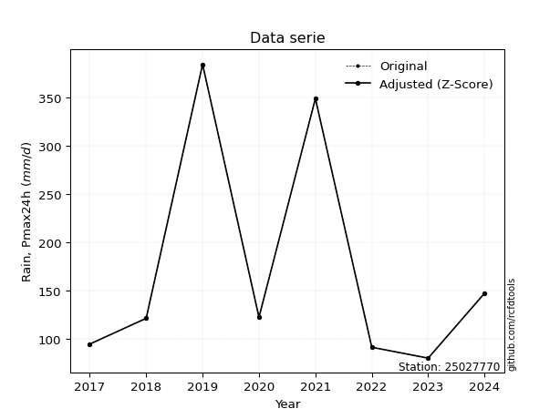</img>

</div>

> If Z-Score is active, values out of range or outliers are replaced with the station mean value.


### 4. Active continuous probability distributions from SciPy (45 of 104 available)

[scipy.stats](https://docs.scipy.org/doc/scipy/reference/stats.html) is a Python´s powerful submodule within the SciPy library for comprehensive statistical analysis, offering over 130 probability distributions (like Normal, Poisson), functions for descriptive stats (mean, variance), hypothesis testing (t-tests, chi-square), random variable generation, and statistical tests, making it essential for data science, modeling, and research. It provides tools to explore, model, and draw conclusions from data efficiently, working seamlessly with NumPy.

<div align="center">

|   id | p_dist             |   n_parameter | fit_method   | label                                                                       | active   | ref                                                                                                        |
|-----:|:-------------------|--------------:|:-------------|:----------------------------------------------------------------------------|:---------|:-----------------------------------------------------------------------------------------------------------|
|    0 | alpha              |             3 | MLE          | Alpha                                                                       | True     | [:mortar_board:](https://docs.scipy.org/doc/scipy/reference/generated/scipy.stats.alpha.html)              |
|    1 | betaprime          |             4 | MLE          | Beta prime                                                                  | True     | [:mortar_board:](https://docs.scipy.org/doc/scipy/reference/generated/scipy.stats.betaprime.html)          |
|    2 | chi2               |             3 | MLE          | Chi²                                                                        | True     | [:mortar_board:](https://docs.scipy.org/doc/scipy/reference/generated/scipy.stats.chi2.html)               |
|    3 | crystalball        |             4 | MLE          | Crystalball                                                                 | True     | [:mortar_board:](https://docs.scipy.org/doc/scipy/reference/generated/scipy.stats.crystalball.html)        |
|    4 | erlang             |             3 | MLE          | Erlang                                                                      | True     | [:mortar_board:](https://docs.scipy.org/doc/scipy/reference/generated/scipy.stats.erlang.html)             |
|    5 | expon              |             2 | MLE          | Exponential                                                                 | True     | [:mortar_board:](https://docs.scipy.org/doc/scipy/reference/generated/scipy.stats.expon.html)              |
|    6 | exponnorm          |             3 | MLE          | Exponentially modified Normal                                               | True     | [:mortar_board:](https://docs.scipy.org/doc/scipy/reference/generated/scipy.stats.exponnorm.html)          |
|    7 | f                  |             4 | MLE          | F                                                                           | True     | [:mortar_board:](https://docs.scipy.org/doc/scipy/reference/generated/scipy.stats.f.html)                  |
|    8 | fatiguelife        |             3 | MLE          | Fatigue-life (Birnbaum-Saunders)                                            | True     | [:mortar_board:](https://docs.scipy.org/doc/scipy/reference/generated/scipy.stats.fatiguelife.html)        |
|    9 | fisk               |             3 | MLE          | Fisk                                                                        | True     | [:mortar_board:](https://docs.scipy.org/doc/scipy/reference/generated/scipy.stats.fisk.html)               |
|   10 | gamma              |             3 | MLE          | Gamma                                                                       | True     | [:mortar_board:](https://docs.scipy.org/doc/scipy/reference/generated/scipy.stats.gamma.html)              |
|   11 | genexpon           |             5 | MLE          | Generalized exponential                                                     | True     | [:mortar_board:](https://docs.scipy.org/doc/scipy/reference/generated/scipy.stats.genexpon.html)           |
|   12 | genlogistic        |             3 | MLE          | Generalized logistic                                                        | True     | [:mortar_board:](https://docs.scipy.org/doc/scipy/reference/generated/scipy.stats.genlogistic.html)        |
|   13 | gibrat             |             2 | MM           | Gibrat                                                                      | True     | [:mortar_board:](https://docs.scipy.org/doc/scipy/reference/generated/scipy.stats.gibrat.html)             |
|   14 | gompertz           |             3 | MLE          | Gompertz (or truncated Gumbel)                                              | True     | [:mortar_board:](https://docs.scipy.org/doc/scipy/reference/generated/scipy.stats.gompertz.html)           |
|   15 | gumbel_l           |             2 | MM           | Gumbel Left Skew                                                            | True     | [:mortar_board:](https://docs.scipy.org/doc/scipy/reference/generated/scipy.stats.gumbel_l.html)           |
|   16 | gumbel_r           |             2 | MM           | Gumbel Right Skew                                                           | True     | [:mortar_board:](https://docs.scipy.org/doc/scipy/reference/generated/scipy.stats.gumbel_r.html)           |
|   17 | halflogistic       |             2 | MM           | Half-logistic                                                               | True     | [:mortar_board:](https://docs.scipy.org/doc/scipy/reference/generated/scipy.stats.halflogistic.html)       |
|   18 | halfnorm           |             2 | MM           | Half Normal                                                                 | True     | [:mortar_board:](https://docs.scipy.org/doc/scipy/reference/generated/scipy.stats.halfnorm.html)           |
|   19 | hypsecant          |             2 | MM           | hyperbolic secant                                                           | True     | [:mortar_board:](https://docs.scipy.org/doc/scipy/reference/generated/scipy.stats.hypsecant.html)          |
|   20 | invgamma           |             3 | MLE          | Inverted gamma                                                              | True     | [:mortar_board:](https://docs.scipy.org/doc/scipy/reference/generated/scipy.stats.invgamma.html)           |
|   21 | invgauss           |             3 | MLE          | Inverse Gaussian                                                            | True     | [:mortar_board:](https://docs.scipy.org/doc/scipy/reference/generated/scipy.stats.invgauss.html)           |
|   22 | invweibull         |             3 | MLE          | Inverted Weibull                                                            | True     | [:mortar_board:](https://docs.scipy.org/doc/scipy/reference/generated/scipy.stats.invweibull.html)         |
|   23 | johnsonsu          |             4 | MLE          | Johnson Su                                                                  | True     | [:mortar_board:](https://docs.scipy.org/doc/scipy/reference/generated/scipy.stats.johnsonsu.html)          |
|   24 | kstwobign          |             2 | MLE          | Limiting distribution of scaled Kolmogorov-Smirnov two-sided test statistic | True     | [:mortar_board:](https://docs.scipy.org/doc/scipy/reference/generated/scipy.stats.kstwobign.html)          |
|   25 | laplace            |             2 | MM           | Laplace                                                                     | True     | [:mortar_board:](https://docs.scipy.org/doc/scipy/reference/generated/scipy.stats.laplace.html)            |
|   26 | laplace_asymmetric |             3 | MLE          | Asymmetric Laplace                                                          | True     | [:mortar_board:](https://docs.scipy.org/doc/scipy/reference/generated/scipy.stats.laplace_asymmetric.html) |
|   27 | loggamma           |             3 | MLE          | Log gamma                                                                   | True     | [:mortar_board:](https://docs.scipy.org/doc/scipy/reference/generated/scipy.stats.loggamma.html)           |
|   28 | logistic           |             2 | MM           | Logistic (or Sech-squared)                                                  | True     | [:mortar_board:](https://docs.scipy.org/doc/scipy/reference/generated/scipy.stats.logistic.html)           |
|   29 | lognorm            |             3 | MLE          | Log Normal                                                                  | True     | [:mortar_board:](https://docs.scipy.org/doc/scipy/reference/generated/scipy.stats.lognorm.html)            |
|   30 | maxwell            |             2 | MM           | Maxwell                                                                     | True     | [:mortar_board:](https://docs.scipy.org/doc/scipy/reference/generated/scipy.stats.maxwell.html)            |
|   31 | mielke             |             4 | MLE          | Mielke Beta-Kappa / Dagum                                                   | True     | [:mortar_board:](https://docs.scipy.org/doc/scipy/reference/generated/scipy.stats.mielke.html)             |
|   32 | moyal              |             2 | MM           | Moyal                                                                       | True     | [:mortar_board:](https://docs.scipy.org/doc/scipy/reference/generated/scipy.stats.moyal.html)              |
|   33 | nakagami           |             3 | MLE          | Nakagami                                                                    | True     | [:mortar_board:](https://docs.scipy.org/doc/scipy/reference/generated/scipy.stats.nakagami.html)           |
|   34 | ncf                |             5 | MLE          | Non-central F distribution                                                  | True     | [:mortar_board:](https://docs.scipy.org/doc/scipy/reference/generated/scipy.stats.ncf.html)                |
|   35 | nct                |             4 | MLE          | Non-central Student’s t                                                     | True     | [:mortar_board:](https://docs.scipy.org/doc/scipy/reference/generated/scipy.stats.nct.html)                |
|   36 | norm               |             2 | MM           | Normal                                                                      | True     | [:mortar_board:](https://docs.scipy.org/doc/scipy/reference/generated/scipy.stats.norm.html)               |
|   37 | pareto             |             3 | MLE          | Pareto                                                                      | True     | [:mortar_board:](https://docs.scipy.org/doc/scipy/reference/generated/scipy.stats.pareto.html)             |
|   38 | pearson3           |             3 | MM           | Pearson type III                                                            | True     | [:mortar_board:](https://docs.scipy.org/doc/scipy/reference/generated/scipy.stats.pearson3.html)           |
|   39 | rayleigh           |             2 | MM           | Rayleigh                                                                    | True     | [:mortar_board:](https://docs.scipy.org/doc/scipy/reference/generated/scipy.stats.rayleigh.html)           |
|   40 | rice               |             3 | MLE          | Rice                                                                        | True     | [:mortar_board:](https://docs.scipy.org/doc/scipy/reference/generated/scipy.stats.rice.html)               |
|   41 | t                  |             3 | MLE          | Student’s t                                                                 | True     | [:mortar_board:](https://docs.scipy.org/doc/scipy/reference/generated/scipy.stats.t.html)                  |
|   42 | truncnorm          |             4 | MLE          | Truncated normal                                                            | True     | [:mortar_board:](https://docs.scipy.org/doc/scipy/reference/generated/scipy.stats.truncnorm.html)          |
|   43 | wald               |             2 | MM           | Wald                                                                        | True     | [:mortar_board:](https://docs.scipy.org/doc/scipy/reference/generated/scipy.stats.wald.html)               |
|   44 | weibull_min        |             3 | MLE          | Weibull minimum                                                             | True     | [:mortar_board:](https://docs.scipy.org/doc/scipy/reference/generated/scipy.stats.weibull_min.html)        |

</div>

> **n_parameter:** # arguments & localization & scale.
>
> **Fit methods:** (MLE) maximum likelihood, (MM) L-moments.
>
>**Inactive:** foldnorm, gennorm, norminvgauss, powernorm, powerlognorm, skewnorm, genextreme, anglit, arcsine, argus, beta, bradford, burr, burr12, cauchy, cosine, halfcauchy, foldcauchy, skewcauchy, wrapcauchy, dgamma, gengamma, exponweib, exponpow, truncexpon, gausshyper, genhalflogistic, genhyperbolic, geninvgauss, halfgennorm, johnsonsb, kappa4, kappa3, ksone, kstwo, loglaplace, levy, levy_l, levy_stable, ncx2, genpareto, truncpareto, lomax, powerlaw, rdist, rel_breitwigner, recipinvgauss, semicircular, studentized_range, trapezoid, triang, truncweibull_min, tukeylambda, uniform, loguniform, vonmises, vonmises_line, weibull_max, dweibull, 


## B. Probability distributions vs. Empirical distributions

A continuous probability distribution (CPD) describes probabilities for variables that can take any value within a range (like rain any time), unlike discrete variables with specific outcomes (like temperature). It uses a Probability Density Function (PDF), a curve where the total area under it equals 1, and the probability of the variable falling within an interval (a to b) is found by calculating the area under the curve between those points. A key feature is that the probability of hitting any single exact value is zero, so probabilities are always expressed for ranges, e.g., $P(a ≤ X ≤ b)$.

<div align="center">

Distributions parameters
|    |   station | p_dist                |   n |            loc |          scale | shape                  | shape1                 | shape2             | shape3   |
|---:|----------:|:----------------------|----:|---------------:|---------------:|:-----------------------|:-----------------------|:-------------------|:---------|
|  0 |  25027770 | alpha                 |   9 |      54.922    |   35.7605      | 1.0924743918439169e-08 |                        |                    |          |
|  1 |  25027770 | betaprime             |   9 |      -0.932652 |    1.84945     | 249.40728409520364     | 3.8822401898474332     |                    |          |
|  2 |  25027770 | chi2                  |   9 |      72        |    2.5245      | 0.1510854965276558     |                        |                    |          |
|  3 |  25027770 | crystalball           |   9 |       0.49381  |  196.963       | 4.152328542520574      | 1.7234046494196642     |                    |          |
|  4 |  25027770 | erlang                |   9 |      72        |   98.6174      | 0.47981177085232873    |                        |                    |          |
|  5 |  25027770 | expon                 |   9 |      72        |   90.3889      |                        |                        |                    |          |
|  6 |  25027770 | exponnorm             |   9 |      71.9205   |    0.0242686   | 3703.6119046377535     |                        |                    |          |
|  7 |  25027770 | f                     |   9 |      71.9999   |   31.3443      | 1.0772707542679998     | 3.2967475714564074     |                    |          |
|  8 |  25027770 | fatiguelife           |   9 |      68.3619   |   40.5088      | 1.6059121610587126     |                        |                    |          |
|  9 |  25027770 | fisk                  |   9 |      72        |   47.4606      | 0.6191191437992714     |                        |                    |          |
| 10 |  25027770 | gamma                 |   9 |      72        |   70.384       | 0.5172763014057511     |                        |                    |          |
| 11 |  25027770 | genexpon              |   9 |      72        |  107.401       | 1.1882044856691971     | 1.4380000554070863e-09 | 1.2508712003663722 |          |
| 12 |  25027770 | genlogistic           |   9 |    -383.618    |   65.648       | 2005.4251006437794     |                        |                    |          |
| 13 |  25027770 | gibrat                |   9 |      77.1027   |   51.7287      |                        |                        |                    |          |
| 14 |  25027770 | gompertz              |   9 |      72        |  536.955       | 4.170191117763057      |                        |                    |          |
| 15 |  25027770 | gumbel_l              |   9 |     212.703    |   87.167       |                        |                        |                    |          |
| 16 |  25027770 | gumbel_r              |   9 |     112.075    |   87.167       |                        |                        |                    |          |
| 17 |  25027770 | halflogistic          |   9 |      29.8847   |   95.5816      |                        |                        |                    |          |
| 18 |  25027770 | halfnorm              |   9 |      14.4148   |  185.458       |                        |                        |                    |          |
| 19 |  25027770 | hypsecant             |   9 |     162.389    |   71.1715      |                        |                        |                    |          |
| 20 |  25027770 | invgamma              |   9 |      61.0836   |   40.1006      | 1.1565190639832927     |                        |                    |          |
| 21 |  25027770 | invgauss              |   9 |      65.0063   |   36.7897      | 2.647011787566644      |                        |                    |          |
| 22 |  25027770 | invweibull            |   9 |      72        |    0.938499    | 0.06257188599927548    |                        |                    |          |
| 23 |  25027770 | johnsonsu             |   9 |      70.3984   |    0.0577779   | -4.609353398653342     | 0.644146144786814      |                    |          |
| 24 |  25027770 | kstwobign             |   9 |    -129.901    |  339.402       |                        |                        |                    |          |
| 25 |  25027770 | laplace               |   9 |     162.389    |   79.0517      |                        |                        |                    |          |
| 26 |  25027770 | laplace_asymmetric    |   9 |      72        |    0.064391    | 0.0007123401185671284  |                        |                    |          |
| 27 |  25027770 | loggamma              |   9 |  -35906.6      | 4809.5         | 1807.618984345615      |                        |                    |          |
| 28 |  25027770 | logistic              |   9 |     162.389    |   61.6364      |                        |                        |                    |          |
| 29 |  25027770 | lognorm               |   9 |      72        |    0.970169    | 11.318693860024293     |                        |                    |          |
| 30 |  25027770 | maxwell               |   9 |    -102.521    |  166.007       |                        |                        |                    |          |
| 31 |  25027770 | mielke                |   9 |      40.7251   |    4.79242     | 149.68445928815026     | 1.77885201168885       |                    |          |
| 32 |  25027770 | moyal                 |   9 |      98.4568   |   50.3259      |                        |                        |                    |          |
| 33 |  25027770 | nakagami              |   9 |      72        |  163.96        | 0.28423064713217483    |                        |                    |          |
| 34 |  25027770 | ncf                   |   9 |      -2.99441  |  115.356       | 202.0894901422884      | 8.024040550513721      | 11.19488061167231  |          |
| 35 |  25027770 | nct                   |   9 |      -0.319796 |    1.98553     | 2.5169175974297957     | 54.342429262680554     |                    |          |
| 36 |  25027770 | norm                  |   9 |     162.389    |  111.796       |                        |                        |                    |          |
| 37 |  25027770 | pareto                |   9 |      -7.76293  |   79.7629      | 1.704896210143208      |                        |                    |          |
| 38 |  25027770 | pearson3              |   9 |     162.389    |  111.796       | 1.2217516648641116     |                        |                    |          |
| 39 |  25027770 | rayleigh              |   9 |     -51.4834   |  170.645       |                        |                        |                    |          |
| 40 |  25027770 | rice                  |   9 |      -2.51536  |  140.875       | 0.0016004293890626077  |                        |                    |          |
| 41 |  25027770 | t                     |   9 |     162.358    |  111.78        | 106682.419248213       |                        |                    |          |
| 42 |  25027770 | truncnorm             |   9 | -579824        | 8054.14        | 71.99977328788555      | 394.94190205173675     |                    |          |
| 43 |  25027770 | wald                  |   9 |      50.5929   |  111.796       |                        |                        |                    |          |
| 44 |  25027770 | weibull_min           |   9 |      72        |   82.3341      | 0.5608794145952912     |                        |                    |          |
| 45 |  25027770 | logalpha              |   9 |       3.58725  |    2.99584     | 2.6712456410310033     |                        |                    |          |
| 46 |  25027770 | logbetaprime          |   9 |      -1.48599  |    3.69547     | 350.2053320094507      | 203.52771285131337     |                    |          |
| 47 |  25027770 | logchi2               |   9 |       4.27667  |    0.959326    | 1.0727019677895804     |                        |                    |          |
| 48 |  25027770 | logcrystalball        |   9 |       4.90192  |    0.575622    | 7.860089901201017      | 5893.501721469051      |                    |          |
| 49 |  25027770 | logerlang             |   9 |       4.27667  |    0.542974    | 0.964698307882132      |                        |                    |          |
| 50 |  25027770 | logexpon              |   9 |       4.27667  |    0.625258    |                        |                        |                    |          |
| 51 |  25027770 | logexponnorm          |   9 |       4.27611  |    0.000168509 | 3714.500772690253      |                        |                    |          |
| 52 |  25027770 | logf                  |   9 |       4.27667  |    0.47189     | 1.180389153351094      | 2339.58680316985       |                    |          |
| 53 |  25027770 | logfatiguelife        |   9 |       4.17489  |    0.49971     | 0.946122844100225      |                        |                    |          |
| 54 |  25027770 | logfisk               |   9 |       4.22897  |    0.456814    | 1.624004342587373      |                        |                    |          |
| 55 |  25027770 | loggamma              |   9 |       4.27667  |    0.860015    | 0.2338276629240288     |                        |                    |          |
| 56 |  25027770 | loggenexpon           |   9 |       4.27667  |    0.82386     | 1.2317073072742635     | 1.037138117224499      | 0.1267285383782762 |          |
| 57 |  25027770 | loggenlogistic        |   9 |       1.75304  |    0.399959    | 1383.9379187368922     |                        |                    |          |
| 58 |  25027770 | loggibrat             |   9 |       4.46278  |    0.266349    |                        |                        |                    |          |
| 59 |  25027770 | loggompertz           |   9 |       4.27667  |    4.74658     | 6.688301937524149      |                        |                    |          |
| 60 |  25027770 | loggumbel_l           |   9 |       5.16098  |    0.448811    |                        |                        |                    |          |
| 61 |  25027770 | loggumbel_r           |   9 |       4.64286  |    0.448811    |                        |                        |                    |          |
| 62 |  25027770 | loghalflogistic       |   9 |       4.21968  |    0.492137    |                        |                        |                    |          |
| 63 |  25027770 | loghalfnorm           |   9 |       4.14003  |    0.954898    |                        |                        |                    |          |
| 64 |  25027770 | loghypsecant          |   9 |       4.90192  |    0.366452    |                        |                        |                    |          |
| 65 |  25027770 | loginvgamma           |   9 |       4.0021   |    1.75544     | 2.8579200006782672     |                        |                    |          |
| 66 |  25027770 | loginvgauss           |   9 |       4.13025  |    0.950844    | 0.8115570183050977     |                        |                    |          |
| 67 |  25027770 | loginvweibull         |   9 |       3.79544  |    0.772998    | 2.4382620099705035     |                        |                    |          |
| 68 |  25027770 | logjohnsonsu          |   9 |       4.18219  |    0.00419875  | -6.089933738331084     | 1.111587412643619      |                    |          |
| 69 |  25027770 | logkstwobign          |   9 |       3.21725  |    1.9415      |                        |                        |                    |          |
| 70 |  25027770 | loglaplace            |   9 |       4.90192  |    0.407026    |                        |                        |                    |          |
| 71 |  25027770 | loglaplace_asymmetric |   9 |       4.27667  |    0.0239425   | 0.0386764071992603     |                        |                    |          |
| 72 |  25027770 | logloggamma           |   9 |    -215.222    |   28.3273      | 2371.242936280478      |                        |                    |          |
| 73 |  25027770 | loglogistic           |   9 |       4.90192  |    0.317357    |                        |                        |                    |          |
| 74 |  25027770 | loglognorm            |   9 |       4.27667  |    0.0113106   | 10.701656744025223     |                        |                    |          |
| 75 |  25027770 | logmaxwell            |   9 |       3.53794  |    0.85475     |                        |                        |                    |          |
| 76 |  25027770 | logmielke             |   9 |       3.80052  |    0.0923179   | 420.605670850515       | 2.431361085025763      |                    |          |
| 77 |  25027770 | logmoyal              |   9 |       4.57275  |    0.259121    |                        |                        |                    |          |
| 78 |  25027770 | lognakagami           |   9 |       4.27667  |    1.15893     | 0.33658445156502403    |                        |                    |          |
| 79 |  25027770 | logncf                |   9 |       1.51615  |    2.21292     | 460.5531112927672      | 116.2476109664808      | 226.91578478080373 |          |
| 80 |  25027770 | lognct                |   9 |       0.282301 |    0.0649599   | 38.0566565364451       | 69.57428867929235      |                    |          |
| 81 |  25027770 | lognorm               |   9 |       4.90192  |    0.575622    |                        |                        |                    |          |
| 82 |  25027770 | logpareto             |   9 |       4.2766   |    6.15963e-05 | 0.12520877397983982    |                        |                    |          |
| 83 |  25027770 | logpearson3           |   9 |       4.90192  |    0.575623    | 0.8931096024442167     |                        |                    |          |
| 84 |  25027770 | lograyleigh           |   9 |       3.80073  |    0.87863     |                        |                        |                    |          |
| 85 |  25027770 | logrice               |   9 |       3.98305  |    0.766703    | 0.0004144473372742503  |                        |                    |          |
| 86 |  25027770 | logt                  |   9 |       4.90192  |    0.575635    | 123198325.56391409     |                        |                    |          |
| 87 |  25027770 | logtruncnorm          |   9 |      -0.134877 |    1.6873      | 2.6145606534533594     | 3.607591735477187      |                    |          |
| 88 |  25027770 | logwald               |   9 |       4.3263   |    0.575618    |                        |                        |                    |          |
| 89 |  25027770 | logweibull_min        |   9 |       4.27667  |    0.553692    | 0.8951104822148027     |                        |                    |          |

</div>

> **loc** (Location parameter): This shifts the distribution along the x-axis. For many common distributions, like the normal (Gaussian) distribution, loc represents the mean $μ$. For others, like the uniform distribution, it might represent the minimum value, or for the beta distribution, the left end of the support interval.
>
> **scale** (Scale parameter): This determines the width or spread of the distribution. For the normal distribution, scale represents the standard deviation $σ$. For a uniform distribution, it defines the length of the interval (from $loc$ to $loc + scale$).
>
> **shape** (Shape parameters): Refers to parameters that define the specific form of a probability distribution, distinct from its location (loc) and scale (scale). These parameters are required arguments for most distribution functions. For example, a normal (Gaussian) distribution is fully defined by its location (mean) and scale (standard deviation), so it has no specific shape parameters beyond loc and scale. However, other distributions have intrinsic properties that need specification, as Gamma distribution that takes a shape parameter, often named $a$ or $alpha$.


### 0. Cumulative distribution values - CDF (90 evaluated)

> Ordered by x ascending and calculating $log(f(x))$ separately. 

|   id |   Station |   date |     x |   count |    mean |     std |    zscore |   Value_initial |   station |   m |     alpha |   alpha_pdf |   betaprime |   betaprime_pdf |      chi2 |    chi2_pdf |   crystalball |   crystalball_pdf |      erlang |       erlang_pdf |     expon |   expon_pdf |   exponnorm |   exponnorm_pdf |           f |       f_pdf |   fatiguelife |   fatiguelife_pdf |        fisk |      fisk_pdf |       gamma |        gamma_pdf |    genexpon |   genexpon_pdf |   genlogistic |   genlogistic_pdf |    gibrat |   gibrat_pdf |    gompertz |   gompertz_pdf |   gumbel_l |   gumbel_l_pdf |   gumbel_r |   gumbel_r_pdf |   halflogistic |   halflogistic_pdf |   halfnorm |   halfnorm_pdf |   hypsecant |   hypsecant_pdf |   invgamma |   invgamma_pdf |   invgauss |   invgauss_pdf |   invweibull |   invweibull_pdf |   johnsonsu |   johnsonsu_pdf |   kstwobign |   kstwobign_pdf |   laplace |   laplace_pdf |   laplace_asymmetric |   laplace_asymmetric_pdf |    loggamma |   loggamma_pdf |   logistic |   logistic_pdf |   lognorm |   lognorm_pdf |   maxwell |   maxwell_pdf |    mielke |   mielke_pdf |    moyal |   moyal_pdf |    nakagami |    nakagami_pdf |      ncf |     ncf_pdf |       nct |     nct_pdf |     norm |    norm_pdf |      pareto |   pareto_pdf |   pearson3 |   pearson3_pdf |   rayleigh |   rayleigh_pdf |     rice |    rice_pdf |        t |       t_pdf |   truncnorm |   truncnorm_pdf |      wald |    wald_pdf |   weibull_min |   weibull_min_pdf |   logalpha |   logalpha_pdf |   logbetaprime |   logbetaprime_pdf |     logchi2 |   logchi2_pdf |   logcrystalball |   logcrystalball_pdf |   logerlang |   logerlang_pdf |   logexpon |   logexpon_pdf |   logexponnorm |   logexponnorm_pdf |        logf |    logf_pdf |   logfatiguelife |   logfatiguelife_pdf |   logfisk |   logfisk_pdf |   loggenexpon |   loggenexpon_pdf |   loggenlogistic |   loggenlogistic_pdf |   loggibrat |   loggibrat_pdf |   loggompertz |   loggompertz_pdf |   loggumbel_l |   loggumbel_l_pdf |   loggumbel_r |   loggumbel_r_pdf |   loghalflogistic |   loghalflogistic_pdf |   loghalfnorm |   loghalfnorm_pdf |   loghypsecant |   loghypsecant_pdf |   loginvgamma |   loginvgamma_pdf |   loginvgauss |   loginvgauss_pdf |   loginvweibull |   loginvweibull_pdf |   logjohnsonsu |   logjohnsonsu_pdf |   logkstwobign |   logkstwobign_pdf |   loglaplace |   loglaplace_pdf |   loglaplace_asymmetric |   loglaplace_asymmetric_pdf |   logloggamma |   logloggamma_pdf |   loglogistic |   loglogistic_pdf |   loglognorm |   loglognorm_pdf |   logmaxwell |   logmaxwell_pdf |   logmielke |   logmielke_pdf |   logmoyal |   logmoyal_pdf |   lognakagami |   lognakagami_pdf |    logncf |   logncf_pdf |   lognct |   lognct_pdf |   logpareto |   logpareto_pdf |   logpearson3 |   logpearson3_pdf |   lograyleigh |   lograyleigh_pdf |   logrice |   logrice_pdf |     logt |   logt_pdf |   logtruncnorm |   logtruncnorm_pdf |    logwald |   logwald_pdf |   logweibull_min |   logweibull_min_pdf |
|-----:|----------:|-------:|------:|--------:|--------:|--------:|----------:|----------------:|----------:|----:|----------:|------------:|------------:|----------------:|----------:|------------:|--------------:|------------------:|------------:|-----------------:|----------:|------------:|------------:|----------------:|------------:|------------:|--------------:|------------------:|------------:|--------------:|------------:|-----------------:|------------:|---------------:|--------------:|------------------:|----------:|-------------:|------------:|---------------:|-----------:|---------------:|-----------:|---------------:|---------------:|-------------------:|-----------:|---------------:|------------:|----------------:|-----------:|---------------:|-----------:|---------------:|-------------:|-----------------:|------------:|----------------:|------------:|----------------:|----------:|--------------:|---------------------:|-------------------------:|------------:|---------------:|-----------:|---------------:|----------:|--------------:|----------:|--------------:|----------:|-------------:|---------:|------------:|------------:|----------------:|---------:|------------:|----------:|------------:|---------:|------------:|------------:|-------------:|-----------:|---------------:|-----------:|---------------:|---------:|------------:|---------:|------------:|------------:|----------------:|----------:|------------:|--------------:|------------------:|-----------:|---------------:|---------------:|-------------------:|------------:|--------------:|-----------------:|---------------------:|------------:|----------------:|-----------:|---------------:|---------------:|-------------------:|------------:|------------:|-----------------:|---------------------:|----------:|--------------:|--------------:|------------------:|-----------------:|---------------------:|------------:|----------------:|--------------:|------------------:|--------------:|------------------:|--------------:|------------------:|------------------:|----------------------:|--------------:|------------------:|---------------:|-------------------:|--------------:|------------------:|--------------:|------------------:|----------------:|--------------------:|---------------:|-------------------:|---------------:|-------------------:|-------------:|-----------------:|------------------------:|----------------------------:|--------------:|------------------:|--------------:|------------------:|-------------:|-----------------:|-------------:|-----------------:|------------:|----------------:|-----------:|---------------:|--------------:|------------------:|----------:|-------------:|---------:|-------------:|------------:|----------------:|--------------:|------------------:|--------------:|------------------:|----------:|--------------:|---------:|-----------:|---------------:|-------------------:|-----------:|--------------:|-----------------:|---------------------:|
|    0 |  25027770 |   2025 |  72   |       9 | 162.389 | 118.578 | -0.762276 |            72   |  25027770 |   1 | 0.0362648 | 0.0109235   |    0.116316 |     0.00612492  | 0.0827521 | 4.39898e+11 |      0.641723 |       0.00189625  | 2.83031e-08 | 955618           | 0         | 0.0110633   | 0.000884477 |     0.0111101   | 0.000698207 | 5.08045     |     0.0292957 |       0.0207624   | 1.56289e-07 | 200.689       | 8.58114e-09 | 312354           | 5.38601e-10 |    0.0110632   |      0.143672 |       0.00424417  | 0         |  0           | 4.74577e-15 |    0.00776637  |   0.180495 |    0.00187142  |   0.20522  |    0.00372849  |       0.216814 |        0.00498522  |   0.243821 |    0.00409976  |    0.174291 |     0.00232834  |  0.0346296 |    0.0112507   |   0.031494 |    0.013571    |  0.000659703 |      2.12735e+10 |   0.0215512 |     0.0207317   |    0.129002 |     0.00381609  |  0.159364 |    0.00201595 |          5.07902e-07 |              0.0110627   | 0.000344247 |    9.06287e+10 |   0.187477 |    0.00247142  |  0.138689 |      0.384204 |  0.22418  |   0.00305676  | 0.0528812 |  0.00868932  | 0.193383 | 0.00442523  | 5.75153e-10 | 23007.2         | 0.119676 | 0.00603711  | 0.0946166 | 0.00678844  | 0.209397 | 0.00257356  | 3.33067e-16 |  0.0213745   |   0.215673 |    0.00414028  |   0.230348 |    0.00326373  | 0.130547 | 0.00326454  | 0.209444 | 0.00257425  |   0         |     0.0089412   | 0.0562377 | 0.00772637  |   1.44172e-09 |   56902.3         |  0.0472203 |      0.621487  |       0.129531 |           0.418646 | 6.71338e-09 |   4.05406e+06 |         0.138689 |             0.384204 | 5.52088e-15 |       5.99652   |   0        |       1.59934  |    0.000884635 |           1.59541  | 1.67262e-09 | 1.11146e+06 |        0.0310875 |             0.970556 |  0.024857 |     0.825382  |   2.08689e-10 |          1.49504  |        0.0809023 |            0.508165  |   0         |       0         |   4.01736e-13 |          1.40908  |      0.130126 |         0.270195  |      0.104218 |          0.525087 |         0.0578339 |              1.01258  |      0.113784 |          0.82706  |       0.114331 |          0.305328  |     0.0396228 |         0.694334  |     0.0337574 |         0.823721  |       0.0417553 |           0.671917  |      0.0315954 |          0.834795  |      0.0728999 |           0.501407 |     0.107603 |        0.264363  |              0.00149394 |                    1.61298  |      0.139154 |          0.378197 |      0.122367 |          0.338399 |   0.00240351 |      7.87949e+11 |     0.137889 |         0.479946 |   0.0417739 |        0.671195 |  0.0766277 |       0.568548 |   5.18616e-11 |      39307        | 0.0987139 |     0.449511 | 0.117507 |     0.46252  |    0        |    2032.73      |      0.118585 |          0.54043  |      0.136457 |          0.532384 | 0.0707042 |      0.46417  | 0.138695 |   0.384208 |    9.22566e-07 |          1.79712   | 0          |     0         |      5.71542e-14 |           57.6003    |
|    1 |  25027770 |   2023 |  79.8 |       9 | 162.389 | 118.578 | -0.696497 |            79.8 |  25027770 |   2 | 0.150595  | 0.0164074   |    0.167114 |     0.00683621  | 0.992201  | 0.00222031  |      0.656404 |       0.00186772  | 0.325828    |      0.0189947   | 0.0826753 | 0.0101486   | 0.0839332   |     0.010192    | 0.333867    | 0.0206225   |     0.200181  |       0.0184009   | 0.246384    |   0.0147381   | 0.34814     |      0.0214499   | 0.0826748   |    0.0101486   |      0.178538 |       0.00468378  | 0.0015697 |  0.00188558  | 0.0591954   |    0.00741355  |   0.195623 |    0.00200882  |   0.235013 |    0.00390429  |       0.255337 |        0.00489008  |   0.275582 |    0.004043    |    0.193318 |     0.0025523   |  0.149997  |    0.0162593   |   0.164296 |    0.0173881   |  0.416487    |      0.00292645  |   0.188659  |     0.0185113   |    0.160205 |     0.00417393  |  0.175891 |    0.00222501 |          0.0826716   |              0.0101482   | 0.654225    |    1.34921     |   0.20752  |    0.00266816  |  0.18206  |      0.459117 |  0.248481 |   0.00317181  | 0.13676   |  0.0122413   | 0.228724 | 0.00462404  | 0.137576    |     0.0100215   | 0.169606 | 0.0067065   | 0.152562  | 0.0079499   | 0.230031 | 0.00271629  | 0.147059    |  0.0166072   |   0.248348 |    0.00423071  |   0.256166 |    0.00335349  | 0.156935 | 0.00349681  | 0.230083 | 0.00271701  |   0.0673654 |     0.00833898  | 0.124441  | 0.0094033   |   0.234062    |       0.0146864   |  0.133988  |      1.03214   |       0.177097 |           0.505551 | 0.230127    |   1.1587      |         0.18206  |             0.459117 | 0.186007    |       1.58182   |   0.151686 |       1.35674  |    0.152287    |           1.35433  | 0.318651    | 1.68502     |        0.164701  |             1.41039  |  0.141533 |     1.31065   |   0.143409    |          1.29757  |        0.143028  |            0.694954  |   0         |       0         |   0.136288    |          1.2437   |      0.160806 |         0.327803  |      0.165607 |          0.663496 |         0.160987  |              0.989647 |      0.198039 |          0.809699 |       0.150177 |          0.394779  |     0.138724  |         1.16195   |     0.150473  |         1.30423   |       0.138016  |           1.141     |      0.149273  |          1.30882   |      0.133931  |           0.678127 |     0.138539 |        0.340368  |              0.15435    |                    1.36605  |      0.1818   |          0.45105  |      0.161637 |          0.426997 |   0.581716   |      0.3548      |     0.191351 |         0.557324 | nan         |      nan        |  0.146541  |       0.779129 |   0.151994    |          0.992779 | 0.151801  |     0.581601 | 0.170744 |     0.570819 |    0.605125 |       0.480395  |      0.179857 |          0.645871 |      0.195051 |          0.603509 | 0.12515   |      0.590054 | 0.182067 |   0.459118 |    0.170768    |          1.52951   | 0.00262809 |     0.286725  |      0.198795    |            1.54536   |
|    2 |  25027770 |   2022 |  91.1 |       9 | 162.389 | 118.578 | -0.6012   |            91.1 |  25027770 |   3 | 0.322928  | 0.0133749   |    0.247287 |     0.00724347  | 0.999566  | 0.000103485 |      0.677256 |       0.00182206  | 0.483128    |      0.0106304   | 0.190476  | 0.00895601  | 0.192157    |     0.00898789  | 0.50051     | 0.0108813   |     0.3577    |       0.0106518   | 0.362731    |   0.00749288  | 0.525217    |      0.0118563   | 0.190475    |    0.00895597  |      0.234429 |       0.00517823  | 0.0955815 |  0.0121294   | 0.140159    |    0.00691966  |   0.219498 |    0.00221899  |   0.280257 |    0.00408986  |       0.309711 |        0.00472936  |   0.320753 |    0.00394973  |    0.224077 |     0.00289474  |  0.319458  |    0.0131527   |   0.333055 |    0.0124423   |  0.436849    |      0.00118521  |   0.35405   |     0.0115731   |    0.209768 |     0.00457446  |  0.202919 |    0.00256692 |          0.190468    |              0.00895564  | 0.772596    |    0.613567    |   0.239285 |    0.00295325  |  0.249054 |      0.550947 |  0.285144 |   0.00331182  | 0.280365  |  0.0124952   | 0.282004 | 0.00478117  | 0.228734    |     0.00678724  | 0.248194 | 0.00710055  | 0.246527  | 0.00848364  | 0.261844 | 0.00291197  | 0.306497    |  0.0119595   |   0.29656  |    0.00428888  |   0.29466  |    0.00345365  | 0.198121 | 0.00378256  | 0.261905 | 0.00291271  |   0.156993  |     0.00753774  | 0.231987  | 0.00933544  |   0.356383    |       0.00832836  |  0.285918  |      1.19365   |       0.250855 |           0.604896 | 0.350337    |   0.736838    |         0.249054 |             0.550947 | 0.368956    |       1.20377   |   0.313611 |       1.09777  |    0.313943    |           1.09607  | 0.48984     | 1.01712     |        0.337657  |             1.16819  |  0.314813 |     1.2379    |   0.300275    |          1.07743  |        0.247384  |            0.863525  |   0.0455655 |       1.94708   |   0.288158    |          1.05402  |      0.209813 |         0.414602  |      0.262196 |          0.782049 |         0.288519  |              0.931405 |      0.303093 |          0.774533 |       0.211502 |          0.53562   |     0.301372  |         1.21883   |     0.320269  |         1.20014   |       0.300224  |           1.22927   |      0.319587  |          1.20468   |      0.234545  |           0.82398  |     0.191813 |        0.471255  |              0.31722    |                    1.10296  |      0.247582 |          0.540881 |      0.226393 |          0.551867 |   0.611645   |      0.15219     |     0.27052  |         0.63326  | nan         |      nan        |  0.26082   |       0.920002 |   0.264557    |          0.749075 | 0.23891   |     0.726814 | 0.254274 |     0.684134 |    0.643974 |       0.189407  |      0.271724 |          0.731531 |      0.279369 |          0.663915 | 0.211752  |      0.709229 | 0.249061 |   0.550943 |    0.353295    |          1.23598   | 0.189876   |     1.85745   |      0.371777    |            1.11098   |
|    3 |  25027770 |   2017 |  94.4 |       9 | 162.389 | 118.578 | -0.573371 |            94.4 |  25027770 |   4 | 0.365025  | 0.0121466   |    0.271212 |     0.00724916  | 0.999801  | 4.64558e-05 |      0.683245 |       0.00180782  | 0.516207    |      0.00946262  | 0.219498  | 0.00863493  | 0.221279    |     0.00866388  | 0.534056    | 0.00950347  |     0.390716  |       0.0094055   | 0.385834    |   0.00654957  | 0.56198     |      0.0104755   | 0.219497    |    0.00863489  |      0.251702 |       0.00528738  | 0.136657  |  0.0126575   | 0.162762    |    0.0067793   |   0.226926 |    0.00228268  |   0.29382  |    0.00412848  |       0.325233 |        0.0046778   |   0.333739 |    0.00392016  |    0.233799 |     0.0029975   |  0.360927  |    0.0119893   |   0.372008 |    0.0111922   |  0.440454    |      0.00100883  |   0.390071  |     0.0102976   |    0.225016 |     0.00466425  |  0.211569 |    0.00267634 |          0.219488    |              0.00863459  | 0.792852    |    0.528484    |   0.249166 |    0.00303526  |  0.269062 |      0.573413 |  0.296131 |   0.0033465   | 0.320831  |  0.0120064   | 0.297816 | 0.00480006  | 0.250344    |     0.00632697  | 0.271653 | 0.00710992  | 0.274477  | 0.00844368  | 0.271544 | 0.00296601  | 0.344252    |  0.0109431   |   0.310719 |    0.00429135  |   0.306095 |    0.0034763   | 0.210723 | 0.00385435  | 0.271607 | 0.00296676  |   0.181504  |     0.00731862  | 0.26238   | 0.00907509  |   0.382364    |       0.00745197  |  0.328144  |      1.1765    |       0.272787 |           0.627449 | 0.375468    |   0.677579    |         0.269062 |             0.573413 | 0.410312    |       1.12182   |   0.351583 |       1.03704  |    0.351856    |           1.03549  | 0.524221    | 0.918283    |        0.37782   |             1.08965  |  0.3577   |     1.17123   |   0.33766     |          1.02426  |        0.278603  |            0.889794  |   0.126099  |       2.44365   |   0.324826    |          1.00724  |      0.225019 |         0.440175  |      0.290361 |          0.800046 |         0.321305  |              0.911092 |      0.330448 |          0.762842 |       0.231296 |          0.577081  |     0.344023  |         1.17614   |     0.361826  |         1.13489   |       0.343312  |           1.18992   |      0.36131   |          1.13959   |      0.264267  |           0.845388 |     0.209337 |        0.514308  |              0.35536    |                    1.04134  |      0.267225 |          0.563011 |      0.246629 |          0.585471 |   0.616679   |      0.131694    |     0.293328 |         0.64829  | nan         |      nan        |  0.293792  |       0.931534 |   0.290536    |          0.712156 | 0.265328  |     0.757334 | 0.279038 |     0.707176 |    0.650196 |       0.161656  |      0.297995 |          0.744373 |      0.303182 |          0.674095 | 0.237411  |      0.732304 | 0.269069 |   0.573408 |    0.396019    |          1.16598   | 0.254741   |     1.77643   |      0.409812    |            1.02841   |
|    4 |  25027770 |   2018 | 121.1 |       9 | 162.389 | 118.578 | -0.348202 |           121.1 |  25027770 |   5 | 0.588943  | 0.00563001  |    0.454394 |     0.00624783  | 0.999999  | 1.13588e-07 |      0.729847 |       0.00167918  | 0.694786    |      0.00479879  | 0.419118  | 0.00642647  | 0.42141     |     0.00643727  | 0.702852    | 0.00424006  |     0.565432  |       0.00468745  | 0.505256    |   0.00315199  | 0.75326     |      0.00490794  | 0.419116    |    0.00642645  |      0.399066 |       0.00558295  | 0.435699  |  0.00894938  | 0.329216    |    0.00570839  |   0.295048 |    0.00282755  |   0.405903 |    0.00419859  |       0.443966 |        0.00420005  |   0.43488  |    0.00364617  |    0.324902 |     0.00381265  |  0.585562  |    0.00575589  |   0.580498 |    0.00543     |  0.458104    |      0.000455746 |   0.580269  |     0.00496548  |    0.355204 |     0.00496924  |  0.296577 |    0.00375168 |          0.419102    |              0.00642631  | 0.881454    |    0.240037    |   0.338524 |    0.00363301  |  0.42742  |      0.681561 |  0.388226 |   0.00352012  | 0.573347  |  0.00703531  | 0.424555 | 0.00460202  | 0.389366    |     0.00441923  | 0.452014 | 0.0061814   | 0.479868  | 0.00668226  | 0.355943 | 0.00333323  | 0.558608    |  0.00583975  |   0.423706 |    0.00412177  |   0.400357 |    0.00355388  | 0.31954  | 0.00423843  | 0.356027 | 0.00333396  |   0.355339  |     0.00576452  | 0.468868  | 0.00639455  |   0.526836    |       0.00404467  |  0.579118  |      0.804973  |       0.442597 |           0.713381 | 0.510273    |   0.439823    |         0.42742  |             0.681561 | 0.631771    |       0.692953  |   0.564638 |       0.696292 |    0.564636    |           0.69555  | 0.69537     | 0.514778    |        0.591486  |             0.664242 |  0.587287 |     0.693443  |   0.551946    |          0.713217 |        0.503722  |            0.863419  |   0.589333  |       1.16495   |   0.538967    |          0.724838 |      0.358557 |         0.634617  |      0.491675 |          0.777741 |         0.527126  |              0.733677 |      0.508297 |          0.659654 |       0.409761 |          0.833953  |     0.58504   |         0.755836  |     0.588152  |         0.705706  |       0.587288  |           0.761253  |      0.588173  |          0.704023  |      0.477621  |           0.825175 |     0.386018 |        0.948385  |              0.568901   |                    0.696393 |      0.422979 |          0.672038 |      0.417796 |          0.766463 |   0.639717   |      0.0672532   |     0.461811 |         0.684507 | nan         |      nan        |  0.516195  |       0.80961  |   0.445157    |          0.547749 | 0.468771  |     0.835487 | 0.465883 |     0.76161  |    0.677616 |       0.0776237 |      0.484976 |          0.72927  |      0.473953 |          0.678617 | 0.430496  |      0.788197 | 0.427424 |   0.681548 |    0.63353     |          0.765683  | 0.583875   |     0.919394  |      0.611427    |            0.632332  |
|    5 |  25027770 |   2020 | 122.2 |       9 | 162.389 | 118.578 | -0.338925 |           122.2 |  25027770 |   6 | 0.59505   | 0.00547327  |    0.461232 |     0.00618549  | 1         | 8.94993e-08 |      0.731691 |       0.00167342  | 0.700006    |      0.00469118  | 0.426145  | 0.00634874  | 0.428448    |     0.00635897  | 0.707455    | 0.00412815  |     0.570533  |       0.00458794  | 0.508685    |   0.00308233  | 0.758588    |      0.00478043  | 0.426143    |    0.00634872  |      0.405202 |       0.00557465  | 0.44544   |  0.00876339  | 0.335472    |    0.00566675  |   0.298171 |    0.00285078  |   0.410519 |    0.00419309  |       0.448574 |        0.00417853  |   0.438883 |    0.00363369  |    0.329113 |     0.00384325  |  0.591808  |    0.00560177  |   0.586397 |    0.00529616  |  0.4586      |      0.000445624 |   0.585665  |     0.00484598  |    0.360669 |     0.00496748  |  0.300732 |    0.00380425 |          0.426128    |              0.00634859  | 0.883599    |    0.234409    |   0.342532 |    0.00365375  |  0.433592 |      0.683438 |  0.3921   |   0.00352317  | 0.580993  |  0.00686594  | 0.429607 | 0.00458349  | 0.394201    |     0.00437213  | 0.458781 | 0.00612224  | 0.487167  | 0.00658975  | 0.359616 | 0.0033452   | 0.564959    |  0.00570702  |   0.428233 |    0.00410894  |   0.404266 |    0.00355321  | 0.324207 | 0.00424682  | 0.359701 | 0.00334593  |   0.361649  |     0.00570811  | 0.475846  | 0.00629329  |   0.531243    |       0.0039682   |  0.58633   |      0.790112  |       0.44905  |           0.713852 | 0.514225    |   0.43427     |         0.433592 |             0.683438 | 0.637983    |       0.681093  |   0.570889 |       0.686294 |    0.570881    |           0.685574 | 0.699982    | 0.505406    |        0.597441  |             0.65285  |  0.593493 |     0.67941   |   0.558352    |          0.703733 |        0.511501  |            0.857163  |   0.599694  |       1.127     |   0.545481    |          0.715959 |      0.364327 |         0.641707  |      0.498687 |          0.773098 |         0.533728  |              0.726561 |      0.514243 |          0.655344 |       0.417327 |          0.839492  |     0.591811  |         0.741762  |     0.594476  |         0.693196  |       0.594106  |           0.746647  |      0.594481  |          0.691215  |      0.48506   |           0.820331 |     0.39469  |        0.96969   |              0.575152   |                    0.686294 |      0.429065 |          0.674058 |      0.424743 |          0.76991  |   0.640319   |      0.0660654   |     0.467996 |         0.683605 | nan         |      nan        |  0.523478  |       0.801377 |   0.45009     |          0.543378 | 0.476318  |     0.833799 | 0.472763 |     0.760117 |    0.678312 |       0.0761325 |      0.491555 |          0.725904 |      0.480082 |          0.676801 | 0.437618  |      0.786991 | 0.433596 |   0.683425 |    0.6404      |          0.753773  | 0.592086   |     0.896804  |      0.617098    |            0.621978  |
|    6 |  25027770 |   2024 | 147.2 |       9 | 162.389 | 118.578 | -0.128092 |           147.2 |  25027770 |   7 | 0.698364  | 0.00310839  |    0.597555 |     0.00472607  | 1         | 4.35681e-10 |      0.771822 |       0.00153477  | 0.793188    |      0.00295043  | 0.564805  | 0.0048147   | 0.567228    |     0.00481493  | 0.786635    | 0.00242534  |     0.663613  |       0.00304339  | 0.57076     |   0.00201702  | 0.849901    |      0.00275729  | 0.564803    |    0.00481469  |      0.53939  |       0.00507134  | 0.619387  |  0.00543448  | 0.465758    |    0.00477286  |   0.376043 |    0.00337633  |   0.512561 |    0.00392996  |       0.546721 |        0.00366753  |   0.526    |    0.00332949  |    0.432579 |     0.00437248  |  0.69848   |    0.00323507  |   0.689757 |    0.00322961  |  0.467615    |      0.000295751 |   0.680849  |     0.00299599  |    0.482358 |     0.00470281  |  0.412596 |    0.00521932 |          0.564786    |              0.00481465  | 0.918573    |    0.149852    |   0.438703 |    0.00399509  |  0.562032 |      0.684667 |  0.480323 |   0.0035083   | 0.713371  |  0.00401732  | 0.5378   | 0.00403984  | 0.492438    |     0.00355269  | 0.594291 | 0.00471869  | 0.62672   | 0.00464373  | 0.445965 | 0.0035357   | 0.677698    |  0.00354595  |   0.52658  |    0.00373613  |   0.492269 |    0.00346422  | 0.43148  | 0.00428886  | 0.446066 | 0.00353632  |   0.489529  |     0.00456481  | 0.607886  | 0.00439512  |   0.613427    |       0.00274035  |  0.707481  |      0.526123  |       0.580215 |           0.683101 | 0.585947    |   0.342706    |         0.562032 |             0.684667 | 0.744746    |       0.478307  |   0.681371 |       0.509595 |    0.681264    |           0.509222 | 0.778875    | 0.353913    |        0.700111  |             0.463436 |  0.696925 |     0.449678  |   0.672705    |          0.53224  |        0.656401  |            0.6908    |   0.753705  |       0.595939  |   0.662955    |          0.552148 |      0.496378 |         0.769699  |      0.631551 |          0.6467   |         0.655254  |              0.57976  |      0.627606 |          0.561317 |       0.577291 |          0.843144  |     0.706019  |         0.500754  |     0.702614  |         0.482833  |       0.708394  |           0.497746  |      0.701762  |          0.476099  |      0.626314  |           0.68955  |     0.599058 |        0.985052  |              0.685478   |                    0.508075 |      0.556125 |          0.679612 |      0.570325 |          0.772172 |   0.650801   |      0.0483585   |     0.591596 |         0.635677 | nan         |      nan        |  0.655969  |       0.621079 |   0.543614    |          0.464629 | 0.624569  |     0.743013 | 0.608553 |     0.686516 |    0.690227 |       0.0542323 |      0.618409 |          0.629849 |      0.601011 |          0.615582 | 0.579165  |      0.722165 | 0.562033 |   0.684652 |    0.760074    |          0.542397  | 0.723738   |     0.55168   |      0.715596    |            0.447599  |
|    7 |  25027770 |   2021 | 349.1 |       9 | 162.389 | 118.578 |  1.57459  |           349.1 |  25027770 |   8 | 0.903247  | 0.000327276 |    0.947341 |     0.000432904 | 1         | 5.60981e-28 |      0.96163  |       0.000422945 | 0.983385    |      0.000193245 | 0.953376  | 0.000515814 | 0.954217    |     0.000509373 | 0.948211    | 0.000241714 |     0.919654  |       0.0004983   | 0.748838    |   0.000420223 | 0.994673    |      8.34187e-05 | 0.953375    |    0.000515821 |      0.971899 |       0.000421986 | 0.951521  |  0.000369942 | 0.940191    |    0.000778232 |   0.991618 |    0.000459827 |   0.936199 |    0.000708074 |       0.931533 |        0.000691799 |   0.928869 |    0.000844315 |    0.95389  |     0.000645606 |  0.911783  |    0.000331831 |   0.923743 |    0.0003983   |  0.496316    |      7.85119e-05 |   0.903255  |     0.000395906 |    0.962763 |     0.000619348 |  0.952879 |    0.00059608 |          0.953369    |              0.00051587  | 0.980376    |    0.029928    |   0.953878 |    0.000713785 |  0.951175 |      0.175803 |  0.939843 |   0.000879004 | 0.950252  |  0.000279626 | 0.933936 | 0.000654856 | 0.895004    |     0.000953929 | 0.947265 | 0.000439019 | 0.94295   | 0.000389424 | 0.952551 | 0.000884719 | 0.922264    |  0.000371381 |   0.932617 |    0.000732308 |   0.936409 |    0.000874778 | 0.955614 | 0.000786395 | 0.9526   | 0.000884091 |   0.916106  |     0.000750474 | 0.93789   | 0.000485126 |   0.861269    |       0.000554653 |  0.915012  |      0.0937055 |       0.946396 |           0.166064 | 0.783315    |   0.151354    |         0.951175 |             0.175803 | 0.949006    |       0.0948086 |   0.919931 |       0.128058 |    0.919786    |           0.128153 | 0.93964     | 0.086942    |        0.913382  |             0.118079 |  0.887177 |     0.0999476 |   0.924462    |          0.133435 |        0.952564  |            0.115743  |   0.950946  |       0.0729401 |   0.928574    |          0.140357 |      0.990887 |         0.0953955 |      0.935102 |          0.139803 |         0.930461  |              0.136387 |      0.927561 |          0.166447 |       0.952887 |          0.128096  |     0.914069  |         0.10175   |     0.916322  |         0.112725  |       0.91243   |           0.0989767 |      0.909291  |          0.108516  |      0.950189  |           0.139437 |     0.951953 |        0.118043  |              0.922051   |                    0.125918 |      0.948932 |          0.182315 |      0.952768 |          0.1418   |   0.677773   |      0.0212284   |     0.93848  |         0.173876 | nan         |      nan        |  0.932922  |       0.129128 |   0.829159    |          0.218333 | 0.963487  |     0.119599 | 0.947435 |     0.145979 |    0.719467 |       0.0222487 |      0.934193 |          0.154201 |      0.935053 |          0.172856 | 0.949295  |      0.161499 | 0.951172 |   0.175808 |    0.991201    |          0.100481  | 0.93714    |     0.0955141 |      0.922267    |            0.112587  |
|    8 |  25027770 |   2019 | 384.6 |       9 | 162.389 | 118.578 |  1.87397  |           384.6 |  25027770 |   9 | 0.913622  | 0.000260981 |    0.96029  |     0.000305365 | 1         | 4.43598e-31 |      0.974421 |       0.000302474 | 0.988976    |      0.00012663  | 0.96852   | 0.000348277 | 0.969156    |     0.000343166 | 0.955772    | 0.000187415 |     0.935364  |       0.000391758 | 0.762612    |   0.000358548 | 0.996937    |      4.75274e-05 | 0.968519    |    0.000348283 |      0.983539 |       0.000248669 | 0.962662  |  0.000264949 | 0.9629      |    0.000515741 |   0.999242 |    6.24516e-05 |   0.957076 |    0.000481709 |       0.952267 |        0.000487475 |   0.954073 |    0.000586847 |    0.971968 |     0.000393352 |  0.922257  |    0.000262237 |   0.936304 |    0.000313851 |  0.498935    |      6.94374e-05 |   0.91583   |     0.000316676 |    0.979815 |     0.000360624 |  0.969926 |    0.00038043 |          0.968514    |              0.000348322 | 0.983056    |    0.0255482   |   0.973537 |    0.000417976 |  0.965969 |      0.131176 |  0.965053 |   0.000558636 | 0.958832  |  0.000208463 | 0.953544 | 0.000461025 | 0.924684    |     0.000725769 | 0.960385 | 0.000309041 | 0.954759  | 0.000283021 | 0.976575 | 0.000494983 | 0.933869    |  0.000287352 |   0.954415 |    0.000507955 |   0.961814 |    0.000571859 | 0.977076 | 0.000447166 | 0.976604 | 0.000494514 |   0.938932  |     0.000546313 | 0.952698  | 0.000356733 |   0.879172    |       0.000458171 |  0.923401  |      0.0800001 |       0.960571 |           0.127895 | 0.797413    |   0.139986    |         0.965969 |             0.131176 | 0.957407    |       0.0791541 |   0.93142  |       0.109683 |    0.931284    |           0.109783 | 0.947475    | 0.0751787   |        0.924053  |             0.102675 |  0.896243 |     0.0876372 |   0.936385    |          0.113303 |        0.962571  |            0.0918071 |   0.957405  |       0.0608819 |   0.941067    |          0.118195 |      0.99706  |         0.0381826 |      0.94736  |          0.114146 |         0.942526  |              0.113428 |      0.942274 |          0.138013 |       0.963801 |          0.0985684 |     0.923218  |         0.0876234 |     0.926484  |         0.0975486 |       0.921335  |           0.0853392 |      0.919086  |          0.0941682 |      0.962206  |           0.109684 |     0.962127 |        0.0930478 |              0.933339   |                    0.107683 |      0.964308 |          0.136644 |      0.964752 |          0.107153 |   0.679766   |      0.0199498   |     0.95353  |         0.137912 | nan         |      nan        |  0.944335  |       0.107237 |   0.849302    |          0.197865 | 0.973536  |     0.089201 | 0.959975 |     0.114075 |    0.72155  |       0.0208071 |      0.94769  |          0.125367 |      0.950114 |          0.13903  | 0.96305   |      0.123778 | 0.965967 |   0.131181 |    1           |          0.0818222 | 0.945664   |     0.0809834 |      0.93241     |            0.0972856 |

An Empirical Distribution Function (EDF) is a step-function estimate of a true cumulative distribution function (CDF) based on observed sample data, representing the proportion of data points less than or equal to a given value. It is calculated by ordering your data and jumping up by $1/n$ (where $n$ is sample size) at each unique data point, allowing analysis without assuming an underlying population distribution, and it gets closer to the true CDF as the sample size grows.


### 1. Empirical - EDF California (1923)

California´s estimates the true probability distribution of water-related data (like rainfall, streamflow) using observed samples, crucial for risk assessment.

<div align="center">


$P=m/n$


</div>


**1.1. Empirical values**

<div align="center">

|                | 0                  | 1                  | 2                  | 3                  | 4                  | 5                  | 6                  | 7                  | 8              |
|:---------------|:-------------------|:-------------------|:-------------------|:-------------------|:-------------------|:-------------------|:-------------------|:-------------------|:---------------|
| date           | 2025               | 2023               | 2022               | 2017               | 2018               | 2020               | 2024               | 2021               | 2019           |
| x              | 72.0               | 79.8               | 91.1               | 94.4               | 121.1              | 122.2              | 147.2              | 349.1              | 384.6          |
| m              | 1                  | 2                  | 3                  | 4                  | 5                  | 6                  | 7                  | 8                  | 9              |
| empirical_dist | edf_california     | edf_california     | edf_california     | edf_california     | edf_california     | edf_california     | edf_california     | edf_california     | edf_california |
| empirical      | 0.1111111111111111 | 0.2222222222222222 | 0.3333333333333333 | 0.4444444444444444 | 0.5555555555555556 | 0.6666666666666666 | 0.7777777777777778 | 0.8888888888888888 | 1.0            |
| empirical_tr   | 1.125              | 1.2857142857142856 | 1.4999999999999998 | 1.7999999999999998 | 2.25               | 2.9999999999999996 | 4.5                | 8.999999999999996  | inf            |

</div>


**1.2. Kolmogorov-Smirnov fit test (sorted by Δ)**


<div align="center">

|                | 0                   | 1                   | 2                   | 3                   | 4                   | 5                   | 6                   | 7                   | 8                   | 9                   | 10                  | 11                    | 12                  | 13                  | 14                  | 15                  | 16                  | 17                  | 18                  | 19                  | 20                  | 21                  | 22                  | 23                  | 24                  | 25                  | 26                  | 27                  | 28                  | 29                  | 30                  | 31                  | 32                  | 33                  | 34                  | 35                  | 36                  | 37                  | 38                  | 39                  | 40                  | 41                  | 42                  | 43                  | 44                  | 45                  | 46                  | 47                  | 48                  | 49                  | 50                  | 51                  | 52                  | 53                  | 54                  | 55                  | 56                  | 57                  | 58                  | 59                  | 60                  | 61                  | 62                  | 63                  | 64                  | 65                  | 66                  | 67                  | 68                  | 69                  | 70                  | 71                  | 72                  | 73                  | 74                  | 75                  | 76                  | 77                  | 78                  | 79                  | 80                  | 81                  | 82                  | 83                  | 84                  | 85                  | 86                  | 87                  | 88                  | 89                  |
|:---------------|:--------------------|:--------------------|:--------------------|:--------------------|:--------------------|:--------------------|:--------------------|:--------------------|:--------------------|:--------------------|:--------------------|:----------------------|:--------------------|:--------------------|:--------------------|:--------------------|:--------------------|:--------------------|:--------------------|:--------------------|:--------------------|:--------------------|:--------------------|:--------------------|:--------------------|:--------------------|:--------------------|:--------------------|:--------------------|:--------------------|:--------------------|:--------------------|:--------------------|:--------------------|:--------------------|:--------------------|:--------------------|:--------------------|:--------------------|:--------------------|:--------------------|:--------------------|:--------------------|:--------------------|:--------------------|:--------------------|:--------------------|:--------------------|:--------------------|:--------------------|:--------------------|:--------------------|:--------------------|:--------------------|:--------------------|:--------------------|:--------------------|:--------------------|:--------------------|:--------------------|:--------------------|:--------------------|:--------------------|:--------------------|:--------------------|:--------------------|:--------------------|:--------------------|:--------------------|:--------------------|:--------------------|:--------------------|:--------------------|:--------------------|:--------------------|:--------------------|:--------------------|:--------------------|:--------------------|:--------------------|:--------------------|:--------------------|:--------------------|:--------------------|:--------------------|:--------------------|:--------------------|:--------------------|:--------------------|:--------------------|
| station        | 25027770            | 25027770            | 25027770            | 25027770            | 25027770            | 25027770            | 25027770            | 25027770            | 25027770            | 25027770            | 25027770            | 25027770              | 25027770            | 25027770            | 25027770            | 25027770            | 25027770            | 25027770            | 25027770            | 25027770            | 25027770            | 25027770            | 25027770            | 25027770            | 25027770            | 25027770            | 25027770            | 25027770            | 25027770            | 25027770            | 25027770            | 25027770            | 25027770            | 25027770            | 25027770            | 25027770            | 25027770            | 25027770            | 25027770            | 25027770            | 25027770            | 25027770            | 25027770            | 25027770            | 25027770            | 25027770            | 25027770            | 25027770            | 25027770            | 25027770            | 25027770            | 25027770            | 25027770            | 25027770            | 25027770            | 25027770            | 25027770            | 25027770            | 25027770            | 25027770            | 25027770            | 25027770            | 25027770            | 25027770            | 25027770            | 25027770            | 25027770            | 25027770            | 25027770            | 25027770            | 25027770            | 25027770            | 25027770            | 25027770            | 25027770            | 25027770            | 25027770            | 25027770            | 25027770            | 25027770            | 25027770            | 25027770            | 25027770            | 25027770            | 25027770            | 25027770            | 25027770            | 25027770            | 25027770            | 25027770            |
| empirical_dist | edf_california      | edf_california      | edf_california      | edf_california      | edf_california      | edf_california      | edf_california      | edf_california      | edf_california      | edf_california      | edf_california      | edf_california        | edf_california      | edf_california      | edf_california      | edf_california      | edf_california      | edf_california      | edf_california      | edf_california      | edf_california      | edf_california      | edf_california      | edf_california      | edf_california      | edf_california      | edf_california      | edf_california      | edf_california      | edf_california      | edf_california      | edf_california      | edf_california      | edf_california      | edf_california      | edf_california      | edf_california      | edf_california      | edf_california      | edf_california      | edf_california      | edf_california      | edf_california      | edf_california      | edf_california      | edf_california      | edf_california      | edf_california      | edf_california      | edf_california      | edf_california      | edf_california      | edf_california      | edf_california      | edf_california      | edf_california      | edf_california      | edf_california      | edf_california      | edf_california      | edf_california      | edf_california      | edf_california      | edf_california      | edf_california      | edf_california      | edf_california      | edf_california      | edf_california      | edf_california      | edf_california      | edf_california      | edf_california      | edf_california      | edf_california      | edf_california      | edf_california      | edf_california      | edf_california      | edf_california      | edf_california      | edf_california      | edf_california      | edf_california      | edf_california      | edf_california      | edf_california      | edf_california      | edf_california      | edf_california      |
| p_dist         | logmielke           | logfatiguelife      | loginvgauss         | logjohnsonsu        | invgamma            | alpha               | invgauss            | johnsonsu           | loginvgamma         | loginvweibull       | logfisk             | loglaplace_asymmetric | logexponnorm        | logtruncnorm        | loggenexpon         | logweibull_min      | logerlang           | pareto              | logexpon            | fatiguelife         | logalpha            | loggompertz         | mielke              | loghalflogistic     | erlang              | logmoyal            | loghalfnorm         | logf                | weibull_min         | loggenlogistic      | f                   | loggumbel_r         | logpearson3         | nct                 | logkstwobign        | lograyleigh         | logncf              | wald                | lognct              | gamma               | logmaxwell          | logchi2             | betaprime           | ncf                 | logbetaprime        | logwald             | logrice             | halflogistic        | logt                | lognorm             | lognorm             | logcrystalball      | lognakagami         | fisk                | logloggamma         | exponnorm           | moyal               | expon               | genexpon            | laplace_asymmetric  | loglogistic         | loghypsecant        | pearson3            | halfnorm            | genlogistic         | gumbel_r            | loglaplace          | nakagami            | rayleigh            | maxwell             | loggumbel_l         | truncnorm           | kstwobign           | gibrat              | loggibrat           | gompertz            | t                   | norm                | logistic            | hypsecant           | rice                | loglognorm          | laplace             | logpareto           | gumbel_l            | loggamma            | loggamma            | invweibull          | crystalball         | chi2                |
| delta          | 0.06933720353785802 | 0.08002363440245523 | 0.08261839800479337 | 0.08313470513836385 | 0.0835177981359787  | 0.08637783369668628 | 0.08802121927615769 | 0.09692838598960296 | 0.10042119821972245 | 0.10113194706471945 | 0.10375732151027395 | 0.10961716727195409   | 0.1102264763711735  | 0.11111018854463246 | 0.11111111090242237 | 0.11111111111105396 | 0.11111111111110558 | 0.11111111111111077 | 0.1111111111111111  | 0.1141647904450952  | 0.11630093735395303 | 0.12118548684971209 | 0.12361394306829732 | 0.13293864244428166 | 0.14979417039819226 | 0.15065215542402777 | 0.15242411068761585 | 0.1565065503392909  | 0.16435038916951006 | 0.16584098147430898 | 0.16717690281443537 | 0.16797985116584224 | 0.17511144832839703 | 0.17949923404846835 | 0.18160619940306327 | 0.1865850718909834  | 0.19034823828138048 | 0.19082083326734428 | 0.19390331306574127 | 0.1977042658816084  | 0.198670253805247   | 0.20258686963307215 | 0.20543465380561543 | 0.207885471722767   | 0.21761672453698117 | 0.2195941335572665  | 0.2290490337821543  | 0.23105694062877757 | 0.23307084428839753 | 0.2330748230750737  | 0.2330748230750737  | 0.23307482342659608 | 0.23416370993513758 | 0.237387654293009   | 0.23760177059809995 | 0.23821897398949865 | 0.23997768297667788 | 0.24052197167231948 | 0.2405239582805917  | 0.2405383657327984  | 0.24192402894743403 | 0.2493396273798037  | 0.2511977424821993  | 0.25177825106804474 | 0.2614642836987276  | 0.26521668474107696 | 0.2719771307178576  | 0.2853398075219702  | 0.2855086178291093  | 0.2974549134653243  | 0.30233932926412216 | 0.30501734932068025 | 0.3059973130802338  | 0.3077869963083388  | 0.3183455460342453  | 0.3311947782743503  | 0.33171159939723993 | 0.3318128046843303  | 0.3390747447270314  | 0.34519919145426015 | 0.34629769131870036 | 0.35949418737728456 | 0.36593429192964166 | 0.38290287023807934 | 0.4017343549399702  | 0.43926314275031636 | 0.43926314275031636 | 0.5010646527370453  | 0.5306119423739737  | 0.7699784819916743  |
| deltao         | 0.41761268023100007 | 0.41761268023100007 | 0.41761268023100007 | 0.41761268023100007 | 0.41761268023100007 | 0.41761268023100007 | 0.41761268023100007 | 0.41761268023100007 | 0.41761268023100007 | 0.41761268023100007 | 0.41761268023100007 | 0.41761268023100007   | 0.41761268023100007 | 0.41761268023100007 | 0.41761268023100007 | 0.41761268023100007 | 0.41761268023100007 | 0.41761268023100007 | 0.41761268023100007 | 0.41761268023100007 | 0.41761268023100007 | 0.41761268023100007 | 0.41761268023100007 | 0.41761268023100007 | 0.41761268023100007 | 0.41761268023100007 | 0.41761268023100007 | 0.41761268023100007 | 0.41761268023100007 | 0.41761268023100007 | 0.41761268023100007 | 0.41761268023100007 | 0.41761268023100007 | 0.41761268023100007 | 0.41761268023100007 | 0.41761268023100007 | 0.41761268023100007 | 0.41761268023100007 | 0.41761268023100007 | 0.41761268023100007 | 0.41761268023100007 | 0.41761268023100007 | 0.41761268023100007 | 0.41761268023100007 | 0.41761268023100007 | 0.41761268023100007 | 0.41761268023100007 | 0.41761268023100007 | 0.41761268023100007 | 0.41761268023100007 | 0.41761268023100007 | 0.41761268023100007 | 0.41761268023100007 | 0.41761268023100007 | 0.41761268023100007 | 0.41761268023100007 | 0.41761268023100007 | 0.41761268023100007 | 0.41761268023100007 | 0.41761268023100007 | 0.41761268023100007 | 0.41761268023100007 | 0.41761268023100007 | 0.41761268023100007 | 0.41761268023100007 | 0.41761268023100007 | 0.41761268023100007 | 0.41761268023100007 | 0.41761268023100007 | 0.41761268023100007 | 0.41761268023100007 | 0.41761268023100007 | 0.41761268023100007 | 0.41761268023100007 | 0.41761268023100007 | 0.41761268023100007 | 0.41761268023100007 | 0.41761268023100007 | 0.41761268023100007 | 0.41761268023100007 | 0.41761268023100007 | 0.41761268023100007 | 0.41761268023100007 | 0.41761268023100007 | 0.41761268023100007 | 0.41761268023100007 | 0.41761268023100007 | 0.41761268023100007 | 0.41761268023100007 | 0.41761268023100007 |
| eval           | Δo > Δ              | Δo > Δ              | Δo > Δ              | Δo > Δ              | Δo > Δ              | Δo > Δ              | Δo > Δ              | Δo > Δ              | Δo > Δ              | Δo > Δ              | Δo > Δ              | Δo > Δ                | Δo > Δ              | Δo > Δ              | Δo > Δ              | Δo > Δ              | Δo > Δ              | Δo > Δ              | Δo > Δ              | Δo > Δ              | Δo > Δ              | Δo > Δ              | Δo > Δ              | Δo > Δ              | Δo > Δ              | Δo > Δ              | Δo > Δ              | Δo > Δ              | Δo > Δ              | Δo > Δ              | Δo > Δ              | Δo > Δ              | Δo > Δ              | Δo > Δ              | Δo > Δ              | Δo > Δ              | Δo > Δ              | Δo > Δ              | Δo > Δ              | Δo > Δ              | Δo > Δ              | Δo > Δ              | Δo > Δ              | Δo > Δ              | Δo > Δ              | Δo > Δ              | Δo > Δ              | Δo > Δ              | Δo > Δ              | Δo > Δ              | Δo > Δ              | Δo > Δ              | Δo > Δ              | Δo > Δ              | Δo > Δ              | Δo > Δ              | Δo > Δ              | Δo > Δ              | Δo > Δ              | Δo > Δ              | Δo > Δ              | Δo > Δ              | Δo > Δ              | Δo > Δ              | Δo > Δ              | Δo > Δ              | Δo > Δ              | Δo > Δ              | Δo > Δ              | Δo > Δ              | Δo > Δ              | Δo > Δ              | Δo > Δ              | Δo > Δ              | Δo > Δ              | Δo > Δ              | Δo > Δ              | Δo > Δ              | Δo > Δ              | Δo > Δ              | Δo > Δ              | Δo > Δ              | Δo > Δ              | Δo > Δ              | Δo > Δ              | Δo <= Δ             | Δo <= Δ             | Δo <= Δ             | Δo <= Δ             | Δo <= Δ             |
| fit            | 1                   | 1                   | 1                   | 1                   | 1                   | 1                   | 1                   | 1                   | 1                   | 1                   | 1                   | 1                     | 1                   | 1                   | 1                   | 1                   | 1                   | 1                   | 1                   | 1                   | 1                   | 1                   | 1                   | 1                   | 1                   | 1                   | 1                   | 1                   | 1                   | 1                   | 1                   | 1                   | 1                   | 1                   | 1                   | 1                   | 1                   | 1                   | 1                   | 1                   | 1                   | 1                   | 1                   | 1                   | 1                   | 1                   | 1                   | 1                   | 1                   | 1                   | 1                   | 1                   | 1                   | 1                   | 1                   | 1                   | 1                   | 1                   | 1                   | 1                   | 1                   | 1                   | 1                   | 1                   | 1                   | 1                   | 1                   | 1                   | 1                   | 1                   | 1                   | 1                   | 1                   | 1                   | 1                   | 1                   | 1                   | 1                   | 1                   | 1                   | 1                   | 1                   | 1                   | 1                   | 1                   | 0                   | 0                   | 0                   | 0                   | 0                   |
| n              | 9                   | 9                   | 9                   | 9                   | 9                   | 9                   | 9                   | 9                   | 9                   | 9                   | 9                   | 9                     | 9                   | 9                   | 9                   | 9                   | 9                   | 9                   | 9                   | 9                   | 9                   | 9                   | 9                   | 9                   | 9                   | 9                   | 9                   | 9                   | 9                   | 9                   | 9                   | 9                   | 9                   | 9                   | 9                   | 9                   | 9                   | 9                   | 9                   | 9                   | 9                   | 9                   | 9                   | 9                   | 9                   | 9                   | 9                   | 9                   | 9                   | 9                   | 9                   | 9                   | 9                   | 9                   | 9                   | 9                   | 9                   | 9                   | 9                   | 9                   | 9                   | 9                   | 9                   | 9                   | 9                   | 9                   | 9                   | 9                   | 9                   | 9                   | 9                   | 9                   | 9                   | 9                   | 9                   | 9                   | 9                   | 9                   | 9                   | 9                   | 9                   | 9                   | 9                   | 9                   | 9                   | 9                   | 9                   | 9                   | 9                   | 9                   |
| best_fit       | 1                   | 0                   | 0                   | 0                   | 0                   | 0                   | 0                   | 0                   | 0                   | 0                   | 0                   | 0                     | 0                   | 0                   | 0                   | 0                   | 0                   | 0                   | 0                   | 0                   | 0                   | 0                   | 0                   | 0                   | 0                   | 0                   | 0                   | 0                   | 0                   | 0                   | 0                   | 0                   | 0                   | 0                   | 0                   | 0                   | 0                   | 0                   | 0                   | 0                   | 0                   | 0                   | 0                   | 0                   | 0                   | 0                   | 0                   | 0                   | 0                   | 0                   | 0                   | 0                   | 0                   | 0                   | 0                   | 0                   | 0                   | 0                   | 0                   | 0                   | 0                   | 0                   | 0                   | 0                   | 0                   | 0                   | 0                   | 0                   | 0                   | 0                   | 0                   | 0                   | 0                   | 0                   | 0                   | 0                   | 0                   | 0                   | 0                   | 0                   | 0                   | 0                   | 0                   | 0                   | 0                   | 0                   | 0                   | 0                   | 0                   | 0                   |
| best_fit_sort  | 1                   | 2                   | 3                   | 4                   | 5                   | 6                   | 7                   | 8                   | 9                   | 10                  | 11                  | 12                    | 13                  | 14                  | 15                  | 16                  | 17                  | 18                  | 19                  | 20                  | 21                  | 22                  | 23                  | 24                  | 25                  | 26                  | 27                  | 28                  | 29                  | 30                  | 31                  | 32                  | 33                  | 34                  | 35                  | 36                  | 37                  | 38                  | 39                  | 40                  | 41                  | 42                  | 43                  | 44                  | 45                  | 46                  | 47                  | 48                  | 49                  | 50                  | 51                  | 52                  | 53                  | 54                  | 55                  | 56                  | 57                  | 58                  | 59                  | 60                  | 61                  | 62                  | 63                  | 64                  | 65                  | 66                  | 67                  | 68                  | 69                  | 70                  | 71                  | 72                  | 73                  | 74                  | 75                  | 76                  | 77                  | 78                  | 79                  | 80                  | 81                  | 82                  | 83                  | 84                  | 85                  | 86                  | 87                  | 88                  | 89                  | 90                  |

</div>


<div align="center">

</img>

</div>


**1.3. Best fit**

<div align="center">

|   id |   station | empirical_dist   | p_dist    |     delta |   deltao | eval   |   fit |   n |   best_fit |   best_fit_sort |
|-----:|----------:|:-----------------|:----------|----------:|---------:|:-------|------:|----:|-----------:|----------------:|
|    0 |  25027770 | edf_california   | logmielke | 0.0693372 | 0.417613 | Δo > Δ |     1 |   9 |          1 |               1 |

</div>


<div align="center">

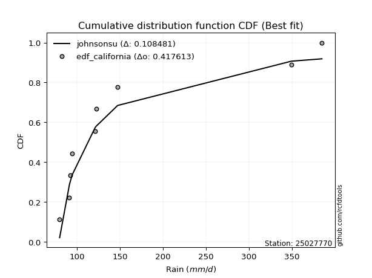</img>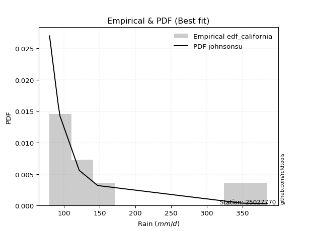</img>

</div>


### 2. Empirical - EDF Hazen (1930)

Hazen method for plotting positions is a formula used to estimate the empirical cumulative probability distribution of flood events or other hydrological data. This formula often results in biased estimations, particularly when extrapolating to extreme events (high return periods).

<div align="center">


$P=(m-0.5)/n$


</div>


**2.1. Empirical values**

<div align="center">

|                | 0                   | 1                   | 2                  | 3                  | 4         | 5                  | 6                  | 7                  | 8                  |
|:---------------|:--------------------|:--------------------|:-------------------|:-------------------|:----------|:-------------------|:-------------------|:-------------------|:-------------------|
| date           | 2025                | 2023                | 2022               | 2017               | 2018      | 2020               | 2024               | 2021               | 2019               |
| x              | 72.0                | 79.8                | 91.1               | 94.4               | 121.1     | 122.2              | 147.2              | 349.1              | 384.6              |
| m              | 1                   | 2                   | 3                  | 4                  | 5         | 6                  | 7                  | 8                  | 9                  |
| empirical_dist | edf_hazen           | edf_hazen           | edf_hazen          | edf_hazen          | edf_hazen | edf_hazen          | edf_hazen          | edf_hazen          | edf_hazen          |
| empirical      | 0.05555555555555555 | 0.16666666666666666 | 0.2777777777777778 | 0.3888888888888889 | 0.5       | 0.6111111111111112 | 0.7222222222222222 | 0.8333333333333334 | 0.9444444444444444 |
| empirical_tr   | 1.0588235294117647  | 1.2                 | 1.3846153846153846 | 1.6363636363636362 | 2.0       | 2.5714285714285716 | 3.5999999999999996 | 6.000000000000002  | 17.999999999999993 |

</div>


**2.2. Kolmogorov-Smirnov fit test (sorted by Δ)**


<div align="center">

|                | 0                    | 1                   | 2                   | 3                   | 4                   | 5                   | 6                   | 7                   | 8                   | 9                   | 10                  | 11                  | 12                    | 13                  | 14                  | 15                  | 16                  | 17                  | 18                  | 19                  | 20                  | 21                  | 22                  | 23                  | 24                  | 25                  | 26                  | 27                  | 28                  | 29                  | 30                  | 31                  | 32                  | 33                  | 34                  | 35                  | 36                  | 37                  | 38                  | 39                  | 40                  | 41                  | 42                  | 43                  | 44                  | 45                  | 46                  | 47                  | 48                  | 49                  | 50                  | 51                  | 52                  | 53                  | 54                  | 55                  | 56                  | 57                  | 58                  | 59                  | 60                  | 61                  | 62                  | 63                  | 64                  | 65                  | 66                  | 67                  | 68                  | 69                  | 70                  | 71                  | 72                  | 73                  | 74                  | 75                  | 76                  | 77                  | 78                  | 79                  | 80                  | 81                  | 82                  | 83                  | 84                  | 85                  | 86                  | 87                  | 88                  | 89                  |
|:---------------|:---------------------|:--------------------|:--------------------|:--------------------|:--------------------|:--------------------|:--------------------|:--------------------|:--------------------|:--------------------|:--------------------|:--------------------|:----------------------|:--------------------|:--------------------|:--------------------|:--------------------|:--------------------|:--------------------|:--------------------|:--------------------|:--------------------|:--------------------|:--------------------|:--------------------|:--------------------|:--------------------|:--------------------|:--------------------|:--------------------|:--------------------|:--------------------|:--------------------|:--------------------|:--------------------|:--------------------|:--------------------|:--------------------|:--------------------|:--------------------|:--------------------|:--------------------|:--------------------|:--------------------|:--------------------|:--------------------|:--------------------|:--------------------|:--------------------|:--------------------|:--------------------|:--------------------|:--------------------|:--------------------|:--------------------|:--------------------|:--------------------|:--------------------|:--------------------|:--------------------|:--------------------|:--------------------|:--------------------|:--------------------|:--------------------|:--------------------|:--------------------|:--------------------|:--------------------|:--------------------|:--------------------|:--------------------|:--------------------|:--------------------|:--------------------|:--------------------|:--------------------|:--------------------|:--------------------|:--------------------|:--------------------|:--------------------|:--------------------|:--------------------|:--------------------|:--------------------|:--------------------|:--------------------|:--------------------|:--------------------|
| station        | 25027770             | 25027770            | 25027770            | 25027770            | 25027770            | 25027770            | 25027770            | 25027770            | 25027770            | 25027770            | 25027770            | 25027770            | 25027770              | 25027770            | 25027770            | 25027770            | 25027770            | 25027770            | 25027770            | 25027770            | 25027770            | 25027770            | 25027770            | 25027770            | 25027770            | 25027770            | 25027770            | 25027770            | 25027770            | 25027770            | 25027770            | 25027770            | 25027770            | 25027770            | 25027770            | 25027770            | 25027770            | 25027770            | 25027770            | 25027770            | 25027770            | 25027770            | 25027770            | 25027770            | 25027770            | 25027770            | 25027770            | 25027770            | 25027770            | 25027770            | 25027770            | 25027770            | 25027770            | 25027770            | 25027770            | 25027770            | 25027770            | 25027770            | 25027770            | 25027770            | 25027770            | 25027770            | 25027770            | 25027770            | 25027770            | 25027770            | 25027770            | 25027770            | 25027770            | 25027770            | 25027770            | 25027770            | 25027770            | 25027770            | 25027770            | 25027770            | 25027770            | 25027770            | 25027770            | 25027770            | 25027770            | 25027770            | 25027770            | 25027770            | 25027770            | 25027770            | 25027770            | 25027770            | 25027770            | 25027770            |
| empirical_dist | edf_hazen            | edf_hazen           | edf_hazen           | edf_hazen           | edf_hazen           | edf_hazen           | edf_hazen           | edf_hazen           | edf_hazen           | edf_hazen           | edf_hazen           | edf_hazen           | edf_hazen             | edf_hazen           | edf_hazen           | edf_hazen           | edf_hazen           | edf_hazen           | edf_hazen           | edf_hazen           | edf_hazen           | edf_hazen           | edf_hazen           | edf_hazen           | edf_hazen           | edf_hazen           | edf_hazen           | edf_hazen           | edf_hazen           | edf_hazen           | edf_hazen           | edf_hazen           | edf_hazen           | edf_hazen           | edf_hazen           | edf_hazen           | edf_hazen           | edf_hazen           | edf_hazen           | edf_hazen           | edf_hazen           | edf_hazen           | edf_hazen           | edf_hazen           | edf_hazen           | edf_hazen           | edf_hazen           | edf_hazen           | edf_hazen           | edf_hazen           | edf_hazen           | edf_hazen           | edf_hazen           | edf_hazen           | edf_hazen           | edf_hazen           | edf_hazen           | edf_hazen           | edf_hazen           | edf_hazen           | edf_hazen           | edf_hazen           | edf_hazen           | edf_hazen           | edf_hazen           | edf_hazen           | edf_hazen           | edf_hazen           | edf_hazen           | edf_hazen           | edf_hazen           | edf_hazen           | edf_hazen           | edf_hazen           | edf_hazen           | edf_hazen           | edf_hazen           | edf_hazen           | edf_hazen           | edf_hazen           | edf_hazen           | edf_hazen           | edf_hazen           | edf_hazen           | edf_hazen           | edf_hazen           | edf_hazen           | edf_hazen           | edf_hazen           | edf_hazen           |
| p_dist         | logmielke            | johnsonsu           | logalpha            | loginvgamma         | invgamma            | fatiguelife         | logexponnorm        | logexpon            | logfisk             | loginvweibull       | loginvgauss         | logjohnsonsu        | loglaplace_asymmetric | pareto              | alpha               | invgauss            | loggenexpon         | logfatiguelife      | loggompertz         | loghalfnorm         | loghalflogistic     | logmoyal            | weibull_min         | logweibull_min      | loggumbel_r         | mielke              | loggenlogistic      | logpearson3         | nct                 | logkstwobign        | lograyleigh         | logerlang           | logncf              | wald                | lognct              | logmaxwell          | logchi2             | betaprime           | ncf                 | logtruncnorm        | logbetaprime        | logwald             | logrice             | halflogistic        | logt                | lognorm             | lognorm             | logcrystalball      | lognakagami         | fisk                | logloggamma         | exponnorm           | moyal               | expon               | genexpon            | laplace_asymmetric  | loglogistic         | loghypsecant        | pearson3            | halfnorm            | erlang              | genlogistic         | gumbel_r            | logf                | loglaplace          | f                   | nakagami            | rayleigh            | maxwell             | loggumbel_l         | truncnorm           | kstwobign           | gibrat              | gamma               | loggibrat           | gompertz            | t                   | norm                | logistic            | hypsecant           | rice                | laplace             | gumbel_l            | loglognorm          | logpareto           | invweibull          | loggamma            | loggamma            | crystalball         | chi2                |
| delta          | 0.013781647982302477 | 0.0802691255449609  | 0.08167884641259215 | 0.08504007220057486 | 0.08556190243796236 | 0.08632025306451363 | 0.08645227657907661 | 0.08659752113954078 | 0.08728659210660239 | 0.08728831368302292 | 0.08815171372076136 | 0.08817321830796443 | 0.08871738946192753   | 0.08893044416790952 | 0.08894345639023682 | 0.09040980698920986 | 0.09112860325439887 | 0.09148599044709793 | 0.09524082483062357 | 0.09686855513206039 | 0.09712797881111845 | 0.09958869795844039 | 0.10879483361395448 | 0.1114271248092098  | 0.11242429561028677 | 0.11691866231806547 | 0.11923018620817039 | 0.11955589277284157 | 0.12394367849291288 | 0.1260506438475078  | 0.13102951633542792 | 0.1317707163917361  | 0.134792682725825   | 0.1352652777117888  | 0.1383477575101858  | 0.14311469824969153 | 0.14703131407751657 | 0.14987909825005996 | 0.15232991616721153 | 0.15786748225824476 | 0.1620611689814257  | 0.16403857800171096 | 0.17349347822659883 | 0.175501385073222   | 0.17751528873284206 | 0.17751926751951824 | 0.17751926751951824 | 0.1775192678710406  | 0.178608154379582   | 0.18183209873745343 | 0.18204621504254448 | 0.18266341843394318 | 0.1844221274211223  | 0.184966416116764   | 0.18496840272503623 | 0.18498281017724294 | 0.18636847339187856 | 0.19378407182424823 | 0.1956421869266437  | 0.19622269551248916 | 0.20534972595374779 | 0.20590872814317213 | 0.20966112918552138 | 0.21206210589484642 | 0.21642157516230215 | 0.2227324583699909  | 0.2297842519664146  | 0.22995306227355372 | 0.24189935790976874 | 0.2467837737085667  | 0.24946179376512478 | 0.25044175752467834 | 0.25223144075278325 | 0.25325982143716397 | 0.2627899904786898  | 0.2756392227187948  | 0.27615604384168435 | 0.2762572491287747  | 0.28351918917147584 | 0.28964363589870457 | 0.2907421357631448  | 0.3103787363740862  | 0.3461787993844146  | 0.41504974293284014 | 0.4384584257936349  | 0.4455090971814896  | 0.4948186983058719  | 0.4948186983058719  | 0.5861674979295293  | 0.8255340375472299  |
| deltao         | 0.41761268023100007  | 0.41761268023100007 | 0.41761268023100007 | 0.41761268023100007 | 0.41761268023100007 | 0.41761268023100007 | 0.41761268023100007 | 0.41761268023100007 | 0.41761268023100007 | 0.41761268023100007 | 0.41761268023100007 | 0.41761268023100007 | 0.41761268023100007   | 0.41761268023100007 | 0.41761268023100007 | 0.41761268023100007 | 0.41761268023100007 | 0.41761268023100007 | 0.41761268023100007 | 0.41761268023100007 | 0.41761268023100007 | 0.41761268023100007 | 0.41761268023100007 | 0.41761268023100007 | 0.41761268023100007 | 0.41761268023100007 | 0.41761268023100007 | 0.41761268023100007 | 0.41761268023100007 | 0.41761268023100007 | 0.41761268023100007 | 0.41761268023100007 | 0.41761268023100007 | 0.41761268023100007 | 0.41761268023100007 | 0.41761268023100007 | 0.41761268023100007 | 0.41761268023100007 | 0.41761268023100007 | 0.41761268023100007 | 0.41761268023100007 | 0.41761268023100007 | 0.41761268023100007 | 0.41761268023100007 | 0.41761268023100007 | 0.41761268023100007 | 0.41761268023100007 | 0.41761268023100007 | 0.41761268023100007 | 0.41761268023100007 | 0.41761268023100007 | 0.41761268023100007 | 0.41761268023100007 | 0.41761268023100007 | 0.41761268023100007 | 0.41761268023100007 | 0.41761268023100007 | 0.41761268023100007 | 0.41761268023100007 | 0.41761268023100007 | 0.41761268023100007 | 0.41761268023100007 | 0.41761268023100007 | 0.41761268023100007 | 0.41761268023100007 | 0.41761268023100007 | 0.41761268023100007 | 0.41761268023100007 | 0.41761268023100007 | 0.41761268023100007 | 0.41761268023100007 | 0.41761268023100007 | 0.41761268023100007 | 0.41761268023100007 | 0.41761268023100007 | 0.41761268023100007 | 0.41761268023100007 | 0.41761268023100007 | 0.41761268023100007 | 0.41761268023100007 | 0.41761268023100007 | 0.41761268023100007 | 0.41761268023100007 | 0.41761268023100007 | 0.41761268023100007 | 0.41761268023100007 | 0.41761268023100007 | 0.41761268023100007 | 0.41761268023100007 | 0.41761268023100007 |
| eval           | Δo > Δ               | Δo > Δ              | Δo > Δ              | Δo > Δ              | Δo > Δ              | Δo > Δ              | Δo > Δ              | Δo > Δ              | Δo > Δ              | Δo > Δ              | Δo > Δ              | Δo > Δ              | Δo > Δ                | Δo > Δ              | Δo > Δ              | Δo > Δ              | Δo > Δ              | Δo > Δ              | Δo > Δ              | Δo > Δ              | Δo > Δ              | Δo > Δ              | Δo > Δ              | Δo > Δ              | Δo > Δ              | Δo > Δ              | Δo > Δ              | Δo > Δ              | Δo > Δ              | Δo > Δ              | Δo > Δ              | Δo > Δ              | Δo > Δ              | Δo > Δ              | Δo > Δ              | Δo > Δ              | Δo > Δ              | Δo > Δ              | Δo > Δ              | Δo > Δ              | Δo > Δ              | Δo > Δ              | Δo > Δ              | Δo > Δ              | Δo > Δ              | Δo > Δ              | Δo > Δ              | Δo > Δ              | Δo > Δ              | Δo > Δ              | Δo > Δ              | Δo > Δ              | Δo > Δ              | Δo > Δ              | Δo > Δ              | Δo > Δ              | Δo > Δ              | Δo > Δ              | Δo > Δ              | Δo > Δ              | Δo > Δ              | Δo > Δ              | Δo > Δ              | Δo > Δ              | Δo > Δ              | Δo > Δ              | Δo > Δ              | Δo > Δ              | Δo > Δ              | Δo > Δ              | Δo > Δ              | Δo > Δ              | Δo > Δ              | Δo > Δ              | Δo > Δ              | Δo > Δ              | Δo > Δ              | Δo > Δ              | Δo > Δ              | Δo > Δ              | Δo > Δ              | Δo > Δ              | Δo > Δ              | Δo > Δ              | Δo <= Δ             | Δo <= Δ             | Δo <= Δ             | Δo <= Δ             | Δo <= Δ             | Δo <= Δ             |
| fit            | 1                    | 1                   | 1                   | 1                   | 1                   | 1                   | 1                   | 1                   | 1                   | 1                   | 1                   | 1                   | 1                     | 1                   | 1                   | 1                   | 1                   | 1                   | 1                   | 1                   | 1                   | 1                   | 1                   | 1                   | 1                   | 1                   | 1                   | 1                   | 1                   | 1                   | 1                   | 1                   | 1                   | 1                   | 1                   | 1                   | 1                   | 1                   | 1                   | 1                   | 1                   | 1                   | 1                   | 1                   | 1                   | 1                   | 1                   | 1                   | 1                   | 1                   | 1                   | 1                   | 1                   | 1                   | 1                   | 1                   | 1                   | 1                   | 1                   | 1                   | 1                   | 1                   | 1                   | 1                   | 1                   | 1                   | 1                   | 1                   | 1                   | 1                   | 1                   | 1                   | 1                   | 1                   | 1                   | 1                   | 1                   | 1                   | 1                   | 1                   | 1                   | 1                   | 1                   | 1                   | 0                   | 0                   | 0                   | 0                   | 0                   | 0                   |
| n              | 9                    | 9                   | 9                   | 9                   | 9                   | 9                   | 9                   | 9                   | 9                   | 9                   | 9                   | 9                   | 9                     | 9                   | 9                   | 9                   | 9                   | 9                   | 9                   | 9                   | 9                   | 9                   | 9                   | 9                   | 9                   | 9                   | 9                   | 9                   | 9                   | 9                   | 9                   | 9                   | 9                   | 9                   | 9                   | 9                   | 9                   | 9                   | 9                   | 9                   | 9                   | 9                   | 9                   | 9                   | 9                   | 9                   | 9                   | 9                   | 9                   | 9                   | 9                   | 9                   | 9                   | 9                   | 9                   | 9                   | 9                   | 9                   | 9                   | 9                   | 9                   | 9                   | 9                   | 9                   | 9                   | 9                   | 9                   | 9                   | 9                   | 9                   | 9                   | 9                   | 9                   | 9                   | 9                   | 9                   | 9                   | 9                   | 9                   | 9                   | 9                   | 9                   | 9                   | 9                   | 9                   | 9                   | 9                   | 9                   | 9                   | 9                   |
| best_fit       | 1                    | 0                   | 0                   | 0                   | 0                   | 0                   | 0                   | 0                   | 0                   | 0                   | 0                   | 0                   | 0                     | 0                   | 0                   | 0                   | 0                   | 0                   | 0                   | 0                   | 0                   | 0                   | 0                   | 0                   | 0                   | 0                   | 0                   | 0                   | 0                   | 0                   | 0                   | 0                   | 0                   | 0                   | 0                   | 0                   | 0                   | 0                   | 0                   | 0                   | 0                   | 0                   | 0                   | 0                   | 0                   | 0                   | 0                   | 0                   | 0                   | 0                   | 0                   | 0                   | 0                   | 0                   | 0                   | 0                   | 0                   | 0                   | 0                   | 0                   | 0                   | 0                   | 0                   | 0                   | 0                   | 0                   | 0                   | 0                   | 0                   | 0                   | 0                   | 0                   | 0                   | 0                   | 0                   | 0                   | 0                   | 0                   | 0                   | 0                   | 0                   | 0                   | 0                   | 0                   | 0                   | 0                   | 0                   | 0                   | 0                   | 0                   |
| best_fit_sort  | 1                    | 2                   | 3                   | 4                   | 5                   | 6                   | 7                   | 8                   | 9                   | 10                  | 11                  | 12                  | 13                    | 14                  | 15                  | 16                  | 17                  | 18                  | 19                  | 20                  | 21                  | 22                  | 23                  | 24                  | 25                  | 26                  | 27                  | 28                  | 29                  | 30                  | 31                  | 32                  | 33                  | 34                  | 35                  | 36                  | 37                  | 38                  | 39                  | 40                  | 41                  | 42                  | 43                  | 44                  | 45                  | 46                  | 47                  | 48                  | 49                  | 50                  | 51                  | 52                  | 53                  | 54                  | 55                  | 56                  | 57                  | 58                  | 59                  | 60                  | 61                  | 62                  | 63                  | 64                  | 65                  | 66                  | 67                  | 68                  | 69                  | 70                  | 71                  | 72                  | 73                  | 74                  | 75                  | 76                  | 77                  | 78                  | 79                  | 80                  | 81                  | 82                  | 83                  | 84                  | 85                  | 86                  | 87                  | 88                  | 89                  | 90                  |

</div>


<div align="center">

</img>

</div>


**2.3. Best fit**

<div align="center">

|   id |   station | empirical_dist   | p_dist    |     delta |   deltao | eval   |   fit |   n |   best_fit |   best_fit_sort |
|-----:|----------:|:-----------------|:----------|----------:|---------:|:-------|------:|----:|-----------:|----------------:|
|    0 |  25027770 | edf_hazen        | logmielke | 0.0137816 | 0.417613 | Δo > Δ |     1 |   9 |          1 |               1 |

</div>


<div align="center">

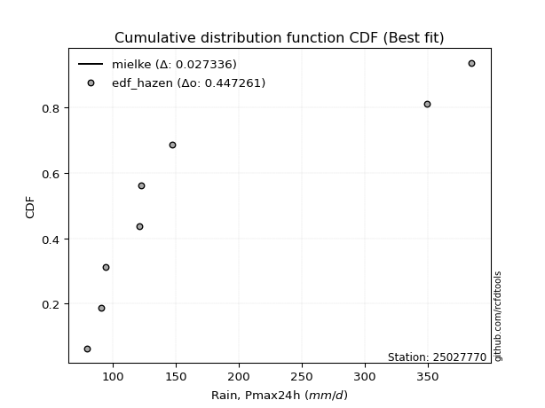</img>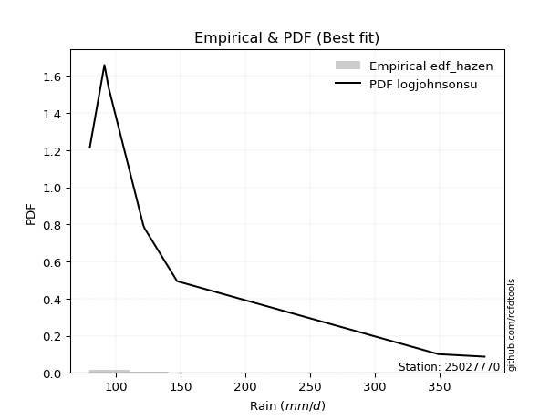</img>

</div>


### 3. Empirical - EDF Weibull (1939)

Weibull plotting position formula is an empirical method used to estimate the non-exceedance probability or plotting position for a set of observed data, is often recommended or widely used in practice, particularly in flood frequency analysis.

<div align="center">


$P=m/(n+1)$


</div>


**3.1. Empirical values**

<div align="center">

|                | 0                  | 1           | 2                  | 3                  | 4           | 5           | 6                 | 7                 | 8                  |
|:---------------|:-------------------|:------------|:-------------------|:-------------------|:------------|:------------|:------------------|:------------------|:-------------------|
| date           | 2025               | 2023        | 2022               | 2017               | 2018        | 2020        | 2024              | 2021              | 2019               |
| x              | 72.0               | 79.8        | 91.1               | 94.4               | 121.1       | 122.2       | 147.2             | 349.1             | 384.6              |
| m              | 1                  | 2           | 3                  | 4                  | 5           | 6           | 7                 | 8                 | 9                  |
| empirical_dist | edf_weibull        | edf_weibull | edf_weibull        | edf_weibull        | edf_weibull | edf_weibull | edf_weibull       | edf_weibull       | edf_weibull        |
| empirical      | 0.1                | 0.2         | 0.3                | 0.4                | 0.5         | 0.6         | 0.7               | 0.8               | 0.9                |
| empirical_tr   | 1.1111111111111112 | 1.25        | 1.4285714285714286 | 1.6666666666666667 | 2.0         | 2.5         | 3.333333333333333 | 5.000000000000001 | 10.000000000000002 |

</div>


**3.2. Kolmogorov-Smirnov fit test (sorted by Δ)**


<div align="center">

|                | 0                   | 1                   | 2                   | 3                   | 4                   | 5                   | 6                   | 7                   | 8                   | 9                   | 10                  | 11                  | 12                  | 13                  | 14                  | 15                  | 16                    | 17                  | 18                  | 19                  | 20                  | 21                  | 22                  | 23                  | 24                  | 25                  | 26                  | 27                  | 28                  | 29                  | 30                  | 31                  | 32                  | 33                  | 34                  | 35                  | 36                  | 37                  | 38                  | 39                  | 40                  | 41                  | 42                  | 43                  | 44                  | 45                  | 46                  | 47                  | 48                  | 49                  | 50                  | 51                  | 52                  | 53                  | 54                  | 55                  | 56                  | 57                  | 58                  | 59                  | 60                  | 61                  | 62                  | 63                  | 64                  | 65                  | 66                  | 67                  | 68                  | 69                  | 70                  | 71                  | 72                  | 73                  | 74                  | 75                  | 76                  | 77                  | 78                  | 79                  | 80                  | 81                  | 82                  | 83                  | 84                  | 85                  | 86                  | 87                  | 88                  | 89                  |
|:---------------|:--------------------|:--------------------|:--------------------|:--------------------|:--------------------|:--------------------|:--------------------|:--------------------|:--------------------|:--------------------|:--------------------|:--------------------|:--------------------|:--------------------|:--------------------|:--------------------|:----------------------|:--------------------|:--------------------|:--------------------|:--------------------|:--------------------|:--------------------|:--------------------|:--------------------|:--------------------|:--------------------|:--------------------|:--------------------|:--------------------|:--------------------|:--------------------|:--------------------|:--------------------|:--------------------|:--------------------|:--------------------|:--------------------|:--------------------|:--------------------|:--------------------|:--------------------|:--------------------|:--------------------|:--------------------|:--------------------|:--------------------|:--------------------|:--------------------|:--------------------|:--------------------|:--------------------|:--------------------|:--------------------|:--------------------|:--------------------|:--------------------|:--------------------|:--------------------|:--------------------|:--------------------|:--------------------|:--------------------|:--------------------|:--------------------|:--------------------|:--------------------|:--------------------|:--------------------|:--------------------|:--------------------|:--------------------|:--------------------|:--------------------|:--------------------|:--------------------|:--------------------|:--------------------|:--------------------|:--------------------|:--------------------|:--------------------|:--------------------|:--------------------|:--------------------|:--------------------|:--------------------|:--------------------|:--------------------|:--------------------|
| station        | 25027770            | 25027770            | 25027770            | 25027770            | 25027770            | 25027770            | 25027770            | 25027770            | 25027770            | 25027770            | 25027770            | 25027770            | 25027770            | 25027770            | 25027770            | 25027770            | 25027770              | 25027770            | 25027770            | 25027770            | 25027770            | 25027770            | 25027770            | 25027770            | 25027770            | 25027770            | 25027770            | 25027770            | 25027770            | 25027770            | 25027770            | 25027770            | 25027770            | 25027770            | 25027770            | 25027770            | 25027770            | 25027770            | 25027770            | 25027770            | 25027770            | 25027770            | 25027770            | 25027770            | 25027770            | 25027770            | 25027770            | 25027770            | 25027770            | 25027770            | 25027770            | 25027770            | 25027770            | 25027770            | 25027770            | 25027770            | 25027770            | 25027770            | 25027770            | 25027770            | 25027770            | 25027770            | 25027770            | 25027770            | 25027770            | 25027770            | 25027770            | 25027770            | 25027770            | 25027770            | 25027770            | 25027770            | 25027770            | 25027770            | 25027770            | 25027770            | 25027770            | 25027770            | 25027770            | 25027770            | 25027770            | 25027770            | 25027770            | 25027770            | 25027770            | 25027770            | 25027770            | 25027770            | 25027770            | 25027770            |
| empirical_dist | edf_weibull         | edf_weibull         | edf_weibull         | edf_weibull         | edf_weibull         | edf_weibull         | edf_weibull         | edf_weibull         | edf_weibull         | edf_weibull         | edf_weibull         | edf_weibull         | edf_weibull         | edf_weibull         | edf_weibull         | edf_weibull         | edf_weibull           | edf_weibull         | edf_weibull         | edf_weibull         | edf_weibull         | edf_weibull         | edf_weibull         | edf_weibull         | edf_weibull         | edf_weibull         | edf_weibull         | edf_weibull         | edf_weibull         | edf_weibull         | edf_weibull         | edf_weibull         | edf_weibull         | edf_weibull         | edf_weibull         | edf_weibull         | edf_weibull         | edf_weibull         | edf_weibull         | edf_weibull         | edf_weibull         | edf_weibull         | edf_weibull         | edf_weibull         | edf_weibull         | edf_weibull         | edf_weibull         | edf_weibull         | edf_weibull         | edf_weibull         | edf_weibull         | edf_weibull         | edf_weibull         | edf_weibull         | edf_weibull         | edf_weibull         | edf_weibull         | edf_weibull         | edf_weibull         | edf_weibull         | edf_weibull         | edf_weibull         | edf_weibull         | edf_weibull         | edf_weibull         | edf_weibull         | edf_weibull         | edf_weibull         | edf_weibull         | edf_weibull         | edf_weibull         | edf_weibull         | edf_weibull         | edf_weibull         | edf_weibull         | edf_weibull         | edf_weibull         | edf_weibull         | edf_weibull         | edf_weibull         | edf_weibull         | edf_weibull         | edf_weibull         | edf_weibull         | edf_weibull         | edf_weibull         | edf_weibull         | edf_weibull         | edf_weibull         | edf_weibull         |
| p_dist         | logmielke           | logfisk             | weibull_min         | alpha               | johnsonsu           | logjohnsonsu        | invgamma            | loginvweibull       | logfatiguelife      | logchi2             | loginvgamma         | logalpha            | loginvgauss         | fatiguelife         | logexponnorm        | logexpon            | loglaplace_asymmetric | pareto              | logweibull_min      | invgauss            | loggenexpon         | loghalfnorm         | loggompertz         | loghalflogistic     | logmoyal            | logpearson3         | lograyleigh         | loggumbel_r         | fisk                | wald                | logmaxwell          | nct                 | ncf                 | betaprime           | lognct              | logerlang           | logkstwobign        | mielke              | logbetaprime        | loggenlogistic      | halflogistic        | lognakagami         | logrice             | logncf              | logt                | lognorm             | lognorm             | logcrystalball      | moyal               | logloggamma         | pearson3            | halfnorm            | loglogistic         | exponnorm           | expon               | genexpon            | laplace_asymmetric  | loghypsecant        | gumbel_r            | logtruncnorm        | erlang              | genlogistic         | logf                | logwald             | f                   | loglaplace          | nakagami            | rayleigh            | maxwell             | loggumbel_l         | truncnorm           | kstwobign           | gamma               | t                   | norm                | logistic            | gibrat              | gompertz            | hypsecant           | loggibrat           | rice                | laplace             | gumbel_l            | loglognorm          | invweibull          | logpareto           | loggamma            | loggamma            | crystalball         | chi2                |
| delta          | 0.05822609242674693 | 0.08728659210660239 | 0.09999999855828162 | 0.1032469827643333  | 0.10325533535256959 | 0.10929130327903236 | 0.11178284285265772 | 0.11243021495415484 | 0.11338214579090289 | 0.11405270182207328 | 0.11406907882873263 | 0.11501217974592548 | 0.11632198744158773 | 0.11965358639784696 | 0.11978560991240994 | 0.1199308544728741  | 0.12205072279526086   | 0.12226377750124284 | 0.12226689358536635 | 0.12374314032254319 | 0.12446193658773219 | 0.12756140551990058 | 0.1285741581639569  | 0.13046131214445178 | 0.1329220312917737  | 0.13419309913587396 | 0.1350526637945586  | 0.13510174285564935 | 0.13738765429300903 | 0.13788962494764223 | 0.13847961121153274 | 0.14294955463783832 | 0.14726473057973288 | 0.14734087521068295 | 0.14743516637713705 | 0.14900612606868202 | 0.15018948262507692 | 0.1502519956513988  | 0.1509500578703145  | 0.1525635195415037  | 0.15327916285099974 | 0.15638593215735974 | 0.1625889811836989  | 0.16348657463445715 | 0.16640417762173088 | 0.16640815640840706 | 0.16640815640840706 | 0.16640815675992943 | 0.1703926031818347  | 0.1709351039314333  | 0.17341996470442145 | 0.1740004732902669  | 0.17525736228076738 | 0.1787210138887726  | 0.1805019270249105  | 0.18050313248881655 | 0.18051165693933924 | 0.18267296071313704 | 0.18948111532619083 | 0.1912008155915781  | 0.19478646923324228 | 0.19479761703206094 | 0.19536974161000964 | 0.1973719113350443  | 0.2028524700286023  | 0.20531046405119097 | 0.20756202974419236 | 0.20773084005133147 | 0.2196771356875465  | 0.2356726625974555  | 0.2383506826540136  | 0.23933064641356716 | 0.25325982143716397 | 0.2539338216194621  | 0.25403502690655244 | 0.2612969669492536  | 0.2633425518638944  | 0.26452811160768364 | 0.2708873282546817  | 0.2739011015898009  | 0.2757934839631106  | 0.299267625262975   | 0.32395657716219234 | 0.38171640959950676 | 0.4010646527370452  | 0.40512509246030154 | 0.4725964760836497  | 0.4725964760836497  | 0.5417230534850849  | 0.7922007042138965  |
| deltao         | 0.41761268023100007 | 0.41761268023100007 | 0.41761268023100007 | 0.41761268023100007 | 0.41761268023100007 | 0.41761268023100007 | 0.41761268023100007 | 0.41761268023100007 | 0.41761268023100007 | 0.41761268023100007 | 0.41761268023100007 | 0.41761268023100007 | 0.41761268023100007 | 0.41761268023100007 | 0.41761268023100007 | 0.41761268023100007 | 0.41761268023100007   | 0.41761268023100007 | 0.41761268023100007 | 0.41761268023100007 | 0.41761268023100007 | 0.41761268023100007 | 0.41761268023100007 | 0.41761268023100007 | 0.41761268023100007 | 0.41761268023100007 | 0.41761268023100007 | 0.41761268023100007 | 0.41761268023100007 | 0.41761268023100007 | 0.41761268023100007 | 0.41761268023100007 | 0.41761268023100007 | 0.41761268023100007 | 0.41761268023100007 | 0.41761268023100007 | 0.41761268023100007 | 0.41761268023100007 | 0.41761268023100007 | 0.41761268023100007 | 0.41761268023100007 | 0.41761268023100007 | 0.41761268023100007 | 0.41761268023100007 | 0.41761268023100007 | 0.41761268023100007 | 0.41761268023100007 | 0.41761268023100007 | 0.41761268023100007 | 0.41761268023100007 | 0.41761268023100007 | 0.41761268023100007 | 0.41761268023100007 | 0.41761268023100007 | 0.41761268023100007 | 0.41761268023100007 | 0.41761268023100007 | 0.41761268023100007 | 0.41761268023100007 | 0.41761268023100007 | 0.41761268023100007 | 0.41761268023100007 | 0.41761268023100007 | 0.41761268023100007 | 0.41761268023100007 | 0.41761268023100007 | 0.41761268023100007 | 0.41761268023100007 | 0.41761268023100007 | 0.41761268023100007 | 0.41761268023100007 | 0.41761268023100007 | 0.41761268023100007 | 0.41761268023100007 | 0.41761268023100007 | 0.41761268023100007 | 0.41761268023100007 | 0.41761268023100007 | 0.41761268023100007 | 0.41761268023100007 | 0.41761268023100007 | 0.41761268023100007 | 0.41761268023100007 | 0.41761268023100007 | 0.41761268023100007 | 0.41761268023100007 | 0.41761268023100007 | 0.41761268023100007 | 0.41761268023100007 | 0.41761268023100007 |
| eval           | Δo > Δ              | Δo > Δ              | Δo > Δ              | Δo > Δ              | Δo > Δ              | Δo > Δ              | Δo > Δ              | Δo > Δ              | Δo > Δ              | Δo > Δ              | Δo > Δ              | Δo > Δ              | Δo > Δ              | Δo > Δ              | Δo > Δ              | Δo > Δ              | Δo > Δ                | Δo > Δ              | Δo > Δ              | Δo > Δ              | Δo > Δ              | Δo > Δ              | Δo > Δ              | Δo > Δ              | Δo > Δ              | Δo > Δ              | Δo > Δ              | Δo > Δ              | Δo > Δ              | Δo > Δ              | Δo > Δ              | Δo > Δ              | Δo > Δ              | Δo > Δ              | Δo > Δ              | Δo > Δ              | Δo > Δ              | Δo > Δ              | Δo > Δ              | Δo > Δ              | Δo > Δ              | Δo > Δ              | Δo > Δ              | Δo > Δ              | Δo > Δ              | Δo > Δ              | Δo > Δ              | Δo > Δ              | Δo > Δ              | Δo > Δ              | Δo > Δ              | Δo > Δ              | Δo > Δ              | Δo > Δ              | Δo > Δ              | Δo > Δ              | Δo > Δ              | Δo > Δ              | Δo > Δ              | Δo > Δ              | Δo > Δ              | Δo > Δ              | Δo > Δ              | Δo > Δ              | Δo > Δ              | Δo > Δ              | Δo > Δ              | Δo > Δ              | Δo > Δ              | Δo > Δ              | Δo > Δ              | Δo > Δ              | Δo > Δ              | Δo > Δ              | Δo > Δ              | Δo > Δ              | Δo > Δ              | Δo > Δ              | Δo > Δ              | Δo > Δ              | Δo > Δ              | Δo > Δ              | Δo > Δ              | Δo > Δ              | Δo > Δ              | Δo > Δ              | Δo <= Δ             | Δo <= Δ             | Δo <= Δ             | Δo <= Δ             |
| fit            | 1                   | 1                   | 1                   | 1                   | 1                   | 1                   | 1                   | 1                   | 1                   | 1                   | 1                   | 1                   | 1                   | 1                   | 1                   | 1                   | 1                     | 1                   | 1                   | 1                   | 1                   | 1                   | 1                   | 1                   | 1                   | 1                   | 1                   | 1                   | 1                   | 1                   | 1                   | 1                   | 1                   | 1                   | 1                   | 1                   | 1                   | 1                   | 1                   | 1                   | 1                   | 1                   | 1                   | 1                   | 1                   | 1                   | 1                   | 1                   | 1                   | 1                   | 1                   | 1                   | 1                   | 1                   | 1                   | 1                   | 1                   | 1                   | 1                   | 1                   | 1                   | 1                   | 1                   | 1                   | 1                   | 1                   | 1                   | 1                   | 1                   | 1                   | 1                   | 1                   | 1                   | 1                   | 1                   | 1                   | 1                   | 1                   | 1                   | 1                   | 1                   | 1                   | 1                   | 1                   | 1                   | 1                   | 0                   | 0                   | 0                   | 0                   |
| n              | 9                   | 9                   | 9                   | 9                   | 9                   | 9                   | 9                   | 9                   | 9                   | 9                   | 9                   | 9                   | 9                   | 9                   | 9                   | 9                   | 9                     | 9                   | 9                   | 9                   | 9                   | 9                   | 9                   | 9                   | 9                   | 9                   | 9                   | 9                   | 9                   | 9                   | 9                   | 9                   | 9                   | 9                   | 9                   | 9                   | 9                   | 9                   | 9                   | 9                   | 9                   | 9                   | 9                   | 9                   | 9                   | 9                   | 9                   | 9                   | 9                   | 9                   | 9                   | 9                   | 9                   | 9                   | 9                   | 9                   | 9                   | 9                   | 9                   | 9                   | 9                   | 9                   | 9                   | 9                   | 9                   | 9                   | 9                   | 9                   | 9                   | 9                   | 9                   | 9                   | 9                   | 9                   | 9                   | 9                   | 9                   | 9                   | 9                   | 9                   | 9                   | 9                   | 9                   | 9                   | 9                   | 9                   | 9                   | 9                   | 9                   | 9                   |
| best_fit       | 1                   | 0                   | 0                   | 0                   | 0                   | 0                   | 0                   | 0                   | 0                   | 0                   | 0                   | 0                   | 0                   | 0                   | 0                   | 0                   | 0                     | 0                   | 0                   | 0                   | 0                   | 0                   | 0                   | 0                   | 0                   | 0                   | 0                   | 0                   | 0                   | 0                   | 0                   | 0                   | 0                   | 0                   | 0                   | 0                   | 0                   | 0                   | 0                   | 0                   | 0                   | 0                   | 0                   | 0                   | 0                   | 0                   | 0                   | 0                   | 0                   | 0                   | 0                   | 0                   | 0                   | 0                   | 0                   | 0                   | 0                   | 0                   | 0                   | 0                   | 0                   | 0                   | 0                   | 0                   | 0                   | 0                   | 0                   | 0                   | 0                   | 0                   | 0                   | 0                   | 0                   | 0                   | 0                   | 0                   | 0                   | 0                   | 0                   | 0                   | 0                   | 0                   | 0                   | 0                   | 0                   | 0                   | 0                   | 0                   | 0                   | 0                   |
| best_fit_sort  | 1                   | 2                   | 3                   | 4                   | 5                   | 6                   | 7                   | 8                   | 9                   | 10                  | 11                  | 12                  | 13                  | 14                  | 15                  | 16                  | 17                    | 18                  | 19                  | 20                  | 21                  | 22                  | 23                  | 24                  | 25                  | 26                  | 27                  | 28                  | 29                  | 30                  | 31                  | 32                  | 33                  | 34                  | 35                  | 36                  | 37                  | 38                  | 39                  | 40                  | 41                  | 42                  | 43                  | 44                  | 45                  | 46                  | 47                  | 48                  | 49                  | 50                  | 51                  | 52                  | 53                  | 54                  | 55                  | 56                  | 57                  | 58                  | 59                  | 60                  | 61                  | 62                  | 63                  | 64                  | 65                  | 66                  | 67                  | 68                  | 69                  | 70                  | 71                  | 72                  | 73                  | 74                  | 75                  | 76                  | 77                  | 78                  | 79                  | 80                  | 81                  | 82                  | 83                  | 84                  | 85                  | 86                  | 87                  | 88                  | 89                  | 90                  |

</div>


<div align="center">

</img>

</div>


**3.3. Best fit**

<div align="center">

|   id |   station | empirical_dist   | p_dist    |     delta |   deltao | eval   |   fit |   n |   best_fit |   best_fit_sort |
|-----:|----------:|:-----------------|:----------|----------:|---------:|:-------|------:|----:|-----------:|----------------:|
|    0 |  25027770 | edf_weibull      | logmielke | 0.0582261 | 0.417613 | Δo > Δ |     1 |   9 |          1 |               1 |

</div>


<div align="center">

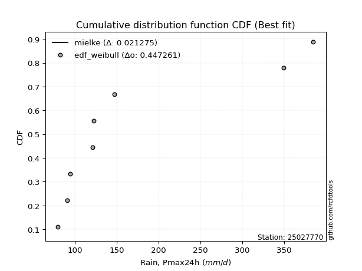</img></img>

</div>


### 4. Empirical - EDF Beard (1943)

The Beard formula (or Beard´s plotting position formula) in hydrology is used to estimate the empirical non-exceedance probability _(P)_ of a flood event (or other extreme hydrological data point) within a given dataset.

<div align="center">


$P=(m-0.31)/(n+0.38)$


</div>


**4.1. Empirical values**

<div align="center">

|                | 0                   | 1                   | 2                  | 3                   | 4         | 5                  | 6                  | 7                  | 8                  |
|:---------------|:--------------------|:--------------------|:-------------------|:--------------------|:----------|:-------------------|:-------------------|:-------------------|:-------------------|
| date           | 2025                | 2023                | 2022               | 2017                | 2018      | 2020               | 2024               | 2021               | 2019               |
| x              | 72.0                | 79.8                | 91.1               | 94.4                | 121.1     | 122.2              | 147.2              | 349.1              | 384.6              |
| m              | 1                   | 2                   | 3                  | 4                   | 5         | 6                  | 7                  | 8                  | 9                  |
| empirical_dist | edf_beard           | edf_beard           | edf_beard          | edf_beard           | edf_beard | edf_beard          | edf_beard          | edf_beard          | edf_beard          |
| empirical      | 0.07356076759061833 | 0.18017057569296374 | 0.2867803837953091 | 0.39339019189765456 | 0.5       | 0.6066098081023454 | 0.7132196162046908 | 0.8198294243070362 | 0.9264392324093815 |
| empirical_tr   | 1.0794016110471807  | 1.2197659297789336  | 1.4020926756352765 | 1.6485061511423549  | 2.0       | 2.542005420054201  | 3.486988847583642  | 5.550295857988164  | 13.5942028985507   |

</div>


**4.2. Kolmogorov-Smirnov fit test (sorted by Δ)**


<div align="center">

|                | 0                    | 1                   | 2                   | 3                   | 4                   | 5                   | 6                   | 7                   | 8                   | 9                   | 10                  | 11                  | 12                  | 13                  | 14                  | 15                    | 16                  | 17                  | 18                  | 19                  | 20                  | 21                  | 22                  | 23                  | 24                  | 25                  | 26                  | 27                  | 28                  | 29                  | 30                  | 31                  | 32                  | 33                  | 34                  | 35                  | 36                  | 37                  | 38                  | 39                  | 40                  | 41                  | 42                  | 43                  | 44                  | 45                  | 46                  | 47                  | 48                  | 49                  | 50                  | 51                  | 52                  | 53                  | 54                  | 55                  | 56                  | 57                  | 58                  | 59                  | 60                  | 61                  | 62                  | 63                  | 64                  | 65                  | 66                  | 67                  | 68                  | 69                  | 70                  | 71                  | 72                  | 73                  | 74                  | 75                  | 76                  | 77                  | 78                  | 79                  | 80                  | 81                  | 82                  | 83                  | 84                  | 85                  | 86                  | 87                  | 88                  | 89                  |
|:---------------|:---------------------|:--------------------|:--------------------|:--------------------|:--------------------|:--------------------|:--------------------|:--------------------|:--------------------|:--------------------|:--------------------|:--------------------|:--------------------|:--------------------|:--------------------|:----------------------|:--------------------|:--------------------|:--------------------|:--------------------|:--------------------|:--------------------|:--------------------|:--------------------|:--------------------|:--------------------|:--------------------|:--------------------|:--------------------|:--------------------|:--------------------|:--------------------|:--------------------|:--------------------|:--------------------|:--------------------|:--------------------|:--------------------|:--------------------|:--------------------|:--------------------|:--------------------|:--------------------|:--------------------|:--------------------|:--------------------|:--------------------|:--------------------|:--------------------|:--------------------|:--------------------|:--------------------|:--------------------|:--------------------|:--------------------|:--------------------|:--------------------|:--------------------|:--------------------|:--------------------|:--------------------|:--------------------|:--------------------|:--------------------|:--------------------|:--------------------|:--------------------|:--------------------|:--------------------|:--------------------|:--------------------|:--------------------|:--------------------|:--------------------|:--------------------|:--------------------|:--------------------|:--------------------|:--------------------|:--------------------|:--------------------|:--------------------|:--------------------|:--------------------|:--------------------|:--------------------|:--------------------|:--------------------|:--------------------|:--------------------|
| station        | 25027770             | 25027770            | 25027770            | 25027770            | 25027770            | 25027770            | 25027770            | 25027770            | 25027770            | 25027770            | 25027770            | 25027770            | 25027770            | 25027770            | 25027770            | 25027770              | 25027770            | 25027770            | 25027770            | 25027770            | 25027770            | 25027770            | 25027770            | 25027770            | 25027770            | 25027770            | 25027770            | 25027770            | 25027770            | 25027770            | 25027770            | 25027770            | 25027770            | 25027770            | 25027770            | 25027770            | 25027770            | 25027770            | 25027770            | 25027770            | 25027770            | 25027770            | 25027770            | 25027770            | 25027770            | 25027770            | 25027770            | 25027770            | 25027770            | 25027770            | 25027770            | 25027770            | 25027770            | 25027770            | 25027770            | 25027770            | 25027770            | 25027770            | 25027770            | 25027770            | 25027770            | 25027770            | 25027770            | 25027770            | 25027770            | 25027770            | 25027770            | 25027770            | 25027770            | 25027770            | 25027770            | 25027770            | 25027770            | 25027770            | 25027770            | 25027770            | 25027770            | 25027770            | 25027770            | 25027770            | 25027770            | 25027770            | 25027770            | 25027770            | 25027770            | 25027770            | 25027770            | 25027770            | 25027770            | 25027770            |
| empirical_dist | edf_beard            | edf_beard           | edf_beard           | edf_beard           | edf_beard           | edf_beard           | edf_beard           | edf_beard           | edf_beard           | edf_beard           | edf_beard           | edf_beard           | edf_beard           | edf_beard           | edf_beard           | edf_beard             | edf_beard           | edf_beard           | edf_beard           | edf_beard           | edf_beard           | edf_beard           | edf_beard           | edf_beard           | edf_beard           | edf_beard           | edf_beard           | edf_beard           | edf_beard           | edf_beard           | edf_beard           | edf_beard           | edf_beard           | edf_beard           | edf_beard           | edf_beard           | edf_beard           | edf_beard           | edf_beard           | edf_beard           | edf_beard           | edf_beard           | edf_beard           | edf_beard           | edf_beard           | edf_beard           | edf_beard           | edf_beard           | edf_beard           | edf_beard           | edf_beard           | edf_beard           | edf_beard           | edf_beard           | edf_beard           | edf_beard           | edf_beard           | edf_beard           | edf_beard           | edf_beard           | edf_beard           | edf_beard           | edf_beard           | edf_beard           | edf_beard           | edf_beard           | edf_beard           | edf_beard           | edf_beard           | edf_beard           | edf_beard           | edf_beard           | edf_beard           | edf_beard           | edf_beard           | edf_beard           | edf_beard           | edf_beard           | edf_beard           | edf_beard           | edf_beard           | edf_beard           | edf_beard           | edf_beard           | edf_beard           | edf_beard           | edf_beard           | edf_beard           | edf_beard           | edf_beard           |
| p_dist         | logmielke            | johnsonsu           | logfisk             | alpha               | logjohnsonsu        | invgamma            | loginvweibull       | logfatiguelife      | loginvgamma         | logalpha            | loginvgauss         | weibull_min         | fatiguelife         | logexponnorm        | logexpon            | loglaplace_asymmetric | pareto              | invgauss            | loggenexpon         | loghalfnorm         | loggompertz         | loghalflogistic     | logweibull_min      | logmoyal            | logpearson3         | loggumbel_r         | nct                 | lograyleigh         | logchi2             | logkstwobign        | mielke              | wald                | logerlang           | loggenlogistic      | lognct              | logmaxwell          | logncf              | betaprime           | ncf                 | logbetaprime        | fisk                | halflogistic        | logrice             | lognakagami         | logtruncnorm        | logt                | lognorm             | lognorm             | logcrystalball      | moyal               | logwald             | logloggamma         | exponnorm           | expon               | genexpon            | laplace_asymmetric  | loglogistic         | pearson3            | halfnorm            | loghypsecant        | erlang              | gumbel_r            | genlogistic         | logf                | loglaplace          | f                   | nakagami            | rayleigh            | maxwell             | loggumbel_l         | truncnorm           | kstwobign           | gamma               | gibrat              | t                   | norm                | loggibrat           | gompertz            | logistic            | hypsecant           | rice                | laplace             | gumbel_l            | loglognorm          | logpareto           | invweibull          | loggamma            | loggamma            | crystalball         | chi2                |
| delta          | 0.031786860017365255 | 0.08342591104553343 | 0.08728659210660239 | 0.08894345639023682 | 0.0894618789719962  | 0.09195341854562156 | 0.09260079064711868 | 0.09355272148386673 | 0.09423965452169647 | 0.09518275543888932 | 0.09649256313455157 | 0.09979222759642303 | 0.0998241620908108  | 0.09995618560537378 | 0.10010143016583795 | 0.1022212984882247    | 0.10243435319420668 | 0.10391371601550703 | 0.10463251228069603 | 0.10773198121286442 | 0.10874473385692074 | 0.11063188783741562 | 0.1114271248092098  | 0.11309260698473755 | 0.11505458976407584 | 0.1152723185486132  | 0.12312013033080216 | 0.1265282133266622  | 0.12902610204245368 | 0.13036005831804076 | 0.13042257134436264 | 0.13100992878391    | 0.1317707163917361  | 0.13273409523446755 | 0.13384645450142008 | 0.1386133952409258  | 0.143657150327421   | 0.14537779524129424 | 0.1478286131584458  | 0.15755986597265997 | 0.16382688670239054 | 0.16649877905569055 | 0.1689921752178331  | 0.16960554836205055 | 0.17137139128454193 | 0.17301398572407634 | 0.17301796451075252 | 0.17301796451075252 | 0.1730179648622749  | 0.17700241128418015 | 0.17754248702800804 | 0.17754491203377876 | 0.17816211542517746 | 0.1804651131079983  | 0.1804670997162705  | 0.18048150716847722 | 0.18186717038311284 | 0.18663958090911226 | 0.18722008949495772 | 0.1892827688154825  | 0.19634711993621645 | 0.20065852316798993 | 0.2014074251344064  | 0.20305949987731509 | 0.21192027215353643 | 0.21372985235245956 | 0.22078164594888317 | 0.22095045625602228 | 0.2328967518922373  | 0.24228247069980097 | 0.24496049075635906 | 0.24594045451591262 | 0.25325982143716397 | 0.2567327437615489  | 0.2671534378241529  | 0.26725464311124325 | 0.26729129348745545 | 0.2711379197100291  | 0.2745165831539444  | 0.2806410298811731  | 0.28240329206545606 | 0.3058774333653205  | 0.33717619336688315 | 0.401545833906543   | 0.4249545167673378  | 0.42750388514642673 | 0.48581609228834055 | 0.48581609228834055 | 0.5681622858944665  | 0.8120301285209328  |
| deltao         | 0.41761268023100007  | 0.41761268023100007 | 0.41761268023100007 | 0.41761268023100007 | 0.41761268023100007 | 0.41761268023100007 | 0.41761268023100007 | 0.41761268023100007 | 0.41761268023100007 | 0.41761268023100007 | 0.41761268023100007 | 0.41761268023100007 | 0.41761268023100007 | 0.41761268023100007 | 0.41761268023100007 | 0.41761268023100007   | 0.41761268023100007 | 0.41761268023100007 | 0.41761268023100007 | 0.41761268023100007 | 0.41761268023100007 | 0.41761268023100007 | 0.41761268023100007 | 0.41761268023100007 | 0.41761268023100007 | 0.41761268023100007 | 0.41761268023100007 | 0.41761268023100007 | 0.41761268023100007 | 0.41761268023100007 | 0.41761268023100007 | 0.41761268023100007 | 0.41761268023100007 | 0.41761268023100007 | 0.41761268023100007 | 0.41761268023100007 | 0.41761268023100007 | 0.41761268023100007 | 0.41761268023100007 | 0.41761268023100007 | 0.41761268023100007 | 0.41761268023100007 | 0.41761268023100007 | 0.41761268023100007 | 0.41761268023100007 | 0.41761268023100007 | 0.41761268023100007 | 0.41761268023100007 | 0.41761268023100007 | 0.41761268023100007 | 0.41761268023100007 | 0.41761268023100007 | 0.41761268023100007 | 0.41761268023100007 | 0.41761268023100007 | 0.41761268023100007 | 0.41761268023100007 | 0.41761268023100007 | 0.41761268023100007 | 0.41761268023100007 | 0.41761268023100007 | 0.41761268023100007 | 0.41761268023100007 | 0.41761268023100007 | 0.41761268023100007 | 0.41761268023100007 | 0.41761268023100007 | 0.41761268023100007 | 0.41761268023100007 | 0.41761268023100007 | 0.41761268023100007 | 0.41761268023100007 | 0.41761268023100007 | 0.41761268023100007 | 0.41761268023100007 | 0.41761268023100007 | 0.41761268023100007 | 0.41761268023100007 | 0.41761268023100007 | 0.41761268023100007 | 0.41761268023100007 | 0.41761268023100007 | 0.41761268023100007 | 0.41761268023100007 | 0.41761268023100007 | 0.41761268023100007 | 0.41761268023100007 | 0.41761268023100007 | 0.41761268023100007 | 0.41761268023100007 |
| eval           | Δo > Δ               | Δo > Δ              | Δo > Δ              | Δo > Δ              | Δo > Δ              | Δo > Δ              | Δo > Δ              | Δo > Δ              | Δo > Δ              | Δo > Δ              | Δo > Δ              | Δo > Δ              | Δo > Δ              | Δo > Δ              | Δo > Δ              | Δo > Δ                | Δo > Δ              | Δo > Δ              | Δo > Δ              | Δo > Δ              | Δo > Δ              | Δo > Δ              | Δo > Δ              | Δo > Δ              | Δo > Δ              | Δo > Δ              | Δo > Δ              | Δo > Δ              | Δo > Δ              | Δo > Δ              | Δo > Δ              | Δo > Δ              | Δo > Δ              | Δo > Δ              | Δo > Δ              | Δo > Δ              | Δo > Δ              | Δo > Δ              | Δo > Δ              | Δo > Δ              | Δo > Δ              | Δo > Δ              | Δo > Δ              | Δo > Δ              | Δo > Δ              | Δo > Δ              | Δo > Δ              | Δo > Δ              | Δo > Δ              | Δo > Δ              | Δo > Δ              | Δo > Δ              | Δo > Δ              | Δo > Δ              | Δo > Δ              | Δo > Δ              | Δo > Δ              | Δo > Δ              | Δo > Δ              | Δo > Δ              | Δo > Δ              | Δo > Δ              | Δo > Δ              | Δo > Δ              | Δo > Δ              | Δo > Δ              | Δo > Δ              | Δo > Δ              | Δo > Δ              | Δo > Δ              | Δo > Δ              | Δo > Δ              | Δo > Δ              | Δo > Δ              | Δo > Δ              | Δo > Δ              | Δo > Δ              | Δo > Δ              | Δo > Δ              | Δo > Δ              | Δo > Δ              | Δo > Δ              | Δo > Δ              | Δo > Δ              | Δo <= Δ             | Δo <= Δ             | Δo <= Δ             | Δo <= Δ             | Δo <= Δ             | Δo <= Δ             |
| fit            | 1                    | 1                   | 1                   | 1                   | 1                   | 1                   | 1                   | 1                   | 1                   | 1                   | 1                   | 1                   | 1                   | 1                   | 1                   | 1                     | 1                   | 1                   | 1                   | 1                   | 1                   | 1                   | 1                   | 1                   | 1                   | 1                   | 1                   | 1                   | 1                   | 1                   | 1                   | 1                   | 1                   | 1                   | 1                   | 1                   | 1                   | 1                   | 1                   | 1                   | 1                   | 1                   | 1                   | 1                   | 1                   | 1                   | 1                   | 1                   | 1                   | 1                   | 1                   | 1                   | 1                   | 1                   | 1                   | 1                   | 1                   | 1                   | 1                   | 1                   | 1                   | 1                   | 1                   | 1                   | 1                   | 1                   | 1                   | 1                   | 1                   | 1                   | 1                   | 1                   | 1                   | 1                   | 1                   | 1                   | 1                   | 1                   | 1                   | 1                   | 1                   | 1                   | 1                   | 1                   | 0                   | 0                   | 0                   | 0                   | 0                   | 0                   |
| n              | 9                    | 9                   | 9                   | 9                   | 9                   | 9                   | 9                   | 9                   | 9                   | 9                   | 9                   | 9                   | 9                   | 9                   | 9                   | 9                     | 9                   | 9                   | 9                   | 9                   | 9                   | 9                   | 9                   | 9                   | 9                   | 9                   | 9                   | 9                   | 9                   | 9                   | 9                   | 9                   | 9                   | 9                   | 9                   | 9                   | 9                   | 9                   | 9                   | 9                   | 9                   | 9                   | 9                   | 9                   | 9                   | 9                   | 9                   | 9                   | 9                   | 9                   | 9                   | 9                   | 9                   | 9                   | 9                   | 9                   | 9                   | 9                   | 9                   | 9                   | 9                   | 9                   | 9                   | 9                   | 9                   | 9                   | 9                   | 9                   | 9                   | 9                   | 9                   | 9                   | 9                   | 9                   | 9                   | 9                   | 9                   | 9                   | 9                   | 9                   | 9                   | 9                   | 9                   | 9                   | 9                   | 9                   | 9                   | 9                   | 9                   | 9                   |
| best_fit       | 1                    | 0                   | 0                   | 0                   | 0                   | 0                   | 0                   | 0                   | 0                   | 0                   | 0                   | 0                   | 0                   | 0                   | 0                   | 0                     | 0                   | 0                   | 0                   | 0                   | 0                   | 0                   | 0                   | 0                   | 0                   | 0                   | 0                   | 0                   | 0                   | 0                   | 0                   | 0                   | 0                   | 0                   | 0                   | 0                   | 0                   | 0                   | 0                   | 0                   | 0                   | 0                   | 0                   | 0                   | 0                   | 0                   | 0                   | 0                   | 0                   | 0                   | 0                   | 0                   | 0                   | 0                   | 0                   | 0                   | 0                   | 0                   | 0                   | 0                   | 0                   | 0                   | 0                   | 0                   | 0                   | 0                   | 0                   | 0                   | 0                   | 0                   | 0                   | 0                   | 0                   | 0                   | 0                   | 0                   | 0                   | 0                   | 0                   | 0                   | 0                   | 0                   | 0                   | 0                   | 0                   | 0                   | 0                   | 0                   | 0                   | 0                   |
| best_fit_sort  | 1                    | 2                   | 3                   | 4                   | 5                   | 6                   | 7                   | 8                   | 9                   | 10                  | 11                  | 12                  | 13                  | 14                  | 15                  | 16                    | 17                  | 18                  | 19                  | 20                  | 21                  | 22                  | 23                  | 24                  | 25                  | 26                  | 27                  | 28                  | 29                  | 30                  | 31                  | 32                  | 33                  | 34                  | 35                  | 36                  | 37                  | 38                  | 39                  | 40                  | 41                  | 42                  | 43                  | 44                  | 45                  | 46                  | 47                  | 48                  | 49                  | 50                  | 51                  | 52                  | 53                  | 54                  | 55                  | 56                  | 57                  | 58                  | 59                  | 60                  | 61                  | 62                  | 63                  | 64                  | 65                  | 66                  | 67                  | 68                  | 69                  | 70                  | 71                  | 72                  | 73                  | 74                  | 75                  | 76                  | 77                  | 78                  | 79                  | 80                  | 81                  | 82                  | 83                  | 84                  | 85                  | 86                  | 87                  | 88                  | 89                  | 90                  |

</div>


<div align="center">

</img>

</div>


**4.3. Best fit**

<div align="center">

|   id |   station | empirical_dist   | p_dist    |     delta |   deltao | eval   |   fit |   n |   best_fit |   best_fit_sort |
|-----:|----------:|:-----------------|:----------|----------:|---------:|:-------|------:|----:|-----------:|----------------:|
|    0 |  25027770 | edf_beard        | logmielke | 0.0317869 | 0.417613 | Δo > Δ |     1 |   9 |          1 |               1 |

</div>


<div align="center">

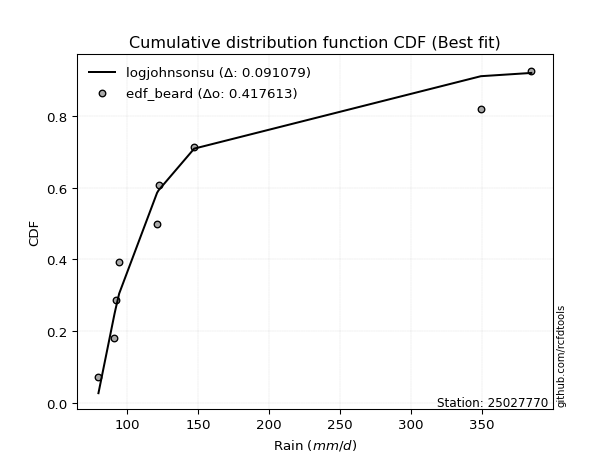</img></img>

</div>


### 5. Empirical - EDF Chegodayev (1955)

The Chegodayev formula is an empirical plotting position formula used in hydrological frequency analysis to estimate the exceedance probability or return period of a specific event from a set of observed data. It is primarily used for plotting observed data points on probability paper to fit a theoretical distribution, particularly for analyzing extreme events like maximum flood flows or rainfall intensities. The constant _b_ value in the generalized plotting position formula is 0.3.

<div align="center">


$P=(m-b)/(n+1-2b)$


</div>


**5.1. Empirical values**

<div align="center">

|                | 0                   | 1                   | 2                  | 3                   | 4              | 5                  | 6                  | 7                  | 8                  |
|:---------------|:--------------------|:--------------------|:-------------------|:--------------------|:---------------|:-------------------|:-------------------|:-------------------|:-------------------|
| date           | 2025                | 2023                | 2022               | 2017                | 2018           | 2020               | 2024               | 2021               | 2019               |
| x              | 72.0                | 79.8                | 91.1               | 94.4                | 121.1          | 122.2              | 147.2              | 349.1              | 384.6              |
| m              | 1                   | 2                   | 3                  | 4                   | 5              | 6                  | 7                  | 8                  | 9                  |
| empirical_dist | edf_chegodayev      | edf_chegodayev      | edf_chegodayev     | edf_chegodayev      | edf_chegodayev | edf_chegodayev     | edf_chegodayev     | edf_chegodayev     | edf_chegodayev     |
| empirical      | 0.07446808510638298 | 0.18085106382978722 | 0.2872340425531915 | 0.39361702127659576 | 0.5            | 0.6063829787234043 | 0.7127659574468085 | 0.8191489361702128 | 0.9255319148936169 |
| empirical_tr   | 1.0804597701149425  | 1.2207792207792207  | 1.4029850746268657 | 1.6491228070175437  | 2.0            | 2.540540540540541  | 3.481481481481481  | 5.529411764705883  | 13.428571428571399 |

</div>


**5.2. Kolmogorov-Smirnov fit test (sorted by Δ)**


<div align="center">

|                | 0                   | 1                   | 2                   | 3                   | 4                   | 5                   | 6                   | 7                   | 8                   | 9                   | 10                  | 11                  | 12                  | 13                  | 14                  | 15                    | 16                  | 17                  | 18                  | 19                  | 20                  | 21                  | 22                  | 23                  | 24                  | 25                  | 26                  | 27                  | 28                  | 29                  | 30                  | 31                  | 32                  | 33                  | 34                  | 35                  | 36                  | 37                  | 38                  | 39                  | 40                  | 41                  | 42                  | 43                  | 44                  | 45                  | 46                  | 47                  | 48                  | 49                  | 50                  | 51                  | 52                  | 53                  | 54                  | 55                  | 56                  | 57                  | 58                  | 59                  | 60                  | 61                  | 62                  | 63                  | 64                  | 65                  | 66                  | 67                  | 68                  | 69                  | 70                  | 71                  | 72                  | 73                  | 74                  | 75                  | 76                  | 77                  | 78                  | 79                  | 80                  | 81                  | 82                  | 83                  | 84                  | 85                  | 86                  | 87                  | 88                  | 89                  |
|:---------------|:--------------------|:--------------------|:--------------------|:--------------------|:--------------------|:--------------------|:--------------------|:--------------------|:--------------------|:--------------------|:--------------------|:--------------------|:--------------------|:--------------------|:--------------------|:----------------------|:--------------------|:--------------------|:--------------------|:--------------------|:--------------------|:--------------------|:--------------------|:--------------------|:--------------------|:--------------------|:--------------------|:--------------------|:--------------------|:--------------------|:--------------------|:--------------------|:--------------------|:--------------------|:--------------------|:--------------------|:--------------------|:--------------------|:--------------------|:--------------------|:--------------------|:--------------------|:--------------------|:--------------------|:--------------------|:--------------------|:--------------------|:--------------------|:--------------------|:--------------------|:--------------------|:--------------------|:--------------------|:--------------------|:--------------------|:--------------------|:--------------------|:--------------------|:--------------------|:--------------------|:--------------------|:--------------------|:--------------------|:--------------------|:--------------------|:--------------------|:--------------------|:--------------------|:--------------------|:--------------------|:--------------------|:--------------------|:--------------------|:--------------------|:--------------------|:--------------------|:--------------------|:--------------------|:--------------------|:--------------------|:--------------------|:--------------------|:--------------------|:--------------------|:--------------------|:--------------------|:--------------------|:--------------------|:--------------------|:--------------------|
| station        | 25027770            | 25027770            | 25027770            | 25027770            | 25027770            | 25027770            | 25027770            | 25027770            | 25027770            | 25027770            | 25027770            | 25027770            | 25027770            | 25027770            | 25027770            | 25027770              | 25027770            | 25027770            | 25027770            | 25027770            | 25027770            | 25027770            | 25027770            | 25027770            | 25027770            | 25027770            | 25027770            | 25027770            | 25027770            | 25027770            | 25027770            | 25027770            | 25027770            | 25027770            | 25027770            | 25027770            | 25027770            | 25027770            | 25027770            | 25027770            | 25027770            | 25027770            | 25027770            | 25027770            | 25027770            | 25027770            | 25027770            | 25027770            | 25027770            | 25027770            | 25027770            | 25027770            | 25027770            | 25027770            | 25027770            | 25027770            | 25027770            | 25027770            | 25027770            | 25027770            | 25027770            | 25027770            | 25027770            | 25027770            | 25027770            | 25027770            | 25027770            | 25027770            | 25027770            | 25027770            | 25027770            | 25027770            | 25027770            | 25027770            | 25027770            | 25027770            | 25027770            | 25027770            | 25027770            | 25027770            | 25027770            | 25027770            | 25027770            | 25027770            | 25027770            | 25027770            | 25027770            | 25027770            | 25027770            | 25027770            |
| empirical_dist | edf_chegodayev      | edf_chegodayev      | edf_chegodayev      | edf_chegodayev      | edf_chegodayev      | edf_chegodayev      | edf_chegodayev      | edf_chegodayev      | edf_chegodayev      | edf_chegodayev      | edf_chegodayev      | edf_chegodayev      | edf_chegodayev      | edf_chegodayev      | edf_chegodayev      | edf_chegodayev        | edf_chegodayev      | edf_chegodayev      | edf_chegodayev      | edf_chegodayev      | edf_chegodayev      | edf_chegodayev      | edf_chegodayev      | edf_chegodayev      | edf_chegodayev      | edf_chegodayev      | edf_chegodayev      | edf_chegodayev      | edf_chegodayev      | edf_chegodayev      | edf_chegodayev      | edf_chegodayev      | edf_chegodayev      | edf_chegodayev      | edf_chegodayev      | edf_chegodayev      | edf_chegodayev      | edf_chegodayev      | edf_chegodayev      | edf_chegodayev      | edf_chegodayev      | edf_chegodayev      | edf_chegodayev      | edf_chegodayev      | edf_chegodayev      | edf_chegodayev      | edf_chegodayev      | edf_chegodayev      | edf_chegodayev      | edf_chegodayev      | edf_chegodayev      | edf_chegodayev      | edf_chegodayev      | edf_chegodayev      | edf_chegodayev      | edf_chegodayev      | edf_chegodayev      | edf_chegodayev      | edf_chegodayev      | edf_chegodayev      | edf_chegodayev      | edf_chegodayev      | edf_chegodayev      | edf_chegodayev      | edf_chegodayev      | edf_chegodayev      | edf_chegodayev      | edf_chegodayev      | edf_chegodayev      | edf_chegodayev      | edf_chegodayev      | edf_chegodayev      | edf_chegodayev      | edf_chegodayev      | edf_chegodayev      | edf_chegodayev      | edf_chegodayev      | edf_chegodayev      | edf_chegodayev      | edf_chegodayev      | edf_chegodayev      | edf_chegodayev      | edf_chegodayev      | edf_chegodayev      | edf_chegodayev      | edf_chegodayev      | edf_chegodayev      | edf_chegodayev      | edf_chegodayev      | edf_chegodayev      |
| p_dist         | logmielke           | johnsonsu           | logfisk             | alpha               | logjohnsonsu        | invgamma            | loginvweibull       | logfatiguelife      | loginvgamma         | logalpha            | loginvgauss         | weibull_min         | fatiguelife         | logexponnorm        | logexpon            | loglaplace_asymmetric | pareto              | invgauss            | loggenexpon         | loghalfnorm         | loggompertz         | loghalflogistic     | logweibull_min      | logmoyal            | logpearson3         | loggumbel_r         | nct                 | lograyleigh         | logchi2             | logkstwobign        | mielke              | wald                | logerlang           | loggenlogistic      | lognct              | logmaxwell          | logncf              | betaprime           | ncf                 | logbetaprime        | fisk                | halflogistic        | logrice             | lognakagami         | logtruncnorm        | logt                | lognorm             | lognorm             | logcrystalball      | moyal               | logloggamma         | exponnorm           | logwald             | expon               | genexpon            | laplace_asymmetric  | loglogistic         | pearson3            | halfnorm            | loghypsecant        | erlang              | gumbel_r            | genlogistic         | logf                | loglaplace          | f                   | nakagami            | rayleigh            | maxwell             | loggumbel_l         | truncnorm           | kstwobign           | gamma               | gibrat              | t                   | norm                | loggibrat           | gompertz            | logistic            | hypsecant           | rice                | laplace             | gumbel_l            | loglognorm          | logpareto           | invweibull          | loggamma            | loggamma            | crystalball         | chi2                |
| delta          | 0.0326941775331299  | 0.08410639918235685 | 0.08728659210660239 | 0.08894345639023682 | 0.09014236710881962 | 0.09263390668244498 | 0.0932812787839421  | 0.09423320962069015 | 0.09492014265851989 | 0.09586324357571274 | 0.09717305127137499 | 0.09933856883854075 | 0.10050465022763422 | 0.1006366737421972  | 0.10078191830266137 | 0.10290178662504812   | 0.1031148413310301  | 0.10459420415233045 | 0.10531300041751945 | 0.10841246934968785 | 0.10942522199374416 | 0.11131237597423904 | 0.1114271248092098  | 0.11377309512156097 | 0.11504416296566122 | 0.11595280668543662 | 0.12380061846762558 | 0.12630138394772106 | 0.128118784526689   | 0.13104054645486418 | 0.13110305948118606 | 0.13123675816285119 | 0.1317707163917361  | 0.13341458337129097 | 0.13361962512247894 | 0.13838656586198467 | 0.1443376384642444  | 0.1451509658623531  | 0.14760178377950467 | 0.15733303659371883 | 0.16291956918662587 | 0.16604512029780827 | 0.16876534583889197 | 0.16915188960416827 | 0.17205187942136535 | 0.1727871563451352  | 0.17279113513181138 | 0.17279113513181138 | 0.17279113548333375 | 0.176775581905239   | 0.17731808265483762 | 0.17793528604623632 | 0.17822297516483152 | 0.18023828372905715 | 0.18024027033732937 | 0.18025467778953608 | 0.1816403410041717  | 0.18618592215122998 | 0.18676643073707544 | 0.18905593943654136 | 0.19589346117833406 | 0.20020486441010765 | 0.20118059575546526 | 0.2026058411194327  | 0.2116934427745953  | 0.21327619359457717 | 0.22032798719100088 | 0.22049679749814    | 0.23244309313435502 | 0.24205564132085983 | 0.24473366137741792 | 0.24571362513697148 | 0.25325982143716397 | 0.2569595731404901  | 0.2666997790662706  | 0.26680098435336097 | 0.26751812286639665 | 0.27091109033108796 | 0.2740629243960621  | 0.28018737112329084 | 0.2821764626865149  | 0.30565060398637933 | 0.33672253460900087 | 0.40086534576971955 | 0.42427402863051433 | 0.42659656763066206 | 0.48536243353045816 | 0.48536243353045816 | 0.5672549683787018  | 0.8113496403841093  |
| deltao         | 0.41761268023100007 | 0.41761268023100007 | 0.41761268023100007 | 0.41761268023100007 | 0.41761268023100007 | 0.41761268023100007 | 0.41761268023100007 | 0.41761268023100007 | 0.41761268023100007 | 0.41761268023100007 | 0.41761268023100007 | 0.41761268023100007 | 0.41761268023100007 | 0.41761268023100007 | 0.41761268023100007 | 0.41761268023100007   | 0.41761268023100007 | 0.41761268023100007 | 0.41761268023100007 | 0.41761268023100007 | 0.41761268023100007 | 0.41761268023100007 | 0.41761268023100007 | 0.41761268023100007 | 0.41761268023100007 | 0.41761268023100007 | 0.41761268023100007 | 0.41761268023100007 | 0.41761268023100007 | 0.41761268023100007 | 0.41761268023100007 | 0.41761268023100007 | 0.41761268023100007 | 0.41761268023100007 | 0.41761268023100007 | 0.41761268023100007 | 0.41761268023100007 | 0.41761268023100007 | 0.41761268023100007 | 0.41761268023100007 | 0.41761268023100007 | 0.41761268023100007 | 0.41761268023100007 | 0.41761268023100007 | 0.41761268023100007 | 0.41761268023100007 | 0.41761268023100007 | 0.41761268023100007 | 0.41761268023100007 | 0.41761268023100007 | 0.41761268023100007 | 0.41761268023100007 | 0.41761268023100007 | 0.41761268023100007 | 0.41761268023100007 | 0.41761268023100007 | 0.41761268023100007 | 0.41761268023100007 | 0.41761268023100007 | 0.41761268023100007 | 0.41761268023100007 | 0.41761268023100007 | 0.41761268023100007 | 0.41761268023100007 | 0.41761268023100007 | 0.41761268023100007 | 0.41761268023100007 | 0.41761268023100007 | 0.41761268023100007 | 0.41761268023100007 | 0.41761268023100007 | 0.41761268023100007 | 0.41761268023100007 | 0.41761268023100007 | 0.41761268023100007 | 0.41761268023100007 | 0.41761268023100007 | 0.41761268023100007 | 0.41761268023100007 | 0.41761268023100007 | 0.41761268023100007 | 0.41761268023100007 | 0.41761268023100007 | 0.41761268023100007 | 0.41761268023100007 | 0.41761268023100007 | 0.41761268023100007 | 0.41761268023100007 | 0.41761268023100007 | 0.41761268023100007 |
| eval           | Δo > Δ              | Δo > Δ              | Δo > Δ              | Δo > Δ              | Δo > Δ              | Δo > Δ              | Δo > Δ              | Δo > Δ              | Δo > Δ              | Δo > Δ              | Δo > Δ              | Δo > Δ              | Δo > Δ              | Δo > Δ              | Δo > Δ              | Δo > Δ                | Δo > Δ              | Δo > Δ              | Δo > Δ              | Δo > Δ              | Δo > Δ              | Δo > Δ              | Δo > Δ              | Δo > Δ              | Δo > Δ              | Δo > Δ              | Δo > Δ              | Δo > Δ              | Δo > Δ              | Δo > Δ              | Δo > Δ              | Δo > Δ              | Δo > Δ              | Δo > Δ              | Δo > Δ              | Δo > Δ              | Δo > Δ              | Δo > Δ              | Δo > Δ              | Δo > Δ              | Δo > Δ              | Δo > Δ              | Δo > Δ              | Δo > Δ              | Δo > Δ              | Δo > Δ              | Δo > Δ              | Δo > Δ              | Δo > Δ              | Δo > Δ              | Δo > Δ              | Δo > Δ              | Δo > Δ              | Δo > Δ              | Δo > Δ              | Δo > Δ              | Δo > Δ              | Δo > Δ              | Δo > Δ              | Δo > Δ              | Δo > Δ              | Δo > Δ              | Δo > Δ              | Δo > Δ              | Δo > Δ              | Δo > Δ              | Δo > Δ              | Δo > Δ              | Δo > Δ              | Δo > Δ              | Δo > Δ              | Δo > Δ              | Δo > Δ              | Δo > Δ              | Δo > Δ              | Δo > Δ              | Δo > Δ              | Δo > Δ              | Δo > Δ              | Δo > Δ              | Δo > Δ              | Δo > Δ              | Δo > Δ              | Δo > Δ              | Δo <= Δ             | Δo <= Δ             | Δo <= Δ             | Δo <= Δ             | Δo <= Δ             | Δo <= Δ             |
| fit            | 1                   | 1                   | 1                   | 1                   | 1                   | 1                   | 1                   | 1                   | 1                   | 1                   | 1                   | 1                   | 1                   | 1                   | 1                   | 1                     | 1                   | 1                   | 1                   | 1                   | 1                   | 1                   | 1                   | 1                   | 1                   | 1                   | 1                   | 1                   | 1                   | 1                   | 1                   | 1                   | 1                   | 1                   | 1                   | 1                   | 1                   | 1                   | 1                   | 1                   | 1                   | 1                   | 1                   | 1                   | 1                   | 1                   | 1                   | 1                   | 1                   | 1                   | 1                   | 1                   | 1                   | 1                   | 1                   | 1                   | 1                   | 1                   | 1                   | 1                   | 1                   | 1                   | 1                   | 1                   | 1                   | 1                   | 1                   | 1                   | 1                   | 1                   | 1                   | 1                   | 1                   | 1                   | 1                   | 1                   | 1                   | 1                   | 1                   | 1                   | 1                   | 1                   | 1                   | 1                   | 0                   | 0                   | 0                   | 0                   | 0                   | 0                   |
| n              | 9                   | 9                   | 9                   | 9                   | 9                   | 9                   | 9                   | 9                   | 9                   | 9                   | 9                   | 9                   | 9                   | 9                   | 9                   | 9                     | 9                   | 9                   | 9                   | 9                   | 9                   | 9                   | 9                   | 9                   | 9                   | 9                   | 9                   | 9                   | 9                   | 9                   | 9                   | 9                   | 9                   | 9                   | 9                   | 9                   | 9                   | 9                   | 9                   | 9                   | 9                   | 9                   | 9                   | 9                   | 9                   | 9                   | 9                   | 9                   | 9                   | 9                   | 9                   | 9                   | 9                   | 9                   | 9                   | 9                   | 9                   | 9                   | 9                   | 9                   | 9                   | 9                   | 9                   | 9                   | 9                   | 9                   | 9                   | 9                   | 9                   | 9                   | 9                   | 9                   | 9                   | 9                   | 9                   | 9                   | 9                   | 9                   | 9                   | 9                   | 9                   | 9                   | 9                   | 9                   | 9                   | 9                   | 9                   | 9                   | 9                   | 9                   |
| best_fit       | 1                   | 0                   | 0                   | 0                   | 0                   | 0                   | 0                   | 0                   | 0                   | 0                   | 0                   | 0                   | 0                   | 0                   | 0                   | 0                     | 0                   | 0                   | 0                   | 0                   | 0                   | 0                   | 0                   | 0                   | 0                   | 0                   | 0                   | 0                   | 0                   | 0                   | 0                   | 0                   | 0                   | 0                   | 0                   | 0                   | 0                   | 0                   | 0                   | 0                   | 0                   | 0                   | 0                   | 0                   | 0                   | 0                   | 0                   | 0                   | 0                   | 0                   | 0                   | 0                   | 0                   | 0                   | 0                   | 0                   | 0                   | 0                   | 0                   | 0                   | 0                   | 0                   | 0                   | 0                   | 0                   | 0                   | 0                   | 0                   | 0                   | 0                   | 0                   | 0                   | 0                   | 0                   | 0                   | 0                   | 0                   | 0                   | 0                   | 0                   | 0                   | 0                   | 0                   | 0                   | 0                   | 0                   | 0                   | 0                   | 0                   | 0                   |
| best_fit_sort  | 1                   | 2                   | 3                   | 4                   | 5                   | 6                   | 7                   | 8                   | 9                   | 10                  | 11                  | 12                  | 13                  | 14                  | 15                  | 16                    | 17                  | 18                  | 19                  | 20                  | 21                  | 22                  | 23                  | 24                  | 25                  | 26                  | 27                  | 28                  | 29                  | 30                  | 31                  | 32                  | 33                  | 34                  | 35                  | 36                  | 37                  | 38                  | 39                  | 40                  | 41                  | 42                  | 43                  | 44                  | 45                  | 46                  | 47                  | 48                  | 49                  | 50                  | 51                  | 52                  | 53                  | 54                  | 55                  | 56                  | 57                  | 58                  | 59                  | 60                  | 61                  | 62                  | 63                  | 64                  | 65                  | 66                  | 67                  | 68                  | 69                  | 70                  | 71                  | 72                  | 73                  | 74                  | 75                  | 76                  | 77                  | 78                  | 79                  | 80                  | 81                  | 82                  | 83                  | 84                  | 85                  | 86                  | 87                  | 88                  | 89                  | 90                  |

</div>


<div align="center">

</img>

</div>


**5.3. Best fit**

<div align="center">

|   id |   station | empirical_dist   | p_dist    |     delta |   deltao | eval   |   fit |   n |   best_fit |   best_fit_sort |
|-----:|----------:|:-----------------|:----------|----------:|---------:|:-------|------:|----:|-----------:|----------------:|
|    0 |  25027770 | edf_chegodayev   | logmielke | 0.0326942 | 0.417613 | Δo > Δ |     1 |   9 |          1 |               1 |

</div>


<div align="center">

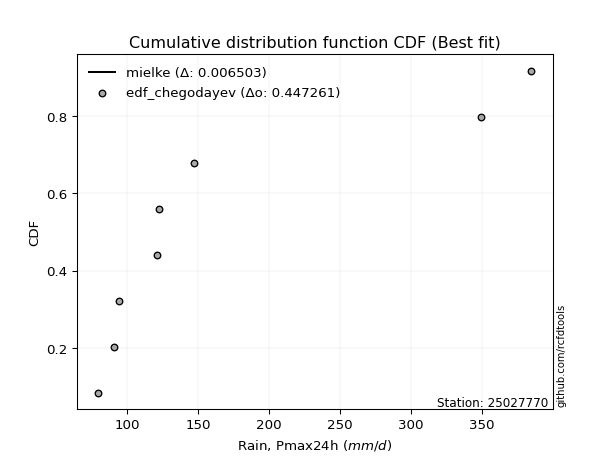</img></img>

</div>


### 6. Empirical - EDF Blom (1958)

The Blom formula is a specific "plotting position" formula used in hydrology and statistical analysis to estimate the empirical cumulative probability (or non-exceedance probability) of a data series. It is particularly recommended for data that are approximately normally distributed. The constant _a_ is set to 0.375 (or 3/8).

<div align="center">


$P=(m-a)/(n+1-2a)$


</div>


**6.1. Empirical values**

<div align="center">

|                | 0                   | 1                   | 2                   | 3                  | 4        | 5                  | 6                  | 7                  | 8                  |
|:---------------|:--------------------|:--------------------|:--------------------|:-------------------|:---------|:-------------------|:-------------------|:-------------------|:-------------------|
| date           | 2025                | 2023                | 2022                | 2017               | 2018     | 2020               | 2024               | 2021               | 2019               |
| x              | 72.0                | 79.8                | 91.1                | 94.4               | 121.1    | 122.2              | 147.2              | 349.1              | 384.6              |
| m              | 1                   | 2                   | 3                   | 4                  | 5        | 6                  | 7                  | 8                  | 9                  |
| empirical_dist | edf_blom            | edf_blom            | edf_blom            | edf_blom           | edf_blom | edf_blom           | edf_blom           | edf_blom           | edf_blom           |
| empirical      | 0.06756756756756757 | 0.17567567567567569 | 0.28378378378378377 | 0.3918918918918919 | 0.5      | 0.6081081081081081 | 0.7162162162162162 | 0.8243243243243243 | 0.9324324324324325 |
| empirical_tr   | 1.072463768115942   | 1.2131147540983607  | 1.3962264150943395  | 1.6444444444444444 | 2.0      | 2.5517241379310347 | 3.523809523809524  | 5.6923076923076925 | 14.800000000000006 |

</div>


**6.2. Kolmogorov-Smirnov fit test (sorted by Δ)**


<div align="center">

|                | 0                    | 1                   | 2                   | 3                   | 4                   | 5                   | 6                   | 7                   | 8                   | 9                   | 10                  | 11                  | 12                  | 13                  | 14                    | 15                  | 16                  | 17                  | 18                  | 19                  | 20                  | 21                  | 22                  | 23                  | 24                  | 25                  | 26                  | 27                  | 28                  | 29                  | 30                  | 31                  | 32                  | 33                  | 34                  | 35                  | 36                  | 37                  | 38                  | 39                  | 40                  | 41                  | 42                  | 43                  | 44                  | 45                  | 46                  | 47                  | 48                  | 49                  | 50                  | 51                  | 52                  | 53                  | 54                  | 55                  | 56                  | 57                  | 58                  | 59                  | 60                  | 61                  | 62                  | 63                  | 64                  | 65                  | 66                  | 67                  | 68                  | 69                  | 70                  | 71                  | 72                  | 73                  | 74                  | 75                  | 76                  | 77                  | 78                  | 79                  | 80                  | 81                  | 82                  | 83                  | 84                  | 85                  | 86                  | 87                  | 88                  | 89                  |
|:---------------|:---------------------|:--------------------|:--------------------|:--------------------|:--------------------|:--------------------|:--------------------|:--------------------|:--------------------|:--------------------|:--------------------|:--------------------|:--------------------|:--------------------|:----------------------|:--------------------|:--------------------|:--------------------|:--------------------|:--------------------|:--------------------|:--------------------|:--------------------|:--------------------|:--------------------|:--------------------|:--------------------|:--------------------|:--------------------|:--------------------|:--------------------|:--------------------|:--------------------|:--------------------|:--------------------|:--------------------|:--------------------|:--------------------|:--------------------|:--------------------|:--------------------|:--------------------|:--------------------|:--------------------|:--------------------|:--------------------|:--------------------|:--------------------|:--------------------|:--------------------|:--------------------|:--------------------|:--------------------|:--------------------|:--------------------|:--------------------|:--------------------|:--------------------|:--------------------|:--------------------|:--------------------|:--------------------|:--------------------|:--------------------|:--------------------|:--------------------|:--------------------|:--------------------|:--------------------|:--------------------|:--------------------|:--------------------|:--------------------|:--------------------|:--------------------|:--------------------|:--------------------|:--------------------|:--------------------|:--------------------|:--------------------|:--------------------|:--------------------|:--------------------|:--------------------|:--------------------|:--------------------|:--------------------|:--------------------|:--------------------|
| station        | 25027770             | 25027770            | 25027770            | 25027770            | 25027770            | 25027770            | 25027770            | 25027770            | 25027770            | 25027770            | 25027770            | 25027770            | 25027770            | 25027770            | 25027770              | 25027770            | 25027770            | 25027770            | 25027770            | 25027770            | 25027770            | 25027770            | 25027770            | 25027770            | 25027770            | 25027770            | 25027770            | 25027770            | 25027770            | 25027770            | 25027770            | 25027770            | 25027770            | 25027770            | 25027770            | 25027770            | 25027770            | 25027770            | 25027770            | 25027770            | 25027770            | 25027770            | 25027770            | 25027770            | 25027770            | 25027770            | 25027770            | 25027770            | 25027770            | 25027770            | 25027770            | 25027770            | 25027770            | 25027770            | 25027770            | 25027770            | 25027770            | 25027770            | 25027770            | 25027770            | 25027770            | 25027770            | 25027770            | 25027770            | 25027770            | 25027770            | 25027770            | 25027770            | 25027770            | 25027770            | 25027770            | 25027770            | 25027770            | 25027770            | 25027770            | 25027770            | 25027770            | 25027770            | 25027770            | 25027770            | 25027770            | 25027770            | 25027770            | 25027770            | 25027770            | 25027770            | 25027770            | 25027770            | 25027770            | 25027770            |
| empirical_dist | edf_blom             | edf_blom            | edf_blom            | edf_blom            | edf_blom            | edf_blom            | edf_blom            | edf_blom            | edf_blom            | edf_blom            | edf_blom            | edf_blom            | edf_blom            | edf_blom            | edf_blom              | edf_blom            | edf_blom            | edf_blom            | edf_blom            | edf_blom            | edf_blom            | edf_blom            | edf_blom            | edf_blom            | edf_blom            | edf_blom            | edf_blom            | edf_blom            | edf_blom            | edf_blom            | edf_blom            | edf_blom            | edf_blom            | edf_blom            | edf_blom            | edf_blom            | edf_blom            | edf_blom            | edf_blom            | edf_blom            | edf_blom            | edf_blom            | edf_blom            | edf_blom            | edf_blom            | edf_blom            | edf_blom            | edf_blom            | edf_blom            | edf_blom            | edf_blom            | edf_blom            | edf_blom            | edf_blom            | edf_blom            | edf_blom            | edf_blom            | edf_blom            | edf_blom            | edf_blom            | edf_blom            | edf_blom            | edf_blom            | edf_blom            | edf_blom            | edf_blom            | edf_blom            | edf_blom            | edf_blom            | edf_blom            | edf_blom            | edf_blom            | edf_blom            | edf_blom            | edf_blom            | edf_blom            | edf_blom            | edf_blom            | edf_blom            | edf_blom            | edf_blom            | edf_blom            | edf_blom            | edf_blom            | edf_blom            | edf_blom            | edf_blom            | edf_blom            | edf_blom            | edf_blom            |
| p_dist         | logmielke            | johnsonsu           | logfisk             | invgamma            | loginvweibull       | logjohnsonsu        | alpha               | loginvgamma         | logalpha            | logfatiguelife      | loginvgauss         | fatiguelife         | logexponnorm        | logexpon            | loglaplace_asymmetric | pareto              | invgauss            | loggenexpon         | weibull_min         | loghalfnorm         | loggompertz         | loghalflogistic     | logmoyal            | loggumbel_r         | logweibull_min      | logpearson3         | nct                 | mielke              | logkstwobign        | lograyleigh         | loggenlogistic      | logerlang           | wald                | logchi2             | lognct              | logncf              | logmaxwell          | betaprime           | ncf                 | logbetaprime        | logtruncnorm        | halflogistic        | fisk                | logrice             | lognakagami         | logwald             | logt                | lognorm             | lognorm             | logcrystalball      | moyal               | logloggamma         | exponnorm           | expon               | genexpon            | laplace_asymmetric  | loglogistic         | pearson3            | halfnorm            | loghypsecant        | erlang              | genlogistic         | gumbel_r            | logf                | loglaplace          | f                   | nakagami            | rayleigh            | maxwell             | loggumbel_l         | truncnorm           | kstwobign           | gamma               | gibrat              | loggibrat           | t                   | norm                | gompertz            | logistic            | hypsecant           | rice                | laplace             | gumbel_l            | loglognorm          | logpareto           | invweibull          | loggamma            | loggamma            | crystalball         | chi2                |
| delta          | 0.025793659994314495 | 0.0802691255449609  | 0.08728659210660239 | 0.08745851852833342 | 0.08810589062983054 | 0.08817321830796443 | 0.08894345639023682 | 0.08974475450440833 | 0.09068785542160118 | 0.09148599044709793 | 0.09199766311726343 | 0.09532926207352266 | 0.09546128558808564 | 0.0956065301485498  | 0.09772639847093656   | 0.09793945317691855 | 0.09941881599821889 | 0.1001376122634079  | 0.1027888276079485  | 0.10323708119557629 | 0.1042498338396326  | 0.10613698782012748 | 0.10859770696744941 | 0.11077741853132506 | 0.1114271248092098  | 0.11655288976983852 | 0.12094067548990983 | 0.1259276713270745  | 0.12762458565219675 | 0.12802651333242487 | 0.1282391952171794  | 0.1317707163917361  | 0.13226227470878577 | 0.1350193020655046  | 0.13534475450718275 | 0.13916225031013285 | 0.14011169524668848 | 0.14687609524705691 | 0.14932691316420849 | 0.15905816597842265 | 0.1668764912672538  | 0.169495379067216   | 0.16982008672544147 | 0.17049047522359578 | 0.17260214837357601 | 0.17304758701071998 | 0.174512285729839   | 0.1745162645165152  | 0.1745162645165152  | 0.17451626486803756 | 0.17850071128994283 | 0.17904321203954143 | 0.17966041543094013 | 0.18196341311376096 | 0.18196539972203318 | 0.1819798071742399  | 0.18336547038887552 | 0.18963618092063772 | 0.19021668950648318 | 0.19078106882124518 | 0.1993437199477418  | 0.20290572514016908 | 0.2036551231795154  | 0.20605609988884044 | 0.2134185721592991  | 0.2167264523639849  | 0.22377824596040863 | 0.22394705626754774 | 0.23589335190376276 | 0.24378077070556364 | 0.24645879076212174 | 0.2474387545216753  | 0.25325982143716397 | 0.25523444375578624 | 0.2657929934816928  | 0.27015003783567837 | 0.2702512431227687  | 0.27263621971579177 | 0.27751318316546986 | 0.2836376298926986  | 0.2847361297571388  | 0.30737573337108315 | 0.3401727933784086  | 0.4060407339238311  | 0.4294494167846259  | 0.43349708516947766 | 0.4888126922998659  | 0.4888126922998659  | 0.5741554859175173  | 0.8165250285382208  |
| deltao         | 0.41761268023100007  | 0.41761268023100007 | 0.41761268023100007 | 0.41761268023100007 | 0.41761268023100007 | 0.41761268023100007 | 0.41761268023100007 | 0.41761268023100007 | 0.41761268023100007 | 0.41761268023100007 | 0.41761268023100007 | 0.41761268023100007 | 0.41761268023100007 | 0.41761268023100007 | 0.41761268023100007   | 0.41761268023100007 | 0.41761268023100007 | 0.41761268023100007 | 0.41761268023100007 | 0.41761268023100007 | 0.41761268023100007 | 0.41761268023100007 | 0.41761268023100007 | 0.41761268023100007 | 0.41761268023100007 | 0.41761268023100007 | 0.41761268023100007 | 0.41761268023100007 | 0.41761268023100007 | 0.41761268023100007 | 0.41761268023100007 | 0.41761268023100007 | 0.41761268023100007 | 0.41761268023100007 | 0.41761268023100007 | 0.41761268023100007 | 0.41761268023100007 | 0.41761268023100007 | 0.41761268023100007 | 0.41761268023100007 | 0.41761268023100007 | 0.41761268023100007 | 0.41761268023100007 | 0.41761268023100007 | 0.41761268023100007 | 0.41761268023100007 | 0.41761268023100007 | 0.41761268023100007 | 0.41761268023100007 | 0.41761268023100007 | 0.41761268023100007 | 0.41761268023100007 | 0.41761268023100007 | 0.41761268023100007 | 0.41761268023100007 | 0.41761268023100007 | 0.41761268023100007 | 0.41761268023100007 | 0.41761268023100007 | 0.41761268023100007 | 0.41761268023100007 | 0.41761268023100007 | 0.41761268023100007 | 0.41761268023100007 | 0.41761268023100007 | 0.41761268023100007 | 0.41761268023100007 | 0.41761268023100007 | 0.41761268023100007 | 0.41761268023100007 | 0.41761268023100007 | 0.41761268023100007 | 0.41761268023100007 | 0.41761268023100007 | 0.41761268023100007 | 0.41761268023100007 | 0.41761268023100007 | 0.41761268023100007 | 0.41761268023100007 | 0.41761268023100007 | 0.41761268023100007 | 0.41761268023100007 | 0.41761268023100007 | 0.41761268023100007 | 0.41761268023100007 | 0.41761268023100007 | 0.41761268023100007 | 0.41761268023100007 | 0.41761268023100007 | 0.41761268023100007 |
| eval           | Δo > Δ               | Δo > Δ              | Δo > Δ              | Δo > Δ              | Δo > Δ              | Δo > Δ              | Δo > Δ              | Δo > Δ              | Δo > Δ              | Δo > Δ              | Δo > Δ              | Δo > Δ              | Δo > Δ              | Δo > Δ              | Δo > Δ                | Δo > Δ              | Δo > Δ              | Δo > Δ              | Δo > Δ              | Δo > Δ              | Δo > Δ              | Δo > Δ              | Δo > Δ              | Δo > Δ              | Δo > Δ              | Δo > Δ              | Δo > Δ              | Δo > Δ              | Δo > Δ              | Δo > Δ              | Δo > Δ              | Δo > Δ              | Δo > Δ              | Δo > Δ              | Δo > Δ              | Δo > Δ              | Δo > Δ              | Δo > Δ              | Δo > Δ              | Δo > Δ              | Δo > Δ              | Δo > Δ              | Δo > Δ              | Δo > Δ              | Δo > Δ              | Δo > Δ              | Δo > Δ              | Δo > Δ              | Δo > Δ              | Δo > Δ              | Δo > Δ              | Δo > Δ              | Δo > Δ              | Δo > Δ              | Δo > Δ              | Δo > Δ              | Δo > Δ              | Δo > Δ              | Δo > Δ              | Δo > Δ              | Δo > Δ              | Δo > Δ              | Δo > Δ              | Δo > Δ              | Δo > Δ              | Δo > Δ              | Δo > Δ              | Δo > Δ              | Δo > Δ              | Δo > Δ              | Δo > Δ              | Δo > Δ              | Δo > Δ              | Δo > Δ              | Δo > Δ              | Δo > Δ              | Δo > Δ              | Δo > Δ              | Δo > Δ              | Δo > Δ              | Δo > Δ              | Δo > Δ              | Δo > Δ              | Δo > Δ              | Δo <= Δ             | Δo <= Δ             | Δo <= Δ             | Δo <= Δ             | Δo <= Δ             | Δo <= Δ             |
| fit            | 1                    | 1                   | 1                   | 1                   | 1                   | 1                   | 1                   | 1                   | 1                   | 1                   | 1                   | 1                   | 1                   | 1                   | 1                     | 1                   | 1                   | 1                   | 1                   | 1                   | 1                   | 1                   | 1                   | 1                   | 1                   | 1                   | 1                   | 1                   | 1                   | 1                   | 1                   | 1                   | 1                   | 1                   | 1                   | 1                   | 1                   | 1                   | 1                   | 1                   | 1                   | 1                   | 1                   | 1                   | 1                   | 1                   | 1                   | 1                   | 1                   | 1                   | 1                   | 1                   | 1                   | 1                   | 1                   | 1                   | 1                   | 1                   | 1                   | 1                   | 1                   | 1                   | 1                   | 1                   | 1                   | 1                   | 1                   | 1                   | 1                   | 1                   | 1                   | 1                   | 1                   | 1                   | 1                   | 1                   | 1                   | 1                   | 1                   | 1                   | 1                   | 1                   | 1                   | 1                   | 0                   | 0                   | 0                   | 0                   | 0                   | 0                   |
| n              | 9                    | 9                   | 9                   | 9                   | 9                   | 9                   | 9                   | 9                   | 9                   | 9                   | 9                   | 9                   | 9                   | 9                   | 9                     | 9                   | 9                   | 9                   | 9                   | 9                   | 9                   | 9                   | 9                   | 9                   | 9                   | 9                   | 9                   | 9                   | 9                   | 9                   | 9                   | 9                   | 9                   | 9                   | 9                   | 9                   | 9                   | 9                   | 9                   | 9                   | 9                   | 9                   | 9                   | 9                   | 9                   | 9                   | 9                   | 9                   | 9                   | 9                   | 9                   | 9                   | 9                   | 9                   | 9                   | 9                   | 9                   | 9                   | 9                   | 9                   | 9                   | 9                   | 9                   | 9                   | 9                   | 9                   | 9                   | 9                   | 9                   | 9                   | 9                   | 9                   | 9                   | 9                   | 9                   | 9                   | 9                   | 9                   | 9                   | 9                   | 9                   | 9                   | 9                   | 9                   | 9                   | 9                   | 9                   | 9                   | 9                   | 9                   |
| best_fit       | 1                    | 0                   | 0                   | 0                   | 0                   | 0                   | 0                   | 0                   | 0                   | 0                   | 0                   | 0                   | 0                   | 0                   | 0                     | 0                   | 0                   | 0                   | 0                   | 0                   | 0                   | 0                   | 0                   | 0                   | 0                   | 0                   | 0                   | 0                   | 0                   | 0                   | 0                   | 0                   | 0                   | 0                   | 0                   | 0                   | 0                   | 0                   | 0                   | 0                   | 0                   | 0                   | 0                   | 0                   | 0                   | 0                   | 0                   | 0                   | 0                   | 0                   | 0                   | 0                   | 0                   | 0                   | 0                   | 0                   | 0                   | 0                   | 0                   | 0                   | 0                   | 0                   | 0                   | 0                   | 0                   | 0                   | 0                   | 0                   | 0                   | 0                   | 0                   | 0                   | 0                   | 0                   | 0                   | 0                   | 0                   | 0                   | 0                   | 0                   | 0                   | 0                   | 0                   | 0                   | 0                   | 0                   | 0                   | 0                   | 0                   | 0                   |
| best_fit_sort  | 1                    | 2                   | 3                   | 4                   | 5                   | 6                   | 7                   | 8                   | 9                   | 10                  | 11                  | 12                  | 13                  | 14                  | 15                    | 16                  | 17                  | 18                  | 19                  | 20                  | 21                  | 22                  | 23                  | 24                  | 25                  | 26                  | 27                  | 28                  | 29                  | 30                  | 31                  | 32                  | 33                  | 34                  | 35                  | 36                  | 37                  | 38                  | 39                  | 40                  | 41                  | 42                  | 43                  | 44                  | 45                  | 46                  | 47                  | 48                  | 49                  | 50                  | 51                  | 52                  | 53                  | 54                  | 55                  | 56                  | 57                  | 58                  | 59                  | 60                  | 61                  | 62                  | 63                  | 64                  | 65                  | 66                  | 67                  | 68                  | 69                  | 70                  | 71                  | 72                  | 73                  | 74                  | 75                  | 76                  | 77                  | 78                  | 79                  | 80                  | 81                  | 82                  | 83                  | 84                  | 85                  | 86                  | 87                  | 88                  | 89                  | 90                  |

</div>


<div align="center">

</img>

</div>


**6.3. Best fit**

<div align="center">

|   id |   station | empirical_dist   | p_dist    |     delta |   deltao | eval   |   fit |   n |   best_fit |   best_fit_sort |
|-----:|----------:|:-----------------|:----------|----------:|---------:|:-------|------:|----:|-----------:|----------------:|
|    0 |  25027770 | edf_blom         | logmielke | 0.0257937 | 0.417613 | Δo > Δ |     1 |   9 |          1 |               1 |

</div>


<div align="center">

</img></img>

</div>


### 7. Empirical - EDF Tukey (1962)

In hydrology, the Tukey formula is used as a plotting position formula to estimate the empirical probability or frequency of a flood event (or other hydrological data). The formula parameter is given as _c=0.333_ (or 1/3).

<div align="center">


$P=(m-c)/(n+1-2c)$


</div>


**7.1. Empirical values**

<div align="center">

|                | 0                   | 1                   | 2                  | 3                   | 4         | 5                  | 6                  | 7                  | 8                  |
|:---------------|:--------------------|:--------------------|:-------------------|:--------------------|:----------|:-------------------|:-------------------|:-------------------|:-------------------|
| date           | 2025                | 2023                | 2022               | 2017                | 2018      | 2020               | 2024               | 2021               | 2019               |
| x              | 72.0                | 79.8                | 91.1               | 94.4                | 121.1     | 122.2              | 147.2              | 349.1              | 384.6              |
| m              | 1                   | 2                   | 3                  | 4                   | 5         | 6                  | 7                  | 8                  | 9                  |
| empirical_dist | edf_tukey           | edf_tukey           | edf_tukey          | edf_tukey           | edf_tukey | edf_tukey          | edf_tukey          | edf_tukey          | edf_tukey          |
| empirical      | 0.07142857142857142 | 0.17857142857142858 | 0.2857142857142857 | 0.39285714285714285 | 0.5       | 0.6071428571428571 | 0.7142857142857143 | 0.8214285714285714 | 0.9285714285714286 |
| empirical_tr   | 1.0769230769230769  | 1.2173913043478262  | 1.4                | 1.6470588235294117  | 2.0       | 2.545454545454545  | 3.5                | 5.599999999999999  | 14.000000000000007 |

</div>


**7.2. Kolmogorov-Smirnov fit test (sorted by Δ)**


<div align="center">

|                | 0                   | 1                   | 2                   | 3                   | 4                   | 5                   | 6                   | 7                   | 8                   | 9                   | 10                  | 11                  | 12                  | 13                  | 14                    | 15                  | 16                  | 17                  | 18                  | 19                  | 20                  | 21                  | 22                  | 23                  | 24                  | 25                  | 26                  | 27                  | 28                  | 29                  | 30                  | 31                  | 32                  | 33                  | 34                  | 35                  | 36                  | 37                  | 38                  | 39                  | 40                  | 41                  | 42                  | 43                  | 44                  | 45                  | 46                  | 47                  | 48                  | 49                  | 50                  | 51                  | 52                  | 53                  | 54                  | 55                  | 56                  | 57                  | 58                  | 59                  | 60                  | 61                  | 62                  | 63                  | 64                  | 65                  | 66                  | 67                  | 68                  | 69                  | 70                  | 71                  | 72                  | 73                  | 74                  | 75                  | 76                  | 77                  | 78                  | 79                  | 80                  | 81                  | 82                  | 83                  | 84                  | 85                  | 86                  | 87                  | 88                  | 89                  |
|:---------------|:--------------------|:--------------------|:--------------------|:--------------------|:--------------------|:--------------------|:--------------------|:--------------------|:--------------------|:--------------------|:--------------------|:--------------------|:--------------------|:--------------------|:----------------------|:--------------------|:--------------------|:--------------------|:--------------------|:--------------------|:--------------------|:--------------------|:--------------------|:--------------------|:--------------------|:--------------------|:--------------------|:--------------------|:--------------------|:--------------------|:--------------------|:--------------------|:--------------------|:--------------------|:--------------------|:--------------------|:--------------------|:--------------------|:--------------------|:--------------------|:--------------------|:--------------------|:--------------------|:--------------------|:--------------------|:--------------------|:--------------------|:--------------------|:--------------------|:--------------------|:--------------------|:--------------------|:--------------------|:--------------------|:--------------------|:--------------------|:--------------------|:--------------------|:--------------------|:--------------------|:--------------------|:--------------------|:--------------------|:--------------------|:--------------------|:--------------------|:--------------------|:--------------------|:--------------------|:--------------------|:--------------------|:--------------------|:--------------------|:--------------------|:--------------------|:--------------------|:--------------------|:--------------------|:--------------------|:--------------------|:--------------------|:--------------------|:--------------------|:--------------------|:--------------------|:--------------------|:--------------------|:--------------------|:--------------------|:--------------------|
| station        | 25027770            | 25027770            | 25027770            | 25027770            | 25027770            | 25027770            | 25027770            | 25027770            | 25027770            | 25027770            | 25027770            | 25027770            | 25027770            | 25027770            | 25027770              | 25027770            | 25027770            | 25027770            | 25027770            | 25027770            | 25027770            | 25027770            | 25027770            | 25027770            | 25027770            | 25027770            | 25027770            | 25027770            | 25027770            | 25027770            | 25027770            | 25027770            | 25027770            | 25027770            | 25027770            | 25027770            | 25027770            | 25027770            | 25027770            | 25027770            | 25027770            | 25027770            | 25027770            | 25027770            | 25027770            | 25027770            | 25027770            | 25027770            | 25027770            | 25027770            | 25027770            | 25027770            | 25027770            | 25027770            | 25027770            | 25027770            | 25027770            | 25027770            | 25027770            | 25027770            | 25027770            | 25027770            | 25027770            | 25027770            | 25027770            | 25027770            | 25027770            | 25027770            | 25027770            | 25027770            | 25027770            | 25027770            | 25027770            | 25027770            | 25027770            | 25027770            | 25027770            | 25027770            | 25027770            | 25027770            | 25027770            | 25027770            | 25027770            | 25027770            | 25027770            | 25027770            | 25027770            | 25027770            | 25027770            | 25027770            |
| empirical_dist | edf_tukey           | edf_tukey           | edf_tukey           | edf_tukey           | edf_tukey           | edf_tukey           | edf_tukey           | edf_tukey           | edf_tukey           | edf_tukey           | edf_tukey           | edf_tukey           | edf_tukey           | edf_tukey           | edf_tukey             | edf_tukey           | edf_tukey           | edf_tukey           | edf_tukey           | edf_tukey           | edf_tukey           | edf_tukey           | edf_tukey           | edf_tukey           | edf_tukey           | edf_tukey           | edf_tukey           | edf_tukey           | edf_tukey           | edf_tukey           | edf_tukey           | edf_tukey           | edf_tukey           | edf_tukey           | edf_tukey           | edf_tukey           | edf_tukey           | edf_tukey           | edf_tukey           | edf_tukey           | edf_tukey           | edf_tukey           | edf_tukey           | edf_tukey           | edf_tukey           | edf_tukey           | edf_tukey           | edf_tukey           | edf_tukey           | edf_tukey           | edf_tukey           | edf_tukey           | edf_tukey           | edf_tukey           | edf_tukey           | edf_tukey           | edf_tukey           | edf_tukey           | edf_tukey           | edf_tukey           | edf_tukey           | edf_tukey           | edf_tukey           | edf_tukey           | edf_tukey           | edf_tukey           | edf_tukey           | edf_tukey           | edf_tukey           | edf_tukey           | edf_tukey           | edf_tukey           | edf_tukey           | edf_tukey           | edf_tukey           | edf_tukey           | edf_tukey           | edf_tukey           | edf_tukey           | edf_tukey           | edf_tukey           | edf_tukey           | edf_tukey           | edf_tukey           | edf_tukey           | edf_tukey           | edf_tukey           | edf_tukey           | edf_tukey           | edf_tukey           |
| p_dist         | logmielke           | johnsonsu           | logfisk             | logjohnsonsu        | alpha               | invgamma            | loginvweibull       | logfatiguelife      | loginvgamma         | logalpha            | loginvgauss         | fatiguelife         | logexponnorm        | logexpon            | loglaplace_asymmetric | pareto              | weibull_min         | invgauss            | loggenexpon         | loghalfnorm         | loggompertz         | loghalflogistic     | logweibull_min      | logmoyal            | loggumbel_r         | logpearson3         | nct                 | lograyleigh         | logkstwobign        | mielke              | loggenlogistic      | logchi2             | wald                | logerlang           | lognct              | logmaxwell          | logncf              | betaprime           | ncf                 | logbetaprime        | fisk                | halflogistic        | logrice             | logtruncnorm        | lognakagami         | logt                | lognorm             | lognorm             | logcrystalball      | logwald             | moyal               | logloggamma         | exponnorm           | expon               | genexpon            | laplace_asymmetric  | loglogistic         | pearson3            | halfnorm            | loghypsecant        | erlang              | gumbel_r            | genlogistic         | logf                | loglaplace          | f                   | nakagami            | rayleigh            | maxwell             | loggumbel_l         | truncnorm           | kstwobign           | gamma               | gibrat              | loggibrat           | t                   | norm                | gompertz            | logistic            | hypsecant           | rice                | laplace             | gumbel_l            | loglognorm          | logpareto           | invweibull          | loggamma            | loggamma            | crystalball         | chi2                |
| delta          | 0.02965466385531835 | 0.08182676392399824 | 0.08728659210660239 | 0.08817321830796443 | 0.08894345639023682 | 0.09035427142408636 | 0.09100164352558349 | 0.09195357436233154 | 0.09264050740016128 | 0.09358360831735413 | 0.09489341601301637 | 0.0982250149692756  | 0.09835703848383859 | 0.09850228304430275 | 0.1006221513666895    | 0.10083520607267149 | 0.10085832567744657 | 0.10231456889397184 | 0.10303336515916084 | 0.10613283409132923 | 0.10714558673538555 | 0.10903274071588043 | 0.1114271248092098  | 0.11149345986320236 | 0.113673171427078   | 0.1155876388045875  | 0.12152098320926696 | 0.12706126236717386 | 0.12876091119650557 | 0.12882342422282744 | 0.13113494811293236 | 0.13115829820450076 | 0.13129702374353475 | 0.1317707163917361  | 0.13437950354193173 | 0.13914644428143746 | 0.1420580032058858  | 0.1459108442818059  | 0.14836166219895747 | 0.15809291501317163 | 0.1659590828644376  | 0.16756487713671409 | 0.16952522425834476 | 0.16977224416300674 | 0.1706716464430741  | 0.173547034764588   | 0.17355101355126418 | 0.17355101355126418 | 0.17355101390278654 | 0.17594333990647287 | 0.1775354603246918  | 0.17807796107429041 | 0.17869516446568912 | 0.18099816214850994 | 0.18100014875678216 | 0.18101455620898887 | 0.1824002194236245  | 0.1877056789901358  | 0.18828618757598126 | 0.18981581785599416 | 0.19741321801723988 | 0.20172462124901347 | 0.20194047417491806 | 0.2041255979583385  | 0.21245332119404808 | 0.21479595043348298 | 0.2218477440299067  | 0.2220165543370458  | 0.23396284997326083 | 0.24281551974031262 | 0.24549353979687072 | 0.24647350355642428 | 0.25325982143716397 | 0.2561996947210372  | 0.26675824444694374 | 0.26821953590517644 | 0.2683207411922668  | 0.27167096875054075 | 0.27558268123496793 | 0.28170712796219666 | 0.2829363411059677  | 0.30641048240583213 | 0.3382422914479067  | 0.40314498102807816 | 0.42655366388887295 | 0.4296360813084738  | 0.486882190369364   | 0.486882190369364   | 0.5702944820565135  | 0.8136292756424679  |
| deltao         | 0.41761268023100007 | 0.41761268023100007 | 0.41761268023100007 | 0.41761268023100007 | 0.41761268023100007 | 0.41761268023100007 | 0.41761268023100007 | 0.41761268023100007 | 0.41761268023100007 | 0.41761268023100007 | 0.41761268023100007 | 0.41761268023100007 | 0.41761268023100007 | 0.41761268023100007 | 0.41761268023100007   | 0.41761268023100007 | 0.41761268023100007 | 0.41761268023100007 | 0.41761268023100007 | 0.41761268023100007 | 0.41761268023100007 | 0.41761268023100007 | 0.41761268023100007 | 0.41761268023100007 | 0.41761268023100007 | 0.41761268023100007 | 0.41761268023100007 | 0.41761268023100007 | 0.41761268023100007 | 0.41761268023100007 | 0.41761268023100007 | 0.41761268023100007 | 0.41761268023100007 | 0.41761268023100007 | 0.41761268023100007 | 0.41761268023100007 | 0.41761268023100007 | 0.41761268023100007 | 0.41761268023100007 | 0.41761268023100007 | 0.41761268023100007 | 0.41761268023100007 | 0.41761268023100007 | 0.41761268023100007 | 0.41761268023100007 | 0.41761268023100007 | 0.41761268023100007 | 0.41761268023100007 | 0.41761268023100007 | 0.41761268023100007 | 0.41761268023100007 | 0.41761268023100007 | 0.41761268023100007 | 0.41761268023100007 | 0.41761268023100007 | 0.41761268023100007 | 0.41761268023100007 | 0.41761268023100007 | 0.41761268023100007 | 0.41761268023100007 | 0.41761268023100007 | 0.41761268023100007 | 0.41761268023100007 | 0.41761268023100007 | 0.41761268023100007 | 0.41761268023100007 | 0.41761268023100007 | 0.41761268023100007 | 0.41761268023100007 | 0.41761268023100007 | 0.41761268023100007 | 0.41761268023100007 | 0.41761268023100007 | 0.41761268023100007 | 0.41761268023100007 | 0.41761268023100007 | 0.41761268023100007 | 0.41761268023100007 | 0.41761268023100007 | 0.41761268023100007 | 0.41761268023100007 | 0.41761268023100007 | 0.41761268023100007 | 0.41761268023100007 | 0.41761268023100007 | 0.41761268023100007 | 0.41761268023100007 | 0.41761268023100007 | 0.41761268023100007 | 0.41761268023100007 |
| eval           | Δo > Δ              | Δo > Δ              | Δo > Δ              | Δo > Δ              | Δo > Δ              | Δo > Δ              | Δo > Δ              | Δo > Δ              | Δo > Δ              | Δo > Δ              | Δo > Δ              | Δo > Δ              | Δo > Δ              | Δo > Δ              | Δo > Δ                | Δo > Δ              | Δo > Δ              | Δo > Δ              | Δo > Δ              | Δo > Δ              | Δo > Δ              | Δo > Δ              | Δo > Δ              | Δo > Δ              | Δo > Δ              | Δo > Δ              | Δo > Δ              | Δo > Δ              | Δo > Δ              | Δo > Δ              | Δo > Δ              | Δo > Δ              | Δo > Δ              | Δo > Δ              | Δo > Δ              | Δo > Δ              | Δo > Δ              | Δo > Δ              | Δo > Δ              | Δo > Δ              | Δo > Δ              | Δo > Δ              | Δo > Δ              | Δo > Δ              | Δo > Δ              | Δo > Δ              | Δo > Δ              | Δo > Δ              | Δo > Δ              | Δo > Δ              | Δo > Δ              | Δo > Δ              | Δo > Δ              | Δo > Δ              | Δo > Δ              | Δo > Δ              | Δo > Δ              | Δo > Δ              | Δo > Δ              | Δo > Δ              | Δo > Δ              | Δo > Δ              | Δo > Δ              | Δo > Δ              | Δo > Δ              | Δo > Δ              | Δo > Δ              | Δo > Δ              | Δo > Δ              | Δo > Δ              | Δo > Δ              | Δo > Δ              | Δo > Δ              | Δo > Δ              | Δo > Δ              | Δo > Δ              | Δo > Δ              | Δo > Δ              | Δo > Δ              | Δo > Δ              | Δo > Δ              | Δo > Δ              | Δo > Δ              | Δo > Δ              | Δo <= Δ             | Δo <= Δ             | Δo <= Δ             | Δo <= Δ             | Δo <= Δ             | Δo <= Δ             |
| fit            | 1                   | 1                   | 1                   | 1                   | 1                   | 1                   | 1                   | 1                   | 1                   | 1                   | 1                   | 1                   | 1                   | 1                   | 1                     | 1                   | 1                   | 1                   | 1                   | 1                   | 1                   | 1                   | 1                   | 1                   | 1                   | 1                   | 1                   | 1                   | 1                   | 1                   | 1                   | 1                   | 1                   | 1                   | 1                   | 1                   | 1                   | 1                   | 1                   | 1                   | 1                   | 1                   | 1                   | 1                   | 1                   | 1                   | 1                   | 1                   | 1                   | 1                   | 1                   | 1                   | 1                   | 1                   | 1                   | 1                   | 1                   | 1                   | 1                   | 1                   | 1                   | 1                   | 1                   | 1                   | 1                   | 1                   | 1                   | 1                   | 1                   | 1                   | 1                   | 1                   | 1                   | 1                   | 1                   | 1                   | 1                   | 1                   | 1                   | 1                   | 1                   | 1                   | 1                   | 1                   | 0                   | 0                   | 0                   | 0                   | 0                   | 0                   |
| n              | 9                   | 9                   | 9                   | 9                   | 9                   | 9                   | 9                   | 9                   | 9                   | 9                   | 9                   | 9                   | 9                   | 9                   | 9                     | 9                   | 9                   | 9                   | 9                   | 9                   | 9                   | 9                   | 9                   | 9                   | 9                   | 9                   | 9                   | 9                   | 9                   | 9                   | 9                   | 9                   | 9                   | 9                   | 9                   | 9                   | 9                   | 9                   | 9                   | 9                   | 9                   | 9                   | 9                   | 9                   | 9                   | 9                   | 9                   | 9                   | 9                   | 9                   | 9                   | 9                   | 9                   | 9                   | 9                   | 9                   | 9                   | 9                   | 9                   | 9                   | 9                   | 9                   | 9                   | 9                   | 9                   | 9                   | 9                   | 9                   | 9                   | 9                   | 9                   | 9                   | 9                   | 9                   | 9                   | 9                   | 9                   | 9                   | 9                   | 9                   | 9                   | 9                   | 9                   | 9                   | 9                   | 9                   | 9                   | 9                   | 9                   | 9                   |
| best_fit       | 1                   | 0                   | 0                   | 0                   | 0                   | 0                   | 0                   | 0                   | 0                   | 0                   | 0                   | 0                   | 0                   | 0                   | 0                     | 0                   | 0                   | 0                   | 0                   | 0                   | 0                   | 0                   | 0                   | 0                   | 0                   | 0                   | 0                   | 0                   | 0                   | 0                   | 0                   | 0                   | 0                   | 0                   | 0                   | 0                   | 0                   | 0                   | 0                   | 0                   | 0                   | 0                   | 0                   | 0                   | 0                   | 0                   | 0                   | 0                   | 0                   | 0                   | 0                   | 0                   | 0                   | 0                   | 0                   | 0                   | 0                   | 0                   | 0                   | 0                   | 0                   | 0                   | 0                   | 0                   | 0                   | 0                   | 0                   | 0                   | 0                   | 0                   | 0                   | 0                   | 0                   | 0                   | 0                   | 0                   | 0                   | 0                   | 0                   | 0                   | 0                   | 0                   | 0                   | 0                   | 0                   | 0                   | 0                   | 0                   | 0                   | 0                   |
| best_fit_sort  | 1                   | 2                   | 3                   | 4                   | 5                   | 6                   | 7                   | 8                   | 9                   | 10                  | 11                  | 12                  | 13                  | 14                  | 15                    | 16                  | 17                  | 18                  | 19                  | 20                  | 21                  | 22                  | 23                  | 24                  | 25                  | 26                  | 27                  | 28                  | 29                  | 30                  | 31                  | 32                  | 33                  | 34                  | 35                  | 36                  | 37                  | 38                  | 39                  | 40                  | 41                  | 42                  | 43                  | 44                  | 45                  | 46                  | 47                  | 48                  | 49                  | 50                  | 51                  | 52                  | 53                  | 54                  | 55                  | 56                  | 57                  | 58                  | 59                  | 60                  | 61                  | 62                  | 63                  | 64                  | 65                  | 66                  | 67                  | 68                  | 69                  | 70                  | 71                  | 72                  | 73                  | 74                  | 75                  | 76                  | 77                  | 78                  | 79                  | 80                  | 81                  | 82                  | 83                  | 84                  | 85                  | 86                  | 87                  | 88                  | 89                  | 90                  |

</div>


<div align="center">

</img>

</div>


**7.3. Best fit**

<div align="center">

|   id |   station | empirical_dist   | p_dist    |     delta |   deltao | eval   |   fit |   n |   best_fit |   best_fit_sort |
|-----:|----------:|:-----------------|:----------|----------:|---------:|:-------|------:|----:|-----------:|----------------:|
|    0 |  25027770 | edf_tukey        | logmielke | 0.0296547 | 0.417613 | Δo > Δ |     1 |   9 |          1 |               1 |

</div>


<div align="center">

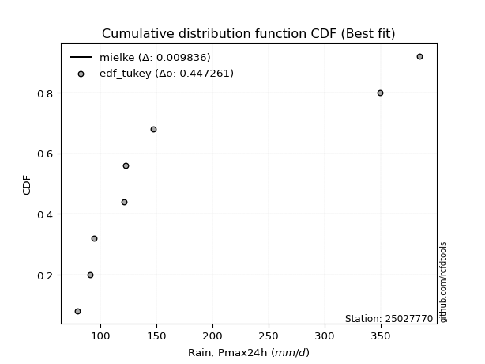</img>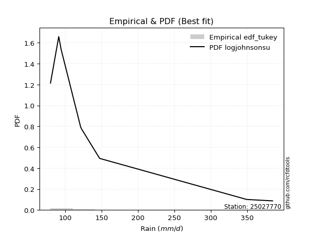</img>

</div>


### 8. Empirical - EDF Gringorten (1963)

Gringorten plotting position formula is essential for estimating the probability and return periods of extreme events like floods and heavy rainfall. The constant _a=0.44_.

<div align="center">


$P=(m-a)/(n+1-2a)$


</div>


**8.1. Empirical values**

<div align="center">

|                | 0                    | 1                  | 2                   | 3                  | 4              | 5                  | 6                  | 7                  | 8                  |
|:---------------|:---------------------|:-------------------|:--------------------|:-------------------|:---------------|:-------------------|:-------------------|:-------------------|:-------------------|
| date           | 2025                 | 2023               | 2022                | 2017               | 2018           | 2020               | 2024               | 2021               | 2019               |
| x              | 72.0                 | 79.8               | 91.1                | 94.4               | 121.1          | 122.2              | 147.2              | 349.1              | 384.6              |
| m              | 1                    | 2                  | 3                   | 4                  | 5              | 6                  | 7                  | 8                  | 9                  |
| empirical_dist | edf_gringorten       | edf_gringorten     | edf_gringorten      | edf_gringorten     | edf_gringorten | edf_gringorten     | edf_gringorten     | edf_gringorten     | edf_gringorten     |
| empirical      | 0.061403508771929835 | 0.1710526315789474 | 0.28070175438596495 | 0.3903508771929825 | 0.5            | 0.6096491228070176 | 0.7192982456140351 | 0.8289473684210527 | 0.9385964912280703 |
| empirical_tr   | 1.0654205607476634   | 1.2063492063492063 | 1.3902439024390243  | 1.6402877697841727 | 2.0            | 2.561797752808989  | 3.5625             | 5.846153846153847  | 16.285714285714324 |

</div>


**8.2. Kolmogorov-Smirnov fit test (sorted by Δ)**


<div align="center">

|                | 0                   | 1                   | 2                   | 3                   | 4                   | 5                   | 6                   | 7                   | 8                   | 9                   | 10                  | 11                  | 12                  | 13                  | 14                    | 15                  | 16                  | 17                  | 18                  | 19                  | 20                  | 21                  | 22                  | 23                  | 24                  | 25                  | 26                  | 27                  | 28                  | 29                  | 30                  | 31                  | 32                  | 33                  | 34                  | 35                  | 36                  | 37                  | 38                  | 39                  | 40                  | 41                  | 42                  | 43                  | 44                  | 45                  | 46                  | 47                  | 48                  | 49                  | 50                  | 51                  | 52                  | 53                  | 54                  | 55                  | 56                  | 57                  | 58                  | 59                  | 60                  | 61                  | 62                  | 63                  | 64                  | 65                  | 66                  | 67                  | 68                  | 69                  | 70                  | 71                  | 72                  | 73                  | 74                  | 75                  | 76                  | 77                  | 78                  | 79                  | 80                  | 81                  | 82                  | 83                  | 84                  | 85                  | 86                  | 87                  | 88                  | 89                  |
|:---------------|:--------------------|:--------------------|:--------------------|:--------------------|:--------------------|:--------------------|:--------------------|:--------------------|:--------------------|:--------------------|:--------------------|:--------------------|:--------------------|:--------------------|:----------------------|:--------------------|:--------------------|:--------------------|:--------------------|:--------------------|:--------------------|:--------------------|:--------------------|:--------------------|:--------------------|:--------------------|:--------------------|:--------------------|:--------------------|:--------------------|:--------------------|:--------------------|:--------------------|:--------------------|:--------------------|:--------------------|:--------------------|:--------------------|:--------------------|:--------------------|:--------------------|:--------------------|:--------------------|:--------------------|:--------------------|:--------------------|:--------------------|:--------------------|:--------------------|:--------------------|:--------------------|:--------------------|:--------------------|:--------------------|:--------------------|:--------------------|:--------------------|:--------------------|:--------------------|:--------------------|:--------------------|:--------------------|:--------------------|:--------------------|:--------------------|:--------------------|:--------------------|:--------------------|:--------------------|:--------------------|:--------------------|:--------------------|:--------------------|:--------------------|:--------------------|:--------------------|:--------------------|:--------------------|:--------------------|:--------------------|:--------------------|:--------------------|:--------------------|:--------------------|:--------------------|:--------------------|:--------------------|:--------------------|:--------------------|:--------------------|
| station        | 25027770            | 25027770            | 25027770            | 25027770            | 25027770            | 25027770            | 25027770            | 25027770            | 25027770            | 25027770            | 25027770            | 25027770            | 25027770            | 25027770            | 25027770              | 25027770            | 25027770            | 25027770            | 25027770            | 25027770            | 25027770            | 25027770            | 25027770            | 25027770            | 25027770            | 25027770            | 25027770            | 25027770            | 25027770            | 25027770            | 25027770            | 25027770            | 25027770            | 25027770            | 25027770            | 25027770            | 25027770            | 25027770            | 25027770            | 25027770            | 25027770            | 25027770            | 25027770            | 25027770            | 25027770            | 25027770            | 25027770            | 25027770            | 25027770            | 25027770            | 25027770            | 25027770            | 25027770            | 25027770            | 25027770            | 25027770            | 25027770            | 25027770            | 25027770            | 25027770            | 25027770            | 25027770            | 25027770            | 25027770            | 25027770            | 25027770            | 25027770            | 25027770            | 25027770            | 25027770            | 25027770            | 25027770            | 25027770            | 25027770            | 25027770            | 25027770            | 25027770            | 25027770            | 25027770            | 25027770            | 25027770            | 25027770            | 25027770            | 25027770            | 25027770            | 25027770            | 25027770            | 25027770            | 25027770            | 25027770            |
| empirical_dist | edf_gringorten      | edf_gringorten      | edf_gringorten      | edf_gringorten      | edf_gringorten      | edf_gringorten      | edf_gringorten      | edf_gringorten      | edf_gringorten      | edf_gringorten      | edf_gringorten      | edf_gringorten      | edf_gringorten      | edf_gringorten      | edf_gringorten        | edf_gringorten      | edf_gringorten      | edf_gringorten      | edf_gringorten      | edf_gringorten      | edf_gringorten      | edf_gringorten      | edf_gringorten      | edf_gringorten      | edf_gringorten      | edf_gringorten      | edf_gringorten      | edf_gringorten      | edf_gringorten      | edf_gringorten      | edf_gringorten      | edf_gringorten      | edf_gringorten      | edf_gringorten      | edf_gringorten      | edf_gringorten      | edf_gringorten      | edf_gringorten      | edf_gringorten      | edf_gringorten      | edf_gringorten      | edf_gringorten      | edf_gringorten      | edf_gringorten      | edf_gringorten      | edf_gringorten      | edf_gringorten      | edf_gringorten      | edf_gringorten      | edf_gringorten      | edf_gringorten      | edf_gringorten      | edf_gringorten      | edf_gringorten      | edf_gringorten      | edf_gringorten      | edf_gringorten      | edf_gringorten      | edf_gringorten      | edf_gringorten      | edf_gringorten      | edf_gringorten      | edf_gringorten      | edf_gringorten      | edf_gringorten      | edf_gringorten      | edf_gringorten      | edf_gringorten      | edf_gringorten      | edf_gringorten      | edf_gringorten      | edf_gringorten      | edf_gringorten      | edf_gringorten      | edf_gringorten      | edf_gringorten      | edf_gringorten      | edf_gringorten      | edf_gringorten      | edf_gringorten      | edf_gringorten      | edf_gringorten      | edf_gringorten      | edf_gringorten      | edf_gringorten      | edf_gringorten      | edf_gringorten      | edf_gringorten      | edf_gringorten      | edf_gringorten      |
| p_dist         | logmielke           | johnsonsu           | loginvgamma         | invgamma            | logalpha            | logfisk             | loginvweibull       | loginvgauss         | logjohnsonsu        | alpha               | fatiguelife         | logexponnorm        | logexpon            | logfatiguelife      | loglaplace_asymmetric | pareto              | invgauss            | loggenexpon         | loghalfnorm         | loggompertz         | loghalflogistic     | logmoyal            | weibull_min         | loggumbel_r         | logweibull_min      | logpearson3         | mielke              | nct                 | loggenlogistic      | logkstwobign        | lograyleigh         | logerlang           | wald                | logncf              | lognct              | logchi2             | logmaxwell          | betaprime           | ncf                 | logbetaprime        | logtruncnorm        | logwald             | logrice             | halflogistic        | lognakagami         | fisk                | logt                | lognorm             | lognorm             | logcrystalball      | logloggamma         | exponnorm           | moyal               | expon               | genexpon            | laplace_asymmetric  | loglogistic         | loghypsecant        | pearson3            | halfnorm            | erlang              | genlogistic         | gumbel_r            | logf                | loglaplace          | f                   | nakagami            | rayleigh            | maxwell             | loggumbel_l         | truncnorm           | kstwobign           | gamma               | gibrat              | loggibrat           | t                   | norm                | gompertz            | logistic            | hypsecant           | rice                | laplace             | gumbel_l            | loglognorm          | logpareto           | invweibull          | loggamma            | loggamma            | crystalball         | chi2                |
| delta          | 0.01962960119867676 | 0.0802691255449609  | 0.08512171040768002 | 0.08556190243796236 | 0.08606481132487287 | 0.08728659210660239 | 0.08728831368302292 | 0.08815171372076136 | 0.08817321830796443 | 0.08894345639023682 | 0.09070621797679435 | 0.09083824149135733 | 0.0909834860518215  | 0.09148599044709793 | 0.09310335437420825   | 0.09331640908019023 | 0.09479577190149058 | 0.09551456816667958 | 0.09861403709884797 | 0.09962678974290429 | 0.10151394372339917 | 0.1039746628707211  | 0.10587085700576737 | 0.11096230730619316 | 0.1114271248092098  | 0.11809390446874796 | 0.12130462723034618 | 0.12248169018881927 | 0.1236161511204511  | 0.12608357095328737 | 0.1295675280313343  | 0.1317707163917361  | 0.1338032894076952  | 0.13453920621340454 | 0.1368857692060922  | 0.14118336086114247 | 0.14165270994559792 | 0.14841710994596635 | 0.15086792786311792 | 0.1605991806773321  | 0.16225344717052548 | 0.1684245429139917  | 0.17203148992250522 | 0.1725774084650349  | 0.1756841777713949  | 0.17598414552107933 | 0.17605330042874845 | 0.17605727921542463 | 0.17605727921542463 | 0.176057279566947   | 0.18058422673845087 | 0.18120143012984957 | 0.1814981508129352  | 0.1835044278126704  | 0.18350641442094262 | 0.18352082187314933 | 0.18490648508778496 | 0.19232208352015462 | 0.1927182103184566  | 0.19329871890430206 | 0.20242574934556062 | 0.20444673983907852 | 0.20673715257733427 | 0.20913812928665926 | 0.21495958685820854 | 0.21980848176180373 | 0.2268602753582275  | 0.22702908566536661 | 0.23897538130158164 | 0.24532178540447308 | 0.24799980546103118 | 0.24897976922058473 | 0.25325982143716397 | 0.25369342905687686 | 0.2642519787827834  | 0.27323206723349724 | 0.2733332725205876  | 0.2741772344147012  | 0.28059521256328873 | 0.28671965929051746 | 0.2878181591549577  | 0.3089167480699926  | 0.3432548227762275  | 0.41066377802055937 | 0.43407246088135415 | 0.4396611439651155  | 0.4918947216976847  | 0.4918947216976847  | 0.580319544713155   | 0.8211480726349492  |
| deltao         | 0.41761268023100007 | 0.41761268023100007 | 0.41761268023100007 | 0.41761268023100007 | 0.41761268023100007 | 0.41761268023100007 | 0.41761268023100007 | 0.41761268023100007 | 0.41761268023100007 | 0.41761268023100007 | 0.41761268023100007 | 0.41761268023100007 | 0.41761268023100007 | 0.41761268023100007 | 0.41761268023100007   | 0.41761268023100007 | 0.41761268023100007 | 0.41761268023100007 | 0.41761268023100007 | 0.41761268023100007 | 0.41761268023100007 | 0.41761268023100007 | 0.41761268023100007 | 0.41761268023100007 | 0.41761268023100007 | 0.41761268023100007 | 0.41761268023100007 | 0.41761268023100007 | 0.41761268023100007 | 0.41761268023100007 | 0.41761268023100007 | 0.41761268023100007 | 0.41761268023100007 | 0.41761268023100007 | 0.41761268023100007 | 0.41761268023100007 | 0.41761268023100007 | 0.41761268023100007 | 0.41761268023100007 | 0.41761268023100007 | 0.41761268023100007 | 0.41761268023100007 | 0.41761268023100007 | 0.41761268023100007 | 0.41761268023100007 | 0.41761268023100007 | 0.41761268023100007 | 0.41761268023100007 | 0.41761268023100007 | 0.41761268023100007 | 0.41761268023100007 | 0.41761268023100007 | 0.41761268023100007 | 0.41761268023100007 | 0.41761268023100007 | 0.41761268023100007 | 0.41761268023100007 | 0.41761268023100007 | 0.41761268023100007 | 0.41761268023100007 | 0.41761268023100007 | 0.41761268023100007 | 0.41761268023100007 | 0.41761268023100007 | 0.41761268023100007 | 0.41761268023100007 | 0.41761268023100007 | 0.41761268023100007 | 0.41761268023100007 | 0.41761268023100007 | 0.41761268023100007 | 0.41761268023100007 | 0.41761268023100007 | 0.41761268023100007 | 0.41761268023100007 | 0.41761268023100007 | 0.41761268023100007 | 0.41761268023100007 | 0.41761268023100007 | 0.41761268023100007 | 0.41761268023100007 | 0.41761268023100007 | 0.41761268023100007 | 0.41761268023100007 | 0.41761268023100007 | 0.41761268023100007 | 0.41761268023100007 | 0.41761268023100007 | 0.41761268023100007 | 0.41761268023100007 |
| eval           | Δo > Δ              | Δo > Δ              | Δo > Δ              | Δo > Δ              | Δo > Δ              | Δo > Δ              | Δo > Δ              | Δo > Δ              | Δo > Δ              | Δo > Δ              | Δo > Δ              | Δo > Δ              | Δo > Δ              | Δo > Δ              | Δo > Δ                | Δo > Δ              | Δo > Δ              | Δo > Δ              | Δo > Δ              | Δo > Δ              | Δo > Δ              | Δo > Δ              | Δo > Δ              | Δo > Δ              | Δo > Δ              | Δo > Δ              | Δo > Δ              | Δo > Δ              | Δo > Δ              | Δo > Δ              | Δo > Δ              | Δo > Δ              | Δo > Δ              | Δo > Δ              | Δo > Δ              | Δo > Δ              | Δo > Δ              | Δo > Δ              | Δo > Δ              | Δo > Δ              | Δo > Δ              | Δo > Δ              | Δo > Δ              | Δo > Δ              | Δo > Δ              | Δo > Δ              | Δo > Δ              | Δo > Δ              | Δo > Δ              | Δo > Δ              | Δo > Δ              | Δo > Δ              | Δo > Δ              | Δo > Δ              | Δo > Δ              | Δo > Δ              | Δo > Δ              | Δo > Δ              | Δo > Δ              | Δo > Δ              | Δo > Δ              | Δo > Δ              | Δo > Δ              | Δo > Δ              | Δo > Δ              | Δo > Δ              | Δo > Δ              | Δo > Δ              | Δo > Δ              | Δo > Δ              | Δo > Δ              | Δo > Δ              | Δo > Δ              | Δo > Δ              | Δo > Δ              | Δo > Δ              | Δo > Δ              | Δo > Δ              | Δo > Δ              | Δo > Δ              | Δo > Δ              | Δo > Δ              | Δo > Δ              | Δo > Δ              | Δo <= Δ             | Δo <= Δ             | Δo <= Δ             | Δo <= Δ             | Δo <= Δ             | Δo <= Δ             |
| fit            | 1                   | 1                   | 1                   | 1                   | 1                   | 1                   | 1                   | 1                   | 1                   | 1                   | 1                   | 1                   | 1                   | 1                   | 1                     | 1                   | 1                   | 1                   | 1                   | 1                   | 1                   | 1                   | 1                   | 1                   | 1                   | 1                   | 1                   | 1                   | 1                   | 1                   | 1                   | 1                   | 1                   | 1                   | 1                   | 1                   | 1                   | 1                   | 1                   | 1                   | 1                   | 1                   | 1                   | 1                   | 1                   | 1                   | 1                   | 1                   | 1                   | 1                   | 1                   | 1                   | 1                   | 1                   | 1                   | 1                   | 1                   | 1                   | 1                   | 1                   | 1                   | 1                   | 1                   | 1                   | 1                   | 1                   | 1                   | 1                   | 1                   | 1                   | 1                   | 1                   | 1                   | 1                   | 1                   | 1                   | 1                   | 1                   | 1                   | 1                   | 1                   | 1                   | 1                   | 1                   | 0                   | 0                   | 0                   | 0                   | 0                   | 0                   |
| n              | 9                   | 9                   | 9                   | 9                   | 9                   | 9                   | 9                   | 9                   | 9                   | 9                   | 9                   | 9                   | 9                   | 9                   | 9                     | 9                   | 9                   | 9                   | 9                   | 9                   | 9                   | 9                   | 9                   | 9                   | 9                   | 9                   | 9                   | 9                   | 9                   | 9                   | 9                   | 9                   | 9                   | 9                   | 9                   | 9                   | 9                   | 9                   | 9                   | 9                   | 9                   | 9                   | 9                   | 9                   | 9                   | 9                   | 9                   | 9                   | 9                   | 9                   | 9                   | 9                   | 9                   | 9                   | 9                   | 9                   | 9                   | 9                   | 9                   | 9                   | 9                   | 9                   | 9                   | 9                   | 9                   | 9                   | 9                   | 9                   | 9                   | 9                   | 9                   | 9                   | 9                   | 9                   | 9                   | 9                   | 9                   | 9                   | 9                   | 9                   | 9                   | 9                   | 9                   | 9                   | 9                   | 9                   | 9                   | 9                   | 9                   | 9                   |
| best_fit       | 1                   | 0                   | 0                   | 0                   | 0                   | 0                   | 0                   | 0                   | 0                   | 0                   | 0                   | 0                   | 0                   | 0                   | 0                     | 0                   | 0                   | 0                   | 0                   | 0                   | 0                   | 0                   | 0                   | 0                   | 0                   | 0                   | 0                   | 0                   | 0                   | 0                   | 0                   | 0                   | 0                   | 0                   | 0                   | 0                   | 0                   | 0                   | 0                   | 0                   | 0                   | 0                   | 0                   | 0                   | 0                   | 0                   | 0                   | 0                   | 0                   | 0                   | 0                   | 0                   | 0                   | 0                   | 0                   | 0                   | 0                   | 0                   | 0                   | 0                   | 0                   | 0                   | 0                   | 0                   | 0                   | 0                   | 0                   | 0                   | 0                   | 0                   | 0                   | 0                   | 0                   | 0                   | 0                   | 0                   | 0                   | 0                   | 0                   | 0                   | 0                   | 0                   | 0                   | 0                   | 0                   | 0                   | 0                   | 0                   | 0                   | 0                   |
| best_fit_sort  | 1                   | 2                   | 3                   | 4                   | 5                   | 6                   | 7                   | 8                   | 9                   | 10                  | 11                  | 12                  | 13                  | 14                  | 15                    | 16                  | 17                  | 18                  | 19                  | 20                  | 21                  | 22                  | 23                  | 24                  | 25                  | 26                  | 27                  | 28                  | 29                  | 30                  | 31                  | 32                  | 33                  | 34                  | 35                  | 36                  | 37                  | 38                  | 39                  | 40                  | 41                  | 42                  | 43                  | 44                  | 45                  | 46                  | 47                  | 48                  | 49                  | 50                  | 51                  | 52                  | 53                  | 54                  | 55                  | 56                  | 57                  | 58                  | 59                  | 60                  | 61                  | 62                  | 63                  | 64                  | 65                  | 66                  | 67                  | 68                  | 69                  | 70                  | 71                  | 72                  | 73                  | 74                  | 75                  | 76                  | 77                  | 78                  | 79                  | 80                  | 81                  | 82                  | 83                  | 84                  | 85                  | 86                  | 87                  | 88                  | 89                  | 90                  |

</div>


<div align="center">

</img>

</div>


**8.3. Best fit**

<div align="center">

|   id |   station | empirical_dist   | p_dist    |     delta |   deltao | eval   |   fit |   n |   best_fit |   best_fit_sort |
|-----:|----------:|:-----------------|:----------|----------:|---------:|:-------|------:|----:|-----------:|----------------:|
|    0 |  25027770 | edf_gringorten   | logmielke | 0.0196296 | 0.417613 | Δo > Δ |     1 |   9 |          1 |               1 |

</div>


<div align="center">

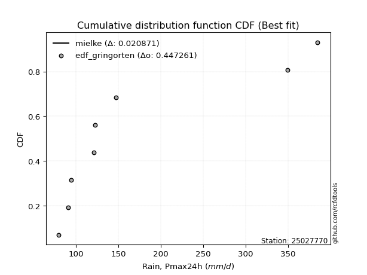</img>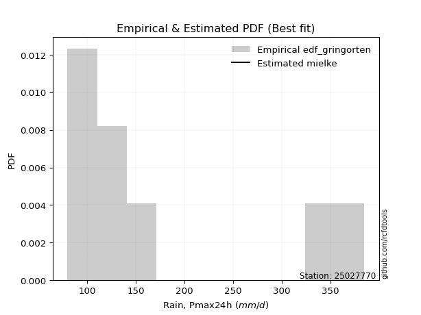</img>

</div>


### 9. Empirical - EDF Filliben (1975)

The specific values of the constants (0.3175) (often denoted as $alpha$) and (0.365) are derived from a method proposed by James J. Filliben in a 1975 paper. This particular formula is the mean value of the $i$-th order statistic of the normal distribution and is considered a robust and effective plotting position formula for the normal probability plot correlation coefficient test for normality.

<div align="center">


$P=(m-0.3175)/(n+0.365)$


</div>


**9.1. Empirical values**

<div align="center">

|                | 0                   | 1                  | 2                   | 3                   | 4            | 5                  | 6                  | 7                  | 8                  |
|:---------------|:--------------------|:-------------------|:--------------------|:--------------------|:-------------|:-------------------|:-------------------|:-------------------|:-------------------|
| date           | 2025                | 2023               | 2022                | 2017                | 2018         | 2020               | 2024               | 2021               | 2019               |
| x              | 72.0                | 79.8               | 91.1                | 94.4                | 121.1        | 122.2              | 147.2              | 349.1              | 384.6              |
| m              | 1                   | 2                  | 3                   | 4                   | 5            | 6                  | 7                  | 8                  | 9                  |
| empirical_dist | edf_filliben        | edf_filliben       | edf_filliben        | edf_filliben        | edf_filliben | edf_filliben       | edf_filliben       | edf_filliben       | edf_filliben       |
| empirical      | 0.07287773625200214 | 0.1796583021890016 | 0.28643886812600106 | 0.39321943406300053 | 0.5          | 0.6067805659369995 | 0.7135611318739989 | 0.8203416978109984 | 0.9271222637479978 |
| empirical_tr   | 1.0786063921681543  | 1.219004230393752  | 1.401421623643846   | 1.6480422349318082  | 2.0          | 2.5431093007467753 | 3.491146318732526  | 5.566121842496286  | 13.721611721611705 |

</div>


**9.2. Kolmogorov-Smirnov fit test (sorted by Δ)**


<div align="center">

|                | 0                    | 1                   | 2                   | 3                   | 4                   | 5                   | 6                   | 7                   | 8                   | 9                   | 10                  | 11                  | 12                  | 13                  | 14                  | 15                    | 16                  | 17                  | 18                  | 19                  | 20                  | 21                  | 22                  | 23                  | 24                  | 25                  | 26                  | 27                  | 28                  | 29                  | 30                  | 31                  | 32                  | 33                  | 34                  | 35                  | 36                  | 37                  | 38                  | 39                  | 40                  | 41                  | 42                  | 43                  | 44                  | 45                  | 46                  | 47                  | 48                  | 49                  | 50                  | 51                  | 52                  | 53                  | 54                  | 55                  | 56                  | 57                  | 58                  | 59                  | 60                  | 61                  | 62                  | 63                  | 64                  | 65                  | 66                  | 67                  | 68                  | 69                  | 70                  | 71                  | 72                  | 73                  | 74                  | 75                  | 76                  | 77                  | 78                  | 79                  | 80                  | 81                  | 82                  | 83                  | 84                  | 85                  | 86                  | 87                  | 88                  | 89                  |
|:---------------|:---------------------|:--------------------|:--------------------|:--------------------|:--------------------|:--------------------|:--------------------|:--------------------|:--------------------|:--------------------|:--------------------|:--------------------|:--------------------|:--------------------|:--------------------|:----------------------|:--------------------|:--------------------|:--------------------|:--------------------|:--------------------|:--------------------|:--------------------|:--------------------|:--------------------|:--------------------|:--------------------|:--------------------|:--------------------|:--------------------|:--------------------|:--------------------|:--------------------|:--------------------|:--------------------|:--------------------|:--------------------|:--------------------|:--------------------|:--------------------|:--------------------|:--------------------|:--------------------|:--------------------|:--------------------|:--------------------|:--------------------|:--------------------|:--------------------|:--------------------|:--------------------|:--------------------|:--------------------|:--------------------|:--------------------|:--------------------|:--------------------|:--------------------|:--------------------|:--------------------|:--------------------|:--------------------|:--------------------|:--------------------|:--------------------|:--------------------|:--------------------|:--------------------|:--------------------|:--------------------|:--------------------|:--------------------|:--------------------|:--------------------|:--------------------|:--------------------|:--------------------|:--------------------|:--------------------|:--------------------|:--------------------|:--------------------|:--------------------|:--------------------|:--------------------|:--------------------|:--------------------|:--------------------|:--------------------|:--------------------|
| station        | 25027770             | 25027770            | 25027770            | 25027770            | 25027770            | 25027770            | 25027770            | 25027770            | 25027770            | 25027770            | 25027770            | 25027770            | 25027770            | 25027770            | 25027770            | 25027770              | 25027770            | 25027770            | 25027770            | 25027770            | 25027770            | 25027770            | 25027770            | 25027770            | 25027770            | 25027770            | 25027770            | 25027770            | 25027770            | 25027770            | 25027770            | 25027770            | 25027770            | 25027770            | 25027770            | 25027770            | 25027770            | 25027770            | 25027770            | 25027770            | 25027770            | 25027770            | 25027770            | 25027770            | 25027770            | 25027770            | 25027770            | 25027770            | 25027770            | 25027770            | 25027770            | 25027770            | 25027770            | 25027770            | 25027770            | 25027770            | 25027770            | 25027770            | 25027770            | 25027770            | 25027770            | 25027770            | 25027770            | 25027770            | 25027770            | 25027770            | 25027770            | 25027770            | 25027770            | 25027770            | 25027770            | 25027770            | 25027770            | 25027770            | 25027770            | 25027770            | 25027770            | 25027770            | 25027770            | 25027770            | 25027770            | 25027770            | 25027770            | 25027770            | 25027770            | 25027770            | 25027770            | 25027770            | 25027770            | 25027770            |
| empirical_dist | edf_filliben         | edf_filliben        | edf_filliben        | edf_filliben        | edf_filliben        | edf_filliben        | edf_filliben        | edf_filliben        | edf_filliben        | edf_filliben        | edf_filliben        | edf_filliben        | edf_filliben        | edf_filliben        | edf_filliben        | edf_filliben          | edf_filliben        | edf_filliben        | edf_filliben        | edf_filliben        | edf_filliben        | edf_filliben        | edf_filliben        | edf_filliben        | edf_filliben        | edf_filliben        | edf_filliben        | edf_filliben        | edf_filliben        | edf_filliben        | edf_filliben        | edf_filliben        | edf_filliben        | edf_filliben        | edf_filliben        | edf_filliben        | edf_filliben        | edf_filliben        | edf_filliben        | edf_filliben        | edf_filliben        | edf_filliben        | edf_filliben        | edf_filliben        | edf_filliben        | edf_filliben        | edf_filliben        | edf_filliben        | edf_filliben        | edf_filliben        | edf_filliben        | edf_filliben        | edf_filliben        | edf_filliben        | edf_filliben        | edf_filliben        | edf_filliben        | edf_filliben        | edf_filliben        | edf_filliben        | edf_filliben        | edf_filliben        | edf_filliben        | edf_filliben        | edf_filliben        | edf_filliben        | edf_filliben        | edf_filliben        | edf_filliben        | edf_filliben        | edf_filliben        | edf_filliben        | edf_filliben        | edf_filliben        | edf_filliben        | edf_filliben        | edf_filliben        | edf_filliben        | edf_filliben        | edf_filliben        | edf_filliben        | edf_filliben        | edf_filliben        | edf_filliben        | edf_filliben        | edf_filliben        | edf_filliben        | edf_filliben        | edf_filliben        | edf_filliben        |
| p_dist         | logmielke            | johnsonsu           | logfisk             | alpha               | logjohnsonsu        | invgamma            | loginvweibull       | logfatiguelife      | loginvgamma         | logalpha            | loginvgauss         | fatiguelife         | logexponnorm        | logexpon            | weibull_min         | loglaplace_asymmetric | pareto              | invgauss            | loggenexpon         | loghalfnorm         | loggompertz         | loghalflogistic     | logweibull_min      | logmoyal            | loggumbel_r         | logpearson3         | nct                 | lograyleigh         | logchi2             | logkstwobign        | mielke              | wald                | logerlang           | loggenlogistic      | lognct              | logmaxwell          | logncf              | betaprime           | ncf                 | logbetaprime        | fisk                | halflogistic        | logrice             | lognakagami         | logtruncnorm        | logt                | lognorm             | lognorm             | logcrystalball      | logwald             | moyal               | logloggamma         | exponnorm           | expon               | genexpon            | laplace_asymmetric  | loglogistic         | pearson3            | halfnorm            | loghypsecant        | erlang              | gumbel_r            | genlogistic         | logf                | loglaplace          | f                   | nakagami            | rayleigh            | maxwell             | loggumbel_l         | truncnorm           | kstwobign           | gamma               | gibrat              | loggibrat           | t                   | norm                | gompertz            | logistic            | hypsecant           | rice                | laplace             | gumbel_l            | loglognorm          | logpareto           | invweibull          | loggamma            | loggamma            | crystalball         | chi2                |
| delta          | 0.031103828678749064 | 0.08291363754157122 | 0.08728659210660239 | 0.08894345639023682 | 0.08894960546803399 | 0.09144114504165934 | 0.09208851714315647 | 0.09304044797990452 | 0.09372738101773426 | 0.09467048193492711 | 0.09598028963058935 | 0.09931188858684858 | 0.09944391210141157 | 0.09958915666187573 | 0.10013374326573121 | 0.10170902498426249   | 0.10192207969024447 | 0.10340144251154482 | 0.10412023877673382 | 0.10721970770890221 | 0.10823246035295853 | 0.11011961433345341 | 0.1114271248092098  | 0.11258033348077534 | 0.11476004504465098 | 0.11522534759872988 | 0.12260785682683994 | 0.12669897116131623 | 0.12970913338106993 | 0.12984778481407855 | 0.12991029784040042 | 0.13093473253767712 | 0.1317707163917361  | 0.13222182173050534 | 0.1340172123360741  | 0.13878415307557984 | 0.14314487682345878 | 0.14554855307594827 | 0.14799937099309984 | 0.157730623807314   | 0.1645099180410068  | 0.16684029472499873 | 0.16916293305248714 | 0.16994706403135873 | 0.17085911778057972 | 0.17318474355873037 | 0.17318872234540655 | 0.17318872234540655 | 0.17318872269692892 | 0.1770302135240459  | 0.17717316911883418 | 0.1777156698684328  | 0.1783328732598315  | 0.18063587094265232 | 0.18063785755092454 | 0.18065226500313125 | 0.18203792821776688 | 0.18698109657842044 | 0.1875616051642659  | 0.18945352665013654 | 0.19668863560552452 | 0.2010000388372981  | 0.20157818296906044 | 0.20340101554662315 | 0.21209102998819046 | 0.21407136802176763 | 0.22112316161819134 | 0.22129197192533046 | 0.23323826756154548 | 0.242453228534455   | 0.2451312485910131  | 0.24611121235056665 | 0.25325982143716397 | 0.2565619859268949  | 0.2671205356528014  | 0.2674949534934611  | 0.26759615878055143 | 0.27130867754468313 | 0.2748580988232526  | 0.2809825455504813  | 0.2825740499001101  | 0.3060481911999745  | 0.3375177090361913  | 0.4020581074105052  | 0.42546679027129997 | 0.428186916485043   | 0.4861576079576486  | 0.4861576079576486  | 0.5688453172330827  | 0.8125424020248949  |
| deltao         | 0.41761268023100007  | 0.41761268023100007 | 0.41761268023100007 | 0.41761268023100007 | 0.41761268023100007 | 0.41761268023100007 | 0.41761268023100007 | 0.41761268023100007 | 0.41761268023100007 | 0.41761268023100007 | 0.41761268023100007 | 0.41761268023100007 | 0.41761268023100007 | 0.41761268023100007 | 0.41761268023100007 | 0.41761268023100007   | 0.41761268023100007 | 0.41761268023100007 | 0.41761268023100007 | 0.41761268023100007 | 0.41761268023100007 | 0.41761268023100007 | 0.41761268023100007 | 0.41761268023100007 | 0.41761268023100007 | 0.41761268023100007 | 0.41761268023100007 | 0.41761268023100007 | 0.41761268023100007 | 0.41761268023100007 | 0.41761268023100007 | 0.41761268023100007 | 0.41761268023100007 | 0.41761268023100007 | 0.41761268023100007 | 0.41761268023100007 | 0.41761268023100007 | 0.41761268023100007 | 0.41761268023100007 | 0.41761268023100007 | 0.41761268023100007 | 0.41761268023100007 | 0.41761268023100007 | 0.41761268023100007 | 0.41761268023100007 | 0.41761268023100007 | 0.41761268023100007 | 0.41761268023100007 | 0.41761268023100007 | 0.41761268023100007 | 0.41761268023100007 | 0.41761268023100007 | 0.41761268023100007 | 0.41761268023100007 | 0.41761268023100007 | 0.41761268023100007 | 0.41761268023100007 | 0.41761268023100007 | 0.41761268023100007 | 0.41761268023100007 | 0.41761268023100007 | 0.41761268023100007 | 0.41761268023100007 | 0.41761268023100007 | 0.41761268023100007 | 0.41761268023100007 | 0.41761268023100007 | 0.41761268023100007 | 0.41761268023100007 | 0.41761268023100007 | 0.41761268023100007 | 0.41761268023100007 | 0.41761268023100007 | 0.41761268023100007 | 0.41761268023100007 | 0.41761268023100007 | 0.41761268023100007 | 0.41761268023100007 | 0.41761268023100007 | 0.41761268023100007 | 0.41761268023100007 | 0.41761268023100007 | 0.41761268023100007 | 0.41761268023100007 | 0.41761268023100007 | 0.41761268023100007 | 0.41761268023100007 | 0.41761268023100007 | 0.41761268023100007 | 0.41761268023100007 |
| eval           | Δo > Δ               | Δo > Δ              | Δo > Δ              | Δo > Δ              | Δo > Δ              | Δo > Δ              | Δo > Δ              | Δo > Δ              | Δo > Δ              | Δo > Δ              | Δo > Δ              | Δo > Δ              | Δo > Δ              | Δo > Δ              | Δo > Δ              | Δo > Δ                | Δo > Δ              | Δo > Δ              | Δo > Δ              | Δo > Δ              | Δo > Δ              | Δo > Δ              | Δo > Δ              | Δo > Δ              | Δo > Δ              | Δo > Δ              | Δo > Δ              | Δo > Δ              | Δo > Δ              | Δo > Δ              | Δo > Δ              | Δo > Δ              | Δo > Δ              | Δo > Δ              | Δo > Δ              | Δo > Δ              | Δo > Δ              | Δo > Δ              | Δo > Δ              | Δo > Δ              | Δo > Δ              | Δo > Δ              | Δo > Δ              | Δo > Δ              | Δo > Δ              | Δo > Δ              | Δo > Δ              | Δo > Δ              | Δo > Δ              | Δo > Δ              | Δo > Δ              | Δo > Δ              | Δo > Δ              | Δo > Δ              | Δo > Δ              | Δo > Δ              | Δo > Δ              | Δo > Δ              | Δo > Δ              | Δo > Δ              | Δo > Δ              | Δo > Δ              | Δo > Δ              | Δo > Δ              | Δo > Δ              | Δo > Δ              | Δo > Δ              | Δo > Δ              | Δo > Δ              | Δo > Δ              | Δo > Δ              | Δo > Δ              | Δo > Δ              | Δo > Δ              | Δo > Δ              | Δo > Δ              | Δo > Δ              | Δo > Δ              | Δo > Δ              | Δo > Δ              | Δo > Δ              | Δo > Δ              | Δo > Δ              | Δo > Δ              | Δo <= Δ             | Δo <= Δ             | Δo <= Δ             | Δo <= Δ             | Δo <= Δ             | Δo <= Δ             |
| fit            | 1                    | 1                   | 1                   | 1                   | 1                   | 1                   | 1                   | 1                   | 1                   | 1                   | 1                   | 1                   | 1                   | 1                   | 1                   | 1                     | 1                   | 1                   | 1                   | 1                   | 1                   | 1                   | 1                   | 1                   | 1                   | 1                   | 1                   | 1                   | 1                   | 1                   | 1                   | 1                   | 1                   | 1                   | 1                   | 1                   | 1                   | 1                   | 1                   | 1                   | 1                   | 1                   | 1                   | 1                   | 1                   | 1                   | 1                   | 1                   | 1                   | 1                   | 1                   | 1                   | 1                   | 1                   | 1                   | 1                   | 1                   | 1                   | 1                   | 1                   | 1                   | 1                   | 1                   | 1                   | 1                   | 1                   | 1                   | 1                   | 1                   | 1                   | 1                   | 1                   | 1                   | 1                   | 1                   | 1                   | 1                   | 1                   | 1                   | 1                   | 1                   | 1                   | 1                   | 1                   | 0                   | 0                   | 0                   | 0                   | 0                   | 0                   |
| n              | 9                    | 9                   | 9                   | 9                   | 9                   | 9                   | 9                   | 9                   | 9                   | 9                   | 9                   | 9                   | 9                   | 9                   | 9                   | 9                     | 9                   | 9                   | 9                   | 9                   | 9                   | 9                   | 9                   | 9                   | 9                   | 9                   | 9                   | 9                   | 9                   | 9                   | 9                   | 9                   | 9                   | 9                   | 9                   | 9                   | 9                   | 9                   | 9                   | 9                   | 9                   | 9                   | 9                   | 9                   | 9                   | 9                   | 9                   | 9                   | 9                   | 9                   | 9                   | 9                   | 9                   | 9                   | 9                   | 9                   | 9                   | 9                   | 9                   | 9                   | 9                   | 9                   | 9                   | 9                   | 9                   | 9                   | 9                   | 9                   | 9                   | 9                   | 9                   | 9                   | 9                   | 9                   | 9                   | 9                   | 9                   | 9                   | 9                   | 9                   | 9                   | 9                   | 9                   | 9                   | 9                   | 9                   | 9                   | 9                   | 9                   | 9                   |
| best_fit       | 1                    | 0                   | 0                   | 0                   | 0                   | 0                   | 0                   | 0                   | 0                   | 0                   | 0                   | 0                   | 0                   | 0                   | 0                   | 0                     | 0                   | 0                   | 0                   | 0                   | 0                   | 0                   | 0                   | 0                   | 0                   | 0                   | 0                   | 0                   | 0                   | 0                   | 0                   | 0                   | 0                   | 0                   | 0                   | 0                   | 0                   | 0                   | 0                   | 0                   | 0                   | 0                   | 0                   | 0                   | 0                   | 0                   | 0                   | 0                   | 0                   | 0                   | 0                   | 0                   | 0                   | 0                   | 0                   | 0                   | 0                   | 0                   | 0                   | 0                   | 0                   | 0                   | 0                   | 0                   | 0                   | 0                   | 0                   | 0                   | 0                   | 0                   | 0                   | 0                   | 0                   | 0                   | 0                   | 0                   | 0                   | 0                   | 0                   | 0                   | 0                   | 0                   | 0                   | 0                   | 0                   | 0                   | 0                   | 0                   | 0                   | 0                   |
| best_fit_sort  | 1                    | 2                   | 3                   | 4                   | 5                   | 6                   | 7                   | 8                   | 9                   | 10                  | 11                  | 12                  | 13                  | 14                  | 15                  | 16                    | 17                  | 18                  | 19                  | 20                  | 21                  | 22                  | 23                  | 24                  | 25                  | 26                  | 27                  | 28                  | 29                  | 30                  | 31                  | 32                  | 33                  | 34                  | 35                  | 36                  | 37                  | 38                  | 39                  | 40                  | 41                  | 42                  | 43                  | 44                  | 45                  | 46                  | 47                  | 48                  | 49                  | 50                  | 51                  | 52                  | 53                  | 54                  | 55                  | 56                  | 57                  | 58                  | 59                  | 60                  | 61                  | 62                  | 63                  | 64                  | 65                  | 66                  | 67                  | 68                  | 69                  | 70                  | 71                  | 72                  | 73                  | 74                  | 75                  | 76                  | 77                  | 78                  | 79                  | 80                  | 81                  | 82                  | 83                  | 84                  | 85                  | 86                  | 87                  | 88                  | 89                  | 90                  |

</div>


<div align="center">

</img>

</div>


**9.3. Best fit**

<div align="center">

|   id |   station | empirical_dist   | p_dist    |     delta |   deltao | eval   |   fit |   n |   best_fit |   best_fit_sort |
|-----:|----------:|:-----------------|:----------|----------:|---------:|:-------|------:|----:|-----------:|----------------:|
|    0 |  25027770 | edf_filliben     | logmielke | 0.0311038 | 0.417613 | Δo > Δ |     1 |   9 |          1 |               1 |

</div>


<div align="center">

</img></img>

</div>


### 10. Empirical - EDF Jenkinson (1977)

The Jenkinson formula in hydrology is an empirical plotting position formula used to estimate the non-exceedance probability _(P)_ or return period _(T)_ of a given ordered observation within a sample. It is a widely used method in the frequency analysis of extreme events such as floods and rainfall, as it provides a distribution-free way to plot data. _a≈0.31_ and _b≈0.38_ are constants derived to approximate the median of the probability distribution for the given rank.

<div align="center">


$P=(m-a)/(n+b)$


</div>


**10.1. Empirical values**

<div align="center">

|                | 0                   | 1                   | 2                  | 3                   | 4             | 5                  | 6                  | 7                  | 8                  |
|:---------------|:--------------------|:--------------------|:-------------------|:--------------------|:--------------|:-------------------|:-------------------|:-------------------|:-------------------|
| date           | 2025                | 2023                | 2022               | 2017                | 2018          | 2020               | 2024               | 2021               | 2019               |
| x              | 72.0                | 79.8                | 91.1               | 94.4                | 121.1         | 122.2              | 147.2              | 349.1              | 384.6              |
| m              | 1                   | 2                   | 3                  | 4                   | 5             | 6                  | 7                  | 8                  | 9                  |
| empirical_dist | edf_jenkinson       | edf_jenkinson       | edf_jenkinson      | edf_jenkinson       | edf_jenkinson | edf_jenkinson      | edf_jenkinson      | edf_jenkinson      | edf_jenkinson      |
| empirical      | 0.07356076759061833 | 0.18017057569296374 | 0.2867803837953091 | 0.39339019189765456 | 0.5           | 0.6066098081023454 | 0.7132196162046908 | 0.8198294243070362 | 0.9264392324093815 |
| empirical_tr   | 1.0794016110471807  | 1.2197659297789336  | 1.4020926756352765 | 1.6485061511423549  | 2.0           | 2.542005420054201  | 3.486988847583642  | 5.550295857988164  | 13.5942028985507   |

</div>


**10.2. Kolmogorov-Smirnov fit test (sorted by Δ)**


<div align="center">

|                | 0                    | 1                   | 2                   | 3                   | 4                   | 5                   | 6                   | 7                   | 8                   | 9                   | 10                  | 11                  | 12                  | 13                  | 14                  | 15                    | 16                  | 17                  | 18                  | 19                  | 20                  | 21                  | 22                  | 23                  | 24                  | 25                  | 26                  | 27                  | 28                  | 29                  | 30                  | 31                  | 32                  | 33                  | 34                  | 35                  | 36                  | 37                  | 38                  | 39                  | 40                  | 41                  | 42                  | 43                  | 44                  | 45                  | 46                  | 47                  | 48                  | 49                  | 50                  | 51                  | 52                  | 53                  | 54                  | 55                  | 56                  | 57                  | 58                  | 59                  | 60                  | 61                  | 62                  | 63                  | 64                  | 65                  | 66                  | 67                  | 68                  | 69                  | 70                  | 71                  | 72                  | 73                  | 74                  | 75                  | 76                  | 77                  | 78                  | 79                  | 80                  | 81                  | 82                  | 83                  | 84                  | 85                  | 86                  | 87                  | 88                  | 89                  |
|:---------------|:---------------------|:--------------------|:--------------------|:--------------------|:--------------------|:--------------------|:--------------------|:--------------------|:--------------------|:--------------------|:--------------------|:--------------------|:--------------------|:--------------------|:--------------------|:----------------------|:--------------------|:--------------------|:--------------------|:--------------------|:--------------------|:--------------------|:--------------------|:--------------------|:--------------------|:--------------------|:--------------------|:--------------------|:--------------------|:--------------------|:--------------------|:--------------------|:--------------------|:--------------------|:--------------------|:--------------------|:--------------------|:--------------------|:--------------------|:--------------------|:--------------------|:--------------------|:--------------------|:--------------------|:--------------------|:--------------------|:--------------------|:--------------------|:--------------------|:--------------------|:--------------------|:--------------------|:--------------------|:--------------------|:--------------------|:--------------------|:--------------------|:--------------------|:--------------------|:--------------------|:--------------------|:--------------------|:--------------------|:--------------------|:--------------------|:--------------------|:--------------------|:--------------------|:--------------------|:--------------------|:--------------------|:--------------------|:--------------------|:--------------------|:--------------------|:--------------------|:--------------------|:--------------------|:--------------------|:--------------------|:--------------------|:--------------------|:--------------------|:--------------------|:--------------------|:--------------------|:--------------------|:--------------------|:--------------------|:--------------------|
| station        | 25027770             | 25027770            | 25027770            | 25027770            | 25027770            | 25027770            | 25027770            | 25027770            | 25027770            | 25027770            | 25027770            | 25027770            | 25027770            | 25027770            | 25027770            | 25027770              | 25027770            | 25027770            | 25027770            | 25027770            | 25027770            | 25027770            | 25027770            | 25027770            | 25027770            | 25027770            | 25027770            | 25027770            | 25027770            | 25027770            | 25027770            | 25027770            | 25027770            | 25027770            | 25027770            | 25027770            | 25027770            | 25027770            | 25027770            | 25027770            | 25027770            | 25027770            | 25027770            | 25027770            | 25027770            | 25027770            | 25027770            | 25027770            | 25027770            | 25027770            | 25027770            | 25027770            | 25027770            | 25027770            | 25027770            | 25027770            | 25027770            | 25027770            | 25027770            | 25027770            | 25027770            | 25027770            | 25027770            | 25027770            | 25027770            | 25027770            | 25027770            | 25027770            | 25027770            | 25027770            | 25027770            | 25027770            | 25027770            | 25027770            | 25027770            | 25027770            | 25027770            | 25027770            | 25027770            | 25027770            | 25027770            | 25027770            | 25027770            | 25027770            | 25027770            | 25027770            | 25027770            | 25027770            | 25027770            | 25027770            |
| empirical_dist | edf_jenkinson        | edf_jenkinson       | edf_jenkinson       | edf_jenkinson       | edf_jenkinson       | edf_jenkinson       | edf_jenkinson       | edf_jenkinson       | edf_jenkinson       | edf_jenkinson       | edf_jenkinson       | edf_jenkinson       | edf_jenkinson       | edf_jenkinson       | edf_jenkinson       | edf_jenkinson         | edf_jenkinson       | edf_jenkinson       | edf_jenkinson       | edf_jenkinson       | edf_jenkinson       | edf_jenkinson       | edf_jenkinson       | edf_jenkinson       | edf_jenkinson       | edf_jenkinson       | edf_jenkinson       | edf_jenkinson       | edf_jenkinson       | edf_jenkinson       | edf_jenkinson       | edf_jenkinson       | edf_jenkinson       | edf_jenkinson       | edf_jenkinson       | edf_jenkinson       | edf_jenkinson       | edf_jenkinson       | edf_jenkinson       | edf_jenkinson       | edf_jenkinson       | edf_jenkinson       | edf_jenkinson       | edf_jenkinson       | edf_jenkinson       | edf_jenkinson       | edf_jenkinson       | edf_jenkinson       | edf_jenkinson       | edf_jenkinson       | edf_jenkinson       | edf_jenkinson       | edf_jenkinson       | edf_jenkinson       | edf_jenkinson       | edf_jenkinson       | edf_jenkinson       | edf_jenkinson       | edf_jenkinson       | edf_jenkinson       | edf_jenkinson       | edf_jenkinson       | edf_jenkinson       | edf_jenkinson       | edf_jenkinson       | edf_jenkinson       | edf_jenkinson       | edf_jenkinson       | edf_jenkinson       | edf_jenkinson       | edf_jenkinson       | edf_jenkinson       | edf_jenkinson       | edf_jenkinson       | edf_jenkinson       | edf_jenkinson       | edf_jenkinson       | edf_jenkinson       | edf_jenkinson       | edf_jenkinson       | edf_jenkinson       | edf_jenkinson       | edf_jenkinson       | edf_jenkinson       | edf_jenkinson       | edf_jenkinson       | edf_jenkinson       | edf_jenkinson       | edf_jenkinson       | edf_jenkinson       |
| p_dist         | logmielke            | johnsonsu           | logfisk             | alpha               | logjohnsonsu        | invgamma            | loginvweibull       | logfatiguelife      | loginvgamma         | logalpha            | loginvgauss         | weibull_min         | fatiguelife         | logexponnorm        | logexpon            | loglaplace_asymmetric | pareto              | invgauss            | loggenexpon         | loghalfnorm         | loggompertz         | loghalflogistic     | logweibull_min      | logmoyal            | logpearson3         | loggumbel_r         | nct                 | lograyleigh         | logchi2             | logkstwobign        | mielke              | wald                | logerlang           | loggenlogistic      | lognct              | logmaxwell          | logncf              | betaprime           | ncf                 | logbetaprime        | fisk                | halflogistic        | logrice             | lognakagami         | logtruncnorm        | logt                | lognorm             | lognorm             | logcrystalball      | moyal               | logwald             | logloggamma         | exponnorm           | expon               | genexpon            | laplace_asymmetric  | loglogistic         | pearson3            | halfnorm            | loghypsecant        | erlang              | gumbel_r            | genlogistic         | logf                | loglaplace          | f                   | nakagami            | rayleigh            | maxwell             | loggumbel_l         | truncnorm           | kstwobign           | gamma               | gibrat              | t                   | norm                | loggibrat           | gompertz            | logistic            | hypsecant           | rice                | laplace             | gumbel_l            | loglognorm          | logpareto           | invweibull          | loggamma            | loggamma            | crystalball         | chi2                |
| delta          | 0.031786860017365255 | 0.08342591104553343 | 0.08728659210660239 | 0.08894345639023682 | 0.0894618789719962  | 0.09195341854562156 | 0.09260079064711868 | 0.09355272148386673 | 0.09423965452169647 | 0.09518275543888932 | 0.09649256313455157 | 0.09979222759642303 | 0.0998241620908108  | 0.09995618560537378 | 0.10010143016583795 | 0.1022212984882247    | 0.10243435319420668 | 0.10391371601550703 | 0.10463251228069603 | 0.10773198121286442 | 0.10874473385692074 | 0.11063188783741562 | 0.1114271248092098  | 0.11309260698473755 | 0.11505458976407584 | 0.1152723185486132  | 0.12312013033080216 | 0.1265282133266622  | 0.12902610204245368 | 0.13036005831804076 | 0.13042257134436264 | 0.13100992878391    | 0.1317707163917361  | 0.13273409523446755 | 0.13384645450142008 | 0.1386133952409258  | 0.143657150327421   | 0.14537779524129424 | 0.1478286131584458  | 0.15755986597265997 | 0.16382688670239054 | 0.16649877905569055 | 0.1689921752178331  | 0.16960554836205055 | 0.17137139128454193 | 0.17301398572407634 | 0.17301796451075252 | 0.17301796451075252 | 0.1730179648622749  | 0.17700241128418015 | 0.17754248702800804 | 0.17754491203377876 | 0.17816211542517746 | 0.1804651131079983  | 0.1804670997162705  | 0.18048150716847722 | 0.18186717038311284 | 0.18663958090911226 | 0.18722008949495772 | 0.1892827688154825  | 0.19634711993621645 | 0.20065852316798993 | 0.2014074251344064  | 0.20305949987731509 | 0.21192027215353643 | 0.21372985235245956 | 0.22078164594888317 | 0.22095045625602228 | 0.2328967518922373  | 0.24228247069980097 | 0.24496049075635906 | 0.24594045451591262 | 0.25325982143716397 | 0.2567327437615489  | 0.2671534378241529  | 0.26725464311124325 | 0.26729129348745545 | 0.2711379197100291  | 0.2745165831539444  | 0.2806410298811731  | 0.28240329206545606 | 0.3058774333653205  | 0.33717619336688315 | 0.401545833906543   | 0.4249545167673378  | 0.42750388514642673 | 0.48581609228834055 | 0.48581609228834055 | 0.5681622858944665  | 0.8120301285209328  |
| deltao         | 0.41761268023100007  | 0.41761268023100007 | 0.41761268023100007 | 0.41761268023100007 | 0.41761268023100007 | 0.41761268023100007 | 0.41761268023100007 | 0.41761268023100007 | 0.41761268023100007 | 0.41761268023100007 | 0.41761268023100007 | 0.41761268023100007 | 0.41761268023100007 | 0.41761268023100007 | 0.41761268023100007 | 0.41761268023100007   | 0.41761268023100007 | 0.41761268023100007 | 0.41761268023100007 | 0.41761268023100007 | 0.41761268023100007 | 0.41761268023100007 | 0.41761268023100007 | 0.41761268023100007 | 0.41761268023100007 | 0.41761268023100007 | 0.41761268023100007 | 0.41761268023100007 | 0.41761268023100007 | 0.41761268023100007 | 0.41761268023100007 | 0.41761268023100007 | 0.41761268023100007 | 0.41761268023100007 | 0.41761268023100007 | 0.41761268023100007 | 0.41761268023100007 | 0.41761268023100007 | 0.41761268023100007 | 0.41761268023100007 | 0.41761268023100007 | 0.41761268023100007 | 0.41761268023100007 | 0.41761268023100007 | 0.41761268023100007 | 0.41761268023100007 | 0.41761268023100007 | 0.41761268023100007 | 0.41761268023100007 | 0.41761268023100007 | 0.41761268023100007 | 0.41761268023100007 | 0.41761268023100007 | 0.41761268023100007 | 0.41761268023100007 | 0.41761268023100007 | 0.41761268023100007 | 0.41761268023100007 | 0.41761268023100007 | 0.41761268023100007 | 0.41761268023100007 | 0.41761268023100007 | 0.41761268023100007 | 0.41761268023100007 | 0.41761268023100007 | 0.41761268023100007 | 0.41761268023100007 | 0.41761268023100007 | 0.41761268023100007 | 0.41761268023100007 | 0.41761268023100007 | 0.41761268023100007 | 0.41761268023100007 | 0.41761268023100007 | 0.41761268023100007 | 0.41761268023100007 | 0.41761268023100007 | 0.41761268023100007 | 0.41761268023100007 | 0.41761268023100007 | 0.41761268023100007 | 0.41761268023100007 | 0.41761268023100007 | 0.41761268023100007 | 0.41761268023100007 | 0.41761268023100007 | 0.41761268023100007 | 0.41761268023100007 | 0.41761268023100007 | 0.41761268023100007 |
| eval           | Δo > Δ               | Δo > Δ              | Δo > Δ              | Δo > Δ              | Δo > Δ              | Δo > Δ              | Δo > Δ              | Δo > Δ              | Δo > Δ              | Δo > Δ              | Δo > Δ              | Δo > Δ              | Δo > Δ              | Δo > Δ              | Δo > Δ              | Δo > Δ                | Δo > Δ              | Δo > Δ              | Δo > Δ              | Δo > Δ              | Δo > Δ              | Δo > Δ              | Δo > Δ              | Δo > Δ              | Δo > Δ              | Δo > Δ              | Δo > Δ              | Δo > Δ              | Δo > Δ              | Δo > Δ              | Δo > Δ              | Δo > Δ              | Δo > Δ              | Δo > Δ              | Δo > Δ              | Δo > Δ              | Δo > Δ              | Δo > Δ              | Δo > Δ              | Δo > Δ              | Δo > Δ              | Δo > Δ              | Δo > Δ              | Δo > Δ              | Δo > Δ              | Δo > Δ              | Δo > Δ              | Δo > Δ              | Δo > Δ              | Δo > Δ              | Δo > Δ              | Δo > Δ              | Δo > Δ              | Δo > Δ              | Δo > Δ              | Δo > Δ              | Δo > Δ              | Δo > Δ              | Δo > Δ              | Δo > Δ              | Δo > Δ              | Δo > Δ              | Δo > Δ              | Δo > Δ              | Δo > Δ              | Δo > Δ              | Δo > Δ              | Δo > Δ              | Δo > Δ              | Δo > Δ              | Δo > Δ              | Δo > Δ              | Δo > Δ              | Δo > Δ              | Δo > Δ              | Δo > Δ              | Δo > Δ              | Δo > Δ              | Δo > Δ              | Δo > Δ              | Δo > Δ              | Δo > Δ              | Δo > Δ              | Δo > Δ              | Δo <= Δ             | Δo <= Δ             | Δo <= Δ             | Δo <= Δ             | Δo <= Δ             | Δo <= Δ             |
| fit            | 1                    | 1                   | 1                   | 1                   | 1                   | 1                   | 1                   | 1                   | 1                   | 1                   | 1                   | 1                   | 1                   | 1                   | 1                   | 1                     | 1                   | 1                   | 1                   | 1                   | 1                   | 1                   | 1                   | 1                   | 1                   | 1                   | 1                   | 1                   | 1                   | 1                   | 1                   | 1                   | 1                   | 1                   | 1                   | 1                   | 1                   | 1                   | 1                   | 1                   | 1                   | 1                   | 1                   | 1                   | 1                   | 1                   | 1                   | 1                   | 1                   | 1                   | 1                   | 1                   | 1                   | 1                   | 1                   | 1                   | 1                   | 1                   | 1                   | 1                   | 1                   | 1                   | 1                   | 1                   | 1                   | 1                   | 1                   | 1                   | 1                   | 1                   | 1                   | 1                   | 1                   | 1                   | 1                   | 1                   | 1                   | 1                   | 1                   | 1                   | 1                   | 1                   | 1                   | 1                   | 0                   | 0                   | 0                   | 0                   | 0                   | 0                   |
| n              | 9                    | 9                   | 9                   | 9                   | 9                   | 9                   | 9                   | 9                   | 9                   | 9                   | 9                   | 9                   | 9                   | 9                   | 9                   | 9                     | 9                   | 9                   | 9                   | 9                   | 9                   | 9                   | 9                   | 9                   | 9                   | 9                   | 9                   | 9                   | 9                   | 9                   | 9                   | 9                   | 9                   | 9                   | 9                   | 9                   | 9                   | 9                   | 9                   | 9                   | 9                   | 9                   | 9                   | 9                   | 9                   | 9                   | 9                   | 9                   | 9                   | 9                   | 9                   | 9                   | 9                   | 9                   | 9                   | 9                   | 9                   | 9                   | 9                   | 9                   | 9                   | 9                   | 9                   | 9                   | 9                   | 9                   | 9                   | 9                   | 9                   | 9                   | 9                   | 9                   | 9                   | 9                   | 9                   | 9                   | 9                   | 9                   | 9                   | 9                   | 9                   | 9                   | 9                   | 9                   | 9                   | 9                   | 9                   | 9                   | 9                   | 9                   |
| best_fit       | 1                    | 0                   | 0                   | 0                   | 0                   | 0                   | 0                   | 0                   | 0                   | 0                   | 0                   | 0                   | 0                   | 0                   | 0                   | 0                     | 0                   | 0                   | 0                   | 0                   | 0                   | 0                   | 0                   | 0                   | 0                   | 0                   | 0                   | 0                   | 0                   | 0                   | 0                   | 0                   | 0                   | 0                   | 0                   | 0                   | 0                   | 0                   | 0                   | 0                   | 0                   | 0                   | 0                   | 0                   | 0                   | 0                   | 0                   | 0                   | 0                   | 0                   | 0                   | 0                   | 0                   | 0                   | 0                   | 0                   | 0                   | 0                   | 0                   | 0                   | 0                   | 0                   | 0                   | 0                   | 0                   | 0                   | 0                   | 0                   | 0                   | 0                   | 0                   | 0                   | 0                   | 0                   | 0                   | 0                   | 0                   | 0                   | 0                   | 0                   | 0                   | 0                   | 0                   | 0                   | 0                   | 0                   | 0                   | 0                   | 0                   | 0                   |
| best_fit_sort  | 1                    | 2                   | 3                   | 4                   | 5                   | 6                   | 7                   | 8                   | 9                   | 10                  | 11                  | 12                  | 13                  | 14                  | 15                  | 16                    | 17                  | 18                  | 19                  | 20                  | 21                  | 22                  | 23                  | 24                  | 25                  | 26                  | 27                  | 28                  | 29                  | 30                  | 31                  | 32                  | 33                  | 34                  | 35                  | 36                  | 37                  | 38                  | 39                  | 40                  | 41                  | 42                  | 43                  | 44                  | 45                  | 46                  | 47                  | 48                  | 49                  | 50                  | 51                  | 52                  | 53                  | 54                  | 55                  | 56                  | 57                  | 58                  | 59                  | 60                  | 61                  | 62                  | 63                  | 64                  | 65                  | 66                  | 67                  | 68                  | 69                  | 70                  | 71                  | 72                  | 73                  | 74                  | 75                  | 76                  | 77                  | 78                  | 79                  | 80                  | 81                  | 82                  | 83                  | 84                  | 85                  | 86                  | 87                  | 88                  | 89                  | 90                  |

</div>


<div align="center">

</img>

</div>


**10.3. Best fit**

<div align="center">

|   id |   station | empirical_dist   | p_dist    |     delta |   deltao | eval   |   fit |   n |   best_fit |   best_fit_sort |
|-----:|----------:|:-----------------|:----------|----------:|---------:|:-------|------:|----:|-----------:|----------------:|
|    0 |  25027770 | edf_jenkinson    | logmielke | 0.0317869 | 0.417613 | Δo > Δ |     1 |   9 |          1 |               1 |

</div>


<div align="center">

</img>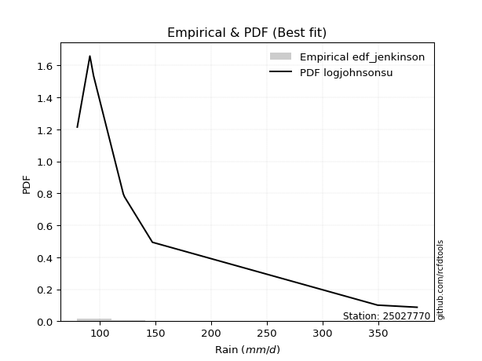</img>

</div>


### 11. Empirical - EDF Cunnane (1978)

Cunnane´s work in statistical hydrology has focused on the performance and evaluation of different probability distributions (such as GEV, Gumbel, Lognormal) for flood frequency estimation. _b_ is a constant, typically set to 0.4.

<div align="center">


$P=(m-b)/(n+1-2b)$


</div>


**11.1. Empirical values**

<div align="center">

|                | 0                   | 1                  | 2                   | 3                  | 4           | 5                  | 6                 | 7                  | 8                  |
|:---------------|:--------------------|:-------------------|:--------------------|:-------------------|:------------|:-------------------|:------------------|:-------------------|:-------------------|
| date           | 2025                | 2023               | 2022                | 2017               | 2018        | 2020               | 2024              | 2021               | 2019               |
| x              | 72.0                | 79.8               | 91.1                | 94.4               | 121.1       | 122.2              | 147.2             | 349.1              | 384.6              |
| m              | 1                   | 2                  | 3                   | 4                  | 5           | 6                  | 7                 | 8                  | 9                  |
| empirical_dist | edf_cunnane         | edf_cunnane        | edf_cunnane         | edf_cunnane        | edf_cunnane | edf_cunnane        | edf_cunnane       | edf_cunnane        | edf_cunnane        |
| empirical      | 0.06521739130434782 | 0.1739130434782609 | 0.28260869565217395 | 0.391304347826087  | 0.5         | 0.6086956521739131 | 0.717391304347826 | 0.8260869565217391 | 0.9347826086956522 |
| empirical_tr   | 1.069767441860465   | 1.2105263157894737 | 1.393939393939394   | 1.6428571428571428 | 2.0         | 2.555555555555556  | 3.538461538461538 | 5.75               | 15.333333333333343 |

</div>


**11.2. Kolmogorov-Smirnov fit test (sorted by Δ)**


<div align="center">

|                | 0                   | 1                   | 2                   | 3                   | 4                   | 5                   | 6                   | 7                   | 8                   | 9                   | 10                  | 11                  | 12                  | 13                  | 14                    | 15                  | 16                  | 17                  | 18                  | 19                  | 20                  | 21                  | 22                  | 23                  | 24                  | 25                  | 26                  | 27                  | 28                  | 29                  | 30                  | 31                  | 32                  | 33                  | 34                  | 35                  | 36                  | 37                  | 38                  | 39                  | 40                  | 41                  | 42                  | 43                  | 44                  | 45                  | 46                  | 47                  | 48                  | 49                  | 50                  | 51                  | 52                  | 53                  | 54                  | 55                  | 56                  | 57                  | 58                  | 59                  | 60                  | 61                  | 62                  | 63                  | 64                  | 65                  | 66                  | 67                  | 68                  | 69                  | 70                  | 71                  | 72                  | 73                  | 74                  | 75                  | 76                  | 77                  | 78                  | 79                  | 80                  | 81                  | 82                  | 83                  | 84                  | 85                  | 86                  | 87                  | 88                  | 89                  |
|:---------------|:--------------------|:--------------------|:--------------------|:--------------------|:--------------------|:--------------------|:--------------------|:--------------------|:--------------------|:--------------------|:--------------------|:--------------------|:--------------------|:--------------------|:----------------------|:--------------------|:--------------------|:--------------------|:--------------------|:--------------------|:--------------------|:--------------------|:--------------------|:--------------------|:--------------------|:--------------------|:--------------------|:--------------------|:--------------------|:--------------------|:--------------------|:--------------------|:--------------------|:--------------------|:--------------------|:--------------------|:--------------------|:--------------------|:--------------------|:--------------------|:--------------------|:--------------------|:--------------------|:--------------------|:--------------------|:--------------------|:--------------------|:--------------------|:--------------------|:--------------------|:--------------------|:--------------------|:--------------------|:--------------------|:--------------------|:--------------------|:--------------------|:--------------------|:--------------------|:--------------------|:--------------------|:--------------------|:--------------------|:--------------------|:--------------------|:--------------------|:--------------------|:--------------------|:--------------------|:--------------------|:--------------------|:--------------------|:--------------------|:--------------------|:--------------------|:--------------------|:--------------------|:--------------------|:--------------------|:--------------------|:--------------------|:--------------------|:--------------------|:--------------------|:--------------------|:--------------------|:--------------------|:--------------------|:--------------------|:--------------------|
| station        | 25027770            | 25027770            | 25027770            | 25027770            | 25027770            | 25027770            | 25027770            | 25027770            | 25027770            | 25027770            | 25027770            | 25027770            | 25027770            | 25027770            | 25027770              | 25027770            | 25027770            | 25027770            | 25027770            | 25027770            | 25027770            | 25027770            | 25027770            | 25027770            | 25027770            | 25027770            | 25027770            | 25027770            | 25027770            | 25027770            | 25027770            | 25027770            | 25027770            | 25027770            | 25027770            | 25027770            | 25027770            | 25027770            | 25027770            | 25027770            | 25027770            | 25027770            | 25027770            | 25027770            | 25027770            | 25027770            | 25027770            | 25027770            | 25027770            | 25027770            | 25027770            | 25027770            | 25027770            | 25027770            | 25027770            | 25027770            | 25027770            | 25027770            | 25027770            | 25027770            | 25027770            | 25027770            | 25027770            | 25027770            | 25027770            | 25027770            | 25027770            | 25027770            | 25027770            | 25027770            | 25027770            | 25027770            | 25027770            | 25027770            | 25027770            | 25027770            | 25027770            | 25027770            | 25027770            | 25027770            | 25027770            | 25027770            | 25027770            | 25027770            | 25027770            | 25027770            | 25027770            | 25027770            | 25027770            | 25027770            |
| empirical_dist | edf_cunnane         | edf_cunnane         | edf_cunnane         | edf_cunnane         | edf_cunnane         | edf_cunnane         | edf_cunnane         | edf_cunnane         | edf_cunnane         | edf_cunnane         | edf_cunnane         | edf_cunnane         | edf_cunnane         | edf_cunnane         | edf_cunnane           | edf_cunnane         | edf_cunnane         | edf_cunnane         | edf_cunnane         | edf_cunnane         | edf_cunnane         | edf_cunnane         | edf_cunnane         | edf_cunnane         | edf_cunnane         | edf_cunnane         | edf_cunnane         | edf_cunnane         | edf_cunnane         | edf_cunnane         | edf_cunnane         | edf_cunnane         | edf_cunnane         | edf_cunnane         | edf_cunnane         | edf_cunnane         | edf_cunnane         | edf_cunnane         | edf_cunnane         | edf_cunnane         | edf_cunnane         | edf_cunnane         | edf_cunnane         | edf_cunnane         | edf_cunnane         | edf_cunnane         | edf_cunnane         | edf_cunnane         | edf_cunnane         | edf_cunnane         | edf_cunnane         | edf_cunnane         | edf_cunnane         | edf_cunnane         | edf_cunnane         | edf_cunnane         | edf_cunnane         | edf_cunnane         | edf_cunnane         | edf_cunnane         | edf_cunnane         | edf_cunnane         | edf_cunnane         | edf_cunnane         | edf_cunnane         | edf_cunnane         | edf_cunnane         | edf_cunnane         | edf_cunnane         | edf_cunnane         | edf_cunnane         | edf_cunnane         | edf_cunnane         | edf_cunnane         | edf_cunnane         | edf_cunnane         | edf_cunnane         | edf_cunnane         | edf_cunnane         | edf_cunnane         | edf_cunnane         | edf_cunnane         | edf_cunnane         | edf_cunnane         | edf_cunnane         | edf_cunnane         | edf_cunnane         | edf_cunnane         | edf_cunnane         | edf_cunnane         |
| p_dist         | logmielke           | johnsonsu           | invgamma            | logfisk             | loginvweibull       | loginvgamma         | logjohnsonsu        | logalpha            | alpha               | loginvgauss         | logfatiguelife      | fatiguelife         | logexponnorm        | logexpon            | loglaplace_asymmetric | pareto              | invgauss            | loggenexpon         | loghalfnorm         | loggompertz         | weibull_min         | loghalflogistic     | logmoyal            | loggumbel_r         | logweibull_min      | logpearson3         | nct                 | mielke              | loggenlogistic      | logkstwobign        | lograyleigh         | logerlang           | wald                | lognct              | logchi2             | logncf              | logmaxwell          | betaprime           | ncf                 | logbetaprime        | logtruncnorm        | halflogistic        | logrice             | logwald             | fisk                | lognakagami         | logt                | lognorm             | lognorm             | logcrystalball      | moyal               | logloggamma         | exponnorm           | expon               | genexpon            | laplace_asymmetric  | loglogistic         | pearson3            | loghypsecant        | halfnorm            | erlang              | genlogistic         | gumbel_r            | logf                | loglaplace          | f                   | nakagami            | rayleigh            | maxwell             | loggumbel_l         | truncnorm           | kstwobign           | gamma               | gibrat              | loggibrat           | t                   | norm                | gompertz            | logistic            | hypsecant           | rice                | laplace             | gumbel_l            | loglognorm          | logpareto           | invweibull          | loggamma            | loggamma            | crystalball         | chi2                |
| delta          | 0.02344348373109475 | 0.0802691255449609  | 0.08569588633091862 | 0.08728659210660239 | 0.08728831368302292 | 0.08798212230699354 | 0.08817321830796443 | 0.08892522322418639 | 0.08894345639023682 | 0.09023503091984864 | 0.09148599044709793 | 0.09356662987610787 | 0.09369865339067085 | 0.09384389795113501 | 0.09596376627352177   | 0.09617682097950375 | 0.0976561838008041  | 0.0983749800659931  | 0.10147444899816149 | 0.1024872016422178  | 0.10396391573955832 | 0.10437435562271269 | 0.10683507477003462 | 0.1100088366730887  | 0.1114271248092098  | 0.11714043383564349 | 0.1215282195557148  | 0.1241650391296597  | 0.12647656301976462 | 0.12703704158639184 | 0.12861405739822984 | 0.1317707163917361  | 0.13284981877459073 | 0.13593229857298772 | 0.13736947832872437 | 0.13739961811271806 | 0.14069923931249345 | 0.14746363931286188 | 0.14991445723001345 | 0.15964571004422762 | 0.165113859069839   | 0.17067046719882584 | 0.17107801928940075 | 0.1712849548133052  | 0.17217026298866123 | 0.17377723650518584 | 0.17509982979564398 | 0.17510380858232016 | 0.17510380858232016 | 0.17510380893384253 | 0.17959120954672614 | 0.1796307561053464  | 0.1802479594967451  | 0.18255095717956593 | 0.18255294378783815 | 0.18256735124004486 | 0.18395301445468049 | 0.19081126905224755 | 0.19136861288705015 | 0.191391777638093   | 0.20051880807935163 | 0.20349326920597405 | 0.20483021131112522 | 0.20723118802045026 | 0.21400611622510407 | 0.21790154049559474 | 0.22495333409201845 | 0.22512214439915756 | 0.23706844003537259 | 0.2443683147713686  | 0.2470463348279267  | 0.24802629858748027 | 0.25325982143716397 | 0.25464689968998133 | 0.26520544941588786 | 0.2713251259672882  | 0.27142633125437854 | 0.27322376378159674 | 0.2786882712970797  | 0.2848127180243084  | 0.2859112178887486  | 0.3079632774368881  | 0.34134788151001844 | 0.4078033661212459  | 0.4312120489820407  | 0.4358472614326974  | 0.48998778043147573 | 0.48998778043147573 | 0.5765056621807371  | 0.8182876607356356  |
| deltao         | 0.41761268023100007 | 0.41761268023100007 | 0.41761268023100007 | 0.41761268023100007 | 0.41761268023100007 | 0.41761268023100007 | 0.41761268023100007 | 0.41761268023100007 | 0.41761268023100007 | 0.41761268023100007 | 0.41761268023100007 | 0.41761268023100007 | 0.41761268023100007 | 0.41761268023100007 | 0.41761268023100007   | 0.41761268023100007 | 0.41761268023100007 | 0.41761268023100007 | 0.41761268023100007 | 0.41761268023100007 | 0.41761268023100007 | 0.41761268023100007 | 0.41761268023100007 | 0.41761268023100007 | 0.41761268023100007 | 0.41761268023100007 | 0.41761268023100007 | 0.41761268023100007 | 0.41761268023100007 | 0.41761268023100007 | 0.41761268023100007 | 0.41761268023100007 | 0.41761268023100007 | 0.41761268023100007 | 0.41761268023100007 | 0.41761268023100007 | 0.41761268023100007 | 0.41761268023100007 | 0.41761268023100007 | 0.41761268023100007 | 0.41761268023100007 | 0.41761268023100007 | 0.41761268023100007 | 0.41761268023100007 | 0.41761268023100007 | 0.41761268023100007 | 0.41761268023100007 | 0.41761268023100007 | 0.41761268023100007 | 0.41761268023100007 | 0.41761268023100007 | 0.41761268023100007 | 0.41761268023100007 | 0.41761268023100007 | 0.41761268023100007 | 0.41761268023100007 | 0.41761268023100007 | 0.41761268023100007 | 0.41761268023100007 | 0.41761268023100007 | 0.41761268023100007 | 0.41761268023100007 | 0.41761268023100007 | 0.41761268023100007 | 0.41761268023100007 | 0.41761268023100007 | 0.41761268023100007 | 0.41761268023100007 | 0.41761268023100007 | 0.41761268023100007 | 0.41761268023100007 | 0.41761268023100007 | 0.41761268023100007 | 0.41761268023100007 | 0.41761268023100007 | 0.41761268023100007 | 0.41761268023100007 | 0.41761268023100007 | 0.41761268023100007 | 0.41761268023100007 | 0.41761268023100007 | 0.41761268023100007 | 0.41761268023100007 | 0.41761268023100007 | 0.41761268023100007 | 0.41761268023100007 | 0.41761268023100007 | 0.41761268023100007 | 0.41761268023100007 | 0.41761268023100007 |
| eval           | Δo > Δ              | Δo > Δ              | Δo > Δ              | Δo > Δ              | Δo > Δ              | Δo > Δ              | Δo > Δ              | Δo > Δ              | Δo > Δ              | Δo > Δ              | Δo > Δ              | Δo > Δ              | Δo > Δ              | Δo > Δ              | Δo > Δ                | Δo > Δ              | Δo > Δ              | Δo > Δ              | Δo > Δ              | Δo > Δ              | Δo > Δ              | Δo > Δ              | Δo > Δ              | Δo > Δ              | Δo > Δ              | Δo > Δ              | Δo > Δ              | Δo > Δ              | Δo > Δ              | Δo > Δ              | Δo > Δ              | Δo > Δ              | Δo > Δ              | Δo > Δ              | Δo > Δ              | Δo > Δ              | Δo > Δ              | Δo > Δ              | Δo > Δ              | Δo > Δ              | Δo > Δ              | Δo > Δ              | Δo > Δ              | Δo > Δ              | Δo > Δ              | Δo > Δ              | Δo > Δ              | Δo > Δ              | Δo > Δ              | Δo > Δ              | Δo > Δ              | Δo > Δ              | Δo > Δ              | Δo > Δ              | Δo > Δ              | Δo > Δ              | Δo > Δ              | Δo > Δ              | Δo > Δ              | Δo > Δ              | Δo > Δ              | Δo > Δ              | Δo > Δ              | Δo > Δ              | Δo > Δ              | Δo > Δ              | Δo > Δ              | Δo > Δ              | Δo > Δ              | Δo > Δ              | Δo > Δ              | Δo > Δ              | Δo > Δ              | Δo > Δ              | Δo > Δ              | Δo > Δ              | Δo > Δ              | Δo > Δ              | Δo > Δ              | Δo > Δ              | Δo > Δ              | Δo > Δ              | Δo > Δ              | Δo > Δ              | Δo <= Δ             | Δo <= Δ             | Δo <= Δ             | Δo <= Δ             | Δo <= Δ             | Δo <= Δ             |
| fit            | 1                   | 1                   | 1                   | 1                   | 1                   | 1                   | 1                   | 1                   | 1                   | 1                   | 1                   | 1                   | 1                   | 1                   | 1                     | 1                   | 1                   | 1                   | 1                   | 1                   | 1                   | 1                   | 1                   | 1                   | 1                   | 1                   | 1                   | 1                   | 1                   | 1                   | 1                   | 1                   | 1                   | 1                   | 1                   | 1                   | 1                   | 1                   | 1                   | 1                   | 1                   | 1                   | 1                   | 1                   | 1                   | 1                   | 1                   | 1                   | 1                   | 1                   | 1                   | 1                   | 1                   | 1                   | 1                   | 1                   | 1                   | 1                   | 1                   | 1                   | 1                   | 1                   | 1                   | 1                   | 1                   | 1                   | 1                   | 1                   | 1                   | 1                   | 1                   | 1                   | 1                   | 1                   | 1                   | 1                   | 1                   | 1                   | 1                   | 1                   | 1                   | 1                   | 1                   | 1                   | 0                   | 0                   | 0                   | 0                   | 0                   | 0                   |
| n              | 9                   | 9                   | 9                   | 9                   | 9                   | 9                   | 9                   | 9                   | 9                   | 9                   | 9                   | 9                   | 9                   | 9                   | 9                     | 9                   | 9                   | 9                   | 9                   | 9                   | 9                   | 9                   | 9                   | 9                   | 9                   | 9                   | 9                   | 9                   | 9                   | 9                   | 9                   | 9                   | 9                   | 9                   | 9                   | 9                   | 9                   | 9                   | 9                   | 9                   | 9                   | 9                   | 9                   | 9                   | 9                   | 9                   | 9                   | 9                   | 9                   | 9                   | 9                   | 9                   | 9                   | 9                   | 9                   | 9                   | 9                   | 9                   | 9                   | 9                   | 9                   | 9                   | 9                   | 9                   | 9                   | 9                   | 9                   | 9                   | 9                   | 9                   | 9                   | 9                   | 9                   | 9                   | 9                   | 9                   | 9                   | 9                   | 9                   | 9                   | 9                   | 9                   | 9                   | 9                   | 9                   | 9                   | 9                   | 9                   | 9                   | 9                   |
| best_fit       | 1                   | 0                   | 0                   | 0                   | 0                   | 0                   | 0                   | 0                   | 0                   | 0                   | 0                   | 0                   | 0                   | 0                   | 0                     | 0                   | 0                   | 0                   | 0                   | 0                   | 0                   | 0                   | 0                   | 0                   | 0                   | 0                   | 0                   | 0                   | 0                   | 0                   | 0                   | 0                   | 0                   | 0                   | 0                   | 0                   | 0                   | 0                   | 0                   | 0                   | 0                   | 0                   | 0                   | 0                   | 0                   | 0                   | 0                   | 0                   | 0                   | 0                   | 0                   | 0                   | 0                   | 0                   | 0                   | 0                   | 0                   | 0                   | 0                   | 0                   | 0                   | 0                   | 0                   | 0                   | 0                   | 0                   | 0                   | 0                   | 0                   | 0                   | 0                   | 0                   | 0                   | 0                   | 0                   | 0                   | 0                   | 0                   | 0                   | 0                   | 0                   | 0                   | 0                   | 0                   | 0                   | 0                   | 0                   | 0                   | 0                   | 0                   |
| best_fit_sort  | 1                   | 2                   | 3                   | 4                   | 5                   | 6                   | 7                   | 8                   | 9                   | 10                  | 11                  | 12                  | 13                  | 14                  | 15                    | 16                  | 17                  | 18                  | 19                  | 20                  | 21                  | 22                  | 23                  | 24                  | 25                  | 26                  | 27                  | 28                  | 29                  | 30                  | 31                  | 32                  | 33                  | 34                  | 35                  | 36                  | 37                  | 38                  | 39                  | 40                  | 41                  | 42                  | 43                  | 44                  | 45                  | 46                  | 47                  | 48                  | 49                  | 50                  | 51                  | 52                  | 53                  | 54                  | 55                  | 56                  | 57                  | 58                  | 59                  | 60                  | 61                  | 62                  | 63                  | 64                  | 65                  | 66                  | 67                  | 68                  | 69                  | 70                  | 71                  | 72                  | 73                  | 74                  | 75                  | 76                  | 77                  | 78                  | 79                  | 80                  | 81                  | 82                  | 83                  | 84                  | 85                  | 86                  | 87                  | 88                  | 89                  | 90                  |

</div>


<div align="center">

</img>

</div>


**11.3. Best fit**

<div align="center">

|   id |   station | empirical_dist   | p_dist    |     delta |   deltao | eval   |   fit |   n |   best_fit |   best_fit_sort |
|-----:|----------:|:-----------------|:----------|----------:|---------:|:-------|------:|----:|-----------:|----------------:|
|    0 |  25027770 | edf_cunnane      | logmielke | 0.0234435 | 0.417613 | Δo > Δ |     1 |   9 |          1 |               1 |

</div>


<div align="center">

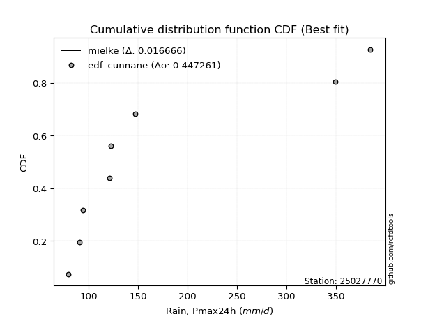</img></img>

</div>


### 12. Empirical - EDF Adamowski (1981)

The Adamowski formula in hydrology refers to a specific plotting position formula used for estimating the non-parametric empirical distribution of hydrological events (like flood peaks) to calculate their return periods. This formula provides an alternative to traditional parametric methods (like the Gumbel or Log Pearson Type III distributions). 

<div align="center">


$P=(m-0.25)/(n+0.5)$


</div>


**12.1. Empirical values**

<div align="center">

|                | 0                   | 1                   | 2                  | 3                   | 4             | 5                  | 6                  | 7                  | 8                  |
|:---------------|:--------------------|:--------------------|:-------------------|:--------------------|:--------------|:-------------------|:-------------------|:-------------------|:-------------------|
| date           | 2025                | 2023                | 2022               | 2017                | 2018          | 2020               | 2024               | 2021               | 2019               |
| x              | 72.0                | 79.8                | 91.1               | 94.4                | 121.1         | 122.2              | 147.2              | 349.1              | 384.6              |
| m              | 1                   | 2                   | 3                  | 4                   | 5             | 6                  | 7                  | 8                  | 9                  |
| empirical_dist | edf_adamowski       | edf_adamowski       | edf_adamowski      | edf_adamowski       | edf_adamowski | edf_adamowski      | edf_adamowski      | edf_adamowski      | edf_adamowski      |
| empirical      | 0.07894736842105263 | 0.18421052631578946 | 0.2894736842105263 | 0.39473684210526316 | 0.5           | 0.6052631578947368 | 0.7105263157894737 | 0.8157894736842105 | 0.9210526315789473 |
| empirical_tr   | 1.0857142857142856  | 1.2258064516129032  | 1.4074074074074074 | 1.6521739130434783  | 2.0           | 2.533333333333333  | 3.4545454545454546 | 5.428571428571428  | 12.666666666666663 |

</div>


**12.2. Kolmogorov-Smirnov fit test (sorted by Δ)**


<div align="center">

|                | 0                   | 1                   | 2                   | 3                   | 4                   | 5                   | 6                   | 7                   | 8                   | 9                   | 10                  | 11                  | 12                  | 13                  | 14                  | 15                    | 16                  | 17                  | 18                  | 19                  | 20                  | 21                  | 22                  | 23                  | 24                  | 25                  | 26                  | 27                  | 28                  | 29                  | 30                  | 31                  | 32                  | 33                  | 34                  | 35                  | 36                  | 37                  | 38                  | 39                  | 40                  | 41                  | 42                  | 43                  | 44                  | 45                  | 46                  | 47                  | 48                  | 49                  | 50                  | 51                  | 52                  | 53                  | 54                  | 55                  | 56                  | 57                  | 58                  | 59                  | 60                  | 61                  | 62                  | 63                  | 64                  | 65                  | 66                  | 67                  | 68                  | 69                  | 70                  | 71                  | 72                  | 73                  | 74                  | 75                  | 76                  | 77                  | 78                  | 79                  | 80                  | 81                  | 82                  | 83                  | 84                  | 85                  | 86                  | 87                  | 88                  | 89                  |
|:---------------|:--------------------|:--------------------|:--------------------|:--------------------|:--------------------|:--------------------|:--------------------|:--------------------|:--------------------|:--------------------|:--------------------|:--------------------|:--------------------|:--------------------|:--------------------|:----------------------|:--------------------|:--------------------|:--------------------|:--------------------|:--------------------|:--------------------|:--------------------|:--------------------|:--------------------|:--------------------|:--------------------|:--------------------|:--------------------|:--------------------|:--------------------|:--------------------|:--------------------|:--------------------|:--------------------|:--------------------|:--------------------|:--------------------|:--------------------|:--------------------|:--------------------|:--------------------|:--------------------|:--------------------|:--------------------|:--------------------|:--------------------|:--------------------|:--------------------|:--------------------|:--------------------|:--------------------|:--------------------|:--------------------|:--------------------|:--------------------|:--------------------|:--------------------|:--------------------|:--------------------|:--------------------|:--------------------|:--------------------|:--------------------|:--------------------|:--------------------|:--------------------|:--------------------|:--------------------|:--------------------|:--------------------|:--------------------|:--------------------|:--------------------|:--------------------|:--------------------|:--------------------|:--------------------|:--------------------|:--------------------|:--------------------|:--------------------|:--------------------|:--------------------|:--------------------|:--------------------|:--------------------|:--------------------|:--------------------|:--------------------|
| station        | 25027770            | 25027770            | 25027770            | 25027770            | 25027770            | 25027770            | 25027770            | 25027770            | 25027770            | 25027770            | 25027770            | 25027770            | 25027770            | 25027770            | 25027770            | 25027770              | 25027770            | 25027770            | 25027770            | 25027770            | 25027770            | 25027770            | 25027770            | 25027770            | 25027770            | 25027770            | 25027770            | 25027770            | 25027770            | 25027770            | 25027770            | 25027770            | 25027770            | 25027770            | 25027770            | 25027770            | 25027770            | 25027770            | 25027770            | 25027770            | 25027770            | 25027770            | 25027770            | 25027770            | 25027770            | 25027770            | 25027770            | 25027770            | 25027770            | 25027770            | 25027770            | 25027770            | 25027770            | 25027770            | 25027770            | 25027770            | 25027770            | 25027770            | 25027770            | 25027770            | 25027770            | 25027770            | 25027770            | 25027770            | 25027770            | 25027770            | 25027770            | 25027770            | 25027770            | 25027770            | 25027770            | 25027770            | 25027770            | 25027770            | 25027770            | 25027770            | 25027770            | 25027770            | 25027770            | 25027770            | 25027770            | 25027770            | 25027770            | 25027770            | 25027770            | 25027770            | 25027770            | 25027770            | 25027770            | 25027770            |
| empirical_dist | edf_adamowski       | edf_adamowski       | edf_adamowski       | edf_adamowski       | edf_adamowski       | edf_adamowski       | edf_adamowski       | edf_adamowski       | edf_adamowski       | edf_adamowski       | edf_adamowski       | edf_adamowski       | edf_adamowski       | edf_adamowski       | edf_adamowski       | edf_adamowski         | edf_adamowski       | edf_adamowski       | edf_adamowski       | edf_adamowski       | edf_adamowski       | edf_adamowski       | edf_adamowski       | edf_adamowski       | edf_adamowski       | edf_adamowski       | edf_adamowski       | edf_adamowski       | edf_adamowski       | edf_adamowski       | edf_adamowski       | edf_adamowski       | edf_adamowski       | edf_adamowski       | edf_adamowski       | edf_adamowski       | edf_adamowski       | edf_adamowski       | edf_adamowski       | edf_adamowski       | edf_adamowski       | edf_adamowski       | edf_adamowski       | edf_adamowski       | edf_adamowski       | edf_adamowski       | edf_adamowski       | edf_adamowski       | edf_adamowski       | edf_adamowski       | edf_adamowski       | edf_adamowski       | edf_adamowski       | edf_adamowski       | edf_adamowski       | edf_adamowski       | edf_adamowski       | edf_adamowski       | edf_adamowski       | edf_adamowski       | edf_adamowski       | edf_adamowski       | edf_adamowski       | edf_adamowski       | edf_adamowski       | edf_adamowski       | edf_adamowski       | edf_adamowski       | edf_adamowski       | edf_adamowski       | edf_adamowski       | edf_adamowski       | edf_adamowski       | edf_adamowski       | edf_adamowski       | edf_adamowski       | edf_adamowski       | edf_adamowski       | edf_adamowski       | edf_adamowski       | edf_adamowski       | edf_adamowski       | edf_adamowski       | edf_adamowski       | edf_adamowski       | edf_adamowski       | edf_adamowski       | edf_adamowski       | edf_adamowski       | edf_adamowski       |
| p_dist         | logmielke           | logfisk             | johnsonsu           | alpha               | logjohnsonsu        | invgamma            | loginvweibull       | weibull_min         | logfatiguelife      | loginvgamma         | logalpha            | loginvgauss         | fatiguelife         | logexponnorm        | logexpon            | loglaplace_asymmetric | pareto              | invgauss            | loggenexpon         | logweibull_min      | loghalfnorm         | loggompertz         | loghalflogistic     | logmoyal            | logpearson3         | loggumbel_r         | logchi2             | lograyleigh         | nct                 | wald                | lognct              | logerlang           | logkstwobign        | mielke              | loggenlogistic      | logmaxwell          | betaprime           | ncf                 | logncf              | logbetaprime        | fisk                | halflogistic        | lognakagami         | logrice             | logt                | lognorm             | lognorm             | logcrystalball      | logtruncnorm        | moyal               | logloggamma         | exponnorm           | expon               | genexpon            | laplace_asymmetric  | loglogistic         | logwald             | pearson3            | halfnorm            | loghypsecant        | erlang              | gumbel_r            | genlogistic         | logf                | loglaplace          | f                   | nakagami            | rayleigh            | maxwell             | loggumbel_l         | truncnorm           | kstwobign           | gamma               | gibrat              | t                   | norm                | loggibrat           | gompertz            | logistic            | hypsecant           | rice                | laplace             | gumbel_l            | loglognorm          | logpareto           | invweibull          | loggamma            | loggamma            | crystalball         | chi2                |
| delta          | 0.03717346084779955 | 0.08728659210660239 | 0.08746586166835912 | 0.08894345639023682 | 0.0935018295948219  | 0.09599336916844725 | 0.09664074126994437 | 0.09709892718120594 | 0.09759267210669242 | 0.09827960514452216 | 0.09922270606171502 | 0.10053251375737726 | 0.10386411271363649 | 0.10399613622819948 | 0.10414138078866364 | 0.1062612491110504    | 0.10647430381703238 | 0.10795366663833272 | 0.10867246290352173 | 0.1114271248092098  | 0.11177193183569012 | 0.11278468447974643 | 0.11467183846024132 | 0.11713255760756325 | 0.1184036254516635  | 0.11931226917143889 | 0.124579017611547   | 0.1251815631190536  | 0.12716008095362785 | 0.1323565789915186  | 0.13249980429381147 | 0.13321665238447156 | 0.13440000894086646 | 0.13446252196718833 | 0.13677404585729325 | 0.1372667450333172  | 0.14403114503368564 | 0.1464819629508372  | 0.14769710095024668 | 0.15621321576505137 | 0.15844028587195635 | 0.16380547864047346 | 0.16691224794683346 | 0.1676455250102245  | 0.17166733551646773 | 0.17167131430314392 | 0.17167131430314392 | 0.17167131465466628 | 0.17541134190736762 | 0.17565576107657155 | 0.17619826182617015 | 0.17681546521756886 | 0.17911846290038969 | 0.1791204495086619  | 0.17913485696086862 | 0.18052052017550424 | 0.18158243765083376 | 0.18394628049389516 | 0.18452678907974063 | 0.1879361186078739  | 0.19478646923324228 | 0.19796522275277284 | 0.2000607749267978  | 0.20036619946209788 | 0.21057362194592782 | 0.21103655193724236 | 0.21808834553366607 | 0.21825715584080518 | 0.2302034514770202  | 0.24093582049219237 | 0.24361384054875046 | 0.24459380430830402 | 0.25325982143716397 | 0.2580793939691575  | 0.2644601374089358  | 0.26456134269602616 | 0.26863794369506405 | 0.2697912695024205  | 0.2718232827387273  | 0.27794772946595603 | 0.28105664185784746 | 0.30453078315771187 | 0.33448289295166606 | 0.3975058832837173  | 0.42091456614451206 | 0.42211728431599255 | 0.48312279187312335 | 0.48312279187312335 | 0.5627756850640322  | 0.807990177898107   |
| deltao         | 0.41761268023100007 | 0.41761268023100007 | 0.41761268023100007 | 0.41761268023100007 | 0.41761268023100007 | 0.41761268023100007 | 0.41761268023100007 | 0.41761268023100007 | 0.41761268023100007 | 0.41761268023100007 | 0.41761268023100007 | 0.41761268023100007 | 0.41761268023100007 | 0.41761268023100007 | 0.41761268023100007 | 0.41761268023100007   | 0.41761268023100007 | 0.41761268023100007 | 0.41761268023100007 | 0.41761268023100007 | 0.41761268023100007 | 0.41761268023100007 | 0.41761268023100007 | 0.41761268023100007 | 0.41761268023100007 | 0.41761268023100007 | 0.41761268023100007 | 0.41761268023100007 | 0.41761268023100007 | 0.41761268023100007 | 0.41761268023100007 | 0.41761268023100007 | 0.41761268023100007 | 0.41761268023100007 | 0.41761268023100007 | 0.41761268023100007 | 0.41761268023100007 | 0.41761268023100007 | 0.41761268023100007 | 0.41761268023100007 | 0.41761268023100007 | 0.41761268023100007 | 0.41761268023100007 | 0.41761268023100007 | 0.41761268023100007 | 0.41761268023100007 | 0.41761268023100007 | 0.41761268023100007 | 0.41761268023100007 | 0.41761268023100007 | 0.41761268023100007 | 0.41761268023100007 | 0.41761268023100007 | 0.41761268023100007 | 0.41761268023100007 | 0.41761268023100007 | 0.41761268023100007 | 0.41761268023100007 | 0.41761268023100007 | 0.41761268023100007 | 0.41761268023100007 | 0.41761268023100007 | 0.41761268023100007 | 0.41761268023100007 | 0.41761268023100007 | 0.41761268023100007 | 0.41761268023100007 | 0.41761268023100007 | 0.41761268023100007 | 0.41761268023100007 | 0.41761268023100007 | 0.41761268023100007 | 0.41761268023100007 | 0.41761268023100007 | 0.41761268023100007 | 0.41761268023100007 | 0.41761268023100007 | 0.41761268023100007 | 0.41761268023100007 | 0.41761268023100007 | 0.41761268023100007 | 0.41761268023100007 | 0.41761268023100007 | 0.41761268023100007 | 0.41761268023100007 | 0.41761268023100007 | 0.41761268023100007 | 0.41761268023100007 | 0.41761268023100007 | 0.41761268023100007 |
| eval           | Δo > Δ              | Δo > Δ              | Δo > Δ              | Δo > Δ              | Δo > Δ              | Δo > Δ              | Δo > Δ              | Δo > Δ              | Δo > Δ              | Δo > Δ              | Δo > Δ              | Δo > Δ              | Δo > Δ              | Δo > Δ              | Δo > Δ              | Δo > Δ                | Δo > Δ              | Δo > Δ              | Δo > Δ              | Δo > Δ              | Δo > Δ              | Δo > Δ              | Δo > Δ              | Δo > Δ              | Δo > Δ              | Δo > Δ              | Δo > Δ              | Δo > Δ              | Δo > Δ              | Δo > Δ              | Δo > Δ              | Δo > Δ              | Δo > Δ              | Δo > Δ              | Δo > Δ              | Δo > Δ              | Δo > Δ              | Δo > Δ              | Δo > Δ              | Δo > Δ              | Δo > Δ              | Δo > Δ              | Δo > Δ              | Δo > Δ              | Δo > Δ              | Δo > Δ              | Δo > Δ              | Δo > Δ              | Δo > Δ              | Δo > Δ              | Δo > Δ              | Δo > Δ              | Δo > Δ              | Δo > Δ              | Δo > Δ              | Δo > Δ              | Δo > Δ              | Δo > Δ              | Δo > Δ              | Δo > Δ              | Δo > Δ              | Δo > Δ              | Δo > Δ              | Δo > Δ              | Δo > Δ              | Δo > Δ              | Δo > Δ              | Δo > Δ              | Δo > Δ              | Δo > Δ              | Δo > Δ              | Δo > Δ              | Δo > Δ              | Δo > Δ              | Δo > Δ              | Δo > Δ              | Δo > Δ              | Δo > Δ              | Δo > Δ              | Δo > Δ              | Δo > Δ              | Δo > Δ              | Δo > Δ              | Δo > Δ              | Δo <= Δ             | Δo <= Δ             | Δo <= Δ             | Δo <= Δ             | Δo <= Δ             | Δo <= Δ             |
| fit            | 1                   | 1                   | 1                   | 1                   | 1                   | 1                   | 1                   | 1                   | 1                   | 1                   | 1                   | 1                   | 1                   | 1                   | 1                   | 1                     | 1                   | 1                   | 1                   | 1                   | 1                   | 1                   | 1                   | 1                   | 1                   | 1                   | 1                   | 1                   | 1                   | 1                   | 1                   | 1                   | 1                   | 1                   | 1                   | 1                   | 1                   | 1                   | 1                   | 1                   | 1                   | 1                   | 1                   | 1                   | 1                   | 1                   | 1                   | 1                   | 1                   | 1                   | 1                   | 1                   | 1                   | 1                   | 1                   | 1                   | 1                   | 1                   | 1                   | 1                   | 1                   | 1                   | 1                   | 1                   | 1                   | 1                   | 1                   | 1                   | 1                   | 1                   | 1                   | 1                   | 1                   | 1                   | 1                   | 1                   | 1                   | 1                   | 1                   | 1                   | 1                   | 1                   | 1                   | 1                   | 0                   | 0                   | 0                   | 0                   | 0                   | 0                   |
| n              | 9                   | 9                   | 9                   | 9                   | 9                   | 9                   | 9                   | 9                   | 9                   | 9                   | 9                   | 9                   | 9                   | 9                   | 9                   | 9                     | 9                   | 9                   | 9                   | 9                   | 9                   | 9                   | 9                   | 9                   | 9                   | 9                   | 9                   | 9                   | 9                   | 9                   | 9                   | 9                   | 9                   | 9                   | 9                   | 9                   | 9                   | 9                   | 9                   | 9                   | 9                   | 9                   | 9                   | 9                   | 9                   | 9                   | 9                   | 9                   | 9                   | 9                   | 9                   | 9                   | 9                   | 9                   | 9                   | 9                   | 9                   | 9                   | 9                   | 9                   | 9                   | 9                   | 9                   | 9                   | 9                   | 9                   | 9                   | 9                   | 9                   | 9                   | 9                   | 9                   | 9                   | 9                   | 9                   | 9                   | 9                   | 9                   | 9                   | 9                   | 9                   | 9                   | 9                   | 9                   | 9                   | 9                   | 9                   | 9                   | 9                   | 9                   |
| best_fit       | 1                   | 0                   | 0                   | 0                   | 0                   | 0                   | 0                   | 0                   | 0                   | 0                   | 0                   | 0                   | 0                   | 0                   | 0                   | 0                     | 0                   | 0                   | 0                   | 0                   | 0                   | 0                   | 0                   | 0                   | 0                   | 0                   | 0                   | 0                   | 0                   | 0                   | 0                   | 0                   | 0                   | 0                   | 0                   | 0                   | 0                   | 0                   | 0                   | 0                   | 0                   | 0                   | 0                   | 0                   | 0                   | 0                   | 0                   | 0                   | 0                   | 0                   | 0                   | 0                   | 0                   | 0                   | 0                   | 0                   | 0                   | 0                   | 0                   | 0                   | 0                   | 0                   | 0                   | 0                   | 0                   | 0                   | 0                   | 0                   | 0                   | 0                   | 0                   | 0                   | 0                   | 0                   | 0                   | 0                   | 0                   | 0                   | 0                   | 0                   | 0                   | 0                   | 0                   | 0                   | 0                   | 0                   | 0                   | 0                   | 0                   | 0                   |
| best_fit_sort  | 1                   | 2                   | 3                   | 4                   | 5                   | 6                   | 7                   | 8                   | 9                   | 10                  | 11                  | 12                  | 13                  | 14                  | 15                  | 16                    | 17                  | 18                  | 19                  | 20                  | 21                  | 22                  | 23                  | 24                  | 25                  | 26                  | 27                  | 28                  | 29                  | 30                  | 31                  | 32                  | 33                  | 34                  | 35                  | 36                  | 37                  | 38                  | 39                  | 40                  | 41                  | 42                  | 43                  | 44                  | 45                  | 46                  | 47                  | 48                  | 49                  | 50                  | 51                  | 52                  | 53                  | 54                  | 55                  | 56                  | 57                  | 58                  | 59                  | 60                  | 61                  | 62                  | 63                  | 64                  | 65                  | 66                  | 67                  | 68                  | 69                  | 70                  | 71                  | 72                  | 73                  | 74                  | 75                  | 76                  | 77                  | 78                  | 79                  | 80                  | 81                  | 82                  | 83                  | 84                  | 85                  | 86                  | 87                  | 88                  | 89                  | 90                  |

</div>


<div align="center">

</img>

</div>


**12.3. Best fit**

<div align="center">

|   id |   station | empirical_dist   | p_dist    |     delta |   deltao | eval   |   fit |   n |   best_fit |   best_fit_sort |
|-----:|----------:|:-----------------|:----------|----------:|---------:|:-------|------:|----:|-----------:|----------------:|
|    0 |  25027770 | edf_adamowski    | logmielke | 0.0371735 | 0.417613 | Δo > Δ |     1 |   9 |          1 |               1 |

</div>


<div align="center">

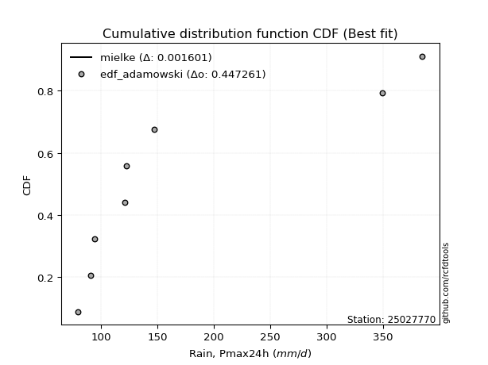</img>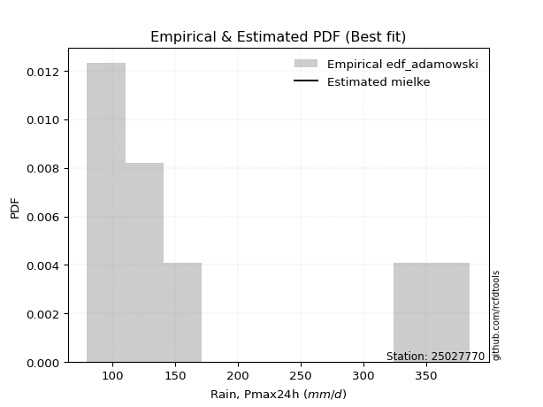</img>

</div>


## C. Best fit & Estimate extreme values for specific return periods - Tr


### 1. Best fit (ordered by delta Δ)

<div align="center">

|   id |   station | empirical_dist   | p_dist    |     delta |   deltao | eval   |   fit |   n |   best_fit |   best_fit_sort |
|-----:|----------:|:-----------------|:----------|----------:|---------:|:-------|------:|----:|-----------:|----------------:|
|    0 |  25027770 | edf_hazen        | logmielke | 0.0137816 | 0.417613 | Δo > Δ |     1 |   9 |          1 |               1 |
|    1 |  25027770 | edf_gringorten   | logmielke | 0.0196296 | 0.417613 | Δo > Δ |     1 |   9 |          1 |               2 |
|    2 |  25027770 | edf_cunnane      | logmielke | 0.0234435 | 0.417613 | Δo > Δ |     1 |   9 |          1 |               3 |
|    3 |  25027770 | edf_blom         | logmielke | 0.0257937 | 0.417613 | Δo > Δ |     1 |   9 |          1 |               4 |
|    4 |  25027770 | edf_tukey        | logmielke | 0.0296547 | 0.417613 | Δo > Δ |     1 |   9 |          1 |               5 |
|    5 |  25027770 | edf_filliben     | logmielke | 0.0311038 | 0.417613 | Δo > Δ |     1 |   9 |          1 |               6 |
|    6 |  25027770 | edf_beard        | logmielke | 0.0317869 | 0.417613 | Δo > Δ |     1 |   9 |          1 |               7 |
|    7 |  25027770 | edf_jenkinson    | logmielke | 0.0317869 | 0.417613 | Δo > Δ |     1 |   9 |          1 |               8 |
|    8 |  25027770 | edf_chegodayev   | logmielke | 0.0326942 | 0.417613 | Δo > Δ |     1 |   9 |          1 |               9 |
|    9 |  25027770 | edf_adamowski    | logmielke | 0.0371735 | 0.417613 | Δo > Δ |     1 |   9 |          1 |              10 |
|   10 |  25027770 | edf_weibull      | logmielke | 0.0582261 | 0.417613 | Δo > Δ |     1 |   9 |          1 |              11 |
|   11 |  25027770 | edf_california   | logmielke | 0.0693372 | 0.417613 | Δo > Δ |     1 |   9 |          1 |              12 |

</div>

:file_folder:Tables: [bestfit_25027770.csv](table/bestfit_25027770.csv) | [extreme_25027770.csv](table/extreme_25027770.csv)


### 2. Extreme values

In hydrology, a return period (or recurrence interval $Tr$) is the statistical average time between extreme events like floods or droughts of a specific magnitude, indicating how rare an event is, with a 100-year flood, for example, having a 1% chance of occurring in any given year, not that it happens exactly every century. It is a key tool for infrastructure design (like bridges or dams) and risk assessment, calculated from historical data to determine the probability of future events, although it is important to remember it is statistical average, and events can cluster or be missed.

> risk_rate: assuming the return period as the project useful life.

|   id |      tr |   prob_l |     prob_g |     alpha |   betaprime |    chi2 |   crystalball |   erlang |   expon |   exponnorm |         f |   fatiguelife |             fisk |    gamma |   genexpon |   genlogistic |   gibrat |   gompertz |   gumbel_l |   gumbel_r |   halflogistic |   halfnorm |   hypsecant |   invgamma |   invgauss |     invweibull |   johnsonsu |   kstwobign |   laplace |   laplace_asymmetric |   loggamma |   logistic |   lognorm |   maxwell |   mielke |   moyal |   nakagami |      ncf |      nct |    norm |   pareto |   pearson3 |   rayleigh |    rice |       t |   truncnorm |    wald |   weibull_min |         logalpha |   logbetaprime |          logchi2 |   logcrystalball |   logerlang |   logexpon |   logexponnorm |      logf |   logfatiguelife |          logfisk |   loggenexpon |   loggenlogistic |   loggibrat |   loggompertz |   loggumbel_l |   loggumbel_r |   loghalflogistic |   loghalfnorm |   loghypsecant |      loginvgamma |   loginvgauss |    loginvweibull |   logjohnsonsu |   logkstwobign |   loglaplace |   loglaplace_asymmetric |   logloggamma |   loglogistic |    loglognorm |   logmaxwell |        logmielke |   logmoyal |   lognakagami |   logncf |   lognct |     logpareto |   logpearson3 |   lograyleigh |   logrice |    logt |   logtruncnorm |   logwald |   logweibull_min |   station |   n |   risk_rate |
|-----:|--------:|---------:|-----------:|----------:|------------:|--------:|--------------:|---------:|--------:|------------:|----------:|--------------:|-----------------:|---------:|-----------:|--------------:|---------:|-----------:|-----------:|-----------:|---------------:|-----------:|------------:|-----------:|-----------:|---------------:|------------:|------------:|----------:|---------------------:|-----------:|-----------:|----------:|----------:|---------:|--------:|-----------:|---------:|---------:|--------:|---------:|-----------:|-----------:|--------:|--------:|------------:|--------:|--------------:|-----------------:|---------------:|-----------------:|-----------------:|------------:|-----------:|---------------:|----------:|-----------------:|-----------------:|--------------:|-----------------:|------------:|--------------:|--------------:|--------------:|------------------:|--------------:|---------------:|-----------------:|--------------:|-----------------:|---------------:|---------------:|-------------:|------------------------:|--------------:|--------------:|--------------:|-------------:|-----------------:|-----------:|--------------:|---------:|---------:|--------------:|--------------:|--------------:|----------:|--------:|---------------:|----------:|-----------------:|----------:|----:|------------:|
|    0 |    2    | 0.5      | 0.5        |   107.941 |     128.663 | 72.0003 |      0.487685 |  92.7352 | 134.653 |     134.221 |   91.0532 |       108.871 |    119.461       |  89.0596 |    134.653 |       139.593 |  128.831 |    154.564 |    180.755 |    144.023 |        134.892 |    139.504 |     162.389 |    108.517 |    108.423 |  400.322       |     107.418 |     150.979 |   162.389 |              134.656 |    74.2288 |    162.389 |   134.548 |   152.827 |  111.717 | 138.093 |    149.345 |  129.15  |  124.172 | 162.389 |  112.013 |    140.197 |    149.436 | 163.353 | 162.358 |     149.518 | 126.149 |       114.834 |    110.695       |        131.247 |    118.349       |          134.548 |     102.976 |    111.059 |        111.049 |   92.0285 |          107.19  |    108.396       |       113.005 |          120.58  |     113.197 |       114.976 |       147.893 |       122.408 |           116.786 |       119.593 |        134.548 |    109.431       |       108.31  |    109.27        |        108.31  |        124.46  |      134.548 |                 110.48  |       135.601 |       134.548 |  72.819       |      128.085 |    109.243       |    118.727 |       134.473 |  125.735 |  126.681 |  73.1292      |       123.634 |       125.868 |   132.393 | 134.548 |        103.963 |   111.646 |          103.993 |  25027770 |   9 |    0.75     |
|    1 |    2.33 | 0.570815 | 0.429185   |   118.008 |     141.722 | 72.0018 |     35.6366   | 100.768  | 148.457 |     147.948 |   98.5809 |       122.262 |    147.228       |  95.2563 |    148.458 |       153.517 |  138.937 |    171.166 |    198.112 |    162.509 |        153.898 |    161.036 |     178.355 |    118.617 |    119.352 | 9805.26        |     119.236 |     166.836 |   174.462 |              148.461 |    76.067  |    179.966 |   149.104 |   173.554 |  120.742 | 155.593 |    171.156 |  142.362 |  136.108 | 182.339 |  123.237 |    159.395 |    170.47  | 180.717 | 182.305 |     166.596 | 139.231 |       133.09  |    119.87        |        145.195 |    140.999       |          149.104 |     111.644 |    122.187 |        122.188 |   99.6904 |          117.495 |    118.33        |       124.413 |          131.257 |     119.244 |       126.714 |       161.719 |       134.631 |           128.793 |       133.614 |        146.077 |    118.885       |       118.23  |    118.565       |        118.221 |        136.277 |      143.178 |                 121.434 |       150.425 |       147.294 |  77.7132      |      142.51  |    118.525       |    129.922 |       156.3   |  137.232 |  139.488 |  75.9071      |       136.832 |       140.265 |   145.515 | 149.104 |        112.168 |   119.424 |          113.968 |  25027770 |   9 |    0.729209 |
|    2 |    5    | 0.8      | 0.2        |   196.074 |     208.52  | 72.1616 |    166.258    | 149.555  | 217.475 |     216.579 |  153.014  |       211.95  |    517.429       | 131.874  |    217.476 |       214.008 |  197.12  |    247.25  |    254.184 |    242.82  |        239.899 |    252.089 |     242.398 |    192.879 |    195.823 |    2.41607e+10 |     207.131 |     234.192 |   234.823 |              217.483 |    95.7213 |    247.835 |   218.411 |   255.133 |  175.191 | 236.651 |    273.62  |  209.535 |  201.286 | 256.479 |  197.249 |    243.967 |    254.675 | 250.232 | 256.435 |     251.975 | 212.461 |       264.337 |    184.029       |        214.658 |    391.827       |          218.411 |     167.688 |    196.956 |        197.059 |  156.797  |          192.734 |    200.666       |       198.344 |          189.75  |     160.894 |       200.364 |       215.846 |       203.579 |           200.54  |       213.53  |        203.137 |    186.691       |       189.506 |    185.947       |        191.382 |        200.336 |      195.367 |                 194.816 |       220.948 |       208.904 |   8.50842e+41 |      216.903 |    185.813       |    197.214 |       307.93  |  194.872 |  205.782 |   1.21603e+12 |       209.565 |       216.393 |   212.43  | 218.413 |        159.3   |   174.118 |          184.732 |  25027770 |   9 |    0.67232  |
|    3 |   10    | 0.9      | 0.1        |   339.5   |     276.546 | 72.8707 |    252.909    | 201.106  | 280.128 |     278.88  |  233.169  |       314.286 |   1722.53        | 169.806  |    280.129 |       263.274 |  263.441 |    308.068 |    285.403 |    308.232 |        311.319 |    319.466 |     293.539 |    317.508 |    299.618 |    3.90501e+15 |     341.094 |     285.475 |   289.618 |              280.139 |   131.988  |    297.818 |   281.354 |   312.544 |  245.838 | 307.225 |    354.442 |  277.387 |  274.834 | 305.661 |  300.093 |    312.222 |    314.716 | 299.798 | 305.611 |     329.468 | 290.176 |       436.233 |    302.995       |        282.214 |   1118.7         |          281.354 |     243.105 |    303.802 |        304.102 |  247.038  |          314.343 |    401.954       |       297.507 |          256.176 |     226.384 |       293.227 |       253.486 |       285.104 |           289.671 |       302.08  |        264.33  |    308.096       |       306.283 |    311.322       |        322.079 |        268.635 |      259.047 |                 299.21  |       284.864 |       270.218 | inf           |      291.504 |    311.057       |    283.629 |       518.957 |  251.974 |  274.474 | inf           |       290.771 |       294.782 |   278.209 | 281.358 |        208.848 |   259.79  |          293.677 |  25027770 |   9 |    0.651322 |
|    4 |   15    | 0.933333 | 0.0666667  |   482.414 |     321.181 | 73.5862 |    296.149    | 233.128  | 316.778 |     315.324 |  298.977  |       379.504 |   3441.43        | 193.194  |    316.779 |       291.069 |  309.187 |    340.693 |    299.541 |    345.138 |        351.736 |    354.529 |     322.724 |    433.328 |    375.413 |    3.39017e+18 |     451.022 |     312.7   |   321.67  |              316.79  |   164.465  |    325.051 |   319.253 |   342.001 |  300.988 | 348.183 |    397.129 |  321.664 |  326.929 | 330.204 |  382.748 |    350.083 |    345.651 | 325.337 | 330.151 |     374.794 | 340.08  |       558.373 |    441.538       |        324.955 |   2131.42        |          319.253 |     302.253 |    391.465 |        391.958 |  325.882  |          423.682 |    698.503       |       374.604 |          303.447 |     286.511 |       361.521 |       272.627 |       344.768 |           356.683 |       361.849 |        307.191 |    436.558       |       414.187 |    450.218       |        456.023 |        313.905 |      305.528 |                 384.579 |       323.28  |       310.893 | inf           |      339.245 |    449.885       |    350.217 |       682.642 |  288.752 |  320.115 | inf           |       347.17  |       345.681 |   319.694 | 319.257 |        238.759 |   335.903 |          388.293 |  25027770 |   9 |    0.644736 |
|    5 |   20    | 0.95     | 0.05       |   625.203 |     355.441 | 74.2102 |    324.466    | 256.452  | 342.781 |     341.181 |  356.712  |       427.459 |   5589.89        | 210.175  |    342.783 |       310.53  |  345.07  |    362.694 |    308.342 |    370.978 |        380.054 |    377.906 |     343.313 |    543.87  |    435.546 |    3.87037e+20 |     546.2   |     331.04  |   344.412 |              342.795 |   194.283  |    343.873 |   346.797 |   361.55  |  348.202 | 377.19  |    425.702 |  355.536 |  368.911 | 346.277 |  454.528 |    376.281 |    366.213 | 342.312 | 346.222 |     406.952 | 377.269 |       654.296 |    609.638       |        356.988 |   3401.27        |          346.797 |     352.815 |    468.611 |        469.29  |  398.082  |          525.88  |   1128.79        |       439.953 |          341.645 |     344.654 |       417.157 |       285.264 |       393.83  |           412.671 |       408.132 |        341.545 |    576.021       |       517.454 |    607.238       |        596.127 |        348.627 |      343.483 |                 459.545 |       351.168 |       342.531 | inf           |      375.17  |    606.912       |    406.631 |       819.926 |  316.668 |  355.429 | inf           |       391.9   |       384.286 |   350.636 | 346.802 |        259.407 |   406.792 |          474.829 |  25027770 |   9 |    0.641514 |
|    6 |   25    | 0.96     | 0.04       |   767.941 |     383.654 | 74.7518 |    345.311    | 274.831  | 362.951 |     361.237 |  409.056  |       465.438 |   8119.25        | 223.531  |    362.952 |       325.52  |  374.985 |    379.159 |    314.604 |    390.881 |        401.871 |    395.299 |     359.248 |    650.668 |    485.617 |    1.48796e+22 |     631.162 |     344.777 |   362.052 |              362.966 |   222.195  |    358.273 |   368.58  |   376.064 |  390.328 | 399.674 |    446.997 |  383.362 |  404.749 | 358.109 |  519.172 |    396.286 |    381.49  | 354.924 | 358.052 |     431.893 | 407.057 |       733.87  |    815.717       |        382.898 |   4910.65        |          368.58  |     397.822 |    538.773 |        539.635 |  465.727  |          623.152 |   1740.78        |       497.678 |          374.316 |     402.048 |       464.794 |       294.612 |       436.331 |           461.732 |       446.369 |        370.748 |    728.08        |       617.746 |    784.852       |        743.251 |        377.128 |      376.14  |                 527.618 |       373.204 |       368.891 | inf           |      404.28  |    784.622       |    456.538 |       939.827 |  339.472 |  384.684 | inf           |       429.587 |       415.735 |   375.548 | 368.587 |        274.7   |   474.221 |          555.903 |  25027770 |   9 |    0.639603 |
|    7 |   50    | 0.98     | 0.02       |  1481.41  |     481.616 | 76.6952 |    405.004    | 333.209  | 425.603 |     423.538 |  625.538  |       586.858 |  25559.9         | 265.846  |    425.606 |       371.697 |  480.435 |    427.305 |    331.604 |    452.195 |        469.094 |    445.855 |     408.65  |   1150.19  |    658.618 |    1.13431e+27 |     968.055 |     385.116 |   416.847 |              425.622 |   344.791  |    402.267 |   438.828 |   418.156 |  559.928 | 469.472 |    508.967 |  479.566 |  537.73  | 391.99  |  783.508 |    456.991 |    425.837 | 391.534 | 391.929 |     509.363 | 504.313 |      1009.09  |   2801.57        |        469.9   |  15698.9         |          438.828 |     577.846 |    831.05  |        832.766 |  764.228  |         1066.09  |  10369.2         |       724.561 |          495.931 |     691.961 |       640.713 |       321.561 |       598.302 |           652.691 |       579.086 |        478.134 |   1707.32        |      1095.6   |   2049.31        |       1591.29  |        475.011 |      498.743 |                 810.347 |       444.149 |       462.673 | inf           |      502.117 |   2051.63        |    653.964 |      1397.88  |  417.537 |  487.417 | inf           |       565.734 |       522.374 |   458.351 | 438.838 |        315.817 |   782.45  |          914.293 |  25027770 |   9 |    0.63583  |
|    8 |   75    | 0.986667 | 0.0133333  |  2194.78  |     547.144 | 77.9779 |    437.033    | 368.087  | 462.253 |     459.982 |  801.589  |       659.791 |  49675.5         | 291.067  |    462.255 |       398.537 |  551.657 |    453.589 |    340.2   |    487.833 |        508.17  |    473.375 |     437.521 |   1615.4   |    770.803 |    7.80578e+29 |    1225.84  |     407.311 |   448.899 |              462.273 |   451.477  |    427.676 |   481.888 |   441.04  |  694.101 | 510.289 |    542.707 |  543.603 |  633.757 | 410.169 |  995.953 |    491.681 |    449.964 | 411.452 | 410.107 |     554.675 | 564.16  |      1189.23  |   8170.7         |        525.817 |  31359.7         |          481.888 |     719.015 |   1070.85  |       1073.35  | 1025.57   |         1467.8   |  44202.9         |       898.364 |          584.034 |     998.492 |       765.671 |       336.113 |       718.805 |           798.155 |       667.24  |        554.763 |   3114.48        |      1553.83  |   4123.33        |       2630.28  |        539.314 |      588.235 |                1041.55  |       487.551 |       527.342 | inf           |      564.908 |   4134.08        |    806.91  |      1735.17  |  468.926 |  557.072 | inf           |       660.824 |       591.468 |   510.829 | 481.9   |        334.369 |  1064.83  |         1229.26  |  25027770 |   9 |    0.634587 |
|    9 |  100    | 0.99     | 0.01       |  2908.12  |     597.817 | 78.9395 |    458.696    | 393.099  | 488.256 |     485.839 |  955.591  |       712.213 |  79446.1         | 309.133  |    488.259 |       417.534 |  606.829 |    471.487 |    345.823 |    513.056 |        535.827 |    492.123 |     458     |   2059.66  |    854.75  |    7.95832e+31 |    1440.97  |     422.517 |   471.641 |              488.278 |   549.115  |    445.615 |   513.383 |   456.628 |  809.528 | 539.246 |    565.682 |  592.972 |  711.721 | 422.465 | 1180.45  |    515.993 |    466.4   | 425.021 | 422.402 |     586.822 | 607.795 |      1325.4   |  22188.6         |        567.953 |  51462.4         |          513.383 |     839.695 |   1281.88  |       1285.13  | 1265.62   |         1845.48  | 157319           |      1044.4   |          655.694 |    1326.54  |       865.433 |       345.986 |       818.489 |           920.307 |       734.86  |        616.456 |   5036.23        |      2002.35  |   7296.1         |       3861.84  |        588.328 |      661.309 |                1244.58  |       519.255 |       578.373 | inf           |      612.115 |   7325.56        |    936.652 |      2010.36  |  508.275 |  611.419 | inf           |       736.294 |       643.703 |   549.981 | 513.396 |        345.004 |  1333.07  |         1519.6   |  25027770 |   9 |    0.633968 |
|   10 |  200    | 0.995    | 0.005      |  5761.43  |     736.072 | 81.3982 |    507.834    | 454.111  | 550.909 |     548.14  | 1458.42   |       840.404 | 245224           | 353.142  |    550.912 |       463.203 |  756.932 |    512.308 |    358.044 |    573.695 |        602.319 |    535.002 |     507.337 |   3715.65  |   1070.12  |    5.36079e+36 |    2089.26  |     457.542 |   526.435 |              550.934 |   891.291  |    488.649 |   592.665 |   492.29  | 1177.47  | 609.015 |    618.18  |  727.08  |  940.035 | 450.356 | 1776.51  |    573.704 |    504.01  | 456.069 | 450.29  |     664.271 | 716.483 |      1681.37  | 910109           |        678.627 | 171876           |          592.665 |    1220.59  |   1977.29  |       1983.21  | 2110.53   |         3223.5   |      1.00373e+07 |      1492.34  |          866.041 |    2873.26  |      1148.22  |       368.458 |      1118.43  |          1296.03  |       916.403 |        794.74  |  19928.9         |      3753.48  |  39295.9         |      10771.7   |        718.84  |      876.862 |                1911.5   |       598.92  |       721.832 | inf           |      735.493 |  39659.8         |   1341.49  |      2814.51  |  614.159 |  761.714 | inf           |       949.726 |       781.24  |   651.229 | 592.682 |        363.13  |  2332.87  |         2548.65  |  25027770 |   9 |    0.633042 |
|   11 |  250    | 0.996    | 0.004      |  7188.07  |     785.989 | 82.2253 |    522.851    | 473.946  | 571.079 |     568.197 | 1670.79   |       882.152 | 352175           | 367.435  |    571.082 |       477.884 |  810.79  |    524.815 |    361.64  |    593.189 |        623.696 |    548.193 |     523.219 |   4497.37  |   1142.98  |    1.91201e+38 |    2342.92  |     468.381 |   544.075 |              571.105 |  1045.07   |    502.465 |   619.253 |   503.268 | 1329.77  | 631.475 |    634.314 |  775.31  | 1027.83  | 458.88  | 2026.01  |    592.056 |    515.586 | 465.626 | 458.813 |     689.202 | 752.44  |      1804.2   |      5.41235e+06 |        717.212 | 254226           |          619.253 |    1376.87  |   2273.34  |       2280.48  | 2491.23   |         3863.58  |      5.83498e+07 |      1671.23  |          947.078 |    3791.48  |      1253.28  |       375.344 |      1236.52  |          1446.83  |       980.808 |        862.46  |  33460.2         |      4616.83  |  75395.5         |      15474     |        764.822 |      960.232 |                2194.65  |       625.592 |       775.05  | inf           |      778.263 |  76272.1         |   1505.96  |      3121.24  |  651.926 |  816.665 | inf           |      1029.2   |       829.224 |   685.998 | 619.272 |        367.125 |  2807.34  |         3015.57  |  25027770 |   9 |    0.632858 |
|   12 |  500    | 0.998    | 0.002      | 14321.3   |     960.398 | 84.8833 |    567.383    | 536.061  | 633.732 |     630.497 | 2547.68   |      1013.06  |      1.08225e+06 | 412.155  |    633.735 |       523.454 |  996.92  |    561.907 |    371.949 |    653.696 |        690.043 |    587.523 |     572.552 |   8154.48  |   1378.82  |    1.25717e+43 |    3298.47  |     500.864 |   598.87  |              633.761 |  1727.67   |    545.311 |   705.325 |   536.026 | 1945.05  | 701.242 |    682.362 |  943.15  | 1355.57  | 484.156 | 3046.25  |    648.467 |    550.129 | 494.142 | 484.087 |     766.637 | 866.772 |      2210.79  |      3.20894e+10 |        847.155 | 864820           |          705.325 |    2002.07  |   3506.59  |       3519.25  | 4183.27   |         6809.64  |      8.58811e+10 |      2364.22  |         1250.14  |    9886.13  |      1628.81  |       395.804 |      1688.5   |          2036     |      1200.97  |       1111.87  | 222025           |      8897.66  | 872608           |      53078.6   |        920.997 |     1273.22  |                3370.68  |       711.784 |       966.363 | inf           |      921.249 | 891763           |   2156.85  |      4247.88  |  782.282 | 1011.34  | inf           |      1315.58  |       990.631 |   801.169 | 705.347 |        375.545 |  5057.7   |         5110.59  |  25027770 |   9 |    0.632489 |
|   13 |  750    | 0.998667 | 0.00133333 | 21454.5   |    1077.66  | 86.4906 |    592.121    | 572.701  | 670.381 |     666.941 | 3260.07   |      1090.36  |      2.08548e+06 | 438.512  |    670.385 |       550.094 | 1120.01  |    582.473 |    377.458 |    689.068 |        728.83  |    609.495 |     601.41  |  11560.8   |   1522.71  |    8.24016e+45 |    3993.44  |     519.112 |   630.923 |              670.412 |  2329.88   |    570.344 |   758.206 |   554.348 | 2433.02  | 742.052 |    709.167 | 1055.47  | 1593.36  | 498.197 | 3866.21  |    681.098 |    569.444 | 510.088 | 498.127 |     811.929 | 935.323 |      2465.91  |      1.66899e+14 |        930.795 |      1.77896e+06 |          758.206 |    2492.45  |   4518.44  |       4535.97  | 5676      |         9510.45  |      3.30144e+13 |      2887.09  |         1470.44  |   18633.2   |      1886.48  |       407.192 |      2025.81  |          2486.06  |      1344.82  |       1289.98  | 846851           |     13168.7   |      5.2252e+06  |     118262     |       1022.33  |     1501.68  |                4332.37  |       764.631 |      1099.3   | inf           |     1012.39  |      5.38573e+06 |   2661.2   |      5045.19  |  868.725 | 1144.45  | inf           |      1514.83  |      1094.22  |   873.804 | 758.231 |        378.489 |  7198.47  |         6980.8   |  25027770 |   9 |    0.632366 |
|   14 | 1000    | 0.999    | 0.001      | 28587.6   |    1168.55  | 87.6508 |    609.153    | 598.816  | 696.384 |     692.798 | 3883.03   |      1145.5   |      3.32074e+06 | 457.289  |    696.388 |       568.991 | 1214.21  |    596.602 |    381.166 |    714.159 |        756.343 |    624.669 |     621.885 |  14813.8   |   1627.16  |    8.20006e+47 |    4557.08  |     531.754 |   653.664 |              696.417 |  2886.13   |    588.096 |   796.901 |   567.011 | 2853.22  | 771.008 |    727.662 | 1142.28  | 1786.8   | 507.864 | 4578.29  |    704.105 |    582.792 | 521.108 | 507.793 |     844.062 | 984.633 |      2654.53  |      8.32504e+17 |        993.827 |      2.97355e+06 |          796.901 |    2911.73  |   5408.88  |       5430.91  | 7053.53   |        12066     |      6.10362e+15 |      3322.48  |         1649.86  |   30264.2   |      2088.04  |       415.041 |      2305.18  |          2864.4   |      1454.1   |       1433.4   |      2.47287e+06 |     17450.3   |      2.25618e+07 |     216919     |       1099     |     1688.23  |                5176.89  |       803.25  |      1204.52  | inf           |     1080.6   |      2.34317e+07 |   3089.06  |      5681.19  |  935.157 | 1248.78  | inf           |      1672.56  |      1172.07  |   927.811 | 796.929 |        379.988 |  9279.05  |         8721.52  |  25027770 |   9 |    0.632305 |

<div align="center">

</img>

</div>


<div align="center">

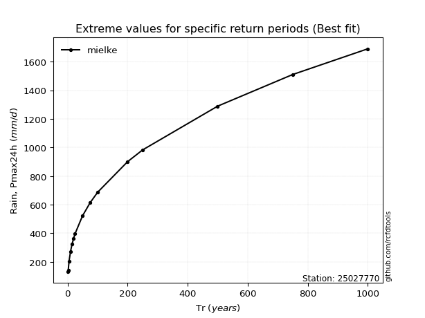</img>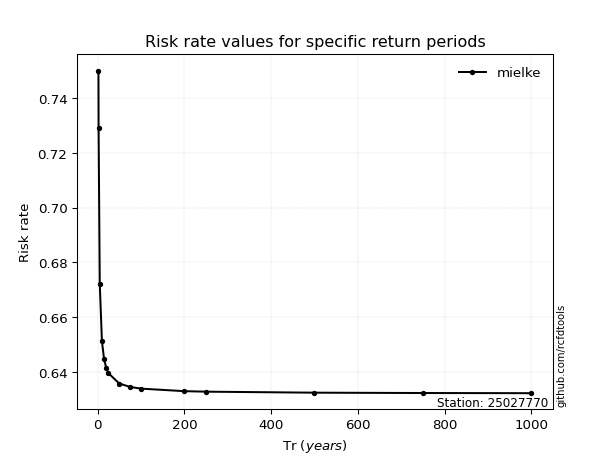</img>

</div>


<sub>**APP DISCLAIMER**: NO WARRANTY - This software is provided by [github.com/rcfdtools](https://github.com/rcfdtools) "as is", without any express or implied warranty, including warranties of merchantability, fitness for a particular purpose, or non-infringement. There is no guarantee that the software will be error-free or operate without interruption. LIMITATION OF LIABILITY - Neither the authors nor copyright holders will be liable for claims or damages arising from the software or its use. You are responsible for determining if the software is appropriate for your use and assume all associated risks, including errors, legal compliance, and data loss. NO PROFESSIONAL ADVICE - The software provides general information and does not offer professional advice. It should not replace consultation with professional advisors.</sub>